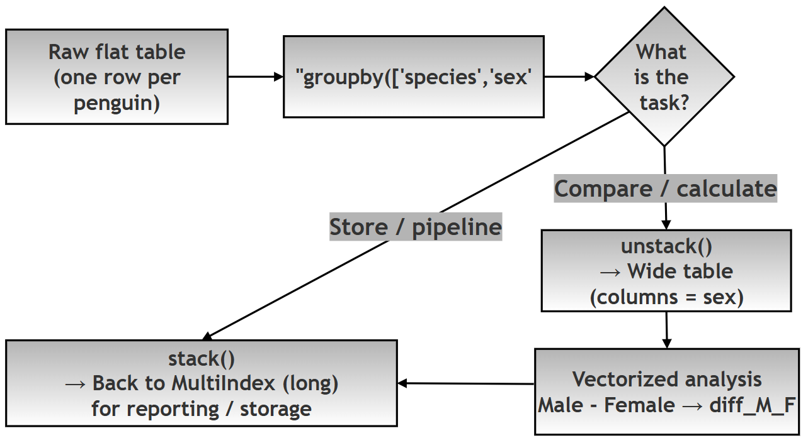
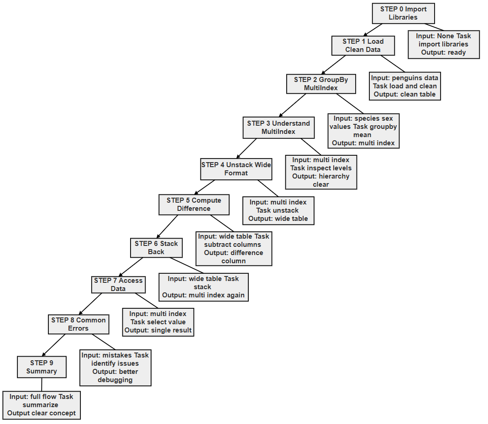

# Chapter 12 (Supplement): Hierarchical Data Analysis with Pandas MultiIndex

## Grouping, `unstack()`, and `stack()` — Applied to the Palmer Penguins Dataset

> **GitHub source:** [97-ch12-pivot-analysis.md](https://github.com/ag999git/001-Python-book-2026/blob/main/12-pandas/97-ch12-pivot-analysis.md?plain=1)

---

##  Introduction — What This File Contains and Why It Matters

Real-world data is rarely "flat." Biological data, for example, is naturally **nested**: individual penguins belong to a *sex*, and those measurements vary across *species*. A flat table cannot show that hierarchy directly — but Pandas can, using a tool called a **MultiIndex** (*an index with multiple levels — think of it like folders inside folders*).

This supplement extends the material in Chapter 12 (Pandas) with:

1. **Hierarchical grouping** — using `groupby()` with more than one column
2. **Understanding the MultiIndex** — how nested data is stored and navigated
3. **Reshaping** — converting between *long* and *wide* formats with `unstack()` and `stack()`
4. **A complete, runnable script** with output at every step
5. **Common beginner errors** and how to avoid them

**Why this matters for Python learners:** `groupby()` → `unstack()` → analysis → `stack()` is one of the most common real-world Pandas workflows. Once you can move data fluidly between shapes, you can answer questions that are awkward in one shape and trivial in the other.

>  **Note on technical terms:** Words in *italics* are briefly explained where they first appear. For deeper study see the official docs: [Group by](https://pandas.pydata.org/docs/user_guide/groupby.html), [Advanced indexing / MultiIndex](https://pandas.pydata.org/docs/user_guide/advanced.html), and [Reshaping](https://pandas.pydata.org/docs/user_guide/reshaping.html).

---

## Research Question

> _A data scientist is analyzing the Palmer Penguins dataset to understand how flipper length varies across biological categories. How can hierarchical grouping (`Species → Sex`) be modeled using Pandas MultiIndex, and how can reshaping techniques (`unstack()` and `stack()`) be applied to transform the data between analytical and reporting formats for efficient comparison and insight generation?_

**Follow-up sub-questions (for practice):**

- (a) After `unstack(level='sex')`, what does each **row** represent, and what does each **column** represent? Check yourself against Step 4's output.
- (b) Why does `df.groupby(['species','sex'])` (without `.mean()`) print a strange object address instead of a table? What kind of object is it?
- (c) `wide_df['Male'] - wide_df['Female']` works in one line. Try doing the same subtraction on the **stacked** Series — why is it harder there?
- (d) What happens if you call `unstack()` twice in a row on the same data? Try it — does `stack()` undo `unstack()` exactly?
- (e) The `diff_M_F` column survives the `stack()` in Step 6 — as what? (Hint: look at the third-level index labels in the output.)

---

## Learning Outcomes

After completing this project, students will be able to:

1. Model real-world hierarchical data using **MultiIndex**
2. Use `groupby()` with multiple columns for aggregation
3. Interpret hierarchical (nested) data structures
4. Convert between:
   * Long format (`MultiIndex`)
   * Wide format (comparison-ready)
5. Apply `unstack()` and `stack()` appropriately
6. Perform efficient vectorized analysis
7. Understand how **data shape impacts analysis**

---

## Analytical Context

The data scientist's goal is to:

* Summarize biometric measurements
* Compare male vs female penguins within each species
* Produce results in both:
  * **Analytical format (wide)** → for calculations
  * **Structured format (long)** → for reporting / storage

### The Reshaping Cycle at a Glance




---

## STEP BY STEP DISCUSSION

### Step 1 → Raw Data (Flat Structure)

**1. (a) Method:** `sns.load_dataset()` + `dropna()`

```python
   species   sex         flipper_length_mm
0  Adelie    Male        181
1  Adelie    Female      186
2  Gentoo    Male        210
...
```

**1. (b) What this represents:**

* Each row = **one penguin (individual observation)**
* Data is in **flat (tabular) format**
* No hierarchy is explicitly defined yet

**1. (c) What transformation happened?**

* Data is **loaded and cleaned**
* Missing values removed using: `dropna()`

**1. (d) Why this step is important:**

* Real-world datasets often contain missing values
* Clean data ensures:
  * Accurate aggregation
  * No unexpected NaNs (*NaN = "Not a Number", Pandas' marker for missing data*) in results

**1. (e) Key insight:**

* This is the **starting point**: raw, granular data

```text
Preview:
  species     island  bill_length_mm  ...  flipper_length_mm  body_mass_g     sex
0  Adelie  Torgersen            39.1  ...              181.0       3750.0    Male
1  Adelie  Torgersen            39.5  ...              186.0       3800.0  Female
2  Adelie  Torgersen            40.3  ...              195.0       3250.0  Female
4  Adelie  Torgersen            36.7  ...              193.0       3450.0  Female
5  Adelie  Torgersen            39.3  ...              190.0       3650.0    Male

Shape: (333, 7)
```

> Note the row numbers jump from 2 to 4 — row 3 contained a missing value and was removed by `dropna()`. The shape `(333, 7)` confirms 344 original rows became 333 complete ones.

***

### Step 2 → Hierarchical Output (MultiIndex)

**2. (a) Method:** `groupby(['species','sex']).mean()`

```python
species     sex
Adelie      Male      192
            Female    187
Gentoo      Male      220
            Female    212
```

**2. (b) Represents real-world grouping:**

* Each row = **aggregated group**
  * Example: _All Male Adelie penguins_
* Two-level index:
  * Level 1 → `species`
  * Level 2 → `sex`

**2. (c) What transformation happened?**

* Raw rows → **summarized groups**
* Created using:
  * `groupby()` + aggregation (*collapsing many rows into one summary number per group, e.g. a mean*) (`mean()`)

**2. (d) Why this is useful:**

* Captures **hierarchical relationships**
* Reduces data size while preserving structure

```text
MultiIndex Result:
species    sex
Adelie     Female     187.794521
           Male       192.410959
Chinstrap  Female     191.735294
           Male       199.911765
Gentoo     Female     212.706897
           Male       221.540984
Name: flipper_length_mm, dtype: float64

Index Levels: ['species', 'sex']
```

***

### Step 3 → Understanding MultiIndex Structure

**3. (a) Method:** `.index`, `.loc[]`

`Index Levels: ['species', 'sex']`

Access Example:\
`biometric_summary.loc['Adelie']`

```python
sex
Male      192
Female    187
```

**3. (b) What this shows:**

* MultiIndex has **named levels**
* Data can be accessed **hierarchically**

**3. (c) What transformation happened?**

* No structural change
* This is **inspection and navigation**

**3. (d) Why this is important:**

* Helps understand:
  * How data is stored internally
  * How to access subsets efficiently

**3. (e) Key insight:**

* MultiIndex behaves like a **tree structure**
  * First choose species → then sex

```text
Adelie Group:
sex
Female    187.794521
Male      192.410959
Name: flipper_length_mm, dtype: float64
```

> Notice: selecting `.loc['Adelie']` "peels off" the first level, leaving a simple one-level Series indexed by `sex`.

***

### Step 4 → Comparison Table (Wide Format)

**4. (a) Method:** `unstack()`

```python
sex         Female     Male
species
Adelie      187        192
Gentoo      212        220
```

**4. (b) What changed?**

* `sex` moved from **index → columns**
* Data becomes **wide**

**4. (c) What transformation happened?**

* Index level → column labels
* Done using: `unstack(level='sex')`

**4. (d) Why this is important:**

* Enables:
  * Easy comparison
  * Arithmetic operations

**4. (e) Key insight:**

* Same data, new **shape**

```text
Wide Table:
sex            Female        Male
species
Adelie     187.794521  192.410959
Chinstrap  191.735294  199.911765
Gentoo     212.706897  221.540984
```

***

### Step 5 → Analytical Output

```python
species     Female    Male     diff_M_F
Adelie      187       192      5
Gentoo      212       220      8
```

**5. (a) What changed?**

* New column added:
  * `diff_M_F = Male - Female`

**5. (b) What transformation happened?**

* Vectorized column operation (*an operation applied to whole columns at once, without a Python loop*)

**5. (c) Why this works well:**

* Wide format aligns values horizontally

**5. (d) Key insight:**

* Wide format = best for **analysis**

```text
Analysis Table:
sex            Female        Male   diff_M_F
species
Adelie     187.794521  192.410959  4.616438
Chinstrap  191.735294  199.911765  8.176471
Gentoo     212.706897  221.540984  8.834087
```

> **Biological insight in one line of code:** male penguins have longer flippers than females in every species — but the gap is much larger in Chinstrap and Gentoo (~8 mm) than in Adelie (~4.6 mm). This is exactly the kind of insight the wide format makes trivial to compute.

***

### Step 6 → Reporting Format (Back to MultiIndex)

**6. (a) Method:** `stack()`

```python
species     variable
Adelie      Female       187
            Male         192
            diff_M_F       5
```

**6. (b) What changed?**

* Columns → rows
* New index level: `variable`

**6. (c) What transformation happened?**

* Columns → index
* Done using: `stack()`

**6. (d) Why this is useful:**

* Ideal for:
  * Visualization tools
  * Data pipelines

**6. (e) Key insight:**

* `stack()` reverses `unstack()`

```text
Stacked Result:
species    sex
Adelie     Female      187.794521
           Male        192.410959
           diff_M_F      4.616438
Chinstrap  Female      191.735294
           Male        199.911765
dtype: float64
```

> Note: after stacking, the second index level (originally `sex`) now also contains `diff_M_F` — the derived column became a category within the hierarchy. This is worth discussing with students: reshaping does not lose the analysis, it *reclassifies* it.

***

### Step 7 → Accessing Specific Values

**7. (a) Method:** `.loc[(level1, level2)]`

`final_series.loc[('Adelie', 'Male')]` → 192

**7. (b) What this shows:**

* Direct access to a **specific combination**

**7. (c) What transformation happened?**

* No structural change
* This is **data retrieval**

**7. (d) Why this is important:**

* MultiIndex allows:
  * Precise querying
  * Efficient slicing

**7. (e) Key insight:**

* Access uses **tuple-based indexing**

```text
Adelie Male:
192.410959
```

***

### Step 8 → Common Errors (Conceptual Understanding)

**8. (a) Typical mistakes beginners make:**

1. No aggregation:

```python
df.groupby(['species','sex'])   # Returns a GroupBy object, not a result
```

2. Wrong column:

```python
df.groupby(['species'])['wrong'].mean()   # KeyError: 'wrong'
```

3. Invalid unstack:

```python
biometric_summary.unstack('wrong')   # KeyError: level name not found
```

4. Misuse of stack:

```python
wide_df.stack(level='wrong')   # ValueError / KeyError: level name not found
```

**8. (b) What this step represents:**

* Understanding **failure cases**

**8. (c) Why this is important:**

* Prevents:
  * Logical errors
  * Runtime errors

**8. (d) Key insight:**

* Most errors come from:
  * Wrong level names
  * Missing aggregation
  * Misunderstanding structure

>  **Reading the errors is a skill in itself** A `KeyError: 'wrong'` is Pandas telling you *"no such level/column exists — here is what does exist."* Always read the last line of a traceback first.

***

## Final Flow Summary

| Step | Method       | Transformation    | Purpose              |
| ---- | ------------ | ----------------- | -------------------- |
| 1    | load + clean | Raw data          | Start                |
| 2    | groupby      | Flat → MultiIndex | Create hierarchy     |
| 3    | index/loc    | Inspect           | Understand structure |
| 4    | unstack      | MultiIndex → Wide | Enable comparison    |
| 5    | arithmetic   | Add column        | Analysis             |
| 6    | stack        | Wide → MultiIndex | Reporting            |
| 7    | loc          | Access data       | Query                |
| 8    | errors       | Conceptual        | Avoid mistakes       |

---

## Script

```python
"""
PROJECT: Hierarchical Analysis of Penguin Biometrics
ROLE: Data Scientist
DATASET: Palmer Penguins (Seaborn)

GOAL:
Analyze how flipper length varies across Species and Sex
using MultiIndex and reshaping techniques.

APPROACH:
1. Create hierarchical aggregation
2. Convert to comparison format
3. Perform analysis
4. Convert back for reporting

OUTPUT HINTS are provided.
"""

# ==========================================================
# STEP 0: IMPORT LIBRARIES
# ==========================================================

print("\nSTEP 0: IMPORT LIBRARIES")

import pandas as pd     # Step 0: pandas — data handling and reshaping
import seaborn as sns   # Step 0: seaborn — provides the built-in 'penguins' dataset


# ==========================================================
# STEP 1: LOAD AND PREPARE DATA
# ==========================================================

print("\nSTEP 1: LOAD DATA")

# Step 1: Load the penguins dataset (344 penguins, 7 columns)
df = sns.load_dataset('penguins')

# Step 1: Clean dataset (important in real-world pipelines).
# Rows with ANY missing value are removed, so aggregations are computed
# on complete observations only.
df = df.dropna()

# Step 1: Preview the cleaned data
print("\nPreview:")
print(df.head())
# OUTPUT:
#  species     island  bill_length_mm  ...  flipper_length_mm  body_mass_g     sex
# 0  Adelie  Torgersen            39.1  ...              181.0       3750.0    Male
# 1  Adelie  Torgersen            39.5  ...              186.0       3800.0  Female
# 2  Adelie  Torgersen            40.3  ...              195.0       3250.0  Female
# 4  Adelie  Torgersen            36.7  ...              193.0       3450.0  Female
# 5  Adelie  Torgersen            39.3  ...              190.0       3650.0    Male

# Step 1: Confirm the shape after cleaning
print("\nShape:", df.shape)  # (333, 7) after dropping NaNs


# ==========================================================
# STEP 2: HIERARCHICAL AGGREGATION (MultiIndex)
# ==========================================================

print("\nSTEP 2: GROUPBY → CREATE MULTIINDEX")

# METHOD:
# groupby(['species','sex']).mean()
# Two grouping columns → two index levels → MultiIndex

biometric_summary = df.groupby(['species', 'sex'])['flipper_length_mm'].mean()

# Step 2: Display the hierarchical (long-format) result
print("\nMultiIndex Result:")
print(biometric_summary)

# OUTPUT HINT:
# species   sex
# Adelie    Male      ...
#           Female    ...

# Step 2: Confirm the index has two named levels
print("\nIndex Levels:", biometric_summary.index.names)
# OUTPUT: ['species', 'sex']


# ==========================================================
# STEP 3: INTERPRET HIERARCHICAL DATA
# ==========================================================

print("\nSTEP 3: UNDERSTAND HIERARCHY")

# Step 3: Selecting one first-level key 'peels off' level 1
# and returns a simple Series indexed by sex
print("\nAdelie Group:")
print(biometric_summary.loc['Adelie'])

# OUTPUT:
# sex
# Female    187.794521
# Male      192.410959
# Name: flipper_length_mm, dtype: float64


# ==========================================================
# STEP 4: RESHAPE → COMPARISON FORMAT
# ==========================================================

print("\nSTEP 4: UNSTACK → WIDE FORMAT")

# METHOD:
# unstack(level='sex')
# Moves the 'sex' index level into columns → wide table

wide_df = biometric_summary.unstack(level='sex')

# Step 4: Display the wide (comparison-ready) table
print("\nWide Table:")
print(wide_df)

# OUTPUT:
# sex            Female        Male
# species
# Adelie     187.794521  192.410959
# Chinstrap  191.735294  199.911765
# Gentoo     212.706897  221.540984


# ==========================================================
# STEP 5: ANALYSIS (DERIVED METRIC)
# ==========================================================

print("\nSTEP 5: COMPUTE DIFFERENCE (Male - Female)")

# Step 5: Vectorized operation (efficient — no loop needed).
# Possible ONLY because 'Male' and 'Female' are now aligned columns.
wide_df['diff_M_F'] = wide_df['Male'] - wide_df['Female']

# Step 5: Display the analysis table with the new derived column
print("\nAnalysis Table:")
print(wide_df)

# OUTPUT:
# sex            Female        Male  diff_M_F
# species
# Adelie     187.794521  192.410959  4.616438
# Chinstrap  191.735294  199.911765  8.176471
# Gentoo     212.706897  221.540984  8.834087


# ==========================================================
# STEP 6: RESHAPE BACK → REPORTING FORMAT
# ==========================================================

print("\nSTEP 6: STACK → HIERARCHICAL FORMAT")

# METHOD:
# stack()
# Moves columns back down into a new index level → long format

final_series = wide_df.stack()

# Step 6: Display the stacked (reporting) format
print("\nStacked Result:")
print(final_series.head())

# OUTPUT:
# species    sex
# Adelie     Female      187.794521
#            Male        192.410959
#            diff_M_F      4.616438
# Chinstrap  Female      191.735294
#            Male        199.911765
# dtype: float64


# ==========================================================
# STEP 7: ACCESS SPECIFIC INSIGHT
# ==========================================================

print("\nSTEP 7: ACCESSING RESULTS")

# Step 7: Tuple-based indexing → one exact value from the hierarchy
print("\nAdelie Male:")

print(final_series.loc[('Adelie', 'Male')])
# OUTPUT: 192.410959 (flipper length for Adelie Males)


# ==========================================================
# STEP 8: COMMON ERRORS (COMMENTED)
# ==========================================================

# Error 1: No aggregation → returns a GroupBy object, not a table
# df.groupby(['species','sex'])

# Error 2: Wrong column → KeyError: 'wrong'
# df.groupby(['species'])['wrong'].mean()

# Error 3: Invalid unstack level → KeyError
# biometric_summary.unstack('wrong')

# Error 4: Misuse of stack → level name not found
# wide_df.stack(level='wrong')


# ==========================================================
# STEP 9: SUMMARY
# ==========================================================

print("\nSTEP 9: SUMMARY")

print("""
DATA SCIENCE INSIGHTS:

1. groupby() creates hierarchical summaries
2. MultiIndex represents real-world structure
3. unstack() → enables comparison
4. stack() → enables structured storage
5. Wide format → best for analysis
6. Long format → best for pipelines

KEY IDEA:
A data scientist reshapes data depending on the task:
- Compare → Wide
- Store/Model → Long
""")
```


### Flowchart showing steps in the script



---

## Advanced Discussion — Multi-Column Grouping & MultiIndex in Pandas

<details>

<summary>Advanced Discussion — Multi-Column Grouping &#x26; MultiIndex in Pandas</summary>

### 1. What is Multi-Column Grouping?

When `groupby()` is applied on **more than one column**, Pandas creates a **hierarchical grouping**.

#### Example

`df.groupby(['species', 'sex'])['flipper_length_mm'].mean()`

#### Output Structure

```python
species   sex
Adelie    Male      192.4
          Female    187.7
Gentoo    Male      221.5
          Female    212.4
```

#### Interpretation

* First level → `species`
* Second level → `sex`
* Each row = **one group combination**
* This structure is called a **MultiIndex (hierarchical index)**

***

### 2. What Exactly Happens Internally?

#### Step-by-Step Logic

| Step | What Pandas Does                     |
| ---- | ------------------------------------ |
| 1    | Identify unique values in species    |
| 2    | Within each species, identify sex    |
| 3    | Create combinations → (species, sex) |
| 4    | Group rows accordingly               |
| 5    | Apply aggregation (mean)             |
| 6    | Store result using MultiIndex        |

***

### 3. Visualizing Multi-Column Grouping

#### Raw Data (Flat)

```python
species   sex     flipper_length
Adelie    Male    190
Adelie    Male    195
Adelie    Female  180
Gentoo    Male    220
Gentoo    Female  210
```

#### After groupby

```python
species   sex
Adelie    Male      192.5
          Female    180.0
Gentoo    Male      220.0
          Female    210.0
```

Notice:

* Data is **compressed**
* Rows become **group summaries**
* Index becomes **hierarchical**

***

### 4. What is a MultiIndex?

#### Definition

> A **MultiIndex** is an index with **multiple levels**, allowing Pandas to represent higher-dimensional data in 1D or 2D structures.

#### Comparing Single Index to MultiIndex

| Type         | Example        |
| ------------ | -------------- |
| Single Index | Adelie, Gentoo |
| MultiIndex   | (Adelie, Male) |

***

### 5. MultiIndex Object in Pandas

#### Class

`pandas.core.indexes.multi.MultiIndex`

#### Check in Code

```python
grp = df.groupby(['species', 'sex'])['flipper_length_mm'].mean()

print(type(grp.index))

# Output hint:
# <class 'pandas.core.indexes.multi.MultiIndex'>
```

***

### 6. Structure of MultiIndex

A MultiIndex consists of:

| Component | Meaning                 |
| --------- | ----------------------- |
| Levels    | Unique values per level |
| Codes     | Mapping positions       |
| Names     | Names of index levels   |

#### Inspecting MultiIndex

```python
print(grp.index.levels)
print(grp.index.names)

# Output Hint
# Levels:
# [['Adelie', 'Chinstrap', 'Gentoo'], ['Female', 'Male']]
# Names:
# ['species', 'sex']
```

> Note: `levels` lists the **unique sorted values** per level, not the display order of rows. Also note that after `dropna()`, the dataset contains three species and two sexes — so the true levels list has three species entries.

***

### 7. Creating MultiIndex (Explicitly)

#### Method 1: From `groupby()` — **most common**

`df.groupby(['species', 'sex']).mean()`

#### Method 2: From Tuples

```python
tuples = [('A', 'x'), ('A', 'y'), ('B', 'x')]
index = pd.MultiIndex.from_tuples(tuples, names=['level1', 'level2'])
```

#### Method 3: From Product — **creates all combinations**

```python
index = pd.MultiIndex.from_product(
    [['A', 'B'], ['x', 'y']],
    names=['level1', 'level2']
)
```

#### Method 4: From Arrays

`index = pd.MultiIndex.from_arrays([['A', 'A', 'B'], ['x', 'y', 'x']])`

***

### 8. Using MultiIndex in a DataFrame

`df = pd.DataFrame({'value': [10, 20, 30]}, index=index)`

***

### 9. Accessing MultiIndex Data

#### Single Level

`grp.loc['Adelie']` — returns all rows under Adelie

#### Full Key

`grp.loc[('Adelie', 'Male')]` — returns a single value

#### Using `xs()` (cross-section)

`grp.xs('Male', level='sex')` — extracts all Male rows

***

### 10. Converting MultiIndex

#### To Columns

`grp.reset_index()` — MultiIndex → normal columns

#### To Wide Format

`grp.unstack()`

#### Back to MultiIndex

`wide.stack()`

***

### 11. MultiIndex vs Wide Format

| Feature     | MultiIndex          | Wide Format |
| ----------- | ------------------- | ----------- |
| Structure   | Hierarchical        | Tabular     |
| Best for    | Grouping, filtering | Comparison  |
| Readability | Medium              | High        |
| Computation | Flexible            | Easy        |

***

### 12. Advanced Multi-Column Grouping

#### Multiple Aggregations

`df.groupby(['species', 'sex']).agg({'flipper_length_mm': ['mean', 'max'], 'body_mass_g': 'mean'})`

#### Output Structure

```python
                   flipper_length_mm     body_mass_g
                            mean max          mean
species sex
Adelie  Male                 ...
```

Creates **MultiIndex columns**

***

### 13. MultiIndex in Columns

Not just rows — columns can also be hierarchical.

#### Example

`df.groupby(['species', 'sex']).agg(['mean', 'max'])`

#### Output

```python
 flipper_length_mm         body_mass_g
      mean max                mean max
```

***

### 14. Flattening MultiIndex Columns

`df.columns = ['_'.join(col) for col in df.columns]`

***

### 15. Dos and Don'ts

#### DO

* Use meaningful column names
* Use `.reset_index()` when needed
* Understand hierarchy before reshaping
* Use `unstack()` for comparison

#### DON'T

* Don't ignore index levels
* Don't assume flat structure
* Don't mix up row vs column MultiIndex
* Don't forget aggregation

</details>

---

---

## 📋 Suggested Next Steps for Students

1. Run the combined script as-is, then answer sub-questions (a)–(e) from the Research Question section.
2. Replace `'flipper_length_mm'` with `'body_mass_g'` in Step 2 — does the `diff_M_F` story change?
3. Try `biometric_summary.unstack(level='species')` instead of `'sex'` — how does the table shape differ, and which reshaping is more useful for the male-vs-female comparison?
4. Add a `max` column in Step 5 using `df.groupby(['species','sex'])['flipper_length_mm'].max()` unstacked — see §12 of the Advanced Discussion for the `agg()` shortcut.
5. Plot the wide table: `wide_df.plot(kind='bar')` — the wide format's biggest payoff is one-line visualization.

> 💡 For further reading: [pandas GroupBy user guide](https://pandas.pydata.org/docs/user_guide/groupby.html) · [MultiIndex / advanced indexing](https://pandas.pydata.org/docs/user_guide/advanced.html) · [Reshaping and pivot tables](https://pandas.pydata.org/docs/user_guide/reshaping.html)

---


