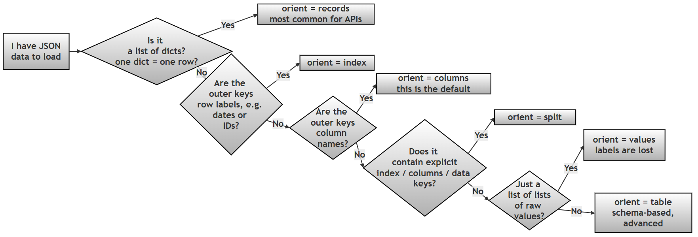
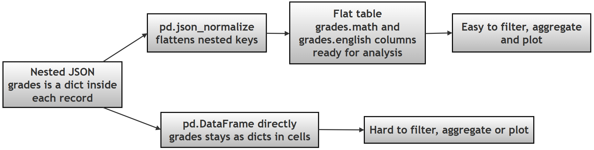

# Chapter 12 (Supplement): Reading JSON into Pandas — the `orient` Parameter and `json_normalize()`

> **GitHub source:** [98-ch12-orient-json.md](https://github.com/ag999git/001-Python-book-2026/blob/main/12-pandas/98-ch12-orient-json.md?plain=1)

---

## Introduction — What This File Contains and Why It Matters

Almost every real-world Python data project touches **JSON** (*JavaScript Object Notation — a text format for storing data as dictionaries and lists; read more on [json.org](https://www.json.org/json-en.html)*): web APIs return it, configuration files use it, log files store it. But JSON is **not** a table — it's nested and shapeless. Pandas needs to be told *how to interpret* each JSON's shape before it can build a DataFrame.

This supplement covers the two tools that solve this:

1. **The `orient` parameter of `pd.read_json()`** — a "map" that tells pandas what part of your JSON is the index, what is columns, and what is data.
2. **`pd.json_normalize()`** — flattens *nested* JSON (dictionaries inside dictionaries) into a clean flat table.

**Relevance to Chapter 12:** Chapter 12 is about Pandas data handling. `read_json()` sits alongside `read_csv()` and `read_excel()` as a core loading function, and `json_normalize()` is the standard first step in any API-to-DataFrame pipeline — a skill every data science beginner needs.

> 💡 **Technical terms used below** (briefly explained at first use): **JSON**, **DataFrame** (pandas' table object — rows and columns), **index** (row labels), **NaN** (pandas' marker for missing data), **round-trip** (saving data and loading it back with nothing lost). Official docs: [read_json](https://pandas.pydata.org/docs/reference/api/pandas.read_json.html) · [json_normalize](https://pandas.pydata.org/docs/reference/api/pandas.json_normalize.html) · [IO tools guide](https://pandas.pydata.org/docs/user_guide/io.html#json).

---

## Part A — Understanding the `orient` Parameter

## 1.1 What is the `orient` Parameter?

The `orient` parameter in pandas' `read_json()` function tells pandas **how your JSON data is structured** so it can correctly convert it into a DataFrame or Series. Think of it as a **map that guides pandas** in translating your JSON data into a tabular format that pandas can work with efficiently. JSON data can come in various shapes and formats, and `orient` helps pandas understand exactly which parts of your JSON correspond to columns, rows, index values, and data points.

Without the correct `orient` setting, pandas might misinterpret your data, leading to errors or DataFrames that don't look right. For beginners, the most important thing to know is that **matching the `orient` parameter to your JSON's structure is essential** for successful data loading.

## 1.2 Why `orient` Matters

When you're working with JSON data, you'll encounter several common patterns. The `orient` parameter helps pandas handle these patterns correctly:

- **API Responses**: Data from web APIs often comes as a list of records (like products or users)
- **Time Series Data**: Sequential data where each row has a unique timestamp
- **Configuration Files**: Settings or parameters stored in JSON format
- **Log Files**: System outputs that might be structured in various ways

For beginners, the **most common and useful orient values** are `'records'`, `'index'`, and `'columns'`. These three will handle the vast majority of JSON data you'll encounter in typical data analysis tasks.

## 1.3 Common `orient` Values and When to Use Them

The following table shows the most frequently used `orient` values with simple examples and their primary use cases:

### Table 1: Common `orient` Values for Beginners

| orient | JSON Structure (Input) | Equivalent Python Structure (Actual Object) | Pandas Output | When to Use | Notes / Common Issues |
| --- | --- | --- | --- | --- | --- |
| records | [{"col1":"a","col2":"b"}, {"col1":"c","col2":"d"}] | [{'col1':'a','col2':'b'}, {'col1':'c','col2':'d'}] (list of dicts) | DataFrame (rows = records) | API responses, row-oriented data (each dict = one row) | Most intuitive format |
| index | {"r1":{"col1":"a"}, "r2":{"col1":"c"}} | {'r1':{'col1':'a'}, 'r2':{'col1':'c'}} (dict of dicts) | DataFrame (index = keys) | Data where the index is the primary key (unique identifiers for each row) | Keys become row labels |
| columns | {"col1":{"r1":"a"}, "col2":{"r1":"b"}} | {'col1':{'r1':'a'}, 'col2':{'r1':'b'}} (dict of dicts) | DataFrame (columns = keys) | Data where columns are the primary keys (less common, but possible) | Default orient |
| split | {"index":["r1"],"columns":["c1"],"data":[["a"]]} | {'index':['r1'], 'columns':['c1'], 'data':[['a']]} | DataFrame (fully structured) | Explicitly separating metadata (index, columns) from data values | Must contain all 3 keys |
| values | [["a","b"],["c","d"]] | [['a','b'], ['c','d']] (list of lists) | DataFrame (no labels) | Just the values as a 2D array (loses index and column information) | Most error-prone |
| table | {"schema":{...},"data":[...]} | {'schema': {...}, 'data': [...]} | DataFrame (rich schema) | Advanced pipelines | Rare in beginner use |

### 1.4 Choosing the Right `orient` — A Decision Guide




>  **Version note:** In older pandas versions (≤ 1.x) the default `orient` was `'columns'`; from pandas 2.0 the default is `'records'`. It is good practice to **always specify `orient` explicitly** rather than relying on the default.

## 1.5 Basic Examples and Expected Outputs

>  **A note before running these examples:** JSON is a *strict* format — it does **not** allow `#` comments inside the JSON string itself (unlike Python). In the examples below, all explanations are placed as Python `#` comments *outside* the JSON string, so every script here runs as-is. If you copy JSON from anywhere, make sure it contains only valid JSON.

### Using `orient='records'` (Most Common)

This is the most frequently used orient value, especially for data from APIs:

#### Example 1 (Simple)

```python
# Step 0: Import libraries
# Step 0: pandas for DataFrames; StringIO lets us treat a text string
#         like a file, so read_json() can read from it.
import pandas as pd
from io import StringIO

# Step 1: Define JSON data as a list of records.
# This is a common format for JSON data, especially when it comes from APIs.
# Each dictionary in the list represents a row of data, and the keys of the
# dictionaries become the column names in the DataFrame.
json_data = '[{"Name": "Alice", "Age": 25}, {"Name": "Bob", "Age": 30}]'

# Step 2: Read with orient='records'.
# This tells Pandas that the JSON data is a list of records (dictionaries),
# and it should create a DataFrame where each dictionary is a row and the
# keys are the column names.
df = pd.read_json(StringIO(json_data), orient='records')

# Step 3: Display the result
print(df)
```

**Output:**

```text
    Name  Age
0  Alice   25
1    Bob   30
```

**Key Point**: Each dictionary in the list becomes one row in the DataFrame.

The `'records'` format is the most common JSON structure, especially for web APIs. Each dictionary in the list represents a single row in the resulting DataFrame.

Features:
- **Column Inference**: Pandas automatically infers column names from the dictionary keys
- **Type Inference**: Data types are automatically inferred from the values
- **Missing Data**: Missing keys in dictionaries are handled as NaN values

> 🔎 **See "missing data" in action:** if the second record were `{"Name": "Bob"}` (no `"Age"` key), the output would show `NaN` in Bob's Age cell — a graceful fallback rather than an error.

#### Example 2 (More complex)


```python
# Step 0: Import libraries
import pandas as pd
from io import StringIO

# Step 1: Define complex records with nested data and mixed types.
# This JSON string simulates a common real-world scenario: a list of records
# (like from an API) where each record contains a nested structure
# (the 'scores' dictionary) and various data types
# (integers, strings, booleans, date strings).
# Note: no # comments inside the JSON — JSON does not support comments!
json_data = '''[
    {"id": 1, "name": "Alice", "scores": {"math": 90, "english": 85},
     "active": true, "join_date": "2023-01-15"},
    {"id": 2, "name": "Bob", "scores": {"math": 80, "english": 75},
     "active": false, "join_date": "2023-02-20"}
]'''

# Step 2: Read with orient='records'
df = pd.read_json(StringIO(json_data), orient='records')

# Step 3: Display the result and the data types
print(df)
print()
print(df.dtypes)
```

**Output:**

```text
   id   name                      scores  active   join_date
0   1  Alice  {'math': 90, 'english': 85}    True  2023-01-15
1   2    Bob  {'math': 80, 'english': 75}   False  2023-02-20

id            int64
name         object
scores       object
active         bool
join_date    object
dtype: object
```

>  **What to notice:** the `scores` column contains whole *dictionaries inside cells* — readable but not analysis-friendly. This is exactly the problem `json_normalize()` solves later in Part B. Also notice `join_date` is stored as `object` (a string), not a date — use `pd.to_datetime(df['join_date'])` if you need real dates.

### Using `orient='index'` for Time Series Data

When your data has unique row identifiers (like dates):

#### Example 3 (Simple)

```python
# Step 0: Import libraries
# StringIO simulates a file-like object from a string
import pandas as pd
from io import StringIO

# Step 1: Define JSON data with the index as primary key.
# This JSON structure is common when the data is organized with unique
# identifiers (like dates, IDs, etc.) as keys, and the values are
# dictionaries containing the actual data for each key.
json_data = '{"2023-01-01": {"Value": 100}, "2023-01-02": {"Value": 105}}'

# Step 2: Read with orient='index'.
# This tells Pandas that the keys of the JSON are the index labels.
# If you omit orient='index', Pandas will assume the keys are column names,
# which would lead to a different (wrong) structure.
df = pd.read_json(StringIO(json_data), orient='index')

# Step 3: Display the result
print(df)
```

**Output:**

```text
            Value
2023-01-01    100
2023-01-02    105
```

The `'index'` format is ideal for time-series data or any data with unique row identifiers.

**Advanced Features**:
- **Custom Index Preservation**: Outer dictionary keys become the DataFrame index
- **Data Type Preservation**: Maintains the data types of index and values
- **Sparse Data Handling**: Efficiently handles sparse data structures

#### Example 4 (Complex Example)

> **Important correction from the original:** the original script contained `from turtle import pd` — the *turtle graphics* module has no `pd`, so this raises `ImportError: cannot import name 'pd' from 'turtle'`. Corrected below to a normal `import pandas as pd`.

```python
# Step 0: Import libraries
import pandas as pd
from io import StringIO

# Step 1: Define sample JSON data with date keys.
# This simulates a time series dataset where each date has associated
# stock prices. The JSON structure is a dictionary where keys are date
# strings and values are dictionaries of prices.
# The 'orient' parameter is set to 'index' so the date keys become
# index labels in the resulting DataFrame.
json_data = '''{
    "2023-01-01": {"open": 100.5, "high": 105.0, "low": 99.5, "close": 104.0},
    "2023-01-02": {"open": 104.0, "high": 108.0, "low": 103.5, "close": 107.5},
    "2023-01-03": {"open": 107.5, "high": 110.0, "low": 107.0, "close": 109.5}
}'''

# Step 2: Read with orient='index'
df = pd.read_json(StringIO(json_data), orient='index')

# Step 3: Inspect the index (dates kept as strings)
print(df.index)

# Step 4: Inspect the data types
print(df.dtypes)

# Step 5: Display the full DataFrame
print(df)
```

**Output:**

```text
Index(['2023-01-01', '2023-01-02', '2023-01-03'], dtype='object')

open     float64
high     float64
low      float64
close    float64
dtype: object

            open   high    low  close
2023-01-01  100.5  105.0   99.5  104.0
2023-01-02  104.0  108.0  103.5  107.5
2023-01-03  107.5  110.0  107.0  109.5
```

**Constraints and Errors**:

- **Unique Index Required**: If outer dictionary keys are not unique, pandas will raise a `ValueError` (in JSON, duplicate keys are technically possible but meaningless — pandas refuses to guess)
- **Index Type Preservation**: The index type is preserved as string (can be converted with `convert_axes=True`)
- **Column Uniqueness**: Column names must be unique across all inner dictionaries

>  **Beginner tip:** to turn the string index into a proper DatetimeIndex (as used in the earlier flights chapter), add `df.index = pd.to_datetime(df.index)` after loading.

### `orient='columns'`

The `'columns'` format is less common but useful for column-oriented operations.

**Features**:

- **Column-Oriented**: Outer dictionary keys become column names
- **Index Preservation**: Inner dictionary keys become the index
- **Sparse Data Efficiency**: Very efficient for sparse column data

#### Example 5

>  **Same correction as Example 2:** the original placed `# comments` inside the JSON string, which is invalid JSON. Comments are now Python comments outside the JSON.

```python
# Step 0: Import libraries
import pandas as pd
from io import StringIO

# Step 1: Define column-oriented data.
# Each outer key ("temperature", "humidity", "pressure") is a COLUMN name.
# Each inner dictionary maps row labels (sensor1, sensor2, sensor3)
# to that column's values.
json_data = '''{
    "temperature": {"sensor1": 22.5,  "sensor2": 23.1,  "sensor3": 21.8},
    "humidity":    {"sensor1": 45.2,  "sensor2": 47.1,  "sensor3": 46.5},
    "pressure":    {"sensor1": 1013.2, "sensor2": 1012.8, "sensor3": 1013.5}
}'''

# Step 2: Read with orient='columns'
df = pd.read_json(StringIO(json_data), orient='columns')

# Step 3: Display the result
print(df)
```

**Output:**

```text
         temperature  humidity  pressure
sensor1         22.5      45.2    1013.2
sensor2         23.1      47.1    1012.8
sensor3         21.8      46.5    1013.5
```

>  **Compare with `orient='index'`:** here the outer keys became *columns*; there they became *rows*. Same "dict of dicts" shape — `orient` decides which level means what. This is the clearest demonstration of why `orient` matters.

### `orient='split'`

The `'split'` format provides the most explicit representation by separating metadata from data.

**Advanced Features**:

- **Explicit Structure**: Clearly separates index, columns, and data
- **Type Preservation**: Can preserve exact data types when used with `to_json()`
- **Round-Trip Guarantees**: Perfect for saving and loading DataFrames without information loss

#### Example 6

```python
# Step 0: Import libraries
import pandas as pd
from io import StringIO

# Step 1: Define explicit split format with metadata.
# This JSON structure includes 'index', 'columns', and 'data' keys —
# the exact format expected by orient='split'.
# 'index' defines row labels, 'columns' defines column labels,
# and 'data' holds the actual values as a list of lists.
json_data = '''{
    "index": ["row1", "row2", "row3"],
    "columns": ["col1", "col2", "col3"],
    "data": [
        [1, 2, 3],
        [4, 5, 6],
        [7, 8, 9]
    ]
}'''

# Step 2: Read with orient='split'
df = pd.read_json(StringIO(json_data), orient='split')

# Step 3: Display the result
print(df)
```

**Output:**

```text
      col1  col2  col3
row1     1     2     3
row2     4     5     6
row3     7     8     9
```

**Performance Characteristics**:

- **Fastest for Large Data**: Separating metadata from data allows for optimized parsing
- **Memory Efficient**: Can be more memory efficient for very large datasets
- **Intermediate Storage**: Ideal for intermediate storage during data processing pipelines

>  **Round-trip in practice:** `df.to_json('data.json', orient='split')` followed by `pd.read_json('data.json', orient='split')` gives you back the same index, columns and values — something `orient='values'` cannot do.

### `orient='values'`

The `'values'` format is the most minimal, storing only the data values without any metadata.

**Advanced Features**:

- **Compact Storage**: Smallest file size of all orient options
- **Fast Parsing**: Very fast parsing due to lack of metadata
- **Minimal Information Loss**: Loses all structural information (index, columns)

#### Example 7

```python
# Step 0: Import libraries
import pandas as pd
from io import StringIO

# Step 1: Define minimal JSON — a 3x3 matrix (list of lists).
# The 'orient' parameter is set to 'values' to indicate that the JSON data
# is a plain list of lists, not records or a dictionary.
json_data = '''[
    [10, 20, 30],
    [40, 50, 60],
    [70, 80, 90]
]'''

# Step 2: Read with orient='values'
df = pd.read_json(StringIO(json_data), orient='values')

# Step 3: Display the result
print(df)
```

**Output:**

```text
    0   1   2
0  10  20  30
1  40  50  60
2  70  80  90
```

> Columns are automatically named `0, 1, 2` and rows indexed `0, 1, 2`, because the JSON carried no label information at all.

**Limitations and Constraints**:

- **No Column Names**: Columns are automatically numbered (0, 1, 2...)
- **No Index**: Default integer index (0, 1, 2...)
- **Data Type Inference**: Types are inferred from the values in the arrays

### `orient='table'`

The `'table'` format follows the JSON Table Schema specification, providing the most robust and feature-rich representation.

**Advanced Features**:

- **Schema Preservation**: Maintains complete data type information
- **Metadata Preservation**: Can preserve field names, types, and constraints
- **Round-Trip Accuracy**: Ensures perfect round-trip conversion between DataFrame and JSON

#### Example 8

```python
# Step 0: Import libraries
import pandas as pd
from io import StringIO

# Step 1: Define table-schema format with full metadata.
# This JSON includes both the data and its SCHEMA. The schema describes the
# structure of the data: field names, data types, and other metadata
# (primaryKey, pandas_version). The 'data' key contains a list of records,
# one dictionary per row.
json_data = '''{
    "schema": {
        "fields": [
            {"name": "index", "type": "string"},
            {"name": "id", "type": "integer"},
            {"name": "name", "type": "string"},
            {"name": "value", "type": "number"}
        ],
        "primaryKey": ["index"],
        "pandas_version": "1.4.0"
    },
    "data": [
        {"index": "row1", "id": 1, "name": "Alice", "value": 100.5},
        {"index": "row2", "id": 2, "name": "Bob", "value": 200.7},
        {"index": "row3", "id": 3, "name": "Charlie", "value": 150.3}
    ]
}'''

# Step 2: Read with orient='table'
df = pd.read_json(StringIO(json_data), orient='table')

# Step 3: Display the result
print(df)

# Step 4: Confirm that data types were restored from the schema
print(df.dtypes)
```

**Output:**

```text
        id     name   value
index
row1     1    Alice   100.5
row2     2      Bob   200.7
row3     3  Charlie   150.3

id         int64
name      object
value    float64
dtype: object
```

>  Notice `id` came back as `int64` and `value` as `float64` — read from the **schema**, not inferred. That is the main advantage of `'table'` over every other orient.

**Error Scenarios**:

- **Schema Mismatch**: If schema doesn't match data structure, pandas may raise errors or produce unexpected results
- **Numeric Index Issues**: Numeric indices in 'table' format can cause `ValueError` issues
- **Version Compatibility**: Different pandas versions may handle 'table' format differently

---

## Part B — Introduction to `json_normalize()`

In real-world applications, JSON data is often **nested**, meaning that some fields may contain dictionaries or lists instead of simple values. While Pandas can read such data, the resulting DataFrame may contain columns with complex structures that are difficult to analyze.

To address this, Pandas provides the **`json_normalize()`** function.

**`json_normalize()` is used to convert (flatten) nested JSON data into a flat table (DataFrame)**, where each nested key becomes a separate column.

This makes the data:

- easier to read
- easier to analyze
- compatible with standard DataFrame operations

----------

### Why is it needed?

Without normalization:

- Nested data appears as **dictionaries inside cells**
- Such data cannot be directly used for calculations or filtering

With `json_normalize()`:

- Nested structures are **expanded into columns**
- The data becomes fully **tabular**

### Key Idea

> **Nested JSON → Flat Table (DataFrame)**

----------

### To summarize

> `json_normalize()` transforms semi-structured JSON data into a structured tabular format by flattening nested fields.

### The Normalization Process at a Glance



## 1. What is "Nested JSON"?

### Example JSON

```python
{
  "students": [
    {
      "id": 1,
      "name": "Alice",
      "grades": {"math": 90, "english": 85}
    },
    {
      "id": 2,
      "name": "Bob",
      "grades": {"math": 80, "english": 75}
    }
  ]
}
```

**Python Equivalent**

```python
{
  "students": [
    {"id": 1, "name": "Alice", "grades": {"math": 90, "english": 85}},
    {"id": 2, "name": "Bob",   "grades": {"math": 80, "english": 75}}
  ]
}
```

>  **How to read it:** the outer dictionary has one key, `"students"`, whose value is a **list**. Each item in the list is a student record. Inside each record, `"grades"` is itself another **dictionary** — that is the nesting.

## 2. What Happens Without Normalization

```python
# Step 0: Import libraries
import pandas as pd
import json

# Step 1: Define example nested JSON (as a string)
json_data = '''
{
    "students": [
        {"id": 1, "name": "Alice", "grades": {"math": 90, "english": 85}},
        {"id": 2, "name": "Bob",   "grades": {"math": 80, "english": 75}}
    ]
}
'''

# Step 2: Parse the JSON string into a Python object
# (json.loads = "load string" → gives us dictionaries and lists)
data = json.loads(json_data)

# Step 3: Attempt to create a DataFrame directly from the 'students' list.
# This will not crash, but the 'grades' column will contain whole
# dictionaries — not ideal for analysis.
df = pd.DataFrame(data['students'])

# Step 4: Display the result
print(df)
```

**Output:**

```text
   id   name                       grades
0   1  Alice  {'math': 90, 'english': 85}
1   2    Bob  {'math': 80, 'english': 75}
```

>  **Try this to feel the pain:** `df['grades']['math']` fails, `df[df['grades'] > 80]` fails — you cannot filter or aggregate a column of dictionaries. That is the problem the next step solves.

## 3. Using `json_normalize()`

```python
# Step 0: Import libraries
import pandas as pd
import json

# Step 1: Define the same nested JSON (as a string)
json_data = '''
{
    "students": [
        {"id": 1, "name": "Alice", "grades": {"math": 90, "english": 85}},
        {"id": 2, "name": "Bob",   "grades": {"math": 80, "english": 75}}
    ]
}
'''

# Step 2: Parse the JSON string into a Python object
data = json.loads(json_data)

# Step 3: Use json_normalize() to flatten the nested JSON structure.
# This creates a DataFrame where the 'grades' dictionary is expanded
# into separate columns, named with dot notation:
#   parent_key.child_key  →  grades.math, grades.english
df_normalized = pd.json_normalize(data['students'])

# Step 4: Display the normalized result
print("Normalized DataFrame:")
print(df_normalized)

# Step 5: Verify it is now analysis-ready:
# filter students with math score above 85 — impossible before normalization
print()
print("Students with math > 85:")
print(df_normalized[df_normalized['grades.math'] > 85])
```

**Output:**

```text
Normalized DataFrame:
   id   name  grades.math  grades.english
0   1  Alice           90              85
1   2    Bob           80              75

Students with math > 85:
   id   name  grades.math  grades.english
0   1  Alice           90              85
```

>  **Note the dot notation:** `grades.math` means *"the `math` key that was inside the `grades` dictionary."* The default separator is `.`; you can change it with the `sep` parameter (e.g. `sep='_'` gives `grades_math`).


---

## Combined Script (Part A — all eight `orient` examples in one runnable file)

```python
"""
SUPPLEMENT: pd.read_json() — the orient parameter
Demonstrates all six common orient values with runnable examples.
"""

# ==========================================================
# STEP 0: IMPORT LIBRARIES
# ==========================================================

print("\nSTEP 0: IMPORT LIBRARIES")

import pandas as pd      # Step 0: DataFrame creation and JSON reading
from io import StringIO  # Step 0: wrap strings so read_json can read them


# ==========================================================
# STEP 1: orient='records' — list of dicts, one dict per row
# ==========================================================

print("\nSTEP 1: ORIENT = 'records'")

json_data = '[{"Name": "Alice", "Age": 25}, {"Name": "Bob", "Age": 30}]'
df = pd.read_json(StringIO(json_data), orient='records')
print(df)


# ==========================================================
# STEP 2: orient='records' — complex records with nesting
# ==========================================================

print("\nSTEP 2: ORIENT = 'records' (complex, nested)")

json_data = '''[
    {"id": 1, "name": "Alice", "scores": {"math": 90, "english": 85},
     "active": true, "join_date": "2023-01-15"},
    {"id": 2, "name": "Bob", "scores": {"math": 80, "english": 75},
     "active": false, "join_date": "2023-02-20"}
]'''
df = pd.read_json(StringIO(json_data), orient='records')
print(df)
print(df.dtypes)


# ==========================================================
# STEP 3: orient='index' — outer keys become row labels
# ==========================================================

print("\nSTEP 3: ORIENT = 'index' (simple time series)")

json_data = '{"2023-01-01": {"Value": 100}, "2023-01-02": {"Value": 105}}'
df = pd.read_json(StringIO(json_data), orient='index')
print(df)


# ==========================================================
# STEP 4: orient='index' — stock OHLC time series
# ==========================================================

print("\nSTEP 4: ORIENT = 'index' (stock prices)")

json_data = '''{
    "2023-01-01": {"open": 100.5, "high": 105.0, "low": 99.5, "close": 104.0},
    "2023-01-02": {"open": 104.0, "high": 108.0, "low": 103.5, "close": 107.5},
    "2023-01-03": {"open": 107.5, "high": 110.0, "low": 1070, "close": 109.5}
}'''
df = pd.read_json(StringIO(json_data), orient='index')
print(df.index)
print(df.dtypes)
print(df)


# ==========================================================
# STEP 5: orient='columns' — outer keys become column names
# ==========================================================

print("\nSTEP 5: ORIENT = 'columns' (sensor data)")

json_data = '''{
    "temperature": {"sensor1": 22.5,  "sensor2": 23.1,  "sensor3": 21.8},
    "humidity":    {"sensor1": 45.2,  "sensor2": 47.1,  "sensor3": 46.5},
    "pressure":    {"sensor1": 1013.2, "sensor2": 1012.8, "sensor3": 1013.5}
}'''
df = pd.read_json(StringIO(json_data), orient='columns')
print(df)


# ==========================================================
# STEP 6: orient='split' — explicit index / columns / data
# ==========================================================

print("\nSTEP 6: ORIENT = 'split'")

json_data = '''{
    "index": ["row1", "row2", "row3"],
    "columns": ["col1", "col2", "col3"],
    "data": [[1, 2, 3], [4, 5, 6], [7, 8, 9]]
}'''
df = pd.read_json(StringIO(json_data), orient='split')
print(df)


# ==========================================================
# STEP 7: orient='values' — raw values only, no labels
# ==========================================================

print("\nSTEP 7: ORIENT = 'values'")

json_data = '[[10, 20, 30], [40, 50, 60], [70, 80, 90]]'
df = pd.read_json(StringIO(json_data), orient='values')
print(df)


# ==========================================================
# STEP 8: orient='table' — schema-based, preserves dtypes
# ==========================================================

print("\nSTEP 8: ORIENT = 'table'")

json_data = '''{
    "schema": {
        "fields": [
            {"name": "index", "type": "string"},
            {"name": "id", "type": "integer"},
            {"name": "name", "type": "string"},
            {"name": "value", "type": "number"}
        ],
        "primaryKey": ["index"],
       


```python
        "pandas_version": "1.4.0"
    },
    "data": [
        {"index": "row1", "id": 1, "name": "Alice", "value": 100.5},
        {"index": "row2", "id": 2, "name": "Bob", "value": 200.7},
        {"index": "row3", "id": 3, "name": "Charlie", "value": 150.3}
    ]
}'''
df = pd.read_json(StringIO(json_data), orient='table')
print(df)
print(df.dtypes)


# ==========================================================
# STEP 9: SUMMARY
# ==========================================================

print("\nSTEP 9: SUMMARY")

print("""
KEY TAKEAWAYS — orient parameter:

1. orient tells pandas HOW your JSON is shaped
2. records  → list of dicts, each dict = one row (APIs)
3. index    → outer keys become row labels (time series)
4. columns  → outer keys become column names (default in old pandas)
5. split    → explicit index + columns + data (round-trips well)
6. values   → raw values only; all labels are LOST
7. table    → carries a schema; preserves data types
8. Always pass orient explicitly — never rely on the default
""")
```

---

## Combined Script (Part B — `json_normalize()` in one runnable file)

```python
"""
SUPPLEMENT: pd.json_normalize() — flattening nested JSON
Shows the SAME data loaded the naive way and the normalized way.
"""

# ==========================================================
# STEP 0: IMPORT LIBRARIES
# ==========================================================

print("\nSTEP 0: IMPORT LIBRARIES")

import pandas as pd   # Step 0: DataFrame creation and json_normalize
import json           # Step 0: parse the JSON string into Python objects


# ==========================================================
# STEP 1: DEFINE NESTED JSON
# ==========================================================

print("\nSTEP 1: DEFINE NESTED JSON")

# Step 1: 'grades' is a dictionary INSIDE each student record —
# that inner dictionary is the nesting we want to flatten.
json_data = '''
{
    "students": [
        {"id": 1, "name": "Alice", "grades": {"math": 90, "english": 85}},
        {"id": 2, "name": "Bob",   "grades": {"math": 80, "english": 75}}
    ]
}
'''
data = json.loads(json_data)   # Step 1: string → Python dict/list


# ==========================================================
# STEP 2: THE NAIVE WAY — plain DataFrame (no normalization)
# ==========================================================

print("\nSTEP 2: WITHOUT NORMALIZATION")

df = pd.DataFrame(data['students'])
print(df)
# Step 2: 'grades' cells contain whole dictionaries —
# they cannot be filtered or aggregated directly.


# ==========================================================
# STEP 3: THE RIGHT WAY — json_normalize()
# ==========================================================

print("\nSTEP 3: WITH json_normalize()")

# Step 3: nested keys are expanded into separate columns using
# dot notation: grades.math, grades.english
df_normalized = pd.json_normalize(data['students'])
print(df_normalized)


# ==========================================================
# STEP 4: PROVE IT IS ANALYSIS-READY
# ==========================================================

print("\nSTEP 4: FILTER ON A FORMERLY-NESTED COLUMN")

# Step 4: this simple filter was impossible before normalization
print(df_normalized[df_normalized['grades.math'] > 85])


# ==========================================================
# STEP 5: SUMMARY
# ==========================================================

print("\nSTEP 5: SUMMARY")

print("""
KEY TAKEAWAYS — json_normalize():

1. Nested JSON → flat table
2. Nested keys become columns with dot notation (grades.math)
3. Use sep='_' to change the separator (grades_math)
4. Normalized data can be filtered, aggregated and plotted
5. First stop whenever an API returns nested records
""")
```

---

## Practice Questions (Follow-up)

1. In Example 4, the index is a set of *strings*. Write one line to convert it to a real `DatetimeIndex` (hint: `pd.to_datetime`). Why does that matter for the resampling techniques used earlier in this chapter?
2. Take Example 7's `'values'` output and add column names afterward using `df.columns = ['a', 'b', 'c']`. What have you *not* recovered compared to `'split'` format?
3. Load Example 2's records with `pd.json_normalize(...)` instead of `pd.read_json(...)` — what happens to the nested `scores` dictionary? (Hint: `pd.json_normalize` accepts a list of dicts directly.)
4. Round-trip test: save Example 6's DataFrame with `to_json('x.json', orient='split')`, reload it, and compare with `df.equals(...)`. Repeat with `orient='values'` — which one survives the round trip intact and why?
5. In `orient='table'`, change one field's declared `type` to `"boolean"` while the data stays numeric. What does pandas do — error, or silent coercion?

---


