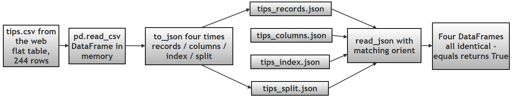

# Chapter 12 (Supplement 2): One DataFrame, Four JSON Formats — A Step-by-Step Walkthrough

> **GitHub source:** [99-0-ch12-orient-json2.md](https://github.com/ag999git/001-Python-book-2026/blob/main/12-pandas/99-0-ch12-orient-json2.md?plain=1)

---

##  Introduction — What This File Contains and Why It Matters

The companion supplement (`98-ch12-orient-json.md`) introduced the `orient` parameter of `pd.read_json()` with small, hand-made examples. This file goes one step further and walks through, **line by line, the full script given in the printed book**: it takes one real dataset (the famous **tips** dataset — records of restaurant bills and tips), saves it into **four different JSON storage formats**, loads each one back, peeks at the **raw JSON text** to see what pandas actually wrote, and finally proves that all four routes rebuild the **same** DataFrame.

By the end you should be able to answer these questions for yourself:

- What does each `orient` value like *as actual JSON text on disk*?
- Why do all four formats rebuild to the same table?
- What is the difference between "simple 2-level nesting" (which pandas reads fine) and "true nesting" (which needs `json_normalize()`)?

**Relevance:** this is the practical half of Chapter 12's JSON material — the earlier file gave you the vocabulary (`orient`, index, records), this file shows the whole workflow on real data. Glossary of terms used below: **DataFrame** (pandas' table object), **index** (row labels), **JSON** (text format for data as dictionaries/lists — see [json.org](https://www.json.org/json-en.html)), **round-trip** (save → load with nothing lost). Docs: [to_json](https://pandas.pydata.org/docs/reference/api/pandas.DataFrame.to_json.html) · [read_json](https://pandas.pydata.org/docs/reference/api/pandas.read_json.html) · [json_normalize](https://pandas.pydata.org/docs/reference/api/pandas.json_normalize.html).

---

##  The Whole Journey at a Glance


---

# Detailed Discussion on the Script Given in the Book

## STEP 1: Load Data from CSV

### Code Snippet

```python
# Step 1: Load the tips dataset straight from the web into a DataFrame
df = pd.read_csv(url)
print(df.head())   # show the first 5 rows
```

### What Happens

- `pd.read_csv()` reads a CSV file from a URL (no download step needed — pandas fetches it for you)
- Converts it into a **DataFrame (tabular structure)** — pandas' name for a table with rows and columns

### Output Structure (Tabular)

```text
   total_bill   tip     sex smoker
0        16.99  1.01  Female     No
1        10.34  1.66    Male     No
```

### Concept

This is **flat (2D) data**:

- Rows = observations (one row = one restaurant visit)
- Columns = variables (bill amount, tip amount, …)

> 🔎 **Compare this with what follows:** flat means every cell holds exactly one simple value. JSON is where data can start to *nest* — and the rest of this file explores how much (or little) nesting each format has.

----------

## STEP 2: Save into Four Different JSON Formats

### Code Snippet

```python
# Step 2: write the SAME DataFrame to disk four times,
# each time with a different orient (storage structure)
df.to_json("tips_records.json", orient="records")
df.to_json("tips_columns.json", orient="columns")
df.to_json("tips_index.json", orient="index")
df.to_json("tips_split.json", orient="split")
```

### What Happens

- `to_json()` converts DataFrame → JSON and writes it to a file
- `orient` controls the **structure of the JSON that gets written**

### Concept

> Same data → **4 different storage structures**

>  **Why bother with four formats?** Different consumers prefer different shapes: web front-ends love `records` (it maps directly to a list of objects); column-oriented stores like `columns`; `split` is the best for lossless **round-trips** (save → load with nothing changed, including dtypes); `index` mirrors "keyed" data like time series.

----------

## STEP 3: Read JSON Back (`records`)

### Code Snippet

```python
# Step 3: rebuild a DataFrame from the records file
df_records = pd.read_json("tips_records.json", orient="records")
```

### What Happens

- `read_json()` reconstructs the DataFrame
- Uses `orient='records'` — telling pandas the file is a **list of row-dictionaries**

### Output

Same as the original table.

### Concept

> Pandas understands **row-wise JSON**

----------

## STEP 4: Raw JSON (`records`)

### Code Snippet

```python
# Step 4: open the file with the plain json module
# to see the actual text pandas wrote
with open("tips_records.json", "r") as f:
    data_records = json.load(f)
print(data_records[:2])   # only the first 2 rows — the file has 244!
```

### Actual JSON Structure

```python
[
 {"total_bill": 16.99, "tip": 1.01, "sex": "Female", ...},
 {"total_bill": 10.34, "tip": 1.66, "sex": "Male",   ...}
]
```

### Concept

> This **is nested JSON (Level 2 nesting)** — "nested" here just means *a dictionary living inside a list*, which JSON handles natively.

Structure:

- List → rows
- Each element → dictionary (one row)

Hierarchy:

```text
list
 ├── dict (row 1)
 ── dict (row 2)
```

----------

## STEP 5: Read JSON Back (`columns`)

### Code Snippet

```python
# Step 5: rebuild a DataFrame from the columns file
df_columns = pd.read_json("tips_columns.json", orient="columns")
```

### Concept

> Pandas reconstructs from **column-wise storage** — the same data, but sliced the other way.

----------

## STEP 6: Raw JSON (`columns`)

### Structure

```python
{
 "total_bill": {"0": 16.99, "1": 10.34, ...},
 "tip":        {"0": 1.01,  "1": 1.66,  ...}
}
```

### Concept

> Nested JSON (Level 2) again — but now the outer keys are **columns**, not rows.

Hierarchy:

```text
dict (columns)
 └── dict (row index → value)
```

> Column → Row → Value

>  **Side-by-side:** compare Step 4 and Step 6. In `records` the *row* is the container and columns are keys inside it; in `columns` the *column* is the container and row labels are keys inside it. Same values, mirrored structure — that is all `orient` changes.

----------

## STEP 7: Read JSON Back (`index`)

### Code Snippet

```python
# Step 7: rebuild a DataFrame from the index file
df_index = pd.read_json("tips_index.json", orient="index")
```

### Concept

> Rebuild DataFrame from row-based dictionary — looks similar to `records`, but the outer container is a **dict keyed by row label**, not a list.

----------

## STEP 8: Raw JSON (`index`)

### Structure

```python
{
 "0": {"total_bill": 16.99, "tip": 1.01, ...},
 "1": {"total_bill": 10.34, "": 1.66, ...}
}
```

### Concept

> Nested JSON (Level 2)

Hierarchy:

```text
dict (rows)
 └── dict (columns)
```

> Row → Column → Value

> 🔎 **`records` vs `index`:** both are row-oriented, but `records` is a *list* (rows have no names, position only) while `index` is a *dict* (each row is labelled by its index value). If you reorder or filter a list, rows shift; a dict's keys stay put.

----------

## STEP 9: Read JSON Back (`split`)

### Code Snippet

```python
# Step 9: rebuild a DataFrame from the split file
df_split = pd.read_json("tips_split.json", orient="split")
```

### Concept

> Uses **metadata + data separation**: the file explicitly names the columns and the index, and keeps the bare values in their own block.

----------

## STEP 10: Raw JSON (`split`)

### Structure

```python
{
 "columns": ["total_bill", "tip", ...],
 "index":   [0, 1, ...],
 "data":    [[16.99, 1.01, ...], [10.34, 1.66, ...]]
}
```

### Concept

> Semi-nested structure — one level: a dict whose values are lists (and a list of lists).

Hierarchy:

```text
dict
 ├── list (columns)
 ├── list (index)
 └── list of lists (data)
```

>  **Why `split` round-trips best:** column names and index labels are stored *explicitly*, and the values sit in a plain rectangle — so pandas can restore dtypes from the metadata rather than re-guessing them. `records`/`index`/`columns` all force pandas to re-infer things on the way back in.

----------

## STEP 11: Verify Equality

### Code Snippet

```python
# Step 11: prove the four rebuilds are identical to each other
print(df_records.equals(df_columns))
print(df_columns.equals(df_index))
print(df_index.equals(df_split))
```

### Output

```text
True
True
True
```

### Concept

> Different formats → **same data**. `DataFrame.equals()` checks both values **and** dtypes — so these `True`s are a strong guarantee, not just "looks similar".

>  **Beginner caveat:** equality holds here because the values happen to re-infer to the same dtypes. With trickier data (dates, mixed types, missing values), `records`/`columns`/`index` can come back with slightly different dtypes than the original, whilesplit` (and `table`) preserve them. When in doubt, compare with `df.dtypes`, not just `.equals()`.

----------

## STEP 12: About Nested JSON

Note that in this tips dataset, we **did see nested JSON**, but only **simple nesting (2 levels)** a dict inside a list, which every `orient` handles natively.

To see *true* deep nesting — a dictionary **inside a cell** that pandas cannot tabulate on its own — a nested structure is created as follows:

```python
# Step 12: true nested JSON — 'grades' is a dict INSIDE each record
nested_json = [
    {
        "name": "Alice",
        "grades": {"math": 90, "english": 85}
    },
    {
        "name": "Bob",
        "grades": {"math": 80, "english": 75}
    }
]

df_nested = pd.json_normalize(nested_json)   # flatten it
print(df_nested)
```

### Output

```text
    name  grades.math  grades.english
0  Alice           90              85
1    Bob           80              75
```

### Concept

> `json_normalize()` **flattens** the inner `grades` dictionary into new columns using dot notation (`grades.math` = "the `math` key that lived inside `grades`"). No orient setting can do this — flattening is a separate job.

**Two levels of nesting compared:**

| Level | from this file | Handled by |
|---|---|---|
| Level 2 (container + row dicts) | `records`, `index`, `columns`, `split` files | `read_json()` with the right `orient` |
| Deeper nesting (dict/list **inside** a record's field) | `grades` dict inside each student | `json_normalize()` |

----------

## Summary Table — The Four Formats on the Tips Data

| orient | Raw shape on disk | Outer container | Inner level | Round-trip quality |
|---|---|---|---|---|
| `records` | list of row-dicts | list | dict (columns) | Good; dtypes re-inferred |
| `columns` | dict of column-dicts | dict (columns) | dict (row → value) | Good; dtypes re-inferred |
| `index` | dict of row-dicts, keyed by index | dict (rows) | dict (columns) | Good; keeps row labels |
| `split` | dict with `columns` + `index` + `data` | dict (metadata) | list of lists (values) | **Best** — labels and dtypes explicit |

----------

# The Entire Script in One Block

```python
"""
CH12 SUPPLEMENT: one DataFrame -> four JSON formats -> back again.
Run top to bottom; each STEP prints its own banner and output.
"""

# ==========================================================
# STEP 0: IMPORT LIBRARIES
# ==========================================================

print("\nSTEP 0: IMPORT LIBRARIES")

import pandas as pd   # Step 0: DataFrames + read_json / to_json / json_normalize
import json           # Step 0: Python's built-in module to peek at raw JSON files

# ----------------------------------------------------------
# STEP 1: LOAD DATA FROM CSV
# Read a real dataset from an online source into a DataFrame
# ----------------------------------------------------------

print("\nSTEP 1: ORIGINAL DATAFRAME")

url = "https://raw.githubusercontent.com/mwaskom/seaborn-data/master/tips.csv"
df = pd.read_csv(url)          # Step 1: flat table, 244 rows x 7 columns

print(df.head())               # show first 5 rows
print("Shape:", df.shape)      # (244, 7) — confirms it is flat 2D data

# ----------------------------------------------------------
# STEP 2: SAVE THE SAME DATAFRAME IN 4 JSON FORMATS
# 'orient' decides the structure of the file that gets written
# ----------------------------------------------------------

print("\nSTEP 2: JSON FILES CREATED")

df.to_json("tips_records.json", orient="records")  # row-wise list of dicts
df.to_json("tips_columns.json", orient="columns")  # column-wise dict of dicts
df.to_json("tips_index.json",   orient="index")    # dict keyed by row index
df.to_json("tips_split.json",   orient="split")    # metadata + values

print("Four files written: records, columns, index, split")

# ----------------------------------------------------------
# STEP 3: READ BACK THE records FILE
# ----------------------------------------------------------

print("\nSTEP 3: DATAFRAME FROM records FORMAT")

df_records = pd.read_json("tips_records.json", orient="records")
print(df_records.head())

# ----------------------------------------------------------
# STEP 4: PEEK AT THE RAW records JSON
# (plain json module, to see what pandas actually wrote)
# ----------------------------------------------------------

print("\nSTEP 4: RAW JSON (records FORMAT)")

with open("tips_records.json", "r") as f:
    data_records = json.load(f)

print(type(data_records))        # <class 'list'>
print(data_records[:2])          # first 2 rows only — file has 244!

# ----------------------------------------------------------
# STEP 5: READ BACK THE columns FILE
# ----------------------------------------------------------

print("\nSTEP 5: DATAFRAME FROM columns FORMAT")

df_columns = pd.read_json("tips_columns.json", orient="columns")
print(df_columns.head())

# ----------------------------------------------------------
# STEP 6: PEEK AT THE RAW columns JSON
# ----------------------------------------------------------

print("\nSTEP 6: RAW JSON (columns FORMAT)")

with open("tips_columns.json", "r") as f:
    data_columns = json.load(f)

print(type(data_columns))        # <class 'dict'>
keys = list(data_columns.keys())
print("Column names:", keys)                                  # all 7 columns
print("First column data:", data_columns[keys[0]])            # 'total_bill' with row keys

# ----------------------------------------------------------
# STEP 7: READ BACK THE index FILE
# ----------------------------------------------------------

print("\nSTEP 7: DATAFRAME FROM index FORMAT")

df_index = pd.read_json("tips_index.json", orient="index")
print(df_index.head())

# ----------------------------------------------------------
# STEP 8: PEEK AT THE RAW index JSON
# ----------------------------------------------------------

print("\nSTEP 8: RAW JSON (index FORMAT)")

with open("tips_index.json", "r") as f:
    data_index = json.load(f)

print(type(data_index))          # <class 'dict'>
keys list(data_index.keys())
print("Row indices:", keys[:5])  # ['0', '1', '2', '3', '4']  (as STRINGS)
print("First row data:", {keys[0]: data_index[keys[0]]})

# ----------------------------------------------------------
# STEP 9: READ BACK THE split FILE
# ----------------------------------------------------------

print("\nSTEP 9: DATAFRAME FROM split FORMAT")

df_split = pd.read_json("tips_split.json", orient="split")
print(df_split.head())

# ----------------------------------------------------------
# STEP 10: PEEK AT THE RAW split JSON
# ----------------------------------------------------------

print("\nSTEP 10: RAW JSON (split FORMAT)")

with open("tips_split.json", "r") as f:
    data_split = json.load(f)

print(type(data_split))                                  # <class 'dict'>
print("Columns:", data_split["columns"])                 # list of column names
print("Index (first 5):", data_split["index"][:5])       # first 5 row labels
print("Data (first 2 rows):", data_split["data"][:2])    # first 2 rows of raw values

# ----------------------------------------------------------
# STEP 11: PROVE ALL FOUR REBUILDS ARE IDENTICAL
# .equals() checks values AND dtypes
# ----------------------------------------------------------

print("\nSTEP 11: DATAFRAME EQUALITY CHECK")

print(df_records.equals(df_columns))
print(df_columns.equals(df_index))
print(df_index.equals(df_split))

# ----------------------------------------------------------
# STEP 12: TRUE NESTED JSON + json_normalize()
# ----------------------------------------------------------

print("\nSTEP 12: NESTED JSON EXAMPLE")

nested_json = [
    {"name": "Alice", "grades": {"math": 90, "english": 85}},
    {"name": "Bob",   "grades": {"math": 80, "english": 75}}
]

print("Raw nested JSON:")
print(nested_json)

df_nested = pd.json_normalize(nested_json)   # flatten: grades.math, grades.english

print("\nFlattened DataFrame:")
print(df_nested)
```

**Output (key lines):**

```text
STEP 1: ORIGINAL DATAFRAME
   total_bill   tip     sex smoker  day    time  size
0        16.99  1.01  Female     No  Sun  Dinner     2
1        10.34  1.66    Male     No  Sun  Dinner     3
Shape: (244 7)

STEP 4: RAW JSON (records FORMAT)
<class 'list'>
[{'total_bill': 16.99, 'tip': 1.01, 'sex': 'Female', 'smoker': 'No', 'day': 'Sun', 'time': 'Dinner', 'size': 2}, {'total_bill': 10.34, 'tip': 1.66, 'sex': 'Male', 'smoker': 'No', 'day': 'Sun', 'time': 'Dinner', 'size': 3}]

STEP 8: RAW JSON (index FORMAT)
<class 'dict'>
Row indices: ['0', '1', '2', '3', '4']

STEP 11: DATAFRAME EQUALITY CHECK
True
True
True

STEP 12: Flattened DataFrame:
    name  grades.math  grades.english
0  Alice           90              85
1    Bob           80              75
```

> ⚠️ **Two technical notes on the original output hints:** (1) in the raw `index`/`columns` files the row labels are **strings** (`'0'`, `'1'`), not integers — JSON object keys are always strings; pandas converts them back to integers on reload. (2) In modern pandas, reloading with `orient='split'` may require `typ='frame'` explicitly if the file was written by `Series.to_json` — for DataFrames as here, the defaults work fine.

---

## Practice Questions (Follow-up)

1. Write the four JSON files to disk, then open `tips_records.json` in a text editor. How does what you see differ from the pretty-printed version in Step 4? (Hint: try `json.dumps(data_records[:2], indent=2)`.)
2. In Step 11, replace the third check with `df_split(df)` — comparing against the **original** DataFrame. Is it still `True`? If not, print `df.dtypes` vs `df_split.dtypes` and find the difference.
3. Delete the `orient` argument from one of the Step 3/5/7/9 `read_json` calls. Does it still work? (Recall the pandas-version default changed — see supplement `98-ch12-orient-json.md`.)
4. Add a fifth save: `df.to_json("tips_table.json", orient="table")` and read it back with `orient="table"`. Does `.equals(df)` hold? Why is `table` even better than `split` for round-trips?
5. Take the Step 12 nested data and add a third record with an extra key `"age": 21`. What does `json_normalize` put in the other rows' `age` column? What happens if Bob instead has a *missing* `grades` dict entirely?

---
