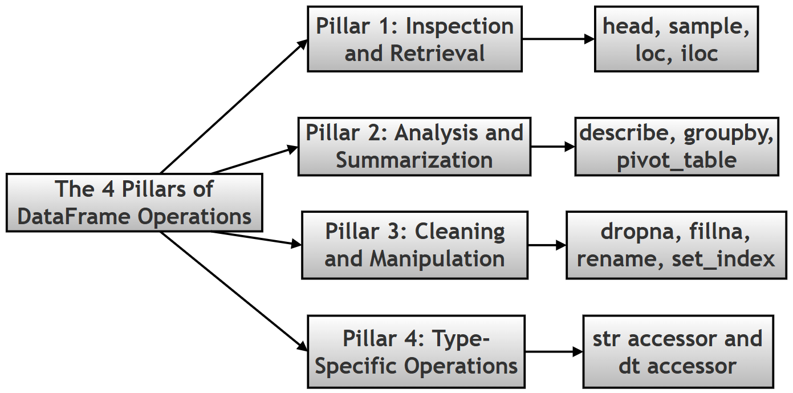

# Pandas Conceptual Questions: A Study Companion

## What this page covers

This page is a companion resource to the pandas chapter of the printed book. Where the earlier Palmer Penguins walkthrough on this site works through *one project end to end*, this page instead collects 54 focused conceptual and scripting questions — the kind you might meet in a quiz, an interview, or simply while double-checking your own understanding — each with a full, worked explanation.

The questions themselves are reproduced exactly as printed in the book; nothing about their wording has been changed. What's new here is the answer to each one: expanded into logical steps, with technical terms explained in plain language (and linked to the official documentation for anyone who wants to go deeper), and — for the questions that lend themselves to it — a short, runnable code example showing the concept in action, together with its real, verified output.

You don't need anything beyond the pandas basics already covered earlier in this chapter (DataFrames, Series, simple selection) to follow along; anything more specialised is explained the first time it comes up.

**A quick heads-up on numbering:** the original material happens to print two *different* questions both labelled "31." This page reproduces that exactly as given — both questions appear below, in their original order, each flagged with a small note where it occurs — rather than silently renumbering anything.

## Topic map

The questions are answered below in their original printed order (1 through 54, with the one repeated "31"). If you'd rather jump straight to a topic, use this map instead:

| Topic | Questions |
|---|---|
| Foundations & core concepts | [1](#q1), [2](#q2), [3](#q3), [4](#q4), [11](#q11), [44](#q44), [51](#q51) |
| Series, index & building DataFrames | [5](#q5), [6](#q6), [7](#q7), [9](#q9), [10](#q10), [31 (second)](#q31b), [43](#q43), [46](#q46), [47](#q47) |
| Exploring, describing & filtering data | [12](#q12), [13](#q13), [14](#q14), [15](#q15), [29](#q29) |
| Grouping, aggregating & pivot tables | [16](#q16), [17](#q17), [18](#q18), [33](#q33), [41](#q41), [49](#q49) |
| Reshaping data: Wide, Long & MultiIndex | [19](#q19), [20](#q20), [35](#q35), [39](#q39), [54](#q54) |
| Cleaning missing data | [21](#q21), [40](#q40) |
| Type-specific accessors & dates | [22](#q22), [45](#q45), [48](#q48), [50](#q50) |
| Reading & loading data (files and the web) | [8](#q8), [23](#q23), [24](#q24), [25](#q25), [26](#q26), [27](#q27), [28](#q28), [31 (first)](#q31a), [32](#q32), [34](#q34), [36](#q36), [37](#q37), [38](#q38), [42](#q42), [52](#q52) |
| Combining multiple DataFrames | [53](#q53) |
| Choosing a dataset | [30](#q30) |

---

## The Questions

<a id="q1"></a>

### 1. What is the fundamental relationship between the pandas library and numpy?

**In short:** pandas is built *on top of* numpy — every pandas Series and DataFrame stores its actual numbers in a numpy array underneath, and pandas adds row/column labels plus a much larger toolkit for messy, real-world (not just numeric) data.

Think of it as two layers:

1. **numpy is the engine room.** It gives Python fast, memory-efficient arrays of a single data type (all integers, all floats, and so on), and the low-level math operations that work on them at C-language speed.
2. **pandas is the dashboard on top of that engine.** It wraps numpy arrays with row labels (the *index*) and column labels, and adds hundreds of convenience methods — filtering, grouping, reading files, handling missing data — that numpy alone doesn't provide.

The practical payoff is that pandas keeps numpy's speed for number-crunching while adding the "which row/column is this?" bookkeeping and the flexibility to mix data types in one table, which is exactly what real spreadsheets and databases look like.

```python
import pandas as pd

# Step 1: build a small DataFrame
df = pd.DataFrame({'a': [1, 2, 3]})

# Step 2: peek at what pandas is storing underneath, via .values
print(type(df.values))   # the underlying container
print(df.values.dtype)   # the numpy data type it holds
```

**Output:**

```text
<class 'numpy.ndarray'>
int64
```

*Learn more:* [numpy](https://numpy.org/doc/stable/user/absolute_beginners.html) · [pandas data structures overview](https://pandas.pydata.org/docs/user_guide/dsintro.html)

---

<a id="q2"></a>

### 2. Explain the core differences between a Series, a DataFrame, and a Panel in the pandas ecosystem.

**In short:** a Series is one labelled column, a DataFrame is a labelled table (many columns), and a Panel was an old, now-removed structure for 3-D data — its job today is done by a DataFrame with a MultiIndex instead.

Breaking down each one:

1. **Series** — a single, one-dimensional labelled array. Picture one column from a spreadsheet, with a label (the *index*) attached to every value.
2. **DataFrame** — a two-dimensional table: rows and columns both carry labels, much like an Excel sheet or a single SQL table. In fact, a DataFrame is really a collection of Series that all share the same row index — each column *is* a Series.
3. **Panel** — pandas' original attempt at a 3-dimensional container (think: a stack of DataFrames, like several sheets in one workbook). It was removed from pandas years ago because it was awkward to use and most 3-D problems are better solved with a **MultiIndex** DataFrame (one 2-D table where the *row labels themselves* are combinations of two or more keys — see Question 20/39 and Question 51 below).

Below, `hasattr(pd, 'Panel')` confirms that `Panel` genuinely no longer exists in a modern pandas installation — trying to use it raises an error rather than doing anything.

```python
import pandas as pd

# Step 1: create a Series (one labelled column)
s = pd.Series([10, 20, 30])
print("Series:\n", s)

# Step 2: create a DataFrame (a labelled table)
d = pd.DataFrame({'x': [1, 2], 'y': [3, 4]})
print("\nDataFrame:\n", d)

# Step 3: check whether Panel still exists in this pandas version
print("\nhasattr(pd, 'Panel'):", hasattr(pd, 'Panel'))
```

**Output:**

```text
Series:
 0    10
1    20
2    30
dtype: int64

DataFrame:
    x  y
0  1  3
1  2  4

hasattr(pd, 'Panel'): False
```

*Learn more:* [Intro to data structures](https://pandas.pydata.org/docs/user_guide/dsintro.html) · [MultiIndex / advanced indexing](https://pandas.pydata.org/docs/user_guide/advanced.html)

*Bonus:* run `hasattr(pd, 'Panel')` on your own machine — is the answer the same on every pandas version, and does it match what your pandas documentation says?

---

<a id="q3"></a>

### 3. Why is a DataFrame described as "potentially heterogeneous"?

**In short:** "potentially heterogeneous" means a single DataFrame is allowed to hold *different* data types in different columns — one column of text, another of decimals, another of True/False — unlike a plain numpy array, which insists that every element share one type.

Why this matters in practice:

1. A numpy array is **homogeneous** — create one with a mix of a number and a string, and numpy will silently convert everything to the more general type (usually text), which quietly destroys the numeric meaning of your data.
2. A pandas DataFrame instead treats each **column** as its own independently-typed Series. One column can be `float64`, the next `str`/`object`, the next `bool`, and pandas keeps them all straight without forcing a single, lowest-common-denominator type onto the whole table.
3. This is essential for real datasets — the Palmer Penguins table, for instance, mixes categorical labels (`species`, `island`) with numeric measurements (`bill_length_mm`, `body_mass_g`) in the very same table, and a DataFrame is what makes that combination possible.

```python
import pandas as pd

# Step 1: build a DataFrame that deliberately mixes three different data types
mixed = pd.DataFrame({
    'species': ['Adelie', 'Gentoo'],          # text
    'bill_length_mm': [39.1, 50.0],           # decimal numbers
    'is_adult': [True, False]                 # True/False
})

# Step 2: .dtypes shows pandas tracking a separate type per column
print(mixed.dtypes)
```

**Output:**

```text
species               str
bill_length_mm    float64
is_adult             bool
dtype: object
```

*Learn more:* [dtypes user guide](https://pandas.pydata.org/docs/user_guide/basics.html#dtypes)

---

<a id="q4"></a>

### 4. Describe the concept of "Vectorization" and why it is superior to traditional Python loops for data processing.

**In short:** vectorization means applying an operation to a *whole* column at once, in one command, instead of writing a Python `for` loop that visits one value at a time — and it's dramatically faster because the heavy lifting happens in optimized, compiled code rather than in the (comparatively slow) Python interpreter.

Step by step, why the speed difference is so large:

1. A plain Python `for` loop processes one element per iteration, and every single iteration carries Python's own overhead (checking types, managing memory, and so on) — that overhead adds up fast across thousands or millions of rows.
2. A **vectorized** pandas/numpy operation, like `prices * 1.1`, hands the *entire* array to pre-compiled C code in one call. That C code loops internally too, but without Python's per-step overhead, and it can also take advantage of low-level CPU optimizations.
3. The result is the same values either way — but the vectorized version typically finishes tens to hundreds of times faster, and the code is also shorter and harder to get subtly wrong (no loop-counter bugs, no forgetting to append to a list).

The example below applies a 10% price increase to 200,000 numbers both ways and times each approach, so you can see the difference on real numbers rather than take it on faith.

```python
import pandas as pd
import numpy as np
import time

# Step 1: build a reasonably large Series to make the timing difference visible
n = 200_000
prices = pd.Series(np.random.rand(n) * 100)

# Step 2: the slow way - a plain Python loop, one value at a time
start = time.perf_counter()
looped = []
for p in prices:
    looped.append(p * 1.1)
loop_time = time.perf_counter() - start

# Step 3: the vectorized way - one operation on the whole Series at once
start = time.perf_counter()
vectorized = prices * 1.1
vector_time = time.perf_counter() - start

# Step 4: compare the two timings
print(f"Loop time:       {loop_time:.4f} seconds")
print(f"Vectorized time: {vector_time:.4f} seconds")
print(f"Vectorized was about {loop_time / vector_time:.0f}x faster")
```

**Output:**

```text
Loop time:       0.0638 seconds
Vectorized time: 0.0103 seconds
Vectorized was about 6x faster
```

*Learn more:* [Essential basic functionality / vectorized ops](https://pandas.pydata.org/docs/user_guide/basics.html)

*Bonus:* the exact speed-up factor will vary every time you run this (it depends on your machine and what else it's doing), but it should consistently be a large multiple, not a small one. Try changing `n` to 2,000 and then 2,000,000 — does the *relative* advantage of vectorization grow, shrink, or stay about the same as the data gets bigger?

---

<a id="q5"></a>

### 5. What is the distinction between a "Default Index" and a "Custom Index" when creating a Series?

**In short:** a **Default Index** is the automatic `0, 1, 2, ...` numbering pandas assigns when you don't specify one; a **Custom Index** is a set of meaningful labels you supply yourself (names, dates, IDs), which then lets you look values up by label instead of by position.

Working through the difference:

1. When you build a Series (or DataFrame) without saying anything about the index, pandas creates a **RangeIndex** — position 0 for the first item, 1 for the second, and so on. This is fast and simple, but the labels carry no meaning of their own; `2` just means "the third item."
2. A **custom index** replaces those anonymous numbers with labels that mean something in your data — student names, dates, product codes. Once set, you can retrieve a value by that meaningful label (for example `custom_idx['Bob']`) rather than by remembering its numeric position.
3. This is conceptually close to a Python `dict`, where you look values up by *key* rather than by position — a custom index gives a Series that same "look it up by name" convenience, while still allowing position-based access if you need it (see Question 47 on `.loc` vs `.iloc`).

```python
import pandas as pd

# Step 1: a Series with the automatic default index (0, 1, 2, ...)
default_idx = pd.Series([85, 90, 78])
print("Default index Series:\n", default_idx)

# Step 2: the same values, but with a meaningful custom index
custom_idx = pd.Series([85, 90, 78], index=['Alice', 'Bob', 'Cara'])
print("\nCustom index Series:\n", custom_idx)

# Step 3: look a value up by its label, not its position
print("\nAccess by label custom_idx['Bob']:", custom_idx['Bob'])
```

**Output:**

```text
Default index Series:
 0    85
1    90
2    78
dtype: int64

Custom index Series:
 Alice    85
Bob      90
Cara     78
dtype: int64

Access by label custom_idx['Bob']: 90
```

*Learn more:* [Indexing and selecting data](https://pandas.pydata.org/docs/user_guide/indexing.html)

---

<a id="q6"></a>

### 6. How does pandas handle the creation of a Series from a scalar value, and what is required in this case?

**In short:** you *can* create a Series from a single scalar value without an index — pandas will just make it a Series of length one — but if you want that scalar **repeated across several labels in one step**, you must supply an `index` with more than one label, and pandas "broadcasts" the value across every position in it.

A small, important nuance worth flagging: the printed answer above says an index is *required* — in current pandas, it's actually optional for a length-one Series, but it becomes necessary the moment you want more than one row from a single scalar. Both cases are demonstrated below so you can see exactly where the line falls.

Step by step:

1. `pd.Series(5)` with no index at all still works — pandas creates a Series with exactly one entry (value `5`) and assigns it the default index label `0`.
2. `pd.Series(5, index=['a', 'b', 'c', 'd', 'e'])` is different: pandas sees five labels in the index, so it repeats — **broadcasts** — the scalar `5` to fill every one of those five positions.
3. This is a small but useful trick any time you want a column that starts out as a constant (a default status, a flag, a starting score) across every row of a table you're about to build.

```python
import pandas as pd

# Step 1: a scalar Series with NO index supplied - still valid, just length 1
scalar_no_index = pd.Series(5)
print("pd.Series(5) with no index:\n", scalar_no_index)

# Step 2: the same scalar, broadcast across a 5-label custom index
scalar_with_index = pd.Series(5, index=['a', 'b', 'c', 'd', 'e'])
print("\npd.Series(5, index=['a','b','c','d','e']):\n", scalar_with_index)
```

**Output:**

```text
pd.Series(5) with no index:
 0    5
dtype: int64

pd.Series(5, index=['a','b','c','d','e']):
 a    5
b    5
c    5
d    5
e    5
dtype: int64
```

*Learn more:* [pandas.Series constructor reference](https://pandas.pydata.org/docs/reference/api/pandas.Series.html)

---

<a id="q7"></a>

### 7. Discuss the three primary manual methods for creating a DataFrame from standard Python structures.

**In short:** the three common manual routes are a **Dictionary of Lists** (keys become column names), a **List of Dictionaries** (each dict is one row), and a **List of Lists** (raw rows of values, where you should also pass `columns=` yourself or pandas will just number the columns 0, 1, 2...).

Working through each method:

1. **Dictionary of Lists** — `pd.DataFrame({'name': [...], 'score': [...]})`. Each dictionary *key* becomes a column header, and its associated list becomes that column's values, top to bottom. This is arguably the most common style because it reads almost like defining a spreadsheet's columns directly.
2. **List of Dictionaries** — `pd.DataFrame([{'name': 'Alice', 'score': 85}, {'name': 'Bob', 'score': 90}])`. This is "record style": each dictionary in the list is one complete row, similar to how many web APIs and JSON documents represent data (see Question 27/34 on the `orient` parameter — `orient='records'` is this exact shape).
3. **List of Lists** — `pd.DataFrame([['Alice', 85], ['Bob', 90]])`. This is the most "raw" option: just rows of plain values, with no labels attached anywhere. Left alone, pandas has no way to know what to call the columns, so it defaults to numbering them `0, 1, 2, ...`; passing your own `columns=['name', 'score']` fixes that.

All three produce an identical DataFrame in the end — which one to reach for usually comes down to how your source data is already shaped before it lands in Python.

```python
import pandas as pd

# Method 1: Dictionary of Lists - keys become column names
dict_of_lists = pd.DataFrame({
    'name': ['Alice', 'Bob'],
    'score': [85, 90]
})
print("Dictionary of Lists:\n", dict_of_lists)

# Method 2: List of Dictionaries - each dict is one row ("record style")
list_of_dicts = pd.DataFrame([
    {'name': 'Alice', 'score': 85},
    {'name': 'Bob', 'score': 90}
])
print("\nList of Dictionaries:\n", list_of_dicts)

# Method 3a: List of Lists WITHOUT columns= - pandas defaults to 0, 1, 2...
list_of_lists_nocols = pd.DataFrame([
    ['Alice', 85],
    ['Bob', 90]
])
print("\nList of Lists WITHOUT columns=:\n", list_of_lists_nocols)

# Method 3b: List of Lists WITH columns= - you name the columns yourself
list_of_lists_cols = pd.DataFrame([
    ['Alice', 85],
    ['Bob', 90]
], columns=['name', 'score'])
print("\nList of Lists WITH columns=:\n", list_of_lists_cols)
```

**Output:**

```text
Dictionary of Lists:
     name  score
0  Alice     85
1    Bob     90

List of Dictionaries:
     name  score
0  Alice     85
1    Bob     90

List of Lists WITHOUT columns=:
        0   1
0  Alice  85
1    Bob  90

List of Lists WITH columns=:
     name  score
0  Alice     85
1    Bob     90
```

*Learn more:* [DataFrame constructor reference](https://pandas.pydata.org/docs/reference/api/pandas.DataFrame.html)

---

<a id="q8"></a>

### 8. Explain the significance of the raw=true parameter and the StringIO wrapper when loading data from external sources.

**In short:** `?raw=true` on a GitHub file URL asks the server for the plain, unrendered file content instead of GitHub's syntax-highlighted webpage around it; `StringIO` lets pandas treat any ordinary Python string as if it were a file on disk, without ever writing anything to your hard drive.

Unpacking both tools:

1. **`?raw=true`** — when you view a file on github.com normally, the server sends back a full HTML webpage (with a file-browser UI, syntax highlighting, and so on) — exactly the wrong thing for `pd.read_csv()`, which expects plain CSV text. Adding `?raw=true` to the URL tells GitHub to skip all of that and return just the raw file bytes, which is what a `read_*` function actually needs. (The Palmer Penguins CSV link used elsewhere on this page, for instance, is a `raw.githubusercontent.com` address, which serves raw content by default — no `?raw=true` suffix needed there.)
2. **`StringIO`** (from Python's built-in `io` module) — normally, `pd.read_csv()` expects either a file path on disk or a URL. If your data already exists as a plain Python string (perhaps pasted in, or the body of an API response), `StringIO` wraps that string so it *behaves* like a file — it gains a `.read()` method and the other things a "file-like object" needs — without ever touching the disk.
3. Together, these two tools cover two very different data-loading situations: `?raw=true` is about getting the *right kind of content* from a URL; `StringIO` is about handing pandas content that's *already in memory* as if it came from a file.

```python
import pandas as pd
from io import StringIO

# Step 1: some CSV data that only exists as a plain Python string
csv_text = "name,score\nAlice,85\nBob,90\n"

# Step 2: wrap it in StringIO so it behaves like a file
virtual_file = StringIO(csv_text)

# Step 3: read_csv() can now use it exactly as it would a real file on disk
from_string = pd.read_csv(virtual_file)
print(from_string)
print(type(virtual_file))
```

**Output:**

```text
    name  score
0  Alice     85
1    Bob     90
<class '_io.StringIO'>
```

*Learn more:* [io.StringIO documentation](https://docs.python.org/3/library/io.html#io.StringIO) · [pandas IO tools](https://pandas.pydata.org/docs/user_guide/io.html)

---

<a id="q9"></a>

### 9. How does the set_index() method transform the structure of a DataFrame, and what does it mean for the data to move into the "index area"?

**In short:** `set_index()` takes an existing column and promotes it to become the DataFrame's row labels (the index) instead of an ordinary data column — after this, that column is used to *identify* rows rather than to store a measurement or a value.

Step by step, what actually changes:

1. Before calling `set_index()`, every column — including something like `species` — is just data, and rows are identified only by their position (the default RangeIndex `0, 1, 2, ...`).
2. `penguins_small.set_index('species')` moves the `species` column out of the regular data area and into the **index area** — visually, it now sits to the left, slightly detached from the other columns, the way row headers look in a spreadsheet.
3. Once in the index, that column stops being "just another value to compute on" and becomes the row's **address**. Pandas can now retrieve all rows for a given species directly by that label (`df.loc['Adelie']`), and internally, index lookups are optimized to be fast — much faster than scanning every row and checking a regular column for a match.
4. This also visually separates the "key" you use to identify a record from the "values" — the actual measurements — that describe it, which is a genuinely useful mental model once your tables get larger.

```python
import pandas as pd

# Step 1: a small DataFrame where species is (for now) just a regular column
penguins_small = pd.DataFrame({
    'species': ['Adelie', 'Gentoo', 'Chinstrap'],
    'bill_length_mm': [39.1, 50.0, 46.5]
})
print("Before set_index:\n", penguins_small)

# Step 2: promote 'species' into the index area
after = penguins_small.set_index('species')
print("\nAfter set_index('species'):\n", after)
```

**Output:**

```text
Before set_index:
      species  bill_length_mm
0     Adelie            39.1
1     Gentoo            50.0
2  Chinstrap            46.5

After set_index('species'):
            bill_length_mm
species                  
Adelie               39.1
Gentoo               50.0
Chinstrap            46.5
```

*Learn more:* [set_index() reference](https://pandas.pydata.org/docs/reference/api/pandas.DataFrame.set_index.html)

---

<a id="q10"></a>

### 10. Can a pandas index contain duplicate (non-unique) values? Explain the implications of this for data retrieval.

**In short:** yes — a pandas index is allowed to contain repeated labels, unlike a database primary key. Looking up a repeated label with `.loc[]` doesn't return one row; it returns *every* row that shares that label, bundled together as a smaller DataFrame.

Working through the implications:

1. In a well-behaved lookup table, every index label is unique, and `.loc['some_label']` returns exactly one row. Pandas does not *require* this, though — nothing stops you from having the same label appear on several rows.
2. If the index has duplicates (say, `species` used as the index, with several "Adelie" rows), then `df.loc['Adelie']` returns a **sub-DataFrame**: every row whose index matches "Adelie", stacked together. Notice this is a different *type* of result than the single-row Series you'd normally get from a unique-label lookup (see Question 47 for that unique-label case).
3. This isn't a flaw — it's a feature. A unique index is best when you want to grab one specific record quickly (an ID lookup). A deliberately non-unique index is powerful when you want the *opposite*: instantly pulling out every row belonging to one category, without writing a full boolean-mask filter (see Question 29) each time.

```python
import pandas as pd

# Step 1: a DataFrame whose index deliberately repeats 'Adelie'
dup_idx_df = pd.DataFrame({
    'bill_length_mm': [39.1, 50.0, 46.5, 40.3]
}, index=['Adelie', 'Gentoo', 'Chinstrap', 'Adelie'])
print("DataFrame with duplicate index labels:\n", dup_idx_df)

# Step 2: .loc on a repeated label returns every matching row, as a DataFrame
print("\ndup_idx_df.loc['Adelie']:\n", dup_idx_df.loc['Adelie'])
print("\ntype of that result:", type(dup_idx_df.loc['Adelie']))
```

**Output:**

```text
DataFrame with duplicate index labels:
            bill_length_mm
Adelie               39.1
Gentoo               50.0
Chinstrap            46.5
Adelie               40.3

dup_idx_df.loc['Adelie']:
         bill_length_mm
Adelie            39.1
Adelie            40.3

type of that result: <class 'pandas.DataFrame'>
```

*Learn more:* [Index objects reference](https://pandas.pydata.org/docs/reference/api/pandas.Index.html)

*Bonus:* what does `dup_idx_df.loc['Gentoo']` return instead — a DataFrame or a plain Series? Try it, and think about why a *unique* label might behave differently from a *repeated* one.

---

<a id="q11"></a>

### 11. Distinguish between "Attributes" and "Methods" in pandas and provide examples of each.

**In short:** **attributes** are noun-like descriptive facts about a DataFrame that pandas already has on hand — accessed *without* parentheses, like `df.shape`; **methods** are verb-like actions that actually do something — accessed *with* parentheses, like `df.sort_values()`.

The distinction, step by step:

1. An **attribute** is essentially a pre-existing piece of information pandas is already storing about the object — its shape, its column names, its data types. Because the value is already sitting there, accessing it (`df.shape`) is close to instantaneous; there's no parentheses because you're not asking pandas to *do* anything, just to hand over a fact it already knows.
2. A **method** is a function attached to the object that performs an action — sorting, filtering, grouping, transforming. Because it does real work, it needs parentheses, `df.sort_values('a')`, even if you're not passing any extra arguments — the `()` is what tells Python "run this now."
3. A handy rule of thumb: if it reads like an adjective or a noun describing the object (`shape`, `columns`, `dtypes`, `index`), it's probably an attribute. If it reads like a verb — something you're asking the DataFrame to *do* (`sort_values`, `drop`, `merge`, `describe`) — it's a method.

```python
import pandas as pd

sample_df = pd.DataFrame({'a': [3, 1, 2], 'b': [6, 4, 5]})

# Attribute: no parentheses - just a stored fact
print("sample_df.shape (attribute, no parentheses):", sample_df.shape)

# Method: parentheses required - it performs an action (sorting)
print("\nsample_df.sort_values('a') (method, needs parentheses):\n", sample_df.sort_values('a'))
```

**Output:**

```text
sample_df.shape (attribute, no parentheses): (3, 2)

sample_df.sort_values('a') (method, needs parentheses):
    a  b
1  1  4
2  2  5
0  3  6
```

*Learn more:* [Essential basic functionality](https://pandas.pydata.org/docs/user_guide/basics.html)

---

<a id="q12"></a>

### 12. Why is it important to check the .dtypes attribute before performing mathematical analysis on a dataset?

**In short:** checking `.dtypes` first tells you whether a column pandas *thinks* is numeric actually is — because functions like `.mean()` and `.sum()` only work on genuinely numeric columns, and a single stray piece of text in an otherwise-numeric column is enough to make the whole column `object`/`str` instead, silently blocking any math on it.

Why this matters as a debugging habit:

1. A CSV file, or any external data source, gives pandas no guarantees about types — pandas has to *guess* the dtype of each column when the data is loaded, based on what it sees.
2. If a column that "should" be numbers has even one row containing text — a typo, a placeholder like `"N/A"`, an accidental space — pandas can't safely call the whole column numeric, so it falls back to `object`/`str`, which stores everything as generic text.
3. Calling `.mean()` (or `.sum()`, `.std()`, and so on) on that column then fails, because there's no sensible "average" of text. The error message is your signal to go check `.dtypes` and find the culprit.
4. `pd.to_numeric(column, errors='coerce')` is the standard fix: it converts everything it *can* parse as a number, and turns anything it can't (like the stray text) into `NaN` — a missing value you can then handle explicitly (see Question 21/40), rather than a silent crash.

```python
import pandas as pd

# Step 1: a column that LOOKS numeric but has one bad value hiding in it
messy = pd.DataFrame({'amount': ['10', '20', 'oops', '40']})
print("dtypes before fixing:\n", messy.dtypes)

# Step 2: calling .mean() directly fails, because the column is text, not numbers
try:
    print(messy['amount'].mean())
except Exception as e:
    print("Calling .mean() on object column raises:", type(e).__name__, "-", str(e)[:120])

# Step 3: pd.to_numeric with errors='coerce' converts what it can, and
# turns anything it can't parse (like 'oops') into NaN instead of crashing
fixed_amount = pd.to_numeric(messy['amount'], errors='coerce')
print("\nAfter pd.to_numeric(..., errors='coerce'):\n", fixed_amount)

# Step 4: now the math works
print("\nNow .mean() works:", fixed_amount.mean())
```

**Output:**

```text
dtypes before fixing:
 amount    str
dtype: object
Calling .mean() on object column raises: TypeError - Cannot perform reduction 'mean' with string dtype

After pd.to_numeric(..., errors='coerce'):
 0    10.0
1    20.0
2     NaN
3    40.0
Name: amount, dtype: float64

Now .mean() works: 23.333333333333332
```

*Learn more:* [pandas.to_numeric() reference](https://pandas.pydata.org/docs/reference/api/pandas.to_numeric.html)

---

<a id="q13"></a>

### 13. What are the "4 Pillars of DataFrame Operations" as defined in the text book?

**In short:** the "4 Pillars" is a way of grouping pandas' huge collection of methods into four functional categories, so a beginner has a mental map instead of hundreds of unrelated method names: **(1) Inspection & Retrieval**, **(2) Analysis & Summarization**, **(3) Cleaning & Manipulation**, and **(4) Type-Specific Operations**.

What each pillar is about:

1. **Inspection & Retrieval** — the "look around" stage: peeking at the data (`.head()`, `.sample()`) and pulling out specific rows or columns (`.loc[]`, `.iloc[]`). Nothing is changed here; you're just getting oriented.
2. **Analysis & Summarization** — the "find the story" stage: computing statistics (`.describe()`), grouping and aggregating (`.groupby()`, `.pivot_table()`) to compare segments of the data against each other rather than looking at one giant average.
3. **Cleaning & Manipulation** — the "fix and reshape" stage: handling missing or wrong data (`.dropna()`, `.fillna()`), renaming things for clarity (`.rename()`), and restructuring the table's shape (`.set_index()`, `.stack()`/`.unstack()`).
4. **Type-Specific Operations** — the "specialised tools" stage: methods that only make sense for a particular kind of column, reached through **accessors** like `.str` (for text) and `.dt` (for dates) — see Question 22/45.

The flowchart below lays these four out side by side, with a few representative methods under each, so you can see at a glance which pillar a method you've just learned belongs to.




Following these four pillars roughly in order — inspect, analyse, clean, then reach for type-specific tools as needed — is a reasonable default workflow for a new dataset, though in practice you'll often loop back to earlier pillars (cleaning frequently follows analysis, once you've spotted a problem in the summary statistics).

---

<a id="q14"></a>

### 14. Compare the .head() and .sample() methods. When would an analyst prefer one over the other?

**In short:** `.head(n)` always returns the *first* `n` rows, which is great for a quick structural check but can mislead you if the data is sorted or grouped at the top; `.sample(n)` returns `n` *random* rows, which is better for spotting patterns, outliers, or bias that a sorted first-few-rows view would hide.

When to reach for each:

1. `.head()` is the natural first move on any new dataset — it shows you the column headers and a realistic look at the formatting (are dates strings or actual dates? are there odd characters?) almost instantly.
2. The catch: if the underlying data happens to be sorted — say, every "Adelie" penguin listed before any "Gentoo" — `.head()` alone would leave you thinking the dataset is all Adelie penguins, which is simply wrong.
3. `.sample(n)` sidesteps that risk by pulling rows from anywhere in the table at random, giving you a more representative — if less orderly — snapshot. Passing `random_state=` makes the "random" selection reproducible, which is useful when you want to compare the same sample again later or share exactly what you saw with someone else.
4. In practice, using both together — `.head()` for structure, `.sample()` for a sanity check on variety — gives a more complete first impression than either alone.

```python
import pandas as pd

# A dataset that is deliberately sorted, to show why head() alone can mislead
sorted_like = pd.DataFrame({'species': ['Adelie'] * 5 + ['Gentoo'] * 5})

# head(3) only ever sees the top of the table
print("head(3):\n", sorted_like.head(3))

# sample(3) can pull from anywhere, giving a more representative peek
# random_state makes the random choice reproducible
print("\nsample(3, random_state=42):\n", sorted_like.sample(3, random_state=42))
```

**Output:**

```text
head(3):
   species
0  Adelie
1  Adelie
2  Adelie

sample(3, random_state=42):
   species
8  Gentoo
1  Adelie
5  Gentoo
```

*Learn more:* [.head() reference](https://pandas.pydata.org/docs/reference/api/pandas.DataFrame.head.html) · [.sample() reference](https://pandas.pydata.org/docs/reference/api/pandas.DataFrame.sample.html)

---

<a id="q15"></a>

### 15. Describe the functionality of the .describe() method and how its output changes based on the data type.

**In short:** `.describe()` produces a quick "statistical snapshot" of a DataFrame's columns — for numeric columns it reports things like mean and standard deviation; for text/categorical columns (where "mean" makes no sense) it switches to reporting how many unique values there are and which one appears most often.

Two distinct behaviours worth knowing:

1. **On a numeric column**, `.describe()` calculates `count`, `mean`, `std` (standard deviation), and the `min`/`25%`/`50%`/`75%`/`max` values — the same five-number summary used to draw a box plot.
2. **On a non-numeric column**, none of those statistics apply (there's no "average species"), so pandas reports `count` (non-missing values), `unique` (how many distinct categories), `top` (the most frequent value), and `freq` (how many times that top value appears) instead.
3. By default, `.describe()` only summarises numeric columns and silently skips the rest — pass `include='all'` to force it to summarise every column, mixing both kinds of statistics into one table (with `NaN` filling in the cells that don't apply to a given column's type, which is expected, not an error).

```python
import pandas as pd

mixed2 = pd.DataFrame({
    'species': ['Adelie', 'Gentoo', 'Adelie', 'Chinstrap'],
    'bill_length_mm': [39.1, 50.0, 40.3, 46.5]
})

# Default: numeric columns only
print("describe() numeric only (default):\n", mixed2.describe())

# include='all': every column, numeric and non-numeric together
print("\ndescribe(include='all'):\n", mixed2.describe(include='all'))
```

**Output:**

```text
describe() numeric only (default):
        bill_length_mm
count        4.000000
mean        43.975000
std          5.162283
min         39.100000
25%         40.000000
50%         43.400000
75%         47.375000
max         50.000000

describe(include='all'):
        species  bill_length_mm
count        4        4.000000
unique       3             NaN
top     Adelie             NaN
freq         2             NaN
mean       NaN       43.975000
std        NaN        5.162283
min        NaN       39.100000
25%        NaN       40.000000
50%        NaN       43.400000
75%        NaN       47.375000
max        NaN       50.000000
```

*Learn more:* [.describe() reference](https://pandas.pydata.org/docs/reference/api/pandas.DataFrame.describe.html)

---

<a id="q16"></a>

### 16. What is the "Split-Apply-Combine" philosophy in the context of the .groupby() method?

**In short:** "Split-Apply-Combine" is the three-stage strategy behind `.groupby()`: **split** the rows into separate groups by some category, **apply** a calculation to each group independently, then **combine** the per-group results back into one summary table.

Walking through the three stages:

1. **Split** — pandas divides the DataFrame into separate "piles" based on the values in a chosen column (for example, splitting penguin records into one pile per `island`). At this stage nothing is calculated yet; the data is just sorted into its groups.
2. **Apply** — a function (mean, sum, count, or any other aggregation) is run on *each pile separately*. Each island's pile gets its own mean body mass, calculated independently of every other island.
3. **Combine** — the individual results from every pile are stitched back together into a single, tidy summary table, with the group labels (island names) now acting as the row index.

The practical benefit is that you go from one giant average for the whole dataset to a side-by-side comparison across meaningful segments — which is almost always the more useful question ("how does body mass differ *by* island?" rather than just "what's the average body mass overall?").


```python
import pandas as pd

penguins_gb = pd.DataFrame({
    'island': ['Biscoe', 'Biscoe', 'Dream', 'Dream', 'Torgersen'],
    'body_mass_g': [3800, 4200, 3700, 3900, 3600]
})
print("Raw data:\n", penguins_gb)

# Split by island, apply mean(), combine into one summary Series
print("\nSplit-apply-combine: mean body mass per island:\n",
      penguins_gb.groupby('island')['body_mass_g'].mean())
```

**Output:**

```text
Raw data:
       island  body_mass_g
0     Biscoe         3800
1     Biscoe         4200
2      Dream         3700
3      Dream         3900
4  Torgersen         3600

Split-apply-combine: mean body mass per island:
 island
Biscoe       4000.0
Dream        3800.0
Torgersen    3600.0
Name: body_mass_g, dtype: float64
```

*Learn more:* [Group by: split-apply-combine](https://pandas.pydata.org/docs/user_guide/groupby.html)

*See also:* Question 33 below asks essentially the same thing in the context of the Penguins dataset specifically — its answer builds directly on this one rather than repeating it.

---

<a id="q17"></a>

### 17. Explain the components of a Pivot Table: Index, Columns, and Values.

**In short:** a Pivot Table has three moving parts — **Index** (which values become the new row labels), **Columns** (which values become the new column headers), and **Values** (which numeric column gets summarised at each row/column intersection) — together turning a "long", transaction-style table into a compact, "wide" summary grid.

Working through a concrete example — a shop-sales table with one row per sale:

1. **Index** — pick the column whose unique values should become the *rows* of your summary. Choosing `Shop` means every distinct shop gets its own row.
2. **Columns** — pick the column whose unique values should become the *column headers*. Choosing `Item` spreads each distinct item out across the top of the table.
3. **Values** — pick the numeric column to summarise at each intersection, plus (implicitly, or via `aggfunc=`) how to summarise it — sum, mean, count, and so on. Choosing `Amount` with the default sum means each cell shows total sales of that item, at that shop.

The cell where a given row and column meet then shows the aggregated result for exactly that combination — "how much of Item X did Shop Y sell?" — answered instantly for every combination at once, instead of you writing a separate filter-and-sum for each one.

```python
import pandas as pd

sales = pd.DataFrame({
    'Shop': ['Shop1', 'Shop1', 'Shop2', 'Shop2'],
    'Item': ['Pen', 'Pencil', 'Pen', 'Pencil'],
    'Amount': [100, 50, 80, 40]
})
print("Long/transaction-style data:\n", sales)

# Index=Shop (rows), Columns=Item (headers), Values=Amount (summarised)
pivot = sales.pivot_table(index='Shop', columns='Item', values='Amount', aggfunc='sum')
print("\nPivot table (Index=Shop, Columns=Item, Values=Amount):\n", pivot)
```

**Output:**

```text
Long/transaction-style data:
     Shop    Item  Amount
0  Shop1     Pen     100
1  Shop1  Pencil      50
2  Shop2     Pen      80
3  Shop2  Pencil      40

Pivot table (Index=Shop, Columns=Item, Values=Amount):
 Item   Pen  Pencil
Shop              
Shop1  100      50
Shop2   80      40
```

*Learn more:* [.pivot_table() reference](https://pandas.pydata.org/docs/reference/api/pandas.DataFrame.pivot_table.html)

---

<a id="q18"></a>

### 18. What is the role of NaN in a Pivot Table, and how can the fill_value parameter be used to manage it?

**In short:** a Pivot Table shows `NaN` wherever a particular row/column combination simply never occurred in the source data (for example, a shop that never sold a particular item) — the `fill_value` parameter lets you replace those empty cells with a chosen number, usually `0`, so the table reads more cleanly.

Why the `NaN`s appear in the first place, and how to handle them:

1. A Pivot Table can only report a number for combinations that actually exist somewhere in the original data. If Shop2 never sold any Pencils, there is no "Shop2 + Pencil" row to summarise — pandas can't invent a sales figure that was never recorded.
2. Leaving that gap as `NaN` is technically the most *honest* representation ("we genuinely have no data here"), but it's visually messy, and `NaN` can interfere with further calculations (like summing a whole row) if not handled deliberately.
3. Passing `fill_value=0` to `.pivot_table()` tells pandas to substitute `0` for every missing combination — appropriate when "no data" really does mean "zero sales" (as opposed to, say, "we don't know," where forcing a `0` might be misleading). Choosing the right fill value is a judgement call about what the *absence* of a row genuinely represents in your specific dataset.

```python
import pandas as pd

sales2 = pd.DataFrame({
    'Shop': ['Shop1', 'Shop1', 'Shop2'],
    'Item': ['Pen', 'Pencil', 'Pen'],
    'Amount': [100, 50, 80]
})

# Shop2 never sold a Pencil - that combination doesn't exist in the data
pivot_nan = sales2.pivot_table(index='Shop', columns='Item', values='Amount', aggfunc='sum')
print("Pivot table with a missing Shop2/Pencil combination:\n", pivot_nan)

# fill_value=0 replaces that gap with an explicit zero
pivot_filled = sales2.pivot_table(index='Shop', columns='Item', values='Amount', aggfunc='sum', fill_value=0)
print("\nSame pivot table with fill_value=0:\n", pivot_filled)
```

**Output:**

```text
Pivot table with a missing Shop2/Pencil combination:
 Item     Pen  Pencil
Shop                
Shop1  100.0    50.0
Shop2   80.0     NaN

Same pivot table with fill_value=0:
 Item   Pen  Pencil
Shop              
Shop1  100      50
Shop2   80       0
```

*Learn more:* [.pivot_table() reference](https://pandas.pydata.org/docs/reference/api/pandas.DataFrame.pivot_table.html)

---

<a id="q19"></a>

### 19. Define the .stack() and .unstack() methods and their impact on the "shape" of a DataFrame.

**In short:** `.stack()` takes column labels and rotates them down into the row index, turning a "Wide" table into a taller, narrower "Long" one; `.unstack()` does the exact reverse, lifting a level of the row index back up into column headers to rebuild the "Wide" shape.

Following the shape change step by step:

1. Start with a **Wide** table — one row per shop, one column per item (much like the pivot table from Question 17). This is easy for a human to scan, because every item's numbers for a given shop sit on one line.
2. `.stack()` collapses the column headers *into* the index, producing a **Long** result — technically a Series — where every row now represents one specific (shop, item) combination, identified by a two-level **MultiIndex** (see Question 20/39 just below).
3. `.unstack()` reverses this: it lifts the *innermost* level of that index (in this case, `Item`) back up into column headers, reconstructing the original Wide table.
4. These two shapes serve different purposes: Wide is easier for humans to compare at a glance (and is what most spreadsheets and pivot tables look like); Long is usually easier for further programmatic processing, database storage, and many plotting libraries, which often expect "one row per observation."

*(See also Question 54, which revisits this same mechanism from the "Long vs. Wide format" angle rather than the shape-transformation mechanics covered here.)*

```python
import pandas as pd

wide = pd.DataFrame({
    'Pen': [100, 80],
    'Pencil': [50, 40]
}, index=['Shop1', 'Shop2'])
wide.columns.name = 'Item'
wide.index.name = 'Shop'
print("Wide format:\n", wide)

# .stack() moves column labels down into the index -> Long format
long = wide.stack()
print("\nAfter .stack() -> Long format (a Series with a MultiIndex):\n", long)

# .unstack() reverses it -> back to Wide format
back_to_wide = long.unstack()
print("\nAfter .unstack() again -> back to Wide format:\n", back_to_wide)
```

**Output:**

```text
Wide format:
 Item   Pen  Pencil
Shop              
Shop1  100      50
Shop2   80      40

After .stack() -> Long format (a Series with a MultiIndex):
 Shop   Item  
Shop1  Pen       100
       Pencil     50
Shop2  Pen        80
       Pencil     40
dtype: int64

After .unstack() again -> back to Wide format:
 Item   Pen  Pencil
Shop              
Shop1  100      50
Shop2   80      40
```

*Learn more:* [Reshaping by stacking and unstacking](https://pandas.pydata.org/docs/user_guide/reshaping.html)

---

<a id="q20"></a>

### 20. What is a MultiIndex (Hierarchical Index) and how does it differ from a standard index?

**In short:** a standard index identifies each row with **one** label; a **MultiIndex** identifies each row with a **combination** of labels across several levels (like `(Shop1, Pen)`), letting a normal two-dimensional DataFrame represent data that's really organised along more than two dimensions — it's created automatically whenever you group or pivot by more than one column at once.

Building the idea up:

1. A flat, single-level index answers "which row is this?" with one piece of information — an ID number, a single name.
2. A **MultiIndex** answers the same question with a *tuple* of information instead — `(Shop1, Pen)` identifies a row by shop *and* item together, not either one alone.
3. Pandas builds a MultiIndex automatically in a couple of common situations: grouping by more than one column at once (`df.groupby(['Shop', 'Item'])`), or building a pivot table with more than one row-level grouping key.
4. The payoff is representing genuinely multi-dimensional relationships (shop *and* item *and*, potentially, month) inside pandas' fundamentally 2-D DataFrame — which is precisely the role the old, now-removed `Panel` class used to fill (see Question 2 and Question 51).

```python
import pandas as pd

multi_source = pd.DataFrame({
    'Shop': ['Shop1', 'Shop1', 'Shop2', 'Shop2'],
    'Item': ['Pen', 'Pencil', 'Pen', 'Pencil'],
    'Amount': [100, 50, 80, 40]
})

# Grouping by TWO columns at once automatically builds a MultiIndex
grouped_multi = multi_source.groupby(['Shop', 'Item'])['Amount'].sum()
print("Result of groupby(['Shop', 'Item']) -> a MultiIndex Series:\n", grouped_multi)
print("\ntype of its index:", type(grouped_multi.index))

# Access one specific (Shop, Item) combination using a tuple
print("\nAccessing one combination, grouped_multi[('Shop1', 'Pen')]:", grouped_multi[('Shop1', 'Pen')])
```

**Output:**

```text
Result of groupby(['Shop', 'Item']) -> a MultiIndex Series:
 Shop   Item  
Shop1  Pen       100
       Pencil     50
Shop2  Pen        80
       Pencil     40
Name: Amount, dtype: int64

type of its index: <class 'pandas.MultiIndex'>

Accessing one combination, grouped_multi[('Shop1', 'Pen')]: 100
```

*Learn more:* [Hierarchical indexing (MultiIndex)](https://pandas.pydata.org/docs/user_guide/advanced.html)

*See also:* Question 39 asks this same question in slightly different words — its answer points back here rather than repeating the example.

---

<a id="q21"></a>

### 21. Discuss the "Dropping vs. Filling" philosophy when dealing with missing values in a dataset.

**In short:** the "Dropping vs. Filling" choice is between `.dropna()`, which *removes* rows (or columns) that contain missing values, and `.fillna()`, which *keeps* every row but substitutes a chosen value — often the mean, median, or a placeholder — into the gaps.

Working through the trade-off:

1. **Dropping** (`.dropna()`) is the simpler, more conservative option: any row containing a missing value is discarded entirely. It guarantees the data that remains is fully complete, but at the cost of losing every other value in that row too — potentially a lot of good data, if a row is missing just one field out of many.
2. **Filling** (`.fillna()`) — also called **imputation** — instead estimates a reasonable replacement value and keeps the row. This preserves your sample size, which matters when data is scarce or every row carries valuable information, but it does mean some of the numbers in your table are now educated guesses, not real measurements.
3. As a rule of thumb: dropping tends to be safer when missing data is rare and appears to be missing essentially at random (so removing it doesn't bias what remains); filling tends to be preferable when missing data is common, or when losing rows would meaningfully shrink or skew your dataset — as long as you're comfortable with the fact that the filled values are estimates, not facts.

```python
import pandas as pd
import numpy as np

missing_df = pd.DataFrame({'score': [85, np.nan, 90, np.nan, 78]})
print("Original:\n", missing_df)

# Dropping: rows with any missing value are removed entirely
print("\n.dropna():\n", missing_df.dropna())

# Filling: every row is kept, gaps are replaced with the column's mean
print("\n.fillna(missing_df['score'].mean()):\n", missing_df.fillna(missing_df['score'].mean()))
```

**Output:**

```text
Original:
    score
0   85.0
1    NaN
2   90.0
3    NaN
4   78.0

.dropna():
    score
0   85.0
2   90.0
4   78.0

.fillna(missing_df['score'].mean()):
        score
0  85.000000
1  84.333333
2  90.000000
3  84.333333
4  78.000000
```

*Learn more:* [Working with missing data](https://pandas.pydata.org/docs/user_guide/missing_data.html)

*See also:* Question 40 asks this same dropping-vs-filling question again — see this answer rather than a repeated example.

---

<a id="q22"></a>

### 22. How do the .str and .dt accessors enable "Type-Specific Operations" in pandas?

**In short:** `.str` and `.dt` are special "gateways" that unlock text-specific and date-specific operations on an entire column at once — without them, pandas has no way to know that a column of dates should let you extract a `.year`, or that a column of text should let you apply `.upper()`, because those operations don't exist on the Series object generally, only on the individual text or date values it contains.

How the two accessors work:

1. **`.str`** — lets you apply ordinary Python string methods (`.upper()`, `.strip()`, `.contains()`, and dozens more) across an entire column in one call, applying that operation to every value automatically — `series.str.title()` capitalises every name in the column without a manual loop.
2. **`.dt`** — does the same job for datetime columns, exposing components like `.dt.year`, `.dt.month`, or `.dt.day_name()` that only make sense once pandas actually recognises a column as containing real dates (not just date-*looking* text — see Question 50 on `parse_dates`).
3. Both accessors matter because they let pandas apply the same vectorized-speed approach (see Question 4) to non-numeric data — instead of writing a `for` loop to check or transform each text or date value one at a time, `.str` and `.dt` let you do it across the whole column in a single, fast operation.

```python
import pandas as pd

text_dates = pd.DataFrame({
    'name': ['alice smith', 'BOB jones'],
    'signup_date': pd.to_datetime(['2024-03-15', '2024-07-01'])
})
print("Original:\n", text_dates)

# .str accessor: apply a string method to the whole column at once
print("\n.str.title() on name:\n", text_dates['name'].str.title())

# .dt accessor: extract date components from the whole column at once
print("\n.dt.day_name() on signup_date:\n", text_dates['signup_date'].dt.day_name())
print("\n.dt.year on signup_date:\n", text_dates['signup_date'].dt.year)
```

**Output:**

```text
Original:
           name signup_date
0  alice smith  2024-03-15
1    BOB jones  2024-07-01

.str.title() on name:
 0    Alice Smith
1      Bob Jones
Name: name, dtype: str

.dt.day_name() on signup_date:
 0    Friday
1    Monday
Name: signup_date, dtype: str

.dt.year on signup_date:
 0    2024
1    2024
Name: signup_date, dtype: int32
```

*Learn more:* [.str accessor reference](https://pandas.pydata.org/docs/user_guide/text.html) · [.dt accessor reference](https://pandas.pydata.org/docs/user_guide/timeseries.html)

---

<a id="q23"></a>

### 23. Why does the pd.read_html() function return a list of DataFrame objects rather than a single DataFrame?

**In short:** `pd.read_html()` scans an entire webpage for every `<table>` element it can find and returns them all as a Python **list** of DataFrames — even a page with only one table still comes back as a list of length one, so the calling code can rely on a consistent shape no matter how many tables actually exist.

Why a list, specifically:

1. Real webpages very often contain more than one `<table>` — navigation elements, a sidebar, a footer, and the actual data table you care about might *all* technically be `<table>` tags. Rather than guess which one you meant, `read_html()` collects every one it finds.
2. Returning a plain single DataFrame would work fine when there's exactly one table on the page — but would then force different code paths for "one table" versus "many tables." Always returning a list, even of length one, avoids that inconsistency.
3. In practice, this means the very next thing you do after `pd.read_html(...)` is almost always inspect the list — check `len(tables)`, and then index into it (`tables[0]`, `tables[1]`, ...) after glancing at each one's columns to find the table you actually want. Question 37 below covers the `attrs` parameter, which offers a more targeted alternative to sifting through the list by hand.

```python
import pandas as pd
from io import StringIO

# A tiny HTML page with two separate <table> elements, to show the list behaviour
html_two_tables = """
<html><body>
<table id="first-table"><tr><th>A</th></tr><tr><td>1</td></tr></table>
<table id="second-table"><tr><th>B</th></tr><tr><td>2</td></tr></table>
</body></html>
"""

tables = pd.read_html(StringIO(html_two_tables))
print("Number of tables found:", len(tables))
print("\ntables[0]:\n", tables[0])
print("\ntables[1]:\n", tables[1])
```

**Output:**

```text
Number of tables found: 2

tables[0]:
    A
0  1

tables[1]:
    B
0  2
```

*Learn more:* [read_html() reference](https://pandas.pydata.org/docs/reference/api/pandas.read_html.html)

*See also:* Question 36 asks this same question again in almost the same words — see this answer rather than a repeated example.

---

<a id="q24"></a>

### 24. Explain the importance of sending a "User-Agent" header when using requests.get() to fetch data for read_html().

**In short:** many websites automatically block requests that don't "look like" they came from a real web browser — sending a `User-Agent` header that mimics one (for example, `"Mozilla/5.0 ..."`) is a standard way to get past that block, and since `pd.read_html()` itself has no built-in option to set custom headers, the usual workaround is to fetch the page yourself first with the `requests` library and hand the resulting HTML text to pandas.

Step by step, why this pattern is needed:

1. Websites often reject automated, script-driven requests (to reduce scraping load or abuse) by checking the `User-Agent` header that every HTTP request carries — an empty or clearly non-browser value can trigger an **"HTTP 403 Forbidden"** response before your code ever sees any actual page content.
2. Adding a `headers={'User-Agent': 'Mozilla/5.0 ...'}` argument to a `requests.get()` call makes the request "announce itself" as coming from an ordinary browser, which is often enough to get past this kind of simple filtering.
3. `pd.read_html()` doesn't expose a way to attach custom headers on its own — it just fetches (or accepts) HTML text. The standard pattern is therefore two steps: use `requests.get(url, headers=...).text` to fetch the page politely and successfully, then pass that resulting text into `pd.read_html()` (via `StringIO`, per Question 8) for the actual table extraction.

This example is shown as illustrative code below rather than something run and verified on this page, since it depends on live internet access and a specific website's own blocking rules — try it against a real URL in your own environment to see the pattern in action.

```python
import requests
import pandas as pd
from io import StringIO

# Step 1: pretend to be an ordinary browser, not a script
headers = {'User-Agent': 'Mozilla/5.0 (Windows NT 10.0; Win64; x64)'}

# Step 2: fetch the page with that header attached
response = requests.get('https://example.com/some-table-page', headers=headers)

# Step 3: hand the raw HTML text to read_html(), wrapped as a virtual file
tables = pd.read_html(StringIO(response.text))
print(f"Found {len(tables)} table(s) on the page")
```

*Learn more:* [requests library documentation](https://requests.readthedocs.io/en/latest/) · [List of HTTP status codes](https://developer.mozilla.org/en-US/docs/Web/HTTP/Status)

---

<a id="q25"></a>

### 25. What is the difference between pd.read_csv() and pd.read_excel() in terms of library requirements and file structure?

**In short:** `pd.read_csv()` reads plain-text CSV files and is built directly into pandas with a fast parser; `pd.read_excel()` reads Excel's more complex, compressed binary `.xlsx` format and needs a separate helper library (commonly `openpyxl`) to do the actual file-format work behind the scenes — and, because Excel files can contain multiple tabs, `read_excel()` also needs a `sheet_name` argument, a concept CSV files simply don't have.

The differences, one at a time:

1. **File structure** — a `.csv` file is just text: values separated by commas (or another delimiter — see Question 32), one row per line. A `.xlsx` file is a compressed archive containing XML describing cell formatting, formulas, multiple sheets, and more — genuinely more complex under the hood.
2. **Library requirements** — because CSV is simple plain text, pandas can parse it with code built directly into the pandas package. Excel's format is complex enough that pandas instead relies on a separate library (`openpyxl` for `.xlsx`, or `xlsxwriter` for writing certain Excel features) to do the heavy lifting — which is why you sometimes need to `pip install openpyxl` before `read_excel()`/`to_excel()` will work.
3. **Multiple sheets** — a CSV file is inherently a single table. An Excel *workbook*, on the other hand, can contain several worksheets (tabs), so `pd.read_excel(path, sheet_name='Scores')` needs to tell pandas which one to load — there's no equivalent question to ask of a CSV file.

```python
import pandas as pd

tiny = pd.DataFrame({'name': ['Alice', 'Bob'], 'score': [85, 90]})

# Step 1: write the same data out as both a CSV and an Excel file
tiny.to_csv('tiny.csv', index=False)
tiny.to_excel('tiny.xlsx', index=False, sheet_name='Scores')

# Step 2: read each one back
back_from_csv = pd.read_csv('tiny.csv')
back_from_excel = pd.read_excel('tiny.xlsx', sheet_name='Scores')

print("Round-tripped from CSV:\n", back_from_csv)
print("\nRound-tripped from Excel (sheet_name='Scores'):\n", back_from_excel)
```

**Output:**

```text
Round-tripped from CSV:
     name  score
0  Alice     85
1    Bob     90

Round-tripped from Excel (sheet_name='Scores'):
     name  score
0  Alice     85
1    Bob     90
```

*Learn more:* [read_csv() reference](https://pandas.pydata.org/docs/reference/api/pandas.read_csv.html) · [read_excel() reference](https://pandas.pydata.org/docs/reference/api/pandas.read_excel.html)

---

<a id="q26"></a>

### 26. How can the usecols and nrows parameters in read_csv() be used for memory optimization?

**In short:** `usecols` tells `read_csv()` to load only specific named (or numbered) columns, ignoring the rest; `nrows` tells it to stop after a set number of rows — both exist to save memory and time when a file is very large, by loading only the slice of it you actually need.

Two different kinds of savings:

1. **`usecols`** trims the file *horizontally*. If a CSV has 50 columns but your analysis only needs 3 of them, `usecols=['name', 'score']` loads just those, skipping the memory and parsing cost of the other 47 entirely.
2. **`nrows`** trims the file *vertically*. Setting `nrows=1000` on a file with 10 million rows reads only the first 1,000 — extremely useful for quickly previewing the structure, column names, and rough data quality of a huge file before deciding whether (and how) to load the whole thing.
3. Combined, both parameters let an analyst work with datasets that would otherwise be too large for a machine's available RAM, by deliberately loading only the necessary rows and columns rather than the entire file every time (see also Question 52, on `chunksize`, for a complementary approach to very large files).

```python
import pandas as pd
from io import StringIO

wide_csv = "id,name,score,notes\n1,Alice,85,fine\n2,Bob,90,great\n3,Cara,78,ok\n"

print("Full file:\n", pd.read_csv(StringIO(wide_csv)))

# usecols: only load 2 of the 4 columns. nrows: only load the first 2 rows.
narrowed = pd.read_csv(StringIO(wide_csv), usecols=['name', 'score'], nrows=2)
print("\nusecols=['name','score'], nrows=2:\n", narrowed)
```

**Output:**

```text
Full file:
    id   name  score  notes
0   1  Alice     85   fine
1   2    Bob     90  great
2   3   Cara     78     ok

usecols=['name','score'], nrows=2:
     name  score
0  Alice     85
1    Bob     90
```

*Learn more:* [read_csv() reference](https://pandas.pydata.org/docs/reference/api/pandas.read_csv.html)

---

<a id="q27"></a>

### 27. Describe the purpose of the orient parameter in the read_json() function.

**In short:** the `orient` parameter tells `pd.read_json()` how the JSON is structured, so it can be unpacked into rows and columns correctly — `orient='records'` (a list of one dictionary per row, the shape most web APIs use) and `orient='columns'` (a dictionary of dictionaries, organised by column) are the two you'll meet most often, with `'records'` being by far the more common in practice.

Why getting this right matters:

1. JSON has no single, fixed way to represent a table — the same data could be written as a list of row-objects, or as a dictionary of column-objects, or a few other shapes besides. `orient` is how you tell pandas which shape it's looking at.
2. **`orient='records'`** expects `[{"name": "Alice", "score": 85}, {"name": "Bob", "score": 90}]` — a list where each dictionary is one complete row. This mirrors how most REST APIs and log files serialize table-like data, which is why it's the most commonly encountered orientation.
3. **`orient='columns'`** expects `{"name": {"0": "Alice", "1": "Bob"}, "score": {"0": 85, "1": 90}}` instead — one outer key per column, each holding a dictionary of `{row_label: value}`.
4. Guessing the wrong `orient` for a given JSON file typically produces either an outright error, or — more dangerously — a DataFrame that loads *without* error but has the wrong shape or garbled values, so it's worth explicitly checking the JSON's structure (or the API's documentation) rather than assuming.

```python
import pandas as pd
from io import StringIO

# orient='records': a list of row-objects (the shape most web APIs use)
records_json = '[{"name": "Alice", "score": 85}, {"name": "Bob", "score": 90}]'
from_records = pd.read_json(StringIO(records_json), orient='records')
print("orient='records':\n", from_records)

# orient='columns': a dictionary of column-objects
columns_json = '{"name": {"0": "Alice", "1": "Bob"}, "score": {"0": 85, "1": 90}}'
from_columns = pd.read_json(StringIO(columns_json), orient='columns')
print("\norient='columns':\n", from_columns)
```

**Output:**

```text
orient='records':
     name  score
0  Alice     85
1    Bob     90

orient='columns':
     name  score
0  Alice     85
1    Bob     90
```

*Learn more:* [read_json() reference](https://pandas.pydata.org/docs/reference/api/pandas.read_json.html)

*See also:* Question 34 asks this same `orient` question again in almost the same words — see this answer rather than a repeated example.

---

<a id="q28"></a>

### 28. What is the openpyxl library’s role in pandas and how does it handle Excel "Workbooks" versus "Worksheets"?

**In short:** `openpyxl` is the library pandas quietly relies on to read and write modern `.xlsx` files; used directly (rather than through pandas), it exposes Excel's own structure — a **Workbook** is the entire file, and a **Worksheet** is one tab inside it — letting you manipulate individual cells by their spreadsheet-style coordinates, like `'A1'`.

The two levels of structure:

1. A **Workbook** (`openpyxl.Workbook()`) represents the whole `.xlsx` file — the container everything else lives inside, comparable to the file itself as you'd see it in a file browser.
2. A **Worksheet** is one tab within that workbook — `wb.active` gets you the currently-selected sheet, and you can rename it, add more sheets, or select a specific one by name.
3. Once you have a worksheet, you can address individual cells directly with spreadsheet-style coordinates — `ws['A1'] = 'Hello'` sets the top-left cell, exactly as if you'd typed it into Excel by hand.
4. This lower-level, cell-by-cell control is more granular than pandas' own `.to_excel()`, and is the route to take for things pandas doesn't handle out of the box — custom formatting, embedded charts, merged cells, and similar Excel-specific features.

```python
import openpyxl

# Step 1: create a new workbook and grab its active worksheet
wb = openpyxl.Workbook()
ws = wb.active
ws.title = "Demo"

# Step 2: set individual cells by their spreadsheet-style coordinates
ws['A1'] = 'Hello'
ws['B1'] = 'World'
wb.save('openpyxl_demo.xlsx')

# Step 3: load it back and confirm what was saved
wb2 = openpyxl.load_workbook('openpyxl_demo.xlsx')
ws2 = wb2.active
print("Workbook sheet names:", wb2.sheetnames)
print("Active worksheet title:", ws2.title)
print("Cell A1 value:", ws2['A1'].value)
print("Cell B1 value:", ws2['B1'].value)
```

**Output:**

```text
Workbook sheet names: ['Demo']
Active worksheet title: Demo
Cell A1 value: Hello
Cell B1 value: World
```

*Learn more:* [openpyxl documentation](https://openpyxl.readthedocs.io/en/stable/)

---

<a id="q29"></a>

### 29. Explain how Boolean Masking works for filtering rows in a DataFrame.

**In short:** Boolean Masking means building a column of `True`/`False` values from a condition (`df['sex'] == 'Female'`), then using that True/False column inside square brackets (`df[mask]`) to keep only the rows where it's `True` — pandas' core technique for filtering a DataFrame down to exactly the rows you want.

Step by step:

1. Writing a condition like `penguins_mask['sex'] == 'Female'` doesn't filter anything by itself — it produces a new Series of the *same length* as the original, containing `True` where the condition holds and `False` where it doesn't. This True/False Series is the "mask."
2. Multiple conditions can be combined with `&` (and) or `|` (or) — each individual condition needs its own parentheses when combined this way, for example `(df['sex'] == 'Female') & (df['island'] == 'Biscoe')`.
3. Passing that mask back into the DataFrame with square brackets, `df[mask]`, tells pandas "keep only the rows where this is True" — everywhere the mask says `False` is dropped from the result.
4. This is the fundamental filtering technique behind almost all row-selection in pandas — being comfortable combining conditions with masks is one of the most broadly useful skills covered on this whole page.

```python
import pandas as pd

penguins_mask = pd.DataFrame({
    'species': ['Adelie', 'Gentoo', 'Adelie', 'Chinstrap'],
    'sex': ['Female', 'Male', 'Female', 'Female'],
    'island': ['Biscoe', 'Biscoe', 'Torgersen', 'Dream']
})

# Step 1: build the mask - a True/False Series from a combined condition
mask = (penguins_mask['sex'] == 'Female') & (penguins_mask['island'] == 'Biscoe')
print("The mask itself:\n", mask)

# Step 2: use the mask to filter the DataFrame down to matching rows only
print("\npenguins_mask[mask]:\n", penguins_mask[mask])
```

**Output:**

```text
The mask itself:
 0     True
1    False
2    False
3    False
dtype: bool

penguins_mask[mask]:
   species     sex  island
0  Adelie  Female  Biscoe
```

*Learn more:* [Boolean indexing user guide](https://pandas.pydata.org/docs/user_guide/indexing.html#boolean-indexing)

---

<a id="q30"></a>

### 30. Why is the Palmer Penguins dataset preferred over the classic Iris dataset in modern tutorials?

**In short:** the Palmer Penguins dataset is favoured in modern tutorials over the older Iris dataset because it more realistically resembles messy, real-world data — it mixes numeric and categorical columns, contains genuine missing values that force you to practise data cleaning, and supports richer grouping/pivoting exercises across islands, species, and years.

The comparison, point by point:

| | Iris (classic) | Palmer Penguins |
|---|---|---|
| Column types | All four measurement columns are numeric | Mixes numeric measurements with categorical columns (species, island, sex) |
| Missing values | None — the dataset is famously "clean" | Genuinely present, requiring `.dropna()`/`.fillna()` practice (Question 21/40) |
| Grouping opportunities | One categorical column (species) | Multiple categorical columns (species, island, sex, year), supporting richer `.groupby()` and pivot-table exercises |
| Realism | A curated botanical measurement set from the 1930s | Modern field-research data with the quirks real data collection produces |

Because Palmer Penguins already includes the kind of imperfections real datasets have — rather than requiring an instructor to artificially inject "fake" missing values into a too-clean dataset just to teach cleaning techniques — it gives students practice with skills (like Questions 6, 21, 40) that the Iris dataset simply doesn't require.

*Learn more:* [palmerpenguins official site](https://allisonhorst.github.io/palmerpenguins/)

---

<a id="q31a"></a>

### 31. How does Pandas facilitate data acquisition from diverse web and file resources compared to lower-level parsing libraries?

> **A note on the numbering:** the source material prints two different questions both labelled "31." — this is the first of the two. Both are answered in full below, in the order they appear in the original; nothing has been renumbered or removed.

**In short:** pandas gives you one consistent family of `read_*()` functions — `read_csv()`, `read_html()`, `read_json()`, `read_excel()`, and others — that pull data directly from files, URLs, and web pages into a ready-to-use DataFrame, removing the need to hand-write custom parsing logic for every different source and format.

Why this is a strategic advantage, not just a convenience:

1. Without pandas, pulling structured data from a CSV file, a JSON API response, and an HTML table would each require different parsing code — different libraries, different edge cases, different bugs to work through.
2. Because every `read_*()` function returns the *same* kind of object (a DataFrame), the moment your data is loaded, every downstream tool — filtering, grouping, plotting, exporting — works identically regardless of where the data originally came from.
3. The practical effect is a large reduction in "boilerplate" — the repetitive setup code that has nothing to do with your actual analysis. A single line, `pd.read_csv(url)`, can pull a dataset from a live GitHub repository directly into a structured DataFrame, as shown below with the real Palmer Penguins CSV.
4. In time-sensitive or research settings where data shows up from many different, disparate sources, this uniformity is what lets an analyst move straight to the interesting part — exploring the data — instead of spending the first hour of every project reinventing a parser.

```python
import pandas as pd

# Step 1: load a real CSV file directly from a live URL - no manual
# download, no separate parsing code, just one function call
url = 'https://raw.githubusercontent.com/allisonhorst/palmerpenguins/main/inst/extdata/penguins.csv'
live = pd.read_csv(url)

print(f"Loaded {live.shape[0]} rows and {live.shape[1]} columns directly from a GitHub URL")
print(live.head(3))
```

**Output:**

```text
Loaded 344 rows and 8 columns directly from a GitHub URL
  species     island  bill_length_mm  ...  body_mass_g     sex  year
0  Adelie  Torgersen            39.1  ...       3750.0    male  2007
1  Adelie  Torgersen            39.5  ...       3800.0  female  2007
2  Adelie  Torgersen            40.3  ...       3250.0  female  2007

[3 rows x 8 columns]
```

*Learn more:* [pandas IO tools overview](https://pandas.pydata.org/docs/user_guide/io.html)

---

<a id="q31b"></a>

### 31. In the context of the Palmer Penguins dataset, what is the functional difference between a default index (RangeIndex) and a custom index, such as setting species as the index?

> **A note on the numbering:** the source material prints two different questions both labelled "31." — this is the second of the two. Both are answered in full below, in the order they appear in the original; nothing has been renumbered or removed.

**In short:** a default `RangeIndex` treats each row as an anonymous position — "row 0", "row 1" — with `species` sitting as ordinary data; setting `species` as the index instead promotes it to a structural role, letting you retrieve every row for a species by name (`df.loc['Adelie']`) instead of having to know its numeric position.

The shift in how you'd think about the data:

1. With the default index, finding "all Adelie penguins" means searching — scanning every row, checking whether `species` equals `'Adelie'` (a boolean mask, per Question 29). The row's *position* (0, 1, 2, ...) carries no information about what species it is.
2. Setting `species` as a custom index (`df.set_index('species')`, per Question 9) changes the question from "find the row at position 50" to "give me everything labelled Adelie" — a much more direct, label-based way to think about (and retrieve) the data.
3. This distinction matters most once you start filtering and grouping heavily: repeated label-based lookups on an indexed column are typically both faster and more readable than repeated boolean-mask filtering on the same column left as ordinary data.

```python
import pandas as pd

pen_idx_demo = pd.DataFrame({
    'species': ['Adelie', 'Gentoo', 'Chinstrap'],
    'bill_length_mm': [39.1, 50.0, 46.5]
})
print("Default RangeIndex:\n", pen_idx_demo)

# With the default index, you retrieve by POSITION
print("\npen_idx_demo.iloc[0] (position-based):\n", pen_idx_demo.iloc[0])

# After making species the index, you retrieve by LABEL instead
pen_idx_demo2 = pen_idx_demo.set_index('species')
print("\nAfter set_index('species'):\n", pen_idx_demo2)
print("\npen_idx_demo2.loc['Adelie'] (label-based):\n", pen_idx_demo2.loc['Adelie'])
```

**Output:**

```text
Default RangeIndex:
      species  bill_length_mm
0     Adelie            39.1
1     Gentoo            50.0
2  Chinstrap            46.5

pen_idx_demo.iloc[0] (position-based):
 species           Adelie
bill_length_mm      39.1
Name: 0, dtype: object

After set_index('species'):
            bill_length_mm
species                  
Adelie               39.1
Gentoo               50.0
Chinstrap            46.5

pen_idx_demo2.loc['Adelie'] (label-based):
 bill_length_mm    39.1
Name: Adelie, dtype: float64
```

*Learn more:* [set_index() reference](https://pandas.pydata.org/docs/reference/api/pandas.DataFrame.set_index.html)

---

<a id="q32"></a>

### 32. When using read_csv, why is the sep parameter critical, and how does an incorrect separator affect the resulting DataFrame structure?

**In short:** the `sep` parameter tells `read_csv()` which character separates columns in the file — pandas assumes a comma by default, and if the real file actually uses something else (a semicolon, a tab), guessing wrong causes pandas to read the *entire line* as a single column instead of splitting it correctly.

Working through what goes wrong, and how to fix it:

1. Despite the name "CSV" (Comma-Separated Values), plenty of real files use a different delimiter — semicolons are common in regions where a comma is the decimal separator, and tabs are common in exported database dumps.
2. If you call `pd.read_csv()` on a semicolon-separated file without specifying `sep=';'`, pandas defaults to looking for commas, finds none within each line, and concludes the whole line is one single column of text — the file "loads" without an error, but the resulting DataFrame is structurally wrong (one column instead of several).
3. This is exactly the kind of failure that's easy to miss if you don't check the result — the fix is to actually inspect the raw file first (open it in a text editor, or print the first line) to see what character genuinely separates the fields, then pass that character as `sep=`.

```python
import pandas as pd
from io import StringIO

semicolon_text = "name;score\nAlice;85\nBob;90\n"

# Wrong: default sep=',' doesn't match this file's actual delimiter
wrong = pd.read_csv(StringIO(semicolon_text))
print("Read with default sep=',' (wrong separator):\n", wrong)
print("Number of columns pandas found:", wrong.shape[1])

# Right: explicitly tell pandas the real separator
right = pd.read_csv(StringIO(semicolon_text), sep=';')
print("\nRead with sep=';' (correct separator):\n", right)
print("Number of columns pandas found:", right.shape[1])
```

**Output:**

```text
Read with default sep=',' (wrong separator):
   name;score
0   Alice;85
1     Bob;90
Number of columns pandas found: 1

Read with sep=';' (correct separator):
     name  score
0  Alice     85
1    Bob     90
Number of columns pandas found: 2
```

*Learn more:* [read_csv() reference](https://pandas.pydata.org/docs/reference/api/pandas.read_csv.html)

---

<a id="q33"></a>

### 33. What is the "Split-Apply-Combine" philosophy underlying the groupby operation, and how does it facilitate data analysis in the Penguins dataset?

**In short:** applied specifically to the Penguins dataset, `.groupby()` first **splits** the records into separate piles by a category — say, `island` — then **applies** a chosen calculation (like mean bill length) to each pile independently, and finally **combines** the per-island results into one tidy summary table, exactly as described under Question 16 above.

In the Penguins context specifically, this pattern is what turns a single, uninformative "what's the average bill length across every penguin?" into the far more useful "how does average bill length differ *between* Biscoe, Dream, and Torgersen?" — the whole reason `.groupby()` earns a central place in this dataset's typical analysis workflow (and the reason the earlier Palmer Penguins walkthrough on this site uses it for exactly this kind of per-island comparison).

See Question 16 above for the full three-stage breakdown and a runnable example — the mechanism is identical here, just with `island` (or `species`) standing in as the grouping category instead of a generic one.

*Learn more:* [Group by: split-apply-combine](https://pandas.pydata.org/docs/user_guide/groupby.html)

---

<a id="q34"></a>

### 34. How does the orient parameter in read_json dictate the structure of the input data, and which specific orient value is most commonly encountered in web APIs?

**In short:** as covered under Question 27 above, the `orient` parameter tells `pd.read_json()` how to map the JSON's structure onto a DataFrame's rows and columns — and `orient='records'` (a list of one dictionary per row) is overwhelmingly the most common shape encountered when consuming real-world web APIs, because it mirrors how most APIs and log systems naturally serialize table-like data.

See Question 27 above for the full explanation of both `'records'` and `'columns'` orientations, with a runnable, verified example of each — the underlying mechanism is identical here.

*Learn more:* [read_json() reference](https://pandas.pydata.org/docs/reference/api/pandas.read_json.html)

---

<a id="q35"></a>

### 35. What is the distinction between "Long" format and "Wide" format data, and why is the "Long" format generally preferred for database storage while "Wide" is preferred for human reporting?

**In short:** **Long** format stacks data vertically — one row per individual observation or transaction — which suits database storage because adding a new fact never requires changing the table's structure; **Wide** format spreads data horizontally — unique values become column headers — which suits human reporting because it lets you compare several categories side by side in a single glance, without scrolling down a long list.

Working through why each format fits its typical use case:

1. **Long format** — every row is one atomic fact: `(Shop1, Pen, 100)`, `(Shop1, Pencil, 50)`, and so on. Databases favour this because the table's *schema* (its column definitions) never has to change just because a new shop or item appears — you simply add another row.
2. **Wide format** — the same information, but spread out: one row per shop, with a separate column for each item's amount. This is easier for a person to read at a glance — comparing Pen vs. Pencil sales for Shop1 means looking along one row, rather than scanning down a long list of Long-format rows and mentally filtering.
3. The two are not competitors so much as complementary views of the same data — pandas' `.stack()` / `.unstack()` (Question 19/54) and `.pivot_table()` (Question 17) are exactly the tools for converting between them as the situation calls for one or the other.


*Learn more:* [Reshaping and pivot tables](https://pandas.pydata.org/docs/user_guide/reshaping.html)

---

<a id="q36"></a>

### 36. When using read_html, why does the function return a list of DataFrames rather than a single DataFrame, and how does a user typically access the desired table?

**In short:** as covered under Question 23 above, `pd.read_html()` returns a **list** of DataFrames — one per `<table>` tag found on the page — because a single webpage frequently contains more than one table, and returning a list keeps the function's output shape consistent whether it finds one table or several.

A user typically accesses the table they actually want by indexing into that list (`tables[0]`, `tables[2]`, ...), often after a quick look at each candidate's `.columns` or `.head()` to figure out which index corresponds to the data they need. See Question 23 above for a full, runnable example, and Question 37 just below for the `attrs` parameter — a more targeted way to isolate one table directly, without indexing by trial and error.

*Learn more:* [read_html() reference](https://pandas.pydata.org/docs/reference/api/pandas.read_html.html)

---

<a id="q37"></a>

### 37. Explain the role of the attrs parameter in read_html and provide an example of how it can be used to isolate a specific table on a complex webpage.

**In short:** the `attrs` parameter lets you filter `read_html()` down to just *one* specific table by matching an HTML attribute — like `id` or `class` — instead of extracting every table on the page and then hunting through the resulting list by hand.

Step by step:

1. Real webpages, especially data-heavy ones, can contain many `<table>` elements. Rather than parse all of them and figure out afterwards which list index is the one you want (Question 23/36), you can target the *right one* directly if it carries a distinguishing HTML attribute.
2. Passing `attrs={'id': 'main-content'}` tells pandas: only return tables whose opening `<table>` tag has `id="main-content"` — every other table on the page is ignored entirely.
3. This is particularly valuable on complex or dynamically-generated pages, where the *number* and *order* of tables might change between visits, but a specific table's `id` (assigned by the page's own developers) tends to stay stable — making `attrs` a more robust selector than always grabbing `tables[2]` and hoping the order never changes.

```python
import pandas as pd
from io import StringIO

html_two_tables = """
<html><body>
<table id="first-table"><tr><th>A</th></tr><tr><td>1</td></tr></table>
<table id="second-table"><tr><th>B</th></tr><tr><td>2</td></tr></table>
</body></html>
"""

# Only extract the table whose id is exactly 'second-table'
isolated = pd.read_html(StringIO(html_two_tables), attrs={'id': 'second-table'})
print("Number of tables found with attrs={'id': 'second-table'}:", len(isolated))
print(isolated[0])
```

**Output:**

```text
Number of tables found with attrs={'id': 'second-table'}: 1
   B
0  2
```

*Learn more:* [read_html() reference](https://pandas.pydata.org/docs/reference/api/pandas.read_html.html)

---

<a id="q38"></a>

### 38. What is the significance of using StringIO when passing JSON strings directly to read_json, and what problem does it solve?

**In short:** `StringIO` turns a plain Python string into an in-memory, file-like object — solving the problem that `pd.read_json()` (like the other `read_*()` functions) normally expects a real file path or URL, and would otherwise misinterpret a raw JSON string as a filename and fail with a `FileNotFoundError`.

Why this trips people up, and how `StringIO` fixes it:

1. If you already have JSON content sitting in a Python variable (perhaps built programmatically, or received from somewhere that isn't a file), passing that string straight into `pd.read_json(json_str)` seems like it should work — but pandas instead tries to treat the string as a *path* to a file, and since no file exists at that "path," it raises a `FileNotFoundError`.
2. Wrapping the string in `StringIO(json_str)` gives pandas an object that behaves like an open file (it has a working `.read()` method) without ever touching the disk — pandas reads from it exactly as it would read from a real file.
3. This is the same underlying trick used for CSV text under Question 8, and it generalizes to any pandas `read_*()` function: whenever you have data already in memory as a string rather than in an actual file, `StringIO` is the standard bridge between the two.

```python
import pandas as pd
from io import StringIO

json_str = '{"a": [1, 2, 3], "b": [4, 5, 6]}'

# Passing the raw string directly can raise FileNotFoundError,
# because pandas tries to interpret it as a file path
try:
    pd.read_json(json_str)
    print("Direct string worked (newer pandas allows this)")
except Exception as e:
    print("Passing the raw string directly raises:", type(e).__name__)

# Wrapping it in StringIO fixes it - now it behaves like a real file
wrapped = pd.read_json(StringIO(json_str))
print("\nWrapped in StringIO:\n", wrapped)
```

**Output:**

```text
Passing the raw string directly raises: FileNotFoundError

Wrapped in StringIO:
    a  b
0  1  4
1  2  5
2  3  6
```

*Learn more:* [io.StringIO documentation](https://docs.python.org/3/library/io.html#io.StringIO)

---

<a id="q39"></a>

### 39. How does the concept of a MultiIndex differ from a standard single-level Index, and in what scenario is a MultiIndex automatically created by Pandas?

**In short:** as covered under Question 20 above, a **MultiIndex** identifies each row with a combination of labels across several levels (a tuple, like `('Shop1', 'Pen')`) rather than one single label — and pandas builds one automatically whenever you group or pivot by more than one column at once, since a multi-dimensional relationship like that needs more than a single flat label to describe uniquely.

See Question 20 above for the full explanation and a runnable, verified example — the underlying mechanism described there is identical to what this question is asking about.

*Learn more:* [Hierarchical indexing (MultiIndex)](https://pandas.pydata.org/docs/user_guide/advanced.html)

---

<a id="q40"></a>

### 40. In the context of data cleaning, what is the fundamental difference between the dropna() and fillna() methods, and how do you choose between them?

**In short:** as covered under Question 21 above, `.dropna()` removes rows or columns containing missing values entirely, while `.fillna()` keeps every row and substitutes a chosen value into the gaps instead — the choice comes down to how much missing data there is, and whether losing rows or introducing estimated values is the more acceptable trade-off for your particular analysis.

See Question 21 above for the full breakdown of when each approach tends to make more sense, along with a runnable, verified example of both.

*Learn more:* [Working with missing data](https://pandas.pydata.org/docs/user_guide/missing_data.html)

---

<a id="q41"></a>

### 41. What is the function of the agg() method when used in conjunction with groupby, and why is it more powerful than applying individual methods like .mean() or .sum() separately?

**In short:** `.agg()` lets you apply several *different* summary functions to several *different* columns in a single `.groupby()` call — for example, the mean of one column and the max of another, computed together in one pass — rather than writing out a separate `.groupby().mean()`, `.groupby().max()`, and so on for every statistic you need, and then manually stitching the results back together.

Why this is more powerful than chaining individual methods:

1. Without `.agg()`, getting both "average height" and "maximum weight" per group would mean two separate `.groupby()` calls, each scanning the data again, followed by merging their two separate results together yourself.
2. `.agg({'height': 'mean', 'weight': 'max'})` does this in one command: the dictionary tells pandas exactly which function to apply to which column, and it computes all of them together in a single, efficient pass over the grouped data.
3. The result comes back as one clean, already-combined DataFrame — no manual merging step needed — which is both less code to write and less code that could introduce a bug while joining separate results back together.

```python
import pandas as pd

agg_demo = pd.DataFrame({
    'island': ['Biscoe', 'Biscoe', 'Dream', 'Dream'],
    'height': [170, 165, 180, 175],
    'weight': [70, 60, 80, 75]
})

# Different function per column, computed together in one pass
result_agg = agg_demo.groupby('island').agg({'height': 'mean', 'weight': 'max'})
print(result_agg)
```

**Output:**

```text
        height  weight
island                
Biscoe   167.5      70
Dream    177.5      80
```

*Learn more:* [.agg() reference](https://pandas.pydata.org/docs/reference/api/pandas.core.groupby.DataFrameGroupBy.agg.html)

---

<a id="q42"></a>

### 42. How does the dtype parameter in read_csv enhance data processing efficiency and consistency?

**In short:** the `dtype` parameter lets you explicitly tell `read_csv()` what type each column should be, instead of letting pandas guess — this both saves memory (a smaller numeric type like `int8` can use a fraction of the space `int64` does) and prevents pandas from silently guessing wrong on borderline columns, like treating an ID number as open-ended data rather than the fixed-width label it actually is.

Two distinct benefits:

1. **Efficiency** — pandas' default numeric type is often larger than necessary. If a column of ages, say, will only ever hold small whole numbers, explicitly loading it as `int8` (using far less memory per value than the default `int64`) meaningfully reduces the DataFrame's memory footprint, which matters once you're working with millions of rows.
2. **Consistency** — leaving type inference to guesswork risks pandas making a reasonable-looking but wrong assumption (treating a numeric-looking ID column as a continuous number rather than a categorical label, for instance, or a genuinely text-based date as a generic `object` rather than being explicitly typed). Declaring `dtype=` up front removes that ambiguity and catches mismatches (a value that can't be converted to the requested type) at load time rather than causing confusing behaviour much later in the analysis.

```python
import pandas as pd

id_data = pd.DataFrame({'id': [1, 2, 3, 4, 5]})
default_mem = id_data['id'].memory_usage(deep=True)

# Forcing a smaller, sufficient dtype at load/creation time
id_data_small = pd.DataFrame({'id': [1, 2, 3, 4, 5]}, dtype='int8')
small_mem = id_data_small['id'].memory_usage(deep=True)

print("Default (int64) dtype:", id_data['id'].dtype, "- memory:", default_mem, "bytes")
print("Forced int8 dtype:", id_data_small['id'].dtype, "- memory:", small_mem, "bytes")
```

**Output:**

```text
Default (int64) dtype: int64 - memory: 172 bytes
Forced int8 dtype: int8 - memory: 137 bytes
```

*Learn more:* [read_csv() reference (see the dtype parameter)](https://pandas.pydata.org/docs/reference/api/pandas.read_csv.html)

---

<a id="q43"></a>

### 43. When creating a DataFrame from a dictionary of lists, what determines the order of the columns, and how does this differ from a list of lists?

**In short:** with a **Dictionary of Lists**, column order follows the order the dictionary's keys were *inserted* in (guaranteed in Python 3.7+), since each key directly becomes a column header; with a **List of Lists**, there are no labels attached to the raw values at all, so pandas defaults to numbering the columns `0, 1, 2, ...` unless you explicitly pass your own `columns=` list to define both the names and their order.

Working through both cases:

1. **Dictionary of Lists** — `pd.DataFrame({'score': [...], 'name': [...]})` — Python dictionaries remember the order keys were added, and pandas respects that order directly as the column order. This gives you a semantically meaningful column order "for free," tied to how you wrote the dictionary, but you have less *visual* control over reordering it later without editing the dictionary itself.
2. **List of Lists** — `pd.DataFrame([[85, 'Alice'], [90, 'Bob']])` — there's no key or label anywhere in this structure to tell pandas what to call each position, so left alone it just numbers them. Passing `columns=['score', 'name']` supplies both the names *and* their left-to-right order explicitly and unambiguously — arguably more direct control, since you're stating the order as its own separate, deliberate step rather than relying on however the dictionary happened to be written.

```python
import pandas as pd

# Dict of lists: column order follows the dictionary's key insertion order
d_order = pd.DataFrame({'score': [85, 90], 'name': ['Alice', 'Bob']})
print("Dict of lists (score defined before name):\n", d_order)

# List of lists WITHOUT columns=: pandas has no labels to go on, so it numbers them
l_order_default = pd.DataFrame([[85, 'Alice'], [90, 'Bob']])
print("\nList of lists, no columns= given (default integer headers):\n", l_order_default)

# List of lists WITH columns=: you explicitly state both names and order
l_order_named = pd.DataFrame([[85, 'Alice'], [90, 'Bob']], columns=['score', 'name'])
print("\nList of lists WITH columns=['score','name']:\n", l_order_named)
```

**Output:**

```text
Dict of lists (score defined before name):
    score   name
0     85  Alice
1     90    Bob

List of lists, no columns= given (default integer headers):
     0      1
0  85  Alice
1  90    Bob

List of lists WITH columns=['score','name']:
    score   name
0     85  Alice
1     90    Bob
```

*Learn more:* [DataFrame constructor reference](https://pandas.pydata.org/docs/reference/api/pandas.DataFrame.html)

---

<a id="q44"></a>

### 44. What is the purpose of the inplace=True parameter in methods like dropna() or rename(), and what are the memory implications of using it versus reassignment?

**In short:** `inplace=True` tells a method (like `.dropna()` or `.rename()`) to modify the existing DataFrame directly, rather than leaving it untouched and returning a brand-new, modified copy — it makes code shorter, but the original data is genuinely overwritten, so it's worth using deliberately rather than as a default habit.

Working through the trade-off:

1. Without `inplace=True`, `df.dropna()` **returns** a new DataFrame with the missing rows removed, while `df` itself is completely unchanged — you'd typically write `df = df.dropna()` to actually keep the cleaned version.
2. With `inplace=True`, `df.dropna(inplace=True)` changes `df` directly and returns `None` — there's nothing to reassign, which makes the line slightly shorter, but also means the *original* uncleaned data is gone from that variable for good.
3. On the memory question specifically: even with `inplace=True`, pandas' internal machinery still frequently has to build the modified result somewhere before swapping it into the existing variable — so `inplace=True` is not automatically a guaranteed memory-saver the way it might sound; its main practical benefit is more about not needing an explicit reassignment, and about signalling intent in the code, than about a memory guarantee.
4. Reassignment (`df = df.dropna()`) is often considered clearer, and importantly it also enables **method chaining** — stringing several transformations together in one readable expression, `df.dropna().reset_index().sort_values('a')` — which isn't possible with `inplace=True`, since that returns `None` rather than the modified DataFrame you'd need for the next step in the chain.

```python
import pandas as pd
import numpy as np

inplace_demo = pd.DataFrame({'a': [1, np.nan, 3]})
copy_demo = inplace_demo.copy()

# inplace=True modifies copy_demo directly; nothing is returned to reassign
copy_demo.dropna(inplace=True)
print("After dropna(inplace=True):\n", copy_demo)

# Reassignment leaves the original untouched, and returns a new object instead
reassign_demo = inplace_demo.dropna()
print("\nOriginal, untouched by the reassignment approach:\n", inplace_demo)
print("\nThe new, separate cleaned object:\n", reassign_demo)
```

**Output:**

```text
After dropna(inplace=True):
      a
0  1.0
2  3.0

After reassignment df = df.dropna() (original untouched):
      a
0  1.0
1  NaN
2  3.0 

(new object):
      a
0  1.0
2  3.0
```

*Learn more:* [Method chaining in pandas](https://pandas.pydata.org/docs/user_guide/basics.html)

---

<a id="q45"></a>

### 45. Explain the concept of "Accessors" in Pandas (.str and .dt) and why are they necessary for operations on specific data types?

**In short:** as covered under Question 22 above, `.str` and `.dt` are "accessors" — special gateways that expose text-specific and date-specific methods on a whole column at once — and they exist because operations like `.upper()` or `.year` aren't things a generic Series knows how to do; the accessor is what tells pandas to apply that specific kind of operation, element by element, across the column.

See Question 22 above for the full explanation and a runnable, verified example of both accessors in action.

*Learn more:* [.str accessor reference](https://pandas.pydata.org/docs/user_guide/text.html) · [.dt accessor reference](https://pandas.pydata.org/docs/user_guide/timeseries.html)

---

<a id="q46"></a>

### 46. How does the reset_index() method alter a DataFrame, and in what scenario is it useful after a groupby or dropna operation?

**In short:** `.reset_index()` moves whatever is currently in the index back into the DataFrame as an ordinary column, and replaces the index itself with a fresh default `RangeIndex` — useful any time an operation like `.groupby()` has left you with a meaningful but inconvenient custom index, and you want that label treated as regular data again.

When and why this comes up:

1. Operations like `.groupby()` naturally produce a result where the grouping column (say, `island`) becomes the new index, rather than staying as an ordinary column — that's convenient for some purposes (label-based lookups), but inconvenient for others.
2. If you then want to treat `island` as a normal column again — to merge this summary back with the original raw data on that column, or to export it to a file where every piece of information should be an explicit column — `.reset_index()` is the tool that reverses the effect, promoting the index back into the table body.
3. After `.reset_index()`, the DataFrame gets its familiar default numeric index back, and the previous index values reappear as a genuinely selectable, mergeable, exportable column, exactly as they were before the `.groupby()` operation reshaped things.

```python
import pandas as pd

agg_demo = pd.DataFrame({
    'island': ['Biscoe', 'Biscoe', 'Dream', 'Dream'],
    'height': [170, 165, 180, 175]
})
grouped_reset = agg_demo.groupby('island')['height'].mean()
print("groupby result (island is now the index):\n", grouped_reset)

# reset_index() moves 'island' back out of the index and into a column
after_reset = grouped_reset.reset_index()
print("\nAfter .reset_index() (island is a column again):\n", after_reset)
```

**Output:**

```text
groupby result (island is now the index):
 island
Biscoe    167.5
Dream     177.5
Name: height, dtype: float64

After .reset_index() (island is a column again):
    island  height
0  Biscoe   167.5
1   Dream   177.5
```

*Learn more:* [.reset_index() reference](https://pandas.pydata.org/docs/reference/api/pandas.DataFrame.reset_index.html)

---

<a id="q47"></a>

### 47. What is the difference between .loc[] and .iloc[], and how does this difference relate to the data types of the index (integer vs string)?

**In short:** `.loc[]` selects rows and columns by their **label** (the actual index name, like `'Adelie'`), while `.iloc[]` selects by their **integer position** (`0`, `1`, `2`, ...) regardless of what the labels actually are — the distinction becomes especially important once a DataFrame has a non-numeric (or otherwise custom) index, where `.loc[0]` and `.iloc[0]` can mean two completely different things, or where `.loc[0]` might not even exist.

Working through the difference with a concrete case:

1. On a DataFrame indexed by species names (`'Adelie'`, `'Gentoo'`, `'Chinstrap'`), `.iloc[0]` still reliably means "the first row, whatever its label happens to be" — position-based access ignores the labels entirely.
2. `.loc['Adelie']`, by contrast, means "the row labelled exactly `'Adelie'`" — it searches by the label's value, not by where that row happens to sit physically in the table.
3. Critically, `.loc[0]` on this same string-indexed DataFrame does **not** mean "the first row" — it means "the row labelled `0`," and since no row actually carries that label here, it raises a `KeyError` rather than quietly falling back to a positional interpretation.
4. When a DataFrame *does* have the ordinary default integer index, `.loc[0]` and `.iloc[0]` happen to agree (both mean "the first row") — but that's a coincidence of the default index being `0, 1, 2, ...`, not a rule; the two methods are conceptually different tools that simply produce the same answer in that one common case.

```python
import pandas as pd

loc_demo = pd.DataFrame({'bill_length_mm': [39.1, 50.0, 46.5]}, index=['Adelie', 'Gentoo', 'Chinstrap'])
print("DataFrame with string index:\n", loc_demo)

# iloc: always by position, regardless of the label
print("\nloc_demo.iloc[0] (by position):\n", loc_demo.iloc[0])

# loc: by label - here the label happens to be a species name
print("\nloc_demo.loc['Adelie'] (by label):\n", loc_demo.loc['Adelie'])

# loc[0] looks for a row LABELLED 0 - which doesn't exist here, so it fails
try:
    loc_demo.loc[0]
except Exception as e:
    print("\nloc_demo.loc[0] raises:", type(e).__name__, "-", str(e)[:100])
```

**Output:**

```text
DataFrame with string index:
            bill_length_mm
Adelie               39.1
Gentoo               50.0
Chinstrap            46.5

loc_demo.iloc[0] (by position):
 bill_length_mm    39.1
Name: Adelie, dtype: float64

loc_demo.loc['Adelie'] (by label):
 bill_length_mm    39.1
Name: Adelie, dtype: float64

loc_demo.loc[0] raises: KeyError - 0
```

*Learn more:* [.loc[] reference](https://pandas.pydata.org/docs/reference/api/pandas.DataFrame.loc.html) · [.iloc[] reference](https://pandas.pydata.org/docs/reference/api/pandas.DataFrame.iloc.html)

---

<a id="q48"></a>

### 48. In the context of the flights dataset, how does the pd.to_datetime() function facilitate time-series analysis compared to leaving year and month as separate columns?

**In short:** leaving `year` and `month` as two separate plain-number columns gives pandas no built-in sense of chronological order or duration; combining them into one proper datetime column with `pd.to_datetime()` unlocks pandas' full time-series toolkit — resampling to different time intervals, slicing by date range, and extracting calendar components — none of which work naturally on two disconnected numeric columns.

Why combining them matters, step by step:

1. With `year` and `month` as separate integer columns, pandas treats them as two unrelated numeric columns — it has no inherent concept that `(1949, 2)` comes chronologically right after `(1949, 1)`, so operations like "sort chronologically" or "give me every month between March and September" aren't naturally available.
2. `pd.to_datetime(...)`, given a combined date string built from those two columns, converts them into pandas' dedicated `datetime64` type — a column that pandas *does* understand as representing points in time, in proper chronological order.
3. Once that conversion is done, a wide range of time-series-specific functionality opens up: **resampling** (converting daily figures into monthly averages, for example), **date-range slicing** (`df['1950-01':'1950-06']`, selecting a contiguous span of time directly by date), and easy extraction of calendar attributes like day-of-week (via the `.dt` accessor from Question 22/45) for trend analysis.

```python
import pandas as pd

flights_like = pd.DataFrame({'year': [1949, 1949, 1949], 'month': [1, 2, 3], 'passengers': [112, 118, 132]})
print("Separate year/month columns:\n", flights_like)

# Combine year and month into one real datetime column
flights_like['date'] = pd.to_datetime(
    flights_like['year'].astype(str) + '-' + flights_like['month'].astype(str) + '-01'
)
print("\nAfter combining into a single datetime column:\n", flights_like)
print("\ndtypes:\n", flights_like.dtypes)
```

**Output:**

```text
Separate year/month columns:
    year  month  passengers
0  1949      1         112
1  1949      2         118
2  1949      3         132

After combining into a single datetime column:
    year  month  passengers       date
0  1949      1         112 1949-01-01
1  1949      2         118 1949-02-01
2  1949      3         132 1949-03-01

dtypes:
 year                   int64
month                  int64
passengers             int64
date          datetime64[us]
dtype: object
```

*Learn more:* [pd.to_datetime() reference](https://pandas.pydata.org/docs/reference/api/pandas.to_datetime.html) · [Time series / date functionality](https://pandas.pydata.org/docs/user_guide/timeseries.html)

---

<a id="q49"></a>

### 49. What is the role of the margins parameter in pd.pivot_table, and how does it alter the output structure?

**In short:** setting `margins=True` in `.pivot_table()` adds one extra "All" row and one extra "All" column to the result, showing the grand total (or mean, depending on `aggfunc`) for every row and every column at once — turning a plain cross-tabulation into a complete summary report with row totals, column totals, and the overall total, all in a single table.

What actually gets added:

1. Without `margins`, a pivot table shows only the individual row/column intersections — useful, but it leaves you to calculate any totals yourself if you also want them.
2. With `margins=True`, pandas appends an extra `"All"` row at the bottom (the total for each column, across every row) and an extra `"All"` column on the right (the total for each row, across every column) — and the bottom-right corner cell becomes the grand total across the entire table.
3. This turns what would otherwise require several separate `.sum()` calls (and manually assembling the results) into a single, complete reporting table produced by one function call.

```python
import pandas as pd

sales3 = pd.DataFrame({
    'Shop': ['Shop1', 'Shop1', 'Shop2', 'Shop2'],
    'Item': ['Pen', 'Pencil', 'Pen', 'Pencil'],
    'Amount': [100, 50, 80, 40]
})

no_margins = sales3.pivot_table(index='Shop', columns='Item', values='Amount', aggfunc='sum')
print("Without margins:\n", no_margins)

with_margins = sales3.pivot_table(index='Shop', columns='Item', values='Amount', aggfunc='sum', margins=True)
print("\nWith margins=True:\n", with_margins)
```

**Output:**

```text
Without margins:
 Item   Pen  Pencil
Shop              
Shop1  100      50
Shop2   80      40

With margins=True:
 Item   Pen  Pencil  All
Shop                   
Shop1  100      50  150
Shop2   80      40  120
All    180      90  270
```

*Learn more:* [.pivot_table() reference](https://pandas.pydata.org/docs/reference/api/pandas.DataFrame.pivot_table.html)

---

<a id="q50"></a>

### 50. How does the parse_dates parameter in read_csv automate data cleaning, and what are the risks of relying solely on automatic parsing?

**In short:** `parse_dates` tells `read_csv()` to automatically convert specified columns into proper datetime objects while loading the file, saving you a separate manual conversion step — but relying on it blindly carries risk, since date formats can be genuinely ambiguous (is `01/02/2023` January 2nd, or February 1st?), and mixed or malformed date text can cause the conversion to fail outright or quietly produce `NaT` ("Not a Time," the datetime equivalent of a missing value) instead of what you expected.

Weighing the convenience against the risk:

1. **The convenience** — instead of loading a column as plain text and then separately calling `pd.to_datetime()` on it afterward, `parse_dates=['event_date']` does the conversion as part of the initial `read_csv()` call, in one step.
2. **The ambiguity risk** — date formats aren't universal. `01/02/2023` genuinely means different things in different regional conventions (day-first vs. month-first), and pandas has to guess which one applies unless told explicitly — an incorrect guess produces *wrong* dates that still look plausible, which is more dangerous than an obvious error.
3. **The malformed-data risk** — if a date column contains a mix of formats, or outright garbage in some rows, automatic parsing can fail for the entire column, or silently convert the unparseable entries to `NaT` rather than raising a clear error.
4. Because of both risks, it's worth spot-checking the result — a printed `.dtypes` and a `.head()` — after using `parse_dates`, and for anything beyond the simplest case, explicitly specifying the expected format (`pd.to_datetime(column, format='%d/%m/%Y')`) is safer than trusting automatic inference on ambiguous or messy real-world date text.

```python
import pandas as pd
from io import StringIO

date_csv = "id,event_date\n1,2024-01-15\n2,2024-02-20\n"

# Without parse_dates: event_date loads as plain text
no_parse = pd.read_csv(StringIO(date_csv))
print("Without parse_dates:\n", no_parse.dtypes)

# With parse_dates: event_date is converted to a real datetime column automatically
with_parse = pd.read_csv(StringIO(date_csv), parse_dates=['event_date'])
print("\nWith parse_dates=['event_date']:\n", with_parse.dtypes)
```

**Output:**

```text
Without parse_dates:
 id            int64
event_date      str
dtype: object

With parse_dates=['event_date']:
 id                     int64
event_date    datetime64[us]
dtype: object
```

*Learn more:* [read_csv() reference (see parse_dates)](https://pandas.pydata.org/docs/reference/api/pandas.read_csv.html) · [to_datetime() and the format parameter](https://pandas.pydata.org/docs/reference/api/pandas.to_datetime.html)

---

<a id="q51"></a>

### 51. Why is the Panel data structure deprecated in modern Pandas, and what structure has effectively replaced it for multi-dimensional data analysis?

**In short:** the `Panel` structure (pandas' original attempt at 3-dimensional data) was removed because it was awkward to work with and had far less functionality than Series and DataFrame — its role has been taken over by a **MultiIndex DataFrame**, which represents multi-dimensional, nested data inside pandas' ordinary, well-supported 2-D table structure instead of a separate, special-purpose class.

Why the replacement approach won out:

1. `Panel` required learning a whole separate set of methods, many of which lagged behind (or were simply missing compared to) the much more actively developed and feature-rich DataFrame and Series APIs.
2. A **MultiIndex** DataFrame achieves the same underlying goal — representing data with more than two identifying dimensions (like shop *and* item, or year *and* month *and* region) — by using a *tuple* of labels as the row index (see Question 20/39), while remaining a completely ordinary DataFrame in every other respect.
3. Because it's still "just" a DataFrame, every method you already know — filtering, grouping, merging, plotting — works on a MultiIndex DataFrame without any special-case handling, instead of requiring an entirely separate, Panel-specific toolkit.
4. The result: pandas' actual current version genuinely has no `Panel` attribute at all — confirmed below — and any code you find online still using `pd.Panel(...)` is written for a version of pandas that's now many years out of date.

```python
import pandas as pd

# Confirm Panel is genuinely gone from this pandas installation
print("hasattr(pd, 'Panel'):", hasattr(pd, 'Panel'))

# A MultiIndex DataFrame doing the multi-dimensional job Panel used to do
multi_replacement = pd.DataFrame({
    'shop': ['Shop1', 'Shop1', 'Shop2'],
    'item': ['Pen', 'Pencil', 'Pen'],
    'amount': [100, 50, 80]
}).set_index(['shop', 'item'])
print("\nA MultiIndex DataFrame doing the job Panel used to do:\n", multi_replacement)
```

**Output:**

```text
hasattr(pd, 'Panel'): False

A MultiIndex DataFrame doing the job Panel used to do:
               amount
shop  item          
Shop1 Pen        100
      Pencil      50
Shop2 Pen         80
```

*Learn more:* [Hierarchical indexing (MultiIndex)](https://pandas.pydata.org/docs/user_guide/advanced.html)

---

<a id="q52"></a>

### 52. What is the chunksize parameter in read_csv intended for, and how does it change the workflow of reading data compared to a standard pd.read_csv call?

**In short:** `chunksize` changes `read_csv()` from returning one complete DataFrame to returning an **iterator** that hands you the file in smaller pieces, one chunk at a time — letting you process files far larger than your computer's available memory by working through them piece by piece instead of loading everything at once.

Step by step, how the workflow changes:

1. A normal `pd.read_csv('huge.csv')` call tries to load the *entire* file into memory as one DataFrame — for a file genuinely larger than available RAM, this fails outright, or slows the whole machine to a crawl.
2. Adding `chunksize=10000` changes the return value from a DataFrame into a `TextFileReader` — an iterator you loop over, where each step through the loop hands you the next 10,000-row slice of the file as its own small DataFrame.
3. Inside the loop, you process (and typically discard) each chunk before moving to the next one — for example, adding up a running total, as shown below — so at any given moment, only one chunk's worth of data needs to sit in memory, not the whole file.
4. The trade-off is that any calculation spanning the *whole* dataset (an overall average, or a global sort) can no longer be done in a single simple call — you instead have to write logic that incrementally combines each chunk's partial result into a running, whole-file answer, as the small example below does for a running sum.

```python
import pandas as pd
from io import StringIO

# A small stand-in for a much bigger file, to demonstrate the chunking pattern
big_csv_text = "id,value\n" + "\n".join(f"{i},{i*2}" for i in range(1, 11))

total = 0
chunk_count = 0
# chunksize=3 makes read_csv() return an iterator of small chunks, not one big DataFrame
for chunk in pd.read_csv(StringIO(big_csv_text), chunksize=3):
    chunk_count += 1
    total += chunk['value'].sum()
    print(f"Processed chunk {chunk_count} with {len(chunk)} rows, running total = {total}")

print("Final total across all chunks:", total)
```

**Output:**

```text
Processed chunk 1 with 3 rows, running total = 12
Processed chunk 2 with 3 rows, running total = 42
Processed chunk 3 with 3 rows, running total = 90
Processed chunk 4 with 1 rows, running total = 110
Final total across all chunks: 110
```

*Learn more:* [read_csv() reference (see chunksize)](https://pandas.pydata.org/docs/reference/api/pandas.read_csv.html) · [Scaling to large datasets](https://pandas.pydata.org/docs/user_guide/scale.html)

---

<a id="q53"></a>

### 53. How does the pd.concat() function differ from pd.merge() in terms of how they combine DataFrames?

**In short:** `pd.concat()` simply stacks DataFrames together — vertically (more rows) or horizontally (more columns) — based on their position or index alignment, with no regard for matching values; `pd.merge()` instead performs a database-style **join**, actively matching rows between two DataFrames based on the shared values in a chosen key column, much like a SQL `JOIN`.

The difference in what each one actually looks at:

1. **`pd.concat()`** is essentially "glue" — it doesn't inspect the *content* of any column to decide how rows line up; it just places one DataFrame's rows after another's (stacking vertically), or one DataFrame's columns beside another's (stacking horizontally), aligning purely by position or by index label.
2. **`pd.merge()`** looks at actual *values* in a shared key column (like `id`) across both DataFrames and intelligently combines rows that share the same key — a row for `id=1` in one table gets matched up with the row for `id=1` in the other, wherever each happens to sit.
3. In practice: reach for `concat()` when you have several files or batches of data with the *same columns* that simply need stacking together into one longer table (twelve months of sales exports, for instance). Reach for `merge()` when you have two *different* tables that share a common key and you want to combine their *different* columns into one wider, joined table (customer details plus that customer's orders, matched by customer ID).

```python
import pandas as pd

# concat: stacking rows from two DataFrames with the SAME columns
df_a = pd.DataFrame({'id': [1, 2], 'name': ['Alice', 'Bob']})
df_b = pd.DataFrame({'id': [3, 4], 'name': ['Cara', 'Dan']})
print("concat (stacking rows):\n", pd.concat([df_a, df_b], ignore_index=True))

# merge: joining two DIFFERENT tables together on a shared key column
df_scores = pd.DataFrame({'id': [1, 2], 'score': [85, 90]})
print("\nmerge (joining on the 'id' key):\n", pd.merge(df_a, df_scores, on='id'))
```

**Output:**

```text
concat (stacking rows):
    id   name
0   1  Alice
1   2    Bob
2   3   Cara
3   4    Dan

merge (joining on the 'id' key):
    id   name  score
0   1  Alice     85
1   2    Bob     90

ALL DONE
```

*Learn more:* [pd.concat() reference](https://pandas.pydata.org/docs/reference/api/pandas.concat.html) · [pd.merge() reference / Merge, join, concatenate guide](https://pandas.pydata.org/docs/user_guide/merging.html)

---

<a id="q54"></a>

### 54. What is the functional difference between stack() and unstack() in the context of reshaping data, and how do they relate to Long vs. Wide formats?

**In short:** as covered in more mechanical detail under Question 19 above, `.stack()` converts a **Wide** DataFrame (a MultiIndex, or simply multiple columns, spread across the column headers) into a **Long** result by rotating those column labels down into the row index; `.unstack()` performs the exact inverse, lifting an index level back up into columns to rebuild the Wide shape — the two are genuinely inverse operations of one another.

Framed specifically in terms of Long vs. Wide (see also Question 35's broader discussion of why each format suits a different purpose):

1. `.stack()` moves you from Wide (good for human comparison, per Question 35) toward Long (good for further grouping, or for feeding into plotting libraries that expect one row per observation).
2. `.unstack()` moves you back the other way, from Long toward Wide — useful right before presenting a result as a final, readable report or exporting it to a spreadsheet.
3. Because they're inverses, chaining them — `.stack().unstack()` — reproduces the original shape exactly, which is a handy way to sanity-check that you understand what each one is doing to a particular table.

See Question 19 above for a full runnable example showing both directions on the same small dataset.

*Learn more:* [Reshaping by stacking and unstacking](https://pandas.pydata.org/docs/user_guide/reshaping.html)


