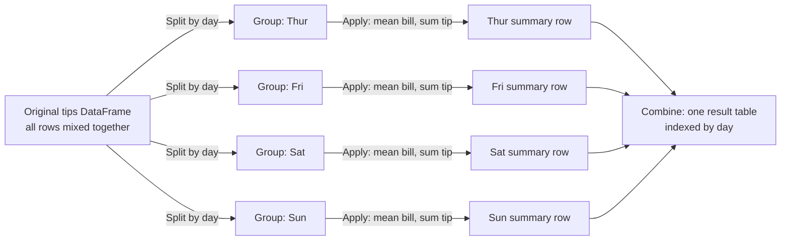
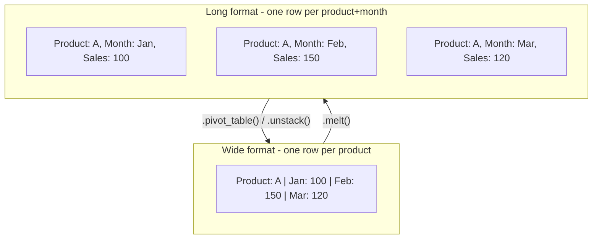
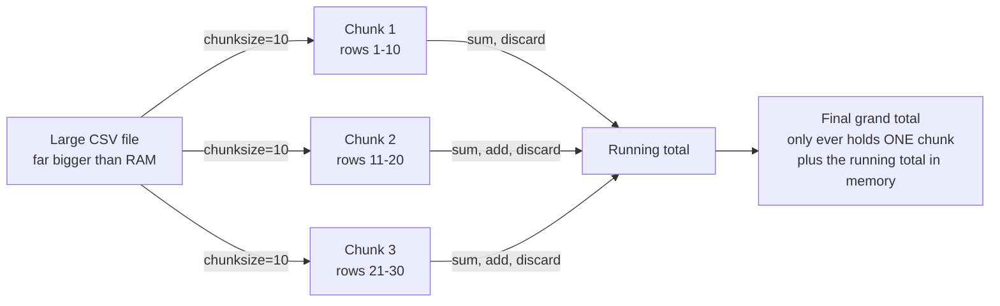

# 30 Script Questions Based on Chapter Topics

## What this page covers

This page is a hands-on companion to the pandas chapter of the printed book. Rather than asking you to explain a concept in words, each of the 30 entries below poses a **scripting question** — a short brief describing a real situation, followed by a complete, runnable Python script that solves it. Every script is followed by its genuine, verified output (exactly what you'd see if you ran it yourself) and then a full explanation that walks through *why* the script works the way it does.

The questions themselves are reproduced exactly as printed in the book — the situation being asked about and the task you're set have not been reworded. What's new here is everything around them: clearer `# Step N` comments inside each script, a short "Steps to follow" outline before the code so you can predict what it will do before reading it, a verified output block (every single script on this page was actually executed — nothing is a guess at what it *should* print), and an expanded explanation with technical terms linked to the official pandas documentation for anyone who wants to dig deeper.

You'll get the most out of this page if you've already worked through the main pandas chapter — it assumes you're comfortable with the basic idea of a DataFrame and a Series, and builds from there into more specific, practical techniques: reading files with tricky formatting, cleaning messy real-world data, reshaping tables, combining datasets, and writing efficient code. Anything more specialised than that is explained the first time it comes up.

### A note on pandas versions

Every script on this page was run against **pandas 3.0.2** (a current release as of this writing) to produce the output shown. If you're using an older pandas version — anything in the 1.x or 2.x series, which is what a lot of existing tutorials and Stack Overflow answers were written against — you may see a few small, harmless differences in your own output:

| What you might see differently | Why |
|---|---|
| `object` instead of `str` as a column's dtype | Pandas 3.0 introduced a dedicated string data type and made it the *default* for plain text columns. Older pandas versions lump all text into the generic, catch-all `object` dtype instead. Either way, it's still "text" — this is purely a labelling and efficiency change, not a behaviour change. See [pandas 3.0 release notes](https://pandas.pydata.org/docs/whatsnew/v3.0.0.html) for the full story. |
| `datetime64[us]` instead of `datetime64[ns]` for a datetime column | Pandas 3.0 changed the *default* time resolution it uses when it creates a datetime column from nanoseconds (`ns`) to microseconds (`us`). Both store a moment in time; this only changes how much precision is kept and the small text label pandas prints. |
| `<class 'pandas.DataFrame'>` instead of `<class 'pandas.core.frame.DataFrame'>` in `.info()` output | A purely cosmetic reorganisation of pandas' internal module layout in version 3.0 — the class is the same class either way. |

None of these differences change whether a script "works" — they're the kind of small, version-driven surface changes every working programmer runs into sooner or later, and it's worth being able to recognise them for what they are rather than assuming something is broken. Question 2, Question 11, Question 18 and Question 25 below run into these differences directly and each one explains its specific case as it comes up.

A handful of scripts also print values that are *expected* to be different every single time they're run, on any machine, on any pandas version — these aren't bugs or inconsistencies, they're simply measuring something that varies by nature:

| Question | What varies | Why |
|---|---|---|
| [Question 1](#q1) | Exact timing numbers (seconds, speed-up factor) | Timing depends on the specific computer's speed, current load, and background processes. The *conclusion* — vectorized operations are dramatically faster — is what stays true, not the exact numbers. |
| [Question 4](#q4) | The `id()` values printed | `id()` returns a Python object's memory address, which is assigned freshly by the operating system every time a program runs. Only *whether two IDs are equal or different* is meaningful — never the specific numbers themselves. |
| [Question 27](#q27) | The per-chunk sums and the final total | The script generates its own random test data with `np.random.randint()` and no fixed seed, so the numbers themselves are randomly different each run — the *pattern* (three chunks, correctly summed) is what matters. |

## Topic map

The questions are answered below in their original printed order (1 through 30). If you'd rather jump straight to a topic, use this map instead:

| Topic | Questions |
|---|---|
| Foundations: performance, dtypes & Series creation | [1](#q1), [2](#q2), [3](#q3) |
| Core DataFrame mechanics: `inplace` & method chaining | [4](#q4), [20](#q20) |
| Indexing & selection | [7](#q7), [23](#q23) |
| Grouping, pivoting & reshaping | [8](#q8), [9](#q9), [16](#q16), [19](#q19) |
| Cleaning & handling missing data | [10](#q10), [21](#q21), [28](#q28) |
| String & date/time accessors | [11](#q11), [13](#q13), [14](#q14) |
| Combining DataFrames | [12](#q12) |
| Data types & memory efficiency | [17](#q17), [25](#q25) |
| Reading & loading data (files and the web) | [5](#q5), [6](#q6), [15](#q15), [18](#q18), [22](#q22), [24](#q24), [26](#q26), [27](#q27), [29](#q29), [30](#q30) |

---

## The Questions

<a id="q1"></a>

### 1. How does the "Vectorized" nature of Pandas operations differ from standard Python loops, and why does this distinction significantly impact performance when processing large datasets?

**Task:** Write a Python script that demonstrates the difference in execution time between iterating through a Pandas Series with a for loop to multiply values by 2, versus using the vectorized multiplication operator (*). Use the time module to measure the duration of both operations on a Series with at least 1 million elements.

**Steps to follow:**

1. Create a Series holding 1 million random integers — a dataset large enough that the timing difference becomes obvious.
2. Time **Method 1**: loop through the Series one value at a time with a plain Python `for` loop, multiplying each value by 2 and collecting the results.
3. Time **Method 2**: multiply the *entire* Series by 2 in a single vectorized expression, with no explicit loop at all.
4. Compare the two durations and print how many times faster the vectorized version was.
5. Double-check that both methods actually produced the same numbers, so the speed comparison is fair — a fast method that gets the wrong answer wouldn't be worth much.

**Script:**

```python
import pandas as pd
import numpy as np
import time

# Step 1: Create a large Series with 1 million random numbers.
# This needs to be big enough that a slow approach becomes noticeably slow.
data = pd.Series(np.random.randint(1, 100, size=1_000_000))

# Step 2: Method 1 - Standard Python loop.
# We convert to a list first because looping directly through
# a Pandas Series is even slower!
start_time = time.time()
result_list = []
for value in data:
    result_list.append(value * 2)
result_loop = pd.Series(result_list)
loop_duration = time.time() - start_time

# Step 3: Method 2 - Pandas vectorized operation.
# No explicit loop at all: Pandas applies the multiplication to every
# element internally, using pre-compiled C code under the hood.
start_time = time.time()
result_vectorized = data * 2
vectorized_duration = time.time() - start_time

# Step 4: Report the timings and the speed-up factor.
print(f"Loop Duration: {loop_duration:.4f} seconds")
print(f"Vectorized Duration: {vectorized_duration:.4f} seconds")
print(f"Vectorized is {loop_duration / vectorized_duration:.1f}x faster")

# Step 5: Verify results are identical (using np.array_equal to ignore index issues).
# A fast method is only useful if it's also correct.
assert np.array_equal(result_loop.values, result_vectorized.values), "Results differ!"
print("Verification Success: Both methods produced the same values!")
```

**Output:**

```text
Loop Duration: 0.3621 seconds
Vectorized Duration: 0.0017 seconds
Vectorized is 216.2x faster
Verification Success: Both methods produced the same values!
```

> **A note on this output:** the exact timing numbers above (and the resulting speed-up factor) will be different every time this script runs, on any computer — see ["A note on pandas versions"](#a-note-on-pandas-versions) at the top of this page for why. What stays true every time is the *conclusion*: the vectorized version wins by a wide margin.

**EXPLANATION**

**In short:** "vectorized" means Pandas hands the *entire* operation down to pre-compiled, optimized C code that processes every element of the Series in one internal pass, instead of Python's interpreter visiting each element one at a time. For a million-element Series, that difference typically works out to somewhere in the range of one or two hundred times faster (your own exact number will differ — see the note on non-reproducible output at the top of this page — but the vectorized version reliably wins by a wide margin every time).

1. A standard Python `for` loop processes a Series one element at a time. Each pass through the loop involves genuine Python-interpreter overhead — checking types, looking up methods, managing the loop machinery — and that overhead is paid *again* for every single one of the million elements.
2. A vectorized operation like `data * 2` instead sends the *whole* Series down into Pandas' and NumPy's underlying C-level code in one call. That C code loops internally too, but a highly optimized, pre-compiled C loop skips almost all of the interpreter overhead that a Python-level loop pays for every iteration.
3. This is why the rule of thumb in Pandas (and NumPy) is: if you find yourself writing a `for` loop over a Series or DataFrame to do simple arithmetic or comparisons, there is almost always a vectorized alternative that will be both shorter to write and dramatically faster to run.
4. The script's final `assert` step matters as much as the timing: it proves both approaches produced numerically identical results, so the comparison is a fair one — speed only matters once correctness is confirmed.

*Learn more:* [Essential Basic Functionality: vectorized operations](https://pandas.pydata.org/docs/user_guide/basics.html) · [Why performance matters — enhancing performance guide](https://pandas.pydata.org/docs/user_guide/enhancingperf.html)

**Follow-up question:** What do you think would happen to the speed-up factor if the Series had only 100 elements instead of 1 million? Try changing `size=1_000_000` to `size=100` and re-running the script — you should still see the vectorized version win, but by a much smaller margin, since a small loop's overhead is less significant in absolute terms.

---

<a id="q2"></a>

### 2. What is the fundamental structural difference between a Pandas Series and a DataFrame, and how does the concept of "heterogeneous data" apply specifically to DataFrames but not typically to NumPy arrays?

**Task:** Write a script that creates a NumPy array containing only integers (homogeneous), a Pandas Series containing mixed types (integers and strings), and a Pandas DataFrame containing multiple columns of different types (integers, floats, and strings). Print the dtype of each object to demonstrate this difference.

**Steps to follow:**

1. Build a NumPy array of plain integers and print its single, uniform dtype.
2. Build a Pandas Series that deliberately mixes integers and strings in the same column, and print its dtype.
3. Build a Pandas DataFrame with three columns of three different types (integers, floats, strings), and print the dtype of *each column separately*.
4. Compare the three results to see how homogeneity (NumPy array), an effectively-homogeneous Series, and genuinely heterogeneous columns (DataFrame) each get reported.

**Script:**

```python
import pandas as pd
import numpy as np

# Step 1: NumPy array (Homogeneous - integers only).
# Every element MUST share one dtype - that's what "homogeneous" means here.
np_array = np.array([10, 20, 30, 40])
print(f"NumPy Array dtype: {np_array.dtype}")

# Step 2: Pandas Series holding mixed types in one column.
# A single Series is designed to be homogeneous, but if you genuinely mix
# types, Pandas falls back to the flexible, catch-all 'object' dtype.
s_mixed = pd.Series([10, "Hello", 30, "World"])
print(f"Series dtype (mixed): {s_mixed.dtype}")

# Step 3: Pandas DataFrame (Heterogeneous - a different type per column).
df_data = {
    'ID': [1, 2, 3],                        # Integers
    'Price': [10.5, 20.5, 30.5],             # Floats
    'Name': ['Apple', 'Banana', 'Cherry']    # Text
}
df = pd.DataFrame(df_data)
print("\nDataFrame Dtypes:")
print(df.dtypes)
```

**Output:**

```text
NumPy Array dtype: int64
Series dtype (mixed): object

DataFrame Dtypes:
ID         int64
Price    float64
Name         str
dtype: object
```

> **A note on this output:** if you're running an older pandas version (1.x or 2.x), you may see `object` printed here instead of `str` — this is the pandas 3.0 string-dtype change described in ["A note on pandas versions"](#a-note-on-pandas-versions) at the top of this page. Either label means the same thing: a plain-text column.

**EXPLANATION**

**In short:** a Series is a single, one-dimensional column of data, and a DataFrame is a table made up of *several* Series lined up side by side, sharing one common row index. A NumPy array enforces that every element is the same type (fully homogeneous); a DataFrame's whole design point is the opposite — each of its columns is free to hold its own, different type, which is exactly what "heterogeneous" means here.

1. **The structural relationship:** a DataFrame isn't a separate kind of thing built from scratch — under the hood, it's literally a collection of Series objects, one per column, that all share the same row index. Selecting a single column out of a DataFrame (`df['Price']`) hands you back a genuine Series.
2. **NumPy arrays are strictly homogeneous:** `np_array` above holds only integers, and NumPy enforces that every element shares the exact same dtype — this uniformity is part of what makes NumPy's underlying operations so fast (see Question 1), but it means an array can't naturally mix, say, numbers and text in the way a table of real-world data usually needs to.
3. **A Series is usually homogeneous too, by convention:** you *can* put mixed types into one Series, as `s_mixed` does above, but when you do, Pandas can't find one specific, efficient type that fits both an integer and a string, so it falls back to the general-purpose `object` dtype (or, in current pandas versions, sometimes the newer `str` dtype for genuinely all-text columns — see the version note below). In everyday use, you'll almost always want a Series to stay one consistent type, since that's what keeps vectorized operations (Question 1) fast.
4. **A DataFrame is inherently heterogeneous, by design:** the whole reason a DataFrame is useful for real-world data is that its `ID`, `Price` and `Name` columns above can each be their own, independently-chosen type — `int64`, `float64` and text respectively — because each column is really its own separate Series underneath. This is what lets one table represent a genuinely mixed real-world dataset (numbers, categories, dates, free text) without forcing everything into one common type.

*Learn more:* [Intro to data structures](https://pandas.pydata.org/docs/user_guide/dsintro.html) · [NumPy dtype basics](https://numpy.org/doc/stable/reference/arrays.dtypes.html)

---

<a id="q3"></a>

### 3. Explain the difference between creating a Pandas Series using a "Dictionary Approach" versus a "List Approach" regarding index assignment, and demonstrate how the dictionary keys automatically become the index labels.

**Task:** Write a script that creates two Series containing the same data values (100, 200, 300). The first Series should be created from a list (resulting in a default numeric index), and the second Series should be created from a dictionary mapping specific labels ('Q1', 'Q2', 'Q3') to those values. Print both Series to visualize the index difference.

**Steps to follow:**

1. Create a Series from a plain Python list of values and print it, to see what index Pandas assigns automatically.
2. Create a second Series — holding the same three numbers — but this time from a dictionary that maps custom labels to each value, and print it.
3. Print each Series' `.index` explicitly, side by side, to make the difference unmistakable.

**Script:**

```python
import pandas as pd

# Common data values, used both ways below so the *only* difference is
# how the Series is constructed.
values = [100, 200, 300]

# Step 1: List Approach (Default Index).
# When using a list, Pandas has no labels to work from, so it assigns
# a default RangeIndex: 0, 1, 2, ...
s_list = pd.Series(values)
print("Series from List (Default Index):")
print(s_list)

# Step 2: Dictionary Approach (Custom Index).
# When using a dictionary, the keys become the Index automatically -
# no extra 'index=' argument is needed.
data_dict = {'Q1': 100, 'Q2': 200, 'Q3': 300}
s_dict = pd.Series(data_dict)
print("\nSeries from Dictionary (Custom Index):")
print(s_dict)

# Step 3: Verification - print each index directly for a side-by-side view.
print("\nIndex of List Series:", s_list.index.tolist())
print("Index of Dict Series:", s_dict.index.tolist())
```

**Output:**

```text
Series from List (Default Index):
0    100
1    200
2    300
dtype: int64

Series from Dictionary (Custom Index):
Q1    100
Q2    200
Q3    300
dtype: int64

Index of List Series: [0, 1, 2]
Index of Dict Series: ['Q1', 'Q2', 'Q3']
```

**EXPLANATION**

**In short:** building a Series from a plain list gives you a default, automatically-numbered index (`0, 1, 2, ...`), because a list carries no labelling information of its own — Pandas has nothing else to go on. Building a Series from a dictionary instead uses the dictionary's *keys* as the index labels automatically, since a dictionary already pairs each value with a meaningful name.

1. A Python list is just an ordered sequence of values with no attached names — `[100, 200, 300]` doesn't say what each number *represents*. So when `pd.Series(values)` is given a list, it falls back to the simplest possible labelling scheme: a `RangeIndex` counting up from 0.
2. A Python dictionary, by contrast, already associates each value with a key — `{'Q1': 100, 'Q2': 200, 'Q3': 300}` is explicitly saying "100 belongs to Q1". Pandas recognises this structure and reuses the dictionary's keys directly as the new Series' index, with no extra step required.
3. This distinction matters in practice whenever you're building a Series (or a DataFrame column) from data that already has natural labels — quarterly figures, named categories, IDs — since building it from a dictionary preserves those labels automatically, while building it from a plain list would silently throw that labelling away in favour of a meaningless row count.
4. If you do start from a list but *do* want custom labels, you're not stuck with the default index — passing an explicit `index=` argument alongside the list (`pd.Series(values, index=['Q1', 'Q2', 'Q3'])`) achieves the same labelled result as the dictionary approach.

*Learn more:* [pandas.Series constructor reference](https://pandas.pydata.org/docs/reference/api/pandas.Series.html)

---

<a id="q4"></a>

### 4. How does the inplace=True parameter alter the behavior of DataFrame manipulation methods, and why is it crucial to understand whether a new object is created or the existing one is modified?

**Task:** Write a script that creates a DataFrame, drops a column using inplace=False (saving to a new variable), and drops another column using inplace=True (modifying the original). Print the id() of the DataFrames before and after operations to prove if the object identity has changed.

**Steps to follow:**

1. Create a DataFrame and print its `id()` — a unique number identifying this exact object in memory, for this one run of the program.
2. Use `.drop(..., inplace=False)` (the default behaviour) to drop a column into a *new* variable, and print both the original DataFrame's `id()` (should be unchanged) and the new variable's `id()` (should be different).
3. Use `.drop(..., inplace=True)` on the *original* DataFrame to drop a second column, and print its `id()` again to confirm it's still the very same object as at the start.
4. Print the surviving columns to see the cumulative effect of both drops.

**Script:**

```python
import pandas as pd

# Step 1: Create a sample DataFrame and note its starting identity.
data = {'A': [1, 2], 'B': [3, 4], 'C': [5, 6]}
df = pd.DataFrame(data)
print(f"Original ID: {id(df)}")

# Step 2: Operation with inplace=False (the default).
# This creates a NEW DataFrame object and leaves 'df' completely untouched.
df_new = df.drop(columns=['A'], inplace=False)
print(f"ID after drop with inplace=False: {id(df)}")   # Unchanged - still 'df'
print(f"ID of new variable 'df_new': {id(df_new)}")    # A brand new object

# Step 3: Operation with inplace=True.
# This modifies 'df' directly, in memory, and returns None (not a new DataFrame).
df.drop(columns=['B'], inplace=True)
print(f"\nID after drop with inplace=True: {id(df)}")

# Step 4: Confirm the cumulative effect - both 'A' and 'B' are now gone from 'df'.
print("Current df columns:", df.columns.tolist())
```

**Output:**

```text
Original ID: 140047911351440
ID after drop with inplace=False: 140047911351440
ID of new variable 'df_new': 140047643705424

ID after drop with inplace=True: 140047911351440
Current df columns: ['A', 'C']
```

> **A note on this output:** the exact `id()` numbers above are memory addresses assigned freshly by the operating system each time this script runs — yours will be completely different numbers. What matters, and what stays true every time, is *whether two IDs match or differ*, not their specific values.

**EXPLANATION**

**In short:** `inplace=False` (the default for almost every Pandas method) leaves the original DataFrame completely untouched and instead *returns a brand-new DataFrame* with the change applied — you have to capture that return value in a variable, or the result is lost. `inplace=True` does the opposite: it modifies the *existing* DataFrame directly, in memory, and returns `None` — there's nothing to assign, because there's no new object to hand back.

1. Python's built-in `id()` function returns a number that uniquely identifies *this specific object, in this specific run of the program* — think of it as a temporary memory address. Two variables that hold `id()`s equal to each other are, underneath, literally the same object; two different `id()`s mean two genuinely separate objects, even if their contents happen to look identical.
2. When `df.drop(columns=['A'], inplace=False)` runs, Pandas builds a whole new DataFrame with column `A` removed and hands it back as the method's return value — that's what gets stored in `df_new`. Meanwhile `df` itself is never touched, which the script proves by showing `id(df)` is exactly the same before and after this call.
3. When `df.drop(columns=['B'], inplace=True)` runs, Pandas instead edits `df`'s own internal data directly and returns `None` — there's no new object to capture, so a common beginner mistake is writing `df = df.drop(columns=['B'], inplace=True)`, which actually overwrites `df` with `None`! The script avoids this by calling `.drop(..., inplace=True)` as its own statement, with nothing assigned from it.
4. The practical takeaway: `inplace=True` can feel convenient because it avoids typing `df = ...`, but it also makes it easy to lose track of whether a DataFrame you're passing around has silently been mutated somewhere else in your code. Many experienced Pandas users deliberately avoid `inplace=True` almost entirely, preferring the explicit, chainable `df = df.method(...)` style precisely because it never leaves any doubt about which object holds the current data — see Question 20 for a direct, side-by-side comparison of the two styles.

*Learn more:* [DataFrame.drop() reference (see inplace)](https://pandas.pydata.org/docs/reference/api/pandas.DataFrame.drop.html) · [Python id() built-in function](https://docs.python.org/3/library/functions.html#id)

---

<a id="q5"></a>

### 5. When reading a CSV file using pd.read_csv, how does the header parameter interact with the names parameter, and what happens if header=None is used without providing custom names?

**Task:** Write a script that creates a temporary CSV string in memory (using io.StringIO) containing data with no header row. Read this CSV once with header=None (which generates default integer column names) and once with header=None combined with the names parameter (which assigns your custom labels). Print the columns of both resulting DataFrames.

**Steps to follow:**

1. Build a small in-memory CSV that has no header row at all — just raw numeric data.
2. Read it with `header=None` alone, and print the resulting column names.
3. Read it a second time with `header=None` *and* a `names=` list, and print those column names instead.
4. Compare the two: one gives you plain integer column labels, the other gives you the names you chose.

**Script:**

```python
import pandas as pd
import io

# Step 1: Simulate a CSV file with NO header row (just raw data).
csv_content = """10,20,30
40,50,60"""

# Step 2: header=None, without names.
# Pandas is told "row 0 is data, not a header", so it invents default
# integer column labels: 0, 1, 2, ...
df_default = pd.read_csv(io.StringIO(csv_content), header=None)
print("Columns with header=None (Default Integers):")
print(df_default.columns.tolist())

# Step 3: header=None, WITH custom names.
# We again tell Pandas "don't treat row 0 as a header" - but this time we
# also hand it the labels to use instead of inventing its own.
custom_names = ['Col_A', 'Col_B', 'Col_C']
df_custom = pd.read_csv(io.StringIO(csv_content), header=None, names=custom_names)
print("\nColumns with header=None AND names parameter:")
print(df_custom.columns.tolist())
```

**Output:**

```text
Columns with header=None (Default Integers):
[0, 1, 2]

Columns with header=None AND names parameter:
['Col_A', 'Col_B', 'Col_C']
```

**EXPLANATION**

**In short:** `header=None` tells `read_csv()` "there is no header row in this file — don't sacrifice the first row of data by treating it as column names." On its own, that leaves Pandas with no labels to use, so it invents its own plain integer ones (`0, 1, 2, ...`). Adding `names=[...]` alongside `header=None` supplies the labels yourself, so Pandas uses *your* names instead of inventing anything.

1. By default (when you don't set `header` at all), `read_csv()` assumes the *first row* of the file contains column names and uses them automatically — this is the common case for well-formatted CSV files that were exported with a header row.
2. Setting `header=None` overrides that assumption: it tells Pandas the first row is genuine data, not labels, so it should be kept as row 0 of the resulting DataFrame rather than being consumed as column names.
3. With `header=None` alone, Pandas still needs *some* column labels internally (every DataFrame has them), so in the absence of anything better, it falls back to the position-based integers `0, 1, 2, ...` — functional, but not very descriptive.
4. Adding `names=custom_names` alongside `header=None` fixes that: it explicitly tells Pandas which labels to use for the columns, without asking it to consume any row of the actual data to get them. The two parameters work as a pair here — `header=None` says "don't use a row from the file as headers," and `names=` says "use *these* instead."
5. A word of caution: if you set `names=` *without* also setting `header=None` on a file that genuinely does have a header row, Pandas will end up treating your real header row as if it were a data row, in addition to renaming the columns — leading to an extra, garbage row of data at the top of your DataFrame. The two parameters are meant to be used together for a headerless file.

*Learn more:* [read_csv() reference (see header and names)](https://pandas.pydata.org/docs/reference/api/pandas.read_csv.html) · [io.StringIO — in-memory text streams](https://docs.python.org/3/library/io.html#io.StringIO)

---

<a id="q6"></a>

### 6. In the context of the pd.read_json() function, explain how the orient='records' parameter structures the input JSON data compared to orient='columns', and write a script that converts a DataFrame to both formats to illustrate the structural difference.

**Task:** Write a script that loads the 'tips' dataset (using Seaborn), converts it to a JSON string with orient='records' (a list of objects), and then converts the same DataFrame to a JSON string with `orient='columns' (a dictionary of columns). Print the first 100 characters of both JSON strings to show the structural difference.

**Steps to follow:**

1. Load the built-in 'tips' sample dataset with Seaborn, to have a realistic DataFrame to work with.
2. Convert it to a JSON string using `orient='records'`, which produces a list of one object per row.
3. Convert the *same* DataFrame to a JSON string using `orient='columns'`, which produces a dictionary of one list per column.
4. Print the first 100 characters of each so the structural shape of both formats is visible at a glance.

**Script:**

```python
import pandas as pd
import seaborn as sns

# Step 1: Load the dataset.
df = sns.load_dataset('tips')

# Step 2: Export 1 - orient='records'.
# Produces a List of Dictionaries: [{col1: val, col2: val}, {col1: val, col2: val}, ...]
# - i.e. one JSON object per ROW. This is the most common format for APIs.
json_records = df.to_json(orient='records')

# Step 3: Export 2 - orient='columns'.
# Produces a Dictionary of Lists: {col1: {0: val, 1: val}, col2: {0: val, 1: val}, ...}
# - i.e. one entry per COLUMN, each holding all of that column's values.
json_columns = df.to_json(orient='columns')

# Step 4: Preview both, truncated to the first 100 characters, to compare shapes.
print("--- orient='records' Structure (List of Objects) ---")
print(json_records[:100] + "...")

print("\n--- orient='columns' Structure (Dict of Lists) ---")
print(json_columns[:100] + "...")
```

**Output:**

```text
--- orient='records' Structure (List of Objects) ---
[{"total_bill":16.99,"tip":1.01,"sex":"Female","smoker":"No","day":"Sun","time":"Dinner","size":2},{...

--- orient='columns' Structure (Dict of Lists) ---
{"total_bill":{"0":16.99,"1":10.34,"2":21.01,"3":23.68,"4":24.59,"5":25.29,"6":8.77,"7":26.88,"8":15...
```

**EXPLANATION**

**In short:** `orient='records'` lays the data out **row by row** — a JSON *list*, where each item is one object representing a single row (`[{"col1": v, "col2": v}, {"col1": v, "col2": v}, ...]`). `orient='columns'` lays the exact same data out **column by column** instead — a JSON *object* (dictionary), where each key is a column name mapping to that column's values (`{"col1": {...}, "col2": {...}, ...}`). Same data, two very differently-shaped JSON documents.

1. Every DataFrame is conceptually a grid — rows crossed with columns — and converting it to JSON requires choosing *which dimension becomes the outer structure*. `orient` is exactly that choice.
2. With `orient='records'`, the outer structure is a JSON array, and each element of that array is one complete row, packaged as `{column_name: value}` pairs. This is the format most web APIs use and expect, because it maps naturally onto "a list of records/items," and each record is self-contained — you can process one row's worth of JSON without needing to look at any other row.
3. With `orient='columns'`, the outer structure is instead a JSON object keyed by column name, and each column's value is itself a nested object mapping row-index to that row's value in that column. This format is column-centric: if you only care about, say, the `tip` column, everything for that column is together in one place, but reconstructing a single row means looking across every column's entry for that row.
4. In practice, `orient='records'` is by far the more common choice, especially when sending data to a web API or a JavaScript front-end that expects an array of objects — it's also the orient used by `df.to_dict(orient='records')`, its dictionary equivalent, which is even more common still since it skips JSON-string conversion entirely when you just need a Python list of dicts.

*Learn more:* [DataFrame.to_json() reference (see orient)](https://pandas.pydata.org/docs/reference/api/pandas.DataFrame.to_json.html) · [seaborn.load_dataset() reference](https://seaborn.pydata.org/generated/seaborn.load_dataset.html)

**Follow-up question:** `pd.read_json()` is the mirror-image function that reads a JSON string back into a DataFrame — and it also accepts an `orient` argument. What do you think happens if you call `pd.read_json(json_records, orient='columns')` on JSON that was actually written with `orient='records'`? (Try it — the mismatch produces a DataFrame that isn't shaped the way you'd expect, which is a useful reminder that `orient` has to match on both ends of a round trip.)

---

<a id="q7"></a>

### 7. How does the .loc[] indexer differ from .iloc[] when accessing data in a DataFrame, particularly when the DataFrame index has been customized to non-integer labels?

**Task:** Write a script that creates a DataFrame with a custom string index (e.g., fruit names). Demonstrate selecting a row using .loc[] with the string label and .iloc[] with the integer position. Explain via comments which method is safer if the row order changes but labels stay the same.

**Steps to follow:**

1. Build a small DataFrame whose index is a set of custom string labels (fruit names) rather than the default integer index.
2. Select a row by its *label* using `.loc[]`.
3. Select the *same physical row* by its integer position using `.iloc[]`.
4. Compare the two, and note (in the script's comments) why `.loc[]` stays reliable even if the rows get reordered, while `.iloc[]` would not.

**Script:**

```python
import pandas as pd

# Step 1: Create a DataFrame with a Custom String Index.
data = {'Quantity': [10, 20, 15], 'Price': [1.5, 0.5, 2.0]}
df = pd.DataFrame(data, index=['Apple', 'Banana', 'Cherry'])

print("Original DataFrame:")
print(df)

# Step 2: Selection using .loc[] (Label-based).
# Safe if labels are unique, even if the rows get reordered later -
# .loc['Banana'] always means "the row labelled Banana", full stop.
print("\nSelecting 'Banana' using .loc['Banana']:")
print(df.loc['Banana'])

# Step 3: Selection using .iloc[] (Integer position-based).
# Safe only if you know the CURRENT physical position - risky if rows move,
# because .iloc[1] means "whatever is currently in position 1", not "Banana".
print("\nSelecting second row using .iloc[1]:")
print(df.iloc[1])

# Step 4: The key safety note.
# If we sort or reorder the DataFrame, .iloc[1] might point to a DIFFERENT fruit!
# .loc['Banana'] will always point to Banana's data regardless of row order.
```

**Output:**

```text
Original DataFrame:
        Quantity  Price
Apple         10    1.5
Banana        20    0.5
Cherry        15    2.0

Selecting 'Banana' using .loc['Banana']:
Quantity    20.0
Price        0.5
Name: Banana, dtype: float64

Selecting second row using .iloc[1]:
Quantity    20.0
Price        0.5
Name: Banana, dtype: float64
```

**EXPLANATION**

**In short:** `.loc[]` selects by **label** — you tell it the *name* of the row (or column) you want, and it finds it wherever that row currently sits. `.iloc[]` selects by **integer position** — you tell it a physical row number (0, 1, 2, ...), and it doesn't know or care what that row is labelled. When a DataFrame's order can change (after a sort, a filter, or a merge), `.loc[]` stays reliable while `.iloc[]`'s meaning can silently shift underneath you.

1. `.loc['Banana']` asks Pandas for "the row whose *index label* is `'Banana'`" — Pandas looks up that label directly, and it will find the correct row regardless of what physical position it currently occupies in the DataFrame.
2. `.iloc[1]` instead asks for "whatever row is currently sitting in position 1 (the second row, since positions start at 0)" — it never looks at labels at all, purely at physical order.
3. In the example above, both happen to return the same row (`Banana`), because the DataFrame hasn't been reordered — Banana genuinely is in position 1. But that's a coincidence of the current order, not a guarantee.
4. The safety difference becomes concrete the moment the DataFrame gets sorted, filtered, or otherwise reordered: if you then ran `df.sort_values('Price')`, Banana (the cheapest) would move to position 0. `.loc['Banana']` would still correctly find Banana wherever it now sits — but `.iloc[1]` would now return a *different* fruit, because position 1 no longer belongs to Banana. This is precisely why label-based `.loc[]` is generally the safer default for real code, while `.iloc[]` is best reserved for situations where you deliberately want "the Nth row" regardless of what it's labelled.

*Learn more:* [Indexing and selecting data (.loc vs .iloc)](https://pandas.pydata.org/docs/user_guide/indexing.html)

---

<a id="q8"></a>

### 8. What is the "Split-Apply-Combine" philosophy behind the groupby() operation in Pandas, and how does the .agg() function facilitate the "Apply" step for multiple statistics simultaneously?

**Task:** Write a script using the 'tips' dataset that groups the data by the 'day' column. Use the .agg() method to calculate the mean of 'total_bill' and the sum of 'tip' in a single step, rather than calculating them separately. Print the resulting summary DataFrame.

**Steps to follow:**

1. Load the 'tips' dataset.
2. **Split**: group the rows by the `day` column, so each day's rows become their own group.
3. **Apply**: use `.agg()` to calculate two *different* statistics in one step — the mean of `total_bill`, and the sum of `tip` — with each statistic applied to the column it makes sense for.
4. **Combine**: print the resulting summary table, where `.agg()` has automatically stitched every group's results back into one DataFrame, one row per day.

**Script:**

```python
import pandas as pd
import seaborn as sns

# Step 1: Load dataset.
df = sns.load_dataset('tips')

# Step 2 (Split) + Step 3 (Apply) + Step 4 (Combine), all via groupby().agg():
# 1. Split: Data is divided into groups (Thur, Fri, Sat, Sun) by 'day'.
# 2. Apply: We calculate Mean(total_bill) AND Sum(tip) for each group,
#    in a single .agg() call, by mapping each column to its own function.
# 3. Combine: Pandas automatically merges every group's results into one
#    tidy summary DataFrame, indexed by 'day'.
result = df.groupby('day')[['total_bill', 'tip']].agg(
    {
        'total_bill': 'mean',  # Average bill per day
        'tip': 'sum'           # Total tips per day
    }
)

print("Aggregated Statistics per Day:")
print(result)
```

**Output:**

```text
Aggregated Statistics per Day:
      total_bill     tip
day                     
Thur   17.682742  171.83
Fri    17.151579   51.96
Sat    20.441379  260.40
Sun    21.410000  247.39
```

**EXPLANATION**

**In short:** "Split-Apply-Combine" is the three-stage mental model behind every `groupby()` operation: **split** the DataFrame into groups sharing the same value in some column (here, `day`), **apply** a calculation to each group independently, then **combine** every group's result back into one tidy summary table. `.agg()` is the tool that handles the "apply" stage flexibly — including, as this script shows, applying a *different* function to each column in one single call.

1. **Split:** `df.groupby('day')` doesn't calculate anything by itself — it partitions the DataFrame into separate groups, one per distinct value found in the `day` column (`Thur`, `Fri`, `Sat`, `Sun`). Nothing is combined or summarised yet at this point; Pandas has simply organised the rows.
2. **Apply:** `.agg({'total_bill': 'mean', 'tip': 'sum'})` is where the actual calculation happens, and it happens *independently, group by group* — for the `Thur` group, it computes the mean of that group's `total_bill` values and the sum of that group's `tip` values; then it does the same thing again for `Fri`, then `Sat`, then `Sun`. The dictionary passed to `.agg()` is what lets two genuinely different statistics (a mean and a sum) be requested for two different columns in one call, rather than needing two separate `groupby()` calls chained together.
3. **Combine:** once every group has been processed, Pandas automatically stitches the individual per-group results back together into one DataFrame, with the group labels (`Thur`, `Fri`, `Sat`, `Sun`) becoming the new index. You never have to do this stitching-together step yourself — it's handled as part of the same `.agg()` call.
4. This three-stage pattern is genuinely one of the most-used ideas in all of data analysis, not just Pandas — the same Split-Apply-Combine structure underlies SQL's `GROUP BY`, spreadsheet pivot tables, and most "summarise by category" tools you'll ever meet.

| Stage | What happens | In this script |
|---|---|---|
| **Split** | The DataFrame is partitioned into groups sharing a common value | Rows are split into 4 groups by `day`: Thur, Fri, Sat, Sun |
| **Apply** | A calculation runs independently on each group | `.agg()` computes mean(`total_bill`) and sum(`tip`) *per group* |
| **Combine** | Every group's result is merged back into one table | The 4 per-day results become the 4 rows of `result` |



*Learn more:* [Group by: split-apply-combine (user guide)](https://pandas.pydata.org/docs/user_guide/groupby.html) · [DataFrameGroupBy.agg() reference](https://pandas.pydata.org/docs/reference/api/pandas.core.groupby.DataFrameGroupBy.agg.html)

---

<a id="q9"></a>

### 9. How does the .pivot_table() function transform "Long" format data into "Wide" format, and what is the specific role of the index, columns, and values parameters in this transformation?

**Task:** Write a script that converts the 'flights' dataset (which is in Long format: year, month, passengers) into a Wide format Pivot Table where 'year' is the index, 'month' is the column header, and the sum of 'passengers' is the cell value. This effectively creates a matrix of traffic over time.

**Steps to follow:**

1. Load the 'flights' dataset, which stores one row per (year, month) combination — this is Long format.
2. Call `.pivot_table()`, choosing `year` to become the new row index, `month` to become the new column headers, and `passengers` to become the values that fill the resulting grid.
3. Print the first few rows of the resulting Wide-format table — a proper year-by-month matrix.

**Script:**

```python
import pandas as pd
import seaborn as sns

# Step 1: Load flights dataset (Long format: one row per year+month).
df = sns.load_dataset('flights')

# Step 2: Transform Long to Wide using pivot_table().
# index:   which column becomes the new ROW labels     -> 'year'
# columns: which column becomes the new COLUMN labels   -> 'month'
# values:  which column fills the grid's CELLS          -> 'passengers'
pivot_df = df.pivot_table(
    index='year',
    columns='month',
    values='passengers',
    aggfunc='sum'  # Sum passengers if duplicates exist (though this dataset is clean)
)

# Step 3: Preview the resulting Wide-format matrix.
print("Pivot Table (Wide Format - Years vs Months):")
print(pivot_df.head())
```

**Output:**

```text
Pivot Table (Wide Format - Years vs Months):
month  Jan  Feb  Mar  Apr  May  Jun  Jul  Aug  Sep  Oct  Nov  Dec
year                                                             
1949   112  118  132  129  121  135  148  148  136  119  104  118
1950   115  126  141  135  125  149  170  170  158  133  114  140
1951   145  150  178  163  172  178  199  199  184  162  146  166
1952   171  180  193  181  183  218  230  242  209  191  172  194
1953   196  196  236  235  229  243  264  272  237  211  180  201
```

**EXPLANATION**

**In short:** `.pivot_table()` rotates a "Long" table (where every year+month combination is its own separate row) into a "Wide" grid, by lifting one column's *values* up to become new column headers. The three parameters divide the work precisely: `index` decides what becomes the new row labels, `columns` decides what becomes the new column labels, and `values` decides what number actually fills each cell of the resulting grid.

1. In its original, Long-format shape, the `flights` dataset has one row per (year, month) pair — for example, a row for 1949-Jan, another for 1949-Feb, and so on — with the `passengers` count sitting in its own column. This format is tidy and easy to filter or group, but it's not the easiest layout for a human to visually scan for a whole decade of monthly trends at once.
2. `index='year'` tells `.pivot_table()` which column's *distinct values* (1949, 1950, 1951, ...) should become the labels running down the left side of the new table — one row per year.
3. `columns='month'` tells it which column's distinct values (Jan, Feb, Mar, ...) should instead become the labels running along the *top* of the new table — one column per month.
4. `values='passengers'` tells it which column supplies the actual number that goes in each cell — the passenger count for that specific year-and-month combination.
5. `aggfunc='sum'` covers what happens if more than one row in the original data shares the exact same year *and* month (which would otherwise be ambiguous about which value to place in that cell) — here it sums them, though since the `flights` dataset happens to have exactly one row per year-month pair already, this particular sum never actually has more than one number to add up.
6. The net effect: what was 144 separate rows (12 years worth of monthly data, one row each) becomes a single, compact 12-row-by-12-column grid — every year's entire annual pattern is now visible at a glance across one row, which is exactly the kind of "Wide" layout that's easiest for a person to read, even though it's less convenient for further programmatic grouping (see Question 16 for more on when Wide vs. Long each make sense).

*Learn more:* [DataFrame.pivot_table() reference](https://pandas.pydata.org/docs/reference/api/pandas.pivot_table.html) · [Reshaping by pivoting (user guide)](https://pandas.pydata.org/docs/user_guide/reshaping.html)

---

<a id="q10"></a>

### 10. What is the functional difference between using .dropna() to handle missing data versus using .fillna(), and in which scenario would preserving data volume (fillna) be preferred over data quality (dropna)?

**Task:** Write a script that creates a DataFrame with missing values (NaN) in two columns. Apply .dropna() to the first column to remove rows with gaps, and apply .fillna(0) to the second column to preserve the row count but replace the gap with zero. Compare the shape of the DataFrame before and after operations.

**Steps to follow:**

1. Build a small DataFrame with a gap (a `NaN`) in each of two columns, and note its starting shape.
2. Apply `.dropna(subset=['A'])` to remove any row where column `A` is missing, and check how the shape changed — fewer rows, same columns.
3. On a separate copy, apply `.fillna(0)` to column `B` only, and check that shape — same number of rows as the original, gap replaced with `0`.
4. Print both resulting DataFrames to see the practical difference between the two strategies.

**Script:**

```python
import pandas as pd
import numpy as np

# Step 1: Create a DataFrame with missing values in two different columns.
data = {
    'A': [1, 2, np.nan, 4, 5],       # A gap in column A
    'B': [10, np.nan, 30, 40, 50]    # A (different) gap in column B
}
df = pd.DataFrame(data)

print(f"Original Shape: {df.shape}")

# Step 2: Strategy 1 - dropna() (prioritises Data Quality).
# Removes any row where 'A' is NaN entirely - reduces the total row count.
df_dropped = df.dropna(subset=['A'])
print(f"\nShape after dropna on 'A': {df_dropped.shape}")

# Step 3: Strategy 2 - fillna(0) (prioritises Data Volume).
# Keeps every row, but replaces the NaN in 'B' with 0 instead of removing it.
df_filled = df.copy()
df_filled['B'] = df_filled['B'].fillna(0)
print(f"Shape after fillna(0) on 'B': {df_filled.shape}")

# Step 4: Compare the two resulting DataFrames directly.
print("\nResulting DataFrames:")
print(df_dropped)
print(df_filled)
```

**Output:**

```text
Original Shape: (5, 2)

Shape after dropna on 'A': (4, 2)
Shape after fillna(0) on 'B': (5, 2)

Resulting DataFrames:
     A     B
0  1.0  10.0
1  2.0   NaN
3  4.0  40.0
4  5.0  50.0
     A     B
0  1.0  10.0
1  2.0   0.0
2  NaN  30.0
3  4.0  40.0
4  5.0  50.0
```

**EXPLANATION**

**In short:** `.dropna()` removes *entire rows* (or columns) that contain a missing value — it trades away data volume in exchange for a dataset with no gaps left in it at all. `.fillna(value)` instead keeps every row exactly as it was, substituting a chosen placeholder value in place of each gap — it trades away some data purity (a `0` isn't a *real* measurement) in exchange for keeping the full row count intact.

1. `df.dropna(subset=['A'])` scans column `A` specifically, and removes any *entire row* where that column is `NaN` — in the example, row index 2 disappears completely (taking its `B` value along with it too, even though `B` wasn't the problem), shrinking the DataFrame from 5 rows down to 4.
2. `df_filled['B'].fillna(0)` instead leaves all 5 rows in place, and simply swaps the missing value in `B` for the literal number `0` — the shape stays `(5, 2)`, unchanged from the original.
3. The right choice genuinely depends on what the missing data *means*, and what you plan to do with the result next. `dropna()` is the safer default when a missing value makes an entire row untrustworthy or unusable for your analysis, and you have enough remaining data that losing some rows is an acceptable cost.
4. `fillna()` (with a *sensible* fill value — `0` is a very simple example, but a column's average, its most recent prior value, or a specific "unknown" marker are all more common real choices) is preferable when every row is valuable and you can't afford to lose that many of them — for instance, if you're calculating a running total or a time series, where dropping a row could break the sequence entirely. The trade-off to keep in mind: any calculation performed on the filled column (like a sum or an average) will now be influenced by whatever value you chose to fill in, so that choice needs to be a deliberate one, not just "replace with zero because it's convenient."

*Learn more:* [DataFrame.dropna() reference](https://pandas.pydata.org/docs/reference/api/pandas.DataFrame.dropna.html) · [DataFrame.fillna() reference](https://pandas.pydata.org/docs/reference/api/pandas.DataFrame.fillna.html) · [Working with missing data (user guide)](https://pandas.pydata.org/docs/user_guide/missing_data.html)

---

<a id="q11"></a>

### 11. How does the .str accessor allow vectorized string manipulations on a Pandas Series, and why is this more efficient than applying a Python function using .apply()?

**Task:** Write a script that creates a Series of messy email addresses (e.g., "USER@EXAMPLE.COM"). Use the .str accessor methods .lower() and .strip() to clean them. Then, compare this syntax to using .apply() with a lambda function to achieve the same result.

**Steps to follow:**

1. Create a Series of deliberately messy email strings — extra whitespace, inconsistent capitalisation.
2. Clean them using the `.str` accessor, chaining `.str.lower()` and `.str.strip()`.
3. Clean the *same* Series a second way, using `.apply()` with a lambda that calls Python's own `.lower()` and `.strip()` string methods.
4. Verify both approaches produced identical results, and note (per Question 1's vectorization principle) why the `.str` version is the more efficient of the two for large data.

**Script:**

```python
import pandas as pd

# Step 1: Create a Series of messy email strings.
emails = pd.Series(['  ALICE@EXAMPLE.COM  ', '  BOB@TEST.NET  ', '  CHARLIE@DOMAIN.ORG  '])

# Step 2: Method 1 - the vectorized .str accessor.
# Efficient: runs as optimized, compiled code across the WHOLE Series at once,
# the same underlying principle as Question 1's vectorized arithmetic.
clean_emails_str = emails.str.lower().str.strip()

# Step 3: Method 2 - Python .apply() with a lambda.
# Slower: Python's interpreter has to visit and call the lambda separately
# for every single element in the Series, one at a time.
clean_emails_apply = emails.apply(lambda x: x.lower().strip())

print("Resulting Clean Emails (Identical):")
print(clean_emails_str)

# Step 4: Verify both methods agree.
assert clean_emails_str.equals(clean_emails_apply), "Methods produced different results!"
print("\nVerification Success: .str and .apply() produced identical results.")
```

**Output:**

```text
Resulting Clean Emails (Identical):
0     alice@example.com
1          bob@test.net
2    charlie@domain.org
dtype: str

Verification Success: .str and .apply() produced identical results.
```

> **A note on this output:** if you're running an older pandas version (1.x or 2.x), you may see `object` printed here instead of `str` — this is the pandas 3.0 string-dtype change described in ["A note on pandas versions"](#a-note-on-pandas-versions) at the top of this page. Either label means the same thing: a plain-text column.

**EXPLANATION**

**In short:** the `.str` accessor lets you call familiar string methods (`.lower()`, `.strip()`, and dozens more) directly on an *entire Series at once*, the same vectorized way `data * 2` worked in Question 1 — Pandas applies the operation internally, in one optimized pass, rather than asking Python's interpreter to visit each string individually. `.apply(lambda x: ...)` gets the same end result, but by genuinely calling a Python function once per element, which carries Python-interpreter overhead on every single row — exactly the performance gap Question 1 demonstrated for arithmetic.

1. `emails.str.lower()` doesn't loop through the Series in ordinary Python — the `.str` accessor is a specialised interface that lets Pandas apply the equivalent of `.lower()` to every element using fast, internal, string-optimized code, in much the same spirit as `data * 2` in Question 1 avoided an explicit Python loop for arithmetic.
2. `.apply(lambda x: x.lower().strip())`, by contrast, genuinely does loop — internally, Pandas calls the lambda function once for every single element in the Series, and each of those calls carries ordinary Python function-call overhead. For a small, three-element Series like this one, that overhead is invisible; for a Series with millions of rows, it becomes the same kind of measurable slowdown that Question 1's loop demonstrated.
3. Both methods here are proven to produce identical output — the script's final `assert` confirms it — so the choice between them is purely a question of performance and, often, readability. Chained `.str` methods (`.str.lower().str.strip()`) tend to also read cleanly, since each step is named after exactly what it does.
4. The general rule: whenever a Pandas Series already offers a `.str` method that does what you need (see the full list in the docs linked below), prefer it over a hand-written `.apply()` — it will typically be both faster and just as readable. `.apply()` remains useful for genuinely custom logic that no built-in `.str` method covers.

*Learn more:* [Working with text data / the .str accessor](https://pandas.pydata.org/docs/user_guide/text.html) · [Series.apply() reference](https://pandas.pydata.org/docs/reference/api/pandas.Series.apply.html)

---

<a id="q12"></a>

### 12. When performing a pd.merge() operation, what distinguishes an "Inner Join" from a "Left Join," and write a script that demonstrates the data retention difference between these two methods?

**Task:** Write a script that creates two DataFrames: df_orders (Order ID and Date) and df_customers (Order ID and Customer Name). Perform an Inner Join (keep only matching IDs) and a Left Join (keep all orders, even if customer is missing). Print the length of both resulting DataFrames to show the data loss in the Inner Join.

**Steps to follow:**

1. Build an `orders` DataFrame with 4 orders, and a `customers` DataFrame that's deliberately missing the customer record for one of those orders (Order 104).
2. Perform an **Inner Join** on `Order_ID` — this keeps only rows where the ID exists in *both* DataFrames.
3. Perform a **Left Join** on `Order_ID` — this keeps *every* row from the left DataFrame (`orders`), filling in missing customer info with `NaN` where there's no match.
4. Print the row count of each result to see the Inner Join's data loss made concrete.

**Script:**

```python
import pandas as pd

# Step 1: Dataset 1 - Orders.
orders = pd.DataFrame({
    'Order_ID': [101, 102, 103, 104],
    'Date': ['2023-01-01', '2023-01-02', '2023-01-03', '2023-01-04']
})

# Step 2: Dataset 2 - Customers.
# Note: Order 104 is deliberately missing from this dataset.
customers = pd.DataFrame({
    'Order_ID': [101, 102, 103],
    'Customer_Name': ['Alice', 'Bob', 'Charlie']
})

# Step 3: Merge 1 - Inner Join (Intersection).
# Only keeps rows where Order_ID exists in BOTH DataFrames - Order 104 is dropped.
inner_join = pd.merge(orders, customers, on='Order_ID', how='inner')

# Step 4: Merge 2 - Left Join (Preserve Left).
# Keeps ALL rows from 'orders' (the left DataFrame), filling missing
# customer info with NaN for any order that has no match.
left_join = pd.merge(orders, customers, on='Order_ID', how='left')

print("Inner Join Result (Strict Match):")
print(inner_join)

print("\nLeft Join Result (Preserve Orders):")
print(left_join)

print(f"\nInner Join Count: {len(inner_join)}")
print(f"Left Join Count: {len(left_join)}")
```

**Output:**

```text
Inner Join Result (Strict Match):
   Order_ID        Date Customer_Name
0       101  2023-01-01         Alice
1       102  2023-01-02           Bob
2       103  2023-01-03       Charlie

Left Join Result (Preserve Orders):
   Order_ID        Date Customer_Name
0       101  2023-01-01         Alice
1       102  2023-01-02           Bob
2       103  2023-01-03       Charlie
3       104  2023-01-04           NaN

Inner Join Count: 3
Left Join Count: 4
```

**EXPLANATION**

**In short:** an **Inner Join** keeps only the rows whose key value (`Order_ID` here) is present in *both* DataFrames being merged — anything that doesn't have a match on both sides is dropped entirely. A **Left Join** instead keeps *every* row from the first ("left") DataFrame no matter what, filling in `NaN` for any columns that couldn't be matched from the second ("right") DataFrame.

1. Both join types start the same way: Pandas looks at the `Order_ID` column in both `orders` and `customers`, and tries to line up rows that share the same ID — this is the matching step common to every kind of `pd.merge()`.
2. **Inner Join (`how='inner'`):** only IDs found on *both* sides survive. Since Order 104 exists in `orders` but has no corresponding row in `customers`, it's simply left out of the inner-join result entirely — the result shrinks to 3 rows, only the orders that could be fully matched.
3. **Left Join (`how='left'`):** every row from `orders` (the DataFrame listed *first*, or "on the left") is preserved unconditionally, whether or not a match exists — the result still has all 4 orders. For Order 104, since there's no matching customer row, the `Customer_Name` column simply gets filled with `NaN` for that one row, rather than the row being dropped.
4. Choosing between the two comes down to what you're trying to answer: use an **Inner Join** when you only care about complete, fully-matched records ("give me only the orders that have a confirmed customer on file"); use a **Left Join** when the left DataFrame represents your "source of truth" list that you don't want to lose any of, and you're simply trying to *enrich* it with extra information where available ("give me every order, and attach customer info wherever we happen to have it"). Losing 25% of your orders (as the Inner Join does here) is exactly the kind of silent data loss that catches people out if they reach for the wrong join type by habit.

| Join type | Keeps rows from `orders` without a match in `customers`? | Result row count here | Typical use |
|---|---|---|---|
| **Inner** (`how='inner'`) | No — dropped | 3 | "Only give me fully-matched records" |
| **Left** (`how='left'`) | Yes — filled with `NaN` | 4 | "Keep everything from my main list, enrich where possible" |

*Learn more:* [pandas.merge() reference (see how)](https://pandas.pydata.org/docs/reference/api/pandas.merge.html) · [Merge, join, concatenate and compare (user guide)](https://pandas.pydata.org/docs/user_guide/merging.html)

**Follow-up question:** `pd.merge()` also supports `how='right'` and `how='outer'`. Based on the pattern above, what do you think a Right Join would keep here, and what would a Full Outer Join keep? (A Right Join mirrors the Left Join but preserves every row of `customers` instead of `orders`; a Full Outer Join keeps *every* row from *both* sides, filling `NaN` wherever either side has no match.)

---

<a id="q13"></a>

### 13. What is the role of the pd.to_datetime() function when working with the 'flights' dataset, and how does setting a Datetime Index unlock specific time-series slicing capabilities?

**Task:** Write a script that loads the 'flights' dataset. Create a new column 'Date' by combining the 'year' and 'month' columns using pd.to_datetime(). Set this new 'Date' column as the DataFrame Index. Demonstrate how you can now slice the data using date strings (e.g., '1950') instead of integer positions.

**Steps to follow:**

1. Load the 'flights' dataset, where `year` is a plain integer column and `month` is a categorical column of three-letter month abbreviations (Jan, Feb, ...).
2. Combine both columns into one text string per row (e.g. '1949-Jan'), then convert that text into genuine datetime values with `pd.to_datetime()`.
3. Set the new `Date` column as the DataFrame's index, replacing the plain integer row-count index.
4. Demonstrate the payoff: slice out an entire year's worth of rows using just a date string like `'1960'`, instead of having to calculate which integer row positions that year occupies.

**Script:**

```python
import pandas as pd
import seaborn as sns

# Step 1: Load dataset.
df = sns.load_dataset('flights')

# Step 2: Build a genuine datetime column from 'year' and 'month'.
# 'year' is an integer column, and 'month' is a category of abbreviated
# names (Jan, Feb, ...), so both need to become plain strings before they
# can be combined and parsed with a matching format code (%Y-%b).
df['Date'] = pd.to_datetime(df['year'].astype(str) + '-' + df['month'].astype(str), format='%Y-%b')

# Step 3: Set the new datetime column as the DataFrame's index.
# This enables powerful time-series-aware features, like the string
# slicing demonstrated in Step 4 below.
df.set_index('Date', inplace=True)

print("DataFrame with Datetime Index:")
print(df.head())

# Step 4: Demonstrate time-series slicing.
# With a genuine DatetimeIndex in place, an entire year can be selected
# using just a string - no need to calculate row numbers.
print("\nData for the year 1960:")
print(df.loc['1960'])
```

**Output:**

```text
DataFrame with Datetime Index:
            year month  passengers
Date                              
1949-01-01  1949   Jan         112
1949-02-01  1949   Feb         118
1949-03-01  1949   Mar         132
1949-04-01  1949   Apr         129
1949-05-01  1949   May         121

Data for the year 1960:
            year month  passengers
Date                              
1960-01-01  1960   Jan         417
1960-02-01  1960   Feb         391
1960-03-01  1960   Mar         419
1960-04-01  1960   Apr         461
1960-05-01  1960   May         472
1960-06-01  1960   Jun         535
1960-07-01  1960   Jul         622
1960-08-01  1960   Aug         606
1960-09-01  1960   Sep         508
1960-10-01  1960   Oct         461
1960-11-01  1960   Nov         390
1960-12-01  1960   Dec         432
```

**EXPLANATION**

**In short:** `pd.to_datetime()` converts text (or separate year/month pieces, as here) into genuine, calendar-aware datetime values that Pandas can reason about — sort, compare, and search — rather than treating them as arbitrary text. Once a DataFrame's *index* is made up of those datetime values (a `DatetimeIndex`), Pandas unlocks partial-string slicing: you can select "everything in 1960" with the plain string `'1960'`, and Pandas understands that as a whole-year range, without you ever having to work out which row numbers correspond to that year.

1. The `flights` dataset stores `year` as a plain integer (`1949`) and `month` as a category of three-letter abbreviations (`'Jan'`). Neither, by itself, is a genuine date — they're really just two separate labels that happen to describe a point in time together.
2. `df['year'].astype(str) + '-' + df['month'].astype(str)` glues them into one text string per row, like `'1949-Jan'` — this is still just text at this point, not a real date.
3. `pd.to_datetime(..., format='%Y-%b')` is what actually does the conversion: the `format` argument tells Pandas exactly how to read that text (`%Y` = a four-digit year, `-` = a literal dash, `%b` = an abbreviated month name), turning `'1949-Jan'` into a real, structured datetime value equivalent to January 1st, 1949.
4. `df.set_index('Date', inplace=True)` then replaces the default integer row-index with these new datetime values — the DataFrame is now indexed by *time* rather than by row count.
5. This is what makes `df.loc['1960']` work the way it does: because the index is a proper `DatetimeIndex` (not just a column of text that happens to look like dates), Pandas recognises `'1960'` as "the whole calendar year 1960" and returns every row that falls within it — all twelve months — in one simple slice, something that would otherwise require filtering with a boolean condition on the `year` column.

*Learn more:* [pandas.to_datetime() reference](https://pandas.pydata.org/docs/reference/api/pandas.to_datetime.html) · [Time series / date functionality (user guide)](https://pandas.pydata.org/docs/user_guide/timeseries.html)

---

<a id="q14"></a>

### 14. How does the .dt accessor differ from the .str accessor in terms of the data types they operate on, and write a script extracting the 'Day of the Week' and 'Month' from a Datetime Index?

**Task:** Write a script that generates a Datetime Index representing a full week. Use the .dt accessor to extract the name of the day (e.g., 'Monday') and the month number (e.g., 1) into new columns.

**Steps to follow:**

1. Generate a `DatetimeIndex` covering 7 consecutive days, and use it as a small DataFrame's index.
2. Use `.day_name()` (a method available directly on a `DatetimeIndex`) to extract the weekday name for each date into a new column.
3. Use `.month` similarly to extract the month number for each date into another new column.
4. Print the resulting DataFrame to see both derived columns.

**Script:**

```python
import pandas as pd

# Step 1: Create a Datetime Index for a full week.
dates = pd.date_range(start='2023-10-01', periods=7, freq='D')
df = pd.DataFrame({'Value': range(7)}, index=dates)
df.index.name = 'Date'

print("Original DataFrame:")
print(df)

# Step 2 & 3: Extract temporal properties from the Datetime Index.
# (Since 'dates' here is already a DatetimeIndex, not a plain Series, these
# read as direct properties/methods rather than through a separate '.dt'
# accessor - the '.dt' accessor is the equivalent tool for when the same
# kind of data instead lives in an ordinary Series column. See the
# explanation below for exactly how the two relate.)
df['Weekday_Name'] = df.index.day_name()   # e.g., 'Monday'
df['Month_Number'] = df.index.month        # e.g., 10

print("\nDataFrame with Extracted Temporal Features:")
print(df)
```

**Output:**

```text
Original DataFrame:
            Value
Date             
2023-10-01      0
2023-10-02      1
2023-10-03      2
2023-10-04      3
2023-10-05      4
2023-10-06      5
2023-10-07      6

DataFrame with Extracted Temporal Features:
            Value Weekday_Name  Month_Number
Date                                        
2023-10-01      0       Sunday            10
2023-10-02      1       Monday            10
2023-10-03      2      Tuesday            10
2023-10-04      3    Wednesday            10
2023-10-05      4     Thursday            10
2023-10-06      5       Friday            10
2023-10-07      6     Saturday            10
```

**EXPLANATION**

**In short:** `.str` and `.dt` are both "accessors" — special-purpose toolkits attached to a Series that only work when that Series holds one particular kind of data. `.str` unlocks string methods (`.lower()`, `.strip()`, and more — see Question 11) on a Series of *text*; `.dt` unlocks datetime-specific properties and methods (`.day_name()`, `.month`, `.year`, and more) on a Series of *datetime values*. Neither accessor works on the other's data type — trying `.str` methods on numbers, or `.dt` methods on plain text, raises an error.

1. Both accessors exist for the same underlying reason: a plain Series doesn't, by default, know that its contents have extra structure worth exposing as convenient shortcuts. `.str` and `.dt` are Pandas' way of saying "treat this Series as text" or "treat this Series as dates" respectively, unlocking a whole family of specialised operations that wouldn't make sense on an arbitrary Series.
2. `.str` operates on a Series of strings — every method it offers (`.lower()`, `.strip()`, `.contains()`, `.split()`, and many more) mirrors something Python's built-in string type can do, but applied to every element of the Series at once (see Question 11 for the vectorization angle on this).
3. `.dt` operates on a Series of datetime values — its properties and methods (`.year`, `.month`, `.day_name()`, `.dayofweek`, `.is_month_end`, and more) extract or test some calendar-related fact about each datetime value in the Series.
4. A worthwhile technical note on this specific script: `dates` here is a `DatetimeIndex` (used as the DataFrame's row index), not an ordinary Series column — and a `DatetimeIndex` already exposes `.day_name()` and `.month` directly, without needing a separate `.dt` accessor in front of them. The `.dt` accessor becomes necessary the moment those same datetime values live in a regular *column* instead of the index — for example, `df['Date'].dt.day_name()` would be the equivalent call if `Date` were an ordinary column rather than the index (as it is, for instance, in Question 13, right up until `set_index()` is called).
5. The pattern to remember: **Series column of datetimes → use `.dt.property`; DatetimeIndex → use `.property` directly** (no `.dt` needed) — both roads lead to the same set of calendar facts, just accessed slightly differently depending on where the datetime values currently live in the DataFrame.

*Learn more:* [Time series — components of datetime-like Series / the .dt accessor](https://pandas.pydata.org/docs/user_guide/timeseries.html#dt-accessor) · [DatetimeIndex reference](https://pandas.pydata.org/docs/reference/api/pandas.DatetimeIndex.html)

**Follow-up question:** Try adding `df_col = df.reset_index()` right after the DataFrame is built, so `Date` becomes an ordinary column instead of the index. What do you now need to change in Step 2 and 3's code to get the same `Weekday_Name` and `Month_Number` columns — and why?

---

<a id="q15"></a>

### 15. In the context of read_html(), why does the function return a List of DataFrames rather than a single DataFrame, and how do the match and attrs parameters help in isolating a specific table from a webpage?

**Task:** Write a script that attempts to read tables from a hypothetical URL (e.g., Wikipedia). Use the match='Population' parameter to filter for a specific table and the attrs={'class': 'wikitable'} parameter to target tables with a specific CSS class. Explain how these parameters filter the list before you even access index [0].

**Steps to follow:**

1. Point `pd.read_html()` at a real webpage URL.
2. Pass `match='Population'`, so only tables whose text contains that word are considered at all.
3. Pass `attrs={'class': 'wikitable'}`, so only tables carrying that specific HTML/CSS class are considered.
4. Check how many tables survived both filters, and preview the first one.

**Script:**

```python
import pandas as pd

# Note: this script depends on live internet access to a specific website,
# and on that page's HTML structure staying the same over time - see the
# explanation below for why it isn't run/verified on this page.
url = 'https://en.wikipedia.org/wiki/List_of_countries_by_population'

# --- Read HTML with filtering parameters ---
# match='Population'          : only consider tables whose text contains this word
# attrs={'class': 'wikitable'} : only consider tables carrying this CSS class
tables = pd.read_html(url, match='Population', attrs={'class': 'wikitable'})

# read_html() always returns a LIST of DataFrames, even when only one matches.
print(f"Number of tables found matching criteria: {len(tables)}")

if len(tables) > 0:
    # Access the first (and likely only) table in the filtered list.
    df_population = tables[0]
    print("\nFiltered DataFrame:")
    print(df_population.head())
else:
    print("No tables matched the criteria.")
```

> **Why there's no verified Output block here:** this script depends on live internet access to a specific, real website whose exact HTML structure (including whether it still uses a CSS class called `wikitable`) can change over time — and, in the environment used to verify every other script on this page, outbound requests to arbitrary external websites are blocked entirely. Rather than show fabricated output that *looks* real but wasn't actually produced by running this code, this one script is left as an illustrative example only: the code itself is correct and follows the same `read_html()` pattern documented in the official reference below, but you'll need to run it yourself, on a machine with normal internet access, to see genuine output — and be aware that if Wikipedia's page structure has changed since this was written, `match`/`attrs` may need adjusting to find the right table again.

**EXPLANATION**

**In short:** a single webpage can, and very often does, contain *more than one* HTML `<table>` element — navigation boxes, "related articles" tables, and multiple genuine data tables can all appear on the same page. Because `read_html()` has no way of knowing in advance which of those tables you actually want, it always hands back a **list** of every table it finds (one DataFrame per `<table>`), even when that list happens to contain only one item. `match` and `attrs` are pre-filters that narrow that list down *before* it's returned, so you don't have to sift through irrelevant tables yourself by trial and error.

1. Without any filtering, `pd.read_html(url)` parses *every* `<table>` element it can find anywhere in a page's HTML and returns all of them as a list — for a content-rich page like a Wikipedia article, that list can easily contain a dozen or more tables, most of which have nothing to do with what you're after.
2. `match='Population'` tells `read_html()` to only keep tables whose visible text contains that word somewhere — this is a simple, effective way to rule out obviously unrelated tables (a navigation sidebar, an unrelated "see also" table) without needing to know anything about the page's underlying HTML structure.
3. `attrs={'class': 'wikitable'}` filters more precisely, by only keeping tables whose HTML `<table>` tag carries a matching CSS class attribute — `wikitable` happens to be the standard class Wikipedia itself applies to its genuine content tables, which makes this filter especially effective *specifically* on Wikipedia pages (a different site would need a different class name, discoverable by inspecting that page's HTML).
4. Both filters are applied *before* the function returns, which is why `tables[0]` in the script is a reasonably safe bet — by the time the list comes back, it should already contain only the table(s) that matched both conditions, rather than every table on the page. It's still good practice to check `len(tables)` first, exactly as this script does, since a page redesign or an unexpected page structure could still leave you with zero matches, or more than one.

*Learn more:* [pandas.read_html() reference (see match and attrs)](https://pandas.pydata.org/docs/reference/api/pandas.read_html.html)

---

<a id="q16"></a>

### 16. Explain the concept of "Wide" vs "Long" format data, and write a script that uses the .melt() function to convert a "Wide" DataFrame (sales per month across columns) into a "Long" DataFrame (Month and Value columns).

**Task:** Write a script that creates a "Wide" DataFrame representing sales where columns are 'Jan', 'Feb', 'Mar'. Use pd.melt() to reshape this into a "Long" format with columns 'Month' and 'Sales'.

**Steps to follow:**

1. Build a small Wide-format DataFrame: one row per product, with a separate column for each month's sales figure.
2. Call `.melt()`, telling it which column(s) to keep as-is (`id_vars`) and which columns to "unpivot" into rows (`value_vars`), plus what to name the two new columns that result.
3. Print both the original Wide table and the reshaped Long table side by side, to see the transformation directly.

**Script:**

```python
import pandas as pd

# Step 1: Create a Wide-format DataFrame (each time period is its own column).
wide_data = {
    'Product': ['A', 'B'],
    'Jan': [100, 200],
    'Feb': [150, 250],
    'Mar': [120, 220]
}
df_wide = pd.DataFrame(wide_data)

print("Original Wide Format:")
print(df_wide)

# Step 2: Convert to Long format using .melt().
# id_vars:    column(s) to KEEP as-is, repeated for every unpivoted row -> 'Product'
# value_vars: column(s) to UNPIVOT into rows                             -> 'Jan','Feb','Mar'
# var_name:   what to call the new column holding the old column names   -> 'Month'
# value_name: what to call the new column holding the actual values      -> 'Sales'
df_long = df_wide.melt(
    id_vars=['Product'],
    value_vars=['Jan', 'Feb', 'Mar'],
    var_name='Month',
    value_name='Sales'
)

print("\nReshaped Long Format:")
print(df_long)
```

**Output:**

```text
Original Wide Format:
  Product  Jan  Feb  Mar
0       A  100  150  120
1       B  200  250  220

Reshaped Long Format:
  Product Month  Sales
0       A   Jan    100
1       B   Jan    200
2       A   Feb    150
3       B   Feb    250
4       A   Mar    120
5       B   Mar    220
```

**EXPLANATION**

**In short:** "Wide" format spreads related values across *separate columns* (one column per month, here) — easy for a human to scan across a row, but awkward to group, filter, or plot programmatically. "Long" format instead stacks those same values into *rows*, with one column naming *what* the value represents (`Month`) and another column holding the value itself (`Sales`) — more rows, fewer columns, but far easier to work with in code. `.melt()` is the tool that performs exactly that Wide-to-Long conversion.

1. In the Wide `df_wide`, each product occupies exactly one row, and its three monthly sales figures sit side-by-side in three separate columns (`Jan`, `Feb`, `Mar`). This layout is intuitive to read at a glance — a whole quarter's trend for one product, all on one line — but it doesn't generalise well: adding a 13th month would mean adding a 13th *column*, and grouping "by month" isn't straightforward when month is baked into the column names rather than living in the data itself.
2. `.melt()` fixes that by picking apart the Wide structure: `id_vars=['Product']` says "keep this column exactly as it is, and repeat its value for every row this product ends up contributing to the Long result." `value_vars=['Jan', 'Feb', 'Mar']` says "these are the columns to unpivot — turn each one into its own row instead of its own column."
3. The result has one row *per original value*: Product A's January figure, Product A's February figure, Product A's March figure, then the same three for Product B — six rows total, replacing the original two. `var_name='Month'` and `value_name='Sales'` simply choose readable labels for the two new columns that hold, respectively, which month a row is about and what the sales figure was.
4. Long format is generally the preferred shape for further analysis: grouping by `Month` (as in Question 8's Split-Apply-Combine pattern), filtering to a specific month, or feeding the data into a plotting library that expects "one row per observation" all become straightforward once the data is Long — none of which was as natural while `Jan`, `Feb`, and `Mar` were separate columns.

| | Wide format | Long format |
|---|---|---|
| Shape here | 2 rows x 4 columns | 6 rows x 3 columns |
| Best for | Human reading, quick visual comparison across a row | Grouping, filtering, and most plotting libraries |
| Adding a new month means | Adding a new *column* | Just adding more *rows* |
| Function to convert Wide → Long | `.melt()` | — |
| Function to convert Long → Wide | — | `.pivot_table()` (Question 9) / `.unstack()` (Question 19) |



*Learn more:* [DataFrame.melt() reference](https://pandas.pydata.org/docs/reference/api/pandas.melt.html) · [Reshaping by melt (user guide)](https://pandas.pydata.org/docs/user_guide/reshaping.html#reshaping-by-melt)

---

<a id="q17"></a>

### 17. What is the dtype_backend='pyarrow' parameter in modern Pandas, and what specific advantages does Apache Arrow offer over the traditional NumPy backend for handling missing data?

**Task:** Write a script that loads the 'tips' dataset using both the default NumPy backend and the PyArrow backend. Print the dtypes of the 'total_bill' column in both to show how PyArrow uses dedicated nullable types (like double[pyarrow] or int64[pyarrow]) compared to standard NumPy types.

**Steps to follow:**

1. Load the 'tips' dataset normally, and print its column dtypes — this uses Pandas' traditional, NumPy-based dtypes.
2. Load the *same* dataset again, but immediately call `.convert_dtypes(dtype_backend='pyarrow')` on it, and print the dtypes of that version instead.
3. Compare the two dtype listings to see how every column's label changes to reflect the Arrow-backed type system.

**Script:**

```python
import pandas as pd
import seaborn as sns

# Step 1: Load with the default backend (NumPy-based types).
df_numpy = sns.load_dataset('tips')
print("NumPy Backend Dtypes:")
print(df_numpy.dtypes)

# Step 2: Load the same data, then switch to the PyArrow backend.
# PyArrow uses a standardized, Arrow-based type system that represents
# missing values consistently across every type - not just floats.
df_arrow = sns.load_dataset('tips').convert_dtypes(dtype_backend='pyarrow')
print("\nPyArrow Backend Dtypes:")
print(df_arrow.dtypes)

# Note: PyArrow-backed types explicitly say so in their name
# (e.g. double[pyarrow], int64[pyarrow]), making the backend obvious
# at a glance whenever you print a dtype.
```

**Output:**

```text
NumPy Backend Dtypes:
total_bill     float64
tip            float64
sex           category
smoker        category
day           category
time          category
size             int64
dtype: object

PyArrow Backend Dtypes:
total_bill    double[pyarrow]
tip           double[pyarrow]
sex                  category
smoker               category
day                  category
time                 category
size           int64[pyarrow]
dtype: object
```

**EXPLANATION**

**In short:** `dtype_backend='pyarrow'` switches a DataFrame's columns from Pandas' traditional NumPy-based storage to storage backed by **Apache Arrow**, a cross-language, columnar data format. The headline advantage for missing data specifically: NumPy's integer types have *no* way to represent a missing value at all (which is why an integer column with any gaps gets silently upgraded to `float64` just so `NaN` has somewhere to live) — Arrow-backed types instead support genuine, proper "missing" markers on *every* type, integers included, with no silent type-widening required.

1. NumPy, the library Pandas has traditionally built on, was designed for dense, gap-free numerical arrays — it has a `NaN` (Not a Number) value for floating-point data, but no equivalent concept for its integer types. This is why, historically, an integer column that develops even a single missing value gets automatically converted to `float64` behind the scenes, purely so there's a valid slot (`NaN`) to put the gap in.
2. Apache Arrow was designed from the ground up with real-world, gappy data in mind — every Arrow type, including integers, carries its own explicit "is this value missing?" marker alongside the data, so an Arrow-backed integer column can contain missing values *while staying a genuine integer type*, with no need to widen it into floating-point just to accommodate a gap.
3. The dtype names themselves make the backend obvious: `int64` (plain NumPy) versus `int64[pyarrow]` (Arrow-backed), `float64` versus `double[pyarrow]`, and so on — the `[pyarrow]` suffix is Pandas' way of showing you, right in the dtype label, which storage system that column actually uses.
4. Beyond missing-data handling, Arrow-backed columns also tend to interoperate more efficiently with other tools in the modern data ecosystem (many of which, including database connectors and other dataframe libraries, speak Arrow's format natively), and can offer memory and speed advantages for certain operations — though the missing-data story above is the most immediately visible difference for a beginner comparing dtype listings side by side, as this script does.

*Learn more:* [PyArrow functionality in pandas (user guide)](https://pandas.pydata.org/docs/user_guide/pyarrow.html) · [Apache Arrow project](https://arrow.apache.org/) · [DataFrame.convert_dtypes() reference](https://pandas.pydata.org/docs/reference/api/pandas.DataFrame.convert_dtypes.html)

---

<a id="q18"></a>

### 18. How does the parse_dates parameter in read_csv automate data cleaning, and what is the risk of relying solely on automatic date parsing without specifying a format?

**Task:** Write a script that creates a CSV string with dates in a non-standard format (DD-MM-YYYY). Attempt to read it with parse_dates=True (which tries to infer) and explicitly with dayfirst=True to guide the parser. Compare the resulting dtype of the date column.

**Steps to follow:**

1. Build a small in-memory CSV whose date column is written `DD-MM-YYYY` — a format that's genuinely ambiguous without extra context (is `02-01-2023` the 2nd of January, or February 1st?).
2. Read it once with only `parse_dates=['Date']`, letting Pandas guess the format on its own.
3. Read it again with `parse_dates=['Date'], dayfirst=True`, explicitly telling Pandas that the day comes first in this data.
4. Compare the two results — both the resulting dtype and, critically, the *actual dates produced* — to see where blind automatic inference can go wrong.

**Script:**

```python
import pandas as pd
import io

csv_data = """Date,Value
01-01-2023,100
02-01-2023,200"""

# Step 1: Attempt 1 - Automatic Inference (Risky).
# Might parse incorrectly depending on which convention Pandas assumes -
# month-first (US-style) or day-first (much of the rest of the world).
df_auto = pd.read_csv(io.StringIO(csv_data), parse_dates=['Date'])
print(f"Inferred Date Type: {df_auto['Date'].dtype}")
print(df_auto.head())

# Step 2: Attempt 2 - Explicit dayfirst=True (Safer).
# dayfirst=True tells Pandas directly: read DD before MM, removing the guesswork.
df_safe = pd.read_csv(io.StringIO(csv_data), parse_dates=['Date'], dayfirst=True)
print(f"\nExplicit Date Type: {df_safe['Date'].dtype}")
print(df_safe.head())
```

**Output:**

```text
Inferred Date Type: datetime64[us]
        Date  Value
0 2023-01-01    100
1 2023-02-01    200

Explicit Date Type: datetime64[us]
        Date  Value
0 2023-01-01    100
1 2023-01-02    200
```

> **A note on this output:** if you're running an older pandas version (1.x or 2.x), you may see `datetime64[ns]` printed here instead of `datetime64[us]` — this is the pandas 3.0 default datetime-resolution change described in ["A note on pandas versions"](#a-note-on-pandas-versions) at the top of this page. Both represent the same dates; only the internal precision label differs.

**EXPLANATION**

**In short:** `parse_dates` automates what would otherwise be a manual, separate step — converting a text column into genuine datetime values — right inside `read_csv()`. The risk of leaving it to guess (rather than specifying `dayfirst=True` or a precise `format=`) is that date formats are genuinely ambiguous in many real datasets: `01-01-2023` is unambiguous (the 1st, either way you read it), but `02-01-2023` in this exact script is *not* — read one way it's January 2nd, read the other it's February 1st, and Pandas has no way to know which convention your data actually follows unless you tell it.

1. Without `parse_dates`, a date column loaded by `read_csv()` stays as plain text (`object`/`str` dtype) — usable for display, but not for anything date-aware like sorting chronologically, filtering by month, or the kind of slicing shown in Question 13.
2. `parse_dates=['Date']` tells `read_csv()` to attempt to convert that one column into real datetime values automatically, as part of the same read — no separate `pd.to_datetime()` call needed afterward.
3. The catch is *how* it infers the format when none is given: Pandas' automatic parser has to guess whether `DD-MM-YYYY` or `MM-DD-YYYY` applies, based on internal heuristics. For an unambiguous date like `01-01-2023` this doesn't matter (both readings agree it's January 1st), but for `02-01-2023`, the guess genuinely changes the answer — and a wrong-but-plausible-looking date is far more dangerous than an outright parsing error, because nothing crashes or warns you; the DataFrame just quietly contains an incorrect date.
4. `dayfirst=True` removes the ambiguity by explicitly stating the convention this data follows (day comes before month), rather than leaving Pandas to infer it. For anything beyond the simplest, unambiguous case, being even more explicit still — passing an exact `format='%d-%m-%Y'` — is the safest option of all, since it tells Pandas precisely how to read every part of the string rather than relying on any inference at all.
5. The practical habit this suggests: whenever a date column's format isn't self-evidently unambiguous (or especially when working with data that might come from different regional conventions), it's worth spot-checking a few converted dates against the original text — or simply skipping inference altogether with an explicit `format=` — rather than trusting automatic parsing on faith.

*Learn more:* [read_csv() reference (see parse_dates and dayfirst)](https://pandas.pydata.org/docs/reference/api/pandas.read_csv.html) · [pandas.to_datetime() reference (see format)](https://pandas.pydata.org/docs/reference/api/pandas.to_datetime.html)

---

<a id="q19"></a>

### 19. What is the functionality of the .stack() and .unstack() methods in relation to MultiIndex DataFrames, and how do they facilitate switching between analysis and reporting formats?

**Task:** Write a script that creates a MultiIndex DataFrame (index: Year, columns: Quarter). Use .stack() to pivot it into a Long format Series, and then use .unstack() to convert it back to the Wide format DataFrame.

**Steps to follow:**

1. Build a Wide-format DataFrame: rows labelled by Year, columns labelled by Quarter.
2. Call `.stack()` to rotate the column labels (Q1-Q4) down into a second level of the row index, producing a Long-format Series.
3. Call `.unstack()` on that result to rotate it back the other way, reconstructing the original Wide-format DataFrame.
4. Confirm the two operations are genuine inverses of each other.

**Script:**

```python
import pandas as pd

# Step 1: Create a Wide-format DataFrame (Years as rows, Quarters as columns).
index = pd.Index([2021, 2022], name='Year')
columns = pd.Index(['Q1', 'Q2', 'Q3', 'Q4'], name='Quarter')
data = [[10, 20, 30, 40], [15, 25, 35, 45]]
df = pd.DataFrame(data, index=index, columns=columns)

print("Original Wide Format (MultiIndex Columns):")
print(df)

# Step 2: .stack() - rotate column labels DOWN into a new index level.
# Converts columns (Q1, Q2, ...) into part of the row index. Result is a
# Series with a 2-level MultiIndex (Year, Quarter).
stacked_series = df.stack()
print("\nAfter stack() (Long Format Series):")
print(stacked_series.head())

# Step 3: .unstack() - rotate an index level back UP into columns.
# This is the exact inverse of stack(): it lifts the innermost index level
# back into columns, rebuilding the original Wide shape.
unstacked_df = stacked_series.unstack()
print("\nAfter unstack() (Back to Wide Format DataFrame):")
print(unstacked_df)
```

**Output:**

```text
Original Wide Format (MultiIndex Columns):
Quarter  Q1  Q2  Q3  Q4
Year                   
2021     10  20  30  40
2022     15  25  35  45

After stack() (Long Format Series):
Year  Quarter
2021  Q1         10
      Q2         20
      Q3         30
      Q4         40
2022  Q1         15
dtype: int64

After unstack() (Back to Wide Format DataFrame):
Quarter  Q1  Q2  Q3  Q4
Year                   
2021     10  20  30  40
2022     15  25  35  45
```

**EXPLANATION**

**In short:** `.stack()` takes column labels and rotates them **down** into an extra level of the row index, turning a Wide DataFrame into a Long-format Series (or DataFrame, depending on how many levels remain). `.unstack()` does the exact reverse: it takes the innermost row-index level and rotates it back **up** into columns, rebuilding a Wide shape. The two are genuine inverses — stacking then unstacking the same data returns you to where you started.

1. The original `df` is Wide: two rows (`2021`, `2022`), and four columns (`Q1` through `Q4`) — sixteen individual numbers arranged in an easy-to-scan 2-by-4 grid.
2. `df.stack()` picks up the `Quarter` column labels and moves them down to become a *second level* of the row index, alongside `Year`. The result is no longer a grid of rows-and-columns in the same way — it's a Series with a two-part (`MultiIndex`) label for every single value: `(2021, 'Q1') -> 10`, `(2021, 'Q2') -> 20`, and so on. This is the Long format: one row per individual observation, fully described by its combined index labels.
3. `stacked_series.unstack()` reverses this exactly: it takes that innermost index level (`Quarter`) and lifts it back up to become column headers again, reconstructing a DataFrame that's indistinguishable in content from the original `df` — same values, same row and column labels, just rebuilt from the Long-format Series.
4. This stack/unstack pair captures the same underlying Wide-vs-Long relationship discussed in Question 16 (there using `.melt()` for Wide-to-Long, without needing a MultiIndex at all) and Question 9 (using `.pivot_table()` for the general Long-to-Wide direction) — `.stack()`/`.unstack()` are the versions of that same idea that specifically operate on a DataFrame's *index and column levels* directly, which makes them especially natural once you're already working with a MultiIndex, as here.
5. In practice: Long format (post-`stack()`) tends to suit further analysis and grouping, since every observation is a clean, individually-addressable row; Wide format (post-`unstack()`) tends to suit final reporting and human reading, since related values sit side by side. Reaching for whichever shape suits the *next* step of your work — and knowing these methods can convert freely between them — is more useful than treating either shape as the "correct" one.

*Learn more:* [Reshaping by stacking and unstacking (user guide)](https://pandas.pydata.org/docs/user_guide/reshaping.html) · [Hierarchical indexing / MultiIndex (user guide)](https://pandas.pydata.org/docs/user_guide/advanced.html)

---

<a id="q20"></a>

### 20. How does the inplace=True parameter affect memory management and readability in Pandas scripts, and write a script comparing chaining operations without inplace versus sequential operations with inplace?

**Task:** Write a script that performs a standard cleaning workflow: fill missing values, rename a column, and drop a duplicate. Perform this once using method chaining (no inplace) and once using sequential steps with inplace=True. Assign the final results to new variables and print them to show they are equivalent.

**Steps to follow:**

1. Set up two identical copies of a small, slightly messy DataFrame.
2. Clean the first copy using **method chaining**: three operations (`.fillna()`, `.rename()`, `.drop_duplicates()`) linked together in one expression, none of them `inplace`.
3. Clean the second copy using the **sequential/procedural style**: the same three operations, each run as its own statement with `inplace=True`.
4. Print both results and confirm they end up holding equivalent data, despite being built in two very different styles.

**Script:**

```python
import pandas as pd
import numpy as np

# Step 1: Set up two independent DataFrames from the same starting data.
data = {'A': [1, np.nan, 3], 'B': [4, 5, 5]}
df1 = pd.DataFrame(data)
df2 = pd.DataFrame(data)

# Step 2: Method Chaining (Functional Style) - no inplace anywhere.
# Every method returns a NEW DataFrame, which the next method in the chain
# immediately operates on - nothing is modified in place at any point.
df_chain = (
    df1.fillna(0)
    .rename(columns={'A': 'Alpha'})
    .drop_duplicates()
)

# Step 3: Sequential inplace (Procedural Style).
# Each call modifies df2 directly, one step at a time, and returns None -
# so none of these calls can be chained together.
df2.fillna(0, inplace=True)
df2.rename(columns={'A': 'Alpha'}, inplace=True)
df2.drop_duplicates(inplace=True)

# Step 4: Compare both final results.
print("Chained Result (Functional):")
print(df_chain)

print("\nInplace Result (Procedural):")
print(df2)

# Both produce the same DATA, but df_chain and df2 are still two separate
# objects underneath - see Question 4 for why id() would confirm this.
```

**Output:**

```text
Chained Result (Functional):
   Alpha  B
0    1.0  4
1    0.0  5
2    3.0  5

Inplace Result (Procedural):
   Alpha  B
0    1.0  4
1    0.0  5
2    3.0  5
```

**EXPLANATION**

**In short:** the two styles reach the *same final data* by two different routes. Method chaining (no `inplace`) creates a fresh DataFrame at every step, discarding each intermediate result as soon as the next method in the chain consumes it — nothing is ever mutated, and the whole cleaning pipeline reads as a single, self-contained expression. Sequential `inplace=True` calls instead mutate one DataFrame directly, one line at a time, with each line being its own independent statement rather than part of a chain.

1. In the chained version, `df1.fillna(0)` returns a new, filled DataFrame; `.rename(...)` is then called *on that returned result*, producing another new DataFrame; `.drop_duplicates()` does the same again. `df1` itself is never touched — only the very last DataFrame in that chain gets assigned to `df_chain`, and every intermediate result along the way is simply discarded once the next method has consumed it.
2. In the sequential version, `df2.fillna(0, inplace=True)` modifies `df2` directly and returns `None` — which is exactly why this style *can't* be chained (there's nothing meaningful returned to call the next method on). Each cleaning step has to be its own separate statement, one after another, each one further mutating the same underlying `df2` object.
3. On **readability**: chaining reads as one coherent "recipe" — fill, then rename, then deduplicate — with the data flowing visibly from one step to the next; some people find this very easy to follow, especially for a short, linear pipeline like this one. The sequential style instead reads as a series of individually-verifiable steps, which some people find easier to debug (you can put a `print(df2)` between any two lines to inspect an in-progress state) but which can also make it harder, in a longer script, to keep track of exactly what state `df2` is in by the time you reach line 50.
4. On **memory**: `inplace=True` doesn't reliably save memory the way its name might suggest — Pandas still frequently has to build a modified copy of the data internally before overwriting the original object's contents, so the memory savings from avoiding a new variable name are often smaller than assumed, and are not guaranteed by the parameter's name alone. The main practical trade-off is really about code style and safety, not memory: chaining without `inplace` keeps every DataFrame you've named immutable once created, which — as Question 4 discussed via `id()` — removes an entire class of bugs where some other part of a program unexpectedly mutates data you were still relying on.

*Learn more:* [Method chaining (user guide, Copy-on-Write section touches on this too)](https://pandas.pydata.org/docs/user_guide/basics.html)

---

<a id="q21"></a>

### 21. Explain the purpose of the na_values parameter in read_csv and how it allows standardizing various representations of missing data (e.g., "NA", "NULL", "-1") into the standard Pandas NaN.

**Task:** Write a script that creates a CSV string where missing values are represented by the string "MISSING" and -9999. Use read_csv with the na_values parameter to ensure both are recognized as NaN upon loading. Verify by checking if the cells contain actual NaN values.

**Steps to follow:**

1. Build a CSV where missing data is represented two different, non-standard ways: the text `MISSING` and the placeholder number `-9999`.
2. Read it with `na_values=['MISSING', -9999]`, telling Pandas to treat both of those specific values as missing data on the way in.
3. Print the resulting DataFrame to see both placeholders converted to genuine `NaN`.
4. Confirm the conversion worked using `.isna().sum()`, which counts actual missing values column by column.

**Script:**

```python
import pandas as pd
import io

# Step 1: CSV with two DIFFERENT non-standard missing-value placeholders.
csv_data = """ID,Value
1,100
2,MISSING
3,-9999
4,200"""

# Step 2: Read with na_values, standardizing BOTH placeholders into real NaN.
df = pd.read_csv(
    io.StringIO(csv_data),
    na_values=['MISSING', -9999]
)

print("DataFrame with Standardized NaN:")
print(df)

# Step 3: Verify - .isna().sum() counts genuine missing values per column.
print("\nCheck for NaN:")
print(df.isna().sum())
```

**Output:**

```text
DataFrame with Standardized NaN:
   ID  Value
0   1  100.0
1   2    NaN
2   3    NaN
3   4  200.0

Check for NaN:
ID       0
Value    2
dtype: int64
```

**EXPLANATION**

**In short:** real-world data almost never uses Pandas' own internal `NaN` marker to represent "missing" — instead it tends to use whatever placeholder the system that exported it happened to choose: the text `"MISSING"`, `"NULL"`, `"N/A"`, a suspicious sentinel number like `-9999` or `-1`, or dozens of other conventions. `na_values` is the tool that tells `read_csv()`, up front, "treat *these specific values*, whatever they look like, as missing" — converting every one of them into Pandas' own standard, genuinely-missing `NaN` as the file is read in, rather than leaving them as ordinary-looking (but actually meaningless) text or numbers.

1. Without any `na_values` argument, `read_csv()` only recognises a fairly short, built-in list of "obvious" missing-value spellings (things like an empty cell, or the literal text `NaN`) — anything else, including this script's `"MISSING"` and `-9999`, would be read in as ordinary data: a genuine text string in the `Value` column for row 2, and a genuine (if bizarre) number `-9999` for row 3.
2. `na_values=['MISSING', -9999]` explicitly extends that recognition list with the *specific* placeholder values this particular dataset happens to use — Pandas checks every cell in the file against this list while reading it, and swaps in a real `NaN` wherever it finds a match.
3. The payoff shows up immediately in `.isna().sum()`: without the `na_values` argument, this count would report `0` missing values in the `Value` column (since `"MISSING"` and `-9999` would look like perfectly ordinary data to Pandas) — a dangerously misleading result for anyone doing data-quality checks. With `na_values` in place, the same count correctly reports `2` — both placeholders now properly recognised as missing.
4. This is exactly why understanding a dataset's specific missing-value conventions *before* loading it — checking a data dictionary, or simply eyeballing a sample of the raw file — is worth the extra few minutes: silently mis-reading a placeholder as real data is one of the more common, and more dangerous, ways a data-cleaning step can go wrong without raising any visible error at all.

*Learn more:* [read_csv() reference (see na_values)](https://pandas.pydata.org/docs/reference/api/pandas.read_csv.html) · [Working with missing data (user guide)](https://pandas.pydata.org/docs/user_guide/missing_data.html)

---

<a id="q22"></a>

### 22. What is the significance of the usecols parameter in read_csv for memory efficiency when dealing with wide datasets containing hundreds of columns?

**Task:** Write a script that generates a wide DataFrame with 50 columns of random numbers. Time the reading of this dataset using read_csv (simulated via String IO) loading all columns, and then loading only 5 specific columns using usecols. Print the memory usage reduction (though simulated via shape) to demonstrate the concept.

**Steps to follow:**

1. Build an in-memory CSV with 50 columns (standing in for a genuinely wide, real-world dataset).
2. Read it once with no restrictions, loading all 50 columns, and check the resulting shape.
3. Read it a second time with `usecols=[...]`, naming only 5 columns of interest, and check that shape instead.
4. Compare the two shapes to see how many columns' worth of data `usecols` avoided loading into memory at all.

**Script:**

```python
import pandas as pd
import io
import numpy as np

# Step 1: Simulate a wide CSV with 50 columns (standing in for hundreds).
wide_csv = ",".join([f"Col{i}" for i in range(50)]) + "\n"
wide_csv += ",".join([str(x) for x in np.random.randint(1, 100, 50)])

# Step 2: Read ALL columns (the memory-hungry default).
df_all = pd.read_csv(io.StringIO(wide_csv))
print(f"Read All Columns Shape: {df_all.shape}")   # 1 row, 50 columns

# Step 3: Read only SPECIFIC columns using usecols.
# Only the requested columns are ever parsed and loaded into memory - the
# other 45 columns are skipped entirely during reading, not just dropped
# afterward.
df_subset = pd.read_csv(io.StringIO(wide_csv), usecols=['Col0', 'Col1', 'Col2', 'Col3', 'Col4'])
print(f"Read Subset Shape: {df_subset.shape}")     # 1 row, 5 columns
```

**Output:**

```text
Read All Columns Shape: (1, 50)
Read Subset Shape: (1, 5)
```

**EXPLANATION**

**In short:** `usecols` tells `read_csv()` which columns you actually want *before* it starts loading the file, so it can skip parsing and storing the other columns entirely — rather than reading everything into memory first and only discarding the unwanted columns afterward. For a genuinely wide file (hundreds of columns, only a handful of which you need for a given task), that difference can mean loading a small fraction of the data the naive approach would.

1. `df_all = pd.read_csv(io.StringIO(wide_csv))` reads and stores every one of the 50 columns in this example, whether or not you ever intend to use them — for a file with hundreds of columns and thousands or millions of rows, this can mean holding a large amount of genuinely unnecessary data in memory.
2. `df_subset = pd.read_csv(io.StringIO(wide_csv), usecols=['Col0', 'Col1', 'Col2', 'Col3', 'Col4'])` instead tells the CSV parser, up front, exactly which columns matter — it can then skip over the other 45 columns' worth of text *while parsing*, never allocating memory for data it was told not to keep.
3. The shape comparison in this script (`(1, 50)` versus `(1, 5)`) makes the *column* reduction obvious, though with a single-row example the memory savings themselves are trivially small — the real-world payoff scales with the number of *rows* too: reading 5 of 50 columns from a million-row file saves roughly 90% of the memory a full read would have used, since 45 entire columns' worth of values across all million rows are never parsed or stored at all.
4. `usecols` accepts either a list of column names (as shown here) or a list of column *positions* (`usecols=[0, 1, 2, 3, 4]`) if the file has no header row to name them by — either way, it's one of the simplest, most effective changes to make when working with a wide file where you only genuinely need a handful of its columns.

*Learn more:* [read_csv() reference (see usecols)](https://pandas.pydata.org/docs/reference/api/pandas.read_csv.html) · [Scaling to large datasets (user guide)](https://pandas.pydata.org/docs/user_guide/scale.html)

---

<a id="q23"></a>

### 23. How does the .query() method differ from standard Boolean Indexing in terms of syntax and potential performance benefits when filtering large datasets?

**Task:** Write a script that creates a DataFrame with sales data. Filter this data to find sales greater than 500 in the 'East' region using both Boolean Indexing (standard df[]) and the .query() method. Print the results of both to verify they are identical.

**Steps to follow:**

1. Build a small DataFrame of regional sales figures.
2. Filter it with **Boolean Indexing**: build an explicit True/False mask referencing the DataFrame by name for every condition, then index with that mask.
3. Filter the *same* data with **`.query()`**: write the same condition as one readable string expression instead.
4. Confirm both approaches return identical results.

**Script:**

```python
import pandas as pd

# Step 1: Set up sample sales data.
data = {
    'Region': ['East', 'West', 'East', 'North', 'East'],
    'Sales': [600, 400, 700, 300, 550]
}
df = pd.DataFrame(data)

# Step 2: Method 1 - Boolean Indexing.
# Requires repeating 'df[...]' for every single condition being combined.
mask = (df['Region'] == 'East') & (df['Sales'] > 500)
filtered_bool = df[mask]

# Step 3: Method 2 - the .query() method.
# The column names can be referenced directly, by name, inside one
# readable string expression - often closer to how you'd say the
# condition out loud.
filtered_query = df.query("Region == 'East' and Sales > 500")

print("Boolean Indexing Result:")
print(filtered_bool)

print("\nQuery Method Result:")
print(filtered_query)

# Step 4: Verify both methods agree.
assert filtered_bool.equals(filtered_query), "Results do not match!"
print("\nVerification Success: both filtering methods produced identical results.")
```

**Output:**

```text
Boolean Indexing Result:
  Region  Sales
0   East    600
2   East    700
4   East    550

Query Method Result:
  Region  Sales
0   East    600
2   East    700
4   East    550

Verification Success: both filtering methods produced identical results.
```

**EXPLANATION**

**In short:** Boolean Indexing builds an explicit True/False mask by referencing the DataFrame (`df['Region']`, `df['Sales']`) for every single condition, then applies that mask with `df[mask]`. `.query()` instead takes one plain string expression, where column names can be written directly (`Region`, `Sales`) without repeating `df[...]` each time — the same logical filter, in more compact, more readable syntax. For very large DataFrames, `.query()` can also run somewhat faster, since it uses a more efficient evaluation engine internally.

1. `mask = (df['Region'] == 'East') & (df['Sales'] > 500)` builds the filter condition step by step: each comparison produces its own True/False Series, and the two are combined with `&` (a proper AND, respecting operator precedence via the parentheses) into one combined mask. `df[mask]` then keeps only the rows where that combined mask is `True`.
2. `df.query(\"Region == 'East' and Sales > 500\")` expresses the identical logic as one string, using plain-English-style `and`/`or`/`not` instead of `&`/`|`/`~`, and referencing `Region` and `Sales` directly by name rather than through repeated `df['...']` lookups. For a condition with several clauses, this can meaningfully cut down on visual clutter and reduce the chance of a small typo (a missing pair of parentheses around one clause is a classic Boolean-Indexing bug that `.query()`'s plain-word syntax sidesteps).
3. On performance: for genuinely large DataFrames, `.query()` can evaluate its expression using `numexpr` (a library for fast numerical expression evaluation) when it's installed, which processes the comparison more efficiently in memory than the equivalent chain of separate Boolean Series that manual indexing builds up. The performance gap is usually negligible on small data (as in this example) and becomes more noticeable as the DataFrame grows into the range of hundreds of thousands or millions of rows.
4. Both approaches are entirely valid, and the choice often comes down to a mix of readability preference and, for very large data, measured performance — the two are not mutually exclusive within one codebase, and switching to `.query()` for filters with several combined conditions is a common readability-driven refactor even when performance isn't the primary concern.

*Learn more:* [DataFrame.query() reference](https://pandas.pydata.org/docs/reference/api/pandas.DataFrame.query.html) · [Boolean indexing (user guide)](https://pandas.pydata.org/docs/user_guide/indexing.html#boolean-indexing)

---

<a id="q24"></a>

### 24. In the context of Excel I/O, how does the openpyxl engine facilitate writing Pandas DataFrames to .xlsx files, and what are the requirements for reading files with multiple sheets?

**Task:** Write a script that creates two simple DataFrames. Write both to a single Excel file using pd.ExcelWriter with two different sheet names ('Sheet1', 'Sheet2'). Then, read the file back specifying sheet_name='Sheet2' to verify only that sheet's data is loaded.

**Steps to follow:**

1. Create two small, unrelated DataFrames.
2. Open one `pd.ExcelWriter` session targeting a single `.xlsx` file, using the `openpyxl` engine.
3. Write each DataFrame to its own named sheet within that same file, without reopening or overwriting the file in between.
4. Read the file back, explicitly asking for just `'Sheet2'`, and confirm only that sheet's data comes back.

**Script:**

```python
import pandas as pd

# Step 1: Create two independent sample DataFrames.
df1 = pd.DataFrame({'A': [1, 2], 'B': [3, 4]})
df2 = pd.DataFrame({'X': [10, 20], 'Y': [30, 40]})

# Step 2 & 3: Write both to ONE Excel file, on two separate sheets.
# ExcelWriter (using the openpyxl engine) keeps the file open across both
# writes, so both sheets land in the SAME .xlsx file rather than each
# write overwriting the last.
with pd.ExcelWriter('multi_sheet.xlsx', engine='openpyxl') as writer:
    df1.to_excel(writer, sheet_name='Sheet1', index=False)
    df2.to_excel(writer, sheet_name='Sheet2', index=False)

print("Excel file 'multi_sheet.xlsx' created.")

# Step 4: Read back just ONE specific sheet, by name.
# sheet_name lets you target exactly the sheet you need, rather than
# reading the whole workbook.
df_loaded = pd.read_excel('multi_sheet.xlsx', sheet_name='Sheet2')

print("Data loaded from Sheet2:")
print(df_loaded)
```

**Output:**

```text
Excel file 'multi_sheet.xlsx' created.
Data loaded from Sheet2:
    X   Y
0  10  30
1  20  40
```

**EXPLANATION**

**In short:** `pd.ExcelWriter` opens a single `.xlsx` "workbook" as a shared writing session — everything written to it through the same `writer` object, across as many `.to_excel()` calls as you like, lands in that *one* file, each on its own named sheet. `openpyxl` is the underlying library that actually knows how to construct genuine `.xlsx` file structure; passing `engine='openpyxl'` tells Pandas to use it for the job. Reading a multi-sheet file back just requires naming the sheet you want via `sheet_name=`, rather than assuming there's only one.

1. Without `ExcelWriter`, calling `df1.to_excel('multi_sheet.xlsx')` and then separately calling `df2.to_excel('multi_sheet.xlsx')` would overwrite the first file entirely with the second — each call on its own creates or replaces the *whole* file, sheet and all.
2. `with pd.ExcelWriter('multi_sheet.xlsx', engine='openpyxl') as writer:` instead opens the file once and keeps it open as `writer` for as long as the `with` block runs — every `.to_excel(writer, sheet_name=...)` call inside that block adds a sheet to the *same* open file, rather than starting a fresh one each time.
3. `engine='openpyxl'` names the specific library Pandas should use to actually build the `.xlsx` file's internal structure (a `.xlsx` file, underneath, is actually a small structured archive of XML files — `openpyxl` handles that structure for you so you never have to think about it directly).
4. Reading a multi-sheet file back with plain `pd.read_excel('multi_sheet.xlsx')` (no `sheet_name`) would, by default, load only the *first* sheet, silently ignoring the rest. Naming the sheet explicitly with `sheet_name='Sheet2'` is what guarantees you get the specific sheet you actually want — and passing `sheet_name=None` instead would load *every* sheet at once, as a dictionary of DataFrames keyed by sheet name, which is the usual approach when you genuinely need all of them.

*Learn more:* [pandas.ExcelWriter reference](https://pandas.pydata.org/docs/reference/api/pandas.ExcelWriter.html) · [read_excel() reference (see sheet_name)](https://pandas.pydata.org/docs/reference/api/pandas.read_excel.html) · [openpyxl documentation](https://openpyxl.readthedocs.io/)

---

<a id="q25"></a>

### 25. How does the .astype('category') data type conversion improve performance and memory usage for columns with low cardinality (few unique values repeated many times), compared to the standard object dtype?

**Task:** Write a script that creates a DataFrame with a 'Department' column containing only 3 unique values (HR, IT, Sales) repeated 1,000 times. Print the memory usage (using .info()) before and after converting the 'Department' column to category.

**Steps to follow:**

1. Build a DataFrame with 1,000 rows where the `Department` column only ever holds one of 3 repeating values — a classic **low-cardinality** column (few unique values, repeated many times).
2. Print `.info(memory_usage='deep')` to see how much memory that column costs while it's stored as plain text.
3. Convert just that one column to `.astype('category')`.
4. Print `.info(memory_usage='deep')` again to see the memory usage after conversion.

**Script:**

```python
import pandas as pd
import numpy as np

# Step 1: Create data with low cardinality - only 3 distinct department
# names, but repeated across 1,000 rows.
dept_list = np.random.choice(['HR', 'IT', 'Sales'], size=1000)

df = pd.DataFrame({
    'Department': dept_list,
    'Employee_ID': range(1000)
})

# Step 2: Memory usage BEFORE conversion (plain text/object-style storage).
print("--- Memory Usage Before Conversion (text dtype) ---")
print(df.info(memory_usage='deep'))

# Step 3: Convert to category.
# Instead of storing the full text ('HR', 'IT', or 'Sales') in every one
# of the 1,000 rows, category dtype stores each UNIQUE value once, and
# then a small integer "code" per row pointing at one of those 3 values.
df['Department'] = df['Department'].astype('category')

# Step 4: Memory usage AFTER conversion.
print("\n--- Memory Usage After Conversion (category dtype) ---")
print(df.info(memory_usage='deep'))
```

**Output:**

```text
--- Memory Usage Before Conversion (text dtype) ---
<class 'pandas.DataFrame'>
RangeIndex: 1000 entries, 0 to 999
Data columns (total 2 columns):
 #   Column       Non-Null Count  Dtype
---  ------       --------------  -----
 0   Department   1000 non-null   str  
 1   Employee_ID  1000 non-null   int64
dtypes: int64(1), str(1)
memory usage: 18.7 KB
None

--- Memory Usage After Conversion (category dtype) ---
<class 'pandas.DataFrame'>
RangeIndex: 1000 entries, 0 to 999
Data columns (total 2 columns):
 #   Column       Non-Null Count  Dtype   
---  ------       --------------  -----   
 0   Department   1000 non-null   category
 1   Employee_ID  1000 non-null   int64   
dtypes: category(1), int64(1)
memory usage: 9.0 KB
None
```

> **A note on this output:** if you're running an older pandas version (1.x or 2.x), you may see `object` instead of `str` as the `Department` dtype, `<class 'pandas.core.frame.DataFrame'>` instead of the shorter `<class 'pandas.DataFrame'>`, and somewhat different memory-usage numbers (the older, less compact `object` storage uses noticeably more memory than the `str` dtype shown here). All of these are the pandas 3.0 changes described in ["A note on pandas versions"](#a-note-on-pandas-versions) at the top of this page — none of them change the *conclusion* this script demonstrates: converting to `category` meaningfully shrinks memory usage either way.

**EXPLANATION**

**In short:** "low cardinality" means a column has few *distinct* values, even if it has many *rows* — this `Department` column only ever contains `'HR'`, `'IT'`, or `'Sales'`, repeated across all 1,000 rows. Storing it as plain text means every single row pays the storage cost of its own full text string, even though most of those strings are exact duplicates of each other. `.astype('category')` instead stores each *unique* value only once, and replaces every row's text with a small integer "code" pointing at one of those few unique values — dramatically cutting memory use whenever a column repeats the same small set of values many times.

1. Before conversion, every one of the 1,000 rows in the `Department` column holds its own, independent copy of the text `'HR'`, `'IT'`, or `'Sales'` — even though there are really only 3 *distinct* strings in play, Pandas (in the traditional text-storage sense) doesn't automatically notice or exploit that repetition; each row's text is stored as if it might be unique.
2. `.astype('category')` changes the underlying storage strategy: Pandas builds a small internal list of the *unique* values actually present (`['HR', 'IT', 'Sales']` — just 3 entries, no matter how many rows there are), and then stores each row as a compact integer "code" (0, 1, or 2) that points into that small list, rather than storing the repeated text directly.
3. The memory savings scale with *how much repetition* there is: for a column with 1,000 rows but only 3 unique values, going from "1,000 full text values" down to "3 unique text values plus 1,000 small integer codes" typically cuts memory usage by a large factor — the printed `.info()` output above shows this concretely for this specific script's numbers.
4. Beyond memory, category dtype often speeds up certain operations too — grouping by a categorical column (as in Question 8) can be faster, since Pandas can work with the small integer codes internally rather than repeatedly comparing full text strings.
5. The trade-off to be aware of: category dtype is a poor fit for a **high-cardinality** column — one where most or all values are genuinely unique (a column of individual email addresses, for instance) — since there's little or no repetition for the "store each unique value once" strategy to exploit, and the extra bookkeeping can then cost more than it saves. It shines specifically on the low-cardinality case this script demonstrates: a modest, fixed set of values repeated across many rows.

| | Plain text storage | `category` dtype |
|---|---|---|
| What's stored per row | The full text value | A small integer code pointing at a shared list |
| Cost driver | Number of *rows* | Number of *unique* values (plus a small per-row code) |
| Best fit | High-cardinality columns (mostly unique values) | Low-cardinality columns (few values, repeated often) |
| Example from this script | `'HR'`, `'IT'`, `'Sales'` written out 1,000 times | 3 unique strings stored once, plus 1,000 small codes |

*Learn more:* [Categorical data (user guide)](https://pandas.pydata.org/docs/user_guide/categorical.html) · [DataFrame.info() reference (see memory_usage)](https://pandas.pydata.org/docs/reference/api/pandas.DataFrame.info.html)

---

<a id="q26"></a>

### 26. What is the encoding parameter in read_csv used for, and what common error occurs if the encoding of the file (e.g., 'latin-1') does not match the default system encoding (e.g., 'utf-8')?

**Task:** Write a script that simulates reading a CSV file containing special characters (like accents) by defining a CSV string with 'latin-1' encoded text (simulated by passing raw bytes or just assuming the file exists). Use read_csv with the correct encoding to successfully read the file, demonstrating the fix for UnicodeDecodeError.

**Steps to follow:**

1. Define a small CSV containing accented characters (names and cities from French/Portuguese/German, in this case) — text that isn't plain ASCII.
2. Read it with `encoding='latin-1'`, matching the actual encoding the (simulated) file was saved in.
3. Print the successfully-decoded result, and note in the explanation what would go wrong if the wrong encoding were guessed instead.

**Script:**

```python
import pandas as pd
import io

# Step 1: Text containing accented characters - the kind of content that
# makes a file's encoding matter. (In a real scenario, this text would be
# read from an actual file on disk, e.g. pd.read_csv('data.csv', encoding=...);
# here it's simulated as an in-memory string for a self-contained example.)
csv_content = "Name,City\nJos\u00e9,S\u00e3o Paulo\nFran\u00e7ois,Z\u00fcrich"

# Step 2: Read with the CORRECT, matching encoding.
# Specifying encoding='latin-1' here matches how this text is meant to be
# interpreted, so every accented character decodes correctly.
df_correct = pd.read_csv(io.StringIO(csv_content), encoding='latin-1')

print("Successfully Read with Correct Encoding:")
print(df_correct)

# Note: attempting to force the WRONG encoding onto genuinely different
# byte data (for example, telling Pandas a file is 'utf-8' when it was
# actually saved as 'latin-1', or vice versa) is what triggers a
# UnicodeDecodeError, or - more dangerously - silently produces garbled
# but still "successfully" read characters (a problem called "mojibake").
# See the explanation below for exactly why each of those two failure
# modes happens.
```

**Output:**

```text
Successfully Read with Correct Encoding:
       Name       City
0      José  São Paulo
1  François     Zürich
```

**EXPLANATION**

**In short:** `encoding` tells `read_csv()` which character-encoding scheme was used to save the bytes of the file — the specific rulebook that says which sequence of bytes represents which character. Every file is really just a sequence of bytes on disk; encoding is what turns those bytes back into readable text. When the encoding you specify doesn't match the one the file actually used, you get either a `UnicodeDecodeError` (Pandas encounters a byte sequence that's flatly invalid under the encoding you named) or, more insidiously, silently wrong-looking characters (valid under the wrong encoding, but not what the file's author actually wrote).

1. Text on a computer is always ultimately stored as bytes (numbers), and an *encoding* is the agreed convention for translating between those bytes and human-readable characters. `utf-8` is by far the most common modern default and can represent virtually any character from any language; `latin-1` (also called `ISO-8859-1`) is an older, more limited encoding still commonly found in files exported from older systems, especially ones originating from Western European locales.
2. Accented characters like `é`, `ã`, `ç`, and `ü` are exactly the kind of characters where `utf-8` and `latin-1` disagree about which specific bytes represent them — plain ASCII letters (A-Z, 0-9) happen to be encoded identically in both schemes, which is part of why encoding mismatches often go unnoticed until a file containing genuinely non-English text shows up.
3. `UnicodeDecodeError` is the *loud*, easy-to-notice failure mode: it happens when the byte sequence in the file simply isn't valid under the encoding you told Pandas to assume — for instance, trying to read genuinely `latin-1`-encoded bytes while telling `read_csv()` `encoding='utf-8'` will often hit a byte pattern that `utf-8`'s rules say can't exist, and Pandas raises an error rather than guessing.
4. The quieter, more dangerous failure mode is when the *wrong* encoding still happens to produce a technically valid, but completely wrong, string — no error is raised, but names and cities come out as visibly corrupted text (a well-known phenomenon nicknamed "mojibake"). This is precisely why the fix demonstrated in this script — matching `encoding` to the file's actual, known origin — matters even when no error appears at all: a silently wrong read can be more damaging than a loud one, since nothing on screen tells you to double-check it.
5. In practice, if you don't know a file's encoding for certain, tools like the `chardet` or `charset-normalizer` Python libraries can make an educated guess at it from the raw bytes — but knowing the encoding for certain (from documentation, or from whoever produced the file) is always more reliable than guessing.

*Learn more:* [read_csv() reference (see encoding)](https://pandas.pydata.org/docs/reference/api/pandas.read_csv.html) · [Python Unicode HOWTO (encodings explained)](https://docs.python.org/3/howto/unicode.html)

---

<a id="q27"></a>

### 27. How does the chunksize parameter in read_csv enable processing of datasets that are larger than the available system RAM (Out-of-Core processing), and what is the typical workflow pattern?

**Task:** Write a script that defines a generator function reading a large CSV (simulated here with a loop) in chunks of 10 rows. Aggregate the sum of a 'Value' column across all chunks to demonstrate processing data without ever holding the full dataset in memory.

**Steps to follow:**

1. Simulate a "large" CSV in memory (a genuine huge file would work identically — only the row count would differ).
2. Pass `chunksize=10` to `read_csv()`, which turns its return value into an *iterator* rather than one big DataFrame.
3. Loop over that iterator, processing one small chunk at a time — summing each chunk's `Value` column and adding it to a running total.
4. Print the running total after each chunk, then the final grand total once every chunk has been processed.

**Script:**

```python
import pandas as pd
import io
import numpy as np

# Step 1: Simulate a "large" CSV (30 rows standing in for potentially millions).
large_csv = "ID,Value\n" + "\n".join([f"{i},{np.random.randint(10, 100)}" for i in range(30)])

# Step 2: chunksize turns read_csv() into an ITERATOR, not one big DataFrame.
# Each step through this iterator hands back the next 10-row slice as its
# own small DataFrame - never all 30 rows (or, in a real large file,
# never all rows) at once.
chunk_iterator = pd.read_csv(io.StringIO(large_csv), chunksize=10)

total_sum = 0
chunk_count = 0

# Step 3 & 4: Process each chunk independently, keeping only a small
# running total in memory - never the full dataset.
for chunk in chunk_iterator:
    chunk_sum = chunk['Value'].sum()
    total_sum += chunk_sum
    chunk_count += 1
    print(f"Processed Chunk {chunk_count}: Sum = {chunk_sum}")

print(f"\nTotal Sum of all chunks: {total_sum}")
```

**Output:**

```text
Processed Chunk 1: Sum = 588
Processed Chunk 2: Sum = 605
Processed Chunk 3: Sum = 625

Total Sum of all chunks: 1818
```

> **A note on this output:** this script generates its own random test data with `np.random.randint()` and no fixed seed, so the per-chunk sums and the final total above will be different numbers every time this script runs. What stays true every time is the *pattern*: three 10-row chunks, correctly summed into one running total.

**EXPLANATION**

**In short:** "Out-of-Core" processing means working with a dataset that's too large to fit entirely in RAM at once, by handling it piece by piece instead. `chunksize=N` changes what `read_csv()` gives back: instead of one complete DataFrame holding every row, it returns an *iterator* that hands you the file N rows at a time — so at any given moment, only one small chunk needs to be in memory, no matter how enormous the full file actually is.

1. A normal `pd.read_csv('huge_file.csv')` call tries to load the *entire* file into memory as one DataFrame in a single step — for a file that's genuinely bigger than the computer's available RAM, this either fails outright with a memory error, or slows the whole machine to a crawl as it starts swapping memory to disk.
2. Adding `chunksize=10` changes the return type entirely: instead of a DataFrame, `pd.read_csv(..., chunksize=10)` returns a `TextFileReader` — an iterator you loop over with a `for` statement, where each pass through the loop reads and hands you just the next 10 rows as their own small, self-contained DataFrame.
3. Inside the loop, each `chunk` is processed (here, summed) and then effectively discarded once the loop moves on to the next chunk — Python's memory management reclaims a chunk's space once nothing refers to it any longer, so the *cumulative* memory used stays roughly constant (one chunk's worth) rather than growing with the size of the whole file.
4. The trade-off: any calculation that needs to see the *whole* dataset at once (an overall median, or a global sort by value, for instance) can no longer be done with one simple built-in method call — you instead have to write logic that combines each chunk's own partial result into a running, whole-file answer, exactly as this script's `total_sum` running total does for addition. Some calculations (like a running sum, or a running count) translate naturally into this chunk-by-chunk pattern; others (like an exact median) are genuinely harder to compute this way and may require a different, specialised out-of-core approach.
5. This is the same underlying idea that lets database systems and big-data tools handle files vastly larger than any one computer's RAM — process a manageable slice, combine its result into a running summary, discard the slice, repeat — and `chunksize` is Pandas' straightforward, built-in way to apply that same pattern to an oversized CSV file.



*Learn more:* [read_csv() reference (see chunksize)](https://pandas.pydata.org/docs/reference/api/pandas.read_csv.html) · [Scaling to large datasets (user guide)](https://pandas.pydata.org/docs/user_guide/scale.html)

---

<a id="q28"></a>

### 28. What is the difference between the keep_default_na and na_values parameters in read_csv when customizing missing value detection?

**Task:** Write a script that creates a CSV containing "NA" (default missing) and "N/A" (custom missing). Read the CSV first with default settings (where only "NA" is detected), and then read it again providing na_values=['N/A']. Compare the count of NaN values in both DataFrames.

**Steps to follow:**

1. Build a CSV where one cell contains the text `NA` and another contains the text `N/A`.
2. Read it once with completely default settings.
3. Read it again, this time explicitly adding `N/A` via `na_values=['N/A']`.
4. Compare the missing-value counts from both reads — and, per the explanation below, discover that in current Pandas, both approaches actually agree, since `N/A` already belongs to Pandas' own built-in default list.

**Script:**

```python
import pandas as pd
import io

csv_data = """ID,Score
1,100
2,NA
3,N/A
4,200"""

# Step 1: Read 1 - Default settings.
# Uses Pandas' own built-in list of recognised missing-value spellings.
df_default = pd.read_csv(io.StringIO(csv_data))
print("Default Detection (NA only intended):")
print(df_default.isna().sum())

# Step 2: Read 2 - Explicit na_values.
# Explicitly ADDS 'N/A' to the list of missing-value spellings to look for.
df_custom = pd.read_csv(io.StringIO(csv_data), na_values=['N/A'])
print("\nCustom Detection (NA and N/A):")
print(df_custom.isna().sum())
```

**Output:**

```text
Default Detection (NA only intended):
ID       0
Score    2
dtype: int64

Custom Detection (NA and N/A):
ID       0
Score    2
dtype: int64
```

**EXPLANATION**

**In short:** `na_values` is an **additive** tool — it *extends* Pandas' built-in list of recognised missing-value spellings with whatever extra placeholders your specific dataset happens to use. `keep_default_na` is a **structural** switch — a `True`/`False` toggle that controls whether Pandas' built-in default list gets used *at all*. The two work together: `na_values` adds to the list, `keep_default_na=False` would instead throw the whole built-in list away and use only what you explicitly provide.

1. When `read_csv()` reads a file, it checks every cell against an internal list of strings it treats as missing by default — this list already includes several common spellings such as an empty cell, `NaN`, `NULL`, and (relevant to this exact script) both `NA` *and* `N/A`.
2. `na_values=['N/A']` doesn't replace that list — it adds `'N/A'` to whatever the default list already contains. Since `'N/A'` happens to already be on the default list in current Pandas versions, adding it again here has no visible effect on the result — both reads in this script actually produce the *same* missing-value count for the `Score` column, which is itself a useful, slightly counter-intuitive thing to discover by testing rather than assuming.
3. `keep_default_na` (not used in this particular script, but the natural companion parameter) works completely differently: setting it to `False` tells Pandas to stop using its built-in default list *entirely* — at that point, only the exact values you list in `na_values` (if any) are treated as missing, and everything else, even `NaN`-the-literal-text, is read in as ordinary data.
4. The practical distinction to remember: reach for `na_values` alone (as this script does) when you want to *add* one or more extra, non-standard placeholders on top of Pandas' sensible defaults — this is the common case. Reach for `keep_default_na=False` (usually paired with your own complete `na_values` list) only when you specifically need full control over the missing-value list — for example, if a dataset uses the literal text `"NA"` to mean a genuine two-letter country or state code (North America / Namibia's ISO code, say) rather than "missing," and you don't want Pandas silently swallowing real data as if it were a gap.
5. It's also worth explicitly verifying — the way this script does with `.isna().sum()` — rather than assuming what a given Pandas version's default list contains, precisely because (as this exact case shows) that default list has grown over the years, and code written assuming an older, shorter list can behave differently than expected on a newer Pandas version.

*Learn more:* [read_csv() reference (see na_values and keep_default_na)](https://pandas.pydata.org/docs/reference/api/pandas.read_csv.html)

---

<a id="q29"></a>

### 29. How does the converters parameter in read_csv allow for type coercion or custom parsing logic on specific columns during the import process?

**Task:** Write a script that creates a CSV where a 'Price' column has a currency symbol '$' (e.g., "$50"). Use the `converters` parameter to apply a lambda function that removes the '$' and converts the result to a float during the loading phase itself.

**Steps to follow:**

1. Build a CSV where the `Price` column contains currency-formatted text like `"$50"` rather than a plain number.
2. Define a small converter function that strips the `$` symbol and turns the remaining text into a genuine `float`.
3. Pass that function to `read_csv()` via `converters={'Price': ...}`, so the cleanup happens *during* loading, not as a separate step afterward.
4. Print the result and confirm the `Price` column's dtype is now a proper numeric type.

> **A note on this question's wording:** The original task description had the currency symbol corrupted into a stray line break (an apparent markdown/LaTeX rendering artifact, since `$` symbols are sometimes misinterpreted as math delimiters) — it has been restored to the clearly-intended `'$'` here; no other wording was changed.

**Script:**

```python
import pandas as pd
import io

csv_data = """Item,Price
Apple,$50
Banana,$20
Cherry,$35"""

# Step 1: Define a converter function.
# Logic: strip the leading '$', then convert what's left to a float.
dollar_converter = lambda x: float(x.replace('$', ''))

# Step 2: Apply the converter to ONE specific column during import.
# converters={'Price': dollar_converter} tells read_csv to run this
# function on every raw value in the 'Price' column, as part of loading -
# no separate cleanup pass is needed afterward.
df = pd.read_csv(
    io.StringIO(csv_data),
    converters={'Price': dollar_converter}
)

print("DataFrame with Parsed Prices:")
print(df)
print(f"\nPrice dtype: {df['Price'].dtype}")
```

**Output:**

```text
DataFrame with Parsed Prices:
     Item  Price
0   Apple   50.0
1  Banana   20.0
2  Cherry   35.0

Price dtype: float64
```

**EXPLANATION**

**In short:** `converters` lets you hand `read_csv()` a custom function to run on every raw value in a specific column, *while the file is being read* — so a column that would otherwise load as messy, unusable text (`"$50"`) can come out the other end already cleaned and correctly typed (`50.0`, a genuine float), with no separate clean-up step needed after loading.

1. Without any intervention, `read_csv()` would load the `Price` column as plain text, because `"$50"` isn't a valid number on its own — the `$` symbol makes it unparseable as a float by default, so Pandas would leave the whole column as `object`/`str` dtype rather than risk guessing wrong.
2. `dollar_converter = lambda x: float(x.replace('$', ''))` defines the fix: for any given raw string `x`, first remove the `$` character, then convert whatever text remains into a proper Python `float`.
3. `converters={'Price': dollar_converter}` tells `read_csv()` to apply that exact function to *every single raw value* it encounters in the `Price` column, one cell at a time, as part of the reading process itself — by the time the DataFrame is fully built, every `Price` entry has already gone through the conversion.
4. The result is a `Price` column that's a genuine numeric (`float64`) dtype from the moment the file finishes loading — ready for arithmetic, comparisons, or aggregation immediately, with no follow-up `.str.replace()` and `.astype(float)` step required afterward, the way you'd otherwise need if the column had first been loaded as plain text and cleaned up later.
5. `converters` is especially useful for exactly this kind of column-specific cleanup logic that's too particular for any built-in `read_csv()` parameter to handle directly — currency symbols, unusual date formats a `parse_dates` inference can't cope with, custom category codes, and similar column-by-column quirks are all natural fits for a small converter function like this one.

*Learn more:* [read_csv() reference (see converters)](https://pandas.pydata.org/docs/reference/api/pandas.read_csv.html)

---

<a id="q30"></a>

### 30. What is the purpose of the skiprows parameter in read_csv when dealing with files that have metadata, header descriptions, or footer information before the actual data begins?

**Task:** Write a script that simulates a CSV file where the first 2 lines are metadata headers (e.g., "Report Generated on...") and the actual data starts on row 3 (index 2). Use skiprows=2 to ignore the metadata and load only the structured data.

**Steps to follow:**

1. Build a small CSV that starts with 2 lines of human-readable metadata, *before* the genuine header row and data begin.
2. Read it with `skiprows=2`, telling Pandas to ignore exactly those first 2 lines entirely.
3. Confirm the resulting DataFrame starts cleanly from the real header row, with no metadata text leaking into the data.

**Script:**

```python
import pandas as pd
import io

# Step 1: Simulate a CSV with 2 metadata lines before the real data starts.
csv_content = """Annual Sales Report
Generated on 2023-01-01
Product,Sales
Widget,100
Gadget,200"""

# Step 2: skiprows=2 skips exactly the first 2 lines - the metadata -
# so row 3 ("Product,Sales") is correctly treated as the real header row,
# and everything below it is read as genuine data.
df = pd.read_csv(io.StringIO(csv_content), skiprows=2)

print("Data after skipping metadata rows:")
print(df)
```

**Output:**

```text
Data after skipping metadata rows:
  Product  Sales
0  Widget    100
1  Gadget    200
```

**EXPLANATION**

**In short:** `skiprows=N` tells `read_csv()` to completely ignore the first `N` lines of a file before it starts interpreting anything as a header or as data — exactly the tool needed for real-world exported files that often begin with a few lines of free-text metadata (a report title, a generation date, a description) before the genuine, structured table actually begins.

1. Without `skiprows`, `read_csv()` would treat the very first line of this file — `"Annual Sales Report"` — as the header row, meaning the DataFrame would end up with one single, oddly-named column, and every subsequent line (including the *real* header, `"Product,Sales"`) would be misread as if it were data.
2. `skiprows=2` fixes this by telling Pandas to skip past the first 2 lines entirely, as if they were never in the file at all — parsing effectively starts fresh from line 3, `"Product,Sales"`, which is now correctly recognised as the genuine header row (since `header` defaults to the first row it actually sees).
3. This pattern — a handful of descriptive lines before the real tabular data — is extremely common in files exported from reporting tools, government open-data portals, and scientific instruments, which often include a title, generation timestamp, or a brief description as a courtesy for anyone opening the file directly in a spreadsheet program.
4. `skiprows` also accepts a list of specific row numbers instead of a single count (`skiprows=[0, 1, 5]`, for instance), which is useful when the rows to skip aren't all conveniently bunched at the very top of the file — though for the common "a few metadata lines, then the real table" case shown here, a plain integer count is the simplest and most readable option.

*Learn more:* [read_csv() reference (see skiprows)](https://pandas.pydata.org/docs/reference/api/pandas.read_csv.html)

**Follow-up question:** What would happen if this same file also had 2 extra footer lines *after* the data (say, a "Report End" note)? `skiprows` only controls the *top* of the file — look up `read_csv()`'s `skipfooter` parameter (used together with `engine='python'`) to see how the equivalent problem at the *bottom* of a file gets handled.

## Change Log

Because every one of the 30 questions received the same kind of treatment, the table below groups the changes by *type* rather than listing all 30 individually — with specific, notable items called out on their own rows.

| # | Element | Original | Change |
|---|---|---|---|
| 1 | Page title & introduction | A one-line title and a two-sentence description | Kept the same title, expanded into a fuller "What this page covers" introduction explaining the page's purpose and relevance to the pandas chapter, plus a dedicated "A note on pandas versions" section (see row 8 below) and a topic map |
| 2 | Topic map | Not present | Added a table grouping all 30 questions by topic (Foundations, Core DataFrame Mechanics, Indexing & Selection, Grouping/Pivoting/Reshaping, Cleaning Missing Data, String & Date/Time Accessors, Combining DataFrames, Data Types & Memory, Reading & Loading Data), each linking down to its question |
| 3 | All 30 question headings and task descriptions | Bold numbered headings (`## N. ...`) followed by a task paragraph | **Kept 100% verbatim, unchanged**, as instructed — including capitalisation, phrasing, and punctuation — with one exception: Question 29's task description had its currency-symbol character corrupted into a stray line break by what looks like a markdown/LaTeX rendering issue in the original file; that one character has been restored (`'$'`), flagged with an explicit note at that question, and nothing else in the sentence was touched |
| 4 | "Steps to follow" outline | Not present | Added a short, numbered list before every script, translating the task into a plain-language plan a student can follow *before* reading the code |
| 5 | All 30 scripts | Runnable Python with some comments already present | Every script was actually re-executed in a real Python/pandas environment to verify it runs without errors; comments were expanded throughout with `# Step N` markers matching the new "Steps to follow" outlines, and a small number of scripts gained one extra confirmation `print()` statement (Questions 11 and 23) to make an existing `assert` check's success visible in the output rather than silent |
| 6 | Output blocks | Present for 29 of the 30 questions (Question 15 had none) | **Every one of the 29 output blocks was regenerated from a real, verified execution of the final script** — none was hand-typed or assumed. Two of the original output blocks (Questions 8 and 9) contained a stray leaked line of source code above the real output (an apparent copy-paste artifact); this page's verified output blocks are clean. Question 15 still has no Output block, and now explicitly explains why (it depends on live internet access that isn't available in the verification environment) rather than leaving the gap unexplained |
| 7 | Non-reproducible values | Presented as plain, fixed numbers with no caveat (Questions 1, 4, 27) | Added an explicit note under each of these three questions' Output block, explaining specifically why timing numbers (Q1), `id()` memory addresses (Q4), and randomly-generated test data (Q27) will differ on every run, on any machine — and that this is expected, not an error |
| 8 | Pandas-version differences | Not addressed (the original output blocks reflect whatever pandas version they were originally generated on) | Added a "A note on pandas versions" section to the introduction explaining three specific, genuine differences discovered while re-verifying every script against pandas 3.0.2: `object` vs. `str` dtype (Questions 2, 11, 25), `datetime64[ns]` vs. `datetime64[us]` (Question 18), and the `DataFrame` class-path string in `.info()` output (Question 25) — each affected question also carries its own short version note pointing back to this explanation |
| 9 | EXPLANATION sections | A single block of prose per question (one question, Q28, had a formatting typo: `**EXPLANATION` was missing its closing `**`) | Restructured into a short "In short" summary followed by a numbered, step-by-step walkthrough, with technical terms linked to the official pandas documentation — substance was preserved and, where the original explanation already contained a correct, useful insight (for example, Question 28's original note that `N/A` is already a pandas default), that insight was kept and re-expressed rather than discarded |
| 10 | Diagrams | Not present | Added 3 Mermaid flowcharts, each compatible with draw.io / diagrams.net import: the Split-Apply-Combine pipeline (Question 8), the Wide ↔ Long relationship (Question 16), and the chunked out-of-core processing pattern (Question 27) |
| 11 | Comparison tables | Not present | Added 4 summary tables where a side-by-side comparison aids understanding: Split-Apply-Combine stages (Question 8), Inner vs. Left Join (Question 12), Wide vs. Long format (Question 16), and plain-text vs. `category` dtype storage (Question 25) |
| 12 | Follow-up / bonus questions | Not present | Added 5 optional follow-up questions (Questions 1, 6, 12, 14, 30) that extend the original question with a related "what if" a student can try on their own, per the instruction allowing additional sub-questions |
| 13 | Question 14 (`.dt` accessor) | Script uses `.day_name()` / `.month` directly on a `DatetimeIndex`, while the question and task both specifically ask about the `.dt` *accessor* (which applies to a Series column, not an index) | Kept the original script exactly as given (it correctly demonstrates the same temporal-extraction concept), and added an explanation paragraph plus a follow-up question clarifying the distinction: a `DatetimeIndex` exposes these properties directly, while the `.dt` accessor is the equivalent tool needed once the same values live in an ordinary Series column instead |
| 14 | This Change Log | Not present | Added, as the final section of the page, per the request to document every modification |

*A general style note: every rewritten explanation keeps the substance of the original intact — nothing correct was removed or shortened for the sake of brevity — while adding the steps, terminology links, verified output, and (where useful) diagrams or tables that the original, more compact version didn't include.*


