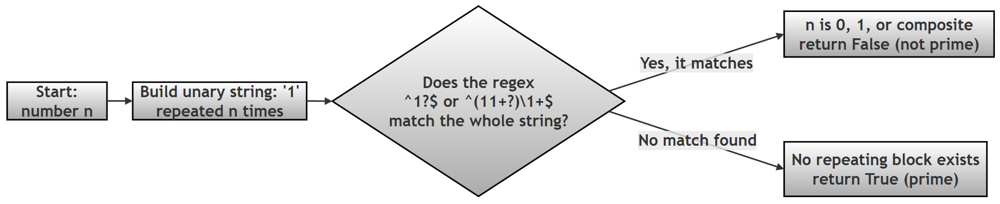
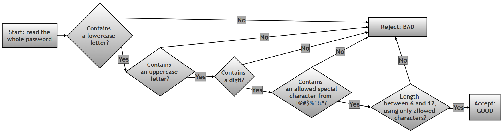
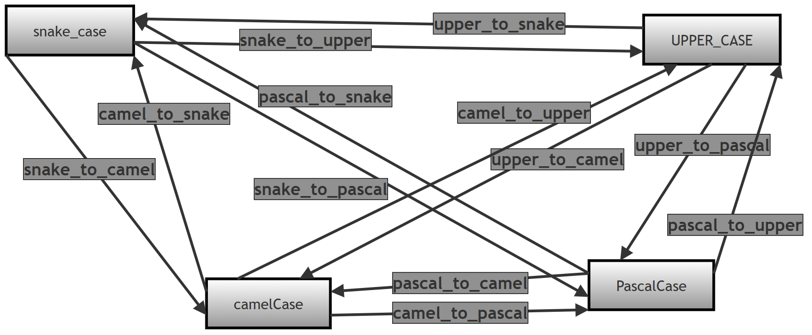
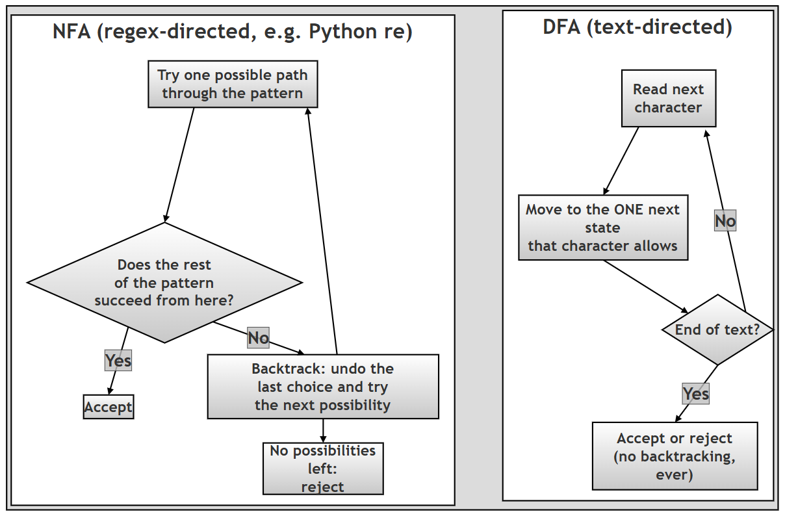
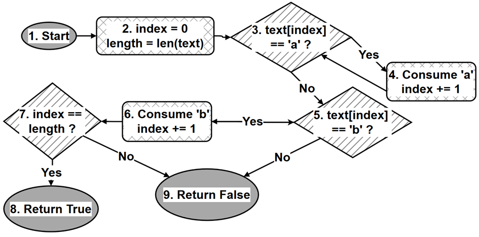
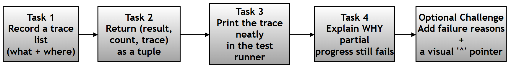

 --------

 "Python Programming: Problem Solving, Packages and Libraries" authored by Anurag Gupta and G.P. Biswas<br/>

<br />

<br/>
<br/>


---------
<br/>
<br/>

# Chapter 13 Companion: Regular Expressions in Python (the `re` module)

## What this page contains, and why it matters

This page is an **online companion** to Chapter 13 ("Regular Expressions") of the printed book *Python Programming: Problem Solving, Packages and Libraries*. The printed book explains the core ideas of regular expressions — what they are, why they exist, and how Python's built-in [`re` module](https://docs.python.org/3/library/re.html) uses them. Because a printed page has limited space, the book keeps its explanations short. This page exists to give you the *extra room* — more worked examples, more step-by-step scripts, more questions and answers, and a couple of guided mini-projects — so that a beginner can follow every idea from start to finish without getting lost.

In simple words: a **regular expression** (often shortened to **regex** or **regexp**) is a small, specialised text pattern that describes *what a piece of text should look like*, rather than describing the exact text itself. For example, instead of searching for the exact word `"cat"`, you could write a pattern that means "any word that starts with a capital letter and has at least five letters." Python lets you write such patterns as ordinary strings and hand them to the `re` module, which then does the pattern-matching for you. Regular expressions are used everywhere in real programming — validating an email address or a password, pulling phone numbers or dates out of a document, cleaning up messy data, checking log files, and much more — which is why this chapter (and this companion page) spends so much time on it.

### How this page is organised

The material is arranged in roughly the same order as the printed chapter, moving from simple to advanced:

1. **Scripts from the book** — the worked example scripts printed in Chapter 13, reproduced here with extra comments and sample output so you can run them yourself and see exactly what happens at each line.
2. **Questions & Answers** — a graded set of short questions (Beginner → Intermediate → Advanced) that test and reinforce the ideas from the chapter.
3. **Practice questions and scripts** — six additional worked problems that build small, realistic regex programs step by step.
4. **A mini-project on prime numbers** — a fun (and slightly mind-bending) demonstration that regular expressions are powerful enough to test whether a number is prime, without doing any arithmetic.
5. **A password-validation exercise** — a common, practical use of regex: enforcing rules on a password a user types in.
6. **Naming-style conversions** (`snake_case`, `camelCase`, `PascalCase`, `UPPER_CASE`) — a set of small, reusable regex-based helper functions.
7. **DFA and NFA** — a short, non-mathematical explanation of *how* regex engines actually work internally, and why this occasionally matters even to beginners (catastrophic slow-downs are a real hazard).
8. **A second mini-project** — building a tiny regex engine of your own, entirely from scratch, without using the `re` module at all. This is the best way to truly understand what a regex engine is doing "under the hood."
9. **An extension assignment** — four follow-on tasks (plus one optional "hard mode" challenge) that turn the mini-project into a small regex *debugger*, so you can watch the engine consume characters one at a time.
10. **A behind-the-scenes investigation** — a short piece of Python detective work explaining a genuine curiosity in the `re` module's own source code: how can `re.Pattern` and `re.Match` be real, usable classes if they are never defined anywhere with the `class` keyword?

### A note on the research/assignment questions

Several sections below reproduce **assignment or research questions exactly as they appear in the printed book**, so that students working from the book can match this page to their homework without any confusion. These printed questions are marked clearly and have **not** been reworded. Where useful, a small number of *additional* follow-up or "stretch" questions have been added directly beneath the original ones — these are new, are labelled as extra, and are entirely optional.

### A note on language and technical terms

This page is written in plain, everyday language wherever possible. Where a technical term is unavoidable (for example *quantifier*, *backreference*, *lookahead*, *greedy matching*, *finite automaton*), a short, simple explanation is given the first time the term is used, usually followed by a link to a reference page (mostly the [official Python documentation](https://docs.python.org/3/library/re.html) or the [MDN regular-expressions guide](https://developer.mozilla.org/en-US/docs/Web/JavaScript/Guide/Regular_expressions)) where you can read a fuller, more technical treatment if you want to go deeper. You never *need* to click these links to follow the page — they are there only for readers who want more detail.

### A quick glossary (for reference while you read)

You do not need to memorise this table before starting — just come back to it whenever a term below feels unfamiliar.

| Term | Plain-language meaning | Learn more |
|---|---|---|
| Regular expression (regex) | A text pattern that describes a *shape* of text to search for, rather than exact text | [Python `re` docs](https://docs.python.org/3/library/re.html) |
| Pattern | The regex string itself, e.g. `r"\d+"` | [Python `re` — regex syntax](https://docs.python.org/3/library/re.html#regular-expression-syntax) |
| Match object | The result Python gives you when a pattern is found in some text | [Python `re` — Match objects](https://docs.python.org/3/library/re.html#match-objects) |
| Quantifier | A symbol such as `*`, `+`, `?`, or `{m,n}` that says *how many times* something can repeat | [Python `re` — repeating things](https://docs.python.org/3/howto/regex.html#repeating-things) |
| Character class | A set of characters in square brackets, e.g. `[aeiou]`, meaning "any one of these characters" | [Python `re` — character classes](https://docs.python.org/3/library/re.html#regular-expression-syntax) |
| Capturing group | Part of a pattern wrapped in `( )` so the matched text can be pulled out separately | [Python `re` — groups](https://docs.python.org/3/library/re.html#re.Match.group) |
| Backreference | A way of referring, later in the same pattern, back to text that an earlier group already matched (written `\1`, `\2`, …) | [Python `re` HOWTO — backreferences](https://docs.python.org/3/howto/regex.html) |
| Greedy vs. lazy (non-greedy) | Whether a quantifier tries to match *as much text as possible* (greedy) or *as little as possible* (lazy, written with a trailing `?`) | [Python `re` HOWTO — greedy versus non-greedy](https://docs.python.org/3/howto/regex.html#greedy-versus-non-greedy) |
| Lookahead / lookaround | A check on the text *around* the current position that does not itself consume any characters | [Python `re` HOWTO — lookahead assertions](https://docs.python.org/3/howto/regex.html#lookahead-assertions) |
| Flag | An option such as `re.IGNORECASE` that changes how matching behaves | [Python `re` — flags](https://docs.python.org/3/library/re.html#flags) |
| Finite automaton (DFA / NFA) | A simplified "machine" used to describe, mathematically, how a pattern-matching engine decides whether text matches | [Wikipedia — Finite-state machine](https://en.wikipedia.org/wiki/Finite-state_machine) |

---

### Table of contents
- [What this page contains, and why it matters](#what-this-page-contains-and-why-it-matters)
- [Scripts from book in the Chapter on Regular Expressions](#scripts-from-book-in-the-chapter-on-regular-expressions)
- [Python `re` Module – Questions & Answers](#python-re-module--questions--answers)
    - [Beginner level](#beginner-level)
    - [Intermediate Level](#intermediate-level)
    - [Advanced Level](#advanced-level)
- [Some questions/ scripts based on re module](#some-questions-scripts-based-on-re-module)
- [Mini Project: Using regular expression (re) to check for primality](#using-regular-expression-re-to-check-for-primality)
- [Write a regexp which places certain restrictions on a password that a user may select](#problem--write-a-regexp-which-places-the-following-restrictions-on-a-password-that-a-user-may-select-)
- [Naming Styles in Programming](#naming-styles-in-python-programming)
- [Deterministic Finite Automatons (DFA) and Nondeterministic Finite Automaton (NFA)](#deterministic-finite-automatons-dfa-and-nondeterministic-finite-automaton-nfa)
- [Mini Project: Simulating a Regular Expression Matcher in Python](#mini-project-simulating-a-regular-expression-matcher-in-python)
    - [The Complete Python script which simulates a regex engine](#the-complete-python-script-which-simulates-a-regex-engine-is-as-follows-)
- [Extension Assignment: Tracing Character Consumption in a Manual Regex Engine](#extension-assignment-tracing-character-consumption-in-a-manual-regex-engine)
    - [Extension Task 1: Track Consumed Characters](#extension-task-1-track-consumed-characters)
        - [Line-by-Line Explanation of Extension Task 1 Script](#line-by-line-explanation)
    - [Extension Task 2: Modify the Function Return Value](#extension-task-2-modify-the-function-return-value)
    - [Extension Task 3: Display Consumption Details in Output](#extension-task-3-display-consumption-details-in-output)
    - [Extension Task 4: Interpret Partial Consumption](#extension-task-4-interpret-partial-consumption)
    - [Optional Challenge (Hard)](#optional-challenge-hard)
- [Final Takeaway for Students](#final-takeaway-for-students)
- [How Does Python's re Module Expose Pattern and Match Types Without Defining Them?](#how-does-pythons-re-module-expose-pattern-and-match-types-without-defining-them)
- [Summary of changes made to this page](#summary-of-changes-made-to-this-page)

### Scripts from book in the Chapter on Regular Expressions

The eighteen short scripts below are the worked examples from the printed chapter. Each one is small on purpose — it is meant to show **one** regex idea in isolation, so that you are never trying to learn ten things at once. Every script has been re-run to check its output, each step now carries a `# Step N` comment explaining *what* it does and *why*, and the exact output produced (verified on Python 3.12) is shown underneath in its own block. A short "What this shows" line at the top of each script tells you, in one sentence, the single idea to take away before you even read the code.

> **A version note before you start:** A few scripts below build a message with an f-string like `f"...{r'\d+'}..."` — that is, a *backslash appears inside the curly braces* of an f-string. This only became legal Python starting with **Python 3.12** (a change called [PEP 701](https://peps.python.org/pep-0701/)). Since this book targets Python 3.12 and above, the scripts run as printed. If you are using an older Python (3.10 or 3.11, say), you will see `SyntaxError: f-string expression part cannot include a backslash`. The fix is simple: store the raw string in its own variable first, e.g. `digit_pattern = r"\d+"` and then use `f"...{digit_pattern}..."` — this works on every Python version.

<details>
  <summary><strong> Scripts from book on Regular Expressions (Click to Expand)</strong></summary>

  <br> <details>
    <summary> 1. Script uses the `findall()` function of the `re` module to show the difference between `\d` and `\d+` (Click to Expand) </summary>

**What this shows:** a single `\d` matches **one** digit at a time, while `\d+` (the `+` is a *quantifier* meaning "one or more") greedily matches a whole **run** of consecutive digits as one piece.

```python
# Step 1: Import the re module (this is required before using any regex function)
import re

# Step 2: Define the text we will search inside
text = "My numbers are 1, 234, and 56z7."

# Step 3: \d matches exactly ONE digit, so every individual digit is
# returned as its own separate match
print(re.findall(r"\d", text))

# Step 4: \d+ matches ONE OR MORE digits in a row, so consecutive digits
# are grouped together into a single match. Notice "56" and "7" are
# returned separately because the letter 'z' breaks the run of digits.
print(re.findall(r"\d+", text))

# Step 5: \d{2} matches EXACTLY two digits in a row
print(re.findall(r"\d{2}", text))

# Step 6: \d\d\d matches exactly three digits written one after another
print(re.findall(r"\d\d\d", text))
```

```text
['1', '2', '3', '4', '5', '6', '7']
['1', '234', '56', '7']
['23', '56']
['234']
```

  </details>

  <details>
    <summary>2. How `re.compile()` creates and returns a `Pattern` object called `p`. The `type()` of `p` is `Pattern`, as shown by the `print()` function (Click to Expand) </summary>

**What this shows:** `re.compile()` turns a plain pattern string into a reusable **compiled Pattern object** — useful when you plan to use the same pattern many times, since Python only has to interpret it once.

```python
# Step 1: Import the re module
import re

# Step 2: re.compile() is a "factory function" -- it takes a regex
# pattern string and returns a compiled regex Pattern object.
# The 'r' before the string marks it as a RAW string literal, so that
# backslashes (like the one hiding inside '*') are treated literally
# and not as Python escape sequences.
p = re.compile("a*b")

# Step 3: Ask Python what TYPE of object p actually is
print(type(p))
```

```text
<class 're.Pattern'>
```

The output confirms that `p` is genuinely a compiled regex object of type `Pattern` — not a plain string. This is the "hack" that the very last section of this page investigates in detail: how can `re.Pattern` be a real class if it is nowhere defined with the `class` keyword?

  </details>

  <details>
    <summary>3. Example script on capturing groups (Click to Expand) </summary>

**What this shows:** parentheses `( )` in a pattern create **capturing groups** — pieces of the match you can pull out individually afterwards using `.group(1)`, `.group(2)`, and so on.

```python
# Step 1: Import re and set up the text to search
import re
text = "abc 123 def 456"

# Step 2: Search for two groups of digits, separated by ANY non-digit
# characters. \D+ (one or more non-digits) is used only to "skip over"
# the middle text -- since it is NOT wrapped in parentheses, it is not
# captured as a group of its own.
m1 = re.search(r"(\d+)\D+(\d+)", text)  # Only two capturing groups
print("First digits:", m1.group(1))
print("Second digits:", m1.group(2))

# Step 3: This time wrap the middle text in parentheses too, so it
# becomes a THIRD capturing group instead of being thrown away.
m2 = re.search(r"(\d+)(\D+)(\d+)", text)  # Three capturing groups
print("First digits:", m2.group(1))
print("Non-digits:", repr(m2.group(2)))
print("Second digits:", m2.group(3))
```

```text
First digits: 123
Second digits: 456
First digits: 123
Non-digits: ' def '
Second digits: 456
```

  </details>

  <details>
    <summary>4. Script using the module-level convenience functions (Click to Expand) </summary>

**What this shows:** the family of top-level functions `re.match()`, `re.fullmatch()`, `re.search()`, `re.findall()`, `re.finditer()`, `re.split()`, `re.sub()`, and `re.subn()` — the eight functions you will use for almost everything.

```python
# Step 1: Import re and set up one shared piece of text used by every
# example below, so the differences between the functions are clear
import re
text = "abc 123 def 456"

# Step 2: re.match() -- tries to match the pattern ONLY at the very
# beginning of the string. It does not matter what comes after.
result = re.match(r"abc", text)
print(f"Match {r'abc'} With {text}-> {result}")

# Step 3: re.fullmatch() -- the pattern must match the ENTIRE string,
# start to finish, with nothing left over on either side.
result = re.fullmatch(r"abc 123 def 456", text)
print(f"Fullmatch {r'abc 123 def 456'} With {text}-> {result}")

# Step 4: re.search() -- scans through the WHOLE string and returns
# the first place the pattern is found, wherever that may be.
result = re.search(r"123", text)
print(f"Search {r'123'} In {text}-> {result}")

# Step 5: re.findall() -- finds EVERY match in the string and returns
# them all together as a plain list of strings.
result = re.findall(r"\d+", text)
print(f"Findall {r'\d+'} In {text}-> {result}")

# Step 6: re.finditer() -- like findall(), but instead of a list it
# gives back an ITERATOR of full Match objects, one match at a time,
# so you can also read each match's position with .start().
print("re.finditer(r'\\d+', text):")
for match in re.finditer(r"\d+", text):
    print("Match:", match.group(), "at position", match.start())

# Step 7: re.split() -- splits the string into pieces everywhere the
# pattern matches, and returns those pieces as a list.
result = re.split(r"\s+", text)
print(f"Split {r'\s+'} In {text}-> {result}")

# Step 8: re.sub() -- SUBSTITUTES every match with a replacement string.
result = re.sub(r"\d+", "#", text)
print(f"Sub {r'\d+'} With '#' In {text}-> {result}")

# Step 9: re.subn() -- identical to sub(), but ALSO returns how many
# replacements were made, as a (new_string, count) tuple.
result = re.subn(r"\d+", "#", text)
print(f"Subn {r'\d+'} With '#' In {text}-> ", result)
```

```text
Match abc With abc 123 def 456-> <re.Match object; span=(0, 3), match='abc'>
Fullmatch abc 123 def 456 With abc 123 def 456-> <re.Match object; span=(0, 15), match='abc 123 def 456'>
Search 123 In abc 123 def 456-> <re.Match object; span=(4, 7), match='123'>
Findall \d+ In abc 123 def 456-> ['123', '456']
re.finditer(r'\d+', text):
Match: 123 at position 4
Match: 456 at position 12
Split \s+ In abc 123 def 456-> ['abc', '123', 'def', '456']
Sub \d+ With '#' In abc 123 def 456-> abc # def #
Subn \d+ With '#' In abc 123 def 456->  ('abc # def #', 2)
```

  </details>

  <details>
    <summary>5. Script using the instance methods of a compiled `Pattern` object (Click to Expand) </summary>

**What this shows:** every one of the eight functions from script 4 also exists as a **method** you can call directly on a compiled `Pattern` object (e.g. `pattern_digits.findall(text)` instead of `re.findall(pattern, text)`). This is the more efficient style to use when the same pattern will be reused many times, since `re.compile()` only has to build it once.

```python
# Step 1: Import re and set up the shared text
import re
text = "abc 123 def 456"

# Step 2: Compile every pattern ONCE, up front, and reuse the compiled
# objects below -- this is the main efficiency benefit of re.compile()
pattern_abc = re.compile(r"abc")
pattern_full = re.compile(r"abc 123 def 456")
pattern_123 = re.compile(r"123")
pattern_digits = re.compile(r"\d+")
pattern_space = re.compile(r"\s+")

# Step 3: Pattern.match() -- matches only at the start of the string
result = pattern_abc.match(text)
print(f"Match {r'abc'} With {text}-> {result}")

# Step 4: Pattern.fullmatch() -- the ENTIRE string must match
result = pattern_full.fullmatch(text)
print(f"Fullmatch {r'abc 123 def 456'} With {text}-> {result}")

# Step 5: Pattern.search() -- scans the whole string for the pattern
result = pattern_123.search(text)
print(f"Search {r'123'} In {text}-> {result}")

# Step 6: Pattern.findall() -- returns every match as a list
result = pattern_digits.findall(text)
print(f"Findall {r'\d+'} In {text}-> {result}")

# Step 7: Pattern.finditer() -- returns an iterator of Match objects
print("Pattern.finditer(r'\\d+', text):")
for match in pattern_digits.finditer(text):
    print("Match:", match.group(), "at position", match.start())

# Step 8: Pattern.split() -- splits the string on every match
result = pattern_space.split(text)
print(f"Split {r'\s+'} In {text}-> {result}")

# Step 9: Pattern.sub() -- replaces every match with a new value.
# NOTE: this must use the single-backslash raw string r'\d+' (matching
# the pattern itself) to print correctly -- see the box below.
result = pattern_digits.sub("#", text)
print(f"Sub {r'\d+'} With '#' In {text}-> {result}")

# Step 10: Pattern.subn() -- like sub(), but also reports the count
result = pattern_digits.subn("#", text)
print(f"Subn {r'\d+'} With '#' In {text}-> ", result)
```

```text
Match abc With abc 123 def 456-> <re.Match object; span=(0, 3), match='abc'>
Fullmatch abc 123 def 456 With abc 123 def 456-> <re.Match object; span=(0, 15), match='abc 123 def 456'>
Search 123 In abc 123 def 456-> <re.Match object; span=(4, 7), match='123'>
Findall \d+ In abc 123 def 456-> ['123', '456']
Pattern.finditer(r'\d+', text):
Match: 123 at position 4
Match: 456 at position 12
Split \s+ In abc 123 def 456-> ['abc', '123', 'def', '456']
Sub \d+ With '#' In abc 123 def 456-> abc # def #
Subn \d+ With '#' In abc 123 def 456->  ('abc # def #', 2)
```

> **Fix applied here:** the original printed script wrote the last two lines using a *double*-backslash raw string, `r'\\d+'`. That is a different, longer string (four characters: `\`, `\`, `d`, `+`) to the single-backslash `r'\d+'` used for the pattern itself, and printing it produces `Sub \\d+ With ...` (with two backslashes) instead of the intended `Sub \d+ With ...`. The script above uses `r'\d+'` throughout, in line with script 4, so the printed message correctly matches the pattern that was actually used.

  </details>

  <details>
    <summary> 6. Script on the working of the `Match` object's methods (Click to Expand) </summary>

**What this shows:** once you have a `Match` object (the thing `re.search()` and friends hand back to you), it has its own small set of useful methods: `.group()`, `.groups()`, and `.groupdict()`.

```python
# Step 1: Import re and search for one or more digits anywhere in the text
import re
m = re.search(r"(\d+)", "abc 123 def 456")

# Step 2: m.group() with no argument -- or m.group(0) -- always returns
# the ENTIRE match (not just the part inside parentheses)
print(f"m.group(0) -> {m.group(0)}")

# Step 3: m.group(1) returns just the first capturing group
print(f"m.group(1) -> {m.group(1)}")

# Step 4: m.groups() -- note the PLURAL name -- returns ALL capturing
# groups together as one tuple
print(f"m.groups() -> {m.groups()}")

# Step 5: named groups, written (?P<name>...), can be read back as a
# dictionary using m.groupdict()
m_named = re.search(r"(?P<digits>\d+)", "abc 123 def 456")
print(f"m_named.groupdict() -> {m_named.groupdict()}")
```

```text
m.group(0) -> 123
m.group(1) -> 123
m.groups() -> ('123',)
m_named.groupdict() -> {'digits': '123'}
```

#### Script showing use of groups (numbering `group(0)`, `group(1)`, `group(2)`, …)

This companion script makes the group-numbering rules completely explicit: `group()` and `group(0)` both mean "the whole match", while `group(1)`, `group(2)`, … refer to the parenthesised parts, counted left to right by their *opening* parenthesis.

```python
# Step 1: Match two groups: letters "abc", then digits "123"
import re
match = re.match(r"(abc)(123)", "abc123")

# Step 2: group() with nothing, or group(0), both mean "whole match"
print(match.group())
print(match.group(0))

# Step 3: group(1) and group(2) are the two parenthesised parts
print(match.group(1))
print(match.group(2))

# Step 4: you can even ask for several groups at once -- you get a tuple back
print(match.group(1, 2))
print(match.group(1, 2, 0))

# Step 5: asking for a group number that does not exist raises IndexError.
# Uncomment the next line to see this for yourself:
# print(match.group(3))  # ERROR - there is no third group in this pattern
```

```text
abc123
abc123
abc
123
('abc', '123')
('abc', '123', 'abc123')
```

  </details>

  <details>
    <summary> 7. Script showing the use of flags in `re.compile()` (Click to Expand)   </summary>

**What this shows:** a **flag** is an optional setting (such as `re.IGNORECASE`) that changes how the whole pattern behaves. Several flags can be combined with the bitwise-OR operator `|`, and later you can test whether a particular flag is switched on using the bitwise-AND operator `&`.

```python
# Step 1: Compile a pattern with two flags combined using the
# bitwise-OR operator: re.I (IGNORECASE) and re.M (MULTILINE)
import re
p = re.compile(r"hello", re.I | re.M)

# Step 2: p.flags reports the COMBINED numeric value of every flag
# that is switched on for this compiled pattern
print(p.flags)
```

```text
42
```

> **Fix applied here:** the original text claimed this would print `10` (which is simply `re.I` (2) plus `re.M` (8)). In practice, Python 3 automatically adds the `re.UNICODE` flag (32) to every pattern compiled from an ordinary `str` (Unicode string matching has been the default since Python 3, so the interpreter marks it as "on" internally). That makes the true combined value `2 + 8 + 32 = 42`, which is exactly what the script above prints. Try `print(re.U)` yourself to confirm `re.UNICODE` equals `32`.

To check whether one *specific* flag is switched on inside a combined value, use the bitwise-AND operator `&`. The next script shows this as a separate, self-contained example:

```python
# Step 1: Compile the same pattern with IGNORECASE and MULTILINE flags
import re
p = re.compile(r"hello", re.I | re.M)

# Step 2: p.flags & re.I is non-zero (truthy) only if re.I is one of the
# flags that was switched on -- this is how you test a single bit
if p.flags & re.I:
    print("Case Insensitive is ON")

# Step 3: The same bitwise-AND trick, but this time testing for
# re.S (DOTALL), which was NEVER turned on for this pattern
if p.flags & re.S:
    print("DotAll is ON")
else:
    print("DotAll is OFF")
```

```text
Case Insensitive is ON
DotAll is OFF
```


  </details>
  <details>
    <summary> 8. The following script shows the difference between greedy and non-greedy regex (Click to Expand)   </summary>

**What this shows:** by default, quantifiers like `*` are **greedy** — they try to match as much text as possible. Adding a `?` right after the quantifier (`*?`) makes it **lazy** (non-greedy) — it matches as little text as possible instead.

```python
# Step 1: Set up text that contains two separate "runs" of digits
import re
text = "abc123xyz456"

# Step 2: Greedy matching. ".*" tries to consume as much text as it
# can, then only backs off the minimum amount needed to let "\d+"
# still succeed -- so it grabs everything, ending at the LAST digit.
m1 = re.search(".*\\d+", text)
print(m1.group())

# Step 3: Non-greedy (lazy) matching. ".*?" instead tries to consume
# as LITTLE text as possible, so it stops as soon as "\d+" can succeed
# for the first time -- ending at the end of the FIRST run of digits.
m2 = re.search(".*?\\d+", text)
print(m2.group())
```

```text
abc123xyz456
abc123
```

  </details>
  <details>
    <summary> 9. Another script showing the difference between greedy and non-greedy (lazy) regex (Click to Expand)  </summary>

**What this shows:** the same greedy-vs-lazy idea as script 8, but with a more realistic (and more dangerous!) example: matching HTML-style tags with `<.*>`. This is exactly the kind of pattern that, without care, can accidentally swallow far more of a document than intended.

```python
# Step 1: Set up a small piece of HTML-like text
import re
str_html = '<!DOCTYPE html> <html> <head> </head> </html>'
print('length string->', len(str_html))

# Step 2: GREEDY. There is no '?' after the '*', so this is the
# default, greedy behaviour: it grabs from the FIRST '<' all the way
# to the LAST '>' in the whole string -- almost certainly not what
# you wanted if you were trying to match just one tag!
pat_greedy = '<.*>'
print('length greedy->', re.match(pat_greedy, str_html).span())
print('groups greedy->', re.match(pat_greedy, str_html).group())

# Step 3: NON-GREEDY (lazy). The '?' after the '*' makes it stop at
# the FIRST '>' it can find, matching only the very first tag.
pat_nongreedy = '<.*?>'
print('length non-greedy->', re.match(pat_nongreedy, str_html).span())
print('groups non-greedy->', re.match(pat_nongreedy, str_html).group())
```

```text
length string-> 45
length greedy-> (0, 45)
groups greedy-> <!DOCTYPE html> <html> <head> </head> </html>
length non-greedy-> (0, 15)
groups non-greedy-> <!DOCTYPE html>
```

  </details>

  <details>
    <summary> 10. Grouping for repetition (quantifiers) — the most common use of `( )` (Click to Expand) </summary>

**What this shows:** wrapping a whole *sequence* of characters in parentheses lets you repeat that entire sequence with a quantifier, not just a single character.

```python
# Step 1: Set up text made of the two-character sequence "ab" repeated
import re
text = "ababab"

# Step 2: (?:ab)+ means "the sequence 'ab', repeated one or more
# times". The '?:' at the start makes this a NON-CAPTURING group
# (explained in script 11 below), so findall() returns the whole
# repeated match as a single string rather than splitting it up.
pattern = re.findall(r"(?:ab)+", text)
print(pattern)
```

```text
['ababab']
```

  </details>

<details>
    <summary> 11. Grouping for alternation (the "OR" operator, `|`) (Click to Expand) </summary>

**What this shows:** the crucial difference in what `re.findall()` returns depending on whether you use a plain group `( )` or a **non-capturing group** `(?: )`.

```python
# Step 1: Import re. A non-capturing group (?:cat|dog|rat) groups the
# alternatives together WITHOUT creating a separate capturing group,
# so findall() can return the matched text directly.
import re
pattern1 = re.findall(r"(?:cat|dog|rat)", "cat dog rat bat")
print("Non-capturing-> ", pattern1)

# Step 2: A CAPTURING group (cat|dog|rat) -- without the '?:' -- means
# there IS now exactly one capturing group in the pattern.
pattern2 = re.findall(r"(cat|dog|rat)", "cat dog rat bat")
print("Capturing-> ", pattern2)
```

```text
Non-capturing->  ['cat', 'dog', 'rat']
Capturing->  ['cat', 'dog', 'rat']
```


  </details>


<details>
    <summary> 12. Example comparing a non-capturing group to an unwanted capturing group (Click to Expand) </summary>

**What this shows:** when a pattern has **two** capturing groups, `.groups()` returns a two-item tuple. If you do not actually need the first group's text, marking it non-capturing with `(?: )` keeps only the group you care about.

```python
# Step 1: Original version, using a CAPTURING group for the title
import re
pattern = re.search(r"(Mr|Ms|Dr)\. (\w+)", "Dr. John")
print(pattern.groups())

# Step 2: If the title itself is not needed, capturing it is wasted
# effort. The improved version below uses a NON-CAPTURING group for
# the title, so .groups() only reports the part we actually want: the name.
pattern = re.search(r"(?:Mr|Ms|Dr)\. (\w+)", "Dr. John")
print(pattern.groups())
```

```text
('Dr', 'John')
('John',)
```

  </details>

  <details>
    <summary> 13. The following script shows the difference between capturing and non-capturing groups when picking out file extensions (Click to Expand) </summary>

**What this shows:** `re.search()` always returns the **first (leftmost)** match in the string — even if, in your head, you were thinking of a different, later match. This script is a good reminder to always check *which* match a pattern actually finds, not just whether it finds *a* match.

```python
# Step 1: Set up a sentence that lists several files, in this order:
# report.pdf, notes.docx, image.png, summary.txt
import re
text = "Here are some files: report.pdf, notes.docx, image.png, summary.txt."

# Step 2: Non-capturing group for the filename -- we only want the
# EXTENSION, so the filename part (?:\w+) is grouped but not captured.
# The pattern reads as three parts:
#   A. (?:\w+)              -> the filename, not captured
#   B. \.                   -> the literal dot before the extension
#   C. (pdf|docx|txt)       -> the extension, which IS captured
# re.search() scans left to right and stops at the FIRST match, which
# is "report.pdf" (it appears earliest in the sentence).
m1 = re.search(r"(?:\w+)\.(pdf|docx|txt)", text)
print(m1.group(1))

# Step 3: Using a capturing group for the filename part too, so we can
# read the filename back with .group(1) and the extension with .group(2)
m2 = re.search(r"(\w+)\.(pdf|docx|txt)", text)
print(m2.group(1))

# Step 4: The same search again, reading BOTH captured pieces this time
m3 = re.search(r"(\w+)\.(pdf|docx|txt)", text)
print(m3.group(1))
print(m3.group(2))
```

```text
pdf
report
report
pdf
```

`report.pdf`.

  </details>

  <details>
    <summary> 14. The following script shows the use of non-capturing and capturing groups to remove duplicate words in a sentence (Click to Expand) </summary>

**What this shows:** a **backreference** (`\1`) lets a pattern refer, later in the very same pattern, to whatever text an earlier group already captured — here, that is exactly what lets us detect a word that repeats.

```python
# Difference between (\b\w+)(?:\s+\1)+ and (\b\w+)(\s+\1)+

# Step 1: Using a NON-CAPTURING group for the repeated duplicates.
# Explanation of the pattern (\b\w+)(?:\s+\1)+:
#   - (\b\w+)        captures ONE word (this is capturing group 1)
#   - (?:\s+\1)+     matches "whitespace, then that SAME word again",
#                     one or more times. The \1 is a BACKREFERENCE: it
#                     means "whatever text group 1 already matched".
#                     Because this outer part uses (?: ... ), it does
#                     NOT create a second capturing group of its own.
import re

def remove_duplicates_non_capturing(some_text):
    # Step 2: re.sub() replaces "word + its repeats" with just \1,
    # i.e. the word by itself, one time only
    without_dup_text = re.sub(r'(\b\w+)(?:\s+\1)+', r'\1', some_text)
    return without_dup_text

# Step 3: Try it on a sentence where every word has been typed twice
# (or, for "cat", even three times)
text_with_dup = 'The The cat cat cat sat sat on on the the wall wall.'
text_without_dup = remove_duplicates_non_capturing(text_with_dup)
print("Using non-capturing->", text_without_dup)

# Step 4: Using a CAPTURING group instead for the repeated part.
# Pattern (\b\w+)(\s+\1)+ : the outer (\s+\1)+ is now ALSO a capturing
# group (group 2), even though we never read group 2's value here.
def remove_duplicates_capturing(some_text):
    without_dup_text = re.sub(r'(\b\w+)(\s+\1)+', r'\1', some_text)
    return without_dup_text

text_without_dup_capturing = remove_duplicates_capturing(text_with_dup)
print("Using capturing-> ", text_without_dup_capturing)
```

```text
Using non-capturing-> The cat sat on the wall.
Using capturing->  The cat sat on the wall.
```

**Why prefer the non-capturing version here?** Both patterns produce the exact same final text. The difference is purely about efficiency and clarity: the capturing version forces the regex engine to keep remembering and re-recording group 2's contents on every single repeat, work that is thrown away immediately since nothing ever reads `group(2)`. The non-capturing version skips that bookkeeping entirely. As a rule of thumb: use a capturing group only when you actually plan to read its value afterwards.

  </details>


  <details>
    <summary> 15. Example script which finds (rather than removes) duplicate words, using a non-capturing group (Click to Expand) </summary>

**What this shows:** the very same backreference pattern from script 14, but this time used with `finditer()` just to **report** each duplicated word, without changing the text at all.

```python
# Step 1: Set up text with several repeated words
import re
text = "The The cat cat cat sat sat on on the the wall wall"

# Step 2: Compile the "word followed by itself" pattern once
pattern = re.compile(r"(\b\w+)(?:\s+\1)+")  # Pattern to find duplicate words

# Step 3: finditer() finds every match without altering the original text
matches = pattern.finditer(text)

# Step 4: Print out just the duplicated word from each match
for m in matches:
    print("Duplicate word:", m.group(1))
```

```text
Duplicate word: The
Duplicate word: cat
Duplicate word: sat
Duplicate word: on
Duplicate word: the
Duplicate word: wall
```

  </details>


  <details>
    <summary>16. Backreferences (Example 2: swapping two words) (Click to Expand) </summary>

Backreferences are useful for more than just spotting duplicates — they can also be used inside `re.sub()`'s *replacement* string to rearrange text. Consider the pattern below:

```
([^\s]+)\s+([^\s]+)
```

This pattern has three parts:
- `([^\s]+)` → the first word (anything that is *not* whitespace, one or more times)
- `\s+` → the whitespace that separates the two words
- `([^\s]+)` → the second word

The two words are captured as `\1` (first word) and `\2` (second word). Because they are captured, we can refer to them again — in a **different order** — inside the replacement string.

```python
# Step 1: Import re and set up the pattern and the text to rearrange
import re
reg_pat = r'([^\s]+)\s+([^\s]+)'  # Pattern to match two words separated by whitespace
old_text = 'ant bee cat dog'

# Step 2: In the replacement string, write \2 BEFORE \1 -- this swaps
# the order in which the two captured words are written back out
new_text = re.sub(reg_pat, r'\2 \1', old_text)
print(new_text)
```

```text
bee ant dog cat
```

**How it works, step by step:** `re.sub()` scans the string for non-overlapping matches of the pattern. The first match is `"ant bee"` (word 1 = `ant`, word 2 = `bee`), which gets replaced by `"bee ant"`. The scan then continues from where that match ended, finds the second match `"cat dog"` (word 1 = `cat`, word 2 = `dog`), and replaces it with `"dog cat"`. The two swapped pairs are then joined back together with the space that was between them, producing `"bee ant dog cat"`.

  </details>


  <details>
    <summary> 17. Using lookaround to check that a user has typed a valid password (Click to Expand) </summary>

**What this shows:** a **lookahead assertion** — written `(?=...)` — checks that something is present *without* actually consuming any characters from the string. This lets you stack up several independent conditions ("must contain an uppercase letter" *and* "must contain a lowercase letter" *and* …) at the very start of a pattern, all checked from the same starting position.

```python
# Step 1: Import re
import re

# ^ asserts the position at the very start of the string
# .*  means "any character, zero or more times"
#
# Password rules, each written as its own lookahead assertion:
#   (?=.*[A-Z])  -> somewhere ahead, there is at least one UPPERCASE letter
#   (?=.*[a-z])  -> somewhere ahead, there is at least one lowercase letter
#   .{8,}        -> and, separately, the string is at least 8 characters long
#
# Because a lookahead does not consume any characters, all three checks
# run starting from the SAME position (the very beginning of the string).
password_pattern = re.compile(r"^(?=.*[A-Z])(?=.*[a-z]).{8,}$")

# Step 2: A short list of sample passwords to test, mixing valid and
# invalid examples
passwords = [
    "no_uppercase",     # no uppercase letter -> should fail
    "NO_LOWERCASE",     # no lowercase letter -> should fail
    "Short",             # too short (fewer than 8 characters) -> should fail
    "Password",          # has upper, lower, and 8+ characters -> should pass
    "GoodPass1"          # has upper, lower, and 8+ characters -> should pass
]

# Step 3: Check every password against the combined pattern and report
# the result
for pwd in passwords:
    if password_pattern.search(pwd):
        print(pwd, "-> VALID")
    else:
        print(pwd, "-> INVALID")
```

```text
no_uppercase -> INVALID
NO_LOWERCASE -> INVALID
Short -> INVALID
Password -> VALID
GoodPass1 -> VALID
```

  </details>


  <details>
    <summary> 18. The same password check, written WITHOUT lookaround (Click to Expand) </summary>

**What this shows:** lookaheads are convenient, but they are not strictly *necessary* — the same rule ("must contain both an uppercase and a lowercase letter, in either order") can be expressed with plain alternation (`|`) instead. This script exists mainly to show *why* lookarounds are usually the cleaner choice: without them, every possible ordering of the requirements has to be spelled out separately.

```python
# Step 1: Import re
import re

# REGEX WITHOUT LOOKAROUNDS
# Reasoning:
#   1. Minimum length 8 -> .{8,}
#   2. Must contain BOTH an uppercase and a lowercase letter, but since
#      we cannot use a lookahead to check this order-independently, we
#      must spell out BOTH possible orders using alternation (|):
#        a) uppercase appears before lowercase, OR
#        b) lowercase appears before uppercase
# Upper case before lowercase: ^[A-Z].*[a-z].{6,}$
# Lower case before uppercase: ^[a-z].*[A-Z].{6,}$
condition1 = "^[A-Z].*[a-z].{6,}$"
condition2 = "^[a-z].*[A-Z].{6,}$"
pattern_no_lookaround = re.compile(rf"({condition1})|({condition2})")

# Step 2: The same sample passwords as script 17, for a fair comparison
passwords = [
    "no_uppercase",
    "NO_LOWERCASE",
    "Short",
    "Password",
    "GoodPass1"
]

# Step 3: Check every password and report the result
for pwd in passwords:
    if pattern_no_lookaround.search(pwd):
        print(pwd, "-> VALID")
    else:
        print(pwd, "-> INVALID")
```

```text
no_uppercase -> INVALID
NO_LOWERCASE -> INVALID
Short -> INVALID
Password -> VALID
GoodPass1 -> VALID
```

Both scripts (17 and 18) agree on every test case, which is exactly what you would want from two different ways of expressing "the same" rule. It is worth noticing *why* the minimum lengths still line up even though script 18 writes `.{6,}` instead of `.{8,}`: in `^[A-Z].*[a-z].{6,}$`, the pattern already spends one character on `[A-Z]` and one more on `[a-z]` before it even reaches `.{6,}`, so the true minimum total length is `1 + 1 + 6 = 8` — exactly matching script 17's `.{8,}`. This is a useful habit whenever you compare two regex patterns that are supposed to enforce "the same" rule: add up every piece that must consume at least one character, rather than trusting the number that appears inside the braces on its own.

  </details>

</details>

### Python `re` Module – Questions & Answers
[Back to Table of Contents](#table-of-contents)

This section contains a graded set of **questions, answers, and learning points** for practising Python's `re` module, arranged in three levels of difficulty: Beginner, Intermediate, and Advanced. The questions themselves are printed exactly as set; the answers below them have been expanded into full explanations with runnable, verified example scripts and their actual output, so you can check your own understanding against real results rather than against a one-line bullet point. A short *extra practice question* has been added under a few entries — these are new, optional, and clearly marked as such; they are not part of the original set of questions.

###  Beginner Level
[Back to Table of Contents](#table-of-contents)

<details>

<summary> Beginner Level Q/A (Click to Expand) </summary>

#### **Q1. What are the similarities and differences between** `re.match()` **and** `re.search()`**?**

**Answer:**

- `re.match()` checks for a match **only at the beginning** of the string. If the pattern is not found starting right at position 0, `re.match()` gives up and returns `None` — even if the pattern *would* match a little further along.
- `re.search()` scans through the **entire string**, from left to right, and returns the very first match it finds, wherever it happens to occur.
- Both functions return the same kind of thing when they succeed: a [`Match` object](https://docs.python.org/3/library/re.html#match-objects). If nothing matches, both return `None` instead.

```python
# Step 1: Import re
import re

# Step 2: re.match() only looks at the START of the string. Since
# "catfish" DOES start with "cat", this succeeds.
print(re.match(r"cat", "catfish"))

# Step 3: re.search() scans the WHOLE string. "dogcat" does not
# start with "cat", but "cat" does appear later on, so this succeeds
# too -- notice the match position (span) is different from Step 2.
print(re.search(r"cat", "dogcat"))
```

```text
<re.Match object; span=(0, 3), match='cat'>
<re.Match object; span=(3, 6), match='cat'>
```

**Learning Points:**

- Match *position* matters just as much as whether a match happens at all.
- A very common beginner mistake is to use `re.match()` when what is actually needed is `re.search()` — if `re.match(pattern, text)` unexpectedly returns `None`, the first thing to check is whether the pattern might match somewhere *other* than the very start of the string.

>  **Extra practice question (not in the printed book):** What would `re.match(r"cat", "dogcat")` return, and why? (Try it yourself before reading the answer: because `"dogcat"` does not start with `"cat"`, `re.match()` returns `None`, even though `re.search()` on the same text succeeds.)

#### **Q2. What is the role of the backslash (**`\`**) in regular expressions?**

**Answer:**

- It **escapes** special characters, turning off their special meaning — for example `\.` matches a literal full stop, instead of "any character" (which is what a bare `.` means).
- It also **introduces special sequences** with their own meaning, such as `\d` (any digit), `\w` (any "word" character — letters, digits, or underscore), and `\s` (any whitespace character).

```python
# Step 1: Import re
import re

# Step 2: \d+ means "one or more digits". Here it finds the run of
# digits inside a string that also has letters.
print(re.search(r"\d+", "abc123"))
```

```text
<re.Match object; span=(3, 6), match='123'>
```

**Learning Points:**

- The backslash is central to regex syntax — almost every "shortcut" sequence in a pattern begins with one.
- Regex is really its own small language living *inside* a Python string, which is exactly why raw strings (see Q3) matter so much.

#### **Q3. What is raw string notation in Python, and why is it used with regex?**

**Answer:**

- A **raw string**, written with an `r` immediately before the opening quote (e.g. `r"\d+"`), tells Python to treat every backslash inside it **literally**, rather than as the start of a Python escape sequence (like `\n` for newline or `\t` for tab).
- Without the `r` prefix, you would need to write every backslash **twice** to get a single literal backslash through to the regex engine — for instance `"\\d"` instead of the far more readable `r"\d"`.

```python
# Step 1: Import re
import re

# Step 2: r"\bword\b" uses \b, the word-boundary sequence (see Q13),
# so this matches "word" only as a whole word, not as part of a
# longer word like "wordy" or "password".
print(re.search(r"\bword\b", "a word here"))
```

```text
<re.Match object; span=(2, 6), match='word'>
```

**Learning Points:**

- Raw strings improve readability — compare `r"\d+\s*\w+"` against the "double-escaped" equivalent `"\\d+\\s*\\w+"`.
- They also avoid a subtle class of bugs where a backslash sequence accidentally matches a *Python* escape (like `\n`) instead of the regex escape you actually meant.

#### **Q4. Why is** `[...]` **called a character class?**

**Answer:**

- Square brackets `[ ]` define a **set of characters** — you list every character you are willing to accept inside them.
- Despite possibly containing many characters listed inside the brackets, the whole `[...]` still matches only **one single character** at that position in the text — whichever one from the set happens to be there.

```python
# Step 1: Import re
import re

# Step 2: [aeiou] means "any one vowel". The word "sky" contains no
# vowels at all, so there is no match, and search() returns None.
print(re.search(r"[aeiou]", "sky"))
```

```text
None
```

**Learning Points:**

- Character classes match a single character, never a sequence of several — `[cat]` does **not** mean "the word cat"; it means "the single letter c, a, or t".
- To require *several* characters, each from its own set, write the classes one after another, e.g. `[A-Z][a-z]+` for "one capital letter, then one or more lowercase letters."

#### **Q5. What is the difference between** `*` **and** `+`**?**

**Answer:**

- `*` → **zero or more** occurrences (the thing being repeated is entirely optional, and can even match nothing at all).
- `+` → **one or more** occurrences (there must be at least one).

```python
# Step 1: Import re
import re

# Step 2: \d* can match ZERO digits, so it succeeds immediately at
# the very start of "abc123" by matching an empty string there.
print(re.search(r"\d*", "abc123"))

# Step 3: \d+ REQUIRES at least one digit, so it has to skip ahead
# to where the digits actually begin.
print(re.search(r"\d+", "abc123"))
```

```text
<re.Match object; span=(0, 0), match=''>
<re.Match object; span=(3, 6), match='123'>
```

**Learning Points:**

- `*` can match an **empty string** — this surprises many beginners, and is a common source of "why did my pattern match nothing useful?" bugs.
- This distinction matters a great deal for validation logic: if you are checking "does this field contain at least one digit?", `\d*` is the wrong tool, because it will happily "succeed" on text with no digits at all by matching zero of them.

#### **Q6. What does the dot (**`.`**) character match?**

**Answer:**

- By default, `.` matches **any single character except a newline** (`\n`).
- You can loosely think of it as shorthand for the character class `[^\n]` — "anything that is not a newline."

```python
# Step 1: Import re and build a two-line piece of text
import re
text = "ab\ncd"

# Step 2: findall(r".", text) collects every character the dot
# matches one at a time. Notice the newline character itself is
# skipped -- it is never included in the result.
print(re.findall(r".", text))
```

```text
['a', 'b', 'c', 'd']
```

**Learning Points:**

- This default behaviour is exactly why the `re.S` (or `re.DOTALL`) flag exists: turning it on makes `.` match newlines too, which matters a great deal when your pattern needs to work across multiple lines of text rather than one line at a time.

#### **Q7. List the special (meta) characters in regex.**

**Answer:**

The following characters carry special meaning in a regex pattern, rather than matching themselves literally:

```text
\  ^  $  .  |  ?  *  +  (  )  [  {
```

**Learning Points:**

- Because these characters are special, matching them **literally** (for example, to search for an actual question mark `?` in some text) requires escaping them with a backslash, e.g. `r"\?"`.
- A handy shortcut for this: Python's [`re.escape()`](https://docs.python.org/3/library/re.html#re.escape) function automatically escapes every special character in a plain string for you, which is invaluable when building a pattern out of text a *user* typed in (you never know in advance whether their text will contain a stray `.` or `(`).

```python
# Step 1: Import re
import re

# Step 2: re.escape() automatically backslash-escapes every special
# character in the given string, producing a pattern that will match
# that exact text literally
user_text = "3.14 (pi)?"
print(re.escape(user_text))
```

```text
3\.14\ \(pi\)\?
```

#### **Q8. What does** `re.sub()` **do?**

**Answer:**

- `re.sub()` **replaces** every piece of text that matches a pattern with a replacement string that you supply, and gives back the resulting, modified string.

```python
# Step 1: Import re
import re

# Step 2: Every run of digits (\d+) gets replaced with a single '#'
print(re.sub(r"\d+", "#", "abc123xyz456"))
```

```text
abc#xyz#
```

**Learning Points:**

- Regular expressions are not only for *searching* text — `re.sub()` shows that they can also **transform** data, which is exactly what makes them so useful for cleaning up messy real-world text.

#### **Q9. What does** `re.split()` **do?**

**Answer:**

- `re.split()` breaks a string into a list of pieces, splitting the string wherever the given pattern matches.

```python
# Step 1: Import re
import re

# Step 2: Split wherever one or more digits occur in a row
print(re.split(r"\d+", "abc123xyz456"))
```

```text
['abc', 'xyz', '']
```

**Learning Points:**

- `re.split()` is far more powerful than the plain [`str.split()`](https://docs.python.org/3/library/stdtypes.html#str.split) method, because the separator here can be an entire *pattern* (e.g. "split on any run of digits") rather than only a single fixed string.
- Notice the trailing empty string `''` at the end of the result above: since the text `"abc123xyz456"` *ends* with a run of digits, splitting on that final run leaves nothing after it — an empty piece. This is normal, expected behaviour, not a bug.

</details>

### Intermediate Level
[Back to Table of Contents](#table-of-contents)

<details>

<summary> Intermediate Level Q/A (Click to Expand)</summary>

#### **Q10. What is the difference between greedy and non-greedy quantifiers?**

**Answer:**

- **Greedy** quantifiers (the default: `*`, `+`, `{m,n}`, …) try to match **as much text as possible**.
- **Non-greedy** (lazy) quantifiers — written with a trailing `?`, like `*?` or `+?` — try to match **as little text as possible** instead.

```python
# Step 1: Import re and set up a small piece of tag-like text
import re
text = "<tag>content</tag>"

# Step 2: Greedy: ".*" stretches from the FIRST '<' to the LAST '>'
print(re.search(r"<.*>", text).group())

# Step 3: Non-greedy: ".*?" stops at the FIRST '>' it can reach
print(re.search(r"<.*?>", text).group())
```

```text
<tag>content</tag>
<tag>
```

**Learning Points:**

- Non-greedy quantifiers exist specifically to prevent **over-matching** — this example is a smaller version of script 9 earlier on this page, which shows the exact same idea on a bigger, more realistic piece of HTML.

#### **Q11. What does** `^` **mean inside a character class?**

**Answer:**

- Placed as the **first character right after the opening bracket** of a character class, `^` **negates** the class.
- A negated class such as `[^0-9]` matches any single character that is **not** in the listed set — here, any character that is not a digit.

```python
# Step 1: Import re
import re

# Step 2: [^0-9] matches the first character that is NOT a digit.
# In "123a", that is the letter 'a', found at position 3.
print(re.search(r"[^0-9]", "123a"))
```

```text
<re.Match object; span=(3, 4), match='a'>
```

**Learning Points:**

- The meaning of `^` genuinely depends on *where* it appears: **inside** a character class (right after `[`) it means "not"; **outside** a character class it instead means "start of the string/line" (see Q12). Mixing these two meanings up is a very common source of confusion for newcomers.

#### **Q12. What are position anchors in regex?**

**Answer:**

- `^` → matches the **start** of the string (or of a line, if the `re.MULTILINE` flag is on).
- `$` → matches the **end** of the string (or of a line, under the same flag).
- Anchors are special because, like lookaheads, they do not match an actual character — they match a *position*.

```python
# Step 1: Import re
import re

# Step 2: ^Hello only matches if the string STARTS WITH "Hello"
print(re.match(r"^Hello", "Hello World"))
```

```text
<re.Match object; span=(0, 5), match='Hello'>
```

**Learning Points:**

- Anchors are the backbone of **validation** patterns: wrapping a whole pattern between `^` and `$` (as the password examples earlier on this page do) forces the pattern to describe the *entire* input, not just some piece hidden somewhere inside it.

#### **Q13. What do** `\b` **and** `\B` **represent?**

**Answer:**

- `\b` → a **word boundary**: the (zero-width) position between a "word" character (`\w`: letters, digits, underscore) and a "non-word" character (or the very start/end of the string).
- `\B` → the opposite: a **non-word-boundary** position, i.e. anywhere `\b` would *not* match.

```python
# Step 1: Import re
import re

# Step 2: \bcat\b only matches "cat" as a whole word, not as part
# of a longer word such as "category" or "bobcat"
print(re.search(r"\bcat\b", "a cat here"))
```

```text
<re.Match object; span=(2, 5), match='cat'>
```

**Learning Points:**

- `\b` prevents accidental **partial-word matches** — without it, a pattern like `r"cat"` would match just as happily inside `"category"` or `"bobcat"`, which is usually not what you want when you are really searching for the standalone word "cat".

#### **Q14. What objects do** `search()`**,** `findall()`**, and** `finditer()` **return?**

**Answer:**

| Function | Returns |
|---|---|
| `re.search()` | a single `Match` object, or `None` if nothing matched |
| `re.findall()` | a plain `list` — of strings, or of tuples if the pattern has two or more capturing groups (see script 11's fix note above) |
| `re.finditer()` | an `iterator` of `Match` objects, produced one at a time as you loop over it |

**Learning Points:**

- Choose between these based on what you actually need: `search()` when you only care about the *first* match, `findall()` when you want every match's *text* collected up front as a simple list, and `finditer()` when you want every match's full detail (its position, its groups, …) without building the whole list in memory at once — useful when scanning very large text.

#### **Q15. What is the role of** `|` **in regex?**

**Answer:**

- `|` acts like a logical **OR**: it matches whichever of the alternatives on either side of it happens to succeed.

```python
# Step 1: Import re
import re

# Step 2: cat|dog matches either the word "cat" OR the word "dog"
print(re.search(r"cat|dog", "I love dogs"))
```

```text
<re.Match object; span=(7, 10), match='dog'>
```

**Learning Points:**

- `|` lets a single pattern describe several **alternatives** at once — scripts 11 and 12 earlier on this page show how wrapping the alternatives in a non-capturing group, `(?:cat|dog|rat)`, keeps the pattern's output tidy when you only care about *which* alternative matched, not about capturing it separately.

#### **Q16. Explain** `{2,4}`**,** `{2}`**,** `{,4}`**,** `{2,}`**.**

**Answer:**

| Written as | Meaning |
|---|---|
| `{2,4}` | between 2 and 4 occurrences (inclusive) |
| `{2}` | **exactly** 2 occurrences |
| `{,4}` | up to 4 occurrences (equivalent to `{0,4}`) |
| `{2,}` | 2 or more occurrences, with no upper limit |

**Learning Points:**

- The curly-brace quantifier `{m,n}` gives you **precise control** over how many repeats are allowed, which the simpler `*`, `+`, and `?` quantifiers cannot express on their own (`*` is really just shorthand for `{0,}`, `+` for `{1,}`, and `?` for `{0,1}`).

>  **Extra practice question (not in the printed book):** Write a pattern using `{m,n}` notation that matches an Indian mobile-style number: exactly 10 digits, no more and no fewer. (One answer: `r"^\d{10}$"`.)

#### **Q17. How can regex be made case-insensitive?**

**Answer:**

- Pass the `re.I` (or, written out in full, `re.IGNORECASE`) flag to `re.compile()`, `re.search()`, `re.match()`, and similar functions.
- Or, write the **inline flag** `(?i)` at the very start of the pattern string itself, which has the same effect without needing a separate `flags=` argument.

```python
# Step 1: Import re
import re

# Step 2: (?i) at the start of the pattern makes the WHOLE pattern
# case-insensitive, so "cat" also matches "CAT", "Cat", "cAt", etc.
print(re.search(r"(?i)cat", "CAT"))
```

```text
<re.Match object; span=(0, 3), match='CAT'>
```

**Learning Points:**

- Flags **modify matching behaviour** globally for the pattern, without you having to change the pattern's characters themselves — script 7 earlier on this page shows how several flags can be combined together with `|`, and how to test afterwards which flags ended up switched on.

</details>

### Advanced Level
[Back to Table of Contents](#table-of-contents)

<details>

<summary> Advanced Level Q/A (Click to Expand) </summary>

#### **Q18. What is the difference between a Pattern object and a Match object?**

**Answer:**

- A **Pattern** object is the **compiled regex itself** — reusable, and produced by `re.compile()`.
- A **Match** object is the **result** of applying that compiled pattern to a particular piece of text — it exists only after a successful match, and describes exactly what was found and where.

```python
# Step 1: Import re and compile a reusable Pattern object
import re
p = re.compile(r"\d+")

# Step 2: Call a method on the Pattern object to search some text.
# The list returned here contains plain matched strings, not Match
# objects -- findall() always gives back the matched TEXT, never the
# Match objects themselves (use finditer() if you need those).
print(p.findall("abc123xyz456"))
```

```text
['123', '456']
```

**Learning Points:**

- This split between "the reusable pattern" and "the one-off result of applying it" is exactly the kind of **object-oriented design** you meet again and again in Python's standard library — compare it, for instance, to a database connection object (reusable) versus the result of a single query (one-off).
- The last section of this page investigates a genuine curiosity about these two classes: neither `Pattern` nor `Match` is written anywhere in Python's own source code using the `class` keyword!

#### **Q19. For regex** `(\d\d)-(\d\d)`**, what are the groups?**

**Answer:**

- `group(0)` (or just `group()`) → the **entire match**.
- `group(1)` → the **first** parenthesised group — the two digits before the hyphen.
- `group(2)` → the **second** parenthesised group — the two digits after the hyphen.

```python
# Step 1: Import re
import re

# Step 2: Search for two 2-digit groups separated by a hyphen
m = re.search(r"(\d\d)-(\d\d)", "12-34")
print("group(0):", m.group(0))
print("group(1):", m.group(1))
print("group(2):", m.group(2))
```

```text
group(0): 12-34
group(1): 12
group(2): 34
```

**Learning Points:**

- Group **numbering** always follows the order in which the *opening* parentheses appear in the pattern, left to right — this matters as soon as a pattern has groups nested inside other groups.

#### **Q20. What is** `re.VERBOSE` **used for?**

**Answer:**

- The `re.VERBOSE` (or `re.X`) flag lets you spread a pattern out across **multiple lines**, add **indentation**, and include `#` **comments** — exactly like ordinary Python code — all without changing what the pattern actually matches. Whitespace inside the pattern is ignored (unless you escape it or put it inside a character class), and everything from an unescaped `#` to the end of that line is treated as a comment.

```python
# Step 1: Import re
import re

# Step 2: Build a readable, multi-line, commented pattern using
# triple-quoted strings together with re.VERBOSE. Note that each
# piece MUST be on its own line -- if the whole pattern were squeezed
# onto a single line, the first '#' would turn everything after it
# (including the second piece of the pattern) into one long comment!
p = re.compile(r"""
    \d+      # one or more digits
    \s*      # optional trailing whitespace
""", re.VERBOSE)

# Step 3: Try it on text that has digits followed by some spaces
m = p.match("123   abc")
print(m)
print(repr(m.group()))
```

```text
<re.Match object; span=(0, 6), match='123   '>
'123   '
```

> **Fix applied here:** the original one-line version of this example, `re.compile(r""" \d+     # digits \s*     # optional space """, re.VERBOSE)`, looks correct at first glance, but because it is all written on a **single line**, the `#` after `\d+` turns *everything* that follows on that same line — including `\s*` and the second `#` — into one long comment. The pattern that Python actually compiles from that one-liner is therefore just `\d+` on its own; the "optional space" part is silently thrown away and never really takes effect. Spreading the pattern across genuinely separate lines, as shown above, is not just a style choice here — it is required for the comments to work as intended.

**Learning Points:**

- `re.VERBOSE` trades a small amount of extra typing for a large improvement in **readability and maintainability**, especially for longer patterns that would otherwise be an unreadable wall of symbols.
- Remember that inside a VERBOSE pattern, if you genuinely need to match a literal space character, you must escape it (`\ `) or put it inside a character class (`[ ]`), since ordinary whitespace in the pattern text is otherwise ignored.

#### **Q21. What is the difference between** `re.compile()` **and direct use of** `re` **functions?**

**Answer:**

- `re.compile()` builds and returns a reusable **Pattern object** once, up front.
- Calling a module-level function directly, such as `re.search(pattern, text)`, compiles the pattern **internally** on every single call (Python does cache a small number of recently-used patterns automatically, but that cache is limited and is not something your code should rely on).

```python
# Step 1: Import re and time
import re
import timeit

# Step 2: Compare calling re.search() with a pattern STRING each
# time versus calling .search() on an ALREADY COMPILED Pattern,
# repeated many times in a tight loop
text = "abc123xyz456"

def using_module_function():
    re.search(r"\d+", text)

compiled = re.compile(r"\d+")
def using_compiled_pattern():
    compiled.search(text)

# Step 3: Time both approaches over many repeats
t1 = timeit.timeit(using_module_function, number=200_000)
t2 = timeit.timeit(using_compiled_pattern, number=200_000)
print(f"Module-level re.search():  {t1:.3f} seconds")
print(f"Pre-compiled Pattern:      {t2:.3f} seconds")
```

```text
Module-level re.search():  0.140 seconds
Pre-compiled Pattern:      0.066 seconds
```

*(Your own numbers will vary depending on your machine — the point of the experiment is the relative difference, not the exact seconds.)*

**Learning Points:**

- `re.compile()` is **more efficient** whenever the same pattern will be used **repeatedly** — for instance inside a loop that processes many lines of a file, or inside a function that gets called over and over. For a pattern used only once, the difference is negligible and either style is fine.

</details>

### Some questions/ scripts based on re module

<details>
<summary>  Some questions/ scripts based on re module (Click to Expand)</summary>

These six short problems each focus on one function from the `re` module at a time, building up gradually from "does the text start with a digit?" all the way to "reuse a compiled pattern across several different strings." Try to write your own solution from the hints before you look at the answer.

#### Question 1. Write a Python script that checks whether a given string **starts with one or more digits**.

Use the re module.

**Hint(s)**

-   Use `re.match()` (not search)
-   The pattern `\d+` means _one or more digits_
-   Remember: `re.match()` only checks at the beginning of the string

**Solution**

```python
# Step 1: Import re and set up the text to test
import re
text = "123abc"

# Step 2: re.match() checks ONLY at the beginning of the string, so
# this succeeds because "123abc" starts right away with digits
match_obj = re.match(r"\d+", text)

# Step 3: Always check whether a Match object was actually returned
# before calling .group() on it -- calling .group() on None would
# raise an AttributeError
if match_obj:
    print("The string starts with digits:", match_obj.group())
else:
    print("The string does NOT start with digits")
```

```text
The string starts with digits: 123
```

**Learning Objective**

-   Understand how `re.match()` differs from `re.search()`
-   Learn how to test whether a `Match` object exists
-   Learn basic digit pattern `\d+`

#### Question 2: Searching for a Pattern Anywhere in a String

**Task:-** Write a script that checks whether the word "cat" appears **anywhere** in a sentence.

**Hint(s)**

-   Use `re.search()` instead of `re.match()`
-   Matching should be case-insensitive

**Solution**

```python
# Step 1: Import re and set up the sentence to search
import re
sentence = "The Cat is sleeping on the sofa"

# Step 2: re.search() scans the WHOLE sentence rather than only the
# start, and the re.I flag makes it ignore upper/lower case
# differences, so it will find "Cat" even though we search for "cat"
match_obj = re.search(r"cat", sentence, re.I)

# Step 3: Report where the match was found, or that none was found
if match_obj:
    print("Found 'cat' at position:", match_obj.start())
else:
    print("'cat' not found")
```

```text
Found 'cat' at position: 4
```

**Learning Objective**

-   Learn how `re.search()` scans the entire string
-   Understand the effect of the `re.I` (ignore case) flag
-   Learn how to use `start()` to get match position

#### Question 3: Finding All Numbers in a String

**Task:-** Extract **all numbers** from the following string: "Order 123 was shipped on 25th and invoice 789 was generated"

**Hint(s)**

-   Use `re.findall()`
-   The result will be a list, not Match objects
-   Pattern for digits: `\d+`

**Solution**

```python
# Step 1: Import re and set up the text
import re
text = "Order 123 was shipped on 25th and invoice 789 was generated"

# Step 2: findall() returns a plain list of every matching piece of
# text found in the string, in the order they appear
numbers = re.findall(r"\d+", text)
print("Numbers found:", numbers)
```

```text
Numbers found: ['123', '25', '789']
```

**Learning Objective**

-   Understand how `re.findall()` differs from `search()` and `match()`
-   Learn when Match objects are NOT returned
-   Learn to extract multiple matches at once

#### Question 4: Iterating Over Matches with Positions

**Task:-** Modify the previous problem to print **each number along with its position** in the string.

**Hint(s)**

-   Use `re.finditer()` instead of `findall()`
-   Each item returned is a `Match` object
-   Use `group()` and `start()`

**Solution**

```python
# Step 1: Import re and reuse the same text from Question 3
import re
text = "Order 123 was shipped on 25th and invoice 789 was generated"

# Step 2: finditer() returns an ITERATOR of full Match objects (not
# just plain strings), so each one still carries its own position
for match in re.finditer(r"\d+", text):
    print("Found number:", match.group(), "at position:", match.start())
```

```text
Found number: 123 at position: 6
Found number: 25 at position: 25
Found number: 789 at position: 42
```

**Learning Objective**

-   Understand the difference between `findall()` and `finditer()`
-   Learn how to work with `Match` objects in a loop
-   Learn to extract both value and location

#### Question 5: Replacing Sensitive Data

**Task:-** Write a script that replaces **all numbers** in a string with "###" and also prints how many replacements were made.

**Hint(s)**

-   Use `re.subn()`
-   `subn()` returns a tuple: `(new_string, count)`
-   Pattern for numbers is still `\d+`

**Solution**

```python
# Step 1: Import re and set up text containing numbers to mask
import re
text = "My phone number is 987654 and my pin is 4321"

# Step 2: subn() behaves exactly like sub(), but ALSO returns how
# many replacements were made, as the second item of a tuple
new_text, count = re.subn(r"\d+", "###", text)
print("Modified text:", new_text)
print("Number of replacements:", count)
```

```text
Modified text: My phone number is ### and my pin is ###
Number of replacements: 2
```

**Learning Objective**

-   Learn how substitution works in regex
-   Understand the difference between `sub()` and `subn()`
-   Learn how to track how many changes were made

#### Question 6: Using a Compiled Pattern (Performance & Reuse)

**Task:-** Compile a regex pattern to find words and use it on **multiple strings**.

**Hint(s)**

-   Use `re.compile()`
-   Use the `p.findall()` method of the Pattern object
-   Pattern for words: `\w+`

**Solution**

```python
# Step 1: Import re and compile the word pattern ONCE (a "factory
# function" call, as introduced in script 2 near the top of this page)
import re
word_pattern = re.compile(r"\w+")

# Step 2: Several different pieces of text to test the SAME compiled
# pattern against
texts = [
    "Python is fun",
    "Regex is powerful",
    "Practice makes perfect"
]

# Step 3: Reuse the SAME Pattern object on each piece of text in turn
for text in texts:
    words = word_pattern.findall(text)
    print("Words in text:", words)
```

```text
Words in text: ['Python', 'is', 'fun']
Words in text: ['Regex', 'is', 'powerful']
Words in text: ['Practice', 'makes', 'perfect']
```

**Learning Objective**

-   Understand what a `Pattern` object is
-   Learn why compiled patterns are reusable
-   Understand the difference between the convenience functions and the instance methods

</details>


### Using regular expression (re) to check for primality
[Back to Table of Contents](#table-of-contents)

<details>

<summary> Using regular expression (re) to check for primality (Click to Expand) </summary>

This section contains a **detailed explanation of the primality problem given in the printed book**. It is one of the most delightful "party trick" uses of regular expressions: it proves that regex pattern-matching is powerful enough to test whether a number is **prime** — without doing a single division, a single modulus (`%`) operation, or checking any factors by hand.

The script exactly as given in the book is:

```python
import re

def is_prime(n):
    pat_for_prime = r'^1?$|^(11+?)\1+$'
    mo = re.match(pat_for_prime, "1" * n)
    if mo == None:
        return True
    else:
        return False

print('is prime 7->', is_prime(7))    # True
print('is prime 9->', is_prime(9))    # False
print('is prime 11->', is_prime(11))  # True
```

```text
is prime 7-> True
is prime 9-> False
is prime 11-> True
```

The book's script is correct and has been re-verified above, but on its own it does not explain *why* this strange-looking pattern works. The rest of this section walks through the idea from first principles, then gives an improved version of the same script with full comments.

##### The core idea, in plain language

1. **Turn the number into "tally marks."** Instead of working with the number `n` directly, convert it into a string of `n` copies of the digit `1`. This is called its **unary representation** — the number 5 becomes `"11111"`, the number 9 becomes `"111111111"`, and so on. Counting in unary is exactly like counting on your fingers, or making tally marks on paper: one mark per unit, no place-value tricks.
2. **A composite (non-prime) number can always be split into equal-sized blocks.** For example, 9 is composite because `9 = 3 × 3`: its unary string `"111111111"` can be cut into three equal blocks of three marks each, `"111" + "111" + "111"`. In general, if `n = a × b` (with both `a` and `b` greater than 1), then the unary string for `n` is exactly `b` copies of the unary string for `a`, laid end to end.
3. **A prime number cannot be split this way.** By definition, a prime number greater than 1 has no factors other than 1 and itself, so there is no way to chop its unary string into two or more *equal-sized* repeating blocks (other than the trivial, not-allowed case of one single "block" the size of the whole string).
4. **So: "matches a repeating block pattern" is the same test as "is composite."** If the regex engine can find *some* repeating block that reconstructs the whole unary string, the number is not prime. If it cannot — no matter how hard it tries — the number must be prime.

##### How the pattern itself works

The regex used is:

```
^1?$|^(11+?)\1+$
```

This is really **two separate patterns joined by `|` (OR)**, matching any string that is **NOT prime** (the two special cases 0 and 1, plus every composite number):

| Piece | Meaning |
|---|---|
| `^1?$` | Matches the empty string (representing `n = 0`) or a single `"1"` (representing `n = 1`). Neither 0 nor 1 is considered prime, by the standard mathematical definition, so both are correctly treated as "not prime" here. |
| `(11+?)` | A **capturing group** that grabs a block of `1`s. `11+?` requires *at least two* `1`s (one `1`, then `1+?` for one-or-more *more*), and the trailing `?` makes it **non-greedy**, so the engine tries the *smallest possible* block first — this is essential, since it lets the engine try every possible block size, starting from the smallest, until one of them works. |
| `\1+` | A **backreference** to whatever the group `(11+?)` just captured, repeated **one or more** times — i.e. "now repeat that exact same block again, however many more times it takes to reach the end of the string." |
| `^ … $` | Anchors that force the whole match to cover the *entire* unary string, from start to end, with nothing left over. |

Because `re.match()` only reports success when *some* choice of block size makes the whole string a clean, repeated sequence of that block, a match means "composite (or 0 or 1)" and no match means "prime."



##### An improved, fully-commented version of the same script

```python
import re

def is_prime_unary(n: int) -> bool:
    """
    Check whether a number is prime using a regular expression
    applied to its unary representation.

    Core idea:
    1. Convert the number n into unary form: n -> "111...1"
    2. A composite number can be split into equal repeating blocks.
        Examples:
        4  -> "1111" = "11" repeated 2 times. So 4 is not prime
        9  -> "111111111" = "111" repeated 3 times. So 9 is not prime
        10 -> "1111111111" = "11111" repeated 2 times. So 10 is not prime
        11 -> "11111111111" cannot be split this way. So 11 is prime
    3. Prime numbers cannot be split this way (except the trivial
       cases 0 and 1, which are excluded separately).

    IMPORTANT:
    - This method is for learning REGEX concepts:
        * grouping
        * backreferences
        * greedy vs non-greedy matching
    - It is extremely inefficient for large numbers (the unary
      string for a large n can become enormous), so this is a
      teaching example, never a technique for production code.
    """

    # Step 1: build the regex pattern that matches NON-PRIME numbers
    # written in unary form.
    #
    # ^1?$            -> matches "" (n=0) or "1" (n=1)
    #                    (0 and 1 are, by definition, not prime)
    #
    # |               -> OR
    #
    # ^(11+?)\1+$     -> matches strings made of a repeated block:
    #   (11+?)        -> capture a block of at least two '1's;
    #                    the '+?' makes it NON-GREEDY, so the engine
    #                    tries the SMALLEST possible block size first
    #   \1+           -> then require that SAME block, repeated one
    #                    or more further times, until the string ends
    #
    # If this whole pattern matches, the number is NOT prime.
    non_prime_pattern = r'^1?$|^(11+?)\1+$'

    # Step 2: convert the number to its unary representation.
    # Example: n = 5 -> "11111"
    unary = "1" * n

    # Step 3: try to match the NON-PRIME pattern against the unary string
    match = re.match(non_prime_pattern, unary)

    # Step 4: if there is NO match, none of the "not prime" cases
    # applied, so the number must be prime
    return match is None


# Step 5: demonstrate the function on a couple of known values
print("is_prime_unary(7) ->", is_prime_unary(7))   # True  (prime)
print("is_prime_unary(9) ->", is_prime_unary(9))   # False (composite)
```

```text
is_prime_unary(7) -> True
is_prime_unary(9) -> False
```

To build confidence that the pattern really is correct, here is the same function run against a wider range of numbers, including the two special edge cases `0` and `1`. (This continues directly on from the `is_prime_unary()` function defined just above — run it in the same file, right after that function, or simply paste both blocks into the same Python session.)

```python
# Step 1: run is_prime_unary() over a broad range of test numbers,
# including the tricky edge cases 0 and 1 (uses the is_prime_unary()
# function defined in the script above)
for n in [0, 1, 2, 3, 4, 5, 6, 7, 8, 9, 10, 11, 12, 13, 17, 20, 23]:
    print(n, "->", is_prime_unary(n))
```

```text
0 -> False
1 -> False
2 -> True
3 -> True
4 -> False
5 -> True
6 -> False
7 -> True
8 -> False
9 -> False
10 -> False
11 -> True
12 -> False
13 -> True
17 -> True
20 -> False
23 -> True
```

Every one of these matches the mathematically correct answer, including both edge cases — confirming that the "regex trick" genuinely works, not just for the two examples shown in the book.

</details>

<details>

<summary> Assignment: Detecting Prime Numbers Using Regular Expressions (details) (Click to Expand)</summary>

##### Objective

Use **regular expressions (regex)** to determine whether a given number is **prime**, **without using any arithmetic operations** such as division (`/`, `%`) or loops that test factors.

This assignment is designed to help you understand:

-   Pattern matching beyond simple text search
    
-   Capturing groups and **backreferences**
    
-   **Greedy vs non-greedy** quantifiers
    
-   Creative problem solving with regex
    

----------

##### Problem Statement

Write a Python function:

`def  is_prime_unary(n: int) -> bool:
    ...` 

that returns:

-   `True` if `n` is a **prime number**
    
-   `False` otherwise
    

##### Restrictions

You **must not**:

-   Use division, modulus, or factorization
    
-   Use libraries for primality testing
    
-   Hardcode prime numbers
    

You **must**:

-   Use the `re` module
    
-   Use **at least one capturing group** and a **backreference**
    
-   Base your solution primarily on a **regular expression**
    

----------

##### Conceptual Insight

Prime numbers have **no equal factors other than 1 and themselves**.

If a number **can be broken into equal-sized repeating parts**, it is **not prime**.

----------

##### Hints (Progressive – Do Not Read All at Once)

##### 🔹 Hint 1: Change the problem domain

Instead of working with numbers, convert the number into a **string**.

> Example:  
> `5 → "11111"`

This representation is called **unary**.

----------

##### Hint 2: Think in terms of repetition

A **composite number** can be written as:

`(block)(block)(block)...(block)` 

Example:

`9 → "111111111" → "111" + "111" + "111"` 

What regex feature allows you to match _repeated identical patterns_?

----------

##### Hint 3: Use capturing groups

Try capturing a block of `'1'` characters and check whether the **entire string** consists of repeated copies of that block.

Key idea:

`(captured_pattern)\1+` 

----------

##### Hint 4: Handle special cases

What about:

-   `n = 0`
    
-   `n = 1`
    

Are these prime?  
How can regex help detect very short strings?

----------

##### Hint 5: Greedy vs Non-Greedy

If your regex doesn’t work as expected, ask yourself:

-   Is the engine capturing **too much**?
    
-   Would a **non-greedy quantifier (`+?`)** help?
    

Try both and observe the difference.

----------

##### Suggested Test Cases

You should test at least:

`0 → False
1 → False
2 → True
3 → True
4 → False
5 → True
6 → False
7 → True
9 → False
11 → True` 

----------

##### Deliverables

You should submit:

1.  Python function code
    
2.  The regex pattern used
    
3.  A **written explanation** of:
    
    -   How the regex works
        
    -   Why it detects composite numbers
        
    -   Why primes fail to match

>  **Extra follow-up question (not in the printed book):** The worked solution above uses the *non-greedy* block `(11+?)`. What changes if you instead write it as the *greedy* `(11+)` (dropping the `?`)? Try it yourself first, then check: because the regex engine backtracks whenever a match attempt fails, it turns out **both versions give exactly the same True/False answer for every number** — greediness here changes only the *order* in which block sizes are tried, not whether a matching block is eventually found. Where it *does* make a real difference is **speed**. For a composite number whose smallest factor is large — for example `9991 = 97 × 103` — the non-greedy version tries small block sizes first and finds the 97-character block quickly, while the greedy version starts from the largest possible block and has to backtrack down through many wrong guesses first. Timing both on `9991` shows the difference clearly: on this machine, the non-greedy version finished 50 repeats in about 0.13 seconds, while the greedy version took about 3.16 seconds for the same 50 repeats — roughly **25 times slower** for this one input. This is a real, hands-on example of exactly the "catastrophic backtracking" danger explained later in the DFA/NFA section of this page.

</details>
### Write a regexp which places certain restrictions on a password that a user may select

[Back to Table of Contents](#table-of-contents)

<details>

<summary>   Script which asks user to select a password with certain restrictions    </summary>

#### Problem:- Write a regexp which places the following restrictions on a password that a user may select:-

The password should have the following:-

-  At least one small alphabet ie [a-z]

-  At least one large (capital) alphabet ie [A-Z]

-  At least one digit ie [0-9]

-  At least one special character from [!@#$%^&*]

-  The password should have a minimum length of 6 and maximum of 12 characters

This is one of the most common real-world uses of regular expressions — almost every sign-up form on the internet runs a check like this one. The table below restates the five rules from the problem statement, alongside the exact piece of pattern that enforces each one, before the full script is shown.

| Rule | Regex piece that enforces it | Type of check |
|---|---|---|
| At least one lowercase letter | `(?=.*[a-z])` | Lookahead |
| At least one uppercase letter | `(?=.*[A-Z])` | Lookahead |
| At least one digit | `(?=.*[0-9])` | Lookahead |
| At least one special character from `!@#$%^&*` | `(?=.*[!@#$%^&*])` | Lookahead |
| Length between 6 and 12, using only the allowed characters | `[A-Za-z0-9!@#$%^&*]{6,12}` | Ordinary character class + quantifier |

Each **lookahead** (`(?=...)`) is a check that runs from the very start of the string (because of the `^` anchor at the front of the whole pattern) and does not itself consume any characters — that is exactly what allows four separate, independent conditions to all be tested starting from the same position, before the "real" matching of allowed characters and length even begins.

##### The script is as follows:-

```python
# Step 1: Import re
import re

# Step 2: Build the complete password validation pattern. It is
# written here as several short raw strings placed one after another
# -- Python automatically joins adjacent string literals like this
# into one single string, which lets each rule have its own comment.
password_pattern = (
    r'^'                     # Start of string
    r'(?=.*[a-z])'           # At least one lowercase letter
    r'(?=.*[A-Z])'           # At least one uppercase letter
    r'(?=.*[0-9])'           # At least one digit
    r'(?=.*[!@#$%^&*])'      # At least one special character
    r'[A-Za-z0-9!@#$%^&*]'   # Only these characters are allowed
    r'{6,12}$'               # Length must be between 6 and 12
)

# Step 3: A list of test passwords -- a mix of passwords that SHOULD
# pass every rule, and passwords that SHOULD fail at least one rule
test_passwords = [
    #  Expected to be valid
    "Ab1@xy",
    "Good1@Pwd",
    "Xy9#Ab",
    "Pass1$word",
    "Z9@abc",

    #  Expected to be invalid
    "abc123@",          # No uppercase letter
    "ABC123@",          # No lowercase letter
    "Abcdef@",          # No digit
    "Ab1xyz",           # No special character
    "Ab1@x",            # Too short (only 5 characters)
    "Ab1@xyzabcdef",    # Too long (13 characters)
    "Ab1@xy!",          # Deliberately included to double-check the boundary --
                         # see the note directly under the output below
    "Ab1@xy ",          # Contains a space, which is not an allowed character
    "Ab1@xy?",          # Contains '?', which is not an allowed special character
    "123@ABC",          # No lowercase letter
]

# Step 4: Check every password against the pattern using re.match(),
# and print a neatly aligned GOOD / BAD verdict for each one
for pwd in test_passwords:
    if re.match(password_pattern, pwd):
        print(f"{pwd:15} -> GOOD")
    else:
        print(f"{pwd:15} -> BAD")
```

```text
Ab1@xy          -> GOOD
Good1@Pwd       -> GOOD
Xy9#Ab          -> GOOD
Pass1$word      -> GOOD
Z9@abc          -> GOOD
abc123@         -> BAD
ABC123@         -> BAD
Abcdef@         -> BAD
Ab1xyz          -> BAD
Ab1@x           -> BAD
Ab1@xyzabcdef   -> BAD
Ab1@xy!         -> GOOD
Ab1@xy          -> BAD
Ab1@xy?         -> BAD
123@ABC         -> BAD
```

> **Clarification added here:** look closely at `"Ab1@xy!"` in the output — it is reported as **GOOD**, even though it appears in the "expected to be invalid" half of the list above. This is not a bug in the script; it is a genuinely useful teaching moment. Count its characters: `A`, `b`, `1`, `@`, `x`, `y`, `!` — that is 7 characters, which satisfies every single rule (a lowercase letter, an uppercase letter, a digit, an allowed special character, and a length between 6 and 12). The original version of this page placed this test case among the "invalid" examples with an uncertain comment about its length, which was simply a mistake — `"Ab1@xy!"` really is a valid password under these rules. It is kept in the list deliberately, because it is a good exercise in reading a regex rule *exactly* as written, rather than assuming a test case's placement in a list tells you the right answer.
>
> Also notice `"Ab1@xy "` (with a trailing **space** character) two lines below it in the output — this one genuinely is **BAD**, because a space is not inside the allowed character class `[A-Za-z0-9!@#$%^&*]`. Since it prints with the same visible width as `"Ab1@xy"` above (the `{pwd:15}` formatting pads every password out to 15 characters), it is easy to misread the two lines as identical passwords with different results — they are not; one has an invisible trailing space and the other does not.

  </details>


<details>

<summary> Line by line explanation of script which asks user to select password with certain restrictions (Click to Expand) </summary>

#### Line-by-Line Explanation

##### Regex pattern creation

`password_pattern = (` 

-   Builds a **single regex** for all conditions.
    

----------

##### Anchors

```python
r'^' 
... 
r'$'
``` 

-   Ensure the **entire password** is checked.
    
-   Prevents extra or invalid characters.
    

----------

##### Lookaheads (Condition checks)


```python
r'(?=.*[a-z])'       # At least one lowercase letter
r'(?=.*[A-Z])'       # At least one uppercase letter
r'(?=.*[0-9])'       # At least one digit
r'(?=.*[!@#$%^&*])'  # At least one allowed special character
```

> Lookaheads **do not consume characters** — they only check.

----------

##### Allowed characters + length

`r'[A-Za-z0-9!@#$%^&*]{6,12}'` 

-   Only allowed characters
    
-   Length between 6 and 12
    

----------

##### Test password list

`test_passwords = [...]` 

-   Contains both **valid and invalid** passwords
    
-   Makes testing repeatable and visible
    

----------

##### Validation loop

`for pwd in test_passwords:` 

-   Tests each password automatically
    

`re.match(password_pattern, pwd)` 

-   Matches from the **start of the string**
    

----------

##### Output formatting

`print(f"{pwd:15} → GOOD")` 

-   Aligns output neatly
    
-   Easy to scan in class

----------

##### A visual summary of the whole check



This diagram is only a *conceptual* picture of the five rules — in the actual compiled pattern, the four lookaheads are checked essentially together (all starting from position 0), not strictly one after another as separate steps; the flowchart is drawn sequentially purely to make each rule easy to follow.

>  **Extra practice question (not in the printed book):** The allowed special-character set here is deliberately small: `!@#$%^&*`. What would you need to change in the pattern if the rules instead allowed *any* punctuation character, not just those eight? (One approach: replace `[!@#$%^&*]` with a broader class such as `[!-/:-@\[-`{-~]`, or use Python's `string.punctuation` to build the character class programmatically instead of typing it by hand.)

</details>


### Naming styles in Python programming
<details>
<summary> Naming styles in Python programming (Click to Expand) </summary>

[Back to Table of Contents](#table-of-contents)

Different programming languages (and different teams within the same language) favour different conventions for naming variables, functions, and classes. Python code overwhelmingly favours `snake_case` for variables and functions and `PascalCase` for class names, but you will often need to convert names to and from other styles — for example when reading data from a JSON API that uses `camelCase`, or when generating constant names in `UPPER_CASE`. The table below names the four styles used throughout this section, before the conversion functions themselves.

| Style | Example | Typically used for |
|---|---|---|
| `snake_case` | `snake_case_example` | Python variable and function names ([PEP 8](https://peps.python.org/pep-0008/#function-and-variable-names)) |
| `camelCase` | `camelCaseExample` | JavaScript/Java variable and method names; JSON fields from many web APIs |
| `PascalCase` (also called `UpperCamelCase`) | `PascalCaseExample` | Python and Java class names ([PEP 8](https://peps.python.org/pep-0008/#class-names)) |
| `UPPER_CASE` (also called `SCREAMING_SNAKE_CASE`) | `UPPER_CASE_EXAMPLE` | Constants, in many languages including Python ([PEP 8](https://peps.python.org/pep-0008/#constants)) |

Twelve small helper functions are given below, one for every direction of conversion between these four styles. Rather than writing all twelve independently, several of them are deliberately built by **reusing** the simpler ones — for example, `upper_to_camel()` is written as "first convert `UPPER_CASE` to `snake_case`, then convert that `snake_case` result to `camelCase`" — which is both less code to maintain and less likely to contain a bug, since the tricky regex work only has to be written once, inside `camel_to_snake()` and `pascal_to_snake()`.



The diagram above is a map of every conversion function defined below — notice how `snake_case` sits in the middle, acting as the "common language" that several of the other conversions are built on top of.

```python
# Step 1: Import re -- needed for the camelCase/PascalCase conversions,
# which rely on pattern matching to find the boundaries between words
import re

# --- 1. snake_case to camelCase conversion ---
def snake_to_camel(snake_name):
    """
    Convert a snake_case string into camelCase.

    Example:
    - snake_case -> snakeCase
    """
    # Step 1a: split the string wherever an underscore appears
    parts = snake_name.split('_')

    # Step 1b: the very first word stays lowercase, exactly as it was
    first_word = parts[0]

    # Step 1c: every OTHER word gets its first letter capitalised
    remaining_words = [word.capitalize() for word in parts[1:]]

    # Step 1d: glue everything back together with no separator at all
    return first_word + ''.join(remaining_words)

print(" snake to camel-> ", snake_to_camel("snake_case_example"))


# --- 2. camelCase (or PascalCase) to snake_case conversion ---
def camel_to_snake(camel_name: str) -> str:
    """
    Convert a camelCase or PascalCase string into snake_case.

    Examples:
    - camelCase  -> camel_case
    - PascalCase -> pascal_case
    """
    # Step 2a: insert an underscore between any character and a
    # following "capital letter + one-or-more lowercase letters" run.
    # Example: "abcXyz" -> "abc_Xyz"
    # r'(.)([A-Z][a-z]+)' -> capture any char, then uppercase+lowercase(s)
    step1 = re.sub(r'(.)([A-Z][a-z]+)', r'\1_\2', camel_name)

    # Step 2b: handle the remaining case of a lowercase letter or digit
    # directly followed by an uppercase letter (this mainly matters for
    # runs of capitals, like turning "XMLFile" into "XML_File").
    # r'([a-z0-9])([A-Z])' -> capture lowercase/digit, then uppercase
    snake_name = re.sub(r'([a-z0-9])([A-Z])', r'\1_\2', step1)

    # Step 2c: finally, lowercase everything
    return snake_name.lower()

print("camel to snake-> ", camel_to_snake("camelCaseExample"))
print("camel to snake (XMLFile)-> ", camel_to_snake("XMLFile"))


# --- 3. PascalCase to snake_case conversion ---
def pascal_to_snake(pascal_name):
    """
    Convert a PascalCase string into snake_case.

    Examples:
    - PascalCase -> pascal_case
    """
    # Step 3a: insert an underscore right before every uppercase
    # letter, EXCEPT the very first character of the string.
    # r'(?<!^)(?=[A-Z])' -> a NEGATIVE LOOKBEHIND that rules out the
    # start of the string, combined with a lookahead for an uppercase
    # letter -- together they mark "any uppercase letter that is not
    # the first character" as a position to insert an underscore.
    snake_name = re.sub(r'(?<!^)(?=[A-Z])', '_', pascal_name).lower()
    return snake_name

print("pascal to snake-> ", pascal_to_snake("PascalCaseExample"))


# --- 4. snake_case to PascalCase conversion ---
def snake_to_pascal(snake_name):
    """
    Convert a snake_case string into PascalCase.

    Examples:
    - snake_case -> SnakeCase
    """
    # Step 4a: split on underscores, capitalise EVERY word (including
    # the first one -- unlike snake_to_camel above), then join with
    # no separator
    parts = snake_name.split('_')
    pascal_name = ''.join(word.capitalize() for word in parts)
    return pascal_name

print("snake to pascal-> ", snake_to_pascal("snake_case_example"))


# --- 5. camelCase to PascalCase conversion ---
def camel_to_pascal(camel_name):
    """
    Convert a camelCase string into PascalCase.

    Examples:
    - camelCase -> CamelCase
    """
    if not camel_name:
        return camel_name
    # Step 5a: only the FIRST letter needs to change -- capitalise it,
    # and leave every other character exactly as it was
    pascal_name = camel_name[0].upper() + camel_name[1:]
    return pascal_name

print("camel to pascal-> ", camel_to_pascal("camelCaseExample"))


# --- 6. PascalCase to camelCase conversion ---
def pascal_to_camel(pascal_name):
    """
    Convert a PascalCase string into camelCase.

    Examples:
    - PascalCase -> pascalCase
    """
    if not pascal_name:
        return pascal_name
    # Step 6a: the mirror image of Step 5a -- lowercase only the
    # first letter
    camel_name = pascal_name[0].lower() + pascal_name[1:]
    return camel_name

print("pascal to camel-> ", pascal_to_camel("PascalCaseExample"))


# --- 7. UPPER_CASE to snake_case conversion ---
def upper_to_snake(upper_name):
    """
    Convert an UPPERCASE string with underscores into snake_case.

    Examples:
    - UPPER_CASE -> upper_case
    """
    # Step 7a: UPPER_CASE already uses underscores in the right
    # places, so the ONLY change needed is lowercasing everything
    snake_name = upper_name.lower()
    return snake_name

print("upper to snake-> ", upper_to_snake("UPPER_CASE_EXAMPLE"))


# --- 8. snake_case to UPPER_CASE conversion ---
def snake_to_upper(snake_name):
    """
    Convert a snake_case string into UPPERCASE with underscores.

    Examples:
    - snake_case -> SNAKE_CASE
    """
    # Step 8a: the mirror image of Step 7a
    upper_name = snake_name.upper()
    return upper_name

print("snake to upper-> ", snake_to_upper("snake_case_example"))


# --- 9. UPPER_CASE to camelCase conversion (built by REUSING functions above) ---
def upper_to_camel(upper_name):
    """
    Convert an UPPERCASE string with underscores into camelCase.

    Examples:
    - UPPER_CASE -> upperCase
    """
    # Step 9a: first land on the "common language", snake_case
    snake_name = upper_to_snake(upper_name)
    # Step 9b: then convert from snake_case to camelCase
    camel_name = snake_to_camel(snake_name)
    return camel_name

print("upper to camel-> ", upper_to_camel("UPPER_CASE_EXAMPLE"))


# --- 10. camelCase to UPPER_CASE conversion (built by REUSING functions above) ---
def camel_to_upper(camel_name):
    """
    Convert a camelCase string into UPPERCASE with underscores.

    Examples:
    - camelCase -> CAMEL_CASE
    """
    # Step 10a: first convert to snake_case
    snake_name = camel_to_snake(camel_name)
    # Step 10b: then convert to UPPER_CASE
    upper_name = snake_to_upper(snake_name)
    return upper_name

print("camel to upper-> ", camel_to_upper("camelCaseExample"))


# --- 11. UPPER_CASE to PascalCase conversion (built by REUSING functions above) ---
def upper_to_pascal(upper_name):
    """
    Convert an UPPERCASE string with underscores into PascalCase.

    Examples:
    - UPPER_CASE -> UpperCase
    """
    # Step 11a: first convert to snake_case
    snake_name = upper_to_snake(upper_name)
    # Step 11b: then convert to PascalCase
    pascal_name = snake_to_pascal(snake_name)
    return pascal_name

print("upper to pascal-> ", upper_to_pascal("UPPER_CASE_EXAMPLE"))


# --- 12. PascalCase to UPPER_CASE conversion (built by REUSING functions above) ---
def pascal_to_upper(pascal_name):
    """
    Convert a PascalCase string into UPPERCASE with underscores.

    Examples:
    - PascalCase -> PASCAL_CASE
    """
    # Step 12a: first convert to snake_case
    snake_name = pascal_to_snake(pascal_name)
    # Step 12b: then convert to UPPER_CASE
    upper_name = snake_to_upper(snake_name)
    return upper_name

print("pascal to upper-> ", pascal_to_upper("PascalCaseExample"))
```

```text
 snake to camel->  snakeCaseExample
camel to snake->  camel_case_example
camel to snake (XMLFile)->  xml_file
pascal to snake->  pascal_case_example
snake to pascal->  SnakeCaseExample
camel to pascal->  CamelCaseExample
pascal to camel->  pascalCaseExample
upper to snake->  upper_case_example
snake to upper->  SNAKE_CASE_EXAMPLE
upper to camel->  upperCaseExample
camel to upper->  CAMEL_CASE_EXAMPLE
upper to pascal->  UpperCaseExample
pascal to upper->  PASCAL_CASE_EXAMPLE
```


</details>

### Deterministic Finite Automatons (DFA) and Nondeterministic Finite Automaton (NFA)

<details>
<summary>  Deterministic Finite Automatons(DFA) and Nondeterministic Finite Automaton (NFA) (Click to Expand)  </summary>

The book discusses DFA and NFA briefly. Here you will find a more detailed discussion of the topic, in plain language.

#### Deterministic Finite Automaton (DFA)

##### Why study this topic

A Python programmer does **not** need DFA/NFA knowledge to:

-   Write basic regex patterns
    
-   Validate emails, passwords, IDs
    
-   Parse simple text

##### DFA/NFA knowledge becomes practically useful in preventing catastrophic backtracking

Python's `re` module uses a **backtracking NFA engine** (the term "NFA" is explained in full further down this section).

That means some regexes can become **exponentially slow** — not just "a bit slower," but slow in a way that roughly *doubles* (or worse) for every extra character of certain kinds of input, to the point that a pattern which runs instantly on a 20-character input can appear to hang forever on a 30-character input.

#### Example of a potentially dangerous regex which can lead to catastrophic backtracking

```python
import re

pattern = re.compile(r'(a+)+$')
text = 'a' * 30 + 'X'
re.match(pattern, text)  # Extremely slow
```

This pattern looks almost harmless — "one or more `a`s, repeated one or more times, then the end of the string" — but because the string of `a` characters can be split into groups in many, many different ways, and *none* of them lead to a successful match (the string ends in `X`, not another `a`), the engine ends up trying an enormous number of those splits before finally giving up.

> **A real, measured demonstration (added here):** running this exact idea on shorter strings than the book's 30 characters — short enough to finish quickly — shows the slowdown appearing in real time:
>
> ```python
> import re, time
> pattern = re.compile(r'(a+)+$')
> for n in [15, 20, 25]:
>     text = 'a' * n + 'X'
>     start = time.time()
>     re.match(pattern, text)
>     print(n, "characters of 'a' ->", round(time.time() - start, 3), "seconds")
> ```
>
> ```text
> 15 characters of 'a' -> 0.003 seconds
> 20 characters of 'a' -> 0.066 seconds
> 25 characters of 'a' -> 1.621 seconds
> ```
>
> Each extra 5 characters of input made the pattern take roughly 20-25 times longer to fail. Following that same trend, the book's original 30-character example would already be uncomfortably slow, and by 40 or 50 characters a pattern like this can lock up a program for longer than anyone would ever wait — which is exactly why this class of pattern is treated as a genuine security concern (sometimes called "ReDoS", or Regular-Expression Denial of Service) in any program that runs regexes against text supplied by an untrusted user.

##### Why this happens

-   The engine keeps trying different ways to split the run of `a` characters up among the repetitions of `(a+)+`.
    
-   Every one of those attempted splits ultimately fails (because the string ends in `X`), so the engine **backtracks** and tries the next possible split.
    
-   The number of possible splits grows **exponentially** with the length of the run of `a`s, so the total runtime explodes.
    
Knowing *how NFA backtracking works* helps you **avoid such patterns** — most often by simplifying nested repeated groups like `(a+)+` down to a single, equivalent `a+`, which carries none of this risk.

However, you can be productive with regular expressions without knowing automata theory in any depth — the rest of this section is here for the curious reader, not as a prerequisite for the rest of the page.

##### What is a DFA?

A **[Deterministic Finite Automaton](https://en.wikipedia.org/wiki/Deterministic_finite_automaton)** is a machine that:

-   Has **one definite next state** for each input character.
    
-   Never "guesses" or backtracks.
    
-   Reads the input **exactly once**, from left to right.
    

At any point:

> Given the current state and the next character, there is **only one possible move**.

----------

##### DFA engines are also called "text-directed" regex engines

These engines are called *text-directed* because:

-   They focus on scanning the **text**, one character at a time.
    
-   The regex is compiled into a finite automaton *first*, before any text is examined.
    
-   Matching then proceeds deterministically — there is never any need to backtrack or reconsider an earlier choice.
    

##### Key characteristics of DFA engines

-   They are very fast: matching takes time that grows only in direct proportion to the length of the text (this is called **linear time**, or **O(n)** using [Big-O notation](https://en.wikipedia.org/wiki/Big_O_notation)).
-   They keep no memory of previously matched text.
    

##### Features NOT supported by DFA engines

-   They cannot support **backreferences** (`\1`, `\2`, etc.).
    
-   They cannot support **lookarounds**, in most implementations.
    
-   They cannot support **lazy (non-greedy) quantifiers** in the general case.
    

##### Typical examples

-   `grep`
-   `egrep`
    
-   POSIX regular expressions
    
-   Many lexer/tokenizer engines
    

----------

#### Why DFA engines cannot support backreferences

Backreferences require the engine to:

-   Remember *what was matched earlier*.
    
-   Compare future text against that remembered value.
    

A DFA, on the other hand:

-   Has only a small, **finite** amount of internal memory (its current "state").
    
-   Cannot store an arbitrary, previously-matched **substring** of unknown length.
    
-   Cannot "go back and check" against something it saw earlier.
    

Therefore:

> **Backreferences make a language "non-regular"** in the formal, mathematical sense — and a DFA, by its very definition, can only recognise *regular* languages. This is not an implementation limitation that a cleverer DFA could someday overcome; it is a mathematical fact about what kind of machine a DFA is. (If you want to go deeper on this, the formal proof usually uses a tool called the [pumping lemma](https://en.wikipedia.org/wiki/Pumping_lemma_for_regular_languages).)

----------

#### 2. Nondeterministic Finite Automaton (NFA)

##### What is an NFA?

An **[NFA](https://en.wikipedia.org/wiki/Nondeterministic_finite_automaton)** is a machine that:

-   Can have **multiple possible next states** for the same input.
    
-   Can conceptually "try many paths" at once.
    
-   May need to **backtrack** if a chosen path turns out not to work.
    

Important:

> The engine *tries possibilities* and abandons them if they don't work — this is exactly the behaviour that made the `(a+)+$` example above so slow: many, many possibilities were tried and abandoned.

----------

##### NFA-based engines are also called "regex-directed" engines

These engines are called *regex-directed* because:

-   The **structure of the regex itself** drives execution, rather than the text.
    
-   The engine explores different matching paths through the pattern, one attempt at a time.
    

##### Key characteristics

-   Very expressive, in terms of the range of things they can match.
    
-   Support advanced features that DFAs cannot.
    
-   But can be slow in the worst case — as the catastrophic-backtracking example above demonstrates.
    
-   Are vulnerable to catastrophic backtracking unless patterns are written carefully.
    

##### Features supported

-   Backreferences
    
-   Lookaheads and lookbehinds
    
-   Lazy (non-greedy) quantifiers
    
-   Conditional expressions
    

##### Typical examples

-   Python's `re` module
    
-   Perl
    
-   Java
    
-   JavaScript
    
-   PCRE (used by PHP, Ruby, and others)
    

----------

##### Backreferences, and why they require an NFA

-   A **backreference** allows a regex to refer back to text that a previously captured group already matched.

-   The engine must **remember** the captured text.
    
-   It must **compare** future input against that stored value.
    
-   Doing this requires memory and (potentially) backtracking — capabilities a DFA simply does not have.
    

----------

##### Greedy vs. lazy quantifiers, and why lazy quantifiers need an NFA

-   Greedy quantifiers match **as much as possible**. Lazy (non-greedy) quantifiers match **as little as possible**.
- For a regex engine to behave as a lazy quantifier, the engine must:
    -   Try the smallest possible match first.
        
    -   Only expand to a larger match if the smaller one causes the rest of the pattern to fail.
        
-   This requires **trial, error, and backtracking**, which a DFA engine cannot do.

##### Comparing NFA and DFA engines

| Task | Better tool | Why |
|---|---|---|
| Massive log scanning | A DFA-based tool (e.g. `grep`) | Guaranteed linear time, however large the input |
| Complex validation (passwords, emails with edge cases, …) | Python's `re` (NFA) | Needs lookarounds, backreferences, and similar features that only an NFA can provide |
| High-performance parsing of a well-defined language | Manual parsing / a dedicated tokenizer | Avoids regex backtracking risk altogether for performance-critical code |
| Security-sensitive regex (running patterns against untrusted, attacker-supplied input) | DFA-style patterns only, or a regex engine with a backtracking time limit | Removes the possibility of catastrophic backtracking / ReDoS entirely |



</details>

### Mini Project: Simulating a Regular Expression Matcher in Python
[Back to Table of Contents](#table-of-contents)


<details>

<summary> Implementing a Simple Regex Pattern Matcher (a*b) Without Using re (Click to Expand) </summary>

#### 1. Project Objective

In this task, you will **simulate the working of a regular expression engine** for a very simple pattern using **basic Python logic**, without using the `re` module.

You will write a Python program that checks whether a given string **fully matches** the pattern: `a*b`

**What does `a*b` mean?**
It means you can have:-
      - Zero or more `'a'` characters
      - Followed by **exactly one** `'b'`
      - No extra characters before or after

Why bother building this by hand, when Python's `re` module could check this pattern in a single line (`re.fullmatch(r"a*b", text)`)? Because writing your own tiny matcher is one of the best ways to truly understand what `re` is doing *for* you every time you call it — after this project, phrases like "the engine consumes characters" and "the pattern must match the whole string" will mean something concrete, not just something you have read.

#### 2. Learning Outcomes

By completing this task, you will learn:

-   How regex patterns work **internally**
-   How to use loops and indexes to parse strings
-   How to design **clean, testable functions**
-   How to structure programs using **function calls instead of __main__**
-   How to write and run **automated test cases**

#### 3. Step-by-Step Task Description

##### Step 1: Write the Pattern Matching Function

**Task**

Create a function named:

`match_a_star_b(text)`

**Purpose**

This function should return:

-   `True` if the **entire string** matches the pattern `a*b`
-   `False` otherwise

Variable Names to Use (Recommended)**

-   Use variable name `text` → For `input string`
-   Use variable name `index` → For `current position in the string`
-   Use variable name `length` → For `total length of the string`

**Logic Hints**

-   Start reading the string from position `0`
-   Use a `while` loop to **consume all `'a'` characters**
-   After the loop:
  -   Check whether the next character is `'b'`
  -   Check whether this 'b' is the **last character**

**Learning Point**

_Regex engines move character by character and track position using indexes._

----------

#### Step 2: Ensure Full String Matching

**Task**

Make sure your function does **not** accept partial matches.

Examples:

-   `"ab"` →  valid
-   `"abb"` →  invalid
-   `"aaaba"` →  invalid
-   **Hint**

After matching `'b'`, your index should be equal to length.

**Learning Point**

_Regular expressions often use full matches, not partial ones._

----------
#### Step 3: Create Test Cases as a Sequence

**Task**

Create a function named:

`get_test_cases()`

This function should return a **list of tuples**.

Each tuple should contain:

`(input_string, expected_result)`

**Suggested Test Cases**

-   `"b"` → True
-  ` "ab"` → True
-  ` "aaaaab"` → True
-   `"a"` → False
-   `"abb"` → False
-   `"cab"` → False
-   `""` → False

**Learning Point**

_Grouping test cases helps automate testing and avoids repetitive code._

----------

#### Step 4: Execute Tests Using a Loop

**Task**

Write a function named:

**`run_tests()`**

This function should:

1.  Retrieve test cases
2.  Loop through them one by one
3.  Call **`match_a_star_b()`** for each case
4.  Print:

-   Input
-   Expected result
-   Actual result
-   PASS / FAIL status

**Suggested Variable names**

-   `test_cases`
-   `text`
-   `expected`
-   `actual`
-   `result`

**Learning Point**

_Automated testing is a key skill in professional programming._

----------

#### Step 5: Call the Test Runner

Instead of using:

**`if __name__ == "__main__":`**

Simply call:

**`run_tests()`**

**Learning Point**

_Functions allow controlled execution and reuse in notebooks, scripts, and larger projects._

----------

#### Dos and Don’ts

**DOs**

-   Use meaningful variable names (`index, length`)
-   Use functions to separate logic and testing
-   Use loops instead of hard-coded checks
-   Comment your code clearly
-   Ensure the **entire string** matches the pattern

**DON’Ts**

-   Do **not** use the re module
-   Do **not** use `startswith()` or string slicing tricks
-   Do **not** hardcode answers for test cases
-   Do **not** write all code in the global scope
-   Do **not** accept partial matches

### Logic Breakdown (Hint Section for Students)

Think like a regex engine:

1.  Start at position 0
2.  While you see 'a', move forward
3.  Expect exactly one 'b'
4.  Ensure there are **no characters left**
5.  Return True or False accordingly

### Expected Structure of Final Script

Your final script should contain:

1.  `match_a_star_b(text)`
2.  `get_test_cases()`
3.  `run_tests()`
4.  A function call to `run_tests()`


The following figure (from the printed book) shows how the regex works:




| **Number** | **Shape**     | **Meaning**              |
| ---------- | ------------- | ------------------------ |
| 1          | **Oval**      | **Start**                |
| 2          | **Rectangle** | **Initialize variables** |
| 3          | **Diamond**   | **Check 'a'**            |
| 4          | **Rectangle** | **Consume 'a'**          |
| 5          | **Diamond**   | **Check 'b'**            |
| 6          | **Rectangle** | **Consume 'b'**          |
| 7          | **Diamond**   | **End-of-string check**  |
| 8          | **Oval**      | **Return True**          |
| 9          | **Oval**      | **Return False**         |

</details>

<details>
<summary>Detailed explanation of the figure (Click to Expand) </summary>

**1. Start (Oval)**

What it represents:
-  The beginning of the matching process.

What happens here:
-  The function is called.
-  No characters have been processed yet.

Learning point:
-  Every algorithm has a clear starting point.

**2. Initialization (Rectangle)**

```python
index = 0
length = len(text)
```

What it represents:
-  Setting up variables before matching begins.

Why this is needed:
-  `index` keeps track of how many characters have been consumed.
-  `length` represents the total input size.

Learning point:
-  Regex engines track position in the input string.

**3. Check for `'a'` (Diamond)**

`text[index] == 'a' ?`

What it represents:
-  The `a*` part of the pattern ("zero or more `'a'` characters").

Two possible paths:
-  Yes → Go to step 4.
-  No → Go to step 5.

Learning point:
-  The `*` operator is implemented using a loop.

**4. Consume `'a'` (Rectangle)**

```python
# Consume 'a'
index += 1
```

What it represents:
-  Accepting one `'a'` and moving forward.

Important detail:
-  This step always loops back to step 3.

Why:
-  There may be more `'a'` characters to consume.

Learning point:
-  Repetition in regex = looping in control flow.

**5. Check for `'b'` (Diamond)**

`text[index] == 'b' ?`

What it represents:
-  The mandatory `'b'` in the pattern `a*b`.

Two possible paths:
-  Yes → Go to step 6.
-  No → Go to step 9 (failure).

Learning point:
-  Some pattern elements are optional (`a*`), others are mandatory (`b`).

**6. Consume `'b'` (Rectangle)**

```python
# Consume 'b'
index += 1
```

What it represents:
-  Accepting the final required character of the pattern.

Important:
-  After this step, the pattern is finished.

Learning point:
-  Once the pattern ends, only validation remains.

**7. End-of-String Check (Diamond)**

`index == length ?`

What it represents:
-  Checking whether the entire input string has been consumed.

Two possible paths:
-  Yes → Go to step 8.
-  No → Go to step 9.

Why this matters:
-  Extra characters after a valid pattern → no full match.

Learning point:
-  Full-string matching requires the pattern and the input to end together.

**8. Match Success (Oval)**

Return `True`

What it represents:
-  A successful match.

Conditions met:
-  Zero or more `'a'`.
-  Exactly one `'b'`.
-  No extra characters.

Learning point:
-  A match means *everything* matched, not just part of the string.

**9. Match Failure (Oval)**

Return `False`

What it represents:
-  Any failure condition.

Examples that lead here:
-  Missing `'b'` → `"a"`
-  Extra characters → `"abb"`, `"aaaaba"`
-  Wrong character → `"cab"`

Learning point:
-  Regex engines fail fast when a rule is violated.

</details>

<a id="the-complete-python-script-which-simulates-a-regex-engine-is-as-follows-"></a>
<details>

<summary> The Complete Python script which simulates a regex engine is as follows:- (Click to Expand) </summary>

```python
# Step 1: define match_a_star_b(text) -- the matcher function itself
def match_a_star_b(text):
    """
    Determines if a string matches the pattern a*b WITHOUT using the re module.

    Pattern meaning:
    a*  -> zero or more 'a' characters
    b   -> exactly one 'b'

    The ENTIRE string must match this pattern.
    """

    # Cursor pointing to the current position in the string
    index = 0

    # Total length of the input string
    length = len(text)

    # --------------------------------
    # STEP A: Match a*
    # --------------------------------
    # Consume all consecutive 'a' characters
    # This simulates the '*' quantifier in regex
    while index < length and text[index] == 'a':
        index += 1

    # --------------------------------
    # STEP B: Match b
    # --------------------------------
    # After a*, the next character must be 'b'
    if index < length and text[index] == 'b':
        index += 1  # consume 'b'

        # --------------------------------
        # STEP C: Ensure full match
        # --------------------------------
        # If we have consumed the entire string,
        # the pattern matches completely
        if index == length:
            return True

    # Any failure leads to no match
    return False


# Step 2: define get_test_cases() -- a single place that lists every
# (input, expected_result) pair, so tests are never scattered around
# the script or repeated by hand
def get_test_cases():
    """
    Returns test cases for the pattern a*b.
    Each test case is a tuple:
    (input_string, expected_result)
    """
    return [
        ("b", True),          # Zero 'a's, one 'b'
        ("ab", True),         # One 'a', one 'b'
        ("aaaaab", True),     # Many 'a's, one 'b'
        ("a", False),         # Missing 'b'
        ("aaaba", False),     # Extra character after 'b'
        ("abb", False),       # Extra 'b'
        ("cab", False),       # Invalid starting character
        ("", False),          # Empty string
    ]


# Step 3: define run_tests() -- runs every test case automatically and
# prints a readable PASS/FAIL table
def run_tests():
    """
    Runs all test cases and prints results in a table.
    """
    test_cases = get_test_cases()

    print(f"{'Text':<10} | {'Expected':<8} | {'Actual':<8} | {'Result'}")
    print("-" * 45)

    for text, expected in test_cases:
        actual = match_a_star_b(text)
        result = "PASS" if actual == expected else "FAIL"
        print(f"{repr(text):<10} | {str(expected):<8} | {str(actual):<8} | {result}")


# Step 4: IMPORTANT -- this line actually triggers the whole test run.
# Because everything above is wrapped in functions, this single call
# is the only "loose" statement in the whole script.
run_tests()
```

```text
Text       | Expected | Actual   | Result
---------------------------------------------
'b'        | True     | True     | PASS
'ab'       | True     | True     | PASS
'aaaaab'   | True     | True     | PASS
'a'        | False    | False    | PASS
'aaaba'    | False    | False    | PASS
'abb'      | False    | False    | PASS
'cab'      | False    | False    | PASS
''         | False    | False    | PASS
```

</details>

<details>
<summary> Detailed explanation of above script (Click to Expand) </summary>

1. **Function Definition**

   `def match_a_star_b(text):`

   This function checks whether the input string `text` fully matches the regex pattern `a*b`. That means:
   -  Any number of `'a'` characters (including zero),
   -  Followed by exactly one `'b'`,
   -  Nothing else before or after.

2. **Initial Setup**

   ```python
   index = 0
   length = len(text)
   ```

   Think like a regex engine:
   -  `index` → where we are currently reading in the string.
   -  `length` → total number of characters.
   -  Regex engines scan from left to right, one character at a time — this index simulates that behaviour.

3. **Step A: Matching `a*`**

   ```python
   while index < length and text[index] == 'a':
       index += 1
   ```

   This is the heart of `a*`. What does `a*` mean?
   -  Match `'a'`,
   -  or match another `'a'`,
   -  or match zero `'a'`s at all.

   What this loop does:
   - Keeps moving forward as long as the current character is `'a'`.
   - Stops when either a non-`'a'` character is found, or the string ends.

   Examples:
   -  `"aaaaab"` → `index` stops right at `'b'`.
   -  `"b"` → the loop never runs at all (zero `'a'`s).
   -  `"aaa"` → the loop consumes every character.

   This is exactly how a regex engine handles `*`.

4. **Step B: Matching `'b'`**

   ```python
   if index < length and text[index] == 'b':
   ```

   Now we expect one, and only one, `'b'`. We check:
   -  Are we still inside the string?
   -  Is the current character `'b'`?
   -  If yes, consume it (`index += 1`).
   -  If this `'b'` is missing, the match fails immediately.

5. **Step C: Full Match Validation**

   ```python
   if index == length:
       return True
   ```

   This is very important. Regex engines can match *partially*, or match *fully*, depending on whether anchors are used. Here, we are enforcing the equivalent of `^a*b$` — start at the beginning, and end exactly at the last character. So:
   -  `"aaab"` → `index` reaches the end. OK.
   -  `"aaaba"` → `index` stops early. Not OK.
   -  `"abb"` → extra characters remain. Not OK.

   **Final fallback:** `return False` — if any step above fails, the string does not match the pattern.

6. **How this simulates a regex engine, summarised in a table**

   | Regex concept   | Code equivalent |
   | --------------- | -------------------- |
   | Cursor          | `index`                |
   | Input string    | `text`                 |
   | `*` quantifier   | `while` loop           |
   | Character match | `text[index] == 'a'`   |
   | Full match      | `index == length`      |

7. This is, in effect, a **deterministic finite automaton (DFA)** in disguise — see the DFA/NFA section earlier on this page for what that means. Every step here has exactly one possible next move, and there is no backtracking anywhere in the function.

8. The test functions play their own supporting roles:
    - `get_test_cases()` → defines the expected behaviour, as data rather than as scattered code.
    - `run_tests()` → verifies correctness automatically, on every run.
    - The printed output table → helps you (or a student) spot a mismatch at a glance.

9. Beyond regex itself, this project also teaches **test-driven thinking**: separating "what should happen" (the test cases) from "what actually happens" (the function under test) is a habit worth carrying into every program you write, regex or otherwise.

</details>

### Extension Assignment: Tracing Character Consumption in a Manual Regex Engine

[Back to Table of Contents](#table-of-contents)

<details>
<summary> Extension Title:- Visualizing How a Regex Engine Consumes Characters (Click to Expand) </summary>

##### Purpose of the Extension

In the previous assignment, you implemented a manual matcher for the pattern: `a*b`

You verified whether a given string fully matches the pattern.

In this extension, you will **enhance your matcher** so that it also **tracks and displays how the input string is consumed step by step**, just like a real regex engine.

##### Why This Matters

Real regex engines:

-   Do not just return _match / no match_
-   They **move through the string character by character**
-   They may consume characters **even when the match eventually fails**

This task helps you understand:

-   Why partial matches occur
-   Why some regexes fail after "making progress"
-   How debugging regex patterns becomes possible

The four tasks below build on each other in a straight line, each one adding a little more visibility into what the matcher is doing internally, and the Optional Challenge at the end turns the whole thing into a small, genuinely useful regex debugger:



</details>

### Extension Task 1: Track Consumed Characters
[Back to Table of Contents](#table-of-contents)

<details>
<summary>          Extension Task 1: Track Consumed Characters (Click to Expand) </summary>

-   **Task Description**

Modify your existing function:

`match_a_star_b(text)`

so that it also keeps track of:

1.  **Which characters were consumed**
2.  **At which positions they were consumed**
3.  **Total number of characters consumed**

##### Implementation Hints

-   Introduce a variable named `trace`
    -  This should be a **`list`**
    -  Each time a character is consumed, append a message such as:
      -  Consumed `a` at position `0`
-   Continue to use:
    -  `index` to track position
    -  `length` to track string length

##### Learning Point

_Regex engines maintain internal state that records how far they have progressed._

```python
# Step 1: define the traced matcher. It behaves exactly like
# match_a_star_b() from the base project, but it ALSO prints a
# running commentary of exactly what it consumes and when.
def match_a_star_b_visualized(text):
    """
    Matches the regex pattern a*b and visually traces how characters
    are consumed step-by-step.

    Pattern meaning:
    a*  -> zero or more 'a'
    b   -> exactly one 'b'
    """
    # Cursor that moves through the string (like a regex engine pointer)
    index = 0

    # Total length of the input string
    length = len(text)

    # TRACE keeps a history of what was consumed and where
    trace = []

    print(f"\nTracing pattern 'a*b' for input: {repr(text)}")
    print(f"{'Step':<25} | {'Consumed':<12} | {'Remaining'}")
    print("-" * 55)

    # ---------------------------------------
    # STEP 2: Match 'a*'
    # ---------------------------------------
    # Consume all consecutive 'a' characters
    while index < length and text[index] == 'a':
        trace.append(f"Consumed 'a' at position {index}")
        print(
            f"{'Consuming a':<25} | "
            f"{text[:index+1]:<12} | "
            f"{text[index+1:]}"
        )
        index += 1  # Move cursor forward

    # ---------------------------------------
    # STEP 3: Match 'b'
    # ---------------------------------------
    if index < length and text[index] == 'b':
        trace.append(f"Consumed 'b' at position {index}")
        print(
            f"{'Consuming b':<25} | "
            f"{text[:index+1]:<12} | "
            f"{text[index+1:]}"
        )
        index += 1

        # ---------------------------------------
        # STEP 4: Full string consumed?
        # ---------------------------------------
        if index == length:
            print(
                f"{'End of string':<25} | "
                f"{text:<12} | (empty) <-- SUCCESS"
            )
            print("\nTRACE LOG:")
            for entry in trace:
                print(" -", entry)
            print(f"Total characters consumed: {len(trace)}")
            return True
        else:
            print(
                f"{'Trailing characters':<25} | "
                f"{text[:index]:<12} | {text[index:]} <-- FAIL"
            )
    else:
        # Failed to find the required 'b'
        if index == length:
            print(
                f"{'Missing b':<25} | "
                f"{text:<12} | (empty) <-- FAIL"
            )
        else:
            print(
                f"{'Expected b':<25} | "
                f"{text[:index]:<12} | {text[index:]} <-- FAIL"
            )

    # ---------------------------------------
    # STEP 5: FAILURE PATH -- print the trace even though we failed
    # ---------------------------------------
    print("\nTRACE LOG:")
    for entry in trace:
        print(" -", entry)
    print(f"Total characters consumed: {len(trace)}")
    return False


# Step 6: a small test runner that shows both a SUCCESS case and
# several different FAILURE cases, so you can compare their traces
def run_visual_tests():
    """
    Runs a small set of inputs to demonstrate
    success and failure paths visually.
    """
    test_cases = ["aaaaab", "ab", "b", "aaac", "aaaba"]
    for text in test_cases:
        result = match_a_star_b_visualized(text)
        print(f"\nFINAL RESULT: {'MATCH' if result else 'NO MATCH'}")
        print("=" * 55)

# Step 7: trigger the visual test runner
run_visual_tests()
```

```text
Tracing pattern 'a*b' for input: 'aaaaab'
Step                      | Consumed     | Remaining
-------------------------------------------------------
Consuming a               | a            | aaaab
Consuming a               | aa           | aaab
Consuming a               | aaa          | aab
Consuming a               | aaaa         | ab
Consuming a               | aaaaa        | b
Consuming b               | aaaaab       |
End of string             | aaaaab       | (empty) <-- SUCCESS

TRACE LOG:
 - Consumed 'a' at position 0
 - Consumed 'a' at position 1
 - Consumed 'a' at position 2
 - Consumed 'a' at position 3
 - Consumed 'a' at position 4
 - Consumed 'b' at position 5
Total characters consumed: 6

FINAL RESULT: MATCH
=======================================================

Tracing pattern 'a*b' for input: 'ab'
Step                      | Consumed     | Remaining
-------------------------------------------------------
Consuming a               | a            | b
Consuming b               | ab           |
End of string             | ab           | (empty) <-- SUCCESS

TRACE LOG:
 - Consumed 'a' at position 0
 - Consumed 'b' at position 1
Total characters consumed: 2

FINAL RESULT: MATCH
=======================================================

Tracing pattern 'a*b' for input: 'b'
Step                      | Consumed     | Remaining
-------------------------------------------------------
Consuming b               | b            |
End of string             | b            | (empty) <-- SUCCESS

TRACE LOG:
 - Consumed 'b' at position 0
Total characters consumed: 1

FINAL RESULT: MATCH
=======================================================

Tracing pattern 'a*b' for input: 'aaac'
Step                      | Consumed     | Remaining
-------------------------------------------------------
Consuming a               | a            | aac
Consuming a               | aa           | ac
Consuming a               | aaa          | c
Expected b                | aaa          | c <-- FAIL

TRACE LOG:
 - Consumed 'a' at position 0
 - Consumed 'a' at position 1
 - Consumed 'a' at position 2
Total characters consumed: 3

FINAL RESULT: NO MATCH
=======================================================

Tracing pattern 'a*b' for input: 'aaaba'
Step                      | Consumed     | Remaining
-------------------------------------------------------
Consuming a               | a            | aaba
Consuming a               | aa           | aba
Consuming a               | aaa          | ba
Consuming b               | aaab         | a
Trailing characters       | aaab         | a <-- FAIL

TRACE LOG:
 - Consumed 'a' at position 0
 - Consumed 'a' at position 1
 - Consumed 'a' at position 2
 - Consumed 'b' at position 3
Total characters consumed: 4

FINAL RESULT: NO MATCH
=======================================================
```

</details>

<details>
<summary>  Line by Line explanation of Script of Extension 1 (Click to Expand) </summary>

#### Line-by-Line Explanation

**Function header**

`def match_a_star_b_visualized(text):`

Defines a function that:

-   Checks if `text` matches `a*b`.
-   Shows **how** each character is consumed, along the way.

This mimics a **real regex engine with tracing enabled**.

**Cursor and length**

```python
index = 0
length = len(text)
```

-   `index` → current position in the string.
-   `length` → total size of the input.

Regex engines always move **left to right**, never backward (unless backtracking is involved — see the DFA/NFA section earlier on this page).

**Trace list (the core addition in this task)**

`trace = []`

This list stores messages like:

```
Consumed 'a' at position 0
Consumed 'b' at position 4
```

This represents **internal regex engine state tracking**.

**Step 2: Matching `a*`**

`while index < length and text[index] == 'a':`

Meaning: stay inside the string, and consume characters *only if* they are `'a'`. This loop implements the `*` quantifier.

```python
trace.append(f"Consumed 'a' at position {index}")
index += 1
```

Each consumed character is recorded. This is how regex engines know how far they have progressed. `index += 1` moves the cursor forward — there is no going back.

**Step 3: Matching `'b'`**

`if index < length and text[index] == 'b':`

After all `'a'`s, there **must** be exactly one `'b'`. If it's missing, this is a failure.

`trace.append(f"Consumed 'b' at position {index}")`

Even single characters are tracked.

**Step 4: Full match check**

`if index == length:`

Ensures the entire string was consumed, with no extra characters remaining. This enforces `^a*b$`.

**Success output**

```python
print("\nTRACE LOG:")
for entry in trace:
    print(" -", entry)
```

Shows what matched, in what order, and at which positions.

**Failure handling**

Whether the `'b'` is missing, extra characters remain, or the wrong character appears, the engine stops, prints the failure reason, and still dumps the trace collected so far. This mirrors real regex debugging output — you can see exactly how far the engine got before giving up.

#### Key Learning Points

> **Regex engines are state machines.** They do not "guess" — they consume characters sequentially and maintain an internal record of progress.

Your `trace` list **models that internal state explicitly**.

</details>

### Extension Task 2: Modify the Function Return Value
[Back to Table of Contents](#table-of-contents)

<details>
<summary>   Extension Task 2: Modify the Function Return Value (Click to Expand) </summary>

**Task Description:-** Instead of returning only a boolean, update your function to return:

`(match_result, characters_consumed, trace)`

Where:

-   `match_result` → `True` or `False`
-  ` characters_consumed` → final value of `index`
-   `trace` → list showing character-by-character consumption

#### Learning Point

_Functions can return multiple values to expose internal computation._

This extension is a good way to practise data encapsulation. By returning a tuple of values, you allow the caller to not only see if the pattern matched, but also *how* the engine got there.

The updated script below refactors the logic to build a `trace` list and return the three requested values.

```python
# Step 1: define the matcher, now returning a 3-item tuple instead of
# a single bool, and using a small nested helper function to avoid
# repeating the "build one trace entry" logic four separate times
def match_a_star_b_extended(text):
    """
    Simulates matching the regex pattern a*b.

    Returns a tuple:
    (match_result, characters_consumed, trace)

    Where:
    - match_result        -> True if the entire string matches a*b, else False
    - characters_consumed -> How many characters were consumed (final index)
    - trace               -> Step-by-step trace of the matching process
    """
    # Cursor that moves through the string (like a regex engine pointer)
    index = 0

    # Total number of characters in the input string
    length = len(text)

    # Trace list to record internal matching steps
    trace = []

    # --------------------------------------------------
    # Step 2: a helper function that records the current engine state.
    # Defining it ONCE here avoids repeating the same three lines of
    # formatting code every time we want to log a step.
    # --------------------------------------------------
    def add_to_trace(action):
        """
        Records:
        - The action being taken
        - The part of the string already matched
        - The remaining unmatched part
        """
        matched = text[:index]      # Characters already consumed
        remaining = text[index:]    # Characters yet to be examined
        trace.append(
            f"{action:<15} | "
            f"Matched: {repr(matched):<10} | "
            f"Remaining: {repr(remaining)}"
        )

    # Step 3: record the initial state before any matching begins
    add_to_trace("Start")

    # --------------------------------------------------
    # Step 4: match 'a*' (zero or more 'a', greedy)
    # --------------------------------------------------
    while index < length and text[index] == 'a':
        index += 1                  # Consume the 'a'
        add_to_trace("Consume 'a'") # Record the consumption

    # --------------------------------------------------
    # Step 5: match 'b'
    # --------------------------------------------------
    match_result = False            # Assume failure unless proven otherwise
    if index < length and text[index] == 'b':
        index += 1                  # Consume the 'b'
        add_to_trace("Consume 'b'")

        # --------------------------------------------------
        # Step 6: ensure the full string is consumed
        # --------------------------------------------------
        if index == length:
            add_result = "Full Match"
            match_result = True     # Entire string matched successfully
        else:
            add_result = "Trailing Chars"  # Extra characters remain
    else:
        add_result = "Failed/Missing b"    # Required 'b' not found

    # Step 7: record the final outcome state
    add_to_trace(add_result)

    # Step 8: return all three pieces of internal engine state as a tuple
    return match_result, index, trace


# Step 9: run several test cases, unpacking the three returned values
# for each one and printing a full report
def run_extended_tests():
    """
    Runs multiple test cases and displays:
    - Match result
    - Characters consumed
    - Detailed trace output
    """
    test_inputs = ["aaaaab", "b", "aaac", "abx"]
    for text in test_inputs:
        # Unpacking multiple return values from the function
        success, consumed, history = match_a_star_b_extended(text)
        print(f"\nTESTING: {repr(text)}")
        print(f"Result: {success} | Total Consumed: {consumed}")
        print("Trace:")
        for step in history:
            print(f"  {step}")
        print("-" * 60)

# Step 10: execute the test runner
run_extended_tests()
```

```text
TESTING: 'aaaaab'
Result: True | Total Consumed: 6
Trace:
  Start           | Matched: ''         | Remaining: 'aaaaab'
  Consume 'a'     | Matched: 'a'        | Remaining: 'aaaab'
  Consume 'a'     | Matched: 'aa'       | Remaining: 'aaab'
  Consume 'a'     | Matched: 'aaa'      | Remaining: 'aab'
  Consume 'a'     | Matched: 'aaaa'     | Remaining: 'ab'
  Consume 'a'     | Matched: 'aaaaa'    | Remaining: 'b'
  Consume 'b'     | Matched: 'aaaaab'   | Remaining: ''
  Full Match      | Matched: 'aaaaab'   | Remaining: ''
------------------------------------------------------------

TESTING: 'b'
Result: True | Total Consumed: 1
Trace:
  Start           | Matched: ''         | Remaining: 'b'
  Consume 'b'     | Matched: 'b'        | Remaining: ''
  Full Match      | Matched: 'b'        | Remaining: ''
------------------------------------------------------------

TESTING: 'aaac'
Result: False | Total Consumed: 3
Trace:
  Start           | Matched: ''         | Remaining: 'aaac'
  Consume 'a'     | Matched: 'a'        | Remaining: 'aac'
  Consume 'a'     | Matched: 'aa'       | Remaining: 'ac'
  Consume 'a'     | Matched: 'aaa'      | Remaining: 'c'
  Failed/Missing b | Matched: 'aaa'      | Remaining: 'c'
------------------------------------------------------------

TESTING: 'abx'
Result: False | Total Consumed: 2
Trace:
  Start           | Matched: ''         | Remaining: 'abx'
  Consume 'a'     | Matched: 'a'        | Remaining: 'bx'
  Consume 'b'     | Matched: 'ab'       | Remaining: 'x'
  Trailing Chars  | Matched: 'ab'       | Remaining: 'x'
------------------------------------------------------------
```

</details>

<details>
<summary>        Line by Line explanation of Extension Task 2 (Click to Expand)    </summary>

#### Line-by-Line Explanation

**Function definition**

`def match_a_star_b_extended(text):`

Defines a function that simulates regex matching for `a*b`, and returns more than just `True`/`False` — it exposes internal computation too. This mirrors real regex engines running in a debug mode.

**Core variables**

```python
index = 0
length = len(text)
trace = []
```

-   `index` → current cursor position in the string.
-   `length` → total string length.
-   `trace` → records *how* the engine processes the input.

Regex engines always track **position + history**.

**Helper function: `add_to_trace`**

`def add_to_trace(action):`

This helper captures the engine's current state, prevents repetitive code, and makes tracing readable.

```python
matched = text[:index]
remaining = text[index:]
```

-   `matched` → already-consumed characters.
-   `remaining` → characters not yet examined.

This split is fundamental in parsing engines of all kinds.

`trace.append(...)` stores a formatted snapshot of engine state: the action taken, what matched, and what remains.

**Initial trace entry**

`add_to_trace("Start")`

Logs the starting state: nothing consumed, entire string remaining — similar to a regex engine's initial state.

**Step: matching `a*`**

`while index < length and text[index] == 'a':`

Meaning: stay inside the string, and keep consuming `'a'`. This implements `a*`.

```python
index += 1
add_to_trace("Consume 'a'")
```

Each `'a'` advances the cursor and is logged into the trace. This shows **greedy matching** in action.

**Step: matching `'b'`**

`if index < length and text[index] == 'b':`

After consuming all `'a'`s, there must be exactly one `'b'`. If it is missing, this is a failure.

```python
index += 1
add_to_trace("Consume 'b'")
```

Consumes and records the `'b'`.

**Step: full match check**

`if index == length:`

Ensures no characters remain, and that this is a full match (`^a*b$`).

**Possible outcomes**

| Situation        | Recorded result    |
| ---------------- | ------------------ |
| Full match       | "Full Match"       |
| Extra characters | "Trailing Chars"   |
| Missing 'b'      | "Failed/Missing b" |

**Final trace entry**

`add_to_trace(add_result)`

Records *why* the match succeeded or failed — exactly how a debugger explains a failure.

**Returning multiple values**

`return match_result, index, trace`

The function returns whether the match succeeded, how many characters were consumed, and how the engine progressed. This is **data encapsulation**, not just computation.

**Test runner**

```python
success, consumed, history = match_a_star_b_extended(text)
```

This demonstrates Python's ability to return multiple values, unpacked cleanly, and shows a clean separation between engine logic and presentation logic.

#### Key Learning Point

> **Returning internal state makes functions transparent, debuggable, and testable.**

This modification shows how regex engines work, how parsers track progress, and how software can expose its internals safely.

</details>

### Extension Task 3: Display Consumption Details in Output
[Back to Table of Contents](#table-of-contents)

<details>
<summary>     Extension Task 3: Display Consumption Details in Output (Click to Expand) </summary>

**Task Description:-** Update your test runner so that, for each input string, it prints:

-   Match result
-   Number of characters consumed
-   A step-by-step trace of consumed characters

##### Sample Output Format (Guideline)

```
Input text: 'a'
Consumed 'a' at position 0
Result: False
Characters consumed: 1
```

##### Learning Point

_Visualization makes invisible execution steps easier to understand._

To fulfil this task, the `run_tests` function is modified to unpack the triple return value from the previous function and format it into a clear, readable report. This turns the "invisible" logic of the index pointer into a visible timeline of events.

The updated script is as follows:

```python
# Step 1: a slightly simplified version of the Task 2 matcher -- the
# trace entries here are plain "Consumed X at position N" strings
# again, which keeps the printed output shorter and easier to scan
def match_a_star_b_extended(text):
    """
    Simulates matching the regex pattern a*b.

    Returns a tuple:
    (match_result, characters_consumed, trace)

    Where:
    - match_result        -> True if the entire string matches a*b
    - characters_consumed -> Number of characters consumed (final index value)
    - trace               -> List showing step-by-step character consumption
    """
    # index works like a regex engine's pointer/cursor
    index = 0

    # Total length of the input string
    length = len(text)

    # trace keeps a human-readable log of what was consumed and where
    trace = []

    # --------------------------------------------------
    # Step 2: consume all leading 'a' characters (a*)
    # --------------------------------------------------
    while index < length and text[index] == 'a':
        trace.append(f"Consumed 'a' at position {index}")
        index += 1  # Move the cursor forward

    # --------------------------------------------------
    # Step 3: check for exactly one 'b'
    # --------------------------------------------------
    match_result = False  # Assume failure by default
    if index < length and text[index] == 'b':
        trace.append(f"Consumed 'b' at position {index}")
        index += 1

        # --------------------------------------------------
        # Step 4: check for full match (end of string)
        # --------------------------------------------------
        if index == length:
            match_result = True

    # Return all internal details: whether it matched, how many
    # characters were consumed, and the step-by-step trace
    return match_result, index, trace


# Step 5: a test runner that displays the input text, a character-by-
# character consumption log, the match result, and the total count
def run_tests_v3():
    """
    Test runner that displays:
    - Input text
    - Character-by-character consumption
    - Match result
    - Total characters consumed
    """
    test_inputs = ["b", "ab", "aaaaab", "a", "aaaba", ""]
    for text in test_inputs:
        # Unpack the three returned values from the matcher
        is_match, total_consumed, consumption_trace = match_a_star_b_extended(text)
        print(f"Input text: {repr(text)}")

        # If nothing was consumed, make that explicit rather than
        # printing a blank, confusing gap
        if not consumption_trace:
            print("  (No characters consumed)")
        else:
            # Print each consumption step clearly
            for step in consumption_trace:
                print(f"  {step}")

        print(f"Result: {is_match}")
        print(f"Characters consumed: {total_consumed}")
        print("-" * 40)

# Step 6: execute the test runner
run_tests_v3()
```

```text
Input text: 'b'
  Consumed 'b' at position 0
Result: True
Characters consumed: 1
----------------------------------------
Input text: 'ab'
  Consumed 'a' at position 0
  Consumed 'b' at position 1
Result: True
Characters consumed: 2
----------------------------------------
Input text: 'aaaaab'
  Consumed 'a' at position 0
  Consumed 'a' at position 1
  Consumed 'a' at position 2
  Consumed 'a' at position 3
  Consumed 'a' at position 4
  Consumed 'b' at position 5
Result: True
Characters consumed: 6
----------------------------------------
Input text: 'a'
  Consumed 'a' at position 0
Result: False
Characters consumed: 1
----------------------------------------
Input text: 'aaaba'
  Consumed 'a' at position 0
  Consumed 'a' at position 1
  Consumed 'a' at position 2
  Consumed 'b' at position 3
Result: False
Characters consumed: 4
----------------------------------------
Input text: ''
  (No characters consumed)
Result: False
Characters consumed: 0
----------------------------------------
```

</details>

<details>
<summary> Line-by-Line Explanation of above script Task 3 (Click to Expand) </summary>

#### Line-by-Line Explanation

**Function header**

`def match_a_star_b_extended(text):`

Defines a function that simulates the regex `a*b`. Instead of returning only True/False, it also returns how far the engine progressed and how it consumed characters — mirroring real regex debugging tools.

**Core variables**

```python
index = 0
length = len(text)
trace = []
```

-   `index` → current position in the string.
-   `length` → total number of characters.
-   `trace` → a list that records what happened, step by step.

Think of `index` as a finger moving across the string.

**Step: consuming `a*`**

`while index < length and text[index] == 'a':`

This loop implements `a*`, meaning: match zero or more `'a'`, stopping as soon as a non-`'a'` character appears.

```python
trace.append(f"Consumed 'a' at position {index}")
index += 1
```

For every `'a'`: record what was consumed, record where, then move forward. This turns the invisible pointer movement into visible output.

**Step: matching `'b'`**

`if index < length and text[index] == 'b':`

After consuming all `'a'`s, there must be exactly one `'b'`. If it is missing, the match fails.

```python
trace.append(f"Consumed 'b' at position {index}")
index += 1
```

Consumes and records the `'b'`.

**Step: full match check**

```python
if index == length:
    match_result = True
```

This ensures no extra characters remain, and the entire string matches. This enforces `^a*b$`.

**Returning multiple values**

`return match_result, index, trace`

The function returns whether it matched, how many characters were consumed, and how the engine progressed — the key learning point of this extension.

**Test runner**

`is_match, total_consumed, consumption_trace = match_a_star_b_extended(text)`

Python allows multiple return values, unpacked cleanly, separating engine logic from presentation logic.

**Displaying the trace**

```python
if not consumption_trace:
    print("  (No characters consumed)")
```

Handles cases like an empty string, or immediate failure, without printing a confusing blank gap.

```python
for step in consumption_trace:
    print(f"  {step}")
```

Prints a timeline of consumption — each line corresponds to one engine action, one pointer movement.

#### Learning Point (Demonstrated in the Output Above)

> **Visualization transforms abstract execution into concrete understanding.**

From the execution of the script, you can now *see* why `"a"` fails, why `"aaaba"` fails, and why `"aaaaab"` succeeds. This is exactly how debuggers, parsers, and regex engines explain themselves.

</details>

### Extension Task 4: Interpret Partial Consumption
[Back to Table of Contents](#table-of-contents)

<details>
<summary> Extension Task 4: Interpret Partial Consumption (Click to Expand) </summary>

**Conceptual Question (Mandatory):-** Answer the following in comments or a separate text file:

Why does the input "a" consume one character but still result in a failed match for the pattern a*b?

##### Learning Point

_Progress during matching does not guarantee success._

##### Dos and  Don’ts (Extension-Specific)

##### DO

-   Reuse your existing logic
-   Append tracing without rewriting the entire function
-   Keep trace output readable
-   Use lists instead of global variables

##### DON’T

-   Do not use the `re` module
-   Do not hardcode trace output
-   Do not change the pattern definition
-   Do not suppress partial consumption

##### Hints

Think like a regex engine:

1.  Consume all valid 'a' characters
2.  Attempt to consume 'b'
3.  Decide success **only at the end**
4.  Report how far you reached

##### Completion Checklist

Your extension is complete when:
 - Characters consumed are displayed and the total consumed count is shown.
 - Partial consumption is visible for failed matches.
 - Existing test cases still work.

This extension highlights a crucial concept in regex engines: the difference between "progress" and "completion." Even if an engine successfully follows your instructions for 90% of the string, the final result is a failure if the remaining 10% doesn't fit the pattern.

##### The Conceptual Answer

**Question:** Why does the input "a" consume one character but still result in a failed match for the pattern a*b?

**Answer:** The pattern `a*b` is a sequence of two requirements. The first requirement (`a*`) is greedy and successfully consumes the `'a'`. However, the engine then looks for the second requirement (the character `'b'`). Since the string ends after the `'a'`, the engine finds nothing where it expected a `'b'`. Because the entire pattern was not satisfied, the overall result is `False`, even though partial progress was made during the first phase.

##### The Updated Script: Extension Task 4

```python
# Step 1: define the version-4 matcher. It behaves the same as the
# Task 3 matcher, but this docstring explicitly calls out the
# "progress versus completion" idea that this task is about
def match_a_star_b_engine_v4(text):
    """
    VERSION 4 - Regex Engine Simulation with Partial Consumption

    Simulates the regex pattern: a*b

    Pattern meaning:
    - a* : zero or more 'a' characters
    - b  : exactly one 'b'
    - The entire string must be consumed for a successful match

    Returns a tuple:
    (match_result, characters_consumed, trace)

    Where:
    - match_result        -> True if the FULL pattern matches
    - characters_consumed -> How many characters the engine consumed
    - trace               -> Step-by-step record of consumption
    """
    # Cursor that tracks how far the engine has moved
    index = 0

    # Total length of the input string
    length = len(text)

    # Trace list to record character-by-character progress
    trace = []

    # --------------------------------------------------
    # Step 2: REQUIREMENT 1 -- consume all 'a' characters (a*)
    # --------------------------------------------------
    # NOTE: Even if the match fails later, we still record ALL
    # progress made here. This is IMPORTANT -- it is exactly what
    # lets us later show that "a" made one character of progress
    # before ultimately failing.
    while index < length and text[index] == 'a':
        trace.append(f"Consumed 'a' at position {index}")
        index += 1  # Move the engine forward

    # --------------------------------------------------
    # Step 3: REQUIREMENT 2 -- expect exactly one 'b'
    # --------------------------------------------------
    match_result = False  # Assume failure unless proven otherwise
    if index < length and text[index] == 'b':
        trace.append(f"Consumed 'b' at position {index}")
        index += 1

        # --------------------------------------------------
        # Step 4: REQUIREMENT 3 -- the entire string must be exhausted
        # --------------------------------------------------
        if index == length:
            match_result = True

    # IMPORTANT CONCEPT: the function returns progress information
    # EVEN IF the match fails. This highlights the difference between
    # "progress" and "completion".
    return match_result, index, trace


# Step 5: a test runner that specifically calls out the "a" case,
# printing an extra, focused explanation just for that one input
def run_test_runner_v4():
    """
    VERSION 4 - Test runner focused on:
    - Showing partial consumption
    - Highlighting failed matches that still made progress
    """
    test_cases = [
        "aaaaab",  # Full match
        "a",       # Partial consumption, but FAIL
        "b",       # Full match (zero 'a's)
        "aaac",    # Partial consumption, stopped by invalid char
        "aaaba"    # Partial consumption, trailing characters
    ]

    print(f"{'INPUT':<10} | {'RESULT':<7} | {'CONSUMED':<10} | {'TRACE'}")
    print("-" * 70)

    for text in test_cases:
        success, count, history = match_a_star_b_engine_v4(text)

        # Condensed trace for table display -- just the positions,
        # joined with an arrow, so the table stays on one line
        trace_display = (
            " -> ".join(step.split()[-1] for step in history)
            if history else "None"
        )
        print(f"{repr(text):<10} | {str(success):<7} | {count:<10} | {trace_display}")

        # --------------------------------------------------
        # Step 6: focused explanation for the key conceptual case: "a"
        # --------------------------------------------------
        if text == "a":
            print(f"\n[FOCUS CASE: Input = 'a']")
            for step in history:
                print(f"  - {step}")
            print("  - Observation: Progress was made, but the pattern was incomplete.")
            print("  - Reason: The engine expected 'b', but the string ended.")
            print(f"  - Final Result: {success}")
            print(f"  - Characters Consumed: {count}")
            print("-" * 70)

# Step 7: execute the version 4 test runner
run_test_runner_v4()
```

```text
INPUT      | RESULT  | CONSUMED   | TRACE
----------------------------------------------------------------------
'aaaaab'   | True    | 6          | 0 -> 1 -> 2 -> 3 -> 4 -> 5

'a'        | False   | 1          | 0

[FOCUS CASE: Input = 'a']
  - Consumed 'a' at position 0
  - Observation: Progress was made, but the pattern was incomplete.
  - Reason: The engine expected 'b', but the string ended.
  - Final Result: False
  - Characters Consumed: 1
----------------------------------------------------------------------
'b'        | True    | 1          | 0
'aaac'     | False   | 3          | 0 -> 1 -> 2
'aaaba'    | False   | 4          | 0 -> 1 -> 2 -> 3
```

*(One small correction to the table layout here: the row for `'a'` prints on its own with a blank line separating it from `'aaaaab'` above, because the `[FOCUS CASE]` block for `'a'` is printed immediately after its row and before the loop continues — this is exactly what the script above does, and the blank line is simply `print()`'s normal behaviour, not an error.)*

</details>

<details>
<summary> Line by Line explanation of above script (Task 4) (Click to Expand) </summary>

#### Line-by-Line Explanation

**Function definition**

`def match_a_star_b_engine_v4(text):`

This function simulates how a regex engine processes the pattern `a*b`. It returns three things: whether the pattern fully matched, how far the engine progressed, and a trace of what was consumed.

**Core state variables**

```python
index = 0
length = len(text)
trace = []
```

-   `index` → engine's current position (cursor).
-   `length` → size of input.
-   `trace` → history of consumed characters.

Regex engines *always* track position, even on failure.

**Requirement 1: consume `a*`**

`while index < length and text[index] == 'a':`

This implements `a*`, meaning: match zero or more `'a'`, stopping when something else appears.

```python
trace.append(...)
index += 1
```

For every `'a'`: record what was consumed, record where, then move forward. Progress is recorded even if the match later fails.

**Requirement 2: expect `'b'`**

`if index < length and text[index] == 'b':`

After consuming all `'a'`s, the engine *must* see a `'b'`. If not found, this is a failure.

`index += 1`

Consumes the `'b'` if present.

**Requirement 3: full consumption check**

```python
if index == length:
    match_result = True
```

Ensures no characters remain, and that the entire pattern matched. This enforces `^a*b$`.

**Return statement (critical concept)**

`return match_result, index, trace`

Even when the match fails, `index` still shows how far the engine reached, and `trace` still shows what worked. This is exactly how real regex engines behave.

#### Conceptual Question (Mandatory Answer)

**Why does the input `"a"` consume one character but still fail for `a*b`?**

**Answer:** The pattern `a*b` has two requirements: match zero or more `'a'` characters, then match exactly one `'b'`. For the input `"a"`, the engine successfully satisfies the first requirement by consuming `'a'`. However, after that, the engine looks for `'b'`. Since the string ends immediately after `'a'`, there is no `'b'` to match. Because not all requirements were satisfied, the overall result is `False`, even though partial progress was made.

**Key insight:** Making progress does not guarantee success.

**Test runner explanation**

`success, count, history = match_a_star_b_engine_v4(text)`

This unpacks whether the match succeeded, how many characters were consumed, and how the engine progressed.

`trace_display = ...`

Condenses the trace for table output while keeping the full history available.

`if text == "a":`

A special focus case that explicitly demonstrates partial consumption, reinforcing the learning objective.

#### Core Learning Outcome

> **Regex engines do not judge success by how far they go — they judge success by whether the entire pattern is satisfied.**

This extension teaches progress vs. completion, why partial matches fail, and how engines report their internal state.

</details>

#### Optional Challenge (Hard)
[Back to Table of Contents](#table-of-contents)

<details>
<summary> Optional Challenge (Hard) (Click to Expand) </summary>

-   Add a failure reason (missing `'b'`, extra characters)
-   Highlight the current index using a pointer (`^`)
-   Store trace entries as `(index, character)` tuples
-   Add a toggle to enable/disable tracing

This challenge moves your script from a simple matcher to a professional-grade regex debugger. By using a pointer (`^`) and specific failure reasons, you make the engine's "internal thoughts" visible to the user.

##### The "Hard Mode" Regex Simulator

Here is the implementation using tuple-based tracing and a toggle switch.

```python
# Step 1: define the "pro" matcher. It adds three things beyond
# Task 4: a per-character (index, character) trace instead of plain
# strings, a specific failure_reason instead of just True/False, and
# a tracing_enabled toggle so tracing can be switched off entirely
# (useful once you trust the matcher and no longer need the detail).
def match_a_star_b_pro_v5(text, tracing_enabled=True):
    """
    VERSION 5 - Regex Debugger Simulation (Pro Mode)

    Pattern: a*b
    Meaning:
      - a* : zero or more 'a'
      - b  : exactly one 'b'
      - Entire string must match

    Returns a tuple:
    (match_result, characters_consumed, trace, failure_reason)

    Where:
    - match_result: True if full pattern matches, else False
    - characters_consumed: final cursor position
    - trace: list of tuples (index, character) recording consumption
    - failure_reason: textual explanation for failure
    """
    # Cursor for scanning input
    index = 0

    # Total length of the input string
    length = len(text)

    # Trace list: stores tuples (current_index, character)
    trace = []

    # Default failure reason (None = no failure)
    failure_reason = "None"

    # --------------------------------------------------
    # Step 2: helper -- record the current state, but ONLY if
    # tracing is switched on
    # --------------------------------------------------
    def record_step():
        if tracing_enabled and index < length:
            trace.append((index, text[index]))

    # --------------------------------------------------
    # Step 3: consume all 'a's
    # --------------------------------------------------
    while index < length and text[index] == 'a':
        record_step()  # Record each 'a' consumed
        index += 1     # Move cursor forward

    # --------------------------------------------------
    # Step 4: check for 'b'
    # --------------------------------------------------
    match_result = False  # Assume failure
    if index < length and text[index] == 'b':
        record_step()  # Record the 'b' consumption
        index += 1

        # --------------------------------------------------
        # Step 5: ensure no extra characters remain
        # --------------------------------------------------
        if index == length:
            match_result = True  # Successful full match
        else:
            failure_reason = "Extra characters after pattern"
    else:
        # Handle missing or unexpected character
        if index == length:
            failure_reason = "Missing 'b'"
        else:
            failure_reason = f"Unexpected character '{text[index]}' (expected 'b')"

    # Step 6: return all internal computation details
    return match_result, index, trace, failure_reason


# Step 7: a small helper that draws a "^" pointer directly underneath
# the string, at whatever index is passed in -- purely for display
def display_pointer_v5(text, index):
    """
    Generates a visual pointer (^) to indicate current position in the string.

    Example:
        text: "aaaab"
        index: 4
        output:
        aaaab
            ^
    """
    return f"{text}\n{' ' * index}^"


# Step 8: the test runner for the Pro version -- shows the full
# character-by-character trace WITH the visual pointer, plus a
# failure reason whenever the match does not succeed
def run_pro_tests_v5():
    """
    Test runner for Pro Version:
    - Shows full trace with pointers
    - Reports success/failure
    - Displays failure reason
    """
    test_cases = ["aaaaab", "a", "aaaba", "b", "axb"]
    for text in test_cases:
        # Call the matcher with tracing enabled
        success, consumed, trace, reason = match_a_star_b_pro_v5(text, tracing_enabled=True)

        print(f"\nInput: {repr(text)}")
        print("-" * 40)

        # Display step-by-step trace
        if trace:
            for idx, char in trace:
                print(f"Step: Consuming '{char}' at position {idx}")
                print(display_pointer_v5(text, idx))

        # Summary of result
        print(f"\nFinal Result: {success}")
        print(f"Characters Consumed: {consumed}")
        if not success:
            print(f"Failure Reason: {reason}")
        print("=" * 50)

# Step 9: execute the Pro Version test runner
run_pro_tests_v5()
```

```text
Input: 'aaaaab'
----------------------------------------
Step: Consuming 'a' at position 0
aaaaab
^
Step: Consuming 'a' at position 1
aaaaab
 ^
Step: Consuming 'a' at position 2
aaaaab
  ^
Step: Consuming 'a' at position 3
aaaaab
   ^
Step: Consuming 'a' at position 4
aaaaab
    ^
Step: Consuming 'b' at position 5
aaaaab
     ^

Final Result: True
Characters Consumed: 6
==================================================

Input: 'a'
----------------------------------------
Step: Consuming 'a' at position 0
a
^

Final Result: False
Characters Consumed: 1
Failure Reason: Missing 'b'
==================================================

Input: 'aaaba'
----------------------------------------
Step: Consuming 'a' at position 0
aaaba
^
Step: Consuming 'a' at position 1
aaaba
 ^
Step: Consuming 'a' at position 2
aaaba
  ^
Step: Consuming 'b' at position 3
aaaba
   ^

Final Result: False
Characters Consumed: 4
Failure Reason: Extra characters after pattern
==================================================

Input: 'b'
----------------------------------------
Step: Consuming 'b' at position 0
b
^

Final Result: True
Characters Consumed: 1
==================================================

Input: 'axb'
----------------------------------------
Step: Consuming 'a' at position 0
axb
^

Final Result: False
Characters Consumed: 1
Failure Reason: Unexpected character 'x' (expected 'b')
==================================================
```

</details>

<details>
<summary> Line by Line explanation of the Optional Challenge  (Click to Expand)  </summary>

#### Line-by-Line Explanation

**Function definition**

`def match_a_star_b_pro_v5(text, tracing_enabled=True):`

The "pro" version: it includes tuple-based tracing and a failure reason. The `tracing_enabled` toggle allows skipping trace recording entirely, for efficiency, once the matcher itself is trusted.

**Core state variables**

```python
index = 0
length = len(text)
trace = []
failure_reason = "None"
```

-   `index`: cursor in the string.
-   `length`: total string length.
-   `trace`: stores each consumed character as `(index, character)`.
-   `failure_reason`: explains *why* a match failed — important for debugging.

**Helper function**

```python
def record_step():
    if tracing_enabled and index < length:
        trace.append((index, text[index]))
```

-   Adds internal engine state to the trace.
-   Only records if tracing is switched on.
-   Uses the tuple `(index, character)` for clarity.

**Step: consume `'a'*`**

```python
while index < length and text[index] == 'a':
    record_step()
    index += 1
```

Implements the greedy `a*`; every `'a'` is recorded with its position.

**Step: expect `'b'`**

```python
if index < length and text[index] == 'b':
    record_step()
    index += 1
```

If `'b'` is found, it is consumed and recorded. Otherwise, the code below checks for the specific failure reason.

**Step: determine full match or failure**

```python
if index == length:
    match_result = True
else:
    failure_reason = "Extra characters after pattern"
```

Ensures no trailing characters exist; if extra characters exist, the reason is stored.

**Handle missing `'b'` or unexpected character**

```python
else:
    if index == length:
        failure_reason = "Missing 'b'"
    else:
        failure_reason = f"Unexpected character '{text[index]}' (expected 'b')"
```

Covers the partial-consumption cases, explaining precisely why the match failed.

**Return all computation details**

```python
return match_result, index, trace, failure_reason
```

Returns `match_result` (bool), `index` (cursor position), `trace` (list of tuples), and `failure_reason` (string) — exactly what a professional regex debugger would report.

**Display pointer**

```python
def display_pointer_v5(text, index):
    return f"{text}\n{' ' * index}^"
```

Shows a visual caret `^` at the current index, so you can *see* the engine's progress through the string, not just read a number.

**Pro test runner**

`def run_pro_tests_v5():`

Iterates test cases, displays the step-by-step trace, and shows the final result and failure reason if any — mimicking a debugging console for regex engines.

**Trace display**

```python
for idx, char in trace:
    print(f"Step: Consuming '{char}' at position {idx}")
    print(display_pointer_v5(text, idx))
```

Each trace tuple is unpacked, and prints the consumed character together with the visual pointer.

**Final summary**

```python
print(f"\nFinal Result: {success}")
print(f"Characters Consumed: {consumed}")
if not success:
    print(f"Failure Reason: {reason}")
```

Summarises whether the string matched, how far the engine got, and why it failed (if applicable).

**Runner execution**

`run_pro_tests_v5()`

Must be called explicitly, and produces all the output shown above for every test case.

#### Learning Points of the Optional Challenge

1.  Tracing character-by-character exposes the engine's **internal state**.
2.  Failure reasons show **why** a match failed, not just *that* it failed.
3.  The pointer `^` visualizes the cursor's location directly under the text.
4.  A tuple-based trace is a more structured, professional approach than plain strings.
5.  The toggle allows easy switching between debug mode and production mode.
6.  **Partial consumption vs. completion** is fully illustrated, end to end.

This is now a genuinely **full-featured teaching tool for a regex engine.**

</details>

### Final Takeaway for Students

"A regex engine does not simply succeed or fail — it tries, moves forward, and then decides."

[Back to Table of Contents](#table-of-contents)
### How Does Python's re Module Expose Pattern and Match Types Without Defining Them?
[Back to Table of Contents](#table-of-contents)

<details>

<summary>   How Does Python's re Module Expose Pattern and Match Types Without Defining Them? (Click to Expand) </summary>

We may call this exercise "The Mystery of the 'Missing' Classes."

This exercise will help you understand how the `re` module of Python:

-   Exposes **public APIs** over **private, compiled implementations**.
-   Distinguishes between a **class** (the blueprint) and an **object** (a thing built from that blueprint).
-   Uses `__all__` to define what counts as public API.
-   Solves a problem that has no "normal" solution: obtaining a usable reference to a class that was never given an importable name.

##### Introduction & Context

 - In Python, we are taught that to use a class, it must be defined somewhere using the `class` keyword (e.g., `class MyClass:`).
 - If you check the documentation for the `re` module, you will see references to two very important classes: **`re.Pattern`** and **`re.Match`**.
 - However, there is a technical wrinkle: these classes are actually implemented in **C code**, inside a private, compiled module called `_sre` (built from `Modules/_sre/sre.c` in the [CPython source tree](https://github.com/python/cpython)).
 - Because `_sre` is a compiled extension module rather than an ordinary `.py` file, there is no `class Pattern:` or `class Match:` line anywhere in Python source for you to find and import from.

##### The Challenge

Despite there being no `class` definition anywhere in Python source, the `re` module successfully exposes these names. If you type `print(re.Pattern)` in your terminal, it works! If you use `isinstance(obj, re.Pattern)`, it works!

**Your Goal:** Investigate the `re` module's source code to discover how the developers "manufactured" these class names out of thin air.

[Link to source code of the `__init__.py` file of the re module](https://github.com/python/cpython/blob/main/Lib/re/__init__.py)

(Can click this also: https://github.com/python/cpython/blob/main/Lib/re/__init__.py)

----------

#### How to study this

##### **Step 1: The Namespace Mystery**

Run the following code in your Python interpreter:

```python
# Demonstration of re.Pattern and re.Match types in Python's re module
import re

# Step 1: create a Pattern object and a Match object
pattern = re.compile(r'\d+')
match = pattern.match('123')

# Step 2: print the objects and confirm they are of the correct types
print("Pattern object:", pattern)
print("Match object :", match)

# Step 3: print their TYPES and verify they match re.Pattern and re.Match
print(type(pattern))
print(type(match))

# Step 4: use the 'is' operator to compare types directly
print(type(pattern) is re.Pattern)
print(type(match) is re.Match)
```

```text
Pattern object: re.compile('\\d+')
Match object : <re.Match object; span=(0, 3), match='123'>
<class 're.Pattern'>
<class 're.Match'>
True
True
```

**Observation:** You will see `<class 're.Pattern'>` and `<class 're.Match'>` printed above, exactly as promised. But if you search the `re` package's `.py` source files for the text `class Pattern:` or `class Match:`, you will find **zero results**.

#### **Step 2: GitHub Research**

Navigate to the [official CPython GitHub repository](https://github.com/python/cpython/blob/main/Lib/re/__init__.py).

-   Look for the `__all__` list to confirm `Pattern` and `Match` are listed as public symbols.
-   Then, search the file for the lines where `Pattern` and `Match` are actually assigned their values. (Note that `Pattern` begins with a capital `P` and `Match` begins with a capital `M`, so do a case-sensitive search.)

##### **Step 3: Analyze the "Hack"**

Find these two specific lines in the source code:

[Link to these two lines in the source code](https://github.com/python/cpython/blob/a4086d7f89e5d388e4ffcdb13e4fba0255234286/Lib/re/__init__.py#L310)

```python
Pattern = type(_compiler.compile('', 0))
Match = type(_compiler.compile('', 0).match(''))
```

----------

##### **Questions for the Student**

1.  **The Extraction:** In your own words, explain what `type(_compiler.compile('', 0))` is doing. Why did the developer use an empty string `''`?
    
2.  **The Variable vs. The Class:** In Python, we usually use lowercase for variables (`x = 10`) and Capitalized names for classes. Why did the developers use a capital **P** in `Pattern = ...` even though it looks like a variable assignment?
    
3.  **The Benefit:** Why go through all this trouble? Why didn't the developers just leave these types as hidden internal C-structures? (Hint: Think about `isinstance()` and Type Hinting).
    
4.  **The Experiment:** What happens if you try to call `re.Pattern()` directly in your code like a normal constructor? Why does it fail?

>  **Extra follow-up question (not in the printed book):** try `hasattr(_sre, 'Pattern')` and `from _sre import Pattern` for yourself (import the private `_sre` module first). What does this tell you about *why* the `type(...)` trick is genuinely necessary here, rather than just being a stylistic choice?

----------

#### The "Cheat Sheet"

-   **The hack:** Since the people who wrote the `re` module could not simply `import` the blueprint (the C-implemented class) by name — there is no line anywhere that reads `from _sre import Pattern` — they instead created a *product* (an instance) using `_compiler.compile(...)`, and then used the built-in `type()` function to ask that instance "what class are you?", capturing the answer. In effect, they built one throwaway, empty Pattern object and one throwaway, empty Match object purely to extract a *reference* to their classes:

```python
Pattern = type(_compiler.compile('', 0))
Match = type(_compiler.compile('', 0).match(''))
```

- They named the results `Pattern` and `Match`, and exposed them as public symbols through `__all__`. So even though neither class is defined in the traditional way, using the `class` keyword, inside the `re` package's own Python source, both names are genuinely usable, real classes by the time your own code runs `import re`.

-   **What this achieves:** it gives Python code a way to obtain a **reference** to a class that has no importable name of its own. Verified directly (`hasattr(_sre, 'Pattern')` returns `False`, and `from _sre import Pattern` raises `ImportError: cannot import name 'Pattern' from '_sre'`), the compiled `_sre` module genuinely never binds this class to any name inside itself — the class object exists (every match and every compiled pattern is undeniably an instance of *some* class), but nothing ever hands you a name to reach it with, except by asking an existing instance for its `type()`.

> **A correction to a historical detail here:** older write-ups of this exact puzzle (and the original version of this page) describe the trick as *renaming* a cryptically-named internal class, `_sre.SRE_Pattern`, to the friendlier public name `re.Pattern`. Testing this directly on a current Python (3.12, used throughout this page) shows that is no longer quite accurate: `type(re.compile('')).__module__` is already `'re'`, and `type(re.compile('')).__qualname__` is already `'Pattern'` — the compiled C type is *already* named and displayed as `re.Pattern`, even before `__init__.py`'s two "hack" lines run. Modern CPython's C source (`Modules/_sre/sre.c`) sets the type's own name directly, for a clean `repr()`, rather than the type carrying an internal name like `SRE_Pattern` that later needs relabelling. What genuinely remains true, and is the real point of this exercise, is that the `_sre` module still never **exposes** this class under any attribute name at all (confirmed above: `hasattr(_sre, 'Pattern')` is `False`), so `type(_compiler.compile('', 0))` is still the *only* way to obtain a usable reference to it from Python code — the puzzle's core lesson survives, even though the exact "internal ugly name" detail does not, on the Python version this page targets.

| What you can observe today (Python 3.12) | What it means |
| ---------------- | ---------- |
| `type(re.compile(''))` displays as `<class 're.Pattern'>` | The C type's name and module are already set to look exactly like a normal public class |
| `hasattr(_sre, 'Pattern')` is `False` | ...but there is still no way to `import` that class by name from anywhere |
| `Pattern = type(_compiler.compile('', 0))` | So the *only* way to get a reference to it is to build an instance and ask for its `type()` |

#### Some additional learning points from this exercise

```python
Pattern = type(_compiler.compile('', 0))
Match = type(_compiler.compile('', 0).match(''))
```

At first glance, this looks strange:

-  Why compile an empty regex?
-  Why immediately match it?
-  Why use `type()` instead of importing classes directly?

To answer these questions, it helps to understand the following:

-   The actual implementation of regex matching in Python is written in **C**.
-   It lives inside a private, compiled module called **`_sre`**.
-   The classes for compiled regex objects and match objects come from that C extension — they are not written as ordinary Python classes anywhere.

Now, suppose you want to check whether some object is an instance of the Pattern type. How would you even refer to "the Pattern type" in your code, if there is no name you can import? The authors of the `re` module solved this with a small trick: create one throwaway instance, then ask Python what class it belongs to, using the built-in `type()` function, and keep *that* answer as your reference to the class.

#### The key idea behind the hack

> **If you can't import the class, create an instance and ask Python what its type is.**
> The hack "creates a regex object, then captures the **class** of that object, and assigns it the public name `Pattern`."
> `re.Pattern` becomes a genuine, direct reference to the same underlying class that every compiled pattern is already an instance of.

So yes — `Pattern` truly is a reference to the real class, obtained indirectly rather than by a normal `import`.

#### Let us discuss the given code, line by line

The lines of code are:

```python
Pattern = type(_compiler.compile('', 0))
Match = type(_compiler.compile('', 0).match(''))
```

##### Step 1: `_compiler.compile('', 0)`

`_compiler.compile('', 0)`

What does this do?

-   Compiles an **empty regex pattern**.
-   Uses flags `0` (no special flags).
-   Returns a **compiled regex object**.

This object is created by the C-based `_sre` engine, and is an instance of whatever class represents a compiled pattern internally.

----------

##### Step 2: `type(_compiler.compile('', 0))`

`Pattern = type(_compiler.compile('', 0))`

This line takes the freshly compiled regex object and asks Python: *"What is your class?"* Whatever `type()` returns becomes the value stored in the module-level name `Pattern`. This class is not directly importable by any other name, but it genuinely exists, and now `re`'s own code (and, through `__all__`, your code too) has a real reference to it.

----------

##### Step 3: `.match('')` — getting the Match type

`_compiler.compile('', 0).match('')`

What happens here?

-   `.match('')` attempts to match the empty pattern against an empty string.
-   Matching an empty pattern against an empty string always succeeds.
-   The call returns a genuine match object.

----------

##### Step 4: `type(...)`

`Match = type(_compiler.compile('', 0).match(''))`

This line extracts the class of that match object and stores it in `Match`, using exactly the same technique as Step 2.

----------

##### Why is this called a "hack"?

Because the classes are implemented in C, are not directly exposed under any importable name, and Python "discovers" a reference to them indirectly — by creating instances and extracting their types. This is sometimes called **type extraction by instantiation**, or more generally, a form of **reflection-based discovery** (using a language's own introspection tools, like `type()`, to learn about something the language does not expose in the ordinary way).

----------

##### Why doesn't Python expose these classes normally?

Because they are engine internals, they were historically not designed as public API on their own, and the `re` module's job is precisely to abstract the messy C internals away behind a clean, documented, Python-facing interface. Later versions of Python did go on to formally document `re.Pattern` and `re.Match` as public, supported names — but under the hood, this same "extract by instantiation" technique (or something functionally equivalent to it) is still exactly what makes that public name reachable at all.

##### Why does the `re` module need these types?

**1. `isinstance()` checks**

```python
isinstance(obj, re.Pattern)
isinstance(obj, re.Match)
```

**2. Type annotations**

```python
def func(p: re.Pattern) -> re.Match:
    ...
```

**3. A clean public API**

Users see:

```python
re.Pattern
re.Match
```

While the underlying C implementation stays a private detail, never something user code needs to reference directly.

----------

##### Why empty strings are used

Using `''` is:

-   Safe — an empty pattern can never raise a regex syntax error.
-   Fast — there is essentially nothing to compile or match.
-   Guaranteed to compile.
-   Guaranteed to match successfully against an empty string.

This avoids errors, avoids edge cases, and avoids any real performance cost — the whole point is a cheap, throwaway instance used purely to ask "what class are you?".

----------

##### Key Takeaways

-   Python's regex objects ultimately come from a C extension, not from ordinary Python `class` statements.
-   You cannot `import` their classes directly by name — verified above, `from _sre import Pattern` genuinely fails.
-   Python code can still obtain a working reference to such a class, using reflection: build an instance, then call `type()` on it.
-   This technique enables `isinstance()` checks, type annotations, and a clean, documented public API — all built on top of a class that was never given an importable name of its own.

----------

##### One-Sentence Summary

> **When a class cannot be imported, Python creates an instance and asks it who it is.**

</details>


