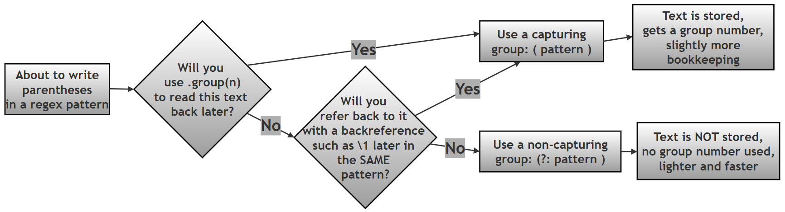

# Capturing vs. Non-Capturing Groups in Python Regular Expressions

## What this page contains, and why it matters

This page is a focused companion resource for Chapter 13 ("Regular Expressions") of the printed book *Python Programming: Problem Solving, Packages and Libraries*. It zooms in on one specific, easy-to-miss idea inside Python's [`re` module](https://docs.python.org/3/library/re.html): parentheses `( )` in a regex pattern can do **two different jobs**, and choosing the wrong one is a very common source of confusing bugs — patterns that "work" but return the wrong thing, or output that shifts unexpectedly when a pattern is edited.

By the end of this page you should be able to say, for any pair of parentheses in a pattern you write, *why* they are there — either to remember a piece of matched text for later (a **capturing group**), or purely to group things together for a quantifier or an alternation without remembering anything (a **non-capturing group**) — and to choose correctly between the two.

If you would like the wider companion resources for this chapter, see [`10-ch13-re.md`](10-ch13-re.md) (eighteen worked example scripts, a primality-testing mini-project, a password validator, and a from-scratch regex engine) and [`50-ch13-re-conceptual-qa.md`](50-ch13-re-conceptual-qa.md) (twenty-one short conceptual questions and answers) in this same folder.

### A quick glossary (for reference while you read)

| Term | Plain-language meaning | Learn more |
|---|---|---|
| Regular expression (regex) | A text pattern that describes a *shape* of text to search for, rather than exact text | [Python `re` docs](https://docs.python.org/3/library/re.html) |
| Capturing group | Part of a pattern wrapped in `( )` whose matched text Python remembers, so it can be retrieved later with `.group(n)` | [Python `re` — groups](https://docs.python.org/3/library/re.html#re.Match.group) |
| Non-capturing group | Part of a pattern wrapped in `(?: )` used only to group pieces together — nothing is remembered | [Python `re` — regex syntax](https://docs.python.org/3/library/re.html#regular-expression-syntax) |
| Backreference | A later part of the same pattern, written `\1`, `\2`, … (or `(?P=name)`), that means "match whatever group 1 (or `name`) already matched" | [Python `re` HOWTO — backreferences](https://docs.python.org/3/howto/regex.html) |
| Alternation | The `\|` symbol, meaning "either this or that" inside a pattern | [Python `re` — alternation](https://docs.python.org/3/library/re.html#regular-expression-syntax) |
| Quantifier | A symbol such as `*`, `+`, `?`, or `{m,n}` that says *how many times* something can repeat | [Python `re` HOWTO — repeating things](https://docs.python.org/3/howto/regex.html#repeating-things) |
| Word boundary (`\b`) | A zero-width position between a "word" character and a "non-word" character (or the start/end of the string) | [Python `re` — special sequences](https://docs.python.org/3/library/re.html#regular-expression-syntax) |

### Table of contents

- [What this page contains, and why it matters](#what-this-page-contains-and-why-it-matters)
- [Why parentheses have two separate jobs in regex](#why-parentheses-have-two-separate-jobs-in-regex)
- [Capturing groups: a quick recap](#capturing-groups-a-quick-recap)
- [Non-capturing groups](#non-capturing-groups)
- [When should non-capturing groups be used?](#when-should-non-capturing-groups-be-used)
- [Common uses of non-capturing groups](#common-uses-of-non-capturing-groups)
- [Performance benefits of non-capturing groups](#performance-benefits-of-non-capturing-groups)
- [Avoiding unwanted backreferences](#avoiding-unwanted-backreferences)
- [Cleaner numbering of capturing groups](#cleaner-numbering-of-capturing-groups)
- [Worked example: choosing which part of a match to capture](#worked-example-choosing-which-part-of-a-match-to-capture)
- [Case study: removing duplicate words with a backreference](#case-study-removing-duplicate-words-with-a-backreference)
- [Decision guide: capturing or non-capturing?](#decision-guide-capturing-or-non-capturing)
- [Summary of changes made to this page](#summary-of-changes-made-to-this-page)

## Why parentheses have two separate jobs in regex

We need to understand the difference between capturing and non-capturing groups, because parentheses `( )` in a regular expression quietly do **two separate jobs**, and it is easy to use them for one job while accidentally also triggering the other.

- **Grouping** — controlling *precedence*, *repetition*, and *alternation*. Just like parentheses in ordinary arithmetic (`2 * (3 + 4)`), parentheses in a regex let you treat several characters as a single unit, so that a quantifier (`*`, `+`, `{m,n}`, …) or an alternation (`|`) applies to the *whole group* rather than to just the one character immediately next to it.
- **Capturing** — storing the text that was matched inside the parentheses, so your code can retrieve it afterwards with `.group(n)`, or refer back to it later in the *same* pattern with a backreference such as `\1`.

You can combine these two jobs in two different ways:

1. **Grouping *with* capturing** — ordinary parentheses `(pattern)`. This is what most beginners learn first, and it is what we have used throughout the earlier scripts on this chapter's companion pages.
2. **Grouping *without* capturing** — the subject of this page — using the special syntax `(?:pattern)` instead of plain `(pattern)`.

## Capturing groups: a quick recap

A **capturing group**, written `(pattern)`, does both jobs at once: it groups the enclosed pattern together, *and* it remembers whatever text that group matched, so you can pull it out afterwards with `m.group(1)`, `m.group(2)`, and so on (see [`10-ch13-re.md`](10-ch13-re.md) and [`50-ch13-re-conceptual-qa.md`](50-ch13-re-conceptual-qa.md) for worked examples of `.group()` in action). This is the syntax we have used up to this point, and it remains the right choice whenever you actually need the matched text back afterwards.

## Non-capturing groups

A **non-capturing group** is a group that exists **only for grouping** — it plays no part in capturing text. Its syntax is:

```text
(?:pattern)
```

The `?:` immediately after the opening parenthesis is what tells Python's regex engine "group this, but don't bother remembering it." Unlike an ordinary capturing group `(pattern)`, a non-capturing group `(?:pattern)`:

- does **not** store the matched text,
- does **not** create a group number (so it never shifts the numbering of the *real* capturing groups elsewhere in the pattern — see [Cleaner numbering of capturing groups](#cleaner-numbering-of-capturing-groups) below), and
- **cannot** be referred back to later using a backreference such as `\1`, since there is nothing stored to refer back to.

## When should non-capturing groups be used?

Reach for a non-capturing group whenever you find yourself writing parentheses purely to control grouping, precedence, or alternation — and you have no intention of ever calling `.group(n)` on that particular piece, or referring back to it with a backreference. In practice, that means non-capturing groups are the right tool when:

| You want to… | Because… |
|---|---|
| Avoid unwanted backreferences | A stray capturing group can silently be referred to by a later `\1`, `\2`, etc. that was meant for a *different* group |
| Skip storing matched text you will never use | Capturing text costs a small amount of memory and bookkeeping for no benefit if you never read it back |
| Group things purely for structure | Sometimes parentheses are needed only so a quantifier or `\|` applies to several characters at once |
| Keep group numbering clean | Every capturing group shifts the numbers of every capturing group that comes after it (see below) |
| Get slightly better performance | The regex engine does less bookkeeping when there is nothing to remember (see [Performance benefits](#performance-benefits-of-non-capturing-groups) below) |
| Avoid confusion from "extra" groups | A pattern with fewer, more meaningful capturing groups is easier for the next person (including future you) to read |

## Common uses of non-capturing groups

### A. Grouping for repetition (quantifiers)

This is the single most common use of a non-capturing group. You often need to apply a quantifier — `*`, `+`, `{m,n}`, and so on — not to a single character, but to a whole *sequence* of characters treated as one unit. Ordinary parentheses would do this too, but since there is no need to capture the repeated text here, a non-capturing group is the cleaner choice.

```python
# Step 1: Import re
import re

# Step 2: Set up the text to search
text = "ababab"

# Step 3: (?:ab)+ means "the two-character sequence 'ab', repeated
# one or more times". The (?:...) groups "ab" together purely so
# that the '+' quantifier applies to the WHOLE pair, not just to
# the 'b' immediately before it -- and since we don't need to pull
# "ab" back out afterwards, there is no reason to capture it.
pattern = re.findall(r"(?:ab)+", text)
print(pattern)
```

```text
['ababab']
```

**What this shows:** `(?:ab)+` matches the entire run `"ababab"` as one single match, because `+` repeats the *whole group* `(?:ab)` — not just its last character. No unwanted capturing occurs, because `(?:...)` never stores anything.

### B. Grouping for alternation (OR)

A non-capturing group is also the natural choice when you want several alternatives, joined with `|`, to be treated as **one logical unit** — but you only care about *which* alternative matched, not about capturing it separately (since `findall()` already gives you the matched text directly). The script below shows the same alternation written both ways, so you can see exactly what changes.

```python
# Step 1: Import re
import re

# Step 2: Set up the text to search — it contains three different
# animal words, plus one word ("bat") that should NOT match
text = "cat dog rat bat"

# Step 3: Non-capturing group (?:cat|dog|rat) groups the three
# alternatives together purely so '|' applies across all of them,
# without creating a separate capturing group. Because there is
# nothing to capture, findall() returns a plain list of the
# matched TEXT directly.
pattern1 = re.findall(r"(?:cat|dog|rat)", text)
print("Non-capturing ->", pattern1)

# Step 4: Now try the SAME alternation using an ordinary capturing
# group instead: (cat|dog|rat)
pattern2 = re.findall(r"(cat|dog|rat)", text)
print("Capturing     ->", pattern2)
```

```text
Non-capturing -> ['cat', 'dog', 'rat']
Capturing     -> ['cat', 'dog', 'rat']
```


> Note that with **exactly one** capturing group in the pattern, `findall()` still returns a plain list of matched strings, identical to the non-capturing version above.
> Python's own documentation confirms that `findall()` only starts returning tuples once a pattern has **two or more** capturing groups (in which case each tuple holds one string per group).
> This is exactly the same "one group vs. many groups" rule already verified on the companion pages for this chapter — see Q14 on [`50-ch13-re-conceptual-qa.md`](50-ch13-re-conceptual-qa.md).


So in this particular example, both versions happen to produce identical output — which is itself a useful thing to notice: the *practical* difference between capturing and non-capturing only shows up once you add a **second** group to the pattern, as the next few sections demonstrate.

## Performance benefits of non-capturing groups

Every capturing group requires Python's regex engine to do a small amount of extra bookkeeping as it works through a pattern:

1. **Store the matched text** for that group, so it is available afterwards.
2. **Track a group number** for it, alongside every other capturing group in the pattern.
3. **Manage additional backtracking state**, since the engine may need to remember and restore what a group had captured if it backtracks and retries a different path through the pattern.

A non-capturing group asks the engine to do **none of this** — it only needs to group the pattern together, with nothing to remember afterwards. This makes non-capturing groups:

- **Lighter** — less bookkeeping per group,
- **Faster** — especially noticeable in patterns with many repeated or nested groups, or when the same pattern is applied to a very large amount of text, and
- **Easier to maintain** — a reader immediately knows that a `(?:...)` group is *structural only*, with no data to track down elsewhere in the code.

## Avoiding unwanted backreferences

A capturing group you did not really need can cause more than just clutter — it can actively introduce bugs. Every capturing group:

1. May **confuse the next reader** of the code, who has to work out whether `.group(2)` in some other line is actually meaningful, or just an accidental group nobody uses.
2. May **break group numbering** — inserting or removing an unrelated pair of capturing parentheses shifts the numbers of every capturing group that follows it (see [Cleaner numbering of capturing groups](#cleaner-numbering-of-capturing-groups) below).
3. May cause **bugs in `.group(n)` access**, if code elsewhere assumes a particular group number that has silently shifted.

The example below compares an "original" version that captures a title (`Mr`, `Ms`, or `Dr`) it does not actually need, against an improved version that uses a non-capturing group for the title instead.

```python
# Step 1: Import re
import re

# Step 2: Set up the text to search
text = "Dr. John"

# Step 3: Original version -- captures the title as well as the name,
# even though the title is never actually used afterwards
pattern = re.search(r"(Mr|Ms|Dr)\. (\w+)", text)
print(pattern.groups())

# Step 4: Improved version -- (?:...) groups the title alternatives
# together for '|', WITHOUT capturing the title text, since only
# the name is actually needed
pattern = re.search(r"(?:Mr|Ms|Dr)\. (\w+)", text)
print(pattern.groups())
```

```text
('Dr', 'John')
('John',)
```


## Cleaner numbering of capturing groups

Unnecessary capturing groups do not just add clutter — they actively **shift the numbers** of every capturing group that comes after them, which makes code more error-prone every time the pattern is edited.

Suppose you want to capture only the group containing the word `"dog"`, out of a longer pattern that also matches three other words before it.

- **Bad practice:** `(one)(two)(three)(dog)` — every word gets its own capturing group, so `"dog"` ends up as `group(4)`. If anyone later adds or removes one of the earlier groups, `group(4)` silently starts referring to something else.
- **Better practice:** `(?:one)(?:two)(?:three)(dog)` — the first three words are grouped but not captured, so `"dog"` becomes `group(1)`, and stays `group(1)` no matter how the earlier, non-capturing parts of the pattern are edited later.

```python
# Step 1: Import re
import re
text = "one two three dog"

# Step 2: Bad practice -- every word is captured, so "dog" is
# buried at group(4), and that position depends on exactly how
# many groups happen to come before it
m_bad = re.search(r"(one) (two) (three) (dog)", text)
print("Bad practice   groups():", m_bad.groups())
print("Bad practice   group(4):", m_bad.group(4))

# Step 3: Better practice -- only the word we actually care about
# is a capturing group; the other three are grouped with (?:...)
# purely for structure, so "dog" becomes the ONE AND ONLY group(1)
m_better = re.search(r"(?:one) (?:two) (?:three) (dog)", text)
print("Better practice groups():", m_better.groups())
print("Better practice group(1):", m_better.group(1))
```

```text
Bad practice   groups(): ('one', 'two', 'three', 'dog')
Bad practice   group(4): dog
Better practice groups(): ('dog',)
Better practice group(1): dog
```

**What this shows:** this script was newly added here (it did not appear in the original text, which only described the bad-vs-better idea in prose) to make the "bad vs. better practice" point concrete and verifiable, rather than something you have to take on faith. Both versions successfully find `"dog"` — but the better-practice version makes it `group(1)`, the simplest possible position to remember and to keep stable as the pattern evolves. This is (1) cleaner and (2) less error-prone, exactly as the original text summarised.

## Worked example: choosing which part of a match to capture

The next script searches a sentence containing several filenames, and shows three slightly different patterns — each capturing a different piece of the match — to demonstrate how you choose exactly which part of a pattern to make capturing.

```python
# Step 1: Import re
import re

# Step 2: Set up a sentence containing several different filenames
text = "Here are some files: report.pdf, notes.docx, image.png, summary.txt."

# Step 3: Pattern 1 -- capture ONLY the file extension.
# The pattern r"(?:\w+)\.(pdf|docx|txt)" has three parts:
#   A. (?:\w+)          -- a non-capturing group for the filename
#                          part (we don't need it back, so no capture)
#   B. \.                -- a literal dot before the extension
#   C. (pdf|docx|txt)    -- a CAPTURING group for the extension,
#                          since that IS the piece we want back
m1 = re.search(r"(?:\w+)\.(pdf|docx|txt)", text)
print("m1.group(1):", m1.group(1))

# Step 4: Pattern 2 -- capture the FILENAME part instead, using an
# ordinary capturing group (\w+) in place of the non-capturing one
m2 = re.search(r"(\w+)\.(pdf|docx|txt)", text)
print("m2.group(1):", m2.group(1))

# Step 5: Pattern 3 -- capture BOTH the filename and the extension,
# using the exact same pattern as Step 4 (it already has two groups)
m3 = re.search(r"(\w+)\.(pdf|docx|txt)", text)
print("m3.group(1):", m3.group(1))
print("m3.group(2):", m3.group(2))
```

```text
m1.group(1): pdf
m2.group(1): report
m3.group(1): report
m3.group(2): pdf
```

> **Fix applied here:** the original text claimed `m1.group(1)` would be `"docx"`, and that `m2.group(1)` / `m3.group(1)` would both be `"notes"`.
> Note: `re.search()` always returns the **first** (leftmost) match it finds while scanning the text from left to right, and in `"Here are some files: report.pdf, notes.docx, image.png, summary.txt."`, the filename `report.pdf` appears **before** `notes.docx`.
> Since `report.pdf` matches the pattern just as well as `notes.docx` would have, `re.search()` stops there and never even looks as far as `notes.docx`.
> This is exactly the same leftmost-match rule already verified elsewhere on this chapter's companion page — see Script 13 on [`10-ch13-re.md`](10-ch13-re.md), which uses this very same sentence as its example text.

Notice that `m2` and `m3` above use the *exact same pattern* — the script simply calls `.group(1)` and `.group(2)` on the same match twice, in two separate steps, to show that both pieces are available on the one `Match` object once you capture them both.

## Case study: removing duplicate words with a backreference

This case study puts capturing and non-capturing groups side by side in a single, realistic task: cleaning up a sentence where some words have accidentally been typed twice in a row (`"The The cat cat cat sat sat on on the the wall wall."`).

### The pattern, piece by piece

The pattern used throughout this case study is `r"(\b\w+)(?:\s+\1)+"`. Reading it as two groups makes it much easier to follow:

**1. The first group: `(\b\w+)`** — this identifies the "original" word being searched for.

- **`(...)` (capturing group):** the parentheses tell Python to *remember* whatever matches inside them. This becomes **group 1**.
- **`\b` (word boundary):** ensures the match starts at the beginning of a word, so it does not, for instance, match "ear" in the middle of "near".
- **`\w+`:** matches one or more "word characters" (letters, digits, or underscores) — the word itself.

**2. The second group: `(?:\s+\1)+`** — this part looks for the *repeats* of that same word.

- **`(?: ... )` (non-capturing group):** groups the instructions together so the trailing `+` applies to the *whole* "whitespace-then-same-word" unit, without saving this repeated match as a separate group of its own.
- **`\s+`:** matches one or more whitespace characters (spaces, tabs, or newlines) between the repeats.
- **`\1` (backreference):** the key piece — it tells the regex engine to match **exactly** the same text that group 1 already matched. If group 1 found `"the"`, then `\1` will only match another literal `"the"` at that position, not any other word.
- **`+` (quantifier):** applied to the whole non-capturing group, meaning "one or more repeats of this" — which is what allows the pattern to catch a word repeated three times (`"cat cat cat"`) just as well as one repeated twice.

| Part | Meaning |
|---|---|
| `\b` | Start at a word boundary |
| `\w+` | Match the word itself (e.g. `"apple"`) |
| `( ... )` | Capture that word, so it can be referred to again later in the pattern |
| `\s+` | Match one or more spaces after that word |
| `\1` | Match the *exact same* word again |
| `(?: ... )+` | Repeat the "space + same word" check one or more times, without creating a second capturing group for each repeat |

### Two ways to write the same idea

The script below defines two functions that do the *same* cleanup job — one using a non-capturing group for the repeated part, one using an ordinary capturing group instead — so you can compare their behaviour directly.

```python
# Step 1: Import re
import re

# Step 2: Non-capturing version. The repeated "\s+\1" part is
# wrapped in (?:...) because we only need it to control repetition
# with the trailing '+' -- we never need to retrieve that repeated
# text separately, since \1 already tells us what it must have been.
def remove_duplicates_non_capturing(some_text):
    return re.sub(r'(\b\w+)(?:\s+\1)+', r'\1', some_text)

# Step 3: Capturing version. Functionally equivalent, but the
# repeated part (\s+\1) is now its OWN capturing group as well,
# which is not needed here and adds a second group number that
# nothing in this script ever reads.
def remove_duplicates_capturing(some_text):
    return re.sub(r'(\b\w+)(\s+\1)+', r'\1', some_text)

# Step 4: Try both functions on the same sentence full of
# accidentally doubled words
text_with_dup = 'The The cat cat cat sat sat on on the the wall wall.'
print("Using non-capturing ->", remove_duplicates_non_capturing(text_with_dup))
print("Using capturing     ->", remove_duplicates_capturing(text_with_dup))
```

```text
Using non-capturing -> The cat sat on the wall.
Using capturing     -> The cat sat on the wall.
```

**What this shows:** both functions produce **exactly the same output** — this is expected, and is precisely the point of the comparison. `re.sub()`'s replacement text `r'\1'` only ever refers to group 1 (the original word) in either version, so the *extra* capturing group in the second function does no harm here — but it also does no good. It exists purely as bookkeeping overhead: an unused group number that a future reader might wrongly assume is meaningful. This is exactly the situation where a non-capturing group is the better choice: functionally identical, but clearer about what actually matters in the pattern.

>  **Extra practice question (not in the printed book):** the same idea can be written using a *named* group and a named backreference instead of a numbered one — `(?P<word>\b\w+)(?:\s+(?P=word))+`, replacing with `r'\g<word>'`. Try it yourself: does it produce the same result? *(It does — named groups and numbered groups behave identically for matching purposes; named groups simply give you a more readable label than a bare number, which becomes valuable once a pattern has several groups.)*

### Finding each duplicate, one at a time

Rather than removing the duplicates, the next script instead *reports* each duplicated word it finds, one at a time, by iterating over every match with `finditer()`.

```python
# Step 1: Import re
import re

# Step 2: Set up the same sentence full of doubled words
text = "The The cat cat cat sat sat on on the the wall wall"

# Step 3: Compile the pattern once, since it will be reused for
# every match finditer() finds
pattern = re.compile(r"(\b\w+)(?:\s+\1)+")

# Step 4: finditer() gives back one Match object per duplicated
# word, in the order they appear in the text
matches = pattern.finditer(text)

# Step 5: group(1) on each Match object gives just the word itself
# (not the repeated copies, and not any surrounding whitespace)
for m in matches:
    print("Duplicate word:", m.group(1))
```

```text
Duplicate word: The
Duplicate word: cat
Duplicate word: sat
Duplicate word: on
Duplicate word: the
Duplicate word: wall
```

**What this shows:** because the capturing group `(\b\w+)` stores only the *word itself* — never the repeated copies or the whitespace between them — `m.group(1)` on every match gives back a clean, single copy of each duplicated word, ready to use in a report, a log message, or a further check.

### Combined script: full duplicate-word case study

Since this case study builds its examples up as three separate scripts above, here is everything combined into one complete, runnable script — including both cleanup functions and the reporting loop together in one place.

```python
# Step 1: Import re
import re

# Step 2: Define the non-capturing-group version of the cleanup
def remove_duplicates_non_capturing(some_text):
    return re.sub(r'(\b\w+)(?:\s+\1)+', r'\1', some_text)

# Step 3: Define the capturing-group version of the cleanup, for
# comparison -- functionally identical, but with an extra, unused
# capturing group
def remove_duplicates_capturing(some_text):
    return re.sub(r'(\b\w+)(\s+\1)+', r'\1', some_text)

# Step 4: Set up the sentence full of doubled words
text_with_dup = 'The The cat cat cat sat sat on on the the wall wall.'

# Step 5: Run both cleanup functions and compare their output
print("Using non-capturing ->", remove_duplicates_non_capturing(text_with_dup))
print("Using capturing     ->", remove_duplicates_capturing(text_with_dup))

# Step 6: Now report every duplicated word found, one at a time,
# using the same non-capturing pattern compiled once and reused
pattern = re.compile(r"(\b\w+)(?:\s+\1)+")
for m in pattern.finditer(text_with_dup):
    print("Duplicate word:", m.group(1))
```

```text
Using non-capturing -> The cat sat on the wall.
Using capturing     -> The cat sat on the wall.
Duplicate word: The
Duplicate word: cat
Duplicate word: sat
Duplicate word: on
Duplicate word: the
Duplicate word: wall
```

## Decision guide: capturing or non-capturing?

The flowchart below summarises the decision in one place: for any pair of parentheses you are about to type into a pattern, ask yourself whether you will ever need that piece of text back again — either through `.group(n)` afterwards, or through a backreference such as `\1` later in the *same* pattern.





### Summary comparison table

| Feature | Stores matched text | Creates group number | Supports backreferences | Used for extraction | Used for grouping only | Performance | Group numbering |
|---|---|---|---|---|---|---|---|
| Capturing group `( )` | Yes | Yes | Yes | Yes | Sometimes | Slightly slower | Shifts with every new group |
| Non-capturing group `(?: )` | No | No | No | No | Ideal | Faster | Never affected |

**Why:** a capturing group's small performance cost and its effect on group numbering both come from the same root cause — it has something to *remember*. A non-capturing group has nothing to remember, so it avoids both costs entirely; the trade-off is simply that you can never call `.group(n)` or use `\1` to get that particular piece of text back afterwards, which is exactly why the choice always comes down to the one question this page has been building towards: *will I need this text again?*


