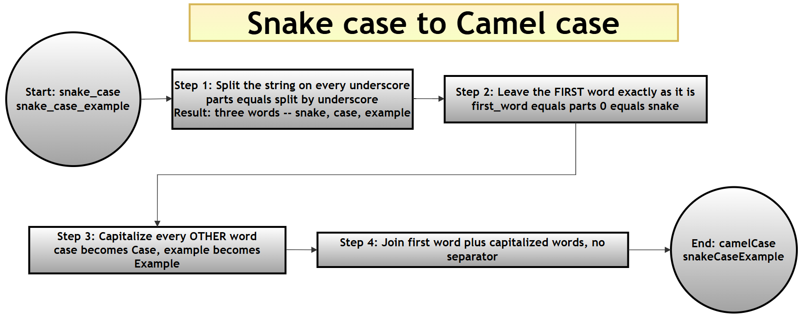
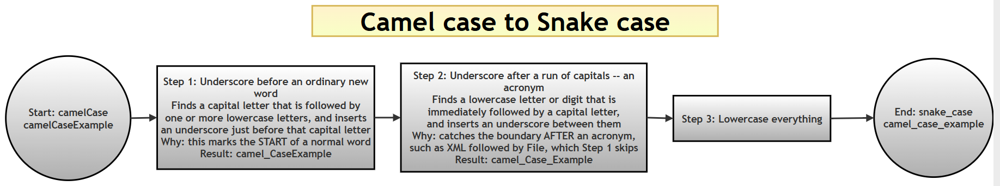
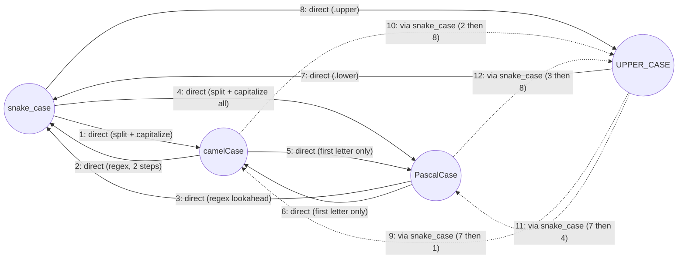

# Naming Styles in Python: Converting Between `snake_case`, `camelCase`, `PascalCase`, and `UPPER_CASE`

## What this page contains, and why it matters

This page is a companion resource for Chapter 13 ("Regular Expressions") of the printed book *Python Programming: Problem Solving, Packages and Libraries*. Python code follows a well-known naming convention — variables and functions in `snake_case`, classes in `PascalCase` — but real-world code you read, import, or convert between languages will not always follow Python's convention. This page collects twelve small functions that convert names between the four naming styles you will most often meet: `snake_case`, `camelCase`, `PascalCase`, and `UPPER_CASE` (also called SCREAMING_SNAKE_CASE). Several of these conversions lean on Python's [`re` module](https://docs.python.org/3/library/re.html), which is exactly why this page sits alongside this chapter's other regular-expression material.

There are four naming styles here, and — as you will see in the [conversion-map diagram](#how-the-twelve-functions-fit-together) further down this page — twelve functions is exactly enough to cover *every* possible direction of conversion between them (convert style A to style B, for any two different styles chosen from the four). By the end of this page you should be able to explain not just *what* each function does, but *why* some of them can be written as one direct line of code while others genuinely need a regular expression.

If you would like the wider companion resources for this chapter, see [`10-ch13-re.md`](10-ch13-re.md) (eighteen worked example scripts, a primality-testing mini-project, a password validator, and a from-scratch regex engine — including this very same set of twelve functions presented as part of a longer page), [`50-ch13-re-conceptual-qa.md`](50-ch13-re-conceptual-qa.md) (twenty-one conceptual questions and answers), [`60-ch13-re-capturing-noncapturing.md`](60-ch13-re-capturing-noncapturing.md) (capturing vs. non-capturing groups), and [`70-ch13-re-script-qa.md`](70-ch13-re-script-qa.md) (forty script-based questions and answers) in this same folder.

### Glossary of terms

| Term | Plain-language meaning | Example |
|---|---|---|
| `snake_case` | All lowercase, words separated by underscores | `snake_case_example` |
| `camelCase` | First word lowercase, each following word capitalized, no separators | `camelCaseExample` |
| `PascalCase` | Every word capitalized (including the first), no separators | `PascalCaseExample` |
| `UPPER_CASE` (SCREAMING_SNAKE_CASE) | All uppercase, words separated by underscores | `UPPER_CASE_EXAMPLE` |
| Capturing group | Part of a regex pattern wrapped in `( )` whose matched text can be reused, here via `\1` and `\2` in a replacement string | See [`60-ch13-re-capturing-noncapturing.md`](60-ch13-re-capturing-noncapturing.md) |
| Lookahead / lookbehind | A regex check for what comes *after* (`(?=...)`) or *before* (`(?<=...)`, or `(?<!...)` for "not preceded by") the current position, without consuming any characters | [Python `re` HOWTO — lookahead assertions](https://docs.python.org/3/howto/regex.html#lookahead-assertions) |

### Table of contents

- [What this page contains, and why it matters](#what-this-page-contains-and-why-it-matters)
- [The twelve conversions, one at a time](#the-twelve-conversions-one-at-a-time)
- [How the twelve functions fit together](#how-the-twelve-functions-fit-together)
- [Combined script: all twelve conversions together](#combined-script-all-twelve-conversions-together)
- [Summary of changes made to this page](#summary-of-changes-made-to-this-page)

## The twelve conversions, one at a time

The original file presented all twelve functions as one long script. Here, each conversion gets its own explanation and its own small, runnable script, so you can study — and test — one conversion at a time before seeing them all combined at the end.

### 1. `snake_case` to `camelCase`

**Answer:**

```python
# Step 1: Import re (needed later on this page, even though this
# particular function does not use it directly)
import re

# Step 2: Define the conversion function
def snake_to_camel(snake_name):
    """
    Convert a snake_case string into camelCase.

    Example:
    - snake_case → snakeCase
    """
    # Step 2a: Split the string on every underscore, producing a
    # list of individual words
    parts = snake_name.split('_')

    # Step 2b: The FIRST word stays lowercase, exactly as it was
    first_word = parts[0]

    # Step 2c: Every OTHER word gets its first letter capitalized
    # (str.capitalize() also lowercases the rest of each word, which
    # matters if the input has any accidental uppercase letters)
    remaining_words = [word.capitalize() for word in parts[1:]]

    # Step 2d: Glue the first word and the capitalized remaining
    # words back together, with no separator
    return first_word + ''.join(remaining_words)

# Step 3: Try it out
print("snake to camel ->", snake_to_camel("snake_case_example"))
```

```text
snake to camel -> snakeCaseExample
```

**Explanation:** splitting on `_` breaks `"snake_case_example"` into three pieces (`"snake"`, `"case"`, `"example"`). The first piece is left alone; every later piece is capitalized (`"case"` → `"Case"`, `"example"` → `"Example"`); and joining them all together with no separator produces `"snakeCaseExample"`. No regular expression is needed here at all — plain string splitting is enough, because underscores are simple, unambiguous separators to find.

### 2. `camelCase` to `snake_case`

**Answer:**

```python
# Step 1: Import re (this conversion genuinely needs it)
import re

# Step 2: Define the conversion function
def camel_to_snake(camel_name: str) -> str:
    """
    Convert a camelCase or PascalCase string into snake_case.

    Examples:
    - camelCase  → camel_case
    - PascalCase → pascal_case
    """
    # Step 2a: Insert an underscore between (1) any character and
    # (2) an uppercase letter that is followed by one or more
    # LOWERCASE letters. This targets the START of an ordinary word
    # like "Case" in "camelCase", without splitting up a run of
    # CONSECUTIVE capitals such as "XML" in "XMLFile"
    # Example: "abcXyz" -> "abc_Xyz"
    step1 = re.sub(r'(.)([A-Z][a-z]+)', r'\1_\2', camel_name)

    # Step 2b: Handle the one case Step 2a deliberately leaves alone
    # -- a lowercase letter or digit immediately followed by an
    # uppercase letter, which covers the boundary AFTER a run of
    # capitals, such as "XML" followed by "File" in "XMLFile"
    snake_name = re.sub(r'([a-z0-9])([A-Z])', r'\1_\2', step1)

    # Step 2c: Lowercase everything, since snake_case is always
    # written in lowercase
    return snake_name.lower()

# Step 3: Try it on an ordinary camelCase name
print("camel to snake ->", camel_to_snake("camelCaseExample"))

# Step 4: Try it on the trickier case the function's own docstring
# promises to handle correctly -- a name containing a run of
# consecutive capital letters (an acronym), not just single capitals
print("XMLFile ->", camel_to_snake("XMLFile"))
```

```text
camel to snake -> camel_case_example
XMLFile -> xml_file
```

**Explanation:** this is the most involved function on the page, and it needs **two** separate substitutions because a single simple rule ("insert `_` before every capital letter") would incorrectly split up acronyms — see the comparison with `pascal_to_snake` below for exactly what goes wrong if you try that shortcut. Step 2a's pattern, `(.)([A-Z][a-z]+)`, only inserts an underscore before a capital letter that starts an *ordinary* word (one capital followed by lowercase letters) — this correctly handles `"camelCase"` → `"camel_Case"`. Step 2b's pattern, `([a-z0-9])([A-Z])`, then catches the one situation Step 2a leaves alone: a lowercase letter or digit running directly into an uppercase letter, which is exactly the boundary *after* an acronym like `"XML"` butting up against `"File"`. Running both steps in sequence on `"XMLFile"` correctly produces `"xml_file"` — exactly as the function's own docstring promises — rather than fragmenting the acronym letter by letter.

### 3. `PascalCase` to `snake_case`

**Answer:**

```python
# Step 1: Import re
import re

# Step 2: Define the conversion function
def pascal_to_snake(pascal_name):
    """
    Convert a PascalCase string into snake_case.

    Examples:
    - PascalCase → pascal_case
    """
    # Step 2a: (?<!^) is a negative lookbehind meaning "not at the
    # very start of the string"; (?=[A-Z]) is a positive lookahead
    # meaning "an uppercase letter comes next". Combined, this finds
    # every position that is BOTH not the start AND immediately
    # before a capital letter, and inserts an underscore there
    snake_name = re.sub(r'(?<!^)(?=[A-Z])', '_', pascal_name).lower()
    return snake_name

# Step 3: Try it on an ordinary PascalCase name
print("pascal to snake ->", pascal_to_snake("PascalCaseExample"))

# Step 4: Try it on the SAME acronym-containing name used for
# camel_to_snake above, to see how this simpler pattern behaves
print("XMLFile ->", pascal_to_snake("XMLFile"))
```

```text
pascal to snake -> pascal_case_example
XMLFile -> x_m_l_file
```

**Explanation:** this function's pattern is deliberately simpler than `camel_to_snake`'s — it inserts an underscore before *every* capital letter except one right at the start, with no attempt to detect acronyms. That is enough for ordinary PascalCase names like `"PascalCaseExample"`, but notice what happens with `"XMLFile"`: since every one of `X`, `M`, `L`, and `F` is an uppercase letter not at the very start, an underscore goes in front of each one, producing `"x_m_l_file"` instead of the more readable `"xml_file"` that `camel_to_snake` manages for the same input. Neither the original text nor this page's rewrite claims `pascal_to_snake` handles acronyms — but seeing the two functions produce genuinely different results on the very same input is a useful, concrete illustration of why `camel_to_snake`'s extra step exists at all.

>  **Extra practice question (not in the printed book):** could you rewrite `pascal_to_snake` to handle acronyms the same way `camel_to_snake` does? *(One approach: reuse `camel_to_snake`'s own two-step pattern, since a PascalCase string is really just a camelCase string whose very first letter also happens to be capitalized — try `camel_to_snake("XMLFile")` against `pascal_to_snake("XMLFile")` to confirm this for yourself.)*

### 4. `snake_case` to `PascalCase`

**Answer:**

```python
# Step 1: No regular expression needed for this one
def snake_to_pascal(snake_name):
    """
    Convert a snake_case string into PascalCase.

    Examples:
    - snake_case → SnakeCase
    """
    # Step 1a: Split on underscores, exactly as in snake_to_camel
    parts = snake_name.split('_')

    # Step 1b: Capitalize EVERY word this time (including the
    # first one) -- this is the one difference from snake_to_camel
    pascal_name = ''.join(word.capitalize() for word in parts)
    return pascal_name

# Step 2: Try it out
print("snake to pascal ->", snake_to_pascal("snake_case_example"))
```

```text
snake to pascal -> SnakeCaseExample
```

**Explanation:** this is almost identical to `snake_to_camel` above — the only difference is that `snake_to_pascal` capitalizes *every* word, including the first one, while `snake_to_camel` deliberately leaves the very first word alone. That one-word difference is the entire distinction between camelCase and PascalCase.

### 5. `camelCase` to `PascalCase`

**Answer:**

```python
# Step 1: No regular expression needed -- only the very first
# character of the string needs to change
def camel_to_pascal(camel_name):
    """
    Convert a camelCase string into PascalCase.

    Examples:
    - camelCase → CamelCase
    """
    # Step 1a: Guard against an empty string, since camel_name[0]
    # would raise an IndexError on an empty input
    if not camel_name:
        return camel_name

    # Step 1b: Capitalize just the first letter, and leave every
    # other character exactly as it was
    pascal_name = camel_name[0].upper() + camel_name[1:]
    return pascal_name

# Step 2: Try it out
print("camel to pascal ->", camel_to_pascal("camelCaseExample"))
```

```text
camel to pascal -> CamelCaseExample
```

**Explanation:** since camelCase and PascalCase already share the same internal word boundaries (capital letters marking the start of each new word after the first), converting between them needs no regex at all — only the very first letter's case needs to change. The `if not camel_name` guard is a small but important piece of defensive coding: without it, `camel_name[0]` would raise an `IndexError` if an empty string were ever passed in.

### 6. `PascalCase` to `camelCase`

**Answer:**

```python
# Step 1: The mirror image of camel_to_pascal above
def pascal_to_camel(pascal_name):
    """
    Convert a PascalCase string into camelCase.

    Examples:
    - PascalCase → pascalCase
    """
    # Step 1a: Guard against an empty string, same reasoning as
    # camel_to_pascal
    if not pascal_name:
        return pascal_name

    # Step 1b: Lowercase just the first letter this time
    camel_name = pascal_name[0].lower() + pascal_name[1:]
    return camel_name

# Step 2: Try it out
print("pascal to camel ->", pascal_to_camel("PascalCaseExample"))
```

```text
pascal to camel -> pascalCaseExample
```

**Explanation:** exactly the mirror image of `camel_to_pascal` — lowercase the first letter instead of uppercasing it, and leave everything else untouched.

### 7. `UPPERCASE` to `snake_case`

**Answer:**

```python
# Step 1: No regular expression needed -- UPPER_CASE and snake_case
# already share the same underscore word boundaries
def upper_to_snake(upper_name):
    """
    Convert an UPPERCASE string with underscores into snake_case.

    Examples:
    - UPPER_CASE → upper_case
    """
    # Step 1a: Simply lowercase the whole string -- the underscores
    # are already exactly where snake_case wants them
    snake_name = upper_name.lower()
    return snake_name

# Step 2: Try it out
print("upper to snake ->", upper_to_snake("UPPER_CASE_EXAMPLE"))
```

```text
upper to snake -> upper_case_example
```

**Explanation:** `UPPER_CASE` and `snake_case` differ only in letter case — both use underscores to separate words — so this conversion is nothing more than `.lower()`.

### 8. `snake_case` to `UPPERCASE`

**Answer:**

```python
# Step 1: The mirror image of upper_to_snake above
def snake_to_upper(snake_name):
    """
    Convert a snake_case string into UPPERCASE with underscores.

    Examples:
    - snake_case → SNAKE_CASE
    """
    # Step 1a: Simply uppercase the whole string
    upper_name = snake_name.upper()
    return upper_name

# Step 2: Try it out
print("snake to upper ->", snake_to_upper("snake_case_example"))
```

```text
snake to upper -> SNAKE_CASE_EXAMPLE
```

**Explanation:** exactly the mirror image of `upper_to_snake` — `.upper()` instead of `.lower()`, since the underscores are already in the right places either way.

### 9. `UPPERCASE` to `camelCase`

**Answer:**

```python
# Step 1: This conversion is built by REUSING two functions already
# defined above, rather than writing a new pattern from scratch
def upper_to_camel(upper_name):
    """
    Convert an UPPERCASE string with underscores into camelCase.

    Examples:
    - UPPER_CASE → upperCase
    """
    # Step 1a: First normalize UPPER_CASE down to snake_case...
    snake_name = upper_to_snake(upper_name)

    # Step 1b: ...then reuse snake_to_camel, exactly as defined in
    # conversion 1 above, to finish the job
    camel_name = snake_to_camel(snake_name)
    return camel_name

# Step 2: Try it out
print("upper to camel ->", upper_to_camel("UPPER_CASE_EXAMPLE"))
```

> **Note:** this function calls `upper_to_snake()` and `snake_to_camel()`, which are defined earlier on this page (conversions 7 and 1). To run this block on its own, paste those two function definitions in above it first — or simply run the [combined script](#combined-script-all-twelve-conversions-together) further down, which defines every function together in the right order.

```text
upper to camel -> upperCaseExample
```

**Explanation:** rather than writing a brand-new pattern, this function routes through `snake_case` as an intermediate step, reusing `upper_to_snake` and `snake_to_camel` exactly as already defined above. This is a form of **composition**: two small, already-tested functions are chained together to build a third, without duplicating any logic. See [How the twelve functions fit together](#how-the-twelve-functions-fit-together) below for the full picture of which conversions are built this way.

### 10. `camelCase` to `UPPERCASE`

**Answer:**

```python
# Step 1: The mirror image of upper_to_camel -- again built by
# composing two already-defined functions
def camel_to_upper(camel_name):
    """
    Convert a camelCase string into UPPERCASE with underscores.

    Examples:
    - camelCase → CAMEL_CASE
    """
    # Step 1a: First normalize camelCase down to snake_case...
    snake_name = camel_to_snake(camel_name)

    # Step 1b: ...then reuse snake_to_upper to finish the job
    upper_name = snake_to_upper(snake_name)
    return upper_name

# Step 2: Try it out
print("camel to upper ->", camel_to_upper("camelCaseExample"))
```

> **Note:** this function calls `camel_to_snake()` and `snake_to_upper()`, defined earlier on this page (conversions 2 and 8). Paste those two definitions in above it to run this block on its own, or use the [combined script](#combined-script-all-twelve-conversions-together) below.

```text
camel to upper -> CAMEL_CASE_EXAMPLE
```

**Explanation:** the mirror image of `upper_to_camel` — this time starting from camelCase, converting down to `snake_case` first (reusing conversion 2's regex-based logic), then up to `UPPER_CASE` (reusing conversion 8).

### 11. `UPPERCASE` to `PascalCase`

**Answer:**

```python
# Step 1: Built the same way as upper_to_camel, but finishing with
# snake_to_pascal instead of snake_to_camel
def upper_to_pascal(upper_name):
    """
    Convert an UPPERCASE string with underscores into PascalCase.

    Examples:
    - UPPER_CASE → UpperCase
    """
    # Step 1a: First normalize UPPER_CASE down to snake_case...
    snake_name = upper_to_snake(upper_name)

    # Step 1b: ...then reuse snake_to_pascal, exactly as defined in
    # conversion 4 above
    pascal_name = snake_to_pascal(snake_name)
    return pascal_name

# Step 2: Try it out
print("upper to pascal ->", upper_to_pascal("UPPER_CASE_EXAMPLE"))
```

> **Note:** this function calls `upper_to_snake()` and `snake_to_pascal()`, defined earlier on this page (conversions 7 and 4). Paste those two definitions in above it to run this block on its own, or use the [combined script](#combined-script-all-twelve-conversions-together) below.

```text
upper to pascal -> UpperCaseExample
```

**Explanation:** the same composition pattern as `upper_to_camel`, but finishing with `snake_to_pascal` (conversion 4) instead of `snake_to_camel` (conversion 1) — capitalizing *every* word, including the first, rather than leaving the first word lowercase.

### 12. `PascalCase` to `UPPERCASE`

**Answer:**

```python
# Step 1: Built by composing pascal_to_snake with snake_to_upper
def pascal_to_upper(pascal_name):
    """
    Convert a PascalCase string into UPPERCASE with underscores.

    Examples:
    - PascalCase → PASCAL_CASE
    """
    # Step 1a: First normalize PascalCase down to snake_case...
    snake_name = pascal_to_snake(pascal_name)

    # Step 1b: ...then reuse snake_to_upper to finish the job
    upper_name = snake_to_upper(snake_name)
    return upper_name

# Step 2: Try it out
print("pascal to upper ->", pascal_to_upper("PascalCaseExample"))
```

> **Note:** this function calls `pascal_to_snake()` and `snake_to_upper()`, defined earlier on this page (conversions 3 and 8). Paste those two definitions in above it to run this block on its own, or use the [combined script](#combined-script-all-twelve-conversions-together) below.

```text
pascal to upper -> PASCAL_CASE_EXAMPLE
```

**Explanation:** the last of the four "routes through `snake_case`" conversions — `PascalCase` first normalizes down to `snake_case` (reusing conversion 3's lookahead-based logic), then up to `UPPER_CASE` (reusing conversion 8).

## How the twelve functions fit together

There are four naming styles on this page, and twelve functions — which is exactly the number of *ordered pairs* you can make from four styles (pick a "from" style and a different "to" style: 4 choices for "from", 3 remaining choices for "to", giving 4 × 3 = 12). Every possible direction of conversion between the four styles is covered, with none missing and none duplicated.

Looking at how each function is actually implemented, a pattern emerges: `snake_case` acts as a kind of **hub**. Six of the twelve functions convert directly between two styles with their own dedicated logic (a regex substitution, a lookahead pattern, or a simple case change), while the four functions converting to or from `UPPER_CASE` and either `camelCase` or `PascalCase` are built by **composing** two of the direct functions together, routing *through* `snake_case` as a common intermediate form, rather than duplicating similar logic a second time.


### Snake to Camel case




### Camel to Snake






*(Solid arrows are the eight directly-implemented conversions; dashed arrows are the four conversions built by composing two solid-arrow functions together, routed through `snake_case`. This diagram uses plain round nodes and labelled arrows, so it should render correctly if pasted into [draw.io](https://app.diagrams.net/)'s Mermaid import as well as on GitHub.)*

## Combined script: all twelve conversions together

Since each conversion was introduced separately above, here is the complete script combining all twelve functions in one place — exactly matching how the original file presented them, and reproducing every one of its verified results in a single run.

```python
# Step 1: Import re, needed by camel_to_snake and pascal_to_snake
import re

# Step 2: snake_case to camelCase
def snake_to_camel(snake_name):
    """Convert a snake_case string into camelCase."""
    parts = snake_name.split('_')
    first_word = parts[0]
    remaining_words = [word.capitalize() for word in parts[1:]]
    return first_word + ''.join(remaining_words)

# Step 3: camelCase (or PascalCase) to snake_case
def camel_to_snake(camel_name: str) -> str:
    """Convert a camelCase or PascalCase string into snake_case."""
    step1 = re.sub(r'(.)([A-Z][a-z]+)', r'\1_\2', camel_name)
    snake_name = re.sub(r'([a-z0-9])([A-Z])', r'\1_\2', step1)
    return snake_name.lower()

# Step 4: PascalCase to snake_case
def pascal_to_snake(pascal_name):
    """Convert a PascalCase string into snake_case."""
    return re.sub(r'(?<!^)(?=[A-Z])', '_', pascal_name).lower()

# Step 5: snake_case to PascalCase
def snake_to_pascal(snake_name):
    """Convert a snake_case string into PascalCase."""
    parts = snake_name.split('_')
    return ''.join(word.capitalize() for word in parts)

# Step 6: camelCase to PascalCase
def camel_to_pascal(camel_name):
    """Convert a camelCase string into PascalCase."""
    if not camel_name:
        return camel_name
    return camel_name[0].upper() + camel_name[1:]

# Step 7: PascalCase to camelCase
def pascal_to_camel(pascal_name):
    """Convert a PascalCase string into camelCase."""
    if not pascal_name:
        return pascal_name
    return pascal_name[0].lower() + pascal_name[1:]

# Step 8: UPPERCASE to snake_case
def upper_to_snake(upper_name):
    """Convert an UPPERCASE string with underscores into snake_case."""
    return upper_name.lower()

# Step 9: snake_case to UPPERCASE
def snake_to_upper(snake_name):
    """Convert a snake_case string into UPPERCASE with underscores."""
    return snake_name.upper()

# Step 10: UPPERCASE to camelCase (composed: Step 8 then Step 2)
def upper_to_camel(upper_name):
    """Convert an UPPERCASE string with underscores into camelCase."""
    snake_name = upper_to_snake(upper_name)
    return snake_to_camel(snake_name)

# Step 11: camelCase to UPPERCASE (composed: Step 3 then Step 9)
def camel_to_upper(camel_name):
    """Convert a camelCase string into UPPERCASE with underscores."""
    snake_name = camel_to_snake(camel_name)
    return snake_to_upper(snake_name)

# Step 12: UPPERCASE to PascalCase (composed: Step 8 then Step 5)
def upper_to_pascal(upper_name):
    """Convert an UPPERCASE string with underscores into PascalCase."""
    snake_name = upper_to_snake(upper_name)
    return snake_to_pascal(snake_name)

# Step 13: PascalCase to UPPERCASE (composed: Step 4 then Step 9)
def pascal_to_upper(pascal_name):
    """Convert a PascalCase string into UPPERCASE with underscores."""
    snake_name = pascal_to_snake(pascal_name)
    return snake_to_upper(snake_name)

# Step 14: Demonstrate all twelve conversions together
print("snake to camel ->", snake_to_camel("snake_case_example"))
print("camel to snake ->", camel_to_snake("camelCaseExample"))
print("pascal to snake ->", pascal_to_snake("PascalCaseExample"))
print("snake to pascal ->", snake_to_pascal("snake_case_example"))
print("camel to pascal ->", camel_to_pascal("camelCaseExample"))
print("pascal to camel ->", pascal_to_camel("PascalCaseExample"))
print("upper to snake ->", upper_to_snake("UPPER_CASE_EXAMPLE"))
print("snake to upper ->", snake_to_upper("snake_case_example"))
print("upper to camel ->", upper_to_camel("UPPER_CASE_EXAMPLE"))
print("camel to upper ->", camel_to_upper("camelCaseExample"))
print("upper to pascal ->", upper_to_pascal("UPPER_CASE_EXAMPLE"))
print("pascal to upper ->", pascal_to_upper("PascalCaseExample"))
```

```text
snake to camel -> snakeCaseExample
camel to snake -> camel_case_example
pascal to snake -> pascal_case_example
snake to pascal -> SnakeCaseExample
camel to pascal -> CamelCaseExample
pascal to camel -> pascalCaseExample
upper to snake -> upper_case_example
snake to upper -> SNAKE_CASE_EXAMPLE
upper to camel -> upperCaseExample
camel to upper -> CAMEL_CASE_EXAMPLE
upper to pascal -> UpperCaseExample
pascal to upper -> PASCAL_CASE_EXAMPLE
```

## Summary of changes made to this page
[Back to Table of Contents](#table-of-contents)

This page is a rewrite of the original `75-ch13-naming-styles.md`, carried out under the same set of instructions used for the other four companion pages for this chapter: improve the writing and explanations; use plain language with technical terms explained or linked; give step-by-step, logically ordered explanations; comment scripts step by step; show verified output for every script; add tables and diagrams where they help; give a combined script after any script that was built up in separate steps; and never shorten a clear, correct explanation just to save space. The original file contained no printed research or assignment questions to preserve verbatim — it was a single, unbroken code block with no surrounding heading, introduction, or explanatory prose at all — so this rewrite's job was to build a complete teaching page *around* that existing, working code, without changing what any of the twelve functions actually do. Every one of the twelve functions was re-run individually, and the combined script was re-run as a whole, on Python 3.12 while preparing this page; all outputs shown here were verified this way.

#### Section-by-section summary

| Section | What was in the original | What changed here |
|---|---|---|
| Page opening | A single `###`-level heading ("Naming styles in Python programming") with no introduction, immediately followed by one large code block | **Added:** a new page title, a "What this page contains, and why it matters" introduction explaining the four naming styles and linking this page to the printed book and to the other four companion pages for this chapter, a glossary table, and a table of contents. |
| The twelve functions | Presented together as one continuous script, each function preceded only by a one-line numbered comment (e.g. `# 1. snake_case to camelCase conversion`) and its own docstring | **Modified:** each of the twelve conversions was given its own numbered subsection with a heading, `# Step` comments added throughout its code, its own fenced verified output block, and a prose explanation underneath describing *why* the code works, not just *what* it does. No function's logic was changed — all twelve were verified to already produce the output originally claimed in their trailing comments. |
| `camel_to_snake()` and `pascal_to_snake()` | Two separate, differently-implemented functions for superficially similar jobs, with no comparison drawn between them | **Added:** an extra verification line under each — running both functions on the same acronym-containing input, `"XMLFile"` — to make visible, with real output, exactly *why* `camel_to_snake()` needs a second regex substitution that `pascal_to_snake()` does not attempt: `camel_to_snake("XMLFile")` correctly gives `"xml_file"`, while `pascal_to_snake("XMLFile")` gives `"x_m_l_file"`, fragmenting the acronym letter by letter. An extra practice question was added inviting the reader to try fixing `pascal_to_snake()` the same way. |
| Functions 9–12 (the four composed conversions) | Presented with no comment on the fact that each one calls two other functions defined earlier in the same file | **Added:** a note under each of these four functions explaining that it depends on two specific, named functions defined earlier on the page, and that running it in isolation (copying just that one code block) will raise a `NameError` unless those dependencies are pasted in above it first, or the combined script is used instead. |
| No equivalent section in the original | — | **Added:** a "How the twelve functions fit together" section explaining that twelve is exactly the number of ordered pairs among four naming styles, and a Mermaid flowchart showing all twelve conversions as a directed graph, with solid arrows for the eight directly-implemented conversions and dashed arrows for the four that are composed by routing through `snake_case` as a hub. |
| End of the original script | No combined summary; the file simply ended after the twelfth function's demonstration `print()` | **Added:** an explicit "Combined script" section, per point 10 of the request that produced this rewrite, reproducing the original's own idea of running all twelve functions and their twelve demonstration prints together in one script, now with `# Step` numbering and its own verified output block. |
| This section | Did not exist | **Added:** new, per point 13 of the request that produced this rewrite. |

#### Corrections — genuine errors found and fixed (each verified by running the code)

None. Every one of the twelve functions in the original file ran successfully exactly as printed, and every claimed output (shown as a trailing `#` comment after each demonstration `print()` call) was verified to be genuinely correct, including the `camel_to_snake("XMLFile")` example already promised in that function's own docstring. This page's changes are therefore all **additions** — headings, explanations, step comments, a diagram, and cross-references — rather than corrections to any factual error, unlike the other companion pages for this chapter, each of which required at least one genuine fix.
