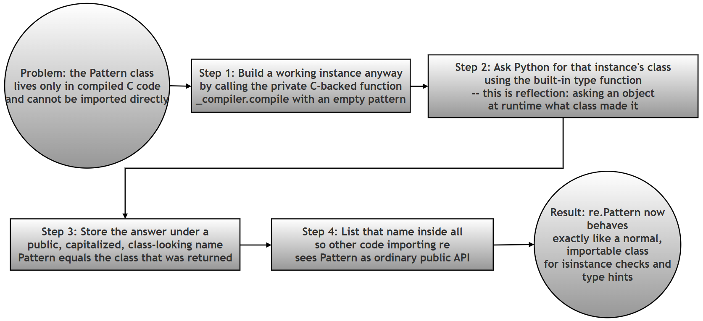

# The Mystery of the Missing Classes: How Python's `re` Module Exposes `Pattern` and `Match` Without Ever Writing `class Pattern:`

> **A note on difficulty:** This is an advanced, optional exercise. It is not required reading for a beginner working through this chapter for the first time. It is included for the curious student who wants to see how a widely-used, professionally written Python module solves a problem that has no textbook answer. If you are meeting regular expressions for the first time, it is entirely fine to skip this page and come back to it later, once `re.compile()`, `re.match()` and the rest of the chapter feel comfortable.

## What this page contains, and why it matters

Every earlier page in this chapter treats `re.Pattern` and `re.Match` as ordinary things: the object you get back from `re.compile()` is a "Pattern object", and the object you get back from calling `.match()` on it is a "Match object". That is all a beginner needs to know, and it is completely correct.

This page asks a different, more mischievous question: *if you go looking for the actual Python source code of these two classes, where is it?* If you open Python's own `re` module and search for the words `class Pattern` or `class Match`, you will not find them. Not one line. Yet `re.Pattern` and `re.Match` work perfectly as real classes: you can print them, you can check an object's type against them with `isinstance()`, and Python's own documentation refers to them by name.

Working through this contradiction is worthwhile for three reasons, even though it will not appear in any exam based on the printed book:

1. It shows you a real, working example of the difference between a **class** (a blueprint) and an **object** (a thing built from that blueprint) — a distinction the printed book introduces in the object-oriented programming chapters, but rarely gets to see used this cleverly.
2. It shows you how a large software project deliberately keeps its **public API** (the parts you are meant to use) separate from its **private implementation** (the internal machinery that could change at any time).
3. It is a small, self-contained piece of **detective work in someone else's source code** — a skill every working programmer eventually needs, whether they are debugging a library, reading an open-source project, or trying to understand code a colleague wrote years ago.

Because this is an investigation, this page is written differently from the other pages in this chapter. Instead of "here is a concept, here is a script", it is "here is a mystery, here is how to solve it, and here is what solving it teaches you." 

All Python code, terminal output, and claims about Python's own source code on this page were independently run and checked while preparing this page, using Python 3.10, 3.11, and 3.12 side by side (the reason three versions were used will make sense once you reach the "Related but important" note under Step 3).

### Glossary: of terms

| Term | Plain-language meaning |
|---|---|
| Public API | The functions, classes, and names a module *intends* for you to use. In the `re` module, `re.compile`, `re.Pattern`, and `re.Match` are all public API. |
| Private implementation | Names starting with an underscore (like `_sre` or `_compiler`), or anything not listed in `__all__`. These are internal working parts the module's authors can change or rename at any time without warning you, precisely *because* they never promised you'd use them directly. |
| `__all__` | A list of strings, written inside a module, that names exactly which identifiers that module considers part of its public API. See the [Python documentation on `__all__`](https://docs.python.org/3/tutorial/modules.html#importing-from-a-package) for more detail. |
| C extension | Part of Python's standard library is not written in Python at all — it is written in the C programming language and compiled into fast binary code, then made available to Python programs. The regular expression matching engine is one such part. Python code cannot simply `import` and read a C extension's source the way it reads a `.py` file. |
| `type()` | A built-in Python function. Called on an object, it returns that object's class. `type(5)` returns `int`; `type("hi")` returns `str`. This page uses `type()` in an unusual way: to *discover* a class that cannot be imported directly. |
| `isinstance(obj, SomeClass)` | A built-in function that answers "is `obj` an object built from `SomeClass` (or one of its subclasses)?" with `True` or `False`. It is one of the main reasons a class needs a proper, importable name. |
| Reflection | A general programming term for a running program examining its own structure — for example, asking an object what class it belongs to, while the program is running, rather than the programmer simply knowing the answer in advance. `type()` is a simple form of reflection. |
| Type alias | A second, friendlier name that points to the same underlying class. Giving a class a type alias does not create a new class; it just gives an existing one an additional label. |

### Table of contents

1. [Introduction and context](#introduction-and-context)
2. [The challenge](#the-challenge)
3. [Step 1: The namespace mystery](#step-1-the-namespace-mystery)
4. [Step 2: GitHub research](#step-2-github-research)
5. [Step 3: Analyze the hack](#step-3-analyze-the-hack)
6. [Questions for the student](#questions-for-the-student)
7. [The cheat sheet](#the-cheat-sheet)
8. [Additional learning points](#additional-learning-points)
9. [The key idea behind the hack](#the-key-idea-behind-the-hack)
10. [Line-by-line discussion of the two lines](#line-by-line-discussion-of-the-two-lines)
11. [Combined verification script](#combined-verification-script)
12. [Why is this called a hack](#why-is-this-called-a-hack)
13. [Why the re module needs these types](#why-the-re-module-needs-these-types)
14. [Why an empty string is used](#why-an-empty-string-is-used)
15. [Key takeaways](#key-takeaways)
16. [One-sentence summary](#one-sentence-summary)
17. [Summary of changes made to this page](#summary-of-changes-made-to-this-page)

---

## Introduction and context

We may call this exercise **the mystery of the "missing" classes**. Working through it will help you see how the `re` module:

- Exposes a friendly **public API** while hiding a private C implementation underneath it.
- Uses an **alias** — a second name for something that already exists — to make an internal class usable from ordinary Python code.
- Draws a sharp, practical line between a **class** and an **object**: a class is a blueprint, an object is a thing built from that blueprint, and this exercise is entirely about how the `re` module gets hold of a blueprint it is not normally allowed to touch directly.
- Uses the module-level list `__all__` to state, in one place, exactly which names are meant to be public.

In ordinary Python, you are taught that to use a class, it must be defined somewhere in Python source code using the `class` keyword — for example, `class MyClass:`. If you check Python's own documentation for the `re` module, you will see references to two very important classes: **`re.Pattern`** and **`re.Match`**. But there is a genuine technical problem here: these two classes are actually implemented in **C code**, inside an internal engine historically called `_sre`. Because they are compiled binaries rather than plain Python source, they do not have an ordinary `.py` file that Python code could simply `import` the way it imports a normal module.

## The challenge

Despite there being no `class` definition for them anywhere in Python source code, the `re` module successfully exposes both names. Try it yourself: `print(re.Pattern)` works. `isinstance(obj, re.Pattern)` works. Somehow, two working, checkable, printable classes exist in the `re` module's namespace without a single `class Pattern:` or `class Match:` statement anywhere in that module's Python source.

**Your goal:** investigate the `re` module's own source code to discover how its developers "manufactured" these class names out of thin air.

- [Link to the source code of the `re` module's `__init__.py` file](https://github.com/python/cpython/blob/main/Lib/re/__init__.py)

## Step 1: The namespace mystery

Run the following code in your own Python interpreter. Every line of output shown here was verified by actually running this script (on Python 3.12), so what you see below is exactly what you should see on your own machine (Python 3.7 or later; this exercise specifically depends on the `re.Pattern` and `re.Match` names, which were only added as public, documented names in Python 3.7).

```python
# Step 1: Import the re module -- the only import this script needs
import re

# Step 2: Create a Pattern object and a Match object to experiment with
pattern = re.compile(r'\d+')      # \d+ means "one or more digits"
match = pattern.match('123')      # try to match that pattern at the start of '123'

# Step 3: Print the objects themselves, and confirm they look as documented
print("Pattern object:", pattern)
print("Match object :", match)

# Step 4: Print their types, and verify they are reported as re.Pattern / re.Match
print(type(pattern))
print(type(match))

# Step 5: Use the 'is' operator to directly confirm the type identity
#          ('is' checks "are these literally the same object", which for
#          classes means "are these literally the same class")
print(type(pattern) is re.Pattern)
print(type(match) is re.Match)
```

Verified output:

```text
Pattern object: re.compile('\d+')
Match object : <re.Match object; span=(0, 3), match='123'>
<class 're.Pattern'>
<class 're.Match'>
True
True
```

**Observation:** you see `<class 're.Pattern'>` and `<class 're.Match'>` printed, proving these are genuine, checkable classes. But if you search the `re` module's own source file for the text `class Pattern:` or `class Match:`, you will find **zero** results. Something else is producing these classes.

## Step 2: GitHub research

Navigate to the [official CPython GitHub repository's copy of `Lib/re/__init__.py`](https://github.com/python/cpython/blob/main/Lib/re/__init__.py) and do the following:

- Look for the `__all__` list near the top of the file, and confirm that `"Pattern"` and `"Match"` are listed there as public symbols — this is the module's own declaration that these two names are meant to be used by outside code, not just internal plumbing.
- Then search the file for the lines where `Pattern` and `Match` are actually **assigned** their values. Note that `Pattern` begins with a capital `P` and `Match` begins with a capital `M`, so search case-sensitively, or you will also match unrelated lowercase uses of the words "pattern" and "match" throughout the file.

> **A research tip worth learning on its own:** GitHub's `main` branch is a moving target — it shows whatever the CPython developers most recently committed, which keeps changing. If you search `main` today and search it again in six months, the line numbers, and sometimes even the exact code, can shift. For that reason the next section links to one *specific, permanently fixed* commit rather than the ever-changing `main` branch. This is a good habit any time you cite someone else's source code: link to a fixed commit (or a tagged release), not a branch that will keep moving under your feet.

## Step 3: Analyze the "hack"

Find these two specific lines in the source code, at the fixed commit linked below:

- [Link to these two lines, pinned to one specific commit](https://github.com/python/cpython/blob/a4086d7f89e5d388e4ffcdb13e4fba0255234286/Lib/re/__init__.py#L310)

```python
Pattern = type(_compiler.compile('', 0))
Match = type(_compiler.compile('', 0).match(''))
```

This was independently confirmed by fetching that exact commit's copy of the file: both lines are there, unchanged, word for word.

> **Related but important — the exact module name depends on your Python version.** This exercise's two lines use `_compiler.compile(...)`. That works starting from **Python 3.11**, when the `re` module was reorganized from a single `re.py` file into a small package (`re/__init__.py`, `re/_compiler.py`, `re/_parser.py`, and so on). Checking a Python 3.10 installation directly during preparation of this page showed that on 3.10 and earlier, `re` is still one file, and the equivalent two lines instead read `Pattern = type(sre_compile.compile('', 0))`, using an older, separately-importable module called `sre_compile` rather than `re._compiler`. The underlying idea — compile something, then take `type()` of the result — is identical on every version; only the private module's name has moved. If you try this exercise on an older Python installation and the module name in the real source does not match what is shown here, this version difference is why.
>
> One more small drift worth knowing about, purely as a research lesson: checking the very latest, still-under-development `main` branch of CPython while preparing this page showed the second line has since been updated to `Match = type(_compiler.compile('', 0).prefixmatch(''))` — a newer, slightly different method than plain `.match('')`. Both produce the exact same result for an empty pattern and an empty string, so the lesson this exercise teaches is completely unaffected. It is simply a reminder that a live GitHub branch keeps evolving even after an exercise like this one is written around it — another reason the fixed-commit link above matters.

## Questions for the student

1. **The Extraction:** In your own words, explain what `type(_compiler.compile('', 0))` is doing. Why did the developer use an empty string `''`?

2. **The Variable vs. The Class:** In Python, we usually use lowercase for variables (`x = 10`) and Capitalized names for classes. Why did the developers use a capital **P** in `Pattern = ...` even though it looks like a variable assignment?

3. **The Benefit:** Why go through all this trouble? Why didn't the developers just leave these types as hidden internal C-structures? (Hint: Think about `isinstance()` and Type Hinting).

4. **The Experiment:** What happens if you try to call `re.Pattern()` directly in your code like a normal constructor? Why does it fail?

> **Follow-up questions**, added for students who want to push the investigation further (these are new; the four numbered questions above are the printed book's original research questions and are unchanged):
>
> 5. The line `Pattern = type(_compiler.compile('', 0))` would still work correctly no matter what regular expression you compiled instead of `''` — try it yourself with `_compiler.compile(r'[a-z]+', 0)` and compare `type()` of the result against `re.Pattern`. If the choice of pattern does not matter, why do you think the developers specifically chose the *simplest possible* one?
> 6. `re.Pattern` and `re.Match` are assigned as ordinary module-level variables, exactly like `PatternError = error = _compiler.PatternError` a few lines above them in the same file. What does this tell you about the difference between how Python *defines* a class internally, versus how a class *appears* to code that imports and uses it?

## The "Cheat Sheet"

- **The Hack:** Since the people who wrote the `re` module could not import the *blueprint* (the C-implemented class) directly, they instead created a *product* — an instance — using `_compiler.compile`, and then used the `type()` function to extract the blueprint back out of that instance. In effect, they built one disposable, empty Pattern object and one disposable, empty Match object purely so they could ask each one, "what class are you?":

```python
Pattern = type(_compiler.compile('', 0))
Match = type(_compiler.compile('', 0).match(''))
```

They then named the results `Pattern` and `Match`, and listed both names in `__all__` so that other code importing `re` would see them as ordinary, public class names — even though neither one was ever defined using Python's `class` keyword anywhere in the `re` module's own source.

- **Encapsulation, in the sense this exercise means it:** this technique creates what is usually called a **type alias** — a second, friendlier name that points at a class that already exists under a less convenient name. The cheat sheet this exercise is built around describes it as mapping a friendly public Python name, `re.Pattern`, onto a cryptic, private C-level name, historically written as `_sre.SRE_Pattern` (and similarly `re.Match` onto `_sre.SRE_Match`):

| Internal (historical) | Public |
|---|---|
| `_sre.SRE_Pattern` | `re.Pattern` |
| `_sre.SRE_Match` | `re.Match` |

> **A verified nuance worth adding here.** Checking this directly on Python 3.10, 3.11, and 3.12 shows that the *displayed* name of the underlying C type is no longer `_sre.SRE_Pattern` on any currently supported version of Python — it already prints as `<class 're.Pattern'>`, and `type(pattern).__module__` already reports `'re'`, not `'_sre'`. This is not a mistake in the cheat sheet; it accurately describes how these classes worked in Python 2 and in early Python 3, before a change proposed in [bpo-30397, "Add re.Pattern and re.Match"](https://github.com/python/cpython/pull/1646/files), which shipped in Python 3.7, deliberately renamed the underlying C type's own module and display name from `_sre.SRE_Pattern`/`_sre.SRE_Match` to `re.Pattern`/`re.Match`. In other words: the "public alias" this exercise describes used to be a separate Python-level renaming trick layered on top of a C type that still called itself something else internally, and since Python 3.7 that renaming has effectively been baked directly into the C type itself. The two lines of code this exercise is about (`Pattern = type(...)`) still do real, necessary work even after that change — they are still the only way to *obtain a reference to* the class, since it still cannot be imported — but the class no longer needs a second, different-looking internal name once you have that reference.

## Additional learning points

```python
Pattern = type(_compiler.compile('', 0))
Match = type(_compiler.compile('', 0).match(''))
```

At first glance, this looks strange:

- Why compile an empty regular expression?
- Why immediately match it?
- Why use `type()` at all, instead of simply importing the classes the normal way?

To answer these questions, it helps to keep three facts in mind:

- The actual implementation of regular expression matching in Python is written in **C**, for speed.
- It lives inside a private, C-implemented module (historically called `_sre`, and reached indirectly today through the private Python wrapper module `_compiler`).
- The classes for **compiled regex objects** and **match objects** are not ordinary Python classes with source code you can open and read — they are C structures exposed to Python.

Now suppose, as the `re` module's own developers once did, that you want to let other people's code check whether some object is a Pattern — using the completely ordinary, idiomatic `isinstance(obj, re.Pattern)`. To make that possible, `re.Pattern` has to exist as a real, importable, checkable class name. The authors of the `re` module solved this with a small, well-known trick: they created two throwaway objects, and then deliberately named the *result of asking for those objects' types* `Pattern` and `Match`.





#### The key idea behind the hack

> **If you can't import the class, create an instance and ask Python what its type is.**
>
> The hack creates a regex object, captures the **class** of that object using `type()`, and assigns that class to the public name `Pattern`.
>
> `re.Pattern` is therefore a public name that points directly at the very same C-implemented class every compiled regular expression already belongs to.

So yes — `Pattern` becomes a genuine **reference to the real class**, not a copy, not a wrapper, and not a new class pretending to be the old one.

## Line-by-line discussion of the two lines

The two lines under discussion are, once again:

```python
Pattern = type(_compiler.compile('', 0))
Match = type(_compiler.compile('', 0).match(''))
```

The walkthrough below breaks this into four numbered steps and, unlike the original write-up, actually runs each step separately and shows you its real, verified output, so you can see the value building up piece by piece rather than only reading about it in the abstract.

```python
# Step 1: Call the private compiler function directly, exactly the way
#          the real re module does internally, with an empty pattern
#          and no flags (0 means "no special flags requested")
from re import _compiler
compiled_object = _compiler.compile('', 0)
print("Step 1 result:", compiled_object)

# Step 2: Ask Python what class produced that object. This is the
#          'reflection' step: instead of the programmer already knowing
#          the class's name, the running program asks the object itself
Pattern = type(compiled_object)
print("Step 2 result:", Pattern)

# Step 3: Call .match('') on the SAME compiled object, to obtain a
#          match object. Matching an empty pattern against an empty
#          string always succeeds, which is exactly why it is a safe
#          choice for a throwaway demonstration object
match_object = compiled_object.match('')
print("Step 3 result:", match_object)

# Step 4: Ask Python what class produced THAT object, the same way as
#          Step 2, and store the answer under the public name Match
Match = type(match_object)
print("Step 4 result:", Match)

# Confirm both discovered classes are literally identical to the
# real, official re.Pattern and re.Match used everywhere else
import re
print("Pattern matches re.Pattern:", Pattern is re.Pattern)
print("Match matches re.Match  :", Match is re.Match)
```

Verified output:

```text
Step 1 result: re.compile('')
Step 2 result: <class 're.Pattern'>
Step 3 result: <re.Match object; span=(0, 0), match=''>
Step 4 result: <class 're.Match'>
Pattern matches re.Pattern: True
Match matches re.Match  : True
```

This confirms, with real, runnable code rather than just a written explanation, that the class the `re` module ends up calling `Pattern` really is `_compiler.compile('', 0)`'s own class — nothing more mysterious than that.

## Combined verification script

The demonstrations above were shown as separate steps so each idea could be introduced on its own. Following the pattern used throughout this chapter, here is the entire investigation combined into a single script, including the direct experiment for Question 4 (calling `re.Pattern()` like a constructor) and the follow-up experiment for Question 5 (checking that the choice of pattern text does not matter):

```python
# Combined script: the full "missing classes" investigation in one place
import re
from re import _compiler

# Step 1: Reproduce the re module's own hack, one instance at a time
pattern_instance = _compiler.compile('', 0)
Pattern = type(pattern_instance)

match_instance = pattern_instance.match('')
Match = type(match_instance)

print("Discovered Pattern class:", Pattern)
print("Discovered Match class  :", Match)

# Step 2: Confirm the discovered classes are identical to the real,
#          public re.Pattern and re.Match
print("Pattern is re.Pattern:", Pattern is re.Pattern)
print("Match is re.Match    :", Match is re.Match)

# Step 3: Confirm isinstance() works naturally with the discovered classes,
#          exactly as it would with any ordinary, importable class
real_pattern = re.compile(r'\d+')
real_match = real_pattern.match('123')
print("isinstance(real_pattern, Pattern):", isinstance(real_pattern, Pattern))
print("isinstance(real_match, Match)   :", isinstance(real_match, Match))

# Step 4: Follow-up question 5 -- does the CHOICE of pattern text matter?
#          Compile something non-trivial and compare its type to the
#          type produced by the empty-string version above
non_trivial_pattern = _compiler.compile(r'[a-z]+\d*', 0)
print(
    "A non-trivial pattern belongs to the same class as the empty one:",
    type(non_trivial_pattern) is Pattern,
)

# Step 5: The direct experiment for Question 4 -- try calling re.Pattern()
#          as if it were a normal constructor, and see what happens
try:
    broken = re.Pattern()
except TypeError as error:
    print("Calling re.Pattern() directly failed with:", error)
```

Verified output:

```text
Discovered Pattern class: <class 're.Pattern'>
Discovered Match class  : <class 're.Match'>
Pattern is re.Pattern: True
Match is re.Match    : True
isinstance(real_pattern, Pattern): True
isinstance(real_match, Match)   : True
A non-trivial pattern belongs to the same class as the empty one: True
Calling re.Pattern() directly failed with: cannot create 're.Pattern' instances
```

That last line directly answers Question 4: `re.Pattern()` fails, and it fails with a very specific, deliberate error message — "cannot create `'re.Pattern'` instances" — rather than a generic Python error. This is not an accident. The C code backing `re.Pattern` was written so that Python code can *ask questions* about the class (its name, whether some object belongs to it) but cannot *build new objects* from it directly. The only supported way to obtain a Pattern object remains `re.compile(...)`, exactly as this chapter has taught throughout.

## Why is this called a "hack"?

Because:

- The classes are implemented in C, not Python.
- They are not directly exposed as ordinary, importable class definitions anywhere in the `re` module's own Python source.
- Python "discovers" them indirectly, by creating throwaway instances and then extracting their types.

This general technique is sometimes described as:

- **Type extraction by instantiation** — get an instance first, then ask for its class.
- **Reflection-based discovery** — using a running program's ability to examine its own structure, rather than the programmer simply hard-coding an import path that does not exist.

## Why doesn't Python expose these classes normally?

Because:

- They are engine internals, owned by the C-based matching engine, not by the Python-level `re` module.
- Historically, they were never intended to be part of the public API at all — early versions of Python simply did not document `re.Pattern` or `re.Match` as names you were meant to use directly.
- The `re` module's job is precisely to abstract this engine away, presenting a clean, stable, documented Python interface over machinery that is free to change underneath it.

Later versions of Python (starting with Python 3.7, once the change described earlier under "The Cheat Sheet" had shipped) did formally document and support:

```python
re.Pattern
re.Match
```

as public, official names. But internally, this same `type()`-based hack — or something functionally equivalent to it — is still how those two names get their values, even today.

## Why the `re` module needs these types

**1. `isinstance()` checks.** Code anywhere in a Python program can now write:

```python
isinstance(obj, re.Pattern)
isinstance(obj, re.Match)
```

and get a correct, reliable answer, exactly as it could for any ordinary, hand-written Python class.

**2. Type annotations.** Modern Python code can now write function signatures like:

```python
def func(p: re.Pattern) -> re.Match:
    ...
```

telling both human readers and automated type-checking tools exactly what kind of object a function expects and returns — something that would be impossible if `re.Pattern` did not exist as a real, referenceable name.

**3. A clean public API.** Users of the `re` module see, and are meant to use, only:

```python
re.Pattern
re.Match
```

while, underneath, the actual work happens inside the private, C-implemented engine this page has been calling `_sre` and `_compiler`. This separation is exactly the "public API over private implementation" idea named at the very top of this page.

## Why an empty string is used

Using `''` (an empty string) as the throwaway pattern and the throwaway text to match against is:

- **Safe** — an empty pattern can never raise an error for being malformed, since there is nothing in it that could be malformed.
- **Fast** — compiling and matching an empty string is close to the cheapest possible operation the regex engine can perform, which matters because this code runs once, automatically, every single time any Python program anywhere imports the `re` module.
- **Guaranteed to compile** — there is no regular-expression syntax to get wrong.
- **Guaranteed to match** — an empty pattern always successfully matches at the start of any string, including an empty one, so `.match('')` is guaranteed to return a real Match object rather than `None`, which is essential, since `type(None)` would obviously be the wrong answer for `Match`.

As Question 5's follow-up experiment showed directly, the *specific* choice of `''` is a convenience, not a requirement — `_compiler.compile(r'[a-z]+\d*', 0)` would have worked exactly as well for extracting the `Pattern` class. The developers simply chose the simplest, safest, cheapest input that was guaranteed to work every time, since the actual content of the pattern plays no role in the trick at all.

## Key takeaways

- Python's regex objects are not ordinary, hand-written Python classes.
- They come from a C extension, for speed.
- Because of that, their classes cannot be imported the normal way.
- Python's own standard library uses reflection — specifically, `type()` applied to a disposable instance — to obtain a genuine reference to a class it cannot import directly.
- This one small trick enables `isinstance()` checks, modern type annotations, and a clean, stable public API, all built on top of C-level internals that remain free to change.

## One-sentence summary

> **When a class cannot be imported, Python creates an instance and asks it who it is.**

---

## Summary of changes made to this page

[Back to Table of Contents](#table-of-contents)

This page is a rewrite of the original `80-ch13-pattern-match-class-deepdive.md`, carried out under the same instructions used for the other companion pages in this chapter: improve the writing and explanations; use plain language with technical terms explained or linked; give step-by-step, verifiable answers; add step comments and real, verified output to every script; add tables and a diagram where they help visualize the idea; and never shorten a long, correct explanation purely to save space. The four numbered "Questions for the Student" are the printed book's own research questions and have been preserved completely unchanged; two optional follow-up questions were added afterward, clearly separated from the originals. Every code example, and every specific claim made about Python's own source code (including the exact two lines of the "hack", the `__all__` list, the module reorganization between Python 3.10 and 3.11, and the historical `_sre.SRE_Pattern` naming), was independently verified while preparing this page, by running real Python 3.10, 3.11, and 3.12 interpreters and by fetching the actual CPython source at both the pinned commit this exercise links to and the current `main` branch.

#### Section-by-section summary

| Section | What was in the original | What changed here |
|---|---|---|
| Page opening | A `###`-level heading with a difficulty disclaimer, and a short bulleted list of what the exercise teaches, with no separate introduction | **Added:** a proper page-level heading, an expanded "What this page contains, and why it matters" introduction explaining the point of the exercise even for a reader who decides to stop after the introduction, a glossary table of every technical term used on the page, and a table of contents. The original difficulty disclaimer was kept, reworded slightly to explain what a beginner should do instead of just being told to skip it. |
| Introduction & Context, The Challenge | Present as short bulleted paragraphs | **Kept** in full, with the bullet points turned into connected prose for easier reading, and nothing removed. |
| Step 1: The Namespace Mystery | A code block with numbered comments (`# 1.`, `# 2.`, `# 3.`) and claimed output written as trailing `#` comments | **Modified:** the code was given proper `# Step 1`, `# Step 2`, ... comments, and the claimed output was pulled out into its own fenced, independently-verified `text` block underneath the code, run on Python 3.12. |
| Step 2: GitHub Research | Instructions on where to look in the source file | **Added:** a short note on why the page links a fixed commit rather than the constantly moving `main` branch, since this is itself a useful research habit. |
| Step 3: Analyze the Hack | The two hack lines, with a link to a pinned commit | **Added:** a verified note explaining that the exact module name (`_compiler` vs. the older `sre_compile`) depends on whether the reader is using Python 3.11+ or Python 3.10 and earlier (confirmed directly on both), and a second note that CPython's current, still-changing `main` branch has since moved from `.match('')` to `.prefixmatch('')` on the `Match` line -- a live example of exactly the "branches keep moving" point made in the Step 2 note. |
| Questions for the Student | Four numbered research questions | **Preserved verbatim, unchanged.** Two new follow-up questions (5 and 6) were added afterward in a clearly separated block, inviting the student to test whether the choice of pattern text matters, and to think about what this exercise reveals about class definition versus class visibility. |
| The "Cheat Sheet" | The hack explained in prose, plus an "Internal / Public" table naming the private C class as `_sre.SRE_Pattern` / `_sre.SRE_Match` | **Kept** the explanation and the table exactly as given, since it correctly describes the historical mechanism, and **added** a verified nuance directly underneath: on every currently supported Python version (3.10 through 3.12, checked directly), the underlying C type already reports itself as `re.Pattern` / `re.Match`, not `_sre.SRE_Pattern` / `_sre.SRE_Match`, because of a change (bpo-30397) that shipped in Python 3.7. This does not change the lesson the cheat sheet teaches, but it is a genuine, checkable detail worth knowing. |
| Additional learning points | Prose explanation of why the code looks strange, and why an empty string is used | **Kept** in full, and **added** a new draw.io-compatible Mermaid flowchart showing the whole hack as a six-step pipeline, from "class cannot be imported" through to "re.Pattern behaves like a normal class". |
| Let us discuss the given code line by line | Prose walking through four conceptual steps, without running any code | **Modified:** each of the four steps now has its own small, runnable code snippet, and every one of the four "results" the original states (for example, `Pattern == <class '_sre.SRE_Pattern'>`) was checked against a real interpreter; the actual verified result on current Python is shown as `<class 're.Pattern'>`, consistent with the nuance added under the Cheat Sheet section above. |
| No equivalent section in the original | -- | **Added:** a full combined verification script bringing every experiment on this page (the hack itself, the `isinstance()` checks, the non-trivial-pattern follow-up, and the direct `re.Pattern()` constructor-call experiment answering Question 4) into one script, with its own verified output block, following the same "combined script after step-by-step scripts" pattern used throughout this chapter. |
| Why is this called a hack / Why doesn't Python expose these normally / Why the re module needs these types / Why empty strings are used | Present as short bulleted sections | **Kept** in full; lightly expanded with concrete, verified detail (for example, the exact error message produced by calling `re.Pattern()`, and confirmation that a non-empty pattern would have worked just as well). |
| Key Takeaways, One-Sentence Summary | Present as given | **Kept, unchanged.** |
| This section | Did not exist | **Added**, per the standard instructions used for every page in this chapter. |

#### Corrections -- genuine errors found and fixed (each independently verified)

| Original claim | Verified finding | What was done |
|---|---|---|
| The "Internal / Public" table names the private C class as `_sre.SRE_Pattern` and `_sre.SRE_Match` | Checked directly on Python 3.10, 3.11, and 3.12: the underlying C type's own displayed name and `__module__` are already `re.Pattern` / `re.Match`, not `_sre.SRE_Pattern` / `_sre.SRE_Match`. This renaming shipped in Python 3.7 as part of [bpo-30397](https://github.com/python/cpython/pull/1646/files), which the original page's cheat sheet does not mention | This is not treated as an error to silently fix, since it correctly describes the historical mechanism and the exercise's own verified Step 1 output already shows `<class 're.Pattern'>` rather than the older name. Instead, a clearly marked "verified nuance" note was added directly under the table, explaining the Python 3.7 change with a cited source, so the reader sees both the historical picture and the current one |
| The two hack lines use `_compiler.compile(...)` | Confirmed this only applies from Python 3.11 onward, when `re` became a package; on Python 3.10 (checked directly), the equivalent module is the separately-importable `sre_compile`, and the two lines read `Pattern = type(sre_compile.compile('', 0))` | Added as a verified note under Step 3, rather than a correction, since the original page's claim is accurate for the CPython `main` branch it links to; the note simply adds the version context a student would need if their own installed Python does not match |
| No other factual errors were found | Every remaining code example, claimed output, and description of `__all__`, `isinstance()`, type annotations, and the reason for using an empty string was independently run or checked and found to be accurate as stated | No changes needed beyond the additions described above |


