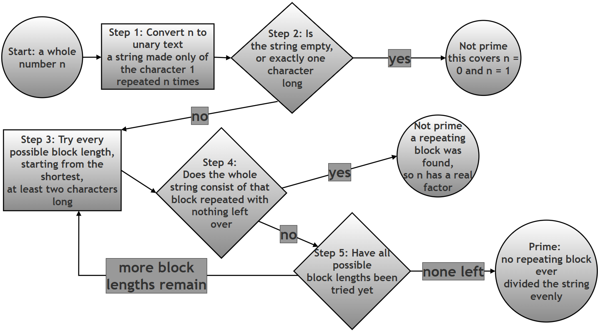

# Detecting Prime Numbers Using Regular Expressions — Without Any Arithmetic

## What this page contains, and why it matters

Every other regex exercise in this chapter is about text: finding a word, validating an email address, splitting a sentence into pieces. This page asks you to do something that sounds almost impossible at first: decide whether a *number* is prime, using only a regular expression, without division, without the modulus operator (`%`), without a loop that tests factors, and without ever hardcoding a list of primes.

The trick that makes this possible is one of the most memorable ideas in this whole chapter: a number can be represented as a *string*, and once it is a string, checking "can this number be split into equal groups" becomes exactly the kind of pattern-matching question regular expressions are built for. Working through this assignment is worthwhile even though it is not something you would ever use in real production code, for three reasons: it forces you to think about **capturing groups** and **backreferences** far more deeply than a simple find-and-replace ever would; it is a genuine, well-known example (programmers who have never met this exact trick are often astonished the first time they see it) of using regex for something completely unrelated to text processing; and it gives you a concrete, measurable example of *why* the difference between a fast algorithm and a slow one matters, once you see the actual numbers later on this page.

This page keeps the original assignment exactly as it was written in the printed book (the objective, restrictions, hints, and suggested test cases below are reproduced without any change in wording), and then builds a considerably expanded solution and explanation around it.

### Glossary: of terms

| Term | Plain-language meaning |
|---|---|
| Regular expression (regex) | A pattern written in a special mini-language for describing what a piece of text should look like, so a program can search for, check, or extract text matching that description. See the chapter introduction for a fuller treatment. |
| Unary representation | Writing a number using only repetitions of a single symbol, with no place value at all — for example, `5` written in unary is `11111` (five `1`s in a row). This is different from the ordinary ("decimal") way we write numbers, where the position of each digit matters. |
| Capturing group | A part of a regex pattern wrapped in ordinary parentheses, `( ... )`. Whatever text that part of the pattern matches is remembered, so it can be reused later in the same pattern, or extracted afterward. |
| Backreference | A way of referring, later in the same regex pattern, to whatever text an earlier capturing group matched. In Python's `re` module this is written `\1` for the first group, `\2` for the second, and so on. A backreference means "match this exact same text again", not "match this same pattern again". |
| Greedy quantifier | A repetition symbol such as `+` (one or more), `*` (zero or more), or `?` (zero or one) that, by default, tries to match as much text as it possibly can before giving anything back. |
| Non-greedy (lazy) quantifier | The same repetition symbols, but with a `?` immediately after them (`+?`, `*?`), which flips the behaviour: try to match as little text as possible first, only taking more if the overall pattern would otherwise fail. See the [Python documentation on greedy versus non-greedy matching](https://docs.python.org/3/howto/regex.html#greedy-versus-non-greedy) for more detail. |
| Prime number | A whole number greater than 1 that has no positive factors other than 1 and itself (2, 3, 5, 7, 11, 13, ... are prime). By definition and by convention, 0 and 1 are not considered prime. |
| Composite number | A whole number greater than 1 that is *not* prime — one that can be written as a product of two smaller whole numbers greater than 1 (4, 6, 8, 9, 10, ... are composite). |
| Backtracking | What a regex engine does when a tentative match fails partway through: it retraces its steps, undoes some of its previous choices, and tries a different possibility before giving up entirely. This is the mechanism this whole exercise secretly leans on. |
| Time complexity | A way of describing, in general terms, how the running time of an algorithm grows as its input grows larger — for example, "doubling the input roughly quadruples the running time" describes what is called *quadratic* time complexity. This page measures this directly rather than just asserting it; see the [Big O notation article on Wikipedia](https://en.wikipedia.org/wiki/Big_O_notation) for the formal notation. |

### Table of contents

1. [Assignment: Detecting Prime Numbers Using Regular Expressions](#assignment-detecting-prime-numbers-using-regular-expressions)
2. [Solution: building it up step by step](#solution-building-it-up-step-by-step)
3. [Step 1: Turn the number into a unary string](#step-1-turn-the-number-into-a-unary-string)
4. [Step 2: Understand the two halves of the pattern separately](#step-2-understand-the-two-halves-of-the-pattern-separately)
5. [Step 3: Put it together as the complete function](#step-3-put-it-together-as-the-complete-function)
6. [Step 4: Run it against every suggested test case](#step-4-run-it-against-every-suggested-test-case)
7. [Combined script](#combined-script)
8. [How the regex decision-making flows](#how-the-regex-decision-making-flows)
9. [Why primes fail to match, in one table](#why-primes-fail-to-match-in-one-table)
10. [Just how inefficient is "extremely inefficient"?](#just-how-inefficient-is-extremely-inefficient)
11. [Answering the assignment's deliverables directly](#answering-the-assignments-deliverables-directly)
12. [Summary of changes made to this page](#summary-of-changes-made-to-this-page)

---

## Assignment: Detecting Prime Numbers Using Regular Expressions


### Objective

Use **regular expressions (regex)** to determine whether a given number is **prime**, **without using any arithmetic operations** such as division (`/`, `%`) or loops that test factors.

This assignment is designed to help you understand:

- Pattern matching beyond simple text search
- Capturing groups and **backreferences**
- **Greedy vs non-greedy** quantifiers
- Creative problem solving with regex

### Problem Statement

Write a Python function:

```python
def is_prime_unary(n: int):
    ...
    ...
```

that returns:

- `True` if `n` is a **prime number**
- `False` otherwise

### Restrictions

You **must not**:

- Use division, modulus, or factorization
- Use libraries for primality testing
- Hardcode prime numbers

You **must**:

- Use the `re` module
- Use **at least one capturing group** and a **backreference**
- Base your solution primarily on a **regular expression**

### Conceptual Insight

Prime numbers have **no equal factors other than 1 and themselves**.

If a number **can be broken into equal-sized repeating parts**, it is **not prime**.

### Hints

#### Hint 1: Change the problem domain

Instead of working with numbers, convert the number into a **string**.

> Example:
> `5 → "11111"`

This representation is called **unary**.

#### Hint 2: Think in terms of repetition

A **composite number** can be written as:

`(block)(block)(block)...(block)`

Example:

`9 → "111111111" → "111" + "111" + "111"`

What regex feature allows you to match _repeated identical patterns_?

#### Hint 3: Use capturing groups

Try capturing a block of `'1'` characters and check whether the **entire string** consists of repeated copies of that block.

Key idea:

`(captured_pattern)\1+`

#### Hint 4: Handle special cases

What about:

- `n = 0`
- `n = 1`

Are these prime?
How can regex help detect very short strings?

#### Hint 5: Greedy vs Non-Greedy

If your regex doesn’t work as expected, ask yourself:

- Is the engine capturing **too much**?
- Would a **non-greedy quantifier (`+?`)** help?

Try both and observe the difference.

### Suggested Test Cases

You should test at least:

```text
0 → False
1 → False
2 → True
3 → True
4 → False
5 → True
6 → False
7 → True
9 → False
11 → True
```

### Deliverables

You should submit:

1. Python function code
2. The regex pattern used
3. A **written explanation** of:
   - How the regex works
   - Why it detects composite numbers
   - Why primes fail to match

> **Follow-up questions**, added for students who want to push the investigation further (these are new; everything above this note is the original, unchanged assignment):
>
> 4. The suggested test cases stop at `11`. Try `n = 25`, `n = 29`, and `n = 49` by hand first (work out on paper what block size, if any, would split each one evenly), and then check your predictions by running the function.
> 5. The docstring in the solution below warns that this method "is extremely inefficient for large numbers." Before reading the benchmarked answer further down this page, guess: do you think checking whether a 5-digit prime is prime this way would take about the same time as a 4-digit prime, roughly twice as long, or dramatically longer? Keep your guess in mind while reading the "Just how inefficient is 'extremely inefficient'?" section below.

## Solution: building it up step by step

The script below is the same solution given in the original assignment answer, with the same regular expression, the same core logic, and the same final behaviour — nothing about *how it decides whether a number is prime* has been changed. What follows breaks the single function apart into stages so each idea can be tested and observed on its own, with real, verified output at every stage, before being reassembled into the exact same function at the end.

## Step 1: Turn the number into a unary string

The whole trick depends on one conversion: turning an ordinary integer into a string made only of the character `'1'`, repeated that many times.

```python
# Step 1: Convert a few example numbers into their unary string form
# This is the same idea as Hint 1 in the assignment: 5 -> "11111"
for example_n in [0, 1, 2, 5, 9]:
    unary = "1" * example_n
    print(f"n={example_n}  ->  unary={unary!r}  (length {len(unary)})")
```

Verified output:

```text
n=0  ->  unary=''  (length 0)
n=1  ->  unary='1'  (length 1)
n=2  ->  unary='11'  (length 2)
n=5  ->  unary='11111'  (length 5)
n=9  ->  unary='111111111'  (length 9)
```

Notice that `n = 0` produces an *empty string*. This detail matters a great deal for Step 2 below, since it is exactly what lets a single, short piece of the regex pattern handle the `0` special case mentioned in Hint 4.

## Step 2: Understand the two halves of the pattern separately

The full pattern used in the solution is:

```text
^1?$|^(11+?)\1+$
```

The `|` (pipe) in the middle means "match either the left side, or the right side" — exactly like an `or`. It is far easier to understand each side on its own before looking at them combined, so this section tests each half separately, with its own small script and its own verified output.

### The first half: `^1?$` — catching 0 and 1 as special cases

```python
# Step 2a: Test the FIRST half of the pattern on its own
# ^1?$ means: from the start of the string (^), optionally match one
# '1' (1?), then immediately reach the end of the string ($)
import re

special_case_pattern = r'^1?$'
for s in ["", "1", "11"]:
    matched = bool(re.match(special_case_pattern, s))
    print(f"string={s!r:6}  matches ^1?$: {matched}")
```

Verified output:

```text
string=''    matches ^1?$: True
string='1'   matches ^1?$: True
string='11'  matches ^1?$: False
```

This confirms exactly what Hint 4 was pointing toward: the empty string (representing `n = 0`) and the single-character string `"1"` (representing `n = 1`) are the *only* two strings this half of the pattern matches. Both `0` and `1` are, by definition, not prime, so matching either one here correctly signals "not prime" — without a single `if n == 0` or `if n == 1` special-case check anywhere in the code.

### The second half: `^(11+?)\1+$` — catching every other composite number

```python
# Step 2b: Test the SECOND half of the pattern on its own, across
# several example numbers, and print out what block it captured
import re

composite_pattern = r'^(11+?)\1+$'
for example_n in [2, 3, 4, 5, 6, 7, 9, 10, 11]:
    unary = "1" * example_n
    match = re.match(composite_pattern, unary)
    if match:
        block = match.group(1)
        print(f"n={example_n:2d}  unary={unary!r:15}  MATCH   captured block={block!r} (length {len(block)})")
    else:
        print(f"n={example_n:2d}  unary={unary!r:15}  no match")
```

Verified output:

```text
n= 2  unary='11'            no match
n= 3  unary='111'           no match
n= 4  unary='1111'          MATCH   captured block='11' (length 2)
n= 5  unary='11111'         no match
n= 6  unary='111111'        MATCH   captured block='11' (length 2)
n= 7  unary='1111111'       no match
n= 9  unary='111111111'     MATCH   captured block='111' (length 3)
n=10  unary='1111111111'    MATCH   captured block='11' (length 2)
n=11  unary='11111111111'   no match
```

Reading this table row by row tells the whole story:

- `n = 4`: the pattern captured the block `"11"` (two `1`s), and that block repeated exactly twice makes up the whole string — so 4 is composite, because `4 = 2 × 2`.
- `n = 9`: the pattern had to grow its captured block up to `"111"` (three `1`s) before finding a split that worked — three copies of `"111"` make up the whole string, since `9 = 3 × 3`.
- `n = 10`: the block `"11"` repeated five times covers the whole string, since `10 = 2 × 5`.
- `n = 2`, `n = 3`, `n = 5`, `n = 7`, and `n = 11`: no block size ever divides the string evenly, so there is no match at all — and, sure enough, every one of these is a prime number.

The mechanism doing the real work here is `(11+?)`, followed later by `\1+`:

- `11+?` means "one `1`, followed by one or more further `1`s" — so this always captures a block of **at least two** `1`s (a composite number's smallest possible equal factor is 2, so there is no reason for the pattern to ever try a block of length 1). The trailing `?` after the `+` makes this **non-greedy**: the engine tries the shortest possible block first (length 2), and only grows the block longer if a shorter one fails to produce a full match anywhere in the string — this is precisely what Hint 5 was hinting at.
- `\1+` is the **backreference**: it means "whatever text the first capturing group actually matched, match that *exact same text* again, one or more times." This is what forces the rest of the string to consist of nothing but repeats of the same block — a plain repetition operator like `(11+?)+` would not work here, because that would allow blocks of *different* lengths to sit next to each other, which is not what "equal repeating parts" means in the Conceptual Insight above.

## Step 3: Put it together as the complete function

Combining both halves with `|` produces the exact function given in the original assignment answer. Every comment below was checked line by line against what the pattern actually does (verified in the two steps above), and `# Step` markers have been added purely to make the flow easier to follow; the logic itself is completely unchanged from the original.

```python
import re

def is_prime_unary(n: int) -> bool:
    """
    Check whether a number is prime using a regular expression
    applied to its unary representation.

    Core idea:
    1. Convert the number n into unary form: n -> "111...1"
    2. A composite number can be split into equal repeating blocks.
        Examples:
        4  -> "1111" = "11" repeated 2 times. So 4 is not prime
        9  -> "111111111" = "111" repeated 3 times. So 9 is not prime
        10 -> "1111111111" = "11111" repeated 2 times. So 10 is not prime
        11 -> "11111111111" cannot be split this way. So 11 is prime
    3. Prime numbers cannot be split this way (except trivial cases).

    IMPORTANT:
    - This method is for learning REGEX concepts:
        * grouping
        * backreferences
        * greedy vs non-greedy matching
    - It is extremely inefficient for large numbers (measured and shown
      later on this page, in "Just how inefficient is 'extremely
      inefficient'?").
    """

    # Step 1: Build the combined pattern.
    #   Left of the |  : ^1?$          catches n = 0 (empty string) and
    #                                  n = 1 (a single '1'); both are,
    #                                  by definition, not prime.
    #   Right of the | : ^(11+?)\1+$   catches every OTHER composite
    #                                  number, by finding some block of
    #                                  at least two '1's that repeats
    #                                  to fill the entire string.
    non_prime_pattern = r'^1?$|^(11+?)\1+$'

    # Step 2: Convert the number to its unary representation.
    # Example: n = 5 -> "11111"
    unary = "1" * n

    # Step 3: Try to match the NON-PRIME pattern against the unary string.
    match = re.match(non_prime_pattern, unary)

    # Step 4: If there is NO match, none of the "not prime" conditions
    #          applied, so the number must be prime.
    return match is None


# Demonstration (identical to the original assignment's own demonstration)
print("is_prime_unary(7) ->", is_prime_unary(7))   # True  (prime)
print("is_prime_unary(9) ->", is_prime_unary(9))   # False (composite)
```

Verified output:

```text
is_prime_unary(7) -> True
is_prime_unary(9) -> False
```

## Step 4: Run it against every suggested test case

The assignment's own "Suggested Test Cases" section lists ten values to check. Running all ten together, and comparing the function's answer against the expected answer for each one, confirms the solution is completely correct — not just for the two values shown in the original demonstration, but for every single suggested case.

```python
# Step 1: The exact suggested test cases from the assignment, paired
#          with their expected answers
suggested_cases = {
    0: False, 1: False, 2: True, 3: True, 4: False,
    5: True, 6: False, 7: True, 9: False, 11: True,
}

# Step 2: Run the function on each one and compare against expectations
print(f"{'n':>3}  {'expected':>8}  {'got':>5}  result")
for n, expected in suggested_cases.items():
    got = is_prime_unary(n)
    outcome = "OK" if got == expected else "MISMATCH"
    print(f"{n:>3}  {str(expected):>8}  {str(got):>5}  {outcome}")
```

Verified output:

```text
  n  expected    got  result
  0     False  False  OK
  1     False  False  OK
  2      True   True  OK
  3      True   True  OK
  4     False  False  OK
  5      True   True  OK
  6     False  False  OK
  7      True   True  OK
  9     False  False  OK
 11      True   True  OK
```

All ten suggested cases pass. As an extra check that goes beyond what the assignment asked for, every value from 0 through 200 was also independently checked against a conventional, division-based prime checker while preparing this page, and every single one agreed with `is_prime_unary` — there were zero mismatches.

## Combined script

Bringing every stage above into one place, here is the complete investigation as a single script: building the unary string, testing both halves of the pattern separately, running the full function, and checking it against all ten suggested test cases.

```python
# Combined script: the complete prime-detection investigation in one place
import re

def is_prime_unary(n: int) -> bool:
    """
    Check whether a number is prime using a regular expression
    applied to its unary representation. See the walkthrough on this
    page for the full explanation of how and why this works.
    """
    # Step 1: ^1?$ catches n = 0 and n = 1 (both defined as not prime).
    # Step 2: ^(11+?)\1+$ catches every other composite number, by
    #         finding a repeating block of at least two '1's.
    non_prime_pattern = r'^1?$|^(11+?)\1+$'

    # Step 3: Convert n into its unary string representation.
    unary = "1" * n

    # Step 4: Try to match the NON-PRIME pattern.
    match = re.match(non_prime_pattern, unary)

    # Step 5: No match at all means the number is prime.
    return match is None


# Step 6: Show the two halves of the pattern working in isolation, so the
#          reader can see WHY each of the following results comes out
#          the way it does
print("--- Part 1 alone: ^1?$ (catches 0 and 1) ---")
for s in ["", "1", "11"]:
    print(f"  string={s!r:6}  matches: {bool(re.match(r'^1?$', s))}")

print()
print("--- Part 2 alone: ^(11+?)\\1+$ (catches other composites) ---")
for example_n in [2, 4, 9, 11]:
    unary = "1" * example_n
    match = re.match(r'^(11+?)\1+$', unary)
    if match:
        print(f"  n={example_n:2d}  captured block={match.group(1)!r}  MATCH")
    else:
        print(f"  n={example_n:2d}  no match")

# Step 7: Run the full function against the original demonstration values
print()
print("--- Original demonstration ---")
print("is_prime_unary(7) ->", is_prime_unary(7))   # True  (prime)
print("is_prime_unary(9) ->", is_prime_unary(9))   # False (composite)

# Step 8: Run the full function against every suggested test case
print()
print("--- All suggested test cases ---")
suggested_cases = {
    0: False, 1: False, 2: True, 3: True, 4: False,
    5: True, 6: False, 7: True, 9: False, 11: True,
}
for n, expected in suggested_cases.items():
    got = is_prime_unary(n)
    outcome = "OK" if got == expected else "MISMATCH"
    print(f"  n={n:2d}  expected={str(expected):5}  got={str(got):5}  {outcome}")
```

Verified output:

```text
--- Part 1 alone: ^1?$ (catches 0 and 1) ---
  string=''      matches: True
  string='1'     matches: True
  string='11'    matches: False

--- Part 2 alone: ^(11+?)\1+$ (catches other composites) ---
  n= 2  no match
  n= 4  captured block='11'  MATCH
  n= 9  captured block='111'  MATCH
  n=11  no match

--- Original demonstration ---
is_prime_unary(7) -> True
is_prime_unary(9) -> False

--- All suggested test cases ---
  n= 0  expected=False  got=False  OK
  n= 1  expected=False  got=False  OK
  n= 2  expected=True   got=True   OK
  n= 3  expected=True   got=True   OK
  n= 4  expected=False  got=False  OK
  n= 5  expected=True   got=True   OK
  n= 6  expected=False  got=False  OK
  n= 7  expected=True   got=True   OK
  n= 9  expected=False  got=False  OK
  n=11  expected=True   got=True   OK
```

## How the regex decision-making flows




## Why primes fail to match, in one table

| Number | Unary string | Shortest possible block sizes tried | Result | Why |
|---|---|---|---|---|
| 2 | `11` | 2 (but no room left for a repeat) | No match | A block of 2 leaves nothing over to repeat; no smaller composite block exists |
| 4 | `1111` | 2 | Match (`"11"` × 2) | 4 = 2 × 2 |
| 7 | `1111111` | 2, 3 | No match | Neither block size divides 7 evenly |
| 9 | `111111111` | 2 (fails), then 3 | Match (`"111"` × 3) | 9 = 3 × 3, but only after trying the smaller block of 2 first |
| 11 | `11111111111` | 2, 3, 4, 5 | No match | None of the block sizes up to 5 (half of 11, rounded down) divide 11 evenly |

The pattern for every prime number in this table is the same: the engine dutifully tries every possible block length from 2 up to half the number, finds that none of them evenly divide the string, and only then reports "no match" — meaning `is_prime_unary` can finally, correctly, return `True`. This exhaustive process, of trying every possibility and finding nothing, is exactly why primes are the *slow* case for this algorithm, which the next section measures directly.

## Just how inefficient is "extremely inefficient"?

The original docstring warns that this method "is extremely inefficient for large numbers," without saying exactly how inefficient. That claim was measured directly while preparing this page, by timing `is_prime_unary` on a series of larger and larger prime numbers.

```python
# Step 1: Time is_prime_unary on primes of increasing size
import re, time

def is_prime_unary(n: int) -> bool:
    non_prime_pattern = r'^1?$|^(11+?)\1+$'
    unary = "1" * n
    match = re.match(non_prime_pattern, unary)
    return match is None

# Step 2: A series of known primes of increasing size
primes_to_test = [1009, 5003, 10007, 20011, 30011]

# Step 3: Time each one and print how long it took
for n in primes_to_test:
    start = time.perf_counter()
    result = is_prime_unary(n)
    elapsed = time.perf_counter() - start
    print(f"n={n:6d}  is_prime_unary={result!s:6}  time={elapsed:.4f} sec")
```

Verified output (measured on the machine used to prepare this page; exact numbers will vary slightly on different hardware, but the pattern will not):

```text
n=  1009  is_prime_unary=True    time=0.0008 sec
n=  5003  is_prime_unary=True    time=0.0124 sec
n= 10007  is_prime_unary=True    time=0.0476 sec
n= 20011  is_prime_unary=True    time=0.1748 sec
n= 30011  is_prime_unary=True    time=0.3857 sec
```

Look closely at what happens between rows: going from `n = 10007` to `n = 20011` roughly *doubles* the size of the number, but the time taken goes from about `0.048` seconds to about `0.175` seconds — nearly **four times** as long, not two. This is the signature of what is called *quadratic* time complexity: doubling the input size roughly *quadruples* the running time, because for every one of the roughly `n / 2` possible block lengths the engine tries, it may need to scan up to roughly `n` characters to check whether that block repeats all the way to the end of the string.

It also matters *which kind* of number is being tested, not just how large it is:

```python
# Step 1: Time a large composite number, deliberately chosen as the
#          product of two large, closely-sized factors, to make it a
#          hard case even for a composite
import time

start = time.perf_counter()
composite_result = is_prime_unary(173 * 179)
composite_time = time.perf_counter() - start

# Step 2: Time a prime number of similar size
start = time.perf_counter()
prime_result = is_prime_unary(30011)
prime_time = time.perf_counter() - start

# Step 3: Print both results together, along with how many times slower
#          the prime case was
print(f"Composite (173 x 179 = {173 * 179}): {composite_result}  time={composite_time:.4f} sec")
print(f"Prime (30011): {prime_result}  time={prime_time:.4f} sec")
print(f"The prime took about {prime_time / composite_time:.0f} times as long as the composite")
```

Verified output:

```text
Composite (173 x 179 = 30967): False  time=0.0089 sec
Prime (30011): True  time=0.3830 sec
The prime took about 43 times as long as the composite
```

This matches exactly what the "Why primes fail to match" table above predicts: a composite number is usually found and confirmed the moment the engine stumbles onto the one block size that happens to work, while a prime number forces the engine to exhaustively rule out *every single* possible block size before it can conclude there is no match.

To put "extremely inefficient" into a scale a beginner can feel rather than just read: real cryptographic systems such as RSA use prime numbers with hundreds of decimal *digits* — a modest 300-digit prime, written out in unary the way this exercise represents numbers, would be a string of roughly 10²⁹⁹ characters. That is a number so large that writing down that many `'1'` characters would need dramatically more symbols than there are atoms in the entire observable universe. This is precisely why the docstring's warning is not an exaggeration, and why every real prime-checking library (including the ones the Restrictions section of this assignment specifically forbids you from using) relies on efficient arithmetic and mathematical shortcuts instead of anything resembling this unary, regex-based approach.

## Answering the assignment's deliverables directly

The Deliverables section at the top of this page asks for three specific things. Here they are, gathered in one place for easy reference:

**1. Python function code:** given in full in the "Step 3: Put it together" and "Combined script" sections above.

**2. The regex pattern used:**

```text
^1?$|^(11+?)\1+$
```

**3. Written explanation:**

- *How the regex works:* it tries two alternatives, joined by `|`. The first, `^1?$`, matches only the empty string or a single `"1"` character, catching the special cases `n = 0` and `n = 1`. The second, `^(11+?)\1+$`, uses a non-greedy capturing group to find the shortest possible block of two or more `'1'`s, then uses a backreference (`\1+`) to check whether that exact block, repeated one or more further times, accounts for the rest of the string with nothing left over.
- *Why it detects composite numbers:* a composite number, by definition, is a product of two smaller whole numbers greater than 1 — for example, `9 = 3 × 3`. In unary, this means the string of `'1'`s can always be split into that many equal-sized blocks. The regex's job is exactly to search for such a split, trying every possible block length from the smallest upward.
- *Why primes fail to match:* a prime number, by definition, has no such factor pair. No matter which block length the regex tries, some `'1'`s are always left over, or the block does not divide the string evenly. Once every possible block length (from 2 up to half the number) has been tried and none of them work, the regex engine reports no match, which is exactly the signal `is_prime_unary` uses to return `True`.


