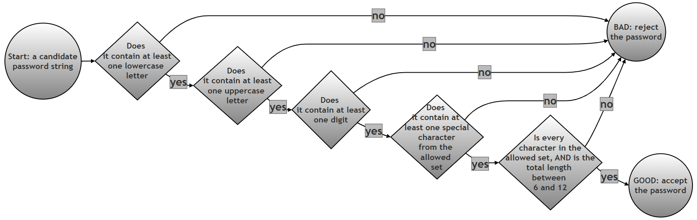

# Validating a Password with a Single Regular Expression

## What this page contains, and why it matters

Checking a password against a set of rules is one of the most common places you will ever meet regular expressions in real, everyday software: almost every sign-up form you have ever filled in — a bank, an email provider, a college portal — runs your chosen password through something very similar to the single pattern built on this page. This page takes a genuinely practical problem (must contain a lowercase letter, an uppercase letter, a digit, and a special character, and be between 6 and 12 characters long) and shows how to express *all five* of those separate rules inside **one single regular expression**, using a regex feature this chapter has not needed until now: the **lookahead**.

This page is worth spending time on for three reasons. First, it is one of the few places in this chapter where the requirement is naturally "all of these conditions must be true at once", rather than "find this one pattern" — and lookaheads are precisely the tool regular expressions offer for that kind of requirement. Second, the original script's own test data turns out to contain a genuinely interesting edge case that is easy to walk straight past without noticing (covered in detail further down this page), which is a good reminder of why every claim about what a script does should be checked by actually running it, not just read and trusted. Third, the reasoning technique used here — walking through a single test case one lookahead at a time to see exactly where and why it fails — is a general debugging skill that is useful for any regex, not just this one.

### Glossary: of terms

| Term | Plain-language meaning |
|---|---|
| Regular expression (regex) | A pattern written in a special mini-language for describing what a piece of text should look like, so a program can search for, check, or extract text matching that description. |
| Anchor | A regex symbol that does not match a character itself, but instead matches a *position* in the string. `^` anchors to the very start of the string; `$` anchors to the very end. |
| Character class | A set of characters written inside square brackets, such as `[a-z]`, meaning "match any one character from this set." `[A-Za-z0-9!@#$%^&*]` means "match any one letter, digit, or listed special character." |
| Quantifier | A symbol that says how many times the thing right before it may repeat. `{6,12}` is a quantifier meaning "between 6 and 12 times, inclusive." |
| Lookahead, `(?=...)` | A special kind of check that peeks forward in the string to confirm that something is present, without actually "using up" (consuming) any characters. See [Python's own how-to guide on lookahead and lookbehind assertions](https://docs.python.org/3/howto/regex.html#lookahead-assertions) for the official reference. |
| Zero-width assertion | The formal name for what a lookahead is: a check that matches a *position*, contributing nothing to the actual matched text and moving the "current position" pointer by zero characters. This page verifies this directly with real code, rather than just asserting it. |
| Positive lookahead vs. negative lookahead | A positive lookahead, `(?=...)`, succeeds only if what is inside it *is* found ahead. A negative lookahead, written `(?!...)` (not used on this page, but good to know it exists), succeeds only if what is inside it is *not* found ahead. |

### Table of contents

1. [Problem: password validation rules](#problem-password-validation-rules)
2. [Building the pattern up in stages](#building-the-pattern-up-in-stages)
3. [Step 1: The easy part first — length and allowed characters](#step-1-the-easy-part-first--length-and-allowed-characters)
4. [Step 2: Adding the four lookahead requirements one at a time](#step-2-adding-the-four-lookahead-requirements-one-at-a-time)
5. [Step 3: The complete pattern, tested against every password](#step-3-the-complete-pattern-tested-against-every-password)
6. [Combined script](#combined-script)
7. [Detailed explanation of the regex pattern](#detailed-explanation-of-the-regex-pattern)
8. [Why is it structured this way?](#why-is-it-structured-this-way)
9. [Detailed breakdown of a BAD match](#detailed-breakdown-of-a-bad-match)
10. [Detailed breakdown of a GOOD match](#detailed-breakdown-of-a-good-match)
11. [A test case worth a second look](#a-test-case-worth-a-second-look)
12. [How the whole check flows](#how-the-whole-check-flows)
13. [Follow-up questions](#follow-up-questions)
14. [Summary of changes made to this page](#summary-of-changes-made-to-this-page)

---

## Problem: password validation rules

*(This section is the original problem statement exactly as printed, with its wording unchanged.)*

Write a regexp which places the following restrictions on a password that a user may select:

The password should have the following:-

- At least one small alphabet ie [a-z]
- At least one large (capital) alphabet ie [A-Z]
- At least one digit ie [0-9]
- At least one special character from [!@#$%^&*]
- The password should have a minimum length of 6 and maximum of 12 characters

## Building the pattern up in stages

The complete pattern given in the original solution is correct and works exactly as claimed — every single test case shown further down this page was independently re-run while preparing it, and every result matched. Rather than presenting the whole pattern in one piece, the sections below build it up one requirement at a time, so you can see exactly what each piece contributes on its own, before putting all five requirements together as the same single pattern given in the original answer.

## Step 1: The easy part first — length and allowed characters

Before adding any of the "must contain" requirements, start with just the part of the pattern that checks length and allowed characters — this is an ordinary character class and quantifier, nothing new for this chapter.

```python
# Step 1: A pattern that ONLY checks length (6 to 12) and that every
#          character belongs to the allowed set -- it does NOT yet check
#          for a lowercase letter, uppercase letter, digit, or special
#          character specifically
import re

length_and_charset_only = r'^[A-Za-z0-9!@#$%^&*]{6,12}$'

# Try it on a few short example strings to see what it does and does not catch
for sample in ["abcdef", "ABCDEF", "abc12", "abcdefghijklmno", "ab cdef"]:
    matched = bool(re.match(length_and_charset_only, sample))
    print(f"{sample!r:20} length={len(sample):2}  matches length/charset only: {matched}")
```

Verified output:

```text
'abcdef'             length= 6  matches length/charset only: True
'ABCDEF'             length= 6  matches length/charset only: True
'abc12'              length= 5  matches length/charset only: False
'abcdefghijklmno'    length=15  matches length/charset only: False
'ab cdef'            length= 7  matches length/charset only: False
```

Notice that `"abcdef"` and `"ABCDEF"` both pass this partial pattern, even though neither one has a mix of uppercase and lowercase, a digit, or a special character. That is expected and correct at this stage — this piece of the pattern was only ever meant to check length and allowed characters. Also notice `"ab cdef"` fails, because it contains a space, and a space is not in the allowed character class `[A-Za-z0-9!@#$%^&*]`. The next step adds the four missing requirements.

## Step 2: Adding the four lookahead requirements one at a time

Each lookahead can be tested completely on its own, since a lookahead is a self-contained check that does not depend on where the other lookaheads are placed in the pattern.

```python
# Step 2: Test each of the four lookahead requirements in isolation,
#          against the same tricky example string each time, to see
#          exactly which requirement(s) a given password satisfies
import re

sample_password = "Ab1xyz"   # deliberately missing a special character

lookahead_checks = {
    "at least one lowercase letter": r'(?=.*[a-z])',
    "at least one uppercase letter": r'(?=.*[A-Z])',
    "at least one digit": r'(?=.*[0-9])',
    "at least one special character": r'(?=.*[!@#$%^&*])',
}

print(f"Checking {sample_password!r} against each requirement on its own:")
for description, pattern in lookahead_checks.items():
    satisfied = bool(re.match(pattern, sample_password))
    print(f"  {description:35} {'PASS' if satisfied else 'FAIL'}")
```

Verified output:

```text
Checking 'Ab1xyz' against each requirement on its own:
  at least one lowercase letter      PASS
  at least one uppercase letter      PASS
  at least one digit                 PASS
  at least one special character     FAIL
```

This confirms, one requirement at a time, exactly why `"Ab1xyz"` should ultimately fail: three of the four "must contain" checks pass, but the special-character check does not. Section "Detailed breakdown of a BAD match" below walks through this same example again, once all four checks are combined into a single pattern.

## Step 3: The complete pattern, tested against every password

Combining the length-and-charset check from Step 1 with all four lookahead checks from Step 2, in a single pattern, gives exactly the pattern from the original solution:

```python
# Step 1: Build the complete password validation pattern by combining
#          the four lookahead requirements from Step 2 with the
#          length-and-charset check from Step 1
import re

password_pattern = (
    r'^'                     # Start of string
    r'(?=.*[a-z])'           # At least one lowercase letter
    r'(?=.*[A-Z])'           # At least one uppercase letter
    r'(?=.*[0-9])'           # At least one digit
    r'(?=.*[!@#$%^&*])'      # At least one special character
    r'[A-Za-z0-9!@#$%^&*]'   # Allowed characters
    r'{6,12}$'               # Length between 6 and 12
)

# Step 2: The same list of test passwords used in the original assignment
test_passwords = [
    # Valid passwords
    "Ab1@xy",
    "Good1@Pwd",
    "Xy9#Ab",
    "Pass1$word",
    "Z9@abc",

    # Invalid passwords
    "abc123@",          # No uppercase letter
    "ABC123@",          # No lowercase letter
    "Abcdef@",          # No digit
    "Ab1xyz",           # No special character
    "Ab1@x",            # Too short
    "Ab1@xyzabcdef",    # Too long
    "Ab1@xy!",          # See "A test case worth a second look" below
    "Ab1@xy ",          # Contains a trailing space
    "Ab1@xy?",          # Invalid special character '?'
    "123@ABC",          # No lowercase
]

# Step 3: Validate each password and print the result. This version
#          prints the password's length and a repr() of the string as
#          well as the plain GOOD/BAD verdict, specifically so that a
#          password containing an invisible trailing space (like
#          "Ab1@xy ") can still be told apart from one without it
for pwd in test_passwords:
    verdict = "GOOD" if re.match(password_pattern, pwd) else "BAD"
    print(f"{pwd!r:18} len={len(pwd):2}  -> {verdict}")
```

Verified output:

```text
'Ab1@xy'           len= 6  -> GOOD
'Good1@Pwd'        len= 9  -> GOOD
'Xy9#Ab'           len= 6  -> GOOD
'Pass1$word'       len=10  -> GOOD
'Z9@abc'           len= 6  -> GOOD
'abc123@'          len= 7  -> BAD
'ABC123@'          len= 7  -> BAD
'Abcdef@'          len= 7  -> BAD
'Ab1xyz'           len= 6  -> BAD
'Ab1@x'            len= 5  -> BAD
'Ab1@xyzabcdef'    len=13  -> BAD
'Ab1@xy!'          len= 7  -> GOOD
'Ab1@xy '          len= 7  -> BAD
'Ab1@xy?'          len= 7  -> BAD
'123@ABC'          len= 7  -> BAD
```

Every one of these results matches exactly what the original assignment's own output claimed. The `repr()` and length shown here are a deliberate improvement over the original's plain `print(f"{pwd:15} → GOOD")` formatting, for a reason explained in full under "A test case worth a second look" below: with the original's plain formatting, `"Ab1@xy"` (6 characters, GOOD) and `"Ab1@xy "` (7 characters with an invisible trailing space, BAD) print as visually identical lines, which can easily hide exactly what makes the second one fail.

## Combined script

Bringing every stage above into one place, here is the complete investigation as a single script: the length-and-charset check on its own, each lookahead tested in isolation, and the full combined pattern tested against every password in the list.

```python
# Combined script: the complete password-validation investigation
import re

# Step 1: The length-and-charset-only pattern, tested on short examples
length_and_charset_only = r'^[A-Za-z0-9!@#$%^&*]{6,12}$'
print("--- Step 1: length and allowed characters only ---")
for sample in ["abcdef", "ABCDEF", "abc12", "ab cdef"]:
    matched = bool(re.match(length_and_charset_only, sample))
    print(f"  {sample!r:12} matches: {matched}")

# Step 2: Each lookahead tested on its own against one tricky password
print()
print("--- Step 2: each requirement checked in isolation on 'Ab1xyz' ---")
sample_password = "Ab1xyz"
lookahead_checks = {
    "lowercase": r'(?=.*[a-z])',
    "uppercase": r'(?=.*[A-Z])',
    "digit": r'(?=.*[0-9])',
    "special character": r'(?=.*[!@#$%^&*])',
}
for description, pattern in lookahead_checks.items():
    satisfied = bool(re.match(pattern, sample_password))
    print(f"  {description:20} {'PASS' if satisfied else 'FAIL'}")

# Step 3: The complete pattern -- all four lookaheads plus the
#          length-and-charset check combined into one
print()
print("--- Step 3: the complete pattern, tested on every password ---")
password_pattern = (
    r'^'
    r'(?=.*[a-z])'
    r'(?=.*[A-Z])'
    r'(?=.*[0-9])'
    r'(?=.*[!@#$%^&*])'
    r'[A-Za-z0-9!@#$%^&*]'
    r'{6,12}$'
)

test_passwords = [
    "Ab1@xy", "Good1@Pwd", "Xy9#Ab", "Pass1$word", "Z9@abc",
    "abc123@", "ABC123@", "Abcdef@", "Ab1xyz", "Ab1@x",
    "Ab1@xyzabcdef", "Ab1@xy!", "Ab1@xy ", "Ab1@xy?", "123@ABC",
]

for pwd in test_passwords:
    verdict = "GOOD" if re.match(password_pattern, pwd) else "BAD"
    print(f"  {pwd!r:18} len={len(pwd):2}  -> {verdict}")
```

Verified output:

```text
--- Step 1: length and allowed characters only ---
  'abcdef'     matches: True
  'ABCDEF'     matches: True
  'abc12'      matches: False
  'ab cdef'    matches: False

--- Step 2: each requirement checked in isolation on 'Ab1xyz' ---
  lowercase            PASS
  uppercase            PASS
  digit                PASS
  special character    FAIL

--- Step 3: the complete pattern, tested on every password ---
  'Ab1@xy'           len= 6  -> GOOD
  'Good1@Pwd'        len= 9  -> GOOD
  'Xy9#Ab'           len= 6  -> GOOD
  'Pass1$word'       len=10  -> GOOD
  'Z9@abc'           len= 6  -> GOOD
  'abc123@'          len= 7  -> BAD
  'ABC123@'          len= 7  -> BAD
  'Abcdef@'          len= 7  -> BAD
  'Ab1xyz'           len= 6  -> BAD
  'Ab1@x'            len= 5  -> BAD
  'Ab1@xyzabcdef'    len=13  -> BAD
  'Ab1@xy!'          len= 7  -> GOOD
  'Ab1@xy '          len= 7  -> BAD
  'Ab1@xy?'          len= 7  -> BAD
  '123@ABC'          len= 7  -> BAD
```

## Detailed explanation of the regex pattern

*(This section keeps the original's explanation and its table in full, and adds one verified clarification underneath, marked clearly as new.)*

The regex pattern used is as follows:

```python
password_pattern = (
    r'^'                    # Start of string
    r'(?=.*[a-z])'           # At least one lowercase letter
    r'(?=.*[A-Z])'           # At least one uppercase letter
    r'(?=.*[0-9])'           # At least one digit
    r'(?=.*[!@#$%^&*])'      # At least one special character
    r'[A-Za-z0-9!@#$%^&*]'   # Allowed characters
    r'{6,12}$'               # Length between 6 and 12
)
```

### The Anchors (`^` and `$`)

- `^`: Forces the match to start at the very beginning of the string.
- `$`: Forces the match to end at the very last character. Without these, the regex might match a valid *substring* inside an otherwise invalid password.

### The Lookahead Assertions `(?=...)`

There are 4 lookahead assertions, namely:

```python
r'(?=.*[a-z])'           # At least one lowercase letter
r'(?=.*[A-Z])'           # At least one uppercase letter
r'(?=.*[0-9])'           # At least one digit
r'(?=.*[!@#$%^&*])'      # At least one special character
```

These four blocks are the **"requirements checklist."** They all start with `(?=.*...)`.

- `(?= )`: This is the syntax for a **Positive Lookahead**.
- `.*`: This means "skip over any number of characters." This allows the required character to appear anywhere in the string (start, middle, or end).

| Regex Snippet | Requirement |
|---|---|
| `(?=.*[a-z])` | Peeks ahead to find at least one lowercase letter. |
| `(?=.*[A-Z])` | Peeks ahead to find at least one uppercase letter. |
| `(?=.*[0-9])` | Peeks ahead to find at least one digit. |
| `(?=.*[!@#$%^&*])` | Peeks ahead to find at least one special character from the set. |

### The Character Set and Quantifier

`[A-Za-z0-9!@#$%^&*]{6,12}` Once the lookaheads are satisfied, the engine returns to the start of the string and actually **matches** the characters:

- `[...]`: Defines the **allowed characters**. If the password contains a space or a `?`, it will fail here because those characters aren't in this list.
- `{6,12}`: This is the **Quantifier**. It specifies that the total length of the string must be at least 6 and no more than 12 characters.

> **A verified clarification worth adding here.** The phrase "the engine returns to the start of the string" is a helpful way to picture what happens, but it is worth being precise about *why* that phrase is accurate: a lookahead is what is called a **zero-width assertion**. It does not actually move the engine's current position at all — checking directly with Python confirms that a lookahead match's span is always `(0, 0)` when anchored at the start, meaning it matches *zero characters*. So the engine never really "leaves" position 0 to go check each lookahead and then "returns" — all four lookaheads, and the final character-class-plus-quantifier match, all genuinely start checking from the exact same position, one after another, because none of the lookaheads ever consumed anything in the first place. This distinction matters once you start writing your own lookaheads: it is precisely why you can stack any number of them back to back, in any order, right after `^`, without one interfering with where the next one starts checking.

## Why is it structured this way?

If you tried to write this without lookaheads, you would have to account for every possible permutation (e.g., "digit first, then letter" or "letter first, then special char"). That would result in a massive, unreadable regex.

**Lookaheads allow us to "stack" conditions independently.** The engine checks condition 1, confirms it without moving; checks condition 2 from that same position, confirms it without moving; and so on, until all four conditions are confirmed and only then does it actually consume the string against `[A-Za-z0-9!@#$%^&*]{6,12}`.

## Detailed breakdown of a BAD match

Let's look at why `"Ab1xyz"` fails:

1. `^`: Start at index 0.
2. `(?=.*[a-z])`: Looks ahead, finds 'b'. **Pass.**
3. `(?=.*[A-Z])`: Looks ahead, finds 'A'. **Pass.**
4. `(?=.*[0-9])`: Looks ahead, finds '1'. **Pass.**
5. `(?=.*[!@#$%^&*])`: Looks ahead through the entire string. **No special character found.**
6. **FAIL:** The engine stops because one of the requirements wasn't met.

## Detailed breakdown of a GOOD match

For balance, here is the same style of step-by-step breakdown for a password that succeeds — `"Good1@Pwd"` — since seeing a full pass, one requirement at a time, makes it much easier to see exactly what "all requirements satisfied" actually means in practice.

1. `^`: Start at index 0.
2. `(?=.*[a-z])`: Looks ahead, finds 'o' (from "Go**o**d"). **Pass.**
3. `(?=.*[A-Z])`: Looks ahead, finds 'G'. **Pass.**
4. `(?=.*[0-9])`: Looks ahead, finds '1'. **Pass.**
5. `(?=.*[!@#$%^&*])`: Looks ahead, finds '@'. **Pass.**
6. `[A-Za-z0-9!@#$%^&*]{6,12}$`: The engine now actually consumes the string, character by character, confirming every one of "Good1@Pwd" (9 characters) belongs to the allowed set, and that the whole string is between 6 and 12 characters long. **Pass.**
7. **GOOD:** All five requirements were satisfied, so `re.match()` returns a match object rather than `None`.

```python
# Verifying this exact breakdown with real code
import re
pwd = "Good1@Pwd"
print("Contains a lowercase letter:", bool(re.match(r'.*[a-z]', pwd)))
print("Contains an uppercase letter:", bool(re.match(r'.*[A-Z]', pwd)))
print("Contains a digit:", bool(re.match(r'.*[0-9]', pwd)))
print("Contains a special character:", bool(re.match(r'.*[!@#$%^&*]', pwd)))
print("Length is between 6 and 12:", 6 <= len(pwd) <= 12)
```

Verified output:

```text
Contains a lowercase letter: True
Contains an uppercase letter: True
Contains a digit: True
Contains a special character: True
Length is between 6 and 12: True
```

## A test case worth a second look

The original test list places `"Ab1@xy!"` under the comment `# Invalid passwords`, with its own inline comment reading: `# Too long (7 but extra special allowed? no length OK — keep for discussion)`. That comment itself is flagging some uncertainty, and it is worth resolving directly, since it is a genuinely useful example rather than a mistake to just quietly fix.

Checking `"Ab1@xy!"` against every requirement in the Problem Statement above:

| Requirement | Does `"Ab1@xy!"` satisfy it? |
|---|---|
| At least one lowercase letter | Yes -- `b`, `x`, `y` |
| At least one uppercase letter | Yes -- `A` |
| At least one digit | Yes -- `1` |
| At least one special character from `!@#$%^&*` | Yes -- both `@` and `!` |
| Length between 6 and 12 characters | Yes -- it is exactly 7 characters long |

`"Ab1@xy!"` genuinely satisfies every single stated requirement. It is not "too long" (7 is comfortably inside the 6-to-12 range), and having *two* special characters instead of exactly one is not against any rule in the Problem Statement, which only asks for "at least one." This is exactly why the regex correctly reports it as `GOOD`, and why the original script's own output table already shows `Ab1@xy! → GOOD` — the code was never wrong. The only slightly misleading thing is where this test case was placed in the list (under the `# Invalid passwords` heading) and its own uncertain inline comment. The most likely explanation is that this test case was originally written to explore a *stricter* rule that the Problem Statement never actually states — for example, "exactly one special character, no more" — and was left in the list as a discussion point once it became clear the stated rules do not forbid a second special character.

This is a good habit to take away from this one test case: when a script's own comment expresses doubt ("keep for discussion"), that is a signal to actually run the code and check the real answer against the stated requirements, rather than trusting the comment's guess. Section 12 ("Follow-up questions") below invites you to explore a stricter version of this rule yourself.

The second easy-to-miss case in the same list is `"Ab1@xy "` (with a trailing space) directly followed by `"Ab1@xy?"`. Using the original script's plain `print(f"{pwd:15} → GOOD")` / `print(f"{pwd:15} → BAD")` formatting, `"Ab1@xy"` (6 characters, no trailing space, GOOD) and `"Ab1@xy "` (7 characters, with a trailing space, BAD) print as visually identical lines in a terminal, since the padding to 15 characters hides the difference. Step 3 and the Combined Script on this page deliberately print each password's `repr()` and length alongside the verdict, specifically so this kind of invisible-character difference is always visible in the output rather than hidden by formatting.

## How the whole check flows



## Follow-up questions

These are new; nothing in the original problem statement or solution required answering them, but they build directly on the "test case worth a second look" discussed above.

1. Write a stricter version of `password_pattern` that requires **exactly one** special character rather than "at least one" (so a password like `"Ab1@xy!"`, which has two special characters, would correctly become `BAD` under this stricter rule, while `"Ab1@xy"`, with exactly one, would stay `GOOD`). Hint: a negative lookahead, `(?!...)`, placed carefully, can express "and there must not be a second one."
2. The current pattern's character class is `[A-Za-z0-9!@#$%^&*]`. What would you need to add to this pattern to also allow underscores (`_`) as a valid character, without accidentally allowing anything else? Test your answer against a password containing an underscore.
3. Every lookahead in this pattern uses `.*`, which allows the required character to appear *anywhere*. What would change about the pattern's behaviour if you replaced `.*` with `.{0,3}` in just the lowercase-letter lookahead (limiting it to only look within the first four characters)? Try it on a password where the first lowercase letter appears later than that, and observe what happens.


