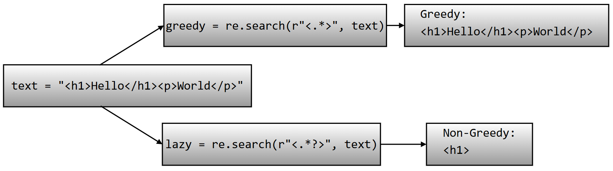
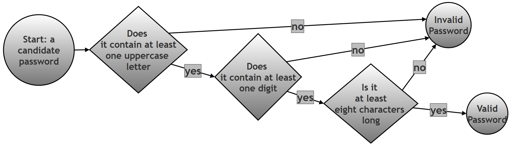

# Twenty Regular Expression Programs: A Practice Set for Python's re Module

## What this page contains, and why it matters

Regular expressions are learned best by writing a lot of small, focused programs rather than by reading theory alone. This page is exactly that: twenty short, independent Python scripts, each one built around a single regex idea — checking a string's shape, pulling matching pieces out of a paragraph, splitting text apart, replacing pieces of it, and a few of the more advanced tricks such as backreferences and lookaheads. Taken together, they form a practice set that touches almost every regex tool this chapter has introduced: character classes, quantifiers, anchors, groups, backreferences, greedy and non-greedy matching, and four of the most useful functions in Python's `re` module — `re.fullmatch()`, `re.findall()`, `re.split()`, `re.sub()`, and `re.finditer()`.

Every script on this page was actually run while preparing it, and every line of printed output shown here is the real, checked output of that exact code — not a description of what the code is expected to do. Working through all twenty, in order, is a good way to test whether the earlier parts of this chapter have genuinely sunk in, since each question asks you to reach for a slightly different regex tool without telling you in advance which one.

### Glossary of terms

| Term | Plain-language meaning |
|---|---|
| Regular expression (regex) | A pattern written in a special mini-language for describing what a piece of text should look like, so a program can search for, check, or extract text matching that description. |
| `re.fullmatch()` | Checks whether the **entire** string matches the pattern, from the very first character to the very last, with nothing left over on either side. |
| `re.findall()` | Scans through a string and returns a list of every non-overlapping piece of text that matches the pattern. |
| `re.split()` | Breaks a string apart wherever the pattern matches, and returns the pieces in between as a list. |
| `re.sub()` | Scans through a string and replaces every match of the pattern with a given replacement string. |
| `re.finditer()` | Like `re.findall()`, but instead of returning plain strings, it returns match objects one at a time, each one carrying extra detail such as where in the string it was found. |
| Character class | A set of characters written inside square brackets, such as `[a-z]`, meaning "match any one character from this set." |
| Quantifier | A symbol that says how many times the thing right before it may repeat, such as `+` (one or more), `{6}` (exactly six), or `{2,}` (two or more). |
| Anchor | A symbol that matches a *position* in the string rather than a character — `^` for the very start, `$` for the very end, `\b` for a word boundary (the position between a word character and a non-word character, or the edge of the string). |
| Capturing group | A part of a pattern wrapped in parentheses, `(...)`, whose matched text is remembered separately, so it can be extracted afterward or reused later in the same pattern. |
| Non-capturing group | A group written `(?:...)`, used purely to apply a quantifier or an alternation (`|`) to several characters at once, without the overhead of remembering what it matched. |
| Backreference | A way of referring, later in the same pattern, to whatever text an earlier capturing group matched — written `\1` for the first group, `\2` for the second, and so on. |
| Lookahead, `(?=...)` | A check that peeks forward in the string to confirm something is present, without actually consuming any characters itself. See [Python's how-to guide on lookahead assertions](https://docs.python.org/3/howto/regex.html#lookahead-assertions) for the official reference. |
| Greedy vs. non-greedy | A greedy quantifier (`*`, `+`, `{m,n}`) tries to match as much text as possible; adding a `?` right after it (`*?`, `+?`) makes it non-greedy, so it tries to match as little text as possible instead. |

### Table of contents

1. [Overview: which regex tool does each question use?](#overview-which-regex-tool-does-each-question-use)
2. [Question 1: digits-only string](#question-1)
3. [Question 2: extracting email addresses](#question-2)
4. [Question 3: words starting with a capital letter](#question-3)
5. [Question 4: validating a 6-digit PIN](#question-4)
6. [Question 5: splitting on multiple spaces](#question-5)
7. [Question 6: replacing every digit with #](#question-6)
8. [Question 7: extracting years with a capturing group](#question-7)
9. [Question 8: finding repeated words with a backreference](#question-8)
10. [Question 9: greedy vs. non-greedy matching](#question-9)
11. [Question 10: password with an uppercase letter and a digit](#question-10)
12. [Question 11: extracting hashtags](#question-11)
13. [Question 12: removing duplicate spaces](#question-12)
14. [Question 13: extracting file extensions](#question-13)
15. [Question 14: matching titles with a non-capturing group](#question-14)
16. [Question 15: does a string start with 'Python'?](#question-15)
17. [Question 16: does a string end with '.com'?](#question-16)
18. [Question 17: extracting floating-point numbers](#question-17)
19. [Question 18: validating an Indian mobile number](#question-18)
20. [Question 19: extracting dates in DD-MM-YYYY format](#question-19)
21. [Question 20: re.finditer() and match positions](#question-20)
22. [Summary of changes made to this page](#summary-of-changes-made-to-this-page)

## Overview: which regex tool does each question use?

Scanning down this table before working through the questions one by one gives a useful bird's-eye view of just how much ground twenty short scripts can cover.

| # | Task | Main `re` function | Key regex feature |
|---|---|---|---|
| 1 | Check a string is only digits | `re.fullmatch()` | `\d+` |
| 2 | Extract email addresses | `re.findall()` | Character classes, `\.`, `{2,}` |
| 3 | Find capitalized words | `re.findall()` | `\b`, `[A-Z][a-z]+` |
| 4 | Validate a 6-digit PIN | `re.fullmatch()` | `\d{6}` |
| 5 | Split on multiple spaces | `re.split()` | `\s+` |
| 6 | Replace digits with `#` | `re.sub()` | `\d` |
| 7 | Extract 4-digit years | `re.findall()` | Capturing group `(\d{4})` |
| 8 | Find repeated words | `re.findall()` | Capturing group + backreference `\1` |
| 9 | Greedy vs. non-greedy | `re.search()` | `.*` vs. `.*?` |
| 10 | Password with uppercase + digit | `re.fullmatch()` | Two lookaheads `(?=...)` |
| 11 | Extract hashtags | `re.findall()` | `#\w+` |
| 12 | Remove duplicate spaces | `re.sub()` | `\s+` |
| 13 | Extract file extensions | `re.findall()` | Capturing group after `\.` |
| 14 | Match titles (Mr/Ms/Dr) | `re.findall()` | Non-capturing group `(?:...)`, alternation `|` |
| 15 | String starts with 'Python' | `re.search()` | Anchor `^` |
| 16 | String ends with '.com' | `re.search()` | Anchor `$` |
| 17 | Extract floating-point numbers | `re.findall()` | `\d+\.\d+` |
| 18 | Validate an Indian mobile number | `re.fullmatch()` | Character class `[6789]`, `\d{9}` |
| 19 | Extract DD-MM-YYYY dates | `re.findall()` | Fixed-width `\d{2}-\d{2}-\d{4}` |
| 20 | Match positions with `finditer()` | `re.finditer()` | `.group()`, `.start()`, `.end()`, `.span()` |

<a id="question-1"></a>

## Question 1: Write a Python script using regular expressions to check whether a string contains only digits. The script should print whether the input is valid or invalid. Use re.fullmatch().

The task only needs one regex idea: "one or more digits, and nothing else." Since `re.fullmatch()` already insists that the *entire* string matches, there is no need for the `^` and `$` anchors that `re.search()` or `re.match()` would otherwise need to pin the pattern to the start and end.

```python
import re

# Step 1: The string to be checked
text = "123456"

# Step 2: Build the pattern.
#   \d  -> matches one digit (0-9)
#   +   -> one or more of the preceding thing, so \d+ means
#          "one or more digits, back to back"
#   ^ and $ are not needed here, because fullmatch() already requires
#   the ENTIRE string to match, from the first character to the last
pattern = r"\d+"


def validate_numeric_string(s):
    # Step 3: fullmatch() checks whether the whole string satisfies the
    #          pattern; it returns a match object on success, or None
    #          on failure
    result = re.fullmatch(pattern, s)

    # Step 4: Turn that match object (or None) into a plain message
    if result:
        return "Valid numeric string"
    else:
        return "Invalid string"


# Step 5: Try it on a string that IS only digits
result = validate_numeric_string(text)
print(result)

# Step 6: Try it on a string that contains letters as well as digits
invalid_text = "123abc"
result = validate_numeric_string(invalid_text)
print(result)
```

Output:

```text
Valid numeric string
Invalid string
```

`"123456"` is made up entirely of digit characters, so `\d+` can match the whole thing in one go, and `fullmatch()` succeeds. `"123abc"` fails for a simple reason: `\d+` can happily match the leading `"123"`, but `fullmatch()` does not stop there — it insists that the match reach all the way to the end of the string, and `"abc"` contains no digits at all, so the match cannot be extended over it. This is exactly the difference between `re.fullmatch()` and `re.search()`: `search()` would have been satisfied just finding `"123"` somewhere in the string; `fullmatch()` will not accept anything less than the whole string.

<a id="question-2"></a>

## Question 2: Write a script to extract all email addresses from a paragraph using re.findall().

An email address has three recognisable parts — a username, an `@` symbol, and a domain — and the pattern below is built as three matching pieces of regex placed one after another, each one responsible for exactly one of those parts.

```python
import re

text = """
Contact us at admin@test.com or support123@company.org
"""

# Step 1: Build the pattern in three parts, one for each part of an
#          email address
#   [a-zA-Z0-9._%+-]+   -> the username part, made of letters, digits,
#                          and the handful of special characters
#                          (. _ % + -) that are allowed in a username;
#                          the trailing + means "one or more of these"
#   @                    -> the literal @ symbol separating username
#                          from domain
#   [a-zA-Z0-9.-]+       -> the domain name, made of letters, digits,
#                          dots, and hyphens
#   \.                    -> a literal dot (escaped, because a plain
#                          "." in regex means "any character")
#   [a-zA-Z]{2,}          -> the extension, such as com, org, or edu --
#                          at least two letters
pattern = r"[a-zA-Z0-9._%+-]+@[a-zA-Z0-9.-]+\.[a-zA-Z]{2,}"

# Step 2: findall() scans the whole paragraph and returns every
#          matching piece of text as a list of strings
emails = re.findall(pattern, text)

# Step 3: Show what was found
print(emails)
```

Output:

```text
['admin@test.com', 'support123@company.org']
```

Both email addresses in the paragraph are found correctly. `re.findall()` does not need `^` or `$` here, because the goal is to pull matching pieces out of a larger block of surrounding text, not to check whether the entire paragraph is one long email address.

<a id="question-3"></a>

## Question 3: Write a script to find all words beginning with a capital letter.

```python
import re

text = "Alice, Bob and Charlie work with Donald"

# Step 1: Build the pattern
#   \b       -> a word boundary: the position between a word character
#              and a non-word character (or the start/end of the
#              string). This stops the pattern from matching a capital
#              letter sitting in the MIDDLE of a word.
#   [A-Z]    -> exactly one uppercase letter
#   [a-z]+   -> one or more lowercase letters right after it
pattern = r"\b[A-Z][a-z]+"

# Step 2: Find every match in the sentence
matches = re.findall(pattern, text)

# Step 3: Show the result
print(matches)
```

Output:

```text
['Alice', 'Bob', 'Charlie', 'Donald']
```

The comma directly after `"Alice"` is not a letter, so it does not interfere with the match — `[a-z]+` simply stops matching the moment it reaches a character that is not a lowercase letter, leaving `"Alice"` (without the comma) as the captured word.

<a id="question-4"></a>

## Question 4: Write a script to validate a PIN code containing exactly 6 digits.

```python
import re

# Step 1: Build the pattern
#   \d{6} -> exactly six digits, no more, no fewer
pattern = r"\d{6}"


def is_valid_pin(pin):
    # Step 2: fullmatch() insists the ENTIRE string be exactly six
    #          digits -- a 5-digit or 7-digit string will not match,
    #          even though it contains six-digit-long runs of digits
    if re.fullmatch(pattern, pin):
        print("Valid PIN")
    else:
        print("Invalid PIN")


# Step 3: Try a PIN that is exactly six digits long
is_valid_pin("123456")

# Step 4: Try three PINs that should each fail, for three different reasons
is_valid_pin("12345")      # too short: only five digits
is_valid_pin("1234567")    # too long: seven digits
is_valid_pin("12A456")     # contains a letter, not just digits
```

Output:

```text
Valid PIN
Invalid PIN
Invalid PIN
Invalid PIN
```

It is worth noticing why `{6}` is the right tool here rather than `+`: `\d+` would have happily matched a PIN of any length, since `+` only means "one or more," with no upper limit. `{6}` pins the length down to exactly six, which combined with `fullmatch()` (rather than `search()`) is what actually enforces "exactly six digits and nothing else" for the whole string.

<a id="question-5"></a>

## Question 5: Write a script to split a sentence wherever multiple spaces occur. Use re.split().

```python
import re

text = "Python    is   very     useful"

# Step 1: Build the pattern
#   \s+ -> one or more whitespace characters in a row (this covers a
#          single space just as well as a long run of several spaces)
pattern = r"\s+"

# Step 2: re.split() breaks the string apart at every place the
#          pattern matches, and returns the pieces in between as a list
parts = re.split(pattern, text)

# Step 3: Show the result
print(parts)
```

Output:

```text
['Python', 'is', 'very', 'useful']
```

Because the pattern is `\s+` (one *or more*) rather than a plain single space, a run of four spaces between `"Python"` and `"is"` is treated as a single split point, exactly the same as a run of three spaces later in the sentence — the result is a clean list of words with no empty strings left behind from the extra spaces.

<a id="question-6"></a>

## Question 6: Write a script to replace all digits in a string with the symbol #. Use re.sub().

```python
import re

text = "Order 123 was shipped on 2025-05-10"

# Step 1: Build the pattern
#   \d -> matches exactly one digit (no quantifier is needed here,
#         because each individual digit should become its own #)
pattern = r"\d"

# Step 2: re.sub() scans the string and replaces every match of the
#          pattern with the given replacement text -- here, "#"
result = re.sub(pattern, "#", text)

# Step 3: Show the result
print(result)
```

Output:

```text
Order ### was shipped on ####-##-##
```

Notice that the pattern is `\d`, not `\d+` — each individual digit is matched and replaced on its own, which is exactly why `"123"` becomes three separate `#` characters (`"###"`) rather than being collapsed into a single `#`. The dashes in the date are left untouched, since a dash is not a digit and the pattern never asked to touch anything other than digits.

<a id="question-7"></a>

## Question 7: Write a script to extract all years from a text using capturing groups.

```python
import re

text = """
Some important battles in Indian history:
Battle of the Hydaspes (326 BCE)
Kalinga War (261 BCE)
First Battle of Tarain (1191 CE)
First Battle of Panipat (1526 CE)
Second Battle of Panipat (1556 CE)
Third Battle of Panipat (1761 CE)
Battle of Buxar (1764 CE)

"""

# Step 1: Build the pattern
#   (      ) -> a capturing group. Wrapping part of a pattern in
#              parentheses does two things: it groups that part
#              together, and it remembers exactly what text matched it
#   \d{4}    -> exactly four digits in a row
pattern = r"(\d{4})"

# Step 2: findall() returns the text captured by the group, as a list
#          of strings, rather than the full match (which, in this
#          case, is the same text anyway, since the whole pattern is
#          just one capturing group)
matches = re.findall(pattern, text)

# Step 3: Show the result
print(matches)
```

Output:

```text
['1191', '1526', '1556', '1761', '1764']
```

Five years are found, not seven. Look carefully at the two battles that are missing from the list: the Battle of the Hydaspes is dated `326 BCE`, and the Kalinga War is dated `261 BCE` — both of these are **three-digit** years, and the pattern asks specifically for `\d{4}`, exactly four digits in a row. A three-digit year simply does not match a pattern that demands four digits, so `326` and `261` are correctly left out of the result, while the five properly four-digit years (all from the Common Era battles) are captured.

This is a useful reminder that a quantifier like `{4}` is exact, not a minimum: if the goal were instead to capture *every* year regardless of whether it happens to have three digits or four, the pattern would need to allow both lengths, for example `r"\b(\d{3,4})\b"` (adding word boundaries so that a longer run of digits elsewhere in a text is not partially matched). Applying that wider pattern to the very same paragraph does correctly pick up all seven years, including the two three-digit ones:

```python
# A follow-up: capture BOTH three-digit and four-digit years
wider_pattern = r"\b(\d{3,4})\b"
all_years = re.findall(wider_pattern, text)
print(all_years)
```

Output:

```text
['326', '261', '1191', '1526', '1556', '1761', '1764']
```

<a id="question-8"></a>

## Question 8: Write a script to find repeated words such as 'the the' using backreferences.

```python
import re

text = "This is is a test test sentence"

# Step 1: Build the pattern
#   (\w+)   -> a capturing group that matches one or more "word"
#              characters (letters, digits, or underscore), and
#              remembers exactly what it matched
#   \s+     -> one or more spaces between the two words
#   \1      -> a BACKREFERENCE to whatever the first group matched --
#              not "match this same pattern again," but "match this
#              exact same text again"
pattern = r"(\w+)\s+\1"

# Step 2: Find every place in the sentence where a word is
#          immediately followed by a repeat of itself
matches = re.findall(pattern, text)

# Step 3: Show the result
print(matches)
```

Output:

```text
['is', 'test']
```

The word `"is"` appears twice in a row (`"is is"`), and the word `"test"` appears twice in a row (`"test test"`) — both are found. The backreference `\1` is doing the real work here: without it, a pattern like `r"(\w+)\s+\w+"` would match *any* word followed by *any other* word, not specifically a word followed by a repeat of the same word. `\1` forces the second half of the match to be the literal same text captured the first time.

<a id="question-9"></a>

## Question 9: Write a script to demonstrate greedy matching and non-greedy matching.

```python
import re

text = "<h1>Hello</h1><p>World</p>"

# Step 1: Greedy matching
#   .* consumes as much text as possible before backtracking, only
#   giving characters back if that is the only way the rest of the
#   pattern (the closing >) can still match
greedy = re.search(r"<.*>", text)

print("Greedy:")
print(greedy.group())

# Step 2: Non-greedy matching
#   .*? is the same idea, but the extra ? makes it consume as LITTLE
#   text as possible first, only taking more if the pattern would
#   otherwise fail. The pattern <.*?> therefore matches the smallest
#   possible piece of text that starts with "<" and ends with the
#   very next ">"
lazy = re.search(r"<.*?>", text)

print("\nNon-Greedy:")
print(lazy.group())
```

Output:

```text
Greedy:
<h1>Hello</h1><p>World</p>

Non-Greedy:
<h1>
```

Both patterns start looking from the very first `<` in the string, but they disagree completely about where to stop. The greedy version's `.*` reaches all the way to the very last `>` in the entire string before the engine even starts checking whether the pattern is satisfied, because greedy quantifiers grab as much as they can up front, and only give characters back if forced to. Since the string does end in a `>`, the greedy match never needs to give anything back, and the whole string becomes one giant match. The non-greedy version's `.*?` does the opposite: it grabs as few characters as it possibly can, checking after every single character whether a `>` would let the pattern succeed right now — and the very first `>`, closing the opening `<h1>` tag, is reached almost immediately, so the match stops there.



This distinction matters in practice far more often than it might first appear: a greedy `<.*>` used to pull individual HTML tags out of real HTML would, exactly as shown here, swallow everything from the first tag to the last one on the whole page, rather than matching one tag at a time. The non-greedy version is almost always the one you actually want when the goal is "match one small, specific piece," while greedy matching is more useful when the goal genuinely is "match as much as possible."

<a id="question-10"></a>

## Question 10: Write a script to validate whether a password contains at least one uppercase letter and one digit.

```python
import re

# Step 1: Build the pattern out of two lookaheads and a length check
#   (?=.*[A-Z]) -> a positive lookahead. (?=...) checks that something
#                  is present further ahead in the string WITHOUT
#                  actually consuming any characters itself. This one
#                  specifically checks: "somewhere ahead (the .* lets
#                  it skip over any number of characters first), is
#                  there at least one uppercase letter?"
#   (?=.*\d)    -> a second, independent positive lookahead, checking
#                  the same way for at least one digit
#   .{8,}       -> once both lookaheads are satisfied, the engine
#                  actually consumes characters: at least eight of them
pattern = r"(?=.*[A-Z])(?=.*\d).{8,}"


def validate_password(pw):
    # Step 2: fullmatch() requires the whole password to satisfy the
    #          pattern, not just some portion of it
    if re.fullmatch(pattern, pw):
        print("Valid Password")
    else:
        print("Invalid Password")


# Step 3: A password with an uppercase letter, a digit, and at least
#          eight characters
good_password = "GoodPass1"
validate_password(good_password)

# Step 4: A password missing both requirements, and too short as well
bad_password = "badpass"
validate_password(bad_password)
```

Output:

```text
Valid Password
Invalid Password
```

`"GoodPass1"` is nine characters long, contains the uppercase letters `G` and `P`, and contains the digit `1`, so it satisfies all three conditions. `"badpass"` fails on every count at once: it is only seven characters long (short of the required eight), it has no uppercase letter, and it has no digit — any one of these three failures on its own would already be enough to make the whole pattern fail.



<a id="question-11"></a>

## Question 11: Write a script to extract hashtags from a social media post.

```python
import re

# Step 1: Build the pattern
#   #    -> a literal hash symbol
#   \w+  -> one or more "word" characters (letters, digits, or
#           underscore) immediately following it
pattern = r"#\w+"


def extract_hashtags(text):
    return re.findall(pattern, text)


# Step 2: Try it on a post that contains hashtags
text_with_hashtags = "Learning #Python and #DataScience is fun"
with_hashtags = extract_hashtags(text_with_hashtags)
print(with_hashtags)

# Step 3: Try it on a post that contains no hashtags at all
text_without_hashtags = "A day without hashtags is like a day without sunshine"
without_hashtags = extract_hashtags(text_without_hashtags)
print(without_hashtags)
```

Output:

```text
['#Python', '#DataScience']
[]
```

The second call returns an empty list, not an error and not `None` — this is worth noticing, because it is exactly how `re.findall()` always behaves when nothing in the text matches the pattern: it simply returns an empty list, which is easy to test for with a plain `if hashtags:` check in later code, without needing any special-case handling for "no matches found."

<a id="question-12"></a>

## Question 12: Write a script to remove duplicate spaces from a paragraph.

```python
import re

text = "Python     is     powerful"

# Step 1: Build the pattern
#   \s+ -> one or more whitespace characters in a row, whether that
#          is two spaces or twenty
# Step 2: Replace every run of one-or-more spaces with exactly ONE
#          space
result = re.sub(r"\s+", " ", text)

print(result)
```

Output:

```text
Python is powerful
```

This question uses the very same idea as Question 5 (`\s+`, one or more whitespace characters), but with `re.sub()` instead of `re.split()`. Question 5 asked "break the sentence apart at the spaces," and returned a list of words with the spaces thrown away entirely; this question asks "collapse the spaces down to one each," and returns a single string, with the words still joined together but the extra spaces gone. The same underlying pattern can serve two quite different purposes depending on which `re` function it is handed to.

<a id="question-13"></a>

## Question 13: Write a script to extract file extensions from filenames.

```python
import re

text = "report.pdf image.png notes.docx"

# Step 1: Build the pattern
#   \w+     -> the filename part (letters, digits, or underscore)
#   \.      -> a literal dot (escaped, since a plain "." means "any
#              character" in regex)
#   (\w+)   -> a CAPTURING group around the extension, so that only the
#              extension itself -- not the whole "filename.extension"
#              -- ends up in the result
pattern = r"\w+\.(\w+)"

# Step 2: findall() returns the text matched by the capturing group
extensions = re.findall(pattern, text)

print(extensions)
```

Output:

```text
['pdf', 'png', 'docx']
```

This is a good example of why capturing groups matter for `re.findall()`: without the parentheses around `\w+` (that is, using the plain pattern `r"\w+\.\w+"`), `findall()` would return the *entire* match for each filename — `['report.pdf', 'image.png', 'notes.docx']` — rather than just the extension. Wrapping only the extension part in parentheses tells `findall()` specifically which piece of each match to hand back.

<a id="question-14"></a>

## Question 14: Write a script using non-capturing groups to match titles such as Mr, Ms, and Dr.

```python
import re

text = "Dr. Sharma met Mr. Verma"

# Step 1: Build the pattern
#   (?:...) -> a NON-capturing group: it groups Mr, Ms, and Dr together
#              so that the | (alternation, meaning "or") applies to all
#              three at once, and so that the following \. applies to
#              whichever one matched -- but, unlike a normal (...)
#              group, it does not remember or report what it matched
#   \.      -> a literal dot right after the title
pattern = r"(?:Mr|Ms|Dr)\."

matches = re.findall(pattern, text)

print(matches)
```

Output:

```text
['Dr.', 'Mr.']
```

Because `(?:...)` is used instead of a plain `(...)`, `re.findall()` returns each *entire* match (`"Dr."`, `"Mr."`) rather than the contents of some inner group. If a normal capturing group had been used instead — `r"(Mr|Ms|Dr)\."` — `findall()` would have returned just `['Dr', 'Mr']`, without the trailing dot, since a capturing group changes what `findall()` reports back. Non-capturing groups are the right tool whenever a group is needed purely for structuring the pattern (here, so `|` applies to all three titles together) and there is no need to extract that group's contents separately afterward.

<a id="question-15"></a>

## Question 15: Write a script to check whether a string starts with 'Python'.

```python
import re

text = "Python is easy"

# Step 1: Build the pattern
#   ^ -> the start-of-string anchor. It does not match a character; it
#        matches the POSITION right at the beginning of the string
pattern = r"^Python"

# Step 2: search() looks for the pattern anywhere in the string, but
#          because the pattern itself is anchored with ^, it can only
#          ever succeed if "Python" is the very first thing in the
#          string
if re.search(pattern, text):
    print("Starts with Python")
else:
    print("Does not start with Python")
```

Output:

```text
Starts with Python
```

It is worth noticing that `re.match()` would have worked just as well here without the `^` at all, since `re.match()` already only ever checks starting from position 0. The `^` is what makes this specific combination — `re.search()` plus an anchored pattern — behave the same way as `re.match()` would, and it is a common, deliberate style choice: writing the anchor explicitly makes the intention ("this must be at the start") visible directly in the pattern, rather than depending on which function happens to be called.

<a id="question-16"></a>

## Question 16: Write a script to check whether a string ends with '.com'.

```python
import re

website = "example.com"

# Step 1: Build the pattern
#   \.   -> a literal dot (escaped, since a plain "." means "any
#           character" in regex)
#   com  -> the literal letters "com"
#   $    -> the end-of-string anchor, matching the POSITION right at
#           the very end of the string
pattern = r"\.com$"

# Step 2: search() looks anywhere in the string, but the $ anchor means
#          it can only succeed if ".com" is sitting right at the end
if re.search(pattern, website):
    print("Valid .com domain")
else:
    print("Invalid domain")
```

Output:

```text
Valid .com domain
```

This is the mirror image of Question 15: `^` pins a pattern to the start of a string, and `$` pins it to the end. Escaping the dot with `\.` matters more than it might seem — without the backslash, the plain `.` in `.com$` would match *any* single character right before "com" at the end of the string (so `"examplezcom"` would incorrectly also count as ending in ".com"), rather than specifically requiring a literal dot.

<a id="question-17"></a>

## Question 17: Write a script to extract all floating-point numbers from text.

```python
import re

text = "Prices are 45.67 and 89.5 dollars"

# Step 1: Build the pattern
#   \d+  -> one or more digits before the decimal point
#   \.   -> a literal decimal point
#   \d+  -> one or more digits after the decimal point
pattern = r"\d+\.\d+"

numbers = re.findall(pattern, text)

print(numbers)
```

Output:

```text
['45.67', '89.5']
```

Both numbers are found correctly, even though they have a different number of digits after the decimal point — `\d+` (one or more) is exactly the right choice here rather than a fixed count like `\d{2}`, since it happily matches both the two digits in `"45.67"` and the single digit in `"89.5"`. A plain whole number with no decimal point at all (such as a stray `"100"` elsewhere in the text) would correctly be ignored by this pattern, since there would be no `\.` for it to match against.

<a id="question-18"></a>

## Question 18: Write a script to validate Indian mobile numbers starting with 6, 7, 8, or 9.

```python
import re

mobile = "9876543210"

# Step 1: Build the pattern
#   [6789] -> a character class matching exactly one of the digits
#             6, 7, 8, or 9 -- this is the FIRST digit of the number
#   \d{9}  -> exactly nine more digits, making ten digits in total
pattern = r"[6789]\d{9}"

if re.fullmatch(pattern, mobile):
    print("Valid Mobile Number")
else:
    print("Invalid Mobile Number")
```

Output:

```text
Valid Mobile Number
```

Indian mobile numbers are ten digits long and, by the numbering scheme this question describes, never start with a digit lower than 6. The pattern captures both parts of that rule directly: `[6789]` restricts what the very first digit is allowed to be, and `\d{9}` accounts for the remaining nine digits, whatever they are. Using `fullmatch()` rather than `search()` matters here too — without it, a ten-digit number badly split across a longer string of digits (say, an 11-digit string that happens to *contain* a valid-looking 10-digit sequence) could be wrongly accepted; `fullmatch()` insists the entire string, and nothing more, fits the pattern.

<a id="question-19"></a>

## Question 19: Write a script to extract dates in DD-MM-YYYY format.

```python
import re

text = "Exam dates are 12-05-2025 and 15-08-2026"

# Step 1: Build the pattern
#   \d{2} -> exactly two digits (the day)
#   -     -> a literal hyphen
#   \d{2} -> exactly two digits (the month)
#   -     -> a literal hyphen
#   \d{4} -> exactly four digits (the year)
pattern = r"\d{2}-\d{2}-\d{4}"

# Step 2: Find every date-shaped piece of text in the sentence
dates = re.findall(pattern, text)

# Step 3: Show the result
print(dates)
```

Output:

```text
['12-05-2025', '15-08-2026']
```

Both dates are extracted correctly. It is worth being clear about exactly what this pattern does and does not guarantee: it checks that the text has the right *shape* — two digits, a hyphen, two digits, a hyphen, four digits — but it does not check that the day is actually between 1 and 31, or that the month is actually between 1 and 12. A clearly invalid date such as `"99-13-2025"` would still match this pattern perfectly well, since `99` and `13` are both two-digit numbers. Catching that kind of error is usually better left to Python's own `datetime` module, which understands calendars, rather than trying to teach a regex the length of every month.

<a id="question-20"></a>

## Question 20: Write a script using re.finditer() to display all numbers and their positions in a string.

```python
import re

text = "abc 123 def 456"

# Step 1: Build the pattern
#   \d+ -> one or more digits in a row
pattern = r"\d+"

# Step 2: finditer() is like findall(), but instead of handing back
#          plain strings, it hands back one match object at a time,
#          each one carrying extra detail about exactly where in the
#          string it was found
matches = re.finditer(pattern, text)

# Step 3: Print each match's text and its position in the string
for m in matches:
    print("Match:", m.group())   # the matched text itself
    print("Start:", m.start())   # the index the match starts at
    print("End:", m.end())       # the index right after the match ends
    print("Span:", m.span())     # a tuple of (start, end) together
```

Output:

```text
Match: 123
Start: 4
End: 7
Span: (4, 7)
Match: 456
Start: 12
End: 15
Span: (12, 15)
```

Counting characters from zero makes the positions easier to check by hand:

| Index | 0 | 1 | 2 | 3 | 4 | 5 | 6 | 7 | 8 | 9 | 10 | 11 | 12 | 13 | 14 |
|---|---|---|---|---|---|---|---|---|---|---|---|---|---|---|---|
| Character | a | b | c | (space) | 1 | 2 | 3 | (space) | d | e | f | (space) | 4 | 5 | 6 |

`"123"` occupies indices 4, 5, and 6, so it starts at index 4 (`m.start()`), and `m.end()` reports 7 — one *past* the last character of the match, not the index of the last character itself. This is a common convention across Python (the same "end is one past the last item" rule applies to slicing, for instance: `text[4:7]` gives exactly `"123"`), and `m.span()` simply bundles the start and end into one pair for convenience.

