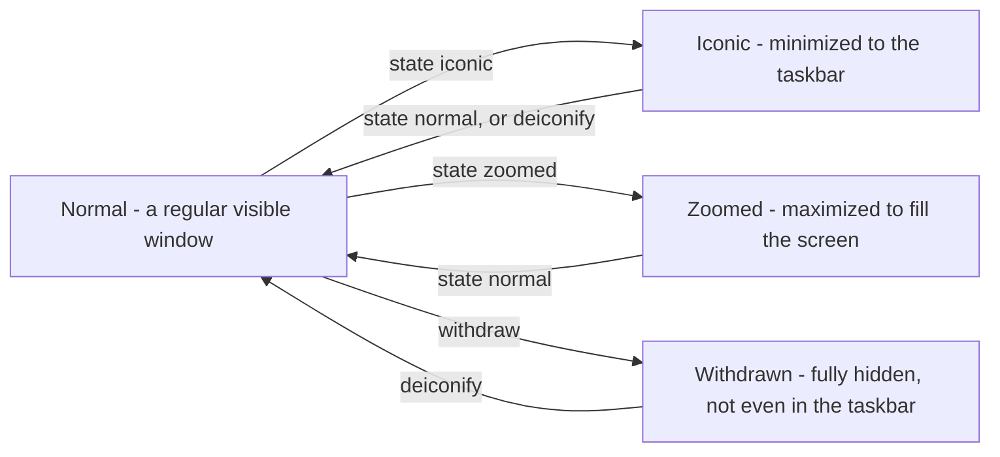
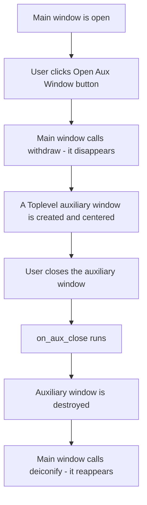

# Advanced Window Configuration and Lifecycle Management in Tkinter

## About This Page

This page is one of the extended, GitHub-only resources that accompany **Chapter 14 (Tkinter and GUI Programming)** of the printed textbook. The printed chapter introduces you to Tkinter and shows you how to create your first window and place a few widgets on it. This page goes one step further and answers a question the printed chapter does not have space to cover in full: once a window exists, how do you actually control it?

A Tkinter window is not just a static rectangle that appears once and sits there. It is a living object that your Python program keeps talking to for as long as the program runs — you can move it, resize it, hide it, bring it back, make it float above every other window, or shut it down safely when the user asks to quit. All of that is handled through a set of methods that Tkinter provides on every window object, and this page is a complete, beginner-friendly reference to those methods.

**Why this matters for Python in general:** Tkinter is Python's built-in toolkit for building desktop applications with a graphical interface (a GUI, short for Graphical User Interface). Almost every GUI toolkit in any programming language — not just Tkinter — is built around the same idea: your program hands control over to an *event loop*, and from that point on, your code reacts to things the user does (clicking a button, closing a window, resizing a frame) rather than running top-to-bottom like a simple script. Learning how window management works in Tkinter is therefore a good, low-stakes way to learn a pattern (event-driven programming) that you will meet again in web development, mobile apps, and game programming.

**Why this matters for this chapter in particular:** The printed chapter's examples mostly use the default window behavior — you create a window, add some widgets, and call `mainloop()`. This page shows you how to take deliberate control of that window instead of accepting the defaults: giving it a sensible starting size and position, stopping the user from resizing it into an unusable shape, minimizing it neatly to the taskbar, and asking "Are you sure?" before the application closes. These are the small details that separate a classroom demo from an application that feels finished.

### Key Terms Used On This Page

A few technical words come up repeatedly below. If you already know them, skip this table; if not, keep it handy as you read.

| Term | In plain words | Learn more |
| --- | --- | --- |
| GUI (Graphical User Interface) | A program you interact with using windows, buttons, and a mouse, instead of typing commands into a terminal. | [Wikipedia: Graphical user interface](https://en.wikipedia.org/wiki/Graphical_user_interface) |
| Window Manager | A part of your operating system (Windows, macOS, or Linux) whose job is to draw window borders, title bars, and the minimize/maximize/close buttons, and to keep track of which window is on top. Tkinter does not draw these itself — it asks the Window Manager to do it. | [Wikipedia: Window manager](https://en.wikipedia.org/wiki/Window_manager) |
| Root window | The very first, main window of a Tkinter application, created with `tk.Tk()`. Every other window or widget in the program belongs to it, directly or indirectly. | [Python docs: tkinter](https://docs.python.org/3/library/tkinter.html) |
| Event loop / `mainloop()` | A loop, hidden inside Tkinter, that continuously waits for something to happen (a click, a key press, a timer) and then runs the matching piece of your code. Your program does not move to the next line after `mainloop()` until the window is closed. | [Python docs: tkinter](https://docs.python.org/3/library/tkinter.html) |
| Event-driven programming | A style of programming in which the order code runs is decided by user actions (events) rather than by the order the lines are written in the file. | [Wikipedia: Event-driven programming](https://en.wikipedia.org/wiki/Event-driven_programming) |
| Tcl/Tk | Tkinter is a thin Python layer over an older toolkit called Tk, which is itself controlled through a small programming language called Tcl. You do not need to learn Tcl — Tkinter translates your Python calls into Tcl commands automatically — but you will sometimes see the name "Tcl interpreter" in technical explanations, including on this page. | [Python docs: tkinter](https://docs.python.org/3/library/tkinter.html) |
| Z-order | The front-to-back stacking order of windows on your screen. The window with the highest Z-order is the one you see on top. | [Wikipedia: Z-order](https://en.wikipedia.org/wiki/Z-order) |
| `Toplevel` window | A second (or third, or fourth) window that belongs to the same application as the root window — for example, a dialog box or a settings window. | [Python docs: tkinter](https://docs.python.org/3/library/tkinter.html) |

---

## 1. How Tkinter Talks to Your Operating System

Every time your program creates a root window with `root = tk.Tk()`, Tkinter opens a direct line of communication with your operating system's Window Manager. On Windows this is the Desktop Window Manager; on macOS it is Quartz/Aqua; on Linux it is typically X11 or Wayland. You do not need to remember these names — the point is simply that a different piece of software on every operating system is actually responsible for drawing the window frame and deciding where it sits on the screen, and Tkinter's job is to ask that software for what you want.

This leads to an important idea that is easy to miss as a beginner: **when you call a method like `window.geometry(...)` or `window.state(...)`, you are not directly drawing pixels on the screen.** You are sending a *request* to the Window Manager, which then decides how to honor it. Almost all of the time your request is granted exactly as asked, which is why the distinction rarely matters in practice — but it explains a few things that otherwise seem strange, such as why `window.state("zoomed")` behaves slightly differently on Linux than it does on Windows (see the table in the next section), or why setting `-alpha` (transparency) may be ignored on a Linux system that does not have visual compositing turned on.

Understanding this distinction is useful for a very practical reason: it lets you deliberately shape how a user is allowed to experience your application. For example, you can:

- Prevent a user from shrinking a form so far that its text wraps into unreadable blocks, by setting a sensible `minsize()`.
- Lock a kiosk-style application into a strict fullscreen presentation mode that the user cannot accidentally close or resize.
- Politely intercept the moment a user tries to close the window, so you can ask "Do you want to save your work first?" instead of losing their data.

The rest of this page works through each of the methods that make this kind of control possible, and then shows all of them working together inside one complete, runnable example program.

---

## 2. The Window Configuration Toolbox

The table below is a quick-reference summary. Read it first to get your bearings, then use the detailed, method-by-method reference that follows it whenever you need the full picture — parameters, defaults, common mistakes, and platform quirks.

### 2.1 Quick Reference

| Method | What it does, in one line | You would reach for this when… |
| --- | --- | --- |
| `title()` | Sets the text shown in the window's title bar. | You want the title bar to say something meaningful instead of the default "tk". |
| `geometry()` | Sets or reads the window's width, height, and screen position. | You want the window to open at a specific size and place, rather than wherever Tkinter decides. |
| `resizable()` | Turns manual resizing on or off, separately for width and height. | You want to lock a login box or wizard step to a fixed size. |
| `minsize()` | Sets the smallest size the user is allowed to shrink the window to. | You want to stop a form's widgets from overlapping when the window gets too small. |
| `maxsize()` | Sets the largest size the user is allowed to grow the window to. | You want to stop a simple tool from stretching into an awkward, mostly-empty shape on a large monitor. |
| `state()` | Reads or sets whether the window is normal, minimized, maximized, or hidden. | You want the application to open already maximized, or you want to minimize it from your own code. |
| `iconbitmap()` | Replaces the default Tk icon in the title bar with your own icon file. | You are branding an application for distribution and want your own logo instead of the default feather icon. |
| `configure()` | Changes general window properties, such as background color, at any time. | You want to let the user switch between a light theme and a dark theme while the program is running. |
| `attributes()` | Accesses advanced, platform-specific window behavior, such as transparency or "always on top". | You need an effect that the simpler methods above do not offer, such as a floating always-on-top panel. |
| `withdraw()` | Hides the window completely, without destroying it. | You want to hide a "launcher" window while a second window is in use, and bring the first one back later. |
| `deiconify()` | Brings back a window that was hidden with `withdraw()` or minimized. | You are ready to show the window again after using `withdraw()` or after the window was minimized. |
| `update()` | Forces Tkinter to redraw the screen and process pending events immediately. | You are running a long loop in your own code and want the window to keep refreshing instead of freezing. |
| `after()` | Schedules a function to run once, after a delay, without freezing the window. | You want to build a clock, an auto-save timer, or a short "message will disappear in 3 seconds" effect. |
| `destroy()` | Permanently closes a specific window and frees its resources. | You are building your own "Exit" button or closing a temporary dialog box. |
| `mainloop()` | Starts the event loop that keeps the whole application alive and responsive. | Always — this is the last line of almost every Tkinter program, and without it the window never appears. |

### 2.2 Detailed Method Reference

Each entry below follows the same pattern: a plain-language explanation first, followed by a compact table of the technical details you will need once you start writing real code.

#### `window.title()`

**In plain words:** This is how you change the text that appears in the window's title bar (and usually in the taskbar too). Think of it as naming the window.

| Detail | Description |
| --- | --- |
| Syntax | `window.title(text)` |
| Parameters | `text (str)` — the exact text string to display. |
| Default behavior | If you never call this method, the title bar falls back to the literal string `"tk"`. |
| What happens under the hood | Tkinter registers the window's name with the operating system's task manager and with the window's own title-bar decoration. |
| Example use case | Naming a multi-window application, for example `"Secure Login - Enterprise CRM"`. |
| Return value | `None` |
| Common mistake | Expecting the title to update automatically when a Python string variable changes. It does not — you must call `window.title(...)` again every time you want the text to change. |
| Cross-platform note | Fully supported on all platforms; special characters are generally handled well. |

#### `window.geometry()`

**In plain words:** This is how you tell the window exactly how big it should be, and exactly where on the screen it should appear, in one single instruction.

| Detail | Description |
| --- | --- |
| Syntax | `window.geometry("WxH+X+Y")` |
| Parameters | `geometry_string (str)` — formatted as `"WidthxHeight+X_Offset+Y_Offset"`. |
| Default behavior | If you never call this method, the window automatically shrinks or grows to fit whatever widgets are packed inside it, and opens at position `+0+0` (the top-left corner of the screen). |
| What happens under the hood | The requested size and position are sent directly to the operating system's window-compositing manager (the part of the OS responsible for combining and drawing all on-screen windows) before anything is actually drawn. |
| Example use case | Setting a predictable launch size and position, for example `root.geometry("800x600+100+100")`. |
| Return value | `str` — calling `window.geometry()` with no arguments returns the *current* geometry string, which is how the `center_window()` method later in this page reads the window's own size. |
| Common mistakes | 1) Using an asterisk instead of a lowercase `x`, for example writing `"800*600"` instead of `"800x600"`. 2) Forgetting that the X and Y coordinates are measured from the top-left corner of the *screen*, not from the parent window. |
| Cross-platform note | On multi-monitor setups, the exact coordinates can behave inconsistently, depending on how the operating system's window manager numbers the monitors. |

#### `window.resizable()`

**In plain words:** This switches manual resizing on or off. You can control the width and the height independently — for example, allow a window to get wider but never taller.

| Detail | Description |
| --- | --- |
| Syntax | `window.resizable(width, height)` |
| Parameters | `width (bool)`, `height (bool)` — each accepts `True`/`False` (or `1`/`0`) independently. |
| Default behavior | Defaults to `True, True` — unrestricted resizing on both axes. |
| What happens under the hood | Tkinter asks the operating system to add or remove the resize handles from the window's border/frame. |
| Example use case | Freezing a fixed-size wizard step or a strict login box, for example `window.resizable(False, False)`. |
| Return value | `None` |
| Common mistakes | Passing the strings `"True"`/`"False"` instead of the actual Boolean values `True`/`False` will raise a `TypeError`. Also, be careful not to lock resizing so aggressively that content becomes inaccessible on a small screen. |
| Cross-platform note | On macOS, users often expect the green "zoom" button in the title bar to work; locking resizing can override or disable that expectation. |

#### `window.minsize()`

**In plain words:** This sets a floor — the smallest size the window is ever allowed to shrink to, even if the user drags the corner aggressively.

| Detail | Description |
| --- | --- |
| Syntax | `window.minsize(width, height)` |
| Parameters | `width (int)`, `height (int)` — measured in physical display pixels. |
| Default behavior | Defaults to `0, 0`, meaning the user could compress the window down to a practically invisible sliver. |
| What happens under the hood | Tkinter intercepts the operating system's manual window-drag resize events and refuses to let the window cross this boundary. |
| Example use case | Preventing a complex form with many fields, or a table of text, from being squeezed into an unreadable block. |
| Return value | `None` |
| Common mistake | Setting a minimum size larger than the user's actual screen resolution — the window may then fail to render correctly or become impossible to position. |
| Cross-platform note | Behavior is consistent across platforms, but on a High-DPI (for example, Retina) display, a "pixel" in your code may not correspond to one physical pixel on the screen. |

#### `window.maxsize()`

**In plain words:** This sets a ceiling — the largest size the window is ever allowed to grow to.

| Detail | Description |
| --- | --- |
| Syntax | `window.maxsize(width, height)` |
| Parameters | `width (int)`, `height (int)` — measured in physical display pixels. |
| Default behavior | Defaults to the maximum resolution of the detected hardware monitor. |
| What happens under the hood | Tkinter restricts the window's allowed size inside the operating system's own window-scaling logic. |
| Example use case | Capping a small utility tool or a sidebar so it does not stretch into a mostly-empty window on an ultra-wide monitor. |
| Return value | `None` |
| Common mistake | Setting a `maxsize()` that is smaller than what `resizable(True, True)` and the widgets inside the window actually need — this can create a conflict where the layout does not fit. |
| Cross-platform note | Similar to `minsize()` — make sure the values you choose are sensible for the range of screens your users are likely to have. |

#### `window.state()`

**In plain words:** This method both checks and changes the window's overall display mode — is it a normal window, minimized, maximized, or completely hidden?

| Detail | Description |
| --- | --- |
| Syntax | `window.state(new_state=None)` |
| Parameters | `new_state (str, optional)` — one of `"normal"`, `"iconic"`, `"zoomed"`, or `"withdrawn"`. |
| Default behavior | Defaults to `"normal"`, a standard visible window inside the viewport. |
| What happens under the hood | Tkinter changes a high-level platform flag that tracks the window's visibility, scaling, and layering. |
| Example use case | Opening an application already maximized (`"zoomed"`), or safely minimizing a running script to the taskbar (`"iconic"`). |
| Return value | `str` — calling `window.state()` with no arguments returns the *current* state as a string. |
| Common mistakes | 1) Confusing `"zoomed"` (maximized, but still a normal window with a title bar) with true fullscreen (see `attributes("-fullscreen", ...)` below, which removes the title bar entirely). 2) Passing the state name without quotes, which Python will interpret as a variable name and raise an error. |
| Cross-platform note | `"zoomed"` works as expected on Windows and macOS. On Linux, some window managers (for example, certain GNOME or KDE configurations) may ignore the exact "zoomed" flag and simply treat the request as a standard maximize. |

#### `window.iconbitmap()`

**In plain words:** This replaces the small default icon shown in the title bar (and often the taskbar) with your own custom image — useful for giving an application its own identity.

| Detail | Description |
| --- | --- |
| Syntax | `window.iconbitmap(path)` |
| Parameters | `path (str)` — a local file system path to a valid icon asset. On Windows this must strictly be a `.ico` file. |
| Default behavior | The default platform icon (the red Tk feather logo) is used. |
| What happens under the hood | The image's binary pixel data is inserted into the window's title-bar structure and into the operating system's active taskbar records. |
| Example use case | Replacing generic branding with a company logo before distributing a finished desktop application. |
| Return value | `None` |
| Common mistakes | 1) Using a `.png` or `.jpg` file, which will fail on Windows (a `.ico` file is required there). 2) Providing a relative file path that no longer resolves correctly once the script is run from a different working directory. |
| Cross-platform note | This method generally does **not** work on macOS. On macOS you should instead use `.iconphoto()` together with a `PhotoImage` object. |

#### `window.configure()`

**In plain words:** This is a general-purpose method for changing the window's own properties — most commonly its background color — while the program is running.

| Detail | Description |
| --- | --- |
| Syntax | `window.configure(**options)` |
| Parameters | Keyword arguments mapping property names to values, such as `bg` (background color) or `cursor`. |
| Default behavior | Inherits the standard background styling of the current operating system theme. |
| What happens under the hood | Updates the live configuration tables that the running Tcl/Tk interpreter (see Key Terms above) keeps for the window, taking effect immediately. |
| Example use case | Implementing a user-selected cosmetic change, such as switching from a Light Mode profile to a Dark Mode profile. |
| Return value | `dict` — calling `window.configure()` with no arguments returns a dictionary describing the current configuration. |
| Common mistake | Forgetting that `bg` and `background` are aliases for the same option, while some other widgets accept only one of the two spellings. |
| Cross-platform note | Named colors like `"lightblue"` render consistently everywhere; the exact appearance of specific hex color codes can vary slightly with the monitor's color depth. |

#### `window.attributes()`

**In plain words:** This is the "advanced settings" method. It reaches past the common, everyday methods above and gives you access to special, platform-specific window behaviors, such as transparency or floating the window above every other window.

| Detail | Description |
| --- | --- |
| Syntax | `window.attributes(option, value)` |
| Parameters | `option (str)` — always written with a leading dash, for example `"-topmost"` or `"-alpha"`, followed by its correctly typed value. |
| Default behavior | Defaults to `alpha=1.0` (fully opaque) and `topmost=False` (normal stacking order). |
| What happens under the hood | Interacts directly with low-level, platform-specific rendering systems (for example Win32 on Windows, or Cocoa on macOS). |
| Example use case | Pinning a floating diagnostic panel above every other window with `("-topmost", True)`, or applying a glass-like transparency effect with `("-alpha", 0.85)`. |
| Return value | Varies, depending on which attribute is being queried. |
| Common mistakes | 1) Forgetting the leading hyphen, for example writing `topmost` instead of `"-topmost"`. 2) Assuming every attribute is supported on every operating system — not all of them are. |
| Cross-platform note | Highly OS-dependent. `-alpha` (transparency) works on Windows and macOS, but often fails, or requires desktop compositing to be turned on, on Linux. `-toolwindow` is a Windows-only attribute. |

#### `window.withdraw()`

**In plain words:** This hides the window completely — it disappears from the screen and from the taskbar — but it is not destroyed, and it can be brought back at any time.

| Detail | Description |
| --- | --- |
| Syntax | `window.withdraw()` |
| Parameters | None. |
| Default behavior | Not applicable — a window remains visible until this method is explicitly called. |
| What happens under the hood | Removes the window's spatial mapping from the operating system's active display layers, while its memory and internal state are preserved untouched. |
| Example use case | Hiding a parent "launcher" window while a workspace dialog is in use, so that it can be effortlessly restored afterwards. |
| Return value | `None` |
| Common mistake | Calling this on the *only* window in the application and then never calling `deiconify()` — the program keeps running invisibly, which looks like it has hung or crashed. |
| Cross-platform note | On macOS, the application's Dock icon may continue to show the program as running even while its window is withdrawn. |

#### `window.deiconify()`

**In plain words:** This is the "undo" for `withdraw()` and for minimizing — it brings a hidden or minimized window back to active, visible use.

| Detail | Description |
| --- | --- |
| Syntax | `window.deiconify()` |
| Parameters | None. |
| Default behavior | Not applicable. |
| What happens under the hood | Instructs the operating system to re-map the window's existing footprint back into the visible display layers. |
| Example use case | Re-opening a minimized dashboard, or bringing a background configuration panel back to the foreground in response to a user action. |
| Return value | `None` |
| Common mistake | Assuming this restores the exact previous size and position perfectly — depending on the platform, the operating system may reset the window's geometry to a default instead. |
| Cross-platform note | Generally consistent, though which window actually receives keyboard focus afterwards can vary slightly on Linux. |

#### `window.update()`

**In plain words:** This forces Tkinter to immediately redraw the screen and process anything waiting in its event queue, instead of waiting for its own internal schedule.

| Detail | Description |
| --- | --- |
| Syntax | `window.update()` |
| Parameters | None. |
| Default behavior | Not applicable — normally, events are handled asynchronously during the next idle cycle of the default event loop. |
| What happens under the hood | Interrupts the standard, asynchronous scheduling and forces Tkinter to immediately recalculate layouts and repaint pixels. |
| Example use case | Preventing the interface from appearing frozen during an intensive file-processing task, or refreshing a widget that displays live, rapidly changing data inside a loop. |
| Return value | `None` |
| Common mistake | **Use this method sparingly.** Calling `update()` from inside an event handler (for example, a button's click handler) can, in some situations, cause recursive re-entry into Tkinter's internals or make the application appear to freeze if the surrounding logic is not carefully managed. |
| Cross-platform note | Functionally identical across platforms, though the performance cost is more noticeable on slower systems. |

#### `window.after()`

**In plain words:** This schedules a function to run once, after a delay you choose, without freezing the rest of the window while it waits.

| Detail | Description |
| --- | --- |
| Syntax | `window.after(ms, callback, *args)` |
| Parameters | `ms (int)` — the delay in milliseconds. `callback (callable)` — the function to run. `*args` — any arguments that function needs. |
| Default behavior | Not applicable — no events are scheduled unless you explicitly call `after()`. |
| What happens under the hood | Registers a non-blocking timer inside Tkinter's own event loop, which tracks the elapsed time asynchronously alongside everything else the loop is doing. |
| Example use case | Building native UI animations, auto-saving a data-entry form every 60 seconds, or driving a periodically updating clock widget. |
| Return value | `str` — an identifier string, which can later be passed to `after_cancel()` to stop the scheduled call before it runs. |
| Common mistakes | 1) Writing `callback()` with parentheses instead of just `callback` — this calls the function immediately, right when `after()` is set up, instead of scheduling it. 2) Forgetting to also pass any arguments the callback function requires. |
| Cross-platform note | Very reliable across platforms; millisecond precision depends on the operating system's own task scheduler, but is usually accurate to within about 10–15 milliseconds. |

#### `window.destroy()`

**In plain words:** This permanently closes a specific window and frees the memory it was using. Once destroyed, that particular window object cannot be brought back.

| Detail | Description |
| --- | --- |
| Syntax | `window.destroy()` |
| Parameters | None. |
| Default behavior | Not applicable. |
| What happens under the hood | Safely disconnects the relevant part of the Tcl interpreter, destroys the internal user-interface object structures, and releases the associated operating system resources. |
| Example use case | Implementing a custom "Exit" or "Close" button, or shutting down a temporary auxiliary window. |
| Return value | `None` |
| Common mistake | Confusing `destroy()` with `quit()`. `quit()` merely stops the `mainloop()` event loop but can leave the window visibly on screen; `destroy()` actually removes the window. |
| Cross-platform note | `destroy()` is the safest, recommended way to close a window on every platform. `quit()` is considered legacy and is best avoided in modern code. |

#### `window.mainloop()`

**In plain words:** This is the single line that actually brings the whole application to life. Without it, your window is built in memory but never appears on screen, and your script simply ends.

| Detail | Description |
| --- | --- |
| Syntax | `window.mainloop()` |
| Parameters | None. |
| Default behavior | Not applicable — without calling this, the script executes straight through to completion and exits without ever displaying the GUI. |
| What happens under the hood | Enters a continuous listening state, pausing any code written after it, while systematically processing incoming system input events (clicks, key presses, timers, and so on). |
| Example use case | This is the essential, final command required to lock any Tkinter application into an active, responsive execution state. |
| Return value | `None` |
| Common mistake | Placing important logic *after* `mainloop()` and expecting it to run while the window is still open. Code placed there will only execute after the window has closed. |
| Cross-platform note | Essential on every platform. Without it, the script exits almost instantly, without the window ever becoming visible. |

### 2.3 Visualizing the Window Lifecycle

The four states controlled by `state()` (plus the special "withdrawn" state controlled by `withdraw()`/`deiconify()`) form a small cycle. The diagram below shows how a window moves between them. It uses plain flowchart syntax so that it can also be opened and edited inside diagramming tools such as draw.io.



Reading this diagram: a window starts out **Normal**. Calling `state("iconic")` sends it to **Iconic** (minimized); calling `deiconify()` or `state("normal")` brings it back. Calling `state("zoomed")` sends it to **Zoomed** (maximized); calling `state("normal")` restores it. Calling `withdraw()` sends it to **Withdrawn**, the most complete form of hiding — the window disappears from the taskbar entirely — and only `deiconify()` can bring it back.

---

## 3. Bringing It All Together: The Complete Example Script

The script below puts every method from Section 2 to work inside one small, complete application. Rather than only showing the finished file, this section builds it up piece by piece, the way you might type it yourself, explaining what each step does and — since a GUI does not normally print anything to the console — adding a few teaching-only `print()` statements so you can see, in text, exactly what is happening at each stage. Those `print()` calls are not required for the application to work; they exist purely so that as you click buttons in the window, you can watch a matching line of confirmation appear in the terminal you launched the script from.

### 3.1 Imports and the Class Skeleton

Every Tkinter application starts with importing the module, and (for anything beyond a trivial script) it helps to organize the window as a class that inherits from `tk.Tk`. Inheriting from `tk.Tk` means our new class, `AdvancedWindowApp`, *is* a root window, with all of `tk.Tk`'s methods from Section 2 already available on `self`.

```python
# Step 1: Import the tkinter module (Python's built-in GUI toolkit)
# and the messagebox helper, which provides ready-made pop-up dialog boxes.
import tkinter as tk
from tkinter import messagebox


# Step 2: Define the application as a class that inherits from tk.Tk.
# Because AdvancedWindowApp *is* a tk.Tk window, every method from
# Section 2 (title, geometry, state, attributes, and so on) is
# automatically available on "self" inside this class.
class AdvancedWindowApp(tk.Tk):
    """
    A professional Tkinter application demonstrating advanced window
    management, lifecycle control, and OS interaction protocols.
    """
```

### 3.2 The Constructor (`__init__`): Configuring the Window in Seven Steps

The constructor is where the window is configured before it is ever shown to the user. It is organized into seven clearly labeled steps, each one covering a single concern.

```python
    def __init__(self):
        # Step 1: Base initialization.
        # Call the constructor of the parent class (tk.Tk). This line
        # creates the underlying Tcl interpreter and the root window
        # object, and it must run before anything else in this method.
        super().__init__()
        print("Step 1 complete: root window created")

        # Step 2: Visual identity and branding.
        # Set the text that appears in the title bar and, on most
        # platforms, in the taskbar or dock as well.
        self.title("Enterprise Window Management System")
        print(f"Step 2 complete: window title set to '{self.title()}'")

        # WINDOW ICON (optional):
        # In a production application you would normally set a custom
        # icon here (.ico on Windows, or .iconphoto() on Mac/Linux).
        # This line is commented out because no icon file ships with
        # this example script.
        # self.iconbitmap("path/to/your/custom_icon.ico")

        # Step 3: Dynamic geometry and positioning.
        # Define an initial size (Width=600, Height=450) and an initial
        # position, then immediately override that position with the
        # center_window() helper defined later in this class.
        self.geometry("600x450+200+200")
        self.center_window()
        print(f"Step 3 complete: window centered, geometry is now '{self.geometry()}'")

        # Step 4: Scaling constraints.
        # minsize() stops the user from shrinking the window so far that
        # the widgets inside would overlap or become unreadable.
        # maxsize() stops the window from stretching into an awkward,
        # mostly empty shape on a very large monitor.
        self.minsize(400, 300)
        self.maxsize(1000, 800)
        print("Step 4 complete: minimum size = 400x300, maximum size = 1000x800")

        # Step 5: Low-level OS attributes (visual and layering effects).
        # -alpha sets opacity from 0.0 (invisible) to 1.0 (fully opaque);
        # 0.95 gives a subtle glass-like look.
        # -topmost, when True, would float this window above every other
        # window on the screen; it is left False here by default.
        # -fullscreen, when True, removes the title bar and fills the
        # entire screen; it is also left False here by default.
        self.attributes("-alpha", 0.95)
        self.attributes("-topmost", False)
        self.attributes("-fullscreen", False)
        print("Step 5 complete: opacity=0.95, topmost=False, fullscreen=False")

        # Step 6: Protocol interception.
        # WM_DELETE_WINDOW is the signal the operating system sends when
        # the user clicks the window's "X" close button. By overriding
        # it here, closing the window no longer happens immediately;
        # instead, our own confirm_shutdown() method decides what to do.
        self.protocol("WM_DELETE_WINDOW", self.confirm_shutdown)
        print("Step 6 complete: close-button protocol now points to confirm_shutdown()")

        # Step 7: UI layout initialization.
        # Build and place all of the visible widgets (the label and the
        # five buttons) by calling a separate helper method, kept in
        # Section 3.3 below, so that __init__ stays easy to read.
        self.create_widgets()
        print("Step 7 complete: widgets created, application ready")
```

### 3.3 Centering the Window: `center_window()`

Tkinter does not offer a single built-in "center this window" method, so this small helper calculates the correct position itself, using simple arithmetic: take half the screen's size, subtract half the window's own size, and that is the top-left corner you want.

```python
    def center_window(self):
        """
        Calculates the screen dimensions and repositions the window so
        that it sits exactly in the middle of the screen, regardless of
        the user's screen resolution.
        """
        # Step 1: Force Tkinter to finish calculating the real size of
        # every widget inside the window before we ask for that size.
        # Without this call, winfo_width()/winfo_height() below could
        # incorrectly return a placeholder size such as "1x1".
        self.update_idletasks()

        # Step 2: Read the window's own current width and height.
        window_width = self.winfo_width()
        window_height = self.winfo_height()

        # Step 3: Read the width and height of the user's screen.
        screen_width = self.winfo_screenwidth()
        screen_height = self.winfo_screenheight()

        # Step 4: Work out the (x, y) position that centers the window.
        # Formula: (Screen Dimension - Window Dimension) / 2
        x_coordinate = int((screen_width / 2) - (window_width / 2))
        y_coordinate = int((screen_height / 2) - (window_height / 2))

        # Step 5: Apply the new geometry string using the calculated
        # coordinates, keeping the window's width and height unchanged.
        self.geometry(f"{window_width}x{window_height}+{x_coordinate}+{y_coordinate}")
        print(
            f"center_window(): screen={screen_width}x{screen_height}, "
            f"window={window_width}x{window_height}, moved to ({x_coordinate}, {y_coordinate})"
        )
```

**Sample output** (the exact numbers will differ on your own screen):

```text
center_window(): screen=1920x1080, window=600x450, moved to (660, 315)
```

### 3.4 Building the Widgets: `create_widgets()`

This method creates everything the user actually sees and clicks: one information label, and five buttons, each wired to a different method further down the class.

```python
    def create_widgets(self):
        """Instantiates and arranges the control widgets."""

        # Step 1: Create the main header label that will later be
        # updated by several of the button handlers, to show feedback.
        self.lbl_info = tk.Label(
            self,
            text="Advanced Window Controls Active.\nUse buttons below to test OS integration.",
            font=("Helvetica", 12, "bold"),
            fg="#333333"
        )
        self.lbl_info.pack(pady=20)

        # Step 2: Create a Frame to group the buttons together.
        # A Frame is an invisible container widget; grouping buttons
        # inside one keeps the overall layout tidy and easy to manage.
        btn_frame = tk.Frame(self)
        btn_frame.pack(pady=10)

        # Step 3: Button - Toggle Always-on-Top.
        # Demonstrates modifying the window's Z-order (see Key Terms)
        # dynamically, using window.attributes("-topmost", ...).
        tk.Button(
            btn_frame,
            text="Toggle 'Pin on Top' (-topmost)",
            command=self.toggle_topmost,
            width=30
        ).pack(pady=5)

        # Step 4: Button - Toggle Fullscreen.
        # Demonstrates switching between windowed and immersive modes,
        # using window.attributes("-fullscreen", ...).
        tk.Button(
            btn_frame,
            text="Toggle Fullscreen Mode",
            command=self.toggle_fullscreen,
            width=30
        ).pack(pady=5)

        # Step 5: Button - Minimize (Iconify).
        # Demonstrates the state change to "iconic" (the taskbar
        # representation of a minimized window).
        tk.Button(
            btn_frame,
            text="Minimize to Taskbar",
            command=self.minimize_window,
            width=30
        ).pack(pady=5)

        # Step 6: Button - Open Auxiliary Window.
        # Demonstrates the withdraw() (hide the parent) and deiconify()
        # (show the parent again) cycle - this is how many "Wizard" or
        # "Login" flows are built in real applications.
        tk.Button(
            btn_frame,
            text="Open Aux Window (Hide Parent)",
            command=self.open_auxiliary,
            width=30
        ).pack(pady=5)

        # Step 7: Button - Force UI Refresh.
        # Purely educational: shows what window.update() does, and when
        # you might reach for it.
        tk.Button(
            btn_frame,
            text="Force UI Refresh (Update)",
            command=self.force_refresh,
            width=30,
            bg="#ffcccc"
        ).pack(pady=5)
```

### 3.5 The Event Handlers

Each button created above calls one of the methods below when clicked. These methods are where `attributes()`, `state()`, `withdraw()`, `deiconify()`, `update()`, `after()`, and `destroy()` are actually put to use.

```python
    # =======================================================================
    #  LOGIC & EVENT HANDLERS
    # =======================================================================

    def toggle_topmost(self):
        """
        Inverts the current 'topmost' state. If the window is currently
        floating above others, it sinks back to normal layering. If it
        is currently normal, it rises to the top.
        """
        # Step 1: Read the current "-topmost" attribute.
        current_state = self.attributes("-topmost")

        # Step 2: Flip it, and apply the new value.
        new_state = not current_state
        self.attributes("-topmost", new_state)

        # Step 3: Reflect the change in the on-screen label, and print
        # a matching line to the console for learning purposes.
        status = "PINNED (Floating)" if new_state else "Normal Layering"
        self.lbl_info.config(text=f"Window Status: {status}", fg="blue" if new_state else "black")
        print(f"toggle_topmost(): topmost is now {new_state} ({status})")

    def toggle_fullscreen(self):
        """
        Toggles the window between occupying the entire screen and
        standard windowed mode. Note: fullscreen mode hides the title
        bar and window borders entirely.
        """
        # Step 1: Read the current "-fullscreen" attribute.
        current_state = self.attributes("-fullscreen")

        # Step 2: Flip it, and apply the new value.
        new_state = not current_state
        self.attributes("-fullscreen", new_state)

        # Step 3: Reflect the change in the on-screen label, and print
        # a matching line to the console.
        status = "FULLSCREEN" if new_state else "Windowed"
        self.lbl_info.config(text=f"Display Mode: {status}", fg="green" if new_state else "black")
        print(f"toggle_fullscreen(): fullscreen is now {new_state} ({status})")

    def minimize_window(self):
        """
        Changes the window state to 'iconic'. 'Iconic' is the technical
        term (used on both Windows and X11/Linux) for a minimized
        window that is visible only in the taskbar.
        """
        # Step 1: Print first, because once the window is minimized, its
        # own label is no longer visible to confirm anything happened.
        print("minimize_window(): minimizing the window (state -> iconic)")

        # Step 2: Actually minimize the window.
        self.state("iconic")

    def force_refresh(self):
        """
        Demonstrates the 'update()' method. Normally, Tkinter waits for
        the mainloop to redraw the screen on its own schedule. Calling
        'update()' forces an immediate, synchronous repaint - useful
        during long processing loops to prevent the GUI from 'freezing'.
        """
        # Step 1: Update the label text and force an immediate repaint,
        # so the message is visible right away rather than only after
        # this method finishes.
        self.lbl_info.config(text="Forcing immediate GUI repaint...", fg="purple")
        self.update()
        print("force_refresh(): update() called, repaint forced immediately")

        # Step 2: Schedule a follow-up message 1000 milliseconds (one
        # second) later, without freezing the window while we wait.
        self.after(1000, lambda: self.lbl_info.config(text="Refresh complete.", fg="black"))

    def open_auxiliary(self):
        """
        Creates a secondary window (a Toplevel) and hides the main
        window. This simulates a flow where the main window acts as a
        'Launcher' and the auxiliary window is the 'Workspace'.
        """
        # Step 1: Hide the main window completely from the screen and
        # the taskbar.
        self.withdraw()
        print("open_auxiliary(): main window withdrawn (hidden)")

        # Step 2: Create a Toplevel window. This is a separate window
        # that still belongs to this same application instance.
        aux = tk.Toplevel(self)
        aux.title("Auxiliary Workspace")
        aux.geometry("400x300")

        # Step 3: Center the auxiliary window using the same arithmetic
        # as center_window() above, applied directly to "aux" this time.
        aux.update_idletasks()
        ww = aux.winfo_width()
        wh = aux.winfo_height()
        sw = aux.winfo_screenwidth()
        sh = aux.winfo_screenheight()
        aux.geometry(f"{ww}x{wh}+{int((sw / 2) - (ww / 2))}+{int((sh / 2) - (wh / 2))}")

        # Step 4: Add content to the auxiliary window so the user has
        # something to see and a reason to close it.
        tk.Label(
            aux,
            text="This is a Modal/Child window.\nThe Main App is hidden.\nClose this to restore Main App.",
            font=("Arial", 11)
        ).pack(expand=True)

        # Step 5: Define what should happen when this auxiliary window
        # is closed - it must bring the main window back, or the whole
        # application would appear to have silently vanished.
        def on_aux_close():
            aux.destroy()        # Remove the auxiliary window
            self.deiconify()     # Make the main window visible again
            self.lift()          # Optional: bring it to the front
            print("open_auxiliary(): auxiliary window closed, main window restored")

        # Step 6: Bind the auxiliary window's own close button to the
        # handler defined in Step 5, instead of the Tkinter default.
        aux.protocol("WM_DELETE_WINDOW", on_aux_close)

    def confirm_shutdown(self):
        """
        Intercepts the operating system's close event to perform a
        safety check. This is the standard place to add a
        'Save before quit?' style of confirmation.
        """
        # Step 1: Ask the user to confirm. askokcancel() returns True if
        # the user clicks "OK", and False if they click "Cancel".
        should_close = messagebox.askokcancel(
            "Exit Confirmation",
            "Are you sure you want to terminate the application?"
        )
        print(f"confirm_shutdown(): user confirmed close = {should_close}")

        # Step 2: Only actually close the application if the user
        # agreed. destroy() stops the mainloop and ends the program.
        if should_close:
            self.destroy()
```

### 3.6 Visualizing the "Hide Parent, Show Auxiliary" Flow

The `open_auxiliary()` method above is a good example of `withdraw()` and `deiconify()` working as a pair. The flowchart below traces that sequence of events from the moment the user clicks the button to the moment the main window reappears.



### 3.7 Starting the Application

Finally, the standard `if __name__ == "__main__":` guard creates one instance of the class and starts the event loop.

```python
if __name__ == "__main__":
    # Step 1: Create an instance of the application. This runs every
    # line inside __init__() (Section 3.2) before this line finishes.
    app = AdvancedWindowApp()
    print("Application window created - entering the Tkinter event loop now...")

    # Step 2: Hand control over to Tkinter's event loop. This call
    # blocks - meaning the next line will not run - until the window
    # is closed.
    app.mainloop()
    print("Event loop has ended - the application has closed.")
```

### 3.8 The Complete Script

Here is the entire program from Sections 3.1 to 3.7, combined into the single file you would actually save and run.

```python
# Step 1: Import the tkinter module (Python's built-in GUI toolkit)
# and the messagebox helper, which provides ready-made pop-up dialog boxes.
import tkinter as tk
from tkinter import messagebox


# Step 2: Define the application as a class that inherits from tk.Tk.
# Because AdvancedWindowApp *is* a tk.Tk window, every method from
# Section 2 (title, geometry, state, attributes, and so on) is
# automatically available on "self" inside this class.
class AdvancedWindowApp(tk.Tk):
    """
    A professional Tkinter application demonstrating advanced window
    management, lifecycle control, and OS interaction protocols.
    """

    def __init__(self):
        # Step 1: Base initialization.
        # Call the constructor of the parent class (tk.Tk). This line
        # creates the underlying Tcl interpreter and the root window
        # object, and it must run before anything else in this method.
        super().__init__()
        print("Step 1 complete: root window created")

        # Step 2: Visual identity and branding.
        # Set the text that appears in the title bar and, on most
        # platforms, in the taskbar or dock as well.
        self.title("Enterprise Window Management System")
        print(f"Step 2 complete: window title set to '{self.title()}'")

        # WINDOW ICON (optional):
        # In a production application you would normally set a custom
        # icon here (.ico on Windows, or .iconphoto() on Mac/Linux).
        # self.iconbitmap("path/to/your/custom_icon.ico")

        # Step 3: Dynamic geometry and positioning.
        # Define an initial size (Width=600, Height=450) and an initial
        # position, then immediately override that position with the
        # center_window() helper defined later in this class.
        self.geometry("600x450+200+200")
        self.center_window()
        print(f"Step 3 complete: window centered, geometry is now '{self.geometry()}'")

        # Step 4: Scaling constraints.
        # minsize() stops the user from shrinking the window so far that
        # the widgets inside would overlap or become unreadable.
        # maxsize() stops the window from stretching into an awkward,
        # mostly empty shape on a very large monitor.
        self.minsize(400, 300)
        self.maxsize(1000, 800)
        print("Step 4 complete: minimum size = 400x300, maximum size = 1000x800")

        # Step 5: Low-level OS attributes (visual and layering effects).
        # -alpha sets opacity from 0.0 (invisible) to 1.0 (fully opaque);
        # 0.95 gives a subtle glass-like look.
        # -topmost, when True, would float this window above every other
        # window on the screen; it is left False here by default.
        # -fullscreen, when True, removes the title bar and fills the
        # entire screen; it is also left False here by default.
        self.attributes("-alpha", 0.95)
        self.attributes("-topmost", False)
        self.attributes("-fullscreen", False)
        print("Step 5 complete: opacity=0.95, topmost=False, fullscreen=False")

        # Step 6: Protocol interception.
        # WM_DELETE_WINDOW is the signal the operating system sends when
        # the user clicks the window's "X" close button. By overriding
        # it here, closing the window no longer happens immediately;
        # instead, our own confirm_shutdown() method decides what to do.
        self.protocol("WM_DELETE_WINDOW", self.confirm_shutdown)
        print("Step 6 complete: close-button protocol now points to confirm_shutdown()")

        # Step 7: UI layout initialization.
        # Build and place all of the visible widgets (the label and the
        # five buttons) by calling a separate helper method.
        self.create_widgets()
        print("Step 7 complete: widgets created, application ready")

    def center_window(self):
        """
        Calculates the screen dimensions and repositions the window so
        that it sits exactly in the middle of the screen, regardless of
        the user's screen resolution.
        """
        # Step 1: Force Tkinter to finish calculating the real size of
        # every widget inside the window before we ask for that size.
        self.update_idletasks()

        # Step 2: Read the window's own current width and height.
        window_width = self.winfo_width()
        window_height = self.winfo_height()

        # Step 3: Read the width and height of the user's screen.
        screen_width = self.winfo_screenwidth()
        screen_height = self.winfo_screenheight()

        # Step 4: Work out the (x, y) position that centers the window.
        # Formula: (Screen Dimension - Window Dimension) / 2
        x_coordinate = int((screen_width / 2) - (window_width / 2))
        y_coordinate = int((screen_height / 2) - (window_height / 2))

        # Step 5: Apply the new geometry string using the calculated
        # coordinates, keeping the window's width and height unchanged.
        self.geometry(f"{window_width}x{window_height}+{x_coordinate}+{y_coordinate}")
        print(
            f"center_window(): screen={screen_width}x{screen_height}, "
            f"window={window_width}x{window_height}, moved to ({x_coordinate}, {y_coordinate})"
        )

    def create_widgets(self):
        """Instantiates and arranges the control widgets."""

        # Step 1: Create the main header label.
        self.lbl_info = tk.Label(
            self,
            text="Advanced Window Controls Active.\nUse buttons below to test OS integration.",
            font=("Helvetica", 12, "bold"),
            fg="#333333"
        )
        self.lbl_info.pack(pady=20)

        # Step 2: Create a Frame to group the buttons together.
        btn_frame = tk.Frame(self)
        btn_frame.pack(pady=10)

        # Step 3: Button - Toggle Always-on-Top.
        tk.Button(
            btn_frame,
            text="Toggle 'Pin on Top' (-topmost)",
            command=self.toggle_topmost,
            width=30
        ).pack(pady=5)

        # Step 4: Button - Toggle Fullscreen.
        tk.Button(
            btn_frame,
            text="Toggle Fullscreen Mode",
            command=self.toggle_fullscreen,
            width=30
        ).pack(pady=5)

        # Step 5: Button - Minimize (Iconify).
        tk.Button(
            btn_frame,
            text="Minimize to Taskbar",
            command=self.minimize_window,
            width=30
        ).pack(pady=5)

        # Step 6: Button - Open Auxiliary Window.
        tk.Button(
            btn_frame,
            text="Open Aux Window (Hide Parent)",
            command=self.open_auxiliary,
            width=30
        ).pack(pady=5)

        # Step 7: Button - Force UI Refresh.
        tk.Button(
            btn_frame,
            text="Force UI Refresh (Update)",
            command=self.force_refresh,
            width=30,
            bg="#ffcccc"
        ).pack(pady=5)

    # =======================================================================
    #  LOGIC & EVENT HANDLERS
    # =======================================================================

    def toggle_topmost(self):
        """
        Inverts the current 'topmost' state. If the window is currently
        floating above others, it sinks back to normal layering. If it
        is currently normal, it rises to the top.
        """
        # Step 1: Read the current "-topmost" attribute.
        current_state = self.attributes("-topmost")

        # Step 2: Flip it, and apply the new value.
        new_state = not current_state
        self.attributes("-topmost", new_state)

        # Step 3: Reflect the change in the on-screen label, and print
        # a matching line to the console for learning purposes.
        status = "PINNED (Floating)" if new_state else "Normal Layering"
        self.lbl_info.config(text=f"Window Status: {status}", fg="blue" if new_state else "black")
        print(f"toggle_topmost(): topmost is now {new_state} ({status})")

    def toggle_fullscreen(self):
        """
        Toggles the window between occupying the entire screen and
        standard windowed mode. Note: fullscreen mode hides the title
        bar and window borders entirely.
        """
        # Step 1: Read the current "-fullscreen" attribute.
        current_state = self.attributes("-fullscreen")

        # Step 2: Flip it, and apply the new value.
        new_state = not current_state
        self.attributes("-fullscreen", new_state)

        # Step 3: Reflect the change in the on-screen label, and print
        # a matching line to the console.
        status = "FULLSCREEN" if new_state else "Windowed"
        self.lbl_info.config(text=f"Display Mode: {status}", fg="green" if new_state else "black")
        print(f"toggle_fullscreen(): fullscreen is now {new_state} ({status})")

    def minimize_window(self):
        """
        Changes the window state to 'iconic'. 'Iconic' is the technical
        term (used on both Windows and X11/Linux) for a minimized
        window that is visible only in the taskbar.
        """
        # Step 1: Print first, because once the window is minimized, its
        # own label is no longer visible to confirm anything happened.
        print("minimize_window(): minimizing the window (state -> iconic)")

        # Step 2: Actually minimize the window.
        self.state("iconic")

    def force_refresh(self):
        """
        Demonstrates the 'update()' method. Normally, Tkinter waits for
        the mainloop to redraw the screen on its own schedule. Calling
        'update()' forces an immediate, synchronous repaint - useful
        during long processing loops to prevent the GUI from 'freezing'.
        """
        # Step 1: Update the label text and force an immediate repaint.
        self.lbl_info.config(text="Forcing immediate GUI repaint...", fg="purple")
        self.update()
        print("force_refresh(): update() called, repaint forced immediately")

        # Step 2: Schedule a follow-up message one second later, without
        # freezing the window while we wait.
        self.after(1000, lambda: self.lbl_info.config(text="Refresh complete.", fg="black"))

    def open_auxiliary(self):
        """
        Creates a secondary window (a Toplevel) and hides the main
        window. This simulates a flow where the main window acts as a
        'Launcher' and the auxiliary window is the 'Workspace'.
        """
        # Step 1: Hide the main window completely from the screen and
        # the taskbar.
        self.withdraw()
        print("open_auxiliary(): main window withdrawn (hidden)")

        # Step 2: Create a Toplevel window belonging to this application.
        aux = tk.Toplevel(self)
        aux.title("Auxiliary Workspace")
        aux.geometry("400x300")

        # Step 3: Center the auxiliary window using the same arithmetic
        # as center_window() above, applied directly to "aux" this time.
        aux.update_idletasks()
        ww = aux.winfo_width()
        wh = aux.winfo_height()
        sw = aux.winfo_screenwidth()
        sh = aux.winfo_screenheight()
        aux.geometry(f"{ww}x{wh}+{int((sw / 2) - (ww / 2))}+{int((sh / 2) - (wh / 2))}")

        # Step 4: Add content to the auxiliary window.
        tk.Label(
            aux,
            text="This is a Modal/Child window.\nThe Main App is hidden.\nClose this to restore Main App.",
            font=("Arial", 11)
        ).pack(expand=True)

        # Step 5: Define what should happen when this auxiliary window
        # is closed - bring the main window back.
        def on_aux_close():
            aux.destroy()        # Remove the auxiliary window
            self.deiconify()     # Make the main window visible again
            self.lift()          # Optional: bring it to the front
            print("open_auxiliary(): auxiliary window closed, main window restored")

        # Step 6: Bind the auxiliary window's own close button to the
        # handler defined in Step 5, instead of the Tkinter default.
        aux.protocol("WM_DELETE_WINDOW", on_aux_close)

    def confirm_shutdown(self):
        """
        Intercepts the operating system's close event to perform a
        safety check. This is the standard place to add a
        'Save before quit?' style of confirmation.
        """
        # Step 1: Ask the user to confirm. askokcancel() returns True if
        # the user clicks "OK", and False if they click "Cancel".
        should_close = messagebox.askokcancel(
            "Exit Confirmation",
            "Are you sure you want to terminate the application?"
        )
        print(f"confirm_shutdown(): user confirmed close = {should_close}")

        # Step 2: Only actually close the application if the user
        # agreed. destroy() stops the mainloop and ends the program.
        if should_close:
            self.destroy()


if __name__ == "__main__":
    # Step 1: Create an instance of the application. This runs every
    # line inside __init__() before this line finishes.
    app = AdvancedWindowApp()
    print("Application window created - entering the Tkinter event loop now...")

    # Step 2: Hand control over to Tkinter's event loop. This call
    # blocks until the window is closed.
    app.mainloop()
    print("Event loop has ended - the application has closed.")
```

### 3.9 Sample Console Output

Because this is a GUI application, most of what happens is visual, not textual. But since teaching `print()` statements were added at every important step, running the script and clicking through the buttons in a typical order produces console output like this:

```text
Step 1 complete: root window created
Step 2 complete: window title set to 'Enterprise Window Management System'
center_window(): screen=1920x1080, window=600x450, moved to (660, 315)
Step 3 complete: window centered, geometry is now '600x450+660+315'
Step 4 complete: minimum size = 400x300, maximum size = 1000x800
Step 5 complete: opacity=0.95, topmost=False, fullscreen=False
Step 6 complete: close-button protocol now points to confirm_shutdown()
Step 7 complete: widgets created, application ready
Application window created - entering the Tkinter event loop now...

# --- user clicks "Toggle 'Pin on Top'" ---
toggle_topmost(): topmost is now True (PINNED (Floating))

# --- user clicks "Toggle Fullscreen Mode" ---
toggle_fullscreen(): fullscreen is now True (FULLSCREEN)

# --- user clicks "Toggle Fullscreen Mode" again, to return to a normal window ---
toggle_fullscreen(): fullscreen is now False (Windowed)

# --- user clicks "Open Aux Window (Hide Parent)" ---
open_auxiliary(): main window withdrawn (hidden)

# --- user closes the auxiliary window ---
open_auxiliary(): auxiliary window closed, main window restored

# --- user clicks "Force UI Refresh (Update)" ---
force_refresh(): update() called, repaint forced immediately

# --- user clicks the window's "X" close button, then confirms in the dialog ---
confirm_shutdown(): user confirmed close = True
Event loop has ended - the application has closed.
```

Your own output will not be identical line for line — the exact screen size, the order you click the buttons in, and whether you cancel the exit dialog will all change what appears — but this gives you a template for reading and predicting it.

---

## 4. A Note on Style: `tk.Label`/`tk.Button` vs. `ttk`

The example script above intentionally uses the classic `tk.Label` and `tk.Button` widgets (as in the printed chapter) rather than the newer, more modern-looking `ttk.Label` and `ttk.Button` widgets, so that the window-management techniques on this page stay the clear focus, without mixing in a separate styling topic. If you would like your own windows to also pick up your operating system's native visual theme, you can generally swap `tk.Button(...)` for `ttk.Button(...)` (after `from tkinter import ttk`) without changing any of the window-configuration code discussed above — the two topics are independent of each other.

---

## Summary of Changes Made to This Page

The table below documents every change made while revising this page, for transparency. Nothing in the printed book's material or in any research question wording was altered — this page contained no research questions to begin with, only reference material and a script.

| Element | Original | Change made |
| --- | --- | --- |
| Overall structure | Title, two short paragraphs, one very wide 10-column table, and one code block. | Added an "About This Page" introduction, a "Key Terms" glossary table, a quick-reference summary table, a mermaid lifecycle diagram, a mermaid sequence diagram for the auxiliary-window flow, a step-by-step script walkthrough with sample outputs, a short note on `tk` vs `ttk`, and this change-log table. |
| Title | `# Advanced Window Configuration & Lifecycle Management in Tkinter` | Kept the same title, with "&" spelled out as "and" for readability; wording otherwise unchanged. |
| Introductory paragraphs (Section "Architectural Overview" intro) | Two paragraphs describing the Window Manager concept and the "structural requests" idea, in dense technical language. | Retained all original content and meaning; added plain-language framing, a link to further reading on Window Managers, and moved the "why this matters" material into the new "About This Page" section instead of leaving it implicit. |
| "Comprehensive Window Configuration Matrix" | One 10-column, 14-row table (Method, Syntax, Purpose, Parameters, Default, Mechanic, Use Case, Return Value, Pitfalls, Cross-Platform Note) that required horizontal scrolling to read. | Content fully preserved — every cell of the original table is represented — but reorganized into (a) a new one-line-per-method quick-reference table for orientation, and (b) one clearly headed subsection per method with a plain-language explanation plus a compact two-column details table, for readability. |
| Technical jargon (Window Manager, Z-order, Tcl interpreter, compositor, decoration flags, and similar terms) | Used without definition, assuming reader familiarity. | Added a "Key Terms Used On This Page" glossary with plain-language definitions and external reference links; cross-referenced from the relevant sections. |
| Diagrams | None. | Added two mermaid flowcharts: one showing the window lifecycle states (`normal`/`iconic`/`zoomed`/`withdrawn`), and one tracing the `withdraw()`/`deiconify()` sequence used by `open_auxiliary()`. Both use plain flowchart syntax for compatibility with draw.io's mermaid import. |
| Script comments | Already contained numbered comments inside `__init__` (for example, "1. BASE INITIALIZATION") but no equivalent step-by-step comments in `center_window()`, `create_widgets()`, or the event-handler methods, and no comments at all around the `if __name__ == "__main__":` block. | Standardized every numbered comment to the format `# Step N: <description>` and extended step comments to every method in the class, including `center_window()`, `create_widgets()`, all five event handlers, and the `__main__` block. Code logic and behavior were not altered. |
| Print statements / visible output | None — the original script produced no console output at all. | Added teaching-only `print()` statements after each major step and inside every event handler, plus a new "Sample Console Output" section showing representative output in a fenced text block. These prints do not change the application's visible GUI behavior. |
| Script presentation | Single combined code block only. | Added individual code blocks for each logical section (imports/class skeleton, constructor, `center_window()`, `create_widgets()`, event handlers, the `__main__` block), each with its own explanation, followed by one final combined script block containing the complete, runnable program — matching the individually explained versions. |
| Styling note (`tk` vs `ttk`) | Not present. | Added a short closing section noting that the script deliberately uses classic `tk` widgets rather than `ttk`, and how a reader could switch to `ttk` independently of the window-management concepts taught here. |
| Emojis | None used. | None used (unchanged). |


