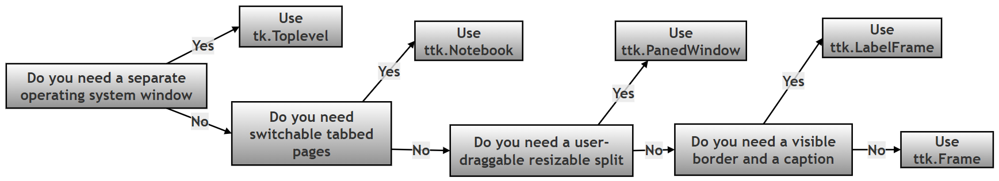
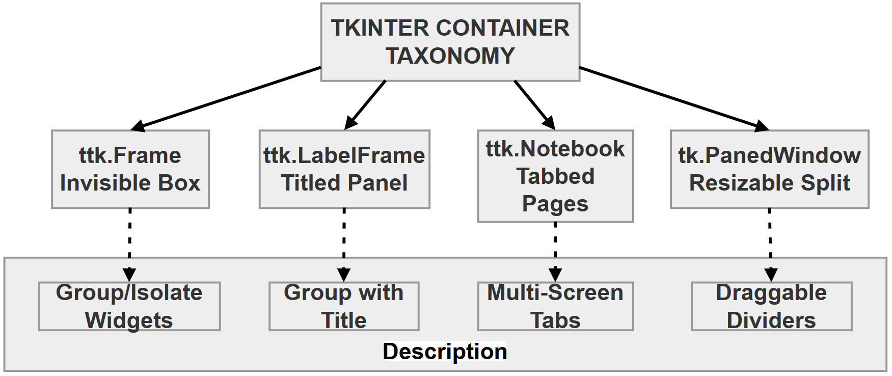
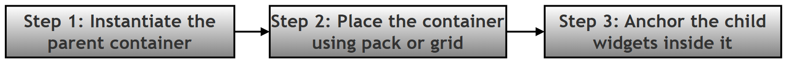
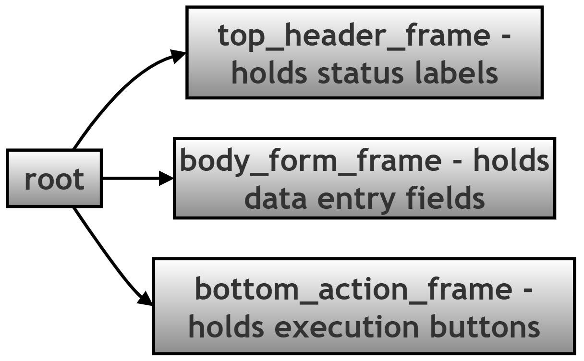

# Tkinter and Ttk Container Widgets — Online Reference Appendix (Chapter 14, Part 2)

## About This Page

This page is "Part 2" of the extended, GitHub-only reference material that accompanies **Chapter 14 (Tkinter and GUI Programming)** of the printed textbook. Where Part 1 focused on controlling the main application *window itself* (title, size, position, and lifecycle), this page zooms in on **container widgets** — the invisible or lightly-styled boxes you use *inside* a window to organize every other widget into tidy, predictable groups.

**Why this matters for Python in general:** almost no real GUI is built by dropping every button and text box directly onto the main window. Every serious GUI toolkit — Tkinter included — expects you to build a small tree of nested containers first (a header area, a form area, a button bar, and so on) and only then place your actual controls inside the right branch of that tree. Learning to think in terms of containers, rather than individual widgets, is one of the biggest jumps in comfort and confidence for anyone learning GUI programming in Python.

**Why this matters for this chapter in particular:** the printed chapter introduces `tk.Frame` and shows a few widgets placed on a single window. This page is the deeper, hands-on reference for the full family of container widgets available in Tkinter and its themed companion module, Ttk — what each one is for, exactly which options and methods it supports, and the layout mistakes that most often trip up beginners, together with how to recognize and fix them.

### Key Terms Used On This Page

| Term | In plain words | Learn more |
| --- | --- | --- |
| Tkinter vs. Ttk | Tkinter is Python's original, built-in GUI toolkit. Ttk ("themed Tk") is a newer module, included with Tkinter, that provides the same kinds of widgets but with a more modern, native-looking appearance. Most widgets on this page come in both a `tk.` version and a themed `ttk.` version. | [Python docs: tkinter.ttk](https://docs.python.org/3/library/tkinter.ttk.html) |
| Container widget | Any widget whose main job is to hold *other* widgets, rather than to display data or accept input itself. `Frame`, `LabelFrame`, `Notebook`, `PanedWindow`, and `Toplevel` are all containers. | [Python docs: tkinter](https://docs.python.org/3/library/tkinter.html) |
| Geometry manager | The system Tkinter uses to decide where a widget actually appears on screen. Tkinter offers three: `pack()`, `grid()`, and `place()`. This page focuses on `pack()` and `grid()`, the two used in almost all everyday layouts. | [Python docs: The Layout Tools](https://docs.python.org/3/library/tkinter.html#the-packer) |
| Widget hierarchy / parent-child relationship | Every widget (except the root window) is created "inside" another widget, called its parent — usually written as the first argument to the widget's constructor, for example `ttk.Label(form_frame, ...)`. The parent-child links between all the widgets in a program form a tree, similar to a family tree or a folder structure on a hard drive. | [Python docs: tkinter](https://docs.python.org/3/library/tkinter.html) |
| `TclError` | An error type Tkinter raises when you ask it to do something it cannot do — such as using two different geometry managers inside the same container. It behaves like any other Python exception and will stop your script unless you catch it. | [Python docs: tkinter](https://docs.python.org/3/library/tkinter.html) |

---

## 1. Unified Core Options (All Containers)

The options below form the base configuration shared across the whole container family. Not every container accepts every option below — the per-widget sections in Part 2 note any exceptions — but these are the ones worth learning first, because they show up again and again.

| Option / Keyword | Data Type | In Plain Words | Engine Purpose and Layout Behavior |
| --- | --- | --- | --- |
| `parent` | Object reference | Which box this new widget goes inside. | The positional first argument, defining the master host surface (the main root window, or an outer nesting frame) where the new widget lives. |
| `padding` | `int`, list, or tuple | Empty space *inside* the container's own border, cushioning its contents from the edge. | Ttk-specific. Adds internal buffer space (in pixels) between the frame's outer border and its child contents. Accepts up to four values: a single number for all four sides, a `(horizontal, vertical)` pair, or `(left, top, right, bottom)`. |
| `padx` / `pady` | `int` or tuple | Empty space *outside* a widget, keeping it from touching its neighbors. | Set when calling `pack()` or `grid()` (not when creating the widget itself). Adds margin spacing around a widget to prevent it from crowding its neighbors. |
| `borderwidth` (or `bd`) | `int` | How thick the visible border line is, in pixels. | Defines the physical thickness of the boundary edge surrounding the container area. Has no visible effect unless combined with a `relief` option such as `"groove"`, `"ridge"`, `"sunken"`, or `"raised"`. |
| `cursor` | `str` | What the mouse pointer looks like while hovering over this container. | Changes the operating system's mouse pointer image whenever it is over the container's area — for example `"hand2"` (a pointing hand), `"watch"` (a clock/hourglass), or `"cross"` (a crosshair). |

## 2. The Container Family, One Widget at a Time

Each member of the container family has its own specialized options and methods, suited to a specific structural job. The quick-reference table below gives you the one-line version of each; the detailed subsections that follow (2.1 to 2.5) give you the full picture.

### 2.0 Quick Reference: Which Container Do I Need?

| Container | One-line summary | Reach for it when… |
| --- | --- | --- |
| `ttk.Frame` | An invisible box used only to group other widgets. | You need to organize layout into logical zones, and do not need a visible border or caption. |
| `ttk.LabelFrame` | A visible, bordered box with a built-in caption. | You want to visually group related input fields and label the group, for example "Payment Details". |
| `ttk.Notebook` | A tabbed container that shows one full page of widgets at a time. | You have several distinct screens or settings pages that should share one window. |
| `ttk.PanedWindow` | A container split into two or more resizable sections with a draggable divider. | You want the user to be able to manually resize two areas of the screen relative to each other, such as a file browser next to a preview pane. |
| `tk.Toplevel` | A brand-new, independent window, separate from the main window. | You need a genuinely separate window — a dialog box, a pop-up form, or a secondary tool window. |

The following diagram gives the same guidance visually, as a simple decision flow. It is written in plain Mermaid flowchart syntax so it can also be opened and edited in draw.io.



The image below is an alternate view of the same process



### 2.1 `ttk.Frame` — The Invisible Layout Divider

**In plain words:** the plainest possible container — an empty box with no border and no caption, used purely to group other widgets together so they can be positioned as one unit.

- **What it is:** a lightweight, completely unstyled surface used for isolating one part of the layout from another.
- **Visibility:** invisible, unless you deliberately configure it with a `relief` style and a `borderwidth`.
- **When to use it:** constantly. Use a `Frame` to segment an application into core regions such as a title/header block, a main workspace area, and a status bar or button row.

### 2.2 `ttk.LabelFrame` — The Titled Form Panel

**In plain words:** a `Frame` with two extra features built in for free — a visible outline, and a short caption that sits directly on the border, like the label on a filing cabinet drawer.

- **What it is:** a visible box container featuring an outline and a built-in text label embedded in the top edge of the border.
- **Visibility:** always has a visible border, so it does not need a `relief` option to be seen.
- **When to use it:** grouping related form inputs together in a way the user can see at a glance — for example, separating a "Customer Details" group of fields from a "Payment Details" group.
- **Special sub-parameters:**
  - `text` (`str`): the string title displayed on the frame's border.
  - `labelanchor` (`constant`): controls where the title sits along the border. Options are `tk.NW` (north-west, the default), `tk.N`, `tk.NE`, `tk.E`, `tk.W`, `tk.SW`, `tk.S`, and `tk.SE`.
  - *Example:* `ttk.LabelFrame(root, text="System Log", labelanchor=tk.NE)`

### 2.3 `ttk.Notebook` — The Multi-Page Tab Controller

**In plain words:** a stack of full-size pages, with a row of clickable tabs along the top (or another edge) so the user can flip between them — the same idea as tabs in a web browser.

- **What it is:** a container that stacks multiple full-sized frames on top of one another, showing only one at a time, and provides a tab strip so the user can switch between them.
- **Visibility:** the tab strip itself is always visible; the page it currently shows depends on which tab is selected.
- **When to use it:** navigating between multiple related screens or configuration sections without opening extra windows — for example, a "Settings" dialog with separate "General", "Appearance", and "Advanced" tabs.
- **Core API methods:**
  - `.add(child_widget, text="Tab Title")`: adds an existing frame (or other widget) to the notebook as a new tab, using `text` as the label shown on the tab itself.
  - `.select(tab_index)`: switches the notebook to show a particular tab, by its position (or by passing the child widget directly).
  - `.tabs()`: returns a list of the Tkinter widget identifiers (short internal name strings, not memory addresses) for every tab currently in the notebook, in tab order — useful when you need to loop over all the open tabs.

### 2.4 `ttk.PanedWindow` — The Resizable Workspace Splitter

**In plain words:** a container split into two or more sections with a thin bar (called a "sash") between them that the user can click and drag to make one section bigger and the other smaller.

- **What it is:** a multi-pane container with a draggable divider between each pair of neighboring panes.
- **Visibility:** the divider ("sash") between panes is always visible as a thin line.
- **When to use it:** dashboards or tools where the user should be able to manually control how much screen space each section takes up — for example, a file list next to a preview area.
- **Special sub-parameters and methods:**
  - `orient`: set to `tk.HORIZONTAL` (panes arranged side by side) or `tk.VERTICAL` (panes stacked one above another).
  - `sashwidth` (`int`): sets the pixel thickness of the draggable divider line.
  - `.add(child, weight=1)`: adds a pane. The `weight` value decides how much of any *extra* space is given to that particular pane when the whole `PanedWindow` is resized — a pane with `weight=2` grows twice as fast as one with `weight=1` when the window is stretched.

### 2.5 `tk.Toplevel` — The Independent Window

**In plain words:** unlike the other four containers on this page, a `Toplevel` is not a box that lives *inside* another widget — it is a genuinely separate window, created and managed directly by the operating system's Window Manager, in the same way the main root window is.

- **What it is:** a brand-new top-level window, generated directly by the operating system's window manager, that still belongs to the same running application as the root window.
- **Visibility:** fully visible as its own, independent window, with its own title bar, that can be moved and resized separately from the main window.
- **When to use it:** pop-up alert dialogs, login or credential forms, or a temporary "inspector" window that shows details about something selected in the main window.
- **Core API methods:**
  - `.title("String")`: sets the text shown in this window's own title bar.
  - `.geometry("WidthxHeight+X+Y")`: sets the exact pixel dimensions and, optionally, the on-screen position — exactly as described for the root window in Part 1 of this reference.
  - `.destroy()`: closes the window and releases the widgets inside it from memory.
  - `.transient(parent)`: ties this window to its `parent` window. A transient window is treated by the operating system as a dependent of its parent: it minimizes and restores together with the parent, and most window managers keep it floating above the parent whenever both are visible. It does **not** cause the window to close on its own — `.destroy()` is still required for that.

---

## 3. Production Architecture: Dos and Don'ts

*(The original heading for this section repeated the word "Architecture" twice — corrected here.)*

### 3.1 The Architectural Layout Rule

Structure every layout using the same predictable, three-step sequence, so that the coordinate system stays easy to reason about as the interface grows:



In code, that three-step pattern looks like this:

```python
# Step 1: Instantiate the parent container.
form_frame = ttk.Frame(root, padding=10)

# Step 2: Place the container itself using a geometry manager
# (pack or grid) before adding anything inside it.
form_frame.pack(fill="both", expand=True)

# Step 3: Anchor the child widgets inside the now-placed container.
label_user = ttk.Label(form_frame, text="Username:")
label_user.grid(row=0, column=0, padx=5, pady=5)
```

### 3.2 Complete Best-Practice Guide

- **DO split complex interfaces into nested, clean logical zones.**

  ```text
  Correct Layout Tree Structure:
  root
   +-- top_header_frame     (Holds status labels)
   +-- body_form_frame      (Holds data entry fields)
   +-- bottom_action_frame  (Holds execution buttons)
  ```

  The same structure, shown as a flow chart:




- **DON'T dump dozens of interactive widgets directly onto the top-level `root` window.** This makes it very difficult to control alignment and scaling once the window is resized, because every widget is now competing for space in a single, unstructured container instead of a small number of well-defined zones.

- **DO pass padding options (`padx`, `pady` at the geometry-manager step, or `padding` when creating a Ttk container) so that text does not sit flush against a widget's border.**

- **DON'T deep-nest containers into unreadable pathways** — for example, an unstructured chain like `frame1` inside `frame2` inside `frame3` inside `frame4`, with no clear purpose for each layer. Excessive nesting makes the layout harder to reason about and significantly harder to debug when something is misaligned.

- **CRITICAL ERROR TRAP: never mix geometry managers inside the same container.** Every container can use `pack()` for some of its children, or `grid()` for some of its children — but never both at once, inside the *same* parent.

  ```python
  # WARNING: this raises an error the moment the grid() call below runs.
  label_user = ttk.Label(form_frame, text="User:")
  label_user.pack()                       # form_frame's children are now managed by pack()
  entry_user = ttk.Entry(form_frame)
  entry_user.grid(row=0, column=1)        # ... so this grid() call conflicts with it
  ```

  Running the snippet above produces this real error, immediately, on the `grid()` line:

  ```text
  _tkinter.TclError: cannot use geometry manager grid inside .!frame which already has slaves managed by pack
  ```

  This is a normal Python exception (a `TclError`, one of Tkinter's own error types — see Key Terms above), not an infinite loop. If it happens in code that runs directly when the script starts (as in the example above), the uncaught error stops the script immediately, which looks like a crash. If the same mistake happens inside a button's event-handler function instead, Tkinter typically prints the error to the console but keeps the rest of the application running — either way, the fix is identical: pick one geometry manager (`pack()` or `grid()`) per container, and use only that one for every direct child of that container.

---

## 4. Interactive Container Troubleshooting Matrix

| Classic Developer Mistake | Bad Code Implementation Pattern | Correct Production Pattern | Why It Matters / Error Output |
| --- | --- | --- | --- |
| Forgetting the parent argument | `btn = ttk.Button(text="Save")`<br>(missing the parent argument, so the button silently attaches to `root` instead of the intended frame) | `btn = ttk.Button(form_frame, text="Save")` | The button ends up in the wrong part of the layout, which typically causes other widgets to overlap it or makes it appear to vanish among unrelated controls. |
| Creating widgets out of order | `entry = ttk.Entry(sub_box)`<br>`sub_box = ttk.Frame(root)` | `sub_box = ttk.Frame(root)`<br>`entry = ttk.Entry(sub_box)` | Raises `NameError: name 'sub_box' is not defined`, because Python cannot make a widget the child of a container object that has not been created yet — the parent must always be defined first. |
| Overloading the main window | Placing 20+ interactive widgets directly onto `root`, with no organizing containers. | Grouping widgets into logical `ttk.Frame` or `ttk.LabelFrame` blocks first, then placing each block. | An unorganized screen looks chaotic, breaks badly when the window is resized, and is very difficult to refactor later. |
| Using the wrong container for the job | Opening four separate, independent `tk.Toplevel()` windows to run what is really a single step-by-step configuration wizard. | Using one `ttk.Notebook()` with four tabs inside a single main window. | Reduces clutter on the user's screen, keeps related steps together, and matches how users expect a multi-step wizard to behave. |

---

## 5. A Complete Worked Example: Building a Simple Registration Form

Sections 1 to 4 describe each container and each rule in isolation. This section puts them to work together in one small, complete, runnable program: a registration form with a header, a bordered form area, and a row of buttons — built by deliberately following the "Do" list from Section 3.2 and deliberately avoiding the "Don't" list. The program was actually run (using a virtual display, since it has no visible screen of its own) to confirm it works and to capture real console output, shown in Section 5.5 below. Teaching-only `print()` statements were added throughout, exactly as in the "Do" and "Don't" style used elsewhere on this page, so you can see what is happening at each step even though most of what this script does is visual.

### 5.1 Imports and a Small Helper Function

Besides the two standard imports, this example defines one small helper function, `print_widget_tree()`. It is not part of Tkinter — it is written here purely so that the container hierarchy described in Section 3.2's "Correct Layout Tree Structure" diagram can be printed as real, verified text once the widgets actually exist.

```python
# Step 1: Import tkinter and the ttk (themed Tk) module, which contains
# the modern container widgets described earlier on this page.
import tkinter as tk
from tkinter import ttk


def print_widget_tree(widget, indent=0):
    """
    A small teaching helper (not part of Tkinter itself) that prints the
    parent-child structure of the widgets built below, so the container
    hierarchy can be seen as plain text, not only on screen.
    """
    # Step 1: Print this widget's Tkinter widget class and its internal
    # path name (a string Tkinter uses internally to identify the widget).
    print(" " * indent + f"{widget.winfo_class()} ({widget})")
    # Step 2: Recurse into every child widget this container holds.
    for child in widget.winfo_children():
        print_widget_tree(child, indent + 4)
```

### 5.2 The Root Window and the Header Frame

Following the "Do" advice from Section 3.2, the header area gets its own dedicated `Frame` rather than being placed loose on `root`.

```python
# Step 2: Create the root window - the top-level container every other
# widget in this example will live inside, directly or indirectly.
root = tk.Tk()
root.title("Container Widgets Demo")
print("Step 2 complete: root window created")

# Step 3: Build the header zone as its own Frame, then pack it at the
# top of the window. Keeping it in its own frame means more header
# widgets could be added later without touching the form or button rows.
header_frame = ttk.Frame(root, padding=10)
header_frame.pack(side="top", fill="x")
ttk.Label(
    header_frame,
    text="Customer Registration Form",
    font=("Helvetica", 14, "bold")
).pack()
print("Step 3 complete: header_frame built and packed")
```

### 5.3 The Form Area, Using `LabelFrame`

The form fields go inside a `LabelFrame` (Section 2.2), which supplies a visible border and an on-screen caption automatically. Inside this one container, `grid()` is used consistently for every child, in line with the "never mix geometry managers inside one container" rule from Section 3.2.

```python
# Step 4: Build the form zone as a LabelFrame, so it gets a visible
# border and an on-screen caption for free. Inside this one frame,
# grid() is used consistently, since grid is well suited to lining up
# labels and entry boxes into neat rows and columns.
body_frame = ttk.LabelFrame(root, text="Personal Details", padding=10)
body_frame.pack(side="top", fill="both", expand=True, padx=10, pady=10)

ttk.Label(body_frame, text="Full Name:").grid(row=0, column=0, sticky="w", padx=5, pady=5)
entry_name = ttk.Entry(body_frame, width=30)
entry_name.grid(row=0, column=1, padx=5, pady=5)

ttk.Label(body_frame, text="Email Address:").grid(row=1, column=0, sticky="w", padx=5, pady=5)
entry_email = ttk.Entry(body_frame, width=30)
entry_email.grid(row=1, column=1, padx=5, pady=5)
print("Step 4 complete: body_frame (LabelFrame) built with two labeled entry fields")
```

### 5.4 The Button Bar, the Hierarchy Printout, and Starting the App

The button bar gets its own `Frame` too, and uses `pack()` — a different geometry manager instance from the `grid()` calls in Section 5.3, which is safe, because the rule only forbids mixing managers *inside the same container*, not across different containers.

```python
# Step 5: Build the action zone as its own Frame, holding the buttons.
# This frame uses pack(), a separate geometry-manager "instance" from
# the grid() calls in body_frame above - that is safe, because each
# geometry manager is only ever used *within* one container, never
# mixed inside the same container.
bottom_frame = ttk.Frame(root, padding=10)
bottom_frame.pack(side="bottom", fill="x")


def on_save():
    # Step 1: Read the values the user typed into the two entry fields.
    name_value = entry_name.get()
    email_value = entry_email.get()
    # Step 2: For this teaching example, simply print what would be saved.
    print(f"on_save(): would save name='{name_value}', email='{email_value}'")


ttk.Button(bottom_frame, text="Save", command=on_save).pack(side="right", padx=5)
ttk.Button(bottom_frame, text="Cancel", command=root.destroy).pack(side="right")
print("Step 5 complete: bottom_frame built with Save and Cancel buttons")

# Step 6: Print the full container hierarchy just built, using the
# helper function from Section 5.1, to see in plain text exactly how
# the widgets nest inside one another - the same idea as the
# "Correct Layout Tree Structure" diagram in Section 3.2, but now
# generated from the real, running widgets instead of drawn by hand.
print("Step 6: container hierarchy as built -")
print_widget_tree(root)

# Step 7: Hand control over to Tkinter's event loop.
root.mainloop()
```

### 5.5 Sample Console Output

This is the real output produced by running the script above, then typing a name and an email address into the two fields and clicking **Save**:

```text
Step 2 complete: root window created
Step 3 complete: header_frame built and packed
Step 4 complete: body_frame (LabelFrame) built with two labeled entry fields
Step 5 complete: bottom_frame built with Save and Cancel buttons
Step 6: container hierarchy as built -
Tk (.)
    TFrame (.!frame)
        TLabel (.!frame.!label)
    TLabelframe (.!labelframe)
        TLabel (.!labelframe.!label)
        TEntry (.!labelframe.!entry)
        TLabel (.!labelframe.!label2)
        TEntry (.!labelframe.!entry2)
    TFrame (.!frame2)
        TButton (.!frame2.!button)
        TButton (.!frame2.!button2)

# --- a user types "Ada Lovelace" and "ada@example.com", then clicks Save ---
on_save(): would save name='Ada Lovelace', email='ada@example.com'
```

Notice how closely the printed hierarchy in Step 6 matches the "Correct Layout Tree Structure" diagram back in Section 3.2 — `root` has exactly three direct children (the two `TFrame` widgets and the `TLabelframe`), and each of those holds only the widgets that logically belong to it. Your own widget path names (the text in parentheses, such as `.!frame2.!button2`) may differ slightly depending on your Tkinter version and how many widgets you have created, but the overall shape of the tree will match.

### 5.6 The Complete Script

Here is the entire example from Sections 5.1 to 5.4, combined into the single file you would actually save and run.

```python
# Step 1: Import tkinter and the ttk (themed Tk) module, which contains
# the modern container widgets described earlier on this page.
import tkinter as tk
from tkinter import ttk


def print_widget_tree(widget, indent=0):
    """
    A small teaching helper (not part of Tkinter itself) that prints the
    parent-child structure of the widgets built below, so the container
    hierarchy can be seen as plain text, not only on screen.
    """
    # Step 1: Print this widget's Tkinter widget class and its internal
    # path name (a string Tkinter uses internally to identify the widget).
    print(" " * indent + f"{widget.winfo_class()} ({widget})")
    # Step 2: Recurse into every child widget this container holds.
    for child in widget.winfo_children():
        print_widget_tree(child, indent + 4)


# Step 2: Create the root window - the top-level container every other
# widget in this example will live inside, directly or indirectly.
root = tk.Tk()
root.title("Container Widgets Demo")
print("Step 2 complete: root window created")

# Step 3: Build the header zone as its own Frame, then pack it at the
# top of the window.
header_frame = ttk.Frame(root, padding=10)
header_frame.pack(side="top", fill="x")
ttk.Label(
    header_frame,
    text="Customer Registration Form",
    font=("Helvetica", 14, "bold")
).pack()
print("Step 3 complete: header_frame built and packed")

# Step 4: Build the form zone as a LabelFrame, using grid() consistently
# for every widget placed directly inside it.
body_frame = ttk.LabelFrame(root, text="Personal Details", padding=10)
body_frame.pack(side="top", fill="both", expand=True, padx=10, pady=10)

ttk.Label(body_frame, text="Full Name:").grid(row=0, column=0, sticky="w", padx=5, pady=5)
entry_name = ttk.Entry(body_frame, width=30)
entry_name.grid(row=0, column=1, padx=5, pady=5)

ttk.Label(body_frame, text="Email Address:").grid(row=1, column=0, sticky="w", padx=5, pady=5)
entry_email = ttk.Entry(body_frame, width=30)
entry_email.grid(row=1, column=1, padx=5, pady=5)
print("Step 4 complete: body_frame (LabelFrame) built with two labeled entry fields")

# Step 5: Build the action zone as its own Frame, holding the buttons,
# using pack() - a different geometry-manager "instance" from the
# grid() calls used inside body_frame above.
bottom_frame = ttk.Frame(root, padding=10)
bottom_frame.pack(side="bottom", fill="x")


def on_save():
    # Step 1: Read the values the user typed into the two entry fields.
    name_value = entry_name.get()
    email_value = entry_email.get()
    # Step 2: For this teaching example, simply print what would be saved.
    print(f"on_save(): would save name='{name_value}', email='{email_value}'")


ttk.Button(bottom_frame, text="Save", command=on_save).pack(side="right", padx=5)
ttk.Button(bottom_frame, text="Cancel", command=root.destroy).pack(side="right")
print("Step 5 complete: bottom_frame built with Save and Cancel buttons")

# Step 6: Print the full container hierarchy just built.
print("Step 6: container hierarchy as built -")
print_widget_tree(root)

# Step 7: Hand control over to Tkinter's event loop.
root.mainloop()
```


