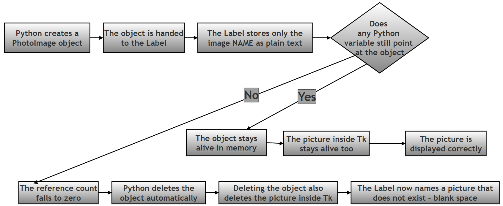
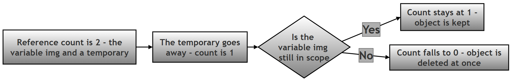
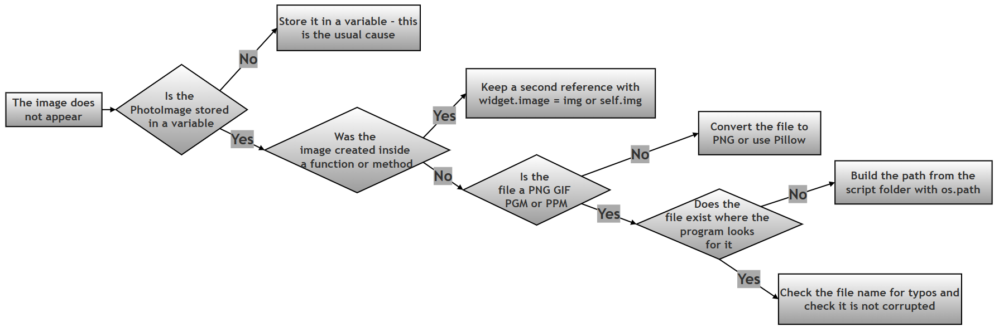

# Why Tkinter Images Disappear: `PhotoImage`, Variables, and Garbage Collection

## About This Page

This page is part of the extended, GitHub-only material that accompanies **Chapter 14 (Tkinter and GUI Programming)** of the printed textbook. It contains one of the chapter's research and project questions exactly as it appears in the book, followed by a full worked answer: the theory behind the problem, a complete model program, and a reflection.

The problem itself is a famous one. A student writes what looks like perfectly correct code to put a picture in a window, runs it, and gets a window with an empty gap where the picture should be. Nothing crashes. No error message appears. The picture is simply not there. Because there is no error to search for, this can cost a beginner an entire evening.

**Why this matters for Python in general:** the cause has almost nothing to do with pictures, and everything to do with two ideas at the heart of the Python language — **references** (which names are currently pointing at an object) and **garbage collection** (Python automatically throwing away objects that nothing points at any more). Most of the time Python's automatic cleanup is invisible and helpful, and you never have to think about it. This is one of the rare, instructive cases where you can actually *see* it happen. Understanding it here will make you a better Python programmer everywhere else too.

**Why this matters for this chapter in particular:** the printed chapter shows how to place text, buttons, and frames in a window. Adding a picture looks like it should be just as easy, and in terms of typing it is — but it is the first place in the chapter where the invisible link between a Python object and what is drawn on the screen can quietly break. Once you understand why, you will also understand why experienced Tkinter programmers write `self.logo = tk.PhotoImage(...)` inside classes, a line that otherwise looks pointlessly verbose.

Every claim, error message, and block of output on this page was produced by actually running the code on Python 3.12 with Tk 8.6.14. 

### Key Terms Used On This Page

| Term | In plain words | Learn more |
| --- | --- | --- |
| Object | Any value Python is holding in memory — a number, a list, a window, or in this case a loaded picture. | [Python docs: Data model](https://docs.python.org/3/reference/datamodel.html) |
| Reference / variable | A name that points at an object. Writing `img = tk.PhotoImage(...)` makes the name `img` point at the picture object. An object can have several names pointing at it, or none. | [Python docs: Data model](https://docs.python.org/3/reference/datamodel.html) |
| Reference count | The number of names (and other objects) currently pointing at an object. When this drops to zero, Python knows nothing can reach the object any more. | [Python docs: Reference counts](https://docs.python.org/3/extending/extending.html#reference-counts) |
| Garbage collection | Python's automatic cleanup: it frees the memory used by objects that nothing points at any more, without you having to ask. | [Wikipedia: Garbage collection](https://en.wikipedia.org/wiki/Garbage_collection_%28computer_science%29) |
| Tcl/Tk | Tkinter is a Python layer sitting on top of an older toolkit called Tk. Tk actually draws the window. Understanding that there are *two* systems involved — Python and Tk — is the key to this whole page. | [Python docs: tkinter](https://docs.python.org/3/library/tkinter.html) |
| `TclError` | The error Tkinter raises when Tk cannot do what it was asked — for example, when it is told to draw an image that no longer exists. | [Python docs: tkinter](https://docs.python.org/3/library/tkinter.html) |
| Pillow (PIL) | A separate, widely used Python imaging library, installed with `pip install pillow`. Tkinter's own `PhotoImage` handles only a few file formats; Pillow handles almost all of them. | [Pillow documentation](https://pillow.readthedocs.io/) |

---

# Research / Project Question

## Investigating Image Persistence in Tkinter (`PhotoImage` Bug)

When beginners use images in Tkinter, they sometimes observe a strange problem:

> The image either **does not appear** or **disappears suddenly**, even though the code appears correct.

This is one of the most common beginner issues in Tkinter applications.

### Your Task

Research and explain **why images sometimes disappear when using `PhotoImage()` in Tkinter**.

Your answer must include the following sections:

### Part A — Theory (Research Component)

Explain the following concepts:

1.  What is `PhotoImage()` in Tkinter?
2.  Which widgets can display images?
3.  Why does the image sometimes disappear?
4.  What is **garbage collection** in Python?
5.  Why is storing the image in a variable important?
6.  Explain the difference between:

#### Incorrect approach

```python
image=tk.PhotoImage(file="pic.png")
```

#### Correct approach

```python
img = tk.PhotoImage(file="pic.png")
```

7.  Write **three rules/best practices** for displaying images in Tkinter.

----------

### Part B — Script Writing

Write a Tkinter program that:

1.  Creates a GUI window.
2.  Loads an image using `PhotoImage()`.
3.  Displays the image inside a `Label` widget.
4.  Stores the image in a variable so that it remains visible.
5.  Displays a text caption below the image.
6.  Includes meaningful comments using `#`.

Assume that an image file named:

```python
flower.png
```

is present in the same folder as the Python program.

----------

### Part C — Reflection

Answer the following:

> What would happen if the image were not stored in a variable?

Explain briefly.

----------

### Optional Follow-Up Questions (not part of the printed book)

These extra questions are included only on this online page, for readers who want to push the investigation further. They are not required in order to answer the question above.

- **F1.** A `Label` does not store the picture itself — it stores only a short name such as `pyimage1`. Print that name with `print(my_label.cget("image"))` for both a working and a broken image, and explain what the two results tell you.
- **F2.** Move the image-loading code inside a function, so that the image is created as a local variable. Does the picture still appear after the function returns? Explain your result using the idea of reference counts.
- **F3.** Try loading a `.jpg` file with `tk.PhotoImage()`. Write down the exact error message you get, and explain what it means. What would you need to install in order to display JPEG images?
- **F4.** Suppose you want to show ten different pictures in ten different labels. What would go wrong if you reused the same variable name `img` in a loop for all ten, and how would you fix it?

----------

# Answer (Theory / Write-Up)

## Understanding `PhotoImage()` Persistence in Tkinter

Tkinter lets a program display pictures inside a window using the `PhotoImage()` class. The class does two jobs at once, and keeping them separate in your mind is the key to this whole topic:

1. It reads a picture file from your disk and loads it into memory.
2. It registers that loaded picture with Tk, the drawing engine underneath Tkinter, under a short internal name such as `pyimage1`.

A basic example:

```python
img = tk.PhotoImage(file="flower.png")
```

This loads the image into memory and makes it available for any widget to display.

## Answer to Part A — Theory

### A1. What is `PhotoImage()` in Tkinter?

`PhotoImage` is Tkinter's built-in class for holding a picture that a widget can display. You create one by giving it a file to read:

```python
img = tk.PhotoImage(file="flower.png")
```

You can also create a blank picture of a given size and paint colours onto it yourself, without any file at all:

```python
img = tk.PhotoImage(width=120, height=90)
img.put("lightblue", to=(0, 0, 120, 90))
```

Two useful details that beginners frequently trip over:

**It supports only a few file formats.** Tkinter's own `PhotoImage` is not a general-purpose image library. The table below was confirmed by actually loading each format on Tk version 8.6.14:

| Format | Typical extension | Works with `tk.PhotoImage`? | Notes |
| --- | --- | --- | --- |
| PNG | `.png` | Yes (Tk 8.6 and later) | The best everyday choice. Supports transparency. |
| GIF | `.gif` | Yes | An animated GIF loads as a single frame at a time, not as an animation. |
| PGM / PPM | `.pgm`, `.ppm` | Yes | Very old, very simple formats; rarely used today. |
| JPEG | `.jpg`, `.jpeg` | **No** | Raises `_tkinter.TclError: couldn't recognize data in image file "flower.jpg"`. |
| BMP, TIFF, WEBP, SVG | various | **No** | Not supported by `PhotoImage` at all. |

If you need JPEG or any other format, either convert the file to PNG first, or install the [Pillow](https://pillow.readthedocs.io/) library and use its drop-in replacement:

```python
# Requires: pip install pillow
from PIL import Image, ImageTk
pil_image = Image.open("flower.jpg")
img = ImageTk.PhotoImage(pil_image)     # this variable must still be kept alive
```

Note carefully: Pillow solves the *file format* problem. It does **not** solve the disappearing-image problem discussed on this page. Everything below applies to `ImageTk.PhotoImage` exactly as it applies to `tk.PhotoImage`.

**It needs a window to exist first.** A `PhotoImage` can only be created after you have created your root window with `tk.Tk()`. Creating one before that raises an error, because there is no Tk engine yet to register the picture with.

### A2. Which widgets can display images?

Images can be shown inside widgets such as:

-   `Label`
-   `Button`
-   `Canvas`

Those three cover almost everything a beginner needs. For completeness, here is the fuller list, with the way each one attaches the picture:

| Widget | How the image is attached | Typical use |
| --- | --- | --- |
| `tk.Label` | `image=img` option | Displaying a picture, logo, or icon. The most common choice. |
| `tk.Button` | `image=img` option, optionally with `compound="left"` to show text and picture together | Toolbar buttons and icon buttons. |
| `tk.Canvas` | `canvas.create_image(x, y, image=img)` | Placing a picture at exact coordinates, or drawing lines and shapes on top of it. |
| `tk.Checkbutton`, `tk.Radiobutton` | `image=img` and `selectimage=img2` | Custom-looking toggles that change picture when selected. |
| `tk.Menu` | `image=img` on a menu entry | Small icons beside menu commands. |
| `tk.Text` | `text_widget.image_create(index, image=img)` | Inserting a picture inline, in the middle of flowing text. |
| The window itself | `root.iconphoto(True, img)` | Setting the application's own icon in the title bar and taskbar. |

Every single one of these is affected by the disappearing-image problem, because they all work the same way internally, as explained next.

### A3. Why does the image sometimes disappear?

This is the heart of the question, so it is worth going slowly.

**The one-sentence answer:** a widget does not store the picture — it stores only the picture's *name*. Nothing on the Tkinter side counts as a reference for Python's purposes, so if your own code does not keep a variable pointing at the `PhotoImage` object, Python throws the object away, which also destroys the picture that the widget was relying on.

Here is the problematic code:

```python
label = tk.Label(root, image=tk.PhotoImage(file="flower.png")) 
```

Read that line the way Python reads it, one step at a time:

| Step | What happens | Is anything pointing at the image object? |
| --- | --- | --- |
| 1 | `tk.PhotoImage(file="flower.png")` runs. A picture object is created and registered with Tk under the name `pyimage1`. | Yes — temporarily, while the line is still being evaluated. |
| 2 | That object is passed into `tk.Label(...)` as the `image` argument. Tkinter converts it to the text string `"pyimage1"` and hands *that string* to Tk. | Yes — still, for a moment longer. |
| 3 | The `tk.Label(...)` call finishes and the result is assigned to `label`. The temporary picture object is now finished with. | **No.** Nothing points at it. |
| 4 | Python's cleanup runs. The `PhotoImage` object is deleted, and as it is deleted it tells Tk to delete image `pyimage1` too. | The object no longer exists. |
| 5 | The window is drawn. The label still holds the text `"pyimage1"`, but there is no longer any image by that name. | Blank space where the picture should be. |

The crucial point is Step 2. The label never holds the Python object. It holds a short piece of text. From Python's point of view, that text is not a reference to anything, so the object looks completely unused — even though your window visibly depends on it.

The same idea as a diagram:




**Seeing it happen for yourself.** The short program below puts the wrong way and the right way side by side in one window, then asks Tkinter directly what each label is holding. This is the most convincing way to understand the problem, because you do not have to take anyone's word for it.

```python
import tkinter as tk

# Step 1: Create the window that will hold both test labels.
root = tk.Tk()
root.title("Why images disappear - a demonstration")

# Step 2: THE WRONG WAY - the image is never stored in a variable.
# The PhotoImage object is created, handed to the Label, and then
# immediately forgotten by Python, because nothing refers to it.
label_wrong = tk.Label(root, image=tk.PhotoImage(file="flower.png"))
label_wrong.pack()
tk.Label(root, text="Wrong way - blank space above").pack()

# Step 3: THE RIGHT WAY - the image is stored in a variable first,
# so Python keeps the object alive for as long as the variable exists.
flower_img = tk.PhotoImage(file="flower.png")
label_right = tk.Label(root, image=flower_img)
label_right.pack()
tk.Label(root, text="Right way - picture visible above").pack()

# Step 4: Ask Tkinter what each Label is actually holding.
# A Label stores only the image's NAME, never the Python object.
print("Wrong-way label holds the image name:", repr(label_wrong.cget("image")))
print("Right-way label holds the image name:", repr(label_right.cget("image")))

# Step 5: Ask Tk which image names still exist behind the scenes.
live_names = root.tk.call("image", "names")
print("Is the wrong-way image still alive?", label_wrong.cget("image") in live_names)
print("Is the right-way image still alive?", label_right.cget("image") in live_names)

# Step 6: Prove it by asking Tk to use each name again.
for label, description in [(label_wrong, "wrong way"), (label_right, "right way")]:
    try:
        label.config(image=label.cget("image"))
        print(f"Re-using the {description} image name: worked fine")
    except tk.TclError as error:
        print(f"Re-using the {description} image name: TclError: {error}")

root.mainloop()
```

Running that program prints the following, which is the whole problem captured in six lines:

```text
Wrong-way label holds the image name: 'pyimage1'
Right-way label holds the image name: 'pyimage2'
Is the wrong-way image still alive? False
Is the right-way image still alive? True
Re-using the wrong way image name: TclError: image "pyimage1" doesn't exist
Re-using the right way image name: worked fine
```

Notice the second-to-last line. The label is confidently holding the name `pyimage1`, and Tk is equally confident that no such image exists. That mismatch is exactly what an empty gap in your window looks like from the inside.

One further detail worth knowing, observed in the same test run: the broken label kept the *size* the picture had given it when it was first created — it simply drew nothing inside that space. So the usual symptom is not a collapsed or missing widget, but an empty rectangle of roughly the right size. That is why the problem is so confusing: the layout looks correct, and only the picture is missing.

**Why "sometimes" and not "always".** The question says images *sometimes* disappear, and that wording is accurate. The picture survives for exactly as long as something is pointing at it, so the timing of the disappearance depends on where you wrote the code:

| Where the image is created | What the user sees | Why |
| --- | --- | --- |
| Directly inside the widget call, as in the example above | Never appears at all | The object is discarded on the very same line. |
| In a variable inside a function, with no other reference | Appears if the window is drawn before the function returns; otherwise never appears | Local variables are discarded when the function ends. |
| In a variable inside a loop, reusing the same name each time | Only the last picture survives | Each new assignment stops the previous object from being pointed at. |
| In a normal variable at the top level of the script | Appears and stays | The variable lives until the program ends. |
| In `self.img` inside a class, or attached to the widget | Appears and stays | The object stays alive as long as the class instance or widget does. |

The second row is the most common real-world version of this bug, and it is worth its own short demonstration:

```python
# Step 1: A function that loads an image into a LOCAL variable only.
def make_broken_label(parent):
    local_img = tk.PhotoImage(file="flower.png")   # only reference to the picture
    lbl = tk.Label(parent, image=local_img)
    lbl.pack()
    return lbl
    # Step 2: The moment this function returns, local_img disappears,
    # and the picture is deleted along with it.

# Step 3: The same function, with one extra line that fixes it.
def make_working_label(parent):
    local_img = tk.PhotoImage(file="flower.png")
    lbl = tk.Label(parent, image=local_img)
    lbl.image = local_img      # Step 4: attach a second reference to the widget
    lbl.pack()                 # The widget outlives the function, so now the picture does too.
    return lbl
```

Verified output when both labels are created and then checked:

```text
broken label's image name still registered? False
fixed  label's image name still registered? True
```

The line `lbl.image = local_img` looks strange, because `image` is not a real Tkinter attribute and Tkinter never reads it. That is exactly the point. It is just an ordinary Python attribute being used as a place to park a reference, so that the picture stays alive for as long as the widget does. This small trick is used constantly in real Tkinter code.

### A4. What is garbage collection?

Python automatically removes unused objects from memory to save resources. If an object is not referenced by any variable, Python assumes it is no longer needed and deletes it.

In slightly more detail: Python keeps a count, for every object, of how many names and containers are currently pointing at it. This is called the **reference count**. Every time you make a new name point at an object the count goes up; every time a name is reassigned, deleted, or goes out of scope, the count goes down. The moment the count reaches zero, the object is unreachable — no code anywhere could ever use it again — so Python frees it immediately, without waiting to be asked.

This is normally an excellent arrangement, and it is the reason Python programmers almost never have to think about memory at all. Compare it to a library: if no reader has a book on loan and it is not on any shelf list, the library can safely dispose of it.

The trouble in this particular case is that Tk is holding the picture in a way Python cannot see. Tk knows about the image, and your window depends on it, but Python's count says nobody is pointing at it. So Python does exactly what it was designed to do, and throws away something you very much still needed.



This causes problems with `PhotoImage()` if the image object is not stored properly.

### A5. Why is storing the image in a variable important?

Because the variable is the only thing standing between your picture and Python's automatic cleanup.

Storing the image in a variable does one job and one job only: it keeps the reference count above zero. As long as at least one name points at the `PhotoImage` object, Python will not delete it, so Tk's copy of the picture stays alive, so the widget that names that picture can keep drawing it.

Read the rule the other way round, because that is the version that will save you time later: **the picture must stay alive for as long as it is on screen, so the variable holding it must live at least as long as the widget showing it.** A variable that disappears at the end of a function is therefore not good enough, unless you park a second reference somewhere longer-lived.

### A6. The difference between the two approaches

**Incorrect approach**

```python
image=tk.PhotoImage(file="pic.png")
```

**Correct approach**

```python
img = tk.PhotoImage(file="pic.png")
```

The two lines create exactly the same object. The difference is what happens next:

| | Incorrect: `image=tk.PhotoImage(file="pic.png")` | Correct: `img = tk.PhotoImage(file="pic.png")` |
| --- | --- | --- |
| What the line does | Creates the picture and passes it straight into a widget as an argument. | Creates the picture and gives it a name. |
| Reference count afterwards | Zero — the object is unnamed and unreachable. | One — the name `img` points at it. |
| What Python does next | Deletes the object immediately. | Keeps the object. |
| What Tk does next | Deletes the registered picture along with it. | Keeps the registered picture. |
| What the widget holds | The name of a picture that no longer exists. | The name of a picture that is alive and well. |
| What appears on screen | Blank space. | The picture. |
| Can you change the picture later? | No — you have no way to refer to it. | Yes — `img.put(...)`, `img.width()`, and so on all still work. |

The second-to-last row is the visible symptom; the second row is the actual cause. Fixing the second row fixes everything below it.

Note that the correct version needs one more line to be useful — the widget still has to be told to use it:

```python
img = tk.PhotoImage(file="pic.png")
label = tk.Label(root, image=img)
```

Now Python keeps the image alive, because the variable `img` still refers to it.

### A7. Three rules and best practices for displaying images in Tkinter

1.  **Always store `PhotoImage()` in a variable** — and make sure that variable lives at least as long as the widget showing the picture. Inside a function, add `widget.image = img`; inside a class, use `self.img = ...`.
2.  **Keep image files in the same folder as the script**, or build a reliable path instead of trusting the current working directory. A program started by double-clicking, or run from a different folder, does not always look where you expect. The safe pattern is:

    ```python
    import os
    here = os.path.dirname(os.path.abspath(__file__))   # the folder this script is in
    img = tk.PhotoImage(file=os.path.join(here, "flower.png"))
    ```

3.  **Use meaningful variable names** such as `logo_img`, `profile_img`, or `flower_img`, instead of something like `img_temp1`. This matters more than usual here: because these variables exist purely to keep pictures alive, a vague name makes it far too easy for someone later to "tidy up" what looks like an unused variable and silently break the display.

Three more rules, once the first three are second nature:

4.  **Use PNG (or GIF) files with `tk.PhotoImage`.** For JPEG or anything else, install Pillow and use `ImageTk.PhotoImage`, remembering that the reference rule still applies.
5.  **Create the root window before creating any image.** `tk.PhotoImage` needs a live Tk engine to register itself with.
6.  **When showing many pictures, store them in a list or dictionary** rather than reusing one variable name in a loop — otherwise each new assignment discards the previous picture, and only the last one survives.

---

## Answer to Part B — The Model Script

The question asks for a program that loads `flower.png` from the same folder, shows it in a `Label`, keeps it in a variable, and puts a caption underneath. The script is built up step by step below, and then given as one complete file in Section B.6.

Teaching-only `print()` statements have been added at each step. A window with a picture in it does not normally print anything, so these lines let you watch the program's progress in the terminal you launched it from, and confirm that the image really is alive.

### B.1 Imports and the Main Window

```python
# Step 1: Import the modules we need.
# tkinter builds the window; os is used to check that the image file exists.
import os
import tkinter as tk

# Step 2: Create the main application window and give it a title.
root = tk.Tk()
root.title("Tkinter Image Demo")
print("Step 1 complete: main window created")
```

### B.2 A Frame to Group the Image and Its Caption

A `Frame` is a container widget: an invisible box used to group related widgets so they can be positioned together. Putting the picture and its caption in the same frame keeps them tied to each other.

```python
# Step 3: Create a Frame to hold the image and its caption together,
# with some breathing space around the outside.
frame = tk.Frame(root)
frame.pack(padx=20, pady=20)
print("Step 2 complete: frame created to group the image and caption")
```

### B.3 Checking the File Before Loading It

This step is not strictly required by the question, but it turns a confusing failure into a clear message. If `flower.png` is missing, `tk.PhotoImage` raises a `TclError` that beginners often misread as a problem with their code rather than a missing file.

```python
# Step 4: Check that the image file is actually there before loading it.
# This turns a confusing error into a clear, readable message.
image_file = "flower.png"
print(f"Step 3: looking for '{image_file}' in {os.getcwd()}")
if not os.path.exists(image_file):
    print(f"Step 3 FAILED: '{image_file}' was not found in this folder.")
    raise SystemExit(1)
print(f"Step 3 complete: found '{image_file}'")
```

### B.4 Loading the Image Into a Variable

This is the step the whole research question is about. The name `flower_img` is what keeps the picture alive.

```python
# Step 5: Load the image AND STORE IT IN A VARIABLE.
# This variable is what keeps the picture alive. If the PhotoImage were
# created directly inside the Label call instead, Python would delete it
# immediately and the label would show blank space.
flower_img = tk.PhotoImage(file=image_file)
print(f"Step 4 complete: image loaded, size = {flower_img.width()} x {flower_img.height()} pixels")
print(f"           Tk's internal name for this image is '{flower_img}'")
```

### B.5 The Label, the Caption, and the Proof

```python
# Step 6: Display the image inside a Label widget.
img_label = tk.Label(frame, image=flower_img)
img_label.pack()
print("Step 5 complete: image placed inside a Label widget")

# Step 7: Add the text caption BELOW the image.
# Because it is packed after the image and into the same frame,
# pack() places it underneath by default.
caption = tk.Label(frame, text="Flower Image", font=("Helvetica", 12))
caption.pack(pady=5)
print("Step 6 complete: caption added below the image")

# Step 8: Prove that the reference is doing its job by asking Tk
# whether it still knows about our image.
still_alive = str(flower_img) in root.tk.call("image", "names")
print(f"Step 7: is the image still registered with Tk? {still_alive}")

# Step 9: Hand control to Tkinter's event loop so the window stays open.
root.mainloop()
```

### B.6 The Complete Script

```python
# Step 1: Import the modules we need.
# tkinter builds the window; os is used to check that the image file exists.
import os
import tkinter as tk

# Step 2: Create the main application window and give it a title.
root = tk.Tk()
root.title("Tkinter Image Demo")
print("Step 1 complete: main window created")

# Step 3: Create a Frame to hold the image and its caption together.
# A Frame is an invisible container used to group related widgets.
frame = tk.Frame(root)
frame.pack(padx=20, pady=20)
print("Step 2 complete: frame created to group the image and caption")

# Step 4: Check that the image file is actually there before loading it.
image_file = "flower.png"
print(f"Step 3: looking for '{image_file}' in {os.getcwd()}")
if not os.path.exists(image_file):
    print(f"Step 3 FAILED: '{image_file}' was not found in this folder.")
    raise SystemExit(1)
print(f"Step 3 complete: found '{image_file}'")

# Step 5: Load the image AND STORE IT IN A VARIABLE.
# This variable is what keeps the picture alive. If the PhotoImage were
# created directly inside the Label call instead, Python would delete it
# immediately and the label would show blank space.
flower_img = tk.PhotoImage(file=image_file)
print(f"Step 4 complete: image loaded, size = {flower_img.width()} x {flower_img.height()} pixels")
print(f"           Tk's internal name for this image is '{flower_img}'")

# Step 6: Display the image inside a Label widget.
img_label = tk.Label(frame, image=flower_img)
img_label.pack()
print("Step 5 complete: image placed inside a Label widget")

# Step 7: Add the text caption BELOW the image.
caption = tk.Label(frame, text="Flower Image", font=("Helvetica", 12))
caption.pack(pady=5)
print("Step 6 complete: caption added below the image")

# Step 8: Prove that the reference is doing its job by asking Tk
# whether it still knows about our image.
still_alive = str(flower_img) in root.tk.call("image", "names")
print(f"Step 7: is the image still registered with Tk? {still_alive}")

# Step 9: Hand control to Tkinter's event loop so the window stays open.
root.mainloop()
```

### B.7 Expected Output

A window opens showing the picture, with the words **Flower Image** centred underneath it.

In the terminal, the program prints the following. This is real output, captured by running the script with a 120 by 90 pixel `flower.png` in the same folder:

```text
Step 1 complete: main window created
Step 2 complete: frame created to group the image and caption
Step 3: looking for 'flower.png' in /home/student/tkinter-practice
Step 3 complete: found 'flower.png'
Step 4 complete: image loaded, size = 120 x 90 pixels
           Tk's internal name for this image is 'pyimage1'
Step 5 complete: image placed inside a Label widget
Step 6 complete: caption added below the image
Step 7: is the image still registered with Tk? True
```

The folder path and the picture's size will of course differ on your own machine. The two lines that matter are the last one — `True` confirms the picture is still alive — and the `pyimage1` line, which shows you the internal name that the whole disappearing-image problem revolves around.

If `flower.png` is missing, the check added in Step 4 produces this instead of a confusing error:

```text
Step 1 complete: main window created
Step 2 complete: frame created to group the image and caption
Step 3: looking for 'flower.png' in /home/student/tkinter-practice
Step 3 FAILED: 'flower.png' was not found in this folder.
```

### B.8 A Version That Needs No Image File

If you do not have a `flower.png` to hand, this variant creates its own picture in code instead of loading one from disk, so it runs anywhere. Everything else — the frame, the label, the caption, and above all the variable keeping the picture alive — works in exactly the same way.

```python
import tkinter as tk

# Step 1: Create the main window.
root = tk.Tk()
root.title("Tkinter Image Demo (no image file needed)")
print("Step 1 complete: main window created")

# Step 2: Create a Frame to group the image and its caption.
frame = tk.Frame(root)
frame.pack(padx=20, pady=20)
print("Step 2 complete: frame created")

# Step 3: Create a blank 120 x 90 image in memory and store it in a variable.
# Note that width and height are used here instead of file.
generated_img = tk.PhotoImage(width=120, height=90)
print(f"Step 3 complete: blank image created, size = {generated_img.width()} x {generated_img.height()}")

# Step 4: Paint the blank image.
# put() fills a rectangle given as (left, top, right, bottom).
generated_img.put("lightblue", to=(0, 0, 120, 90))
generated_img.put("steelblue", to=(30, 20, 90, 70))
print("Step 4 complete: image painted with two coloured rectangles")

# Step 5: Show the image inside a Label.
# generated_img must stay in scope for this to remain visible.
img_label = tk.Label(frame, image=generated_img)
img_label.pack()
print("Step 5 complete: image placed inside a Label widget")

# Step 6: Add the caption below the image.
caption = tk.Label(frame, text="Generated Image", font=("Helvetica", 12))
caption.pack(pady=5)
print("Step 6 complete: caption added below the image")

# Step 7: Start the event loop.
root.mainloop()
```

Verified output:

```text
Step 1 complete: main window created
Step 2 complete: frame created
Step 3 complete: blank image created, size = 120 x 90
Step 4 complete: image painted with two coloured rectangles
Step 5 complete: image placed inside a Label widget
Step 6 complete: caption added below the image
```

---

## Answer to Part C — Reflection

**What would happen if the image were not stored in a variable?**

If the image is not stored in a variable, Python removes it from memory through **garbage collection**, causing the image to disappear or fail to display.

Step by step, this is the chain of events:

1. The `PhotoImage` object is created and registers a picture with Tk under a name such as `pyimage1`.
2. The widget is given that picture, but stores only the *name* — a short piece of text — not the object itself.
3. Because no variable in your program points at the object, its reference count immediately falls to zero.
4. Python deletes the object, and as it does so, the picture registered with Tk is deleted too.
5. The widget is left holding the name of a picture that no longer exists, so it draws nothing. The window still reserves the space, so what you see is an empty gap rather than an error.
6. Nothing is printed, nothing crashes, and no exception is raised — which is precisely why this bug is so hard for a beginner to diagnose.

Therefore:

> **Always store `PhotoImage()` in a variable before displaying it in Tkinter — and make sure that variable stays alive for as long as the picture needs to be on screen.**

---

## Quick Troubleshooting Guide: "My Image Is Not Showing"

Work down this list in order; the first item is by far the most common cause.

| Symptom | Likely cause | Fix |
| --- | --- | --- |
| Empty gap of about the right size, no error message | The `PhotoImage` was not stored in a variable. | Assign it to a variable first, then pass the variable to the widget. |
| Picture works in a small script but not once moved into a function or class | The variable was local and disappeared when the function returned. | Add `widget.image = img`, or store it as `self.img` in a class. |
| Only the last of several pictures appears | One variable name was reused in a loop. | Store the images in a list or dictionary instead. |
| `TclError: couldn't recognize data in image file` | The file is a JPEG or another unsupported format. | Convert it to PNG, or use Pillow's `ImageTk.PhotoImage`. |
| `TclError: couldn't open "flower.png": no such file or directory` | The file is not where the program is looking. | Check the spelling, or build a path with `os.path.join` based on `__file__`. |
| `TclError: image "pyimage1" doesn't exist` | The picture was deleted while a widget was still using it. | Same as the first row — keep a reference alive. |
| Error when creating the image, before any window appears | `PhotoImage` was created before `tk.Tk()`. | Create the root window first. |

The same guide as a decision flowchart:



---
