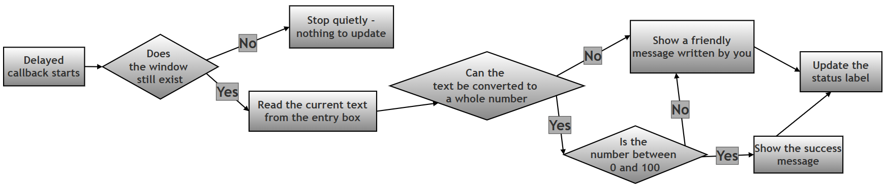
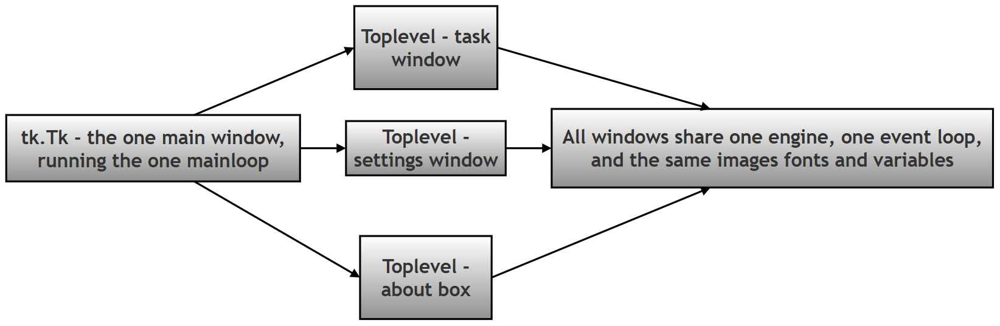
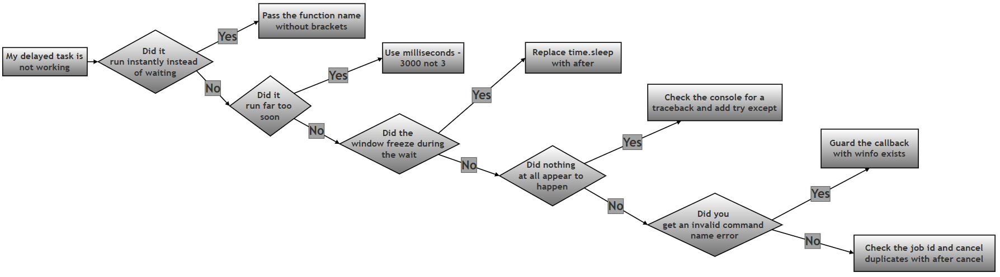

# Delayed Tasks, Safe Callbacks and Extra Windows in Tkinter — Worked Answer

## Table of Contents

- [About This Page](#about-this-page)
    - [Why This Topic Matters for Python and for Chapter 14](#why-this-topic-matters-for-python-and-for-chapter-14)
    - [Key Terms Used On This Page](#key-terms-used-on-this-page)
- [Research / Project Question](#research--project-question)
    - [Tkinter Delayed Tasks, Safe Callbacks and Multiple Windows](#tkinter-delayed-tasks-safe-callbacks-and-multiple-windows)
    - [Project Objectives](#project-objectives)
    - [Part A — Theory. Research and explain the following:](#part-a--theory-research-and-explain-the-following)
    - [Part B — Script Writing](#part-b--script-writing)
    - [Optional Follow-Up Questions (not part of the printed book)](#optional-follow-up-questions-not-part-of-the-printed-book)
- [Answer to Part A — Theory](#answer-to-part-a--theory)
    - [A1. The `after()` Method](#a1-the-after-method)
    - [A2. Callback Functions](#a2-callback-functions)
    - [A3. Safe Delayed Callbacks and Error Handling](#a3-safe-delayed-callbacks-and-error-handling)
    - [A4. The `Toplevel()` Window](#a4-the-toplevel-window)
    - [A5. Best Practices](#a5-best-practices)
- [Answer to Part B — The Model Script](#answer-to-part-b--the-model-script)
    - [B1. The Main Window](#b1-the-main-window)
    - [B2. Opening the Child Window](#b2-opening-the-child-window)
    - [B3. Scheduling the Delayed Task](#b3-scheduling-the-delayed-task)
    - [B4. The Safe Callback](#b4-the-safe-callback)
    - [B5. The Complete Script](#b5-the-complete-script)
    - [B6. Sample Output](#b6-sample-output)
    - [B7. Optional Enhancement — A Live Countdown](#b7-optional-enhancement--a-live-countdown)
- [Common Errors and How to Fix Them](#common-errors-and-how-to-fix-them)
- [Summary of Changes Made to This Page](#summary-of-changes-made-to-this-page)

## About This Page

This page is part of the extended, GitHub-only material that accompanies **Chapter 14 (Tkinter and GUI Programming)** of the printed textbook. It contains one of the chapter's research and project questions, followed by a complete worked answer: the theory, a full model program, and a troubleshooting guide.

The topic brings together three ideas that beginners usually meet separately, and which only make sense together:

- **Delayed work.** A program often needs to do something *later* — remind the user in five minutes, auto-save in thirty seconds, refresh a display every second. In an ordinary Python script you would reach for `time.sleep()`. In a GUI that is exactly the wrong tool, and this page explains why.
- **Safe callbacks.** Work that runs later runs in a different world from the code that scheduled it. The user may have typed nonsense, or closed the window, or clicked the button four times. A delayed function therefore has to be written defensively.
- **Extra windows.** Real applications open more than one window. Tkinter has a right way (`Toplevel()`) and a tempting wrong way (a second `Tk()`), and the difference matters more than it appears.

[Back to Table of Contents](#table-of-contents)

### Why This Topic Matters for Python and for Chapter 14

**For Python in general:** this is most students' first encounter with *event-driven* programming — a style in which you do not write a list of instructions that run top to bottom, but instead register functions and let something else decide when to run them. That pattern is everywhere in modern Python: web frameworks, `asyncio`, background job queues, and callbacks in almost every library that talks to a network. Learning it here, where you can see the results on screen, makes it far easier everywhere else.

**For this chapter in particular:** the printed chapter shows widgets that respond instantly to a click. This page covers what happens when the response is *not* instant. That gap in time is where a surprising number of beginner bugs live, because between scheduling a job and running it, the window can change or disappear entirely.

Every error message, timing result and block of output on this page was produced by actually running the code on Python 3.12 with Tk 8.6.14. Nothing here is guessed.

[Back to Table of Contents](#table-of-contents)

### Key Terms Used On This Page

| Term | In plain words | Learn more |
| --- | --- | --- |
| Event loop | A loop hidden inside Tkinter that runs continuously once you call `mainloop()`. It waits for things to happen — a click, a key press, a timer running out — and calls the matching piece of your code. Your program spends almost all its life inside this loop. | [Python docs: tkinter](https://docs.python.org/3/library/tkinter.html) |
| Event-driven programming | A style of programming where the order in which your code runs is decided by events, not by the order the lines appear in the file. | [Wikipedia: Event-driven programming](https://en.wikipedia.org/wiki/Event-driven_programming) |
| Callback | A function you hand to something else so that it can call the function later, on your behalf. You write the function; something else decides when it runs. | [Wikipedia: Callback](https://en.wikipedia.org/wiki/Callback_%28computer_programming%29) |
| Blocking | Code that refuses to give control back until it has finished. `time.sleep(2)` blocks for two seconds, and while it does, nothing else in the program can happen. | [Python docs: time.sleep](https://docs.python.org/3/library/time.html#time.sleep) |
| Widget | Any on-screen element in a GUI: a button, a label, a text box, a window. | [Python docs: tkinter](https://docs.python.org/3/library/tkinter.html) |
| `TclError` | The error Tkinter raises when the drawing engine underneath it cannot do what it was asked — for example, being told to update a label that has already been destroyed. | [Python docs: tkinter](https://docs.python.org/3/library/tkinter.html) |
| Exception / `try-except` | Python's system for dealing with things that go wrong. Code that might fail goes in the `try` block; what to do about the failure goes in the `except` block. | [Python docs: Errors and Exceptions](https://docs.python.org/3/tutorial/errors.html) |
| `messagebox` | A small Tkinter module that shows ready-made pop-up dialogs: information, warnings and errors. | [Python docs: tkinter.messagebox](https://docs.python.org/3/library/tkinter.messagebox.html) |

[Back to Table of Contents](#table-of-contents)

---

## Research / Project Question

[Back to Table of Contents](#table-of-contents)

### Tkinter Delayed Tasks, Safe Callbacks and Multiple Windows

In many GUI applications, some tasks do not run immediately. Instead, they run **after a delay**.

Examples:

```python
Show reminder after 5 seconds
Auto-save after some time
Load data after startup
Display notification later
```

Tkinter provides the: `after()` method for scheduling delayed actions.

However, delayed tasks may sometimes fail and cause errors. Therefore, programmers must use **safe callbacks** with proper **error handling**.

Tkinter also allows programs to open **multiple windows** using: `Toplevel()` instead of creating multiple `Tk()` windows.

[Back to Table of Contents](#table-of-contents)

----------

### Project Objectives

Research and explain how Tkinter handles:

1.  Delayed execution using `after()`
2.  Safe callbacks using `try-except`
3.  Additional windows using `Toplevel()`
4.  Error handling in delayed tasks

[Back to Table of Contents](#table-of-contents)

----------

### Part A — Theory. Research and explain the following:

#### 1. `after()` Method

Explain:

-   What is `after()`?
-   Why is it useful in GUI applications?
-   Syntax of `after()`
-   Difference between:

```
root.after(2000, func)
```

and:

```
time.sleep(2)
```

Why is `after()` preferred in Tkinter?

#### 2. Callback Functions

Explain:

-   What is a callback function?
-   Why does `after()` require a callback?
-   Give one practical example.


#### 3. Safe Delayed Callback

Explain:

-   Why delayed tasks may fail
-   Why `try-except` should be used
-   How user-friendly error handling improves GUI programs

----------

#### 4. `Toplevel()` Window

Explain:

-   Purpose of `Toplevel()`
-   Difference between `Tk()` and `Toplevel()`
-   Why multiple `Tk()` windows are not recommended

----------

#### 5. Best Practices

Write at least **five rules/best practices** for using:

```
after()
Toplevel()
safe callbacks
```

[Back to Table of Contents](#table-of-contents)

----------

### Part B — Script Writing

Write a Tkinter program that performs the following:

#### Main Window

The main window must contain:

1.  A heading label.
2.  A button named:

```
Open Task Window
```

#### Child Window (`Toplevel()`)

When the button is clicked:

1.  A new `Toplevel()` window must open.
2.  It should contain:

    -   an `Entry` widget,
    -   a button: `Start Delayed Task`

3.  User enters a number.

----------

#### Delayed Processing (`after()`)

When button is clicked:

1.  Program waits **3 seconds** using: `after()`

2.  Then processes the entered value.

----------

#### Safe Callback Requirements

The delayed task must:

-   safely convert input to integer,
-   use `try-except`,
-   show error message for invalid input,
-   show success message for valid input.

----------

#### Input Rules

Valid: `0–100`

Invalid:

-   `letters`
-   `negative values`
-   `numbers above 100`
-   `empty input`

----------

#### Output Requirements

Valid input: `Success message appears`

Invalid input: `Friendly error message appears`

The GUI must never crash.

[Back to Table of Contents](#table-of-contents)

----------

### Optional Follow-Up Questions (not part of the printed book)

These extra questions appear only on this online page, for readers who want to take the investigation further. They are not required in order to answer the printed question.

- **F1.** `after()` returns a value. Print it with `job = root.after(3000, task); print(job)`. What is it, and what is it for?
- **F2.** What happens if the user clicks **Start Delayed Task** five times quickly? How many pop-ups appear, and how would you make sure only the most recent click counts?
- **F3.** What happens to a scheduled job if the user closes the task window before the three seconds are up? Test it, and explain your result.
- **F4.** Write a `digital_clock()` function that updates a label with the current time once every second, by having the function schedule *itself* again with `after()`. Why is this better than a `while True` loop?
- **F5.** Remove the `try-except` from the model script and type letters into the box. Does the window crash? Where does the error message go, and why is that a problem for the user?

[Back to Table of Contents](#table-of-contents)

----------

## Answer to Part A — Theory

[Back to Table of Contents](#table-of-contents)

### A1. The `after()` Method

**What is `after()`?**

The `after()` method is used to run a function after a specified delay. You do not run the function yourself; you hand it to Tkinter with a note saying "please call this in so many milliseconds", and Tkinter's event loop calls it when the time is up.

The important part is what happens *in between*. Your program does not stop and wait. The moment you call `after()`, it returns immediately and your program carries on. The window keeps redrawing, buttons keep responding, and the user notices nothing unusual — until the moment the scheduled function runs.

**Syntax**

The full form of the method is:

```python
job_id = widget.after(milliseconds, function_name, *arguments)
```

| Part | Meaning |
| --- | --- |
| `widget` | Any Tkinter widget or window. Most often `root`, or the window the task belongs to. |
| `milliseconds` | The delay, in **thousandths of a second**. 3 seconds is `3000`, not `3`. This is the single most common mistake with `after()`. |
| `function_name` | The function to run later, written **without brackets**. Writing brackets calls it immediately instead. |
| `*arguments` | Optional. Any values here are passed to the function when it eventually runs, for example `root.after(1000, greet, "Anita")`. |
| `job_id` | The value returned: a short identifier such as `'after#0'`. Keep it if you may need to cancel the job later with `after_cancel(job_id)`. |

A simple example:

```python
root.after(3000, task)
```

This runs `task()` after **3000 milliseconds (3 seconds)**.

**Why is it useful in GUI applications?**

Because a GUI has only one thread of attention. Tkinter is constantly busy inside `mainloop()`, watching for clicks and redrawing the screen. Any work you do has to fit into that loop rather than interrupt it. `after()` is the official way to say "do this later" without ever taking control away from the loop. It is what makes clocks, countdowns, animations, auto-save, timed messages, and polling for new data possible.

**Why not `time.sleep()`?**

Because `time.sleep()` freezes the GUI, but `after()` keeps the GUI responsive.

This is worth understanding rather than memorising. `time.sleep(2)` tells the *whole program* to stop for two seconds. Since Tkinter's event loop is part of that program, the loop stops too. During those two seconds the window cannot redraw itself, cannot respond to clicks, and on most systems will be reported by the operating system as "Not Responding". Anything the user does is queued up and only dealt with afterwards.

| | `root.after(2000, func)` | `time.sleep(2)` |
| --- | --- | --- |
| What it does | Asks the event loop to call `func` in 2 seconds. | Stops the entire program for 2 seconds. |
| Does your code carry on immediately? | Yes, the next line runs at once. | No, the next line waits 2 seconds. |
| Can the window redraw during the wait? | Yes. | No. |
| Can the user click anything during the wait? | Yes. | No; clicks are queued until the sleep ends. |
| Does the window look frozen? | No. | Yes, often with a "Not Responding" title. |
| Where does the delayed code go? | In a separate function, the callback. | On the line after the sleep. |
| Correct choice in Tkinter | **Yes.** | Only in a plain, non-GUI script. |

**Seeing the difference.** The short test below schedules two `after()` jobs for 100 ms and 200 ms, then immediately calls `time.sleep(0.5)`. If the event loop were free, the two jobs would fire at roughly 0.1 s and 0.2 s. Here is what actually happened:

```text
events only got processed once sleep() finished: [('after-100ms', 0.5), ('after-200ms', 0.5)]
```

Both jobs fired at 0.5 seconds — that is, not when they were due, but at the first possible moment after `sleep()` released the program. For half a second the window was completely dead. This is exactly what your users would see as a frozen application.

**Cancelling a scheduled job.** `after()` hands back an identifier, and `after_cancel()` takes it back:

```python
job = root.after(5000, remind_user)     # schedule it
root.after_cancel(job)                  # changed our mind, cancel it
```

Verified behaviour:

```text
after() returned: 'after#0' of type str
after_cancel(job) called - the job will not run
```

**Repeating work.** There is no separate "repeat" method. Instead, a repeating job is written as a function that schedules *itself* again at the end:

```python
# Step 1: Define a function that does its work and then re-books itself.
def tick():
    label.config(text=time.strftime("%H:%M:%S"))   # do the work
    root.after(1000, tick)                         # book the next run in 1 second

# Step 2: Start the cycle once. It then keeps itself going.
tick()
```

This is how digital clocks, progress animations and auto-refreshing displays are built in Tkinter.

[Back to Table of Contents](#table-of-contents)

### A2. Callback Functions

**What is a callback function?**

A callback function is a function passed to another function and executed later. You write the function and hand over its *name*; something else — in this case Tkinter's event loop — decides the moment to actually call it.

The everyday comparison is leaving your phone number with a shop. You do not stand at the counter waiting; you hand over a way of reaching you, go about your day, and the shop calls you back when the item arrives. The function name is your phone number.

**Why does `after()` require a callback?**

Because `after()` is not doing the work — it is only making an appointment. At the moment you call it, the work is not supposed to happen yet, so `after()` cannot be given a *result*; it has to be given something it can run later. A function name is exactly that: a piece of work that has not been done yet.

This explains the single most common `after()` mistake. Compare:

```python
root.after(3000, process_data)      # Correct: hand over the function itself
root.after(3000, process_data())    # Wrong: this CALLS it now, then hands over its result
```

The second line runs `process_data()` immediately, before any waiting happens at all, and then schedules whatever that function returned — usually `None`, which does nothing three seconds later. The symptom is confusing: the delayed task seems to happen instantly, and then never happens again.

Verified demonstration:

```text
immediately after scheduling with task(): ['task ran']
after the correct version had time to fire: ['task ran', 'task ran']
```

The first line proves it: the function had already run before any time had passed.

**A practical example**

```python
# Step 1: Write the work as an ordinary function.
def process_data():
    print("processing the data now")

# Step 2: Hand the function to after(). Note: no brackets after the name.
root.after(3000, process_data)

# Step 3: This line runs straight away, without waiting 3 seconds.
print("scheduled - the window is still fully usable")
```

Here `process_data` is the callback.

**Passing information to a callback.** Any extra arguments given to `after()` are passed on when the function finally runs:

```python
def greet(name, greeting):
    print(f"{greeting}, {name}")

root.after(2000, greet, "Anita", "Good morning")   # runs greet("Anita", "Good morning")
```

A `lambda` does the same job and is useful when you want to compute something at scheduling time:

```python
root.after(2000, lambda: greet("Anita", "Good morning"))
```

Callbacks are not unique to `after()`. The `command=` option on a button is the same idea — `tk.Button(root, text="Save", command=save_file)` hands over `save_file` to be called whenever the button is clicked. Learning the pattern once covers both.

[Back to Table of Contents](#table-of-contents)

### A3. Safe Delayed Callbacks and Error Handling

**Why delayed tasks may fail**

Delayed tasks may fail due to invalid input, missing data, or runtime errors. It is worth being more specific, because a delayed task can fail in ways that ordinary code cannot:

| Reason for failure | What it looks like in this project |
| --- | --- |
| The user typed something unusable | The `Entry` contains `abc`, or is empty, so `int()` cannot convert it. |
| The value is out of range | The user typed `-5` or `150` when only 0 to 100 is allowed. |
| The window no longer exists | The user closed the task window during the three-second wait, so the label the callback wants to update has been destroyed. |
| The state changed while waiting | The user cleared the box, or typed something different, after clicking the button. The callback reads the box *when it runs*, not when it was scheduled. |
| The outside world let you down | A file was deleted, a network request timed out, a device was unplugged. |

The third and fourth rows are the ones unique to delayed work. Three seconds is a long time in a GUI, and a callback must assume the world may have moved on.

**Why `try-except` should be used**

Therefore, `try-except` should be used. Instead of crashing, the program shows a friendly `messagebox` error.

There is an important detail here that is worth stating precisely, because it is the real argument for defensive code. Tkinter does not actually let an uncaught exception kill your application. It catches the exception itself, prints a traceback, and carries on. Verified:

```text
Exception in Tkinter callback
Traceback (most recent call last):
  ...
ValueError: something went wrong inside a delayed task
RESULT: ['the program is still running']
```

So the window survives — but look at what the *user* experienced. Nothing happened. No message, no change on screen, no clue. The traceback went to a terminal window that a user running a double-clicked program will never see. The task simply appeared to be ignored.

That is why `try-except` matters. The danger is not that the program dies; it is that it fails **silently**, which from the user's point of view is worse. Catching the error lets you replace an invisible failure with a visible, understandable message.

**How user-friendly error handling improves GUI programs**

Compare what the user is told in each case:

| Approach | What the user sees | How helpful is it? |
| --- | --- | --- |
| No error handling at all | Nothing. The button seems to do nothing. | Useless. The user assumes the program is broken, and tries again. |
| `except ValueError as e: messagebox.showerror("Error", str(e))` | `invalid literal for int() with base 10: 'abc'` | Slightly better, but this is Python's message to a programmer, not a message to a person. |
| Catch the error and write your own message | `'abc' is not a whole number. Please type digits only, for example 42.` | Genuinely useful. It says what was wrong and what to do instead. |

The middle row is a real trap, and it is worth checking your own code for. Passing `str(e)` straight into a `messagebox` feels like error handling, but it just forwards Python's internal wording to someone who has never written a line of Python. A good error message names the problem, and suggests the fix.

**A safe callback checklist**

1. Check the window and widgets still exist before touching them, using `winfo_exists()`.
2. Read the current values fresh, inside the callback, not when scheduling.
3. Wrap the risky conversion in `try-except`, catching the specific error you expect.
4. Write your own message rather than showing Python's.
5. Update the on-screen status as well as the pop-up, so there is a visible record after the dialog is dismissed.




[Back to Table of Contents](#table-of-contents)

### A4. The `Toplevel()` Window

**Purpose of `Toplevel()`**

`Toplevel()` creates an additional child window that belongs to the same running application.

```python
win = tk.Toplevel(root)
```

It has its own title bar, its own position and size, and can hold its own widgets, exactly like the main window. What it does *not* have is its own engine underneath — it shares everything with the main window, which is precisely what makes it the right choice.

**Difference between `Tk()` and `Toplevel()`**

| | `tk.Tk()` | `tk.Toplevel(parent)` |
| --- | --- | --- |
| What it is | The main window, and the whole Tkinter engine behind it. | An extra window that uses the existing engine. |
| How many you should create | Exactly one, at the start of the program. | As many as you need. |
| Runs `mainloop()` | Yes. | No — it is served by the main window's loop. |
| Shares images, fonts and variables with other windows | Only within its own engine. | Yes, fully. |
| Effect of closing it | Ends the whole application. | Closes just that window; the application continues. |
| Typical use | The application itself. | Dialogs, forms, settings panels, task windows. |

**Why multiple `Tk()` windows are not recommended**

Only one `Tk()` window should normally exist. Additional windows should use `Toplevel()`.

The reason is that a second `Tk()` does not just create a second window — it starts a second, entirely separate copy of the Tk engine. The two know nothing about each other, which causes problems that are difficult to diagnose:

| Problem | What actually happens |
| --- | --- |
| They are separate engines | Verified: with two `Tk()` objects, `root1.tk is root2.tk` is `False`. They are two independent worlds. |
| Images cannot be shared | Verified: putting a `PhotoImage` created for the first window into a widget of the second raises `TclError: image "pyimage1" doesn't exist`. |
| Only one event loop runs | `mainloop()` serves the window it was called on. The second window's clicks are not processed until the first loop ends, so it appears frozen. |
| Shutdown becomes unpredictable | Closing one `Tk()` does not close the other, so the program can be left running invisibly, or can end while a window is still on screen. |
| Fonts, styles and variables do not carry over | Anything registered with one engine is unknown to the other, producing errors that look like typos but are not. |

With `Toplevel()`, none of this arises: one engine, one event loop, one shared set of images and variables, and one clean shutdown.

**Two useful extras for dialog windows**

```python
win = tk.Toplevel(root)
win.transient(root)   # keeps this window above its parent, and minimises with it
win.grab_set()        # makes it modal: the user must deal with it before returning to the parent
```





[Back to Table of Contents](#table-of-contents)

### A5. Best Practices

The five rules asked for by the question, each with the reason behind it:

1.  **Prefer `after()` over `time.sleep()` in Tkinter.** `sleep()` stops the event loop, so the window freezes and stops redrawing. `after()` schedules the work and lets the loop carry on.
2.  **Always use `try-except` in delayed tasks.** A delayed task runs in a world that may have changed since it was scheduled, and an uncaught error fails silently, leaving the user with no idea what went wrong.
3.  **Use `Toplevel()` for extra windows.** A second `Tk()` starts a second engine that cannot share images or variables and is not served by your `mainloop()`.
4.  **Validate input before processing.** Check both that the value *can* be converted and that the converted value is in range, and treat those as two separate checks with two separate messages.
5.  **Show friendly errors using `messagebox`.** Write the message yourself in plain language rather than forwarding Python's internal wording to the user.

Five further rules, once those five are second nature:

6.  **Remember that `after()` counts in milliseconds, not seconds.** Three seconds is `3000`. A delay of `3` runs almost instantly and looks like the delay was ignored.
7.  **Pass the function without brackets.** `after(3000, task)` schedules it; `after(3000, task())` runs it immediately and schedules its return value.
8.  **Keep the job id and use `after_cancel()`.** This stops repeated clicks from stacking up several identical jobs, and lets you cancel pending work when a window closes.
9.  **Check `winfo_exists()` before updating a widget from a delayed callback.** Three seconds is long enough for the user to close the window.
10.  **Give the user feedback while they wait.** Set the status label to something like "Waiting 3 seconds..." the moment the job is scheduled, so the delay looks deliberate rather than broken.

[Back to Table of Contents](#table-of-contents)

----------

## Answer to Part B — The Model Script

The program is built up step by step below, and then given as one complete file in Section B5. Teaching-only `print()` statements are included at each stage: a GUI does not normally print anything, so these let you follow what is happening in the terminal you launched the program from, and see for yourself that the delay, the cancelling and the validation all behave as described.

[Back to Table of Contents](#table-of-contents)

### B1. The Main Window

The question requires the main window to contain a **heading label** and a button named **Open Task Window**.

```python
# Step 1: Import Tkinter and the messagebox module for pop-up dialogs.
import tkinter as tk
from tkinter import messagebox

# Step 2: Create the main window and give it a title and a starting size.
root = tk.Tk()
root.title("Delayed Task Demo")
root.geometry("320x200")
print("Step 1 complete: main window created")
```

The heading label and the button are added near the end of the file, after the function they call has been defined:

```python
# Step 6: Build the main window contents - a heading label and the button.
tk.Label(root, text="Delayed Task Demonstration",
         font=("Helvetica", 13, "bold")).pack(pady=20)
tk.Button(root, text="Open Task Window", command=open_window).pack(pady=10)
print("Step 2 complete: heading label and Open Task Window button added")
```

Note `command=open_window`, written without brackets. This is the same callback rule as `after()`: you hand over the function, and Tkinter calls it when the button is clicked.

[Back to Table of Contents](#table-of-contents)

### B2. Opening the Child Window

```python
# Step 3: Define what happens when the "Open Task Window" button is clicked.
def open_window():
    """Creates the child window in which the delayed task is run."""

    # Step 3a: Create a Toplevel - an extra window belonging to the same program.
    win_top = tk.Toplevel(root)
    win_top.title("Task Window")
    win_top.geometry("300x220")
    print("Step 3 complete: Toplevel task window opened")

    # Step 3b: Add the instruction label, the Entry box, and a status label.
    tk.Label(win_top, text="Enter a number (0-100)").pack(pady=5)
    entry = tk.Entry(win_top)
    entry.pack(pady=5)
    status = tk.Label(win_top, text="Waiting...")
    status.pack(pady=5)
```

Everything for the task window is created inside this function. That is deliberate: each click produces a fresh window with its own `entry` and `status`, and the delayed callback defined below automatically refers to the right ones.

[Back to Table of Contents](#table-of-contents)

### B3. Scheduling the Delayed Task

```python
    # Step 3c: Remember the scheduled job's id, so a second click can cancel
    # the first job instead of stacking up several jobs at once.
    pending = {"job": None}

    def start_task():
        """Schedules process_number() to run 3 seconds from now."""
        # Step 4a: Cancel any job already waiting, so repeated clicks do not
        # stack up several pop-ups.
        if pending["job"] is not None:
            win_top.after_cancel(pending["job"])
            print("start_task(): cancelled the previous pending job")

        # Step 4b: Schedule the delayed task. Note there are no brackets after
        # process_number - we are passing the function itself, not calling it.
        status.config(text="Waiting 3 seconds...")
        pending["job"] = win_top.after(3000, process_number)
        print(f"start_task(): scheduled process_number in 3 seconds, job id = {pending['job']}")
```

Two details are worth pausing on.

**Why the job id is stored.** Without it, clicking the button three times schedules three separate jobs, and three seconds later the user gets three pop-ups in a row. This was confirmed by test: three clicks produced three jobs, all of which fired. Keeping the id lets each new click cancel the previous one, so only the most recent click counts.

**Why `pending` is a dictionary rather than a plain variable.** `start_task()` needs to *change* a value that lives in the enclosing `open_window()` function. Assigning to a plain name inside a nested function would create a new local variable instead. Storing the value inside a dictionary sidesteps that, because we are modifying the dictionary rather than rebinding the name. (The alternative is the `nonlocal` keyword, which does the same job.)

[Back to Table of Contents](#table-of-contents)

### B4. The Safe Callback

This is the function that runs three seconds later, and it is where all the error handling lives.

```python
    def process_number():
        """Runs 3 seconds after the button is clicked. Must never crash."""
        pending["job"] = None

        # Step 5a: If the user closed the window while we were waiting,
        # stop quietly instead of touching widgets that no longer exist.
        if not win_top.winfo_exists():
            print("process_number(): window was closed, doing nothing")
            return

        # Step 5b: Read whatever the user typed, and trim stray spaces.
        typed = entry.get().strip()
        print(f"process_number(): the entry box contains {typed!r}")

        # Step 5c: Safely turn the text into a whole number.
        # int() raises ValueError for letters and for empty text, so the
        # message shown to the user is written by us, not by Python.
        try:
            number = int(typed)
        except ValueError:
            if typed == "":
                friendly = "Please type a number first. The box is empty."
            else:
                friendly = f"'{typed}' is not a whole number. Please type digits only, for example 42."
            messagebox.showerror("Invalid input", friendly)
            status.config(text="Invalid input")
            print(f"process_number(): rejected - {friendly}")
            return

        # Step 5d: The text was a number. Now check it is in the allowed range.
        if number < 0:
            friendly = f"{number} is below 0. Please enter a number from 0 to 100."
        elif number > 100:
            friendly = f"{number} is above 100. Please enter a number from 0 to 100."
        else:
            messagebox.showinfo("Success", f"Number = {number}")
            status.config(text="Task completed")
            print(f"process_number(): accepted - Number = {number}")
            return

        messagebox.showerror("Invalid input", friendly)
        status.config(text="Invalid input")
        print(f"process_number(): rejected - {friendly}")
```

The structure deliberately separates the **two different kinds of invalid input** named in the question:

| The four invalid cases | Where it is caught | The message the user sees |
| --- | --- | --- |
| Letters, for example `abc` | The `except ValueError` block, Step 5c | `'abc' is not a whole number. Please type digits only, for example 42.` |
| Empty input | The same `except` block, with its own branch | `Please type a number first. The box is empty.` |
| Negative values, for example `-5` | The range check, Step 5d | `-5 is below 0. Please enter a number from 0 to 100.` |
| Numbers above 100, for example `150` | The range check, Step 5d | `150 is above 100. Please enter a number from 0 to 100.` |

Keeping the conversion failure and the range failure apart is what makes every message readable. A single combined `try-except` that shows `str(e)` would hand the user Python's own wording for the first two rows.

[Back to Table of Contents](#table-of-contents)

### B5. The Complete Script

```python
# Step 1: Import Tkinter and the messagebox module for pop-up dialogs.
import tkinter as tk
from tkinter import messagebox

# Step 2: Create the main window and give it a title and a starting size.
root = tk.Tk()
root.title("Delayed Task Demo")
root.geometry("320x200")
print("Step 1 complete: main window created")


# Step 3: Define what happens when the "Open Task Window" button is clicked.
def open_window():
    """Creates the child window in which the delayed task is run."""

    # Step 3a: Create a Toplevel - an extra window belonging to the same program.
    win_top = tk.Toplevel(root)
    win_top.title("Task Window")
    win_top.geometry("300x220")
    print("Step 3 complete: Toplevel task window opened")

    # Step 3b: Add the instruction label, the Entry box, and a status label.
    tk.Label(win_top, text="Enter a number (0-100)").pack(pady=5)
    entry = tk.Entry(win_top)
    entry.pack(pady=5)
    status = tk.Label(win_top, text="Waiting...")
    status.pack(pady=5)

    # Step 3c: Remember the scheduled job's id, so a second click can cancel
    # the first job instead of stacking up several jobs at once.
    pending = {"job": None}

    def process_number():
        """Runs 3 seconds after the button is clicked. Must never crash."""
        pending["job"] = None

        # Step 5a: If the user closed the window while we were waiting,
        # stop quietly instead of touching widgets that no longer exist.
        if not win_top.winfo_exists():
            print("process_number(): window was closed, doing nothing")
            return

        # Step 5b: Read whatever the user typed, and trim stray spaces.
        typed = entry.get().strip()
        print(f"process_number(): the entry box contains {typed!r}")

        # Step 5c: Safely turn the text into a whole number.
        # int() raises ValueError for letters and for empty text, so the
        # message shown to the user is written by us, not by Python.
        try:
            number = int(typed)
        except ValueError:
            if typed == "":
                friendly = "Please type a number first. The box is empty."
            else:
                friendly = f"'{typed}' is not a whole number. Please type digits only, for example 42."
            messagebox.showerror("Invalid input", friendly)
            status.config(text="Invalid input")
            print(f"process_number(): rejected - {friendly}")
            return

        # Step 5d: The text was a number. Now check it is in the allowed range.
        if number < 0:
            friendly = f"{number} is below 0. Please enter a number from 0 to 100."
        elif number > 100:
            friendly = f"{number} is above 100. Please enter a number from 0 to 100."
        else:
            messagebox.showinfo("Success", f"Number = {number}")
            status.config(text="Task completed")
            print(f"process_number(): accepted - Number = {number}")
            return

        messagebox.showerror("Invalid input", friendly)
        status.config(text="Invalid input")
        print(f"process_number(): rejected - {friendly}")

    def start_task():
        """Schedules process_number() to run 3 seconds from now."""
        # Step 4a: Cancel any job already waiting, so repeated clicks do not
        # stack up several pop-ups.
        if pending["job"] is not None:
            win_top.after_cancel(pending["job"])
            print("start_task(): cancelled the previous pending job")

        # Step 4b: Schedule the delayed task. Note there are no brackets after
        # process_number - we are passing the function itself, not calling it.
        status.config(text="Waiting 3 seconds...")
        pending["job"] = win_top.after(3000, process_number)
        print(f"start_task(): scheduled process_number in 3 seconds, job id = {pending['job']}")

    # Step 3d: The button that starts the delayed task.
    tk.Button(win_top, text="Start Delayed Task", command=start_task).pack(pady=10)


# Step 6: Build the main window contents - a heading label and the button.
tk.Label(root, text="Delayed Task Demonstration",
         font=("Helvetica", 13, "bold")).pack(pady=20)
tk.Button(root, text="Open Task Window", command=open_window).pack(pady=10)
print("Step 2 complete: heading label and Open Task Window button added")

# Step 7: Start the event loop.
root.mainloop()
```

[Back to Table of Contents](#table-of-contents)

### B6. Sample Output

The output below is real. It was captured by running the script and driving it through every case the question lists — a valid number, letters, empty input, a negative value, a value above 100, the boundary value 100, a rapid double click, and closing the window mid-wait. The pop-up dialogs are shown here as `[SUCCESS DIALOG]` and `[ERROR DIALOG]` lines, since a dialog box cannot appear in a terminal.

```text
Step 1 complete: main window created
Step 2 complete: heading label and Open Task Window button added
Step 3 complete: Toplevel task window opened

  --- user types '42' and clicks Start Delayed Task ---
start_task(): scheduled process_number in 3 seconds, job id = after#0
process_number(): the entry box contains '42'
    [SUCCESS DIALOG] Success: Number = 42
process_number(): accepted - Number = 42
    status label now reads: 'Task completed'

  --- user types 'abc' and clicks Start Delayed Task ---
start_task(): scheduled process_number in 3 seconds, job id = after#1
process_number(): the entry box contains 'abc'
    [ERROR DIALOG] Invalid input: 'abc' is not a whole number. Please type digits only, for example 42.
process_number(): rejected - 'abc' is not a whole number. Please type digits only, for example 42.
    status label now reads: 'Invalid input'

  --- user types '' and clicks Start Delayed Task ---
start_task(): scheduled process_number in 3 seconds, job id = after#2
process_number(): the entry box contains ''
    [ERROR DIALOG] Invalid input: Please type a number first. The box is empty.
process_number(): rejected - Please type a number first. The box is empty.
    status label now reads: 'Invalid input'

  --- user types '-5' and clicks Start Delayed Task ---
start_task(): scheduled process_number in 3 seconds, job id = after#3
process_number(): the entry box contains '-5'
    [ERROR DIALOG] Invalid input: -5 is below 0. Please enter a number from 0 to 100.
process_number(): rejected - -5 is below 0. Please enter a number from 0 to 100.
    status label now reads: 'Invalid input'

  --- user types '150' and clicks Start Delayed Task ---
start_task(): scheduled process_number in 3 seconds, job id = after#4
process_number(): the entry box contains '150'
    [ERROR DIALOG] Invalid input: 150 is above 100. Please enter a number from 0 to 100.
process_number(): rejected - 150 is above 100. Please enter a number from 0 to 100.
    status label now reads: 'Invalid input'

  --- user types '100' and clicks Start Delayed Task ---
start_task(): scheduled process_number in 3 seconds, job id = after#5
process_number(): the entry box contains '100'
    [SUCCESS DIALOG] Success: Number = 100
process_number(): accepted - Number = 100
    status label now reads: 'Task completed'

  --- user clicks Start twice quickly, then waits ---
start_task(): scheduled process_number in 3 seconds, job id = after#6
start_task(): cancelled the previous pending job
start_task(): scheduled process_number in 3 seconds, job id = after#7
process_number(): the entry box contains '7'
    [SUCCESS DIALOG] Success: Number = 7
process_number(): accepted - Number = 7

  --- user clicks Start then closes the window before 3 seconds ---
start_task(): scheduled process_number in 3 seconds, job id = after#8
    no crash: the program is still running
```

Three things in that output are worth noticing:

- Every invalid case produced a message written in plain English. Nothing that Python said internally reached the user.
- In the double-click test, the second click cancelled the first job — `job id = after#6` was cancelled and replaced by `after#7`, so only one pop-up appeared instead of two.
- In the final test the window was closed during the wait. Nothing crashed, and no error appeared. A job scheduled with `win_top.after(...)` is cancelled automatically when `win_top` is destroyed, so the callback never ran at all. The `winfo_exists()` check in Step 5a is a second line of defence, and it becomes essential if the job is ever scheduled on `root` instead of on the child window.

[Back to Table of Contents](#table-of-contents)

### B7. Optional Enhancement — A Live Countdown

The question does not ask for this, but it turns the three-second wait into a demonstration of the very point Part A makes: because `after()` does not block, the window can keep updating while it waits. Replace `start_task()` with the version below.

```python
    def start_task():
        """Schedules the task and counts down on screen while waiting."""
        # Step 1: Cancel anything already pending.
        if pending["job"] is not None:
            win_top.after_cancel(pending["job"])

        # Step 2: A helper that updates the label once per second and
        # re-books itself until the countdown reaches zero.
        def countdown(seconds_left):
            if not win_top.winfo_exists():
                return
            if seconds_left > 0:
                status.config(text=f"Starting in {seconds_left}...")
                win_top.after(1000, countdown, seconds_left - 1)
            else:
                status.config(text="Processing...")

        # Step 3: Start the countdown and schedule the real task.
        countdown(3)
        pending["job"] = win_top.after(3000, process_number)
```

While that countdown runs, the window can still be moved, resized and typed into — which is exactly what `time.sleep(3)` would have made impossible.

[Back to Table of Contents](#table-of-contents)

----------

## Common Errors and How to Fix Them

| Symptom | Likely cause | Fix |
| --- | --- | --- |
| The delayed task runs immediately, then never again | The function was passed with brackets: `after(3000, task())`. | Remove the brackets: `after(3000, task)`. |
| The delay seems to be ignored | The delay was given in seconds: `after(3, task)`. | `after()` counts milliseconds. Use `after(3000, task)`. |
| The window freezes and shows "Not Responding" | `time.sleep()` was used inside a GUI callback. | Replace it with `after()`. |
| Several identical pop-ups appear at once | The button was clicked repeatedly, stacking up jobs. | Store the job id and call `after_cancel()` before scheduling a new one. |
| `TclError: invalid command name ".!toplevel.!label"` | A delayed callback tried to update a widget that has already been destroyed. | Check `widget.winfo_exists()` at the start of the callback, or cancel pending jobs when the window closes. |
| Nothing happens at all, and nothing is shown to the user | An exception was raised inside the callback. Tkinter caught it, printed a traceback to the console, and carried on. | Add `try-except` and show a `messagebox`, so the failure is visible to the user. |
| The error message looks like Python source code | `str(e)` was passed straight to `messagebox.showerror()`. | Catch the error and write your own message in plain language. |
| `AttributeError: module 'tkinter' has no attribute 'toplevel'` | The class name was written in lower case. | Use a capital T: `tk.Toplevel(root)`. |
| `TclError: image "pyimage1" doesn't exist` when using two windows | Two separate `Tk()` objects were created, and an image was shared between them. | Create one `Tk()` and use `Toplevel()` for every other window. |
| The second window never responds to clicks | Two `Tk()` objects were created, and `mainloop()` is only serving the first. | Same fix: one `Tk()`, and `Toplevel()` for the rest. |



[Back to Table of Contents](#table-of-contents)


