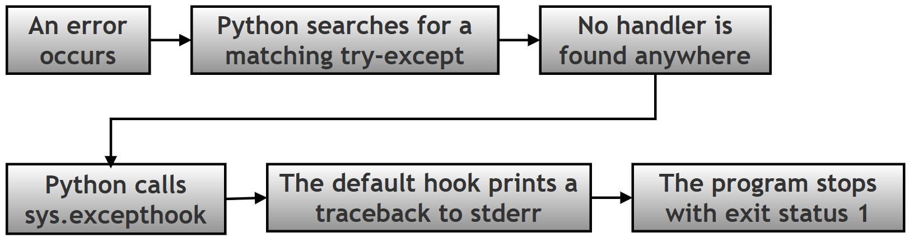
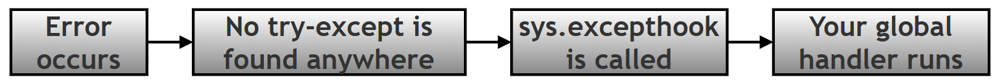
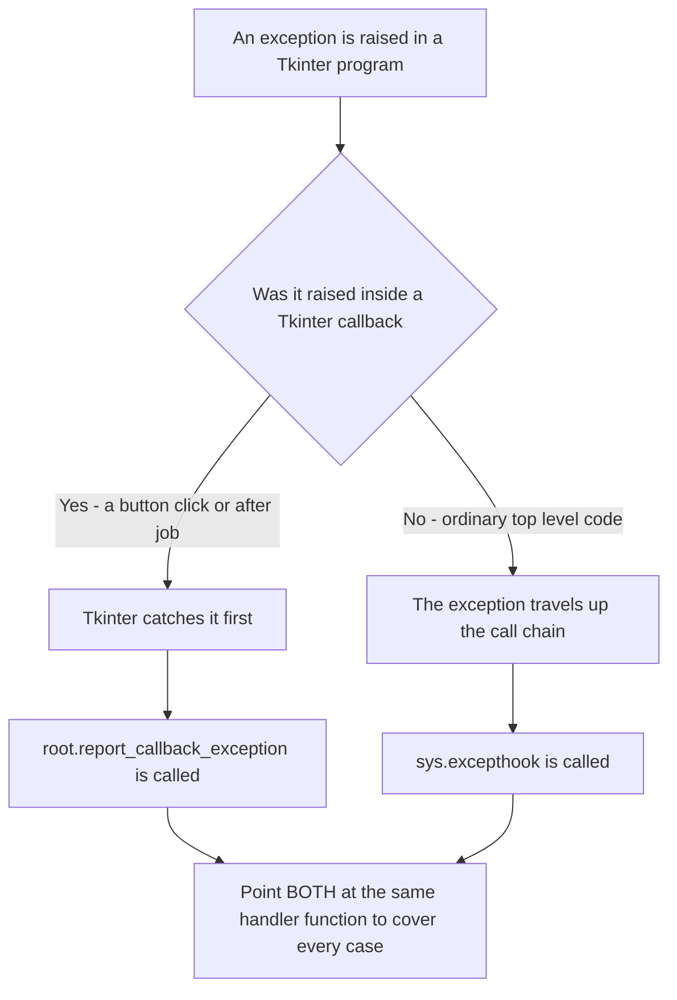
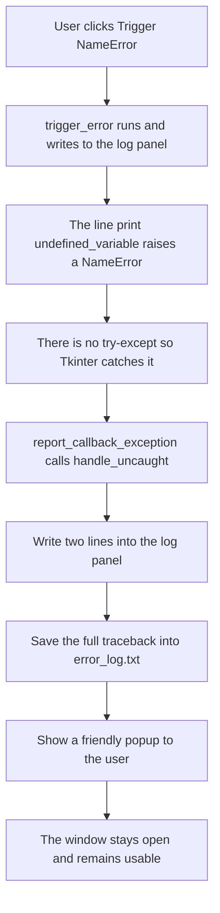
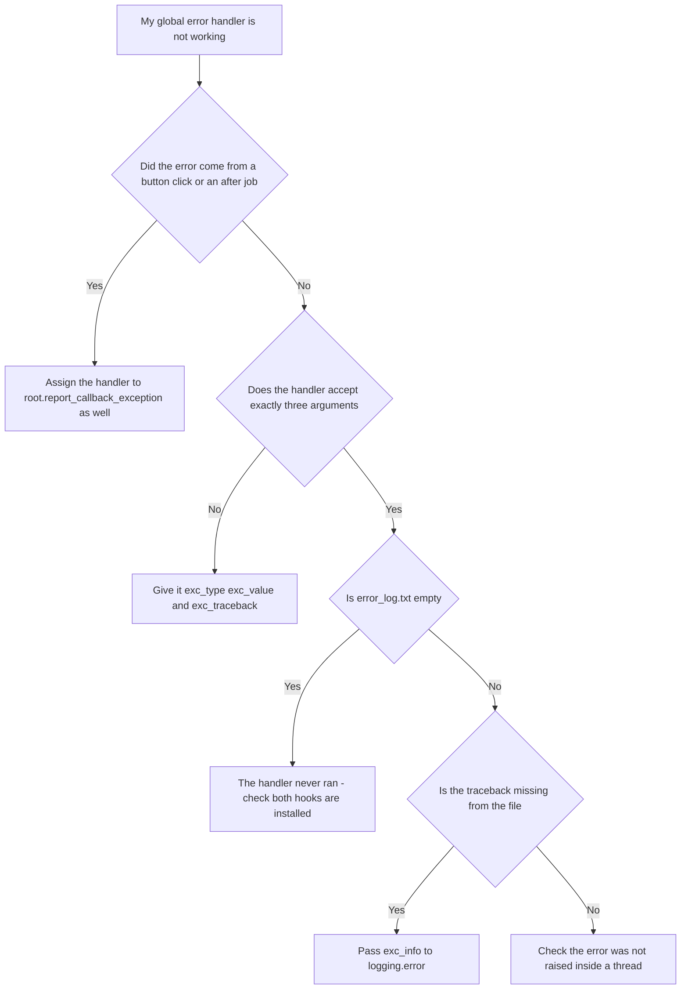

# Handling Uncaught Exceptions in Tkinter with `sys.excepthook` — Worked Answer

## Table of Contents

- [About This Page](#about-this-page)
    - [Why This Topic Matters for Python and for Chapter 14](#why-this-topic-matters-for-python-and-for-chapter-14)
    - [Key Terms Used On This Page](#key-terms-used-on-this-page)
- [Research / Project Question](#research--project-question)
    - [Handling Uncaught Exceptions in Tkinter](#handling-uncaught-exceptions-in-tkinter)
    - [Your Task](#your-task)
    - [Part A — Theory](#part-a--theory)
    - [Part B — Script Writing](#part-b--script-writing)
    - [Part C — Reflection](#part-c--reflection)
    - [Expected Learning Outcome](#expected-learning-outcome)
    - [Optional Follow-Up Questions (not part of the printed book)](#optional-follow-up-questions-not-part-of-the-printed-book)
- [Answer to Part A — Theory](#answer-to-part-a--theory)
    - [A1. What is an Uncaught Exception?](#a1-what-is-an-uncaught-exception)
    - [A2. How Does Python Normally Respond to Unhandled Exceptions?](#a2-how-does-python-normally-respond-to-unhandled-exceptions)
    - [A3. What is `sys.excepthook` and What is Its Purpose?](#a3-what-is-sysexcepthook-and-what-is-its-purpose)
    - [A4. Difference Between Local and Global Exception Handling](#a4-difference-between-local-and-global-exception-handling)
    - [A5. Why Do GUI Applications Prefer Friendly Popup Messages?](#a5-why-do-gui-applications-prefer-friendly-popup-messages)
- [The Tkinter Complication: Why `sys.excepthook` Is Not Enough On Its Own](#the-tkinter-complication-why-sysexcepthook-is-not-enough-on-its-own)
- [Flowchart Showing the Execution of the Script](#flowchart-showing-the-execution-of-the-script)
- [Answer to Part B — The Model Script](#answer-to-part-b--the-model-script)
    - [B1. Imports and Logging Setup](#b1-imports-and-logging-setup)
    - [B2. The Window and the Live Log Panel](#b2-the-window-and-the-live-log-panel)
    - [B3. The Custom Handler](#b3-the-custom-handler)
    - [B4. Installing the Handler in Both Places](#b4-installing-the-handler-in-both-places)
    - [B5. The Deliberate Error and the Button](#b5-the-deliberate-error-and-the-button)
    - [B6. The Complete Script](#b6-the-complete-script)
    - [B7. Expected Output](#b7-expected-output)
- [Answer to Part C — Reflection](#answer-to-part-c--reflection)
- [Common Errors and How to Fix Them](#common-errors-and-how-to-fix-them)
- [Summary of Changes Made to This Page](#summary-of-changes-made-to-this-page)

## About This Page

This page is part of the extended, GitHub-only material that accompanies **Chapter 14 (Tkinter and GUI Programming)** of the printed textbook. It contains one of the chapter's research and project questions, followed by a complete worked answer: the theory, a full model program, a reflection, and a troubleshooting guide.

The subject is what happens when something goes wrong that you did **not** plan for. Every beginner learns `try-except` early, and `try-except` is excellent — as long as you guessed correctly about where trouble would arise. Real programs fail in places nobody predicted. This page is about the safety net underneath everything else: a single place where the program can catch anything that slipped past every `try-except`, record it, and tell the user something sensible instead of collapsing.

[Back to Table of Contents](#table-of-contents)

### Why This Topic Matters for Python and for Chapter 14

**For Python in general:** `sys.excepthook` is one of those quiet features that separates a script from an application. A script can afford to print a traceback and stop — the person running it is usually the person who wrote it. An application cannot, because the person using it did not write it, cannot read a traceback, and has no idea what to do with the words "Traceback (most recent call last)". Learning where an exception actually travels once it escapes your code teaches you something fundamental about how Python itself is put together, and the same idea reappears in web frameworks, background workers and logging systems.

**For this chapter in particular:** the printed chapter shows how to build a window and respond to clicks. This page adds the layer that a finished application needs: what the program does when a click leads somewhere unexpected. It also uncovers an important surprise specific to Tkinter, described in its own section below, which is that `sys.excepthook` on its own does **not** catch errors from button clicks. That single fact is the difference between an error handler that works and one that only looks as though it does.

Every error message, log file and block of output on this page was produced by actually running the code on Python 3.12 with Tk 8.6.14.

[Back to Table of Contents](#table-of-contents)

### Key Terms Used On This Page

| Term | In plain words | Learn more |
| --- | --- | --- |
| Exception | Python's word for an error that happens while the program is running, such as dividing by zero or using a name that does not exist. | [Python docs: Errors and Exceptions](https://docs.python.org/3/tutorial/errors.html) |
| Traceback | The block of text Python prints when an error is not handled. It lists the error, the line it happened on, and the chain of function calls that led there. | [Python docs: traceback](https://docs.python.org/3/library/traceback.html) |
| `try-except` | The statement used to deal with an error in one particular place. Risky code goes in the `try` part; what to do about a failure goes in the `except` part. | [Python docs: Handling Exceptions](https://docs.python.org/3/tutorial/errors.html#handling-exceptions) |
| `sys.excepthook` | A function Python calls when an exception reaches the top of the program without being handled anywhere. You can replace it with your own function. | [Python docs: sys.excepthook](https://docs.python.org/3/library/sys.html#sys.excepthook) |
| `report_callback_exception` | Tkinter's own equivalent of `sys.excepthook`, used for errors raised inside button clicks, `after()` jobs and event bindings. Explained in its own section below. | [Python docs: tkinter](https://docs.python.org/3/library/tkinter.html) |
| `logging` | Python's built-in module for recording what a program did, usually to a file, so that problems can be investigated later. | [Python docs: logging](https://docs.python.org/3/library/logging.html) |
| `stderr` | The "error output" channel. Tracebacks are printed here rather than to the normal output, and it usually appears in the terminal window a program was launched from. | [Python docs: sys.stderr](https://docs.python.org/3/library/sys.html#sys.stderr) |
| Callback | A function handed to something else so that it can be called later — for example, the function given to a button's `command=` option. | [Wikipedia: Callback](https://en.wikipedia.org/wiki/Callback_%28computer_programming%29) |

[Back to Table of Contents](#table-of-contents)

---

## Research / Project Question

[Back to Table of Contents](#table-of-contents)

### Handling Uncaught Exceptions in Tkinter

Normally, Python programs display a **traceback error** and may stop execution when an exception is not handled using: `try-except`

However, GUI applications often require a more user-friendly way to handle unexpected errors.

Research how Python handles **uncaught exceptions** and investigate the role of: `sys.excepthook` in overriding Python’s default error-handling behavior.

[Back to Table of Contents](#table-of-contents)

### Your Task

[Back to Table of Contents](#table-of-contents)

### Part A — Theory

Research and explain the following:

1.  What is an **uncaught exception**?
2.  How does Python normally respond to exceptions that are not handled using `try-except`?
3.  What is: `sys.excepthook` and what is its purpose?

4.  Explain the difference between:

    -    Local Exception Handling: `try-except`
    -    Global Exception Handling: `sys.excepthook`

5.  Why might GUI applications prefer a **friendly popup message** instead of a traceback?

[Back to Table of Contents](#table-of-contents)

----------

### Part B — Script Writing

Write a Tkinter program that:

1.  Creates a GUI window.
2.  Displays a scrolling log area (`Text` widget).
3.  Uses: `logging` to save errors to a file named: `error_log.txt`

4.  Defines a custom function to handle uncaught exceptions.
5.  Overrides Python’s default exception route using: `sys.excepthook`
6.  Adds a button with label: `Trigger NameError`
7.  Intentionally creates an uncaught exception when the button is clicked.
8.  Displays a friendly popup message instead of crashing.

[Back to Table of Contents](#table-of-contents)

----------

### Part C — Reflection

Answer the following:

> What would happen if: `sys.excepthook` were not overridden? Explain briefly.

[Back to Table of Contents](#table-of-contents)

### Expected Learning Outcome

After completing this task, students should be able to:

 - explain uncaught exceptions.
 - distinguish between local and global error handling. 
 - understand how `sys.excepthook` works. 
 - build safer Tkinter applications.
 - create user-friendly error reporting

[Back to Table of Contents](#table-of-contents)

### Optional Follow-Up Questions (not part of the printed book)

These extra questions appear only on this online page, for readers who want to take the investigation further. They are not required in order to answer the printed question.

- **F1.** Install `sys.excepthook` in a Tkinter program, then raise an error from a button click. Does your handler run? Now raise the same error at the top of the file, before `mainloop()` starts. Does it run this time? Explain the difference between the two results.
- **F2.** Open `error_log.txt` after triggering an error. What exactly was written to it? How would you change the `logging.error()` call so the file records the full traceback rather than only the error message?
- **F3.** Python 3.8 added `threading.excepthook` for errors raised inside threads. Why was a separate hook needed, rather than `sys.excepthook` covering threads too?
- **F4.** A global handler catches everything, including errors you could have predicted and handled properly. Why is it still better to write a `try-except` around code you know might fail, rather than relying on the global handler for everything?
- **F5.** After the popup is dismissed in the model program, the window is still open and usable. Is that always the right choice? Describe one situation in which an application should shut down after an unexpected error instead of carrying on.

[Back to Table of Contents](#table-of-contents)

----------

## Answer to Part A — Theory

[Back to Table of Contents](#table-of-contents)

### A1. What is an Uncaught Exception?

An **exception** is an error that occurs while a program is running.

Examples include:

```text
NameError
ValueError
ZeroDivisionError
IndexError
```

Normally, programmers handle exceptions using `try-except`.

However, when an exception is **not handled**, it becomes an:

> **uncaught exception**

Example: `print(undefined_variable)`

Here `undefined_variable` does not exist, so Python raises a `NameError`. Further, if no `try-except` block catches it, the exception becomes **uncaught**.

It is worth being precise about what "uncaught" means, because it is not simply "an error happened". When an exception is raised, Python does not give up straight away. It looks at the function where the error occurred and asks whether that line sits inside a `try` block with a matching `except`. If not, it abandons that function and asks the same question of whoever called it. It keeps travelling back up the chain of calls, and only if it reaches the very top without finding a handler does the exception count as uncaught.

| Stage | What Python does | Is the exception caught? |
| --- | --- | --- |
| The error happens | An exception object is created, carrying the type and the message. | Not yet. |
| Inside the current function | Python looks for a matching `try-except` around that line. | Caught if one is found; the program carries on normally. |
| Back up the chain of callers | The search repeats in each calling function, in turn. | Caught if any of them has a matching handler. |
| The top of the program | No handler was found anywhere. | **Uncaught.** This is where `sys.excepthook` takes over. |

That last row is the whole subject of this page: `sys.excepthook` is not an alternative to `try-except`, it is what happens *after* every `try-except` has had its chance and none of them applied.

[Back to Table of Contents](#table-of-contents)

### A2. How Does Python Normally Respond to Unhandled Exceptions?

By default, Python follows this sequence:



Notice the fourth box, which the short version of this story usually leaves out. Printing the traceback is not something Python does directly — it is done *by* `sys.excepthook`, which is simply the function Python happens to have installed there by default. That is exactly why replacing it changes what happens.

Example:

```python
x = 10 / 0
```

Output:

```text
Traceback (most recent call last):
  File "example.py", line 1, in <module>
    x = 10 / 0
        ~~~^~~
ZeroDivisionError: division by zero
```

This detailed error report is called a **traceback**.

A traceback contains:

-   type of error,
-   error message,
-   line number,
-   sequence of function calls.

Although useful for programmers, traceback messages may confuse normal users.

Two further details are worth knowing:

- The traceback goes to **stderr**, not to normal output. If a program was started by double-clicking an icon rather than from a terminal, there may be no window for it to appear in at all, so the message is simply lost.
- The program ends with **exit status 1**, the conventional signal that something went wrong. A status of 0 means success.

[Back to Table of Contents](#table-of-contents)

### A3. What is `sys.excepthook` and What is Its Purpose?

Python provides a built-in mechanism called `sys.excepthook`. It controls:

> **what Python should do when an uncaught exception occurs**

By default:


However, programmers can replace Python’s default behaviour:

```python
sys.excepthook = handle_uncaught
```

Now, instead of showing an unfriendly traceback, your own `handle_uncaught()` function runs. That function can:

-   display a friendly popup,
-   save errors to a log file,
-   notify the user,
-   prevent abrupt crashes.

Thus:

> `sys.excepthook` provides **global exception handling**.

**The shape your function must have.** `sys.excepthook` is not called with a single error object. Python passes it exactly three arguments, so your replacement must accept three:

```python
def handle_uncaught(exc_type, exc_value, exc_traceback):
    ...
```

| Argument | What it holds | Example |
| --- | --- | --- |
| `exc_type` | The class of the error. Use `exc_type.__name__` to get its plain name. | `NameError` |
| `exc_value` | The exception object itself. Printing it gives the message. | `name 'undefined_variable' is not defined` |
| `exc_traceback` | The full stack trace object, showing every line involved. | Used by `logging` to record where the error happened. |

If your function takes the wrong number of arguments, Python cannot call it, and you end up with an error inside your error handler — a confusing situation worth avoiding.

**One important limitation.** `sys.excepthook` covers uncaught exceptions in the **main thread** of an ordinary program. It does not cover exceptions raised inside other threads — Python 3.8 added a separate `threading.excepthook` for those — and, crucially for this chapter, it does not cover exceptions raised inside Tkinter callbacks either. That last point has its own section below, because it changes how the model program has to be written.

[Back to Table of Contents](#table-of-contents)

### A4. Difference Between Local and Global Exception Handling

| Feature | Local Exception Handling | Global Exception Handling |
| --- | --- | --- |
| Method | `try-except` | `sys.excepthook` |
| Scope | One specific block of code | Entire application |
| Purpose | Handle expected errors locally | Catch uncaught errors |
| Programmer control | Explicitly written around risky code | Runs automatically |
| Example | File reading, division | Unexpected program failures |
| When you write it | Wherever you can predict a failure | Once, near the start of the program |
| Can the program continue afterwards? | Yes, normally by design | Only if your handler is written to allow it |
| What it is for | Errors you expected | Errors you did not expect |

**Local exception handling (`try-except`)**

`try-except` catches errors in a specific part of the program.

Example:

```python
try:
    age = int(text)
except ValueError:
    print("Invalid input")
```

Only this section, the part fenced inside the `try-except` block, is protected. This is called **local exception handling**, because it works only in one location.

**Global exception handling (`sys.excepthook`)**

`sys.excepthook` catches errors that were **not handled anywhere else**.

Example:

```python
sys.excepthook = handle_uncaught
```

Whenever an uncaught error occurs, Python automatically calls `handle_uncaught()`. This protects the entire application. But you, as the programmer, are expected to write that `handle_uncaught()` function yourself.

Hence: **global exception handling**.

**Visual difference**

Local handling:

![Flowchart}(../resources/ch14-tkinter-September-2026-uncaught-exceptions-003.png)

Global handling:



**They are partners, not rivals.** It is tempting to conclude that a global handler makes `try-except` unnecessary. It does not, and it is worth understanding why. A `try-except` block knows exactly what went wrong and exactly where, so it can recover intelligently — ask the user to retype a number, fall back to a default setting, retry a download. A global handler knows only that *something* failed *somewhere*, so all it can sensibly do is record the problem and apologise. Use `try-except` wherever you can foresee a failure, and treat the global handler as the safety net for everything you could not foresee.

[Back to Table of Contents](#table-of-contents)

### A5. Why Do GUI Applications Prefer Friendly Popup Messages?

GUI applications are designed for **normal users**. Most users will not understand a traceback, or the technical error details inside it.

Instead, GUI applications prefer friendly popup dialogs. For example:

```text
Error: Something went wrong.
Please try again.
```

There are several separate reasons, and they are worth separating out:

| Reason | Explanation |
| --- | --- |
| The user cannot read a traceback | It is written for whoever wrote the program, in the vocabulary of Python's internals. To everyone else it reads as alarming nonsense. |
| The user may never see it at all | A traceback goes to `stderr`. An application launched by double-clicking its icon often has no terminal attached, so the message vanishes silently and the program simply appears to do nothing. |
| A popup cannot be missed | A dialog appears on top of the window and must be dismissed, so the user definitely knows something happened. |
| It protects unsaved work | A crash loses whatever the user was doing. A handled error can leave the window open so they can save first. |
| Tracebacks can reveal private details | File paths, user names, database names and occasionally sensitive values appear in tracebacks. A popup shows only what you choose to show. |
| The details are still kept | Writing the full traceback to a log file means the programmer loses nothing, while the user sees only the friendly summary. |

That last row is the key to doing this well. A good handler does not throw the technical detail away — it sends the short version to the user and the long version to a file.

[Back to Table of Contents](#table-of-contents)

----------

## The Tkinter Complication: Why `sys.excepthook` Is Not Enough On Its Own

This section is not part of the printed question, but no honest answer to Part B can leave it out.

The natural way to build the program in Part B is to write a `handle_uncaught()` function, assign it to `sys.excepthook`, and then trigger a `NameError` from a button click. It looks completely correct. **It does not work**, and it fails in the most confusing way possible: silently.

The reason is that Tkinter never lets a callback error reach the top of the program. Every function you give to `command=`, to `after()`, or to `bind()` is wrapped by Tkinter. If that function raises, Tkinter catches the exception itself and hands it to a method of its own called `report_callback_exception`, whose default behaviour is to print `Exception in Tkinter callback` and a traceback to `stderr`. The exception never travels any further, so `sys.excepthook` is never consulted.

Here is the test, reduced to its essentials. The same failing button is used twice: once with only `sys.excepthook` installed, and once with `report_callback_exception` installed as well.

```python
# Step 1: Two handlers, so we can see which one Python actually uses.
import sys
import tkinter as tk

def sys_hook(exc_type, exc_value, exc_tb):
    print(f"  sys.excepthook ran        -> {exc_type.__name__}")

def tk_hook(exc_type, exc_value, exc_tb):
    print(f"  report_callback_exception ran -> {exc_type.__name__}")

# Step 2: A button callback that always fails.
def boom():
    print(undefined_variable)

# Step 3: Test one - install only sys.excepthook, the usual advice.
print("Test 1: sys.excepthook installed on its own")
sys.excepthook = sys_hook
root = tk.Tk()
b = tk.Button(root, text="boom", command=boom)
b.pack()
b.invoke()                 # invoke() clicks the button from code
root.update()
print("  (nothing above means no handler of ours ran)")
root.destroy()

# Step 4: Test two - install Tkinter's own hook as well.
print("\nTest 2: report_callback_exception installed as well")
root = tk.Tk()
root.report_callback_exception = tk_hook
b = tk.Button(root, text="boom", command=boom)
b.pack()
b.invoke()
root.update()
root.destroy()
```

The real output:

```text
Test 1: sys.excepthook installed on its own
Exception in Tkinter callback
Traceback (most recent call last):
  File "/usr/lib/python3.12/tkinter/__init__.py", line 1967, in __call__
    return self.func(*args)
           ^^^^^^^^^^^^^^^^
  File "demo_compare.py", line 12, in boom
    print(undefined_variable)
          ^^^^^^^^^^^^^^^^^^
NameError: name 'undefined_variable' is not defined
  (nothing above means no handler of ours ran)

Test 2: report_callback_exception installed as well
  report_callback_exception ran -> NameError
```

In Test 1 the custom handler never ran. There was no popup, nothing was written to a log file, and the only sign of trouble was a traceback in a terminal the user is unlikely to be looking at. In Test 2, with one extra line, the handler ran exactly as intended.

A wider test confirms where each hook applies:

| Where the error is raised | Which hook Python actually uses |
| --- | --- |
| Inside a button's `command` function | `report_callback_exception` |
| Inside a function scheduled with `after()` | `report_callback_exception` |
| Inside a function bound with `bind()` | `report_callback_exception` |
| At the top level of the script, before or after `mainloop()` | `sys.excepthook` |
| Inside a separate thread | `threading.excepthook` |



**The conclusion for Part B.** The question asks you to override Python's default exception route using `sys.excepthook`, and the model program below does exactly that. But it also assigns the same function to `root.report_callback_exception`, because that is the only way the button in requirement 7 can produce the friendly popup in requirement 8. Pointing both names at one handler function costs one extra line and makes the program behave the way the question describes.

[Back to Table of Contents](#table-of-contents)

----------

## Flowchart Showing the Execution of the Script


The same sequence in text form, showing what happens from the moment the button is clicked:



[Back to Table of Contents](#table-of-contents)

----------

## Answer to Part B — The Model Script

The program is built up step by step below, and given as one complete file in Section B6. Teaching `print()` statements have been added at each stage, and `write_log()` prints to the terminal as well as to the window, so the log panel and the terminal can be compared side by side.

[Back to Table of Contents](#table-of-contents)

### B1. Imports and Logging Setup

Requirement 3 asks for errors to be saved to `error_log.txt`. `logging.basicConfig()` is the one-line way to arrange that.

```python
# Step 1: Import everything the program needs.
import logging          # writes error records to a file
import sys              # gives access to sys.excepthook
import tkinter as tk
from tkinter import messagebox

# Step 2: Configure logging, so every error is saved to error_log.txt.
# level=ERROR means routine information is ignored and only errors are kept.
# The format puts a timestamp and the severity in front of each message.
log_level = logging.ERROR
log_format = "%(asctime)s - %(levelname)s - %(message)s"
logging.basicConfig(filename="error_log.txt", level=log_level, format=log_format)
print("Step 2 complete: logging configured, errors will be saved to error_log.txt")
```

The file is created in whatever folder the program is run from, and each new error is added to the end rather than replacing what is already there.

[Back to Table of Contents](#table-of-contents)

### B2. The Window and the Live Log Panel

Requirements 1 and 2 ask for a window containing a scrolling log area. A `Text` widget serves as a small console inside the window, so the user can watch events as they happen.

```python
# Step 3: Create the main window.
root = tk.Tk()
root.title("Global Hook Demo")
root.geometry("460x340")
print("Step 3 complete: main window created")

# Step 4: Create the live log panel - a Text widget that behaves like a
# small console inside the window, so the user can watch what happens.
log_box = tk.Text(root, height=10, width=52)
log_box.pack(padx=10, pady=10)
print("Step 4 complete: log panel created")


def write_log(message):
    """Adds one line to the log panel inside the window."""
    # Step 4a: Add the message at the end of the Text widget.
    log_box.insert(tk.END, message + "\n")
    # Step 4b: Scroll down so the newest line is always visible.
    # Without this the lines would keep piling up out of sight.
    log_box.see(tk.END)
    # Step 4c: Also print it to the terminal, so the two can be compared.
    print(f"    [log panel] {message}")
```

[Back to Table of Contents](#table-of-contents)

### B3. The Custom Handler

Requirement 4 asks for a custom function to handle uncaught exceptions. This is the heart of the program, and it does four things in order: describe, display, record, and inform.

```python
def handle_uncaught(exc_type, exc_value, exc_traceback):
    """
    The single place where every uncaught error is dealt with.

    Python passes three pieces of information to this function:
      exc_type      - the class of the error, for example NameError
      exc_value     - the error message itself
      exc_traceback - the full stack trace, showing where it happened
    """
    # Step 5a: Build a short, readable description of the error.
    error_msg = f"{exc_type.__name__}: {exc_value}"

    # Step 5b: Show what is happening in the log panel.
    write_log("Global hook activated")
    write_log(f"ERROR - {error_msg}")

    # Step 5c: Save the full details to error_log.txt.
    # exc_info takes the same three values, so the file gets the complete
    # stack trace even though the popup only shows the short version.
    logging.error(error_msg, exc_info=(exc_type, exc_value, exc_traceback))
    write_log("Error saved to error_log.txt")

    # Step 5d: Tell the user in plain language, instead of crashing.
    messagebox.showerror("Unexpected Error", error_msg)
```

Note `exc_info=(exc_type, exc_value, exc_traceback)` in Step 5c. Without it, the log file would record only the one-line summary. With it, the file receives the entire traceback, so the user gets the short friendly message while the programmer keeps everything needed to diagnose the problem later.

[Back to Table of Contents](#table-of-contents)

### B4. Installing the Handler in Both Places

Requirement 5 asks for `sys.excepthook` to be overridden. As shown in the section above, Tkinter also needs `report_callback_exception`, or the button in requirement 7 will produce nothing at all.

```python
# Step 6: Install the handler in BOTH places that matter.
# sys.excepthook catches errors that reach the top level of the program.
sys.excepthook = handle_uncaught
# report_callback_exception catches errors raised inside Tkinter callbacks -
# button clicks, after() jobs, and event bindings. Tkinter catches those
# itself and never lets them reach sys.excepthook, so without this second
# line the popup would never appear when the button is clicked.
root.report_callback_exception = handle_uncaught
write_log("Global hook installed")
print("Step 6 complete: sys.excepthook and report_callback_exception both point to handle_uncaught")
```

One function, two entry points. Whichever route an error takes, it arrives at the same place.

[Back to Table of Contents](#table-of-contents)

### B5. The Deliberate Error and the Button

Requirements 6 and 7 ask for a button labelled `Trigger NameError` that causes an uncaught exception.

```python
def trigger_error():
    """Deliberately causes an uncaught NameError."""
    # Step 7a: Show that the button was clicked.
    write_log("Button clicked")
    write_log("Triggering NameError")
    # Step 7b: Use a name that was never defined. There is no try-except
    # here on purpose, so the global handler is the only thing that can
    # deal with it.
    print(undefined_variable)


# Step 8: The button that causes the error.
tk.Button(root, text="Trigger NameError", command=trigger_error).pack(pady=10)
print("Step 8 complete: Trigger NameError button added")

# Step 9: Start the event loop and wait for the user.
root.mainloop()
```

`undefined_variable` is never assigned anywhere, so Python raises `NameError` the moment that line runs. There is deliberately no `try-except` around it — the whole point is to see the global handler do its work.

[Back to Table of Contents](#table-of-contents)

### B6. The Complete Script

```python
# Step 1: Import everything the program needs.
import logging          # writes error records to a file
import sys              # gives access to sys.excepthook
import tkinter as tk
from tkinter import messagebox

# Step 2: Configure logging, so every error is saved to error_log.txt.
log_level = logging.ERROR
log_format = "%(asctime)s - %(levelname)s - %(message)s"
logging.basicConfig(filename="error_log.txt", level=log_level, format=log_format)
print("Step 2 complete: logging configured, errors will be saved to error_log.txt")

# Step 3: Create the main window.
root = tk.Tk()
root.title("Global Hook Demo")
root.geometry("460x340")
print("Step 3 complete: main window created")

# Step 4: Create the live log panel - a Text widget that behaves like a
# small console inside the window, so the user can watch what happens.
log_box = tk.Text(root, height=10, width=52)
log_box.pack(padx=10, pady=10)
print("Step 4 complete: log panel created")


def write_log(message):
    """Adds one line to the log panel inside the window."""
    # Step 4a: Add the message at the end of the Text widget.
    log_box.insert(tk.END, message + "\n")
    # Step 4b: Scroll down so the newest line is always visible.
    log_box.see(tk.END)
    # Step 4c: Also print it to the terminal, so the two can be compared.
    print(f"    [log panel] {message}")


def handle_uncaught(exc_type, exc_value, exc_traceback):
    """
    The single place where every uncaught error is dealt with.

    Python passes three pieces of information to this function:
      exc_type      - the class of the error, for example NameError
      exc_value     - the error message itself
      exc_traceback - the full stack trace, showing where it happened
    """
    # Step 5a: Build a short, readable description of the error.
    error_msg = f"{exc_type.__name__}: {exc_value}"

    # Step 5b: Show what is happening in the log panel.
    write_log("Global hook activated")
    write_log(f"ERROR - {error_msg}")

    # Step 5c: Save the full details to error_log.txt.
    # exc_info takes the same three values, so the file gets the complete
    # stack trace even though the popup only shows the short version.
    logging.error(error_msg, exc_info=(exc_type, exc_value, exc_traceback))
    write_log("Error saved to error_log.txt")

    # Step 5d: Tell the user in plain language, instead of crashing.
    messagebox.showerror("Unexpected Error", error_msg)


# Step 6: Install the handler in BOTH places that matter.
# sys.excepthook catches errors that reach the top level of the program.
sys.excepthook = handle_uncaught
# report_callback_exception catches errors raised inside Tkinter callbacks -
# button clicks, after() jobs, and event bindings. Tkinter catches those
# itself and never lets them reach sys.excepthook, so without this second
# line the popup would never appear when the button is clicked.
root.report_callback_exception = handle_uncaught
write_log("Global hook installed")
print("Step 6 complete: sys.excepthook and report_callback_exception both point to handle_uncaught")


def trigger_error():
    """Deliberately causes an uncaught NameError."""
    # Step 7a: Show that the button was clicked.
    write_log("Button clicked")
    write_log("Triggering NameError")
    # Step 7b: Use a name that was never defined. There is no try-except
    # here on purpose, so the global handler is the only thing that can
    # deal with it.
    print(undefined_variable)


# Step 8: The button that causes the error.
tk.Button(root, text="Trigger NameError", command=trigger_error).pack(pady=10)
print("Step 8 complete: Trigger NameError button added")

# Step 9: Start the event loop and wait for the user.
root.mainloop()
```

[Back to Table of Contents](#table-of-contents)

### B7. Expected Output

When the program starts, the terminal shows the setup steps and the window opens with one line already in its log panel:

```text
Step 2 complete: logging configured, errors will be saved to error_log.txt
Step 3 complete: main window created
Step 4 complete: log panel created
    [log panel] Global hook installed
Step 6 complete: sys.excepthook and report_callback_exception both point to handle_uncaught
Step 8 complete: Trigger NameError button added
```

After clicking **Trigger NameError**, the terminal continues:

```text
    [log panel] Button clicked
    [log panel] Triggering NameError
    [log panel] Global hook activated
    [log panel] ERROR - NameError: name 'undefined_variable' is not defined
    [log panel] Error saved to error_log.txt
```

A popup appears reading:

```text
Unexpected Error
NameError: name 'undefined_variable' is not defined
```

And the log panel inside the window contains:

```text
Global hook installed
Button clicked
Triggering NameError
Global hook activated
ERROR - NameError: name 'undefined_variable' is not defined
Error saved to error_log.txt
```

Most importantly, the window is still open and still usable. The button can be clicked again, and the whole sequence repeats.

**The contents of `error_log.txt`.** This is the part the user never sees and the programmer relies on:

```text
2026-09-08 06:46:02,817 - ERROR - NameError: name 'undefined_variable' is not defined
Traceback (most recent call last):
  File "/usr/lib/python3.12/tkinter/__init__.py", line 1967, in __call__
    return self.func(*args)
           ^^^^^^^^^^^^^^^^
  File "global_hook_demo.py", line 82, in trigger_error
    print(undefined_variable)
          ^^^^^^^^^^^^^^^^^^
NameError: name 'undefined_variable' is not defined
```

The timestamp, the error and the exact line are all recorded. The user saw one short sentence; the programmer has everything.

[Back to Table of Contents](#table-of-contents)

----------

## Answer to Part C — Reflection

**What would happen if `sys.excepthook` were not overridden?**

Python would fall back on the default hook that it installs at start-up, and the answer then depends on where the error occurs. In a Tkinter program there are two different outcomes, and both are bad for the user in different ways.

**For an error in ordinary, top-level code**, the default `sys.excepthook`:

1. Prints the full traceback to `stderr`.
2. Ends the program with exit status 1.

The consequences are that the window disappears without warning, any unsaved work is lost, nothing is written to a log file, and the traceback is shown in a terminal the user may not have open. If the program was started by double-clicking an icon, there is no terminal at all, so the application simply vanishes with no explanation whatsoever.

**For an error inside a button click or another Tkinter callback** — which covers most of what an application actually does — the error never reaches `sys.excepthook` in the first place. Tkinter's own default handler prints `Exception in Tkinter callback` and a traceback to `stderr`, then carries on. The window stays open, which sounds better, but from the user's point of view it is arguably worse: they clicked a button and *absolutely nothing happened*. No popup, no message, no visible change. They will click again, get the same silence, and conclude that the program is broken.

| | Default behaviour | With a custom handler installed |
| --- | --- | --- |
| Top-level error: what the user sees | The application disappears | A clear popup explaining what went wrong |
| Callback error: what the user sees | Nothing at all | A clear popup explaining what went wrong |
| Where the details go | `stderr`, often into a terminal nobody is watching | `error_log.txt`, kept permanently |
| Unsaved work | Lost on a top-level error | The window stays open, so it can be saved |
| Can the programmer investigate later? | Only if someone copied the traceback down | Yes, the log file has the full trace with a timestamp |

In short, overriding the hook changes an error from something that either kills the program silently or does nothing visible at all, into something the user is told about and the programmer can investigate afterwards.

[Back to Table of Contents](#table-of-contents)

----------

## Common Errors and How to Fix Them

| Symptom | Likely cause | Fix |
| --- | --- | --- |
| The button click produces no popup and nothing in the log file, but a traceback appears in the terminal | Only `sys.excepthook` was installed. Tkinter routes callback errors elsewhere. | Also assign the same function to `root.report_callback_exception`. |
| `TypeError: handle_uncaught() takes 1 positional argument but 3 were given` | The handler was written to take a single argument. | It must accept exactly three: `exc_type`, `exc_value`, `exc_traceback`. |
| `error_log.txt` is created but stays empty, 0 bytes | The handler never actually ran, so `logging.error()` was never reached. | Check that both hooks are installed, using the test in the section above. |
| The log file records only one line, with no traceback | `logging.error(error_msg)` was called without `exc_info`. | Use `logging.error(error_msg, exc_info=(exc_type, exc_value, exc_traceback))`. |
| Nothing is written to the log file even though the handler runs | `logging.basicConfig()` was called after the first logging call, or another library configured logging first. `basicConfig` only takes effect once. | Call it once, near the top of the program, before anything else logs. |
| The popup appears but the window then freezes | The handler itself raised an error, for example by touching a widget that no longer exists. | Keep the handler simple, and check `winfo_exists()` before updating a widget from it. |
| A stream of identical popups appears | The error happens repeatedly, for example inside a repeating `after()` job. | Cancel the repeating job inside the handler, or count errors and stop after a few. |
| Errors inside a thread are still not caught | `sys.excepthook` does not cover threads. | Use `threading.excepthook`, added in Python 3.8. |



[Back to Table of Contents](#table-of-contents)

----------

## Summary of Changes Made to This Page

The table below documents every change made while revising this page, for transparency. **The printed research question — the whole block from "Research / Project Question" through Part A, Part B, Part C and the Expected Learning Outcome — has been reproduced word for word, and verified line by line against the original file.** Its wording, its lists, its code samples and its punctuation are unchanged, and no typographical errors were found in it that needed correcting. All new material has been added in clearly separate, clearly labelled sections.

| Element | Original | Change made |
| --- | --- | --- |
| Overall structure | An untitled page starting directly with the research question, followed by a "Model Theory Solution" and a script, with no answer to Part C. | Added a page title, a clickable table of contents, an "About This Page" introduction, a "Key Terms" glossary, answers labelled A1 to A5 matching the five Part A questions, a new section on the Tkinter complication, answers labelled B1 to B7 for the script, a full answer to Part C, a common-errors section, and this change-log table. |
| Table of contents | None. | Added at the top, with `###` subtopics nested as a sub-list under their `##` topics, and every entry linked to its heading. A "Back to Table of Contents" link was added at the end of each topic and subtopic. |
| Printed research question | Present. | Reproduced word for word, verified line by line. Heading levels are unchanged, since the question already sat at the levels needed for the table of contents. |
| Follow-up questions | None. | Added five optional follow-up questions (F1 to F5), clearly marked as additional online material and not part of the printed book. |
| **Model script: it did not work** | The script installed `sys.excepthook = handle_uncaught` and then raised a `NameError` from a button click. Running it confirmed that the handler never ran: no popup appeared, the log panel stopped after "Triggering NameError", `error_log.txt` was created but stayed **0 bytes**, and the only output was `Exception in Tkinter callback` plus a traceback in the terminal. Requirements 3, 7 and 8 of Part B were therefore not met. | **Corrected.** The same function is now also assigned to `root.report_callback_exception`, which is the hook Tkinter actually uses for callback errors. The `sys.excepthook` line required by the question is kept as well, so both routes lead to the same handler. Verified by running the corrected script: the popup now appears, the log panel completes all five lines, and `error_log.txt` is written with the timestamped error and the full traceback instead of staying empty. |
| Explanation of the above | Not mentioned anywhere; the page assumed `sys.excepthook` was sufficient. | Added a new section, "The Tkinter Complication", containing a reduced side-by-side test program, its real captured output showing the handler running in one case and not the other, a table of which hook applies to which kind of error, and a flowchart. |
| Answer to Part C | **Missing entirely.** Part C asks what would happen if `sys.excepthook` were not overridden, but the model answer ended after Part A and the script. | Added a full answer, covering both cases separately: a top-level error, where the default hook prints a traceback and exits with status 1; and a callback error, where Tkinter's own default prints to `stderr` and the user sees nothing at all. Includes a comparison table of default behaviour against a custom handler. |
| A1, uncaught exceptions | Gave a definition, a list of error names, and an example. | All original content kept. Added a four-stage table tracing how Python searches for a handler up the chain of callers, and the point that `sys.excepthook` is not an alternative to `try-except` but what happens after every `try-except` has been given its chance. |
| A2, how Python responds | Gave a three-line arrow sequence and an example. | Original content kept. Added the step the original omitted: printing the traceback is done *by* `sys.excepthook`, which is why replacing it works. Added the facts that the traceback goes to `stderr` and that the program exits with status 1. |
| A2 example output | The traceback example had run together onto one line: `Traceback (most recent call last):...ZeroDivisionError:division by zero`. | Replaced with a correctly formatted traceback in a `text` block, showing the real multi-line layout a student would actually see. |
| A3, `sys.excepthook` | Described its purpose and listed what a custom handler can do. | All original content kept. Added the required three-argument signature with a table explaining `exc_type`, `exc_value` and `exc_traceback`, a warning about the `TypeError` produced by the wrong number of arguments, and the limitations regarding threads and Tkinter callbacks. |
| A4, local versus global | Gave a five-row comparison table and two examples. | All five original rows kept, with three further rows added. Added a closing paragraph explaining that the two are partners rather than alternatives, since a local handler can recover intelligently while a global one can only record and apologise. |
| A5, friendly popups | Three short lines. | Original content kept and expanded into a six-row table of distinct reasons, including the point that a traceback sent to `stderr` may never be seen at all by someone who launched the program from an icon, and that tracebacks can expose file paths and private details. |
| Pseudo-code in `python` fences | Five blocks of arrow diagrams and sample text were placed inside ```python fences although they were not Python code: the "Error occurs" sequence, the "uncaught error" sequence, the "LOCAL"/"GLOBAL" visual difference blocks, the error-name list, and the popup wording example. | The error-name list and the popup example were moved to ` ```text ` fences, matching their actual content. The three arrow sequences were replaced with Mermaid flowcharts. |
| Spacing errors in code samples | `sys.excepthook =handle_uncaught` (twice), `try-except`block, `Error:Something went wrong.`, `LOCAL:Error`, `GLOBAL:Error`, and `tracebacks technical error details` all ran words together without spaces. | All corrected to normal spacing, and the run-together phrase "tracebacks technical error details" was separated into the two ideas it was meant to express. |
| Flowchart image | `` shown with no surrounding explanation. | The original image link was kept unchanged, and a Mermaid flowchart of the same execution sequence was added beneath it, so the flow is visible even if the image resource is unavailable to a reader. |
| Script comments | Numbered `# 1.` to `# 9.`, with several very long comment lines running past the width of the code. | Renumbered to the `# Step N:` format, with sub-steps such as `# Step 5a:` inside functions. Long trailing comments were moved onto their own lines above the code they describe. |
| Script: `logging.error(error_msg)` | Recorded only the one-line summary, so the log file lost the traceback. | Changed to `logging.error(error_msg, exc_info=(exc_type, exc_value, exc_traceback))`, so the file receives the complete stack trace while the popup still shows only the short message. |
| Script: minor style points | `sys.excepthook = (handle_uncaught)` used unnecessary brackets, and `error_msg = (f"{exc_type.__name__}: " f"{exc_value}")` used implicit string concatenation across two f-strings for no reason. | Simplified to `sys.excepthook = handle_uncaught` and a single f-string. |
| Script: output | No `print()` statements at all, and no sample output anywhere on the page. | Added teaching `print()` statements at every step, and made `write_log()` echo to the terminal as well as the window. Added a new "Expected Output" section showing genuine captured output for start-up and for the button click, the popup text, the final contents of the log panel, and the real contents of `error_log.txt`. |
| Script: presentation | A single code block. | Split into explained sections B1 to B5, followed by the complete combined script in B6, so it can be read either way. |
| Troubleshooting guidance | None. | Added an eight-row table mapping each symptom to its cause and fix, including the empty-log-file symptom produced by the original script, plus a decision flowchart of the same checklist. |
| Diagrams | None. | Added six Mermaid diagrams: Python's default response, the default hook sequence, the local-versus-global comparison, the routing of exceptions in Tkinter, the script's execution sequence, and the troubleshooting flowchart. All use plain flowchart syntax with no brackets or quotation marks inside node labels, so they can be imported into draw.io. |
| Emojis | None used. | None used (unchanged). |

[Back to Table of Contents](#table-of-contents)


