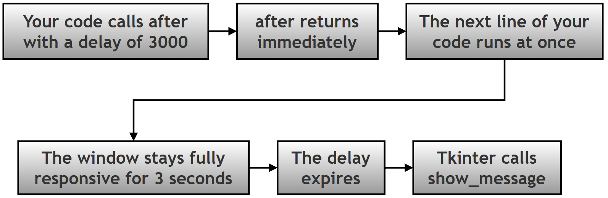
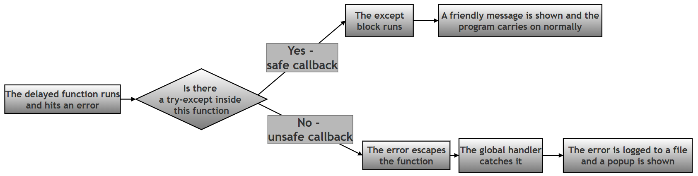
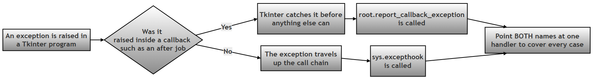
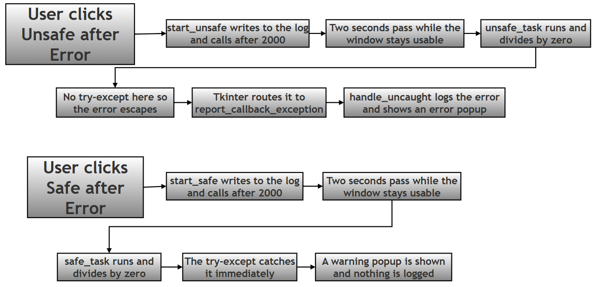
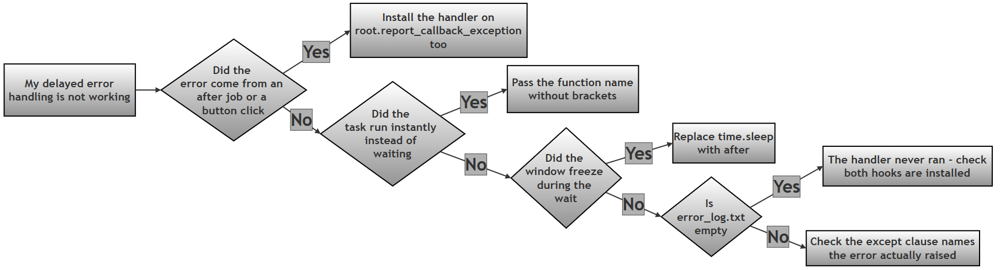

# Safe and Unsafe Delayed Callbacks in Tkinter — Worked Answer

## Table of Contents

- [About This Page](#about-this-page)
    - [Why This Topic Matters for Python and for Chapter 14](#why-this-topic-matters-for-python-and-for-chapter-14)
    - [Key Terms Used On This Page](#key-terms-used-on-this-page)
- [Research / Project Question](#research--project-question)
    - [Tkinter `after()` — Safe and Unsafe Delayed Callbacks](#tkinter-after--safe-and-unsafe-delayed-callbacks)
    - [Part A — Theory](#part-a--theory)
    - [Part B — Script Writing](#part-b--script-writing)
    - [Optional Follow-Up Questions (not part of the printed book)](#optional-follow-up-questions-not-part-of-the-printed-book)
- [Answer to Part A — Theory](#answer-to-part-a--theory)
    - [A1. What is `after()` and What is Its Purpose?](#a1-what-is-after-and-what-is-its-purpose)
    - [A2. What is a Callback Function?](#a2-what-is-a-callback-function)
    - [A3. What is Delayed Execution?](#a3-what-is-delayed-execution)
    - [A4. What Happens if a Delayed Callback Fails?](#a4-what-happens-if-a-delayed-callback-fails)
    - [A5. Unsafe versus Safe Callback](#a5-unsafe-versus-safe-callback)
    - [A6. Why is `time.sleep()` Avoided in Tkinter Programs?](#a6-why-is-timesleep-avoided-in-tkinter-programs)
- [The Tkinter Trap: Making the Unsafe Button Actually Work](#the-tkinter-trap-making-the-unsafe-button-actually-work)
- [Answer to Part B — The Model Script](#answer-to-part-b--the-model-script)
    - [B1. Imports, Logging and the Window](#b1-imports-logging-and-the-window)
    - [B2. The Scrolling Log Panel](#b2-the-scrolling-log-panel)
    - [B3. The Global Handler](#b3-the-global-handler)
    - [B4. Installing the Handler in Both Places](#b4-installing-the-handler-in-both-places)
    - [B5. The Two Tasks and the Two Buttons](#b5-the-two-tasks-and-the-two-buttons)
    - [B6. The Complete Script](#b6-the-complete-script)
    - [B7. Expected Output](#b7-expected-output)
- [Flowchart](#flowchart)
- [Common Errors and How to Fix Them](#common-errors-and-how-to-fix-them)
- [Summary of Changes Made to This Page](#summary-of-changes-made-to-this-page)

## About This Page

This page is part of the extended, GitHub-only material that accompanies **Chapter 14 (Tkinter and GUI Programming)** of the printed textbook. It contains one of the chapter's research and project questions, followed by a complete worked answer: the theory, a full model program with both a deliberately unsafe and a deliberately safe version of the same task, and a troubleshooting guide.

The idea at the centre of this page is a simple one with far-reaching consequences. When you schedule a function to run later with `after()`, you are handing a piece of work to Tkinter and walking away. By the time that work actually runs, the code that scheduled it has long since finished. So if the delayed work goes wrong, there is nobody standing there to catch the problem — unless you arranged for someone to be.

That gives you two choices, and the page is built around comparing them:

- An **unsafe callback** has no protection of its own. When it fails, the error escapes and has to be caught by a global safety net, if one exists at all.
- A **safe callback** wraps its risky work in `try-except`, deals with the problem on the spot, and never troubles anything else.

[Back to Table of Contents](#table-of-contents)

### Why This Topic Matters for Python and for Chapter 14

**For Python in general:** the moment your code stops running top to bottom and starts being *called back* by something else — a GUI toolkit, a web framework, a scheduler, a background worker — the ordinary rules about where an error ends up stop applying in the way you expect. Understanding that an exception can only be caught by something that is still waiting on the call stack at the moment it is raised is one of the genuinely important ideas in Python, and delayed callbacks are the clearest place to see it.

**For this chapter in particular:** the printed chapter shows buttons that respond instantly. This page covers the two-second gap between asking for work and the work happening, and what that gap does to error handling. It also demonstrates something that is easy to get wrong and hard to notice, described in its own section below: in Tkinter, the usual global safety net does **not** catch errors from `after()` callbacks unless it is installed in a second place as well.

Every error message, timing measurement, log file and block of output on this page was produced by actually running the code on Python 3.12 with Tk 8.6.14.

[Back to Table of Contents](#table-of-contents)

### Key Terms Used On This Page

| Term | In plain words | Learn more |
| --- | --- | --- |
| `after()` | A Tkinter method that asks for a function to be run later, after a delay you choose, without stopping the program in the meantime. | [Python docs: tkinter](https://docs.python.org/3/library/tkinter.html) |
| Callback | A function you hand to something else so that it can be called later, on your behalf. You write it; something else decides when it runs. | [Wikipedia: Callback](https://en.wikipedia.org/wiki/Callback_%28computer_programming%29) |
| Event loop | A loop hidden inside Tkinter that runs once you call `mainloop()`. It waits for clicks, key presses and expired timers, and calls the matching piece of your code. | [Python docs: tkinter](https://docs.python.org/3/library/tkinter.html) |
| Blocking | Code that refuses to hand control back until it has finished. `time.sleep(2)` blocks for two seconds, and nothing else in the program can happen during that time. | [Python docs: time.sleep](https://docs.python.org/3/library/time.html#time.sleep) |
| `try-except` | Python's way of dealing with an error in one particular place. Risky code goes in the `try` part; what to do about a failure goes in the `except` part. | [Python docs: Handling Exceptions](https://docs.python.org/3/tutorial/errors.html#handling-exceptions) |
| `sys.excepthook` | A function Python calls when an exception reaches the top of the program without being handled anywhere. It can be replaced with your own function. | [Python docs: sys.excepthook](https://docs.python.org/3/library/sys.html#sys.excepthook) |
| `report_callback_exception` | Tkinter's own equivalent of `sys.excepthook`, used for errors raised inside button clicks and `after()` jobs. It has its own section below, because this page depends on it. | [Python docs: tkinter](https://docs.python.org/3/library/tkinter.html) |
| `ZeroDivisionError` | The error Python raises when a number is divided by zero. It is used on this page simply because it is the easiest error to cause deliberately. | [Python docs: Built-in Exceptions](https://docs.python.org/3/library/exceptions.html#ZeroDivisionError) |
| `logging` | Python's built-in module for recording what a program did, usually into a file, so problems can be investigated afterwards. | [Python docs: logging](https://docs.python.org/3/library/logging.html) |

[Back to Table of Contents](#table-of-contents)

---

## Research / Project Question

[Back to Table of Contents](#table-of-contents)

### Tkinter `after()` — Safe and Unsafe Delayed Callbacks

In GUI applications, some tasks do not run immediately. Instead, they run after a delay. Tkinter provides the: `after()` method to schedule functions to run later. However, delayed tasks may sometimes fail. Therefore, programmers must understand the difference between: `unsafe callback` and `safe callback`.

[Back to Table of Contents](#table-of-contents)

----------

### Part A — Theory

**Research and explain the following:**

#### 1. What is: `after()` and what is its purpose?

#### 2. What is a callback function?

#### 3. Explain: `delayed execution` with one example.

#### 4. What may happen if a delayed callback contains an error?

#### 5. Explain the difference between:

   -  Unsafe Callback (no `try-except`) and
   - Safe Callback (using `try-except`)

#### 6. Why is: `time.sleep()` generally avoided in Tkinter programs?

[Back to Table of Contents](#table-of-contents)

----------

### Part B — Script Writing

Write a Tkinter program that:

1.  Creates a GUI window with a scrolling log area.
2.  Adds two buttons:

```python
Unsafe after() Error
Safe after() Error
```

3.  The first button should:

-   schedule a task after 2 seconds,
-   deliberately generate: `ZeroDivisionError`

-   allow global exception handling to catch it.

4.  The second button should:

-   schedule a task after 2 seconds,
-   safely handle the error using: `try-except`

5.  The GUI should show log messages describing what happens.

[Back to Table of Contents](#table-of-contents)

----------

### Optional Follow-Up Questions (not part of the printed book)

These extra questions appear only on this online page, for readers who want to take the investigation further. They are not required in order to answer the printed question.

- **F1.** After clicking both buttons once, open `error_log.txt`. How many entries are in it, and why is that number not two? What does your answer tell you about where each error was dealt with?
- **F2.** In the unsafe task, add a line of code *after* the division by zero. Does it ever run? Explain what this shows about what happens to a function when an exception is raised inside it.
- **F3.** Change the safe task so that it catches `ValueError` instead of `ZeroDivisionError`, leaving the division by zero in place. What happens now, and which handler deals with the error?
- **F4.** Replace `root.after(2000, unsafe_task)` with a direct call to `unsafe_task()`. Does the error still reach the same handler? Try it, and explain the difference.
- **F5.** The unsafe button leaves the program running afterwards. Write down two situations in which you would rather the whole application stopped after an error, and two in which carrying on is clearly better.

[Back to Table of Contents](#table-of-contents)

----------

## Answer to Part A — Theory

[Back to Table of Contents](#table-of-contents)

### A1. What is `after()` and What is Its Purpose?

The `after()` method is used to run a function after a delay.

**Syntax:**

```python
widget.after(time_in_ms, function_name)
# function_name is the callback function
```

Example:

```python
root.after(2000, task)
# This means: run task() after 2000 milliseconds (2 seconds)
```

**Its real purpose** is not just "waiting". It is waiting *without stopping everything else*. When you call `after()`, the method returns immediately and your program carries straight on to the next line. Tkinter simply makes a note to itself: "in two seconds, call this function." The window keeps redrawing, buttons keep responding, and the user notices nothing until the moment the function actually runs.

| Part of the call | What it means |
| --- | --- |
| `widget` | Any widget or window. Usually `root`, or the window the task belongs to. |
| `time_in_ms` | The delay in **milliseconds**, that is thousandths of a second. Two seconds is `2000`, not `2`. |
| `function_name` | The function to run later, written **without brackets**. Adding brackets calls it immediately instead. |
| The returned value | A short job identifier such as `after#0`, which can be given to `after_cancel()` if you need to call the job off. |

[Back to Table of Contents](#table-of-contents)

### A2. What is a Callback Function?

A callback function is:

> a function passed to another function and executed later.

Example:

```python
root.after(2000, task)
# Here: task is the callback function.
# It will run later.
```

The everyday comparison is leaving your phone number at a shop. You do not stand at the counter waiting; you hand over a way of reaching you, get on with your day, and the shop calls you when the item arrives. The function name is your phone number, and `after()` is the shop taking it down.

This also explains the single most common mistake with `after()`:

```python
root.after(2000, task)      # Correct: hands over the function itself
root.after(2000, task())    # Wrong: calls it NOW, then schedules whatever it returned
```

The second line runs `task()` immediately, before any waiting happens at all. The symptom is puzzling — the delayed task appears to happen instantly, and then never happens again.

[Back to Table of Contents](#table-of-contents)

### A3. What is Delayed Execution?

Delayed execution means:

> code runs after some waiting time instead of immediately.

Example:

```python
root.after(3000, show_message)
# This runs: show_message() after 3 seconds
```

The important thing to picture is what the program is doing during those three seconds: **everything else**. It is not paused. The line after the `after()` call runs straight away, and the window remains completely usable. Real programs use this for reminders, auto-save, countdowns, clocks, animations, splash screens that disappear on their own, and checking whether new data has arrived.



[Back to Table of Contents](#table-of-contents)

### A4. What Happens if a Delayed Callback Fails?

Sometimes delayed functions contain errors.

Example:

```python
result = 10 / 0
# creates: ZeroDivisionError
```

The important idea is:

> the error happens later, not immediately.

This can make debugging harder.

It is worth spelling out exactly *why* it makes debugging harder, because the reason is the heart of this whole topic. When `start_unsafe()` calls `root.after(2000, unsafe_task)`, that function finishes straight away. Two seconds later, when `unsafe_task()` finally runs and fails, `start_unsafe()` is long gone. So even if you had wrapped the `after()` call itself in a `try-except`, it would catch nothing:

```python
# This does NOT protect unsafe_task at all.
try:
    root.after(2000, unsafe_task)     # this line succeeds - it only books the job
except ZeroDivisionError:
    print("this will never print")    # the failure happens 2 seconds later
```

A `try-except` can only catch an error raised by code running *inside* it, at the moment it runs. Booking a job is not the same as running it. This gives you exactly two places where the protection can live:

| Where the protection is | How it works | Which button in Part B uses it |
| --- | --- | --- |
| Inside the delayed function itself | The `try-except` is part of the function that fails, so it is present at the moment the error is raised. | The **safe** button. |
| In a global handler | Nothing local catches the error, so it escapes and a program-wide safety net deals with it. | The **unsafe** button. |
| Around the `after()` call | Does not work at all — the block has already finished by the time the error occurs. | Neither. This is the trap to avoid. |

Three further consequences of the delay are worth knowing:

- **The rest of the function is abandoned.** When the error is raised, everything after it in that function is skipped. If the function was halfway through updating something, it stays half-updated.
- **The traceback is short and unhelpful.** It shows Tkinter's internals calling your function, not the button click that set it in motion two seconds earlier. The chain of events that led to the error is simply not in the traceback.
- **The state may have changed.** Two seconds is long enough for the user to have typed something new, or closed a window. The callback runs in a world that has moved on since it was scheduled.

[Back to Table of Contents](#table-of-contents)

### A5. Unsafe versus Safe Callback

| Feature | Unsafe Callback | Safe Callback |
| --- | --- | --- |
| `try-except` used | No | Yes |
| Error handling | Global hook | Local handling |
| Program safety | Less safe | Safer |
| User feedback | Crash or error popup | Friendly message |
| Where the error is dealt with | Far away from where it happened | On the spot, inside the function |
| Does anything reach `error_log.txt`? | Yes, the global handler records it | No, because nothing escaped |
| How specific can the response be? | Generic; the handler only knows something failed | Precise; the code knows exactly what failed and can recover |
| Can the task continue afterwards? | No, the rest of the function is abandoned | Yes, the `except` block can carry on sensibly |
| Best used for | Failures you did not predict | Failures you did predict |

**Unsafe callback**

Example:

```python
def task():
    x = 10 / 0
```

No error handling exists. The error escapes. Global exception handling catches it.

**Safe callback**

Example:

```python
def task():
    try:
        x = 10 / 0        # Error is caught in the except block
    except ZeroDivisionError:
        print("Error handled")
```

The error is caught locally, and the program behaves safely.




**Which should you use?** Both, for different things. This is the point that is easy to miss. A safe callback is better wherever you can *predict* a failure, because a local `try-except` knows exactly what went wrong and can respond intelligently — retry, use a default, ask the user for a different value. A global handler knows only that something, somewhere, failed; all it can sensibly do is record the problem and apologise. So write `try-except` around code you know might fail, and keep the global handler as the safety net for the failures you never saw coming.

[Back to Table of Contents](#table-of-contents)

### A6. Why is `time.sleep()` Avoided in Tkinter Programs?

Using `time.sleep()` in Tkinter freezes the GUI. Instead, `after()` keeps the GUI responsive.

The reason is that a Tkinter program spends essentially all of its life inside one loop, `mainloop()`, watching for things to happen. `time.sleep(2)` tells the **whole program** to stop for two seconds — and since the event loop is part of that program, the loop stops too. For those two seconds the window cannot redraw, cannot respond to clicks, and on most systems the operating system will label it "Not Responding".

**A measured demonstration.** In the test below, two `after()` jobs were booked for 0.5 seconds and 1.0 seconds from the start. Then `time.sleep(2)` was called. If the event loop were free, the jobs would have run at roughly 0.5s and 1.0s. Here is when they actually ran:

```text
What time each thing actually happened, in seconds from the start:
    0.00s  before sleep
    2.00s  after sleep
    2.00s  after job booked for 0.5s
    2.00s  after job booked for 1.0s
```

Both jobs fired at 2.00 seconds — not when they were due, but at the first possible moment after `sleep()` released the program. For two full seconds the window was completely dead.

| | `root.after(2000, task)` | `time.sleep(2)` |
| --- | --- | --- |
| What it does | Asks the event loop to call `task` in 2 seconds. | Stops the entire program for 2 seconds. |
| Does the next line run immediately? | Yes. | No, it waits 2 seconds. |
| Can the window redraw during the wait? | Yes. | No. |
| Can the user click anything? | Yes. | No; clicks are queued until the sleep ends. |
| Do other scheduled jobs run on time? | Yes. | No, they are all held up, as measured above. |
| Where does the delayed code go? | In a separate function, the callback. | On the line after the sleep. |
| Right choice in Tkinter | **Yes.** | Only in a plain, non-GUI script. |

[Back to Table of Contents](#table-of-contents)

----------

## The Tkinter Trap: Making the Unsafe Button Actually Work

This section is not part of the printed question, but the model program cannot be written correctly without it.

Part B requires the first button to "allow global exception handling to catch it". The natural way to arrange that is to write a `handle_uncaught()` function and assign it to `sys.excepthook`, which is Python's official hook for errors that nothing else caught. It looks entirely correct.

**It does not work for `after()` callbacks**, and it fails in the worst possible way: silently.

Tkinter never lets a callback error reach the top of the program. Every function given to `command=`, to `after()`, or to `bind()` is wrapped by Tkinter. If that function raises, Tkinter catches the exception itself and passes it to a method of its own called `report_callback_exception`, whose default behaviour is to print `Exception in Tkinter callback` and a traceback to the error output. The exception never travels any further, so `sys.excepthook` is never consulted at all.

The practical consequences for a program written the natural way are:

| What Part B asks for | What actually happens with only `sys.excepthook` installed |
| --- | --- |
| A friendly popup appears | No popup appears at all |
| The log panel shows the global handler at work | The log panel stops after "Unsafe task running..." |
| The error is saved to `error_log.txt` | The file is created but stays completely empty |
| The user learns that something went wrong | The user sees nothing; the button appears to do nothing |

The fix is one line. Assign the same handler function to `root.report_callback_exception` as well:

```python
# Step 1: The usual global hook, for errors at the top level of the program.
sys.excepthook = handle_uncaught

# Step 2: Tkinter's own hook, for errors inside callbacks - which includes
# every function scheduled with after(). Without this line, the unsafe
# button below fails silently.
root.report_callback_exception = handle_uncaught
```

One function, two entry points. Whichever route an error takes, it arrives at the same place.

| Where the error is raised | Which hook Python actually uses |
| --- | --- |
| Inside a function scheduled with `after()` | `report_callback_exception` |
| Inside a button's `command` function | `report_callback_exception` |
| Inside a function bound with `bind()` | `report_callback_exception` |
| At the top level of the script | `sys.excepthook` |
| Inside a separate thread | `threading.excepthook` |



[Back to Table of Contents](#table-of-contents)

----------

## Answer to Part B — The Model Script

The program is built up step by step below, and given as one complete file in Section B6. Teaching `print()` statements have been added at each stage, and `write_log()` prints to the terminal as well as to the window, so the log panel and the terminal can be compared side by side.

[Back to Table of Contents](#table-of-contents)

### B1. Imports, Logging and the Window

```python
# Step 1: Import everything the program needs.
import logging          # records errors into a file
import sys              # gives access to sys.excepthook
import tkinter as tk
from tkinter import messagebox

# Step 2: Set up logging so that uncaught errors are saved to error_log.txt.
# The format puts a timestamp and the severity in front of every entry.
log_format = "%(asctime)s - %(levelname)s - %(message)s"
logging.basicConfig(filename="error_log.txt", level=logging.ERROR, format=log_format)
print("Step 2 complete: logging configured, uncaught errors go to error_log.txt")

# Step 3: Create the main window.
root = tk.Tk()
root.title("after() Callback Demo")
root.geometry("470x380")
print("Step 3 complete: main window created")
```

`level=logging.ERROR` means routine information is ignored and only genuine errors are kept. The file is created in whatever folder the program is run from, and new entries are added to the end rather than replacing what is already there.

[Back to Table of Contents](#table-of-contents)

### B2. The Scrolling Log Panel

Requirement 1 asks for a scrolling log area, and requirement 5 asks the GUI to show messages describing what happens. A `Text` widget serves as a small console inside the window.

```python
# Step 4: Create the scrolling log panel, so the user can watch what happens.
log_box = tk.Text(root, height=12, width=54)
log_box.pack(padx=10, pady=10)
print("Step 4 complete: log panel created")


def write_log(message):
    """Adds one line to the log panel inside the window."""
    # Step 4a: Add the message at the end of the Text widget.
    log_box.insert(tk.END, message + "\n")
    # Step 4b: Scroll down so the newest line is always visible.
    # Without this, lines would keep piling up out of sight.
    log_box.see(tk.END)
    # Step 4c: Also print it to the terminal, so the two can be compared.
    print(f"    [log panel] {message}")
```

[Back to Table of Contents](#table-of-contents)

### B3. The Global Handler

This function is the safety net that the unsafe button relies on. It runs only for errors that no `try-except` caught.

```python
def handle_uncaught(exc_type, exc_value, exc_traceback):
    """
    The global safety net. It runs only for errors that no try-except caught.

    Python passes three values to this function:
      exc_type      - the class of the error, for example ZeroDivisionError
      exc_value     - the error message itself
      exc_traceback - the full stack trace, showing where it happened
    """
    # Step 5a: Build a short, readable description of the error.
    error_msg = f"{exc_type.__name__}: {exc_value}"

    # Step 5b: Show in the log panel that the global handler took over.
    write_log("Global hook activated")
    write_log(f"ERROR - {error_msg}")

    # Step 5c: Save the full details, including the traceback, to the file.
    logging.error(error_msg, exc_info=(exc_type, exc_value, exc_traceback))
    write_log("Error saved to error_log.txt")

    # Step 5d: Tell the user in plain language instead of crashing.
    messagebox.showerror("Unexpected Error", error_msg)
```

Note `exc_info=(exc_type, exc_value, exc_traceback)` in Step 5c. Without it the log file would record only the one-line summary. With it, the file receives the complete traceback, so the user sees a short friendly message while the programmer keeps everything needed to investigate later.

[Back to Table of Contents](#table-of-contents)

### B4. Installing the Handler in Both Places

```python
# Step 6: Install the handler in BOTH places that matter.
# sys.excepthook catches errors that reach the top level of the program.
sys.excepthook = handle_uncaught
# report_callback_exception catches errors raised inside Tkinter callbacks,
# which includes every function scheduled with after(). Tkinter catches those
# itself and never lets them reach sys.excepthook, so without this second line
# the unsafe button below would fail silently.
root.report_callback_exception = handle_uncaught
write_log("Global hook installed")
print("Step 6 complete: sys.excepthook and report_callback_exception both installed")
```

[Back to Table of Contents](#table-of-contents)

### B5. The Two Tasks and the Two Buttons

The two tasks do exactly the same arithmetic. The only difference between them is the presence of a `try-except`, which is what makes the comparison meaningful.

```python
def unsafe_task():
    """Runs 2 seconds after the first button is clicked. Has no try-except."""
    # Step 7a: Announce that the delayed task has started.
    write_log("Unsafe task running...")
    # Step 7b: Divide by zero. Nothing here catches the error, so it escapes
    # this function and the global handler has to deal with it.
    result = 10 / 0
    write_log(f"This line never runs, because the line above failed: {result}")


def start_unsafe():
    """Schedules the unsafe task to run 2 seconds from now."""
    # Step 7c: after() returns immediately; the window stays usable meanwhile.
    write_log("Unsafe task scheduled")
    root.after(2000, unsafe_task)


def safe_task():
    """Runs 2 seconds after the second button is clicked. Uses try-except."""
    # Step 8a: Announce that the delayed task has started.
    write_log("Safe task running...")
    # Step 8b: The same division by zero, but this time it is wrapped in a
    # try-except, so the error is dealt with here and never escapes.
    try:
        result = 10 / 0
        write_log(f"Result was {result}")
    except ZeroDivisionError:
        write_log("Error handled locally")
        messagebox.showwarning("Handled Error", "Division by zero")


def start_safe():
    """Schedules the safe task to run 2 seconds from now."""
    write_log("Safe task scheduled")
    root.after(2000, safe_task)


# Step 9: The two buttons.
tk.Button(root, text="Unsafe after() Error", command=start_unsafe).pack(pady=5)
tk.Button(root, text="Safe after() Error", command=start_safe).pack(pady=5)
print("Step 9 complete: both buttons added")

# Step 10: Start the event loop and wait for the user.
root.mainloop()
```

The extra line at the end of `unsafe_task()` is deliberate. It never runs, and that is the point: once the error is raised, the rest of the function is abandoned.

[Back to Table of Contents](#table-of-contents)

### B6. The Complete Script

```python
# Step 1: Import everything the program needs.
import logging          # records errors into a file
import sys              # gives access to sys.excepthook
import tkinter as tk
from tkinter import messagebox

# Step 2: Set up logging so that uncaught errors are saved to error_log.txt.
# The format puts a timestamp and the severity in front of every entry.
log_format = "%(asctime)s - %(levelname)s - %(message)s"
logging.basicConfig(filename="error_log.txt", level=logging.ERROR, format=log_format)
print("Step 2 complete: logging configured, uncaught errors go to error_log.txt")

# Step 3: Create the main window.
root = tk.Tk()
root.title("after() Callback Demo")
root.geometry("470x380")
print("Step 3 complete: main window created")

# Step 4: Create the scrolling log panel, so the user can watch what happens.
log_box = tk.Text(root, height=12, width=54)
log_box.pack(padx=10, pady=10)
print("Step 4 complete: log panel created")


def write_log(message):
    """Adds one line to the log panel inside the window."""
    # Step 4a: Add the message at the end of the Text widget.
    log_box.insert(tk.END, message + "\n")
    # Step 4b: Scroll down so the newest line is always visible.
    log_box.see(tk.END)
    # Step 4c: Also print it to the terminal, so the two can be compared.
    print(f"    [log panel] {message}")


def handle_uncaught(exc_type, exc_value, exc_traceback):
    """
    The global safety net. It runs only for errors that no try-except caught.

    Python passes three values to this function:
      exc_type      - the class of the error, for example ZeroDivisionError
      exc_value     - the error message itself
      exc_traceback - the full stack trace, showing where it happened
    """
    # Step 5a: Build a short, readable description of the error.
    error_msg = f"{exc_type.__name__}: {exc_value}"

    # Step 5b: Show in the log panel that the global handler took over.
    write_log("Global hook activated")
    write_log(f"ERROR - {error_msg}")

    # Step 5c: Save the full details, including the traceback, to the file.
    logging.error(error_msg, exc_info=(exc_type, exc_value, exc_traceback))
    write_log("Error saved to error_log.txt")

    # Step 5d: Tell the user in plain language instead of crashing.
    messagebox.showerror("Unexpected Error", error_msg)


# Step 6: Install the handler in BOTH places that matter.
# sys.excepthook catches errors that reach the top level of the program.
sys.excepthook = handle_uncaught
# report_callback_exception catches errors raised inside Tkinter callbacks,
# which includes every function scheduled with after(). Tkinter catches those
# itself and never lets them reach sys.excepthook, so without this second line
# the unsafe button below would fail silently.
root.report_callback_exception = handle_uncaught
write_log("Global hook installed")
print("Step 6 complete: sys.excepthook and report_callback_exception both installed")


def unsafe_task():
    """Runs 2 seconds after the first button is clicked. Has no try-except."""
    # Step 7a: Announce that the delayed task has started.
    write_log("Unsafe task running...")
    # Step 7b: Divide by zero. Nothing here catches the error, so it escapes
    # this function and the global handler has to deal with it.
    result = 10 / 0
    write_log(f"This line never runs, because the line above failed: {result}")


def start_unsafe():
    """Schedules the unsafe task to run 2 seconds from now."""
    # Step 7c: after() returns immediately; the window stays usable meanwhile.
    write_log("Unsafe task scheduled")
    root.after(2000, unsafe_task)


def safe_task():
    """Runs 2 seconds after the second button is clicked. Uses try-except."""
    # Step 8a: Announce that the delayed task has started.
    write_log("Safe task running...")
    # Step 8b: The same division by zero, but this time it is wrapped in a
    # try-except, so the error is dealt with here and never escapes.
    try:
        result = 10 / 0
        write_log(f"Result was {result}")
    except ZeroDivisionError:
        write_log("Error handled locally")
        messagebox.showwarning("Handled Error", "Division by zero")


def start_safe():
    """Schedules the safe task to run 2 seconds from now."""
    write_log("Safe task scheduled")
    root.after(2000, safe_task)


# Step 9: The two buttons.
tk.Button(root, text="Unsafe after() Error", command=start_unsafe).pack(pady=5)
tk.Button(root, text="Safe after() Error", command=start_safe).pack(pady=5)
print("Step 9 complete: both buttons added")

# Step 10: Start the event loop and wait for the user.
root.mainloop()
```

[Back to Table of Contents](#table-of-contents)

### B7. Expected Output

At start-up the terminal shows the setup steps, and the window opens with one line already in its log panel:

```text
Step 2 complete: logging configured, uncaught errors go to error_log.txt
Step 3 complete: main window created
Step 4 complete: log panel created
    [log panel] Global hook installed
Step 6 complete: sys.excepthook and report_callback_exception both installed
Step 9 complete: both buttons added
```

**Clicking "Unsafe after() Error" and waiting two seconds:**

```text
    [log panel] Unsafe task scheduled
    [log panel] Unsafe task running...
    [log panel] Global hook activated
    [log panel] ERROR - ZeroDivisionError: division by zero
    [log panel] Error saved to error_log.txt
    [ERROR POPUP] Unexpected Error: ZeroDivisionError: division by zero
```

Notice the gap in the middle. "Unsafe task scheduled" appears the instant the button is clicked; "Unsafe task running..." appears two seconds later. In between, the window is completely usable — you can move it, or click the other button.

**Clicking "Safe after() Error" and waiting two seconds:**

```text
    [log panel] Safe task scheduled
    [log panel] Safe task running...
    [log panel] Error handled locally
    [WARNING POPUP] Handled Error: Division by zero
```

The global handler is never mentioned, because nothing escaped.

**The log panel inside the window, after both buttons have been clicked:**

```text
Global hook installed
Unsafe task scheduled
Unsafe task running...
Global hook activated
ERROR - ZeroDivisionError: division by zero
Error saved to error_log.txt
Safe task scheduled
Safe task running...
Error handled locally
```

**The contents of `error_log.txt` after both buttons have been clicked:**

```text
2026-09-08 08:21:31,636 - ERROR - ZeroDivisionError: division by zero
Traceback (most recent call last):
  File "/usr/lib/python3.12/tkinter/__init__.py", line 1967, in __call__
    return self.func(*args)
           ^^^^^^^^^^^^^^^^
  File "/usr/lib/python3.12/tkinter/__init__.py", line 861, in callit
    func(*args)
  File "after_demo.py", line 77, in unsafe_task
    result = 10 / 0
             ~~~^~~
ZeroDivisionError: division by zero
```

This file is the clearest proof of the whole lesson. **Both buttons caused exactly the same `ZeroDivisionError`, but only one entry appears in the log.** The safe task's error never reached the global handler, because it was dealt with where it happened. That single difference is what the words "safe" and "unsafe" mean in practice.

| | Unsafe button | Safe button |
| --- | --- | --- |
| Lines added to the log panel | 5 | 3 |
| Which popup appears | Error: "Unexpected Error" | Warning: "Handled Error" |
| Entry written to `error_log.txt` | Yes | No |
| Was the rest of the task abandoned? | Yes | No |
| Who dealt with the problem | The global handler, far away | The `except` block, on the spot |

[Back to Table of Contents](#table-of-contents)

----------

## Flowchart

The flowchart shows the steps in the execution of the above script:


The same two journeys in text form, side by side:



[Back to Table of Contents](#table-of-contents)

----------

## Common Errors and How to Fix Them

| Symptom | Likely cause | Fix |
| --- | --- | --- |
| The unsafe button produces no popup and nothing in the log file, but a traceback appears in the terminal | Only `sys.excepthook` was installed. Tkinter routes `after()` errors elsewhere. | Also assign the handler to `root.report_callback_exception`. |
| `error_log.txt` is created but stays empty, 0 bytes | The global handler never actually ran, so `logging.error()` was never reached. | Same as above: install both hooks. |
| The delayed task runs immediately instead of after 2 seconds | The function was passed with brackets: `after(2000, task())`. | Remove the brackets: `after(2000, task)`. |
| The delay seems to be ignored | The delay was given in seconds: `after(2, task)`. | `after()` counts milliseconds. Two seconds is `2000`. |
| The window freezes for the whole delay | `time.sleep()` was used instead of `after()`. | Replace it with `after()`, as measured in section A6. |
| A `try-except` around the `after()` call catches nothing | The block finishes before the delayed function ever runs. | Put the `try-except` inside the delayed function itself. |
| `TypeError: handle_uncaught() takes 1 positional argument but 3 were given` | The handler was written to take a single argument. | It must accept exactly three: `exc_type`, `exc_value`, `exc_traceback`. |
| The log file records only one line, with no traceback | `logging.error(error_msg)` was called without `exc_info`. | Use `logging.error(error_msg, exc_info=(exc_type, exc_value, exc_traceback))`. |
| The safe button also writes to the log file | The `except` block re-raised the error, or the exception type did not match. | Check that the `except` clause names the error actually being raised. |
| Several popups appear at once | The button was clicked repeatedly, scheduling several jobs. | Store the job id from `after()` and call `after_cancel()` before scheduling a new one. |



[Back to Table of Contents](#table-of-contents)


