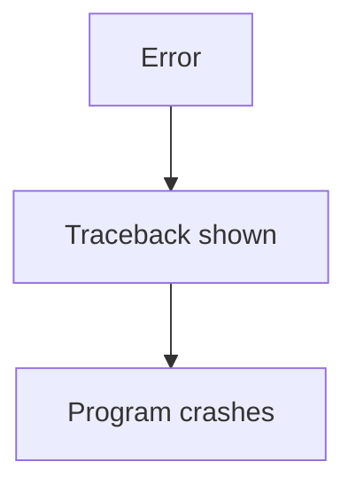
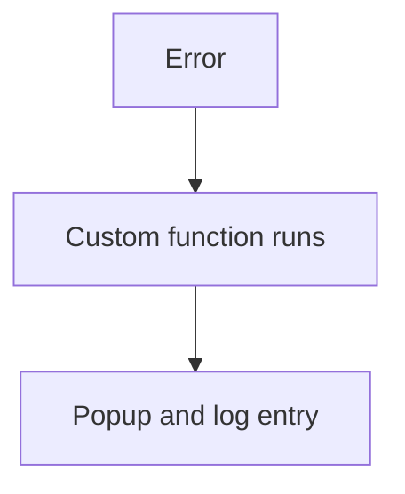
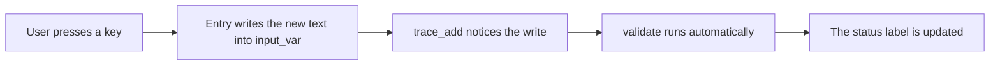
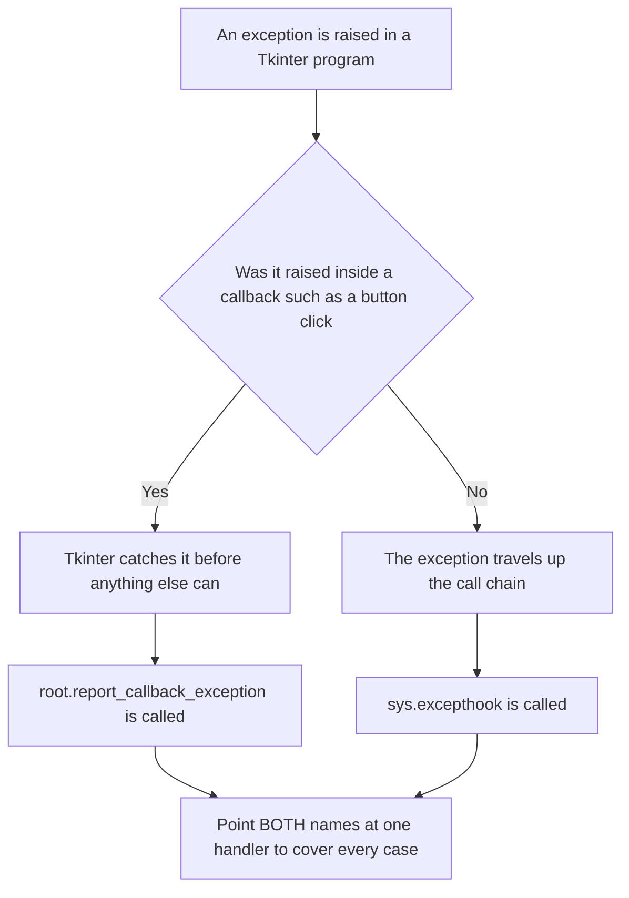
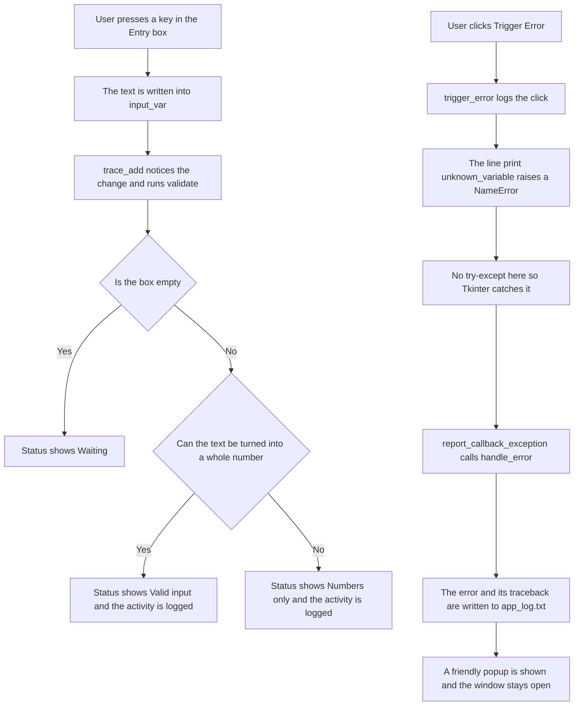
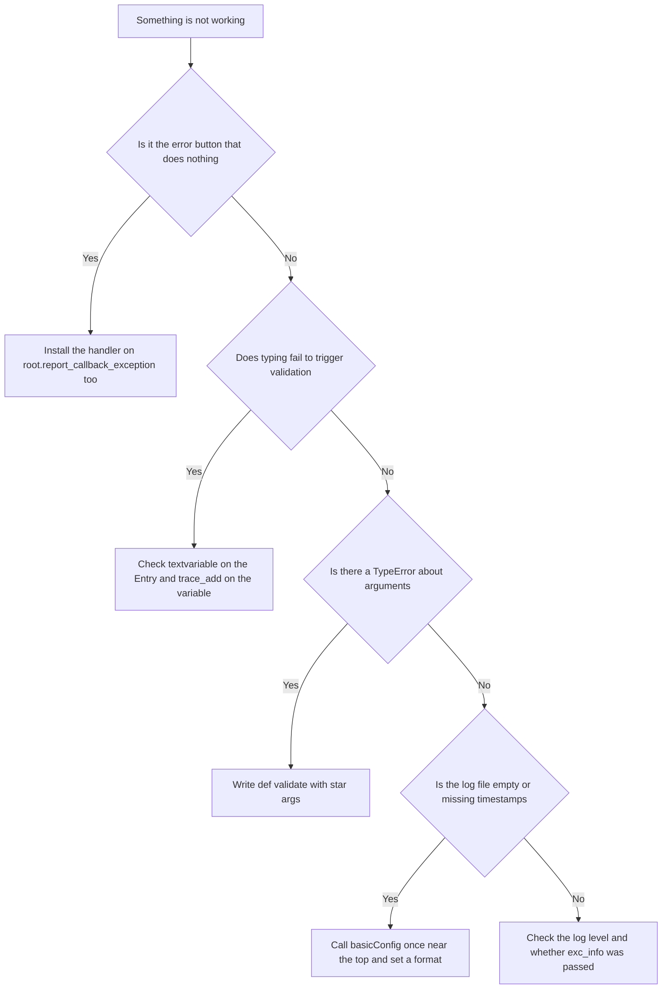

# Professional Error Handling in Tkinter: Logging, Global Hooks and Live Validation — Worked Answer

## Table of Contents

- [About This Page](#about-this-page)
    - [Why This Topic Matters for Python and for Chapter 14](#why-this-topic-matters-for-python-and-for-chapter-14)
    - [Related Pages in This Series](#related-pages-in-this-series)
    - [Key Terms Used On This Page](#key-terms-used-on-this-page)
- [Research / Project Question](#research--project-question)
    - [Professional Error Handling in Tkinter](#professional-error-handling-in-tkinter)
    - [Part A — Theory](#part-a--theory)
    - [Part B — Script Writing](#part-b--script-writing)
    - [Optional Follow-Up Questions (not part of the printed book)](#optional-follow-up-questions-not-part-of-the-printed-book)
- [Answer to Part A — Theory](#answer-to-part-a--theory)
    - [A1. What is `logging` and Why Use It Instead of `print()`?](#a1-what-is-logging-and-why-use-it-instead-of-print)
    - [A2. What is `sys.excepthook`?](#a2-what-is-sysexcepthook)
    - [A3. What is `trace_add()`?](#a3-what-is-trace_add)
    - [A4. What is Live Validation?](#a4-what-is-live-validation)
    - [A5. Why Do Professional Apps Log Errors?](#a5-why-do-professional-apps-log-errors)
- [The Tkinter Trap: Making the Trigger Error Button Work](#the-tkinter-trap-making-the-trigger-error-button-work)
- [Answer to Part B — The Model Script](#answer-to-part-b--the-model-script)
    - [B1. Imports, Logging and the Window](#b1-imports-logging-and-the-window)
    - [B2. The Log Panel and `write_log()`](#b2-the-log-panel-and-write_log)
    - [B3. The Global Error Handler](#b3-the-global-error-handler)
    - [B4. Installing the Handler in Both Places](#b4-installing-the-handler-in-both-places)
    - [B5. Live Validation, the Entry Box and the Error Button](#b5-live-validation-the-entry-box-and-the-error-button)
    - [B6. The Complete Script](#b6-the-complete-script)
    - [B7. Expected Output](#b7-expected-output)
- [Flowchart](#flowchart)
- [Common Errors and How to Fix Them](#common-errors-and-how-to-fix-them)
- [Summary of Changes Made to This Page](#summary-of-changes-made-to-this-page)

## About This Page

This page is part of the extended, GitHub-only material that accompanies **Chapter 14 (Tkinter and GUI Programming)** of the printed textbook. It contains one of the chapter's research and project questions, followed by a complete worked answer: the theory, a full model program, and a troubleshooting guide.

The theme is what separates a working program from a finished one. A beginner's program is judged by whether it does the right thing when everything goes well. A professional program is judged by what it does when things go badly — and it earns that reputation through three habits that this page examines in turn:

- **Keeping a written record.** `print()` vanishes the moment the window closes. `logging` writes to a file that is still there tomorrow, when you are trying to work out what went wrong.
- **Having a safety net.** No matter how carefully you write `try-except` blocks, something eventually fails somewhere you did not anticipate. A global handler catches whatever slips through.
- **Helping the user as they type.** Instead of letting someone fill in a whole form and then telling them it was wrong, live validation reacts to every keystroke.

[Back to Table of Contents](#table-of-contents)

### Why This Topic Matters for Python and for Chapter 14

**For Python in general:** logging and global exception handling are not GUI topics at all. They are the same in a web server, a data pipeline, or a script that runs overnight on a schedule. Any program that runs when you are not watching needs to be able to tell you afterwards what happened, and this page introduces the standard Python tools for that. The third topic, watching a value and reacting when it changes, is the observer idea that underlies reactive frameworks in almost every language.

**For this chapter in particular:** the printed chapter shows widgets that respond when clicked. This page adds the machinery that turns those widgets into something you could hand to another person: input that checks itself as it is typed, a log file recording what happened, and a safety net that turns a crash into a polite message. It also demonstrates a Tkinter-specific trap, described in its own section below, which stops the usual global safety net from catching button-click errors unless you install it in a second place.

Every error message, log file and block of output on this page was produced by actually running the code on Python 3.12 with Tk 8.6.14. Nothing here is guessed.

[Back to Table of Contents](#table-of-contents)

### Related Pages in This Series

Three pages in this chapter deal with catching errors that your own `try-except` blocks did not catch. They share one approach, so a handler written for any one of them works unchanged in the others. They are best read in this order:

| Page | What it covers |
| --- | --- |
| [070 — Handling Uncaught Exceptions](070-ch14-global-error.md) | What a global exception handler is, and the two places it has to be installed in a Tkinter program. |
| [080 — Safe and Unsafe Delayed Callbacks](080-ch14-safe-unsafe-error-after.md) | The same handler applied to work scheduled with `after()`, compared side by side against handling the error locally with `try-except`. |
| **090 — Professional Error Handling** (this page) | The same handler working alongside logging to a file and live input validation. |

[Back to Table of Contents](#table-of-contents)

### Key Terms Used On This Page

| Term | In plain words | Learn more |
| --- | --- | --- |
| `logging` | Python's built-in module for recording what a program did, into a file that survives after the program closes. | [Python docs: logging](https://docs.python.org/3/library/logging.html) |
| Log level | How important a recorded message is. The common ones, from least to most serious, are DEBUG, INFO, WARNING, ERROR and CRITICAL. You choose the lowest level worth keeping. | [Python docs: Logging levels](https://docs.python.org/3/library/logging.html#logging-levels) |
| `sys.excepthook` | A function Python calls when an exception reaches the top of the program without being handled anywhere. It can be replaced with your own function. | [Python docs: sys.excepthook](https://docs.python.org/3/library/sys.html#sys.excepthook) |
| `report_callback_exception` | Tkinter's own equivalent of `sys.excepthook`, used for errors raised inside button clicks and other callbacks. It has its own section below, because this page depends on it. | [Python docs: tkinter](https://docs.python.org/3/library/tkinter.html) |
| `StringVar` | A special Tkinter variable that holds a piece of text and can be *watched*. An ordinary Python string cannot be watched, which is why this exists. | [Python docs: tkinter](https://docs.python.org/3/library/tkinter.html) |
| `trace_add()` | The method that asks Tkinter to run one of your functions whenever a `StringVar` (or similar variable) changes. | [Python docs: tkinter](https://docs.python.org/3/library/tkinter.html) |
| Callback | A function you hand to something else so that it can be called later, on your behalf. | [Wikipedia: Callback](https://en.wikipedia.org/wiki/Callback_%28computer_programming%29) |
| Traceback | The block of text Python prints when an error is not handled, listing the error and the chain of calls that led to it. | [Python docs: traceback](https://docs.python.org/3/library/traceback.html) |
| `NameError` | The error Python raises when you use a name that was never defined. It is used on this page simply because it is easy to cause deliberately. | [Python docs: Built-in Exceptions](https://docs.python.org/3/library/exceptions.html#NameError) |

[Back to Table of Contents](#table-of-contents)

---

## Research / Project Question

[Back to Table of Contents](#table-of-contents)

### Professional Error Handling in Tkinter

Modern GUI applications should be able to:

-   validate user input automatically,
-   record errors for debugging,
-   safely handle unexpected failures.

Tkinter supports these features using: `logging`, `sys.excepthook`, `report_callback_exception` and `trace_add()`

[Back to Table of Contents](#table-of-contents)

### Part A — Theory

Research and explain the following:

#### 1. What is: `logging` and why is it used instead of: `print()`?

#### 2. What is: `sys.excepthook` and what is its purpose?

#### 3. What is: `trace_add()` and why is it useful with: `StringVar()`?

#### 4. Explain: `live validation` with one example.

#### 5. Why do professional applications log errors instead of only displaying them?

[Back to Table of Contents](#table-of-contents)

### Part B — Script Writing

Write a Tkinter program that:

1.  Creates an Entry widget for numeric input.
2.  Validates input while typing using: `trace_add()`
3.  Shows: `Valid input` or `Numbers only` in real time.

4.  Logs activity into: `app_log.txt` 

5.  Uses: `sys.excepthook` together with Tkinter’s `report_callback_exception` for global exception handling.

6.  Adds a button: `Trigger Error` to deliberately create an uncaught error.

7.  Shows a friendly popup instead of crashing.

[Back to Table of Contents](#table-of-contents)

----------

### Optional Follow-Up Questions (not part of the printed book)

These extra questions appear only on this online page, for readers who want to take the investigation further. They are not required in order to answer the printed question.

- **F1.** Type the three letters of `abc` into the Entry box, then open `app_log.txt`. How many lines were added, and why is it not one? What does this tell you about when `trace_add()` fires?
- **F2.** `validate(*args)` accepts arguments it never uses. Print them with `print(args)` inside the function. What are the three values Tkinter passes, and what do they mean?
- **F3.** Change `level=logging.INFO` to `level=logging.ERROR` and use the program again. Which lines still reach the file, and which disappear? Explain what a log level is for.
- **F4.** The log file records every keystroke, which for a long form could become thousands of lines. Suggest two ways to keep the useful information without the noise.
- **F5.** Remove the line that installs the handler on `root.report_callback_exception` and click **Trigger Error**. What happens on screen, what happens in the log file, and where does the error message actually go?

[Back to Table of Contents](#table-of-contents)

----------

## Answer to Part A — Theory

[Back to Table of Contents](#table-of-contents)

### A1. What is `logging` and Why Use It Instead of `print()`?

Logging means:

> recording program activity and errors in a file.

Example:

```python
logging.info("User clicked")
```

Unlike `print()`, logs remain saved after the program closes.

That single difference is the whole argument, but it is worth unpacking, because `print()` looks perfectly adequate right up until the moment you need it and it is not there. A `print()` goes to the terminal window. If the program was started by double-clicking an icon there may be no terminal at all, so the message goes nowhere. Even when there is one, the text disappears when the window is closed, and nobody can tell you what it said three days ago when the problem actually happened.

| | `print()` | `logging` |
| --- | --- | --- |
| Where the message goes | The screen only | A file, and optionally the screen as well |
| How long it lasts | Temporary; gone when the window closes | Permanent; still there tomorrow |
| Useful for debugging later | Hard to debug later | Useful for debugging |
| Does it record when it happened? | No | Yes, with an automatic timestamp |
| Can you filter by importance? | No; everything or nothing | Yes, using levels such as INFO and ERROR |
| Can you switch it off without editing every line? | No, you must delete each `print()` | Yes, by raising the level in one place |
| Suitable for a finished application | No | Yes |

**Setting it up** takes one line, usually near the top of the program:

```python
import logging

# Step 1: Choose the file, the lowest level worth keeping, and the layout.
logging.basicConfig(
    filename="app_log.txt",                                  # where to write
    level=logging.INFO,                                      # keep INFO and above
    format="%(asctime)s - %(levelname)s - %(message)s"       # timestamp, severity, message
)

# Step 2: Record things as the program runs.
logging.info("User clicked")                 # ordinary activity
logging.error("Something went wrong")        # a problem
```

That produces lines like this in the file:

```text
2026-09-09 00:54:20,773 - INFO - User clicked
2026-09-09 00:54:20,774 - ERROR - Something went wrong
```

**About levels.** `level=logging.INFO` means "keep INFO messages and anything more serious". The ordinary ladder is DEBUG, INFO, WARNING, ERROR, CRITICAL. Setting the level to ERROR would keep only the last two, which is how the same program can be chatty while you are developing it and quiet once it is finished — without deleting a single line of code.

[Back to Table of Contents](#table-of-contents)

### A2. What is `sys.excepthook`?

`sys.excepthook` is Python's:

> global exception handler

It controls what Python does when an uncaught exception happens.

Normally the sequence of execution is as follows:



But `sys.excepthook = handle_error` changes the route.

Now the sequence is as follows:



This improves application safety.

**The shape your function must have.** Python does not pass a single error object to the hook. It passes exactly three values, so your replacement must accept three:

```python
def handle_error(exc_type, exc_value, exc_traceback):
    ...
```

| Argument | What it holds | Example |
| --- | --- | --- |
| `exc_type` | The class of the error. `exc_type.__name__` gives its plain name. | `NameError` |
| `exc_value` | The exception object. Printing it gives the message. | `name 'unknown_variable' is not defined` |
| `exc_traceback` | The full stack trace, showing every line involved. | Passed to `logging` so the file records where it happened. |

A function that accepts the wrong number of arguments produces an error inside your error handler, which is a confusing situation worth avoiding.

**An important limitation** applies to this page's program in particular: `sys.excepthook` does **not** catch errors raised inside Tkinter callbacks, which includes every button click. That has its own section below, because the **Trigger Error** button required by Part B depends on it.

[Back to Table of Contents](#table-of-contents)

### A3. What is `trace_add()`?

`trace_add()` monitors a Tkinter variable.

Example:

```python
name_var.trace_add("write", validate)
# Meaning: whenever the variable changes, run validate()
```

It is commonly used with `StringVar()` because Entry widgets use variables.

That last sentence is the key to the whole mechanism, and it is worth following the chain slowly, because three separate things have to be connected before live validation works:

| Step | What you write | What it achieves |
| --- | --- | --- |
| 1 | `input_var = tk.StringVar()` | Creates a variable that Tkinter is able to watch. An ordinary Python string cannot be watched. |
| 2 | `tk.Entry(root, textvariable=input_var)` | Ties the Entry box to that variable, so anything typed is written into it immediately. |
| 3 | `input_var.trace_add("write", validate)` | Asks Tkinter to run `validate` every time something is written into the variable. |

Miss any one of the three and nothing happens: a `StringVar` with no `textvariable` is never updated, and an Entry with no trace is never watched.



**Two details that surprise beginners:**

First, `"write"` is the mode. Tkinter also offers `"read"` and `"unset"`, but `"write"` is the one used for validation.

Second, Tkinter passes three arguments to the traced function, which is why it is normally written as `def validate(*args):`. Printing them shows what they are:

```text
What trace_add reports as its three arguments:
    ('input_var', '', 'write')
```

They are the variable's internal name, an index (used only for array-style variables), and the mode that triggered the call. Almost no validation function needs any of them, so `*args` simply accepts and ignores them. But the function must still be *able* to accept them — writing `def validate():` with no parameters causes a `TypeError` every time the user types.

[Back to Table of Contents](#table-of-contents)

### A4. What is Live Validation?

Live validation means:

> checking input while the user is typing.

Example:

Instead of waiting for a `Submit button`, the program checks immediately.

  -  Suppose we have incorrect Input: `abc`, we immediately get an Output: `Numbers only`
  -  Suppose we have correct Input: `25` we get Output: `Valid input`

This improves user experience.

**How immediate is "immediately"?** Genuinely every keystroke. In a measured test, typing the three letters of `abc` ran the validation function three times:

```text
validate() ran 3 times while typing 'abc'
the value it saw each time: ['a', 'ab', 'abc']
```

That is the behaviour you want on screen, but it has a consequence worth knowing about: if the validation function also writes to a log file, a single word typed into a form produces one log entry per letter. The model program below does exactly this, because Part B asks for activity to be logged, and the sample output shows the result plainly.

| | Validation on Submit | Live validation |
| --- | --- | --- |
| When the user finds out | After filling in everything and clicking | Immediately, as they type |
| How much has to be redone | Possibly the whole form | Nothing; the mistake is one character old |
| How it feels to use | The form argues with you at the end | The form guides you as you go |
| Cost | Runs once | Runs on every keystroke, so it must be quick |
| Risk | Frustration and abandoned forms | Complaining too early, before the user has finished typing |

That last row is a real design consideration. A field expecting `25` will briefly see `2`, and a field expecting an email address will spend most of its life holding something that is not yet a valid address. Good live validation therefore treats "not finished yet" differently from "wrong" — which is why the model program shows `Waiting...` for an empty box rather than declaring it invalid.

[Back to Table of Contents](#table-of-contents)

### A5. Why Do Professional Apps Log Errors?

Errors may happen unexpectedly. Examples of unexpected errors are:

```text
user enters bad data
network fails
program bug appears
```

A popup helps the user. But developers also need technical details.

Logs help programmers:

-   debug problems,
-   understand failures,
-   improve software.

The heart of the matter is that a popup and a log entry are aimed at two different people, and each needs something the other would find useless:

| | The popup | The log entry |
| --- | --- | --- |
| Who reads it | The person using the program | The person who wrote the program |
| When they read it | At the moment it happens | Hours or days later |
| What it should contain | One clear sentence in plain language | The error, the traceback, the timestamp, and what led up to it |
| How long it lasts | Until the user clicks OK | Indefinitely |

A few further reasons professional applications insist on logs:

- **The user's account of what happened is rarely reliable.** "It crashed when I clicked the thing" is not much to work with. A timestamped log showing the last twenty actions before the failure usually is.
- **Some failures are never seen by anyone.** Work that runs on a schedule, or in the background, has no user watching. Without a log there is no evidence at all that it failed.
- **Patterns only appear across many runs.** One failure looks like bad luck. A log file showing the same error every Monday morning points straight at the cause.
- **A popup cannot hold a traceback.** It would be meaningless to the user and is often too long for a dialog. Writing it to a file keeps the detail without inflicting it on anyone.

This is why the model program below does both, from a single function: the user gets one short sentence, and the file gets the full traceback.

[Back to Table of Contents](#table-of-contents)

----------

## The Tkinter Trap: Making the Trigger Error Button Work

This section is not part of the printed question, but the model program cannot meet requirement 7 without it.

Part B asks for a **Trigger Error** button that causes an uncaught error and shows a friendly popup rather than crashing. The natural approach is to write `handle_error()` and assign it to `sys.excepthook`, exactly as Part A question 2 describes. It looks entirely correct.

**It does not work for button clicks**, and it fails silently.

Tkinter wraps every callback — every function given to `command=`, to `after()`, or to `bind()`. When one of them raises an exception, Tkinter catches it itself and passes it to a method of its own called `report_callback_exception`, whose default behaviour is to print `Exception in Tkinter callback` and a traceback to the error output. The exception never travels any further, so `sys.excepthook` is never consulted.

| What Part B asks for | What actually happens with only `sys.excepthook` installed |
| --- | --- |
| A friendly popup appears | No popup appears at all |
| The log panel reports the error | The panel stops after "Trigger Error clicked" |
| The error is recorded in `app_log.txt` | The file contains the INFO line about the click, but no ERROR entry |
| The user learns something went wrong | The user sees nothing; the button appears to do nothing |

The fix is one extra line:

```python
# Step 1: The usual global hook, for errors at the top level of the program.
sys.excepthook = handle_error

# Step 2: Tkinter's own hook, for errors inside callbacks - which includes
# every button click. Without this line, the Trigger Error button fails silently.
root.report_callback_exception = handle_error
```

One function, two entry points. Whichever route an error takes, it arrives at the same handler.

| Where the error is raised | Which hook Python actually uses |
| --- | --- |
| Inside a button's `command` function | `report_callback_exception` |
| Inside a function scheduled with `after()` | `report_callback_exception` |
| Inside a function bound with `bind()` | `report_callback_exception` |
| Inside a `trace_add()` variable callback | `report_callback_exception` |
| At the top level of the script, before or after `mainloop()` | `sys.excepthook` |
| Inside a separate thread | `threading.excepthook` |



Note the fourth row of the table above. The validation function attached with `trace_add()` is also a callback, so if a bug ever crept into `validate()`, the same rule would apply to it.

[Back to Table of Contents](#table-of-contents)

----------

## Answer to Part B — The Model Script

The program is built up step by step below, and given as one complete file in Section B6. Teaching `print()` statements have been added at each stage, and `write_log()` prints to the terminal as well as writing to the window and the file, so all three can be compared.

[Back to Table of Contents](#table-of-contents)

### B1. Imports, Logging and the Window

```python
# Step 1: Import everything the program needs.
import logging          # records activity and errors into a file
import sys              # gives access to sys.excepthook
import tkinter as tk
from tkinter import messagebox

# Step 2: Set up logging so activity and errors are saved to app_log.txt.
# level=INFO means ordinary activity is kept as well as errors.
# The format adds a timestamp and the severity to every line.
log_format = "%(asctime)s - %(levelname)s - %(message)s"
logging.basicConfig(filename="app_log.txt", level=logging.INFO, format=log_format)
print("Step 2 complete: logging configured, activity goes to app_log.txt")

# Step 3: Create the main window.
root = tk.Tk()
root.title("Advanced Validation")
root.geometry("430x340")
print("Step 3 complete: main window created")
```

`level=logging.INFO` is deliberate here rather than `ERROR`, because requirement 4 asks for *activity* to be logged, not just failures.

[Back to Table of Contents](#table-of-contents)

### B2. The Log Panel and `write_log()`

```python
# Step 4: Create the log panel. A Text widget acts as a small console
# inside the window, showing what the user typed, what the program did,
# and any errors.
log_box = tk.Text(root, height=9, width=48)
log_box.pack(pady=10)
print("Step 4 complete: log panel created")


def write_log(message, level="info", exc=None):
    """
    Adds one line to the log panel, saves it to app_log.txt, and prints it.

    level decides how the line is recorded in the file:
      "info"  - ordinary activity
      "error" - something went wrong
    exc, when given, is the three-part error information from
    handle_error, so the full traceback is saved alongside the message.
    """
    # Step 5a: Show the message in the log panel inside the window.
    log_box.insert(tk.END, message + "\n")
    # Step 5b: Scroll down so the newest line is always visible.
    log_box.see(tk.END)
    # Step 5c: Save it to the file at the right severity. The timestamp
    # and the word INFO or ERROR are added automatically by the format
    # set up in Step 2, so the message itself does not need them.
    if level == "error":
        logging.error(message, exc_info=exc)
    else:
        logging.info(message)
    # Step 5d: Also print to the terminal, so the two can be compared.
    print(f"    [log panel] {message}")
```

This one function serves all three destinations at once — the window, the file and the terminal — which is why every other part of the program can simply call `write_log(...)` and stop thinking about it.

[Back to Table of Contents](#table-of-contents)

### B3. The Global Error Handler

```python
def handle_error(exc_type, exc_value, exc_traceback):
    """
    The global safety net. It runs for any error that no try-except caught.

    Python passes three values to this function:
      exc_type      - the class of the error, for example NameError
      exc_value     - the error message itself
      exc_traceback - the full stack trace, showing where it happened
    """
    # Step 6a: Build a short, readable description of the error.
    error_msg = f"{exc_type.__name__}: {exc_value}"

    # Step 6b: Note in the panel that the global handler took over.
    write_log("Global hook activated")

    # Step 6c: Record the error itself at ERROR level, with the full
    # traceback attached, so the programmer has everything while the
    # user sees only the short summary.
    write_log(error_msg, level="error", exc=(exc_type, exc_value, exc_traceback))

    # Step 6d: Tell the user in plain language instead of crashing.
    messagebox.showerror("Unexpected Error", error_msg)
```

This is section A5's argument turned into code. Step 6c gives the programmer the full traceback in the file; step 6d gives the user one short sentence.

[Back to Table of Contents](#table-of-contents)

### B4. Installing the Handler in Both Places

```python
# Step 7: Install the handler in BOTH places that matter.
# sys.excepthook catches errors that reach the top level of the program.
sys.excepthook = handle_error
# report_callback_exception catches errors raised inside Tkinter callbacks,
# which includes every button click. Tkinter catches those itself and never
# lets them reach sys.excepthook, so without this second line the Trigger
# Error button below would fail silently.
root.report_callback_exception = handle_error
write_log("Global hook installed")
print("Step 7 complete: sys.excepthook and report_callback_exception both installed")
```

[Back to Table of Contents](#table-of-contents)

### B5. Live Validation, the Entry Box and the Error Button

This is where the three-part chain from section A3 is assembled: the variable, the trace, and the Entry box that feeds it.

```python
# Step 8: Create the special variable that holds whatever is typed in the
# Entry box. A StringVar can be watched, which an ordinary Python string
# cannot, and that is what makes live validation possible.
input_var = tk.StringVar()

# Step 9: The status label that reports the result of validation.
status = tk.Label(root, text="Enter number")
status.pack()


def validate(*args):
    """
    Runs automatically every time the contents of input_var change.

    Tkinter passes three values to a trace callback - the variable's
    internal name, an index, and the mode - none of which are needed
    here. *args simply accepts and ignores them.
    """
    # Step 10a: Read whatever is currently in the box.
    text = input_var.get()
    write_log(f"User typed: {text}")

    # Step 10b: An empty box is not an error; the user has just not
    # started yet, or has cleared what they typed.
    if text == "":
        status.config(text="Waiting...")
        return

    # Step 10c: Try to turn the text into a whole number. int() raises
    # ValueError for anything that is not a valid number.
    try:
        number = int(text)
    except ValueError:
        status.config(text="Numbers only")
        write_log("Invalid input")
        return

    # Step 10d: The conversion worked, so the input is valid.
    status.config(text="Valid input")
    write_log(f"Valid input - the number is {number}")


# Step 11: Attach the validation function to the variable.
# "write" means: run validate every time a value is written into
# input_var, which happens on every single keystroke.
input_var.trace_add("write", validate)
print("Step 11 complete: validate() attached to input_var with trace_add")

# Step 12: The Entry box. Linking it to input_var with textvariable is
# what connects typing to the validation above.
entry = tk.Entry(root, textvariable=input_var)
entry.pack(pady=5)

# Step 13: A deliberate error, used to test the global handler.
def trigger_error():
    write_log("Trigger Error clicked")
    # unknown_variable was never defined, so this raises NameError.
    # There is no try-except here on purpose.
    print(unknown_variable)


# Step 14: The button that causes the error.
tk.Button(root, text="Trigger Error", command=trigger_error).pack(pady=10)
print("Step 14 complete: Trigger Error button added")

# Step 15: Start the event loop and wait for the user.
root.mainloop()
```

Note the ordering in steps 11 and 12. The trace is attached to the variable before the Entry box is created, but the order does not actually matter — what matters is that both are connected to the same `input_var` before the user starts typing.

[Back to Table of Contents](#table-of-contents)

### B6. The Complete Script

```python
# Step 1: Import everything the program needs.
import logging          # records activity and errors into a file
import sys              # gives access to sys.excepthook
import tkinter as tk
from tkinter import messagebox

# Step 2: Set up logging so activity and errors are saved to app_log.txt.
# level=INFO means ordinary activity is kept as well as errors.
# The format adds a timestamp and the severity to every line.
log_format = "%(asctime)s - %(levelname)s - %(message)s"
logging.basicConfig(filename="app_log.txt", level=logging.INFO, format=log_format)
print("Step 2 complete: logging configured, activity goes to app_log.txt")

# Step 3: Create the main window.
root = tk.Tk()
root.title("Advanced Validation")
root.geometry("430x340")
print("Step 3 complete: main window created")

# Step 4: Create the log panel. A Text widget acts as a small console
# inside the window, showing what the user typed, what the program did,
# and any errors.
log_box = tk.Text(root, height=9, width=48)
log_box.pack(pady=10)
print("Step 4 complete: log panel created")


def write_log(message, level="info", exc=None):
    """
    Adds one line to the log panel, saves it to app_log.txt, and prints it.

    level decides how the line is recorded in the file:
      "info"  - ordinary activity
      "error" - something went wrong
    exc, when given, is the three-part error information from
    handle_error, so the full traceback is saved alongside the message.
    """
    # Step 5a: Show the message in the log panel inside the window.
    log_box.insert(tk.END, message + "\n")
    # Step 5b: Scroll down so the newest line is always visible.
    log_box.see(tk.END)
    # Step 5c: Save it to the file at the right severity. The timestamp
    # and the word INFO or ERROR are added automatically by the format
    # set up in Step 2, so the message itself does not need them.
    if level == "error":
        logging.error(message, exc_info=exc)
    else:
        logging.info(message)
    # Step 5d: Also print to the terminal, so the two can be compared.
    print(f"    [log panel] {message}")


def handle_error(exc_type, exc_value, exc_traceback):
    """
    The global safety net. It runs for any error that no try-except caught.

    Python passes three values to this function:
      exc_type      - the class of the error, for example NameError
      exc_value     - the error message itself
      exc_traceback - the full stack trace, showing where it happened
    """
    # Step 6a: Build a short, readable description of the error.
    error_msg = f"{exc_type.__name__}: {exc_value}"

    # Step 6b: Note in the panel that the global handler took over.
    write_log("Global hook activated")

    # Step 6c: Record the error itself at ERROR level, with the full
    # traceback attached, so the programmer has everything while the
    # user sees only the short summary.
    write_log(error_msg, level="error", exc=(exc_type, exc_value, exc_traceback))

    # Step 6d: Tell the user in plain language instead of crashing.
    messagebox.showerror("Unexpected Error", error_msg)


# Step 7: Install the handler in BOTH places that matter.
# sys.excepthook catches errors that reach the top level of the program.
sys.excepthook = handle_error
# report_callback_exception catches errors raised inside Tkinter callbacks,
# which includes every button click. Tkinter catches those itself and never
# lets them reach sys.excepthook, so without this second line the Trigger
# Error button below would fail silently.
root.report_callback_exception = handle_error
write_log("Global hook installed")
print("Step 7 complete: sys.excepthook and report_callback_exception both installed")

# Step 8: Create the special variable that holds whatever is typed in the
# Entry box. A StringVar can be watched, which an ordinary Python string
# cannot, and that is what makes live validation possible.
input_var = tk.StringVar()

# Step 9: The status label that reports the result of validation.
status = tk.Label(root, text="Enter number")
status.pack()


def validate(*args):
    """
    Runs automatically every time the contents of input_var change.

    Tkinter passes three values to a trace callback - the variable's
    internal name, an index, and the mode - none of which are needed
    here. *args simply accepts and ignores them.
    """
    # Step 10a: Read whatever is currently in the box.
    text = input_var.get()
    write_log(f"User typed: {text}")

    # Step 10b: An empty box is not an error; the user has just not
    # started yet, or has cleared what they typed.
    if text == "":
        status.config(text="Waiting...")
        return

    # Step 10c: Try to turn the text into a whole number. int() raises
    # ValueError for anything that is not a valid number.
    try:
        number = int(text)
    except ValueError:
        status.config(text="Numbers only")
        write_log("Invalid input")
        return

    # Step 10d: The conversion worked, so the input is valid.
    status.config(text="Valid input")
    write_log(f"Valid input - the number is {number}")


# Step 11: Attach the validation function to the variable.
# "write" means: run validate every time a value is written into
# input_var, which happens on every single keystroke.
input_var.trace_add("write", validate)
print("Step 11 complete: validate() attached to input_var with trace_add")

# Step 12: The Entry box. Linking it to input_var with textvariable is
# what connects typing to the validation above.
entry = tk.Entry(root, textvariable=input_var)
entry.pack(pady=5)


# Step 13: A deliberate error, used to test the global handler.
def trigger_error():
    write_log("Trigger Error clicked")
    # unknown_variable was never defined, so this raises NameError.
    # There is no try-except here on purpose.
    print(unknown_variable)


# Step 14: The button that causes the error.
tk.Button(root, text="Trigger Error", command=trigger_error).pack(pady=10)
print("Step 14 complete: Trigger Error button added")

# Step 15: Start the event loop and wait for the user.
root.mainloop()
```

[Back to Table of Contents](#table-of-contents)

### B7. Expected Output

At start-up the terminal shows the setup steps, and the window opens with one line already in its log panel:

```text
Step 2 complete: logging configured, activity goes to app_log.txt
Step 3 complete: main window created
Step 4 complete: log panel created
    [log panel] Global hook installed
Step 7 complete: sys.excepthook and report_callback_exception both installed
Step 11 complete: validate() attached to input_var with trace_add
Step 14 complete: Trigger Error button added
```

**Typing `2` then `5`:**

```text
    [log panel] User typed: 2
    [log panel] Valid input - the number is 2
    [log panel] User typed: 25
    [log panel] Valid input - the number is 25
```

The status label reads **Valid input**. Note there are two rounds of messages for two keystrokes, and that the program considered `2` valid on its own before `5` was typed.

**Clearing the box and typing `a`, `b`, `c`:**

```text
    [log panel] User typed: 
    [log panel] User typed: a
    [log panel] Invalid input
    [log panel] User typed: ab
    [log panel] Invalid input
    [log panel] User typed: abc
    [log panel] Invalid input
```

The status label reads **Numbers only**. The first line, with nothing after the colon, is the moment the box was cleared, which the program reports as `Waiting...` rather than treating as invalid.

**Clicking Trigger Error:**

```text
    [log panel] Trigger Error clicked
    [log panel] Global hook activated
    [log panel] NameError: name 'unknown_variable' is not defined
    [ERROR POPUP] Unexpected Error: NameError: name 'unknown_variable' is not defined
```

The window stays open and remains fully usable afterwards.

**The contents of `app_log.txt` after all of the above:**

```text
2026-09-09 00:54:20,764 - INFO - Global hook installed
2026-09-09 00:54:20,771 - INFO - User typed: 2
2026-09-09 00:54:20,771 - INFO - Valid input - the number is 2
2026-09-09 00:54:20,771 - INFO - User typed: 25
2026-09-09 00:54:20,772 - INFO - Valid input - the number is 25
2026-09-09 00:54:20,772 - INFO - User typed: 
2026-09-09 00:54:20,772 - INFO - User typed: a
2026-09-09 00:54:20,772 - INFO - Invalid input
2026-09-09 00:54:20,773 - INFO - User typed: ab
2026-09-09 00:54:20,773 - INFO - Invalid input
2026-09-09 00:54:20,773 - INFO - User typed: abc
2026-09-09 00:54:20,773 - INFO - Invalid input
2026-09-09 00:54:20,774 - INFO - Trigger Error clicked
2026-09-09 00:54:20,774 - INFO - Global hook activated
2026-09-09 00:54:20,774 - ERROR - NameError: name 'unknown_variable' is not defined
Traceback (most recent call last):
  File "/usr/lib/python3.12/tkinter/__init__.py", line 1967, in __call__
    return self.func(*args)
           ^^^^^^^^^^^^^^^^
  File "advanced_validation.py", line 146, in trigger_error
    print(unknown_variable)
          ^^^^^^^^^^^^^^^^
NameError: name 'unknown_variable' is not defined
```

Three things in that file are worth noticing:

- **Every line is timestamped and labelled** INFO or ERROR, which is what makes a log searchable later. This is the practical benefit described in section A1.
- **The ordinary activity and the failure sit in the same file, in order.** A programmer reading it can see exactly what the user did in the seconds before the error, which is precisely the "what led up to it" evidence that section A5 argues for.
- **Only the error carries a traceback.** The user saw one short sentence in a popup; the file kept the complete technical detail.

[Back to Table of Contents](#table-of-contents)

----------

## Flowchart

The flowchart shows the steps in execution of the given script:


The same two journeys through the program in text form — typing into the box, and clicking the button:



[Back to Table of Contents](#table-of-contents)

----------

## Common Errors and How to Fix Them

| Symptom | Likely cause | Fix |
| --- | --- | --- |
| The Trigger Error button produces no popup and no ERROR entry in the log, but a traceback appears in the terminal | Only `sys.excepthook` was installed. Tkinter routes button-click errors elsewhere. | Also assign the handler to `root.report_callback_exception`. |
| `TypeError: validate() takes 0 positional arguments but 3 were given` | The validation function was written as `def validate():`. | Write `def validate(*args):`; Tkinter always passes three values to a trace callback. |
| Typing in the box does nothing | The Entry box is not linked to the variable. | Pass `textvariable=input_var` when creating the Entry. |
| The variable changes but validation never runs | `trace_add()` was never called, or was called on a different variable. | Call `input_var.trace_add("write", validate)` on the same variable the Entry uses. |
| `AttributeError: 'StringVar' object has no attribute 'trace_add'` | A very old Python version. `trace_add()` replaced the older `trace()` in Python 3.6. | Upgrade Python, or use the deprecated `trace("w", validate)` on an old version. |
| The log file is created but stays empty | `logging.basicConfig()` was called after something had already logged, or the level is set higher than the messages being sent. | Call `basicConfig()` once, near the top, and check the level. |
| Log lines have no timestamp | `basicConfig()` was called without a `format`. | Add `format="%(asctime)s - %(levelname)s - %(message)s"`. |
| The log file records only the summary, with no traceback | `logging.error(message)` was called without `exc_info`. | Pass `exc_info=(exc_type, exc_value, exc_traceback)`. |
| The log fills with one entry per keystroke | This is expected: `trace_add("write", ...)` fires on every change. | Log only the outcome rather than every keystroke, or record keystrokes at DEBUG level and set the file to INFO. |
| An error inside `validate()` itself goes unnoticed | A trace callback is a Tkinter callback too, so the same routing applies. | The same `report_callback_exception` fix covers it. |



[Back to Table of Contents](#table-of-contents)

----------

## Summary of Changes Made to This Page

The table below documents every change made while revising this page, for transparency. **The printed research question has been reproduced word for word, with three deliberate exceptions: a typographical error has been corrected, one requirement in Part B has been amended, and the list of tools in the preamble has been completed. All three are listed individually in the table below.** Apart from those changes, the wording, lists and punctuation of the question are unchanged. All new material has been added in clearly separate, clearly labelled sections.

| Element | Original | Change made |
| --- | --- | --- |
| Overall structure | An untitled page containing the research question, a theory solution, a large accidentally duplicated block, and a script, with no worked output. | Added a page title, a clickable table of contents, an "About This Page" introduction, a "Key Terms" glossary, answers labelled A1 to A5 matching the five Part A questions, a new section on the Tkinter hook problem, answers labelled B1 to B7 for the script, a common-errors section, and this change-log table. |
| Table of contents | None. | Added at the top, with `###` subtopics nested as a sub-list under their `##` topics, and every entry linked to its heading. A "Back to Table of Contents" link was added at the end of each topic and subtopic. |
| **Duplicated block** | Lines 157 to 277 of the original contained a second, degraded copy of the entire research question and theory solution, pasted in by accident. Its formatting had been stripped: block quotes had become plain lines, code spans had lost their backticks, and list markers had disappeared. It ended with a line of text copied from an editor's status bar: `Markdown 3076 bytes 461 words 163 lines Ln 157, Col 24HTML 2272 characters 393 words 85 paragraphs`. | **The duplicate block and the editor status-bar line were removed.** Before removing it, it was checked for anything the properly formatted version did not already contain. It held one unique item — a three-row table comparing `print()` with `logging` — which has been preserved and expanded in the answer to question 1, so nothing was lost. |
| `loggingsys.excepthooktrace_add()` | The three tool names had run together into a single unreadable code span in the question preamble. | **Corrected in the question text** to the three separate names it was always meant to be: `logging`, `sys.excepthook` and `trace_add()`. |
| Printed research question | Present. | Reproduced word for word, verified line by line against the original file, apart from the correction above. Heading levels were adjusted: `# Research / Project Question` became `##`, and its inner `##` and `###` headings each moved down one level, so that the whole question sits as one topic in the table of contents. |
| **Part B requirement 5** | The requirement read: Uses `sys.excepthook` for global exception handling. As printed, it cannot be met together with requirements 6 and 7, because an error raised by a button click never reaches `sys.excepthook`. Following the question literally therefore produces a program that shows no popup and records no error. | **Amended in the question text** to read `sys.excepthook` together with Tkinter’s `report_callback_exception`, so that the task the question sets is achievable. The original wording is otherwise untouched. |
| Tool list in the question preamble | Named `logging`, `sys.excepthook` and `trace_add()` as the tools supporting the three listed abilities, one of which is handling unexpected failures safely. In a Tkinter program that list is incomplete. | **Amended in the question text** to include `report_callback_exception` alongside the other three. |
| Related pages | No links to the other pages on this topic. | Added a "Related Pages in This Series" table linking this page to the two companion pages on the same theme, so the three can be read as one sequence. |
| The "which hook is used" table | Not present. | Added a table listing which of the two hooks Python actually uses for each kind of error, including the row noting that a `trace_add()` variable callback is handled the same way as a button click. |
| Follow-up questions | None. | Added five optional follow-up questions (F1 to F5), clearly marked as additional online material and not part of the printed book. |
| **Model script: the Trigger Error button did not work** | The script installed `sys.excepthook = handle_error` and relied on it to catch the `NameError` raised by the button. Running it confirmed the handler never ran: no popup appeared, the log panel stopped after "Trigger Error clicked", `app_log.txt` contained the INFO line about the click but no ERROR entry at all, and the only output was `Exception in Tkinter callback` plus a traceback in the terminal. Requirement 7 of Part B was therefore not met. | **Corrected.** The same handler is now also assigned to `root.report_callback_exception`, the hook Tkinter actually uses for callback errors. The `sys.excepthook` line required by the question is kept as well. Verified: the popup now appears, the panel reports the error, and the log file receives a timestamped ERROR entry with the full traceback. |
| Explanation of the above | Not mentioned; the page assumed `sys.excepthook` was sufficient. | Added a new section, "The Tkinter Trap", with a table of what Part B asks for against what actually happens, the one-line fix, a table of which hook applies to which kind of error, and a flowchart. It also notes that a `trace_add()` callback is subject to the same rule. |
| A1, `logging` versus `print()` | Gave a definition, a one-line example, and the observation that logs remain saved. The `print()` versus `logging` comparison table existed only inside the duplicated block. | Original content kept. The comparison table was rescued from the duplicate, kept in full, and extended from three rows to seven. Added a worked `basicConfig()` example with `# Step` comments, a sample of the resulting file lines, and an explanation of log levels. |
| A2, `sys.excepthook` | Gave a definition and two arrow sequences. | Original content and both sequences kept, with the arrow diagrams redrawn as Mermaid flowcharts. Added the required three-argument signature with a table explaining each argument, a warning about the resulting error if the signature is wrong, and a pointer to the Tkinter limitation. |
| A3, `trace_add()` | Three sentences and one example. | Original content kept. Added a three-step table showing the chain that must be connected (`StringVar`, `textvariable`, `trace_add`), a Mermaid flowchart of a keystroke's journey, an explanation of the `"write"` mode, and the verified output showing the three arguments Tkinter passes, which explains why `*args` is needed. |
| A4, live validation | A definition and two short examples. | Original content kept, including both examples. Added measured evidence that typing `abc` runs the validation three times with values `a`, `ab`, `abc`; a five-row comparison of Submit-time against live validation; and the design point that "not finished yet" should be treated differently from "wrong". |
| A5, why professional apps log errors | Listed three causes and three benefits. | All original content kept. Added a four-row table contrasting who reads a popup with who reads a log entry and what each needs, plus four further reasons, including that scheduled or background failures have no user to see them. |
| Script comments | Numbered `# 1.` to `# 14.`, with `# 3. CREATE LOG PANEL` containing the typo "mini consolel", and one comment reading `# Meaning: Whenever variable changes,run validate()` with a missing space. | Renumbered to the `# Step N:` format with sub-steps such as `# Step 5a:`. The typo and the missing space were corrected, and several very long trailing comments were moved onto their own lines above the code they describe. |
| Script: `logging.basicConfig()` | Called without a `format`, so entries appeared as `INFO:root:message` with no timestamp. | Added `format="%(asctime)s - %(levelname)s - %(message)s"`, so every entry records when it happened and how serious it is. |
| Script: errors recorded twice, at the wrong level | `write_log()` recorded everything with `logging.info()`, so when `handle_error` called it the error text was written to the file as INFO; `handle_error` then called `logging.error()` separately, producing a second, duplicate entry. | `write_log()` now takes a `level` argument, so activity is recorded as INFO and errors as ERROR, each exactly once. An optional `exc` argument attaches the full traceback to the error entry. |
| Script: no traceback in the log | `logging.error(error_msg)` recorded only the one-line summary. | The traceback is now passed through with `exc_info`, so the file keeps the complete stack trace while the popup still shows only the short message. |
| Script: minor style points | `error_msg = (f"{exc_type.__name__}: "f"{exc_value}")` concatenated two f-strings with no space between them; the log message used a Unicode arrow character that renders inconsistently across editors and fonts; `number = int(text)` assigned a value that was then never used. | Simplified to a single f-string; the arrow was replaced with plain wording; and the converted number is now included in the log message, so the conversion result is actually used. |
| Script: empty input | Handled correctly, showing `Waiting...`. | Kept unchanged, and the reasoning behind it is now explained in section A4 as an example of distinguishing "not finished yet" from "wrong". |
| Script: output | The script printed messages to the terminal but the page showed no output at all. | Added teaching `print()` statements at every step. Added a new "Expected Output" section with genuine captured output for start-up, for typing a valid number, for typing letters, for clicking the button, and for the full contents of `app_log.txt`, with three observations drawing the sections together. |
| Script: presentation | A single code block. | Split into explained sections B1 to B5, followed by the complete combined script in B6, so it can be read either way. |
| Flowchart image | `` with a one-line caption. | The original image link and caption were kept unchanged, and a Mermaid flowchart tracing both journeys through the program was added beneath it, so the flow is visible even if the image resource is unavailable to a reader. |
| Troubleshooting guidance | None. | Added a ten-row table mapping each symptom to its cause and fix, including the silent-button symptom produced by the original script and the `TypeError` caused by omitting `*args`, plus a decision flowchart of the same checklist. |
| Diagrams | None. | Added six Mermaid diagrams: Python's default error route, the custom route, the keystroke journey, the routing of exceptions in Tkinter, the two journeys through the script, and the troubleshooting flowchart. All use plain flowchart syntax with no brackets or quotation marks inside node labels, so they can be imported into draw.io. |
| Emojis | None used. | None used (unchanged). |

[Back to Table of Contents](#table-of-contents)


