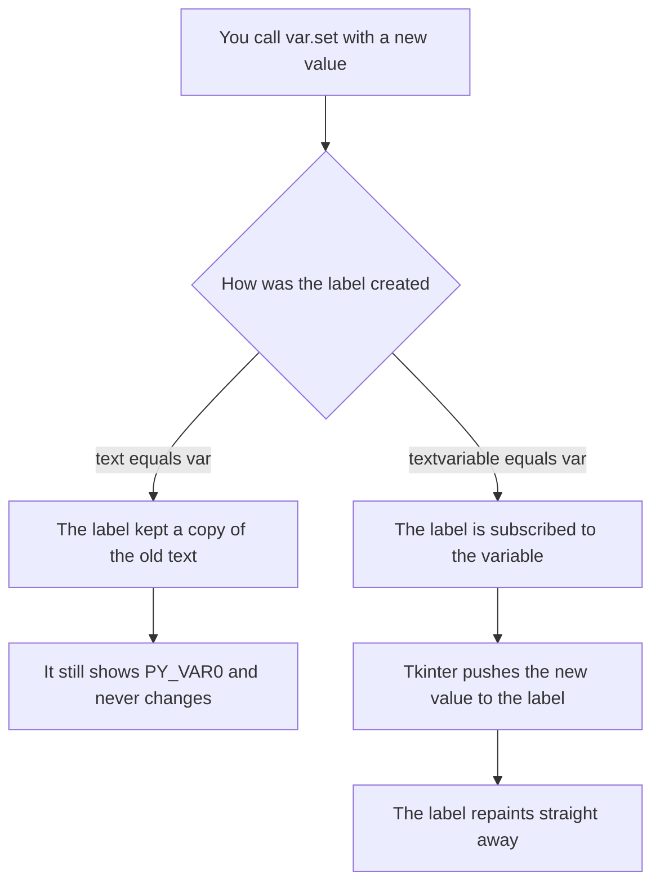
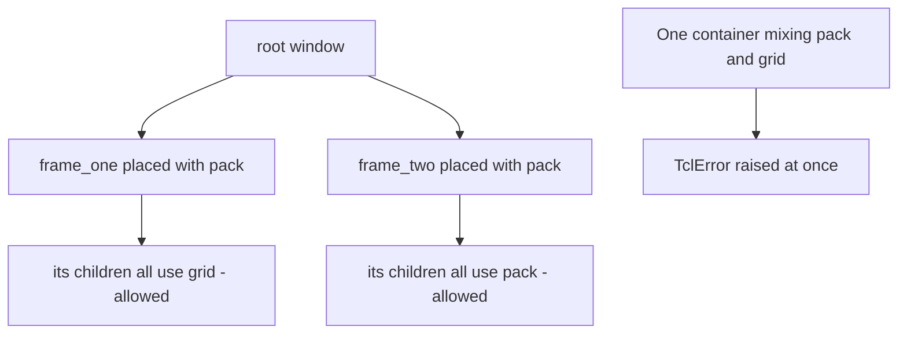
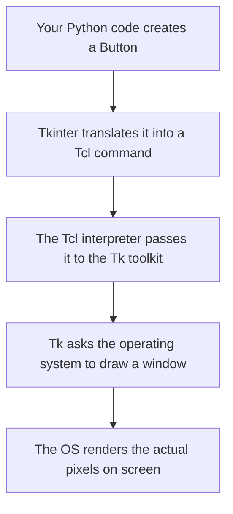
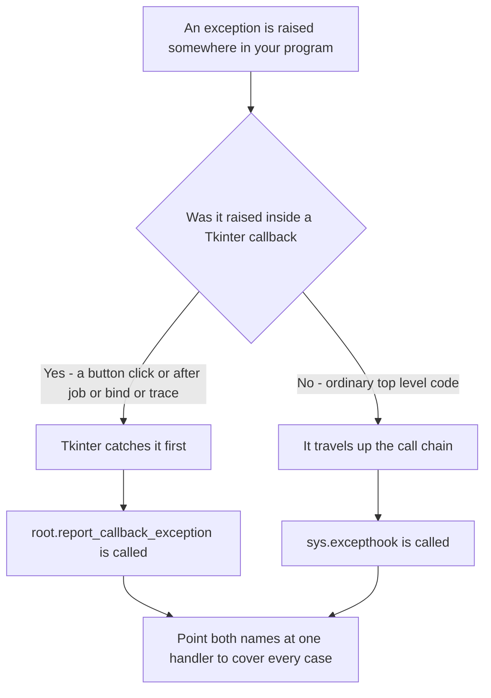
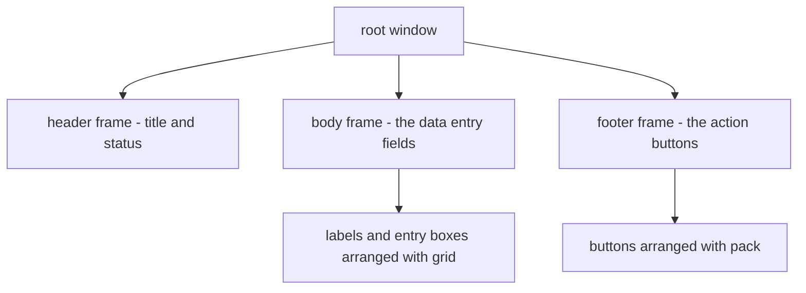

# Tkinter Conceptual Questions and Answers — Chapter 14 Companion

## Table of Contents

- [About This Page](#about-this-page)
    - [Why This Topic Matters for Python and for Chapter 14](#why-this-topic-matters-for-python-and-for-chapter-14)
    - [How to Use These Questions](#how-to-use-these-questions)
    - [Key Terms Used On This Page](#key-terms-used-on-this-page)
- [Questions 1 to 10](#questions-1-to-10)
    - [1. Why does Tkinter use both `tk.Label` and `ttk.Label`, and what happens if you try `ttk.Label(root, fg="red")`?](#1-why-does-tkinter-use-both-tklabel-and-ttklabel-and-what-happens-if-you-try-ttklabelroot-fgred)
    - [2. Explain the difference between `text=self.var` and `textvariable=self.var` when binding a Label to a `StringVar`. Why does one update live and the other doesn't?](#2-explain-the-difference-between-textselfvar-and-textvariableselfvar-when-binding-a-label-to-a-stringvar-why-does-one-update-live-and-the-other-doesnt)
    - [3. What does `trace_add("write", callback)` do, and why must the callback function accept `*args` even if you don't use the arguments?](#3-what-does-trace_addwrite-callback-do-and-why-must-the-callback-function-accept-args-even-if-you-dont-use-the-arguments)
    - [4. A student writes `username = tk.StringVar()`; `username = "JohnDoe"`. Why is this wrong, and what is the correct pattern?](#4-a-student-writes-username--tkstringvar-username--johndoe-why-is-this-wrong-and-what-is-the-correct-pattern)
    - [5. Compare `command=`, `bind("<Button-1>")`, and `bind("<<ListboxSelect>>")`. When would you use each, and what does each pass to your function?](#5-compare-command-bindbutton-1-and-bindlistboxselect-when-would-you-use-each-and-what-does-each-pass-to-your-function)
    - [6. Why does mixing `.pack()` and `.grid()` inside the same parent container cause the application to freeze? What is the "Golden Rule" of geometry managers?](#6-why-does-mixing-pack-and-grid-inside-the-same-parent-container-cause-the-application-to-freeze-what-is-the-golden-rule-of-geometry-managers)
    - [7. What is the "Golden Rule" for Radiobutton variables, and what happens if each Radiobutton gets its own variable instead of sharing one?](#7-what-is-the-golden-rule-for-radiobutton-variables-and-what-happens-if-each-radiobutton-gets-its-own-variable-instead-of-sharing-one)
    - [8. Explain the architecture: `Python → Tkinter → Tcl/Tk → OS`. What role does each layer play, and why does a Tkinter button look native on macOS but dated on Windows?](#8-explain-the-architecture-python--tkinter--tcltk--os-what-role-does-each-layer-play-and-why-does-a-tkinter-button-look-native-on-macos-but-dated-on-windows)
    - [9. What is the `mainloop()` method, and what happens to your window if you forget to call it?](#9-what-is-the-mainloop-method-and-what-happens-to-your-window-if-you-forget-to-call-it)
    - [10. A student writes `my_btn = tk.Button(root, text="Click").pack()`. Why is `my_btn` now `None`, and what is the correct two-line pattern?](#10-a-student-writes-my_btn--tkbuttonroot-textclickpack-why-is-my_btn-now-none-and-what-is-the-correct-two-line-pattern)
- [Questions 11 to 20](#questions-11-to-20)
    - [11. What is the difference between `Entry.get()` and `Text.get("1.0", "end")`? Why can't you call `.get()` with no arguments on a Text widget?](#11-what-is-the-difference-between-entryget-and-textget10-end-why-cant-you-call-get-with-no-arguments-on-a-text-widget)
    - [12. Explain why images sometimes disappear when using `tk.PhotoImage()`, and what the "garbage collection" problem is.](#12-explain-why-images-sometimes-disappear-when-using-tkphotoimage-and-what-the-garbage-collection-problem-is)
    - [13. What is `columnspan` and `rowspan` in `.grid()`, and what extra option must you use with them to make the widget actually fill the spanned area?](#13-what-is-columnspan-and-rowspan-in-grid-and-what-extra-option-must-you-use-with-them-to-make-the-widget-actually-fill-the-spanned-area)
    - [14. Compare `.after()`, `.update()`, and `.update_idletasks()`. When would you use each, and why is `time.sleep()` avoided in Tkinter?](#14-compare-after-update-and-update_idletasks-when-would-you-use-each-and-why-is-timesleep-avoided-in-tkinter)
    - [15. What is the "Modal" behavior of messagebox.showinfo(), and why does the application appear frozen while the dialog is open?](#15-what-is-the-modal-behavior-of-messageboxshowinfo-and-why-does-the-application-appear-frozen-while-the-dialog-is-open)
    - [16. Explain the difference between `Checkbutton` and `Radiobutton` in terms of variable sharing, exclusivity, and use cases. When would you use each?](#16-explain-the-difference-between-checkbutton-and-radiobutton-in-terms-of-variable-sharing-exclusivity-and-use-cases-when-would-you-use-each)
    - [17. What does `after()` return, and how do you cancel a scheduled delayed task? Why is storing the return value important?](#17-what-does-after-return-and-how-do-you-cancel-a-scheduled-delayed-task-why-is-storing-the-return-value-important)
    - [18. Why is `Toplevel()` used instead of creating a second Tk() window? What happens if you create multiple `Tk()` instances?](#18-why-is-toplevel-used-instead-of-creating-a-second-tk-window-what-happens-if-you-create-multiple-tk-instances)
    - [19. What is sys.excepthook, and why is it important for Tkinter applications specifically?](#19-what-is-sysexcepthook-and-why-is-it-important-for-tkinter-applications-specifically)
    - [20. Explain the "Unlock-Edit-Lock" pattern used with read-only widgets like Spinbox and Combobox. Why is it necessary?](#20-explain-the-unlock-edit-lock-pattern-used-with-read-only-widgets-like-spinbox-and-combobox-why-is-it-necessary)
- [Questions 21 to 30](#questions-21-to-30)
    - [21. What is the difference between `ttk.Progressbar` mode `"determinate"` and `"indeterminate"`? When would you use each?](#21-what-is-the-difference-between-ttkprogressbar-mode-determinate-and-indeterminate-when-would-you-use-each)
    - [22. A student creates a Canvas and draws a rectangle. Later, they want to change its color. Can they use `.config(fill="blue")` directly on the Canvas? How do you actually modify a Canvas item?](#22-a-student-creates-a-canvas-and-draws-a-rectangle-later-they-want-to-change-its-color-can-they-use-configfillblue-directly-on-the-canvas-how-do-you-actually-modify-a-canvas-item)
    - [23. Why does the document recommend using `ttk` widgets for layout structure but `tk` widgets for dynamic color changes? Explain the design trade-off.](#23-why-does-the-document-recommend-using-ttk-widgets-for-layout-structure-but-tk-widgets-for-dynamic-color-changes-explain-the-design-trade-off)
    - [24. What is the purpose of `variable=` vs `textvariable=` in selection widgets, and why can't you use `text=` with a `Checkbutton`?](#24-what-is-the-purpose-of-variable-vs-textvariable-in-selection-widgets-and-why-cant-you-use-text-with-a-checkbutton)
    - [25. Explain the difference between `Entry.show="*"` and a normal `Entry`. Why is show important for password fields, and what is a common mistake students make?](#25-explain-the-difference-between-entryshow-and-a-normal-entry-why-is-show-important-for-password-fields-and-what-is-a-common-mistake-students-make)
    - [26. What happens if you call `.mainloop()` twice in the same script? Why does the document show code after `mainloop()` that never executes?](#26-what-happens-if-you-call-mainloop-twice-in-the-same-script-why-does-the-document-show-code-after-mainloop-that-never-executes)
    - [27. Compare `Listbox` and `Combobox` in terms of use cases, selection mode, and when you'd choose one over the other.](#27-compare-listbox-and-combobox-in-terms-of-use-cases-selection-mode-and-when-youd-choose-one-over-the-other)
    - [28. Why does the document say "Don't dump dozens of input controls directly onto the root level"? What is the recommended organizational pattern?](#28-why-does-the-document-say-dont-dump-dozens-of-input-controls-directly-onto-the-root-level-what-is-the-recommended-organizational-pattern)
    - [29. What is the difference between `bind("<Motion>")` and `bind("<Enter>")` on a Canvas? Give a practical use case for each.](#29-what-is-the-difference-between-bindmotion-and-bindenter-on-a-canvas-give-a-practical-use-case-for-each)
    - [30. Explain how `sys.excepthook` and logging work together to create professional error handling in a Tkinter app. Why is this better than using `print()`?](#30-explain-how-sysexcepthook-and-logging-work-together-to-create-professional-error-handling-in-a-tkinter-app-why-is-this-better-than-using-print)
- [Checking These Answers for Yourself](#checking-these-answers-for-yourself)
    - [The Combined Self-Check Script](#the-combined-self-check-script)
    - [What It Prints](#what-it-prints)
- [Summary of Changes Made to This Page](#summary-of-changes-made-to-this-page)

## About This Page

This page is part of the extended, GitHub-only material that accompanies **Chapter 14 (Tkinter and GUI Programming)** of the printed textbook. It is a set of thirty conceptual questions with worked answers.

The questions are deliberately not "how do I make a button" questions. Every one of them takes something that a beginner has already used and asks *why it behaves the way it does* — why two label classes exist, why an image vanishes, why a window freezes, why an error message never appears. These are the questions that come up on the second or third day of writing a real program, once the first window is on screen and something unexpected happens.

[Back to Table of Contents](#table-of-contents)

### Why This Topic Matters for Python and for Chapter 14

**For Python in general:** a surprising number of these answers are not really about Tkinter at all. The disappearing image is about how Python decides an object is no longer needed. The `.pack()` trap is about what a method returns when it returns nothing. The error-handling questions are about where an exception travels when nothing catches it. Understanding these through a GUI, where the consequences are visible on screen, makes them much easier to carry into other Python work.

**For this chapter in particular:** the printed chapter teaches the tools. This page explains the reasoning behind them, and — just as importantly — the traps. Roughly a third of these questions describe a mistake that produces no error message at all, which is exactly the kind of problem that costs a beginner an evening.

Every claim on this page that could be tested was tested, by running the code on Python 3.12 with Tk 8.6.14. Where the exact behaviour matters, the real output is shown. A single script that repeats all of those checks is provided near the end, so you can confirm any of it on your own machine.

[Back to Table of Contents](#table-of-contents)

### How to Use These Questions

Read the question first and answer it in your head before reading on. If your answer differs from the one given, that is the useful part — work out which of you is right by running the code. Several of the answers below include a short program and its actual output for exactly that purpose.

| If you want to… | Look at |
| --- | --- |
| Understand the two widget families | Questions 1, 8, 23 |
| Get variables and live updating right | Questions 2, 3, 4, 24 |
| Handle clicks, keys and other events | Questions 5, 9, 26, 29 |
| Lay widgets out without fighting the geometry manager | Questions 6, 10, 13, 28 |
| Choose the right selection widget | Questions 7, 16, 20, 21, 27 |
| Work with text, images and the Canvas | Questions 11, 12, 22, 25 |
| Deal with timing, delays and extra windows | Questions 14, 15, 17, 18 |
| Build proper error handling | Questions 19, 30 |

[Back to Table of Contents](#table-of-contents)

### Key Terms Used On This Page

| Term | In plain words | Learn more |
| --- | --- | --- |
| Widget | Any on-screen element: a button, a label, a text box, a window. | [Python docs: tkinter](https://docs.python.org/3/library/tkinter.html) |
| `tk` and `ttk` | Two families of widgets. `tk` is the original set; `ttk` ("themed Tk") is the newer set that adopts the operating system's own appearance. | [Python docs: tkinter.ttk](https://docs.python.org/3/library/tkinter.ttk.html) |
| Control variable | A special Tkinter object (`StringVar`, `IntVar`, `BooleanVar`, `DoubleVar`) that holds a value and can be *watched*, so widgets update automatically when it changes. | [Python docs: tkinter](https://docs.python.org/3/library/tkinter.html) |
| Geometry manager | The system that decides where a widget actually appears: `pack()`, `grid()` or `place()`. | [Python docs: The Packer](https://docs.python.org/3/library/tkinter.html#the-packer) |
| Callback | A function you hand to something else so it can be called later — for example the function given to a button's `command=` option. | [Wikipedia: Callback](https://en.wikipedia.org/wiki/Callback_%28computer_programming%29) |
| Event loop / `mainloop()` | The loop inside Tkinter that waits for clicks, key presses and timers, and runs the matching piece of your code. | [Python docs: tkinter](https://docs.python.org/3/library/tkinter.html) |
| `TclError` | The error Tkinter raises when the drawing engine underneath it cannot do what it was asked. | [Python docs: tkinter](https://docs.python.org/3/library/tkinter.html) |
| Garbage collection | Python automatically freeing objects that nothing refers to any more. | [Wikipedia: Garbage collection](https://en.wikipedia.org/wiki/Garbage_collection_%28computer_science%29) |
| Tcl/Tk | The older toolkit that Tkinter sits on top of. Tk does the actual drawing; Tcl is the small language used to talk to it. | [Python docs: tkinter](https://docs.python.org/3/library/tkinter.html) |

[Back to Table of Contents](#table-of-contents)

---

## Questions 1 to 10

[Back to Table of Contents](#table-of-contents)

### 1. Why does Tkinter use both `tk.Label` and `ttk.Label`, and what happens if you try `ttk.Label(root, fg="red")`?

Tkinter maintains two parallel widget families: the classic `tk` widgets and the themed `ttk` (Tk themed) widgets. The `tk.Label` is a core widget that accepts direct styling parameters like `fg`, `bg`, `relief` and `bd` natively. The `ttk.Label` is a themed widget designed to adapt to the operating system's native look and feel, and it takes most of its appearance from a central style engine (`ttk.Style`) rather than from options given to each widget.

`ttk.Label(root, fg="red")` raises a `TclError`, because `fg` is a `tk` shorthand that themed widgets do not recognise:

```text
TclError: unknown option "-fg"
```

It is worth being precise about what themed widgets do and do not accept, because "ttk rejects colours" is a useful rule of thumb but not literally true. The shorthand spellings are always rejected; the full spellings are accepted by *some* themed widgets and not others. Tested on Tk 8.6.14:

| What you write | Result |
| --- | --- |
| `ttk.Label(root, fg="red")` | Rejected: `unknown option "-fg"` |
| `ttk.Label(root, bg="white")` | Rejected: `unknown option "-bg"` |
| `ttk.Label(root, bd=1)` | Rejected: `unknown option "-bd"` |
| `ttk.Label(root, foreground="red")` | **Accepted** |
| `ttk.Entry(root, foreground="red")` | **Accepted** |
| `ttk.Button(root, foreground="red")` | Rejected: `unknown option "-foreground"` |
| `ttk.Checkbutton(root, foreground="red")` | Rejected: `unknown option "-foreground"` |

So the practical rules are:

1. Never use the `tk` shorthands (`fg`, `bg`, `bd`) on a themed widget; they always fail.
2. For a themed `Label` or `Entry`, the full option `foreground=` works, either at creation or later with `.config(foreground="red")`.
3. For themed widgets that reject it — `Button` and `Checkbutton` among them — you must define a named style with `ttk.Style()` and apply it, or use the classic `tk` widget instead.

The design trade-off is: `ttk` gives you modern, OS-native appearance but far less per-widget control, while `tk` gives you full control but a dated look.

[Back to Table of Contents](#table-of-contents)

### 2. Explain the difference between `text=self.var` and `textvariable=self.var` when binding a Label to a `StringVar`. Why does one update live and the other doesn't?

When you write `lbl = tk.Label(root, text=self.text_var)`, you are performing a one-time string read at the moment the widget is created. Since `self.text_var` is a `StringVar` object rather than a plain string, Tkinter converts it to text and displays its internal name, such as `PY_VAR0`. That value never changes, because the label is not wired to the variable — it simply took a snapshot.

When you write `lbl = tk.Label(root, textvariable=self.text_var)`, you create a lasting connection. The label subscribes to the variable, and whenever the `StringVar`'s value changes — through `.set()`, or because the user typed into a bound `Entry` — the engine pushes the new content to the label, which repaints immediately.

The key rule is: **`text=` is a static assignment; `textvariable=` is a live binding.**



A short demonstration, with its real output:

```python
# Step 1: One variable, two labels built in the two different ways.
import tkinter as tk
root = tk.Tk()
var = tk.StringVar(value="hello")
static = tk.Label(root, text=var)             # snapshot only
live = tk.Label(root, textvariable=var)       # live binding

# Step 2: Change the variable after both labels exist.
var.set("goodbye")

# Step 3: See what each label is actually showing.
print("text=var        shows", repr(static.cget("text")))
print("the variable now holds", repr(var.get()))
```

```text
text=var        shows 'PY_VAR0'
the variable now holds 'goodbye'
```

The first label is stuck displaying the variable's internal name, and would have been stuck on that even if the variable had never changed.

[Back to Table of Contents](#table-of-contents)

### 3. What does `trace_add("write", callback)` do, and why must the callback function accept `*args` even if you don't use the arguments?

The `.trace_add("write", callback)` method places a watch on a control variable (`StringVar`, `IntVar` and so on) that fires automatically whenever the variable's value changes — that is, when `.set()` is called or the user types into a bound widget. This is the standard mechanism for live validation.

When the trace fires, Tkinter passes three positional arguments to your callback: the variable's internal name, an index (used only for array-style variables, and normally empty), and the mode that triggered the call. Running it and printing what actually arrives gives:

```text
callback received ('PY_VAR1', '', 'write')
```

Note the third value. With the modern `trace_add()` the mode is the full word `'write'`. The single-letter form `'w'` belongs to the older, now-deprecated `trace()` method, so code written against the old API will not match if you compare against `'w'`.

If your callback is defined as `def my_func(a, b, c):` all three values arrive and the function works. If you define it as `def my_func():` with no parameters, a `TypeError` is raised — but here is the detail worth knowing:

```text
TypeError: <lambda>() takes 0 positional arguments but 3 were given
```

That error appears in the terminal, prefixed by `Exception in Tkinter callback`, and **the program keeps running**. Tkinter catches exceptions raised inside callbacks rather than letting them stop the program. So the symptom is not a crash; it is a validation function that silently never works, with an explanation buried in a console the user may never look at. That is precisely why writing `*args` matters: it absorbs whatever Tkinter sends and lets the function do its job.

```python
def validate(*args):        # accepts the three values and ignores them
    ...
```

**A bonus worth knowing:** `trace_add()` itself returns a handle — a string identifying this particular watch. Keep it if you might want to stop watching later, using `variable.trace_remove("write", handle)`.

[Back to Table of Contents](#table-of-contents)

### 4. A student writes `username = tk.StringVar()`; `username = "JohnDoe"`. Why is this wrong, and what is the correct pattern?

This is the classic incorrect pattern. `tk.StringVar()` returns a wrapper object, not a plain string. When the student then writes `username = "JohnDoe"`, they are not putting a value *into* the wrapper — they are throwing the wrapper away and pointing the name at an ordinary string instead. Any widget already bound to the original variable is still bound to that original object, which nothing now updates, so every live connection is silently broken.

The correct pattern is:

```python
# Step 1: Create the control variable once.
username = tk.StringVar()

# Step 2: Put values into it with .set(), which keeps the wrapper intact.
username.set("JohnDoe")

# Step 3: Read values out of it with .get().
print(username.get())
```

The `.set()` method updates the value held inside the Tkinter engine while preserving the object that widgets are bound to. Equally, you must use `.get()` to read the value: printing the variable itself shows its internal name rather than its contents.

```text
print(var)      gives 'PY_VAR3'
var.get()       gives 'JohnDoe'
```

| | What it does | Result |
| --- | --- | --- |
| `username = "JohnDoe"` | Replaces the variable object with a string | Bindings break; widgets stop updating |
| `username.set("JohnDoe")` | Changes the value inside the object | Bindings keep working; widgets update |
| `print(username)` | Prints the object's internal name | `PY_VAR3` |
| `print(username.get())` | Prints the stored value | `JohnDoe` |

[Back to Table of Contents](#table-of-contents)

### 5. Compare `command=`, `bind("<Button-1>")`, and `bind("<<ListboxSelect>>")`. When would you use each, and what does each pass to your function?

These are Tkinter's three ways of connecting your code to something the user does.

**`command=`** is the simplest. It is available on widgets such as `Button`, `Checkbutton` and menu entries, and fires on the standard activation of that widget. It passes **no** event object at all, so there is no way to obtain mouse coordinates from it. Note the syntax: `command=my_func` with **no** brackets after the function name, because you are handing over the function itself rather than calling it.

**`bind("<Button-1>")`** attaches a handler to a raw physical event — a mouse click, a key press, a movement. It uses single angle brackets and passes a full event object, so the handler must accept one parameter:

```python
def on_click(event):
    print(event.x, event.y)          # coordinates inside the widget
widget.bind("<Button-1>", on_click)
```

Useful attributes on that event object include `event.x` and `event.y` (position), `event.char` and `event.keysym` (the key pressed), and `event.widget` (which widget it happened to).

**`bind("<<ListboxSelect>>")`** attaches a handler to a *virtual* event, written with double angle brackets. Virtual events describe a logical change rather than a physical action — the selection in a `Listbox` actually changed, a `Combobox` value was chosen, and so on. This is the smarter choice when you care about the data rather than the mouse, because it does not fire for clicks that change nothing.

| | `command=` | `bind("<Button-1>")` | `bind("<<ListboxSelect>>")` |
| --- | --- | --- | --- |
| Brackets | none | single `< >` | double `<< >>` |
| What it responds to | The widget being activated | A physical action | A logical change |
| What your function receives | Nothing | An event object | An event object |
| Can you read coordinates? | No | Yes | Not meaningfully |
| Fires on a click that changes nothing? | Not applicable | Yes | No |
| Typical use | Buttons and menus | Drawing, custom hover behaviour, keyboard handling | Reacting to a new selection |

Use `command=` for ordinary buttons, `bind("<Button-1>")` when you need the position or the key, and a virtual event such as `bind("<<ListboxSelect>>")` when what you care about is that the data changed.

[Back to Table of Contents](#table-of-contents)

### 6. Why does mixing `.pack()` and `.grid()` inside the same parent container cause the application to freeze? What is the "Golden Rule" of geometry managers?

The Golden Rule is: **never mix geometry managers inside the same parent container.**

That rule is right, but the reason given in the question is not what actually happens, and it is worth correcting because the real behaviour is much easier to diagnose. Mixing `.pack()` and `.grid()` in one parent does **not** cause a freeze or an infinite loop. It raises an error immediately, on the very line that introduces the second manager. Tested on Tk 8.6.14:

```python
# Step 1: A frame whose first child is placed with pack().
frame = tk.Frame(root)
tk.Label(frame, text="packed").pack()

# Step 2: Adding a second child with grid() in the SAME frame.
tk.Entry(frame).grid(row=0, column=1)
```

```text
raised after 0.0030 seconds
TclError: cannot use geometry manager grid inside .!frame which already has slaves managed by pack
```

The error names the problem precisely: this container already has children managed by `pack`, so `grid` will not touch it. There is no loop and no hang; the exception is raised in a few thousandths of a second. If it happens while your program is starting up, the uncaught error stops the script, which can look like a crash. If it happens inside a button's handler, Tkinter prints the error to the console and the window carries on.

`pack()` stacks children in blocks, top to bottom or side to side. `grid()` places them in a table of rows and columns. The two use completely different bookkeeping for the same container, which is why Tk refuses to combine them rather than trying.

What you **can** do — and should — is use different managers in *different* containers:



Each container is judged on its own, so a frame can be packed into the root while everything inside that frame uses grid. The rule only forbids two managers competing for the same parent.

[Back to Table of Contents](#table-of-contents)

### 7. What is the "Golden Rule" for Radiobutton variables, and what happens if each Radiobutton gets its own variable instead of sharing one?

The Golden Rule is: **all Radiobutton widgets in the same logical group must share the exact same variable object**, typically one `tk.StringVar` or `tk.IntVar`.

That shared variable is what creates mutual exclusivity. Each button in the group has its own `value=`, and a button shows as selected only while the shared variable equals that button's value. Clicking a button sets the variable to its own value, which instantly makes every other button's test fail, so they all deselect themselves. Nothing else is coordinating them — the shared variable is the entire mechanism.

If you give each button its own variable, that mechanism disappears. Each button then compares against a variable nobody else uses, so each becomes an independent on/off toggle and several can appear selected at once. Tested with three buttons:

```text
shared variable holds one value: 'M'
separate variables hold: ['S', 'M', ''] - two buttons selected at the same time
```

The group has stopped being a "choose exactly one" control, which defeats the purpose of using radio buttons at all.

```python
# Step 1: Correct - one variable for the whole group.
choice = tk.StringVar(value="M")
for size in ("S", "M", "L"):
    tk.Radiobutton(root, text=size, variable=choice, value=size).pack()

# Step 2: Read the group's answer from the single shared variable.
print("selected size:", choice.get())
```

[Back to Table of Contents](#table-of-contents)

### 8. Explain the architecture: `Python → Tkinter → Tcl/Tk → OS`. What role does each layer play, and why does a Tkinter button look native on macOS but dated on Windows?

Tkinter is not a drawing library. It is a stack of layers, each handing work to the one below.

| Layer | Name | What it does |
| --- | --- | --- |
| 1 | Your Python code | You write the application logic and create high-level objects such as buttons and labels. |
| 2 | Tkinter, the translator | Python cannot draw pixels. Tkinter turns your Python calls into Tcl commands that the graphics engine understands. |
| 3 | The Tcl/Tk engine | An embedded Tcl interpreter receives those commands. The Tk toolkit holds the definitions of how each widget behaves and looks, and tracks its state. |
| 4 | The operating system | Tk asks the OS for windows and drawing surfaces through its native interfaces. The OS performs the final rendering. |



**On the appearance question**, one clarification is worth making. The difference is not really macOS against Windows — it is which widget family you used.

- A **`ttk` widget** asks the operating system's own theming system to draw it, so it takes on the native appearance of whatever platform it runs on. A `ttk.Button` looks like a macOS button on macOS and like a modern Windows button on Windows.
- A **classic `tk` widget** is drawn by Tk itself using its own built-in appearance, which has changed very little in decades. That is the flat grey rectangle that looks dated on every modern system, Windows and macOS alike.

So the honest version of the rule is: use `ttk` widgets when you want the program to look like it belongs on the user's machine, and expect classic `tk` widgets to look old wherever they run.

[Back to Table of Contents](#table-of-contents)

### 9. What is the `mainloop()` method, and what happens to your window if you forget to call it?

`mainloop()` is the heart of every Tkinter application. It is an event-driven loop that repeats four steps continuously:

1. Wait for something to happen — a click, a key press, a window resize, a timer expiring.
2. Notice that it has happened.
3. Work out which widget and which of your functions should deal with it.
4. Run that function, then go back to step 1.

Without `mainloop()`, the window is built in memory but the script reaches its last line and ends, so the window either never appears or flashes on screen for a fraction of a second and vanishes with the program.

The method is **blocking**: any code written after `root.mainloop()` will not run until the window has been closed. That is a common source of confusion — a `print()` placed after it looks as though it should appear while the window is open, and it does not.

Blocking, however, does not mean frozen. Inside the loop, Tkinter is working continuously and the window stays fully responsive. What freezes a window is your own code refusing to return — most often `time.sleep()`. For a delay that does not freeze anything, use `.after()` instead, which is covered in question 14.

[Back to Table of Contents](#table-of-contents)

### 10. A student writes `my_btn = tk.Button(root, text="Click").pack()`. Why is `my_btn` now `None`, and what is the correct two-line pattern?

This is the geometry-manager return-value trap. The methods `.pack()`, `.grid()` and `.place()` all return `None`. They arrange the widget but hand nothing back:

```text
button.pack() returned None
```

So in `my_btn = tk.Button(...).pack()`, Python creates the button, passes it to `.pack()`, and then assigns *the result of `.pack()`* — which is `None` — to `my_btn`. The button itself exists and is visible, but you no longer have a reference to it. Any later use fails:

```text
AttributeError: 'NoneType' object has no attribute 'config'
```

The correct pattern is always two separate statements:

```python
# Step 1: Create the widget and keep the reference.
my_btn = tk.Button(root, text="Click")

# Step 2: Place it, on its own line, discarding the None.
my_btn.pack()

# Step 3: Now the reference still works.
my_btn.config(text="Clicked")
```

The one-line form is fine when you genuinely never need the widget again — a fixed label, for instance — but the moment you want to change, read or destroy it later, you need the two-line version.

[Back to Table of Contents](#table-of-contents)

---

## Questions 11 to 20

[Back to Table of Contents](#table-of-contents)

### 11. What is the difference between `Entry.get()` and `Text.get("1.0", "end")`? Why can't you call `.get()` with no arguments on a Text widget?

An `Entry` widget holds a single line, so `.get()` with no arguments has only one possible meaning and returns the whole contents as a string.

A `Text` widget is a multi-line buffer with its own coordinate system, so Tkinter cannot guess which part you want and the method requires a starting index. Calling it with no arguments does not produce a "syntax error" — the code is perfectly valid Python. It produces an ordinary `TypeError` at run time, because a required argument is missing:

```text
Entry.get()            -> 'one line'
Text.get('1.0','end')  -> 'line one\nline two\n'
Text.get() with no arguments -> TypeError: Text.get() missing 1 required positional argument: 'index1'
```

The index format is `"line.character"`, where **lines are counted from 1 and characters from 0**. So `"1.0"` means the very first character of the first line. The special index `"end"` means the position just past the last character.

| Index | Means |
| --- | --- |
| `"1.0"` | Start of the first line |
| `"2.5"` | Line 2, character 5 |
| `"end"` | Just past the last character |
| `"end-1c"` | One character back from the end, commonly used to drop the trailing newline |

One practical detail is visible in the output above: `Text.get("1.0", "end")` returns `'line one\nline two\n'` — with a newline on the end that you never typed. Tk always keeps a final newline in a `Text` widget. If that trailing character is a nuisance, read to `"end-1c"` instead, or call `.strip()` on the result.

[Back to Table of Contents](#table-of-contents)

### 12. Explain why images sometimes disappear when using `tk.PhotoImage()`, and what the "garbage collection" problem is.

`tk.PhotoImage()` creates an object that Python holds in memory. The trouble starts when you write the image directly inside the widget call:

```python
tk.Label(root, image=tk.PhotoImage(file="pic.png"))     # the image will vanish
```

The reason is that the widget does not keep the Python object. Internally, the label stores only the image's short registered *name*, such as `pyimage2`. From Python's point of view, therefore, nothing is referring to the `PhotoImage` object once that line finishes, so Python frees it — and as it is freed, the image is removed from Tk as well. The label is left naming a picture that no longer exists, and draws blank space. Verified:

```text
image kept in a variable is still registered: True
image with no variable is still registered:   False
```

The fix is to keep a reference for at least as long as the image is on screen:

```python
# Step 1: Load the image into a variable.
img = tk.PhotoImage(file="pic.png")

# Step 2: Give it to the widget.
label = tk.Label(root, image=img)
label.pack()

# Step 3: If this happens inside a function, park a second reference on the
# widget as well, so the image outlives the function's local variables.
label.image = img
```

Step 3 deserves a word. `label.image` is not a Tkinter option and Tkinter never reads it; it is an ordinary Python attribute being used as a place to keep the object alive. Because the widget lives as long as the window does, so does the image.

The underlying mechanism is **reference counting**: Python keeps track of how many names point at each object, and frees the object the moment that count reaches zero. Garbage collection is not the enemy here — it is working exactly as designed. The problem is that the connection between the widget and the image is invisible to it.

[Back to Table of Contents](#table-of-contents)

### 13. What is `columnspan` and `rowspan` in `.grid()`, and what extra option must you use with them to make the widget actually fill the spanned area?

`columnspan` and `rowspan` let a single widget occupy several columns or rows instead of one. A heading might stretch across three columns, or a text box down two rows:

```python
header.grid(row=0, column=0, columnspan=3)
txt.grid(row=1, column=0, rowspan=2)
```

On their own, though, these options only reserve the space. They do not make the widget grow into it — the widget keeps its natural size and sits inside the reserved area. To make it actually fill the space you must add `sticky`, which names the edges the widget should cling to.

The difference is easy to measure. Two labels, both spanning three columns of a 360-pixel-wide frame, one with `sticky` and one without:

```text
columnspan=3, no sticky   -> 66 pixels wide
columnspan=3, sticky='ew' -> 360 pixels wide
```

| `sticky` value | Effect |
| --- | --- |
| omitted | The widget sits centred in the reserved space at its natural size |
| `"ew"` | Stretches left and right (east–west) |
| `"ns"` | Stretches up and down |
| `"nsew"` | Stretches in all four directions, filling the area completely |
| `"w"` | Does not stretch, but sits against the left edge |

One further point that catches people out: for a column to grow when the *window* is resized, it also needs a weight, set with `frame.grid_columnconfigure(0, weight=1)`. `sticky` makes a widget fill its cell; `weight` decides whether the cell itself grows.

[Back to Table of Contents](#table-of-contents)

### 14. Compare `.after()`, `.update()`, and `.update_idletasks()`. When would you use each, and why is `time.sleep()` avoided in Tkinter?

All three relate to keeping the interface alive, but they do quite different jobs.

**`.after(milliseconds, func)`** asks Tkinter to run a function later. It returns immediately, and your program carries straight on. During the delay the event loop keeps running normally, so the window stays fully responsive — clicks, redraws and other scheduled jobs all continue as usual. Use it for timers, delays, animations and anything that should happen "in a moment". Note the units are milliseconds: two seconds is `2000`, not `2`.

**`.update()`** forces Tkinter to deal with everything outstanding right now — redraws *and* pending user events such as clicks. It is the tool for a long loop of your own that would otherwise hold the loop up, for example while filling a progress bar. It should be used sparingly, since calling it from inside an event handler can lead to confusing re-entrant behaviour.

**`.update_idletasks()`** is the gentler relative. It processes only pending display work — geometry calculations and redraws — and deliberately does **not** deliver user events. Verified: with a click waiting in the queue, `update_idletasks()` left it unprocessed, while `update()` ran it. Use `update_idletasks()` when you only want the screen to catch up, for instance before measuring a widget's size.

| | `.after(ms, func)` | `.update()` | `.update_idletasks()` |
| --- | --- | --- | --- |
| Blocks your code? | No, returns at once | Briefly, while it works | Briefly, while it redraws |
| Redraws the screen | Not directly | Yes | Yes |
| Delivers clicks and key presses | Not directly; the loop does it as usual | Yes | **No** |
| Typical use | Delays, timers, animation | Keeping a long loop responsive | Getting accurate sizes before measuring |

**`time.sleep()`** is avoided because it stops the whole program, and the event loop is part of that program. During the sleep the window cannot redraw or respond, and the operating system may mark it "Not Responding". It is the right tool in a plain script and the wrong tool in a GUI; `.after()` is its replacement.

[Back to Table of Contents](#table-of-contents)

### 15. What is the "Modal" behavior of messagebox.showinfo(), and why does the application appear frozen while the dialog is open?

When a message box opens it is **modal**: it takes control of input for the application, and the window behind it stops responding until the dialog is dismissed. You cannot click, type into or interact with the parent window while it is open.

This is deliberate, not a fault. Modality forces the user to deal with the message before doing anything else, which is exactly what you want for a confirmation or a warning that must not be ignored.

Technically, the application has not stopped. Tkinter runs a nested event loop for the dialog and applies a grab, so events go to the dialog rather than to the parent window. The parent looks frozen because it is being deliberately ignored, not because anything has hung.

This is also why the asking dialogs return a value directly:

```python
# Step 1: Execution pauses on this line until the user answers.
answer = messagebox.askyesno("Confirm", "Delete this file?")

# Step 2: This line runs only after the dialog has been dismissed.
print("the user chose:", answer)
```

```text
the user chose: True
```

Because the result arrives as an ordinary return value, you can write the code that follows in a straightforward top-to-bottom way, with no callback needed.

[Back to Table of Contents](#table-of-contents)

### 16. Explain the difference between `Checkbutton` and `Radiobutton` in terms of variable sharing, exclusivity, and use cases. When would you use each?

`Checkbutton` widgets are independent switches. Each one gets its own variable, usually a `BooleanVar`, and ticking one has no effect on any other. Use them when the user may choose any combination, including none and all — "Dark mode", "Notifications", "Auto-save".

`Radiobutton` widgets are mutually exclusive. Every button in a group shares one variable, and each has its own `value`. Selecting one sets the shared variable, which automatically deselects the rest. Use them when exactly one option must be chosen — Size: S, M, L, XL.

| | `Checkbutton` | `Radiobutton` |
| --- | --- | --- |
| Variables | One per button | One shared by the whole group |
| Usual type | `BooleanVar` | `StringVar` or `IntVar` |
| How many can be on | Any number | Exactly one per group |
| Needs `value=`? | No; uses `onvalue`/`offvalue` | Yes, one per button |
| How you read the answer | Ask each variable in turn | Read the single shared variable |
| Use when | Options are independent | Options are alternatives |

The short version: **Checkbutton means one variable per button; Radiobutton means one variable per group.**

[Back to Table of Contents](#table-of-contents)

### 17. What does `after()` return, and how do you cancel a scheduled delayed task? Why is storing the return value important?

When you call `root.after(milliseconds, my_function)`, Tkinter returns a short identifier string for that particular scheduled job:

```text
after() returned 'after#0' (type str)
```

That identifier is your only handle on the job. To call it off before it runs, pass it to `after_cancel()`:

```python
# Step 1: Schedule the job and keep the identifier.
self.timer_id = self.after(5000, self.do_something)

# Step 2: Later, cancel it if it is no longer wanted.
self.after_cancel(self.timer_id)
```

If you do not keep the identifier, you have no way to stop the job. It will still fire when its time comes, even if the user has moved to another screen or the work is no longer relevant — and if it then tries to update a widget that has since been destroyed, it can raise an error of its own.

This matters most for repeating jobs. A function that re-books itself with `after()` at the end of every run will keep going forever unless something cancels it, so a clock or an animation should always store its latest identifier. The habit worth forming is: **if you can start it, make sure you can stop it.**

**On the related method in the question's original wording:** `trace_add()` also returns something — a handle string identifying that watch — which you can pass to `variable.trace_remove("write", handle)` to stop watching a variable. The two are easy to confuse because both hand back a string you may need later, but they cancel quite different things: `after_cancel()` stops a delayed job, and `trace_remove()` stops a variable watch.

[Back to Table of Contents](#table-of-contents)

### 18. Why is `Toplevel()` used instead of creating a second Tk() window? What happens if you create multiple `Tk()` instances?

A Tkinter application should have exactly **one** `Tk()` instance. Creating `Tk()` does far more than open a window: it starts a Tcl interpreter, loads the Tk toolkit and sets up the event system. A second `Tk()` therefore starts a second, entirely separate copy of all of that, and the two know nothing about each other.

`Toplevel()` is the right way to add another window. It creates a new top-level window that shares the existing interpreter, event loop, images, fonts and variables:

```python
new_window = tk.Toplevel(root)
new_window.title("Settings")
```

| | Second `Tk()` | `Toplevel(root)` |
| --- | --- | --- |
| Starts a new interpreter | Yes | No |
| Served by your existing `mainloop()` | No | Yes |
| Can share images and variables with the main window | No | Yes |
| Closing it ends the program | Not necessarily | No |
| Recommended | No | Yes |

The practical symptoms of two `Tk()` objects are hard to diagnose: the second window may not respond to clicks at all, because `mainloop()` is serving the first; images created for one cannot be used in the other; and shutting the program down cleanly becomes unpredictable. A `Toplevel` avoids all of it, has its own title bar and close button, and is removed completely when you call `.destroy()` on it while the rest of the application carries on.

[Back to Table of Contents](#table-of-contents)

### 19. What is sys.excepthook, and why is it important for Tkinter applications specifically?

`sys.excepthook` is the function Python calls when an exception reaches the top of the program without any `try-except` having caught it. Normally it prints a traceback and the program ends. Replacing it lets you take over that moment — show a friendly dialog, write the details to a log file, and keep the program alive:

```python
def handle_error(exc_type, exc_value, exc_traceback):
    messagebox.showerror("Unexpected Error", f"{exc_type.__name__}: {exc_value}")

sys.excepthook = handle_error
```

**There is a large and important exception in Tkinter, and it is the reason this question matters here.** `sys.excepthook` does **not** receive errors raised inside Tkinter callbacks — which means button clicks, `after()` jobs, `bind()` handlers and variable traces, in other words most of what an application actually does. Tkinter catches those itself and sends them to a method of its own called `report_callback_exception`. Installing only `sys.excepthook` and testing it with a button therefore produces no dialog at all.

Verified, with both handlers installed and an error raised from a button click:

```text
handlers that actually ran: ['root.report_callback_exception']
```

The fix is to point both names at the same function. Note that `report_callback_exception` must be set on the **root window**; setting it on a `Toplevel` has no effect, because Tkinter always consults the root:

```python
# Step 1: For errors that reach the top level of the program.
sys.excepthook = handle_error

# Step 2: For errors inside callbacks - set this on the ROOT window.
root.report_callback_exception = handle_error
```

Why this matters so much in a GUI is that the default behaviour for a callback error is close to the worst possible one for a user. The program does not crash — Tkinter prints a traceback to the console and carries on — so the user clicks a button, absolutely nothing happens, no message appears, and the only explanation is in a terminal they are probably not looking at. A global handler converts that silence into a clear message.



[Back to Table of Contents](#table-of-contents)

### 20. Explain the "Unlock-Edit-Lock" pattern used with read-only widgets like Spinbox and Combobox. Why is it necessary?

The pattern itself is:

```python
# Step 1: Unlock the widget.
widget.config(state="normal")

# Step 2: Make the change.
widget.delete(0, "end")
widget.insert(0, "new value")

# Step 3: Lock it again straight away.
widget.config(state="readonly")
```

The reason it is necessary needs correcting, though, because the behaviour is more slippery than "it raises an error". Testing what actually happens when you edit a read-only widget from code:

```text
tk.Entry state=readonly, after insert -> '' (no error, edit ignored)
ttk.Combobox state=readonly, after .set('b') -> 'b' (set works)
```

No exception is raised in either case. For a read-only `Entry` or `Spinbox`, the `insert()` simply does nothing — the call succeeds, the widget is unchanged, and your program carries on believing it worked. That silence is precisely why the pattern matters: a failure that announces itself is easy to fix, while one that quietly does nothing can take a long time to notice.

The `ttk.Combobox` behaves differently again: `.set()` works perfectly well on a read-only combobox, because `readonly` there means "the user may not type a free value", not "the program may not change it".

| Widget and state | `insert()` / `delete()` from code | `.set()` from code |
| --- | --- | --- |
| `tk.Entry`, `state="readonly"` | No error, silently ignored | Not applicable |
| `tk.Entry`, `state="disabled"` | No error, silently ignored | Not applicable |
| `tk.Spinbox`, `state="readonly"` | No error, silently ignored | Not applicable |
| `ttk.Combobox`, `state="readonly"` | Ignored | **Works** |

So the honest summary is: `readonly` is a protection against the *user*, and for `Entry` and `Spinbox` it blocks your program too — silently. Use Unlock-Edit-Lock for those, and remember that for a `ttk.Combobox` you can simply call `.set()`.

[Back to Table of Contents](#table-of-contents)

---

## Questions 21 to 30

[Back to Table of Contents](#table-of-contents)

### 21. What is the difference between `ttk.Progressbar` mode `"determinate"` and `"indeterminate"`? When would you use each?

`mode="determinate"` is for work whose size you know. The bar represents a percentage from 0 to 100, and you move it with `.step(5)` or by setting the value directly with `.configure(value=75)`. Use it for file downloads, copies, or any task where you can say how much is done.

`mode="indeterminate"` is for work whose length you cannot predict. Instead of filling up, a block slides back and forth to show that something is happening. You start and stop the animation with `.start()` and `.stop()`. Use it for loading screens and waits of unknown duration.

| | `"determinate"` | `"indeterminate"` |
| --- | --- | --- |
| Shows | How much is finished | That something is happening |
| You control it with | `.step()` or `value=` | `.start()` and `.stop()` |
| Needs a known total? | Yes | No |
| Typical use | Downloads, file copies, batch jobs | Connecting, loading, waiting |

One limitation applies to both: a `Progressbar` is display-only. The user cannot drag it to change a value, and it shows no numbers of its own. If you want a percentage in words, put a `Label` beside it and update the label yourself.

[Back to Table of Contents](#table-of-contents)

### 22. A student creates a Canvas and draws a rectangle. Later, they want to change its color. Can they use `.config(fill="blue")` directly on the Canvas? How do you actually modify a Canvas item?

No. Calling `.config()` on the Canvas changes the Canvas itself — its background, its size, its border — not anything drawn on it.

The reason is that things drawn on a Canvas are not widgets. When you call a drawing method, it returns an integer identifier for that shape, and that number is how you refer to it afterwards:

```text
create_rectangle returned 1 of type int
after itemconfig, the item's fill is 'blue'
```

```python
# Step 1: Draw the shape and keep the id it returns.
rect_id = canvas.create_rectangle(10, 10, 100, 60, fill="red")

# Step 2: Change its appearance later using that id.
canvas.itemconfig(rect_id, fill="blue")

# Step 3: Move or resize it by giving new coordinates.
canvas.coords(rect_id, 20, 20, 150, 90)

# Step 4: Remove it when finished.
canvas.delete(rect_id)
```

| To do this | Use |
| --- | --- |
| Change colour, width, text of an item | `canvas.itemconfig(item_id, ...)` |
| Move or resize an item | `canvas.coords(item_id, ...)` |
| Delete an item | `canvas.delete(item_id)` |
| Delete everything | `canvas.delete("all")` |
| Change the Canvas itself | `canvas.config(...)` |

A useful alternative to storing every id is to give items a tag when you create them — `canvas.create_oval(..., tags="dots")` — and then address the whole group at once with `canvas.itemconfig("dots", fill="green")`. This is what makes the Canvas powerful for custom graphics, at the cost of being less convenient than ordinary widgets.

[Back to Table of Contents](#table-of-contents)

### 23. Why does the document recommend using `ttk` widgets for layout structure but `tk` widgets for dynamic color changes? Explain the design trade-off.

The recommendation follows from how each family decides what it looks like.

Themed `ttk` widgets take their appearance from a central style engine and, where possible, from the operating system's own theme. That is exactly what you want for the structural parts of an interface — frames, notebooks, comboboxes, scrollbars — because it makes the whole application look consistent and native without any styling work from you.

The cost is per-widget control. As shown in question 1, a themed widget rejects the `tk` shorthands outright, and several of them reject the full colour options too. Changing one themed button to red means defining a named style with `ttk.Style()` and applying it, which is a lot of machinery for a single highlight.

Classic `tk` widgets are the reverse. They accept `fg`, `bg`, `relief` and the rest directly, at creation or at any time afterwards through `.config()`, which makes them ideal for anything that changes colour in response to what the program is doing — a status line that turns red on failure and green on success, a cell that highlights when its value goes out of range.

| | `ttk` widgets | `tk` widgets |
| --- | --- | --- |
| Appearance | Native to the operating system, modern | Fixed, dated |
| Styling method | Central `ttk.Style` engine | Options on each widget |
| Change one widget's colour | Awkward; often needs a named style | Easy: `widget.config(bg="red")` |
| Best for | Structure and standard controls | Anything whose colour must change at run time |

The two families mix perfectly well in one window, so the practical approach is to build the structure from `ttk` and reach for a `tk` widget at the few points where you need direct colour control.

[Back to Table of Contents](#table-of-contents)

### 24. What is the purpose of `variable=` vs `textvariable=` in selection widgets, and why can't you use `text=` with a `Checkbutton`?

The two options connect a widget to a control variable for two different purposes.

`variable=` binds the widget's **state**. On a `Checkbutton` it holds whether the box is ticked, updating automatically as the user clicks. By default that is `True` or `False` in a `BooleanVar`, and you can choose other values with `onvalue=` and `offvalue=`. On a `Radiobutton`, `variable=` is the shared variable that makes the group exclusive.

`textvariable=` binds the widget's **displayed text**, and is used on widgets whose job is to show or accept text, such as `Label` and `Entry`.

`text=` is different again: it takes a plain string, the fixed caption printed beside the box. You certainly can pass `text=` to a `Checkbutton` — the caption has to come from somewhere. What you must not do is pass a *variable* to it, because `text=` expects a string and will display the variable's internal name instead:

```text
Checkbutton with text=a BooleanVar displays 'PY_VAR4'
```

The correct arrangement uses both options for their own purposes:

```python
# Step 1: A variable to hold the state.
dark_mode = tk.BooleanVar()

# Step 2: text= for the fixed caption, variable= for the state.
tk.Checkbutton(root, text="Enable Dark Mode", variable=dark_mode).pack()

# Step 3: Read the state whenever you need it.
print("dark mode is", dark_mode.get())
```

| Option | Binds | Typical widget |
| --- | --- | --- |
| `variable=` | The on/off or selected state | `Checkbutton`, `Radiobutton` |
| `textvariable=` | The text shown, updating live | `Label`, `Entry` |
| `text=` | A fixed caption, set once | Almost any widget with a label |

[Back to Table of Contents](#table-of-contents)

### 25. Explain the difference between `Entry.show="*"` and a normal `Entry`. Why is show important for password fields, and what is a common mistake students make?

The `show` option replaces every character on screen with the one you give it, so `show="*"` displays a row of asterisks however the user types. A normal `Entry` displays what was typed.

```python
password_entry = tk.Entry(root, show="*")
```

The point is protection from onlookers — someone standing behind the user cannot read the password off the screen.

The mistake worth warning about is assuming `show` does more than it does. It changes the display only. The characters are stored in full, and `.get()` returns them exactly as typed:

```python
# The box shows ******** but this returns the real text.
print(password_entry.get())
```

So printing the result to a console, writing it to a log file, or leaving it in a variable that later appears in an error message all expose the password just as surely as showing it on screen. `show="*"` is a courtesy to the user, not a security measure. Real protection means not storing the password in plain form at all, and comparing a hash of it rather than the text itself — a topic well beyond this chapter, but worth knowing exists.

[Back to Table of Contents](#table-of-contents)

### 26. What happens if you call `.mainloop()` twice in the same script? Why does the document show code after `mainloop()` that never executes?

`mainloop()` blocks. It returns only when the window has been destroyed, either because the user closed it or because your code called `.destroy()`.

That is what makes code placed after it appear never to run. It is not unreachable — it runs perfectly well once the window closes — but it does not run *while the window is open*, which is what people usually expect:

```python
root.mainloop()
print("After window closes")     # runs only after the window has gone
```

As for calling it twice, the behaviour is worth stating plainly because it is often described wrongly. The second call is neither unreachable nor an error. Once the first `mainloop()` has returned, the second one runs — and since there is no longer a window to service, it returns immediately:

```text
first mainloop() returned normally after the window was destroyed
second mainloop() returned after 0.0000s, no error
```

So a second `mainloop()` is simply pointless rather than harmful. The genuine mistake is different, and more common: putting work after `mainloop()` and expecting it to run alongside the window. If you want something to happen while the program is running, it must be triggered by an event — a button's `command`, a `bind()`, or a job scheduled with `.after()`.

[Back to Table of Contents](#table-of-contents)

### 27. Compare `Listbox` and `Combobox` in terms of use cases, selection mode, and when you'd choose one over the other.

A `Listbox` shows its items in a panel that is always visible, scrolling when there are more than fit. It can allow several items to be selected at once, through `selectmode="multiple"` or `selectmode="extended"`.

A `ttk.Combobox` is a dropdown. It shows one value at a time and reveals the list only when clicked, which makes it far more economical with space. Setting `state="readonly"` stops the user typing a value that is not on the list. Being a themed widget, it also matches the operating system's appearance.

| | `Listbox` | `ttk.Combobox` |
| --- | --- | --- |
| Items visible | All of them, with scrolling | One, until it is opened |
| Space used | A panel | A single line |
| Multiple selection | Yes | No |
| Restrict to the given values | Not applicable | Yes, with `state="readonly"` |
| Themed to match the OS | No, it is a classic `tk` widget | Yes |
| Reading the selection | `.curselection()` then `.get(index)` | `.get()` |

As a rule of thumb: choose a `Listbox` when there are many items, when the user should see them all at once, or when more than one may be selected; choose a `Combobox` for a compact list of a few options where space matters, such as a country or a font size.

[Back to Table of Contents](#table-of-contents)

### 28. Why does the document say "Don't dump dozens of input controls directly onto the root level"? What is the recommended organizational pattern?

Putting every widget straight onto the root window produces a flat layout with no structure. It causes three practical problems: the arrangement is hard to change later, because everything is one long list of placements; it resizes badly, since there are no groups that can grow or stay fixed independently; and you are forced to use a single geometry manager for the whole interface, because of the rule in question 6.

The recommended pattern is to build a small hierarchy of containers first, then place the actual controls inside them:



```python
# Step 1: Create the zones and place them in the window.
header = ttk.Frame(root); header.pack(fill="x")
body = ttk.LabelFrame(root, text="Details"); body.pack(fill="both", expand=True)
footer = ttk.Frame(root); footer.pack(fill="x")

# Step 2: Fill each zone, choosing the manager that suits it.
ttk.Label(header, text="Customer Record").pack()
ttk.Label(body, text="Name:").grid(row=0, column=0)
ttk.Entry(body).grid(row=0, column=1)
ttk.Button(footer, text="Save").pack(side="right")
```

Three benefits follow. Each frame is a separate container, so one can use `grid` inside while another uses `pack`. Resizing behaviour can be controlled per zone. And the structure of the code matches the structure the user sees, which makes it far easier to come back to.

[Back to Table of Contents](#table-of-contents)

### 29. What is the difference between `bind("<Motion>")` and `bind("<Enter>")` on a Canvas? Give a practical use case for each.

`<Motion>` fires repeatedly, every time the mouse moves even slightly while it is over the widget. Each call receives an event carrying the current `event.x` and `event.y`.

`<Enter>` fires once, at the moment the pointer crosses into the widget. Its partner `<Leave>` fires once when the pointer leaves.

| | `<Motion>` | `<Enter>` |
| --- | --- | --- |
| How often | Continuously while moving | Once per crossing |
| Answers the question | Where is the pointer now? | Is the pointer over this widget? |
| Paired with | Nothing | `<Leave>` |

A practical use for `<Motion>` is freehand drawing: as the pointer moves with the button held down, you draw a short line to each new position. It is also how you show live coordinates on a diagram.

A practical use for `<Enter>` is hover feedback: highlight a shape, change the cursor to `hand2`, or show a tooltip when the pointer arrives, then undo it on `<Leave>`.

```python
# Step 1: Continuous tracking - runs many times per second.
canvas.bind("<Motion>", lambda e: print("at", e.x, e.y))

# Step 2: One-off hover detection - runs once on arrival and once on departure.
canvas.bind("<Enter>", lambda e: canvas.config(cursor="hand2"))
canvas.bind("<Leave>", lambda e: canvas.config(cursor=""))
```

Because `<Motion>` fires so often, keep its handler short. Anything slow inside it will make the interface feel sluggish.

[Back to Table of Contents](#table-of-contents)

### 30. Explain how `sys.excepthook` and logging work together to create professional error handling in a Tkinter app. Why is this better than using `print()`?

The two solve different halves of the same problem, and the combination is what makes error handling feel finished.

`print()` writes to the terminal, and only while the program is running. If the application was started by double-clicking an icon there may be no terminal at all, and once the window closes the messages are gone. Nobody can tell you afterwards what the program said.

The `logging` module writes to a file that survives the program. Each entry can carry a timestamp and a severity, so you can open the file the next day and reconstruct what happened before a failure.

`sys.excepthook`, together with Tkinter's `report_callback_exception`, catches the errors that no `try-except` caught. As established in question 19, both are needed in a Tkinter program: the first for ordinary top-level code, the second for anything raised inside a callback, and `report_callback_exception` must be set on the root window.

Putting all of it together gives a handler that serves the user and the programmer at once:

```python
# Step 1: Send log entries to a file, with a timestamp and a severity.
logging.basicConfig(
    filename="app.log",
    level=logging.ERROR,
    format="%(asctime)s - %(levelname)s - %(message)s"
)

# Step 2: One handler that records the detail and shows a short message.
def handle_error(exc_type, exc_value, exc_traceback):
    message = f"{exc_type.__name__}: {exc_value}"
    logging.error(message, exc_info=(exc_type, exc_value, exc_traceback))
    messagebox.showerror("Unexpected Error", message)

# Step 3: Install it in both places, so no route is left uncovered.
sys.excepthook = handle_error
root.report_callback_exception = handle_error
```

The `exc_info` argument in step 2 is what puts the full traceback into the file. Without it only the one-line summary is recorded.

| | Who it is for | What they get |
| --- | --- | --- |
| `messagebox.showerror()` | The user | One short sentence, at the moment it happens |
| `logging.error(..., exc_info=...)` | The programmer | The full traceback with a timestamp, kept permanently |
| `print()` | Nobody reliably | Text in a terminal that may not exist and is not kept |

The result is a program that never fails silently, never shows a traceback to someone who cannot read one, and always leaves enough evidence behind to diagnose the problem later.

[Back to Table of Contents](#table-of-contents)

---

## Checking These Answers for Yourself

Several answers above quote real output rather than describing behaviour in words. The script below performs all of those checks in one run, so you can confirm any of them on your own machine and see whether your version of Tk behaves the same way.

[Back to Table of Contents](#table-of-contents)

### The Combined Self-Check Script

```python
# Step 1: Import what the checks need.
import sys
import time
import tkinter as tk
from tkinter import ttk

root = tk.Tk()
root.geometry("360x300")   # a real size, so the layout check below can measure widths
print("Tk version:", root.tk.call("info", "patchlevel"))
print()

# Step 2: Does a ttk widget accept tk's shorthand colour options?
print("CHECK 1 - ttk styling options")
for option in ("fg", "foreground"):
    try:
        w = ttk.Label(root, **{option: "red"})
        print(f"   ttk.Label({option}=) accepted, value is {str(w.cget('foreground'))!r}")
    except tk.TclError as error:
        print(f"   ttk.Label({option}=) rejected -> TclError: {error}")
try:
    ttk.Button(root, foreground="red")
except tk.TclError as error:
    print(f"   ttk.Button(foreground=) rejected -> TclError: {error}")
print()

# Step 3: What does a Label show when a variable is passed to text= instead of textvariable=?
print("CHECK 2 - text= versus textvariable=")
var = tk.StringVar(value="hello")
static = tk.Label(root, text=var)
live = tk.Label(root, textvariable=var)
var.set("goodbye")
print(f"   text=var        shows {static.cget('text')!r}  (never changes)")
print(f"   textvariable=var is wired to {str(live.cget('textvariable'))!r} and reads back {var.get()!r}")
print()

# Step 4: What does trace_add pass to the callback, and what does it return?
print("CHECK 3 - trace_add arguments and return value")
seen = []
watched = tk.StringVar()
handle = watched.trace_add("write", lambda *args: seen.append(args))
watched.set("typed")
print(f"   callback received {seen[0]}")
print(f"   trace_add returned a handle of type {type(handle).__name__}, usable with trace_remove()")
print()

# Step 5: Is mixing pack and grid in one parent an immediate error or a freeze?
print("CHECK 4 - mixing geometry managers in one parent")
frame = tk.Frame(root)
tk.Label(frame, text="packed").pack()
started = time.perf_counter()
try:
    tk.Entry(frame).grid(row=0, column=1)
    print("   no error raised")
except tk.TclError as error:
    print(f"   raised after {time.perf_counter() - started:.4f} seconds")
    print(f"   TclError: {error}")
print()

# Step 6: What do the geometry-manager methods return?
print("CHECK 5 - return value of pack()")
button = tk.Button(root, text="x")
print(f"   button.pack() returned {button.pack()!r}")
print()

# Step 7: How is a Text widget read, and what happens with no arguments?
print("CHECK 6 - reading Entry and Text")
entry = tk.Entry(root); entry.insert(0, "one line")
text = tk.Text(root); text.insert("1.0", "line one\nline two")
print(f"   Entry.get()            -> {entry.get()!r}")
print(f"   Text.get('1.0','end')  -> {text.get('1.0', 'end')!r}")
try:
    text.get()
except TypeError as error:
    print(f"   Text.get() with no arguments -> TypeError: {error}")
print()

# Step 8: Does an image survive without a variable holding it?
print("CHECK 7 - PhotoImage and references")
kept = tk.PhotoImage(width=10, height=10)
label_ok = tk.Label(root, image=kept)
label_bad = tk.Label(root, image=tk.PhotoImage(width=10, height=10))
root.update()
live_names = root.tk.call("image", "names")
print(f"   image kept in a variable is still registered: {label_ok.cget('image') in live_names}")
print(f"   image with no variable is still registered:   {label_bad.cget('image') in live_names}")
print()

# Step 9: Does columnspan on its own stretch a widget?
print("CHECK 8 - columnspan with and without sticky")
grid_frame = tk.Frame(root, width=300)
grid_frame.pack(fill="x")
for column in range(3):
    grid_frame.grid_columnconfigure(column, weight=1)
plain = tk.Label(grid_frame, text="no sticky")
plain.grid(row=0, column=0, columnspan=3)
stretched = tk.Label(grid_frame, text="sticky ew")
stretched.grid(row=1, column=0, columnspan=3, sticky="ew")
tk.Label(grid_frame, text="x" * 40).grid(row=2, column=0, columnspan=3)
root.update()
print(f"   columnspan=3, no sticky   -> {plain.winfo_width()} pixels wide")
print(f"   columnspan=3, sticky='ew' -> {stretched.winfo_width()} pixels wide")
print()

# Step 10: Which hook receives an error raised inside a button click?
print("CHECK 9 - which hook catches a callback error")
ran = []
sys.excepthook = lambda *a: ran.append("sys.excepthook")
root.report_callback_exception = lambda *a: ran.append("root.report_callback_exception")
failing = tk.Button(root, text="x", command=lambda: 1 / 0)
failing.invoke()
root.update()
print(f"   handlers that actually ran: {ran}")
root.report_callback_exception = tk.Tk.report_callback_exception.__get__(root)
print()

# Step 11: Can a read-only widget be changed from code?
print("CHECK 10 - editing read-only widgets from code")
ro_entry = tk.Entry(root, state="readonly")
ro_entry.insert(0, "typed")
print(f"   tk.Entry state=readonly, after insert -> {ro_entry.get()!r} (no error, edit ignored)")
combo = ttk.Combobox(root, values=["a", "b"], state="readonly")
combo.set("b")
print(f"   ttk.Combobox state=readonly, after .set('b') -> {combo.get()!r} (set works)")
print()

# Step 12: Canvas items are addressed by id, not by configuring the Canvas.
print("CHECK 11 - changing a Canvas item")
canvas = tk.Canvas(root)
item_id = canvas.create_rectangle(0, 0, 10, 10, fill="red")
canvas.itemconfig(item_id, fill="blue")
print(f"   create_rectangle returned {item_id!r} of type {type(item_id).__name__}")
print(f"   after itemconfig, the item's fill is {canvas.itemcget(item_id, 'fill')!r}")

root.destroy()
```

[Back to Table of Contents](#table-of-contents)

### What It Prints

This is the real output, captured on Python 3.12 with Tk 8.6.14:

```text
Tk version: 8.6.14

CHECK 1 - ttk styling options
   ttk.Label(fg=) rejected -> TclError: unknown option "-fg"
   ttk.Label(foreground=) accepted, value is 'red'
   ttk.Button(foreground=) rejected -> TclError: unknown option "-foreground"

CHECK 2 - text= versus textvariable=
   text=var        shows 'PY_VAR0'  (never changes)
   textvariable=var is wired to 'PY_VAR0' and reads back 'goodbye'

CHECK 3 - trace_add arguments and return value
   callback received ('PY_VAR1', '', 'write')
   trace_add returned a handle of type str, usable with trace_remove()

CHECK 4 - mixing geometry managers in one parent
   raised after 0.0030 seconds
   TclError: cannot use geometry manager grid inside .!frame which already has slaves managed by pack

CHECK 5 - return value of pack()
   button.pack() returned None

CHECK 6 - reading Entry and Text
   Entry.get()            -> 'one line'
   Text.get('1.0','end')  -> 'line one\nline two\n'
   Text.get() with no arguments -> TypeError: Text.get() missing 1 required positional argument: 'index1'

CHECK 7 - PhotoImage and references
   image kept in a variable is still registered: True
   image with no variable is still registered:   False

CHECK 8 - columnspan with and without sticky
   columnspan=3, no sticky   -> 66 pixels wide
   columnspan=3, sticky='ew' -> 360 pixels wide

CHECK 9 - which hook catches a callback error
   handlers that actually ran: ['root.report_callback_exception']

CHECK 10 - editing read-only widgets from code
   tk.Entry state=readonly, after insert -> '' (no error, edit ignored)
   ttk.Combobox state=readonly, after .set('b') -> 'b' (set works)

CHECK 11 - changing a Canvas item
   create_rectangle returned 1 of type int
   after itemconfig, the item's fill is 'blue'
```

The widths in CHECK 8 depend on your screen and font, and the pixel numbers will differ. What matters is the relationship between the two: without `sticky` the label keeps its natural width, and with it the label fills the whole span.

[Back to Table of Contents](#table-of-contents)

---

## Summary of Changes Made to This Page

The table below documents every change made while revising this page, for transparency. **The thirty questions have been reproduced word for word, with three deliberate exceptions: question 17 named a method that its own answer never discussed, and questions 5 and 23 each contained a mis-placed backtick that made them render incorrectly. All three are listed individually below.** All other question wording, punctuation and code samples are unchanged.

| Element | Original | Change made |
| --- | --- | --- |
| Overall structure | An untitled list of thirty questions and answers separated by horizontal rules, with no heading, introduction, contents or navigation. | Added a page title, a clickable table of contents, an "About This Page" introduction, a "How to Use These Questions" guide with a topic-finder table, a "Key Terms" glossary, three grouped sections of ten questions, a combined self-check script with its real output, and this change-log table. |
| Table of contents | None. | Added at the top, with each question nested as a `###` entry under a `##` band of ten, and every entry linked to its heading. A "Back to Table of Contents" link was added after each question and each section. |
| Question wording | Thirty questions. | Reproduced word for word apart from the amendment in the next row. |
| **Question 17** | Asked "What does `trace_add()` return, and how do you cancel a scheduled delayed task?" — but the answer that followed was entirely about `after()` and `after_cancel()` and never mentioned `trace_add()` at all, so question and answer did not match. | **Amended in the question text** to ask what `after()` returns, matching the answer it introduces. Nothing was lost: the answer now also states what `trace_add()` returns, and that it is cancelled with `trace_remove()` rather than `after_cancel()`. |
| **Question 5** | The backticks were mis-paired, so the question read as a single code span covering `command=, bind("<Button-1>")` — a comma and two different mechanisms inside one span. | **Corrected in the question text** so that `command=` and `bind("<Button-1>")` are two separate code spans, as clearly intended. No words were changed. |
| **Question 23** | Contained `` `ttk `widgets `` — the closing backtick fell after the space, so it rendered as a code span containing "ttk " followed by plain text. | **Corrected in the question text** to `` `ttk` widgets ``. No words were changed. |
| **Answer 6, mixing geometry managers** | Stated that mixing `.pack()` and `.grid()` in one parent makes "Tkinter enter an infinite calculation loop", "causing the window to lock up and become unresponsive". | **Corrected.** Verified by running it: a `TclError` is raised immediately, in about three thousandths of a second, reading `cannot use geometry manager grid inside .!frame which already has slaves managed by pack`. There is no loop and no freeze. The Golden Rule itself was kept, with the real error message, the timing, and an explanation of what happens depending on where the mistake occurs. |
| **Answer 19 and answer 30, `sys.excepthook`** | Both stated that `sys.excepthook` "catches all uncaught exceptions", implying it would catch an error raised by a button click. | **Corrected.** Verified: with both handlers installed and an error raised from a button click, only `root.report_callback_exception` ran. Tkinter intercepts callback errors before they can reach `sys.excepthook`. Both answers now explain that the two must be installed together, and that `report_callback_exception` has to be set on the root window because setting it on a `Toplevel` has no effect. |
| **Answer 20, read-only widgets** | Stated that calling `.delete()`, `.insert()` or `.set()` on a read-only widget means "Python will raise an error". | **Corrected.** Verified: no exception is raised in any of the tested cases. A read-only `Entry` or `Spinbox` silently ignores the edit, and `ttk.Combobox.set()` works normally on a read-only combobox. The Unlock-Edit-Lock pattern was kept, with the reason restated: the danger is a silent no-op rather than an error, and a table of the tested cases was added. |
| **Answer 3, the trace mode string** | Gave the third argument passed to a trace callback as `"w"` for write. | **Corrected** to `'write'`. Verified: the callback receives `('PY_VAR1', '', 'write')`. The single-letter form belongs to the older, deprecated `trace()` method. |
| **Answer 3, the missing-parameter error** | Stated that a zero-parameter callback means "Python will crash with a `TypeError`". | **Corrected.** The `TypeError` is raised, but Tkinter catches it and the program keeps running, so the real symptom is a validation function that silently never works with an explanation only in the console. Also added that `trace_add()` returns a handle usable with `trace_remove()`. |
| **Answer 11, `Text.get()` with no arguments** | Called it "a syntax error". | **Corrected** to a `TypeError` raised at run time; the code is valid Python. The real message is quoted, along with the note that `Text.get("1.0", "end")` returns a trailing newline that was never typed, and how to avoid it with `"end-1c"`. |
| **Answer 26, calling `mainloop()` twice** | Said the second call "is unreachable—it would cause an error", which is self-contradictory. | **Corrected.** Verified: once the window is destroyed the first call returns, the second call then runs and returns immediately, and no error is raised. A second `mainloop()` is pointless rather than harmful; the genuine mistake is expecting code after it to run while the window is open. |
| **Answers 1 and 23, ttk styling** | Stated that ttk widgets "reject direct color and styling parameters" as a blanket rule, and that changing a `ttk.Label`'s foreground requires defining a custom style. | **Corrected and made more precise.** Verified: the `tk` shorthands `fg`, `bg` and `bd` are always rejected, but the full option `foreground=` is accepted by `ttk.Label` and `ttk.Entry`, at creation or through `.config()`, with no custom style needed. It is rejected by `ttk.Button` and `ttk.Checkbutton`, which do need a named style. A table of the tested cases was added. |
| **Answer 14, `.after()` and events** | Stated that `.after()` "does NOT process events during the wait", which reads as though the interface stops responding during the delay. | **Corrected.** The event loop continues running normally throughout the delay; it is `.after()` itself that does not block. The distinction that matters was kept and sharpened: `.update()` delivers pending user events, while `.update_idletasks()` deliberately does not, which was confirmed by test. |
| **Answer 8, native appearance** | Attributed the difference in appearance to the operating system, contrasting a `ttk.Button` on macOS with a `tk.Button` on Windows. | Clarified that the difference is which widget family is used, not which operating system: classic `tk` widgets look dated on every platform, while `ttk` widgets adopt the native appearance wherever they run. The four-layer table was kept and a diagram added. |
| **Answer 12, terminology** | Described keeping a reference as "reference counting". | Kept the advice and tightened the wording: reference counting is the mechanism by which Python frees the object, and the fix is to keep a reference so the count never reaches zero. Added the explanation that the widget stores only the image's registered name, which is why Python cannot see the connection. |
| Dangling references to "the document" | Answer 4 began "This is the 'INCORRECT PARADIGM' described in the document", referring to material not present on this page. | The answer was made self-contained. The same phrase appears inside the wording of questions 23, 26 and 28, which has been left exactly as printed. |
| Broken formatting in answer 5 | The code spans were mis-paired, so the text read `command=my_func (no parentheses!). bind("<Button-1>")` with the closing backtick in the wrong place, and later showed `bind("<>")` and `bind("<<>>")` with the event names missing. | Reformatted with correct code spans and the full event names restored. A comparison table of the three mechanisms was added, along with the note that `command=` takes the function without brackets. |
| Grammar in answer 27 | Read "Combobox (from ttk) is a dropdown shows one item at a time". | Corrected to a complete sentence, and the comparison expanded into a table. |
| Worked demonstrations | None. The answers described behaviour without showing it. | Added short runnable examples with `# Step` comments to twenty-one of the answers, each followed by its real captured output, plus one combined self-check script at the end that performs eleven of the checks in a single run. All output shown was produced by actually running the code. |
| Tables | Only prose. | Added comparison tables to answers 1, 4, 5, 8, 11, 13, 14, 16, 18, 20, 21, 22, 23, 24, 27, 29 and 30, plus a topic-finder table in the introduction. |
| Diagrams | None. | Added five Mermaid flowcharts: the `text=` versus `textvariable=` binding, the geometry-manager rule, the four-layer architecture, where an exception travels in Tkinter, and the recommended container hierarchy. All use plain flowchart syntax with no brackets or quotation marks inside node labels, so they can be imported into draw.io. |
| Emojis | None used. | None used (unchanged). |

[Back to Table of Contents](#table-of-contents)


