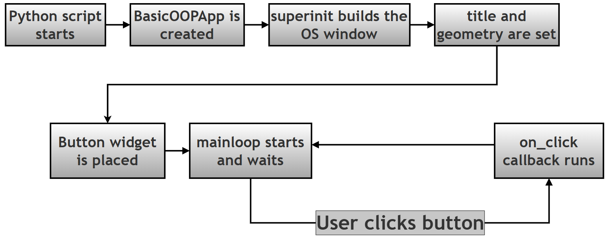
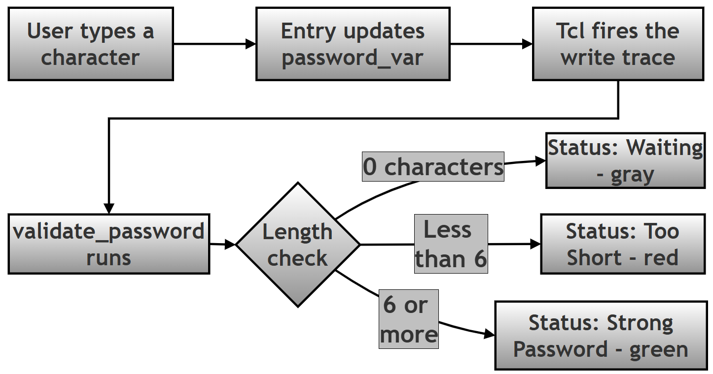
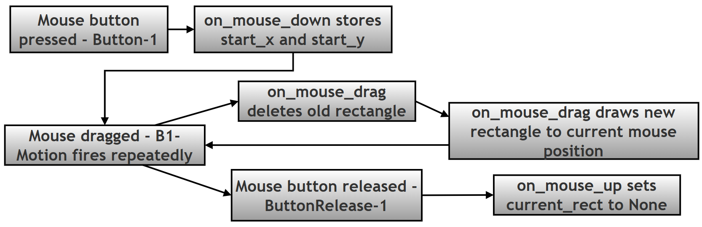
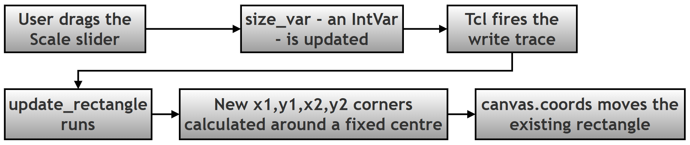
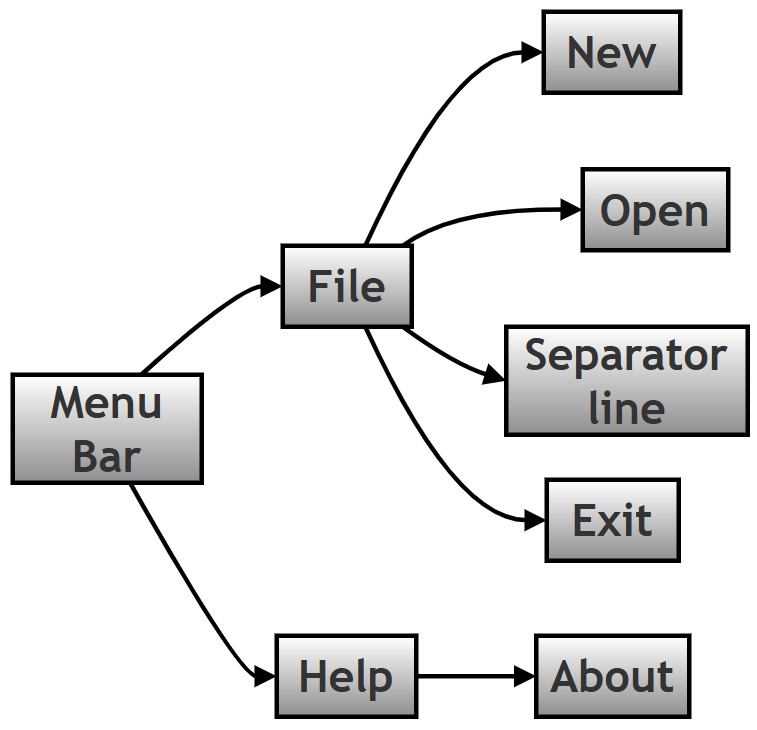

# Tkinter GUI Programming: Scripting Questions and Answers

## Introduction

This page is the online companion to Chapter 14 of the printed textbook, which covers GUI (Graphical User Interface) programming in Python using Tkinter. Tkinter is the GUI toolkit that ships with every standard Python installation, so it needs no separate install — it's the natural starting point for turning a script that only prints to a console into a program with windows, buttons, and menus that anyone can use, not just someone comfortable typing commands.

The printed book keeps things compact: it lists the twenty scripting questions themselves, along with short answers, to save space on the page. This page exists to go further. Each of the twenty questions below gets its original text (unchanged from the book), a plain-language explanation of what the script does and why it's built that way, a step-by-step walkthrough of the code, the complete script in one block, and a description of what you'll actually see when you run it.

A rough guide to how these twenty scripts build on each other: Topics 1 to 3 cover the foundation — building an app as a class, and linking data to widgets so they update automatically. Topics 4, 5, 12, and 18 cover the three geometry managers that decide where widgets appear on screen. Topics 6, 7, 8, 9, 11, 13, 14, 17, and 20 introduce specific widgets you'll reach for constantly — checkboxes, tabs, split panes, pop-up windows, lists, dropdowns, tables, a text box, and menus. Topics 10, 16, and 19 focus on events — how a script reacts to the mouse in real time. Topic 15 stands a little apart: it explains a design quirk of Tkinter itself, rather than teaching a new widget.

None of this requires anything beyond the standard library. If a line of code uses a term you haven't met before, check the [Key Terms](#key-terms-used-throughout-this-chapter) table just below the contents list — most recurring jargon is explained there once, with a link to the official Python documentation for anyone who wants the full detail.

## Table of Contents

- [Key Terms Used Throughout This Chapter](#key-terms-used-throughout-this-chapter)
- [Topic 1: Building a Tkinter App with an OOP Class Structure](#topic-1-building-a-tkinter-app-with-an-oop-class-structure)
  - [Step-by-Step Walkthrough (Topic 1)](#step-by-step-walkthrough-topic-1)
  - [Complete Script and Output (Topic 1)](#complete-script-and-output-topic-1)
- [Topic 2: Linking Entry and Label Widgets with StringVar](#topic-2-linking-entry-and-label-widgets-with-stringvar)
  - [Step-by-Step Walkthrough (Topic 2)](#step-by-step-walkthrough-topic-2)
  - [Complete Script and Output (Topic 2)](#complete-script-and-output-topic-2)
- [Topic 3: Real-Time Input Validation with trace_add](#topic-3-real-time-input-validation-with-trace_add)
  - [Step-by-Step Walkthrough (Topic 3)](#step-by-step-walkthrough-topic-3)
  - [Complete Script and Output (Topic 3)](#complete-script-and-output-topic-3)
- [Topic 4: Building a Form Layout with .grid()](#topic-4-building-a-form-layout-with-grid)
  - [Step-by-Step Walkthrough (Topic 4)](#step-by-step-walkthrough-topic-4)
  - [Complete Script and Output (Topic 4)](#complete-script-and-output-topic-4)
- [Topic 5: Building an App Shell with .pack()](#topic-5-building-an-app-shell-with-pack)
  - [Step-by-Step Walkthrough (Topic 5)](#step-by-step-walkthrough-topic-5)
  - [Complete Script and Output (Topic 5)](#complete-script-and-output-topic-5)
- [Topic 6: Checkbutton Selections with BooleanVar](#topic-6-checkbutton-selections-with-booleanvar)
  - [Step-by-Step Walkthrough (Topic 6)](#step-by-step-walkthrough-topic-6)
  - [Complete Script and Output (Topic 6)](#complete-script-and-output-topic-6)
- [Topic 7: Tabbed Interfaces with ttk.Notebook](#topic-7-tabbed-interfaces-with-ttknotebook)
  - [Step-by-Step Walkthrough (Topic 7)](#step-by-step-walkthrough-topic-7)
  - [Complete Script and Output (Topic 7)](#complete-script-and-output-topic-7)
- [Topic 8: Resizable Split Views with PanedWindow](#topic-8-resizable-split-views-with-panedwindow)
  - [Step-by-Step Walkthrough (Topic 8)](#step-by-step-walkthrough-topic-8)
  - [Complete Script and Output (Topic 8)](#complete-script-and-output-topic-8)
- [Topic 9: Opening a Toplevel Window and Passing Data](#topic-9-opening-a-toplevel-window-and-passing-data)
  - [Step-by-Step Walkthrough (Topic 9)](#step-by-step-walkthrough-topic-9)
  - [Complete Script and Output (Topic 9)](#complete-script-and-output-topic-9)
- [Topic 10: Drawing Rectangles on a Canvas with Mouse Events](#topic-10-drawing-rectangles-on-a-canvas-with-mouse-events)
  - [Step-by-Step Walkthrough (Topic 10)](#step-by-step-walkthrough-topic-10)
  - [Complete Script and Output (Topic 10)](#complete-script-and-output-topic-10)
- [Topic 11: Listbox Selection with the &lt;&lt;ListboxSelect&gt;&gt; Virtual Event](#topic-11-listbox-selection-with-the-listboxselect-virtual-event)
  - [Step-by-Step Walkthrough (Topic 11)](#step-by-step-walkthrough-topic-11)
  - [Complete Script and Output (Topic 11)](#complete-script-and-output-topic-11)
- [Topic 12: Grouping Form Fields with LabelFrame](#topic-12-grouping-form-fields-with-labelframe)
  - [Step-by-Step Walkthrough (Topic 12)](#step-by-step-walkthrough-topic-12)
  - [Complete Script and Output (Topic 12)](#complete-script-and-output-topic-12)
- [Topic 13: Combobox Selection with the &lt;&lt;ComboboxSelected&gt;&gt; Virtual Event](#topic-13-combobox-selection-with-the-comboboxselected-virtual-event)
  - [Step-by-Step Walkthrough (Topic 13)](#step-by-step-walkthrough-topic-13)
  - [Complete Script and Output (Topic 13)](#complete-script-and-output-topic-13)
- [Topic 14: Displaying Tabular Data with Treeview](#topic-14-displaying-tabular-data-with-treeview)
  - [Step-by-Step Walkthrough (Topic 14)](#step-by-step-walkthrough-topic-14)
  - [Complete Script and Output (Topic 14)](#complete-script-and-output-topic-14)
- [Topic 15: Core (tk) vs Themed (ttk) Widget Styling](#topic-15-core-tk-vs-themed-ttk-widget-styling)
  - [Step-by-Step Walkthrough (Topic 15)](#step-by-step-walkthrough-topic-15)
  - [Complete Script and Output (Topic 15)](#complete-script-and-output-topic-15)
- [Topic 16: Tracking Mouse Position with the &lt;Motion&gt; Event](#topic-16-tracking-mouse-position-with-the-motion-event)
  - [Step-by-Step Walkthrough (Topic 16)](#step-by-step-walkthrough-topic-16)
  - [Complete Script and Output (Topic 16)](#complete-script-and-output-topic-16)
- [Topic 17: A Simple Text Editor Using the Text Widget](#topic-17-a-simple-text-editor-using-the-text-widget)
  - [Step-by-Step Walkthrough (Topic 17)](#step-by-step-walkthrough-topic-17)
  - [Complete Script and Output (Topic 17)](#complete-script-and-output-topic-17)
- [Topic 18: Absolute Positioning with the .place() Manager](#topic-18-absolute-positioning-with-the-place-manager)
  - [Step-by-Step Walkthrough (Topic 18)](#step-by-step-walkthrough-topic-18)
  - [Complete Script and Output (Topic 18)](#complete-script-and-output-topic-18)
- [Topic 19: Linking a Scale Slider to a Canvas Shape with trace_add](#topic-19-linking-a-scale-slider-to-a-canvas-shape-with-trace_add)
  - [Step-by-Step Walkthrough (Topic 19)](#step-by-step-walkthrough-topic-19)
  - [Complete Script and Output (Topic 19)](#complete-script-and-output-topic-19)
- [Topic 20: Building a Menu Bar with File and Help Menus](#topic-20-building-a-menu-bar-with-file-and-help-menus)
  - [Step-by-Step Walkthrough (Topic 20)](#step-by-step-walkthrough-topic-20)
  - [Complete Script and Output (Topic 20)](#complete-script-and-output-topic-20)

## Key Terms Used Throughout This Chapter

A handful of words show up again and again in the explanations below. Rather than re-explaining them in every topic, here they are once, in plain language. If you already know them, skip ahead.

| Term | What it means here | Read more |
| --- | --- | --- |
| Class | A blueprint for creating objects. `class BasicOOPApp(tk.Tk):` says "every app I build from this blueprint is also a Tkinter window." | [Python classes](https://docs.python.org/3/tutorial/classes.html) |
| Inheritance | When a class is built on top of another class and gets all of its abilities for free. `tk.Tk` already knows how to be a window; our class inherits that and adds its own behaviour. | [Inheritance](https://docs.python.org/3/tutorial/classes.html#inheritance) |
| Instance | One actual object created from a class. `app = BasicOOPApp()` creates one instance — one running window. | [Python glossary](https://docs.python.org/3/glossary.html#term-object) |
| Widget | Any visible piece of the interface — a button, a label, an entry box, the window itself. | [Tkinter widgets](https://docs.python.org/3/library/tkinter.html#widget) |
| Geometry manager | The system that decides where a widget appears on screen and how big it is. Tkinter gives you three: `.pack()`, `.grid()`, and `.place()`. | [Geometry management](https://docs.python.org/3/library/tkinter.html#the-packer) |
| Event loop | The loop started by `.mainloop()` that keeps the window open and keeps checking for clicks, key presses, and other activity until you close it. | [mainloop](https://docs.python.org/3/library/tkinter.html#tkinter.Tk.mainloop) |
| Callback | A function you write but do not call yourself — Tkinter calls it for you, automatically, when something happens (a click, a key press, a change in a variable). | [Python glossary](https://docs.python.org/3/glossary.html) |
| Control variable | A special Tkinter object (`StringVar`, `IntVar`, `BooleanVar`) that holds a value and can notify other widgets the moment that value changes. | [Control variables](https://docs.python.org/3/library/tkinter.html#control-variables) |
| Event | Something that happens on screen that Tkinter can detect — a mouse click, a key press, mouse movement, a selection change. | [Events and bindings](https://docs.python.org/3/library/tkinter.html#bindings-and-events) |
| Virtual event | An event Tkinter builds for you out of several physical events, so you don't have to detect the physical ones yourself. `<<ListboxSelect>>` is a virtual event; `<Button-1>` is a physical one. | [Virtual events](https://tcl.tk/man/tcl8.6/TkCmd/event.html#M7) |

[Back to Table of Contents](#table-of-contents)

## Topic 1: Building a Tkinter App with an OOP Class Structure


> **1. Create a basic Tkinter application using an OOP class structure that initializes the main window, sets a custom title and geometry, and includes a button that prints a message to the console when clicked.**

Most Tkinter tutorials start by writing everything at the top level of a script — a window here, a button there, all sharing the same global variables. That works for a five-line example, but it falls apart the moment your app grows past one screen. This script instead builds the app as a class, which is the pattern you will use for every real Tkinter project from here on.

The class inherits from `tk.Tk`, which is Python's built-in window class. That single word `(tk.Tk)` after the class name means "this class already knows how to be a window — I'm just going to customise it." Once you call `super().__init__()`, your object *is* a window: it has a title bar, it can be resized, it can hold widgets. Everything else in `__init__` is just decorating that window and wiring up its behaviour.

Keeping widgets as `self.something` (for example, `self.btn_action`) rather than as loose local variables matters for one practical reason: any other method in the class — a callback fired later, a resize handler, anything — can reach that widget through `self`. A local variable disappears the moment `__init__` finishes running.

### Step-by-Step Walkthrough (Topic 1)

**Step 1 — Start the window.**

```python
super().__init__()
```

This line hands control to `tk.Tk`'s own `__init__`, which creates the actual operating-system window and starts the Tcl interpreter that Tkinter runs on behind the scenes. Skip this line and nothing else in the class will work.

**Step 2 — Set the title and size.**

```python
self.title("OOP Structure Demo")
self.geometry("400x300+100+100")
```

`title()` sets the text in the window's title bar. `geometry()` uses the format `"WidthxHeight+X+Y"` — a 400-pixel-wide, 300-pixel-tall window, positioned 100 pixels from the left edge of the screen and 100 pixels from the top. The `+X+Y` part is optional; leave it off and the operating system chooses where the window opens.

**Step 3 — Create and place the button.**

```python
self.btn_action = tk.Button(self, text="Print Message", command=self.on_click)
self.btn_action.pack(pady=50, expand=True)
```

The first argument to `tk.Button`, `self`, tells Tkinter which window the button belongs to — in this case, the window we are building. `command=self.on_click` is the important part: notice there are no parentheses after `on_click`. Writing `command=self.on_click()` would call the method immediately, while the window is still being built, instead of waiting for a click. Leaving off the parentheses hands Tkinter the *function itself*, so it can call it later, whenever the button is actually pressed.

**Step 4 — Write the callback.**

```python
def on_click(self):
    print("Button clicked! Application logic executed.")
```

This method does not run when the script starts. It sits and waits. Tkinter calls it the instant the button is clicked, and only then.

**Step 5 — Start the event loop.**

```python
app = BasicOOPApp()
app.mainloop()
```

`app = BasicOOPApp()` builds the window described above. `app.mainloop()` is what actually keeps it on screen — it starts a loop that watches for clicks, key presses, and window events, and hands each one to the right callback. Without this line, the script would build the window and immediately exit before you ever saw it.

### Complete Script and Output (Topic 1)

```python
import tkinter as tk

class BasicOOPApp(tk.Tk):
    """
    A foundational Tkinter application demonstrating OOP structure.

    Concepts covered:
    1. Class inheritance: inheriting from tk.Tk to create the main window.
    2. Initialization: configuring window properties (title, geometry).
    3. Event handling: using the 'command' attribute for button clicks.
    4. Architecture: the Python -> Tkinter -> OS hierarchy.
    """
    def __init__(self):
        # Step 1: Start the window (creates the OS-level window and the
        # Tcl interpreter that Tkinter talks to behind the scenes).
        super().__init__()

        # Step 2: Set the title and size.
        # Format is "WidthxHeight+X_Offset+Y_Offset".
        self.title("OOP Structure Demo")
        self.geometry("400x300+100+100")

        # Step 3: Create and place the button.
        # 'self' is the parent container (the root window).
        # command=self.on_click hands Tkinter the method to call later —
        # note there are no parentheses, so it is not called right now.
        self.btn_action = tk.Button(self, text="Print Message",
                                    command=self.on_click)
        self.btn_action.pack(pady=50, expand=True)

    def on_click(self):
        # Step 4: This callback only runs when the button is clicked.
        print("Button clicked! Application logic executed.")

if __name__ == "__main__":
    # Step 5: Build the window, then start the event loop.
    app = BasicOOPApp()
    app.mainloop()
```

Running the script opens a 400x300 window titled "OOP Structure Demo" with a single button in the middle. Nothing appears in your terminal until you click it. Each click prints one line:

```text
Button clicked! Application logic executed.
Button clicked! Application logic executed.
```

(Two lines shown above because the button was clicked twice — one line appears per click, for as long as the window stays open.)



[Back to Table of Contents](#table-of-contents)

## Topic 2: Linking Entry and Label Widgets with StringVar

**Original textbook question:**

> **2. Write a script using `StringVar` to link an Entry widget and a Label widget. Demonstrate that updating the Entry automatically updates the Label in real-time.**

In plain Python, a variable is passive: if you change `x = 5` to `x = 10`, nothing else in the program is told about it. Tkinter's control variables — `StringVar`, `IntVar`, `BooleanVar`, `DoubleVar` — behave differently. Any widget you connect to one of these variables is automatically informed the moment its value changes, and repaints itself. No refresh call, no manual update — the connection does the work.

This script connects one `StringVar` to two widgets at once: an `Entry` (which the user types into) and a `Label` (which only displays text). Because both widgets are wired to the same variable, typing in the Entry updates the Label instantly, with no code written to make that specific thing happen.

### Step-by-Step Walkthrough (Topic 2)

**Step 1 — Create the shared control variable.**

```python
self.input_data = tk.StringVar(value="Type something...")
```

This is the single source of truth for this screen. `value="Type something..."` sets the starting text.

**Step 2 — Connect the Entry to the variable.**

```python
self.entry_input = tk.Entry(self, textvariable=self.input_data, font=("Consolas", 12))
```

`textvariable=self.input_data` is what creates the live link. Every keystroke in this Entry updates `input_data` immediately.

**Step 3 — Connect the Label to the same variable.**

```python
self.lbl_display = tk.Label(self, textvariable=self.input_data, font=("Arial", 14, "bold"), fg="blue")
```

Using `textvariable=` here too — the same variable, not a copy of it — is what makes the Label mirror the Entry. If this line instead read `text=self.input_data.get()`, the Label would only show whatever the Entry contained at that one instant, and would never update again.

### Complete Script and Output (Topic 2)

```python
import tkinter as tk

class ReactiveDataApp(tk.Tk):
    def __init__(self):
        super().__init__()
        self.title("Reactive Data Binding")
        self.geometry("400x200")

        # Step 1: Create a Tkinter control variable (the source of truth).
        # StringVar manages the string data inside the Tcl/Tk engine.
        self.input_data = tk.StringVar(value="Type something...")

        # Step 2: Create an input widget (Entry) bound to input_data.
        # Anything typed here updates input_data instantly.
        self.entry_input = tk.Entry(self, textvariable=self.input_data,
                                    font=("Consolas", 12))
        self.entry_input.pack(pady=20, padx=20, fill="x")

        # Step 3: Create a display widget (Label) bound to the SAME variable.
        # The Label subscribes to changes in input_data.
        self.lbl_display = tk.Label(self, textvariable=self.input_data,
                                    font=("Arial", 14, "bold"), fg="blue")
        self.lbl_display.pack(pady=20)

        # A plain caption — note this one uses text=, not textvariable=,
        # because it never needs to change.
        tk.Label(self, text="The Label mirrors the Entry automatically.",
                 font=("Arial", 8)).pack(side="bottom", pady=10)

if __name__ == "__main__":
    app = ReactiveDataApp()
    app.mainloop()
```

There is no console output here — the whole point of the script is what happens on screen. As you type "Hello" into the Entry box, letter by letter, the blue Label above it updates in step: "H", then "He", "Hel", "Hell", "Hello" — with no button press and no extra code beyond the shared `textvariable`.

[Back to Table of Contents](#table-of-contents)

## Topic 3: Real-Time Input Validation with trace_add

**Original textbook question:**

> **3. Implement a variable tracer using `.trace_add("write", callback)` to validate user input in real-time (e.g., ensuring a password is longer than 6 characters).**

Topic 2 showed a control variable updating a widget automatically. `trace_add` goes one step further: it lets you run your *own* function every time a variable changes, not just update a display. That function can do anything — check a password's length, validate an email format, recalculate a total — the moment the user types.

The alternative would be to check the password only when a "Submit" button is pressed. That works, but it means the user gets no feedback until they've finished typing and clicked. `trace_add` gives instant, live feedback instead — the pattern behind almost every "password strength" indicator you have seen on a website.

### Step-by-Step Walkthrough (Topic 3)

**Step 1 — Create the variable to watch.**

```python
self.password_var = tk.StringVar()
```

**Step 2 — Attach the trace.**

```python
self.password_var.trace_add("write", self.validate_password)
```

`"write"` means "call this function every time the variable's value is written to (changed)." `self.validate_password` is the function to call — again, without parentheses, for the same reason as Topic 1's `command=`.

**Step 3 — Write the callback with `*args`.**

```python
def validate_password(self, *args):
```

Tkinter's tracing mechanism always passes three extra values to the callback: the variable's internal name, an index (unused for a simple variable), and the mode ("write"). If your function signature does not accept them, Python raises a `TypeError` the first time the trace fires. `*args` collects all three into a tuple and quietly discards them — you don't need them for this task.

**Step 4 — React to the current value.**

```python
current_val = self.password_var.get()
if len(current_val) < 6:
    self.lbl_status.config(text="Status: Too Short!", fg="red")
else:
    self.lbl_status.config(text="Status: Strong Password", fg="green")
```

`.get()` reads the variable's current value at the moment the trace fired. From there it is ordinary Python logic — check the length, then change the status Label's text and colour with `.config()`.

### Complete Script and Output (Topic 3)

```python
import tkinter as tk

class ValidationTracerApp(tk.Tk):
    def __init__(self):
        super().__init__()
        self.title("Live Validation with Tracing")
        self.geometry("450x250")

        # Step 1: Define the control variable to watch.
        self.password_var = tk.StringVar()

        # Step 2: Set up the trace.
        # "write" mode triggers every time the variable's value changes.
        # self.validate_password is the callback function.
        self.password_var.trace_add("write", self.validate_password)

        # GUI setup
        tk.Label(self, text="Enter Password:", font=("Arial", 10)).pack(pady=(20, 5))
        self.ent_pass = tk.Entry(self, textvariable=self.password_var, show="*",
                                 font=("Consolas", 12))
        self.ent_pass.pack(pady=5)

        # Label used to give feedback
        self.lbl_status = tk.Label(self, text="Status: Waiting",
                                   font=("Arial", 10, "italic"))
        self.lbl_status.pack(pady=20)

    def validate_password(self, *args):
        # Step 3: *args absorbs the three arguments Tcl passes automatically:
        #   args[0] = variable name (e.g. 'PY_VAR0')
        #   args[1] = index (empty for a plain scalar variable)
        #   args[2] = operation mode (e.g. 'write')
        current_val = self.password_var.get()

        # Step 4: Check length and update the status Label instantly.
        if len(current_val) == 0:
            self.lbl_status.config(text="Status: Waiting", fg="gray")
        elif len(current_val) < 6:
            self.lbl_status.config(text="Status: Too Short!", fg="red")
        else:
            self.lbl_status.config(text="Status: Strong Password", fg="green")

if __name__ == "__main__":
    app = ValidationTracerApp()
    app.mainloop()
```

There is no console output — the feedback appears as the status Label changing colour and text as you type. Typing "abc" shows "Status: Too Short!" in red; continuing to "abcdef" or beyond switches it instantly to "Status: Strong Password" in green, with no button click involved.



[Back to Table of Contents](#table-of-contents)

## Topic 4: Building a Form Layout with .grid()

**Original textbook question:**

> **4. Create a form layout using the `.grid()` geometry manager. Include Labels and Entry widgets aligned in rows and columns, and use `sticky`, `padx`, and `pady` for spacing.**

`.grid()` treats its parent container like a spreadsheet: every widget you place gets a `row` and a `column` number, and Tkinter lines everything up into a neat table automatically. This is why almost every form you have ever filled in — login screens, registration pages, settings dialogs — is built with a grid rather than with `.pack()`.

The `sticky` option controls how a widget behaves *inside* its own cell, which is easy to confuse with row/column placement. Think of each cell as a small box: `sticky=tk.W` pins the widget to the West (left) wall of that box instead of letting it float in the centre. You can combine directions, such as `sticky="ew"`, to stretch a widget to fill a cell from edge to edge.

One rule worth remembering: never mix `.pack()` and `.grid()` inside the *same* parent container. Tkinter will raise an error. It's fine to use `.pack()` for the overall window and `.grid()` inside one Frame within it — which is exactly what this script does.

### Step-by-Step Walkthrough (Topic 4)

**Step 1 — Create a Frame to hold the grid.**

```python
form_frame = ttk.Frame(self, padding="20")
form_frame.pack(expand=True)
```

The Frame itself is placed with `.pack()` on the main window. Everything *inside* the Frame will use `.grid()`. Keeping the grid inside its own Frame, rather than gridding widgets directly onto the root window, keeps layout logic tidy and reusable.

**Step 2 — Place a Label/Entry pair on row 0.**

```python
ttk.Label(form_frame, text="Full Name:").grid(row=0, column=0, sticky=tk.W, pady=10)
ttk.Entry(form_frame, width=20).grid(row=0, column=1, sticky=tk.E, pady=10)
```

Row and column numbering starts at 0. The Label sits in column 0, sticky to the West; the Entry sits in column 1 of the same row, sticky to the East.

**Step 3 — Repeat for row 1.**

Same pattern, `row=1`, for the Email field.

**Step 4 — Span the button across both columns.**

```python
submit_btn.grid(row=2, column=0, columnspan=2, pady=20)
```

`columnspan=2` makes the button stretch across both columns instead of sitting in just one, so it appears centred under the form.

**Step 5 — Let the second column grow.**

```python
form_frame.columnconfigure(1, weight=1)
```

Without this line, the two columns stay a fixed width even if you resize the window. `weight=1` tells column 1 "take any extra space that becomes available."

### Complete Script and Output (Topic 4)

```python
import tkinter as tk
from tkinter import ttk

class GridFormApp(tk.Tk):
    def __init__(self):
        super().__init__()
        self.title("Grid Geometry Manager")
        self.geometry("350x250")

        # Step 1: A Frame to act as the container for the grid.
        # This keeps the layout logic isolated from the root window.
        form_frame = ttk.Frame(self, padding="20")
        form_frame.pack(expand=True)

        # Step 2: Row 0 - Name field.
        ttk.Label(form_frame, text="Full Name:").grid(
            row=0, column=0, sticky=tk.W, pady=10)  # sticky='W' aligns West
        ttk.Entry(form_frame, width=20).grid(
            row=0, column=1, sticky=tk.E, pady=10)

        # Step 3: Row 1 - Email field.
        ttk.Label(form_frame, text="Email:").grid(
            row=1, column=0, sticky=tk.W, pady=10)
        ttk.Entry(form_frame, width=20).grid(
            row=1, column=1, sticky=tk.E, pady=10)

        # Step 4: Row 2 - Button spanning both columns.
        submit_btn = ttk.Button(form_frame, text="Submit")
        submit_btn.grid(row=2, column=0, columnspan=2, pady=20)

        # Step 5: Let column 1 absorb extra horizontal space (optional).
        form_frame.columnconfigure(1, weight=1)

if __name__ == "__main__":
    app = GridFormApp()
    app.mainloop()
```

The result is a small two-row form (Full Name, Email) with a Submit button centred beneath it. There is no console output — this script is about layout, not behaviour, so the "output" is purely visual: a neatly aligned form rather than a scattered one.

[Back to Table of Contents](#table-of-contents)

## Topic 5: Building an App Shell with .pack()

**Original textbook question:**

> **5. Build a layout using the `.pack()` geometry manager to create a toolbar (top), a main content area (middle), and a status bar (bottom).**

If `.grid()` is a spreadsheet, `.pack()` is more like stacking boxes. Each widget is added to one side of the remaining space — top, bottom, left, or right — and Tkinter fills in the rest around it. This script builds the classic three-part application shell you see in almost every desktop program: a toolbar at the top, a status bar at the bottom, and everything else filling the middle.

The order in which you call `.pack()` matters. Tkinter carves space off the side you request, one widget at a time, from whatever space is left over. Packing the toolbar first claims a strip at the top; packing the status bar next claims a strip at the bottom of what remains; whatever widget is packed last with `expand=True` gets everything left over — which is why the content area, packed last, becomes the largest section.

### Step-by-Step Walkthrough (Topic 5)

**Step 1 — Pack the toolbar to the top.**

```python
toolbar.pack(side="top", fill="x")
```

`fill="x"` stretches the toolbar horizontally to match the window's width, even though it doesn't need much vertical space.

**Step 2 — Pack the content area to fill what's left.**

```python
content.pack(side="top", fill="both", expand=True)
```

`expand=True` is the key difference from the toolbar: this tells Tkinter "give this widget any extra space, in both directions, once everything else has claimed what it needs."

**Step 3 — Pack the status bar to the bottom.**

```python
statusbar.pack(side="bottom", fill="x")
```

Because this is packed with `side="bottom"`, it claims a strip at the very bottom of the window, regardless of the order the other widgets were added in.

### Complete Script and Output (Topic 5)

```python
import tkinter as tk
from tkinter import ttk

class PackLayoutApp(tk.Tk):
    def __init__(self):
        super().__init__()
        self.title("Pack Geometry Manager")
        self.geometry("400x300")

        # Step 1: Top toolbar.
        # side='top' places it at the top. fill='x' stretches it horizontally.
        toolbar = tk.Frame(self, bg="#333", height=30)
        toolbar.pack(side="top", fill="x")

        tk.Button(toolbar, text="File", bg="#555", fg="white").pack(side="left", padx=5)
        tk.Button(toolbar, text="Edit", bg="#555", fg="white").pack(side="left", padx=5)

        # Step 2: Main content area.
        # expand=True tells pack to give this frame any extra available space.
        # fill='both' stretches it in both directions.
        content = tk.Frame(self, bg="white")
        content.pack(side="top", fill="both", expand=True)

        tk.Label(content, text="Main Workspace", font=("Arial", 16)).pack(expand=True)

        # Step 3: Bottom status bar.
        # side='bottom' anchors it to the bottom.
        statusbar = tk.Label(self, text="Ready", bd=1, relief=tk.SUNKEN, anchor=tk.W)
        statusbar.pack(side="bottom", fill="x")

if __name__ == "__main__":
    app = PackLayoutApp()
    app.mainloop()
```

Again, no console output — this is a layout demonstration. Resizing the window shows the effect clearly: the dark toolbar and the "Ready" status bar stay a fixed height, while the white "Main Workspace" area in the middle grows or shrinks to absorb whatever space is left.

[Back to Table of Contents](#table-of-contents)

## Topic 6: Checkbutton Selections with BooleanVar

**Original textbook question:**

> **6. Create a GUI that uses `Checkbutton` widgets bound to `BooleanVar` variables. Add a "Submit" button that checks the state of these variables to determine which options were selected.**

A `Checkbutton` is either ticked or not — a natural match for `BooleanVar`, which only ever holds `True` or `False`. The important design choice in this script is binding each checkbox to `variable=`, not `textvariable=`. `textvariable=` is for widgets that display *text* that can change (Topics 2 and 3); `variable=` is for widgets whose *state* — checked, unchecked, a slider position — needs to be tracked.

Because the state lives in `self.var_news`, `self.var_updates`, and so on, the `show_selections` method never has to inspect the Checkbutton widgets themselves. It just reads three Python booleans with `.get()`. This separation — checkbox widgets on one side, plain boolean values on the other — is what makes the logic in `show_selections` simple ordinary Python, with no Tkinter-specific code needed.

### Step-by-Step Walkthrough (Topic 6)

**Step 1 — Create one BooleanVar per checkbox.**

```python
self.var_news = tk.BooleanVar(value=False)
self.var_updates = tk.BooleanVar(value=True)
self.var_terms = tk.BooleanVar(value=False)
```

`value=True` for `var_updates` means that checkbox starts pre-ticked; the other two start empty.

**Step 2 — Bind each Checkbutton to its variable.**

```python
chk1 = tk.Checkbutton(self, text="Subscribe to Newsletter", variable=self.var_news)
```

Ticking or unticking the box updates `self.var_news` immediately — no extra code required.

**Step 3 — Read the values on submit.**

```python
def show_selections(self):
    choices = []
    if self.var_news.get(): choices.append("Newsletter")
    if self.var_updates.get(): choices.append("Updates")
    if self.var_terms.get(): choices.append("Terms")
```

Each `.get()` call returns `True` or `False`. Building a plain Python list from these values keeps the rest of the method — deciding what message to show — completely independent of Tkinter.

### Complete Script and Output (Topic 6)

```python
import tkinter as tk
from tkinter import messagebox

class CheckboxApp(tk.Tk):
    def __init__(self):
        super().__init__()
        self.title("Checkbutton Selection")
        self.geometry("300x250")

        # Step 1: Initialize one BooleanVar per checkbox.
        # These track the on/off state of the checkboxes in the Tcl engine.
        self.var_news = tk.BooleanVar(value=False)
        self.var_updates = tk.BooleanVar(value=True)
        self.var_terms = tk.BooleanVar(value=False)

        # Step 2: Create Checkbuttons.
        # variable= links each checkbox's on/off state to its BooleanVar.
        chk1 = tk.Checkbutton(self, text="Subscribe to Newsletter",
                              variable=self.var_news)
        chk1.pack(pady=5, anchor="w", padx=20)

        chk2 = tk.Checkbutton(self, text="Receive Product Updates",
                              variable=self.var_updates)
        chk2.pack(pady=5, anchor="w", padx=20)

        chk3 = tk.Checkbutton(self, text="I agree to Terms & Conditions",
                              variable=self.var_terms)
        chk3.pack(pady=5, anchor="w", padx=20)

        # Submit button
        tk.Button(self, text="Register", command=self.show_selections).pack(pady=20)

    def show_selections(self):
        # Step 3: Read the values from the variables to build the message.
        choices = []
        if self.var_news.get(): choices.append("Newsletter")
        if self.var_updates.get(): choices.append("Updates")
        if self.var_terms.get(): choices.append("Terms")

        if not choices:
            msg = "No options selected."
        else:
            msg = f"You selected: {', '.join(choices)}"

        messagebox.showinfo("Registration Details", msg)

if __name__ == "__main__":
    app = CheckboxApp()
    app.mainloop()
```

Ticking "Newsletter" and "Terms" and then clicking Register opens a native pop-up window with this message:

```text
You selected: Newsletter, Terms
```

Unticking every box before clicking Register instead shows:

```text
No options selected.
```

[Back to Table of Contents](#table-of-contents)

## Topic 7: Tabbed Interfaces with ttk.Notebook

**Original textbook question:**

> **7. Implement a "Tabbed Interface" using the `Notebook` widget (ttk). Create two tabs, "Home" and "Settings," and place different widgets in each tab.**

A `Notebook` is Tkinter's tabbed-panel widget — the same idea as browser tabs, just inside your app. Each tab is, underneath, an ordinary `ttk.Frame`. The Notebook's only job is to show one Frame at a time and switch between them when the user clicks a tab header. Because each tab is a self-contained Frame, you can build its contents exactly as you would build any other screen — with its own `.pack()` or `.grid()` calls — without worrying about it clashing with what's on the other tab.

### Step-by-Step Walkthrough (Topic 7)

**Step 1 — Create the Notebook.**

```python
self.notebook = ttk.Notebook(self)
self.notebook.pack(expand=True, fill="both", padx=5, pady=5)
```

**Step 2 — Create one Frame per tab.**

```python
self.tab_home = ttk.Frame(self.notebook)
self.tab_settings = ttk.Frame(self.notebook)
```

Notice the parent of each Frame is `self.notebook`, not `self` — each tab's contents belong to that tab's Frame, not directly to the window.

**Step 3 — Register the Frames as tabs.**

```python
self.notebook.add(self.tab_home, text="Home")
self.notebook.add(self.tab_settings, text="Settings")
```

`text=` sets the label shown on the tab header itself.

**Step 4 and 5 — Fill each tab independently.**

Widgets placed inside `self.tab_home` only ever appear on the Home tab; widgets placed inside `self.tab_settings` only ever appear on the Settings tab. Each tab manages its own layout.

### Complete Script and Output (Topic 7)

```python
import tkinter as tk
from tkinter import ttk

class TabbedInterfaceApp(tk.Tk):
    def __init__(self):
        super().__init__()
        self.title("Notebook Tabs Demo")
        self.geometry("400x300")

        # Step 1: Create the Notebook widget (the tab manager).
        self.notebook = ttk.Notebook(self)
        self.notebook.pack(expand=True, fill="both", padx=5, pady=5)

        # Step 2: Create a Frame for each tab.
        # These frames serve as the content containers for the tabs.
        self.tab_home = ttk.Frame(self.notebook)
        self.tab_settings = ttk.Frame(self.notebook)

        # Step 3: Register the frames as tabs.
        # text= defines the label shown on the tab header.
        self.notebook.add(self.tab_home, text="Home")
        self.notebook.add(self.tab_settings, text="Settings")

        # Step 4: Add widgets to Tab 1 (Home).
        lbl_home = tk.Label(self.tab_home, text="Welcome to the Home Tab",
                            font=("Arial", 14))
        lbl_home.pack(pady=50)

        # Step 5: Add widgets to Tab 2 (Settings) - independent of Tab 1.
        lbl_set = tk.Label(self.tab_settings, text="Configure your app here",
                           font=("Arial", 14))
        lbl_set.pack(pady=50)

        # An Entry here shows the tabs are fully independent containers.
        ttk.Entry(self.tab_settings).pack(pady=10)

if __name__ == "__main__":
    app = TabbedInterfaceApp()
    app.mainloop()
```

No console output — clicking between the "Home" and "Settings" tab headers swaps the visible content between "Welcome to the Home Tab" and the "Configure your app here" label with its Entry box.

[Back to Table of Contents](#table-of-contents)

## Topic 8: Resizable Split Views with PanedWindow

**Original textbook question:**

> **8. Write a script that uses a `PanedWindow` to create a resizable split-screen interface (e.g., a left sidebar and a right content area).**

`.pack()`, `.grid()`, and `.place()` all decide layout at *design* time — you, the programmer, set the sizes. `PanedWindow` hands part of that decision to the *user*: it draws a thin divider between two or more panes that can be dragged left and right (or up and down, for a vertical split) while the app is running. This is the layout behind file explorers, code editors, and email clients, where the user often wants to resize the sidebar or preview pane themselves.

### Step-by-Step Walkthrough (Topic 8)

**Step 1 — Create the PanedWindow.**

```python
self.paned = ttk.PanedWindow(self, orient=tk.HORIZONTAL)
```

`orient=tk.HORIZONTAL` arranges the panes left-to-right, with a vertical divider between them. `orient=tk.VERTICAL` would stack them top-to-bottom instead.

**Step 2 — Create the two panes as ordinary Frames.**

```python
self.left_frame = tk.Frame(self.paned, bg="#e0e0e0", width=150)
self.right_frame = tk.Frame(self.paned, bg="#ffffff", width=350)
```

**Step 3 — Add the Frames to the PanedWindow.**

```python
self.paned.add(self.left_frame, weight=1)
self.paned.add(self.right_frame, weight=3)
```

`weight` decides how the *extra* space is shared when the whole window is resized — it is not the starting size, which comes from the `width` set on each Frame. A `weight` of 3 versus 1 means the right pane claims three times as much of any newly available space as the left pane does. The user can still drag the divider to override this at any time.

### Complete Script and Output (Topic 8)

```python
import tkinter as tk
from tkinter import ttk

class PanedWindowApp(tk.Tk):
    def __init__(self):
        super().__init__()
        self.title("PanedWindow Split View")
        self.geometry("500x300")

        # Step 1: Create the PanedWindow.
        # orient='horizontal' creates a left/right split.
        # orient='vertical' would create a top/bottom split.
        self.paned = ttk.PanedWindow(self, orient=tk.HORIZONTAL)
        self.paned.pack(fill=tk.BOTH, expand=True)

        # Step 2: Create the content frames.
        # tk.Frame is used here to make the background colors easy to see,
        # though ttk.Frame would work too.
        self.left_frame = tk.Frame(self.paned, bg="#e0e0e0", width=150)
        self.right_frame = tk.Frame(self.paned, bg="#ffffff", width=350)

        # Step 3: Add the frames to the PanedWindow.
        # weight decides how extra space is shared when resizing;
        # a value of 1 means equal footing before the ratio is applied.
        self.paned.add(self.left_frame, weight=1)
        self.paned.add(self.right_frame, weight=3)

        # Step 4: Add widgets to the panes.
        tk.Label(self.left_frame, text="Sidebar\n(Drag divider!)",
                 bg="#e0e0e0").pack(expand=True)
        tk.Label(self.right_frame, text="Main Content Area",
                 bg="#ffffff").pack(expand=True)

if __name__ == "__main__":
    app = PanedWindowApp()
    app.mainloop()
```

No console output. Dragging the vertical divider between the grey sidebar and the white content area resizes both panes live, in front of you — that dragging behaviour is the entire point of `PanedWindow`.

[Back to Table of Contents](#table-of-contents)

## Topic 9: Opening a Toplevel Window and Passing Data

**Original textbook question:**

> **9. Create a script that opens a secondary `Toplevel` window when a button is clicked in the main window. Demonstrate passing data from the main window to the `Toplevel` window.**

Every Tkinter app has exactly one `tk.Tk()` root window. Any additional window — a dialog box, a settings screen, a pop-up form — is a `Toplevel`. A `Toplevel` is its own independent window with its own title bar and its own close button, but it still lives inside the same running program, which means it can freely read data from the main window.

That last point is what "passing data" means in this script. `self.main_data` is an attribute of the main window (`self`). Because `open_child_window` is a method of that same class, it can simply write `text=self.main_data` when building the child window's Label — there is no need for anything resembling a message-passing system between the two windows. They are two windows, but one program.

### Step-by-Step Walkthrough (Topic 9)

**Step 1 — Store the data on the main window.**

```python
self.main_data = "Hello from Main Window!"
```

**Step 2 — Create the Toplevel when the button is clicked.**

```python
def open_child_window(self):
    child = tk.Toplevel(self)
    child.title("Child Window")
    child.geometry("250x150")
```

Passing `self` as the argument to `tk.Toplevel` tells Tkinter which window is this new window's logical parent — useful for things like keeping it on top of the main window and closing it automatically if the main window closes.

**Step 3 — Read the main window's data inside the child.**

```python
msg_label = ttk.Label(child, text=self.main_data, font=("Arial", 10))
```

`self.main_data` is reached directly, because `open_child_window` is a method on the same object that owns `main_data`.

**Step 4 — Let the child close independently.**

```python
ttk.Button(child, text="Close Child", command=child.destroy).pack(pady=10)
```

`child.destroy` closes only the Toplevel; the main window and its data are untouched, and you can open a fresh child window afterwards.

### Complete Script and Output (Topic 9)

```python
import tkinter as tk
from tkinter import ttk

class ToplevelWindowApp(tk.Tk):
    def __init__(self):
        super().__init__()
        self.title("Main Window")
        self.geometry("300x200")

        # Step 1: Data that lives on the main window.
        self.main_data = "Hello from Main Window!"

        ttk.Button(self, text="Open Child Window",
                   command=self.open_child_window).pack(pady=50, expand=True)

    def open_child_window(self):
        # Step 2: Create the Toplevel window.
        # This does not block the main window (unlike a messagebox).
        # Both windows stay active and interactive at the same time.
        child = tk.Toplevel(self)
        child.title("Child Window")
        child.geometry("250x150")

        # Step 3: Pass data from the main window (self) into the child.
        msg_label = ttk.Label(child, text=self.main_data, font=("Arial", 10))
        msg_label.pack(pady=30, expand=True)

        # Step 4: A button that closes only the child window.
        ttk.Button(child, text="Close Child",
                   command=child.destroy).pack(pady=10)

if __name__ == "__main__":
    app = ToplevelWindowApp()
    app.mainloop()
```

No console output. Clicking "Open Child Window" opens a second, smaller window on top of the first, displaying "Hello from Main Window!" — text that originated in the main window's `self.main_data`, not typed again. Clicking "Close Child" closes only that second window; the main window stays open, and clicking the original button again opens a brand-new child window.

[Back to Table of Contents](#table-of-contents)

## Topic 10: Drawing Rectangles on a Canvas with Mouse Events

**Original textbook question:**

> **10. Implement a `Canvas` widget that allows the user to draw rectangles by clicking and dragging the mouse. Use hardware event binding (`<Button-1>`, `<B1-Motion>`, `<ButtonRelease-1>`).**

Every widget seen so far reacts through `command=` or `textvariable=` — Tkinter's higher-level shortcuts. `Canvas` drawing needs something lower-level: direct access to raw mouse activity. That is what `.bind()` gives you. Instead of one abstract "this was clicked" signal, you get three separate physical events, each firing at a different moment of a click-and-drag gesture:

- `<Button-1>` fires once, the instant the left mouse button goes down.
- `<B1-Motion>` fires repeatedly, once for every pixel the mouse moves *while* the left button is still held down.
- `<ButtonRelease-1>` fires once, the instant the left button is released.

A callback bound to any of these automatically receives an `event` object as its argument, carrying the mouse's `x` and `y` position at that moment.

### Step-by-Step Walkthrough (Topic 10)

**Step 1 — Create the Canvas and bind all three events.**

```python
self.canvas.bind("<Button-1>", self.on_mouse_down)
self.canvas.bind("<B1-Motion>", self.on_mouse_drag)
self.canvas.bind("<ButtonRelease-1>", self.on_mouse_up)
```

**Step 2 — Record the starting corner.**

```python
def on_mouse_down(self, event):
    self.start_x = event.x
    self.start_y = event.y
```

Nothing is drawn yet — this step only remembers where the drag began.

**Step 3 — Redraw the rectangle on every mouse movement.**

```python
def on_mouse_drag(self, event):
    if self.current_rect:
        self.canvas.delete(self.current_rect)
    self.current_rect = self.canvas.create_rectangle(
        self.start_x, self.start_y, event.x, event.y, outline="blue", width=2)
```

Because `<B1-Motion>` can fire dozens of times per second, the previous rectangle is deleted before a new one is drawn from the fixed starting point to the mouse's current position. Skipping the delete step would leave a trail of overlapping rectangles instead of one rectangle that grows and shrinks smoothly.

**Step 4 — Finish the shape on release.**

```python
def on_mouse_up(self, event):
    self.current_rect = None
```

Resetting `current_rect` to `None` means the next `<Button-1>` press starts an entirely new rectangle rather than continuing to resize the old one.

### Complete Script and Output (Topic 10)

```python
import tkinter as tk

class CanvasDrawingApp(tk.Tk):
    def __init__(self):
        super().__init__()
        self.title("Canvas Drawing")
        self.geometry("500x400")

        # Variables to store the current drawing state.
        self.start_x = None
        self.start_y = None
        self.current_rect = None

        # Step 1: Create the Canvas and bind all three mouse events.
        # bg='white' gives a distinct drawing area.
        self.canvas = tk.Canvas(self, bg="white", cursor="cross")
        self.canvas.pack(fill=tk.BOTH, expand=True)

        # <Button-1>: left mouse button pressed down.
        self.canvas.bind("<Button-1>", self.on_mouse_down)
        # <B1-Motion>: mouse moved while button 1 is held down.
        self.canvas.bind("<B1-Motion>", self.on_mouse_drag)
        # <ButtonRelease-1>: left mouse button released.
        self.canvas.bind("<ButtonRelease-1>", self.on_mouse_up)

    def on_mouse_down(self, event):
        # Step 2: Record the starting position only - nothing is drawn yet.
        self.start_x = event.x
        self.start_y = event.y

    def on_mouse_drag(self, event):
        # Step 3: Redraw the rectangle as the mouse moves.
        # If a rectangle already exists, delete it first to avoid a "trail".
        if self.current_rect:
            self.canvas.delete(self.current_rect)

        # Draw a new rectangle from the fixed start point to the current
        # mouse position. event.x and event.y come from the Event object.
        self.current_rect = self.canvas.create_rectangle(
            self.start_x, self.start_y, event.x, event.y,
            outline="blue", width=2
        )

    def on_mouse_up(self, event):
        # Step 4: Finalize the rectangle. Resetting current_rect to None
        # means the next click starts a brand-new shape.
        self.current_rect = None

if __name__ == "__main__":
    app = CanvasDrawingApp()
    app.mainloop()
```

No console output — this is a purely visual script. Clicking and dragging from one corner to another draws a blue-outlined rectangle that grows and shrinks smoothly as you move the mouse, and stays fixed in place the moment you let go.



[Back to Table of Contents](#table-of-contents)

## Topic 11: Listbox Selection with the &lt;&lt;ListboxSelect&gt;&gt; Virtual Event

**Original textbook question:**

> **11. Create a `Listbox` widget populated with items. Add buttons to Add and Delete items. Ensure the listbox selection updates a label in real-time using the `<<ListboxSelect>>` virtual event.**

Topic 10 used *physical* events — `<Button-1>` fires for any left click, on anything. `<<ListboxSelect>>` is different: it is a *virtual* event, built by Tkinter specifically for the Listbox widget, and it only fires when the highlighted item actually changes. Clicking the same already-selected item twice, for instance, does not fire it a second time. This distinction — raw hardware activity versus a meaningful, widget-specific occurrence — is worth remembering, because most complex widgets (Combobox, Treeview, Notebook) define their own virtual events the same way.

### Step-by-Step Walkthrough (Topic 11)

**Step 1 — Populate the Listbox.**

```python
items = ["Python", "Java", "C++", "JavaScript"]
for item in items:
    self.listbox.insert(tk.END, item)
```

`tk.END` means "add this item after everything currently in the list."

**Step 2 — Bind the virtual event.**

```python
self.listbox.bind("<<ListboxSelect>>", self.on_select)
```

Note the double angle brackets — `<<...>>` is Tkinter's way of marking an event as virtual rather than physical.

**Step 3 — Add a new item from the Entry box.**

```python
def add_item(self):
    text = self.entry_new.get()
    if text:
        self.listbox.insert(tk.END, text)
        self.entry_new.delete(0, tk.END)
```

After inserting the new text, the Entry box is cleared with `.delete(0, tk.END)` so it's ready for the next item.

**Step 4 — Delete the selected item.**

```python
def delete_item(self):
    selection = self.listbox.curselection()
    if selection:
        self.listbox.delete(selection[0])
```

`.curselection()` returns a tuple of the selected indexes (empty if nothing is selected — hence the `if selection:` guard). For a single-selection Listbox, `selection[0]` is the one index to delete.

**Step 5 — React to a selection change.**

```python
def on_select(self, event):
    selection = self.listbox.curselection()
    if selection:
        value = self.listbox.get(selection[0])
        self.lbl_status.config(text=f"Selected: {value}")
```

### Complete Script and Output (Topic 11)

```python
import tkinter as tk
from tkinter import ttk

class ListboxApp(tk.Tk):
    def __init__(self):
        super().__init__()
        self.title("Listbox Interaction")
        self.geometry("400x300")

        # -- Top frame for controls --
        control_frame = ttk.Frame(self)
        control_frame.pack(pady=10)

        self.entry_new = ttk.Entry(control_frame, width=20)
        self.entry_new.pack(side=tk.LEFT, padx=5)

        ttk.Button(control_frame, text="Add", command=self.add_item).pack(side=tk.LEFT)
        ttk.Button(control_frame, text="Delete", command=self.delete_item).pack(side=tk.LEFT)

        # Step 1: Populate the Listbox with initial data.
        self.listbox = tk.Listbox(self, height=10, font=("Consolas", 10))
        self.listbox.pack(padx=20, pady=10, fill=tk.BOTH, expand=True)

        items = ["Python", "Java", "C++", "JavaScript"]
        for item in items:
            self.listbox.insert(tk.END, item)

        # Step 2: Bind the virtual selection event.
        # <<ListboxSelect>> fires only when the highlighted item changes.
        self.listbox.bind("<<ListboxSelect>>", self.on_select)

        # -- Status label --
        self.lbl_status = ttk.Label(self, text="Selected: None")
        self.lbl_status.pack(pady=10)

    def add_item(self):
        # Step 3: Add whatever text is in the Entry box, then clear it.
        text = self.entry_new.get()
        if text:
            self.listbox.insert(tk.END, text)
            self.entry_new.delete(0, tk.END)

    def delete_item(self):
        # Step 4: curselection() returns a tuple of selected indexes.
        selection = self.listbox.curselection()
        if selection:
            self.listbox.delete(selection[0])

    def on_select(self, event):
        # Step 5: Callback for the virtual selection event.
        selection = self.listbox.curselection()
        if selection:
            index = selection[0]
            value = self.listbox.get(index)
            self.lbl_status.config(text=f"Selected: {value}")
        else:
            self.lbl_status.config(text="Selected: None")

if __name__ == "__main__":
    app = ListboxApp()
    app.mainloop()
```

No console output. Clicking on "Java" in the list updates the bottom label instantly:

```text
Selected: Java
```

Typing "Rust" into the Entry box and clicking "Add" appends it to the end of the list; selecting it and clicking "Delete" removes it again.

[Back to Table of Contents](#table-of-contents)

## Topic 12: Grouping Form Fields with LabelFrame

**Original textbook question:**

> **12. Build a form using `LabelFrame` to group related controls (e.g., Personal Details and Contact Info) into distinct sections.**

A plain `Frame` is an invisible container — useful for organising layout, but giving the user no visual cue that a group of fields belongs together. `LabelFrame` is a Frame with a drawn border and a caption built in, which is exactly what long forms need: a way to tell "Personal Details" apart from "Contact Info" at a glance, without writing any custom drawing code.

The detail worth remembering here is parent-child hierarchy. Once you create `group_personal = ttk.LabelFrame(main_container, text="Personal Details")`, every widget that belongs inside that section must be created with `group_personal` as its parent — not `main_container` and not `self`. Get the parent wrong and the widget will not appear where you expect, even though no error is raised.

### Step-by-Step Walkthrough (Topic 12)

**Step 1 — Build the "Personal Details" group.**

```python
group_personal = ttk.LabelFrame(main_container, text="Personal Details", padding=10)
group_personal.pack(fill="x", pady=5)
```

`text=` becomes the caption shown in the border. `padding=10` adds internal breathing room around the widgets inside it.

**Step 2 — Grid the fields inside that group.**

```python
ttk.Label(group_personal, text="First Name:").grid(row=0, column=0, sticky="w")
ttk.Entry(group_personal).grid(row=0, column=1, sticky="ew", padx=5)
```

This nested use of `.grid()` is completely independent of any `.grid()` calls used elsewhere in the window — each LabelFrame has its own private grid.

**Step 3 — Repeat the pattern for "Contact Info".**

A second, entirely separate `ttk.LabelFrame` is built the same way, with its own two-row grid for Email and Phone.

**Step 4 — Let the label frames stretch.**

```python
group_personal.columnconfigure(1, weight=1)
```

Just as in Topic 4, this lets the Entry column absorb any extra width so the form doesn't look cramped against one side.

### Complete Script and Output (Topic 12)

```python
import tkinter as tk
from tkinter import ttk

class LabelframeApp(tk.Tk):
    def __init__(self):
        super().__init__()
        self.title("LabelFrame Grouping")
        self.geometry("400x350")

        # Container for overall padding.
        main_container = ttk.Frame(self, padding=20)
        main_container.pack(expand=True, fill="both")

        # Step 1: Group 1 - Personal Details.
        # text= sets the caption drawn into the border.
        group_personal = ttk.LabelFrame(main_container, text="Personal Details", padding=10)
        group_personal.pack(fill="x", pady=5)

        # Step 2: Grid the fields inside this group (its own private grid).
        ttk.Label(group_personal, text="First Name:").grid(row=0, column=0, sticky="w")
        ttk.Entry(group_personal).grid(row=0, column=1, sticky="ew", padx=5)

        ttk.Label(group_personal, text="Last Name:").grid(row=1, column=0, sticky="w")
        ttk.Entry(group_personal).grid(row=1, column=1, sticky="ew", padx=5)

        # Step 4: Configure the grid's column weight.
        group_personal.columnconfigure(1, weight=1)

        # Step 3: Group 2 - Contact Info (same pattern, separate group).
        group_contact = ttk.LabelFrame(main_container, text="Contact Info", padding=10)
        group_contact.pack(fill="x", pady=5)

        ttk.Label(group_contact, text="Email:").grid(row=0, column=0, sticky="w")
        ttk.Entry(group_contact).grid(row=0, column=1, sticky="ew", padx=5)

        ttk.Label(group_contact, text="Phone:").grid(row=1, column=0, sticky="w")
        ttk.Entry(group_contact).grid(row=1, column=1, sticky="ew", padx=5)

        group_contact.columnconfigure(1, weight=1)

        # Submit button at the bottom, outside either group.
        ttk.Button(main_container, text="Save Profile").pack(pady=20)

if __name__ == "__main__":
    app = LabelframeApp()
    app.mainloop()
```

No console output. The window shows two clearly bordered sections, "Personal Details" and "Contact Info", each with its own labelled fields, and a "Save Profile" button beneath both.

[Back to Table of Contents](#table-of-contents)

## Topic 13: Combobox Selection with the &lt;&lt;ComboboxSelected&gt;&gt; Virtual Event

**Original textbook question:**

> **13. Create a `Combobox` widget and use the `<<ComboboxSelected>>` virtual event to change the background color of a label based on the user's selection.**

A `Combobox` is a themed dropdown — part Entry, part Listbox. Setting `state="readonly"` is what turns it from "an Entry the user can also pick from" into "a proper dropdown the user cannot type arbitrary text into," which matters whenever the choices must come from a fixed, known list, such as a set of colours or countries.

`<<ComboboxSelected>>` is another virtual event, in the same family as `<<ListboxSelect>>` from Topic 11. It only fires when the user actually *picks* a value from the dropdown list — not while the widget is merely being built or focused.

### Step-by-Step Walkthrough (Topic 13)

**Step 1 — Define the available choices.**

```python
colors = ["Red", "Green", "Blue", "Yellow", "Cyan"]
```

**Step 2 — Create the Combobox and lock it to those choices.**

```python
self.combo = ttk.Combobox(self, values=colors, state="readonly")
self.combo.current(0)
```

`.current(0)` pre-selects the first item ("Red") so the widget doesn't start blank.

**Step 3 — Bind the virtual event.**

```python
self.combo.bind("<<ComboboxSelected>>", self.change_color)
```

**Step 4 — Map the selected text to an actual colour.**

```python
def change_color(self, event):
    selected = self.combo.get()
    color_map = {"Red": "#ffcccc", "Green": "#ccffcc", ...}
    bg_color = color_map.get(selected, "white")
    self.lbl_feedback.config(text=selected, bg=bg_color)
```

A Python dictionary translates a plain colour name into the pale hex shade actually applied to the Label's background — this keeps the visual design separate from the list of choices shown to the user.

**Step 5 — Call the handler once, manually, at start-up.**

```python
self.change_color(None)
```

Since `<<ComboboxSelected>>` has not fired yet when the window first opens, this one manual call makes sure the Label's colour matches the pre-selected "Red" from the very first frame, instead of staying its default colour until the user makes a choice. Passing `None` works because `change_color` reads `self.combo.get()` directly and never actually needs the `event` argument.

### Complete Script and Output (Topic 13)

```python
import tkinter as tk
from tkinter import ttk

class ComboboxApp(tk.Tk):
    def __init__(self):
        super().__init__()
        self.title("Combobox Selection")
        self.geometry("300x200")

        # Step 1: Define the available choices.
        colors = ["Red", "Green", "Blue", "Yellow", "Cyan"]

        ttk.Label(self, text="Select a color:").pack(pady=10)

        # Step 2: Create the Combobox, locked to the fixed list of choices.
        self.combo = ttk.Combobox(self, values=colors, state="readonly")
        # state="readonly" stops the user typing an arbitrary value.
        self.combo.pack(pady=5)
        self.combo.current(0)  # Pre-select the first item.

        # Step 3: Bind the virtual event.
        # This fires only when an item from the list is actually chosen.
        self.combo.bind("<<ComboboxSelected>>", self.change_color)

        # Feedback label.
        self.lbl_feedback = tk.Label(self, text="Color Preview",
                                     font=("Arial", 16), width=20, height=5)
        self.lbl_feedback.pack(pady=20)

        # Step 5: Call the handler once so the starting colour is correct.
        self.change_color(None)

    def change_color(self, event):
        # Step 4: Map the selected name to a hex colour and apply it.
        selected = self.combo.get()

        color_map = {
            "Red": "#ffcccc", "Green": "#ccffcc", "Blue": "#ccccff",
            "Yellow": "#ffffcc", "Cyan": "#ccffff"
        }

        bg_color = color_map.get(selected, "white")
        self.lbl_feedback.config(text=selected, bg=bg_color)

if __name__ == "__main__":
    app = ComboboxApp()
    app.mainloop()
```

No console output. The window opens with the preview Label already tinted pale pink and reading "Red". Choosing "Blue" from the dropdown instantly re-tints the same Label pale blue and updates its text to "Blue".

[Back to Table of Contents](#table-of-contents)

## Topic 14: Displaying Tabular Data with Treeview

**Original textbook question:**

> **14. Write a script that implements a `Treeview` widget to display tabular data (ID, Name, Role). Add a function to insert a new row into the tree when a button is clicked.**

`Treeview` is Tkinter's widget for anything table-shaped or tree-shaped — a spreadsheet-style list of employees here, a folder structure elsewhere. Setting it up takes three separate steps that are easy to confuse the first time: declaring which columns exist, giving each column a heading (the text the user sees), and configuring each column's width and alignment. All three are needed before the table looks right; skipping any one of them still produces a working Treeview, just with blank headers or badly sized columns.

`show='headings'` is worth calling out specifically: by default, a Treeview reserves an extra first column (`#0`) for a tree-style icon and expand arrow, meant for hierarchical data. Setting `show='headings'` hides that column, which is what you want for a flat table like this one where there is no parent/child nesting.

### Step-by-Step Walkthrough (Topic 14)

**Step 1 — Create the Treeview and declare its columns.**

```python
self.tree = ttk.Treeview(self, columns=("ID", "Name", "Role"), show='headings')
```

`columns=` sets the *internal* identifiers Tkinter will use to refer to each column in later code — they do not have to match what the user sees.

**Step 2 — Set the visible headings.**

```python
self.tree.heading("ID", text="Employee ID")
self.tree.heading("Name", text="Full Name")
self.tree.heading("Role", text="Job Title")
```

This is where the user-facing labels are set, separately from the internal identifiers used in Step 1.

**Step 3 — Configure width and alignment.**

```python
self.tree.column("ID", width=100, anchor="center")
```

**Step 4 — Load the starting data.**

```python
for emp in employees:
    self.tree.insert("", tk.END, values=emp)
```

The first argument, `""`, is the parent row — an empty string means "add this as a top-level row, not nested under anything."

**Step 5 — Insert a new row from the input fields.**

```python
def add_row(self):
    emp_id = self.ent_id.get()
    name = self.ent_name.get()
    role = self.ent_role.get()
    self.tree.insert("", tk.END, values=(emp_id, name, role))
```

The same `.insert()` call used to seed the table in Step 4 is reused here, this time with values read live from the three Entry boxes.

### Complete Script and Output (Topic 14)

```python
import tkinter as tk
from tkinter import ttk

class TreeviewApp(tk.Tk):
    def __init__(self):
        super().__init__()
        self.title("Treeview Table")
        self.geometry("500x300")

        # Step 1: Create the Treeview and declare its columns.
        # 'columns' sets the internal column identifiers.
        # show='headings' hides the default #0 tree/icon column.
        self.tree = ttk.Treeview(self, columns=("ID", "Name", "Role"), show='headings')
        self.tree.pack(fill=tk.BOTH, expand=True, padx=10, pady=10)

        # Step 2: Set the visible column headings.
        self.tree.heading("ID", text="Employee ID")
        self.tree.heading("Name", text="Full Name")
        self.tree.heading("Role", text="Job Title")

        # Step 3: Configure each column's width and text alignment.
        self.tree.column("ID", width=100, anchor="center")
        self.tree.column("Name", width=200, anchor="w")
        self.tree.column("Role", width=150, anchor="w")

        # Step 4: Load the starting data.
        employees = [
            (101, "Alice Smith", "Developer"),
            (102, "Bob Jones", "Designer"),
            (103, "Charlie Day", "Manager")
        ]

        for emp in employees:
            self.tree.insert("", tk.END, values=emp)

        # Input area for adding a new row.
        input_frame = ttk.Frame(self)
        input_frame.pack(fill="x", padx=10, pady=10)

        self.ent_id = ttk.Entry(input_frame, width=10)
        self.ent_id.pack(side="left", padx=5)
        self.ent_id.insert(0, "104")  # Default value shown for convenience.

        self.ent_name = ttk.Entry(input_frame, width=20)
        self.ent_name.pack(side="left", padx=5)
        self.ent_name.insert(0, "New User")

        self.ent_role = ttk.Entry(input_frame, width=15)
        self.ent_role.pack(side="left", padx=5)
        self.ent_role.insert(0, "Intern")

        ttk.Button(input_frame, text="Add Row", command=self.add_row).pack(side="left", padx=10)

    def add_row(self):
        # Step 5: Read the input fields and insert a new row into the tree.
        emp_id = self.ent_id.get()
        name = self.ent_name.get()
        role = self.ent_role.get()

        # '' as the first argument means "add at the top level" (no parent row).
        self.tree.insert("", tk.END, values=(emp_id, name, role))

if __name__ == "__main__":
    app = TreeviewApp()
    app.mainloop()
```

No console output. The table opens with three employees already listed; clicking "Add Row" (after optionally editing the three Entry fields) appends a fourth row, "104 | New User | Intern", to the bottom of the table.

[Back to Table of Contents](#table-of-contents)

## Topic 15: Core (tk) vs Themed (ttk) Widget Styling

**Original textbook question:**

> **15. Demonstrate the difference between Core (`tk`) and Themed (`ttk`) widgets by creating two buttons: one `tk.Button` with a custom background color, and one `ttk.Button` using a style object.**

Tkinter actually ships two overlapping widget sets. The original `tk` widgets (`tk.Button`, `tk.Label`, and so on) are older, simpler, and let you set colours directly with `bg=` and `fg=`. The newer `ttk` widgets (`ttk.Button`, `ttk.Entry`, `ttk.Combobox` — most of what has appeared since Topic 4) are "themed": they try to match the look of whatever operating system they're running on, which makes them look modern, but as a trade-off they refuse most direct colour arguments.

This matters in practice because a student who is used to `tk.Button(bg="red")` will often try `ttk.Button(bg="red")` next and get a confusing error, or find the colour is silently ignored depending on the platform. The fix is a `ttk.Style` object: instead of colouring one widget at a time, you define a named style once, and any widget can opt into it with `style="Custom.TButton"`.

### Step-by-Step Walkthrough (Topic 15)

**Step 1 — A core tk.Button, coloured directly.**

```python
btn_core = tk.Button(self, text="I am Core", bg="red", fg="white", font=("Arial", 12, "bold"))
```

**Step 2 — Create a Style object for the themed button.**

```python
style = ttk.Style()
```

**Step 3 — Define a named style.**

```python
style.configure("Custom.TButton", font=("Arial", 12, "bold"), foreground="white", background="green")
```

The name `"Custom.TButton"` is a convention: it should end with the base widget class it customises (`TButton` for `ttk.Button`), with your own prefix before it.

**Step 4 — Apply the style to the widget.**

```python
btn_theme = ttk.Button(self, text="I am Themed", style="Custom.TButton")
```

The colour is set through `style=`, never through `bg=` or `fg=` directly on a `ttk` widget.

### Complete Script and Output (Topic 15)

```python
import tkinter as tk
from tkinter import ttk

class StylingComparisonApp(tk.Tk):
    def __init__(self):
        super().__init__()
        self.title("Styling: tk vs ttk")
        self.geometry("400x200")

        # --- Core widget (tk) ---
        # Pros: colours can be set directly.
        # Cons: looks dated on modern operating systems.
        self.lbl_tk = tk.Label(self, text="Core Widget (tk.Button):",
                               font=("Arial", 10, "bold"))
        self.lbl_tk.pack(pady=(20, 5))

        # Step 1: A core tk.Button, coloured directly with bg= and fg=.
        btn_core = tk.Button(self, text="I am Core", bg="red", fg="white",
                             font=("Arial", 12, "bold"))
        btn_core.pack(pady=5)

        # --- Themed widget (ttk) ---
        # Pros: looks native/modern.
        # Cons: cannot use bg=/fg= directly - a Style object is required.
        self.lbl_ttk = tk.Label(self, text="Themed Widget (ttk.Button):",
                                font=("Arial", 10, "bold"))
        self.lbl_ttk.pack(pady=(20, 5))

        # Step 2: Create a Style object.
        style = ttk.Style()

        # Step 3: Define a custom named style.
        # This maps a style name to the widget class it will be applied to.
        style.configure("Custom.TButton",
                        font=("Arial", 12, "bold"),
                        foreground="white",
                        background="green")  # Some platforms ignore this.

        # Step 4: Apply the style to the widget with style=.
        btn_theme = ttk.Button(self, text="I am Themed", style="Custom.TButton")
        btn_theme.pack(pady=5)

        ttk.Label(self, text="(Note: ttk styling depends on OS Theme)",
                  font=("Arial", 8), foreground="gray").pack(side="bottom")

if __name__ == "__main__":
    app = StylingComparisonApp()
    app.mainloop()
```

No console output. The window shows a red `tk.Button` above a green-styled `ttk.Button` (the exact shade of green on the themed button can vary by operating system — that platform dependence is itself the lesson of this script).

| | `tk.Button` (Core) | `ttk.Button` (Themed) |
| --- | --- | --- |
| Set colour with | `bg=`, `fg=` directly | `ttk.Style().configure(...)`, applied via `style=` |
| Visual look | Same everywhere, but dated | Matches the operating system's native theme |
| Best for | Quick scripts, deliberate custom colours | Production apps that should look native |

[Back to Table of Contents](#table-of-contents)

## Topic 16: Tracking Mouse Position with the &lt;Motion&gt; Event

**Original textbook question:**

> **16. Create a script that tracks mouse movements over a large Label and displays the X and Y coordinates in real-time. Use the `<Motion>` hardware event.**

This script is the simplest possible use of Tkinter's `event` object, and a good one to study closely because every other event handler in this chapter uses the same object in more elaborate ways. `<Motion>` fires continuously as the mouse moves over a widget — no click required — and each firing hands the callback an `event` carrying `.x` and `.y`: the mouse's position measured from the top-left corner of that specific widget, not the screen.

### Step-by-Step Walkthrough (Topic 16)

**Step 1 — Bind the Motion event to the Canvas.**

```python
self.canvas.bind("<Motion>", self.track_mouse)
```

**Step 2 — Read the coordinates from the event object.**

```python
def track_mouse(self, event):
    x_pos = event.x
    y_pos = event.y
```

**Step 3 — Update a StringVar-backed label with the live position.**

```python
self.coords_var.set(f"Coordinates: X={x_pos}, Y={y_pos}")
```

This reuses the StringVar pattern from Topic 2 — because `self.lbl_coords` was built with `textvariable=self.coords_var`, calling `.set()` here is enough to update the label on screen.

**Step 4 — Draw a small crosshair at the cursor (optional extra).**

```python
self.canvas.delete("crosshair")
self.canvas.create_line(x_pos-10, y_pos, x_pos+10, y_pos, fill="red", tag="crosshair")
```

Every shape drawn on a Canvas can be given a `tag` — a text label used purely for finding and managing it later. Here, tagging both crosshair lines `"crosshair"` means `self.canvas.delete("crosshair")` removes the previous frame's crosshair in one call, instead of having to track two separate shape IDs by hand.

### Complete Script and Output (Topic 16)

```python
import tkinter as tk
from tkinter import ttk

class MouseTrackerApp(tk.Tk):
    def __init__(self):
        super().__init__()
        self.title("Mouse Motion Tracker")
        self.geometry("400x300")

        # Label that displays the live coordinates.
        self.coords_var = tk.StringVar(value="Move mouse over area...")
        self.lbl_coords = ttk.Label(self, textvariable=self.coords_var,
                                    font=("Consolas", 12))
        self.lbl_coords.pack(side="bottom", pady=10)

        # A large interactive area to move the mouse over.
        self.canvas = tk.Canvas(self, bg="#f0f0f0")
        self.canvas.pack(fill=tk.BOTH, expand=True, padx=20, pady=20)

        # Step 1: Bind the <Motion> event.
        # This fires continuously as the mouse moves, with no click needed.
        self.canvas.bind("<Motion>", self.track_mouse)

    def track_mouse(self, event):
        # Step 2: event.x and event.y are relative to the canvas's own
        # top-left corner, not the screen.
        x_pos = event.x
        y_pos = event.y

        # Step 3: Update the label with the coordinates.
        self.coords_var.set(f"Coordinates: X={x_pos}, Y={y_pos}")

        # Step 4: Draw a small crosshair at the mouse position.
        self.canvas.delete("crosshair")
        self.canvas.create_line(x_pos-10, y_pos, x_pos+10, y_pos,
                                fill="red", tag="crosshair")
        self.canvas.create_line(x_pos, y_pos-10, x_pos, y_pos+10,
                                fill="red", tag="crosshair")

if __name__ == "__main__":
    app = MouseTrackerApp()
    app.mainloop()
```

No console output. Moving the mouse across the grey canvas area updates the bottom label continuously, for example:

```text
Coordinates: X=142, Y=87
```

A small red crosshair follows the cursor across the canvas as it moves.

[Back to Table of Contents](#table-of-contents)

## Topic 17: A Simple Text Editor Using the Text Widget

**Original textbook question:**

> **17. Implement a simple Text Editor using the `Text` widget. Add a "Clear" button that deletes all content using the widget's index system (e.g., `1.0` to `end`).**

Every widget so far that holds text — Entry, Label — holds a single line. `Text` is Tkinter's multi-line editor, and it addresses its content differently: not by index number the way a Python list does, but by a coordinate string in the form `"line.character"`. `"1.0"` means line 1, character 0 — the very first character in the box. `tk.END` is a built-in shortcut meaning "the very end of everything typed so far."

`Text` also supports *tags* — named formatting rules you can apply to any stretch of text, independent of the rest. This is genuinely different from a Label or Entry, where the whole widget shares one font and one colour; a single `Text` widget can have some words in blue and others in the default colour, side by side.

### Step-by-Step Walkthrough (Topic 17)

**Step 1 — Insert text at the cursor.**

```python
self.text_area.insert(tk.INSERT, "Hello World! This is a text editor.\n")
```

`tk.INSERT` is another built-in index — it means "wherever the blinking text cursor currently is," not a fixed position.

**Step 2 — Define and apply a tag.**

```python
self.text_area.tag_config("highlight", foreground="blue")
self.text_area.insert(tk.INSERT, "This text is blue using tags.\n", "highlight")
```

`tag_config` defines what the tag named `"highlight"` looks like; passing that tag name as the third argument to `.insert()` is what actually applies it to that specific stretch of text.

**Step 3 — Clear everything with index-based deletion.**

```python
self.text_area.delete("1.0", tk.END)
```

This single call removes every character between the very start of the box and its very end — the entire contents, regardless of how many lines are there.

### Complete Script and Output (Topic 17)

```python
import tkinter as tk
from tkinter import ttk

class TextEditorApp(tk.Tk):
    def __init__(self):
        super().__init__()
        self.title("Simple Text Editor")
        self.geometry("400x300")

        # Toolbar.
        toolbar = ttk.Frame(self)
        toolbar.pack(side="top", fill="x")

        ttk.Button(toolbar, text="Clear Text", command=self.clear_text).pack(side="right", padx=5, pady=5)
        ttk.Button(toolbar, text="Insert Sample", command=self.insert_sample).pack(side="right", padx=5, pady=5)

        # The Text widget itself.
        # wrap='word' breaks lines at word boundaries, avoiding mid-word cuts.
        self.text_area = tk.Text(self, wrap="word", font=("Consolas", 11), padx=10, pady=10)
        self.text_area.pack(fill=tk.BOTH, expand=True)

        # A manually attached scrollbar (kept explicit for compatibility).
        scrollbar = ttk.Scrollbar(self.text_area, command=self.text_area.yview)
        scrollbar.pack(side="right", fill="y")
        self.text_area.config(yscrollcommand=scrollbar.set)

    def insert_sample(self):
        # Step 1: Insert text at the current cursor position.
        # tk.END means the very end of the buffer; tk.INSERT means the
        # current cursor position.
        self.text_area.insert(tk.INSERT, "Hello World! This is a text editor.\n")

        # Step 2: Define a tag, then apply it to a specific piece of text.
        self.text_area.tag_config("highlight", foreground="blue")
        self.text_area.insert(tk.INSERT, "This text is blue using tags.\n", "highlight")

    def clear_text(self):
        # Step 3: Delete everything from the start to the end.
        # Indices:
        #   '1.0' -> line 1, character 0 (the very beginning).
        #   'end' -> the end of the text buffer.
        self.text_area.delete("1.0", tk.END)

if __name__ == "__main__":
    app = TextEditorApp()
    app.mainloop()
```

No console output. Clicking "Insert Sample" twice adds four lines of text to the box, with every second line shown in blue. Clicking "Clear Text" empties the box completely, regardless of how much text was in it.

[Back to Table of Contents](#table-of-contents)

## Topic 18: Absolute Positioning with the .place() Manager

**Original textbook question:**

> **18. Create a script that uses the `.place()` geometry manager to position a widget at absolute coordinates. Include a button that randomly repositions the widget to demonstrate dynamic layout changes.**

`.place()` is the third and least-used of Tkinter's geometry managers, and deliberately so: it positions a widget at an exact pixel coordinate and does not adjust automatically when the window is resized, which makes it a poor choice for ordinary forms. Where it earns its place is anywhere you genuinely want fixed or programmatically-controlled positioning — an overlay badge in a fixed corner, a tooltip, or, as here, a widget you intend to move around at runtime with your own code.

### Step-by-Step Walkthrough (Topic 18)

**Step 1 — Place the widget at a starting coordinate.**

```python
self.movable_label.place(x=50, y=50)
```

Unlike `.pack()` or `.grid()`, `.place()` takes exact pixel coordinates measured from the top-left corner of the parent window.

**Step 2 — Read the current window and widget size.**

```python
window_width = self.winfo_width()
window_height = self.winfo_height()
label_width = self.movable_label.winfo_width()
label_height = self.movable_label.winfo_height()
```

The `winfo_` family of methods asks Tkinter for a widget's actual, currently-rendered size and position — values that could not be known in advance, since they depend on the window's current size.

**Step 3 — Calculate safe boundaries.**

```python
max_x = window_width - label_width
max_y = window_height - label_height - 50
```

Subtracting the label's own width and height from the window's size stops the random position from ever placing the label partly off-screen.

**Step 4 — Move the widget.**

```python
new_x = random.randint(0, max_x)
new_y = random.randint(0, max_y)
self.movable_label.place(x=new_x, y=new_y)
```

Calling `.place()` a second time with new coordinates simply moves the widget — there is no need to remove it first.

### Complete Script and Output (Topic 18)

```python
import tkinter as tk
import random

class PlaceManagerApp(tk.Tk):
    def __init__(self):
        super().__init__()
        self.title("Place Geometry Manager")
        self.geometry("400x300")

        # A widget we intend to move around at runtime.
        self.movable_label = tk.Label(self, text="I Float!", bg="orange",
                                      fg="black", width=10, height=2)

        # Step 1: Initial placement using absolute coordinates.
        self.movable_label.place(x=50, y=50)

        # Button to randomize position.
        btn_move = tk.Button(self, text="Randomize Position",
                             command=self.randomize_position)
        btn_move.pack(side="bottom", pady=20)

    def randomize_position(self):
        # Step 2: Get the current window size and label size.
        window_width = self.winfo_width()
        window_height = self.winfo_height()

        label_width = self.movable_label.winfo_width()
        label_height = self.movable_label.winfo_height()

        # Step 3: Calculate safe boundaries so the label stays fully visible.
        max_x = window_width - label_width
        max_y = window_height - label_height - 50  # Leave room for the button.

        # Step 4: Generate new coordinates and move the widget.
        new_x = random.randint(0, max_x)
        new_y = random.randint(0, max_y)

        self.movable_label.place(x=new_x, y=new_y)

if __name__ == "__main__":
    app = PlaceManagerApp()
    app.mainloop()
```

No console output. Each click of "Randomize Position" jumps the orange "I Float!" label to a new, random spot inside the window, always staying fully visible and never overlapping the button at the bottom.

[Back to Table of Contents](#table-of-contents)

## Topic 19: Linking a Scale Slider to a Canvas Shape with trace_add

**Original textbook question:**

> **19. Implement a `Scale` (slider) widget linked to an `IntVar`. Use `.trace_add` to update a Canvas rectangle's size in real-time as the slider moves.**

This script draws together three ideas already covered separately: a control variable (Topic 2), `trace_add` (Topic 3), and Canvas shape manipulation (Topic 10). The Scale widget itself never touches the Canvas directly — it only ever changes `self.size_var`. Everything downstream of that happens through the trace, the same "variable changes, callback runs" pipeline seen in Topic 3, just applied to a number instead of a password string.

### Step-by-Step Walkthrough (Topic 19)

**Step 1 — Create the control variable and attach the trace.**

```python
self.size_var = tk.IntVar(value=50)
self.size_var.trace_add("write", self.update_rectangle)
```

**Step 2 — Connect the Scale to the same variable.**

```python
self.scale = ttk.Scale(self, from_=10, to=150, variable=self.size_var, orient="horizontal", length=300)
```

Dragging the slider changes `self.size_var`, which — because of the trace set up in Step 1 — immediately calls `update_rectangle`, with no direct connection between the Scale and the Canvas anywhere in the code.

**Step 3 — Draw the initial rectangle.**

```python
self.rect_id = self.canvas.create_rectangle(100, 50, 200, 150, fill="blue", outline="black")
```

`create_rectangle` returns an ID number, saved here as `self.rect_id`, which is what lets later code find and modify this exact shape rather than drawing a new one on top of it.

**Step 4 — Recalculate the rectangle's corners around a fixed centre.**

```python
center_x, center_y = 150, 100
half = size // 2
x1, y1 = center_x - half, center_y - half
x2, y2 = center_x + half, center_y + half
```

Growing or shrinking the rectangle from its centre (rather than from one fixed corner) is what makes the resize look natural — all four corners move together, symmetrically.

**Step 5 — Apply the new coordinates to the existing shape.**

```python
self.canvas.coords(self.rect_id, x1, y1, x2, y2)
```

`.coords()` moves and resizes a shape that already exists on the Canvas, using its saved ID — this is what avoids drawing a new rectangle on every single slider movement.

### Complete Script and Output (Topic 19)

```python
import tkinter as tk
from tkinter import ttk

class ScaleCanvasApp(tk.Tk):
    def __init__(self):
        super().__init__()
        self.title("Scale and Canvas Sync")
        self.geometry("400x350")

        # Step 1: Control variable for the slider, with a trace attached.
        self.size_var = tk.IntVar(value=50)

        # When the slider moves, size_var changes, the trace fires, and
        # update_rectangle runs automatically.
        self.size_var.trace_add("write", self.update_rectangle)

        # Step 2: The slider widget, bound to the same variable.
        self.scale = ttk.Scale(self, from_=10, to=150, variable=self.size_var,
                               orient="horizontal", length=300)
        self.scale.pack(pady=20)

        self.lbl_val = ttk.Label(self, text="Size: 50")
        self.lbl_val.pack()

        # The canvas that displays the shape.
        self.canvas = tk.Canvas(self, bg="white", width=300, height=200)
        self.canvas.pack(pady=10)

        # Step 3: Draw the initial rectangle, centered at (150, 100).
        # create_rectangle(x1, y1, x2, y2)
        self.rect_id = self.canvas.create_rectangle(
            100, 50, 200, 150, fill="blue", outline="black"
        )

    def update_rectangle(self, *args):
        # Resizes the rectangle based on the current slider value.
        size = self.size_var.get()
        self.lbl_val.config(text=f"Size: {size}")

        # Step 4: Recalculate the corners around a fixed centre point,
        # so the rectangle grows and shrinks symmetrically.
        center_x, center_y = 150, 100
        half = size // 2

        x1 = center_x - half
        y1 = center_y - half
        x2 = center_x + half
        y2 = center_y + half

        # Step 5: Apply the new coordinates to the existing shape.
        self.canvas.coords(self.rect_id, x1, y1, x2, y2)

if __name__ == "__main__":
    app = ScaleCanvasApp()
    app.mainloop()
```

No console output. Dragging the slider to the right grows the blue rectangle smoothly, larger in every direction at once; dragging it left shrinks the rectangle the same way. The "Size: 50" label above the canvas updates in step with the slider's numeric value.




[Back to Table of Contents](#table-of-contents)

## Topic 20: Building a Menu Bar with File and Help Menus

**Original textbook question:**

> **20. Create a "Menu Bar" with "File" and "Help" menus. Implement "File -> Exit" functionality and "Help -> About" which opens a `messagebox`.**

A menu bar is built as a small tree: one `Menu` object acts as the bar itself, and each drop-down ("File", "Help") is a separate `Menu` object nested inside it with `add_cascade`. Every command inside a drop-down — "New", "Open", "Exit" — is added with `add_command`, each pointing to its own callback, exactly like a Button's `command=`.

`tearoff=0` is worth a specific mention because it fixes behaviour that surprises most beginners. By default, Tkinter menus include a dashed line at the top that lets the user "tear" the menu off into its own floating window — a holdover from very old desktop conventions that essentially no modern application uses. Setting `tearoff=0` on every `Menu` removes that dashed line and keeps the menu behaving the way users expect today.

### Step-by-Step Walkthrough (Topic 20)

**Step 1 — Create the menu bar and attach it to the window.**

```python
menubar = tk.Menu(self)
self.config(menu=menubar)
```

`self.config(menu=menubar)` is what actually makes this particular `Menu` object appear as the window's menu bar, rather than just existing in memory.

**Step 2 — Build the "File" menu and add commands to it.**

```python
file_menu = tk.Menu(menubar, tearoff=0)
file_menu.add_command(label="New", command=self.dummy_action)
file_menu.add_separator()
file_menu.add_command(label="Exit", command=self.quit_app)
```

`add_separator()` draws a thin dividing line — purely visual, with no effect on behaviour — useful for grouping related commands, such as keeping "Exit" visually apart from "New" and "Open".

**Step 3 — Attach the File menu to the menu bar.**

```python
menubar.add_cascade(label="File", menu=file_menu)
```

`add_cascade` is the specific method for nesting one `Menu` inside another — this is what turns `file_menu` from a standalone object into the actual "File" drop-down the user sees.

**Step 4 — Repeat for the "Help" menu.**

Same pattern: a new `Menu`, one `add_command` for "About", then `add_cascade` to attach it to the bar.

**Step 5 — Write the two callbacks.**

```python
def quit_app(self):
    self.quit()
    self.destroy()

def show_about(self):
    messagebox.showinfo("About", "Tkinter Menu Demo\nVersion 1.0")
```

`quit_app` calls both `.quit()` (stops the event loop) and `.destroy()` (actually closes the window) — using only one of the two can occasionally leave the application in a state where the window has stopped responding but the Python process has not exited.

### Complete Script and Output (Topic 20)

```python
import tkinter as tk
from tkinter import messagebox

class MenuBarApp(tk.Tk):
    def __init__(self):
        super().__init__()
        self.title("Menu Bar Demo")
        self.geometry("400x300")

        # Step 1: Create the main menu bar container and attach it.
        menubar = tk.Menu(self)
        self.config(menu=menubar)

        # Step 2: Create the "File" menu.
        # tearoff=0 removes the old-style dashed "tear off" line.
        file_menu = tk.Menu(menubar, tearoff=0)

        file_menu.add_command(label="New", command=self.dummy_action)
        file_menu.add_command(label="Open", command=self.dummy_action)
        file_menu.add_separator()  # A purely visual dividing line.
        file_menu.add_command(label="Exit", command=self.quit_app)

        # Step 3: Attach the File menu to the menu bar.
        menubar.add_cascade(label="File", menu=file_menu)

        # Step 4: Create and attach the "Help" menu the same way.
        help_menu = tk.Menu(menubar, tearoff=0)
        help_menu.add_command(label="About", command=self.show_about)

        menubar.add_cascade(label="Help", menu=help_menu)

        # Main window content.
        tk.Label(self, text="Check the top menu bar!",
                 font=("Arial", 14)).pack(expand=True)

    def dummy_action(self):
        print("Menu action triggered.")

    def quit_app(self):
        # Step 5: .quit() stops the event loop; .destroy() closes the window.
        self.quit()
        self.destroy()

    def show_about(self):
        # Displays a native OS pop-up message.
        messagebox.showinfo("About", "Tkinter Menu Demo\nVersion 1.0")

if __name__ == "__main__":
    app = MenuBarApp()
    app.mainloop()
```

Choosing File > New or File > Open prints to the console:

```text
Menu action triggered.
```

Choosing Help > About opens a native pop-up window showing:

```text
Tkinter Menu Demo
Version 1.0
```

Choosing File > Exit closes the application entirely.



[Back to Table of Contents](#table-of-contents)


