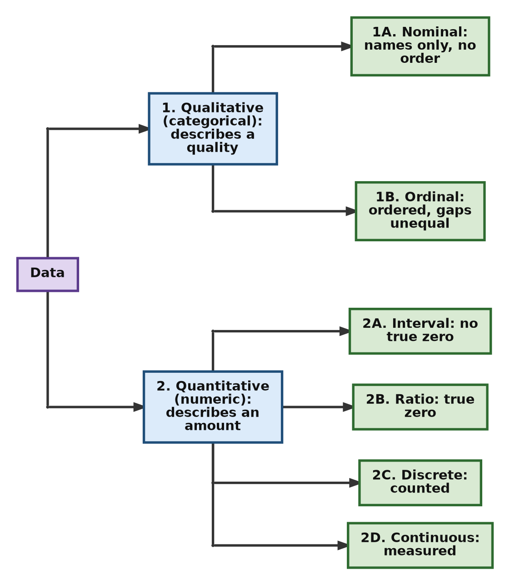
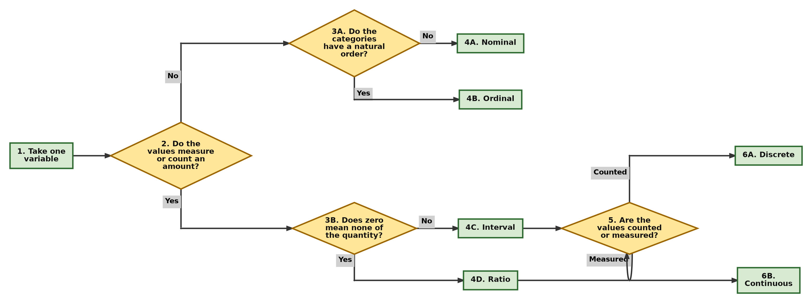
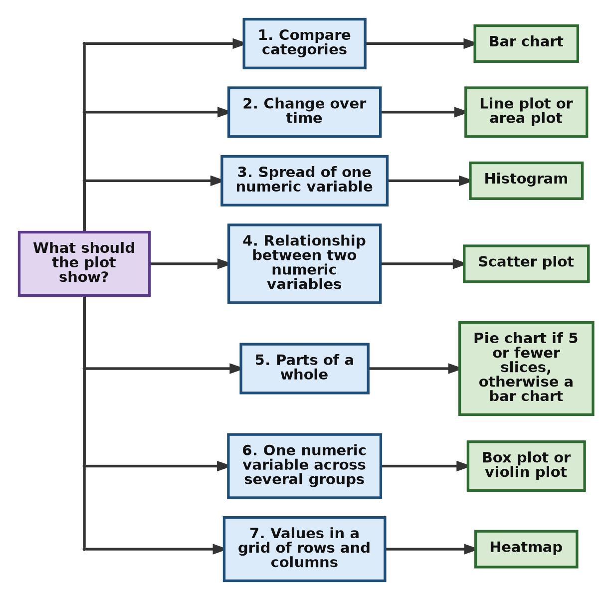
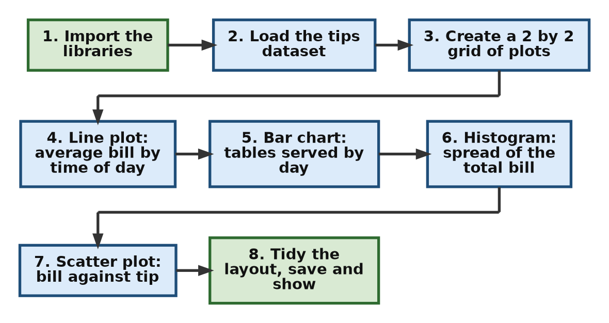
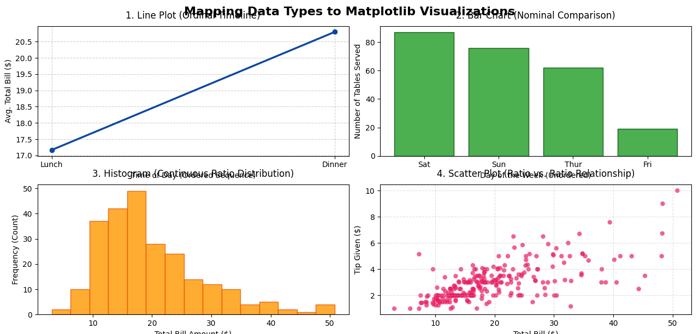
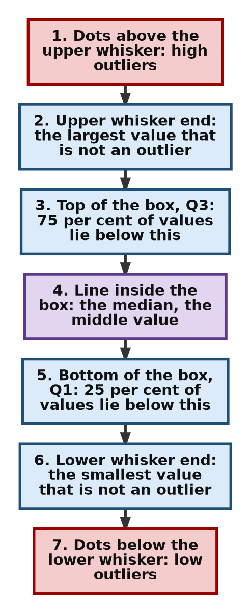
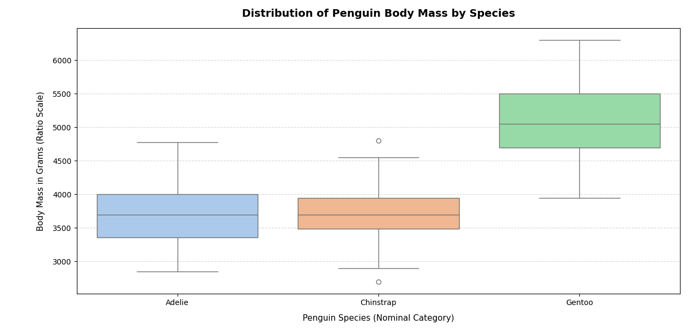
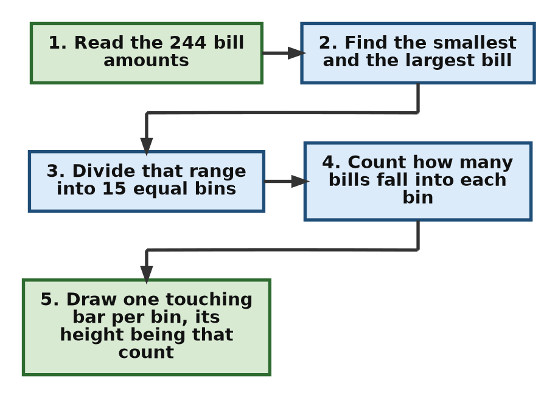
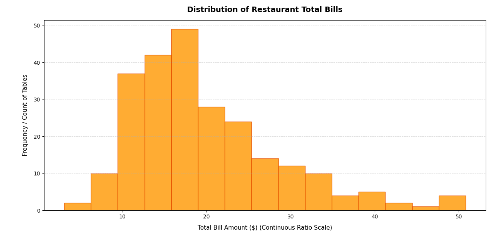
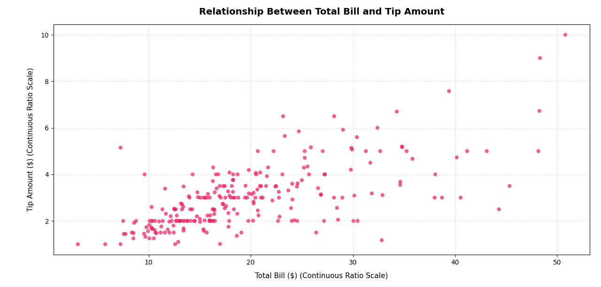

# Data Types and Choosing the Right Plot: The Foundation for Matplotlib

This page is a companion to the chapter on **Matplotlib** in the book. Matplotlib is the most widely used Python library for drawing graphs and charts. Before we start writing plotting code, we need to answer a simpler question: *what kind of data do we have, and which picture suits it best?*

A plot is only as good as the choice behind it. The same numbers can tell a clear story in one type of chart and a false story in another. So this page first explains the main **types of data** (nominal, ordinal, interval, ratio, discrete and continuous). It then describes the common **types of plots** (line, bar, histogram, scatter, pie, box, area and heatmap) and shows which data type goes with which plot. Finally, four complete Python scripts put these ideas into practice using real datasets that come with the Seaborn library.

Every script is broken into small steps. Each step is explained, and its printed output is shown, so you can follow what the program does line by line. A combined script is given after the steps so that you can copy and run the whole program in one go. Technical words are explained in simple language, and links are provided for readers who want to learn more.

If you are new to plotting, read the sections in order. If you only need a quick answer, jump to the [Quick Plot Selection Guide](#quick-plot-selection-guide) or the flowchart in [Choosing a Plot Step by Step](#choosing-a-plot-step-by-step).

## Table of Contents

- [Data Types and Choosing the Right Plot: The Foundation for Matplotlib](#data-types-and-choosing-the-right-plot-the-foundation-for-matplotlib)
  - [Project Overview](#project-overview)
  - [Chapter Introduction](#chapter-introduction)
  - [Types of Data](#types-of-data)
    - [1. Nominal Data](#1-nominal-data)
    - [2. Ordinal Data](#2-ordinal-data)
    - [3. Interval Data](#3-interval-data)
    - [4. Ratio Data](#4-ratio-data)
    - [5. Discrete Data](#5-discrete-data)
    - [6. Continuous Data](#6-continuous-data)
    - [Comparison of Properties of the Various Data Types](#comparison-of-properties-of-the-various-data-types)
    - [Further Differentiation of Data Types on Various Parameters](#further-differentiation-of-data-types-on-various-parameters)
    - [Quick Test: How to Identify the Type of a Variable](#quick-test-how-to-identify-the-type-of-a-variable)
  - [Plot Types](#plot-types)
    - [Overview of Common Plot Types](#overview-of-common-plot-types)
    - [Additional Comparison Table](#additional-comparison-table)
    - [Quick Plot Selection Guide](#quick-plot-selection-guide)
    - [Choosing a Plot Step by Step](#choosing-a-plot-step-by-step)
  - [Important Conceptual Notes](#important-conceptual-notes)
    - [1. Line Plot vs Bar Chart](#1-line-plot-vs-bar-chart)
    - [2. Histogram vs Bar Chart](#2-histogram-vs-bar-chart)
    - [3. Scatter Plot Importance](#3-scatter-plot-importance)
    - [4. Common Visualization Mistakes](#4-common-visualization-mistakes)
    - [5. What Happens When the Wrong Plot Is Chosen](#5-what-happens-when-the-wrong-plot-is-chosen)
  - [Before You Run the Scripts](#before-you-run-the-scripts)
  - [Script 1: Four Plots for Four Types of Data](#script-1-four-plots-for-four-types-of-data)
    - [About the Tips Dataset](#about-the-tips-dataset)
    - [Script 1 Step by Step](#script-1-step-by-step)
    - [Script 1 Complete Script](#script-1-complete-script)
    - [Output of Script 1](#output-of-script-1)
    - [The Resulting Plot of Script 1](#the-resulting-plot-of-script-1)
    - [Explanation of Script 1](#explanation-of-script-1)
    - [Follow-up Questions on Script 1](#follow-up-questions-on-script-1)
  - [Script 2: Case Study - Analyzing Continuous Groups with Box Plots](#script-2-case-study---analyzing-continuous-groups-with-box-plots)
    - [Explanatory Note Before Script 2](#explanatory-note-before-script-2)
    - [How to Read a Box Plot](#how-to-read-a-box-plot)
    - [Script 2 Step by Step](#script-2-step-by-step)
    - [Script 2 Complete Script](#script-2-complete-script)
    - [Output of Script 2](#output-of-script-2)
    - [The Resulting Plot of Script 2](#the-resulting-plot-of-script-2)
    - [Explanation of Script 2](#explanation-of-script-2)
      - [1. The Anatomy of a Box Plot](#1-the-anatomy-of-a-box-plot)
      - [2. Mechanics of the Code: How It Works](#2-mechanics-of-the-code-how-it-works)
      - [3. What the Plot Tells Us](#3-what-the-plot-tells-us)
    - [Follow-up Questions on Script 2](#follow-up-questions-on-script-2)
  - [Script 3: The Histogram (Visualizing Single-Variable Distribution)](#script-3-the-histogram-visualizing-single-variable-distribution)
    - [Explanatory Note Before Script 3](#explanatory-note-before-script-3)
    - [Script 3 Step by Step](#script-3-step-by-step)
    - [Script 3 Complete Script](#script-3-complete-script)
    - [Output of Script 3](#output-of-script-3)
    - [The Resulting Plot of Script 3](#the-resulting-plot-of-script-3)
    - [Explanatory Note After Script 3](#explanatory-note-after-script-3)
    - [Follow-up Questions on Script 3](#follow-up-questions-on-script-3)
  - [Script 4: The Scatter Plot (Visualizing Two-Variable Correlation)](#script-4-the-scatter-plot-visualizing-two-variable-correlation)
    - [Explanatory Note Before Script 4](#explanatory-note-before-script-4)
    - [Script 4 Step by Step](#script-4-step-by-step)
    - [Script 4 Complete Script](#script-4-complete-script)
    - [Output of Script 4](#output-of-script-4)
    - [The Resulting Plot of Script 4](#the-resulting-plot-of-script-4)
    - [Explanatory Note After Script 4](#explanatory-note-after-script-4)
    - [Follow-up Questions on Script 4](#follow-up-questions-on-script-4)
  - [Summary](#summary)
  - [Glossary of Technical Terms](#glossary-of-technical-terms)

## Project Overview

**Objective:** Before visualizing data or writing any code, a data scientist must understand the anatomy of their data.

**The Research Question:** "Given a dataset with variables of different types—nominal, ordinal, interval, and ratio—how does one systematically decide which type of plot (line, bar, scatter, histogram, pie, box, heatmap, etc.) is most appropriate, and what are the consequences of choosing an inappropriate visualization?"

In this project, you will investigate how the fundamental types of statistical data dictate the geometric forms (plots) used to represent them. Choosing the wrong plot can distort the truth or obscure critical insights.

The research question has two parts. This page answers both:

1. **How do we decide which plot to use?** See [Types of Data](#types-of-data), [Plot Types](#plot-types) and the flowchart in [Choosing a Plot Step by Step](#choosing-a-plot-step-by-step).
2. **What goes wrong if we choose badly?** See [Common Visualization Mistakes](#4-common-visualization-mistakes) and [What Happens When the Wrong Plot Is Chosen](#5-what-happens-when-the-wrong-plot-is-chosen).

**Follow-up questions to keep in mind while reading:**

- (a) For each column in a dataset, can you name its data type before you draw anything?
- (b) What question do you want the plot to answer: a comparison, a trend, a spread, or a relationship?
- (c) If a reader looked only at your plot, could they draw a wrong conclusion from it?

[Back to the Table of Contents](#table-of-contents)

## Chapter Introduction

Before learning Matplotlib, it is important to understand the nature of data. Different types of data need different kinds of visual representation. A graph that suits one type of data may be completely unsuitable for another.

For example:

- A **line graph** is excellent for showing changes over time.
- A **bar chart** is useful for comparing categories.
- A **histogram** is useful for understanding how values are spread out (their *distribution*).
- A **scatter plot** helps identify relationships between two variables.

Therefore, data visualization is not merely about drawing graphs. It is about selecting the most meaningful visual representation for the given data.

In this chapter, we shall study:

1. Types of data
2. Types of plots
3. The relationship between data and visualization
4. How to choose an appropriate graph
5. Common mistakes in visualization

This understanding forms the conceptual foundation required before learning Matplotlib programming.

**A few words used often on this page:**

| Word | Simple meaning |
| --- | --- |
| Variable | A single characteristic that we record, such as height, city or exam grade. In a table, each column is usually one variable. |
| Observation | One record or row in the table, such as one student, one penguin or one restaurant bill. |
| Dataset | The whole table of observations and variables. |
| Distribution | How the values of a variable are spread out: which values are common, which are rare, and how far apart they lie. |

[Back to the Table of Contents](#table-of-contents)

## Types of Data

Data can broadly be classified into the following categories:

| Data Type | Description | Examples |
| --- | --- | --- |
| Nominal Data | Categories without any order | Gender, Blood Group, City |
| Ordinal Data | Categories with a meaningful order | Rank, Grades, Satisfaction Level |
| Interval Data | Numeric data without a true zero | Temperature in Celsius |
| Ratio Data | Numeric data with a true zero | Height, Weight, Age |
| Discrete Data | Countable values | Number of students |
| Continuous Data | Measurable values | Time, Distance, Speed |

**Two ways of looking at the same data.** The table above mixes two different systems of classification. It helps to keep them apart:

1. **Levels of measurement: nominal, ordinal, interval and ratio.** This system asks: *what can we meaningfully do with the values?* Can we only name them, or also put them in order, subtract them, or divide them? This system was proposed by the psychologist Stanley Smith Stevens in 1946. You can read more at [Level of measurement (Wikipedia)](https://en.wikipedia.org/wiki/Level_of_measurement).
2. **Discrete and continuous.** This system applies to numbers only. It asks: *are the values counted or measured?* Counted values (such as 3 cars) are discrete. Measured values (such as 1.73 metres) are continuous.

So a single variable can belong to both systems at once. For example, the number of students in a class is **ratio** data (zero students means no students) and also **discrete** data (you cannot have 30.5 students).

Nominal and ordinal data are called **qualitative** or **categorical** data, because they describe qualities or categories. Interval and ratio data are called **quantitative** or **numeric** data, because they describe amounts.



[Back to the Table of Contents](#table-of-contents)

### 1. Nominal Data

Nominal data represents categories or labels. The categories do not have any natural order. The word *nominal* comes from the Latin word for "name", because the values only name things.

You cannot say that one category is bigger or better than another. You can only count how many observations fall into each category.

Examples:

- Colors
- Religion
- Country names
- Types of vehicles

A useful check: if you can shuffle the categories in any order and nothing is lost, the data is nominal. "Car, Bus, Truck" means the same as "Truck, Car, Bus".

Suitable plots:

- Bar chart
- Pie chart

Unsuitable plots:

- Line graph (a line joining "Car" to "Bus" to "Truck" suggests a movement or trend that does not exist)

[Back to the Table of Contents](#table-of-contents)

### 2. Ordinal Data

Ordinal data contains categories that have a meaningful order.

Examples:

- Class ranks
- Satisfaction levels (for example: Poor, Fair, Good, Excellent)
- Education levels

The order matters, but the gaps between the categories are not necessarily equal. The difference between rank 1 and rank 2 in an exam may be 1 mark, while the difference between rank 2 and rank 3 may be 15 marks. For this reason, calculating an average of ordinal values is usually not meaningful. The **median** (the middle value) is a better summary.

Suitable plots:

- Ordered bar charts (bars placed in the natural order of the categories, not sorted by height)
- Horizontal bar charts

[Back to the Table of Contents](#table-of-contents)

### 3. Interval Data

Interval data consists of numeric values where differences are meaningful, but zero does not mean "nothing".

Example:

- Temperature in Celsius
- Calendar years

The difference between 10 °C and 20 °C is the same as the difference between 20 °C and 30 °C, so subtraction makes sense. But 0 °C does not mean "no temperature". It is simply the point at which water freezes. Because the zero is arbitrary (chosen by convention), ratios do not make sense: 20 °C is **not** twice as hot as 10 °C.

Suitable plots:

- Line plot (for example, daily temperature over a month)
- Histogram
- Box plot

[Back to the Table of Contents](#table-of-contents)

### 4. Ratio Data

Ratio data has all the properties of interval data and also has a true zero. A value of zero means that none of the quantity is present.

Examples:

- Weight
- Height
- Income

Because zero is real, ratios make sense. A person weighing 80 kg is twice as heavy as a person weighing 40 kg. An income of zero means no income.

Suitable plots:

- Histogram
- Scatter plot
- Box plot
- Line graph

[Back to the Table of Contents](#table-of-contents)

### 5. Discrete Data

Discrete data consists of countable values. There are gaps between possible values. Usually they are whole numbers.

Examples:

- Number of books
- Number of cars

Suitable plots:

- Bar chart
- Stem plot (a plot where each value is drawn as a vertical line topped with a dot; see [matplotlib.pyplot.stem](https://matplotlib.org/stable/api/_as_gen/matplotlib.pyplot.stem.html))

[Back to the Table of Contents](#table-of-contents)

### 6. Continuous Data

Continuous data can take infinitely many values within a range. Between any two values, another value is always possible. For example, between 1.70 m and 1.71 m there is 1.705 m, and so on. Such values are measured, not counted.

Examples:

- Height
- Speed
- Temperature

Suitable plots:

- Histogram
- Density plot (a smooth curve that shows the shape of a distribution; see [Kernel density estimation (Wikipedia)](https://en.wikipedia.org/wiki/Kernel_density_estimation))
- Line graph

[Back to the Table of Contents](#table-of-contents)

### Comparison of Properties of the Various Data Types

| Property | Nominal | Ordinal | Interval | Ratio |
| --- | --- | --- | --- | --- |
| Categories/Labels | Yes | Yes | No | No |
| Meaningful Order | No | Yes | Yes | Yes |
| Equal Intervals | No | No | Yes | Yes |
| True Zero | No | No | No | Yes |
| Arithmetic Mean | No | No | Yes | Yes |
| Median | No | Yes | Yes | Yes |
| Mode | Yes | Yes | Yes | Yes |
| Examples | Color, Gender, Country | Rank, Rating, Grade | Temperature (°C), Year | Height, Weight, Income |
| Also Called | Named, Categorical (unordered) | Categorical (ordered) | Scaled, Numeric (no true zero) | Scaled, Numeric (with true zero) |

**How to read this table:** each level includes all the "Yes" properties of the level to its left and adds one more. Ordinal adds *order* to nominal. Interval adds *equal intervals*. Ratio adds a *true zero*. The more properties a level has, the more calculations and plot types are allowed.

The three summary measures in the table are:

- **Mode:** the value that occurs most often. See [Mode (Wikipedia)](https://en.wikipedia.org/wiki/Mode_(statistics)).
- **Median:** the middle value when all values are arranged in order. See [Median (Wikipedia)](https://en.wikipedia.org/wiki/Median).
- **Arithmetic mean:** the ordinary average, found by adding all values and dividing by how many there are. See [Arithmetic mean (Wikipedia)](https://en.wikipedia.org/wiki/Arithmetic_mean).

[Back to the Table of Contents](#table-of-contents)

### Further Differentiation of Data Types on Various Parameters

| Data Type | Description | Ordering Meaningful? | Arithmetic Meaningful? | True Zero Exists? | Nature of Values | Examples | Suitable Plots | Common Mistake |
| --- | --- | --- | --- | --- | --- | --- | --- | --- |
| Nominal Data | Categories or labels without any natural order | No | No | No | Qualitative | Gender, Blood Group, City, Religion, Department | Bar Chart, Pie Chart | Using line graphs for unrelated categories |
| Ordinal Data | Categories having a meaningful order or ranking | Yes | Limited | No | Qualitative | Rank, Grades, Satisfaction Level, Education Level | Ordered Bar Chart, Horizontal Bar Chart | Assuming equal spacing between categories |
| Interval Data | Numeric data where differences are meaningful but zero is arbitrary | Yes | Addition/Subtraction only | No | Quantitative | Temperature in Celsius/Fahrenheit, Calendar Years | Line Plot, Histogram | Treating ratios as meaningful (for example, saying 20 °C is twice as hot as 10 °C) |
| Ratio Data | Numeric data having meaningful differences and a true zero | Yes | Yes | Yes | Quantitative | Height, Weight, Age, Salary, Distance | Scatter Plot, Histogram, Box Plot, Line Plot | Ignoring scale or outliers |
| Discrete Data | Countable numeric values | Yes | Yes | Usually Yes | Quantitative | Number of students, Cars sold, Books issued | Bar Chart, Stem Plot | Treating as continuous data |
| Continuous Data | Measurable values that can take infinitely many values within a range | Yes | Yes | Usually Yes | Quantitative | Time, Distance, Speed, Temperature, Height | Histogram, Density Plot, Line Plot, Box Plot | Choosing too few or too many bins in a histogram, which hides the real shape of the data |

Notes on the table:

- "Limited" arithmetic for ordinal data means that you can find the median and compare positions (higher or lower), but adding or averaging the categories is not reliable, because the gaps between them are not equal.
- For continuous data, "Usually Yes" under True Zero is because most measured quantities (time, distance, height) have a true zero. Temperature in Celsius is an exception: it is continuous but has no true zero, so it is interval data.

[Back to the Table of Contents](#table-of-contents)

### Quick Test: How to Identify the Type of a Variable

When you meet a new column in a dataset, ask the questions in the flowchart below, in order.



**A common trap:** some columns contain numbers that are really labels. PIN codes, roll numbers and jersey numbers are written as digits, but adding or averaging them makes no sense. They are **nominal** data. Always ask what the number *means*, not just whether it looks like a number.

Examples worked through the flowchart:

| Variable | Measures an amount? | Natural order? | Zero means none? | Counted or measured? | Data type |
| --- | --- | --- | --- | --- | --- |
| Blood group | No | No | Not applicable | Not applicable | Nominal |
| Customer rating (1 to 5 stars) | No, the stars are labels for opinions | Yes | Not applicable | Not applicable | Ordinal |
| Temperature in Celsius | Yes | Not applicable | No | Measured | Interval, continuous |
| Monthly salary | Yes | Not applicable | Yes | Measured | Ratio, continuous |
| Number of children in a family | Yes | Not applicable | Yes | Counted | Ratio, discrete |
| Roll number | No, it is only an identifier | No | Not applicable | Not applicable | Nominal |

[Back to the Table of Contents](#table-of-contents)

## Plot Types

### Overview of Common Plot Types

| Plot Type | Primary Purpose | Best Suitable For | Type of Data Required | Main Strength | Main Limitation | Real-World Examples | Unsuitable For | Important Observation |
| --- | --- | --- | --- | --- | --- | --- | --- | --- |
| Line Plot | Showing trends and changes over continuous intervals | Continuous and time-series data | Continuous numeric data | Clearly shows trends and movement over time | Misleading for unrelated categories | Stock prices, temperature changes, rainfall trends | Nominal categories | Joining consecutive points with a line implies continuity between them |
| Bar Chart | Comparing categories | Nominal and ordinal data | Categorical or discrete data | Easy comparison between groups | Becomes cluttered with too many categories | Survey results, sales comparison, student strength by department | Continuous distributions | Height (or length) of each bar represents magnitude |
| Histogram | Analyzing distribution and frequency | Continuous numeric data | Continuous data grouped into intervals (bins) | Shows spread, concentration and skewness | Exact individual values are difficult to identify | Age distribution, marks distribution, salary analysis | Nominal categories | Adjacent bars touch because the bins are next to each other on a continuous number line |
| Scatter Plot | Studying relationships between two variables | Ratio and interval data | Two numeric variables | Reveals correlation, clusters and outliers | Difficult to read when points pile on top of each other in very large datasets | Height vs weight, advertising vs sales | Purely categorical data | Useful for detecting patterns and anomalies |
| Pie Chart | Showing proportions of a whole | Nominal categorical data | Categorical data with percentages | Simple visual representation of parts of a whole | Difficult comparison when many categories exist | Budget allocation, market share, election votes | Continuous data, many categories, or values that do not add up to a whole | Total of all slices represents 100% |
| Box Plot | Showing spread, median and outliers | Continuous numeric data, often compared across groups | Continuous data | Excellent summary of a distribution | Less intuitive for beginners; hides the detailed shape of the data | Salary comparison, exam score analysis | Purely categorical data, or very small samples of only a few values | Quickly identifies outliers |
| Area Plot | Showing cumulative trends over time | Time-series data | Continuous numeric data | Emphasizes total magnitude over time | Overlapping areas may confuse interpretation | Population growth, cumulative sales | Independent categories | Similar to a line plot, but the area under the line is filled with color |
| Heatmap | Showing intensity, density or correlation | Matrix and tabular data | Numeric matrix data | Excellent for pattern recognition | Exact values are harder to read visually | Correlation matrices, attendance tracking, weather intensity maps | Small simple datasets | Color intensity represents magnitude |

Some terms used in this table:

- **Time-series data:** values recorded one after another over time, such as daily rainfall. See [Time series (Wikipedia)](https://en.wikipedia.org/wiki/Time_series).
- **Skewness:** a measure of how lopsided a distribution is. If most values are low and a few are very high, the distribution has a long tail to the right and is called *right-skewed*. See [Skewness (Wikipedia)](https://en.wikipedia.org/wiki/Skewness).
- **Correlation:** how strongly two numeric variables move together. See [Correlation (Wikipedia)](https://en.wikipedia.org/wiki/Correlation).
- **Outlier:** a value that is unusually far from most of the other values. See [Outlier (Wikipedia)](https://en.wikipedia.org/wiki/Outlier).
- **Matrix:** a grid of numbers arranged in rows and columns.

[Back to the Table of Contents](#table-of-contents)

### Additional Comparison Table

This table rates each plot type for five common tasks.

| Plot Type | Best For Comparison | Best For Trend Analysis | Best For Distribution | Best For Relationship Analysis | Best For Outlier Detection |
| --- | --- | --- | --- | --- | --- |
| Line Plot | Moderate | Excellent | Poor | Poor | Poor |
| Bar Chart | Excellent | Poor | Poor | Poor | Poor |
| Histogram | Moderate | Poor | Excellent | Poor | Moderate |
| Scatter Plot | Moderate | Moderate | Poor | Excellent | Excellent |
| Pie Chart | Limited | Poor | Poor | Poor | Poor |
| Box Plot | Moderate | Poor | Excellent | Poor | Excellent |
| Area Plot | Moderate | Excellent | Poor | Poor | Poor |
| Heatmap | Excellent | Moderate | Moderate | Excellent | Moderate |

[Back to the Table of Contents](#table-of-contents)

### Quick Plot Selection Guide

| Situation | Recommended Plot |
| --- | --- |
| Comparing categories | Bar Chart |
| Showing changes over time | Line Plot |
| Showing distribution | Histogram |
| Showing relationship between variables | Scatter Plot |
| Showing percentages or proportions | Pie Chart |
| Detecting outliers | Box Plot |
| Showing cumulative growth | Area Plot |
| Showing correlations or intensity | Heatmap |

[Back to the Table of Contents](#table-of-contents)

### Choosing a Plot Step by Step

This section answers the first part of the research question: *how do we systematically decide which plot to use?* Follow these steps every time.

1. **Identify the variables.** Decide which columns you want to show. Most plots use one or two variables.
2. **Find the data type of each variable.** Use the [Quick Test](#quick-test-how-to-identify-the-type-of-a-variable) above. Note whether each one is nominal, ordinal, interval or ratio, and whether it is discrete or continuous.
3. **Decide what question the plot must answer.** Is it a comparison, a change over time, a spread, a relationship, or a part of a whole?
4. **Match the question and the data types to a plot** using the flowchart below.
5. **Check the plot for honesty.** Look at the axis scale, the order of the categories, the number of bins and the number of slices. Ask whether a reader could misread the picture.



The table below links the data types to the flowchart.

| Variables involved | Typical question | Suitable plot |
| --- | --- | --- |
| One nominal variable | How many in each category? | Bar chart, or pie chart if there are few categories |
| One ordinal variable | How many at each level? | Bar chart with bars kept in their natural order |
| One continuous variable | How are the values spread out? | Histogram, box plot or density plot |
| Time and one numeric variable | How does the value change over time? | Line plot or area plot |
| Two numeric variables | Does one change when the other changes? | Scatter plot |
| One numeric and one categorical variable | Do the groups differ? | Box plot, or bar chart of group averages |
| Many numeric variables at once | Which pairs are related? | Heatmap of correlations |

[Back to the Table of Contents](#table-of-contents)

## Important Conceptual Notes

### 1. Line Plot vs Bar Chart

- Line plots imply continuity. The line suggests that values change smoothly from one point to the next.
- Bar charts compare independent categories. Each bar stands on its own.

Therefore:

- Monthly temperature → Line Plot (January flows into February, and the temperature changes gradually)
- Population of cities → Bar Chart (Delhi does not "flow into" Mumbai, so a connecting line would have no meaning)

[Back to the Table of Contents](#table-of-contents)

### 2. Histogram vs Bar Chart

Although both use bars, they are fundamentally different.

| Histogram | Bar Chart |
| --- | --- |
| Continuous data | Categorical data |
| Bars touch | Bars separated |
| Shows distribution | Shows comparison |
| The x-axis is a number line divided into intervals (bins) | The x-axis lists separate categories |
| The order of bars is fixed by the number line and cannot be changed | Bars can be reordered (for nominal data), for example from tallest to shortest |
| Bar width has meaning (the size of the interval) | Bar width has no meaning |

[Back to the Table of Contents](#table-of-contents)

### 3. Scatter Plot Importance

Scatter plots are extremely important in:

- Data science
- [Machine learning](https://en.wikipedia.org/wiki/Machine_learning)
- Statistics

They help identify:

- **Positive correlation:** as one variable increases, the other tends to increase (the dots rise from left to right).
- **Negative correlation:** as one variable increases, the other tends to decrease (the dots fall from left to right).
- **No correlation:** there is no clear upward or downward pattern.
- **Clusters:** separate groups of dots that sit close together.
- **Outliers:** single dots that sit far away from the rest.

Remember that correlation is not the same as causation. Two variables can move together without one causing the other. See [Correlation does not imply causation (Wikipedia)](https://en.wikipedia.org/wiki/Correlation_does_not_imply_causation).

[Back to the Table of Contents](#table-of-contents)

### 4. Common Visualization Mistakes

| Mistake | Problem Created |
| --- | --- |
| Using pie charts for many categories | Difficult interpretation |
| Using line plots for nominal data | False trends implied |
| Excessive colors | Visual clutter |
| Using 3D effects unnecessarily | Distorted perception |
| Wrong scaling | Misleading conclusions |

[Back to the Table of Contents](#table-of-contents)

### 5. What Happens When the Wrong Plot Is Chosen

This section answers the second part of the research question: *what are the consequences of choosing an inappropriate visualization?* Each example below shows a wrong choice, what the reader wrongly concludes, and the better choice.

| Wrong choice | What the reader may wrongly believe | Better choice |
| --- | --- | --- |
| A line joining the sales of Apples, Bananas and Mangoes | That sales "rise" or "fall" from one fruit to the next, as if there were a trend | Bar chart |
| A pie chart with 15 thin slices | Nothing clear. Slices of similar size cannot be told apart, so the reader cannot compare them | Bar chart sorted from largest to smallest |
| A bar chart whose y-axis starts at 95 instead of 0 | That a change from 96 to 98 is huge, because one bar looks several times taller than the other | Start bars at zero, or use a line plot or dot plot if only the change matters |
| Satisfaction levels Poor, Fair, Good, Excellent sorted alphabetically (Excellent, Fair, Good, Poor) | That the levels have no order, because "Excellent" appears next to "Fair" and "Poor" comes last | Ordered bar chart that keeps the natural order Poor, Fair, Good, Excellent |
| A histogram with only 3 bins | That the data is simple and evenly spread, while the real peaks and gaps are hidden | Histogram with a sensible number of bins (often 10 to 25) |
| An average of ordinal ratings (such as "average satisfaction = 2.6") plotted as if it were exact | That the categories are equally spaced and the average is precise | Bar chart of how many people chose each rating |
| A 3D pie chart | That the front slices are bigger than they are, because of the tilted perspective | Flat pie chart or bar chart |

In short, a wrong plot can do three kinds of harm:

1. **It can invent a pattern that does not exist**, such as a trend across unrelated categories.
2. **It can hide a pattern that does exist**, such as the true shape of a distribution.
3. **It can exaggerate or shrink a difference**, through poor scaling or visual effects.

[Back to the Table of Contents](#table-of-contents)

## Before You Run the Scripts

The four scripts below need three Python libraries:

| Library | What it does in these scripts | Learn more |
| --- | --- | --- |
| Matplotlib | Draws the figures, titles, labels and grids | [matplotlib.org](https://matplotlib.org/stable/) |
| Seaborn | Supplies the practice datasets and draws the box plot in Script 2. Seaborn is built on top of Matplotlib. | [seaborn.pydata.org](https://seaborn.pydata.org/) |
| pandas | Holds the data as a table (a DataFrame) and does grouping and counting. Seaborn installs it automatically. | [pandas.pydata.org](https://pandas.pydata.org/docs/) |

If they are not installed, open a terminal (Command Prompt on Windows) and type:

```text
pip install matplotlib seaborn pandas
```

Some points to note:

- **Internet connection:** `sns.load_dataset()` downloads the dataset from Seaborn's online data repository the first time you use it, and keeps a copy on your computer for later use. See [seaborn.load_dataset](https://seaborn.pydata.org/generated/seaborn.load_dataset.html).
- **DataFrame:** a table of rows and columns, like a spreadsheet, provided by pandas. See [Intro to data structures (pandas)](https://pandas.pydata.org/docs/user_guide/dsintro.html).
- **Color codes:** colors such as `"#ff9800"` are *hex codes*. The six characters give the amount of red, green and blue. See [Web colors (Wikipedia)](https://en.wikipedia.org/wiki/Web_colors).
- **Printed output:** the outputs shown on this page were produced by running the scripts. With a different version of pandas, small differences in layout may appear (for example, the line `Name: count` below a count table appears only in pandas 2.0 and later). The numbers themselves will be the same.
- **Saved images:** each script saves its figure as a PNG file in the folder from which you run the script.

[Back to the Table of Contents](#table-of-contents)

## Script 1: Four Plots for Four Types of Data

### About the Tips Dataset

Given below is a Python script that uses the famous **"tips"** dataset from Seaborn. It is an excellent teaching tool because it contains several data types in a single, small DataFrame of 244 rows. Each row is one table served at a restaurant, with the bill, the tip and some details about the customers.

- **Nominal:** `sex`, `smoker`, `day` (unordered categories)
- **Ordinal:** `time` (Lunch → Dinner has a clear sequence)
- **Ratio:** `total_bill`, `tip`, `size` (numeric measurements with a true zero)

The table below describes every column in the dataset.

| Column | Meaning | Example value | Data type | Discrete or continuous |
| --- | --- | --- | --- | --- |
| `total_bill` | Total bill amount in US dollars | 16.99 | Ratio | Continuous |
| `tip` | Tip given in US dollars | 1.01 | Ratio | Continuous |
| `sex` | Sex of the person who paid the bill | Female | Nominal | Not applicable |
| `smoker` | Whether the party included smokers | No | Nominal | Not applicable |
| `day` | Day of the week | Sun | Nominal (see note) | Not applicable |
| `time` | Meal time | Dinner | Ordinal (see note) | Not applicable |
| `size` | Number of people at the table | 2 | Ratio | Discrete |

**Notes on the classification:**

- Days of the week do have a natural order in everyday life (Thursday comes before Friday). In this script, however, we only want to *compare* how busy each day was, so we treat `day` as nominal and let the bars be sorted by height.
- `time` has only two values, Lunch and Dinner. Lunch always comes before Dinner in a day, so we treat it as ordinal.
- Money amounts such as `total_bill` and `tip` are recorded to the nearest cent, but they are usually treated as continuous because they can take a very large number of values.

The script draws four plots in one figure. Each plot matches one kind of data:

| Plot position | Plot type | Column(s) used | Data type | Question answered |
| --- | --- | --- | --- | --- |
| Top-left | Line plot | `time`, `total_bill` | Ordinal and ratio | Does the average bill change from Lunch to Dinner? |
| Top-right | Bar chart | `day` | Nominal | On which day were the most tables served? |
| Bottom-left | Histogram | `total_bill` | Continuous ratio | How are the bill amounts spread out? |
| Bottom-right | Scatter plot | `total_bill`, `tip` | Ratio and ratio | Do bigger bills get bigger tips? |



[Back to the Table of Contents](#table-of-contents)

### Script 1 Step by Step

**Step 1 - Import the libraries we need**

```python
# Step 1 - Import the libraries we need
import matplotlib.pyplot as plt   # Matplotlib draws the plots
import seaborn as sns             # Seaborn gives us ready-made practice datasets
```

**Step 2 - Load the 'tips' dataset and look at it**

```python
# Step 2 - Load the 'tips' dataset and look at it
# This dataset has a good mix of nominal, ordinal and ratio data.
# It is loaded as a pandas DataFrame (a table with rows and columns).
data = sns.load_dataset("tips")

print("Step 2: Dataset loaded")
print("Number of rows and columns:", data.shape)
print()
print("First five rows:")
print(data.head())
print()
print("Data type of each column:")
print(data.dtypes)
```

Output of this step:

```text
Step 2: Dataset loaded
Number of rows and columns: (244, 7)

First five rows:
   total_bill   tip     sex smoker  day    time  size
0       16.99  1.01  Female     No  Sun  Dinner     2
1       10.34  1.66    Male     No  Sun  Dinner     3
2       21.01  3.50    Male     No  Sun  Dinner     3
3       23.68  3.31    Male     No  Sun  Dinner     2
4       24.59  3.61  Female     No  Sun  Dinner     4

Data type of each column:
total_bill     float64
tip            float64
sex           category
smoker        category
day           category
time          category
size             int64
dtype: object
```

**Step 3 - Create one figure with a grid of 2 rows and 2 columns of plots**

```python
# Step 3 - Create one figure with a grid of 2 rows and 2 columns of plots
# 'fig' is the whole picture (the window).
# 'axes' holds the four smaller plots. We reach each one by its row and
# column number, for example axes[0, 0] is the top-left plot.
# figsize=(14, 10) makes the figure 14 inches wide and 10 inches tall.
fig, axes = plt.subplots(nrows=2, ncols=2, figsize=(14, 10))

fig.suptitle(
    "Mapping Data Types to Matplotlib Visualizations",  # Main title for the whole figure
    fontsize=16,                                       # Size of the title text
    fontweight="bold",                                 # Make the title bold
)

print()
print("Step 3: Figure created with", axes.shape[0], "rows and", axes.shape[1], "columns of plots")
```

Output of this step:

```text
Step 3: Figure created with 2 rows and 2 columns of plots
```

**Step 4 - Top-left plot: LINE PLOT (ordinal, ordered categories)**

```python
# Step 4 - Top-left plot: LINE PLOT (ordinal, ordered categories)
# Question: Does the average bill change from Lunch to Dinner?
#
# groupby("time") puts all Lunch rows in one group and all Dinner rows in another.
# ["total_bill"].mean() then finds the average bill of each group.
#
# 'time' is stored as a pandas "category" column whose categories are already
# in the order Lunch, Dinner. The result keeps this order.
# observed=False tells pandas to show every category, even one that has no rows.
# (Some versions of pandas show a warning if this option is left out.)
time_trends = data.groupby("time", observed=False)["total_bill"].mean()

print()
print("Step 4: Average total bill for each time of day")
print(time_trends.round(2))

axes[0, 0].plot(
    time_trends.index,    # x-axis: the time categories (Lunch, Dinner)
    time_trends.values,   # y-axis: the average bill for each category
    marker="o",           # Draw a dot at each data point
    color="#0d47a1",      # Deep blue line (color given as a hex code)
    linewidth=2.5,        # A thicker line is easier to see
)
# Give the plot a title and label both axes so the reader knows what is shown.
axes[0, 0].set_title("1. Line Plot (Ordinal Timeline)", fontsize=12, pad=10)
axes[0, 0].set_xlabel("Time of Day (Ordered Sequence)")
axes[0, 0].set_ylabel("Avg. Total Bill ($)")
# A light dashed grid makes values easier to read.
axes[0, 0].grid(True, linestyle="--", alpha=0.6)
```

Output of this step:

```text
Step 4: Average total bill for each time of day
time
Lunch     17.17
Dinner    20.80
Name: total_bill, dtype: float64
```

**Step 5 - Top-right plot: BAR CHART (nominal categories)**

```python
# Step 5 - Top-right plot: BAR CHART (nominal categories)
# Question: On which day were the most tables served?
#
# value_counts() counts how many rows (tables) there are for each day.
# By default it lists the days from the highest count to the lowest.
day_counts = data["day"].value_counts()

print()
print("Step 5: Number of tables served on each day")
print(day_counts)

axes[0, 1].bar(
    day_counts.index,     # x-axis: the day names (Sat, Sun, Thur, Fri)
    day_counts.values,    # y-axis: number of tables served on that day
    color="#4caf50",      # Green fill for the bars
    edgecolor="#1b5e20",  # Darker green border so each bar stands out
)
axes[0, 1].set_title("2. Bar Chart (Nominal Comparison)", fontsize=12, pad=10)
axes[0, 1].set_xlabel("Day of the Week (Unordered)")
axes[0, 1].set_ylabel("Number of Tables Served")
```

Output of this step:

```text
Step 5: Number of tables served on each day
day
Sat     87
Sun     76
Thur    62
Fri     19
Name: count, dtype: int64
```

**Step 6 - Bottom-left plot: HISTOGRAM (continuous ratio data)**

```python
# Step 6 - Bottom-left plot: HISTOGRAM (continuous ratio data)
# Question: How are the bill amounts spread out?
#
# hist() divides the range of bills into 15 equal intervals called "bins"
# and counts how many bills fall into each bin.
# It returns three things. We keep the first two to print them:
#   counts    -> how many bills are in each bin
#   bin_edges -> the start and end values of the bins
counts, bin_edges, _ = axes[1, 0].hist(
    data["total_bill"],   # The continuous column we want to study
    bins=15,              # Number of equal intervals
    color="#ff9800",      # Orange fill
    edgecolor="#e65100",  # Darker orange border
    alpha=0.8,            # Slightly see-through (1 = solid, 0 = invisible)
)

print()
print("Step 6: Histogram of total_bill")
print("Smallest bill    :", data["total_bill"].min())
print("Largest bill     :", data["total_bill"].max())
print("Width of each bin:", round(bin_edges[1] - bin_edges[0], 2))
print("Tables in each bin:", counts.astype(int).tolist())

axes[1, 0].set_title(
    "3. Histogram (Continuous Ratio Distribution)",  # Title of this plot
    fontsize=12,                                     # Size of the title text
    pad=10,                                          # Space between title and plot
)
axes[1, 0].set_xlabel("Total Bill Amount ($)")
axes[1, 0].set_ylabel("Frequency (Count)")
```

Output of this step:

```text
Step 6: Histogram of total_bill
Smallest bill    : 3.07
Largest bill     : 50.81
Width of each bin: 3.18
Tables in each bin: [2, 10, 37, 42, 49, 28, 24, 14, 12, 10, 4, 5, 2, 1, 4]
```

**Step 7 - Bottom-right plot: SCATTER PLOT (ratio vs ratio)**

```python
# Step 7 - Bottom-right plot: SCATTER PLOT (ratio vs ratio)
# Question: Do bigger bills get bigger tips?
#
# Each dot is one table: its left-right position is the bill,
# and its up-down position is the tip.
axes[1, 1].scatter(
    data["total_bill"],   # x-axis: total bill
    data["tip"],          # y-axis: tip
    color="#e91e63",      # Pink dots
    alpha=0.7,            # See-through dots, so overlapping dots look darker
    edgecolors="none",    # No outline around the dots
)

print()
print("Step 7: Scatter plot of total_bill against tip")
print("Number of dots plotted:", len(data))

axes[1, 1].set_title("4. Scatter Plot (Ratio vs. Ratio Relationship)", fontsize=12, pad=10)
axes[1, 1].set_xlabel("Total Bill ($)")
axes[1, 1].set_ylabel("Tip Given ($)")
axes[1, 1].grid(True, linestyle="--", alpha=0.4)
```

Output of this step:

```text
Step 7: Scatter plot of total_bill against tip
Number of dots plotted: 244
```

**Step 8 - Tidy the layout, save the image and show the figure**

```python
# Step 8 - Tidy the layout, save the image and show the figure
# tight_layout() adjusts the spacing so titles and labels do not overlap.
plt.tight_layout()

# Save the figure as a PNG image. dpi=300 gives a sharp, high-quality picture.
# Always save BEFORE plt.show(). Once the window is closed the figure may be empty.
plt.savefig("data_types_visualization_matrix.png", dpi=300)
print()
print("Step 8: Figure saved as data_types_visualization_matrix.png")

# Open a window and display the figure.
plt.show()
```

Output of this step:

```text
Step 8: Figure saved as data_types_visualization_matrix.png
```

[Back to the Table of Contents](#table-of-contents)

### Script 1 Complete Script

Here is the whole program in one block. Copy it into a file such as `script1_four_plots.py` and run it.

```python
"""
Script 1: Four plots for four kinds of data, all in one figure.

Dataset : 'tips' (restaurant bills and tips) from the Seaborn library
Plots   : line plot, bar chart, histogram and scatter plot
"""
# Step 1 - Import the libraries we need
import matplotlib.pyplot as plt   # Matplotlib draws the plots
import seaborn as sns             # Seaborn gives us ready-made practice datasets

# Step 2 - Load the 'tips' dataset and look at it
# This dataset has a good mix of nominal, ordinal and ratio data.
# It is loaded as a pandas DataFrame (a table with rows and columns).
data = sns.load_dataset("tips")

print("Step 2: Dataset loaded")
print("Number of rows and columns:", data.shape)
print()
print("First five rows:")
print(data.head())
print()
print("Data type of each column:")
print(data.dtypes)

# Step 3 - Create one figure with a grid of 2 rows and 2 columns of plots
# 'fig' is the whole picture (the window).
# 'axes' holds the four smaller plots. We reach each one by its row and
# column number, for example axes[0, 0] is the top-left plot.
# figsize=(14, 10) makes the figure 14 inches wide and 10 inches tall.
fig, axes = plt.subplots(nrows=2, ncols=2, figsize=(14, 10))

fig.suptitle(
    "Mapping Data Types to Matplotlib Visualizations",  # Main title for the whole figure
    fontsize=16,                                       # Size of the title text
    fontweight="bold",                                 # Make the title bold
)

print()
print("Step 3: Figure created with", axes.shape[0], "rows and", axes.shape[1], "columns of plots")

# Step 4 - Top-left plot: LINE PLOT (ordinal, ordered categories)
# Question: Does the average bill change from Lunch to Dinner?
#
# groupby("time") puts all Lunch rows in one group and all Dinner rows in another.
# ["total_bill"].mean() then finds the average bill of each group.
#
# 'time' is stored as a pandas "category" column whose categories are already
# in the order Lunch, Dinner. The result keeps this order.
# observed=False tells pandas to show every category, even one that has no rows.
# (Some versions of pandas show a warning if this option is left out.)
time_trends = data.groupby("time", observed=False)["total_bill"].mean()

print()
print("Step 4: Average total bill for each time of day")
print(time_trends.round(2))

axes[0, 0].plot(
    time_trends.index,    # x-axis: the time categories (Lunch, Dinner)
    time_trends.values,   # y-axis: the average bill for each category
    marker="o",           # Draw a dot at each data point
    color="#0d47a1",      # Deep blue line (color given as a hex code)
    linewidth=2.5,        # A thicker line is easier to see
)
# Give the plot a title and label both axes so the reader knows what is shown.
axes[0, 0].set_title("1. Line Plot (Ordinal Timeline)", fontsize=12, pad=10)
axes[0, 0].set_xlabel("Time of Day (Ordered Sequence)")
axes[0, 0].set_ylabel("Avg. Total Bill ($)")
# A light dashed grid makes values easier to read.
axes[0, 0].grid(True, linestyle="--", alpha=0.6)

# Step 5 - Top-right plot: BAR CHART (nominal categories)
# Question: On which day were the most tables served?
#
# value_counts() counts how many rows (tables) there are for each day.
# By default it lists the days from the highest count to the lowest.
day_counts = data["day"].value_counts()

print()
print("Step 5: Number of tables served on each day")
print(day_counts)

axes[0, 1].bar(
    day_counts.index,     # x-axis: the day names (Sat, Sun, Thur, Fri)
    day_counts.values,    # y-axis: number of tables served on that day
    color="#4caf50",      # Green fill for the bars
    edgecolor="#1b5e20",  # Darker green border so each bar stands out
)
axes[0, 1].set_title("2. Bar Chart (Nominal Comparison)", fontsize=12, pad=10)
axes[0, 1].set_xlabel("Day of the Week (Unordered)")
axes[0, 1].set_ylabel("Number of Tables Served")

# Step 6 - Bottom-left plot: HISTOGRAM (continuous ratio data)
# Question: How are the bill amounts spread out?
#
# hist() divides the range of bills into 15 equal intervals called "bins"
# and counts how many bills fall into each bin.
# It returns three things. We keep the first two to print them:
#   counts    -> how many bills are in each bin
#   bin_edges -> the start and end values of the bins
counts, bin_edges, _ = axes[1, 0].hist(
    data["total_bill"],   # The continuous column we want to study
    bins=15,              # Number of equal intervals
    color="#ff9800",      # Orange fill
    edgecolor="#e65100",  # Darker orange border
    alpha=0.8,            # Slightly see-through (1 = solid, 0 = invisible)
)

print()
print("Step 6: Histogram of total_bill")
print("Smallest bill    :", data["total_bill"].min())
print("Largest bill     :", data["total_bill"].max())
print("Width of each bin:", round(bin_edges[1] - bin_edges[0], 2))
print("Tables in each bin:", counts.astype(int).tolist())

axes[1, 0].set_title(
    "3. Histogram (Continuous Ratio Distribution)",  # Title of this plot
    fontsize=12,                                     # Size of the title text
    pad=10,                                          # Space between title and plot
)
axes[1, 0].set_xlabel("Total Bill Amount ($)")
axes[1, 0].set_ylabel("Frequency (Count)")

# Step 7 - Bottom-right plot: SCATTER PLOT (ratio vs ratio)
# Question: Do bigger bills get bigger tips?
#
# Each dot is one table: its left-right position is the bill,
# and its up-down position is the tip.
axes[1, 1].scatter(
    data["total_bill"],   # x-axis: total bill
    data["tip"],          # y-axis: tip
    color="#e91e63",      # Pink dots
    alpha=0.7,            # See-through dots, so overlapping dots look darker
    edgecolors="none",    # No outline around the dots
)

print()
print("Step 7: Scatter plot of total_bill against tip")
print("Number of dots plotted:", len(data))

axes[1, 1].set_title("4. Scatter Plot (Ratio vs. Ratio Relationship)", fontsize=12, pad=10)
axes[1, 1].set_xlabel("Total Bill ($)")
axes[1, 1].set_ylabel("Tip Given ($)")
axes[1, 1].grid(True, linestyle="--", alpha=0.4)

# Step 8 - Tidy the layout, save the image and show the figure
# tight_layout() adjusts the spacing so titles and labels do not overlap.
plt.tight_layout()

# Save the figure as a PNG image. dpi=300 gives a sharp, high-quality picture.
# Always save BEFORE plt.show(). Once the window is closed the figure may be empty.
plt.savefig("data_types_visualization_matrix.png", dpi=300)
print()
print("Step 8: Figure saved as data_types_visualization_matrix.png")

# Open a window and display the figure.
plt.show()
```

[Back to the Table of Contents](#table-of-contents)

### Output of Script 1

```text
Step 2: Dataset loaded
Number of rows and columns: (244, 7)

First five rows:
   total_bill   tip     sex smoker  day    time  size
0       16.99  1.01  Female     No  Sun  Dinner     2
1       10.34  1.66    Male     No  Sun  Dinner     3
2       21.01  3.50    Male     No  Sun  Dinner     3
3       23.68  3.31    Male     No  Sun  Dinner     2
4       24.59  3.61  Female     No  Sun  Dinner     4

Data type of each column:
total_bill     float64
tip            float64
sex           category
smoker        category
day           category
time          category
size             int64
dtype: object

Step 3: Figure created with 2 rows and 2 columns of plots

Step 4: Average total bill for each time of day
time
Lunch     17.17
Dinner    20.80
Name: total_bill, dtype: float64

Step 5: Number of tables served on each day
day
Sat     87
Sun     76
Thur    62
Fri     19
Name: count, dtype: int64

Step 6: Histogram of total_bill
Smallest bill    : 3.07
Largest bill     : 50.81
Width of each bin: 3.18
Tables in each bin: [2, 10, 37, 42, 49, 28, 24, 14, 12, 10, 4, 5, 2, 1, 4]

Step 7: Scatter plot of total_bill against tip
Number of dots plotted: 244

Step 8: Figure saved as data_types_visualization_matrix.png
```

[Back to the Table of Contents](#table-of-contents)

### The Resulting Plot of Script 1



[Back to the Table of Contents](#table-of-contents)

### Explanation of Script 1

**What each plot tells us:**

1. **Line plot (top-left):** The average bill rises from about \$17.17 at Lunch to about \$20.80 at Dinner. The line is acceptable here only because Lunch and Dinner follow each other in time. Notice two things. First, with only two points, the line has nothing to show between them. Second, the y-axis starts at about 17, not at 0, so the rise looks steeper than it really is. A bar chart of the two averages, starting at zero, would be an equally good or better choice.
2. **Bar chart (top-right):** Saturday was the busiest day with 87 tables, followed by Sunday (76), Thursday (62) and Friday (19). The bars are in order of height because `value_counts()` sorts the counts from highest to lowest. Since we treat `day` as nominal, this reordering is fine.
3. **Histogram (bottom-left):** Most bills lie between about \$9 and \$25. The tallest bar is for bills of about \$16 to \$19. A few bills go up to about \$51, which gives the histogram a long tail on the right.
4. **Scatter plot (bottom-right):** The dots rise from left to right. Tables with bigger bills tend to leave bigger tips. This is a positive correlation.

**Key ideas in the code:**

| Code | What it does | Learn more |
| --- | --- | --- |
| `plt.subplots(nrows=2, ncols=2)` | Creates one figure holding a grid of 2 by 2 plot areas (axes) | [matplotlib.pyplot.subplots](https://matplotlib.org/stable/api/_as_gen/matplotlib.pyplot.subplots.html) |
| `axes[0, 1]` | Selects the plot in row 0, column 1 (top-right). Counting starts at 0 in Python. | |
| `data.groupby("time", observed=False)["total_bill"].mean()` | Splits the rows into groups by `time` and finds the average bill of each group | [pandas groupby](https://pandas.pydata.org/docs/reference/api/pandas.DataFrame.groupby.html) |
| `data["day"].value_counts()` | Counts how many rows there are for each day | [pandas value_counts](https://pandas.pydata.org/docs/reference/api/pandas.Series.value_counts.html) |
| `ax.plot()`, `ax.bar()`, `ax.hist()`, `ax.scatter()` | Draw a line plot, bar chart, histogram and scatter plot | [Matplotlib plot types](https://matplotlib.org/stable/plot_types/index.html) |
| `alpha=0.7` | Sets transparency: 1 is fully solid and 0 is fully invisible | |
| `plt.tight_layout()` | Adjusts spacing so that titles and labels do not overlap | [tight_layout](https://matplotlib.org/stable/api/_as_gen/matplotlib.pyplot.tight_layout.html) |
| `plt.savefig(..., dpi=300)` | Saves the figure as an image file. `dpi` means dots per inch; a higher value gives a sharper image. | [savefig](https://matplotlib.org/stable/api/_as_gen/matplotlib.pyplot.savefig.html) |

**Why `observed=False`?** The columns `sex`, `smoker`, `day` and `time` are stored in pandas as the special **category** type (you can see `category` in the output of Step 2). A category column remembers its list of possible values and their order. When we group by such a column, `observed=False` asks pandas to include every category in the result, even one with no rows. Some versions of pandas (the 2.1 to 2.3 releases) show a warning if this option is not given, because its default value was being changed. Writing it out explicitly keeps the code clear and free of warnings in every version. See [Categorical data (pandas)](https://pandas.pydata.org/docs/user_guide/categorical.html).

**Why save before showing?** `plt.show()` opens the plot window. In many setups, once you close that window the figure is cleared. If `plt.savefig()` came after `plt.show()`, you might save a blank image. So always save first.

[Back to the Table of Contents](#table-of-contents)

### Follow-up Questions on Script 1

**Question 1.1:** Why does the bar chart show the days in the order Sat, Sun, Thur, Fri instead of Thur, Fri, Sat, Sun?

<details>
<summary>Show answer</summary>

`value_counts()` sorts its result from the highest count to the lowest. Saturday has the most tables (87), so it comes first. To keep the calendar order instead, use `data["day"].value_counts(sort=False)`. Because `day` is a category column with the order Thur, Fri, Sat, Sun, the bars will then follow that order.

</details>

**Question 1.2:** The line plot of Lunch and Dinner has a y-axis that starts at about 17. How could this mislead a reader, and how would you fix it?

<details>
<summary>Show answer</summary>

Step 1 - Read the values: the averages are \$17.17 and \$20.80, a rise of about 21 percent.

Step 2 - Look at the picture: because the axis starts near 17, the Dinner point sits at the very top and the Lunch point at the very bottom. The rise looks enormous.

Step 3 - Fix it: add `axes[0, 0].set_ylim(bottom=0)` so that the axis starts at zero, or draw a bar chart of the two averages. Bars should always start at zero because readers judge them by their length.

</details>

**Question 1.3:** Which column of the tips dataset is discrete, and which plot would suit it?

<details>
<summary>Show answer</summary>

`size` (the number of people at a table) is discrete, because it is a count. A bar chart of how many tables had 1, 2, 3, 4, 5 or 6 people would suit it:

```python
size_counts = data["size"].value_counts().sort_index()   # Sort by party size, not by count
print(size_counts)
plt.bar(size_counts.index, size_counts.values)
plt.show()
```

```text
size
1      4
2    156
3     38
4     37
5      5
6      4
Name: count, dtype: int64
```

</details>

[Back to the Table of Contents](#table-of-contents)

## Script 2: Case Study - Analyzing Continuous Groups with Box Plots

### Explanatory Note Before Script 2

When exploring data, you will often need to compare a continuous numeric variable across distinct qualitative groups. For instance, if you are looking at a dataset of wild animals, you might wonder: *How does physical weight vary across different species? Do some species have a wider range of sizes while others remain uniform?* To answer these questions visually, we use a **Box Plot** (sometimes called a box-and-whisker plot). A box plot is well suited for showing a **Ratio scale** variable (where values are measurable and have a true zero, like weight in grams) across a **Nominal scale** variable (where values are distinct categories with no natural order, like species names).

The following script loads a famous, real-world biological dataset called `penguins` using the Seaborn library. The data was collected on three species of penguins (Adelie, Chinstrap and Gentoo) living on islands in Antarctica. You can read about it at [Palmer Penguins](https://allisonhorst.github.io/palmerpenguins/). The script cleans the data and uses a combined approach. It uses Seaborn for its quick, automatic drawing of the box plot, and Matplotlib for detailed control of the titles, labels and grid, to produce a clear, professional plot of the distribution.

The columns of the penguins dataset are:

| Column | Meaning | Data type |
| --- | --- | --- |
| `species` | Adelie, Chinstrap or Gentoo | Nominal |
| `island` | Island where the penguin was observed | Nominal |
| `bill_length_mm` | Length of the bill in millimetres | Ratio, continuous |
| `bill_depth_mm` | Depth of the bill in millimetres | Ratio, continuous |
| `flipper_length_mm` | Length of the flipper in millimetres | Ratio, continuous |
| `body_mass_g` | Body mass in grams | Ratio, continuous |
| `sex` | Male or Female | Nominal |

[Back to the Table of Contents](#table-of-contents)

### How to Read a Box Plot

A box plot squeezes all the values of a group into a small picture built from five numbers, plus any outliers.



| Part of the plot | Name | Meaning |
| --- | --- | --- |
| Bottom edge of the box | First quartile (Q1), or 25th percentile | One quarter of the values are below this line |
| Line inside the box | Median, or 50th percentile | Half of the values are below this line and half are above |
| Top edge of the box | Third quartile (Q3), or 75th percentile | Three quarters of the values are below this line |
| Height of the box | Interquartile range (IQR) = Q3 - Q1 | The range covered by the middle 50 percent of the values |
| Whiskers | Lines above and below the box | Reach out to the furthest values that lie within 1.5 × IQR of the box |
| Dots beyond the whiskers | Outliers | Values more than 1.5 × IQR below Q1 or above Q3 |

To learn more, see [Box plot (Wikipedia)](https://en.wikipedia.org/wiki/Box_plot), [Percentile (Wikipedia)](https://en.wikipedia.org/wiki/Percentile) and [Interquartile range (Wikipedia)](https://en.wikipedia.org/wiki/Interquartile_range).

[Back to the Table of Contents](#table-of-contents)

### Script 2 Step by Step

**Step 1 - Import the libraries**

```python
# ==============================================================================
# STEP 1: IMPORT THE LIBRARIES
# ==============================================================================
import matplotlib.pyplot as plt   # Matplotlib controls the figure, titles and grid
import seaborn as sns             # Seaborn draws the box plot and supplies the dataset
```

**Step 2 - Load the real-world dataset and remove missing values**

```python
# ==============================================================================
# STEP 2: LOAD THE REAL-WORLD DATASET AND REMOVE MISSING VALUES
# ==============================================================================
# We fetch the built-in 'penguins' dataset from Seaborn.
# This dataset is good for teaching because it clearly separates
# categories (species, island, sex) from measurements (mass, lengths).
penguins_raw = sns.load_dataset("penguins")

print("Step 2a: Rows and columns before cleaning:", penguins_raw.shape)
print("Missing values in each column:")
print(penguins_raw.isna().sum())

# '.dropna()' removes every row that has at least one missing (blank) value
# in ANY column. This gives us a clean table with no gaps.
penguins = penguins_raw.dropna()

print()
print("Step 2b: Rows and columns after cleaning :", penguins.shape)
print("Rows removed:", len(penguins_raw) - len(penguins))
```

Output of this step:

```text
Step 2a: Rows and columns before cleaning: (344, 7)
Missing values in each column:
species               0
island                0
bill_length_mm        2
bill_depth_mm         2
flipper_length_mm     2
body_mass_g           2
sex                  11
dtype: int64

Step 2b: Rows and columns after cleaning : (333, 7)
Rows removed: 11
```

**Step 3 - Look at the numbers behind the boxes**

```python
# ==============================================================================
# STEP 3: LOOK AT THE NUMBERS BEHIND THE BOXES
# ==============================================================================
# Before drawing, we print the summary numbers that the box plot will show.
# 25% is Q1 (bottom of the box), 50% is the median (line inside the box)
# and 75% is Q3 (top of the box).
summary = penguins.groupby("species")["body_mass_g"].describe()

print()
print("Step 3: Summary of body mass (grams) for each species")
print(summary[["count", "min", "25%", "50%", "75%", "max"]])

# Find the outliers using the common "1.5 x IQR" rule.
# IQR (interquartile range) = Q3 - Q1, the height of the box.
# Any value below Q1 - 1.5*IQR or above Q3 + 1.5*IQR is treated as an outlier.
# The loop below goes through the species one at a time.
print()
print("Outliers found with the 1.5 x IQR rule:")
for species_name, masses in penguins.groupby("species")["body_mass_g"]:
    q1 = masses.quantile(0.25)          # Bottom edge of the box
    q3 = masses.quantile(0.75)          # Top edge of the box
    iqr = q3 - q1                       # Height of the box
    lower_limit = q1 - 1.5 * iqr        # Values below this are outliers
    upper_limit = q3 + 1.5 * iqr        # Values above this are outliers
    outliers = masses[(masses < lower_limit) | (masses > upper_limit)]
    print(f"{species_name:<10} IQR = {iqr:6.1f}   limits = {lower_limit:7.1f} to {upper_limit:7.1f}   outliers = {sorted(outliers.tolist())}")
```

Output of this step:

```text
Step 3: Summary of body mass (grams) for each species
           count     min     25%     50%     75%     max
species                                                 
Adelie     146.0  2850.0  3362.5  3700.0  4000.0  4775.0
Chinstrap   68.0  2700.0  3487.5  3700.0  3950.0  4800.0
Gentoo     119.0  3950.0  4700.0  5050.0  5500.0  6300.0

Outliers found with the 1.5 x IQR rule:
Adelie     IQR =  637.5   limits =  2406.2 to  4956.2   outliers = []
Chinstrap  IQR =  462.5   limits =  2793.8 to  4643.8   outliers = [2700.0, 4800.0]
Gentoo     IQR =  800.0   limits =  3500.0 to  6700.0   outliers = []
```

**Step 4 - Create the Matplotlib figure and axis**

```python
# ==============================================================================
# STEP 4: CREATE THE MATPLOTLIB FIGURE AND AXIS
# ==============================================================================
# We create one figure (the window) and one axis (the area where the plot is drawn).
# 'figsize=(8, 6)' makes the figure 8 inches wide and 6 inches tall,
# which is a comfortable size for a box plot with three boxes.
# 'fig' is the whole figure, and 'ax' is the plot area where we will draw.
fig, ax = plt.subplots(figsize=(8, 6))
```

**Step 5 - Draw the box plot with Seaborn**

```python
# ==============================================================================
# STEP 5: DRAW THE BOX PLOT WITH SEABORN
# ==============================================================================
# Seaborn draws the box plot, but 'ax=ax' tells it to draw on OUR Matplotlib axis.
# This lets us use Seaborn for the drawing and Matplotlib for the finishing touches.
#
# How the data is mapped to the plot:
# - x="species"    : Nominal (categorical) variable. It creates 3 separate boxes.
# - y="body_mass_g": Ratio (numeric) variable. It sets the vertical weight scale.
# - hue="species"  : Color each species box differently.
# - legend=False   : The species names already appear on the x-axis,
#                    so the extra legend box is not needed.
# - palette="pastel": A set of soft, easy-to-read colors.
sns.boxplot(
    data=penguins,      # The cleaned DataFrame
    x="species",        # Column for the x-axis (categories)
    y="body_mass_g",    # Column for the y-axis (numbers)
    hue="species",      # Give each species its own color
    legend=False,       # Do not draw a separate legend
    ax=ax,              # Draw on the Matplotlib axis created in Step 4
    palette="pastel",   # Soft color scheme
)

print()
print("Step 5: Box plot drawn for", penguins["species"].nunique(), "species")
```

Output of this step:

```text
Step 5: Box plot drawn for 3 species
```

**Step 6 - Add a title and axis labels**

```python
# ==============================================================================
# STEP 6: ADD A TITLE AND AXIS LABELS
# ==============================================================================
# A good plot tells the reader clearly what the axes and data represent.
# 'pad=15' adds some space between the title and the top of the plot.
ax.set_title("Distribution of Penguin Body Mass by Species", fontsize=14, fontweight="bold", pad=15)

# Use clear, readable labels instead of raw column names like 'body_mass_g'.
# 'labelpad=10' adds space between each label and its axis.
ax.set_xlabel("Penguin Species (Nominal Category)", fontsize=11, labelpad=10)
ax.set_ylabel("Body Mass in Grams (Ratio Scale)", fontsize=11, labelpad=10)
```

**Step 7 - Add a grid, save and show the plot**

```python
# ==============================================================================
# STEP 7: ADD A GRID, SAVE AND SHOW THE PLOT
# ==============================================================================
# A horizontal grid along the y-axis helps you read across from a median line
# or an outlier dot to its value on the y-axis.
# 'linestyle="--"' makes dashed lines, and 'alpha=0.5' makes them faint.
ax.grid(True, axis="y", linestyle="--", alpha=0.5)

# 'tight_layout' fixes the margins so no labels or titles get cut off.
plt.tight_layout()

# Save a high-resolution (300 dots per inch) image in the current folder.
# This image can be uploaded to a GitHub repository or used in notes.
plt.savefig("penguins_boxplot_distribution.png", dpi=300)
print()
print("Step 7: Plot saved as penguins_boxplot_distribution.png")

# Finally, open a window on the screen to show the plot.
plt.show()
```

Output of this step:

```text
Step 7: Plot saved as penguins_boxplot_distribution.png
```

[Back to the Table of Contents](#table-of-contents)

### Script 2 Complete Script

Here is the whole program in one block.

```python
"""
Script 2: Box plot of penguin body mass for each species.

Dataset : 'penguins' from the Seaborn library
Plot    : box plot (a ratio variable compared across nominal groups)
"""
# ==============================================================================
# STEP 1: IMPORT THE LIBRARIES
# ==============================================================================
import matplotlib.pyplot as plt   # Matplotlib controls the figure, titles and grid
import seaborn as sns             # Seaborn draws the box plot and supplies the dataset

# ==============================================================================
# STEP 2: LOAD THE REAL-WORLD DATASET AND REMOVE MISSING VALUES
# ==============================================================================
# We fetch the built-in 'penguins' dataset from Seaborn.
# This dataset is good for teaching because it clearly separates
# categories (species, island, sex) from measurements (mass, lengths).
penguins_raw = sns.load_dataset("penguins")

print("Step 2a: Rows and columns before cleaning:", penguins_raw.shape)
print("Missing values in each column:")
print(penguins_raw.isna().sum())

# '.dropna()' removes every row that has at least one missing (blank) value
# in ANY column. This gives us a clean table with no gaps.
penguins = penguins_raw.dropna()

print()
print("Step 2b: Rows and columns after cleaning :", penguins.shape)
print("Rows removed:", len(penguins_raw) - len(penguins))

# ==============================================================================
# STEP 3: LOOK AT THE NUMBERS BEHIND THE BOXES
# ==============================================================================
# Before drawing, we print the summary numbers that the box plot will show.
# 25% is Q1 (bottom of the box), 50% is the median (line inside the box)
# and 75% is Q3 (top of the box).
summary = penguins.groupby("species")["body_mass_g"].describe()

print()
print("Step 3: Summary of body mass (grams) for each species")
print(summary[["count", "min", "25%", "50%", "75%", "max"]])

# Find the outliers using the common "1.5 x IQR" rule.
# IQR (interquartile range) = Q3 - Q1, the height of the box.
# Any value below Q1 - 1.5*IQR or above Q3 + 1.5*IQR is treated as an outlier.
# The loop below goes through the species one at a time.
print()
print("Outliers found with the 1.5 x IQR rule:")
for species_name, masses in penguins.groupby("species")["body_mass_g"]:
    q1 = masses.quantile(0.25)          # Bottom edge of the box
    q3 = masses.quantile(0.75)          # Top edge of the box
    iqr = q3 - q1                       # Height of the box
    lower_limit = q1 - 1.5 * iqr        # Values below this are outliers
    upper_limit = q3 + 1.5 * iqr        # Values above this are outliers
    outliers = masses[(masses < lower_limit) | (masses > upper_limit)]
    print(f"{species_name:<10} IQR = {iqr:6.1f}   limits = {lower_limit:7.1f} to {upper_limit:7.1f}   outliers = {sorted(outliers.tolist())}")

# ==============================================================================
# STEP 4: CREATE THE MATPLOTLIB FIGURE AND AXIS
# ==============================================================================
# We create one figure (the window) and one axis (the area where the plot is drawn).
# 'figsize=(8, 6)' makes the figure 8 inches wide and 6 inches tall,
# which is a comfortable size for a box plot with three boxes.
# 'fig' is the whole figure, and 'ax' is the plot area where we will draw.
fig, ax = plt.subplots(figsize=(8, 6))

# ==============================================================================
# STEP 5: DRAW THE BOX PLOT WITH SEABORN
# ==============================================================================
# Seaborn draws the box plot, but 'ax=ax' tells it to draw on OUR Matplotlib axis.
# This lets us use Seaborn for the drawing and Matplotlib for the finishing touches.
#
# How the data is mapped to the plot:
# - x="species"    : Nominal (categorical) variable. It creates 3 separate boxes.
# - y="body_mass_g": Ratio (numeric) variable. It sets the vertical weight scale.
# - hue="species"  : Color each species box differently.
# - legend=False   : The species names already appear on the x-axis,
#                    so the extra legend box is not needed.
# - palette="pastel": A set of soft, easy-to-read colors.
sns.boxplot(
    data=penguins,      # The cleaned DataFrame
    x="species",        # Column for the x-axis (categories)
    y="body_mass_g",    # Column for the y-axis (numbers)
    hue="species",      # Give each species its own color
    legend=False,       # Do not draw a separate legend
    ax=ax,              # Draw on the Matplotlib axis created in Step 4
    palette="pastel",   # Soft color scheme
)

print()
print("Step 5: Box plot drawn for", penguins["species"].nunique(), "species")

# ==============================================================================
# STEP 6: ADD A TITLE AND AXIS LABELS
# ==============================================================================
# A good plot tells the reader clearly what the axes and data represent.
# 'pad=15' adds some space between the title and the top of the plot.
ax.set_title("Distribution of Penguin Body Mass by Species", fontsize=14, fontweight="bold", pad=15)

# Use clear, readable labels instead of raw column names like 'body_mass_g'.
# 'labelpad=10' adds space between each label and its axis.
ax.set_xlabel("Penguin Species (Nominal Category)", fontsize=11, labelpad=10)
ax.set_ylabel("Body Mass in Grams (Ratio Scale)", fontsize=11, labelpad=10)

# ==============================================================================
# STEP 7: ADD A GRID, SAVE AND SHOW THE PLOT
# ==============================================================================
# A horizontal grid along the y-axis helps you read across from a median line
# or an outlier dot to its value on the y-axis.
# 'linestyle="--"' makes dashed lines, and 'alpha=0.5' makes them faint.
ax.grid(True, axis="y", linestyle="--", alpha=0.5)

# 'tight_layout' fixes the margins so no labels or titles get cut off.
plt.tight_layout()

# Save a high-resolution (300 dots per inch) image in the current folder.
# This image can be uploaded to a GitHub repository or used in notes.
plt.savefig("penguins_boxplot_distribution.png", dpi=300)
print()
print("Step 7: Plot saved as penguins_boxplot_distribution.png")

# Finally, open a window on the screen to show the plot.
plt.show()
```

[Back to the Table of Contents](#table-of-contents)

### Output of Script 2

```text
Step 2a: Rows and columns before cleaning: (344, 7)
Missing values in each column:
species               0
island                0
bill_length_mm        2
bill_depth_mm         2
flipper_length_mm     2
body_mass_g           2
sex                  11
dtype: int64

Step 2b: Rows and columns after cleaning : (333, 7)
Rows removed: 11

Step 3: Summary of body mass (grams) for each species
           count     min     25%     50%     75%     max
species                                                 
Adelie     146.0  2850.0  3362.5  3700.0  4000.0  4775.0
Chinstrap   68.0  2700.0  3487.5  3700.0  3950.0  4800.0
Gentoo     119.0  3950.0  4700.0  5050.0  5500.0  6300.0

Outliers found with the 1.5 x IQR rule:
Adelie     IQR =  637.5   limits =  2406.2 to  4956.2   outliers = []
Chinstrap  IQR =  462.5   limits =  2793.8 to  4643.8   outliers = [2700.0, 4800.0]
Gentoo     IQR =  800.0   limits =  3500.0 to  6700.0   outliers = []

Step 5: Box plot drawn for 3 species

Step 7: Plot saved as penguins_boxplot_distribution.png
```

[Back to the Table of Contents](#table-of-contents)

### The Resulting Plot of Script 2



[Back to the Table of Contents](#table-of-contents)

### Explanation of Script 2

Now that you have run the code, let us look at exactly **how** Python built this chart and **why** certain choices were made.

[Back to the Table of Contents](#table-of-contents)

#### 1. The Anatomy of a Box Plot

A box plot compresses hundreds of rows of data into a clean, five-number summary (minimum, Q1, median, Q3 and maximum, leaving out the outliers). When you look at the boxes on your screen, here is how to read them:

- **The Box (Interquartile Range / IQR):** The main colored body of each box represents the middle **50%** of that species' penguins. The bottom edge of the box is the 25th percentile (Q1), and the top edge is the 75th percentile (Q3).
- **The Center Line (The Median):** The solid horizontal line inside the box represents the **median** (the middle value when all the masses are arranged in order).
- **The Whiskers:** The vertical lines extending from the top and bottom of each box show how far the rest of the data spreads. In Seaborn and Matplotlib, each whisker reaches the most extreme data point that lies within 1.5 times the IQR from the edge of the box.
- **The Floating Dots (Outliers):** Any individual dots drawn beyond the tips of the whiskers are classified as **outliers** by this 1.5 × IQR rule. They represent unusually light or unusually heavy penguins compared with the rest of their species. An outlier is not necessarily an error. It is a value that deserves a closer look.

[Back to the Table of Contents](#table-of-contents)

#### 2. Mechanics of the Code: How It Works

- **Data Cleaning with `.dropna()`:** Real-world datasets often have missing entries, for example where a field scientist could not record a measurement. `.dropna()` tells pandas to remove every row that has a missing value in *any* column. The output of Step 2 shows that 11 rows were removed. Only 2 of those rows were missing the body mass; the other 9 were missing only the `sex` value. For this particular plot, Seaborn would have skipped the 2 missing masses on its own, but cleaning the data first is a good habit. It makes sure that every calculation and every later plot works on exactly the same set of penguins. See [pandas dropna](https://pandas.pydata.org/docs/reference/api/pandas.DataFrame.dropna.html).
- **Seaborn and Matplotlib Working Together (`ax=ax`):** While we use `sns.boxplot()` to draw the actual boxes, we pass `ax=ax` as an argument. This is an important and common pattern. It means we use Seaborn for its automatic statistics and pleasant color palettes, but we keep Matplotlib's `ax.set_title()`, `ax.set_xlabel()` and `ax.grid()` to shape the rest of the chart. See [seaborn.boxplot](https://seaborn.pydata.org/generated/seaborn.boxplot.html).
- **The `hue` and `legend` Rule:** In Seaborn version 0.13 and later, giving a `palette` without a `hue` produces a *FutureWarning*. The warning says that this way of coloring is deprecated (being phased out) and will be removed in a future version, and it advises assigning the x variable to `hue` and setting `legend=False` instead. So we set `hue="species"`, which tells Seaborn to give each species its own color. Setting `hue` normally also creates a legend box. Since the species names are already written under each box on the x-axis, we use `legend=False` to remove the repeated legend and keep the chart clean.
- **Improving Readability with a Y-Axis Grid:** `ax.grid(True, axis="y")` places light, dashed horizontal lines across the background. This simple choice makes the chart much easier to read. Your eye can follow a straight line from a median line or an outlier dot across to the y-axis and read its weight in grams.

[Back to the Table of Contents](#table-of-contents)

#### 3. What the Plot Tells Us

Reading the plot together with the printed summary in Step 3:

| Species | Median mass (g) | Middle 50% of masses (Q1 to Q3) | Outliers | What we learn |
| --- | --- | --- | --- | --- |
| Adelie | 3700 | 3362.5 to 4000 | None | Medium-sized, with a moderate spread |
| Chinstrap | 3700 | 3487.5 to 3950 | 2700 and 4800 | Same median as Adelie, but the most uniform in size (smallest box); two unusual penguins |
| Gentoo | 5050 | 4700 to 5500 | None | Clearly the heaviest species; its box sits well above the other two |

So the answer to the opening question is: Gentoo penguins are much heavier than the other two species. Adelie and Chinstrap penguins have the same median mass, but Chinstrap masses are packed more tightly together, apart from two outliers.

[Back to the Table of Contents](#table-of-contents)

### Follow-up Questions on Script 2

**Question 2.1:** Why is a box plot better than a bar chart of average mass for this question?

<details>
<summary>Show answer</summary>

A bar chart of averages would show only one number per species. Adelie (average 3706.2 g) and Chinstrap (average 3733.1 g) would look almost identical. The box plot also shows the spread, the median and the outliers. It reveals that Chinstrap masses are more tightly grouped and that two Chinstrap penguins are unusually light or heavy. None of this is visible in a bar chart of averages.

</details>

**Question 2.2:** Work out by hand whether a Chinstrap penguin weighing 4800 g is an outlier.

<details>
<summary>Show answer</summary>

Step 1 - Note the quartiles from the output: Q1 = 3487.5 g and Q3 = 3950 g.

Step 2 - Find the IQR: 3950 - 3487.5 = 462.5 g.

Step 3 - Find the upper limit: Q3 + 1.5 × IQR = 3950 + 693.75 = 4643.75 g.

Step 4 - Compare: 4800 g is greater than 4643.75 g, so it is an outlier. This matches the dot drawn above the Chinstrap box.

</details>

**Question 2.3:** How would you change the script to compare flipper length instead of body mass?

<details>
<summary>Show answer</summary>

Change `y="body_mass_g"` to `y="flipper_length_mm"` in `sns.boxplot()`, and change the y-axis label to something like `"Flipper Length in mm (Ratio Scale)"`. Also update the column name used in Step 3 so that the printed summary matches the new plot. Flipper length is also a ratio, continuous variable, so a box plot remains a suitable choice.

</details>

[Back to the Table of Contents](#table-of-contents)

## Script 3: The Histogram (Visualizing Single-Variable Distribution)

### Explanatory Note Before Script 3

When you are handed a column full of continuous numeric data (like a list of salaries, home prices or test scores), looking at the raw numbers tells you very little. You need to know how those numbers are distributed. *Are most values clustered in the lower range? Is there a long tail of high values? Is the distribution symmetrical like a bell curve, or is it skewed?*

To answer this, we use a **Histogram**. A histogram cuts the range of a continuous numeric variable into equal intervals called **"bins"** and counts how many data points fall into each bin. The height of each bar represents the frequency (count) of data points within that range. See [Histogram (Wikipedia)](https://en.wikipedia.org/wiki/Histogram).

A small example makes the idea clear. Suppose ten students scored these marks out of 30:

```text
4, 8, 12, 13, 15, 17, 18, 21, 22, 27
```

If we use three bins of width 10, we count:

| Bin (marks) | Marks that fall in the bin | Count (bar height) |
| --- | --- | --- |
| 0 to under 10 | 4, 8 | 2 |
| 10 to under 20 | 12, 13, 15, 17, 18 | 5 |
| 20 to 30 | 21, 22, 27 | 3 |

A histogram of these marks would have three touching bars of heights 2, 5 and 3. Script 3 does exactly this, but for 244 restaurant bills and 15 bins.

The script below uses the real-world `tips` dataset from Seaborn to show how the continuous ratio variable `total_bill` is distributed across a restaurant's transactions.



[Back to the Table of Contents](#table-of-contents)

### Script 3 Step by Step

**Step 1 - Import the libraries**

```python
# ==============================================================================
# STEP 1: IMPORT THE LIBRARIES
# ==============================================================================
import matplotlib.pyplot as plt   # Matplotlib draws the histogram
import seaborn as sns             # Seaborn supplies the dataset
```

**Step 2 - Load the real-world dataset**

```python
# ==============================================================================
# STEP 2: LOAD THE REAL-WORLD DATASET
# ==============================================================================
# We fetch the built-in 'tips' dataset from Seaborn.
# Its 'total_bill' column holds the bill amount of each table (a continuous number).
tips = sns.load_dataset("tips")

print("Step 2: Number of bills in the dataset:", len(tips))
print("Summary of total_bill:")
print(tips["total_bill"].describe().round(2))
```

Output of this step:

```text
Step 2: Number of bills in the dataset: 244
Summary of total_bill:
count    244.00
mean      19.79
std        8.90
min        3.07
25%       13.35
50%       17.80
75%       24.13
max       50.81
Name: total_bill, dtype: float64
```

**Step 3 - Create the Matplotlib figure and axis**

```python
# ==============================================================================
# STEP 3: CREATE THE MATPLOTLIB FIGURE AND AXIS
# ==============================================================================
# Set up one plot area, 8 inches wide and 6 inches tall.
# 'fig' is the whole figure, and 'ax' is the plot area where we will draw.
fig, ax = plt.subplots(figsize=(8, 6))
```

**Step 4 - Draw the histogram**

```python
# ==============================================================================
# STEP 4: DRAW THE HISTOGRAM
# ==============================================================================
# We use Matplotlib's own ax.hist() function.
# - tips["total_bill"]: the continuous numeric column we want to study.
# - bins=15           : divide the range of bills into 15 equal-width intervals
#                       and count how many bills fall in each one.
# - color             : fill color of the bars.
# - edgecolor         : a darker border around each bar so the bars do not blend.
# - alpha=0.8         : slight transparency (1 = solid, 0 = invisible).
#
# ax.hist() also RETURNS three things:
#   counts    -> the number of bills in each bin
#   bin_edges -> the boundary values of the bins (16 edges for 15 bins)
#   patches   -> the bar shapes (we do not need them here, so we use '_')
counts, bin_edges, _ = ax.hist(
    tips["total_bill"],   # Data to plot
    bins=15,              # Number of bins
    color="#ff9800",      # Orange fill
    edgecolor="#e65100",  # Dark orange border
    alpha=0.8,            # Slightly see-through
)

print()
print("Step 4: Number of bills in each bin")
for i in range(len(counts)):
    start = bin_edges[i]        # Left edge of this bin
    end = bin_edges[i + 1]      # Right edge of this bin
    print(f"  ${start:5.2f} to ${end:5.2f} : {int(counts[i]):2d}")
```

Output of this step:

```text
Step 4: Number of bills in each bin
  $ 3.07 to $ 6.25 :  2
  $ 6.25 to $ 9.44 : 10
  $ 9.44 to $12.62 : 37
  $12.62 to $15.80 : 42
  $15.80 to $18.98 : 49
  $18.98 to $22.17 : 28
  $22.17 to $25.35 : 24
  $25.35 to $28.53 : 14
  $28.53 to $31.71 : 12
  $31.71 to $34.90 : 10
  $34.90 to $38.08 :  4
  $38.08 to $41.26 :  5
  $41.26 to $44.44 :  2
  $44.44 to $47.63 :  1
  $47.63 to $50.81 :  4
```

**Step 5 - Add a title and axis labels**

```python
# ==============================================================================
# STEP 5: ADD A TITLE AND AXIS LABELS
# ==============================================================================
ax.set_title("Distribution of Restaurant Total Bills", fontsize=14, fontweight="bold", pad=15)
ax.set_xlabel("Total Bill Amount ($) (Continuous Ratio Scale)", fontsize=11, labelpad=10)
ax.set_ylabel("Frequency / Count of Tables", fontsize=11, labelpad=10)
```

**Step 6 - Add a grid, save and show the plot**

```python
# ==============================================================================
# STEP 6: ADD A GRID, SAVE AND SHOW THE PLOT
# ==============================================================================
# A dashed grid along the y-axis makes it easy to read the height (count) of each bar.
ax.grid(True, axis="y", linestyle="--", alpha=0.4)

plt.tight_layout()   # Adjust spacing so labels and titles are not cut off
plt.savefig("total_bill_histogram.png", dpi=300)   # Save a high-resolution PNG image
print()
print("Step 6: Plot saved as total_bill_histogram.png")
plt.show()           # Display the plot in a window
```

Output of this step:

```text
Step 6: Plot saved as total_bill_histogram.png
```

[Back to the Table of Contents](#table-of-contents)

### Script 3 Complete Script

Here is the whole program in one block.

```python
"""
Script 3: Histogram of restaurant bill amounts.

Dataset : 'tips' from the Seaborn library
Plot    : histogram (distribution of one continuous variable)
"""
# ==============================================================================
# STEP 1: IMPORT THE LIBRARIES
# ==============================================================================
import matplotlib.pyplot as plt   # Matplotlib draws the histogram
import seaborn as sns             # Seaborn supplies the dataset

# ==============================================================================
# STEP 2: LOAD THE REAL-WORLD DATASET
# ==============================================================================
# We fetch the built-in 'tips' dataset from Seaborn.
# Its 'total_bill' column holds the bill amount of each table (a continuous number).
tips = sns.load_dataset("tips")

print("Step 2: Number of bills in the dataset:", len(tips))
print("Summary of total_bill:")
print(tips["total_bill"].describe().round(2))

# ==============================================================================
# STEP 3: CREATE THE MATPLOTLIB FIGURE AND AXIS
# ==============================================================================
# Set up one plot area, 8 inches wide and 6 inches tall.
# 'fig' is the whole figure, and 'ax' is the plot area where we will draw.
fig, ax = plt.subplots(figsize=(8, 6))

# ==============================================================================
# STEP 4: DRAW THE HISTOGRAM
# ==============================================================================
# We use Matplotlib's own ax.hist() function.
# - tips["total_bill"]: the continuous numeric column we want to study.
# - bins=15           : divide the range of bills into 15 equal-width intervals
#                       and count how many bills fall in each one.
# - color             : fill color of the bars.
# - edgecolor         : a darker border around each bar so the bars do not blend.
# - alpha=0.8         : slight transparency (1 = solid, 0 = invisible).
#
# ax.hist() also RETURNS three things:
#   counts    -> the number of bills in each bin
#   bin_edges -> the boundary values of the bins (16 edges for 15 bins)
#   patches   -> the bar shapes (we do not need them here, so we use '_')
counts, bin_edges, _ = ax.hist(
    tips["total_bill"],   # Data to plot
    bins=15,              # Number of bins
    color="#ff9800",      # Orange fill
    edgecolor="#e65100",  # Dark orange border
    alpha=0.8,            # Slightly see-through
)

print()
print("Step 4: Number of bills in each bin")
for i in range(len(counts)):
    start = bin_edges[i]        # Left edge of this bin
    end = bin_edges[i + 1]      # Right edge of this bin
    print(f"  ${start:5.2f} to ${end:5.2f} : {int(counts[i]):2d}")

# ==============================================================================
# STEP 5: ADD A TITLE AND AXIS LABELS
# ==============================================================================
ax.set_title("Distribution of Restaurant Total Bills", fontsize=14, fontweight="bold", pad=15)
ax.set_xlabel("Total Bill Amount ($) (Continuous Ratio Scale)", fontsize=11, labelpad=10)
ax.set_ylabel("Frequency / Count of Tables", fontsize=11, labelpad=10)

# ==============================================================================
# STEP 6: ADD A GRID, SAVE AND SHOW THE PLOT
# ==============================================================================
# A dashed grid along the y-axis makes it easy to read the height (count) of each bar.
ax.grid(True, axis="y", linestyle="--", alpha=0.4)

plt.tight_layout()   # Adjust spacing so labels and titles are not cut off
plt.savefig("total_bill_histogram.png", dpi=300)   # Save a high-resolution PNG image
print()
print("Step 6: Plot saved as total_bill_histogram.png")
plt.show()           # Display the plot in a window
```

[Back to the Table of Contents](#table-of-contents)

### Output of Script 3

```text
Step 2: Number of bills in the dataset: 244
Summary of total_bill:
count    244.00
mean      19.79
std        8.90
min        3.07
25%       13.35
50%       17.80
75%       24.13
max       50.81
Name: total_bill, dtype: float64

Step 4: Number of bills in each bin
  $ 3.07 to $ 6.25 :  2
  $ 6.25 to $ 9.44 : 10
  $ 9.44 to $12.62 : 37
  $12.62 to $15.80 : 42
  $15.80 to $18.98 : 49
  $18.98 to $22.17 : 28
  $22.17 to $25.35 : 24
  $25.35 to $28.53 : 14
  $28.53 to $31.71 : 12
  $31.71 to $34.90 : 10
  $34.90 to $38.08 :  4
  $38.08 to $41.26 :  5
  $41.26 to $44.44 :  2
  $44.44 to $47.63 :  1
  $47.63 to $50.81 :  4

Step 6: Plot saved as total_bill_histogram.png
```

[Back to the Table of Contents](#table-of-contents)

### The Resulting Plot of Script 3



[Back to the Table of Contents](#table-of-contents)

### Explanatory Note After Script 3

Now that you have drawn the plot, let us look at the finer points that you should notice:

- **Why the Bars Touch:** Notice that, unlike a bar chart, a histogram has **no gaps between the bars**. This is intentional. The x-axis is a continuous number line, and each bin begins exactly where the previous one ends (for example, \$12.62 to \$15.80 is followed by \$15.80 to \$18.98). No value on the number line is left out. A gap *can* appear in a histogram, but only when a bin is empty, and then the gap has a real meaning: no bills fell in that range. In a bar chart, by contrast, the spaces between bars are only for neatness, because the categories are separate things.
- **The Effect of the `bins` Parameter:** The number of bins can change the look of a histogram greatly. If `bins` is too low (for example, `bins=3`), the data is lumped into a few big blocks and the underlying pattern is hidden. If `bins` is too high (for example, `bins=100`), the chart becomes a jagged set of thin spikes with many empty bins, which is hard to read. For a dataset of a few hundred values, somewhere between 10 and 25 bins is usually a good starting point. You can also try `bins="auto"` to let NumPy choose a number for you. See [numpy.histogram_bin_edges](https://numpy.org/doc/stable/reference/generated/numpy.histogram_bin_edges.html).
- **Reading the Skewness:** Looking at the chart and the printed counts, you will see that the tallest bars lie between about \$9 and \$19, with the single tallest bar (49 bills) at \$15.80 to \$18.98. From there, a long tail stretches to the right, up to \$50.81. This tells an analyst that while most dining parties spend a modest amount, a few high-spending tables stretch the distribution to the right. Such a shape is called a **right-skewed** (or positively skewed) distribution.
- **Checking Skewness with Numbers:** The summary printed in Step 2 confirms what the picture shows. The mean bill (\$19.79) is larger than the median bill (\$17.80). In a right-skewed distribution, the few large values pull the mean upward, while the median stays near the middle of the typical values.

The table below summarizes how to read the shape of any histogram:

| Shape of histogram | What it looks like | Mean compared with median | Example |
| --- | --- | --- | --- |
| Symmetrical | Tallest bars in the middle, equal tails on both sides | About equal | Heights of adult men |
| Right-skewed | Tallest bars on the left, long tail to the right | Mean greater than median | Restaurant bills, incomes |
| Left-skewed | Tallest bars on the right, long tail to the left | Mean less than median | Marks in a very easy exam |

[Back to the Table of Contents](#table-of-contents)

### Follow-up Questions on Script 3

**Question 3.1:** Draw the same data with 3, 15 and 100 bins. What changes?

<details>
<summary>Show answer</summary>

```python
import matplotlib.pyplot as plt
import seaborn as sns

tips = sns.load_dataset("tips")

# Step 1 - Draw three histograms side by side with 3, 15 and 100 bins
fig, axes = plt.subplots(nrows=1, ncols=3, figsize=(15, 4))

for ax, n_bins in zip(axes, [3, 15, 100]):
    # Step 2 - Draw one histogram and keep the counts it returns
    counts, bin_edges, _ = ax.hist(tips["total_bill"], bins=n_bins, color="#ff9800", edgecolor="#e65100")
    ax.set_title(f"bins = {n_bins}")

    # Step 3 - Print a short report for this number of bins
    print(f"bins = {n_bins}")
    print("  Tallest bar holds :", int(counts.max()), "bills")
    print("  Empty bins        :", int((counts == 0).sum()))

plt.tight_layout()
plt.show()
```

```text
bins = 3
  Tallest bar holds : 140 bills
  Empty bins        : 0
bins = 15
  Tallest bar holds : 49 bills
  Empty bins        : 0
bins = 100
  Tallest bar holds : 11 bills
  Empty bins        : 32
```

With 3 bins, one bar holds 140 of the 244 bills and the shape is lost. With 15 bins, the peak and the right tail are both clear. With 100 bins, 32 bins are empty and the tallest bar holds only 11 bills, so the chart looks broken and spiky. The data is the same in all three cases; only the picture changes.

</details>

**Question 3.2:** Why would a bar chart with one bar for every different bill amount be a poor choice here?

<details>
<summary>Show answer</summary>

Almost every bill amount is different (such as \$16.99, \$10.34, \$21.01). A bar chart would have hundreds of bars, most of height 1, and would show no pattern at all. A histogram groups nearby values into bins, which is what reveals the shape of the distribution.

</details>

**Question 3.3:** If one table had a bill of \$500, what would happen to the mean and the median, and how would the histogram change?

<details>
<summary>Show answer</summary>

Step 1 - The median would hardly move, because it depends only on the middle of the ordered values.

Step 2 - The mean would rise noticeably, because the \$500 is added into the total before dividing by the count. The new mean would be (19.79 × 244 + 500) / 245, which is about \$21.75.

Step 3 - The histogram's x-axis would stretch to \$500. With 15 bins, each bin would now be more than \$30 wide, so almost all the normal bills would be squeezed into the first two bars, with one lonely bar far to the right. This shows why outliers should be checked before choosing the number of bins.

</details>

[Back to the Table of Contents](#table-of-contents)

## Script 4: The Scatter Plot (Visualizing Two-Variable Correlation)

### Explanatory Note Before Script 4

While a histogram looks at a single variable, data analysts often need to look at two continuous variables at the same time to find out whether they are related. *Does an increase in a company's advertising budget go with an increase in product sales? Does a student's study time relate to their final exam score?*

To study such relationships, we use a **Scatter Plot**. A scatter plot places each observation as a dot on an x-y grid. The horizontal position of the dot represents the value of the first continuous variable, and the vertical position represents the second. It is the main tool for detecting patterns, trends and clusters between two continuous variables. See [Scatter plot (Wikipedia)](https://en.wikipedia.org/wiki/Scatter_plot).

Two terms are used in the script comments:

- **Explanatory variable** (also called the *independent variable*): the variable we think may influence the other. It goes on the x-axis. Here it is `total_bill`.
- **Response variable** (also called the *dependent variable*): the variable we think may respond. It goes on the y-axis. Here it is `tip`.

See [Dependent and independent variables (Wikipedia)](https://en.wikipedia.org/wiki/Dependent_and_independent_variables).

The script below shows the relationship between the `total_bill` of a restaurant table and the `tip` amount given to the server. It also measures the strength of the relationship with a number called the **correlation coefficient**, which ranges from -1 to +1. See [Pearson correlation coefficient (Wikipedia)](https://en.wikipedia.org/wiki/Pearson_correlation_coefficient).

| Correlation coefficient | What the scatter plot looks like | Meaning |
| --- | --- | --- |
| Close to +1 | Dots lie close to a rising straight line | Strong positive relationship |
| Around +0.5 | Dots rise, but with a lot of scatter | Moderate positive relationship |
| Close to 0 | A shapeless cloud of dots | No straight-line relationship |
| Around -0.5 | Dots fall, but with a lot of scatter | Moderate negative relationship |
| Close to -1 | Dots lie close to a falling straight line | Strong negative relationship |

[Back to the Table of Contents](#table-of-contents)

### Script 4 Step by Step

**Step 1 - Import the libraries**

```python
# ==============================================================================
# STEP 1: IMPORT THE LIBRARIES
# ==============================================================================
import matplotlib.pyplot as plt   # Matplotlib draws the scatter plot
import seaborn as sns             # Seaborn supplies the dataset
```

**Step 2 - Load the real-world dataset**

```python
# ==============================================================================
# STEP 2: LOAD THE REAL-WORLD DATASET
# ==============================================================================
# We fetch the built-in 'tips' dataset again.
tips = sns.load_dataset("tips")

print("Step 2: Number of tables (dots to plot):", len(tips))
print("First five bills and tips:")
print(tips[["total_bill", "tip"]].head())
```

Output of this step:

```text
Step 2: Number of tables (dots to plot): 244
First five bills and tips:
   total_bill   tip
0       16.99  1.01
1       10.34  1.66
2       21.01  3.50
3       23.68  3.31
4       24.59  3.61
```

**Step 3 - Measure the relationship with a number**

```python
# ==============================================================================
# STEP 3: MEASURE THE RELATIONSHIP WITH A NUMBER
# ==============================================================================
# The correlation coefficient is a number between -1 and +1.
#   close to +1 -> when one value goes up, the other also goes up
#   close to -1 -> when one value goes up, the other goes down
#   close to  0 -> no clear straight-line relationship
correlation = tips["total_bill"].corr(tips["tip"])

print()
print("Step 3: Correlation between total_bill and tip:", round(correlation, 2))

# Compare the spread of tips for small bills and for large bills.
small_bills = tips[(tips["total_bill"] >= 8) & (tips["total_bill"] < 12)]
large_bills = tips[(tips["total_bill"] >= 35) & (tips["total_bill"] < 45)]
print("Tips on bills of $8 to $12  : lowest", small_bills["tip"].min(), "highest", small_bills["tip"].max())
print("Tips on bills of $35 to $45 : lowest", large_bills["tip"].min(), "highest", large_bills["tip"].max())
```

Output of this step:

```text
Step 3: Correlation between total_bill and tip: 0.68
Tips on bills of $8 to $12  : lowest 1.25 highest 4.0
Tips on bills of $35 to $45 : lowest 2.5 highest 7.58
```

**Step 4 - Create the Matplotlib figure and axis**

```python
# ==============================================================================
# STEP 4: CREATE THE MATPLOTLIB FIGURE AND AXIS
# ==============================================================================
fig, ax = plt.subplots(figsize=(8, 6))
```

**Step 5 - Draw the scatter plot**

```python
# ==============================================================================
# STEP 5: DRAW THE SCATTER PLOT
# ==============================================================================
# We use Matplotlib's own ax.scatter() function.
# - x-axis: tips["total_bill"] (explanatory variable, the "cause" we suspect)
# - y-axis: tips["tip"]        (response variable, the "effect" we want to study)
# - color : fill color of the dots.
# - alpha=0.7: transparency, so places where many dots overlap look darker.
# - edgecolors="none": no outline around each dot, for a cleaner look.
ax.scatter(
    tips["total_bill"],   # x values: total bill of each table
    tips["tip"],          # y values: tip left by each table
    color="#e91e63",      # Pink dots
    alpha=0.7,            # See-through dots
    edgecolors="none",    # No dot outlines
)
```

**Step 6 - Add a title and axis labels**

```python
# ==============================================================================
# STEP 6: ADD A TITLE AND AXIS LABELS
# ==============================================================================
ax.set_title("Relationship Between Total Bill and Tip Amount", fontsize=14, fontweight="bold", pad=15)
ax.set_xlabel("Total Bill ($) (Continuous Ratio Scale)", fontsize=11, labelpad=10)
ax.set_ylabel("Tip Amount ($) (Continuous Ratio Scale)", fontsize=11, labelpad=10)
```

**Step 7 - Add a grid, save and show the plot**

```python
# ==============================================================================
# STEP 7: ADD A GRID, SAVE AND SHOW THE PLOT
# ==============================================================================
# A scatter plot benefits from a full grid (both x and y directions),
# so the reader can estimate the position of any dot.
ax.grid(True, linestyle="--", alpha=0.4)

plt.tight_layout()   # Adjust spacing so labels and titles are not cut off
plt.savefig("bill_vs_tip_scatterplot.png", dpi=300)   # Save a high-resolution PNG image
print()
print("Step 7: Plot saved as bill_vs_tip_scatterplot.png")
plt.show()           # Display the plot in a window
```

Output of this step:

```text
Step 7: Plot saved as bill_vs_tip_scatterplot.png
```

[Back to the Table of Contents](#table-of-contents)

### Script 4 Complete Script

Here is the whole program in one block.

```python
"""
Script 4: Scatter plot of total bill against tip.

Dataset : 'tips' from the Seaborn library
Plot    : scatter plot (relationship between two continuous variables)
"""
# ==============================================================================
# STEP 1: IMPORT THE LIBRARIES
# ==============================================================================
import matplotlib.pyplot as plt   # Matplotlib draws the scatter plot
import seaborn as sns             # Seaborn supplies the dataset

# ==============================================================================
# STEP 2: LOAD THE REAL-WORLD DATASET
# ==============================================================================
# We fetch the built-in 'tips' dataset again.
tips = sns.load_dataset("tips")

print("Step 2: Number of tables (dots to plot):", len(tips))
print("First five bills and tips:")
print(tips[["total_bill", "tip"]].head())

# ==============================================================================
# STEP 3: MEASURE THE RELATIONSHIP WITH A NUMBER
# ==============================================================================
# The correlation coefficient is a number between -1 and +1.
#   close to +1 -> when one value goes up, the other also goes up
#   close to -1 -> when one value goes up, the other goes down
#   close to  0 -> no clear straight-line relationship
correlation = tips["total_bill"].corr(tips["tip"])

print()
print("Step 3: Correlation between total_bill and tip:", round(correlation, 2))

# Compare the spread of tips for small bills and for large bills.
small_bills = tips[(tips["total_bill"] >= 8) & (tips["total_bill"] < 12)]
large_bills = tips[(tips["total_bill"] >= 35) & (tips["total_bill"] < 45)]
print("Tips on bills of $8 to $12  : lowest", small_bills["tip"].min(), "highest", small_bills["tip"].max())
print("Tips on bills of $35 to $45 : lowest", large_bills["tip"].min(), "highest", large_bills["tip"].max())

# ==============================================================================
# STEP 4: CREATE THE MATPLOTLIB FIGURE AND AXIS
# ==============================================================================
fig, ax = plt.subplots(figsize=(8, 6))

# ==============================================================================
# STEP 5: DRAW THE SCATTER PLOT
# ==============================================================================
# We use Matplotlib's own ax.scatter() function.
# - x-axis: tips["total_bill"] (explanatory variable, the "cause" we suspect)
# - y-axis: tips["tip"]        (response variable, the "effect" we want to study)
# - color : fill color of the dots.
# - alpha=0.7: transparency, so places where many dots overlap look darker.
# - edgecolors="none": no outline around each dot, for a cleaner look.
ax.scatter(
    tips["total_bill"],   # x values: total bill of each table
    tips["tip"],          # y values: tip left by each table
    color="#e91e63",      # Pink dots
    alpha=0.7,            # See-through dots
    edgecolors="none",    # No dot outlines
)

# ==============================================================================
# STEP 6: ADD A TITLE AND AXIS LABELS
# ==============================================================================
ax.set_title("Relationship Between Total Bill and Tip Amount", fontsize=14, fontweight="bold", pad=15)
ax.set_xlabel("Total Bill ($) (Continuous Ratio Scale)", fontsize=11, labelpad=10)
ax.set_ylabel("Tip Amount ($) (Continuous Ratio Scale)", fontsize=11, labelpad=10)

# ==============================================================================
# STEP 7: ADD A GRID, SAVE AND SHOW THE PLOT
# ==============================================================================
# A scatter plot benefits from a full grid (both x and y directions),
# so the reader can estimate the position of any dot.
ax.grid(True, linestyle="--", alpha=0.4)

plt.tight_layout()   # Adjust spacing so labels and titles are not cut off
plt.savefig("bill_vs_tip_scatterplot.png", dpi=300)   # Save a high-resolution PNG image
print()
print("Step 7: Plot saved as bill_vs_tip_scatterplot.png")
plt.show()           # Display the plot in a window
```

[Back to the Table of Contents](#table-of-contents)

### Output of Script 4

```text
Step 2: Number of tables (dots to plot): 244
First five bills and tips:
   total_bill   tip
0       16.99  1.01
1       10.34  1.66
2       21.01  3.50
3       23.68  3.31
4       24.59  3.61

Step 3: Correlation between total_bill and tip: 0.68
Tips on bills of $8 to $12  : lowest 1.25 highest 4.0
Tips on bills of $35 to $45 : lowest 2.5 highest 7.58

Step 7: Plot saved as bill_vs_tip_scatterplot.png
```

[Back to the Table of Contents](#table-of-contents)

### The Resulting Plot of Script 4



[Back to the Table of Contents](#table-of-contents)

### Explanatory Note After Script 4

Let us analyze what the plot and the printed numbers reveal about the relationship between bills and tips:

- **Identifying Correlation:** As your eyes move from left to right across the x-axis (higher total bills), the cloud of dots moves upward along the y-axis (higher tips). This upward slope shows a **positive correlation**. The correlation coefficient printed in Step 3 is 0.68, which means a fairly strong positive relationship. The plot supports the everyday idea that as a restaurant bill grows, the tip tends to grow with it. Keep in mind, though, that a scatter plot shows *that* two variables move together; it does not by itself prove that one causes the other.
- **The Importance of Alpha (Transparency):** When many data points are plotted, dots can land directly on top of one another and hide how crowded an area really is. This problem is known as *overplotting*. By setting `alpha=0.7`, the dots become semi-transparent. Places where dots overlap look darker, so you can see where most tables are concentrated (bills of about \$10 to \$25 with tips of about \$2 to \$4). The tips dataset has only 244 rows, so the effect is modest here, but with thousands of points transparency becomes essential.
- **Spotting Spread and Unusual Points:** While the overall trend is upward, the cloud of dots becomes wider as it moves to the right. For bills of \$8 to \$12, tips ranged from \$1.25 to \$4.00. For bills of \$35 to \$45, tips ranged from \$2.50 to \$7.58. The single largest tip in the dataset, \$10.00, was left on the largest bill, \$50.81. A scatter plot is valuable because it shows both the general rule (the positive trend) and the exceptions (the unusually generous or unusually small tippers) at the same time.

[Back to the Table of Contents](#table-of-contents)

### Follow-up Questions on Script 4

**Question 4.1:** Suppose you swap the axes and put `tip` on the x-axis and `total_bill` on the y-axis. Does the correlation change?

<details>
<summary>Show answer</summary>

No. The correlation coefficient is the same (0.68) whichever variable is on which axis, because it only measures how closely the two variables move together. The picture will look like a mirror image across the diagonal. However, the usual convention is to put the explanatory variable (`total_bill`) on the x-axis, because the bill comes first and the tip is decided afterwards.

</details>

**Question 4.2:** Does this plot prove that a larger bill *causes* a larger tip?

<details>
<summary>Show answer</summary>

Not by itself. The plot shows a strong association. In this case a causal link is believable, because many people calculate the tip as a percentage of the bill. But other factors could also play a part. For example, larger groups (`size`) run up bigger bills and may also tip more. To claim cause and effect, you need more than a scatter plot, such as knowledge of how tips are decided or a controlled study.

</details>

**Question 4.3:** How can you add a third, nominal variable such as `smoker` to the same scatter plot?

<details>
<summary>Show answer</summary>

Give each group its own color and add a legend:

```python
import matplotlib.pyplot as plt
import seaborn as sns

tips = sns.load_dataset("tips")

fig, ax = plt.subplots(figsize=(8, 6))

# Step 1 - Draw one set of dots for each value of 'smoker'
colors = {"Yes": "#e91e63", "No": "#1976d2"}
for smoker_value, group in tips.groupby("smoker", observed=False):
    ax.scatter(group["total_bill"], group["tip"], color=colors[smoker_value],
               alpha=0.7, edgecolors="none", label=f"Smoker: {smoker_value}")

    # Step 2 - Print the correlation inside each group
    r = group["total_bill"].corr(group["tip"])
    print(f"Smoker = {smoker_value:<3}  tables = {len(group):3d}  correlation = {r:.2f}")

# Step 3 - Add a legend so the reader knows which color is which
ax.legend()
ax.set_xlabel("Total Bill ($)")
ax.set_ylabel("Tip Amount ($)")
plt.show()
```

```text
Smoker = Yes  tables =  93  correlation = 0.49
Smoker = No   tables = 151  correlation = 0.82
```

The relationship between bill and tip is much stronger for non-smoking tables (0.82) than for smoking tables (0.49). Adding a nominal variable as color can reveal differences between groups that a single-color plot hides.

</details>

[Back to the Table of Contents](#table-of-contents)

## Summary

- The type of data decides which plots make sense. **Nominal** data can only be counted, **ordinal** data can also be ordered, **interval** data can also be added and subtracted, and **ratio** data can also be multiplied and divided.
- **Discrete** data is counted and **continuous** data is measured. The same variable can be, for example, both ratio and discrete.
- To choose a plot, identify the data type of each variable, decide what question the plot must answer, match them using the [flowchart](#choosing-a-plot-step-by-step), and check the result for honesty.
- **Bar charts** compare categories. **Line plots** show change over time. **Histograms** show the distribution of one continuous variable. **Scatter plots** show the relationship between two numeric variables. **Box plots** compare distributions across groups.
- A poor choice of plot can invent patterns, hide real patterns, or exaggerate differences.
- In Python, Matplotlib gives full control over a figure, while Seaborn adds ready-made datasets and statistical plots. Passing `ax=ax` lets the two libraries work on the same plot.

[Back to the Table of Contents](#table-of-contents)

## Glossary of Technical Terms

| Term | Simple explanation | Learn more |
| --- | --- | --- |
| Axis / Axes | In everyday use, an axis is the horizontal (x) or vertical (y) line of a graph. In Matplotlib, an `Axes` object is one complete plot area inside a figure. | [Matplotlib quick start](https://matplotlib.org/stable/users/explain/quick_start.html) |
| Bin | One of the equal-width intervals into which a histogram divides the number line | [Histogram](https://en.wikipedia.org/wiki/Histogram) |
| Box plot | A plot that summarizes a distribution with a box (Q1 to Q3), a median line, whiskers and outlier dots | [Box plot](https://en.wikipedia.org/wiki/Box_plot) |
| Categorical data | Data made of categories or labels; includes nominal and ordinal data | [Categorical variable](https://en.wikipedia.org/wiki/Categorical_variable) |
| Correlation | How strongly two numeric variables move together, measured from -1 to +1 | [Pearson correlation coefficient](https://en.wikipedia.org/wiki/Pearson_correlation_coefficient) |
| DataFrame | A pandas table with labeled rows and columns | [pandas DataFrame](https://pandas.pydata.org/docs/reference/api/pandas.DataFrame.html) |
| Distribution | How the values of a variable are spread out | [Frequency distribution](https://en.wikipedia.org/wiki/Frequency_(statistics)) |
| DPI | Dots per inch; the sharpness of a saved image | [Dots per inch](https://en.wikipedia.org/wiki/Dots_per_inch) |
| Interquartile range (IQR) | Q3 minus Q1; the spread of the middle 50 percent of values | [Interquartile range](https://en.wikipedia.org/wiki/Interquartile_range) |
| Level of measurement | The nominal, ordinal, interval and ratio classification of data | [Level of measurement](https://en.wikipedia.org/wiki/Level_of_measurement) |
| Mean | The ordinary average | [Arithmetic mean](https://en.wikipedia.org/wiki/Arithmetic_mean) |
| Median | The middle value of ordered data | [Median](https://en.wikipedia.org/wiki/Median) |
| Mode | The most frequent value | [Mode](https://en.wikipedia.org/wiki/Mode_(statistics)) |
| Outlier | A value unusually far from the rest | [Outlier](https://en.wikipedia.org/wiki/Outlier) |
| Overplotting | Dots in a plot piling on top of each other so that crowded areas are hidden | |
| Percentile / Quartile | The value below which a given percentage of data falls. Quartiles are the 25th, 50th and 75th percentiles. | [Percentile](https://en.wikipedia.org/wiki/Percentile), [Quartile](https://en.wikipedia.org/wiki/Quartile) |
| Skewness | How lopsided a distribution is | [Skewness](https://en.wikipedia.org/wiki/Skewness) |
| Time series | Values recorded in time order | [Time series](https://en.wikipedia.org/wiki/Time_series) |
| Transparency (alpha) | How see-through a plotted shape is, from 0 (invisible) to 1 (solid) | [Matplotlib color and alpha](https://matplotlib.org/stable/users/explain/colors/colors.html) |

[Back to the Table of Contents](#table-of-contents)

---

