# Coordinate Data and Grid (Matrix) Data in Matplotlib

This page is a companion to the chapter on **Matplotlib** in the book. In the previous page we saw that the *type* of data decides which plot is suitable. This page looks at a second, equally important question: *how is the data arranged?*

Some data comes as **pairs of values**, such as a month and its temperature. This is called **coordinate data** or **X–Y data**. Other data comes as a **table of rows and columns**, such as temperatures for several cities across several months. This is called **grid data** or **matrix data**. Matplotlib has different plotting methods for these two arrangements. `plot()` and `scatter()` are built for coordinate data, while `imshow()`, `contour()` and `contourf()` are built for grid data. If you pass data in the wrong arrangement, you either get an error or a graph that makes little sense.

The page is set out as a small project. It first states the problem and the tasks. The solution then follows in two parts:

- **Part A** answers three theory questions: the difference between coordinate and grid data, the purpose of the four plotting methods, and how matrix slicing works in [NumPy](https://numpy.org/doc/stable/user/absolute_beginners.html).
- **Part B** uses the real **flights** dataset from the Seaborn library. You will load it, reshape it into a matrix, slice out a group of years, and draw it in four different ways.

These skills are useful well beyond this chapter. Reshaping a table into a matrix, slicing arrays and choosing the right plot are everyday tasks in data analysis, science and machine learning with Python. Every script on this page is broken into steps, each step shows its printed output, and a complete script follows the steps so that you can run the whole program in one go.

## Table of Contents

- [Coordinate Data and Grid (Matrix) Data in Matplotlib](#coordinate-data-and-grid-matrix-data-in-matplotlib)
  - [Problem Statement](#problem-statement)
  - [Task Requirements](#task-requirements)
    - [Part A — Theory Questions](#part-a--theory-questions)
      - [Q1. Explain the difference between:](#q1-explain-the-difference-between)
      - [Q2. Explain the purpose of the following Matplotlib methods:](#q2-explain-the-purpose-of-the-following-matplotlib-methods)
      - [Q3. Explain the role of matrix slicing in NumPy.](#q3-explain-the-role-of-matrix-slicing-in-numpy)
    - [Part B — Programming Tasks](#part-b--programming-tasks)
      - [Task 1: Load the Dataset](#task-1-load-the-dataset)
      - [Task 2: Convert Data into Matrix Form](#task-2-convert-data-into-matrix-form)
      - [Task 3: Matrix Slicing](#task-3-matrix-slicing)
      - [Task 4: Plot Coordinate Data](#task-4-plot-coordinate-data)
      - [Task 5: Plot Grid or Matrix Data](#task-5-plot-grid-or-matrix-data)
      - [Task 6: Comparative Discussion](#task-6-comparative-discussion)
  - [Expected Learning Outcomes](#expected-learning-outcomes)
  - [Before You Start](#before-you-start)
  - [Solution to Part A](#solution-to-part-a)
    - [Answer to Q1: Coordinate Data and Grid or Matrix Data](#answer-to-q1-coordinate-data-and-grid-or-matrix-data)
      - [1. Coordinate Data (X–Y Data)](#1-coordinate-data-xy-data)
      - [2. Grid or Matrix Data](#2-grid-or-matrix-data)
      - [Comparison Between Coordinate Data and Grid Data](#comparison-between-coordinate-data-and-grid-data)
      - [Flowchart: Types of Plot Data](#flowchart-types-of-plot-data)
      - [Important Note on Two Variables](#important-note-on-two-variables)
    - [Answer to Q2: Purpose of plot(), scatter(), imshow() and contour()](#answer-to-q2-purpose-of-plot-scatter-imshow-and-contour)
      - [1. plot()](#1-plot)
      - [2. scatter()](#2-scatter)
      - [3. imshow()](#3-imshow)
      - [4. contour()](#4-contour)
      - [Comparison of Plotting Methods](#comparison-of-plotting-methods)
      - [Common Beginner Error: Passing a 1-D List to imshow()](#common-beginner-error-passing-a-1-d-list-to-imshow)
    - [Answer to Q3: Role of Matrix Slicing in NumPy](#answer-to-q3-role-of-matrix-slicing-in-numpy)
      - [Meaning of Matrix Slicing](#meaning-of-matrix-slicing)
      - [Why Matrix Slicing Is Important](#why-matrix-slicing-is-important)
      - [Example Matrix](#example-matrix)
      - [General Syntax of Matrix Slicing](#general-syntax-of-matrix-slicing)
      - [Example 1: Extract Selected Rows](#example-1-extract-selected-rows)
      - [Example 2: Extract Selected Columns](#example-2-extract-selected-columns)
      - [Example 3: Extract a Smaller Matrix](#example-3-extract-a-smaller-matrix)
      - [Flowchart: Matrix Slicing](#flowchart-matrix-slicing)
      - [Small Concept Script](#small-concept-script)
      - [Common Beginner Error: Index Out of Range](#common-beginner-error-index-out-of-range)
      - [Important Note: The Ending Index Is Not Included](#important-note-the-ending-index-is-not-included)
      - [Follow-up Questions on Slicing](#follow-up-questions-on-slicing)
    - [Comparison of the Four Methods](#comparison-of-the-four-methods)
      - [Compare the Following Methods in Tabular Form](#compare-the-following-methods-in-tabular-form)
      - [Additional Comparison](#additional-comparison)
  - [Solution to Part B](#solution-to-part-b)
    - [Solution to Task 1: Load the Dataset](#solution-to-task-1-load-the-dataset)
    - [Solution to Task 2: Convert Data into Matrix Form](#solution-to-task-2-convert-data-into-matrix-form)
    - [Solution to Task 3: Matrix Slicing](#solution-to-task-3-matrix-slicing)
    - [Solution to Task 4: Plot Coordinate Data](#solution-to-task-4-plot-coordinate-data)
      - [Why Task 4 Is Important](#why-task-4-is-important)
      - [Step 1 - Load Dataset and Select One Year](#step-1---load-dataset-and-select-one-year)
      - [Step 2 - Create Line Plot Using plot()](#step-2---create-line-plot-using-plot)
      - [Step 3 - Create Scatter Plot Using scatter()](#step-3---create-scatter-plot-using-scatter)
      - [Comparison Between plot() and scatter()](#comparison-between-plot-and-scatter)
      - [Common Error Example: Missing Quotes Around a Column Name](#common-error-example-missing-quotes-around-a-column-name)
    - [Solution to Task 5: Plot Grid or Matrix Data](#solution-to-task-5-plot-grid-or-matrix-data)
      - [Why Task 5 Is Important](#why-task-5-is-important)
      - [Step 1 - Create Matrix Data](#step-1---create-matrix-data)
      - [Step 2 - Plot Using imshow()](#step-2---plot-using-imshow)
      - [Step 3 - Plot Using contourf()](#step-3---plot-using-contourf)
      - [Difference Between imshow() and contourf()](#difference-between-imshow-and-contourf)
      - [Common Error Example: Passing a List Instead of a Matrix](#common-error-example-passing-a-list-instead-of-a-matrix)
    - [Solution to Task 6: Comparative Discussion](#solution-to-task-6-comparative-discussion)
      - [Q1. Which methods were easier to understand?](#q1-which-methods-were-easier-to-understand)
      - [Q2. When should plot() be preferred?](#q2-when-should-plot-be-preferred)
      - [Q3. When should imshow() or contour() be preferred?](#q3-when-should-imshow-or-contour-be-preferred)
      - [Q4. Which graph looked most informative and why?](#q4-which-graph-looked-most-informative-and-why)
  - [Full Combined Model Script](#full-combined-model-script)
  - [Glossary of Technical Terms](#glossary-of-technical-terms)

## Problem Statement

Matplotlib provides different plotting methods for different kinds of data.

Some plots use **coordinate data (X–Y data)** where values are given as pairs of coordinates.

Examples:

- marks of students
- temperature across months
- rainfall across years

Other plots use **grid or matrix data**, where values are arranged in rows and columns.

Examples:

- temperature across cities and months
- passenger counts across months and years
- image data stored as pixels

Different plotting methods are suitable for different situations.

For example:

- `plot()` and `scatter()` work well for coordinate data
- `imshow()` and `contour()` work well for grid or matrix data

In this project, students will study these plotting methods and compare their usefulness.

[Back to the Table of Contents](#table-of-contents)

## Task Requirements

### Part A — Theory Questions

Answer the following questions.

[Back to the Table of Contents](#table-of-contents)

#### Q1. Explain the difference between:

**(a) Coordinate Data (X–Y Data)**  
**(b) Grid or Matrix Data**

Give one real-life example of each.

[Back to the Table of Contents](#table-of-contents)

#### Q2. Explain the purpose of the following Matplotlib methods:

1. `plot()`
2. `scatter()`
3. `imshow()`
4. `contour()`

State:

- what kind of data each method accepts
- where the method is useful

[Back to the Table of Contents](#table-of-contents)

#### Q3. Explain the role of matrix slicing in NumPy.

Use examples to explain the syntax:

```python
matrix[row_start:row_end, col_start:col_end]
```

[Back to the Table of Contents](#table-of-contents)

### Part B — Programming Tasks

Use the **flights dataset** available in Seaborn.

This dataset stores the number of airline passengers for different:

- months
- years

[Back to the Table of Contents](#table-of-contents)

#### Task 1: Load the Dataset

Write a Python script to:

1. import the required libraries
2. load the flights dataset
3. display first few rows
4. explain what each column means

[Back to the Table of Contents](#table-of-contents)

#### Task 2: Convert Data into Matrix Form

Convert the dataset into a table where:

- rows represent **years**
- columns represent **months**
- cell values represent **passenger counts**

Display the matrix.

[Back to the Table of Contents](#table-of-contents)

#### Task 3: Matrix Slicing

Use slicing to extract only a selected group of years.

For example:

- 1952–1958

Explain the slicing used.

[Back to the Table of Contents](#table-of-contents)

#### Task 4: Plot Coordinate Data

Choose one year from the dataset.

Create:

##### (a) Line Plot using `plot()`

Show:

- month on x-axis
- passenger count on y-axis

##### (b) Scatter Plot using `scatter()`

Plot the same data.

Compare the two graphs.

[Back to the Table of Contents](#table-of-contents)

#### Task 5: Plot Grid or Matrix Data

Using the sliced matrix:

##### (a) Create a graph using `imshow()`

##### (b) Create another graph using `contourf()`

Add:

- title
- axis labels
- color bar

Compare the two graphs.

[Back to the Table of Contents](#table-of-contents)

#### Task 6: Comparative Discussion

Write a short discussion on:

1. Which methods were easier to understand?
2. When should `plot()` be preferred?
3. When should `imshow()` or `contour()` be preferred?
4. Which graph looked most informative and why?

[Back to the Table of Contents](#table-of-contents)

## Expected Learning Outcomes

After completing this project, students should be able to:

1. distinguish between coordinate data and grid/matrix data
2. use `plot()` and `scatter()`
3. use `imshow()` and `contour()`
4. perform matrix slicing using NumPy
5. choose an appropriate visualization method

[Back to the Table of Contents](#table-of-contents)

## Before You Start

The scripts on this page use four Python libraries.

| Library | What it does on this page | Learn more |
| --- | --- | --- |
| Matplotlib | Draws all the graphs | [matplotlib.org](https://matplotlib.org/stable/) |
| NumPy | Stores numbers as arrays and matrices, and lets us slice them | [NumPy for absolute beginners](https://numpy.org/doc/stable/user/absolute_beginners.html) |
| pandas | Holds the flights data as a table (a DataFrame) and reshapes it with `pivot()` | [pandas getting started](https://pandas.pydata.org/docs/getting_started/index.html) |
| Seaborn | Supplies the flights dataset | [seaborn.load_dataset](https://seaborn.pydata.org/generated/seaborn.load_dataset.html) |

If any of them is missing, install them from a terminal (Command Prompt on Windows):

```text
pip install matplotlib numpy pandas seaborn
```

Some words used often on this page:

| Word | Simple meaning |
| --- | --- |
| Array | A collection of numbers stored together by NumPy. A **1-D array** is a single row of numbers. A **2-D array** has rows and columns. |
| Matrix | A 2-D arrangement of numbers in rows and columns. On this page, "matrix" and "2-D array" mean the same thing. |
| Index | The position number of an item. In Python, counting starts at **0**, so the first row is row 0. |
| Shape | The size of an array written as (rows, columns). A matrix with 7 rows and 12 columns has shape `(7, 12)`. |
| DataFrame | A pandas table with labelled rows and columns, like a spreadsheet. See [pandas DataFrame](https://pandas.pydata.org/docs/reference/api/pandas.DataFrame.html). |
| Color bar | A strip of colors placed beside a graph that shows which color stands for which value. It works like the key of a map. |

**Note on outputs:** the outputs on this page were produced by running the scripts with Matplotlib 3.10, NumPy 2, pandas 3.0 and Seaborn 0.13.2. With older versions a few small details may look different. For example, older versions of pandas print `dtype='object'` where pandas 3.0 prints `dtype='str'`. The numbers themselves will be the same.

**Note on images:** the scripts on this page do not save their graphs to files. They only display them with `plt.show()`. The pictures on this page are copies of those displayed graphs.

[Back to the Table of Contents](#table-of-contents)

## Solution to Part A

### Answer to Q1: Coordinate Data and Grid or Matrix Data

#### 1. Coordinate Data (X–Y Data)

**Meaning**

Coordinate data consists of **pairs of values**.

Each observation contains:

- one **x-value**
- one **y-value**

Together these two values form a **coordinate point**, which is a single point on a graph. A graph is created by plotting many such points. You can read more about coordinates at [Cartesian coordinate system (Wikipedia)](https://en.wikipedia.org/wiki/Cartesian_coordinate_system).

**General Form**

```text
(x, y)
```

**Example**

```text
(1, 18)   (2, 21)   (3, 25)
```

These three points may represent:

| Month | Temperature (°C) |
| --- | --- |
| 1 | 18 |
| 2 | 21 |
| 3 | 25 |

Here:

- x-axis → Month
- y-axis → Temperature

In Python, coordinate data is usually stored as **two separate lists (or arrays) of the same length**: one for the x-values and one for the y-values. The first x-value goes with the first y-value, the second with the second, and so on. The script below shows this.

**Step 1 - Import the plotting library**

```python
# Step 1 - Import the plotting library
import matplotlib.pyplot as plt
```

**Step 2 - Store the coordinate data as two separate lists**

```python
# Step 2 - Store the coordinate data as two separate lists
# The first list holds the x-values (month numbers).
# The second list holds the y-values (temperature in degrees Celsius).
# Both lists must have the same length, because each x-value is paired with one y-value.
months = [1, 2, 3]
temperature = [18, 21, 25]
```

**Step 3 - Print the (x, y) pairs to see how the values are matched**

```python
# Step 3 - Print the (x, y) pairs to see how the values are matched
# zip() takes one item from each list at a time and joins them into a pair.
print("Coordinate points (x, y):")
for x, y in zip(months, temperature):
    print((x, y))
```

Output of this step:

```text
Coordinate points (x, y):
(1, 18)
(2, 21)
(3, 25)
```

**Step 4 - Plot the points and join them with a line**

```python
# Step 4 - Plot the points and join them with a line
plt.plot(months, temperature, marker="o")   # marker="o" draws a dot at each point
plt.title("Temperature Across Months")
plt.xlabel("Month")
plt.ylabel("Temperature (°C)")
plt.xticks([1, 2, 3])                        # Show only the month numbers 1, 2 and 3
plt.show()
```

**Complete script:**

```python
# Step 1 - Import the plotting library
import matplotlib.pyplot as plt

# Step 2 - Store the coordinate data as two separate lists
# The first list holds the x-values (month numbers).
# The second list holds the y-values (temperature in degrees Celsius).
# Both lists must have the same length, because each x-value is paired with one y-value.
months = [1, 2, 3]
temperature = [18, 21, 25]

# Step 3 - Print the (x, y) pairs to see how the values are matched
# zip() takes one item from each list at a time and joins them into a pair.
print("Coordinate points (x, y):")
for x, y in zip(months, temperature):
    print((x, y))

# Step 4 - Plot the points and join them with a line
plt.plot(months, temperature, marker="o")   # marker="o" draws a dot at each point
plt.title("Temperature Across Months")
plt.xlabel("Month")
plt.ylabel("Temperature (°C)")
plt.xticks([1, 2, 3])                        # Show only the month numbers 1, 2 and 3
plt.show()
```

**Output:**

```text
Coordinate points (x, y):
(1, 18)
(2, 21)
(3, 25)
```

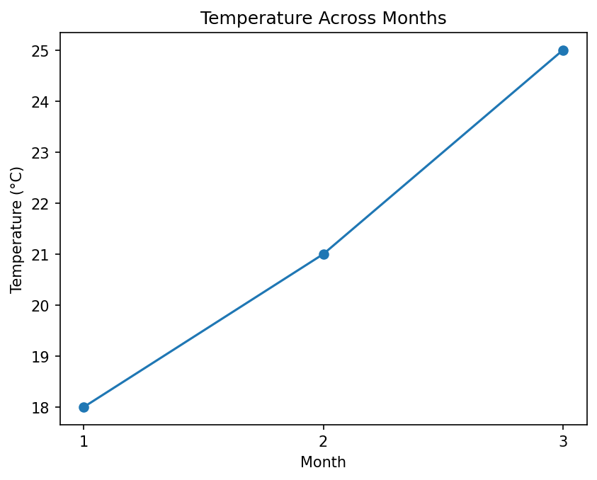

**Common Plot Types for Coordinate Data**

| Plot Type | Function |
| --- | --- |
| Line graph | `plot()` |
| Scatter plot | `scatter()` |

**Real-Life Examples of Coordinate Data**

- student marks across subjects
- monthly rainfall
- yearly population growth
- temperature across months
- company sales across years

In each example there is **one** thing that changes along the x-axis (subject, month or year) and **one** measured value for it on the y-axis.

[Back to the Table of Contents](#table-of-contents)

#### 2. Grid or Matrix Data

**Meaning**

Grid or matrix data consists of values arranged in:

- **rows**
- **columns**

Each position in the grid holds one value. To find a value, you need **two** pieces of information: its row and its column. This type of data looks like a table.

**Example**

Suppose temperature is recorded for several cities:

| City / Month | Jan | Feb | Mar |
| --- | --- | --- | --- |
| Delhi | 18 | 21 | 25 |
| Ranchi | 15 | 19 | 22 |
| Mumbai | 26 | 28 | 30 |

This can be represented in Python as a list of lists, where each inner list is one row:

```python
[
    [18, 21, 25],
    [15, 19, 22],
    [26, 28, 30]
]
```

This is called a **matrix** or **grid**. It has 3 rows and 3 columns, so its shape is (3, 3). The value 22, for example, is in row 1 (Ranchi) and column 2 (Mar), counting from 0.

**Script: Displaying the Temperature Grid**

The script below stores the table as a NumPy matrix and displays it with `imshow()`. Each cell of the matrix becomes a colored square.

**Step 1 - Import the required libraries**

```python
# Step 1 - Import the required libraries
import matplotlib.pyplot as plt   # For drawing the graph
import numpy as np                # For creating the matrix (a 2-D array)
```

**Step 2 - Create the matrix data**

```python
# Step 2 - Create the matrix data
# This is a 3 x 3 matrix. Each ROW is one city and each COLUMN is one month.
#            Jan  Feb  Mar
data = np.array([
    [18, 21, 25],    # Delhi
    [15, 19, 22],    # Ranchi
    [26, 28, 30],    # Mumbai
])
cities = ["Delhi", "Ranchi", "Mumbai"]
months = ["Jan", "Feb", "Mar"]

print("Matrix data:")
print(data)
print("Shape (rows, columns):", data.shape)
```

Output of this step:

```text
Matrix data:
[[18 21 25]
 [15 19 22]
 [26 28 30]]
Shape (rows, columns): (3, 3)
```

**Step 3 - Read one value using its row and column position**

```python
# Step 3 - Read one value using its row and column position
# Counting starts at 0, so row 1 is Ranchi and column 2 is Mar.
print()
print("Temperature in", cities[1], "in", months[2], "=", data[1, 2])
```

Output of this step:

```text

Temperature in Ranchi in Mar = 22
```

**Step 4 - Display the matrix using colors**

```python
# Step 4 - Display the matrix using colors
# imshow() gives each cell a color. The color depends on the value in that cell.
# In the default color scheme (called "viridis"), low values are dark purple
# and high values are yellow.
plt.imshow(data)
```

**Step 5 - Add a title, labels, city and month names, and a color bar**

```python
# Step 5 - Add a title, labels, city and month names, and a color bar
plt.title("Temperature Grid")
plt.xlabel("Month")
plt.ylabel("City")
plt.xticks(ticks=range(3), labels=months)    # Replace 0, 1, 2 with month names
plt.yticks(ticks=range(3), labels=cities)    # Replace 0, 1, 2 with city names
plt.colorbar(label="Temperature (°C)")      # The color bar works like a key for the colors
```

**Step 6 - Write the value inside each cell (optional, but helpful for beginners)**

```python
# Step 6 - Write the value inside each cell (optional, but helpful for beginners)
# The outer loop moves down the rows. The inner loop moves across the columns.
# Note that plt.text() takes the x-position (column) first and the y-position (row) second.
# Dark cells get white text and light cells get black text, so the numbers stay readable.
for row in range(3):
    for col in range(3):
        value = data[row, col]
        if value < 24:
            text_color = "white"
        else:
            text_color = "black"
        plt.text(col, row, value, ha="center", va="center", color=text_color)
```

**Step 7 - Display the graph**

```python
# Step 7 - Display the graph
plt.show()
```

**Complete script:**

```python
# Step 1 - Import the required libraries
import matplotlib.pyplot as plt   # For drawing the graph
import numpy as np                # For creating the matrix (a 2-D array)

# Step 2 - Create the matrix data
# This is a 3 x 3 matrix. Each ROW is one city and each COLUMN is one month.
#            Jan  Feb  Mar
data = np.array([
    [18, 21, 25],    # Delhi
    [15, 19, 22],    # Ranchi
    [26, 28, 30],    # Mumbai
])
cities = ["Delhi", "Ranchi", "Mumbai"]
months = ["Jan", "Feb", "Mar"]

print("Matrix data:")
print(data)
print("Shape (rows, columns):", data.shape)

# Step 3 - Read one value using its row and column position
# Counting starts at 0, so row 1 is Ranchi and column 2 is Mar.
print()
print("Temperature in", cities[1], "in", months[2], "=", data[1, 2])

# Step 4 - Display the matrix using colors
# imshow() gives each cell a color. The color depends on the value in that cell.
# In the default color scheme (called "viridis"), low values are dark purple
# and high values are yellow.
plt.imshow(data)

# Step 5 - Add a title, labels, city and month names, and a color bar
plt.title("Temperature Grid")
plt.xlabel("Month")
plt.ylabel("City")
plt.xticks(ticks=range(3), labels=months)    # Replace 0, 1, 2 with month names
plt.yticks(ticks=range(3), labels=cities)    # Replace 0, 1, 2 with city names
plt.colorbar(label="Temperature (°C)")      # The color bar works like a key for the colors

# Step 6 - Write the value inside each cell (optional, but helpful for beginners)
# The outer loop moves down the rows. The inner loop moves across the columns.
# Note that plt.text() takes the x-position (column) first and the y-position (row) second.
# Dark cells get white text and light cells get black text, so the numbers stay readable.
for row in range(3):
    for col in range(3):
        value = data[row, col]
        if value < 24:
            text_color = "white"
        else:
            text_color = "black"
        plt.text(col, row, value, ha="center", va="center", color=text_color)

# Step 7 - Display the graph
plt.show()
```

**Output:**

```text
Matrix data:
[[18 21 25]
 [15 19 22]
 [26 28 30]]
Shape (rows, columns): (3, 3)

Temperature in Ranchi in Mar = 22
```

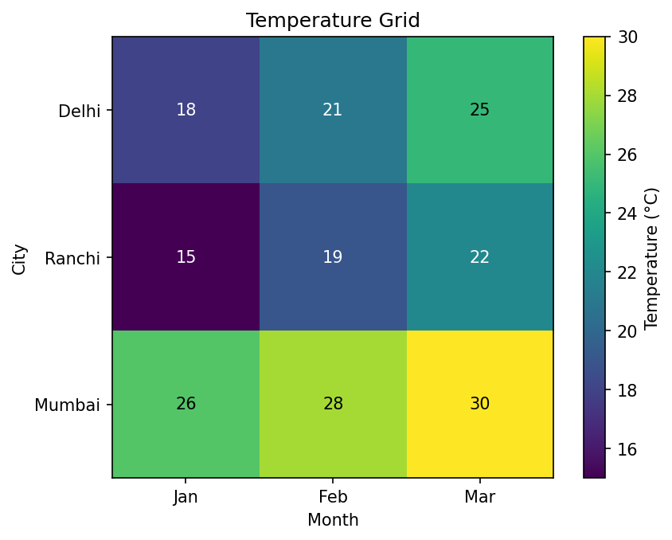

Mumbai's row is the brightest because it is the warmest city. Ranchi in January is the darkest cell because it holds the lowest value (15).

**Common Plot Types for Grid/Matrix Data**

| Plot Type | Function |
| --- | --- |
| Heat map style plot | `imshow()` |
| Contour plot | `contour()` |
| Filled contour plot | `contourf()` |

A **heat map** is a grid of colored cells in which the color shows the size of each value. See [Heat map (Wikipedia)](https://en.wikipedia.org/wiki/Heat_map).

**Real-Life Examples of Grid or Matrix Data**

- temperature across cities and months
- passenger counts across months and years
- a digital photograph, where each pixel (tiny dot of color) sits in a row and a column
- a school timetable (days as rows, periods as columns)
- a height map of land, with a height value at every point of a grid

[Back to the Table of Contents](#table-of-contents)

#### Comparison Between Coordinate Data and Grid Data

| Feature | Coordinate Data | Grid / Matrix Data |
| --- | --- | --- |
| Structure | X–Y pairs | Rows and columns |
| Example | Month vs temperature | City × Month temperature |
| Shape | Separate lists/arrays | Matrix/table |
| Values needed to locate one reading | One (the x-value) | Two (the row and the column) |
| How it is stored in Python | Two 1-D lists or arrays of the same length | One 2-D array (or a DataFrame) |
| Common Methods | `plot()`, `scatter()` | `imshow()`, `contour()` |

[Back to the Table of Contents](#table-of-contents)

#### Flowchart: Types of Plot Data

The flowchart below shows how to decide which kind of data you have and which method to use.

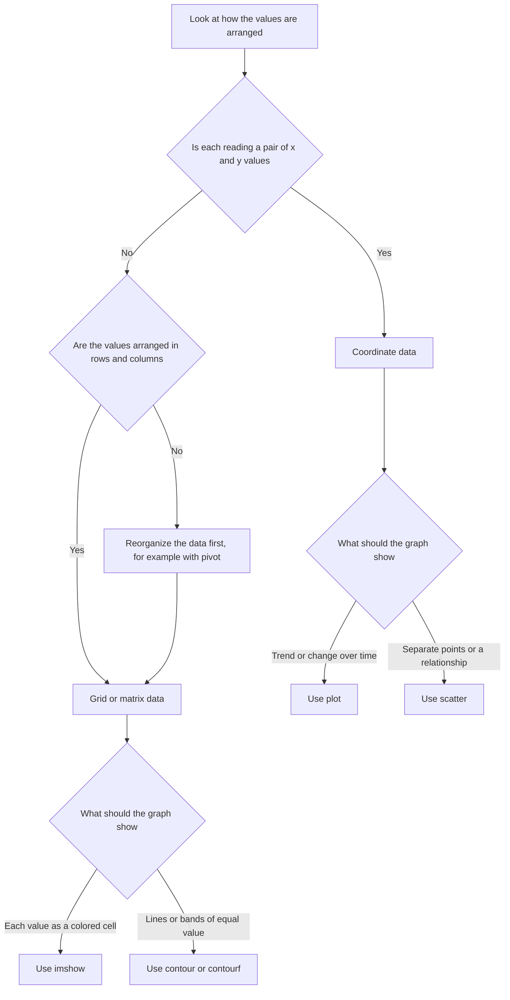

[Back to the Table of Contents](#table-of-contents)

#### Important Note on Two Variables

> **Important:**  
> Having two variables does **not automatically mean grid data**.  
> For example:  
> Month and temperature contain **two variables**, but they are usually plotted as **coordinate data**.  
> Grid data occurs when values are arranged in **rows and columns**.

A simple way to tell them apart is to count the **labels** needed to find one reading:

- "Temperature in March" needs one label (the month). This is coordinate data. Its two variables are the month and the temperature.
- "Temperature in Ranchi in March" needs two labels (the city and the month). This is grid data. It has three variables: city, month and temperature. Two of them decide the position in the grid, and the third is the value stored in the cell.

[Back to the Table of Contents](#table-of-contents)

### Answer to Q2: Purpose of plot(), scatter(), imshow() and contour()

#### 1. plot()

**Purpose**

`plot()` is used to create a **line graph**. It draws a point for each (x, y) pair and joins the points with straight lines, in the order in which they are given. See [matplotlib.pyplot.plot](https://matplotlib.org/stable/api/_as_gen/matplotlib.pyplot.plot.html).

**Kind of Data Accepted**

Coordinate data: a list or array of x-values and a list or array of y-values of the **same length**. If you give only one list, such as `plt.plot([10, 20, 15])`, Matplotlib uses it as the y-values and uses 0, 1, 2, ... as the x-values.

**Best Use**

It is useful for showing:

- trends
- growth
- increase or decrease over time

**Simplified Syntax**

```python
plt.plot(x_values, y_values)
```

**Example**

```python
# Step 1 - Import matplotlib
import matplotlib.pyplot as plt

# Step 2 - Create the data (two lists of equal length)
x = [1, 2, 3, 4]
y = [10, 20, 15, 30]
print("Points to be joined:", list(zip(x, y)))

# Step 3 - Plot the line graph
plt.plot(x, y)

# Step 4 - Add a title and labels
plt.title("A Simple Line Graph")
plt.xlabel("x values")
plt.ylabel("y values")

# Step 5 - Display the graph
plt.show()
```

**Output**

```text
Points to be joined: [(1, 10), (2, 20), (3, 15), (4, 30)]
```

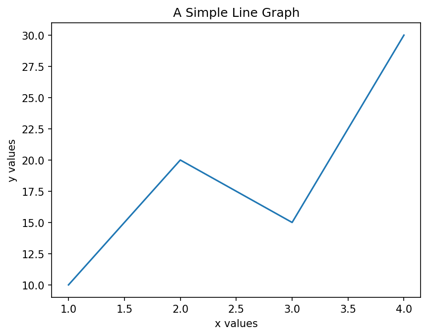

**Typical Uses**

- sales trend
- rainfall trend
- stock prices
- student performance

[Back to the Table of Contents](#table-of-contents)

#### 2. scatter()

**Purpose**

`scatter()` is used to create a **scatter plot**. It displays individual points without joining them. See [matplotlib.pyplot.scatter](https://matplotlib.org/stable/api/_as_gen/matplotlib.pyplot.scatter.html).

**Kind of Data Accepted**

Coordinate data: a list or array of x-values and a list or array of y-values of the same length. It can also accept extra lists to set the size (`s`) or color (`c`) of each point.

**Best Use**

It is useful for studying:

- relationships
- clustering (points gathering in groups)
- spread of data

**Simplified Syntax**

```python
plt.scatter(x_values, y_values)
```

**Example**

```python
# Step 1 - Import matplotlib
import matplotlib.pyplot as plt

# Step 2 - Create the data
# Each position in the two lists belongs to one person.
height = [150, 155, 160, 165]   # Height in cm
weight = [45, 50, 52, 60]       # Weight in kg
print("(height, weight) pairs:", list(zip(height, weight)))

# Step 3 - Create the scatter plot (points are NOT joined)
plt.scatter(height, weight)

# Step 4 - Add a title and labels
plt.title("Height vs Weight")
plt.xlabel("Height (cm)")
plt.ylabel("Weight (kg)")

# Step 5 - Display the graph
plt.show()
```

**Output**

```text
(height, weight) pairs: [(150, 45), (155, 50), (160, 52), (165, 60)]
```

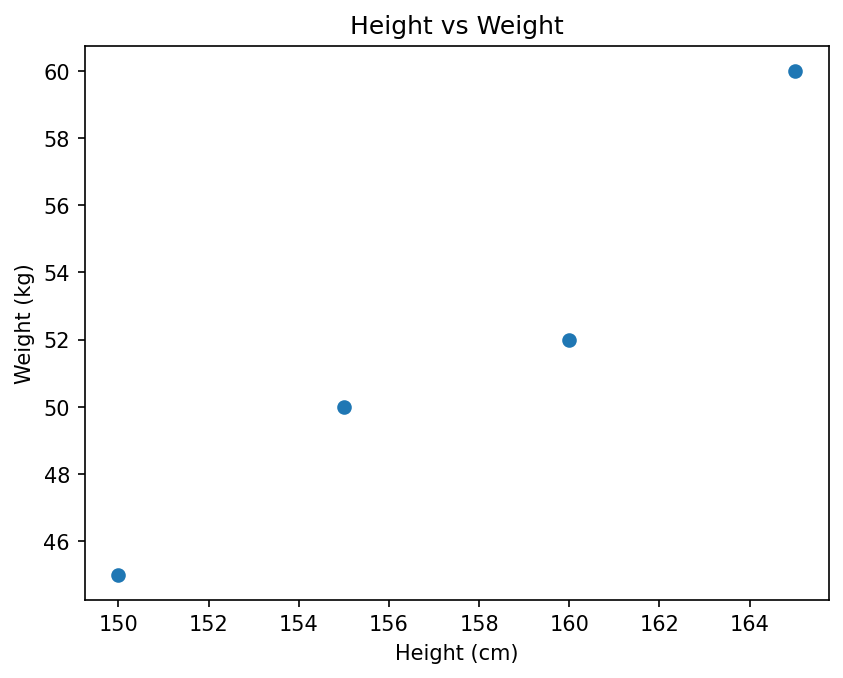

The points rise from left to right, so taller people in this small sample tend to weigh more.

**Typical Uses**

- height vs weight
- study time vs marks
- advertising cost vs sales

[Back to the Table of Contents](#table-of-contents)

#### 3. imshow()

**Purpose**

`imshow()` displays matrix values using **colors**. The name is short for "image show". Larger values and smaller values are shown with different colors. See [matplotlib.pyplot.imshow](https://matplotlib.org/stable/api/_as_gen/matplotlib.pyplot.imshow.html).

**Kind of Data Accepted**

Grid or matrix data: a 2-D array of numbers with shape (rows, columns). Each value becomes one colored square. It can also accept a 3-D array that holds the red, green and blue parts of every pixel, which is how a color photograph is stored.

**Best Use**

It is useful for:

- images
- heat maps
- matrix data

**Simplified Syntax**

```python
plt.imshow(matrix)
```

**Example**

```python
# Step 1 - Import the libraries
import matplotlib.pyplot as plt
import numpy as np

# Step 2 - Create 25 numbers from 0 to 24 in a single row (a 1-D array)
data = np.arange(25)
print("Before reshape, shape =", data.shape)

# Step 3 - Convert the single row into a matrix of 5 rows and 5 columns
data = data.reshape(5, 5)
print("After reshape, shape  =", data.shape)
print(data)

# Step 4 - Display the matrix as colors, with a color bar as the key
plt.imshow(data)
plt.colorbar()
plt.title("Numbers 0 to 24 Shown as Colors")

# Step 5 - Display the graph
plt.show()
```

**Output**

```text
Before reshape, shape = (25,)
After reshape, shape  = (5, 5)
[[ 0  1  2  3  4]
 [ 5  6  7  8  9]
 [10 11 12 13 14]
 [15 16 17 18 19]
 [20 21 22 23 24]]
```

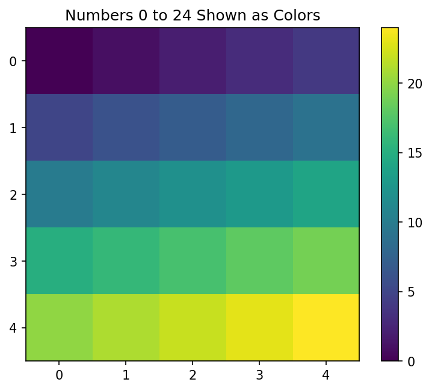

The top-left cell (0) is the darkest and the bottom-right cell (24) is the brightest, because the values increase from left to right and from top to bottom.

[Back to the Table of Contents](#table-of-contents)

#### 4. contour()

**Purpose**

`contour()` draws lines joining places that have the **same value**. These lines are called **contour lines**. You may have seen them on maps, where each line joins places at the same height above sea level. See [Contour line (Wikipedia)](https://en.wikipedia.org/wiki/Contour_line) and [matplotlib.pyplot.contour](https://matplotlib.org/stable/api/_as_gen/matplotlib.pyplot.contour.html).

A closely related method, `contourf()`, fills the space between the contour lines with color. The "f" stands for "filled". See [matplotlib.pyplot.contourf](https://matplotlib.org/stable/api/_as_gen/matplotlib.pyplot.contourf.html).

**Kind of Data Accepted**

Grid or matrix data: a 2-D array `Z` of values. Optionally, you can also give the matching x and y positions, either as two 1-D arrays or as two 2-D arrays `X` and `Y` of the same shape as `Z`. If `X` and `Y` are left out, Matplotlib uses the column numbers as x and the row numbers as y.

**Best Use**

It is useful for:

- weather maps
- height maps
- pressure maps

**Simplified Syntax**

```python
plt.contour(X, Y, Z)
```

**Example**

In this example, `np.meshgrid()` builds the grid of (x, y) positions. See [numpy.meshgrid](https://numpy.org/doc/stable/reference/generated/numpy.meshgrid.html).

```python
# Step 1 - Import the libraries
import numpy as np
import matplotlib.pyplot as plt

# Step 2 - Create 50 evenly spaced x-values and 50 y-values from -3 to 3
x = np.linspace(-3, 3, 50)
y = np.linspace(-3, 3, 50)
print("x has", len(x), "values; y has", len(y), "values")

# Step 3 - Create a coordinate grid
# meshgrid() builds two matrices. X holds the x-value of every grid point
# and Y holds the y-value of every grid point.
X, Y = np.meshgrid(x, y)
print("Shape of X:", X.shape, " Shape of Y:", Y.shape)

# Step 4 - Calculate a "height" value Z for every grid point
Z = np.sin(X) * np.cos(Y)
print("Shape of Z:", Z.shape)
print("Smallest Z:", round(Z.min(), 3), " Largest Z:", round(Z.max(), 3))

# Step 5 - Draw the contour lines and label each line with its value
lines = plt.contour(X, Y, Z)
plt.clabel(lines, fontsize=8)   # Write the value on each contour line
plt.title("Contour Plot of Z = sin(X) * cos(Y)")
plt.xlabel("X")
plt.ylabel("Y")

# Step 6 - Display the graph
plt.show()
```

**Output**

```text
x has 50 values; y has 50 values
Shape of X: (50, 50)  Shape of Y: (50, 50)
Shape of Z: (50, 50)
Smallest Z: -0.997  Largest Z: 0.997
```

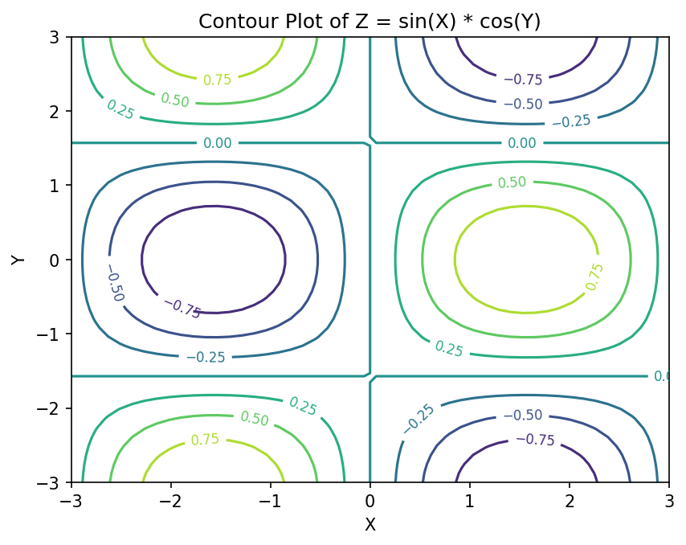

Each closed loop surrounds a "hill" (positive values) or a "valley" (negative values). The number written on each line is the value of Z all along that line.

[Back to the Table of Contents](#table-of-contents)

#### Comparison of Plotting Methods

| Method | Type of Data | Data Accepted | Best Use |
| --- | --- | --- | --- |
| `plot()` | Coordinate data | x and y lists or arrays of equal length | Trends |
| `scatter()` | Coordinate data | x and y lists or arrays of equal length | Relationships |
| `imshow()` | Matrix data | One 2-D array | Heat maps |
| `contour()` | Matrix data | One 2-D array Z, with optional X and Y | Equal-value regions |

[Back to the Table of Contents](#table-of-contents)

#### Common Beginner Error: Passing a 1-D List to imshow()

```python
# WRONG EXAMPLE
# A 1-D list is passed to imshow()
# data = [1, 2, 3, 4]
# plt.imshow(data)
# This causes an error because
# imshow() expects matrix-style data
```

The script below shows the actual error and the fix.

```python
import matplotlib.pyplot as plt
import numpy as np

# WRONG: a 1-D list has only one dimension (a single row of numbers)
data = [1, 2, 3, 4]
try:
    plt.imshow(data)
except TypeError as error:
    print("Error:", error)

# RIGHT: reshape the numbers into 2 rows and 2 columns first
data = np.array([1, 2, 3, 4]).reshape(2, 2)
print("Reshaped data:")
print(data)
plt.imshow(data)     # This works, because data is now a matrix
plt.show()
```

**Output**

```text
Error: Invalid shape (4,) for image data
Reshaped data:
[[1 2]
 [3 4]]
```

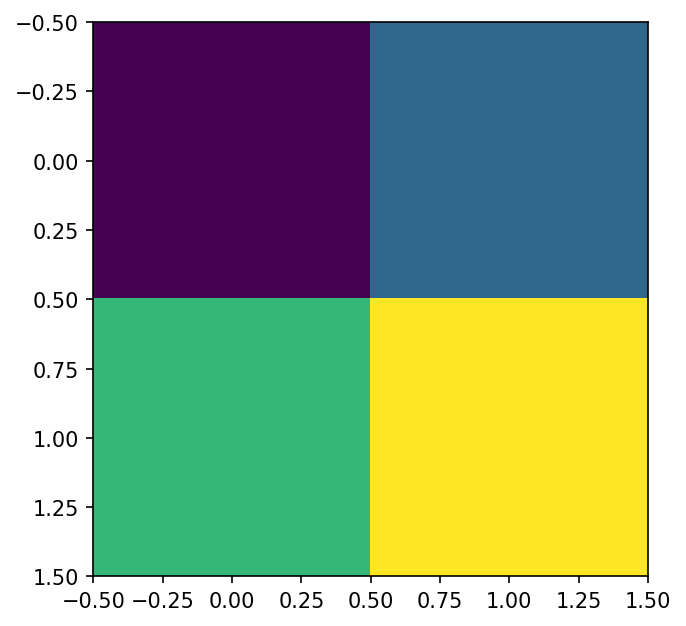

`[1, 2, 3, 4]` has shape `(4,)`, which means only one dimension. `imshow()` needs at least two dimensions (rows and columns), so it raises a `TypeError`. Reshaping the list into 2 rows and 2 columns solves the problem.

[Back to the Table of Contents](#table-of-contents)

### Answer to Q3: Role of Matrix Slicing in NumPy

#### Meaning of Matrix Slicing

Matrix slicing means **extracting a selected portion of a matrix**.

Sometimes the entire matrix is not required.

A programmer may need:

- only selected rows
- only selected columns
- a smaller section of data

Instead of manually copying values, NumPy allows easy extraction using **slicing**. A slice is written inside square brackets and uses a colon `:` to give a range of positions. See [Indexing on ndarrays (NumPy)](https://numpy.org/doc/stable/user/basics.indexing.html).

[Back to the Table of Contents](#table-of-contents)

#### Why Matrix Slicing Is Important

Matrix slicing is useful because:

- it helps focus on selected data
- it reduces unnecessary processing
- it allows comparison of specific regions
- it makes visualization easier

For example:

Suppose passenger data is available from:

**1949 to 1960**

But analysis is required only for:

**1952 to 1958**

Instead of using the complete dataset, only the required rows may be extracted. This is exactly what Task 3 of Part B does.

[Back to the Table of Contents](#table-of-contents)

#### Example Matrix

Suppose the following matrix is given:

```python
# Step 1 - Import NumPy
import numpy as np

# Step 2 - Create the numbers 0 to 24 and arrange them as a 5 x 5 matrix
A = np.arange(25)
A = A.reshape(5, 5)

# Step 3 - Display the matrix
print("Matrix A:")
print(A)
```

**Output**

```text
Matrix A:
[[ 0  1  2  3  4]
 [ 5  6  7  8  9]
 [10 11 12 13 14]
 [15 16 17 18 19]
 [20 21 22 23 24]]
```

`np.arange(25)` creates the numbers 0 to 24 in a single row. `reshape(5, 5)` arranges them into 5 rows and 5 columns. See [numpy.arange](https://numpy.org/doc/stable/reference/generated/numpy.arange.html) and [numpy.reshape](https://numpy.org/doc/stable/reference/generated/numpy.reshape.html).

The same matrix with its row and column index numbers written in:

| | Col 0 | Col 1 | Col 2 | Col 3 | Col 4 |
| --- | --- | --- | --- | --- | --- |
| **Row 0** | 0 | 1 | 2 | 3 | 4 |
| **Row 1** | 5 | 6 | 7 | 8 | 9 |
| **Row 2** | 10 | 11 | 12 | 13 | 14 |
| **Row 3** | 15 | 16 | 17 | 18 | 19 |
| **Row 4** | 20 | 21 | 22 | 23 | 24 |

[Back to the Table of Contents](#table-of-contents)

#### General Syntax of Matrix Slicing

```python
matrix[row_start:row_end, column_start:column_end]
```

The part **before** the comma selects rows. The part **after** the comma selects columns.

**Meaning of Terms**

| Part | Meaning | If left out |
| --- | --- | --- |
| row_start | Starting row index (included) | Starts from the first row (row 0) |
| row_end | Ending row index (excluded) | Goes up to and including the last row |
| column_start | Starting column index (included) | Starts from the first column (column 0) |
| column_end | Ending column index (excluded) | Goes up to and including the last column |

A colon on its own, `:`, leaves out both the start and the end, so it means **everything** along that direction.

**How to write a slice, step by step:**

1. Decide the first and last row you want. Write the first row index as `row_start`.
2. Add 1 to the last row index and write it as `row_end`, because the end is not included.
3. Do the same for columns, or write `:` if you want all columns.
4. Put the row part and the column part inside square brackets, separated by a comma.
5. Print the result and check its shape.

[Back to the Table of Contents](#table-of-contents)

#### Example 1: Extract Selected Rows

```python
# Example 1 - Extract rows 1, 2 and 3 (all columns)
B = A[1:4, :]
print("A[1:4, :]")
print(B)
```

**Explanation**

`1:4` means:

- start at row index **1**
- stop before row index **4**

So rows 1, 2 and 3 are selected.

`:` means:

> select all columns

**Output**

```text
A[1:4, :]
[[ 5  6  7  8  9]
 [10 11 12 13 14]
 [15 16 17 18 19]]
```

[Back to the Table of Contents](#table-of-contents)

#### Example 2: Extract Selected Columns

```python
# Example 2 - Extract columns 1, 2 and 3 (all rows)
B = A[:, 1:4]
print("A[:, 1:4]")
print(B)
```

**Explanation**

`:` before the comma means: all rows

`1:4` after the comma means: columns 1, 2 and 3 (column 4 is not included)

**Output**

```text
A[:, 1:4]
[[ 1  2  3]
 [ 6  7  8]
 [11 12 13]
 [16 17 18]
 [21 22 23]]
```

[Back to the Table of Contents](#table-of-contents)

#### Example 3: Extract a Smaller Matrix

```python
# Example 3 - Extract the middle section: rows 1 to 3 and columns 1 to 3
B = A[1:4, 1:4]
print("A[1:4, 1:4]")
print(B)
```

**Explanation**

`1:4` before the comma selects rows 1, 2 and 3. `1:4` after the comma selects columns 1, 2 and 3. The result is the 3 × 3 block in the middle of the matrix, shown in bold below.

| | Col 0 | Col 1 | Col 2 | Col 3 | Col 4 |
| --- | --- | --- | --- | --- | --- |
| **Row 0** | 0 | 1 | 2 | 3 | 4 |
| **Row 1** | 5 | **6** | **7** | **8** | 9 |
| **Row 2** | 10 | **11** | **12** | **13** | 14 |
| **Row 3** | 15 | **16** | **17** | **18** | 19 |
| **Row 4** | 20 | 21 | 22 | 23 | 24 |

**Output**

```text
A[1:4, 1:4]
[[ 6  7  8]
 [11 12 13]
 [16 17 18]]
```

**All four blocks above as one script:**

```python
# Step 1 - Import NumPy
import numpy as np

# Step 2 - Create the numbers 0 to 24 and arrange them as a 5 x 5 matrix
A = np.arange(25)
A = A.reshape(5, 5)

# Step 3 - Display the matrix
print("Matrix A:")
print(A)
# Example 1 - Extract rows 1, 2 and 3 (all columns)
B = A[1:4, :]
print("A[1:4, :]")
print(B)
# Example 2 - Extract columns 1, 2 and 3 (all rows)
B = A[:, 1:4]
print("A[:, 1:4]")
print(B)
# Example 3 - Extract the middle section: rows 1 to 3 and columns 1 to 3
B = A[1:4, 1:4]
print("A[1:4, 1:4]")
print(B)
```

[Back to the Table of Contents](#table-of-contents)

#### Flowchart: Matrix Slicing

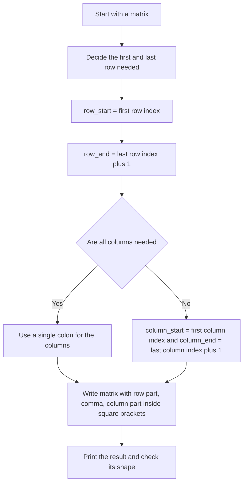

[Back to the Table of Contents](#table-of-contents)

#### Small Concept Script

```python
# Step 1 - Import NumPy
import numpy as np

# Step 2 - Create the numbers 0 to 35
matrix = np.arange(36)

# Step 3 - Convert them into a 6 x 6 matrix
matrix = matrix.reshape(6, 6)

# Step 4 - Display the full matrix
print("Original Matrix")
print(matrix)

# Step 5 - Slice a smaller section
# Rows 2, 3, 4 (stop before 5) and columns 1, 2, 3 (stop before 4)
small_matrix = matrix[2:5, 1:4]

# Step 6 - Display the sliced matrix and compare the shapes
print()
print("Sliced Matrix")
print(small_matrix)
print()
print("Shape of original matrix:", matrix.shape)
print("Shape of sliced matrix  :", small_matrix.shape)
```

**Output**

```text
Original Matrix
[[ 0  1  2  3  4  5]
 [ 6  7  8  9 10 11]
 [12 13 14 15 16 17]
 [18 19 20 21 22 23]
 [24 25 26 27 28 29]
 [30 31 32 33 34 35]]

Sliced Matrix
[[13 14 15]
 [19 20 21]
 [25 26 27]]

Shape of original matrix: (6, 6)
Shape of sliced matrix  : (3, 3)
```

Rows 2, 3 and 4 and columns 1, 2 and 3 are selected, so the sliced matrix has shape (3, 3).

[Back to the Table of Contents](#table-of-contents)

#### Common Beginner Error: Index Out of Range

```python
# WRONG EXAMPLE
# Trying to access invalid index
# matrix = np.arange(25).reshape(5, 5)
# print(matrix[10])
# IndexError occurs because
# row 10 does not exist
```

The script below shows the actual error message, the correct way to reach the last row, and one point that often surprises beginners.

```python
import numpy as np

matrix = np.arange(25).reshape(5, 5)   # Valid row positions are 0, 1, 2, 3, 4

# WRONG: row 10 does not exist
try:
    print(matrix[10])
except IndexError as error:
    print("Error:", error)

# RIGHT: the last row can be reached with index 4, or with -1
print("Last row using index 4 :", matrix[4])
print("Last row using index -1:", matrix[-1])

# Note: a SLICE that goes past the end does not cause an error.
# NumPy simply stops at the last row.
print("matrix[3:10] gives:")
print(matrix[3:10])
```

**Output**

```text
Error: index 10 is out of bounds for axis 0 with size 5
Last row using index 4 : [20 21 22 23 24]
Last row using index -1: [20 21 22 23 24]
matrix[3:10] gives:
[[15 16 17 18 19]
 [20 21 22 23 24]]
```

A 5 × 5 matrix has rows 0 to 4 only, so `matrix[10]` raises an `IndexError`. A **slice** such as `matrix[3:10]` is more forgiving: it does not raise an error, but simply stops at the last available row. A negative index counts from the end, so `-1` means the last row.

[Back to the Table of Contents](#table-of-contents)

#### Important Note: The Ending Index Is Not Included

> **Remember:**  
> In slicing, the ending index is **not included**.

Example: `A[1:4]` means rows `1, 2, 3`, not `1, 2, 3, 4`.

A handy check: the number of rows selected is always `row_end - row_start`. For `A[1:4]`, that is 4 - 1 = 3 rows.

[Back to the Table of Contents](#table-of-contents)

#### Follow-up Questions on Slicing

Use the 5 × 5 matrix `A` from the examples above.

**Question 3.1:** What do `A[2, 3]`, `A[2]` and `A[:, 0]` give?

<details>
<summary>Show answer</summary>

Step 1 - `A[2, 3]` has no colons, so it picks a single value: row 2, column 3, which is 13.

Step 2 - `A[2]` gives only a row number, so it picks the whole of row 2.

Step 3 - `A[:, 0]` takes all rows but only column 0, so it picks the first column.

</details>

**Question 3.2:** How would you extract the bottom-right 2 × 2 corner without counting the size of the matrix?

<details>
<summary>Show answer</summary>

Use negative indexes. `-2:` means "from the second-last position to the end". So `A[-2:, -2:]` gives the last two rows and the last two columns.

</details>

**Question 3.3:** A slice can have a third number, the step, as in `start:end:step`. What does `A[::2, ::2]` give?

<details>
<summary>Show answer</summary>

`::2` means "from the start to the end, taking every second item". So `A[::2, ::2]` takes rows 0, 2, 4 and columns 0, 2, 4.

</details>

The script below checks all three answers.

```python
import numpy as np
A = np.arange(25).reshape(5, 5)
print("A[2, 3]     =", A[2, 3])
print("A[2]        =", A[2])
print("A[:, 0]     =", A[:, 0])
print("A[-2:, -2:] =")
print(A[-2:, -2:])
print("A[::2, ::2] =")
print(A[::2, ::2])
```

**Output**

```text
A[2, 3]     = 13
A[2]        = [10 11 12 13 14]
A[:, 0]     = [ 0  5 10 15 20]
A[-2:, -2:] =
[[18 19]
 [23 24]]
A[::2, ::2] =
[[ 0  2  4]
 [10 12 14]
 [20 22 24]]
```

[Back to the Table of Contents](#table-of-contents)

### Comparison of the Four Methods

#### Compare the Following Methods in Tabular Form

| Method | Type of Data | Main Purpose | Typical Use |
| --- | --- | --- | --- |
| `plot()` | Coordinate Data | Draws line graph | Trends over time |
| `scatter()` | Coordinate Data | Shows separate points | Relationship analysis |
| `imshow()` | Grid / Matrix Data | Displays values using colors | Heat maps, images |
| `contour()` | Grid / Matrix Data | Draws equal-value lines | Weather and height maps |

[Back to the Table of Contents](#table-of-contents)

#### Additional Comparison

| Feature | `plot()` | `scatter()` | `imshow()` | `contour()` |
| --- | --- | --- | --- | --- |
| Joins points | Yes | No | No | No |
| Uses colors | Limited | Limited | Yes | Yes |
| Matrix data | No | No | Yes | Yes |
| Best for | Trends | Relationships | Heat maps | Regions/levels |

"Limited" use of color means that `plot()` and `scatter()` normally draw in one color per line or per set of points. `scatter()` can color each point separately if you give it a `c` argument, but color is not its main way of showing values. In `imshow()` and `contour()`, color is the main way of showing the values.

[Back to the Table of Contents](#table-of-contents)

## Solution to Part B

The six tasks follow one path. The flights data starts as a long table, is reshaped into a matrix, is sliced, and is then plotted in two different ways.

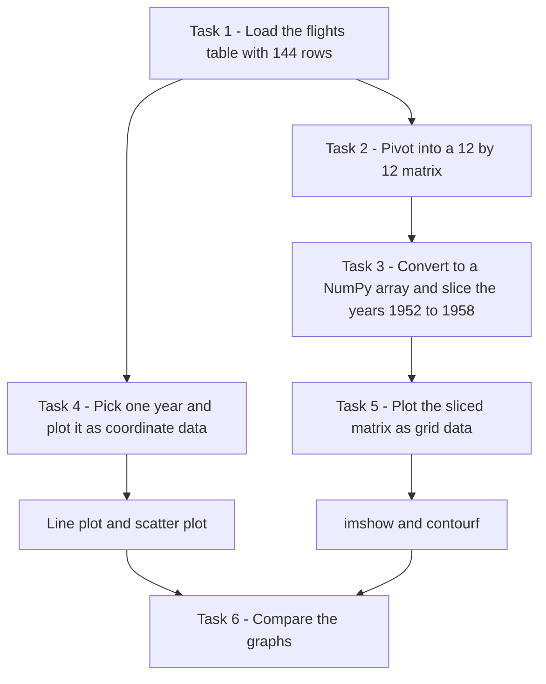

[Back to the Table of Contents](#table-of-contents)

### Solution to Task 1: Load the Dataset

**Objective**

To load the **flights dataset** from Seaborn and understand its columns.

The flights dataset records the number of passengers (in thousands) who travelled each month with an airline from January 1949 to December 1960. It is a classic dataset, made famous by the statisticians Box and Jenkins in their book on time series analysis. A **time series** is a set of values recorded one after another over time. See [Time series (Wikipedia)](https://en.wikipedia.org/wiki/Time_series).

**Script, step by step**

**Step 1 - Import the required library**

```python
# Step 1 - Import the required library
# Seaborn comes with several practice datasets, including 'flights'.
import seaborn as sns
```

**Step 2 - Load the flights dataset**

```python
# Step 2 - Load the flights dataset
# This dataset contains monthly passenger counts for an airline from 1949 to 1960.
# It is loaded as a pandas DataFrame (a table with rows and columns).
df = sns.load_dataset("flights")
```

**Step 3 - Display the first five rows**

```python
# Step 3 - Display the first five rows
# head() shows the top five rows, so we get a quick look at the structure of the data.
print(df.head())
```

Output of this step:

```text
   year month  passengers
0  1949   Jan         112
1  1949   Feb         118
2  1949   Mar         132
3  1949   Apr         129
4  1949   May         121
```

**Step 4 - Display the column names, the size of the table and the data type of each column**

```python
# Step 4 - Display the column names, the size of the table and the data type of each column
print()
print(df.columns)
print()
print("Number of rows and columns:", df.shape)
print()
print(df.dtypes)
```

Output of this step:

```text

Index(['year', 'month', 'passengers'], dtype='str')

Number of rows and columns: (144, 3)

year             int64
month         category
passengers       int64
dtype: object
```

**Step 5 - Look at the range of values in each column**

```python
# Step 5 - Look at the range of values in each column
print()
print("First year :", df["year"].min())
print("Last year  :", df["year"].max())
print("Months     :", list(df["month"].unique()))
print("Fewest passengers in a month:", df["passengers"].min())
print("Most passengers in a month  :", df["passengers"].max())
```

Output of this step:

```text

First year : 1949
Last year  : 1960
Months     : ['Jan', 'Feb', 'Mar', 'Apr', 'May', 'Jun', 'Jul', 'Aug', 'Sep', 'Oct', 'Nov', 'Dec']
Fewest passengers in a month: 104
Most passengers in a month  : 622
```

**Complete script for Task 1**

```python
# Step 1 - Import the required library
# Seaborn comes with several practice datasets, including 'flights'.
import seaborn as sns

# Step 2 - Load the flights dataset
# This dataset contains monthly passenger counts for an airline from 1949 to 1960.
# It is loaded as a pandas DataFrame (a table with rows and columns).
df = sns.load_dataset("flights")

# Step 3 - Display the first five rows
# head() shows the top five rows, so we get a quick look at the structure of the data.
print(df.head())

# Step 4 - Display the column names, the size of the table and the data type of each column
print()
print(df.columns)
print()
print("Number of rows and columns:", df.shape)
print()
print(df.dtypes)

# Step 5 - Look at the range of values in each column
print()
print("First year :", df["year"].min())
print("Last year  :", df["year"].max())
print("Months     :", list(df["month"].unique()))
print("Fewest passengers in a month:", df["passengers"].min())
print("Most passengers in a month  :", df["passengers"].max())
```

**Output**

```text
   year month  passengers
0  1949   Jan         112
1  1949   Feb         118
2  1949   Mar         132
3  1949   Apr         129
4  1949   May         121

Index(['year', 'month', 'passengers'], dtype='str')

Number of rows and columns: (144, 3)

year             int64
month         category
passengers       int64
dtype: object

First year : 1949
Last year  : 1960
Months     : ['Jan', 'Feb', 'Mar', 'Apr', 'May', 'Jun', 'Jul', 'Aug', 'Sep', 'Oct', 'Nov', 'Dec']
Fewest passengers in a month: 104
Most passengers in a month  : 622
```

**Explanation of Columns**

| Column | Meaning | Data type in pandas | Example |
| --- | --- | --- | --- |
| year | Year of travel | Whole number (`int64`) | 1949 |
| month | Month name | Category (`category`), with its categories listed in calendar order | Jan |
| passengers | Number of passengers who flew in that month, in thousands | Whole number (`int64`) | 112 |

**Understanding the output**

- The dataset has **144 rows**, because it covers 12 years × 12 months.
- The numbers 0, 1, 2, ... on the left of the first output are the **row index** created by pandas. They are row labels, not a column of data.
- The `month` column is stored as a **category**. A category column remembers its list of allowed values and their order (Jan to Dec). This matters in Task 2. See [Categorical data (pandas)](https://pandas.pydata.org/docs/user_guide/categorical.html).
- The data is in **long form**: each row holds just one reading. This is the natural shape for coordinate data, but not for grid data.

[Back to the Table of Contents](#table-of-contents)

### Solution to Task 2: Convert Data into Matrix Form

**Objective**

To convert tabular data into **grid or matrix form**.

**Why Conversion Is Needed**

Methods such as `imshow()` and `contour()` work with matrix-style data.

The flights dataset is originally stored in **long table form**, with one row for each month of each year.

It must first be converted into:

- rows → years
- columns → months
- values → passengers

The pandas method `pivot()` does this. It takes one column for the row labels, one column for the column labels, and one column for the values that fill the cells. See [pandas DataFrame.pivot](https://pandas.pydata.org/docs/reference/api/pandas.DataFrame.pivot.html).


The small table below shows what `pivot()` does with the first two months of 1949 and 1950.

| Long form (before) | | | → | Matrix form (after) | | |
| --- | --- | --- | --- | --- | --- | --- |
| **year** | **month** | **passengers** | | **year** | **Jan** | **Feb** |
| 1949 | Jan | 112 | | 1949 | 112 | 118 |
| 1949 | Feb | 118 | | 1950 | 115 | 126 |
| 1950 | Jan | 115 | | | | |
| 1950 | Feb | 126 | | | | |

**Script, step by step**

**Step 1 - Import the library**

```python
# Step 1 - Import the library
import seaborn as sns
```

**Step 2 - Load the dataset**

```python
# Step 2 - Load the dataset
# The 'flights' dataset is in "long" form: one row for every month of every year.
df = sns.load_dataset("flights")
print("Shape of the original table:", df.shape)
```

Output of this step:

```text
Shape of the original table: (144, 3)
```

**Step 3 - Convert the table into matrix form using pivot()**

```python
# Step 3 - Convert the table into matrix form using pivot()
# pivot() reshapes the table so that:
#   index="year"         -> each unique year becomes one ROW
#   columns="month"      -> each unique month becomes one COLUMN
#   values="passengers"  -> the passenger count fills each cell
flights_matrix = df.pivot(
    index="year",          # Rows: 1949 to 1960
    columns="month",       # Columns: Jan to Dec
    values="passengers",   # Cell values: number of passengers
)
```

**Step 4 - Display the matrix and its shape**

```python
# Step 4 - Display the matrix and its shape
print(flights_matrix)
print()
print("Shape of the matrix (rows, columns):", flights_matrix.shape)
```

Output of this step:

```text
month  Jan  Feb  Mar  Apr  May  Jun  Jul  Aug  Sep  Oct  Nov  Dec
year                                                             
1949   112  118  132  129  121  135  148  148  136  119  104  118
1950   115  126  141  135  125  149  170  170  158  133  114  140
1951   145  150  178  163  172  178  199  199  184  162  146  166
1952   171  180  193  181  183  218  230  242  209  191  172  194
1953   196  196  236  235  229  243  264  272  237  211  180  201
1954   204  188  235  227  234  264  302  293  259  229  203  229
1955   242  233  267  269  270  315  364  347  312  274  237  278
1956   284  277  317  313  318  374  413  405  355  306  271  306
1957   315  301  356  348  355  422  465  467  404  347  305  336
1958   340  318  362  348  363  435  491  505  404  359  310  337
1959   360  342  406  396  420  472  548  559  463  407  362  405
1960   417  391  419  461  472  535  622  606  508  461  390  432

Shape of the matrix (rows, columns): (12, 12)
```

**Step 5 - Read one value from the matrix using labels**

```python
# Step 5 - Read one value from the matrix using labels
# .loc[row_label, column_label] picks one cell by its year and month.
print()
print("Passengers in July 1955:", flights_matrix.loc[1955, "Jul"])
```

Output of this step:

```text

Passengers in July 1955: 364
```

**Complete script for Task 2**

```python
# Step 1 - Import the library
import seaborn as sns

# Step 2 - Load the dataset
# The 'flights' dataset is in "long" form: one row for every month of every year.
df = sns.load_dataset("flights")
print("Shape of the original table:", df.shape)

# Step 3 - Convert the table into matrix form using pivot()
# pivot() reshapes the table so that:
#   index="year"         -> each unique year becomes one ROW
#   columns="month"      -> each unique month becomes one COLUMN
#   values="passengers"  -> the passenger count fills each cell
flights_matrix = df.pivot(
    index="year",          # Rows: 1949 to 1960
    columns="month",       # Columns: Jan to Dec
    values="passengers",   # Cell values: number of passengers
)

# Step 4 - Display the matrix and its shape
print(flights_matrix)
print()
print("Shape of the matrix (rows, columns):", flights_matrix.shape)

# Step 5 - Read one value from the matrix using labels
# .loc[row_label, column_label] picks one cell by its year and month.
print()
print("Passengers in July 1955:", flights_matrix.loc[1955, "Jul"])
```

**Output**

```text
Shape of the original table: (144, 3)
month  Jan  Feb  Mar  Apr  May  Jun  Jul  Aug  Sep  Oct  Nov  Dec
year                                                             
1949   112  118  132  129  121  135  148  148  136  119  104  118
1950   115  126  141  135  125  149  170  170  158  133  114  140
1951   145  150  178  163  172  178  199  199  184  162  146  166
1952   171  180  193  181  183  218  230  242  209  191  172  194
1953   196  196  236  235  229  243  264  272  237  211  180  201
1954   204  188  235  227  234  264  302  293  259  229  203  229
1955   242  233  267  269  270  315  364  347  312  274  237  278
1956   284  277  317  313  318  374  413  405  355  306  271  306
1957   315  301  356  348  355  422  465  467  404  347  305  336
1958   340  318  362  348  363  435  491  505  404  359  310  337
1959   360  342  406  396  420  472  548  559  463  407  362  405
1960   417  391  419  461  472  535  622  606  508  461  390  432

Shape of the matrix (rows, columns): (12, 12)

Passengers in July 1955: 364
```

**Understanding the output**

- The words `month` (top-left) and `year` (on the line below) are the names of the column labels and the row labels. They are not part of the data.
- Every cell is the passenger count for one year and one month. For example, the cell in row 1955 and column Jul holds 364.
- The months appear in calendar order (Jan to Dec) because the `month` column is a category column with that order. If `month` were plain text, pandas would sort the columns alphabetically (Apr, Aug, Dec, ...), and the graphs in Task 5 would jump around the calendar.
- Reading **across** a row shows how travel changes through the months of one year. Reading **down** a column shows how travel in one month grows over the years.

[Back to the Table of Contents](#table-of-contents)

### Solution to Task 3: Matrix Slicing

**Objective**

To extract only selected years (1952 to 1958) from the flights matrix.

**Plan**

1. Build the matrix as in Task 2.
2. Convert it into a NumPy array, so that rows and columns can be selected by position.
3. Find the row positions of 1952 and 1958.
4. Write the slice, remembering that the end position is not included.
5. Check the result.

**Script, step by step**

**Step 1 - Import the library and load the dataset**

```python
# Step 1 - Import the library and load the dataset
import seaborn as sns

df = sns.load_dataset("flights")
```

**Step 2 - Convert the data into matrix form (years as rows, months as columns)**

```python
# Step 2 - Convert the data into matrix form (years as rows, months as columns)
flights_matrix = df.pivot(
    index="year",          # Rows: years
    columns="month",       # Columns: months
    values="passengers",   # Cell values: passenger counts
)
```

**Step 3 - Convert the pandas table into a NumPy array**

```python
# Step 3 - Convert the pandas table into a NumPy array
# NumPy arrays use pure position numbers for slicing, in the form [rows, columns].
# The year and month labels are dropped; only the numbers remain.
data = flights_matrix.to_numpy()
print("Shape of the NumPy array:", data.shape)
```

Output of this step:

```text
Shape of the NumPy array: (12, 12)
```

**Step 4 - Find the row index (position) of each year**

```python
# Step 4 - Find the row index (position) of each year
# enumerate() gives a counter (0, 1, 2, ...) along with each year.
print()
print("Row index -> Year")
for position, year in enumerate(flights_matrix.index):
    print(f"   {position:2d}     -> {year}")
```

Output of this step:

```text

Row index -> Year
    0     -> 1949
    1     -> 1950
    2     -> 1951
    3     -> 1952
    4     -> 1953
    5     -> 1954
    6     -> 1955
    7     -> 1956
    8     -> 1957
    9     -> 1958
   10     -> 1959
   11     -> 1960
```

**Step 5 - Slice the rows for the years 1952 to 1958**

```python
# Step 5 - Slice the rows for the years 1952 to 1958
# 1952 is at row index 3 and 1958 is at row index 9.
# The end of a slice is NOT included, so we must write 10 (one more than 9).
# The ':' after the comma means "all columns" (all 12 months).
selected_data = data[3:10, :]

print()
print("Sliced data (years 1952 to 1958, all months):")
print(selected_data)
print()
print("Shape of the sliced data:", selected_data.shape)
```

Output of this step:

```text

Sliced data (years 1952 to 1958, all months):
[[171 180 193 181 183 218 230 242 209 191 172 194]
 [196 196 236 235 229 243 264 272 237 211 180 201]
 [204 188 235 227 234 264 302 293 259 229 203 229]
 [242 233 267 269 270 315 364 347 312 274 237 278]
 [284 277 317 313 318 374 413 405 355 306 271 306]
 [315 301 356 348 355 422 465 467 404 347 305 336]
 [340 318 362 348 363 435 491 505 404 359 310 337]]

Shape of the sliced data: (7, 12)
```

**Step 6 - Check which years were selected**

```python
# Step 6 - Check which years were selected
# Slicing the index (the list of years) in the same way confirms our choice.
selected_years = flights_matrix.index[3:10]
print()
print("Years selected:", list(selected_years))
```

Output of this step:

```text

Years selected: [1952, 1953, 1954, 1955, 1956, 1957, 1958]
```

**Complete script for Task 3**

```python
# Step 1 - Import the library and load the dataset
import seaborn as sns

df = sns.load_dataset("flights")

# Step 2 - Convert the data into matrix form (years as rows, months as columns)
flights_matrix = df.pivot(
    index="year",          # Rows: years
    columns="month",       # Columns: months
    values="passengers",   # Cell values: passenger counts
)

# Step 3 - Convert the pandas table into a NumPy array
# NumPy arrays use pure position numbers for slicing, in the form [rows, columns].
# The year and month labels are dropped; only the numbers remain.
data = flights_matrix.to_numpy()
print("Shape of the NumPy array:", data.shape)

# Step 4 - Find the row index (position) of each year
# enumerate() gives a counter (0, 1, 2, ...) along with each year.
print()
print("Row index -> Year")
for position, year in enumerate(flights_matrix.index):
    print(f"   {position:2d}     -> {year}")

# Step 5 - Slice the rows for the years 1952 to 1958
# 1952 is at row index 3 and 1958 is at row index 9.
# The end of a slice is NOT included, so we must write 10 (one more than 9).
# The ':' after the comma means "all columns" (all 12 months).
selected_data = data[3:10, :]

print()
print("Sliced data (years 1952 to 1958, all months):")
print(selected_data)
print()
print("Shape of the sliced data:", selected_data.shape)

# Step 6 - Check which years were selected
# Slicing the index (the list of years) in the same way confirms our choice.
selected_years = flights_matrix.index[3:10]
print()
print("Years selected:", list(selected_years))
```

**Output**

```text
Shape of the NumPy array: (12, 12)

Row index -> Year
    0     -> 1949
    1     -> 1950
    2     -> 1951
    3     -> 1952
    4     -> 1953
    5     -> 1954
    6     -> 1955
    7     -> 1956
    8     -> 1957
    9     -> 1958
   10     -> 1959
   11     -> 1960

Sliced data (years 1952 to 1958, all months):
[[171 180 193 181 183 218 230 242 209 191 172 194]
 [196 196 236 235 229 243 264 272 237 211 180 201]
 [204 188 235 227 234 264 302 293 259 229 203 229]
 [242 233 267 269 270 315 364 347 312 274 237 278]
 [284 277 317 313 318 374 413 405 355 306 271 306]
 [315 301 356 348 355 422 465 467 404 347 305 336]
 [340 318 362 348 363 435 491 505 404 359 310 337]]

Shape of the sliced data: (7, 12)

Years selected: [1952, 1953, 1954, 1955, 1956, 1957, 1958]
```

**Explanation**

- `3:10` selects rows `3 to 9`, since the ending index is excluded.
- Row 3 is 1952 and row 9 is 1958, so these are exactly the years we want.
- `:` means: all columns.
- Thus `data[3:10, :]` means: select rows 3 to 9 and all columns.
- The result has shape `(7, 12)`: 7 years and 12 months. As a check, 10 - 3 = 7 rows.

| Row index | 0 | 1 | 2 | **3** | **4** | **5** | **6** | **7** | **8** | **9** | 10 | 11 |
| --- | --- | --- | --- | --- | --- | --- | --- | --- | --- | --- | --- | --- |
| Year | 1949 | 1950 | 1951 | **1952** | **1953** | **1954** | **1955** | **1956** | **1957** | **1958** | 1959 | 1960 |
| Selected by `3:10`? | No | No | No | Yes | Yes | Yes | Yes | Yes | Yes | Yes | No | No |

**Why convert to a NumPy array?**

A NumPy array is sliced purely by position, using the `[rows, columns]` form from Q3. A pandas DataFrame works differently. Putting two slices inside its square brackets is not allowed. pandas has its own tools for this instead:

| What you want | NumPy array `data` | pandas DataFrame `flights_matrix` |
| --- | --- | --- |
| Rows by position | `data[3:10, :]` | `flights_matrix.iloc[3:10, :]` |
| Rows by label | Not possible (no labels) | `flights_matrix.loc[1952:1958, :]` |
| Keeps year and month labels | No | Yes |

Note that `.loc` includes **both** ends (1952 and 1958), while position-based slicing with `[3:10]` or `.iloc[3:10]` leaves out the end. See [pandas indexing and selecting data](https://pandas.pydata.org/docs/user_guide/indexing.html).

**Common Error Example**

```python
# WRONG EXAMPLE
# Missing conversion to NumPy array
# sliced = flights_matrix[3:10, :]
# This produces an error
# because DataFrame indexing works differently
```

With pandas 3.0, this line raises an `InvalidIndexError`. Older versions also raise an error, though its name and message may differ. The fix is either to convert to NumPy first, as in the script, or to use `flights_matrix.iloc[3:10, :]`.

[Back to the Table of Contents](#table-of-contents)

### Solution to Task 4: Plot Coordinate Data

**Objective**

To create:

1. a **line graph using `plot()`**
2. a **scatter plot using `scatter()`**

using data for one selected year from the flights dataset.

[Back to the Table of Contents](#table-of-contents)

#### Why Task 4 Is Important

The flights dataset stores passenger information for:

- different years
- different months

When one year is selected, for example 1955:

| Month | Passengers |
| --- | --- |
| Jan | 242 |
| Feb | 233 |
| Mar | 267 |
| ... | ... |

the data becomes **coordinate data (X–Y data)**. Only one label (the month) is needed to find each value.

Here:

- x-axis → months
- y-axis → passenger count

This type of data can be plotted using:

```python
plot()
scatter()
```

The script is written in three steps. Each step continues from the previous one, so run them in order (or use the complete script given after the steps).

[Back to the Table of Contents](#table-of-contents)

#### Step 1 - Load Dataset and Select One Year

```python
# Step 1 - Import the required libraries, load the dataset and select one year
import seaborn as sns
import matplotlib.pyplot as plt

# Load the flights dataset. It contains monthly passenger counts for
# a commercial airline from 1949 to 1960.
df = sns.load_dataset("flights")

# Choose the year to study. Here we use 1955 as an example.
selected_year = 1955

# Keep only the rows where the 'year' column equals 1955.
# df["year"] == selected_year gives True for rows of 1955 and False for all others.
# Putting this inside df[ ... ] keeps only the True rows.
year_data = df[df["year"] == selected_year]

# Display the selected data (12 rows, one for each month)
print(year_data)
print()
print("Number of rows selected:", len(year_data))
```

**Output**

```text
    year month  passengers
72  1955   Jan         242
73  1955   Feb         233
74  1955   Mar         267
75  1955   Apr         269
76  1955   May         270
77  1955   Jun         315
78  1955   Jul         364
79  1955   Aug         347
80  1955   Sep         312
81  1955   Oct         274
82  1955   Nov         237
83  1955   Dec         278

Number of rows selected: 12
```

The numbers 72 to 83 on the left are the original row positions of 1955 in the full table. pandas keeps them after filtering. There are 12 rows, one for each month, so we will get 12 points on each graph.

[Back to the Table of Contents](#table-of-contents)

#### Step 2 - Create Line Plot Using plot()

```python
# Step 2 - Create a line plot using plot()
# Create a new figure 8 inches wide and 4 inches tall.
# A wide figure suits a graph that runs across 12 months.
plt.figure(figsize=(8, 4))

# Draw the line graph:
#   x-axis -> the 'month' column (Jan to Dec)
#   y-axis -> the 'passengers' column
# marker="o" puts a dot on each month, so the actual data points are visible.
plt.plot(
    year_data["month"],        # x-values: month names
    year_data["passengers"],   # y-values: passenger counts
    marker="o",
)

# Add a title and axis labels
plt.title("Passenger Trend in 1955")
plt.xlabel("Month")                  # Label for the x-axis
plt.ylabel("Number of Passengers")   # Label for the y-axis

# Add grid lines to make values easier to read
plt.grid(True)

# Find the busiest and the quietest month to check against the graph
busiest = year_data.loc[year_data["passengers"].idxmax()]
quietest = year_data.loc[year_data["passengers"].idxmin()]
print("Busiest month :", busiest["month"], "with", busiest["passengers"], "passengers")
print("Quietest month:", quietest["month"], "with", quietest["passengers"], "passengers")

# Display the graph
plt.show()
```

**Output**

```text
Busiest month : Jul with 364 passengers
Quietest month: Feb with 233 passengers
```

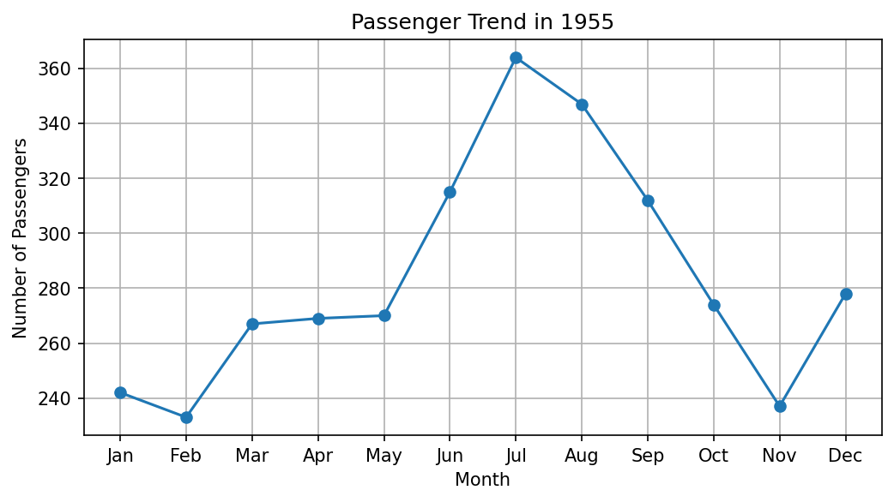

**Explanation**

`plot()` joins points using lines.

This helps students observe:

- increasing trend
- decreasing trend
- seasonal variation (a pattern that repeats at the same time every year)

For example:

Passenger count may rise during holiday seasons. In 1955 the count climbs from 233 in February to a peak of 364 in July, the summer holiday season, and then falls to 237 in November before rising again in December.

Here the month names are text, so Matplotlib places them on the x-axis in the order they appear in the data, one step apart.

[Back to the Table of Contents](#table-of-contents)

#### Step 3 - Create Scatter Plot Using scatter()

```python
# Step 3 - Create a scatter plot using scatter() for the same data
plt.figure(figsize=(8, 4))

# Draw the scatter plot. The points are the same 12 points as in Step 2,
# but they are NOT joined by a line.
plt.scatter(
    year_data["month"],        # x-values: month names
    year_data["passengers"],   # y-values: passenger counts
)

# Add a title and axis labels
plt.title("Passenger Distribution in 1955")
plt.xlabel("Month")
plt.ylabel("Number of Passengers")

# Add grid lines
plt.grid(True)

print("Number of points plotted:", len(year_data))

# Display the graph
plt.show()
```

**Output**

```text
Number of points plotted: 12
```

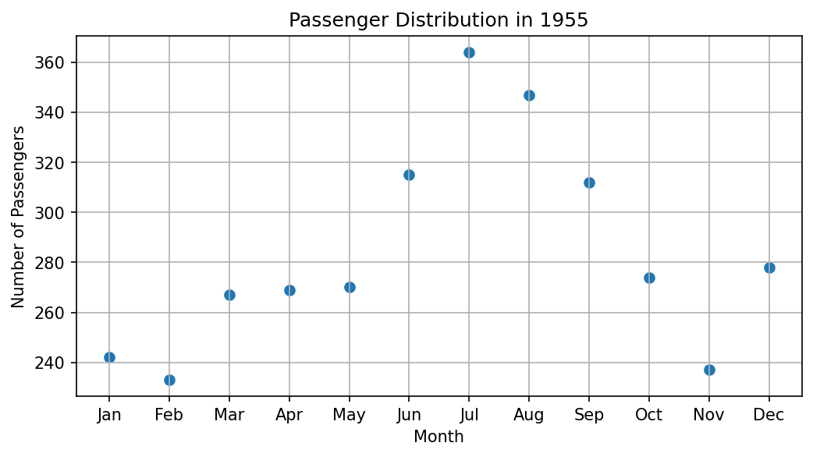

**Complete script for Task 4**

```python
# Step 1 - Import the required libraries, load the dataset and select one year
import seaborn as sns
import matplotlib.pyplot as plt

# Load the flights dataset. It contains monthly passenger counts for
# a commercial airline from 1949 to 1960.
df = sns.load_dataset("flights")

# Choose the year to study. Here we use 1955 as an example.
selected_year = 1955

# Keep only the rows where the 'year' column equals 1955.
# df["year"] == selected_year gives True for rows of 1955 and False for all others.
# Putting this inside df[ ... ] keeps only the True rows.
year_data = df[df["year"] == selected_year]

# Display the selected data (12 rows, one for each month)
print(year_data)
print()
print("Number of rows selected:", len(year_data))

# Step 2 - Create a line plot using plot()
# Create a new figure 8 inches wide and 4 inches tall.
# A wide figure suits a graph that runs across 12 months.
plt.figure(figsize=(8, 4))

# Draw the line graph:
#   x-axis -> the 'month' column (Jan to Dec)
#   y-axis -> the 'passengers' column
# marker="o" puts a dot on each month, so the actual data points are visible.
plt.plot(
    year_data["month"],        # x-values: month names
    year_data["passengers"],   # y-values: passenger counts
    marker="o",
)

# Add a title and axis labels
plt.title("Passenger Trend in 1955")
plt.xlabel("Month")                  # Label for the x-axis
plt.ylabel("Number of Passengers")   # Label for the y-axis

# Add grid lines to make values easier to read
plt.grid(True)

# Find the busiest and the quietest month to check against the graph
busiest = year_data.loc[year_data["passengers"].idxmax()]
quietest = year_data.loc[year_data["passengers"].idxmin()]
print("Busiest month :", busiest["month"], "with", busiest["passengers"], "passengers")
print("Quietest month:", quietest["month"], "with", quietest["passengers"], "passengers")

# Display the graph
plt.show()

# Step 3 - Create a scatter plot using scatter() for the same data
plt.figure(figsize=(8, 4))

# Draw the scatter plot. The points are the same 12 points as in Step 2,
# but they are NOT joined by a line.
plt.scatter(
    year_data["month"],        # x-values: month names
    year_data["passengers"],   # y-values: passenger counts
)

# Add a title and axis labels
plt.title("Passenger Distribution in 1955")
plt.xlabel("Month")
plt.ylabel("Number of Passengers")

# Add grid lines
plt.grid(True)

print("Number of points plotted:", len(year_data))

# Display the graph
plt.show()
```

**Output**

```text
    year month  passengers
72  1955   Jan         242
73  1955   Feb         233
74  1955   Mar         267
75  1955   Apr         269
76  1955   May         270
77  1955   Jun         315
78  1955   Jul         364
79  1955   Aug         347
80  1955   Sep         312
81  1955   Oct         274
82  1955   Nov         237
83  1955   Dec         278

Number of rows selected: 12
Busiest month : Jul with 364 passengers
Quietest month: Feb with 233 passengers
Number of points plotted: 12
```

[Back to the Table of Contents](#table-of-contents)

#### Comparison Between plot() and scatter()

| Feature | `plot()` | `scatter()` |
| --- | --- | --- |
| Joins points | Yes | No |
| Best for | Trend analysis | Relationship analysis |
| Visual appearance | Continuous line | Separate points |
| Easy to observe pattern | Yes | Moderate |

**Comparing the two graphs of 1955:**

1. Both graphs show exactly the same 12 values.
2. In the line plot, the rise to July and the fall to November can be seen at a glance, because the line guides the eye from month to month.
3. In the scatter plot, the eye must jump from point to point, so the seasonal pattern takes a little longer to notice.
4. Months follow each other in time, so joining them with a line makes sense. For this data, `plot()` is the better choice.
5. `scatter()` becomes the better choice when the points have no natural order, for example when comparing height and weight of different people.

[Back to the Table of Contents](#table-of-contents)

#### Common Error Example: Missing Quotes Around a Column Name

```python
# WRONG EXAMPLE
# Missing quotes around column name
# year_data[month]
# This causes NameError
# because month is treated
# as a variable instead of text
```

The correct form is `year_data["month"]`. A column name is a piece of text (a string), so it must be written inside quotes. If a variable called `month` already exists, the wrong form will not raise `NameError`; it will look for a column named after the value of that variable, which usually gives a `KeyError` or the wrong data.

[Back to the Table of Contents](#table-of-contents)

### Solution to Task 5: Plot Grid or Matrix Data

**Objective**

To visualize matrix-style data using:

1. `imshow()`
2. `contourf()`

[Back to the Table of Contents](#table-of-contents)

#### Why Task 5 Is Important

After conversion into matrix form:

- rows represent years
- columns represent months
- values represent passenger count

The dataset becomes suitable for:

```python
imshow()
contourf()
```

These methods work with **grid or matrix data**. Two labels (a year and a month) are needed to find each value.

As in Task 4, the steps continue from each other, and a complete script is given after them.

[Back to the Table of Contents](#table-of-contents)

#### Step 1 - Create Matrix Data

```python
# Step 1 - Import the libraries, create the matrix and slice the selected years
import seaborn as sns
import matplotlib.pyplot as plt

# Load the flights dataset
df = sns.load_dataset("flights")

# Convert into matrix form: years as rows, months as columns, passengers as values
flights_matrix = df.pivot(
    index="year",          # Rows: years
    columns="month",       # Columns: months
    values="passengers",   # Cell values: passenger counts
)

# Convert into a NumPy array so that we can slice by position
data = flights_matrix.to_numpy()

# Slice the rows at index 3 to 9, which are the years 1952 to 1958
selected_data = data[3:10, :]

# Keep the matching labels. We need them to name the ticks on the axes,
# because a NumPy array holds only numbers and no year or month labels.
selected_years = list(flights_matrix.index[3:10])   # [1952, ..., 1958]
month_names = list(flights_matrix.columns)          # ['Jan', ..., 'Dec']

print("Shape of selected data:", selected_data.shape)
print("Years :", selected_years)
print("Months:", month_names)
print("Smallest value:", selected_data.min(), " Largest value:", selected_data.max())
```

**Output**

```text
Shape of selected data: (7, 12)
Years : [1952, 1953, 1954, 1955, 1956, 1957, 1958]
Months: ['Jan', 'Feb', 'Mar', 'Apr', 'May', 'Jun', 'Jul', 'Aug', 'Sep', 'Oct', 'Nov', 'Dec']
Smallest value: 171  Largest value: 505
```

A NumPy array keeps only the numbers. So we also save the matching years and month names in `selected_years` and `month_names`. Without them, the axes would show only position numbers (0 to 6 and 0 to 11) instead of years and months.

[Back to the Table of Contents](#table-of-contents)

#### Step 2 - Plot Using imshow()

```python
# Step 2 - Plot the matrix using imshow()
plt.figure(figsize=(8, 4))

# Show the matrix as a grid of colored cells.
# Each cell's color depends on the number of passengers in that cell.
# By default, row 0 (the year 1952) is drawn at the TOP, just like a printed table.
image = plt.imshow(selected_data)

# Add a title
plt.title("Passenger Data using imshow()")

# Add a color bar. It works as a key that links each color to a passenger count.
plt.colorbar(image, label="Number of Passengers")

# Add axis labels
plt.xlabel("Months")
plt.ylabel("Years")

# Replace the default position numbers (0, 1, 2, ...) with month names and years
plt.xticks(ticks=range(len(month_names)), labels=month_names)
plt.yticks(ticks=range(len(selected_years)), labels=selected_years)

# Display the graph
plt.show()
```

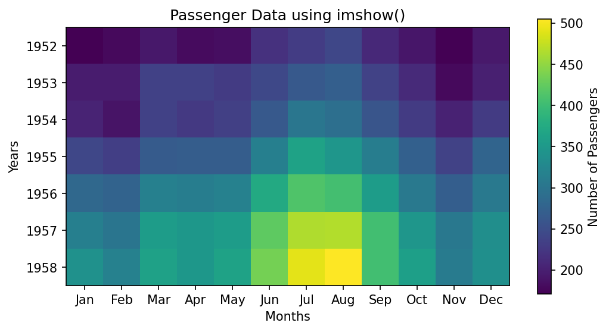

`plt.xticks()` and `plt.yticks()` place labels at chosen positions on the axes. See [matplotlib.pyplot.xticks](https://matplotlib.org/stable/api/_as_gen/matplotlib.pyplot.xticks.html).

[Back to the Table of Contents](#table-of-contents)

#### Step 3 - Plot Using contourf()

```python
# Step 3 - Plot the matrix using contourf()
plt.figure(figsize=(8, 4))

# Draw a filled contour plot.
# contourf() groups the values into bands (called levels) and fills each band with one color.
# It also blends smoothly between neighbouring cells.
# Note: by default, row 0 (the year 1952) is drawn at the BOTTOM, like an ordinary graph.
contour_plot = plt.contourf(selected_data)

# Add a title
plt.title("Passenger Data using contourf()")

# Add a color bar that shows the passenger range of each band
plt.colorbar(contour_plot, label="Number of Passengers")

# Add axis labels
plt.xlabel("Months")
plt.ylabel("Years")

# Replace the position numbers with month names and years
plt.xticks(ticks=range(len(month_names)), labels=month_names)
plt.yticks(ticks=range(len(selected_years)), labels=selected_years)

# Print the boundaries of the color bands chosen by Matplotlib
print("Contour levels:", contour_plot.levels.tolist())

# Display the graph
plt.show()
```

**Output**

```text
Contour levels: [150.0, 200.0, 250.0, 300.0, 350.0, 400.0, 450.0, 500.0, 550.0]
```

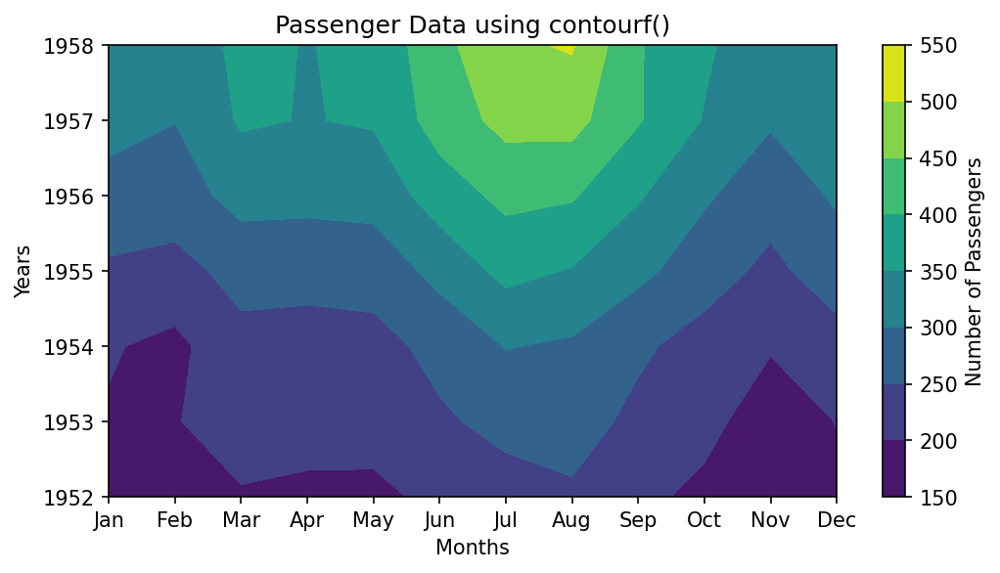

Matplotlib chose band boundaries of 150, 200, 250, ... 550, so each color on the color bar covers a range of 50 passengers.

**Complete script for Task 5**

```python
# Step 1 - Import the libraries, create the matrix and slice the selected years
import seaborn as sns
import matplotlib.pyplot as plt

# Load the flights dataset
df = sns.load_dataset("flights")

# Convert into matrix form: years as rows, months as columns, passengers as values
flights_matrix = df.pivot(
    index="year",          # Rows: years
    columns="month",       # Columns: months
    values="passengers",   # Cell values: passenger counts
)

# Convert into a NumPy array so that we can slice by position
data = flights_matrix.to_numpy()

# Slice the rows at index 3 to 9, which are the years 1952 to 1958
selected_data = data[3:10, :]

# Keep the matching labels. We need them to name the ticks on the axes,
# because a NumPy array holds only numbers and no year or month labels.
selected_years = list(flights_matrix.index[3:10])   # [1952, ..., 1958]
month_names = list(flights_matrix.columns)          # ['Jan', ..., 'Dec']

print("Shape of selected data:", selected_data.shape)
print("Years :", selected_years)
print("Months:", month_names)
print("Smallest value:", selected_data.min(), " Largest value:", selected_data.max())

# Step 2 - Plot the matrix using imshow()
plt.figure(figsize=(8, 4))

# Show the matrix as a grid of colored cells.
# Each cell's color depends on the number of passengers in that cell.
# By default, row 0 (the year 1952) is drawn at the TOP, just like a printed table.
image = plt.imshow(selected_data)

# Add a title
plt.title("Passenger Data using imshow()")

# Add a color bar. It works as a key that links each color to a passenger count.
plt.colorbar(image, label="Number of Passengers")

# Add axis labels
plt.xlabel("Months")
plt.ylabel("Years")

# Replace the default position numbers (0, 1, 2, ...) with month names and years
plt.xticks(ticks=range(len(month_names)), labels=month_names)
plt.yticks(ticks=range(len(selected_years)), labels=selected_years)

# Display the graph
plt.show()

# Step 3 - Plot the matrix using contourf()
plt.figure(figsize=(8, 4))

# Draw a filled contour plot.
# contourf() groups the values into bands (called levels) and fills each band with one color.
# It also blends smoothly between neighbouring cells.
# Note: by default, row 0 (the year 1952) is drawn at the BOTTOM, like an ordinary graph.
contour_plot = plt.contourf(selected_data)

# Add a title
plt.title("Passenger Data using contourf()")

# Add a color bar that shows the passenger range of each band
plt.colorbar(contour_plot, label="Number of Passengers")

# Add axis labels
plt.xlabel("Months")
plt.ylabel("Years")

# Replace the position numbers with month names and years
plt.xticks(ticks=range(len(month_names)), labels=month_names)
plt.yticks(ticks=range(len(selected_years)), labels=selected_years)

# Print the boundaries of the color bands chosen by Matplotlib
print("Contour levels:", contour_plot.levels.tolist())

# Display the graph
plt.show()
```

**Output**

```text
Shape of selected data: (7, 12)
Years : [1952, 1953, 1954, 1955, 1956, 1957, 1958]
Months: ['Jan', 'Feb', 'Mar', 'Apr', 'May', 'Jun', 'Jul', 'Aug', 'Sep', 'Oct', 'Nov', 'Dec']
Smallest value: 171  Largest value: 505
Contour levels: [150.0, 200.0, 250.0, 300.0, 350.0, 400.0, 450.0, 500.0, 550.0]
```

[Back to the Table of Contents](#table-of-contents)

#### Difference Between imshow() and contourf()

| Feature | `imshow()` | `contourf()` |
| --- | --- | --- |
| Display style | Color blocks | Filled contour regions |
| Easy for beginners | Yes | Moderate |
| Best for | Heat maps | Region comparison |
| Appearance | Image-like | Map-like |
| Each cell shown separately | Yes, one square per value | No, values are grouped into bands |
| Blends between cells | No | Yes, draws smooth boundaries between neighbouring values |
| Position of the first row (1952) | Top (like a printed table) | Bottom (like an ordinary graph) |

**Comparing the two graphs:**

1. **Both show the same two patterns.** Colors get brighter from 1952 to 1958, which shows that air travel grew every year. In every year, the brightest months are July and August, which shows the summer peak.
2. **imshow() shows every value exactly.** Each of the 84 cells (7 years × 12 months) is a separate square. The single brightest cell is August 1958 (505 passengers).
3. **contourf() shows broad regions.** It groups the values into bands of 50 and draws smooth borders between them. This makes the overall "shape" of the growth easy to see, but individual months are harder to read.
4. **The years run in opposite directions.** `imshow()` places 1952 at the top, while `contourf()` places 1952 at the bottom. Always read the axis labels before comparing two such graphs. To make `imshow()` match `contourf()`, add `origin="lower"` like this: `plt.imshow(selected_data, origin="lower")`.
5. **A word of caution about contourf().** Contour plots were designed for smooth, continuous data such as height or pressure on a map. Months and years are separate steps, so the smooth curves between them are drawn by Matplotlib and are not real data. For this dataset, `imshow()` gives the more honest picture.

[Back to the Table of Contents](#table-of-contents)

#### Common Error Example: Passing a List Instead of a Matrix

```python
# WRONG EXAMPLE
# Passing a simple list
# instead of matrix data
# values = [1, 2, 3, 4]
# plt.imshow(values)
# This produces an error
# because imshow()
# expects matrix-style data
```

This is the same mistake explained in [Common Beginner Error: Passing a 1-D List to imshow()](#common-beginner-error-passing-a-1-d-list-to-imshow). Matplotlib reports `TypeError: Invalid shape (4,) for image data`. `contourf()` also needs a 2-D array. Given a 1-D list, it reports `TypeError: Input z must be 2D, not 1D`.

[Back to the Table of Contents](#table-of-contents)

### Solution to Task 6: Comparative Discussion

#### Q1. Which methods were easier to understand?

For most beginners, `plot()` and `scatter()` are easier to understand because:

- the data is simple
- only x-values and y-values are required
- the graphs are familiar from school mathematics

`imshow()` comes next, because a grid of colored squares is easy to connect with a table. `contour()` and `contourf()` usually take the most effort, because the reader has to understand contour levels and read the color bar carefully.

[Back to the Table of Contents](#table-of-contents)

#### Q2. When should plot() be preferred?

`plot()` should be preferred when:

- trends are important
- values change over time
- continuous change must be shown
- the points have a natural order, so joining them with a line makes sense

Examples:

- rainfall across months
- stock prices
- student progress

[Back to the Table of Contents](#table-of-contents)

#### Q3. When should imshow() or contour() be preferred?

These methods (including `contourf()`) should be preferred when:

- data exists in rows and columns
- values form a matrix
- comparison across regions is required

Examples:

- weather maps
- temperature grids
- passenger count across months and years

Between the two:

- choose `imshow()` when each cell is a separate item (a month, a city, a pixel) and you want to see every value
- choose `contour()` or `contourf()` when the values change smoothly over space, such as height or air pressure, and you want to see regions and levels

[Back to the Table of Contents](#table-of-contents)

#### Q4. Which graph looked most informative and why?

The answer may vary, because it depends on the question being asked. However:

**plot()**

helps observe trends clearly. For a single year, it shows the seasonal rise and fall at a glance.

**imshow()**

helps identify regions of high and low values quickly. For this dataset it is probably the most informative single graph, because it shows **both** the growth over the years (down the rows) **and** the summer peak (across the columns), while still showing each month as a separate cell.

**contourf()**

helps compare regions visually. It gives a good overall impression of how passenger numbers grew, but it hides individual values and draws smooth curves between months that do not exist in the data.

**Follow-up questions for discussion:**

- (a) If you had to present the flights data to someone in one graph only, which would you choose, and what title would you give it?
- (b) The flights data could also be drawn as 12 lines on one `plot()`, one line for each year. What would be the advantage and the disadvantage compared with `imshow()`?
- (c) Change the year in Task 4 from 1955 to 1960. Is the summer peak still in the same months?

[Back to the Table of Contents](#table-of-contents)

## Full Combined Model Script

This script solves Tasks 1 to 5 in one program. It places the two coordinate graphs side by side in one figure, and the two matrix graphs side by side in a second figure. `plt.subplots(1, 2)` creates one row of two plot areas. See [matplotlib.pyplot.subplots](https://matplotlib.org/stable/api/_as_gen/matplotlib.pyplot.subplots.html).

When a figure has more than one plot area, we use the `ax[0]` and `ax[1]` style (called the object-oriented style) instead of `plt.title()` and similar functions. The method names change slightly: `plt.title()` becomes `ax[0].set_title()`, `plt.xlabel()` becomes `ax[0].set_xlabel()`, and so on. See [Matplotlib quick start](https://matplotlib.org/stable/users/explain/quick_start.html).

```python
# ==================================================
# Complete Project Solution
# Coordinate Data and Matrix Data
# ==================================================

# Step 1 - Import the libraries
import seaborn as sns
import matplotlib.pyplot as plt

# --------------------------------------------------
# Task 1: Load the dataset
# --------------------------------------------------
# Step 2 - Load the flights dataset and look at it
df = sns.load_dataset("flights")
print("Task 1: First five rows")
print(df.head())
print("Shape:", df.shape)

# --------------------------------------------------
# Task 2: Convert the data into matrix form
# --------------------------------------------------
# Step 3 - Pivot the table: years as rows, months as columns, passengers as values
matrix = df.pivot(
    index="year",          # Each year becomes one row
    columns="month",       # Each month becomes one column
    values="passengers",   # Each cell holds the passenger count
)
print()
print("Task 2: Matrix shape (rows, columns):", matrix.shape)

# --------------------------------------------------
# Task 3: Matrix slicing
# --------------------------------------------------
# Step 4 - Convert to a NumPy array and slice the years 1952 to 1958
data = matrix.to_numpy()                 # Numbers only, sliced by position
selected_data = data[3:10, :]            # Rows 3 to 9 (1952 to 1958), all 12 months
selected_years = list(matrix.index[3:10])
month_names = list(matrix.columns)
print()
print("Task 3: Selected years:", selected_years)
print("Shape of sliced data:", selected_data.shape)

# --------------------------------------------------
# Task 4: Coordinate data (one year)
# --------------------------------------------------
# Step 5 - Select the rows for 1955
year_data = df[df["year"] == 1955]
print()
print("Task 4: Passenger counts in 1955")
print(year_data["passengers"].tolist())

# Step 6 - Create one figure with two plots side by side (1 row, 2 columns)
# 'ax' holds the two plot areas: ax[0] is on the left and ax[1] is on the right.
fig, ax = plt.subplots(1, 2, figsize=(12, 4))

# Step 7 - Line plot on the left: shows the trend across the months
ax[0].plot(year_data["month"], year_data["passengers"], marker="o")
ax[0].set_title("Line Plot")
ax[0].set_xlabel("Month")
ax[0].set_ylabel("Passengers")
ax[0].grid(True)

# Step 8 - Scatter plot on the right: shows the same 12 points without a line
ax[1].scatter(year_data["month"], year_data["passengers"])
ax[1].set_title("Scatter Plot")
ax[1].set_xlabel("Month")
ax[1].set_ylabel("Passengers")
ax[1].grid(True)

# Step 9 - Adjust spacing and display both graphs
plt.tight_layout()
plt.show()

# --------------------------------------------------
# Task 5: Grid or matrix data (1952 to 1958)
# --------------------------------------------------
# Step 10 - Create a new figure with two plots side by side
fig, ax = plt.subplots(1, 2, figsize=(12, 4))

# Step 11 - imshow() on the left: one colored cell per value (1952 at the top)
im = ax[0].imshow(selected_data)
ax[0].set_title("imshow()")
ax[0].set_xlabel("Months")
ax[0].set_ylabel("Years")
ax[0].set_xticks(range(12), labels=month_names, rotation=90)
ax[0].set_yticks(range(7), labels=selected_years)
fig.colorbar(im, ax=ax[0], label="Passengers")   # Color key for the left plot

# Step 12 - contourf() on the right: filled bands of similar values (1952 at the bottom)
cp = ax[1].contourf(selected_data)
ax[1].set_title("contourf()")
ax[1].set_xlabel("Months")
ax[1].set_ylabel("Years")
ax[1].set_xticks(range(12), labels=month_names, rotation=90)
ax[1].set_yticks(range(7), labels=selected_years)
fig.colorbar(cp, ax=ax[1], label="Passengers")   # Color key for the right plot

# Step 13 - Adjust spacing and display both graphs
plt.tight_layout()
plt.show()
print()
print("All tasks completed.")
```

**Output**

```text
Task 1: First five rows
   year month  passengers
0  1949   Jan         112
1  1949   Feb         118
2  1949   Mar         132
3  1949   Apr         129
4  1949   May         121
Shape: (144, 3)

Task 2: Matrix shape (rows, columns): (12, 12)

Task 3: Selected years: [1952, 1953, 1954, 1955, 1956, 1957, 1958]
Shape of sliced data: (7, 12)

Task 4: Passenger counts in 1955
[242, 233, 267, 269, 270, 315, 364, 347, 312, 274, 237, 278]

All tasks completed.
```

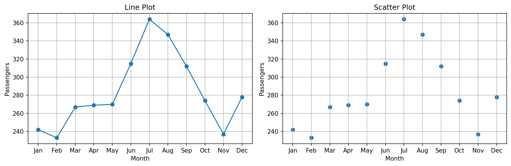

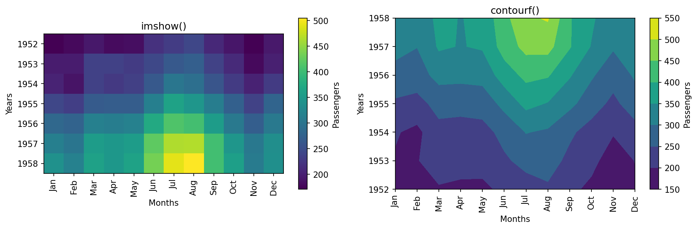

In the second figure, `rotation=90` turns the month names on their side so that they do not overlap in the narrower plot areas.

[Back to the Table of Contents](#table-of-contents)

## Glossary of Technical Terms

| Term | Simple explanation | Learn more |
| --- | --- | --- |
| 1-D and 2-D array | A 1-D array is a single row of numbers. A 2-D array has rows and columns. | [NumPy for absolute beginners](https://numpy.org/doc/stable/user/absolute_beginners.html) |
| Color bar | A strip beside a graph showing which color stands for which value | [matplotlib.pyplot.colorbar](https://matplotlib.org/stable/api/_as_gen/matplotlib.pyplot.colorbar.html) |
| Contour line | A line joining points that have the same value | [Contour line](https://en.wikipedia.org/wiki/Contour_line) |
| Contour level | One of the values at which contour lines are drawn, or a band between two such values in `contourf()` | [matplotlib.pyplot.contourf](https://matplotlib.org/stable/api/_as_gen/matplotlib.pyplot.contourf.html) |
| Coordinate | A pair of numbers (x, y) that fixes the position of a point on a graph | [Cartesian coordinate system](https://en.wikipedia.org/wiki/Cartesian_coordinate_system) |
| DataFrame | A pandas table with labelled rows and columns | [pandas DataFrame](https://pandas.pydata.org/docs/reference/api/pandas.DataFrame.html) |
| Heat map | A grid of colored cells in which color shows the size of each value | [Heat map](https://en.wikipedia.org/wiki/Heat_map) |
| Index | The position of an item, counted from 0 | [Indexing on ndarrays](https://numpy.org/doc/stable/user/basics.indexing.html) |
| Long form and wide form | Long form has one reading per row. Wide form spreads the readings across columns, like a matrix. | [Reshaping and pivot tables](https://pandas.pydata.org/docs/user_guide/reshaping.html) |
| meshgrid | A NumPy function that builds matrices of x and y positions for every point of a grid | [numpy.meshgrid](https://numpy.org/doc/stable/reference/generated/numpy.meshgrid.html) |
| Pivot | Reshaping a long table into a matrix, using one column for rows, one for columns and one for values | [pandas DataFrame.pivot](https://pandas.pydata.org/docs/reference/api/pandas.DataFrame.pivot.html) |
| Pixel | One tiny dot of color in a digital image | [Pixel](https://en.wikipedia.org/wiki/Pixel) |
| Reshape | Changing the arrangement of an array (for example, 25 numbers into 5 rows and 5 columns) without changing the numbers | [numpy.reshape](https://numpy.org/doc/stable/reference/generated/numpy.reshape.html) |
| Shape | The size of an array written as (rows, columns) | [numpy.ndarray.shape](https://numpy.org/doc/stable/reference/generated/numpy.ndarray.shape.html) |
| Slicing | Selecting a range of rows, columns or items using the colon `:` | [Indexing on ndarrays](https://numpy.org/doc/stable/user/basics.indexing.html) |
| Tick label | The text written beside the small marks on an axis | [matplotlib.pyplot.xticks](https://matplotlib.org/stable/api/_as_gen/matplotlib.pyplot.xticks.html) |
| Time series | Values recorded one after another over time | [Time series](https://en.wikipedia.org/wiki/Time_series) |

[Back to the Table of Contents](#table-of-contents)

---

