# Violin Plots in Matplotlib: Seeing the Shape of Your Data

This page is a companion to the chapter on **Matplotlib** in the book. In the earlier pages we met the histogram and the box plot. A histogram shows the full shape of the data but takes a lot of space. A box plot is compact and easy to compare across groups, but it squeezes the data into a handful of numbers and throws the shape away. A **violin plot** sits between the two. It keeps the compact, side-by-side style of a box plot and adds the shape of the data, drawn as a smooth curve.

The page explains:

- why a box plot can hide important features, such as two separate groups inside the data
- what a violin plot is, how it is built from a histogram, and how to read its width
- how the histogram, box plot and violin plot compare, and when to choose each one
- the typical shapes a violin can take (symmetric, skewed and bimodal)
- how to draw violin plots in Python with Matplotlib's `violinplot()` method, and which options matter
- when a violin plot is a poor choice

Violin plots are widely used in data science, biology, medicine and education research, wherever groups of measurements need to be compared. In Python they can be drawn with Matplotlib, as on this page, or with the Seaborn library, which is built on top of Matplotlib. Every script here is broken into steps, each step shows its printed output, and a complete script follows so that you can run the whole program at once. The page ends with five challenges and their worked solutions.

## Table of Contents

- [Violin Plots in Matplotlib: Seeing the Shape of Your Data](#violin-plots-in-matplotlib-seeing-the-shape-of-your-data)
  - [Why Do We Need Violin Plots?](#why-do-we-need-violin-plots)
    - [The Problem with Box Plots](#the-problem-with-box-plots)
    - [Real Question A Beginner Asks](#real-question-a-beginner-asks)
    - [What Each Plot Type Reveals](#what-each-plot-type-reveals)
  - [What Is a Violin Plot?](#what-is-a-violin-plot)
    - [Simple Definition](#simple-definition)
    - [Why Is It Called a "Violin" Plot?](#why-is-it-called-a-violin-plot)
    - [Concept Box: Understanding Width](#concept-box-understanding-width)
    - [Component Breakdown](#component-breakdown)
  - [From Histogram to Violin Plot: The Transformation](#from-histogram-to-violin-plot-the-transformation)
    - [Step-by-Step Process](#step-by-step-process)
    - [What Happens at Each Step?](#what-happens-at-each-step)
  - [Comparison: Histogram vs. Box Plot vs. Violin Plot](#comparison-histogram-vs-box-plot-vs-violin-plot)
    - [Feature Comparison Table](#feature-comparison-table)
    - [When Each Plot Shines](#when-each-plot-shines)
  - [Typical Violin Plot Shapes](#typical-violin-plot-shapes)
    - [1. Symmetric Distribution (Bell-Shaped)](#1-symmetric-distribution-bell-shaped)
    - [2. Right-Skewed Distribution](#2-right-skewed-distribution)
    - [3. Left-Skewed Distribution](#3-left-skewed-distribution)
    - [4. Bimodal Distribution (Two Peaks)](#4-bimodal-distribution-two-peaks)
    - [Script: Drawing the Four Shapes](#script-drawing-the-four-shapes)
  - [Basic Violin Plot Script](#basic-violin-plot-script)
    - [What This Script Does](#what-this-script-does)
    - [Basic Script Step by Step](#basic-script-step-by-step)
    - [Basic Script: Complete Script](#basic-script-complete-script)
    - [Output of the Basic Script](#output-of-the-basic-script)
    - [Why This Script Is Written This Way](#why-this-script-is-written-this-way)
    - [Follow-up Questions on the Basic Script](#follow-up-questions-on-the-basic-script)
  - [Bimodal Distribution](#bimodal-distribution)
    - [Why Bimodal Data Proves Violin Plots Are Essential](#why-bimodal-data-proves-violin-plots-are-essential)
    - [Comparison Script: Same Data, Three Views - Step by Step](#comparison-script-same-data-three-views---step-by-step)
    - [Comparison Script: Complete Script](#comparison-script-complete-script)
    - [Output of the Comparison Script](#output-of-the-comparison-script)
    - [What to Observe](#what-to-observe)
    - [Why This Matters](#why-this-matters)
    - [Follow-up Questions on the Bimodal Script](#follow-up-questions-on-the-bimodal-script)
  - [Important Parameters for Violin Plots](#important-parameters-for-violin-plots)
    - [Key Options Table](#key-options-table)
    - [Parts Returned by violinplot()](#parts-returned-by-violinplot)
  - [When Should We Use a Violin Plot?](#when-should-we-use-a-violin-plot)
    - [Good Use Cases](#good-use-cases)
    - [When NOT to Use Violin Plots](#when-not-to-use-violin-plots)
  - [Further Challenges](#further-challenges)
    - [Solution to Challenge 1: Trimodal Data](#solution-to-challenge-1-trimodal-data)
    - [Solution to Challenge 2: Horizontal Violin Plot](#solution-to-challenge-2-horizontal-violin-plot)
    - [Solution to Challenge 3: Compare Multiple Groups Side by Side](#solution-to-challenge-3-compare-multiple-groups-side-by-side)
    - [Solution to Challenge 4: Save the Figure](#solution-to-challenge-4-save-the-figure)
    - [Solution to Challenge 5: Change the Smoothness](#solution-to-challenge-5-change-the-smoothness)
  - [Summary](#summary)
  - [Glossary of Technical Terms](#glossary-of-technical-terms)

## Why Do We Need Violin Plots?

### The Problem with Box Plots

> **A box plot summarizes data using five numbers** (minimum, Q1, median, Q3, maximum), but it **hides the shape** of the distribution.

Here Q1 (the first quartile) is the value below which 25% of the data lies, and Q3 (the third quartile) is the value below which 75% of the data lies. The median is the middle value. See [Quartile (Wikipedia)](https://en.wikipedia.org/wiki/Quartile).

In Matplotlib, the whiskers of a box plot actually stop at the furthest values that lie within 1.5 × IQR of the box (IQR is Q3 minus Q1). Values beyond that are drawn as separate dots called outliers. So the ends of the whiskers are the minimum and maximum only when there are no outliers. The main point stays the same: a box plot shows a few summary numbers, not the shape.

**Why the shape matters:** two very different sets of data can have exactly the same five numbers. One set may have most values bunched in the middle. Another may have two separate bunches, one near each end of the box, with almost nothing in the middle. Their box plots would look the same.

[Back to the Table of Contents](#table-of-contents)

### Real Question A Beginner Asks

> "I have a box plot. Can I tell if my data has one peak or two peaks?"

**Answer: No.** The box plot hides this information completely. From the box alone you cannot tell whether the values between Q1 and Q3 are spread evenly, bunched in one place, or split into two groups.

**Solution:** Use a violin plot. It draws the shape, so two peaks show up as two bulges. You will see this happen in the [Bimodal Distribution](#bimodal-distribution) section below.

[Back to the Table of Contents](#table-of-contents)

### What Each Plot Type Reveals

| **Plot Type** | **Shows** | **Hides** | **Limitations** |
| --- | --- | --- | --- |
| **Histogram** | Exact frequencies, detailed shape | Median and quartiles (unless you add them) | Takes more space; harder to compare multiple groups; the shape changes with the number of bins |
| **Box Plot** | Median, quartiles, outliers | Distribution shape, peaks, clusters | Can make very different data look alike |
| **Violin Plot** | Shape + summary statistics | Exact frequencies, individual data points | The shape is a smoothed estimate, and the amount of smoothing can change what you see |

A **peak** (also called a **mode**) is a value around which many data points gather. A **cluster** is a group of data points that sit close together. See [Mode (Wikipedia)](https://en.wikipedia.org/wiki/Mode_(statistics)).

[Back to the Table of Contents](#table-of-contents)

## What Is a Violin Plot?

### Simple Definition

> A **violin plot** combines a **box plot** with a **density curve**. It shows both the statistical summary AND the shape of the data distribution.

A **density curve** is a smooth line that shows where the data points are crowded and where they are sparse. Think of it as a histogram whose steps have been smoothed into a curve. See [Violin plot (Wikipedia)](https://en.wikipedia.org/wiki/Violin_plot).

**How the idea looks in Matplotlib and in Seaborn:**

| Library | What is drawn by default | How to add the summary statistics |
| --- | --- | --- |
| Matplotlib `violinplot()` | The mirrored density shape, plus lines at the minimum and maximum joined by a vertical bar | Set `showmedians=True` and `showmeans=True`; add `quantiles=[0.25, 0.75]` for Q1 and Q3 |
| Seaborn `violinplot()` | The mirrored density shape with a small box plot drawn inside it | Already included |

So in Matplotlib the "box plot" part is not a real box. It is a set of horizontal lines that you switch on with options. See [Axes.violinplot (Matplotlib)](https://matplotlib.org/stable/api/_as_gen/matplotlib.axes.Axes.violinplot.html) and [seaborn.violinplot](https://seaborn.pydata.org/generated/seaborn.violinplot.html).

**How the smooth curve is made:** Matplotlib uses a method called **kernel density estimation (KDE)**. In simple words, it places a small, smooth bump over every data point and then adds all the bumps together. Where many points are close together, the bumps pile up into a tall hill. Where points are few, the curve stays low. The width of each bump is called the **bandwidth**. A small bandwidth gives a wiggly curve, and a large bandwidth gives a very smooth one. See [Kernel density estimation (Wikipedia)](https://en.wikipedia.org/wiki/Kernel_density_estimation).

[Back to the Table of Contents](#table-of-contents)

### Why Is It Called a "Violin" Plot?

The graph often looks like the body of a musical violin. The density curve is drawn on one side and then copied as a mirror image on the other side.

```text
               ^  higher values
               |
              /|\          narrow section = few data points here
             / | \
            (  |  )
           (   |   )       wide section = many data points here
           (   |   )
            (  |  )
             \ | /
              \|/          narrow section = few data points here
               |
               v  lower values

      The left edge is a mirror image of the right edge.
```

[Back to the Table of Contents](#table-of-contents)

### Concept Box: Understanding Width

- **Width does NOT mean value.** A common mistake is to think that wider means a larger value.
- **Correct understanding:** wider means MORE observations at or near that value.
- Narrower means FEWER observations.
- The **value** is read from the axis along the length of the violin (the vertical axis in an upright violin), never from the width.
- Think of it like a crowd:
  - A wide area is crowded (many people).
  - A narrow area is nearly empty (few people).

**One more point:** Matplotlib draws every violin so that its widest part has the same width (set by the `widths` option). So width compares crowding *within* one violin. If you draw a class of 20 students next to a class of 200 students, the two violins will be equally wide at their widest points. Width does not tell you which group has more people.

[Back to the Table of Contents](#table-of-contents)

### Component Breakdown

| Component | What It Shows | Visual Appearance in Matplotlib | How to Switch It On |
| --- | --- | --- | --- |
| **Density curve** | Shape of distribution | Mirrored violin shape, light blue by default | Always drawn |
| **Median** | Middle value | Horizontal line across the violin. Red in the basic script on this page. | `showmedians=True` |
| **Mean** | Average value | Horizontal line across the violin. Green in the basic script on this page. | `showmeans=True` |
| **Q1 and Q3** | Quartiles (25th and 75th percentile) | Two shorter horizontal lines. Dashed black in the basic script on this page. | `quantiles=[0.25, 0.75]` |
| **Minimum and maximum** | Lowest and highest values | Horizontal lines at the two ends, joined by a vertical bar through the middle | `showextrema=True` (on by default) |
| **Width** | How many observations lie near each value | Wider = more data points | Always drawn |

**Important:** by default Matplotlib draws the median line, the mean line and the minimum and maximum lines all in the **same blue color**. That makes the mean and the median hard to tell apart. The basic script below shows how to give each line its own color. (A green triangle for the mean is the default marker in a Matplotlib **box plot**, not in a violin plot.)

[Back to the Table of Contents](#table-of-contents)

## From Histogram to Violin Plot: The Transformation

### Step-by-Step Process

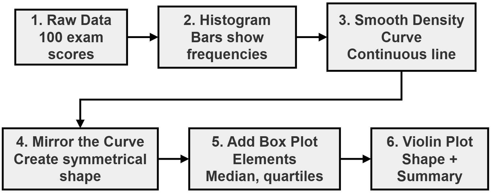

[Back to the Table of Contents](#table-of-contents)

### What Happens at Each Step?

| Step | Action | Result |
| --- | --- | --- |
| 1 | Collect data | List of numbers (e.g., exam scores) |
| 2 | Create histogram | Bars show how many values fall in each range |
| 3 | Smooth the bars | Continuous curve replaces stepped bars |
| 4 | Mirror the curve | Copy the curve on the other side of a central line to create symmetry |
| 5 | Add statistics | Overlay median, quartiles, mean |
| 6 | Final violin | Combines shape + summary in one view |

The same process as a flowchart:

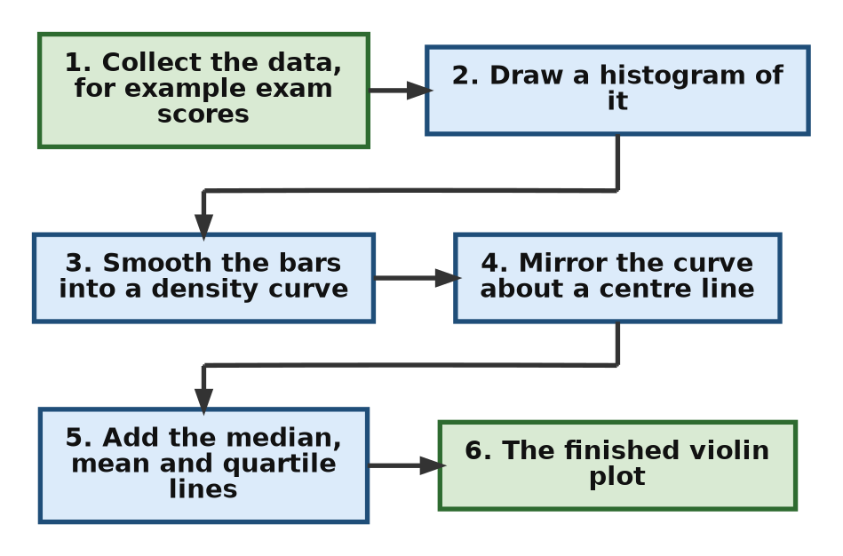

**A note on Step 3:** Matplotlib does not actually draw a histogram first. It builds the smooth curve directly from the data using kernel density estimation. Thinking of the curve as a "smoothed histogram" is still a helpful way to understand what it shows.

[Back to the Table of Contents](#table-of-contents)

## Comparison: Histogram vs. Box Plot vs. Violin Plot

### Feature Comparison Table

| Feature | Histogram | Box Plot | Violin Plot |
| --- | --- | --- | --- |
| Shows frequencies | Yes (exact counts) | No | Indirectly (via width) |
| Shows median | No | Yes | Yes |
| Shows quartiles | No | Yes | Yes (in Matplotlib, when `quantiles` is set) |
| Shows outliers | Difficult | Yes (clear) | Not marked separately; they appear only as thin tails or small bumps |
| Shows distribution shape | Yes (detailed) | No | Yes (smoothed) |
| Shows multiple peaks | Yes | No | Yes |
| Space required | More | Very little | Moderate |
| Compare multiple groups | Harder | Easy | Easy |
| Best for | Exploring one dataset | Quick summary | Shape + summary together |

[Back to the Table of Contents](#table-of-contents)

### When Each Plot Shines

Choose based on your goal.

- **Use a HISTOGRAM when you need:**
  - exact frequency counts
  - to see every detail of the shape
  - to understand bin boundaries (the edges of each bar)
- **Use a BOX PLOT when you need:**
  - a quick statistical summary
  - to compare many groups
  - to identify outliers clearly
  - a space-efficient display
- **Use a VIOLIN PLOT when you need:**
  - the distribution shape + summary together
  - to detect multiple peaks
  - to see skewness clearly
  - something that shows more than a box plot but takes less space than a histogram

The flowchart below turns these choices into questions. The numbers show the order in which to ask them.

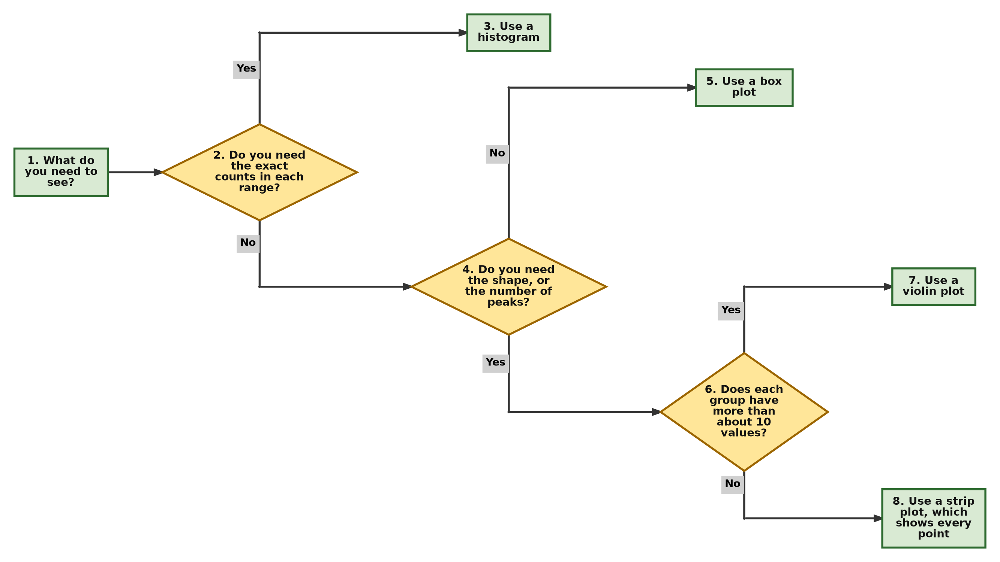

A **strip plot** simply draws every data point as a dot along a line. It is the best choice when there are only a few values. See [seaborn.stripplot](https://seaborn.pydata.org/generated/seaborn.stripplot.html).

[Back to the Table of Contents](#table-of-contents)

## Typical Violin Plot Shapes

The descriptions below are for an upright violin, with low values at the bottom and high values at the top. **Skewness** describes how lopsided a distribution is. See [Skewness (Wikipedia)](https://en.wikipedia.org/wiki/Skewness).

[Back to the Table of Contents](#table-of-contents)

### 1. Symmetric Distribution (Bell-Shaped)

**Characteristics:**

- Widest in the middle
- Narrow at both ends
- The top half is a mirror image of the bottom half
- Median in the centre

**What It Means:** Data is evenly distributed around the centre (like a normal distribution). The mean and the median are almost equal. See [Normal distribution (Wikipedia)](https://en.wikipedia.org/wiki/Normal_distribution).

[Back to the Table of Contents](#table-of-contents)

### 2. Right-Skewed Distribution

**Characteristics:**

- Wide at the bottom (lower values)
- Long narrow tail at the top (higher values)
- Median shifted toward the bottom

**What It Means:** Most values are low, but a few very high values exist. The long tail pulls the mean above the median. Incomes are a common real-life example.

[Back to the Table of Contents](#table-of-contents)

### 3. Left-Skewed Distribution

**Characteristics:**

- Wide at the top (higher values)
- Long narrow tail at the bottom (lower values)
- Median shifted toward the top

**What It Means:** Most values are high, but a few very low values exist. The long tail pulls the mean below the median. Marks in a very easy exam are a common real-life example.

[Back to the Table of Contents](#table-of-contents)

### 4. Bimodal Distribution (Two Peaks)

**Characteristics:**

- Two wide sections separated by a narrow section
- Looks like two violins stacked one on top of the other

**What It Means:** Data has **two distinct groups or clusters**. See [Multimodal distribution (Wikipedia)](https://en.wikipedia.org/wiki/Multimodal_distribution).

> **Critical Insight**: A box plot would completely hide the bimodal shape! This is the **"aha!" moment** for violin plots.

[Back to the Table of Contents](#table-of-contents)

### Script: Drawing the Four Shapes

The script below creates four sets of made-up data, one for each shape, and draws them side by side. It also prints the mean and median of each set so that you can check the descriptions above.

```python
# Step 1 - Import the libraries
import numpy as np
import matplotlib.pyplot as plt

# Step 2 - Create four sets of 300 values, each with a different shape
np.random.seed(0)
symmetric = np.random.normal(loc=50, scale=10, size=300)              # Bell-shaped
right_skewed = 30 + np.random.exponential(scale=10, size=300)         # Most values low, long tail of high values
left_skewed = 70 - np.random.exponential(scale=10, size=300)          # Most values high, long tail of low values
bimodal = np.concatenate([np.random.normal(35, 5, 150),               # Two groups: one around 35 ...
                          np.random.normal(65, 5, 150)])              # ... and one around 65

datasets = [symmetric, right_skewed, left_skewed, bimodal]
names = ["1. Symmetric", "2. Right-skewed", "3. Left-skewed", "4. Bimodal"]

# Step 3 - Print the mean and median of each set
# In a skewed set, the long tail pulls the mean away from the median.
print(f"{'Shape':<17}{'Mean':>7}{'Median':>9}")
for name, data in zip(names, datasets):
    print(f"{name:<17}{data.mean():7.1f}{np.median(data):9.1f}")

# Step 4 - Draw the four violins side by side, with the median marked
fig, ax = plt.subplots(figsize=(9, 5))
parts = ax.violinplot(datasets, showmedians=True)
parts["cmedians"].set_color("red")

# Step 5 - Label the plot
ax.set_xticks([1, 2, 3, 4], labels=names)
ax.set_ylabel("Value")
ax.set_title("Typical Violin Plot Shapes (red line = median)")
ax.grid(True, axis="y", alpha=0.3)

# Step 6 - Display the plot
plt.show()
```

**Output**

```text
Shape               Mean   Median
1. Symmetric        50.3     50.2
2. Right-skewed     40.4     36.1
3. Left-skewed      60.1     63.5
4. Bimodal          50.2     51.4
```

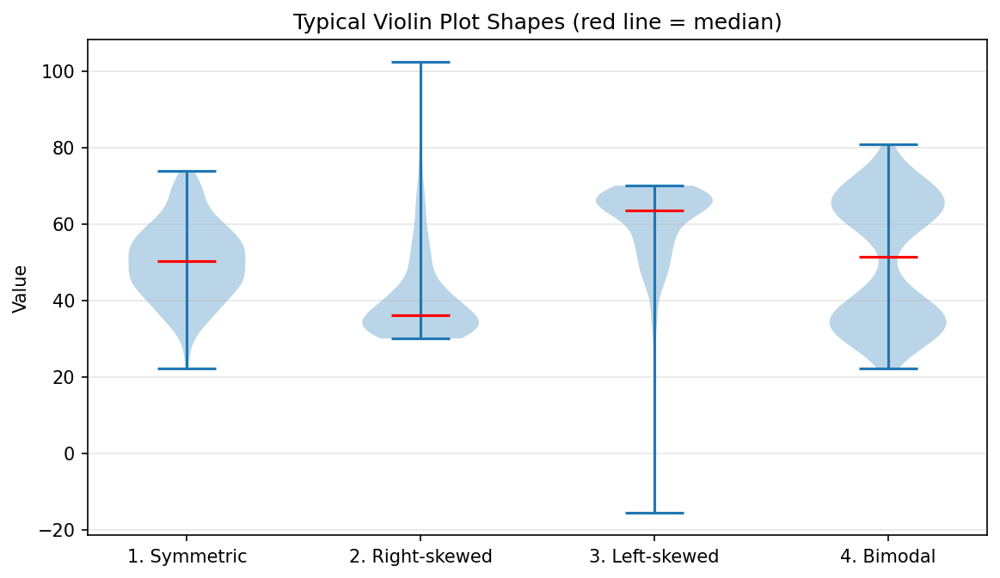

**How to read the output:**

| Shape | Mean compared with median | What you see in the violin |
| --- | --- | --- |
| 1. Symmetric | Almost equal (50.3 and 50.2) | Widest in the middle, even tails above and below |
| 2. Right-skewed | Mean higher (40.4 against 36.1) | Wide near the bottom, long thin tail reaching up past 100 |
| 3. Left-skewed | Mean lower (60.1 against 63.5) | Wide near the top, long thin tail reaching far down |
| 4. Bimodal | Close (50.2 and 51.4), yet misleading | Two bulges near 35 and 65, with a narrow waist in between; the median falls in the waist, where few values actually lie |

The right-skewed and left-skewed sets were made with `np.random.exponential()`, which produces many small numbers and a few large ones. See [numpy.random.exponential](https://numpy.org/doc/stable/reference/random/generated/numpy.random.exponential.html).

[Back to the Table of Contents](#table-of-contents)

## Basic Violin Plot Script

### What This Script Does

> Creates a simple violin plot showing exam scores with mean, median, and extreme values marked.

The script also marks Q1 and Q3, gives each line its own color, and adds a small key (legend) so that the lines can be told apart. The scores are not real. They are made up by NumPy's random number generator so that everyone gets the same data. See [numpy.random.normal](https://numpy.org/doc/stable/reference/random/generated/numpy.random.normal.html).

A few terms used in the script:

| Term | Meaning |
| --- | --- |
| Random seed | A starting number for the random number generator. The same seed always gives the same "random" numbers. See [numpy.random.seed](https://numpy.org/doc/stable/reference/random/generated/numpy.random.seed.html). |
| Standard deviation | A measure of how spread out the values are around the mean. See [Standard deviation (Wikipedia)](https://en.wikipedia.org/wiki/Standard_deviation). |
| Percentile | The value below which a given percentage of the data lies. `np.percentile(scores, 25)` gives Q1. See [numpy.percentile](https://numpy.org/doc/stable/reference/generated/numpy.percentile.html). |
| Legend | The small box that explains what each color or line on a plot means |

The flow of the script:

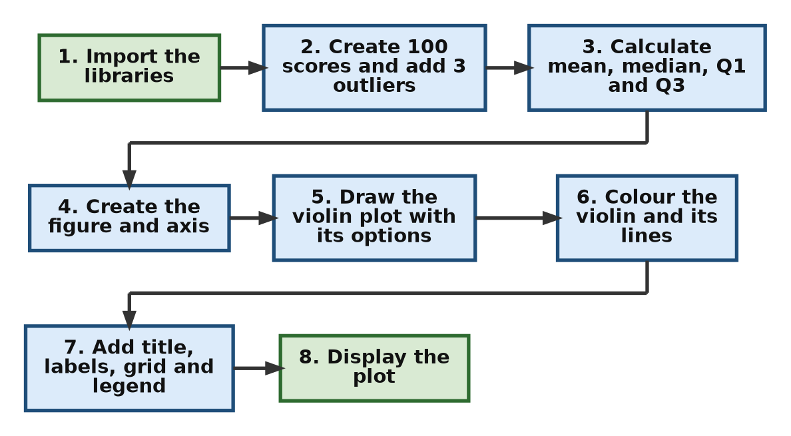

[Back to the Table of Contents](#table-of-contents)

### Basic Script Step by Step

**Step 1 - Import the required libraries**

```python
# Step 1 - Import the required libraries
import numpy as np                 # For creating the exam scores and calculating statistics
import matplotlib.pyplot as plt    # For drawing the violin plot
from matplotlib.lines import Line2D   # For building a small legend (key) later
```

**Step 2 - LAYER 1: Prepare the DATA**

```python
# Step 2 - LAYER 1: Prepare the DATA
# Set the random seed so that the "random" scores are the same every time the script runs.
np.random.seed(10)

# Generate bell-shaped exam scores:
#   loc=70   -> the average (mean) score is about 70
#   scale=10 -> the standard deviation is 10 (most scores lie within 10 marks of 70)
#   size=100 -> 100 students
scores = np.random.normal(loc=70, scale=10, size=100)
print("Step 2a: Number of scores generated:", len(scores))
print("First five scores:", np.round(scores[:5], 1))

# Add a few unusual values (outliers): two very low scores and one very high score.
# np.append() returns a NEW array with the extra values added at the end.
scores = np.append(scores, [25, 30, 105])
print("Step 2b: Number of scores after adding outliers:", len(scores))
print("Lowest score :", round(scores.min(), 1))
print("Highest score:", round(scores.max(), 1))
```

Output of this step:

```text
Step 2a: Number of scores generated: 100
First five scores: [83.3 77.2 54.5 69.9 76.2]
Step 2b: Number of scores after adding outliers: 103
Lowest score : 25.0
Highest score: 105.0
```

**Step 3 - Calculate the summary numbers that the violin plot will show**

```python
# Step 3 - Calculate the summary numbers that the violin plot will show
mean_score = np.mean(scores)
median_score = np.median(scores)
q1 = np.percentile(scores, 25)   # 25% of scores are below this value
q3 = np.percentile(scores, 75)   # 75% of scores are below this value

print()
print("Step 3: Summary of the scores")
print(f"Mean   : {mean_score:.2f}")
print(f"Median : {median_score:.2f}")
print(f"Q1     : {q1:.2f}")
print(f"Q3     : {q3:.2f}")
```

Output of this step:

```text

Step 3: Summary of the scores
Mean   : 70.29
Median : 70.90
Q1     : 65.04
Q3     : 76.84
```

**Step 4 - Create the figure and the axis (the plotting area)**

```python
# Step 4 - Create the figure and the axis (the plotting area)
fig, ax = plt.subplots(figsize=(7, 4))
```

**Step 5 - LAYER 2: Create the violin plot with OPTIONS**

```python
# Step 5 - LAYER 2: Create the violin plot with OPTIONS
# violinplot() returns a dictionary of the drawn parts. We store it in 'parts'
# so that we can change the colors in Step 6.
parts = ax.violinplot(
    scores,                   # The data to plot
    showmeans=True,           # Draw a horizontal line at the mean
    showmedians=True,         # Draw a horizontal line at the median
    showextrema=True,         # Draw lines at the minimum and maximum, joined by a vertical bar
    quantiles=[0.25, 0.75],   # Draw lines at Q1 (25%) and Q3 (75%)
)

print()
print("Step 5: Parts drawn by violinplot():", list(parts.keys()))
```

Output of this step:

```text

Step 5: Parts drawn by violinplot(): ['bodies', 'cmeans', 'cmaxes', 'cmins', 'cbars', 'cmedians', 'cquantiles']
```

**Step 6 - Give each part its own color**

```python
# Step 6 - Give each part its own color
# By default Matplotlib draws ALL these lines in the same blue color,
# so the mean and the median cannot be told apart. We color them ourselves.
for body in parts["bodies"]:           # 'bodies' is a list, with one shape per violin
    body.set_facecolor("skyblue")      # Fill color of the violin shape
    body.set_edgecolor("black")        # Outline of the violin shape
    body.set_alpha(0.7)                # Slightly see-through

parts["cmedians"].set_color("red")          # Median line in red
parts["cmedians"].set_linewidth(2.5)        # Make it thick
parts["cmeans"].set_color("green")          # Mean line in green
parts["cmeans"].set_linewidth(2)
parts["cquantiles"].set_color("black")      # Q1 and Q3 lines in black
parts["cquantiles"].set_linestyle("--")     # Dashed
for name in ["cbars", "cmins", "cmaxes"]:   # The central bar and the min/max lines
    parts[name].set_color("gray")
```

**Step 7 - LAYER 3: Add CHART ELEMENTS**

```python
# Step 7 - LAYER 3: Add CHART ELEMENTS
ax.set_title("Violin Plot of Exam Scores")
ax.set_ylabel("Marks")
ax.set_xlabel("Distribution")
ax.set_xticks([1], labels=["All 103 students"])   # The violin is drawn at x = 1

# Add a grid for better readability.
# True means show the grid, alpha=0.3 makes it lighter, axis="y" means horizontal lines only.
ax.grid(True, alpha=0.3, axis="y")

# Build a small legend (key) so the reader knows what each colored line means.
legend_lines = [
    Line2D([0], [0], color="red", linewidth=2.5, label=f"Median ({median_score:.1f})"),
    Line2D([0], [0], color="green", linewidth=2, label=f"Mean ({mean_score:.1f})"),
    Line2D([0], [0], color="black", linestyle="--", label="Q1 and Q3"),
    Line2D([0], [0], color="gray", label="Minimum and maximum"),
]
ax.legend(handles=legend_lines, loc="lower right", fontsize=8)
```

**Step 8 - Display the plot**

```python
# Step 8 - Display the plot
plt.show()
```

[Back to the Table of Contents](#table-of-contents)

### Basic Script: Complete Script

```python
# Step 1 - Import the required libraries
import numpy as np                 # For creating the exam scores and calculating statistics
import matplotlib.pyplot as plt    # For drawing the violin plot
from matplotlib.lines import Line2D   # For building a small legend (key) later

# Step 2 - LAYER 1: Prepare the DATA
# Set the random seed so that the "random" scores are the same every time the script runs.
np.random.seed(10)

# Generate bell-shaped exam scores:
#   loc=70   -> the average (mean) score is about 70
#   scale=10 -> the standard deviation is 10 (most scores lie within 10 marks of 70)
#   size=100 -> 100 students
scores = np.random.normal(loc=70, scale=10, size=100)
print("Step 2a: Number of scores generated:", len(scores))
print("First five scores:", np.round(scores[:5], 1))

# Add a few unusual values (outliers): two very low scores and one very high score.
# np.append() returns a NEW array with the extra values added at the end.
scores = np.append(scores, [25, 30, 105])
print("Step 2b: Number of scores after adding outliers:", len(scores))
print("Lowest score :", round(scores.min(), 1))
print("Highest score:", round(scores.max(), 1))

# Step 3 - Calculate the summary numbers that the violin plot will show
mean_score = np.mean(scores)
median_score = np.median(scores)
q1 = np.percentile(scores, 25)   # 25% of scores are below this value
q3 = np.percentile(scores, 75)   # 75% of scores are below this value

print()
print("Step 3: Summary of the scores")
print(f"Mean   : {mean_score:.2f}")
print(f"Median : {median_score:.2f}")
print(f"Q1     : {q1:.2f}")
print(f"Q3     : {q3:.2f}")

# Step 4 - Create the figure and the axis (the plotting area)
fig, ax = plt.subplots(figsize=(7, 4))

# Step 5 - LAYER 2: Create the violin plot with OPTIONS
# violinplot() returns a dictionary of the drawn parts. We store it in 'parts'
# so that we can change the colors in Step 6.
parts = ax.violinplot(
    scores,                   # The data to plot
    showmeans=True,           # Draw a horizontal line at the mean
    showmedians=True,         # Draw a horizontal line at the median
    showextrema=True,         # Draw lines at the minimum and maximum, joined by a vertical bar
    quantiles=[0.25, 0.75],   # Draw lines at Q1 (25%) and Q3 (75%)
)

print()
print("Step 5: Parts drawn by violinplot():", list(parts.keys()))

# Step 6 - Give each part its own color
# By default Matplotlib draws ALL these lines in the same blue color,
# so the mean and the median cannot be told apart. We color them ourselves.
for body in parts["bodies"]:           # 'bodies' is a list, with one shape per violin
    body.set_facecolor("skyblue")      # Fill color of the violin shape
    body.set_edgecolor("black")        # Outline of the violin shape
    body.set_alpha(0.7)                # Slightly see-through

parts["cmedians"].set_color("red")          # Median line in red
parts["cmedians"].set_linewidth(2.5)        # Make it thick
parts["cmeans"].set_color("green")          # Mean line in green
parts["cmeans"].set_linewidth(2)
parts["cquantiles"].set_color("black")      # Q1 and Q3 lines in black
parts["cquantiles"].set_linestyle("--")     # Dashed
for name in ["cbars", "cmins", "cmaxes"]:   # The central bar and the min/max lines
    parts[name].set_color("gray")

# Step 7 - LAYER 3: Add CHART ELEMENTS
ax.set_title("Violin Plot of Exam Scores")
ax.set_ylabel("Marks")
ax.set_xlabel("Distribution")
ax.set_xticks([1], labels=["All 103 students"])   # The violin is drawn at x = 1

# Add a grid for better readability.
# True means show the grid, alpha=0.3 makes it lighter, axis="y" means horizontal lines only.
ax.grid(True, alpha=0.3, axis="y")

# Build a small legend (key) so the reader knows what each colored line means.
legend_lines = [
    Line2D([0], [0], color="red", linewidth=2.5, label=f"Median ({median_score:.1f})"),
    Line2D([0], [0], color="green", linewidth=2, label=f"Mean ({mean_score:.1f})"),
    Line2D([0], [0], color="black", linestyle="--", label="Q1 and Q3"),
    Line2D([0], [0], color="gray", label="Minimum and maximum"),
]
ax.legend(handles=legend_lines, loc="lower right", fontsize=8)

# Step 8 - Display the plot
plt.show()
```

[Back to the Table of Contents](#table-of-contents)

### Output of the Basic Script

```text
Step 2a: Number of scores generated: 100
First five scores: [83.3 77.2 54.5 69.9 76.2]
Step 2b: Number of scores after adding outliers: 103
Lowest score : 25.0
Highest score: 105.0

Step 3: Summary of the scores
Mean   : 70.29
Median : 70.90
Q1     : 65.04
Q3     : 76.84

Step 5: Parts drawn by violinplot(): ['bodies', 'cmeans', 'cmaxes', 'cmins', 'cbars', 'cmedians', 'cquantiles']
```

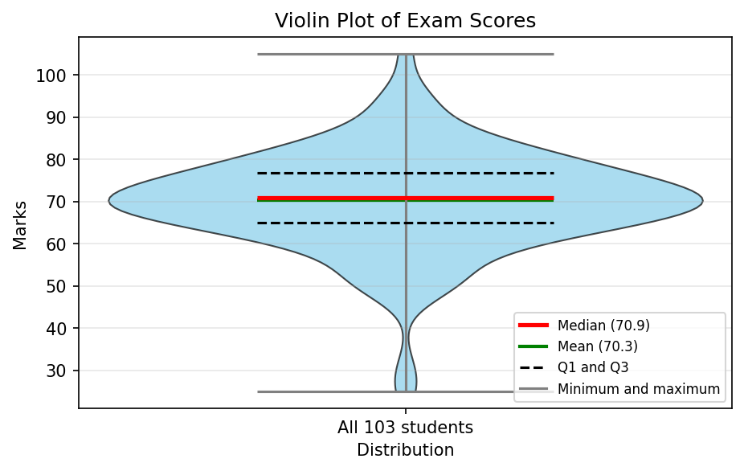

[Back to the Table of Contents](#table-of-contents)

### Why This Script Is Written This Way

> **Design Logic**:
>
> **1. Reproducible Results**  
> • `np.random.seed(10)` ensures the same random data every run  
> • Students can compare their output with book examples
>
> **2. Realistic Data**  
> • `loc=70, scale=10` creates scores centred around 70  
> • Adding outliers `[25, 30, 105]` shows how violin plots handle extremes
>
> **3. Three-Layer Structure**  
> • Data preparation isolated in Layer 1  
> • Plot options (`showmeans`, `showmedians`) in Layer 2  
> • Titles, labels, grid in Layer 3
>
> **4. One Option Per Line**  
> • Each parameter on its own line with a comment  
> • Easy to read, modify, or remove one setting at a time
>
> **5. What You Will See**  
> • Violin shape widest around 70 (where most scores are)  
> • Green line marks the mean  
> • Red line marks the median  
> • Dashed black lines mark Q1 and Q3  
> • Long, very thin tails stretching down to 25 and up to 105 (the outliers)

**Reading the plot, step by step:**

1. **Find the widest part.** The violin is widest at about 70 marks. Most students scored near 70.
2. **Find the median and the mean.** The red median line (70.9) and the green mean line (70.3) almost sit on top of each other. When the mean and median are this close, the data is roughly symmetric.
3. **Find Q1 and Q3.** The dashed lines at 65.0 and 76.8 enclose the middle half of the students. So half the class scored between about 65 and 77.
4. **Look at the ends.** The gray lines at 25 and 105 are the minimum and maximum. The violin becomes almost as thin as a thread near them, because only one or two students scored there. There is also a tiny bump around 25 to 30, created by the two low outliers sitting close together.
5. **Notice what is missing.** The outliers are not drawn as separate dots, as they would be in a box plot. In a violin plot they show up only as long thin tails.

**About the three layers:** the words "Layer 1", "Layer 2" and "Layer 3" in the comments are just a way of organizing the script. They are not Matplotlib terms. Layer 1 prepares the data, Layer 2 draws the plot, and Layer 3 adds the labels and decoration.

**About the legend:** `violinplot()` does not create legend entries by itself. So Step 7 builds four short sample lines with `Line2D` and passes them to `ax.legend()`. See [Legend guide (Matplotlib)](https://matplotlib.org/stable/users/explain/axes/legend_guide.html).

[Back to the Table of Contents](#table-of-contents)

### Follow-up Questions on the Basic Script

**Question 1:** Why do the mean line and the median line almost overlap?

<details>
<summary>Show answer</summary>

The 100 main scores come from a bell-shaped (normal) distribution centred at 70. In a symmetric distribution, the mean and the median are nearly equal. The three outliers pull in opposite directions (two low, one high), so they hardly move the mean. The printed values confirm this: mean 70.29 and median 70.90.

</details>

**Question 2:** What would change if the three outliers `[25, 30, 105]` were not added?

<details>
<summary>Show answer</summary>

Step 1 - Remove the line `scores = np.append(scores, [25, 30, 105])` and run the script again.

Step 2 - Compare the numbers. The short script below prints them with and without the outliers.

```python
import numpy as np

np.random.seed(10)
scores = np.random.normal(loc=70, scale=10, size=100)   # The 100 scores WITHOUT the outliers

print(f"Without outliers: mean = {scores.mean():.2f}, median = {np.median(scores):.2f}")
print(f"Without outliers: min = {scores.min():.2f}, max = {scores.max():.2f}")

scores_with = np.append(scores, [25, 30, 105])
print(f"With outliers   : mean = {scores_with.mean():.2f}, median = {np.median(scores_with):.2f}")
print(f"With outliers   : min = {scores_with.min():.2f}, max = {scores_with.max():.2f}")
```

```text
Without outliers: mean = 70.79, median = 70.94
Without outliers: min = 48.68, max = 94.68
With outliers   : mean = 70.29, median = 70.90
With outliers   : min = 25.00, max = 105.00
```

Step 3 - Interpret. The mean and median barely change, but the minimum and maximum change a lot (from 48.68 to 25 and from 94.68 to 105). So without the outliers, the violin would be much shorter and the thin tails would disappear. This shows that the ends of a violin are very sensitive to a few extreme values, while the middle is not.

</details>

**Question 3:** A classmate says, "The violin is widest at 70, so 70 is the highest score." What is wrong with this statement?

<details>
<summary>Show answer</summary>

Width does not show the size of a value. It shows how many students scored near that value. The widest part at 70 means that 70 is the **most common** score region. The highest score is read from the top end of the violin on the vertical axis, which is 105.

</details>

[Back to the Table of Contents](#table-of-contents)

## Bimodal Distribution

### Why Bimodal Data Proves Violin Plots Are Essential

> **Scenario**: You have two different classes (Class A and Class B) with 50 students each. One class (Class A) performed poorly (average 50), another (Class B) performed well (average 80). Suppose the scores of the two classes (of 50 students each) are combined and the scores of the combined group (100 students) are given to you.

**What Happens:**

- **Histogram**: Shows two clear peaks
- **Box Plot**: Shows one box, completely hiding the two groups!
- **Violin Plot**: Reveals both peaks clearly

The script below draws all three plots, one above the other, using the same 100 scores. `sharex=True` makes the three plots use the same score axis, so that a peak in the histogram lines up exactly with a bulge in the violin. See [matplotlib.pyplot.subplots](https://matplotlib.org/stable/api/_as_gen/matplotlib.pyplot.subplots.html).

**Note on Matplotlib versions:** the script uses `orientation="horizontal"` to lay the box plot and violin plot on their sides. This option was added in Matplotlib 3.10. If you have an older version and get an error, replace `orientation="horizontal"` with `vert=False`. In Matplotlib 3.10 and later, `vert` still works but is being phased out.

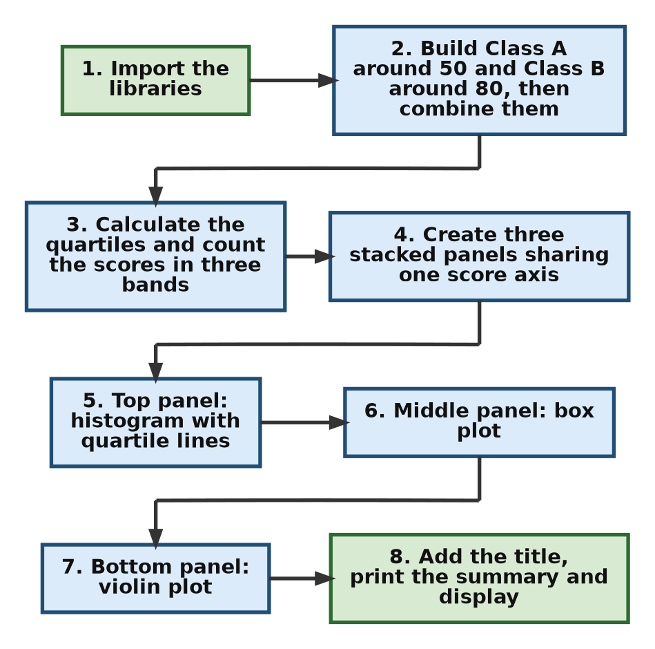

[Back to the Table of Contents](#table-of-contents)

### Comparison Script: Same Data, Three Views - Step by Step

**Step 1 - Import the required libraries**

```python
# Histogram vs Box Plot vs Violin Plot
# Bimodal Distribution (where the violin plot shines)
# Bimodal distribution: two distinct groups in the data.
# Peak 1: around 50 marks. Peak 2: around 80 marks.
# The box plot hides this, but the histogram and the violin plot reveal it.

# Step 1 - Import the required libraries
import numpy as np
import matplotlib.pyplot as plt
```

**Step 2 - LAYER 1: Prepare the DATA**

```python
# Step 2 - LAYER 1: Prepare the DATA
# Set the random seed for reproducible results
np.random.seed(42)

# Create BIMODAL data: two distinct groups
# Group A (Class A): 50 students with scores around 50
#   loc=50 -> average score 50, scale=8 -> standard deviation 8, size=50 -> 50 students
group1 = np.random.normal(loc=50, scale=8, size=50)

# Group B (Class B): 50 students with scores around 80
#   loc=80 -> average score 80, scale=8 -> standard deviation 8, size=50 -> 50 students
group2 = np.random.normal(loc=80, scale=8, size=50)

# Combine both groups into one array of 100 scores.
# np.concatenate() joins arrays end to end.
scores = np.concatenate([group1, group2])

print("Step 2: Data prepared")
print(f"Class A: {len(group1)} students, mean = {group1.mean():.2f}")
print(f"Class B: {len(group2)} students, mean = {group2.mean():.2f}")
print(f"Combined: {len(scores)} students, mean = {scores.mean():.2f}")
```

Output of this step:

```text
Step 2: Data prepared
Class A: 50 students, mean = 48.20
Class B: 50 students, mean = 80.14
Combined: 100 students, mean = 64.17
```

**Step 3 - Calculate the quartiles for reference**

```python
# Step 3 - Calculate the quartiles for reference
# np.percentile() finds the value below which a given percentage of the data lies.
q1 = np.percentile(scores, 25)   # 25th percentile
q2 = np.percentile(scores, 50)   # 50th percentile, which is the median
q3 = np.percentile(scores, 75)   # 75th percentile

print()
print("Step 3: Quartiles of the combined scores")
print(f"Q1     = {q1:.2f}")
print(f"Median = {q2:.2f}")
print(f"Q3     = {q3:.2f}")

# Count how many students scored in three bands.
# The middle band (60 to 70) lies between the two peaks.
low_band = np.sum((scores >= 40) & (scores < 60))
middle_band = np.sum((scores >= 60) & (scores < 70))
high_band = np.sum((scores >= 70) & (scores < 90))
print()
print("Students scoring 40 to under 60:", low_band)
print("Students scoring 60 to under 70:", middle_band, " <- the dip between the peaks")
print("Students scoring 70 to under 90:", high_band)
```

Output of this step:

```text

Step 3: Quartiles of the combined scores
Q1     = 48.13
Median = 63.37
Q3     = 80.20

Students scoring 40 to under 60: 39
Students scoring 60 to under 70: 6  <- the dip between the peaks
Students scoring 70 to under 90: 43
```

**Step 4 - Create three plots stacked vertically in one figure**

```python
# Step 4 - Create three plots stacked vertically in one figure
# sharex=True makes all three plots use the same score scale, so they line up.
# gridspec_kw={"height_ratios": [3, 1, 2]} sets the relative heights:
#   the histogram gets 3 parts, the box plot 1 part and the violin plot 2 parts.
fig, ax = plt.subplots(3, 1, figsize=(8, 10), sharex=True,
                       gridspec_kw={"height_ratios": [3, 1, 2]})
```

**Step 5 - Panel 1 (top): HISTOGRAM**

```python
# Step 5 - Panel 1 (top): HISTOGRAM
# bins=15 -> divide the score range into 15 intervals
# color and edgecolor for appearance, alpha=0.8 for slight transparency
ax[0].hist(scores, bins=15, color="skyblue", edgecolor="black", alpha=0.8)

# Add quartile reference lines. axvline() draws a vertical line across the plot.
ax[0].axvline(q1, color="red", linestyle="--", linewidth=2, label=f"Q1 ({q1:.1f})")
ax[0].axvline(q2, color="green", linestyle="-", linewidth=2, label=f"Median ({q2:.1f})")
ax[0].axvline(q3, color="red", linestyle="--", linewidth=2, label=f"Q3 ({q3:.1f})")

ax[0].set_title("Histogram: Shows TWO Clear Peaks", fontsize=12, fontweight="bold")
ax[0].set_ylabel("Frequency")
ax[0].legend(loc="upper left")
ax[0].grid(axis="y", alpha=0.3)
```

**Step 6 - Panel 2 (middle): BOX PLOT**

```python
# Step 6 - Panel 2 (middle): BOX PLOT
# orientation="horizontal" lays the box on its side so it lines up with the score axis.
# showmeans=True marks the mean. In a box plot the default mean marker is a green triangle.
# patch_artist=True allows the box to be filled with color.
ax[1].boxplot(scores, orientation="horizontal", showmeans=True,
              patch_artist=True, boxprops=dict(facecolor="lightgreen"))

ax[1].set_title("Box Plot: HIDES the Two Peaks!", fontsize=12, fontweight="bold", color="red")
ax[1].set_yticks([])      # Remove the meaningless tick on the vertical axis
```

**Step 7 - Panel 3 (bottom): VIOLIN PLOT**

```python
# Step 7 - Panel 3 (bottom): VIOLIN PLOT
parts = ax[2].violinplot(scores, showmeans=True, showmedians=True,
                         showextrema=True, orientation="horizontal")

# Color the median red and the mean green, so they can be told apart
parts["cmedians"].set_color("red")
parts["cmeans"].set_color("green")

ax[2].set_title("Violin Plot: REVEALS Both Peaks!", fontsize=12, fontweight="bold", color="blue")
ax[2].set_xlabel("Score")
ax[2].set_yticks([])
```

**Step 8 - Add an overall title, adjust the layout and display**

```python
# Step 8 - Add an overall title, adjust the layout and display
fig.suptitle("Bimodal Distribution: Same Data, Three Views\n"
             "Notice how the box plot hides what the histogram and violin plot reveal!",
             fontsize=14, fontweight="bold")

plt.tight_layout()

# Print the statistical summary BEFORE showing the plot,
# because the script pauses at plt.show() until the plot window is closed.
print("=" * 50)
print("STATISTICAL SUMMARY")
print("=" * 50)
print(f"Q1 (25th percentile): {q1:.2f}")
print(f"Median (50th percentile): {q2:.2f}")
print(f"Q3 (75th percentile): {q3:.2f}")
print(f"Minimum: {scores.min():.2f}")
print(f"Maximum: {scores.max():.2f}")
print("=" * 50)
print("KEY OBSERVATION:")
print("The box plot shows ONE box from Q1 to Q3,")
print("but the data actually has TWO distinct groups!")
print("=" * 50)

plt.show()
```

Output of this step:

```text
==================================================
STATISTICAL SUMMARY
==================================================
Q1 (25th percentile): 48.13
Median (50th percentile): 63.37
Q3 (75th percentile): 80.20
Minimum: 34.32
Maximum: 92.52
==================================================
KEY OBSERVATION:
The box plot shows ONE box from Q1 to Q3,
but the data actually has TWO distinct groups!
==================================================
```

[Back to the Table of Contents](#table-of-contents)

### Comparison Script: Complete Script

```python
# Histogram vs Box Plot vs Violin Plot
# Bimodal Distribution (where the violin plot shines)
# Bimodal distribution: two distinct groups in the data.
# Peak 1: around 50 marks. Peak 2: around 80 marks.
# The box plot hides this, but the histogram and the violin plot reveal it.

# Step 1 - Import the required libraries
import numpy as np
import matplotlib.pyplot as plt

# Step 2 - LAYER 1: Prepare the DATA
# Set the random seed for reproducible results
np.random.seed(42)

# Create BIMODAL data: two distinct groups
# Group A (Class A): 50 students with scores around 50
#   loc=50 -> average score 50, scale=8 -> standard deviation 8, size=50 -> 50 students
group1 = np.random.normal(loc=50, scale=8, size=50)

# Group B (Class B): 50 students with scores around 80
#   loc=80 -> average score 80, scale=8 -> standard deviation 8, size=50 -> 50 students
group2 = np.random.normal(loc=80, scale=8, size=50)

# Combine both groups into one array of 100 scores.
# np.concatenate() joins arrays end to end.
scores = np.concatenate([group1, group2])

print("Step 2: Data prepared")
print(f"Class A: {len(group1)} students, mean = {group1.mean():.2f}")
print(f"Class B: {len(group2)} students, mean = {group2.mean():.2f}")
print(f"Combined: {len(scores)} students, mean = {scores.mean():.2f}")

# Step 3 - Calculate the quartiles for reference
# np.percentile() finds the value below which a given percentage of the data lies.
q1 = np.percentile(scores, 25)   # 25th percentile
q2 = np.percentile(scores, 50)   # 50th percentile, which is the median
q3 = np.percentile(scores, 75)   # 75th percentile

print()
print("Step 3: Quartiles of the combined scores")
print(f"Q1     = {q1:.2f}")
print(f"Median = {q2:.2f}")
print(f"Q3     = {q3:.2f}")

# Count how many students scored in three bands.
# The middle band (60 to 70) lies between the two peaks.
low_band = np.sum((scores >= 40) & (scores < 60))
middle_band = np.sum((scores >= 60) & (scores < 70))
high_band = np.sum((scores >= 70) & (scores < 90))
print()
print("Students scoring 40 to under 60:", low_band)
print("Students scoring 60 to under 70:", middle_band, " <- the dip between the peaks")
print("Students scoring 70 to under 90:", high_band)

# Step 4 - Create three plots stacked vertically in one figure
# sharex=True makes all three plots use the same score scale, so they line up.
# gridspec_kw={"height_ratios": [3, 1, 2]} sets the relative heights:
#   the histogram gets 3 parts, the box plot 1 part and the violin plot 2 parts.
fig, ax = plt.subplots(3, 1, figsize=(8, 10), sharex=True,
                       gridspec_kw={"height_ratios": [3, 1, 2]})

# Step 5 - Panel 1 (top): HISTOGRAM
# bins=15 -> divide the score range into 15 intervals
# color and edgecolor for appearance, alpha=0.8 for slight transparency
ax[0].hist(scores, bins=15, color="skyblue", edgecolor="black", alpha=0.8)

# Add quartile reference lines. axvline() draws a vertical line across the plot.
ax[0].axvline(q1, color="red", linestyle="--", linewidth=2, label=f"Q1 ({q1:.1f})")
ax[0].axvline(q2, color="green", linestyle="-", linewidth=2, label=f"Median ({q2:.1f})")
ax[0].axvline(q3, color="red", linestyle="--", linewidth=2, label=f"Q3 ({q3:.1f})")

ax[0].set_title("Histogram: Shows TWO Clear Peaks", fontsize=12, fontweight="bold")
ax[0].set_ylabel("Frequency")
ax[0].legend(loc="upper left")
ax[0].grid(axis="y", alpha=0.3)

# Step 6 - Panel 2 (middle): BOX PLOT
# orientation="horizontal" lays the box on its side so it lines up with the score axis.
# showmeans=True marks the mean. In a box plot the default mean marker is a green triangle.
# patch_artist=True allows the box to be filled with color.
ax[1].boxplot(scores, orientation="horizontal", showmeans=True,
              patch_artist=True, boxprops=dict(facecolor="lightgreen"))

ax[1].set_title("Box Plot: HIDES the Two Peaks!", fontsize=12, fontweight="bold", color="red")
ax[1].set_yticks([])      # Remove the meaningless tick on the vertical axis

# Step 7 - Panel 3 (bottom): VIOLIN PLOT
parts = ax[2].violinplot(scores, showmeans=True, showmedians=True,
                         showextrema=True, orientation="horizontal")

# Color the median red and the mean green, so they can be told apart
parts["cmedians"].set_color("red")
parts["cmeans"].set_color("green")

ax[2].set_title("Violin Plot: REVEALS Both Peaks!", fontsize=12, fontweight="bold", color="blue")
ax[2].set_xlabel("Score")
ax[2].set_yticks([])

# Step 8 - Add an overall title, adjust the layout and display
fig.suptitle("Bimodal Distribution: Same Data, Three Views\n"
             "Notice how the box plot hides what the histogram and violin plot reveal!",
             fontsize=14, fontweight="bold")

plt.tight_layout()

# Print the statistical summary BEFORE showing the plot,
# because the script pauses at plt.show() until the plot window is closed.
print("=" * 50)
print("STATISTICAL SUMMARY")
print("=" * 50)
print(f"Q1 (25th percentile): {q1:.2f}")
print(f"Median (50th percentile): {q2:.2f}")
print(f"Q3 (75th percentile): {q3:.2f}")
print(f"Minimum: {scores.min():.2f}")
print(f"Maximum: {scores.max():.2f}")
print("=" * 50)
print("KEY OBSERVATION:")
print("The box plot shows ONE box from Q1 to Q3,")
print("but the data actually has TWO distinct groups!")
print("=" * 50)

plt.show()
```

[Back to the Table of Contents](#table-of-contents)

### Output of the Comparison Script

```text
Step 2: Data prepared
Class A: 50 students, mean = 48.20
Class B: 50 students, mean = 80.14
Combined: 100 students, mean = 64.17

Step 3: Quartiles of the combined scores
Q1     = 48.13
Median = 63.37
Q3     = 80.20

Students scoring 40 to under 60: 39
Students scoring 60 to under 70: 6  <- the dip between the peaks
Students scoring 70 to under 90: 43
==================================================
STATISTICAL SUMMARY
==================================================
Q1 (25th percentile): 48.13
Median (50th percentile): 63.37
Q3 (75th percentile): 80.20
Minimum: 34.32
Maximum: 92.52
==================================================
KEY OBSERVATION:
The box plot shows ONE box from Q1 to Q3,
but the data actually has TWO distinct groups!
==================================================
```

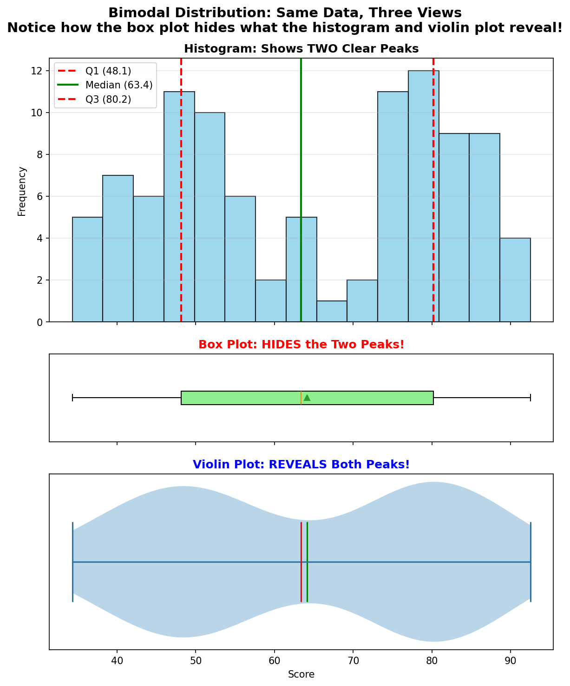

[Back to the Table of Contents](#table-of-contents)

### What to Observe

| Plot Type | What You See | What It Tells You |
| --- | --- | --- |
| Histogram | Two clear peaks at about 50 and about 80 | "There are two groups in the data" |
| Box Plot | One wide box from Q1 (48.1) to Q3 (80.2) | "Data ranges from about 34 to about 93" (but hides the two groups!) |
| Violin Plot | Two wide sections (bulges) with a narrow waist near 65 | "There are two groups in the data" |

**Why the box plot is fooled, step by step:**

1. Q1 is 48.1. This is simply close to the centre of Class A.
2. Q3 is 80.2. This is simply close to the centre of Class B.
3. The median is 63.4. It falls in the gap between the two classes.
4. The output shows that only 6 of the 100 students scored between 60 and 70. So the "middle" value of the box describes almost nobody.
5. A box plot has no way to show that the box is nearly empty in the middle. It looks just like the box for a single, widely spread class.
6. The violin plot, in contrast, becomes narrow exactly where the box plot's median sits, and wide at the two places where students really are.

[Back to the Table of Contents](#table-of-contents)

### Why This Matters

- Imagine you are a teacher analyzing exam scores from two classes.
- If you only use a box plot:
  - You miss that Class A struggled.
  - You miss that Class B excelled.
  - You treat them as one group.
- If you use a histogram or a violin plot:
  - You see two distinct groups.
  - You investigate why they differ.
  - You tailor teaching strategies.
- This is why violin plots matter!

[Back to the Table of Contents](#table-of-contents)

### Follow-up Questions on the Bimodal Script

**Question 1:** The combined mean is 64.17 and the median is 63.37. Would it be fair to say that "a typical student scored about 64"?

<details>
<summary>Show answer</summary>

No. Only 6 students scored between 60 and 70. Most students scored either around 48 (Class A) or around 80 (Class B). When data is bimodal, a single average can describe a score that almost nobody actually got. It is better to report each group separately.

</details>

**Question 2:** Can a violin plot also hide the two peaks?

<details>
<summary>Show answer</summary>

Yes, if the curve is smoothed too much. The `bw_method` option controls the smoothing. With a large value such as `bw_method=1.0`, the two bulges merge into one rounded shape. See the solution to [Challenge 5](#solution-to-challenge-5-change-the-smoothness) for a picture. So a violin plot reveals peaks only when the smoothing is sensible. The default setting usually works well.

</details>

**Question 3:** If you knew which student belonged to which class, what would be a better plot?

<details>
<summary>Show answer</summary>

Draw one violin for each class, side by side, instead of one violin for the combined scores. Then each violin would have a single peak, and the difference between the classes would be obvious. The solution to [Challenge 3](#solution-to-challenge-3-compare-multiple-groups-side-by-side) shows how to do this.

</details>

[Back to the Table of Contents](#table-of-contents)

## Important Parameters for Violin Plots

### Key Options Table

| Parameter | Purpose | Default Value | Example Value | When to Use |
| --- | --- | --- | --- | --- |
| showmeans | Draw a line at the mean | False | True or False | When you want to compare mean vs median |
| showmedians | Draw a line at the median | False | True or False | Always recommended for central tendency |
| showextrema | Draw lines at the minimum and maximum, joined by a central bar | True | True or False | When the full range matters; set False for a cleaner look |
| quantiles | Draw lines at chosen percentiles | None | `[0.25, 0.75]` for Q1 and Q3 | When you want the quartiles shown, like a box plot |
| orientation | Upright or on its side (Matplotlib 3.10 and later) | "vertical" | "vertical" or "horizontal" | Use horizontal for long labels |
| vert | Upright or on its side (older versions) | True | True (vertical) or False (horizontal) | Only with Matplotlib older than 3.10 |
| widths | Maximum width of each violin | 0.5 | 0.8 | Adjust when comparing many groups |
| positions | Where each violin is placed along the axis | 1, 2, 3, ... | `[1, 2, 3]` | When you want custom spacing |
| points | Number of points used to draw each curve | 100 | 200 | Increase for a finer outline; this does not change the amount of smoothing |
| bw_method | Amount of smoothing (bandwidth) | "scott" (an automatic rule) | 0.2 or 0.5 | Lower for more detail, higher for a smoother shape |

"Central tendency" means a single value that describes the centre of the data, such as the mean or the median. See [Central tendency (Wikipedia)](https://en.wikipedia.org/wiki/Central_tendency).

**`points` and `bw_method` are often confused.** `points` only decides how many dots are joined to draw the outline. With very few points the outline looks jagged, but beyond about 100 the change is hard to see. `bw_method` decides how much the data is smoothed, and it can change the shape itself. The picture in the solution to Challenge 5 shows both.

[Back to the Table of Contents](#table-of-contents)

### Parts Returned by violinplot()

`violinplot()` returns a dictionary. Each key holds one group of drawn items, which you can recolor or restyle.

| Key | What it holds | Present when |
| --- | --- | --- |
| `bodies` | A list of the filled violin shapes, one per violin | Always |
| `cmeans` | The mean lines | `showmeans=True` |
| `cmedians` | The median lines | `showmedians=True` |
| `cmins`, `cmaxes` | The minimum and maximum lines | `showextrema=True` |
| `cbars` | The vertical bars joining minimum and maximum | `showextrema=True` |
| `cquantiles` | The quantile lines | `quantiles` is given |

For example, `parts["cmedians"].set_color("red")` turns the median lines red, and `parts["bodies"][0].set_facecolor("skyblue")` changes the fill of the first violin.

[Back to the Table of Contents](#table-of-contents)

## When Should We Use a Violin Plot?

### Good Use Cases

| Situation | Why Violin Plot Works |
| --- | --- |
| Comparing exam scores across multiple classes | Shows if each class has one peak or multiple peaks |
| Analyzing survey responses with numeric answers (such as age or hours of study) | Reveals if respondents cluster into groups |
| Scientific measurements | Displays distribution shape + statistical summary |
| Financial data (stock returns) | Shows skewness and potential multiple regimes (different periods of behavior, such as calm and volatile periods) |
| Quality control | Detects if production has multiple modes, which may mean a change of machine, shift or material |

**A caution about survey data:** many surveys use rating scales such as 1 to 5 ("strongly disagree" to "strongly agree"). Such answers are ordinal data with only a few possible values. A smooth violin drawn over them suggests values in between, such as 3.4, that nobody could choose. For rating scales, a bar chart of how many people chose each answer is usually clearer.

[Back to the Table of Contents](#table-of-contents)

### When NOT to Use Violin Plots

| Situation | Better Alternative |
| --- | --- |
| Small datasets (< 10 points) | Box plot or strip plot |
| Need exact frequency counts | Histogram |
| Many outliers to identify | Box plot |
| Very limited space | Box plot (more compact) |
| Audience unfamiliar with statistics | Histogram (easier to understand) |

With very small datasets, the smooth curve is mostly guesswork and can show bumps that are not real. A strip plot, which shows every point, is the most honest choice there.

[Back to the Table of Contents](#table-of-contents)

## Further Challenges

```python
# Challenge 1: Change the bimodal data to trimodal (three peaks)
# Hint: Create three groups with different loc values
# group1 = np.random.normal(loc=40, scale=5, size=40)
# group2 = np.random.normal(loc=60, scale=5, size=40)
# group3 = np.random.normal(loc=85, scale=5, size=40)

# Challenge 2: Make the violin plots horizontal
# Hint: Change vert=False in violinplot() and adjust labels

# Challenge 3: Compare multiple groups side-by-side
# Hint: Pass a list of lists to violinplot()
# data = [group1, group2, group3]
# ax.violinplot(data, showmeans=True, showmedians=True)

# Challenge 4: Save the figure
# Hint: Add fig.savefig("violin_comparison.png", dpi=300,
#                       bbox_inches='tight') before plt.show()

# Challenge 5: Change the smoothness
# Hint: Add points=200 to violinplot() for smoother curves
```

Try each challenge yourself first. Then compare your work with the solutions below.

[Back to the Table of Contents](#table-of-contents)

### Solution to Challenge 1: Trimodal Data

```python
# Challenge 1 solution: trimodal data (three peaks)

# Step 1 - Import the libraries
import numpy as np
import matplotlib.pyplot as plt

# Step 2 - Create three groups of 40 students with different average scores
np.random.seed(42)
group1 = np.random.normal(loc=40, scale=5, size=40)
group2 = np.random.normal(loc=60, scale=5, size=40)
group3 = np.random.normal(loc=85, scale=5, size=40)

# Step 3 - Join the three groups into one array of 120 scores
scores = np.concatenate([group1, group2, group3])
print("Total scores:", len(scores))
print(f"Group means: {group1.mean():.1f}, {group2.mean():.1f}, {group3.mean():.1f}")
print(f"Median of all scores: {np.median(scores):.1f}")

# Step 4 - Draw a histogram and a violin plot side by side
fig, ax = plt.subplots(1, 2, figsize=(10, 4))

ax[0].hist(scores, bins=20, color="skyblue", edgecolor="black")
ax[0].set_title("Histogram: Three Peaks")
ax[0].set_xlabel("Score")
ax[0].set_ylabel("Frequency")

ax[1].violinplot(scores, showmedians=True)
ax[1].set_title("Violin Plot: Three Bulges")
ax[1].set_ylabel("Score")
ax[1].set_xticks([1], labels=["All 120 students"])

# Step 5 - Adjust spacing and display
plt.tight_layout()
plt.show()
```

**Output**

```text
Total scores: 120
Group means: 38.9, 59.9, 85.1
Median of all scores: 60.1
```

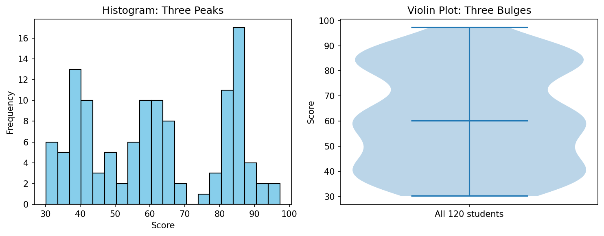

**What to notice:** the histogram has three separate groups of bars, and the violin has three bulges. The middle bulge is less pronounced than in the histogram, because the smoothing blends it with its neighbours. The median (60.1) happens to fall inside the middle group this time.

[Back to the Table of Contents](#table-of-contents)

### Solution to Challenge 2: Horizontal Violin Plot

```python
# Challenge 2 solution: a horizontal violin plot

# Step 1 - Import the libraries and create the same data as the basic script
import numpy as np
import matplotlib.pyplot as plt

np.random.seed(10)
scores = np.random.normal(loc=70, scale=10, size=100)
scores = np.append(scores, [25, 30, 105])

# Step 2 - Draw the violin on its side
# Matplotlib 3.10 and later: orientation="horizontal"
# Older versions of Matplotlib: use vert=False instead
fig, ax = plt.subplots(figsize=(7, 3))
ax.violinplot(scores, showmeans=True, showmedians=True, showextrema=True,
              orientation="horizontal")

# Step 3 - Swap the labels: the marks are now on the x-axis
ax.set_title("Horizontal Violin Plot of Exam Scores")
ax.set_xlabel("Marks")
ax.set_yticks([1], labels=["All students"])
ax.grid(True, alpha=0.3, axis="x")     # Vertical grid lines now help to read the marks

print("Violin drawn horizontally for", len(scores), "scores")

# Step 4 - Display the plot
plt.show()
```

**Output**

```text
Violin drawn horizontally for 103 scores
```

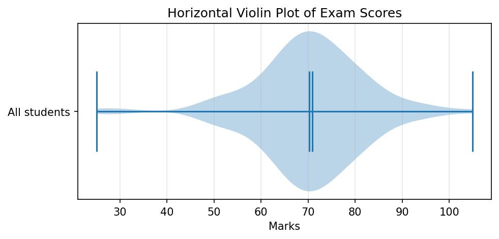

**What to notice:** when the violin lies on its side, the marks move to the x-axis. So the axis label, the tick label and the grid direction must all be swapped. The hint in the challenge mentions `vert=False`, which is the way to do this in Matplotlib versions older than 3.10. The solution uses `orientation="horizontal"`, the newer way.

[Back to the Table of Contents](#table-of-contents)

### Solution to Challenge 3: Compare Multiple Groups Side by Side

```python
# Challenge 3 solution: compare several groups side by side

# Step 1 - Import the libraries
import numpy as np
import matplotlib.pyplot as plt

# Step 2 - Create three classes of 40 students each
np.random.seed(42)
group1 = np.random.normal(loc=40, scale=5, size=40)
group2 = np.random.normal(loc=60, scale=5, size=40)
group3 = np.random.normal(loc=85, scale=5, size=40)

# Step 3 - Put the three arrays in a list. Each item in the list becomes one violin.
data = [group1, group2, group3]
labels = ["Class 1", "Class 2", "Class 3"]
for label, group in zip(labels, data):
    print(f"{label}: mean = {group.mean():.1f}, median = {np.median(group):.1f}")

# Step 4 - Draw the violins. They are placed at x = 1, 2 and 3.
fig, ax = plt.subplots(figsize=(7, 4))
ax.violinplot(data, showmeans=True, showmedians=True)

# Step 5 - Name each violin and label the axes
ax.set_xticks([1, 2, 3], labels=labels)
ax.set_ylabel("Score")
ax.set_title("Scores of Three Classes")
ax.grid(True, axis="y", alpha=0.3)

# Step 6 - Display the plot
plt.show()
```

**Output**

```text
Class 1: mean = 38.9, median = 38.8
Class 2: mean = 59.9, median = 60.1
Class 3: mean = 85.1, median = 84.8
```

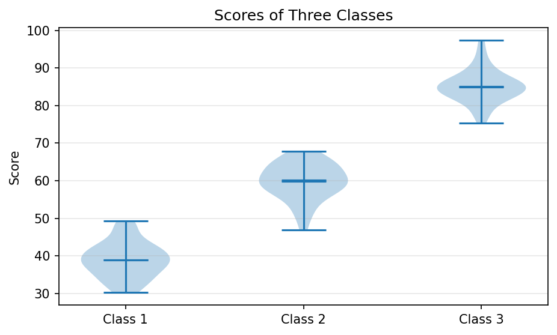

**What to notice:** each array in the list becomes one violin, placed at x = 1, 2 and 3. `ax.set_xticks()` replaces these numbers with class names. Each class now has a single peak, and the difference between the classes is clear at a glance. (Each group is an array of numbers here, but a list of plain Python lists works in the same way.)

[Back to the Table of Contents](#table-of-contents)

### Solution to Challenge 4: Save the Figure

```python
# Challenge 4 solution: save the figure to a file

# Step 1 - Import the libraries
import os
import numpy as np
import matplotlib.pyplot as plt

# Step 2 - Create the data and draw a simple violin plot
np.random.seed(10)
scores = np.random.normal(loc=70, scale=10, size=100)
fig, ax = plt.subplots(figsize=(7, 4))
ax.violinplot(scores, showmedians=True)
ax.set_title("Violin Plot of Exam Scores")

# Step 3 - Save the figure BEFORE plt.show()
# dpi=300 gives a sharp image. bbox_inches="tight" trims extra white space around the plot.
fig.savefig("violin_comparison.png", dpi=300, bbox_inches="tight")

# Step 4 - Check that the file was created in the current folder
print("File saved:", os.path.exists("violin_comparison.png"))

# Step 5 - Display the plot
plt.show()
```

**Output**

```text
File saved: True
```

**What to notice:** the image file is saved in the folder from which you run the script. `savefig()` must come before `plt.show()`, because in many setups the figure is cleared once the plot window is closed. See [savefig (Matplotlib)](https://matplotlib.org/stable/api/_as_gen/matplotlib.pyplot.savefig.html).

[Back to the Table of Contents](#table-of-contents)

### Solution to Challenge 5: Change the Smoothness

```python
# Challenge 5 solution: points and bw_method

# Step 1 - Import the libraries and create bimodal data
import numpy as np
import matplotlib.pyplot as plt

np.random.seed(42)
scores = np.concatenate([np.random.normal(50, 8, 50),
                         np.random.normal(80, 8, 50)])

# Step 2 - Draw the same data four times with different settings
settings = [
    {"points": 10},          # Very few points: the outline looks jagged
    {"points": 200},         # Many points: a fine, smooth outline
    {"bw_method": 0.1},      # Small bandwidth: very wiggly, follows every small bump
    {"bw_method": 1.0},      # Large bandwidth: over-smoothed, the two peaks merge
]
titles = ["points=10", "points=200", "bw_method=0.1", "bw_method=1.0"]

fig, ax = plt.subplots(1, 4, figsize=(12, 4), sharey=True)
for i in range(4):
    ax[i].violinplot(scores, showmedians=True, **settings[i])   # ** passes the dictionary as options
    ax[i].set_title(titles[i])
    ax[i].set_xticks([])
    print("Panel", i + 1, "drawn with", settings[i])
ax[0].set_ylabel("Score")

# Step 3 - Adjust spacing and display
plt.tight_layout()
plt.show()
```

**Output**

```text
Panel 1 drawn with {'points': 10}
Panel 2 drawn with {'points': 200}
Panel 3 drawn with {'bw_method': 0.1}
Panel 4 drawn with {'bw_method': 1.0}
```

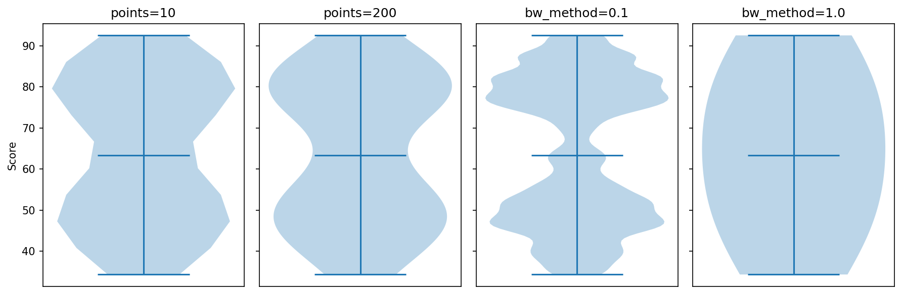

**What to notice:**

1. **`points=10`**: the outline is made of only 10 dots joined by straight lines, so it looks jagged.
2. **`points=200`**: the outline is fine and smooth. It looks almost the same as the default of 100.
3. **`bw_method=0.1`**: very little smoothing. The curve follows every small bump in the data, many of which are just chance.
4. **`bw_method=1.0`**: too much smoothing. The two peaks merge and the violin looks like a single rounded shape, hiding the two groups just as a box plot would.

So the hint in the challenge is partly right: more `points` gives a smoother-looking *outline*, but the real smoothness of the *shape* is controlled by `bw_method`. The `**settings[i]` in the script unpacks a dictionary into named options, so `**{"points": 10}` is the same as writing `points=10`.

[Back to the Table of Contents](#table-of-contents)

## Summary

- A box plot shows a few summary numbers but hides the shape of the data, including multiple peaks.
- A violin plot adds a mirrored, smoothed density curve, so the shape and the peaks become visible.
- Width shows how crowded the data is at each value. It does not show the value itself.
- In Matplotlib, `violinplot()` draws the shape and the minimum and maximum lines by default. The mean, median and quartiles must be switched on with `showmeans`, `showmedians` and `quantiles`, and they are all the same color unless you change them.
- For bimodal data, a histogram and a violin plot reveal two groups, while a box plot does not. A single mean or median of such data can describe almost nobody.
- The amount of smoothing (`bw_method`) matters. Too much smoothing can hide peaks, and too little can invent them.
- Avoid violin plots for very small datasets, for rating-scale answers, and for audiences who need exact counts.

[Back to the Table of Contents](#table-of-contents)

## Glossary of Technical Terms

| Term | Simple explanation | Learn more |
| --- | --- | --- |
| Bandwidth | The width of the small bumps added together in kernel density estimation; it controls smoothness | [Kernel density estimation](https://en.wikipedia.org/wiki/Kernel_density_estimation) |
| Bimodal | Having two peaks | [Multimodal distribution](https://en.wikipedia.org/wiki/Multimodal_distribution) |
| Box plot | A plot showing the median, quartiles, whiskers and outliers | [Box plot](https://en.wikipedia.org/wiki/Box_plot) |
| Density curve | A smooth curve showing where data points are crowded or sparse | [Probability density function](https://en.wikipedia.org/wiki/Probability_density_function) |
| Distribution | How the values of a variable are spread out | [Frequency distribution](https://en.wikipedia.org/wiki/Frequency_(statistics)) |
| Interquartile range (IQR) | Q3 minus Q1; the spread of the middle half of the data | [Interquartile range](https://en.wikipedia.org/wiki/Interquartile_range) |
| Kernel density estimation (KDE) | A method of drawing a smooth density curve by adding a small bump for each data point | [Kernel density estimation](https://en.wikipedia.org/wiki/Kernel_density_estimation) |
| Mean | The ordinary average | [Arithmetic mean](https://en.wikipedia.org/wiki/Arithmetic_mean) |
| Median | The middle value when the data is arranged in order | [Median](https://en.wikipedia.org/wiki/Median) |
| Mode or peak | A value around which many data points gather | [Mode](https://en.wikipedia.org/wiki/Mode_(statistics)) |
| Normal distribution | A symmetric, bell-shaped distribution | [Normal distribution](https://en.wikipedia.org/wiki/Normal_distribution) |
| Outlier | A value unusually far from most other values | [Outlier](https://en.wikipedia.org/wiki/Outlier) |
| Percentile and quartile | The value below which a given percentage of data lies; quartiles are the 25th, 50th and 75th percentiles | [Quartile](https://en.wikipedia.org/wiki/Quartile) |
| Random seed | A starting number that makes random results repeatable | [numpy.random.seed](https://numpy.org/doc/stable/reference/random/generated/numpy.random.seed.html) |
| Skewness | How lopsided a distribution is | [Skewness](https://en.wikipedia.org/wiki/Skewness) |
| Standard deviation | A measure of how spread out values are around the mean | [Standard deviation](https://en.wikipedia.org/wiki/Standard_deviation) |
| Strip plot | A plot that draws every data point as a dot | [seaborn.stripplot](https://seaborn.pydata.org/generated/seaborn.stripplot.html) |
| Trimodal | Having three peaks | [Multimodal distribution](https://en.wikipedia.org/wiki/Multimodal_distribution) |
| Violin plot | A plot combining a mirrored density curve with summary statistics | [Violin plot](https://en.wikipedia.org/wiki/Violin_plot) |

[Back to the Table of Contents](#table-of-contents)

---

