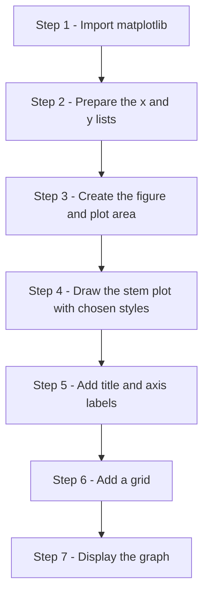
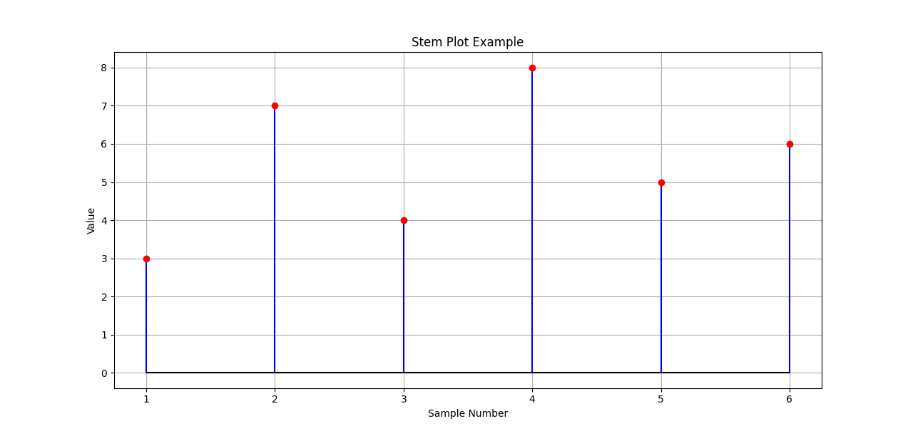
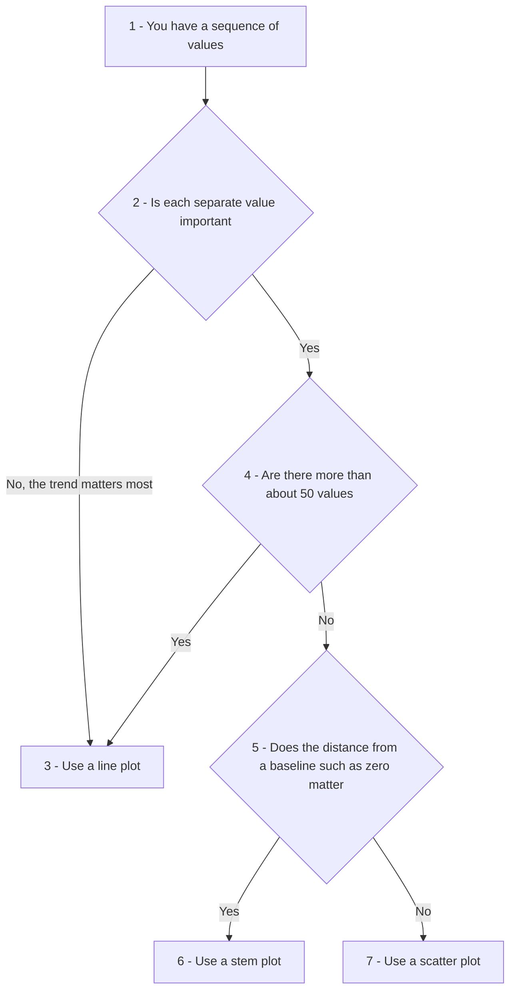
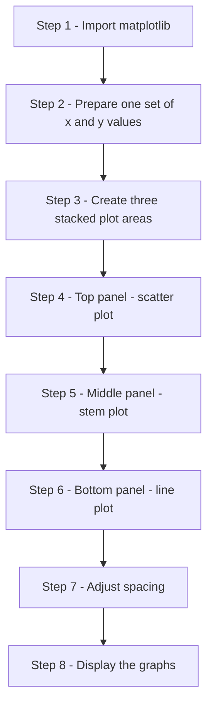
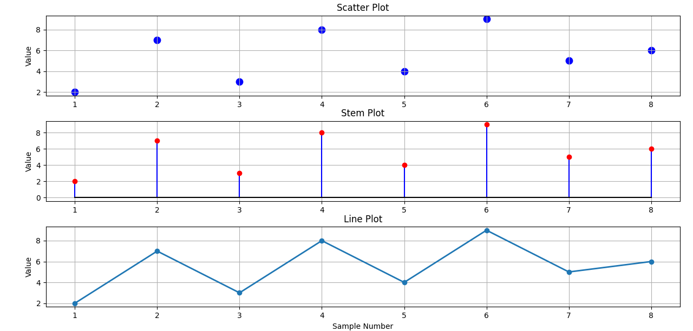
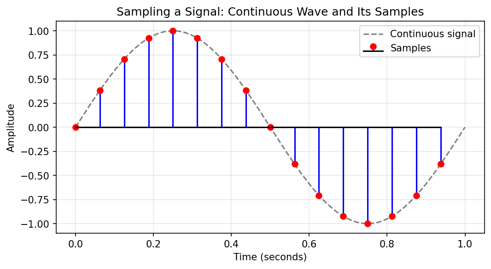
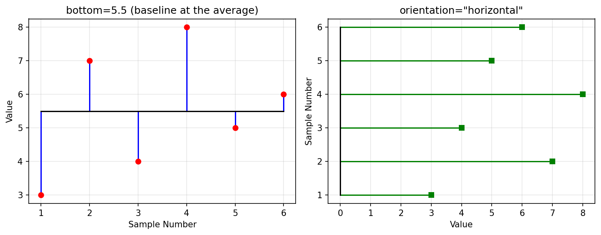

# Stem Plots in Matplotlib: Showing Individual Values Clearly

This page is a companion to the chapter on **Matplotlib** in the book. So far we have used line plots to show trends and scatter plots to show separate points. A **stem plot** is a third way of drawing a sequence of values. Each value gets its own vertical line, called a stem, that rises from a baseline and ends in a marker. Because the stems are not joined to one another, every value stands on its own, and its height is easy to compare with the others.

The page covers:

- what a stem plot is and what its parts are called
- how a stem plot differs from a line plot, a scatter plot and a histogram
- the two ways of calling `stem()` in Python: the `plt.stem()` style and the `ax.stem()` style
- the main options: `linefmt`, `markerfmt`, `basefmt`, `bottom` and `orientation`
- when a stem plot is a good choice and when it is not
- four complete scripts, including a comparison of three plot types on the same data and a sampled signal with positive and negative values

Stem plots are common in signal processing and electronics, where a smooth signal is measured at separate moments in time. They are also useful in everyday data analysis whenever each reading matters more than the overall trend. Every script on this page is broken into steps, each step shows its printed output, and a complete script follows so that you can run the whole program at once.

**Do not confuse this with a "stem-and-leaf plot".** In statistics textbooks, the name "stem plot" is sometimes used for a **stem-and-leaf display**, which is a way of writing numbers in a table to show their distribution. That is a completely different thing. On this page, "stem plot" always means the graph drawn by Matplotlib's `stem()` method. See [Stem-and-leaf display (Wikipedia)](https://en.wikipedia.org/wiki/Stem-and-leaf_display) if you want to know about the other one.

## Table of Contents

- [Stem Plots in Matplotlib: Showing Individual Values Clearly](#stem-plots-in-matplotlib-showing-individual-values-clearly)
  - [Introduction](#introduction)
    - [Parts of a Stem Plot](#parts-of-a-stem-plot)
  - [Stem Plot vs Line Plot](#stem-plot-vs-line-plot)
    - [Common Parameters](#common-parameters)
  - [Simplified Signatures](#simplified-signatures)
    - [State-Based](#state-based)
    - [OOP-Based](#oop-based)
  - [Script 1: A Basic Stem Plot](#script-1-a-basic-stem-plot)
    - [Script 1 Step by Step](#script-1-step-by-step)
    - [Script 1 Complete Script](#script-1-complete-script)
    - [Output of Script 1](#output-of-script-1)
    - [What This Script Demonstrates](#what-this-script-demonstrates)
    - [Follow-up Questions on Script 1](#follow-up-questions-on-script-1)
  - [When Should We Use Stem Plots?](#when-should-we-use-stem-plots)
  - [Histogram vs Stem Plot vs Line Plot](#histogram-vs-stem-plot-vs-line-plot)
  - [Key Idea](#key-idea)
  - [Scatter Plot vs Stem Plot vs Line Plot](#scatter-plot-vs-stem-plot-vs-line-plot)
    - [Script 2: Comparison Script Step by Step](#script-2-comparison-script-step-by-step)
    - [Script 2: Complete Script](#script-2-complete-script)
    - [Output of Script 2](#output-of-script-2)
    - [What to Observe](#what-to-observe)
    - [Visual Interpretation](#visual-interpretation)
    - [Key Learning Point](#key-learning-point)
    - [Follow-up Questions on Script 2](#follow-up-questions-on-script-2)
  - [Script 3: Stem Plot of a Sampled Signal](#script-3-stem-plot-of-a-sampled-signal)
    - [Script 3 Step by Step](#script-3-step-by-step)
    - [Script 3 Complete Script](#script-3-complete-script)
    - [Output of Script 3](#output-of-script-3)
  - [Script 4: Changing the Baseline and the Direction](#script-4-changing-the-baseline-and-the-direction)
    - [Script 4 Step by Step](#script-4-step-by-step)
    - [Script 4 Complete Script](#script-4-complete-script)
    - [Output of Script 4](#output-of-script-4)
  - [Summary](#summary)
  - [Glossary of Technical Terms](#glossary-of-technical-terms)

## Introduction

A **stem plot** displays data using vertical lines (called stems) extending from a baseline to individual data values.

Unlike a line graph, consecutive points are **not connected**. Each observation is shown separately.

Stem plots are useful when:

- the observations are taken at separate, distinct positions (for example, sample 1, sample 2, sample 3), even if the measured values themselves can be any number
- the order of observations is important
- we wish to emphasize individual values rather than trends

Common applications include:

- **signal processing** (working with signals such as sound or radio waves) - see [Signal processing (Wikipedia)](https://en.wikipedia.org/wiki/Signal_processing)
- **digital electronics** (circuits that work with values taken at separate moments)
- **sampled data** (values measured at regular intervals from something that changes smoothly) - see [Sampling (Wikipedia)](https://en.wikipedia.org/wiki/Sampling_(signal_processing))
- **time-series measurements** (values recorded one after another over time) - see [Time series (Wikipedia)](https://en.wikipedia.org/wiki/Time_series)

The stem plot was made popular by MATLAB, a program widely used by engineers, and Matplotlib's `stem()` method is modelled on it. See [matplotlib.pyplot.stem](https://matplotlib.org/stable/api/_as_gen/matplotlib.pyplot.stem.html).

[Back to the Table of Contents](#table-of-contents)

### Parts of a Stem Plot

```text
   Value
     ^
   8 |                   o   <- marker (head of the stem) shows the value
   7 |       o           |
   6 |       |           |           o
   5 |       |           |     o     |
   4 |       |     o     |     |     |
   3 | o     |     |     |     |     |   <- stem (the vertical line)
   2 | |     |     |     |     |     |
   1 | |     |     |     |     |     |
   0 +-+-----+-----+-----+-----+-----+--   <- baseline (at 0 by default)
       1     2     3     4     5     6   Sample Number
```

| Part | What it is | Option that controls its style | Default style |
| --- | --- | --- | --- |
| Stem | The line from the baseline to the value | `linefmt` | Solid line in the first color of the color cycle (blue) |
| Marker | The dot at the top (or bottom) of each stem | `markerfmt` | Filled circle in the same color as the stems |
| Baseline | The horizontal line that all stems start from | `basefmt` | Solid red line |

The **color cycle** is the list of colors that Matplotlib uses one after another when you do not choose a color yourself. The first color is a medium blue and the fourth is red. See [Specifying colors (Matplotlib)](https://matplotlib.org/stable/users/explain/colors/colors.html).

[Back to the Table of Contents](#table-of-contents)

## Stem Plot vs Line Plot

| Feature | Line Plot | Stem Plot |
| --- | --- | --- |
| Connects points | Yes | No |
| Shows trend | Excellent | Moderate |
| Shows individual values | Moderate | Excellent |
| Best for continuous data | Yes | No |
| Best for discrete samples | No | Yes |
| Shows distance from a baseline | No | Yes |
| Shows negative values clearly | Moderate | Excellent (stems point downward) |

**Continuous data** can take any value and changes smoothly, like temperature through the day. **Discrete samples** are separate readings taken at distinct positions, like one temperature reading per hour. A line plot draws the smooth picture; a stem plot draws the separate readings.

[Back to the Table of Contents](#table-of-contents)

### Common Parameters

| Parameter | Affects | Result | Useful For | Example |
| --- | --- | --- | --- | --- |
| stem(x, y) | Plot | Creates stem plot (not an option, but the basic call) | Discrete data | Basic usage |
| linefmt="r-" | Stem lines | Changes stem style | Formatting | Red stems |
| markerfmt="bo" | Markers | Changes marker style | Highlight points | Blue circles |
| basefmt="k-" | Baseline | Changes baseline style | Visibility | Black baseline |
| bottom=5 | Baseline position | Moves the baseline away from 0 | Showing values above or below a reference level | Baseline at 5 |
| orientation="horizontal" | Direction of stems | Draws stems sideways from a vertical baseline | Long labels on the value axis | Horizontal stems |
| label="Samples" | Legend | Gives the stems a name for the legend | Plots with more than one data set | Legend entry "Samples" |

**How to read format strings.** The values given to `linefmt`, `markerfmt` and `basefmt` are short **format strings**. Each one combines a color letter with a line style or marker symbol:

| Color letter | Color | Line style | Meaning | Marker symbol | Meaning |
| --- | --- | --- | --- | --- | --- |
| `b` | blue | `-` | solid line | `o` | circle |
| `r` | red | `--` | dashed line | `s` | square |
| `g` | green | `-.` | dash-dot line | `^` | triangle |
| `k` | black | `:` | dotted line | `D` | diamond |

For example, `"g--"` means green dashed stems and `"rs"` means red square markers. Markers given in `linefmt` are ignored, so always put the marker symbol in `markerfmt`. See the "Format Strings" section of [matplotlib.pyplot.plot](https://matplotlib.org/stable/api/_as_gen/matplotlib.pyplot.plot.html).

[Back to the Table of Contents](#table-of-contents)

## Simplified Signatures

A **signature** is the general form of a function call: its name and the main values it expects. Matplotlib offers two styles of calling its plotting functions. See [Matplotlib Application Interfaces](https://matplotlib.org/stable/users/explain/figure/api_interfaces.html).

[Back to the Table of Contents](#table-of-contents)

### State-Based

```python
plt.stem(x, y)
```

In this style you call functions from `matplotlib.pyplot` (imported as `plt`). Matplotlib keeps track of the "current" figure and plot area for you and draws on it. It is quick for simple, single plots. It is also called the **pyplot style**.

[Back to the Table of Contents](#table-of-contents)

### OOP-Based

```python
ax.stem(x, y)
```

OOP stands for **object-oriented programming**. In this style you first create the figure and plot area yourself, usually with `fig, ax = plt.subplots()`, and then call methods on the plot area object `ax`. You always know exactly which plot you are drawing on, which matters when a figure has several plots.

| Point of comparison | State-based (`plt.stem`) | OOP-based (`ax.stem`) |
| --- | --- | --- |
| How to start | Just call `plt.stem(x, y)` | First `fig, ax = plt.subplots()`, then `ax.stem(x, y)` |
| Which plot is drawn on | The "current" plot, chosen by Matplotlib | The plot area you name (`ax`, `ax[0]`, `ax[1]`, ...) |
| Setting a title | `plt.title("...")` | `ax.set_title("...")` |
| Best for | Quick single plots | Figures with several plots, and longer scripts |

All the scripts on this page use the OOP style.

[Back to the Table of Contents](#table-of-contents)

## Script 1: A Basic Stem Plot

This script draws six sample values as a stem plot with blue stems, red markers and a black baseline. The plotting code is short, so extra `print()` statements have been added to show the data and the parts that `ax.stem()` creates.



[Back to the Table of Contents](#table-of-contents)

### Script 1 Step by Step

**Step 1 - Import the plotting library**

```python
# Stem Plot Example

# Step 1 - Import the plotting library
import matplotlib.pyplot as plt
```

**Step 2 - Prepare the sample data**

```python
# Step 2 - Prepare the sample data
# x holds the sample numbers (positions along the horizontal axis).
# y holds the value measured at each sample.
# Both lists must have the same length: one y-value for each x-position.
x = [1, 2, 3, 4, 5, 6]
y = [3, 7, 4, 8, 5, 6]

print("Step 2: Data to be plotted")
for sample, value in zip(x, y):
    print(f"  Sample {sample}: value = {value}")
```

Output of this step:

```text
Step 2: Data to be plotted
  Sample 1: value = 3
  Sample 2: value = 7
  Sample 3: value = 4
  Sample 4: value = 8
  Sample 5: value = 5
  Sample 6: value = 6
```

**Step 3 - Create the figure and one subplot (plotting area)**

```python
# Step 3 - Create the figure and one subplot (plotting area)
# 'fig' is the whole window and 'ax' is the area where the stem plot is drawn.
fig, ax = plt.subplots()
```

**Step 4 - Create the stem plot**

```python
# Step 4 - Create the stem plot
# Each format string is a short code made of a color letter and a style symbol:
#   "b-"  -> b = blue,  - = solid line
#   "ro"  -> r = red,   o = circle marker
#   "k-"  -> k = black, - = solid line
stem_container = ax.stem(
    x,
    y,
    linefmt="b-",      # Blue stems
    markerfmt="ro",    # Red circle markers
    basefmt="k-"       # Black baseline
)

# ax.stem() returns three drawn parts, which can be changed later if needed.
print()
print("Step 4: Parts returned by ax.stem()")
print("  markerline:", type(stem_container.markerline).__name__)
print("  stemlines :", type(stem_container.stemlines).__name__)
print("  baseline  :", type(stem_container.baseline).__name__)
```

Output of this step:

```text

Step 4: Parts returned by ax.stem()
  markerline: Line2D
  stemlines : LineCollection
  baseline  : Line2D
```

**Step 5 - Add title and labels**

```python
# Step 5 - Add title and labels
ax.set_title("Stem Plot Example")
ax.set_xlabel("Sample Number")
ax.set_ylabel("Value")
```

**Step 6 - Add grid**

```python
# Step 6 - Add grid
ax.grid(True)
```

**Step 7 - Display graph**

```python
# Step 7 - Display graph
plt.show()
```

**About Step 4:** `ax.stem()` returns a **StemContainer**, a small bundle holding the three parts of the plot. `markerline` is the set of markers, `stemlines` is the set of stems (stored together as a `LineCollection`, which is simply many lines treated as one object), and `baseline` is the baseline. You can use them to change the look of a part after drawing, for example `stem_container.markerline.set_markersize(10)`. See [StemContainer (Matplotlib)](https://matplotlib.org/stable/api/container_api.html#matplotlib.container.StemContainer).

[Back to the Table of Contents](#table-of-contents)

### Script 1 Complete Script

```python
# Stem Plot Example

# Step 1 - Import the plotting library
import matplotlib.pyplot as plt

# Step 2 - Prepare the sample data
# x holds the sample numbers (positions along the horizontal axis).
# y holds the value measured at each sample.
# Both lists must have the same length: one y-value for each x-position.
x = [1, 2, 3, 4, 5, 6]
y = [3, 7, 4, 8, 5, 6]

print("Step 2: Data to be plotted")
for sample, value in zip(x, y):
    print(f"  Sample {sample}: value = {value}")

# Step 3 - Create the figure and one subplot (plotting area)
# 'fig' is the whole window and 'ax' is the area where the stem plot is drawn.
fig, ax = plt.subplots()

# Step 4 - Create the stem plot
# Each format string is a short code made of a color letter and a style symbol:
#   "b-"  -> b = blue,  - = solid line
#   "ro"  -> r = red,   o = circle marker
#   "k-"  -> k = black, - = solid line
stem_container = ax.stem(
    x,
    y,
    linefmt="b-",      # Blue stems
    markerfmt="ro",    # Red circle markers
    basefmt="k-"       # Black baseline
)

# ax.stem() returns three drawn parts, which can be changed later if needed.
print()
print("Step 4: Parts returned by ax.stem()")
print("  markerline:", type(stem_container.markerline).__name__)
print("  stemlines :", type(stem_container.stemlines).__name__)
print("  baseline  :", type(stem_container.baseline).__name__)

# Step 5 - Add title and labels
ax.set_title("Stem Plot Example")
ax.set_xlabel("Sample Number")
ax.set_ylabel("Value")

# Step 6 - Add grid
ax.grid(True)

# Step 7 - Display graph
plt.show()
```

[Back to the Table of Contents](#table-of-contents)

### Output of Script 1

```text
Step 2: Data to be plotted
  Sample 1: value = 3
  Sample 2: value = 7
  Sample 3: value = 4
  Sample 4: value = 8
  Sample 5: value = 5
  Sample 6: value = 6

Step 4: Parts returned by ax.stem()
  markerline: Line2D
  stemlines : LineCollection
  baseline  : Line2D
```



[Back to the Table of Contents](#table-of-contents)

### What This Script Demonstrates

- creating a stem plot
- displaying individual observations
- customizing stems and markers
- comparing discrete values

**Reading the plot, step by step:**

1. Look along the horizontal axis. There is one stem at each sample number, from 1 to 6.
2. Follow each stem up to its red marker and read the value on the vertical axis.
3. Compare the heights. Sample 4 has the tallest stem (8) and sample 1 the shortest (3).
4. Notice that all stems start from the black baseline at 0. So the length of each stem equals its value.
5. Notice that nothing joins sample 1 to sample 2, and so on. The plot makes no claim about what happens between the samples.

[Back to the Table of Contents](#table-of-contents)

### Follow-up Questions on Script 1

**Question 1:** What happens if you leave out the `x` list and write `ax.stem(y)`?

<details>
<summary>Show answer</summary>

Matplotlib uses the positions 0, 1, 2, 3, 4, 5 as the x-values. The plot looks the same, but the stems are placed at 0 to 5 instead of 1 to 6. This is because Python counts from 0.

</details>

**Question 2:** How would you draw green dashed stems with black square markers and no visible baseline?

<details>
<summary>Show answer</summary>

Step 1 - Green dashed stems: `linefmt="g--"`.

Step 2 - Black square markers: `markerfmt="ks"`.

Step 3 - Hide the baseline: use a format string with no line, `basefmt=" "` (a single space).

```python
ax.stem(x, y, linefmt="g--", markerfmt="ks", basefmt=" ")
```

</details>

**Question 3:** Why does the vertical axis go down to 0 (in fact slightly below it) even though the smallest value is 3?

<details>
<summary>Show answer</summary>

The baseline is drawn at 0 (the default value of `bottom`), and every stem starts from the baseline. Matplotlib makes the axis big enough to show the whole baseline and all the stems, so the axis must include 0. It then adds a small margin, which is why the axis starts a little below 0.

</details>

[Back to the Table of Contents](#table-of-contents)

## When Should We Use Stem Plots?

Use a stem plot when:

- observations occur at distinct positions
- individual values are important
- data represents sampled measurements
- connecting points with lines would be misleading

Examples:

- daily sensor readings
- digital signals
- daily changes in a stock price (gains as upward stems, losses as downward stems)
- laboratory measurements

**When a stem plot is not a good choice:**

| Situation | Why | Better choice |
| --- | --- | --- |
| Hundreds or thousands of values | The stems crowd together into a solid block | Line plot |
| You want to show the distribution of values | A stem plot shows each value in order, not how often values occur | Histogram |
| Values are all large and close together (for example, 995 to 1005) | Every stem is long and they all look the same height | Line plot, or a stem plot with `bottom` set near the values |
| Two numeric variables are being related | Stems suggest a baseline and an order that do not matter | Scatter plot |

The flowchart below helps you decide. Follow the numbers.



The figure of about 50 values is only a rough guide. The real test is whether the stems can still be told apart on the screen.

[Back to the Table of Contents](#table-of-contents)

## Histogram vs Stem Plot vs Line Plot

| Feature | Histogram | Stem Plot | Line Plot |
| --- | --- | --- | --- |
| Shows frequencies | Yes | No | No |
| Shows individual values | No | Yes | Partly |
| Connects observations | No | No | Yes |
| Best for distributions | Yes | No | No |
| Best for sampled data | No | Yes | Yes |
| Horizontal axis shows | Ranges of values (bins) | Position or order of each observation | Position or order of each observation |
| Height of a bar or stem shows | How many values fall in the range | The value itself | The value itself |

**An easy mix-up:** a histogram and a stem plot can both look like a row of vertical lines. But in a histogram, the height is a **count** (how many values fell in that range). In a stem plot, the height is the **value** of one observation. For sampled data, a line plot also works well when there are many samples, while a stem plot is better when there are few and each one matters.

A **frequency** is the number of times a value, or a range of values, occurs. A **distribution** describes how the values are spread out. See [Histogram (Wikipedia)](https://en.wikipedia.org/wiki/Histogram).

[Back to the Table of Contents](#table-of-contents)

## Key Idea

A stem plot may be viewed as a compromise between a scatter plot and a line plot:

```text
Scatter Plot
      ↓
Stem Plot
      ↓
Line Plot
```

It preserves individual observations while making the magnitude of each value easy to compare.

The table below shows what each of the three plots draws. The stem plot shares the points with a scatter plot, and shares the idea of a vertical measurement with a line plot, without joining the points:

| Plot | Draws the points | Links each point to the baseline | Links points to each other |
| --- | --- | --- | --- |
| Scatter plot | Yes | No | No |
| Stem plot | Yes | Yes | No |
| Line plot | Yes | No | Yes |

**Magnitude** means size. The longer the stem, the larger the value (or, if the value is negative, the further below the baseline it lies).

[Back to the Table of Contents](#table-of-contents)

## Scatter Plot vs Stem Plot vs Line Plot

The following example uses the same dataset to create a scatter plot, stem plot and line plot.

This comparison helps illustrate the strengths of each graph type.

- A **scatter plot** shows only the individual observations.
- A **stem plot** shows both the observations and their magnitudes relative to a baseline.
- A **line plot** emphasizes the overall trend by connecting consecutive points.

By comparing the three graphs, students can better understand when each type of plot is most appropriate.

This is Script 2 on this page.

`plt.subplots(3, 1)` creates a figure with 3 rows and 1 column of plot areas, stacked one above the other. See [matplotlib.pyplot.subplots](https://matplotlib.org/stable/api/_as_gen/matplotlib.pyplot.subplots.html).



[Back to the Table of Contents](#table-of-contents)

### Script 2: Comparison Script Step by Step

**Step 1 - Import the plotting library**

```python
# Scatter Plot vs Stem Plot vs Line Plot

# Step 1 - Import the plotting library
import matplotlib.pyplot as plt
```

**Step 2 - Prepare the sample data (the same data is used for all three plots)**

```python
# Step 2 - Prepare the sample data (the same data is used for all three plots)
x = [1, 2, 3, 4, 5, 6, 7, 8]
y = [2, 7, 3, 8, 4, 9, 5, 6]

print("Step 2: Number of observations:", len(x))
print("Highest value:", max(y), "at sample", x[y.index(max(y))])
print("Lowest value :", min(y), "at sample", x[y.index(min(y))])
```

Output of this step:

```text
Step 2: Number of observations: 8
Highest value: 9 at sample 6
Lowest value : 2 at sample 1
```

**Step 3 - Create three vertically stacked subplots**

```python
# Step 3 - Create three vertically stacked subplots
fig, ax = plt.subplots(
    3,  # Number of rows
    1,  # Number of columns
    figsize=(8, 8)  # Figure size in inches (width, height)
)
# 'ax' now holds three plotting areas: ax[0] (top), ax[1] (middle) and ax[2] (bottom).
print()
print("Step 3: Number of plotting areas created:", len(ax))
```

Output of this step:

```text

Step 3: Number of plotting areas created: 3
```

**Step 4 - Panel 1: Scatter Plot. It is the top panel.**

```python
# Step 4 - Panel 1: Scatter Plot. It is the top panel.
ax[0].scatter(
    x,
    y,
    s=80,  # Marker size
    marker="o",  # Circle markers
    color="blue"  # Marker color
)

ax[0].set_title("Scatter Plot")  # Title for the first subplot
ax[0].set_ylabel("Value")        # Y-axis label for the first subplot
ax[0].grid(True)                 # Add grid to the first subplot
```

**Step 5 - Panel 2: Stem Plot. It is the middle panel.**

```python
# Step 5 - Panel 2: Stem Plot. It is the middle panel.
ax[1].stem(
    x,
    y,
    linefmt="b-",       # Blue stems
    markerfmt="ro",     # Red circle markers
    basefmt="k-"        # Black baseline
)

ax[1].set_title("Stem Plot")  # Title for the second subplot
ax[1].set_ylabel("Value")     # Y-axis label for the second subplot
ax[1].grid(True)              # Add grid to the second subplot
```

**Step 6 - Panel 3: Line Plot. It is the bottom panel.**

```python
# Step 6 - Panel 3: Line Plot. It is the bottom panel.
ax[2].plot(
    x,
    y,
    marker="o",  # Circle markers
    linewidth=2  # Line width
)

ax[2].set_title("Line Plot")          # Title for the third subplot
ax[2].set_xlabel("Sample Number")     # X-axis label for the third subplot
ax[2].set_ylabel("Value")             # Y-axis label for the third subplot
ax[2].grid(True)                      # Add grid to the third subplot
```

**Step 7 - Adjust spacing**

```python
# Step 7 - Adjust spacing
# tight_layout() adjusts the space between the panels so that titles and labels do not overlap.
plt.tight_layout()
```

**Step 8 - Display graphs**

```python
# Step 8 - Display graphs
plt.show()
```

[Back to the Table of Contents](#table-of-contents)

### Script 2: Complete Script

```python
# Scatter Plot vs Stem Plot vs Line Plot

# Step 1 - Import the plotting library
import matplotlib.pyplot as plt

# Step 2 - Prepare the sample data (the same data is used for all three plots)
x = [1, 2, 3, 4, 5, 6, 7, 8]
y = [2, 7, 3, 8, 4, 9, 5, 6]

print("Step 2: Number of observations:", len(x))
print("Highest value:", max(y), "at sample", x[y.index(max(y))])
print("Lowest value :", min(y), "at sample", x[y.index(min(y))])

# Step 3 - Create three vertically stacked subplots
fig, ax = plt.subplots(
    3,  # Number of rows
    1,  # Number of columns
    figsize=(8, 8)  # Figure size in inches (width, height)
)
# 'ax' now holds three plotting areas: ax[0] (top), ax[1] (middle) and ax[2] (bottom).
print()
print("Step 3: Number of plotting areas created:", len(ax))

# Step 4 - Panel 1: Scatter Plot. It is the top panel.
ax[0].scatter(
    x,
    y,
    s=80,  # Marker size
    marker="o",  # Circle markers
    color="blue"  # Marker color
)

ax[0].set_title("Scatter Plot")  # Title for the first subplot
ax[0].set_ylabel("Value")        # Y-axis label for the first subplot
ax[0].grid(True)                 # Add grid to the first subplot

# Step 5 - Panel 2: Stem Plot. It is the middle panel.
ax[1].stem(
    x,
    y,
    linefmt="b-",       # Blue stems
    markerfmt="ro",     # Red circle markers
    basefmt="k-"        # Black baseline
)

ax[1].set_title("Stem Plot")  # Title for the second subplot
ax[1].set_ylabel("Value")     # Y-axis label for the second subplot
ax[1].grid(True)              # Add grid to the second subplot

# Step 6 - Panel 3: Line Plot. It is the bottom panel.
ax[2].plot(
    x,
    y,
    marker="o",  # Circle markers
    linewidth=2  # Line width
)

ax[2].set_title("Line Plot")          # Title for the third subplot
ax[2].set_xlabel("Sample Number")     # X-axis label for the third subplot
ax[2].set_ylabel("Value")             # Y-axis label for the third subplot
ax[2].grid(True)                      # Add grid to the third subplot

# Step 7 - Adjust spacing
# tight_layout() adjusts the space between the panels so that titles and labels do not overlap.
plt.tight_layout()

# Step 8 - Display graphs
plt.show()
```

[Back to the Table of Contents](#table-of-contents)

### Output of Script 2

```text
Step 2: Number of observations: 8
Highest value: 9 at sample 6
Lowest value : 2 at sample 1

Step 3: Number of plotting areas created: 3
```



[Back to the Table of Contents](#table-of-contents)

### What to Observe

| **Plot Type** | Main Focus | Best Shows | What you notice in this example |
| --- | --- | --- | --- |
| **Scatter Plot** | Individual points | Exact observations | Eight separate dots; the up-and-down pattern is there but not obvious |
| **Stem Plot** | Points + height from baseline | Magnitude of observations | The tall stems at samples 2, 4 and 6 stand out at once against the short ones at 1, 3 and 5 |
| **Line Plot** | Connected observations | Trend and progression | A zigzag line; it is easier to see that the low points rise steadily (2, 3, 4, 5) and the high points rise too (7, 8, 9) |

[Back to the Table of Contents](#table-of-contents)

### Visual Interpretation

```text
Scatter Plot
      ↓
Shows where observations occur

Stem Plot
      ↓
Shows where observations occur
and how far they are from zero

Line Plot
      ↓
Shows overall trend by
connecting observations
```

[Back to the Table of Contents](#table-of-contents)

### Key Learning Point

The same dataset can be represented in different ways depending on the objective:

- Use a **scatter plot** when individual observations are important.
- Use a **stem plot** when individual observations and their magnitudes must be emphasized.
- Use a **line plot** when the primary goal is to show a trend or progression over time.

[Back to the Table of Contents](#table-of-contents)

### Follow-up Questions on Script 2

**Question 1:** In the line plot, halfway between sample 1 (value 2) and sample 2 (value 7), the line passes through the value 4.5. Was 4.5 ever measured?

<details>
<summary>Show answer</summary>

No. Only whole-number samples 1 to 8 were measured. The line simply joins the measured points with straight segments. This is why a line plot can be misleading for separate samples: it suggests values between the samples that were never recorded. The stem plot avoids this.

</details>

**Question 2:** The three panels line up here only because they happen to use the same x-values. How could you make sure they always line up, even if one panel had different data?

<details>
<summary>Show answer</summary>

Add `sharex=True` to `plt.subplots()`:

```python
fig, ax = plt.subplots(3, 1, figsize=(8, 8), sharex=True)
```

All three panels then use one common x-axis, so sample 4 in the top panel sits exactly above sample 4 in the other two.

</details>

[Back to the Table of Contents](#table-of-contents)

## Script 3: Stem Plot of a Sampled Signal

The first two scripts had only positive values. Real signals, such as sound, go above and below zero. This script shows where stem plots are used most: displaying the **samples** taken from a smooth signal. Each sample is a reading of the signal at one moment. The smooth wave is drawn as a faint dashed line so that you can see where the samples come from.

Two NumPy functions are used:

- `np.linspace(start, stop, num)` creates `num` evenly spaced numbers from `start` to `stop`. See [numpy.linspace](https://numpy.org/doc/stable/reference/generated/numpy.linspace.html).
- `np.sin()` calculates the sine of each value, which gives a smooth wave. See [numpy.sin](https://numpy.org/doc/stable/reference/generated/numpy.sin.html).

The **amplitude** of a signal is its value at a given moment, measured from zero. See [Amplitude (Wikipedia)](https://en.wikipedia.org/wiki/Amplitude).

[Back to the Table of Contents](#table-of-contents)

### Script 3 Step by Step

**Step 1 - Import the libraries**

```python
# Stem Plot of a Sampled Signal (positive and negative values)

# Step 1 - Import the libraries
import numpy as np                 # For creating the signal values
import matplotlib.pyplot as plt    # For drawing the plots
```

**Step 2 - Create a smooth "real" signal**

```python
# Step 2 - Create a smooth "real" signal
# np.linspace(0, 1, 200) gives 200 evenly spaced time values from 0 to 1 second.
# np.sin() turns them into a smooth wave that goes above and below zero.
t_smooth = np.linspace(0, 1, 200)
signal_smooth = np.sin(2 * np.pi * t_smooth)     # One full wave in 1 second
```

**Step 3 - Take samples of the signal at 16 equally spaced moments**

```python
# Step 3 - Take samples of the signal at 16 equally spaced moments
# np.arange(16) gives 0, 1, 2, ..., 15. Dividing by 16 gives times 0, 1/16, 2/16, ...
n = np.arange(16)                  # Sample numbers
t_samples = n / 16                 # Time of each sample in seconds
samples = np.sin(2 * np.pi * t_samples)

print("Step 3: Sampled values")
print(" n   time(s)   value")
for i in range(len(n)):
    print(f"{n[i]:2d}   {t_samples[i]:.4f}   {samples[i]:6.3f}")
```

Output of this step:

```text
Step 3: Sampled values
 n   time(s)   value
 0   0.0000    0.000
 1   0.0625    0.383
 2   0.1250    0.707
 3   0.1875    0.924
 4   0.2500    1.000
 5   0.3125    0.924
 6   0.3750    0.707
 7   0.4375    0.383
 8   0.5000    0.000
 9   0.5625   -0.383
10   0.6250   -0.707
11   0.6875   -0.924
12   0.7500   -1.000
13   0.8125   -0.924
14   0.8750   -0.707
15   0.9375   -0.383
```

**Step 4 - Create the figure**

```python
# Step 4 - Create the figure
fig, ax = plt.subplots(figsize=(8, 4))
```

**Step 5 - Draw the smooth signal as a faint dashed line (for reference only)**

```python
# Step 5 - Draw the smooth signal as a faint dashed line (for reference only)
ax.plot(t_smooth, signal_smooth, color="gray", linestyle="--", label="Continuous signal")
```

**Step 6 - Draw the samples as a stem plot**

```python
# Step 6 - Draw the samples as a stem plot
# Stems go UP for positive values and DOWN for negative values,
# because every stem starts at the baseline, which is at 0 by default.
ax.stem(t_samples, samples, linefmt="b-", markerfmt="ro", basefmt="k-", label="Samples")
```

**Step 7 - Add title, labels, legend and grid**

```python
# Step 7 - Add title, labels, legend and grid
ax.set_title("Sampling a Signal: Continuous Wave and Its Samples")
ax.set_xlabel("Time (seconds)")
ax.set_ylabel("Amplitude")
ax.legend(loc="upper right")
ax.grid(True, alpha=0.3)

positive = np.sum(samples > 1e-9)
negative = np.sum(samples < -1e-9)
print()
print("Step 7: Stems pointing up  :", positive)
print("        Stems pointing down:", negative)
print("        Stems of (almost) zero height:", len(samples) - positive - negative)
```

Output of this step:

```text

Step 7: Stems pointing up  : 7
        Stems pointing down: 7
        Stems of (almost) zero height: 2
```

**Step 8 - Display the plot**

```python
# Step 8 - Display the plot
plt.show()
```

**About Step 7:** some sample values, such as the one at 0.5 seconds, should be exactly 0. Computers store decimal numbers with tiny rounding errors, so the result may be something like 0.0000000000000001. The script therefore treats any value closer to zero than 0.000000001 (written `1e-9`) as zero.

[Back to the Table of Contents](#table-of-contents)

### Script 3 Complete Script

```python
# Stem Plot of a Sampled Signal (positive and negative values)

# Step 1 - Import the libraries
import numpy as np                 # For creating the signal values
import matplotlib.pyplot as plt    # For drawing the plots

# Step 2 - Create a smooth "real" signal
# np.linspace(0, 1, 200) gives 200 evenly spaced time values from 0 to 1 second.
# np.sin() turns them into a smooth wave that goes above and below zero.
t_smooth = np.linspace(0, 1, 200)
signal_smooth = np.sin(2 * np.pi * t_smooth)     # One full wave in 1 second

# Step 3 - Take samples of the signal at 16 equally spaced moments
# np.arange(16) gives 0, 1, 2, ..., 15. Dividing by 16 gives times 0, 1/16, 2/16, ...
n = np.arange(16)                  # Sample numbers
t_samples = n / 16                 # Time of each sample in seconds
samples = np.sin(2 * np.pi * t_samples)

print("Step 3: Sampled values")
print(" n   time(s)   value")
for i in range(len(n)):
    print(f"{n[i]:2d}   {t_samples[i]:.4f}   {samples[i]:6.3f}")

# Step 4 - Create the figure
fig, ax = plt.subplots(figsize=(8, 4))

# Step 5 - Draw the smooth signal as a faint dashed line (for reference only)
ax.plot(t_smooth, signal_smooth, color="gray", linestyle="--", label="Continuous signal")

# Step 6 - Draw the samples as a stem plot
# Stems go UP for positive values and DOWN for negative values,
# because every stem starts at the baseline, which is at 0 by default.
ax.stem(t_samples, samples, linefmt="b-", markerfmt="ro", basefmt="k-", label="Samples")

# Step 7 - Add title, labels, legend and grid
ax.set_title("Sampling a Signal: Continuous Wave and Its Samples")
ax.set_xlabel("Time (seconds)")
ax.set_ylabel("Amplitude")
ax.legend(loc="upper right")
ax.grid(True, alpha=0.3)

positive = np.sum(samples > 1e-9)
negative = np.sum(samples < -1e-9)
print()
print("Step 7: Stems pointing up  :", positive)
print("        Stems pointing down:", negative)
print("        Stems of (almost) zero height:", len(samples) - positive - negative)

# Step 8 - Display the plot
plt.show()
```

[Back to the Table of Contents](#table-of-contents)

### Output of Script 3

```text
Step 3: Sampled values
 n   time(s)   value
 0   0.0000    0.000
 1   0.0625    0.383
 2   0.1250    0.707
 3   0.1875    0.924
 4   0.2500    1.000
 5   0.3125    0.924
 6   0.3750    0.707
 7   0.4375    0.383
 8   0.5000    0.000
 9   0.5625   -0.383
10   0.6250   -0.707
11   0.6875   -0.924
12   0.7500   -1.000
13   0.8125   -0.924
14   0.8750   -0.707
15   0.9375   -0.383

Step 7: Stems pointing up  : 7
        Stems pointing down: 7
        Stems of (almost) zero height: 2
```



**What to notice:**

1. Stems point **up** for positive samples and **down** for negative samples. A line plot or scatter plot would not show this "above or below zero" idea so clearly.
2. The red markers sit exactly on the dashed wave, because each one is a reading of that wave.
3. There are no stems between the samples. A computer or digital device knows only these 16 values, not the smooth wave.
4. The baseline runs only from the first stem to the last one. It does not stretch across the whole plot.
5. In the legend, the "Samples" entry shows a small marker, stem and baseline together, because the stem plot is one combined item.

[Back to the Table of Contents](#table-of-contents)

## Script 4: Changing the Baseline and the Direction

This script uses the data from Script 1 again and shows two useful options side by side:

- `bottom=` moves the baseline. Here it is set to the average value, so each stem shows how far a value is **above or below the average**.
- `orientation="horizontal"` turns the stems on their side.

[Back to the Table of Contents](#table-of-contents)

### Script 4 Step by Step

**Step 1 - Import the libraries**

```python
# Stem Plot Options: bottom and orientation

# Step 1 - Import the libraries
import numpy as np
import matplotlib.pyplot as plt
```

**Step 2 - Prepare the data (the same data as the first stem plot script)**

```python
# Step 2 - Prepare the data (the same data as the first stem plot script)
x = [1, 2, 3, 4, 5, 6]
y = [3, 7, 4, 8, 5, 6]

# Find the average value. We will use it as the baseline in the left panel.
average = np.mean(y)
print("Step 2: Average value =", average)
for sample, value in zip(x, y):
    if value > average:
        position = "above"
    else:
        position = "below"
    print(f"  Sample {sample}: value {value} is {abs(value - average):.1f} {position} the average")
```

Output of this step:

```text
Step 2: Average value = 5.5
  Sample 1: value 3 is 2.5 below the average
  Sample 2: value 7 is 1.5 above the average
  Sample 3: value 4 is 1.5 below the average
  Sample 4: value 8 is 2.5 above the average
  Sample 5: value 5 is 0.5 below the average
  Sample 6: value 6 is 0.5 above the average
```

**Step 3 - Create two plots side by side**

```python
# Step 3 - Create two plots side by side
fig, ax = plt.subplots(1, 2, figsize=(10, 4))
```

**Step 4 - Left panel: move the baseline to the average using bottom=**

```python
# Step 4 - Left panel: move the baseline to the average using bottom=
# Each stem now starts at the average, so it shows how far each value is
# above or below the average.
ax[0].stem(x, y, linefmt="b-", markerfmt="ro", basefmt="k-", bottom=average)
ax[0].set_title(f"bottom={average} (baseline at the average)")
ax[0].set_xlabel("Sample Number")
ax[0].set_ylabel("Value")
ax[0].grid(True, alpha=0.3)
```

**Step 5 - Right panel: horizontal stems using orientation="horizontal"**

```python
# Step 5 - Right panel: horizontal stems using orientation="horizontal"
# Now the sample numbers are on the vertical axis and the values on the horizontal axis.
ax[1].stem(x, y, linefmt="g-", markerfmt="gs", basefmt="k-", orientation="horizontal")
ax[1].set_title('orientation="horizontal"')
ax[1].set_xlabel("Value")
ax[1].set_ylabel("Sample Number")
ax[1].grid(True, alpha=0.3)
```

**Step 6 - Adjust spacing and display**

```python
# Step 6 - Adjust spacing and display
plt.tight_layout()
plt.show()
```

[Back to the Table of Contents](#table-of-contents)

### Script 4 Complete Script

```python
# Stem Plot Options: bottom and orientation

# Step 1 - Import the libraries
import numpy as np
import matplotlib.pyplot as plt

# Step 2 - Prepare the data (the same data as the first stem plot script)
x = [1, 2, 3, 4, 5, 6]
y = [3, 7, 4, 8, 5, 6]

# Find the average value. We will use it as the baseline in the left panel.
average = np.mean(y)
print("Step 2: Average value =", average)
for sample, value in zip(x, y):
    if value > average:
        position = "above"
    else:
        position = "below"
    print(f"  Sample {sample}: value {value} is {abs(value - average):.1f} {position} the average")

# Step 3 - Create two plots side by side
fig, ax = plt.subplots(1, 2, figsize=(10, 4))

# Step 4 - Left panel: move the baseline to the average using bottom=
# Each stem now starts at the average, so it shows how far each value is
# above or below the average.
ax[0].stem(x, y, linefmt="b-", markerfmt="ro", basefmt="k-", bottom=average)
ax[0].set_title(f"bottom={average} (baseline at the average)")
ax[0].set_xlabel("Sample Number")
ax[0].set_ylabel("Value")
ax[0].grid(True, alpha=0.3)

# Step 5 - Right panel: horizontal stems using orientation="horizontal"
# Now the sample numbers are on the vertical axis and the values on the horizontal axis.
ax[1].stem(x, y, linefmt="g-", markerfmt="gs", basefmt="k-", orientation="horizontal")
ax[1].set_title('orientation="horizontal"')
ax[1].set_xlabel("Value")
ax[1].set_ylabel("Sample Number")
ax[1].grid(True, alpha=0.3)

# Step 6 - Adjust spacing and display
plt.tight_layout()
plt.show()
```

[Back to the Table of Contents](#table-of-contents)

### Output of Script 4

```text
Step 2: Average value = 5.5
  Sample 1: value 3 is 2.5 below the average
  Sample 2: value 7 is 1.5 above the average
  Sample 3: value 4 is 1.5 below the average
  Sample 4: value 8 is 2.5 above the average
  Sample 5: value 5 is 0.5 below the average
  Sample 6: value 6 is 0.5 above the average
```



**What to notice:**

1. In the left panel, samples 2, 4 and 6 have stems pointing up (above the average of 5.5), and samples 1, 3 and 5 have stems pointing down (below it).
2. The stem lengths match the printed output. For example, sample 1 is 2.5 below the average, and sample 4 is 2.5 above it, so their stems are equally long.
3. In the right panel, the baseline is vertical at 0 and the stems grow to the right. The sample numbers move to the vertical axis, so the axis labels must be swapped.
4. The right panel uses `linefmt="g-"` and `markerfmt="gs"`, which give green stems and green square markers.

[Back to the Table of Contents](#table-of-contents)

## Summary

- A stem plot draws each value as a line (stem) from a baseline, topped by a marker. The points are not joined.
- It is best for a modest number of separate, ordered observations, especially sampled signals and values that can be positive or negative.
- `linefmt`, `markerfmt` and `basefmt` set the style of the stems, markers and baseline using short format strings such as `"b-"` and `"ro"`.
- `bottom` moves the baseline, and `orientation="horizontal"` turns the stems sideways.
- `plt.stem()` (state-based) and `ax.stem()` (OOP-based) draw the same plot. The OOP style is clearer when a figure has several plots.
- A scatter plot shows only points, a stem plot adds the link to the baseline, and a line plot links the points to each other.
- A stem plot is not a histogram: stem height is a value, while histogram bar height is a count. It is also not a stem-and-leaf display.

[Back to the Table of Contents](#table-of-contents)

## Glossary of Technical Terms

| Term | Simple explanation | Learn more |
| --- | --- | --- |
| Amplitude | The value of a signal at a moment, measured from zero | [Amplitude](https://en.wikipedia.org/wiki/Amplitude) |
| Baseline | The line from which all stems start; at 0 unless `bottom` is set | [matplotlib.pyplot.stem](https://matplotlib.org/stable/api/_as_gen/matplotlib.pyplot.stem.html) |
| Color cycle | The sequence of colors Matplotlib uses when no color is given | [Specifying colors](https://matplotlib.org/stable/users/explain/colors/colors.html) |
| Continuous data | Data that can take any value in a range and changes smoothly | [Continuous or discrete variable](https://en.wikipedia.org/wiki/Continuous_or_discrete_variable) |
| Discrete samples | Separate readings taken at distinct positions or moments | [Sampling](https://en.wikipedia.org/wiki/Sampling_(signal_processing)) |
| Format string | A short code such as `"ro"` that sets color and line or marker style | [matplotlib.pyplot.plot](https://matplotlib.org/stable/api/_as_gen/matplotlib.pyplot.plot.html) |
| Magnitude | The size of a value | |
| Marker | The symbol (such as a circle) drawn at a data point | [matplotlib.markers](https://matplotlib.org/stable/api/markers_api.html) |
| OOP (object-oriented programming) | A style of programming where you work with objects, such as a plot area `ax`, and call their methods | [Matplotlib Application Interfaces](https://matplotlib.org/stable/users/explain/figure/api_interfaces.html) |
| Signal processing | The study of analysing and changing signals such as sound, images and sensor data | [Signal processing](https://en.wikipedia.org/wiki/Signal_processing) |
| Signature | The general form of a function call: its name and main inputs | |
| Stem | The line joining the baseline to a data value | [matplotlib.pyplot.stem](https://matplotlib.org/stable/api/_as_gen/matplotlib.pyplot.stem.html) |
| Stem-and-leaf display | A different, table-like way of showing numbers; not the same as a Matplotlib stem plot | [Stem-and-leaf display](https://en.wikipedia.org/wiki/Stem-and-leaf_display) |
| StemContainer | The object returned by `stem()`, holding the markers, stems and baseline | [StemContainer](https://matplotlib.org/stable/api/container_api.html#matplotlib.container.StemContainer) |
| Time series | Values recorded one after another over time | [Time series](https://en.wikipedia.org/wiki/Time_series) |

[Back to the Table of Contents](#table-of-contents)

---


