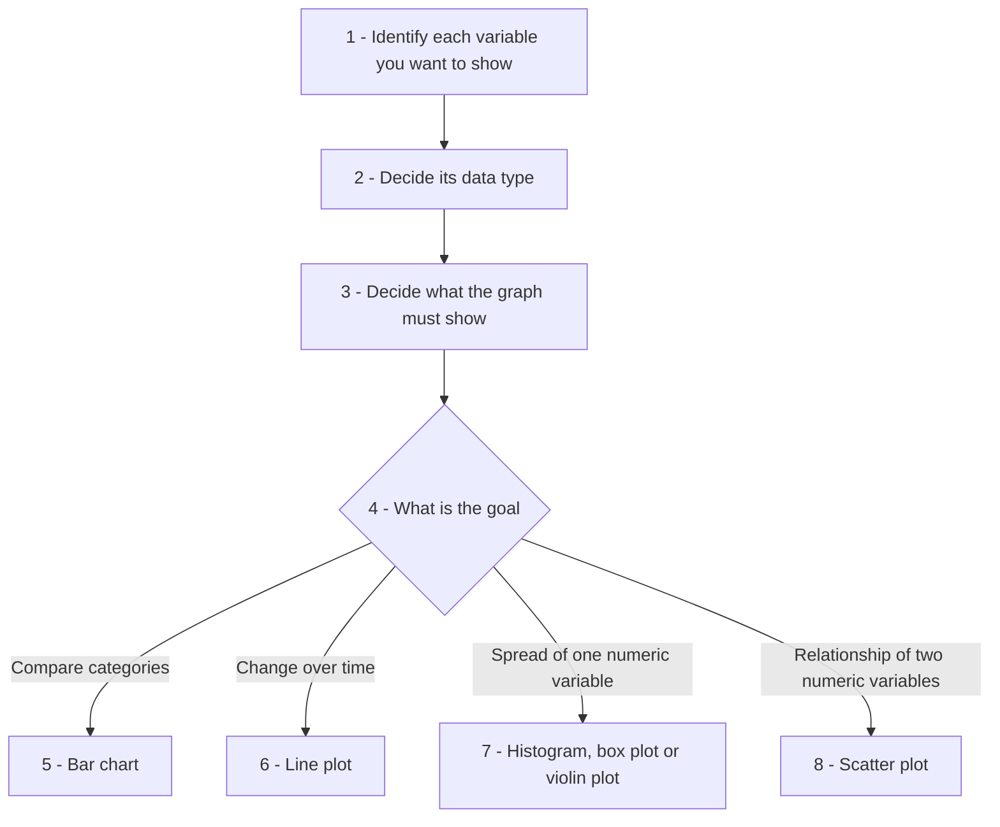
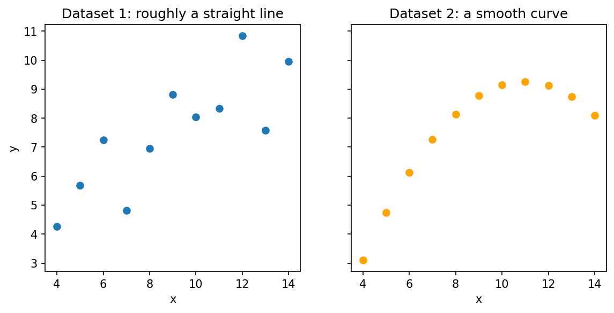
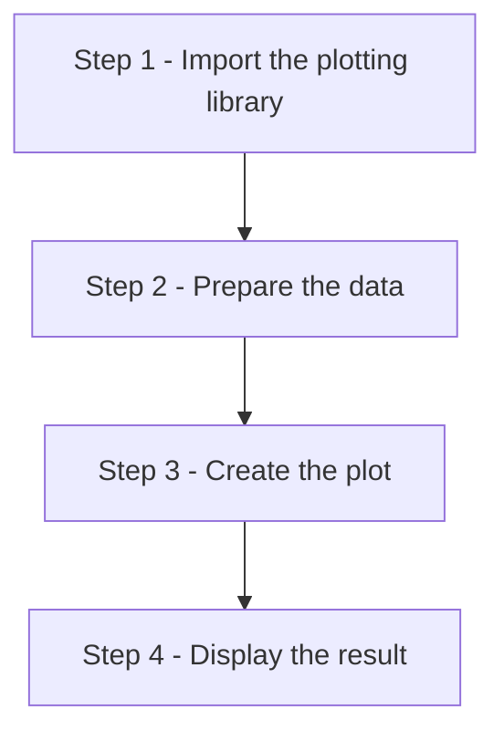
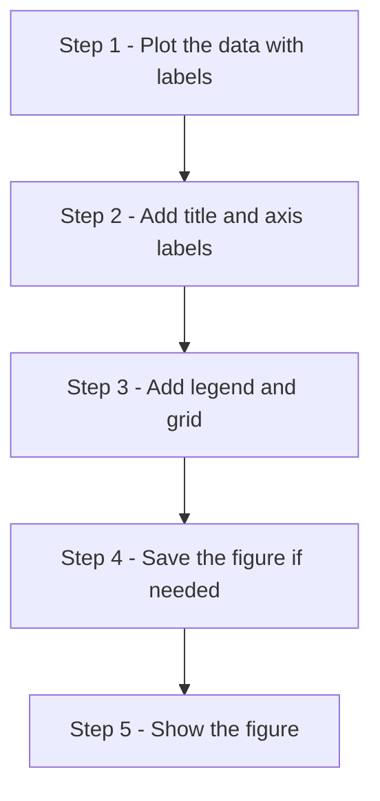
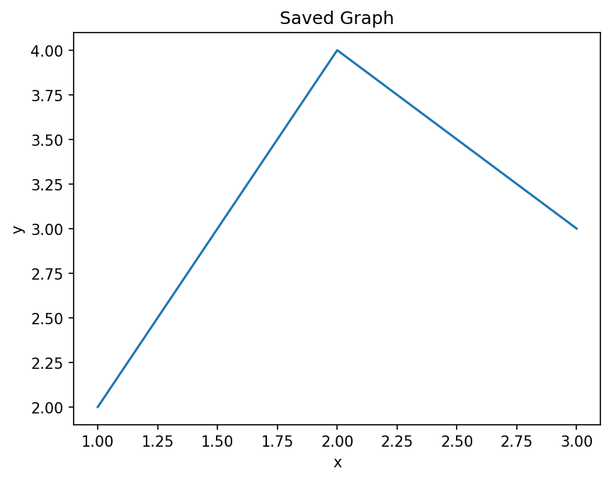

# Matplotlib: Conceptual Questions and Answers

This page collects twenty conceptual questions on data visualization with **Matplotlib**, the most widely used plotting library in Python. The questions are the same as those printed at the end of the Matplotlib chapter in the book. Here each one has a full answer, and most answers also have a short script that you can run, its printed output, and a follow-up question to test your understanding.

The questions move from the general to the specific:

- why the type and arrangement of data decide which plot to use
- how a basic Matplotlib program is organized, and the two styles of writing it
- how to give data to Matplotlib (lists, NumPy arrays and pandas objects)
- plots for studying distributions: histograms, box plots and violin plots
- plots for coordinate data and for grid (matrix) data
- adding extra information: error bars, bubble sizes, colors, titles, labels and legends
- arranging several plots in one figure, and saving figures to files

These ideas are not limited to Matplotlib. Almost every data analysis task in Python ends with a graph, and other plotting libraries such as Seaborn and pandas' own plotting tools are built on top of Matplotlib. So a clear understanding of these concepts will help you in any Python work that involves data.

**How to use this page:** try to answer each question in your own words first. Then read the answer, run the script, and try the follow-up question. The answers to the follow-up questions are hidden; click "Show answer" to see them.

**About the scripts:** every script was run with Matplotlib 3.10, NumPy 2 and pandas 3.0, and the printed output is shown below it. When a script calls `plt.show()`, a graph window opens on your computer. A picture of that graph is shown on this page below the printed output, so you can check your result.

## Table of Contents

- [Matplotlib: Conceptual Questions and Answers](#matplotlib-conceptual-questions-and-answers)
  - [Part 1: Data and Visualization Basics](#part-1-data-and-visualization-basics)
    - [1. Why is understanding data types important before selecting a Matplotlib plot?](#1-why-is-understanding-data-types-important-before-selecting-a-matplotlib-plot)
    - [2. How does data visualization reveal insights that may remain hidden in tabular data?](#2-how-does-data-visualization-reveal-insights-that-may-remain-hidden-in-tabular-data)
  - [Part 2: Getting Started with Matplotlib](#part-2-getting-started-with-matplotlib)
    - [3. Why is matplotlib.pyplot commonly imported as plt?](#3-why-is-matplotlibpyplot-commonly-imported-as-plt)
    - [4. Explain the four-step workflow used to create a basic Matplotlib graph.](#4-explain-the-four-step-workflow-used-to-create-a-basic-matplotlib-graph)
    - [5. What is the difference between the state-based and object-oriented approaches in Matplotlib?](#5-what-is-the-difference-between-the-state-based-and-object-oriented-approaches-in-matplotlib)
    - [6. Why must x and y sequences have the same length in coordinate-based plots?](#6-why-must-x-and-y-sequences-have-the-same-length-in-coordinate-based-plots)
    - [7. What are the three layers used to build a Matplotlib chart?](#7-what-are-the-three-layers-used-to-build-a-matplotlib-chart)
    - [8. Why should chart elements usually be added after plotting but before `plt.show()`?](#8-why-should-chart-elements-usually-be-added-after-plotting-but-before-pltshow)
  - [Part 3: Feeding Data to Matplotlib](#part-3-feeding-data-to-matplotlib)
    - [9. Compare plotting Python lists, NumPy arrays, and Pandas data structures.](#9-compare-plotting-python-lists-numpy-arrays-and-pandas-data-structures)
    - [10. What is meant by Pattern 1 (Y-only input) in Matplotlib?](#10-what-is-meant-by-pattern-1-y-only-input-in-matplotlib)
  - [Part 4: Distribution Plots](#part-4-distribution-plots)
    - [11. How do histograms differ from bar charts?](#11-how-do-histograms-differ-from-bar-charts)
    - [12. What are bins and why are they important in histograms?](#12-what-are-bins-and-why-are-they-important-in-histograms)
    - [13. Compare histograms, box plots, and violin plots as distribution-analysis tools.](#13-compare-histograms-box-plots-and-violin-plots-as-distribution-analysis-tools)
  - [Part 5: Coordinate Data and Grid Data](#part-5-coordinate-data-and-grid-data)
    - [14. What is the difference between coordinate data and grid/matrix data?](#14-what-is-the-difference-between-coordinate-data-and-gridmatrix-data)
    - [15. How does imshow() differ from contour() and contourf()?](#15-how-does-imshow-differ-from-contour-and-contourf)
  - [Part 6: Adding More Information to a Graph](#part-6-adding-more-information-to-a-graph)
    - [16. Why are error bars important in scientific visualizations?](#16-why-are-error-bars-important-in-scientific-visualizations)
    - [17. How do bubble plots and color scaling add extra dimensions to a graph?](#17-how-do-bubble-plots-and-color-scaling-add-extra-dimensions-to-a-graph)
    - [18. Why are legends, titles, and axis labels considered essential chart elements?](#18-why-are-legends-titles-and-axis-labels-considered-essential-chart-elements)
  - [Part 7: Organizing and Saving Figures](#part-7-organizing-and-saving-figures)
    - [19. What advantages do subplots provide in data visualization?](#19-what-advantages-do-subplots-provide-in-data-visualization)
    - [20. Why is saving a graph often done before calling plt.show()?](#20-why-is-saving-a-graph-often-done-before-calling-pltshow)
  - [Quick Revision Table](#quick-revision-table)
  - [Glossary of Technical Terms](#glossary-of-technical-terms)

## Part 1: Data and Visualization Basics

### 1. Why is understanding data types important before selecting a Matplotlib plot?

**Answer**

Data types determine how information should be represented visually. Nominal, ordinal, interval, and ratio data each have different properties and therefore require different visualization techniques. A bar chart may be appropriate for nominal categories, while a line graph is more suitable for continuous measurements over time. Choosing an inappropriate plot can hide patterns, create misleading conclusions, or distort relationships present in the dataset. Effective visualization begins with understanding the nature of the underlying data.

**The four data types in brief**

| Data type | What it is | Example | Often suitable plots |
| --- | --- | --- | --- |
| Nominal | Categories with no order | Blood group, city | Bar chart, pie chart |
| Ordinal | Categories with a meaningful order | Grades A, B, C; satisfaction level | Bar chart with bars in their natural order |
| Interval | Numbers with equal steps but no true zero | Temperature in °C, calendar year | Line plot, histogram, box plot |
| Ratio | Numbers with a true zero | Height, weight, income | Histogram, scatter plot, box plot, line plot |

See [Level of measurement (Wikipedia)](https://en.wikipedia.org/wiki/Level_of_measurement) for more detail.

**How to choose a plot, step by step**



**Example of a wrong choice:** joining the sales figures of Apples, Bananas and Mangoes with a line suggests that sales "rise" or "fall" from one fruit to the next. Fruits are nominal categories with no order, so this trend is false. A bar chart shows the same numbers honestly.

**Follow-up question:** A survey records each student's favourite sport and their height. Which plot suits each variable on its own?

<details>
<summary>Show answer</summary>

Step 1 - Favourite sport is nominal (categories with no order). A bar chart of how many students chose each sport suits it.

Step 2 - Height is ratio data (numbers with a true zero). A histogram or box plot suits it, because it shows how heights are spread.

</details>

[Back to the Table of Contents](#table-of-contents)

### 2. How does data visualization reveal insights that may remain hidden in tabular data?

**Answer**

Tables are excellent for storing exact values, but they are often poor at revealing trends and patterns. Visualizations allow the human brain to detect increases, decreases, clusters, outliers, and relationships much more quickly. Graphs help identify trends over time, compare categories, detect unusual observations, and communicate findings effectively. Thus, visualization transforms raw numbers into meaningful information.

A **cluster** is a group of values that sit close together. An **outlier** is a value that lies far away from the rest. See [Outlier (Wikipedia)](https://en.wikipedia.org/wiki/Outlier).

**A famous example**

In 1973 the statistician Francis Anscombe created four small datasets that have almost identical averages, spreads and correlations, yet look completely different when plotted. They are known as [Anscombe's quartet (Wikipedia)](https://en.wikipedia.org/wiki/Anscombe%27s_quartet). The script below uses two of them.

```python
# Step 1 - Import the libraries
import numpy as np
import matplotlib.pyplot as plt

# Step 2 - Two small datasets from "Anscombe's quartet"
# Both share the same x-values but have different y-values.
x = [10, 8, 13, 9, 11, 14, 6, 4, 12, 7, 5]
y1 = [8.04, 6.95, 7.58, 8.81, 8.33, 9.96, 7.24, 4.26, 10.84, 4.82, 5.68]
y2 = [9.14, 8.14, 8.74, 8.77, 9.26, 8.10, 6.13, 3.10, 9.13, 7.26, 4.74]

# Step 3 - Compare the usual summary numbers of the two datasets
# ddof=1 gives the "sample" standard deviation.
# np.corrcoef() gives a small table; the value at [0, 1] is the correlation of x and y.
for name, y in [("Dataset 1", y1), ("Dataset 2", y2)]:
    print(f"{name}: mean of y = {np.mean(y):.2f}, "
          f"standard deviation of y = {np.std(y, ddof=1):.2f}, "
          f"correlation with x = {np.corrcoef(x, y)[0, 1]:.2f}")

# Step 4 - Plot both datasets side by side to see what the numbers hide
fig, ax = plt.subplots(1, 2, figsize=(9, 4), sharey=True)
ax[0].scatter(x, y1)
ax[0].set_title("Dataset 1: roughly a straight line")
ax[1].scatter(x, y2, color="orange")
ax[1].set_title("Dataset 2: a smooth curve")
for a in ax:
    a.set_xlabel("x")
ax[0].set_ylabel("y")

# Step 5 - Display the graphs
plt.show()
```

**Output**

```text
Dataset 1: mean of y = 7.50, standard deviation of y = 2.03, correlation with x = 0.82
Dataset 2: mean of y = 7.50, standard deviation of y = 2.03, correlation with x = 0.82
```



**What this shows:** judged only by the numbers, the two datasets look the same. The graph tells a different story. In Dataset 1 the points scatter around a straight rising line. In Dataset 2 the points lie on a smooth curve that rises and then falls. A table of 11 numbers would not make this difference obvious, but the graph shows it at a glance.

**Follow-up question:** If summary numbers such as the mean can be misleading, should we stop using them?

<details>
<summary>Show answer</summary>

No. Summary numbers are useful and precise. The lesson is to use them **together with** a graph. The numbers give exact values, and the graph shows the shape and any unusual points that the numbers may hide.

</details>

[Back to the Table of Contents](#table-of-contents)

## Part 2: Getting Started with Matplotlib

### 3. Why is matplotlib.pyplot commonly imported as plt?

**Answer**

The pyplot module contains the most frequently used plotting functions in Matplotlib. Writing `matplotlib.pyplot` repeatedly is cumbersome, so the community adopted the convention of importing it as `plt`. This improves readability, reduces typing effort, and aligns with nearly all tutorials and documentation. Because the convention is so widely recognized, it also improves collaboration among programmers.

A **module** is a Python file that contains ready-made functions. `pyplot` is one module inside the larger `matplotlib` package. The word `as` in an `import` statement gives the module a short nickname, called an **alias**. See [The import statement (Python documentation)](https://docs.python.org/3/reference/simple_stmts.html#the-import-statement).

```python
# Step 1 - Import pyplot using the usual short name
import matplotlib
import matplotlib.pyplot as plt

# Step 2 - Check what 'plt' refers to
print("plt is the module:", plt.__name__)
print("Matplotlib version:", matplotlib.__version__)

# Step 3 - The long name and the short name point to the same module
import matplotlib.pyplot
print("Same module?", plt is matplotlib.pyplot)
```

**Output**

```text
plt is the module: matplotlib.pyplot
Matplotlib version: 3.10.9
Same module? True
```

The last line confirms that `plt` is just another name for `matplotlib.pyplot`. Nothing is copied or changed. Other common aliases follow the same idea: `import numpy as np` and `import pandas as pd`.

**Follow-up question:** Would `import matplotlib.pyplot as graph` work?

<details>
<summary>Show answer</summary>

Yes. Python accepts any valid name as an alias, and you would then write `graph.plot()` and `graph.show()`. It is not recommended, though, because other programmers expect `plt`, and the code becomes harder for them to read.

</details>

[Back to the Table of Contents](#table-of-contents)

### 4. Explain the four-step workflow used to create a basic Matplotlib graph.

**Answer**

The workflow consists of four stages: import the plotting library, prepare the data, create the plot, and display the result. Data is usually stored in lists, NumPy arrays, or pandas objects. Functions such as `plt.plot()` create the graphical representation. Finally, `plt.show()` renders the graph, which means it draws the graph and displays it on the screen. Following this sequence ensures a predictable and organized plotting process.



**The four steps as a script**

**Step 1 - Import the plotting library**

```python
# Step 1 - Import the plotting library
import matplotlib.pyplot as plt
```

**Step 2 - Prepare the data**

```python
# Step 2 - Prepare the data
months = [1, 2, 3, 4, 5, 6]
sales = [120, 135, 128, 150, 162, 170]
print("Step 2: Months:", months)
print("        Sales :", sales)
```

Output of this step:

```text
Step 2: Months: [1, 2, 3, 4, 5, 6]
        Sales : [120, 135, 128, 150, 162, 170]
```

**Step 3 - Create the plot (plus a title and labels, so the graph makes sense)**

```python
# Step 3 - Create the plot (plus a title and labels, so the graph makes sense)
plt.plot(months, sales, marker="o")
plt.title("Monthly Sales")
plt.xlabel("Month")
plt.ylabel("Sales (units)")
print("Step 3: Line plot created with", len(months), "points")
```

Output of this step:

```text
Step 3: Line plot created with 6 points
```

**Step 4 - Display the result**

```python
# Step 4 - Display the result
plt.show()
```

**Complete script**

```python
# Step 1 - Import the plotting library
import matplotlib.pyplot as plt

# Step 2 - Prepare the data
months = [1, 2, 3, 4, 5, 6]
sales = [120, 135, 128, 150, 162, 170]
print("Step 2: Months:", months)
print("        Sales :", sales)

# Step 3 - Create the plot (plus a title and labels, so the graph makes sense)
plt.plot(months, sales, marker="o")
plt.title("Monthly Sales")
plt.xlabel("Month")
plt.ylabel("Sales (units)")
print("Step 3: Line plot created with", len(months), "points")

# Step 4 - Display the result
plt.show()
```

**Output**

```text
Step 2: Months: [1, 2, 3, 4, 5, 6]
        Sales : [120, 135, 128, 150, 162, 170]
Step 3: Line plot created with 6 points
```


A title and axis labels were added in Step 3. They are not one of the four basic steps, but a real graph should almost always have them (see Question 18).

**Follow-up question:** What happens if Step 4, `plt.show()`, is left out?

<details>
<summary>Show answer</summary>

When the file is run as a normal Python script, the program finishes without opening a graph window, so you see nothing. In Jupyter notebooks the graph usually appears anyway, because the notebook displays figures automatically at the end of a cell. It is still good practice to call `plt.show()`.

</details>

[Back to the Table of Contents](#table-of-contents)

### 5. What is the difference between the state-based and object-oriented approaches in Matplotlib?

**Answer**

The state-based approach relies on functions such as `plt.plot()` and `plt.title()`, where Matplotlib automatically manages the current plotting area. The object-oriented approach uses objects such as `fig` and `ax`, allowing the programmer to explicitly control where graphs are drawn. While the state-based style is simpler for beginners, the object-oriented style is preferred for complex dashboards, multiple subplots, and professional applications.

Here `fig` is a **Figure** (the whole window or page) and `ax` is an **Axes** (one plotting area inside the figure, with its own x-axis and y-axis). A **dashboard** is a screen that shows several related graphs together. See [Matplotlib Application Interfaces](https://matplotlib.org/stable/users/explain/figure/api_interfaces.html).

| Task | State-based (pyplot) style | Object-oriented style |
| --- | --- | --- |
| Create a plot area | Created automatically | `fig, ax = plt.subplots()` |
| Draw a line | `plt.plot(x, y)` | `ax.plot(x, y)` |
| Add a title | `plt.title("...")` | `ax.set_title("...")` |
| Add axis labels | `plt.xlabel("...")`, `plt.ylabel("...")` | `ax.set_xlabel("...")`, `ax.set_ylabel("...")` |
| Choose which plot to draw on | Matplotlib uses the "current" one | You name it: `ax`, `ax[0]`, `ax[1]`, ... |

```python
# Step 1 - Import pyplot
import matplotlib.pyplot as plt

x = [1, 2, 3, 4]
y = [10, 20, 15, 25]

# Step 2 - State-based style: pyplot keeps track of the "current" figure and axes
plt.figure()
plt.plot(x, y)
plt.title("State-based style")
plt.xlabel("x")
plt.ylabel("y")
print("State-based title :", plt.gca().get_title())   # gca() = "get current axes"
plt.show()

# Step 3 - Object-oriented style: we create and name the figure and axes ourselves
fig, ax = plt.subplots()
ax.plot(x, y)
ax.set_title("Object-oriented style")
ax.set_xlabel("x")
ax.set_ylabel("y")
print("Object-oriented title:", ax.get_title())
print("Type of fig:", type(fig).__name__)
print("Type of ax :", type(ax).__name__)
plt.show()
```

**Output**

```text
State-based title : State-based style
Object-oriented title: Object-oriented style
Type of fig: Figure
Type of ax : Axes
```


`plt.gca()` means "get current axes". It shows the plot area that the state-based style was quietly using. In the object-oriented style we never need it, because we already hold the plot area in the variable `ax`.

**Follow-up question:** In the state-based style, the title function is `plt.title()`. What is the matching method in the object-oriented style?

<details>
<summary>Show answer</summary>

`ax.set_title()`. Most object-oriented methods that change a setting start with `set_`, such as `ax.set_xlabel()`, `ax.set_ylabel()` and `ax.set_xlim()`.

</details>

[Back to the Table of Contents](#table-of-contents)

### 6. Why must x and y sequences have the same length in coordinate-based plots?

**Answer**

Coordinate plots rely on ordered pairs of values. Each x-value must correspond to exactly one y-value to form a valid coordinate pair. If the lengths differ, Matplotlib cannot determine how points should be matched. Consequently, a `ValueError` is raised. The rule ensures that every plotted point has a complete coordinate description.

A **sequence** is an ordered collection of items, such as a list or an array. A `ValueError` is the type of error Python raises when a value has the right type but an unsuitable size or content. See [Built-in exceptions (Python documentation)](https://docs.python.org/3/library/exceptions.html#ValueError).

```python
# Step 1 - Import pyplot
import matplotlib.pyplot as plt

# Step 2 - Matching lengths: 4 x-values and 4 y-values make 4 points
x = [1, 2, 3, 4]
y = [5, 7, 6, 9]
print("Pairs formed:", list(zip(x, y)))
plt.plot(x, y, marker="o")
plt.title("Matching lengths: 4 points plotted")
plt.xlabel("x")
plt.ylabel("y")
plt.show()

# Step 3 - Mismatched lengths: 3 x-values but 4 y-values
x_short = [1, 2, 3]
try:
    plt.plot(x_short, y)
except ValueError as error:
    print("plot() error   :", error)

try:
    plt.scatter(x_short, y)
except ValueError as error:
    print("scatter() error:", error)
```

**Output**

```text
Pairs formed: [(1, 5), (2, 7), (3, 6), (4, 9)]
plot() error   : x and y must have same first dimension, but have shapes (3,) and (4,)
scatter() error: x and y must be the same size
```


**How to fix the error, step by step:**

1. Print `len(x)` and `len(y)` to see which list is longer.
2. Find the missing or extra value.
3. Correct the data so that both lists have the same length.

Notice that the exact wording of the error is different for `plot()` and `scatter()`, but both are `ValueError`s.

**Follow-up question:** `plt.plot([4, 7, 5])` works even though only one list is given. Why does it not raise the same error?

<details>
<summary>Show answer</summary>

When only one sequence is given, Matplotlib treats it as the y-values and creates the x-values itself (0, 1, 2, ...). So the lengths always match. This is Pattern 1, explained in Question 10.

</details>

[Back to the Table of Contents](#table-of-contents)

### 7. What are the three layers used to build a Matplotlib chart?

**Answer**

Every chart can be viewed as consisting of Data, Options, and Chart Elements. Data represents the values being visualized. Options control appearance through parameters such as color, linewidth, markers, and transparency. Chart Elements include titles, axis labels, legends, and grids. Separating these layers improves readability and makes charts easier to develop and maintain.

| Layer | Question it answers | Examples in code |
| --- | --- | --- |
| 1. Data | What is being shown? | `days`, `temperature` lists |
| 2. Options | How does the data look? | `color="red"`, `linewidth=2`, `marker="o"`, `alpha=0.8` |
| 3. Chart Elements | What explains the graph to the reader? | `set_title()`, `set_xlabel()`, `legend()`, `grid()` |

The three layers are a helpful teaching model used in this book. They are not official Matplotlib terms. Matplotlib's own documentation describes a chart in terms of the Figure, the Axes and the individual drawn items, called Artists. See [Anatomy of a figure (Matplotlib)](https://matplotlib.org/stable/gallery/showcase/anatomy.html).

**The three layers in a script**

**Step 1 - Import pyplot**

```python
# Step 1 - Import pyplot
import matplotlib.pyplot as plt
```

**Step 2 - LAYER 1: Data (the values to be shown)**

```python
# Step 2 - LAYER 1: Data (the values to be shown)
days = ["Mon", "Tue", "Wed", "Thu", "Fri"]
temperature = [31, 33, 32, 35, 34]
print("Layer 1 - Data:", list(zip(days, temperature)))
```

Output of this step:

```text
Layer 1 - Data: [('Mon', 31), ('Tue', 33), ('Wed', 32), ('Thu', 35), ('Fri', 34)]
```

**Step 3 - LAYER 2: Options (how the data looks), given inside the plotting call**

```python
# Step 3 - LAYER 2: Options (how the data looks), given inside the plotting call
fig, ax = plt.subplots()
ax.plot(
    days,
    temperature,
    color="red",       # Line color
    linewidth=2,       # Line thickness
    marker="o",        # Dot at each point
    alpha=0.8,         # Slight transparency
    label="Delhi",     # Name used by the legend
)
print("Layer 2 - Options: color=red, linewidth=2, marker=o, alpha=0.8")
```

Output of this step:

```text
Layer 2 - Options: color=red, linewidth=2, marker=o, alpha=0.8
```

**Step 4 - LAYER 3: Chart elements (what explains the graph)**

```python
# Step 4 - LAYER 3: Chart elements (what explains the graph)
ax.set_title("Daily Maximum Temperature")
ax.set_xlabel("Day")
ax.set_ylabel("Temperature (°C)")
ax.legend()
ax.grid(True, alpha=0.3)
print("Layer 3 - Chart elements: title, axis labels, legend, grid")
```

Output of this step:

```text
Layer 3 - Chart elements: title, axis labels, legend, grid
```

**Step 5 - Display the chart**

```python
# Step 5 - Display the chart
plt.show()
```

**Complete script**

```python
# Step 1 - Import pyplot
import matplotlib.pyplot as plt

# Step 2 - LAYER 1: Data (the values to be shown)
days = ["Mon", "Tue", "Wed", "Thu", "Fri"]
temperature = [31, 33, 32, 35, 34]
print("Layer 1 - Data:", list(zip(days, temperature)))

# Step 3 - LAYER 2: Options (how the data looks), given inside the plotting call
fig, ax = plt.subplots()
ax.plot(
    days,
    temperature,
    color="red",       # Line color
    linewidth=2,       # Line thickness
    marker="o",        # Dot at each point
    alpha=0.8,         # Slight transparency
    label="Delhi",     # Name used by the legend
)
print("Layer 2 - Options: color=red, linewidth=2, marker=o, alpha=0.8")

# Step 4 - LAYER 3: Chart elements (what explains the graph)
ax.set_title("Daily Maximum Temperature")
ax.set_xlabel("Day")
ax.set_ylabel("Temperature (°C)")
ax.legend()
ax.grid(True, alpha=0.3)
print("Layer 3 - Chart elements: title, axis labels, legend, grid")

# Step 5 - Display the chart
plt.show()
```

**Output**

```text
Layer 1 - Data: [('Mon', 31), ('Tue', 33), ('Wed', 32), ('Thu', 35), ('Fri', 34)]
Layer 2 - Options: color=red, linewidth=2, marker=o, alpha=0.8
Layer 3 - Chart elements: title, axis labels, legend, grid
```


**Follow-up question:** Is `label="Delhi"` an option or a chart element?

<details>
<summary>Show answer</summary>

It is written as an option inside `ax.plot()` (Layer 2), but its purpose is to supply the text for the legend (Layer 3). The legend itself appears only when `ax.legend()` is called. This shows that the layers work together.

</details>

[Back to the Table of Contents](#table-of-contents)

### 8. Why should chart elements usually be added after plotting but before `plt.show()`?

**Answer**

Some chart elements depend on the plotted data. A legend, for example, can only list lines or bars that already exist, so it must be added after the data is plotted. Titles, axis labels and grids do not strictly need the data first, because they belong to the plot area rather than to the lines. Still, adding them after plotting keeps the script in a clear, natural order: first draw, then explain. All of these elements must be added before `plt.show()`, because `plt.show()` is the step that displays the finished chart. In a normal script the program waits at `plt.show()` until the window is closed, and changes made after that are not seen in the window. Following the order `Plot → Customize → Show` reduces confusion and prevents missing elements.



```python
# Step 1 - Import pyplot
import matplotlib.pyplot as plt

# Step 2 - A title set BEFORE plotting still works
fig, ax = plt.subplots()
ax.set_title("Title set first")
ax.plot([1, 2, 3], [4, 6, 5], label="Series A")
print("Title:", ax.get_title())

# Step 3 - A legend must come AFTER the labelled data has been plotted
legend = ax.legend()
print("Legend entries:", [text.get_text() for text in legend.get_texts()])

# Step 4 - Show the finished chart last
plt.show()
```

**Output**

```text
Title: Title set first
Legend entries: ['Series A']
```


The title was set before anything was plotted, and it still works. The legend was called after the labelled line was drawn, so it found one entry. If `ax.legend()` were called before `ax.plot()`, Matplotlib would print a warning like this and draw no legend:

```text
UserWarning: No artists with labels found to put in legend.
```

**Follow-up question:** Why is saving placed before showing in the flowchart above?

<details>
<summary>Show answer</summary>

In many setups, closing the window that `plt.show()` opens also clears the figure. Saving after that could produce a blank image. See Question 20.

</details>

[Back to the Table of Contents](#table-of-contents)

## Part 3: Feeding Data to Matplotlib

### 9. Compare plotting Python lists, NumPy arrays, and Pandas data structures.

**Answer**

Python lists are simple and suitable for small datasets. NumPy arrays are optimized for mathematical operations and numerical computing. Pandas Series and DataFrames are ideal for structured tabular data and data analysis workflows. Matplotlib can accept all three formats, giving programmers flexibility while allowing them to choose the structure most appropriate for the problem.

| Structure | What it is | Strength | Example |
| --- | --- | --- | --- |
| Python list | Built-in ordered collection of items | Simple, needs no extra library | `[3, 5, 4]` |
| NumPy array | A grid of numbers of one type, from the NumPy library | Fast maths on all values at once | `np.array([3, 5, 4])` |
| pandas Series | One labelled column of data | Keeps labels such as dates or years with the values | `pd.Series([3, 5, 4], index=[2021, 2022, 2023])` |
| pandas DataFrame | A table of labelled rows and columns | Handles real datasets with many columns | `pd.DataFrame({"year": [...], "sales": [...]})` |

See [NumPy for absolute beginners](https://numpy.org/doc/stable/user/absolute_beginners.html) and [pandas: Intro to data structures](https://pandas.pydata.org/docs/user_guide/dsintro.html).

```python
# Step 1 - Import the libraries
import numpy as np
import pandas as pd
import matplotlib.pyplot as plt

# Step 2 - The same five values stored in three different ways
values_list = [3, 5, 4, 6, 8]
values_array = np.array(values_list)
values_series = pd.Series(values_list, index=[2021, 2022, 2023, 2024, 2025])

print("Python list  :", type(values_list).__name__, values_list)
print("NumPy array  :", type(values_array).__name__, values_array)
print("Pandas Series:", type(values_series).__name__)
print(values_series)

# Step 3 - NumPy arrays allow maths on all values at once; lists do not
print()
print("array * 2 :", values_array * 2)
print("list * 2  :", values_list * 2)

# Step 4 - Matplotlib accepts all three
fig, ax = plt.subplots(1, 3, figsize=(10, 3))
ax[0].plot(values_list)
ax[0].set_title("From a list")
ax[1].plot(values_array)
ax[1].set_title("From a NumPy array")
ax[2].plot(values_series)          # The Series index (years) becomes the x-values
ax[2].set_title("From a pandas Series")
plt.tight_layout()
plt.show()
```

**Output**

```text
Python list  : list [3, 5, 4, 6, 8]
NumPy array  : ndarray [3 5 4 6 8]
Pandas Series: Series
2021    3
2022    5
2023    4
2024    6
2025    8
dtype: int64

array * 2 : [ 6 10  8 12 16]
list * 2  : [3, 5, 4, 6, 8, 3, 5, 4, 6, 8]
```


**What to notice:**

1. Multiplying the NumPy array by 2 doubles every value. Multiplying the list by 2 simply repeats the list. This is why NumPy arrays are preferred for calculations.
2. All three can be plotted. With the list and the array, the x-values are 0 to 4. With the pandas Series, Matplotlib uses the index (the years 2021 to 2025) as the x-values.
3. Internally, Matplotlib turns lists and pandas objects into NumPy arrays before drawing.

**Follow-up question:** You have a table with columns "year" and "rainfall" stored in a DataFrame `df`. How would you plot rainfall against year with Matplotlib?

<details>
<summary>Show answer</summary>

Select the two columns and pass them to `plot()`:

```python
plt.plot(df["year"], df["rainfall"])
```

Each column is a pandas Series, which Matplotlib accepts directly.

</details>

[Back to the Table of Contents](#table-of-contents)

### 10. What is meant by Pattern 1 (Y-only input) in Matplotlib?

**Answer**

In Pattern 1, only a sequence of y-values is supplied. Matplotlib automatically generates x-values as 0, 1, 2, 3, and so on. This pattern is useful when the horizontal positions are not important or when quick exploratory plots are needed. It simplifies plotting because the user does not need to explicitly prepare x-coordinates.

**Exploratory plots** are quick, rough graphs made while you are still getting to know the data, before you make polished graphs for others.

```python
# Step 1 - Import pyplot
import matplotlib.pyplot as plt

# Step 2 - Give only y-values
y = [4, 7, 5, 9]
lines = plt.plot(y)       # plot() returns a list of the lines it drew

# Step 3 - Look at the x-values Matplotlib created
line = lines[0]
print("y-values given    :", line.get_ydata().tolist())
print("x-values generated:", line.get_xdata().tolist())

# Step 4 - Add a title and labels, then display the graph
plt.title("Pattern 1: only y-values given")
plt.xlabel("Position (created automatically)")
plt.ylabel("y-value")
plt.show()
```

**Output**

```text
y-values given    : [4, 7, 5, 9]
x-values generated: [0.0, 1.0, 2.0, 3.0]
```


**The two patterns compared**

| Pattern | Call | x-values used | When to use |
| --- | --- | --- | --- |
| Pattern 1 (Y-only) | `plt.plot(y)` | 0, 1, 2, ... created automatically | Quick checks; when position is just the order of the values |
| Pattern 2 (X and Y) | `plt.plot(x, y)` | The values you give | When x has real meaning, such as years, months or distances |

**Follow-up question:** You plot monthly rainfall for January to December with `plt.plot(rainfall)`. What will the x-axis show, and is that a problem?

<details>
<summary>Show answer</summary>

The x-axis will show 0 to 11, so January appears as 0 and December as 11. That can confuse a reader. For a finished graph, give the months as x-values, or set the tick labels to the month names.

</details>

[Back to the Table of Contents](#table-of-contents)

## Part 4: Distribution Plots

### 11. How do histograms differ from bar charts?

**Answer**

A bar chart displays predefined categories and their associated values. The programmer explicitly provides both category labels and heights. A histogram, on the other hand, accepts raw numerical data and automatically groups values into bins. The heights of histogram bars represent frequencies (counts) rather than category values. Thus, histograms analyze distributions, whereas bar charts compare categories.

A **distribution** describes how the values of a variable are spread out: which values are common and which are rare. See [Histogram (Wikipedia)](https://en.wikipedia.org/wiki/Histogram).

```python
# Step 1 - Import pyplot
import matplotlib.pyplot as plt

fig, ax = plt.subplots(1, 2, figsize=(9, 3.5))

# Step 2 - Bar chart: we supply the categories AND the heights
subjects = ["Maths", "Science", "English"]
average_marks = [72, 65, 80]
ax[0].bar(subjects, average_marks)
ax[0].set_title("Bar chart: heights given by us")
print("Bar chart heights (given):", average_marks)

# Step 3 - Histogram: we supply raw marks; Matplotlib groups and counts them
marks = [45, 52, 58, 61, 63, 67, 68, 71, 74, 76, 79, 82, 85, 91]
counts, bin_edges, _ = ax[1].hist(marks, bins=5, edgecolor="black")
ax[1].set_title("Histogram: heights counted by Matplotlib")
print("Histogram bin edges      :", [round(float(edge), 1) for edge in bin_edges])
print("Histogram counts (found) :", [int(c) for c in counts])

# Step 4 - Display both
plt.tight_layout()
plt.show()
```

**Output**

```text
Bar chart heights (given): [72, 65, 80]
Histogram bin edges      : [45.0, 54.2, 63.4, 72.6, 81.8, 91.0]
Histogram counts (found) : [2, 3, 3, 3, 3]
```


| Feature | Bar chart | Histogram |
| --- | --- | --- |
| Input | Categories and their heights | Raw numbers only |
| Who decides the heights | The programmer | Matplotlib, by counting |
| x-axis | Separate categories | A continuous number line divided into bins |
| Gaps between bars | Usually yes | No; neighbouring bins touch |
| Order of bars | Can be changed (for unordered categories) | Fixed by the number line |
| Matplotlib function | `plt.bar()` | `plt.hist()` |

**Follow-up question:** In the output above, the histogram has five bins but the bar chart has three bars. Where did the number five come from?

<details>
<summary>Show answer</summary>

It came from `bins=5` in the script. Matplotlib divided the range of marks, from 45 to 91, into five equal intervals and counted the marks in each. The bar chart has three bars simply because three subjects were given.

</details>

[Back to the Table of Contents](#table-of-contents)

### 12. What are bins and why are they important in histograms?

**Answer**

Bins are intervals (ranges of values) used to group numerical observations. By default they all have the same width. Instead of plotting every individual value, a histogram counts how many observations fall within each bin. The choice of bin size influences how the distribution appears. Too few bins may hide important patterns, while too many bins may introduce noise, meaning random ups and downs that are not real features of the data. Proper bin selection is therefore critical for meaningful interpretation.

If you do not choose, Matplotlib uses 10 bins. You can also write `bins="auto"` to let NumPy pick a number. See [numpy.histogram_bin_edges](https://numpy.org/doc/stable/reference/generated/numpy.histogram_bin_edges.html).

```python
# Step 1 - Import NumPy
import numpy as np

# Step 2 - Make 200 random values with a fixed seed so the output repeats
np.random.seed(1)
data = np.random.normal(loc=50, scale=10, size=200)

# Step 3 - Count the values with different numbers of bins
# np.histogram() does the same counting as plt.hist(), but without drawing.
for n_bins in [3, 10, 40]:
    counts, edges = np.histogram(data, bins=n_bins)
    width = edges[1] - edges[0]
    print(f"bins = {n_bins:2d}  bin width = {width:5.2f}  "
          f"tallest bin = {counts.max():3d}  empty bins = {np.sum(counts == 0)}")
```

**Output**

```text
bins =  3  bin width = 16.54  tallest bin = 133  empty bins = 0
bins = 10  bin width =  4.96  tallest bin =  44  empty bins = 0
bins = 40  bin width =  1.24  tallest bin =  14  empty bins = 3
```

**Reading the output, step by step:**

1. With **3 bins**, each bin is more than 16 units wide, and one bin holds 133 of the 200 values. The shape of the data is lost.
2. With **10 bins**, each bin is about 5 units wide. The familiar bell shape can be seen.
3. With **40 bins**, each bin is just over 1 unit wide. The tallest bin holds only 14 values and 3 bins are empty, so the histogram looks ragged.

**Follow-up question:** Can bins be of unequal width?

<details>
<summary>Show answer</summary>

Yes. Instead of a number, you can give a list of bin edges, for example `plt.hist(marks, bins=[0, 40, 60, 75, 100])`. This is useful for grade bands. Take care, though: wide bins naturally collect more values, so the bars must be read with the widths in mind. Setting `density=True` adjusts the heights to allow for different widths.

</details>

[Back to the Table of Contents](#table-of-contents)

### 13. Compare histograms, box plots, and violin plots as distribution-analysis tools.

**Answer**

Histograms show frequencies within intervals and reveal the overall shape of a distribution. Box plots summarize data using quartiles, medians, whiskers, and outliers. Violin plots extend box-plot ideas by displaying a smooth density estimate of the data. Although all three describe distributions, each emphasizes different statistical characteristics.

Some of these words need a short explanation:

- **Quartiles** divide the ordered data into four equal parts. Q1 has 25% of values below it, the **median** has 50%, and Q3 has 75%. See [Quartile (Wikipedia)](https://en.wikipedia.org/wiki/Quartile).
- **Whiskers** are the lines extending from the box. In Matplotlib they reach the furthest values within 1.5 × IQR of the box, where IQR (the interquartile range) is Q3 minus Q1. See [Box plot (Wikipedia)](https://en.wikipedia.org/wiki/Box_plot).
- A **density estimate** is a smooth curve showing where values are crowded and where they are sparse. See [Violin plot (Wikipedia)](https://en.wikipedia.org/wiki/Violin_plot).

| Feature | Histogram | Box plot | Violin plot |
| --- | --- | --- | --- |
| Shows the shape of the data | Yes, in steps | No | Yes, as a smooth curve |
| Shows the median and quartiles | No (unless added) | Yes | Yes, when switched on |
| Marks outliers | Not clearly | Yes, as separate dots | No; they appear as thin tails |
| Shows two or more peaks | Yes | No | Yes |
| Easy to compare many groups | No | Yes | Yes |
| Matplotlib function | `plt.hist()` | `plt.boxplot()` | `plt.violinplot()` |

The script below calculates the numbers each tool is built from, for the same 15 marks.

```python
# Step 1 - Import NumPy
import numpy as np

# Step 2 - A small set of exam marks
marks = np.array([35, 48, 52, 55, 58, 60, 61, 63, 65, 68, 70, 72, 75, 88, 97])

# Step 3 - The numbers a box plot is built from
q1, median, q3 = np.percentile(marks, [25, 50, 75])
iqr = q3 - q1
print(f"Q1 = {q1}, median = {median}, Q3 = {q3}, IQR = {iqr}")
print(f"Whisker limits (1.5 x IQR rule): {q1 - 1.5 * iqr} to {q3 + 1.5 * iqr}")
outliers = marks[(marks < q1 - 1.5 * iqr) | (marks > q3 + 1.5 * iqr)]
print("Outliers:", outliers)

# Step 4 - The counts a histogram is built from
counts, edges = np.histogram(marks, bins=4)
print("Histogram bin edges:", edges)
print("Histogram counts   :", counts)
```

**Output**

```text
Q1 = 56.5, median = 63.0, Q3 = 71.0, IQR = 14.5
Whisker limits (1.5 x IQR rule): 34.75 to 92.75
Outliers: [97]
Histogram bin edges: [35.  50.5 66.  81.5 97. ]
Histogram counts   : [2 7 4 2]
```

The box plot would show a box from 56.5 to 71.0 with a median line at 63.0 and one outlier dot at 97. The histogram would show four bars of heights 2, 7, 4 and 2. A violin plot would show a shape widest around the middle bin, where 7 of the 15 marks lie. Note that Matplotlib's `violinplot()` draws only the shape and the minimum and maximum lines by default; the median and quartiles must be switched on with `showmedians=True` and `quantiles=[0.25, 0.75]`.

**Follow-up question:** A class has two groups of students, one scoring around 40 and one around 80. Which of the three tools could mislead you?

<details>
<summary>Show answer</summary>

The box plot. It would show one wide box with a median somewhere in the gap between the two groups, where few students actually scored. The histogram and the violin plot would both show two separate peaks.

</details>

[Back to the Table of Contents](#table-of-contents)

## Part 5: Coordinate Data and Grid Data

### 14. What is the difference between coordinate data and grid/matrix data?

**Answer**

Coordinate data consists of x-y pairs and is typically visualized using plots such as line charts and scatter plots. Grid or matrix data is arranged in rows and columns, where each cell contains a value. Matrix data is commonly visualized using methods such as `imshow()`, `contour()`, and `contourf()`. The choice depends on the structure of the dataset.

A **matrix** is a rectangular arrangement of numbers in rows and columns. In Python it is usually stored as a 2-D NumPy array.

| Feature | Coordinate data | Grid or matrix data |
| --- | --- | --- |
| Structure | x-y pairs | Rows and columns |
| Stored in Python as | Two 1-D lists or arrays of equal length | One 2-D array |
| Labels needed to find one value | One (the x-value) | Two (the row and the column) |
| Example | Temperature for each month | Temperature for each city and each month |
| Typical methods | `plot()`, `scatter()` | `imshow()`, `contour()`, `contourf()` |

```python
# Step 1 - Import NumPy
import numpy as np

# Step 2 - Coordinate data: two 1-D sequences of the same length
months = np.array([1, 2, 3])
temperature = np.array([18, 21, 25])
print("Coordinate data shapes:", months.shape, temperature.shape)

# Step 3 - Grid data: one 2-D array (rows = cities, columns = months)
grid = np.array([
    [18, 21, 25],    # Delhi
    [15, 19, 22],    # Ranchi
])
print("Grid data shape       :", grid.shape)
print("Value in row 1, column 2:", grid[1, 2])
```

**Output**

```text
Coordinate data shapes: (3,) (3,)
Grid data shape       : (2, 3)
Value in row 1, column 2: 22
```

The **shape** of an array gives its size. `(3,)` means a single row of 3 values. `(2, 3)` means 2 rows and 3 columns. To find one value in the grid, you need both a row number and a column number, as in `grid[1, 2]`. Counting starts at 0, so this is the second row and the third column.

**Follow-up question:** A digital photograph is 800 pixels wide and 600 pixels tall. Is it coordinate data or grid data?

<details>
<summary>Show answer</summary>

Grid data. Each pixel (tiny dot of color) has a row and a column position, and its value is its brightness or color. That is why `imshow()`, which stands for "image show", is used to display both photographs and other matrices.

</details>

[Back to the Table of Contents](#table-of-contents)

### 15. How does imshow() differ from contour() and contourf()?

**Answer**

`imshow()` treats a matrix like an image and represents values through colors. `contour()` draws lines connecting locations that have equal values. `contourf()` extends this idea by filling regions between contour lines with colors. These methods are widely used in scientific visualization, geographical mapping, and heat-map style representations.

A **heat map** is a grid of colored cells in which the color shows the size of each value. A **contour line** joins points of equal value, like the height lines on a map. See [Heat map (Wikipedia)](https://en.wikipedia.org/wiki/Heat_map) and [Contour line (Wikipedia)](https://en.wikipedia.org/wiki/Contour_line).

```python
# Step 1 - Import the libraries
import numpy as np
import matplotlib.pyplot as plt

# Step 2 - A small 4 x 4 matrix of values
Z = np.array([
    [1, 2, 3, 4],
    [2, 3, 4, 5],
    [3, 4, 5, 6],
    [4, 5, 6, 7],
])

fig, ax = plt.subplots(1, 3, figsize=(11, 3.5))

# Step 3 - imshow(): one colored square per value
img = ax[0].imshow(Z)
ax[0].set_title("imshow()")
fig.colorbar(img, ax=ax[0])

# Step 4 - contour(): lines joining equal values
lines = ax[1].contour(Z, levels=[2, 4, 6])
ax[1].clabel(lines)
ax[1].set_title("contour()")
print("contour() line values  :", lines.levels.tolist())

# Step 5 - contourf(): filled bands between those values
bands = ax[2].contourf(Z, levels=[1, 2, 4, 6, 7])
fig.colorbar(bands, ax=ax[2])
ax[2].set_title("contourf()")
print("contourf() band edges  :", bands.levels.tolist())

plt.tight_layout()
plt.show()
```

**Output**

```text
contour() line values  : [2.0, 4.0, 6.0]
contourf() band edges  : [1.0, 2.0, 4.0, 6.0, 7.0]
```


| Feature | `imshow()` | `contour()` | `contourf()` |
| --- | --- | --- | --- |
| What is drawn | One colored square per value | Lines at chosen values | Colored bands between chosen values |
| Shows every value separately | Yes | No | No |
| Smooths between values | No | Yes | Yes |
| Row 0 of the matrix is drawn at | The top (like a printed table) | The bottom (like a graph) | The bottom (like a graph) |
| Best for | Images, heat maps, tables of values | Maps of height or pressure | Regions of similar values |

**Reading the output:** `contour()` drew three lines, at the values 2, 4 and 6. `contourf()` filled four bands, 1 to 2, 2 to 4, 4 to 6 and 6 to 7. The `levels` option sets these values. If `levels` is left out, Matplotlib chooses them.

**Follow-up question:** The matrix in the script is small and has only whole numbers. Which of the three methods gives the most honest picture of it?

<details>
<summary>Show answer</summary>

`imshow()`, because it shows each of the 16 values as its own square. `contour()` and `contourf()` draw smooth lines and bands between the values, which suggests in-between values that were never measured. They are more suitable when the data really changes smoothly, such as height across a landscape.

</details>

[Back to the Table of Contents](#table-of-contents)

## Part 6: Adding More Information to a Graph

### 16. Why are error bars important in scientific visualizations?

**Answer**

Measurements often contain uncertainty due to instrument limitations, sampling variability, or experimental conditions. Error bars visually communicate this uncertainty by showing possible variation around measured values. They help viewers assess reliability and compare observations more accurately. Without uncertainty information, conclusions may appear more precise than justified.

**Uncertainty** means how sure we can be about a value. **Sampling variability** means that different samples from the same group give slightly different results. See [Error bar (Wikipedia)](https://en.wikipedia.org/wiki/Error_bar) and [matplotlib.pyplot.errorbar](https://matplotlib.org/stable/api/_as_gen/matplotlib.pyplot.errorbar.html).

```python
# Step 1 - Import the libraries
import numpy as np
import matplotlib.pyplot as plt

# Step 2 - Three repeated measurements of plant height (cm) for three fertilizers
measurements = {
    "A": [12.1, 13.0, 12.6],
    "B": [14.8, 15.9, 15.2],
    "C": [13.2, 16.0, 11.9],
}

# Step 3 - Work out the mean and the standard deviation for each group
# ddof=1 gives the "sample" standard deviation, the usual choice for a small set of measurements.
names = list(measurements.keys())
means = [np.mean(v) for v in measurements.values()]
spreads = [np.std(v, ddof=1) for v in measurements.values()]
for n, m, s in zip(names, means, spreads):
    print(f"Fertilizer {n}: mean = {m:.2f} cm, standard deviation = {s:.2f} cm")

# Step 4 - Plot the means with error bars of one standard deviation
fig, ax = plt.subplots()
ax.errorbar(names, means, yerr=spreads, fmt="o", capsize=6)
ax.set_title("Mean plant height (error bars = 1 standard deviation)")
ax.set_xlabel("Fertilizer")
ax.set_ylabel("Height (cm)")
plt.show()
```

**Output**

```text
Fertilizer A: mean = 12.57 cm, standard deviation = 0.45 cm
Fertilizer B: mean = 15.30 cm, standard deviation = 0.56 cm
Fertilizer C: mean = 13.70 cm, standard deviation = 2.10 cm
```


**Reading the result, step by step:**

1. Fertilizer B has the highest mean height (15.30 cm).
2. Fertilizer C has a higher mean (13.70 cm) than A (12.57 cm).
3. But C's error bar is long (2.10 cm either side), because its three plants were very different from each other.
4. So we cannot be confident that C is really better than A. Without the error bars, the graph would suggest a difference that the data does not firmly support.

**Always say what the error bar means.** An error bar may show one standard deviation, the standard error, or a confidence interval, and these give bars of very different lengths. The title in the script states "1 standard deviation" for this reason. **Standard deviation** measures how spread out the values are around their mean. See [Standard deviation (Wikipedia)](https://en.wikipedia.org/wiki/Standard_deviation).

**Follow-up question:** What does `capsize=6` do in the script?

<details>
<summary>Show answer</summary>

It draws short horizontal caps, 6 points wide, at both ends of each error bar. The caps make the ends of the bars easier to see. Without `capsize`, the error bars are plain vertical lines.

</details>

[Back to the Table of Contents](#table-of-contents)

### 17. How do bubble plots and color scaling add extra dimensions to a graph?

**Answer**

Traditional graphs usually represent only x and y variables. Bubble plots introduce a third variable through marker size, while color scaling introduces an additional variable through color intensity or category assignment. These techniques allow multiple attributes to be displayed simultaneously, making visualizations richer and more informative.

Here a **dimension** means one variable shown on the graph. **Color scaling** means mapping numbers to colors using a **colormap**, which is a smooth range of colors such as light green to dark green. See [Choosing colormaps (Matplotlib)](https://matplotlib.org/stable/users/explain/colors/colormaps.html).

```python
# Step 1 - Import pyplot
import matplotlib.pyplot as plt

# Step 2 - Four variables for five cities
cities = ["P", "Q", "R", "S", "T"]
area = [50, 120, 80, 200, 150]            # x-axis
population = [2, 5, 3, 9, 6]              # y-axis (millions)
green_cover = [30, 12, 25, 8, 18]         # shown by color (percent)
budget = [40, 90, 60, 150, 110]           # shown by bubble size

# Step 3 - Bubble size: 's' sets the AREA of each marker, in points squared
sizes = [b * 5 for b in budget]
print("Marker areas (s):", sizes)

# Step 4 - Draw: position = area and population, size = budget, color = green cover
fig, ax = plt.subplots()
points = ax.scatter(area, population, s=sizes, c=green_cover,
                    cmap="Greens", alpha=0.7, edgecolors="black")
fig.colorbar(points, ax=ax, label="Green cover (%)")
for name, x, y in zip(cities, area, population):
    ax.annotate(name, (x, y), ha="center", va="center")
ax.set_xlabel("Area (sq km)")
ax.set_ylabel("Population (millions)")
ax.set_title("Bubble plot: 4 variables in one graph")
print("Variables shown: area (x), population (y), budget (size), green cover (color)")
plt.show()
```

**Output**

```text
Marker areas (s): [200, 450, 300, 750, 550]
Variables shown: area (x), population (y), budget (size), green cover (color)
```


| What you see | Variable it shows | How it is set in `scatter()` |
| --- | --- | --- |
| Position left to right | Area | First argument (x) |
| Position bottom to top | Population | Second argument (y) |
| Size of the bubble | Budget | `s=` |
| Shade of green | Green cover | `c=` together with `cmap="Greens"` |

**An important detail:** the `s` value sets the **area** of each marker, not its width. City S has a budget of 150, about 3.75 times city P's 40, so its bubble covers about 3.75 times the area but is only about twice as wide. This is the fair way to show size, because our eyes judge bubbles by their area.

**Follow-up question:** Why does the script add a color bar?

<details>
<summary>Show answer</summary>

Without a color bar, the reader cannot tell which shade stands for which percentage of green cover. The color bar is the key that turns colors back into numbers, just as the axis labels do for positions.

</details>

[Back to the Table of Contents](#table-of-contents)

### 18. Why are legends, titles, and axis labels considered essential chart elements?

**Answer**

A graph without explanatory elements may be visually attractive but difficult to interpret. Titles provide context, axis labels explain the meaning of variables, and legends identify multiple datasets. Together, these components transform a collection of shapes into a meaningful communication tool. They are essential for clarity and correctness.

| Element | Question it answers for the reader | Matplotlib code (object-oriented style) |
| --- | --- | --- |
| Title | What is this graph about? | `ax.set_title("Monthly Rainfall in Ranchi, 2025")` |
| x-axis label | What runs left to right, and in what unit? | `ax.set_xlabel("Month")` |
| y-axis label | What runs bottom to top, and in what unit? | `ax.set_ylabel("Rainfall (mm)")` |
| Legend | Which line, bar or color is which dataset? | `ax.plot(..., label="2025")` then `ax.legend()` |

**A quick checklist before sharing any graph:**

1. Does the title say what, where and when?
2. Does each axis label name the quantity and its unit, such as "(mm)" or "(°C)"?
3. If there is more than one dataset, is there a legend?
4. If color or size carries meaning, is there a color bar or a note that explains it?

**Follow-up question:** A graph has two lines but only one of them was given a `label`. What will the legend show?

<details>
<summary>Show answer</summary>

The legend will show only the labelled line. Lines without a label are left out of the legend, so the reader cannot tell what the second line is. Every dataset that needs explaining should have a label.

</details>

[Back to the Table of Contents](#table-of-contents)

## Part 7: Organizing and Saving Figures

### 19. What advantages do subplots provide in data visualization?

**Answer**

Subplots allow multiple visualizations to appear within the same figure. This makes comparison easier because related datasets can be viewed side by side. Subplots are especially useful when comparing trends, distributions, or alternative representations of the same data. They also encourage organized presentation of complex information.

A **subplot** is one plotting area (one Axes) inside a figure that contains several of them. See [matplotlib.pyplot.subplots](https://matplotlib.org/stable/api/_as_gen/matplotlib.pyplot.subplots.html).

```python
# Step 1 - Import pyplot
import matplotlib.pyplot as plt

# Step 2 - Create 2 rows and 2 columns of plots that share both axes
fig, ax = plt.subplots(2, 2, figsize=(8, 6), sharex=True, sharey=True)
print("Shape of the ax array:", ax.shape)

# Step 3 - Draw one small dataset in each plot
x = [1, 2, 3, 4]
data = {"North": [3, 4, 6, 7], "South": [2, 5, 5, 8],
        "East": [4, 4, 5, 6], "West": [1, 3, 6, 9]}
for a, (region, y) in zip(ax.flat, data.items()):    # ax.flat visits the plots one by one
    a.plot(x, y, marker="o")
    a.set_title(region)
    print("Drew", region, "in a plot area")

# Step 4 - One overall title, tidy spacing, then display
fig.suptitle("Quarterly Sales by Region")
plt.tight_layout()
plt.show()
```

**Output**

```text
Shape of the ax array: (2, 2)
Drew North in a plot area
Drew South in a plot area
Drew East in a plot area
Drew West in a plot area
```


**What to notice:**

1. `plt.subplots(2, 2)` returns `ax` as a 2 × 2 grid of plot areas, so its shape is `(2, 2)`. A single plot area is reached with two numbers, such as `ax[0, 1]` for the top-right plot.
2. `ax.flat` lets a `for` loop visit the four plot areas one after another, without worrying about rows and columns.
3. `sharex=True` and `sharey=True` give all four plots the same scales. This is important for fair comparison. With shared scales, West's rise from 1 to 9 looks steeper than East's rise from 4 to 6 because it really is steeper.
4. `fig.suptitle()` adds one title for the whole figure, above the four small titles.

**Follow-up question:** What might go wrong if the four plots did not share the same y-axis?

<details>
<summary>Show answer</summary>

Matplotlib would scale each plot to fit its own data. East's small rise from 4 to 6 could then fill the whole height of its plot and look as dramatic as West's rise from 1 to 9. Readers comparing the plots would be misled.

</details>

[Back to the Table of Contents](#table-of-contents)

### 20. Why is saving a graph often done before calling plt.show()?

**Answer**

In some environments, displaying a graph may close or clear the figure after it is shown. Saving first ensures that the desired image is written to disk before any such changes occur. Functions such as `plt.savefig()` or `fig.savefig()` can store graphs in formats including PNG, PDF, and SVG. This practice improves reliability and reproducibility, meaning that the same script always produces the same saved image.

| Format | Type | Best for |
| --- | --- | --- |
| PNG | Image made of pixels | Web pages, documents, slides |
| PDF | Vector (drawn with shapes, stays sharp when enlarged) | Printing, reports |
| SVG | Vector | Web pages that need sharp scaling, and further editing in drawing programs |

See [matplotlib.pyplot.savefig](https://matplotlib.org/stable/api/_as_gen/matplotlib.pyplot.savefig.html).

```python
# Step 1 - Import the libraries
import os
import matplotlib.pyplot as plt

# Step 2 - Make a simple graph
fig, ax = plt.subplots()
ax.plot([1, 2, 3], [2, 4, 3])
ax.set_title("Saved Graph")
ax.set_xlabel("x")
ax.set_ylabel("y")

# Step 3 - Save it in three formats BEFORE showing it
for file_name in ["graph.png", "graph.pdf", "graph.svg"]:
    fig.savefig(file_name, dpi=300, bbox_inches="tight")
    print(file_name, "saved:", os.path.exists(file_name))

# Step 4 - Now display it
plt.show()
```

**Output**

```text
graph.png saved: True
graph.pdf saved: True
graph.svg saved: True
```



**The options used:**

- `dpi=300` means 300 dots per inch. It makes PNG images sharp enough for printing. It has little effect on PDF and SVG, which are drawn with shapes rather than dots.
- `bbox_inches="tight"` trims extra white space around the graph.
- The format is chosen from the file name ending (`.png`, `.pdf`, `.svg`).
- The files are saved in the folder from which the script is run.

**Follow-up question:** You save a graph with `plt.savefig("chart.png")` placed after `plt.show()`, and the saved image is blank. Why?

<details>
<summary>Show answer</summary>

When you closed the window opened by `plt.show()`, the figure was cleared. `plt.savefig()` then saved a new, empty figure. Moving the `savefig()` line above `plt.show()` fixes the problem.

</details>

[Back to the Table of Contents](#table-of-contents)

## Quick Revision Table

| No. | Topic | Key point to remember |
| --- | --- | --- |
| 1 | Data types | The data type decides which plots make sense |
| 2 | Why visualize | Graphs show patterns that tables and summary numbers can hide |
| 3 | `import ... as plt` | A short, standard alias for `matplotlib.pyplot` |
| 4 | Basic workflow | Import, prepare data, plot, show |
| 5 | Two styles | `plt.` functions for quick plots; `fig, ax` objects for control |
| 6 | Equal lengths | Each x-value needs one y-value, or a `ValueError` is raised |
| 7 | Three layers | Data, Options, Chart Elements |
| 8 | Order of steps | Plot, customize, (save), show |
| 9 | Data structures | Lists, NumPy arrays and pandas objects all work |
| 10 | Pattern 1 | Only y given; x becomes 0, 1, 2, ... |
| 11 | Histogram vs bar | Histogram counts raw numbers; bar chart shows given heights |
| 12 | Bins | Too few hide detail; too many add noise |
| 13 | Distribution tools | Histogram for shape, box plot for summary, violin plot for both |
| 14 | Coordinate vs grid | x-y pairs vs rows and columns |
| 15 | `imshow` vs `contour` | Squares per value vs lines or bands of equal value |
| 16 | Error bars | Show uncertainty, and always say what they measure |
| 17 | Bubbles and color | Size and color add a third and fourth variable |
| 18 | Chart elements | Title, axis labels with units, and legend make a graph readable |
| 19 | Subplots | Side-by-side comparison; share axes for fairness |
| 20 | Saving | Save before showing |

[Back to the Table of Contents](#table-of-contents)

## Glossary of Technical Terms

| Term | Simple explanation | Learn more |
| --- | --- | --- |
| Alias | A short nickname given to a module when importing it | [The import statement](https://docs.python.org/3/reference/simple_stmts.html#the-import-statement) |
| Axes | One plotting area inside a figure, with its own axes and data | [Anatomy of a figure](https://matplotlib.org/stable/gallery/showcase/anatomy.html) |
| Bin | One interval into which a histogram groups values | [Histogram](https://en.wikipedia.org/wiki/Histogram) |
| Color bar | A strip showing which color stands for which value | [matplotlib.pyplot.colorbar](https://matplotlib.org/stable/api/_as_gen/matplotlib.pyplot.colorbar.html) |
| Colormap | A smooth range of colors used to show numbers | [Choosing colormaps](https://matplotlib.org/stable/users/explain/colors/colormaps.html) |
| Contour line | A line joining points of equal value | [Contour line](https://en.wikipedia.org/wiki/Contour_line) |
| DataFrame | A pandas table with labelled rows and columns | [pandas DataFrame](https://pandas.pydata.org/docs/reference/api/pandas.DataFrame.html) |
| Distribution | How the values of a variable are spread out | [Frequency distribution](https://en.wikipedia.org/wiki/Frequency_(statistics)) |
| Error bar | A line showing the uncertainty around a value | [Error bar](https://en.wikipedia.org/wiki/Error_bar) |
| Figure | The whole window or page that holds one or more plots | [Anatomy of a figure](https://matplotlib.org/stable/gallery/showcase/anatomy.html) |
| Heat map | A grid of colored cells showing the size of values | [Heat map](https://en.wikipedia.org/wiki/Heat_map) |
| Matrix | A rectangular arrangement of numbers in rows and columns | [Matrix](https://en.wikipedia.org/wiki/Matrix_(mathematics)) |
| Median and quartiles | The middle value, and the values that split ordered data into four equal parts | [Quartile](https://en.wikipedia.org/wiki/Quartile) |
| Module | A Python file of ready-made functions that can be imported | [Modules](https://docs.python.org/3/tutorial/modules.html) |
| NumPy array | A fast grid of numbers from the NumPy library | [NumPy for absolute beginners](https://numpy.org/doc/stable/user/absolute_beginners.html) |
| Outlier | A value unusually far from the rest | [Outlier](https://en.wikipedia.org/wiki/Outlier) |
| pyplot | The Matplotlib module with simple plotting functions | [matplotlib.pyplot](https://matplotlib.org/stable/api/pyplot_summary.html) |
| Series | A single labelled column of data in pandas | [pandas Series](https://pandas.pydata.org/docs/reference/api/pandas.Series.html) |
| Standard deviation | A measure of how spread out values are around the mean | [Standard deviation](https://en.wikipedia.org/wiki/Standard_deviation) |
| Subplot | One of several plotting areas in a single figure | [matplotlib.pyplot.subplots](https://matplotlib.org/stable/api/_as_gen/matplotlib.pyplot.subplots.html) |
| ValueError | The Python error raised when a value has a suitable type but an unsuitable size or content | [Built-in exceptions](https://docs.python.org/3/library/exceptions.html#ValueError) |
| Vector image | An image drawn with shapes that stays sharp at any size | [Vector graphics](https://en.wikipedia.org/wiki/Vector_graphics) |
| Violin plot | A plot combining a mirrored density curve with summary lines | [Violin plot](https://en.wikipedia.org/wiki/Violin_plot) |

[Back to the Table of Contents](#table-of-contents)

---

## Table of Changes Made to the Original File

| No. | Section or element | In the original file | Type of change | What was done |
| --- | --- | --- | --- | --- |
| 1 | Page title | No title; the page began directly with Question 1 | Added | Level-1 title "Matplotlib: Conceptual Questions and Answers" |
| 2 | Introduction | Not present | Added | Introduction on what the page contains, its link to Python and the Matplotlib chapter, how to use the page, and a note on the scripts and the versions used |
| 3 | Table of Contents | Not present | Added | Nested list of links to all parts and all 20 questions |
| 4 | "Back to the Table of Contents" links | Not present | Added | Link placed at the end of every part and every question |
| 5 | Grouping of questions | 20 questions in one continuous list, each written as a bold line | Modified | Questions grouped under seven part headings; each question made a level-3 heading so that it appears in the Table of Contents; question numbering and wording unchanged |
| 6 | Question wording | 20 questions | Kept | No question was found to be wrong; all question text kept as printed |
| 7 | Answer text | Paragraph answers | Kept, lightly edited | Placed under an "Answer" label; wording kept, with small clarifications (for example "renders", "noise" and "reproducibility" explained; "universally recognized" changed to "widely recognized"; "mathematical intervals" in Question 12 changed to "intervals (ranges of values)"; "frequencies" in Question 11 explained as counts) |
| 8 | Code formatting in answers | Function names such as `plt.plot()`, `plt.show()` and `matplotlib.pyplot` written sometimes with and sometimes without code formatting | Modified | Code formatting applied consistently |
| 9 | Answer to Question 15 | Misplaced code marks: "values through `colors. contour()` draws lines" | Corrected | Written as "values through colors. `contour()` draws lines" |
| 10 | Answer to Question 8 | Said "The plot must exist before titles, labels, legends, and grids can be attached to it" | Corrected | Titles, labels and grids can be set before plotting; only the legend truly needs the plotted data. Answer rewritten to give the real reasons for the usual order, and to explain why everything must come before `plt.show()`; script and warning message added to demonstrate this |
| 11 | Answer to Question 13 | Box plot and violin plot terms not explained | Added | Explanations with links for quartiles, whiskers (1.5 × IQR rule) and density estimate; comparison table; script calculating box plot and histogram numbers; note that Matplotlib's `violinplot()` draws median and quartiles only when switched on |
| 12 | Scripts | No scripts in the original | Added | Short scripts with step comments and printed output for Questions 2 to 17, 19 and 20; Questions 4 and 7 shown step by step with a complete script afterwards |
| 13 | Tables | No tables in the original | Added | Tables for data types (Q1), plotting styles (Q5), error-fix steps (Q6), three layers (Q7), data structures (Q9), input patterns (Q10), histogram vs bar chart (Q11), distribution tools (Q13), coordinate vs grid data (Q14), `imshow`/`contour`/`contourf` (Q15), bubble plot variables (Q17), chart elements (Q18), file formats (Q20) |
| 14 | Mermaid flowcharts | Not present | Added | Numbered flowcharts for choosing a plot (Q1), the four-step workflow (Q4) and the order of plotting steps (Q8) |
| 15 | Question 2 | No example | Added | Anscombe's quartet example showing two datasets with equal summary numbers but different shapes |
| 16 | Question 7 | Three layers presented without context | Added | Note that the three layers are the book's teaching model and not official Matplotlib terms, with a link to Matplotlib's "Anatomy of a figure" |
| 17 | Question 12 | Default number of bins not mentioned | Added | Default of 10 bins and `bins="auto"` mentioned; script comparing 3, 10 and 40 bins |
| 18 | Question 16 | Did not say what an error bar measures | Added | Note that error bars may show standard deviation, standard error or a confidence interval and should be labelled; worked example |
| 19 | Question 17 | Did not say how marker size is measured | Added | Note that `s` sets marker area, not width, with a worked comparison |
| 20 | Follow-up questions | Not present | Added | One follow-up question with a hidden answer for each of the 20 questions |
| 21 | Technical terms | Terms such as module, alias, Axes, ValueError, quartile, colormap and vector format not explained | Added | Short explanations and links next to each answer |
| 22 | Quick Revision Table and Glossary | Not present | Added | One-line summary of each question, and a glossary of technical terms with links |
| 23 | Graph pictures | No pictures; graphs were only described | Added | A picture of the graph produced by each plotting script (Questions 2, 4, 5, 6, 7, 8, 9, 10, 11, 15, 16, 17, 19 and 20), placed below the printed output; 15 new image files: `ch15-qa-q2-anscombe.png`, `ch15-qa-q4-workflow.png`, `ch15-qa-q5-state-based.png`, `ch15-qa-q5-object-oriented.png`, `ch15-qa-q6-matching-lengths.png`, `ch15-qa-q7-three-layers.png`, `ch15-qa-q8-order.png`, `ch15-qa-q9-list-array-series.png`, `ch15-qa-q10-y-only.png`, `ch15-qa-q11-bar-vs-histogram.png`, `ch15-qa-q15-imshow-contour-contourf.png`, `ch15-qa-q16-error-bars.png`, `ch15-qa-q17-bubble-plot.png`, `ch15-qa-q19-subplots.png`, `ch15-qa-q20-saved-graph.png` |
| 24 | Titles and axis labels in example scripts | Not applicable (scripts were new) | Added | Titles and axis labels added to the scripts for Questions 5, 6, 10 and 20 so that every pictured graph follows the advice in Question 18 |


