# Matplotlib: Conceptual Questions and Answers (Deeper Level)

This page is the second set of conceptual questions for the chapter on **Matplotlib**, the main plotting library in Python. The first set covered the basics. These twenty questions go one level deeper. They ask not only *what* a Matplotlib feature does, but *why* it behaves that way and what happens behind the scenes.

The questions cover:

- why graphs reveal problems in data faster than tables, and how the type of data limits the choice of plot
- how a Matplotlib chart is built: the pyplot interface, the object-oriented interface, and the Figure and Axes hierarchy
- what happens inside `plot()`, `hist()`, `legend()` and `plt.show()`
- charts with two y-axes, heat maps, layouts, subplot grids and dashboards
- styles, text labels and annotations
- keeping memory under control when a program makes many plots

Understanding these ideas helps you move from copying plotting code to writing it with confidence. It also helps you find and fix errors, which is an everyday part of programming in Python.

**How to use this page:** read each question and try to answer it yourself. Then read the answer, run the script, compare your output and graph with the ones shown, and try the follow-up question. The follow-up answers are hidden; click "Show answer" to see them.

**About the scripts:** every script was run with Python 3.11, Matplotlib 3.10, NumPy 2 and pandas 3.0. The printed output is shown below each script, followed by a picture of the graph it draws. With other versions, small details of the output (such as memory sizes) may differ.

## Table of Contents

- [Matplotlib: Conceptual Questions and Answers (Deeper Level)](#matplotlib-conceptual-questions-and-answers-deeper-level)
  - [Part 1: Why Graphs and Data Types Matter](#part-1-why-graphs-and-data-types-matter)
    - [1. Why does data visualization help spot anomalies faster than tables?](#1-why-does-data-visualization-help-spot-anomalies-faster-than-tables)
    - [2. Contrast nominal, ordinal, interval, and ratio data visualization strategies.](#2-contrast-nominal-ordinal-interval-and-ratio-data-visualization-strategies)
  - [Part 2: How a Matplotlib Chart Is Built](#part-2-how-a-matplotlib-chart-is-built)
    - [3. Differentiate between the pyplot state-based interface and the object-oriented API.](#3-differentiate-between-the-pyplot-state-based-interface-and-the-object-oriented-api)
    - [4. Explain the physical components and structural hierarchy of a Matplotlib chart window.](#4-explain-the-physical-components-and-structural-hierarchy-of-a-matplotlib-chart-window)
    - [5. What happens behind the scenes if len(x) does not equal len(y)?](#5-what-happens-behind-the-scenes-if-lenx-does-not-equal-leny)
    - [6. Why does a single-array input to ax.plot() still generate an X-axis?](#6-why-does-a-single-array-input-to-axplot-still-generate-an-x-axis)
    - [7. Contrast standard lists, NumPy arrays, and Pandas DataFrames as inputs.](#7-contrast-standard-lists-numpy-arrays-and-pandas-dataframes-as-inputs)
    - [8. Why does calling plt.show() pause script execution?](#8-why-does-calling-pltshow-pause-script-execution)
    - [9. Detail the syntax mechanics and limitations of legacy shortcut format strings.](#9-detail-the-syntax-mechanics-and-limitations-of-legacy-shortcut-format-strings)
    - [10. Explain the sorting and rendering workflow of the ax.hist() method.](#10-explain-the-sorting-and-rendering-workflow-of-the-axhist-method)
  - [Part 3: Summaries, Legends and Two Y-Axes](#part-3-summaries-legends-and-two-y-axes)
    - [11. Contrast the structural insights provided by box plots vs. violin plots.](#11-contrast-the-structural-insights-provided-by-box-plots-vs-violin-plots)
    - [12. How does ax.legend() match label strings to colored chart lines?](#12-how-does-axlegend-match-label-strings-to-colored-chart-lines)
    - [13. Why does ax.twinx() create an independent Y-axis on a shared X-axis?](#13-why-does-axtwinx-create-an-independent-y-axis-on-a-shared-x-axis)
  - [Part 4: Heat Maps, Layouts and Grids](#part-4-heat-maps-layouts-and-grids)
    - [14. Explain how multi-dimensional datasets map to a 2-D heatmap via ax.imshow().](#14-explain-how-multi-dimensional-datasets-map-to-a-2-d-heatmap-via-aximshow)
    - [15. Differentiate between plt.tight_layout() and layout="constrained".](#15-differentiate-between-plttight_layout-and-layoutconstrained)
    - [16. How does indexing work when plt.subplots() creates a multi-row grid?](#16-how-does-indexing-work-when-pltsubplots-creates-a-multi-row-grid)
  - [Part 5: Styles and Labels](#part-5-styles-and-labels)
    - [17. What is the execution danger of mixing global styles with local overrides?](#17-what-is-the-execution-danger-of-mixing-global-styles-with-local-overrides)
    - [18. Why does ax.text() use data coordinates while annotations use reference arrows?](#18-why-does-axtext-use-data-coordinates-while-annotations-use-reference-arrows)
  - [Part 6: Memory and Dashboard Layouts](#part-6-memory-and-dashboard-layouts)
    - [19. Detail how to clear memory when drawing thousands of plots in a loop.](#19-detail-how-to-clear-memory-when-drawing-thousands-of-plots-in-a-loop)
    - [20. How does plt.subplot2grid() build irregular grid layouts?](#20-how-does-pltsubplot2grid-build-irregular-grid-layouts)
  - [Quick Revision Table](#quick-revision-table)
  - [Glossary of Technical Terms](#glossary-of-technical-terms)

## Part 1: Why Graphs and Data Types Matter

### 1. Why does data visualization help spot anomalies faster than tables?

**Answer**

An **anomaly** is a value that does not fit the pattern of the rest of the data, such as an error, an outlier or a missing value.

Data visualization uses the brain's visual system, which takes in shapes, lines and colors all at once. Much of this happens in a **pre-attentive** stage, meaning before we consciously start to look for anything. A sudden dip in a line or a lonely dot away from a group simply "jumps out". Reading a table works differently. It needs **serial processing**: the brain must read each cell one after another and hold values in short-term memory in order to compare them. For instance, a negative or missing value in a column of 10,000 positive numbers easily escapes a person scanning the table, but on a line plot it appears instantly as a sharp dip or a break in the line, and on a scatter plot as an isolated point standing apart from the main cluster.

See [Pre-attentive processing (Wikipedia)](https://en.wikipedia.org/wiki/Pre-attentive_processing).

```python
# Step 1 - Import the libraries
import numpy as np
import matplotlib.pyplot as plt

# Step 2 - Create 60 positive sensor readings, with a fixed seed so the output repeats
np.random.seed(0)
readings = np.round(np.random.uniform(low=40, high=60, size=60), 1)

# Step 3 - Hide two problems in the data: one negative value and one missing value
readings[20] = -15          # A faulty negative reading
readings[40] = np.nan       # A missing reading (NaN means "Not a Number")

# Step 4 - Look at the data the way a table shows it: rows of numbers
print("The readings, 10 per row:")
for start in range(0, 60, 10):
    print(f"{start:2d}-{start + 9:2d}:", readings[start:start + 10])

# Step 5 - Plot the same readings as a line with small markers
fig, ax = plt.subplots(figsize=(9, 3.5))
ax.plot(readings, marker="o", markersize=3, color="steelblue")
ax.set_title("60 sensor readings: the problems stand out at once")
ax.set_xlabel("Reading number")
ax.set_ylabel("Value")
ax.grid(True, alpha=0.3)

# Step 6 - Display the plot
plt.show()
```

**Output**

```text
The readings, 10 per row:
 0- 9: [51.  54.3 52.1 50.9 48.5 52.9 48.8 57.8 59.3 47.7]
10-19: [55.8 50.6 51.4 58.5 41.4 41.7 40.4 56.7 55.6 57.4]
20-29: [-15.   56.   49.2  55.6  42.4  52.8  42.9  58.9  50.4  48.3]
30-39: [45.3 55.5 49.1 51.4 40.4 52.4 52.2 52.3 58.9 53.6]
40-49: [ nan 48.7 54.  41.2 53.3 53.4 44.2 42.6 46.3 47.3]
50-59: [51.4 48.8 59.8 42.  44.2 43.2 53.1 45.1 49.3 44.9]
```

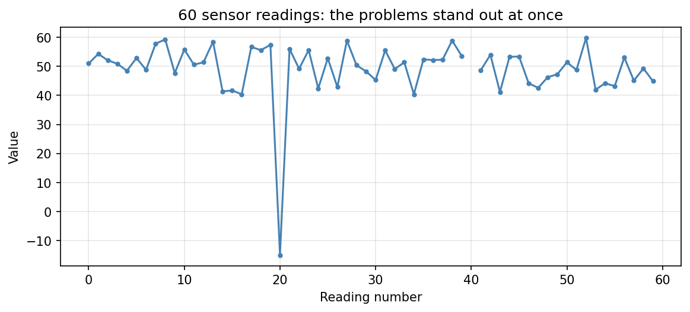

**Finding the problems, step by step:**

1. In the printed table, the `-15.` in row 20 and the `nan` in row 40 are there, but you have to read all 60 numbers to find them. With 10,000 numbers this would take a very long time.
2. In the graph, the negative value appears at once as a deep spike below all the other points.
3. The missing value appears as a **gap** in the line at reading 40. Matplotlib cannot draw a line to a missing point, so it leaves a break.

**Follow-up question:** Would a histogram of these 60 readings also show both problems?

<details>
<summary>Show answer</summary>

It would show the negative value, as a lonely bar far to the left of all the others. It would not show the missing value at all, because `hist()` quietly leaves out `NaN` values when it counts. A line plot in reading order shows both problems, and it also shows *where* in the sequence they happened.

</details>

[Back to the Table of Contents](#table-of-contents)

### 2. Contrast nominal, ordinal, interval, and ratio data visualization strategies.

**Answer**

The **level of measurement** of a variable limits which kinds of plot can show it honestly. See [Level of measurement (Wikipedia)](https://en.wikipedia.org/wiki/Level_of_measurement).

- **Nominal data** (labels such as country names) has no natural order. It is best shown with a bar chart with one separate bar per category. The bars may be placed in any order, for example from tallest to shortest.
- **Ordinal data** (such as survey ratings: Poor, Fair, Good, Excellent) has an order, but the gaps between the levels are not necessarily equal. It is shown with bars, vertical or horizontal, that are kept in their natural order, not sorted by height.
- **Interval data** (such as temperature in Celsius) has equal distances between values but no true zero. Differences are meaningful, so trend lines and histograms work well. Ratios are not meaningful (20 °C is not "twice as hot" as 10 °C), and values can be negative, so a pie chart, which shows parts of a whole, makes no sense.
- **Ratio data** (such as revenue) has a true zero, so ratios and proportions are meaningful: a revenue of 6 lakh is twice a revenue of 3 lakh. This makes ratio data suitable for marker sizes in bubble plots, where a bubble twice as large should mean twice the amount. It can also be shown in a pie chart, but only when the values are non-negative parts that add up to a meaningful whole, such as each product's share of total sales.

| Level | Order? | Equal gaps? | True zero? | Typical plots | Avoid |
| --- | --- | --- | --- | --- | --- |
| Nominal | No | No | No | Bar chart, pie chart of counts | Line joining categories |
| Ordinal | Yes | No | No | Bars in natural order | Sorting bars by height; averaging the levels |
| Interval | Yes | Yes | No | Line plot, histogram, box plot | Pie chart; statements like "twice as hot" |
| Ratio | Yes | Yes | Yes | Histogram, scatter plot, bubble sizes, pie chart of parts of a whole | Bars that do not start at zero |

```python
# Step 1 - Import pyplot
import matplotlib.pyplot as plt

fig, ax = plt.subplots(2, 2, figsize=(10, 7))

# Step 2 - Nominal data: separate bars, in any order
cities = ["Delhi", "Mumbai", "Kolkata", "Chennai"]
branches = [12, 18, 9, 11]
ax[0, 0].bar(cities, branches, color="steelblue")
ax[0, 0].set_title("Nominal: bank branches per city")
ax[0, 0].set_ylabel("Number of branches")

# Step 3 - Ordinal data: bars kept in their natural order (not sorted by height)
ratings = ["Poor", "Fair", "Good", "Excellent"]
responses = [8, 22, 41, 29]
ax[0, 1].barh(ratings, responses, color="seagreen")
ax[0, 1].set_title("Ordinal: survey ratings in natural order")
ax[0, 1].set_xlabel("Number of responses")

# Step 4 - Interval data: a trend line (zero Celsius is not "no temperature")
days = [1, 2, 3, 4, 5, 6, 7]
temperature = [-2, 1, 4, 3, 6, 8, 5]
ax[1, 0].plot(days, temperature, marker="o", color="crimson")
ax[1, 0].axhline(0, color="gray", linewidth=0.8)
ax[1, 0].set_title("Interval: temperature (°C) over a week")
ax[1, 0].set_xlabel("Day")
ax[1, 0].set_ylabel("Temperature (°C)")

# Step 5 - Ratio data: revenue used for position and for bubble size (true zero)
shops = ["A", "B", "C", "D"]
customers = [120, 300, 210, 90]
revenue = [2.4, 7.5, 4.2, 1.1]           # lakh rupees
ax[1, 1].scatter(customers, revenue, s=[r * 150 for r in revenue], alpha=0.6, color="darkorange")
for name, x, y in zip(shops, customers, revenue):
    ax[1, 1].annotate(name, (x, y), ha="center", va="center")
ax[1, 1].set_title("Ratio: revenue as position and bubble size")
ax[1, 1].margins(0.2)      # Extra space so the bubbles are not cut off at the edges
ax[1, 1].set_xlabel("Customers per day")
ax[1, 1].set_ylabel("Revenue (lakh rupees)")

# Step 6 - Print a summary and display
print("Nominal  -> bar chart        :", dict(zip(cities, branches)))
print("Ordinal  -> ordered bars     :", dict(zip(ratings, responses)))
print("Interval -> line plot        :", temperature)
print("Ratio    -> scatter / bubbles:", dict(zip(shops, revenue)))
plt.tight_layout()
plt.show()
```

**Output**

```text
Nominal  -> bar chart        : {'Delhi': 12, 'Mumbai': 18, 'Kolkata': 9, 'Chennai': 11}
Ordinal  -> ordered bars     : {'Poor': 8, 'Fair': 22, 'Good': 41, 'Excellent': 29}
Interval -> line plot        : [-2, 1, 4, 3, 6, 8, 5]
Ratio    -> scatter / bubbles: {'A': 2.4, 'B': 7.5, 'C': 4.2, 'D': 1.1}
```

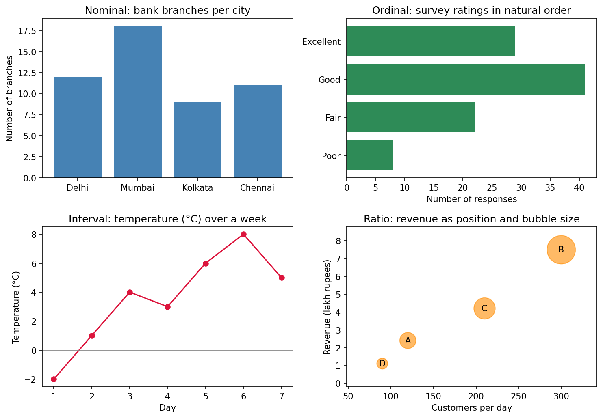

**What to notice:** the city bars could be rearranged without losing meaning. The rating bars are kept in the order Poor, Fair, Good, Excellent even though "Good" is the longest. The temperature line crosses zero, which is allowed for interval data. The bubble for shop B is the largest because its revenue is the largest; this works only because revenue has a true zero.

**Follow-up question:** Why would it be wrong to size bubbles by temperature in °C?

<details>
<summary>Show answer</summary>

Temperature in °C has no true zero. A day at 10 °C would get a bubble half the size of a day at 20 °C, suggesting it had "half the temperature", which is meaningless. A day at -5 °C would need a negative size, which is impossible. Bubble sizes need ratio data.

</details>

[Back to the Table of Contents](#table-of-contents)

## Part 2: How a Matplotlib Chart Is Built

### 3. Differentiate between the pyplot state-based interface and the object-oriented API.

**Answer**

An **interface** or **API** (Application Programming Interface) is the set of functions and methods a library offers for you to call. Matplotlib offers two. See [Matplotlib Application Interfaces](https://matplotlib.org/stable/users/explain/figure/api_interfaces.html).

The **pyplot state-based interface** keeps a hidden record of the "current" figure and the "current" axes. A call such as `plt.plot()` makes Matplotlib find the most recent figure and axes, or create them if none exist, and draw there. This is quick and convenient in interactive sessions, such as the Python prompt or a Jupyter notebook. It becomes error-prone when a program handles several figures, because it is easy to draw on the wrong one.

The **object-oriented (OO) API** stores the parts of the chart in variables that you name yourself, usually with `fig, ax = plt.subplots()`. Changes are made directly on these objects through their methods, such as `ax.plot()` and `ax.set_title()`. Each figure and axes is handled separately, so settings meant for one plot cannot accidentally end up on another.

| Point of comparison | pyplot (state-based) | Object-oriented |
| --- | --- | --- |
| How the target plot is chosen | Automatically: the "current" axes | Explicitly: the variable you use (`ax`, `ax1`, `ax[0]`) |
| Typical calls | `plt.plot()`, `plt.title()`, `plt.xlabel()` | `ax.plot()`, `ax.set_title()`, `ax.set_xlabel()` |
| Best for | Quick single plots, interactive work | Several plots, longer scripts, reusable functions |
| Main risk | Drawing on the wrong figure by mistake | Slightly more typing |

```python
# Step 1 - Import pyplot
import matplotlib.pyplot as plt

x = [1, 2, 3, 4]

# Step 2 - State-based style: pyplot remembers the "current" figure and axes
plt.figure(figsize=(5, 3))
plt.plot(x, [1, 4, 9, 16])
plt.title("State-based: squares")
plt.xlabel("x")
plt.ylabel("x squared")
print("Open figures after the state-based plot:", plt.get_fignums())
plt.show()

# Step 3 - Object-oriented style: two plot areas, each with its own name
fig, (ax_left, ax_right) = plt.subplots(1, 2, figsize=(9, 3))
ax_left.plot(x, [1, 4, 9, 16], color="crimson")
ax_left.set_title("Object-oriented: squares")
ax_right.plot(x, [1, 8, 27, 64], color="navy")
ax_right.set_title("Object-oriented: cubes")
for ax in (ax_left, ax_right):
    ax.set_xlabel("x")
print("Left title :", ax_left.get_title())
print("Right title:", ax_right.get_title())
plt.tight_layout()
plt.show()
```

**Output**

```text
Open figures after the state-based plot: [1]
Left title : Object-oriented: squares
Right title: Object-oriented: cubes
```

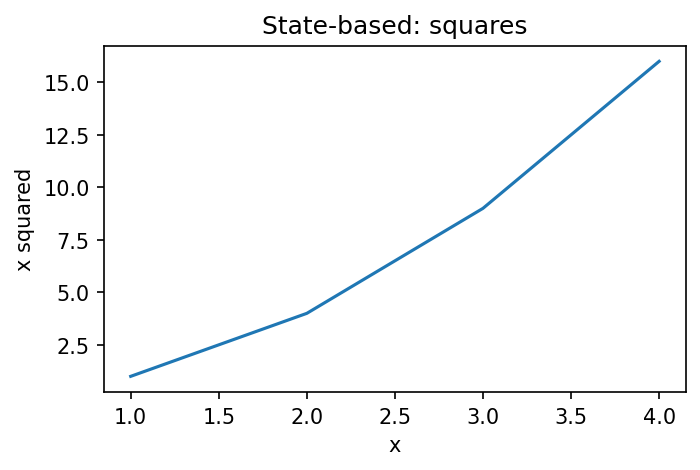

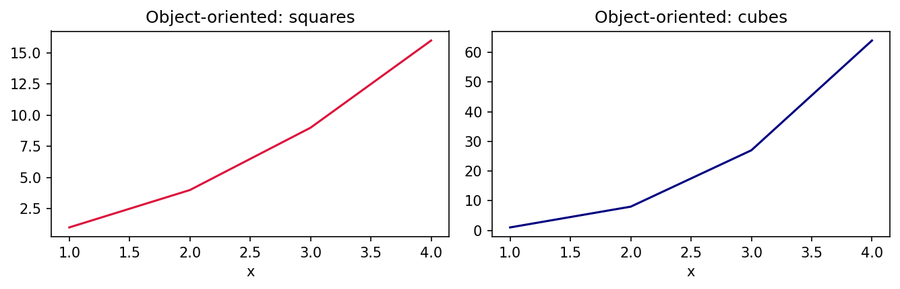

**Follow-up question:** In the object-oriented part of the script, what would happen if you wrote `plt.title("Cubes")` instead of `ax_right.set_title(...)`?

<details>
<summary>Show answer</summary>

`plt.title()` sets the title of the "current" axes. After `plt.subplots(1, 2)`, the current axes is the last one created, which is the right-hand one, so it would happen to work. But if the code later drew on `ax_left`, the "current" axes could change and the title could land on the wrong plot. Using `ax_right.set_title()` removes this uncertainty.

</details>

[Back to the Table of Contents](#table-of-contents)

### 4. Explain the physical components and structural hierarchy of a Matplotlib chart window.

**Answer**

Matplotlib organizes a chart as containers inside containers, rather like a picture frame holding one or more pictures.

The top container is the **Figure** (usually stored in the variable `fig`). It is the outer frame. It handles the window, the overall background, the size of the image and the layout of everything inside it. It can also hold a figure-wide title.

Inside the Figure sit one or more **Axes** objects (usually stored in `ax`). An Axes is the actual drawing area. It contains the coordinate plane, the grid lines, the title of that plot and the plotted data. Note the spelling: an **Axes** is a whole plot area, while an **Axis** is a single number line. Every Axes owns an x-**Axis** and a y-**Axis**, and each Axis manages its own ticks, tick labels and axis label.

Everything that is drawn, from lines and bars to text, is called an **Artist**. Lines are `Line2D` artists, bars are `Rectangle` artists (a kind of patch), and labels are `Text` artists. See [Anatomy of a figure (Matplotlib)](https://matplotlib.org/stable/gallery/showcase/anatomy.html).

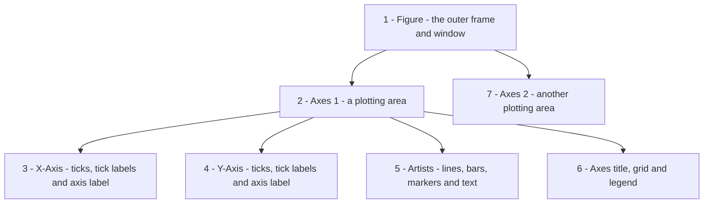
```mermaid
graph TD
    A[1 - Figure - the outer frame and window] --> B[2 - Axes 1 - a plotting area]
    A --> C[7 - Axes 2 - another plotting area]
    B --> D[3 - X-Axis - ticks, tick labels and axis label]
    B --> E[4 - Y-Axis - ticks, tick labels and axis label]
    B --> F[5 - Artists - lines, bars, markers and text]
    B --> G[6 - Axes title, grid and legend]
```

Axes 2 contains the same kinds of parts (x-axis, y-axis, artists, title) as Axes 1.

| Level | Object | What it controls | Example methods |
| --- | --- | --- | --- |
| 1 | `Figure` | Size, background, figure title, layout, saving | `fig.suptitle()`, `fig.savefig()` |
| 2 | `Axes` | One plot: data, title, limits, legend, grid | `ax.plot()`, `ax.set_title()`, `ax.legend()` |
| 3 | `Axis` (`ax.xaxis`, `ax.yaxis`) | Ticks and tick labels of one number line | `ax.set_xticks()`, `ax.tick_params()` |
| 4 | Artists | Individual drawn items | `Line2D`, `Rectangle`, `Text` |

```python
# Step 1 - Import pyplot
import matplotlib.pyplot as plt

# Step 2 - Create one Figure that holds two Axes
fig, (ax1, ax2) = plt.subplots(1, 2, figsize=(9, 3.5))
fig.suptitle("Figure: the outer frame (this is the figure title)")

# Step 3 - Draw something different in each Axes
ax1.plot([1, 2, 3], [2, 5, 3], label="Line2D artist")
ax1.set_title("Axes 1")
ax1.set_xlabel("X-axis label")
ax1.set_ylabel("Y-axis label")
ax1.legend()
ax1.grid(True, alpha=0.3)

ax2.bar(["A", "B", "C"], [4, 7, 5], label="Rectangle artists")
ax2.set_title("Axes 2")
ax2.legend()

# Step 4 - Walk down the hierarchy and print what each level contains
print("Figure object          :", type(fig).__name__)
print("Axes inside the figure :", len(fig.axes))
print("Axis objects in Axes 1 :", type(ax1.xaxis).__name__, "and", type(ax1.yaxis).__name__)
print("Lines in Axes 1        :", [type(line).__name__ for line in ax1.lines])
print("Bars in Axes 2         :", len(ax2.patches), type(ax2.patches[0]).__name__, "objects")

# Step 5 - Display
plt.tight_layout()
plt.show()
```

**Output**

```text
Figure object          : Figure
Axes inside the figure : 2
Axis objects in Axes 1 : XAxis and YAxis
Lines in Axes 1        : ['Line2D']
Bars in Axes 2         : 3 Rectangle objects
```

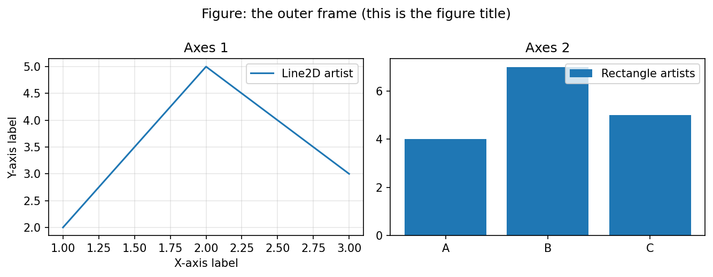

**Follow-up question:** Which object would you use to save the whole chart to a file: the Figure or an Axes?

<details>
<summary>Show answer</summary>

The Figure, with `fig.savefig("chart.png")`. Saving belongs to the whole frame, which contains all the Axes. An Axes has no `savefig()` method.

</details>

[Back to the Table of Contents](#table-of-contents)

### 5. What happens behind the scenes if len(x) does not equal len(y)?

**Answer**

When a method such as `ax.plot(x, y)` is called, Matplotlib first turns both inputs into NumPy arrays and checks their **shapes** (their sizes). Each point on the graph is built from a matching pair `(x[i], y[i])`, so the x-values (the independent variable) and the y-values (the dependent variable) must line up one to one. If the lengths differ, some x-values would have no partner, so Matplotlib stops and raises a `ValueError` with the message "x and y must have same first dimension, but have shapes ...". This happens before anything is drawn, so no line is added to the plot.

The **first dimension** of an array is its number of items (or rows). A **Cartesian coordinate** is a point written as (x, y). See [Cartesian coordinate system (Wikipedia)](https://en.wikipedia.org/wiki/Cartesian_coordinate_system).

```python
# Step 1 - Import the libraries
import numpy as np
import matplotlib.pyplot as plt

x = [1, 2, 3, 4, 5]
y = [10, 20, 30]

# Step 2 - Check the lengths before plotting
print("len(x) =", len(x), " len(y) =", len(y))
print("Shapes Matplotlib sees:", np.shape(x), np.shape(y))

# Step 3 - Try to plot and catch the error
fig, ax = plt.subplots()
try:
    ax.plot(x, y)
except ValueError as error:
    print("ValueError:", error)

# Step 4 - Nothing was drawn on the axes
print("Lines on the axes after the error:", len(ax.lines))
plt.close(fig)
```

**Output**

```text
len(x) = 5  len(y) = 3
Shapes Matplotlib sees: (5,) (3,)
ValueError: x and y must have same first dimension, but have shapes (5,) and (3,)
Lines on the axes after the error: 0
```

**Steps Matplotlib follows:**

1. Convert `x` and `y` to arrays.
2. Compare their first dimensions: here 5 and 3.
3. Because they differ, raise `ValueError`.
4. Stop. The last line of output confirms that no line was drawn.

**Follow-up question:** Does Matplotlib quietly drop the two extra x-values and plot the first three pairs?

<details>
<summary>Show answer</summary>

No. Matplotlib never guesses which values you meant to pair. It refuses to plot and raises the error, so that the mistake is noticed and fixed in the data.

</details>

[Back to the Table of Contents](#table-of-contents)

### 6. Why does a single-array input to ax.plot() still generate an X-axis?

**Answer**

If you pass only one sequence to `ax.plot(y)`, Matplotlib treats it as the vertical coordinates (y-values). A line on a 2-D plane needs horizontal coordinates too, so Matplotlib creates them itself. It uses the same sequence that `range(len(y))` would give: the first value is placed at x = 0, the second at x = 1, and so on until every value has a position.

```python
# Step 1 - Import pyplot
import matplotlib.pyplot as plt

# Step 2 - Give only y-values
y = [5, 3, 8, 6, 9]
fig, ax = plt.subplots(figsize=(6, 3.5))
line, = ax.plot(y, marker="o")      # The comma unpacks the one-item list that plot() returns

# Step 3 - Compare the generated x-values with range(len(y))
print("y-values          :", line.get_ydata().tolist())
print("x-values generated:", line.get_xdata().tolist())
print("range(len(y))     :", list(range(len(y))))

# Step 4 - Label and display
ax.set_title("Only y given: x becomes 0, 1, 2, 3, 4")
ax.set_xlabel("Index position (created automatically)")
ax.set_ylabel("y-value")
ax.set_xticks(range(len(y)))
plt.show()
```

**Output**

```text
y-values          : [5, 3, 8, 6, 9]
x-values generated: [0.0, 1.0, 2.0, 3.0, 4.0]
range(len(y))     : [0, 1, 2, 3, 4]
```

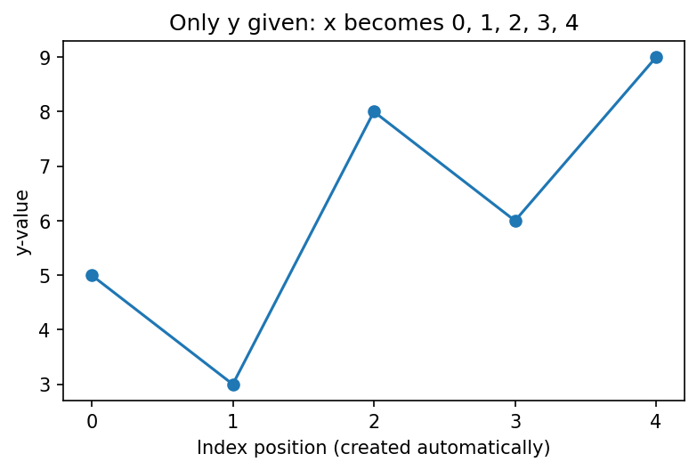

The generated x-values are stored as decimal numbers (0.0, 1.0, ...), but they match `range(len(y))` exactly.

**Follow-up question:** You want the five values to appear at x = 1 to 5 instead of 0 to 4. What is the simplest change?

<details>
<summary>Show answer</summary>

Give the x-values explicitly: `ax.plot(range(1, len(y) + 1), y)` or `ax.plot([1, 2, 3, 4, 5], y)`.

</details>

[Back to the Table of Contents](#table-of-contents)

### 7. Contrast standard lists, NumPy arrays, and Pandas DataFrames as inputs.

**Answer**

Matplotlib accepts all three, but its internal calculations are built on NumPy arrays (`numpy.ndarray`). When you pass a standard Python list, Matplotlib converts it into a NumPy array before working out positions. This conversion takes a little time and memory, which is noticeable only with very large datasets. A pandas Series (one column) or DataFrame (a table) adds labels and an index on top of NumPy data. You can pass a Series, or a column of a DataFrame such as `df["sales"]`, straight to Matplotlib; it takes the underlying NumPy values, and for a Series it also uses the index as the x-values when no x is given. There is no need to extract the values yourself.

| Feature | Python list | NumPy array (`ndarray`) | pandas Series / DataFrame |
| --- | --- | --- | --- |
| How data is stored in memory | A list of references to separate Python objects stored in different places; more memory per value | One continuous block of numbers of the same type; very compact | NumPy blocks plus an index and column labels |
| Maths on all values at once | Needs a loop or list comprehension | Fast "vectorized" operations that run in compiled code | Vectorized operations that also line up values by their labels |
| Labels for plotting | You supply them yourself | You supply them yourself | The index can serve as x-values; column names can be used as labels. The pandas `.plot()` method adds axis labels automatically, but Matplotlib's own `ax.plot()` does not |

**Vectorized** means an operation is applied to the whole array in one step instead of one value at a time. See [NumPy: the absolute basics](https://numpy.org/doc/stable/user/absolute_beginners.html) and [pandas: Intro to data structures](https://pandas.pydata.org/docs/user_guide/dsintro.html).

```python
# Step 1 - Import the libraries
import sys
import numpy as np
import pandas as pd
import matplotlib.pyplot as plt

# Step 2 - The same 1000 numbers as a list, an array and a Series
values_list = list(range(1000, 2000))
values_array = np.arange(1000, 2000)
values_series = pd.Series(values_array, name="sales")

# Step 3 - Compare memory use (in bytes)
list_bytes = sys.getsizeof(values_list) + sum(sys.getsizeof(v) for v in values_list)
print("List  : about", list_bytes, "bytes (list plus 1000 separate int objects)")
print("Array :", values_array.nbytes, "bytes of number data")
print("Series:", values_series.memory_usage(index=True), "bytes including the index")

# Step 4 - Vector maths: doubling every value
print()
print("Array doubled (first 5):", (values_array * 2)[:5])
print("List doubled needs a loop (first 5):", [v * 2 for v in values_list[:5]])

# Step 5 - What Matplotlib stores after plotting each type
fig, ax = plt.subplots()
for data in (values_list, values_array, values_series):
    line, = ax.plot(data)
    print("Input", type(data).__name__, "-> stored y-data type:", type(line.get_ydata()).__name__)
plt.close(fig)
```

**Output**

```text
List  : about 36056 bytes (list plus 1000 separate int objects)
Array : 8000 bytes of number data
Series: 8132 bytes including the index

Array doubled (first 5): [2000 2002 2004 2006 2008]
List doubled needs a loop (first 5): [2000, 2002, 2004, 2006, 2008]
Input list -> stored y-data type: ndarray
Input ndarray -> stored y-data type: ndarray
Input Series -> stored y-data type: ndarray
```

**What to notice:**

1. The same 1000 numbers take about 36 kilobytes as a list, but only 8 kilobytes as a NumPy array. The Series is slightly larger than the array because it also stores an index. (The exact sizes depend on the Python and pandas versions.)
2. The array can be doubled with `values_array * 2`. The list needs a loop.
3. Whatever the input type, Matplotlib stores the plotted values as a NumPy array.

**Follow-up question:** You have a DataFrame `df` with columns "month" and "sales". Write the line that plots sales against month on an existing `ax`.

<details>
<summary>Show answer</summary>

```python
ax.plot(df["month"], df["sales"])
```

Each column is a Series, which Matplotlib accepts directly.

</details>

[Back to the Table of Contents](#table-of-contents)

### 8. Why does calling plt.show() pause script execution?

**Answer**

In a normal Python script, `plt.show()` hands control to a **backend**, the part of Matplotlib that draws the figure on a particular kind of screen or window. Common window backends are TkAgg (using Tkinter) and QtAgg (using the Qt toolkit). The backend opens the window and starts an **event loop**: a loop that keeps waiting for and answering user actions such as zooming, panning, resizing and saving. This loop runs on the program's main thread, so the rest of the script waits. When you close the last window, the event loop ends, `plt.show()` returns, and the script continues with the next line.

See [Backends (Matplotlib)](https://matplotlib.org/stable/users/explain/figure/backends.html) and [matplotlib.pyplot.show](https://matplotlib.org/stable/api/_as_gen/matplotlib.pyplot.show.html).

**When it does not pause:**

| Situation | Does `plt.show()` pause? |
| --- | --- |
| Running a `.py` script from a terminal or IDE | Yes, until the windows are closed |
| Jupyter notebook | No; the figure is shown in the notebook |
| Interactive mode switched on with `plt.ion()` | No |
| `plt.show(block=False)` | No; the window opens and the script continues (see Questions 13 and 16) |

```python
# Step 1 - Import pyplot
import matplotlib.pyplot as plt

# Step 2 - Build a simple plot
fig, ax = plt.subplots(figsize=(5, 3))
ax.plot([1, 2, 3], [3, 1, 2], marker="o")
ax.set_title("Close this window to let the script continue")
ax.set_xlabel("x")
ax.set_ylabel("y")

# Step 3 - This line runs BEFORE the window opens
print("1. Plot is ready. Calling plt.show() ...")

# Step 4 - The script waits here until the window is closed
plt.show()

# Step 5 - This line runs only AFTER the window has been closed
print("2. Window closed. The script continues.")
print("Interactive mode is on?", plt.isinteractive())
```

**Output**

```text
1. Plot is ready. Calling plt.show() ...
2. Window closed. The script continues.
Interactive mode is on? False
```

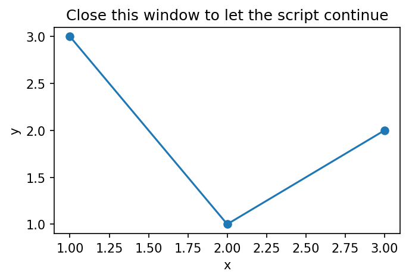

When you run this script, line 1 is printed at once, the window opens, and line 2 is printed only after you close the window. The last line shows that interactive mode is off, which is the normal state for a script.

**Follow-up question:** A script creates three figures and then calls `plt.show()` once at the end. How many windows open, and when does the script continue?

<details>
<summary>Show answer</summary>

All three windows open together. The script continues only after all three have been closed.

</details>

[Back to the Table of Contents](#table-of-contents)

### 9. Detail the syntax mechanics and limitations of legacy shortcut format strings.

**Answer**

A **format string** (the `fmt` argument) is a short code that sets the basic look of a line in one go. For example, `'ro-'` means red color, circle markers and a solid line. It has up to three optional parts, color, marker and line style, which can be written in any order. Because some line styles use two characters, the string is not always three characters long; `'bs--'` means blue squares with a dashed line.

Matplotlib reads the string by looking for:

- a color character, such as `'r'` (red), `'g'` (green), `'b'` (blue), `'k'` (black)
- a marker character, such as `'o'` (circle), `'s'` (square), `'^'` (triangle)
- a line style, such as `'-'` (solid), `'--'` (dashed), `':'` (dotted)

Format strings come from MATLAB and are handy for quick test plots. They are not deprecated, so they still work fully in current Matplotlib. Their limitation is that they cover only these basic choices. They cannot set a hex color code such as `'#FF5733'`, a line width, a marker fill color, a marker size or transparency. For those you use **keyword arguments** such as `color='#FF5733'`, `marker='o'`, `linestyle='-'`, `linewidth=3` and `markerfacecolor='white'`. Keyword arguments are clearer to read, so they are preferred in finished code. The two can also be combined: `ax.plot(x, y, 'bs--', linewidth=1)`.

See the "Format Strings" section of [matplotlib.pyplot.plot](https://matplotlib.org/stable/api/_as_gen/matplotlib.pyplot.plot.html).

```python
# Step 1 - Import pyplot
import matplotlib.pyplot as plt

x = [1, 2, 3, 4, 5]
fig, ax = plt.subplots(1, 2, figsize=(10, 3.5), sharey=True)

# Step 2 - Format string: color, marker and line style in one short code
line_a, = ax[0].plot(x, [2, 4, 3, 5, 4], "ro-")
line_b, = ax[0].plot(x, [1, 2, 2, 3, 3], "bs--")
ax[0].set_title('Format strings: "ro-" and "bs--"')

# Step 3 - Keyword arguments: settings a format string cannot express
line_c, = ax[1].plot(x, [2, 4, 3, 5, 4], color="#FF5733", marker="o", linestyle="-",
                     linewidth=3, markerfacecolor="white", markersize=9)
line_d, = ax[1].plot(x, [1, 2, 2, 3, 3], "bs--", linewidth=1, alpha=0.5)   # Both together
ax[1].set_title("Keyword arguments (with and without a format string)")

# Step 4 - Print what each format string was turned into
for name, line in [("ro-", line_a), ("bs--", line_b)]:
    print(f'"{name}" -> color={line.get_color()}, marker={line.get_marker()}, '
          f'linestyle={line.get_linestyle()}')
print("Keyword version -> color:", line_c.get_color(), "linewidth:", line_c.get_linewidth(),
      "marker face:", line_c.get_markerfacecolor())

plt.tight_layout()
plt.show()
```

**Output**

```text
"ro-" -> color=r, marker=o, linestyle=-
"bs--" -> color=b, marker=s, linestyle=--
Keyword version -> color: #FF5733 linewidth: 3.0 marker face: white
```

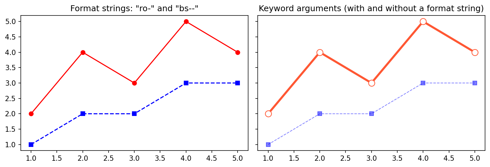

| Setting | Format string | Keyword argument |
| --- | --- | --- |
| Basic color | `'r'` | `color='red'` |
| Any color, e.g. hex code | Not possible | `color='#FF5733'` |
| Marker shape | `'o'` | `marker='o'` |
| Line style | `'--'` | `linestyle='--'` |
| Line width | Not possible | `linewidth=3` |
| Marker fill color | Not possible | `markerfacecolor='white'` |
| Transparency | Not possible | `alpha=0.5` |

**Follow-up question:** What does the format string `'g^:'` produce?

<details>
<summary>Show answer</summary>

A green line drawn as a dotted line, with triangle markers at the data points.

</details>

[Back to the Table of Contents](#table-of-contents)

### 10. Explain the sorting and rendering workflow of the ax.hist() method.

**Answer**

Unlike a bar chart, which draws heights that you supply, `ax.hist()` works out the chart from the raw data. It follows these steps:

1. **Scan the data** to find the smallest and largest values.
2. **Divide that range** into equal, back-to-back intervals called **bins**. The default is 10 bins.
3. **Sort each value into its bin** by checking which interval it falls in, and count the values in each bin. Each bin includes its left edge but not its right edge, except the last bin, which includes both edges so that the largest value is counted.
4. **Render** (draw) one rectangle per bin, with its height equal to the count. The rectangles touch because the bins are next to each other on the number line.

"Sorting" here means placing each value into the right bin, not arranging the values in order. The counting is done by NumPy's `histogram()` function. See [matplotlib.axes.Axes.hist](https://matplotlib.org/stable/api/_as_gen/matplotlib.axes.Axes.hist.html) and [numpy.histogram](https://numpy.org/doc/stable/reference/generated/numpy.histogram.html).

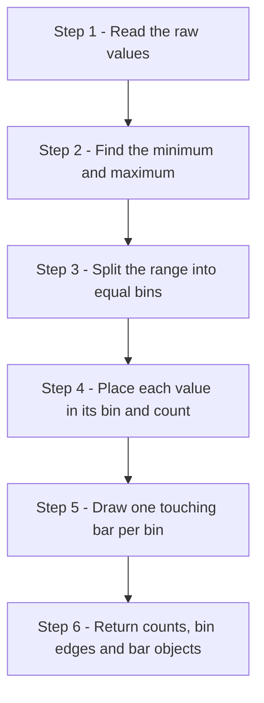
```mermaid
flowchart TD
    A[Step 1 - Read the raw values] --> B[Step 2 - Find the minimum and maximum]
    B --> C[Step 3 - Split the range into equal bins]
    C --> D[Step 4 - Place each value in its bin and count]
    D --> E[Step 5 - Draw one touching bar per bin]
    E --> F[Step 6 - Return counts, bin edges and bar objects]
```

```python
# Description: Demonstrates how ax.hist() places values into bins and counts them

# Step 1 - Import pyplot
import matplotlib.pyplot as plt

# Step 2 - Raw, unsorted numeric measurements
raw_data = [12, 15, 13, 22, 28, 24, 25, 29, 31, 35]

# Step 3 - Create the figure and ask for 3 bins
# Matplotlib finds the smallest (12) and largest (35) values,
# splits that range into 3 equal bins and counts the values in each.
# The default number of bins is 10; here we ask for 3.
fig, ax = plt.subplots(figsize=(6, 3))

# ax.hist() draws the histogram and also returns three things:
#   1. counts  - how many values fall in each bin
#   2. bins    - the edges of the bins (one more edge than there are bins)
#   3. patches - a container holding the rectangle (bar) of each bin;
#                it can be used to change the look of the bars later
counts, bins, patches = ax.hist(raw_data, bins=3, edgecolor="black", color="skyblue")

ax.set_title("Histogram of 10 values in 3 bins")
ax.set_xlabel("Value")
ax.set_ylabel("Count")

# Step 4 - Print the results calculated behind the scenes
print("Calculated Bin Edges:", bins)
print("Frequency Count Per Bin Window:", counts)
print("Patch Objects for Each Bin:", patches)

# Step 5 - Show exactly which values went into each bin
# Each bin includes its left edge but not its right edge, except the last bin,
# which includes both edges (so the largest value, 35, is counted).
for i in range(len(counts)):
    left, right = bins[i], bins[i + 1]
    if i < len(counts) - 1:
        members = [v for v in raw_data if left <= v < right]
        interval = f"[{left:.2f}, {right:.2f})"
    else:
        members = [v for v in raw_data if left <= v <= right]
        interval = f"[{left:.2f}, {right:.2f}]"
    print(f"Bin {i + 1} {interval}: {sorted(members)} -> {len(members)} values")

# Step 6 - Display the histogram
plt.show()
```

**The Output is**

```text
Calculated Bin Edges: [12.         19.66666667 27.33333333 35.        ]
Frequency Count Per Bin Window: [3. 3. 4.]
Patch Objects for Each Bin: <BarContainer object of 3 artists>
Bin 1 [12.00, 19.67): [12, 13, 15] -> 3 values
Bin 2 [19.67, 27.33): [22, 24, 25] -> 3 values
Bin 3 [27.33, 35.00]: [28, 29, 31, 35] -> 4 values
```

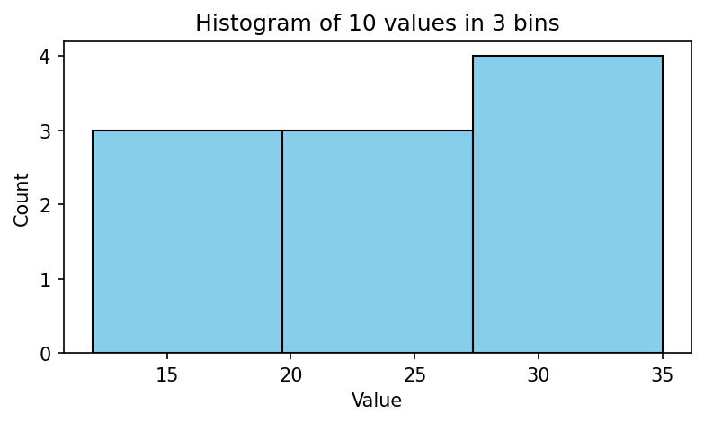

**Checking the result by hand:**

1. Range: 35 - 12 = 23. Bin width: 23 / 3 = 7.67.
2. Bin edges: 12, 19.67, 27.33 and 35.
3. Bin 1 holds 12, 13 and 15 (3 values). Bin 2 holds 22, 24 and 25 (3 values). Bin 3 holds 28, 29, 31 and 35 (4 values).
4. So the counts are 3, 3 and 4, exactly as Matplotlib calculated.

**Follow-up question:** If the value 27.33 were in the data, which bin would it go into?

<details>
<summary>Show answer</summary>

The second edge is really 27.333..., slightly larger than 27.33, so 27.33 would go into Bin 2. A value exactly equal to an inner edge always goes into the bin on its right, because each bin includes its left edge but not its right edge.

</details>

[Back to the Table of Contents](#table-of-contents)

## Part 3: Summaries, Legends and Two Y-Axes

### 11. Contrast the structural insights provided by box plots vs. violin plots.

**Answer**

A **box plot** gives a clean, compact summary of a dataset using five landmarks: the lower whisker end, the lower quartile (Q1), the median (Q2), the upper quartile (Q3) and the upper whisker end. In Matplotlib, each whisker reaches the furthest data value that lies within 1.5 × IQR of the box, where the IQR (interquartile range) is Q3 minus Q1. When there are no values beyond that limit, the whisker ends are simply the minimum and maximum. Any values beyond the whiskers are flagged as **outliers** and drawn as separate dots. A box plot leaves out the individual data points and focuses on the centre and spread of the data.

A **violin plot** can show the same summary values, but it adds a mirrored curve on both sides of a central line. This curve is a **density estimate**: a smoothed picture of how crowded the data is at each value. It shows exactly where values cluster together and where they thin out, including whether there is more than one peak. In Matplotlib's `violinplot()`, the median and quartile lines appear only when you ask for them with `showmedians=True` and `quantiles=[0.25, 0.75]`, and outliers are not marked as separate dots.

See [Box plot (Wikipedia)](https://en.wikipedia.org/wiki/Box_plot), [Violin plot (Wikipedia)](https://en.wikipedia.org/wiki/Violin_plot) and [Kernel density estimation (Wikipedia)](https://en.wikipedia.org/wiki/Kernel_density_estimation).

| Insight | Box plot | Violin plot |
| --- | --- | --- |
| Median and quartiles | Yes, always | Yes, when switched on |
| Outliers as separate dots | Yes | No |
| Shape of the distribution | No | Yes |
| Two or more peaks | Hidden | Visible as separate bulges |
| Space needed | Very little | A little more |

```python
# Step 1 - Import the libraries
import numpy as np
import matplotlib.pyplot as plt

# Step 2 - Create two groups of scores and combine them (a two-peaked set)
np.random.seed(42)
scores = np.concatenate([np.random.normal(50, 6, 100), np.random.normal(80, 6, 100)])

# Step 3 - Work out the box plot numbers
q1, median, q3 = np.percentile(scores, [25, 50, 75])
iqr = q3 - q1
print(f"Q1 = {q1:.1f}, median = {median:.1f}, Q3 = {q3:.1f}")
print(f"Whisker limits (1.5 x IQR rule): {q1 - 1.5 * iqr:.1f} to {q3 + 1.5 * iqr:.1f}")
print(f"Actual minimum = {scores.min():.1f}, actual maximum = {scores.max():.1f}")
print("Scores between 60 and 70:", np.sum((scores >= 60) & (scores < 70)), "of", len(scores))

# Step 4 - Draw a box plot and a violin plot of the same data side by side
fig, ax = plt.subplots(1, 2, figsize=(9, 4), sharey=True)
ax[0].boxplot(scores)
ax[0].set_title("Box plot: one box, no sign of two groups")
ax[0].set_ylabel("Score")
parts = ax[1].violinplot(scores, showmedians=True, quantiles=[0.25, 0.75])
parts["cmedians"].set_color("red")
ax[1].set_title("Violin plot: two bulges reveal two groups")
for a in ax:
    a.set_xticks([])

# Step 5 - Display
plt.tight_layout()
plt.show()
```

**Output**

```text
Q1 = 49.3, median = 64.8, Q3 = 80.5
Whisker limits (1.5 x IQR rule): 2.5 to 127.2
Actual minimum = 34.3, actual maximum = 96.3
Scores between 60 and 70: 2 of 200
```

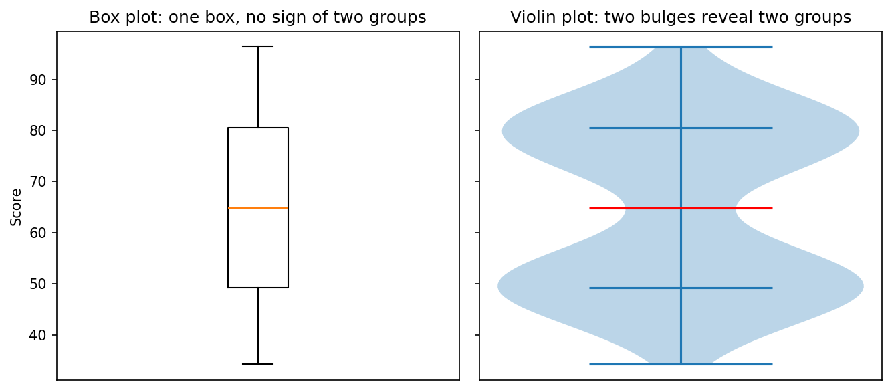

**Reading the result, step by step:**

1. The whisker limits (2.5 to 127.2) are wider than the data (34.3 to 96.3), so here the whiskers stop at the actual minimum and maximum, and there are no outlier dots.
2. The box stretches from 49.3 to 80.5, with the median at 64.8.
3. Only 2 of the 200 scores lie between 60 and 70. So the median sits in an almost empty gap, but the box plot gives no hint of this.
4. The violin plot is narrow exactly at that gap and bulges around 50 and 80, where the two groups really are.

**Follow-up question:** When would you still choose a box plot over a violin plot?

<details>
<summary>Show answer</summary>

When you need to compare many groups in a small space, when outliers must be marked clearly, or when the audience already knows how to read box plots. For a quick check of shape, a violin plot or histogram is better.

</details>

[Back to the Table of Contents](#table-of-contents)

### 12. How does ax.legend() match label strings to colored chart lines?

**Answer**

When you call a plotting method with a `label` argument, such as `ax.plot(x, y, label="Revenue")`, Matplotlib creates a `Line2D` object and stores the text "Revenue" inside it, along with its color, line style and marker. When you later call `ax.legend()`, Matplotlib looks through all the artists on that Axes and collects every one that has a label. Labels that are empty or begin with an underscore are skipped. For each collected artist it draws a small sample, called a **handle**, in the same color and style, and places the label text beside it. Finally it puts these entries in a box on the Axes, at the position chosen by the `loc` setting (or at the best free spot if `loc` is not given).

You can see exactly what the legend will collect by calling `ax.get_legend_handles_labels()`. See [Legend guide (Matplotlib)](https://matplotlib.org/stable/users/explain/axes/legend_guide.html).

```python
# Step 1 - Import pyplot
import matplotlib.pyplot as plt

months = [1, 2, 3, 4, 5, 6]

# Step 2 - Plot three lines; only two are given a label
fig, ax = plt.subplots(figsize=(7, 4))
ax.plot(months, [10, 12, 15, 14, 18, 20], label="Revenue")
ax.plot(months, [8, 9, 11, 12, 12, 14], label="Costs")
ax.plot(months, [2, 3, 4, 2, 6, 6], color="gray", linestyle=":")    # No label

# Step 3 - See what the legend will collect
handles, labels = ax.get_legend_handles_labels()
print("Labels found :", labels)
print("Handles found:", [type(h).__name__ for h in handles])
print("Colors       :", [h.get_color() for h in handles])
print("Lines drawn in total:", len(ax.lines))

# Step 4 - Build the legend and place it
legend = ax.legend(loc="upper left")
print("Legend text  :", [t.get_text() for t in legend.get_texts()])

ax.set_title("ax.legend() collects only labelled lines")
ax.set_xlabel("Month")
ax.set_ylabel("Amount (lakh rupees)")
plt.show()
```

**Output**

```text
Labels found : ['Revenue', 'Costs']
Handles found: ['Line2D', 'Line2D']
Colors       : ['#1f77b4', '#ff7f0e']
Lines drawn in total: 3
Legend text  : ['Revenue', 'Costs']
```

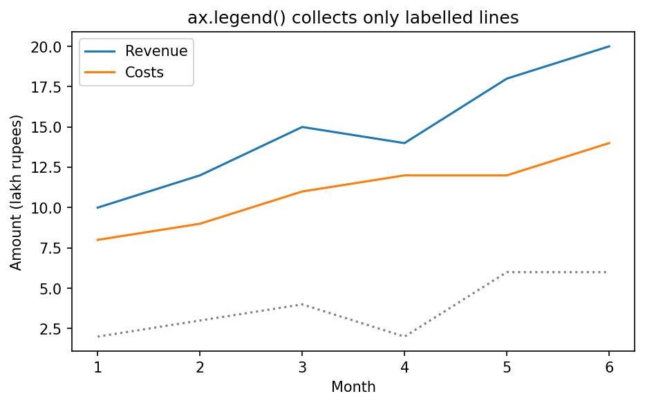

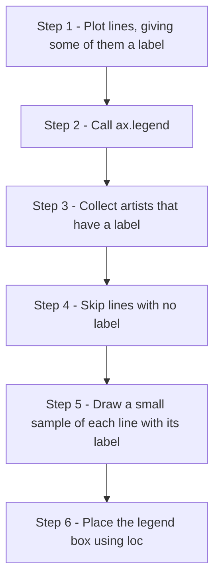
```mermaid
flowchart TD
    A[Step 1 - Plot lines, giving some of them a label] --> B[Step 2 - Call ax.legend]
    B --> C[Step 3 - Collect artists that have a label]
    C --> D[Step 4 - Skip lines with no label]
    D --> E[Step 5 - Draw a small sample of each line with its label]
    E --> F[Step 6 - Place the legend box using loc]
```

**Follow-up question:** How can you give a line a label but still keep it out of the legend?

<details>
<summary>Show answer</summary>

Start the label with an underscore, for example `label="_hidden"`. Matplotlib ignores labels that begin with an underscore when it builds the legend.

</details>

[Back to the Table of Contents](#table-of-contents)

### 13. Why does ax.twinx() create an independent Y-axis on a shared X-axis?

**Answer**

When you create a dual-axis layout with `ax2 = ax1.twinx()`, Matplotlib creates a brand-new Axes object with a transparent background and places it exactly on top of the original one. The new Axes **shares** the x-axis of the original, so both use the same horizontal positions and limits, but it has its **own** y-axis, drawn on the right-hand side. This lets you draw two lines with completely different units and ranges, such as temperature in degrees and humidity in percent, on one graph, without squashing one of them into a thin strip.

See [matplotlib.axes.Axes.twinx](https://matplotlib.org/stable/api/_as_gen/matplotlib.axes.Axes.twinx.html).

**A word of caution:** each y-axis is scaled on its own, so where two lines cross has no real meaning. In the graph below, the humidity line crosses the temperature line between Day 3 and Day 4, but that is just an effect of the two scales. Always color and label each axis clearly, as this script does, so that readers know which line belongs to which axis.

```python
# =====================================================================
# EXAMPLE: Dual Y-Axis Plot Using Matplotlib
#
# GOAL
# ----
# Display two different measurements on the same chart:
#
#   1. Temperature (°C)
#   2. Humidity (%)
#
# These variables use different units and scales.
# If we plotted them on the same Y-axis, the chart could become
# misleading or difficult to interpret.
#
# Therefore we use:
#
#   LEFT Y-AXIS   -> Temperature
#   RIGHT Y-AXIS  -> Humidity
#
# Both datasets share the same X-axis (Days).
# =====================================================================

# =====================================================================
# STEP 1: Import Matplotlib
# =====================================================================
# matplotlib.pyplot contains functions used to create figures,
# axes, lines, labels, legends, and more.
# The alias "plt" is the standard convention.

import matplotlib.pyplot as plt

# =====================================================================
# STEP 2: Define the data
# =====================================================================
# The X-axis values represent days: Day 1, Day 2, Day 3, Day 4.

days = [1, 2, 3, 4]

# Temperature values corresponding to each day.
# Day 1 -> 22°C, Day 2 -> 25°C, Day 3 -> 21°C, Day 4 -> 24°C
temperature = [22, 25, 21, 24]

# Humidity values corresponding to each day.
# Day 1 -> 60%, Day 2 -> 85%, Day 3 -> 70%, Day 4 -> 75%
humidity = [60, 85, 70, 75]

print("Step 2: Days       :", days)
print(f"        Temperature: {temperature} (range {min(temperature)} to {max(temperature)})")
print(f"        Humidity   : {humidity} (range {min(humidity)} to {max(humidity)})")

# =====================================================================
# STEP 3: Create Figure and Primary Axis
# =====================================================================
# plt.subplots() returns:
#   fig  -> the entire drawing canvas
#   ax1  -> the first plotting area (primary axis)
#
# Think of it like:
#   Figure = sheet of paper
#   Axes   = chart drawn on the paper

fig, ax1 = plt.subplots(figsize=(8, 5))

# =====================================================================
# STEP 4: Plot Temperature on Primary Axis
# =====================================================================
# We use ax1.plot() because temperature belongs to the
# primary (left-side) Y-axis.
#   color='crimson' -> makes the line red
#   marker='o'      -> places a circular marker at each data point

ax1.plot(
    days,
    temperature,
    color='crimson',
    marker='o',
    linewidth=2,
    label="Temperature"
)

# =====================================================================
# STEP 5: Configure X-Axis
# =====================================================================
# Since both datasets share the same timeline, only one X-axis is needed.

ax1.set_xlabel("Timeline (Days)")
ax1.set_xticks(days)          # Show only whole days: 1, 2, 3, 4

# =====================================================================
# STEP 6: Configure Left Y-Axis
# =====================================================================
# This Y-axis belongs to temperature. The axis label is colored red
# so that it visually matches the temperature line.

ax1.set_ylabel(
    "Temperature (°C)",
    color='crimson'
)

# =====================================================================
# STEP 7: Color Tick Labels on Left Y-Axis
# =====================================================================
# Tick labels are the numbers shown along the axis (for example 21, 22, 23 ...).
# Coloring them red makes it easy to see which axis belongs to which line.

ax1.tick_params(
    axis='y',
    labelcolor='crimson'
)

# =====================================================================
# STEP 8: Create Secondary Y-Axis
# =====================================================================
# twinx() means: "Create another Axes that shares the same X-axis."
#
#   Temperature axis (left)  |  plotting area  |  Humidity axis (right)
#
# The new Axes is transparent and sits exactly on top of ax1,
# so both occupy the same plotting area.

ax2 = ax1.twinx()

print()
print("Step 8: Axes in the figure:", len(fig.axes))
print("        Both axes share the same x-limits?", ax1.get_xlim() == ax2.get_xlim())

# =====================================================================
# STEP 9: Plot Humidity on Secondary Axis
# =====================================================================
# Humidity belongs to ax2, not ax1.
#   color='navy'    -> dark blue line
#   linestyle='--'  -> dashed line

ax2.plot(
    days,
    humidity,
    color='navy',
    linestyle='--',
    linewidth=2,
    label="Humidity"
)

print()
print("Step 9: Left y-limits :", tuple(round(float(v), 2) for v in ax1.get_ylim()))
print("        Right y-limits:", tuple(round(float(v), 2) for v in ax2.get_ylim()))

# =====================================================================
# STEP 10: Configure Right Y-Axis
# =====================================================================
# This axis represents humidity values.

ax2.set_ylabel(
    "Humidity (%)",
    color='navy'
)

# =====================================================================
# STEP 11: Color Tick Labels on Right Y-Axis
# =====================================================================
# The blue tick labels visually connect to the blue humidity line.

ax2.tick_params(
    axis='y',
    labelcolor='navy'
)

# =====================================================================
# STEP 12: Add Chart Title and a Combined Legend
# =====================================================================
# ax1.set_title() is used instead of plt.title(). After twinx(), the
# "current" axes is ax2, so plt.title() would quietly attach the title to ax2.
#
# Each axes keeps its own list of labelled lines. To show both lines in
# ONE legend, we collect the handles and labels from both axes and join them.

ax1.set_title(
    "Temperature and Humidity Over Time",
    fontsize=14,
    fontweight='bold'
)

lines1, labels1 = ax1.get_legend_handles_labels()
lines2, labels2 = ax2.get_legend_handles_labels()
ax1.legend(lines1 + lines2, labels1 + labels2, loc="upper left")
print()
print("Step 12: Legend entries:", labels1 + labels2)

# =====================================================================
# STEP 13: Add Grid (Optional)
# =====================================================================
# Grids make it easier to read values.
# alpha controls transparency: 0.0 = invisible, 1.0 = fully opaque.

ax1.grid(
    True,
    linestyle=':',
    alpha=0.6
)

# =====================================================================
# STEP 14: Adjust Layout
# =====================================================================
# Prevents labels and titles from overlapping.
# Highly recommended before displaying or saving figures.

plt.tight_layout()

# =====================================================================
# STEP 15: Display Figure
# =====================================================================
# block=False means: show the figure window BUT continue running
# the remaining code. Without block=False, execution would stop here
# until the user manually closes the window.

plt.show(block=False)

# =====================================================================
# STEP 16: Keep Figure Visible
# =====================================================================
# Pause for 5 seconds. During this time the figure stays visible.
# You can change the number, for example plt.pause(2) or plt.pause(30).

plt.pause(5)

# =====================================================================
# STEP 17: Close Figure Automatically
# =====================================================================
# After the pause, the figure is closed. This is useful for automated
# demos, batch report generation and previewing plots briefly.

plt.close()
print()
print("Step 17: Figure closed. Open figures:", plt.get_fignums())

# =====================================================================
# END RESULT
# =====================================================================
# LEFT AXIS (Red)   -> Temperature (°C)
# RIGHT AXIS (Blue) -> Humidity (%)
# SHARED X-AXIS     -> Day 1, Day 2, Day 3, Day 4
#
# The plot appears for 5 seconds and then closes automatically.
# =====================================================================
```

**Output**

```text
Step 2: Days       : [1, 2, 3, 4]
        Temperature: [22, 25, 21, 24] (range 21 to 25)
        Humidity   : [60, 85, 70, 75] (range 60 to 85)

Step 8: Axes in the figure: 2
        Both axes share the same x-limits? True

Step 9: Left y-limits : (20.8, 25.2)
        Right y-limits: (58.75, 86.25)

Step 12: Legend entries: ['Temperature', 'Humidity']

Step 17: Figure closed. Open figures: []
```

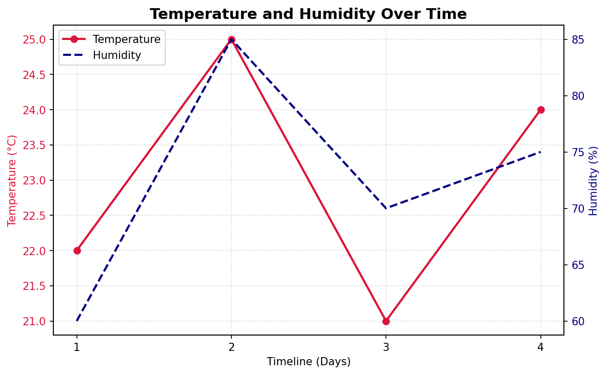

**What the printed output shows:**

1. After `twinx()` there are two Axes in the figure.
2. Both have exactly the same x-limits, because the x-axis is shared.
3. Their y-limits are completely different: about 21 to 25 on the left and about 59 to 86 on the right.
4. Each Axes keeps its own labelled line, so the handles and labels of both are joined to make one legend.

**About `plt.show(block=False)` and `plt.pause(5)`:** these keep the window open for 5 seconds and then let the script close it. If you prefer the usual behavior, replace Steps 15 to 17 with a single `plt.show()`, and the window will stay open until you close it.

**Follow-up question:** Why does the script use `ax1.set_title()` rather than `plt.title()`?

<details>
<summary>Show answer</summary>

`plt.title()` sets the title of the "current" Axes. After `ax1.twinx()` runs, the current Axes becomes `ax2`, so the title would be attached to `ax2`. It would still appear at the top, but the code would be misleading. `ax1.set_title()` states clearly where the title belongs.

</details>

[Back to the Table of Contents](#table-of-contents)

## Part 4: Heat Maps, Layouts and Grids

### 14. Explain how multi-dimensional datasets map to a 2-D heatmap via ax.imshow().

**Answer**

`ax.imshow()` works on a **2-D grid** of numbers, such as a NumPy array or a nested list, in which values are arranged in rows and columns. Instead of drawing points at x-y positions, it treats each cell of the matrix as a small colored square, like a pixel in an image. Row 0 is drawn at the top and column 0 at the left.

To choose each color, Matplotlib follows two steps:

1. **Normalize:** it squeezes every value into the range 0 to 1. By default the smallest value in the data becomes 0 and the largest becomes 1. These limits can be set with `vmin` and `vmax`.
2. **Map to a color:** it looks up each 0-to-1 number in a **colormap**, a smooth scale of colors. In the default colormap, "viridis", 0 is dark purple and 1 is bright yellow.

In this way a table of raw numbers becomes a picture of color intensities, called a **heat map**. See [Heat map (Wikipedia)](https://en.wikipedia.org/wiki/Heat_map), [Colormap normalization (Matplotlib)](https://matplotlib.org/stable/users/explain/colors/colormapnorms.html) and [Choosing colormaps (Matplotlib)](https://matplotlib.org/stable/users/explain/colors/colormaps.html).

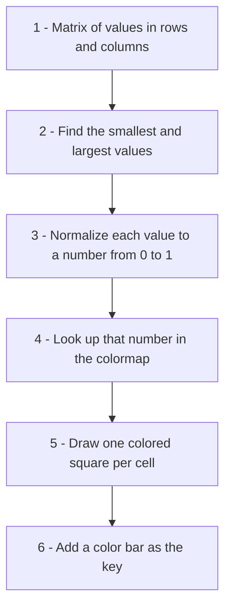
```mermaid
graph TD
    A[1 - Matrix of values in rows and columns] --> B[2 - Find the smallest and largest values]
    B --> C[3 - Normalize each value to a number from 0 to 1]
    C --> D[4 - Look up that number in the colormap]
    D --> E[5 - Draw one colored square per cell]
    E --> F[6 - Add a color bar as the key]
```

```python
# Step 1 - Import the libraries
import numpy as np
import matplotlib.pyplot as plt
from matplotlib.colors import Normalize

# Step 2 - A small 2 x 3 matrix (2 rows, 3 columns)
data = np.array([
    [10, 50, 30],
    [20, 40, 15],
])
print("Matrix:")
print(data)
print("Shape:", data.shape)

# Step 3 - Normalize: squeeze every value into the range 0 to 1
# The smallest value becomes 0 and the largest becomes 1.
norm = Normalize(vmin=data.min(), vmax=data.max())
print()
print("Normalized values (0 = lowest color, 1 = highest color):")
print(np.round(norm(data), 2))

# Step 4 - Draw the matrix with imshow() and a color bar
fig, ax = plt.subplots(figsize=(6, 3.5))
image = ax.imshow(data, cmap="viridis")
fig.colorbar(image, ax=ax, label="Value")

# Step 5 - Write each value inside its cell
for row in range(data.shape[0]):
    for col in range(data.shape[1]):
        text_color = "black" if norm(data[row, col]) > 0.6 else "white"
        ax.text(col, row, data[row, col], ha="center", va="center", color=text_color)

ax.set_title("imshow(): each cell becomes a colored square")
ax.set_xlabel("Column index")
ax.set_ylabel("Row index")
ax.set_xticks(range(3))
ax.set_yticks(range(2))

# Step 6 - Check the color chosen for the lowest and highest values
cmap = plt.get_cmap("viridis")
print()
print("Color for 10 (lowest) :", tuple(round(float(c), 2) for c in cmap(norm(10))[:3]), "(dark purple)")
print("Color for 50 (highest):", tuple(round(float(c), 2) for c in cmap(norm(50))[:3]), "(bright yellow)")
plt.show()
```

**Output**

```text
Matrix:
[[10 50 30]
 [20 40 15]]
Shape: (2, 3)

Normalized values (0 = lowest color, 1 = highest color):
[[0.   1.   0.5 ]
 [0.25 0.75 0.12]]

Color for 10 (lowest) : (0.27, 0.0, 0.33) (dark purple)
Color for 50 (highest): (0.99, 0.91, 0.14) (bright yellow)
```

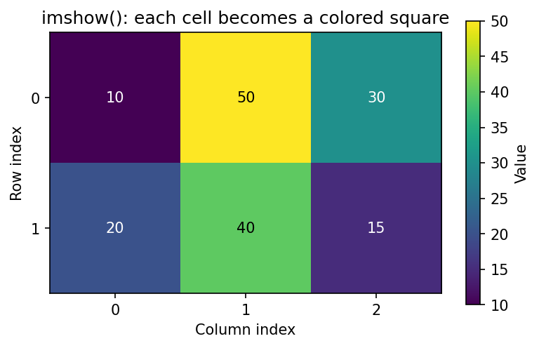

**Following one value through the steps:** the value 30 lies halfway between the smallest value (10) and the largest (50), so it is normalized to 0.5. The middle of the viridis colormap is a teal green, which is the color of the cell holding 30.

**Follow-up question:** If you add `vmin=0, vmax=100` to `imshow()`, what happens to the colors?

<details>
<summary>Show answer</summary>

The value 10 would normalize to 0.1 and 50 to 0.5 instead of 0 and 1. All the cells would shift toward the dark, lower half of the colormap, and no cell would be bright yellow. Fixing `vmin` and `vmax` is useful when several heat maps must use the same color scale so that they can be compared.

</details>

[Back to the Table of Contents](#table-of-contents)

### 15. Differentiate between plt.tight_layout() and layout="constrained".

**Answer**

Both tools stop titles, labels and color bars from overlapping by adjusting the space around and between subplots. They differ in when and how they work.

`plt.tight_layout()` (or `fig.tight_layout()`) is a **one-time adjustment**. When you call it, it measures the text currently on the figure and moves the subplots to make room. If you add or change labels afterwards, it does not update automatically; you would need to call it again. It works well for simple grids but can struggle with extra items such as color bars and figure titles.

`layout="constrained"` is chosen when the figure is created, for example `plt.subplots(layout="constrained")` or `plt.figure(layout="constrained")`. It turns on a **layout engine** that solves the spacing problem every time the figure is drawn. Because of this it takes into account everything present at drawing time, including color bars, legends and a figure title (`suptitle`). This makes it more reliable for complex, multi-panel figures. The Matplotlib documentation often suggests it as the better choice for new figures.

See [Constrained layout guide](https://matplotlib.org/stable/users/explain/axes/constrainedlayout_guide.html) and [Tight layout guide](https://matplotlib.org/stable/users/explain/axes/tight_layout_guide.html).

| Feature | `tight_layout()` | `layout="constrained"` |
| --- | --- | --- |
| When it is set | Called after the plots are made | Chosen when the figure is created |
| How often it runs | Once, when called | Every time the figure is drawn |
| Handles color bars and figure titles | Partly | Yes |
| Adapts to later changes | No; call it again | Yes |
| Can be used together | No; use one or the other | No; use one or the other |

```python
# Step 1 - Import the libraries
import numpy as np
import matplotlib.pyplot as plt

np.random.seed(0)
matrix = np.random.rand(10, 10)

def build(fig, axes):
    """Fill a 2 x 2 grid with images, long labels, color bars and a figure title."""
    for i, ax in enumerate(axes.flat):
        img = ax.imshow(matrix * (i + 1))
        ax.set_title(f"Panel {i + 1} with a longer title")
        ax.set_xlabel("A fairly long x-axis label")
        ax.set_ylabel("Long y-axis label")
        fig.colorbar(img, ax=ax)
    fig.suptitle("Same figure, two layout methods", fontsize=14)

# Step 2 - Version A: tight_layout() called once, at the end
fig_a, axes_a = plt.subplots(2, 2, figsize=(8, 6))
build(fig_a, axes_a)
print("Before tight_layout():", type(fig_a.get_layout_engine()).__name__)
fig_a.tight_layout()
print("After tight_layout() :", type(fig_a.get_layout_engine()).__name__)
plt.show()

# Step 3 - Version B: layout="constrained" chosen when the figure is created
fig_b, axes_b = plt.subplots(2, 2, figsize=(8, 6), layout="constrained")
build(fig_b, axes_b)
print("Constrained figure uses:", type(fig_b.get_layout_engine()).__name__)
plt.show()
```

**Output**

```text
Before tight_layout(): NoneType
After tight_layout() : PlaceHolderLayoutEngine
Constrained figure uses: ConstrainedLayoutEngine
```

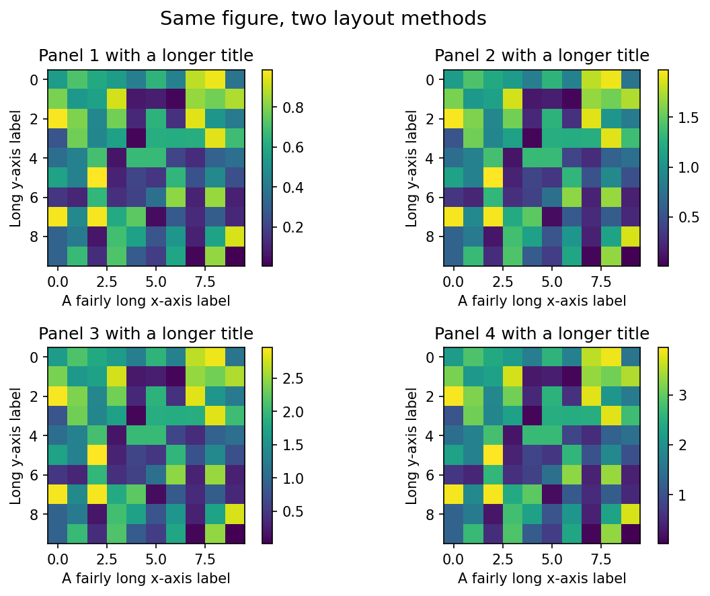

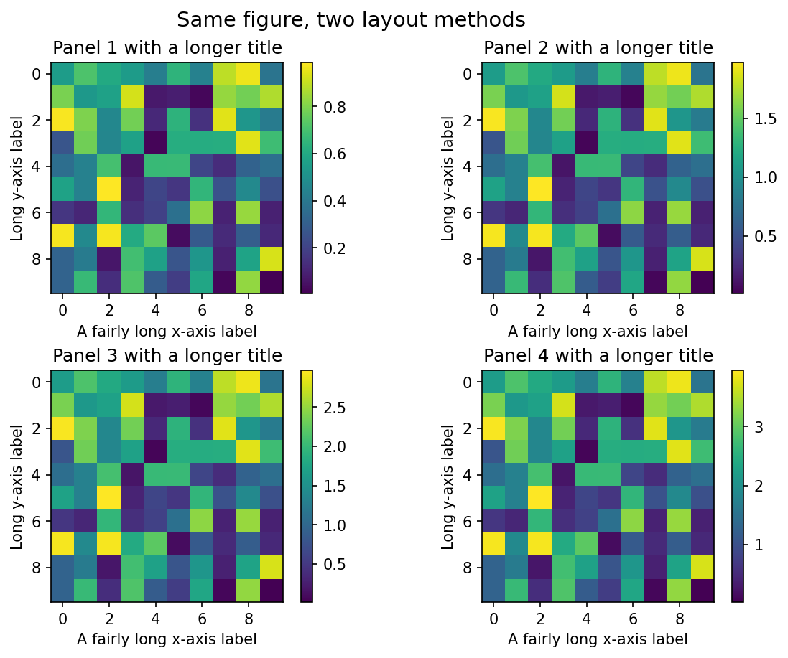

**Reading the output:** before `tight_layout()` the figure has no layout engine (`NoneType`). After the call it holds only a placeholder, which shows that the adjustment happened once and is not running any more. The constrained figure keeps a real `ConstrainedLayoutEngine`, which works each time the figure is drawn. For this fairly simple figure both pictures look similar; the difference grows as figures become more crowded or are changed after the layout step.

**Follow-up question:** You call `fig.tight_layout()` and then add a long figure title with `fig.suptitle()`. What might go wrong?

<details>
<summary>Show answer</summary>

`tight_layout()` has already run, so it did not leave room for the new title. The title may overlap the top row of subplots. Either call `tight_layout()` again after adding the title, or create the figure with `layout="constrained"`, which handles the title automatically.

</details>

[Back to the Table of Contents](#table-of-contents)

### 16. How does indexing work when plt.subplots() creates a multi-row grid?

**Answer**

When you create a single plot, `plt.subplots()` returns one Axes object. If you ask for a grid with more than one row and more than one column, such as `plt.subplots(2, 2)`, it returns a **2-D NumPy array** holding four Axes objects. To pick a panel, use grid indexing with two numbers: `ax[row_index, col_index]`. Counting starts at 0, so `ax[0, 0]` is the top-left panel and `ax[1, 1]` is the bottom-right panel.

| Call | What `ax` is | How to reach a panel |
| --- | --- | --- |
| `plt.subplots()` | A single Axes | `ax` |
| `plt.subplots(1, 3)` or `plt.subplots(3, 1)` | A 1-D array of 3 Axes | `ax[0]`, `ax[1]`, `ax[2]` |
| `plt.subplots(2, 2)` | A 2-D array of 4 Axes | `ax[0, 0]`, `ax[0, 1]`, `ax[1, 0]`, `ax[1, 1]` |

```text
            column 0       column 1
row 0     ax[0, 0]       ax[0, 1]
row 1     ax[1, 0]       ax[1, 1]
```

See [matplotlib.pyplot.subplots](https://matplotlib.org/stable/api/_as_gen/matplotlib.pyplot.subplots.html).

```python
# =====================================================================
# File: github_subplot_matrix.py
# Description: Demonstrates how to index the axes of a subplot grid
# =====================================================================

# Step 1 - Import pyplot
import matplotlib.pyplot as plt

# Step 2 - Generate a 2x2 grid (two rows, two columns)
# layout="constrained" keeps the four titles from overlapping.
fig, ax = plt.subplots(2, 2, figsize=(8, 5), layout="constrained")
print("Type of ax :", type(ax).__name__)
print("Shape of ax:", ax.shape)

# Step 3 - Index positions are written as [row, column]
ax[0, 0].set_title("Top-Left Panel Position")
ax[0, 1].set_title("Top-Right Panel Position")
ax[1, 0].set_title("Bottom-Left Panel Position")
ax[1, 1].set_title("Bottom-Right Panel Position")

# Step 4 - Put a simple line in each panel so the panels are easy to tell apart
for row in range(2):
    for col in range(2):
        ax[row, col].plot([1, 2], [row + col, row + col + 1], marker="o")
        print(f"ax[{row}, {col}] -> {ax[row, col].get_title()}")

# Step 5 - Common student error: using a single (flat) index on a 2-D grid
try:
    ax[3].plot([1, 2], [10, 20])
except IndexError as error:
    print("IndexError:", error)

# Step 6 - Two correct ways to reach the fourth panel
print("ax[1, 1] is ax.flat[3]?", ax[1, 1] is ax.flat[3])

# Step 7 - Display, keep the window open for 15 seconds, then close it
plt.show(block=False)  # Display the plot without blocking further code execution
plt.pause(15)          # Keep the plot open for 15 seconds to allow for viewing
plt.close()            # Close the plot after the pause duration
```

**Output**

```text
Type of ax : ndarray
Shape of ax: (2, 2)
ax[0, 0] -> Top-Left Panel Position
ax[0, 1] -> Top-Right Panel Position
ax[1, 0] -> Bottom-Left Panel Position
ax[1, 1] -> Bottom-Right Panel Position
IndexError: index 3 is out of bounds for axis 0 with size 2
ax[1, 1] is ax.flat[3]? True
```

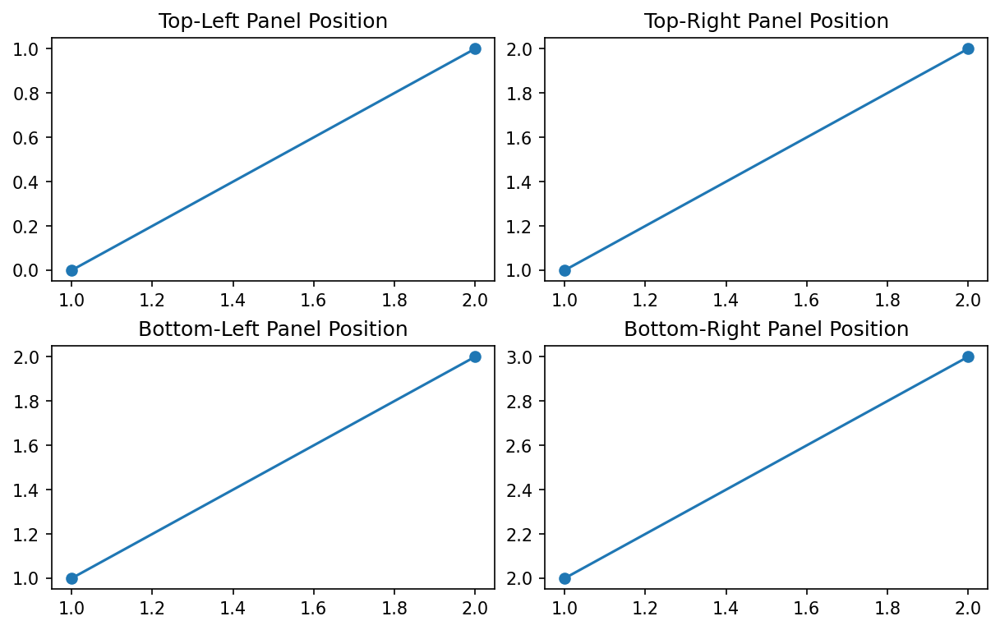

**Why `ax[3]` fails:** in a 2-D array, a single number selects a **row**. There are only rows 0 and 1, so asking for row 3 raises `IndexError: index 3 is out of bounds for axis 0 with size 2`. To count the panels one after another as 0, 1, 2, 3, use `ax.flat[3]` or `ax.flatten()[3]`. The output confirms that `ax.flat[3]` is the same panel as `ax[1, 1]`.

The error line in the original example was kept inside comments so that the script would not stop. In this version it is placed inside `try` and `except`, which catches the error, prints its message and lets the script carry on.

**Follow-up question:** What does `ax[1]` give in a 2 × 2 grid?

<details>
<summary>Show answer</summary>

It gives the whole second row, which is a 1-D array of two Axes: `ax[1, 0]` and `ax[1, 1]`. It does not give a single plot, so calling `ax[1].plot(...)` raises an error.

</details>

[Back to the Table of Contents](#table-of-contents)

## Part 5: Styles and Labels

### 17. What is the execution danger of mixing global styles with local overrides?

**Answer**

A **global style**, set with `plt.style.use('ggplot')`, changes Matplotlib's default settings (stored in `plt.rcParams`) for the rest of the Python session. These defaults are read at the moment a figure or axes is **created**. A **local override**, such as `ax.set_facecolor('black')`, changes one setting on one existing axes only, and it always wins for that axes.

Mixing the two causes problems because of **timing**, not because one secretly erases the other:

1. **Figures made before the style change keep the old look.** `plt.style.use()` does not restyle existing figures.
2. **Figures made after the style change get the new look,** for every figure that follows, even in parts of the program you did not mean to change. In a Jupyter notebook the style stays in force for all later cells too.
3. **Local overrides do not carry forward.** A color set with `ax.set_facecolor()` applies to that one axes; the next axes will use whatever the global defaults are at that time.
4. So a script that switches styles part way through, and mixes in local overrides, can produce figures that look inconsistent. The final appearance depends on the order in which lines were run, which makes the result hard to predict and hard to debug.

**The safe approach:** set the global style once at the very top of the script, before any figures are made. If only one figure needs a different style, use a `with plt.style.context(...)` block, which applies the style temporarily and then restores the previous settings. See [Customizing Matplotlib with style sheets and rcParams](https://matplotlib.org/stable/users/explain/customizing.html).

```python
# Step 1 - Import pyplot
import matplotlib.pyplot as plt

x = [1, 2, 3, 4]
y = [3, 5, 4, 6]

# get_facecolor() returns (red, green, blue, transparency) as numbers from 0 to 1.
# We print the first three, rounded to 2 decimal places.

# Step 2 - Figure 1 is created with the DEFAULT style, plus one local override
fig1, ax1 = plt.subplots(figsize=(5, 3))
ax1.set_facecolor("lightyellow")          # Local override for this axes only
ax1.plot(x, y)
ax1.set_title("Created before the style change")
print("Figure 1 background before style change:", [round(c, 2) for c in ax1.get_facecolor()[:3]])

# Step 3 - Change the GLOBAL style in the middle of the script
plt.style.use("ggplot")

# Step 4 - Figure 1 is not restyled; its local override is still there
print("Figure 1 background after style change :", [round(c, 2) for c in ax1.get_facecolor()[:3]])
plt.show()

# Step 5 - Figure 2 is created AFTER the style change, so it picks up the new defaults
fig2, ax2 = plt.subplots(figsize=(5, 3))
ax2.plot(x, y)
ax2.set_title("Created after plt.style.use('ggplot')")
print("Figure 2 background (from ggplot)      :", [round(c, 2) for c in ax2.get_facecolor()[:3]])
plt.show()

# Step 6 - Safer: apply a style only inside a 'with' block
plt.style.use("default")                  # Put the defaults back first
with plt.style.context("ggplot"):
    fig3, ax3 = plt.subplots()
    print("Inside the with-block, background     :", [round(c, 2) for c in ax3.get_facecolor()[:3]])
fig4, ax4 = plt.subplots()
print("After the with-block, background      :", [round(c, 2) for c in ax4.get_facecolor()[:3]])
plt.close(fig3)
plt.close(fig4)
```

**Output**

```text
Figure 1 background before style change: [1.0, 1.0, 0.88]
Figure 1 background after style change : [1.0, 1.0, 0.88]
Figure 2 background (from ggplot)      : [0.9, 0.9, 0.9]
Inside the with-block, background     : [0.9, 0.9, 0.9]
After the with-block, background      : [1.0, 1.0, 1.0]
```

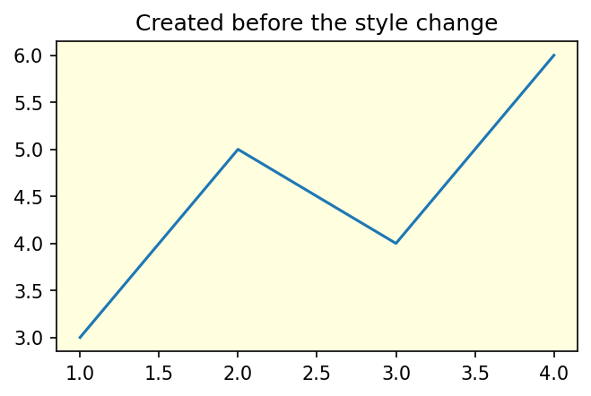

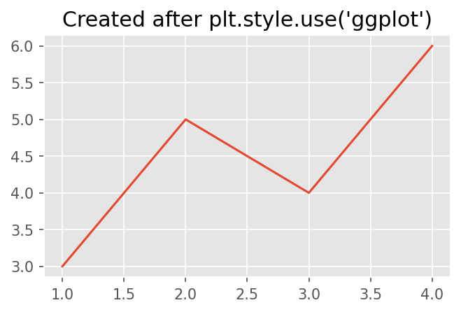

**Reading the output:**

1. Figure 1 got a light yellow background from a local override. After `plt.style.use("ggplot")` it still has exactly the same color, so the style change did not touch it.
2. Figure 2, created after the style change, has ggplot's gray background (0.9, 0.9, 0.9) and a different line color and font size.
3. Inside the `with plt.style.context("ggplot"):` block, a new figure gets the ggplot look. Just after the block, a new figure is back to the default white, so the temporary style did not leak out.

**Follow-up question:** Where in a script is the best place to call `plt.style.use()`?

<details>
<summary>Show answer</summary>

At the top, straight after the imports and before any figure is created. Then every figure in the script uses the same style, and nothing depends on the order of later lines.

</details>

[Back to the Table of Contents](#table-of-contents)

### 18. Why does ax.text() use data coordinates while annotations use reference arrows?

**Answer**

`ax.text(x, y, "Label")` places a piece of text at a position on the plot. By default that position is in **data coordinates**, meaning the same x and y scale as the plotted data. If you change the axis limits, the text stays attached to that data position, so it moves on the screen along with the data. You can also place text relative to the plot area instead, by adding `transform=ax.transAxes`; then (0, 0) is the bottom-left corner and (1, 1) the top-right corner of the axes, whatever the data limits.

`ax.annotate()` is designed to label a particular data point. It separates two positions:

- `xy=(x, y)`: the data point being pointed at
- `xytext=(...)`: where the text goes

An optional arrow, set with `arrowprops`, joins the text to the point. By default `xytext` is also measured in data coordinates. To keep the text at a fixed distance from the point, whatever the scale, set `textcoords="offset points"`; then `xytext=(40, -30)` means "40 points to the right of and 30 points below the target". This keeps labels tidy and readable even when the axis limits change.

A **point** is a printing unit equal to 1/72 of an inch. See [Text, labels and annotations (Matplotlib)](https://matplotlib.org/stable/users/explain/text/text_intro.html) and [Annotations (Matplotlib)](https://matplotlib.org/stable/users/explain/text/annotations.html).

| Method | Position is measured in | Arrow | Best for |
| --- | --- | --- | --- |
| `ax.text(x, y, s)` | Data coordinates | No | A note at a data position |
| `ax.text(x, y, s, transform=ax.transAxes)` | Fractions of the axes (0 to 1) | No | A fixed note, such as in a corner |
| `ax.annotate(s, xy, xytext, textcoords="offset points", arrowprops=...)` | Target in data; text as an offset in points | Yes | Pointing out a particular data point |

```python
# Step 1 - Import pyplot
import matplotlib.pyplot as plt

months = [1, 2, 3, 4, 5, 6]
sales = [20, 24, 23, 40, 26, 28]

fig, ax = plt.subplots(figsize=(8, 4.5))
ax.plot(months, sales, marker="o")

# Step 2 - ax.text() in DATA coordinates: placed at x=2, y=36 on the data scale
ax.text(2, 36, "Text at data point (2, 36)", color="green")

# Step 3 - ax.text() in AXES coordinates: (0.02, 0.95) = near the top-left corner, always
ax.text(0.02, 0.95, "Text fixed to the axes corner", transform=ax.transAxes,
        color="purple", va="top")

# Step 4 - ax.annotate(): arrow points at the data, text sits at an offset in points
note = ax.annotate(
    "Festival sale",
    xy=(4, 40),                     # The data point the arrow points to
    xytext=(40, -30),               # Offset of the text from that point
    textcoords="offset points",     # ... measured in points, not in data units
    arrowprops=dict(arrowstyle="->", color="black"),
)
print("Arrow target (data)  :", note.xy)
print("Text position        :", note.xyann, "in", note.anncoords)

# Step 5 - Change the y-limits and see which labels move
ax.set_ylim(0, 50)
print("y-limits changed to  :", tuple(float(v) for v in ax.get_ylim()))
print("Data-text still at   : (2, 36) on the data scale, so it moves on screen")
print("Axes-text still at   : top-left corner of the axes")
print("Annotation text keeps its offset from the point (4, 40)")

ax.set_title("ax.text() vs ax.annotate()")
ax.set_xlabel("Month")
ax.set_ylabel("Sales (units)")
plt.show()
```

**Output**

```text
Arrow target (data)  : (4, 40)
Text position        : (40, -30) in offset points
y-limits changed to  : (0.0, 50.0)
Data-text still at   : (2, 36) on the data scale, so it moves on screen
Axes-text still at   : top-left corner of the axes
Annotation text keeps its offset from the point (4, 40)
```

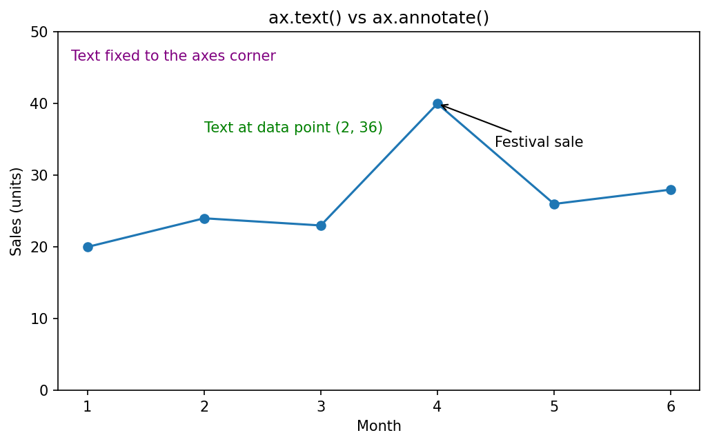

**What to notice:** the green text sits at the data position (2, 36). The purple text stays in the top-left corner of the axes. The arrow points at the peak value (4, 40), and the label "Festival sale" sits 40 points to the right of and 30 points below it. If the y-limits were changed again, the green text and the arrow's target would move with the data, the purple text would stay in its corner, and the annotation text would keep the same offset from its target.

**Follow-up question:** You want a small note "Source: sales register" to stay in the bottom-right corner of the plot, however the data changes. Which method and settings would you use?

<details>
<summary>Show answer</summary>

Use `ax.text()` with axes coordinates:

```python
ax.text(0.98, 0.02, "Source: sales register", transform=ax.transAxes,
        ha="right", va="bottom")
```

`ha="right"` and `va="bottom"` line up the right-hand and bottom edges of the text with that corner position.

</details>

[Back to the Table of Contents](#table-of-contents)

## Part 6: Memory and Dashboard Layouts

### 19. Detail how to clear memory when drawing thousands of plots in a loop.

**Answer**

Whenever you create a figure through pyplot, for example with `plt.figure()` or `plt.subplots()`, pyplot keeps a reference to it in its list of open figures. This lets you view and interact with several windows at once. The figure stays in memory until you close it or the Python session ends, even if you have already saved it and no longer use it. If a loop creates thousands of charts without closing them, memory use grows with every pass until the computer runs short of memory, the program slows down, and it may crash. This unwanted, steady growth in memory use is often called a **memory leak**. See [Memory leak (Wikipedia)](https://en.wikipedia.org/wiki/Memory_leak).

The fix is to free each figure's memory at the end of every loop pass by calling `plt.close(fig)`. Matplotlib even prints a warning when more than 20 figures are open at once, to remind you to close them.

| Command | What it closes |
| --- | --- |
| `plt.close(fig)` | The figure stored in `fig` |
| `plt.close()` | The current figure |
| `plt.close("all")` | Every open figure |
| `plt.get_fignums()` | Closes nothing; it lists the numbers of the open figures, which is useful for checking |

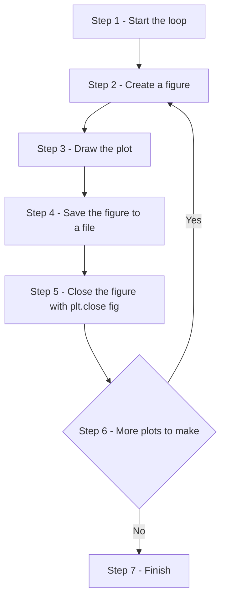
```mermaid
flowchart TD
    A[Step 1 - Start the loop] --> B[Step 2 - Create a figure]
    B --> C[Step 3 - Draw the plot]
    C --> D[Step 4 - Save the figure to a file]
    D --> E[Step 5 - Close the figure with plt.close fig]
    E --> F{Step 6 - More plots to make}
    F -->|Yes| B
    F -->|No| G[Step 7 - Finish]
```

```python
# =====================================================================
# Example: Clearing Memory When Generating Many Plots
#
# Description:
# This script simulates a batch-reporting pipeline that creates
# many plots inside a loop.
#
# IMPORTANT:
# Every call to plt.subplots() creates a new Figure object that
# consumes memory. pyplot keeps track of every figure it creates.
# If figures are never closed, memory usage keeps growing.
#
# The solution is to explicitly call:
#
#     plt.close(fig)
#
# after saving or displaying each figure.
#
# The original example made 1000 plots. Here NUMBER_OF_PLOTS is set to 50
# so that the script runs quickly and does not fill your folder with files.
# Change it to 1000 to see the full batch.
# =====================================================================

# STEP 1: Import the libraries and choose how many plots to make
import os
import matplotlib.pyplot as plt
import numpy as np

NUMBER_OF_PLOTS = 50
os.makedirs("batch_plots", exist_ok=True)      # Save the images in their own folder

# STEP 2: Show the problem first - figures pile up when they are not closed
for plot_id in range(25):
    fig, ax = plt.subplots()
    ax.plot([0, 1], [0, plot_id])
print("Open figures WITHOUT plt.close():", len(plt.get_fignums()))
plt.close("all")                               # Close all of them before continuing
print("Open figures after plt.close('all'):", len(plt.get_fignums()))

# STEP 3: The correct batch loop
for plot_id in range(NUMBER_OF_PLOTS):

    # STEP 3a: Create a new figure.
    # A Figure object holds memory for its axes, lines, labels,
    # tick marks and drawing information.
    fig, ax = plt.subplots()

    # STEP 3b: Create sample data
    x = np.linspace(0, 10, 100)
    y = np.sin(x + plot_id * 0.1)

    # STEP 3c: Draw the plot
    ax.plot(x, y)
    ax.set_title(f"Plot {plot_id}")

    # STEP 3d: Save the figure (in a real pipeline these could be report_001.png, ...)
    fig.savefig(os.path.join("batch_plots", f"plot_{plot_id}.png"))

    # STEP 3e: CRITICAL MEMORY CLEANUP
    # Remove the figure from pyplot's list of open figures and free its memory.
    # Without this line, all the figures stay in memory.
    plt.close(fig)

    # Print a progress line every 10 plots
    if (plot_id + 1) % 10 == 0:
        print(f"Saved {plot_id + 1} plots; open figures now: {len(plt.get_fignums())}")

# STEP 4: Completion message
print("Finished generating plots.")
print("Files in batch_plots:", len(os.listdir("batch_plots")))
```

**Output**

```text
Open figures WITHOUT plt.close(): 25
Open figures after plt.close('all'): 0
Saved 10 plots; open figures now: 0
Saved 20 plots; open figures now: 0
Saved 30 plots; open figures now: 0
Saved 40 plots; open figures now: 0
Saved 50 plots; open figures now: 0
Finished generating plots.
Files in batch_plots: 50
```

This script does not show any graph on screen. It only saves image files into a folder called `batch_plots`.

**What the output proves:**

1. Creating 25 figures without closing them left 25 figures open in memory.
2. `plt.close("all")` brought the count back to 0.
3. In the correct loop, the count of open figures stays at 0 after every save, because each figure is closed straight away.
4. All 50 images were saved, so closing a figure after `savefig()` does not affect the saved file.

**Follow-up question:** Is it enough to write `fig = None` or reuse the variable name `fig` in the next loop pass instead of calling `plt.close(fig)`?

<details>
<summary>Show answer</summary>

No. pyplot still holds its own reference to the figure in its list of open figures, so the memory is not freed. Only `plt.close()` removes the figure from that list.

</details>

[Back to the Table of Contents](#table-of-contents)

### 20. How does plt.subplot2grid() build irregular grid layouts?

**Answer**

Standard subplot functions such as `plt.subplot()` and `plt.subplots()` divide a figure into a uniform grid, where each subplot takes exactly one grid cell. This works well for simple visualizations but becomes limiting when building dashboards, report layouts or analysis screens where some charts need more space than others.

`plt.subplot2grid()` solves this problem by treating the whole figure as a grid of cells with coordinates. First, you set the total grid size with the `shape=(rows, cols)` parameter. Each cell in this grid has a (row, column) location. You then say where a subplot should begin with `loc=(row, column)`, and, if needed, let it stretch over several rows or columns with the `rowspan` and `colspan` parameters.

This makes it possible to create uneven dashboard layouts such as:

- a wide header chart spanning the full width of the figure
- a tall navigation or sidebar panel
- a large main analysis panel
- several small supporting charts

Internally, Matplotlib builds a **GridSpec** (a description of the grid) and turns the requested block of cells into a single plotting area. By combining different spans, you can build complex, dashboard-style layouts inside a single figure.

See [matplotlib.pyplot.subplot2grid](https://matplotlib.org/stable/api/_as_gen/matplotlib.pyplot.subplot2grid.html). Newer ways of making uneven layouts are [GridSpec](https://matplotlib.org/stable/api/_as_gen/matplotlib.gridspec.GridSpec.html) and [subplot_mosaic](https://matplotlib.org/stable/users/explain/axes/mosaic.html), which you may meet in more recent code.

**How the three panels fill the 3 × 3 grid:**

| | Column 0 | Column 1 | Column 2 |
| --- | --- | --- | --- |
| **Row 0** | Banner | Banner | Banner |
| **Row 1** | Sidebar | Main | Main |
| **Row 2** | Sidebar | Main | Main |

| Panel | `loc` | `rowspan` | `colspan` | Cells used |
| --- | --- | --- | --- | --- |
| Banner | (0, 0) | 1 (default) | 3 | 1 × 3 = 3 |
| Sidebar | (1, 0) | 2 | 1 (default) | 2 × 1 = 2 |
| Main | (1, 1) | 2 | 2 | 2 × 2 = 4 |

The three panels use 3 + 2 + 4 = 9 cells, which fills the whole 3 × 3 grid with no overlap.

```python
# =====================================================================
# File: github_subplot2grid_dashboard.py
#
# Description:
# Demonstrates how subplot2grid() creates irregular dashboard layouts.
#
# Dashboard Structure:
#
#   +-----------------------------+
#   |        Banner Plot          |
#   +---------+-------------------+
#   | Sidebar |                   |
#   |         |   Main Plot       |
#   |         |                   |
#   +---------+-------------------+
#
# =====================================================================

# STEP 1: Import the libraries and create a figure large enough for a dashboard
import matplotlib.pyplot as plt
import numpy as np

plt.figure(figsize=(10, 7))

# =====================================================================
# STEP 2: Define the overall dashboard grid
#
# We use a 3-row x 3-column grid.
#
# Grid Coordinates:
#
#       Col0   Col1   Col2
#
# Row0  (0,0) (0,1) (0,2)
# Row1  (1,0) (1,1) (1,2)
# Row2  (2,0) (2,1) (2,2)
# =====================================================================

grid_dimensions = (3, 3)

# =====================================================================
# STEP 3: Create the Banner Panel
#
# Start at cell (0,0).
# colspan=3 means: occupy all three columns across the top row.
# =====================================================================

ax_banner = plt.subplot2grid(
    shape=grid_dimensions,
    loc=(0, 0),
    colspan=3
)

x = np.linspace(0, 10, 100)

ax_banner.plot(
    x,
    np.sin(x),
    color="crimson",
    linewidth=2
)

ax_banner.set_title(
    "Banner Plot (Spans Entire Top Row)"
)

# =====================================================================
# STEP 4: Create the Sidebar Panel
#
# Start at cell (1,0).
# rowspan=2 means: occupy both lower rows.
# =====================================================================

ax_sidebar = plt.subplot2grid(
    shape=grid_dimensions,
    loc=(1, 0),
    rowspan=2
)

sidebar_data = [12, 18, 9, 14]

ax_sidebar.bar(
    ["A", "B", "C", "D"],
    sidebar_data,
    color="steelblue"
)

ax_sidebar.set_title(
    "Sidebar Panel"
)

# =====================================================================
# STEP 5: Create the Main Analytics Panel
#
# Start at cell (1,1).
# rowspan=2 and colspan=2, so it occupies:
#
#   (1,1) (1,2)
#   (2,1) (2,2)
# =====================================================================

ax_main = plt.subplot2grid(
    shape=grid_dimensions,
    loc=(1, 1),
    rowspan=2,
    colspan=2
)

x = np.linspace(0, 20, 200)

ax_main.plot(
    x,
    np.sin(x),
    label="sin(x)"
)

ax_main.plot(
    x,
    np.cos(x),
    label="cos(x)"
)

ax_main.set_title(
    "Main Analytics Area"
)

ax_main.legend()

# =====================================================================
# STEP 6: Check which grid cells each panel uses
#
# get_subplotspec() describes the cells an axes occupies.
# rowspan and colspan are Python range objects: range(1, 3) means rows 1 and 2.
# =====================================================================

for name, ax in [("Banner", ax_banner), ("Sidebar", ax_sidebar), ("Main", ax_main)]:
    spec = ax.get_subplotspec()
    print(f"{name:<8} rows {list(spec.rowspan)}  columns {list(spec.colspan)}")

# =====================================================================
# STEP 7: Improve spacing
#
# Prevents titles and labels from overlapping.
# =====================================================================

plt.tight_layout()

# =====================================================================
# STEP 8: Display the dashboard, keep it visible for 5 seconds, then close it
#
# block=False allows execution to continue.
# plt.pause(5) keeps the window on screen for 5 seconds.
# plt.close() closes the figure and releases its memory.
# =====================================================================

plt.show(block=False)
plt.pause(5)
plt.close()

# =====================================================================
# KEY TAKEAWAY
#
# shape     -> size of the overall grid
# loc       -> starting cell
# rowspan   -> number of rows occupied
# colspan   -> number of columns occupied
#
# subplot2grid() lets several cells be merged into one plotting area,
# enabling flexible dashboard-style layouts.
# =====================================================================
```

**Output**

```text
Banner   rows [0]  columns [0, 1, 2]
Sidebar  rows [1, 2]  columns [0]
Main     rows [1, 2]  columns [1, 2]
```

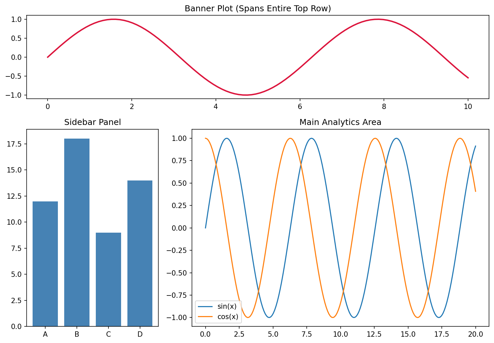

The printed rows and columns match the table above. For example, the Main panel uses rows 1 and 2 and columns 1 and 2. A `figsize` of 10 × 7 inches was added at the start so that the three panels have enough room.

**Follow-up question:** How would you change the layout so that the sidebar is on the right and the main panel on the left?

<details>
<summary>Show answer</summary>

Step 1 - Start the main panel at the left: `loc=(1, 0)`, keeping `rowspan=2` and `colspan=2`. It now uses columns 0 and 1.

Step 2 - Start the sidebar in the last column: `loc=(1, 2)`, keeping `rowspan=2`.

Step 3 - Leave the banner unchanged. The panels still fill all nine cells without overlapping.

</details>

[Back to the Table of Contents](#table-of-contents)

## Quick Revision Table

| No. | Topic | Key point to remember |
| --- | --- | --- |
| 1 | Spotting anomalies | Graphs are taken in at a glance; tables must be read cell by cell |
| 2 | Levels of measurement | Nominal, ordinal, interval and ratio data each limit which plots are honest |
| 3 | Two interfaces | pyplot uses the "current" axes; the object-oriented API names each axes |
| 4 | Chart hierarchy | Figure contains Axes; Axes contain Axis objects and Artists |
| 5 | Mismatched lengths | Shapes are checked first; a `ValueError` stops the plot |
| 6 | Single-array input | x-values become `range(len(y))` |
| 7 | Input types | All become NumPy arrays; arrays are compact and fast; pandas adds labels |
| 8 | `plt.show()` pausing | The backend's event loop waits until the windows are closed |
| 9 | Format strings | Quick color, marker and line style; keyword arguments do more |
| 10 | `hist()` workflow | Find range, make bins, place and count values, draw touching bars |
| 11 | Box vs violin | Box plot summarizes; violin plot also shows shape and peaks |
| 12 | Legends | Collect labelled artists and draw a sample of each |
| 13 | `twinx()` | A second, transparent Axes with its own y-axis and a shared x-axis |
| 14 | `imshow()` | Normalize values to 0 to 1, then map them to colors |
| 15 | Layout tools | `tight_layout()` runs once; constrained layout adjusts every time |
| 16 | Subplot indexing | Use `ax[row, col]` for a 2-D grid, or `ax.flat[i]` |
| 17 | Styles | Styles apply to figures created afterwards; set them once at the top |
| 18 | Text vs annotate | Text in data or axes coordinates; annotate points at data with offset text |
| 19 | Memory in loops | Call `plt.close(fig)` after saving each figure |
| 20 | `subplot2grid()` | `shape`, `loc`, `rowspan` and `colspan` build uneven layouts |

[Back to the Table of Contents](#table-of-contents)

## Glossary of Technical Terms

| Term | Simple explanation | Learn more |
| --- | --- | --- |
| Anomaly | A value that does not fit the pattern of the rest of the data | [Anomaly detection](https://en.wikipedia.org/wiki/Anomaly_detection) |
| API | The set of functions and methods a library provides | [API](https://en.wikipedia.org/wiki/API) |
| Artist | Anything Matplotlib draws: lines, patches, text and so on | [Artist tutorial](https://matplotlib.org/stable/users/explain/artists/artist_intro.html) |
| Axes | One plotting area inside a figure | [Anatomy of a figure](https://matplotlib.org/stable/gallery/showcase/anatomy.html) |
| Axis | One number line of an Axes, with its ticks and labels | [Anatomy of a figure](https://matplotlib.org/stable/gallery/showcase/anatomy.html) |
| Backend | The part of Matplotlib that draws figures on a screen or into a file | [Backends](https://matplotlib.org/stable/users/explain/figure/backends.html) |
| Bin | One interval into which a histogram groups values | [Histogram](https://en.wikipedia.org/wiki/Histogram) |
| Colormap | A smooth scale of colors used to show numbers | [Choosing colormaps](https://matplotlib.org/stable/users/explain/colors/colormaps.html) |
| Density estimate | A smooth curve showing where data values are crowded or sparse | [Kernel density estimation](https://en.wikipedia.org/wiki/Kernel_density_estimation) |
| Event loop | A loop that waits for and responds to user actions in a window | [Event loop](https://en.wikipedia.org/wiki/Event_loop) |
| Figure | The outer container that holds one or more Axes | [matplotlib.figure](https://matplotlib.org/stable/api/figure_api.html) |
| Format string | A short code such as `'ro-'` that sets color, marker and line style | [matplotlib.pyplot.plot](https://matplotlib.org/stable/api/_as_gen/matplotlib.pyplot.plot.html) |
| GridSpec | A description of a grid layout used to place subplots | [GridSpec](https://matplotlib.org/stable/api/_as_gen/matplotlib.gridspec.GridSpec.html) |
| Handle | The small sample line or patch drawn in a legend entry | [Legend guide](https://matplotlib.org/stable/users/explain/axes/legend_guide.html) |
| Heat map | A grid of colored cells showing the size of values | [Heat map](https://en.wikipedia.org/wiki/Heat_map) |
| Interquartile range (IQR) | Q3 minus Q1; the spread of the middle half of the data | [Interquartile range](https://en.wikipedia.org/wiki/Interquartile_range) |
| Layout engine | The part of Matplotlib that arranges subplots and spacing | [Constrained layout guide](https://matplotlib.org/stable/users/explain/axes/constrainedlayout_guide.html) |
| Level of measurement | The nominal, ordinal, interval and ratio classification of data | [Level of measurement](https://en.wikipedia.org/wiki/Level_of_measurement) |
| Memory leak | Memory use that keeps growing because unused objects are not released | [Memory leak](https://en.wikipedia.org/wiki/Memory_leak) |
| NaN | "Not a Number", a special value used for missing data | [NaN](https://en.wikipedia.org/wiki/NaN) |
| Normalize | Rescale values to a standard range, such as 0 to 1 | [Colormap normalization](https://matplotlib.org/stable/users/explain/colors/colormapnorms.html) |
| rcParams | Matplotlib's table of default settings | [Customizing Matplotlib](https://matplotlib.org/stable/users/explain/customizing.html) |
| Vectorized operation | Maths applied to a whole array in one step | [NumPy: the absolute basics](https://numpy.org/doc/stable/user/absolute_beginners.html) |

[Back to the Table of Contents](#table-of-contents)

---

