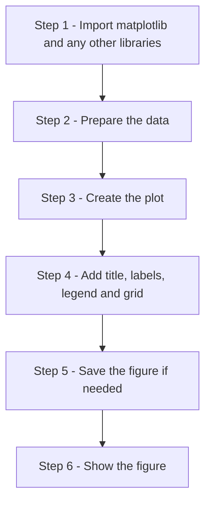
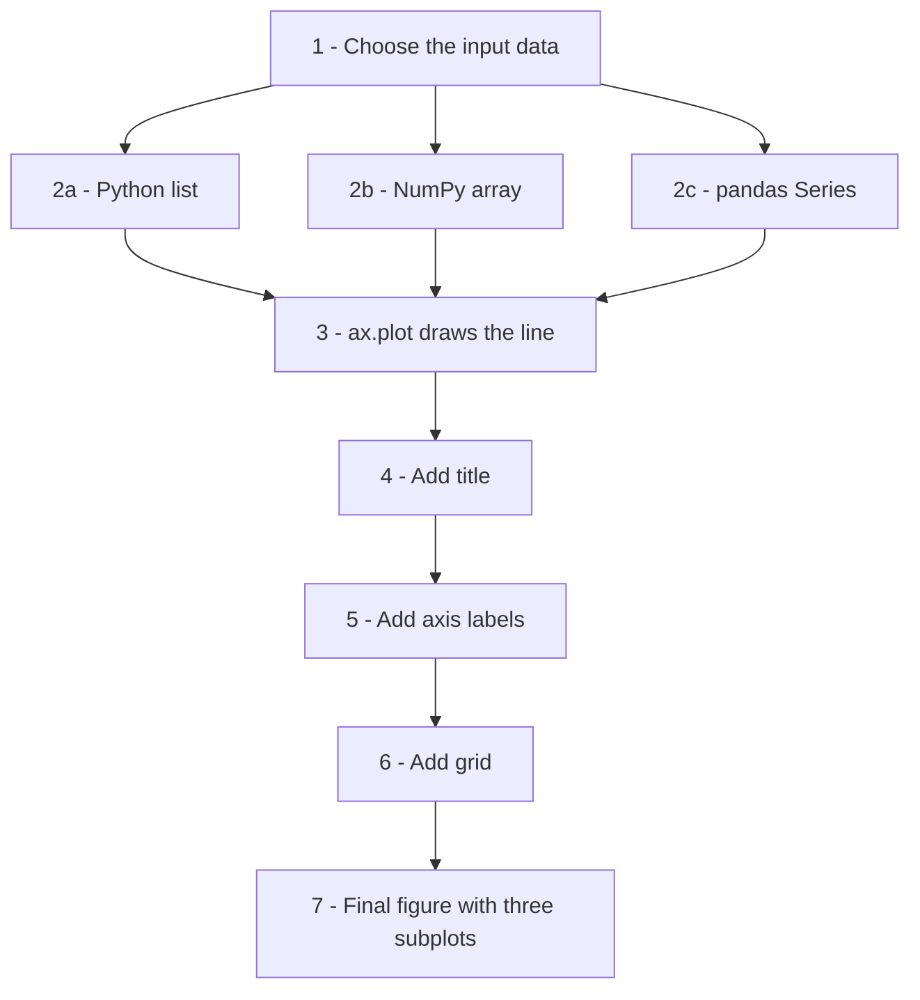
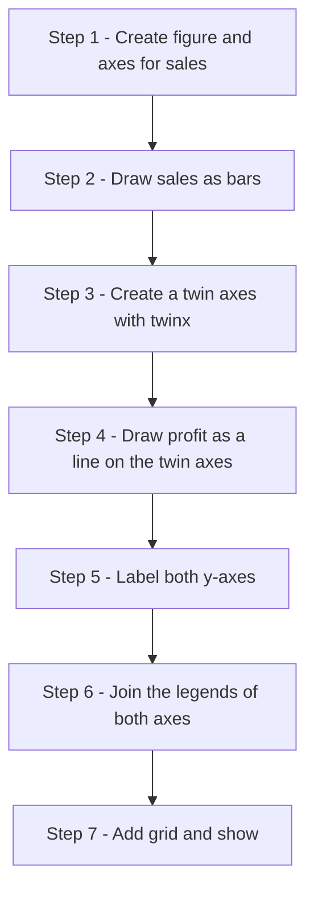
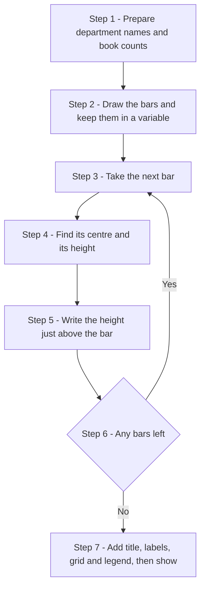
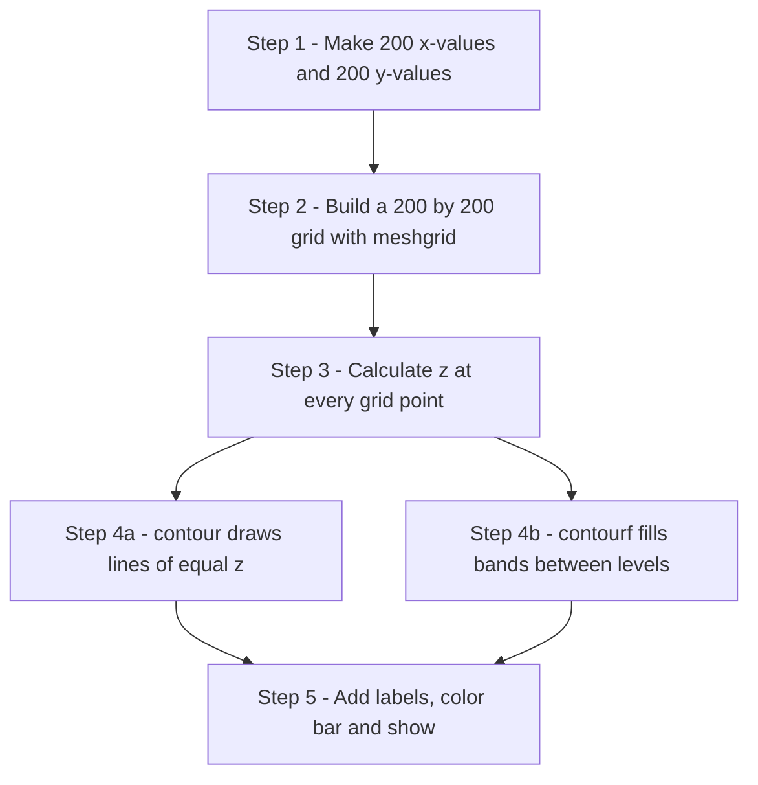
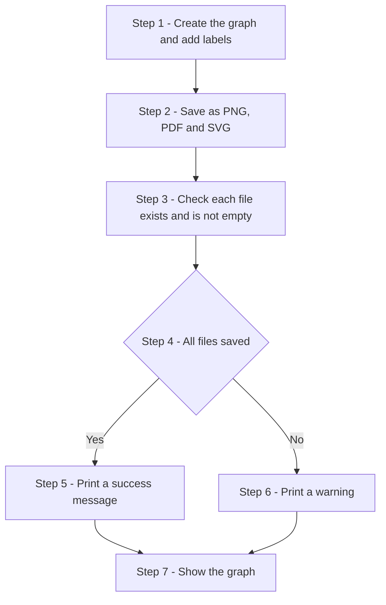

# Matplotlib: Scripting Questions and Answers

This page contains twenty scripting exercises for the chapter on **Matplotlib**, the main plotting library in Python. The questions are the same as those printed in the book. Here each question has a complete, working script with comments, the printed output of the script, a picture of the graph it draws, an explanation of how the script works, and a follow-up question for practice.

The exercises start with a single line plot and build up step by step:

- line plots, including plots from y-values only and plots with several lines
- plotting data stored in Python lists, NumPy arrays and pandas Series
- changing the look of lines, and adding titles, labels, legends, gridlines and axis limits
- combining a bar chart with a line chart, and the object-oriented (`fig, ax`) style
- bar charts, pie charts, histograms, scatter plots, box plots and violin plots
- heat maps and contour plots for grid (matrix) data
- annotations, style sheets and saving graphs to files

Writing plotting scripts is a good way to practise many basic Python skills at the same time: lists, loops, functions, importing libraries and reading documentation. The same skills are used in data analysis, science, engineering and business reporting.

**How to use this page:** read the question and try to write the script yourself first. Then compare your script with the answer, run it, and check that your printed output and graph match the ones shown. Finally, try the follow-up question. Its answer is hidden; click "Show answer" to see it.

**About the scripts:** every script was run with Python 3.11, Matplotlib 3.10, NumPy 2 and pandas 3.0. `print()` statements have been added so that you can check the numbers behind each graph. When a script calls `plt.show()`, a graph window opens; the picture below the output shows what that window contains.

**The basic pattern that every script follows:**



## Table of Contents

- [Matplotlib: Scripting Questions and Answers](#matplotlib-scripting-questions-and-answers)
  - [Part 1: First Line Plots](#part-1-first-line-plots)
    - [1. Write a script to create your first Matplotlib line plot using student marks obtained in five tests. Add a title, axis labels, and gridlines.](#1-write-a-script-to-create-your-first-matplotlib-line-plot-using-student-marks-obtained-in-five-tests-add-a-title-axis-labels-and-gridlines)
    - [2. Create a graph using only Y-values. Explain how Matplotlib automatically generates X-values.](#2-create-a-graph-using-only-y-values-explain-how-matplotlib-automatically-generates-x-values)
    - [3. Write a script to plot the performance of three students on the same graph. Use different styles, markers, legend, title, and grid.](#3-write-a-script-to-plot-the-performance-of-three-students-on-the-same-graph-use-different-styles-markers-legend-title-and-grid)
  - [Part 2: Plotting Different Data Structures](#part-2-plotting-different-data-structures)
    - [4. Write a script that plots the same dataset first using Python lists and then using NumPy arrays. Compare the approaches.](#4-write-a-script-that-plots-the-same-dataset-first-using-python-lists-and-then-using-numpy-arrays-compare-the-approaches)
    - [5. Write a script that plots identical data using a Python List, NumPy Array, and Pandas Series. Display all three in separate subplots and compare them.](#5-write-a-script-that-plots-identical-data-using-a-python-list-numpy-array-and-pandas-series-display-all-three-in-separate-subplots-and-compare-them)
  - [Part 3: Customizing Line Plots](#part-3-customizing-line-plots)
    - [6. Customise line appearance: Plot monthly sales and demonstrate different line styles, colours, markers, marker sizes, line widths, and transparency.](#6-customise-line-appearance-plot-monthly-sales-and-demonstrate-different-line-styles-colours-markers-marker-sizes-line-widths-and-transparency)
    - [7. Create a graph showing marks of three students. Add title, axis labels, legend, and explain the role of each chart element.](#7-create-a-graph-showing-marks-of-three-students-add-title-axis-labels-legend-and-explain-the-role-of-each-chart-element)
    - [8. Plot daily temperatures for ten days. Add gridlines and experiment with axis limits using xlim() and ylim().](#8-plot-daily-temperatures-for-ten-days-add-gridlines-and-experiment-with-axis-limits-using-xlim-and-ylim)
  - [Part 4: Combining Charts and the Object-Oriented Style](#part-4-combining-charts-and-the-object-oriented-style)
    - [9. Create a combined Bar Chart and Line Chart showing monthly sales and monthly profit in the same figure.](#9-create-a-combined-bar-chart-and-line-chart-showing-monthly-sales-and-monthly-profit-in-the-same-figure)
    - [10. Recreate a multi-line chart using the Object-Oriented (fig, ax) approach instead of the state-based pyplot approach.](#10-recreate-a-multi-line-chart-using-the-object-oriented-fig-ax-approach-instead-of-the-state-based-pyplot-approach)
  - [Part 5: Other Chart Types](#part-5-other-chart-types)
    - [11. Create a bar chart project showing the number of books issued by different departments in a college library. Add data labels, title, labels, legend, and gridlines.](#11-create-a-bar-chart-project-showing-the-number-of-books-issued-by-different-departments-in-a-college-library-add-data-labels-title-labels-legend-and-gridlines)
    - [12. Create a pie chart showing a family's monthly expenses. Use explode to highlight the largest expense category.](#12-create-a-pie-chart-showing-a-familys-monthly-expenses-use-explode-to-highlight-the-largest-expense-category)
    - [13. Create a histogram showing examination marks of 100 students. Use custom bins and explain how bins affect the distribution.](#13-create-a-histogram-showing-examination-marks-of-100-students-use-custom-bins-and-explain-how-bins-affect-the-distribution)
    - [14. Create a scatter plot to study the relationship between study hours and examination marks. Identify possible trends and outliers.](#14-create-a-scatter-plot-to-study-the-relationship-between-study-hours-and-examination-marks-identify-possible-trends-and-outliers)
    - [15. Create both a Box Plot and a Violin Plot for the same salary dataset. Compare the information provided by each visualization.](#15-create-both-a-box-plot-and-a-violin-plot-for-the-same-salary-dataset-compare-the-information-provided-by-each-visualization)
    - [Comparative Table: Distribution Visualizations](#comparative-table-distribution-visualizations)
  - [Part 6: Grid Data and Scientific Plots](#part-6-grid-data-and-scientific-plots)
    - [16. Create a heat map using imshow() to visualize the marks obtained by students in five subjects. Add a color bar, title, and axis labels.](#16-create-a-heat-map-using-imshow-to-visualize-the-marks-obtained-by-students-in-five-subjects-add-a-color-bar-title-and-axis-labels)
    - [17. Create contour and contourf plots of a mathematical surface defined by z = sin(x² + y²). Compare the two visualizations.](#17-create-contour-and-contourf-plots-of-a-mathematical-surface-defined-by-z--sinx²--y²-compare-the-two-visualizations)
  - [Part 7: Annotations, Styles and Saving](#part-7-annotations-styles-and-saving)
    - [18. Create a graph of monthly sales and use text annotations to highlight the highest and lowest sales values.](#18-create-a-graph-of-monthly-sales-and-use-text-annotations-to-highlight-the-highest-and-lowest-sales-values)
    - [19. Create the same graph using the ggplot style and the dark_background style. Compare the results.](#19-create-the-same-graph-using-the-ggplot-style-and-the-dark_background-style-compare-the-results)
    - [20. Create a graph and save it in PNG, PDF, and SVG formats using savefig(). Verify that the file is saved before displaying the graph.](#20-create-a-graph-and-save-it-in-png-pdf-and-svg-formats-using-savefig-verify-that-the-file-is-saved-before-displaying-the-graph)
    - [Comparative Table – Matrix and Scientific Visualizations](#comparative-table--matrix-and-scientific-visualizations)
  - [Glossary of Technical Terms](#glossary-of-technical-terms)

## Part 1: First Line Plots

### 1. Write a script to create your first Matplotlib line plot using student marks obtained in five tests. Add a title, axis labels, and gridlines.

**Answer**

A line plot joins data points with straight lines. It suits data that follows an order, such as test 1, test 2, test 3. The script stores the test numbers and the marks in two lists of the same length, draws the line with `plt.plot()`, and then adds the chart elements. See [matplotlib.pyplot.plot](https://matplotlib.org/stable/api/_as_gen/matplotlib.pyplot.plot.html).

```python
# ==========================================================
# FIRST LINE PLOT IN MATPLOTLIB
# ==========================================================
#
# Objective:
# Create a simple line graph showing marks obtained
# by a student in five tests.
#
# Concepts Covered:
# 1. Importing matplotlib
# 2. Creating a line plot
# 3. Adding title
# 4. Adding axis labels
# 5. Adding gridlines
# 6. Displaying the graph
#
# ==========================================================

# Step 1: Import pyplot module
import matplotlib.pyplot as plt

# Step 2: Prepare the data

# Test numbers
tests = [1, 2, 3, 4, 5]

# Marks obtained
marks = [65, 72, 68, 81, 90]

# Print the data and a short summary so that the graph can be checked
print("Tests :", tests)
print("Marks :", marks)
print("Average mark:", sum(marks) / len(marks))
print("Best test   :", tests[marks.index(max(marks))], "with", max(marks), "marks")

# Step 3: Create the line plot

plt.plot(
    tests,
    marks,
    marker='o',          # Circular marker at each test
    linestyle='-',       # Solid line
    linewidth=2          # Line thickness
)

# Step 4: Add chart elements

plt.title("Student Performance Across Tests")

plt.xlabel("Test Number")

plt.ylabel("Marks Obtained")

# Show only whole test numbers (1 to 5) on the x-axis, not 1.5, 2.5 ...
plt.xticks(tests)

# Step 5: Add gridlines

plt.grid(True)

# Step 6: Display the graph

plt.show()
```

**Output**

```text
Tests : [1, 2, 3, 4, 5]
Marks : [65, 72, 68, 81, 90]
Average mark: 75.2
Best test   : 5 with 90 marks
```


**How the script works, step by step:**

1. `import matplotlib.pyplot as plt` loads the plotting module under its usual short name `plt`.
2. `tests` holds the x-values and `marks` holds the y-values. Each test number is paired with the mark in the same position.
3. `plt.plot()` draws the line. `marker='o'` puts a dot on each test, `linestyle='-'` makes the line solid and `linewidth=2` makes it thicker.
4. `plt.title()`, `plt.xlabel()` and `plt.ylabel()` explain what the graph shows. `plt.xticks(tests)` makes the x-axis show only the whole numbers 1 to 5.
5. `plt.grid(True)` adds gridlines so that the marks can be read more easily.
6. `plt.show()` displays the finished graph.

The graph shows a dip at Test 3 (68) and then a steady rise to the best mark of 90 in Test 5.

**Follow-up question:** Without `plt.xticks(tests)`, what might appear on the x-axis?

<details>
<summary>Show answer</summary>

Matplotlib chooses the tick positions itself and may show values such as 1.0, 1.5, 2.0, 2.5 and so on. There is no "Test 1.5", so setting the ticks to the actual test numbers makes the graph clearer.

</details>

[Back to the Table of Contents](#table-of-contents)

### 2. Create a graph using only Y-values. Explain how Matplotlib automatically generates X-values.

**Answer**

When `plt.plot()` receives only one list, it treats that list as the y-values. It then creates the x-values itself as 0, 1, 2, 3, and so on, one for each y-value. These are the same numbers that `range(len(sales))` would give. Each y-value is paired with its position (index) in the list. In the book this is called **Pattern 1** plotting.

```python
# ==========================================================
# Y-ONLY PLOTTING
# ==========================================================
#
# Objective:
# Plot a graph by supplying only Y-values.
#
# Concepts Covered:
# 1. Pattern-1 plotting
# 2. Automatic X-value generation
# 3. Implicit indexing
#
# ==========================================================

# Step 1: Import pyplot

import matplotlib.pyplot as plt

# Step 2: Create Y-values

sales = [120, 135, 150, 170, 165, 190]

# Step 3: Plot only Y-values
# plot() returns a list of the lines it drew; the comma takes out the single line.

line, = plt.plot(
    sales,
    marker='o',
    linewidth=2
)

# ----------------------------------------------------------
# Matplotlib automatically generates:
#
# X = [0,1,2,3,4,5]
#
# Resulting coordinate pairs become:
#
# (0,120)
# (1,135)
# (2,150)
# (3,170)
# (4,165)
# (5,190)
#
# ----------------------------------------------------------

# Check what Matplotlib really used
x_generated = [int(v) for v in line.get_xdata()]
print("Y-values supplied :", sales)
print("X-values generated:", x_generated)
print("Coordinate pairs  :", list(zip(x_generated, sales)))

# Step 4: Add title

plt.title("Monthly Sales (Y-Only Plot)")

# Step 5: Label axes

plt.xlabel("Auto Generated Index")

plt.ylabel("Sales")

# Step 6: Add grid

plt.grid(True)

# Step 7: Show graph

plt.show()
```

**Output**

```text
Y-values supplied : [120, 135, 150, 170, 165, 190]
X-values generated: [0, 1, 2, 3, 4, 5]
Coordinate pairs  : [(0, 120), (1, 135), (2, 150), (3, 170), (4, 165), (5, 190)]
```


**How the script works, step by step:**

1. Only one list, `sales`, is created. There is no list of x-values.
2. `plt.plot(sales, ...)` draws the line. Matplotlib generates the x-values 0 to 5 because the list has 6 items.
3. `line.get_xdata()` reads back the x-values that were actually used, and the script prints them with the coordinate pairs. They match the list in the comment block.
4. The title, labels and grid are added as usual, and the graph is shown.

**Follow-up question:** The graph is titled "Monthly Sales", but the x-axis starts at 0. How would you make it show months 1 to 6 instead?

<details>
<summary>Show answer</summary>

Give the x-values yourself, so it is no longer a Y-only plot:

```python
months = [1, 2, 3, 4, 5, 6]
plt.plot(months, sales, marker='o', linewidth=2)
plt.xlabel("Month")
```

</details>

[Back to the Table of Contents](#table-of-contents)

### 3. Write a script to plot the performance of three students on the same graph. Use different styles, markers, legend, title, and grid.

**Answer**

To draw several lines on one graph, call `plt.plot()` once for each line before calling `plt.show()`. Matplotlib gives each line a new color automatically. Different markers and line styles make the lines easy to tell apart, even when printed in black and white. The `label` given to each line is the text used by the legend.

| Student | Marker | Line style |
| --- | --- | --- |
| Alice | `'o'` circle | `'-'` solid |
| Bob | `'s'` square | `'--'` dashed |
| Charlie | `'^'` triangle | `':'` dotted |

```python
# ==========================================================
# MULTIPLE LINE PLOTS
# ==========================================================
#
# Objective:
# Plot marks of three students on one graph.
#
# Concepts Covered:
# 1. Multiple datasets
# 2. Legends
# 3. Markers
# 4. Different line styles
# 5. Comparative visualization
#
# ==========================================================

# Step 1: Import pyplot

import matplotlib.pyplot as plt

# Step 2: Create X-values

tests = [1, 2, 3, 4, 5]

# Step 3: Create datasets

alice = [65, 70, 75, 80, 90]

bob = [60, 68, 72, 78, 85]

charlie = [70, 72, 78, 84, 88]

# Print each student's average and total improvement from Test 1 to Test 5
for name, marks in [("Alice", alice), ("Bob", bob), ("Charlie", charlie)]:
    print(f"{name:<8} average = {sum(marks) / len(marks):.1f}, "
          f"improvement = {marks[-1] - marks[0]} marks")

# Step 4: Plot Student 1

plt.plot(
    tests,
    alice,
    marker='o',         # Circle markers
    linestyle='-',      # Solid line
    label='Alice'       # Name shown in the legend
)

# Step 5: Plot Student 2

plt.plot(
    tests,
    bob,
    marker='s',         # Square markers
    linestyle='--',     # Dashed line
    label='Bob'
)

# Step 6: Plot Student 3

plt.plot(
    tests,
    charlie,
    marker='^',         # Triangle markers
    linestyle=':',      # Dotted line
    label='Charlie'
)

# Step 7: Add chart elements

plt.title("Comparison of Student Performance")

plt.xlabel("Test Number")

plt.ylabel("Marks")

plt.xticks(tests)       # Whole test numbers only

# Step 8: Display legend

plt.legend()

# Step 9: Display grid

plt.grid(True)

# Step 10: Show graph

plt.show()
```

**Output**

```text
Alice    average = 76.0, improvement = 25 marks
Bob      average = 72.6, improvement = 25 marks
Charlie  average = 78.4, improvement = 18 marks
```


**How the script works, step by step:**

1. All three students share the same x-values, `tests`.
2. The loop before plotting prints each student's average and improvement, which helps in reading the graph.
3. Three `plt.plot()` calls draw three lines, each with its own marker, line style and label.
4. `plt.legend()` collects the three labels and draws a key.
5. The title, labels, ticks and grid are added, and the graph is shown.

**Reading the graph:** Charlie leads for most of the tests, but Alice finishes highest in Test 5 (90). Alice and Bob both improved by 25 marks from the first test to the last.

**Follow-up question:** What happens if you call `plt.legend()` but forget to give the lines a `label`?

<details>
<summary>Show answer</summary>

Matplotlib finds no labelled lines, prints a warning ("No artists with labels found to put in legend") and draws no legend.

</details>

[Back to the Table of Contents](#table-of-contents)

## Part 2: Plotting Different Data Structures

### 4. Write a script that plots the same dataset first using Python lists and then using NumPy arrays. Compare the approaches.

**Answer**

Matplotlib accepts both Python lists and NumPy arrays, and draws the same graph from either. The difference lies in what you can do with the data before plotting. A NumPy array supports **vectorized** maths, which means an operation such as `* 2` is applied to every value at once. With a list, the same operation repeats the list instead, so a loop is needed. See [NumPy: the absolute basics for beginners](https://numpy.org/doc/stable/user/absolute_beginners.html).

```python
# ==========================================================
# LISTS VS NUMPY ARRAYS
# ==========================================================
#
# Objective:
# Plot identical data using:
# 1. Python lists
# 2. NumPy arrays
#
# Concepts Covered:
# 1. List-based plotting
# 2. NumPy-based plotting
# 3. Numerical computing
#
# ==========================================================

# Step 1: Import libraries

import matplotlib.pyplot as plt
import numpy as np

# ----------------------------------------------------------
# PART A : USING PYTHON LISTS
# ----------------------------------------------------------

# Step 2: Create list data

x_list = [1, 2, 3, 4, 5]

y_list = [10, 20, 30, 40, 50]

print("PART A - Python lists")
print("  Type of y_list:", type(y_list).__name__)
print("  y_list * 2    :", y_list * 2, "  <- the list is repeated, not doubled")
print("  Doubling needs a loop:", [value * 2 for value in y_list])

# Step 3: Plot list data

plt.figure(figsize=(8,4))

plt.plot(
    x_list,
    y_list,
    marker='o',
    label='List Data'
)

plt.title("Plot Using Python Lists")

plt.xlabel("X")

plt.ylabel("Y")

plt.grid(True)

plt.legend()

plt.show()

# ----------------------------------------------------------
# PART B : USING NUMPY ARRAYS
# ----------------------------------------------------------

# Step 4: Create NumPy arrays

x_np = np.array([1, 2, 3, 4, 5])

y_np = np.array([10, 20, 30, 40, 50])

print()
print("PART B - NumPy arrays")
print("  Type of y_np  :", type(y_np).__name__)
print("  y_np * 2      :", y_np * 2, "  <- every value is doubled at once")
print("  Mean of y_np  :", y_np.mean())

# Step 5: Plot NumPy arrays

plt.figure(figsize=(8,4))

plt.plot(
    x_np,
    y_np,
    marker='s',
    label='NumPy Array Data'
)

plt.title("Plot Using NumPy Arrays")

plt.xlabel("X")

plt.ylabel("Y")

plt.grid(True)

plt.legend()

plt.show()

# Step 6: Confirm that both versions hold the same values
print()
print("Same values in both versions?", np.array_equal(y_list, y_np))

# ----------------------------------------------------------
# COMPARISON
# ----------------------------------------------------------
#
# Lists
# -----
# Easy to create
# Good for small datasets
#
# NumPy Arrays
# ------------
# Faster numerical operations
# Efficient memory usage
# Better for scientific computing
#
# Both can be plotted directly by Matplotlib.
#
# ----------------------------------------------------------
```

**Output**

```text
PART A - Python lists
  Type of y_list: list
  y_list * 2    : [10, 20, 30, 40, 50, 10, 20, 30, 40, 50]   <- the list is repeated, not doubled
  Doubling needs a loop: [20, 40, 60, 80, 100]

PART B - NumPy arrays
  Type of y_np  : ndarray
  y_np * 2      : [ 20  40  60  80 100]   <- every value is doubled at once
  Mean of y_np  : 30.0

Same values in both versions? True
```


**How the script works, step by step:**

1. Part A creates two lists, prints what `* 2` does to a list, and plots them in a new figure.
2. Part B creates two NumPy arrays with the same values, prints what `* 2` does to an array, and plots them in a second figure.
3. `np.array_equal()` confirms that both versions hold exactly the same numbers.
4. The two graphs are identical apart from the marker shape and the title.

**Comparison:**

| Feature | Python list | NumPy array |
| --- | --- | --- |
| How to create | `[10, 20, 30]` | `np.array([10, 20, 30])` |
| Needs an extra library | No | Yes, NumPy |
| Effect of `* 2` | Repeats the list | Doubles every value |
| Maths on all values | Needs a loop | One step (vectorized) |
| Speed and memory for large data | Slower, more memory | Faster, less memory |
| Can be plotted by Matplotlib | Yes | Yes |

**Follow-up question:** How would you add 5 bonus marks to every value in `y_list` and in `y_np`?

<details>
<summary>Show answer</summary>

For the array: `y_np + 5`. For the list, a loop or list comprehension is needed: `[value + 5 for value in y_list]`. Writing `y_list + 5` raises a `TypeError`, because Python cannot add a number to a list.

</details>

[Back to the Table of Contents](#table-of-contents)

### 5. Write a script that plots identical data using a Python List, NumPy Array, and Pandas Series. Display all three in separate subplots and compare them.

**Answer**

`plt.subplots(nrows=3, ncols=1)` creates one figure with three plotting areas stacked vertically, and returns them in the array `ax`. Each dataset is drawn in its own area with `ax[0].plot()`, `ax[1].plot()` and `ax[2].plot()`. This is the object-oriented (OOP) style. All three plots look the same. The one difference is behind the scenes: for a pandas Series, Matplotlib uses the Series **index** (0, 1, 2, 3, 4) as the x-values, while for the list and the array it generates them. See [pandas Series](https://pandas.pydata.org/docs/reference/api/pandas.Series.html) and [matplotlib.pyplot.subplots](https://matplotlib.org/stable/api/_as_gen/matplotlib.pyplot.subplots.html).

```python
# ==========================================================
# LISTS VS NUMPY VS PANDAS
# ==========================================================
#
# Objective:
# Plot identical data using:
#
# 1. Python List
# 2. NumPy Array
# 3. Pandas Series
#
# Concepts Covered:
# 1. Different data sources
# 2. Subplots
# 3. OOP-style plotting
# 4. Comparative visualization
#
# ==========================================================

# Step 1: Import required libraries

import matplotlib.pyplot as plt
import numpy as np
import pandas as pd

# Step 2: Create identical data

list_data = [10, 15, 20, 25, 30]

numpy_data = np.array([10, 15, 20, 25, 30])

pandas_data = pd.Series([10, 15, 20, 25, 30])

print("List  :", list_data)
print("Array :", numpy_data)
print("Series:")
print(pandas_data)      # A Series prints its index (0 to 4) beside the values

# Step 3: Create subplot structure
# sharex=True gives all three plots the same x-axis, so they line up.

fig, ax = plt.subplots(
    nrows=3,
    ncols=1,
    figsize=(8, 10),
    sharex=True
)

# ----------------------------------------------------------
# SUBPLOT 1
# ----------------------------------------------------------

ax[0].plot(
    list_data,
    marker='o'
)

ax[0].set_title("Python List")

ax[0].set_ylabel("Value")

ax[0].grid(True)

# ----------------------------------------------------------
# SUBPLOT 2
# ----------------------------------------------------------

ax[1].plot(
    numpy_data,
    marker='s'
)

ax[1].set_title("NumPy Array")

ax[1].set_ylabel("Value")

ax[1].grid(True)

# ----------------------------------------------------------
# SUBPLOT 3
# ----------------------------------------------------------
# For a Series, Matplotlib uses the Series index (0, 1, 2, 3, 4) as the x-values.

ax[2].plot(
    pandas_data,
    marker='^'
)

ax[2].set_title("Pandas Series")

ax[2].set_xlabel("Position (index)")

ax[2].set_ylabel("Value")

ax[2].grid(True)

# Check that the three lines have exactly the same points
for axes, name in zip(ax, ["List", "Array", "Series"]):
    line = axes.lines[0]
    print(f"{name:<6} plotted x = {line.get_xdata().tolist()}, y = {line.get_ydata().tolist()}")

# Step 4: Improve spacing

plt.tight_layout()

# Step 5: Display graph

plt.show()

# ----------------------------------------------------------
# COMPARISON TABLE
# ----------------------------------------------------------
#
# +--------------+---------------------------+
# | Structure    | Primary Use               |
# +--------------+---------------------------+
# | List         | General Python data       |
# | NumPy Array  | Numerical computation     |
# | Pandas Series| Data analysis             |
# +--------------+---------------------------+
#
# Matplotlib can directly plot all three.
#
# ----------------------------------------------------------
```

**Output**

```text
List  : [10, 15, 20, 25, 30]
Array : [10 15 20 25 30]
Series:
0    10
1    15
2    20
3    25
4    30
dtype: int64
List   plotted x = [0.0, 1.0, 2.0, 3.0, 4.0], y = [10, 15, 20, 25, 30]
Array  plotted x = [0.0, 1.0, 2.0, 3.0, 4.0], y = [10, 15, 20, 25, 30]
Series plotted x = [0, 1, 2, 3, 4], y = [10, 15, 20, 25, 30]
```


**How the script works, step by step:**

1. The same five numbers are stored as a list, an array and a Series. Printing the Series shows its index on the left.
2. `plt.subplots(nrows=3, ncols=1, sharex=True)` creates three stacked plotting areas that share one x-axis.
3. Each dataset is plotted in its own area, with a title, a y-axis label and a grid.
4. The loop reads back the points of each line. All three have the same x- and y-values. The x-values generated for the list and array are stored as decimals (0.0, 1.0, ...), while the Series index gives whole numbers, but the positions are identical.
5. `plt.tight_layout()` adjusts spacing, and `plt.show()` displays the figure.

**Comparison:**

| Structure | Primary use | x-values when only the data is given |
| --- | --- | --- |
| List | General Python data | Generated: 0, 1, 2, ... |
| NumPy array | Numerical computation | Generated: 0, 1, 2, ... |
| pandas Series | Data analysis with labels | Taken from the Series index |

**How data reaches the finished graph:**



**Follow-up question:** If the Series were created as `pd.Series([10, 15, 20, 25, 30], index=[2020, 2021, 2022, 2023, 2024])`, what would the third subplot show on its x-axis?

<details>
<summary>Show answer</summary>

The years 2020 to 2024, because Matplotlib uses the Series index as the x-values. The first two subplots would still show 0 to 4, so they would no longer line up with the third one.

</details>

[Back to the Table of Contents](#table-of-contents)

## Part 3: Customizing Line Plots

### 6. Customise line appearance: Plot monthly sales and demonstrate different line styles, colours, markers, marker sizes, line widths, and transparency.

**Answer**

`plt.plot()` accepts many keyword arguments that control how a line looks. The script uses the most common ones together. It prints the settings back from the line object to confirm that Matplotlib applied them.

| Keyword argument | What it controls | Value used | Other examples |
| --- | --- | --- | --- |
| `color` | Color of the line | `"blue"` | `"green"`, `"#FF5733"` |
| `linestyle` | Pattern of the line | `"--"` (dashed) | `"-"`, `":"`, `"-."` |
| `linewidth` | Thickness in points | `3` | `1`, `5` |
| `marker` | Shape at each data point | `"o"` (circle) | `"s"`, `"^"`, `"D"` |
| `markersize` | Size of the marker in points | `10` | `5`, `15` |
| `markerfacecolor` | Fill color of the marker | `"red"` | `"white"` |
| `markeredgecolor` | Outline color of the marker | `"black"` | `"blue"` |
| `alpha` | Transparency, from 0 (invisible) to 1 (solid) | `0.8` | `0.3`, `1.0` |

See the full list under "Other Parameters" in [matplotlib.pyplot.plot](https://matplotlib.org/stable/api/_as_gen/matplotlib.pyplot.plot.html). A **point** is a printing unit equal to 1/72 of an inch.

```python
# ==========================================================
# CUSTOMIZING LINE APPEARANCE
# ==========================================================
#
# Objective:
# Demonstrate various line customization options.
#
# Concepts Covered:
# 1. color
# 2. linestyle
# 3. linewidth
# 4. marker
# 5. markersize
# 6. alpha (transparency)
#
# ==========================================================

# Step 1: Import Matplotlib

import matplotlib.pyplot as plt

# Step 2: Prepare data

months = ["Jan", "Feb", "Mar", "Apr", "May", "Jun"]

sales = [120, 150, 140, 180, 210, 250]

# Step 3: Create customized line graph

line, = plt.plot(
    months,
    sales,

    color="blue",         # Line color

    linestyle="--",       # Dashed line

    linewidth=3,          # Thickness of the line, in points

    marker="o",           # Marker shape (circle)

    markersize=10,        # Marker size, in points

    markerfacecolor="red",     # Fill color inside each marker

    markeredgecolor="black",   # Outline color of each marker

    alpha=0.8             # Transparency: 1 = solid, 0 = invisible
)

# Print the settings Matplotlib actually applied
print("color          :", line.get_color())
print("linestyle      :", line.get_linestyle())
print("linewidth      :", line.get_linewidth())
print("marker         :", line.get_marker())
print("markersize     :", line.get_markersize())
print("markerfacecolor:", line.get_markerfacecolor())
print("markeredgecolor:", line.get_markeredgecolor())
print("alpha          :", line.get_alpha())

# Step 4: Add chart elements

plt.title("Monthly Sales Trend")

plt.xlabel("Month")

plt.ylabel("Sales")

plt.grid(True)

# Step 5: Display graph

plt.show()
```

**Output**

```text
color          : blue
linestyle      : --
linewidth      : 3.0
marker         : o
markersize     : 10.0
markerfacecolor: red
markeredgecolor: black
alpha          : 0.8
```


**How the script works, step by step:**

1. The month names are text, so Matplotlib places them along the x-axis in the order given.
2. One `plt.plot()` call sets all the appearance options at once.
3. The `get_...()` methods read the settings back from the line and print them.
4. `alpha=0.8` makes both the line and the markers slightly see-through.
5. The title, labels and grid are added, and the graph is shown.

**Follow-up question:** Change the script so that the markers are white squares with a blue outline on a solid green line. Which values change?

<details>
<summary>Show answer</summary>

`color="green"`, `linestyle="-"`, `marker="s"`, `markerfacecolor="white"` and `markeredgecolor="blue"`.

</details>

[Back to the Table of Contents](#table-of-contents)

### 7. Create a graph showing marks of three students. Add title, axis labels, legend, and explain the role of each chart element.

**Answer**

**Chart elements** are the parts of a graph that explain the data to the reader. Without them, a graph is just a set of lines. The script draws three lines, adds each element, and then prints the elements back to confirm they are in place.

| Element | Function | Role | Question it answers for the reader |
| --- | --- | --- | --- |
| Title | `plt.title()` | Gives context to the graph | What is this graph about? |
| X-axis label | `plt.xlabel()` | Describes the x-axis values | What runs left to right? |
| Y-axis label | `plt.ylabel()` | Describes the y-axis values | What runs bottom to top, and in what unit? |
| Legend | `plt.legend()` | Identifies multiple datasets | Which line belongs to which student? |
| Grid | `plt.grid()` | Helps read values | Roughly what value is this point? |

```python
# ==========================================================
# TITLES, LABELS AND LEGENDS
# ==========================================================
#
# Objective:
# Demonstrate chart elements.
#
# Concepts Covered:
# 1. title()
# 2. xlabel()
# 3. ylabel()
# 4. legend()
#
# ==========================================================

# Step 1: Import library

import matplotlib.pyplot as plt

# Step 2: Create data

tests = [1, 2, 3, 4, 5]

alice = [60, 70, 75, 82, 88]

bob = [58, 68, 72, 76, 80]

charlie = [65, 74, 79, 85, 92]

# Step 3: Plot multiple datasets

plt.plot(tests, alice, marker="o", label="Alice")

plt.plot(tests, bob, marker="s", label="Bob")

plt.plot(tests, charlie, marker="^", label="Charlie")

# Step 4: Add title

plt.title("Performance Comparison")

# Step 5: Add axis labels

plt.xlabel("Test Number")

plt.ylabel("Marks Obtained")

plt.xticks(tests)

# Step 6: Add legend

legend = plt.legend()

# Step 7: Add grid

plt.grid(True)

# Print every chart element that was added
ax = plt.gca()      # gca() = "get current axes"
print("Title        :", ax.get_title())
print("X-axis label :", ax.get_xlabel())
print("Y-axis label :", ax.get_ylabel())
print("Legend items :", [text.get_text() for text in legend.get_texts()])

# Step 8: Display graph

plt.show()

# ------------------------------------------------
# EXPLANATION
# ------------------------------------------------
#
# title()  -> Gives context to the graph.
#
# xlabel() -> Describes X-axis values.
#
# ylabel() -> Describes Y-axis values.
#
# legend() -> Identifies multiple datasets.
#
# ------------------------------------------------
```

**Output**

```text
Title        : Performance Comparison
X-axis label : Test Number
Y-axis label : Marks Obtained
Legend items : ['Alice', 'Bob', 'Charlie']
```


**How the script works, step by step:**

1. Three lines are plotted, each with a marker and a `label`.
2. The title and axis labels are added.
3. `plt.legend()` builds the key from the three labels. Its return value is stored in `legend`.
4. `plt.gca()` returns the current plotting area, from which the title and labels are read back. The legend's text entries are read from `legend`.
5. The printed output confirms that every element has been added, and the graph is shown.

**Follow-up question:** Charlie's line and Alice's line are close together. Which chart element helps the reader tell them apart, and what else in the script helps?

<details>
<summary>Show answer</summary>

The legend links each color and marker to a name. The different markers (circle, square, triangle) also help, especially if the graph is printed in black and white.

</details>

[Back to the Table of Contents](#table-of-contents)

### 8. Plot daily temperatures for ten days. Add gridlines and experiment with axis limits using xlim() and ylim().

**Answer**

By default, Matplotlib sets the axis limits to fit the data with a small margin. `plt.xlim(left, right)` and `plt.ylim(bottom, top)` let you choose the limits yourself. Called with no arguments, they simply return the current limits, which is useful for checking. See [matplotlib.pyplot.xlim](https://matplotlib.org/stable/api/_as_gen/matplotlib.pyplot.xlim.html) and [matplotlib.pyplot.ylim](https://matplotlib.org/stable/api/_as_gen/matplotlib.pyplot.ylim.html).

```python
# ==========================================================
# GRIDLINES AND AXIS LIMITS
# ==========================================================
#
# Objective:
# Demonstrate:
# 1. Gridlines
# 2. X-axis limits
# 3. Y-axis limits
#
# ==========================================================

# Step 1: Import pyplot

import matplotlib.pyplot as plt

# Step 2: Create data

days = [1,2,3,4,5,6,7,8,9,10]

temperature = [32,34,33,35,36,37,35,34,33,32]

# Step 3: Plot graph

plt.plot(
    days,
    temperature,
    marker="o"
)

# Step 4: Add chart elements

plt.title("Daily Temperature")

plt.xlabel("Day")

plt.ylabel("Temperature (°C)")

plt.xticks(days)

# Step 5: Add gridlines

plt.grid(True)

# See the limits Matplotlib chose by itself
# plt.xlim() and plt.ylim() called with no values simply return the current limits.
x_auto = plt.xlim()
y_auto = plt.ylim()
print("Automatic x-limits:", tuple(round(float(v), 2) for v in x_auto))
print("Automatic y-limits:", tuple(round(float(v), 2) for v in y_auto))

# ------------------------------------------------
# Axis Limits
# ------------------------------------------------

# Display only selected X range
# 0.5 and 10.5 leave half a day of space at each end,
# so the markers on Day 1 and Day 10 are not cut in half.

plt.xlim(0.5, 10.5)

# Display only selected Y range
# Starting at 30 instead of about 31.75 gives some space below the lowest reading.

plt.ylim(30, 40)

print("New x-limits      :", tuple(float(v) for v in plt.xlim()))
print("New y-limits      :", tuple(float(v) for v in plt.ylim()))

# ------------------------------------------------

# Step 6: Display graph

plt.show()
```

**Output**

```text
Automatic x-limits: (0.55, 10.45)
Automatic y-limits: (31.75, 37.25)
New x-limits      : (0.5, 10.5)
New y-limits      : (30.0, 40.0)
```


**How the script works, step by step:**

1. The temperatures are plotted with markers, labels, whole-day ticks and a grid.
2. `plt.xlim()` and `plt.ylim()` with no values print the limits Matplotlib chose: about 0.55 to 10.45 for x and 31.75 to 37.25 for y.
3. `plt.xlim(0.5, 10.5)` sets the x-range. Half a day of space is left at each end so that the markers on Day 1 and Day 10 are not cut in half. With limits of exactly 1 and 10, half of each end marker would lie outside the plot.
4. `plt.ylim(30, 40)` sets the y-range. It adds space above and below the data, which makes the ups and downs look gentler than with the automatic limits.
5. The new limits are printed and the graph is shown.

**Experiments to try:**

| Setting | Effect on the graph |
| --- | --- |
| No `xlim()` or `ylim()` | Matplotlib fits the data tightly with a small margin |
| `plt.ylim(30, 40)` | More space above and below; changes look smaller |
| `plt.ylim(0, 40)` | Starts at zero; the temperature line looks almost flat |
| `plt.ylim(31, 38)` | Close to the data; changes look larger |
| `plt.xlim(1, 5)` | Shows only Days 1 to 5; the rest is cut off |

**Follow-up question:** Why can changing the y-axis limits make the same data look dramatic or dull?

<details>
<summary>Show answer</summary>

The height of the plot always stays the same. A narrow y-range spreads a small change over the whole height, so a rise of 5 °C looks steep. A wide range squeezes the same change into a small part of the height, so it looks almost flat. Always check the axis numbers before judging how large a change is.

</details>

[Back to the Table of Contents](#table-of-contents)

## Part 4: Combining Charts and the Object-Oriented Style

### 9. Create a combined Bar Chart and Line Chart showing monthly sales and monthly profit in the same figure.

**Answer**

A combined chart uses bars for one variable and a line for another. The bars show sales month by month and the line shows how profit moves.

Sales (120 to 260) are much larger than profit (15 to 45). If both are drawn on the same y-axis, the profit line is squashed near the bottom of the chart and its changes are hard to see. So the script draws the profit line on a **second y-axis** created with `twinx()`. The two charts share the same months along the bottom, but each has its own scale: sales on the left and profit on the right. See [matplotlib.axes.Axes.twinx](https://matplotlib.org/stable/api/_as_gen/matplotlib.axes.Axes.twinx.html).



```python
# ==========================================================
# COMBINED BAR + LINE CHART
# ==========================================================
#
# Objective:
# Show two related datasets
# using different chart types.
#
# Concepts Covered:
# 1. bar()
# 2. plot()
# 3. Mixed visualization
# 4. A second y-axis with twinx()
#
# ==========================================================

# Step 1: Import pyplot

import matplotlib.pyplot as plt

# Step 2: Create data

months = ["Jan","Feb","Mar","Apr","May","Jun"]

sales = [120,150,180,200,240,260]

profit = [15,20,28,30,40,45]

print("Sales range :", min(sales), "to", max(sales))
print("Profit range:", min(profit), "to", max(profit))
for m, s, p in zip(months, sales, profit):
    print(f"{m}: profit is {p / s * 100:.1f}% of sales")

# Step 3: Create the figure and the main axes

fig, ax_sales = plt.subplots(figsize=(8, 5))

# Step 4: Create bar chart (sales, on the left y-axis)

ax_sales.bar(
    months,
    sales,
    color="lightsteelblue",
    label="Sales"
)

ax_sales.set_ylabel("Sales")

# Step 5: Create line chart (profit, on a second y-axis on the right)
# Profit values are much smaller than sales values. On the same axis the
# profit line would be squashed near the bottom. twinx() gives profit its own scale.

ax_profit = ax_sales.twinx()

ax_profit.plot(
    months,
    profit,

    color="darkorange",

    marker="o",

    linewidth=3,

    label="Profit"
)

ax_profit.set_ylabel("Profit")

ax_profit.set_ylim(0, 50)     # Start at zero so the line is not exaggerated

# Step 6: Add chart elements

ax_sales.set_title("Sales and Profit Analysis")

ax_sales.set_xlabel("Month")

# Step 7: Add one legend for both charts
# Each axes keeps its own labels, so we collect them from both and join them.

bars_handles, bars_labels = ax_sales.get_legend_handles_labels()
line_handles, line_labels = ax_profit.get_legend_handles_labels()
ax_sales.legend(bars_handles + line_handles, bars_labels + line_labels, loc="upper left")

# Step 8: Add grid (behind the bars)

ax_sales.set_axisbelow(True)
ax_sales.grid(True, axis="y", alpha=0.4)

# Step 9: Show graph

plt.tight_layout()
plt.show()
```

**Output**

```text
Sales range : 120 to 260
Profit range: 15 to 45
Jan: profit is 12.5% of sales
Feb: profit is 13.3% of sales
Mar: profit is 15.6% of sales
Apr: profit is 15.0% of sales
May: profit is 16.7% of sales
Jun: profit is 17.3% of sales
```


**How the script works, step by step:**

1. The printed ranges show why one axis is not enough: sales go up to 260 but profit only up to 45. The profit margin is also printed for each month.
2. `plt.subplots()` creates the figure and the sales axes. `ax_sales.bar()` draws the bars.
3. `ax_sales.twinx()` creates a second axes on top of the first, sharing its x-axis. `ax_profit.plot()` draws the profit line on it.
4. Each axes gets its own y-label. `ax_profit.set_ylim(0, 50)` starts the profit scale at zero so that the rise is not exaggerated.
5. Each axes keeps its own legend entries, so the handles and labels of both are collected and joined into one legend.
6. `set_axisbelow(True)` draws the grid behind the bars. `tight_layout()` makes room for both y-labels, and the chart is shown.

**Reading the chart:** sales and profit both rise every month. Sales grow from 120 to 260, and profit from 15 to 45. The printed margins show that profit grows faster than sales: it is 12.5% of sales in January and 17.3% in June, with only a small dip in April.

**A note on dual-axis charts:** because the two y-axes have different scales, the point where the line crosses a bar has no meaning. Always label both axes clearly.

**Follow-up question:** What would the chart look like if profit were plotted with `plt.plot()` on the same axes as the sales bars?

<details>
<summary>Show answer</summary>

The y-axis would run from 0 to about 270 to fit the sales bars. The profit line, with values from 15 to 45, would lie along the bottom of the chart, inside the bars, and its steady rise would be hard to see. That is why a second y-axis is used.

</details>

[Back to the Table of Contents](#table-of-contents)

### 10. Recreate a multi-line chart using the Object-Oriented (fig, ax) approach instead of the state-based pyplot approach.

**Answer**

In the **state-based** (pyplot) approach, functions such as `plt.plot()` and `plt.title()` act on the "current" plot, which Matplotlib keeps track of for you. In the **object-oriented** approach, you create the figure and the plotting area yourself with `fig, ax = plt.subplots()`, and then call methods on `ax`. You always know which plot you are changing, which matters in larger scripts and figures with several plots. See [Matplotlib Application Interfaces](https://matplotlib.org/stable/users/explain/figure/api_interfaces.html).

| Task | State-based | Object-oriented |
| --- | --- | --- |
| Create the plot area | Automatic | `fig, ax = plt.subplots()` |
| Draw a line | `plt.plot(...)` | `ax.plot(...)` |
| Title | `plt.title(...)` | `ax.set_title(...)` |
| Axis labels | `plt.xlabel(...)`, `plt.ylabel(...)` | `ax.set_xlabel(...)`, `ax.set_ylabel(...)` |
| Ticks | `plt.xticks(...)` | `ax.set_xticks(...)` |
| Grid and legend | `plt.grid()`, `plt.legend()` | `ax.grid()`, `ax.legend()` |

```python
# ==========================================================
# OBJECT ORIENTED PLOTTING
# ==========================================================
#
# Objective:
# Create graph using:
#
# fig
# ax
#
# instead of directly using plt.plot()
#
# Concepts Covered:
#
# 1. Figure object
# 2. Axes object
# 3. OOP plotting style
# 4. Professional plotting
#
# ==========================================================

# Step 1: Import library

import matplotlib.pyplot as plt

# Step 2: Create data

tests = [1,2,3,4,5]

alice = [65,72,78,82,90]

bob = [60,68,74,79,84]

charlie = [70,75,80,86,92]

# ------------------------------------------------
# Step 3:
# Create Figure and Axes objects
# ------------------------------------------------

fig, ax = plt.subplots(
    figsize=(8,5)
)

print("fig is a", type(fig).__name__, "object")
print("ax  is an", type(ax).__name__, "object")

# ------------------------------------------------
# Step 4:
# Plot using Axes methods
# ------------------------------------------------

ax.plot(
    tests,
    alice,
    marker="o",
    label="Alice"
)

ax.plot(
    tests,
    bob,
    marker="s",
    label="Bob"
)

ax.plot(
    tests,
    charlie,
    marker="^",
    label="Charlie"
)

# ------------------------------------------------
# Step 5:
# Customize Axes
# ------------------------------------------------

ax.set_title(
    "Student Performance Comparison"
)

ax.set_xlabel(
    "Test Number"
)

ax.set_ylabel(
    "Marks"
)

ax.set_xticks(tests)

ax.grid(True)

ax.legend()

print("Lines drawn on ax:", len(ax.lines))
print("Title of ax      :", ax.get_title())

# ------------------------------------------------
# Step 6:
# Display graph
# ------------------------------------------------

plt.show()

# =================================================
# OOP STRUCTURE
# =================================================
#
# Figure
#   |
#   +---- Axes
#            |
#            +---- plot()
#            +---- set_title()
#            +---- set_xlabel()
#            +---- set_ylabel()
#            +---- legend()
#            +---- grid()
#
# =================================================
```

**Output**

```text
fig is a Figure object
ax  is an Axes object
Lines drawn on ax: 3
Title of ax      : Student Performance Comparison
```


**How the script works, step by step:**

1. `plt.subplots(figsize=(8,5))` returns two objects: `fig`, the whole figure (8 inches by 5 inches), and `ax`, the plotting area inside it.
2. Three `ax.plot()` calls draw the three lines on `ax`.
3. The `ax.set_...()` methods add the title, labels and ticks; `ax.grid()` and `ax.legend()` add the grid and legend.
4. The printed output confirms the types of `fig` and `ax`, that three lines were drawn and the title that was set.
5. `plt.show()` displays the figure.

**Follow-up question:** How would you change this script to show each student in a separate plot placed side by side?

<details>
<summary>Show answer</summary>

Create three plotting areas and draw one line in each:

```python
fig, ax = plt.subplots(1, 3, figsize=(12, 4), sharey=True)
ax[0].plot(tests, alice, marker="o")
ax[0].set_title("Alice")
ax[1].plot(tests, bob, marker="s")
ax[1].set_title("Bob")
ax[2].plot(tests, charlie, marker="^")
ax[2].set_title("Charlie")
plt.show()
```

`sharey=True` gives all three the same mark scale, so they can be compared fairly.

</details>

[Back to the Table of Contents](#table-of-contents)

## Part 5: Other Chart Types

### 11. Create a bar chart project showing the number of books issued by different departments in a college library. Add data labels, title, labels, legend, and gridlines.

**Answer**

A bar chart compares amounts across separate categories, here the college departments. **Data labels** are numbers written on or above each bar so that the reader does not have to estimate the value from the axis. `plt.bar()` returns a container of bar objects. Looping over it gives the position and height of each bar, which tells us where to place its label. See [matplotlib.pyplot.bar](https://matplotlib.org/stable/api/_as_gen/matplotlib.pyplot.bar.html).



```python
# ==========================================================
# BAR CHART PROJECT
# ==========================================================
#
# Objective:
# Visualize the number of books issued by
# different departments.
#
# Concepts Covered:
# 1. Bar charts
# 2. Data labels
# 3. Titles and labels
# 4. Gridlines
# 5. Iterating over bars
#
# ==========================================================

# Step 1: Import Matplotlib

import matplotlib.pyplot as plt

# Step 2: Create data

departments = [
    "Computer",
    "Mechanical",
    "Civil",
    "Electrical",
    "Management"
]

books_issued = [450, 320, 280, 260, 390]

total = sum(books_issued)
print("Total books issued:", total)
for dept, books in zip(departments, books_issued):
    print(f"  {dept:<11} {books:>4} books  ({books / total * 100:.1f}% of total)")

# Step 3: Create figure

plt.figure(figsize=(10,5))

# Step 4: Create bars
# plt.bar() returns a container holding one Rectangle object per bar.

bars = plt.bar(
    departments,
    books_issued,
    label="Books Issued"
)

# Step 5: Add data labels
# For each bar:
#   bar.get_x()      -> left edge of the bar
#   bar.get_width()  -> width of the bar, so get_x() + width/2 is its centre
#   bar.get_height() -> height of the bar, which is the number of books

for bar in bars:

    height = bar.get_height()

    plt.text(
        bar.get_x() + bar.get_width()/2,   # x: centre of the bar
        height + 5,                        # y: a little above the top of the bar
        str(int(height)),                  # text: the value
        ha='center'                        # centre the text horizontally
    )

# Step 6: Add chart elements

plt.title("Books Issued by Department")

plt.xlabel("Department")

plt.ylabel("Number of Books")

plt.ylim(0, max(books_issued) * 1.15)   # Extra space at the top for the labels

plt.gca().set_axisbelow(True)           # Draw the grid behind the bars

plt.grid(axis='y')

plt.legend()

# Step 7: Display graph

plt.show()
```

**Output**

```text
Total books issued: 1700
  Computer     450 books  (26.5% of total)
  Mechanical   320 books  (18.8% of total)
  Civil        280 books  (16.5% of total)
  Electrical   260 books  (15.3% of total)
  Management   390 books  (22.9% of total)
```


**How the script works, step by step:**

1. The totals and percentages are printed first. The Computer department issued the most books (450, or 26.5% of the total).
2. `plt.figure(figsize=(10,5))` makes a wide figure so the department names fit.
3. `plt.bar()` draws the bars and stores them in `bars`.
4. The loop places a label at the centre of each bar (`get_x() + get_width()/2`), 5 units above its top.
5. `plt.ylim(0, max(books_issued) * 1.15)` leaves space above the tallest bar so its label is not cut off.
6. `set_axisbelow(True)` puts the grid behind the bars, and `plt.grid(axis='y')` draws horizontal gridlines only.
7. The legend shows the label "Books Issued", and the graph is shown.

**A shortcut:** Matplotlib version 3.4 and later has `plt.bar_label(bars)`, which adds the same data labels in one line. The loop is shown here because it teaches how bar positions work. See [matplotlib.pyplot.bar_label](https://matplotlib.org/stable/api/_as_gen/matplotlib.pyplot.bar_label.html).

**Follow-up question:** How would you sort the bars from the most books to the fewest?

<details>
<summary>Show answer</summary>

Sort the two lists together before plotting:

```python
pairs = sorted(zip(books_issued, departments), reverse=True)
books_issued = [books for books, dept in pairs]
departments = [dept for books, dept in pairs]
```

Departments are nominal categories with no natural order, so sorting them by size is allowed and makes comparison easier.

</details>

[Back to the Table of Contents](#table-of-contents)

### 12. Create a pie chart showing a family's monthly expenses. Use explode to highlight the largest expense category.

**Answer**

A pie chart shows how a whole is divided into parts. Each slice's angle is proportional to its share of the total. The `explode` option takes one number per slice, telling Matplotlib how far to pull that slice away from the centre, as a fraction of the radius. `0.1` pulls a slice out by 10% of the radius, and `0` leaves it in place. See [matplotlib.pyplot.pie](https://matplotlib.org/stable/api/_as_gen/matplotlib.pyplot.pie.html).

The question asks to highlight the **largest** expense. Instead of assuming it is the first item, the script finds it with `max()` and `index()`, so the correct slice is still highlighted if the numbers change.

```python
# ==========================================================
# PIE CHART WITH EXPLODE
# ==========================================================
#
# Objective:
# Highlight one slice using explode.
#
# Concepts Covered:
# 1. Pie chart
# 2. explode
# 3. percentages
# 4. labels
#
# ==========================================================

# Step 1: Import library

import matplotlib.pyplot as plt

# Step 2: Create data

categories = [
    "Rent",
    "Food",
    "Transport",
    "Education",
    "Entertainment"
]

expenses = [25000, 12000, 5000, 7000, 3000]

total = sum(expenses)
print("Total monthly expenses:", total)
for name, amount in zip(categories, expenses):
    print(f"  {name:<13} {amount:>6}  {amount / total * 100:5.1f}%")

# Step 3: Create explode tuple
# Instead of typing the position by hand, find the largest expense
# and move only that slice outward by 0.1 (10% of the radius).

largest_index = expenses.index(max(expenses))

explode = tuple(
    0.1 if i == largest_index else 0
    for i in range(len(expenses))
)

print("Largest expense:", categories[largest_index])
print("Explode values :", explode)

# Step 4: Create pie chart

plt.pie(
    expenses,

    labels=categories,

    autopct='%1.1f%%',     # Write each percentage with 1 decimal place

    explode=explode,       # Pull out the largest slice

    shadow=True,           # Add a light shadow

    startangle=90          # Start the first slice at the top
)

# Step 5: Add title

plt.title("Monthly Family Expenses")

# Step 6: Display chart

plt.show()
```

**Output**

```text
Total monthly expenses: 52000
  Rent           25000   48.1%
  Food           12000   23.1%
  Transport       5000    9.6%
  Education       7000   13.5%
  Entertainment   3000    5.8%
Largest expense: Rent
Explode values : (0.1, 0, 0, 0, 0)
```


**How the script works, step by step:**

1. The total (52,000) and each category's share are printed. Rent is 48.1% of the total.
2. `expenses.index(max(expenses))` finds the position of the largest expense, which is 0 (Rent).
3. The `explode` tuple is built with 0.1 at that position and 0 everywhere else.
4. `plt.pie()` draws the chart. `autopct='%1.1f%%'` writes each percentage with one decimal place; `%%` prints a single percent sign. `shadow=True` adds a shadow, and `startangle=90` starts the first slice at the top.
5. The title is added and the chart is shown.

**When to use a pie chart:** only when the parts add up to a meaningful whole, and there are just a few categories (about five or fewer). With many small slices, a bar chart is easier to read.

**Follow-up question:** What happens to the pie chart if the rent is raised to 30,000?

<details>
<summary>Show answer</summary>

The total becomes 57,000, so every percentage changes. Rent's share rises to 52.6% and its slice grows to more than half the pie. Rent is still the largest, so it is still the exploded slice. If another category became the largest, the script would highlight that one instead, because it finds the largest value each time.

</details>

[Back to the Table of Contents](#table-of-contents)

### 13. Create a histogram showing examination marks of 100 students. Use custom bins and explain how bins affect the distribution.

**Answer**

A histogram shows how values are spread out. It divides the range of marks into intervals called **bins** and counts how many students fall into each one. Instead of a number of bins, you can pass a list of **bin edges**, such as `[30, 40, 50, ..., 100]`, to choose exactly where each bin starts and ends. See [matplotlib.pyplot.hist](https://matplotlib.org/stable/api/_as_gen/matplotlib.pyplot.hist.html).

The marks are made with `np.random.normal()`, which produces bell-shaped random numbers around an average. A **seed** makes the "random" numbers the same every time. See [numpy.random.normal](https://numpy.org/doc/stable/reference/random/generated/numpy.random.normal.html).

To show how bins affect the picture, the script draws the same marks twice: once with the custom 10-mark bins and once with narrower 5-mark bins.

```python
# ==========================================================
# HISTOGRAM WITH CUSTOM BINS
# ==========================================================
#
# Objective:
# Study distribution of marks.
#
# Concepts Covered:
# 1. Histogram
# 2. Frequency distribution
# 3. Custom bins
# 4. Effect of bin width
#
# ==========================================================

# Step 1: Import libraries

import matplotlib.pyplot as plt
import numpy as np

# Step 2: Generate sample marks
# 100 marks from a bell-shaped (normal) distribution:
# average 70, standard deviation 10. The seed makes the numbers repeatable.

np.random.seed(10)

marks = np.random.normal(
    loc=70,
    scale=10,
    size=100
)

print(f"Lowest mark: {marks.min():.1f}, highest mark: {marks.max():.1f}")

# Step 3: Create custom bins
# Values outside the first and last edges are NOT counted, so check for them.

custom_bins = [
    30,40,50,60,70,80,90,100
]

outside = np.sum((marks < custom_bins[0]) | (marks > custom_bins[-1]))
print("Marks outside the bins (not counted):", outside)

# Step 4: Create two histograms side by side to compare bin widths

fig, ax = plt.subplots(1, 2, figsize=(11, 4), sharey=False)

counts, edges, _ = ax[0].hist(
    marks,
    bins=custom_bins,
    edgecolor='black'
)

# A second histogram with narrower bins, 5 marks wide
narrow_bins = list(range(30, 101, 5))
counts_narrow, _, _ = ax[1].hist(
    marks,
    bins=narrow_bins,
    edgecolor='black',
    color='orange'
)

print()
print("Custom bins (10 marks wide) - number of students in each bin:")
for i in range(len(counts)):
    print(f"  {edges[i]:.0f}-{edges[i + 1]:.0f}: {int(counts[i])}")
print("Total counted:", int(counts.sum()))
print()
print("Narrow bins (5 marks wide): tallest bin holds", int(counts_narrow.max()), "students")

# Step 5: Add chart elements

ax[0].set_title("Distribution of Examination Marks (bins of 10)")
ax[1].set_title("Same marks, bins of 5")

for a in ax:
    a.set_xlabel("Marks")
    a.set_ylabel("Frequency")
    a.set_axisbelow(True)
    a.grid(True, alpha=0.4)

# Step 6: Display graph

plt.tight_layout()
plt.show()

# --------------------------------------------------
# BIN INTERPRETATION
# --------------------------------------------------
#
# 30-40
# 40-50
# 50-60
# 60-70
# 70-80
# 80-90
# 90-100
#
# Each bar shows how many students
# fall into a particular range.
# A mark exactly on an edge (for example 70) goes into
# the bin on its right (70-80); only the last bin also
# includes its right edge (100).
#
# Narrower (smaller) bins:
# More detail, but the shape can look ragged
#
# Wider (larger) bins:
# Less detail, simpler and smoother-looking shape
#
# --------------------------------------------------
```

**Output**

```text
Lowest mark: 48.7, highest mark: 94.7
Marks outside the bins (not counted): 0

Custom bins (10 marks wide) - number of students in each bin:
  30-40: 0
  40-50: 1
  50-60: 11
  60-70: 36
  70-80: 35
  80-90: 14
  90-100: 3
Total counted: 100

Narrow bins (5 marks wide): tallest bin holds 24 students
```


**How the script works, step by step:**

1. 100 marks are generated. The lowest is 48.7 and the highest 94.7.
2. The script checks that no mark lies outside the bin edges 30 and 100. Values outside the edges are silently left out of a histogram, so this check matters.
3. The left histogram uses the custom bins. The printed counts show that most students (36 + 35 = 71) scored between 60 and 80, and all 100 marks were counted.
4. The right histogram uses bins 5 marks wide on the same data.
5. Titles, labels and grids are added and the figure is shown.

**How bins affect the distribution:**

| Bin width | What you see | Advantage | Drawback |
| --- | --- | --- | --- |
| Wide (10 marks) | A few tall bars and a clear, simple bell shape | Easy to read; each bin holds enough students to be meaningful | Hides detail inside each bin |
| Narrow (5 marks) | More, shorter bars (the tallest holds 24 students) | Shows more detail | Can look ragged, because each bin holds few students and chance ups and downs stand out |

The data is the same in both. Only the picture changes, so the choice of bins should always be stated and chosen with care.

**Follow-up question:** In the left histogram, the 30–40 bin is empty. Should it be removed from `custom_bins`?

<details>
<summary>Show answer</summary>

It could be removed by starting the edges at 40, and the counts of the other bins would not change. Keeping it is also acceptable if 30–40 is a meaningful grade band that you want to show as empty. What matters is that every mark falls inside the first and last edges, which the script checks.

</details>

[Back to the Table of Contents](#table-of-contents)

### 14. Create a scatter plot to study the relationship between study hours and examination marks. Identify possible trends and outliers.

**Answer**

A scatter plot draws one dot per student, with study hours along the x-axis and marks along the y-axis. The pattern of the dots shows the **trend**: if they rise from left to right, more study goes with higher marks, which is a **positive correlation**. An **outlier** is a dot that lies far from the trend.

In the original data all ten points lie almost on a straight line, so there is nothing to find. The script therefore adds two students who do not fit the pattern. It then fits a trend line with `np.polyfit()`, measures the **correlation coefficient** with `np.corrcoef()`, and marks any student more than 20 marks away from the trend line as a possible outlier. See [numpy.polyfit](https://numpy.org/doc/stable/reference/generated/numpy.polyfit.html), [numpy.corrcoef](https://numpy.org/doc/stable/reference/generated/numpy.corrcoef.html) and [Outlier (Wikipedia)](https://en.wikipedia.org/wiki/Outlier).

```python
# ==========================================================
# SCATTER PLOT ANALYSIS
# ==========================================================
#
# Objective:
# Explore relationship between
# study hours and marks.
#
# Concepts Covered:
# 1. Scatter plot
# 2. Correlation
# 3. Trend analysis
# 4. Outlier detection
#
# ==========================================================

# Step 1: Import libraries

import matplotlib.pyplot as plt
import numpy as np

# Step 2: Create data
# The first ten students follow the usual pattern.
# Two more students have been added who do NOT fit the pattern:
#   one studied 2 hours but scored 85, one studied 9 hours but scored 45.

study_hours = np.array([
    1,2,3,4,5,
    6,7,8,9,10,
    2,9
])

marks = np.array([
    35,40,50,58,62,
    70,74,82,88,95,
    85,45
])

# Step 3: Measure the trend
# np.polyfit(x, y, 1) finds the straight line y = slope * x + intercept
# that fits the first ten points best.

slope, intercept = np.polyfit(study_hours[:10], marks[:10], 1)
print(f"Trend line (first 10 students): marks = {slope:.2f} * hours + {intercept:.2f}")

# Correlation: +1 = perfect rising line, 0 = no straight-line relationship
r_without = np.corrcoef(study_hours[:10], marks[:10])[0, 1]
r_with = np.corrcoef(study_hours, marks)[0, 1]
print(f"Correlation without the 2 unusual students: {r_without:.2f}")
print(f"Correlation with the 2 unusual students   : {r_with:.2f}")

# Step 4: Find outliers: points far from the trend line
predicted = slope * study_hours + intercept
distance = marks - predicted
is_outlier = np.abs(distance) > 20        # More than 20 marks away from the line
for h, m, d in zip(study_hours[is_outlier], marks[is_outlier], distance[is_outlier]):
    print(f"Outlier: {h} hours, {m} marks ({d:+.0f} marks from the trend line)")

# Step 5: Create scatter plot

plt.scatter(
    study_hours[~is_outlier],       # '~' means NOT: the normal points
    marks[~is_outlier],
    s=100,
    label="Students"
)

plt.scatter(
    study_hours[is_outlier],
    marks[is_outlier],
    s=100,
    color="red",
    label="Possible outliers"
)

# Draw the trend line across the whole range of hours
line_x = np.array([1, 10])
plt.plot(line_x, slope * line_x + intercept, linestyle="--", color="gray", label="Trend line")

# Step 6: Add chart elements

plt.title("Study Hours vs Marks")

plt.xlabel("Study Hours")

plt.ylabel("Marks Obtained")

plt.legend()

plt.grid(True)

# Step 7: Display graph

plt.show()

# --------------------------------------------------
# ANALYSIS
# --------------------------------------------------
#
# Positive Correlation:
# More study hours generally
# go with higher marks.
#
# Outliers:
# Any point far from the
# general trend line may
# indicate unusual behaviour.
#
# Scatter plots are excellent
# for detecting relationships.
#
# --------------------------------------------------
```

**Output**

```text
Trend line (first 10 students): marks = 6.62 * hours + 29.00
Correlation without the 2 unusual students: 1.00
Correlation with the 2 unusual students   : 0.59
Outlier: 2 hours, 85 marks (+43 marks from the trend line)
Outlier: 9 hours, 45 marks (-44 marks from the trend line)
```


**How the script works, step by step:**

1. The data is stored in NumPy arrays so that it can be selected and calculated with easily.
2. `np.polyfit(..., 1)` fits a straight line to the first ten students: each extra hour of study goes with about 6.6 more marks.
3. The correlation is almost perfect (1.00, when rounded) for the first ten students, and falls to 0.59 when the two unusual students are included. This shows how strongly a few outliers can affect a summary number.
4. For each student, the script finds how far the actual mark is from the trend line. The two students more than 20 marks away are reported: one scored 43 marks above the line and one 44 marks below it.
5. `is_outlier` is a True/False array. `marks[~is_outlier]` selects the normal points and `marks[is_outlier]` the outliers, so they can be drawn in different colors.
6. The dashed trend line, legend, labels and grid are added, and the graph is shown.

**Trend and outliers found:**

| Finding | Evidence |
| --- | --- |
| Positive trend | Dots rise from left to right; trend line slope about +6.6 marks per hour |
| Outlier 1 | 2 hours but 85 marks; far above the line (perhaps prior knowledge, or a data entry error) |
| Outlier 2 | 9 hours but 45 marks; far below the line (perhaps illness on the exam day) |

**A caution:** a scatter plot shows that study hours and marks move together; it does not by itself prove that studying causes higher marks. Also, an outlier should be investigated, not simply deleted.

**Follow-up question:** Why was the trend line fitted to the first ten students only, and not to all twelve?

<details>
<summary>Show answer</summary>

Outliers pull a fitted line toward themselves. If the two unusual students were included, the line would be flatter and would no longer describe the typical student well, which would make the outliers harder to spot. In real work, you would try both and report what the outliers do to the result.

</details>

[Back to the Table of Contents](#table-of-contents)

### 15. Create both a Box Plot and a Violin Plot for the same salary dataset. Compare the information provided by each visualization.

**Answer**

Both plots describe the **distribution** of the salaries, that is, how the values are spread. A **box plot** gives a compact summary: the box runs from the first quartile (Q1) to the third quartile (Q3), with a line at the median. Its whiskers reach the furthest values within 1.5 × IQR of the box (the IQR, or interquartile range, is Q3 minus Q1), and any values beyond that are drawn as outlier dots. A **violin plot** draws a smooth, mirrored **density** curve that shows where values are crowded and where they are sparse. In Matplotlib the median and quartile lines of a violin plot appear only when you ask for them. See [Box plot (Wikipedia)](https://en.wikipedia.org/wiki/Box_plot) and [Violin plot (Wikipedia)](https://en.wikipedia.org/wiki/Violin_plot).

```python
# ==========================================================
# BOX PLOT VS VIOLIN PLOT
# ==========================================================
#
# Objective:
# Compare two distribution plots.
#
# Concepts Covered:
# 1. Box plot
# 2. Violin plot
# 3. Median
# 4. Quartiles
# 5. Distribution shape
#
# ==========================================================

# Step 1: Import libraries

import matplotlib.pyplot as plt
import numpy as np

# Step 2: Create salary dataset

salary = np.array([
    25000,28000,30000,32000,
    35000,37000,40000,42000,
    45000,48000,50000,55000,
    60000,65000,70000
])

# Step 3: Calculate the numbers a box plot is built from

q1, median, q3 = np.percentile(salary, [25, 50, 75])
iqr = q3 - q1
lower_limit = q1 - 1.5 * iqr
upper_limit = q3 + 1.5 * iqr
outliers = salary[(salary < lower_limit) | (salary > upper_limit)]

print(f"Q1 = {q1:.0f}, median = {median:.0f}, Q3 = {q3:.0f}, IQR = {iqr:.0f}")
print(f"Outlier limits (1.5 x IQR rule): {lower_limit:.0f} to {upper_limit:.0f}")
print("Outliers:", outliers.tolist())
print(f"Mean = {salary.mean():.0f}  (higher than the median, so the data leans to the right)")

# Step 4: Create figure with subplots

fig, ax = plt.subplots(
    1,
    2,
    figsize=(12,5)
)

# --------------------------------------------------
# BOX PLOT
# --------------------------------------------------

ax[0].boxplot(salary)

ax[0].set_title("Box Plot")

ax[0].set_xticks([1], labels=["All 15 salaries"])

ax[0].set_ylabel("Salary")

ax[0].grid(True)

# --------------------------------------------------
# VIOLIN PLOT
# --------------------------------------------------
# By default violinplot() draws only the shape and the minimum and maximum.
# showmedians=True adds the median, and quantiles adds the Q1 and Q3 lines.

parts = ax[1].violinplot(
    salary,
    showmedians=True,
    quantiles=[0.25, 0.75]
)
parts["cmedians"].set_color("red")

ax[1].set_title("Violin Plot")

ax[1].set_xticks([1], labels=["All 15 salaries"])

ax[1].set_ylabel("Salary")

ax[1].grid(True)

# --------------------------------------------------
# Display figure
# --------------------------------------------------

plt.tight_layout()

plt.show()

# --------------------------------------------------
# COMPARISON
# --------------------------------------------------
#
# BOX PLOT
# --------
# Shows:
# - Lower whisker end (the minimum, when there are no outliers)
# - Q1
# - Median
# - Q3
# - Upper whisker end (the maximum, when there are no outliers)
# - Outliers, as separate dots
#
# Excellent summary statistics.
#
# VIOLIN PLOT
# -----------
# Shows:
# - Distribution shape
# - Density estimation
# - Spread of data
# - Median and quartiles, when switched on
#
# Useful when understanding
# the shape of the distribution
# is important.
#
# --------------------------------------------------
```

**Output**

```text
Q1 = 33500, median = 42000, Q3 = 52500, IQR = 19000
Outlier limits (1.5 x IQR rule): 5000 to 81000
Outliers: []
Mean = 44133  (higher than the median, so the data leans to the right)
```


**How the script works, step by step:**

1. The script calculates Q1 (33,500), the median (42,000), Q3 (52,500) and the IQR (19,000).
2. The outlier limits are 5,000 and 81,000. Every salary lies inside them, so the box plot shows no outlier dots, and its whiskers reach the actual minimum (25,000) and maximum (70,000).
3. The mean (44,133) is higher than the median. A few high salaries pull the mean up, so the data leans toward higher values (it is **right-skewed**).
4. `ax[0].boxplot()` draws the box plot.
5. `ax[1].violinplot(..., showmedians=True, quantiles=[0.25, 0.75])` draws the violin with lines at the median (red) and at Q1 and Q3. Without these options, it would show only the shape and the minimum and maximum lines.
6. Both plots use the same salary scale, so the median and quartile lines sit at the same heights.

**Comparing the two plots:**

| Information | Box plot | Violin plot |
| --- | --- | --- |
| Median | Yes | Yes, with `showmedians=True` |
| Q1 and Q3 | Yes (edges of the box) | Yes, with `quantiles=[0.25, 0.75]` |
| Minimum and maximum | Whisker ends, when there are no outliers | Yes, by default |
| Outliers as separate dots | Yes | No |
| Shape of the distribution | No | Yes: the violin is widest around 35,000 to 40,000, where most salaries lie, and thinner toward 70,000 |
| Best for | A quick, compact summary | Seeing where values bunch together |

**Follow-up question:** Add a salary of 150,000 to the data. How would each plot change?

<details>
<summary>Show answer</summary>

Step 1 - The new value lies far above the upper outlier limit, so the box plot would draw it as a separate dot above the whisker. The box itself would change only a little.

Step 2 - The violin plot would stretch up to 150,000 with a long, very thin tail, because its maximum line always reaches the largest value. It would not mark the salary as an outlier.

</details>

[Back to the Table of Contents](#table-of-contents)

### Comparative Table: Distribution Visualizations

| Feature | Histogram | Box Plot | Violin Plot |
| --- | --- | --- | --- |
| Shows Frequency (counts) | Yes | No | No (width shows density, not counts) |
| Shows Median | No | Yes | Only when switched on (`showmedians=True`) |
| Shows Quartiles | No | Yes | Only when switched on (`quantiles=[0.25, 0.75]`) |
| Shows Distribution Shape | Yes | Limited | Yes, as a smooth curve |
| Shows Outliers | Difficult | Yes | No; they appear only as thin tails |
| Shows More Than One Peak | Yes | No | Yes |
| Suitable for Large Data | Yes | Yes | Yes |

[Back to the Table of Contents](#table-of-contents)

## Part 6: Grid Data and Scientific Plots

### 16. Create a heat map using imshow() to visualize the marks obtained by students in five subjects. Add a color bar, title, and axis labels.

**Answer**

A **heat map** shows a table of numbers as a grid of colored squares. Here the table is a **matrix** (a 2-D NumPy array): each row is a student and each column a subject. `plt.imshow()` gives each cell a color from a **colormap**, and the **color bar** is the key that shows which color stands for which mark. See [matplotlib.pyplot.imshow](https://matplotlib.org/stable/api/_as_gen/matplotlib.pyplot.imshow.html) and [Choosing colormaps (Matplotlib)](https://matplotlib.org/stable/users/explain/colors/colormaps.html).

```python
# ==========================================================
# MATRIX VISUALIZATION USING imshow()
# ==========================================================
#
# Objective:
# Visualize matrix data using a heat map.
#
# Concepts Covered:
# 1. Matrix data
# 2. imshow()
# 3. Color mapping
# 4. Color bar
# 5. Axis labels
#
# ==========================================================

# Step 1: Import libraries

import matplotlib.pyplot as plt
import numpy as np

# Step 2: Create matrix data
#
# Rows    -> Students
# Columns -> Subjects

marks = np.array([
    [78, 82, 85, 80, 76],
    [88, 91, 79, 85, 90],
    [65, 72, 70, 68, 75],
    [92, 89, 94, 96, 91],
    [81, 83, 80, 79, 84]
])

subjects = [
    "Math",
    "Physics",
    "Chemistry",
    "English",
    "CS"
]

students = [
    "S1",
    "S2",
    "S3",
    "S4",
    "S5"
]

# Summaries that the heat map should make visible
print("Shape of the matrix (students, subjects):", marks.shape)
print("Average per student:", dict(zip(students, marks.mean(axis=1).round(1).tolist())))
print("Average per subject:", dict(zip(subjects, marks.mean(axis=0).round(1).tolist())))
row, col = np.unravel_index(marks.argmax(), marks.shape)
print("Highest mark:", marks.max(), "by", students[row], "in", subjects[col])

# Step 3: Create figure

plt.figure(figsize=(8,6))

# Step 4: Display matrix

image = plt.imshow(
    marks,
    cmap="viridis",     # Dark purple for low marks, yellow for high marks
    aspect="auto"       # Let the cells stretch to fill the figure
)

# Step 5: Add color bar

plt.colorbar(
    image,
    label="Marks"
)

# Step 6: Label axes
# Replace the position numbers 0 to 4 with subject and student names

plt.xticks(
    range(len(subjects)),
    subjects
)

plt.yticks(
    range(len(students)),
    students
)

# Write the mark inside each cell (white on dark cells, black on light cells)
for r in range(marks.shape[0]):
    for c in range(marks.shape[1]):
        text_color = "black" if marks[r, c] >= 85 else "white"
        plt.text(c, r, marks[r, c], ha="center", va="center", color=text_color)

# Step 7: Add title

plt.title("Student Marks Heat Map")

plt.xlabel("Subjects")

plt.ylabel("Students")

# Step 8: Show graph

plt.show()
```

**Output**

```text
Shape of the matrix (students, subjects): (5, 5)
Average per student: {'S1': 80.2, 'S2': 86.6, 'S3': 70.0, 'S4': 92.4, 'S5': 81.4}
Average per subject: {'Math': 80.8, 'Physics': 83.4, 'Chemistry': 81.6, 'English': 81.6, 'CS': 83.2}
Highest mark: 96 by S4 in English
```


**How the script works, step by step:**

1. The 5 × 5 matrix stores the marks, with students as rows and subjects as columns.
2. `marks.mean(axis=1)` averages across each row (per student), and `marks.mean(axis=0)` averages down each column (per subject). `argmax()` and `unravel_index()` find the row and column of the highest mark.
3. `plt.imshow()` draws the grid with the "viridis" colormap. `aspect="auto"` lets the cells stretch to fill the figure.
4. `plt.colorbar()` adds the key, labelled "Marks".
5. `plt.xticks()` and `plt.yticks()` replace the position numbers 0 to 4 with subject and student names.
6. The loop writes each mark in its cell, in black on light cells and white on dark cells.
7. The title and axis labels are added and the heat map is shown.

**Reading the heat map:** row S4 is the brightest, so S4 is the strongest student (average 92.4, with the top mark of 96 in English). Row S3 is the darkest (average 70.0). The subject averages are close together, from 80.8 in Math to 83.4 in Physics, so no subject stands out as much harder than the others.

**Follow-up question:** Why does the script write the marks inside the cells when the color bar already shows the values?

<details>
<summary>Show answer</summary>

Colors are good for spotting patterns, but it is hard to read an exact number from a shade. Writing the marks in the cells gives both: the pattern at a glance and the exact value when needed. For a large matrix with hundreds of cells, the numbers would be too crowded and are usually left out.

</details>

[Back to the Table of Contents](#table-of-contents)

### 17. Create contour and contourf plots of a mathematical surface defined by z = sin(x² + y²). Compare the two visualizations.

**Answer**

A **surface** gives a height z for every point (x, y). To draw it, we need z values on a grid of points. `np.meshgrid()` builds that grid from two 1-D ranges. `contour()` then draws **contour lines** joining points of equal z, like height lines on a map, and `contourf()` fills the bands between levels with color. See [numpy.meshgrid](https://numpy.org/doc/stable/reference/generated/numpy.meshgrid.html), [matplotlib.pyplot.contour](https://matplotlib.org/stable/api/_as_gen/matplotlib.pyplot.contour.html) and [matplotlib.pyplot.contourf](https://matplotlib.org/stable/api/_as_gen/matplotlib.pyplot.contourf.html).

Since x² + y² is the squared distance from the centre, every point at the same distance from (0, 0) has the same z. That is why both plots show **rings**. The rings get closer together further out, because x² + y² grows faster and faster, so the sine wave goes up and down more quickly.



```python
# ==========================================================
# CONTOUR AND CONTOURF VISUALIZATION
# ==========================================================
#
# Objective:
# Visualize a mathematical surface.
#
# Concepts Covered:
# 1. Meshgrid
# 2. Contour lines
# 3. Filled contours
# 4. Matrix-based visualization
#
# ==========================================================

# Step 1: Import libraries

import matplotlib.pyplot as plt
import numpy as np

# Step 2: Create X and Y values
# 200 evenly spaced numbers from -3 to 3 for each direction

x = np.linspace(-3, 3, 200)

y = np.linspace(-3, 3, 200)

# Step 3: Create mesh grid
# X holds the x-value and Y the y-value of every point on a 200 x 200 grid

X, Y = np.meshgrid(x, y)

# Step 4: Compute Z values
# Z depends only on x² + y², which is the squared distance from the centre (0, 0).
# So points at the same distance from the centre have the same Z: the contours are circles.

Z = np.sin(X**2 + Y**2)

print("Shape of X, Y and Z:", X.shape, Y.shape, Z.shape)
print(f"Smallest Z = {Z.min():.2f}, largest Z = {Z.max():.2f}")
print("Z at the centre (0, 0) is sin(0) =", np.sin(0.0))

# Step 5: Create figure

fig, ax = plt.subplots(
    1,
    2,
    figsize=(12,5)
)

# --------------------------------------------------
# CONTOUR PLOT
# --------------------------------------------------

# levels chooses which values get a line. With the default 9 levels the rings
# far from the centre crowd together, so only three levels are drawn here.

contour_lines = ax[0].contour(
    X,
    Y,
    Z,
    levels=[-0.5, 0, 0.5]
)

ax[0].clabel(contour_lines, fontsize=7)     # Write the value on each line

ax[0].set_title("Contour Plot")

# --------------------------------------------------
# CONTOURF PLOT
# --------------------------------------------------

filled = ax[1].contourf(
    X,
    Y,
    Z
)

fig.colorbar(
    filled,
    ax=ax[1],
    label="z = sin(x² + y²)"
)

ax[1].set_title("Contourf Plot")

print("Contour line levels :", contour_lines.levels.tolist())
print("Filled band edges   :", filled.levels.tolist())

# Axis labels and equal scaling, so the circles look like circles
for a in ax:
    a.set_xlabel("x")
    a.set_ylabel("y")
    a.set_aspect("equal")

# Step 6: Improve layout

plt.tight_layout()

# Step 7: Display graph

plt.show()

# --------------------------------------------------
# COMPARISON
# --------------------------------------------------
#
# contour()
# ----------
# Draws contour lines.
# Similar to topographic maps.
#
# contourf()
# ----------
# Fills regions between contours.
# Easier to identify value ranges.
#
# --------------------------------------------------
```

**Output**

```text
Shape of X, Y and Z: (200, 200) (200, 200) (200, 200)
Smallest Z = -1.00, largest Z = 1.00
Z at the centre (0, 0) is sin(0) = 0.0
Contour line levels : [-0.5, 0.0, 0.5]
Filled band edges   : [-1.0, -0.75, -0.5, -0.25, 0.0, 0.25, 0.5, 0.75, 1.0]
```


**How the script works, step by step:**

1. `np.linspace(-3, 3, 200)` makes 200 evenly spaced values for x, and the same for y.
2. `np.meshgrid()` turns them into two 200 × 200 grids, `X` and `Y`, holding the coordinates of every point.
3. `Z = np.sin(X**2 + Y**2)` calculates the height at all 40,000 points at once. Z goes from -1 to 1, and is 0 at the centre.
4. `ax[0].contour()` draws lines at three levels, -0.5, 0 and 0.5, and `clabel()` writes the value on each line. The default of nine levels would pack the outer rings so tightly that they would be hard to read.
5. `ax[1].contourf()` fills eight bands between the nine default levels from -1 to 1, and `fig.colorbar()` shows which color is which band.
6. `set_aspect("equal")` keeps one unit of x the same length as one unit of y, so the rings look like circles.

**Comparing the two:**

| Feature | `contour()` | `contourf()` |
| --- | --- | --- |
| What is drawn | Lines of equal value | Filled color bands between values |
| Similar to | Height lines on a topographic map | A colored weather map |
| Reading exact levels | Easy, with `clabel()` labels on the lines | Use the color bar |
| Seeing regions of high and low values | Harder; the space between lines is empty | Easy; each band has its own color |
| Key | Line labels | Color bar |

**Follow-up question:** What would the contour plot look like for z = x² + y² (without the sine)?

<details>
<summary>Show answer</summary>

Still circles centred on (0, 0), because z again depends only on the distance from the centre. But z would rise steadily outward instead of going up and down, so there would be one smooth "bowl" with the lowest value at the centre, and no repeated bands.

</details>

[Back to the Table of Contents](#table-of-contents)

## Part 7: Annotations, Styles and Saving

### 18. Create a graph of monthly sales and use text annotations to highlight the highest and lowest sales values.

**Answer**

`plt.annotate()` adds a label that can point at a particular data point with an arrow. It takes `xy`, the point to point at, and `xytext`, where to put the text. With `textcoords="offset points"`, `xytext` is measured in points from the data point, which keeps the labels at a steady distance even if the axis limits change. `plt.text()` adds plain text at a position without an arrow. See [matplotlib.pyplot.annotate](https://matplotlib.org/stable/api/_as_gen/matplotlib.pyplot.annotate.html) and [matplotlib.pyplot.text](https://matplotlib.org/stable/api/_as_gen/matplotlib.pyplot.text.html).

The highest and lowest values are found with `max()`, `min()` and `index()`, so the labels move to the right months automatically if the data changes.

```python
# ==========================================================
# TEXT ANNOTATIONS
# ==========================================================
#
# Objective:
# Highlight important points on a graph.
#
# Concepts Covered:
# 1. annotate()
# 2. text()
# 3. Data storytelling
#
# ==========================================================

# Step 1: Import pyplot

import matplotlib.pyplot as plt

# Step 2: Create data

months = [
    "Jan","Feb","Mar",
    "Apr","May","Jun"
]

sales = [
    120,150,100,
    180,210,170
]

# Step 3: Plot graph

plt.plot(
    months,
    sales,
    marker='o'
)

# Step 4: Find highest and lowest points

highest_value = max(sales)

lowest_value = min(sales)

highest_index = sales.index(highest_value)

lowest_index = sales.index(lowest_value)

print("Highest sales:", highest_value, "in", months[highest_index])
print("Lowest sales :", lowest_value, "in", months[lowest_index])

# Step 5: Annotate highest value
# xy is the point the arrow points to.
# xytext is where the text goes. With textcoords="offset points" it is measured
# in points from the data point, so (0, -40) means 40 points BELOW the peak.

plt.annotate(
    f"Highest Sales ({highest_value})",

    xy=(
        months[highest_index],
        highest_value
    ),

    xytext=(0, -40),

    textcoords="offset points",

    ha="center",

    arrowprops={
        "arrowstyle":"->"
    }
)

# Step 6: Annotate lowest value
# Here the text is placed 40 points ABOVE the lowest point.

plt.annotate(
    f"Lowest Sales ({lowest_value})",

    xy=(
        months[lowest_index],
        lowest_value
    ),

    xytext=(0, 40),

    textcoords="offset points",

    ha="center",

    arrowprops={
        "arrowstyle":"->"
    }
)

# Step 7: Add a plain text note with plt.text() at a data position

plt.text("Jan", 200, "Total: " + str(sum(sales)), fontsize=10)

# Step 8: Add chart elements

plt.title("Monthly Sales Analysis")

plt.xlabel("Month")

plt.ylabel("Sales")

plt.grid(True)

# Step 9: Show graph

plt.show()
```

**Output**

```text
Highest sales: 210 in May
Lowest sales : 100 in Mar
```


**How the script works, step by step:**

1. The sales line is drawn with markers.
2. `max(sales)` gives 210 and `sales.index(210)` gives position 4, which is May. In the same way, the lowest value is 100 in March.
3. The first annotation points at (May, 210). Its text is placed 40 points below the peak, so it stays inside the plot instead of running into the title.
4. The second annotation points at (March, 100), with its text 40 points above the point.
5. `plt.text("Jan", 200, ...)` writes the total sales at a fixed data position, with no arrow.
6. The title, labels and grid are added and the graph is shown.

**Why use offsets in points?** If the text were placed at a data position such as `highest_value + 25` (235), it would lie above the top of the plot, which ends at about 215, and could overlap the title. An offset in points always keeps the label close to its point.

**Follow-up question:** How would you also label the value of every point, not just the highest and lowest?

<details>
<summary>Show answer</summary>

Loop over the data and add a small text above each marker:

```python
for month, value in zip(months, sales):
    plt.annotate(str(value), xy=(month, value), xytext=(0, 8),
                 textcoords="offset points", ha="center")
```

</details>

[Back to the Table of Contents](#table-of-contents)

### 19. Create the same graph using the ggplot style and the dark_background style. Compare the results.

**Answer**

A **style sheet** is a ready-made set of appearance settings: background color, grid, fonts and line colors. Matplotlib includes many, such as "ggplot" and "dark_background". `plt.style.use("ggplot")` switches the style for the **rest of the session**, so every later figure changes too. That is why the script uses `with plt.style.context("ggplot"):`, which applies the style only to the figure made inside the block and then restores the normal settings. See [Style sheets reference (Matplotlib)](https://matplotlib.org/stable/gallery/style_sheets/style_sheets_reference.html) and [Customizing Matplotlib](https://matplotlib.org/stable/users/explain/customizing.html).

```python
# ==========================================================
# MATPLOTLIB STYLES
# ==========================================================
#
# Objective:
# Demonstrate style sheets.
#
# Concepts Covered:
# 1. ggplot style
# 2. dark_background style
# 3. Visual themes
# 4. Applying a style to one figure only
#
# ==========================================================

# Step 1: Import library

import matplotlib.pyplot as plt

# Step 2: Create data

months = [
    "Jan","Feb","Mar",
    "Apr","May","Jun"
]

sales = [
    120,150,180,
    170,220,250
]

public_styles = [name for name in sorted(plt.style.available) if not name.startswith("_")]
print("Some available styles:", public_styles[:6])

# --------------------------------------------------
# GRAPH 1 : GGPLOT STYLE
# --------------------------------------------------
# 'with plt.style.context(...)' applies the style only inside the block.
# Using plt.style.use() instead would change every later figure as well.

with plt.style.context("ggplot"):

    plt.figure(figsize=(8,4))

    plt.plot(
        months,
        sales,
        marker='o'
    )

    plt.title("Sales Trend - ggplot Style")
    plt.xlabel("Month")
    plt.ylabel("Sales")

    print("ggplot background color         :", [round(c, 2) for c in plt.gca().get_facecolor()[:3]])

    plt.show()

# --------------------------------------------------
# GRAPH 2 : DARK BACKGROUND
# --------------------------------------------------

with plt.style.context("dark_background"):

    plt.figure(figsize=(8,4))

    plt.plot(
        months,
        sales,
        marker='o'
    )

    plt.title("Sales Trend - Dark Background")
    plt.xlabel("Month")
    plt.ylabel("Sales")

    print("dark_background background color:", [round(c, 2) for c in plt.gca().get_facecolor()[:3]])

    plt.show()

# After the blocks, new figures use the normal default style again
fig, ax = plt.subplots()
print("Default background color again   :", [round(c, 2) for c in ax.get_facecolor()[:3]])
plt.close(fig)

# --------------------------------------------------
# COMPARISON
# --------------------------------------------------
#
# ggplot
# ------
# Inspired by R's ggplot2
# Professional appearance
#
# dark_background
# ---------------
# Dark theme
# Suitable for presentations
#
# --------------------------------------------------
```

**Output**

```text
Some available styles: ['Solarize_Light2', 'bmh', 'classic', 'dark_background', 'fast', 'fivethirtyeight']
ggplot background color         : [0.9, 0.9, 0.9]
dark_background background color: [0.0, 0.0, 0.0]
Default background color again   : [1.0, 1.0, 1.0]
```


**How the script works, step by step:**

1. `plt.style.available` lists the installed styles. Names starting with an underscore are for Matplotlib's internal use, so they are filtered out.
2. Inside the first `with` block, the figure is drawn in the ggplot style. Its background color is printed: light gray (0.9, 0.9, 0.9).
3. Inside the second `with` block, the same graph is drawn in the dark_background style. Its background is black (0, 0, 0).
4. After the blocks, a new figure has the normal white background (1, 1, 1). This confirms that neither style leaked into later figures.

**Comparing the two styles:**

| Feature | ggplot | dark_background |
| --- | --- | --- |
| Inspired by | The ggplot2 package for the R language | Dark screen themes |
| Background | Light gray plot area | Black |
| Grid | White gridlines | None by default |
| Text and axes | Dark gray | White |
| Line color | Red-orange | Light teal |
| Good for | Reports and printed documents | Slides and screens in dark rooms |
| Printing | Prints well | Uses a lot of ink; usually not suitable |

**Follow-up question:** The original version of this script used `plt.style.use("dark_background")`. If you then added a third graph at the end of the script, what style would it have?

<details>
<summary>Show answer</summary>

It would still have the dark_background style, because `plt.style.use()` changes the defaults for everything that follows. To go back, you would need `plt.style.use("default")`. Using `plt.style.context()` avoids this problem.

</details>

[Back to the Table of Contents](#table-of-contents)

### 20. Create a graph and save it in PNG, PDF, and SVG formats using savefig(). Verify that the file is saved before displaying the graph.

**Answer**

`plt.savefig()` writes the current figure to a file. The format is chosen from the file name ending: `.png`, `.pdf` or `.svg`. The files should be saved **before** `plt.show()`, because in many setups the figure is cleared when its window is closed. To **verify** that the files were saved, the script uses `os.path.exists()` to check that each file is there and `os.path.getsize()` to check that it is not empty. See [matplotlib.pyplot.savefig](https://matplotlib.org/stable/api/_as_gen/matplotlib.pyplot.savefig.html) and [os.path (Python documentation)](https://docs.python.org/3/library/os.path.html).

| Format | Kind of image | Best for |
| --- | --- | --- |
| PNG | Made of pixels (tiny dots); `dpi` sets how sharp it is | Web pages, slides, documents |
| PDF | Vector: drawn with shapes, sharp at any size | Printing and reports |
| SVG | Vector | Web pages, and editing in drawing programs |



```python
# ==========================================================
# SAVING GRAPHS USING savefig()
# ==========================================================
#
# Objective:
# Save graphs in multiple formats.
#
# Concepts Covered:
# 1. savefig()
# 2. PNG format
# 3. PDF format
# 4. SVG format
# 5. Checking that the files exist
#
# ==========================================================

# Step 1: Import libraries

import os
import matplotlib.pyplot as plt

# Step 2: Create data

years = [
    2020,
    2021,
    2022,
    2023,
    2024
]

revenue = [
    120,
    150,
    180,
    220,
    260
]

# Step 3: Create graph

plt.plot(
    years,
    revenue,
    marker='o'
)

# Step 4: Add chart elements

plt.title("Company Revenue Growth")

plt.xlabel("Year")

plt.ylabel("Revenue")

plt.xticks(years)       # Whole years only, not 2020.5 and so on

plt.grid(True)

# --------------------------------------------------
# Step 5:
# Save BEFORE show()
# --------------------------------------------------

file_names = [
    "revenue_chart.png",
    "revenue_chart.pdf",
    "revenue_chart.svg"
]

for file_name in file_names:
    plt.savefig(
        file_name,
        dpi=300              # Affects PNG sharpness; PDF and SVG are drawn with shapes
    )

# --------------------------------------------------
# Step 6: Verify that each file really exists
# --------------------------------------------------
# os.path.exists()  -> True if the file is there
# os.path.getsize() -> size of the file in bytes (more than 0 means it has content)

for file_name in file_names:
    exists = os.path.exists(file_name)
    has_content = exists and os.path.getsize(file_name) > 0
    print(f"{file_name:<18} exists: {exists}, has content: {has_content}")

if all(os.path.exists(name) for name in file_names):
    print("Files saved successfully.")
else:
    print("Some files were not saved.")

# Step 7: Display graph

plt.show()

# --------------------------------------------------
# WHY SAVE BEFORE show()?
# --------------------------------------------------
#
# Some environments may clear
# or close the figure after
# displaying it.
#
# Saving first ensures that
# the graph is safely written
# to disk.
#
# --------------------------------------------------
```

**Output**

```text
revenue_chart.png  exists: True, has content: True
revenue_chart.pdf  exists: True, has content: True
revenue_chart.svg  exists: True, has content: True
Files saved successfully.
```


**How the script works, step by step:**

1. The revenue line is drawn, with a title, labels, whole-year ticks and a grid.
2. The loop saves the same figure three times, once in each format. `dpi=300` makes the PNG sharp; it has little effect on the PDF and SVG, which are drawn with shapes.
3. A second loop checks each file with `os.path.exists()` and `os.path.getsize()` and prints the result.
4. `all(...)` is True only if every file exists, so the success message appears only when all three were saved.
5. `plt.show()` displays the graph last.

The files are saved in the folder from which the script is run. The original version printed "Files saved successfully." without checking; the checks here make that message trustworthy.

**Follow-up question:** How would you save the files into a folder called `charts` instead of the current folder?

<details>
<summary>Show answer</summary>

Create the folder if needed and join the folder name to each file name:

```python
os.makedirs("charts", exist_ok=True)
plt.savefig(os.path.join("charts", "revenue_chart.png"), dpi=300)
```

`exist_ok=True` stops an error if the folder already exists.

</details>

[Back to the Table of Contents](#table-of-contents)

### Comparative Table – Matrix and Scientific Visualizations

| Visualization | Works with | Main Purpose |
| --- | --- | --- |
| `imshow()` | Matrix/Grid data | Heat maps, images |
| `contour()` | Matrix/Grid data | Equal-value lines |
| `contourf()` | Matrix/Grid data | Filled contour regions |
| `annotate()` | Any plot | Highlight important points |
| Styles | Any plot | Change visual appearance |
| `savefig()` | Any plot | Export graph to file |

[Back to the Table of Contents](#table-of-contents)

## Glossary of Technical Terms

| Term | Simple explanation | Learn more |
| --- | --- | --- |
| Annotation | A text label, often with an arrow, pointing at a data point | [Annotations](https://matplotlib.org/stable/users/explain/text/annotations.html) |
| Axes | One plotting area inside a figure | [Anatomy of a figure](https://matplotlib.org/stable/gallery/showcase/anatomy.html) |
| Bin | One interval into which a histogram groups values | [Histogram](https://en.wikipedia.org/wiki/Histogram) |
| Color bar | A strip showing which color stands for which value | [matplotlib.pyplot.colorbar](https://matplotlib.org/stable/api/_as_gen/matplotlib.pyplot.colorbar.html) |
| Colormap | A smooth scale of colors used to show numbers | [Choosing colormaps](https://matplotlib.org/stable/users/explain/colors/colormaps.html) |
| Contour line | A line joining points of equal value | [Contour line](https://en.wikipedia.org/wiki/Contour_line) |
| Correlation coefficient | A number from -1 to +1 showing how closely two variables follow a straight line | [Pearson correlation coefficient](https://en.wikipedia.org/wiki/Pearson_correlation_coefficient) |
| Data label | A number written on or above a bar or point | [matplotlib.pyplot.bar_label](https://matplotlib.org/stable/api/_as_gen/matplotlib.pyplot.bar_label.html) |
| Distribution | How the values of a variable are spread out | [Frequency distribution](https://en.wikipedia.org/wiki/Frequency_(statistics)) |
| Figure | The whole window or page holding one or more plots | [matplotlib.figure](https://matplotlib.org/stable/api/figure_api.html) |
| Heat map | A grid of colored cells showing the size of values | [Heat map](https://en.wikipedia.org/wiki/Heat_map) |
| Interquartile range (IQR) | Q3 minus Q1; the spread of the middle half of the data | [Interquartile range](https://en.wikipedia.org/wiki/Interquartile_range) |
| Legend | The key that names each line, bar or color | [Legend guide](https://matplotlib.org/stable/users/explain/axes/legend_guide.html) |
| Matrix | A rectangular arrangement of numbers in rows and columns | [Matrix](https://en.wikipedia.org/wiki/Matrix_(mathematics)) |
| Meshgrid | A pair of grids holding the x and y coordinates of every point | [numpy.meshgrid](https://numpy.org/doc/stable/reference/generated/numpy.meshgrid.html) |
| Object-oriented style | Plotting by calling methods on named `fig` and `ax` objects | [Matplotlib Application Interfaces](https://matplotlib.org/stable/users/explain/figure/api_interfaces.html) |
| Outlier | A value unusually far from the rest | [Outlier](https://en.wikipedia.org/wiki/Outlier) |
| pandas Series | A single labelled column of data | [pandas Series](https://pandas.pydata.org/docs/reference/api/pandas.Series.html) |
| Quartile | A value that splits ordered data into quarters (Q1, median, Q3) | [Quartile](https://en.wikipedia.org/wiki/Quartile) |
| Random seed | A starting number that makes random results repeatable | [numpy.random.seed](https://numpy.org/doc/stable/reference/random/generated/numpy.random.seed.html) |
| Skewness | How lopsided a distribution is | [Skewness](https://en.wikipedia.org/wiki/Skewness) |
| Style sheet | A ready-made set of appearance settings | [Style sheets reference](https://matplotlib.org/stable/gallery/style_sheets/style_sheets_reference.html) |
| Subplot | One of several plotting areas in a single figure | [matplotlib.pyplot.subplots](https://matplotlib.org/stable/api/_as_gen/matplotlib.pyplot.subplots.html) |
| Vector image | An image drawn with shapes that stays sharp at any size | [Vector graphics](https://en.wikipedia.org/wiki/Vector_graphics) |
| Vectorized operation | Maths applied to a whole array in one step | [NumPy: the absolute basics](https://numpy.org/doc/stable/user/absolute_beginners.html) |
| Violin plot | A plot combining a mirrored density curve with summary lines | [Violin plot](https://en.wikipedia.org/wiki/Violin_plot) |

[Back to the Table of Contents](#table-of-contents)

---

## Table of Changes Made to the Original File

| No. | Section or element | In the original file | Type of change | What was done |
| --- | --- | --- | --- | --- |
| 1 | Page title and introduction | No title or introduction | Added | Level-1 title; introduction on the contents and their link to Python and the Matplotlib chapter; how to use the page; software versions; a numbered flowchart of the basic plotting pattern |
| 2 | Table of Contents | Not present | Added | Nested list of links to all parts, all 20 questions and both comparative tables |
| 3 | "Back to the Table of Contents" links | Not present | Added | Link placed at the end of every part and every question |
| 4 | Question layout | Questions written as plain numbered lines separated by horizontal rules | Modified | Grouped under seven part headings; each question made a level-3 heading; horizontal rules removed; question wording unchanged |
| 5 | Question wording | 20 questions | Kept | No question was found to be wrong, so all question text was kept as printed |
| 6 | Answers | Scripts only, with no printed output, no pictures and little explanation outside the code | Added | For every question: a short introduction with links, the printed output, a picture of the graph, a step-by-step explanation of the script and a follow-up question with a hidden answer |
| 7 | All scripts | No `print()` statements (except one line in Question 20) | Added | `print()` statements added so the numbers behind each graph can be checked; original comments and step numbering kept |
| 8 | Questions 1, 3, 7, 8, 10 and 20 | x-axis ticks chosen automatically (for example 1.5, 2.5 or 2020.5) | Modified | Ticks set to the actual test numbers, days or years |
| 9 | Question 2 script | x-values described only in a comment | Added | Generated x-values read back from the line and printed to confirm the comment |
| 10 | Question 4 script | Comparison given only as comments | Added | Printed demonstration of `* 2` on a list and on an array, and a check that both hold the same values; comparison table added to the answer |
| 11 | Question 5 script | No axis labels; subplots did not share the x-axis | Modified | Axis labels and `sharex=True` added; printed check that all three lines have the same points; note that a pandas Series uses its index as x-values; comparison table added |
| 12 | Question 5 Mermaid flowchart | Showed "Labels" and "Legend" steps that the script does not have; no step numbers; quoted labels | Corrected | Rewritten with numbered steps matching the script (title, axis labels, grid; no legend) |
| 13 | Question 6 script | Settings not checked | Added | Applied settings read back and printed; table of all keyword arguments added |
| 14 | Question 7 explanation | Roles of chart elements given only in code comments | Added | Table of chart elements and their roles; elements read back and printed |
| 15 | Question 8 script | `plt.xlim(1, 10)` cut the markers on Day 1 and Day 10 in half | Corrected | Changed to `plt.xlim(0.5, 10.5)`; automatic and new limits printed; table of limit experiments and their effects added |
| 16 | Question 9 script | Sales (120 to 260) and profit (15 to 45) drawn on one y-axis labelled "Value", which squashed the profit line near the bottom; grid drawn over the bars | Corrected | Profit moved to a second y-axis made with `twinx()`, starting at zero; both y-axes labelled; one combined legend; grid placed behind the bars; profit margins printed; numbered flowchart added |
| 17 | Question 10 | OOP structure shown only as a comment diagram | Added | Table matching state-based functions to object-oriented methods; object types and line count printed |
| 18 | Question 11 script | Grid drawn over the bars; tallest label close to the top edge | Modified | Grid moved behind the bars; extra space added above the bars; totals and percentages printed; note on `bar_label()`; numbered flowchart of the labelling loop added |
| 19 | Question 12 script | Largest slice chosen by typing its position by hand | Modified | Largest expense found with `max()` and `index()`, and the `explode` tuple built from it; percentages printed; `autopct` explained |
| 20 | Question 13 script and comments | One histogram only; no check for marks outside the bins; "Larger bins: less detail but smoother graph" | Modified | A second histogram with 5-mark bins added for comparison; check for values outside the bin edges; counts per bin printed; note on which bin receives a value on an edge; table on the effect of bin width |
| 21 | Question 14 data | All ten points lie almost exactly on a straight line, so there were no outliers to identify | Corrected | Two unusual students added; trend line fitted with `np.polyfit()`; correlation printed with and without them; outliers found by distance from the trend line and drawn in red; caution about cause and effect added |
| 22 | Question 15 script and comments | Violin plot drawn without median or quartile lines; comment said the box plot shows "Minimum" and "Maximum" | Corrected | `showmedians=True` and `quantiles=[0.25, 0.75]` added; whisker ends explained with the 1.5 × IQR rule; quartiles, outlier limits and mean printed; x tick labels added; comparison table added |
| 23 | Comparative Table: Distribution Visualizations | Histogram "Shows Distribution Shape: Partially"; violin "Shows Median: Usually", "Shows Quartiles: Yes", "Shows Outliers: Sometimes" | Corrected | Histogram shape changed to "Yes"; violin median and quartiles changed to "Only when switched on"; violin outliers changed to "No; they appear only as thin tails"; row added for more than one peak |
| 24 | Question 16 script | Values not shown in the cells | Modified | Marks written inside each cell; student and subject averages and the highest mark printed; reading of the heat map added |
| 25 | Question 17 script | No axis labels; default nine contour levels with labels crowded in the outer rings; unequal scaling | Modified | Axis labels and equal aspect added; contour lines limited to three levels; Z shape, range and levels printed; explanation of why the contours are rings; comparison table and numbered flowchart added |
| 26 | Question 18 script | Label text placed 25 data units above both points, which put the "Highest Sales" label above the top of the plot | Corrected | Labels placed with `textcoords="offset points"` (below the highest point, above the lowest); values shown in the labels; a `plt.text()` example added as the question mentions text annotations |
| 27 | Question 19 script | `plt.style.use()` changed the style for the rest of the session, so later figures stayed dark; no axis labels | Corrected | `plt.style.context()` used so each style applies to one figure only; axis labels added; background colors printed to confirm; comparison table added |
| 28 | Question 20 script | Printed "Files saved successfully." without checking the files | Corrected | Each file checked with `os.path.exists()` and `os.path.getsize()`, and the success message printed only if all files exist; save loop and formats table added |
| 29 | Comparative Table – Matrix and Scientific Visualizations | Column heading "Data Type" | Modified | Heading changed to "Works with"; function names formatted as code |
| 30 | Glossary | Not present | Added | Glossary of technical terms with links |
| 31 | Images | No images | Added | 22 new image files, one for each graph: `ch15-sq-q1-first-line-plot.png`, `ch15-sq-q2-y-only.png`, `ch15-sq-q3-three-students.png`, `ch15-sq-q4-lists.png`, `ch15-sq-q4-numpy.png`, `ch15-sq-q5-list-numpy-pandas.png`, `ch15-sq-q6-line-appearance.png`, `ch15-sq-q7-chart-elements.png`, `ch15-sq-q8-axis-limits.png`, `ch15-sq-q9-bar-and-line.png`, `ch15-sq-q10-object-oriented.png`, `ch15-sq-q11-bar-chart.png`, `ch15-sq-q12-pie-chart.png`, `ch15-sq-q13-histogram-bins.png`, `ch15-sq-q14-scatter.png`, `ch15-sq-q15-box-vs-violin.png`, `ch15-sq-q16-heat-map.png`, `ch15-sq-q17-contour.png`, `ch15-sq-q18-annotations.png`, `ch15-sq-q19-ggplot.png`, `ch15-sq-q19-dark-background.png`, `ch15-sq-q20-saved-chart.png` |


