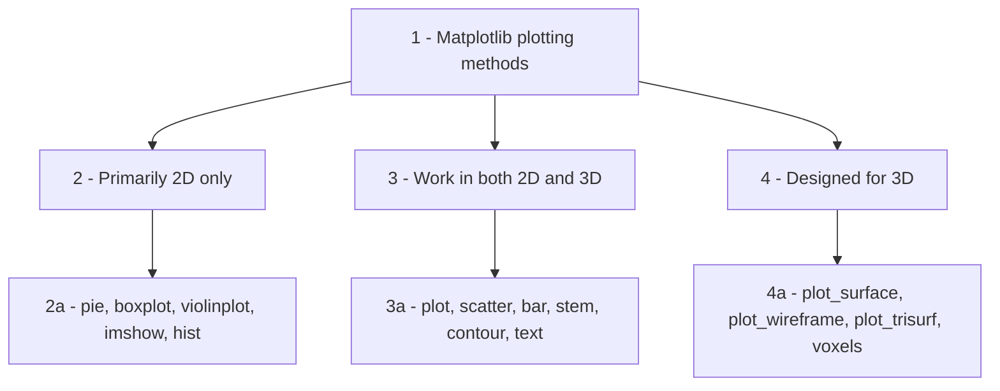
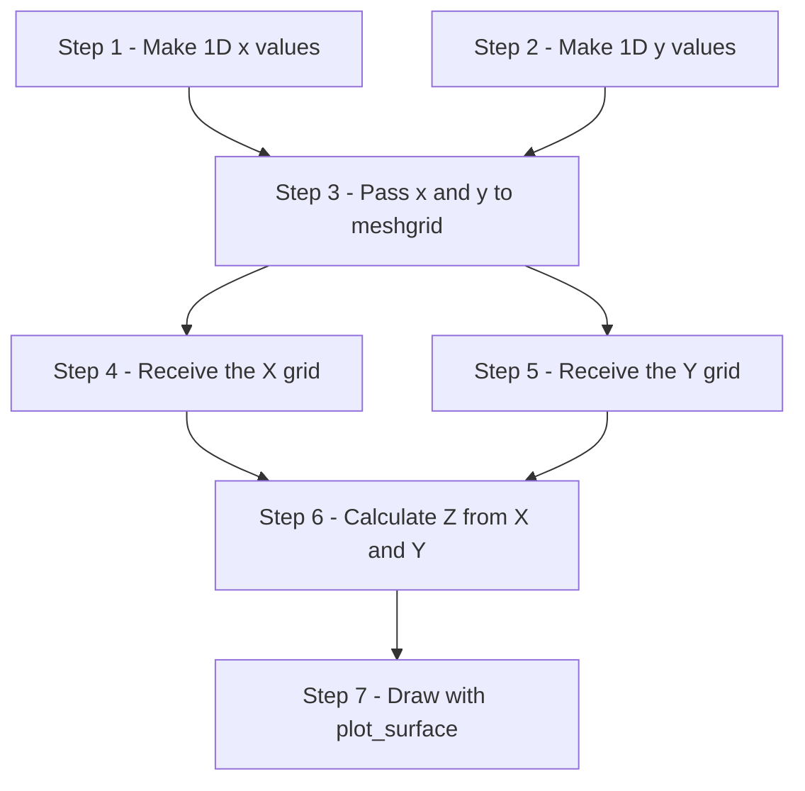
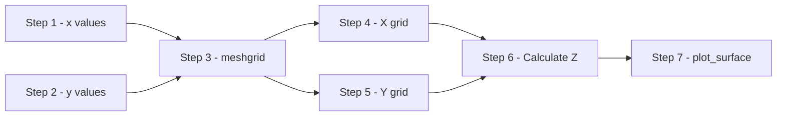
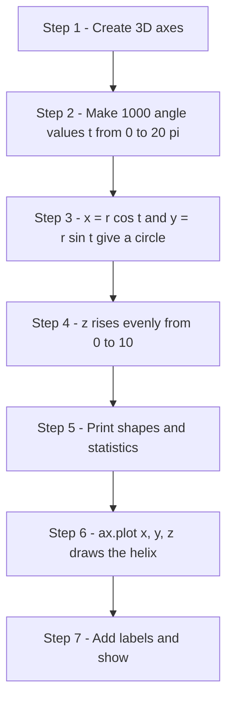
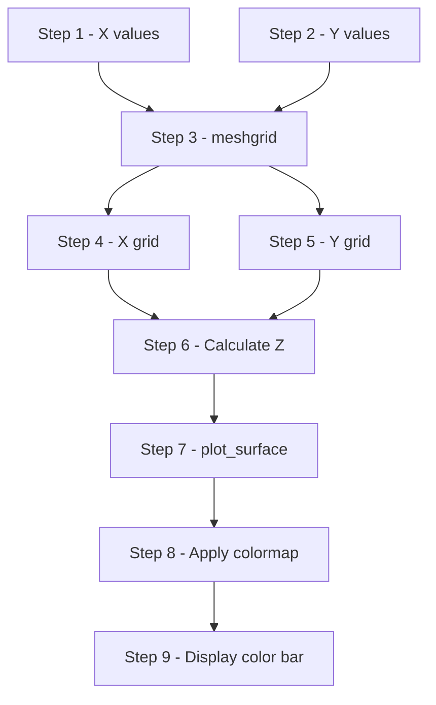

# Introduction to 3D Plotting in Matplotlib

This page is part of the online material for the chapter on **Matplotlib** in the book. All the earlier pages used flat, two-dimensional (2D) graphs with an x-axis and a y-axis. This page adds a third axis, the z-axis, and shows how Matplotlib draws three-dimensional (3D) graphs.

The page explains:

- which plots belong only in 2D, which work in both 2D and 3D, and which are made specially for 3D
- how to create a 3D plotting area with `projection="3d"`
- why surface plots need a coordinate grid, and how NumPy's `meshgrid()` builds one
- how to change the viewing angle, choose a colormap and add a color bar
- the mistakes beginners most often make, and the errors they cause
- four complete scripts: a 3D helix, a 3D scatter plot, a surface plot, and a surface and wireframe plot side by side

3D graphs are used in science, engineering, geography and machine learning to show surfaces, shapes and positions in space. In Python they are drawn with the same Matplotlib you already know, together with NumPy for the calculations. Every script on this page shows its printed output and a picture of the graph it draws.

**Before you start:** you need Matplotlib and NumPy (`pip install matplotlib numpy`). All outputs on this page were produced with Matplotlib 3.10 and NumPy 2. When you run a 3D script on your own computer, you can drag the graph with the mouse to rotate it and see it from other sides.

## Table of Contents

- [Introduction to 3D Plotting in Matplotlib](#introduction-to-3d-plotting-in-matplotlib)
  - [Relationship Between 2D and 3D Plotting](#relationship-between-2d-and-3d-plotting)
  - [1. Plots Primarily Used Only in 2D](#1-plots-primarily-used-only-in-2d)
    - [Why Not Use Them in 3D?](#why-not-use-them-in-3d)
    - [Common 2D-Only Plots](#common-2d-only-plots)
    - [A Useful Rule](#a-useful-rule)
    - [Learning Point: 2D and 3D Charts](#learning-point-2d-and-3d-charts)
    - [Note on Histograms and Bar Charts](#note-on-histograms-and-bar-charts)
  - [2. Plots That Work in Both 2D and 3D](#2-plots-that-work-in-both-2d-and-3d)
    - [Common Methods Available in Both 2D and 3D](#common-methods-available-in-both-2d-and-3d)
    - [Additional Setup Required for 3D](#additional-setup-required-for-3d)
    - [plot(): 2D vs 3D](#plot-2d-vs-3d)
    - [scatter(): 2D vs 3D](#scatter-2d-vs-3d)
    - [Seeing the Difference: 2D and 3D Side by Side](#seeing-the-difference-2d-and-3d-side-by-side)
    - [Comparison Table](#comparison-table)
    - [Learning Point: Moving from 2D to 3D](#learning-point-moving-from-2d-to-3d)
  - [3. Plots Specifically Designed for 3D Visualization](#3-plots-specifically-designed-for-3d-visualization)
    - [When Are 3D Plots Useful?](#when-are-3d-plots-useful)
    - [Common 3D-Specific Methods](#common-3d-specific-methods)
    - [Why Surface and Wireframe Plots Need Mesh Grids](#why-surface-and-wireframe-plots-need-mesh-grids)
    - [Surface Plot Workflow](#surface-plot-workflow)
    - [Surface Plot vs Wireframe Plot](#surface-plot-vs-wireframe-plot)
    - [Typical Surface Plot](#typical-surface-plot)
    - [Typical Wireframe Plot](#typical-wireframe-plot)
    - [Points to Watch Out For](#points-to-watch-out-for)
      - [1. Projection Must Be 3D](#1-projection-must-be-3d)
      - [2. X, Y and Z Must Have Matching Shapes](#2-x-y-and-z-must-have-matching-shapes)
      - [3. meshgrid() Is Usually Required](#3-meshgrid-is-usually-required)
      - [4. Large Grids Can Be Slow](#4-large-grids-can-be-slow)
    - [Common Beginner Errors](#common-beginner-errors)
    - [Learning Point: Key Terms](#learning-point-key-terms)
  - [Understanding np.meshgrid()](#understanding-npmeshgrid)
    - [Why Is meshgrid Needed?](#why-is-meshgrid-needed)
    - [Simplified Signature of meshgrid()](#simplified-signature-of-meshgrid)
    - [Example of meshgrid()](#example-of-meshgrid)
    - [Visual Interpretation](#visual-interpretation)
    - [Note: Coordinates vs Matrix Indexing](#note-coordinates-vs-matrix-indexing)
    - [How Surface Plots Use meshgrid()](#how-surface-plots-use-meshgrid)
    - [Typical Workflow](#typical-workflow)
    - [A Useful Analogy](#a-useful-analogy)
    - [Key Learning Point](#key-learning-point)
  - [Some Additional Issues in 3D Plotting](#some-additional-issues-in-3d-plotting)
    - [1. Viewing Angle](#1-viewing-angle)
    - [2. Colormaps](#2-colormaps)
    - [3. Surface vs Wireframe Comparison](#3-surface-vs-wireframe-comparison)
    - [4. Why Not Everything Should Be 3D](#4-why-not-everything-should-be-3d)
    - [5. Color Bar](#5-color-bar)
  - [Script 1: 3D Helix](#script-1-3d-helix)
    - [Introductory Note to Script 1](#introductory-note-to-script-1)
    - [Script 1: 3D Helix Using plot(x, y, z)](#script-1-3d-helix-using-plotx-y-z)
    - [Output of Script 1 on the Terminal](#output-of-script-1-on-the-terminal)
    - [Output Plot of Script 1](#output-plot-of-script-1)
    - [What Script 1 Demonstrates](#what-script-1-demonstrates)
    - [Follow-up Question on Script 1](#follow-up-question-on-script-1)
  - [Script 2: 3D Scatter Plot](#script-2-3d-scatter-plot)
    - [Introductory Note to Script 2](#introductory-note-to-script-2)
    - [Script 2: 3D Scatter Plot Using scatter(x, y, z)](#script-2-3d-scatter-plot-using-scatterx-y-z)
    - [Output of Script 2 on the Terminal](#output-of-script-2-on-the-terminal)
    - [Output Plot of Script 2](#output-plot-of-script-2)
    - [What Script 2 Demonstrates](#what-script-2-demonstrates)
    - [Follow-up Question on Script 2](#follow-up-question-on-script-2)
  - [Script 3: Surface Plot Using meshgrid(), plot_surface(), cmap and colorbar](#script-3-surface-plot-using-meshgrid-plot_surface-cmap-and-colorbar)
    - [Introductory Note to Script 3](#introductory-note-to-script-3)
    - [Script 3: Surface Plot](#script-3-surface-plot)
    - [Output of Script 3 on the Terminal](#output-of-script-3-on-the-terminal)
    - [Output Plot of Script 3](#output-plot-of-script-3)
    - [What Script 3 Demonstrates](#what-script-3-demonstrates)
    - [Workflow of Script 3](#workflow-of-script-3)
    - [Follow-up Question on Script 3](#follow-up-question-on-script-3)
  - [Script 4: Surface and Wireframe Plots Side by Side](#script-4-surface-and-wireframe-plots-side-by-side)
    - [Introductory Note to Script 4](#introductory-note-to-script-4)
    - [Script 4: Surface and Wireframe](#script-4-surface-and-wireframe)
    - [Output of Script 4 on the Terminal](#output-of-script-4-on-the-terminal)
    - [Output Plot of Script 4](#output-plot-of-script-4)
    - [What Script 4 Demonstrates](#what-script-4-demonstrates)
    - [Follow-up Question on Script 4](#follow-up-question-on-script-4)
  - [Summary](#summary)
  - [Glossary of Technical Terms](#glossary-of-technical-terms)

## Relationship Between 2D and 3D Plotting

Matplotlib was originally designed for creating two-dimensional (2D) visualizations. However, the library was later extended to support three-dimensional (3D) plotting while retaining a similar programming interface wherever possible. The 3D tools live in a part of Matplotlib called the **mplot3d toolkit**. See [The mplot3d toolkit (Matplotlib)](https://matplotlib.org/stable/users/explain/toolkits/mplot3d.html).

As a result, many plotting methods such as `plot()` and `scatter()` can be used in both 2D and 3D. The main difference is that a third coordinate (`z`) must be supplied when working in 3D. This consistency in the **API** (the set of functions and methods that a library provides) makes it easier to learn 3D plotting once the corresponding 2D plots are understood.

Not all plots, however, have a natural three-dimensional interpretation. For example, pie charts, box plots and violin plots are primarily designed for two-dimensional data visualization and are therefore used almost exclusively in 2D.

Conversely, certain plots such as **surface plots** and **wireframe plots** are specifically designed for representing three-dimensional shapes and have no meaningful two-dimensional equivalent.

Thus, Matplotlib plotting methods can be broadly divided into three categories:

1. **Plots primarily used only in 2D**
2. **Plots that work in both 2D and 3D**
3. **Plots specifically designed for 3D visualization**



The following sections discuss these three categories.

[Back to the Table of Contents](#table-of-contents)

## 1. Plots Primarily Used Only in 2D

Some plotting methods are designed to summarize, compare or categorize data on a flat two-dimensional surface. Although it is sometimes possible to create three-dimensional versions of certain charts, doing so rarely provides additional information and may even make the visualization harder to interpret.

For this reason, the following plots are generally used only in 2D.

[Back to the Table of Contents](#table-of-contents)

### Why Not Use Them in 3D?

A graph should make data easier to understand. Adding a third dimension is useful only when there is a meaningful third variable to display.

For example:

- A pie chart already represents proportions using angles and areas. A third dimension does not add useful information. Tilting a pie in 3D even makes the slices at the front look bigger than they are.
- A histogram displays a frequency distribution. The bars already represent frequencies; a third dimension may only distort perception.
- A box plot summarizes quartiles, median and outliers. These describe values along a single scale, so they do not benefit from an additional axis.

Thus, while 3D is useful for visualizing surfaces and spatial data, many statistical charts are best kept in 2D.

[Back to the Table of Contents](#table-of-contents)

### Common 2D-Only Plots

| Method | Purpose | Why 3D Adds Little Value |
| --- | --- | --- |
| `pie()` | Parts of a whole | Proportions are already visible in 2D |
| `boxplot()` | Distribution summary | Quartiles and median lie along one scale |
| `violinplot()` | Distribution shape | Density is already shown completely in 2D |
| `imshow()` | Display image or matrix | Images are naturally 2D |
| `hist()` | Frequency distribution | An extra dimension often causes visual distortion |
| `bar()` | Category comparison | 3D bars may look attractive but often reduce readability |

Matplotlib does not provide true 3D versions of `pie()`, `boxplot()`, `violinplot()` or `hist()`. For bars there is a separate `bar3d()` method, discussed in the note below.

[Back to the Table of Contents](#table-of-contents)

### A Useful Rule

```text
If the graph summarizes data,
it is usually best kept in 2D.

If the graph represents a physical surface,
spatial position, or mathematical surface,
3D may be appropriate.
```

[Back to the Table of Contents](#table-of-contents)

### Learning Point: 2D and 3D Charts

```text
2D Charts
     ↓
Summarize or compare data

3D Charts
     ↓
Represent surfaces,
shapes or
spatial relationships
```

Therefore, most statistical charts are naturally two-dimensional and are typically used in that form.

[Back to the Table of Contents](#table-of-contents)

### Note on Histograms and Bar Charts

> **Histograms** and **bar charts** are better described as **"primarily 2D"** rather than strictly "2D-only".
> Matplotlib and many other libraries can create 3D versions of them (for example with `bar()` or `bar3d()` on a 3D axes), but those versions are generally considered less effective for data communication.
> In contrast, `pie()`, `boxplot()`, `violinplot()` and `imshow()` are much closer to being genuinely 2D-only in practical use.

[Back to the Table of Contents](#table-of-contents)

## 2. Plots That Work in Both 2D and 3D

Matplotlib follows a consistent design philosophy wherever possible. As a result, some plotting methods can be used in both two-dimensional and three-dimensional visualizations.

The basic plotting logic remains the same. The main difference is that a third coordinate (`z`) must be supplied when plotting in 3D.

Thus, if a 2D plot uses coordinates:

```text
(x, y)
```

then the corresponding 3D plot uses:

```text
(x, y, z)
```

This consistency makes it easier to learn 3D plotting after understanding the corresponding 2D plots.

[Back to the Table of Contents](#table-of-contents)

### Common Methods Available in Both 2D and 3D

| Method | 2D Form | 3D Form | Additional Requirement |
| --- | --- | --- | --- |
| `plot()` | Line plot | 3D curve | Supply z values |
| `scatter()` | Scatter plot | 3D scatter plot | Supply z values |
| `stem()` | Stem plot | Stems rising from a flat base | Supply z values |
| `bar()` | Bar chart | Flat bars placed at a chosen depth | Supply the depth with `zs` and `zdir` |
| `contour()`, `contourf()` | Contour lines and bands | Contours drawn at their own height | Supply X, Y, Z grids |
| `text()` | Text at (x, y) | Text at (x, y, z) | Supply z value |

The first two, `plot()` and `scatter()`, are by far the most common and are used in the scripts below. See the full list in the [mplot3d API reference](https://matplotlib.org/stable/api/toolkits/mplot3d/axes3d.html).

[Back to the Table of Contents](#table-of-contents)

### Additional Setup Required for 3D

Before using 3D plotting, a 3D Axes object must be created.

```python
fig, ax = plt.subplots(
    subplot_kw={"projection": "3d"}
)
```

`subplot_kw` is a dictionary of extra settings passed to the plotting area when it is created. The keyword:

```python
projection="3d"
```

tells Matplotlib to create a three-dimensional plotting area, called an `Axes3D`. A **projection** here means the way points in space are drawn onto the flat screen.

An equivalent way to create a single 3D axes is:

```python
fig = plt.figure()
ax = fig.add_subplot(projection="3d")
```

[Back to the Table of Contents](#table-of-contents)

### plot(): 2D vs 3D

**2D Version**

```python
ax.plot(x, y)
```

**3D Version**

```python
ax.plot(x, y, z)
```

Only one additional argument (`z`) is required, and `ax` must be a 3D axes.

[Back to the Table of Contents](#table-of-contents)

### scatter(): 2D vs 3D

**2D Version**

```python
ax.scatter(x, y)
```

**3D Version**

```python
ax.scatter(x, y, z)
```

Again, the only difference is the addition of z-coordinates.

[Back to the Table of Contents](#table-of-contents)

### Seeing the Difference: 2D and 3D Side by Side

The script below draws the same spiral path four times. The left-hand plots are 2D and use only x and y, so the path looks like a flat circle. The right-hand plots are 3D and also use z, so the path climbs upward. One figure can hold both kinds of plotting area: `fig.add_subplot()` creates each one, with `projection="3d"` only for the 3D ones.

```python
# Step 1 - Import the libraries
import numpy as np
import matplotlib.pyplot as plt

# Step 2 - Data: a spiral path
t = np.linspace(0, 4 * np.pi, 100)
x = np.cos(t)
y = np.sin(t)
z = t / (4 * np.pi)          # Height from 0 to 1

# Step 3 - One figure with four plotting areas: two 2D and two 3D
fig = plt.figure(figsize=(10, 8))
ax1 = fig.add_subplot(2, 2, 1)                       # 2D
ax2 = fig.add_subplot(2, 2, 2, projection="3d")      # 3D
ax3 = fig.add_subplot(2, 2, 3)                       # 2D
ax4 = fig.add_subplot(2, 2, 4, projection="3d")      # 3D

# Step 4 - plot(): same method, one extra argument in 3D
ax1.plot(x, y)
ax1.set_title("2D: ax.plot(x, y)")
ax2.plot(x, y, z)
ax2.set_title("3D: ax.plot(x, y, z)")

# Step 5 - scatter(): same method, one extra argument in 3D
ax3.scatter(x[::5], y[::5])
ax3.set_title("2D: ax.scatter(x, y)")
ax4.scatter(x[::5], y[::5], z[::5])
ax4.set_title("3D: ax.scatter(x, y, z)")

# Step 6 - Label the axes and print the type of each plotting area
for ax in (ax1, ax2, ax3, ax4):
    ax.set_xlabel("x")
    ax.set_ylabel("y")
    if ax.name == "3d":
        ax.set_zlabel("z")
    print(ax.get_title(), "->", type(ax).__name__)

# Step 7 - Display
plt.tight_layout()
plt.show()
```

**Output**

```text
2D: ax.plot(x, y) -> Axes
3D: ax.plot(x, y, z) -> Axes3D
2D: ax.scatter(x, y) -> Axes
3D: ax.scatter(x, y, z) -> Axes3D
```


The printed output confirms that the 3D plotting areas are `Axes3D` objects, while the 2D ones are ordinary `Axes`. In the 3D scatter plot, points further from the viewer look paler. This **depth shading** is switched on by default and helps the eye judge distance; it can be turned off with `depthshade=False`.

[Back to the Table of Contents](#table-of-contents)

### Comparison Table

| Feature | 2D Plot | 3D Plot |
| --- | --- | --- |
| Coordinates Required | x, y | x, y, z |
| Axes | X and Y | X, Y and Z |
| Projection Needed | No | `projection="3d"` |
| Visual Depth | No | Yes |
| Axis label methods | `set_xlabel()`, `set_ylabel()` | `set_xlabel()`, `set_ylabel()`, `set_zlabel()` |
| Can be rotated with the mouse | No | Yes |

[Back to the Table of Contents](#table-of-contents)

### Learning Point: Moving from 2D to 3D

Most of the programming effort involved in moving from 2D to 3D plotting is simply:

1. Creating a 3D Axes object.
2. Supplying z-coordinates.

The plotting methods themselves remain largely unchanged.

[Back to the Table of Contents](#table-of-contents)

## 3. Plots Specifically Designed for 3D Visualization

Some data naturally contains three variables and therefore requires three-dimensional visualization. In such cases, simply extending a 2D plot by adding a z-coordinate may not be sufficient.

Matplotlib therefore provides several plotting methods that are specifically designed for three-dimensional data. These methods visualize surfaces, shapes and spatial relationships that cannot be represented effectively using ordinary 2D charts.

[Back to the Table of Contents](#table-of-contents)

### When Are 3D Plots Useful?

3D plots are commonly used for:

- Mathematical surfaces
- Terrain and elevation maps
- Engineering simulations
- Scientific measurements
- Temperature and pressure distributions
- Financial and optimization surfaces
- Any data of the form:

```text
z = f(x, y)
```

where the value of **z** depends on both **x** and **y**. This is read as "z is a function of x and y": for every pair of x and y there is one height z.

[Back to the Table of Contents](#table-of-contents)

### Common 3D-Specific Methods

| Method | Purpose | Typical Use | Input Required |
| --- | --- | --- | --- |
| `plot_surface()` | Draw solid surface | Mathematical surfaces | X, Y, Z grids (2D arrays) |
| `plot_wireframe()` | Draw mesh surface | Structure visualization | X, Y, Z grids (2D arrays) |
| `contour3D()` | Draw contour lines at their own height | Level curves | X, Y, Z grids (2D arrays) |
| `plot_trisurf()` | Draw irregular surface from triangles | Scattered measurements | X, Y, Z points (1D arrays) |
| `voxels()` | Draw 3D blocks | Volume visualization | A 3D array of True/False values |

A **voxel** is a small cube in 3D space, just as a pixel is a small square in a 2D image. `plot_trisurf()` joins scattered points into small triangles, which is why it does not need a grid.

The script below shows the last three methods, since `plot_surface()` and `plot_wireframe()` are covered in detail in Scripts 3 and 4.

```python
# Step 1 - Import the libraries
import numpy as np
import matplotlib.pyplot as plt

fig = plt.figure(figsize=(15, 4.5))

# Step 2 - contour3D(): contour lines drawn at their own height
ax1 = fig.add_subplot(1, 3, 1, projection="3d")
x = np.linspace(-3, 3, 50)
y = np.linspace(-3, 3, 50)
X, Y = np.meshgrid(x, y)
Z = X**2 + Y**2
lines = ax1.contour3D(X, Y, Z, levels=15, cmap="viridis")
ax1.set_title("contour3D(): level curves")
print("contour3D levels (first 5):", [round(float(v), 1) for v in lines.levels[:5]])

# Step 3 - plot_trisurf(): a surface built from scattered points (no grid needed)
ax2 = fig.add_subplot(1, 3, 2, projection="3d")
rng = np.random.default_rng(1)
px = rng.uniform(-3, 3, 200)        # 200 random x positions
py = rng.uniform(-3, 3, 200)        # 200 random y positions
pz = px**2 + py**2                  # Height at each point
ax2.plot_trisurf(px, py, pz, cmap="viridis")
ax2.set_title("plot_trisurf(): scattered points")
print("plot_trisurf input shapes:", px.shape, py.shape, pz.shape, "(1D, not grids)")

# Step 4 - voxels(): 3D blocks switched on or off by a 3D True/False array
ax3 = fig.add_subplot(1, 3, 3, projection="3d")
i, j, k = np.indices((6, 6, 6))            # Coordinates of every cell in a 6 x 6 x 6 box
filled = (i + j + k) <= 6                  # Keep the cells in one corner (a stepped pyramid)
ax3.voxels(filled, facecolors="orange", edgecolor="black")
ax3.set_title("voxels(): 3D blocks")
print("voxels array shape:", filled.shape, "- filled cells:", int(filled.sum()))

# Step 5 - Display
plt.tight_layout()
plt.show()
```

**Output**

```text
contour3D levels (first 5): [0.0, 1.5, 3.0, 4.5, 6.0]
plot_trisurf input shapes: (200,) (200,) (200,) (1D, not grids)
voxels array shape: (6, 6, 6) - filled cells: 81
```


**What to notice:**

1. `contour3D()` draws each contour line at its own height z, so the lines stack up into the bowl shape.
2. `plot_trisurf()` was given 200 random points, not a grid. The surface is made of triangles, so its outline is less smooth than a grid surface.
3. `voxels()` takes a 6 × 6 × 6 array of True and False values. Each True cell is drawn as a cube; here 81 cells are filled, making a stepped shape in one corner.

[Back to the Table of Contents](#table-of-contents)

### Why Surface and Wireframe Plots Need Mesh Grids

A line plot requires only one list of x-values and one list of y-values (plus z-values in 3D), with one value of each for every point along the line.

A surface plot requires x, y and z for many combinations of x and y, spread over a whole area.

Therefore Matplotlib expects **coordinate grids** (2D arrays) rather than simple lists.

These grids are usually created using:

```python
X, Y = np.meshgrid(x, y)
```

This is explained fully in the section [Understanding np.meshgrid()](#understanding-npmeshgrid).

[Back to the Table of Contents](#table-of-contents)

### Surface Plot Workflow



[Back to the Table of Contents](#table-of-contents)

### Surface Plot vs Wireframe Plot

| Feature | Surface Plot | Wireframe Plot |
| --- | --- | --- |
| Appearance | Solid surface | Mesh of lines |
| Color Mapping | Yes, with `cmap` | Usually No |
| Easier to Visualize Shape | Yes | Moderate |
| Shows Grid Structure | No | Yes |
| Can see through to the back | No | Yes |
| Rendering Speed | Slower | Faster |

[Back to the Table of Contents](#table-of-contents)

### Typical Surface Plot

```python
ax.plot_surface(
    X,
    Y,
    Z,
    cmap="viridis"
)
```

This creates a solid colored surface.

[Back to the Table of Contents](#table-of-contents)

### Typical Wireframe Plot

```python
ax.plot_wireframe(
    X,
    Y,
    Z
)
```

This creates a mesh representation of the same surface.

[Back to the Table of Contents](#table-of-contents)

### Points to Watch Out For

#### 1. Projection Must Be 3D

A 3D axes must be created first.

```python
fig, ax = plt.subplots(
    subplot_kw={"projection": "3d"}
)
```

Otherwise 3D-only methods such as `plot_surface()` raise an `AttributeError`, because ordinary 2D axes do not have them. Be careful with `plot()`: on 2D axes, `ax.plot(x, y, z)` does **not** raise an error. It quietly draws two separate 2D lines instead, and no z-axis appears.

[Back to the Table of Contents](#table-of-contents)

#### 2. X, Y and Z Must Have Matching Shapes

The arrays supplied to `plot_surface()` and `plot_wireframe()` must have matching shapes.

For example:

```text
X.shape = (50, 50)
Y.shape = (50, 50)
Z.shape = (50, 50)
```

[Back to the Table of Contents](#table-of-contents)

#### 3. meshgrid() Is Usually Required

Beginners often try:

```python
ax.plot_surface(x, y, z)
```

where x, y and z are simple one-dimensional arrays.

This fails with the error "Argument Z must be 2-dimensional", because surface plots expect two-dimensional coordinate grids.

[Back to the Table of Contents](#table-of-contents)

#### 4. Large Grids Can Be Slow

For example, a grid of:

```text
500 × 500
```

creates:

```text
250,000 points
```

which may slow drawing and make the graph slow to rotate.

Smaller grids such as:

```text
50 × 50
```

(2,500 points) are usually sufficient for learning and experimentation.

[Back to the Table of Contents](#table-of-contents)

### Common Beginner Errors

| Error | Cause | Solution |
| --- | --- | --- |
| `AttributeError: 'Axes' object has no attribute 'plot_surface'` | Forgot `projection="3d"` | Create 3D axes |
| No z-axis visible, and two flat lines appear | Called `plot(x, y, z)` on 2D axes | Create 3D axes |
| `ValueError: shape mismatch` | X, Y, Z have different sizes | Ensure matching dimensions |
| `ValueError: Argument Z must be 2-dimensional` | Missing `meshgrid()`; 1D arrays passed | Generate coordinate grids |
| Plot appears slow | Too many grid points | Reduce grid resolution |

The script below produces each of these errors on purpose, catches it, and prints the message, so that you can recognize them when they happen in your own work.

```python
# Step 1 - Import the libraries
import numpy as np
import matplotlib.pyplot as plt

x = np.linspace(-3, 3, 5)
y = np.linspace(-3, 3, 5)

# Error 1 - Using a 3D method on ordinary 2D axes
fig, ax = plt.subplots()                      # No projection="3d"
try:
    ax.plot_surface(*np.meshgrid(x, y), np.zeros((5, 5)))
except AttributeError as error:
    print("Error 1:", type(error).__name__, "-", error)

# Error 2 - plot(x, y, z) on 2D axes does NOT raise an error; it quietly draws the wrong thing
lines = ax.plot(x, y, x**2)
print("Error 2: plot(x, y, z) on 2D axes drew", len(lines), "separate 2D lines and no z-axis")
plt.close(fig)

# Error 3 - Giving plot_surface() 1D arrays instead of grids
fig = plt.figure()
ax3d = fig.add_subplot(projection="3d")
try:
    ax3d.plot_surface(x, y, x**2 + y**2)
except ValueError as error:
    print("Error 3:", type(error).__name__, "-", error)

# Error 4 - Grids whose shapes do not match
X, Y = np.meshgrid(x, y)
try:
    ax3d.plot_surface(X, Y, np.zeros((4, 5)))
except ValueError as error:
    print("Error 4:", type(error).__name__, "-", error)

# The fix for errors 1, 3 and 4: 3D axes, meshgrid and matching shapes
Z = X**2 + Y**2
ax3d.plot_surface(X, Y, Z)
print("Fixed: shapes", X.shape, Y.shape, Z.shape, "-> surface drawn without errors")
plt.close(fig)
```

**Output**

```text
Error 1: AttributeError - 'Axes' object has no attribute 'plot_surface'
Error 2: plot(x, y, z) on 2D axes drew 2 separate 2D lines and no z-axis
Error 3: ValueError - Argument Z must be 2-dimensional.
Error 4: ValueError - shape mismatch: objects cannot be broadcast to a single shape.  Mismatch is between arg 0 with shape (5, 5) and arg 2 with shape (4, 5).
Fixed: shapes (5, 5) (5, 5) (5, 5) -> surface drawn without errors
```

`try` and `except` let the script catch each error and carry on instead of stopping. See [Errors and Exceptions (Python tutorial)](https://docs.python.org/3/tutorial/errors.html).

[Back to the Table of Contents](#table-of-contents)

### Learning Point: Key Terms

```text
1. 2D Plot         ⟶ Visualize points and curves on a flat plane

2. 3D Plot         ⟶ Visualize surfaces, shapes and positions in space

3. meshgrid()      ⟶ Creates a coordinate grid

4. plot_surface()  ⟶ Solid surface

5. plot_wireframe() ⟶ Surface skeleton
```

For most beginners, understanding `meshgrid()`, `plot_surface()` and `plot_wireframe()` is sufficient to understand the basic principles of three-dimensional visualization in Matplotlib.

[Back to the Table of Contents](#table-of-contents)

## Understanding np.meshgrid()

When plotting a mathematical surface, we need values of **z** for many combinations of **x** and **y**.

For example, consider the function:

```text
z = x² + y²
```

To calculate z, we cannot use only a list of x-values or only a list of y-values. Instead, we need every possible combination of x and y coordinates.

The `np.meshgrid()` function creates such a coordinate grid. See [numpy.meshgrid](https://numpy.org/doc/stable/reference/generated/numpy.meshgrid.html).

[Back to the Table of Contents](#table-of-contents)

### Why Is meshgrid Needed?

Suppose:

```python
x = [1, 2, 3]
y = [10, 20]
```

A surface plot requires the following coordinate pairs:

```text
(1, 10)  (2, 10)  (3, 10)

(1, 20)  (2, 20)  (3, 20)
```

Notice that every x-value must be combined with every y-value. With 3 x-values and 2 y-values there are 3 × 2 = 6 pairs.

`meshgrid()` automatically creates these combinations.

[Back to the Table of Contents](#table-of-contents)

### Simplified Signature of meshgrid()

```python
X, Y = np.meshgrid(x, y)
```

The inputs `x` and `y` are 1D lists or arrays. The outputs `X` and `Y` are 2D arrays with one row for each y-value and one column for each x-value.

[Back to the Table of Contents](#table-of-contents)

### Example of meshgrid()

```python
# Step 1 - Import NumPy
import numpy as np

# Step 2 - Two short lists of coordinates
x = [1, 2, 3]
y = [10, 20]

# Step 3 - Build the coordinate grid
X, Y = np.meshgrid(x, y)

# Step 4 - Look at both grids and their shapes
print("X")
print(X)
print()
print("Y")
print(Y)
print()
print("Shape of X and Y:", X.shape, "(rows = len(y), columns = len(x))")

# Step 5 - Read the (x, y) pairs from the grids, row by row
print()
print("Coordinate pairs:")
for row in range(X.shape[0]):
    print("  ", [(int(X[row, col]), int(Y[row, col])) for col in range(X.shape[1])])

# Step 6 - Compare matrix indexing with coordinates
print()
print("X[0, 1] =", X[0, 1], " and Y[0, 1] =", Y[0, 1], " -> the point (2, 10)")
```

**Output**

```text
X
[[1 2 3]
 [1 2 3]]

Y
[[10 10 10]
 [20 20 20]]

Shape of X and Y: (2, 3) (rows = len(y), columns = len(x))

Coordinate pairs:
   [(1, 10), (2, 10), (3, 10)]
   [(1, 20), (2, 20), (3, 20)]

X[0, 1] = 2  and Y[0, 1] = 10  -> the point (2, 10)
```

**Reading the output, step by step:**

1. `X` repeats the list of x-values down every row: `[1 2 3]` appears twice, once for each y-value.
2. `Y` repeats each y-value across a whole row: the first row is all 10s and the second row is all 20s.
3. Both grids have shape `(2, 3)`: 2 rows (because there are 2 y-values) and 3 columns (because there are 3 x-values).
4. Taking the value at the same position in `X` and `Y` gives one coordinate pair. For example, position `[0, 1]` gives x = 2 and y = 10, which is the point (2, 10).

[Back to the Table of Contents](#table-of-contents)

### Visual Interpretation

|  |  | X ⟶ |  |  |
| --- | --- | --- | --- | --- |
|  |  | **1** | **2** | **3** |
| **Y ↓** | **10** | (1, 10) | (2, 10) | (3, 10) |
|  | **20** | (1, 20) | (2, 20) | (3, 20) |

Each row holds one y-value, and each column holds one x-value.

[Back to the Table of Contents](#table-of-contents)

### Note: Coordinates vs Matrix Indexing

When working with `meshgrid()`, it is important to remember that coordinates are written in the form:

```text
(x, y)
```

where:

- **x** represents the horizontal direction (left to right, across the columns)
- **y** represents the vertical direction (top to bottom in the grid shown above, down the rows)

Thus, the coordinate:

```text
(2, 10)
```

means:

- x = 2 (second column)
- y = 10 (first row)

This is different from matrix indexing, where elements are accessed using:

```text
(row, column)
```

and the row number is written before the column number. In Python, counting starts at 0, so the first row is row 0 and the second column is column 1.

For example:

```text
Matrix Indexing (row, column)      Coordinate System (x, y)

X[0, 1] and Y[0, 1]                (2, 10)
```

The row number comes first in matrix indexing, but the x-value comes first in a coordinate. Therefore, when interpreting the output of `meshgrid()`, think in terms of **Cartesian coordinates (x, y)** rather than **matrix positions (row, column)**. See [Cartesian coordinate system (Wikipedia)](https://en.wikipedia.org/wiki/Cartesian_coordinate_system).

[Back to the Table of Contents](#table-of-contents)

### How Surface Plots Use meshgrid()



[Back to the Table of Contents](#table-of-contents)

### Typical Workflow

```python
x = np.linspace(-3, 3, 50)
y = np.linspace(-3, 3, 50)

X, Y = np.meshgrid(x, y)

Z = X**2 + Y**2

ax.plot_surface(X, Y, Z)
```

Here:

- `np.linspace(-3, 3, 50)` creates 50 evenly spaced values from -3 to 3. See [numpy.linspace](https://numpy.org/doc/stable/reference/generated/numpy.linspace.html).
- `X` contains the x-coordinates of the grid.
- `Y` contains the y-coordinates of the grid.
- `Z` contains the corresponding height values. Because `X` and `Y` are arrays, `X**2 + Y**2` is calculated for all 2,500 grid points in one step.
- `plot_surface()` uses these three grids to draw the surface.

[Back to the Table of Contents](#table-of-contents)

### A Useful Analogy

Imagine a chessboard.

- The columns represent x-values.
- The rows represent y-values.
- Every square corresponds to one `(x, y)` coordinate pair.

`meshgrid()` creates this rectangular coordinate framework on which the surface is built. The z-value then tells how high to raise each square.

[Back to the Table of Contents](#table-of-contents)

### Key Learning Point

```text
x values
     +
y values
     ↓
meshgrid()
     ↓
Coordinate Grid
     ↓
Calculate z values
     ↓
Create Surface Plot
```

Thus, `meshgrid()` is not a plotting function. It is a NumPy helper function that generates the coordinate grid required by many 3D plotting methods.

[Back to the Table of Contents](#table-of-contents)

## Some Additional Issues in 3D Plotting

### 1. Viewing Angle

Students often ask:

> Why does the same 3D plot look different in different books?

The answer is the viewing angle. A 3D plot is seen from a certain position, like a camera pointed at an object. Changing the camera position changes the picture, but not the data.

**Simplified signature of view_init()**

```python
ax.view_init(
    elev=30,
    azim=45
)
```

**Parameters**

| Parameter | Meaning | Effect | Matplotlib default |
| --- | --- | --- | --- |
| `elev` | Elevation angle, in degrees | How high above (or below) the x-y plane the camera is: 0 looks from the side, 90 looks straight down | 30 |
| `azim` | Azimuth angle, in degrees | How far the camera has moved around the z-axis (left or right) | -60 |

See [Axes3D.view_init](https://matplotlib.org/stable/api/_as_gen/mpl_toolkits.mplot3d.axes3d.Axes3D.view_init.html).

**Example**

```python
ax.view_init(
    elev=20,
    azim=60
)
```

This rotates the camera without changing the data. The script below draws the same surface from four different angles.

```python
# Step 1 - Import the libraries
import numpy as np
import matplotlib.pyplot as plt

# Step 2 - Build the same bowl-shaped surface as in Script 3
x = np.linspace(-3, 3, 50)
y = np.linspace(-3, 3, 50)
X, Y = np.meshgrid(x, y)
Z = X**2 + Y**2

# Step 3 - Four viewing angles to compare
views = [
    (30, -60),     # Matplotlib's default view
    (20, 60),      # Lower and turned the other way
    (60, 45),      # High, looking down more steeply
    (5, 120),      # Almost level with the x-y plane, seen from the far side
]

# Step 4 - Draw the same data four times, changing only the camera
fig, axes = plt.subplots(2, 2, figsize=(10, 9), subplot_kw={"projection": "3d"})
for ax, (elev, azim) in zip(axes.flat, views):
    ax.plot_surface(X, Y, Z, cmap="viridis")
    ax.view_init(elev=elev, azim=azim)
    ax.set_title(f"elev={elev}, azim={azim}")
    ax.set_xlabel("X")
    ax.set_ylabel("Y")
    ax.set_zlabel("Z")
    print(f"View elev={elev:>2}, azim={azim:>3}: data unchanged, highest Z still {Z.max():.0f}")

# Step 5 - Display
plt.tight_layout()
plt.show()
```

**Output**

```text
View elev=30, azim=-60: data unchanged, highest Z still 18
View elev=20, azim= 60: data unchanged, highest Z still 18
View elev=60, azim= 45: data unchanged, highest Z still 18
View elev= 5, azim=120: data unchanged, highest Z still 18
```


**What to notice:** the highest z-value is 18 in every view, so the data is identical. With `elev=60` the camera looks down steeply and the bowl looks shallow. With `elev=5` the camera is almost level with the base and the bowl's curved sides are clearest. Changing `azim` swaps which corner faces the viewer.

[Back to the Table of Contents](#table-of-contents)

### 2. Colormaps

A surface drawn without a colormap is a single color, which can make its shape hard to see:

```python
ax.plot_surface(X, Y, Z)
```

Adding a colormap:

```python
ax.plot_surface(
    X,
    Y,
    Z,
    cmap="viridis"
)
```

colors each part of the surface by its height, which looks better and also makes the heights easier to read. A **colormap** is a smooth scale of colors used to show numbers. See [Choosing colormaps (Matplotlib)](https://matplotlib.org/stable/users/explain/colors/colormaps.html).

**Common Colormaps**

| Colormap | Appearance (lowest value → highest value) | Good for |
| --- | --- | --- |
| `"viridis"` | Dark purple → blue → green → yellow | General use; the default; readable by people with color blindness |
| `"plasma"` | Dark blue → purple → orange → yellow | General use, with stronger contrast |
| `"inferno"` | Black → purple → red → pale yellow | Showing intensity, such as heat |
| `"coolwarm"` | Blue → light gray → red | Values above and below a middle point |
| `"spring"` | Magenta (pink) → yellow | Bright, eye-catching displays |

```python
# Step 1 - Import the libraries
import numpy as np
import matplotlib.pyplot as plt

# Step 2 - Build the surface
x = np.linspace(-3, 3, 50)
y = np.linspace(-3, 3, 50)
X, Y = np.meshgrid(x, y)
Z = X**2 + Y**2

# Step 3 - Draw the same surface with five colormaps
colormaps = ["viridis", "plasma", "inferno", "coolwarm", "spring"]
fig, axes = plt.subplots(1, 5, figsize=(18, 4), subplot_kw={"projection": "3d"})

for ax, name in zip(axes, colormaps):
    surface = ax.plot_surface(X, Y, Z, cmap=name)
    ax.set_title(name)
    ax.set_xticks([])
    ax.set_yticks([])
    ax.set_zticks([])
    # Step 4 - Print the color used for the lowest and the highest z value
    cmap = plt.get_cmap(name)
    low = tuple(round(float(c), 2) for c in cmap(0.0)[:3])
    high = tuple(round(float(c), 2) for c in cmap(1.0)[:3])
    print(f"{name:<8} lowest z -> RGB {low}   highest z -> RGB {high}")

# Step 5 - Display
plt.tight_layout()
plt.show()
```

**Output**

```text
viridis  lowest z -> RGB (0.27, 0.0, 0.33)   highest z -> RGB (0.99, 0.91, 0.14)
plasma   lowest z -> RGB (0.05, 0.03, 0.53)   highest z -> RGB (0.94, 0.98, 0.13)
inferno  lowest z -> RGB (0.0, 0.0, 0.01)   highest z -> RGB (0.99, 1.0, 0.64)
coolwarm lowest z -> RGB (0.23, 0.3, 0.75)   highest z -> RGB (0.71, 0.02, 0.15)
spring   lowest z -> RGB (1.0, 0.0, 1.0)   highest z -> RGB (1.0, 1.0, 0.0)
```


The printed RGB values (the amounts of red, green and blue, each from 0 to 1) confirm the start and end colors in the table. For example, `coolwarm` starts at mostly blue (0.23, 0.3, 0.75) and ends at mostly red (0.71, 0.02, 0.15).

[Back to the Table of Contents](#table-of-contents)

### 3. Surface vs Wireframe Comparison

```text
Surface   ⟶ Shows shape
Wireframe ⟶ Shows structure
```

A surface plot is best for seeing the overall shape and height at a glance. A wireframe plot is best for seeing the grid the surface is built on, and it lets you see through to the back of the shape. [Script 4](#script-4-surface-and-wireframe-plots-side-by-side) draws both side by side.

[Back to the Table of Contents](#table-of-contents)

### 4. Why Not Everything Should Be 3D

> Although 3D plots look attractive, they should be used only when a meaningful third variable exists. Unnecessary 3D effects may make graphs harder to interpret.

Some problems 3D can cause:

- Parts of the data can be hidden behind other parts.
- Heights are hard to read exactly, because the axes are drawn in perspective.
- The picture depends on the viewing angle, so a reader of a printed page cannot rotate it to check.

If the same information can be shown clearly in 2D, for example as a contour plot or heat map, 2D is often the better choice.

[Back to the Table of Contents](#table-of-contents)

### 5. Color Bar

Surface plots often use:

```python
fig.colorbar(surface)
```

A **color bar** is a strip placed beside the plot that shows which color stands for which value. It works like the key of a map. See [matplotlib.pyplot.colorbar](https://matplotlib.org/stable/api/_as_gen/matplotlib.pyplot.colorbar.html).

**Example**

```python
# plot_surface() creates a 3D surface plot and returns it, so we store it in 'surface'.
# In viridis, low Z values ⟶ dark purple
# and high Z values ⟶ bright yellow. The color bar makes this mapping readable.
surface = ax.plot_surface(X, Y, Z, cmap="viridis")

# Add a color bar to show the mapping of Z values to colors
fig.colorbar(surface)
```

The color bar needs the object returned by `plot_surface()`, which is why the surface is stored in a variable first.

[Back to the Table of Contents](#table-of-contents)

## Script 1: 3D Helix

### Introductory Note to Script 1

A **helix** may be thought of as a circle that gradually rises in height, like a spring or a spiral staircase. As a point moves around the circumference of the circle, its z-coordinate continuously increases. This example demonstrates the use of the 3D version of `plot()`, which requires x, y and z coordinates. See [Helix (Wikipedia)](https://en.wikipedia.org/wiki/Helix).

The circle is made with the functions cosine and sine. For an angle `t`, the point `(r × cos(t), r × sin(t))` lies on a circle of radius `r`. As `t` grows, the point travels around the circle. See [Unit circle (Wikipedia)](https://en.wikipedia.org/wiki/Unit_circle).



[Back to the Table of Contents](#table-of-contents)

### Script 1: 3D Helix Using plot(x, y, z)

```python
# Step 1 - Import required modules
import numpy as np
import matplotlib.pyplot as plt

# Step 2 - Create Figure and 3D Axes
# subplot_kw={"projection": "3d"} passes projection="3d" to the plotting area,
# so ax becomes a 3D Axes with an x-axis, a y-axis and a z-axis.
fig, ax = plt.subplots(
    figsize=(8, 6),
    subplot_kw={"projection": "3d"}
)

# Step 3 - Generate parameter values
# t is a sequence of 1000 values from 0 to 20π (about 62.83).
# One full turn of a circle needs 2π, so 20π gives 10 turns of the helix.
t = np.linspace(0, 20 * np.pi, 1000)

# Step 4 - Choose the radius of the helix
# A larger radius creates a wider helix, and a smaller radius a narrower one.
r = 5

# Step 5 - Calculate the x and y coordinates
# cos(t) and sin(t) move a point around a circle in the XY plane.
# Multiplying by r makes the circle's radius equal to 5.
x = r * np.cos(t)
y = r * np.sin(t)

# Step 6 - Calculate the z coordinates (height)
# z rises evenly from 0 to 10 over the 1000 points.
# So while the point goes round and round the circle, it also climbs steadily,
# which turns the circle into a spiral. Each of the 10 turns rises by 1 unit.
z = np.linspace(0, 10, 1000)

# Step 7 - Print the shapes and statistics of the coordinates
# This checks that x, y and z each have 1000 values and lie in the expected ranges.
print("X Coordinates Shape:", x.shape)
print("Y Coordinates Shape:", y.shape)
print("Z Coordinates Shape:", z.shape)
print("X Coordinates Statistics: min =", np.min(x), ", max =", np.max(x), ", mean =", np.mean(x))
print("Y Coordinates Statistics: min =", np.min(y), ", max =", np.max(y), ", mean =", np.mean(y))
print("Z Coordinates Statistics: min =", np.min(z), ", max =", np.max(z), ", mean =", np.mean(z))
print("Number of turns:", round((t[-1] - t[0]) / (2 * np.pi)))

# Step 8 - Create the 3D line plot
# The color is set to blue and the line width to 2 for better visibility.
ax.plot(
    x,
    y,
    z,
    color="blue",
    linewidth=2
)

# Step 9 - Add title and axis labels
ax.set_title("3D Helix")
ax.set_xlabel("X-axis")
ax.set_ylabel("Y-axis")
ax.set_zlabel("Z-axis")

# Step 10 - Display graph
plt.show()
```

[Back to the Table of Contents](#table-of-contents)

### Output of Script 1 on the Terminal

```text
X Coordinates Shape: (1000,)
Y Coordinates Shape: (1000,)
Z Coordinates Shape: (1000,)
X Coordinates Statistics: min = -4.99997527658723 , max = 5.0 , mean = 0.004999999999999495
Y Coordinates Statistics: min = -4.999993819142987 , max = 4.999993819142987 , mean = 0.0
Z Coordinates Statistics: min = 0.0 , max = 10.0 , mean = 4.999999999999999
Number of turns: 10
```

[Back to the Table of Contents](#table-of-contents)

### Output Plot of Script 1


**Reading the output:**

1. All three coordinate arrays have 1000 values, so there are 1000 points along the helix.
2. x and y stay between -5 and 5, the radius of the circle. The tiny differences, such as -4.99997, come from the sample points not landing exactly on the extreme angle.
3. The means of x and y are almost 0, because the circle is centred on the z-axis.
4. z runs from 0 to 10, and there are 10 turns, so the helix rises 1 unit per turn.

[Back to the Table of Contents](#table-of-contents)

### What Script 1 Demonstrates

| Statement | Purpose |
| --- | --- |
| `subplot_kw={"projection": "3d"}` | Creates a 3D plotting area |
| `np.linspace(0, 20 * np.pi, 1000)` | Creates 1000 angle values covering 10 full turns |
| `r * np.cos(t)`, `r * np.sin(t)` | Place the points on a circle of radius 5 |
| `np.linspace(0, 10, 1000)` | Makes the height rise steadily |
| `ax.plot(x, y, z)` | Draws a 3D line through the points |
| `set_zlabel()` | Adds a label to the z-axis |

[Back to the Table of Contents](#table-of-contents)

### Follow-up Question on Script 1

How would you change the script to draw a helix with 3 turns that is twice as tall?

<details>
<summary>Show answer</summary>

Step 1 - For 3 turns, the angles must go up to 3 × 2π = 6π: `t = np.linspace(0, 6 * np.pi, 1000)`.

Step 2 - For twice the height, let z rise to 20: `z = np.linspace(0, 20, 1000)`.

Step 3 - Leave x, y and the plotting code unchanged.

</details>

[Back to the Table of Contents](#table-of-contents)

## Script 2: 3D Scatter Plot

### Introductory Note to Script 2

A 2D scatter plot represents each point using two coordinates: x and y. A 3D scatter plot extends this idea by introducing a third coordinate, z. Each point is therefore represented by `(x, y, z)`, allowing spatial relationships to be visualized in three dimensions. See [Axes3D.scatter](https://matplotlib.org/stable/api/_as_gen/mpl_toolkits.mplot3d.axes3d.Axes3D.scatter.html).

[Back to the Table of Contents](#table-of-contents)

### Script 2: 3D Scatter Plot Using scatter(x, y, z)

```python
# Step 1 - Import required modules
import matplotlib.pyplot as plt
import numpy as np

# Step 2 - Create Figure and 3D Axes
# subplot_kw={"projection": "3d"} creates a 3D plotting area.
fig, ax = plt.subplots(
    figsize=(8, 6),
    subplot_kw={"projection": "3d"}
)

# Step 3 - Sample coordinates
# In a real-world scenario, these could be data points from an experiment or survey.
x = [1, 2, 3, 4, 5, 6]
y = [2, 5, 3, 7, 4, 8]
z = [1, 3, 2, 5, 4, 6]

# Step 4 - Print the (x, y, z) position of each point
print("Points to be plotted:")
for i, point in enumerate(zip(x, y, z), start=1):
    print(f"  Point {i}: {point}")

# Step 5 - Create 3D scatter plot
# Each point is drawn as a marker at its (x, y, z) position.
ax.scatter(
    x,
    y,
    z,
    color="crimson",
    s=80        # Marker size (area of the marker, in points squared)
)

# Step 6 - Add title and axis labels
ax.set_title("3D Scatter Plot")
ax.set_xlabel("X-axis")
ax.set_ylabel("Y-axis")
ax.set_zlabel("Z-axis")

# Step 7 - Display graph
plt.show()

# After displaying the graph, the figure can be closed to free memory.
# plt.close(fig)  # Commented out here for demonstration purposes.
# In a batch processing scenario, you would uncomment this line to prevent memory leaks.
```

[Back to the Table of Contents](#table-of-contents)

### Output of Script 2 on the Terminal

```text
Points to be plotted:
  Point 1: (1, 2, 1)
  Point 2: (2, 5, 3)
  Point 3: (3, 3, 2)
  Point 4: (4, 7, 5)
  Point 5: (5, 4, 4)
  Point 6: (6, 8, 6)
```

[Back to the Table of Contents](#table-of-contents)

### Output Plot of Script 2


Points further from the viewer are drawn paler. This depth shading is on by default and can be switched off with `depthshade=False`.

[Back to the Table of Contents](#table-of-contents)

### What Script 2 Demonstrates

| Statement | Purpose |
| --- | --- |
| `projection="3d"` | Creates a 3D plotting area |
| `scatter(x, y, z)` | Creates 3D scatter plot |
| `s=80` | Controls marker size |
| `set_zlabel()` | Adds label to z-axis |
| `(x, y, z)` | Defines position of each point |

[Back to the Table of Contents](#table-of-contents)

### Follow-up Question on Script 2

How could you color each point according to its z-value and show a color bar?

<details>
<summary>Show answer</summary>

Pass the z-values to `c` together with a colormap, keep the returned object, and give it to `fig.colorbar()`:

```python
points = ax.scatter(x, y, z, c=z, cmap="viridis", s=80)
fig.colorbar(points, ax=ax, shrink=0.7, label="z value")
```

Remove `color="crimson"`, because `color` and `c` should not be used together.

</details>

[Back to the Table of Contents](#table-of-contents)

## Script 3: Surface Plot Using meshgrid(), plot_surface(), cmap and colorbar

### Introductory Note to Script 3

A surface plot is one of the most common 3D visualizations. It is typically used to display a mathematical relationship of the form:

```text
z = f(x, y)
```

To create such a plot, Matplotlib requires a grid of x and y coordinates. The NumPy function `meshgrid()` generates this coordinate grid, after which the corresponding z-values can be calculated. The `plot_surface()` method then draws the surface. A colormap (`cmap`) is used to color the surface according to the z-values, while a color bar provides a key for interpreting these colors. See [Axes3D.plot_surface](https://matplotlib.org/stable/api/_as_gen/mpl_toolkits.mplot3d.axes3d.Axes3D.plot_surface.html).

The surface used here, z = x² + y², is shaped like a bowl. Its mathematical name is a **paraboloid**. See [Paraboloid (Wikipedia)](https://en.wikipedia.org/wiki/Paraboloid).

[Back to the Table of Contents](#table-of-contents)

### Script 3: Surface Plot

```python
# Step 1 - Import required modules
import numpy as np
import matplotlib.pyplot as plt

# Step 2 - Create Figure and 3D Axes
# subplot_kw={"projection": "3d"} creates a 3D plotting area.
fig, ax = plt.subplots(
    figsize=(8, 6),
    subplot_kw={"projection": "3d"}
)

# Step 3 - Create x and y values
# linspace(-3, 3, 50) creates 50 evenly spaced points from -3 to 3.
x = np.linspace(-3, 3, 50)
y = np.linspace(-3, 3, 50)

# Step 4 - Create the coordinate grid
# meshgrid(x, y) creates two 2D arrays, X and Y, from the 1D arrays x and y.
# Together they list every (x, y) combination: 50 x 50 = 2500 points.
X, Y = np.meshgrid(x, y)

# Step 5 - Calculate z values
# Surface equation: z = x² + y²
# At the centre (0, 0), z is 0. Moving away from the centre in any direction,
# z increases with the square of the distance, so the surface is shaped like a bowl.
Z = X**2 + Y**2

# Step 6 - Print the grid shapes and the range of heights
print("X shape =", X.shape)
print("Y shape =", Y.shape)
print("Z shape =", Z.shape)
print("Number of grid points =", Z.size)
print(f"Lowest z = {Z.min():.3f}, highest z = {Z.max():.1f}")

# Step 7 - Create the surface plot
# plot_surface() draws the surface. cmap="viridis" colors it according to z.
surface = ax.plot_surface(
    X,
    Y,
    Z,
    cmap="viridis"     # Apply colour map
)

# Step 8 - Add a colour bar
# The colour bar shows which colour stands for which z value.
# Low z values (near the centre) are dark purple;
# high z values (towards the corners) are bright yellow.
fig.colorbar(
    surface,
    ax=ax,
    shrink=0.7  # Shrink the colour bar to fit better beside the plot
)

# Step 9 - Add title and axis labels
ax.set_title("3D Surface Plot")
ax.set_xlabel("X-axis")
ax.set_ylabel("Y-axis")
ax.set_zlabel("Z-axis")

# Step 10 - Display graph
plt.show()
```

[Back to the Table of Contents](#table-of-contents)

### Output of Script 3 on the Terminal

```text
X shape = (50, 50)
Y shape = (50, 50)
Z shape = (50, 50)
Number of grid points = 2500
Lowest z = 0.007, highest z = 18.0
```

[Back to the Table of Contents](#table-of-contents)

### Output Plot of Script 3


**Reading the output:**

1. X, Y and Z all have shape (50, 50), which is what `plot_surface()` needs.
2. The grid has 2,500 points.
3. The lowest z is 0.007, not exactly 0. With 50 evenly spaced values from -3 to 3, no value falls exactly on 0, so the grid point closest to the centre is very slightly above it.
4. The highest z is 18, reached at the four corners, where x² + y² = 9 + 9.

[Back to the Table of Contents](#table-of-contents)

### What Script 3 Demonstrates

| Statement | Purpose |
| --- | --- |
| `meshgrid()` | Creates coordinate grid |
| `Z = X**2 + Y**2` | Calculates surface height |
| `plot_surface()` | Draws 3D surface |
| `cmap="viridis"` | Colours surface according to height |
| `colorbar()` | Displays colour scale |
| `shrink=0.7` | Makes the colour bar 70% of its normal length |
| `projection="3d"` | Creates 3D plotting area |

[Back to the Table of Contents](#table-of-contents)

### Workflow of Script 3



[Back to the Table of Contents](#table-of-contents)

### Follow-up Question on Script 3

What shape would you get with `Z = X**2 - Y**2`?

<details>
<summary>Show answer</summary>

A **saddle** shape. Along the x direction the surface curves upward, like a bowl, but along the y direction it curves downward. The centre is a low point in one direction and a high point in the other, like the seat of a horse's saddle. See [Saddle point (Wikipedia)](https://en.wikipedia.org/wiki/Saddle_point).

</details>

[Back to the Table of Contents](#table-of-contents)

## Script 4: Surface and Wireframe Plots Side by Side

### Introductory Note to Script 4

Both **surface plots** and **wireframe plots** are used to visualize three-dimensional surfaces. They use the same coordinate grids (`X`, `Y` and `Z`) but display the surface differently.

A **surface plot** draws a solid coloured surface and is useful when the overall shape and height variations are important. A **wireframe plot** draws only the grid lines of the surface and is useful when the underlying structure of the surface needs to be examined. See [Axes3D.plot_wireframe](https://matplotlib.org/stable/api/_as_gen/mpl_toolkits.mplot3d.axes3d.Axes3D.plot_wireframe.html).

This example displays both plots side by side using the same dataset. It also demonstrates the use of `view_init()`, which controls the viewing angle of a 3D graph.

[Back to the Table of Contents](#table-of-contents)

### Script 4: Surface and Wireframe

```python
# Step 1 - Import required modules
import numpy as np
import matplotlib.pyplot as plt

# Step 2 - Create a figure with two 3D subplots side by side
# subplot_kw={"projection": "3d"} makes both subplots 3D.
fig, ax = plt.subplots(
    1, 2,
    figsize=(12, 5),
    subplot_kw={"projection": "3d"}
)

# Step 3 - Create x and y values
# linspace(-3, 3, 50) creates 50 evenly spaced points between -3 and 3.
x = np.linspace(-3, 3, 50)
y = np.linspace(-3, 3, 50)

# Step 4 - Create the coordinate grid
X, Y = np.meshgrid(x, y)

# Step 5 - Calculate z values
# Z = X² + Y² gives a bowl-shaped surface (a paraboloid), the same as in Script 3.
Z = X**2 + Y**2

print("Grid size:", X.shape, "=", X.size, "points")

# Step 6 - Left subplot: surface plot
# plot_surface() draws a solid surface; cmap="viridis" colours it by z value.
surface = ax[0].plot_surface(
    X,
    Y,
    Z,
    cmap="viridis"
)

ax[0].set_title("Surface Plot")
ax[0].set_xlabel("X-axis")
ax[0].set_ylabel("Y-axis")
ax[0].set_zlabel("Z-axis")

# Step 7 - Set the viewing angle
# elev = elevation: how high above the x-y plane the viewer is, in degrees.
# azim = azimuth: how far the viewer has moved around the z-axis, in degrees.
ax[0].view_init(
    elev=25,    # Vertical viewing angle
    azim=45     # Horizontal rotation angle
)

# Step 8 - Add a colour bar for the surface plot
fig.colorbar(
    surface,
    ax=ax[0],
    shrink=0.7
)

# Step 9 - Right subplot: wireframe plot
# plot_wireframe() draws only the grid lines of the surface.
# rstride and cstride are the row and column step sizes: with a value of 2,
# a line is drawn for every second row and every second column of the grid.
ax[1].plot_wireframe(
    X,
    Y,
    Z,
    rstride=2,
    cstride=2
)

print("Wireframe lines drawn along each direction:", len(range(0, 50, 2)))

ax[1].set_title("Wireframe Plot")
ax[1].set_xlabel("X-axis")
ax[1].set_ylabel("Y-axis")
ax[1].set_zlabel("Z-axis")

# Step 10 - Use the same viewing angle for a fair comparison
ax[1].view_init(
    elev=25,
    azim=45
)

print("Left view :", "elev =", ax[0].elev, " azim =", ax[0].azim)
print("Right view:", "elev =", ax[1].elev, " azim =", ax[1].azim)

# Step 11 - Improve spacing
# tight_layout() adjusts the spacing so that titles and labels do not overlap.
plt.tight_layout()

# Step 12 - Display graphs
plt.show()
```

[Back to the Table of Contents](#table-of-contents)

### Output of Script 4 on the Terminal

```text
Grid size: (50, 50) = 2500 points
Wireframe lines drawn along each direction: 25
Left view : elev = 25  azim = 45
Right view: elev = 25  azim = 45
```

[Back to the Table of Contents](#table-of-contents)

### Output Plot of Script 4


**Reading the output:**

1. The grid has 50 × 50 = 2,500 points, the same as in Script 3.
2. With `rstride=2` and `cstride=2`, a line is drawn for every second row and every second column, so 25 lines run in each direction instead of 50. This keeps the wireframe from looking too crowded.
3. Both plots use the same viewing angle (elev = 25, azim = 45), so they can be compared directly.

[Back to the Table of Contents](#table-of-contents)

### What Script 4 Demonstrates

| Statement | Purpose |
| --- | --- |
| `meshgrid()` | Creates coordinate grid |
| `plot_surface()` | Draws solid coloured surface |
| `plot_wireframe()` | Draws mesh representation |
| `cmap="viridis"` | Applies colour mapping |
| `colorbar()` | Displays colour scale |
| `view_init()` | Controls viewing angle |
| `rstride`, `cstride` | Control wireframe density (step between drawn rows and columns) |

[Back to the Table of Contents](#table-of-contents)

### Follow-up Question on Script 4

What happens to the wireframe if you change `rstride=2, cstride=2` to `rstride=5, cstride=5`?

<details>
<summary>Show answer</summary>

Only every fifth row and column is drawn, so there are 10 lines in each direction instead of 25. The mesh becomes much more open and faster to draw, but the curved shape looks less smooth. The surface plot on the left is not affected.

</details>

[Back to the Table of Contents](#table-of-contents)

## Summary

- Matplotlib's 3D tools extend the familiar 2D ones. Create a 3D axes with `projection="3d"` and supply z-values.
- Statistical charts such as pie charts, box plots and violin plots are best kept in 2D.
- `plot()` and `scatter()` work in both 2D and 3D. Surface, wireframe, trisurf and voxel plots are made for 3D.
- Surface and wireframe plots need 2D coordinate grids, usually made with `np.meshgrid()`. X, Y and Z must have the same shape.
- In `meshgrid()` output, rows follow the y-values and columns follow the x-values.
- `view_init(elev, azim)` moves the camera without changing the data. A colormap and color bar make heights easier to read.
- Use 3D only when there is a real third variable; otherwise a 2D chart is usually clearer.

[Back to the Table of Contents](#table-of-contents)

## Glossary of Technical Terms

| Term | Simple explanation | Learn more |
| --- | --- | --- |
| 3D axes (Axes3D) | A plotting area with x, y and z axes | [mplot3d toolkit](https://matplotlib.org/stable/users/explain/toolkits/mplot3d.html) |
| API | The set of functions and methods a library provides | [API](https://en.wikipedia.org/wiki/API) |
| Azimuth | The left-right rotation angle of the camera around the z-axis | [Azimuth](https://en.wikipedia.org/wiki/Azimuth) |
| Color bar | A strip beside a plot showing which color stands for which value | [matplotlib.pyplot.colorbar](https://matplotlib.org/stable/api/_as_gen/matplotlib.pyplot.colorbar.html) |
| Colormap | A smooth scale of colors used to show numbers | [Choosing colormaps](https://matplotlib.org/stable/users/explain/colors/colormaps.html) |
| Contour line | A line joining points of equal value | [Contour line](https://en.wikipedia.org/wiki/Contour_line) |
| Coordinate grid | 2D arrays holding the x and y positions of every point on a grid | [numpy.meshgrid](https://numpy.org/doc/stable/reference/generated/numpy.meshgrid.html) |
| Depth shading | Making points further away look paler, to suggest distance | [Axes3D.scatter](https://matplotlib.org/stable/api/_as_gen/mpl_toolkits.mplot3d.axes3d.Axes3D.scatter.html) |
| Elevation | The up-down angle of the camera above the x-y plane | [Axes3D.view_init](https://matplotlib.org/stable/api/_as_gen/mpl_toolkits.mplot3d.axes3d.Axes3D.view_init.html) |
| Helix | A curve that winds around an axis while rising, like a spring | [Helix](https://en.wikipedia.org/wiki/Helix) |
| Paraboloid | A bowl-shaped surface such as z = x² + y² | [Paraboloid](https://en.wikipedia.org/wiki/Paraboloid) |
| Projection | The way points in 3D space are drawn onto a flat screen | [3D projection](https://en.wikipedia.org/wiki/3D_projection) |
| RGB | A color given as amounts of red, green and blue | [RGB color model](https://en.wikipedia.org/wiki/RGB_color_model) |
| Surface plot | A solid 3D surface showing z = f(x, y) | [Axes3D.plot_surface](https://matplotlib.org/stable/api/_as_gen/mpl_toolkits.mplot3d.axes3d.Axes3D.plot_surface.html) |
| Voxel | A small cube in 3D space, like a 3D pixel | [Voxel](https://en.wikipedia.org/wiki/Voxel) |
| Wireframe plot | A 3D surface drawn only as grid lines | [Axes3D.plot_wireframe](https://matplotlib.org/stable/api/_as_gen/mpl_toolkits.mplot3d.axes3d.Axes3D.plot_wireframe.html) |

[Back to the Table of Contents](#table-of-contents)

---

## Table of Changes Made to the Original File

| No. | Section or element | In the original file | Type of change | What was done |
| --- | --- | --- | --- | --- |
| 1 | Page title and introduction | Title "Introduction to 3D Plotting"; no introduction | Modified and added | Title changed to "Introduction to 3D Plotting in Matplotlib"; introduction on the contents and their link to Python and the chapter; note on required libraries and rotating 3D graphs |
| 2 | Table of Contents | Not present | Added | Nested list of links to all level 2, 3 and 4 headings |
| 3 | "Back to the Table of Contents" links | Not present | Added | Link placed at the end of every section and sub-section |
| 4 | Heading levels | "Relationship Between 2D and 3D Plotting" at level 3 under the title; each script split between two level-3 headings; several level-4 headings under scripts | Modified | Main sections placed at level 2 with level-3 sub-headings, so the Table of Contents nests correctly |
| 5 | Duplicate headings | "Learning Point" (three times), "Simplified Signature" (twice), "Example" (twice), "Output Plot" and "What this script demonstrates" (four times each) | Modified | Each heading made unique so that every link works |
| 6 | Relationship Between 2D and 3D Plotting | Plot names shown inside one code span (`pie charts, box plots and violin plots`) | Modified | Written as plain text; mplot3d toolkit and "API" explained with links; numbered Mermaid flowchart of the three categories added |
| 7 | Common 2D-Only Plots table | Listed `stem()` as 2D-only | Corrected | `stem()` moved to the table of methods that work in both 2D and 3D, because Matplotlib's 3D axes has its own `stem()`; note added that there are no true 3D versions of pie, box, violin and histogram plots |
| 8 | Box plot explanation | "These concepts are inherently one-dimensional" | Modified | Explained in simple words as values along a single scale |
| 9 | Code blocks | Many plain-text snippets, rules and diagrams in blocks with no language or marked `python` (for example `X.shape = (50,50)`, `500 × 500`, learning points with arrows) | Modified | Python code marked `python`; plain text, rules and diagrams marked `text` |
| 10 | Common Methods Available in Both 2D and 3D | Only `plot()` and `scatter()` | Added | Rows for `stem()`, `bar()`, `contour()`/`contourf()` and `text()`, with a link to the full list |
| 11 | Additional Setup Required for 3D | Explanation of `projection="3d"` only | Added | `subplot_kw` and "projection" explained; alternative `fig.add_subplot(projection="3d")` shown |
| 12 | 2D vs 3D side-by-side script | Not present | Added | Script, output, new image and explanation of depth shading |
| 13 | Comparison Table (2D vs 3D) | Four rows | Added | Rows for axis label methods and rotating with the mouse |
| 14 | Common 3D-Specific Methods | Table only; input for `voxels()` given as "3D arrays" | Added | Voxel and trisurf explained; input types clarified; script, output and new image showing `contour3D()`, `plot_trisurf()` and `voxels()` added |
| 15 | Why Surface and Wireframe Plots Need Mesh Grids | x, y and z shown as separate one-word code blocks | Modified | Rewritten as sentences; link to the meshgrid section added |
| 16 | Surface Plot Workflow and "How Surface Plots Use meshgrid()" flowcharts | No step numbers | Modified | Steps numbered in both flowcharts |
| 17 | Surface Plot vs Wireframe Plot table | Five rows | Added | Row on seeing through to the back of the shape |
| 18 | Points to Watch Out For, item 1 | Said Matplotlib "will raise an error" without a 3D axes | Corrected | 3D-only methods raise `AttributeError`, but `plot(x, y, z)` on 2D axes raises no error and quietly draws two 2D lines |
| 19 | Points to Watch Out For, item 3 | Said passing 1D arrays "usually fails" | Corrected | States that it fails and gives the actual error message |
| 20 | Common Beginner Errors | Four rows; error messages not shown | Modified | Actual error messages added; row for `plot(x, y, z)` on 2D axes added; script that produces and catches each error, with its output, added |
| 21 | Understanding np.meshgrid(), function shown | LaTeX `$x^2 + y^2$` written as "the function" without z | Corrected | Written as `z = x² + y²` in a text block, which displays reliably on GitHub |
| 22 | meshgrid Example | Code block with no language; output typed by hand with "X" and "Y" labels | Modified | Script run with extra steps listing the coordinate pairs and comparing indexing; real output shown; step-by-step reading added |
| 23 | Visual Interpretation table | Showed a third row for y = 30, although the example used only y = [10, 20] | Corrected | Table reduced to the two rows produced by the example |
| 24 | Coordinates vs Matrix Indexing | Example "(1,2) ⟷ (2,10)" with no zero-based explanation | Corrected | Shown as `X[0, 1]` and `Y[0, 1]` giving (2, 10), with a note that Python counts from 0 |
| 25 | Typical Workflow explanation | Four bullets | Added | Explanation of `np.linspace()` and of calculating Z for all points at once |
| 26 | Viewing Angle | `elev` and `azim` described briefly; no defaults | Added | Clearer meanings, default values (30 and -60), link, and a script with new image showing four viewing angles |
| 27 | Colormaps | Introduced as a "boring" plot; viridis "Blue → Green → Yellow"; plasma "Purple → Orange"; inferno "Dark → Bright" | Corrected | Wording made neutral; colors corrected to viridis "Dark purple → blue → green → yellow", plasma "Dark blue → purple → orange → yellow", inferno "Black → purple → red → pale yellow"; "Good for" column; script printing the start and end colors and new image added |
| 28 | Surface vs Wireframe Comparison (section 3) | Two lines in a `python` block | Modified | Placed in a `text` block; short explanation and link to Script 4 added |
| 29 | Why Not Everything Should Be 3D | One quoted sentence | Added | List of problems 3D can cause and when 2D is better |
| 30 | Color Bar example comment | "In virdis" | Corrected | Spelling corrected to "viridis"; note on why the surface is stored in a variable |
| 31 | Script 1 (Helix) comments | Said "The z coordinate is simply the parameter t", but the code uses `np.linspace(0, 10, 1000)`; said 20π creates "multiple turns" | Corrected | Comment now matches the code (z rises evenly from 0 to 10); number of turns (10) explained and printed; step comments added |
| 32 | Script 1 print statements | Placed after `plt.show()` with a comment about "the cone matrix" | Corrected | Prints moved before `plt.show()` so they appear without closing the window; comment corrected |
| 33 | Script 1 "What this script demonstrates" table | Copied from the scatter script (`scatter(x,y,z)`, `s=80`) | Corrected | Replaced with a table describing the helix script (`linspace`, `cos`, `sin`, `plot(x, y, z)`) |
| 34 | Script 1 output heading and block | Output in a `python` block | Modified | Output placed in a `text` block with a step-by-step reading; flowchart and follow-up question added |
| 35 | Script 2 (Scatter) | No printed output | Added | Step comments and a print of each point's coordinates; note on depth shading; follow-up question |
| 36 | Script 3 (Surface) | Shape prints placed after `plt.show()`; comment "At the center (0, 0), z is 0" | Modified | Prints moved before `plt.show()`; grid size and z range printed, with an explanation of why the lowest value is 0.007 rather than 0; "paraboloid" introduced; flowchart steps numbered; follow-up question |
| 37 | Script 4 (Wireframe) comments | Called Z = X² + Y² "a cone-shaped surface"; described `elev` as "the elevation angle in the z plane" and `azim` as "the azimuth angle in the x,y plane" | Corrected | Described as a bowl-shaped surface (paraboloid); `elev` and `azim` explained as the camera's height angle and rotation around the z-axis; prints of grid size, wireframe lines and view angles added; follow-up question |
| 38 | Summary and Glossary | Not present | Added | Summary of key points and a glossary of technical terms with links |
| 39 | Images | Four images: `ch15-matplotlib-3d-helix.png`, `ch15-matplotlib-3D-scatter.png`, `ch15-matplotlib-3d-surface.png`, `ch15-matplotlib-3D-wireframe.png` | Kept and added | The four original images kept unchanged (the plotting commands in Scripts 1 to 4 were not changed); four new images added: `ch15-matplotlib-3d-2d-vs-3d.png`, `ch15-matplotlib-3d-special-methods.png`, `ch15-matplotlib-3d-view-angles.png`, `ch15-matplotlib-3d-colormaps.png` |


