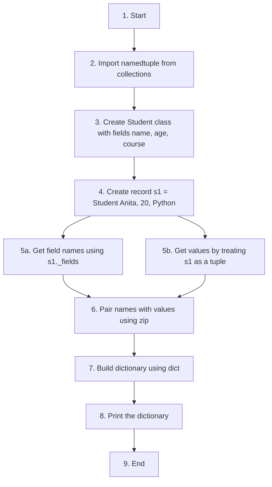
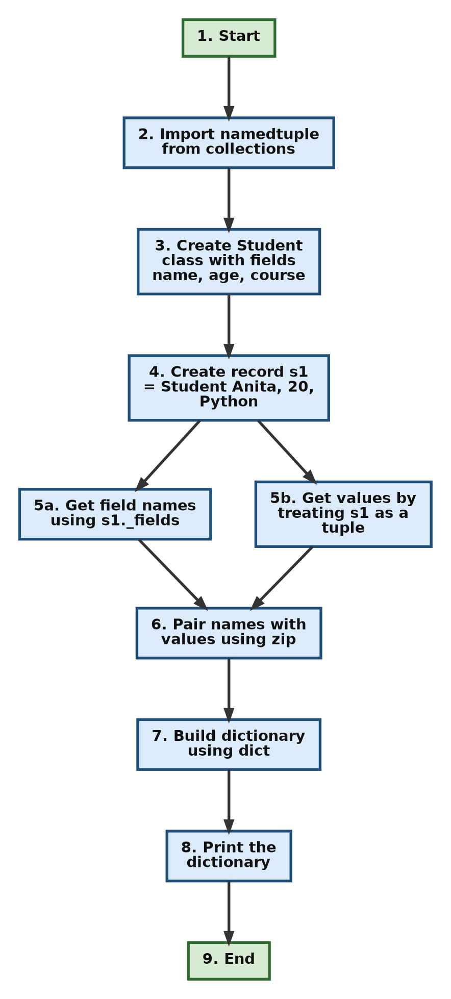
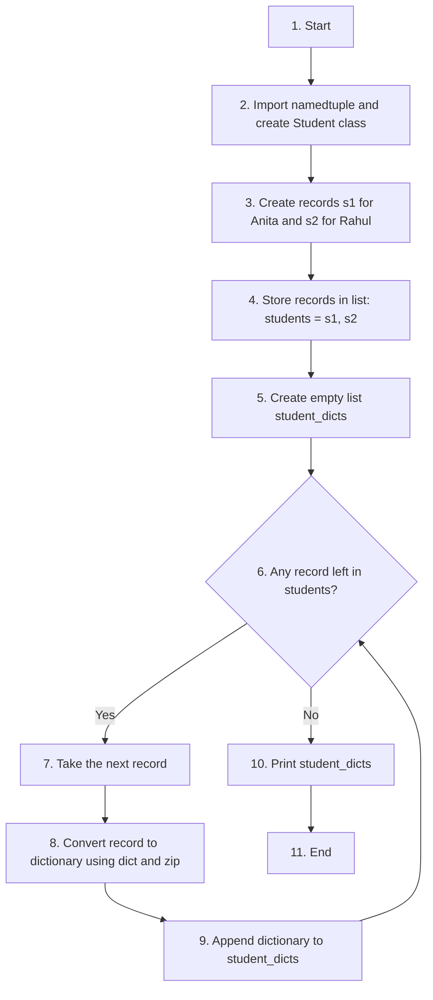
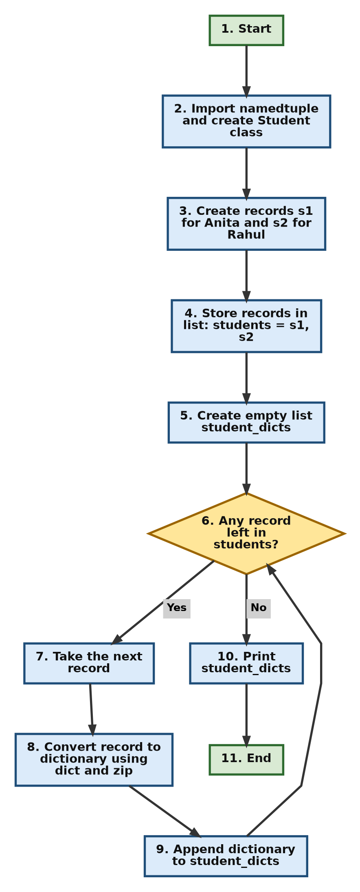

# Converting a NamedTuple into a Dictionary

This page is a worked exercise on **namedtuples**. You will build a small student record using a namedtuple and then turn that record into a **dictionary**.

A namedtuple is a tuple whose items have names. A dictionary is a collection of key and value pairs. The two look similar in spirit, because both let you get a value by a name. But they behave differently. A namedtuple cannot be changed after it is created. A dictionary can. Many parts of Python and many outside tools (for example JSON files, web APIs and data libraries) expect data as a dictionary. So knowing how to move data from a namedtuple into a dictionary is a useful everyday skill.

This exercise belongs to Chapter 16, which deals with the ready-made tools Python gives you through its standard library. The `collections` module and its `namedtuple` function are one such tool. The exercise also shows a practical use of the `_fields` attribute: a namedtuple knows the names of its own fields, and we can use that knowledge to build a dictionary without typing the keys by hand.

---

## Table of Contents

- [1. Background You Need](#1-background-you-need)
  - [1.1 What is a namedtuple](#11-what-is-a-namedtuple)
  - [1.2 What is a dictionary](#12-what-is-a-dictionary)
  - [1.3 Why convert a namedtuple into a dictionary](#13-why-convert-a-namedtuple-into-a-dictionary)
  - [1.4 The two tools used in this exercise](#14-the-two-tools-used-in-this-exercise)
- [2. Exercise: Convert a NamedTuple into a Dictionary](#2-exercise-convert-a-namedtuple-into-a-dictionary)
- [3. Solution](#3-solution)
  - [3.1 The logic in plain words](#31-the-logic-in-plain-words)
  - [3.2 Flowchart of the solution](#32-flowchart-of-the-solution)
  - [3.3 Step-by-step script](#33-step-by-step-script)
    - [Step 1: Import namedtuple](#step-1-import-namedtuple)
    - [Step 2: Create the namedtuple class](#step-2-create-the-namedtuple-class)
    - [Step 3: Create a student record](#step-3-create-a-student-record)
    - [Step 4: Look at the field names and the values](#step-4-look-at-the-field-names-and-the-values)
    - [Step 5: Pair names with values using zip](#step-5-pair-names-with-values-using-zip)
    - [Step 6: Build the dictionary](#step-6-build-the-dictionary)
  - [3.4 Solution code](#34-solution-code)
  - [3.5 Complete script with step-wise output](#35-complete-script-with-step-wise-output)
- [4. Optional Extension Task](#4-optional-extension-task)
  - [4.1 How to approach the extension task](#41-how-to-approach-the-extension-task)
  - [4.2 Flowchart of the extension task](#42-flowchart-of-the-extension-task)
  - [4.3 Solution using a for loop](#43-solution-using-a-for-loop)
  - [4.4 Shorter solution using a list comprehension](#44-shorter-solution-using-a-list-comprehension)
- [5. A Built-in Shortcut: the _asdict Method](#5-a-built-in-shortcut-the-_asdict-method)
- [6. Follow-up Questions with Answers](#6-follow-up-questions-with-answers)
- [7. Common Mistakes](#7-common-mistakes)
- [8. Summary](#8-summary)

---

## 1. Background You Need

Before solving the exercise, let us recall a few ideas. If you are already comfortable with namedtuples, dictionaries and `zip()`, you may jump straight to [the exercise](#2-exercise-convert-a-namedtuple-into-a-dictionary).

### 1.1 What is a namedtuple

A normal tuple stores items by position. To get an item you use its index number, such as `record[0]`. This works, but the number `0` does not tell the reader what the item means.

A **namedtuple** fixes this. It is still a tuple, but each position also has a name. So you can write `record.name` instead of `record[0]`.

```python
from collections import namedtuple

Student = namedtuple("Student", ["name", "age", "course"])
s1 = Student("Anita", 20, "Python")

print(s1[0])      # access by position
print(s1.name)    # access by name
```

Output:

```text
Anita
Anita
```

Two points to remember:

1. A namedtuple is **immutable**. This means you cannot change its values once it is created. (See the Python glossary entry on [immutable](https://docs.python.org/3/glossary.html#term-immutable).)
2. A namedtuple is still a tuple, so you can loop over it, index it and pass it to any function that accepts a tuple.

You can read more in the official documentation for [collections.namedtuple](https://docs.python.org/3/library/collections.html#collections.namedtuple).

[Back to the Table of Contents](#table-of-contents)

### 1.2 What is a dictionary

A **dictionary** stores data as **key: value** pairs. You look up a value using its key.

```python
d = {"name": "Anita", "age": 20}
print(d["name"])
```

Output:

```text
Anita
```

Unlike a namedtuple, a dictionary is **mutable**. You can add, change or remove pairs at any time. See the Python documentation on [dict](https://docs.python.org/3/library/stdtypes.html#dict).

The table below compares the two.

| Feature | namedtuple | dictionary |
|---|---|---|
| Access a value | `s1.name` or `s1[0]` | `d["name"]` |
| Can values be changed later? | No (immutable) | Yes (mutable) |
| Can new fields be added later? | No | Yes |
| Order of items | Fixed by position | Kept in the order of insertion (Python 3.7 and later) |
| Memory use | Lower | Higher |
| Easy to save as JSON | Not directly | Yes |

[Back to the Table of Contents](#table-of-contents)

### 1.3 Why convert a namedtuple into a dictionary

A namedtuple is good for holding a fixed record safely. But sometimes you need the data as a dictionary. Some common reasons:

1. **You want to change a value.** A namedtuple does not allow this. A dictionary does.
2. **You want to save the data as JSON.** The [json](https://docs.python.org/3/library/json.html) module turns dictionaries into JSON text very naturally.
3. **Another library expects a dictionary.** Many tools, such as web frameworks and data analysis libraries, accept records as dictionaries.
4. **You want to print or display the data with clear labels.** A dictionary shows each key next to its value.

[Back to the Table of Contents](#table-of-contents)

### 1.4 The two tools used in this exercise

The hint tells us to use `_fields` and `zip()`. Here is what each one does.

**`_fields`**

Every namedtuple class and every namedtuple object has an attribute called `_fields`. It holds a tuple of the field names, in order.

```python
print(s1._fields)
```

Output:

```text
('name', 'age', 'course')
```

The leading underscore in `_fields` does **not** mean it is private or forbidden to use. The Python designers added the underscore only to avoid a clash with any field name you might choose yourself (for example, a field actually called `fields`). It is a normal, documented part of namedtuple. See [_fields in the documentation](https://docs.python.org/3/library/collections.html#collections.somenamedtuple._fields).

**`zip()`**

The built-in function `zip()` takes two or more sequences and joins them item by item. The first items go together, then the second items, and so on.

```python
names  = ("name", "age", "course")
values = ("Anita", 20, "Python")

print(list(zip(names, values)))
```

Output:

```text
[('name', 'Anita'), ('age', 20), ('course', 'Python')]
```

Think of `zip()` like a zipper on a jacket. The teeth on the left side lock with the teeth on the right side, one pair at a time. See [zip() in the documentation](https://docs.python.org/3/library/functions.html#zip).

Note that `zip()` does not give you a list directly. It gives you a **zip object**, which is an [iterator](https://docs.python.org/3/glossary.html#term-iterator), meaning it hands out one pair at a time when asked. We wrapped it in `list()` above only so that we could see all the pairs at once.

**`dict()` with pairs**

The last piece is the `dict()` function. If you give it a sequence of two-item pairs, it uses the first item of each pair as the key and the second item as the value.

```python
pairs = [('name', 'Anita'), ('age', 20), ('course', 'Python')]
print(dict(pairs))
```

Output:

```text
{'name': 'Anita', 'age': 20, 'course': 'Python'}
```

Put these three together and you have the whole solution.

[Back to the Table of Contents](#table-of-contents)

---

## 2. Exercise: Convert a NamedTuple into a Dictionary

Create a `Student` namedtuple with following 3 fields:

```python
name, age, course
```

Create a student record and convert it into a dictionary.

Example:

```python
s1 = Student("Anita", 20, "Python")
```

To create a dictionary whose keys are the field names `name, age, course` and whose values are `"Anita", 20, "Python"`

Expected output:

```python
{'name': 'Anita', 'age': 20, 'course': 'Python'}
```

**Hint:** Use `_fields` and `zip()`.

[Back to the Table of Contents](#table-of-contents)

---

## 3. Solution

### 3.1 The logic in plain words

Before writing code, it helps to think through the steps in ordinary language.

1. Bring the `namedtuple` tool into our program.
2. Design a record type called `Student` with three fields: `name`, `age` and `course`.
3. Make one actual student record for Anita.
4. Get two things from that record: the list of field names (these will be the keys) and the list of values (these will be the values).
5. Join each field name with its matching value to make pairs.
6. Hand those pairs to `dict()` to get a dictionary.
7. Print the dictionary.

The table below shows how the data changes at each stage.

| Stage | What we have | Example |
|---|---|---|
| After Step 3 | A namedtuple object | `Student(name='Anita', age=20, course='Python')` |
| Step 4 (keys) | `s1._fields` | `('name', 'age', 'course')` |
| Step 4 (values) | `s1` treated as a tuple | `('Anita', 20, 'Python')` |
| After Step 5 | Pairs from `zip()` | `('name', 'Anita'), ('age', 20), ('course', 'Python')` |
| After Step 6 | A dictionary | `{'name': 'Anita', 'age': 20, 'course': 'Python'}` |

[Back to the Table of Contents](#table-of-contents)

### 3.2 Flowchart of the solution





Steps 5a and 5b happen side by side. Both feed into Step 6, where `zip()` joins them.

[Back to the Table of Contents](#table-of-contents)

### 3.3 Step-by-step script

Here we build the solution one step at a time and print the result of each step. This lets you see exactly what is going on inside.

#### Step 1: Import namedtuple

```python
# Step 1 - Import namedtuple from the collections module
from collections import namedtuple
```

`namedtuple` is not a built-in name like `print`. It lives inside the `collections` module, so we must import it first. There is no output for this step.

[Back to the Table of Contents](#table-of-contents)

#### Step 2: Create the namedtuple class

```python
# Step 2 - Create the namedtuple class
Student = namedtuple(
    "Student",                 # Name of the namedtuple class
    ["name", "age", "course"]  # The three fields
)
print("Step 2 - Class created:", Student)
```

Output:

```text
Step 2 - Class created: <class '__main__.Student'>
```

The call to `namedtuple()` does not create a student. It creates a new **class**, which is like a blueprint or a form with three blank boxes. The output confirms that `Student` is a class. (`__main__` simply means the class was made in the script that is currently running.)

[Back to the Table of Contents](#table-of-contents)

#### Step 3: Create a student record

```python
# Step 3 - Create a student record
s1 = Student(
    "Anita",
    20,
    "Python"
)
print("Step 3 - Student record:", s1)
```

Output:

```text
Step 3 - Student record: Student(name='Anita', age=20, course='Python')
```

Now we fill in the form. The values are matched to the fields by position: `"Anita"` goes to `name`, `20` goes to `age` and `"Python"` goes to `course`. The printed record shows each name next to its value.

[Back to the Table of Contents](#table-of-contents)

#### Step 4: Look at the field names and the values

```python
# Step 4 - Get the field names and the values
print("Step 4 - Field names:", s1._fields)
print("Step 4 - Values     :", tuple(s1))
```

Output:

```text
Step 4 - Field names: ('name', 'age', 'course')
Step 4 - Values     : ('Anita', 20, 'Python')
```

This step is only for understanding. It shows the two halves we are going to join:

- `s1._fields` gives the names. These will become the **keys**.
- `s1` itself, being a tuple, gives the values. These will become the **values**. We used `tuple(s1)` here only so that the values print as a plain tuple without the field names.

[Back to the Table of Contents](#table-of-contents)

#### Step 5: Pair names with values using zip

```python
# Step 5 - Pair each field name with its value
pairs = list(zip(s1._fields, s1))
print("Step 5 - Pairs:", pairs)
```

Output:

```text
Step 5 - Pairs: [('name', 'Anita'), ('age', 20), ('course', 'Python')]
```

`zip()` takes the first name and the first value and puts them together, then the second name and the second value, and so on. The order of the arguments matters. Names come first because we want them as keys.

[Back to the Table of Contents](#table-of-contents)

#### Step 6: Build the dictionary

```python
# Step 6 - Convert namedtuple to dictionary
student_dict = dict(
    zip(s1._fields, s1)
)
print("Step 6 - Dictionary:", student_dict)
print("Type of result:", type(student_dict))
```

Output:

```text
Step 6 - Dictionary: {'name': 'Anita', 'age': 20, 'course': 'Python'}
Type of result: <class 'dict'>
```

`dict()` reads each pair and uses the first item as the key and the second as the value. The second `print` confirms that the result really is a dictionary.

Notice that here we passed `zip(...)` straight into `dict()` without first turning it into a list. `dict()` can read the pairs directly from the zip object, so the extra `list()` is not needed. We used `list()` in Step 5 only to display the pairs.

[Back to the Table of Contents](#table-of-contents)

### 3.4 Solution code

This is the short solution, as it would normally be written.

```python
# Step 1 - Import namedtuple
from collections import namedtuple


# Step 2 - Create namedtuple class
Student = namedtuple(
    "Student",                 # Name of the namedtuple class
    ["name", "age", "course"]  # Adding fields "name", "age", and "course"
)


# Step 3 - Create object
s1 = Student(
    "Anita",
    20,
    "Python"
)


# Step 4 - Convert namedtuple to dictionary
# s1._fields returns a tuple of field names ('name', 'age', 'course')
# s1 is the namedtuple object, which can be treated like a tuple to get the values ('Anita', 20, 'Python')
# zip() pairs each field name with its value
# dict() turns those pairs into key: value entries
student_dict = dict(
    zip(s1._fields, s1)
)


# Step 5 - Show the result
print(student_dict)
```

Output:

```text
{'name': 'Anita', 'age': 20, 'course': 'Python'}
```

[Back to the Table of Contents](#table-of-contents)

### 3.5 Complete script with step-wise output

This combines all the steps from Section 3.3 into one block, with a print statement after each step. Run it to see how the data changes from start to finish.

```python
"""
Convert a namedtuple into a dictionary.

The idea:
    - _fields gives the names (keys)
    - the namedtuple itself gives the values
    - zip() joins names and values into pairs
    - dict() turns the pairs into a dictionary
"""

# Step 1 - Import namedtuple from the collections module
from collections import namedtuple

# Step 2 - Create the namedtuple class
Student = namedtuple(
    "Student",                 # Name of the namedtuple class
    ["name", "age", "course"]  # The three fields
)
print("Step 2 - Class created:", Student)

# Step 3 - Create a student record
s1 = Student(
    "Anita",
    20,
    "Python"
)
print("Step 3 - Student record:", s1)

# Step 4 - Get the field names and the values
print("Step 4 - Field names:", s1._fields)
print("Step 4 - Values     :", tuple(s1))

# Step 5 - Pair each field name with its value
# list() is used only so that we can see the pairs
pairs = list(zip(s1._fields, s1))
print("Step 5 - Pairs:", pairs)

# Step 6 - Convert namedtuple to dictionary
student_dict = dict(
    zip(s1._fields, s1)
)
print("Step 6 - Dictionary:", student_dict)
print("Type of result:", type(student_dict))
```

Output:

```text
Step 2 - Class created: <class '__main__.Student'>
Step 3 - Student record: Student(name='Anita', age=20, course='Python')
Step 4 - Field names: ('name', 'age', 'course')
Step 4 - Values     : ('Anita', 20, 'Python')
Step 5 - Pairs: [('name', 'Anita'), ('age', 20), ('course', 'Python')]
Step 6 - Dictionary: {'name': 'Anita', 'age': 20, 'course': 'Python'}
Type of result: <class 'dict'>
```

[Back to the Table of Contents](#table-of-contents)

---

## 4. Optional Extension Task

Add another student:

```python
Student("Rahul", 22, "Java")
```

Store both records in a list and convert each record into a dictionary.

Expected output:

```python
[{'name': 'Anita', 'age': 20, 'course': 'Python'}, {'name': 'Rahul', 'age': 22, 'course': 'Java'}]
```

This task fits well after `_fields`, because it shows a practical reason for a namedtuple to know its own structure. We never type the keys `'name'`, `'age'` and `'course'` ourselves. Each record tells us its own field names, so the same line of code works for every student.

[Back to the Table of Contents](#table-of-contents)

### 4.1 How to approach the extension task

1. Create the `Student` class as before.
2. Create two records, one for Anita and one for Rahul.
3. Put both records into a list.
4. Make an empty list to hold the dictionaries.
5. Go through the list of records one at a time. For each record, convert it to a dictionary using `dict(zip(record._fields, record))`, and add that dictionary to the new list.
6. Print the new list.

The conversion in Step 5 is exactly the same line we used for one student. The only new part is the loop around it.

[Back to the Table of Contents](#table-of-contents)

### 4.2 Flowchart of the extension task





Steps 7, 8 and 9 form the loop. After Step 9 the program goes back to Step 6 and checks whether another record is waiting. When no record is left, it moves on to Step 10.

[Back to the Table of Contents](#table-of-contents)

### 4.3 Solution using a for loop

```python
# Step 1 - Import namedtuple
from collections import namedtuple

# Step 2 - Create the namedtuple class
Student = namedtuple("Student", ["name", "age", "course"])

# Step 3 - Create two student records
s1 = Student("Anita", 20, "Python")
s2 = Student("Rahul", 22, "Java")

# Step 4 - Store both records in a list
students = [s1, s2]
print("Step 4 - List of records:", students)

# Step 5 - Create an empty list to hold the dictionaries
student_dicts = []

# Step 6 - Convert each record and add it to the new list
for student in students:
    record = dict(zip(student._fields, student))   # same idea as before
    print("Step 6 - Converted:", record)
    student_dicts.append(record)

# Step 7 - Show the final list of dictionaries
print("Step 7 - Final list:", student_dicts)
```

Output:

```text
Step 4 - List of records: [Student(name='Anita', age=20, course='Python'), Student(name='Rahul', age=22, course='Java')]
Step 6 - Converted: {'name': 'Anita', 'age': 20, 'course': 'Python'}
Step 6 - Converted: {'name': 'Rahul', 'age': 22, 'course': 'Java'}
Step 7 - Final list: [{'name': 'Anita', 'age': 20, 'course': 'Python'}, {'name': 'Rahul', 'age': 22, 'course': 'Java'}]
```

The loop runs twice, once for each student. You can see a "Converted" line printed each time.

[Back to the Table of Contents](#table-of-contents)

### 4.4 Shorter solution using a list comprehension

Once you are comfortable with the loop, you can write Step 5 and Step 6 in a single line using a [list comprehension](https://docs.python.org/3/tutorial/datastructures.html#list-comprehensions). A list comprehension is a compact way of building a list from a loop.

```python
# Step 1 - Import namedtuple
from collections import namedtuple

# Step 2 - Create the namedtuple class
Student = namedtuple("Student", ["name", "age", "course"])

# Step 3 - Create two records and store them in a list
students = [
    Student("Anita", 20, "Python"),
    Student("Rahul", 22, "Java")
]

# Step 4 - Convert every record in one line
# Read it as: "make dict(zip(s._fields, s)) for each s in students"
student_dicts = [dict(zip(s._fields, s)) for s in students]

# Step 5 - Show the result
print(student_dicts)
```

Output:

```text
[{'name': 'Anita', 'age': 20, 'course': 'Python'}, {'name': 'Rahul', 'age': 22, 'course': 'Java'}]
```

Both versions give the same result. The loop version is easier to read for a beginner. The list comprehension is shorter.

[Back to the Table of Contents](#table-of-contents)

---

## 5. A Built-in Shortcut: the _asdict Method

The exercise asks you to use `_fields` and `zip()`, and it is worth doing it that way at least once because it shows how the conversion really works. But you should also know that namedtuple has a ready-made method that does the same job: `_asdict()`.

```python
# Step 1 - Import namedtuple and create the class
from collections import namedtuple
Student = namedtuple("Student", ["name", "age", "course"])

# Step 2 - Create a record
s1 = Student("Anita", 20, "Python")

# Step 3 - Convert using the built-in method
d = s1._asdict()
print(d)
print(type(d))
```

Output:

```text
{'name': 'Anita', 'age': 20, 'course': 'Python'}
<class 'dict'>
```

Like `_fields`, the underscore in `_asdict()` is only there to avoid a clash with your own field names. It is a normal public method. See [_asdict() in the documentation](https://docs.python.org/3/library/collections.html#collections.somenamedtuple._asdict).

A small note on versions: from Python 3.8 onward, `_asdict()` returns a regular `dict`. In Python 3.1 to 3.7 it returned an `OrderedDict`, which is a dictionary that remembers insertion order.

| Method | Code | When to use |
|---|---|---|
| `_fields` with `zip()` | `dict(zip(s1._fields, s1))` | To understand how the conversion works, or when you need to change the pairs on the way (for example, rename keys) |
| `_asdict()` | `s1._asdict()` | Everyday use, when you just want the dictionary |

[Back to the Table of Contents](#table-of-contents)

---

## 6. Follow-up Questions with Answers

These questions help you check your understanding. Try to answer each one yourself before reading the answer.

**Q1. What would happen if you wrote `dict(zip(s1, s1._fields))` instead of `dict(zip(s1._fields, s1))`?**

Answer:

1. `zip()` always takes the first item from its first argument and pairs it with the first item from its second argument.
2. With the arguments swapped, the values come first. So the pairs become `('Anita', 'name')`, `(20, 'age')` and `('Python', 'course')`.
3. `dict()` uses the first item of each pair as the key. So the values become the keys and the field names become the values.

```python
print(dict(zip(s1, s1._fields)))
```

Output:

```text
{'Anita': 'name', 20: 'age', 'Python': 'course'}
```

This is not what we want. The order of arguments to `zip()` matters.

[Back to the Table of Contents](#table-of-contents)

**Q2. Can you get `_fields` from the class `Student` itself, without creating any record?**

Answer: Yes. `_fields` belongs to the class, so every object made from the class shares it. You can read it from either one.

```python
print(Student._fields)
```

Output:

```text
('name', 'age', 'course')
```

This is useful when you want to know the structure of a record type before you have any data.

[Back to the Table of Contents](#table-of-contents)

**Q3. If you change a value in the dictionary, does the original namedtuple change too?**

Answer:

1. The dictionary is a new, separate object. It only copied the values.
2. The namedtuple is immutable, so nothing can change it anyway.
3. So changing the dictionary leaves the namedtuple as it was.

```python
d = s1._asdict()
d["age"] = 21
print(d)
print(s1)
```

Output:

```text
{'name': 'Anita', 'age': 21, 'course': 'Python'}
Student(name='Anita', age=20, course='Python')
```

[Back to the Table of Contents](#table-of-contents)

**Q4. How can you turn the dictionary back into a namedtuple?**

Answer: Use `**` before the dictionary when calling the class. The `**` unpacks the dictionary, so each key is passed as a named argument. In other words, `Student(**d)` is the same as writing `Student(name='Anita', age=21, course='Python')`. See [unpacking argument lists](https://docs.python.org/3/tutorial/controlflow.html#unpacking-argument-lists).

```python
new_s1 = Student(**d)
print(new_s1)
```

Output:

```text
Student(name='Anita', age=21, course='Python')
```

This is a common way to "update" a namedtuple: convert it to a dictionary, change the value, and build a new namedtuple from it. (namedtuple also offers a `_replace()` method for this purpose.)

[Back to the Table of Contents](#table-of-contents)

**Q5. What does `zip()` do if the two sequences have different lengths?**

Answer: `zip()` stops as soon as the shorter sequence runs out. Any extra items in the longer one are ignored, and no error is raised.

```python
print(list(zip(("a", "b", "c"), (1, 2))))
```

Output:

```text
[('a', 1), ('b', 2)]
```

With a namedtuple this problem does not arise, because `_fields` and the record always have the same number of items.

[Back to the Table of Contents](#table-of-contents)

**Q6. Why was it not necessary to type the keys `'name'`, `'age'` and `'course'` in the solution?**

Answer: Because `s1._fields` already supplies them. The record carries the knowledge of its own field names. This makes the code reusable. If you later add a fourth field, such as `city`, to the `Student` class, the line `dict(zip(s1._fields, s1))` will still work without any change.

[Back to the Table of Contents](#table-of-contents)

---

## 7. Common Mistakes

| Mistake | What goes wrong | Correct way |
|---|---|---|
| Forgetting the import | `NameError: name 'namedtuple' is not defined` | Add `from collections import namedtuple` at the top |
| Writing `s1.fields` without the underscore | `AttributeError`, because there is no attribute called `fields` | Write `s1._fields` |
| Writing `s1._fields()` with brackets | `TypeError: 'tuple' object is not callable`, because `_fields` is a tuple, not a method | Write `s1._fields` without brackets |
| Swapping the arguments of `zip()` | Values become keys and field names become values | Put `_fields` first: `zip(s1._fields, s1)` |
| Printing `zip(...)` directly | Prints something like `<zip object at 0x...>` instead of the pairs | Wrap it in `list()` or `dict()` to see the contents |
| Trying `s1.age = 21` | `AttributeError`, because a namedtuple cannot be changed | Convert to a dictionary first, or use `s1._replace(age=21)` |

[Back to the Table of Contents](#table-of-contents)

---

## 8. Summary

- A **namedtuple** is a tuple whose positions have names. It cannot be changed after it is created.
- A **dictionary** stores key: value pairs and can be changed freely.
- `_fields` gives the field names of a namedtuple as a tuple.
- The namedtuple itself can be used as a tuple of values.
- `zip(s1._fields, s1)` pairs each field name with its value.
- `dict()` turns those pairs into a dictionary.
- The same one line, `dict(zip(record._fields, record))`, works for any namedtuple record, so it can be used inside a loop to convert many records.
- For everyday use, `record._asdict()` does the same job in one step.

[Back to the Table of Contents](#table-of-contents)

---

