# Real-World Python: Practical Uses for Standard Library Modules

Python comes with a large set of ready-made modules that you can use without installing anything. This set is called the [Python Standard Library](https://docs.python.org/3/library/index.html). Chapter 16 introduced several of its most useful modules: `collections`, `heapq`, `bisect`, `queue`, `enum`, `dataclasses`, `functools` and `itertools`.

Learning what a tool does is only half the job. The other half is knowing *when* to use it. This page gives practical, real-world examples of the specialised data structures and tools covered in Chapter 16. Each example starts with an everyday problem, such as counting errors in a log file, handling hospital patients by urgency or keeping a list of marks in order. It then shows how one of these modules solves the problem in a few clear lines of code.

These examples matter because good Python programmers rarely write everything from scratch. If a well-tested tool already exists in the standard library, using it makes your code shorter, faster and less likely to contain mistakes.

**How each example is arranged**

| Part | What it tells you |
|---|---|
| **Usage** | The real-life problem we are trying to solve |
| **How it works** | The logic in plain words, step by step |
| **Script** | The Python code, with `# Step` comments and explanations |
| **Output** | What the script prints when you run it |
| **Explanation** | Why the tool is a good fit for the problem |

All scripts on this page were tested with Python 3.11. They should work the same way in Python 3.8 and later.

---

## Table of Contents

- [Modules at a Glance](#modules-at-a-glance)
- [1. The collections Module](#1-the-collections-module)
  - [1.1 Counter: Log File Analysis](#11-counter-log-file-analysis)
  - [1.2 deque: Terminal Command History](#12-deque-terminal-command-history)
  - [1.3 defaultdict: Grouping Grades by Letter](#13-defaultdict-grouping-grades-by-letter)
  - [1.4 OrderedDict: Most Recently Used (MRU) Cache](#14-ordereddict-most-recently-used-mru-cache)
  - [1.5 namedtuple: Parsing CSV Data](#15-namedtuple-parsing-csv-data)
  - [1.6 ChainMap: Application Configuration](#16-chainmap-application-configuration)
- [2. The heapq Module](#2-the-heapq-module)
  - [2.1 Priority Task Manager](#21-priority-task-manager)
- [3. The bisect Module](#3-the-bisect-module)
  - [3.1 Student Marks List](#31-student-marks-list)
- [4. The queue Module](#4-the-queue-module)
  - [4.1 Queue (FIFO): Coffee Shop Orders](#41-queue-fifo-coffee-shop-orders)
  - [4.2 LifoQueue (LIFO): The Undo Button](#42-lifoqueue-lifo-the-undo-button)
  - [4.3 PriorityQueue: Hospital Triage](#43-priorityqueue-hospital-triage)
  - [4.4 Choosing Between the Queue Types](#44-choosing-between-the-queue-types)
- [5. The enum Module](#5-the-enum-module)
  - [5.1 HTTP Status Codes](#51-http-status-codes)
- [6. dataclasses](#6-dataclasses)
  - [6.1 E-Commerce Product Catalog](#61-e-commerce-product-catalog)
- [7. functools Module](#7-functools-module)
  - [7.1 lru_cache: Simulating a Slow Database](#71-lru_cache-simulating-a-slow-database)
  - [7.2 partial: Pre-filling Log Levels](#72-partial-pre-filling-log-levels)
  - [7.3 reduce: Calculating Shopping Cart Total](#73-reduce-calculating-shopping-cart-total)
- [8. itertools Module](#8-itertools-module)
  - [8.1 chain: Flattening 2D Data](#81-chain-flattening-2d-data)
  - [8.2 groupby: Grouping Transactions by Month](#82-groupby-grouping-transactions-by-month)
  - [8.3 product: Combination Lock Generator](#83-product-combination-lock-generator)
  - [8.4 permutations: Seating Arrangements](#84-permutations-seating-arrangements)
- [9. Check Your Understanding](#9-check-your-understanding)
- [10. Summary](#10-summary)
- [Table of Changes](#table-of-changes)

---

## Modules at a Glance

Before going into the examples, here is a quick map of what is covered and where.

| Module | Tool | Problem it solves | Example on this page |
|---|---|---|---|
| `collections` | `Counter` | Counting how often things appear | Most common error codes in a log |
| `collections` | `deque` | Keeping only the latest few items | Recent terminal commands |
| `collections` | `defaultdict` | Grouping items without checking if a key exists | Students grouped by grade |
| `collections` | `OrderedDict` | Moving items within an ordered collection | Recently viewed pages |
| `collections` | `namedtuple` | Giving names to the positions of a tuple | Reading a CSV row |
| `collections` | `ChainMap` | Searching several dictionaries in order | User settings over default settings |
| `heapq` | `heappush`, `heappop` | Always getting the smallest item first | To-do list by priority |
| `bisect` | `bisect_left`, `insort` | Inserting into a sorted list | Adding a new student's marks |
| `queue` | `Queue` | First in, first out | Coffee orders |
| `queue` | `LifoQueue` | Last in, first out | Undo button |
| `queue` | `PriorityQueue` | Most urgent first, safely across threads | Hospital emergency room |
| `enum` | `Enum` | Readable names for fixed values | HTTP status codes |
| `dataclasses` | `@dataclass` | Classes that mainly hold data | Products in an online store |
| `functools` | `lru_cache` | Remembering results of slow functions | Database lookup |
| `functools` | `partial` | Pre-filling some arguments of a function | Error logging function |
| `functools` | `reduce` | Folding a list into one value | Shopping cart total |
| `itertools` | `chain` | Looping through many lists as one | Flattening a matrix |
| `itertools` | `groupby` | Grouping neighbouring items that share a key | Bank transactions by month |
| `itertools` | `product` | Every combination with repetition | Combination lock |
| `itertools` | `permutations` | Every ordering of items | Seating arrangements |

[Back to the Table of Contents](#table-of-contents)

---

## 1. The `collections` Module

The [collections](https://docs.python.org/3/library/collections.html) module offers container types that do more than the basic `list`, `dict` and `tuple`. Each one is built for a common job, so you do not have to write that logic yourself.

[Back to the Table of Contents](#table-of-contents)

### 1.1 `Counter`: Log File Analysis

**Usage:** Imagine you are a server administrator. You have a text file containing thousands of server log entries, and you need to quickly find the top 3 most common error codes to see what is breaking the most.

A [Counter](https://docs.python.org/3/library/collections.html#collections.Counter) is a special dictionary. You give it a list of items, and it counts how many times each item appears. The item becomes the key and the count becomes the value.

**How it works**

1. Store the log text.
2. Break the text into separate lines.
3. From each line, pick out only the code (for example `404`).
4. Hand the list of codes to `Counter`, which counts them.
5. Ask the counter for the 3 most common codes and print them.

The table below shows how Step 3 pulls the code out of one line.

| Expression | Result |
|---|---|
| `line` | `'Error 404: Page not found'` |
| `line.split()` | `['Error', '404:', 'Page', 'not', 'found']` |
| `line.split()[1]` | `'404:'` |
| `line.split()[1].rstrip(':')` | `'404'` |

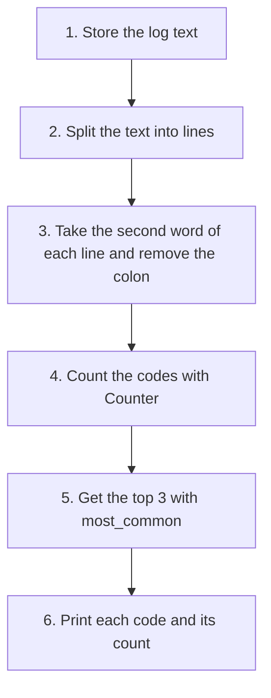

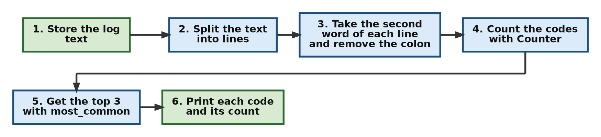

```python
# Step 1 - Import Counter
from collections import Counter

# Step 2 - Simulated raw log data (one entry per line)
log_data = """
Error 404: Page not found
Error 500: Internal server error
Error 200: OK
Error 404: Page not found
Error 403: Forbidden
Error 500: Internal server error
Error 404: Page not found
"""

# Step 3 - Break the text into separate lines
# strip() removes the empty line at the start and end of the text.
# split('\n') cuts the text wherever a new line begins.
lines = log_data.strip().split('\n')
print("Step 3 - Number of lines:", len(lines))

# Step 4 - Extract just the error codes
# line.split() breaks a line into words.
# [1] picks the second word, for example '404:'
# rstrip(':') removes the colon at the end, leaving '404'
error_codes = [line.split()[1].rstrip(':') for line in lines]
print("Step 4 - Codes found:", error_codes)

# Step 5 - Count how often each code appears
counts = Counter(error_codes)
print("Step 5 - Counts:", counts)

# Step 6 - Print the top 3 codes
# most_common(3) returns a list of (code, count) pairs,
# starting with the highest count.
print("Top 3 Issues:")
for code, count in counts.most_common(3):
    print(f"  {code}: occurred {count} times")
```

**Output**

```text
Step 3 - Number of lines: 7
Step 4 - Codes found: ['404', '500', '200', '404', '403', '500', '404']
Step 5 - Counts: Counter({'404': 3, '500': 2, '200': 1, '403': 1})
Top 3 Issues:
  404: occurred 3 times
  500: occurred 2 times
  200: occurred 1 times
```

**Explanation:** We use a simple [list comprehension](https://docs.python.org/3/tutorial/datastructures.html#list-comprehensions) to extract just the numbers (for example, "404") from each line. Then `Counter` does all the heavy lifting. The `.most_common(3)` method grabs the top three codes at once, saving us from writing our own sorting logic.

A few points to note:

- Codes `200` and `403` both occur once. When counts are equal, `most_common()` keeps them in the order they were first seen. That is why `200` appears and `403` does not.
- Strictly speaking, `200` is not an error. It is the web code for "OK". In a real log you would call these **status codes**. The sample data simply mixes success and error lines, as real logs do.
- The `rstrip(':')` in Step 4 removes the colon that is stuck to each code in the log. Without it, the code would be `'404:'` and the output would show a double colon, like `404:: occurred 3 times`.

[Back to the Table of Contents](#table-of-contents)

### 1.2 `deque`: Terminal Command History

**Usage:** When building a command-line application (like a terminal or an interactive text game), you want to store the user's recent commands so they can press the "Up" arrow to see what they just typed. You also want to limit this memory so it doesn't grow forever.

A [deque](https://docs.python.org/3/library/collections.html#collections.deque) (pronounced "deck", short for "double-ended queue") is like a list that can add and remove items quickly at both ends. It also accepts a `maxlen`, which is the largest number of items it will hold.

**How it works**

1. Create a deque that can hold at most 3 items.
2. Go through the commands one at a time.
3. Add each command to the right end of the deque.
4. If the deque already holds 3 items, the oldest one on the left falls out on its own.
5. Print the history after each command.

```python
# Step 1 - Import deque
from collections import deque

# Step 2 - Create a deque that holds a maximum of 3 items
command_history = deque(maxlen=3)

# Step 3 - Simulate a user typing commands
commands_typed = ["ls", "cd /home", "pwd", "mkdir new_folder", "ls -l"]

# Step 4 - Add each command and show the history
for cmd in commands_typed:
    # append() adds to the right end.
    # When the deque is full, the item at the left end is dropped.
    command_history.append(cmd)
    print(f"Current History: {list(command_history)}")
```

**Output**

```text
Current History: ['ls']
Current History: ['ls', 'cd /home']
Current History: ['ls', 'cd /home', 'pwd']
Current History: ['cd /home', 'pwd', 'mkdir new_folder']
Current History: ['pwd', 'mkdir new_folder', 'ls -l']
```

The table below shows what happens on each command.

| Command typed | Dropped from history | History after the command |
|---|---|---|
| `ls` | nothing | `ls` |
| `cd /home` | nothing | `ls`, `cd /home` |
| `pwd` | nothing | `ls`, `cd /home`, `pwd` |
| `mkdir new_folder` | `ls` | `cd /home`, `pwd`, `mkdir new_folder` |
| `ls -l` | `cd /home` | `pwd`, `mkdir new_folder`, `ls -l` |

**Explanation:** By setting `maxlen=3`, the `deque` automatically discards the oldest item the moment a 4th item is added. A standard Python list cannot do this on its own. You would have to write `if-else` logic to check the length and delete the oldest item yourself.

[Back to the Table of Contents](#table-of-contents)

### 1.3 `defaultdict`: Grouping Grades by Letter

**Usage:** A teacher has a list of student grades and needs to group all the students who got an 'A', 'B', or 'C' together. With a normal dictionary, checking whether 'A' already exists and creating a list for it each time is tedious.

A [defaultdict](https://docs.python.org/3/library/collections.html#collections.defaultdict) is a dictionary that creates a starting value for a missing key instead of raising an error. With `defaultdict(list)`, the starting value is an empty list.

**How it works**

1. Create a `defaultdict` whose default value is an empty list.
2. Go through each (name, grade) pair.
3. If the grade is not yet a key, the `defaultdict` quietly creates it with an empty list.
4. Append the student's name to the list for that grade.
5. Print the result.

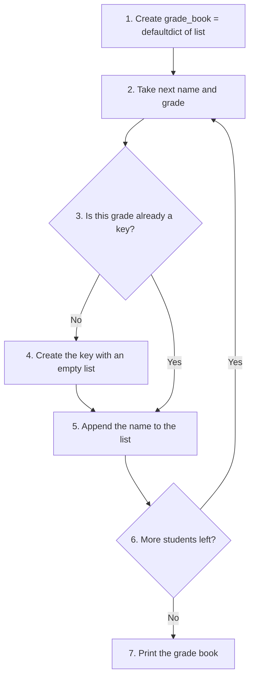

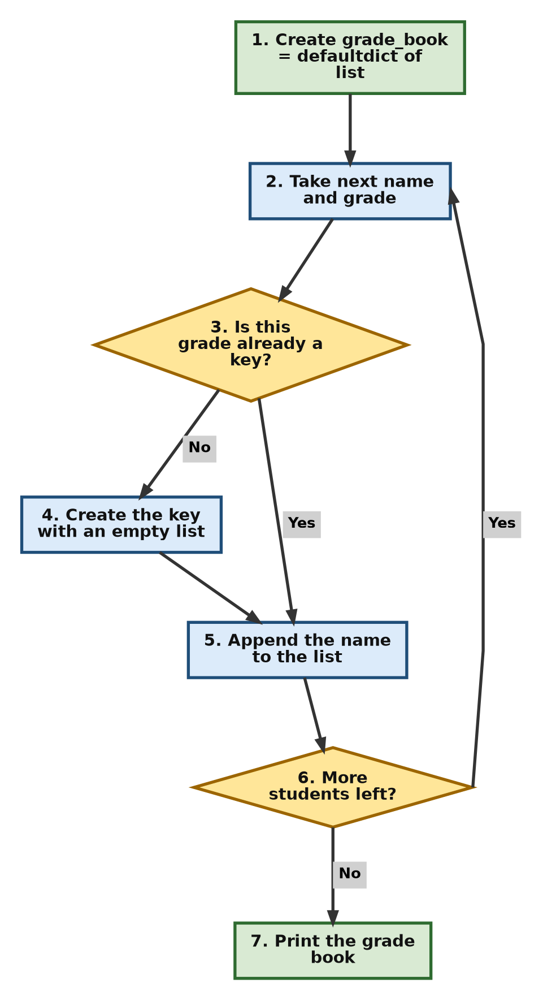

```python
# Step 1 - Import defaultdict
from collections import defaultdict

# Step 2 - The list of (name, grade) pairs
students_scores = [
    ("Alice", "A"), ("Bob", "B"), ("Charlie", "A"), ("David", "C"), ("Eve", "B")
]

# Step 3 - Create the grade book
# Automatically creates an empty list for any new grade letter
grade_book = defaultdict(list)

# Step 4 - Put each student under their grade
for name, grade in students_scores:
    grade_book[grade].append(name)  # No KeyError!
    print(f"Added {name} to grade {grade}")

# Step 5 - Show the final grouping
# dict() turns it into a normal dictionary so it prints neatly.
print(dict(grade_book))
```

**Output**

```text
Added Alice to grade A
Added Bob to grade B
Added Charlie to grade A
Added David to grade C
Added Eve to grade B
{'A': ['Alice', 'Charlie'], 'B': ['Bob', 'Eve'], 'C': ['David']}
```

**Explanation:** Because we used `defaultdict(list)`, the first time Python sees the grade "A", it notices the key doesn't exist. Instead of crashing with a [KeyError](https://docs.python.org/3/library/exceptions.html#KeyError), it silently creates an empty list `[]` for "A", and then appends "Alice" to it.

For comparison, here is what happens with a normal dictionary.

```python
# Step 1 - A normal, empty dictionary
grade_book = {}

# Step 2 - Try to append to a key that does not exist yet
try:
    grade_book["A"].append("Alice")
except KeyError as error:
    print("KeyError for key:", error)

# Step 3 - The normal-dictionary way needs an extra check
if "A" not in grade_book:
    grade_book["A"] = []
grade_book["A"].append("Alice")
print(grade_book)
```

**Output**

```text
KeyError for key: 'A'
{'A': ['Alice']}
```

The `if` check in Step 3 is exactly the work that `defaultdict` does for you.

[Back to the Table of Contents](#table-of-contents)

### 1.4 `OrderedDict`: Most Recently Used (MRU) Cache

**Usage:** Web browsers and apps keep a "Recently Viewed" list. When you view an old item again, it gets pulled out of the middle of the list and moved to the very end, which is the "most recent" end.

An [OrderedDict](https://docs.python.org/3/library/collections.html#collections.OrderedDict) is a dictionary that gives you extra tools for changing the order of its items. A **cache** is a small store of things you are likely to need again soon.

**How it works**

1. Create an `OrderedDict` with pages in the order they were viewed. The oldest is first and the newest is last.
2. Print the order.
3. The user views "About" again, so move "About" to the end.
4. Print the new order.

```python
# Step 1 - Import OrderedDict
from collections import OrderedDict

# Step 2 - Simulate viewing pages in order
# The first page is the oldest view; the last page is the newest.
viewed_pages = OrderedDict([
    ("Home", 1), ("About", 2), ("Contact", 3)
])

print("Initial:", list(viewed_pages.keys()))

# Step 3 - User clicks "About" again
# move_to_end() moves the key to the last position.
viewed_pages.move_to_end("About")

# Step 4 - Show the new order
print("After viewing About again:", list(viewed_pages.keys()))
```

**Output**

```text
Initial: ['Home', 'About', 'Contact']
After viewing About again: ['Home', 'Contact', 'About']
```

| Position | Before | After |
|---|---|---|
| 1 (oldest) | Home | Home |
| 2 | About | Contact |
| 3 (newest) | Contact | About |

**Explanation:** Since Python 3.7, a standard `dict` also remembers insertion order, but it doesn't have tools to change that order. `OrderedDict` gives us the `move_to_end()` method, which neatly models an MRU list by moving "About" to the back of the line. It also has `popitem(last=False)`, which removes the oldest item. Together these two methods are enough to build a cache that keeps only the most recent few pages.

[Back to the Table of Contents](#table-of-contents)

### 1.5 `namedtuple`: Parsing CSV Data

**Usage:** You read a line of data from a comma-separated file. Instead of accessing `row[2]` and hoping it's the right column, you use a `namedtuple` to make your code self-documenting, which means the code explains itself through its names.

A [CSV file](https://docs.python.org/3/library/csv.html) (Comma-Separated Values) is a plain text file where each line is a row and the values in a row are separated by commas. A [namedtuple](https://docs.python.org/3/library/collections.html#collections.namedtuple) is a tuple whose positions have names.

**How it works**

1. Create an `Employee` namedtuple with four fields.
2. Take one row of CSV text.
3. Split the row at each comma to get a list of four strings.
4. Unpack that list into `Employee` to create an object.
5. Read the values by name.
6. Convert the salary into a number if you want to do arithmetic with it.

```python
# Step 1 - Import namedtuple and create the Employee class
from collections import namedtuple

# namedtuple() creates a tuple-like class.
# The first argument "Employee" is the name of the class being created.
# The second argument is a list of field names (attributes).
#
# The created class will have these fields:
# id
# name
# department
# salary
#
# Employee is now a new class which behaves like a tuple
# but allows accessing values using names.
Employee = namedtuple("Employee", ["id", "name", "department", "salary"])

# Step 2 - One row of CSV data
# Suppose this data has come from a CSV file.
# A CSV file stores data as comma-separated text.
#
# Current value:
# "101,Sarah,Engineering,85000"
#
# The order of values matches the order of fields in Employee:
#
# id -> 101
# name -> Sarah
# department -> Engineering
# salary -> 85000
csv_row = "101,Sarah,Engineering,85000"

# Step 3 - Split the row into a list of strings
# split(',') breaks the string into a list.
#
# Before:
# "101,Sarah,Engineering,85000"
#
# After:
# ['101', 'Sarah', 'Engineering', '85000']
parts = csv_row.split(',')
print("Step 3 - After split:", parts)

# Step 4 - Create the Employee object
# The * operator unpacks this list.
# So:
# Employee(*csv_row.split(','))
# becomes:
# Employee(
#     '101',
#     'Sarah',
#     'Engineering',
#     '85000'
# )
#
# A new Employee object is created.
emp = Employee(*csv_row.split(','))
print("Step 4 - Employee object:", emp)

# Step 5 - Access data using field names
# Without namedtuple we would need indexes:
# csv_row.split(',')[1] -> name
# csv_row.split(',')[2] -> department
#
# Namedtuple makes the code clearer:
# emp.name
# emp.department
print(f"Name: {emp.name} | Dept: {emp.department}")

# Step 6 - Every value read from text is a string
# To do arithmetic, convert the salary to an integer first.
print("Step 6 - Type of salary:", type(emp.salary))
yearly_bonus = int(emp.salary) * 10 // 100
print("Step 6 - 10% bonus:", yearly_bonus)
```

**Output**

```text
Step 3 - After split: ['101', 'Sarah', 'Engineering', '85000']
Step 4 - Employee object: Employee(id='101', name='Sarah', department='Engineering', salary='85000')
Name: Sarah | Dept: Engineering
Step 6 - Type of salary: <class 'str'>
Step 6 - 10% bonus: 8500
```

**Explanation:** The `*csv_row.split(',')` [unpacks](https://docs.python.org/3/tutorial/controlflow.html#unpacking-argument-lists) the 4 strings directly into the `Employee` constructor (the call that creates a new object). Now you have a lightweight object where you can access data using `.name` and `.salary` instead of trying to remember index numbers.

Notice in the output that `id` and `salary` are stored as strings (`'101'` and `'85000'`), not numbers. This is because text read from a file is always text. Step 6 shows how to convert the salary with `int()` before doing any calculation.

[Back to the Table of Contents](#table-of-contents)

### 1.6 `ChainMap`: Application Configuration

**Usage:** Apps have default settings, user settings, and command-line arguments. If a user provides a setting, it should override the default. `ChainMap` lets you layer these without merging them.

A [ChainMap](https://docs.python.org/3/library/collections.html#collections.ChainMap) groups several dictionaries so they can be searched as one. It looks in the first dictionary, then the second, and so on, and returns the first match it finds.

**How it works**

1. Create a dictionary of default settings.
2. Create a dictionary of the user's own settings.
3. Join them in a `ChainMap`, with user settings first.
4. Look up "theme". It is found in the user settings, so the user's value is used.
5. Look up "volume". It is not in the user settings, so the default value is used.
6. Change a setting through the `ChainMap` and see where the change is stored.

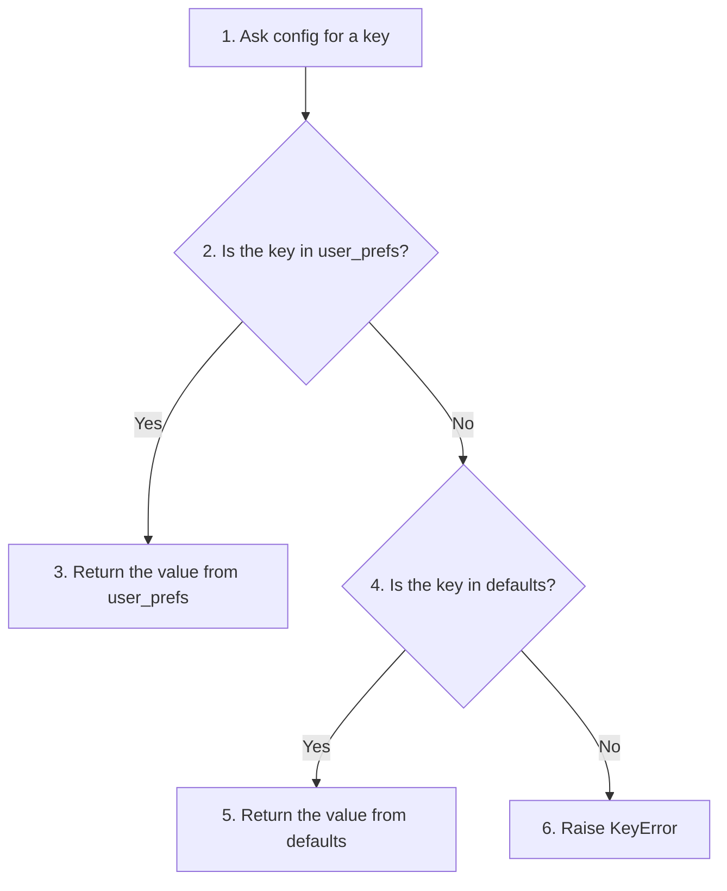

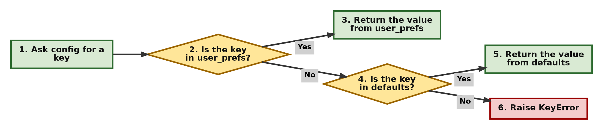

```python
# Step 1 - Import ChainMap
from collections import ChainMap

# Step 2 - Default settings
# Create a dictionary containing default settings.
# These values will be used when the user has not
# provided their own preference.
defaults = {
    "theme": "light",
    "volume": 50,
    "difficulty": "normal"
}

# Step 3 - User settings
# Create another dictionary containing user-specific settings.
# User settings should have higher priority than defaults.
# Here the user has changed only the theme.
user_prefs = {
    "theme": "dark"
}

# Step 4 - Combine them with ChainMap
# ChainMap combines multiple dictionaries into one view.
# IMPORTANT:
# ChainMap does not create a new dictionary.
# It keeps the original dictionaries and searches them in order.
# Search order:
# 1. user_prefs (checked first)
# 2. defaults (checked if not found above)
# Therefore, if both dictionaries have the same key,
# the value from user_prefs is used.
config = ChainMap(
    user_prefs,
    defaults
)

# Step 5 - Look up "theme"
# Python first looks in user_prefs.
# It finds:
# user_prefs["theme"] = "dark"
# So this value is returned.
print(f"Theme: {config['theme']}")

# Step 6 - Look up "volume"
# Python first looks in user_prefs.
# "volume" is not present there.
# Then it checks defaults:
# defaults["volume"] = 50
# So the default value is returned.
print(f"Volume: {config['volume']}")

# Step 7 - Change a setting through the ChainMap
# Any change made through a ChainMap is stored in the FIRST dictionary only.
# The defaults stay untouched.
config["volume"] = 80
print("Step 7 - Volume now:", config["volume"])
print("Step 7 - user_prefs:", user_prefs)
print("Step 7 - defaults  :", defaults)
```

**Output**

```text
Theme: dark
Volume: 50
Step 7 - Volume now: 80
Step 7 - user_prefs: {'theme': 'dark', 'volume': 80}
Step 7 - defaults  : {'theme': 'light', 'volume': 50, 'difficulty': 'normal'}
```

**Explanation:** `ChainMap` doesn't combine the dictionaries into a new one, which would use extra memory and would go out of date if one of the originals changed. It creates a "view" that searches `user_prefs` first. If the key isn't there, it searches `defaults`. Step 7 shows another useful point: when you change a value through the `ChainMap`, only the first dictionary is updated, so your defaults stay safe. Many programs handle layered settings in exactly this way.

[Back to the Table of Contents](#table-of-contents)

---

## 2. The `heapq` Module

The [heapq](https://docs.python.org/3/library/heapq.html) module lets you use a normal list as a **heap**. A heap is an arrangement of items where the smallest item is always kept at the front (index 0). Getting that smallest item out is very fast, even when the list is large. The rest of the list is kept only loosely in order, not fully sorted.

[Back to the Table of Contents](#table-of-contents)

### 2.1 Priority Task Manager

**Usage:** You are building a to-do list application. Tasks have a priority number (1 is urgent, 5 is low). You want to always process the most urgent task next, regardless of when it was added.

**How it works**

1. Start with an empty list to use as the heap.
2. Push each task onto the heap as a `(priority, description)` pair.
3. After each push, the task with the smallest priority number moves to the front.
4. Keep popping the front task until the heap is empty.
5. Each pop gives the most urgent task still waiting.

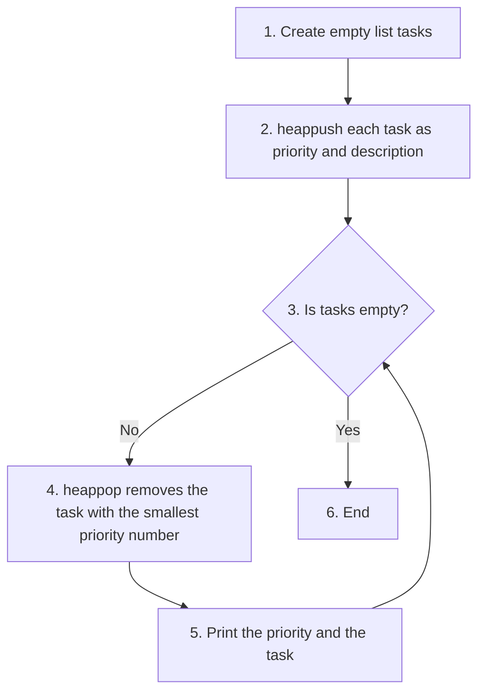

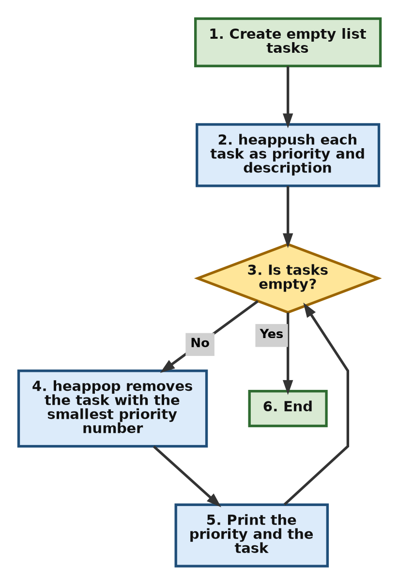

```python
# Step 1 - Import heapq and create an empty heap
import heapq

# Create an empty list that will be used as a heap.
# Python's heapq module uses a normal list to store the heap.
# In a heap: the smallest item is always kept at the top (index 0).
# Here each item will be a tuple: (priority_number, task_description)
# The first value decides the priority.
# Smaller priority number = higher priority.
tasks = []

# Step 2 - Add tasks to the heap
# heappush() inserts an item and rearranges the list just enough
# to keep the smallest item at index 0.
# Items are tuples: (priority, description)
# Since priority is the first item in the tuple,
# heapq compares priority numbers.
# Priority 1 will come before Priority 2,
# and Priority 2 will come before Priority 3.
heapq.heappush(tasks, (3, "Organize desk"))           # Add a task with priority 3
print("Step 2 - Heap:", tasks)
heapq.heappush(tasks, (1, "Fix critical bug"))        # Add a task with priority 1
print("Step 2 - Heap:", tasks)
heapq.heappush(tasks, (2, "Reply to client email"))   # Add a task with priority 2
print("Step 2 - Heap:", tasks)

# Step 3 - Process tasks until the heap becomes empty
# heappop() removes and returns the smallest item from the heap.
#
# Since our tuples start with priority numbers,
# the task with the smallest priority number is removed first.
# Example:
# (1, "Fix critical bug") comes out first
# (2, "Reply to client email") comes next
# (3, "Organize desk") comes last
print("Processing tasks in order of priority:")  # Display heading
while tasks:
    # Unpack the tuple returned by heappop()
    # priority gets the first value
    # task gets the second value
    priority, task = heapq.heappop(tasks)
    print(f"Priority {priority}: {task}")
```

**Output**

```text
Step 2 - Heap: [(3, 'Organize desk')]
Step 2 - Heap: [(1, 'Fix critical bug'), (3, 'Organize desk')]
Step 2 - Heap: [(1, 'Fix critical bug'), (3, 'Organize desk'), (2, 'Reply to client email')]
Processing tasks in order of priority:
Priority 1: Fix critical bug
Priority 2: Reply to client email
Priority 3: Organize desk
```

**Explanation:** We push tuples into a normal list. `heappush` keeps the smallest number (highest priority) at index 0. `heappop` removes and returns that top-priority item, and then moves the next smallest item to the front.

Look closely at the last "Step 2" line in the output. The list is `[1, 3, 2]` by priority, not `[1, 2, 3]`. This is normal. A heap only promises that the **smallest** item is at the front. It does not keep the whole list sorted. That is what makes it fast. Even so, `heappop` always hands the tasks back in the correct order: 1, then 2, then 3.

[Back to the Table of Contents](#table-of-contents)

---

## 3. The `bisect` Module

The [bisect](https://docs.python.org/3/library/bisect.html) module works with lists that are already sorted. It uses **binary search**, which finds a position by repeatedly cutting the search area in half, instead of checking items one by one. This makes finding the right spot very fast.

[Back to the Table of Contents](#table-of-contents)

### 3.1 Student Marks List

**Usage:** A teacher maintains a sorted list of student marks. When a new student's marks are received, the mark needs to be inserted at the correct position so that the list remains sorted. This makes it easy to display marks in ascending or descending order. `bisect` finds the correct insertion position quickly.

**How it works**

1. Start with a list of marks that is already sorted.
2. Use `bisect_left()` to find where the new mark should go. This only finds the position. It does not change the list.
3. Use `insort()` to actually insert the mark at the correct position.
4. Print the list in ascending order, and reversed for descending order.

The table below shows how binary search finds the position for 65 in `[40, 55, 70, 80, 95]`. `low` and `high` mark the part of the list still being searched.

| Round | low | high | middle index | mark at middle | Comparison | Next action |
|---|---|---|---|---|---|---|
| 1 | 0 | 5 | 2 | 70 | 65 is less than 70 | Search the left half: high becomes 2 |
| 2 | 0 | 2 | 1 | 55 | 65 is more than 55 | Search the right half: low becomes 2 |
| 3 | 2 | 2 | - | - | low equals high | Stop. Position is 2 |

Only two comparisons were needed. For a list of one million marks, binary search needs only about 20.

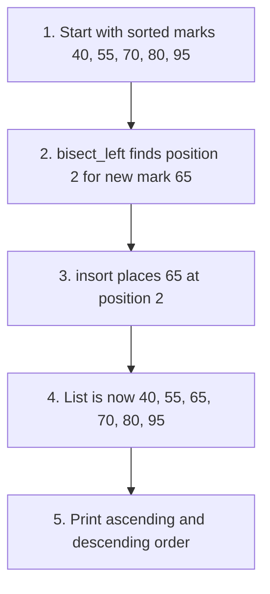

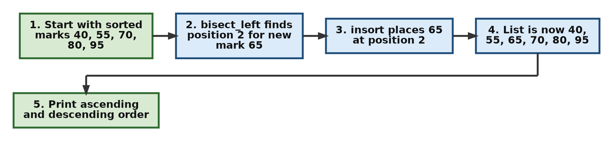

```python
# Step 1 - Import bisect and create a sorted list
import bisect

# List of student marks.
# IMPORTANT: The list must already be sorted for bisect to work.
marks = [40, 55, 70, 80, 95]
print("Step 1 - Original marks:", marks)

# New student's marks that we want to insert
# while keeping the list sorted.
new_marks = 65

# Step 2 - Find the insertion position
# bisect_left() uses binary search to find the position
# where new_marks should be inserted.
#
# It only returns the index.
# It does not modify the list.
insert_index = bisect.bisect_left(marks, new_marks)
print(f"Step 2 - {new_marks} should go at index {insert_index}")

# Step 3 - Insert the new marks
# insort() inserts the value at the correct position
# and keeps the list sorted.
bisect.insort(marks, new_marks)

print(f"Inserted at index {insert_index}")
print("Updated marks:", marks)

# Step 4 - Display in ascending and descending order
# marks[::-1] gives a reversed copy of the list.
print("Ascending :", marks)
print("Descending:", marks[::-1])
```

**Output**

```text
Step 1 - Original marks: [40, 55, 70, 80, 95]
Step 2 - 65 should go at index 2
Inserted at index 2
Updated marks: [40, 55, 65, 70, 80, 95]
Ascending : [40, 55, 65, 70, 80, 95]
Descending: [95, 80, 70, 65, 55, 40]
```

**Explanation:** `bisect_left` quickly works out that 65 belongs at index 2, between 55 and 70. `insort` then inserts it at that exact spot. If you searched the list yourself with a `for` loop, you would have to check marks one by one, which becomes slow for a long list. `bisect` finds the spot in just a few steps.

One thing to keep in mind: finding the spot is fast, but inserting an item into a Python list still has to shift every later item one place to the right. For most class lists this makes no noticeable difference.

If the list is not sorted, `bisect` will not raise an error. It will simply return a wrong position. So always make sure the list is sorted first.

[Back to the Table of Contents](#table-of-contents)

---

## 4. The `queue` Module

The [queue](https://docs.python.org/3/library/queue.html) module provides three kinds of queues. All three are **thread-safe**. A [thread](https://docs.python.org/3/library/threading.html) is a separate line of work running inside the same program, and thread-safe means several threads can use the same queue at the same time without mixing up the data.

[Back to the Table of Contents](#table-of-contents)

### 4.1 `Queue` (FIFO): Coffee Shop Orders

**Usage:** A barista takes orders one by one. The first order placed should be the first one served.

FIFO stands for **First In, First Out**.

**How it works**

1. Create a `Queue`.
2. Add the orders with `put()`, in the order they arrive.
3. While the queue is not empty, take out the front order with `get()` and make it.

```python
# Step 1 - Import queue and create a FIFO queue
import queue

# Create a Queue object.
# Queue follows FIFO rule:
# First In, First Out
# The item added first will be removed first.
# It is similar to a real-life queue:
# the first person standing in line is served first.
coffee_orders = queue.Queue()

# Step 2 - Add orders
# Add items to the queue using put().
# These orders are stored in the order they arrive:
# 1. Latte
# 2. Espresso
# 3. Cappuccino
coffee_orders.put("Latte")       # Add an item to the end of the queue.
coffee_orders.put("Espresso")    # Add an item to the end of the queue.
coffee_orders.put("Cappuccino")  # Add an item to the end of the queue.
print("Orders waiting:", coffee_orders.qsize())

# Step 3 - Serve orders from the front
print("Making:")
# Continue until the queue becomes empty.
# empty() checks whether there are no more items.
while not coffee_orders.empty():
    # get() removes and returns the first item in the queue.
    # Order of removal: Latte -> Espresso -> Cappuccino
    print(f"  - {coffee_orders.get()}")

print("Orders waiting:", coffee_orders.qsize())
```

**Output**

```text
Orders waiting: 3
Making:
  - Latte
  - Espresso
  - Cappuccino
Orders waiting: 0
```

**Explanation:** `.put()` adds to the back of the line. `.get()` removes from the front. For a simple program with only one thread, a `deque` does the same job and is faster. But when several threads share the work (for example, one thread taking orders while another thread makes coffee), `queue.Queue` is the right choice, because it handles the locking for you so two threads never grab the same order.

[Back to the Table of Contents](#table-of-contents)

### 4.2 `LifoQueue` (LIFO): The "Undo" Button

**Usage:** In a text editor, when a user hits "Undo", you need to reverse the very last action they took, not the first one.

LIFO stands for **Last In, First Out**. A structure that works this way is often called a **stack**.

**How it works**

1. Create a `LifoQueue`.
2. Add each user action with `put()`. The latest action sits on top.
3. On "Undo", call `get()`, which removes the action on top.
4. Keep undoing until nothing is left.

| Order added | Action | Order undone |
|---|---|---|
| 1 | Typed 'Hello' | 3 |
| 2 | Typed ' World' | 2 |
| 3 | Deleted 'World' | 1 |

```python
# Step 1 - Import queue and create a LIFO queue
import queue

# Create a LifoQueue object.
# LIFO means: Last In, First Out
# The most recent item added is removed first.
# It works like a stack of plates:
# the last plate placed on top is the first one removed.
action_history = queue.LifoQueue()

# Step 2 - Record the user's actions
# Add user actions to the stack using put().
# Actions are stored in the order they happen
# 1. Typed 'Hello'
# 2. Typed ' World'
# 3. Deleted 'World'
#
# The last action is now at the top of the stack.
action_history.put("Typed 'Hello'")
action_history.put("Typed ' World'")
action_history.put("Deleted 'World'")

# Step 3 - Undo the last action
print("Undoing last action:")
# get() removes and returns the most recent action.
# Because this is a LifoQueue:
# Deleted 'World' is removed before Typed ' World' and Typed 'Hello'.
# This is the same idea used in
# Undo operations in text editors.
print(f"  Reversed: {action_history.get()}")

# Step 4 - Keep pressing Undo until nothing is left
print("Undoing the remaining actions:")
while not action_history.empty():
    print(f"  Reversed: {action_history.get()}")
```

**Output**

```text
Undoing last action:
  Reversed: Deleted 'World'
Undoing the remaining actions:
  Reversed: Typed ' World'
  Reversed: Typed 'Hello'
```

**Explanation:** Because it's Last-In, First-Out, putting "Deleted 'World'" in last means it's the very first thing `.get()` pulls out. This is exactly how an Undo button behaves.

[Back to the Table of Contents](#table-of-contents)

### 4.3 `PriorityQueue`: Hospital Triage

**Usage:** Patients arrive at an ER (emergency room), but they shouldn't be treated in the order they arrived. A patient with a heart attack (priority 1) must jump ahead of a patient with a scraped knee (priority 5).

**Triage** is the process of deciding the order of treatment based on how serious each case is.

**How it works**

1. Create a `PriorityQueue`.
2. Add each patient as a `(severity, condition)` pair. A smaller number means more urgent.
3. While patients are waiting, take out the one with the smallest severity number and treat them.

```python
# Step 1 - Import queue and create a priority queue
import queue

er = queue.PriorityQueue()

# Step 2 - Patients arrive (in this order)
# Each item is (severity, condition).
# The smallest severity number is treated first.
er.put((5, "Scraped Knee"))
er.put((1, "Heart Attack"))
er.put((3, "Broken Arm"))
print("Patients waiting:", er.qsize())

# Step 3 - Treat patients, most urgent first
print("Treating patients:")
while not er.empty():
    # get() always returns the item with the smallest severity number.
    severity, condition = er.get()
    print(f"  Severity {severity}: {condition}")
```

**Output**

```text
Patients waiting: 3
Treating patients:
  Severity 1: Heart Attack
  Severity 3: Broken Arm
  Severity 5: Scraped Knee
```

**Explanation:** `PriorityQueue` behaves just like `heapq` (in fact, it uses `heapq` inside), but it is wrapped in a thread-safe class. This means if several nurses (threads) are calling `.get()` at the same time, no two nurses will accidentally grab the same patient.

[Back to the Table of Contents](#table-of-contents)

### 4.4 Choosing Between the Queue Types

| Tool | Order of removal | Thread-safe | Good for |
|---|---|---|---|
| `queue.Queue` | First in, first out | Yes | Jobs shared between threads, served in arrival order |
| `queue.LifoQueue` | Last in, first out | Yes | Undo history shared between threads |
| `queue.PriorityQueue` | Smallest value first | Yes | Urgent jobs shared between threads |
| `collections.deque` | Either end | Adding and removing are safe, but it cannot make a thread wait for an item | Fast queues and stacks in a single-threaded program |
| `heapq` | Smallest value first | No | Fast priority lists in a single-threaded program |

[Back to the Table of Contents](#table-of-contents)

---

## 5. The `enum` Module

The [enum](https://docs.python.org/3/library/enum.html) module lets you create an **enumeration**, which is a fixed set of named values. Once created, the set cannot be changed, and each name stands for one value.

[Back to the Table of Contents](#table-of-contents)

### 5.1 HTTP Status Codes

**Usage:** When building a web API, returning bare numbers like `404` or `200` makes code hard to read. Enums allow you to use readable names that map to those standard numbers.

An **API** (Application Programming Interface) is a way for one program to talk to another. On the web, every reply from a server carries an [HTTP status code](https://developer.mozilla.org/en-US/docs/Web/HTTP/Status), such as 200 for "OK" or 404 for "Not Found".

**How it works**

1. Create an `Enum` class with a name for each status code.
2. Write a function that decides what to do based on the status it receives.
3. Call the function with a readable name such as `HttpStatus.NOT_FOUND`.
4. See how to get the name and the number from an enum member, and how to go from a number back to a member.

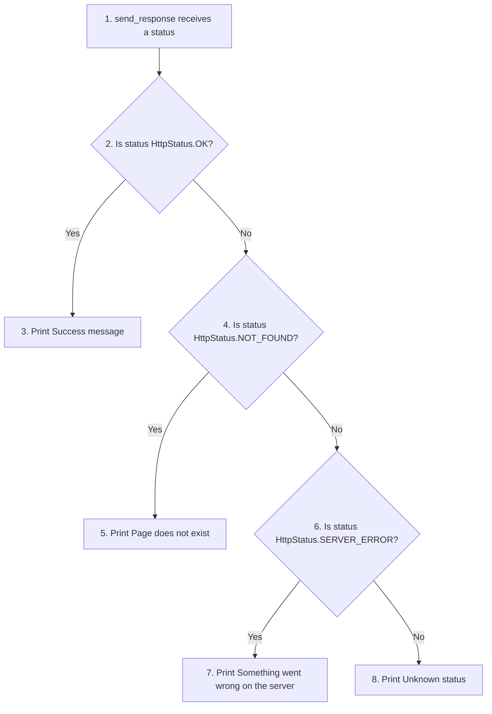

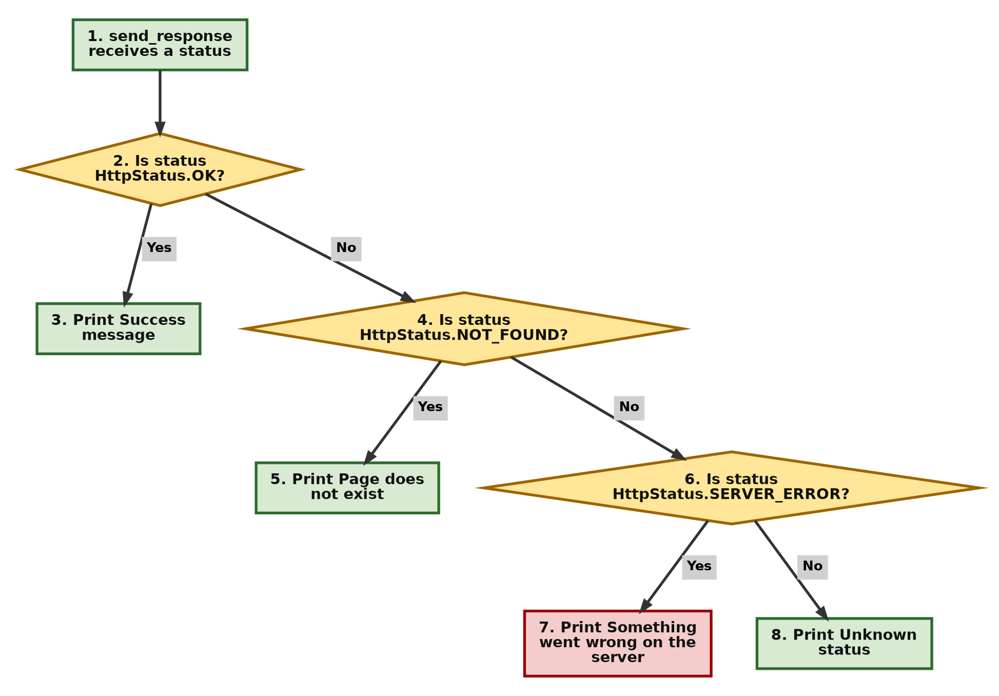

```python
# Step 1 - Import Enum and create the status code class
from enum import Enum

# Create an Enum class for HTTP status codes.
# An Enum allows us to create meaningful names
# instead of using unexplained numbers.
# Without Enum:
#     200  -> What does this mean?
#     404  -> What does this mean?
# With Enum:
#     OK           -> 200
#     NOT_FOUND    -> 404
#     SERVER_ERROR -> 500
class HttpStatus(Enum):
    # Each name is an enum member.
    # The assigned value is the actual HTTP status code.
    OK = 200
    NOT_FOUND = 404
    SERVER_ERROR = 500

# Step 2 - A function that reacts to a status
# The function receives an HttpStatus member.
# It is clearer to pass HttpStatus.OK instead of 200,
# because the meaning is obvious.
def send_response(status):
    # Compare the enum member with each possible member.
    if status == HttpStatus.OK:
        print("Success! Sending data...")
    elif status == HttpStatus.NOT_FOUND:
        print("Error: Page does not exist.")
    elif status == HttpStatus.SERVER_ERROR:
        print("Error: Something went wrong on the server.")
    else:
        print("Unknown status.")

# Step 3 - Call the function using the readable enum name
# Python compares the enum members themselves:
# HttpStatus.NOT_FOUND == HttpStatus.NOT_FOUND is True
send_response(HttpStatus.NOT_FOUND)

# Step 4 - Name, value and lookup
status = HttpStatus.NOT_FOUND
print("Step 4 - Member:", status)
print("Step 4 - Name  :", status.name)
print("Step 4 - Value :", status.value)

# Look up a member from a number, for example a code received from a server
print("Step 4 - HttpStatus(500) is", HttpStatus(500))

# An Enum member is NOT equal to the plain number
print("Step 4 - HttpStatus.NOT_FOUND == 404 ?", HttpStatus.NOT_FOUND == 404)
print("Step 4 - HttpStatus.NOT_FOUND.value == 404 ?", HttpStatus.NOT_FOUND.value == 404)

# Step 5 - A typo is caught straight away
try:
    HttpStatus.NOT_FOUNT
except AttributeError as error:
    print("Step 5 - AttributeError:", error)
```

**Output**

```text
Error: Page does not exist.
Step 4 - Member: HttpStatus.NOT_FOUND
Step 4 - Name  : NOT_FOUND
Step 4 - Value : 404
Step 4 - HttpStatus(500) is HttpStatus.SERVER_ERROR
Step 4 - HttpStatus.NOT_FOUND == 404 ? False
Step 4 - HttpStatus.NOT_FOUND.value == 404 ? True
Step 5 - AttributeError: NOT_FOUNT
```

**Explanation:** `HttpStatus.NOT_FOUND` stands for the number `404`, and you can get that number with `HttpStatus.NOT_FOUND.value`. Using the name makes the code instantly understandable to another developer. If you type `HttpStatus.NOT_FOUNT` by mistake, Python immediately raises an `AttributeError`, so typos are caught at once. A bare number like `4040` would slip through unnoticed.

Notice from Step 4 that an `Enum` member is not equal to its plain number. `HttpStatus.NOT_FOUND == 404` is `False`. If you need members that also behave like integers, Python provides [IntEnum](https://docs.python.org/3/library/enum.html#enum.IntEnum). In fact, the standard library already has a ready-made [http.HTTPStatus](https://docs.python.org/3/library/http.html#http.HTTPStatus) enum built this way.

[Back to the Table of Contents](#table-of-contents)

---

## 6. `dataclasses`

The [dataclasses](https://docs.python.org/3/library/dataclasses.html) module helps you write classes whose main job is to hold data. It writes the routine parts of the class for you.

[Back to the Table of Contents](#table-of-contents)

### 6.1 E-Commerce Product Catalog

**Usage:** You are building an online store. You need an object to represent a product. Writing a full class with `__init__` and `__repr__` for every database record is tedious.

A **decorator** is a line starting with `@` placed just above a function or class. It adds extra behaviour to that function or class. See the [glossary entry for decorator](https://docs.python.org/3/glossary.html#term-decorator).

**How it works**

1. Put `@dataclass` above the class.
2. List the fields with their [type hints](https://docs.python.org/3/library/typing.html) (for example `name: str`).
3. Give defaults where needed. Use `field(default_factory=list)` for a list.
4. Create products. Python has already written the `__init__` method for you.
5. Print the products. Python has already written a readable `__repr__` for you.
6. Compare two products. Python has already written `__eq__` for you.

The table below shows what `@dataclass` writes for you.

| Method | What it does | Without `@dataclass` |
|---|---|---|
| `__init__()` | Sets up a new object with the values you pass | You write `self.name = name` and so on for every field |
| `__repr__()` | Gives a readable text form when you print the object | Printing shows something like `<__main__.Product object at 0x...>` |
| `__eq__()` | Compares two objects field by field | Two objects are equal only if they are the very same object |

```python
# Step 1 - Import dataclass and field
from dataclasses import dataclass, field

# Step 2 - Define the Product class
# @dataclass is a decorator that automatically adds
# useful methods to a class.
# It can automatically create methods such as:
# - __init__()  -> creates objects
# - __repr__()  -> gives a readable print output
# - __eq__()    -> compares objects
# We do not need to write these methods manually.
@dataclass
class Product:
    # These are dataclass fields.
    # Type hints tell us what type of data we expect to store.
    # They are suggestions, not strict rules.
    # Python does not stop you from passing a different type.
    name: str
    price: float

    # A normal default value.
    # If no value for attribute in_stock is provided while creating an object,
    # in_stock will be True.
    in_stock: bool = True

    # A list is a mutable (changeable) object. We should not write:
    # tags: list = []
    # In a normal class, this would make all objects share the same list.
    # A dataclass refuses it and raises a ValueError.
    # default_factory=list means:
    # create a new empty list for every Product object.
    tags: list = field(default_factory=list)

# Step 3 - Create a Product object
# The dataclass automatically creates the constructor:
# Product(name, price, in_stock, tags)
# Here:
# name = "Laptop"
# price = 999.99
# tags = ["electronics", "computer"]
# in_stock is not given, so it uses the default True.
p1 = Product("Laptop", 999.99, tags=["electronics", "computer"])

# Step 4 - Create another Product object
# Here we provide:
# in_stock=False
# so the default value True is replaced.
# tags is not given, so p2 gets its own new empty list.
p2 = Product("Desk", 150.00, in_stock=False)

# Step 5 - Print the objects
# Because of the automatically created __repr__(),
# Python displays the object with field names and values.
print(p1)
print(p2)

# Step 6 - Access fields using attribute names
# p1.name gives: "Laptop"
# p1.tags gives: ["electronics", "computer"]
print(f"Tags for {p1.name}: {p1.tags}")
print(f"Tags for {p2.name}: {p2.tags}")

# Step 7 - Compare objects
# Because of the automatically created __eq__(),
# two products with the same field values are equal.
p3 = Product("Desk", 150.00, in_stock=False)
print("p2 == p3 ?", p2 == p3)
```

**Output**

```text
Product(name='Laptop', price=999.99, in_stock=True, tags=['electronics', 'computer'])
Product(name='Desk', price=150.0, in_stock=False, tags=[])
Tags for Laptop: ['electronics', 'computer']
Tags for Desk: []
p2 == p3 ? True
```

**Explanation:** The `@dataclass` decorator saves us from writing `def __init__(self, name, price, ...)` and the other routine methods. It generates the setup code, the readable text form and the comparison for us. `field(default_factory=list)` makes sure each product gets its own fresh tags list, so `p1` and `p2` never share the same list.

Note that `150.00` is printed as `150.0`. This is only how Python displays a float. The value is the same.

[Back to the Table of Contents](#table-of-contents)

---

## 7. `functools` Module

The [functools](https://docs.python.org/3/library/functools.html) module contains tools that work on functions. Some change how a function behaves, and some take a function as an input to do a bigger job.

[Back to the Table of Contents](#table-of-contents)

### 7.1 `lru_cache`: Simulating a Slow Database

**Usage:** Fetching data from a database over a network takes time. If several parts of your program ask for the profile of "User #42", you don't want to query the database three times.

LRU stands for **Least Recently Used**. An LRU cache remembers recent results. If it gets full, it throws away the result that has gone unused for the longest time.

**How it works**

1. Put `@lru_cache` above a slow function.
2. Call the function with `user_id = 42`. The result is not saved yet, so the function body runs and the slow query happens. The result is then saved.
3. Call the function again with `42`. The saved result is returned at once. The function body does not run.
4. Measure the time for each call to see the difference.
5. Ask the cache for its statistics.

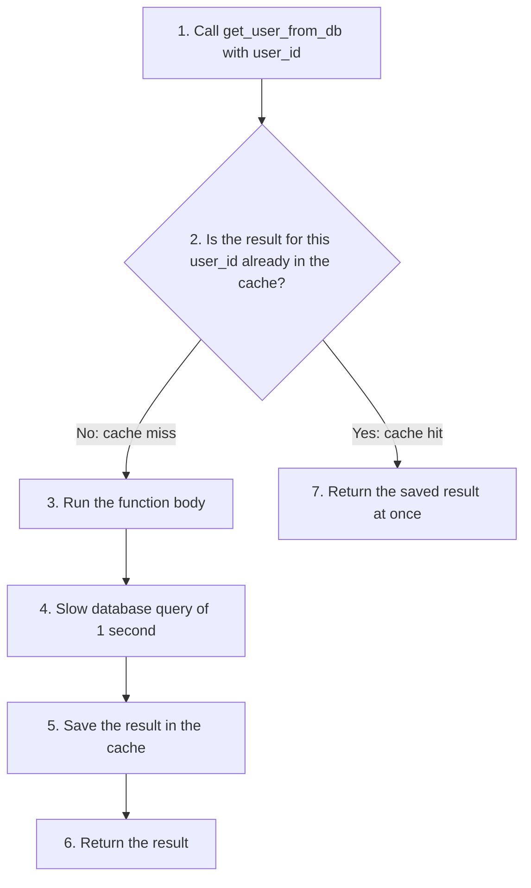

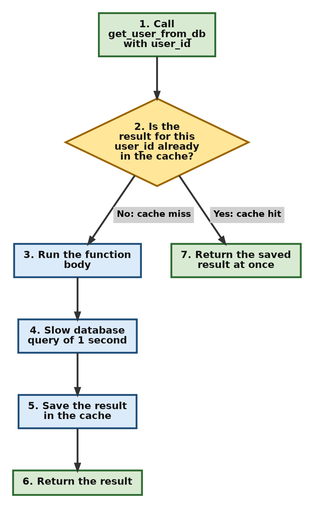

```python
# Step 1 - Import lru_cache and time
from functools import lru_cache
import time

# Step 2 - Define the slow function with a cache
# lru_cache is a decorator that stores the results returned by a function.
# This technique is called memoization.
# If the same function is called again with the same arguments,
# Python returns the saved result instead of running the function again.
# This is useful for expensive operations such as:
# - database queries
# - API calls
# - complex calculations
#
# maxsize=None means: keep all cached results.
# (No limit on number of stored results.)
@lru_cache(maxsize=None)
def get_user_from_db(user_id):
    # This line runs only when the result is not
    # already stored in the cache.
    # If the same user_id is requested again,
    # this function body will be skipped.
    print(f"  -> Querying database for User {user_id}...")

    # Simulate a slow operation.
    # In real life this could be:
    # - reading from a database
    # - calling a web service
    # We wait for 1 second to demonstrate
    # the benefit of caching.
    time.sleep(1)

    # Return the user information.
    # lru_cache stores this returned value
    # along with the input argument (user_id).
    return {
        "id": user_id,
        "name": "Alice"
    }

# Step 3 - Request the same user several times
print("Fetching user 42:")

# First call:
# - user_id = 42 is not in cache
# - function executes
# - database query happens
# - result is stored in cache
start = time.perf_counter()
print(get_user_from_db(42))
print(f"  First call took about {time.perf_counter() - start:.1f} seconds")

# Second call:
# - user_id = 42 already exists in cache
# - function does NOT execute again
# - saved result is returned immediately
start = time.perf_counter()
print(get_user_from_db(42))
print(f"  Second call took about {time.perf_counter() - start:.1f} seconds")

# Third call:
# Same as above.
# No database query.
# Result comes from cache.
start = time.perf_counter()
print(get_user_from_db(42))
print(f"  Third call took about {time.perf_counter() - start:.1f} seconds")

# Step 4 - Look at the cache statistics
# hits   = calls answered from the cache
# misses = calls that had to run the function body
print(get_user_from_db.cache_info())
```

**Output**

```text
Fetching user 42:
  -> Querying database for User 42...
{'id': 42, 'name': 'Alice'}
  First call took about 1.0 seconds
{'id': 42, 'name': 'Alice'}
  Second call took about 0.0 seconds
{'id': 42, 'name': 'Alice'}
  Third call took about 0.0 seconds
CacheInfo(hits=2, misses=1, maxsize=None, currsize=1)
```

The line `-> Querying database for User 42...` appears only once. This proves the function body ran only on the first call. The second and third calls were answered from the cache. (`time.perf_counter()` is a precise clock used for measuring how long something takes. Your timings may differ very slightly.)

**Explanation:** The first call takes 1 second. The next two calls take almost no time because `lru_cache` remembers the output for ID 42. `cache_info()` confirms it: 1 miss (the first call) and 2 hits (the next two calls). In real programs, where the same slow lookups are repeated many times, this one-line decorator can make a very large difference in speed.

Use it only for functions that always return the same result for the same input. If the user's data in the database can change, the cache would keep returning the old copy.

[Back to the Table of Contents](#table-of-contents)

### 7.2 `partial`: Pre-filling Log Levels

**Usage:** You have a logging function that takes a message and a severity level. You find yourself typing `log_message("message", "ERROR")` over and over. You can use `partial` to create a dedicated `log_error` function.

**How it works**

1. Write a normal function that takes a message and a level.
2. Use `partial()` to make a new function with `level` already set to `"ERROR"`.
3. Call the new function with only the message.
4. Make another pre-filled function for warnings in the same way.

```python
# Step 1 - Import partial and write the normal function
from functools import partial

# log_message() is a normal function that accepts two arguments:
#     message -> the text we want to display
#     level   -> the type/importance of the message
# Example:
# log_message("Server started", "INFO")
def log_message(message, level):
    # upper() converts the level text to uppercase.
    # Example: "error" becomes "ERROR"
    print(f"[{level.upper()}] {message}")

# The normal way: both arguments every time
log_message("Server started", "INFO")

# Step 2 - Create a pre-filled function
# partial() creates a new function from an existing function.
# Here we fix (pre-fill) the value of:
# level = "ERROR"
# The original function:
# log_message(message, level)
# becomes:
# log_error(message)
# because the level is already decided.
# partial() does not call the function immediately.
# It creates a new function object.
log_error = partial(log_message, level="ERROR")

# Step 3 - Call it with only the message
# Now we only need to provide the remaining argument:
# message
# Internally this becomes:
# log_message("Database connection failed!", level="ERROR")
log_error("Database connection failed!")

# Same idea:
# level is automatically "ERROR"
# only the message changes.
log_error("File not found!")

# Step 4 - Another pre-filled function
log_warning = partial(log_message, level="warning")
log_warning("Disk space is running low.")
```

**Output**

```text
[INFO] Server started
[ERROR] Database connection failed!
[ERROR] File not found!
[WARNING] Disk space is running low.
```

**Explanation:** `partial` takes a function and "freezes" some of its arguments. `log_error` is now a brand new function that only needs one argument (`message`). It passes `level="ERROR"` to `log_message` behind the scenes. The original `log_message` function is not changed and can still be used as before.

[Back to the Table of Contents](#table-of-contents)

### 7.3 `reduce`: Calculating Shopping Cart Total

**Usage:** You have a list of dictionary items in a shopping cart, and you need to calculate the grand total.

**How it works**

1. Store the cart as a list of dictionaries.
2. Give `reduce()` three things: a small function that adds one price to a running total, the cart, and a starting value of `0`.
3. `reduce()` walks through the cart, updating the running total at each item.
4. Print the final total.

A **lambda** is a small function written in one line without a name. `lambda acc, item: acc + item["price"]` means "take the running total `acc` and an `item`, and return the total plus the item's price". See [lambda expressions](https://docs.python.org/3/tutorial/controlflow.html#lambda-expressions).

The table below traces how the running total (`acc`) builds up.

| Round | `acc` before | `item` | `item["price"]` | `acc` after |
|---|---|---|---|---|
| 1 | 0 | Book | 15.99 | 15.99 |
| 2 | 15.99 | Pen | 2.50 | 18.49 |
| 3 | 18.49 | Notebook | 5.00 | 23.49 |

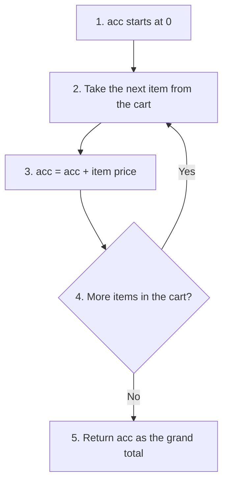

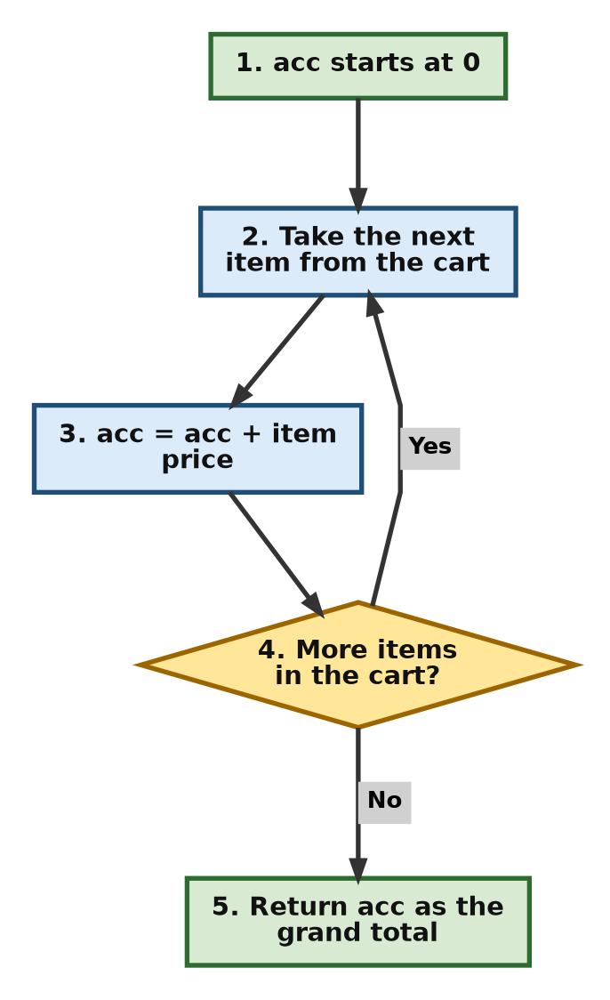

```python
# Step 1 - Import reduce and create the cart
from functools import reduce

cart = [
    {"item": "Book", "price": 15.99},
    {"item": "Pen", "price": 2.50},
    {"item": "Notebook", "price": 5.00}
]

# Step 2 - Add up the prices with reduce()
# reduce(function, sequence, starting_value)
#   function       -> lambda acc, item: acc + item["price"]
#                     acc is the running total so far
#                     item is the current dictionary from the cart
#   sequence       -> cart
#   starting_value -> 0 (the total before any item is added)
total = reduce(lambda acc, item: acc + item["price"], cart, 0)

# Step 3 - Print the grand total
# :.2f shows the number with exactly 2 digits after the decimal point.
print(f"Grand Total: ${total:.2f}")

# Step 4 - The same total with sum(), for comparison
total_with_sum = sum(item["price"] for item in cart)
print(f"Grand Total using sum(): ${total_with_sum:.2f}")
```

**Output**

```text
Grand Total: $23.49
Grand Total using sum(): $23.49
```

**Explanation:** `reduce` starts with `0` (the third argument). It takes the first item's price and adds it to 0. It then takes that result, adds the second item's price, and so on, collapsing the whole list into one single float value.

For a simple total like this, `sum()` (Step 4) is shorter and easier to read, and most Python programmers would use it. `reduce` becomes useful when the way you combine items is more than simple adding, for example when applying a series of discounts one after another.

The `:.2f` in the print statement matters here. Computers store decimal prices in binary, so the raw total is actually `23.490000000000002`. Formatting to two decimal places hides this tiny difference. For real money calculations, Python offers the [decimal](https://docs.python.org/3/library/decimal.html) module, which avoids the problem.

[Back to the Table of Contents](#table-of-contents)

---

## 8. `itertools` Module

The [itertools](https://docs.python.org/3/library/itertools.html) module offers fast tools for looping. Most of them return an [iterator](https://docs.python.org/3/glossary.html#term-iterator), which produces one item at a time when asked, instead of building a whole list in memory.

[Back to the Table of Contents](#table-of-contents)

### 8.1 `chain`: Flattening 2D Data

**Usage:** You have a matrix (a list of lists) or several separate data streams, and you just want to loop through all the numbers in one continuous loop without creating a big new list in memory.

**Flattening** means turning a list of lists into one single sequence of items.

**How it works**

1. Store the matrix as a list of three rows.
2. Pass it to `chain.from_iterable()`.
3. Loop over the result. It gives the numbers of row 1, then row 2, then row 3.
4. Use `chain()` directly when you have separate lists instead of a list of lists.

```python
# Step 1 - Import chain and create the matrix
from itertools import chain

# A 2-dimensional list (list of lists).
# Each inner list represents a row.
# Think of it like a table:
# Row 1:  1  2  3
# Row 2:  4  5  6
# Row 3:  7  8  9
matrix = [
    [1, 2, 3],
    [4, 5, 6],
    [7, 8, 9]
]

# Step 2 - Loop through all numbers as one sequence
# chain.from_iterable() combines multiple iterables into one sequence.
# Here the iterable is: matrix
# which contains:
# [1,2,3]
# [4,5,6]
# [7,8,9]
# It takes items from the first list, then the second list, then the third list.
# Resulting sequence:
# 1 2 3 4 5 6 7 8 9
# It does not create a new list.
# It returns an iterator that gives values one by one.
for num in chain.from_iterable(matrix):
    # Each value produced by the iterator is printed.
    # end=" " keeps the output on the same line with spaces between numbers.
    print(num, end=" ")

# Move to a new line after the loop
print()

# Step 3 - chain() with separate lists
# When the lists are separate variables, pass them directly to chain().
morning_orders = ["Tea", "Toast"]
evening_orders = ["Soup", "Salad"]
print(list(chain(morning_orders, evening_orders)))
```

**Output**

```text
1 2 3 4 5 6 7 8 9 
['Tea', 'Toast', 'Soup', 'Salad']
```

**Explanation:** `chain.from_iterable` takes an iterable of iterables (a list of lists) and links them together. It yields `1, 2, 3, 4...` one by one. It is very memory efficient because it never builds the flattened list in memory. In Step 3 we wrapped `chain()` in `list()` only so that the result could be printed in one go.

[Back to the Table of Contents](#table-of-contents)

### 8.2 `groupby`: Grouping Transactions by Month

**Usage:** You have a list of bank transactions sorted by date. You want to print a summary showing all transactions that happened in January, then February, and so on.

**How it works**

1. Keep the transactions in a list, already in month order.
2. Tell `groupby()` to use the month (the first value of each tuple) as the key.
3. `groupby()` walks along the list and starts a new group each time the month changes.
4. For each group, print the month and the list of expense names.
5. See what goes wrong if the data is not sorted, and how sorting fixes it.

```python
# Step 1 - Import groupby and create the transactions
from itertools import groupby

# groupby() groups consecutive items that have the same key.
# IMPORTANT:
# The data should be sorted by the same value that we are using for grouping.
# Here we want to group by month, so all transactions of the same month should be together.
transactions = [
    ("Jan", "Coffee"),
    ("Jan", "Gas"),
    ("Feb", "Rent"),
    ("Feb", "Groceries"),
    ("Mar", "Electricity")
]

# Step 2 - Group by month and print
# groupby() returns pairs:
# (key, group_iterator)
# key:
#     The value used for grouping.
# items:
#     An iterator containing all items belonging to that group.
# The lambda function:
# lambda t: t[0]
# means:
# take each transaction tuple and use
# its first element (month) as the key.
# Example:
# ("Jan", "Coffee") -> "Jan"
# ("Feb", "Rent")   -> "Feb"
for month, items in groupby(transactions, key=lambda t: t[0]):
    # items is an iterator containing transactions of the current month.
    # Example:
    # For January:
    # [
    #   ("Jan", "Coffee"),
    #   ("Jan", "Gas")
    # ]
    # The list comprehension extracts only
    # the expense names (second value).
    # item[1] gives:
    # Coffee
    # Gas
    print(f"{month}: {[item[1] for item in items]}")

# Step 3 - What happens with unsorted data
mixed = [("Jan", "Coffee"), ("Feb", "Rent"), ("Jan", "Gas")]
print("Unsorted data:")
for month, items in groupby(mixed, key=lambda t: t[0]):
    print(f"  {month}: {[item[1] for item in items]}")

# Step 4 - Sort first, then group
# sorted() with the same key puts all same-month items next to each other.
# (Month names sort alphabetically here, so Feb comes before Jan.)
print("Sorted first:")
for month, items in groupby(sorted(mixed, key=lambda t: t[0]), key=lambda t: t[0]):
    print(f"  {month}: {[item[1] for item in items]}")
```

**Output**

```text
Jan: ['Coffee', 'Gas']
Feb: ['Rent', 'Groceries']
Mar: ['Electricity']
Unsorted data:
  Jan: ['Coffee']
  Feb: ['Rent']
  Jan: ['Gas']
Sorted first:
  Feb: ['Rent']
  Jan: ['Coffee', 'Gas']
```

**Explanation:** The `key` function tells `groupby` to look at index 0 (the month). It groups neighbouring items with the same month together, so we can print a clean summary without writing our own `if/else` logic to track when the month changes.

Step 3 shows the most common mistake with `groupby`. It only groups items that are **next to each other**. In the unsorted list, "Jan" appears twice as two separate groups because "Feb" sits between them. Sorting by the same key first, as in Step 4, fixes this.

[Back to the Table of Contents](#table-of-contents)

### 8.3 `product`: Combination Lock Generator

**Usage:** You are building a security tool or a puzzle game, and you need to generate every possible combination of a 2-dial lock, where each dial has numbers 0 through 2.

**How it works**

1. List the numbers on one dial: 0, 1 and 2.
2. Ask `product()` for every pair, using the dial list twice (`repeat=2`).
3. Count the combinations and print them.

The grid below shows all 9 combinations. Each row is a value of the first dial and each column is a value of the second dial.

| First dial \ Second dial | 0 | 1 | 2 |
|---|---|---|---|
| **0** | (0, 0) | (0, 1) | (0, 2) |
| **1** | (1, 0) | (1, 1) | (1, 2) |
| **2** | (2, 0) | (2, 1) | (2, 2) |

```python
# Step 1 - Import product and list the dial numbers
from itertools import product

dials = [0, 1, 2]

# Step 2 - Generate all possible (dial1, dial2) combinations
# repeat=2 means: use the dials list for two positions.
# This is the same as product(dials, dials).
# product() returns an iterator, so list() collects all results.
combinations = list(product(dials, repeat=2))

# Step 3 - Show how many there are, then list them
print(f"Total combinations: {len(combinations)}")
for combo in combinations:
    print(combo, end=" ")
print()

# Step 4 - The same result with two nested for loops
nested = []
for first in dials:
    for second in dials:
        nested.append((first, second))
print("Same as nested loops?", nested == combinations)
```

**Output**

```text
Total combinations: 9
(0, 0) (0, 1) (0, 2) (1, 0) (1, 1) (1, 2) (2, 0) (2, 1) (2, 2) 
Same as nested loops? True
```

**Explanation:** `product` acts like a set of nested `for` loops, as Step 4 confirms. `repeat=2` tells it to combine the `dials` list with itself. The result is known in mathematics as the [Cartesian product](https://en.wikipedia.org/wiki/Cartesian_product). With 3 choices on each of 2 dials, there are 3 x 3 = 9 combinations. A real 4-dial lock with digits 0 to 9 would have 10 x 10 x 10 x 10 = 10,000 combinations, which you could produce with `product(range(10), repeat=4)`.

[Back to the Table of Contents](#table-of-contents)

### 8.4 `permutations`: Seating Arrangements

**Usage:** You have 3 friends coming to dinner, and your table has 3 distinct chairs. You want to know all the possible ways they can sit down.

A **permutation** is one possible ordering of a set of items.

**How it works**

1. List the friends.
2. Ask `permutations()` for every possible order.
3. Count the arrangements and print each one.
4. See what happens if only 2 chairs are available.

```python
# Step 1 - Import permutations and list the friends
from itertools import permutations

# A list of people who need to be arranged.
# We want to find all possible seating orders for these friends.
friends = [
    "Alice",
    "Bob",
    "Charlie"
]

# Step 2 - Generate every seating order
# permutations() creates all possible arrangements of the given items.
# Important: In permutations, the order matters.
# Example: ("Alice", "Bob", "Charlie") is different from ("Bob", "Alice", "Charlie")
# because the seating order has changed.
# permutations() returns an iterator, so we convert it to a list to store all results.
seating_charts = list(permutations(friends))

# Step 3 - Count and print the arrangements
# len(seating_charts) gives the number of arrangements found.
# For 3 people: 3 x 2 x 1 = 6 arrangements
# (3 choices for seat 1, then 2 left for seat 2, then 1 left for seat 3).
# This is called 3 factorial, written 3!.
print(f"Total seating arrangements: {len(seating_charts)}")

# Loop through every possible arrangement.
# Each arrangement is a tuple representing one possible seating order.
# Example: ('Alice', 'Bob', 'Charlie')
# means:
# Seat 1 -> Alice
# Seat 2 -> Bob
# Seat 3 -> Charlie
for arrangement in seating_charts:
    print(arrangement)

# Step 4 - Only 2 chairs available
# The second argument says how many items to pick for each arrangement.
# For 2 chairs: 3 x 2 = 6 arrangements
two_chairs = list(permutations(friends, 2))
print(f"With only 2 chairs: {len(two_chairs)} arrangements")
print(two_chairs)
```

**Output**

```text
Total seating arrangements: 6
('Alice', 'Bob', 'Charlie')
('Alice', 'Charlie', 'Bob')
('Bob', 'Alice', 'Charlie')
('Bob', 'Charlie', 'Alice')
('Charlie', 'Alice', 'Bob')
('Charlie', 'Bob', 'Alice')
With only 2 chairs: 6 arrangements
[('Alice', 'Bob'), ('Alice', 'Charlie'), ('Bob', 'Alice'), ('Bob', 'Charlie'), ('Charlie', 'Alice'), ('Charlie', 'Bob')]
```

**Explanation:** Unlike `product`, `permutations` doesn't allow an item to be used more than once in the same arrangement, and order matters (Alice-Bob-Charlie is different from Charlie-Bob-Alice). For `n` items it generates all `n!` ([n factorial](https://en.wikipedia.org/wiki/Factorial)) arrangements. The number grows very fast. For 10 friends there would be 3,628,800 arrangements.

| Tool | Can an item repeat? | Does order matter? | Count for items [0, 1, 2], picking 2 |
|---|---|---|---|
| `product(items, repeat=2)` | Yes | Yes | 9 |
| `permutations(items, 2)` | No | Yes | 6 |
| `combinations(items, 2)` | No | No | 3 |

The last row, [combinations](https://docs.python.org/3/library/itertools.html#itertools.combinations), is another `itertools` tool. Use it when you only care about *who* is chosen, not the order, such as picking 2 team captains from 3 players.

[Back to the Table of Contents](#table-of-contents)

---

## 9. Check Your Understanding

Try to answer each question yourself before reading the answer.

**Q1. In the `Counter` example, what would `counts.most_common(1)` return?**

Answer:

1. `most_common(n)` returns the `n` items with the highest counts, as a list of `(item, count)` pairs.
2. The highest count is 3, for code `'404'`.
3. So it returns a list with one pair: `[('404', 3)]`.

**Q2. In the `deque` example, what would the history be if `maxlen` were 2?**

Answer: The deque would keep only the last 2 commands. After all five commands it would hold `['mkdir new_folder', 'ls -l']`.

**Q3. In the `ChainMap` example, what does `config['difficulty']` return, and why?**

Answer:

1. Python first looks in `user_prefs`. The key `difficulty` is not there.
2. It then looks in `defaults` and finds `"normal"`.
3. So it returns `'normal'`.

**Q4. Why does the heap list print as `[1, 3, 2]` (by priority) and not `[1, 2, 3]`?**

Answer: A heap only guarantees that the smallest item is at index 0. The other items are arranged just enough to make the next `heappop` fast. They are not fully sorted. When you pop items one by one, they still come out in the correct order.

**Q5. What does `bisect.bisect_left([40, 55, 70, 80, 95], 70)` return? What about `bisect.bisect_right` with the same arguments?**

Answer:

1. `70` is already in the list at index 2.
2. `bisect_left` returns the position **before** any equal items, so it returns `2`.
3. `bisect_right` returns the position **after** any equal items, so it returns `3`.

**Q6. You call `log_error("Disk full", "INFO")` using the `partial` function from Section 7.2. What happens?**

Answer:

1. `"Disk full"` goes into `message` and `"INFO"` goes into `level` by position.
2. But `partial` has already supplied `level="ERROR"` as a keyword.
3. Python now has two values for `level`, so it raises `TypeError: log_message() got multiple values for argument 'level'`.
4. To override the level, pass it by name instead: `log_error("Disk full", level="INFO")`. This prints `[INFO] Disk full`.

**Q7. Is `HttpStatus.OK == 200` true or false for the `Enum` in Section 5.1?**

Answer: False. An `Enum` member is a separate object, not a plain number. `HttpStatus.OK.value == 200` is true. If you want the member itself to compare equal to 200, use `IntEnum` instead of `Enum`.

**Q8. In the `lru_cache` example, what would `cache_info()` show if we then called `get_user_from_db(7)` once?**

Answer: User 7 is not in the cache, so this is a miss and the function body runs. The misses go up to 2, and the cache now holds 2 results: `CacheInfo(hits=2, misses=2, maxsize=None, currsize=2)`.

**Q9. How many seating arrangements are there for 4 friends and 4 chairs?**

Answer: 4 x 3 x 2 x 1 = 24. `len(list(permutations(["A", "B", "C", "D"])))` returns `24`.

[Back to the Table of Contents](#table-of-contents)

---

## 10. Summary

- The standard library already contains well-tested tools for many everyday problems. Reach for them before writing your own.
- `Counter` counts, `deque` keeps the latest few items, `defaultdict` groups without key checks, `OrderedDict` lets you reorder, `namedtuple` names tuple positions and `ChainMap` searches layered dictionaries.
- `heapq` always gives you the smallest item first. The list is not fully sorted.
- `bisect` finds positions in a sorted list quickly using binary search. The list must be sorted.
- `Queue`, `LifoQueue` and `PriorityQueue` are thread-safe versions of first-in-first-out, last-in-first-out and priority ordering.
- `Enum` gives readable, typo-proof names to fixed values. Use `.name` and `.value` to get the parts.
- `@dataclass` writes `__init__`, `__repr__` and `__eq__` for you. Use `field(default_factory=list)` for list fields.
- `lru_cache` remembers results, `partial` pre-fills arguments and `reduce` folds a list into one value.
- `chain` loops through many lists as one, `groupby` groups neighbouring items (sort first), `product` gives every combination with repetition and `permutations` gives every ordering.

[Back to the Table of Contents](#table-of-contents)

---

