# Chapter 16: Python Libraries for Data Structures and Algorithms

This page contains the answers to the conceptual questions printed at the end of Chapter 16 of the book. The questions themselves are in the book. The answers, with extra explanation, scripts, tables and flowcharts, are here.

Chapter 16 covers two closely linked ideas. The first is **algorithms**: step-by-step methods for common jobs such as searching a list or sorting it. You will meet linear search, binary search, bubble sort, insertion sort and selection sort, and you will learn how to judge their speed using **Big-O notation**. The second is Python's **Standard Library**: the ready-made modules that come with every Python installation, such as `collections`, `heapq`, `bisect`, `queue`, `functools`, `itertools`, `enum`, `dataclasses`, `pickle` and `json`. These modules give you well-tested versions of the data structures and algorithms discussed in the chapter, so in real programs you rarely need to write them yourself.

Why does this matter? A program that works on 100 items can become painfully slow on 1,000,000 items if it uses the wrong method. Knowing how an algorithm behaves, and knowing which library tool already solves the problem well, is what separates code that merely runs from code that runs well.

**How to use this page**

- Each question is given first, exactly as printed in the book, followed by its answer.
- Longer answers are broken into numbered steps that you can follow one at a time.
- Scripts include `# Step` comments and print statements. The output of each script is shown just below it.
- Technical words are explained briefly where they first appear, often with a link to the official [Python documentation](https://docs.python.org/3/) for more detail.
- All scripts were tested with Python 3.11. Where a feature needs a newer version, this is mentioned.

---

## Table of Contents

- [Big-O Notation in Brief](#big-o-notation-in-brief)
- [Conceptual Questions with Answers](#conceptual-questions-with-answers)
  - [Q1. Linear Search vs Binary Search](#q1-linear-search-vs-binary-search)
  - [Q2. Bubble Sort and Its Comparison Count](#q2-bubble-sort-and-its-comparison-count)
  - [Q3. Insertion Sort](#q3-insertion-sort)
  - [Q4. Why pop(0) on a List Is a Performance Trap](#q4-why-pop0-on-a-list-is-a-performance-trap)
  - [Q5. Counter, defaultdict and ChainMap](#q5-counter-defaultdict-and-chainmap)
  - [Q6. namedtuple vs dataclass](#q6-namedtuple-vs-dataclass)
  - [Q7. The heapq Module and Min-Heaps](#q7-the-heapq-module-and-min-heaps)
  - [Q8. The bisect Module](#q8-the-bisect-module)
  - [Q9. The queue Module vs collections.deque](#q9-the-queue-module-vs-collectionsdeque)
  - [Q10. lru_cache and Memoisation](#q10-lru_cache-and-memoisation)
  - [Q11. functools.partial()](#q11-functoolspartial)
  - [Q12. itertools Functions Compared](#q12-itertools-functions-compared)
  - [Q13. Why OrderedDict Still Exists](#q13-why-ordereddict-still-exists)
  - [Q14. The enum Module and Magic Numbers](#q14-the-enum-module-and-magic-numbers)
  - [Q15. How reduce() Works](#q15-how-reduce-works)
  - [Q16. pickle vs json](#q16-pickle-vs-json)
  - [Q17. Selection Sort](#q17-selection-sort)
  - [Q18. namedtuple in Depth](#q18-namedtuple-in-depth)
  - [Q19. Timing Code with time.perf_counter()](#q19-timing-code-with-timeperf_counter)
  - [Q20. The API and the Standard Library](#q20-the-api-and-the-standard-library)


---

## Big-O Notation in Brief

Many answers on this page use Big-O notation, so here is a short reminder before we begin.

**Big-O notation** describes how the work done by an algorithm grows as the amount of data grows. The letter `n` stands for the number of items. Big-O ignores small details and fixed constants and keeps only the part that matters most when `n` becomes very large. You can read more in the Wikipedia article on [Big O notation](https://en.wikipedia.org/wiki/Big_O_notation).

| Notation | Name | What it means in plain words | Example from this chapter |
|---|---|---|---|
| `O(1)` | Constant time | The work stays the same, however big the data | `deque.popleft()`, reading `my_list[5]` |
| `O(log n)` | Logarithmic time | The work grows very slowly. Doubling the data adds just one more step | Binary search, `bisect_left()` |
| `O(n)` | Linear time | The work grows in step with the data. Double the data, double the work | Linear search, `list.pop(0)` |
| `O(n log n)` | Linearithmic time | A little more than linear | Python's built-in `sorted()` and `list.sort()` |
| `O(n²)` | Quadratic time | Double the data and the work becomes four times as large | Bubble sort, insertion sort, selection sort |
| `O(2ⁿ)` | Exponential time | Each extra item roughly doubles the work | Naive recursive Fibonacci (upper bound) |

The table below shows how many steps each one needs for a few sizes of data. The numbers are rounded.

| n | O(1) | O(log n) | O(n) | O(n log n) | O(n²) |
|---|---|---|---|---|---|
| 10 | 1 | 3 | 10 | 33 | 100 |
| 1,000 | 1 | 10 | 1,000 | 9,966 | 1,000,000 |
| 1,000,000 | 1 | 20 | 1,000,000 | 19,931,569 | 1,000,000,000,000 |

[Back to the Table of Contents](#table-of-contents)

---

## Conceptual Questions with Answers

*Questions: printed in book | Answers: available in this online resource*

[Back to the Table of Contents](#table-of-contents)

---

### Q1. Linear Search vs Binary Search

**Q1. Linear vs Binary Search: prerequisites, complexity, and trade-offs.**

**(a) What prerequisite does binary search need that linear search does not?**

**(b) Why is binary search O(log n)? Show with numbers: 1,000 items vs 1,000,000 items.**

**(c) If data changes frequently, is binary search always the better choice? Why/why not?**

#### Answer to Q1 (a): The prerequisite

Binary search requires the list to be **sorted** before the search begins. Linear search works on any list, sorted or unsorted, because it checks every item one by one without making any assumptions about order. This makes linear search usable everywhere, but slower for large datasets.

Why does binary search need sorted data? Binary search looks at the middle item and then decides to throw away either the left half or the right half. That decision is only correct if all smaller items are on the left and all larger items are on the right. On an unsorted list, the item you want could be in the half that was thrown away.

[Back to the Table of Contents](#table-of-contents)

#### Answer to Q1 (b): Why binary search is O(log n)

Binary search is `O(log n)` because after every comparison it discards half of the remaining search space. Follow the steps:

1. Start with `n` items.
2. After 1 comparison, about `n/2` items remain.
3. After 2 comparisons, about `n/4` items remain.
4. After 3 comparisons, about `n/8` items remain.
5. After `k` comparisons, about `n/2ᵏ` items remain.
6. The search ends when only 1 item remains, that is when `n/2ᵏ = 1`.
7. This means `2ᵏ = n`, so `k = log₂(n)`.

Here `log₂(n)` (read as "log to the base 2 of n") simply answers the question: "How many times must I halve `n` to get down to 1?" See [binary logarithm](https://en.wikipedia.org/wiki/Binary_logarithm).

Now the numbers:

- For 1,000 items: `log₂(1000)` is about 9.97, so about **10 comparisons**.
- For 1,000,000 items: `log₂(1,000,000)` is about 19.93, so about **20 comparisons**.

The data grew a thousand times, but the work only doubled. Each time the data doubles, binary search needs just one more comparison. The growth is extremely slow.

The table shows how 1,000 items shrink with each comparison.

| Comparison number | Items still left to search (about) |
|---|---|
| 0 (start) | 1,000 |
| 1 | 500 |
| 2 | 250 |
| 3 | 125 |
| 4 | 63 |
| 5 | 32 |
| 6 | 16 |
| 7 | 8 |
| 8 | 4 |
| 9 | 2 |
| 10 | 1 |

The flowchart shows the logic of binary search.

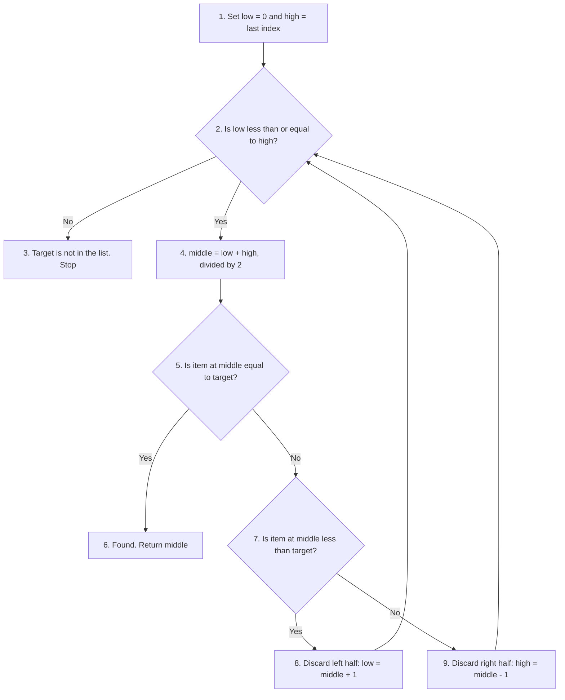
```mermaid
flowchart TD
    A["1. Set low = 0 and high = last index"] --> B{"2. Is low less than or equal to high?"}
    B -- "No" --> C["3. Target is not in the list. Stop"]
    B -- "Yes" --> D["4. middle = low + high, divided by 2"]
    D --> E{"5. Is item at middle equal to target?"}
    E -- "Yes" --> F["6. Found. Return middle"]
    E -- "No" --> G{"7. Is item at middle less than target?"}
    G -- "Yes" --> H["8. Discard left half: low = middle + 1"]
    G -- "No" --> I["9. Discard right half: high = middle - 1"]
    H --> B
    I --> B
```

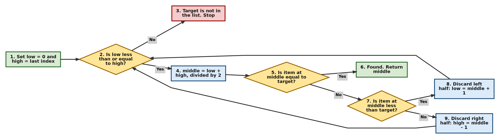

The script below counts the comparisons made by both methods, so you can see the difference for yourself.

```python
"""
Count how many comparisons linear search and binary search need.
We search for the LAST item, which is the worst case for linear search.
"""

# Step 1 - Linear search: check items one by one
def linear_search(items, target):
    comparisons = 0
    for index, value in enumerate(items):
        comparisons += 1
        if value == target:
            return index, comparisons
    return -1, comparisons

# Step 2 - Binary search: halve the search area each time
def binary_search(items, target):
    low, high = 0, len(items) - 1
    comparisons = 0
    while low <= high:
        middle = (low + high) // 2      # // is whole-number division
        comparisons += 1
        if items[middle] == target:
            return middle, comparisons
        elif items[middle] < target:
            low = middle + 1            # target must be in the right half
        else:
            high = middle - 1           # target must be in the left half
    return -1, comparisons

# Step 3 - Try both searches on two list sizes
for size in (1_000, 1_000_000):
    data = list(range(size))            # a sorted list: 0, 1, 2, ...
    target = size - 1                   # the last item

    _, linear_count = linear_search(data, target)
    _, binary_count = binary_search(data, target)

    print(f"List of {size:,} items:")
    print(f"  Linear search comparisons: {linear_count:,}")
    print(f"  Binary search comparisons: {binary_count}")
```

**Output**

```text
List of 1,000 items:
  Linear search comparisons: 1,000
  Binary search comparisons: 10
List of 1,000,000 items:
  Linear search comparisons: 1,000,000
  Binary search comparisons: 20
```

Binary search needed 10 comparisons for 1,000 items and 20 for 1,000,000 items, exactly as the formula predicts.

[Back to the Table of Contents](#table-of-contents)

#### Answer to Q1 (c): When data changes frequently

Not necessarily. Think it through in steps:

1. Binary search only works on sorted data.
2. If data changes frequently (items are added, removed or edited regularly), the sorted order can be broken.
3. If the list must be fully sorted again before each search, that sort costs `O(n log n)` with Python's built-in [Timsort](https://en.wikipedia.org/wiki/Timsort) algorithm.
4. A single linear search costs only `O(n)`. So "sort, then binary search" (`O(n log n)` + `O(log n)`) can easily be **slower** than just doing a linear search.

So what are the options?

| Situation | Sensible choice | Why |
|---|---|---|
| Data rarely changes, many searches | Sort once, then use binary search | The sorting cost is paid once and shared across all the searches |
| Data changes after almost every search | Linear search `O(n)` | Avoids repeated sorting |
| New items keep arriving, many searches | Keep the list sorted as you go with `bisect.insort()` | Finding the position is `O(log n)`. The insert itself is `O(n)` because later items shift, but there is no full re-sort |
| Very large data with heavy inserts and searches | A structure that stays sorted, such as a balanced binary search tree, or simply a `set` or `dict` if you only need "is it there?" | Python's standard library has no balanced tree, but the third-party [sortedcontainers](https://grantjenks.com/docs/sortedcontainers/) package provides one. A `set` or `dict` answers membership in `O(1)` on average |

A **balanced binary search tree** (BST) is a tree-shaped structure that keeps items in order and stays evenly shaped, so adding, removing and searching all take about `O(log n)`. See [self-balancing binary search tree](https://en.wikipedia.org/wiki/Self-balancing_binary_search_tree).

[Back to the Table of Contents](#table-of-contents)

#### Follow-up questions on searching

**Q1.1 Can binary search be used on a Python `set`?**

No. A `set` has no order and no index positions, so there is no "middle item". But you do not need it: checking `x in my_set` is already `O(1)` on average.

**Q1.2 A sorted list has 1,048,576 items (that is 2²⁰). What is the largest number of comparisons binary search could need?**

About 21. Halving 1,048,576 twenty times leaves 1 item, and one final comparison checks it. In general, the worst case is `floor(log₂(n)) + 1` comparisons.

[Back to the Table of Contents](#table-of-contents)

---

### Q2. Bubble Sort and Its Comparison Count

**Q2. Bubble Sort mechanics and the O(n²) derivation - explain the two loops, derive the total comparison formula, and state when O(n) is achievable.**

#### Answer to Q2: The two loops

Bubble sort uses two nested loops because it has two separate jobs. The **outer loop** controls how many passes are made through the list. The **inner loop** does the actual work: comparing each neighbouring pair and swapping them if they are in the wrong order.

**Outer loop: `for pass_no in range(n - 1)`**

After each complete pass, the largest remaining item has "bubbled" up to its final position at the right end. So the total number of passes needed is `n - 1`. The last item automatically falls into place, because once every other item is in position, there is nowhere else for it to go.

**Inner loop: `for i in range(n - pass_no - 1)`**

After each pass, the rightmost `pass_no` items are already sorted and never need to be compared again. So the inner loop shrinks by one each time.

Here is one pass on the list `[5, 1, 4, 2, 8]`:

| Comparison | Pair compared | Swap? | List after |
|---|---|---|---|
| 1 | 5 and 1 | Yes | `[1, 5, 4, 2, 8]` |
| 2 | 5 and 4 | Yes | `[1, 4, 5, 2, 8]` |
| 3 | 5 and 2 | Yes | `[1, 4, 2, 5, 8]` |
| 4 | 5 and 8 | No | `[1, 4, 2, 5, 8]` |

After this first pass, the largest value, 8, is in its final place at the right end.

[Back to the Table of Contents](#table-of-contents)

#### Deriving the total number of comparisons

1. Pass 0 makes `n - 1` comparisons.
2. Pass 1 makes `n - 2` comparisons.
3. Pass 2 makes `n - 3` comparisons.
4. This continues until the last pass, which makes 1 comparison.
5. Total = `(n - 1) + (n - 2) + (n - 3) + ... + 1`.
6. This is the sum of the whole numbers from 1 to `n - 1`. That sum equals `n(n - 1)/2`. (Pair the first and last terms: `(n - 1) + 1 = n`, and there are `(n - 1)/2` such pairs. See [triangular numbers](https://en.wikipedia.org/wiki/Triangular_number).)
7. So Total = `n(n - 1)/2` = `(n² - n)/2`.
8. In Big-O notation, only the dominant (fastest-growing) term matters, and constants such as `1/2` are dropped. So bubble sort is `O(n²)`.

For example, with `n = 5`: `4 + 3 + 2 + 1 = 10`, and the formula gives `5 × 4 / 2 = 10`.

[Back to the Table of Contents](#table-of-contents)

#### When O(n) is achievable

Only with the **optimised** version that includes an `is_swapped` flag. If a complete pass produces zero swaps, the list is already sorted and the outer loop exits immediately. For an already-sorted list this needs only one pass of `n - 1` comparisons, which is `O(n)`. The basic version without the flag always does all `n(n - 1)/2` comparisons, so it is always `O(n²)` regardless of input order.

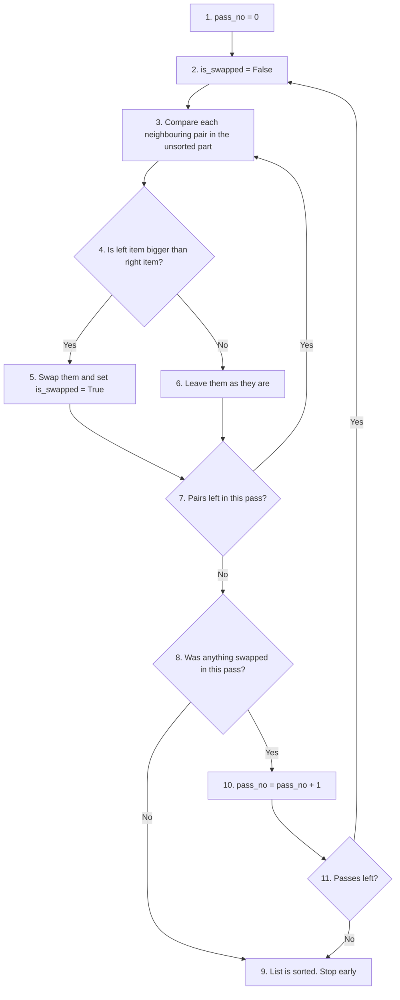
```mermaid
flowchart TD
    A["1. pass_no = 0"] --> B["2. is_swapped = False"]
    B --> C["3. Compare each neighbouring pair in the unsorted part"]
    C --> D{"4. Is left item bigger than right item?"}
    D -- "Yes" --> E["5. Swap them and set is_swapped = True"]
    D -- "No" --> F["6. Leave them as they are"]
    E --> G{"7. Pairs left in this pass?"}
    F --> G
    G -- "Yes" --> C
    G -- "No" --> H{"8. Was anything swapped in this pass?"}
    H -- "No" --> I["9. List is sorted. Stop early"]
    H -- "Yes" --> J["10. pass_no = pass_no + 1"]
    J --> K{"11. Passes left?"}
    K -- "Yes" --> B
    K -- "No" --> I
```

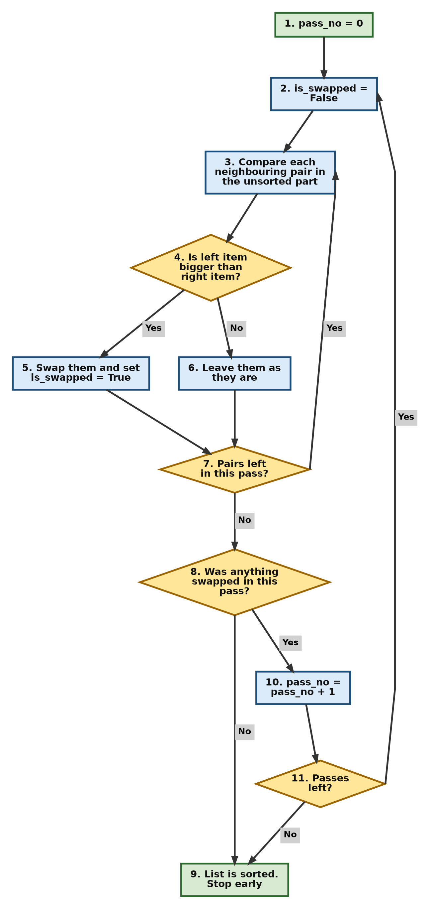

The script below counts comparisons for the basic and optimised versions on a sorted list and on a reversed list.

```python
# Step 1 - Basic bubble sort (no early exit)
def bubble_sort_basic(numbers):
    numbers = numbers[:]                 # work on a copy
    n = len(numbers)
    comparisons = 0
    for pass_no in range(n - 1):         # outer loop: number of passes
        for i in range(n - pass_no - 1): # inner loop: shrinks each pass
            comparisons += 1
            if numbers[i] > numbers[i + 1]:
                numbers[i], numbers[i + 1] = numbers[i + 1], numbers[i]
    return numbers, comparisons

# Step 2 - Optimised bubble sort (stops when a pass makes no swaps)
def bubble_sort_optimised(numbers):
    numbers = numbers[:]
    n = len(numbers)
    comparisons = 0
    for pass_no in range(n - 1):
        is_swapped = False
        for i in range(n - pass_no - 1):
            comparisons += 1
            if numbers[i] > numbers[i + 1]:
                numbers[i], numbers[i + 1] = numbers[i + 1], numbers[i]
                is_swapped = True
        if not is_swapped:               # no swaps means already sorted
            break
    return numbers, comparisons

# Step 3 - Test on a sorted list and a reversed list of 10 items
n = 10
sorted_list = list(range(1, n + 1))
reversed_list = sorted_list[::-1]
print("Formula n(n-1)/2 for n = 10:", n * (n - 1) // 2)

for label, data in (("Already sorted", sorted_list), ("Reversed", reversed_list)):
    _, basic = bubble_sort_basic(data)
    result, optimised = bubble_sort_optimised(data)
    print(f"{label}:")
    print(f"  Basic version comparisons    : {basic}")
    print(f"  Optimised version comparisons: {optimised}")
    print(f"  Sorted result: {result}")
```

**Output**

```text
Formula n(n-1)/2 for n = 10: 45
Already sorted:
  Basic version comparisons    : 45
  Optimised version comparisons: 9
  Sorted result: [1, 2, 3, 4, 5, 6, 7, 8, 9, 10]
Reversed:
  Basic version comparisons    : 45
  Optimised version comparisons: 45
  Sorted result: [1, 2, 3, 4, 5, 6, 7, 8, 9, 10]
```

On the already-sorted list, the optimised version made only 9 comparisons (`n - 1`), which is `O(n)`. The basic version made 45 comparisons in both cases.

[Back to the Table of Contents](#table-of-contents)

#### Follow-up questions on bubble sort

**Q2.1 How many comparisons does the basic bubble sort make for 1,000 items?**

`1000 × 999 / 2 = 499,500` comparisons, whatever the order of the data.

**Q2.2 Does the `is_swapped` flag help when the list is in reverse order?**

No. In a reversed list, every pass makes at least one swap, so the flag never stops the loop early. The worst case stays `O(n²)`.

[Back to the Table of Contents](#table-of-contents)

---

### Q3. Insertion Sort

**Q3. Insertion Sort: card analogy, shift vs swap, and why it outperforms Bubble Sort in practice despite identical O(n²) worst-case.**

#### Answer to Q3: The card analogy

Insertion sort is best understood through the card-dealing analogy. Imagine being dealt cards one at a time into your left hand. Each new card (called the **key**) is compared against the cards already in your hand. Larger cards slide one space to the right to make room, and the new card is inserted into the correct gap. Your left hand always holds a sorted group of cards.

In list terms:

1. Treat the first item as a sorted list of one.
2. Take the next item as the key.
3. Compare the key with the items to its left, moving right to left.
4. Shift every item bigger than the key one place to the right.
5. When you reach an item that is not bigger (or the start of the list), drop the key into the gap.
6. Repeat from Step 2 until every item has been placed.

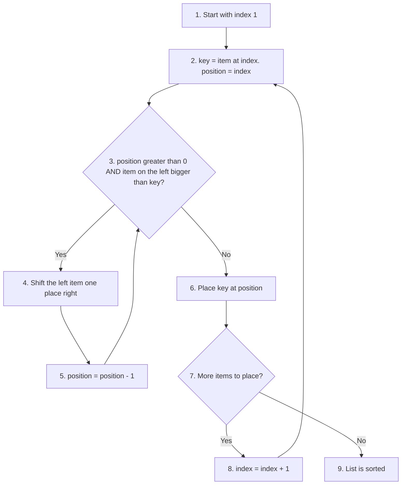
```mermaid
flowchart TD
    A["1. Start with index 1"] --> B["2. key = item at index. position = index"]
    B --> C{"3. position greater than 0 AND item on the left bigger than key?"}
    C -- "Yes" --> D["4. Shift the left item one place right"]
    D --> E["5. position = position - 1"]
    E --> C
    C -- "No" --> F["6. Place key at position"]
    F --> G{"7. More items to place?"}
    G -- "Yes" --> H["8. index = index + 1"]
    H --> B
    G -- "No" --> I["9. List is sorted"]
```

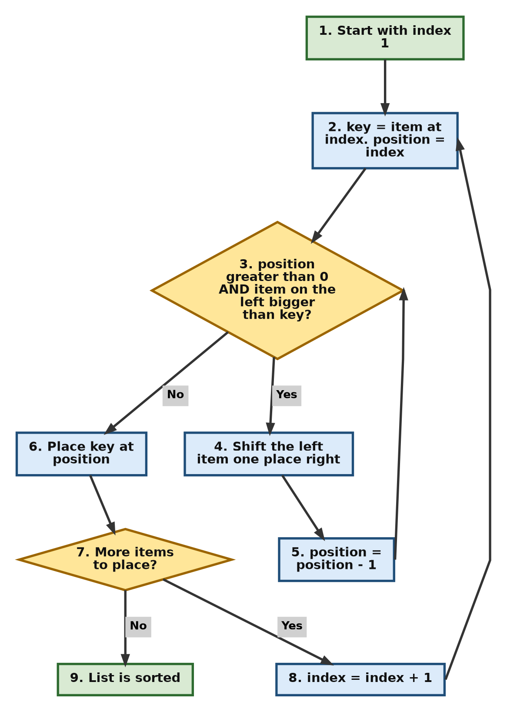

[Back to the Table of Contents](#table-of-contents)

#### Shift vs swap: the key performance difference

Bubble sort and selection sort use **swaps**. Done by hand, a swap needs 3 assignments: a temporary variable stores one value, then the two values are exchanged. (Python's `a, b = b, a` hides the temporary variable, but it still writes both positions.)

Insertion sort uses **shifts**. Each larger item simply copies one position to the right, which is only 1 write per item moved. At the end, the key is written once into its gap.

Example: moving the value 1 from the back to the front of a 10-item list such as `[2, 3, 4, 5, 6, 7, 8, 9, 10, 1]`:

| Method | Moves needed | Writes per move | Total writes |
|---|---|---|---|
| Bubble sort | 9 swaps | 3 (using a temporary variable) | 27 |
| Insertion sort | 9 shifts, then 1 final placement of the key | 1 | 10 |

Insertion sort does roughly a third of the writing, which makes it noticeably faster in practice, even though both algorithms are `O(n²)` in Big-O terms. Big-O analysis ignores constant factors like this one. Real hardware does not.

There is a second advantage. Insertion sort stops comparing as soon as it finds the key's place. Bubble sort (basic version) always walks the full inner loop. So on partly sorted data, insertion sort also makes far fewer comparisons.

[Back to the Table of Contents](#table-of-contents)

#### Best case O(n)

When the list is already sorted, the comparison of each key with the item just to its left (`numbers[position - 1] > key` in the script below) is false straight away. No shifts happen at all. Each pass needs exactly one comparison and no shifts. Total work = `n - 1` comparisons = `O(n)`.

This makes insertion sort the algorithm of choice for small or nearly-sorted data. It is also why Python's own Timsort uses a form of insertion sort internally for short stretches of data.

```python
# Step 1 - Insertion sort that counts comparisons and writes
def insertion_sort(numbers, show_steps=False):
    numbers = numbers[:]                      # work on a copy
    comparisons = 0
    writes = 0
    for index in range(1, len(numbers)):
        key = numbers[index]                  # the "card" to insert
        position = index
        # Step 2 - Shift bigger items one place to the right
        while position > 0:
            comparisons += 1
            if numbers[position - 1] > key:
                numbers[position] = numbers[position - 1]   # shift (1 write)
                writes += 1
                position -= 1
            else:
                break
        # Step 3 - Drop the key into the gap
        if position != index:
            numbers[position] = key               # place (1 write)
            writes += 1
        if show_steps:
            print(f"  After placing {key}: {numbers}")
    return numbers, comparisons, writes

# Step 4 - Watch it sort a small list
print("Sorting [5, 2, 4, 6, 1, 3]:")
insertion_sort([5, 2, 4, 6, 1, 3], show_steps=True)

# Step 5 - Move 1 from the back to the front of a 10-item list
data = [2, 3, 4, 5, 6, 7, 8, 9, 10, 1]
result, comps, writes = insertion_sort(data)
print("Moving 1 to the front:", result)
print("  Insertion sort writes:", writes)
print("  Bubble sort would need 9 swaps x 3 writes =", 9 * 3)

# Step 6 - Best case: an already sorted list
_, comps, writes = insertion_sort(list(range(1, 11)))
print("Already sorted list of 10: comparisons =", comps, "| writes =", writes)
```

**Output**

```text
Sorting [5, 2, 4, 6, 1, 3]:
  After placing 2: [2, 5, 4, 6, 1, 3]
  After placing 4: [2, 4, 5, 6, 1, 3]
  After placing 6: [2, 4, 5, 6, 1, 3]
  After placing 1: [1, 2, 4, 5, 6, 3]
  After placing 3: [1, 2, 3, 4, 5, 6]
Moving 1 to the front: [1, 2, 3, 4, 5, 6, 7, 8, 9, 10]
  Insertion sort writes: 10
  Bubble sort would need 9 swaps x 3 writes = 27
Already sorted list of 10: comparisons = 9 | writes = 0
```

[Back to the Table of Contents](#table-of-contents)

#### Follow-up questions on insertion sort

**Q3.1 Insertion sort is called a *stable* sort. What does that mean?**

A sort is **stable** if items with equal values keep their original order. Insertion sort only shifts items that are strictly bigger than the key, so equal items are never jumped over. See [sorting stability](https://en.wikipedia.org/wiki/Sorting_algorithm#Stability).

**Q3.2 What is the worst-case input for insertion sort?**

A list in reverse order. Every key must be shifted past every item already sorted, giving `n(n - 1)/2` comparisons and shifts.

[Back to the Table of Contents](#table-of-contents)

---

### Q4. Why pop(0) on a List Is a Performance Trap

**Q4. `pop(0)` on a list is a performance trap - explain why, what O(n) means physically, and how deque solves it. Include the `appendleft()` vs `insert(0,...)` distinction.**

#### Answer to Q4: How a list is stored

A Python list stores its items in **contiguous memory**. Contiguous means "side by side with no gaps", like houses on a street numbered 0, 1, 2, 3 and so on. (Strictly, the list stores references to the objects, but the references sit side by side.) This layout is what makes indexing (`my_list[i]`) `O(1)`, because Python can calculate exactly where item `i` is. Appending to the end is also `O(1)` on average. However, this layout creates a basic problem for removing items from the front.

[Back to the Table of Contents](#table-of-contents)

#### Why pop(0) is O(n)

1. You call `my_list.pop(0)`.
2. Python removes the item at index 0.
3. It cannot leave an empty gap at the start, because index 0 must always be the first item.
4. So every remaining item is moved one place to the left to close the gap.
5. For a list of 10,000 items, removing one item from the front means moving 9,999 items.

That is what `O(n)` means physically: the amount of moving is proportional to the length of the list.

| List before `pop(0)` | Index 0 | Index 1 | Index 2 | Index 3 |
|---|---|---|---|---|
| Before | A | B | C | D |
| After removing A | B (moved) | C (moved) | D (moved) | (gone) |

If you use `pop(0)` inside a loop to empty a list of `n` items, this shifting happens `n` times, giving `O(n²)` total work. That is the very slowdown you were trying to avoid by using a queue in the first place.

The same is true for `my_list.insert(0, item)`. Adding at the front means moving every existing item one place to the right, which is also `O(n)`.

[Back to the Table of Contents](#table-of-contents)

#### How deque solves the problem

[collections.deque](https://docs.python.org/3/library/collections.html#collections.deque) (pronounced "deck") is not stored as one contiguous row. Internally, CPython (the standard Python interpreter) builds it as a **doubly-linked list of blocks**. Each block holds a few dozen items, and each block has a link to the block before it and the block after it. The deque also keeps track of exactly where its first and last items are.

1. To add or remove at the right end, Python goes straight to the last position and changes it.
2. To add or remove at the left end, Python goes straight to the first position and changes it.
3. When a block fills up or becomes empty, only a link between blocks is updated.
4. No other items are ever moved.

So `append()`, `appendleft()`, `pop()` and `popleft()` are all `O(1)`, however many items the deque holds.

The price for this is that reaching an item in the **middle** of a deque, such as `d[500_000]`, is `O(n)`, because Python has to walk through the blocks to get there. A deque is built for the ends, a list is built for indexing.

[Back to the Table of Contents](#table-of-contents)

#### appendleft() vs insert(0, ...)

| Operation | On a list | On a deque |
|---|---|---|
| Add to the front | `my_list.insert(0, x)`: `O(n)`, every item shifts right | `d.appendleft(x)`: `O(1)` |
| Remove from the front | `my_list.pop(0)`: `O(n)`, every item shifts left | `d.popleft()`: `O(1)` |
| Add to the back | `my_list.append(x)`: `O(1)` on average | `d.append(x)`: `O(1)` |
| Remove from the back | `my_list.pop()`: `O(1)` | `d.pop()`: `O(1)` |
| Insert in the middle | `my_list.insert(i, x)`: `O(n)` | `d.insert(i, x)`: `O(n)` |
| Read by index | `my_list[i]`: `O(1)` | `d[i]`: `O(1)` at the ends, `O(n)` near the middle |

The main distinction the question asks about is this: on a **list**, `insert(0, x)` is `O(n)`. On a **deque**, the dedicated `appendleft(x)` method does the same job in `O(1)`.

Deque also has a general `insert(i, x)` method. Inserting in the middle of a deque is `O(n)`, because Python must walk to that position. (CPython does recognise `insert(0, x)` as a special case and hands it straight to `appendleft()`, so it is not actually slow. But `appendleft()` states your intention clearly and is the method to use.)

Note also that `deque.pop()` takes **no argument**. It always removes from the right. Writing `d.pop(0)` raises a `TypeError`. The front of a deque is removed only with `popleft()`.

So the rule is simple: for front operations on a deque, always use `appendleft()` and `popleft()`.

```python
# Step 1 - Imports
from collections import deque
import time

# Step 2 - A helper that empties a container from the front and times it
def time_front_removal(size):
    # List version: pop(0) shifts every remaining item each time
    items = list(range(size))
    start = time.perf_counter()
    while items:
        items.pop(0)
    list_time = time.perf_counter() - start

    # Deque version: popleft() moves nothing
    items = deque(range(size))
    start = time.perf_counter()
    while items:
        items.popleft()
    deque_time = time.perf_counter() - start
    return list_time, deque_time

# Step 3 - Compare for growing sizes
for size in (10_000, 50_000, 100_000):
    list_time, deque_time = time_front_removal(size)
    print(f"{size:>7,} items | list.pop(0): {list_time:.3f} s | deque.popleft(): {deque_time:.3f} s")

# Step 4 - deque.pop() does not accept an index
d = deque([1, 2, 3])
try:
    d.pop(0)
except TypeError as error:
    print("TypeError:", error)

# Step 5 - The correct front operations on a deque
d.appendleft(0)
print("After appendleft(0):", d)
print("popleft() returned:", d.popleft())
print("Deque now:", d)
```

**Output** (your times will be different, but the pattern will be the same)

```text
 10,000 items | list.pop(0): 0.007 s | deque.popleft(): 0.000 s
 50,000 items | list.pop(0): 0.225 s | deque.popleft(): 0.002 s
100,000 items | list.pop(0): 0.887 s | deque.popleft(): 0.003 s
TypeError: deque.pop() takes no arguments (1 given)
After appendleft(0): deque([0, 1, 2, 3])
popleft() returned: 0
Deque now: deque([1, 2, 3])
```

Look at the pattern. When the size doubles from 50,000 to 100,000, the list time roughly quadruples, which is `O(n²)` total work. The deque time only roughly doubles, which is `O(n)` total work (`n` removals of `O(1)` each).

[Back to the Table of Contents](#table-of-contents)

#### Follow-up questions on deque

**Q4.1 If deque is so fast at both ends, why not always use it instead of a list?**

Because reading or changing items in the middle by index is slow on a deque, and a deque cannot be sliced (`d[2:5]` raises an error). For general-purpose storage with lots of indexing, a list is better. Use a deque when most of the work happens at the ends, as in a queue.

**Q4.2 What does `deque(maxlen=3)` do when a fourth item is appended?**

The item at the opposite end is dropped automatically. With `append()`, the leftmost item is removed. With `appendleft()`, the rightmost item is removed.

[Back to the Table of Contents](#table-of-contents)

---

### Q5. Counter, defaultdict and ChainMap

**Q5. `Counter`, `defaultdict`, and `ChainMap` from `collections` - what problem does each solve? When would you use `defaultdict(list)` vs `defaultdict(int)` vs `Counter`?**

#### Answer to Q5: Counter

[Counter](https://docs.python.org/3/library/collections.html#collections.Counter) is a specialised dictionary for **counting** how often things occur. Given any iterable (anything you can loop over, such as a list or a string), it produces a frequency map in a single line. Its most useful extra ability is `.most_common(n)`, which returns the `n` most frequent items without you having to sort anything yourself.

Use `Counter` when your only goal is counting.

[Back to the Table of Contents](#table-of-contents)

#### defaultdict

[defaultdict](https://docs.python.org/3/library/collections.html#collections.defaultdict) is a dictionary that automatically creates a default value for any missing key. This removes the need for an `if key not in dict:` check before every insertion. The type you pass decides the default value:

| You write | Default value for a new key | Best for |
|---|---|---|
| `defaultdict(list)` | `[]` | Grouping items into categories |
| `defaultdict(int)` | `0` | Counting, when the same loop also does other work |
| `defaultdict(set)` | `set()` | Grouping while removing duplicates |

Use `defaultdict(int)` when you need counting combined with other operations in the same loop. Use `Counter` when counting alone is enough.

[Back to the Table of Contents](#table-of-contents)

#### ChainMap

[ChainMap](https://docs.python.org/3/library/collections.html#collections.ChainMap) groups several dictionaries into a single view without merging or copying them. It works like this:

1. **Lookups** search the dictionaries from left to right and stop at the first match.
2. **Writes** (adding, changing or deleting a key) always go to the first dictionary only.
3. It is **memory-efficient**: no data is copied.
4. It is **live**: if one of the original dictionaries changes, the `ChainMap` shows the change immediately.

The classic use is layered settings. User preferences override application defaults, which override system defaults, and none of the original dictionaries is changed by a lookup.

[Back to the Table of Contents](#table-of-contents)

#### Choosing between them

| Your goal | Best tool | Why |
|---|---|---|
| Just count how often each item occurs | `Counter` | One line, and it has `most_common()` |
| Count, while also doing other work in the same loop | `defaultdict(int)` | Starts each new key at 0, so `d[key] += 1` just works |
| Group items under a category | `defaultdict(list)` | Starts each new key with an empty list to append to |
| Group items under a category, no duplicates | `defaultdict(set)` | Starts each new key with an empty set to add to |
| Look up settings in layers without merging | `ChainMap` | Searches in order, copies nothing |

```python
# Step 1 - Imports
from collections import Counter, defaultdict, ChainMap

words = ["apple", "banana", "apple", "cherry", "banana", "apple", "avocado"]

# Step 2 - Counter: counting only
fruit_counts = Counter(words)
print("Counter:", fruit_counts)
print("Top 2:", fruit_counts.most_common(2))

# Step 3 - defaultdict(int): counting plus other work in the same loop
letter_counts = defaultdict(int)
long_words = []
for word in words:
    letter_counts[word[0]] += 1        # count first letters
    if len(word) > 5:
        long_words.append(word)        # other work in the same loop
print("defaultdict(int):", dict(letter_counts))
print("Long words:", long_words)

# Step 4 - defaultdict(list): grouping
by_letter = defaultdict(list)
for word in words:
    by_letter[word[0]].append(word)
print("defaultdict(list):", dict(by_letter))

# Step 5 - defaultdict(set): grouping without duplicates
unique_by_letter = defaultdict(set)
for word in words:
    unique_by_letter[word[0]].add(word)
print("defaultdict(set) for 'a':", sorted(unique_by_letter["a"]))

# Step 6 - ChainMap: layered settings
system_defaults = {"language": "English", "theme": "light", "font_size": 12}
app_defaults = {"theme": "blue"}
user_prefs = {"font_size": 16}
settings = ChainMap(user_prefs, app_defaults, system_defaults)
print("Theme:", settings["theme"], "| Font size:", settings["font_size"],
      "| Language:", settings["language"])

# Step 7 - ChainMap is live: change an original dictionary
system_defaults["language"] = "Hindi"
print("Language after changing system_defaults:", settings["language"])

# Step 8 - Writes go to the first dictionary only
settings["theme"] = "dark"
print("user_prefs now:", user_prefs)
print("app_defaults unchanged:", app_defaults)
```

**Output**

```text
Counter: Counter({'apple': 3, 'banana': 2, 'cherry': 1, 'avocado': 1})
Top 2: [('apple', 3), ('banana', 2)]
defaultdict(int): {'a': 4, 'b': 2, 'c': 1}
Long words: ['banana', 'cherry', 'banana', 'avocado']
defaultdict(list): {'a': ['apple', 'apple', 'apple', 'avocado'], 'b': ['banana', 'banana'], 'c': ['cherry']}
defaultdict(set) for 'a': ['apple', 'avocado']
Theme: blue | Font size: 16 | Language: English
Language after changing system_defaults: Hindi
user_prefs now: {'font_size': 16, 'theme': 'dark'}
app_defaults unchanged: {'theme': 'blue'}
```

[Back to the Table of Contents](#table-of-contents)

---

### Q6. namedtuple vs dataclass

**Q6. `namedtuple` vs `dataclass` - compare immutability, default values, type hints, and when to choose each. What does `frozen=True` do in a `dataclass`?**

#### Answer to Q6: Comparison table

Both [namedtuple](https://docs.python.org/3/library/collections.html#collections.namedtuple) and [dataclass](https://docs.python.org/3/library/dataclasses.html) create structured data containers whose fields you reach with dot notation, such as `student.name`. They differ a lot in flexibility and capability.

| Feature | namedtuple | dataclass |
| --- | --- | --- |
| Mutability (can values change?) | Always immutable. Values cannot be changed after creation | Mutable by default. `frozen=True` makes it immutable |
| Default values | Supported through the `defaults` argument (Python 3.7+), for example `namedtuple("Student", ["name", "age"], defaults=[18])` | Fully supported: `age: int = 18` |
| Type hints | Not used. Field names only. (The related `typing.NamedTuple` does allow type hints) | Required. `@dataclass` reads the type annotations to find the fields |
| Memory | Smaller. It is a tuple underneath | Larger, like any normal object. `slots=True` (Python 3.10+) reduces this |
| What you get automatically | A constructor, `__repr__`, plus everything a tuple has: `__eq__`, `__hash__`, ordering (`<`, `>`), indexing, unpacking and `len()`. Also the helper methods `_asdict()`, `_replace()` and `_make()` | `__init__`, `__repr__`, `__eq__`, and optionally ordering methods such as `__lt__` (with `order=True`) and `__hash__` (with `frozen=True`) |
| Inheritance | Creates a subclass of `tuple` | A normal class, so normal inheritance |
| Best for | Lightweight, immutable records. Replacing plain tuples with readable names | Structured data that needs defaults, extra methods, validation, or the option to change values |

Two points need a word of explanation:

- A **type hint** (or annotation) is a note such as `age: int` that says what type of value a field is meant to hold. Python does not enforce it at run time. See [type hints](https://docs.python.org/3/library/typing.html).
- Because a namedtuple **is** a tuple, it can also be compared and indexed like one. Sometimes this is unwanted: `Point(1, 2) == (1, 2)` is `True`.

[Back to the Table of Contents](#table-of-contents)

#### What frozen=True does

`@dataclass(frozen=True)` makes all fields read-only after the object is created.

1. Any attempt to assign a new value raises `dataclasses.FrozenInstanceError`.
2. Because the object can no longer change, the dataclass also gets a `__hash__` method. This makes it **hashable**, which means it can be used as a dictionary key or stored in a set. (See [hashable](https://docs.python.org/3/glossary.html#term-hashable).)
3. The result is similar to a namedtuple, but with the full power of dataclass: default values, complex types, `field()` options and your own methods.

[Back to the Table of Contents](#table-of-contents)

#### field() and mutable defaults

A common mistake is writing `subjects: list = []` in a dataclass. In a normal class, a default like this would create one list shared by all objects, so adding a subject for one student would add it for every student. A dataclass protects you from this mistake: it refuses the definition and raises a `ValueError` as soon as the class is created.

The correct approach is `subjects: list = field(default_factory=list)`. The `default_factory` is a function that is called each time a new object is created, so each object gets its own fresh empty list.

```python
# Step 1 - Imports
from collections import namedtuple
from dataclasses import dataclass, field, FrozenInstanceError

# Step 2 - namedtuple with a default value (Python 3.7+)
StudentNT = namedtuple("StudentNT", ["name", "age"], defaults=[18])
s1 = StudentNT("Anita")
print("namedtuple with default:", s1)

# Step 3 - namedtuple is immutable
try:
    s1.age = 20
except AttributeError as error:
    print("namedtuple change blocked:", error)

# Step 4 - dataclass with defaults and a safe list field
@dataclass
class Student:
    name: str
    age: int = 18
    subjects: list = field(default_factory=list)   # a fresh list for every object

a = Student("Anita")
b = Student("Rahul", 20)
a.subjects.append("Python")
a.age = 19                                         # allowed: dataclass is mutable
print("dataclass a:", a)
print("dataclass b:", b)                           # b has its own empty list

# Step 5 - frozen=True makes it read-only and hashable
@dataclass(frozen=True)
class Point:
    x: int
    y: int

p = Point(2, 3)
try:
    p.x = 10
except FrozenInstanceError as error:
    print("Frozen dataclass change blocked:", error)
print("Frozen Point used as a dictionary key:", {p: "treasure"})

# Step 6 - A plain list as a default is refused
try:
    @dataclass
    class BadStudent:
        subjects: list = []
except ValueError as error:
    print("ValueError:", error)
```

**Output**

```text
namedtuple with default: StudentNT(name='Anita', age=18)
namedtuple change blocked: can't set attribute
dataclass a: Student(name='Anita', age=19, subjects=['Python'])
dataclass b: Student(name='Rahul', age=20, subjects=[])
Frozen dataclass change blocked: cannot assign to field 'x'
Frozen Point used as a dictionary key: {Point(x=2, y=3): 'treasure'}
ValueError: mutable default <class 'list'> for field subjects is not allowed: use default_factory
```

[Back to the Table of Contents](#table-of-contents)

#### Follow-up questions on namedtuple and dataclass

**Q6.1 How do you "change" a value in a namedtuple?**

You cannot change it, but you can make a new one with the changed value using `_replace()`. For example, `s2 = s1._replace(age=20)` gives a new record and leaves `s1` as it was.

**Q6.2 Is a plain (non-frozen) dataclass hashable?**

No. With the default settings (`eq=True`, `frozen=False`), the dataclass sets `__hash__` to `None`, so putting such an object in a set raises `TypeError: unhashable type`. This is deliberate: an object that can change should not be used as a key.

[Back to the Table of Contents](#table-of-contents)

---

### Q7. The heapq Module and Min-Heaps

**Q7. `heapq` module - what is a min-heap? How is it stored in Python? How do you simulate a maxheap? Show with a priority queue example using tuples.**

#### Answer to Q7: What a min-heap is

A **heap** is a binary tree with one strict rule: every parent node is smaller than (or equal to) both of its children. This is called the **min-heap property**. A **binary tree** is a structure where each item (called a **node**) has at most two children below it.

Because of this rule, the **root** (the top of the tree) always contains the smallest value in the whole structure, so it is available immediately without searching.

Note that the rule only compares parents with their children. It says nothing about the order of two brothers or sisters. So a heap is **not** a fully sorted list. It is just "sorted enough" to find the smallest item instantly.

[Back to the Table of Contents](#table-of-contents)

#### How Python stores a heap

Python does not build an actual tree with node objects. The [heapq](https://docs.python.org/3/library/heapq.html) module stores the heap as a plain list and uses a simple index rule:

| For the item at index `i` | Index |
|---|---|
| Its left child | `2*i + 1` |
| Its right child | `2*i + 2` |
| Its parent | `(i - 1) // 2` |

This makes the tree structure implicit: no node objects, no pointers, just a list whose order follows the heap rule.

For example, the heap list `[1, 3, 2, 7, 4, 5]` represents this tree:

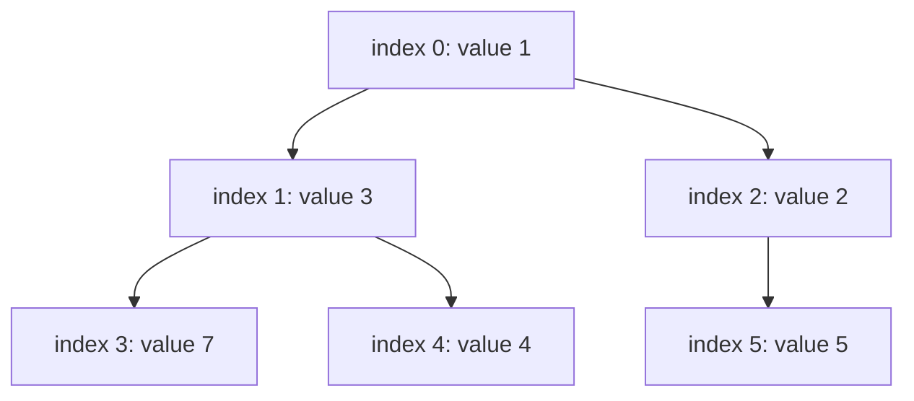
```mermaid
flowchart TD
    A["index 0: value 1"] --> B["index 1: value 3"]
    A --> C["index 2: value 2"]
    B --> D["index 3: value 7"]
    B --> E["index 4: value 4"]
    C --> F["index 5: value 5"]
```

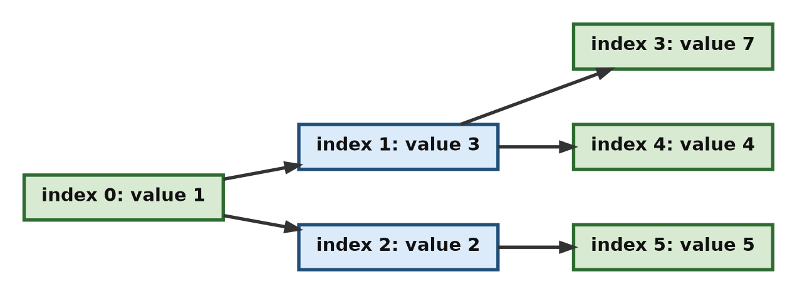

Check the rule: 1 is smaller than 3 and 2. 3 is smaller than 7 and 4. 2 is smaller than 5. Every parent is smaller than its children, so this is a valid min-heap.

[Back to the Table of Contents](#table-of-contents)

#### Simulating a max-heap with the negation trick

Python's `heapq` provides min-heap behaviour. To always get the **largest** item first, store every value as its negative:

1. When adding, store `-value` instead of `value`. So priority 10 is stored as -10.
2. The min-heap brings the most negative value to the top. -10 is smaller than -7 and -3.
3. When removing, negate the value again to get the original number back. `-(-10)` is 10.

```python
import heapq
tasks = []
heapq.heappush(tasks, (-10, 'Critical'))  # store -10 for priority 10
heapq.heappush(tasks, (-3, 'Low'))
heapq.heappush(tasks, (-7, 'Important'))
priority, task = heapq.heappop(tasks)
print(-priority, task)  # Output: 10 Critical
```

**Output**

```text
10 Critical
```

The tuple form `(priority, item_name)` is the standard pattern. Tuples are compared item by item, so the priority decides first. When two items have equal priority, Python compares the second element of each tuple. So the second elements must be comparable with each other (for example, both strings or both numbers). If they are not, for example two dictionaries, Python raises a `TypeError`.

A common way to avoid this is to add a running counter as a tie-breaker: `(priority, count, item)`. The counter is always different, so Python never needs to compare the items themselves. It also means tasks with equal priority come out in the order they were added.

Newer versions of Python make this easier. From **Python 3.14**, `heapq` also provides ready-made max-heap functions such as `heappush_max()` and `heappop_max()`. The negation trick is still worth knowing, because it works in every version.

The full script below shows the stored list, the index rule, the max-heap trick and the tie-breaker.

```python
# Step 1 - Import heapq
import heapq
from itertools import count

# Step 2 - Build a min-heap and look at the stored list
numbers = [7, 3, 5, 1, 4, 2]
heapq.heapify(numbers)                 # rearranges the list into heap order
print("Heap list:", numbers)
print("Smallest item (index 0):", numbers[0])

# Step 3 - Check the parent and child rule for index 1
i = 1
print(f"Item at index {i}: {numbers[i]}, children: {numbers[2*i+1]} and {numbers[2*i+2]}")

# Step 4 - Max-heap using the negation trick
tasks = []
heapq.heappush(tasks, (-10, "Critical"))   # store -10 for priority 10
heapq.heappush(tasks, (-3, "Low"))
heapq.heappush(tasks, (-7, "Important"))
print("Highest priority first:")
while tasks:
    priority, task = heapq.heappop(tasks)
    print(f"  {-priority} {task}")          # negate again to get the real priority

# Step 5 - Equal priorities with items that cannot be compared
jobs = []
heapq.heappush(jobs, (1, {"name": "backup"}))
try:
    heapq.heappush(jobs, (1, {"name": "email"}))
except TypeError as error:
    print("TypeError:", error)

# Step 6 - Fix with a counter as a tie-breaker
jobs = []
counter = count()                           # gives 0, 1, 2, ... on each next()
heapq.heappush(jobs, (1, next(counter), {"name": "backup"}))
heapq.heappush(jobs, (1, next(counter), {"name": "email"}))
heapq.heappush(jobs, (0, next(counter), {"name": "security fix"}))
while jobs:
    priority, order, job = heapq.heappop(jobs)
    print(f"  priority {priority}, added #{order}: {job['name']}")
```

**Output**

```text
Heap list: [1, 3, 2, 7, 4, 5]
Smallest item (index 0): 1
Item at index 1: 3, children: 7 and 4
Highest priority first:
  10 Critical
  7 Important
  3 Low
TypeError: '<' not supported between instances of 'dict' and 'dict'
  priority 0, added #2: security fix
  priority 1, added #0: backup
  priority 1, added #1: email
```

[Back to the Table of Contents](#table-of-contents)

#### Follow-up questions on heaps

**Q7.1 What are the costs of `heappush()`, `heappop()` and `heapify()`?**

`heappush()` and `heappop()` are `O(log n)`, because an item moves at most one level of the tree per step and a tree of `n` items has about `log₂(n)` levels. `heapify()` turns a whole list into a heap in `O(n)`. Reading the smallest item, `heap[0]`, is `O(1)`.

**Q7.2 How would you get the 3 largest numbers from a list without sorting it?**

Use `heapq.nlargest(3, numbers)`. There is also `heapq.nsmallest()`.

[Back to the Table of Contents](#table-of-contents)

---

### Q8. The bisect Module

**Q8. bisect module - what is its purpose? Explain `bisect_left` vs `bisect_right`, and `insort()`. Why is it faster than searching a plain list?**

#### Answer to Q8: Purpose of bisect

The [bisect](https://docs.python.org/3/library/bisect.html) module helps you keep lists sorted efficiently. It provides two kinds of operations:

1. **Finding** the correct insertion position for a new value, without inserting it (`bisect_left()`, `bisect_right()`).
2. **Inserting** the value at that position (`insort_left()`, `insort_right()`).

Both kinds use binary search to find the position, so finding the position is `O(log n)` rather than `O(n)`. The insert functions then also have to put the value into the list, which costs `O(n)` (see below).

[Back to the Table of Contents](#table-of-contents)

#### bisect_left() vs bisect_right()

Both functions find the position where a value should be inserted to keep the list sorted. The difference matters only when the value **already exists** in the list:

- `bisect_left(list, value)` returns the position **just before** any existing equal values (the leftmost valid insertion point).
- `bisect_right(list, value)` returns the position **just after** any existing equal values (the rightmost valid insertion point). Plain `bisect.bisect()` is the same as `bisect_right()`.

```python
import bisect
scores = [50, 60, 60, 70, 80]
print(bisect.bisect_left(scores, 60))   # Output: 1
print(bisect.bisect_right(scores, 60))  # Output: 3
```

**Output**

```text
1
3
```

| Index | 0 | 1 | 2 | 3 | 4 |
|---|---|---|---|---|---|
| Value | 50 | 60 | 60 | 70 | 80 |
| Position returned | | `bisect_left` gives 1 (before the first 60) | | `bisect_right` gives 3 (after the last 60) | |

[Back to the Table of Contents](#table-of-contents)

#### insort()

`insort_left()` and `insort_right()` find the correct position using bisect and then insert the value there, all in one call. Plain `insort()` is the same as `insort_right()`.

The cost has two parts:

1. Finding the position: `O(log n)`.
2. Inserting into the list: `O(n)`, because the items after the insertion point shift one place to the right.

So one `insort()` costs `O(n)` overall. That is still much better than appending the new value and then fully re-sorting an unsorted list, which costs `O(n log n)`. For lists that receive new items often, `insort()` is the right approach.

[Back to the Table of Contents](#table-of-contents)

#### Why bisect is faster than searching a plain list

A plain list's `in` operator, and its `index()` method, use linear search: `O(n)`. `bisect` uses binary search: `O(log n)`. For a list of 1,000,000 items, linear search may check up to 1,000,000 items. `bisect` checks at most about 20. The only condition is that the list must already be sorted.

A very practical use of `bisect` is turning a number into a grade band.

```python
# Step 1 - Import bisect
import bisect

# Step 2 - bisect_left vs bisect_right with duplicates
scores = [50, 60, 60, 70, 80]
print("bisect_left(scores, 60) :", bisect.bisect_left(scores, 60))
print("bisect_right(scores, 60):", bisect.bisect_right(scores, 60))

# Step 3 - insort keeps the list sorted
bisect.insort(scores, 65)
print("After insort(65):", scores)

# Step 4 - A practical use: marks to grades
# Marks below 40 get F, 40-49 get E, 50-59 get D, 60-69 get C, 70-79 get B, 80+ get A
cutoffs = [40, 50, 60, 70, 80]
grades = "FEDCBA"

def grade_for(mark):
    # bisect_right counts how many cutoffs the mark has reached
    return grades[bisect.bisect_right(cutoffs, mark)]

for mark in (35, 40, 59, 60, 79, 95):
    print(f"Mark {mark} -> Grade {grade_for(mark)}")
```

**Output**

```text
bisect_left(scores, 60) : 1
bisect_right(scores, 60): 3
After insort(65): [50, 60, 60, 65, 70, 80]
Mark 35 -> Grade F
Mark 40 -> Grade E
Mark 59 -> Grade D
Mark 60 -> Grade C
Mark 79 -> Grade B
Mark 95 -> Grade A
```

Notice that a mark of exactly 40 gets grade E, not F. `bisect_right` puts 40 **after** the cutoff 40, so the mark counts as having reached that band. With `bisect_left`, a mark of 40 would wrongly get F.

[Back to the Table of Contents](#table-of-contents)

---

### Q9. The queue Module vs collections.deque

**Q9. queue module vs `collections.deque` - both provide queues. What is thread-safety? When must you use `queue.Queue` over deque? Explain the `None` sentinel pattern.**

#### Answer to Q9: What thread-safety means

A [thread](https://docs.python.org/3/library/threading.html) is a unit of work that can run at the same time as other threads inside the same program. For example, one thread might download files while another updates the screen.

When two threads share a data structure and both try to change it at the same moment, a **race condition** can occur. Here is how it happens, step by step:

1. Thread A reads a shared counter. The value is 5.
2. Thread B reads the same counter. The value is still 5.
3. Thread A adds 1 and writes 6.
4. Thread B adds 1 and writes 6.
5. The counter should be 7, but it is 6. One change has been lost.

A **thread-safe** data structure prevents this by making sure that only one thread can change it at any given moment, even if several threads try at once. It does this internally using a **lock**, which works like a single key to a room: only the thread holding the key can go in.

[Back to the Table of Contents](#table-of-contents)

#### deque and queue.Queue compared

`collections.deque` gives `O(1)` operations at both ends and is thread-safe for simple appends and pops at the ends. However, it has no higher-level coordination features. It cannot make a thread wait until an item is available, and it cannot signal that all tasks are complete. [queue.Queue](https://docs.python.org/3/library/queue.html#queue.Queue) adds these abilities.

| Feature | `collections.deque` | `queue.Queue` |
|---|---|---|
| Speed | Faster | Slower (locking has a cost) |
| Append and pop at the ends | Thread-safe | Thread-safe |
| Wait (block) until an item arrives | No. Popping an empty deque raises `IndexError` | Yes. `get()` waits |
| Wait until the queue has space | No | Yes, if created with `maxsize` |
| Track finished work | No | Yes: `task_done()` and `join()` |
| Best for | Single-threaded programs | Several threads sharing work |

[Back to the Table of Contents](#table-of-contents)

#### When to use queue.Queue

Use `queue.Queue` when:

1. Several threads share the same queue.
2. Worker threads should **block** (pause and wait) when the queue is empty, instead of **spinning** (checking again and again in a tight loop, which wastes processor time).
3. You need `task_done()` and `join()` to know when all the work is finished.

Use `collections.deque` for single-threaded programs. It is faster and simpler.

[Back to the Table of Contents](#table-of-contents)

#### The None sentinel pattern

A **sentinel** is a special value that means "stop". Worker threads usually run an endless loop (`while True: task = queue.get()`). They need a signal to leave that loop. The usual convention is to put `None` into the queue. Each worker that receives `None` exits its loop.

One `None` must be added per worker thread, so that each thread receives exactly one stop signal.

```python
for _ in range(num_workers):
    task_queue.put(None)  # one stop signal per worker
```

This approach needs no extra shared variables or flags, works reliably, and is easy to understand.

About `task_done()` and `join()`: every call to `get()` adds to the queue's count of unfinished tasks, and every call to `task_done()` reduces it. `queue.join()` waits until that count reaches zero. So `task_done()` must be called for **every** item taken from the queue, including the `None` sentinels if `join()` is called after they are added. A simple way to stay safe is the order used in the script below: first `join()` the queue to wait for the real work, then send the sentinels, then wait for the threads to finish.

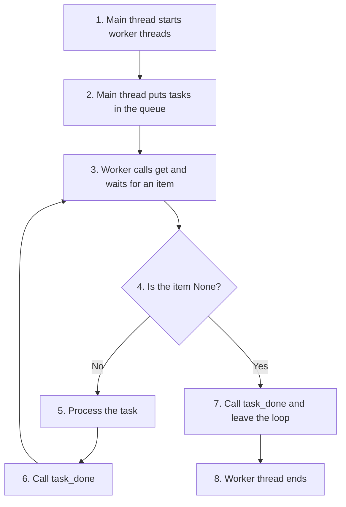
```mermaid
flowchart TD
    A["1. Main thread starts worker threads"] --> B["2. Main thread puts tasks in the queue"]
    B --> C["3. Worker calls get and waits for an item"]
    C --> D{"4. Is the item None?"}
    D -- "No" --> E["5. Process the task"]
    E --> F["6. Call task_done"]
    F --> C
    D -- "Yes" --> G["7. Call task_done and leave the loop"]
    G --> H["8. Worker thread ends"]
```

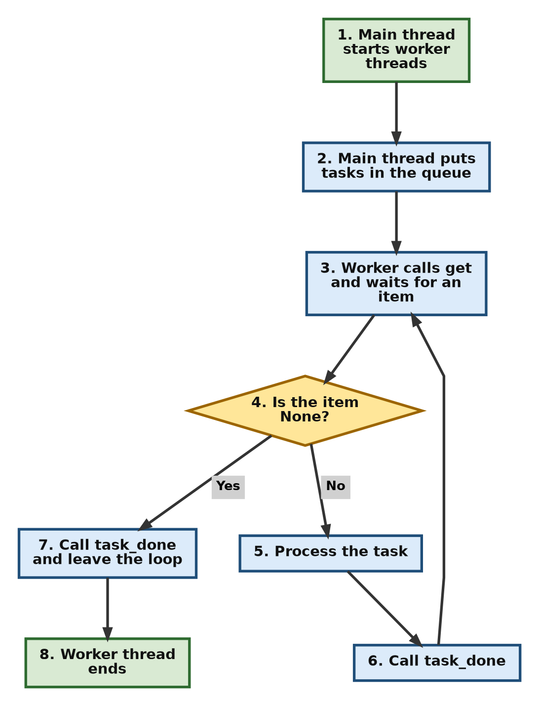

```python
# Step 1 - Imports
import queue
import threading

task_queue = queue.Queue()
results = []
results_lock = threading.Lock()     # protects the shared results list

# Step 2 - The worker: take tasks until it receives None
def worker(worker_id):
    while True:
        task = task_queue.get()     # waits here if the queue is empty
        if task is None:            # the sentinel: time to stop
            task_queue.task_done()
            break
        square = task * task        # the actual work
        with results_lock:
            results.append((task, square, worker_id))
        task_queue.task_done()      # tell the queue this task is finished

# Step 3 - Start the worker threads
num_workers = 3
threads = []
for worker_id in range(num_workers):
    t = threading.Thread(target=worker, args=(worker_id,))
    t.start()
    threads.append(t)

# Step 4 - Put the tasks in the queue
for number in range(1, 9):
    task_queue.put(number)

# Step 5 - Wait until every task has been processed
task_queue.join()
print("All tasks processed:", len(results))

# Step 6 - Send one stop signal per worker, then wait for the threads to end
for _ in range(num_workers):
    task_queue.put(None)   # one stop signal per worker
for t in threads:
    t.join()
print("All workers stopped:", all(not t.is_alive() for t in threads))

# Step 7 - Show the results in number order
# (Which worker handled which task can change from run to run,
#  so we print only the task and its result.)
for task, square, _ in sorted(results):
    print(f"  {task} squared is {square}")
```

**Output**

```text
All tasks processed: 8
All workers stopped: True
  1 squared is 1
  2 squared is 4
  3 squared is 9
  4 squared is 16
  5 squared is 25
  6 squared is 36
  7 squared is 49
  8 squared is 64
```

[Back to the Table of Contents](#table-of-contents)

---

### Q10. lru_cache and Memoisation

**Q10. `lru_cache` - what is memoisation? Explain cache hits vs misses. What does `cache_info()` report? Compare `@lru_cache(maxsize=None)` vs `@cache` (Python 3.9+).**

#### Answer to Q10: What memoisation is

**Memoisation** is an optimisation technique where a function remembers the results of earlier calls. If the function is called again with the same arguments, it returns the stored result immediately instead of working it out again. This trades memory for speed: the function uses more memory (to store past results) but saves computing time.

The stored results are kept in a **cache**, a store of things you are likely to need again.

- A **cache hit** happens when the result is already in the cache and is returned immediately.
- A **cache miss** happens when the result is not in the cache, so the function body runs and the new result is saved.

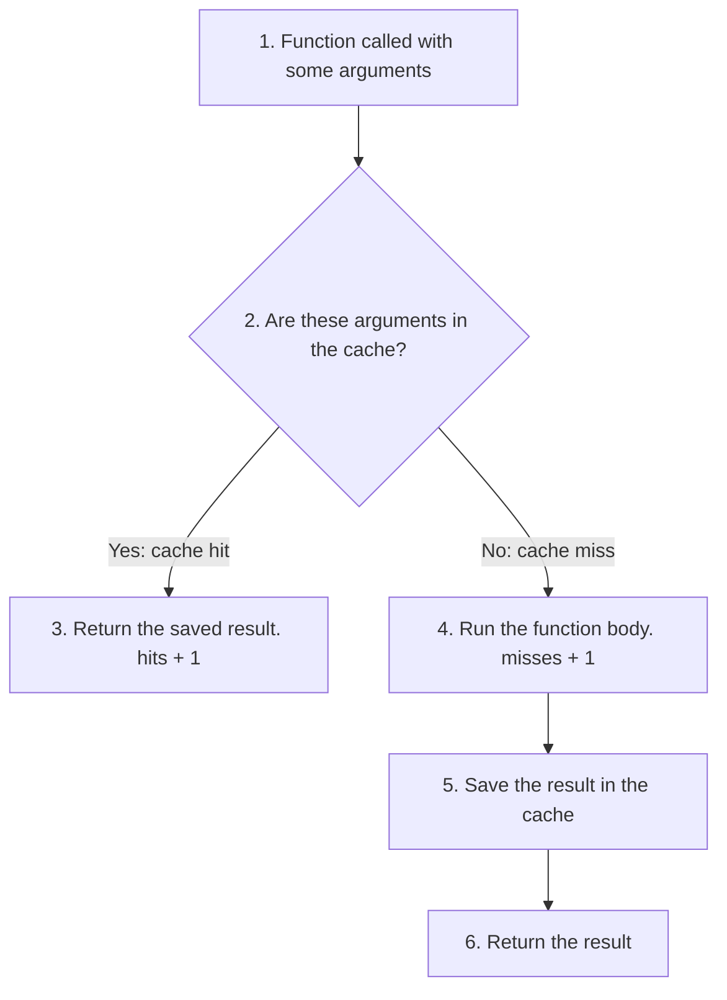
```mermaid
flowchart TD
    A["1. Function called with some arguments"] --> B{"2. Are these arguments in the cache?"}
    B -- "Yes: cache hit" --> C["3. Return the saved result. hits + 1"]
    B -- "No: cache miss" --> D["4. Run the function body. misses + 1"]
    D --> E["5. Save the result in the cache"]
    E --> F["6. Return the result"]
```

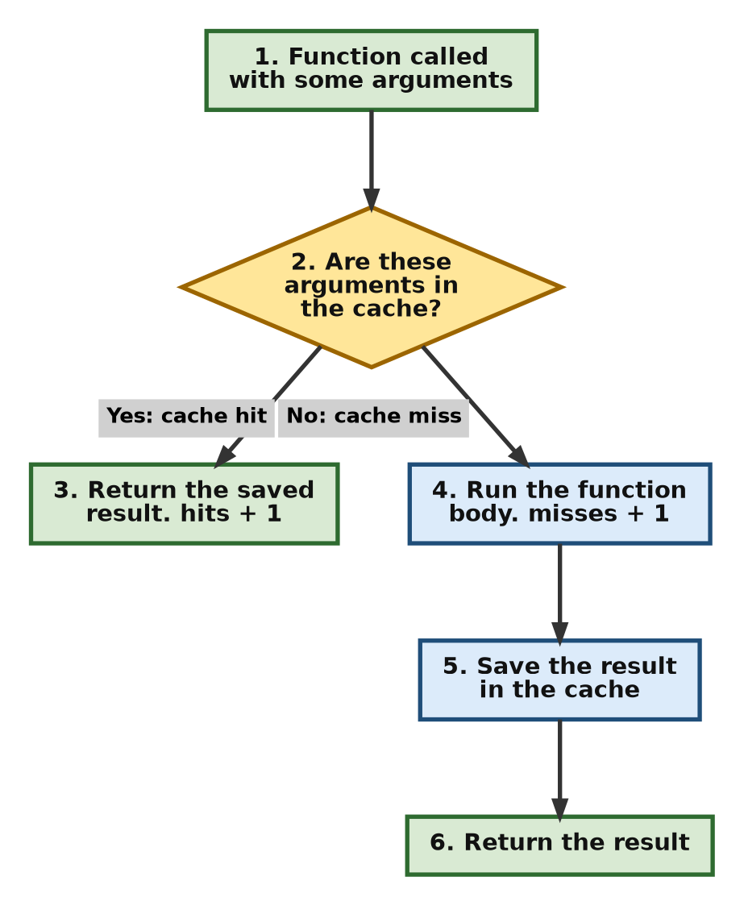

[Back to the Table of Contents](#table-of-contents)

#### Why Fibonacci is the classic example

In the [Fibonacci sequence](https://en.wikipedia.org/wiki/Fibonacci_sequence), each number is the sum of the two before it: 0, 1, 1, 2, 3, 5, 8, 13, and so on. The naive recursive `fib(n)` calls itself twice per call: `fib(n - 1) + fib(n - 2)`.

1. `fib(5)` calls `fib(4)` and `fib(3)`.
2. `fib(4)` calls `fib(3)` and `fib(2)`.
3. So `fib(3)` is already being worked out twice, and `fib(2)` even more often.
4. The repeated work grows rapidly. The number of calls grows roughly 1.6 times with each increase of 1 in `n`.

This is exponential growth. `O(2ⁿ)` is the usual simple upper bound. In actual numbers, `fib(32)` makes **7,049,155** calls. That is about 7 million. (It is well below 2³², which is over 4 billion, but still enormous.)

With `@lru_cache`, each different value of `n` is calculated only once and then cached. `fib(32)` needs just **33** calculations, one for each value of `n` from 0 to 32. The complexity drops to `O(n)`.

```python
# Step 1 - Imports
from functools import lru_cache, cache

# Step 2 - Naive recursive Fibonacci with a call counter
call_count = 0

def fib_naive(n):
    global call_count
    call_count += 1
    if n < 2:
        return n
    return fib_naive(n - 1) + fib_naive(n - 2)

print("fib_naive(32) =", fib_naive(32))
print("Calls made    :", f"{call_count:,}")

# Step 3 - The same function with lru_cache
@lru_cache(maxsize=None)
def fib_cached(n):
    if n < 2:
        return n
    return fib_cached(n - 1) + fib_cached(n - 2)

print("fib_cached(32) =", fib_cached(32))
print("Cache info     :", fib_cached.cache_info())

# Step 4 - Calling again is all hits
fib_cached(32)
print("After a second call:", fib_cached.cache_info())

# Step 5 - @cache (Python 3.9+) behaves like lru_cache(maxsize=None)
@cache
def fib_simple(n):
    if n < 2:
        return n
    return fib_simple(n - 1) + fib_simple(n - 2)

print("fib_simple(32) =", fib_simple(32))
print("Cache info     :", fib_simple.cache_info())

# Step 6 - A small maxsize throws away old results
@lru_cache(maxsize=2)
def square(x):
    return x * x

for value in (1, 2, 3, 1):
    square(value)
print("maxsize=2 after calls 1, 2, 3, 1:", square.cache_info())
```

**Output**

```text
fib_naive(32) = 2178309
Calls made    : 7,049,155
fib_cached(32) = 2178309
Cache info     : CacheInfo(hits=30, misses=33, maxsize=None, currsize=33)
After a second call: CacheInfo(hits=31, misses=33, maxsize=None, currsize=33)
fib_simple(32) = 2178309
Cache info     : CacheInfo(hits=30, misses=33, maxsize=None, currsize=33)
maxsize=2 after calls 1, 2, 3, 1: CacheInfo(hits=0, misses=4, maxsize=2, currsize=2)
```

Read the `fib_cached` line: 33 misses (one for each `n` from 0 to 32) and 30 hits (the repeated requests answered from the cache). In Step 6, the cache can hold only 2 results. When 3 is added, the least recently used result (for 1) is thrown away, so the final call with 1 is a miss again: 4 misses and 0 hits.

[Back to the Table of Contents](#table-of-contents)

#### What cache_info() reports

| Field | Meaning |
|---|---|
| `hits` | Times the result was found in the cache and returned immediately |
| `misses` | Times the result was not cached and had to be calculated fresh |
| `maxsize` | Maximum number of results the cache can hold (`None` means no limit) |
| `currsize` | Number of results currently stored in the cache |

There is also `cache_clear()`, which empties the cache and resets these counts.

[Back to the Table of Contents](#table-of-contents)

#### lru_cache(maxsize=None) vs cache

In Python 3.9, [functools.cache](https://docs.python.org/3/library/functools.html#functools.cache) was added as a simpler way of writing `@lru_cache(maxsize=None)`. Both give unlimited caching that never throws results away. Because `@cache` never has to track which result was used least recently, it is also slightly faster.

`@lru_cache` with a limited `maxsize` (for example `maxsize=128`, which is the default) uses a **Least Recently Used** (LRU) policy. When the cache is full, the result that has gone unused for the longest time is discarded to make room.

| Decorator | Size limit | Throws away old results? | Available from |
|---|---|---|---|
| `@lru_cache` | 128 by default | Yes, least recently used first | Python 3.2 |
| `@lru_cache(maxsize=N)` | `N` | Yes, least recently used first | Python 3.2 |
| `@lru_cache(maxsize=None)` | No limit | No | Python 3.2 |
| `@cache` | No limit | No | Python 3.9 |

Use `@cache` for simplicity when unlimited caching is acceptable. Use `@lru_cache(maxsize=N)` when memory is limited.

Two cautions apply to both:

1. The function's arguments must be **hashable**. You cannot cache a function called with a list argument.
2. Cache only functions that always give the same result for the same arguments. A function that reads the current time or a changing database would return stale (out-of-date) results.

[Back to the Table of Contents](#table-of-contents)

---

### Q11. functools.partial()

**Q11. `functools.partial()` - what problem does it solve? Explain with the tax calculator example. When is partial() preferred over a `lambda`?**

#### Answer to Q11: The problem partial() solves

[partial()](https://docs.python.org/3/library/functools.html#functools.partial) solves the problem of repeating the same argument again and again. When one argument to a function is always the same in a particular situation, `partial()` creates a new function with that argument already fixed, so you never have to pass it again. This is called **partial application**.

[Back to the Table of Contents](#table-of-contents)

#### Tax calculator example

```python
from functools import partial
def calculate_tax(amount, rate):
    return amount * rate

# GST on electronics is always 18% - fix rate
electronics_tax = partial(calculate_tax, rate=0.18)
print(electronics_tax(10000))  # Output: 1800.0
```

**Output**

```text
1800.0
```

`electronics_tax` is a new function that needs only the `amount` argument. The `rate=0.18` is built in. This is cleaner than passing `rate=0.18` in every single call, and safer than using a global variable that some other part of the program might change.

Here is what happens, step by step:

1. `partial(calculate_tax, rate=0.18)` does **not** call `calculate_tax`. It creates and returns a new callable object.
2. That object remembers two things: the original function and the fixed argument `rate=0.18`.
3. When you call `electronics_tax(10000)`, it calls `calculate_tax(10000, rate=0.18)` for you.
4. `10000 * 0.18` is `1800.0`.

[Back to the Table of Contents](#table-of-contents)

#### partial() vs lambda

Both can fix arguments, but they differ in readability and behaviour. A lambda equivalent would be: `lambda amount: calculate_tax(amount, 0.18)`. For simple cases both work.

`partial()` is preferred when:

1. You need to fix several arguments.
2. You are passing the function to another function and want a clean, simple call.
3. The fixed argument has a meaningful name. `partial(calculate_tax, rate=0.18)` names the rate right where it is fixed. (A lambda can do this too by writing `rate=0.18` inside it, but `partial()` encourages it.)
4. You want to inspect what was fixed. A partial object has `.func`, `.args` and `.keywords` attributes. A lambda shows nothing useful.
5. You want the value fixed **now**. `partial()` stores the value at the moment it is created. A lambda looks up any outside variable only when it is called, which can give surprising results if that variable changes in between.
6. You need to save the function with `pickle` (see Q16). Partial objects of normal functions can be pickled. Lambdas cannot.

Lambdas are more flexible when you want to do something more than fixing arguments, such as `lambda amount: round(calculate_tax(amount, 0.18), 2)`. But `partial()` is more explicit about what it is doing.

```python
# Step 1 - Imports and the base function
from functools import partial

def calculate_tax(amount, rate):
    return amount * rate

# Step 2 - Fix the rate with partial
electronics_tax = partial(calculate_tax, rate=0.18)
food_tax = partial(calculate_tax, rate=0.05)
print("Electronics tax on 10000:", electronics_tax(10000))
print("Food tax on 2000        :", food_tax(2000))

# Step 3 - Look inside a partial object
print("func    :", electronics_tax.func.__name__)
print("keywords:", electronics_tax.keywords)

# Step 4 - The same with a lambda
electronics_tax_lambda = lambda amount: calculate_tax(amount, 0.18)
print("Lambda version:", electronics_tax_lambda(10000))

# Step 5 - partial fixes the value now; lambda looks it up later
current_rate = 0.18
tax_partial = partial(calculate_tax, rate=current_rate)
tax_lambda = lambda amount: calculate_tax(amount, current_rate)
current_rate = 0.28                        # the rate variable changes afterwards
print("partial still uses 0.18:", tax_partial(10000))
print("lambda now uses 0.28   :", tax_lambda(10000))
```

**Output**

```text
Electronics tax on 10000: 1800.0
Food tax on 2000        : 100.0
func    : calculate_tax
keywords: {'rate': 0.18}
Lambda version: 1800.0
partial still uses 0.18: 1800.0
lambda now uses 0.28   : 2800.0000000000005
```

Notice in Step 5 that the lambda gave a different answer after `current_rate` changed, while the partial object did not.

Also notice the result `2800.0000000000005`. This is not a bug in the script. Computers store decimal fractions such as 0.28 in binary, which cannot hold them exactly, so tiny rounding differences can appear. (See [floating-point arithmetic](https://docs.python.org/3/tutorial/floatingpoint.html).) For money, round the result, for example `round(amount, 2)`, or use the [decimal](https://docs.python.org/3/library/decimal.html) module.

[Back to the Table of Contents](#table-of-contents)

---

### Q12. itertools Functions Compared

**Q12. itertools: compare `chain()`, `islice()`, `groupby()`, `combinations()`, and `permutations()` - purpose, key behaviour, and a use case for each.**

#### Answer to Q12: Comparison table

The [itertools](https://docs.python.org/3/library/itertools.html) module provides fast tools for looping. They return **iterators**, which produce one item at a time when asked, instead of building a whole list in memory. (See [iterator](https://docs.python.org/3/glossary.html#term-iterator).)

| Function | Purpose | Key behaviour | Typical use case |
| --- | --- | --- | --- |
| `chain(*iterables)` | Join several iterables into one sequence | Produces the items of each iterable in turn, without creating a new list in memory | Processing items from several lists as a single stream |
| `islice(iterable, stop)` or `islice(iterable, start, stop[, step])` | Slice an iterator without loading it all into memory | Works on any iterator. Does not support negative indices | Reading only the first N lines of a huge log file |
| `groupby(iterable, key)` | Group neighbouring items that have the same key | Starts a new group every time the key changes. Sort by the key first if you want one group per key | Summarising records by category after sorting |
| `combinations(iterable, r)` | All ways to choose `r` items where order does not matter | No repetition. Each item is used at most once per combination | Generating all possible team pairings from a squad |
| `permutations(iterable, r)` | All ordered arrangements of `r` items | Order matters. The same items in a different order count as a different result | Generating all possible batting orders |

The number of results from `combinations` and `permutations` grows quickly:

| Choosing `r` from `n` items | Formula | Example: 4 players, choose 2 |
|---|---|---|
| `combinations` | `n! / (r! × (n - r)!)` | 6 |
| `permutations` | `n! / (n - r)!` | 12 |

Here `n!` ("n factorial") means `n × (n - 1) × ... × 1`. See [combination](https://en.wikipedia.org/wiki/Combination) and [permutation](https://en.wikipedia.org/wiki/Permutation).

```python
# Step 1 - Imports
from itertools import chain, islice, groupby, combinations, permutations

# Step 2 - chain(): several lists as one stream
batch_a = [1, 2, 3]
batch_b = [4, 5]
print("chain:", list(chain(batch_a, batch_b)))

# Step 3 - islice(): take only the first 3 lines of a "huge" file
log_lines = (f"log line {n}" for n in range(1, 1_000_001))  # a generator, not a list
print("islice:", list(islice(log_lines, 3)))

# Step 4 - groupby(): sort first, then group
sales = [("Fruit", "Apple"), ("Veg", "Carrot"), ("Fruit", "Mango"), ("Veg", "Peas")]
sales.sort(key=lambda s: s[0])
for category, items in groupby(sales, key=lambda s: s[0]):
    print(f"groupby: {category} -> {[name for _, name in items]}")

# Step 5 - combinations(): pairs where order does not matter
squad = ["Asha", "Bina", "Chitra", "Dev"]
pairs = list(combinations(squad, 2))
print(f"combinations: {len(pairs)} pairs -> {pairs}")

# Step 6 - permutations(): order matters
orders = list(permutations(squad, 2))
print(f"permutations: {len(orders)} ordered pairs")
print("  first four:", orders[:4])
```

**Output**

```text
chain: [1, 2, 3, 4, 5]
islice: ['log line 1', 'log line 2', 'log line 3']
groupby: Fruit -> ['Apple', 'Mango']
groupby: Veg -> ['Carrot', 'Peas']
combinations: 6 pairs -> [('Asha', 'Bina'), ('Asha', 'Chitra'), ('Asha', 'Dev'), ('Bina', 'Chitra'), ('Bina', 'Dev'), ('Chitra', 'Dev')]
permutations: 12 ordered pairs
  first four: [('Asha', 'Bina'), ('Asha', 'Chitra'), ('Asha', 'Dev'), ('Bina', 'Asha')]
```

[Back to the Table of Contents](#table-of-contents)

#### The groupby() gotcha

`groupby()` groups only **consecutive** equal keys. If the data is `[A, A, B, A]`, it produces three groups, `A`, `B`, `A`, not two. Always sort by the key first if you want all items of the same category in one group.

There is a second catch. Each group that `groupby()` gives you is an iterator that shares its data with `groupby()` itself. As soon as `groupby()` moves on to the next group, the previous group is used up and becomes empty. So if you need a group's items later, or more than once, convert it to a list straight away, for example `list(items)`.

```python
# Step 1 - Import groupby
from itertools import groupby

# Step 2 - Consecutive grouping: A, A, B, A gives three groups
data = ["A", "A", "B", "A"]
print("Groups:", [(key, len(list(group))) for key, group in groupby(data)])

# Step 3 - Sorting first gives one group per key
print("Sorted groups:", [(key, len(list(group))) for key, group in groupby(sorted(data))])

# Step 4 - Saving group iterators for later does not work
saved = [(key, group) for key, group in groupby(sorted(data))]
print("Saved without list():", [(key, list(group)) for key, group in saved])

# Step 5 - Convert each group to a list immediately
saved = [(key, list(group)) for key, group in groupby(sorted(data))]
print("Saved with list():   ", saved)
```

**Output**

```text
Groups: [('A', 2), ('B', 1), ('A', 1)]
Sorted groups: [('A', 3), ('B', 1)]
Saved without list(): [('A', []), ('B', [])]
Saved with list():    [('A', ['A', 'A', 'A']), ('B', ['B'])]
```

In Step 4 the saved groups are empty, because `groupby()` had already moved past them by the time we tried to read them.

[Back to the Table of Contents](#table-of-contents)

---

### Q13. Why OrderedDict Still Exists

**Q13. `OrderedDict` - in Python 3.7+ regular dicts preserve insertion order. So why does `OrderedDict` still exist? What methods does it add that a plain dict cannot do?**

#### Answer to Q13: Background

Since Python 3.7, the built-in `dict` guarantees insertion order as part of the language rules, not just as a detail of how CPython happens to work. For simple ordered storage, a plain `dict` is now enough, and it is faster and uses less memory than [OrderedDict](https://docs.python.org/3/library/collections.html#collections.OrderedDict).

However, `OrderedDict` still exists because it gives you control over the order that a plain dict does not offer directly. There are three main differences: two methods and one rule about equality.

[Back to the Table of Contents](#table-of-contents)

#### move_to_end(key, last=True)

`move_to_end()` moves an existing key to the very end of the dictionary (`last=True`, the default) or to the very beginning (`last=False`). It does this in a single `O(1)` operation.

With a plain dict:

- To move a key to the **end**, you must remove it and insert it again: `d[key] = d.pop(key)`. This takes two steps, and it removes the old entry and creates a new one rather than moving the existing one.
- To move a key to the **beginning**, there is no direct way at all. You have to build a whole new dictionary, which is `O(n)`.

[Back to the Table of Contents](#table-of-contents)

#### popitem(last=True)

`OrderedDict.popitem()` removes and returns the last item (`last=True`, last in first out) or the first item (`last=False`, first in first out).

A plain dict's `popitem()` also has a guaranteed order since Python 3.7: it always removes the **last** item inserted. (Before Python 3.7, it removed an arbitrary item.) But it has no `last` argument, so it cannot remove the **first** item. To do that with a plain dict you have to find the first key yourself, for example with `next(iter(d))`, and then delete it.

[Back to the Table of Contents](#table-of-contents)

#### Equality rules

| Comparison | Same keys and values, different order | Result |
|---|---|---|
| `OrderedDict` == `OrderedDict` | Order is checked | `False` |
| `dict` == `dict` | Order is ignored | `True` |
| `OrderedDict` == `dict` | Order is ignored | `True` |

So two OrderedDicts with the same keys and values in a different insertion order are **not** equal. This makes `OrderedDict` valuable when order is part of what the data means, not just how it is displayed. For example, the order of steps in a recipe matters.

**Summary:** Use a plain `dict` (Python 3.7+) for all ordinary key-value storage. Switch to `OrderedDict` only when you need `move_to_end()`, `popitem(last=False)`, or equality comparisons that take order into account.

```python
# Step 1 - Import OrderedDict
from collections import OrderedDict

# Step 2 - move_to_end in both directions
recent = OrderedDict([("home", 1), ("about", 2), ("contact", 3)])
recent.move_to_end("home")                 # to the end
print("home moved to end  :", list(recent))
recent.move_to_end("contact", last=False)  # to the beginning
print("contact moved first:", list(recent))

# Step 3 - popitem from either end
print("popitem(last=False):", recent.popitem(last=False))
print("popitem()          :", recent.popitem())
print("Remaining          :", list(recent))

# Step 4 - The plain dict way
d = {"home": 1, "about": 2, "contact": 3}
d["home"] = d.pop("home")                  # move to end: pop and re-insert
print("dict after moving home:", list(d))
print("dict popitem()        :", d.popitem())   # always the last item
first_key = next(iter(d))                  # remove the first item by hand
del d[first_key]
print("dict after removing first key:", d)

# Step 5 - Equality rules
od1 = OrderedDict([("a", 1), ("b", 2)])
od2 = OrderedDict([("b", 2), ("a", 1)])
print("OrderedDict == OrderedDict (different order):", od1 == od2)
print("dict == dict (different order):", {"a": 1, "b": 2} == {"b": 2, "a": 1})
print("OrderedDict == dict (different order):", od1 == {"b": 2, "a": 1})
```

**Output**

```text
home moved to end  : ['about', 'contact', 'home']
contact moved first: ['contact', 'about', 'home']
popitem(last=False): ('contact', 3)
popitem()          : ('home', 1)
Remaining          : ['about']
dict after moving home: ['about', 'contact', 'home']
dict popitem()        : ('home', 1)
dict after removing first key: {'contact': 3}
OrderedDict == OrderedDict (different order): False
dict == dict (different order): True
OrderedDict == dict (different order): True
```

[Back to the Table of Contents](#table-of-contents)

---

### Q14. The enum Module and Magic Numbers

**Q14. `enum` module - what are magic numbers and why are they harmful? How does Enum solve this? Show iteration and comparison. What does `auto()` do?**

#### Answer to Q14: Magic numbers

A **magic number** is an unexplained number (or string) typed directly into code. For example: `if status == 2`. What does 2 mean? Is it "shipped", "cancelled", or something else? Anyone reading the code must hunt through comments or documentation to find out.

Magic numbers cause two problems:

1. **They are hard to read.** The number does not say what it means.
2. **They are fragile.** If the meaning of 2 changes to 3, you must find and change every place it is used. Miss one, and you have a bug that gives no error message.

See [magic number in programming](https://en.wikipedia.org/wiki/Magic_number_(programming)).

[Back to the Table of Contents](#table-of-contents)

#### How Enum solves this

```python
from enum import Enum, auto
class OrderStatus(Enum):
    PENDING = 1
    SHIPPED = 2
    DELIVERED = 3
    CANCELLED = 4

status = OrderStatus.SHIPPED
if status == OrderStatus.SHIPPED:
    print('Order is on the way')
```

**Output**

```text
Order is on the way
```

Now `status == 2` is replaced by `status == OrderStatus.SHIPPED`. This is self-documenting, impossible to misread, and protected against accidental changes: enum members are constants, so a line such as `OrderStatus.SHIPPED = 5` raises an `AttributeError`.

The value is also defined in exactly one place. If the number for "shipped" ever has to change, you change it once in the class.

[Back to the Table of Contents](#table-of-contents)

#### Iteration and comparison

An Enum is **iterable**. `for s in OrderStatus:` gives each member in the order it was defined. Each member has two attributes:

- `.name`, the name as a string, for example `'SHIPPED'`
- `.value`, the value, for example `2`

For comparison:

| Expression | Result | Reason |
|---|---|---|
| `status == OrderStatus.SHIPPED` | `True` | Same member |
| `status is OrderStatus.SHIPPED` | `True` | Each member exists only once, so `is` also works |
| `status == 2` | `False` | An `Enum` member is not equal to a plain number |
| `status.value == 2` | `True` | Compare the value if you need the number |
| `OrderStatus(2)` | `OrderStatus.SHIPPED` | Look up a member from its value |
| `OrderStatus["SHIPPED"]` | `OrderStatus.SHIPPED` | Look up a member from its name |

If you do want members to compare equal to plain numbers, use [IntEnum](https://docs.python.org/3/library/enum.html#enum.IntEnum) instead of `Enum`.

[Back to the Table of Contents](#table-of-contents)

#### What auto() does

[auto()](https://docs.python.org/3/library/enum.html#enum.auto) assigns values for you. In a normal `Enum`, it gives 1 to the first member, then 2, then 3, and so on. So you do not need to number the members yourself.

This makes adding a new member simple: just add a new line without working out which number comes next. It also removes the risk of typing the same number twice by accident. (In a normal `Enum`, two members with the same value are allowed, and the second silently becomes another name, an **alias**, for the first. If you want Python to reject duplicate values, put the [@unique](https://docs.python.org/3/library/enum.html#enum.unique) decorator above the class.)

```python
# Step 1 - Imports
from enum import Enum, auto, unique

# Step 2 - The enum with manual values
class OrderStatus(Enum):
    PENDING = 1
    SHIPPED = 2
    DELIVERED = 3
    CANCELLED = 4

# Step 3 - Iteration: name and value of every member
for s in OrderStatus:
    print(f"{s.name:<10} -> {s.value}")

# Step 4 - Comparison
status = OrderStatus.SHIPPED
print("status == OrderStatus.SHIPPED:", status == OrderStatus.SHIPPED)
print("status == 2                  :", status == 2)
print("status.value == 2            :", status.value == 2)
print("OrderStatus(3)               :", OrderStatus(3))
print("OrderStatus['CANCELLED']     :", OrderStatus["CANCELLED"])

# Step 5 - Members cannot be reassigned
try:
    OrderStatus.SHIPPED = 5
except AttributeError as error:
    print("AttributeError:", error)

# Step 6 - auto() numbers the members for you
@unique                       # also guarantees no duplicate values
class Priority(Enum):
    LOW = auto()
    MEDIUM = auto()
    HIGH = auto()

print("auto values:", [(p.name, p.value) for p in Priority])
```

**Output**

```text
PENDING    -> 1
SHIPPED    -> 2
DELIVERED  -> 3
CANCELLED  -> 4
status == OrderStatus.SHIPPED: True
status == 2                  : False
status.value == 2            : True
OrderStatus(3)               : OrderStatus.DELIVERED
OrderStatus['CANCELLED']     : OrderStatus.CANCELLED
AttributeError: cannot reassign member 'SHIPPED'
auto values: [('LOW', 1), ('MEDIUM', 2), ('HIGH', 3)]
```

[Back to the Table of Contents](#table-of-contents)

---

### Q15. How reduce() Works

**Q15. `reduce()` - how does it work step by step? Why did Python's creator move it to functools? When should a plain loop be preferred?**

#### Answer to Q15: How reduce() works

[reduce(function, iterable[, initializer])](https://docs.python.org/3/library/functools.html#functools.reduce) repeatedly applies a two-argument function to collapse a sequence into a single value. It works from left to right:

1. Take the first two items and apply the function.
2. Take that result and the next item, and apply the function again.
3. Repeat until no items are left.
4. The last result is the answer.

If you give the optional third argument, the **initializer**, `reduce()` starts with that value instead of the first item. This matters for empty lists: `reduce()` on an empty list with no initializer raises a `TypeError`, but with an initializer it simply returns the initializer.

[Back to the Table of Contents](#table-of-contents)

#### Step-by-step trace for reduce(multiply, [2, 3, 4, 5])

| Step | Call | Result |
|---|---|---|
| 1 | `multiply(2, 3)` | 6 |
| 2 | `multiply(6, 4)` | 24 |
| 3 | `multiply(24, 5)` | 120 |
| Result | | **120** |

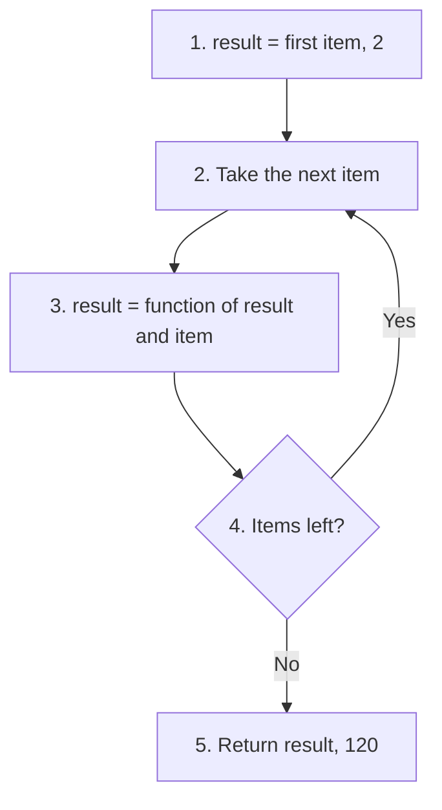
```mermaid
flowchart TD
    A["1. result = first item, 2"] --> B["2. Take the next item"]
    B --> C["3. result = function of result and item"]
    C --> D{"4. Items left?"}
    D -- "Yes" --> B
    D -- "No" --> E["5. Return result, 120"]
```

![Step-by-step trace for reduce(multiply, [2, 3, 4, 5])](../resources/ch16-conceptual-qa-fig-07.png)

[Back to the Table of Contents](#table-of-contents)

#### Why Guido van Rossum moved it to functools

In Python 2, `reduce()` was a built-in function, available without any import. Python's creator, Guido van Rossum, wrote publicly (in his 2005 article "The fate of reduce() in Python 3000") that he found `reduce()` hard to read in most real uses. For anything beyond simple adding or multiplying, a reader has to work through the step-by-step build-up in their head to understand what the code does.

So in Python 3, `reduce()` was moved out of the built-ins and into the `functools` module. This was a deliberate style signal: `reduce()` is available when it is truly needed, but it should not be the first thing you reach for.

[Back to the Table of Contents](#table-of-contents)

#### When to use a plain loop instead

A plain loop is clearer when the build-up logic is not simple, when an `if` condition is involved, or when the steps are hard to picture in your head. Compare:

```python
# reduce() version - requires mental simulation
result = reduce(lambda a, b: a * b, [2, 3, 4, 5])

# Loop version - immediately readable
result = 1
for n in [2, 3, 4, 5]:
    result *= n
```

Both produce 120. The loop version is readable by any programmer.

Also check whether Python already has a built-in for the job. `sum()` adds, `max()` and `min()` find extremes, and since Python 3.8, `math.prod()` multiplies. These are clearer than `reduce()` for those tasks.

Use `reduce()` only when the operation is a simple, natural way of combining two values, and no ready-made function exists for it. Finding the greatest common divisor (GCD) of a whole list is a good example. When you do use it, add a comment saying what it calculates.

```python
# Step 1 - Imports
from functools import reduce
import math

# Step 2 - A multiply function that prints each step
def multiply(a, b):
    print(f"  multiply({a}, {b}) = {a * b}")
    return a * b

print("reduce(multiply, [2, 3, 4, 5]):")
result = reduce(multiply, [2, 3, 4, 5])
print("Result:", result)

# Step 3 - The loop version
result = 1
for n in [2, 3, 4, 5]:
    result *= n
print("Loop result:", result)

# Step 4 - The built-in way (Python 3.8+)
print("math.prod result:", math.prod([2, 3, 4, 5]))

# Step 5 - A good use of reduce: the GCD of a whole list
# (math.gcd takes two numbers; reduce applies it across the list)
print("GCD of [48, 36, 120]:", reduce(math.gcd, [48, 36, 120]))

# Step 6 - Empty list: with and without an initializer
print("Empty list with initializer 1:", reduce(lambda a, b: a * b, [], 1))
try:
    reduce(lambda a, b: a * b, [])
except TypeError as error:
    print("TypeError:", error)
```

**Output**

```text
reduce(multiply, [2, 3, 4, 5]):
  multiply(2, 3) = 6
  multiply(6, 4) = 24
  multiply(24, 5) = 120
Result: 120
Loop result: 120
math.prod result: 120
GCD of [48, 36, 120]: 12
Empty list with initializer 1: 1
TypeError: reduce() of empty iterable with no initial value
```

[Back to the Table of Contents](#table-of-contents)

---

### Q16. pickle vs json

**Q16. pickle vs json - compare format, type support, cross-language compatibility, and safety. When should each be used? What is the security risk with pickle?**

#### Answer to Q16: Comparison table

Both [pickle](https://docs.python.org/3/library/pickle.html) and [json](https://docs.python.org/3/library/json.html) let you save Python data to a file and load it back later. Turning data into a form that can be stored or sent is called **serialisation**. Turning it back is **deserialisation**.

| Feature | pickle | json |
|---|---|---|
| File format | Binary. Unreadable in a text editor | Plain text. Human-readable in any editor |
| Python types supported | Almost all Python objects, including custom classes, dataclasses and sets | Only `str`, `int`, `float`, `bool`, `None`, `list` and `dict` (tuples are saved as lists; dictionary keys become strings) |
| Cross-language | No. Python only | Yes. Works with JavaScript, Java, C#, Go and most other languages |
| Safety | UNSAFE to load from untrusted sources | Safe to load |
| File extension convention | `.pkl` | `.json` |
| Speed | Often faster for complex Python objects | Often slower. Similar for simple types |
| Human debugging | Cannot inspect file contents directly | Open in any text editor. Fully readable |

[Back to the Table of Contents](#table-of-contents)

#### The security risk with pickle

This is the most important fact to understand about pickle: **a malicious `.pkl` file can run any Python code when it is loaded.**

Why? A pickle file does not just store data. It stores instructions that tell Python how to rebuild the objects. Those instructions are allowed to call Python functions during loading, and an attacker can make them call something harmful, such as a function that deletes files or runs system commands.

So never use `pickle.load()` on a file received from an untrusted source: an email attachment, a downloaded file, an API response or a user upload. The official documentation carries a warning to the same effect.

JSON does not have this problem, because loading JSON only ever creates plain data (strings, numbers, lists and dictionaries). It never runs code.

[Back to the Table of Contents](#table-of-contents)

#### Practical rule

Use **json** by default. It is safe, readable, and accepted by almost every system. Switch to **pickle** only when both of these are true:

1. You need to save a Python-specific object that json cannot represent, such as a custom class instance, a set, or a NumPy array.
2. The saved file will be read back only by your own code on a trusted system.

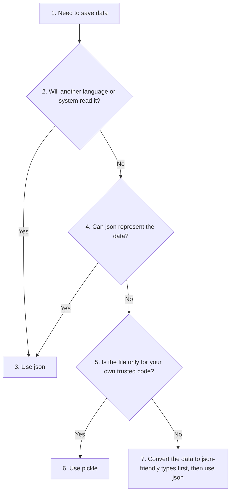
```mermaid
flowchart TD
    A["1. Need to save data"] --> B{"2. Will another language or system read it?"}
    B -- "Yes" --> C["3. Use json"]
    B -- "No" --> D{"4. Can json represent the data?"}
    D -- "Yes" --> C
    D -- "No" --> E{"5. Is the file only for your own trusted code?"}
    E -- "Yes" --> F["6. Use pickle"]
    E -- "No" --> G["7. Convert the data to json-friendly types first, then use json"]
```

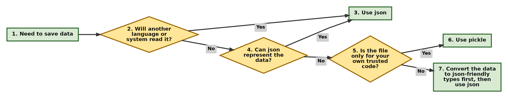

```python
# Step 1 - Imports
import json
import pickle

record = {"name": "Anita", "marks": (88, 92), "subjects": {"Python", "Maths"}}

# Step 2 - json cannot save a set
try:
    json.dumps(record)
except TypeError as error:
    print("json TypeError:", error)

# Step 3 - Convert the set to a sorted list, then json works
json_ready = {**record, "subjects": sorted(record["subjects"])}
text = json.dumps(json_ready)
print("json text:", text)

# Step 4 - Loading json: the tuple has become a list
loaded = json.loads(text)
print("json loaded marks:", loaded["marks"], type(loaded["marks"]))

# Step 5 - pickle keeps every Python type as it was
data = pickle.dumps(record)
print("pickle bytes (first 20):", data[:20])
restored = pickle.loads(data)          # safe ONLY because we created this data ourselves
print("pickle loaded marks:", restored["marks"], type(restored["marks"]))
print("pickle loaded subjects is a set:", isinstance(restored["subjects"], set))
```

**Output**

```text
json TypeError: Object of type set is not JSON serializable
json text: {"name": "Anita", "marks": [88, 92], "subjects": ["Maths", "Python"]}
json loaded marks: [88, 92] <class 'list'>
pickle bytes (first 20): b'\x80\x04\x95B\x00\x00\x00\x00\x00\x00\x00}\x94(\x8c\x04name'
pickle loaded marks: (88, 92) <class 'tuple'>
pickle loaded subjects is a set: True
```

[Back to the Table of Contents](#table-of-contents)

---

### Q17. Selection Sort

**Q17. Selection Sort - explain the sorted/unsorted partition, why swap count is `O(n)` (not `O(n²)`), and when this makes it preferable despite `O(n²)` comparisons.**

#### Answer to Q17: The sorted and unsorted parts

Selection sort divides the list into two parts at each step:

- a **sorted part** on the left, which grows by one item per pass, and
- an **unsorted part** on the right, which shrinks by one item per pass.

In each pass:

1. Scan the whole unsorted part to find the smallest item.
2. Swap that smallest item with the first item of the unsorted part.
3. The boundary between the two parts moves one place to the right.

Here is selection sort on `[29, 10, 14, 37, 13]`. The `|` shows the boundary.

| Pass | Smallest in unsorted part | Swap | List after the pass |
|---|---|---|---|
| 1 | 10 | 29 and 10 | `[10 | 29, 14, 37, 13]` |
| 2 | 13 | 29 and 13 | `[10, 13 | 14, 37, 29]` |
| 3 | 14 | none needed (already in place) | `[10, 13, 14 | 37, 29]` |
| 4 | 29 | 37 and 29 | `[10, 13, 14, 29 | 37]` |

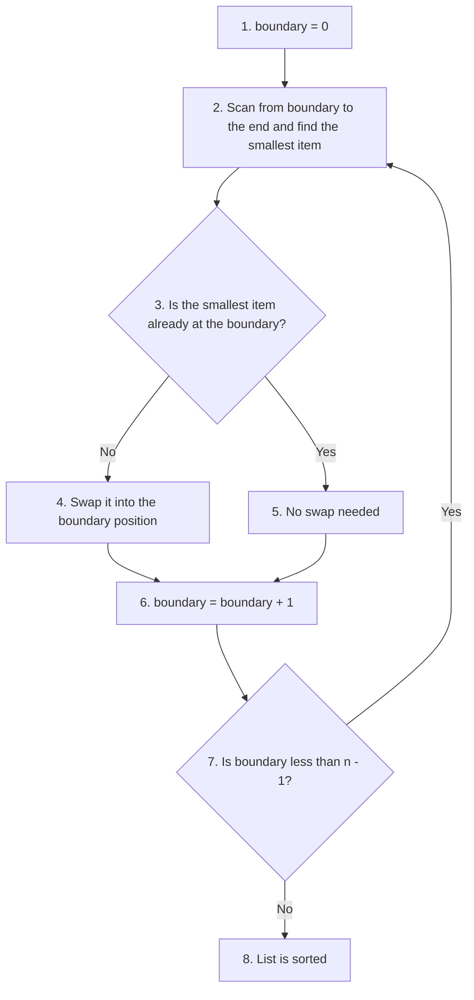
```mermaid
flowchart TD
    A["1. boundary = 0"] --> B["2. Scan from boundary to the end and find the smallest item"]
    B --> C{"3. Is the smallest item already at the boundary?"}
    C -- "No" --> D["4. Swap it into the boundary position"]
    C -- "Yes" --> E["5. No swap needed"]
    D --> F["6. boundary = boundary + 1"]
    E --> F
    F --> G{"7. Is boundary less than n - 1?"}
    G -- "Yes" --> B
    G -- "No" --> H["8. List is sorted"]
```

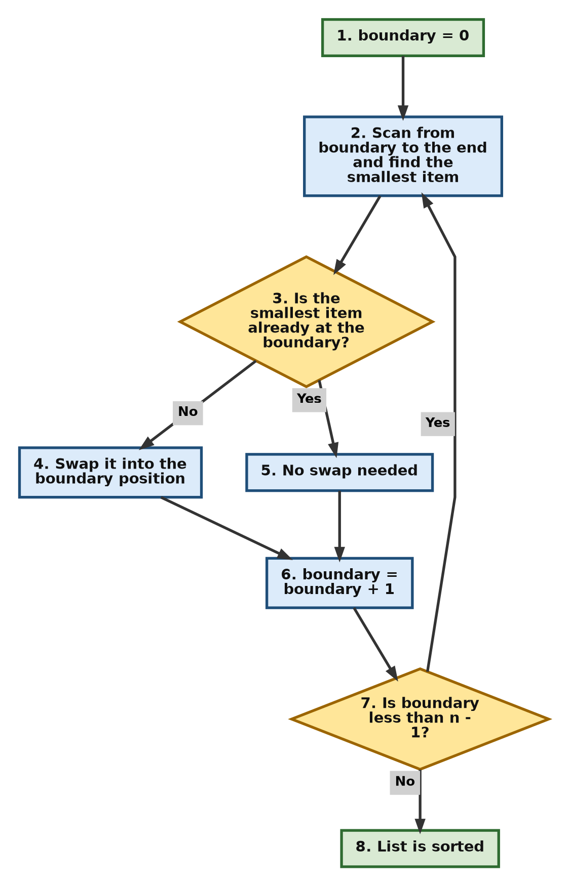

[Back to the Table of Contents](#table-of-contents)

#### Why swaps are O(n), not O(n²)

In each of the `n - 1` passes, at most one swap happens: the smallest item is swapped into its final position. So even in the worst case, the total number of swaps is at most `n - 1`, which is `O(n)`.

The comparisons are a different story. Each pass scans the whole unsorted part, so the comparisons add up to `(n - 1) + (n - 2) + ... + 1 = n(n - 1)/2`, which is `O(n²)`. This is true for every input, even an already sorted one.

By contrast, bubble sort can make `O(n²)` swaps in the worst case (on a reversed list, every comparison leads to a swap), and insertion sort makes `O(n²)` shifts in the worst case.

| Algorithm | Comparisons (worst case) | Swaps or shifts (worst case) | Best case |
|---|---|---|---|
| Bubble sort (optimised) | `O(n²)` | `O(n²)` swaps | `O(n)` on sorted data |
| Insertion sort | `O(n²)` | `O(n²)` shifts | `O(n)` on sorted data |
| Selection sort | `O(n²)` | `O(n)` swaps | `O(n²)`, always scans everything |

[Back to the Table of Contents](#table-of-contents)

#### When selection sort is preferable

Selection sort is the right choice when **writing** (swapping) data costs much more than **reading** (comparing) it. Real examples include:

- Writing to flash memory or [EEPROM](https://en.wikipedia.org/wiki/EEPROM), where each write slowly wears out the storage chip.
- Writing large records to disk, where each swap involves slow input and output (I/O).
- Small embedded systems (tiny computers built into devices) where memory writes are slow and expensive.

In these cases, keeping the number of writes low (selection sort's `O(n)` swaps) matters more than keeping comparisons low. That makes selection sort preferable, despite its `O(n²)` comparison count.

One drawback to know: the usual selection sort is **not stable**. A long-distance swap can jump an item over another item with the same value, changing their original order.

```python
# Step 1 - Selection sort that counts comparisons and swaps
def selection_sort(numbers):
    numbers = numbers[:]
    n = len(numbers)
    comparisons = swaps = 0
    for boundary in range(n - 1):
        smallest = boundary
        # Step 2 - Find the smallest item in the unsorted part
        for i in range(boundary + 1, n):
            comparisons += 1
            if numbers[i] < numbers[smallest]:
                smallest = i
        # Step 3 - At most one swap per pass
        if smallest != boundary:
            numbers[boundary], numbers[smallest] = numbers[smallest], numbers[boundary]
            swaps += 1
    return numbers, comparisons, swaps

# Step 4 - Bubble sort (optimised) with the same counters, for comparison
def bubble_sort(numbers):
    numbers = numbers[:]
    n = len(numbers)
    comparisons = swaps = 0
    for pass_no in range(n - 1):
        is_swapped = False
        for i in range(n - pass_no - 1):
            comparisons += 1
            if numbers[i] > numbers[i + 1]:
                numbers[i], numbers[i + 1] = numbers[i + 1], numbers[i]
                swaps += 1
                is_swapped = True
        if not is_swapped:
            break
    return numbers, comparisons, swaps

# Step 5 - Compare on the example list and on a reversed list of 10
for label, data in (("Example list", [29, 10, 14, 37, 13]),
                    ("Reversed 10 items", list(range(10, 0, -1)))):
    s_result, s_comp, s_swaps = selection_sort(data)
    _, b_comp, b_swaps = bubble_sort(data)
    print(f"{label}: sorted = {s_result}")
    print(f"  Selection sort: {s_comp} comparisons, {s_swaps} swaps")
    print(f"  Bubble sort   : {b_comp} comparisons, {b_swaps} swaps")
```

**Output**

```text
Example list: sorted = [10, 13, 14, 29, 37]
  Selection sort: 10 comparisons, 3 swaps
  Bubble sort   : 10 comparisons, 5 swaps
Reversed 10 items: sorted = [1, 2, 3, 4, 5, 6, 7, 8, 9, 10]
  Selection sort: 45 comparisons, 5 swaps
  Bubble sort   : 45 comparisons, 45 swaps
```

On the reversed list of 10 items, both algorithms made 45 comparisons. But selection sort made only 5 swaps, while bubble sort made 45.

[Back to the Table of Contents](#table-of-contents)

---

### Q18. namedtuple in Depth

**Q18. namedtuple deep-dive - what is a factory function? What does `__mro__` reveal? How does `_asdict()` work? Explain 'two names' in namedtuple('Student', [...]).**

#### Answer to Q18: Factory function

A **factory function** is a function that creates and returns something new, either a new object or, in this case, a new class. `namedtuple()` is a factory function because calling it produces a brand new class. It does not give you an instance of an existing class. It gives you a class itself. That class is then used to create instances.

In other words, the function "manufactures" classes on demand, just as a factory manufactures products.

| Step | Code | What you get |
|---|---|---|
| 1. Call the factory | `Student = namedtuple('Student', ['name', 'age'])` | A new **class** called `Student` |
| 2. Use the class | `s = Student('Anita', 20)` | An **instance** (one student record) |

[Back to the Table of Contents](#table-of-contents)

#### The two names

```python
Record = namedtuple('Student', ['name', 'age'])
```

- `'Student'` (the first argument, a string) is the class's **internal** name. It is stored in `Record.__name__` and is what Python shows when printing.
- `Record` (the variable on the left) is the **external** name, the one your code uses to reach the class.

Usually the two names match, as in `Student = namedtuple('Student', ...)`, which keeps things clear. When they differ, the class still prints as `Student` but is used through `Record`. This can confuse anyone reading error messages or using a debugger, because the name they see does not appear in the code.

It can also break saving with `pickle` (see Q16). Pickle finds a class by its internal name, looks for `Student` in the module, does not find it, and raises an error. So the two names should normally be the same.

[Back to the Table of Contents](#table-of-contents)

#### __mro__ and the Method Resolution Order

`__mro__` stands for **Method Resolution Order**. It is the list of classes Python searches, in order, when it looks for a method or attribute on an object. It shows a class's family tree.

`print(Student.__mro__)` outputs:

```text
(<class '__main__.Student'>, <class 'tuple'>, <class 'object'>)
```

Read it from left to right:

1. `Student` is searched first.
2. Then `tuple`, which means `Student` inherits from the built-in tuple class.
3. Then `object`, the base class of everything in Python.

This is what "tuple subclass" means. `namedtuple` creates a new class that has all the behaviour of a tuple (immutability, indexing, iteration, `len()`) plus access to fields by name using dot notation. See [method resolution order](https://docs.python.org/3/glossary.html#term-method-resolution-order).

[Back to the Table of Contents](#table-of-contents)

#### _asdict()

`_asdict()` converts a namedtuple instance into a dictionary that maps field names to values. In Python 3.1 to 3.7 it returned an `OrderedDict`. From Python 3.8 it returns a plain `dict`.

How it works, in steps:

1. It takes the field names from `_fields`, for example `('name', 'age')`.
2. It pairs each name with the matching value in the tuple.
3. It builds a dictionary from those pairs.

This is the standard way to prepare a namedtuple for saving as JSON or writing as a CSV row. Example:

```python
from collections import namedtuple
Student = namedtuple('Student', ['name', 'age'])
s = Student(name='Anita', age=20)
print(s._asdict())  # {'name': 'Anita', 'age': 20}
```

**Output**

```text
{'name': 'Anita', 'age': 20}
```

The complete script below shows all four ideas together.

```python
# Step 1 - Imports
from collections import namedtuple
import json
import pickle

# Step 2 - namedtuple is a factory: it returns a class
Student = namedtuple('Student', ['name', 'age'])
print("What namedtuple returned:", Student)
print("Is it a class?", isinstance(Student, type))

# Step 3 - The class creates instances
s = Student(name='Anita', age=20)
print("Instance:", s)

# Step 4 - __mro__ shows Student inherits from tuple
print("MRO:", Student.__mro__)
print("Is s a tuple?", isinstance(s, tuple))
print("Indexing s[0]:", s[0], "| len(s):", len(s))

# Step 5 - _asdict() and saving as JSON
as_dict = s._asdict()
print("_asdict():", as_dict, type(as_dict))
print("As JSON:", json.dumps(as_dict))

# Step 6 - The two names
Record = namedtuple('Student', ['name', 'age'])
r = Record('Rahul', 22)
print("Variable name used: Record | Internal name:", Record.__name__)
print("Printed as:", r)

# Step 7 - Mismatched names break pickle
try:
    pickle.dumps(r)
except pickle.PicklingError as error:
    print("PicklingError:", error)
```

**Output**

```text
What namedtuple returned: <class '__main__.Student'>
Is it a class? True
Instance: Student(name='Anita', age=20)
MRO: (<class '__main__.Student'>, <class 'tuple'>, <class 'object'>)
Is s a tuple? True
Indexing s[0]: Anita | len(s): 2
_asdict(): {'name': 'Anita', 'age': 20} <class 'dict'>
As JSON: {"name": "Anita", "age": 20}
Variable name used: Record | Internal name: Student
Printed as: Student(name='Rahul', age=22)
PicklingError: Can't pickle <class '__main__.Student'>: it's not the same object as __main__.Student
```

Why did Step 7 fail? Follow what pickle does:

1. `r` belongs to the class made in Step 6, whose internal name is `Student`.
2. Pickle looks up the name `Student` in the module to find that class.
3. But the variable `Student` still refers to the **different** class made in Step 2.
4. The two classes are not the same object, so pickle refuses and raises `PicklingError`.

If there were no variable called `Student` at all, pickle would still fail, simply because it could not find the name. Either way, giving the variable and the internal name the same spelling avoids the problem.

[Back to the Table of Contents](#table-of-contents)

---

### Q19. Timing Code with time.perf_counter()

**Q19. `time.perf_counter()` - why use it instead of `time.time()`? Why test with large inputs or loops? What does the timing graph shape reveal about O(n) vs O(log n) vs O(n²)?**

#### Answer to Q19: perf_counter() vs time.time()

[time.time()](https://docs.python.org/3/library/time.html#time.time) returns the current **wall-clock time**: the number of seconds since the start of 1 January 1970 (UTC), known as the [Unix epoch](https://en.wikipedia.org/wiki/Unix_time). It is meant for telling the date and time, not for measuring short intervals. Two problems follow:

1. On some systems its resolution (the smallest time step it can show) is quite coarse. On older Windows versions, for example, it could be around 15 milliseconds.
2. It follows the system clock, and the system clock can be adjusted while your program runs. For example, the computer may synchronise its clock over the internet using [NTP](https://en.wikipedia.org/wiki/Network_Time_Protocol), or someone may change it by hand. If that happens during a measurement, the result is wrong, and can even be negative. (Daylight saving time does not affect it, because the value is based on UTC.)

[time.perf_counter()](https://docs.python.org/3/library/time.html#time.perf_counter) returns a high-resolution performance counter, with the finest resolution available on the computer. It is **monotonic**, meaning it only ever moves forward and is not affected by clock adjustments. Its absolute value has no meaning (it is not the time of day). Only the difference between two readings is useful. For timing code, `perf_counter()` is always the better choice.

| Feature | `time.time()` | `time.perf_counter()` |
|---|---|---|
| What it measures | Seconds since 1 January 1970 (UTC) | Seconds from an unspecified starting point |
| Resolution | Can be coarse on some systems | Highest available |
| Affected by clock changes | Yes | No (monotonic) |
| Meaningful on its own | Yes, it can be turned into a date and time | No, only differences are meaningful |
| Use it for | Timestamps in logs and records | Measuring how long code takes |

[Back to the Table of Contents](#table-of-contents)

#### Why test with large inputs or repeated loops

A single operation often finishes in microseconds (millionths of a second) or nanoseconds (billionths). That is close to, or below, the precision of a timer. Measuring it directly would give 0 or a meaningless number dominated by the timer's own overhead and by random background activity on the computer.

Two strategies solve this:

1. **Test on increasingly large inputs**, as this chapter does, using sizes from 1,000 to 1,000,000. Larger inputs take longer, so the timings rise well above the noise.
2. **Repeat a fast operation many times** and divide the total time by the number of repetitions. Python's [timeit](https://docs.python.org/3/library/timeit.html) module does this for you.

This chapter uses the first strategy. It plots search or sort time against input size, so that the growth curve becomes visible.

```python
# Step 1 - Imports
import time
import bisect

# Step 2 - Time 1,000 searches for different list sizes
# Searching for the last value is the worst case for linear search.
for size in (1_000, 10_000, 100_000):
    data = list(range(size))
    target = size - 1

    # Step 3 - Linear search using the list's index() method
    start = time.perf_counter()
    for _ in range(1_000):
        data.index(target)
    linear_time = time.perf_counter() - start

    # Step 4 - Binary search using bisect
    start = time.perf_counter()
    for _ in range(1_000):
        bisect.bisect_left(data, target)
    binary_time = time.perf_counter() - start

    print(f"{size:>7,} items | linear: {linear_time:.4f} s | binary: {binary_time:.4f} s")
```

**Output** (your times will differ, but the pattern will be similar)

```text
  1,000 items | linear: 0.0082 s | binary: 0.0002 s
 10,000 items | linear: 0.0761 s | binary: 0.0003 s
100,000 items | linear: 0.7640 s | binary: 0.0002 s
```

Each time the list becomes ten times larger, the linear search time also becomes roughly ten times larger. The binary search time barely changes.

[Back to the Table of Contents](#table-of-contents)

#### What the graph shape reveals

| Complexity | Graph shape | What you see |
| --- | --- | --- |
| `O(log n)` | A curve that rises quickly at first and then flattens | Time barely increases even as the input grows a thousandfold |
| `O(n)` | A straight line through the origin | Time doubles when the input doubles: linear growth |
| `O(n log n)` | A line that bends gently upward, just above `O(n)` | Nearly linear, but with a slight upward curve |
| `O(n²)` | A steep upward curve (a parabola) | Time roughly quadruples when the input doubles: explosive growth |

The picture below shows the four shapes side by side. Each panel has its own vertical scale, because `O(n²)` is so much larger than the others that it would squash them flat on a shared scale.


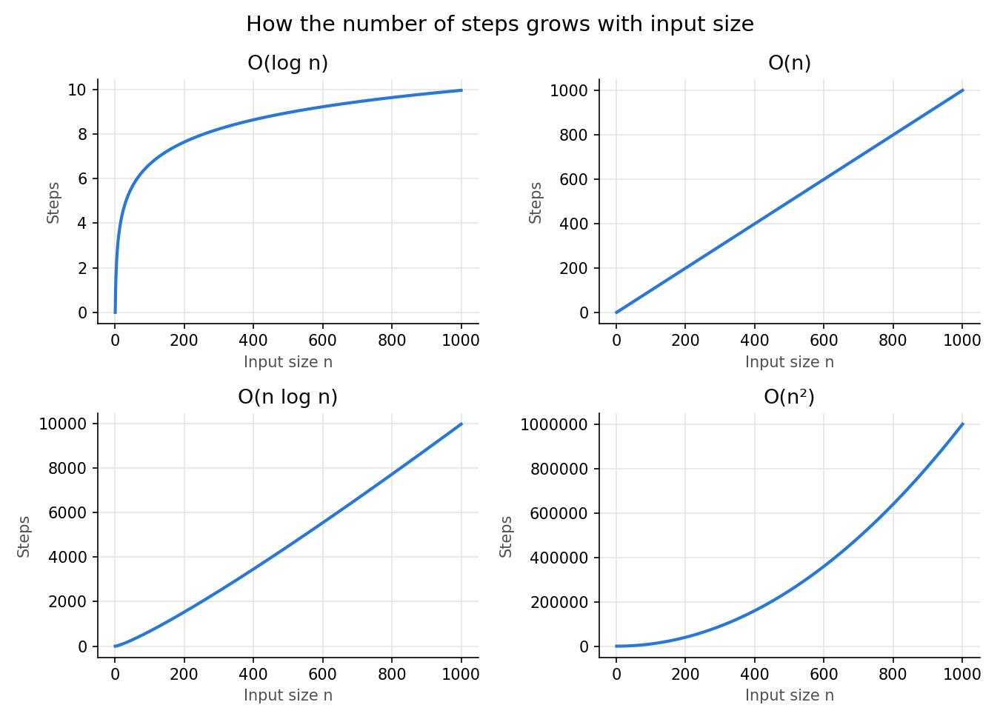

The script that draws this picture is below. It plots the number of steps predicted by each formula, not real timings, so it gives the same picture every time. It needs the third-party [matplotlib](https://matplotlib.org/) library (`pip install matplotlib`).

```python
# Step 1 - Imports
import math
import matplotlib.pyplot as plt

# Step 2 - Input sizes from 1 to 1,000
sizes = list(range(1, 1001))

# Step 3 - Number of steps for each complexity
curves = [
    ("O(log n)",   [math.log2(n) for n in sizes]),
    ("O(n)",       [n for n in sizes]),
    ("O(n log n)", [n * math.log2(n) for n in sizes]),
    ("O(n²)",      [n * n for n in sizes]),
]

# Step 4 - Draw one small chart per complexity (2 rows x 2 columns)
fig, axes = plt.subplots(2, 2, figsize=(9, 6.5))
for ax, (label, steps) in zip(axes.flat, curves):
    ax.plot(sizes, steps, color="#2a78d6", linewidth=2)
    ax.set_title(label, fontsize=13, color="#0b0b0b")
    ax.set_xlabel("Input size n", color="#52514e")
    ax.set_ylabel("Steps", color="#52514e")
    ax.grid(True, color="#e6e5e0", linewidth=0.8)
    ax.ticklabel_format(style="plain", axis="y")
    for side in ("top", "right"):
        ax.spines[side].set_visible(False)

# Step 5 - Add a main title and save the picture
fig.suptitle("How the number of steps grows with input size", fontsize=14)
fig.tight_layout()
fig.savefig("060-ch16-complexity-growth.png", dpi=150)
print("Saved 060-ch16-complexity-growth.png")
```

**Output**

```text
Saved 060-ch16-complexity-growth.png
```

[Back to the Table of Contents](#table-of-contents)

---

### Q20. The API and the Standard Library

**Q20. API and Standard Library - what is the 'batteries included' philosophy? How does importing work? Compare '`from module import X`' vs '`import module`' vs '`from module import *`', with best practice guidance.**

#### Answer to Q20: Batteries included

Python's **"batteries included"** philosophy means that a standard Python installation comes with an extensive [Standard Library](https://docs.python.org/3/library/index.html) covering most common programming needs: data structures, mathematics, file handling, networking, dates and times, regular expressions, compression, hashing and secure random numbers, and much more. A programmer can do a wide range of tasks without installing any third-party packages.

The phrase comes from toys and gadgets sold with the batteries already in the box. Python comes with its "batteries" (the Standard Library) already included, so you do not need to get them separately.

An **API** (Application Programming Interface) is the set of functions, classes and rules that a module offers for other code to use. When you call `Counter()` or `bisect_left()`, you are using the API of the `collections` or `bisect` module.

[Back to the Table of Contents](#table-of-contents)

#### How importing works

The Standard Library is organised into **modules**. A module is a file (or a package, which is a folder of files) containing related tools. Some modules are written in Python, and some are built into the interpreter in C. A module is not available in your program until you import it.

When Python runs an `import` statement, it follows these steps:

1. It checks `sys.modules`, a dictionary of modules already loaded. If the module is there, it reuses it and skips to Step 5.
2. Otherwise, it searches for the module in a list of folders called `sys.path` (which includes your script's own folder and the Standard Library folders).
3. When it finds the module, it runs the module's code once, from top to bottom, creating its functions and classes.
4. It stores the loaded module in `sys.modules`, so any later import is instant.
5. It creates a name in your program that refers to the module (or to the specific names you asked for).

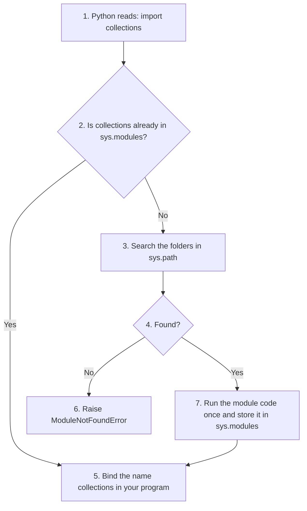
```mermaid
flowchart TD
    A["1. Python reads: import collections"] --> B{"2. Is collections already in sys.modules?"}
    B -- "Yes" --> F["5. Bind the name collections in your program"]
    B -- "No" --> C["3. Search the folders in sys.path"]
    C --> D{"4. Found?"}
    D -- "No" --> G["6. Raise ModuleNotFoundError"]
    D -- "Yes" --> E["7. Run the module code once and store it in sys.modules"]
    E --> F
```

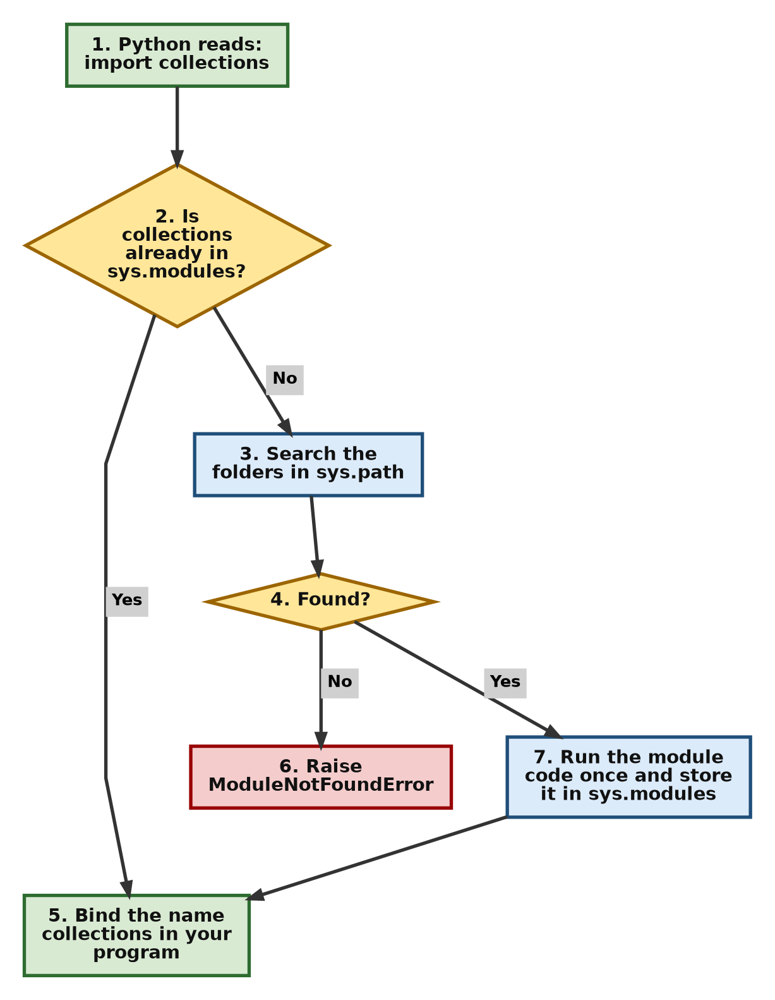

See [the import system](https://docs.python.org/3/reference/import.html) for full details.

There are three main forms of import:

| Import form | Example | What it does | Best practice verdict |
| --- | --- | --- | --- |
| `import module` | `import collections` | Makes the module available. You reach its contents with `module.name`, for example `collections.Counter` | Good for clarity. The reader sees where each name comes from |
| `from module import X` | `from collections import Counter` | Brings specific names directly into your program | Recommended for names you use often. Explicit and clear, and avoids filling your program with unneeded names |
| `from module import *` | `from collections import *` | Imports all public names of the module into your program | Avoid. It fills your program with names, hides where each name came from, and can silently replace names you already have |

There is also a useful variation: `import module as alias`, for example `import datetime as dt`. It gives a long module name a shorter one.

The space that holds the names in your program is called its **namespace**. **Namespace pollution** means filling that space with many names you did not ask for, which makes accidental clashes more likely.

[Back to the Table of Contents](#table-of-contents)

#### Why from module import * is a problem

If two modules both define a function called `sort` and you write `from moduleA import *` followed by `from moduleB import *`, the second import silently replaces the first. You now have moduleB's `sort` under the name `sort`, and moduleA's version is gone, with no error and no warning. In a large program, this creates bugs that are very hard to trace.

The explicit form (`from collections import Counter, deque`) avoids this entirely, because it imports only the names you list.

A real example from the Standard Library: the `os` module has its own function called `open`, which works differently from Python's built-in `open()`. After `from os import *`, the built-in `open()` is hidden.

```python
# Step 1 - import module: use the module name as a prefix
import collections
print("import module     :", collections.Counter("banana"))

# Step 2 - from module import X: use the name directly
from collections import Counter
print("from module import:", Counter("banana"))

# Step 3 - import module as alias
import datetime as dt
print("import as alias   :", dt.date(2026, 1, 26))

# Step 4 - Importing again reuses the already-loaded module
import sys
import collections as again
print("Same module object?", again is sys.modules["collections"] is collections)

# Step 5 - from module import * can hide a built-in name
print("Before: open is the built-in?", open.__module__ == "io")
from os import *
print("After 'from os import *': open comes from", open.__module__)
```

**Output**

```text
import module     : Counter({'a': 3, 'n': 2, 'b': 1})
from module import: Counter({'a': 3, 'n': 2, 'b': 1})
import as alias   : 2026-01-26
Same module object? True
Before: open is the built-in? True
After 'from os import *': open comes from posix
```

Step 5 shows the danger. After `from os import *`, the name `open` refers to `os.open`, a low-level function that needs different arguments. Code that calls `open("notes.txt")` expecting the built-in version would now fail. (The output shows `posix` on Linux and macOS, and `nt` on Windows. These are the internal names of the operating-system module behind `os`.)

[Back to the Table of Contents](#table-of-contents)

---

