# Chapter 16: Scripting Questions with Answers

**Python Libraries for Data Structures and Algorithms**

This page contains the answers to the 20 scripting questions on Chapter 16 of the book. Each question asks you to write a short Python script. The question is given first, followed by a full answer script, its output, and an explanation of how it works.

Chapter 16 deals with two linked topics. The first is **algorithms**: step-by-step methods for common jobs such as searching and sorting. The second is Python's **Standard Library**: the ready-made modules that come with every Python installation, such as `collections`, `heapq`, `bisect`, `queue`, `enum`, `dataclasses`, `functools`, `itertools`, `json` and `pickle`. The first five questions ask you to write searching and sorting algorithms yourself, so you can see how they work inside. The remaining questions show how the Standard Library gives you well-tested tools for the same kinds of jobs, so that in real programs you rarely need to build them from scratch.

Writing these scripts is the best way to make the ideas in the chapter stick. Reading about a queue or a heap is useful, but watching one work, step by step, on your own screen is what builds real understanding.

**How to use this page**

1. Read the question and try to write the script yourself first.
2. Then read "How it works" for the logic in plain words.
3. Copy the answer script into a `.py` file and run it. Compare your output with the output shown.
4. Try the follow-up questions to test your understanding.

All scripts were tested with Python 3.11. They also work in Python 3.8 and later. Scripts that measure time will show slightly different numbers on your computer. This is normal.

**Topics covered**

| Question | Topic | Module or technique |
|---|---|---|
| 1 | Linear search timing | `random`, `time.perf_counter()` |
| 2 | Binary search | Written by hand |
| 3 | Bubble sort | Written by hand |
| 4 | Insertion sort | Written by hand |
| 5 | Selection sort | Written by hand |
| 6 | Stack | `list` |
| 7 | Queue | `collections.deque` |
| 8 | Counting words | `collections.Counter` |
| 9 | Grouping | `collections.defaultdict` |
| 10 | Named records | `collections.namedtuple` |
| 11 | Layered settings | `collections.ChainMap` |
| 12 | Priority tasks | `heapq` |
| 13 | Sorted insert | `bisect` |
| 14 | FIFO queue | `queue.Queue` |
| 15 | Undo system | `queue.LifoQueue` |
| 16 | Emergency queue | `queue.PriorityQueue` |
| 17 | Fixed choices | `enum.Enum` |
| 18 | Structured data | `dataclasses.dataclass` |
| 19 | Caching results | `functools.lru_cache` |
| 20 | Customising, combining and storing | `functools.partial`, `itertools.chain`, `json`, `pickle` |

---

## Table of Contents

- [1. Linear Search Timing](#1-linear-search-timing)
- [2. Binary Search](#2-binary-search)
- [3. Bubble Sort Implementation](#3-bubble-sort-implementation)
- [4. Insertion Sort](#4-insertion-sort)
- [5. Selection Sort](#5-selection-sort)
- [6. Stack using List](#6-stack-using-list)
- [7. Queue using deque](#7-queue-using-deque)
- [8. Counter](#8-counter)
- [9. defaultdict](#9-defaultdict)
- [10. namedtuple](#10-namedtuple)
- [11. ChainMap: Combine User Settings with Default Settings](#11-chainmap-combine-user-settings-with-default-settings)
- [12. heapq: Process Tasks According to Priority](#12-heapq-process-tasks-according-to-priority)
- [13. bisect: Insert Item into Sorted List](#13-bisect-insert-item-into-sorted-list)
- [14. queue.Queue: First In First Out Processing](#14-queuequeue-first-in-first-out-processing)
- [15. LifoQueue: Undo Operation](#15-lifoqueue-undo-operation)
- [16. PriorityQueue: Hospital Emergency Queue](#16-priorityqueue-hospital-emergency-queue)
- [17. Enum: Represent Fixed Choices](#17-enum-represent-fixed-choices)
- [18. dataclass: Store Structured Data](#18-dataclass-store-structured-data)
- [19. lru_cache: Avoid Repeated Calculations](#19-lru_cache-avoid-repeated-calculations)
- [20. partial, itertools and json/pickle](#20-partial-itertools-and-jsonpickle)

---

## 1. Linear Search Timing

**Create a script to implement linear search on randomly generated lists of different sizes and show how time increases with `n`.**

### 1.1 How It Works

**Linear search** checks the items of a list one at a time, from the start, until it finds the target or reaches the end. Here `n` means the number of items in the list.

In the worst case, the target is not in the list at all, so every one of the `n` items must be checked. This makes linear search `O(n)`: the time grows in step with the size of the list. (See [Big O notation](https://en.wikipedia.org/wiki/Big_O_notation).)

The plan for the script:

1. Write a `linear_search()` function.
2. Choose four list sizes.
3. Choose a target that can never be in the list (`-1`), to force the worst case.
4. For each size, build a list of random numbers.
5. Start a timer, run the search, stop the timer.
6. Print the size and the time taken.
7. Compare the times to see how they grow with `n`.

We use [time.perf_counter()](https://docs.python.org/3/library/time.html#time.perf_counter) because it is a precise clock made for measuring short periods. [random.randint(a, b)](https://docs.python.org/3/library/random.html#random.randint) gives a random whole number between `a` and `b`, including both.

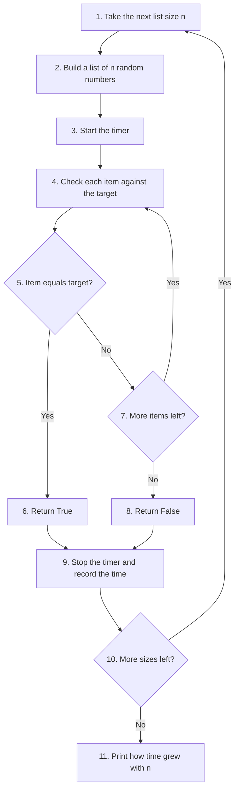
```mermaid
flowchart TD
    A["1. Take the next list size n"] --> B["2. Build a list of n random numbers"]
    B --> C["3. Start the timer"]
    C --> D["4. Check each item against the target"]
    D --> E{"5. Item equals target?"}
    E -- "Yes" --> F["6. Return True"]
    E -- "No" --> G{"7. More items left?"}
    G -- "Yes" --> D
    G -- "No" --> H["8. Return False"]
    F --> I["9. Stop the timer and record the time"]
    H --> I
    I --> J{"10. More sizes left?"}
    J -- "Yes" --> A
    J -- "No" --> K["11. Print how time grew with n"]
```

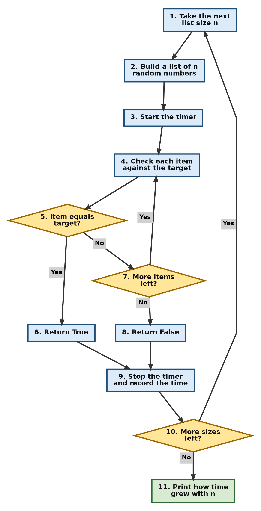

[Back to the Table of Contents](#table-of-contents)

### 1.2 Answer Script

```python
import random
import time

# Step 1: Define linear search
# It checks every item one by one.
def linear_search(numbers, target):

    # Step 2: Compare target with every element
    for item in numbers:
        if item == target:
            return True

    # Step 3: If loop finishes, item was not found
    return False

# Step 4: Different input sizes
sizes = [1000, 10000, 100000, 500000]
times = []

# Step 5: Use a missing target
# This forces worst case:
# every item must be checked
target = -1

for n in sizes:
    # Step 6: Create list of n random numbers
    # (random.randint(1, 100000) never gives -1, so the target is never found)
    numbers = []
    for i in range(n):
        numbers.append(random.randint(1, 100000))

    # Step 7: Start timer
    start = time.perf_counter()
    found = linear_search(numbers, target)

    # Step 8: Stop timer
    end = time.perf_counter()
    elapsed = end - start
    times.append(elapsed)

    # :>7, prints n right-aligned with thousands commas
    # :.6f prints the time with 6 digits after the decimal point
    print(f"Items: {n:>7,}   Found: {found}   Time: {elapsed:.6f} seconds")

# Step 9: Show how the time grew compared with the smallest list
print()
print("How many times larger than the first list:")
for n, elapsed in zip(sizes, times):
    size_ratio = n / sizes[0]
    time_ratio = elapsed / times[0]
    print(f"  {size_ratio:>5.0f}x the items took {time_ratio:>6.1f}x the time")
```

[Back to the Table of Contents](#table-of-contents)

### 1.3 Output

Your numbers will be different, because timing depends on your computer and on what else it is doing. The pattern will be similar.

```text
Items:   1,000   Found: False   Time: 0.000013 seconds
Items:  10,000   Found: False   Time: 0.000143 seconds
Items: 100,000   Found: False   Time: 0.001277 seconds
Items: 500,000   Found: False   Time: 0.006141 seconds

How many times larger than the first list:
      1x the items took    1.0x the time
     10x the items took   10.9x the time
    100x the items took   97.6x the time
    500x the items took  469.5x the time
```

[Back to the Table of Contents](#table-of-contents)

### 1.4 Explanation

1. Every search returned `Found: False`, so every item was checked each time. This is the worst case.
2. When the list became 10 times bigger (1,000 to 10,000), the time became roughly 10 times bigger.
3. When it became 500 times bigger, the time became roughly 500 times bigger.
4. So the time grows in a straight line with `n`. This is what `O(n)` looks like in practice.

The ratios will never be exact. Very short timings are affected by background activity on the computer, by the processor's memory cache, and by Python's own overhead. That is why the smallest list often shows the most "noise". Larger lists give steadier results.

The optional script below draws a graph of the times. It needs the third-party [matplotlib](https://matplotlib.org/) library (`pip install matplotlib`). It repeats each search 5 times and keeps the fastest time, which smooths out the noise.

```python
import random
import time
import matplotlib.pyplot as plt

# Step 1: The same linear search as before
def linear_search(numbers, target):
    for item in numbers:
        if item == target:
            return True
    return False

# Step 2: More sizes, so the line is easier to see
sizes = [100000, 200000, 300000, 400000, 500000]
times = []

for n in sizes:
    numbers = [random.randint(1, 100000) for _ in range(n)]

    # Step 3: Repeat 5 times and keep the fastest run
    best = None
    for _ in range(5):
        start = time.perf_counter()
        linear_search(numbers, -1)
        elapsed = time.perf_counter() - start
        if best is None or elapsed < best:
            best = elapsed
    times.append(best * 1000)             # convert seconds to milliseconds
    print(f"Items: {n:>7,}   Fastest time: {best * 1000:.2f} ms")

# Step 4: Draw and save the graph
plt.figure(figsize=(7, 4.5))
plt.plot(sizes, times, marker="o", color="#2a78d6", linewidth=2, markersize=8)
plt.title("Linear search: time grows in step with n")
plt.xlabel("Number of items (n)")
plt.ylabel("Time (milliseconds)")
plt.ticklabel_format(style="plain", axis="x")
plt.grid(True, color="#e6e5e0")
plt.gca().spines["top"].set_visible(False)
plt.gca().spines["right"].set_visible(False)
plt.tight_layout()
plt.savefig("065-ch16-linear-search-timing.png", dpi=150)
print("Graph saved as 065-ch16-linear-search-timing.png")
```

**Output** (your times will differ)

```text
Items: 100,000   Fastest time: 1.16 ms
Items: 200,000   Fastest time: 2.34 ms
Items: 300,000   Fastest time: 3.47 ms
Items: 400,000   Fastest time: 4.71 ms
Items: 500,000   Fastest time: 5.94 ms
Graph saved as 065-ch16-linear-search-timing.png
```

The graph from one run of this script:

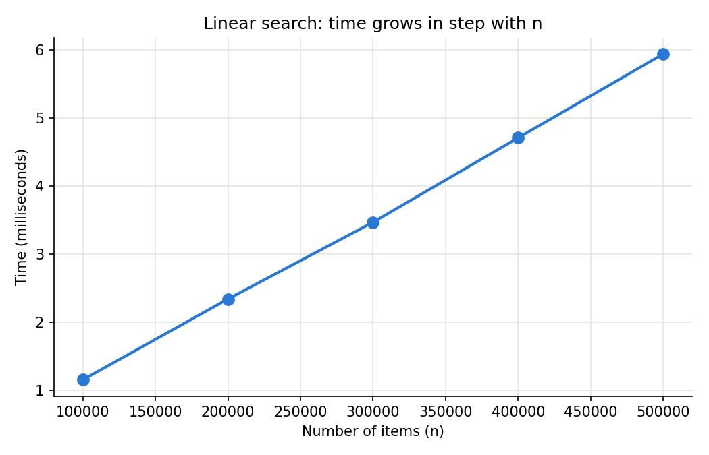

The points lie close to a straight line. Doubling the number of items roughly doubles the time.

[Back to the Table of Contents](#table-of-contents)

### 1.5 Follow-up Questions

**1.5.1 What would happen to the times if the target were the first item in every list?**

The search would stop after one comparison every time, so the time would be tiny and would hardly change with `n`. This is the **best case**, `O(1)`. That is why timing tests use a missing target: it shows the worst case.

**1.5.2 How could Step 6 be written in one line?**

With a list comprehension: `numbers = [random.randint(1, 100000) for _ in range(n)]`. The `_` is a common name for a loop variable that is not used. See [list comprehensions](https://docs.python.org/3/tutorial/datastructures.html#list-comprehensions).

[Back to the Table of Contents](#table-of-contents)

---

## 2. Binary Search

**Create a script to perform binary search on a sorted list and count comparisons.**

### 2.1 How It Works

**Binary search** works only on a **sorted** list. Instead of checking items one by one, it looks at the middle item and throws away the half where the target cannot be. It keeps halving until it finds the target or runs out of items.

1. Set `left` to the first index and `right` to the last index. These mark the part of the list still being searched.
2. While `left` is not past `right`:
   1. Find the middle index: `(left + right) // 2`. (`//` is whole-number division.)
   2. Add 1 to the comparison count.
   3. If the middle item is the target, return its index and the count.
   4. If the target is bigger than the middle item, search the right half: `left = middle + 1`.
   5. Otherwise, search the left half: `right = middle - 1`.
3. If `left` passes `right`, the target is not in the list. Return `-1`.

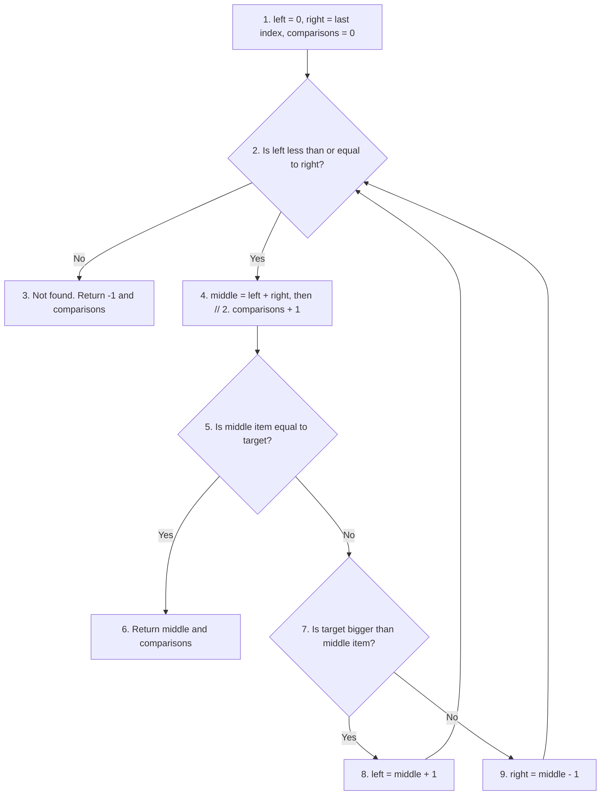
```mermaid
flowchart TD
    A["1. left = 0, right = last index, comparisons = 0"] --> B{"2. Is left less than or equal to right?"}
    B -- "No" --> C["3. Not found. Return -1 and comparisons"]
    B -- "Yes" --> D["4. middle = left + right, then // 2. comparisons + 1"]
    D --> E{"5. Is middle item equal to target?"}
    E -- "Yes" --> F["6. Return middle and comparisons"]
    E -- "No" --> G{"7. Is target bigger than middle item?"}
    G -- "Yes" --> H["8. left = middle + 1"]
    G -- "No" --> I["9. right = middle - 1"]
    H --> B
    I --> B
```

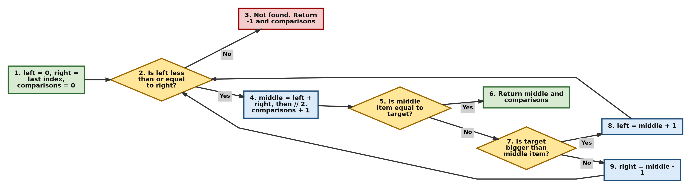

Here is the search for 70 in `[10, 20, 30, 40, 50, 60, 70]`:

| Round | left | right | middle | Item at middle | Result |
|---|---|---|---|---|---|
| 1 | 0 | 6 | 3 | 40 | 70 is bigger, so `left = 4` |
| 2 | 4 | 6 | 5 | 60 | 70 is bigger, so `left = 6` |
| 3 | 6 | 6 | 6 | 70 | Found at index 6 |

[Back to the Table of Contents](#table-of-contents)

### 2.2 Answer Script

```python
# Step 1: Binary search needs sorted data
numbers = [10, 20, 30, 40, 50, 60, 70]

def binary_search(numbers, target, show_steps=False):
    left = 0
    right = len(numbers) - 1
    comparisons = 0

    # Step 2: Continue while search area exists
    while left <= right:
        middle = (left + right) // 2
        comparisons += 1
        if show_steps:
            print(f"  left={left}, right={right}, middle={middle}, item={numbers[middle]}")

        # Step 3: Check middle item
        if numbers[middle] == target:
            return middle, comparisons

        # Step 4: Search right half
        elif target > numbers[middle]:
            left = middle + 1

        # Step 5: Search left half
        else:
            right = middle - 1

    # Step 6: The search area is empty, so the target is not in the list
    return -1, comparisons

# Step 7: Search for 70 and show each round
print("Searching for 70:")
index, count = binary_search(numbers, 70, show_steps=True)
print("Index:", index)
print("Comparisons:", count)

# Step 8: Try other targets, including one that is missing
print()
for target in (40, 10, 35):
    index, count = binary_search(numbers, target)
    print(f"Target {target}: index {index}, comparisons {count}")
```

[Back to the Table of Contents](#table-of-contents)

### 2.3 Output

```text
Searching for 70:
  left=0, right=6, middle=3, item=40
  left=4, right=6, middle=5, item=60
  left=6, right=6, middle=6, item=70
Index: 6
Comparisons: 3

Target 40: index 3, comparisons 1
Target 10: index 0, comparisons 3
Target 35: index -1, comparisons 3
```

[Back to the Table of Contents](#table-of-contents)

### 2.4 Explanation

- 70 was found at index 6 after 3 rounds, exactly as in the table above.
- 40 is the middle item, so it was found in the very first round.
- 35 is not in the list. The search area shrank to nothing after 3 rounds and the function returned `-1`.

A list of 7 items never needs more than 3 rounds, because 7 can be halved only about 3 times before one item is left. For 1,000,000 items, binary search needs at most about 20 rounds.

Note that `comparisons` counts **rounds** of the loop. In each round, the script may compare the target with the middle item twice (first `==`, then `>`). Counting rounds is the usual way to describe binary search.

[Back to the Table of Contents](#table-of-contents)

### 2.5 Follow-up Questions

**2.5.1 What goes wrong if the list is not sorted?**

The function does not raise an error, but it can give a wrong answer. For example, in `[40, 10, 70, 20]` a search for 10 looks at index 1 first and finds it by luck, but a search for 20 looks at 10, decides 20 must be on the right, then looks at 70, decides 20 must be on the left of 70, and gives up, returning `-1` even though 20 is there.

**2.5.2 Which Standard Library module does binary search for you?**

The [bisect](https://docs.python.org/3/library/bisect.html) module. See Question 13.

[Back to the Table of Contents](#table-of-contents)

---

## 3. Bubble Sort Implementation

**Implement bubble sort and display the list after every pass.**

### 3.1 How It Works

**Bubble sort** walks through the list comparing each pair of neighbouring items and swapping them if they are in the wrong order. After each full walk, called a **pass**, the largest remaining item has "bubbled" to the end.

1. Repeat for `n - 1` passes, where `n` is the length of the list.
2. In each pass, compare item `i` with item `i + 1`.
3. If item `i` is bigger, swap the two.
4. Each pass can stop one position earlier than the last, because the end of the list is already sorted.
5. Print the list after each pass.

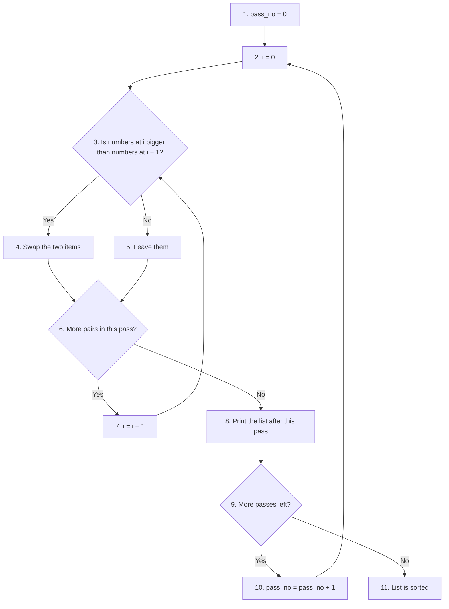
```mermaid
flowchart TD
    A["1. pass_no = 0"] --> B["2. i = 0"]
    B --> C{"3. Is numbers at i bigger than numbers at i + 1?"}
    C -- "Yes" --> D["4. Swap the two items"]
    C -- "No" --> E["5. Leave them"]
    D --> F{"6. More pairs in this pass?"}
    E --> F
    F -- "Yes" --> G["7. i = i + 1"]
    G --> C
    F -- "No" --> H["8. Print the list after this pass"]
    H --> I{"9. More passes left?"}
    I -- "Yes" --> J["10. pass_no = pass_no + 1"]
    J --> B
    I -- "No" --> K["11. List is sorted"]
```

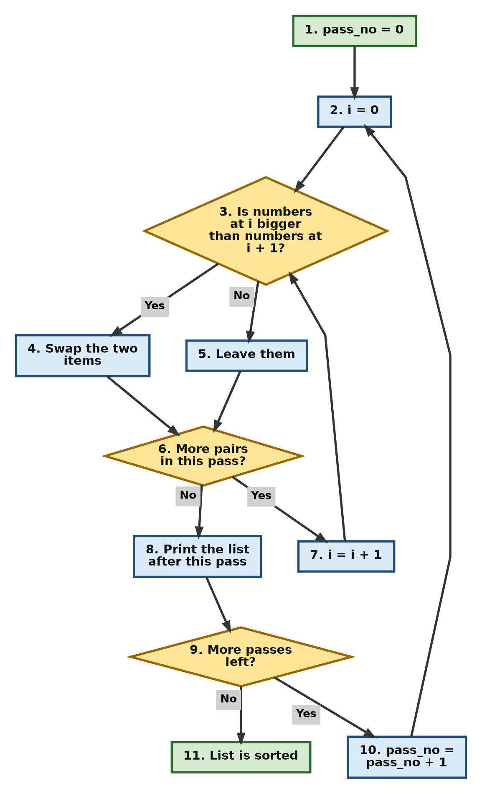

The line `numbers[i], numbers[i+1] = (numbers[i+1], numbers[i])` swaps two items in one step. Python first builds the pair on the right, then assigns it to the two positions on the left. This is called [tuple unpacking](https://docs.python.org/3/tutorial/datastructures.html#tuples-and-sequences).

[Back to the Table of Contents](#table-of-contents)

### 3.2 Answer Script

```python
def bubble_sort(numbers):

    n = len(numbers)

    # Step 1:
    # Each pass places one largest item
    # at the correct position
    for pass_no in range(n - 1):

        # Step 2:
        # Compare neighbouring items
        # The last pass_no items are already in place, so we stop before them
        for i in range(n - pass_no - 1):

            # Step 3:
            # Swap if wrong order
            if numbers[i] > numbers[i + 1]:
                numbers[i], numbers[i + 1] = (numbers[i + 1], numbers[i])

        # Step 4:
        # Show the list after this pass
        print("After pass", pass_no + 1, numbers)

numbers = [6, 5, 4, 3, 2, 1]
print("Original:", numbers)
bubble_sort(numbers)
print("Sorted:", numbers)
```

[Back to the Table of Contents](#table-of-contents)

### 3.3 Output

```text
Original: [6, 5, 4, 3, 2, 1]
After pass 1 [5, 4, 3, 2, 1, 6]
After pass 2 [4, 3, 2, 1, 5, 6]
After pass 3 [3, 2, 1, 4, 5, 6]
After pass 4 [2, 1, 3, 4, 5, 6]
After pass 5 [1, 2, 3, 4, 5, 6]
Sorted: [1, 2, 3, 4, 5, 6]
```

[Back to the Table of Contents](#table-of-contents)

### 3.4 Explanation

The list `[6, 5, 4, 3, 2, 1]` is in reverse order, which is the worst case for bubble sort. Read the output pass by pass:

| After pass | Item that reached its final place | Sorted part at the end |
|---|---|---|
| 1 | 6 | `6` |
| 2 | 5 | `5, 6` |
| 3 | 4 | `4, 5, 6` |
| 4 | 3 | `3, 4, 5, 6` |
| 5 | 2 (and 1 falls into place) | whole list |

For 6 items there are 5 passes, and the passes make 5 + 4 + 3 + 2 + 1 = 15 comparisons in total.

Note that the function sorts the list **in place**. It changes the original list rather than returning a new one. That is why printing `numbers` after the call shows the sorted list.

[Back to the Table of Contents](#table-of-contents)

### 3.5 Follow-up Questions

**3.5.1 What happens if you run this script on a list that is already sorted?**

It still makes all 5 passes and all 15 comparisons, even though nothing is swapped. The optimised version below adds a flag called `is_swapped` and stops as soon as a pass makes no swaps.

```python
# Step 1: Bubble sort that stops early when no swaps happen
def bubble_sort_optimised(numbers):
    n = len(numbers)
    for pass_no in range(n - 1):
        is_swapped = False
        for i in range(n - pass_no - 1):
            if numbers[i] > numbers[i + 1]:
                numbers[i], numbers[i + 1] = numbers[i + 1], numbers[i]
                is_swapped = True
        print("After pass", pass_no + 1, numbers)
        # Step 2: No swaps means the list is already sorted
        if not is_swapped:
            print("No swaps in this pass, so stop early")
            break

# Step 3: Try it on a list that is almost sorted
numbers = [1, 2, 4, 3, 5, 6]
bubble_sort_optimised(numbers)
print("Sorted:", numbers)
```

**Output**

```text
After pass 1 [1, 2, 3, 4, 5, 6]
After pass 2 [1, 2, 3, 4, 5, 6]
No swaps in this pass, so stop early
Sorted: [1, 2, 3, 4, 5, 6]
```

**3.5.2 How would you sort in descending order instead?**

Change `>` to `<` in the comparison, so that smaller items move to the end.

[Back to the Table of Contents](#table-of-contents)

---

## 4. Insertion Sort

**Implement insertion sort by moving the current item into the correct position.**

### 4.1 How It Works

**Insertion sort** works the way many people sort playing cards in their hand. The left part of the list is always sorted. Each new item (the **key**) is taken out, and bigger items in the sorted part slide one place to the right until the key's correct gap opens up.

1. Treat the first item as already sorted.
2. Take the next item as the `key`.
3. Start at the item just to the left of the key.
4. While that item is bigger than the key, shift it one place to the right and move one step further left.
5. Put the key into the gap.
6. Repeat until every item has been placed.

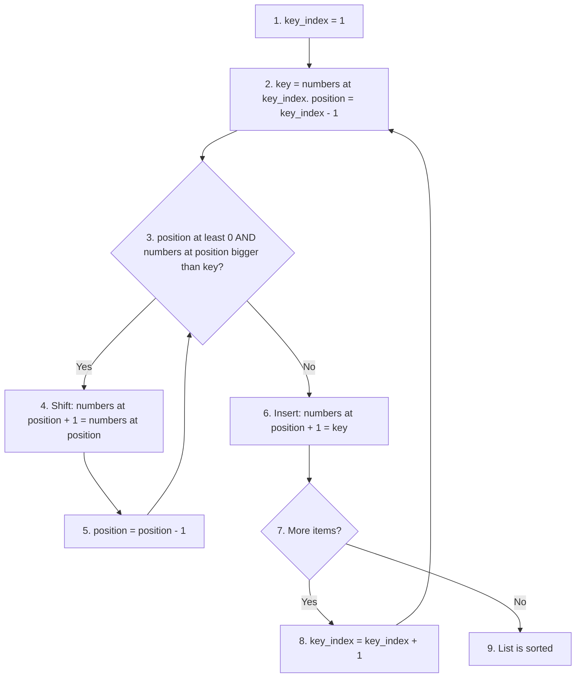
```mermaid
flowchart TD
    A["1. key_index = 1"] --> B["2. key = numbers at key_index. position = key_index - 1"]
    B --> C{"3. position at least 0 AND numbers at position bigger than key?"}
    C -- "Yes" --> D["4. Shift: numbers at position + 1 = numbers at position"]
    D --> E["5. position = position - 1"]
    E --> C
    C -- "No" --> F["6. Insert: numbers at position + 1 = key"]
    F --> G{"7. More items?"}
    G -- "Yes" --> H["8. key_index = key_index + 1"]
    H --> B
    G -- "No" --> I["9. List is sorted"]
```

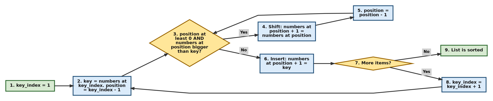

[Back to the Table of Contents](#table-of-contents)

### 4.2 Answer Script

```python
def insertion_sort(numbers):

    # Step 1:
    # First item is already sorted
    for key_index in range(1, len(numbers)):

        # Step 2:
        # Store current item
        key = numbers[key_index]
        position = key_index - 1

        # Step 3:
        # Shift bigger items right
        # "position >= 0" stops us going past the start of the list
        while position >= 0 and numbers[position] > key:
            numbers[position + 1] = numbers[position]
            position -= 1

        # Step 4:
        # Insert key at empty position
        numbers[position + 1] = key

        # Step 5:
        # Show the list after placing this key
        print(f"Placed {key}: {numbers}")

numbers = [5, 4, 2, 3]
print("Original:", numbers)
insertion_sort(numbers)
print("Sorted:", numbers)
```

[Back to the Table of Contents](#table-of-contents)

### 4.3 Output

```text
Original: [5, 4, 2, 3]
Placed 4: [4, 5, 2, 3]
Placed 2: [2, 4, 5, 3]
Placed 3: [2, 3, 4, 5]
Sorted: [2, 3, 4, 5]
```

[Back to the Table of Contents](#table-of-contents)

### 4.4 Explanation

| Key | Sorted part before | Items shifted right | Sorted part after |
|---|---|---|---|
| 4 | `5` | 5 | `4, 5` |
| 2 | `4, 5` | 5, then 4 | `2, 4, 5` |
| 3 | `2, 4, 5` | 5, then 4 (stops at 2, which is smaller) | `2, 3, 4, 5` |

Why does the `while` condition check `position >= 0` first? When the key is smaller than everything before it (like 2 here), `position` becomes `-1`. In Python, `numbers[-1]` does not raise an error; it quietly reads the **last** item. Because `and` stops as soon as the first part is `False`, checking `position >= 0` first prevents that mistake.

Insertion sort shifts items instead of swapping them, and it stops early when it finds the right gap. So on lists that are already nearly sorted it is very fast.

[Back to the Table of Contents](#table-of-contents)

### 4.5 Follow-up Questions

**4.5.1 How many shifts happen if the list is already sorted, such as `[2, 3, 4, 5]`?**

None. For each key, the item on its left is already smaller, so the `while` loop never runs.

**4.5.2 Which Python feature does something similar for you?**

`bisect.insort()` inserts a single value into an already sorted list. See Question 13. To sort a whole list, use the built-in `sorted()` function or the `list.sort()` method.

[Back to the Table of Contents](#table-of-contents)

---

## 5. Selection Sort

**Create a selection sort script which finds the smallest item and places it at the beginning.**

### 5.1 How It Works

**Selection sort** splits the list into a sorted part on the left and an unsorted part on the right. In each pass, it **selects** the smallest item in the unsorted part and swaps it into the first unsorted position.

1. For each position from the start up to the second-last:
   1. Assume the item at this position is the smallest (`min_index = position`).
   2. Look at every item after it. If one is smaller, remember its index.
   3. If the smallest item is not already at this position, swap them.
2. When every position has been filled, the list is sorted.

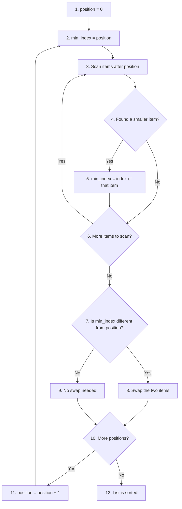
```mermaid
flowchart TD
    A["1. position = 0"] --> B["2. min_index = position"]
    B --> C["3. Scan items after position"]
    C --> D{"4. Found a smaller item?"}
    D -- "Yes" --> E["5. min_index = index of that item"]
    D -- "No" --> F{"6. More items to scan?"}
    E --> F
    F -- "Yes" --> C
    F -- "No" --> G{"7. Is min_index different from position?"}
    G -- "Yes" --> H["8. Swap the two items"]
    G -- "No" --> I["9. No swap needed"]
    H --> J{"10. More positions?"}
    I --> J
    J -- "Yes" --> K["11. position = position + 1"]
    K --> B
    J -- "No" --> L["12. List is sorted"]
```

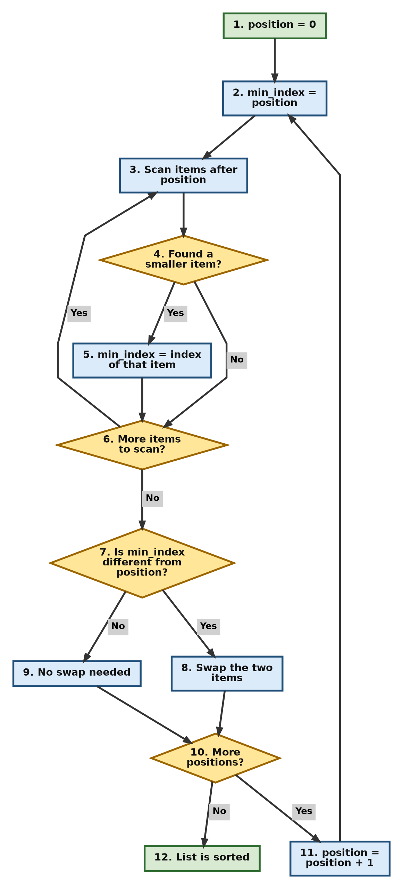

[Back to the Table of Contents](#table-of-contents)

### 5.2 Answer Script

```python
def selection_sort(numbers):
    n = len(numbers)

    # Step 1:
    # Each pass fixes one position
    for position in range(n - 1):
        # Assume current position
        # contains smallest value
        min_index = position

        # Step 2:
        # Search remaining list
        for i in range(position + 1, n):
            if numbers[i] < numbers[min_index]:
                min_index = i

        # Step 3:
        # Exchange only if needed
        if min_index != position:

            numbers[position], numbers[min_index] = (
                numbers[min_index],
                numbers[position]
            )

        # Step 4:
        # Show the list after this pass
        print(f"Pass {position + 1}: smallest is {numbers[position]} -> {numbers}")

numbers = [7, 1, 4, 2, 0]
print("Original:", numbers)
selection_sort(numbers)
print("Sorted:", numbers)
```

[Back to the Table of Contents](#table-of-contents)

### 5.3 Output

```text
Original: [7, 1, 4, 2, 0]
Pass 1: smallest is 0 -> [0, 1, 4, 2, 7]
Pass 2: smallest is 1 -> [0, 1, 4, 2, 7]
Pass 3: smallest is 2 -> [0, 1, 2, 4, 7]
Pass 4: smallest is 4 -> [0, 1, 2, 4, 7]
Sorted: [0, 1, 2, 4, 7]
```

[Back to the Table of Contents](#table-of-contents)

### 5.4 Explanation

| Pass | Unsorted part | Smallest found | Swap | List after |
|---|---|---|---|---|
| 1 | `7, 1, 4, 2, 0` | 0 | 7 and 0 | `[0, 1, 4, 2, 7]` |
| 2 | `1, 4, 2, 7` | 1 | none (already in place) | `[0, 1, 4, 2, 7]` |
| 3 | `4, 2, 7` | 2 | 4 and 2 | `[0, 1, 2, 4, 7]` |
| 4 | `4, 7` | 4 | none (already in place) | `[0, 1, 2, 4, 7]` |

Selection sort always scans the whole unsorted part, so it makes the same number of comparisons whatever the input: 4 + 3 + 2 + 1 = 10 for 5 items. But it makes at most one swap per pass. Here it made only 2 swaps. This is useful when writing data is expensive.

[Back to the Table of Contents](#table-of-contents)

### 5.5 Follow-up Questions

**5.5.1 Why does the outer loop run only `n - 1` times?**

After the first `n - 1` positions hold the right items, the last item has to be the largest, so it is already in place.

**5.5.2 How would you count the number of swaps?**

Create `swaps = 0` before the loops, add `swaps += 1` inside the `if min_index != position:` block, and return `swaps` at the end.

[Back to the Table of Contents](#table-of-contents)

---

## 6. Stack using List

**Implement stack operations using a Python list.**

### 6.1 How It Works

A **stack** is a collection where the last item added is the first item removed. This is called **LIFO** (Last In, First Out). Think of a pile of books: you add a book to the top and take a book from the top.

| Stack operation | Meaning | Python list method |
|---|---|---|
| Push | Add an item to the top | `append(item)` |
| Pop | Remove and return the top item | `pop()` |
| Peek | Look at the top item without removing it | `stack[-1]` |
| Is empty? | Check whether the stack has no items | `not stack` or `len(stack) == 0` |

A Python list works well as a stack because `append()` and `pop()` both work at the **end** of the list, and both are fast `O(1)` operations.

[Back to the Table of Contents](#table-of-contents)

### 6.2 Answer Script

```python
# Step 1:
# List works naturally as stack
# because append and pop work at the end
stack = []

# Step 2:
# PUSH operation
stack.append("Book 1")
stack.append("Book 2")
stack.append("Book 3")
print(stack)

# Step 3:
# PEEK at the top item without removing it
print("Top of stack:", stack[-1])

# Step 4:
# POP removes latest item
item = stack.pop()
print("Removed:", item)
print(stack)

# Step 5:
# POP until the stack is empty
while stack:                      # an empty list counts as False
    print("Removed:", stack.pop())
print("Stack is empty:", len(stack) == 0)

# Step 6:
# Popping from an empty stack raises an IndexError
try:
    stack.pop()
except IndexError as error:
    print("IndexError:", error)
```

[Back to the Table of Contents](#table-of-contents)

### 6.3 Output

```text
['Book 1', 'Book 2', 'Book 3']
Top of stack: Book 3
Removed: Book 3
['Book 1', 'Book 2']
Removed: Book 2
Removed: Book 1
Stack is empty: True
IndexError: pop from empty list
```

[Back to the Table of Contents](#table-of-contents)

### 6.4 Explanation

1. The three books were pushed in the order 1, 2, 3. "Book 3" is on top.
2. `stack[-1]` read the top item without removing it.
3. The first `pop()` removed "Book 3", the last one added.
4. The `while stack:` loop kept popping until nothing was left. An empty list is treated as `False`, so the loop stopped.
5. Popping from an empty list raised an `IndexError`. In a real program, check that the stack is not empty before popping.

[Back to the Table of Contents](#table-of-contents)

### 6.5 Follow-up Questions

**6.5.1 Why not use `insert(0, item)` and `pop(0)` to push and pop at the front of the list instead?**

Because working at the front of a list is slow. Every other item has to move one place, which is `O(n)`. Working at the end with `append()` and `pop()` moves nothing.

**6.5.2 Where are stacks used in real life?**

The Undo button in editors, the Back button in web browsers, and checking whether brackets in an expression are balanced. See Question 15 for an undo example.

[Back to the Table of Contents](#table-of-contents)

---

## 7. Queue using deque

**Create a queue using `collections.deque` and process items in FIFO order.**

### 7.1 How It Works

A **queue** is a collection where the first item added is the first item removed. This is called **FIFO** (First In, First Out), like people waiting in a line.

[collections.deque](https://docs.python.org/3/library/collections.html#collections.deque) (pronounced "deck") is a double-ended queue. It can add and remove items quickly at **both** ends.

1. Create an empty deque.
2. Add tasks at the right end with `append()`.
3. While the deque is not empty, remove the task at the left end with `popleft()` and process it.

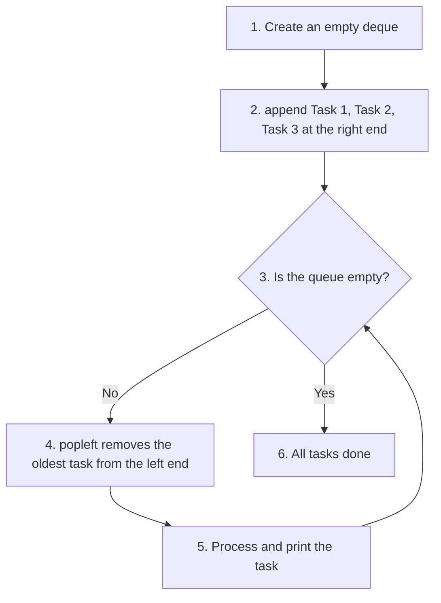
```mermaid
flowchart TD
    A["1. Create an empty deque"] --> B["2. append Task 1, Task 2, Task 3 at the right end"]
    B --> C{"3. Is the queue empty?"}
    C -- "No" --> D["4. popleft removes the oldest task from the left end"]
    D --> E["5. Process and print the task"]
    E --> C
    C -- "Yes" --> F["6. All tasks done"]
```

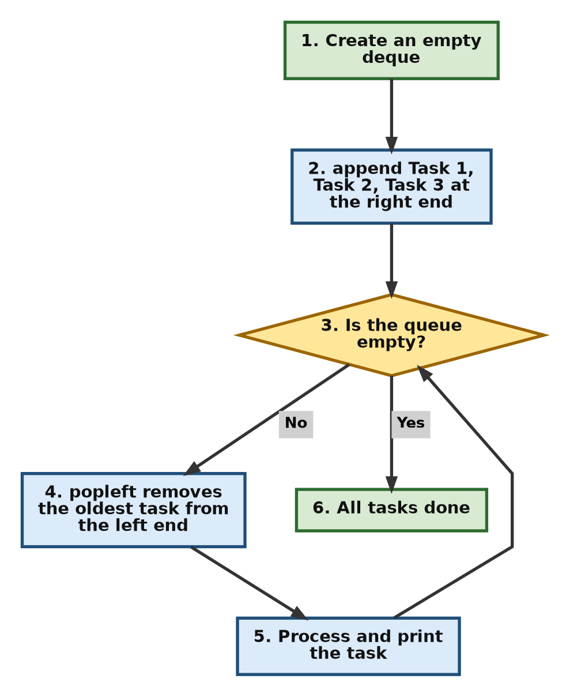

[Back to the Table of Contents](#table-of-contents)

### 7.2 Answer Script

```python
from collections import deque

# Step 1:
# deque supports fast operations
# from both ends
queue = deque()

# Step 2:
# Add items at the right end
queue.append("Task 1")
queue.append("Task 2")
queue.append("Task 3")
print("Queue:", queue)
print("Next task (front of the queue):", queue[0])

# Step 3:
# Remove oldest item from the left end
while queue:
    print("Processing:", queue.popleft())
    print("  Still waiting:", list(queue))
```

[Back to the Table of Contents](#table-of-contents)

### 7.3 Output

```text
Queue: deque(['Task 1', 'Task 2', 'Task 3'])
Next task (front of the queue): Task 1
Processing: Task 1
  Still waiting: ['Task 2', 'Task 3']
Processing: Task 2
  Still waiting: ['Task 3']
Processing: Task 3
  Still waiting: []
```

[Back to the Table of Contents](#table-of-contents)

### 7.4 Explanation

The tasks were processed in exactly the order they were added: Task 1, then Task 2, then Task 3. After each `popleft()`, the "Still waiting" line shows the queue getting shorter from the front.

Why use `deque` instead of a list? A list can act as a queue with `append()` and `pop(0)`, but `pop(0)` is slow on a list: every remaining item must move one place to the left, which is `O(n)`. With a deque, `popleft()` is `O(1)`, however long the queue is.

| Operation | List | deque |
|---|---|---|
| Add at the end | `append(x)`: fast | `append(x)`: fast |
| Remove from the front | `pop(0)`: slow, `O(n)` | `popleft()`: fast, `O(1)` |
| Add at the front | `insert(0, x)`: slow, `O(n)` | `appendleft(x)`: fast, `O(1)` |

The variable is named `queue` here. Be aware that Python also has a module called `queue` (used in Questions 14 to 16). In a script that imports that module, choose a different variable name so the two do not clash.

[Back to the Table of Contents](#table-of-contents)

### 7.5 Follow-up Questions

**7.5.1 How would you let an urgent task jump to the front of the queue?**

Use `queue.appendleft("Urgent task")`. It will be the next item returned by `popleft()`.

**7.5.2 What happens if you call `popleft()` on an empty deque?**

It raises `IndexError: pop from an empty deque`. That is why the script loops `while queue:`.

[Back to the Table of Contents](#table-of-contents)

---

## 8. Counter

**Count frequency of words using `Counter`.**

### 8.1 How It Works

[Counter](https://docs.python.org/3/library/collections.html#collections.Counter) is a special kind of dictionary that counts things. You give it a list, and it returns each different item as a key with the number of times it appears as the value. The word **frequency** simply means "how often something occurs".

1. Put the words in a list. (In real programs you might get them by splitting a sentence with `text.split()`.)
2. Pass the list to `Counter`.
3. Print the counts.
4. Use `most_common(n)` to get the `n` most frequent words.

[Back to the Table of Contents](#table-of-contents)

### 8.2 Answer Script

```python
from collections import Counter

# Step 1:
# Data to analyse
words = ["python", "java", "python", "python", "java"]

# Step 2:
# Counter automatically counts
count = Counter(words)
print(count)

# Step 3:
# Most common item
print(count.most_common(1))

# Step 4:
# Read a single count like a dictionary
print("python appears", count["python"], "times")
print("ruby appears", count["ruby"], "times")      # missing words give 0, not an error

# Step 5:
# Count words straight from a sentence
sentence = "the cat sat on the mat and the cat slept"
sentence_count = Counter(sentence.split())
print(sentence_count.most_common(2))
```

[Back to the Table of Contents](#table-of-contents)

### 8.3 Output

```text
Counter({'python': 3, 'java': 2})
[('python', 3)]
python appears 3 times
ruby appears 0 times
[('the', 3), ('cat', 2)]
```

[Back to the Table of Contents](#table-of-contents)

### 8.4 Explanation

- `Counter` found that "python" appears 3 times and "java" 2 times, and listed them from most to least common.
- `most_common(1)` returned a **list** containing one pair, `('python', 3)`.
- Unlike a normal dictionary, asking a `Counter` for a missing key such as "ruby" returns `0` instead of raising a `KeyError`.
- In the sentence, `split()` broke the text into words at the spaces. "the" appears 3 times and "cat" 2 times.

Without `Counter`, you would need a loop like this:

```python
words = ["python", "java", "python", "python", "java"]
count = {}
for word in words:
    if word in count:
        count[word] += 1
    else:
        count[word] = 1
print(count)
```

**Output**

```text
{'python': 3, 'java': 2}
```

`Counter` does the same job in one line.

[Back to the Table of Contents](#table-of-contents)

### 8.5 Follow-up Questions

**8.5.1 How would you count letters instead of words?**

Pass a string directly: `Counter("banana")` gives `Counter({'a': 3, 'n': 2, 'b': 1})`, because looping over a string gives one character at a time.

**8.5.2 "Python" and "python" are counted as different words. How would you fix this?**

Convert the words to lowercase first: `Counter(word.lower() for word in words)`.

[Back to the Table of Contents](#table-of-contents)

---

## 9. defaultdict

**Group students by subject using `defaultdict`.**

### 9.1 How It Works

[defaultdict](https://docs.python.org/3/library/collections.html#collections.defaultdict) is a dictionary that creates a starting value for a key the first time you use it. With `defaultdict(list)`, the starting value is an empty list `[]`. So you can append to a key straight away, without first checking whether it exists.

1. Create `defaultdict(list)`.
2. For each student, append their name to the list for their subject.
3. The first time a subject is used, an empty list is created for it automatically.
4. Print the groups.

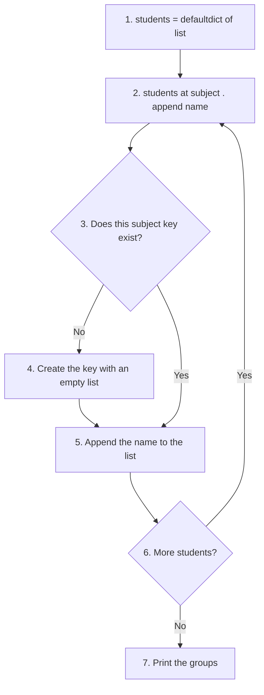
```mermaid
flowchart TD
    A["1. students = defaultdict of list"] --> B["2. students at subject . append name"]
    B --> C{"3. Does this subject key exist?"}
    C -- "No" --> D["4. Create the key with an empty list"]
    D --> E["5. Append the name to the list"]
    C -- "Yes" --> E
    E --> F{"6. More students?"}
    F -- "Yes" --> B
    F -- "No" --> G["7. Print the groups"]
```

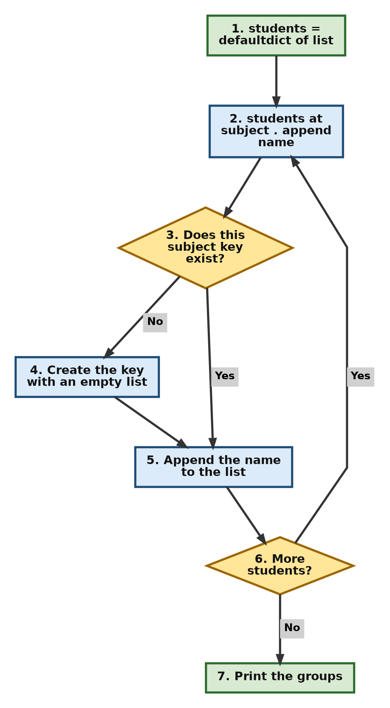

[Back to the Table of Contents](#table-of-contents)

### 9.2 Answer Script

```python
from collections import defaultdict

# Step 1:
# Automatically create empty list
students = defaultdict(list)

# Step 2:
# Add values
students["Python"].append("Amit")
students["Python"].append("Riya")
students["Math"].append("John")
print(students)

# Step 3:
# Print it as a normal dictionary, which is easier to read
print(dict(students))

# Step 4:
# Print each subject with its students
for subject, names in students.items():
    print(f"{subject}: {', '.join(names)}")

# Step 5:
# Grouping from a list of (name, subject) pairs
enrolments = [("Amit", "Python"), ("John", "Math"), ("Riya", "Python"), ("Sara", "Math")]
by_subject = defaultdict(list)
for name, subject in enrolments:
    by_subject[subject].append(name)
print(dict(by_subject))
```

[Back to the Table of Contents](#table-of-contents)

### 9.3 Output

```text
defaultdict(<class 'list'>, {'Python': ['Amit', 'Riya'], 'Math': ['John']})
{'Python': ['Amit', 'Riya'], 'Math': ['John']}
Python: Amit, Riya
Math: John
{'Python': ['Amit', 'Riya'], 'Math': ['John', 'Sara']}
```

[Back to the Table of Contents](#table-of-contents)

### 9.4 Explanation

- The first line of output shows how Python prints a `defaultdict`: it includes `<class 'list'>`, which is the function used to make default values.
- `dict(students)` turns it into a normal dictionary for cleaner printing.
- `', '.join(names)` joins the names into one string with a comma and a space between them.
- Step 5 shows the usual real-world pattern: a loop over pairs, grouping each name under its subject.

For comparison, here is what happens with a normal dictionary:

```python
students = {}
try:
    students["Python"].append("Amit")
except KeyError as error:
    print("KeyError:", error)
```

**Output**

```text
KeyError: 'Python'
```

A normal dictionary does not know what to do with a missing key, so it raises a `KeyError`. `defaultdict` avoids this.

[Back to the Table of Contents](#table-of-contents)

### 9.5 Follow-up Questions

**9.5.1 Which default would you use to count how many students take each subject?**

`defaultdict(int)`. A new key starts at `0`, so `counts[subject] += 1` works immediately.

**9.5.2 What does just reading `students["Art"]` do on a defaultdict?**

It creates the key `"Art"` with an empty list, even though you only read it. If you want to check without creating a key, use `"Art" in students` or `students.get("Art")`.

[Back to the Table of Contents](#table-of-contents)

---

## 10. namedtuple

**Create a record using `namedtuple` instead of normal tuple indexing.**

### 10.1 How It Works

With a normal tuple such as `("Anita", 20)`, you must remember that position 0 is the name and position 1 is the age. [namedtuple](https://docs.python.org/3/library/collections.html#collections.namedtuple) gives each position a name, so you can write `s1.name` instead of `s1[0]`.

1. Call `namedtuple()` with a class name and a list of field names. This creates a new record type.
2. Create a record by passing values in the same order as the fields.
3. Read values by name.

| Access style | Normal tuple | namedtuple |
|---|---|---|
| Get the name | `s1[0]` | `s1.name` |
| Get the age | `s1[1]` | `s1.age` |
| Is the meaning clear? | No, you must remember the positions | Yes, the names explain themselves |

[Back to the Table of Contents](#table-of-contents)

### 10.2 Answer Script

```python
from collections import namedtuple

# Step 1:
# Create a record structure
Student = namedtuple("Student", ["name", "age"])

# Step 2:
# Create object
s1 = Student("Anita", 20)
print(s1)

# Step 3:
# Access using names
print(s1.name)
print(s1.age)

# Step 4:
# A namedtuple is still a tuple, so indexing also works
print("By index:", s1[0], s1[1])

# Step 5:
# Compare with a normal tuple, where only positions are available
plain = ("Anita", 20)
print("Normal tuple:", plain[0], plain[1])

# Step 6:
# Records cannot be changed, but _replace() makes an updated copy
try:
    s1.age = 21
except AttributeError as error:
    print("AttributeError:", error)
s2 = s1._replace(age=21)
print("Original:", s1, "| Updated copy:", s2)
```

[Back to the Table of Contents](#table-of-contents)

### 10.3 Output

```text
Student(name='Anita', age=20)
Anita
20
By index: Anita 20
Normal tuple: Anita 20
AttributeError: can't set attribute
Original: Student(name='Anita', age=20) | Updated copy: Student(name='Anita', age=21)
```

[Back to the Table of Contents](#table-of-contents)

### 10.4 Explanation

- Printing `s1` shows both the field names and the values: `Student(name='Anita', age=20)`.
- `s1.name` and `s1.age` read the values by name. `s1[0]` and `s1[1]` still work, because a namedtuple is a real tuple underneath.
- A namedtuple is **immutable**, meaning it cannot be changed. Trying to set `s1.age = 21` raised an `AttributeError`.
- `_replace(age=21)` created a new record with the changed age and left `s1` untouched. (The underscore in `_replace` does not mean it is private. It is there so it cannot clash with a field name of your own.)

[Back to the Table of Contents](#table-of-contents)

### 10.5 Follow-up Questions

**10.5.1 How do you convert `s1` into a dictionary?**

`s1._asdict()` returns `{'name': 'Anita', 'age': 20}`.

**10.5.2 How do you give `age` a default value?**

Use the `defaults` argument (Python 3.7+): `Student = namedtuple("Student", ["name", "age"], defaults=[18])`. Then `Student("Rahul")` gives `Student(name='Rahul', age=18)`.

[Back to the Table of Contents](#table-of-contents)

---

## 11. ChainMap: Combine User Settings with Default Settings

**Combine user settings with default settings: Create a configuration system where user settings override default settings using `ChainMap`.**

### 11.1 How It Works

[ChainMap](https://docs.python.org/3/library/collections.html#collections.ChainMap) links several dictionaries so they can be searched as if they were one. It does not copy or merge them.

1. Create a dictionary of default settings.
2. Create a dictionary of user settings, holding only the settings the user has changed.
3. Combine them with `ChainMap(user_settings, default_settings)`. The order matters: the first dictionary is searched first.
4. When you look up a key, ChainMap checks `user_settings` first. If the key is not there, it checks `default_settings`.

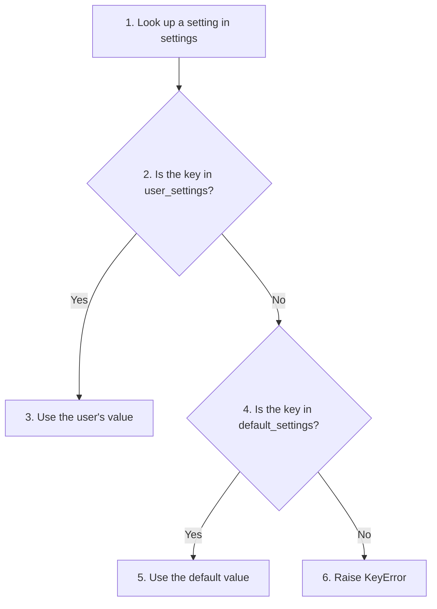
```mermaid
flowchart TD
    A["1. Look up a setting in settings"] --> B{"2. Is the key in user_settings?"}
    B -- "Yes" --> C["3. Use the user's value"]
    B -- "No" --> D{"4. Is the key in default_settings?"}
    D -- "Yes" --> E["5. Use the default value"]
    D -- "No" --> F["6. Raise KeyError"]
```

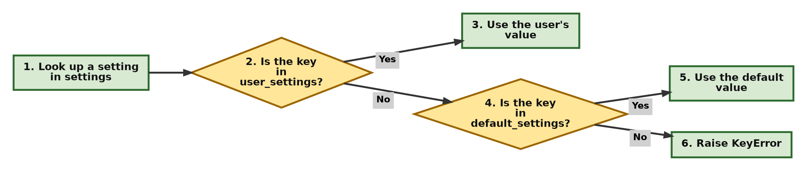

| Setting | In `user_settings` | In `default_settings` | Value returned by `settings` |
|---|---|---|---|
| `theme` | `"dark"` | `"light"` | `"dark"` (user wins) |
| `font_size` | not present | `12` | `12` (default used) |
| `language` | not present | `"English"` | `"English"` (default used) |

[Back to the Table of Contents](#table-of-contents)

### 11.2 Answer Script

```python
from collections import ChainMap

# Step 1: Create default settings
# These values are used when the user has not provided a value
default_settings = {"theme": "light", "font_size": 12, "language": "English"}

# Step 2: Create user-specific settings
# User settings should get higher priority
user_settings = {"theme": "dark"}

# Step 3: Combine dictionaries using ChainMap
# ChainMap searches the first dictionary first
# If key is not found, it checks the next dictionary
settings = ChainMap(user_settings, default_settings)

# Step 4: Access values
print("Theme:", settings["theme"])
# Found in user_settings
print("Font size:", settings["font_size"])
# Not present in user_settings
# So value comes from default_settings
print("Language:", settings["language"])

# Step 5: See all the final settings together
print("All settings:", dict(settings))

# Step 6: Change a setting through the ChainMap
# Changes are stored in the FIRST dictionary only
settings["font_size"] = 16
print("user_settings now   :", user_settings)
print("default_settings now:", default_settings)

# Step 7: ChainMap is live
# A change in an original dictionary shows up at once
default_settings["language"] = "Hindi"
print("Language after changing the defaults:", settings["language"])
```

[Back to the Table of Contents](#table-of-contents)

### 11.3 Output

```text
Theme: dark
Font size: 12
Language: English
All settings: {'theme': 'dark', 'font_size': 12, 'language': 'English'}
user_settings now   : {'theme': 'dark', 'font_size': 16}
default_settings now: {'theme': 'light', 'font_size': 12, 'language': 'English'}
Language after changing the defaults: Hindi
```

[Back to the Table of Contents](#table-of-contents)

### 11.4 Explanation

1. `theme` was found in `user_settings`, so the user's `"dark"` was used.
2. `font_size` and `language` were not in `user_settings`, so the defaults were used.
3. `dict(settings)` shows the final combined result.
4. Setting `settings["font_size"] = 16` stored the new value in `user_settings`. The defaults were not touched. This keeps the original defaults safe.
5. Changing `default_settings` directly was seen by `settings` straight away, because ChainMap does not make a copy.

[Back to the Table of Contents](#table-of-contents)

### 11.5 Follow-up Questions

**11.5.1 How would you add a third layer, such as settings typed on the command line, with the highest priority of all?**

Put it first: `ChainMap(command_line_settings, user_settings, default_settings)`.

**11.5.2 How is this different from merging with `{**default_settings, **user_settings}`?**

The merge creates a brand new dictionary. Later changes to the originals are not seen, and changes to the new dictionary do not go back to `user_settings`. ChainMap keeps the layers separate and live.

[Back to the Table of Contents](#table-of-contents)

---

## 12. heapq: Process Tasks According to Priority

**Question 12. Use `heapq` to create a priority based task manager.**

### 12.1 How It Works

The [heapq](https://docs.python.org/3/library/heapq.html) module uses an ordinary list as a **heap**. A heap keeps the smallest item at the front (index 0) at all times, so the smallest item can always be taken out quickly.

1. Start with an empty list.
2. Add each task as a tuple `(priority, task_name)` with `heapq.heappush()`.
3. Tuples are compared by their first item, so the priority number decides the order. A smaller number means more important.
4. Remove tasks one by one with `heapq.heappop()`. It always returns the tuple with the smallest priority number.

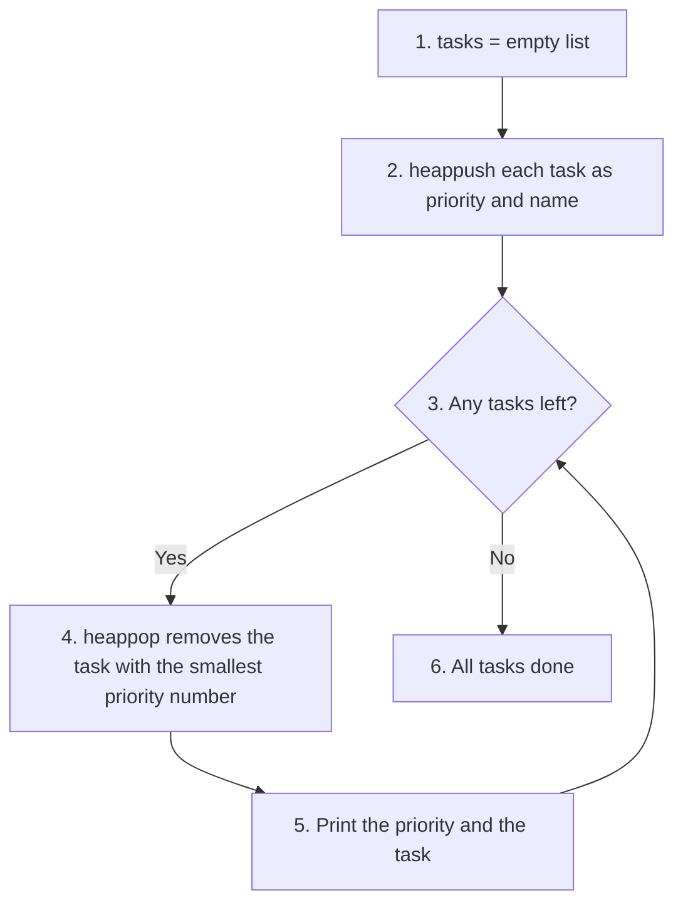
```mermaid
flowchart TD
    A["1. tasks = empty list"] --> B["2. heappush each task as priority and name"]
    B --> C{"3. Any tasks left?"}
    C -- "Yes" --> D["4. heappop removes the task with the smallest priority number"]
    D --> E["5. Print the priority and the task"]
    E --> C
    C -- "No" --> F["6. All tasks done"]
```

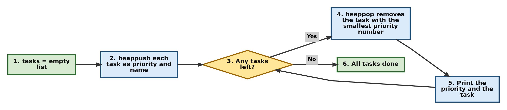

[Back to the Table of Contents](#table-of-contents)

### 12.2 Answer Script

```python
import heapq

# Step 1: Create an empty heap
# heapq always keeps the smallest item at the top
tasks = []

# Step 2: Add tasks
# Tuple format:
# (priority, task_name)
# Smaller priority number means higher importance
heapq.heappush(tasks, (3, "Read book"))
heapq.heappush(tasks, (1, "Fix error"))
heapq.heappush(tasks, (2, "Reply email"))
print("Heap list:", tasks)
print("Most urgent task (index 0):", tasks[0])

# Step 3: Remove tasks in priority order
while tasks:

    # heappop removes the smallest priority item
    priority, task = heapq.heappop(tasks)

    print(f"Priority {priority}: {task}")
```

[Back to the Table of Contents](#table-of-contents)

### 12.3 Output

```text
Heap list: [(1, 'Fix error'), (3, 'Read book'), (2, 'Reply email')]
Most urgent task (index 0): (1, 'Fix error')
Priority 1: Fix error
Priority 2: Reply email
Priority 3: Read book
```

[Back to the Table of Contents](#table-of-contents)

### 12.4 Explanation

- Look at the "Heap list" line. The list is **not** fully sorted: priority 3 comes before priority 2. A heap only promises that the smallest item is at index 0. This is what keeps it fast.
- `tasks[0]` let us look at the most urgent task without removing it.
- Each `heappop()` removed the smallest remaining item and rearranged the rest, so the tasks came out in the order 1, 2, 3, even though they were added as 3, 1, 2.
- Both `heappush()` and `heappop()` take `O(log n)` time, which stays fast even with thousands of tasks.

[Back to the Table of Contents](#table-of-contents)

### 12.5 Follow-up Questions

**12.5.1 How would you process the largest priority number first instead?**

Store the priority as a negative number: `heapq.heappush(tasks, (-priority, task))`, and turn it back when you pop: `-priority`.

**12.5.2 What happens if two tasks have the same priority?**

Python compares the second items of the tuples, the task names, alphabetically. So `(1, "Backup")` comes before `(1, "Email")`. If the second items cannot be compared (for example, two dictionaries), Python raises a `TypeError`. A common fix is to add a running counter: `(priority, counter, task)`.

[Back to the Table of Contents](#table-of-contents)

---

## 13. bisect: Insert Item into Sorted List

**Question 13. Maintain a sorted list by inserting a new value using `bisect`.**

### 13.1 How It Works

The [bisect](https://docs.python.org/3/library/bisect.html) module uses binary search (see Question 2) on a list that is already sorted.

1. Start with a sorted list of marks.
2. Use `bisect.bisect_left(marks, new_mark)` to find the index where the new mark belongs. This only finds the position. It does not change the list.
3. Use `bisect.insort(marks, new_mark)` to insert the mark at the correct place, so the list stays sorted.

| Index | 0 | 1 | 2 | 3 | 4 |
|---|---|---|---|---|---|
| Marks before | 40 | 55 | 70 | 85 | 95 |
| Where 75 goes | | | | between 70 and 85, so index 3 | |

[Back to the Table of Contents](#table-of-contents)

### 13.2 Answer Script

```python
import bisect

# Step 1:
# List must already be sorted
marks = [40, 55, 70, 85, 95]
new_mark = 75
print("Original marks:", marks)

# Step 2:
# Find correct insertion position
position = bisect.bisect_left(marks, new_mark)

# Step 3:
# Insert while keeping list sorted
bisect.insort(marks, new_mark)
print("Inserted at index:", position)
print("Updated marks:", marks)

# Step 4:
# Insert a few more marks, including one smaller and one larger than all others
for mark in (30, 100, 60):
    bisect.insort(marks, mark)
    print(f"After inserting {mark}: {marks}")
```

[Back to the Table of Contents](#table-of-contents)

### 13.3 Output

```text
Original marks: [40, 55, 70, 85, 95]
Inserted at index: 3
Updated marks: [40, 55, 70, 75, 85, 95]
After inserting 30: [30, 40, 55, 70, 75, 85, 95]
After inserting 100: [30, 40, 55, 70, 75, 85, 95, 100]
After inserting 60: [30, 40, 55, 60, 70, 75, 85, 95, 100]
```

[Back to the Table of Contents](#table-of-contents)

### 13.4 Explanation

1. `bisect_left` found that 75 belongs at index 3, just after 70.
2. `insort` put 75 there, and the list stayed in order.
3. In Step 4, 30 went to the very start (index 0), 100 went to the very end, and 60 went between 55 and 70. The list was sorted after every insert, without ever calling `sort()`.

Finding the position is fast, `O(log n)`. The insert itself still has to move the later items one place to the right, which is `O(n)`. Even so, this is quicker than appending and re-sorting the whole list each time.

[Back to the Table of Contents](#table-of-contents)

### 13.5 Follow-up Questions

**13.5.1 What is the difference between `bisect_left` and `bisect_right`?**

They differ only when the value is already in the list. In `[50, 60, 60, 70]`, `bisect_left(list, 60)` gives 1 (before the existing 60s) and `bisect_right(list, 60)` gives 3 (after them).

**13.5.2 What happens if the list is not sorted?**

`bisect` does not check. It simply returns a wrong position, and `insort` puts the value in the wrong place. Always make sure the list is sorted first.

[Back to the Table of Contents](#table-of-contents)

---

## 14. queue.Queue: First In First Out Processing

**Question 14. Simulate a customer service queue using `Queue`.**

### 14.1 How It Works

[queue.Queue](https://docs.python.org/3/library/queue.html#queue.Queue) is a FIFO (First In, First Out) queue from the `queue` module.

1. Create a `Queue`.
2. Add customers with `put()`, in the order they arrive.
3. While the queue is not empty, take the first customer with `get()` and serve them.

`queue.Queue` is **thread-safe**. A [thread](https://docs.python.org/3/library/threading.html) is a separate line of work running inside the same program. Thread-safe means several threads can use the same queue at once without mixing up the data. In a simple script like this one, a `deque` (Question 7) would also work and is faster. `queue.Queue` is the right choice when several threads share the work, for example several service desks serving from one line.

[Back to the Table of Contents](#table-of-contents)

### 14.2 Answer Script

```python
import queue

# Step 1:
# Create FIFO queue
# First customer entering is served first
customers = queue.Queue()

# Step 2:
# Add customers
customers.put("Customer A")
customers.put("Customer B")
customers.put("Customer C")
print("Customers waiting:", customers.qsize())

# Step 3:
# Remove customers in order
while not customers.empty():
    customer = customers.get()

    print("Serving:", customer)

print("Customers waiting:", customers.qsize())
```

[Back to the Table of Contents](#table-of-contents)

### 14.3 Output

```text
Customers waiting: 3
Serving: Customer A
Serving: Customer B
Serving: Customer C
Customers waiting: 0
```

[Back to the Table of Contents](#table-of-contents)

### 14.4 Explanation

- `qsize()` reported 3 customers waiting at the start and 0 at the end.
- The customers were served in the order they arrived: A, B, C.
- `empty()` returned `True` once the last customer had been served, which ended the loop.

One thing to be careful about: calling `get()` on an **empty** `queue.Queue` does not raise an error. It **waits** for another thread to put an item in. In a program with only one thread, that means it waits forever. That is why the loop checks `empty()` first. (You can also use `get_nowait()`, which raises `queue.Empty` instead of waiting.)

[Back to the Table of Contents](#table-of-contents)

### 14.5 Follow-up Questions

**14.5.1 How would you limit the queue to 5 waiting customers?**

Create it with `queue.Queue(maxsize=5)`. When it is full, `put()` waits until a place becomes free.

**14.5.2 Why is `qsize()` described in the documentation as "approximate"?**

In a program with several threads, another thread may add or remove an item right after `qsize()` returns, so the number may already be out of date. In a single-threaded script like this one, it is exact.

[Back to the Table of Contents](#table-of-contents)

---

## 15. LifoQueue: Undo Operation

**Question 15. Implement a simple undo system using `LifoQueue`.**

### 15.1 How It Works

[queue.LifoQueue](https://docs.python.org/3/library/queue.html#queue.LifoQueue) is a LIFO (Last In, First Out) queue, which is another name for a **stack** (see Question 6). The most recent item added is the first one removed. This matches how Undo works: it reverses your latest action first.

1. Create a `LifoQueue` to hold the history of actions.
2. Each time the user does something, `put()` it into the history.
3. When the user presses Undo, `get()` the most recent action and reverse it.

| Order added | Action | Order undone |
|---|---|---|
| 1 | Typed Hello | 3 |
| 2 | Added Python | 2 |
| 3 | Deleted Python | 1 |

[Back to the Table of Contents](#table-of-contents)

### 15.2 Answer Script

```python
import queue

# Step 1:
# LifoQueue works like a stack
# Last inserted item comes out first
history = queue.LifoQueue()

# Step 2:
# Store actions
history.put("Typed Hello")
history.put("Added Python")
history.put("Deleted Python")
print("Actions in history:", history.qsize())

# Step 3:
# Undo removes most recent action
while not history.empty():
    action = history.get()
    print("Undo:", action)
```

[Back to the Table of Contents](#table-of-contents)

### 15.3 Output

```text
Actions in history: 3
Undo: Deleted Python
Undo: Added Python
Undo: Typed Hello
```

[Back to the Table of Contents](#table-of-contents)

### 15.4 Explanation

The actions were added in the order "Typed Hello", "Added Python", "Deleted Python". They were undone in exactly the reverse order, starting with "Deleted Python", the most recent action.

A plain Python list used as a stack (Question 6) does the same job in a single-threaded program and is faster. `LifoQueue` adds thread-safety, which matters only when several threads share the history.

[Back to the Table of Contents](#table-of-contents)

### 15.5 Follow-up Questions

**15.5.1 Real editors also have a Redo button. How could you add it?**

Use a second stack. Each time an action is undone, `put()` it into a `redo` stack. When the user presses Redo, `get()` from the `redo` stack and put the action back into `history`. When the user does a brand new action, clear the `redo` stack.

**15.5.2 How would you write the same undo system with a list?**

`history = []`, then `history.append(action)` to record and `history.pop()` to undo, with `while history:` as the loop condition.

[Back to the Table of Contents](#table-of-contents)

---

## 16. PriorityQueue: Hospital Emergency Queue

**Question 16. Create an emergency queue where patients are served by priority.**

### 16.1 How It Works

[queue.PriorityQueue](https://docs.python.org/3/library/queue.html#queue.PriorityQueue) always returns the item with the **smallest** value first, whatever order the items were added in. It works like `heapq` (Question 12) but is thread-safe.

1. Create a `PriorityQueue`.
2. Add each patient as a tuple `(priority, description)`. A lower number means more serious.
3. While patients are waiting, `get()` the most serious one and treat them.

| Arrival order | Patient | Priority | Treatment order |
|---|---|---|---|
| 1 | Critical patient | 1 | 1 |
| 2 | Normal patient | 3 | 3 |
| 3 | Urgent patient | 2 | 2 |

[Back to the Table of Contents](#table-of-contents)

### 16.2 Answer Script

```python
import queue

# Step 1:
# Create PriorityQueue
patients = queue.PriorityQueue()

# Step 2:
# Add patients
# Lower number = higher priority
patients.put((1, "Critical patient"))
patients.put((3, "Normal patient"))
patients.put((2, "Urgent patient"))
print("Patients waiting:", patients.qsize())

# Step 3:
# Serve according to priority
while not patients.empty():
    priority, patient = patients.get()
    print(priority, patient)
```

[Back to the Table of Contents](#table-of-contents)

### 16.3 Output

```text
Patients waiting: 3
1 Critical patient
2 Urgent patient
3 Normal patient
```

[Back to the Table of Contents](#table-of-contents)

### 16.4 Explanation

The "Normal patient" arrived second but was treated last, because priority 3 is the largest number. The "Urgent patient" arrived last but was treated second. The arrival order did not matter; only the priority number did.

Each `get()` returns the whole tuple, and the line `priority, patient = patients.get()` unpacks it into two variables.

[Back to the Table of Contents](#table-of-contents)

### 16.5 Follow-up Questions

**16.5.1 Two patients both have priority 2. Who is treated first?**

The tuples are compared by their second item, so the description that comes first alphabetically is treated first. To treat equal-priority patients in order of arrival instead, add an arrival number: `(priority, arrival_number, description)`.

**16.5.2 When would you choose `PriorityQueue` over `heapq`?**

When several threads add and remove items at the same time. In a single-threaded program, `heapq` is simpler and faster.

[Back to the Table of Contents](#table-of-contents)

---

## 17. Enum: Represent Fixed Choices

**Question 17. Use `Enum` to represent HTTP status codes.**

### 17.1 How It Works

An [Enum](https://docs.python.org/3/library/enum.html) (short for **enumeration**) is a fixed set of named values. It lets you write a clear name such as `Status.NOT_FOUND` instead of a bare number such as `404`, whose meaning a reader may not know.

Every reply from a web server carries an [HTTP status code](https://developer.mozilla.org/en-US/docs/Web/HTTP/Status). For example, 200 means "OK", 404 means "Not Found" and 500 means "Internal Server Error".

1. Create a class that inherits from `Enum`, with one name for each status code.
2. Write a function that checks which status it has received.
3. Call the function with a readable name.

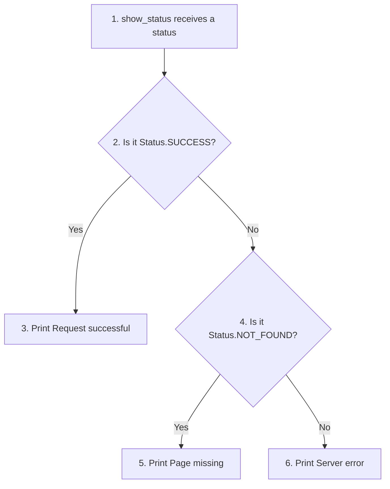
```mermaid
flowchart TD
    A["1. show_status receives a status"] --> B{"2. Is it Status.SUCCESS?"}
    B -- "Yes" --> C["3. Print Request successful"]
    B -- "No" --> D{"4. Is it Status.NOT_FOUND?"}
    D -- "Yes" --> E["5. Print Page missing"]
    D -- "No" --> F["6. Print Server error"]
```

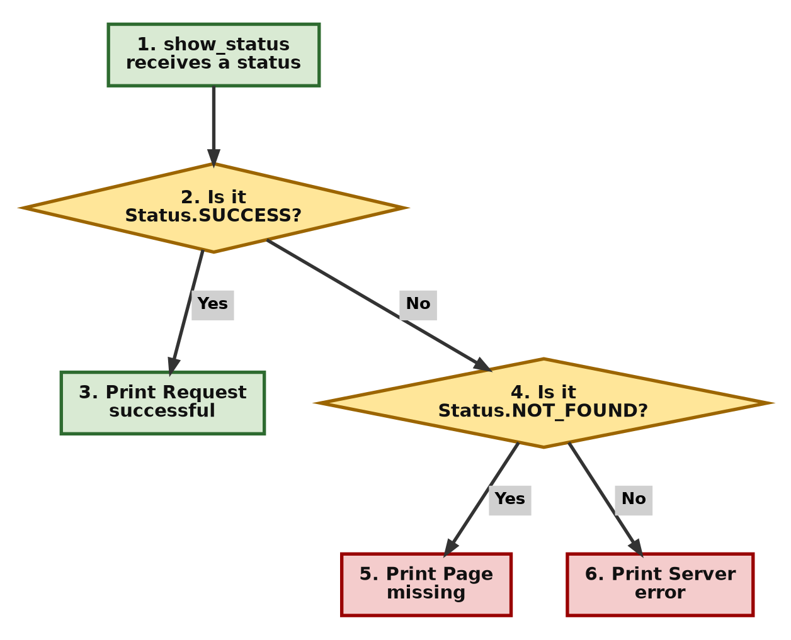

[Back to the Table of Contents](#table-of-contents)

### 17.2 Answer Script

```python
from enum import Enum

# Step 1:
# Create meaningful names
# instead of using unexplained numbers
class Status(Enum):
    SUCCESS = 200
    NOT_FOUND = 404
    ERROR = 500

# Step 2:
# Function receives enum value
def show_status(status):
    if status == Status.SUCCESS:
        print("Request successful")

    elif status == Status.NOT_FOUND:
        print("Page missing")

    else:
        # Any other member reaches here.
        # With only three members, that means Status.ERROR.
        print("Server error")

# Step 3:
# Call the function using the readable name
show_status(Status.NOT_FOUND)

# Step 4:
# Try every member
for status in Status:
    print(f"{status.name} ({status.value}): ", end="")
    show_status(status)

# Step 5:
# Get a member from a number, for example a code received from a server
code = 200
print("Code", code, "is", Status(code))
```

[Back to the Table of Contents](#table-of-contents)

### 17.3 Output

```text
Page missing
SUCCESS (200): Request successful
NOT_FOUND (404): Page missing
ERROR (500): Server error
Code 200 is Status.SUCCESS
```

[Back to the Table of Contents](#table-of-contents)

### 17.4 Explanation

- `show_status(Status.NOT_FOUND)` printed "Page missing".
- `for status in Status:` went through every member in the order they were defined. `.name` gives the name as text (for example `NOT_FOUND`) and `.value` gives the number (for example `404`).
- `end=""` in the `print` call stops it from moving to a new line, so the function's message appears on the same line.
- `Status(200)` looked up the member whose value is 200. This is how you would turn a number received from a server into a readable member.

Note that an `Enum` member is not equal to its plain number: `Status.NOT_FOUND == 404` is `False`. Compare with members, as the script does, or use `status.value == 404`.

[Back to the Table of Contents](#table-of-contents)

### 17.5 Follow-up Questions

**17.5.1 What happens if you type `Status.NOT_FOUNT` by mistake?**

Python raises an `AttributeError` at once. With a bare number, a typo such as `4040` would go unnoticed.

**17.5.2 What does `Status(999)` do?**

It raises `ValueError: 999 is not a valid Status`, because no member has that value.

[Back to the Table of Contents](#table-of-contents)

---

## 18. dataclass: Store Structured Data

**Question 18. Create a `dataclass` for storing student information.**

### 18.1 How It Works

A [dataclass](https://docs.python.org/3/library/dataclasses.html) is a class whose main job is to hold data. You put the `@dataclass` **decorator** (a line starting with `@` that adds behaviour) above the class and list the fields with their **type hints** (such as `name: str`). Python then writes the routine methods for you.

| Method written for you | What it does |
|---|---|
| `__init__()` | Sets up a new object from the values you pass, such as `Student("Alice", 85)` |
| `__repr__()` | Gives a readable text form when you print the object |
| `__eq__()` | Lets you compare two objects with `==`, field by field |

Ordering comparisons such as `<` and `>` are **not** added unless you ask for them with `@dataclass(order=True)`.

1. Import `dataclass`.
2. Write the class with its fields. Give `passed` a default value of `True`.
3. Create two student objects.
4. Print them.

[Back to the Table of Contents](#table-of-contents)

### 18.2 Answer Script

```python
from dataclasses import dataclass

# Step 1:
# dataclass automatically creates:
# __init__, __repr__ and __eq__
# (ordering methods such as __lt__ only with order=True)
@dataclass
class Student:
    name: str
    marks: int
    passed: bool = True       # default value, used when none is given

# Step 2:
# Create objects easily
s1 = Student("Alice", 85)
s2 = Student("Bob", 40, False)

# Step 3:
# Print objects
print(s1)
print(s2)

# Step 4:
# Read and change a field
print(s1.name, "scored", s1.marks)
s2.marks = 45                 # dataclass objects can be changed
print("Updated:", s2)

# Step 5:
# Compare objects with ==
s3 = Student("Alice", 85)
print("s1 == s3:", s1 == s3)
```

[Back to the Table of Contents](#table-of-contents)

### 18.3 Output

```text
Student(name='Alice', marks=85, passed=True)
Student(name='Bob', marks=40, passed=False)
Alice scored 85
Updated: Student(name='Bob', marks=45, passed=False)
s1 == s3: True
```

[Back to the Table of Contents](#table-of-contents)

### 18.4 Explanation

1. `s1` was created without a value for `passed`, so it used the default `True`.
2. `s2` gave `False` for `passed`.
3. Printing each object showed all field names and values, thanks to the generated `__repr__()`.
4. Unlike a namedtuple, a dataclass object can be changed, so `s2.marks = 45` worked.
5. `s1 == s3` is `True` because the generated `__eq__()` compares the field values. Without `@dataclass`, two separate objects would not be equal even with the same data.

Fields with default values must come **after** fields without defaults. Writing `passed: bool = True` before `marks: int` would raise a `TypeError`, just as it would in a normal function definition.

[Back to the Table of Contents](#table-of-contents)

### 18.5 Follow-up Questions

**18.5.1 How would you work out `passed` from `marks` automatically?**

Add a `__post_init__` method, which runs right after the generated `__init__`:

```python
from dataclasses import dataclass, field

@dataclass
class Student:
    name: str
    marks: int
    passed: bool = field(init=False)     # not passed in; worked out below

    def __post_init__(self):
        self.passed = self.marks >= 40

print(Student("Alice", 85))
print(Student("Bob", 35))
```

**Output**

```text
Student(name='Alice', marks=85, passed=True)
Student(name='Bob', marks=35, passed=False)
```

**18.5.2 How do you stop a dataclass object from being changed?**

Use `@dataclass(frozen=True)`. Any attempt to change a field then raises `dataclasses.FrozenInstanceError`.

[Back to the Table of Contents](#table-of-contents)

---

## 19. lru_cache: Avoid Repeated Calculations

**Question 19. Use `lru_cache` to cache expensive function results.**

### 19.1 How It Works

A **cache** is a store of results that you are likely to need again. [functools.lru_cache](https://docs.python.org/3/library/functools.html#functools.lru_cache) is a decorator that saves the result of each function call. If the function is called again with the same argument, the saved result is returned at once, and the function body does not run. LRU stands for **Least Recently Used**: when a size limit is set and the cache is full, the result unused for the longest time is removed.

1. Put `@lru_cache(maxsize=None)` above the slow function. `maxsize=None` means no limit.
2. The first call with `10` runs the function body, which is slow, and saves the result.
3. The second call with `10` finds the saved result and returns it immediately.

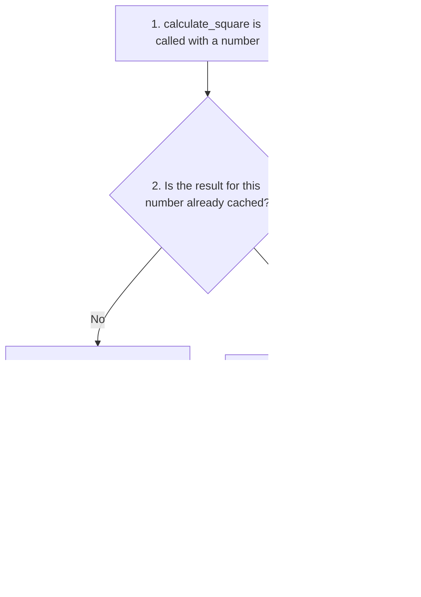
```mermaid
flowchart TD
    A["1. calculate_square is called with a number"] --> B{"2. Is the result for this number already cached?"}
    B -- "No" --> C["3. Run the body: print Calculating and wait 1 second"]
    C --> D["4. Save the result in the cache"]
    D --> E["5. Return the result"]
    B -- "Yes" --> F["6. Return the saved result immediately"]
```

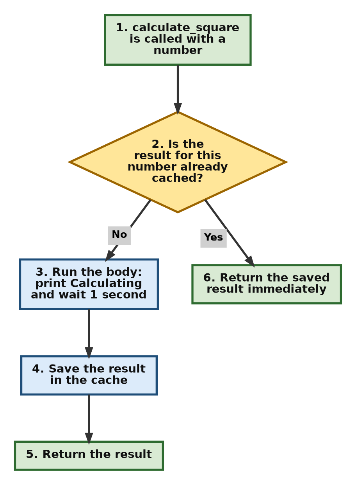

[Back to the Table of Contents](#table-of-contents)

### 19.2 Answer Script

```python
from functools import lru_cache
import time

# Step 1:
# Cache stores previous results
@lru_cache(maxsize=None)
def calculate_square(number):
    print("Calculating...")
    # Simulate slow operation
    time.sleep(1)
    return number * number

# Step 2:
# First call calculates
start = time.perf_counter()
print(calculate_square(10))
print(f"  took about {time.perf_counter() - start:.1f} seconds")

# Step 3:
# Second call uses stored result
start = time.perf_counter()
print(calculate_square(10))
print(f"  took about {time.perf_counter() - start:.1f} seconds")

# Step 4:
# A different argument is not in the cache, so it is calculated
print(calculate_square(5))

# Step 5:
# See how the cache was used
# hits   = answered from the cache
# misses = had to run the function body
print(calculate_square.cache_info())
```

[Back to the Table of Contents](#table-of-contents)

### 19.3 Output

```text
Calculating...
100
  took about 1.0 seconds
100
  took about 0.0 seconds
Calculating...
25
CacheInfo(hits=1, misses=2, maxsize=None, currsize=2)
```

[Back to the Table of Contents](#table-of-contents)

### 19.4 Explanation

1. The first call printed "Calculating..." and took about 1 second.
2. The second call with the same argument did **not** print "Calculating...", and took almost no time. The result came straight from the cache.
3. The call with `5` was a new argument, so "Calculating..." appeared again.
4. `cache_info()` confirms this: 1 hit (the second call with 10) and 2 misses (the first call with 10, and the call with 5). `currsize=2` means two results are stored.

Only cache functions that always give the same result for the same argument. A function that reads the current time or live data would return out-of-date results.

[Back to the Table of Contents](#table-of-contents)

### 19.5 Follow-up Questions

**19.5.1 What is the shorter way to write `@lru_cache(maxsize=None)` in Python 3.9 and later?**

`@functools.cache`. It does the same job.

**19.5.2 How do you empty the cache?**

Call `calculate_square.cache_clear()`. The next call with 10 will run the function body again.

[Back to the Table of Contents](#table-of-contents)

---

## 20. partial, itertools and json/pickle

**Question 20. Demonstrate function customization, sequence processing and object storage.**

### 20.1 How It Works

This question brings together four tools, each shown in its own part of the script.

| Part | Tool | What it does |
|---|---|---|
| 1 | [functools.partial](https://docs.python.org/3/library/functools.html#functools.partial) | Makes a new function with some arguments already filled in |
| 2 | [itertools.chain](https://docs.python.org/3/library/itertools.html#itertools.chain) | Loops through several lists as if they were one |
| 3 | [json](https://docs.python.org/3/library/json.html) | Saves data as plain text that other programs and languages can read |
| 4 | [pickle](https://docs.python.org/3/library/pickle.html) | Saves almost any Python object in a binary (non-text) format that only Python can read |

Turning data into text or bytes so it can be stored or sent is called **serialisation**.

1. Use `partial()` to make `error_message()`, a version of `display()` with `level` fixed to `"ERROR"`.
2. Use `chain.from_iterable()` to print every number from a list of lists.
3. Use `json.dumps()` to turn a dictionary into a JSON string, and `json.loads()` to turn it back.
4. Use `pickle.dump()` to save the dictionary to a file, and `pickle.load()` to read it back.

[Back to the Table of Contents](#table-of-contents)

### 20.2 Answer Script

```python
from functools import partial
from itertools import chain
import json
import pickle

# PART 1: partial()
# Step 1: A normal function with two arguments
def display(message, level):
    print(level, message)

# Step 2: Fix one argument permanently
# error_message(text) now means display(text, level="ERROR")
error_message = partial(display, level="ERROR")
error_message("File missing")
error_message("Disk full")

# PART 2: itertools.chain
# Step 3: A list of lists
numbers = [
    [1, 2],
    [3, 4]
]

# Step 4: Combine multiple lists
# from_iterable takes each inner list in turn
for item in chain.from_iterable(numbers):
    print(item)

# PART 3: json
# Step 5: Convert Python object to JSON string
data = {"name": "Alice", "marks": 90}
json_text = json.dumps(data)
print(json_text)
print("Type of json_text:", type(json_text))

# Step 6: Convert the JSON string back to a Python dictionary
restored = json.loads(json_text)
print("Back from JSON:", restored["name"], restored["marks"])

# PART 4: pickle
# Step 7: Save Python object in binary format
# "wb" means write in binary mode
with open("student.pkl", "wb") as file:
    pickle.dump(data, file)

print("Object saved")

# Step 8: Load the object back
# "rb" means read in binary mode
# Only load pickle files that you created yourself or fully trust
with open("student.pkl", "rb") as file:
    loaded = pickle.load(file)

print("Object loaded:", loaded)
print("Same data as before:", loaded == data)
```

[Back to the Table of Contents](#table-of-contents)

### 20.3 Output

```text
ERROR File missing
ERROR Disk full
1
2
3
4
{"name": "Alice", "marks": 90}
Type of json_text: <class 'str'>
Back from JSON: Alice 90
Object saved
Object loaded: {'name': 'Alice', 'marks': 90}
Same data as before: True
```

The script also creates a file called `student.pkl` in the folder where you run it.

[Back to the Table of Contents](#table-of-contents)

### 20.4 Explanation

1. **partial:** `error_message("File missing")` called `display("File missing", level="ERROR")`, which printed `ERROR File missing`. The level never had to be typed again.
2. **chain:** `chain.from_iterable(numbers)` gave 1, 2 from the first inner list, then 3, 4 from the second, one at a time, without building a new combined list.
3. **json:** `json.dumps()` produced a string. Notice that JSON uses double quotes, while Python printed the dictionary with single quotes. `json.loads()` turned the string back into a dictionary.
4. **pickle:** `pickle.dump()` wrote the dictionary to `student.pkl` as bytes. `pickle.load()` read it back, and the loaded data was equal to the original.

A very important safety rule: **never load a pickle file from a source you do not trust**, such as a downloaded file or an email attachment. Loading a pickle file can run code hidden inside it. JSON does not have this risk, which is why it is the safer choice for sharing data.

| Question to ask | json | pickle |
|---|---|---|
| Can a person read the file? | Yes, it is text | No, it is binary |
| Can other languages read it? | Yes | No, Python only |
| Can it store sets, custom classes and similar Python objects? | No | Yes |
| Is it safe to load from an unknown source? | Yes | No |

[Back to the Table of Contents](#table-of-contents)

### 20.5 Follow-up Questions

**20.5.1 How would you make a `warning_message()` function with `partial`?**

`warning_message = partial(display, level="WARNING")`. Then `warning_message("Low battery")` prints `WARNING Low battery`.

**20.5.2 How would you save the data as a JSON file instead of a string?**

Use `json.dump()` with an open text file:

```python
import json

data = {"name": "Alice", "marks": 90}

# Step 1: Write the data to a JSON file ("w" means write text)
with open("student.json", "w") as file:
    json.dump(data, file)

# Step 2: Read it back ("r" means read text)
with open("student.json", "r") as file:
    print(json.load(file))
```

**Output**

```text
{'name': 'Alice', 'marks': 90}
```

[Back to the Table of Contents](#table-of-contents)

---
