# Chapter 16: Advanced Scripting Questions with Answers

**Python Libraries for Data Structures and Algorithms**

This page contains the answers to the 20 advanced scripting questions on Chapter 16 of the book. The questions are printed in the book. Here you will find, for each question, a full answer script, the output it produces, an explanation of how it works, and a few follow-up questions.

Chapter 16 covers two connected ideas:

- **Algorithms**: step-by-step methods for common jobs such as searching and sorting, and how to measure their speed using **Big-O notation**. Big-O describes how the work done by an algorithm grows as the amount of data grows. See [Big O notation](https://en.wikipedia.org/wiki/Big_O_notation).
- **The Python Standard Library**: the ready-made modules that come with every Python installation, such as `collections`, `heapq`, `bisect`, `queue`, `enum`, `dataclasses`, `functools`, `itertools`, `pickle` and `json`. See the [Python Standard Library](https://docs.python.org/3/library/index.html).

These questions go a step further than the easier set. Many of them ask you to **measure** how fast something runs, to **count** the work an algorithm does, or to combine several tools into one small working program, such as an undo button, a print queue or a cache. This is how the ideas in the chapter are used in real programs.

**The questions are grouped into two parts**

| Part | Questions | What it covers |
|---|---|---|
| Part A: Algorithms written by hand | 1, 2, 3, 4, 5, 17 | Searching, sorting, stacks and queues, built and timed yourself |
| Part B: Standard Library tools | 6 to 16, 18, 19 | `collections`, `heapq`, `bisect`, `enum`, `dataclasses`, `functools`, `itertools`, `pickle`, `json` |
| Synthesis | 20 | Measuring and comparing Big-O growth |

**How to use this page**

1. Read the question and try to write the script yourself first.
2. Read "How It Works" for the logic in plain words.
3. Copy the answer script into a `.py` file and run it. Compare your output with the output shown.
4. Read the explanation, then try the follow-up questions.

All scripts were tested with Python 3.11 and work with Python 3.8 or later. Scripts that **measure time** will show different numbers on your computer, because timing depends on the machine and on what else it is doing. The pattern of the numbers is what matters. Scripts that use random data set a fixed **seed** with `random.seed()`, so that you get exactly the same "random" numbers as shown here.

---

## Table of Contents

- [Big-O Quick Reference](#big-o-quick-reference)
- [Q1. Linear Search vs Binary Search Timing](#q1-linear-search-vs-binary-search-timing)
- [Q2. Bubble Sort with Early Exit](#q2-bubble-sort-with-early-exit)
- [Q3. Insertion Sort: Shifts vs Swaps](#q3-insertion-sort-shifts-vs-swaps)
- [Q4. Stack Class and the pop(0) Trap](#q4-stack-class-and-the-pop0-trap)
- [Q5. FIFO Queue and Producer-Consumer Threads](#q5-fifo-queue-and-producer-consumer-threads)
- [Q6. Counter, defaultdict and ChainMap](#q6-counter-defaultdict-and-chainmap)
- [Q7. heapq: Min-Heap, Max-Heap and Priority Queue](#q7-heapq-min-heap-max-heap-and-priority-queue)
- [Q8. bisect: Duplicates, Leaderboard and Grade Lookup](#q8-bisect-duplicates-leaderboard-and-grade-lookup)
- [Q9. OrderedDict and an LRU Cache](#q9-ordereddict-and-an-lru-cache)
- [Q10. namedtuple in Practice](#q10-namedtuple-in-practice)
- [Q11. dataclass Features](#q11-dataclass-features)
- [Q12. Enum with auto()](#q12-enum-with-auto)
- [Q13. lru_cache and Fibonacci](#q13-lru_cache-and-fibonacci)
- [Q14. partial() and reduce()](#q14-partial-and-reduce)
- [Q15. chain, islice and groupby](#q15-chain-islice-and-groupby)
- [Q16. combinations, permutations and product](#q16-combinations-permutations-and-product)
- [Q17. Selection Sort with Trace](#q17-selection-sort-with-trace)
- [Q18. pickle and json with datetime](#q18-pickle-and-json-with-datetime)
- [Q19. deque Operations](#q19-deque-operations)
- [Q20. Big-O Timing Comparison](#q20-big-o-timing-comparison)

---

## Big-O Quick Reference

Many answers on this page refer to these growth rates. `n` is the number of items.

| Notation | Name | Plain meaning | Example on this page |
|---|---|---|---|
| `O(1)` | Constant | Same work, however big the data | `deque.popleft()` |
| `O(log n)` | Logarithmic | Doubling the data adds one more step | Binary search |
| `O(n)` | Linear | Double the data, double the work | Linear search, `list.pop(0)` |
| `O(n log n)` | Linearithmic | A little more than linear | Python's `sorted()` |
| `O(n²)` | Quadratic | Double the data, four times the work | Bubble, insertion and selection sort |
| `O(2ⁿ)` | Exponential | Each extra item roughly doubles the work (upper bound) | Plain recursive Fibonacci |

**A note on timing code**

All timings use [time.perf_counter()](https://docs.python.org/3/library/time.html#time.perf_counter). It is a precise clock made for measuring how long code takes. Its value on its own means nothing; only the difference between two readings is useful.

Very short timings are "noisy". The computer is always doing other small jobs in the background, so the same code can take a slightly different time on each run. Several scripts below therefore run a test a few times and keep the **fastest** time, which is the one least disturbed by background activity.

[Back to the Table of Contents](#table-of-contents)

---

## Q1. Linear Search vs Binary Search Timing

*Part A: Searching Algorithms*

**Implement both `linear_search` and `binary_search`. Time each against list sizes [1K–1M] using `time.perf_counter()`. Print a table showing n, linear time, binary time, and speedup factor.**

### 1.1 How It Works

This script builds two search functions, times them against the same list sizes, and prints a side-by-side comparison table. The key ideas are:

- **Linear search** checks every element, one by one. It is `O(n)`.
- **Binary search** halves the search space at every step. It is `O(log n)`.
- Binary search **requires a sorted list**. It looks at the middle item and throws away the half where the target cannot be, which only works if the items are in order.

The plan:

1. Write `linear_search()`.
2. Write `binary_search()`.
3. Choose list sizes from 1,000 to 1,000,000.
4. Choose a target (`-1`) that is never in the data. This forces the **worst case** for both searches: linear search must check every item, and binary search must halve all the way down.
5. For each size, build a random list and a sorted copy.
6. Time each search several times and keep the fastest time.
7. Work out the speedup: linear time divided by binary time.
8. Print one row of the table.

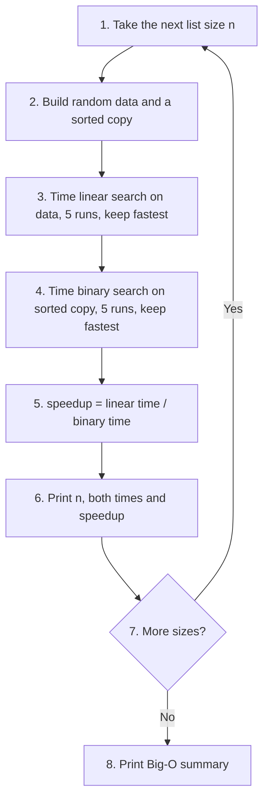

[Back to the Table of Contents](#table-of-contents)

### 1.2 Answer Script

```python
"""
Linear Search vs Binary Search: O(n) vs O(log n)

Builds two search functions, times them against the same list sizes,
and prints a side-by-side comparison table.
"""

# Step 1 - Import required modules
import time
import random

# Step 2 - Implement linear search (no sorting needed)
def linear_search(data, target):
    """Return True if target found, else False. Checks every item."""
    for item in data:
        if item == target:
            return True
    return False

# Step 3 - Implement binary search (list MUST be sorted first)
def binary_search(data, target):
    """Return True if target found, by halving the search area each time."""
    left, right = 0, len(data) - 1
    while left <= right:
        mid = (left + right) // 2    # // is whole-number division
        if data[mid] == target:
            return True
        elif target > data[mid]:
            left = mid + 1           # Discard left half
        else:
            right = mid - 1          # Discard right half
    return False

# Step 4 - A helper that runs a search several times and keeps the fastest time
def fastest_time(search_function, data, target, runs=5):
    best = float("inf")              # start with "infinitely slow"
    for _ in range(runs):
        start = time.perf_counter()
        search_function(data, target)
        elapsed = time.perf_counter() - start
        best = min(best, elapsed)
    return best

# Step 5 - Define test sizes and a target that is never present
sizes = [1_000, 10_000, 100_000, 500_000, 1_000_000]
target = -1   # Guaranteed NOT in data -> worst case for both searches

print(f"{'n':>10} | {'Linear (s)':>12} | {'Binary (s)':>12} | {'Speedup':>10}")
print("-" * 53)

for n in sizes:
    # Step 6 - Build the data
    data = [random.randint(1, 1_000_000) for _ in range(n)]
    sorted_data = sorted(data)   # Binary search needs sorted input

    # Step 7 - Time both searches
    t_linear = fastest_time(linear_search, data, target)
    t_binary = fastest_time(binary_search, sorted_data, target)

    # Step 8 - Work out the speedup and print one row
    speedup = t_linear / t_binary if t_binary > 0 else float("inf")
    print(f"{n:>10,} | {t_linear:>12.8f} | {t_binary:>12.8f} | {speedup:>9,.0f}x")

# Step 9 - Print Big-O summary
print()
print("Big-O reminder:")
print("  Linear search: O(n)     - comparisons grow with n")
print("  Binary search: O(log n) - 1,000,000 items need only about 20 comparisons")
```

[Back to the Table of Contents](#table-of-contents)

### 1.3 Output

Your times will be different, but the pattern will be similar.

```text
         n |   Linear (s) |   Binary (s) |    Speedup
-----------------------------------------------------
     1,000 |   0.00001179 |   0.00000102 |        12x
    10,000 |   0.00011356 |   0.00000123 |        93x
   100,000 |   0.00114981 |   0.00000146 |       788x
   500,000 |   0.00594947 |   0.00000123 |     4,849x
 1,000,000 |   0.01205063 |   0.00000157 |     7,680x

Big-O reminder:
  Linear search: O(n)     - comparisons grow with n
  Binary search: O(log n) - 1,000,000 items need only about 20 comparisons
```

[Back to the Table of Contents](#table-of-contents)

### 1.4 Explanation

1. **Linear search time grows in step with `n`.** Going from 100,000 to 1,000,000 items (10 times more), the linear time also becomes roughly 10 times larger.
2. **Binary search time hardly changes.** For 1,000 items it needs about 10 halvings; for 1,000,000 items, about 20. That is only twice the work for a thousand times the data.
3. **So the speedup keeps growing** as the list gets bigger. The larger the list, the more binary search wins.

Two points to keep in mind:

- The time taken to **sort** the list is not included. Sorting costs `O(n log n)`, which is more than a single linear search. Binary search pays off when you sort once and then search many times.
- For the smallest list, the times are so short that background noise can make the speedup look uneven. That is why the script keeps the fastest of 5 runs.

[Back to the Table of Contents](#table-of-contents)

### 1.5 Follow-up Questions

**1.5.1 How many halvings does binary search need for 1,000,000 items, and how would you check it in Python?**

About 20, because 2²⁰ is 1,048,576. In Python, `math.log2(1_000_000)` gives about 19.93.

**1.5.2 If you had to search a list only once, which search would you choose?**

Linear search. Sorting the list first (`O(n log n)`) would cost more than simply checking every item once (`O(n)`).

[Back to the Table of Contents](#table-of-contents)

---

## Q2. Bubble Sort with Early Exit

*Part A: Sorting Algorithms*

**Code `bubble_sort` with an `already_sorted` early-exit flag. Run it on a worst-case (reverse-sorted) and best-case (sorted) list. Count and print total comparisons for various n to verify O(n²).**

### 2.1 How It Works

Bubble sort compares neighbouring elements and swaps them if they are out of order. After each pass, the largest unsorted element "bubbles" up to its correct position at the end.

- **Worst case, `O(n²)`:** the list is in reverse order. Every pass is needed.
- **Best case, `O(n)`:** the list is already sorted. With an `already_sorted` flag, the first pass finds no swaps and the sort stops at once.

The flag works like this:

1. At the start of each pass, set `already_sorted = True` (assume the list is sorted).
2. If any swap happens in the pass, set `already_sorted = False`.
3. At the end of the pass, if `already_sorted` is still `True`, no item was out of order, so stop.

**Counting comparisons.** Without an early exit, the passes make `(n - 1) + (n - 2) + ... + 1` comparisons, which adds up to `n(n - 1)/2`. The largest part of this is `n²/2`, so the count grows like `n²`. A simple test: when `n` doubles, the count should become about **four times** larger.

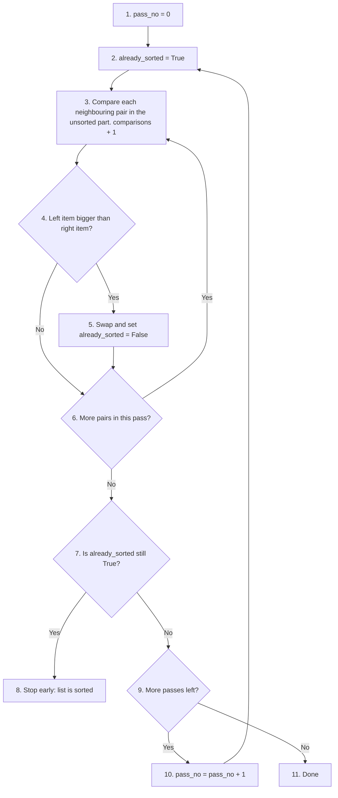

[Back to the Table of Contents](#table-of-contents)

### 2.2 Answer Script

```python
"""
Bubble Sort with an early-exit flag.

Worst case: O(n^2) - list is reverse-sorted
Best case:  O(n)   - list is already sorted (thanks to the early-exit flag)
"""

# Step 1 - Bubble sort with early-exit optimisation
def bubble_sort(numbers):
    n = len(numbers)
    for pass_no in range(n - 1):
        already_sorted = True          # Assume sorted until a swap occurs
        # Inner loop: compare neighbours; the last pass_no items are already in place
        for i in range(n - pass_no - 1):
            if numbers[i] > numbers[i + 1]:
                numbers[i], numbers[i + 1] = numbers[i + 1], numbers[i]  # swap
                already_sorted = False # A swap happened -> not sorted yet
        if already_sorted:             # No swaps in this pass -> done early
            print(f"  Early exit after pass {pass_no + 1}")
            break
    return numbers

# Step 2 - Demonstrate on worst-case (reverse sorted) input
data_worst = [6, 5, 4, 3, 2, 1]
print("Worst case (reverse sorted):")
print("  Input: ", data_worst)
print("  Output:", bubble_sort(data_worst.copy()))

# Step 3 - Demonstrate on best-case (already sorted) input
data_best = [1, 2, 3, 4, 5, 6]
print("Best case (already sorted):")
print("  Input: ", data_best)
print("  Output:", bubble_sort(data_best.copy()))

# Step 4 - The same sort, counting comparisons instead of printing
def bubble_sort_count(numbers, early_exit=True):
    """Return the total number of comparisons made while sorting."""
    numbers = numbers[:]               # work on a copy
    n = len(numbers)
    count = 0
    for pass_no in range(n - 1):
        already_sorted = True
        for i in range(n - pass_no - 1):
            count += 1
            if numbers[i] > numbers[i + 1]:
                numbers[i], numbers[i + 1] = numbers[i + 1], numbers[i]
                already_sorted = False
        if early_exit and already_sorted:
            break
    return count

# Step 5 - Count comparisons for several sizes
print()
print(f"{'n':>4} | {'Reversed':>9} | {'Sorted':>7} | {'n(n-1)/2':>9} | {'Growth vs previous n':>21}")
print("-" * 62)
previous = None
for size in [5, 10, 20, 40, 80]:
    worst = bubble_sort_count(list(range(size, 0, -1)))   # reverse sorted
    best = bubble_sort_count(list(range(1, size + 1)))    # already sorted
    formula = size * (size - 1) // 2
    growth = f"{worst / previous:.2f}x" if previous else "-"
    print(f"{size:>4} | {worst:>9} | {best:>7} | {formula:>9} | {growth:>21}")
    previous = worst
```

[Back to the Table of Contents](#table-of-contents)

### 2.3 Output

```text
Worst case (reverse sorted):
  Input:  [6, 5, 4, 3, 2, 1]
  Output: [1, 2, 3, 4, 5, 6]
Best case (already sorted):
  Input:  [1, 2, 3, 4, 5, 6]
  Early exit after pass 1
  Output: [1, 2, 3, 4, 5, 6]

   n |  Reversed |  Sorted |  n(n-1)/2 |  Growth vs previous n
--------------------------------------------------------------
   5 |        10 |       4 |        10 |                     -
  10 |        45 |       9 |        45 |                 4.50x
  20 |       190 |      19 |       190 |                 4.22x
  40 |       780 |      39 |       780 |                 4.11x
  80 |      3160 |      79 |      3160 |                 4.05x
```

[Back to the Table of Contents](#table-of-contents)

### 2.4 Explanation

1. **Worst case.** The reversed list needed every pass. No "Early exit" message was printed.
2. **Best case.** The sorted list printed "Early exit after pass 1": one pass with no swaps was enough to prove the list was sorted.
3. **The Reversed column matches `n(n-1)/2` exactly.** This confirms the formula.
4. **The Growth column is close to 4x** each time `n` doubles, and it gets closer to 4 as `n` grows (4.50, 4.22, 4.11, 4.05). This is the sign of `O(n²)` growth.
5. **The Sorted column is always `n - 1`.** With the early-exit flag, the best case grows only in step with `n`, which is `O(n)`.

Why is the growth not exactly 4? Because `n(n-1)/2` is not exactly `n²/2`. The `-n` part matters for small lists but becomes less and less important as `n` grows. Big-O keeps only the part that dominates for large `n`.

[Back to the Table of Contents](#table-of-contents)

### 2.5 Follow-up Questions

**2.5.1 Does the early-exit flag help on a list that is sorted except for the very first item, such as `[9, 1, 2, 3, 4, 5]`?**

Very little. The 9 moves only one place to the right per pass, so every pass has a swap until the 9 reaches the end. The flag helps most when the list is fully or almost fully sorted with small items near the front out of place.

**2.5.2 Why does `bubble_sort_count` begin with `numbers = numbers[:]`?**

To sort a copy. Otherwise the function would change the caller's list, and later tests using the same list would start from sorted data.

[Back to the Table of Contents](#table-of-contents)

---

## Q3. Insertion Sort: Shifts vs Swaps

*Part A: Sorting Algorithms*

**Implement `insertion_sort` using the shift (not swap) approach. Count shifts vs swaps compared to `bubble_sort` on the same random list. Explain why fewer writes matter in practice.**

### 3.1 How It Works

Insertion sort works like sorting playing cards in your hand:

1. Pick the next card (the **key**).
2. Slide it left past any larger cards. The larger cards **shift** one place to the right; they are not swapped.
3. Place the key in the gap that opens up.

Although its worst case is still `O(n²)`, insertion sort:

1. Makes fewer **writes** (changes to the list) than bubble sort, because it shifts instead of swapping.
2. Is `O(n)` for nearly-sorted data.
3. Is **stable**: equal elements keep their original order.

**An important fact about the counts.** On the same list, the number of insertion sort **shifts** is always equal to the number of bubble sort **swaps**. Both are equal to the number of **inversions** in the list. An inversion is a pair of items in the wrong order, for example 41 before 14. Each bubble sort swap fixes exactly one inversion, and so does each insertion sort shift.

So counting shifts against swaps gives the same number. The real difference is in the **writes**:

| Operation | Writes to the list | Why |
|---|---|---|
| One bubble sort swap | 2 | Both positions are written: `a[i], a[i+1] = a[i+1], a[i]` |
| One insertion sort shift | 1 | Only one position is written: `a[j+1] = a[j]` |
| Placing one insertion sort key | 1 | The key is written once into its gap (only needed if it moved) |

(If a swap is done by hand with a temporary variable, it takes 3 assignments, which makes the difference even larger.)

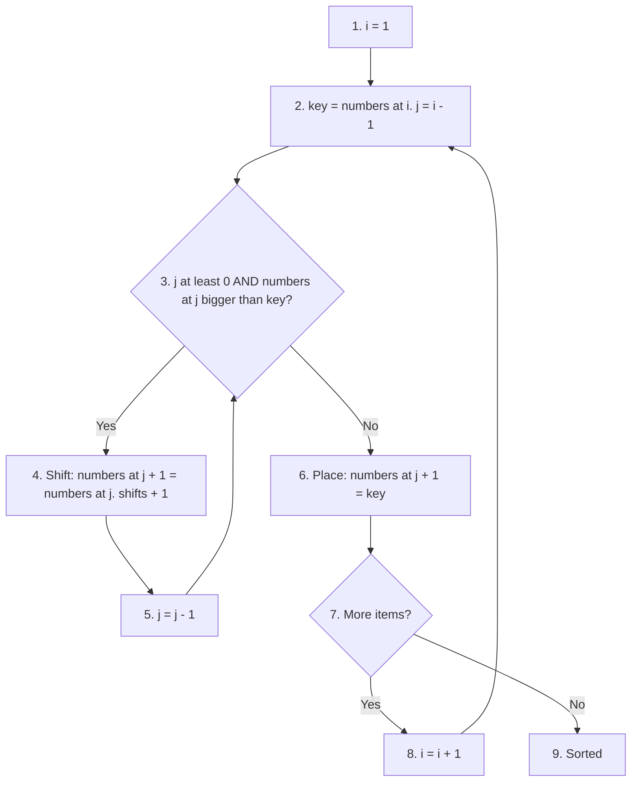

[Back to the Table of Contents](#table-of-contents)

### 3.2 Answer Script

```python
"""
Insertion Sort: card-analogy implementation, and a count of
shifts, swaps and memory writes compared with bubble sort.
"""
import random

# Step 1 - Implement insertion sort
def insertion_sort(numbers):
    for i in range(1, len(numbers)):
        key = numbers[i]          # The 'card' we are about to insert
        j = i - 1
        # Step 1a: Shift larger elements one position to the right
        while j >= 0 and numbers[j] > key:
            numbers[j + 1] = numbers[j]   # Shift (1 write, not a swap)
            j -= 1
        # Step 1b: Place the key in its correct position
        numbers[j + 1] = key
    return numbers

# Step 2 - Test with sample data
sample = [29, 10, 14, 37, 13]
print("Input: ", sample)
print("Sorted:", insertion_sort(sample.copy()))

# Step 3 - Insertion sort that counts shifts and total writes
def insertion_sort_counts(numbers):
    shifts = 0
    writes = 0
    for i in range(1, len(numbers)):
        key = numbers[i]
        j = i - 1
        while j >= 0 and numbers[j] > key:
            numbers[j + 1] = numbers[j]
            j -= 1
            shifts += 1
            writes += 1                # each shift writes one position
        if j + 1 != i:                 # the key actually moved
            numbers[j + 1] = key
            writes += 1                # placing the key is one more write
    return shifts, writes

# Step 4 - Bubble sort that counts swaps and total writes
def bubble_sort_counts(numbers):
    swaps = 0
    n = len(numbers)
    for pass_no in range(n - 1):
        for i in range(n - pass_no - 1):
            if numbers[i] > numbers[i + 1]:
                numbers[i], numbers[i + 1] = numbers[i + 1], numbers[i]
                swaps += 1
    writes = swaps * 2                 # each swap writes two positions
    return swaps, writes

# Step 5 - Count inversions directly, to show where the numbers come from
def count_inversions(numbers):
    n = len(numbers)
    return sum(1 for a in range(n) for b in range(a + 1, n) if numbers[a] > numbers[b])

# Step 6 - Compare on the same random list
random.seed(7)                         # fixed seed: same list every run
test = random.sample(range(50), 10)    # 10 different numbers from 0 to 49
print(f"\nList: {test}")
print(f"Inversions in the list: {count_inversions(test)}")

shifts, ins_writes = insertion_sort_counts(test.copy())
swaps, bub_writes = bubble_sort_counts(test.copy())
print(f"Insertion sort: {shifts} shifts -> {ins_writes} writes")
print(f"Bubble sort:    {swaps} swaps  -> {bub_writes} writes")
print(f"Bubble sort made {bub_writes / ins_writes:.1f}x as many writes")

# Step 7 - The gap grows on bigger lists
random.seed(7)
big = random.sample(range(10_000), 1_000)
_, ins_writes = insertion_sort_counts(big.copy())
_, bub_writes = bubble_sort_counts(big.copy())
print(f"\n1,000 items: insertion writes = {ins_writes:,}, bubble writes = {bub_writes:,}")
```

[Back to the Table of Contents](#table-of-contents)

### 3.3 Output

```text
Input:  [29, 10, 14, 37, 13]
Sorted: [10, 13, 14, 29, 37]

List: [20, 9, 25, 41, 3, 4, 34, 6, 23, 37]
Inversions in the list: 19
Insertion sort: 19 shifts -> 26 writes
Bubble sort:    19 swaps  -> 38 writes
Bubble sort made 1.5x as many writes

1,000 items: insertion writes = 257,578, bubble writes = 513,174
```

[Back to the Table of Contents](#table-of-contents)

### 3.4 Explanation

1. **Shifts equal swaps.** On the same list, insertion sort's shift count and bubble sort's swap count came out identical, and both equal the number of inversions. This is not a coincidence; it is always true.
2. **Writes are not equal.** Each swap writes two positions, while each shift writes only one. Insertion sort also writes each key once when placing it. On this short list, bubble sort made 1.5 times as many writes.
3. **The gap widens on bigger lists.** On 1,000 items, bubble sort made almost exactly twice as many writes. On a longer list, the one extra write for placing each key matters less and less compared with the many shifts.

**Why fewer writes matter in practice**

- **Speed.** Writing to memory takes time. Fewer writes means less work for the computer, even when the Big-O class is the same.
- **Comparisons too.** Insertion sort stops comparing as soon as it finds a key's gap. Bubble sort (without early exit) always walks the full inner loop, so on partly sorted data insertion sort also makes far fewer comparisons.
- **Wear on storage.** Some storage, such as flash memory, wears out a little with every write. There, fewer writes means longer life.

Big-O notation ignores constant factors like "2 writes instead of 1". Real hardware does not. That is why insertion sort is usually faster than bubble sort in practice, even though both are `O(n²)`.

[Back to the Table of Contents](#table-of-contents)

### 3.5 Follow-up Questions

**3.5.1 How many shifts does insertion sort make on a list that is already sorted?**

Zero. There are no inversions, so no item ever needs to move.

**3.5.2 What is the largest possible number of inversions in a list of `n` items?**

`n(n - 1)/2`, when the list is in reverse order. Every pair is in the wrong order. For 10 items, that is 45.

[Back to the Table of Contents](#table-of-contents)

---

## Q4. Stack Class and the pop(0) Trap

*Part A: Stacks and Queues (Manual Implementation)*

**Build a `Stack` class (LIFO) using a plain `list`. Simulate an undo-button. Then benchmark `list.pop(0)` vs `deque.popleft()` for N=100,000 front-removals and print the speedup.**

### 4.1 How It Works

A **stack** follows Last-In First-Out (**LIFO**) order: the last item added is the first one removed. Built with a plain Python list:

| Stack operation | List method | Cost | Where it works |
|---|---|---|---|
| push | `list.append(item)` | `O(1)` | the end of the list |
| pop | `list.pop()` | `O(1)` | the end of the list |
| peek | `list[-1]` | `O(1)` | the end of the list |

**A common mistake** is removing from the **front** with `list.pop(0)`. That is `O(n)`, because Python must shift every remaining element one place to the left to fill the gap. Doing it `n` times costs `O(n²)` in total.

**The solution** for front removal is [collections.deque](https://docs.python.org/3/library/collections.html#collections.deque). Inside CPython (the standard Python interpreter) a deque is a doubly-linked list of blocks, so it can add and remove at either end in `O(1)` without moving any other items.

Plan for the script:

1. Write a `Stack` class with `push`, `pop`, `peek`, `is_empty` and a readable `__repr__`.
2. Use it to simulate an undo button.
3. Time 100,000 front-removals with `list.pop(0)`.
4. Time 100,000 front-removals with `deque.popleft()`.
5. Print both times and the speedup.

[Back to the Table of Contents](#table-of-contents)

### 4.2 Answer Script

```python
"""
Stack (LIFO) and the pop(0) performance trap.
"""
from collections import deque
import time

# Step 1 - Stack using list (correct: push/pop at the END)
class Stack:
    def __init__(self):
        self._data = []            # the leading _ means "for use inside the class"

    def push(self, item):
        self._data.append(item)    # O(1)

    def pop(self):
        if self.is_empty():
            raise IndexError("Stack is empty")
        return self._data.pop()    # O(1) - removes from END

    def peek(self):
        if self.is_empty():
            raise IndexError("Stack is empty")
        return self._data[-1]      # look at the top without removing it

    def is_empty(self):
        return len(self._data) == 0

    def __repr__(self):            # controls how the object looks when printed
        return f"Stack({self._data})"

# Step 2 - Demonstrate undo-button simulation using a stack
actions = Stack()
actions.push("Type 'Hello'")
actions.push("Bold text")
actions.push("Insert image")
print("After 3 actions:", actions)
print("Next undo would reverse:", actions.peek())
print("Undo:", actions.pop())   # Most recent first
print("Undo:", actions.pop())
print("After 2 undos:", actions)

# Step 3 - Undoing past the start raises an error
actions.pop()
try:
    actions.pop()
except IndexError as error:
    print("Undo with nothing left:", error)

# Step 4 - Benchmark list.pop(0) vs deque.popleft()
N = 100_000

lst = list(range(N))
t0 = time.perf_counter()
for _ in range(N):
    lst.pop(0)               # O(n) - shifts all remaining items left
t_list = time.perf_counter() - t0

dq = deque(range(N))
t1 = time.perf_counter()
for _ in range(N):
    dq.popleft()             # O(1) - no shifting needed
t_deque = time.perf_counter() - t1

# Step 5 - Print the results
print(f"\nRemoving {N:,} items from the front:")
print(f"  list.pop(0):      {t_list:.4f} s  <- O(n) per call")
print(f"  deque.popleft():  {t_deque:.4f} s  <- O(1) per call")
print(f"  Deque is {t_list / t_deque:,.0f}x faster for front removal")
```

[Back to the Table of Contents](#table-of-contents)

### 4.3 Output

Your times will differ. The speedup can vary a lot from computer to computer, but the deque is always much faster.

```text
After 3 actions: Stack(["Type 'Hello'", 'Bold text', 'Insert image'])
Next undo would reverse: Insert image
Undo: Insert image
Undo: Bold text
After 2 undos: Stack(["Type 'Hello'"])
Undo with nothing left: Stack is empty

Removing 100,000 items from the front:
  list.pop(0):      0.9070 s  <- O(n) per call
  deque.popleft():  0.0048 s  <- O(1) per call
  Deque is 188x faster for front removal
```

[Back to the Table of Contents](#table-of-contents)

### 4.4 Explanation

1. **The undo simulation** shows LIFO order. "Insert image" was the last action, so it was the first to be undone.
2. `peek()` showed the top item without removing it.
3. Calling `pop()` on an empty stack raised an `IndexError` with a clear message. In a real editor you would disable the Undo button instead.
4. **The benchmark** shows the `pop(0)` trap. Each `pop(0)` moves all the remaining items, so the total work is about `n²/2` item moves: roughly 5 billion for 100,000 items. Each `popleft()` moves nothing.

Why is `list.pop(0)` not even slower? Moving the items is done in one fast block-copy inside CPython. It is still `O(n)` per call, and doubling `N` would roughly quadruple the list time, while the deque time would only double.

[Back to the Table of Contents](#table-of-contents)

### 4.5 Follow-up Questions

**4.5.1 Why does the `Stack` class use `append()` and `pop()` at the end rather than `insert(0, x)` and `pop(0)` at the front?**

Both would give LIFO order, but working at the front of a list is `O(n)`. Working at the end is `O(1)`.

**4.5.2 How would you add a `size()` method to the class?**

```python
def size(self):
    return len(self._data)
```

Adding `__len__` instead would let you write `len(actions)`.

[Back to the Table of Contents](#table-of-contents)

---

## Q5. FIFO Queue and Producer-Consumer Threads

*Part A: Stacks and Queues (Manual Implementation)*

**Implement a FIFO queue using `deque`. Then build a producer-consumer simulation using `queue.Queue` with a `None` sentinel to signal end-of-work across two threads.**

### 5.1 How It Works

A **queue** follows First-In First-Out (**FIFO**) order, like people waiting in a line.

- In **single-threaded** programs, use `collections.deque`. It is fast and simple.
- In **multi-threaded** programs, where several threads share the queue, use [queue.Queue](https://docs.python.org/3/library/queue.html#queue.Queue). It is thread-safe, and its `get()` method can **block** (wait) until an item arrives.

A few terms:

- A **thread** is a separate line of work running at the same time as others inside one program. See [threading](https://docs.python.org/3/library/threading.html).
- **Thread-safe** means several threads can use the object at once without corrupting its data.
- A **producer** is a thread that creates work and puts it in the queue. A **consumer** is a thread that takes work out and does it.
- A **sentinel** is a special value that means "stop". Here it is `None`. It tells the consumer that no more items are coming.

**Part A** builds a `FIFOQueue` class around a deque and uses it as a print spooler (a queue of documents waiting to be printed).

**Part B** runs two threads:

1. The producer creates three jobs, one every 0.1 seconds, and puts each in the queue.
2. The consumer waits on `get()`, takes each job as it arrives, and processes it.
3. When the producer has finished, it puts `None` in the queue.
4. The consumer sees `None` and leaves its loop.
5. The main program waits for both threads to finish with `join()`.

Because two threads print at the same time, their lines could get mixed together. The script uses a **lock** so that only one thread prints at a time.

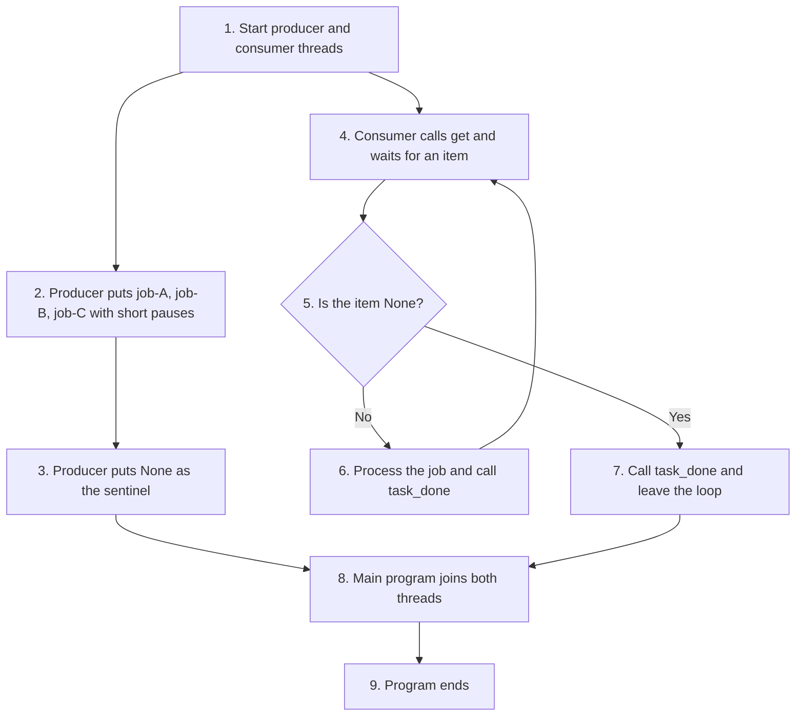

[Back to the Table of Contents](#table-of-contents)

### 5.2 Answer Script

```python
"""
Queue (FIFO): deque for a single thread, queue.Queue for several threads.
The None-sentinel pattern tells the worker that no more items are coming.
"""
from collections import deque
from queue import Queue
import threading
import time

# --- Part A: FIFO Queue with deque (single-threaded) ---

# Step 1 - A FIFOQueue class built on deque
class FIFOQueue:
    def __init__(self):
        self._data = deque()

    def enqueue(self, item):
        self._data.append(item)       # Add to RIGHT (rear)

    def dequeue(self):
        if self.is_empty():
            raise IndexError("Queue is empty")
        return self._data.popleft()   # Remove from LEFT (front) - O(1)

    def is_empty(self):
        return len(self._data) == 0

    def __repr__(self):
        return f"Queue(front-> {list(self._data)} <-rear)"

# Step 2 - Simulate a print spooler
spooler = FIFOQueue()
spooler.enqueue("Report.pdf")
spooler.enqueue("Invoice.docx")
spooler.enqueue("Photo.png")
print("Print queue:", spooler)
print("Printing:", spooler.dequeue())   # First job goes first
print("Printing:", spooler.dequeue())
print("Remaining:", spooler)

# --- Part B: Thread-safe queue with None-sentinel pattern ---
print("\n--- Multi-threaded producer/consumer ---")

job_queue = Queue()
print_lock = threading.Lock()   # only one thread may print at a time

def safe_print(message):
    with print_lock:
        print(message)

# Step 3 - The producer creates jobs, then sends the sentinel
def producer():
    jobs = ["job-A", "job-B", "job-C"]
    for job in jobs:
        time.sleep(0.1)                 # pretend it takes time to create a job
        safe_print(f"  Produced: {job}")
        job_queue.put(job)
    job_queue.put(None)                 # Sentinel: 'no more jobs'
    safe_print("  Producer sent the stop signal.")

# Step 4 - The consumer processes jobs until it receives the sentinel
def consumer():
    while True:
        item = job_queue.get()          # Blocks (waits) until an item is available
        if item is None:                # Sentinel received -> stop
            job_queue.task_done()
            safe_print("  Consumer done.")
            break
        safe_print(f"  Consumed: {item}")
        job_queue.task_done()           # Tell the queue this item is finished

# Step 5 - Start both threads and wait for them to finish
t1 = threading.Thread(target=producer)
t2 = threading.Thread(target=consumer)
t1.start()
t2.start()
t1.join()
t2.join()
print("Both threads finished.")
```

[Back to the Table of Contents](#table-of-contents)

### 5.3 Output

```text
Print queue: Queue(front-> ['Report.pdf', 'Invoice.docx', 'Photo.png'] <-rear)
Printing: Report.pdf
Printing: Invoice.docx
Remaining: Queue(front-> ['Photo.png'] <-rear)

--- Multi-threaded producer/consumer ---
  Produced: job-A
  Consumed: job-A
  Produced: job-B
  Consumed: job-B
  Produced: job-C
  Producer sent the stop signal.
  Consumed: job-C
  Consumer done.
Both threads finished.
```

[Back to the Table of Contents](#table-of-contents)

### 5.4 Explanation

**Part A**

- The print jobs came out in the order they went in: Report.pdf first, then Invoice.docx. Photo.png was still waiting.

**Part B**

1. Each job was **produced** first and **consumed** straight after. The consumer spent most of its time waiting inside `get()`, using no processor time, until the producer supplied the next job.
2. After the last job, the producer put `None` in the queue.
3. The consumer received `None`, printed "Consumer done." and left its loop.
4. `t1.join()` and `t2.join()` made the main program wait for both threads, so "Both threads finished." is always printed last.

Why the lock? `print()` writes the text and the line break as separate steps. Without a lock, two threads printing at the same instant can mix their output on one line. The lock makes each `print()` finish before another thread can start one.

Because threads run at the same time, the exact order of lines around each hand-over can change slightly from run to run. With the 0.1-second pauses, the order shown is what you will almost always see.

[Back to the Table of Contents](#table-of-contents)

### 5.5 Follow-up Questions

**5.5.1 If there were three consumer threads, how many `None` sentinels would the producer need to send?**

Three, one per consumer. Each consumer stops after taking a single `None`, so every consumer must receive its own.

**5.5.2 What would happen if the producer forgot to send the sentinel?**

The consumer would wait inside `get()` forever, `t2.join()` would never return, and the program would hang.

[Back to the Table of Contents](#table-of-contents)

---

## Q6. Counter, defaultdict and ChainMap

*Part B: collections Module*

**Use `Counter` to find word frequencies in a sentence and the top-3 words. Use `defaultdict(list)` to group students by grade. Use `ChainMap` to layer session → user → default config settings.**

### 6.1 How It Works

The [collections](https://docs.python.org/3/library/collections.html) module solves three common counting and grouping patterns:

| Tool | What it does | Main benefit |
|---|---|---|
| `Counter` | Counts how often each element occurs | `most_common()` gives the top items directly |
| `defaultdict` | Creates a starting value for a missing key automatically | No `KeyError`, no "if key not in dict" check |
| `ChainMap` | Searches several dictionaries in order without copying them | Layered settings where earlier layers override later ones |

**Counter arithmetic.** Counters can be combined:

| Expression | Meaning |
|---|---|
| `c1 + c2` | **Adds** the counts for each item |
| `c1 - c2` | **Subtracts** counts and keeps only results above zero |
| `c1 \| c2` | **Union**: keeps the **larger** count for each item |
| `c1 & c2` | **Intersection**: keeps the **smaller** count for each item |

**ChainMap order.** `ChainMap(session, user_prefs, defaults)` searches from left to right, and the first match wins. So a session setting beats a user setting, and a user setting beats a default. Any **write** through the ChainMap goes to the first dictionary (`session`) only.

[Back to the Table of Contents](#table-of-contents)

### 6.2 Answer Script

```python
"""
collections: Counter, defaultdict and ChainMap

Counter     - count occurrences of elements             (-> most_common)
defaultdict - auto-initialise missing keys              (-> no KeyError)
ChainMap    - search several dicts without copying them (-> layered lookup)
"""
from collections import Counter, defaultdict, ChainMap

# --- Part A: Counter - word frequency ---

# Step 1: Count words in a sentence
sentence = "to be or not to be that is the question to be"
word_count = Counter(sentence.split())
print("Word frequencies:")
print(word_count)

# Step 2: most_common() returns the n most frequent elements
print("Top 3 words:", word_count.most_common(3))

# Step 3: Counter arithmetic - combine two counters
c1 = Counter("aabbcc")
c2 = Counter("bbccdd")
print("c1:", c1)
print("c2:", c2)
print("Sum (c1 + c2):", c1 + c2)
print("Difference (c1 - c2):", c1 - c2)
print("Union (c1 | c2):", c1 | c2)
print("Intersection (c1 & c2):", c1 & c2)

# --- Part B: defaultdict - group students by grade ---
"""
defaultdict(list) creates an empty list automatically for each new key.
Without it you would write:
    if grade not in grade_groups:
        grade_groups[grade] = []
    grade_groups[grade].append(name)
defaultdict removes that repeated code entirely.
"""
# Step 4: Group names under their grade
students = [("Alice", "A"), ("Bob", "B"), ("Carol", "A"), ("Dave", "B"), ("Eve", "A")]

grade_groups = defaultdict(list)  # Missing key -> auto-create empty list
for name, grade in students:
    grade_groups[grade].append(name)

print("\nStudents by grade:")
for grade, names in sorted(grade_groups.items()):
    print(f"  Grade {grade}: {names}")

# Step 5: defaultdict(int) - a missing key starts at 0 (useful for counting)
char_count = defaultdict(int)
for ch in "mississippi":
    char_count[ch] += 1   # No KeyError even the first time
print("\nChar count:", dict(char_count))

# --- Part C: ChainMap - configuration layering ---

# Step 6: Three layers of settings
defaults = {"theme": "light", "lang": "en", "font": "Arial"}
user_prefs = {"theme": "dark", "font": "Consolas"}
session = {"lang": "fr"}

# Step 7: ChainMap searches left to right; first match wins
config = ChainMap(session, user_prefs, defaults)
print("\nEffective configuration:")
for key in ["theme", "lang", "font"]:
    # config.maps is the list of dictionaries, in search order
    source = next(name for name, layer in zip(["session", "user_prefs", "defaults"], config.maps)
                  if key in layer)
    print(f"  {key}: {config[key]}  (from {source})")

# Step 8: Writes go to the FIRST map only
config["theme"] = "high-contrast"
print("After update - session:", dict(session))
print("user_prefs unchanged:  ", dict(user_prefs))
```

[Back to the Table of Contents](#table-of-contents)

### 6.3 Output

```text
Word frequencies:
Counter({'to': 3, 'be': 3, 'or': 1, 'not': 1, 'that': 1, 'is': 1, 'the': 1, 'question': 1})
Top 3 words: [('to', 3), ('be', 3), ('or', 1)]
c1: Counter({'a': 2, 'b': 2, 'c': 2})
c2: Counter({'b': 2, 'c': 2, 'd': 2})
Sum (c1 + c2): Counter({'b': 4, 'c': 4, 'a': 2, 'd': 2})
Difference (c1 - c2): Counter({'a': 2})
Union (c1 | c2): Counter({'a': 2, 'b': 2, 'c': 2, 'd': 2})
Intersection (c1 & c2): Counter({'b': 2, 'c': 2})

Students by grade:
  Grade A: ['Alice', 'Carol', 'Eve']
  Grade B: ['Bob', 'Dave']

Char count: {'m': 1, 'i': 4, 's': 4, 'p': 2}

Effective configuration:
  theme: dark  (from user_prefs)
  lang: fr  (from session)
  font: Consolas  (from user_prefs)
After update - session: {'lang': 'fr', 'theme': 'high-contrast'}
user_prefs unchanged:   {'theme': 'dark', 'font': 'Consolas'}
```

[Back to the Table of Contents](#table-of-contents)

### 6.4 Explanation

**Counter**

- "to" and "be" each appear 3 times. The other words appear once.
- In `most_common(3)`, the third place is a tie between many words with a count of 1. Ties keep the order in which the words were first seen, so "or" was chosen.
- `c1 + c2` added the counts: b is 2 + 2 = 4. `c1 - c2` removed the b's and c's completely (2 - 2 = 0) and kept only "a". `c1 | c2` kept the larger count of each letter, and `c1 & c2` kept only letters found in both, with the smaller count.

**defaultdict**

- Each grade's list was created automatically the first time that grade appeared.
- `sorted(grade_groups.items())` printed the grades in alphabetical order.
- With `defaultdict(int)`, every new letter started at 0, so `+= 1` worked from the first time.

**ChainMap**

- `theme` came from `user_prefs`, `lang` from `session`, and `font` from `user_prefs`. The "(from ...)" note, found by checking `config.maps`, shows which layer supplied each value.
- Setting `config["theme"]` stored the new value in `session`, the first dictionary. `user_prefs` and `defaults` were not changed.

[Back to the Table of Contents](#table-of-contents)

### 6.5 Follow-up Questions

**6.5.1 How would you count words without caring about capital letters, so that "To" and "to" are the same?**

Lowercase the sentence first: `Counter(sentence.lower().split())`.

**6.5.2 How can you see all the settings in a ChainMap as one ordinary dictionary?**

`dict(config)`. This builds a new dictionary using the ChainMap's lookup rules, so each key gets the value from the highest-priority layer.

[Back to the Table of Contents](#table-of-contents)

---

## Q7. heapq: Min-Heap, Max-Heap and Priority Queue

*Part B: heapq Module*

**Using `heapq`, build a min-heap from a list of marks and pop all elements in ascending order. Simulate a max-heap using negation. Build a priority task queue using `(priority, task)` tuples.**

### 7.1 How It Works

A **heap** is a tree stored as a plain Python list, where:

| Rule | Index |
|---|---|
| The smallest element (min-heap) | `heap[0]` |
| Parent of the item at index `i` | `(i - 1) // 2` |
| Children of the item at index `i` | `2*i + 1` and `2*i + 2` |

The only promise is that every parent is smaller than or equal to its children. The list is **not** fully sorted.

Python's [heapq](https://docs.python.org/3/library/heapq.html) module implements a **min-heap**. To simulate a **max-heap**, store the values as negatives: the largest original value becomes the most negative, and so comes out first. Negate again when popping to get the real value back.

A common use is a **priority queue**: always process the most important task next.

| Function | What it does | Cost |
|---|---|---|
| `heapq.heapify(list)` | Rearranges a list into heap order, in place | `O(n)` |
| `heapq.heappush(heap, item)` | Adds an item and keeps the heap rule | `O(log n)` |
| `heapq.heappop(heap)` | Removes and returns the smallest item | `O(log n)` |
| `heap[0]` | Looks at the smallest item without removing it | `O(1)` |

After `heapify`, the marks list `[41, 55, 60, 92, 88, 73]` forms this tree:

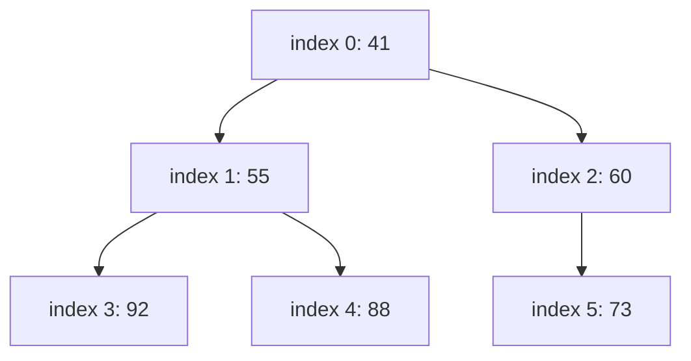

Check the rule: 41 is smaller than 55 and 60; 55 is smaller than 92 and 88; 60 is smaller than 73.

[Back to the Table of Contents](#table-of-contents)

### 7.2 Answer Script

```python
"""
heapq: min-heap, max-heap (negation trick) and a priority queue.
"""
import heapq

# --- Part A: Min-heap basics ---

# Step 1: Build heap from a list
marks = [55, 92, 73, 41, 88, 60]
heapq.heapify(marks)    # Rearranges in place -> O(n)
print("Min-heap after heapify:", marks)
print("Smallest element (heap[0]):", marks[0])

# Step 2: Check the parent/child rule for every parent
for i in range(len(marks) // 2):
    children = [marks[c] for c in (2 * i + 1, 2 * i + 2) if c < len(marks)]
    print(f"  parent {marks[i]} at index {i} -> children {children}")

# Step 3: Push a new element
heapq.heappush(marks, 35)
print("After pushing 35:", marks)
print("New minimum:", marks[0])

# Step 4: Pop elements in sorted (ascending) order
print("Popping all in ascending order:", end=" ")
temp = marks[:]            # pop from a copy so 'marks' is kept
while temp:
    print(heapq.heappop(temp), end=" ")
print()

# --- Part B: Max-heap using negation trick ---
"""
Max-heap trick: store every value as its negative.
  push:  heappush(h, -value)
  peek:  -h[0]
  pop:   -heappop(h)
"""
# Step 5: Push negated scores
scores = [55, 92, 73, 41, 88]
max_heap = []
for score in scores:
    heapq.heappush(max_heap, -score)   # Negate before pushing
print("\nStored (negated) heap:", max_heap)

# Step 6: Pop the three largest
print("Top 3 scores (max-heap):")
for _ in range(3):
    print(" ", -heapq.heappop(max_heap))   # Negate again when popping

# --- Part C: Priority queue with tuples ---

# Step 7: Tuples (priority, task_name) - heapq compares the first element first
task_queue = []
heapq.heappush(task_queue, (3, "Send email"))
heapq.heappush(task_queue, (1, "Fix crash bug"))    # Highest priority
heapq.heappush(task_queue, (2, "Write unit tests"))

# Step 8: Process tasks in priority order
print("\nProcessing tasks by priority:")
while task_queue:
    priority, task = heapq.heappop(task_queue)
    print(f"  Priority {priority}: {task}")
```

[Back to the Table of Contents](#table-of-contents)

### 7.3 Output

```text
Min-heap after heapify: [41, 55, 60, 92, 88, 73]
Smallest element (heap[0]): 41
  parent 41 at index 0 -> children [55, 60]
  parent 55 at index 1 -> children [92, 88]
  parent 60 at index 2 -> children [73]
After pushing 35: [35, 55, 41, 92, 88, 73, 60]
New minimum: 35
Popping all in ascending order: 35 41 55 60 73 88 92 

Stored (negated) heap: [-92, -88, -73, -41, -55]
Top 3 scores (max-heap):
  92
  88
  73

Processing tasks by priority:
  Priority 1: Fix crash bug
  Priority 2: Write unit tests
  Priority 3: Send email
```

[Back to the Table of Contents](#table-of-contents)

### 7.4 Explanation

1. `heapify` turned `[55, 92, 73, 41, 88, 60]` into a valid heap with 41 at the front. The parent/child check confirms that each parent is smaller than its children.
2. Pushing 35 moved it up the tree until it reached the top, because it is the new smallest value.
3. Popping repeatedly gave all the marks in ascending order. (This is the idea behind a sorting method called **heapsort**.)
4. In the max-heap, the stored values are negative. -92 is the smallest stored value, so it came out first and was turned back into 92.
5. The tasks were processed as 1, 2, 3, regardless of the order they were added in.

Note that the list after pushing 35, `[35, 55, 41, 92, 88, 73, 60]`, is not sorted. That is expected. A heap only keeps the smallest item at the front.

[Back to the Table of Contents](#table-of-contents)

### 7.5 Follow-up Questions

**7.5.1 Is there a shorter way to get the 3 largest scores?**

Yes: `heapq.nlargest(3, scores)` returns `[92, 88, 73]`. There is also `heapq.nsmallest()`. From Python 3.14, `heapq` also has built-in max-heap functions such as `heappush_max()` and `heappop_max()`.

**7.5.2 What goes wrong if two tasks share a priority and the second tuple items cannot be compared?**

Python compares the second items to break the tie. If they cannot be compared (for example, two dictionaries), a `TypeError` is raised. Adding a running counter, `(priority, counter, task)`, avoids this.

[Back to the Table of Contents](#table-of-contents)

---

## Q8. bisect: Duplicates, Leaderboard and Grade Lookup

*Part B: bisect Module*

**Use `bisect.bisect_left` and `bisect_right` on a sorted list with duplicates. Use `insort()` to maintain a sorted leaderboard. Build a grade-boundary lookup table using `bisect` on threshold lists.**

### 8.1 How It Works

The [bisect](https://docs.python.org/3/library/bisect.html) module keeps a sorted list sorted, using binary search:

| Function | What it returns or does |
|---|---|
| `bisect_left(a, x)` | The index where `x` would go, to the **left** of any equal items |
| `bisect_right(a, x)` | The index where `x` would go, to the **right** of any equal items. Plain `bisect()` is the same |
| `insort(a, x)` | Inserts `x` at the correct position. Finding the spot is `O(log n)`; shifting later items is `O(n)`. No full re-sort is needed |

Typical uses are leaderboards, grade thresholds and live streams of data that must stay in order.

**Grade lookup.** Think of the thresholds as fence posts. `bisect(breakpoints, score)` counts how many fence posts the score has reached or passed. That count is used as the index into the list of grades.

| Score range | Posts reached (out of 40, 55, 65, 75, 85) | `bisect` result | Grade |
|---|---|---|---|
| below 40 | none | 0 | F |
| 40 to 54 | 40 | 1 | D |
| 55 to 64 | 40, 55 | 2 | C |
| 65 to 74 | 40, 55, 65 | 3 | B |
| 75 to 84 | 40, 55, 65, 75 | 4 | A- |
| 85 and above | all five | 5 | A |

There must always be one more grade than there are breakpoints.

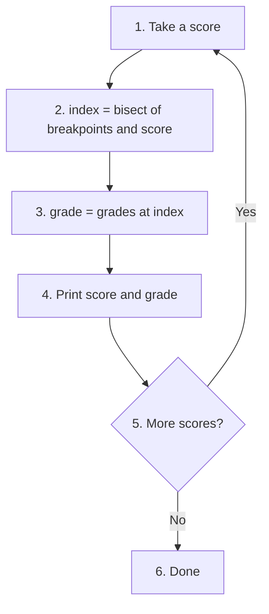

[Back to the Table of Contents](#table-of-contents)

### 8.2 Answer Script

```python
"""
bisect: keeping a sorted list sorted without re-sorting.
"""
import bisect

# --- Part A: bisect_left vs bisect_right ---

# Step 1: A sorted list with three copies of 30
scores = [10, 20, 30, 30, 30, 40, 50]

pos_left = bisect.bisect_left(scores, 30)
pos_right = bisect.bisect_right(scores, 30)
print(f"Sorted list:  {scores}")
print(f"bisect_left (30):  index {pos_left}  -> insert BEFORE existing 30s")
print(f"bisect_right(30):  index {pos_right}  -> insert AFTER  existing 30s")

# Step 2: A neat use - count how many 30s there are
print(f"Number of 30s: {pos_right - pos_left}")

# Step 3: For a value NOT in the list, both give the same answer
print(f"bisect_left(35) = {bisect.bisect_left(scores, 35)}, "
      f"bisect_right(35) = {bisect.bisect_right(scores, 35)}")

# --- Part B: insort - insert while keeping list sorted ---

# Step 4: Add new scores to a leaderboard
leaderboard = [45, 60, 72, 88, 95]
print(f"\nLeaderboard before: {leaderboard}")
bisect.insort(leaderboard, 78)   # No need to sort again
print(f"After insort(78):   {leaderboard}")
bisect.insort(leaderboard, 55)
print(f"After insort(55):   {leaderboard}")

# Step 5: Show the top 3 (largest are at the end, so reverse)
print(f"Top 3: {leaderboard[::-1][:3]}")

# --- Part C: Grade boundary lookup using bisect ---
"""
Classic bisect pattern: map a numeric score to a letter grade.
breakpoints = thresholds; grades = labels (one more label than thresholds).
bisect.bisect(breakpoints, score) gives the correct label index.
"""
# Step 6: Thresholds and grades
breakpoints = [40, 55, 65, 75, 85]
grades = ["F", "D", "C", "B", "A-", "A"]

# Step 7: Look up several scores, including ones exactly on a boundary
test_scores = [35, 40, 50, 63, 74, 75, 80, 92]
print("\nGrade lookup using bisect:")
for s in test_scores:
    index = bisect.bisect(breakpoints, s)
    grade = grades[index]
    print(f"  Score {s:3d} -> index {index} -> Grade {grade}")
```

[Back to the Table of Contents](#table-of-contents)

### 8.3 Output

```text
Sorted list:  [10, 20, 30, 30, 30, 40, 50]
bisect_left (30):  index 2  -> insert BEFORE existing 30s
bisect_right(30):  index 5  -> insert AFTER  existing 30s
Number of 30s: 3
bisect_left(35) = 5, bisect_right(35) = 5

Leaderboard before: [45, 60, 72, 88, 95]
After insort(78):   [45, 60, 72, 78, 88, 95]
After insort(55):   [45, 55, 60, 72, 78, 88, 95]
Top 3: [95, 88, 78]

Grade lookup using bisect:
  Score  35 -> index 0 -> Grade F
  Score  40 -> index 1 -> Grade D
  Score  50 -> index 1 -> Grade D
  Score  63 -> index 2 -> Grade C
  Score  74 -> index 3 -> Grade B
  Score  75 -> index 4 -> Grade A-
  Score  80 -> index 4 -> Grade A-
  Score  92 -> index 5 -> Grade A
```

[Back to the Table of Contents](#table-of-contents)

### 8.4 Explanation

1. In `[10, 20, 30, 30, 30, 40, 50]`, the 30s occupy indexes 2, 3 and 4. `bisect_left` returned 2 (before them) and `bisect_right` returned 5 (after them).
2. The difference `5 - 2 = 3` is the number of 30s. This is a fast way to count a value in a sorted list.
3. For 35, which is not in the list, both functions returned the same index, 5.
4. `insort` placed 78 between 72 and 88, and 55 between 45 and 60, so the leaderboard stayed sorted without calling `sort()`.
5. In the grade lookup, a score exactly on a boundary, such as 40 or 75, gets the **higher** grade. This is because `bisect()` is `bisect_right()`, which places an equal value after the threshold. If you used `bisect_left()`, a score of 40 would wrongly get an F.

[Back to the Table of Contents](#table-of-contents)

### 8.5 Follow-up Questions

**8.5.1 How would you keep a leaderboard sorted from highest to lowest instead?**

`bisect` only works with ascending order (in Python 3.10 and later you can also pass a `key` function, but the list order must still match it). The simplest approach is to keep the list ascending and reverse it for display, as in Step 5.

**8.5.2 What would `grades[bisect.bisect(breakpoints, 100)]` give?**

`"A"`. 100 has passed all five thresholds, so the index is 5.

[Back to the Table of Contents](#table-of-contents)

---

## Q9. OrderedDict and an LRU Cache

*Part B: collections.OrderedDict*

**Demonstrate all extra methods `OrderedDict` provides over a plain `dict` (`move_to_end`, `popitem`). Build a working LRU cache class using `OrderedDict` with a fixed capacity and eviction on overflow.**

### 9.1 How It Works

Since Python 3.7, plain dicts already keep items in insertion order. [OrderedDict](https://docs.python.org/3/library/collections.html#collections.OrderedDict) still exists because it gives you extra control over that order:

| Method | What it does | Plain dict equivalent |
|---|---|---|
| `move_to_end(key, last=True)` | Moves a key to the end, or to the front with `last=False`, in `O(1)` | To the end: `d[key] = d.pop(key)`. To the front: no direct way |
| `popitem(last=True)` | Removes and returns the last item, or the first item with `last=False` | `d.popitem()` removes the last item only; it cannot remove the first |

**LRU cache.** A **cache** is a small, fast store of results you are likely to need again. **LRU** stands for **Least Recently Used**. An LRU cache holds a fixed number of items. When it is full and a new item arrives, it **evicts** (throws out) the item that has gone unused for the longest time.

`OrderedDict` suits this perfectly:

- Keep the **least** recently used item at the **front** and the **most** recently used at the **end**.
- When an item is read or updated, `move_to_end(key)` marks it as most recently used.
- When the cache is too full, `popitem(last=False)` removes the item at the front, which is the least recently used.

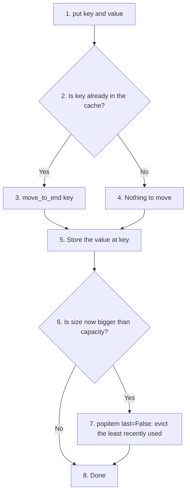

[Back to the Table of Contents](#table-of-contents)

### 9.2 Answer Script

```python
"""
OrderedDict: move_to_end, popitem and an LRU cache.
"""
from collections import OrderedDict

# --- Part A: move_to_end demonstration ---

# Step 1: Build an OrderedDict
od = OrderedDict()
od['a'] = 1
od['b'] = 2
od['c'] = 3
od['d'] = 4
print("Original order:", list(od.keys()))

# Step 2: Move keys to either end
od.move_to_end('b')              # Move 'b' to the LAST position
print("After move_to_end('b'):", list(od.keys()))

od.move_to_end('d', last=False)  # Move 'd' to the FIRST position
print("After move_to_end('d', last=False):", list(od.keys()))

# --- Part B: popitem from either end ---

# Step 3: Remove the last item, then the first item
print("popitem()          removed:", od.popitem())
print("popitem(last=False) removed:", od.popitem(last=False))
print("Remaining:", list(od.items()))

# --- Part C: LRU Cache with OrderedDict ---
"""
LRU (Least Recently Used) Cache:
  - Stores up to 'capacity' items
  - When full: evict the LEAST recently used item (the one at the front)
  - On access: move the item to the 'most recently used' end
"""
# Step 4: The LRUCache class
class LRUCache:
    def __init__(self, capacity):
        self.capacity = capacity
        self.cache = OrderedDict()

    def get(self, key):
        if key not in self.cache:
            return None
        self.cache.move_to_end(key)   # Mark as most recently used
        return self.cache[key]

    def put(self, key, value):
        if key in self.cache:
            self.cache.move_to_end(key)
        self.cache[key] = value
        if len(self.cache) > self.capacity:
            evicted = self.cache.popitem(last=False)  # Evict LRU (first item)
            print(f"  (evicted {evicted[0]})")

    def __repr__(self):
        return f"LRU{list(self.cache.items())}"

# Step 5: Fill the cache to capacity
lru = LRUCache(3)
lru.put("page1", "Home")
lru.put("page2", "About")
lru.put("page3", "Contact")
print("\nCache:", lru)

# Step 6: Use page1, then add page4
print("get('page1') ->", lru.get("page1"))   # page1 becomes most recently used
lru.put("page4", "Products")                 # Cache full -> evicts page2
print("After accessing page1 and adding page4:", lru)

# Step 7: A missing page returns None
print("get('page2') ->", lru.get("page2"))
```

[Back to the Table of Contents](#table-of-contents)

### 9.3 Output

```text
Original order: ['a', 'b', 'c', 'd']
After move_to_end('b'): ['a', 'c', 'd', 'b']
After move_to_end('d', last=False): ['d', 'a', 'c', 'b']
popitem()          removed: ('b', 2)
popitem(last=False) removed: ('d', 4)
Remaining: [('a', 1), ('c', 3)]

Cache: LRU[('page1', 'Home'), ('page2', 'About'), ('page3', 'Contact')]
get('page1') -> Home
  (evicted page2)
After accessing page1 and adding page4: LRU[('page3', 'Contact'), ('page1', 'Home'), ('page4', 'Products')]
get('page2') -> None
```

[Back to the Table of Contents](#table-of-contents)

### 9.4 Explanation

**Part A and B**

- `move_to_end('b')` sent `b` to the end, and `move_to_end('d', last=False)` sent `d` to the front.
- `popitem()` removed the last item (`b`), and `popitem(last=False)` removed the first (`d`).

**Part C: tracing the cache**

| Step | Action | Cache order afterwards (least recent first) |
|---|---|---|
| 1 | put page1, page2, page3 | page1, page2, page3 |
| 2 | get page1 | page2, page3, page1 |
| 3 | put page4 | page2, page3, page1, page4 (4 items, one over capacity) |
| 4 | evict the front item, page2 | page3, page1, page4 |

page1 was the oldest item added, but reading it made it the most recently used, so it survived. page2 had gone unused the longest and was evicted.

[Back to the Table of Contents](#table-of-contents)

### 9.5 Follow-up Questions

**9.5.1 Python has a ready-made LRU cache. What is it?**

The `@functools.lru_cache` decorator (see Q13). It caches the results of a function. The class here is useful when you want to cache data yourself, such as web pages or database rows.

**9.5.2 In `put()`, why is `move_to_end(key)` called before `self.cache[key] = value` for an existing key?**

Assigning a new value to an existing key does **not** change its position in an OrderedDict. Without `move_to_end`, an updated page would stay near the front and could be evicted too early.

[Back to the Table of Contents](#table-of-contents)

---

## Q10. namedtuple in Practice

*Part B: collections.namedtuple*

**Create a `namedtuple` called `Student`. Show field access by name and index. Use `_asdict()`, `_replace()`, and tuple unpacking. Print the MRO with `__mro__`. Compare memory size against an equivalent `dict`.**

### 10.1 How It Works

[namedtuple](https://docs.python.org/3/library/collections.html#collections.namedtuple) creates a class that is:

1. A **subclass of tuple**, so it is memory-efficient and immutable (it cannot be changed).
2. A record whose fields can be read by **name** (readable) or by **index** (so it still works anywhere a tuple is expected).

`namedtuple('TypeName', ['field1', 'field2'])` returns a new **class**. A function that makes and returns classes like this is called a **factory function**.

| Feature | Code | What it gives |
|---|---|---|
| Access by name | `s1.name` | `'Anita'` |
| Access by index | `s1[2]` | `88` |
| Convert to a dictionary | `s1._asdict()` | A plain `dict` (Python 3.8+; an `OrderedDict` in 3.1 to 3.7) |
| Change a field | `s1._replace(marks=92)` | A **new** record; the original is unchanged |
| Unpacking | `name, roll, marks, grade = s1` | Each field in its own variable |
| Family tree | `Student.__mro__` | The classes Python searches for methods, in order |

**MRO** stands for **Method Resolution Order**. It lists a class, then its parent class, then that class's parent, and so on. See [method resolution order](https://docs.python.org/3/glossary.html#term-method-resolution-order).

**Memory.** [sys.getsizeof()](https://docs.python.org/3/library/sys.html#sys.getsizeof) reports the size, in bytes, of the container object itself. It does **not** include the size of the strings and numbers stored inside. Since the namedtuple and the dict hold the same four values, comparing the containers is still a fair test.

[Back to the Table of Contents](#table-of-contents)

### 10.2 Answer Script

```python
"""
namedtuple: lightweight immutable records with named fields.
"""
from collections import namedtuple
import sys

# Step 1 - Create a namedtuple class (the 'factory' call)
# 'Student' appears twice: the variable name on the left, and the
# class's internal name (stored in __name__) as the first argument
Student = namedtuple('Student', ['name', 'roll', 'marks', 'grade'])
print("Fields:", Student._fields)

# Step 2 - Create instances (immutable records)
s1 = Student(name="Anita", roll=101, marks=88, grade="A")
s2 = Student(name="Pradeep", roll=102, marks=74, grade="B")

# Step 3 - Access fields by name (readable) or index (tuple-compatible)
print("Name:", s1.name)          # By name
print("Marks:", s1[2])           # By index (same as a tuple)
print("Full record:", s1)

# Step 4 - _asdict(): convert to a dict for JSON or display
print("As dict:", s1._asdict())

# Step 5 - _replace(): create a modified copy (namedtuples are immutable)
s1_updated = s1._replace(marks=92, grade="A+")
print("Updated copy:", s1_updated)
print("Original unchanged:", s1)

# Step 6 - Tuple operations still work
print("Is tuple?", isinstance(s1, tuple))
name, roll, marks, grade = s1   # Unpacking
print(f"Unpacked - name={name}, roll={roll}")
print("Sorted by marks:", [s.name for s in sorted([s1, s2], key=lambda s: s.marks)])

# Step 7 - Memory size vs an equivalent dict
student_dict = {"name": "Anita", "roll": 101, "marks": 88, "grade": "A"}
print(f"\nnamedtuple size: {sys.getsizeof(s1)} bytes")
print(f"dict size:       {sys.getsizeof(student_dict)} bytes")

# Step 8 - __mro__ reveals the inheritance chain
print("\nMRO:", Student.__mro__)
print("MRO names:", [c.__name__ for c in Student.__mro__])
```

[Back to the Table of Contents](#table-of-contents)

### 10.3 Output

The memory sizes may be slightly different on other Python versions or computers.

```text
Fields: ('name', 'roll', 'marks', 'grade')
Name: Anita
Marks: 88
Full record: Student(name='Anita', roll=101, marks=88, grade='A')
As dict: {'name': 'Anita', 'roll': 101, 'marks': 88, 'grade': 'A'}
Updated copy: Student(name='Anita', roll=101, marks=92, grade='A+')
Original unchanged: Student(name='Anita', roll=101, marks=88, grade='A')
Is tuple? True
Unpacked - name=Anita, roll=101
Sorted by marks: ['Pradeep', 'Anita']

namedtuple size: 72 bytes
dict size:       184 bytes

MRO: (<class '__main__.Student'>, <class 'tuple'>, <class 'object'>)
MRO names: ['Student', 'tuple', 'object']
```

[Back to the Table of Contents](#table-of-contents)

### 10.4 Explanation

1. `s1.name` and `s1[2]` read the same record in two ways.
2. `_asdict()` returned a normal dictionary.
3. `_replace()` built a new record with the changed marks and grade. The original `s1` did not change.
4. `isinstance(s1, tuple)` is `True`, so unpacking and sorting work exactly as with a tuple.
5. **Memory:** the namedtuple was much smaller than the dict. A tuple stores only its values in a fixed row. A dictionary also stores a hash table so that it can look up keys quickly, which needs extra space. The field names of a namedtuple are stored only once, on the class, not in every record.
6. **MRO:** `Student`, then `tuple`, then `object`. This confirms that `Student` inherits from `tuple`, and `object` is the base class of everything in Python.

The leading underscore in `_asdict`, `_replace` and `_fields` does not mean "private". It is there so these names can never clash with a field name you choose yourself.

[Back to the Table of Contents](#table-of-contents)

### 10.5 Follow-up Questions

**10.5.1 What happens if you try `s1.marks = 95`?**

Python raises `AttributeError: can't set attribute`, because a namedtuple is immutable. Use `_replace()` instead.

**10.5.2 How can you build a `Student` from a list such as `["Ravi", 103, 81, "A"]`?**

Either `Student(*row)` (unpacking the list into arguments) or `Student._make(row)`.

[Back to the Table of Contents](#table-of-contents)

---

## Q11. dataclass Features

*Part B: dataclasses Module*

**Define a `@dataclass` `Student` with a default field. Add a `subjects` list using `field(default_factory=list)` and prove each instance gets its own list. Add a `password` field with `repr=False`. Make the class `frozen=True`.**

### 11.1 How It Works

The `@dataclass` decorator removes a lot of routine code. From the field annotations (such as `name: str`) Python automatically writes:

| Method | What it does |
|---|---|
| `__init__` | The constructor, built from the fields in order |
| `__repr__` | A readable text form for `print()` |
| `__eq__` | Equality comparison, field by field |

A **decorator** is a line starting with `@` above a function or class that adds behaviour to it. An **annotation** or **type hint** is a note such as `marks: float` saying what type a field should hold. See [dataclasses](https://docs.python.org/3/library/dataclasses.html).

Key features demonstrated:

| Feature | Code | Effect |
|---|---|---|
| Default value | `marks: float = 0.0` | Used when no value is given |
| `default_factory` | `subjects: list = field(default_factory=list)` | Each instance gets its own new list |
| Hidden field | `password: str = field(repr=False)` | Left out when the object is printed |
| Immutable | `@dataclass(frozen=True)` | Fields cannot be reassigned after creation |

**Why `default_factory`?** A dataclass does not allow `subjects: list = []`. It raises a `ValueError` when the class is defined. This protects you from a well-known trap: in a normal class, a list default like that would be one list **shared** by every instance. `field(default_factory=list)` calls `list()` for each new instance, giving each its own fresh empty list.

The script builds up the features one at a time in Parts A to D, and then, in Part E, puts **all** of them together in a single frozen `Student` class, exactly as the question asks.

[Back to the Table of Contents](#table-of-contents)

### 11.2 Answer Script

```python
"""
dataclasses: auto-generated __init__, __repr__ and __eq__,
default_factory, repr=False and frozen=True.
"""
from dataclasses import dataclass, field, FrozenInstanceError

# --- Part A: Basic dataclass with defaults ---

# Step 1: Define the class
@dataclass
class Student:
    name: str
    roll: int
    marks: float = 0.0            # Default value
    grade: str = "N/A"

# Step 2: Create objects, print them and compare them
s1 = Student("Anita", 101, 88.5, "A")
s2 = Student("Pradeep", 102)      # Uses defaults for marks and grade
print(s1)   # __repr__ auto-generated
print(s2)
print("Equal?", s1 == Student("Anita", 101, 88.5, "A"))   # __eq__ compares fields

# --- Part B: Mutable default with default_factory ---
"""
WRONG:   subjects: list = []
         A dataclass refuses this and raises ValueError.
         (In a normal class it would be one list shared by all instances.)
CORRECT: subjects: list = field(default_factory=list)
         Each instance gets its OWN fresh empty list.
"""
# Step 3: Show that the wrong way is refused
try:
    @dataclass
    class BadRecord:
        subjects: list = []
except ValueError as error:
    print("\nValueError:", error)

# Step 4: The correct way
@dataclass
class CourseRecord:
    student_name: str
    subjects: list = field(default_factory=list)  # Separate list per instance

r1 = CourseRecord("Anita")
r2 = CourseRecord("Pradeep")
r1.subjects.append("Python")
r1.subjects.append("Data Structures")
print("Anita's subjects:", r1.subjects)
print("Pradeep's subjects (unaffected):", r2.subjects)
print("Same list object?", r1.subjects is r2.subjects)

# --- Part C: Hidden field with repr=False ---

# Step 5: password is stored but not printed
@dataclass
class User:
    username: str
    password: str = field(repr=False)  # Not shown when printed

u = User("admin", "secret123")
print("\nUser record:", u)             # password NOT displayed
print("Password still stored:", u.password == "secret123")

# --- Part D: Frozen (immutable) dataclass ---

# Step 6: Fields cannot be reassigned
@dataclass(frozen=True)
class Point:
    x: float
    y: float

p = Point(3.0, 4.0)
print("\nPoint:", p)
try:
    p.x = 10   # Raises FrozenInstanceError
except FrozenInstanceError as e:
    print("Cannot modify frozen dataclass:", type(e).__name__)

# --- Part E: All features together in one frozen Student class ---

# Step 7: One class with a default, default_factory, repr=False and frozen=True
@dataclass(frozen=True)
class FrozenStudent:
    name: str
    roll: int
    password: str = field(repr=False)
    marks: float = 0.0
    subjects: list = field(default_factory=list)

a = FrozenStudent("Anita", 101, "pa55")
b = FrozenStudent("Pradeep", 102, "qwerty", 74.0)
print("\n", a, sep="")
print(b)

# Step 8: Each instance still has its own list
a.subjects.append("Python")
print("Anita's subjects:", a.subjects, "| Pradeep's subjects:", b.subjects)

# Step 9: Fields cannot be reassigned
try:
    a.marks = 99
except FrozenInstanceError as e:
    print("Cannot change marks:", e)
```

[Back to the Table of Contents](#table-of-contents)

### 11.3 Output

```text
Student(name='Anita', roll=101, marks=88.5, grade='A')
Student(name='Pradeep', roll=102, marks=0.0, grade='N/A')
Equal? True

ValueError: mutable default <class 'list'> for field subjects is not allowed: use default_factory
Anita's subjects: ['Python', 'Data Structures']
Pradeep's subjects (unaffected): []
Same list object? False

User record: User(username='admin')
Password still stored: True

Point: Point(x=3.0, y=4.0)
Cannot modify frozen dataclass: FrozenInstanceError

FrozenStudent(name='Anita', roll=101, marks=0.0, subjects=[])
FrozenStudent(name='Pradeep', roll=102, marks=74.0, subjects=[])
Anita's subjects: ['Python'] | Pradeep's subjects: []
Cannot change marks: cannot assign to field 'marks'
```

[Back to the Table of Contents](#table-of-contents)

### 11.4 Explanation

1. **Defaults:** `s2` was created without marks or grade, so it used `0.0` and `"N/A"`.
2. **Equality:** two separate objects with the same field values compare equal, because `__eq__` checks the fields.
3. **Mutable default:** `subjects: list = []` was refused with a clear `ValueError` that even suggests the fix.
4. **default_factory:** adding subjects for Anita did not affect Pradeep, and `is` confirms they hold two different list objects.
5. **repr=False:** the password was left out of the printed record, but it is still stored and usable.
6. **frozen=True:** assigning to `p.x` raised `FrozenInstanceError`.
7. **All together:** `FrozenStudent` has a default (`marks`), a hidden `password`, its own `subjects` list, and is frozen.

Notice one subtle point in Step 8. Even in a **frozen** dataclass, `a.subjects.append("Python")` worked. `frozen=True` stops you from **reassigning** a field (`a.subjects = [...]`), but it cannot stop you from changing the **inside** of a mutable object such as a list. If you need a truly unchangeable collection, use a tuple instead of a list.

Also notice the field order in `FrozenStudent`: `password` has no default, so it comes before `marks` and `subjects`, which do. Fields without defaults must always come before fields with defaults.

[Back to the Table of Contents](#table-of-contents)

### 11.5 Follow-up Questions

**11.5.1 Can a frozen dataclass be used as a dictionary key?**

Yes, if all its fields are hashable. `Point(3.0, 4.0)` can be a key. `FrozenStudent` cannot, because its `subjects` list is not hashable, so trying to hash it raises a `TypeError`.

**11.5.2 How would you make students sortable by marks with `<` and `>`?**

Use `@dataclass(order=True)`. Python then compares objects field by field in order, so put `marks` first, or use `sorted(students, key=lambda s: s.marks)`.

[Back to the Table of Contents](#table-of-contents)

---

## Q12. Enum with auto()

*Part B: enum Module*

**Define an `Enum` `OrderStatus` with 5 states. Use `auto()` to assign values automatically. Show member access by `.name` and `.value`, comparison, iteration over all members, and lookup by integer value.**

### 12.1 How It Works

**Magic numbers** such as `if status == 3` make code hard to read and easy to get wrong. What does 3 mean? [enum.Enum](https://docs.python.org/3/library/enum.html) replaces them with named constants.

| Feature | What it does |
|---|---|
| `Enum` | A class of fixed, named constants called **members** |
| `auto()` | Assigns the values for you: 1, 2, 3, and so on |
| `.name` and `.value` | The member's name as text, and its value |
| Comparison | `order == OrderStatus.SHIPPED` compares members |
| Iteration | `for s in OrderStatus:` visits every member in definition order |
| Lookup by value | `OrderStatus(3)` gives the member whose value is 3 |
| `IntEnum` | Like `Enum`, but members also compare equal to plain integers |

The plan:

1. Define `OrderStatus` with five states, using `auto()` for every value.
2. Pick one member and print its `.name` and `.value`.
3. Compare it with another member.
4. Loop over all members.
5. Look up a member from an integer.
6. Show how `IntEnum` differs from `Enum` when compared with a plain number.

[Back to the Table of Contents](#table-of-contents)

### 12.2 Answer Script

```python
"""
enum: replacing magic numbers with named constants.
"""
from enum import Enum, auto, IntEnum

# --- Part A: Enum with auto() - order status ---

# Step 1: Five states, values assigned automatically
class OrderStatus(Enum):
    PENDING = auto()     # -> 1
    CONFIRMED = auto()   # -> 2
    SHIPPED = auto()     # -> 3
    DELIVERED = auto()   # -> 4
    CANCELLED = auto()   # -> 5

# Step 2: Member access by .name and .value
order = OrderStatus.SHIPPED
print("Current status:", order)          # OrderStatus.SHIPPED
print("Name:", order.name)               # SHIPPED
print("Value:", order.value)             # 3

# --- Part B: Comparison ---

# Step 3: Compare with enum members, not raw numbers
if order == OrderStatus.SHIPPED:
    print("Your order is on its way!")
print("order == OrderStatus.DELIVERED?", order == OrderStatus.DELIVERED)
print("order == 3?", order == 3)                  # False: a member is not a plain int
print("order.value == 3?", order.value == 3)      # True

# --- Part C: Iteration over all members ---

# Step 4: Loop in definition order
print("\nAll order states:")
for status in OrderStatus:
    print(f"  {status.value}. {status.name}")
print("Number of states:", len(OrderStatus))

# --- Part D: Lookup by integer value ---

# Step 5: Convert an int (for example, read from a database) to a member
status_code = 3
status = OrderStatus(status_code)
print(f"\nStatus for code {status_code}: {status.name}")

# Step 6: An invalid code raises ValueError
try:
    OrderStatus(9)
except ValueError as error:
    print("ValueError:", error)

# --- Part E: IntEnum - members that ARE integers ---

# Step 7: Useful when older code or an outside system uses plain numbers
class HttpStatus(IntEnum):
    OK = 200
    NOT_FOUND = 404
    ERROR = 500

code = 404
print(f"\nIs 404 NOT_FOUND? {code == HttpStatus.NOT_FOUND}")  # True (IntEnum)
```

[Back to the Table of Contents](#table-of-contents)

### 12.3 Output

```text
Current status: OrderStatus.SHIPPED
Name: SHIPPED
Value: 3
Your order is on its way!
order == OrderStatus.DELIVERED? False
order == 3? False
order.value == 3? True

All order states:
  1. PENDING
  2. CONFIRMED
  3. SHIPPED
  4. DELIVERED
  5. CANCELLED
Number of states: 5

Status for code 3: SHIPPED
ValueError: 9 is not a valid OrderStatus

Is 404 NOT_FOUND? True
```

[Back to the Table of Contents](#table-of-contents)

### 12.4 Explanation

1. `auto()` gave the five states the values 1 to 5 in order, as the loop in Part C shows.
2. `order.name` is the text `"SHIPPED"`, and `order.value` is the number `3`.
3. Comparing `order == OrderStatus.SHIPPED` is `True`. But `order == 3` is `False`: a normal `Enum` member is not equal to its plain value. Use `.value` if you must compare with a number.
4. `len(OrderStatus)` counts the members.
5. `OrderStatus(3)` turned the number back into the `SHIPPED` member. An unknown code such as 9 raised a `ValueError`.
6. With `IntEnum`, `404 == HttpStatus.NOT_FOUND` is `True`, because its members are real integers.

Why not use `IntEnum` everywhere? Because the strictness of `Enum` is useful. With `Enum`, you cannot accidentally mix an order status with an unrelated number such as a quantity.

[Back to the Table of Contents](#table-of-contents)

### 12.5 Follow-up Questions

**12.5.1 If you add a new state `RETURNED = auto()` between `DELIVERED` and `CANCELLED`, what happens to the values?**

`RETURNED` becomes 5 and `CANCELLED` becomes 6. This is fine as long as the numbers are used only inside your program. If the numbers are stored in a database, adding states in the middle would change the meaning of saved data, so give fixed values in that case.

**12.5.2 How do you look up a member by its name, such as the text `"PENDING"`?**

Use square brackets: `OrderStatus["PENDING"]`.

[Back to the Table of Contents](#table-of-contents)

---

## Q13. lru_cache and Fibonacci

*Part B: functools.lru_cache*

**Compare `fib(35)` (plain recursion) vs `fib_cached(35)` (with `@lru_cache`) using `time.perf_counter()`. Print speedup and explain every field in `cache_info()` output: hits, misses, maxsize, currsize.**

### 13.1 How It Works

**Memoisation** means remembering (caching) the results of expensive function calls. When the function is called again with the same arguments, the stored result is returned at once.

- [@lru_cache(maxsize=None)](https://docs.python.org/3/library/functools.html#functools.lru_cache) gives a cache with no size limit. In Python 3.9 and later, `@cache` does the same.
- `cache_info()` reports four numbers: `hits`, `misses`, `maxsize` and `currsize`.

**The Fibonacci example.** In the [Fibonacci sequence](https://en.wikipedia.org/wiki/Fibonacci_sequence) each number is the sum of the two before it: 0, 1, 1, 2, 3, 5, 8, ... The plain recursive `fib(n)` calls `fib(n-1)` and `fib(n-2)`, and each of those calls two more, so the same values are worked out again and again. The number of calls grows exponentially. `O(2ⁿ)` is the usual simple upper bound; `fib(35)` actually makes about 30 million calls.

With the cache, each `n` from 0 to 35 is worked out only **once**, so the work drops to `O(n)`.

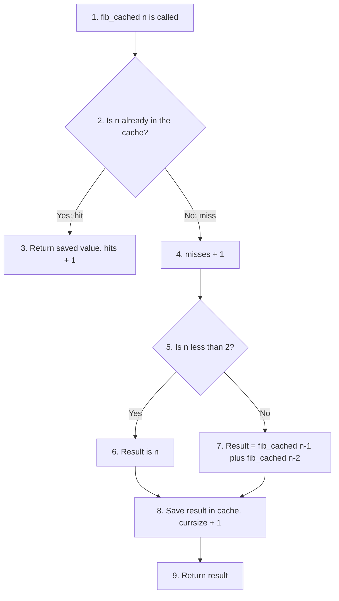

[Back to the Table of Contents](#table-of-contents)

### 13.2 Answer Script

```python
"""
functools.lru_cache: memoisation to avoid repeated computation.
"""
from functools import lru_cache
import time

# --- Part A: Without cache - exponential growth ---
call_count = 0

def fib(n):
    """Standard recursive Fibonacci - recomputes the same values repeatedly."""
    global call_count
    call_count += 1
    if n < 2:
        return n
    return fib(n - 1) + fib(n - 2)

# --- Part B: With lru_cache - each value computed only once ---
@lru_cache(maxsize=None)
def fib_cached(n):
    """Cached Fibonacci - result stored after first computation."""
    if n < 2:
        return n
    return fib_cached(n - 1) + fib_cached(n - 2)

# Step 1 - Benchmark both versions
N = 35

t0 = time.perf_counter()
result_plain = fib(N)
t_plain = time.perf_counter() - t0

t1 = time.perf_counter()
result_cached = fib_cached(N)
t_cached = time.perf_counter() - t1

print(f"fib({N}) = {result_plain}  (cached version gives {result_cached})")
print(f"Plain version made {call_count:,} function calls")
print(f"Without cache: {t_plain:.5f} s")
print(f"With    cache: {t_cached:.7f} s")
print(f"Speedup: about {t_plain / t_cached:,.0f}x faster")

# Step 2 - Inspect cache statistics
info = fib_cached.cache_info()
print(f"\nCache info: {info}")
print(f"  hits     = {info.hits}  (answered from the cache - no recalculation)")
print(f"  misses   = {info.misses}  (not in the cache - computed fresh and stored)")
print(f"  maxsize  = {info.maxsize}  (largest number of results allowed; None = no limit)")
print(f"  currsize = {info.currsize}  (number of results stored right now)")

# Step 3 - Confirm the cache is working: a second call is almost instant
t2 = time.perf_counter()
fib_cached(N)
t2_elapsed = time.perf_counter() - t2
print(f"\nSecond call for fib({N}): {t2_elapsed:.7f} s  (a single cache hit)")
print("Cache info now:", fib_cached.cache_info())
```

[Back to the Table of Contents](#table-of-contents)

### 13.3 Output

Your times and speedup will differ. The call count and cache figures will be the same.

```text
fib(35) = 9227465  (cached version gives 9227465)
Plain version made 29,860,703 function calls
Without cache: 1.90777 s
With    cache: 0.0000445 s
Speedup: about 42,847x faster

Cache info: CacheInfo(hits=33, misses=36, maxsize=None, currsize=36)
  hits     = 33  (answered from the cache - no recalculation)
  misses   = 36  (not in the cache - computed fresh and stored)
  maxsize  = None  (largest number of results allowed; None = no limit)
  currsize = 36  (number of results stored right now)

Second call for fib(35): 0.0000008 s  (a single cache hit)
Cache info now: CacheInfo(hits=34, misses=36, maxsize=None, currsize=36)
```

[Back to the Table of Contents](#table-of-contents)

### 13.4 Explanation

**The speedup.** The plain version made about 30 million calls, recomputing the same small Fibonacci numbers millions of times. The cached version computed each value from `fib(0)` to `fib(35)` just once, so it finished in a tiny fraction of the time.

**Every field in `cache_info()`**, following the first call `fib_cached(35)`:

| Field | Value | Meaning | Why this number |
|---|---|---|---|
| `misses` | 36 | Calls whose result was not yet cached, so the body ran | One for each `n` from 0 to 35, which is 36 values |
| `hits` | 33 | Calls answered straight from the cache | Calls for values already worked out (see below) |
| `maxsize` | `None` | The cache size limit | We wrote `maxsize=None`, meaning unlimited |
| `currsize` | 36 | How many results are stored now | All 36 missed values were saved and nothing was thrown away |

Where do the 33 hits come from? Follow the calls:

1. `fib_cached(35)` calls `fib_cached(34)`, which calls `fib_cached(33)`, and so on down to `fib_cached(1)`. Each of these is a miss: 35 misses so far.
2. `fib_cached(2)` also needs `fib_cached(0)`, which is not cached yet. That is the 36th miss.
3. Now the calls return upward. Each `fib_cached(n)` for `n` = 3 up to 35 also needs `fib_cached(n - 2)`, which was already stored on the way down. Each of those is a hit.
4. From 3 to 35 there are 33 values, so there are 33 hits.

After the **second** call, `hits` went up by exactly 1: the call for 35 was answered immediately, without calling anything else.

[Back to the Table of Contents](#table-of-contents)

### 13.5 Follow-up Questions

**13.5.1 What would `cache_info()` show after calling `fib_cached(36)` next?**

One new miss for 36 (misses becomes 37) and two new hits for 35 and 34, both already cached. `currsize` becomes 37.

**13.5.2 What does `fib_cached.cache_clear()` do?**

It empties the cache and resets all the counts to zero, so the next call starts from scratch.

[Back to the Table of Contents](#table-of-contents)

---

## Q14. partial() and reduce()

*Part B: functools.partial and reduce*

**Use `partial()` to create `gst_electronics` (18%) and `gst_food` (5%) from a `calculate_tax(amount, rate)` function. Use `reduce()` to multiply [2,3,4,5] step by step and print each intermediate result. Show why a plain loop is often clearer.**

### 14.1 How It Works

[partial()](https://docs.python.org/3/library/functools.html#functools.partial) pre-fills one or more arguments of a function, creating a new function that needs fewer arguments. It is useful when you keep passing the same value, or when you pass a function to another piece of code that expects fewer arguments.

[reduce()](https://docs.python.org/3/library/functools.html#functools.reduce) repeatedly applies a two-argument function to combine the items of a list into a single value. It was moved from the built-in functions to `functools` in Python 3, because Python's creator felt that a plain loop is usually easier to read.

**How `reduce(multiply, [2, 3, 4, 5])` works:**

| Step | `a` (result so far) | `b` (next item) | `multiply(a, b)` |
|---|---|---|---|
| 1 | 2 | 3 | 6 |
| 2 | 6 | 4 | 24 |
| 3 | 24 | 5 | 120 |

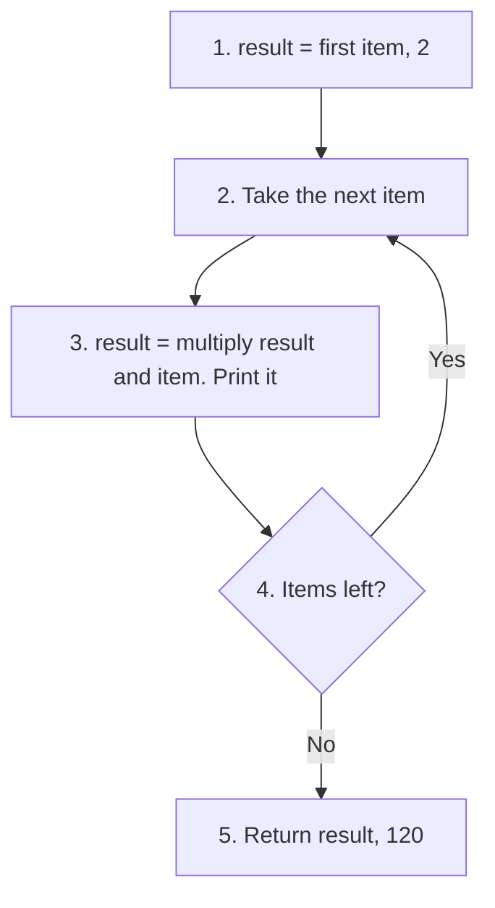

GST (Goods and Services Tax) is the tax added to most sales in India. `₹` is the symbol for the Indian rupee.

[Back to the Table of Contents](#table-of-contents)

### 14.2 Answer Script

```python
"""
functools.partial() and reduce()
"""
from functools import partial, reduce
import math

# --- Part A: partial() - tax calculator ---

# Step 1: The general function
def calculate_tax(amount, rate):
    """Return tax amount for a given purchase amount and tax rate."""
    return amount * rate

# Step 2: Create specialised functions with the rate permanently fixed
gst_electronics = partial(calculate_tax, rate=0.18)   # 18% GST
gst_food = partial(calculate_tax, rate=0.05)          # 5% GST

# Step 3: Use them with only the amount
amounts = [10_000, 25_000, 5_000]
print("Electronics tax (18% GST):")
for amt in amounts:
    print(f"  ₹{amt:,} -> tax = ₹{gst_electronics(amt):,.2f}")

print("Food tax (5% GST):")
for amt in amounts:
    print(f"  ₹{amt:,} -> tax = ₹{gst_food(amt):,.2f}")

# Step 4: A partial object remembers what was fixed
print("gst_food fixes:", gst_food.keywords)

# --- Part B: partial() for sorting - a key function with an extra argument ---

# Step 5: A function that reads one field from a record
def get_field(record, field):
    return record[field]

students = [{"name": "Anita", "marks": 88},
            {"name": "Bob", "marks": 74},
            {"name": "Carol", "marks": 95}]

# sort() calls the key function with ONE argument (each record),
# so partial fixes the second argument, field="marks"
by_marks = partial(get_field, field="marks")
students.sort(key=by_marks, reverse=True)
print("\nStudents sorted by marks (descending):")
for s in students:
    print(f"  {s['name']}: {s['marks']}")

# --- Part C: reduce() - step by step ---

# Step 6: A multiply function that prints each intermediate result
def multiply(a, b):
    result = a * b
    print(f"  multiply({a}, {b}) = {result}")
    return result

data = [2, 3, 4, 5]
print(f"\nreduce(multiply, {data}):")
result = reduce(multiply, data)
print(f"Final result: {result}")

# Step 7: The same with a plain loop, also printing each step
print("\nPlain loop:")
result_loop = 1
for n in data:
    result_loop *= n
    print(f"  after multiplying by {n}: {result_loop}")
print(f"Loop result: {result_loop}  (usually clearer than reduce)")

# Step 8: The clearest of all, a built-in function (Python 3.8+)
print("math.prod(data) =", math.prod(data))
```

[Back to the Table of Contents](#table-of-contents)

### 14.3 Output

```text
Electronics tax (18% GST):
  ₹10,000 -> tax = ₹1,800.00
  ₹25,000 -> tax = ₹4,500.00
  ₹5,000 -> tax = ₹900.00
Food tax (5% GST):
  ₹10,000 -> tax = ₹500.00
  ₹25,000 -> tax = ₹1,250.00
  ₹5,000 -> tax = ₹250.00
gst_food fixes: {'rate': 0.05}

Students sorted by marks (descending):
  Carol: 95
  Anita: 88
  Bob: 74

reduce(multiply, [2, 3, 4, 5]):
  multiply(2, 3) = 6
  multiply(6, 4) = 24
  multiply(24, 5) = 120
Final result: 120

Plain loop:
  after multiplying by 2: 2
  after multiplying by 3: 6
  after multiplying by 4: 24
  after multiplying by 5: 120
Loop result: 120  (usually clearer than reduce)
math.prod(data) = 120
```

[Back to the Table of Contents](#table-of-contents)

### 14.4 Explanation

**partial()**

1. `gst_electronics(10_000)` ran `calculate_tax(10_000, rate=0.18)` and gave 1,800.00. The rate never had to be typed again.
2. `gst_food.keywords` shows the fixed argument, `{'rate': 0.05}`.
3. `list.sort(key=...)` calls its key function with just one argument, each record. `partial(get_field, field="marks")` turned the two-argument `get_field` into a one-argument function that fits.

**reduce() and why a plain loop is often clearer**

1. The printed steps show `reduce()` combining the items left to right: 6, then 24, then 120.
2. The loop gives the same result and the same steps.

The loop is usually clearer for these reasons:

- **Everything is visible.** The starting value (`1`), the operation (`*=`) and the order are written out. With `reduce()`, the reader must know how it works and picture the hidden running result.
- **It is easy to extend.** Adding an `if`, a `print`, or a second running total to a loop is simple. With `reduce()`, all of that must be squeezed into the combining function.
- **A built-in is often clearer still.** `sum()`, `max()`, `min()` and `math.prod()` already cover the most common uses of `reduce()`.

`reduce()` is still handy when the combining step is a ready-made two-argument function with no built-in equivalent, such as `reduce(math.gcd, numbers)` to find the greatest common divisor of a whole list.

[Back to the Table of Contents](#table-of-contents)

### 14.5 Follow-up Questions

**14.5.1 What happens with `reduce(multiply, [])`?**

It raises `TypeError: reduce() of empty iterable with no initial value`. Pass a starting value as the third argument to avoid this: `reduce(multiply, [], 1)` returns 1.

**14.5.2 Is there a ready-made replacement for `get_field` in the Standard Library?**

Yes: `operator.itemgetter("marks")` makes the same kind of key function, so you could write `students.sort(key=operator.itemgetter("marks"), reverse=True)`.

[Back to the Table of Contents](#table-of-contents)

---

## Q15. chain, islice and groupby

*Part B: itertools (chain, islice, groupby)*

**Use `chain()` to merge two lists, a tuple, and a `range` into one iterable. Use `islice()` to take 10 items from an infinite generator. Use `groupby()` (with prior sort) to group employees by department.**

### 15.1 How It Works

[itertools](https://docs.python.org/3/library/itertools.html) provides memory-efficient **lazy** iterators. "Lazy" means items are produced one at a time, only when asked for, instead of building the whole collection in memory first.

| Function | What it does | Watch out for |
|---|---|---|
| `chain(a, b, c, ...)` | Joins several iterables into one stream, without creating a new list | Works with any mix of lists, tuples, ranges, strings and so on |
| `islice(iterable, stop)` or `islice(iterable, start, stop, step)` | Slices an iterable without loading it all first | No negative indexes |
| `groupby(iterable, key)` | Groups **consecutive** items that have the same key | Sort by the same key first, or one category can be split into several groups |

A **generator** is a function that uses `yield` instead of `return`. Each time it is asked for a value, it runs until the next `yield`, hands that value out, and pauses. A generator with `while True:` never ends, so it is **infinite**. You can never turn it into a list, but `islice()` can safely take the first few items. See [generators](https://docs.python.org/3/glossary.html#term-generator).

**Why sort before `groupby()`?** `groupby()` starts a new group every time the key changes. If "Engineering" appears, then "HR", then "Engineering" again, you get two separate Engineering groups. Sorting by department first puts all the same departments next to each other.

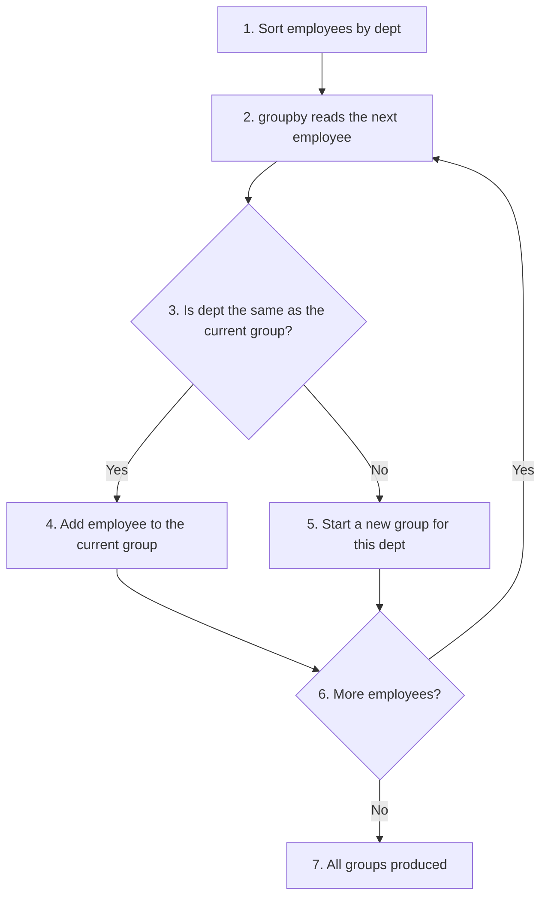

[Back to the Table of Contents](#table-of-contents)

### 15.2 Answer Script

```python
"""
itertools: chain(), islice() and groupby()
"""
from itertools import chain, islice, groupby

# --- Part A: chain() - combine multiple iterables ---

# Step 1: Two lists, a tuple and a range
sem1 = ["Python", "Maths"]              # list
sem2 = ("Physics", "Chemistry")         # tuple
sem3 = ["English"]                      # list
lab_numbers = range(1, 4)               # range: 1, 2, 3

# Step 2: Chain them into one iterable
all_items = chain(sem1, sem2, sem3, lab_numbers)
print("chain object:", all_items)       # nothing produced yet (lazy)
print("Chained items:", list(all_items))

# Step 3: chain.from_iterable - useful when you have a list of lists
nested = [["a", "b"], ["c", "d"], ["e"]]
flat = list(chain.from_iterable(nested))
print("Flattened:", flat)

# --- Part B: islice() - lazy slicing ---

# Step 4: An infinite generator
def infinite_counter(start=0):
    """An infinite generator - produces integers forever."""
    n = start
    while True:
        yield n
        n += 1

# Step 5: Take only the first 10 from the infinite sequence
first_10 = list(islice(infinite_counter(100), 10))
print("\nFirst 10 from infinite counter:", first_10)

# Step 6: islice with start, stop and step (like a normal slice)
every_third = list(islice(range(50), 0, 20, 3))  # start=0, stop=20, step=3
print("Every 3rd item (0 to 20):", every_third)

# --- Part C: groupby() - group sorted data ---
"""
IMPORTANT: groupby() only groups CONSECUTIVE identical keys.
Always sort the data BEFORE calling groupby(), unless it is
already sorted by the grouping key.
"""
employees = [
    {"name": "Alice", "dept": "Engineering"},
    {"name": "Carol", "dept": "HR"},
    {"name": "Bob",   "dept": "Engineering"},
    {"name": "Eve",   "dept": "Finance"},
    {"name": "Dave",  "dept": "HR"},
]

# Step 7: What happens WITHOUT sorting first
print("\nWithout sorting first:")
for dept, group in groupby(employees, key=lambda e: e["dept"]):
    print(f"  {dept}: {[e['name'] for e in group]}")

# Step 8: Sort by key BEFORE groupby
employees.sort(key=lambda e: e["dept"])

# Step 9: Group and display
print("\nEmployees by department (sorted first):")
for dept, group in groupby(employees, key=lambda e: e["dept"]):
    names = [e["name"] for e in group]
    print(f"  {dept}: {names}")
```

[Back to the Table of Contents](#table-of-contents)

### 15.3 Output

```text
chain object: <itertools.chain object at 0x7f3d8d42b9d0>
Chained items: ['Python', 'Maths', 'Physics', 'Chemistry', 'English', 1, 2, 3]
Flattened: ['a', 'b', 'c', 'd', 'e']

First 10 from infinite counter: [100, 101, 102, 103, 104, 105, 106, 107, 108, 109]
Every 3rd item (0 to 20): [0, 3, 6, 9, 12, 15, 18]

Without sorting first:
  Engineering: ['Alice']
  HR: ['Carol']
  Engineering: ['Bob']
  Finance: ['Eve']
  HR: ['Dave']

Employees by department (sorted first):
  Engineering: ['Alice', 'Bob']
  Finance: ['Eve']
  HR: ['Carol', 'Dave']
```

[Back to the Table of Contents](#table-of-contents)

### 15.4 Explanation

**chain()**

- Printing the chain object shows only `<itertools.chain object at ...>`, not the items. Nothing has been produced yet. (The address after "at" will be different on your computer.)
- `list()` then pulled all the items through, in order: two lists, a tuple, another list and a range, all as one sequence.
- `chain.from_iterable()` flattened a list of lists into one list.

**islice()**

- The counter would count forever, but `islice(..., 10)` asked for only 10 values, so the program finished.
- `islice(range(50), 0, 20, 3)` took every third number from 0 up to (but not including) 20.

**groupby()**

- Without sorting, the employees list alternated between departments, so `groupby()` produced five groups, with Engineering and HR each appearing twice.
- After sorting by department, each department formed exactly one group. The departments appear in alphabetical order because that is how they were sorted.

[Back to the Table of Contents](#table-of-contents)

### 15.5 Follow-up Questions

**15.5.1 What would `list(infinite_counter())` do?**

It would never finish. The generator never stops, so `list()` keeps asking for more items until the computer runs out of memory. Always limit an infinite generator with `islice()` or a `break`.

**15.5.2 How would you count the employees in each department using `groupby()`?**

`{dept: len(list(group)) for dept, group in groupby(employees, key=lambda e: e["dept"])}`, after sorting. The group must be turned into a list before `len()` can count it.

[Back to the Table of Contents](#table-of-contents)

---

## Q16. combinations, permutations and product

*Part B: itertools (product, combinations, permutations)*

**Generate all `combinations(players, 3)` for a cricket team of 5. Generate all `permutations` of a top-3 batting order. Generate all 3-digit `product` PINs from digits [0,1,2]. Print the total count for each.**

### 16.1 How It Works

These three `itertools` functions produce every possible selection or arrangement:

| Function | Order matters? | Items reused? | Formula for the count | Example on this page |
|---|---|---|---|---|
| `combinations(items, r)` | No | No | `n! / (r! × (n - r)!)` | Choose 3 players from 5: 10 |
| `permutations(items, r)` | Yes | No | `n! / (n - r)!` | Order 3 batters: 6 |
| `product(items, repeat=r)` | Yes | Yes | `nʳ` | 3-digit PINs from 3 digits: 27 |

Here `n!` ("n factorial") means `n × (n - 1) × ... × 1`. For example, `5! = 120`. See [combination](https://en.wikipedia.org/wiki/Combination), [permutation](https://en.wikipedia.org/wiki/Permutation) and [Cartesian product](https://en.wikipedia.org/wiki/Cartesian_product).

Working out the counts, step by step:

1. **Combinations of 3 from 5:** `5! / (3! × 2!) = 120 / (6 × 2) = 10`.
2. **Permutations of 3 batters:** `3! = 3 × 2 × 1 = 6`. There are 3 choices for first place, then 2 for second, then 1 for third.
3. **PINs of 3 digits from [0, 1, 2]:** each of the 3 positions has 3 choices, so `3 × 3 × 3 = 3³ = 27`.

All three functions return **iterators**, so they use very little memory. The script wraps them in `list()` so it can count and print the results. Python also has `math.comb()` and `math.perm()` (Python 3.8+) to calculate the counts without generating anything.

[Back to the Table of Contents](#table-of-contents)

### 16.2 Answer Script

```python
"""
itertools: combinations(), permutations() and product()
"""
from itertools import combinations, permutations, product
import math

# --- Part A: combinations - choosing players ---

# Step 1: Choose 3 from 5 (order does not matter)
players = ["Rohit", "Kohli", "Dhoni", "Bumrah", "Jadeja"]
teams = list(combinations(players, 3))
print(f"Possible groups of 3 players (C(5,3) = {len(teams)}):")
for t in teams:
    print(" ", t)

# --- Part B: permutations - batting order ---

# Step 2: Every order of the top 3 batters (order matters)
top3 = ["Rohit", "Kohli", "Dhoni"]
orders = list(permutations(top3))
print(f"\nBatting orders for top-3 (3! = {len(orders)}):")
for o in orders:
    print(" ", o)

# --- Part C: product - PIN code generator ---

# Step 3: Every 3-digit PIN using digits 0, 1 and 2 (digits can repeat)
digits = [0, 1, 2]
pins = list(product(digits, repeat=3))
print(f"\nAll 3-digit PINs from digits {digits} ({len(pins)} total):")
print(" ".join("".join(str(d) for d in pin) for pin in pins))

# --- Part D: Check the counts with math.comb and math.perm ---

# Step 4: The formulas give the same totals without generating anything
print("\nTotals:")
print(f"  combinations(5 players, 3): {len(teams):>3}   math.comb(5, 3) = {math.comb(5, 3)}")
print(f"  permutations(3 batters):    {len(orders):>3}   math.perm(3, 3) = {math.perm(3, 3)}")
print(f"  product(3 digits, repeat=3):{len(pins):>3}   3 ** 3 = {3 ** 3}")

# --- Part E: Summary table ---
print("""
+--------------------------+----------------+---------------+
| Function                 | Order matters? | Items reused? |
+--------------------------+----------------+---------------+
| combinations(items, r)   | No             | No            |
| permutations(items, r)   | Yes            | No            |
| product(items, repeat=r) | Yes            | Yes           |
+--------------------------+----------------+---------------+""")
```

[Back to the Table of Contents](#table-of-contents)

### 16.3 Output

```text
Possible groups of 3 players (C(5,3) = 10):
  ('Rohit', 'Kohli', 'Dhoni')
  ('Rohit', 'Kohli', 'Bumrah')
  ('Rohit', 'Kohli', 'Jadeja')
  ('Rohit', 'Dhoni', 'Bumrah')
  ('Rohit', 'Dhoni', 'Jadeja')
  ('Rohit', 'Bumrah', 'Jadeja')
  ('Kohli', 'Dhoni', 'Bumrah')
  ('Kohli', 'Dhoni', 'Jadeja')
  ('Kohli', 'Bumrah', 'Jadeja')
  ('Dhoni', 'Bumrah', 'Jadeja')

Batting orders for top-3 (3! = 6):
  ('Rohit', 'Kohli', 'Dhoni')
  ('Rohit', 'Dhoni', 'Kohli')
  ('Kohli', 'Rohit', 'Dhoni')
  ('Kohli', 'Dhoni', 'Rohit')
  ('Dhoni', 'Rohit', 'Kohli')
  ('Dhoni', 'Kohli', 'Rohit')

All 3-digit PINs from digits [0, 1, 2] (27 total):
000 001 002 010 011 012 020 021 022 100 101 102 110 111 112 120 121 122 200 201 202 210 211 212 220 221 222

Totals:
  combinations(5 players, 3):  10   math.comb(5, 3) = 10
  permutations(3 batters):      6   math.perm(3, 3) = 6
  product(3 digits, repeat=3): 27   3 ** 3 = 27

+--------------------------+----------------+---------------+
| Function                 | Order matters? | Items reused? |
+--------------------------+----------------+---------------+
| combinations(items, r)   | No             | No            |
| permutations(items, r)   | Yes            | No            |
| product(items, repeat=r) | Yes            | Yes           |
+--------------------------+----------------+---------------+
```

[Back to the Table of Contents](#table-of-contents)

### 16.4 Explanation

1. **Combinations:** 10 groups. `('Rohit', 'Kohli', 'Dhoni')` appears once only, because `('Dhoni', 'Kohli', 'Rohit')` is the same group of players in a different order.
2. **Permutations:** 6 batting orders. Here the same three players in a different order **is** a different result, because who bats first matters.
3. **Product:** 27 PINs, from `000` to `222`. Digits can repeat, as in `111`.
4. **Check:** `math.comb(5, 3)` and `math.perm(3, 3)` give the same totals as the generated lists.

Notice how fast these counts can grow. A real 4-digit PIN using all ten digits has `10⁴ = 10,000` possibilities, and the number of batting orders for a full team of 11 is `11! = 39,916,800`. This is why these functions return iterators rather than lists.

[Back to the Table of Contents](#table-of-contents)

### 16.5 Follow-up Questions

**16.5.1 How many ways are there to choose a batting pair (opening two batters, where order matters) from the 5 players?**

`permutations(players, 2)` gives `5 × 4 = 20`.

**16.5.2 Which function gives groups where the same item may be chosen more than once, but order does not matter?**

`itertools.combinations_with_replacement(items, r)`. For example, choosing 2 scoops from 3 ice-cream flavours, where two scoops of the same flavour are allowed.

[Back to the Table of Contents](#table-of-contents)

---

## Q17. Selection Sort with Trace

*Part A: Selection Sort*

**Implement `selection_sort` with a trace that prints which minimum was found and where it was placed each pass. Count swaps and compare against `bubble_sort` on the same random list. Explain why selection sort has O(n) swaps.**

### 17.1 How It Works

Selection sort keeps two parts of the list:

- **Left:** the sorted part, which grows by 1 item each pass.
- **Right:** the unsorted part, which shrinks by 1 item each pass.

In each pass:

1. Scan the whole unsorted part to find the **minimum** (smallest) item.
2. Swap it into the first position of the unsorted part, which is the boundary with the sorted part.
3. The boundary moves one place to the right.

**Its key advantage over bubble sort:**

| Algorithm | Comparisons | Swaps (worst case) |
|---|---|---|
| Bubble sort | `O(n²)` | `O(n²)`: one swap for every pair in the wrong order |
| Selection sort | `O(n²)`: always scans the whole unsorted part | **At most `n - 1`**, which is `O(n)` |

Selection sort is therefore a good choice when writing data is expensive, for example on flash memory, which wears out a little with every write.

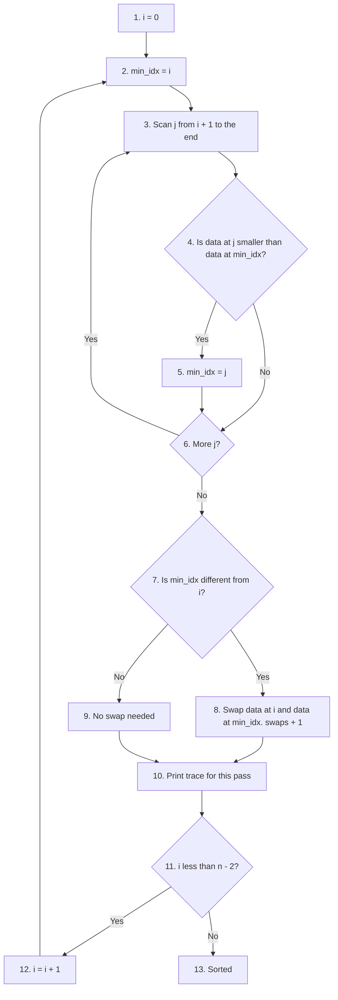

[Back to the Table of Contents](#table-of-contents)

### 17.2 Answer Script

```python
"""
Selection Sort: O(n^2) comparisons but only O(n) swaps.
"""
import random

# Step 1 - Selection sort with a step-by-step trace
def selection_sort(data, trace=False):
    n = len(data)
    swap_count = 0
    for i in range(n - 1):
        # Find the minimum in the unsorted part [i .. n-1]
        min_idx = i
        for j in range(i + 1, n):
            if data[j] < data[min_idx]:
                min_idx = j
        minimum = data[min_idx]
        found_at = min_idx
        # Swap the minimum into its final sorted position
        if min_idx != i:
            data[i], data[min_idx] = data[min_idx], data[i]
            swap_count += 1
            action = f"swapped from index {found_at} to index {i}"
        else:
            action = f"already at index {i}, no swap"
        if trace:
            print(f"  Pass {i + 1}: min={minimum} {action} -> {data}")
    return data, swap_count

# Step 2 - Demonstrate with trace
sample = [64, 25, 12, 22, 11]
print("Input:", sample)
sorted_data, swaps = selection_sort(sample.copy(), trace=True)
print("Sorted:", sorted_data)
print(f"Total swaps: {swaps}  (at most n-1 = {len(sample) - 1})")

# Step 3 - Bubble sort that counts swaps
def bubble_swap_count(data):
    data = data[:]
    swaps = 0
    n = len(data)
    for pass_no in range(n - 1):
        for i in range(n - pass_no - 1):
            if data[i] > data[i + 1]:
                data[i], data[i + 1] = data[i + 1], data[i]
                swaps += 1
    return swaps

# Step 4 - Compare swap counts on the same random list
random.seed(42)                         # fixed seed: same list every run
test = random.sample(range(100), 20)
_, sel_swaps = selection_sort(test.copy())
bub_swaps = bubble_swap_count(test)

print(f"\nRandom list of 20 elements: {test}")
print(f"  Selection sort swaps: {sel_swaps}  (at most n-1 = 19)")
print(f"  Bubble    sort swaps: {bub_swaps}  (can be much larger)")

# Step 5 - Worst case for bubble sort: a reversed list
reversed_list = list(range(20, 0, -1))
_, sel_swaps = selection_sort(reversed_list.copy())
print(f"\nReversed list of 20 elements:")
print(f"  Selection sort swaps: {sel_swaps}")
print(f"  Bubble    sort swaps: {bubble_swap_count(reversed_list)}  (= 20 x 19 / 2)")
```

[Back to the Table of Contents](#table-of-contents)

### 17.3 Output

```text
Input: [64, 25, 12, 22, 11]
  Pass 1: min=11 swapped from index 4 to index 0 -> [11, 25, 12, 22, 64]
  Pass 2: min=12 swapped from index 2 to index 1 -> [11, 12, 25, 22, 64]
  Pass 3: min=22 swapped from index 3 to index 2 -> [11, 12, 22, 25, 64]
  Pass 4: min=25 already at index 3, no swap -> [11, 12, 22, 25, 64]
Sorted: [11, 12, 22, 25, 64]
Total swaps: 3  (at most n-1 = 4)

Random list of 20 elements: [81, 14, 3, 94, 35, 31, 28, 17, 13, 86, 69, 11, 75, 54, 4, 27, 29, 64, 77, 71]
  Selection sort swaps: 19  (at most n-1 = 19)
  Bubble    sort swaps: 89  (can be much larger)

Reversed list of 20 elements:
  Selection sort swaps: 10
  Bubble    sort swaps: 190  (= 20 x 19 / 2)
```

[Back to the Table of Contents](#table-of-contents)

### 17.4 Explanation

**Reading the trace**

- Pass 1 found the minimum, 11, at index 4 and swapped it to index 0.
- Pass 2 found 12 at index 2 and swapped it to index 1.
- Pass 3 found 22 at index 3 and swapped it to index 2.
- Pass 4 found 25 already at index 3, so no swap was needed.

That is 3 swaps for 5 items.

**Why selection sort has `O(n)` swaps**

1. The outer loop runs exactly `n - 1` times.
2. Each pass does **at most one** swap: the minimum moves straight to its final position.
3. Once an item is placed, it is never touched again.
4. So the total number of swaps can never be more than `n - 1`. That is `O(n)`.

Bubble sort is different. It moves an item only one place per swap, so an item far from its final position needs many swaps. Its swap count equals the number of pairs in the wrong order, which can be as many as `n(n - 1)/2`. On the reversed list of 20, that was 190 swaps against selection sort's 10.

Why only 10 swaps on the reversed list, not 19? Each swap on a reversed list puts **two** items in their final places at once (the smallest goes to the front and the largest goes to the back), so half the passes need no swap at all.

[Back to the Table of Contents](#table-of-contents)

### 17.5 Follow-up Questions

**17.5.1 How many comparisons does selection sort make on a list of 20 items?**

Always `19 + 18 + ... + 1 = 190`, whatever the order of the data. Selection sort has no early exit, so even a sorted list needs all 190.

**17.5.2 Is selection sort stable (does it keep equal items in their original order)?**

No. A long-distance swap can jump an item over another item with the same value. For example, in `[5a, 5b, 1]`, the first swap moves `5a` to the end, after `5b`.

[Back to the Table of Contents](#table-of-contents)

---

## Q18. pickle and json with datetime

*Part B: Data Serialisation (pickle and json)*

**Use `pickle` to save and load a dict containing a `datetime` object. Use `json` for the same dict (with datetime converted to string). Show what `json.dumps/loads` does on a plain dict. Demonstrate the `TypeError` when json encounters a datetime.**

### 18.1 How It Works

**Serialisation** means converting Python objects into bytes or text so they can be saved to a file or sent somewhere. **Deserialisation** turns them back.

| Feature | [pickle](https://docs.python.org/3/library/pickle.html) | [json](https://docs.python.org/3/library/json.html) |
|---|---|---|
| Format | Binary (not readable by people) | Text (readable in any editor) |
| Who can read it | Python only | Almost every language |
| Types supported | Almost all Python types, including `datetime`, sets and your own classes | Only `str`, `int`, `float`, `bool`, `None`, `list` and `dict` |
| Safe to load from an unknown source? | **No.** Loading can run hidden code | Yes. Loading only creates plain data |

**Security.** Never unpickle data from a source you do not trust, such as a downloaded file or an email attachment. A pickle file can contain instructions that run code while it is being loaded.

A [datetime](https://docs.python.org/3/library/datetime.html) object holds a date and a time together. JSON has no date type, so a `datetime` must be converted to text first. The standard format for this is **ISO 8601**, which looks like `2025-12-01T09:30:00`. The method `isoformat()` produces it, and `datetime.fromisoformat()` reads it back.

The plan:

1. Build one dictionary that contains a `datetime`.
2. **pickle:** save it to a file and load it back. The datetime survives as a real datetime.
3. **json TypeError:** try `json.dumps()` on the same dictionary and catch the error.
4. **json:** convert the datetime to a string, save to a file, load it back, and turn the string back into a datetime.
5. **json on a plain dict:** show what `dumps()` and `loads()` do, including how `True` and `None` change.
6. Delete the files created.

[Back to the Table of Contents](#table-of-contents)

### 18.2 Answer Script

```python
"""
pickle vs json: serialisation, differences and a datetime example.
"""
import pickle
import json
import os
from datetime import datetime

# Step 1 - A dict containing a datetime object
exam = {
    "subject": "Python",
    "marks":   [85, 90, 78],
    "passed":  True,
    "date":    datetime(2025, 12, 1, 9, 30),
}
print("Original dict:", exam)

# --- Part A: pickle saves and loads the datetime directly ---

# Step 2 - Save (pickle.dump -> binary file mode "wb")
with open("exam.pkl", "wb") as f:
    pickle.dump(exam, f)
print("\nPickled successfully.")

# Step 3 - Load (pickle.load -> binary file mode "rb")
# Only load pickle files you created yourself or fully trust.
with open("exam.pkl", "rb") as f:
    loaded_pkl = pickle.load(f)
print("Unpickled:", loaded_pkl)
print("Date is still a datetime?", isinstance(loaded_pkl["date"], datetime))
print("Identical to the original?", loaded_pkl == exam)

# --- Part B: json cannot handle a datetime ---

# Step 4 - Demonstrate the TypeError
try:
    json.dumps(exam)
except TypeError as e:
    print("\nJSON cannot handle datetime:", e)

# --- Part C: json with the datetime converted to a string ---

# Step 5 - Copy the dict and turn the datetime into ISO 8601 text
exam_for_json = dict(exam)
exam_for_json["date"] = exam["date"].isoformat()

# Step 6 - Save to a JSON file (indent=4 makes it easy to read)
with open("exam.json", "w") as f:
    json.dump(exam_for_json, f, indent=4)
print("JSON saved successfully. File contents:")
with open("exam.json", "r") as f:
    print(f.read())

# Step 7 - Load it back; the date comes back as a string
with open("exam.json", "r") as f:
    loaded_json = json.load(f)
print("JSON loaded:", loaded_json)
print("Type of date after loading:", type(loaded_json["date"]).__name__)

# Step 8 - Turn the string back into a datetime
loaded_json["date"] = datetime.fromisoformat(loaded_json["date"])
print("After fromisoformat:", loaded_json["date"], "| same as original?", loaded_json == exam)

# --- Part D: json.dumps / json.loads on a plain dict ---

# Step 9 - dumps: Python dict -> JSON string
plain = {"name": "Anita", "age": 20, "active": True, "nickname": None}
json_string = json.dumps(plain)
print("\nJSON string:", json_string)
print("Type:", type(json_string).__name__)

# Step 10 - loads: JSON string -> Python dict
parsed = json.loads(json_string)
print("Parsed back:", parsed)
print("Type:", type(parsed).__name__, "| equal to original?", parsed == plain)

# Step 11 - Clean up the files created by this script
os.remove("exam.pkl")
os.remove("exam.json")
print("\nTemporary files removed.")
```

[Back to the Table of Contents](#table-of-contents)

### 18.3 Output

```text
Original dict: {'subject': 'Python', 'marks': [85, 90, 78], 'passed': True, 'date': datetime.datetime(2025, 12, 1, 9, 30)}

Pickled successfully.
Unpickled: {'subject': 'Python', 'marks': [85, 90, 78], 'passed': True, 'date': datetime.datetime(2025, 12, 1, 9, 30)}
Date is still a datetime? True
Identical to the original? True

JSON cannot handle datetime: Object of type datetime is not JSON serializable
JSON saved successfully. File contents:
{
    "subject": "Python",
    "marks": [
        85,
        90,
        78
    ],
    "passed": true,
    "date": "2025-12-01T09:30:00"
}
JSON loaded: {'subject': 'Python', 'marks': [85, 90, 78], 'passed': True, 'date': '2025-12-01T09:30:00'}
Type of date after loading: str
After fromisoformat: 2025-12-01 09:30:00 | same as original? True

JSON string: {"name": "Anita", "age": 20, "active": true, "nickname": null}
Type: str
Parsed back: {'name': 'Anita', 'age': 20, 'active': True, 'nickname': None}
Type: dict | equal to original? True

Temporary files removed.
```

[Back to the Table of Contents](#table-of-contents)

### 18.4 Explanation

1. **pickle** saved and restored the whole dictionary exactly, and the date came back as a real `datetime` object. No conversion was needed.
2. **json.dumps() on the original dict** raised `TypeError: Object of type datetime is not JSON serializable`, because JSON has no way to represent a datetime.
3. **After converting the date with `isoformat()`**, JSON worked. The file contents show plain, readable text. Notice that JSON writes `true` in lowercase.
4. **Loading the JSON** gave back the date as a **string**, not a datetime. JSON does not remember what the text used to be. `datetime.fromisoformat()` turned it back, and then the data matched the original exactly.
5. **json.dumps() on a plain dict** produced a string. In that string, Python's `True` became `true`, `None` became `null`, and all strings use double quotes. `json.loads()` reversed these changes.
6. `os.remove()` deleted the two files, so running the script leaves no files behind.

| Python | JSON |
|---|---|
| `dict` | object `{...}` |
| `list`, `tuple` | array `[...]` |
| `str` | string (always in double quotes) |
| `int`, `float` | number |
| `True` / `False` | `true` / `false` |
| `None` | `null` |

[Back to the Table of Contents](#table-of-contents)

### 18.5 Follow-up Questions

**18.5.1 Is there a way to make `json.dumps()` convert datetimes automatically?**

Yes. Pass a function with the `default` argument. JSON calls it for any object it cannot handle: `json.dumps(exam, default=str)` turns the datetime into text using `str()`.

**18.5.2 After a JSON round trip, what happens to a tuple such as `(85, 90)`?**

It comes back as a list, `[85, 90]`, because JSON has only one kind of sequence, the array.

[Back to the Table of Contents](#table-of-contents)

---

## Q19. deque Operations

*Part B: collections.deque*

**Demonstrate all key `deque` operations: `append`, `appendleft`, `pop`, `popleft`, `rotate(-1)` for round-robin scheduling, and `maxlen=5` for a sliding-window log. Benchmark `appendleft` vs `list.insert(0,x)` for N=200,000.**

### 19.1 How It Works

[deque](https://docs.python.org/3/library/collections.html#collections.deque) (short for **d**ouble-**e**nded **que**ue, and pronounced "deck") supports `O(1)` adding and removing at **both** ends.

| Method | What it does |
|---|---|
| `append(x)` | Add `x` to the right end |
| `appendleft(x)` | Add `x` to the left end |
| `pop()` | Remove and return the item at the right end |
| `popleft()` | Remove and return the item at the left end |
| `rotate(n)` | Rotate `n` steps to the right; a negative `n` rotates to the left |
| `deque(maxlen=N)` | A fixed-size deque; when full, adding to one end drops an item from the other end |

**Round-robin scheduling** is a fair way of sharing time: each task gets a turn, then goes to the back of the line. `rotate(-1)` moves the first item to the end in one step, which is exactly that.

| Before `rotate(-1)` | After `rotate(-1)` |
|---|---|
| Task-A, Task-B, Task-C, Task-D | Task-B, Task-C, Task-D, Task-A |

A **sliding window** keeps only the most recent N items, like a log that shows only the last 5 lines. `maxlen=5` does this automatically.

**The benchmark.** `list.insert(0, x)` must shift every item already in the list one place to the right, so it is `O(n)`, and doing it N times costs `O(n²)` in total. `deque.appendleft(x)` moves nothing and is `O(1)`.

[Back to the Table of Contents](#table-of-contents)

### 19.2 Answer Script

```python
"""
collections.deque: double-ended queue with O(1) operations at both ends.
"""
from collections import deque
import time

# --- Part A: Basic deque operations ---

# Step 1: append and appendleft
dq = deque([10, 20, 30])
dq.append(40)        # Right end
dq.appendleft(5)     # Left end - O(1), unlike list.insert(0, x) which is O(n)
print("After appends:", list(dq))   # [5, 10, 20, 30, 40]

# Step 2: pop and popleft
right = dq.pop()     # Remove from right
left = dq.popleft()  # Remove from left
print(f"Popped {right} from the right and {left} from the left")
print("After pops:   ", list(dq))   # [10, 20, 30]

# --- Part B: rotate() - round-robin scheduling ---

# Step 3: Each task gets a turn, then moves to the back
tasks = deque(["Task-A", "Task-B", "Task-C", "Task-D"])
print("\nRound-robin scheduling:")
for turn in range(1, 7):
    current = tasks[0]
    print(f"  Turn {turn}: processing {current}   queue = {list(tasks)}")
    tasks.rotate(-1)  # Move current to the END (rotate left by 1)

# --- Part C: maxlen - sliding window (last N log lines) ---
"""
maxlen creates a bounded deque. When full, adding to the right
automatically removes from the left - perfect for a 'last N' window.
"""
# Step 4: Keep only the last 5 log entries
log_window = deque(maxlen=5)
for i in range(1, 11):
    log_window.append(f"Log line {i}")
    if i in (5, 6):                    # show the moment the window starts sliding
        print(f"\nAfter adding line {i}: {list(log_window)}")

print("\nLast 5 log entries (sliding window):")
for line in log_window:
    print(" ", line)

# --- Part D: Performance proof - appendleft vs insert(0) ---

# Step 5: Front-insert N items into a list
N = 200_000
lst = []
t0 = time.perf_counter()
for i in range(N):
    lst.insert(0, i)         # O(n) - shifts all existing elements
t_list = time.perf_counter() - t0

# Step 6: Front-insert N items into a deque
dq2 = deque()
t1 = time.perf_counter()
for i in range(N):
    dq2.appendleft(i)        # O(1) - no shifting needed
t_deque = time.perf_counter() - t1

# Step 7: Print the results
print(f"\nFront-inserting {N:,} items:")
print(f"  list.insert(0,x): {t_list:.3f} s")
print(f"  deque.appendleft: {t_deque:.3f} s  (about {t_list / t_deque:,.0f}x faster)")
print("Same final order?", lst == list(dq2))
```

[Back to the Table of Contents](#table-of-contents)

### 19.3 Output

Your benchmark times will differ, and the list insert may take several seconds to finish.

```text
After appends: [5, 10, 20, 30, 40]
Popped 40 from the right and 5 from the left
After pops:    [10, 20, 30]

Round-robin scheduling:
  Turn 1: processing Task-A   queue = ['Task-A', 'Task-B', 'Task-C', 'Task-D']
  Turn 2: processing Task-B   queue = ['Task-B', 'Task-C', 'Task-D', 'Task-A']
  Turn 3: processing Task-C   queue = ['Task-C', 'Task-D', 'Task-A', 'Task-B']
  Turn 4: processing Task-D   queue = ['Task-D', 'Task-A', 'Task-B', 'Task-C']
  Turn 5: processing Task-A   queue = ['Task-A', 'Task-B', 'Task-C', 'Task-D']
  Turn 6: processing Task-B   queue = ['Task-B', 'Task-C', 'Task-D', 'Task-A']

After adding line 5: ['Log line 1', 'Log line 2', 'Log line 3', 'Log line 4', 'Log line 5']

After adding line 6: ['Log line 2', 'Log line 3', 'Log line 4', 'Log line 5', 'Log line 6']

Last 5 log entries (sliding window):
  Log line 6
  Log line 7
  Log line 8
  Log line 9
  Log line 10

Front-inserting 200,000 items:
  list.insert(0,x): 7.247 s
  deque.appendleft: 0.015 s  (about 492x faster)
Same final order? True
```

[Back to the Table of Contents](#table-of-contents)

### 19.4 Explanation

1. **append / appendleft:** 40 went on the right end and 5 on the left end.
2. **pop / popleft:** removed 40 from the right and 5 from the left, leaving `[10, 20, 30]`.
3. **rotate(-1):** each turn processed the task at the front, then moved it to the back. After four turns the queue was back where it started, so Task-A and Task-B got their second turns in turns 5 and 6.
4. **maxlen=5:** after line 5 the window was full. Adding line 6 pushed out line 1 automatically. At the end only lines 6 to 10 remained.
5. **Benchmark:** `list.insert(0, x)` got slower and slower as the list grew, because every insert shifted all the existing items. `deque.appendleft()` took the same tiny time for every insert. Both built the same final order, as the last line confirms.

[Back to the Table of Contents](#table-of-contents)

### 19.5 Follow-up Questions

**19.5.1 What does `rotate(1)` do to `deque(["A", "B", "C", "D"])`?**

It rotates one step to the right, moving the last item to the front: `deque(['D', 'A', 'B', 'C'])`.

**19.5.2 With `deque(maxlen=5)`, what happens if you use `appendleft()` when the deque is full?**

An item is dropped from the opposite end, the **right**. A full bounded deque always drops from the end opposite to where the new item goes in.

[Back to the Table of Contents](#table-of-contents)

---

## Q20. Big-O Timing Comparison

*Synthesis: Big-O Timing and Measurement*

**Time `linear_search` (O(n)), `binary_search` (O(log n)), and `bubble_sort` on 500 elements (O(n²)) across sizes [500–10K] using `time.perf_counter()`. Print a comparison table and include a Mermaid flowchart of the measurement methodology.**

### 20.1 How It Works

[time.perf_counter()](https://docs.python.org/3/library/time.html#time.perf_counter) is a high-precision **monotonic** clock (it only ever moves forward). It does not tell the time of day; only the difference between two readings means anything.

This script measures and compares three algorithms, one for each complexity class:

| Algorithm | Complexity | What to expect when `n` doubles |
|---|---|---|
| `linear_search` | `O(n)` | Time roughly doubles |
| `binary_search` | `O(log n)` | Time barely changes |
| `bubble_sort` | `O(n²)` | Time roughly quadruples |

**A practical problem with bubble sort.** Bubble sort on 10,000 items makes about 50 million comparisons and would take a long time in Python. The original idea was to limit bubble sort to 500 elements to avoid this wait. But if bubble sort is always given the same 500 elements, its time stays flat across every row of the table, and the `O(n²)` growth cannot be seen at all.

So this answer handles the two parts separately:

- The **searches** are timed across the full range of sizes, 500 to 10,000.
- **Bubble sort** is timed on sizes that start at 500 and double up to 4,000. This keeps the waiting time reasonable while still showing the four-times growth clearly.

**Making tiny timings reliable.** A single binary search takes only a few millionths of a second, which is too short to measure reliably. The script therefore:

1. Repeats each search many times and divides by the number of repeats, to get the average time per search.
2. Runs that whole measurement 5 times and keeps the fastest, which is the one least disturbed by background activity.

**Measurement methodology**

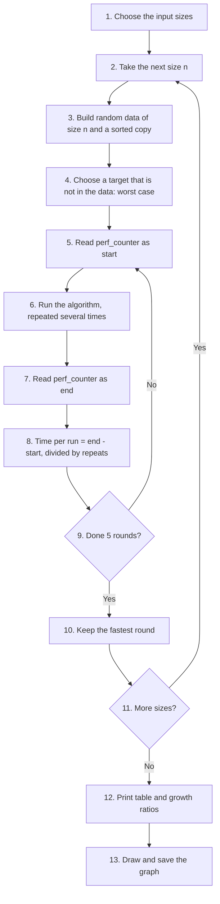

[Back to the Table of Contents](#table-of-contents)

### 20.2 Answer Script

The graph at the end of the script needs the third-party [matplotlib](https://matplotlib.org/) library (`pip install matplotlib`). If you do not have it, delete Step 7 and the tables will still print.

```python
"""
Measuring and comparing O(n), O(log n) and O(n^2) with time.perf_counter().
"""
import time
import random

# --- Step 1: One representative function for each complexity ---
def linear_search(data, target):       # O(n)
    for item in data:
        if item == target:
            return True
    return False

def binary_search(data, target):       # O(log n) - data must be sorted
    lo, hi = 0, len(data) - 1
    while lo <= hi:
        mid = (lo + hi) // 2
        if data[mid] == target:
            return True
        elif target > data[mid]:
            lo = mid + 1
        else:
            hi = mid - 1
    return False

def bubble_sort(data):                 # O(n^2)
    data = data[:]
    n = len(data)
    for i in range(n - 1):
        for j in range(n - i - 1):
            if data[j] > data[j + 1]:
                data[j], data[j + 1] = data[j + 1], data[j]
    return data

# --- Step 2: A timing helper ---
def measure(function, *args, repeats=1, rounds=5):
    """Average time per call, taking the fastest of several rounds."""
    best = float("inf")
    for _ in range(rounds):
        start = time.perf_counter()
        for _ in range(repeats):
            function(*args)
        elapsed = (time.perf_counter() - start) / repeats
        best = min(best, elapsed)
    return best

random.seed(1)

# --- Step 3: Time the searches across sizes 500 to 10,000 ---
search_sizes = [500, 1_000, 2_000, 5_000, 10_000]
linear_times, binary_times = [], []
for n in search_sizes:
    data = [random.randint(1, n * 10) for _ in range(n)]
    sorted_data = sorted(data)
    target = -1   # Worst case: not found
    linear_times.append(measure(linear_search, data, target, repeats=200))
    binary_times.append(measure(binary_search, sorted_data, target, repeats=20_000))

# --- Step 4: Time bubble sort on doubling sizes from 500 ---
sort_sizes = [500, 1_000, 2_000, 4_000]
bubble_times = []
for n in sort_sizes:
    data = [random.randint(1, n * 10) for _ in range(n)]
    bubble_times.append(measure(bubble_sort, data, rounds=1))

# --- Step 5: Print the comparison tables ---
print("Searching (average time per search, in microseconds)")
print(f"{'n':>8} | {'O(n) linear':>12} | {'O(log n) binary':>16}")
print("-" * 42)
for n, lt, bt in zip(search_sizes, linear_times, binary_times):
    print(f"{n:>8,} | {lt * 1e6:>12.1f} | {bt * 1e6:>16.2f}")

print("\nSorting (time per sort, in seconds)")
print(f"{'n':>8} | {'O(n^2) bubble':>14} | {'Growth vs previous':>19}")
print("-" * 47)
for i, (n, st) in enumerate(zip(sort_sizes, bubble_times)):
    growth = f"{st / bubble_times[i - 1]:.1f}x" if i > 0 else "-"
    print(f"{n:>8,} | {st:>14.3f} | {growth:>19}")

# --- Step 6: Growth from the smallest to the largest search size ---
print("\nFrom n = 500 to n = 10,000 (20x more data):")
print(f"  linear search time grew {linear_times[-1] / linear_times[0]:.1f}x")
print(f"  binary search time grew {binary_times[-1] / binary_times[0]:.1f}x")

# --- Step 7: Draw the three growth patterns side by side ---
import matplotlib.pyplot as plt

fig, axes = plt.subplots(1, 3, figsize=(12, 4))
panels = [
    ("Linear search: O(n)", search_sizes, [t * 1e6 for t in linear_times], "microseconds"),
    ("Binary search: O(log n)", search_sizes, [t * 1e6 for t in binary_times], "microseconds"),
    ("Bubble sort: O(n²)", sort_sizes, bubble_times, "seconds"),
]
for ax, (title, xs, ys, unit) in zip(axes, panels):
    ax.plot(xs, ys, marker="o", color="#2a78d6", linewidth=2, markersize=7)
    ax.set_title(title)
    ax.set_xlabel("Input size n")
    ax.set_ylabel(f"Time ({unit})")
    ax.set_ylim(bottom=0)
    ax.grid(True, color="#e6e5e0")
    ax.spines["top"].set_visible(False)
    ax.spines["right"].set_visible(False)
fig.tight_layout()
fig.savefig("070-ch16-big-o-timing.png", dpi=150)
print("\nGraph saved as 070-ch16-big-o-timing.png")
```

[Back to the Table of Contents](#table-of-contents)

### 20.3 Output

Your times will differ, but the growth pattern will be similar. The script takes a few seconds to run, mostly for bubble sort on 4,000 items.

```text
Searching (average time per search, in microseconds)
       n |  O(n) linear |  O(log n) binary
------------------------------------------
     500 |          5.8 |             0.52
   1,000 |         11.6 |             0.57
   2,000 |         23.1 |             0.64
   5,000 |         58.8 |             0.82
  10,000 |        118.6 |             0.89

Sorting (time per sort, in seconds)
       n |  O(n^2) bubble |  Growth vs previous
-----------------------------------------------
     500 |          0.007 |                   -
   1,000 |          0.026 |                3.9x
   2,000 |          0.109 |                4.2x
   4,000 |          0.465 |                4.3x

From n = 500 to n = 10,000 (20x more data):
  linear search time grew 20.4x
  binary search time grew 1.7x

Graph saved as 070-ch16-big-o-timing.png
```

The graph from the same run:

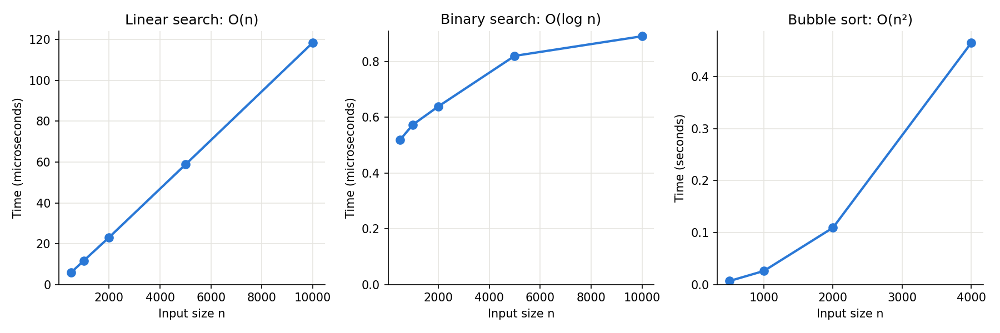

[Back to the Table of Contents](#table-of-contents)

### 20.4 Explanation

1. **Linear search, `O(n)`:** the time grew roughly in step with `n`. Twenty times more data took roughly twenty times longer. In the graph, the points lie close to a straight line.
2. **Binary search, `O(log n)`:** the time barely moved. For 500 items it needs about 9 halvings; for 10,000 items about 14. In the graph, the line rises only slightly. (Look at the vertical scale: the times are tiny.)
3. **Bubble sort, `O(n²)`:** each time `n` doubled, the time became roughly four times larger. In the graph, the line curves steeply upward.

**Why the method matters**

- **Worst case:** using a target that is never found makes both searches do their maximum work every time, so the results are comparable.
- **Repeats:** timing one binary search on its own would mostly measure noise. Averaging over thousands of repeats gives a stable figure.
- **Fastest of 5 rounds:** background activity can only make code slower, never faster, so the fastest round is the most accurate.
- **Same data for all rounds:** each algorithm is timed on the same list at a given size, so the only thing that changes between rows is `n`.

Real measurements are never perfectly exact. Memory caches, other programs, and even the temperature of the processor can nudge the numbers. That is why we look at the **pattern** of growth rather than any single time.

[Back to the Table of Contents](#table-of-contents)

### 20.5 Follow-up Questions

**20.5.1 Roughly how long would bubble sort take on 8,000 items, based on the table?**

About four times the time for 4,000 items, because doubling `n` quadruples the time for an `O(n²)` algorithm.

**20.5.2 Python has a module made specially for timing small pieces of code. What is it?**

[timeit](https://docs.python.org/3/library/timeit.html). It handles repeats automatically, for example `timeit.timeit(lambda: binary_search(sorted_data, -1), number=20_000)`.

[Back to the Table of Contents](#table-of-contents)

---

## Table of Changes

| No. | Section / element | Original file | Change made (added / modified / deleted) |
|---|---|---|---|
| 1 | Page title | `## Chapter 16 — Scripting Questions` with the chapter name as a plain line | Made a top-level title, "Chapter 16: Advanced Scripting Questions with Answers", with the chapter name as a subtitle line |
| 2 | Introduction | "These 20 scripting questions are drawn directly from the topics in Chapter 17..." and a one-line tip | Chapter number corrected from 17 to 16. Rewritten as a fuller introduction, with a table of the parts, a "How to use this page" list, and notes on timing and random seeds |
| 3 | Table of Contents | Not present | Added, linking to the introduction sections and all 20 questions. The five sub-sections inside each question are left out to keep it short, and the Table of Changes is not listed |
| 4 | "Back to the Table of Contents" links | Not present | Added at the end of every section and sub-section |
| 5 | New section "Big-O Quick Reference" | Not present | Added a Big-O table and a note on timing code |
| 6 | Part labels and question headings | Part labels were plain lines before each question (for example "Part A — Searching Algorithms"). Questions used `#### Q1.` with the question on the next line. Q9 had no heading at all. Part labels were not in order (Q17 is labelled Part A after Part B questions) | Each question now has a `##` heading with a short title, the part label in italics beneath it, and the printed question text in bold. Question wording unchanged |
| 7 | "Answer script:" and "Qn Answer:" paragraphs | Long one-paragraph summaries with lists run together on one line | Kept all the content, reformatted into readable lists and tables under "How It Works", with numbered steps and links for technical terms |
| 8 | Answer structure | Script followed by output | Each question now has: How It Works, Answer Script, Output, Explanation, and Follow-up Questions (two per question, with answers) |
| 9 | Flowcharts and tables | Not present (Q20 asked for a Mermaid flowchart, but none was included) | Added numbered Mermaid flowcharts for Q1, Q2, Q3, Q5, Q7 (heap tree), Q8, Q9, Q13, Q14, Q15, Q17 and Q20, and many explanatory tables |
| 10 | Output blocks | Fenced as `python`; several did not match the scripts or were incomplete | Fenced as `text`. Every output was produced by running the script. Timing outputs carry a note that times vary |
| 11 | Special characters in scripts | Box-drawing lines in comments (`# ─── Part A ───`), and arrows (`→`, `←`) and `≈` inside printed text | Replaced with plain characters (`# --- Part A ---`, `->`, `<-`, "about"), so the scripts print correctly in any terminal. The `₹` symbol in Q14 was kept |
| 12 | Q1 script | Timed each search once; times printed to 6 decimals, so binary search times were close to the limit of what could be shown | Added a helper that keeps the fastest of 5 runs. Times printed to 8 decimals and sizes with thousands separators. Added a note that sorting time is not included |
| 13 | Q2 script | The counting function had no early exit and ran on random lists, so it could not show the best case. It imported `random` inside a loop | Counting function now includes the `already_sorted` flag and is run on reversed and sorted lists for n = 5 to 80, with the formula and a growth ratio column showing close to 4x. Import removed |
| 14 | Q3 comparison of shifts and swaps | Printed shift and swap counts (both 20) and claimed "Fewer writes" without counting writes. Bubble sort's inner loop did not shrink | Explained that shifts always equal swaps (both equal the number of inversions). Added an inversion count and a count of actual writes (1 per shift plus key placements, 2 per swap). Added a fixed random seed and a 1,000-item comparison. Inner loop made to shrink each pass |
| 15 | Q4 intro and script | Called deque "a doubly-linked deque". `peek()` had no empty check. Output showed a 20x speedup | Described as a doubly-linked list of blocks. Added an empty check to `peek()`, a `peek()` demonstration and an empty-stack error. Output replaced with a real run |
| 16 | Q5 threads output | Printed output was jumbled ("Produced: job-B  Consumed: job-B" on one line, then a blank line). The consumer did not call `task_done()` for the sentinel | Added a print lock so lines cannot mix, printed "Produced" before putting the job, called `task_done()` for the sentinel, and printed a final message after both threads finish. "MUST use queue.Queue" softened to "use" |
| 17 | Q6 Counter arithmetic | `c1 + c2` was labelled "Union" | Corrected to "Sum". Added the true union (`c1 \| c2`) and intersection (`c1 & c2`) with a table. The collapsed one-line docstring was reformatted. ChainMap output now shows which layer each setting came from |
| 18 | Q7 | Script only | Added a parent/child check, a print of the negated max-heap, a table of functions and costs, and a tree diagram |
| 19 | Q8 | Script only | Added counting duplicates, a missing-value example, top-3 display, boundary scores (40 and 75) in the grade lookup, and a table explaining the lookup |
| 20 | Q9 | `popitem` was used only inside the LRU class | Added a direct demonstration of `popitem()` and `popitem(last=False)`, eviction messages, a missing-key lookup, a comparison with plain dict, and a trace table of the cache |
| 21 | Q10 intro | Said `_asdict()` "converts an instance to an OrderedDict" | Corrected: returns a plain `dict` from Python 3.8 (an `OrderedDict` in 3.1 to 3.7). Added `_fields`, sorting, the full `__mro__` print, and a note that `sys.getsizeof()` measures only the container |
| 22 | Q11 docstring | "WRONG: subjects: list = [] ← All instances share the SAME list!" | Corrected: a dataclass raises `ValueError` for this; sharing happens in a normal class. The error is now demonstrated |
| 23 | Q11 script | Features were spread across four separate classes; the `Student` class itself was never made frozen, as the question asks | Kept the four parts and added a combined `FrozenStudent` class with a default, `default_factory`, `repr=False` and `frozen=True`. Added a note that a frozen dataclass still allows changing the contents of a list |
| 24 | Q12 script | `OrderStatus` used manual values 1 to 5; `auto()` was shown only in a separate `Direction` enum, although the question asks for `auto()` in `OrderStatus`. No iteration over `OrderStatus` | `OrderStatus` now uses `auto()`. Added iteration over all its members, `len()`, comparison with a plain number, and an invalid lookup. The separate `Direction` enum was removed as no longer needed |
| 25 | Q13 script | Did not print or explain `maxsize`, although the question asks for every field | Added `maxsize`, the number of calls made by the plain version, a cache info print after the second call, and a table and step-by-step explanation of why there are 33 hits and 36 misses |
| 26 | Q14 script | `reduce()` did not print intermediate results, although the question asks for them. A key function was named `compare_by_field` although it compares nothing | `multiply()` now prints each step, and the loop prints its steps too. Renamed to `get_field`. Added `math.prod()`, the `keywords` attribute, and a fuller explanation of why a loop is clearer |
| 27 | Q15 script | Question asks to chain "two lists, a tuple, and a range"; the script used one list, one tuple and one range | Added a second list. Added a print of the lazy chain object and a demonstration of `groupby()` on unsorted data |
| 28 | Q16 script | Printed a box-drawing table; PINs printed as tuples | Summary table drawn with plain characters. PINs printed as digit strings. Added a check of counts with `math.comb()` and `math.perm()`, and a table of formulas. A comment calling the combinations a "batting lineup" was reworded, since order does not matter in combinations |
| 29 | Q17 intro and script | Said selection sort makes "exactly n-1 swaps". Trace did not say where the minimum was found. Random list had no seed. Bubble sort's inner loop did not shrink | Corrected to "at most n-1 swaps". Trace now shows where each minimum was found and whether a swap happened. Added a fixed seed, a reversed-list comparison, and an explanation of why swaps are `O(n)` |
| 30 | Q18 script | The pickle and json file examples used a dict without a datetime, although the question asks for a dict containing a datetime. JSON conversion used `str()`, which cannot be read back directly | The same datetime dict is now saved and loaded with pickle and with json. JSON uses `isoformat()` and `fromisoformat()` to convert and restore the date. Added a Python-to-JSON type table. Intro list of json types now includes `None` |
| 31 | Q19 output | The benchmark results were missing from the output | Added the full output from a real run, including the benchmark. Added the round-robin queue state on each turn, the moment the sliding window starts dropping lines, and a check that both structures end in the same order |
| 32 | Q20 intro and script | Said the script "prints an ASCII plot and a Mermaid flowchart", but it did neither. Bubble sort was always run on the same 500 elements, so its column could not show `O(n²)` growth. Each search was timed once, so binary search times were mostly noise | Removed the incorrect claim. The Mermaid flowchart of the method is now included on the page. Searches are averaged over many repeats with the fastest of 5 rounds kept. Bubble sort is timed on sizes 500 to 4,000 with a growth column. Added growth summaries and a graph image (`resources/070-ch16-big-o-timing.png`) with the code that draws it |


