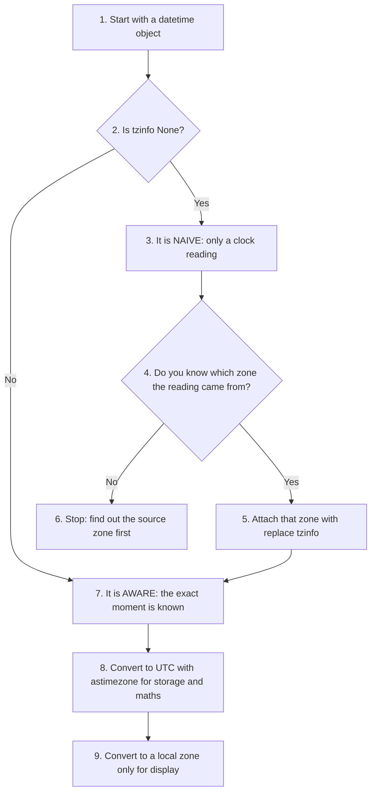
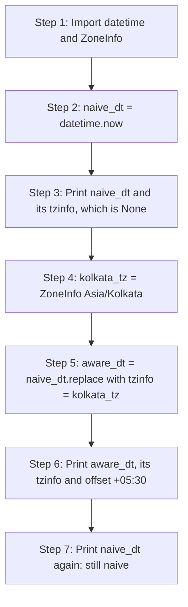
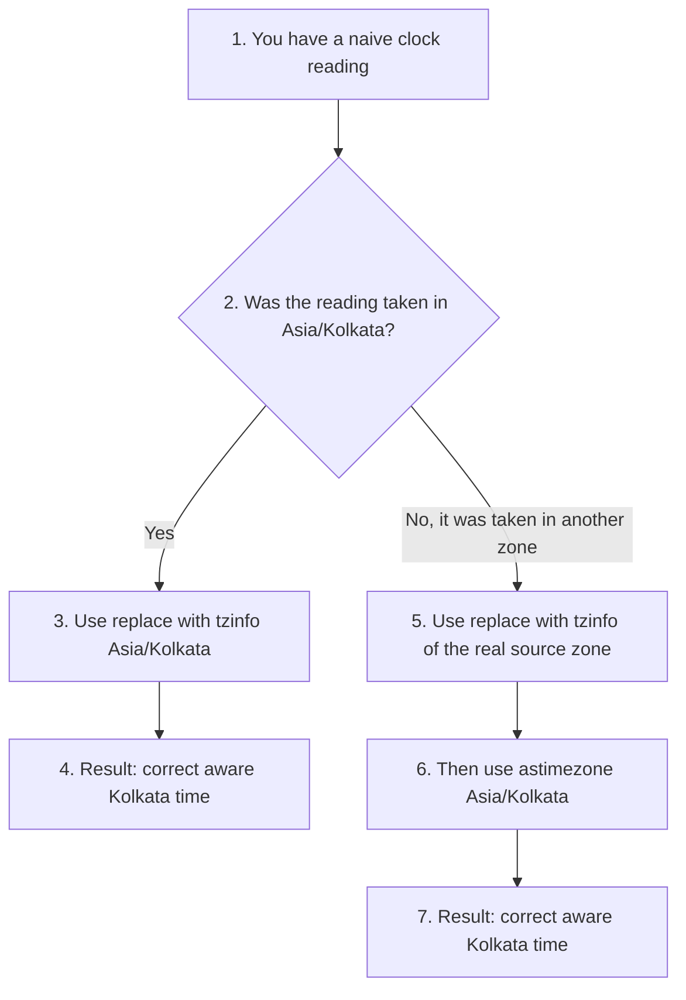
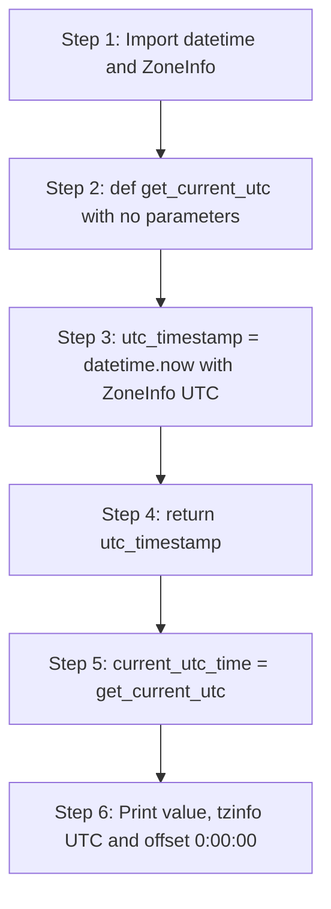
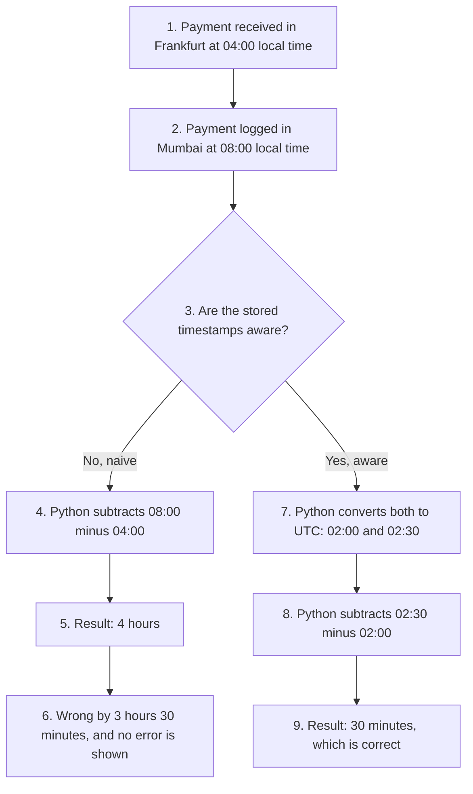

# Beyond the Basics: Timezones, Calendars, and Datetimes in Python

Almost every real program has to deal with time. A banking app records when money moves. A shopping site shows when an order will arrive. A school portal prints the date on a report card. A server writes the time next to every line in its log file.

At first, working with dates looks easy. You read the clock, print the date, and move on. The trouble starts when the same program runs in more than one place. 10:00 AM in Mumbai is not 10:00 AM in London or New York. Some countries also move their clocks forward and backward during the year. If a program ignores these facts, it can give wrong answers without showing any error at all.

This page is a companion to the chapter on strings in the book. In that chapter you learnt how to build, format and read text. Dates and times are one of the most common kinds of text that programs produce and read. The method `strftime()` turns a date into a string, and `strptime()` turns a string back into a date. So this topic is a natural next step after strings.

**What this page contains:**

- The difference between **naive** and **aware** datetime objects, and why it matters.
- The **IANA Time Zone Database**, which Python uses to know the time rules of every region.
- Three short scripts on formatting dates, working with timezones and printing calendars.
- Three lab assignments with step-by-step solutions, outputs, flowcharts and follow-up questions.

**Before you start:**

- You need **Python 3.9 or later**, because the `zoneinfo` module was added in Python 3.9.
- If you use **Windows**, run `pip install tzdata` once. Windows does not ship the timezone data that `zoneinfo` needs. Without it you will see a `ZoneInfoNotFoundError`. (Details are given in Section 2.)
- **Google Colab** already has everything installed. Note that the Colab computer clock is set to UTC, not to Indian time. This fact becomes important in Question 1.

## Table of Contents

- [1. Core Concepts: Naive vs. Aware Datetime Objects](#1-core-concepts-naive-vs-aware-datetime-objects)
  - [A. Naive Datetime Objects](#a-naive-datetime-objects)
  - [B. Aware Datetime Objects](#b-aware-datetime-objects)
  - [C. Naive vs. Aware at a Glance](#c-naive-vs-aware-at-a-glance)
  - [D. Key Terms Used on This Page](#d-key-terms-used-on-this-page)
- [2. Global Standardization: The Olson (IANA) Time Zone Database](#2-global-standardization-the-olson-iana-time-zone-database)
  - [Why Abbreviations Like IST Are Not Enough](#why-abbreviations-like-ist-are-not-enough)
  - [Setting Up zoneinfo on Your Computer](#setting-up-zoneinfo-on-your-computer)
- [3. Practical Implementation and Code Snippets](#3-practical-implementation-and-code-snippets)
  - [Script A: Basic Date Extraction and Formatting](#script-a-basic-date-extraction-and-formatting)
  - [Script B: Geographic Localization with zoneinfo](#script-b-geographic-localization-with-zoneinfo)
  - [Script C: Generating Calendars with the calendar Module](#script-c-generating-calendars-with-the-calendar-module)
- [4. Lab Assignments](#4-lab-assignments)
  - [Question 1: Upgrading Naive Objects](#question-1-upgrading-naive-objects)
    - [Solution Approach for Question 1](#solution-approach-for-question-1)
    - [Step-by-Step Solution Script for Question 1](#step-by-step-solution-script-for-question-1)
    - [Output of the Question 1 Script](#output-of-the-question-1-script)
    - [Detailed Explanation for Question 1](#detailed-explanation-for-question-1)
    - [An Important Warning: replace() Labels, It Does Not Convert](#an-important-warning-replace-labels-it-does-not-convert)
    - [Follow-Up Questions for Question 1](#follow-up-questions-for-question-1)
  - [Question 2: The UTC Safe Clock](#question-2-the-utc-safe-clock)
    - [Solution Approach for Question 2](#solution-approach-for-question-2)
    - [Step-by-Step Solution Script for Question 2](#step-by-step-solution-script-for-question-2)
    - [Output of the Question 2 Script](#output-of-the-question-2-script)
    - [Detailed Explanation for Question 2](#detailed-explanation-for-question-2)
    - [Follow-Up Questions for Question 2](#follow-up-questions-for-question-2)
  - [Question 3: Conceptual Analysis](#question-3-conceptual-analysis)
    - [Short Answer in Plain Words](#short-answer-in-plain-words)
    - [Programmatic Simulation for Question 3](#programmatic-simulation-for-question-3)
    - [Timeline Table for the Simulation](#timeline-table-for-the-simulation)
    - [The Three System-Failure Risks Explained](#the-three-system-failure-risks-explained)
    - [Summary Table of the Three Risks](#summary-table-of-the-three-risks)
    - [Follow-Up Questions for Question 3](#follow-up-questions-for-question-3)
- [5. Summary and Best Practices](#5-summary-and-best-practices)
- [6. Further Reading](#6-further-reading)

## 1. Core Concepts: Naive vs. Aware Datetime Objects

Python's built-in [`datetime` module](https://docs.python.org/3/library/datetime.html) gives us the `datetime` class. An object of this class stores a date and a time together, for example "5 July 2026, 8:01 AM".

Every datetime object belongs to one of two groups, depending on whether it knows its timezone:

- **Naive** objects do not know their timezone.
- **Aware** objects do know their timezone.

A simple way to picture this: a naive datetime is like a photo of a wall clock with no label. You can see it reads 8:00, but you do not know if the clock was hanging in Delhi or in Paris. An aware datetime is the same photo with a label that says "Delhi, India".

The official Python documentation explains both groups in the section [Aware and Naive Objects](https://docs.python.org/3/library/datetime.html#aware-and-naive-objects).

[Back to the Table of Contents](#table-of-contents)

### A. Naive Datetime Objects

A **naive** datetime object holds a date and a time (year, month, day, hour, minute, second and microsecond), but it has **no timezone information and no offset from UTC**. Its `tzinfo` attribute is `None`.

- **The weakness:** A naive object cannot tell you whether its time is Indian Standard Time (IST), Coordinated Universal Time (UTC) or Eastern Standard Time (EST). It is only a clock reading.
- **Why it is unsafe:** Suppose you record two naive times in two different countries and subtract one from the other to find how much time passed. Python will simply subtract the numbers. It will not account for the difference between the two regions, and it will not account for daylight saving changes. The answer can be wrong by hours, and Python will not warn you. Such silent errors are very harmful in banking, delivery tracking and server software.

[Back to the Table of Contents](#table-of-contents)

### B. Aware Datetime Objects

An **aware** datetime object holds the same date and time values *plus* a `tzinfo` object. The `tzinfo` object tells Python which region's time rules apply. From these rules Python can work out the offset from UTC, including any daylight saving adjustment that applied on that date, both today and in the past.

Because an aware object knows exactly which moment it describes, Python can compare it correctly with any other aware object, even one from a different timezone. For this reason aware objects are strongly recommended for all real-world software.

[Back to the Table of Contents](#table-of-contents)

### C. Naive vs. Aware at a Glance

| Feature | Naive datetime | Aware datetime |
|---|---|---|
| Stores date and time | Yes | Yes |
| Stores timezone (`tzinfo`) | No, `tzinfo` is `None` | Yes, for example `ZoneInfo("Asia/Kolkata")` |
| How it prints | `2026-07-05 08:01:53` | `2026-07-05 08:01:53+05:30` |
| `utcoffset()` returns | `None` | A duration such as `5:30:00` |
| Knows the exact moment on the world clock | No | Yes |
| Handles daylight saving time | No | Yes |
| Safe for comparing times from different places | No | Yes |
| Typical way to create | `datetime.now()` | `datetime.now(ZoneInfo("UTC"))` |
| Good for | Quick local scripts, alarm-clock style times | Logs, databases, servers, anything shared across places |

One more rule is worth remembering. Python **will not let you subtract or compare** a naive object with an aware one using `<` or `>`. It raises a `TypeError`. This is Python's way of stopping you from mixing a labelled time with an unlabelled one.

The flowchart below shows how to decide what to do with a datetime object you have been given.



[Back to the Table of Contents](#table-of-contents)

### D. Key Terms Used on This Page

| Term | Simple meaning | Learn more |
|---|---|---|
| UTC (Coordinated Universal Time) | The world's reference clock. All other timezones are described as "UTC plus or minus some hours". | [Wikipedia: UTC](https://en.wikipedia.org/wiki/Coordinated_Universal_Time) |
| Timezone | A region that follows the same clock rules, for example India or the eastern United States. | [Wikipedia: Time zone](https://en.wikipedia.org/wiki/Time_zone) |
| UTC offset | How far a local clock is ahead of or behind UTC. India is `+05:30`, which means 5 hours 30 minutes ahead. | [Wikipedia: UTC offset](https://en.wikipedia.org/wiki/UTC_offset) |
| Daylight Saving Time (DST) | Moving clocks forward by one hour in summer and back again in autumn. India does not do this, but Europe and the United States do. | [Wikipedia: DST](https://en.wikipedia.org/wiki/Daylight_saving_time) |
| `tzinfo` | The attribute of a datetime object that holds its timezone. It is `None` for naive objects. | [Python docs: tzinfo](https://docs.python.org/3/library/datetime.html#tzinfo-objects) |
| `ZoneInfo` | A Python class that loads the rules of one timezone from the IANA database. | [Python docs: zoneinfo](https://docs.python.org/3/library/zoneinfo.html) |
| Microsecond | One millionth of a second. The digits after the decimal point in `07:36:32.668954` are microseconds. | [Wikipedia: Microsecond](https://en.wikipedia.org/wiki/Microsecond) |
| Immutable | An object whose value cannot be changed after it is created. Strings and datetime objects are immutable. | [Python glossary: immutable](https://docs.python.org/3/glossary.html#term-immutable) |
| ISO 8601 | An international standard for writing dates and times as text, for example `2026-07-05T02:42:21+00:00`. | [Wikipedia: ISO 8601](https://en.wikipedia.org/wiki/ISO_8601) |
| Distributed system | One application that runs on many computers (servers) spread across different places, working together. | [Wikipedia: Distributed computing](https://en.wikipedia.org/wiki/Distributed_computing) |

[Back to the Table of Contents](#table-of-contents)

## 2. Global Standardization: The Olson (IANA) Time Zone Database

Timezones are not fixed by nature. They are decided by governments. A country can change its offset, start or stop daylight saving time, or change the dates on which clocks move. Such changes happen somewhere in the world almost every year.

To keep track of all these rules, computers use the **IANA Time Zone Database**. IANA stands for Internet Assigned Numbers Authority. The database is also called the **Olson Database** (after Arthur David Olson, who started it) or the **tz database**. It records the current rules and the historical rules for every region. You can read more at the [IANA time zones page](https://www.iana.org/time-zones) or on [Wikipedia: tz database](https://en.wikipedia.org/wiki/Tz_database).

The database gives every region a name in the form `Area/City`, for example `Asia/Kolkata`, `America/New_York` or `Europe/Berlin`. These names are plain text labels (keys) used to look up the rules. They are not codes or passwords of any kind. A city is chosen because city names rarely change, while country borders and zone names sometimes do. A full list is available at [Wikipedia: List of tz database time zones](https://en.wikipedia.org/wiki/List_of_tz_database_time_zones).

From Python 3.9 onwards, the standard library includes the [`zoneinfo` module](https://docs.python.org/3/library/zoneinfo.html) (introduced by [PEP 615](https://peps.python.org/pep-0615/)). It reads the IANA database so that you can write `ZoneInfo("Asia/Kolkata")` and get the correct rules for India.

The table below shows a few zones and their offsets in January (winter in the northern half of the world) and July (summer).

| IANA key | Offset in January 2026 | Offset in July 2026 | Uses DST? |
|---|---|---|---|
| `Asia/Kolkata` | +05:30 (IST) | +05:30 (IST) | No |
| `Asia/Kathmandu` | +05:45 | +05:45 | No |
| `UTC` | +00:00 | +00:00 | No |
| `Europe/London` | +00:00 (GMT) | +01:00 (BST) | Yes |
| `Europe/Berlin` | +01:00 (CET) | +02:00 (CEST) | Yes |
| `America/New_York` | -05:00 (EST) | -04:00 (EDT) | Yes |
| `Australia/Sydney` | +11:00 (AEDT) | +10:00 (AEST) | Yes (summer there is in January) |

Notice two things. First, some offsets are not whole hours (India is +05:30 and Nepal is +05:45). Second, zones that use DST have **two different offsets** in the same year. This is why a fixed number such as "+2 hours" is not enough, and why we use the region name instead.

[Back to the Table of Contents](#table-of-contents)

### Why Abbreviations Like IST Are Not Enough

It is tempting to write "IST" or "EST" instead of a long name like `Asia/Kolkata`. The problem is that abbreviations are not unique. "IST" is used for India Standard Time, Israel Standard Time and Irish Standard Time. "CST" can mean Central Standard Time in North America or China Standard Time. An abbreviation also does not tell you when daylight saving starts or stops. The IANA key avoids both problems, so always prefer it in code.

[Back to the Table of Contents](#table-of-contents)

### Setting Up zoneinfo on Your Computer

On **Linux** and **macOS**, `zoneinfo` reads the timezone files already present in the operating system, so it works straight away.

On **Windows**, those files are not available. Install the `tzdata` package once from the command prompt:

```text
pip install tzdata
```

The [`tzdata` package](https://pypi.org/project/tzdata/) is maintained by the Python core team and contains a copy of the IANA database. `zoneinfo` uses it automatically when the operating system has no data of its own.

You can check that everything works with this short script:

```python
# Step 1: Import the helper function that lists all known zones
from zoneinfo import available_timezones

# Step 2: Count the zones and check that Asia/Kolkata is present
zones = available_timezones()
print("Number of zones found:", len(zones))
print("Is Asia/Kolkata available?", "Asia/Kolkata" in zones)
```

If the second line prints `True`, you are ready. The exact number of zones depends on the version of the database installed on your computer, so it may differ from the sample below.

```text
Number of zones found: 598
Is Asia/Kolkata available? True
```

[Back to the Table of Contents](#table-of-contents)

## 3. Practical Implementation and Code Snippets

The three scripts below show the everyday tools: formatting dates as text, creating aware objects for real places, and printing calendars. Run each one yourself and compare your output with the sample shown.

A note on outputs: any script that calls `now()` reads the clock of your own computer. Your dates and times will therefore be different from the samples on this page. The **shape** of the output (the order of the parts, the `+05:30` suffix and so on) will be the same.

[Back to the Table of Contents](#table-of-contents)

### Script A: Basic Date Extraction and Formatting

This script creates a datetime object, pulls out its individual parts, and turns it into custom text with the `.strftime()` method. The name `strftime` means "string format time". It returns an ordinary Python **string**, so everything you learnt in the strings chapter (slicing, joining, f-strings) works on its result.

At the end, the script also shows `.strptime()` ("string parse time"), which does the reverse job: it reads a date written as text and builds a datetime object from it.

```python
# Step 1: Import the datetime module
import datetime

# Step 2: Fetch the current local date and time
# datetime.datetime.now() reads the clock of your computer.
# The first 'datetime' is the module, the second is the class inside it.
now = datetime.datetime.now()
print("Step 2 -> Current Local Timestamp:", now)

# Step 3: Extract individual whole-number (integer) parts
year = now.year
month = now.month
day = now.day
hour = now.hour
minute = now.minute
print(f"Step 3 -> Year: {year}, Month: {month}, Day: {day}, Hour: {hour}, Minute: {minute}")

# Step 4: Format the datetime object as a DD/MM/YYYY string
# %d = day of month (01-31), %m = month (01-12), %Y = 4-digit year
formatted_date = now.strftime("%d/%m/%Y")
print("Step 4 -> Formatted Date String:", formatted_date)
print("Step 4 -> Type of formatted_date:", type(formatted_date))

# Step 5: Try a few more readable formats
# %A = full weekday name, %B = full month name
# %I = hour on a 12-hour clock, %M = minutes, %p = AM or PM
long_date = now.strftime("%A, %d %B %Y")
clock_time = now.strftime("%I:%M %p")
print("Step 5 -> Long Date:", long_date)
print("Step 5 -> 12-Hour Clock:", clock_time)

# Step 6: Go the other way: turn a string back into a datetime object
# strptime() reads the text using the same format codes.
text_date = "15/08/2026"
parsed = datetime.datetime.strptime(text_date, "%d/%m/%Y")
print("Step 6 -> Parsed Object:", parsed)
print("Step 6 -> Type of parsed:", type(parsed))
```

**Sample output** (taken when the computer clock read 5 July 2026, 07:36:32 AM):

```text
Step 2 -> Current Local Timestamp: 2026-07-05 07:36:32.668954
Step 3 -> Year: 2026, Month: 7, Day: 5, Hour: 7, Minute: 36
Step 4 -> Formatted Date String: 05/07/2026
Step 4 -> Type of formatted_date: <class 'str'>
Step 5 -> Long Date: Sunday, 05 July 2026
Step 5 -> 12-Hour Clock: 07:36 AM
Step 6 -> Parsed Object: 2026-08-15 00:00:00
Step 6 -> Type of parsed: <class 'datetime.datetime'>
```

**Understanding the output:**

- In `2026-07-05 07:36:32.668954`, the part `668954` is the **microsecond** value. It means 0.668954 of a second.
- `type(formatted_date)` prints `<class 'str'>`. This confirms that `strftime()` gives back a normal string.
- In Step 6 the text had no time part, so Python filled in midnight (`00:00:00`).
- The object printed in Step 2 has no `+05:30` at the end. That tells us it is a **naive** object.

**Common format codes.** The full list is in the Python docs under [strftime() and strptime() Format Codes](https://docs.python.org/3/library/datetime.html#format-codes).

| Code | Meaning | Example for 5 July 2026, 07:36:32 AM |
|---|---|---|
| `%d` | Day of the month, two digits | `05` |
| `%m` | Month number, two digits | `07` |
| `%Y` | Year, four digits | `2026` |
| `%y` | Year, last two digits | `26` |
| `%B` | Full month name | `July` |
| `%b` | Short month name | `Jul` |
| `%A` | Full weekday name | `Sunday` |
| `%a` | Short weekday name | `Sun` |
| `%H` | Hour, 24-hour clock | `07` |
| `%I` | Hour, 12-hour clock | `07` |
| `%p` | AM or PM | `AM` |
| `%M` | Minute | `36` |
| `%S` | Second | `32` |
| `%j` | Day of the year (001 to 366) | `186` |
| `%z` | UTC offset (aware objects only, empty for naive) | `+0530` |
| `%Z` | Timezone name (aware objects only, empty for naive) | `IST` |

Month and weekday names come from your computer's language settings. On a computer set to another language, `%B` and `%A` may print names in that language.

[Back to the Table of Contents](#table-of-contents)

### Script B: Geographic Localization with zoneinfo

This script uses the `zoneinfo` module to create **aware** datetime objects linked to real places. It also shows how to convert one moment to another city's clock.

```python
# Step 1: Import the datetime class and the ZoneInfo class
# ZoneInfo is available in Python 3.9 and later.
# Older versions of Python used the third-party 'pytz' library instead.
from datetime import datetime
from zoneinfo import ZoneInfo

# Step 2: Create an aware datetime object for Asia/Kolkata
kolkata_time = datetime.now(ZoneInfo("Asia/Kolkata"))
print("Step 2 -> Aware Kolkata Time:  ", kolkata_time)
print("Step 2 -> Timezone Info Object:", kolkata_time.tzinfo)
print("Step 2 -> UTC Offset:          ", kolkata_time.utcoffset())

# Step 3: Capture the current time in UTC
utc_time = datetime.now(ZoneInfo("UTC"))
print("Step 3 -> Aware UTC Time:      ", utc_time)
print("Step 3 -> UTC Offset:          ", utc_time.utcoffset())

# Step 4: Show the same moment on a New York wall clock
# astimezone() converts the time. It does not change the moment itself.
new_york_time = kolkata_time.astimezone(ZoneInfo("America/New_York"))
print("Step 4 -> Same Moment in New York:", new_york_time)

# Step 5: Check that both objects describe the same moment
# Python compares aware objects by their true position on the UTC timeline.
print("Step 5 -> Same moment?", kolkata_time == new_york_time)
```

**Sample output:**

```text
Step 2 -> Aware Kolkata Time:   2026-07-05 07:46:35.537441+05:30
Step 2 -> Timezone Info Object: Asia/Kolkata
Step 2 -> UTC Offset:           5:30:00
Step 3 -> Aware UTC Time:       2026-07-05 02:16:35.544604+00:00
Step 3 -> UTC Offset:           0:00:00
Step 4 -> Same Moment in New York: 2026-07-04 22:16:35.537441-04:00
Step 5 -> Same moment? True
```

**Understanding the output:**

- In `07:46:35.537441+05:30`, the part `.537441` is microseconds and `+05:30` is the **UTC offset**. It says this clock is 5 hours 30 minutes ahead of UTC.
- In the UTC line, `+00:00` means an offset of zero. UTC is the reference, so it is never ahead or behind itself.
- The Kolkata time `07:46` minus 5 hours 30 minutes gives `02:16`, which matches the UTC line. (The microseconds differ slightly because the two `now()` calls ran a tiny moment apart.)
- New York shows `22:16` on **4 July**, the previous day. In July New York uses summer time, so its offset is `-04:00`.
- Step 5 prints `True`. The Kolkata and New York objects show different clock readings, but they describe the very same moment.

[Back to the Table of Contents](#table-of-contents)

### Script C: Generating Calendars with the calendar Module

Python's [`calendar` module](https://docs.python.org/3/library/calendar.html) can print neat text calendars for a month or a whole year. It also has small helper functions for common date questions.

```python
# Step 1: Import the calendar module
import calendar

# Step 2: Choose the year and month
target_year = 2026
target_month = 7  # July

# Step 3: Print a text grid for one month
# calendar.month() returns a multi-line string. print() displays it.
print(calendar.month(target_year, target_month))

# Step 4: Find the weekday of a given date
# weekday() returns 0 for Monday, 1 for Tuesday ... 6 for Sunday.
day_number = calendar.weekday(2026, 7, 5)
print("Step 4 -> Weekday number of 5 July 2026:", day_number)
print("Step 4 -> Weekday name of 5 July 2026:  ", calendar.day_name[day_number])

# Step 5: Check for leap years
print("Step 5 -> Is 2026 a leap year?", calendar.isleap(2026))
print("Step 5 -> Is 2028 a leap year?", calendar.isleap(2028))

# Step 6: (Optional) Generate the calendar for a whole year
# The output is long, so these lines are commented out.
# Remove the # signs to run them.
# year_calendar = calendar.TextCalendar().formatyear(target_year)
# print(year_calendar)
```

**Output:**

```text
     July 2026
Mo Tu We Th Fr Sa Su
       1  2  3  4  5
 6  7  8  9 10 11 12
13 14 15 16 17 18 19
20 21 22 23 24 25 26
27 28 29 30 31

Step 4 -> Weekday number of 5 July 2026: 6
Step 4 -> Weekday name of 5 July 2026:   Sunday
Step 5 -> Is 2026 a leap year? False
Step 5 -> Is 2028 a leap year? True
```

**Understanding the output:**

- The calendar starts each week on **Monday** by default. 1 July 2026 is a Wednesday, so the first row begins under `We`.
- There is an empty line after the grid. This is because `calendar.month()` already ends with a newline character, and `print()` adds one more.
- If you prefer weeks that start on Sunday, write `calendar.setfirstweekday(calendar.SUNDAY)` before printing.
- This script does not depend on the clock, so your output will match this one exactly.

[Back to the Table of Contents](#table-of-contents)

## 4. Lab Assignments

Complete these tasks in your local IDE or in a Google Colab notebook. They will help you understand and apply the ideas on this page. Try each task on your own first, and then compare your work with the solution.

[Back to the Table of Contents](#table-of-contents)

### Question 1: Upgrading Naive Objects

**Task:** Write a Python script that instantiates a naive datetime object using `datetime.now()`. Next, convert it into an explicitly aware datetime object representing the `Asia/Kolkata` timezone using the `.replace(tzinfo=...)` method.

-   _Hint:_ Ensure you import `ZoneInfo` from `zoneinfo`.

[Back to the Table of Contents](#table-of-contents)

#### Solution Approach for Question 1

Follow these logical steps:

1. Import `datetime` from the `datetime` module and `ZoneInfo` from the `zoneinfo` module.
2. Call `datetime.now()` to get a naive object for the current time.
3. Print the object and its `tzinfo` to prove that it is naive (`tzinfo` is `None`).
4. Create a `ZoneInfo("Asia/Kolkata")` object.
5. Call `.replace(tzinfo=...)` on the naive object to get a new, aware object.
6. Print the new object and its `tzinfo` to prove that it is now aware.
7. Print the original object again to show that it was not changed.



[Back to the Table of Contents](#table-of-contents)

#### Step-by-Step Solution Script for Question 1

```python
"""
ASSIGNMENT SOLUTION: UPGRADING NAIVE DATETIME OBJECTS TO AWARE DATETIME OBJECTS

Objective:
This script shows the difference between a naive datetime object (no timezone)
and an aware datetime object (with a timezone). We create a naive time, look at
its properties, and then attach the Asia/Kolkata timezone rules to it using
Python's standard 'zoneinfo' module.
"""

# Step 1: Import the required classes from the standard library
from datetime import datetime
from zoneinfo import ZoneInfo

# Step 2: Create a naive datetime object for the current local time
# It holds the year, month, day, hour, minute, second and microsecond,
# but its timezone attribute (tzinfo) is empty (None).
naive_dt = datetime.now()

# Step 3: Display the naive object and confirm that it has no timezone
print("--- STEP 3: INSPECTING NAIVE OBJECT ---")
print(f"Naive Datetime Value: {naive_dt}")
print(f"Naive Timezone Info:  {naive_dt.tzinfo}")   # None means no timezone is attached
print(f"Naive UTC Offset:     {naive_dt.utcoffset()}")

# Step 4: Create a ZoneInfo object for the target region
# This object carries the official time rules for India.
kolkata_tz = ZoneInfo("Asia/Kolkata")

# Step 5: Attach the timezone using .replace()
# .replace() builds a NEW object. The original naive_dt is not changed.
aware_dt = naive_dt.replace(tzinfo=kolkata_tz)

# Step 6: Display the new aware object
print("\n--- STEP 6: INSPECTING AWARE OBJECT ---")
print(f"Aware Datetime Value: {aware_dt}")
print(f"Aware Timezone Info:  {aware_dt.tzinfo}")
print(f"Aware UTC Offset:     {aware_dt.utcoffset()}")

# Step 7: Confirm that the original naive object is unchanged
print("\n--- STEP 7: CHECKING THE ORIGINAL OBJECT ---")
print(f"naive_dt still has tzinfo: {naive_dt.tzinfo}")
```

[Back to the Table of Contents](#table-of-contents)

#### Output of the Question 1 Script

Sample output from a computer whose clock is set to Indian time:

```text
--- STEP 3: INSPECTING NAIVE OBJECT ---
Naive Datetime Value: 2026-07-05 08:01:53.236422
Naive Timezone Info:  None
Naive UTC Offset:     None

--- STEP 6: INSPECTING AWARE OBJECT ---
Aware Datetime Value: 2026-07-05 08:01:53.236422+05:30
Aware Timezone Info:  Asia/Kolkata
Aware UTC Offset:     5:30:00

--- STEP 7: CHECKING THE ORIGINAL OBJECT ---
naive_dt still has tzinfo: None
```

[Back to the Table of Contents](#table-of-contents)

#### Detailed Explanation for Question 1

##### Why We Use datetime.now() for the Naive Object

When you call `datetime.now()` without any argument, Python asks the operating system for the current time on the computer's clock. It copies the date and time numbers into a new `datetime` object. It leaves the timezone attribute `.tzinfo` empty, that is, `None`. The result is a **naive** object. It holds a correct clock reading, but it does not know where in the world that reading was taken.

##### How the replace() Method Works

Datetime objects in Python are **immutable**, just like strings. Once created, their parts cannot be changed in place. You cannot write `naive_dt.tzinfo = kolkata_tz`; Python will raise an error.

The `.replace()` method solves this. It works in three steps:

1. It reads all the existing values of the object (year, month, day, hour and so on).
2. It builds a brand-new datetime object with those same values.
3. It swaps in any value you pass as an argument. Here we pass `tzinfo=kolkata_tz`, so the empty timezone slot is filled with the `ZoneInfo` object.

The original `naive_dt` stays exactly as it was. Step 7 of the script proves this. This is the same idea you saw with strings: `"hello".upper()` gives a new string and leaves `"hello"` untouched.

##### The Visible and Practical Difference in Output

Compare the lines printed in Step 3 and Step 6:

| | Naive object (Step 3) | Aware object (Step 6) |
|---|---|---|
| Printed value | `2026-07-05 08:01:53.236422` | `2026-07-05 08:01:53.236422+05:30` |
| `tzinfo` | `None` | `Asia/Kolkata` |
| `utcoffset()` | `None` | `5:30:00` |

The date and time digits are identical. The only visible change is the **`+05:30`** suffix on the aware object. It is the offset from UTC given by the `Asia/Kolkata` rules. Because of this label, a program can now place the object at the correct point on the world timeline. It can safely compare it with times from other countries or use it for global scheduling.

[Back to the Table of Contents](#table-of-contents)

#### An Important Warning: replace() Labels, It Does Not Convert

The word "convert" in the task needs care. `.replace(tzinfo=...)` does **not** move the clock. It only **attaches a label** to the numbers that are already there.

So the solution above gives the right answer **only if your computer's clock is already set to Indian time**. If the computer is set to some other zone, the label will be wrong.

Google Colab is a good example. Its computers run on UTC. At 08:01:53 AM in India, the Colab clock reads 02:31:53. If you attach `Asia/Kolkata` to that reading with `.replace()`, you get an object that claims it is 02:31 AM in India, which is 5 hours 30 minutes off.

The right tool for a real conversion is `.astimezone()`. The script below shows both.

```python
# Step 1: Import the required classes
from datetime import datetime
from zoneinfo import ZoneInfo

# Step 2: Pretend we are on a computer whose clock is set to UTC (like Google Colab)
# At 08:01:53 in India, a UTC clock reads 02:31:53.
naive_utc_clock = datetime(2026, 7, 5, 2, 31, 53)
print("Step 2 -> Naive reading from a UTC computer:", naive_utc_clock)

# Step 3: The WRONG way: just attach Asia/Kolkata with .replace()
wrong = naive_utc_clock.replace(tzinfo=ZoneInfo("Asia/Kolkata"))
print("Step 3 -> Wrong result with replace():     ", wrong)

# Step 4: The RIGHT way: first say what the clock really was (UTC),
# then CONVERT to Asia/Kolkata with .astimezone()
right = naive_utc_clock.replace(tzinfo=ZoneInfo("UTC")).astimezone(ZoneInfo("Asia/Kolkata"))
print("Step 4 -> Correct result with astimezone(): ", right)

# Step 5: Measure how far apart the two answers are
print("Step 5 -> Error caused by replace():        ", right - wrong)
```

**Output:**

```text
Step 2 -> Naive reading from a UTC computer: 2026-07-05 02:31:53
Step 3 -> Wrong result with replace():      2026-07-05 02:31:53+05:30
Step 4 -> Correct result with astimezone():  2026-07-05 08:01:53+05:30
Step 5 -> Error caused by replace():         5:30:00
```

| Method | What it does | Clock digits change? | Use it when |
|---|---|---|---|
| `.replace(tzinfo=zone)` | Attaches a timezone label | No | You already know the reading was taken in that zone |
| `.astimezone(zone)` | Converts the same moment to another zone's clock | Yes (unless the offsets are equal) | You want to see the same moment on a different clock |



[Back to the Table of Contents](#table-of-contents)

#### Follow-Up Questions for Question 1

**Follow-up 1.1: What does `naive_dt.utcoffset()` return, and why?**

It returns `None`. Step 1: `utcoffset()` asks the object's `tzinfo` for the offset. Step 2: a naive object has no `tzinfo`. Step 3: with nothing to ask, Python returns `None`. You can use this as a quick test: if `dt.tzinfo is None` or `dt.utcoffset() is None`, the object is naive.

**Follow-up 1.2: Write a version of the Question 1 script that gives the correct Kolkata time on any computer, including Google Colab.**

There are two simple ways. Method A asks for Kolkata time directly. Method B reads the local clock, lets Python work out the computer's own timezone (calling `.astimezone()` on a naive object does this), and converts.

```python
# Step 1: Import the required classes
from datetime import datetime
from zoneinfo import ZoneInfo

kolkata_tz = ZoneInfo("Asia/Kolkata")

# Step 2: Method A - ask for Kolkata time directly (works on any computer)
method_a = datetime.now(kolkata_tz)
print("Step 2 -> Method A, now(tz):           ", method_a)

# Step 3: Method B - read the local clock, let Python detect the computer's
# own timezone, and convert to Kolkata
method_b = datetime.now().astimezone(kolkata_tz)
print("Step 3 -> Method B, now().astimezone():", method_b)

# Step 4: Both methods give the same moment (tiny microsecond gap is normal)
print("Step 4 -> Gap between A and B:         ", method_b - method_a)
```

**Sample output** (the same on an Indian laptop and on Colab, apart from the actual time):

```text
Step 2 -> Method A, now(tz):            2026-07-05 08:01:53.236422+05:30
Step 3 -> Method B, now().astimezone(): 2026-07-05 08:01:53.236460+05:30
Step 4 -> Gap between A and B:          0:00:00.000038
```

Method A is shorter and clearer, so prefer it in your own code.

**Follow-up 1.3: What happens if you try `aware_dt - naive_dt`?**

Python raises `TypeError: can't subtract offset-naive and offset-aware datetimes`. Python refuses because one value has a known place on the world timeline and the other does not, so no honest answer is possible. The fix is to make both objects aware (or, in rare cases, both naive) before doing the maths.

[Back to the Table of Contents](#table-of-contents)

### Question 2: The UTC Safe Clock

**Task:** Write a standalone function named `get_current_utc()` that takes zero arguments. The function must return the current timestamp normalized strictly to Coordinated Universal Time (UTC) as an aware object using `datetime.now(ZoneInfo('UTC'))`.

[Back to the Table of Contents](#table-of-contents)

#### Solution Approach for Question 2

1. Import `datetime` and `ZoneInfo`.
2. Define a function `get_current_utc()` with empty brackets, since it takes no arguments.
3. Inside the function, call `datetime.now(ZoneInfo('UTC'))` to get an aware UTC time.
4. Return that object.
5. Outside the function, call it and store the result in a variable.
6. Print the value, its `tzinfo` and its offset to confirm that it is aware and set to UTC.



[Back to the Table of Contents](#table-of-contents)

#### Step-by-Step Solution Script for Question 2

```python
"""
================================================================================
ASSIGNMENT SOLUTION: THE UTC SAFE CLOCK FUNCTION
================================================================================
Objective:
This script wraps timezone-aware logic inside a reusable function. By passing a
ZoneInfo object set to 'UTC' into datetime.now(), the function always returns
a standard UTC timestamp, no matter which timezone the computer is set to.
================================================================================
"""

# Step 1: Import the required classes from the standard library
from datetime import datetime
from zoneinfo import ZoneInfo


# Step 2: Define the function with zero parameters
def get_current_utc():
    """
    Fetch the current time and express it in Coordinated Universal Time (UTC).

    Returns:
        datetime: A timezone-aware datetime object set to UTC.
    """
    # Step 3: Create an aware datetime object pinned to UTC
    # The ZoneInfo('UTC') object is passed straight into now().
    utc_timestamp = datetime.now(ZoneInfo('UTC'))

    # Step 4: Send the aware object back to the caller
    return utc_timestamp


# --- TESTING THE FUNCTION ---
# Step 5: Call the function and store the returned value
current_utc_time = get_current_utc()

# Step 6: Print the result and check its timezone details
print("--- STEP 6: VERIFYING THE UTC SAFE CLOCK ---")
print(f"Returned Timestamp:  {current_utc_time}")
print(f"Timezone Identifier: {current_utc_time.tzinfo}")
print(f"UTC Offset:          {current_utc_time.utcoffset()}")
print(f"Is it aware?         {current_utc_time.tzinfo is not None}")
```

[Back to the Table of Contents](#table-of-contents)

#### Output of the Question 2 Script

```text
--- STEP 6: VERIFYING THE UTC SAFE CLOCK ---
Returned Timestamp:  2026-07-05 02:42:21.536037+00:00
Timezone Identifier: UTC
UTC Offset:          0:00:00
Is it aware?         True
```

This output was taken at 08:12:21 AM Indian time, which is 02:42:21 UTC. You will get the same UTC reading at that moment whether you run the script in India, in Germany or on Google Colab.

[Back to the Table of Contents](#table-of-contents)

#### Detailed Explanation for Question 2

##### Why UTC Is the Engineering Standard

In professional software, saving timestamps in databases or log files using local timezones (such as Indian Standard Time or Pacific Time) is strongly discouraged.

Here is why. Large applications usually run on many servers placed in data centres in different countries. Suppose a server in Mumbai logs an event at 10:00 AM local time, and a server in Frankfurt logs another event at 6:30 AM local time. Did these happen at the same moment, or hours apart? To find out, someone has to look up both offsets, check whether Germany was on summer time that day, and do the arithmetic. Across millions of log lines, this becomes a huge and error-prone task. (In fact, in summer 10:00 AM in Mumbai and 6:30 AM in Frankfurt are the same moment.)

**Coordinated Universal Time (UTC)** is the common reference clock for the whole internet. It never changes for daylight saving. If every server stores its times in UTC, the times can be sorted and compared directly, with no conversion at all. Local time is then used only at the last step, when a time is shown to a human being.

##### How Passing a ZoneInfo Object to datetime.now() Works

By default, `datetime.now()` returns a naive object showing the computer's local clock. But `now()` accepts an optional argument called `tz`.

When we write `datetime.now(ZoneInfo('UTC'))`, Python does the following:

1. It gets the current moment from the system clock. (Internally, computers keep time as a count of seconds from a fixed starting point, which does not depend on the timezone.)
2. It works out what that moment looks like on a clock with an offset of `+00:00`.
3. It builds a new datetime object with those values and stores the `ZoneInfo('UTC')` object in its `.tzinfo` attribute.

The result is aware from the start. There is no naive step in between, so the local timezone setting of the computer has no effect.

##### How the Function Returns Its Value

The function is defined with no parameters: `def get_current_utc():`. Inside the function body, the variable `utc_timestamp` is a **local variable**. It exists only while the function runs.

The line `return utc_timestamp` hands the finished aware object back to the place where the function was called. In the testing section, `current_utc_time = get_current_utc()` catches that returned object and stores it. The main program can now use `current_utc_time` for scheduling, comparisons or writing to a file, just like any other datetime object.

Wrapping this single line in a function has a practical benefit. Every part of a large program can call `get_current_utc()` and be sure of getting the same kind of timestamp. If the rule ever needs to change, it is changed in one place only.

[Back to the Table of Contents](#table-of-contents)

#### Follow-Up Questions for Question 2

**Follow-up 2.1: Why not simply use `datetime.utcnow()`?**

`datetime.utcnow()` looks like it does the same job, but it returns a **naive** object. The digits show UTC time, but the object itself does not know that. If it is later compared with an aware object, or if `.astimezone()` is called on it, Python will assume it is local time and give wrong results. For this reason `utcnow()` has been [deprecated since Python 3.12](https://docs.python.org/3/library/datetime.html#datetime.datetime.utcnow), which means it is marked for removal and should not be used in new code. Use `datetime.now(ZoneInfo('UTC'))` or `datetime.now(timezone.utc)` instead.

**Follow-up 2.2: A UTC timestamp is stored in a database. How do you show it to a user in India, and how do you save it as text?**

Steps to follow:

1. Keep the stored value in UTC.
2. Use `.astimezone(ZoneInfo("Asia/Kolkata"))` only when showing it to the user.
3. Use `.isoformat()` to turn it into standard [ISO 8601](https://en.wikipedia.org/wiki/ISO_8601) text for saving.
4. Use `datetime.fromisoformat()` to read the text back.

The script also shows `timezone.utc`, a built-in UTC object that works even without the `zoneinfo` module.

```python
# Step 1: Import the required tools
from datetime import datetime, timezone
from zoneinfo import ZoneInfo

# Step 2: A fixed UTC moment so that the output is the same every time
utc_moment = datetime(2026, 7, 5, 2, 42, 21, tzinfo=ZoneInfo("UTC"))
print("Step 2 -> Stored UTC moment:      ", utc_moment)

# Step 3: Convert it to Indian time only when showing it to a user
india_view = utc_moment.astimezone(ZoneInfo("Asia/Kolkata"))
print("Step 3 -> Shown to a user in India:", india_view)

# Step 4: Turn the UTC moment into ISO 8601 text for a file or database
iso_text = utc_moment.isoformat()
print("Step 4 -> ISO 8601 text:           ", iso_text)

# Step 5: Read the text back into an aware datetime object
restored = datetime.fromisoformat(iso_text)
print("Step 5 -> Restored object:         ", restored)
print("Step 5 -> Same moment as before?   ", restored == utc_moment)

# Step 6: The built-in timezone.utc gives the same result without zoneinfo
alt_utc = datetime(2026, 7, 5, 2, 42, 21, tzinfo=timezone.utc)
print("Step 6 -> Using timezone.utc:      ", alt_utc)
print("Step 6 -> Equal to ZoneInfo('UTC')?", alt_utc == utc_moment)
```

**Output:**

```text
Step 2 -> Stored UTC moment:       2026-07-05 02:42:21+00:00
Step 3 -> Shown to a user in India: 2026-07-05 08:12:21+05:30
Step 4 -> ISO 8601 text:            2026-07-05T02:42:21+00:00
Step 5 -> Restored object:          2026-07-05 02:42:21+00:00
Step 5 -> Same moment as before?    True
Step 6 -> Using timezone.utc:       2026-07-05 02:42:21+00:00
Step 6 -> Equal to ZoneInfo('UTC')? True
```

Notice the letter `T` between the date and the time in the ISO 8601 text. It is part of the standard and simply separates the two parts.

[Back to the Table of Contents](#table-of-contents)

### Question 3: Conceptual Analysis

**Task:** Answer the following question in your study notes: _Why should architectural engineers completely avoid storing or calculating using naive datetime instances within large-scale distributed applications? Provide three concrete system-failure risks._

[Back to the Table of Contents](#table-of-contents)

#### Short Answer in Plain Words

A naive datetime is only a clock reading. It does not say which clock it came from. In a large application that runs on servers in many countries, each server's clock shows a different local time for the same moment, and some of those clocks jump forward or back for daylight saving. When naive readings from such servers are stored side by side or subtracted, Python has no way to line them up correctly. The results look normal but are wrong.

Three concrete risks are:

1. **Events stored in the wrong order**, which corrupts logs and financial records.
2. **Jobs that run twice or not at all** around daylight saving changes.
3. **Wrong durations and statistics**, which mislead reports and business decisions.

The safe practice is to create **aware** datetimes, store them in **UTC**, and convert to local time only for display.

[Back to the Table of Contents](#table-of-contents)

#### Programmatic Simulation for Question 3

The script below acts out a real situation with two servers. It first uses naive timestamps and gets a wrong answer. It then uses aware timestamps and gets the right one.

```python
"""
ASSIGNMENT SOLUTION: CONCEPTUAL ANALYSIS - THE DANGERS OF NAIVE DATETIMES

Objective:
This script simulates two servers in different countries. It shows how naive
timestamps give a wrong answer and how aware timestamps give the right one.
"""

# Step 1: Import the required classes
from datetime import datetime
from zoneinfo import ZoneInfo

# ------------------------------------------------------------------------------
# PART 1: THE NAIVE WAY (HOW DISTRIBUTED TIMESTAMPS COLLIDE)
# ------------------------------------------------------------------------------
"""
Scenario:
A payment order is received by a server in Frankfurt, Germany. The payment is
then logged by a database server in Mumbai, India. In real (physical) time,
the whole process takes exactly 30 minutes.
"""

# Step 2: Record a naive timestamp on the Frankfurt server
# datetime(2026, 7, 5, 4, 0, 0) means: year 2026, July, day 5, 4 AM, 0 min, 0 sec
frankfurt_naive = datetime(2026, 7, 5, 4, 0, 0)   # 04:00 AM Frankfurt wall clock

# Step 3: Record a naive timestamp on the Mumbai server
# 04:00 AM in Frankfurt (summer) is 07:30 AM in India.
# An event 30 minutes later therefore shows 08:00 AM on the Mumbai wall clock.
mumbai_naive = datetime(2026, 7, 5, 8, 0, 0)      # 08:00 AM Mumbai wall clock

# Step 4: Calculate the processing time using the naive objects
# Python simply subtracts the clock readings. It has no idea that the two
# readings come from different timezones.
print("--- STEP 4: THE NAIVE CALCULATION FAILURE ---")
print(f"Frankfurt Naive Logged Clock: {frankfurt_naive}")
print(f"Mumbai Naive Logged Clock:    {mumbai_naive}")

naive_duration = mumbai_naive - frankfurt_naive
print(f"Calculated Latency (Wrong):   {naive_duration} (appears as 4 hours)")

# ------------------------------------------------------------------------------
# PART 2: THE SAFE WAY (TIMEZONE-AWARE OBJECTS)
# ------------------------------------------------------------------------------

# Step 5: Create the same clock readings, but this time attach the timezones
# In July, Germany uses summer time (CEST), so Frankfurt is at UTC+02:00.
frankfurt_aware = datetime(2026, 7, 5, 4, 0, 0, tzinfo=ZoneInfo("Europe/Berlin"))

# India does not use daylight saving time. It stays at UTC+05:30 all year.
mumbai_aware = datetime(2026, 7, 5, 8, 0, 0, tzinfo=ZoneInfo("Asia/Kolkata"))

# Step 6: Look at both moments on the common UTC clock
print("\n--- STEP 6: BOTH EVENTS ON THE UTC CLOCK ---")
print(f"Frankfurt event in UTC:       {frankfurt_aware.astimezone(ZoneInfo('UTC'))}")
print(f"Mumbai event in UTC:          {mumbai_aware.astimezone(ZoneInfo('UTC'))}")

# Step 7: Calculate the processing time using the aware objects
# Python first brings both values to UTC and then subtracts.
print("\n--- STEP 7: THE TIMEZONE-AWARE SYSTEM SUCCESS ---")
print(f"Frankfurt Aware Timestamp:    {frankfurt_aware}")
print(f"Mumbai Aware Timestamp:       {mumbai_aware}")

correct_duration = mumbai_aware - frankfurt_aware
print(f"Calculated Latency (Correct): {correct_duration} (actual latency: 30 minutes)")

# Step 8: Measure the size of the naive mistake
print("\n--- STEP 8: SIZE OF THE NAIVE ERROR ---")
print(f"Naive answer minus true answer: {naive_duration - correct_duration}")
```

**Output:**

```text
--- STEP 4: THE NAIVE CALCULATION FAILURE ---
Frankfurt Naive Logged Clock: 2026-07-05 04:00:00
Mumbai Naive Logged Clock:    2026-07-05 08:00:00
Calculated Latency (Wrong):   4:00:00 (appears as 4 hours)

--- STEP 6: BOTH EVENTS ON THE UTC CLOCK ---
Frankfurt event in UTC:       2026-07-05 02:00:00+00:00
Mumbai event in UTC:          2026-07-05 02:30:00+00:00

--- STEP 7: THE TIMEZONE-AWARE SYSTEM SUCCESS ---
Frankfurt Aware Timestamp:    2026-07-05 04:00:00+02:00
Mumbai Aware Timestamp:       2026-07-05 08:00:00+05:30
Calculated Latency (Correct): 0:30:00 (actual latency: 30 minutes)

--- STEP 8: SIZE OF THE NAIVE ERROR ---
Naive answer minus true answer: 3:30:00
```

The word **latency** in the script means the delay between two related events, here the time taken for the payment to travel from one server to the other. See [Wikipedia: Latency](https://en.wikipedia.org/wiki/Latency_(engineering)) for more.

[Back to the Table of Contents](#table-of-contents)

#### Timeline Table for the Simulation

This table puts the two events side by side on three clocks. Reading it row by row shows why the naive answer is wrong.

| Event | Frankfurt clock (UTC+02:00) | Mumbai clock (UTC+05:30) | UTC clock |
|---|---|---|---|
| Payment received in Frankfurt | **04:00** | 07:30 | 02:00 |
| Payment logged in Mumbai | 04:30 | **08:00** | 02:30 |
| Time between the two events | 30 min | 30 min | 30 min |

The bold values are the ones each server actually wrote down. The naive calculation subtracts one bold value from the other (`08:00 - 04:00`), which mixes two different clocks and gives 4 hours. On any **single** clock the gap is 30 minutes. The naive answer is too large by 3 hours 30 minutes, which is exactly the difference between the two offsets (5:30 minus 2:00).



[Back to the Table of Contents](#table-of-contents)

#### The Three System-Failure Risks Explained

In a large **distributed application**, such as one hosted on cloud platforms like AWS, Google Cloud or Microsoft Azure, the work is shared among hundreds of independent servers (called **nodes**) spread across the world. If an engineering team allows these nodes to store or calculate with **naive** datetimes, the system is exposed to three serious kinds of failure.

##### Risk 1: Silent Log and Ledger Corruption (Events Out of Order)

A large system may handle millions of small transactions every second. The logs from all nodes are collected into a central database. Engineers use them to trace what happened, and auditors use them to check financial ledgers (the official record of every money movement).

Suppose Node A in New York and Node B in Bengaluru both write naive local times. An event that truly happened *later* may carry a clock reading that looks *earlier*. For example, an event at 9:00 PM in New York happens after an event at 6:00 AM the next morning in Bengaluru, yet a naive sort by date and time would place it first.

The effects are:

- The order of events in the central table no longer matches reality.
- Debugging becomes guesswork, because the log does not tell the true story.
- Checks that depend on order can fail. For example, a rule that stops the same money being spent twice ("double spending") relies on knowing which payment came first.

##### Risk 2: The Daylight Saving Time Problem (Repeated and Missing Hours)

Many regions move their clocks twice a year for daylight saving time. This creates two awkward situations.

- **In autumn, one hour happens twice.** When clocks go back, for example from 3:00 AM to 2:00 AM, every clock reading between 2:00 AM and 3:00 AM occurs twice in the same night. A naive reading of 2:30 AM cannot say whether it means the first 2:30 or the second.
- **In spring, one hour never happens.** When clocks jump forward, for example from 2:00 AM to 3:00 AM, readings such as 2:30 AM do not exist on that night at all.

Now imagine an automated background job (for example calculating interest, renewing subscriptions or sending medical reminders) that is triggered by naive local times:

- In autumn it may run **twice**, charging a customer's card two times or sending the same alert twice.
- In spring it may be **skipped** completely, or it may fail with an error because the scheduled time does not exist.

Aware datetimes solve this. Python marks the two copies of a repeated hour with a `fold` attribute (0 for the first time, 1 for the second), so each one has a different UTC offset and a distinct place on the timeline. You can read about this in [PEP 495](https://peps.python.org/pep-0495/). Follow-up 3.1 below shows it in action.

##### Risk 3: Analytics Drift and Wrong Calculations

Data pipelines constantly calculate durations by subtracting an earlier timestamp from a later one. Examples include a user's average weekly screen time, the gap between sensor readings, and delivery times in logistics.

As the simulation above shows, subtracting naive timestamps that come from different zones produces errors of several hours. In our example, a real delay of 30 minutes was reported as 4 hours, an overstatement of 3 hours 30 minutes. When thousands of such values are averaged, charts and dashboards show trends that do not exist, and managers may take decisions based on false numbers. Because no error message appears, these mistakes can go unnoticed for a long time.

[Back to the Table of Contents](#table-of-contents)

#### Summary Table of the Three Risks

| Risk | What goes wrong | Real-world example | Prevention |
|---|---|---|---|
| 1. Events out of order | Later events look earlier when naive local times are sorted | Bank audit trail shows a withdrawal before the deposit that funded it | Store every timestamp as aware UTC |
| 2. Daylight saving problems | A repeated hour runs jobs twice; a missing hour skips them | Subscription charged twice on the night clocks go back | Schedule in UTC; use aware objects and `fold` for local times |
| 3. Wrong durations and statistics | Subtraction mixes different clocks | 30-minute delivery delay reported as 4 hours | Convert to UTC before any subtraction |

[Back to the Table of Contents](#table-of-contents)

#### Follow-Up Questions for Question 3

**Follow-up 3.1: Even with aware objects, can subtraction go wrong around a daylight saving change?**

Yes, in one special case. If both objects share the **same** `tzinfo` (for example both use `Europe/Berlin`), Python subtracts only their clock readings and ignores the offsets, just as it does for naive objects. Across a daylight saving change this gives the "wall clock" difference, not the real time that passed. The safe habit is to convert both values to UTC first.

Steps to follow in the script:

1. Create a start time and an end time in Berlin on the night the clocks jump forward.
2. Subtract them directly and note the result.
3. Convert both to UTC, subtract again, and compare.
4. Create the two different 2:30 AM moments on the night the clocks go back, using `fold`.

```python
# Step 1: Import the required classes
from datetime import datetime
from zoneinfo import ZoneInfo

berlin = ZoneInfo("Europe/Berlin")
utc = ZoneInfo("UTC")

# Step 2: Spring: clocks jump from 02:00 to 03:00 on 29 March 2026
# A job starts at 01:30 and ends at 03:30 on the same night.
start = datetime(2026, 3, 29, 1, 30, tzinfo=berlin)
end = datetime(2026, 3, 29, 3, 30, tzinfo=berlin)
print("Step 2 -> Start:", start)
print("Step 2 -> End:  ", end)

# Step 3: Subtract directly (both objects share the same tzinfo)
# Python then subtracts only the clock readings, like naive objects.
print("Step 3 -> Direct subtraction:      ", end - start)

# Step 4: Convert both to UTC first, then subtract
real = end.astimezone(utc) - start.astimezone(utc)
print("Step 4 -> Subtraction through UTC: ", real)

# Step 5: Autumn: clocks go back from 03:00 to 02:00 on 25 October 2026
# The reading 02:30 happens twice. 'fold' picks which one we mean.
first = datetime(2026, 10, 25, 2, 30, tzinfo=berlin)            # fold=0, first time
second = datetime(2026, 10, 25, 2, 30, fold=1, tzinfo=berlin)   # fold=1, second time
print("Step 5 -> First 02:30: ", first)
print("Step 5 -> Second 02:30:", second)
print("Step 5 -> Real gap between them:", second.astimezone(utc) - first.astimezone(utc))
```

**Output:**

```text
Step 2 -> Start: 2026-03-29 01:30:00+01:00
Step 2 -> End:   2026-03-29 03:30:00+02:00
Step 3 -> Direct subtraction:       2:00:00
Step 4 -> Subtraction through UTC:  1:00:00
Step 5 -> First 02:30:  2026-10-25 02:30:00+02:00
Step 5 -> Second 02:30: 2026-10-25 02:30:00+01:00
Step 5 -> Real gap between them: 1:00:00
```

**What the output tells us:**

- The start shows `+01:00` (winter time) and the end shows `+02:00` (summer time). The clocks changed in between.
- Direct subtraction says 2 hours. Only 1 hour really passed, because the hour from 02:00 to 03:00 was skipped. The UTC calculation gives the correct 1 hour.
- The two 02:30 readings in October look identical, but their offsets differ (`+02:00` and `+01:00`). They are one real hour apart.

**Follow-up 3.2: List the good habits that prevent all three risks.**

1. Always create aware datetimes, for example with `datetime.now(ZoneInfo("UTC"))`.
2. Store and send timestamps in UTC, written as ISO 8601 text when saved to files.
3. Convert to UTC before subtracting or comparing times.
4. Convert to a local zone such as `Asia/Kolkata` only when showing a time to a person.
5. Use IANA names like `Europe/Berlin`, never abbreviations like `CET` or fixed offsets like `+01:00`, for places that may change their clocks.
6. Never use `datetime.utcnow()` in new code.

[Back to the Table of Contents](#table-of-contents)

## 5. Summary and Best Practices

| Topic | Key point to remember |
|---|---|
| Naive datetime | Clock reading only; `tzinfo` is `None`; unsafe for data from different places |
| Aware datetime | Clock reading plus timezone rules; knows the exact moment |
| IANA database | Stores current and past time rules; zones named like `Asia/Kolkata` |
| `zoneinfo` | Standard module from Python 3.9; on Windows also install `tzdata` |
| `strftime()` / `strptime()` | Datetime to string / string to datetime, using format codes like `%d/%m/%Y` |
| `.replace(tzinfo=...)` | Attaches a label; does not change the clock digits |
| `.astimezone(zone)` | Converts the same moment to another zone's clock |
| UTC | The common reference clock; use it for storage and calculations |
| `calendar` module | Prints month and year calendars; helpers like `weekday()` and `isleap()` |

[Back to the Table of Contents](#table-of-contents)

## 6. Further Reading

- [Python docs: datetime, Basic date and time types](https://docs.python.org/3/library/datetime.html)
- [Python docs: zoneinfo, IANA time zone support](https://docs.python.org/3/library/zoneinfo.html)
- [Python docs: calendar, General calendar-related functions](https://docs.python.org/3/library/calendar.html)
- [Python docs: strftime() and strptime() format codes](https://docs.python.org/3/library/datetime.html#format-codes)
- [PEP 615: Support for the IANA Time Zone Database in the Standard Library](https://peps.python.org/pep-0615/)
- [PEP 495: Local Time Disambiguation (the fold attribute)](https://peps.python.org/pep-0495/)
- [IANA: Time Zone Database](https://www.iana.org/time-zones)
- [Wikipedia: tz database](https://en.wikipedia.org/wiki/Tz_database)

[Back to the Table of Contents](#table-of-contents)

---
