# Strings: Conceptual Questions and Answers

This page contains the detailed answers to the conceptual questions of the chapter on strings. The questions themselves are short, as printed in the book. The answers here are much longer. They explain each idea slowly, with small scripts, outputs, tables and diagrams.

Strings are the most used data type in everyday programming. A name typed into a form, a file path, a password, a web address, a line read from a file, a message sent to a user: all of these are strings. Almost every later topic in the book depends on them. File handling reads and writes strings. Regular expressions search inside strings. Web programming, databases and data analysis all move text from one place to another. So the time spent on this chapter pays back many times over.

**What this page covers**

- What a string is, why it is called a sequence, and how it differs from a set.
- The many ways to create strings, including triple quotes and docstrings.
- Indexing, slicing, traversal, comparison and the common string methods.
- How characters are stored as numbers (ASCII and Unicode) and the `ord()` and `chr()` functions.
- Formatting output with f-strings.
- Two ways to check a palindrome, and a full review that ties every idea together.

**How to use this page**

Read the question first and try to answer it in your own words. Then read the answer. Type each script yourself instead of copying it, and compare your output with the output shown. Every script on this page was run on Python 3.11 and the outputs are the actual results.

A note on the outputs. Where a script accepts input from the keyboard, the sample output shows what was typed after the prompt. Your own typing will of course be different.

## Table of Contents

- [How Strings Fit Into Python](#how-strings-fit-into-python)
- [Part 1: What a String Is](#part-1-what-a-string-is)
  - [Question 1. Strings as an Ordered Sequence Type](#question-1-strings-as-an-ordered-sequence-type)
  - [Question 2. Creating Strings With Single, Double and Triple Quotes](#question-2-creating-strings-with-single-double-and-triple-quotes)
  - [Question 3. The str() Function and String Representation](#question-3-the-str-function-and-string-representation)
  - [Question 4. Positive and Negative String Indexing](#question-4-positive-and-negative-string-indexing)
  - [Question 5. String Immutability](#question-5-string-immutability)
- [Part 2: Writing Characters That Are Hard to Type](#part-2-writing-characters-that-are-hard-to-type)
  - [Question 6. Escape Sequences](#question-6-escape-sequences)
  - [Question 7. Raw Strings](#question-7-raw-strings)
- [Part 3: Working Through a String](#part-3-working-through-a-string)
  - [Question 8. Traversing a String With for and while](#question-8-traversing-a-string-with-for-and-while)
  - [Question 9. Concatenation, Repetition and Membership](#question-9-concatenation-repetition-and-membership)
  - [Question 10. String Slicing](#question-10-string-slicing)
- [Part 4: Characters, Comparison, Methods and Formatting](#part-4-characters-comparison-methods-and-formatting)
  - [Question 11. ASCII, Unicode, ord() and chr()](#question-11-ascii-unicode-ord-and-chr)
  - [Question 12. Comparing Strings](#question-12-comparing-strings)
  - [Question 13. String Methods as Object Methods](#question-13-string-methods-as-object-methods)
  - [Question 14. The Common String Methods](#question-14-the-common-string-methods)
  - [Question 15. The is Family of Methods](#question-15-the-is-family-of-methods)
  - [Question 16. f-Strings](#question-16-f-strings)
- [Part 5: Palindromes and a Full Review](#part-5-palindromes-and-a-full-review)
  - [Question 17. Palindrome Using Indexing](#question-17-palindrome-using-indexing)
  - [Question 18. Palindrome Using Slicing](#question-18-palindrome-using-slicing)
  - [Question 19. Comparing the Two Palindrome Methods](#question-19-comparing-the-two-palindrome-methods)
  - [Question 20. Strings, a Comprehensive Review](#question-20-strings-a-comprehensive-review)
- [Further Reading](#further-reading)

## How Strings Fit Into Python

Before the questions, here is a short map of the ideas that follow. Each box is explained by one or more questions on this page.

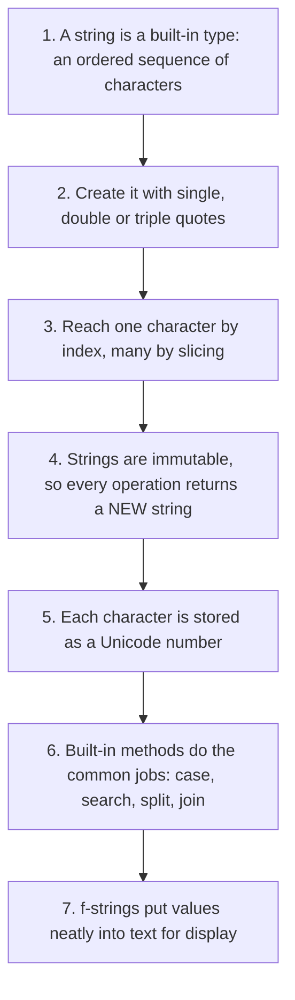

[Back to the Table of Contents](#table-of-contents)

## Part 1: What a String Is

The first five questions build the base. They explain the type itself, how to create one, how characters are numbered, and why a string cannot be changed after it is made.

[Back to the Table of Contents](#table-of-contents)

### Question 1. Strings as an Ordered Sequence Type

**Question 1. Strings: Built-in type, sequence, ordered collection, characteristics. Why are strings called sequence types? Compare briefly with a set.**

**Answer**

A **string** is one of Python's **built-in data types**. A built-in type is one that is provided by the Python language itself, so programmers can use it immediately without importing any module or writing their own implementation.

A string represents a sequence of characters. Each character occupies a definite position within the sequence. Because every character has a fixed position, Python allows us to access any character using its index.

One of the most important properties of a string is that it is an **ordered collection**. In an ordered collection, the arrangement of elements is preserved.

For example,

```python
word = "Python"
```

contains the characters in the following order:

| Index | Character |
| --- | --- |
| 0 | P |
| 1 | y |
| 2 | t |
| 3 | h |
| 4 | o |
| 5 | n |

If we rearrange these characters, `"Python"` becomes `"nohtyP"`, which is an entirely different string. The characters are the same, yet the two strings are not equal.

This is unlike a **set**. The sets

```python
{'a', 'b', 'c'}
```

and

```python
{'c', 'a', 'b'}
```

represent exactly the same set, because sets are **unordered collections**. Python does not remember the order in which you wrote the elements.

**Comparison**

| String | Set |
| --- | --- |
| Ordered collection | Unordered collection |
| Duplicate characters allowed | Duplicate elements removed |
| Indexed | Not indexed |
| Supports slicing | Does not support slicing |
| Immutable | Mutable (normal sets) |

**Why sequence?**

A data type is called a **sequence** when

- every element occupies a definite position,
- elements can be accessed using indexes,
- the order is preserved,
- iteration proceeds from beginning to end.

Strings satisfy all these properties. So do lists and tuples, which is why the three of them share many operations, such as indexing, slicing, `len()` and the `in` test. Python's own documentation groups them together under [Sequence Types](https://docs.python.org/3/library/stdtypes.html#sequence-types-list-tuple-range).

**Example**

```python
# Step 1: Create a string object
s = "Computer"

# Step 2: Read single characters by their position (index)
print("Character at index 0:", s[0])
print("Character at index 3:", s[3])

# Step 3: Ask for the length, that is, the number of characters
print("Length of the string:", len(s))

# Step 4: Visit every character in order
print("Characters in order:")
for ch in s:
    print(ch)

# Step 5: Show that order matters by comparing with a rearranged string
print("Is 'Computer' equal to 'Comptuer'?", "Computer" == "Comptuer")
```

**Output**

```text
Character at index 0: C
Character at index 3: p
Length of the string: 8
Characters in order:
C
o
m
p
u
t
e
r
Is 'Computer' equal to 'Comptuer'? False
```

The loop printed the characters in exactly the order in which they were written. This is the practical meaning of "ordered".

**A small demonstration with a set**

```python
# Step 1: Build a set from the letters of a word
letters = set("banana")
# sorted() is used only so that the letters print in a fixed order,
# because a set itself has no order of its own.
print("Letters kept by the set:", sorted(letters))

# Step 2: Count the elements
# The set keeps only one copy of each letter, so three letters remain
print("Number of elements:", len(letters))

# Step 3: Two sets written in a different order are still equal
print("Are the two sets equal?", {'a', 'b', 'c'} == {'c', 'a', 'b'})

# Step 4: A set does not allow indexing
try:
    print(letters[0])
except TypeError as error:
    print("Indexing a set gives an error:", error)
```

**Output**

```text
Letters kept by the set: ['a', 'b', 'n']
Number of elements: 3
Are the two sets equal? True
Indexing a set gives an error: 'set' object is not subscriptable
```

The word "banana" has six characters, but the set keeps only three. Duplicates are dropped. The script prints the letters through `sorted()` for a reason: if you print the set directly, Python may show the letters in any order, and that order can change from one run to the next. A set simply has no order to show.

**Follow-up questions**

**1.1 Are lists and tuples also sequence types?**

Yes. Lists, tuples, strings and `range` objects are all sequences. They all support indexing, slicing, `len()` and the `in` test. The difference is that a list can be changed after it is made, while a string and a tuple cannot.

**1.2 A string holds characters. Can a set hold characters too?**

It can, as the example above shows. The difference is not what they hold but how they hold it. A set answers only one question quickly: "is this item present?" It does not keep order, it does not keep duplicates and it has no indexes.

**Key points**

- String is a built-in type.
- String is a sequence.
- Strings are ordered collections.
- Characters have fixed positions.
- Strings support indexing and slicing.

[Back to the Table of Contents](#table-of-contents)

### Question 2. Creating Strings With Single, Double and Triple Quotes

**Question 2. Creating strings: Single, double, triple quotes. Multi-line strings vs docstrings. When should each be used?**

**Answer**

Python provides several ways to create string objects. All the following statements create valid strings.

```python
a = 'Python'
b = "Python"
c = '''Python'''
d = """Python"""
```

Although these look different, they all create objects of type `str`. The difference lies mainly in **how they are used** rather than in the object created.

**Single quotes**

Usually used for short strings.

```python
city = 'Delhi'
```

**Double quotes**

Useful when the string itself contains single quotes.

```python
sentence = "It's raining."
```

Without double quotes, the apostrophe would have to be escaped (escape sequences are covered in Question 6).

**Triple quotes**

Triple quotes allow a string to span multiple lines.

```python
address = """
New Delhi
India
110001
"""
```

Everything including newlines becomes part of the string.

**Docstrings**

Triple quotes have another important purpose.

When a triple-quoted string appears as the **first statement** inside a

- module
- class
- function

Python treats it as a **documentation string (docstring)**.

```python
def area(radius):
    """
    Calculates the area of a circle.
    """
    return 3.14159 * radius * radius
```

Many editors and IDEs show this text automatically when you type the function name, so a docstring is the easiest way to explain your own code to others, and to yourself a month later. The accepted style for writing them is described in [PEP 257](https://peps.python.org/pep-0257/).

**Multi-line string vs Docstring**

| Multi-line String | Docstring |
| --- | --- |
| Stores text | Stores documentation |
| Can appear anywhere | Must appear as first statement |
| Used as data | Used by documentation tools |
| Ordinary string | Special documentation convention |

**Example**

```python
# Step 1: Define a function whose first statement is a triple-quoted string
def greet():
    """
    Greets the user.
    """
    print("Hello")

# Step 2: Call the function
# The triple-quoted string is not printed. Only "Hello" appears.
greet()

# Step 3: Read the stored documentation through the __doc__ attribute
print("The docstring says:", greet.__doc__.strip())

# Step 4: A triple-quoted string used as ordinary data, not as documentation
address = """New Delhi
India
110001"""
print("Address stored as one string:")
print(address)

# Step 5: Count the lines to prove that the newlines are part of the string
print("Number of lines in the address:", len(address.split("\n")))
```

**Output**

```text
Hello
The docstring says: Greets the user.
Address stored as one string:
New Delhi
India
110001
Number of lines in the address: 3
```

The docstring was not printed when the function ran. Instead it became the function's documentation, which we read with `greet.__doc__`. The `.strip()` call removes the blank lines and spaces around the sentence, so it prints tidily.

**Which quote should you use?**

| Situation | Suggested quote |
| --- | --- |
| Ordinary short text | Single or double, but stay consistent in one file |
| Text containing an apostrophe, as in `It's` | Double quotes |
| Text containing double quotes, as in `He said "hi"` | Single quotes |
| Text spread over several lines, such as an address or a paragraph | Triple quotes |
| Documentation of a function, class or module | Triple quotes as the first statement |

**Follow-up questions**

**2.1 What happens if a triple-quoted string is not the first statement in a function?**

It becomes an ordinary string. Python builds it, finds that nothing uses it and discards it. The function's `__doc__` stays `None`. So position matters: the docstring must come first, before any code.

**2.2 How can a long line be broken without adding a newline to the string?**

Write the pieces one after another inside brackets. Python joins neighbouring string literals automatically.

```python
# Step 1: Two literals side by side inside brackets are joined into one string
message = (
    "This is one long sentence "
    "written on two lines of the program."
)

# Step 2: Print it and check that there is no newline inside
print(message)
print("Does it contain a newline?", "\n" in message)
```

**Output**

```text
This is one long sentence written on two lines of the program.
Does it contain a newline? False
```

Note the space at the end of the first piece. Without it the two words would run together.

**Key points**

- Single and double quotes create ordinary strings.
- Triple quotes allow multi-line strings.
- Triple quotes also create docstrings.
- Docstrings improve documentation and readability.

[Back to the Table of Contents](#table-of-contents)

### Question 3. The str() Function and String Representation

**Question 3. `str()` and string representation. What is meant by the string representation of an object? Why is `str()` useful?**

**Answer**

In Python, **everything is an object**. Integers, floating-point numbers, Boolean values, lists, tuples, dictionaries, and even functions are objects.

Whenever Python needs to display one of these objects as text, it creates a **string representation** of that object. The built-in function `str()` returns this representation.

For example,

```python
number = 125
text = str(number)
```

Here, `number` is an integer. After applying `str(number)` the result becomes `"125"`, which is a string. The digits look the same on the screen, but the two objects behave very differently: you can multiply the integer, and you can slice the string.

**Examples**

```python
# Step 1: Convert values of different types into their text form
print(str(15))
print(str(3.14))
print(str(True))
print(str(None))
print(str([1, 2, 3]))

# Step 2: Confirm that the result is always a string
print(type(str(15)))

# Step 3: See the difference between a number and its text form
print(15 * 2)         # arithmetic on an integer
print(str(15) * 2)    # repetition of a string
```

**Output**

```text
15
3.14
True
None
[1, 2, 3]
<class 'str'>
30
1515
```

Notice that every object has its own textual representation. Notice also the last two lines. The same `* 2` means "double the number" for an integer and "write it twice" for a string.

**Why is this useful?**

One common application is string concatenation.

```python
age = 25
print("Age = " + str(age))
```

Without conversion, `"Age = " + age` raises a `TypeError`, because Python refuses to join a string with an integer. The script below shows both the error and the two normal ways around it.

```python
# Step 1: Keep an integer in a variable
age = 25

# Step 2: Try to join a string with an integer directly
try:
    print("Age = " + age)
except TypeError as error:
    print("Error message:", error)

# Step 3: Correct way one, convert the number with str()
print("Age = " + str(age))

# Step 4: Correct way two, use an f-string (see Question 16)
print(f"Age = {age}")
```

**Output**

```text
Error message: can only concatenate str (not "int") to str
Age = 25
Age = 25
```

**Common applications**

- displaying numbers
- preparing reports
- writing files
- creating log messages
- building formatted strings

**Summary table**

| Object | `str()` result | Printed as |
| --- | --- | --- |
| `25` | `"25"` | 25 |
| `3.14` | `"3.14"` | 3.14 |
| `True` | `"True"` | True |
| `None` | `"None"` | None |
| `[1, 2]` | `"[1, 2]"` | [1, 2] |

The middle column shows the string that `str()` returns. The last column shows what appears on the screen when you print it, without quotation marks.

**Follow-up questions**

**3.1 Does `print()` call `str()` for us?**

Yes. `print(x)` displays the same text as `print(str(x))`. The conversion is needed only when you join text yourself with `+`, or when you want to keep the text in a variable, slice it or write it to a file.

**3.2 Is `str()` the only way an object can be shown as text?**

No. Python also has `repr()`, which gives a form meant for programmers. The difference is easiest to see with a string that contains a newline.

```python
# Step 1: A string with a newline inside it
text = "Line1\nLine2"

# Step 2: str() gives the friendly form, with the newline acting as a line break
print("str() form:")
print(str(text))

# Step 3: repr() gives the form a programmer would type, with the escape visible
print("repr() form:")
print(repr(text))
```

**Output**

```text
str() form:
Line1
Line2
repr() form:
'Line1\nLine2'
```

`str()` is for the reader of the program's output. `repr()` is for the programmer, which is why it shows the quotes and the `\n`.

**Key points**

- `str()` converts objects into strings.
- Every Python object has a string representation.
- It is widely used for printing and formatting output.

[Back to the Table of Contents](#table-of-contents)

### Question 4. Positive and Negative String Indexing

**Question 4. String indexing: Positive and negative indexing. Why does Python support negative indexing? Explain the indexing rules.**

**Answer**

A string consists of characters arranged sequentially. Each character has a unique position called its **index**.

Python supports two indexing systems.

- Positive indexing
- Negative indexing

Consider

```python
word = "Python"
```

| Character | P | y | t | h | o | n |
| --- | --- | --- | --- | --- | --- | --- |
| Positive index | 0 | 1 | 2 | 3 | 4 | 5 |
| Negative index | -6 | -5 | -4 | -3 | -2 | -1 |

Positive indexing starts from the beginning. Negative indexing starts from the end.

Therefore, `word[-1]` returns `n`, while `word[-2]` returns `o`.

**Why negative indexing?**

Suppose we want the last character. Without negative indexing we must write

```python
word[len(word) - 1]
```

With negative indexing, `word[-1]` is much simpler. This makes many algorithms easier to write, and it removes a common source of off-by-one mistakes.

A second reason is that you often do not know the length of the string. When a filename comes from the user, `name[-4:]` picks up the extension without any counting.

**Rules**

1. First character has index 0.
2. Last character has index -1.
3. Positive indexing proceeds left to right.
4. Negative indexing proceeds right to left.
5. Accessing an invalid index raises `IndexError`.

There is a simple way to convert one system into the other. For a string of length `n`, the negative index `-k` means the same character as the positive index `n - k`. For `"Python"`, whose length is 6, the index `-2` is the same as `6 - 2`, that is, index 4.

**Example**

```python
# Step 1: Create the string
word = "Python"

# Step 2: Read the first character using a positive index
print("word[0] gives:", word[0])

# Step 3: Read the last character using a negative index
print("word[-1] gives:", word[-1])

# Step 4: Show that the two index systems can point to the same character
print("word[4] gives:", word[4])
print("word[-2] gives:", word[-2])
print("Are they the same character?", word[4] == word[-2])

# Step 5: An index outside the string raises IndexError
try:
    print(word[100])
except IndexError as error:
    print("Error message:", error)
```

**Output**

```text
word[0] gives: P
word[-1] gives: n
word[4] gives: o
word[-2] gives: o
Are they the same character? True
Error message: string index out of range
```

The last statement produces an `IndexError`, which is Python's way of saying that no such position exists. Note that the error is caught here with `try` only so that the script can continue. In an ordinary program it would stop the script.

**Diagram**

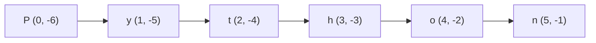

**Follow-up questions**

**4.1 What does a single character returned by indexing look like to Python?**

It is itself a string, of length one. Python has no separate character type.

```python
# Step 1: Take one character out of a string
first = "Python"[0]

# Step 2: Check its type and length
print("Value:", first)
print("Type:", type(first))
print("Length:", len(first))
```

**Output**

```text
Value: P
Type: <class 'str'>
Length: 1
```

**4.2 How can an `IndexError` be avoided?**

Check the length before reading, or use slicing, which never raises this error.

```python
# Step 1: A short string and a position that may not exist
word = "Hi"
position = 5

# Step 2: Check the length before reading the character
if position < len(word):
    print("Character:", word[position])
else:
    print("No character at position", position)

# Step 3: Slicing is safe even when the position does not exist
print("Slicing gives an empty string:", repr(word[position:position + 1]))
```

**Output**

```text
No character at position 5
Slicing gives an empty string: ''
```

**Key points**

- Strings support positive and negative indexing.
- Positive indexing starts at zero.
- Negative indexing starts at minus one.
- Invalid indexes raise `IndexError`.

[Back to the Table of Contents](#table-of-contents)

### Question 5. String Immutability

**Question 5. String immutability. What does immutable mean? Why are Python strings immutable? How can a string be 'modified' if it cannot be changed?**

**Answer**

One of the defining characteristics of Python strings is that they are **immutable**. An [immutable](https://docs.python.org/3/glossary.html#term-immutable) object cannot be changed after it has been created.

Consider

```python
name = "Python"
```

The following statement is illegal.

```python
name[0] = 'J'
```

Python immediately reports a `TypeError`, because individual characters of a string cannot be modified.

Instead of changing the existing string, Python creates a **new string** whenever a modification appears to occur. For example,

```python
name = "Python"
new_name = name.replace("P", "J")
```

Now `name` still contains `Python`, while `new_name` contains `Jython`. The original object has not changed.

**Why make strings immutable?**

Immutability provides several advantages.

- It prevents accidental modification.
- It makes strings safer to share between different parts of a program.
- It simplifies memory management.
- It allows Python to optimize storage and performance.
- It enables strings to be used as dictionary keys because their values cannot change.

The last point deserves a word of explanation. A dictionary finds a key by computing a number from its value. If the value could change later, the dictionary would look in the wrong place and the key would be lost. Only unchangeable objects are therefore allowed as keys.

**Comparison**

| Mutable object | Immutable object |
| --- | --- |
| List | String |
| Dictionary | Tuple |
| Set | Integer |

**Demonstration**

```python
# Step 1: Create a string
text = "Hello"

# Step 2: Try to change one character. This is not allowed.
try:
    text[0] = "J"
except TypeError as error:
    print("Error message:", error)

# Step 3: Call a method that appears to change the string
new_text = text.upper()

# Step 4: Print both objects
print("Original string:", text)
print("Returned string:", new_text)

# Step 5: Compare with a list, which IS allowed to change in place
numbers = [1, 2, 3]
numbers[0] = 99
print("The list after the change:", numbers)
```

**Output**

```text
Error message: 'str' object does not support item assignment
Original string: Hello
Returned string: HELLO
The list after the change: [99, 2, 3]
```

The string refused the change, while the list accepted it. That is the whole difference between mutable and immutable objects.

**How then is a string "modified"?**

By building a new one and, usually, storing it back in the same variable name.

```python
# Step 1: Start with a string
text = "Hello"
print("Before:", text)

# Step 2: Build a new string and give it the SAME name
# The old object is not changed. The name simply now refers to a new object.
text = text.upper()
print("After: ", text)

# Step 3: Another way, build a new string out of pieces
word = "Python"
changed = "J" + word[1:]
print("Original word:", word)
print("Changed word: ", changed)

# Step 4: For heavy character-by-character work, use a list, then join it
letters = list("Python")     # a list of single characters, which CAN be changed
letters[0] = "J"
rebuilt = "".join(letters)
print("Rebuilt from a list:", rebuilt)
```

**Output**

```text
Before: Hello
After:  HELLO
Original word: Python
Changed word:  Jython
Rebuilt from a list: Jython
```

The third method is worth remembering. When a program has to change many characters one by one, converting the string to a list, editing the list and joining it back is both clearer and faster than joining strings again and again.

**Conceptual flow**

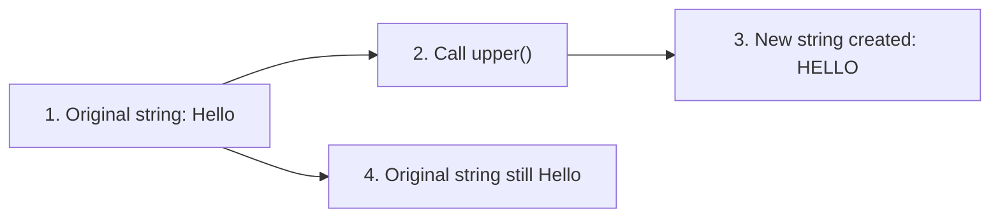

**Follow-up questions**

**5.1 How can I prove that a new object is created?**

Every object has an identity number, which `id()` reports. If the number changes, the object is not the same one.

```python
# Step 1: Create a string
text = "Hello"

# Step 2: Build an upper-case version of it
upper_text = text.upper()

# Step 3: 'is' asks whether the two names point to the very same object
print("Is the returned object the same object?", upper_text is text)

# Step 4: The values are different, so the objects must be different too
print("Value of the original:", text)
print("Value of the new object:", upper_text)
```

**Output**

```text
Is the returned object the same object? False
Value of the original: Hello
Value of the new object: HELLO
```

The word `is` asks a different question from `==`. `==` asks whether two values look the same. `is` asks whether there is only one object with two names. Here the answer is no: `upper()` built a second object and left the first one alone.

**5.2 If strings cannot change, why does `text += "abc"` work?**

Because `+=` does not change the string. It builds a new string from the two pieces and attaches the old name to it. Inside a long loop this is wasteful, since a fresh string is created on every pass. The usual advice is to collect the pieces in a list and call `join()` once at the end.

```python
# Step 1: The slow way, a new string on every pass of the loop
result = ""
for ch in "Python":
    result += ch + "-"
print("Built with +=  :", result)

# Step 2: The better way, collect the pieces and join once
pieces = []
for ch in "Python":
    pieces.append(ch + "-")
print("Built with join:", "".join(pieces))
```

**Output**

```text
Built with +=  : P-y-t-h-o-n-
Built with join: P-y-t-h-o-n-
```

Both give the same answer. For six characters the difference in speed is invisible. For a few hundred thousand, it is not.

**Key points**

- Strings are immutable.
- Characters cannot be changed individually.
- String methods usually return new string objects.
- The original string remains unchanged unless the returned value is assigned to a variable.
- Immutability improves safety, reliability, and efficiency.

[Back to the Table of Contents](#table-of-contents)

## Part 2: Writing Characters That Are Hard to Type

Some characters cannot simply be typed inside a pair of quotes. A newline, a tab and a quotation mark all need special treatment. The next two questions deal with this, and with the situation where you want the special treatment switched off.

[Back to the Table of Contents](#table-of-contents)

### Question 6. Escape Sequences

**Question 6. Escape sequences. Why are they needed? Explain common escape sequences with suitable examples.**

**Answer**

When Python encounters a string enclosed within quotes, it normally treats every character literally. However, some characters such as a **new line**, **tab**, or **quotation mark inside a string** cannot be typed directly without causing ambiguity. To represent such special characters, Python uses **escape sequences**.

An escape sequence always begins with a **backslash (`\`)** followed by another character. The backslash informs the Python interpreter that the following character should receive a special interpretation rather than being treated as an ordinary character.

For example, in the string

```python
print("Hello\nWorld")
```

the sequence `\n` does not represent two characters (`\` and `n`). Instead, it represents a **newline character**, causing the output to appear on two separate lines.

Similarly,

```python
print("Hello\tWorld")
```

uses `\t` to insert a horizontal tab.

Escape sequences make it possible to include otherwise difficult-to-type characters inside string literals while keeping programs readable and portable.

**Common escape sequences**

| Escape sequence | Meaning | Example |
| --- | --- | --- |
| `\\` | Backslash | `"C:\\Users"` |
| `\'` | Single quote | `'It\'s raining'` |
| `\"` | Double quote | `"He said \"Hello\""` |
| `\n` | New line | `"A\nB"` |
| `\t` | Horizontal tab | `"A\tB"` |
| `\r` | Carriage return | `"ABC\rXY"` |
| `\b` | Backspace | `"ABC\bD"` |
| `\uXXXX` | Unicode character | `"\u03A9"` |

**Example**

```python
# Step 1: \n starts a new line
print("First Line\nSecond Line")

# Step 2: \t inserts a tab, which is handy for simple columns
print("Name\tAge")
print("Asha\t19")

# Step 3: \" puts a double quote inside a double-quoted string
print("He said \"Python is easy\"")

# Step 4: A single quote needs no escape inside a double-quoted string
print("It's a beautiful day.")

# Step 5: \\ produces one real backslash, which Windows paths need
print("Folder: C:\\Python\\Scripts")

# Step 6: \u followed by four digits gives a Unicode character
print("Greek capital omega:", "\u03A9")
```

**Output**

```text
First Line
Second Line
Name	Age
Asha	19
He said "Python is easy"
It's a beautiful day.
Folder: C:\Python\Scripts
Greek capital omega: Ω
```

Look closely at Step 5. The program contains two backslashes, but the output has only one. The first backslash is the signal; the second is the character that is actually stored.

**Counting the characters**

A good way to see what is really stored is to count the characters and print the string with `repr()`, which shows the escapes instead of acting on them.

```python
# Step 1: A string with one escape sequence in it
text = "A\tB"

# Step 2: print() acts on the escape and shows a tab
print("Printed form:", text)

# Step 3: repr() shows how the string was written
print("Stored form: ", repr(text))

# Step 4: Count the characters. The tab counts as ONE character.
print("Number of characters:", len(text))

# Step 5: The same check for a backslash
path = "C:\\Users"
print("Printed form:", path)
print("Number of characters:", len(path))
```

**Output**

```text
Printed form: A	B
Stored form:  'A\tB'
Number of characters: 3
Printed form: C:\Users
Number of characters: 8
```

`"A\tB"` has three characters, not four. `"C:\\Users"` has eight, not nine.

**Two sequences that behave oddly on the screen**

`\r` (carriage return) moves the cursor back to the start of the same line, and `\b` (backspace) moves it back by one position. Nothing is deleted from the string itself; only the position of the cursor changes. So what you finally see depends on the terminal you use.

```python
# Step 1: \r sends the cursor back to the start of the line
# The letters XY then overwrite AB on most terminals, leaving XYC
print("ABC\rXY")

# Step 2: \b moves the cursor back by one position
print("ABC\bD")

# Step 3: The strings themselves are untouched. Count their characters.
print("Characters in 'ABC\\rXY':", len("ABC\rXY"))
print("Characters in 'ABC\\bD' :", len("ABC\bD"))
```

**Output on a normal terminal**

```text
XYC
ABD
Characters in 'ABC\rXY': 6
Characters in 'ABC\bD' : 5
```

If you run this inside some editors or notebooks, the first two lines may look different, because those windows handle the cursor in their own way. The character counts, however, are always 6 and 5.

**Why not type the characters directly?**

Many special characters cannot be represented directly inside a string. For example,

```python
print("He said "Hello"")
```

is syntactically incorrect, because Python interprets the second quotation mark as the end of the string. The rest of the line then makes no sense to it.

Instead,

```python
print("He said \"Hello\"")
```

correctly escapes the quotation marks. A second way is to choose the other kind of quote for the outside of the string.

```python
# Step 1: Escape the inner double quotes
print("He said \"Hello\"")

# Step 2: Or wrap the text in single quotes instead, with no escape needed
print('He said "Hello"')

# Step 3: The two strings are exactly the same
print("Are both the same string?", "He said \"Hello\"" == 'He said "Hello"')
```

**Output**

```text
He said "Hello"
He said "Hello"
Are both the same string? True
```

**Flowchart**

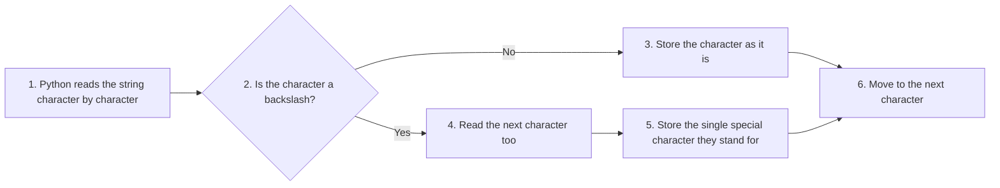

**Common beginner mistakes**

| Mistake | Result |
| --- | --- |
| Forgetting `\` before quotes | SyntaxError |
| Writing Windows paths without escaping `\` | Unexpected escape sequences |
| Assuming `\n` is printed literally | Actually creates a new line |
| Using unknown escape sequences | May produce warnings or incorrect output |

The last row deserves a note. A sequence such as `"\d"` has no meaning in Python. Older versions simply kept both characters. Current versions still keep them, but they also give a `SyntaxWarning`, because such a sequence is almost always a mistake. The safe answer is to write `"\\d"` or to use a raw string, which the next question explains.

**Follow-up questions**

**6.1 How do I print a Windows path such as `C:\new\table`?**

Every backslash must be doubled, or a raw string must be used.

```python
# Step 1: The wrong way. \n and \t are treated as newline and tab.
print("Wrong:", "C:\new\table")

# Step 2: The right way with doubled backslashes
print("Right:", "C:\\new\\table")

# Step 3: The right way with a raw string (Question 7)
print("Right:", r"C:\new\table")
```

**Output**

```text
Wrong: C:
ew	able
Right: C:\new\table
Right: C:\new\table
```

**6.2 Is there an escape sequence for a single space?**

There is none, and none is needed. A space is an ordinary character that you simply type. Escape sequences exist only for characters that cannot be typed, or that would confuse the interpreter.

**Key Points**

- Escape sequences begin with a backslash.
- They represent special characters.
- They improve readability.
- They allow quotation marks and special symbols inside strings.
- They are interpreted by Python before the string is stored.

[Back to the Table of Contents](#table-of-contents)

### Question 7. Raw Strings

**Question 7. Raw strings. Why are they needed? Compare raw strings with ordinary strings. Give typical applications.**

**Answer**

Normally, Python treats every backslash (`\`) inside a string as the beginning of an escape sequence. However, in many practical applications we do **not** want this behaviour. Instead, we want every backslash to be treated as an ordinary character.

A **raw string** solves this problem.

A raw string is created by placing the letter `r` (or `R`) immediately before the opening quotation mark.

```python
path = r"C:\Users\Student\Documents"
```

Here Python stores every backslash exactly as written.

**Ordinary string**

```python
path = "C:\new\test"
```

Python interprets `\n` as a newline and `\t` as a tab. Consequently the string stored in memory is **not** what the programmer intended.

**Raw string**

```python
path = r"C:\new\test"
```

Now every backslash remains unchanged.

**Comparison**

| Ordinary string | Raw string |
| --- | --- |
| Escape sequences interpreted | Escape sequences ignored |
| `\n` becomes newline | `\n` remains two characters |
| `\t` becomes tab | `\t` remains literal |
| Suitable for ordinary text | Suitable for file paths and regular expressions |

**Example**

```python
# Step 1: An ordinary string. Python acts on \n and \t.
normal = "C:\new\test"

# Step 2: A raw string. The r prefix switches that behaviour off.
raw = r"C:\new\test"

# Step 3: Print both and compare
print("Ordinary string:")
print(normal)
print("Raw string:")
print(raw)

# Step 4: Count the characters in each
print("Characters in the ordinary string:", len(normal))
print("Characters in the raw string:     ", len(raw))
```

**Output**

```text
Ordinary string:
C:
ew	est
Raw string:
C:\new\test
Characters in the ordinary string: 9
Characters in the raw string:      11
```

Notice how the ordinary string has been changed, because Python interpreted `\n` and `\t`. The counts explain it: in the ordinary string, `\n` and `\t` are one character each, so nine characters remain. In the raw string both backslashes are kept, which makes eleven.

**What the `r` prefix does not do**

The prefix changes only the way Python reads the text in the program. It does not create a different type of object, and it does not add anything to the string.

```python
# Step 1: Build the same text in two ways
raw = r"a\tb"
ordinary = "a\\tb"

# Step 2: A raw string is an ordinary str object
print("Type of the raw string:", type(raw))

# Step 3: Both hold exactly the same characters
print("Are the two strings equal?", raw == ordinary)
print("Stored form:", repr(raw))
```

**Output**

```text
Type of the raw string: <class 'str'>
Are the two strings equal? True
Stored form: 'a\\tb'
```

`repr()` shows `'a\\tb'` because that is how a programmer would have to type the string without the `r` prefix.

**Typical applications**

Raw strings are commonly used for

- Windows file paths, as in `r"C:\Program Files\Python"`
- Regular expressions, as in `r"\d+\w+"`
- Network paths
- Mathematical patterns, such as LaTeX formulas
- Text containing many backslashes

Regular expressions are the most common use of all. There the backslash has its own meaning, for example `\d` for "any digit", and that meaning must survive untouched into the pattern. You will meet them in the chapter on regular expressions, and the [Python documentation on the `re` module](https://docs.python.org/3/library/re.html) recommends raw strings for exactly this reason.

**Diagram**

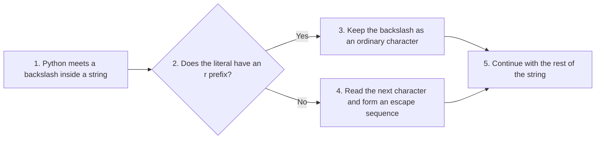

**One limitation worth knowing**

A raw string cannot end with a single backslash. Python still uses the backslash to find the closing quote, so `r"C:\"` is an error.

```python
# Step 1: A raw string that ends with one backslash is not allowed
# The next line, if written without the # sign, causes a SyntaxError:
# path = r"C:\"

# Step 2: Two ways around it. Add the backslash separately...
path_one = r"C:" + "\\"
print("First way: ", path_one)

# Step 3: ...or write the whole thing as an ordinary string
path_two = "C:\\"
print("Second way:", path_two)
print("Are both the same?", path_one == path_two)
```

**Output**

```text
First way:  C:\
Second way: C:\
Are both the same? True
```

**Common beginner mistakes**

| Mistake | Explanation |
| --- | --- |
| Forgetting the `r` prefix | Escape sequences are interpreted |
| Assuming raw strings change the contents | They only change how Python reads the backslashes in the program |
| Using raw strings unnecessarily | Ordinary strings are sufficient in most cases |
| Ending a raw string with one backslash | Causes a SyntaxError |

**Follow-up questions**

**7.1 Can a raw string span several lines?**

Yes. Combine the `r` prefix with triple quotes, as in `r"""..."""`. The backslashes stay literal and the newlines you type become part of the string.

**7.2 Do file paths on Linux and macOS need raw strings?**

No. Those systems separate folders with a forward slash, as in `/home/student/notes.txt`, and the forward slash has no special meaning in a string. Windows paths are the problem case. A useful point to remember is that Python on Windows also accepts forward slashes in most file operations, so `"C:/Python/Scripts"` works and needs no escaping at all.

**Key Points**

- Raw strings begin with `r`.
- Backslashes lose their special meaning.
- Widely used for Windows paths and regular expressions.
- Improve readability.
- Prevent accidental escape sequence interpretation.

[Back to the Table of Contents](#table-of-contents)

## Part 3: Working Through a String

The next three questions are about doing something with the characters: visiting them one by one, joining and testing whole strings, and cutting out the pieces you need.

[Back to the Table of Contents](#table-of-contents)

### Question 8. Traversing a String With for and while

**Question 8. String traversal. Compare for loop and while loop traversal. When should each be preferred?**

**Answer**

**Traversing** a string means visiting each character in the string one after another.

Traversal is one of the most common operations performed on strings. Many algorithms such as searching, counting vowels, checking palindromes, encryption, validation, and frequency analysis require examining each character individually.

Python provides two common methods of traversal.

- `for` loop
- `while` loop

**Method 1, the for loop**

The `for` loop is the most natural and Pythonic way to traverse a string.

```python
# Step 1: Create the string
message = "Python"

# Step 2: Let the for loop hand over one character at a time
for ch in message:
    print(ch)
```

**Output**

```text
P
y
t
h
o
n
```

Python automatically extracts each character. No index variable is needed.

**Method 2, the while loop**

The `while` loop traverses using indexes.

```python
# Step 1: Create the string
message = "Python"

# Step 2: Start a counter at the first index
i = 0

# Step 3: Repeat while the counter is still inside the string
while i < len(message):
    print(i, message[i])
    # Step 4: Move the counter forward. Forgetting this line causes
    # an endless loop, because the condition never becomes false.
    i += 1
```

**Output**

```text
0 P
1 y
2 t
3 h
4 o
5 n
```

Here the programmer manually controls the index, which is why the index could also be printed.

**A third way, when you need both the index and the character**

Python has a built-in function called `enumerate()` that gives both at once. It is the usual answer when a `for` loop is wanted but the position is also needed.

```python
# Step 1: enumerate() hands over a pair: the position and the character
for position, ch in enumerate("Python"):
    print(position, ch)
```

**Output**

```text
0 P
1 y
2 t
3 h
4 o
5 n
```

**Comparison**

| Feature | `for` loop | `while` loop |
| --- | --- | --- |
| Simplicity | Very simple | More complex |
| Index available automatically | No, unless `enumerate()` is used | Yes |
| Risk of infinite loop | None | Possible |
| Manual counter required | No | Yes |
| Preferred for normal traversal | Yes | No |
| Best for skipping or jumping indexes | Limited | Excellent |

**When should each be used?**

Use a **for loop** when

- simply printing characters
- counting vowels
- searching
- computing frequencies

Use a **while loop** when

- indexes are important
- adjacent characters must be compared
- skipping characters dynamically
- implementing certain algorithms

For example, palindrome algorithms often compare `s[i]` with `s[-(i + 1)]`, which naturally uses indexes. Question 17 works through such an algorithm in full.

**Example: counting the vowels**

```python
# Step 1: The text to be examined
text = "Programming"

# Step 2: A counter that starts at zero
count = 0

# Step 3: Visit every character
for ch in text:
    # Step 4: lower() makes the test work for capital letters too.
    # The 'in' test asks whether the character is one of the five vowels.
    if ch.lower() in "aeiou":
        count += 1

# Step 5: Report the result
print("Text examined:", text)
print("Number of vowels:", count)
```

**Output**

```text
Text examined: Programming
Number of vowels: 3
```

The same algorithm can also be implemented using a `while` loop. Here it is, side by side, so that the two styles can be compared.

```python
# Step 1: The same text and counter
text = "Programming"
count = 0

# Step 2: An index to walk through the string
i = 0

# Step 3: Repeat while the index is inside the string
while i < len(text):
    # Step 4: Fetch the character at this position, then test it
    if text[i].lower() in "aeiou":
        count += 1
    # Step 5: Move to the next position
    i += 1

print("Number of vowels found with the while loop:", count)
```

**Output**

```text
Number of vowels found with the while loop: 3
```

Both loops give 3. The `for` loop is shorter, so it is the better choice here.

**Flowchart**

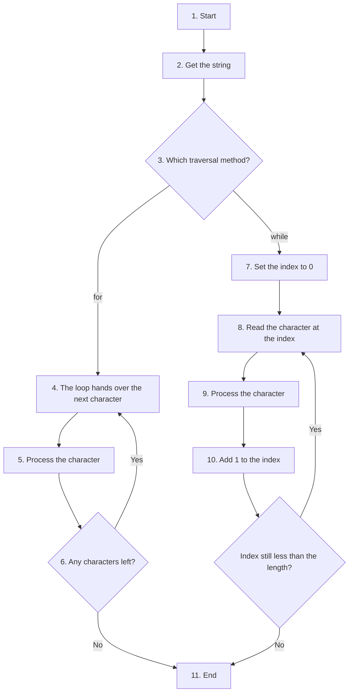

**Common beginner mistakes**

| Mistake | Consequence |
| --- | --- |
| Forgetting `i += 1` | Infinite loop |
| Using `while i <= len(s)` | IndexError |
| Confusing character with index | Incorrect logic |
| Using `while` when `for` is sufficient | More complicated code |

The second row is worth testing once, so that the error becomes familiar.

```python
# Step 1: A short string
s = "Hi"

# Step 2: The condition uses <= by mistake, so the loop goes one step too far
i = 0
try:
    while i <= len(s):
        print("Reading index", i, "gives", s[i])
        i += 1
except IndexError as error:
    print("Error at index", i, ":", error)
```

**Output**

```text
Reading index 0 gives H
Reading index 1 gives i
Error at index 2 : string index out of range
```

The valid indexes of a two-character string are 0 and 1. The condition must therefore be `i < len(s)`, not `i <= len(s)`.

**Follow-up questions**

**8.1 How do I walk through a string backwards?**

Either use a negative step in a slice, or count down with `range()`.

```python
# Step 1: A slice with a step of -1 gives the characters in reverse
for ch in "Python"[::-1]:
    print(ch, end=" ")
print()

# Step 2: The same with an index that counts down
# range(5, -1, -1) produces 5, 4, 3, 2, 1, 0
word = "Python"
for i in range(len(word) - 1, -1, -1):
    print(word[i], end=" ")
print()
```

**Output**

```text
n o h t y P 
n o h t y P 
```

The `end=" "` argument tells `print()` to finish with a space instead of a newline, which keeps the letters on one line. The bare `print()` afterwards moves to the next line.

**8.2 Can I traverse a string without a loop at all?**

Often yes, because a method or a built-in function already does the loop for you. Counting vowels, for example, can be done in one line with a comprehension.

```python
# Step 1: The comprehension builds a list of 1 for every vowel found
text = "Programming"
count = sum(1 for ch in text.lower() if ch in "aeiou")
print("Vowels counted in one line:", count)
```

**Output**

```text
Vowels counted in one line: 3
```

This is shorter, but the explicit loop is easier to follow while you are learning. Write the loop first; move to the short form once the logic is clear to you.

**Key Points**

- Traversal means visiting every character.
- `for` loops are the preferred Pythonic approach.
- `while` loops provide greater control.
- Index-based traversal is useful for algorithms requiring character positions.
- Both techniques ultimately examine the same sequence but offer different levels of control.

[Back to the Table of Contents](#table-of-contents)

### Question 9. Concatenation, Repetition and Membership

**Question 9. String operations. Explain concatenation, repetition, membership (in, not in). Distinguish between creating new strings and modifying existing ones.**

**Answer**

Python supports several built-in operators that work directly with strings. Unlike arithmetic operators, these operators manipulate textual data. Since strings are **immutable**, none of these operations modify the original string. Instead, every operation produces a **new string** or a **Boolean result**.

The most frequently used string operators are:

- Concatenation (`+`)
- Repetition (`*`)
- Membership (`in`)
- Non-membership (`not in`)

Understanding these operators is essential because they form the basis of many text-processing algorithms.

**1. Concatenation (`+`)**

The `+` operator joins two or more strings together.

```python
# Step 1: Two separate strings
first = "Hello"
second = "World"

# Step 2: Join them with a space in between
result = first + " " + second
print(result)

# Step 3: The two original strings are unchanged
print("first is still:", first)
print("second is still:", second)
```

**Output**

```text
Hello World
first is still: Hello
second is still: World
```

Notice that neither `first` nor `second` changes. Python creates an entirely **new string** called `result`.

**2. Repetition (`*`)**

The `*` operator repeats a string a given number of times.

```python
# Step 1: A line of stars, useful as a separator
print("*" * 20)

# Step 2: A word repeated three times
print("Hi " * 3)

# Step 3: Repetition by zero or a negative number gives an empty string
print("Empty:", repr("Hi" * 0))
```

**Output**

```text
********************
Hi Hi Hi 
Empty: ''
```

This operator is commonly used for decorative separators, menus, reports, and test data. Note the trailing space in `Hi Hi Hi `, because the space was part of the repeated text.

**3. Membership (`in`)**

The `in` operator checks whether a character or substring exists inside another string.

```python
# Step 1: The string to search in
language = "Python"

# Step 2: Look for a substring that is present
print("th" in language)

# Step 3: Look for one that is not
print("Java" in language)

# Step 4: The test is case-sensitive
print("python" in language)
```

**Output**

```text
True
False
False
```

The operator returns a Boolean value, that is, either `True` or `False`.

**4. Non-membership (`not in`)**

The opposite test uses `not in`.

```python
language = "Python"
print("Java" not in language)
```

**Output**

```text
True
```

**Summary Table**

| Operator | Purpose | Returns |
| --- | --- | --- |
| `+` | Concatenation | New string |
| `*` | Repetition | New string |
| `in` | Membership test | True or False |
| `not in` | Non-membership test | True or False |

**Do these operators modify the original string?**

No. This is an important consequence of **immutability**.

```python
# Step 1: An original string
s = "Python"

# Step 2: Build a longer string from it
t = s + " Programming"

# Step 3: Print both. The first one has not changed.
print(s)
print(t)
```

**Output**

```text
Python
Python Programming
```

The original string remains unchanged.

**A common error and its two fixes**

`+` joins a string to another string only. Mixing types raises a `TypeError`.

```python
# Step 1: A string and a number
label = "Total: "
amount = 250

# Step 2: Joining them directly is not allowed
try:
    print(label + amount)
except TypeError as error:
    print("Error message:", error)

# Step 3: Fix one, convert the number with str()
print(label + str(amount))

# Step 4: Fix two, use an f-string
print(f"{label}{amount}")
```

**Output**

```text
Error message: can only concatenate str (not "int") to str
Total: 250
Total: 250
```

**Real-world applications**

Concatenation is commonly used for

- building messages
- generating filenames
- creating URLs
- constructing reports

Repetition is useful for

- menus
- decorative borders
- repeated patterns
- testing

Membership testing is used for

- searching keywords
- validating input
- checking file extensions
- detecting prohibited words

Here is a small script that puts all three to work.

```python
# Step 1: Build a heading with repetition and concatenation
title = "Student Report"
line = "-" * len(title)
print(line)
print(title)
print(line)

# Step 2: Use a membership test to check a file name
filename = "marks.csv"
if ".csv" in filename:
    print(filename, "looks like a comma separated file")

# Step 3: Use a membership test on a list of banned words
message = "please send the details"
banned = ["spam", "offer"]
found = False
for word in banned:
    if word in message:
        found = True
print("Does the message contain a banned word?", found)
```

**Output**

```text
--------------
Student Report
--------------
marks.csv looks like a comma separated file
Does the message contain a banned word? False
```

**Flowchart**

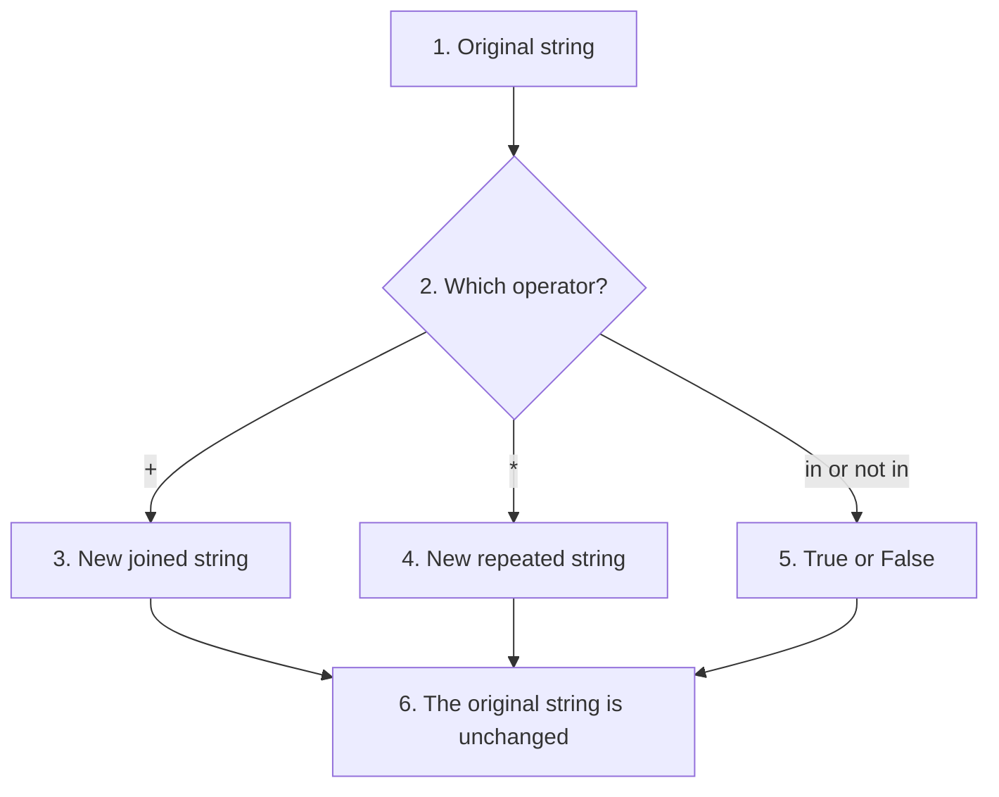

**Common beginner mistakes**

| Mistake | Explanation |
| --- | --- |
| Concatenating a string with an integer | Use `str()` or an f-string |
| Expecting `+` to modify the original string | It returns a new string |
| Confusing `in` with equality (`==`) | `in` searches for containment, not equality |
| Forgetting spaces while concatenating | `"Hello" + "World"` becomes `"HelloWorld"` |

**Follow-up questions**

**9.1 Is `in` the same as `find()`?**

They answer related questions. `in` answers "is it there?" and gives `True` or `False`. `find()` answers "where is it?" and gives a position, or `-1` if the substring is absent. Use `in` for a plain test, `find()` when you need the position. Question 14 covers `find()`.

**9.2 What does `"a" * 2.5` do?**

It raises a `TypeError`. The count must be a whole number, because a string cannot be repeated two and a half times.

```python
try:
    print("a" * 2.5)
except TypeError as error:
    print("Error message:", error)
```

**Output**

```text
Error message: can't multiply sequence by non-int of type 'float'
```

**Key Points**

- String operators never modify the original string.
- `+` joins strings.
- `*` repeats strings.
- `in` and `not in` perform membership tests.
- Every operation either creates a new string or returns a Boolean value.

[Back to the Table of Contents](#table-of-contents)

### Question 10. String Slicing

**Question 10. String slicing. Explain slicing syntax, omitted indices, negative slicing, step value, reversing a string, and common mistakes.**

**Answer**

**Slicing** is one of Python's most powerful sequence operations. It allows a programmer to extract a portion of a string without modifying the original string.

The general syntax is

```python
string[start : stop : step]
```

All three components are optional.

**Components of slicing**

**Start**

The index from which extraction begins. The character at this index **is** included.

**Stop**

The position where extraction ends. The character at this index is **excluded**.

**Step**

Determines how many positions Python moves after selecting each character. The default value is `1`.

A useful way to remember the rule about `stop` is this: the number of characters you get from `s[a:b]` is simply `b - a`, when both numbers lie inside the string. So `s[0:7]` gives exactly seven characters.

**Basic example**

```python
# Step 1: The string to work on
word = "Programming"

# Step 2: Take characters from index 0 up to, but not including, index 7
print(word[0:7])

# Step 3: Count them to confirm the rule
print("Number of characters taken:", len(word[0:7]))
```

**Output**

```text
Program
Number of characters taken: 7
```

Python extracts characters beginning at index 0 and stops before index 7.

**Omitting parameters**

Python supplies default values whenever a parameter is omitted.

```python
# Step 1: The string
word = "Programming"

# Step 2: No start, so begin at the beginning
print(word[:7])

# Step 3: No stop, so continue to the end
print(word[3:])

# Step 4: Neither, so take the whole string
print(word[:])

# Step 5: A step of 2, so take every second character
print(word[::2])
```

**Output**

```text
Program
gramming
Programming
Pormig
```

**Default values**

| Slice | Meaning |
| --- | --- |
| `[:stop]` | Start from beginning |
| `[start:]` | Continue until end |
| `[:]` | Copy entire string |
| `[::step]` | Traverse using given step |

**Negative indices**

Negative indexing counts from the end.

```python
text = "Python"
print(text[-4:-1])
```

**Output**

```text
tho
```

Negative slicing is especially useful when working near the end of long strings. Note that `-1` as the stop value excludes the last character, exactly as any stop value does.

**Negative step**

A negative step moves through the string in the reverse direction. The most famous example is

```python
text = "Python"
print(text[::-1])
```

**Output**

```text
nohtyP
```

Here

- `start` defaults to the last character,
- `stop` defaults to before the first character,
- `step` is `-1`.

Python therefore visits every character from right to left.

**How Python processes a slice**

For `text[2:9:2]` Python

1. Starts at index 2.
2. Selects the character found there.
3. Moves forward two positions.
4. Repeats until the stop index is reached or passed.

**Flowchart**

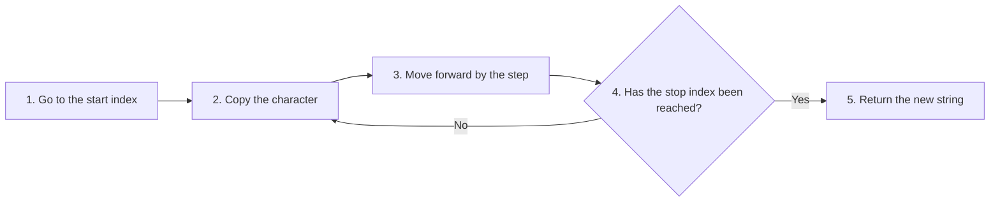

**Examples**

```python
# Step 1: A string whose characters are easy to follow
text = "ABCDEFGHIJ"

# Step 2: A plain slice
print(text[2:8])

# Step 3: The same slice with a step of 2
print(text[2:8:2])

# Step 4: The whole string reversed
print(text[::-1])

# Step 5: Every third character
print(text[::3])

# Step 6: A slice given with negative indices
print(text[-5:-1])
```

**Output**

```text
CDEFGH
CEG
JIHGFEDCBA
ADGJ
FGHI
```

**Why slicing is useful**

Slicing is widely used for

- extracting file extensions
- processing substrings
- reversing strings
- implementing palindrome algorithms
- parsing fixed-format records
- selecting alternate characters

For example,

```python
filename = "report.pdf"
extension = filename[-4:]
print(extension)
```

**Output**

```text
.pdf
```

This returns `.pdf` without requiring loops. A more reliable way for real programs is to search for the last dot, because not every extension has three letters.

```python
# Step 1: Two file names with extensions of different lengths
names = ["report.pdf", "archive.tar.gz", "notes.markdown"]

# Step 2: For each name, find the last dot and slice from there
for name in names:
    position = name.rfind(".")       # rfind() searches from the right
    print(name, "-> extension", name[position:])
```

**Output**

```text
report.pdf -> extension .pdf
archive.tar.gz -> extension .gz
notes.markdown -> extension .markdown
```

**Slicing is forgiving**

Unlike indexing, slicing never raises an `IndexError`. If the numbers lie outside the string, Python simply gives back as much as it can, even if that is nothing at all.

```python
# Step 1: A short string
word = "Python"

# Step 2: A stop value far beyond the end is not an error
print("word[2:100] gives:", word[2:100])

# Step 3: A start beyond the end gives an empty string
print("word[50:60] gives:", repr(word[50:60]))

# Step 4: A start after the stop also gives an empty string
print("word[4:2] gives:  ", repr(word[4:2]))
```

**Output**

```text
word[2:100] gives: thon
word[50:60] gives: ''
word[4:2] gives:   ''
```

**Common beginner mistakes**

| Mistake | Explanation |
| --- | --- |
| Assuming the stop index is included | Python excludes the stop index |
| Confusing index with length | The last positive index is `len(s) - 1` |
| Using incorrect negative indices | Count backward carefully |
| Forgetting the step value | The default step is 1 |
| Assuming slicing modifies the original string | It always creates a new string |
| Writing `s[4:2]` and expecting characters | A forward slice needs start before stop |

**Slicing Summary Table**

| Expression | Meaning |
| --- | --- |
| `s[:]` | Complete copy |
| `s[:5]` | First five characters |
| `s[5:]` | Characters from index 5 onward |
| `s[::2]` | Every second character |
| `s[::-1]` | Reverse the string |
| `s[-3:]` | Last three characters |
| `s[:-1]` | All except the last character |
| `s[1:-1]` | Exclude first and last characters |

**Relationship with Immutability**

It is important to remember that slicing **never changes** the original string.

```python
text = "Python"
copy = text[2:5]
print(text)
print(copy)
```

**Output**

```text
Python
tho
```

The original string remains unchanged because slicing creates a **new string object**.

**Follow-up questions**

**10.1 How do I remove the first and last characters of a string?**

Use `s[1:-1]`. The slice starts at the second character and stops before the last one.

```python
# Step 1: A string wrapped in brackets
text = "(Python)"

# Step 2: Drop the first and the last character
print("Inside the brackets:", text[1:-1])

# Step 3: The same idea removes a quotation mark on each side
quoted = '"Hello"'
print("Without the quotes:", quoted[1:-1])
```

**Output**

```text
Inside the brackets: Python
Without the quotes: Hello
```

**10.2 How do I take every second character starting from the second one?**

Give both a start and a step, as in `s[1::2]`.

```python
# Step 1: A string with numbered positions in mind
text = "ABCDEFGH"

# Step 2: Start at index 0 and step by 2
print("Even positions:", text[::2])

# Step 3: Start at index 1 and step by 2
print("Odd positions: ", text[1::2])
```

**Output**

```text
Even positions: ACEG
Odd positions:  BDFH
```

**Key Points**

- Slicing extracts part of a string using the syntax `string[start:stop:step]`.
- The **start index is included**, but the **stop index is excluded**.
- Omitting indices causes Python to use sensible defaults.
- A negative step traverses the string in reverse order.
- The expression `s[::-1]` is a concise and Pythonic way to reverse a string.
- Slicing always returns a **new string**, preserving the immutability of the original string.

[Back to the Table of Contents](#table-of-contents)

## Part 4: Characters, Comparison, Methods and Formatting

Behind every character there is a number. The next six questions start from that number, then move on to comparing strings, using the methods of the `str` class, validating input, and printing results neatly.

[Back to the Table of Contents](#table-of-contents)

### Question 11. ASCII, Unicode, ord() and chr()

**Question 11. ASCII, Unicode, `ord()`, `chr()`. Relationship? Why did Unicode replace ASCII? Explain with examples.**

**Answer**

Computers ultimately store and process everything as binary numbers. Therefore, before a computer can store a character such as `'A'`, `'7'`, or `'₹'`, it must assign a unique numeric value to that character. This mapping between characters and numbers is called a **character encoding**.

Over the years, two important encoding standards have been widely used:

- ASCII (American Standard Code for Information Interchange)
- Unicode

Unicode was developed to overcome the limitations of ASCII and has become the worldwide standard for representing text in modern computer systems.

**ASCII**

ASCII is one of the earliest character encoding standards. It represents each character using **7 bits**, allowing only **128 unique characters**.

These include

- English uppercase letters
- English lowercase letters
- Digits
- Common punctuation symbols
- Control characters

For example

| Character | ASCII code |
| --- | --- |
| A | 65 |
| B | 66 |
| a | 97 |
| 0 | 48 |
| ! | 33 |

Two patterns in this table are worth noticing. The letters are numbered in alphabetical order, so `B` follows `A`. And the small letters begin 32 places after the capitals, since `a` is 97 while `A` is 65. Both facts are used later, in Question 12 on comparison.

ASCII worked well for English but could not represent characters from most other languages.

**Why ASCII became insufficient**

As computers spread around the world, people needed to represent

- Hindi
- Chinese
- Arabic
- Japanese
- Tamil
- Russian
- Mathematical symbols
- Currency symbols
- Emojis

ASCII simply did not have enough available codes. For example, the characters ₹, Ω, 你, अ and 😀 cannot be represented using standard ASCII.

**Unicode**

Unicode was designed to represent characters from **almost every writing system used in the world**. Instead of supporting only 128 characters, Unicode currently defines well over one million possible code points, with more than 150,000 characters assigned.

Every character receives a unique **Unicode code point**. A code point is usually written in the form `U+` followed by a hexadecimal number, which is a number written in base 16.

| Character | Unicode code point | Same number in decimal |
| --- | --- | --- |
| A | U+0041 | 65 |
| ₹ | U+20B9 | 8377 |
| Ω | U+03A9 | 937 |
| अ | U+0905 | 2309 |
| 😀 | U+1F600 | 128512 |

Python 3 uses Unicode internally for all strings, which is why a variable can hold Hindi text or an emoji as easily as English text. The first 128 code points of Unicode are exactly the ASCII codes, so ASCII did not disappear; it became a small part of Unicode.

**The ord() function**

The built-in function `ord(character)` returns the Unicode code point of a character.

```python
print(ord("A"))
print(ord("₹"))
print(ord("Ω"))
```

**Output**

```text
65
8377
937
```

**The chr() function**

The function `chr(number)` performs the opposite conversion. It converts a Unicode code point into its corresponding character.

```python
print(chr(65))
print(chr(8377))
print(chr(937))
```

**Output**

```text
A
₹
Ω
```

Thus,

- `ord()` converts **character to integer**,
- `chr()` converts **integer to character**.

**Relationship**

These functions are inverses of each other. Applying one and then the other brings you back to where you started.

```python
# Step 1: Start with a character and go round the circle
x = "P"
print("chr(ord('P')) gives:", chr(ord(x)))

# Step 2: Start with a number instead
n = 9731
print("ord(chr(9731)) gives:", ord(chr(n)))

# Step 3: See which character that number stands for
print("The character at 9731 is:", chr(n))
```

**Output**

```text
chr(ord('P')) gives: P
ord(chr(9731)) gives: 9731
The character at 9731 is: ☃
```

**Flowchart**

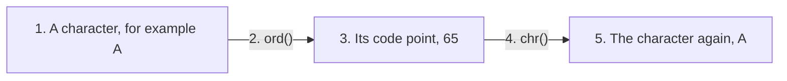

**Practical applications**

`ord()` and `chr()` are useful in

- encryption algorithms
- text processing
- custom sorting
- character arithmetic
- encoding and decoding
- generating alphabets programmatically

**Example: printing the alphabet**

```python
# Step 1: Walk through the code points from A to Z
# ord('Z') + 1 is used because range() stops one short of its second number.
for code in range(ord("A"), ord("Z") + 1):
    print(chr(code), end=" ")
print()
```

**Output**

```text
A B C D E F G H I J K L M N O P Q R S T U V W X Y Z 
```

**Example: a simple Caesar shift**

This is the classic use of character arithmetic. Each letter is replaced by the letter a fixed number of places further on in the alphabet.

```python
# Step 1: The message and the shift
message = "PYTHON"
shift = 3

# Step 2: Build the coded message one character at a time
coded = ""
for ch in message:
    # Step 3: Find the position of the letter in the alphabet, 0 for A
    position = ord(ch) - ord("A")
    # Step 4: Move it forward, wrapping round with % 26 after Z
    new_position = (position + shift) % 26
    # Step 5: Turn the new position back into a letter
    coded += chr(new_position + ord("A"))

print("Original message:", message)
print("Coded message:   ", coded)

# Step 6: Shifting back by the same amount recovers the original
decoded = ""
for ch in coded:
    position = ord(ch) - ord("A")
    decoded += chr((position - shift) % 26 + ord("A"))
print("Decoded message: ", decoded)
```

**Output**

```text
Original message: PYTHON
Coded message:    SBWKRQ
Decoded message:  PYTHON
```

The `%` operator gives the remainder after division. Here `% 26` makes the alphabet circular, so that `Y` and `Z` move round to `B` and `C` instead of running past `Z`.

**Comparison Table**

| Feature | ASCII | Unicode |
| --- | --- | --- |
| Characters supported | 128 | Over one million possible code points |
| Languages | Mostly English | Almost all languages |
| Emoji support | No | Yes |
| Currency symbols | Very limited | Extensive |
| Used by Python 3 | Only as a subset | Yes |

If you want to look up a character and its code point, the [Unicode character table](https://home.unicode.org/) and the [Python documentation on the `unicodedata` module](https://docs.python.org/3/library/unicodedata.html) are good starting points. The `unicodedata` module can even tell you a character's official name.

```python
# Step 1: Import the module that knows the official Unicode names
import unicodedata

# Step 2: Ask for the name of a few characters
for ch in ["A", "₹", "Ω", "☃"]:
    print(ch, "->", unicodedata.name(ch))
```

**Output**

```text
A -> LATIN CAPITAL LETTER A
₹ -> INDIAN RUPEE SIGN
Ω -> GREEK CAPITAL LETTER OMEGA
☃ -> SNOWMAN
```

**Common beginner mistakes**

| Mistake | Explanation |
| --- | --- |
| Thinking ASCII and Unicode are identical | ASCII is only a small subset of Unicode |
| Using `ord()` on more than one character | `ord()` accepts exactly one character |
| Passing an integer to `ord()` | It expects a string of length one |
| Passing a string to `chr()` | It expects an integer |

Here are the last three mistakes, shown as errors, so that the messages become familiar.

```python
# Step 1: ord() with two characters is not allowed
try:
    ord("AB")
except TypeError as error:
    print("ord('AB'):", error)

# Step 2: ord() with an integer is not allowed
try:
    ord(65)
except TypeError as error:
    print("ord(65):", error)

# Step 3: chr() with a string is not allowed
try:
    chr("65")
except TypeError as error:
    print("chr('65'):", error)
```

**Output**

```text
ord('AB'): ord() expected a character, but string of length 2 found
ord(65): ord() expected string of length 1, but int found
chr('65'): 'str' object cannot be interpreted as an integer
```

**Follow-up questions**

**11.1 How do I convert a whole string into a list of code points?**

Apply `ord()` to each character with a loop or a comprehension.

```python
# Step 1: A short word
word = "Hi!"

# Step 2: Build the list of code points
codes = [ord(ch) for ch in word]
print("Characters:", list(word))
print("Code points:", codes)

# Step 3: Build the word back from the numbers
print("Rebuilt word:", "".join(chr(code) for code in codes))
```

**Output**

```text
Characters: ['H', 'i', '!']
Code points: [72, 105, 33]
Rebuilt word: Hi!
```

**11.2 Is UTF-8 the same as Unicode?**

Not quite, and the difference is worth knowing. Unicode decides which number belongs to which character. UTF-8 is one of the ways of writing those numbers as bytes in a file. Python keeps strings as Unicode in memory, and encodes them, usually as UTF-8, when writing to a file.

```python
# Step 1: A string with one English and one Hindi character
text = "Aअ"

# Step 2: Count the characters
print("Number of characters:", len(text))

# Step 3: Turn it into bytes using UTF-8 and count those
data = text.encode("utf-8")
print("Number of bytes in UTF-8:", len(data))
print("The bytes themselves:", data)
```

**Output**

```text
Number of characters: 2
Number of bytes in UTF-8: 4
The bytes themselves: b'A\xe0\xa4\x85'
```

Two characters became four bytes: one byte for `A` and three for `अ`. UTF-8 uses more bytes for characters with larger code points.

**Key Points**

- ASCII is an older encoding standard with only 128 characters.
- Unicode supports nearly all writing systems.
- Python strings are Unicode strings.
- `ord()` returns the Unicode code point.
- `chr()` converts a code point back into a character.

[Back to the Table of Contents](#table-of-contents)

### Question 12. Comparing Strings

**Question 12. String comparison. Equality vs lexicographical comparison. Role of Unicode values. Why is comparison case-sensitive?**

**Answer**

Python allows strings to be compared using the comparison operators `==`, `!=`, `<`, `<=`, `>` and `>=`. These comparisons are based on the Unicode values of individual characters.

There are two different kinds of comparison.

**Equality comparison**

The operator `==` checks whether two strings contain exactly the same sequence of characters.

```python
print("Python" == "Python")
print("Python" == "python")
```

**Output**

```text
True
False
```

Notice that uppercase `P` and lowercase `p` have different Unicode values.

**Lexicographical comparison**

The operators `<`, `>`, `<=` and `>=` perform dictionary-style comparisons. Python compares the strings character by character.

Suppose we have `"Apple"` and `"Application"`. The first four characters match. The comparison continues until a difference is found: at the fifth character, `e` meets `c`, and since `c` comes earlier, `"Application"` is the smaller string.

If one string ends first and everything up to that point matches, the shorter string is considered smaller. So `"Apple"` is less than `"Apples"`.

**Unicode ordering**

Python actually compares Unicode code points.

```python
print(ord("A"))
print(ord("a"))
```

**Output**

```text
65
97
```

Since `65 < 97`, Python concludes that `"A" < "a"` is `True`.

**Example**

```python
# Step 1: Ordinary dictionary order, both words in the same case
print("Apple < Banana :", "Apple" < "Banana")

# Step 2: Comparison stops at the first difference
print("Zoo > Apple    :", "Zoo" > "Apple")

# Step 3: A small letter counts as greater than a capital letter
print("cat > Car      :", "cat" > "Car")

# Step 4: When one word is a beginning of the other, the shorter one is smaller
print("Apple < Apples :", "Apple" < "Apples")

# Step 5: The reason for line 3, in numbers
print("ord('c') =", ord("c"), "and ord('C') =", ord("C"))
```

**Output**

```text
Apple < Banana : True
Zoo > Apple    : True
cat > Car      : True
Apple < Apples : True
ord('c') = 99 and ord('C') = 67
```

The third line surprises most beginners. In a dictionary, "Car" would come before "cat" only because of the letters, and case would be ignored. Python is stricter: it compares the first characters, `c` and `C`, finds 99 against 67, and decides at once.

**Why is comparison case-sensitive?**

Uppercase and lowercase letters occupy different Unicode positions. Python compares positions, not meanings, so `"Python" == "python"` returns `False`.

This is the right default. A password check must be case-sensitive, and so must a comparison of two file names on most systems. When you do want case to be ignored, you have to say so.

**Case-insensitive comparison**

Convert both strings to the same case before comparing.

```python
# Step 1: Two spellings of the same word
name1 = "Python"
name2 = "python"

# Step 2: A direct comparison says they are different
print("Direct comparison:", name1 == name2)

# Step 3: Bring both to lower case, then compare
print("After lower():   ", name1.lower() == name2.lower())

# Step 4: Sorting a list of names is also case-sensitive by default
names = ["banana", "Apple", "cherry"]
print("Plain sort:      ", sorted(names))

# Step 5: A key tells sorted() to ignore case
print("Case-free sort:  ", sorted(names, key=str.lower))
```

**Output**

```text
Direct comparison: False
After lower():    True
Plain sort:       ['Apple', 'banana', 'cherry']
Case-free sort:   ['Apple', 'banana', 'cherry']
```

In this example both sorts happen to agree. Change `"Apple"` to `"apple"` and `"banana"` to `"Banana"`, and the two results will differ, because all capitals sort before all small letters.

**Flowchart**

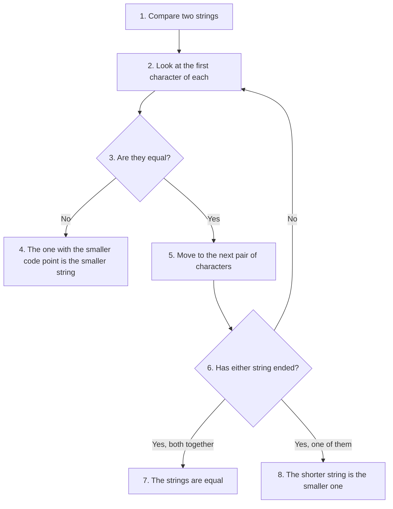

**Common beginner mistakes**

| Mistake | Explanation |
| --- | --- |
| Assuming dictionary order ignores case | Python compares Unicode values |
| Confusing equality with containment | `"Py"` is not equal to `"Python"` |
| Using `is` instead of `==` | `is` checks identity, not value |

The third mistake is the most troublesome, because `is` sometimes appears to work.

```python
# Step 1: Two equal strings written directly in the program
a = "Python"
b = "Python"
print("a == b:", a == b)
print("a is b:", a is b)

# Step 2: The same value, but built while the program runs
c = "Py" + "thon"
d = "".join(["Py", "thon"])
print("c == d:", c == d)
print("c is d:", c is d)
```

**Output**

```text
a == b: True
a is b: True
c == d: True
c is d: False
```

Read the four lines carefully. `==` gave `True` every time, because the values are the same every time. `is` gave `True` in the first case and `False` in the second, although the values were identical. The reason is that Python reuses one object for identical strings written directly in the program, but builds a fresh object for a string assembled while the program runs. This behaviour is an internal detail and can change. So use `==` whenever you are comparing values, and keep `is` for `None`, as in `if x is None`.

**Follow-up questions**

**12.1 How do I compare two strings while ignoring both case and surrounding spaces?**

Clean them first with `strip()`, then lower the case.

```python
# Step 1: Two entries that a user might type
typed = "  Delhi  "
stored = "delhi"

# Step 2: A direct comparison fails because of the spaces and the capital D
print("Direct comparison:", typed == stored)

# Step 3: Remove the spaces, then the case difference
print("After cleaning:   ", typed.strip().lower() == stored)
```

**Output**

```text
Direct comparison: False
After cleaning:    True
```

**12.2 Do non-English letters sort correctly with `<` and `>`?**

Not always. Python compares code points, and those do not always match the alphabetical order used in a particular language. For example, in some languages a letter with an accent belongs right after its plain form, but its code point is far away. Sorting text for real users needs a library that knows the local rules. For English text, code point order is close enough, once case is handled.

**Key Points**

- Equality checks exact character sequences.
- Ordering uses Unicode values.
- Comparisons are case-sensitive.
- Unicode determines lexicographical order.
- Convert both strings to the same case for case-insensitive comparisons.

[Back to the Table of Contents](#table-of-contents)

### Question 13. String Methods as Object Methods

**Question 13. String methods as object methods. Explain the object-oriented view of strings. Why are methods invoked using the dot (.) operator?**

**Answer**

Python is an **object-oriented programming** language. Almost everything in Python, including integers, lists, dictionaries and strings, is represented as an object.

A string is therefore not merely a sequence of characters. It is an **instance**, that is, one particular example, of the built-in class `str`.

Objects contain

- data, which is their state,
- methods, which are their behaviour.

A method is simply a function that belongs to a particular class and works on objects of that class.

**Why use the dot operator?**

Suppose

```python
text = "Python"
```

The variable `text` refers to a string object. When we write

```python
text.upper()
```

Python reads it as: "ask the object referred to by `text` to run its own `upper()` method". The dot joins an object on its left to one of its methods on the right.

The object is not passed inside the brackets; it sits before the dot. That is the whole idea of a method.

**Example**

```python
# Step 1: A string object
name = "computer"

# Step 2: Ask the object to run three of its own methods
print("upper()  :", name.upper())
print("lower()  :", name.lower())
print("replace():", name.replace("com", "micro"))

# Step 3: The object itself has not changed
print("The original:", name)

# Step 4: A string object knows which class it belongs to
print("Class of the object:", type(name))
```

**Output**

```text
upper()  : COMPUTER
lower()  : computer
replace(): microputer
The original: computer
Class of the object: <class 'str'>
```

Each method performs an operation designed for string objects.

**Methods belong to the str class**

Conceptually, every string object has the same set of methods available to it, because they are defined once, in the class:

```text
String object
    |
    |-- upper()
    |-- lower()
    |-- strip()
    |-- split()
    |-- replace()
    |-- find()
    |-- startswith()
    |-- ... and about seventy more
```

You can ask Python itself for the list.

```python
# Step 1: dir() lists everything a string object can do.
# The names that begin with an underscore are for Python's internal use,
# so they are filtered out here.
names = [name for name in dir(str) if not name.startswith("_")]

# Step 2: Count them and show the first ten in alphabetical order
print("Number of public string methods:", len(names))
print("First ten:", names[:10])

# Step 3: help() prints the documentation of any one of them.
# Uncomment the next line to read about upper().
# help(str.upper)
```

**Output**

```text
Number of public string methods: 47
First ten: ['capitalize', 'casefold', 'center', 'count', 'encode', 'endswith', 'expandtabs', 'find', 'format', 'format_map']
```

The exact count depends on your version of Python, so do not be surprised by a slightly different number.

**Method chaining**

Since many string methods return another string, several methods can be joined in one expression.

```python
# Step 1: A string with stray spaces and mixed case
text = "  PyThOn  "

# Step 2: Three methods applied one after another, left to right:
#   strip()   removes the spaces at both ends
#   lower()   turns PyThOn into python
#   replace() then swaps python for java
result = text.strip().lower().replace("python", "java")
print("Result:", result)

# Step 3: The same work written step by step, which is often clearer
step1 = text.strip()
step2 = step1.lower()
step3 = step2.replace("python", "java")
print("Step by step:", repr(step1), repr(step2), repr(step3))
```

**Output**

```text
Result: java
Step by step: 'PyThOn' 'python' 'java'
```

Python evaluates the chain from left to right, handing the result of one method to the next. The order matters. If `replace()` came before `lower()`, it would look for `python` in `PyThOn`, fail to find it, and return the text unchanged.

**Diagram**

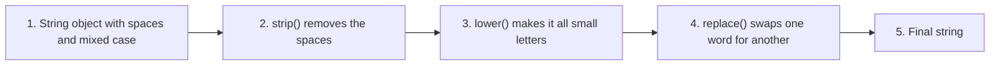

**Why are methods preferable to ordinary functions?**

Methods improve

- readability,
- organization,
- discoverability,
- consistency.

Instead of writing `upper(text)`, Python encourages `text.upper()`, which clearly indicates that the operation belongs to the string object itself. It also helps while you are typing: most editors show the list of available methods as soon as you type the dot.

A few operations are still plain functions, because they apply to many types and not to strings alone. `len(text)`, `str(x)`, `ord(ch)` and `print(x)` are of that kind.

**Common beginner mistakes**

| Mistake | Explanation |
| --- | --- |
| Forgetting the brackets, as in `text.upper` | Refers to the method itself instead of calling it |
| Assuming methods modify the string | Most string methods return a new string |
| Trying to call string methods on integers | Only string objects have string methods |
| Ignoring the returned value | The original string remains unchanged |

The first two are easy to see side by side.

```python
# Step 1: Without the brackets, nothing is run
text = "python"
print("Without brackets:", text.upper)   # no brackets, so nothing runs

# Step 2: With the brackets, the method runs and returns a value
print("With brackets:   ", text.upper())

# Step 3: A number has no string methods
try:
    print((25).upper())
except AttributeError as error:
    print("Error message:", error)

# Step 4: But a number can be turned into a string first
print("After str():", str(25).zfill(5))
```

**Output**

```text
Without brackets: <built-in method upper of str object at 0x7f0e1b4a5cf0>
With brackets:    PYTHON
Error message: 'int' object has no attribute 'upper'
After str(): 00025
```

The first line prints a description of the method rather than any text; that message is Python's way of saying "you have the tool but you have not used it". The address at the end will differ on your computer. The last line shows a bonus method: `zfill()` pads a string with leading zeros, which is handy for roll numbers and invoice numbers.

**Follow-up questions**

**13.1 Can I write `str.upper(text)` instead of `text.upper()`?**

You can, and it does the same work. `text.upper()` is the normal form; the other spelling shows what happens underneath, namely that the object is handed to the method defined in the class.

```python
text = "python"
print("Usual form:", text.upper())
print("Class form:", str.upper(text))
```

**Output**

```text
Usual form: PYTHON
Class form: PYTHON
```

**13.2 How do I find out what a method does without leaving Python?**

Call `help()` on it, as in `help(str.replace)`. In an interactive session this prints a short description and the meaning of each argument. `dir(str)` lists the names, and `help()` explains them.

**Key Points**

- Strings are objects of the built-in `str` class.
- Methods define the behaviour of string objects.
- The dot operator invokes a method on an object.
- Most string methods return new strings because strings are immutable.
- Method chaining provides a concise and readable way to perform multiple operations on the same string.

[Back to the Table of Contents](#table-of-contents)

### Question 14. The Common String Methods

**Question 14. Common string methods. Classify and compare them. When should each method be preferred? Explain how these methods demonstrate string immutability.**

**Answer**

Python's `str` class provides a rich collection of built-in methods for processing textual data. Rather than writing lengthy loops for common operations, programmers can simply invoke the appropriate method. These methods make programs shorter, easier to read, and less error-prone.

A useful way to understand string methods is to classify them according to the type of operation they perform.

**Classification of common string methods**

| Category | Methods | Purpose |
| --- | --- | --- |
| Case conversion | `lower()`, `upper()` | Change letter case |
| Whitespace handling | `strip()` | Remove unwanted spaces |
| Splitting and joining | `split()`, `join()` | Convert between strings and lists |
| Searching | `find()`, `index()` | Locate substrings |
| Modification | `replace()` | Replace substrings |
| Boundary testing | `startswith()`, `endswith()` | Check prefixes and suffixes |
| Counting | `count()` | Count occurrences |

The complete list, with every argument explained, is in the Python documentation under [String Methods](https://docs.python.org/3/library/stdtypes.html#string-methods).

**Case conversion methods**

These methods normalize text, that is, they bring it to one standard form.

```python
# Step 1: A string with mixed case
name = "PyThOn"

# Step 2: Convert it both ways
print("lower():", name.lower())
print("upper():", name.upper())

# Step 3: Two more methods of the same family
print("title():", "shyam lal sharma".title())
print("capitalize():", "hello world".capitalize())
```

**Output**

```text
lower(): python
upper(): PYTHON
title(): Shyam Lal Sharma
capitalize(): Hello world
```

Typical applications include case-insensitive searching, normalizing user input and displaying headings. Note the difference between the last two: `title()` capitalizes every word, while `capitalize()` capitalizes only the first letter of the whole string and lowers the rest.

**Whitespace removal**

Extra spaces often appear when data comes from users or files.

```python
# Step 1: A string with spaces at both ends
text = "   Python   "

# Step 2: strip() removes them from both sides
print("strip()  :", repr(text.strip()))

# Step 3: lstrip() and rstrip() remove them from one side only
print("lstrip() :", repr(text.lstrip()))
print("rstrip() :", repr(text.rstrip()))

# Step 4: Why this matters. An untrimmed value fails a comparison.
typed = "Python "
print("Without strip():", typed == "Python")
print("With strip():   ", typed.strip() == "Python")
```

**Output**

```text
strip()  : 'Python'
lstrip() : 'Python   '
rstrip() : '   Python'
Without strip(): False
With strip():    True
```

Without cleaning, comparisons may fail for a reason that is invisible on the screen. `repr()` is used above so that the spaces can be seen.

**Splitting and joining**

Sometimes we need to convert one string into many smaller strings.

```python
# Step 1: One line of comma separated data
line = "Red,Green,Blue"

# Step 2: split() breaks it at every comma and returns a LIST
colors = line.split(",")
print("After split():", colors)
print("Type returned:", type(colors))

# Step 3: join() puts the pieces back together and returns a STRING
# The string before .join is the separator that goes between the pieces.
print("After join(): ", "-".join(colors))

# Step 4: split() with no argument breaks at any run of spaces
sentence = "The quick   brown fox"
print("Words:", sentence.split())
print("Number of words:", len(sentence.split()))
```

**Output**

```text
After split(): ['Red', 'Green', 'Blue']
Type returned: <class 'list'>
After join():  Red-Green-Blue
Words: ['The', 'quick', 'brown', 'fox']
Number of words: 4
```

Notice that

- `split()` returns a **list**,
- `join()` returns a **string**.

Step 4 shows a small kindness of `split()`: called without an argument, it treats any number of spaces, tabs or newlines as one separator, so the extra spaces in the sentence cause no empty words.

**Searching methods**

Python offers two similar searching methods.

```python
# Step 1: The text to search in
text = "Programming"

# Step 2: Both methods return the position of the first match
print("find('gram') :", text.find("gram"))
print("index('gram'):", text.index("gram"))

# Step 3: When the substring is absent, find() returns -1
print("find('Java') :", text.find("Java"))

# Step 4: In the same situation, index() raises an error
try:
    text.index("Java")
except ValueError as error:
    print("index('Java'):", error)
```

**Output**

```text
find('gram') : 3
index('gram'): 3
find('Java') : -1
index('Java'): substring not found
```

Therefore,

- use `find()` when the substring may be missing and you want to test the result,
- use `index()` when the substring must be there, so that a missing one is a genuine error.

**Modification**

```python
# Step 1: The original sentence
sentence = "I like Java"

# Step 2: replace() returns a new sentence
new_sentence = sentence.replace("Java", "Python")

# Step 3: Print both
print("Original:", sentence)
print("New:     ", new_sentence)

# Step 4: replace() changes every occurrence unless a count is given
text = "one two one two one"
print("All replaced:  ", text.replace("one", "1"))
print("First two only:", text.replace("one", "1", 2))
```

**Output**

```text
Original: I like Java
New:      I like Python
All replaced:   1 two 1 two 1
First two only: 1 two 1 two one
```

The original string remains unchanged.

**Boundary testing**

```python
# Step 1: A file name
filename = "report.pdf"

# Step 2: Check its ending and its beginning
print("endswith('.pdf')  :", filename.endswith(".pdf"))
print("startswith('rep') :", filename.startswith("rep"))

# Step 3: Several endings can be checked at once with a tuple
print("Is it an image?", filename.endswith((".png", ".jpg", ".gif")))

# Step 4: These tests are case-sensitive, so normalize first
shouting = "REPORT.PDF"
print("Without lower():", shouting.endswith(".pdf"))
print("With lower():   ", shouting.lower().endswith(".pdf"))
```

**Output**

```text
endswith('.pdf')  : True
startswith('rep') : True
Is it an image? False
Without lower(): False
With lower():    True
```

These methods are especially useful when validating filenames, URLs and commands.

**Counting**

```python
# Step 1: A word with repeated letters
sentence = "banana"

# Step 2: Count one letter
print("Number of a's:", sentence.count("a"))

# Step 3: count() also counts longer pieces
print("Number of 'an's:", sentence.count("an"))

# Step 4: A piece that is absent gives 0, never -1
print("Number of 'z's:", sentence.count("z"))
```

**Output**

```text
Number of a's: 3
Number of 'an's: 2
Number of 'z's: 0
```

Unlike `find()`, `count()` never returns `-1`.

**Relationship with immutability**

One of the most important points for beginners is that **none of these methods modify the original string**.

```python
# Step 1: An original string
text = "Python"

# Step 2: Call a method and keep the result
result = text.upper()

# Step 3: Print both objects
print("Original:", text)
print("Returned:", result)

# Step 4: A common slip. The result is thrown away here.
text.upper()
print("After calling upper() without keeping it:", text)

# Step 5: The right way, if the name should hold the new value
text = text.upper()
print("After assigning the result back:", text)
```

**Output**

```text
Original: Python
Returned: PYTHON
After calling upper() without keeping it: Python
After assigning the result back: PYTHON
```

Step 4 is one of the most frequent beginner errors. Nothing goes wrong, no error appears, and the string simply stays as it was.

**Flowchart**

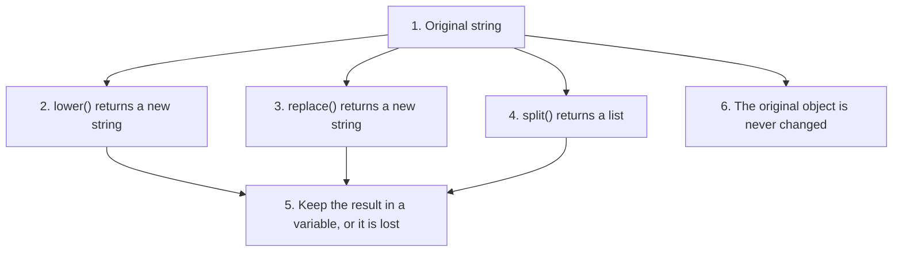

**Choosing the appropriate method**

| Requirement | Preferred method |
| --- | --- |
| Ignore case | `lower()` |
| Remove spaces | `strip()` |
| Break a sentence into words | `split()` |
| Join words into a sentence | `join()` |
| Replace text | `replace()` |
| Search safely | `find()` |
| Search when the text must be present | `index()` |
| Count occurrences | `count()` |
| Validate a file extension | `endswith()` |

**Common beginner mistakes**

| Mistake | Explanation |
| --- | --- |
| Expecting methods to modify the string | Most return a new object |
| Using `index()` without handling the error | May raise `ValueError` |
| Confusing `split()` and `join()` | One creates a list, the other creates a string |
| Ignoring the returned value | The result is lost |

**A worked example that uses several methods together**

```python
# Step 1: One untidy line of data, as it might come from a file
line = "  Asha , 19 , Delhi  "

# Step 2: Break it at the commas
fields = line.split(",")
print("After split:", fields)

# Step 3: Clean each field by removing the spaces around it
fields = [field.strip() for field in fields]
print("After cleaning:", fields)

# Step 4: Give the fields names and use them
name, age, city = fields
print("Name:", name.title())
print("Age :", age)
print("City:", city)

# Step 5: Build one tidy line again
print("Tidy line:", ", ".join(fields))
```

**Output**

```text
After split: ['  Asha ', ' 19 ', ' Delhi  ']
After cleaning: ['Asha', '19', 'Delhi']
Name: Asha
Age : 19
City: Delhi
Tidy line: Asha, 19, Delhi
```

This pattern, split then strip then use, is what you will do to almost every line of a CSV file.

**Follow-up questions**

**14.1 What does `strip()` remove exactly?**

By default it removes spaces, tabs and newlines from both ends. Given an argument, it removes any of the characters listed in that argument, again from both ends only, never from the middle.

```python
# Step 1: strip() with no argument removes whitespace
print(repr("\n  hello \t".strip()))

# Step 2: strip() with an argument removes those characters
print(repr("xxhelloxx".strip("x")))

# Step 3: It stops as soon as it meets something not in the list
print(repr("xxhelxloxx".strip("x")))
```

**Output**

```text
'hello'
'hello'
'helxlo'
```

**14.2 How do I count words instead of characters?**

Split the text and take the length of the list.

```python
# Step 1: A sentence with punctuation
sentence = "Python is simple, and Python is powerful."

# Step 2: Count the words
words = sentence.split()
print("Number of words:", len(words))

# Step 3: Count how often one word appears.
# lower() makes the count fair, and the count() here belongs to the LIST.
cleaned = sentence.lower().replace(",", "").replace(".", "").split()
print("Times 'python' appears:", cleaned.count("python"))
```

**Output**

```text
Number of words: 7
Times 'python' appears: 2
```

**Key Points**

- String methods simplify common text-processing tasks.
- Different methods serve different categories of operations.
- Most methods return a **new string**.
- `split()` returns a list, while `join()` returns a string.
- Understanding method categories helps programmers select the most appropriate tool.

[Back to the Table of Contents](#table-of-contents)

### Question 15. The is Family of Methods

**Question 15. The `is...()` family of methods. What are they? Why are they important for input validation? Compare the commonly used methods and discuss their limitations.**

**Answer**

Many programs accept input from users. Before processing that input, it is important to verify that it satisfies certain conditions. For example, an age should contain only digits, while a person's name should usually contain only alphabetic characters.

Python provides a family of methods beginning with `is` that answer such questions. These methods **inspect** a string and return either `True` or `False`. They do **not** modify the string.

These methods are widely used in data validation, form processing and interactive applications.

**Common is methods**

| Method | Returns True when |
| --- | --- |
| `isalpha()` | All characters are alphabetic |
| `isdigit()` | All characters are digits |
| `isalnum()` | All characters are letters or digits |
| `isspace()` | All characters are whitespace |
| `isupper()` | All cased characters are uppercase |
| `islower()` | All cased characters are lowercase |

**isalpha()**

```python
print("Python".isalpha())
print("Python3".isalpha())
```

**Output**

```text
True
False
```

Useful for validating names.

**isdigit()**

```python
print("12345".isdigit())
print("12.5".isdigit())
```

**Output**

```text
True
False
```

Notice that decimal points are **not** digits.

**isalnum()**

```python
print("User123".isalnum())
print("User 123".isalnum())
```

**Output**

```text
True
False
```

Spaces and punctuation are not allowed.

**isspace()**

```python
print("   ".isspace())
print("  A  ".isspace())
```

**Output**

```text
True
False
```

Useful when checking whether the user entered only blank characters.

**isupper() and islower()**

```python
print("HELLO".isupper())
print("hello".islower())
```

**Output**

```text
True
True
```

These methods are commonly used before comparing text or enforcing formatting rules.

**Why are these methods important?**

Suppose a program asks the user to enter an age. Without a check, `int("abc")` raises a `ValueError` and the program stops. With a check, the program can ask again politely.

```python
# Step 1: Read the age as text. input() always returns a string.
age_text = input("Enter age: ")

# Step 2: Ask the string whether it consists only of digits
if age_text.isdigit():
    # Step 3: Only now is it safe to convert the text into a number
    age = int(age_text)
    print("Valid age:", age)
    print("Age after ten years:", age + 10)
else:
    # Step 4: Handle the bad input without crashing
    print("Invalid input. Please type digits only.")
```

**Output when 25 is typed**

```text
Enter age: 25
Valid age: 25
Age after ten years: 35
```

**Output when abc is typed**

```text
Enter age: abc
Invalid input. Please type digits only.
```

Validation therefore improves program reliability. Note the order of the steps: test first, convert second. Reversing them defeats the purpose.

**Flowchart**

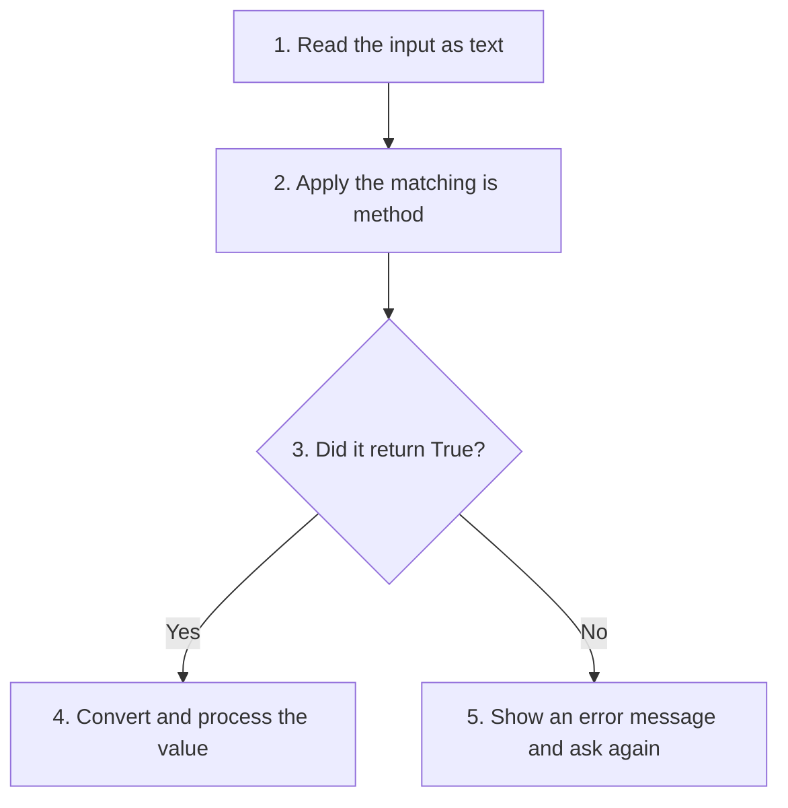

**Comparison table**

| Method | Returns | Typical application |
| --- | --- | --- |
| `isalpha()` | Boolean | Validate names |
| `isdigit()` | Boolean | Validate ages, roll numbers |
| `isalnum()` | Boolean | Validate usernames |
| `isspace()` | Boolean | Detect blank input |
| `isupper()` | Boolean | Verify uppercase text |
| `islower()` | Boolean | Verify lowercase text |

**Limitations**

Although these methods are useful, they are not perfect.

**isdigit()** returns `False` for `-15`, `3.14` and `+25`, because the minus sign, the plus sign and the decimal point are not digits.

**isalpha()** returns `False` for `John Smith`, because of the space.

**isalnum()** returns `False` for `user_name`, because the underscore is neither a letter nor a digit.

**The empty string** is an important case that beginners often overlook. `"".isalpha()`, `"".isdigit()` and `"".isalnum()` all return `False`. An empty string does not satisfy any of these conditions because it contains no characters.

Here are all these limits in one script.

```python
# Step 1: Values that look like numbers but fail isdigit()
for value in ["25", "-15", "3.14", "+25", ""]:
    print(repr(value), "isdigit() ->", value.isdigit())

# Step 2: Values that look like names but fail isalpha()
for value in ["John", "John Smith", "O'Brien", ""]:
    print(repr(value), "isalpha() ->", value.isalpha())

# Step 3: A username with an underscore fails isalnum()
print(repr("user_name"), "isalnum() ->", "user_name".isalnum())
```

**Output**

```text
'25' isdigit() -> True
'-15' isdigit() -> False
'3.14' isdigit() -> False
'+25' isdigit() -> False
'' isdigit() -> False
'John' isalpha() -> True
'John Smith' isalpha() -> False
"O'Brien" isalpha() -> False
'' isalpha() -> False
'user_name' isalnum() -> False
```

**Working around the limits**

For a name with spaces, remove the spaces before testing. For a number that may carry a sign or a decimal point, the honest answer is to try the conversion and catch the error.

```python
# Step 1: A full name, tested after the spaces are taken out
full_name = "John Smith"
print("Is it a name?", full_name.replace(" ", "").isalpha())

# Step 2: A number that isdigit() would reject
for value in ["-15", "3.14", "abc"]:
    # Step 3: try and except is the reliable test for any number
    try:
        number = float(value)
        print(repr(value), "is a number:", number)
    except ValueError:
        print(repr(value), "is not a number")
```

**Output**

```text
Is it a name? True
'-15' is a number: -15.0
'3.14' is a number: 3.14
'abc' is not a number
```

**One more surprise**

`isdigit()` accepts some characters that cannot be used in arithmetic, such as the superscript two. For plain checking of ordinary digits, `isdecimal()` is the safer of the two.

```python
# Step 1: A superscript two is treated as a digit
print("isdigit() on '²':", "²".isdigit())

# Step 2: isdecimal() is stricter and returns False
print("isdecimal() on '²':", "²".isdecimal())

# Step 3: int() cannot use it, which is why the stricter test is better
try:
    int("²")
except ValueError as error:
    print("int() says:", error)
```

**Output**

```text
isdigit() on '²': True
isdecimal() on '²': False
int() says: invalid literal for int() with base 10: '²'
```

**Common beginner mistakes**

| Mistake | Explanation |
| --- | --- |
| Assuming `isdigit()` accepts negative numbers | It does not |
| Expecting `isalpha()` to allow spaces | Spaces are not alphabetic |
| Forgetting that empty strings return `False` | Validate for empty input separately |
| Assuming these methods modify the string | They only inspect it |

**Practical applications**

These methods are frequently used in

- login forms
- registration systems
- examination software
- banking applications
- web forms
- command-line programs
- file validation
- educational software

**Follow-up questions**

**15.1 How do I check that the user typed something at all?**

Strip the input and test whether anything is left. An empty string is `False` in a condition, so a plain `if` is enough.

```python
# Step 1: Three possible entries
for entry in ["Asha", "", "    "]:
    # Step 2: Remove the spaces at both ends, then test
    cleaned = entry.strip()
    if cleaned:
        print(repr(entry), "-> accepted as", repr(cleaned))
    else:
        print(repr(entry), "-> nothing was typed")
```

**Output**

```text
'Asha' -> accepted as 'Asha'
'' -> nothing was typed
'    ' -> nothing was typed
```

**15.2 Which method checks a password for a capital letter?**

None of them alone, because `isupper()` asks about the whole string. Check character by character instead, with `any()`.

```python
# Step 1: The password to examine
password = "python2026"

# Step 2: any() returns True if at least one character passes the test
has_capital = any(ch.isupper() for ch in password)
has_digit = any(ch.isdigit() for ch in password)

# Step 3: Report the findings
print("Has a capital letter?", has_capital)
print("Has a digit?        ", has_digit)
print("Long enough?        ", len(password) >= 8)
```

**Output**

```text
Has a capital letter? False
Has a digit?         True
Long enough?         True
```

**Key Points**

- The `is...()` family performs **validation**, not modification.
- Every method returns a Boolean value.
- They are commonly used to verify user input before processing.
- Different methods validate different characteristics of a string.
- Programmers should understand their limitations, especially with negative numbers, decimal values, spaces and empty strings.

[Back to the Table of Contents](#table-of-contents)

### Question 16. f-Strings

**Question 16. f-Strings. Why were they introduced? Compare them with concatenation and str.format(). What are their advantages?**

**Answer**

Formatting strings is one of the most common tasks in programming. Programs frequently display variables, calculations and messages to users. Before Python 3.6, programmers mainly used **string concatenation** (`+`) or the **`str.format()`** method for formatting text. Although both techniques are useful, they can become difficult to read when many variables are involved.

Python introduced **formatted string literals**, commonly known as **f-strings**, to provide a simpler, more readable and more efficient way to construct strings. They were added by [PEP 498](https://peps.python.org/pep-0498/).

An f-string is created by prefixing the string literal with the letter `f` (or `F`). Expressions enclosed within curly braces `{}` are evaluated automatically and their values are inserted into the resulting string.

```python
name = "Alice"
marks = 92
print(f"{name} scored {marks} marks.")
```

**Output**

```text
Alice scored 92 marks.
```

Unlike concatenation, explicit type conversion is usually unnecessary.

**The same message written in three ways**

```python
# Step 1: The values to display
name = "Alice"
marks = 92

# Step 2: Concatenation. Every number must be converted by hand.
print("Way 1:", name + " scored " + str(marks) + " marks.")

# Step 3: str.format(). The braces mark the places where values go.
print("Way 2:", "{} scored {} marks.".format(name, marks))

# Step 4: An f-string. The names sit where their values will appear.
print("Way 3:", f"{name} scored {marks} marks.")
```

**Output**

```text
Way 1: Alice scored 92 marks.
Way 2: Alice scored 92 marks.
Way 3: Alice scored 92 marks.
```

All three give the same result. The third is the easiest to read, because the text and the values appear in the same order as in the final sentence.

**Comparison of formatting techniques**

| Technique | Example | Advantages | Disadvantages |
| --- | --- | --- | --- |
| Concatenation | `"Age: " + str(age)` | Simple | Requires manual conversion |
| `str.format()` | `"Age: {}".format(age)` | Flexible | More verbose |
| f-string | `f"Age: {age}"` | Readable, concise, efficient | Requires Python 3.6 or later |

**Expressions inside f-strings**

One of the greatest strengths of f-strings is that they can evaluate expressions directly.

```python
# Step 1: Two numbers
a = 10
b = 20

# Step 2: Arithmetic inside the braces
print(f"Sum = {a + b}")
print(f"Square = {a ** 2}")

# Step 3: A method call inside the braces
name = "asha kumari"
print(f"Name in title case = {name.title()}")

# Step 4: A condition inside the braces
marks = 45
print(f"Result = {'Pass' if marks >= 40 else 'Fail'}")
```

**Output**

```text
Sum = 30
Square = 100
Name in title case = Asha Kumari
Result = Pass
```

Keep the expressions short. If the calculation is long, work it out on a line of its own and put only the result in the f-string.

**Controlling the appearance of a value**

A colon inside the braces introduces a format specification. This is where f-strings save the most work, especially with numbers and columns.

```python
# Step 1: Round a number to two decimal places
price = 1234.5678
print(f"Price = {price:.2f}")

# Step 2: Add a thousands separator
population = 1380004385
print(f"Population = {population:,}")

# Step 3: Show a fraction as a percentage
pass_rate = 0.8734
print(f"Pass rate = {pass_rate:.1%}")

# Step 4: Line up text in columns of fixed width
# < means left aligned, > means right aligned
items = [("Pen", 10), ("Notebook", 145), ("Bag", 1250)]
for item, cost in items:
    print(f"{item:<10}{cost:>8}")

# Step 5: Pad a number with leading zeros
roll = 7
print(f"Roll number = {roll:03d}")
```

**Output**

```text
Price = 1234.57
Population = 1,380,004,385
Pass rate = 87.3%
Pen             10
Notebook       145
Bag           1250
Roll number = 007
```

The full set of these codes is listed in the Python documentation under [Format Specification Mini-Language](https://docs.python.org/3/library/string.html#format-specification-mini-language).

**A shortcut that helps while testing**

Putting `=` after the name inside the braces prints the name as well as the value. It is a quick way to check what a variable holds.

```python
# Step 1: Two values to inspect
count = 12
average = 68.5

# Step 2: The = sign shows the name and the value together
print(f"{count=}")
print(f"{average=}")
```

**Output**

```text
count=12
average=68.5
```

**Flowchart**

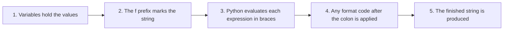

**Common beginner mistakes**

| Mistake | Explanation |
| --- | --- |
| Forgetting the `f` prefix | The braces and the names are printed as they are |
| Omitting `{}` | Variables are not evaluated |
| Mixing concatenation unnecessarily | f-strings are usually clearer |
| Using the same quote inside and outside the braces | Causes an error in older versions of Python |

The first mistake is worth seeing once.

```python
# Step 1: With the f prefix
name = "Asha"
print(f"Hello {name}")

# Step 2: Without it, the braces are just characters
print("Hello {name}")

# Step 3: To print a real brace in an f-string, double it
print(f"A brace looks like this: {{ }}, and the name is {name}")
```

**Output**

```text
Hello Asha
Hello {name}
A brace looks like this: { }, and the name is Asha
```

**Follow-up questions**

**16.1 Can an f-string span several lines?**

Yes. Use triple quotes with the `f` prefix, and the values are filled in as usual.

```python
# Step 1: The values for a small report
name = "Asha"
marks = 92

# Step 2: A triple-quoted f-string keeps the layout of the text
report = f"""Name : {name}
Marks: {marks}
Grade: {'A' if marks >= 90 else 'B'}"""

print(report)
```

**Output**

```text
Name : Asha
Marks: 92
Grade: A
```

**16.2 Should `str.format()` and the old `%` style now be forgotten?**

Not entirely. You will still meet them in existing programs, so it helps to recognise them. `str.format()` is also useful when the text of the message is stored separately from the values, for instance in a file of messages, because an f-string needs its values to be available at the moment the line is written.

**Key Points**

- f-strings improve readability and reduce code complexity.
- Variables and expressions are enclosed in `{}`.
- Automatic conversion reduces the need for `str()`.
- A colon inside the braces controls rounding, width, alignment and separators.
- f-strings are generally the preferred formatting technique in modern Python.

[Back to the Table of Contents](#table-of-contents)

## Part 5: Palindromes and a Full Review

The last four questions put the earlier ideas to work. Two of them solve the same problem in two different ways, the third compares those ways, and the fourth draws the whole chapter together.

[Back to the Table of Contents](#table-of-contents)

### Question 17. Palindrome Using Indexing

**Question 17. Palindrome using indexing. Explain the algorithm, logic, efficiency, and limitations.**

**Answer**

A **palindrome** is a string that reads the same in both forward and reverse directions. Examples include `madam`, `level` and `radar`.

The indexing approach compares corresponding characters from the beginning and end of the string.

**Algorithm**

1. Compare the first and last characters.
2. Compare the second and second-last characters.
3. Continue until the middle of the string is reached.
4. If every pair matches, the string is a palindrome.
5. If any pair differs, stop at once. The string is not a palindrome.

**Working the algorithm by hand**

Before writing the code, it helps to trace the word `madam` on paper. Its length is 5, so `5 // 2` gives 2, and the loop runs for `i = 0` and `i = 1`.

| Pass | `i` | `text[i]` | `text[-(i + 1)]` | Same? | Decision |
| --- | --- | --- | --- | --- | --- |
| 1 | 0 | m | m | Yes | Continue |
| 2 | 1 | a | a | Yes | Continue |
| End | 2 | loop ends | loop ends | | Palindrome |

The middle letter `d` is never compared, and it never needs to be. A single character in the middle always matches itself.

Now the same trace for `mango`:

| Pass | `i` | `text[i]` | `text[-(i + 1)]` | Same? | Decision |
| --- | --- | --- | --- | --- | --- |
| 1 | 0 | m | o | No | Stop, not a palindrome |

**Example**

```python
# Step 1: Read the string from the user
text = input("Enter a string: ")

# Step 2: Assume it is a palindrome until a mismatch proves otherwise
is_palindrome = True

# Step 3: Compare characters from both ends, moving inwards.
# len(text) // 2 gives half the length, ignoring any middle character.
for i in range(len(text) // 2):
    # Step 4: text[i] comes from the front, text[-(i + 1)] from the back
    if text[i] != text[-(i + 1)]:
        is_palindrome = False
        # Step 5: One mismatch is enough, so leave the loop at once
        break

# Step 6: Report the result
if is_palindrome:
    print("Palindrome")
else:
    print("Not a palindrome")
```

**Output when madam is typed**

```text
Enter a string: madam
Palindrome
```

**Output when mango is typed**

```text
Enter a string: mango
Not a palindrome
```

**The same script with the comparisons shown**

While learning, it helps to see each comparison as it happens. This version prints them.

```python
# Step 1: A fixed word, so that the output is the same every time
text = "madam"
print("Word being tested:", text)
print("Half the length:", len(text) // 2)

# Step 2: Assume success
is_palindrome = True

# Step 3: Compare the pairs and print each comparison
for i in range(len(text) // 2):
    front = text[i]
    back = text[-(i + 1)]
    print(f"Pass {i + 1}: comparing text[{i}] = {front} with text[{-(i + 1)}] = {back}")
    if front != back:
        print("  They differ, so the loop stops here")
        is_palindrome = False
        break

# Step 4: Report
print("Result:", "Palindrome" if is_palindrome else "Not a palindrome")
```

**Output**

```text
Word being tested: madam
Half the length: 2
Pass 1: comparing text[0] = m with text[-1] = m
Pass 2: comparing text[1] = a with text[-2] = a
Result: Palindrome
```

**Why compare only half?**

Every comparison checks two characters at once. For a string of length `n`, only `n // 2` comparisons are needed. Comparing the whole string would simply repeat every test in the opposite order.

For a word of 5 letters that means 2 comparisons instead of 5. For a sentence of 1000 characters it means 500 instead of 1000.

**Flowchart**

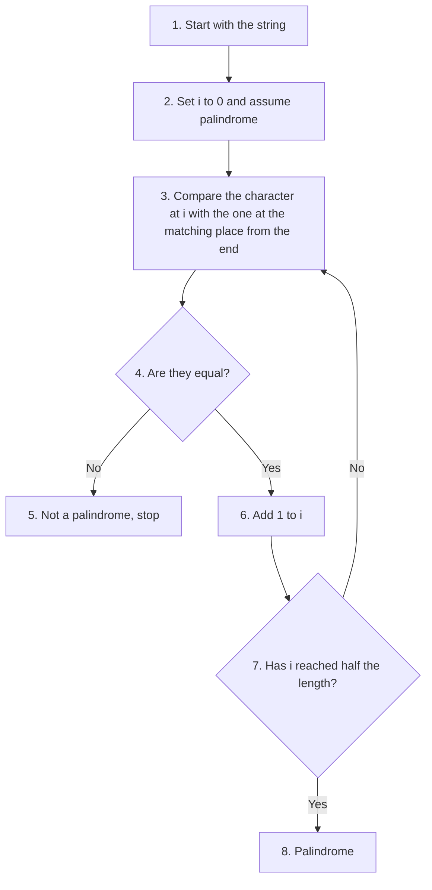

**Advantages**

- Efficient, because it stops at the first mismatch.
- Uses indexing concepts, which is good practice.
- Does not create another string, so it uses very little extra memory.
- Demonstrates negative indexing in a natural way.

**Limitations**

- Slightly longer code.
- Requires careful index calculations.
- Beginners may find the logic difficult initially.
- As written, it treats capital letters, spaces and punctuation as ordinary characters, so `"Madam"` is reported as not a palindrome. The follow-up below deals with this.

**Follow-up questions**

**17.1 How do I make the test ignore capital letters, spaces and punctuation?**

Clean the string first, then run the same algorithm. This is how sentences such as "Madam, I'm Adam" can be tested.

```python
# Step 1: The sentence to test, with capitals, spaces and punctuation
sentence = "Madam, I'm Adam"

# Step 2: Keep only the letters and digits, and make them all small.
# ch.isalnum() was met in Question 15.
cleaned = ""
for ch in sentence.lower():
    if ch.isalnum():
        cleaned += ch
print("Original:", sentence)
print("Cleaned :", cleaned)

# Step 3: Run the same comparison on the cleaned string
is_palindrome = True
for i in range(len(cleaned) // 2):
    if cleaned[i] != cleaned[-(i + 1)]:
        is_palindrome = False
        break

# Step 4: Report the result
print("Result  :", "Palindrome" if is_palindrome else "Not a palindrome")
```

**Output**

```text
Original: Madam, I'm Adam
Cleaned : madamimadam
Result  : Palindrome
```

**17.2 Is an empty string or a single character a palindrome?**

By this algorithm, yes. For both of them `len(text) // 2` is 0, so the loop never runs and `is_palindrome` stays `True`. Mathematically this is the accepted answer: a string with nothing to contradict reads the same both ways. If your program should reject empty input, test for it separately, as shown in Follow-up 15.1.

```python
# Step 1: Test the two smallest cases
for text in ["", "a", "ab"]:
    is_palindrome = True
    for i in range(len(text) // 2):
        if text[i] != text[-(i + 1)]:
            is_palindrome = False
            break
    print(repr(text), "->", "Palindrome" if is_palindrome else "Not a palindrome")
```

**Output**

```text
'' -> Palindrome
'a' -> Palindrome
'ab' -> Not a palindrome
```

**Key points**

- Uses positive and negative indexing.
- Stops immediately when a mismatch is found.
- Requires only half the comparisons.
- Time complexity is `O(n)`, which means the work grows in step with the length of the string.

[Back to the Table of Contents](#table-of-contents)

### Question 18. Palindrome Using Slicing

**Question 18. Palindrome using slicing. Explain the algorithm and compare it with the indexing approach.**

**Answer**

Python's slicing feature makes palindrome checking remarkably simple.

Instead of comparing individual characters, Python can reverse the entire string using `[::-1]`. The reversed string is then compared with the original.

**Example**

```python
# Step 1: Read the string from the user
text = input("Enter a string: ")

# Step 2: Build the reversed string with a slice, then compare it
# with the original. One comparison decides the whole question.
if text == text[::-1]:
    print("Palindrome")
else:
    print("Not a palindrome")
```

**Output when madam is typed**

```text
Enter a string: madam
Palindrome
```

**Output when mango is typed**

```text
Enter a string: mango
Not a palindrome
```

**How does `[::-1]` work?**

Recall the slicing syntax from Question 10:

```python
string[start : stop : step]
```

Here

- `start` is omitted,
- `stop` is omitted,
- `step` is `-1`.

With a negative step Python fills in the defaults the other way round: it begins at the last character and moves left until it passes the first one. The result is the whole string, reversed.

```python
# Step 1: A word whose reverse is easy to check by eye
word = "madam"

# Step 2: Reverse it with a slice
print("Original:", word)
print("Reversed:", word[::-1])

# Step 3: Compare the two
print("Are they equal?", word == word[::-1])

# Step 4: The same three steps for a word that is not a palindrome
other = "mango"
print("Original:", other)
print("Reversed:", other[::-1])
print("Are they equal?", other == other[::-1])
```

**Output**

```text
Original: madam
Reversed: madam
Are they equal? True
Original: mango
Reversed: ognam
Are they equal? False
```

**Diagram**

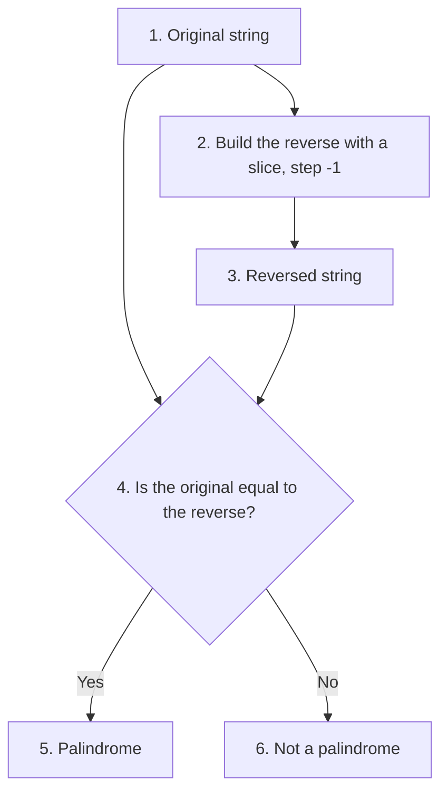

**Advantages**

- Extremely concise.
- Easy to understand at a glance.
- Uses Python's built-in slicing mechanism, which runs quickly.
- Very readable.

**Limitations**

- Creates another string in memory, which is as long as the original.
- Always examines the whole string, even when the very first and last characters differ.
- Less suitable for explaining the underlying algorithm.
- Hides some implementation details from beginners.

The second point is worth a demonstration. Both methods are quick, but they are quick in different ways.

```python
# Step 1: A long string whose first and last characters already differ
text = "a" + "b" * 100000 + "c"

# Step 2: The indexing method stops at the very first comparison
comparisons = 0
is_palindrome = True
for i in range(len(text) // 2):
    comparisons += 1
    if text[i] != text[-(i + 1)]:
        is_palindrome = False
        break
print("Indexing method, comparisons made:", comparisons)

# Step 3: The slicing method builds a reversed copy of all the characters
reversed_text = text[::-1]
print("Slicing method, characters copied:", len(reversed_text))

# Step 4: Both reach the same answer
print("Same answer from both?", is_palindrome == (text == text[::-1]))
```

**Output**

```text
Indexing method, comparisons made: 1
Slicing method, characters copied: 100002
Same answer from both? True
```

For everyday words this difference does not matter at all. Slicing is written in C inside Python and is very fast. The comparison is shown only to make the point that concise code and least work are not always the same thing.

**Follow-up questions**

**18.1 Does `reversed()` do the same job as `[::-1]`?**

It reverses the same way, but it does not return a string. It returns an object that hands over the characters one at a time, so `join()` is needed to make a string out of them.

```python
# Step 1: A slice gives a string straight away
word = "madam"
print("With a slice:", word[::-1])

# Step 2: reversed() gives an object, not a string
print("reversed() gives:", reversed(word))

# Step 3: join() turns that object into a string
print("After join():", "".join(reversed(word)))
```

**Output**

```text
With a slice: madam
reversed() gives: <reversed object at 0x7f13ac3c3b50>
After join(): madam
```

The address in the second line will differ on your computer. For strings, `[::-1]` is shorter and is the usual choice.

**18.2 How would the slicing method handle a sentence with capitals and spaces?**

Exactly as the indexing method does: clean the string first, then compare. The cleaning step is the same for both methods.

```python
# Step 1: The sentence
sentence = "Never odd or even"

# Step 2: Keep only letters and digits, all in small letters
cleaned = "".join(ch for ch in sentence.lower() if ch.isalnum())
print("Cleaned:", cleaned)

# Step 3: One comparison decides the answer
print("Palindrome?", cleaned == cleaned[::-1])
```

**Output**

```text
Cleaned: neveroddoreven
Palindrome? True
```

**Key points**

- Uses slicing rather than loops.
- Requires only one comparison.
- Time complexity remains `O(n)`.
- Excellent example of Pythonic programming, that is, of writing code the way experienced Python programmers write it.

[Back to the Table of Contents](#table-of-contents)

### Question 19. Comparing the Two Palindrome Methods

**Question 19. Palindrome algorithms. Compare the indexing and slicing approaches. Which should beginners learn first?**

**Answer**

Both algorithms correctly determine whether a string is a palindrome. However, they emphasize different programming concepts.

The **indexing method** teaches algorithmic thinking, loops, and character-by-character comparison. The **slicing method** demonstrates Python's expressive syntax and built-in sequence operations.

**The two methods side by side**

```python
# Step 1: One word, tested by both methods
word = "level"

# Step 2: Method A, the indexing method
is_palindrome = True
for i in range(len(word) // 2):
    if word[i] != word[-(i + 1)]:
        is_palindrome = False
        break
print("Indexing method says:", is_palindrome)

# Step 3: Method B, the slicing method
print("Slicing method says: ", word == word[::-1])

# Step 4: Check that they agree on several words
for test in ["madam", "level", "python", "a", "ab"]:
    by_index = all(test[i] == test[-(i + 1)] for i in range(len(test) // 2))
    by_slice = test == test[::-1]
    print(f"{test:8} indexing: {by_index}, slicing: {by_slice}, agree: {by_index == by_slice}")
```

**Output**

```text
Indexing method says: True
Slicing method says:  True
madam    indexing: True, slicing: True, agree: True
level    indexing: True, slicing: True, agree: True
python   indexing: False, slicing: False, agree: True
a        indexing: True, slicing: True, agree: True
ab       indexing: False, slicing: False, agree: True
```

Step 4 uses `all()`, which returns `True` only when every test inside it is true. It is a compact way of writing the loop of Method A.

**Comparison**

| Feature | Indexing method | Slicing method |
| --- | --- | --- |
| Readability | Moderate | Excellent |
| Code length | Longer | Very short |
| Extra memory | Minimal | Creates a reversed string |
| Demonstrates the algorithm | Yes | No |
| Uses loops | Yes | No |
| Stops early on a mismatch | Yes | No |
| Pythonic style | Moderate | High |

**Which should beginners learn first?**

For educational purposes, beginners should first learn the **indexing approach**, because it develops logical reasoning and reinforces concepts such as indexing, loops and conditional statements. It is also the version you would have to write in a language that has no slicing.

After mastering the algorithm, they should learn the slicing approach to appreciate Python's expressive features. In real programs, and in examinations that ask only for a correct answer, the slicing version is the one to write.

**Diagram**

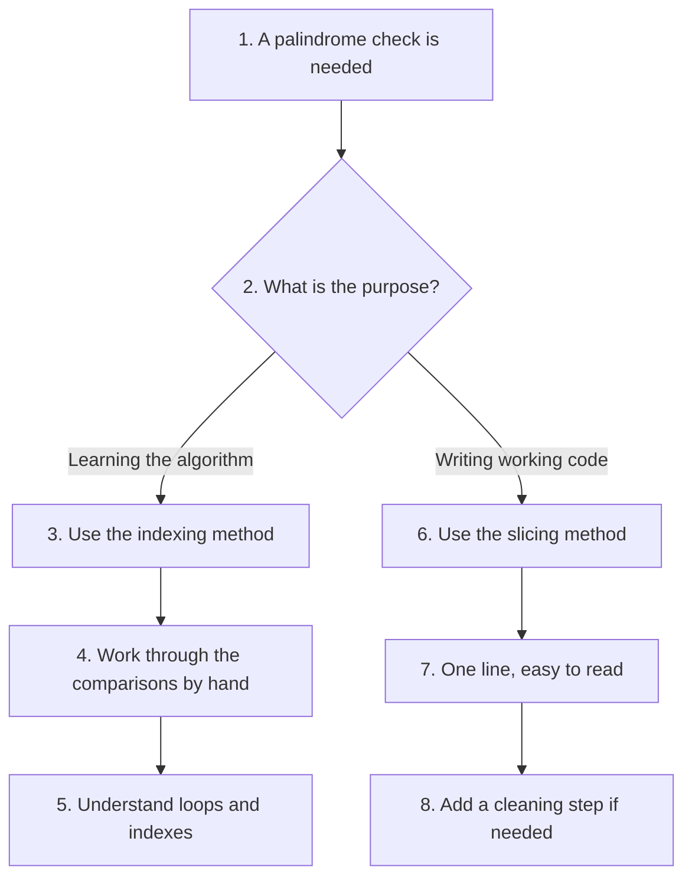

**Key points**

- Both algorithms are correct.
- Indexing develops problem-solving skills.
- Slicing demonstrates Pythonic programming.
- Understanding both approaches makes students better programmers.

[Back to the Table of Contents](#table-of-contents)

### Question 20. Strings, a Comprehensive Review

**Question 20. Strings—comprehensive review. Explain how indexing, slicing, immutability, Unicode, methods, and formatting work together in practical Python programs.**

**Answer**

A string is much more than a collection of characters. It is an immutable Unicode sequence object that supports indexing, slicing, iteration, comparison, formatting, and a large collection of built-in methods.

Understanding strings requires connecting several independent concepts. Each of them was the subject of an earlier question on this page; the purpose here is to see them working together.

**Concept map**

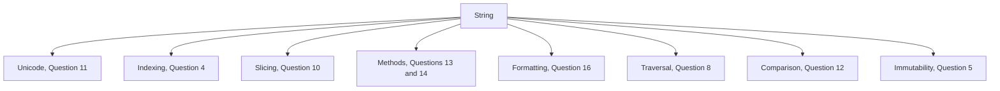

**How the concepts work together**

Suppose a program accepts a user's name and prints a greeting. Look at how many ideas from this chapter appear in five short steps.

**Step 1. Input.** Read the text. `input()` always returns a string, whatever the user types.

```python
name = input("Enter your name: ")
```

**Step 2. Whitespace removal.** Users often type stray spaces, and they are invisible on the screen.

```python
name = name.strip()
```

**Step 3. Validation.** Check the value before using it. Spaces between the parts of a name are removed first, because `isalpha()` rejects them.

```python
if name.replace(" ", "").isalpha():
    ...
```

**Step 4. Case conversion.** Store or display the name in a tidy form.

```python
name = name.title()
```

**Step 5. Formatting.** Build the message with an f-string.

```python
print(f"Welcome, {name}!")
```

**The combined script**

Here are all five steps in one working program, with the validation deciding what happens next.

```python
# Step 1: Read the name. input() always gives back a string.
name = input("Enter your name: ")

# Step 2: Remove any spaces typed at the beginning or the end
name = name.strip()

# Step 3: Reject an empty entry. An empty string counts as False.
if not name:
    print("You did not type anything.")

# Step 4: Allow letters and spaces only.
# The spaces are taken out before the test, because isalpha()
# returns False for a string that contains a space.
elif not name.replace(" ", "").isalpha():
    print("A name should contain letters only.")

else:
    # Step 5: Tidy the capital letters, so that asha kumari becomes Asha Kumari
    name = name.title()

    # Step 6: Use indexing to pick out the first letter
    initial = name[0]

    # Step 7: Use slicing and a method to work out the family name
    family_name = name.split()[-1] if " " in name else name

    # Step 8: Build the messages with f-strings
    print(f"Welcome, {name}!")
    print(f"Your initial is {initial}.")
    print(f"We will address you as {family_name}.")
    print(f"Your name has {len(name.replace(' ', ''))} letters.")
```

**Output when asha kumari is typed**

```text
Enter your name: asha kumari
Welcome, Asha Kumari!
Your initial is A.
We will address you as Kumari.
Your name has 10 letters.
```

**Output when 4571 is typed**

```text
Enter your name: 4571
A name should contain letters only.
```

Every step in this small program comes from a different part of the chapter: `strip()` and `title()` from the methods, `isalpha()` from the validation family, `name[0]` from indexing, `split()` from the splitting methods, and the f-strings from formatting. None of the steps changed the original string; each one built a new one.

**Summary table**

| Concept | Purpose | Typical methods and operations |
| --- | --- | --- |
| Creation | Create string objects | Quotes, `str()` |
| Indexing | Access characters | `s[0]`, `s[-1]` |
| Slicing | Extract substrings | `s[1:4]`, `s[::-1]` |
| Traversal | Visit each character | `for`, `while`, `enumerate()` |
| Comparison | Compare strings | `==`, `<`, `>` |
| Formatting | Display values | f-strings, `format()` |
| Validation | Check properties | `isalpha()`, `isdigit()` |
| Searching | Locate text | `find()`, `index()`, `in` |
| Modification | Create altered strings | `replace()`, `lower()`, `strip()` |
| Unicode | Character representation | `ord()`, `chr()` |

**Why strings are central to programming**

Almost every software application manipulates text. Examples include

- usernames and passwords
- email addresses
- filenames and file paths
- web pages
- reports
- search engines
- databases
- chat applications
- programming languages themselves

Mastering strings therefore provides the foundation for learning file handling, regular expressions, web development, databases, data science and natural language processing. A file, after all, is read as text; a web page arrives as text; and a database query is itself a string.

**Common beginner mistakes**

| Mistake | Correct understanding |
| --- | --- |
| Strings can be modified | Strings are immutable |
| Index starts at 1 | Index starts at 0 |
| The stop index is included | The stop index is excluded |
| `find()` and `index()` are identical | `index()` raises `ValueError` if the text is not found |
| `isdigit()` accepts decimal numbers | A decimal point is not a digit |
| `+` modifies a string | It creates a new string |
| A method call changes the string it is called on | The result must be stored, or it is lost |

**A checklist you can use while writing string code**

1. Did I keep the value returned by the method, instead of throwing it away?
2. Did I strip the input before comparing it with anything?
3. Did I handle the case difference, with `lower()` on both sides?
4. Did I check for empty input?
5. Did I use `find()` where the text may be missing, and `index()` only where it must be present?
6. Did I remember that the stop index of a slice is not included?
7. Did I use an f-string instead of joining pieces with `+`?

**Follow-up questions**

**20.1 Write one short program that uses at least six ideas from this page.**

Here is one. It takes a line of comma separated marks, checks each entry, and prints a small report.

```python
# Step 1: One line of data, as it might be typed or read from a file
line = " Asha,92 , Ravi,45,Meena,abc "

# Step 2: Split it into pieces and clean each piece
pieces = [piece.strip() for piece in line.split(",")]
print("Pieces after cleaning:", pieces)

# Step 3: Walk through the pieces two at a time, as name and marks
print("-" * 30)
print(f"{'Name':<10}{'Marks':>7}{'Result':>13}")
print("-" * 30)

for position in range(0, len(pieces), 2):
    name = pieces[position].title()
    marks_text = pieces[position + 1]

    # Step 4: Validate the marks before converting them
    if marks_text.isdigit():
        marks = int(marks_text)
        result = "Pass" if marks >= 40 else "Fail"
        print(f"{name:<10}{marks:>7}{result:>13}")
    else:
        print(f"{name:<10}{marks_text:>7}{'Not a number':>13}")

print("-" * 30)
```

**Output**

```text
Pieces after cleaning: ['Asha', '92', 'Ravi', '45', 'Meena', 'abc']
------------------------------
Name        Marks       Result
------------------------------
Asha           92         Pass
Ravi           45         Pass
Meena         abc Not a number
------------------------------
```

The ideas used here are splitting, stripping, `title()`, validation with `isdigit()`, conversion with `int()`, repetition with `*`, indexing into a list, and formatting with widths and alignment.

**20.2 Which parts of this chapter will I use most often?**

In practice, four things come up again and again: `strip()` on anything a user typed, `split()` and `join()` for moving between text and lists, `lower()` before any comparison, and f-strings for every message you print. The rest is needed less often, but knowing that it exists saves you from writing a loop where a method would do.

**Final key takeaways**

- Strings are **immutable Unicode sequences**.
- Most string operations produce **new objects** rather than modifying existing ones.
- Indexing and slicing provide efficient access to characters and substrings.
- Built-in methods simplify common text-processing tasks.
- Validation methods help ensure correct user input.
- f-strings offer the most readable way to format output.
- A strong understanding of strings is essential because text processing is fundamental to almost every area of Python programming.

[Back to the Table of Contents](#table-of-contents)

## Further Reading

- [Python documentation: Text Sequence Type, str](https://docs.python.org/3/library/stdtypes.html#text-sequence-type-str)
- [Python documentation: String Methods](https://docs.python.org/3/library/stdtypes.html#string-methods)
- [Python documentation: Format Specification Mini-Language](https://docs.python.org/3/library/string.html#format-specification-mini-language)
- [Python tutorial: An Informal Introduction to Strings](https://docs.python.org/3/tutorial/introduction.html#text)
- [Python documentation: unicodedata module](https://docs.python.org/3/library/unicodedata.html)
- [PEP 498: Literal String Interpolation, the proposal that added f-strings](https://peps.python.org/pep-0498/)
- [PEP 257: Docstring Conventions](https://peps.python.org/pep-0257/)
- [Unicode Consortium home page](https://home.unicode.org/)

[Back to the Table of Contents](#table-of-contents)

---

## Table of Changes

| No. | Section | In the original file | What was changed | Type of change |
|---|---|---|---|---|
| 1 | Page heading | The file began directly with Question 1 | Added the page title "Strings: Conceptual Questions and Answers" | Added |
| 2 | Introduction | Not present | Added an introduction: why strings matter, what the page covers, how to use it, and a note that the outputs are real | Added |
| 3 | Table of Contents | Not present | Added a nested Table of Contents down to the `###` level; the Table of Changes is not listed in it | Added |
| 4 | Navigation | Not present | Added a "Back to the Table of Contents" link at the end of every section listed in the Table of Contents | Added |
| 5 | Structure | Twenty questions one after another, with no headings | Questions grouped into five parts, each with a short introduction, and each question given its own heading so that it can be linked to | Added |
| 6 | All question texts | Twenty questions as printed in the book | Kept word for word. Each one is repeated in bold under its heading | No change |
| 7 | Stray text between Q10 and Q11 | The line "Excellent. This continues naturally from Parts 1 and 2 and covers one of the most important conceptual sections of your chapter. As before, the questions are intentionally brief for the printed book, while the answers are detailed for GitHub." | Removed. It was a note about the work, not part of the page | Deleted |
| 8 | Escaped characters throughout | Stray backslashes in the text and code: `3.14159 \* radius`, `new\_text`, `\+ joins strings`, `text\[::-1\]`, `filename\[-4:\]`, `\==`, `\[\]`, `\[:\]` | All stray backslashes removed so that the text and the code read correctly | Corrected |
| 9 | Question 1 | Answer ended with the key points | Added a runnable example with output, a set demonstration with output, a note that lists and tuples are sequences too, a link to the documentation, and follow-ups 1.1 and 1.2 | Expanded |
| 10 | Question 2 | Docstring example contained `3.14159 \* radius \* radius`; the `greet()` example was shown with a blank line after `def` | Corrected to `3.14159 * radius * radius`; the example rewritten as one runnable script with step comments and real output; link to PEP 257 added; follow-ups 2.1 and 2.2 added; a table on which quote to use added | Corrected and expanded |
| 11 | Question 3 | Outputs shown as inline comments such as `print(str([1,2,3]))  # "[1,2,3]"` | Outputs moved to text blocks and corrected: `print()` shows `[1, 2, 3]` with a space and without quotation marks. The summary table now has separate columns for the returned string and the printed form | Corrected |
| 12 | Question 3 | Not present | Added a script showing the `TypeError` and its two fixes, and follow-ups 3.1 and 3.2 on `print()` and `repr()` | Added |
| 13 | Question 4 | The example script contained `print(word[0\)`, which cannot run | Corrected to `print(word[0])` and the script rewritten with step comments and real output; the `IndexError` is now caught so that the script can finish | Corrected |
| 14 | Question 4 | Table rows named "Positive Index" and "Negative Index" | Rewritten with a rule for converting one index system into the other, and follow-ups 4.1 and 4.2 added | Expanded |
| 15 | Question 5 | Contained `new\_text = text.upper()` and an output block marked as Python | Corrected to `new_text`; output moved to a text block; a comparison with a list added to show what "mutable" means | Corrected |
| 16 | Question 5 | Said only that methods return new strings | Added three ways to build a changed string, including the list-and-join method, and follow-ups 5.1 and 5.2 on `id()`, `is` and `+=` | Expanded |
| 17 | Question 6 | The example script used doubled backslashes, as in `print("First Line\\nSecond Line")`, so it would have printed the escape sequences instead of acting on them. The output block was marked as Python and showed `Folder: C:\\Python\\Scripts` | Corrected to single backslashes; the real output now shows one backslash; output moved to a text block | Corrected |
| 18 | Question 6 | The table mentioned `\r` and `\b` but the script did not use them | Added a script that counts characters with `len()` and `repr()`, a separate script for `\r` and `\b` with a note that the screen result depends on the terminal, a note on unknown escape sequences and the `SyntaxWarning`, and follow-ups 6.1 and 6.2 | Expanded |
| 19 | Question 7 | Output block marked as Python; the ordinary string output was shown as two lines | Output moved to a text block and character counts added, which explain why nine characters become eleven in the raw string | Corrected |
| 20 | Question 7 | Not present | Added a script showing that a raw string is an ordinary `str` object, the rule that a raw string cannot end with one backslash, a link to the `re` module documentation, and follow-ups 7.1 and 7.2 | Added |
| 21 | Question 8 | The while-loop script was wrongly indented: `i = 0` followed by an indented `while` line, and the body not indented under it. The vowel-counting script had `count += 1` at the wrong level | Both scripts corrected and given step comments and real output | Corrected |
| 22 | Question 8 | Two traversal methods only | Added `enumerate()` as a third method, a while-loop version of the vowel count, a script that shows the `IndexError` caused by `<=`, and follow-ups 8.1 and 8.2 | Expanded |
| 23 | Question 9 | Outputs shown in blocks marked as Python; the flowchart line read `E\["Boolean Result"]`, which breaks the diagram | Outputs moved to text blocks; the flowchart corrected and its steps numbered | Corrected |
| 24 | Question 9 | Listed the operators and their uses | Added the `TypeError` from mixing a string with a number and its two fixes, a script that uses all three operators together, and follow-ups 9.1 and 9.2 | Expanded |
| 25 | Question 10 | The reversing example ran into the next paragraph, so the word "Here" appeared inside the output block. `print(text\[::-1\])` and `filename\[-4:\]` carried stray backslashes | Output block closed correctly and the stray backslashes removed | Corrected |
| 26 | Question 10 | Said that slicing returns a new string | Added the rule that `s[a:b]` returns `b - a` characters, a script showing that slicing never raises `IndexError`, a better way to find a file extension with `rfind()`, one more row in the mistakes table, and follow-ups 10.1 and 10.2 | Expanded |
| 27 | Question 11 | Unicode code points given in hexadecimal only | Added a decimal column, so that `U+20B9` can be matched with the 8377 printed by `ord()`; added a note that the first 128 Unicode code points are the ASCII codes | Expanded |
| 28 | Question 11 | Mentioned encryption as an application | Added a complete Caesar-shift script with output and an explanation of `% 26`, a `unicodedata` example that prints official character names, a script showing the three `ord()` and `chr()` errors, and follow-ups 11.1 and 11.2 including the difference between Unicode and UTF-8 | Expanded |
| 29 | Question 12 | The list of operators was shown in a code block as `\==`, `!=`, `<`, `<=`, `>`, `>=`; the comparison examples had no output | Stray backslashes removed; outputs added; the "Apple" and "Application" comparison explained to the character where it is decided | Corrected and expanded |
| 30 | Question 12 | Said that `is` checks identity | Added a script that shows `is` giving `True` in one case and `False` in another for equal strings, with the reason, so that the warning is concrete. Added case-insensitive sorting, and follow-ups 12.1 and 12.2 | Expanded |
| 31 | Question 13 | The list of methods was shown inside a block marked as Python, using box-drawing characters | Changed to a plain text block, and a script added that lists the real methods with `dir(str)` | Corrected |
| 32 | Question 13 | Method chaining shown with one example | Added the step-by-step form of the same chain, a note that the order of the methods matters, a script showing the missing-brackets mistake and the `AttributeError` on an integer, and follow-ups 13.1 and 13.2 | Expanded |
| 33 | Question 14 | Each method shown with a short example, outputs as bare blocks | All examples rewritten with step comments and verified outputs; `lstrip()`, `rstrip()`, `title()`, `capitalize()`, the count argument of `replace()`, the tuple form of `endswith()` and the no-argument form of `split()` added | Expanded |
| 34 | Question 14 | Said that methods do not change the original string | Added a script that shows the common slip of calling a method and throwing the result away, a worked example that splits and cleans one line of data, and follow-ups 14.1 and 14.2 | Added |
| 35 | Question 15 | The validation script was wrongly indented: `print("Valid age")` sat outside the `if` block, and the `else` branch followed a statement at the wrong level, so the script could not run | Rewritten correctly with step comments, and sample output shown for a valid and an invalid entry | Corrected |
| 36 | Question 15 | The limitations were described in words | Added one script that demonstrates every limitation, a script with ways around them using `replace()` and `try`, the difference between `isdigit()` and `isdecimal()`, and follow-ups 15.1 and 15.2 | Expanded |
| 37 | Question 16 | `print(f"Square = {a \*\* 2}")` carried stray backslashes | Corrected to `{a ** 2}` | Corrected |
| 38 | Question 16 | Compared the three formatting styles in a table | Added a script that writes the same message in all three styles, format specifications for rounding, thousands separators, percentages, alignment and leading zeros, the `{value=}` shortcut, the doubled brace, a link to PEP 498, and follow-ups 16.1 and 16.2 | Expanded |
| 39 | Question 17 | The palindrome script was wrongly indented: `is_palindrome = False` and `break` were not placed inside the `if` block, so the script could not run | Rewritten correctly with step comments and sample output for a palindrome and a non-palindrome | Corrected |
| 40 | Question 17 | Explained the algorithm in words | Added hand-worked trace tables for `madam` and `mango`, a version of the script that prints each comparison, a follow-up that ignores case, spaces and punctuation, and a follow-up on the empty string and the single character | Expanded |
| 41 | Question 18 | Output of the reversing example ran into the explanation, so the word "Here" appeared inside the output block | Block closed correctly; a script added that shows the original and the reverse side by side | Corrected |
| 42 | Question 18 | Limitations listed in words | Added a script that counts the comparisons of one method against the characters copied by the other, the difference between `[::-1]` and `reversed()`, and a cleaned-sentence example | Expanded |
| 43 | Question 19 | Comparison table and advice | Added a script that runs both methods on the same words and checks that they agree, one more row in the comparison table on stopping early, and a note on which version to write in practice | Expanded |
| 44 | Question 20 | The concept-map flowchart contained `G["Traversal"\]` and `H\["Comparison"]`, which break the diagram | Corrected, and each box now names the question that explains it | Corrected |
| 45 | Question 20 | The five steps of the worked example were numbered 1, 1, 2, 3, 4 | Renumbered 1 to 5 | Corrected |
| 46 | Question 20 | The example applied `title()` and then tested with `isalpha()`, which fails for a name containing a space | Corrected: the spaces are removed before the test. A complete combined script is now given after the separate steps, with output for a valid and an invalid entry | Corrected and added |
| 47 | Question 20 | Summary table used `\[\]` and `\[:\]` for indexing and slicing | Replaced with real examples such as `s[0]`, `s[-1]`, `s[1:4]` and `s[::-1]` | Corrected |
| 48 | Question 20 | Ended with the key takeaways | Added a checklist of seven questions to ask while writing string code, a worked report script that uses several ideas together, and follow-ups 20.1 and 20.2 | Added |
| 49 | End of page | Not present | Added a "Further Reading" list of links to the Python documentation, the two relevant PEPs and the Unicode site | Added |
| 50 | Whole page | Explanations of technical terms were assumed | Brief explanations or links added for terms such as immutable, sequence type, code point, hexadecimal, UTF-8, lexicographical order, instance, normalize, latency of growth in `O(n)`, and Pythonic | Added |
| 51 | All scripts | Few comments; outputs mostly inside comments | Every script now carries `# Step 1`, `# Step 2` style comments and print statements, and every output appears in its own fenced block | Modified |
| 52 | All outputs | Several outputs were absent, incomplete or wrong | Every script on the page was run on Python 3.11 and each output block is the actual result. The two exceptions, both marked in the text, are the memory address printed by a method object and a `reversed` object, which differ on every computer | Verified |

[Back to the Table of Contents](#table-of-contents)


