# Strings: Scripting Questions and Answers

This page holds the worked answers to the scripting questions of the chapter on strings. Each question asks you to write a short program. Each answer here gives the program, the output it produces, the steps behind it, and a note on the working pattern that the program shows.

The conceptual questions of this chapter ask what a string is. These scripting questions ask what you can do with one. That is the harder half, and the more useful one. Almost every real program handles text: a name typed into a form, a line read from a file, a web address, a password, a report printed for a user. The twenty small programs on this page cover the operations you will reach for again and again: measuring a string, taking a character or a slice out of it, walking through it, cleaning it, searching it, splitting it, joining it and printing it neatly.

**What this page contains**

- Twenty scripting questions, each with a complete program and its real output.
- Numbered steps in every program, so that the logic can be followed line by line.
- A short note after each program on the pattern it demonstrates, in plain words.
- Follow-up questions after each answer, with their own small programs.
- Tables and flowcharts where a picture makes the idea clearer.

**How to use this page**

Read the question, then write the program yourself before looking at the answer. Type the code rather than copying it, run it, and compare your output with the output shown. Where a program asks for input from the keyboard, the output block shows what was typed after the prompt, so your own run will show your own words.

Every program on this page was run on Python 3.11, and every output block is the actual result. Two things vary from one computer to another, and both are marked where they appear: anything you type yourself, and the two escape sequences `\r` and `\b`, whose effect on the screen depends on the terminal you use.

**The tools used on this page**

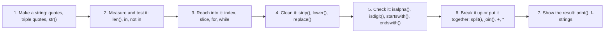

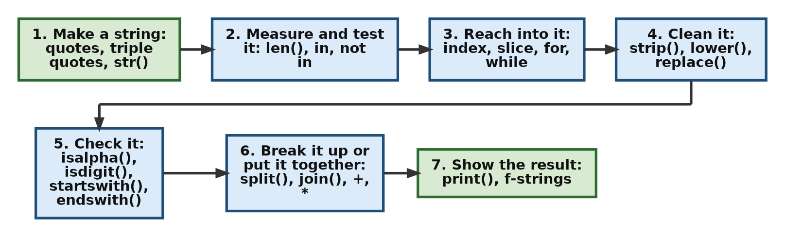

## Table of Contents

- [Part 1: Creating and Inspecting Strings](#part-1-creating-and-inspecting-strings)
  - [Question 1. A Multi-line Block, Its Length and a Search](#question-1-a-multi-line-block-its-length-and-a-search)
  - [Question 2. An Empty String, Concatenation and the Immutability Rule](#question-2-an-empty-string-concatenation-and-the-immutability-rule)
  - [Question 3. The First and the Last Character](#question-3-the-first-and-the-last-character)
  - [Question 4. Escape Sequences and the Raw String Prefix](#question-4-escape-sequences-and-the-raw-string-prefix)
- [Part 2: Traversal, Repetition and Slicing](#part-2-traversal-repetition-and-slicing)
  - [Question 5. Forward Traversal and Backward Traversal](#question-5-forward-traversal-and-backward-traversal)
  - [Question 6. A Banner Built With Repetition and Concatenation](#question-6-a-banner-built-with-repetition-and-concatenation)
  - [Question 7. Three Slices of One Word](#question-7-three-slices-of-one-word)
  - [Question 8. Reversing a String in One Expression](#question-8-reversing-a-string-in-one-expression)
- [Part 3: Characters and Comparison](#part-3-characters-and-comparison)
  - [Question 9. From Character to Number and Back](#question-9-from-character-to-number-and-back)
  - [Question 10. Comparing Two Strings, and the Tie-Breaker](#question-10-comparing-two-strings-and-the-tie-breaker)
- [Part 4: The String Methods](#part-4-the-string-methods)
  - [Question 11. Four Ways to Change the Case](#question-11-four-ways-to-change-the-case)
  - [Question 12. find() and index(), and What Each Does on Failure](#question-12-find-and-index-and-what-each-does-on-failure)
  - [Question 13. Cleaning Input and Counting a Letter](#question-13-cleaning-input-and-counting-a-letter)
  - [Question 14. Splitting a Line and Joining It Back](#question-14-splitting-a-line-and-joining-it-back)
  - [Question 15. Checking What a String Contains](#question-15-checking-what-a-string-contains)
  - [Question 16. Checking the Start and the End of a Web Address](#question-16-checking-the-start-and-the-end-of-a-web-address)
  - [Question 17. Replacing Every Occurrence of a Word](#question-17-replacing-every-occurrence-of-a-word)
- [Part 5: Negative Slicing, Conditions and Type Conversion](#part-5-negative-slicing-conditions-and-type-conversion)
  - [Question 18. Taking "lo" Out of "Hello" With Negative Positions](#question-18-taking-lo-out-of-hello-with-negative-positions)
  - [Question 19. A Decision Taken on the First Character](#question-19-a-decision-taken-on-the-first-character)
  - [Question 20. Building One Sentence From a List of Mixed Values](#question-20-building-one-sentence-from-a-list-of-mixed-values)
- [A Summary of the Twenty Questions](#a-summary-of-the-twenty-questions)
- [Further Reading](#further-reading)

## Part 1: Creating and Inspecting Strings

The first four questions build strings, measure them, look inside them, and show what Python does with a backslash.

[Back to the Table of Contents](#table-of-contents)

### Question 1. A Multi-line Block, Its Length and a Search

**1. Define multi-line text block with single quotes containing double quotes. Print total character count. Verify presence of text "Python".**

**Steps to follow**

1. Write the text inside triple single quotes, so that the double quotes inside it need no escaping and the line breaks can be typed as they are.
2. Pass the string to `len()` and print the count.
3. Use the `in` operator to test whether the word `Python` is present, and print the answer.

**Script**

```python
# Step 1: Assign a multi-line string literal to a variable using triple single quotes
# to handle embedded double quotes and physical line breaks seamlessly.
multiline_text = '''This is a "Python" string chapter.
It explores the foundational elements of sequences.
Every character has a distinct, fixed position.'''

# Step 2: Calculate the structural length of the string using the len() function.
total_length = len(multiline_text)
print("Total Character Count:", total_length)

# Step 3: Perform a membership validation using the 'in' operator to check for a substring.
has_python = "Python" in multiline_text
print("Is 'Python' present?:", has_python)

# Step 4: Print the text itself, to see that the line breaks were kept.
print("--- The text ---")
print(multiline_text)
```

**Output**

```text
Total Character Count: 134
Is 'Python' present?: True
--- The text ---
This is a "Python" string chapter.
It explores the foundational elements of sequences.
Every character has a distinct, fixed position.
```

**Where the 134 comes from**

The count includes the spaces and the two newline characters. A newline counts as one character, even though it is typed as a press of the enter key. The small script below proves it.

```python
# Step 1: The same text, in a shorter form
text = '''One
Two'''

# Step 2: Count the characters
print("Characters:", len(text))

# Step 3: repr() shows how the string is stored, with \n for each line break
print("Stored form:", repr(text))

# Step 4: Count the newlines separately
print("Number of newline characters:", text.count("\n"))
```

**Output**

```text
Characters: 7
Stored form: 'One\nTwo'
Number of newline characters: 1
```

`One` and `Two` give six characters. The seventh is the newline between them.

**Design Pattern Explanation**

- **Literal Initialization Pattern:** Triple quotes (`'''...'''`) let you type line breaks and unescaped double quote marks (`"`) straight into the text, without a `SyntaxError`. A `SyntaxError` is the error Python reports when a line of code is not written in a form it can read.
- **Sequence Inspection Pattern, `len()`:** The `len()` function reports how many characters the string holds. It counts everything, including spaces and newline characters.
- **Membership Evaluation Pattern, `in`:** The `in` operator searches the string from left to right and returns `True` as soon as it finds the exact characters `Python`. It is case-sensitive, so `python` would not be found.

**Follow-up questions**

**1.1 Would triple double quotes work just as well here?**

Not for this text. The block already contains double quote marks around the word `Python`, and a run of three of them would confuse Python. Triple single quotes are the right choice when the text contains double quotes, and triple double quotes when it contains single quotes or an apostrophe.

**1.2 How do I count the words and the lines instead of the characters?**

Use `split()` for the words and `splitlines()` for the lines. Both return a list, and `len()` then counts its items.

```python
# Step 1: The same block of text
multiline_text = '''This is a "Python" string chapter.
It explores the foundational elements of sequences.
Every character has a distinct, fixed position.'''

# Step 2: split() with no argument breaks the text at every run of spaces or newlines
print("Number of words:", len(multiline_text.split()))

# Step 3: splitlines() breaks the text at the line breaks only
print("Number of lines:", len(multiline_text.splitlines()))

# Step 4: A membership test that ignores case, for comparison
print("Is 'python' present, ignoring case?:", "python" in multiline_text.lower())
```

**Output**

```text
Number of words: 20
Number of lines: 3
Is 'python' present, ignoring case?: True
```

[Back to the Table of Contents](#table-of-contents)

### Question 2. An Empty String, Concatenation and the Immutability Rule

**2. Initialize an empty string container using a constructor. Append a string literal to it. Try to modify index 0 directly and handle the result.**

**Steps to follow**

1. Call `str()` with no argument to create an empty string.
2. Add text to it with `+=`, and print the result.
3. Try to replace the character at index 0, inside a `try` block.
4. Catch the `TypeError` and print its message, so that the program finishes normally instead of stopping.

**Script**

```python
# Step 1: Use the explicit type constructor to initialize a clean, empty string object.
base_container = str()
print("Starting value:", repr(base_container))
print("Starting length:", len(base_container))

# Step 2: Use an augmented assignment operator to concatenate a new literal.
# Since strings are immutable, this generates a completely new string object.
base_container += "Data"
print("Current String:", base_container)

# Step 3: Attempt direct structural mutation via index assignment within a try-except block
# to gracefully handle the resulting runtime failure.
try:
    base_container[0] = "M"
except TypeError as error_msg:
    print(f"Mutation Failed Safely: {error_msg}")

# Step 4: Show the accepted way to get the same result: build a new string.
changed = "M" + base_container[1:]
print("Built a new string instead:", changed)
print("The original is untouched:", base_container)
```

**Output**

```text
Starting value: ''
Starting length: 0
Current String: Data
Mutation Failed Safely: 'str' object does not support item assignment
Built a new string instead: Mata
The original is untouched: Data
```

`repr()` is used in step 1 so that the empty string is visible as a pair of quotes. A plain `print()` would show an empty line and leave you guessing.

**What the `+=` really does**

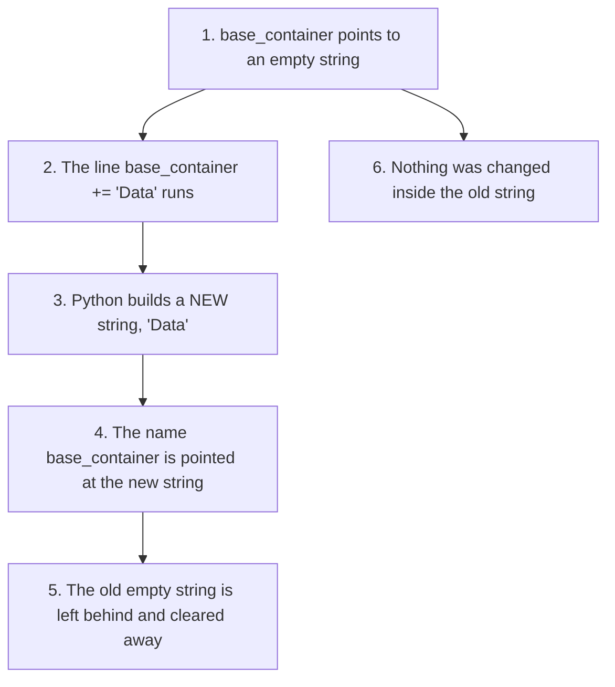

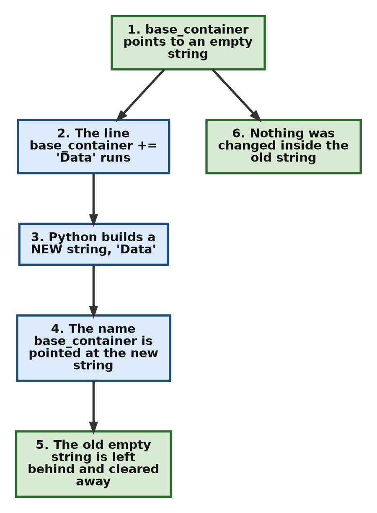

**Design Pattern Explanation**

- **Constructor Initialization Pattern:** Calling `str()` with no arguments gives an empty string. It makes the purpose of the variable clear to anyone reading the code. Writing `base_container = ""` does exactly the same thing and is shorter, so both forms are common.
- **Accumulator Pattern with `+=`:** Because strings cannot be changed, `+=` does not add anything to the existing string. It makes a new string out of the two pieces and points the old name at it. This is fine for a few additions. Inside a long loop it is wasteful, and collecting the pieces in a list and calling `join()` once is better.
- **Immutability Guard Pattern:** A string refuses to have one of its characters replaced. `base_container[0] = "M"` therefore raises a `TypeError`, which is the error Python reports when an operation is applied to a type that does not support it. Wrapping the line in `try` and `except` lets the program note the failure and carry on.

**Follow-up questions**

**2.1 Is an empty string `False` in a condition?**

Yes. An empty string counts as false, and a string with anything in it counts as true. This is the usual way to check whether a user typed something.

```python
# Step 1: Two strings, one empty and one not
empty_text = str()
filled_text = "Data"

# Step 2: Use each one directly in a condition
print("Is the empty string true?:", bool(empty_text))
print("Is the filled string true?:", bool(filled_text))

# Step 3: The everyday form of the same test
if not empty_text:
    print("Nothing was typed.")
```

**Output**

```text
Is the empty string true?: False
Is the filled string true?: True
Nothing was typed.
```

**2.2 If a string cannot be changed, how do programs edit text at all?**

They build new strings. Three ways cover almost every case: join the pieces with `+` or an f-string; call a method such as `replace()`, which returns a new string; or turn the string into a list of characters, change the list, and join it back.

```python
# Step 1: The starting text
word = "Data"

# Step 2: Method one, build the new string from slices
print("With slicing :", "M" + word[1:])

# Step 3: Method two, use a method that returns a new string
print("With replace():", word.replace("D", "M", 1))

# Step 4: Method three, edit a list of characters and join it back
letters = list(word)
letters[0] = "M"
print("With a list  :", "".join(letters))
```

**Output**

```text
With slicing : Mata
With replace(): Mata
With a list  : Mata
```

The `1` given to `replace()` limits it to the first match, which matters when the letter appears more than once.

[Back to the Table of Contents](#table-of-contents)

### Question 3. The First and the Last Character

**3. Accept a raw user string. Extract the very first character and the absolute last character using zero-based and negative indexing boundaries.**

**Steps to follow**

1. Read the text with `input()`.
2. Check that the user typed something, because an empty string has no first character.
3. Take the first character with index `0`.
4. Take the last character with index `-1`.
5. Print both, and print a message instead if the input was empty.

**Script**

```python
# Step 1: Request string data from the user via standard input.
user_input = input("Enter a sample text sequence: ")

# Step 2: Verify the input is not empty before attempting bounded indexing.
if len(user_input) > 0:
    # Extract the absolute first element using the structural zero index base.
    first_char = user_input[0]

    # Extract the absolute final element using negative offset indexing.
    last_char = user_input[-1]

    print("First Character:", first_char)
    print("Last Character:", last_char)

    # Step 3: The same last character, found the long way round, for comparison.
    print("Last character again:", user_input[len(user_input) - 1])
else:
    print("Input sequence is empty.")
```

**Output when Python is typed**

```text
Enter a sample text sequence: Python
First Character: P
Last Character: n
Last character again: n
```

**Output when the enter key is pressed without typing anything**

```text
Enter a sample text sequence: 
Input sequence is empty.
```

**What happens without the guard**

The check in step 2 is not decoration. Without it, an empty entry stops the program.

```python
# Step 1: An empty string, as an impatient user would leave it
user_input = ""

# Step 2: Reading index 0 of an empty string is an error
try:
    print(user_input[0])
except IndexError as error:
    print("Error message:", error)
```

**Output**

```text
Error message: string index out of range
```

**The two index systems side by side**

| Character | P | y | t | h | o | n |
| --- | --- | --- | --- | --- | --- | --- |
| Positive index | 0 | 1 | 2 | 3 | 4 | 5 |
| Negative index | -6 | -5 | -4 | -3 | -2 | -1 |

**Design Pattern Explanation**

- **Boundary Validation Guard:** The test `len(user_input) > 0` is a guard. It stops the program from reading a character that does not exist, which would raise an `IndexError`. The same test can be written simply as `if user_input:`.
- **Zero-Based Indexing Pattern:** The first character of any Python sequence sits at position `0`, not `1`. So the position number of a character is also the count of characters before it.
- **Negative Offset Indexing Pattern:** Negative positions count backwards from the end. Index `-1` is the last character, `-2` the one before it. This saves you from writing `user_input[len(user_input) - 1]`, which does the same work with more chances of a mistake.

**Follow-up questions**

**3.1 How do I get the first and last characters safely, without a guard?**

Use slices instead of indexes. A slice of an empty string is an empty string, not an error.

```python
# Step 1: Try both an ordinary string and an empty one
for text in ["Python", ""]:
    # Step 2: A slice never raises IndexError
    first = text[:1]
    last = text[-1:]
    print(f"text = {text!r}, first = {first!r}, last = {last!r}")
```

**Output**

```text
text = 'Python', first = 'P', last = 'n'
text = '', first = '', last = ''
```

The `!r` inside the braces asks the f-string to show the value the way `repr()` would, with quotes, so that an empty result can be seen.

**3.2 Does `input()` ever return anything other than a string?**

No. `input()` always gives back a string, even when the user types digits. That is why a number read from the keyboard has to be passed through `int()` or `float()` before any arithmetic, and why it should be checked first, as Question 15 of the conceptual set shows.

```python
# Step 1: Pretend the user typed 25
typed = "25"

# Step 2: input() gives a string, so this is text, not a number
print("Type of the input:", type(typed))
print("Adding text to itself:", typed + typed)

# Step 3: Convert it, and the same expression now adds numbers
number = int(typed)
print("Adding numbers:", number + number)
```

**Output**

```text
Type of the input: <class 'str'>
Adding text to itself: 2525
Adding numbers: 50
```

[Back to the Table of Contents](#table-of-contents)

### Question 4. Escape Sequences and the Raw String Prefix

**4. Demonstrate print behavior of `\n`, `\t`, `\r`, and `\b`. Write an identical string prefixed as a raw string literal to compare outputs.**

**Steps to follow**

1. Write one string that contains all four escape sequences and print it.
2. Write the same text again with an `r` before the opening quote, and print that.
3. Compare the two outputs.
4. Look at each escape sequence on its own, so that its effect is easy to see.

**Script**

```python
# Step 1: Define a normal string containing multiple escape character escape sequences.
escaped_sequence = "Line1\nTab\tOver\rWrite\bDone"
print("--- Normal String Output ---")
print(escaped_sequence)

# Step 2: Define an identical string prefixed with the raw string literal flag 'r'.
raw_sequence = r"Line1\nTab\tOver\rWrite\bDone"
print("\n--- Raw String Output ---")
print(raw_sequence)

# Step 3: Count the characters in each version.
print("\nCharacters in the normal string:", len(escaped_sequence))
print("Characters in the raw string:   ", len(raw_sequence))
```

**Output on a normal terminal**

```text
--- Normal String Output ---
Line1
WritDoneOver

--- Raw String Output ---
Line1\nTab\tOver\rWrite\bDone

Characters in the normal string: 25
Characters in the raw string:    29
```

The second line of the normal output looks strange, so it is worth taking apart. `\r` and `\b` do not delete anything from the string. They only move the writing position, and what you finally see is whatever was written last in each column.

| Stage | What is printed | The line so far |
| --- | --- | --- |
| 1 | `Tab` | `Tab` |
| 2 | `\t` moves to column 8 | `Tab     ` |
| 3 | `Over` | `Tab     Over` |
| 4 | `\r` moves back to column 0 | `Tab     Over` |
| 5 | `Write` overwrites the first five columns | `Write   Over` |
| 6 | `\b` steps back one column, to column 4 | `Write   Over` |
| 7 | `Done` overwrites columns 4 to 7 | `WritDoneOver` |

The four-character difference in the counts is the explanation in numbers. In the normal string each escape sequence is one character, so the four of them take four places. In the raw string each one takes two, which adds four more.

**Each escape sequence on its own**

```python
# Step 1: \n starts a new line
print("A\nB")

# Step 2: \t moves to the next tab stop, which is usually eight columns wide
print("A\tB")

# Step 3: \r returns to the start of the line, so AB overwrites the first two digits
print("12345\rAB")

# Step 4: \b steps back one column, so D overwrites C
print("ABC\bD")

# Step 5: The strings themselves are untouched. Count them.
print("Characters in 'A\\tB':", len("A\tB"))
print("Characters in '12345\\rAB':", len("12345\rAB"))
```

**Output on a normal terminal**

```text
A
B
A	B
AB345
ABD
Characters in 'A\tB': 3
Characters in '12345\rAB': 8
```

If you run these lines inside some editors or notebook windows, the `\r` and `\b` results may look different, because those windows handle the writing position in their own way. The character counts are the same everywhere.

**The four sequences at a glance**

| Sequence | Name | What it does | Where it is used |
| --- | --- | --- | --- |
| `\n` | Newline | Moves to the start of the next line | Ending a line of output, writing files |
| `\t` | Horizontal tab | Moves to the next tab stop | Simple columns of output |
| `\r` | Carriage return | Moves to the start of the same line | Progress messages that overwrite themselves |
| `\b` | Backspace | Moves back one column | Rare in ordinary programs |

**How Python reads a backslash**

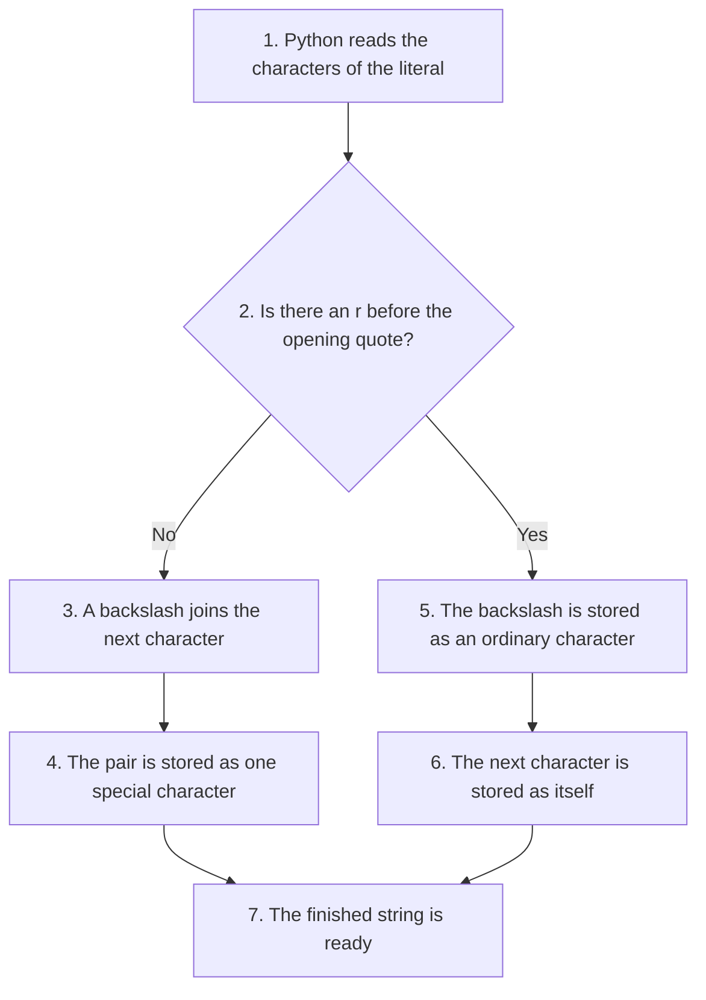

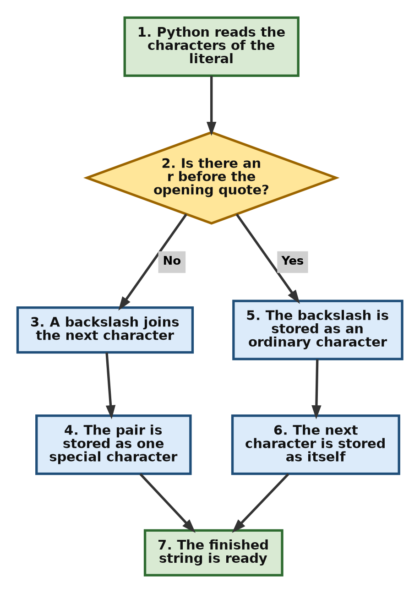

**Design Pattern Explanation**

- **Escape Character Processing Pattern:** In an ordinary string the backslash is a signal, not a character. Python turns `\n` into a newline, `\t` into a tab, `\r` into a carriage return that moves the writing position to the start of the line, and `\b` into a backspace that moves it one column to the left. Each pair becomes one character in the stored string.
- **Literal Preservation Prefix Pattern:** An `r` before the opening quote switches that processing off. The backslash is then stored as a plain character, so `\n` and `\t` appear on the screen exactly as they were typed. This is what makes raw strings the normal choice for Windows file paths and for the patterns used in regular expressions.

**Follow-up questions**

**4.1 How can I see what a string really holds, without the escapes acting?**

Print it through `repr()`. That is what `repr()` is for: it shows the string the way you would have to type it.

```python
# Step 1: One ordinary string and one raw string
normal = "A\tB"
raw = r"A\tB"

# Step 2: print() acts on the escape sequence
print("print(normal):", normal)
print("print(raw)   :", raw)

# Step 3: repr() shows how each one is stored
print("repr(normal) :", repr(normal))
print("repr(raw)    :", repr(raw))
```

**Output**

```text
print(normal): A	B
print(raw)   : A\tB
repr(normal) : 'A\tB'
repr(raw)    : 'A\\tB'
```

The double backslash in the last line is not a mistake. It is how you would have to type that string without the `r` prefix.

**4.2 Where is `\r` actually useful?**

In a progress message that keeps rewriting the same line. The `end=""` argument stops `print()` from moving to a new line, and the `\r` sends the writing position back to the start, so the next message covers the previous one.

```python
# Step 1: A short countdown that reuses one line
import time

for count in range(3, 0, -1):
    # Step 2: \r returns to the start of the line, end="" keeps us on it
    print(f"\rStarting in {count} seconds...", end="")
    time.sleep(0.2)

# Step 3: Finish with a newline so that later output begins on a fresh line
print("\rStarting now.            ")
```

**Output, as it looks when the countdown has finished**

```text
Starting now.            
```

While the loop runs, the line changes from 3 to 2 to 1 in the same place. The extra spaces at the end of the last message cover the longer text that was there before.

[Back to the Table of Contents](#table-of-contents)

## Part 2: Traversal, Repetition and Slicing

The next four questions move through a string: one character at a time in both directions, then in whole pieces cut out with a slice.

[Back to the Table of Contents](#table-of-contents)

### Question 5. Forward Traversal and Backward Traversal

**5. Traverse a string sequence character-by-character using a basic `for` loop. Re-traverse the string backward using a counter-driven `while` loop.**

**Steps to follow**

1. Put the word in a variable.
2. Use a `for` loop to print the characters from left to right.
3. Set a counter to the last index, which is `len(word) - 1`.
4. Use a `while` loop that prints the character at the counter and then reduces the counter by one.
5. Stop when the counter falls below zero.

**Script**

```python
# Step 1: Define the target word sequence.
target_word = "Python"

print("--- Forward Traversal (for loop) ---")
# Step 2: Use a direct sequence iterator to access each character without tracking indices.
for character in target_word:
    print(character, end=" ")
print()  # Insert a clean line break

print("\n--- Backward Traversal (while loop) ---")
# Step 3: Initialize a counter variable to track indices manually from right to left.
index_pointer = len(target_word) - 1

# Step 4: Run a conditional loop that processes indices down to zero.
while index_pointer >= 0:
    print(target_word[index_pointer], end=" ")
    index_pointer -= 1  # Manually decrement the counter to move backward
print()

# Step 5: Show where the counter finished, to explain the stopping condition.
print("The counter stopped at:", index_pointer)
```

**Output**

```text
--- Forward Traversal (for loop) ---
P y t h o n 

--- Backward Traversal (while loop) ---
n o h t y P 
The counter stopped at: -1
```

The counter ends at `-1`. That is one step past the first character, and it is exactly why the condition is written as `index_pointer >= 0`.

**A trace of the while loop**

| Pass | `index_pointer` | Character printed | Condition after the step |
| --- | --- | --- | --- |
| 1 | 5 | n | 4 >= 0, so continue |
| 2 | 4 | o | 3 >= 0, so continue |
| 3 | 3 | h | 2 >= 0, so continue |
| 4 | 2 | t | 1 >= 0, so continue |
| 5 | 1 | y | 0 >= 0, so continue |
| 6 | 0 | P | -1 is not >= 0, so stop |

**The two loops side by side**

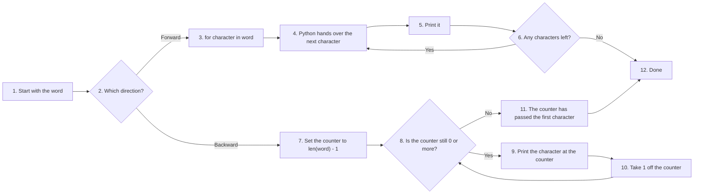

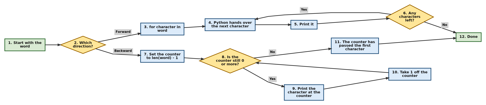

**Design Pattern Explanation**

- **Sequence Iterator Pattern, `for`:** The form `for character in sequence` treats the string as a stream of characters. Python fetches them one at a time from left to right. There is no counter to set up, no condition to get wrong and no chance of an endless loop.
- **Manual Pointer Navigation Pattern, `while`:** The `while` loop keeps its own position in the variable `index_pointer`. You have to set it, test it and change it yourself. That is more work, and the price of forgetting the line `index_pointer -= 1` is a loop that never ends. In return you get full control, which is what you need for going backwards, for skipping characters or for comparing two positions at once.

**Follow-up questions**

**5.1 Is there a shorter way to walk through a string backwards?**

Two shorter ways. A slice with a step of `-1` reverses the string, and `reversed()` hands over the characters from the end. Both avoid the counter.

```python
# Step 1: The word to walk through
target_word = "Python"

# Step 2: A slice with a step of -1
for character in target_word[::-1]:
    print(character, end=" ")
print()

# Step 3: The built-in reversed() function
for character in reversed(target_word):
    print(character, end=" ")
print()

# Step 4: A range that counts down, which keeps the index available
for i in range(len(target_word) - 1, -1, -1):
    print(f"{i}:{target_word[i]}", end=" ")
print()
```

**Output**

```text
n o h t y P 
n o h t y P 
5:n 4:o 3:h 2:t 1:y 0:P 
```

The `range(len(word) - 1, -1, -1)` in step 4 reads: start at 5, stop before -1, and step by -1. The stop value has to be `-1` rather than `0`, or the first character would never be reached.

**5.2 What if I need both the character and its position in a forward loop?**

Use `enumerate()`. It hands over the position and the character together, so you get the convenience of the `for` loop and the position of the `while` loop.

```python
# Step 1: enumerate() gives a pair on every pass
for position, character in enumerate("Python"):
    print(f"Position {position} holds {character}")
```

**Output**

```text
Position 0 holds P
Position 1 holds y
Position 2 holds t
Position 3 holds h
Position 4 holds o
Position 5 holds n
```

[Back to the Table of Contents](#table-of-contents)

### Question 6. A Banner Built With Repetition and Concatenation

**6. Replicate a single character 10 times to form a divider. Concatenate a header label to the center. Use membership operators to verify if a space is inside.**

**Steps to follow**

1. Build the divider by repeating one character ten times with `*`.
2. Keep the label in a variable, with a space at each end.
3. Join divider, label and divider with `+`.
4. Test the finished banner for a space with `not in`, and print the answer.

**Script**

```python
# Step 1: Use the repetition operator (*) to generate a uniform border line.
border_line = "=" * 10
print("Border line:", border_line)

# Step 2: Use the concatenation operator (+) to glue the parts into a single header string.
header_title = " REPORT "
full_banner = border_line + header_title + border_line
print("Generated Banner:", full_banner)

# Step 3: Use the 'not in' membership operator to verify if there are spaces in the banner.
has_no_space = " " not in full_banner
print("Is banner completely free of spaces?:", has_no_space)

# Step 4: Count the spaces, and check the total width.
print("Number of spaces:", full_banner.count(" "))
print("Total width:", len(full_banner))
```

**Output**

```text
Border line: ==========
Generated Banner: ========== REPORT ==========
Is banner completely free of spaces?: False
Number of spaces: 2
Total width: 28
```

The answer to step 3 is `False`, and that is the correct answer. The label was written as `" REPORT "` with a space at each end, so the banner does contain spaces. A `False` here is the test working, not the program failing.

**A neater way to centre a label**

Python has a method for this exact job. `center()` pads a string with a chosen character until it reaches the width you ask for.

```python
# Step 1: The label and the width of the finished banner
header_title = " REPORT "
width = 28

# Step 2: center() pads both sides with the chosen character
print(header_title.center(width, "="))

# Step 3: The same idea with a different character and width
print(" MARKS ".center(20, "-"))

# Step 4: ljust() and rjust() pad one side only
print("Name".ljust(12, ".") + "Asha")
```

**Output**

```text
========== REPORT ==========
------ MARKS -------
Name........Asha
```

The first line is exactly the banner built by hand in the main script. The label is 8 characters wide, the width asked for is 28, and the 20 characters left over split evenly into ten on each side.

The second line shows what happens when the padding cannot be split evenly. The label is 7 characters wide and the width is 20, which leaves 13. `center()` then puts 6 on the left and 7 on the right; the extra one goes to the right.

**Design Pattern Explanation**

- **Sequence Repetition Pattern, `*`:** The `*` operator needs a string on one side and a whole number on the other. It writes the string out that many times, one copy after another. A count of `0` or less gives an empty string.
- **Polymorphic Concatenation Pattern, `+`:** The `+` operator joins strings end to end. Both sides must be strings. Mixing a string with a number raises a `TypeError`, so a number has to be passed through `str()` first, or placed in an f-string.
- **Negative Membership Logic Pattern, `not in`:** The `not in` operator searches the whole string and returns `True` only when the text being looked for is absent anywhere in it.

**Follow-up questions**

**6.1 What happens if the number in a repetition is not a whole number?**

Python raises a `TypeError`. A string cannot be written out two and a half times. The count must be an `int`.

```python
# Step 1: A whole number is fine
print("Whole number:", "ab" * 3)

# Step 2: A decimal number is not
try:
    print("ab" * 2.5)
except TypeError as error:
    print("Error message:", error)

# Step 3: Zero and negative counts give an empty string, not an error
print("Zero count:", repr("ab" * 0))
print("Negative count:", repr("ab" * -4))
```

**Output**

```text
Whole number: ababab
Error message: can't multiply sequence by non-int of type 'float'
Zero count: ''
Negative count: ''
```

**6.2 How do I build a banner whose width follows the label?**

Work the width out from `len()` instead of fixing it at ten. The banner then fits any label you give it.

```python
# Step 1: The label, with a space on each side
for label in [" REPORT ", " ANNUAL RESULT SUMMARY "]:
    # Step 2: The border matches the label's own width
    line = "=" * len(label)

    # Step 3: Print the three lines of the banner
    print(line)
    print(label)
    print(line)
    print()
```

**Output**

```text
========
 REPORT 
========

=======================
 ANNUAL RESULT SUMMARY 
=======================

```

[Back to the Table of Contents](#table-of-contents)

### Question 7. Three Slices of One Word

**7. Slice the string `"Programming"` to isolate the first 4 characters, then extract the last 4 characters, and finally copy the entire string with a step of 2.**

**Steps to follow**

1. Put the word in a variable.
2. Take the first four characters by leaving the start out, as `[:4]`.
3. Take the last four by giving a negative start and leaving the stop out, as `[-4:]`.
4. Take every second character by giving only a step, as `[::2]`.
5. Print each result with a label.

**Script**

```python
# Step 1: Set up the base text sequence.
base_text = "Programming"
print("Base text:", base_text, "with", len(base_text), "characters")

# Step 2: Isolate the first 4 characters using an omitted start index.
first_four = base_text[:4]
print("First 4 characters [0:4]:", first_four)

# Step 3: Extract the last 4 characters using a negative start offset index.
last_four = base_text[-4:]
print("Last 4 characters [-4:]:", last_four)

# Step 4: Step through the entire string, skipping every second character.
strided_copy = base_text[::2]
print("Every alternate character [::2]:", strided_copy)

# Step 5: The original string is unchanged by any of this.
print("Base text after slicing:", base_text)
```

**Output**

```text
Base text: Programming with 11 characters
First 4 characters [0:4]: Prog
Last 4 characters [-4:]: ming
Every alternate character [::2]: Pormig
Base text after slicing: Programming
```

**Which positions each slice picked**

The word has eleven characters, so its positive indexes run from 0 to 10.

| Index | 0 | 1 | 2 | 3 | 4 | 5 | 6 | 7 | 8 | 9 | 10 |
| --- | --- | --- | --- | --- | --- | --- | --- | --- | --- | --- | --- |
| Character | P | r | o | g | r | a | m | m | i | n | g |
| `[:4]` | P | r | o | g | | | | | | | |
| `[-4:]` | | | | | | | | m | i | n | g |
| `[::2]` | P | | o | | r | | m | | i | | g |

**Design Pattern Explanation**

- **Omitted Boundary Default Slicing Pattern:** A slice is written `[start:stop:step]`, and any part may be left out. Leaving out the start, as in `[:4]`, means begin at the beginning. Leaving out the stop, as in `[-4:]`, means carry on to the end.
- **Exclusive Upper Bound Rule:** The slice `[:4]` takes the characters at 0, 1, 2 and 3 and stops just before 4. The character at the stop position is never included. A handy consequence is that `[a:b]` returns `b - a` characters, so `[:4]` returns four.
- **Strided Sequence Sampling Pattern:** A step of `2`, as in `[::2]`, takes one character and skips the next. Starting from 0, that picks the positions 0, 2, 4, 6, 8 and 10, which is why six characters come back from a word of eleven.

**Follow-up questions**

**7.1 How do I get the middle three characters?**

Work out the middle from the length. Integer division with `//` gives the middle position, and a slice takes one character on each side of it.

```python
# Step 1: The word and its middle position
base_text = "Programming"
middle = len(base_text) // 2
print("Length:", len(base_text), "and middle index:", middle)

# Step 2: One character each side of the middle
print("Middle three characters:", base_text[middle - 1:middle + 2])

# Step 3: The same idea on a shorter word
word = "Python"
middle = len(word) // 2
print("Middle two characters of Python:", word[middle - 1:middle + 1])
```

**Output**

```text
Length: 11 and middle index: 5
Middle three characters: ram
Middle two characters of Python: th
```

**7.2 What does a slice do when the numbers are too large?**

Nothing alarming. Slicing never raises an error for a position outside the string. It simply gives back whatever falls inside.

```python
# Step 1: The base word
base_text = "Programming"

# Step 2: A stop position past the end is allowed
print("base_text[7:100]:", base_text[7:100])

# Step 3: A start past the end gives an empty string
print("base_text[50:60]:", repr(base_text[50:60]))

# Step 4: A start after the stop also gives an empty string
print("base_text[8:3]:  ", repr(base_text[8:3]))
```

**Output**

```text
base_text[7:100]: ming
base_text[50:60]: ''
base_text[8:3]:   ''
```

This is the main difference between indexing and slicing. `base_text[50]` would stop the program; `base_text[50:60]` just gives nothing.

[Back to the Table of Contents](#table-of-contents)

### Question 8. Reversing a String in One Expression

**8. Reverse an entire user-input string using a single slicing expression. Print the output text directly.**

**Steps to follow**

1. Read the text with `input()`.
2. Reverse it with the slice `[::-1]`.
3. Print the result.

**Script**

```python
# Step 1: Capture raw text input from the user interface console.
original_text = input("Type a text string to reverse: ")

# Step 2: Invert the string by passing a negative step value into a slice.
reversed_text = original_text[::-1]

# Step 3: Display the resulting inverted text.
print("Original Text:", original_text)
print("Reversed Result:", reversed_text)

# Step 4: A reversed string is as long as the original, and the original is unchanged.
print("Length of both:", len(original_text), "and", len(reversed_text))
```

**Output when Python is typed**

```text
Type a text string to reverse: Python
Original Text: Python
Reversed Result: nohtyP
Length of both: 6 and 6
```

**Output when madam is typed**

```text
Type a text string to reverse: madam
Original Text: madam
Reversed Result: madam
Length of both: 5 and 5
```

The second run shows a palindrome: a word that reads the same both ways. Comparing `original_text` with `original_text[::-1]` is the shortest way to test for one.

**Why the slice needs no start and no stop**

With a step of `-1`, Python fills in the two missing numbers the other way round. It starts at the last character and moves left until it has passed the first one.

| Slice | Start used | Stop used | Result for `"Python"` |
| --- | --- | --- | --- |
| `[::1]` | the first character | past the last | `Python` |
| `[::-1]` | the last character | past the first | `nohtyP` |
| `[::-2]` | the last character | past the first | `nhy` |
| `[3::-1]` | index 3 | past the first | `htyP` |

```python
# Step 1: One word, four slices
word = "Python"

# Step 2: A step of 1 is the default, so the string comes back unchanged
print("word[::1] :", word[::1])

# Step 3: A step of -1 reverses it
print("word[::-1]:", word[::-1])

# Step 4: A step of -2 reverses it and takes every second character
print("word[::-2]:", word[::-2])

# Step 5: A start with a negative step begins there and moves left
print("word[3::-1]:", word[3::-1])
```

**Output**

```text
word[::1] : Python
word[::-1]: nohtyP
word[::-2]: nhy
word[3::-1]: htyP
```

**Design Pattern Explanation**

- **Evaluation Inversion Slicing Pattern, `[::-1]`:** Leaving the start and the stop empty tells Python to use the whole string. A step of `-1` tells it to walk from right to left. The result is a new reversed string, built in one short expression with no loop of any kind.

**Follow-up questions**

**8.1 Does the slice change the original string?**

No. It builds a second string and leaves the first one alone, like every other string operation.

```python
# Step 1: The original word
word = "Python"

# Step 2: Reverse it into a new name
backwards = word[::-1]

# Step 3: Both names still hold their own value
print("word     :", word)
print("backwards:", backwards)

# Step 4: Reversing twice returns the original text
print("Reversed twice:", word[::-1][::-1])
```

**Output**

```text
word     : Python
backwards: nohtyP
Reversed twice: Python
```

**8.2 How do I reverse the words of a sentence instead of the letters?**

Split the sentence into words, reverse the list, and join it back. `[::-1]` works on a list in exactly the same way as on a string.

```python
# Step 1: A sentence to work on
sentence = "Python makes text handling simple"

# Step 2: Split it into a list of words
words = sentence.split()
print("Words:", words)

# Step 3: Reverse the list of words, not the letters
reversed_words = words[::-1]
print("Reversed list:", reversed_words)

# Step 4: Join them back into a sentence
print("Sentence with the words reversed:", " ".join(reversed_words))

# Step 5: For comparison, the letters reversed
print("Sentence with the letters reversed:", sentence[::-1])
```

**Output**

```text
Words: ['Python', 'makes', 'text', 'handling', 'simple']
Reversed list: ['simple', 'handling', 'text', 'makes', 'Python']
Sentence with the words reversed: simple handling text makes Python
Sentence with the letters reversed: elpmis gnildnah txet sekam nohtyP
```

[Back to the Table of Contents](#table-of-contents)

## Part 3: Characters and Comparison

The next two questions go one level below the characters, to the numbers Python actually stores, and show how those numbers decide which of two strings is the smaller.

[Back to the Table of Contents](#table-of-contents)

### Question 9. From Character to Number and Back

**9. Convert the character `'A'` to its integer Unicode code point. Convert integer `97` back to a character. Evaluate a direct relational comparison between `'A'` and `'a'`.**

**Steps to follow**

1. Pass `'A'` to `ord()` and print the number that comes back.
2. Pass `97` to `chr()` and print the character that comes back.
3. Compare `'A'` with `'a'` using `<`, and print the result.
4. Print the two code points together, so that the result of the comparison is easy to explain.

**Script**

```python
# Step 1: Convert a single character string into its numeric Unicode code point.
uppercase_code = ord('A')
print("Unicode code point of 'A':", uppercase_code)

# Step 2: Convert an integer Unicode value back into a character string.
lowercase_char = chr(97)
print("Character matching code point 97:", lowercase_char)

# Step 3: Use a relational operator to compare the values.
# Python compares their underlying Unicode points, not the shapes of the letters.
comparison_result = 'A' < 'a'
print("Is 'A' less than 'a' structurally?:", comparison_result)

# Step 4: Print both numbers side by side, which explains the answer above.
print("ord('A') is", ord('A'), "and ord('a') is", ord('a'))

# Step 5: The two functions undo each other.
print("chr(ord('A')) gives:", chr(ord('A')))
```

**Output**

```text
Unicode code point of 'A': 65
Character matching code point 97: a
Is 'A' less than 'a' structurally?: True
ord('A') is 65 and ord('a') is 97
chr(ord('A')) gives: A
```

**A code point** is simply the number that Unicode gives to a character. Unicode is the worldwide table of characters used by Python 3 for all its text, and it covers nearly every writing system, not just English. The first 128 entries of that table are the old ASCII codes, which is why `A` is still 65.

**The circle of the two functions**

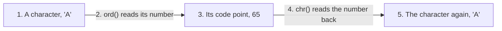

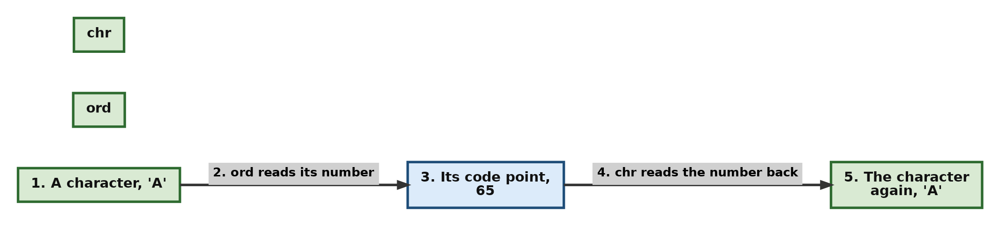

**Design Pattern Explanation**

- **Character-to-Integer Translation Pattern, `ord()`:** `ord()` takes a string of exactly one character and returns its Unicode number. Two characters, or a number, will raise a `TypeError`.
- **Integer-to-Character Translation Pattern, `chr()`:** `chr()` does the reverse. It takes a whole number and returns the character that holds that place in the Unicode table.
- **Lexicographical Relational Comparison Pattern:** When Python compares two characters with `<` or `>`, it compares their code points. Since 65 is smaller than 97, `'A' < 'a'` is `True`. The shapes of the letters play no part in it, which is why all capital letters come before all small letters.

**Follow-up questions**

**9.1 What is the gap between a capital letter and its small form?**

Thirty-two, for every letter of the English alphabet. That fixed gap is how programs changed case before methods such as `lower()` existed.

```python
# Step 1: Compare a few pairs of letters
for letter in "ABZ":
    small = letter.lower()
    print(f"{letter} is {ord(letter)}, {small} is {ord(small)}, gap = {ord(small) - ord(letter)}")

# Step 2: Change case by hand, using that gap
print("Turning 'A' into a small letter:", chr(ord('A') + 32))

# Step 3: In real programs, use the method instead
print("The sensible way:", "A".lower())
```

**Output**

```text
A is 65, a is 97, gap = 32
B is 66, b is 98, gap = 32
Z is 90, z is 122, gap = 32
Turning 'A' into a small letter: a
The sensible way: a
```

**9.2 Do `ord()` and `chr()` work on Indian language characters and other symbols?**

Yes. Python 3 stores every string as Unicode, so the same two functions work for any character at all.

```python
# Step 1: A few characters from outside the English alphabet
for ch in ["अ", "₹", "Ω", "9"]:
    print(f"{ch} has code point {ord(ch)}")

# Step 2: Going the other way
for code in [2309, 8377, 937]:
    print(f"Code point {code} is the character {chr(code)}")
```

**Output**

```text
अ has code point 2309
₹ has code point 8377
Ω has code point 937
9 has code point 57
Code point 2309 is the character अ
Code point 8377 is the character ₹
Code point 937 is the character Ω
```

Note the line for `9`. The character `9` is not the number 9. Its code point is 57, and turning it into a number needs `int("9")`.

[Back to the Table of Contents](#table-of-contents)

### Question 10. Comparing Two Strings, and the Tie-Breaker

**10. Accept two separate strings. Compare them using relational operators (`==`, `<`, `>`). Explain how length handles tie-breakers.**

**Steps to follow**

1. Put the two words in variables. Choose a pair where one word is the beginning of the other.
2. Test them with `==`, `<` and `>`, and print each result.
3. Print the lengths, since the lengths decide the answer in this case.

**Script**

```python
# Step 1: Define two strings that share a common prefix but have different lengths.
string_alpha = "Book"
string_beta = "Bookcase"

# Step 2: Run relational checks across both text samples.
print("Is alpha equal to beta?:", string_alpha == string_beta)
print("Is alpha less than beta?:", string_alpha < string_beta)
print("Is alpha greater than beta?:", string_alpha > string_beta)

# Step 3: Print the lengths, which decide the answer for this pair.
print("Length of alpha:", len(string_alpha), "and of beta:", len(string_beta))

# Step 4: A pair that is decided by a letter instead of by length.
print("Is 'Apple' less than 'Banana'?:", "Apple" < "Banana")
print("Is 'apple' less than 'Banana'?:", "apple" < "Banana")
```

**Output**

```text
Is alpha equal to beta?: False
Is alpha less than beta?: True
Is alpha greater than beta?: False
Length of alpha: 4 and of beta: 8
Is 'Apple' less than 'Banana'?: True
Is 'apple' less than 'Banana'?: False
```

The last line catches most beginners. In a dictionary, "apple" comes before "Banana". Python disagrees, because it compares the code point of `a`, which is 97, with the code point of `B`, which is 66. All capital letters come before all small letters.

**How the comparison of `"Book"` and `"Bookcase"` runs**

| Position | In alpha | In beta | Decision |
| --- | --- | --- | --- |
| 0 | B | B | Same, move on |
| 1 | o | o | Same, move on |
| 2 | o | o | Same, move on |
| 3 | k | k | Same, move on |
| 4 | nothing left | c | alpha has ended first, so alpha is the smaller string |

**Flowchart**

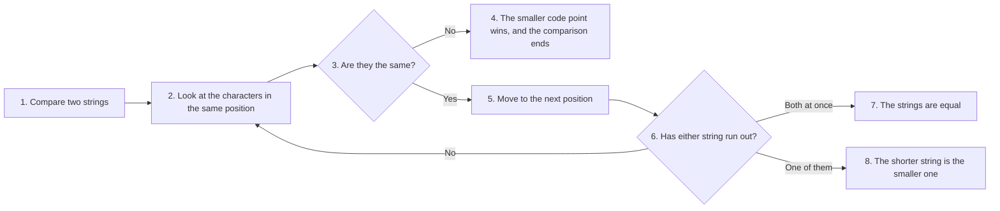

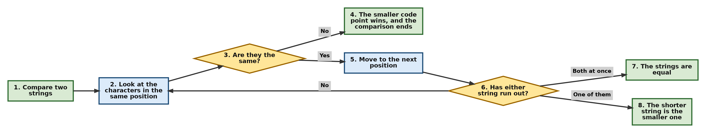

**Design Pattern Explanation**

- **Lexicographical Alignment Comparison Pattern:** Python lines the two strings up and compares them position by position, from left to right. The first position where they differ decides the answer, and nothing after it is even looked at.
- **Length-Based Tie-Breaker Rule:** When every character matches for as far as the shorter string goes, as with `"Book"` and `"Bookcase"`, there is nothing left to compare. Python then treats the shorter string as the smaller one, so `"Book" < "Bookcase"` is `True`. This is the same rule a dictionary uses when it places "book" before "bookcase".

**Follow-up questions**

**10.1 How do I compare two strings the way a dictionary would, ignoring case?**

Bring both to the same case first. `lower()` on each side is enough for English text.

```python
# Step 1: Two words in different cases
first = "apple"
second = "Banana"

# Step 2: A direct comparison follows the code points
print("Direct comparison:", first < second)

# Step 3: The same comparison after lowering both sides
print("Ignoring case:    ", first.lower() < second.lower())

# Step 4: Sorting a list, both ways
names = ["banana", "Apple", "cherry", "Date"]
print("Plain sort:    ", sorted(names))
print("Case-free sort:", sorted(names, key=str.lower))
```

**Output**

```text
Direct comparison: False
Ignoring case:     True
Plain sort:     ['Apple', 'Date', 'banana', 'cherry']
Case-free sort: ['Apple', 'banana', 'cherry', 'Date']
```

The plain sort puts both capitalised words first, which is rarely what a reader expects. The `key=str.lower` argument tells `sorted()` to compare the lowered forms while keeping the original spelling in the result.

**10.2 Can I compare strings with `is` instead of `==`?**

No, not for comparing values. `==` asks whether two strings hold the same characters, which is almost always the question you mean. `is` asks whether there is only one object with two names, and its answer can change between one program and the next.

```python
# Step 1: Two strings written straight into the program
a = "Book"
b = "Book"
print("a == b:", a == b, "and a is b:", a is b)

# Step 2: The same value, assembled while the program runs
c = "Bo" + "".join(["o", "k"])
print("a == c:", a == c, "and a is c:", a is c)
```

**Output**

```text
a == b: True and a is b: True
a == c: True and a is c: False
```

Both strings hold `Book`, so `==` says `True` both times. `is` says `True` in the first case only, because Python happened to reuse one object there. Use `==` for values, and keep `is` for testing against `None`.

[Back to the Table of Contents](#table-of-contents)

## Part 4: The String Methods

The next seven questions are about the methods of the `str` class: the ready-made tools for changing case, searching, cleaning, splitting, joining, checking and replacing. All of them return a new string or a plain answer, and none of them changes the string they are called on.

[Back to the Table of Contents](#table-of-contents)

### Question 11. Four Ways to Change the Case

**11. Convert a mixed-case sentence into uppercase, lowercase, title case, and capitalized formats. Print each outcome clearly.**

**Steps to follow**

1. Put the untidy sentence in a variable.
2. Call `upper()`, `lower()`, `title()` and `capitalize()` on it, keeping each result in its own variable.
3. Print the original and the four results, one under the other, so that the differences stand out.

**Script**

```python
# Step 1: Define a raw string sentence with inconsistent casing.
raw_sentence = "thE qUicK bRoWn fOx"

# Step 2: Apply the built-in string case methods.
upper_version = raw_sentence.upper()
lower_version = raw_sentence.lower()
title_version = raw_sentence.title()
cap_version = raw_sentence.capitalize()

# Step 3: Output the results to observe the structural transformation differences.
print("Original   :", raw_sentence)
print("upper()    :", upper_version)
print("lower()    :", lower_version)
print("title()    :", title_version)
print("capitalize():", cap_version)

# Step 4: The original sentence is still exactly as it was.
print("Original again:", raw_sentence)
```

**Output**

```text
Original   : thE qUicK bRoWn fOx
upper()    : THE QUICK BROWN FOX
lower()    : the quick brown fox
title()    : The Quick Brown Fox
capitalize(): The quick brown fox
```

**Output of step 4**

```text
Original again: thE qUicK bRoWn fOx
```

**The difference between `title()` and `capitalize()`**

| Method | What it does | `"thE qUicK bRoWn fOx"` becomes |
| --- | --- | --- |
| `upper()` | Every letter becomes a capital | `THE QUICK BROWN FOX` |
| `lower()` | Every letter becomes small | `the quick brown fox` |
| `title()` | The first letter of every word becomes a capital, the rest small | `The Quick Brown Fox` |
| `capitalize()` | The first letter of the whole string becomes a capital, all the rest small | `The quick brown fox` |

`title()` is useful for names and headings. `capitalize()` is useful for a sentence. `lower()` is the one you will use most, because comparing text is nearly always fairer after both sides have been lowered.

**Design Pattern Explanation**

- **Immutable Transformation Pattern:** None of these methods touches the string it is called on. Each one builds a new string with the case changed and returns it. If you do not keep the returned value in a variable, the work is lost, and the original variable still holds the untidy text.
- **Character Case Modification Patterns:**
  - `upper()` and `lower()` change every letter in the string.
  - `capitalize()` makes the very first character a capital and lowers everything else.
  - `title()` looks for word boundaries and makes the first letter of each word a capital.

**Follow-up questions**

**11.1 Where does `title()` get it wrong?**

At an apostrophe or a hyphen. It treats them as the end of a word and capitalises the letter that follows.

```python
# Step 1: Names that title() does not handle as a reader would
for name in ["o'brien", "smith-jones", "MRS D'SOUZA"]:
    print(f"{name!r:>16} -> {name.title()!r}")

# Step 2: The usual fix for a whole name typed in capitals
name = "MRS D'SOUZA"
print("Fixed by hand:", " ".join(word.capitalize() for word in name.lower().split()))
```

**Output**

```text
       "o'brien" -> "O'Brien"
   'smith-jones' -> 'Smith-Jones'
   "MRS D'SOUZA" -> "Mrs D'Souza"
Fixed by hand: Mrs D'souza
```

Look carefully at the last two lines. For `MRS D'SOUZA` the result of `title()` happens to be what most people want, while the hand-built version lowers the `S` after the apostrophe. Neither is right for every name, which is why software that handles names usually keeps whatever the person typed.

**11.2 Which method should I use before comparing two strings?**

Use `lower()` on both sides for ordinary English text. There is also `casefold()`, which is a stronger form of the same idea, meant for text in other languages.

```python
# Step 1: Two spellings of one word
typed = "PYTHON"
stored = "python"

# Step 2: A direct comparison fails
print("Direct:", typed == stored)

# Step 3: lower() on both sides
print("With lower():", typed.lower() == stored.lower())

# Step 4: casefold() does the same for English and more for other languages
print("With casefold():", typed.casefold() == stored.casefold())
```

**Output**

```text
Direct: False
With lower(): True
With casefold(): True
```

[Back to the Table of Contents](#table-of-contents)

### Question 12. find() and index(), and What Each Does on Failure

**12. Search for the word `"code"` inside text using both `.find()` and `.index()`. Run both methods again with a missing word to show the difference in error handling.**

**Steps to follow**

1. Put the sentence in a variable.
2. Search for a word that is present, with both methods, and print both positions.
3. Search for a word that is absent with `find()`, and print what it returns.
4. Search for the same absent word with `index()` inside a `try` block, and print the error it raises.

**Script**

```python
# Step 1: Set up a text sequence for testing.
source_text = "Learn python code today."

# Step 2: Search for a substring that exists using both methods.
print("--- Substring Exists ---")
print("find() position :", source_text.find("code"))
print("index() position:", source_text.index("code"))

# Step 3: Search for a missing substring to see how they handle failures differently.
print("\n--- Substring Is Missing ---")
print("find() returned :", source_text.find("java"))

try:
    print("index() returned:", source_text.index("java"))
except ValueError as structural_error:
    print(f"index() caught failure: Raised a ValueError ({structural_error})")

# Step 4: Check the answer by slicing the text at the position that was found.
position = source_text.find("code")
print("\nCharacters from that position:", source_text[position:position + 4])
```

**Output**

```text
--- Substring Exists ---
find() position : 13
index() position: 13

--- Substring Is Missing ---
find() returned : -1
index() caught failure: Raised a ValueError (substring not found)

Characters from that position: code
```

**Why 13?** Counting from zero: `Learn ` fills positions 0 to 5, `python ` fills 6 to 12, and `code` therefore begins at 13.

**The safe way to use `find()`**

The `-1` is not an error, so it will not stop your program. That is exactly why it has to be tested. Forgetting to test it is a common bug, because `-1` is a valid index that points at the last character.

```python
# Step 1: The text and a word that is not in it
source_text = "Learn python code today."
wanted = "java"

# Step 2: The right way, test the result before using it
position = source_text.find(wanted)
if position != -1:
    print(f"'{wanted}' found at position {position}")
else:
    print(f"'{wanted}' is not in the text")

# Step 3: The trap. Using -1 as if it were a real position.
print("Slicing from the untested result:", repr(source_text[position:]))
```

**Output**

```text
'java' is not in the text
Slicing from the untested result: '.'
```

The last line shows the danger. The slice quietly returned the full stop at the end of the sentence, because `-1` means the last character. Nothing went wrong on the screen, and the program carried on with the wrong value.

**Choosing between the two methods**

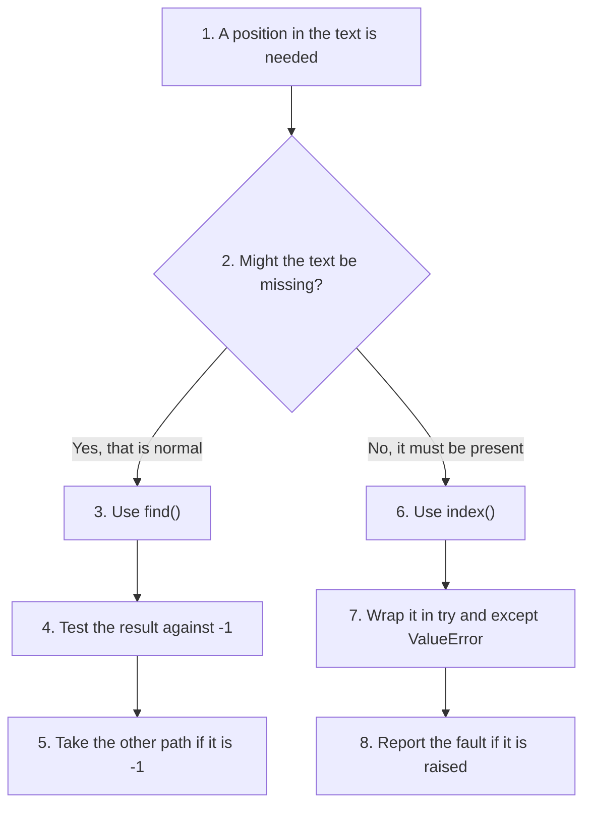

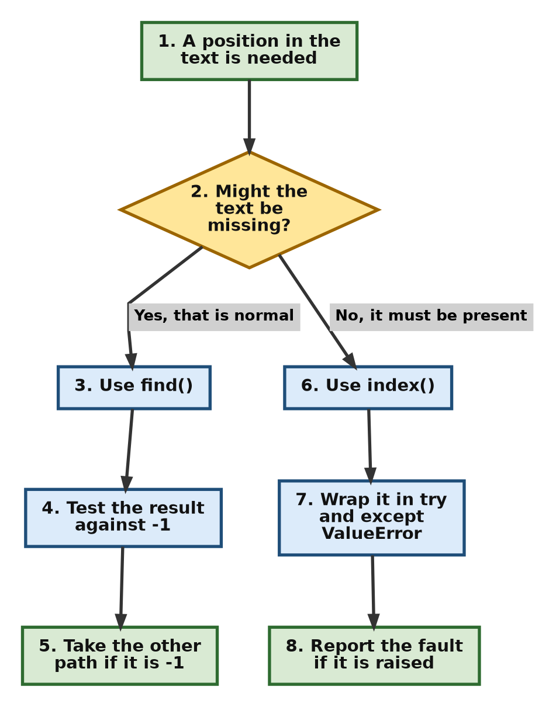

**Design Pattern Explanation**

- **Safe Sentinel Return Pattern, `find()`:** `find()` returns the position of the first match, or `-1` when there is no match. A value like that `-1`, returned to stand for "nothing found", is called a sentinel. The program does not stop, so the caller must check the value before using it.
- **Exceptional Enforcement Pattern, `index()`:** `index()` returns the same position, but when there is no match it raises a `ValueError` instead of returning anything. This is the better choice when a missing substring means something has gone seriously wrong, because the mistake cannot be ignored by accident. It has to be handled in a `try` and `except` block.

**Follow-up questions**

**12.1 How do I find every occurrence of a word, not just the first?**

Search again from just after the last match. `find()` takes a second argument that says where to start.

```python
# Step 1: A sentence with the same word three times
text = "one two one two one"
wanted = "one"

# Step 2: Start at the beginning
position = text.find(wanted)

# Step 3: Keep searching from just after each match
while position != -1:
    print("Found at position", position)
    position = text.find(wanted, position + 1)

# Step 4: count() gives the total without a loop
print("Total occurrences:", text.count(wanted))
```

**Output**

```text
Found at position 0
Found at position 8
Found at position 16
Total occurrences: 3
```

**12.2 What if I only want to know whether the word is there at all?**

Use `in`. It is shorter and it says what you mean.

```python
# Step 1: The text to search
source_text = "Learn python code today."

# Step 2: in answers the yes-or-no question directly
print("Is 'code' present?:", "code" in source_text)
print("Is 'java' present?:", "java" in source_text)

# Step 3: The same question through find(), which needs a comparison
print("Through find():", source_text.find("code") != -1)
```

**Output**

```text
Is 'code' present?: True
Is 'java' present?: False
Through find(): True
```

[Back to the Table of Contents](#table-of-contents)

### Question 13. Cleaning Input and Counting a Letter

**13. Clean up a user-input string by stripping out leading/trailing whitespace. Count how many times the letter `'e'` appears.**

**Steps to follow**

1. Put the padded text in a variable.
2. Remove the spaces at both ends with `strip()`, and print the result inside quotes so that the change can be seen.
3. Count the letter with `count()` and print the tally.

**Script**

```python
# Step 1: Simulate input containing uneven padding whitespaces.
padded_input = "   welcome to python core execution   "
print(f"Original Text: '{padded_input}'")
print("Original length:", len(padded_input))

# Step 2: Strip out the leading and trailing whitespace characters.
cleaned_text = padded_input.strip()
print(f"Cleaned Text: '{cleaned_text}'")
print("Cleaned length:", len(cleaned_text))

# Step 3: Tally up how many times the character 'e' appears in the cleaned text.
letter_tally = cleaned_text.count("e")
print("Occurrences of character 'e':", letter_tally)

# Step 4: The count is case-sensitive, so lower the text first if that matters.
mixed = "Excellent Engine"
print("Count of 'e' in", mixed, ":", mixed.count("e"))
print("Count after lower():", mixed.lower().count("e"))
```

**Output**

```text
Original Text: '   welcome to python core execution   '
Original length: 38
Cleaned Text: 'welcome to python core execution'
Cleaned length: 32
Occurrences of character 'e': 5
```

**Output of step 4**

```text
Count of 'e' in Excellent Engine : 3
Count after lower(): 5
```

**Where the five come from**

| Word | Letters `e` | Running total |
| --- | --- | --- |
| welcome | 2 | 2 |
| to | 0 | 2 |
| python | 0 | 2 |
| core | 1 | 3 |
| execution | 2 | 5 |

The quotes in the printed lines are part of the message, written inside the f-string. They are there so that the six spaces removed by `strip()` can be seen, and the difference between 38 and 32 confirms it.

**Design Pattern Explanation**

- **Data Sanitization Pattern, `strip()`:** `strip()` looks at both ends of the string and removes spaces, tabs and newline characters until it meets a character that is none of those. It never touches the middle. This one call prevents a whole family of bugs, because a stray space is invisible on the screen but makes two strings unequal.
- **Sequence Frequency Audit Pattern, `count()`:** `count()` walks through the string from left to right and counts the matches that do not overlap. It works for a single character and for a longer piece of text, and it returns `0` when there is nothing to find.

**Follow-up questions**

**13.1 What does `count()` do when the matches could overlap?**

It counts only matches that do not overlap, taking them from left to right. This surprises people the first time they meet it.

```python
# Step 1: The letter a appears in a run
text = "aaaa"

# Step 2: Single characters are counted one by one
print("count('a') :", text.count("a"))

# Step 3: Pairs are counted without overlapping, so 'aa' is found twice, not three times
print("count('aa'):", text.count("aa"))

# Step 4: The same rule in a word
print("'banana'.count('ana'):", "banana".count("ana"))
```

**Output**

```text
count('a') : 4
count('aa'): 2
'banana'.count('ana'): 1
```

In `banana` the piece `ana` appears at position 1 and again at position 3, but the two overlap, so `count()` reports one.

**13.2 How do I remove the spaces inside the text as well?**

`strip()` will not do it. Use `replace()` to take every space out, or `split()` and `join()` to squeeze runs of spaces down to one.

```python
# Step 1: Text with extra spaces in the middle
text = "   too    many     spaces   "

# Step 2: strip() cleans the ends only
print("strip() :", repr(text.strip()))

# Step 3: replace() removes every space, including the wanted ones
print("replace():", repr(text.replace(" ", "")))

# Step 4: split() and join() keep one space between words
print("split and join:", repr(" ".join(text.split())))
```

**Output**

```text
strip() : 'too    many     spaces'
replace(): 'toomanyspaces'
split and join: 'too many spaces'
```

The fourth line is the one worth remembering. `split()` with no argument treats any run of spaces as one separator, so joining the pieces back with a single space tidies the whole line.

[Back to the Table of Contents](#table-of-contents)

### Question 14. Splitting a Line and Joining It Back

**14. Split a comma-separated string into a clean list of individual elements. Join those elements back together using a hyphen divider.**

**Steps to follow**

1. Put the comma separated text in a variable.
2. Call `split(",")` to get a list of the pieces, and print the list.
3. Call `join()` on a hyphen, passing the list, to build one string again.
4. Print the joined string.

**Script**

```python
# Step 1: Define a raw string containing data values separated by commas.
raw_csv_data = "apple,banana,orange,grape"

# Step 2: Break the string apart into a list using the comma as a delimiter.
parsed_list = raw_csv_data.split(",")
print("Generated List Object:", parsed_list)
print("Type returned by split():", type(parsed_list))
print("Number of items:", len(parsed_list))

# Step 3: Join the list elements back together into a single string using a hyphen separator.
joined_string = "-".join(parsed_list)
print("Combined String:", joined_string)
print("Type returned by join():", type(joined_string))

# Step 4: Reach one item by its position, the way any list is used.
print("Second item:", parsed_list[1])
```

**Output**

```text
Generated List Object: ['apple', 'banana', 'orange', 'grape']
Type returned by split(): <class 'list'>
Number of items: 4
Combined String: apple-banana-orange-grape
Type returned by join(): <class 'str'>
Second item: banana
```

**The two methods are mirror images**

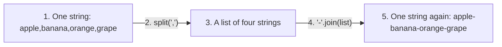

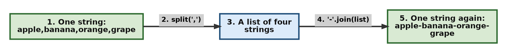

Note which object each method belongs to. `split()` is called on the string that is being cut up. `join()` is called on the separator, and the list is passed to it. Beginners often write `parsed_list.join("-")`, which does not work, because a list has no `join()` method.

```python
# Step 1: The list to be joined
parsed_list = ["apple", "banana", "orange", "grape"]

# Step 2: The wrong way round
try:
    print(parsed_list.join("-"))
except AttributeError as error:
    print("Error message:", error)

# Step 3: The right way. The separator comes first.
print("Correct form:", "-".join(parsed_list))

# Step 4: An empty separator joins the pieces with nothing in between
print("With no separator:", "".join(parsed_list))
```

**Output**

```text
Error message: 'list' object has no attribute 'join'
Correct form: apple-banana-orange-grape
With no separator: applebananaorangegrape
```

**Design Pattern Explanation**

- **Tokenization Pattern, `split()`:** `split()` looks through the string for the separator you give it, cuts the text at every one of them, and returns the pieces as a list. The separator itself is thrown away. Called with no argument at all, it splits at any run of spaces, tabs or newlines.
- **Sequence Merging Pattern, `join()`:** `join()` is the reverse. It takes a list of strings and links them end to end, putting the separator between each pair. Every item in the list must already be a string, so numbers have to be converted first.

**Follow-up questions**

**14.1 What happens if the data has spaces after the commas?**

The spaces stay attached to the pieces, because `split()` cuts only at the separator. Clean each piece with `strip()` afterwards. This pattern, split and then strip, is what you will use on nearly every line of a data file.

```python
# Step 1: The same data, typed by a human with spaces after the commas
raw = "apple, banana ,orange , grape"

# Step 2: A plain split keeps the spaces
pieces = raw.split(",")
print("Straight from split():", pieces)

# Step 3: Strip each piece
cleaned = [piece.strip() for piece in pieces]
print("After stripping each:", cleaned)

# Step 4: Now the pieces can be compared safely
print("Is 'banana' in the list?:", "banana" in cleaned)
```

**Output**

```text
Straight from split(): ['apple', ' banana ', 'orange ', ' grape']
After stripping each: ['apple', 'banana', 'orange', 'grape']
Is 'banana' in the list?: True
```

Without step 3, the test in step 4 would have answered `False`, because `' banana '` is not `'banana'`.

**14.2 How do I join a list that contains numbers?**

Convert every item to a string first. `join()` refuses a list with a number in it, and the error message says so plainly.

```python
# Step 1: A list with numbers in it
values = ["Total", 250, "rupees"]

# Step 2: join() cannot handle the number
try:
    print(" ".join(values))
except TypeError as error:
    print("Error message:", error)

# Step 3: Convert each item on the way in
print("After converting:", " ".join(str(value) for value in values))
```

**Output**

```text
Error message: sequence item 1: expected str instance, int found
After converting: Total 250 rupees
```

[Back to the Table of Contents](#table-of-contents)

### Question 15. Checking What a String Contains

**15. Verify if a string contains only letters. Check another string to see if it contains only numeric digits. Test a third string for alphanumeric content.**

**Steps to follow**

1. Put three test values in variables: one of letters only, one of digits only, and one that mixes letters with a digit.
2. Call `isalpha()` on the first, `isdigit()` on the second and `isalnum()` on the third.
3. Print each question with its answer.

**Script**

```python
# Step 1: Define test strings with different character types.
alpha_only = "PythonLanguage"
digits_only = "2026"
alphanumeric = "Python3"

# Step 2: Validate the content profiles using built-in string methods.
print(f"Is '{alpha_only}' purely alphabetic?:", alpha_only.isalpha())
print(f"Is '{digits_only}' purely numeric?:", digits_only.isdigit())
print(f"Is '{alphanumeric}' alphanumeric?:", alphanumeric.isalnum())

# Step 3: Cross-check each string against all three methods, to see the boundaries.
print("\n--- All three tests on all three strings ---")
for value in [alpha_only, digits_only, alphanumeric]:
    print(f"{value:<16} isalpha={value.isalpha():<6} isdigit={value.isdigit():<6} isalnum={value.isalnum()}")
```

**Output**

```text
Is 'PythonLanguage' purely alphabetic?: True
Is '2026' purely numeric?: True
Is 'Python3' alphanumeric?: True

--- All three tests on all three strings ---
PythonLanguage   isalpha=1      isdigit=0      isalnum=True
2026             isalpha=0      isdigit=1      isalnum=True
Python3          isalpha=0      isdigit=0      isalnum=True
```

The table in the second half prints `1` and `0` rather than `True` and `False`. That is a side effect of asking for a fixed width with `:<6`: a `True` or `False` given a width is treated as the number 1 or 0. It is a useful thing to know, and the fix is to convert the value with `str()` first.

```python
# Step 1: The same line with str() around the answer
value = "Python3"
print(f"{value:<10} isalpha={str(value.isalpha()):<6} isdigit={str(value.isdigit()):<6}")
```

**Output**

```text
Python3    isalpha=False  isdigit=False 
```

**What each method accepts and rejects**

| Value | `isalpha()` | `isdigit()` | `isalnum()` | Reason |
| --- | --- | --- | --- | --- |
| `"Python"` | True | False | True | Letters only |
| `"2026"` | False | True | True | Digits only |
| `"Python3"` | False | False | True | Letters and digits together |
| `"John Smith"` | False | False | False | A space is neither a letter nor a digit |
| `"user_name"` | False | False | False | An underscore is neither |
| `"-15"` | False | False | False | A minus sign is not a digit |
| `"3.14"` | False | False | False | A full stop is not a digit |
| `""` | False | False | False | An empty string has nothing to pass the test |

The last four rows are the ones that catch people out. In particular, `isdigit()` says `False` for a negative number and for a decimal number, so it cannot be used to check every kind of numeric entry.

```python
# Step 1: Values that look numeric but are rejected
for value in ["25", "-15", "3.14", "2 5", ""]:
    print(f"{value!r:>8} isdigit() -> {value.isdigit()}")

# Step 2: For any number at all, try the conversion and catch the failure
print()
for value in ["25", "-15", "3.14", "abc"]:
    try:
        print(f"{value!r:>8} converts to {float(value)}")
    except ValueError:
        print(f"{value!r:>8} is not a number")
```

**Output**

```text
    '25' isdigit() -> True
   '-15' isdigit() -> False
  '3.14' isdigit() -> False
   '2 5' isdigit() -> False
      '' isdigit() -> False

    '25' converts to 25.0
   '-15' converts to -15.0
  '3.14' converts to 3.14
   'abc' is not a number
```

**Design Pattern Explanation**

- **Type Validation Guard Patterns:** These methods look at every character in the string and return one answer for the whole of it, either `True` or `False`. They never change the string, and they are meant to be used before a conversion, not after it.
  - `isalpha()` is `True` only when every character is a letter, with no digits, spaces or symbols anywhere.
  - `isdigit()` is `True` only when every character is a digit.
  - `isalnum()` is `True` when every character is either a letter or a digit, which makes it a quick check for a username or an item code.
- All three return `False` for an empty string. That case has to be tested on its own, usually with a plain `if not text:`.

**Follow-up questions**

**15.1 How do I allow a name with spaces, such as `"John Smith"`?**

Take the spaces out before the test, or test each word on its own.

```python
# Step 1: A full name with a space in it
full_name = "John Smith"

# Step 2: A plain test fails because of the space
print("Straight isalpha():", full_name.isalpha())

# Step 3: Remove the spaces, then test
print("After removing spaces:", full_name.replace(" ", "").isalpha())

# Step 4: Or test every word, which also rejects an empty entry
words = full_name.split()
print("Every word a name?:", len(words) > 0 and all(word.isalpha() for word in words))
```

**Output**

```text
Straight isalpha(): False
After removing spaces: True
Every word a name?: True
```

`all()` returns `True` only when every test inside it is true. The extra check on `len(words)` is there because `all()` of an empty list is `True`, which would wrongly accept an entry of nothing but spaces.

**15.2 What are the other methods in this family?**

Several, and three of them are worth knowing: `isspace()` for an entry of nothing but blanks, `isupper()` and `islower()` for the case of a whole string, and `istitle()` for text in title case.

```python
# Step 1: A blank entry, which looks empty on the screen
print("'   '.isspace() :", "   ".isspace())

# Step 2: Case checks on whole strings
print("'PYTHON'.isupper():", "PYTHON".isupper())
print("'python'.islower():", "python".islower())

# Step 3: Title case means every word starts with a capital
print("'Python Book'.istitle():", "Python Book".istitle())
print("'Python book'.istitle():", "Python book".istitle())
```

**Output**

```text
'   '.isspace() : True
'PYTHON'.isupper(): True
'python'.islower(): True
'Python Book'.istitle(): True
'Python book'.istitle(): False
```

[Back to the Table of Contents](#table-of-contents)

### Question 16. Checking the Start and the End of a Web Address

**16. Check if a URL string starts with `"https://"` and ends with `".org"`. Print the boolean results for both validation checks.**

**Steps to follow**

1. Put the web address in a variable.
2. Call `startswith("https://")` and keep the answer.
3. Call `endswith(".org")` and keep that answer.
4. Print both answers with clear labels.

**Script**

```python
# Step 1: Define a web address destination string.
web_address = "https://example.org"

# Step 2: Verify the start prefix of the string.
is_secure = web_address.startswith("https://")

# Step 3: Verify the end suffix of the string.
is_organization = web_address.endswith(".org")

print("Address being checked:", web_address)
print("Valid Secure Site Prefix?:", is_secure)
print("Valid Org Domain Suffix?:", is_organization)

# Step 4: Both conditions together decide whether the address passes.
if is_secure and is_organization:
    print("The address passes both checks.")
else:
    print("The address fails at least one check.")
```

**Output**

```text
Address being checked: https://example.org
Valid Secure Site Prefix?: True
Valid Org Domain Suffix?: True
The address passes both checks.
```

**The same checks on a few other addresses**

```python
# Step 1: A list of addresses to test
addresses = [
    "https://example.org",
    "http://example.org",
    "https://example.com",
    "HTTPS://EXAMPLE.ORG",
]

# Step 2: Run both checks on each one
for address in addresses:
    secure = address.startswith("https://")
    org = address.endswith(".org")
    print(f"{address:<24} secure={str(secure):<6} org={org}")
```

**Output**

```text
https://example.org      secure=True   org=True
http://example.org       secure=False  org=True
https://example.com      secure=True   org=False
HTTPS://EXAMPLE.ORG      secure=False  org=False
```

The last line is the important one. Both checks failed, although a person would read that address as the same site. These methods are case-sensitive, so an address should be lowered before it is checked.

```python
# Step 1: An address typed in capitals
address = "HTTPS://EXAMPLE.ORG"

# Step 2: The checks fail as they stand
print("Without lower():", address.startswith("https://"), address.endswith(".org"))

# Step 3: Lower the address first, and both checks pass
tidy = address.lower()
print("With lower():   ", tidy.startswith("https://"), tidy.endswith(".org"))
```

**Output**

```text
Without lower(): False False
With lower():    True True
```

**Design Pattern Explanation**

- **Prefix and Suffix Validation Patterns:** `startswith()` and `endswith()` answer a plain yes-or-no question about the two ends of a string. They save you from slicing, and slicing is where the mistakes happen. Writing `web_address[:8] == "https://"` means counting the characters of `https://` by hand, and a miscount of one gives a wrong answer with no error message. The methods count for you.

**Follow-up questions**

**16.1 How do I accept several endings at once?**

Pass a tuple, that is, several values inside round brackets. Both methods accept one, and return `True` if any of the values matches.

```python
# Step 1: A list of file names
files = ["photo.png", "notes.txt", "report.pdf", "song.mp3"]

# Step 2: A tuple of the endings that count as an image
image_endings = (".png", ".jpg", ".jpeg", ".gif")

# Step 3: Test each name against the whole tuple in one call
for name in files:
    print(f"{name:<12} is an image? {name.lower().endswith(image_endings)}")
```

**Output**

```text
photo.png    is an image? True
notes.txt    is an image? False
report.pdf   is an image? False
song.mp3     is an image? False
```

**16.2 Can I check the middle of the address in the same way?**

Not with these two methods, since they only look at the ends. Use `in` for the middle, and `find()` when the position matters.

```python
# Step 1: The address to examine
address = "https://docs.example.org/python/strings"

# Step 2: in looks anywhere in the string
print("Does it mention 'python'?:", "python" in address)

# Step 3: find() says where
print("Position of 'python':", address.find("python"))

# Step 4: The three tests together
print("Starts with https?:", address.startswith("https://"))
print("Ends with .org?:   ", address.endswith(".org"))
```

**Output**

```text
Does it mention 'python'?: True
Position of 'python': 25
Starts with https?: True
Ends with .org?:    False
```

The last answer is `False`, and rightly so. The address ends with `/python/strings`, not with `.org`.

[Back to the Table of Contents](#table-of-contents)

### Question 17. Replacing Every Occurrence of a Word

**17. Replace every occurrence of the word `"Java"` with `"Python"` inside a descriptive paragraph text sequence.**

**Steps to follow**

1. Put the paragraph in a variable.
2. Call `replace("Java", "Python")` and keep the result in a new variable.
3. Print the original and the new paragraph, to show that the original is untouched.

**Script**

```python
# Step 1: Define a paragraph containing a repeated placeholder word.
legacy_text = "Java is portable. Java is object-oriented. Learn Java."

# Step 2: Swap out the target word using the replace method.
updated_text = legacy_text.replace("Java", "Python")

print("Original Text:", legacy_text)
print("Updated Text :", updated_text)

# Step 3: Count the replacements that were made.
print("Occurrences of 'Java' in the original:", legacy_text.count("Java"))
print("Occurrences of 'Java' in the new text:", updated_text.count("Java"))
```

**Output**

```text
Original Text: Java is portable. Java is object-oriented. Learn Java.
Updated Text : Python is portable. Python is object-oriented. Learn Python.
Occurrences of 'Java' in the original: 3
Occurrences of 'Java' in the new text: 0
```

**Replacing only the first few**

`replace()` takes an optional third argument, a count, which limits how many matches are changed. Without it, every match is changed.

```python
# Step 1: The same paragraph
legacy_text = "Java is portable. Java is object-oriented. Learn Java."

# Step 2: Change only the first occurrence
print("First only :", legacy_text.replace("Java", "Python", 1))

# Step 3: Change the first two
print("First two  :", legacy_text.replace("Java", "Python", 2))

# Step 4: No count means all of them
print("All of them:", legacy_text.replace("Java", "Python"))
```

**Output**

```text
First only : Python is portable. Java is object-oriented. Learn Java.
First two  : Python is portable. Python is object-oriented. Learn Java.
All of them: Python is portable. Python is object-oriented. Learn Python.
```

**One caution: `replace()` does not know about words**

It matches characters, wherever they appear, even in the middle of another word. That is worth seeing once, because it is a common source of surprise.

```python
# Step 1: A sentence where the target letters appear inside another word
text = "The cat sat on the catalogue."

# Step 2: A plain replacement also changes the inside of 'catalogue'
print("Plain replace:", text.replace("cat", "dog"))

# Step 3: Including the spaces makes the match safer here
print("With spaces  :", text.replace(" cat ", " dog "))
```

**Output**

```text
Plain replace: The dog sat on the dogalogue.
With spaces  : The dog sat on the catalogue.
```

The first line changed a word it should not have touched. The second line got this sentence right, because `cat` here has a space on each side while `catalogue` does not. But that trick is fragile: it would miss a `cat` at the very start of the sentence, or one followed by a full stop or a comma. Work of this kind, where a match must be a whole word, is what regular expressions are for, and they come in a later chapter.

**Design Pattern Explanation**

- **Global Substring Substitution Pattern, `replace()`:** `replace(old, new)` walks through the string from left to right and swaps every match it finds. Because strings cannot be changed, it builds a whole new string and returns it, leaving the original exactly as it was. So the result has to be kept in a variable, or it is lost. A third argument limits the number of matches changed.

**Follow-up questions**

**17.1 How do I use `replace()` to delete something instead of swapping it?**

Replace it with an empty string.

```python
# Step 1: A phone number with unwanted characters
number = "+91-98765 43210"

# Step 2: Remove the spaces and the hyphens by replacing them with nothing
cleaned = number.replace(" ", "").replace("-", "")
print("Original:", number)
print("Cleaned :", cleaned)

# Step 3: The digits can now be checked
print("Are the remaining characters digits?:", cleaned.lstrip("+").isdigit())
```

**Output**

```text
Original: +91-98765 43210
Cleaned : +919876543210
Are the remaining characters digits?: True
```

`lstrip("+")` removes the plus sign from the left end only, so that `isdigit()` sees digits alone.

**17.2 Can I make several different replacements in one go?**

Chain the calls, or loop over a list of pairs. The loop is easier to read once there are more than two or three.

```python
# Step 1: A sentence with several words to change
text = "Java and PHP and Perl"

# Step 2: A list of the changes to make, as pairs
changes = [("Java", "Python"), ("PHP", "Go"), ("Perl", "Rust")]

# Step 3: Apply each change in turn
result = text
for old, new in changes:
    result = result.replace(old, new)

print("Before:", text)
print("After :", result)
```

**Output**

```text
Before: Java and PHP and Perl
After : Python and Go and Rust
```

Note that `result` starts as a copy of the name `text` and is rebuilt on every pass. The original sentence is never changed.

[Back to the Table of Contents](#table-of-contents)

## Part 5: Negative Slicing, Conditions and Type Conversion

The last three questions bring the earlier ideas together: a slice written entirely with negative positions, a decision taken on one character, and a loop that turns a mixed list into one sentence.

[Back to the Table of Contents](#table-of-contents)

### Question 18. Taking `"lo"` Out of `"Hello"` With Negative Positions

**18. Use negative indices inside a slicing operation to extract the substring `"lo"` from the base string `"Hello"`.**

**Steps to follow**

1. Write down the negative position of every character of `"Hello"`. This is the step to do on paper first.
2. Find the position of the `l` that begins the wanted piece. It is `-2`.
3. Slice from there to the end of the string, which is written by leaving the stop out.
4. Print the result.

**The positions, before any code is written**

| Character | H | e | l | l | o |
| --- | --- | --- | --- | --- | --- |
| Positive index | 0 | 1 | 2 | 3 | 4 |
| Negative index | -5 | -4 | -3 | -2 | -1 |

The piece wanted is `lo`, which is the second `l` followed by the `o`. Those are the positions `-2` and `-1`. Since the `o` is the last character, the slice must run to the very end, and a slice reaches the end when the stop is left out.

**Script**

```python
# Step 1: Initialize the baseline text string sequence.
greeting_text = "Hello"

# Step 2: Isolate the target substring using a negative start index.
# Index -2 is the second 'l'. Leaving the stop out carries the slice to the end,
# so the final 'o' is included.
extracted_slice = greeting_text[-2:]

print("Base string:", greeting_text)
print("Extracted Substring Slice:", extracted_slice)

# Step 3: Show why a stop of -1 would NOT work here.
# A stop position is always excluded, so -1 leaves the 'o' out.
print("greeting_text[-3:-1] gives:", greeting_text[-3:-1])

# Step 4: The same piece, written with positive positions, for comparison.
print("greeting_text[3:5] gives:  ", greeting_text[3:5])
```

**Output**

```text
Base string: Hello
Extracted Substring Slice: lo
greeting_text[-3:-1] gives: ll
greeting_text[3:5] gives:   lo
```

**Four slices of `"Hello"`, side by side**

```python
# Step 1: The word and a list of slices to try
greeting_text = "Hello"

# Step 2: Print each slice with the characters it picked
print("greeting_text[-2:]  ->", repr(greeting_text[-2:]))
print("greeting_text[-3:-1] ->", repr(greeting_text[-3:-1]))
print("greeting_text[-4:-2] ->", repr(greeting_text[-4:-2]))
print("greeting_text[-5:]   ->", repr(greeting_text[-5:]))
```

**Output**

```text
greeting_text[-2:]  -> 'lo'
greeting_text[-3:-1] -> 'll'
greeting_text[-4:-2] -> 'el'
greeting_text[-5:]   -> 'Hello'
```

**Design Pattern Explanation**

- **Negative Offset Boundary Slicing Pattern:** A slice accepts negative positions in exactly the same way as positive ones. For `"Hello"` the negative positions run `H(-5)`, `e(-4)`, `l(-3)`, `l(-2)`, `o(-1)`.
- **The stop is still excluded:** This is the rule that decides the answer here. A slice never includes the character at its stop position. So `[-3:-1]` gives `ll`, because the `o` at `-1` is left out. To reach the last character the stop must be left out altogether, which is why the answer is `[-2:]`.
- **A useful habit:** when the piece you want ends at the last character, leave the stop out. When it ends earlier, count the stop as "one past the last character I want".

**Follow-up questions**

**18.1 Is there any way to write a stop that includes the last character?**

Only by using a positive number, such as `len(text)` or a number you know is large enough. Leaving the stop out is shorter and safer, and it works whatever the length of the string.

```python
# Step 1: The word
text = "Hello"

# Step 2: Three ways to reach the end, all with the same result
print("Left out :", repr(text[-2:]))
print("With len():", repr(text[-2:len(text)]))
print("Too large:", repr(text[-2:99]))

# Step 3: The one that does not work
print("With -1  :", repr(text[-2:-1]))
```

**Output**

```text
Left out : 'lo'
With len(): 'lo'
Too large: 'lo'
With -1  : 'l'
```

**18.2 How would I take the last two characters of a word whose length I do not know?**

The same slice, `[-2:]`, works on any word, which is the real advantage of negative positions.

```python
# Step 1: Words of different lengths
for word in ["Hello", "Hi", "Programming", "a"]:
    # Step 2: The same slice on each one
    print(f"{word:<12} last two characters: {word[-2:]!r}")
```

**Output**

```text
Hello        last two characters: 'lo'
Hi           last two characters: 'Hi'
Programming  last two characters: 'ng'
a            last two characters: 'a'
```

Note the last two lines. When the word is shorter than the slice asks for, Python gives back what there is instead of raising an error.

[Back to the Table of Contents](#table-of-contents)

### Question 19. A Decision Taken on the First Character

**19. Check if a string starts with a lowercase letter. If it does, convert the entire string to uppercase. Otherwise, print it as-is.**

**Steps to follow**

1. Put the text in a variable.
2. Take the character at index `0`.
3. Ask it whether it is a small letter, with `islower()`.
4. If the answer is yes, build an upper-case version of the whole string. If not, keep the text as it is.
5. Print the result.

**Script**

```python
# Step 1: Define a sample text sequence variable.
sample_text = "interactive script execution"

# Step 2: Inspect index position 0 to evaluate its casing rules.
print("First character:", sample_text[0])
print("Is it a small letter?:", sample_text[0].islower())

if sample_text[0].islower():
    # Transform the entire sequence to uppercase if the condition is met.
    processed_output = sample_text.upper()
else:
    processed_output = sample_text

# Step 3: Print the decision and the result.
print("Final Processed Output:", processed_output)
```

**Output**

```text
First character: i
Is it a small letter?: True
Final Processed Output: INTERACTIVE SCRIPT EXECUTION
```

**The same test on several strings**

```python
# Step 1: A list of strings that take different paths through the condition
samples = ["interactive script", "Interactive Script", "2026 report", " leading space"]

# Step 2: Apply the same rule to each one
for text in samples:
    if text[0].islower():
        result = text.upper()
    else:
        result = text
    print(f"{text!r:<22} -> {result!r}")
```

**Output**

```text
'interactive script'   -> 'INTERACTIVE SCRIPT'
'Interactive Script'   -> 'Interactive Script'
'2026 report'          -> '2026 report'
' leading space'       -> ' leading space'
```

The third and fourth lines are worth a thought. A digit is not a small letter, and neither is a space, so `islower()` says `False` for both and the text is left alone. That is the behaviour the question asks for, but in a real program a leading space is usually an accident, so the text would be stripped first.

**The decision in a diagram**

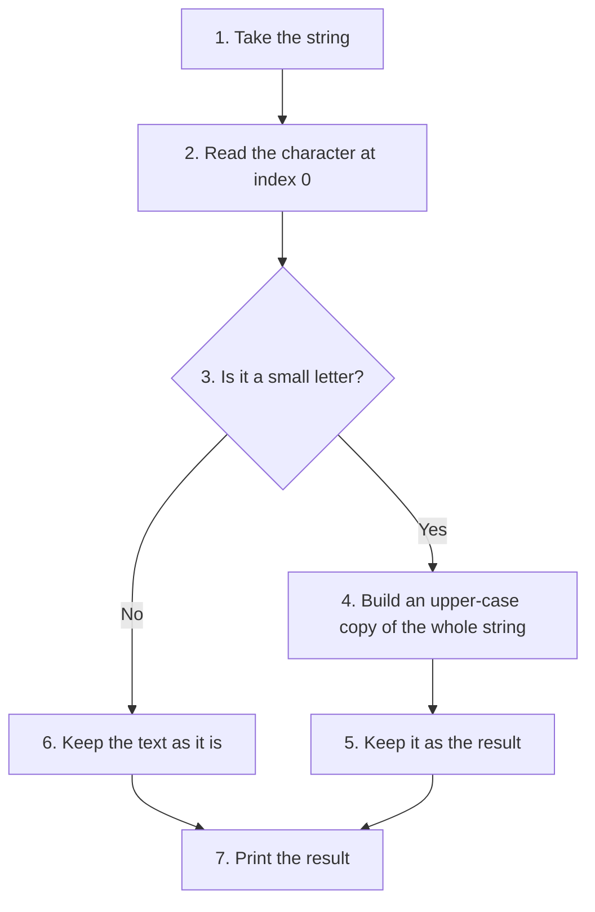

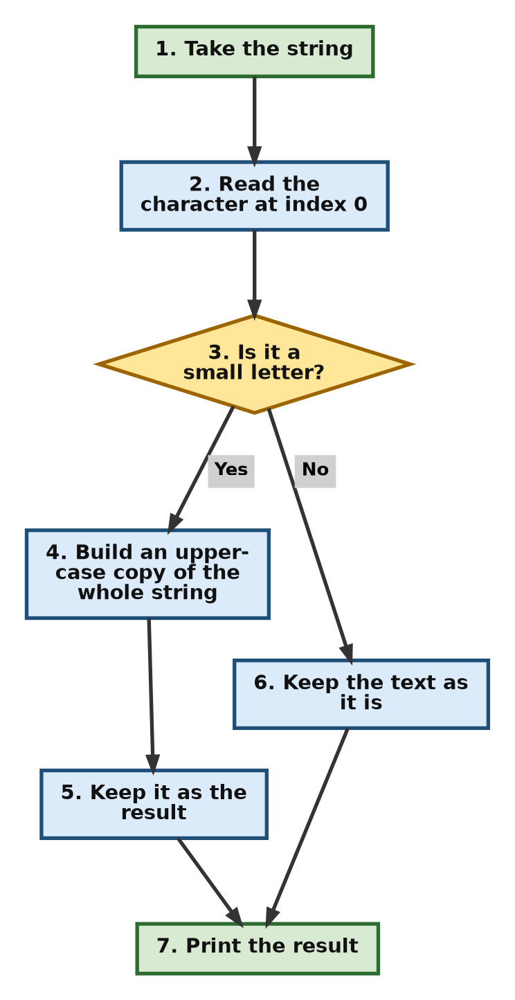

**Design Pattern Explanation**

- **State-Driven Conditional Transformation Pattern:** The program first asks a question about the data, then decides what to do with it. Here the question is asked by `islower()` on a single character, `sample_text[0]`, and the answer decides whether the whole string is transformed. Keeping the two parts separate, first the test and then the action, is what makes such code easy to read and easy to change.
- One point to note: `islower()` is called on one character here, but it works on a whole string too. `"abc".islower()` is `True`, and `"Abc".islower()` is `False`.

**Follow-up questions**

**19.1 What if the string might be empty?**

Then `sample_text[0]` raises an `IndexError`, and the program stops. Guard the test, or use a slice, which is safe on an empty string.

```python
# Step 1: An empty string, as a user might leave it
sample_text = ""

# Step 2: Reading index 0 fails
try:
    print(sample_text[0].islower())
except IndexError as error:
    print("Error message:", error)

# Step 3: A guard prevents it
if sample_text and sample_text[0].islower():
    print("Upper case:", sample_text.upper())
else:
    print("Nothing to change")

# Step 4: A slice is safe even when the string is empty
print("With a slice:", sample_text[:1].islower())
```

**Output**

```text
Error message: string index out of range
Nothing to change
With a slice: False
```

In step 3, Python checks `sample_text` first and does not even look at the second test when the string is empty. This habit of putting the cheap safe test first is worth picking up.

**19.2 Is `islower()` the same as comparing with `lower()`?**

Almost, but not for text that has no letters at all. `islower()` needs at least one letter to say `True`, while the comparison is happy with digits and symbols.

```python
# Step 1: Three values, one of which has no letters
for value in ["abc", "Abc", "2026"]:
    # Step 2: The two tests side by side
    print(f"{value!r:<8} islower()={value.islower():<2} value == value.lower() is {value == value.lower()}")
```

**Output**

```text
'abc'    islower()=1  value == value.lower() is True
'Abc'    islower()=0  value == value.lower() is False
'2026'   islower()=0  value == value.lower() is True
```

The third line shows the difference. `"2026".islower()` is `False`, because the string holds no letters at all and so has no lower case to report, while the comparison with `lower()` says `True`, because lowering a string of digits changes nothing. The `1` and `0` in the middle column are again the effect of giving a width to a `True` or `False` value.

[Back to the Table of Contents](#table-of-contents)

### Question 20. Building One Sentence From a List of Mixed Values

**20. Loop through a list of mixed types. Convert each item into an explicit printable string using a constructor, and concatenate them into a single sentence block.**

**Steps to follow**

1. Make a list that holds text, a number and a `True` or `False` value.
2. Start with an empty string to collect the result.
3. Walk through the list. Convert each item with `str()`, then add it to the collected string with a space after it.
4. Print the result, with `strip()` to remove the space left at the end.

**Script**

```python
# Step 1: Create a list containing diverse data types.
mixed_data_elements = ["Year", 2026, "Is", True]

# Step 2: Initialize an empty string variable to store the concatenated results.
final_sentence = ""

# Step 3: Loop through the list elements and safely convert each type.
for item in mixed_data_elements:
    # Use the str() constructor to convert types like integers and booleans to text.
    string_representation = str(item)

    # Show what is happening on each pass of the loop.
    print(f"Item {item!r:<8} of type {type(item).__name__:<5} becomes the text {string_representation!r}")

    # Append the converted text to the accumulator variable, adding a space separator.
    final_sentence += string_representation + " "

# Step 4: Print the collected sentence. strip() removes the trailing space.
print("Compiled Sentence Block:", final_sentence.strip())
```

**Output**

```text
Item 'Year'   of type str   becomes the text 'Year'
Item 2026     of type int   becomes the text '2026'
Item 'Is'     of type str   becomes the text 'Is'
Item True     of type bool  becomes the text 'True'
Compiled Sentence Block: Year 2026 Is True
```

`type(item).__name__` is used only to print the name of each type neatly. Without it, `print(type(item))` would show `<class 'int'>`, which is correct but longer.

**Why `str()` is needed at all**

Without it, the very first number stops the program.

```python
# Step 1: The same list
mixed_data_elements = ["Year", 2026, "Is", True]

# Step 2: Try to add the items without converting them
sentence = ""
try:
    for item in mixed_data_elements:
        sentence += item + " "
except TypeError as error:
    print("Error message:", error)
    print("The sentence got as far as:", repr(sentence))
```

**Output**

```text
Error message: unsupported operand type(s) for +: 'int' and 'str'
The sentence got as far as: 'Year '
```

**Three ways to do the same job**

The loop with `+=` is the clearest one to learn first. Two shorter forms do the same work, and the third is the one to prefer in real programs, because `join()` builds the string in one go instead of making a new one on every pass.

```python
# Step 1: The list
mixed_data_elements = ["Year", 2026, "Is", True]

# Step 2: Method one, the accumulator loop
sentence = ""
for item in mixed_data_elements:
    sentence += str(item) + " "
print("With a loop and +=:", sentence.strip())

# Step 3: Method two, collect the pieces in a list, then join once
pieces = []
for item in mixed_data_elements:
    pieces.append(str(item))
print("With a list and join:", " ".join(pieces))

# Step 4: Method three, the same idea written in one line
print("In one line:        ", " ".join(str(item) for item in mixed_data_elements))
```

**Output**

```text
With a loop and +=: Year 2026 Is True
With a list and join: Year 2026 Is True
In one line:         Year 2026 Is True
```

**How the accumulator fills up**

| Pass | Item | `str(item)` | `final_sentence` after the pass |
| --- | --- | --- | --- |
| Start | | | `''` |
| 1 | `"Year"` | `Year` | `'Year '` |
| 2 | `2026` | `2026` | `'Year 2026 '` |
| 3 | `"Is"` | `Is` | `'Year 2026 Is '` |
| 4 | `True` | `True` | `'Year 2026 Is True '` |
| After `strip()` | | | `'Year 2026 Is True'` |

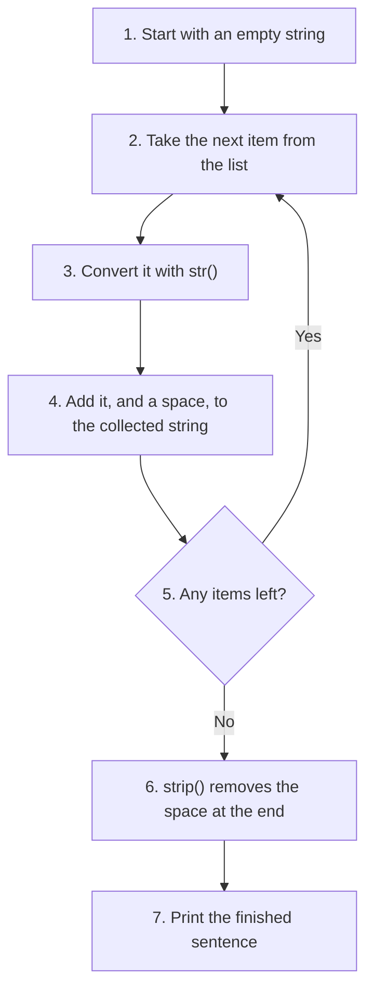

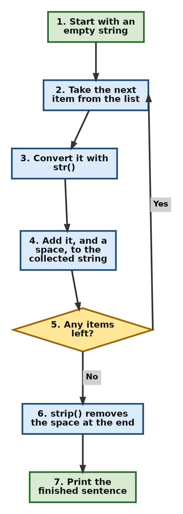

**Design Pattern Explanation**

- **Polymorphic Type Normalization Pattern, `str()`:** The `+` operator joins a string only to another string. Passing every item through `str()` first turns numbers, `True` and `False`, and even lists, into their text form, so that they can all be joined safely. This is why the conversion is done inside the loop, before the addition.
- **Loop-Based String Accumulator Pattern:** The variable `final_sentence` starts empty and grows on every pass of the loop. A variable used in this way is called an accumulator. The same shape of code counts things, adds numbers up and builds lists. Its one weakness with strings is that each `+=` makes a new string, so for a long list the `join()` form of step 3 above is the better choice.

**Follow-up questions**

**20.1 Why is `strip()` needed at the end?**

Because the loop adds a space after every item, including the last one. `strip()` removes it. The `join()` method avoids the problem altogether, since it puts the separator only between the items.

```python
# Step 1: Build the sentence with the loop
pieces = ["Year", "2026", "Is", "True"]
sentence = ""
for piece in pieces:
    sentence += piece + " "

# Step 2: Look at the raw result, with the space still there
print("Before strip():", repr(sentence))
print("After strip(): ", repr(sentence.strip()))

# Step 3: join() never adds a trailing separator
print("With join():   ", repr(" ".join(pieces)))
```

**Output**

```text
Before strip(): 'Year 2026 Is True '
After strip():  'Year 2026 Is True'
With join():    'Year 2026 Is True'
```

**20.2 Can an f-string do this without `str()`?**

Yes. An f-string converts every value to text on its own, which is why it is the usual way to mix words and numbers in a message.

```python
# Step 1: Values of three different types
year = 2026
is_current = True

# Step 2: An f-string needs no conversion at all
print(f"Year {year} Is {is_current}")

# Step 3: The same message built with + needs str() twice
print("Year " + str(year) + " Is " + str(is_current))
```

**Output**

```text
Year 2026 Is True
Year 2026 Is True
```

[Back to the Table of Contents](#table-of-contents)

## A Summary of the Twenty Questions

| Question | What it practises | Main tools used |
| --- | --- | --- |
| 1 | Making a multi-line string, measuring it, searching it | `'''...'''`, `len()`, `in` |
| 2 | An empty string, growing it, the immutability rule | `str()`, `+=`, `try` and `except` |
| 3 | Reading the first and last character | `input()`, `[0]`, `[-1]` |
| 4 | Escape sequences and the raw string prefix | `\n`, `\t`, `\r`, `\b`, `r"..."` |
| 5 | Walking through a string both ways | `for`, `while`, `len()` |
| 6 | Building a banner | `*`, `+`, `not in`, `center()` |
| 7 | Three kinds of slice | `[:4]`, `[-4:]`, `[::2]` |
| 8 | Reversing a string | `[::-1]` |
| 9 | Characters as numbers | `ord()`, `chr()` |
| 10 | Comparing two strings | `==`, `<`, `>` |
| 11 | Changing case four ways | `upper()`, `lower()`, `title()`, `capitalize()` |
| 12 | Searching, and what happens on failure | `find()`, `index()`, `try` and `except` |
| 13 | Cleaning input and counting | `strip()`, `count()` |
| 14 | Text to list and back | `split()`, `join()` |
| 15 | Checking what a string holds | `isalpha()`, `isdigit()`, `isalnum()` |
| 16 | Checking the two ends | `startswith()`, `endswith()` |
| 17 | Replacing a word | `replace()` |
| 18 | Slicing with negative positions | `[-2:]` |
| 19 | A decision on one character | `islower()`, `if` and `else`, `upper()` |
| 20 | A list of mixed values into one sentence | `str()`, `+=`, `join()` |

**Habits worth carrying into your own programs**

1. Keep the value a method returns. A string method never changes the string it is called on.
2. Strip anything that came from a user or a file before comparing it with something else.
3. Lower both sides before comparing text, unless the case is part of what you are checking.
4. Check before converting. Test with `isdigit()`, or convert inside `try` and `except`.
5. Test the result of `find()` against `-1` before using it as a position.
6. Remember that the stop position of a slice is never included.
7. Use `join()` rather than `+=` when a string is built inside a long loop.
8. Prefer an f-string to a row of `+` signs and `str()` calls.

[Back to the Table of Contents](#table-of-contents)

## Further Reading

- [Python documentation: Text Sequence Type, str](https://docs.python.org/3/library/stdtypes.html#text-sequence-type-str)
- [Python documentation: String Methods](https://docs.python.org/3/library/stdtypes.html#string-methods)
- [Python documentation: Common Sequence Operations, which covers slicing](https://docs.python.org/3/library/stdtypes.html#common-sequence-operations)
- [Python documentation: Format Specification Mini-Language, for widths and alignment](https://docs.python.org/3/library/string.html#format-specification-mini-language)
- [Python documentation: Built-in Functions, including len(), ord(), chr(), str() and input()](https://docs.python.org/3/library/functions.html)
- [Python tutorial: Errors and Exceptions, for try and except](https://docs.python.org/3/tutorial/errors.html)
- [Python documentation: unicodedata module](https://docs.python.org/3/library/unicodedata.html)

[Back to the Table of Contents](#table-of-contents)

---


