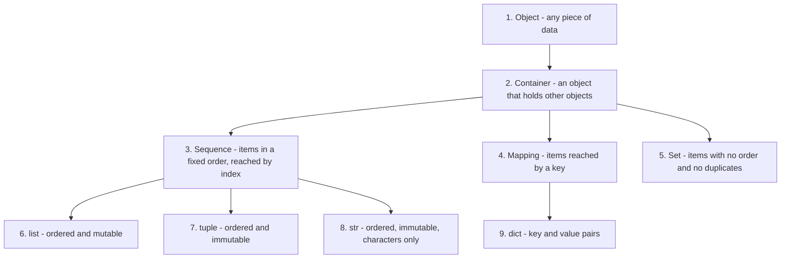
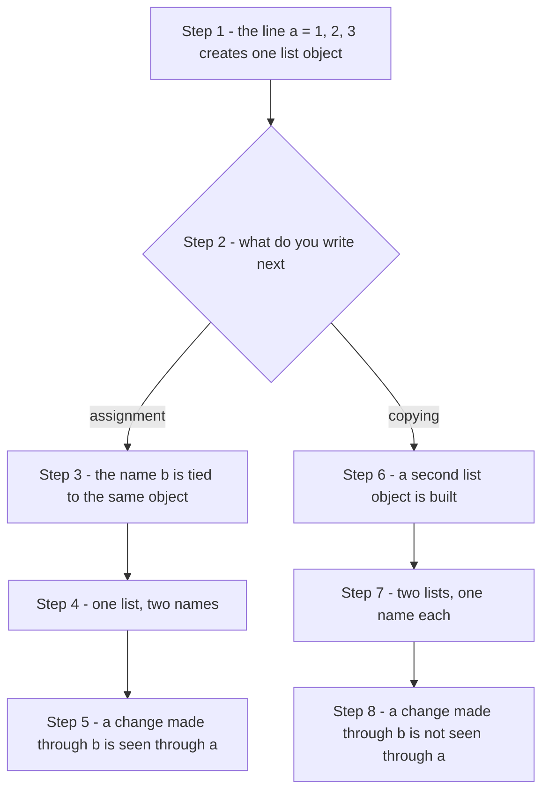
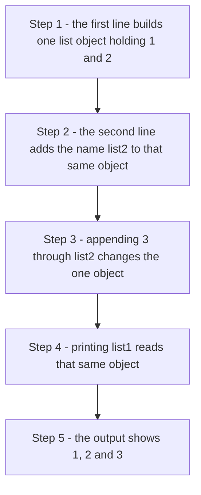
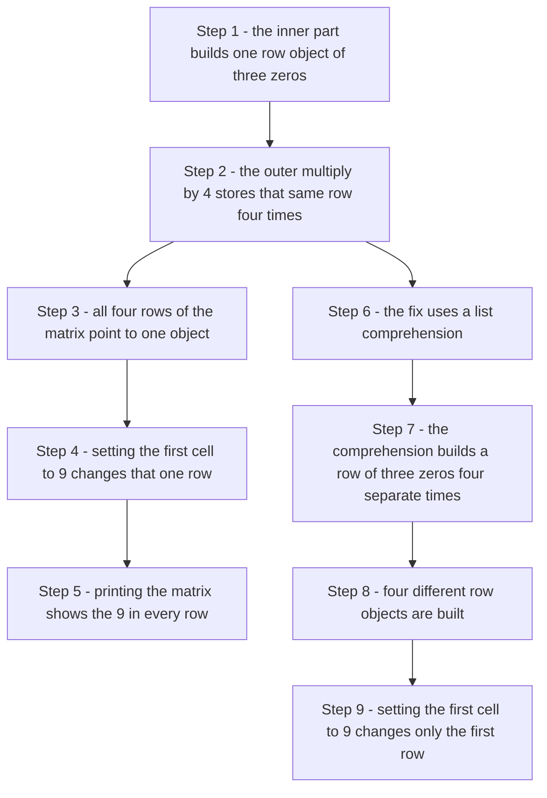
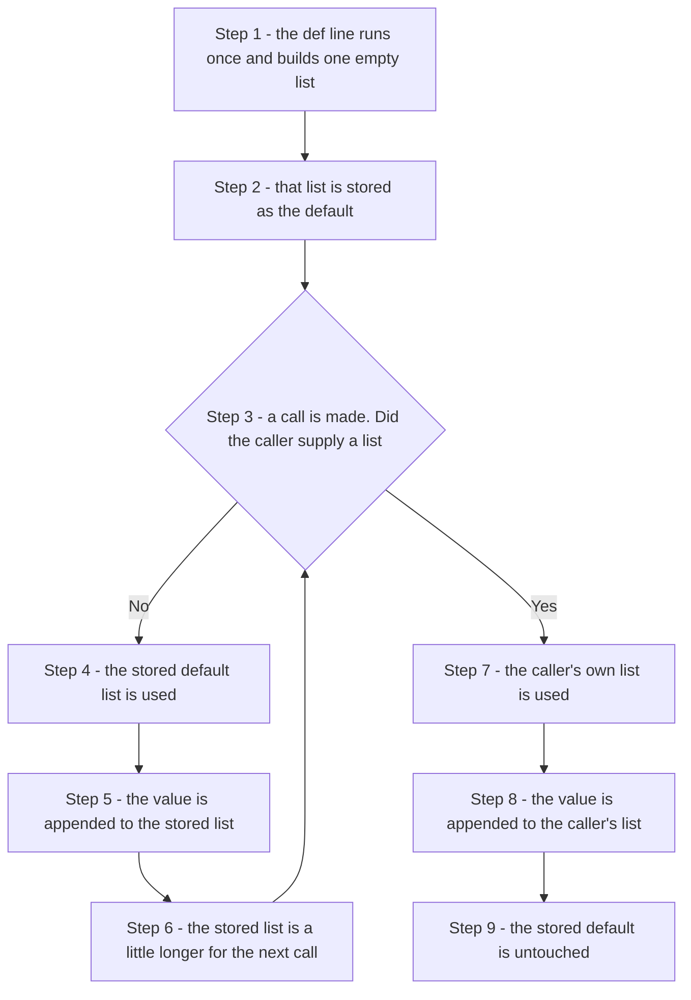
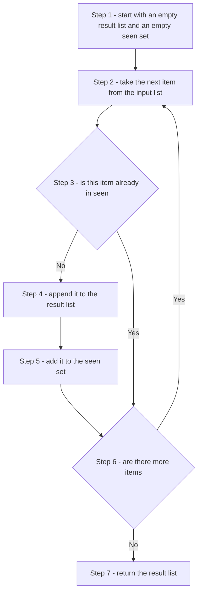
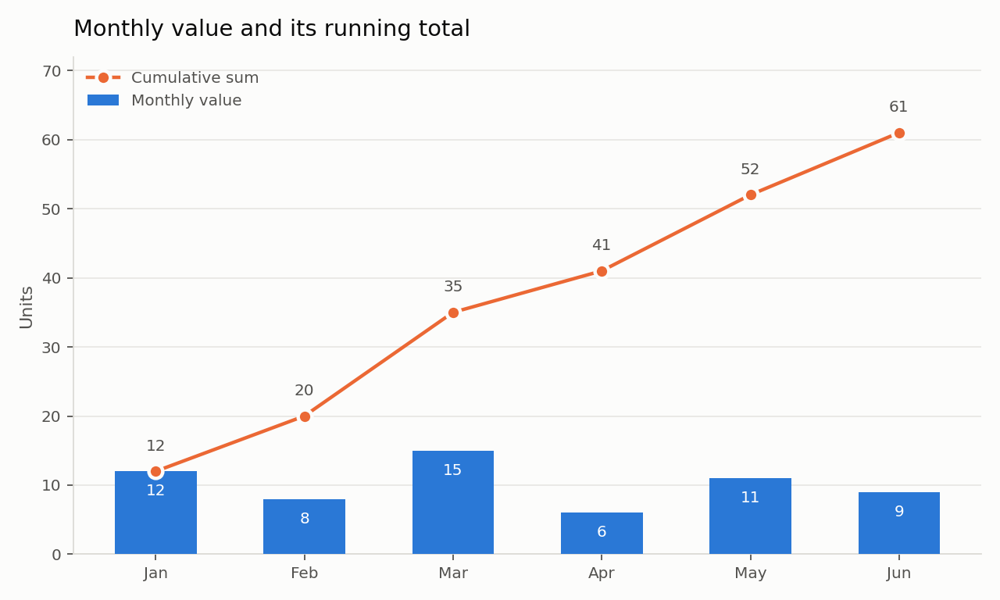
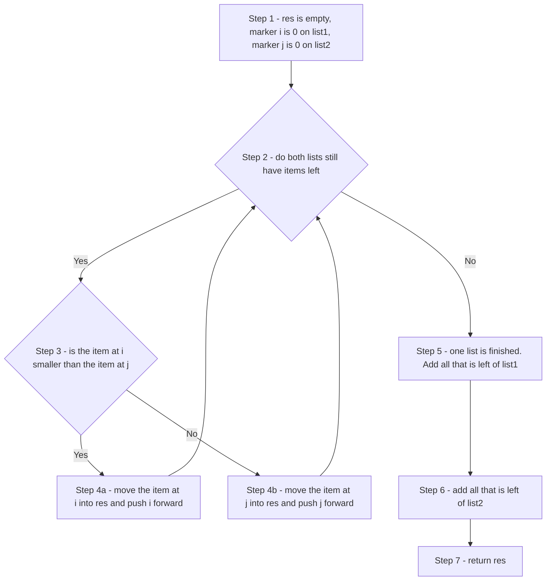
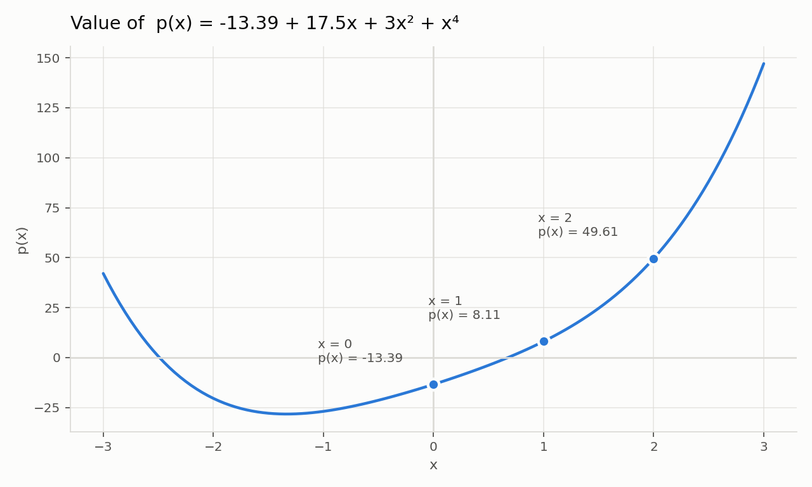
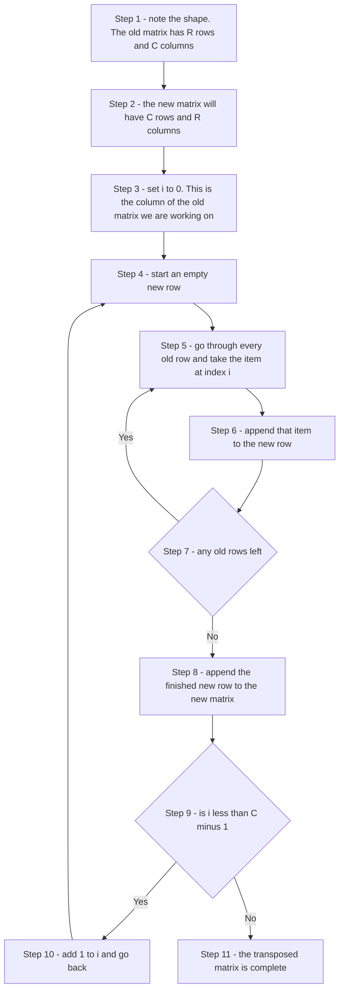

# Chapter 18 - Lists: Questions and Answers

This page is the online companion to the chapter on lists. The printed chapter explains what a list is, how to build one, how to walk through it and which methods it offers. This page takes the next step. It asks questions about those ideas and answers them in full, with worked examples, small tables, diagrams and complete scripts that you can copy and run.

Lists are the workhorse of Python. Almost every program you write will collect items, hold them together, change a few of them and read them back. A list is the simplest container Python gives you for that job, so the habits you build here will carry into strings, tuples, dictionaries, sets, files and data frames later in the book.

The questions come in three kinds:

- **Conceptual questions.** These check whether you understand the idea. A one line answer is not enough. Try to explain the idea to yourself in your own words before you read the answer.
- **Short scripting questions.** These ask for a few lines of code. They build the muscle memory you need for the longer problems.
- **Exercises.** These are small complete problems. Write your own solution first, run it, then compare it with the answer given here. Your version may be different and still correct.

Every answer here is written as a set of steps. Read the step, look at the line of code that carries it out, and only then move to the next step. Each script is given as a complete block with its steps marked in comments, so you can copy the whole block and run it as it stands.

All outputs shown on this page were produced by actually running the scripts. Where a script uses random numbers, the output will differ on your machine, and that is expected.

## Table of Contents

- [How to Use This Page](#how-to-use-this-page)
- [Words You Will Meet on This Page](#words-you-will-meet-on-this-page)
- [A Quick Map of Python Containers](#a-quick-map-of-python-containers)
- [General Concepts](#general-concepts)
    - [Q1. Containers, sequences and mappings](#q1-containers-sequences-and-mappings)
    - [Q2. A container that is not a sequence](#q2-a-container-that-is-not-a-sequence)
    - [Q3. Immutable strings and mutable lists](#q3-immutable-strings-and-mutable-lists)
    - [Q4. Negative index](#q4-negative-index)
    - [Q5. Iterables](#q5-iterables)
    - [Q6. The plus operator and operator overloading](#q6-the-plus-operator-and-operator-overloading)
    - [Q7. Truth value of a list](#q7-truth-value-of-a-list)
- [Slicing](#slicing)
    - [Q8. The slice formula](#q8-the-slice-formula)
    - [Q9. Reversing a list with a slice](#q9-reversing-a-list-with-a-slice)
    - [Q10. Negative start and stop values in a slice](#q10-negative-start-and-stop-values-in-a-slice)
- [Assignment, Copying, and Aliasing](#assignment-copying-and-aliasing)
    - [Q11. Assigning a list versus copying a list](#q11-assigning-a-list-versus-copying-a-list)
    - [Q12. Aliasing and the bugs it causes](#q12-aliasing-and-the-bugs-it-causes)
    - [Q13. Slice copy versus the copy method](#q13-slice-copy-versus-the-copy-method)
    - [Q14. Why a repeated row is not four rows](#q14-why-a-repeated-row-is-not-four-rows)
    - [Q15. Deep copy](#q15-deep-copy)
- [List Methods and Common Gotchas](#list-methods-and-common-gotchas)
    - [Q16. What list.sort() returns](#q16-what-listsort-returns)
    - [Q17. Three expressions that fail](#q17-three-expressions-that-fail)
    - [Q18. append versus extend](#q18-append-versus-extend)
    - [Q19. Removing items with del](#q19-removing-items-with-del)
    - [Q20. Sorting tuples by price](#q20-sorting-tuples-by-price)
    - [Q21. The mutable default argument](#q21-the-mutable-default-argument)
- [List Comprehension](#list-comprehension)
    - [Q22. Flattening a two dimensional list](#q22-flattening-a-two-dimensional-list)
    - [Q23. Removing spaces from a string](#q23-removing-spaces-from-a-string)
    - [Q24. Odd multiples of 23](#q24-odd-multiples-of-23)
    - [Q25. Squares of 10 to 20](#q25-squares-of-10-to-20)
    - [Q26. Splitting odd and even items](#q26-splitting-odd-and-even-items)
    - [Q27. Pairing two lists with zip](#q27-pairing-two-lists-with-zip)
    - [Q28. Unpacking a list](#q28-unpacking-a-list)
- [Exercises](#exercises)
    - [Q29. Remove duplicates and keep the order](#q29-remove-duplicates-and-keep-the-order)
    - [Q30. Return the unique items and the repeated items](#q30-return-the-unique-items-and-the-repeated-items)
    - [Q31. Cumulative sum](#q31-cumulative-sum)
    - [Q32. chop and middle](#q32-chop-and-middle)
    - [Q33. Checking ascending order](#q33-checking-ascending-order)
    - [Q34. Merging two sorted lists](#q34-merging-two-sorted-lists)
    - [Q35. Product of all items](#q35-product-of-all-items)
    - [Q36. Evaluating a polynomial](#q36-evaluating-a-polynomial)
    - [Q37. Counting how often each item appears](#q37-counting-how-often-each-item-appears)
    - [Q38. Removing extra spaces from strings](#q38-removing-extra-spaces-from-strings)
    - [Q39. Joining strings into one string](#q39-joining-strings-into-one-string)
    - [Q40. Checking whether all items are unique](#q40-checking-whether-all-items-are-unique)
    - [Q41. Items common to two lists](#q41-items-common-to-two-lists)
    - [Q42. Removing duplicate words from a sentence](#q42-removing-duplicate-words-from-a-sentence)
    - [Q43. Splitting a list into two halves](#q43-splitting-a-list-into-two-halves)
    - [Q44. Grouping a list into sublists of three](#q44-grouping-a-list-into-sublists-of-three)
    - [Q45. Square root of 2 at growing precision](#q45-square-root-of-2-at-growing-precision)
- [Matrices](#matrices)
    - [Q46. Length of the inner and outer lists](#q46-length-of-the-inner-and-outer-lists)
    - [Q47 and Q48. Transposing a matrix](#q47-and-q48-transposing-a-matrix)
- [Randomization](#randomization)
    - [Q49. Ten random multiples of 7](#q49-ten-random-multiples-of-7)
    - [Q50. Differences between consecutive random numbers](#q50-differences-between-consecutive-random-numbers)
    - [Q51. Reversing a list without slicing](#q51-reversing-a-list-without-slicing)
    - [Q52. Sampling without replacement](#q52-sampling-without-replacement)
- [Common Mistakes at a Glance](#common-mistakes-at-a-glance)
- [Where to Read More](#where-to-read-more)

## How to Use This Page

Work through the page in order the first time. The sections build on each other. Copying is easier to follow once slicing is clear, and the exercises lean on both.

A few suggestions:

1. **Keep a Python window open.** Do not just read the scripts. Type them, run them, then break them on purpose and see what error you get. An error message you have seen before is far less frightening.
2. **Predict before you run.** For every script, write down on paper what you think the output will be. Then run it. The gap between the two is exactly what you still have to learn.
3. **Change one thing at a time.** If you change a script, change one line, run it, and see the effect. Changing three lines at once hides which one mattered.
4. **Use the back links.** After every answer there is a link that takes you to the Table of Contents, so you can jump to any other question without scrolling.

[Back to the Table of Contents](#table-of-contents)

## Words You Will Meet on This Page

These are the technical words used in the answers. Each one is explained in plain language below, and the link takes you to the official Python documentation if you want the formal definition.

| Word | Plain meaning | Read more |
|---|---|---|
| Object | Any piece of data that Python holds in memory. A number, a string and a list are all objects. | [Python glossary: object](https://docs.python.org/3/glossary.html#term-object) |
| Container | An object that holds other objects inside it. | [Python glossary: container](https://docs.python.org/3/glossary.html#term-container) |
| Sequence | A container that keeps its items in a fixed order and lets you reach them by position number. | [Python glossary: sequence](https://docs.python.org/3/glossary.html#term-sequence) |
| Mapping | A container that reaches its items by a key instead of by a position number. | [Python glossary: mapping](https://docs.python.org/3/glossary.html#term-mapping) |
| Index | The position number of an item in a sequence. Counting starts at 0. | [Sequence types](https://docs.python.org/3/library/stdtypes.html#sequence-types-list-tuple-range) |
| Iterable | Anything you can walk through one item at a time, usually with a `for` loop. | [Python glossary: iterable](https://docs.python.org/3/glossary.html#term-iterable) |
| Mutable | Can be changed after it is made. A list is mutable. | [Python glossary: mutable](https://docs.python.org/3/glossary.html#term-mutable) |
| Immutable | Cannot be changed after it is made. A string is immutable. | [Python glossary: immutable](https://docs.python.org/3/glossary.html#term-immutable) |
| Reference | The internal address that tells Python where an object sits in memory. A variable name holds a reference, not the object itself. | [Assignment statements](https://docs.python.org/3/reference/simple_stmts.html#assignment-statements) |
| Alias | A second name for the same object. | [Python glossary: mutable](https://docs.python.org/3/glossary.html#term-mutable) |
| Shallow copy | A new outer object whose inner items are still shared with the original. | [The copy module](https://docs.python.org/3/library/copy.html) |
| Deep copy | A new outer object whose inner items are also new and separate. | [The copy module](https://docs.python.org/3/library/copy.html) |
| Slice | A piece cut out of a sequence, written as `seq[start:stop:step]`. | [Slicings](https://docs.python.org/3/reference/expressions.html#slicings) |
| Operator overloading | The same symbol doing different jobs for different types. `+` adds numbers but joins lists. | [Emulating numeric types](https://docs.python.org/3/reference/datamodel.html#emulating-numeric-types) |
| Truthy and falsy | Values that behave like `True` or like `False` when used in a condition. | [Truth value testing](https://docs.python.org/3/library/stdtypes.html#truth-value-testing) |
| List comprehension | A one line way of building a new list from an old one. | [List comprehensions](https://docs.python.org/3/tutorial/datastructures.html#list-comprehensions) |

[Back to the Table of Contents](#table-of-contents)

## A Quick Map of Python Containers

Before the questions begin, here is the family picture. It is worth looking at this map whenever an answer below mentions a container, a sequence or a mapping.



The same picture as a table:

| Kind | How you reach an item | Ordered | Can it be changed | Common examples |
|---|---|---|---|---|
| Container | Depends on the kind | Depends | Depends | `list`, `tuple`, `str`, `dict`, `set` |
| Sequence | By index number, such as `seq[0]` | Yes | `list` yes, `tuple` and `str` no | `list`, `tuple`, `str`, `range` |
| Mapping | By key, such as `d['name']` | Insertion order is kept from Python 3.7 | Yes | `dict` |
| Set | Not reachable one by one by position | No | Yes for `set` | `set`, `frozenset` |

[Back to the Table of Contents](#table-of-contents)

## General Concepts

The seven questions in this section are about the ideas behind lists rather than about list code. They are worth real attention. Most beginner bugs with lists come from a shaky idea, not from a typing mistake.

[Back to the Table of Contents](#table-of-contents)

### Q1. Containers, sequences and mappings

**1. What are the similarities and differences between (1) containers, (2) sequences, and (3) mappings?**

**Answer**

All three are objects that hold other objects. That is the similarity. The difference lies in how the items are arranged inside, and how you get an item back out.

**Step 1. Start with the widest word, container.**
A container is any object that holds other objects. Nothing more is promised. It does not promise an order, and it does not promise a way of reaching an item by number.

**Step 2. Narrow it down to a sequence.**
A sequence is a container that makes two extra promises. The items sit in a fixed order, and each item has a position number called an index. The first index is 0, the second is 1, and so on. Lists, tuples and strings are sequences.

**Step 3. Look at a mapping.**
A mapping is a container that keeps items in pairs. Each pair is a key and a value. You do not ask for item number 2. You ask for the value stored under a key. A dictionary is the mapping you will use every day.

**Step 4. Put the three side by side.**

| Point of comparison | Container | Sequence | Mapping |
|---|---|---|---|
| Holds other objects | Yes | Yes | Yes |
| Fixed left to right order | Not promised | Yes | Insertion order is kept, but you do not use it to fetch items |
| How you fetch an item | Depends on the type | By index, `seq[2]` | By key, `d['price']` |
| Can you loop over it | Yes | Yes | Yes, over the keys by default |
| Duplicates allowed | Depends on the type | Yes | Keys must be unique, values may repeat |
| Everyday examples | `list`, `dict`, `set`, `str` | `list`, `tuple`, `str` | `dict` |

**Step 5. See it in code.**

```python
# Step 1 - a sequence. The index decides which item you get.
my_list = ['pen', 'book', 'bag']
print("Item at index 1 :", my_list[1])

# Step 2 - a mapping. The key decides which item you get.
my_dict = {'pen': 10, 'book': 250, 'bag': 900}
print("Value for 'book':", my_dict['book'])

# Step 3 - both are containers, so 'in' works on both.
print("'bag' in my_list :", 'bag' in my_list)
print("'bag' in my_dict :", 'bag' in my_dict)
```

```text
Item at index 1 : book
Value for 'book': 250
'bag' in my_list : True
'bag' in my_dict : True
```

Notice the last two lines. The word `in` searches the items of a list, but it searches the keys of a dictionary. That single difference tells you a lot about how the two are built.

**Follow up question.** Is a `set` a container? Is it a sequence? Why does `my_set[0]` raise an error?

[Back to the Table of Contents](#table-of-contents)

### Q2. A container that is not a sequence

**2. All sequences are containers, but not all containers are sequences. Explain, with an example of a container that is not a sequence.**

**Answer**

**Step 1. Understand the direction of the rule.**
Every sequence holds items, so every sequence is a container. The rule does not work backwards. A container only promises to hold items. It does not promise the fixed order and the index numbers that make a sequence.

**Step 2. Pick a container that breaks the promise.**
A dictionary is the clearest example. It holds items, so it is a container. But you cannot ask for the item at position 2. You have to ask for a key.

**Step 3. Prove it by running code.**

```python
# Step 1 - build a dictionary. It holds three items, so it is a container.
my_dict = {'pen': 10, 'book': 250, 'bag': 900}
print("Number of items :", len(my_dict))

# Step 2 - try to reach an item by index, the way you would in a list.
try:
    print(my_dict[0])
except KeyError as e:
    print("Index style access failed. KeyError for key:", e)

# Step 3 - the right way is by key.
print("By key :", my_dict['pen'])
```

```text
Number of items : 3
Index style access failed. KeyError for key: 0
By key : 10
```

Python does not say "a dictionary has no index". It says `KeyError`. That is a small clue about what really happened. Python did not treat the `0` as a position. It treated it as a key, looked for a key named `0`, and did not find one.

**Step 4. Note a second example.**
A set is also a container that is not a sequence. It holds items but keeps no order at all, so `my_set[0]` raises a `TypeError`.

```python
my_set = {'pen', 'book', 'bag'}
try:
    print(my_set[0])
except TypeError as e:
    print("TypeError:", e)
```

```text
TypeError: 'set' object is not subscriptable
```

The word *subscriptable* simply means "you are allowed to write square brackets after it".

[Back to the Table of Contents](#table-of-contents)

### Q3. Immutable strings and mutable lists

**3. Strings are "immutable" while lists are "mutable." Explain what this means and why it matters when writing code.**

**Answer**

**Step 1. Learn the two words.**
Mutable means the object can be changed in place, after it has been made. Immutable means it cannot. The object is fixed from birth to death.

**Step 2. See what "in place" means for a list.**
A list lets you replace an item and keeps the same object.

```python
# Step 1 - build a list and note where Python keeps it.
my_list = ['a', 'b', 'c']
print("Before      :", my_list, " id:", id(my_list))

# Step 2 - change one item in place.
my_list[0] = 'z'
print("After change:", my_list, " id:", id(my_list))
```

```text
Before      : ['a', 'b', 'c']  id: 139911614813056
After change: ['z', 'b', 'c']  id: 139911614813056
```

The `id()` function reports the identity of the object, a number that stands for its place in memory. You will get a different number on your machine, but the point is that **the two numbers are the same**. It is the same list, with one item swapped.

**Step 3. Try the same thing with a string.**

```python
my_string = 'abc'
try:
    my_string[0] = 'z'
except TypeError as e:
    print("TypeError:", e)
```

```text
TypeError: 'str' object does not support item assignment
```

**Step 4. Understand how strings are "changed".**
You do not change a string. You build a new one and give it the old name.

```python
# Step 1 - note the identity of the first string.
my_string = 'abc'
print("Before :", my_string, " id:", id(my_string))

# Step 2 - 'change' it by building a new string.
my_string = 'z' + my_string[1:]
print("After  :", my_string, " id:", id(my_string))
```

```text
Before : abc  id: 9742816
After  : zbc  id: 139911612642224
```

Here the two identity numbers are **different**. The old string `'abc'` was untouched. A brand new string was made and the name `my_string` was pointed at it.

**Step 5. Know why this matters when you write code.**
Three practical consequences follow.

| Consequence | For a mutable list | For an immutable string |
|---|---|---|
| Can a function change the caller's data | Yes. If you pass a list to a function and the function appends to it, the caller sees the change. | No. The function can only hand back a new string. |
| Can it be used as a dictionary key | No | Yes |
| Cost of many small changes | Cheap. One list, changed again and again. | Expensive. Each change builds a whole new string. Build a list of pieces and use `''.join()` at the end. |

**Follow up question.** Tuples are immutable. Can a tuple ever contain a list that you are still able to change? Try `t = (1, [2, 3])` and then `t[1].append(4)`.

[Back to the Table of Contents](#table-of-contents)

### Q4. Negative index

**4. What is a negative index in Python? Explain using the rule: `seq[-n]` is the same as `seq[len(seq) - n]`.**

**Answer**

**Step 1. Read the rule in plain words.**
A negative index counts from the right hand end instead of the left. Python turns a negative index into a normal one by adding the length of the sequence to it.

**Step 2. Do the arithmetic once.**
Take a list of 5 items. Its length is 5.

- `seq[-1]` becomes `seq[5 - 1]`, that is `seq[4]`, the last item.
- `seq[-2]` becomes `seq[5 - 2]`, that is `seq[3]`, the second last item.
- `seq[-5]` becomes `seq[5 - 5]`, that is `seq[0]`, the first item.

**Step 3. Picture the two sets of numbers.**

| Item | `'p'` | `'y'` | `'t'` | `'h'` | `'n'` |
|---|---|---|---|---|---|
| Index from the left | 0 | 1 | 2 | 3 | 4 |
| Index from the right | -5 | -4 | -3 | -2 | -1 |

**Step 4. Check it in code.**

```python
# Step 1 - a list of five items.
seq = ['p', 'y', 't', 'h', 'n']
print("Length of seq :", len(seq))

# Step 2 - the last item, both ways.
print("seq[-1]           :", seq[-1])
print("seq[len(seq) - 1] :", seq[len(seq) - 1])

# Step 3 - the third item from the right, both ways.
print("seq[-3]           :", seq[-3])
print("seq[len(seq) - 3] :", seq[len(seq) - 3])

# Step 4 - go too far and Python complains.
try:
    print(seq[-6])
except IndexError as e:
    print("IndexError:", e)
```

```text
Length of seq : 5
seq[-1]           : n
seq[len(seq) - 1] : n
seq[-3]           : t
seq[len(seq) - 3] : t
IndexError: list index out of range
```

**Step 5. Remember why this is useful.**
`my_list[-1]` is the plain way of saying "the last item", and it works whatever the length is. Without it you would have to write `my_list[len(my_list) - 1]` every time.

**A warning.** There is no `-0`. Zero is zero, so `seq[-0]` is the same as `seq[0]`, the **first** item. This surprises many beginners.

[Back to the Table of Contents](#table-of-contents)

### Q5. Iterables

**5. All sequence types are iterable - explain what this means and how the container/sequence/mapping distinction relates to it.**

**Answer**

**Step 1. Understand the word iterable.**
An object is iterable if Python can hand you its items one at a time. The simplest test is whether a `for` loop works on it.

**Step 2. See that being iterable is separate from being a sequence.**
Being a sequence is about how you **fetch one item**, by index. Being iterable is about whether you can **walk through all items**, one after another. A sequence gives you both. A dictionary and a set give you only the second.

**Step 3. Compare the three in one script.**

```python
# Step 1 - a sequence. Looping gives you the items.
my_list = ['pen', 'book', 'bag']
for item in my_list:
    print("from list:", item)

# Step 2 - a mapping. Looping gives you the keys, not the values.
my_dict = {'pen': 10, 'book': 250}
for key in my_dict:
    print("from dict, key:", key, "-> value:", my_dict[key])

# Step 3 - a set. Looping works, but the order is not promised.
my_set = {'pen', 'book'}
for item in my_set:
    print("from set:", item)
```

```text
from list: pen
from list: book
from list: bag
from dict, key: pen -> value: 10
from dict, key: book -> value: 250
from set: book
from set: pen
```

The last two lines may come out in the other order on your machine. A set keeps no order, so no order is promised.

**Step 4. Fix the relationship in your mind.**

| Type | Is it a container | Is it a sequence | Is it iterable | What a `for` loop gives you |
|---|---|---|---|---|
| `list` | Yes | Yes | Yes | The items, in order |
| `tuple` | Yes | Yes | Yes | The items, in order |
| `str` | Yes | Yes | Yes | The characters, in order |
| `dict` | Yes | No | Yes | The keys |
| `set` | Yes | No | Yes | The items, in no fixed order |
| `range` | Yes | Yes | Yes | The numbers, in order |

**Step 5. Note the one way arrow.**
Every sequence is iterable. Not everything iterable is a sequence. A file object, for example, is iterable line by line but has no index.

**Follow up question.** Loop over a dictionary using `my_dict.items()`. What does each turn of the loop give you now?

[Back to the Table of Contents](#table-of-contents)

### Q6. The plus operator and operator overloading

**6. The '+' operator can be used to concatenate two sequences of the same type. Explain, and describe how this is an example of operator overloading.**

**Answer**

**Step 1. See what `+` does to two sequences.**
It joins them end to end and hands back a brand new sequence. Neither of the two originals is changed.

**Step 2. Understand the phrase operator overloading.**
To overload an operator is to give the same symbol more than one meaning, and to let the type of the operands decide which meaning applies. The symbol `+` is overloaded in Python. With two numbers it adds. With two sequences it joins.

**Step 3. Watch the same symbol do three different jobs.**

```python
# Step 1 - with two numbers, + adds.
print("2 + 3        =", 2 + 3)

# Step 2 - with two strings, + joins.
print("'ab' + 'cd'  =", 'ab' + 'cd')

# Step 3 - with two lists, + joins.
print("[1, 2] + [3] =", [1, 2] + [3])

# Step 4 - the originals are untouched.
a = [1, 2]
b = [3, 4]
c = a + b
print("a =", a, " b =", b, " c =", c)

# Step 5 - mixing two different types does not work.
try:
    print([1, 2] + (3, 4))
except TypeError as e:
    print("TypeError:", e)
```

```text
2 + 3        = 5
'ab' + 'cd'  = abcd
[1, 2] + [3] = [1, 2, 3]
a = [1, 2]  b = [3, 4]  c = [1, 2, 3, 4]
TypeError: can only concatenate list (not "tuple") to list
```

**Step 4. Note the rule about types.**
Both sides must be the same kind of sequence. A list joins with a list, a tuple with a tuple, a string with a string. A list and a tuple will not join, as the last line above shows.

**Step 5. Know how Python decides.**
Behind the scenes Python asks the left hand object "can you handle a `+`?" by calling its `__add__` method. The `int` type answers by adding. The `list` type answers by joining. Same symbol, different method, because the types are different. That is all that operator overloading means. You can read more under [emulating numeric types](https://docs.python.org/3/reference/datamodel.html#emulating-numeric-types).

**Step 6. Remember a related overload.**
The `*` symbol is overloaded in the same spirit. `3 * 4` multiplies, but `[0] * 4` repeats the list four times. Question 14 below shows how that repeat can catch you out.

[Back to the Table of Contents](#table-of-contents)

### Q7. Truth value of a list

**7. An empty list evaluates to False in a Boolean context. Explain this rule, and state whether the contents of a non-empty list ever affect its truth value.**

**Answer**

**Step 1. Know what a Boolean context is.**
A Boolean context is any place where Python needs a yes or a no. The condition of an `if`, the condition of a `while`, and the operands of `and`, `or` and `not` are all Boolean contexts.

**Step 2. Learn the rule for lists.**
The rule is short. An empty list is false. A list with at least one item is true. Nothing else is looked at.

**Step 3. Answer the second half of the question directly.**
No. The contents never affect the truth value. A list holding a single zero is still true, because it is not empty. Only the length counts.

**Step 4. Prove it.**

```python
# Step 1 - an empty list is false.
print("bool([])        :", bool([]))

# Step 2 - a list holding a zero is still true. It is not empty.
print("bool([0])       :", bool([0]))

# Step 3 - so is a list holding None, or an empty string, or an empty list.
print("bool([None])    :", bool([None]))
print("bool([''])      :", bool(['']))
print("bool([[]])      :", bool([[]]))

# Step 4 - this is why the plain 'if my_list' test is safe and readable.
my_list = []
if my_list:
    print("The list has something in it.")
else:
    print("The list is empty.")
```

```text
bool([])        : False
bool([0])       : True
bool([None])    : True
bool([''])      : True
bool([[]])      : True
The list is empty.
```

**Step 5. Prefer the short test.**
Write `if my_list:` rather than `if len(my_list) > 0:` or `if my_list != []:`. The short form is the normal Python style, and it works for strings, tuples, dictionaries and sets as well.

**Step 6. Keep the wider rule in view.**

| Value | Truth value | Reason |
|---|---|---|
| `[]`, `''`, `()`, `{}`, `set()` | False | Empty |
| `[0]`, `'0'`, `(0,)` | True | Not empty |
| `0`, `0.0` | False | Zero |
| `None` | False | It is the special empty value |
| `1`, `-5`, `'a'` | True | Not zero, not empty |

The full list of falsy values is in the documentation on [truth value testing](https://docs.python.org/3/library/stdtypes.html#truth-value-testing).

[Back to the Table of Contents](#table-of-contents)

## Slicing

A slice is a piece cut out of a sequence. Slicing is one of the things Python does better than most languages, and once it is clear you will use it every day. The three questions here cover the formula behind a slice, the famous reversing trick, and what happens when the numbers are negative.

[Back to the Table of Contents](#table-of-contents)

### Q8. The slice formula

**8. A slice of seq from i to j with step k is defined as the sequence of items at index `x = i + n*k`, `for 0 <= n < (j-i)/k`. Explain this in plain language with a worked example.**

**Answer**

**Step 1. Translate the formula into English.**
Start at index `i`. Keep adding `k` to get the next index. Stop before you reach `j`. The formula is only a formal way of writing that sentence.

The letter `n` is a simple counter. It starts at 0 and goes up by one each time. The condition `0 <= n < (j-i)/k` decides how many indexes you will collect, which is how many times you can add `k` before you reach `j`.

**Step 2. Name the three numbers.**

| Name in the formula | Name in Python | What it does |
|---|---|---|
| `i` | start | The index where the slice begins. This item is included. |
| `j` | stop | The index where the slice ends. This item is **not** included. |
| `k` | step | How far to jump to reach the next index. |

**Step 3. Work through `my_list[0:6:2]` by hand.**
Here `i = 0`, `j = 6`, `k = 2`. So `(j - i) / k` is `(6 - 0) / 2`, which is 3. So `n` may be 0, 1 or 2.

| `n` | `x = i + n*k` | Index picked | Item at that index |
|---|---|---|---|
| 0 | `0 + 0*2` | 0 | 10 |
| 1 | `0 + 1*2` | 2 | 30 |
| 2 | `0 + 2*2` | 4 | 50 |
| 3 | would be 6 | rejected, because `n` must be below 3 | - |

**Step 4. Confirm it by running the slice.**

```python
# Step 1 - a list of seven items.
my_list = [10, 20, 30, 40, 50, 60, 70]
print("The list       :", my_list)

# Step 2 - take the slice the formula describes.
print("my_list[0:6:2] :", my_list[0:6:2])

# Step 3 - build the same answer by hand, using the formula.
i, j, k = 0, 6, 2
by_hand = []
n = 0
while i + n * k < j:            # this is the condition 0 <= n < (j-i)/k
    by_hand.append(my_list[i + n * k])
    n = n + 1
print("Built by hand  :", by_hand)
```

```text
The list       : [10, 20, 30, 40, 50, 60, 70]
my_list[0:6:2] : [10, 30, 50]
Built by hand  : [10, 30, 50]
```

**Step 5. Remember the defaults.**
If you leave a number out, Python fills it in for you.

| You write | Python understands | Meaning |
|---|---|---|
| `seq[:]` | `seq[0 : len(seq) : 1]` | The whole sequence, as a copy |
| `seq[2:]` | `seq[2 : len(seq) : 1]` | From index 2 to the end |
| `seq[:3]` | `seq[0 : 3 : 1]` | From the start up to, but not including, index 3 |
| `seq[::2]` | `seq[0 : len(seq) : 2]` | Every second item |
| `seq[::-1]` | Walk backwards from the end | The whole sequence reversed |

**Step 6. Note the one kindness of slicing.**
An index that is out of range raises an `IndexError`, but a slice that is out of range does not. `my_list[2:100]` simply gives you whatever is there. This makes slices safe to use when you are not sure of the length.

```python
my_list = [10, 20, 30]
print("my_list[2:100] :", my_list[2:100])
print("my_list[9:20]  :", my_list[9:20])
```

```text
my_list[2:100] : [30]
my_list[9:20]  : []
```

[Back to the Table of Contents](#table-of-contents)

### Q9. Reversing a list with a slice

**9. Write a script that uses `myL[::-1]` to reverse a list.**

**Answer**

**Step 1. Understand why the trick works.**
In `myL[::-1]` the start and the stop are left out and the step is `-1`. A negative step tells Python to walk from the right hand end towards the left, so the items come out in the opposite order.

**Step 2. Write the script.**

```python
# Step 1 - build the list.
myL = [1, 2, 3, 4, 5]
print("Original list :", myL)

# Step 2 - take a slice with a step of -1. This walks the list backwards.
reversed_list = myL[::-1]
print("Reversed list :", reversed_list)

# Step 3 - check that the original was not disturbed.
print("Original again:", myL)
```

```text
Original list : [1, 2, 3, 4, 5]
Reversed list : [5, 4, 3, 2, 1]
Original again: [1, 2, 3, 4, 5]
```

**Step 3. Know the other two ways of reversing.**
The slice is not the only way, and the three ways behave differently. Choose the one that fits your need.

| Way of doing it | Does it change the original | What it returns | Use it when |
|---|---|---|---|
| `myL[::-1]` | No | A new list | You need a reversed copy and want to keep the original |
| `myL.reverse()` | Yes, in place | `None` | You do not need the original order any more |
| `list(reversed(myL))` | No | A new list | You want the clearest possible code |

```python
# Step 1 - the in place method changes the list itself and returns None.
myL = [1, 2, 3, 4, 5]
result = myL.reverse()
print("Return value of myL.reverse() :", result)
print("myL after reverse()           :", myL)

# Step 2 - the reversed() function leaves the list alone.
myL2 = [1, 2, 3, 4, 5]
print("list(reversed(myL2))          :", list(reversed(myL2)))
print("myL2 is unchanged             :", myL2)
```

```text
Return value of myL.reverse() : None
myL after reverse()           : [5, 4, 3, 2, 1]
list(reversed(myL2))          : [5, 4, 3, 2, 1]
myL2 is unchanged             : [1, 2, 3, 4, 5]
```

Look at the first two lines together. The return value is `None`, yet the list itself did get reversed. The work was done to the list, not handed back. That is the shape of every in place method in Python.

**Step 4. Note the common mistake.**
`print(myL.reverse())` prints `None`, not a reversed list, because `reverse()` returns nothing. Question 16 below is about the same trap with `sort()`.

[Back to the Table of Contents](#table-of-contents)

### Q10. Negative start and stop values in a slice

**10. If either `i` or `j` in a slice is negative, it is treated as `i + len(seq)` (or `j + len(seq)`). Explain this with an example.**

**Answer**

**Step 1. Read the rule.**
Before Python cuts the slice, it cleans up the numbers. Any negative start or stop has the length of the sequence added to it. After that the slice runs in the ordinary way.

**Step 2. Work out one example on paper.**
Take a list of 8 items, so `len(seq)` is 8.

- `seq[-3:]` has a start of `-3`. Python turns it into `-3 + 8`, which is 5. So the slice is `seq[5:]`.
- `seq[:-2]` has a stop of `-2`. Python turns it into `-2 + 8`, which is 6. So the slice is `seq[:6]`.
- `seq[-5:-2]` becomes `seq[3:6]`.

**Step 3. Set the two forms side by side in code.**

```python
# Step 1 - a list of eight items.
seq = [10, 20, 30, 40, 50, 60, 70, 80]
n = len(seq)
print("Length of seq :", n)

# Step 2 - the last three items, written with a negative start.
print("seq[-3:] :", seq[-3:])

# Step 3 - the same slice, written with the number Python actually uses.
print("seq[5:]  :", seq[5:])

# Step 4 - a negative stop works the same way.
print("seq[:-2] :", seq[:-2])
print("seq[:6]  :", seq[:6])

# Step 5 - both ends negative.
print("seq[-5:-2] :", seq[-5:-2])
print("seq[3:6]   :", seq[3:6])
```

```text
Length of seq : 8
seq[-3:] : [60, 70, 80]
seq[5:]  : [60, 70, 80]
seq[:-2] : [10, 20, 30, 40, 50, 60]
seq[:6]  : [10, 20, 30, 40, 50, 60]
seq[-5:-2] : [40, 50, 60]
seq[3:6]   : [40, 50, 60]
```

**Step 4. Learn the two everyday uses.**

| Slice | Plain meaning |
|---|---|
| `seq[-1:]` | A list holding just the last item |
| `seq[-3:]` | The last three items |
| `seq[:-1]` | Everything except the last item |
| `seq[:-3]` | Everything except the last three items |

**Step 5. Watch the one catch.**
A very large negative start is not an error. It is simply clipped to the beginning of the list.

```python
seq = [10, 20, 30]
print("seq[-99:] :", seq[-99:])
```

```text
seq[-99:] : [10, 20, 30]
```

[Back to the Table of Contents](#table-of-contents)

## Assignment, Copying, and Aliasing

This is the section that decides whether your list code will be reliable. Almost every puzzling list bug traces back to one mistake: believing you have two lists when in fact you have one list with two names. Read these five questions slowly.

[Back to the Table of Contents](#table-of-contents)

### Q11. Assigning a list versus copying a list

**11. What is the difference between assigning a list to another variable and copying a list?**

**Answer**

**Step 1. Know what a name really holds.**
A Python variable does not hold an object. It holds a reference, which is the address of the object. Think of the name as a luggage tag tied to a bag, not as the bag itself.

**Step 2. See what assignment does.**
`b = a` does not make a second bag. It ties a second tag to the same bag. Now `a` and `b` name one object.

**Step 3. See what copying does.**
`b = a[:]` or `b = a.copy()` makes a second bag with the same things inside, and ties `b` to it. Now there are two objects.

**Step 4. Put the two in one picture.**



**Step 5. Prove it with `id()`.**
The `id()` function returns a number that identifies the object. Two names with the same `id` are two names for one object.

```python
# Step 1 - the original list.
a = [1, 2, 3]

# Step 2 - assignment. No new list is made.
b = a

# Step 3 - copying. A new list is made.
c = a.copy()

# Step 4 - compare the identities.
print("id(a) == id(b) :", id(a) == id(b))   # True, same object
print("id(a) == id(c) :", id(a) == id(c))   # False, different objects

# Step 5 - 'is' asks the same question in nicer words.
print("b is a :", b is a)
print("c is a :", c is a)

# Step 6 - but '==' only asks whether the contents match.
print("c == a :", c == a)

# Step 7 - now change the list through b and watch a.
b.append(4)
print("After b.append(4) -> a :", a)
print("After b.append(4) -> c :", c)
```

```text
id(a) == id(b) : True
id(a) == id(c) : False
b is a : True
c is a : False
c == a : True
After b.append(4) -> a : [1, 2, 3, 4]
After b.append(4) -> c : [1, 2, 3]
```

**Step 6. Fix the summary in your mind.**

| Point | `b = a` (assignment) | `c = a.copy()` (copying) |
|---|---|---|
| How many list objects exist | One | Two |
| `b is a` | `True` | `False` |
| `b == a` | `True` | `True` |
| Does a change through one show in the other | Yes | No |
| Memory used | No extra | A second list |

**Step 7. Remember the one word test.**
`is` asks "are these the same object?" `==` asks "do these have the same contents?" Two different lists that hold the same items are `==` but not `is`.

[Back to the Table of Contents](#table-of-contents)

### Q12. Aliasing and the bugs it causes

**12. What is "aliasing"? Why can aliasing a mutable object like a list cause unexpected bugs? Give an example.**

**Answer**

**Step 1. Define the word.**
Aliasing is having two or more names for the same object. An alias is simply another name.

**Step 2. Understand why it is dangerous only for mutable objects.**
If the object cannot be changed, two names for it do no harm. Nobody can change it under you. A list can be changed, so a change made through one name appears through every other name. That is the whole problem.

**Step 3. Read the example from the question.**

```python
list1 = [1, 2]
list2 = list1  # Aliasing
list2.append(3)
print(list1)   # Output: [1, 2, 3] - unexpected!
```

```text
[1, 2, 3]
```

Nothing was appended to `list1`, yet `list1` grew. It grew because `list1` and `list2` were never two lists. They were one list with two names.

**Step 4. Picture what happened.**



**Step 5. See the version of this bug that bites in real programs.**
The example above is easy to spot because the two lines sit next to each other. In real code the alias is usually created by passing a list to a function.

```python
# Step 1 - a function that looks harmless.
def add_bonus_item(shopping):
    shopping.append('free sample')     # this changes the caller's list
    return shopping

# Step 2 - the caller's list.
my_shopping = ['rice', 'dal']
print("Before the call :", my_shopping)

# Step 3 - call the function.
new_shopping = add_bonus_item(my_shopping)

# Step 4 - the caller's list has changed too, which is rarely what you wanted.
print("Returned list   :", new_shopping)
print("After the call  :", my_shopping)
print("Same object?    :", new_shopping is my_shopping)
```

```text
Before the call : ['rice', 'dal']
Returned list   : ['rice', 'dal', 'free sample']
After the call  : ['rice', 'dal', 'free sample']
Same object?    : True
```

**Step 6. Learn the cure.**
Copy the list at the door of the function, then change the copy.

```python
# Step 1 - the safe version. The first line makes a private copy.
def add_bonus_item_safely(shopping):
    shopping = shopping.copy()         # work on our own copy from here on
    shopping.append('free sample')
    return shopping

# Step 2 - the caller's list.
my_shopping = ['rice', 'dal']

# Step 3 - call the function and compare the two lists.
new_shopping = add_bonus_item_safely(my_shopping)
print("Returned list  :", new_shopping)
print("Caller's list  :", my_shopping)
print("Same object?   :", new_shopping is my_shopping)
```

```text
Returned list  : ['rice', 'dal', 'free sample']
Caller's list  : ['rice', 'dal']
Same object?   : False
```

**Step 7. Keep three habits.**
1. When you assign a list to a new name, ask yourself whether you wanted a copy.
2. When a function must not disturb its caller's list, copy at the top of the function.
3. When something changes and you cannot see why, print the `id()` values. A shared `id` explains most of these mysteries in one line.

[Back to the Table of Contents](#table-of-contents)

### Q13. Slice copy versus the copy method

**13. Both `copy_list = original_list[:]` and `copy_list = original_list.copy()` produce a copy. Are they equivalent? Explain.**

**Answer**

**Step 1. Give the short answer.**
Yes. For a list, the two are equivalent. Both build a new list object and fill it with the same items, and both are shallow copies.

**Step 2. Show that the results match.**

```python
# Step 1 - the original list.
original_list = [1, 2, 3]

# Step 2 - copy it in the two ways.
copy_a = original_list[:]
copy_b = original_list.copy()

# Step 3 - both hold the same contents as the original.
print("copy_a :", copy_a, " equal to original:", copy_a == original_list)
print("copy_b :", copy_b, " equal to original:", copy_b == original_list)

# Step 4 - but neither of them IS the original.
print("copy_a is original_list :", copy_a is original_list)
print("copy_b is original_list :", copy_b is original_list)

# Step 5 - and they are not each other either.
print("copy_a is copy_b        :", copy_a is copy_b)

# Step 6 - a change to one does not touch the others.
copy_a.append(99)
print("After copy_a.append(99)")
print("  original_list :", original_list)
print("  copy_a        :", copy_a)
print("  copy_b        :", copy_b)
```

```text
copy_a : [1, 2, 3]  equal to original: True
copy_b : [1, 2, 3]  equal to original: True
copy_a is original_list : False
copy_b is original_list : False
copy_a is copy_b        : False
After copy_a.append(99)
  original_list : [1, 2, 3]
  copy_a        : [1, 2, 3, 99]
  copy_b        : [1, 2, 3]
```

**Step 3. Note the small differences that are worth knowing.**

| Point | `original_list[:]` | `original_list.copy()` |
|---|---|---|
| Result for a list | A new shallow copy | A new shallow copy |
| Readability | Compact, but a beginner may not see that it is a copy | Says what it does in one word |
| Which Python versions | All | `list.copy()` was added in Python 3.3 |
| Works on a string or a tuple | Yes, `s[:]` is valid | No, `str` and `tuple` have no `.copy()` method |
| Works on a dictionary | No, `d[:]` raises an error | Yes, `d.copy()` works |

**Step 4. Take the practical advice.**
Prefer `.copy()` in new code. Anyone reading the line can see at once that a copy is intended. Use `[:]` when you also need a slice, for example `first_half = data[:5]`.

**Step 5. Remember the limit of both.**
Both are shallow. They copy the outer list only. If the list holds other lists, the inner lists are still shared. Question 15 deals with that.

[Back to the Table of Contents](#table-of-contents)

### Q14. Why a repeated row is not four rows

**14. Explain why `my_matrix = [[0] * 3] * 4` does NOT create four independent rows. Write a script that proves this by modifying one row, then fix it using list comprehension so the rows are independent.**

**Answer**

**Step 1. Read the expression from the inside out.**
`[0] * 3` builds one list, `[0, 0, 0]`. That is one object.

**Step 2. See what the outer multiplication does.**
`[ something ] * 4` builds a list of four items. It does not build four copies of `something`. It stores the same reference four times. So the outer list holds four tags, all tied to the one inner list built in Step 1.

**Step 3. Follow the consequence.**
`my_matrix[0]`, `my_matrix[1]`, `my_matrix[2]` and `my_matrix[3]` are four names for one row. Change a value through any of them and the change appears in all four.

**Step 4. Picture it.**



**Step 5. Prove the problem.**

```python
# Step 1 - build the matrix the wrong way.
matrix = [[0] * 3] * 4
print("Looks right :", matrix)

# Step 2 - show that all four rows are the same object.
print("Row ids are all equal :", len({id(row) for row in matrix}) == 1)

# Step 3 - change a single cell in the first row.
matrix[0][0] = 9

# Step 4 - every row changed.
print("After matrix[0][0] = 9 :", matrix)
```

```text
Looks right : [[0, 0, 0], [0, 0, 0], [0, 0, 0], [0, 0, 0]]
Row ids are all equal : True
After matrix[0][0] = 9 : [[9, 0, 0], [9, 0, 0], [9, 0, 0], [9, 0, 0]]
```

Step 2 uses a small trick. `{id(row) for row in matrix}` collects the identity numbers of the four rows into a set. A set drops duplicates. If the set has only one number left, all four rows were the same object.

**Step 6. Fix it with a list comprehension.**
A list comprehension runs the expression `[0] * 3` once for every turn of the loop, so four separate rows are built.

```python
# Step 1 - build the matrix the right way.
matrix = [[0] * 3 for _ in range(4)]
print("Looks the same :", matrix)

# Step 2 - now the four rows are four different objects.
print("Row ids are all equal :", len({id(row) for row in matrix}) == 1)

# Step 3 - change a single cell in the first row.
matrix[0][0] = 9

# Step 4 - only the first row changed.
print("After matrix[0][0] = 9 :", matrix)
```

```text
Looks the same : [[0, 0, 0], [0, 0, 0], [0, 0, 0], [0, 0, 0]]
Row ids are all equal : False
After matrix[0][0] = 9 : [[9, 0, 0], [0, 0, 0], [0, 0, 0], [0, 0, 0]]
```

**Step 7. The two versions in one complete script.**

```python
# ------------------------------------------------------------------
# Building a 4 by 3 matrix, the wrong way and the right way.
# ------------------------------------------------------------------

# Step 1 - the wrong way. The inner list is built once and reused.
bad_matrix = [[0] * 3] * 4
bad_matrix[0][0] = 9
print("Wrong way :", bad_matrix)

# Step 2 - the right way. The comprehension builds a fresh row each turn.
good_matrix = [[0] * 3 for _ in range(4)]
good_matrix[0][0] = 9
print("Right way :", good_matrix)

# Step 3 - the underscore in the comprehension is just a name we never use.
#          It is a signal to the reader that the loop counter does not matter.
```

```text
Wrong way : [[9, 0, 0], [9, 0, 0], [9, 0, 0], [9, 0, 0]]
Right way : [[9, 0, 0], [0, 0, 0], [0, 0, 0], [0, 0, 0]]
```

**Step 8. Know when `*` is still safe.**
`[0] * 3` is perfectly safe, because `0` is an immutable number. Nobody can change a `0`. The danger appears only when the repeated item is mutable, such as a list or a dictionary.

[Back to the Table of Contents](#table-of-contents)

### Q15. Deep copy

**15. What is a "deep copy"? Using the copy module, write a script showing that `copy.deepcopy()` keeps the inner lists of a nested list independent, while a plain `.copy()` does not.**

**Answer**

**Step 1. Define the two kinds of copy.**
A shallow copy builds a new outer list, but it fills that list with references to the very same inner objects. A deep copy builds a new outer list and also builds new copies of every object inside, going all the way down.

**Step 2. See why the difference only shows up with nesting.**
If the list holds plain numbers or strings, a shallow copy is enough. Those items cannot be changed, so sharing them is harmless. If the list holds other lists, the shared inner lists can be changed, and then the shallow copy leaks.

**Step 3. Compare the two in a table.**

| Point | `nested.copy()` or `nested[:]` | `copy.deepcopy(nested)` |
|---|---|---|
| Outer list | New | New |
| Inner lists | Shared with the original | New copies |
| Changing an inner item through the copy | Also changes the original | Does not touch the original |
| Speed | Fast | Slower, because everything is rebuilt |
| Import needed | No | Yes, `import copy` |

**Step 4. Show that the shallow copy leaks.**

```python
import copy

# Step 1 - a nested list, that is a list whose items are themselves lists.
nested = [[1, 2], [3, 4]]
print("Original at the start :", nested)

# Step 2 - a shallow copy.
shallow = nested.copy()

# Step 3 - the outer lists are different objects.
print("shallow is nested       :", shallow is nested)

# Step 4 - but the first inner list is shared.
print("shallow[0] is nested[0] :", shallow[0] is nested[0])

# Step 5 - change an item inside the shared inner list.
shallow[0][0] = 9
print("After shallow[0][0] = 9")
print("  shallow :", shallow)
print("  nested  :", nested, "  <- the original changed too")
```

```text
Original at the start : [[1, 2], [3, 4]]
shallow is nested       : False
shallow[0] is nested[0] : True
After shallow[0][0] = 9
  shallow : [[9, 2], [3, 4]]
  nested  : [[9, 2], [3, 4]]   <- the original changed too
```

**Step 5. Show that the deep copy does not leak.**

```python
import copy

# Step 1 - start again with a clean nested list.
nested = [[1, 2], [3, 4]]

# Step 2 - a deep copy.
deep = copy.deepcopy(nested)

# Step 3 - this time even the inner lists are separate objects.
print("deep is nested       :", deep is nested)
print("deep[0] is nested[0] :", deep[0] is nested[0])

# Step 4 - change an item inside the copy.
deep[0][0] = 9
print("After deep[0][0] = 9")
print("  deep   :", deep)
print("  nested :", nested, "  <- the original is safe")
```

```text
deep is nested       : False
deep[0] is nested[0] : False
After deep[0][0] = 9
  deep   : [[9, 2], [3, 4]]
  nested : [[1, 2], [3, 4]]   <- the original is safe
```

**Step 6. Note one thing a deep copy will not do for you.**
It is tempting to think that a deep copy can repair the faulty matrix of Question 14. It cannot, and the reason is worth understanding. A deep copy is faithful. If two rows of the original were the same object, the deep copy makes one new row and points to it twice, exactly as the original did. It copies the structure, sharing included.

```python
import copy

# Step 1 - the faulty matrix from Question 14. All four rows are one object.
bad_matrix = [[0] * 3] * 4

# Step 2 - a shallow copy carries the shared row into the copy.
shallow_fix = bad_matrix.copy()
shallow_fix[0][0] = 9
print("Shallow copy of the faulty matrix :", shallow_fix)

# Step 3 - start again and take a deep copy instead.
bad_matrix = [[0] * 3] * 4
deep_fix = copy.deepcopy(bad_matrix)
deep_fix[0][0] = 9
print("Deep copy of the faulty matrix    :", deep_fix)

# Step 4 - a deep copy of a correctly built matrix behaves as you expect.
good_matrix = [[0] * 3 for _ in range(4)]
good_copy = copy.deepcopy(good_matrix)
good_copy[0][0] = 9
print("Deep copy of a correct matrix     :", good_copy)
print("The original correct matrix       :", good_matrix)
```

```text
Shallow copy of the faulty matrix : [[9, 0, 0], [9, 0, 0], [9, 0, 0], [9, 0, 0]]
Deep copy of the faulty matrix    : [[9, 0, 0], [9, 0, 0], [9, 0, 0], [9, 0, 0]]
Deep copy of a correct matrix     : [[9, 0, 0], [0, 0, 0], [0, 0, 0], [0, 0, 0]]
The original correct matrix       : [[0, 0, 0], [0, 0, 0], [0, 0, 0], [0, 0, 0]]
```

Read those four lines carefully. The deep copy protected the original matrix from being changed, which is its job. What it did not do is undo the sharing that was baked in when the matrix was built.

**Step 7. Take the practical lesson.**
A deep copy protects one list from changes made through another. It does not rebuild a structure that was put together badly. Build the matrix with a list comprehension, as in Question 14, and then neither problem arises.

The `copy` module is documented [here](https://docs.python.org/3/library/copy.html). It is a small module with only two functions worth remembering, `copy.copy()` and `copy.deepcopy()`.

[Back to the Table of Contents](#table-of-contents)

## List Methods and Common Gotchas

A method is a function that belongs to an object and is called with a dot, such as `my_list.append(5)`. Lists come with about eleven methods. The questions in this section cover the ones that are used most, and the mistakes that are made most.

Here is the whole set in one table, so that you have it in front of you while you read the answers.

| Method | What it does | Does it change the list | What it returns |
|---|---|---|---|
| `append(x)` | Adds `x` at the end as a single item | Yes | `None` |
| `extend(iterable)` | Adds every item of the iterable at the end | Yes | `None` |
| `insert(i, x)` | Puts `x` at index `i` | Yes | `None` |
| `remove(x)` | Removes the first item equal to `x` | Yes | `None` |
| `pop([i])` | Removes and hands back the item at index `i`, or the last item | Yes | The removed item |
| `clear()` | Removes everything | Yes | `None` |
| `index(x)` | Finds the index of the first item equal to `x` | No | The index number |
| `count(x)` | Counts how many items equal `x` | No | A number |
| `sort()` | Sorts the list in place | Yes | `None` |
| `reverse()` | Reverses the list in place | Yes | `None` |
| `copy()` | Makes a shallow copy | No | The new list |

The full description is in the [Python tutorial on data structures](https://docs.python.org/3/tutorial/datastructures.html).

Read the third column and the fourth column together. Almost every method that changes a list returns `None`. That single fact explains most of the surprises below.

[Back to the Table of Contents](#table-of-contents)

### Q16. What list.sort() returns

**16. What is the return type of `list.sort()`? For example:**

```python
myL = [7, 6, 5]
retVal = myL.sort()
```

**What is the type of retVal?**

**Answer**

**Step 1. Give the answer.**
`retVal` is `None`. Its type is `NoneType`.

**Step 2. Understand why Python does it this way.**
`sort()` is an in place method. It rearranges the list you already have. Python follows a firm rule here. A method that changes an object in place returns `None`, so that you are never tempted to believe you have been given a second, sorted list. The rule is the same for `append()`, `extend()`, `insert()`, `remove()`, `reverse()` and `clear()`.

**Step 3. See it for yourself.**

```python
# Step 1 - an unsorted list.
myL = [7, 6, 5]
print("Before sorting :", myL)

# Step 2 - call sort() and catch whatever it returns.
retVal = myL.sort()

# Step 3 - the list itself is now sorted.
print("After sorting  :", myL)

# Step 4 - but the return value is None.
print("retVal         :", retVal)
print("type(retVal)   :", type(retVal))
```

```text
Before sorting : [7, 6, 5]
After sorting  : [5, 6, 7]
retVal         : None
type(retVal)   : <class 'NoneType'>
```

**Step 4. Learn the trap this creates.**
The line below looks reasonable and is wrong.

```python
myL = [7, 6, 5]
myL = myL.sort()          # a common mistake
print("myL is now :", myL)
```

```text
myL is now : None
```

The list was sorted, and then the name `myL` was pointed at `None`, so the sorted list was thrown away.

**Step 5. Know when to use `sort()` and when to use `sorted()`.**

| Point | `myL.sort()` | `sorted(myL)` |
|---|---|---|
| What it is | A list method | A built in function |
| Does it change the original | Yes | No |
| What it returns | `None` | A new sorted list |
| Works on a tuple or a string | No | Yes, and it returns a list |
| Correct way to write it | `myL.sort()` | `new_list = sorted(myL)` |

```python
# Step 1 - sorted() leaves the original alone and hands back a new list.
myL = [7, 6, 5]
new_list = sorted(myL)
print("Original  :", myL)
print("New list  :", new_list)

# Step 2 - sorted() also works on a tuple and on a string.
print("From tuple:", sorted((3, 1, 2)))
print("From str  :", sorted('python'))
```

```text
Original  : [7, 6, 5]
New list  : [5, 6, 7]
From tuple: [1, 2, 3]
From str  : ['h', 'n', 'o', 'p', 't', 'y']
```

[Back to the Table of Contents](#table-of-contents)

### Q17. Three expressions that fail

**17. What is wrong with each of the following expressions?**

```python
a. ['Hello', 'world'].split()
b. "year" + 2015
c. ['Hello', 'world'].extend(2015)
```

**Answer**

**(a) `['Hello', 'world'].split()`**

**Step 1. Find the type on the left of the dot.** It is a list.
**Step 2. Ask whether a list has that method.** It does not. `split()` is a string method. It takes one string and cuts it into a list of smaller strings.
**Step 3. See the error.**

```python
try:
    ['Hello', 'world'].split()
except AttributeError as e:
    print("AttributeError:", e)
```

```text
AttributeError: 'list' object has no attribute 'split'
```

**Step 4. Note the correct use.** The list is already the result that `split()` would give you.

```python
print("'Hello world'.split() :", 'Hello world'.split())
```

```text
'Hello world'.split() : ['Hello', 'world']
```

**(b) `"year" + 2015`**

**Step 1. Look at the two types.** A string on the left, an integer on the right.
**Step 2. Recall Question 6.** The `+` symbol joins two sequences of the same type, or adds two numbers. A string and an integer are neither.
**Step 3. See the error.**

```python
try:
    "year" + 2015
except TypeError as e:
    print("TypeError:", e)
```

```text
TypeError: can only concatenate str (not "int") to str
```

**Step 4. Note the two corrections.** Turn the number into a string, or use an f string.

```python
print("year" + str(2015))
year = 2015
print(f"year{year}")
```

```text
year2015
year2015
```

**(c) `['Hello', 'world'].extend(2015)`**

**Step 1. Recall what `extend()` expects.** It expects an iterable, something it can walk through, because it adds the items one by one.
**Step 2. Ask whether `2015` is iterable.** It is not. A single integer cannot be walked through.
**Step 3. See the error.**

```python
try:
    ['Hello', 'world'].extend(2015)
except TypeError as e:
    print("TypeError:", e)
```

```text
TypeError: 'int' object is not iterable
```

**Step 4. Note the two corrections.**

```python
# Step 1 - to add a single item, use append().
L = ['Hello', 'world']
L.append(2015)
print("After append(2015)  :", L)

# Step 2 - to use extend(), wrap the number in a list.
L2 = ['Hello', 'world']
L2.extend([2015])
print("After extend([2015]):", L2)
```

```text
After append(2015)  : ['Hello', 'world', 2015]
After extend([2015]): ['Hello', 'world', 2015]
```

**Step 5. Collect the three lessons in one table.**

| Expression | Error raised | Reason | A correct version |
|---|---|---|---|
| `['Hello','world'].split()` | `AttributeError` | `split()` belongs to strings, not to lists | `'Hello world'.split()` |
| `"year" + 2015` | `TypeError` | A string will not join with an integer | `"year" + str(2015)` |
| `['Hello','world'].extend(2015)` | `TypeError` | `extend()` needs something it can loop over | `.append(2015)` or `.extend([2015])` |

[Back to the Table of Contents](#table-of-contents)

### Q18. append versus extend

**18. What is the difference between `list.append()` and `list.extend()`? Give examples showing the difference in output.**

**Answer**

**Step 1. State the difference in one line.**
`append()` adds its argument as **one** item. `extend()` opens up its argument and adds **each** of its items.

**Step 2. Watch the length change.**
This is the quickest way to feel the difference. `append()` always adds exactly 1 to the length. `extend()` adds as many as the iterable holds.

```python
# Step 1 - start with a list of two items.
l = [1, 2]
print("Start            :", l, " length:", len(l))

# Step 2 - append a list. The whole list goes in as a single item.
l.append([3, 4])
print("After append     :", l, " length:", len(l))

# Step 3 - extend with a list. Its items go in one by one.
l.extend([5, 6])
print("After extend     :", l, " length:", len(l))

# Step 4 - look at what sits at index 2. It is a list, not a number.
print("Item at index 2  :", l[2], " type:", type(l[2]).__name__)
```

```text
Start            : [1, 2]  length: 2
After append     : [1, 2, [3, 4]]  length: 3
After extend     : [1, 2, [3, 4], 5, 6]  length: 5
Item at index 2  : [3, 4]  type: list
```

**Step 3. Compare them side by side.**

| Point | `append(x)` | `extend(iterable)` |
|---|---|---|
| How many items are added | Exactly one | As many as the iterable holds |
| What the argument may be | Anything at all | Anything you can loop over |
| `[1,2]` with `[3,4]` | `[1, 2, [3, 4]]` | `[1, 2, 3, 4]` |
| `[1,2]` with `'ab'` | `[1, 2, 'ab']` | `[1, 2, 'a', 'b']` |
| `[1,2]` with `5` | `[1, 2, 5]` | `TypeError` |
| What it returns | `None` | `None` |

**Step 4. Look closely at the string row.**
A string is iterable, so `extend()` breaks it into characters. Beginners are caught by this every time.

```python
# Step 1 - append keeps the string whole.
a = [1, 2]
a.append('ab')
print("append('ab') :", a)

# Step 2 - extend splits the string into characters.
b = [1, 2]
b.extend('ab')
print("extend('ab') :", b)
```

```text
append('ab') : [1, 2, 'ab']
extend('ab') : [1, 2, 'a', 'b']
```

**Step 5. Know the equivalent of `extend()`.**
`a.extend(b)` does the same job as `a += b`. Both change `a` in place. `a = a + b` looks similar but builds a new list and is slower for large lists.

**Follow up question.** What does `[1, 2].extend({'x': 1, 'y': 2})` add to the list, and why?

[Back to the Table of Contents](#table-of-contents)

### Q19. Removing items with del

**19. Given `my_list = [10, 20, 30, 40, 50]`, use `del` to remove the item at index 3. Then use `del` again to remove the items from index 1 to 3.**

**Answer**

**Step 1. Know what `del` is.**
`del` is a statement, not a method. You do not write `my_list.del(3)`. You write `del my_list[3]`. It removes the item without handing it back.

**Step 2. Remove the item at index 3.**
Index 3 is the fourth item, the value 40, because counting starts at 0.

**Step 3. Remember that the list has now shrunk.**
This is the part students miss. After the first `del`, the list holds only four items and every index after the removed one has moved down by one. The second `del` works on the **new** list, not the old one.

**Step 4. Remove the slice from index 1 to index 3.**
In the four item list `[10, 20, 30, 50]`, the slice `1:3` covers index 1 and index 2, that is the values 20 and 30. Index 3 is not included, as always with a slice.

**Step 5. Write the script.**

```python
# Step 1 - the starting list.
my_list = [10, 20, 30, 40, 50]
print("Start                :", my_list)

# Step 2 - remove the single item at index 3, which is the value 40.
del my_list[3]
print("After del my_list[3] :", my_list)

# Step 3 - the list is now shorter. Note the new positions.
for position, value in enumerate(my_list):
    print("   index", position, "holds", value)

# Step 4 - remove a slice. Index 1 and index 2 go, index 3 stays.
del my_list[1:3]
print("After del my_list[1:3]:", my_list)
```

```text
Start                : [10, 20, 30, 40, 50]
After del my_list[3] : [10, 20, 30, 50]
   index 0 holds 10
   index 1 holds 20
   index 2 holds 30
   index 3 holds 50
After del my_list[1:3]: [10, 50]
```

**Step 6. Compare the four ways of removing something.**

| Way | What you give it | What it returns | Use it when |
|---|---|---|---|
| `del my_list[3]` | An index | Nothing | You know the position and do not need the value |
| `del my_list[1:3]` | A slice | Nothing | You want to remove a run of items |
| `my_list.pop(3)` | An index | The removed item | You need the value that was removed |
| `my_list.remove(30)` | A value | `None` | You know the value but not the position |

```python
# Step 1 - pop returns the item it removed.
L = [10, 20, 30, 40]
taken = L.pop(1)
print("pop(1) returned :", taken, " list is now:", L)

# Step 2 - remove works by value, and removes only the first match.
L2 = [10, 20, 30, 20]
L2.remove(20)
print("After remove(20):", L2)
```

```text
pop(1) returned : 20  list is now: [10, 30, 40]
After remove(20): [10, 30, 20]
```

**A warning.** Never remove items from a list while a `for` loop is walking through that same list. The loop keeps its own position counter, the list shrinks under it, and items get skipped. Build a new list with a comprehension instead.

[Back to the Table of Contents](#table-of-contents)

### Q20. Sorting tuples by price

**20. Given `products = [('Item1', 'code1', 100), ...]`, sort the list so the cheapest item comes first.**

**Answer**

**Step 1. Look at the shape of the data.**
The list holds tuples. Each tuple has three parts: a name at index 0, a code at index 1 and a price at index 2. We want to sort on index 2.

**Step 2. Know what `sort()` does on its own.**
Without help, `sort()` compares whole tuples. It compares the first parts, and only if those are equal does it look at the second parts. That would sort by name, not by price.

**Step 3. Use the `key` argument.**
`sort(key=...)` takes a function. For every item in the list, Python calls that function, and sorts on whatever the function returns. So we need a function that, given a tuple, hands back the price.

**Step 4. Write that function as a `lambda`.**
A `lambda` is a small nameless function written on one line. `lambda x: x[2]` means "given `x`, hand back `x[2]`". Here `x` is one tuple and `x[2]` is its price. You can read more about [lambda expressions](https://docs.python.org/3/reference/expressions.html#lambda) in the documentation.

**Step 5. Write the script.**

```python
# Step 1 - the list of products. Each tuple is (name, code, price).
products = [('Item1', 'code1', 100), ('Item2', 'code2', 50), ('Item3', 'code3', 25)]
print("Before sorting:")
for p in products:
    print("  ", p)

# Step 2 - sort in place, using the price at index 2 as the sort key.
products.sort(key=lambda x: x[2])

# Step 3 - the cheapest item now comes first.
print("After sorting by price:")
for p in products:
    print("  ", p)
```

```text
Before sorting:
   ('Item1', 'code1', 100)
   ('Item2', 'code2', 50)
   ('Item3', 'code3', 25)
After sorting by price:
   ('Item3', 'code3', 25)
   ('Item2', 'code2', 50)
   ('Item1', 'code1', 100)
```

**Step 6. Learn the three common variations.**

```python
products = [('Item1', 'code1', 100), ('Item2', 'code2', 50), ('Item3', 'code3', 25)]

# Step 1 - most expensive first. Just add reverse=True.
print("Dearest first :", sorted(products, key=lambda x: x[2], reverse=True))

# Step 2 - sort by name instead, which is index 0.
print("By name       :", sorted(products, key=lambda x: x[0]))

# Step 3 - keep the original list untouched by using sorted() instead of sort().
print("Original kept :", products)
```

```text
Dearest first : [('Item1', 'code1', 100), ('Item2', 'code2', 50), ('Item3', 'code3', 25)]
By name       : [('Item1', 'code1', 100), ('Item2', 'code2', 50), ('Item3', 'code3', 25)]
Original kept : [('Item1', 'code1', 100), ('Item2', 'code2', 50), ('Item3', 'code3', 25)]
```

The three lines look the same, and there is a reason. In this small set of data the names rise while the prices fall, so sorting by name and sorting by falling price happen to give the same order, which is also the order the list was typed in. Change one price and run it again, and the three lines will part company.

**Step 7. Note a neater alternative to `lambda`.**
For this exact job the standard library offers `itemgetter`, which some people find easier to read.

```python
from operator import itemgetter

products = [('Item1', 'code1', 100), ('Item2', 'code2', 50), ('Item3', 'code3', 25)]
products.sort(key=itemgetter(2))
print(products)
```

```text
[('Item3', 'code3', 25), ('Item2', 'code2', 50), ('Item1', 'code1', 100)]
```

**Follow up question.** How would you sort by price, and then by name for any two products that cost the same? Try `key=lambda x: (x[2], x[0])`.

[Back to the Table of Contents](#table-of-contents)

### Q21. The mutable default argument

**21. Predict the output of the following function when called three times in a row -**

```python
def f(x, lst=[]):
    lst.append(x);
    return lst
```

**- with `f(1)`, `f(2)`, `f(3)`. Explain why the output is surprising, and rewrite the function to avoid the problem.**

**Answer**

**Step 1. Predict what most people expect.**
Most readers expect `[1]`, then `[2]`, then `[3]`. Each call looks as though it should start with a fresh empty list.

**Step 2. Run it and see what really happens.**

```python
# Step 1 - the function with a list as its default argument.
def f(x, lst=[]):
    lst.append(x)
    return lst

# Step 2 - three calls, one after the other.
print("f(1) ->", f(1))
print("f(2) ->", f(2))
print("f(3) ->", f(3))
```

```text
f(1) -> [1]
f(2) -> [1, 2]
f(3) -> [1, 2, 3]
```

**Step 3. Find the reason.**
The default value is worked out **once**, when the `def` line runs, not each time the function is called. That one empty list is stored on the function object and reused by every call that does not supply a list of its own. Since a list is mutable, each call appends to that same stored list, and the list grows.

**Step 4. See the stored list with your own eyes.**
Python keeps the defaults in an attribute called `__defaults__`.

```python
def f(x, lst=[]):
    lst.append(x)
    return lst

print("Defaults at the start :", f.__defaults__)
f(1)
print("Defaults after f(1)   :", f.__defaults__)
f(2)
print("Defaults after f(2)   :", f.__defaults__)
```

```text
Defaults at the start : ([],)
Defaults after f(1)   : ([1],)
Defaults after f(2)   : ([1, 2],)
```

**Step 5. Follow the whole story in a diagram.**



**Step 6. Write the corrected function.**
The cure is to use `None` as the default. `None` is immutable, so it cannot grow. Inside the function, check for it and build a fresh list.

```python
# Step 1 - the safe pattern. None is the default.
def f(x, lst=None):
    # Step 2 - if no list was supplied, build a brand new one for this call.
    if lst is None:
        lst = []
    # Step 3 - now it is safe to change it.
    lst.append(x)
    return lst

# Step 4 - each call starts clean again.
print("f(1) ->", f(1))
print("f(2) ->", f(2))
print("f(3) ->", f(3))

# Step 5 - and supplying your own list still works.
mine = [100]
print("f(4, mine) ->", f(4, mine))
print("mine is now:", mine)
```

```text
f(1) -> [1]
f(2) -> [2]
f(3) -> [3]
f(4, mine) -> [100, 4]
mine is now: [100, 4]
```

**Step 7. Learn the general rule.**
Never use a mutable object as a default argument. The rule covers lists, dictionaries and sets.

| Default value | Safe | Reason |
|---|---|---|
| `def f(x=0)` | Yes | A number cannot be changed |
| `def f(x='')` | Yes | A string cannot be changed |
| `def f(x=(1,2))` | Yes | A tuple cannot be changed |
| `def f(x=None)` | Yes | `None` cannot be changed. This is the standard cure. |
| `def f(x=[])` | No | A list can be changed and will be shared |
| `def f(x={})` | No | A dictionary can be changed and will be shared |

[Back to the Table of Contents](#table-of-contents)

## List Comprehension

A list comprehension is a compact way of writing a loop that builds a list. It is not a new power. Everything it does could be done with a `for` loop. It is simply shorter and, once you are used to it, easier to read.

The shape is always the same:

```text
[ what to put in the new list   for  each item  in  the old thing   if  a condition ]
```

The `if` part is optional. The order matters. Python reads the `for` part first, then the `if`, and puts the result of the first expression into the new list.

| The long way | The comprehension |
|---|---|
| `out = []`<br>`for x in data:`<br>`    out.append(x * 2)` | `out = [x * 2 for x in data]` |
| `out = []`<br>`for x in data:`<br>`    if x > 0:`<br>`        out.append(x)` | `out = [x for x in data if x > 0]` |

The official explanation is in the [tutorial on list comprehensions](https://docs.python.org/3/tutorial/datastructures.html#list-comprehensions).

[Back to the Table of Contents](#table-of-contents)

### Q22. Flattening a two dimensional list

**22. Given `list2d = [[1,2,3], [4,5,6], [8,9,10,11]]`, use list comprehension to flatten it into a single 1-D list: `[1, 2, 3, 4, 5, 6, 8, 9, 10, 11]`.**

**Answer**

**Step 1. Work out the loop you would write by hand.**
You need two loops, one inside the other. The outer loop takes a sublist. The inner loop takes an item from that sublist.

```python
# The long way, written out in full.
list2d = [[1, 2, 3], [4, 5, 6], [8, 9, 10, 11]]
flat = []
for sublist in list2d:          # outer loop, picks up one small list
    for item in sublist:        # inner loop, picks up one number
        flat.append(item)
print(flat)
```

```text
[1, 2, 3, 4, 5, 6, 8, 9, 10, 11]
```

**Step 2. Learn the order rule for two `for` parts.**
In a comprehension the `for` parts are written in the **same order** as the nested loops above, from outer to inner. This is the point that trips everybody up. Read the comprehension left to right and it matches the loops top to bottom.

**Step 3. Write the comprehension.**

```python
# Step 1 - the nested list.
list2d = [[1, 2, 3], [4, 5, 6], [8, 9, 10, 11]]
print("Before :", list2d)

# Step 2 - the outer for picks a sublist, the inner for picks an item.
flat = [item for sublist in list2d for item in sublist]

# Step 3 - show the result.
print("After  :", flat)
print("Length :", len(flat))
```

```text
Before : [[1, 2, 3], [4, 5, 6], [8, 9, 10, 11]]
After  : [1, 2, 3, 4, 5, 6, 8, 9, 10, 11]
Length : 10
```

**Step 4. Note that the sublists need not be the same length.**
The third sublist has four items and the flattening works all the same. The comprehension simply keeps taking whatever each sublist holds.

**Step 5. Know one alternative.**
The standard library has a ready made tool for this job.

```python
from itertools import chain

list2d = [[1, 2, 3], [4, 5, 6], [8, 9, 10, 11]]
print(list(chain.from_iterable(list2d)))
```

```text
[1, 2, 3, 4, 5, 6, 8, 9, 10, 11]
```

**Follow up question.** What happens if the list is three levels deep, such as `[[1, [2, 3]], [4]]`? Does this comprehension still flatten it completely?

[Back to the Table of Contents](#table-of-contents)

### Q23. Removing spaces from a string

**23. Given `my_string = 'Hello world !'`, use list comprehension to remove all the spaces: `['H','e','l','l','o', ... ]`.**

**Answer**

**Step 1. Remember that a string is iterable.**
Looping over a string gives you one character at a time. So a string can go on the right of the `for` in a comprehension, exactly like a list.

**Step 2. Add the condition.**
The `if` part keeps a character only when it is not a space.

**Step 3. Write the script.**

```python
# Step 1 - the string.
my_string = 'Hello world !'
print("Original string :", my_string)
print("Length          :", len(my_string))

# Step 2 - keep every character that is not a space.
no_spaces = [char for char in my_string if char != ' ']

# Step 3 - the result is a list of characters.
print("As a list       :", no_spaces)
print("Length          :", len(no_spaces))

# Step 4 - if you wanted a string back, join the list.
print("Joined again    :", ''.join(no_spaces))
```

```text
Original string : Hello world !
Length          : 13
As a list       : ['H', 'e', 'l', 'l', 'o', 'w', 'o', 'r', 'l', 'd', '!']
Length          : 11
Joined again    : Helloworld!
```

**Step 4. Note a stronger version.**
`!= ' '` only removes the ordinary space. A tab or a newline would survive. If you want to remove every kind of white space, use the `isspace()` method.

```python
messy = 'Hello \t world \n !'
print([c for c in messy if not c.isspace()])
```

```text
['H', 'e', 'l', 'l', 'o', 'w', 'o', 'r', 'l', 'd', '!']
```

[Back to the Table of Contents](#table-of-contents)

### Q24. Odd multiples of 23

**24. Print all odd multiples of 23 between 1 and 1000.**

**Answer**

**Step 1. Break the problem into two tests.**
A number qualifies if it passes both tests. It must be a multiple of 23, and it must be odd.

**Step 2. Write each test.**
- A multiple of 23 leaves no remainder when divided by 23, so `x % 23 == 0`.
- An odd number leaves a remainder of 1 when divided by 2, so `x % 2 != 0`.

The `%` symbol is the remainder operator. `10 % 3` is 1, because 10 divided by 3 leaves 1.

**Step 3. Fix the range.**
"Between 1 and 1000" is taken here as 1 up to and including 1000, so `range(1, 1001)`.

**Step 4. Write the script.**

```python
# Step 1 - keep numbers that pass both tests.
multiples = [x for x in range(1, 1001) if x % 23 == 0 and x % 2 != 0]

# Step 2 - show the answer and how many there are.
print("Odd multiples of 23 :", multiples)
print("How many            :", len(multiples))
```

```text
Odd multiples of 23 : [23, 69, 115, 161, 207, 253, 299, 345, 391, 437, 483, 529, 575, 621, 667, 713, 759, 805, 851, 897, 943, 989]
How many            : 22
```

**Step 5. See the shorter, smarter version.**
Every second multiple of 23 is odd, because 23 itself is odd. So you can step through the odd multiples directly, in steps of 46.

```python
# Step 1 - start at 23 and jump by 46 each time. Every value found is odd.
multiples = list(range(23, 1001, 46))
print("Same answer :", multiples)
print("How many    :", len(multiples))
```

```text
Same answer : [23, 69, 115, 161, 207, 253, 299, 345, 391, 437, 483, 529, 575, 621, 667, 713, 759, 805, 851, 897, 943, 989]
How many    : 22
```

The first version tests a thousand numbers. The second tests none. Both are correct, and for a list this small the difference in speed does not matter, but the habit of looking for the pattern is worth building.

[Back to the Table of Contents](#table-of-contents)

### Q25. Squares of 10 to 20

**25. Squares of integers from 10 to 20.**

**Answer**

**Step 1. Fix the range.**
The question says 10 to 20, and 20 should be included. `range(10, 21)` gives 10, 11 and so on up to 20. The stop value of a `range` is never included, which is why it is written as 21.

**Step 2. Write the expression.**
`x**2` is x raised to the power 2. The `**` symbol means "to the power of".

**Step 3. Write the script.**

```python
# Step 1 - square each number from 10 to 20.
squares = [x**2 for x in range(10, 21)]

# Step 2 - show the result.
print("Squares :", squares)
print("Count   :", len(squares))

# Step 3 - show the working, so the answer can be checked at a glance.
for x in range(10, 21):
    print(f"   {x} squared is {x**2}")
```

```text
Squares : [100, 121, 144, 169, 196, 225, 256, 289, 324, 361, 400]
Count   : 11
   10 squared is 100
   11 squared is 121
   12 squared is 144
   13 squared is 169
   14 squared is 196
   15 squared is 225
   16 squared is 256
   17 squared is 289
   18 squared is 324
   19 squared is 361
   20 squared is 400
```

**Step 4. Count the answers.**
There are 11 numbers, not 10. From 10 to 20 inclusive is 20 minus 10 plus 1. Off by one errors of this kind are very common, so it is worth printing the count while you are learning.

[Back to the Table of Contents](#table-of-contents)

### Q26. Splitting odd and even items

**26. Given a list of numbers, use two list comprehensions to build two new lists - one containing only the odd items, the other only the even items.**

**Answer**

**Step 1. Recall the remainder test.**
`x % 2` gives the remainder after dividing by 2. It is 0 for an even number and 1 for an odd one.

**Step 2. Write one comprehension for each test.**

**Step 3. Write the script.**

```python
# Step 1 - the starting list.
my_list = [12, 7, 3, 18, 25, 40]
print("Original :", my_list)

# Step 2 - keep the numbers whose remainder on division by 2 is not zero.
odds = [x for x in my_list if x % 2 != 0]

# Step 3 - keep the numbers whose remainder on division by 2 is zero.
evens = [x for x in my_list if x % 2 == 0]

# Step 4 - show both, and check that nothing was lost.
print("Odd items  :", odds)
print("Even items :", evens)
print("Counts add up :", len(odds) + len(evens) == len(my_list))
```

```text
Original : [12, 7, 3, 18, 25, 40]
Odd items  : [7, 3, 25]
Even items : [12, 18, 40]
Counts add up : True
```

**Step 4. Note the check in Step 4 of the script.**
Every item must land in exactly one of the two lists. Adding the two lengths and comparing with the original length is a cheap way of proving that no item was dropped or counted twice. Small checks like this save a lot of debugging.

**Step 5. Know that the two comprehensions walk the list twice.**
For a short list that is fine. For a very long list, one loop is better.

```python
# Step 1 - one pass, two lists.
my_list = [12, 7, 3, 18, 25, 40]
odds, evens = [], []
for x in my_list:
    if x % 2 == 0:
        evens.append(x)
    else:
        odds.append(x)
print("Odds  :", odds)
print("Evens :", evens)
```

```text
Odds  : [7, 3, 25]
Evens : [12, 18, 40]
```

**A note on negative numbers.** In Python, `-3 % 2` is 1, not `-1`. So the test `x % 2 != 0` correctly calls `-3` odd. In some other languages this is not so.

[Back to the Table of Contents](#table-of-contents)

### Q27. Pairing two lists with zip

**27. Given `names = ['Ann', 'Bob', 'Cid']` and `scores = [85, 90, 78]`, use zip() to build a list of `(name, score)` tuples.**

**Answer**

**Step 1. Understand what `zip()` does.**
`zip()` takes two or more iterables and pairs up their items by position. The first item of one with the first item of the other, the second with the second, and so on. The name comes from a zip fastener, whose two rows of teeth interlock in pairs.

**Step 2. Remember that `zip()` is lazy.**
`zip()` does not hand back a list. It hands back a zip object that produces the pairs only when asked. So you wrap it in `list()` to see them.

**Step 3. Write the script.**

```python
# Step 1 - two lists of the same length.
names = ['Ann', 'Bob', 'Cid']
scores = [85, 90, 78]

# Step 2 - zip() pairs them by position.
z = zip(names, scores)
print("What zip() returns :", z)

# Step 3 - turn it into a list of tuples.
combined = list(z)
print("Combined           :", combined)

# Step 4 - the pairs are ordinary tuples, so they unpack neatly in a loop.
for name, score in combined:
    print(f"   {name} scored {score}")
```

```text
What zip() returns : <zip object at 0x7f2b4c1d5a80>
Combined           : [('Ann', 85), ('Bob', 90), ('Cid', 78)]
   Ann scored 85
   Bob scored 90
   Cid scored 78
```

The long number in the first line is a memory address and will be different on your machine.

**Step 4. Know the rule for unequal lengths.**
`zip()` stops as soon as the shortest input runs out. Extra items are silently dropped.

```python
names = ['Ann', 'Bob', 'Cid']
scores = [85, 90]
print("Unequal lengths :", list(zip(names, scores)))
```

```text
Unequal lengths : [('Ann', 85), ('Bob', 90)]
```

Cid has disappeared. If that would be a bug in your program, use `zip(names, scores, strict=True)` in Python 3.10 or later, which raises an error instead of dropping items.

**Step 5. Learn the two everyday uses.**

```python
names = ['Ann', 'Bob', 'Cid']
scores = [85, 90, 78]

# Step 1 - build a dictionary straight from two lists.
print("As a dictionary :", dict(zip(names, scores)))

# Step 2 - zip is its own opposite. A second zip separates the pairs again.
pairs = list(zip(names, scores))
back_names, back_scores = zip(*pairs)
print("Names again     :", back_names)
print("Scores again    :", back_scores)
```

```text
As a dictionary : {'Ann': 85, 'Bob': 90, 'Cid': 78}
Names again     : ('Ann', 'Bob', 'Cid')
Scores again    : (85, 90, 78)
```

[Back to the Table of Contents](#table-of-contents)

### Q28. Unpacking a list

**28. Given `my_list = [10, 20, 30]`, show two ways to unpack it:**

```python
(a) into three separate variables a, b, c, and 
(b) into first and *rest.
```

**Answer**

**Step 1. Understand unpacking.**
Unpacking spreads the items of a sequence across several names in one statement. Python matches them by position, left to right.

**Step 2. Learn the rule for form (a).**
The number of names on the left must match the number of items exactly. One too few or one too many and Python raises a `ValueError`.

**Step 3. Learn the rule for form (b).**
A name marked with a star swallows everything that is left over, and it always becomes a **list**, even when it catches nothing. There may be at most one starred name.

**Step 4. Write the script.**

```python
# Step 1 - the list.
my_list = [10, 20, 30]

# Step 2 - form (a). Three names for three items.
a, b, c = my_list
print("a =", a, " b =", b, " c =", c)

# Step 3 - form (b). One name and a starred name for the rest.
first, *rest = my_list
print("first =", first, " rest =", rest, " type of rest:", type(rest).__name__)

# Step 4 - the star may sit at the front as well.
*start, last = my_list
print("start =", start, " last =", last)

# Step 5 - or in the middle.
head, *middle, tail = [1, 2, 3, 4, 5]
print("head =", head, " middle =", middle, " tail =", tail)

# Step 6 - a mismatch in form (a) is an error.
try:
    p, q = my_list
except ValueError as e:
    print("ValueError:", e)
```

```text
a = 10  b = 20  c = 30
first = 10  rest = [20, 30]  type of rest: list
start = [10, 20]  last = 30
head = 1  middle = [2, 3, 4]  tail = 5
ValueError: too many values to unpack (expected 2)
```

**Step 5. Note that the starred name is always a list.**

```python
first, *rest = [10]
print("rest =", rest, " length:", len(rest))
```

```text
rest = []  length: 0
```

**Step 6. Recall one place you have already used unpacking.**
`for name, score in combined:` in Question 27 is unpacking. Each tuple is unpacked into two names as the loop runs. So is the swap `a, b = b, a`, which exchanges two values without a temporary variable.

[Back to the Table of Contents](#table-of-contents)

## Exercises

The questions so far have asked you to explain or to write a line or two. The ones below are small complete problems. Each has a clear input and a clear output, and each can be solved in several ways.

The best way to use this section is to cover the answer, write your own solution, run it on two or three sets of data including an empty list, and only then read on. Where the answer given here differs from yours, ask which one a stranger would find easier to read. That is usually the better one.

[Back to the Table of Contents](#table-of-contents)

### Q29. Remove duplicates and keep the order

**29. Remove duplicates while preserving order.**

**Answer**

**Step 1. See why the obvious answer is not enough.**
`list(set(my_list))` removes duplicates in one line, but a set keeps no order, so the items come back in an order you cannot predict. The question asks for the original order to be preserved, so the set alone will not do.

**Step 2. Plan the method.**
Walk through the list once. Keep a record of what has already been seen. Add an item to the answer only the first time it turns up.

**Step 3. Choose the right record keeper.**
Use a set for the record, not a list. Checking `x in some_set` is fast whatever the size. Checking `x in some_list` gets slower as the list grows, because Python has to look at every item. The answer list keeps the order, the set does the checking.

**Step 4. Follow the logic in a diagram.**



**Step 5. Write the function.**

```python
def remove_dupes(lst):
    # Step 1 - seen remembers what has turned up, result keeps the order.
    seen = set()
    result = []

    # Step 2 - walk the list once, from left to right.
    for x in lst:
        # Step 3 - the first time an item is met, keep it.
        if x not in seen:
            result.append(x)
            seen.add(x)
        # Step 4 - on any later meeting, do nothing at all.

    # Step 5 - hand back the list of first appearances.
    return result

# Step 6 - try it on data with repeats scattered about.
data = [3, 1, 3, 7, 1, 9, 3]
print("Input  :", data)
print("Output :", remove_dupes(data))

# Step 7 - try it on an empty list and on a list with no repeats.
print("Empty  :", remove_dupes([]))
print("No dups:", remove_dupes(['a', 'b', 'c']))
```

```text
Input  : [3, 1, 3, 7, 1, 9, 3]
Output : [3, 1, 7, 9]
Empty  : []
No dups: ['a', 'b', 'c']
```

**Step 6. Note the one requirement.**
The items must be hashable, which in practice means they must be unchangeable. Numbers, strings and tuples are fine. A list cannot go into a set, so a list of lists will not work with this method.

**Step 7. Know the modern one line version.**
A dictionary has kept its insertion order since Python 3.7, and its keys are unique. So the whole job can be done in one line.

```python
data = [3, 1, 3, 7, 1, 9, 3]
print(list(dict.fromkeys(data)))
```

```text
[3, 1, 7, 9]
```

This is short and fast, but the loop above is the one to understand first, because it shows the idea.

[Back to the Table of Contents](#table-of-contents)

### Q30. Return the unique items and the repeated items

**30. Write a function that removes duplicates from a list and returns two lists: one with each item appearing once, and one containing only the items that were duplicated.**

**Answer**

**Step 1. Read the question carefully.**
Two lists are wanted. The first holds every distinct item, in the order of its first appearance. The second holds only those items that turned up more than once, and each such item should be named only once.

**Step 2. Extend the method of Question 29.**
The same walk works. The only addition is an `else` branch. If the item has been seen before, it is a repeat, so record it in a second collection.

**Step 3. Use a set for the repeats too.**
If an item appears four times, the `else` branch runs three times. A set quietly absorbs those three entries as one, which is exactly what the question wants.

**Step 4. Write the function.**

```python
def split_dupes(lst):
    # Step 1 - three collections. uniques keeps order, the two sets do the checking.
    uniques, seen, duplicates = [], set(), set()

    # Step 2 - walk the list once.
    for x in lst:
        if x not in seen:
            # Step 3 - first appearance. Keep it and note it.
            uniques.append(x)
            seen.add(x)
        else:
            # Step 4 - a later appearance. This item is a repeat.
            duplicates.add(x)

    # Step 5 - hand back the ordered list and the list of repeated items.
    return uniques, list(duplicates)

# Step 6 - test it.
data = [3, 1, 3, 7, 1, 9, 3]
u, d = split_dupes(data)
print("Input           :", data)
print("Each item once  :", u)
print("Repeated items  :", sorted(d))
```

```text
Input           : [3, 1, 3, 7, 1, 9, 3]
Each item once  : [3, 1, 7, 9]
Repeated items  : [1, 3]
```

**Step 5. Note why `sorted()` was used when printing.**
The second list comes out of a set, and a set has no order. Printing it directly would give a result that may differ from run to run. Sorting it before printing makes the output steady and easy to check. If you need the repeated items in the order in which they first repeated, use a list with an `if x not in duplicates` guard instead of a set.

**Step 6. Know the ready made counting tool.**
The `collections` module has a counter that does the counting for you, after which both answers fall out easily.

```python
from collections import Counter

data = [3, 1, 3, 7, 1, 9, 3]
counts = Counter(data)
print("Counts         :", counts)
print("Each item once :", list(counts))
print("Repeated items :", [item for item, n in counts.items() if n > 1])
```

```text
Counts         : Counter({3: 3, 1: 2, 7: 1, 9: 1})
Each item once : [3, 1, 7, 9]
Repeated items : [3, 1]
```

[Back to the Table of Contents](#table-of-contents)

### Q31. Cumulative sum

**31. Write a function that takes a list of numbers and returns its cumulative sum. For example, the cumulative sum of `[1, 2, 3]` is `[1, 3, 6]`.**

**Answer**

**Step 1. Understand what a cumulative sum is.**
It is a running total. Each position in the answer holds the sum of everything up to and including that position.

For `[1, 2, 3]`:

| Position | Item | Running total | Working |
|---|---|---|---|
| 0 | 1 | 1 | 1 |
| 1 | 2 | 3 | 1 + 2 |
| 2 | 3 | 6 | 1 + 2 + 3 |

**Step 2. Plan the loop.**
Keep one number, the running total, outside the loop. For each item, add it to the total and then record the total. The order of those two actions matters. Add first, then record, so that the first item itself appears in the answer.

**Step 3. Write the function.**

```python
def cum_sum(lst):
    # Step 1 - res collects the answer, s holds the running total.
    res, s = [], 0

    # Step 2 - for each item, update the total and then save a snapshot of it.
    for x in lst:
        s += x          # the same as s = s + x
        res.append(s)

    # Step 3 - hand back the list of running totals.
    return res

# Step 4 - the example from the question.
print("cum_sum([1, 2, 3])        :", cum_sum([1, 2, 3]))

# Step 5 - a longer example.
print("cum_sum([5, 10, 15, 20])  :", cum_sum([5, 10, 15, 20]))

# Step 6 - the edge cases. An empty list gives an empty answer.
print("cum_sum([])               :", cum_sum([]))
print("cum_sum([7])              :", cum_sum([7]))

# Step 7 - negative numbers work too. The running total can go down.
print("cum_sum([10, -4, 2])      :", cum_sum([10, -4, 2]))
```

```text
cum_sum([1, 2, 3])        : [1, 3, 6]
cum_sum([5, 10, 15, 20])  : [5, 15, 30, 50]
cum_sum([])               : []
cum_sum([7])              : [7]
cum_sum([10, -4, 2])      : [10, 6, 8]
```

**Step 4. Note the ready made tool.**
The `itertools` module has this built in.

```python
from itertools import accumulate
print(list(accumulate([1, 2, 3])))
```

```text
[1, 3, 6]
```

**Step 5. See the idea in a picture.**
A running total is much easier to grasp when it is drawn. The script below takes six monthly figures, works out the running total with the same `cum_sum` function, and draws both. The bars are the individual months. The line is the total so far.

```python
# Step 1 - matplotlib draws the chart. Install it with: pip install matplotlib
import matplotlib.pyplot as plt

# Step 2 - the same function as above.
def cum_sum(lst):
    res, s = [], 0
    for x in lst:
        s += x
        res.append(s)
    return res

# Step 3 - six months of figures.
months = ['Jan', 'Feb', 'Mar', 'Apr', 'May', 'Jun']
sales = [12, 8, 15, 6, 11, 9]
running = cum_sum(sales)
print("Monthly :", sales)
print("Running :", running)

# Step 4 - draw the monthly figures as bars.
plt.bar(months, sales, label='Monthly value')

# Step 5 - draw the running total as a line on the same chart.
plt.plot(months, running, marker='o', color='#eb6834', label='Cumulative sum')

# Step 6 - label everything and save the picture as a file.
plt.title('Monthly value and its running total')
plt.ylabel('Units')
plt.legend()
plt.savefig('ch18-cumulative-sum.png')
plt.show()
```

```text
Monthly : [12, 8, 15, 6, 11, 9]
Running : [12, 20, 35, 41, 52, 61]
```



Look at the line. It never falls, because every monthly figure is positive. The last point, 61, is the total of all six months.

[Back to the Table of Contents](#table-of-contents)

### Q32. chop and middle

**32. Write a function called chop that modifies a list in place, removing its first and last elements, and returns `None`. Then write a function called middle that returns a *new* list containing all but the first and last elements, without modifying the original.**

**Answer**

**Step 1. Understand what the question is really testing.**
It is asking you to write the same idea twice, once as an in place operation and once as a pure one. This is the difference you met in Question 16 with `sort()` and `sorted()`. Both functions produce the same values. They differ in what they touch and in what they hand back.

**Step 2. Write `chop`.**
`del` removes an item without returning it, which suits an in place function. Remove the first item, then the last. A function with no `return` statement already returns `None`, but writing `return None` makes the intention plain to a reader.

**Step 3. Write `middle`.**
A slice builds a new list, which is exactly what is wanted. `lst[1:-1]` starts at index 1 and stops just before the last item.

**Step 4. Write both, with tests.**

```python
def chop(lst):
    # Step 1 - remove the first item. Everything shifts left by one.
    del lst[0]
    # Step 2 - remove the last item, using the negative index.
    del lst[-1]
    # Step 3 - hand nothing back. The work was done to the caller's list.
    return None

def middle(lst):
    # Step 1 - a slice always builds a new list, so the original is safe.
    return lst[1:-1]

# Step 2 - test chop. Watch both the return value and the list.
t = [1, 2, 3, 4, 5]
print("Before chop      :", t)
returned = chop(t)
print("chop returned    :", returned)
print("After chop       :", t, " <- the caller's list changed")

# Step 3 - test middle. Watch that the original survives.
u = [1, 2, 3, 4, 5]
print("Before middle    :", u)
print("middle returned  :", middle(u))
print("After middle     :", u, " <- the caller's list is unchanged")
```

```text
Before chop      : [1, 2, 3, 4, 5]
chop returned    : None
After chop       : [2, 3, 4]  <- the caller's list changed
Before middle    : [1, 2, 3, 4, 5]
middle returned  : [2, 3, 4]
After middle     : [1, 2, 3, 4, 5]  <- the caller's list is unchanged
```

**Step 5. Compare the two.**

| Point | `chop(lst)` | `middle(lst)` |
|---|---|---|
| Does it change the caller's list | Yes | No |
| What it returns | `None` | A new list |
| How to use it | `chop(my_list)` | `m = middle(my_list)` |
| The wrong way to use it | `my_list = chop(my_list)` sets the name to `None` | `middle(my_list)` on its own throws the answer away |

**Step 6. Think about short lists.**
What should happen to a list with fewer than two items? As written, `chop([])` raises an `IndexError`, while `middle([])` quietly returns `[]`, because slices are forgiving. It is worth deciding which behaviour you want and guarding for it.

```python
def chop_safely(lst):
    # Step 1 - do nothing unless there are at least two items to remove.
    if len(lst) >= 2:
        del lst[0]
        del lst[-1]
    return None

# Step 2 - now a short list is handled quietly.
short = [9]
chop_safely(short)
print("chop_safely([9]) leaves :", short)

empty = []
chop_safely(empty)
print("chop_safely([]) leaves  :", empty)

# Step 3 - the unguarded version fails on an empty list.
try:
    chop([])
except IndexError as e:
    print("IndexError:", e)
```

```text
chop_safely([9]) leaves : [9]
chop_safely([]) leaves  : []
IndexError: list assignment index out of range
```

[Back to the Table of Contents](#table-of-contents)

### Q33. Checking ascending order

**33. Write a function `isAscending()` that takes a list and returns True if it is sorted in ascending order, False otherwise. You may assume the elements are comparable with `<, >` etc. Example: `isAscending([1, 2, 2]) → True`; `isAscending(['b', 'a']) → False`.**

**Answer**

**Step 1. Turn the idea into a test you can perform.**
A list is in ascending order if every item is less than or equal to the one just after it. So you only ever have to compare neighbours. There is no need to look at the whole list at once.

**Step 2. Note why the test uses `<=` and not `<`.**
The example in the question settles this. `[1, 2, 2]` must give `True`, and it has two equal neighbours. So equal neighbours are allowed, which means the test is "less than or equal to".

**Step 3. Understand `all()`.**
`all()` takes a collection of true or false values and returns `True` only if every one of them is true. It also stops early. The moment it meets a false value it gives up and returns `False`.

**Step 4. Work out the range of the comparison.**
For a list of length `n`, the pairs are `(0,1)`, `(1,2)` and so on up to `(n-2, n-1)`. So `i` runs over `range(len(lst) - 1)`. Using `range(len(lst))` would push `lst[i+1]` past the end and raise an `IndexError`.

**Step 5. Write the function.**

```python
def isAscending(lst):
    # Step 1 - compare each item with the one after it.
    # Step 2 - all() is True only when every comparison is True.
    return all(lst[i] <= lst[i + 1] for i in range(len(lst) - 1))

# Step 3 - the two examples from the question.
print("isAscending([1, 2, 2])   :", isAscending([1, 2, 2]))
print("isAscending(['b', 'a'])  :", isAscending(['b', 'a']))

# Step 4 - a few more cases.
print("isAscending([1, 2, 3])   :", isAscending([1, 2, 3]))
print("isAscending([3, 1, 2])   :", isAscending([3, 1, 2]))
print("isAscending(['a', 'b'])  :", isAscending(['a', 'b']))

# Step 5 - the edge cases. Both are True, and correctly so.
print("isAscending([])          :", isAscending([]))
print("isAscending([5])         :", isAscending([5]))
```

```text
isAscending([1, 2, 2])   : True
isAscending(['b', 'a'])  : False
isAscending([1, 2, 3])   : True
isAscending([3, 1, 2])   : False
isAscending(['a', 'b'])  : True
isAscending([])          : True
isAscending([5])         : True
```

**Step 6. Think about the empty list.**
An empty list gives `True`. This is not a bug. `range(-1)` produces nothing, so `all()` is given nothing to check, and `all()` of nothing is `True` by definition. The same reasoning covers a list of one item. Both answers are the ones mathematicians would give.

**Step 7. See the plain loop version.**
If the one line version is hard to read, this does the same thing and is worth writing once.

```python
def isAscending_loop(lst):
    # Step 1 - check each neighbouring pair.
    for i in range(len(lst) - 1):
        # Step 2 - one bad pair is enough to settle the matter.
        if lst[i] > lst[i + 1]:
            return False
    # Step 3 - no bad pair was found, so the list is ascending.
    return True

print(isAscending_loop([1, 2, 2]), isAscending_loop([3, 1, 2]))
```

```text
True False
```

**A warning.** Do not be tempted to write `return lst == sorted(lst)`. It gives the right answer, but it sorts the whole list to answer a question that often needs only one comparison.

[Back to the Table of Contents](#table-of-contents)

### Q34. Merging two sorted lists

**34. Write a function that merges two sorted lists (which may be of different lengths, and either may be empty) into one sorted list. Do not use any built-in sort/merge functions.**

**Answer**

**Step 1. Use the fact that the inputs are already sorted.**
This is the heart of the problem. Because each list is already in order, the smallest item still unused must be at the front of one list or the other. You never have to look further than those two.

**Step 2. Plan with two markers.**
Keep one marker on each list, both starting at 0. Compare the two items the markers point at. Move the smaller one across to the answer and push that marker forward by one. Repeat.

**Step 3. Handle the leftovers.**
One list will run out before the other. Everything still left in the other list is already sorted and is larger than everything moved so far, so it can be tipped in at the end without any comparison.

**Step 4. Follow the whole method in a diagram.**
The two branches at the comparison are numbered 4a and 4b, because they do the same job on different lists and both lead back to the same next step.



**Step 5. Trace it once by hand.**
Merging `[1, 4, 9]` with `[2, 3, 10, 12]`:

| Turn | `i` | `j` | `l1[i]` | `l2[j]` | Which is smaller | Result so far |
|---|---|---|---|---|---|---|
| 1 | 0 | 0 | 1 | 2 | 1 | `[1]` |
| 2 | 1 | 0 | 4 | 2 | 2 | `[1, 2]` |
| 3 | 1 | 1 | 4 | 3 | 3 | `[1, 2, 3]` |
| 4 | 1 | 2 | 4 | 10 | 4 | `[1, 2, 3, 4]` |
| 5 | 2 | 2 | 9 | 10 | 9 | `[1, 2, 3, 4, 9]` |
| 6 | 3 | 2 | list1 is finished | | | Tip in the rest of list2 |
| end | | | | | | `[1, 2, 3, 4, 9, 10, 12]` |

**Step 6. Write the function.**

```python
def merge(l1, l2):
    # Step 1 - res collects the answer. i and j mark how far we have read.
    res = []
    i = j = 0

    # Step 2 - keep going while both lists still have something left.
    while i < len(l1) and j < len(l2):
        if l1[i] < l2[j]:
            # Step 3 - the item in l1 is smaller, so it goes next.
            res.append(l1[i])
            i += 1
        else:
            # Step 4 - otherwise take the item from l2.
            res.append(l2[j])
            j += 1

    # Step 5 - one list is now empty. Add whatever remains of the other.
    #          The two slices below are safe. If a list is finished,
    #          its slice is empty and nothing is added.
    res.extend(l1[i:])
    res.extend(l2[j:])
    return res

# Step 6 - the ordinary case, two lists of different lengths.
print("merge([1,4,9], [2,3,10,12]) :", merge([1, 4, 9], [2, 3, 10, 12]))

# Step 7 - one list empty.
print("merge([], [2,3])            :", merge([], [2, 3]))
print("merge([2,3], [])            :", merge([2, 3], []))

# Step 8 - both empty.
print("merge([], [])               :", merge([], []))

# Step 9 - repeated values are kept, which is what a merge should do.
print("merge([1,2], [1,2])         :", merge([1, 2], [1, 2]))

# Step 10 - it works on strings as well, since strings compare in order.
print("merge(['a','d'], ['b','c']) :", merge(['a', 'd'], ['b', 'c']))
```

```text
merge([1,4,9], [2,3,10,12]) : [1, 2, 3, 4, 9, 10, 12]
merge([], [2,3])            : [2, 3]
merge([2,3], [])            : [2, 3]
merge([], [])               : []
merge([1,2], [1,2])         : [1, 1, 2, 2]
merge(['a','d'], ['b','c']) : ['a', 'b', 'c', 'd']
```

**Step 7. See why the two `extend` lines are elegant.**
After the loop, exactly one of `l1[i:]` and `l2[j:]` can hold anything. The other is an empty slice. So both lines can be written without any test at all, and the code stays short. This also settles the empty input case: if a list starts empty, the loop never runs and its slice simply adds nothing.

**Step 8. Know where this appears again.**
This is the merge half of merge sort, one of the standard sorting methods. Understand it here and that algorithm will cost you nothing later.

**Follow up question.** Change the `<` in the comparison to `<=`. Does the answer change for `merge([1, 2], [1, 2])`? Why might a programmer still prefer `<=`?

[Back to the Table of Contents](#table-of-contents)

### Q35. Product of all items

**35. Write a function to find the product of all elements in a list. What happens if the function is called with a list of strings? (Note: the '*' operator cannot be used on two string operands.)**

**Answer**

**Step 1. Plan the loop.**
A product is built the way a sum is, but the starting value is different. For a sum you start at 0, because adding 0 changes nothing. For a product you start at 1, because multiplying by 1 changes nothing. Starting at 0 would make every answer 0.

**Step 2. Write the function.**

```python
def product(lst):
    # Step 1 - start at 1. This is the value that leaves a product unchanged.
    p = 1
    # Step 2 - multiply by each item in turn.
    for x in lst:
        p *= x          # the same as p = p * x
    # Step 3 - hand back the result.
    return p

# Step 3 - the ordinary case.
print("product([2, 3, 4]) :", product([2, 3, 4]))

# Step 4 - an empty list gives 1, the starting value. This is the accepted answer.
print("product([])        :", product([]))

# Step 5 - a single zero anywhere makes the whole product zero.
print("product([2, 0, 4]) :", product([2, 0, 4]))
```

```text
product([2, 3, 4]) : 24
product([])        : 1
product([2, 0, 4]) : 0
```

**Step 3. Answer the second half of the question.**
What happens with strings is more interesting than a plain error, and the answer depends on how many strings there are.

**Step 4. Follow the first turn of the loop.**
`p` starts as the integer 1. The first item is a string. So the first multiplication is `1 * 'cat'`. That is an integer times a string, and Python has a meaning for it: repeat the string once. So `p` becomes the string `'cat'`. No error yet.

**Step 5. Follow the second turn.**
Now `p` is `'cat'` and the next item is `'dog'`. The multiplication is `'cat' * 'dog'`, a string times a string, and Python has no meaning for that. A `TypeError` is raised.

```python
def product(lst):
    p = 1
    for x in lst:
        p *= x
    return p

# Step 1 - a list holding one string does not fail. It returns that string.
print("product(['cat'])        :", product(['cat']))

# Step 2 - two strings fail on the second multiplication.
try:
    product(['cat', 'dog'])
except TypeError as e:
    print("TypeError:", e)

# Step 3 - a number and a string is fine, because int times str repeats.
print("product([3, 'ab'])      :", product([3, 'ab']))
```

```text
product(['cat'])        : cat
TypeError: can't multiply sequence by non-int of type 'str'
product([3, 'ab'])      : ababab
```

The middle line is the message from Step 2. The list `['cat', 'dog']` produced no answer at all, only the error.

**Step 6. Make the function refuse bad input clearly.**
A function that fails halfway through is worse than one that checks first. The version below explains the problem instead of leaving the user to read a `TypeError`.

```python
def product_checked(lst):
    # Step 1 - check every item before doing any work.
    for x in lst:
        if not isinstance(x, (int, float)):
            raise TypeError(f"product() needs numbers, but got {x!r}")
    # Step 2 - now the multiplication is safe.
    p = 1
    for x in lst:
        p *= x
    return p

# Step 3 - see the clear message.
try:
    product_checked(['cat', 'dog'])
except TypeError as e:
    print("TypeError:", e)
```

```text
TypeError: product() needs numbers, but got 'cat'
```

**Step 7. Note the ready made tool.**
Python 3.8 added `math.prod()`, which does the same job.

```python
import math
print(math.prod([2, 3, 4]))
```

```text
24
```

[Back to the Table of Contents](#table-of-contents)

### Q36. Evaluating a polynomial

**36. A polynomial `p(x) = -13.39 + 17.5x + 3x² + x⁴` can be represented as `[-13.39, 17.5, 3, 0, 1.0]`, where the index represents the power of x and the value at that index is the coefficient. Write a function to evaluate the polynomial for a given x.**

**Answer**

**Step 1. Understand the way the polynomial is stored.**
The list `[-13.39, 17.5, 3, 0, 1.0]` is read as follows.

| Index | Coefficient | Power of x | The term it stands for |
|---|---|---|---|
| 0 | -13.39 | 0 | `-13.39` |
| 1 | 17.5 | 1 | `17.5x` |
| 2 | 3 | 2 | `3x²` |
| 3 | 0 | 3 | `0`, so the `x³` term is missing |
| 4 | 1.0 | 4 | `x⁴` |

The zero at index 3 is not padding. It is there to keep the later coefficients at the right index. Without it, the `1.0` would sit at index 3 and would mean `x³`.

**Step 2. See what the function has to do.**
For each index, raise `x` to that power, multiply by the coefficient at that index, and add the result to a running total.

**Step 3. Use `enumerate()` to get the index and the value together.**
`enumerate(coeffs)` hands you a pair each time round the loop: the position and the item at that position. Here the position **is** the power, which is why this storage scheme is so convenient.

**Step 4. Write the function.**

```python
def eval_poly(coeffs, x):
    # Step 1 - start the running total at zero.
    total = 0
    # Step 2 - enumerate gives the index as 'power' and the value as 'coeff'.
    for power, coeff in enumerate(coeffs):
        # Step 3 - add this one term to the total.
        total += coeff * (x ** power)
    # Step 4 - hand back the value of the polynomial.
    return total

# Step 5 - the polynomial from the question.
p = [-13.39, 17.5, 3, 0, 1.0]

# Step 6 - evaluate it at three values of x.
for x in [0, 1, 2]:
    print(f"p({x}) = {eval_poly(p, x)}")
```

```text
p(0) = -13.39
p(1) = 8.11
p(2) = 49.61
```

**Step 5. Check one value by hand.**
At `x = 2`: the constant is `-13.39`, the `x` term is `17.5 × 2 = 35`, the `x²` term is `3 × 4 = 12`, the `x³` term is `0`, and the `x⁴` term is `1 × 16 = 16`. Adding them gives `-13.39 + 35 + 12 + 0 + 16 = 49.61`. The function agrees.

**Step 6. Show the working, term by term.**
This version prints each term as it is added, which makes the function easy to trust.

```python
def eval_poly_verbose(coeffs, x):
    # Step 1 - start at zero and report as we go.
    total = 0
    print(f"Evaluating at x = {x}")
    for power, coeff in enumerate(coeffs):
        term = coeff * (x ** power)
        print(f"   power {power}: {coeff} * {x}^{power} = {term}")
        total += term
    print(f"   total = {total}")
    return total

eval_poly_verbose([-13.39, 17.5, 3, 0, 1.0], 2)
```

```text
Evaluating at x = 2
   power 0: -13.39 * 2^0 = -13.39
   power 1: 17.5 * 2^1 = 35.0
   power 2: 3 * 2^2 = 12
   power 3: 0 * 2^3 = 0
   power 4: 1.0 * 2^4 = 16.0
   total = 49.61
```

**Step 7. Draw the polynomial.**
A polynomial is much easier to understand as a curve. The script below evaluates the same polynomial at many values of `x` and plots the result.

```python
# Step 1 - matplotlib draws the chart. Install it with: pip install matplotlib
import matplotlib.pyplot as plt

# Step 2 - the same function as above.
def eval_poly(coeffs, x):
    total = 0
    for power, coeff in enumerate(coeffs):
        total += coeff * (x ** power)
    return total

# Step 3 - the polynomial.
coeffs = [-13.39, 17.5, 3, 0, 1.0]

# Step 4 - build a list of x values from -3 to 3, in steps of 0.05.
xs = [i / 20 for i in range(-60, 61)]

# Step 5 - work out p(x) for every one of them.
ys = [eval_poly(coeffs, x) for x in xs]
print("Number of points plotted :", len(xs))
print("p(-3) =", eval_poly(coeffs, -3), "   p(3) =", eval_poly(coeffs, 3))

# Step 6 - draw the curve and save it as a file.
plt.plot(xs, ys)
plt.title('Value of p(x) = -13.39 + 17.5x + 3x^2 + x^4')
plt.xlabel('x')
plt.ylabel('p(x)')
plt.grid(True)
plt.savefig('ch18-polynomial-plot.png')
plt.show()
```

```text
Number of points plotted : 121
p(-3) = 42.11    p(3) = 147.11
```



The curve crosses the horizontal axis twice, once near `x = -2.5` and once near `x = 0.7`. Those two crossings are the roots of the polynomial, the values of `x` for which `p(x)` is zero.

**Step 8. Note the faster method.**
There is a neater way of evaluating a polynomial, known as Horner's method. It works from the highest power downwards and needs fewer multiplications.

```python
def eval_poly_horner(coeffs, x):
    # Step 1 - start from the highest power and work backwards.
    total = 0
    for coeff in reversed(coeffs):
        total = total * x + coeff
    return total

print("Horner at x = 2 :", eval_poly_horner([-13.39, 17.5, 3, 0, 1.0], 2))
```

```text
Horner at x = 2 : 49.61
```

[Back to the Table of Contents](#table-of-contents)

### Q37. Counting how often each item appears

**37. Given `myL = ['a','b','c','d','a','b','c','a','a','b']`, create a dictionary whose keys are the distinct items and whose values are their counts, e.g. `{'a': 4, 'b': 3, 'c': 2, 'd': 1}`.**

**Answer**

**Step 1. Plan the loop.**
Walk the list. For each item, if it is already a key in the dictionary, add one to its value. If it is not, start it at 1.

**Step 2. Learn the `get()` trick.**
Written out in full, the plan needs an `if`. The `get()` method removes the need for it. `d.get(x, 0)` returns the value stored under `x`, or `0` if there is no such key. So `d[x] = d.get(x, 0) + 1` handles both cases in one line.

**Step 3. Write the function.**

```python
def count_items(lst):
    # Step 1 - start with an empty dictionary.
    d = {}
    # Step 2 - for each item, add one to its count.
    #          get(x, 0) supplies a 0 the first time an item is met.
    for x in lst:
        d[x] = d.get(x, 0) + 1
    # Step 3 - hand back the dictionary.
    return d

# Step 4 - the list from the question.
myL = ['a', 'b', 'c', 'd', 'a', 'b', 'c', 'a', 'a', 'b']
counts = count_items(myL)
print("Counts :", counts)

# Step 5 - check the total. The counts must add up to the length of the list.
print("Sum of counts :", sum(counts.values()), " Length of list :", len(myL))

# Step 6 - print it as a small report.
for item, n in counts.items():
    print(f"   {item} appears {n} time{'s' if n > 1 else ''}")
```

```text
Counts : {'a': 4, 'b': 3, 'c': 2, 'd': 1}
Sum of counts : 10  Length of list : 10
   a appears 4 times
   b appears 3 times
   c appears 2 times
   d appears 1 time
```

**Step 4. Note the order of the keys.**
The keys come out in the order the items were first met, not in alphabetical order and not in order of count. Since Python 3.7 a dictionary keeps its insertion order, which is why `'a'` comes first here.

**Step 5. Know the ready made tool.**
`collections.Counter` is built for exactly this job, and adds a few useful methods.

```python
from collections import Counter

myL = ['a', 'b', 'c', 'd', 'a', 'b', 'c', 'a', 'a', 'b']
c = Counter(myL)
print("Counter        :", c)
print("As a dictionary:", dict(c))
print("Two commonest  :", c.most_common(2))
print("Count of 'z'   :", c['z'], " <- a missing key gives 0, not an error")
```

```text
Counter        : Counter({'a': 4, 'b': 3, 'c': 2, 'd': 1})
As a dictionary: {'a': 4, 'b': 3, 'c': 2, 'd': 1}
Two commonest  : [('a', 4), ('b', 3)]
Count of 'z'   : 0  <- a missing key gives 0, not an error
```

**Follow up question.** How would you get the counts sorted from the most common to the least, using only the `count_items` function and `sorted()`?

[Back to the Table of Contents](#table-of-contents)

### Q38. Removing extra spaces from strings

**38. Given a list of strings with extra whitespace, e.g. `L1 = [' cat ', ' bat ', ' frog ']`, write a script to produce `['cat', 'bat', 'frog']`.**

**Answer**

**Step 1. Know what `strip()` does.**
`strip()` removes white space from both ends of a string. It leaves the inside alone. White space means spaces, tabs and newlines.

**Step 2. Remember that strings are immutable.**
`strip()` cannot change the string in place. It returns a new, trimmed string. So the result has to be collected into a new list.

**Step 3. Write the script.**

```python
# Step 1 - the messy list.
L1 = ['   cat   ', '  bat    ', '   frog     ']
print("Before :", L1)

# Step 2 - strip each string and collect the results in a new list.
cleaned = [x.strip() for x in L1]

# Step 3 - show the result.
print("After  :", cleaned)

# Step 4 - the original list is untouched, because strings cannot be changed.
print("Original still :", L1)
```

```text
Before : ['   cat   ', '  bat    ', '   frog     ']
After  : ['cat', 'bat', 'frog']
Original still : ['   cat   ', '  bat    ', '   frog     ']
```

**Step 4. Know the three members of the family.**

| Method | What it removes |
|---|---|
| `strip()` | White space from both ends |
| `lstrip()` | White space from the left end only |
| `rstrip()` | White space from the right end only |

```python
s = '   cat   '
print("strip()  :", repr(s.strip()))
print("lstrip() :", repr(s.lstrip()))
print("rstrip() :", repr(s.rstrip()))
```

```text
strip()  : 'cat'
lstrip() : 'cat   '
rstrip() : '   cat'
```

`repr()` is used here so that the quotation marks show, which makes the spaces visible.

**Step 5. Note what `strip()` will not do.**
It does not touch spaces in the middle of a string. For that you need `replace()` or `split()` followed by `join()`.

```python
s = '  big  cat  '
print("strip only     :", repr(s.strip()))
print("inner too      :", repr(' '.join(s.split())))
```

```text
strip only     : 'big  cat'
inner too      : 'big cat'
```

[Back to the Table of Contents](#table-of-contents)

### Q39. Joining strings into one string

**39. Given `my_list = ['A', 'B', 'C', 'D']`, write a script to combine the four strings into a single string.**

**Answer**

**Step 1. Learn the shape of `join()`.**
`join()` is a string method, and this surprises people. You call it on the separator, and hand it the list. Read `"-".join(my_list)` as "put a dash between the items of `my_list`". To join with nothing in between, use an empty string as the separator.

**Step 2. Write the script.**

```python
# Step 1 - the list of strings.
my_list = ['A', 'B', 'C', 'D']
print("The list :", my_list)

# Step 2 - join with nothing in between.
combined = "".join(my_list)
print("Joined   :", combined, " type:", type(combined).__name__)

# Step 3 - the same list, joined with other separators.
print("With dashes  :", "-".join(my_list))
print("With commas  :", ", ".join(my_list))
print("One per line :")
print("\n".join(my_list))
```

```text
The list : ['A', 'B', 'C', 'D']
Joined   : ABCD  type: str
With dashes  : A-B-C-D
With commas  : A, B, C, D
One per line :
A
B
C
D
```

**Step 3. Note the one rule `join()` insists on.**
Every item in the list must already be a string. A single number will stop it.

```python
mixed = ['A', 'B', 3]
try:
    "".join(mixed)
except TypeError as e:
    print("TypeError:", e)

# The cure is to convert each item first.
print("After converting :", "".join(str(item) for item in mixed))
```

```text
TypeError: sequence item 2: expected str instance, int found
```

```text
After converting : AB3
```

**Step 4. Understand why `join()` is preferred to `+` in a loop.**
Both of these produce `'ABCD'`.

```python
# Step 1 - the slow way. Every + builds a whole new string.
my_list = ['A', 'B', 'C', 'D']
result = ''
for item in my_list:
    result = result + item
print("By repeated + :", result)

# Step 2 - the fast way. join() works out the final size once and fills it.
print("By join()     :", ''.join(my_list))
```

```text
By repeated + : ABCD
By join()     : ABCD
```

For four items the difference does not matter. For forty thousand it matters a great deal, because a string cannot be changed and each `+` copies everything built so far. Use `join()` by habit.

[Back to the Table of Contents](#table-of-contents)

### Q40. Checking whether all items are unique

**40. Check unique.**

**Answer**

**Step 1. Read the task.**
The function must report whether a list holds any repeated item. It returns `True` if every item is different, and `False` otherwise.

**Step 2. Find the trick.**
A set drops duplicates. So if you turn the list into a set and the size does not fall, there were no duplicates to drop. Comparing the two lengths answers the question in one line.

**Step 3. Write the function.**

```python
def is_unique(lst):
    # Step 1 - set(lst) removes duplicates.
    # Step 2 - if the length did not fall, nothing was removed.
    return len(lst) == len(set(lst))

# Step 3 - a list with no repeats.
print("is_unique([1, 2, 3])    :", is_unique([1, 2, 3]))

# Step 4 - a list with a repeat.
print("is_unique([1, 2, 2])    :", is_unique([1, 2, 2]))

# Step 5 - show the working.
data = [1, 2, 2, 3]
print("List :", data, " length:", len(data))
print("Set  :", set(data), " length:", len(set(data)))

# Step 6 - the edge cases.
print("is_unique([])           :", is_unique([]))
print("is_unique(['a'])        :", is_unique(['a']))
```

```text
is_unique([1, 2, 3])    : True
is_unique([1, 2, 2])    : False
List : [1, 2, 2, 3]  length: 4
Set  : {1, 2, 3}  length: 3
is_unique([])           : True
is_unique(['a'])        : True
```

**Step 4. Note the two limits of this method.**

| Limit | What happens | What to do instead |
|---|---|---|
| The items must be hashable | A list of lists raises a `TypeError` | Compare pairs, or turn the inner lists into tuples |
| The whole set is built before the answer is known | On a huge list this wastes memory | Walk the list and stop at the first repeat |

```python
# Step 1 - a version that stops at the first repeat.
def is_unique_early(lst):
    seen = set()
    for x in lst:
        if x in seen:
            return False      # a repeat found, no need to look further
        seen.add(x)
    return True

print("is_unique_early([1, 1, 2, 3, 4, 5]) :", is_unique_early([1, 1, 2, 3, 4, 5]))

# Step 2 - a list of lists breaks the one line version.
try:
    is_unique([[1], [2]])
except TypeError as e:
    print("TypeError:", e)
```

```text
is_unique_early([1, 1, 2, 3, 4, 5]) : False
TypeError: unhashable type: 'list'
```

[Back to the Table of Contents](#table-of-contents)

### Q41. Items common to two lists

**41. Given `list1 = ['a','b','c','d','a',1,2,3,4]` and `list2 = ['b','c','c','c',1,5,6]`, write a script that prints only the elements common to both lists, without duplicates.**

**Answer**

**Step 1. Work out the answer by eye first.**
`'b'` is in both. `'c'` is in both. `1` is in both. Nothing else is. So the answer holds three items.

**Step 2. Use the set intersection operator.**
Turning each list into a set does two jobs at once. It removes the duplicates inside each list, and it lets you use `&`, which keeps only the items found in both sets.

**Step 3. Write the script.**

```python
# Step 1 - the two lists.
list1 = ['a', 'b', 'c', 'd', 'a', 1, 2, 3, 4]
list2 = ['b', 'c', 'c', 'c', 1, 5, 6]

# Step 2 - turn each into a set. Duplicates vanish.
set1 = set(list1)
set2 = set(list2)
print("Items in list1 :", len(list1), " distinct items :", len(set1))
print("Items in list2 :", len(list2), " distinct items :", len(set2))

# Step 3 - & keeps only what is in both.
common = list(set1 & set2)

# Step 4 - show the answer. There are three common items.
print("Common items   :", common)
print("How many       :", len(common))
```

```text
Items in list1 : 9  distinct items : 8
Items in list2 : 7  distinct items : 5
Common items   : ['b', 1, 'c']
How many       : 3
```

The three common items may well be printed in a different order on your machine. The next step explains why.

**Step 4. Read the warning about order.**
The order in which the three items are printed is not promised, and may differ between runs and between machines. A set has no order. Never rely on it.

**Step 5. Get a steady order when you need one.**
If you want the common items in the order in which they appear in `list1`, use a comprehension instead. It keeps the order and is easy to read.

```python
# Step 1 - the two lists.
list1 = ['a', 'b', 'c', 'd', 'a', 1, 2, 3, 4]
list2 = ['b', 'c', 'c', 'c', 1, 5, 6]

# Step 2 - a set of list2 makes the 'in' test fast.
set2 = set(list2)

# Step 3 - walk list1 in order, keeping items that are in list2
#           and that have not been kept already.
common_in_order = []
for x in list1:
    if x in set2 and x not in common_in_order:
        common_in_order.append(x)

print("Common items, in the order of list1 :", common_in_order)
```

```text
Common items, in the order of list1 : ['b', 'c', 1]
```

**Step 6. Learn the other set operators while you are here.**

| Operator | Name | What it gives you | On these two lists |
|---|---|---|---|
| `set1 & set2` | Intersection | In both | `'b'`, `'c'`, `1` |
| `set1 \| set2` | Union | In either | All distinct items of both |
| `set1 - set2` | Difference | In the first but not the second | `'a'`, `'d'`, `2`, `3`, `4` |
| `set1 ^ set2` | Symmetric difference | In one but not in both | `'a'`, `'d'`, `2`, `3`, `4`, `5`, `6` |

```python
list1 = ['a', 'b', 'c', 'd', 'a', 1, 2, 3, 4]
list2 = ['b', 'c', 'c', 'c', 1, 5, 6]
set1, set2 = set(list1), set(list2)

print("Union        :", sorted(set1 | set2, key=str))
print("In 1 not 2   :", sorted(set1 - set2, key=str))
print("In one only  :", sorted(set1 ^ set2, key=str))
```

```text
Union        : [1, 2, 3, 4, 5, 6, 'a', 'b', 'c', 'd']
In 1 not 2   : [2, 3, 4, 'a', 'd']
In one only  : [2, 3, 4, 5, 6, 'a', 'd']
```

`key=str` is used in the printing only so that numbers and strings can be sorted together. Without it, Python refuses to compare an integer with a string.

[Back to the Table of Contents](#table-of-contents)

### Q42. Removing duplicate words from a sentence

**42. Write a script that takes a sentence of space-separated words and prints it with duplicate words removed, keeping only the first occurrence of each. Example: `"cat dog and cat run with dog and sheep" → "cat dog and run with sheep"`.**

**Answer**

**Step 1. Break the job into three stages.**
Split the sentence into words. Remove the duplicates while keeping the order. Join the words back into a sentence. The middle stage is exactly Question 29.

**Step 2. Write the script.**

```python
# Step 1 - the sentence.
s = "cat dog and cat run with dog and sheep"
print("Original :", s)

# Step 2 - split it into a list of words. split() cuts at the spaces.
words = s.split()
print("Words    :", words, " count:", len(words))

# Step 3 - keep the first appearance of each word, in order.
seen = set()
unique_words = []
for w in words:
    if w not in seen:
        unique_words.append(w)
        seen.add(w)
print("Unique   :", unique_words, " count:", len(unique_words))

# Step 4 - join the words back into a sentence with single spaces.
print("Result   :", " ".join(unique_words))
```

```text
Original : cat dog and cat run with dog and sheep
Words    : ['cat', 'dog', 'and', 'cat', 'run', 'with', 'dog', 'and', 'sheep'] count: 9
Unique   : ['cat', 'dog', 'and', 'run', 'with', 'sheep'] count: 6
Result   : cat dog and run with sheep
```

**Step 3. Note what `split()` does with untidy spacing.**
Called with no argument, `split()` treats any run of white space as one separator and ignores white space at the ends. This is usually what you want.

```python
messy = "  cat   dog  cat  "
print("split()      :", messy.split())
print("split(' ')   :", messy.split(' '))
```

```text
split()      : ['cat', 'dog', 'cat']
split(' ')   : ['', '', 'cat', '', '', 'dog', '', 'cat', '', '']
```

The second line shows why the plain `split()` is safer. Giving it `' '` forces it to cut at every single space, which produces a lot of empty strings.

**Step 4. Note what this script does not handle.**
Words are compared exactly as they are. So `'Cat'` and `'cat'` count as two different words, and `'dog,'` with a comma is different from `'dog'`. If that matters, clean each word first.

```python
# Step 1 - a sentence with capital letters and punctuation.
s = "Cat cat, dog! DOG cat"

# Step 2 - lower the case and strip the punctuation before comparing.
import string
words = [w.strip(string.punctuation).lower() for w in s.split()]
print("Cleaned words :", words)

# Step 3 - now remove the duplicates as before.
seen, out = set(), []
for w in words:
    if w not in seen:
        out.append(w)
        seen.add(w)
print("Result        :", " ".join(out))
```

```text
Cleaned words : ['cat', 'cat', 'dog', 'dog', 'cat']
Result        : cat dog
```

**Step 5. See the whole thing as one tidy function.**

```python
def remove_duplicate_words(sentence):
    # Step 1 - cut the sentence into words.
    words = sentence.split()
    # Step 2 - keep only the first appearance of each word.
    seen, out = set(), []
    for w in words:
        if w not in seen:
            out.append(w)
            seen.add(w)
    # Step 3 - stitch the words back together.
    return " ".join(out)

print(remove_duplicate_words("cat dog and cat run with dog and sheep"))
print(remove_duplicate_words(""))
print(remove_duplicate_words("one one one"))
```

```text
cat dog and run with sheep

one
```

The second line of output is blank, because an empty sentence has no words and joining nothing gives an empty string.

[Back to the Table of Contents](#table-of-contents)

### Q43. Splitting a list into two halves

**43. Given a list of items, split it into two halves: `list_upper` and `list_lower`. If the list has an odd number of items, the middle item should appear in both halves.**

**Answer**

**Step 1. Work out the middle position.**
`len(lst) // 2` uses floor division, which divides and throws away any fraction. For a list of 6 it gives 3. For a list of 5 it gives 2.

**Step 2. Handle the even case.**
With 6 items, `lst[:3]` takes indexes 0, 1, 2 and `lst[3:]` takes indexes 3, 4, 5. Three each, and nothing shared. That is the straightforward split.

**Step 3. Handle the odd case.**
With 5 items the middle item is at index 2, and it must appear in both halves. So the first half runs `lst[:3]`, which is one item longer and ends with the middle item, and the second half runs `lst[2:]`, which begins with the middle item.

| Length | `mid` | First half | Second half | Middle item shared |
|---|---|---|---|---|
| 6 | 3 | `lst[:3]` | `lst[3:]` | No |
| 5 | 2 | `lst[:3]` | `lst[2:]` | Yes, the item at index 2 |
| 4 | 2 | `lst[:2]` | `lst[2:]` | No |
| 3 | 1 | `lst[:2]` | `lst[1:]` | Yes, the item at index 1 |

**Step 4. Write the function.**

```python
def split_list(lst):
    # Step 1 - find the middle position.
    mid = len(lst) // 2

    # Step 2 - an even length splits cleanly into two equal halves.
    if len(lst) % 2 == 0:
        return lst[:mid], lst[mid:]

    # Step 3 - an odd length shares the middle item between the two halves.
    else:
        return lst[:mid + 1], lst[mid:]

# Step 4 - an even length list.
even = [1, 2, 3, 4, 5, 6]
upper, lower = split_list(even)
print("Even list  :", even)
print("   upper   :", upper)
print("   lower   :", lower)

# Step 5 - an odd length list. The middle item, 3, is in both halves.
odd = [1, 2, 3, 4, 5]
upper, lower = split_list(odd)
print("Odd list   :", odd)
print("   upper   :", upper)
print("   lower   :", lower)
print("   shared  :", odd[len(odd) // 2])

# Step 6 - the small cases.
print("One item   :", split_list(['x']))
print("Empty      :", split_list([]))
```

```text
Even list  : [1, 2, 3, 4, 5, 6]
   upper   : [1, 2, 3]
   lower   : [4, 5, 6]
Odd list   : [1, 2, 3, 4, 5]
   upper   : [1, 2, 3]
   lower   : [3, 4, 5]
   shared  : 3
One item   : (['x'], ['x'])
Empty      : ([], [])
```

**Step 5. Note two details.**
The function returns two lists at once. Python packs them into a tuple, which is why the last two lines print with round brackets. The calling lines use unpacking, as in Question 28, to take them apart again.

A list of one item is odd, so the single item appears in both halves. That follows the rule in the question, and it is worth checking that you agree it is the behaviour you wanted.

[Back to the Table of Contents](#table-of-contents)

### Q44. Grouping a list into sublists of three

**44. Given a list of 20 integers from 100 to 119, write a script to group it into sublists of 3 items each, with the last sublist containing any remaining items.**

**Answer**

**Step 1. Build the data.**
`range(100, 120)` gives the numbers 100 up to 119, which is 20 numbers. The stop value 120 is not included.

**Step 2. Plan the grouping.**
Take a slice of three, starting at index 0. Then another starting at index 3. Then at 6, and so on. So the starting points are `0, 3, 6, ...`, which is exactly `range(0, len(data), 3)`.

**Step 3. Rely on the kindness of slices.**
20 does not divide by 3. The last slice will begin at index 18 and ask for three items when only two are left. A slice does not complain about this. It simply gives back what is there. So the "any remaining items" part of the question needs no special code.

**Step 4. Write the script.**

```python
# Step 1 - build the list of 20 integers.
data = list(range(100, 120))
print("Data          :", data)
print("How many      :", len(data))

# Step 2 - take a slice of three, starting at 0, then 3, then 6, and so on.
grouped = [data[i:i + 3] for i in range(0, len(data), 3)]

# Step 3 - show the groups, one per line.
print("Groups        :", len(grouped))
for n, group in enumerate(grouped, start=1):
    print(f"   group {n}: {group}")

# Step 4 - the last group holds only two items, and that is correct.
print("Last group    :", grouped[-1], " size:", len(grouped[-1]))

# Step 5 - check that nothing was lost.
total = sum(len(g) for g in grouped)
print("Items in all groups :", total, " Original length :", len(data))
```

```text
Data          : [100, 101, 102, 103, 104, 105, 106, 107, 108, 109, 110, 111, 112, 113, 114, 115, 116, 117, 118, 119]
How many      : 20
Groups        : 7
   group 1: [100, 101, 102]
   group 2: [103, 104, 105]
   group 3: [106, 107, 108]
   group 4: [109, 110, 111]
   group 5: [112, 113, 114]
   group 6: [115, 116, 117]
   group 7: [118, 119]
Last group    : [118, 119]  size: 2
Items in all groups : 20  Original length : 20
```

**Step 5. Work out the number of groups before you run it.**
20 items in groups of 3 gives 6 full groups with 2 left over, so 7 groups in all. In Python that is `-(-20 // 3)`, or more readably `math.ceil(20 / 3)`.

```python
import math
print("Groups expected :", math.ceil(20 / 3))
```

```text
Groups expected : 7
```

**Step 6. Turn it into a reusable function.**

```python
def group_into(lst, size):
    # Step 1 - refuse a size that makes no sense, or the loop would never end.
    if size < 1:
        raise ValueError("size must be at least 1")
    # Step 2 - one slice for each starting point.
    return [lst[i:i + size] for i in range(0, len(lst), size)]

print("In fours :", group_into(list(range(100, 120)), 4))
print("In sixes :", group_into(list(range(100, 120)), 6))
print("Empty    :", group_into([], 3))
```

```text
In fours : [[100, 101, 102, 103], [104, 105, 106, 107], [108, 109, 110, 111], [112, 113, 114, 115], [116, 117, 118, 119]]
In sixes : [[100, 101, 102, 103, 104, 105], [106, 107, 108, 109, 110, 111], [112, 113, 114, 115, 116, 117], [118, 119]]
Empty    : []
```

[Back to the Table of Contents](#table-of-contents)

### Q45. Square root of 2 at growing precision

**45. Write a script that builds a list showing the square root of 2 at increasing decimal precision: `['1.4', '1.41', '1.414', '1.4142', ...]` up to 9 decimal places.**

**Answer**

**Step 1. Get the square root.**
`2 ** 0.5` raises 2 to the power of one half, which is the square root. `math.sqrt(2)` does the same job and says so more clearly.

**Step 2. Learn how to control the number of decimals.**
An f string can format a number. Inside the braces, a colon introduces the format, and `.4f` means "as a fixed point number with 4 decimal places".

```python
value = 2 ** 0.5
print(f"{value:.4f}")
```

```text
1.4142
```

**Step 3. Make the number of decimals change with the loop.**
The precision has to be different each time round, so it cannot be typed into the format. A second pair of braces solves this. `f"{value:.{i}f}"` takes the number of decimals from `i`. This is called a nested format specifier.

**Step 4. Fix the range.**
Up to 9 decimal places, starting at 1, so `range(1, 10)`.

**Step 5. Write the script.**

```python
# Step 1 - work out the square root of 2 once.
root2 = 2 ** 0.5
print("Square root of 2 :", root2)

# Step 2 - format it with 1 decimal, then 2, and so on up to 9.
#          The inner braces put the value of i into the format itself.
res = [f"{root2:.{i}f}" for i in range(1, 10)]

# Step 3 - show the list.
print("The list :", res)

# Step 4 - show it one per line, so the digits line up and can be read.
print("Growing precision:")
for i, text in enumerate(res, start=1):
    print(f"   {i} decimal places : {text}")

# Step 5 - note that the items are strings, not numbers.
print("Type of the first item :", type(res[0]).__name__)
```

```text
Square root of 2 : 1.4142135623730951
The list : ['1.4', '1.41', '1.414', '1.4142', '1.41421', '1.414214', '1.4142136', '1.41421356', '1.414213562']
Growing precision:
   1 decimal places : 1.4
   2 decimal places : 1.41
   3 decimal places : 1.414
   4 decimal places : 1.4142
   5 decimal places : 1.41421
   6 decimal places : 1.414214
   7 decimal places : 1.4142136
   8 decimal places : 1.41421356
   9 decimal places : 1.414213562
```

**Step 6. Look carefully at rounding.**
The formatting rounds, it does not cut. The full value is `1.4142135623...`. At 6 decimal places the next digit is a 5 followed by more digits, so the sixth digit is rounded up from 3 to 4, giving `1.414214`. At 7 places you get `1.4142136`, again rounded up. So the strings are not simply longer and longer pieces of the same digits. Compare them and you will see the last digit change.

**Step 7. See the difference between rounding and cutting.**

```python
root2 = 2 ** 0.5
full = f"{root2:.12f}"
print("Full value       :", full)
print("Rounded to 6     :", f"{root2:.6f}")
print("Cut off at 6     :", full[:full.index('.') + 7])
```

```text
Full value       : 1.414213562373
Rounded to 6     : 1.414214
Cut off at 6     : 1.414213
```

The last two lines differ in the final digit. That is rounding at work.

[Back to the Table of Contents](#table-of-contents)

## Matrices

A matrix is a table of numbers with rows and columns. Python has no built in matrix type, so a matrix is usually held as a list of lists. Each inner list is one row.

```text
matrix = [[1, 2, 3],        row 0
          [4, 5, 6]]        row 1
            |  |  |
            |  |  column 2
            |  column 1
            column 0
```

To reach a single cell you use two indexes, the row first and the column second. `matrix[1][2]` is row 1, column 2, which is 6.

For heavy numerical work most people use the NumPy library, which has a real array type. For learning, and for small jobs, a list of lists is perfectly good.

[Back to the Table of Contents](#table-of-contents)

### Q46. Length of the inner and outer lists

**46. Given a 2D list such as `my2d_list = [[1,2,3], [1,2,3], [1,2,3], [1,2,3]]`, find the length of the inner list and the length of the outer list.**

**Answer**

**Step 1. Be clear about what `len()` counts.**
`len()` counts the items of whatever you hand it. Handed the outer list, it counts the rows. Handed one row, it counts the cells in that row.

**Step 2. Match the two lengths to the two words.**
- The length of the outer list is the number of rows.
- The length of any inner list is the number of columns in that row.

**Step 3. Write the script.**

```python
# Step 1 - the two dimensional list. Four rows of three items each.
my2d_list = [[1, 2, 3], [1, 2, 3], [1, 2, 3], [1, 2, 3]]

# Step 2 - the outer length is the number of rows.
outer = len(my2d_list)

# Step 3 - the inner length is the number of items in a row.
#          Row 0 is used here as the sample row.
inner = len(my2d_list[0])

# Step 4 - report both.
print("Length of the outer list, rows    :", outer)
print("Length of an inner list, columns  :", inner)
print("Total number of cells             :", outer * inner)

# Step 5 - reach a single cell, row first and column second.
print("The cell at row 2, column 1       :", my2d_list[2][1])
```

```text
Length of the outer list, rows    : 4
Length of an inner list, columns  : 3
Total number of cells             : 12
The cell at row 2, column 1       : 2
```

**Step 4. Note the assumption hidden in Step 3.**
`len(my2d_list[0])` gives the length of the **first** row only. It is the number of columns only if every row has the same length. A list of lists does not have to be rectangular, and Python will not warn you.

```python
# Step 1 - a ragged list of lists. The rows are of different lengths.
ragged = [[1, 2, 3], [4, 5], [6, 7, 8, 9]]

# Step 2 - the first row would give a misleading answer.
print("len(ragged[0]) says :", len(ragged[0]))

# Step 3 - check every row instead.
print("Length of each row  :", [len(row) for row in ragged])

# Step 4 - a simple test for a rectangular shape.
lengths = [len(row) for row in ragged]
print("Is it rectangular   :", len(set(lengths)) == 1)
```

```text
len(ragged[0]) says : 3
Length of each row  : [3, 2, 4]
Is it rectangular   : False
```

**Step 5. Remember the danger from Question 14.**
The list in this question was typed out row by row, so its four rows are four separate objects. Had it been built with `[[1,2,3]] * 4`, the lengths would be the same but the rows would be one shared object. `len()` cannot tell you the difference. Only `id()` can.

[Back to the Table of Contents](#table-of-contents)

### Q47 and Q48. Transposing a matrix

**47 & 48. Write a function `matrix_transpose()` that transposes a matrix represented as a list of lists, using list comprehension.**

**Solve Q47 again, this time using two nested for loops instead of list comprehension. Compare the two approaches.**

**Answer**

**Step 1. Understand what transposing means.**
To transpose a matrix is to turn its rows into columns. The cell that was at row `i`, column `j` moves to row `j`, column `i`. A matrix with 2 rows and 3 columns becomes one with 3 rows and 2 columns.

```text
Original, 2 rows and 3 columns        Transposed, 3 rows and 2 columns

        col0  col1  col2                       col0  col1
row0      1     2     3               row0       1     4
row1      4     5     6               row1       2     5
                                      row2       3     6
```

**Step 2. Work out the plan.**
The new matrix has one row for every column of the old one. To build new row `i`, collect the item at index `i` from every old row.

**Step 3. Follow the plan in a diagram.**



**Step 4. Q47, the list comprehension version.**

```python
def matrix_transpose(matrix):
    # Step 1 - the outer comprehension runs once for each column of the old matrix.
    #          len(matrix[0]) is the number of columns.
    # Step 2 - the inner comprehension collects the item at index i from every row.
    return [[row[i] for row in matrix] for i in range(len(matrix[0]))]

# Step 3 - a 2 by 3 matrix.
matrix = [[1, 2, 3], [4, 5, 6]]
print("Original   :", matrix, " shape:", len(matrix), "by", len(matrix[0]))

# Step 4 - transpose it.
t = matrix_transpose(matrix)
print("Transposed :", t, " shape:", len(t), "by", len(t[0]))

# Step 5 - print both as tables, which is easier to check by eye.
print("Original:")
for row in matrix:
    print("   ", row)
print("Transposed:")
for row in t:
    print("   ", row)

# Step 6 - transposing twice brings you back to where you started.
print("Transposed twice is the original :", matrix_transpose(t) == matrix)
```

```text
Original   : [[1, 2, 3], [4, 5, 6]]  shape: 2 by 3
Transposed : [[1, 4], [2, 5], [3, 6]]  shape: 3 by 2
Original:
    [1, 2, 3]
    [4, 5, 6]
Transposed:
    [1, 4]
    [2, 5]
    [3, 6]
Transposed twice is the original : True
```

**Step 5. Q48, the nested loop version.**
This does exactly the same work, written out in full. Compare it line by line with the comprehension above and you will see that the comprehension is the same code folded into one line, with the outer loop written first.

```python
def matrix_transpose_loops(matrix):
    # Step 1 - the answer starts empty.
    transpose = []

    # Step 2 - one turn of this loop builds one new row.
    for i in range(len(matrix[0])):
        # Step 3 - start the new row empty.
        new_row = []

        # Step 4 - take the item at index i from every old row.
        for row in matrix:
            new_row.append(row[i])

        # Step 5 - the new row is complete, so add it to the answer.
        transpose.append(new_row)

    # Step 6 - hand back the transposed matrix.
    return transpose

# Step 7 - check that it agrees with the comprehension version.
matrix = [[1, 2, 3], [4, 5, 6]]
print("By loops          :", matrix_transpose_loops(matrix))
print("Same as the other :", matrix_transpose_loops(matrix) == matrix_transpose(matrix))
```

```text
By loops          : [[1, 4], [2, 5], [3, 6]]
Same as the other : True
```

**Step 6. Compare the two approaches, as Q48 asks.**

| Point | List comprehension | Nested loops |
|---|---|---|
| Lines of code | One | About seven |
| Easy for a beginner to read | No, the two `for` parts take practice | Yes, each step is separate |
| Easy to debug | Harder, you cannot add a `print` inside it | Easier, you can print at any step |
| Speed | Slightly faster, because the appending is done internally | Slightly slower |
| Room to add extra logic | Little. Anything beyond a simple `if` gets ugly. | Plenty |
| Which to prefer | For a short, clear transformation like this one | When the body needs several statements |

Neither is more correct. Write the loops first while you are learning, then fold them into a comprehension once the logic is settled and you can see that it fits on one line.

**Step 7. Know the one line built in method.**
`zip()` from Question 27 transposes a matrix all by itself, because it pairs the items of the rows by position.

```python
matrix = [[1, 2, 3], [4, 5, 6]]

# Step 1 - the star spreads the rows out as separate arguments to zip().
print("Using zip :", list(zip(*matrix)))

# Step 2 - zip gives tuples. Convert them if you need lists.
print("As lists  :", [list(t) for t in zip(*matrix)])
```

```text
Using zip : [(1, 4), (2, 5), (3, 6)]
As lists  : [[1, 4], [2, 5], [3, 6]]
```

**A warning.** All three methods assume every row has the same length. On a ragged list of lists, the two hand written versions may raise an `IndexError`, while `zip()` will quietly stop at the shortest row. Check the shape first if the data comes from outside your program.

[Back to the Table of Contents](#table-of-contents)

## Randomization

The `random` module makes numbers that look random. They are not truly random. They are worked out by a formula from a starting value called the seed, which is why they are properly called pseudo random. For games, samples, simulations and test data they are more than good enough. For passwords and keys, use the `secrets` module instead.

Because these scripts produce different numbers each time, **the outputs shown below will not match yours**. Only the shape of the answer, such as how many numbers there are and what range they lie in, will match.

The main functions are these. The complete list is in the [documentation for the random module](https://docs.python.org/3/library/random.html).

| Function | What it gives you | Example |
|---|---|---|
| `random.random()` | A decimal from 0 up to but not including 1 | `0.5488...` |
| `random.randint(a, b)` | A whole number from `a` to `b`, both included | `random.randint(1, 6)` for a dice |
| `random.randrange(a, b, step)` | A whole number from a range, `b` not included | `random.randrange(0, 201, 7)` |
| `random.choice(seq)` | One item picked from a sequence | `random.choice(['a','b'])` |
| `random.choices(seq, k=n)` | `n` items, with repeats allowed | Sampling with replacement |
| `random.sample(seq, k=n)` | `n` different items, no repeats | Sampling without replacement |
| `random.shuffle(lst)` | Shuffles a list in place, returns `None` | `random.shuffle(cards)` |
| `random.seed(n)` | Fixes the starting value, so runs repeat | Useful for testing |

**A tip while you are learning.** Put `random.seed(42)` at the top of a script and it will produce the same numbers every time you run it. That makes it possible to check your output against a friend's, or against a book. Remove the line when you want real variety.

[Back to the Table of Contents](#table-of-contents)

### Q49. Ten random multiples of 7

**49. Using the random module, write a script that generates a list of 10 random numbers between 0 and 200, each a multiple of 7. (Hint: `random.choice()`)**

**Answer**

**Step 1. Build the pool to choose from.**
`random.choice()` picks one item out of a sequence you give it. So the first job is to build a sequence holding every multiple of 7 that is allowed. `range(0, 201, 7)` starts at 0 and steps by 7, giving 0, 7, 14 and so on up to 196. The next value, 203, is beyond the stop of 201, so the range ends there.

**Step 2. Pick ten times.**
A list comprehension that runs ten times calls `random.choice()` ten times.

**Step 3. Note that repeats are allowed.**
Each pick is independent, so the same multiple may come up more than once. The question does not forbid this. Question 52 deals with the case where repeats are not wanted.

**Step 4. Write the script.**

```python
import random

# Step 1 - build the pool of allowed values, every multiple of 7 up to 200.
pool = list(range(0, 201, 7))
print("The pool        :", pool)
print("Size of the pool:", len(pool))

# Step 2 - pick one value from the pool, ten times over.
nums = [random.choice(range(0, 201, 7)) for _ in range(10)]

# Step 3 - show the result.
print("Ten picks       :", nums)

# Step 4 - prove that every number really is a multiple of 7.
print("All multiples of 7 :", all(n % 7 == 0 for n in nums))
print("All within 0 to 200:", all(0 <= n <= 200 for n in nums))
```

```text
The pool        : [0, 7, 14, 21, 28, 35, 42, 49, 56, 63, 70, 77, 84, 91, 98, 105, 112, 119, 126, 133, 140, 147, 154, 161, 168, 175, 182, 189, 196]
Size of the pool: 29
Ten picks       : [70, 28, 84, 140, 7, 14, 182, 119, 21, 77]
All multiples of 7 : True
All within 0 to 200: True
```

Your ten picks will be different numbers. The last two lines should still say `True`.

**Step 5. Know the two shorter ways.**

```python
import random

# Step 1 - randrange() picks straight from a range, with no list built first.
print("With randrange :", [random.randrange(0, 201, 7) for _ in range(10)])

# Step 2 - choices() makes all ten picks in a single call.
print("With choices   :", random.choices(range(0, 201, 7), k=10))
```

```text
With randrange : [35, 91, 154, 91, 140, 63, 105, 182, 42, 175]
With choices   : [112, 126, 161, 56, 126, 175, 182, 35, 126, 119]
```

Note the repeats in both lines. That is expected, and it tells you these are picks with replacement, like drawing a ball from a bag and putting it back each time.

**Step 6. Note the underscore in the comprehension.**
`for _ in range(10)` uses `_` as the loop name. It is an ordinary name, but by long custom it means "I need the loop to run, but I do not care about the counter". Using `_` tells a reader that at a glance.

[Back to the Table of Contents](#table-of-contents)

### Q50. Differences between consecutive random numbers

**50. Using the random module, generate a list of 10 random numbers between 0 and 100, then build a new list containing the absolute differences between consecutive numbers. Example: `[2, 6, 5] → [4, 1]`.**

**Answer**

**Step 1. Check the example.**
From `[2, 6, 5]` the answer is `[4, 1]`. The first difference is between 2 and 6, giving 4. The second is between 6 and 5, giving 1. Three numbers gave two differences. In general, `n` numbers give `n - 1` differences.

**Step 2. Understand "absolute".**
The absolute value of a number is its size, with any minus sign dropped. `abs(-4)` is 4. It is used here because the question asks for the difference, not for which of the two numbers was larger.

**Step 3. Work out the range of the loop.**
You compare item `i` with item `i + 1`. The last usable value of `i` is `len(nums) - 2`, so the loop runs over `range(len(nums) - 1)`. Getting this wrong by one is the classic mistake here, and it shows up at once as an `IndexError`.

**Step 4. Write the script.**

```python
import random

# Step 1 - ten whole numbers from 0 to 100, both ends included.
nums = [random.randint(0, 100) for _ in range(10)]
print("Numbers      :", nums)
print("How many     :", len(nums))

# Step 2 - compare each number with the one after it.
diffs = [abs(nums[i] - nums[i + 1]) for i in range(len(nums) - 1)]
print("Differences  :", diffs)
print("How many     :", len(diffs), " which is one less than", len(nums))

# Step 3 - show the working, pair by pair.
for i in range(len(nums) - 1):
    print(f"   |{nums[i]} - {nums[i+1]}| = {abs(nums[i] - nums[i+1])}")
```

```text
Numbers      : [57, 71, 99, 59, 57, 65, 75, 24, 23, 65]
How many     : 10
Differences  : [14, 28, 40, 2, 8, 10, 51, 1, 42]
How many     : 9  which is one less than 10
   |57 - 71| = 14
   |71 - 99| = 28
   |99 - 59| = 40
   |59 - 57| = 2
   |57 - 65| = 8
   |65 - 75| = 10
   |75 - 24| = 51
   |24 - 23| = 1
   |23 - 65| = 42
```

**Step 5. Check the example from the question.**
Run the same comprehension on the list given in the question and you should get the answer given there.

```python
nums = [2, 6, 5]
print([abs(nums[i] - nums[i + 1]) for i in range(len(nums) - 1)])
```

```text
[4, 1]
```

**Step 6. See the neater version using zip.**
`zip(nums, nums[1:])` pairs each number with the one after it, which removes the index arithmetic altogether.

```python
nums = [2, 6, 5]
print("Pairs       :", list(zip(nums, nums[1:])))
print("Differences :", [abs(a - b) for a, b in zip(nums, nums[1:])])
```

```text
Pairs       : [(2, 6), (6, 5)]
Differences : [4, 1]
```

**Step 7. Note the edge cases.**
A list of one number gives an empty list of differences, and so does an empty list. Both are correct. `range(0)` and `range(-1)` produce nothing, so the comprehension runs zero times.

[Back to the Table of Contents](#table-of-contents)

### Q51. Reversing a list without slicing

**51. Generate a list of 10 random integers between 0 and 100. Without using slicing (i.e. not `myL[::-1]`), write a function that reverses the list manually so the first item becomes the last, and so on.**

**Answer**

**Step 1. Plan the walk.**
Start at the last index and walk backwards to the first, appending each item to a new list. The first item you append is the last item of the original, which is exactly what a reversal needs.

**Step 2. Read the backwards range carefully.**
`range(len(lst) - 1, -1, -1)` has three parts.

| Part | Value | Meaning |
|---|---|---|
| start | `len(lst) - 1` | The last valid index |
| stop | `-1` | Stop before -1, so index 0 is the last one used |
| step | `-1` | Count downwards by one |

The stop value is `-1` and not `0` for the usual reason: a range never includes its stop. Writing `0` there would miss the first item.

**Step 3. Write the script.**

```python
import random

def reverse_manual(lst):
    # Step 1 - the answer starts empty.
    res = []
    # Step 2 - walk the indexes from the last down to the first.
    for i in range(len(lst) - 1, -1, -1):
        res.append(lst[i])
    # Step 3 - hand back the new, reversed list.
    return res

# Step 4 - ten random whole numbers from 0 to 100.
nums = [random.randint(0, 100) for _ in range(10)]
print("Original  :", nums)

# Step 5 - reverse them by hand.
rev = reverse_manual(nums)
print("Reversed  :", rev)

# Step 6 - the original is untouched, because a new list was built.
print("Original again :", nums)

# Step 7 - check the answer against the slice, which we were not allowed to use.
print("Matches the slice :", rev == nums[::-1])
```

```text
Original  : [30, 75, 69, 16, 47, 77, 60, 80, 74, 8]
Reversed  : [8, 74, 80, 60, 77, 47, 16, 69, 75, 30]
Original again : [30, 75, 69, 16, 47, 77, 60, 80, 74, 8]
Matches the slice : True
```

Your numbers will differ. The last line should still say `True`.

**Step 4. See the in place version, which uses no extra list.**
This one swaps pairs from the two ends, working inwards. It changes the caller's list, so it is the hand written twin of `list.reverse()`.

```python
def reverse_in_place(lst):
    # Step 1 - two markers, one at each end.
    left = 0
    right = len(lst) - 1

    # Step 2 - keep swapping until the two markers meet.
    while left < right:
        # Step 3 - the Python swap. No temporary variable is needed.
        lst[left], lst[right] = lst[right], lst[left]
        # Step 4 - move both markers one step inwards.
        left += 1
        right -= 1

    # Step 5 - nothing to hand back. The list itself was changed.
    return None

# Step 6 - try it.
data = [1, 2, 3, 4, 5]
print("Before :", data)
reverse_in_place(data)
print("After  :", data)
```

```text
Before : [1, 2, 3, 4, 5]
After  : [5, 4, 3, 2, 1]
```

**Step 5. Note why the loop stops at `left < right`.**
When the two markers meet, every pair has been swapped once. Carrying on would swap them all back and leave the list exactly as it started. For an odd length list the middle item is never moved, and it does not need to be.

**Step 6. Compare the three ways of reversing.**

| Way | Builds a new list | Changes the original | Allowed by this question |
|---|---|---|---|
| `lst[::-1]` | Yes | No | No, the question forbids it |
| `reverse_manual(lst)` | Yes | No | Yes |
| `reverse_in_place(lst)` | No | Yes | Yes |
| `lst.reverse()` | No | Yes | It is a built in, so write your own here |

[Back to the Table of Contents](#table-of-contents)

### Q52. Sampling without replacement

**52. "Sampling without replacement" means a number, once drawn, cannot be drawn again. Using the random module, write a script to generate a list of 20 unique random numbers between 10 and 100.**

**Answer**

**Step 1. Understand the two kinds of sampling.**
Picture a bag of numbered balls.

| Kind | What happens to the ball | Can a value repeat | Function to use |
|---|---|---|---|
| With replacement | It is put back in the bag | Yes | `random.choices()` |
| Without replacement | It is kept out | No | `random.sample()` |

Question 49 used `random.choice()` in a loop, which is sampling **with** replacement, and repeats did appear. This question asks for the other kind.

**Step 2. Check that the request is possible.**
You are asking for 20 different numbers from the range 10 to 100. That range holds 91 numbers, so 20 is easily possible. Had you asked for 200, no method could satisfy you, and `random.sample()` would raise a `ValueError`. It is worth knowing that it fails loudly rather than quietly returning too few.

**Step 3. Fix the range.**
"Between 10 and 100" is taken here as 10 up to and including 100, so `range(10, 101)`.

**Step 4. Write the script.**

```python
import random

# Step 1 - the pool of possible values, 10 up to and including 100.
pool = range(10, 101)
print("Size of the pool :", len(pool))

# Step 2 - draw 20 values, without putting any of them back.
unique_nums = random.sample(pool, 20)

# Step 3 - show the result.
print("The sample       :", unique_nums)
print("How many         :", len(unique_nums))

# Step 4 - prove that there are no repeats.
print("All different    :", len(unique_nums) == len(set(unique_nums)))

# Step 5 - prove that every value is inside the range asked for.
print("All within range :", all(10 <= n <= 100 for n in unique_nums))

# Step 6 - sorted, so the spread is easy to see.
print("Sorted           :", sorted(unique_nums))
```

```text
Size of the pool : 91
The sample       : [89, 42, 55, 98, 93, 77, 13, 69, 41, 16, 30, 24, 57, 70, 58, 79, 23, 83, 11, 37]
How many         : 20
All different    : True
All within range : True
Sorted           : [11, 13, 16, 23, 24, 30, 37, 41, 42, 55, 57, 58, 69, 70, 77, 79, 83, 89, 93, 98]
```

Your twenty numbers will be different. The two checks should still say `True`.

**Step 5. See what happens when too much is asked for.**

```python
import random
try:
    random.sample(range(10, 101), 200)
except ValueError as e:
    print("ValueError:", e)
```

```text
ValueError: Sample larger than population or is negative
```

**Step 6. Know the hand written version.**
If you were asked to do this without `random.sample()`, the method would be to keep drawing and to throw away anything already drawn.

```python
import random

def sample_by_hand(low, high, count):
    # Step 1 - a set holds what has been drawn, and refuses duplicates quietly.
    drawn = set()
    result = []

    # Step 2 - keep drawing until enough different values have been found.
    while len(result) < count:
        n = random.randint(low, high)
        if n not in drawn:
            drawn.add(n)
            result.append(n)

    # Step 3 - hand back the list, in the order the values were drawn.
    return result

# Step 4 - try it.
nums = sample_by_hand(10, 100, 20)
print("Count        :", len(nums))
print("All different:", len(nums) == len(set(nums)))
```

```text
Count        : 20
All different: True
```

**Step 7. Note why the built in is better.**
The hand written loop above works, but it wastes effort. As the set fills up, more and more of its draws are thrown away. If you asked it for 90 values out of 91, it would spend a very long time hunting for the last one. `random.sample()` uses a smarter method and never loops like this. Prefer the built in.

**Step 8. Note one related function.**
If you want all the values in a new order rather than a few of them, use `random.shuffle()`, which works in place and returns `None`, in the style of `sort()` and `reverse()`.

```python
import random
cards = ['A', 'K', 'Q', 'J', '10']
random.shuffle(cards)
print("Shuffled :", cards)
```

```text
Shuffled : ['K', 'Q', 'A', '10', 'J']
```

[Back to the Table of Contents](#table-of-contents)

## Common Mistakes at a Glance

This table collects the traps that appear in the questions above. It is worth reading again after you have worked through the page once.

| The mistake | What actually happens | The cure | Where it is explained |
|---|---|---|---|
| `my_list = my_list.sort()` | The name is set to `None` and the sorted list is lost | `my_list.sort()` on its own, or `new = sorted(my_list)` | Q16 |
| `print(my_list.reverse())` | Prints `None` | `my_list.reverse()` then print the list | Q9 |
| `b = a` believing it makes a copy | Two names for one list | `b = a.copy()` | Q11, Q12 |
| `[[0] * 3] * 4` | Four names for one row | `[[0] * 3 for _ in range(4)]` | Q14 |
| `copy()` on a nested list | The inner lists are still shared | `copy.deepcopy()` | Q15 |
| `def f(x, lst=[])` | The default list is shared by every call and grows | `def f(x, lst=None)` and build inside | Q21 |
| `extend(2015)` | `TypeError`, an integer cannot be looped over | `append(2015)` or `extend([2015])` | Q17, Q18 |
| `extend('ab')` when a whole string was meant | The string is split into characters | `append('ab')` | Q18 |
| `"year" + 2015` | `TypeError` | `"year" + str(2015)` or an f string | Q17 |
| `range(len(lst))` when comparing neighbours | `IndexError` on the last item | `range(len(lst) - 1)` | Q33, Q50 |
| `range(10, 20)` for 10 to 20 | The last value is missing | `range(10, 21)` | Q25 |
| Relying on the order of a set | The order is not promised and may change | Use a list, or `sorted()` | Q30, Q41 |
| Removing items during a `for` loop over the same list | Items are silently skipped | Build a new list instead | Q19 |
| Building a string with `+` in a long loop | Slow, because each `+` copies everything | `''.join(pieces)` | Q39 |

[Back to the Table of Contents](#table-of-contents)

## Where to Read More

These are the official pages behind the ideas used on this page. They are written for programmers rather than for beginners, but they are short and precise, and it is worth getting used to them.

| Topic | Link |
|---|---|
| Lists and the other data structures | [Data structures tutorial](https://docs.python.org/3/tutorial/datastructures.html) |
| Every sequence operation in one table | [Common sequence operations](https://docs.python.org/3/library/stdtypes.html#common-sequence-operations) |
| What counts as true and false | [Truth value testing](https://docs.python.org/3/library/stdtypes.html#truth-value-testing) |
| The formal rule for slices | [Slicings](https://docs.python.org/3/reference/expressions.html#slicings) |
| Shallow and deep copying | [The copy module](https://docs.python.org/3/library/copy.html) |
| Random numbers | [The random module](https://docs.python.org/3/library/random.html) |
| Counters, ordered dictionaries and more | [The collections module](https://docs.python.org/3/library/collections.html) |
| Tools such as accumulate and chain | [The itertools module](https://docs.python.org/3/library/itertools.html) |
| Sorting by a key, in depth | [Sorting techniques](https://docs.python.org/3/howto/sorting.html) |
| The words used on this page | [Python glossary](https://docs.python.org/3/glossary.html) |

[Back to the Table of Contents](#table-of-contents)

## Table of Changes

This table records what was changed while preparing this page from the original file. It is meant for the author and the editor, not for the student.

### Changes to the page as a whole

| Element | What was in the original file | What has been added, deleted or modified |
|---|---|---|
| Page title | No title. The file began with the heading `### General Concepts`. | Added the heading `# Chapter 18 - Lists: Questions and Answers`. |
| Introduction | None. | Added an introduction explaining what the page contains, why lists matter in Python, the three kinds of question on the page, and how the answers are laid out. |
| Table of Contents | None. | Added a nested Table of Contents covering every section heading and every question heading. The page title is not listed, because the Contents sits directly under it, and the Table of Changes is not listed, as instructed. |
| How to Use This Page | None. | Added a short new section with four suggestions for working through the page. |
| Words You Will Meet on This Page | None. | Added a new glossary section of sixteen terms, each with a plain meaning and a link to the official Python documentation. |
| A Quick Map of Python Containers | None. | Added a new section with a Mermaid diagram and a table showing how container, sequence, mapping and set are related. |
| Section heading levels | Sections were marked `###`, the same level as nothing else on the page. | Sections promoted to `##` so that the question headings can sit under them at `###`. |
| Question headings | Questions had no headings. They ran on as bold paragraphs. | Each question now has its own `###` heading carrying its number and a short topic name, so it can be linked from the Contents. The full question text follows the heading, unchanged. |
| Back links | None. | Added the line `[Back to the Table of Contents](#table-of-contents)` at the end of every section and every question. |
| Answer structure | Most answers were a single paragraph. | Every answer is now laid out as numbered steps, so the reasoning can be followed in order. Original wording has been kept wherever it was correct, and expanded rather than replaced. |
| Script comments | Scripts had few comments, and some had none. | Every script now carries `# Step 1`, `# Step 2` and similar comments describing what each part does. |
| Script outputs | Outputs appeared only as inline `#` comments on a few lines. | Every script is followed by its real output in a fenced `text` block. All outputs were produced by running the scripts. |
| Print statements | Most scripts printed nothing. | Print statements added throughout so that each step shows its effect, including checks such as counts and identity tests. |
| Images | None. | Two charts added, `ch18-cumulative-sum.png` under Q31 and `ch18-polynomial-plot.png` under Q36, together with the scripts that draw them. The image links point to `../resources/`, so the two `.png` files need to be uploaded to the `resources` folder. |
| Diagrams | None. | Eight Mermaid flowcharts added, at the container map, Q11, Q12, Q14, Q21, Q29, Q34 and Q47. All steps are numbered. The branching chart at Q34 numbers its two branches 5a and 5b, since they merge again. Labels avoid brackets and parentheses so that the charts also open in draw.io. |
| Tables | Two short tables in the whole file. | About forty comparison tables added, for example append against extend, sort against sorted, del against pop against remove, and the four set operators. |
| Common Mistakes at a Glance | None. | Added a new closing section collecting fourteen traps from the page, each with its cure and the question where it is explained. |
| Where to Read More | None. | Added a new closing section of ten links to the official Python documentation. |
| Long dashes in the questions | Several questions used a long dash. | The long dash has been replaced by a plain hyphen throughout, so that the file looks the same in every editor. No words were changed. This affects Q5, Q21 and Q26. |
| Emojis | None. | None added. |

### Changes to particular questions

| Question | What was in the original file | What has been added, deleted or modified |
|---|---|---|
| Q1 | Question and a three sentence answer. | Question kept word for word. Answer expanded into five steps, with a six row comparison table and a runnable script. Follow up question added about sets. |
| Q2 | Question and a two sentence answer. | Question kept. Answer expanded to four steps. Added a script showing that a dictionary raises `KeyError` and a set raises `TypeError`, and an explanation of the word subscriptable. |
| Q3 | Question and a two sentence answer. | Question kept. Answer expanded to five steps, with `id()` used to show that a list keeps its identity while a string does not, and a table of three practical consequences. Follow up question added about a list inside a tuple. |
| Q4 | Question and a two sentence answer. | Question kept. Answer expanded to five steps, with the arithmetic worked out, a two row index table, a script, and a note that there is no `-0`. |
| Q5 | Question and a two sentence answer. | Question kept. Answer expanded to five steps, with a script covering list, dictionary and set, and a six row table. Follow up question added about `items()`. |
| Q6 | Question and a two sentence answer. | Question kept. Answer expanded to six steps, with a script showing `+` on numbers, strings and lists, the `TypeError` from mixing a list and a tuple, a note on `__add__`, and a link to the documentation. |
| Q7 | Question and a two sentence answer. | Question kept. Answer expanded to six steps, with a script covering `[0]`, `[None]`, `['']` and `[[]]`, advice to prefer `if my_list:`, and a table of falsy values. |
| Q8 | Question and a two sentence answer. | Question kept. Answer expanded to six steps, with a table naming i, j and k, the worked example set out row by row for each value of n, a script that rebuilds the slice by hand from the formula, a table of slice defaults, and a note that out of range slices do not raise an error. |
| Q9 | Question and a four line script with no output. | Question kept. Script kept and given step comments and an extra print showing the original is unchanged. Added a table comparing the slice, `reverse()` and `reversed()`, a second script, and a note on the common mistake of printing the return of `reverse()`. |
| Q10 | Question and a two sentence answer. | Question kept. Answer expanded to five steps, with three worked conversions, a script setting the negative and positive forms side by side, a table of everyday uses, and a note that a large negative start is clipped. |
| Q11 | Question and a two sentence answer. | Question kept. Answer expanded to seven steps, with a Mermaid diagram, a script using `id()` and `is`, a six row comparison table, and a note on the difference between `is` and `==`. |
| Q12 | Question, a two sentence answer and a five line script. | Question kept. The original script is kept exactly as it was, and its output added. Added a Mermaid diagram, a second example showing the same bug arising through a function call, the cure by copying inside the function, and three habits to follow. |
| Q13 | Question and a one sentence answer. | Question kept. Answer expanded to five steps, with a script proving the two copies are independent, a five row table of small differences including the point that `.copy()` needs Python 3.3, and a note that both are shallow. |
| Q14 | Question, a one sentence answer and a short script whose output was given as a comment. | Question kept. Answer expanded to eight steps. Added a Mermaid diagram, a test using a set of `id()` values to prove the rows are one object, real outputs, the two versions combined into one script, and a note that `*` is safe for immutable items. |
| Q15 | The question asked for a script showing that `copy.deepcopy()` solves the problem in Q14. A deep copy does not in fact repair a matrix whose rows are already one shared object, because a deep copy reproduces the sharing faithfully. | The question was corrected to ask for a script showing that a deep copy keeps the inner lists of a nested list independent. The answer was expanded to seven steps, and a new step now demonstrates, with real output, that a deep copy does not undo the sharing built into the Q14 matrix. The original script's confusing final two lines, which printed `nested` twice and labelled the same output both changed and unchanged, were replaced. |
| Q16 | Question and a one line answer. | Question kept, with its code block. Answer expanded to five steps, with `type()` printed, the trap `myL = myL.sort()` shown with its output, and a table comparing `sort()` with `sorted()`. |
| Q17 | Question and three one line answers. | Question kept, with its code block. Each part expanded into four steps, with the real error message printed and a correct version given. A summary table of the three errors added at the end. |
| Q18 | Question, a one sentence answer and a three line script with outputs as comments. | Question kept. Answer expanded to five steps, with the length printed at each stage, a six row comparison table, a separate script on the `'ab'` case, and a note that `extend()` and `+=` do the same job. Follow up question added about extending with a dictionary. |
| Q19 | Question and a three line script with no output. | Question kept. Answer expanded to six steps, with an explanation that the second `del` acts on the shortened list, the new positions printed, and a table comparing `del`, `pop()` and `remove()`. A warning added about removing items during a loop. |
| Q20 | Question and a two line script with no output. | Question kept. Answer expanded to seven steps explaining `key` and `lambda`, with before and after output, three variations, the `itemgetter` alternative, and a note explaining why the three variations happen to print alike on this data. Follow up question added about sorting on two keys. |
| Q21 | Question, a one sentence answer and the corrected function. | Question kept, with its code block. Answer expanded to seven steps, with the three outputs shown, `__defaults__` printed to make the shared list visible, a Mermaid diagram, the corrected function given step comments and tests, and a table of safe and unsafe defaults. |
| Q22 | Question and a two line script with no output. | Question kept. Answer expanded to five steps, with the long form nested loop shown first, an explanation of the order of the two `for` parts, printed output, a note on unequal sublist lengths, and the `itertools.chain` alternative. Follow up question added about a three level list. |
| Q23 | Question and a two line script with no output. | Question kept. Answer expanded to four steps, with lengths printed before and after, the list joined back into a string, and a stronger version using `isspace()`. |
| Q24 | Question and a one line script with no output. | Question kept. Answer expanded to five steps, with the two tests explained, the `%` operator explained, the output and the count printed, and a second version stepping through the odd multiples directly. |
| Q25 | Question and a one line script with no output. | Question kept. Answer expanded to four steps, with the working printed for each number and a note that the answer holds eleven values, not ten. |
| Q26 | Question and a two line script with no output. | Question kept. Answer expanded to five steps, with a starting list supplied so the script can run, a check that the two counts add up, a single pass alternative, and a note on how Python treats negative numbers with `%`. |
| Q27 | Question and a three line script with no output. | Question kept. Answer expanded to five steps explaining what `zip()` returns and why it is wrapped in `list()`, with the unequal length rule, `strict=True`, building a dictionary, and unzipping with `zip(*pairs)`. |
| Q28 | Question and a four line script with no output. | Question kept, with its code block. Answer expanded to six steps, with the star shown at the front and in the middle, the `ValueError` from a mismatch, a note that the starred name is always a list, and a reminder that a `for` loop over pairs is also unpacking. |
| Q29 | Question and a nine line function with no output. | Question kept. The function is kept as written and given step comments. Added an explanation of why `list(set(...))` will not do, why the record is kept in a set, a Mermaid diagram, tests on empty and duplicate free lists, a note that items must be hashable, and the `dict.fromkeys` one liner. |
| Q30 | Question and a ten line function with no output. | Question kept. The function is kept as written and given step comments. Added the reason for using a set for the repeats, printed output, an explanation of why the printed repeats are sorted, and the `collections.Counter` alternative. |
| Q31 | Question and a seven line function with no output. | Question kept. The function is kept as written and given step comments. Added a worked table of the running total, tests including empty, single item and negative values, the `itertools.accumulate` alternative, and a new plotting script whose chart is saved as `ch18-cumulative-sum.png`. |
| Q32 | Question and two short functions with no output. | Question kept. Both functions kept as written and given step comments. Added printed output showing that `chop` returns `None` and changes the caller's list while `middle` does not, a comparison table, and a guarded version for lists of fewer than two items. |
| Q33 | Question and a one line function with no output. | Question kept. The function is kept as written and given step comments. Added an explanation of why the test uses `<=`, how `all()` works, why the range stops one short, tests including the empty list, a plain loop version, and a warning against `lst == sorted(lst)`. |
| Q34 | Question and a twelve line function with no output. | Question kept. The function is kept as written, with the one line `if` and `else` bodies split onto separate lines for readability, and step comments added. Added a Mermaid diagram with the two branches numbered 5a and 5b, a hand trace table, tests on empty and equal lists, an explanation of why the two `extend` lines need no guard, and a note that this is the merge half of merge sort. Follow up question added about `<` against `<=`. |
| Q35 | Question, a four line function and a one line comment that was not correct. The comment said Python will raise a `TypeError` or repeat the string if x is an integer, which does not describe what actually happens. | Question kept. The function is kept as written and given step comments. The incorrect comment was removed and replaced by a step by step account of what really happens: the first multiplication is `1 * 'cat'`, which succeeds and returns `'cat'`, and the failure comes only at the second multiplication. Added the real error message, a version that checks its input and reports clearly, and a note on `math.prod`. |
| Q36 | Question and a six line function with no output. | Question kept. The function is kept as written and given step comments. Added a table showing how the coefficients map to the powers and why the zero at index 3 matters, an explanation of `enumerate()`, values at three points, a hand check of one value, a version that prints each term, a new plotting script whose chart is saved as `ch18-polynomial-plot.png`, and Horner's method. |
| Q37 | Question and a five line function with no output. | Question kept. The function is kept as written and given step comments. Added an explanation of the `get()` trick, a check that the counts add up to the length, a printed report, a note on key order, and the `collections.Counter` alternative. Follow up question added about sorting by count. |
| Q38 | Question and a two line script with no output. | Question kept. Answer expanded to five steps, with a note that strings are immutable so a new list is needed, a table of `strip`, `lstrip` and `rstrip`, output shown with `repr()` so the spaces are visible, and a note that `strip()` does not touch inner spaces. |
| Q39 | Question and a two line script with no output. | Question kept. Answer expanded to four steps, with the shape of `join()` explained, four different separators shown, the `TypeError` from a non string item and its cure, and an explanation of why `join()` is preferred to `+` in a loop. |
| Q40 | Question, which was only the two words "Check unique", and a two line function. | Question kept as it stands. Answer expanded to four steps, with the task spelled out, the set trick explained and its working printed, edge cases tested, a table of the two limits of the method, an early exit version, and the `TypeError` raised by a list of lists. |
| Q41 | Question and a three line script with no output. | Question kept. Answer expanded to six steps, with the answer worked out by eye first, the distinct counts printed, a clear warning that a set has no order and the printed order may differ, a second version that keeps the order of `list1`, and a table of the four set operators with a worked example of each. |
| Q42 | Question and an eight line script with no output. | Question kept. The script is kept as written and given step comments and printed output. Added a note on how `split()` handles untidy spacing, a version that also handles capital letters and punctuation, and the whole thing gathered into a single function with three tests. |
| Q43 | Question and a six line function with no output. | Question kept. The function is kept as written and given step comments. Added a four row table showing how the halves are worked out for both odd and even lengths, printed output for both cases, the shared middle item printed, and tests on a one item list and an empty list. |
| Q44 | Question and a two line script with no output. | Question kept. Answer expanded to six steps, with an explanation of why the last short group needs no special code, the groups printed one per line, a check that no item was lost, the expected number of groups worked out with `math.ceil`, and a reusable function that guards against a size below one. |
| Q45 | Question and a two line script, one of which was a hint comment, with no output. | Question kept. Answer expanded to seven steps, with the nested format specifier explained, the full list and a line by line listing printed, a note that the items are strings, and an explanation, with output, of the difference between rounding and cutting. |
| Q46 | Question and a three line script with no output. | Question kept. Answer expanded to five steps, with the total number of cells and a single cell printed, a warning that `len(my2d_list[0])` gives the number of columns only when the rows are of equal length, a test for a rectangular shape, and a reminder of the shared row problem from Q14. |
| Q47 and Q48 | Both questions, with two short scripts and no output, and no comparison although Q48 asked for one. | Both questions kept word for word. Added an explanation of what transposing means, a drawn before and after table, a Mermaid diagram, both scripts given step comments and real output, a check that transposing twice returns the original, the six row comparison table that Q48 asked for, the one line `zip(*matrix)` method, and a warning about ragged rows. |
| Q49 | Question and a two line script with no output. | Question kept. Answer expanded to six steps, with the pool printed, checks that every pick is a multiple of 7 and within range, the `randrange` and `choices` alternatives, a note that repeats are expected, and an explanation of the underscore in the comprehension. |
| Q50 | Question and a three line script with no output. | Question kept. Answer expanded to seven steps, with the example from the question checked, the reason for `abs()` explained, the one short range explained, each pair of numbers printed with its difference, a neater version using `zip`, and the edge cases noted. |
| Q51 | Question and a five line function with no output. | Question kept. The function is kept as written and given step comments. Added a table explaining the three parts of the backwards range, a check of the answer against the slice that the question forbids, an in place version that swaps from both ends, an explanation of why the loop stops when the markers meet, and a table of the three ways of reversing. |
| Q52 | The question was cut off in mid sentence at "between 10". The answer was a two line script with no output. | The question was completed to read "between 10 and 100", which is what the given answer produces. The script is kept as written and given step comments. Added a table contrasting sampling with and without replacement, a check that the pool is large enough, checks that the sample has no repeats and lies in range, the `ValueError` raised when too much is asked for, a hand written version, a note on why the built in is better, and a note on `random.shuffle`. |

### Points the author may wish to look at

| Point | Note |
|---|---|
| Q15 | The original question asked for something that `copy.deepcopy()` does not do. The wording has been corrected here. If the same wording appears in the printed book, it may need a correction slip. |
| Q52 | The question was incomplete in the file. The range "10 and 100" has been supplied to match the answer, but the printed book should be checked in case a different upper limit was intended. |
| Q40 | The question reads only "Check unique", which is briefer than the others. It may be worth giving it a full sentence in the next edition. |
| Q35 | The note at the end of the original answer was not correct and has been replaced. The behaviour is more interesting than a plain error, and is now explained in full. |
| Images | The two `.png` files must be uploaded to the `resources` folder for the image links to work. If that folder sits elsewhere in the repository, the two links in the file need the path adjusted. |

[Back to the Table of Contents](#table-of-contents)


