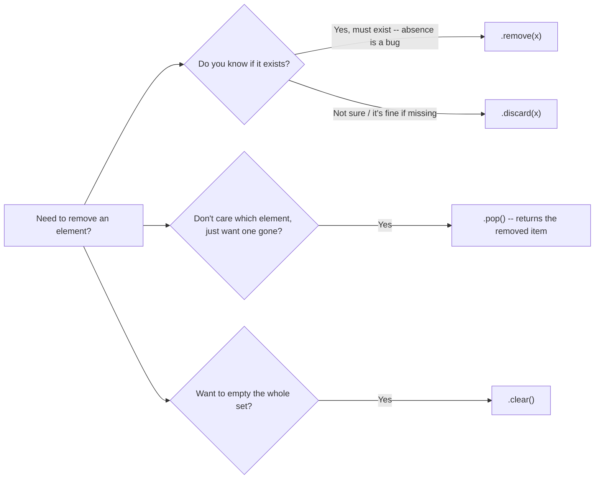

**Q1. A Python set — unordered? unique? hashable-only? Why each?**

A set in Python is an unordered collection of unique, hashable elements. Think of it as a bag of labelled marbles: 
-  (a) No duplicates — dropping in a marble that is already present changes nothing, because a set can hold only one copy of any value; 
-  (b) No fixed order — marbles shake around freely, so there is no "first" or "last" marble, and you cannot ask for the item at index 0; 
-  (c) Hashable elements only — every marble's label (its hash value) must never change, so Python can generate a fingerprint for it and look it up instantly.

```python
s = {1, 2, 2, 3}
print(s) # {1, 2, 3} -> duplicate 2 silently dropped
```

These three properties are not independent quirks — they follow from a single implementation choice: Python stores a set's elements in a hash table, not in a sequential array like a list. 

A hash table has no notion of "position", so ordering and indexing are impossible by construction; and it can only place an object if that object produces a stable hash value, so mutable, unhashable objects (lists, dicts, other sets) are rejected outright. 

Understanding this one fact — "a set is a hash table of keys with no values" — explains almost every rule covered in the rest of this chapter.

**Q2. Why do sets exist at all? (a) two jobs they specialise in (b) how they differ from that role in lists and dicts**

Lists preserve order and allow duplicates; dictionaries map keys to values. Sets specialise in two tasks that neither of those structures does efficiently: 
-  (a) instant deduplication — turning a collection with repeated items into one where every item appears exactly once, simply by passing it to set(); and 

-  (b) fast lookups and relational ("Venn-diagram") math — testing x in `my_set` at very high speed, and computing unions, intersections, differences, and symmetric differences between two collections.

```python
raw = [3, 1, 4, 1, 5, 9, 2, 6, 5, 3]
unique = set(raw) # {1, 2, 3, 4, 5, 6, 9} -- job 1: dedup
python_students = {"Alice", "Bob", "Charlie"}
ds_students = {"Charlie", "Dave"}
both = python_students & ds_students # job 2: relational math -> {'Charlie'}
```

If your problem is "does this collection contain duplicates I need to remove" or "which items are common/exclusive between two groups", a set is almost always the right tool — a list would need nested loops (`O(n*m)`) to answer the second question, whereas the set intersection above does it in roughly `O(min(len(A), len(B)))` because it walks the smaller set and does an `O(1)` hash lookup into the larger one.

**Q3. The classic `{}` trap — 
(a) what does `{}` actually create 
(b) how do you correctly make an empty set 
(c) what changes once the set is non-empty?**

`{}` is reserved for an empty dictionary, never an empty set, even though non-empty sets use the very same curly-brace notation. 

This is a deliberate language design choice: when the braces are empty there is no element and no key: value pair to signal which of the two types was intended, so Python always resolves the ambiguity in favour of dict. 

To create a genuinely empty set you must call the `set()` constructor explicitly.

```python
empty_literal = {} # dict, NOT a set
empty_set = set() # the only correct way to make an empty set
print(type(empty_literal)) # <class 'dict'>
print(type(empty_set)) # <class 'set'>
numbers = {10, 20, 30} # fine -- curly braces are unambiguous once non-empty
student = {"name": "Anita", "age": 20} # this is a dict, not a set, despite the braces
```

Once a set has at least one element, `{...}` is no longer ambiguous, because the presence of bare values (rather than key: value pairs) tells Python unambiguously that a set was intended. 

This is one of the very few places in Python where an empty literal and a non-empty literal of the "same" syntax actually construct different types, so it is worth memorising as a rule rather than reasoning it out each time: "`{}` is always a dict; `set()` is always a set."

**Q4. Sets support no indexing and no slicing — 
(a) why not, structurally 
(b) what error is raised 
(c) what *does* still work for visiting elements?**

Lists, tuples, and strings support `s[0]` and `s[1:3]` because they are sequences — each element occupies a specific position, and Python's internal array remembers that position. 

A set is built on a hash table instead: elements are scattered across internal buckets according to their hash value, not according to any insertion order, so the very concept of "the element at position 0" does not exist. 

Attempting to index a set therefore raises `TypeError: 'set' object is not subscriptable`, and attempting to slice it is equally invalid.

```python
languages = {"Python", "Java", "C++"}

try:
    print(languages[0])
except TypeError as e:
    print(e) # 'set' object is not subscriptable
```

What still works is iteration and membership testing, since neither requires a notion of position: for item in languages: visits every element exactly once (in an arbitrary, hash-table-determined order), and "Java" in languages checks presence directly via hashing rather than by scanning positions. 
So the mental model is: 
-  sets trade away positional access in exchange for extremely fast membership testing — 
-  you can ask "is X here?" cheaply, 
-  but never "what is at position N?".

**Q5. Two ways to build a set — 
(a) literal notation vs 
(b) set() constructor — 
(c) what makes `set(iterable)` special, with an example on a list containing duplicates?**

A set can be created in two ways:
-  **literal notation**, `{val1, val2, ...}`, which is convenient when you already know the elements; and 
-  the **`set()` constructor**, which either creates an empty set (`set()`) or converts any iterable — list, tuple, string, dict (its keys), or generator — into a set (set(`some_iterable`)). The constructor form is what makes deduplication a one-liner: pass in a list with repeats, and every repeat silently disappears in the conversion.

```python
colors = {"red", "green", "blue"} # 1. literal notation
numbers = set() # 2. empty set via constructor
values = [10, 20, 20, 30, 30]
s = set(values) # 3. constructor on an iterable -> {10, 20, 30}
print(s)
print(len(s), type(s)) # 3 <class 'set'>
```

Note that `set("hello")` converts the *string* into a set of its individual characters — `{'h', 'e', 'l', 'o'}` — because a string is itself an iterable of one-character strings; this surprises beginners who expect the whole string to become a single element (that mistake resurfaces later with `.update()` vs `.add()`, covered in Q13). 

In short: use `{...}` when you are typing out literal values by hand, and use `set(iterable)` whenever the values already exist inside some other collection that you want de-duplicated or converted.

**Q6. `len()` and `type()` on a set — are these set-specific functions, and what do they report?**

`len(s)` and `type(s)` are **general-purpose Python built-ins** — they work with lists, tuples, dictionaries, strings, and virtually every other container type — they are not exclusive or specific to sets. 

They are, however, used constantly while working with sets because a set has no .length attribute or numeric index to fall back on, so these two built-ins are often the *only* convenient way to inspect a set's size and confirm its type.

```python
s = {10, 20, 30}
print(len(s)) # 3 -> number of elements currently stored
print(type(s)) # <class 'set'> -> confirms this object really is a set
```

`len()` returns an int giving the current element count (which changes dynamically as you `.add()` or `.remove()` items — sets are dynamically sized, just like lists and dicts, unlike fixed-length strings/tuples). 

`type()` returns the class object itself, which is especially useful when debugging code that mixes sets, frozensets, and dicts, since all three can look similar when printed but behave very differently (e.g. a `frozenset` raises `AttributeError` on `.add()`, while a plain set does not).

**Q7. Set comprehension — 
(a) syntax vs list comprehension 
(b) what "nested set comprehension" means and 
(c) how do you read the for clauses in one?**

A **set comprehension** has exactly the same syntax as a list comprehension except that it is wrapped in **curly braces `{}`** instead of **square brackets `[]`**, and because the result is a genuine set, duplicate values produced by the expression are automatically discarded. 
The general forms are 
-  `{expr for x in iterable}` (basic), 
-  `{expr for x in iterable if condition}` (filtered), 
-  and `{expr for a in seq1 for b in seq2}` (nested).

```python
numbers = [1, 2, 3, 3, 4, 2, 5, 5, 5, 6, 4]
unique_numbers = {n for n in numbers} # {1, 2, 3, 4, 5, 6}
squares = {n * n for n in numbers} # {1, 4, 9, 16, 25, 36}
odd_squares = {n * n for n in numbers if n % 2 != 0} # {1, 9, 25}

# Nested set comprehension over a list of lists ("matrix")

matrix = [[1, 2, 3, "cat"], 
        [2, 3, 4, "dog"], 
        [4, 5, 6, "cat"]
]
unique_values = {value for row in matrix for value in row}

# equivalent long-hand:
unique_values_loop = set()
for row in matrix: # outer loop, read first
    for value in row: # inner loop, read second
        unique_values_loop.add(value)
```

**Reading rule for nested comprehensions:** always read the for clauses strictly left to right — the *first* for you encounter is the *outer* loop, and the *second* for is the *inner* loop, exactly mirroring how you would nest the nested for statements if you wrote them out longhand (as shown above). 

This "left-to-right = outer-to-inner" rule is the single most useful trick for decoding any nested comprehension, list or set, that you will encounter later in the book.

**Q8. In a set, `True` and `1` and `False` and `0` collapse together — (a) why (b) what survives when all four appear in one collection?**

In Python, booleans are a subtype of int, and critically `True == 1` and `False == 0` evaluate to `True`. Since a set's uniqueness rule is based on equality (and matching hash values — `hash(True) == hash(1)` and `hash(False) == hash(0)`), a set can only ever keep **one** representative from any group of mutually-equal values, regardless of how many "different-looking" spellings you tried to insert.

```python
values = [1, True, 0, False, "Python"]
result = {value for value in values}
print(result) # {0, 1, 'Python'} (order may vary)
```

Notice which spelling "wins": Python keeps whichever of the equal values was inserted *first* — so if `1` appeared before `True` in the source iterable, the set stores `1`, not `True` (though it prints and compares identically either way, since they are equal). 

This is a subtle but real gotcha when you deduplicate mixed data — e.g. building a set of "flags" that mix booleans and `0/1` integers from different data sources will silently merge them into a single bucket. 

If you need to distinguish `True` from `1` and `False` from `0`, sets are the wrong tool; use a `list` or check `type(x)` is `bool` explicitly.

**Q9. Hashability — (a) what makes an object hashable (b) which built-in types qualify/disqualify and why (c) how does this give `O(1)` average-case membership testing internally?**

An object is **hashable** if it produces a fixed, unchanging integer "fingerprint" via the built-in `hash()` function throughout its entire lifetime. Integers, floats, strings, and tuples (provided every element inside the tuple is itself hashable) qualify, because none of them can be mutated after creation. 

Lists, dictionaries, and plain sets are **not hashable**, precisely because their contents *can* change — if the contents changed, the hash value would have to change too, which would break the hash table that relies on it staying constant.

```python
print(hash("Python")) # some integer, unchanged for this session
print(hash((1, 2))) # tuples are hashable if their contents are
```

Internally, Python stores a set's elements in a **hash table** (the same mechanism a dict uses for its keys). When you run `x` in `my_set` or insert an element, Python performs three steps: 
-  (1) compute `hash(x)`; 
-  (2) use that hash value to compute exactly which "bucket" in the underlying table x belongs to; 
-  (3) check only that bucket rather than scanning the whole collection. 

Because step 3 touches a near-constant number of items regardless of how large the set is, membership testing has **average-case `O(1)` (constant) time complexity** — looking something up in a set of 10 elements takes roughly the same time as in a set of 10 million elements, which is the single biggest performance reason to prefer sets over lists for membership-heavy code.

**Q10. Tuple-in-a-set exception — (a) why is (1, 2, "a") allowed inside a set but (1, [2, 3]) is not (b) what does "hashability is recursive" mean?**

A tuple is itself immutable — you cannot reassign `t[0]` — but Python's rule for hashability goes one level deeper: a *container's* hash value is computed from the hash values of everything it contains, so a tuple is only hashable if **every single element inside it** is also hashable. 
-  `(1, 2, "a")` qualifies because ints and strings are hashable, 
-  but `(1, [2, 3])` fails because it contains a list, and lists are mutable (hence unhashable) — the outer tuple "inherits" that unhashability from its inner content.

```python
mutable_inside_tuple = (1, 2, [3, 4])
try:
    bad_set = {10, mutable_inside_tuple}
except TypeError as e:
    print("Error Caught:", e) # unhashable type: 'list'

# Correct alternative -- swap the inner list for an inner tuple:
s = {1, 2, (3, 4)}
print(s) # {1, 2, (3, 4)} -- fully hashable now
```

This is what "**hashability is recursive**" means in practice: Python does not just check the outer object's type; it must be able to compute `hash()` on every nested value before it can compute a hash for the whole. 

A frozenset is the standard fix when you genuinely need a mutable-looking collection inside a set or tuple — since frozenset is itself immutable and hashable, `(1, frozenset({2, 3}))` is perfectly valid, whereas `(1, {2, 3})` (a real, mutable set nested inside) is not.

**Q11. Set-in-set nesting — (a) why does `{{1, 2}, {3, 4}}` raise `TypeError` (b) what is the correct fix?**

Sets are themselves mutable — you can `.add()` or `.remove()` elements from them at any time — and mutable objects are never hashable (see Q9/Q10). 

Since every element stored inside an *outer* set must be hashable, you cannot place an ordinary, mutable set as an element of another set; Python raises `TypeError: unhashable type: 'set'` the moment it tries to compute a hash for the inner set.

```python
try:
    invalid_nested_set = {{1, 2}, {3, 4}}
except TypeError as e:
    print("Error Caught:", e) # unhashable type: 'set'

# Correct approach: convert each inner set to an immutable frozenset
valid_nested_set = {frozenset({1, 2}), frozenset({3, 4})}
print(valid_nested_set) # {frozenset({1, 2}), frozenset({3, 4})}
```

The fix mirrors the list-vs-tuple substitution used elsewhere in the chapter: wherever a mutable structure is being rejected for hashability reasons, its immutable sibling almost always solves the problem — `list → tuple`, and here, `set → frozenset`. 

This pattern (needing a "collection of collections" that must itself be a set, so the inner collections must be frozen) shows up in real code whenever you are grouping combinations of tags, permissions, or categories and need to deduplicate the *groups themselves*.

**Q12. Structural comparison — list vs dict vs set: (a) ordering (b) duplicates (c) access method (d) mutability (e) empty-literal syntax for each?**

The three core built-in collections diverge sharply on these five axes, even though all three are mutable in Python:

| **Feature** | **List (list)** | **Dictionary (dict)** | **Set (set)** |
| --- | --- | --- | --- |
| Primary purpose | Ordered collection of items | Key–value pairs | Unique elements |
| Literal syntax | [1, 2, 3] | {'a': 1, 'b': 2} | {1, 2, 3} |
| Duplicates | Allowed | Keys: no · Values: yes | Not allowed |
| Ordering | Preserves insertion order | Preserves insertion order (3.7+) | Unordered |
| Access method | By index lst[0] | By key dct['a'] | No direct access — no index or key |
| Slicing | Supported | Not supported | Not supported |
| Element type restriction | Any object | Keys: hashable only · Values: any | Hashable only |
| Empty literal | [] | {} | set() |

```python
lst = [1, 2, 2, 3] # keeps the duplicate 2
d = {"a": 1, "b": 2} # ordered key -> value mapping
s = {1, 2, 2, 3} # duplicate 2 collapses to {1, 2, 3}
```

The practical takeaway: 
-  reach for a **list** when order and duplicates both matter (a shopping cart, a queue of tasks); 
-  a **dict** when you need to look something up by a meaningful key (a student ID mapping to a record); 
-  and a **set** when the only thing that matters is *which distinct items exist* and/or you need fast membership tests or Venn-style comparisons between groups. 

If you find yourself writing `if item not in my_list:` before appending, in a hot loop, that is usually a sign the list should have been a set.

**Q13. `.add()` vs `.update()` — (a) how do they treat their argument differently (b) walk through the classic string-splitting mistake**

`.add(elem)` inserts exactly **one** hashable object as a single new element — whatever you pass in, verbatim, becomes the element. `.update(*iterables)` instead treats its argument(s) as **`iterables`**, unpacks them, and inserts each individual item they yield as a *separate* element of the set. 

This distinction becomes a trap the moment the argument is a string, because a string is itself an iterable of one-character strings.

```python
fruits1 = {"apple"}
fruits2 = {"apple"}
fruits1.add("banana") # treats "banana" as one element

fruits2.update(["banana"]) # treats "banana" as an iterable of characters... but here it's inside a list!
print(fruits1) # {'apple', 'banana'}
```

The truly classic mistake is `fruits2.update("banana")` (no surrounding list) — passing the bare string directly to .`update()` — which iterates over the string's characters and inserts `'b', 'a', 'n', 'a', 'n', 'a'` as six separate one-character elements, collapsing (due to set uniqueness) into `{'apple', 'b', 'a', 'n'}`. 

The rule of thumb to memorise: **use `.add()` for a single new element (even if that element happens to be a multi-character string), and use `.update()` only when you are merging in the contents of another collection.** 

Wrapping a string in `["banana"]` before calling `.update()` is exactly how you tell Python "treat this string as one atomic item, not as a sequence of characters."

**Q14. Four removal-family methods — `.remove()`, `.discard()`, `.pop()`, `.clear()`: (a) behaviour when element is missing/set is empty (b) return value (c) which to choose when**

These four methods differ specifically in how strictly they enforce that the target element must exist, and in what they hand back to you:

| **Method** | **If element exists** | **If element/set missing** | **Returns a value?** | **Best used when** |
| --- | --- | --- | --- | --- |
| `s.remove(x)` | Deletes x | **Raises KeyError** | No (None) | Absence of x is itself a bug you want surfaced |
| `s.discard(x)` | Deletes x | Does nothing, silently | No (None) | You are not sure x is present, and that's fine |
| `s.pop()` | Removes an *arbitrary* element | **Raises KeyError** if set is empty | Yes — the removed item | You just need "any" item, order irrelevant |
| `s.clear()` | Deletes everything | Works fine even if already empty | No (None) | Resetting a set to empty while keeping the same object reference |

```python
students = {"Alice", "Bob"}
students.add("Charlie") # {'Alice','Bob','Charlie'}
students.update(["David", "Eve"]) # adds two more elements
students.discard("Bob") # safe -- no error even if 'Bob' were absent
item = students.pop() # removes & returns some arbitrary element
students.clear() # -> set()
```

A simple decision flow for choosing the right one:



-  `.remove()` is the "strict" partner (mirrors `dict[key]` raising `KeyError`), 
-  `.discard()` is the "safe" partner (mirrors `dict.get()`'s no-error philosophy), 
-  `.pop()` is for when the identity of the removed item does not matter (task queues, work-stealing patterns), and 
-  `.clear()` is for resetting state without losing the variable's identity (important if other code elsewhere still holds a reference to the same set object).

**Q15. Modifying a set while iterating over it — (a) what happens and why (b) the correct fix**

Changing the *size* of a set (adding or removing elements) while a for loop is actively iterating over that same set raises `RuntimeError: Set changed size during iteration`. 

This happens because Python's set iterator walks the underlying hash table directly; if the table is resized or rearranged mid-walk (which removal/insertion can trigger), the iterator's internal position becomes invalid and unsafe to continue.

```python
numbers = {1, 2, 3, 4, 5}
try:
    for num in numbers:
    if num % 2 == 0:
    numbers.remove(num) # mutating the set you're iterating over
except RuntimeError as e:
    print("Error:", e) # Set changed size during iteration
```

The standard fix is to **iterate over a copy while mutating the original**: call `numbers.copy()` (which creates an independent shallow copy of the set) to drive the loop, and apply `.remove()``.add()` calls to the original numbers variable. 

Because the loop no longer walks the same object it is mutating, no internal position is ever invalidated:

```python
numbers = {1, 2, 3, 4, 5}
for num in numbers.copy(): # iterate the copy
    if num % 2 == 0:
    numbers.remove(num) # mutate the original safely

print(numbers) # {1, 3, 5}
```

This "iterate a copy, mutate the original" pattern is not unique to sets — the same defensive technique applies to dictionaries and, less commonly, lists — so it is worth internalising as a general Python idiom rather than a set-only rule.

**Q16. Membership testing speed — (a) `O(1)` vs `O(n)`, concretely, for sets vs lists (b) why do `.items()`, `.keys()`, `.values()` not exist for sets?**

When you write `x in my_list`, Python performs a **linear search**: it checks the first element, then the second, and so on until it finds a match or exhausts the list — for a list of 1,000,000 elements, that can mean up to 1,000,000 comparisons in the worst case, i.e. `O(n)` time. 

When you write `x in my_set`, Python instead computes `hash(x)` once and jumps straight to the relevant bucket in the underlying hash table, so the lookup cost stays roughly constant no matter how large the set grows — `O(1)` average-case time, as detailed already in Q9.

```python
import time
numbers_list = list(range(1_000_000))
numbers_set = set(numbers_list)
target = 999_999

start = time.perf_counter()
target in numbers_list
list_time = time.perf_counter() - start

start = time.perf_counter()
target in numbers_set
set_time = time.perf_counter() - start

# list_time is typically orders of magnitude larger than set_time for large collections
```

`.items()`, `.keys()`, and `.values()` exist on dictionaries because a dict stores **key–value pairs**, and those three methods are precisely how you ask for "just the keys", "just the values", or "both together". 

A set stores **only bare values** — there is no key half of a pair to separate out — so none of those three methods has any meaning for a set, and calling any of them raises `AttributeError: 'set' object has no attribute 'items'`. 

To visit a set's contents you simply iterate directly: 
`for item in my_set:`.

**Q17. Set operators (`|, &, -, ^`) vs named methods (`.union()`, `.intersection()`, etc.) — what is the one crucial difference in what they accept as an operand?**

-  **Operators** (`|, &, -, ^`) require **both sides to already be actual set objects** — if you pass a list, tuple, or dictionary as either operand, Python raises TypeError, because the operator protocol is defined only between two sets. 
-  **Named methods** (`.union()`, `.intersection()`, `.difference()`, `.symmetric_difference()`) are more forgiving: the object the method is called *on* must be a set, but the argument *inside the parentheses* can be **any iterable at all** — list, tuple, string, dict, or generator — and Python silently converts it into a set before computing the result.

```python
numbers = {1, 2, 3}
values = [3, 4, 5]
try:
    print(numbers & values) # TypeError -- values is a list, not a set
except TypeError as e:
    print("Error:", e)

print(numbers.intersection(values)) # {3} -- method form accepts the list directly
print(numbers & set(values)) # {3} -- operator form works once you convert manually
```

The practical rule: 
-  reach for the **operator syntax** (`|, &, -, ^`) when you already know both sides are sets and want the most compact, mathematically-styled code; 
-  reach for the **method syntax** (`.union(), .intersection()`, etc.) when one side might be a list, tuple, or other iterable straight from user input or a database query, since the method saves you an explicit set(...) conversion. Methods also conveniently accept **multiple** iterables at once — e.g. `a.union(b, c, d)` — whereas chaining the `|` operator across four sets requires writing `a | b | c | d` explicitly.

**Q18. The four core Venn operations — union, intersection, difference, symmetric difference — (a) define each with symbol + method (b) is difference commutative?**

Given `A = {1, 2, 3}` and `B = {3, 4, 5}`:

| **Operation** | **Symbol** | **Method** | **Meaning** | **Result** |
| --- | --- | --- | --- | --- |
| Union | A | B | A.union(B) | Everything in A, B, or both | {1,2,3,4,5} |
| Intersection | A & B | A.intersection(B) | Items shared by both A and B | {3} |
| Difference | A - B | A.difference(B) | Items in A but NOT in B | {1,2} |
| Reverse difference | B - A | B.difference(A) | Items in B but NOT in A | {4,5} |
| Symmetric difference | A ^ B | A.symmetric_difference(B) | Items in A or B, but not both | {1,2,4,5} |


```python
python_students = {"Alice", "Bob", "Charlie", "David"}
data_science_students = {"Charlie", "David", "Eve", "Frank"}
all_students = python_students | data_science_students # union
both_subjects = python_students & data_science_students # intersection -> {'Charlie','David'}
python_only = python_students - data_science_students # difference -> {'Alice','Bob'}
exactly_one = python_students ^ data_science_students # symmetric diff -> {'Alice','Bob','Eve','Frank'}
```

**Difference is emphatically not commutative**: `A - B` keeps whatever belongs to A alone, while `B - A` keeps whatever belongs to B alone — these are generally two completely different sets (`{1,2}` vs `{4,5}` in the example above), 

So `A - B != B - A` in general. 

Union and intersection, by contrast, *are* commutative (`A | B == B | A` and `A & B == B & A`), because "everything in either" and "everything in both" do not care about the order you name the two sets — only difference (and, less obviously, symmetric difference's *construction*, though its *result* happens to be order-independent) cares about direction.

**Q19. Subset, proper subset, superset, and disjoint — (a) define each (b) exact distinction between subset and proper subset?**

-   **Subset** (`A <= B` or `A.issubset(B)`): `True` if *every* element of A is also present in B (A may equal B).
-   **Proper subset** (`A < B`): True if `A` is a subset of `B` **and** `A != B` — meaning `B` must contain at least one extra element that `A` does not have.
-   **Superset** (`A >= B` or `A.issuperset(B)`): `True` if `A` contains every element of `B` (the mirror image of subset).
-   **Disjoint** (`A.isdisjoint(B)`): `True` if `A` and `B` share **zero** elements in common — no intersection at all.

```python
project_team = {"Charlie", "David"}
python_students = {"Alice", "Bob", "Charlie", "David"}
photography_club = {"Grace", "Heidi"}
print(project_team.issubset(python_students)) # True
print(python_students.issuperset(project_team)) # True
print(project_team < python_students) # True -- proper subset, since python_students has extra members
print(python_students < python_students) # False -- a set is a subset but not a proper subset of itself
print(python_students.isdisjoint(photography_club)) # True -- no overlap at all
```

The distinction that trips people up is exactly what happens **when the two sets are equal**: `A <= A` is always `True` (a set is trivially a subset of itself), but `A < A` is always `False`, because the proper-subset relation additionally demands that `B` be *strictly larger* — containing at least one element `A` lacks. 

So "subset" allows equality, "proper subset" forbids it; this mirrors the everyday mathematical distinction between `≤` and `<`.

**Q20. `frozenset` — (a) what is it (b) why is it hashable when set is not (c) two practical consequences of that hashability?**

A frozenset is the **immutable** counterpart to set — once created via frozenset(iterable), you can never `.add()`, `.remove()`, `.discard()`, or `.clear()` it; any attempt raises `AttributeError` (e.g. 'frozenset' object has no attribute 'add'). 

Because its contents can never change after construction, Python can safely compute a single, permanent hash value for it — which is exactly the property that makes set itself *not* hashable (a set's contents, and therefore its "identity" for hashing purposes, can change at any moment).

```python
group1 = frozenset({"Python", "Mathematics"})
group2 = frozenset({"Physics", "Chemistry"})

# Consequence 1: a frozenset can be used as a dictionary key (a plain set cannot)

classrooms = {group1: "Room 101", group2: "Room 202"}

print(classrooms[group1]) # Room 101
# Consequence 2: a frozenset can be stored as an element of another set (a plain set cannot)

subject_groups = {group1, group2}
print(len(subject_groups)) # 2

try:
    group1.add("English")
except AttributeError as e:
    print("Error:", e) # 'frozenset' object has no attribute 'add'
```

The two practical consequences flow directly from hashability: 
-  (1) **using it as a dictionary key** — exactly like you cannot use a mutable list as a dict key, you cannot use a mutable set as one either, but a frozen, hashable frozenset works perfectly, which is handy for e.g. mapping "a particular combination of tags" to a value; and 
-  (2) **nesting it inside another set** — this is precisely the fix already introduced in Q11 for the "set of sets" TypeError. 

In short, wherever the language demands a hashable object and a set-like collection of values is what you conceptually need, frozenset is the tool that satisfies both requirements simultaneously.
