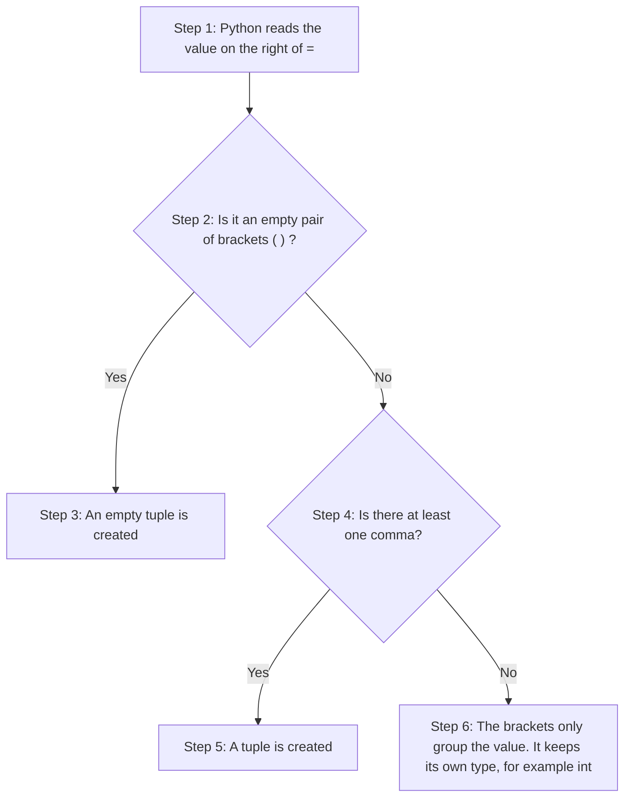
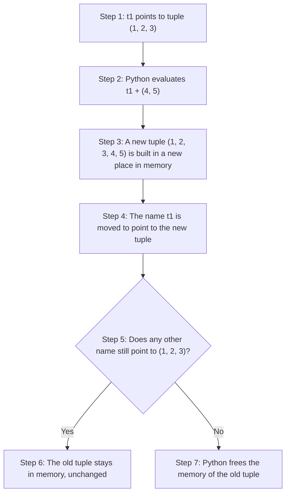
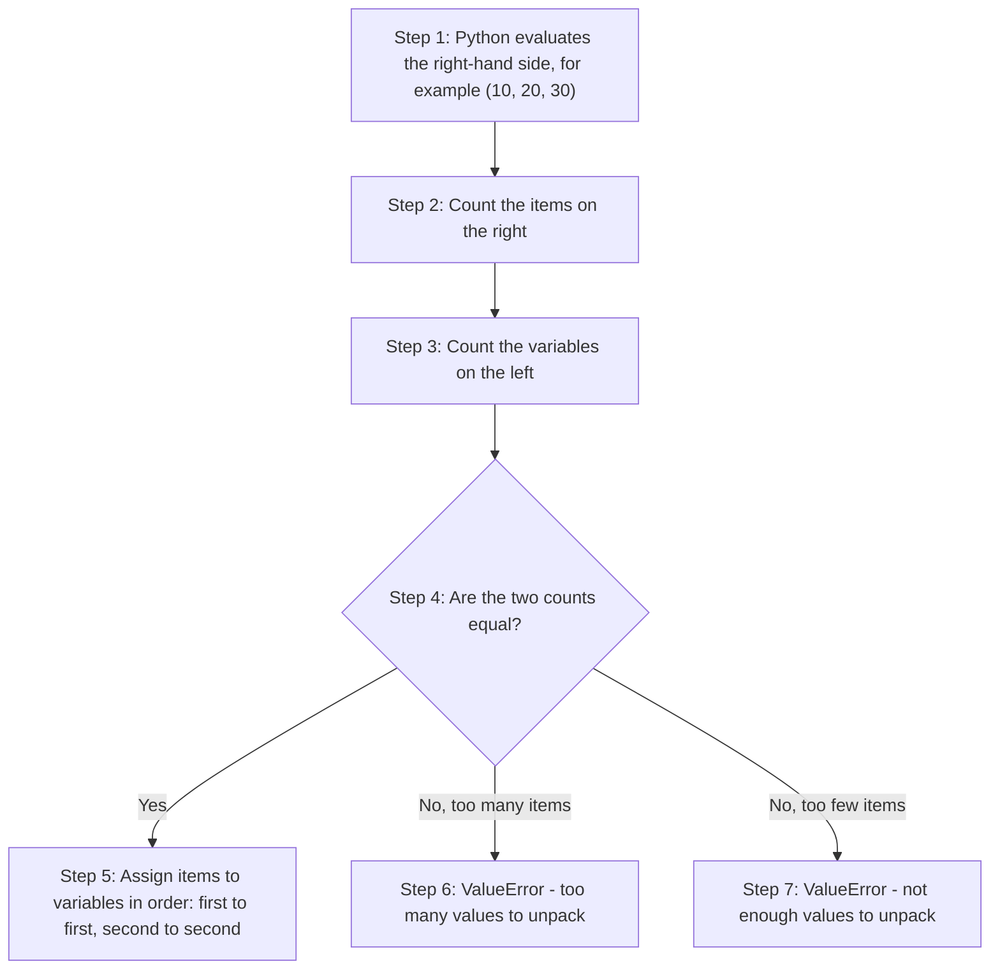
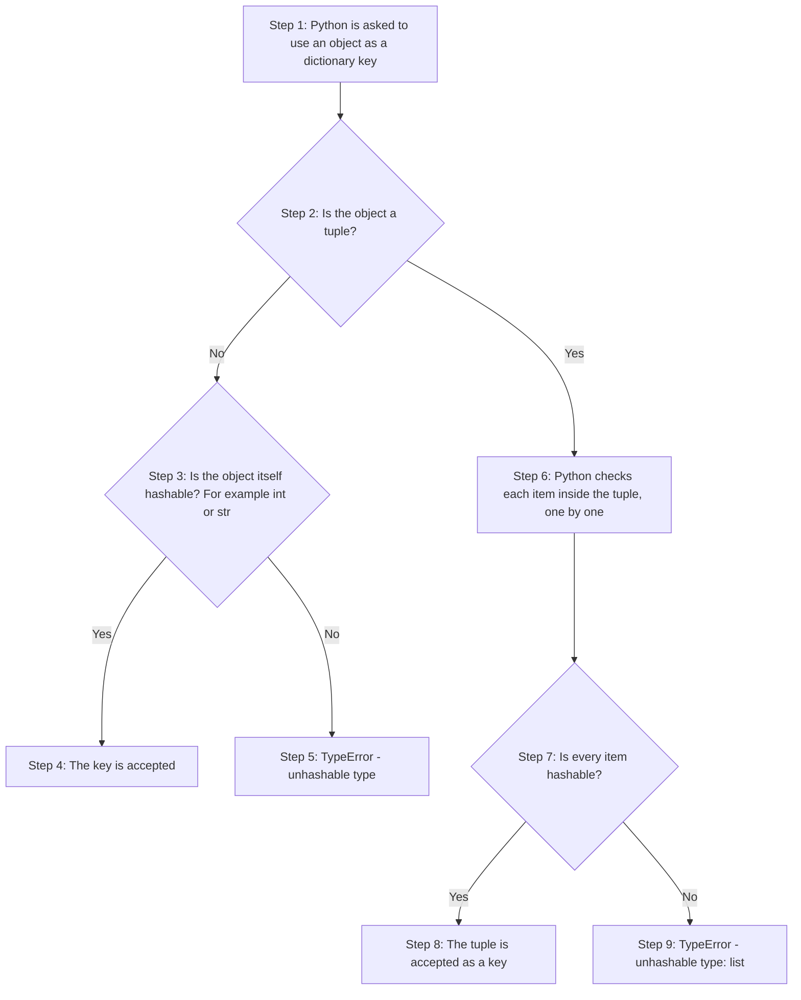
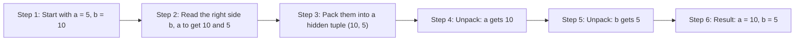
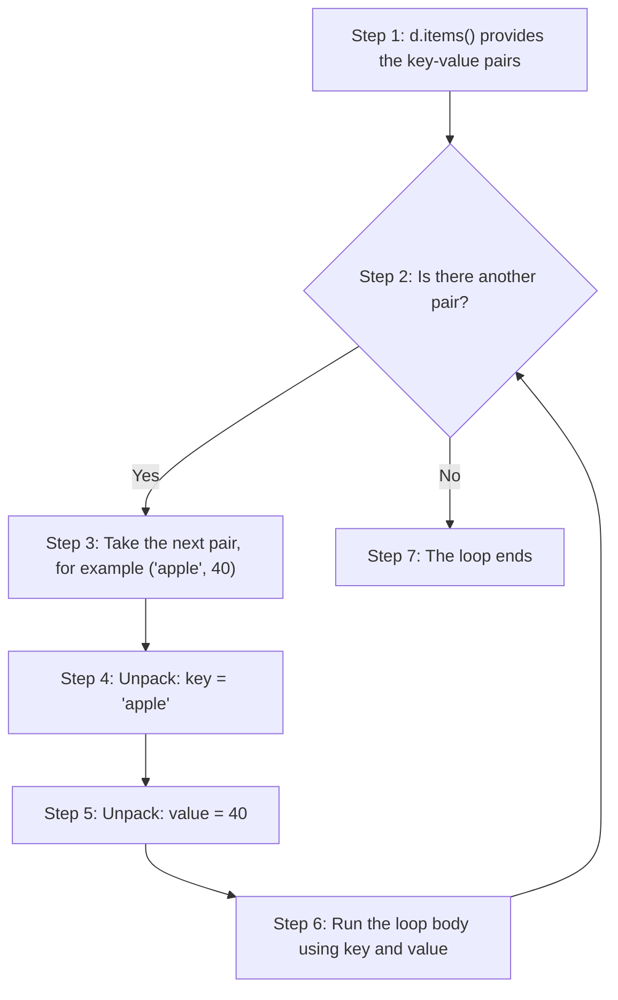
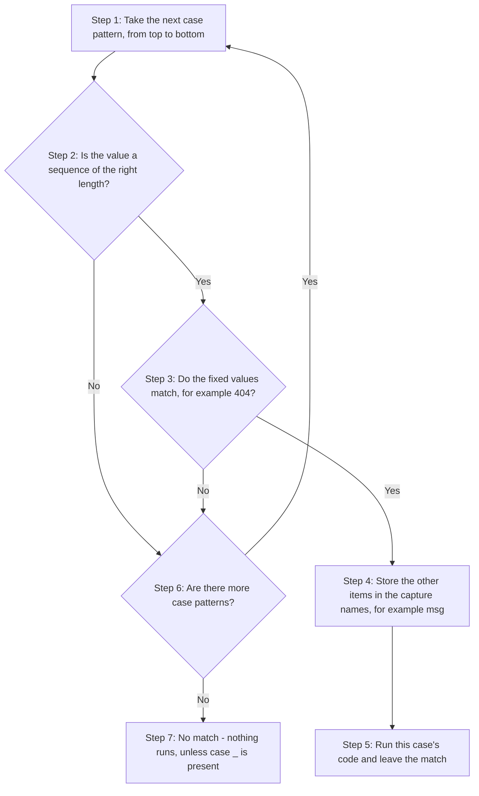
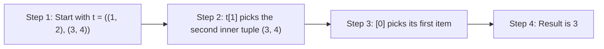
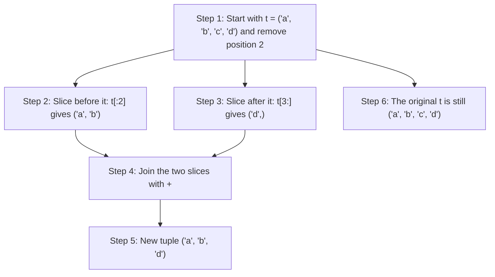

# Tuples in Python: Conceptual Questions and Answers

A tuple is one of the four built-in collection types in Python. The other three are lists, dictionaries and sets. A tuple holds an ordered group of values, just like a list. The big difference is that a tuple cannot be changed once it has been created. This single rule explains almost everything about how tuples behave.

This page belongs to the chapter on **Tuples, Dictionaries and Sets**. The printed book covers the basics: how to create a tuple, how to index and slice it, and how to loop over it. This page goes a step further. It takes twenty conceptual questions from the book and answers each one in detail. The answers explain not only *what* Python does but also *why* it does it.

Each answer is built so that you can follow it step by step:

- The explanation comes first, in plain language.
- Most answers include a short script. Each part of the script is marked `# Step 1`, `# Step 2`, and so on.
- The output of every script is shown just below it, so you can check your own results.
- Some answers have a table or a flowchart to help you see the idea at a glance.
- Many answers end with one or two **follow-up questions**. These help you test and stretch your understanding.

Why does this matter beyond this chapter? Tuples are everywhere in Python, even when you do not see them. A function that returns two values returns a tuple. The loop `for key, value in d.items()` works with tuples. The one-line swap `a, b = b, a` uses a tuple. Once you understand tuples well, a lot of everyday Python code becomes much easier to read.

> **Tip:** Type the scripts into your own Python editor (IDLE, VS Code, Thonny or Google Colab) and run them. Change the values and see what happens. That is the fastest way to learn.

## Table of Contents

- [Key Terms Used on This Page](#key-terms)
- [Part 1: Creating and Writing Tuples](#part-1)
  - [Q1. Define syntactic criteria for tuples. Why does x = (5) fail to produce a tuple?](#q1)
  - [Q2. Differentiate `t1 = 10, 20, 30` and `t2 = (10, 20, 30)` mechanically. Which is preferred?](#q2)
- [Part 2: Immutability, Methods, Concatenation and Slicing](#part-2)
  - [Q3. Detail tuple behavior under item assignment. Why do mutations trigger a TypeError?](#q3)
  - [Q4. Contrast available methods between lists and tuples. Why do these differences exist?](#q4)
  - [Q5. Explain how `t1 = t1 + (4, 5)` modifies a variable. Trace memory via id().](#q5)
  - [Q6. How does tuple slicing allocate memory? Explain original vs. sliced object states.](#q6)
- [Part 3: Performance of Lists and Tuples](#part-3)
  - [Q7. Map performance differences between lists and tuples across memory and execution.](#q7)
- [Part 4: Packing and Unpacking](#part-4)
  - [Q8. Detail tuple packing vs. unpacking. What happens during structural mismatches?](#q8)
  - [Q9. Explain extended unpacking via `*rest`. What data type is captured?](#q9)
- [Part 5: Converting, Sorting and Testing Tuples](#part-5)
  - [Q10. Detail tuple behavior when cast from a dict via tuple(d) vs. tuple(d.values()).](#q10)
  - [Q11. Explain sorting tuples using sorted(). Contrast its return type with tuple immutability.](#q11)
  - [Q12. How does Python evaluate bool(()), bool((0,)), and bool((None,))? Explain.](#q12)
- [Part 6: Tuples as Dictionary Keys](#part-6)
  - [Q13. State requirements for dictionary keys. Can a tuple containing a list be a key?](#q13)
- [Part 7: Tuples in Everyday Python Code](#part-7)
  - [Q14. How does Python handle return a, b from a function? Explain calling unpacks.](#q14)
  - [Q15. Explain Pythonic variable swapping via `a, b = b, a` without temporary storage.](#q15)
  - [Q16. How does loop unpacking operate on `dict.items()` collections? Detail the steps.](#q16)
  - [Q17. Explain structural pattern matching (match-case) on tuples. Detail the flow.](#q17)
- [Part 8: Nested Tuples, Comparison and Removing Items](#part-8)
  - [Q18. Explain nested tuple indexing. How do you extract `3` from `((1, 2), (3, 4))`?](#q18)
  - [Q19. Analyze tuple comparison behavior for equality `==` vs. identity `is`.](#q19)
  - [Q20. Detail how to simulate element removal from an immutable tuple using slicing.](#q20)
- [Quick Revision Summary](#quick-revision-summary)

<a id="key-terms"></a>
## Key Terms Used on This Page

A few technical words come up again and again on this page. Here is what they mean in simple words. Click the link in the last column if you want to read more.

| Term | Simple meaning | Learn more |
| --- | --- | --- |
| Object | Any value in Python, such as `5`, `"hi"`, `[1, 2]` or `(1, 2)`. Every object lives somewhere in the computer's memory. | [Python docs: Objects](https://docs.python.org/3/reference/datamodel.html#objects-values-and-types) |
| Variable (name) | A label that points to an object. The variable does not hold the object itself. It only refers to it. | [Python docs: Naming and binding](https://docs.python.org/3/reference/executionmodel.html#naming-and-binding) |
| Mutable | Can be changed after it is created. Lists, dictionaries and sets are mutable. | [Glossary: mutable](https://docs.python.org/3/glossary.html#term-mutable) |
| Immutable | Cannot be changed after it is created. Numbers, strings and tuples are immutable. | [Glossary: immutable](https://docs.python.org/3/glossary.html#term-immutable) |
| Sequence | An ordered collection whose items can be reached by position (index). Strings, lists and tuples are sequences. | [Glossary: sequence](https://docs.python.org/3/glossary.html#term-sequence) |
| Iterable | Anything you can loop over with a `for` loop. | [Glossary: iterable](https://docs.python.org/3/glossary.html#term-iterable) |
| Hashable | An object that can produce a fixed number (its "hash") which never changes during its lifetime. Only hashable objects can be dictionary keys or set members. | [Glossary: hashable](https://docs.python.org/3/glossary.html#term-hashable) |
| `id()` | A built-in function that returns a unique number for an object while it exists. In CPython this number is the object's memory address. | [Python docs: id()](https://docs.python.org/3/library/functions.html#id) |
| Rebinding | Making a variable point to a different object. The old object is not changed. | [Python docs: Assignment statements](https://docs.python.org/3/reference/simple_stmts.html#assignment-statements) |
| Packing / Unpacking | Packing puts several values into one tuple. Unpacking takes the values out of a tuple into separate variables. | [Python tutorial: Tuples and sequences](https://docs.python.org/3/tutorial/datastructures.html#tuples-and-sequences) |
| Garbage collection | Python's automatic clean-up. When no variable refers to an object any more, Python frees the memory it used. | [Glossary: garbage collection](https://docs.python.org/3/glossary.html#term-garbage-collection) |
| CPython | The standard version of Python that you download from python.org. It is written in the C language. | [Glossary: CPython](https://docs.python.org/3/glossary.html#term-CPython) |
| Interpreter | The program that reads your Python code and runs it. | [Glossary: interpreted](https://docs.python.org/3/glossary.html#term-interpreted) |
| Exception | An error that stops a program unless it is handled with `try` and `except`. `TypeError` and `ValueError` are two common exceptions. | [Python tutorial: Errors and exceptions](https://docs.python.org/3/tutorial/errors.html) |

> **Note on the scripts:** Many scripts on this page use `try` and `except` to catch an error and print its message. This lets the script keep running, so you can see the error message and the rest of the output together. If you remove the `try` and `except`, the program will simply stop at the error.

[Back to the Table of Contents](#table-of-contents)

---

<a id="part-1"></a>
## Part 1: Creating and Writing Tuples

This part looks at what actually makes a tuple a tuple, and at the two ways of writing one.

[Back to the Table of Contents](#table-of-contents)

<a id="q1"></a>
### Q1. Define syntactic criteria for tuples. Why does x = (5) fail to produce a tuple?

**Answer**

A tuple is not created by round brackets `()`. It is created by the **comma** `,` that separates its items. The round brackets are mainly there to group things and to make the code easier to read.

When Python reads `x = (5)`, it treats the brackets as ordinary grouping brackets, the same kind you use in arithmetic, such as `(2 + 3) * 4`. So `(5)` is just the number `5` written inside brackets. As a result, `x` becomes a plain integer (`int`), not a tuple.

To make a tuple with only one item, you must add a **trailing comma** after the item, as in `y = (5,)`. The comma tells Python: "build a tuple that holds one item."

There is one exception to the comma rule. An **empty tuple** is written as a pair of empty brackets, `empty_tuple = ()`. Since there are no items, there is nothing to separate, so no comma is needed. You can also create an empty tuple with `tuple()`.

**How Python decides, step by step**

1. Python looks at the value on the right-hand side of `=`.
2. If it is just an empty pair of brackets `()`, Python creates an empty tuple.
3. Otherwise, Python checks whether there is at least one comma at the top level.
4. If there is a comma, Python creates a tuple.
5. If there is no comma, the brackets only group the value. The value keeps its own type, such as `int` or `str`.



**Script: the comma makes the tuple**

```python
# Step 1 - Brackets around a single value only group it
x = (5)
print("x =", x, "| type:", type(x))

# Step 2 - Add a trailing comma: now it is a tuple with one item
y = (5,)
print("y =", y, "| type:", type(y))

# Step 3 - The comma alone is enough; the brackets are optional
z = 5,
print("z =", z, "| type:", type(z))

# Step 4 - Empty brackets: the only case where no comma is needed
empty_tuple = ()
print("empty_tuple =", empty_tuple, "| type:", type(empty_tuple), "| length:", len(empty_tuple))

# Step 5 - tuple() with nothing inside also gives an empty tuple
print("tuple() =", tuple())

# Step 6 - The same rule applies to strings
s1 = ("hello")     # just a string in brackets
s2 = ("hello",)    # a tuple holding one string
print("s1:", s1, type(s1))
print("s2:", s2, type(s2))
```

Output:

```text
x = 5 | type: <class 'int'>
y = (5,) | type: <class 'tuple'>
z = (5,) | type: <class 'tuple'>
empty_tuple = () | type: <class 'tuple'> | length: 0
tuple() = ()
s1: hello <class 'str'>
s2: ('hello',) <class 'tuple'>
```

Notice that Python itself prints a one-item tuple as `(5,)`, with the comma. This is a helpful reminder of the rule.

**Summary table**

| Code | What Python creates | Type |
| --- | --- | --- |
| `x = (5)` | The number 5 | `int` |
| `x = (5,)` | A tuple with one item | `tuple` |
| `x = 5,` | A tuple with one item | `tuple` |
| `x = ()` | An empty tuple | `tuple` |
| `x = tuple()` | An empty tuple | `tuple` |
| `x = (1, 2, 3)` | A tuple with three items | `tuple` |

**Follow-up question 1.1: What is `len((5,))` and what is `len((5))`?**

`len((5,))` is `1`, because `(5,)` is a tuple with one item. But `len((5))` is the same as `len(5)`, and it raises `TypeError: object of type 'int' has no len()`. A number has no length. This is a common beginner mistake, and it comes straight from forgetting the comma.

**Follow-up question 1.2: Is `(5,)` equal to `5`?**

No. `(5,) == 5` is `False`. One is a tuple that contains the number 5. The other is the number 5 itself. A box holding an apple is not the same thing as the apple.

[Back to the Table of Contents](#table-of-contents)

<a id="q2"></a>
### Q2. Differentiate `t1 = 10, 20, 30` and `t2 = (10, 20, 30)` mechanically. Which is preferred?

**Answer**

In terms of how they work, both lines do exactly the same thing. Each one creates an ordinary tuple with three items. Python does not treat them differently in any way.

The first form, `t1 = 10, 20, 30`, has no brackets. Python sees the commas and quietly gathers the values into a tuple. This is called **tuple packing**. (We look at packing in more detail in [Q8](#q8).)

The second form, `t2 = (10, 20, 30)`, is still preferred in most real programs. The brackets make it obvious to anyone reading the code that a tuple is being created. They also prevent confusion in places where commas already have another meaning, such as:

- inside a function call, where commas separate the arguments;
- inside a list or another tuple, where commas separate the items;
- in expressions that mix commas with other operators, such as `*` or `+`.

**Where the brackets are not optional**

| Situation | With brackets | Without brackets |
| --- | --- | --- |
| Empty tuple | `t = ()` works | Nothing to write; a bare `t =` is a syntax error |
| Passing one tuple to a function | `len((10, 20, 30))` gives `3` | `len(10, 20, 30)` passes three separate arguments and raises `TypeError` |
| A tuple inside a list | `[(1, 2), (3, 4)]` is a list of two tuples | `[1, 2, 3, 4]` is a list of four numbers |
| Mixing with other operators | `(1, 2) * 2` gives `(1, 2, 1, 2)` | `1, 2 * 2` gives `(1, 4)` |

**Script: two ways, one result**

```python
# Step 1 - Create a tuple without brackets (tuple packing)
t1 = 10, 20, 30
print("t1 =", t1, "| type:", type(t1))

# Step 2 - Create a tuple with brackets
t2 = (10, 20, 30)
print("t2 =", t2, "| type:", type(t2))

# Step 3 - Both hold the same values
print("t1 == t2:", t1 == t2)

# Step 4 - Inside a function call, the brackets are needed
print("len((10, 20, 30)) =", len((10, 20, 30)))
try:
    len(10, 20, 30)          # three separate arguments, not one tuple
except TypeError as error:
    print("len(10, 20, 30) gives TypeError:", error)

# Step 5 - Brackets also change the meaning when other operators are involved
a = 1, 2 * 2       # 2 * 2 is worked out first, then the tuple is made
b = (1, 2) * 2     # the tuple is made first, then repeated twice
print("1, 2 * 2   =", a)
print("(1, 2) * 2 =", b)
```

Output:

```text
t1 = (10, 20, 30) | type: <class 'tuple'>
t2 = (10, 20, 30) | type: <class 'tuple'>
t1 == t2: True
len((10, 20, 30)) = 3
len(10, 20, 30) gives TypeError: len() takes exactly one argument (3 given)
1, 2 * 2   = (1, 4)
(1, 2) * 2 = (1, 2, 1, 2)
```

**Which one should you use?**

Use brackets as your normal habit: `t2 = (10, 20, 30)`. The form without brackets is fine in short, well-known patterns where everyone expects it, such as `return a, b` ([Q14](#q14)) and `a, b = b, a` ([Q15](#q15)).

**Follow-up question 2.1: Does `print(10, 20, 30)` print a tuple?**

No. Inside a function call, the commas separate the arguments. `print` receives three numbers and prints `10 20 30`. To print a tuple you must write `print((10, 20, 30))`, which prints `(10, 20, 30)`.

[Back to the Table of Contents](#table-of-contents)

---

<a id="part-2"></a>
## Part 2: Immutability, Methods, Concatenation and Slicing

A tuple cannot be changed after it is created. This part shows what that rule means in practice: what happens when you try to change a tuple, which methods a tuple has, and how `+` and slicing give you new tuples instead of changing old ones.

[Back to the Table of Contents](#table-of-contents)

<a id="q3"></a>
### Q3. Detail tuple behavior under item assignment. Why do mutations trigger a TypeError?

**Answer**

Tuples are **immutable** sequences. Once a tuple has been created, the items it holds are fixed. Each position in the tuple keeps pointing to the same object for as long as the tuple exists. You cannot put a new item in any position.

Suppose you try to change an item directly:

```python
t = (10, 20, 30)
t[0] = 100
```

Python does not allow this. To change an item in a container, Python needs a special built-in method called `__setitem__`. Lists have this method. Tuples simply do not have it. So there is nothing Python can call to carry out the change. It stops the program at once and raises a `TypeError` with the message `'tuple' object does not support item assignment`.

**What happens, step by step**

1. Python finds the object that `t` points to. It is a tuple.
2. Python sees `t[0] = 100` and looks for the tuple's `__setitem__` method, which is needed to change an item.
3. The tuple type has no such method.
4. Python raises `TypeError: 'tuple' object does not support item assignment`.
5. The tuple is left exactly as it was.

The same thing happens if you try to delete an item with `del t[0]`. That gives `TypeError: 'tuple' object doesn't support item deletion`.

**Script: trying to change a tuple**

```python
# Step 1 - Create a tuple
t = (10, 20, 30)
print("Original tuple:", t)

# Step 2 - Try to change the first item
try:
    t[0] = 100
except TypeError as error:
    print("Changing an item  ->", error)

# Step 3 - Try to delete the first item
try:
    del t[0]
except TypeError as error:
    print("Deleting an item  ->", error)

# Step 4 - Check which type has the method needed to change items
print("list has __setitem__? ", hasattr(list, "__setitem__"))
print("tuple has __setitem__?", hasattr(tuple, "__setitem__"))

# Step 5 - The tuple is unchanged
print("Tuple after both attempts:", t)
```

Output:

```text
Original tuple: (10, 20, 30)
Changing an item  -> 'tuple' object does not support item assignment
Deleting an item  -> 'tuple' object doesn't support item deletion
list has __setitem__?  True
tuple has __setitem__? False
Tuple after both attempts: (10, 20, 30)
```

**Why was Python designed this way?**

Because a tuple can never change, you can safely pass it around your program. No function can quietly change its contents behind your back. This also makes it possible to use tuples as dictionary keys ([Q13](#q13)).

**Follow-up question 3.1: Can a tuple ever appear to change?**

Yes, if it holds a mutable object such as a list. The tuple itself still cannot change: each position keeps pointing to the same object. But the list that one position points to can change on its own.

```python
# Step 1 - A tuple whose first item is a list
t = ([1, 2], 3)
print("Before:", t)

# Step 2 - Change the list inside the tuple (allowed: we are changing the list, not the tuple)
t[0].append(99)
print("After append:", t)

# Step 3 - Replacing the list itself is still not allowed
try:
    t[0] = [5, 6]
except TypeError as error:
    print("Replacing the list ->", error)
```

Output:

```text
Before: ([1, 2], 3)
After append: ([1, 2, 99], 3)
Replacing the list -> 'tuple' object does not support item assignment
```

Think of a tuple as a row of locked boxes. You cannot swap one box for another. But if a box contains a notebook, you can still write in the notebook.

**Follow-up question 3.2: Can I give the variable `t` a completely new tuple?**

Yes. `t = (100, 20, 30)` works fine. This does not change the old tuple. It creates a new tuple and makes the name `t` point to it. The next question, [Q5](#q5), explains this in detail.

[Back to the Table of Contents](#table-of-contents)

<a id="q4"></a>
### Q4. Contrast available methods between lists and tuples. Why do these differences exist?

**Answer**

Tuples have only two methods, and both of them only **read** the tuple. They never change it:

- `.count(x)` tells you how many times `x` appears in the tuple.
- `.index(x)` tells you the position where `x` first appears.

Lists have these two methods as well. On top of that, lists have many methods that **change the list in place**, including `.append()`, `.insert()`, `.extend()`, `.remove()` and `.pop()`. Lists also have `.sort()`, `.reverse()`, `.clear()` and `.copy()`.

The difference comes from what each type is designed for:

- A **list** is a flexible, changeable collection. It is meant for data that grows, shrinks or gets rearranged, such as a to-do list or a list of marks being entered one by one.
- A **tuple** is a fixed collection. It is meant for data that should stay the same, such as the coordinates of a point `(x, y)`, a date `(2026, 9, 18)` or an RGB colour `(255, 0, 0)`.

Every extra method on a list either adds, removes or rearranges items. Since a tuple cannot be changed, none of these methods would make sense for it.

**Comparison table**

| Method | What it does | List | Tuple |
| --- | --- | --- | --- |
| `count(x)` | Counts how many times `x` appears | Yes | Yes |
| `index(x)` | Finds the first position of `x` | Yes | Yes |
| `append(x)` | Adds `x` at the end | Yes | No |
| `insert(i, x)` | Inserts `x` at position `i` | Yes | No |
| `extend(items)` | Adds all items from another collection | Yes | No |
| `remove(x)` | Removes the first `x` | Yes | No |
| `pop(i)` | Removes and returns the item at position `i` | Yes | No |
| `sort()` | Sorts the items in place | Yes | No |
| `reverse()` | Reverses the items in place | Yes | No |
| `clear()` | Removes all items | Yes | No |
| `copy()` | Makes a shallow copy | Yes | No |

A tuple does not need `copy()`. Since it cannot change, sharing the same tuple is always safe.

**Script: methods of lists and tuples**

```python
# Step 1 - Use the two tuple methods
marks = (70, 85, 70, 90, 70)
print("marks:", marks)
print("How many times does 70 appear?", marks.count(70))
print("Where does 90 first appear?   ", marks.index(90))

# Step 2 - List every public method of a tuple
tuple_methods = [name for name in dir(tuple) if not name.startswith("_")]
print("Tuple methods:", tuple_methods)

# Step 3 - Find the public methods that lists have but tuples do not
list_methods = [name for name in dir(list) if not name.startswith("_")]
only_in_list = [name for name in list_methods if name not in tuple_methods]
print("Methods only lists have:", only_in_list)

# Step 4 - Calling a list-only method on a tuple fails
try:
    marks.append(100)
except AttributeError as error:
    print("AttributeError:", error)
```

Output:

```text
marks: (70, 85, 70, 90, 70)
How many times does 70 appear? 3
Where does 90 first appear?    3
Tuple methods: ['count', 'index']
Methods only lists have: ['append', 'clear', 'copy', 'extend', 'insert', 'pop', 'remove', 'reverse', 'sort']
AttributeError: 'tuple' object has no attribute 'append'
```

Note that calling a missing method raises an `AttributeError`, not a `TypeError`. The method simply does not exist on the tuple.

**Follow-up question 4.1: What happens if `.index()` cannot find the value?**

It raises a `ValueError`. For example, `(1, 2).index(5)` gives `ValueError: tuple.index(x): x not in tuple`. If you are not sure the value is present, check first with `if 5 in t:`.

[Back to the Table of Contents](#table-of-contents)

<a id="q5"></a>
### Q5. Explain how `t1 = t1 + (4, 5)` modifies a variable. Trace memory via id().

**Answer**

Running `t1 = t1 + (4, 5)` does **not** change the existing tuple. Here is what really happens:

1. Python reads the items of the old tuple `t1`, which are `1, 2, 3`.
2. Python reads the items of the second tuple, which are `4, 5`.
3. The `+` operator (called **concatenation**, which means joining) builds a brand-new tuple `(1, 2, 3, 4, 5)` in a different place in memory.
4. The `=` then makes the name `t1` point to this new tuple. This is called **rebinding** the name.
5. The old tuple `(1, 2, 3)` is not touched at all.

So the *variable* `t1` now refers to something different, but no tuple has been changed.

You can see this with the built-in function `id()`. It returns a number that identifies an object while that object exists. If the number changes, you are looking at a different object.



**Script: tracing memory with `id()`**

```python
# Step 1 - Create a tuple and note its id
t1 = (1, 2, 3)
first_id = id(t1)
print("t1 =", t1, "| id:", first_id)

# Step 2 - Keep a second name pointing to the same tuple
backup = t1
print("backup is t1?", backup is t1)

# Step 3 - Join a new tuple and assign the result back to t1
t1 = t1 + (4, 5)
print("t1 =", t1, "| id:", id(t1))

# Step 4 - Compare the ids
print("Is the id the same as before?", id(t1) == first_id)

# Step 5 - The old tuple is still there, unchanged, through 'backup'
print("backup =", backup, "| id:", id(backup))
print("backup still has the first id?", id(backup) == first_id)
```

Output (the `id` numbers will be different on your computer; the `True` and `False` values will be the same):

```text
t1 = (1, 2, 3) | id: 140223405703808
backup is t1? True
t1 = (1, 2, 3, 4, 5) | id: 140223405624448
Is the id the same as before? False
backup = (1, 2, 3) | id: 140223405703808
backup still has the first id? True
```

**What happens to the old tuple?**

If some other name still refers to the old tuple (as `backup` does above), the old tuple stays in memory, unchanged. If nothing refers to it any more, Python frees the memory automatically. In CPython this usually happens straight away, as soon as the last reference is gone. This automatic clean-up is part of Python's [garbage collection](https://docs.python.org/3/glossary.html#term-garbage-collection).

**Follow-up question 5.1: Does `t1 += (4, 5)` behave any differently?**

For a tuple, no. `t1 += (4, 5)` is simply a shorter way to write `t1 = t1 + (4, 5)`. A new tuple is built and `t1` is rebound to it. A **list** is different: `my_list += [4, 5]` changes the same list in place, so its `id` stays the same.

```python
# Step 1 - Tuple: += builds a new tuple
t = (1, 2, 3)
old_id = id(t)
t += (4, 5)
print("Tuple:", t, "| same object?", id(t) == old_id)

# Step 2 - List: += changes the same list
nums = [1, 2, 3]
old_id = id(nums)
nums += [4, 5]
print("List: ", nums, "| same object?", id(nums) == old_id)
```

Output:

```text
Tuple: (1, 2, 3, 4, 5) | same object? False
List:  [1, 2, 3, 4, 5] | same object? True
```

[Back to the Table of Contents](#table-of-contents)

<a id="q6"></a>
### Q6. How does tuple slicing allocate memory? Explain original vs. sliced object states.

**Answer**

Slicing uses the form `t[start:stop:step]`. It picks out the items from position `start` up to, but **not including**, position `stop`, moving `step` positions at a time. The result is returned as a **new tuple**.

Since tuples cannot be changed, slicing leaves the original tuple exactly as it was. For example, `t1 = t[1:3]` gives `t1` a small "window" of items from `t`, while `t` itself stays the same.

Two further points are worth knowing:

- **The items are shared, not copied.** The new tuple does not make fresh copies of the items. Each position in the slice points to the same object as the matching position in the original. This is called a **shallow copy**. For numbers and strings this makes no difference, because they cannot change either.
- **A full slice may give back the same tuple.** In CPython, `t[:]` (a slice of the whole tuple) returns the very same tuple object instead of a copy. Since the tuple can never change, there is no need to copy it. A list behaves differently: `my_list[:]` always makes a new list.

**Slicing, step by step, for `t = (10, 20, 30, 40, 50)`**

| Slice | Positions picked | Result |
| --- | --- | --- |
| `t[1:3]` | 1, 2 | `(20, 30)` |
| `t[:2]` | 0, 1 | `(10, 20)` |
| `t[2:]` | 2, 3, 4 | `(30, 40, 50)` |
| `t[::2]` | 0, 2, 4 | `(10, 30, 50)` |
| `t[::-1]` | 4, 3, 2, 1, 0 | `(50, 40, 30, 20, 10)` |
| `t[-2:]` | the last two | `(40, 50)` |

**Script: what slicing does to memory**

```python
# Step 1 - Create the original tuple
t = (10, 20, 30, 40, 50)
print("Original t:", t)

# Step 2 - Take a slice
t1 = t[1:3]
print("Slice t[1:3]:", t1)

# Step 3 - The slice is a different tuple object
print("Is t1 the same object as t?", t1 is t)

# Step 4 - But its items are the same objects as in the original
print("t1[0] is t[1]?", t1[0] is t[1])
print("t1[1] is t[2]?", t1[1] is t[2])

# Step 5 - The original tuple is unchanged
print("Original t after slicing:", t)

# Step 6 - A full slice of a tuple gives back the same tuple (CPython detail)
print("t[:] is t?", t[:] is t)

# Step 7 - A full slice of a list always makes a new list
my_list = [10, 20, 30]
print("my_list[:] is my_list?", my_list[:] is my_list)
```

Output:

```text
Original t: (10, 20, 30, 40, 50)
Slice t[1:3]: (20, 30)
Is t1 the same object as t? False
t1[0] is t[1]? True
t1[1] is t[2]? True
Original t after slicing: (10, 20, 30, 40, 50)
t[:] is t? True
my_list[:] is my_list? False
```

**Follow-up question 6.1: Does slicing ever raise an `IndexError`?**

No. Slicing is forgiving. If the positions go past the end, Python just stops at the end. For example, `(1, 2, 3)[1:100]` gives `(2, 3)`, and `(1, 2, 3)[5:10]` gives an empty tuple `()`. Plain indexing is different: `(1, 2, 3)[5]` raises `IndexError: tuple index out of range`.

[Back to the Table of Contents](#table-of-contents)

---

<a id="part-3"></a>
## Part 3: Performance of Lists and Tuples

Lists and tuples look alike, but they are stored a little differently. This part explains where tuples save memory or time, and where the two are about the same.

[Back to the Table of Contents](#table-of-contents)

<a id="q7"></a>
### Q7. Map performance differences between lists and tuples across memory and execution.

**Answer**

When you write programs where speed or memory matters, tuples have a small advantage over lists in some areas. It is important not to overstate this. For most everyday programs the difference is too small to notice. You should choose between a list and a tuple mainly by asking one question: **"Will this data need to change?"** Performance is a secondary benefit.

With that in mind, here is how the two compare.

| Point of comparison | List | Tuple |
| --- | --- | --- |
| **Memory: how items are stored** | The list object holds a pointer to a separate block of memory that stores the items. That block usually has **spare room** so that future `append()` calls are quick. | The items are stored directly inside the tuple object, in a block of **exactly** the right size. There is no spare room, because a tuple can never grow. |
| **Memory: overall size** | Larger. An empty list is bigger than an empty tuple, and the spare room adds more. | Smaller for the same items. |
| **Speed: creating a fixed collection** | A new list is built every time the line runs. | A tuple of fixed values, such as `(1, 2, 3)`, is built once when Python first reads the code. After that, it is simply reused. This makes it much faster to "create". |
| **Speed: reading an item or looping** | Very fast. | About the same. In practice the difference is tiny. |
| **Safety of the data** | Any part of the program that has the list can change it, sometimes by accident. | No one can change the tuple. It is safe to share across functions and modules. |
| **Can be a dictionary key or set member** | No. | Yes, as long as every item in it is hashable (see [Q13](#q13)). |

A few words in the table may need explaining:

- A **pointer** is simply a stored memory address that tells Python where to find something.
- **Spare room** (also called **over-allocation**) means the list asks for more memory than it needs right now, so it does not have to ask again every time you add one item.
- `sys.getsizeof()` is a built-in tool that reports how many bytes an object uses. See the [Python docs for sys.getsizeof()](https://docs.python.org/3/library/sys.html#sys.getsizeof).
- `timeit` is a standard module that times small pieces of code. See the [Python docs for timeit](https://docs.python.org/3/library/timeit.html).

**Script: measuring memory and speed**

```python
import sys       # gives us getsizeof(), which reports an object's size in bytes
import timeit    # times small pieces of code

# Step 1 - Size of an empty tuple and an empty list
print("Empty tuple:", sys.getsizeof(()), "bytes")
print("Empty list: ", sys.getsizeof([]), "bytes")

# Step 2 - Size of the same three items as a tuple and as a list
print("Tuple (1, 2, 3):", sys.getsizeof((1, 2, 3)), "bytes")
print("List  [1, 2, 3]:", sys.getsizeof([1, 2, 3]), "bytes")

# Step 3 - Watch a list grow one item at a time
numbers = []
last_size = sys.getsizeof(numbers)
print("Items: 0 | list size:", last_size, "bytes")
for i in range(1, 10):
    numbers.append(i)
    size = sys.getsizeof(numbers)
    # Mark the moments when the list asks for more memory
    note = "  <- grew: spare room added" if size != last_size else ""
    print(f"Items: {i} | list size: {size} bytes{note}")
    last_size = size

# Step 4 - Time how long it takes to create each one a million times
tuple_time = timeit.timeit("(1, 2, 3, 4, 5)", number=1_000_000)
list_time = timeit.timeit("[1, 2, 3, 4, 5]", number=1_000_000)
print(f"Create tuple 1,000,000 times: {tuple_time:.3f} seconds")
print(f"Create list  1,000,000 times: {list_time:.3f} seconds")

# Step 5 - Time how long it takes to read one item a million times
t = (1, 2, 3, 4, 5)
lst = [1, 2, 3, 4, 5]
tuple_read = timeit.timeit("t[2]", globals={"t": t}, number=1_000_000)
list_read = timeit.timeit("lst[2]", globals={"lst": lst}, number=1_000_000)
print(f"Read t[2]   1,000,000 times: {tuple_read:.3f} seconds")
print(f"Read lst[2] 1,000,000 times: {list_read:.3f} seconds")
```

Output (from 64-bit Python 3.12; the byte sizes can differ slightly in other versions, and the times will differ on every computer):

```text
Empty tuple: 40 bytes
Empty list:  56 bytes
Tuple (1, 2, 3): 64 bytes
List  [1, 2, 3]: 88 bytes
Items: 0 | list size: 56 bytes
Items: 1 | list size: 88 bytes  <- grew: spare room added
Items: 2 | list size: 88 bytes
Items: 3 | list size: 88 bytes
Items: 4 | list size: 88 bytes
Items: 5 | list size: 120 bytes  <- grew: spare room added
Items: 6 | list size: 120 bytes
Items: 7 | list size: 120 bytes
Items: 8 | list size: 120 bytes
Items: 9 | list size: 184 bytes  <- grew: spare room added
Create tuple 1,000,000 times: 0.007 seconds
Create list  1,000,000 times: 0.038 seconds
Read t[2]   1,000,000 times: 0.011 seconds
Read lst[2] 1,000,000 times: 0.012 seconds
```

**Reading the output**

1. **Steps 1 and 2:** The tuple is smaller in both cases. The tuple `(1, 2, 3)` uses 64 bytes: 40 bytes for the tuple itself plus 8 bytes for each of the three items.
2. **Step 3:** When the first item is added, the list jumps from 56 to 88 bytes. That is room for four items, not one. Items 2, 3 and 4 then fit in without any new memory. The list grows again only at item 5 and at item 9. This spare room is what makes `append()` fast, but it costs memory.
3. **Step 4:** Creating the tuple is several times faster. This is because `(1, 2, 3, 4, 5)` is built only once and then reused, while the list has to be built fresh every time.
4. **Step 5:** Reading an item takes almost the same time for both.

**Follow-up question 7.1: Should I turn all my lists into tuples to make my program faster?**

No. Pick the type that fits the data. If the data will change, use a list. If it should stay fixed, use a tuple. The performance gain from a tuple is a small bonus, not a reason on its own.

[Back to the Table of Contents](#table-of-contents)

---

<a id="part-4"></a>
## Part 4: Packing and Unpacking

Packing and unpacking are two of the most useful ideas connected with tuples. You will use them all the time, often without noticing.

[Back to the Table of Contents](#table-of-contents)

<a id="q8"></a>
### Q8. Detail tuple packing vs. unpacking. What happens during structural mismatches?

**Answer**

**Tuple packing** takes several separate values and puts them together into one tuple. **Tuple unpacking** does the opposite. It takes the items out of a tuple and puts each one into its own variable.

```python
t = 10, 20, 30  # Packing values into a single tuple
a, b, c = t     # Unpacking elements out into separate variables
```

Unpacking has one strict rule: **the number of variables on the left must be exactly equal to the number of items in the tuple.** Python matches them by position. The first variable gets the first item, the second variable gets the second item, and so on.

If the counts do not match, Python stops with a `ValueError`:

- `a, b = (10, 20, 30)` has two variables for three items. It raises `ValueError: too many values to unpack (expected 2)`.
- `a, b, c = (10, 20)` has three variables for two items. It raises `ValueError: not enough values to unpack (expected 3, got 2)`.

In Python 3.14 and later the first message also tells you how many items there were: `too many values to unpack (expected 2, got 3)`.

**How unpacking works, step by step**



**Summary table**

| Code | Variables | Items | Result |
| --- | --- | --- | --- |
| `a, b, c = (10, 20, 30)` | 3 | 3 | Works: `a = 10`, `b = 20`, `c = 30` |
| `a, b = (10, 20, 30)` | 2 | 3 | `ValueError`: too many values to unpack |
| `a, b, c = (10, 20)` | 3 | 2 | `ValueError`: not enough values to unpack |
| `a, *b = (10, 20, 30)` | 1 + a starred name | 3 | Works: `a = 10`, `b = [20, 30]` (see [Q9](#q9)) |

**Script: packing, unpacking and mismatches**

```python
# Step 1 - Packing: three values become one tuple
t = 10, 20, 30
print("Packed t:", t, "| type:", type(t))

# Step 2 - Unpacking: the tuple's items go into three variables
a, b, c = t
print("Unpacked: a =", a, "| b =", b, "| c =", c)

# Step 3 - Too few variables for the items
try:
    a, b = (10, 20, 30)
except ValueError as error:
    print("Two variables, three items ->", error)

# Step 4 - Too many variables for the items
try:
    a, b, c = (10, 20)
except ValueError as error:
    print("Three variables, two items ->", error)
```

Output (Python 3.10 to 3.13):

```text
Packed t: (10, 20, 30) | type: <class 'tuple'>
Unpacked: a = 10 | b = 20 | c = 30
Two variables, three items -> too many values to unpack (expected 2)
Three variables, two items -> not enough values to unpack (expected 3, got 2)
```

**Follow-up question 8.1: I only need the first item. Do I still need three variables?**

You still need to match the count, but there are two neat ways to do it:

- Use the underscore `_` as a "don't care" name: `first, _, _ = (10, 20, 30)`.
- Use a starred name to collect the rest: `first, *_ = (10, 20, 30)` (see [Q9](#q9)).

The name `_` is an ordinary variable. By custom, Python programmers use it to mean "I am not going to use this value."

**Follow-up question 8.2: Does unpacking only work with tuples?**

No. Unpacking works with any iterable: lists, strings, ranges and more. For example, `x, y = [1, 2]` and `p, q, r = "abc"` both work.

[Back to the Table of Contents](#table-of-contents)

<a id="q9"></a>
### Q9. Explain extended unpacking via `*rest`. What data type is captured?

**Answer**

Extended unpacking uses a star `*` before one variable name. That starred variable collects all the items that are left over after the other variables have taken theirs.

```python
a, *rest = (1, 2, 3, 4)
```

Here, `a` takes the first item, `1`. The starred name `*rest` collects everything that remains: `2, 3, 4`.

The key point is the **type** of what `rest` collects. Even though the source is a tuple, Python always puts the leftover items into a **list**. So `rest` becomes `[2, 3, 4]`, not `(2, 3, 4)`. Python does this on purpose. A list is flexible, so you can go on to add, remove or sort the leftover items straight away if your program needs to.

**How extended unpacking works, step by step**

1. Python counts the items on the right: here, four.
2. Python gives one item to each plain (non-starred) variable, matching positions from the left and from the right.
3. Whatever is left in the middle goes into the starred variable, as a list.
4. If nothing is left, the starred variable gets an empty list `[]`.

**The star can go in different places**

| Code | Result |
| --- | --- |
| `a, *rest = (1, 2, 3, 4)` | `a = 1`, `rest = [2, 3, 4]` |
| `*start, z = (1, 2, 3, 4)` | `start = [1, 2, 3]`, `z = 4` |
| `first, *middle, last = (1, 2, 3, 4)` | `first = 1`, `middle = [2, 3]`, `last = 4` |
| `a, b, *rest = (1, 2)` | `a = 1`, `b = 2`, `rest = []` |

**Rules to remember**

- Only **one** starred variable is allowed in a single assignment. `*a, *b = t` is a syntax error, because Python would not know how to divide the items.
- A starred variable cannot stand alone. `*rest = t` is a syntax error. Write `*rest, = t` or `[*rest] = t` instead, or simply `rest = list(t)`.
- There must be enough items for all the plain variables. `a, b, *rest = (1,)` raises a `ValueError`.

**Script: extended unpacking**

```python
numbers = (1, 2, 3, 4)

# Step 1 - Star at the end: collect everything after the first item
a, *rest = numbers
print("a =", a, "| rest =", rest, "| type of rest:", type(rest))

# Step 2 - Star at the start: collect everything before the last item
*start, z = numbers
print("start =", start, "| z =", z)

# Step 3 - Star in the middle: keep the first and last, collect the middle
first, *middle, last = numbers
print("first =", first, "| middle =", middle, "| last =", last)

# Step 4 - Nothing left over: the starred name gets an empty list
p, q, *extra = (1, 2)
print("p =", p, "| q =", q, "| extra =", extra)

# Step 5 - The collected list can be changed, and turned into a tuple if needed
rest.append(5)
print("rest after append:", rest)
print("rest as a tuple:", tuple(rest))
```

Output:

```text
a = 1 | rest = [2, 3, 4] | type of rest: <class 'list'>
start = [1, 2, 3] | z = 4
first = 1 | middle = [2, 3] | last = 4
p = 1 | q = 2 | extra = []
rest after append: [2, 3, 4, 5]
rest as a tuple: (2, 3, 4, 5)
```

Extended unpacking was added to Python by [PEP 3132](https://peps.python.org/pep-3132/). A PEP (Python Enhancement Proposal) is a document that describes a new feature for Python.

**Follow-up question 9.1: Is the star in `a, *rest = t` the same as the star in multiplication?**

No. In `a, *rest = t`, the star is not doing any maths. On the left side of `=`, it only means "collect the remaining items here." The same symbol means multiplication in `3 * 4`.

[Back to the Table of Contents](#table-of-contents)

---

<a id="part-5"></a>
## Part 5: Converting, Sorting and Testing Tuples

This part covers three everyday tasks: turning a dictionary into a tuple, sorting the items of a tuple, and checking whether a tuple counts as "true" or "false".

[Back to the Table of Contents](#table-of-contents)

<a id="q10"></a>
### Q10. Detail tuple behavior when cast from a dict via tuple(d) vs. tuple(d.values()).

**Answer**

"Casting" here simply means converting one type into another, in this case by passing a dictionary to the `tuple()` function.

The `tuple()` function builds a tuple by looping over whatever you give it and collecting each item. When you loop over a dictionary, Python gives you only its **keys**. So `tuple(d)` produces a tuple of the dictionary's keys, and the values are left out.

If you want the values, you must ask for them first with the `.values()` method, and then convert: `tuple(d.values())`.

```python
d = {'a': 1, 'b': 2}
print(tuple(d))           # Output: ('a', 'b') - Extracts keys only
print(tuple(d.values()))  # Output: (1, 2)     - Extracts values explicitly
```

**Step by step: what `tuple(d)` does**

1. `tuple()` receives the dictionary `d`.
2. It starts looping over `d`. A loop over a dictionary gives its keys, one at a time: `'a'`, then `'b'`.
3. It collects each key.
4. It returns the collected keys as a tuple: `('a', 'b')`.

`tuple(d.values())` follows the same steps. The only difference is that `d.values()` gives the values `1`, `2` instead of the keys.

**The four common conversions**

| Code | What you get | Result for `d = {'a': 1, 'b': 2}` |
| --- | --- | --- |
| `tuple(d)` | Keys only | `('a', 'b')` |
| `tuple(d.keys())` | Keys only (same as above, but more explicit) | `('a', 'b')` |
| `tuple(d.values())` | Values only | `(1, 2)` |
| `tuple(d.items())` | Key-value pairs, each pair as a small tuple | `(('a', 1), ('b', 2))` |

The methods `.keys()`, `.values()` and `.items()` return **view objects**. A view is a live window into the dictionary: if the dictionary changes, the view shows the change. Read more in the [Python docs on dictionary view objects](https://docs.python.org/3/library/stdtypes.html#dictionary-view-objects).

**Script: converting a dictionary to tuples**

```python
# Step 1 - Create a small dictionary
d = {'a': 1, 'b': 2}
print("Dictionary:", d)

# Step 2 - Convert the dictionary directly: only the keys are taken
print("tuple(d)          ->", tuple(d))

# Step 3 - Convert the keys explicitly: same result, clearer to read
print("tuple(d.keys())   ->", tuple(d.keys()))

# Step 4 - Convert the values
print("tuple(d.values()) ->", tuple(d.values()))

# Step 5 - Convert the key-value pairs
pairs = tuple(d.items())
print("tuple(d.items())  ->", pairs)
print("First pair:", pairs[0], "| its type:", type(pairs[0]))
```

Output:

```text
Dictionary: {'a': 1, 'b': 2}
tuple(d)          -> ('a', 'b')
tuple(d.keys())   -> ('a', 'b')
tuple(d.values()) -> (1, 2)
tuple(d.items())  -> (('a', 1), ('b', 2))
First pair: ('a', 1) | its type: <class 'tuple'>
```

**Follow-up question 10.1: Will the keys always come out in the same order?**

Yes. Since Python 3.7, dictionaries remember the order in which keys were added. The tuple will list the keys in that same order.

**Follow-up question 10.2: What does `list(d)` give?**

The same idea applies: `list(d)` gives a list of the keys, `['a', 'b']`. Any function that loops over a dictionary sees only its keys unless you ask for `.values()` or `.items()`.

[Back to the Table of Contents](#table-of-contents)

<a id="q11"></a>
### Q11. Explain sorting tuples using sorted(). Contrast its return type with tuple immutability.

**Answer**

A tuple cannot be changed, so it has no `.sort()` method. (A list's `.sort()` rearranges the items inside the same list, which a tuple cannot allow.)

To sort the items of a tuple, you use the built-in function `sorted()`. It works in these steps:

1. It reads all the items of the tuple.
2. It sorts them, smallest first by default.
3. It puts the sorted items into a **new list** and returns that list.
4. The original tuple is left exactly as it was.

So the answer to "what type does `sorted()` return?" is always **a list**, whatever you give it: a tuple, a string, a set or a dictionary. This fits perfectly with tuple immutability. The tuple is never changed; you simply get a new, sorted list alongside it.

`sorted()` is a **stable** sort. This means that if two items are equal for sorting purposes, they stay in the same order they had in the original. (See the [Python Sorting HOW TO](https://docs.python.org/3/howto/sorting.html) for more.)

```python
t = (3, 1, 4)
result = sorted(t)
print(result)        # Output: [1, 3, 4] -> Notice it is a list!
print(type(result))  # Output: <class 'list'>
```

If you want the result as a tuple, wrap it with `tuple()`: `tuple(sorted(t))`.

**Useful ways to call `sorted()`**

| Code | Result for `t = (3, 1, 4)` | What it does |
| --- | --- | --- |
| `sorted(t)` | `[1, 3, 4]` | Sorts smallest first, returns a list |
| `sorted(t, reverse=True)` | `[4, 3, 1]` | Sorts largest first |
| `tuple(sorted(t))` | `(1, 3, 4)` | Sorts, then converts back to a tuple |
| `sorted(("pear", "fig", "apple"), key=len)` | `['fig', 'pear', 'apple']` | Sorts words by their length |

**Script: sorting a tuple**

```python
# Step 1 - Create a tuple
t = (3, 1, 4)
print("Original tuple:", t)

# Step 2 - Sort it with sorted(): the result is a list
result = sorted(t)
print("sorted(t):", result, "| type:", type(result))

# Step 3 - Sort from largest to smallest
print("sorted(t, reverse=True):", sorted(t, reverse=True))

# Step 4 - Convert the sorted list back to a tuple
sorted_tuple = tuple(sorted(t))
print("tuple(sorted(t)):", sorted_tuple, "| type:", type(sorted_tuple))

# Step 5 - The original tuple has not changed
print("Original tuple afterwards:", t)

# Step 6 - A tuple has no .sort() method
try:
    t.sort()
except AttributeError as error:
    print("t.sort() ->", error)

# Step 7 - Sorting a tuple of tuples: compared item by item
students = (("Ravi", 82), ("Asha", 91), ("Anil", 82))
print("Sorted by name:", sorted(students))
print("Sorted by marks:", sorted(students, key=lambda s: s[1]))
```

Output:

```text
Original tuple: (3, 1, 4)
sorted(t): [1, 3, 4] | type: <class 'list'>
sorted(t, reverse=True): [4, 3, 1]
tuple(sorted(t)): (1, 3, 4) | type: <class 'tuple'>
Original tuple afterwards: (3, 1, 4)
t.sort() -> 'tuple' object has no attribute 'sort'
Sorted by name: [('Anil', 82), ('Asha', 91), ('Ravi', 82)]
Sorted by marks: [('Ravi', 82), ('Anil', 82), ('Asha', 91)]
```

In Step 7, `key=lambda s: s[1]` tells `sorted()` to compare the second item of each pair, the marks. A `lambda` is a small one-line function. Notice that Ravi and Anil both have 82. Because the sort is stable, Ravi stays ahead of Anil, just as in the original tuple.

**Follow-up question 11.1: Is there a similar function for reversing a tuple?**

Yes, but there are two ways, and they return different things. `t[::-1]` returns a new **tuple** in reverse order. The built-in `reversed(t)` returns an **iterator** (an object that hands out items one by one), which you can turn into a tuple with `tuple(reversed(t))`.

[Back to the Table of Contents](#table-of-contents)

<a id="q12"></a>
### Q12. How does Python evaluate bool(()), bool((0,)), and bool((None,))? Explain.

**Answer**

When Python needs to decide whether a tuple counts as `True` or `False` (for example, in an `if` statement), it looks at only one thing: **is the tuple empty or not?** It does not look at the values inside.

- An **empty** tuple is `False`.
- A tuple with **one or more items** is `True`, whatever those items are.

This idea of whether a value "counts as true" is called **truthiness**. See the [Python docs on truth value testing](https://docs.python.org/3/library/stdtypes.html#truth-value-testing).

Applying the rule:

- `bool(())` is `False`, because the tuple is empty.
- `bool((0,))` is `True`, because the tuple holds one item. The item happens to be `0`, which is itself "false", but that does not matter. The tuple is not empty.
- `bool((None,))` is `True`, because the tuple holds one item, the `None` object. Again, the tuple is not empty.

**How Python decides, step by step**

1. Python finds the length of the tuple, as `len()` would.
2. If the length is `0`, the result is `False`.
3. If the length is `1` or more, the result is `True`.
4. The actual values inside are never checked.

**Summary table**

| Expression | Length | Result | Reason |
| --- | --- | --- | --- |
| `bool(())` | 0 | `False` | Empty tuple |
| `bool((0,))` | 1 | `True` | Not empty (it holds `0`) |
| `bool((None,))` | 1 | `True` | Not empty (it holds `None`) |
| `bool((False,))` | 1 | `True` | Not empty (it holds `False`) |
| `bool(((),))` | 1 | `True` | Not empty (it holds an empty tuple) |
| `bool(0)` | not a tuple | `False` | The number zero on its own is false |

Watch the last two rows closely. `0` on its own is false, but `(0,)` is true. The comma makes all the difference, just as in [Q1](#q1).

**Script: truthiness of tuples**

```python
# Step 1 - A group of tuples to test
test_cases = [(), (0,), (None,), (False,), ((),), (1, 2, 3)]

# Step 2 - Check the length and truth value of each one
for item in test_cases:
    print(f"{str(item):<12} length = {len(item)}   bool = {bool(item)}")

# Step 3 - Use a tuple directly in an if statement
results = ()
if results:
    print("There are results.")
else:
    print("No results found.")   # this line runs because results is empty
```

Output:

```text
()           length = 0   bool = False
(0,)         length = 1   bool = True
(None,)      length = 1   bool = True
(False,)     length = 1   bool = True
((),)        length = 1   bool = True
(1, 2, 3)    length = 3   bool = True
No results found.
```

In Step 2, `{str(item):<12}` simply prints the tuple and pads it with spaces to a width of 12 characters, so the columns line up.

**Follow-up question 12.1: How do I check whether the items themselves are true?**

Use the built-in functions `any()` and `all()`.

- `any(t)` is `True` if **at least one** item is true. So `any((0,))` is `False` and `any((0, 5))` is `True`.
- `all(t)` is `True` if **every** item is true. So `all((1, 2))` is `True` and `all((1, 0))` is `False`.

Be careful with empty tuples: `any(())` is `False`, but `all(())` is `True`, because there is no item that fails the test.

[Back to the Table of Contents](#table-of-contents)

---

<a id="part-6"></a>
## Part 6: Tuples as Dictionary Keys

One of the most useful things about tuples is that they can be used as dictionary keys, for example to store data against a pair of coordinates. This part explains when that works and when it does not.

[Back to the Table of Contents](#table-of-contents)

<a id="q13"></a>
### Q13. State requirements for dictionary keys. Can a tuple containing a list be a key?

**Answer**

For an object to be used as a dictionary key, or as a member of a set, it must be **hashable**.

**What does hashable mean?** A hashable object can produce a fixed number, called its **hash value**, using the built-in `hash()` function. This number must never change for as long as the object exists. A dictionary uses the hash value to decide where to store a key, so that it can find the key again very quickly later. If the key's hash value could change, the dictionary would look in the wrong place and lose track of the key. Read more in the [Python glossary entry for hashable](https://docs.python.org/3/glossary.html#term-hashable).

For Python's built-in types, the rule works out like this:

- Immutable types such as `int`, `float`, `str` and `frozenset` are hashable.
- Mutable types such as `list`, `dict` and `set` are **not** hashable.
- A tuple is a special case. The tuple itself is immutable, but it is hashable **only if every item inside it is also hashable**. To work out its own hash value, a tuple combines the hash values of all its items.

So can a tuple containing a list be a key? **No.** A list can change, so it has no fixed hash value. The tuple that holds the list therefore cannot produce a fixed hash value either. Python refuses to use it as a key and raises a `TypeError`.

```python
# Fails with TypeError: unhashable type: 'list'
invalid_key = (1, [2, 3])
my_dict = {invalid_key: "Error Case"}
```

Notice that the first line, `invalid_key = (1, [2, 3])`, works without any problem. You are allowed to create such a tuple. The error comes only on the second line, when Python tries to use the tuple as a key.

**How Python checks a key, step by step**



In this chart, the "not a tuple" branch uses steps 3 to 5, and the "tuple" branch uses steps 6 to 9. Note that the check in Step 6 goes all the way down. A tuple inside a tuple is checked item by item as well.

**Which tuples can be keys?**

| Tuple | Can it be a key? | Reason |
| --- | --- | --- |
| `(1, 2)` | Yes | All items are numbers |
| `("Delhi", 2026)` | Yes | A string and a number |
| `(1, (2, 3))` | Yes | The inner tuple holds only numbers |
| `(1, frozenset({2, 3}))` | Yes | A frozenset is an unchangeable set, so it is hashable |
| `(1, [2, 3])` | No | Holds a list |
| `(1, {"a": 2})` | No | Holds a dictionary |
| `(1, (2, [3]))` | No | A list is hidden inside the inner tuple |

**Script: tuples as dictionary keys**

```python
# Step 1 - A tuple of numbers works as a key
distances = {(0, 0): "origin", (3, 4): "five units away"}
print("Look up (3, 4):", distances[(3, 4)])

# Step 2 - Check hash values directly
print("hash((1, 2)) works:", isinstance(hash((1, 2)), int))

# Step 3 - A tuple that contains a list can be created...
invalid_key = (1, [2, 3])
print("Created the tuple:", invalid_key)

# Step 4 - ...but it cannot be hashed
try:
    hash(invalid_key)
except TypeError as error:
    print("hash(invalid_key) ->", error)

# Step 5 - So it cannot be used as a dictionary key
try:
    my_dict = {invalid_key: "Error Case"}
except TypeError as error:
    print("Using it as a key ->", error)

# Step 6 - Fix: turn the inner list into a tuple first
valid_key = (1, tuple([2, 3]))
my_dict = {valid_key: "Works now"}
print("Fixed key:", valid_key, "->", my_dict[valid_key])
```

Output (Python 3.10 to 3.13):

```text
Look up (3, 4): five units away
hash((1, 2)) works: True
Created the tuple: (1, [2, 3])
hash(invalid_key) -> unhashable type: 'list'
Using it as a key -> unhashable type: 'list'
Fixed key: (1, (2, 3)) -> Works now
```

In Python 3.14 and later, the error in Step 5 is worded a little more helpfully: `cannot use 'tuple' as a dict key (unhashable type: 'list')`.

**Follow-up question 13.1: Why does Python not simply allow the list and hope it never changes?**

Because if it did change, the dictionary would quietly break. The key would be stored in the place that matched its old hash value. After the change, Python would look in a different place and would not find it. You would get wrong answers with no error message. Raising a `TypeError` straight away is much safer.

**Follow-up question 13.2: Can a tuple containing a list be a member of a set?**

No, for exactly the same reason. Sets use hash values in the same way as dictionary keys. `{(1, [2, 3])}` also raises `TypeError: unhashable type: 'list'`.

[Back to the Table of Contents](#table-of-contents)

---

<a id="part-7"></a>
## Part 7: Tuples in Everyday Python Code

Tuples often work quietly behind the scenes. This part looks at four common pieces of Python code that depend on them: returning several values from a function, swapping variables, looping over a dictionary, and pattern matching.

[Back to the Table of Contents](#table-of-contents)

<a id="q14"></a>
### Q14. How does Python handle return a, b from a function? Explain calling unpacks.

**Answer**

A Python function can return only **one** object. So how can `return a, b` send back two values?

The answer is tuple packing. When Python sees `return a, b`, the comma tells it to pack `a` and `b` into a single tuple, `(a, b)`. That one tuple is what the function returns.

The code that called the function can then **unpack** the tuple straight into separate variables, in a single line:

```python
def get_data():
    return 100, 200  # Automatically packed into a tuple

x, y = get_data()    # Instantly unpacked into distinct variables
```

**What happens, step by step**

1. The function reaches `return 100, 200`.
2. Python packs the two values into one tuple: `(100, 200)`.
3. The function returns that single tuple.
4. In the calling line `x, y = get_data()`, Python unpacks the tuple: `x` gets `100` and `y` gets `200`.
5. As with any unpacking, the number of variables must match the number of values (see [Q8](#q8)).

**Script: returning several values**

```python
# Step 1 - A function that "returns two values"
def get_data():
    return 100, 200  # Automatically packed into a tuple

# Step 2 - Look at what actually comes back
result = get_data()
print("Returned value:", result, "| type:", type(result))

# Step 3 - Unpack the returned tuple into two variables
x, y = get_data()
print("x =", x, "| y =", y)

# Step 4 - A more practical example: smallest and largest marks
def lowest_and_highest(marks):
    """Return the smallest and the largest value in marks."""
    return min(marks), max(marks)

low, high = lowest_and_highest((67, 92, 45, 88))
print("Lowest:", low, "| Highest:", high)

# Step 5 - Python's own divmod() works the same way
quotient, remainder = divmod(17, 5)
print("17 divided by 5 -> quotient:", quotient, "| remainder:", remainder)
```

Output:

```text
Returned value: (100, 200) | type: <class 'tuple'>
x = 100 | y = 200
Lowest: 45 | Highest: 92
17 divided by 5 -> quotient: 3 | remainder: 2
```

The line in triple quotes inside `lowest_and_highest` is a **docstring**. It is a short note that describes what the function does. Python stores it, and tools such as `help()` can display it.

**Follow-up question 14.1: What if I want to keep the result as one tuple?**

Just use one variable, as in Step 2: `result = get_data()`. You can then reach the values by index: `result[0]` and `result[1]`.

**Follow-up question 14.2: Why return a tuple and not a list?**

A tuple is a natural fit because the values that come back are a fixed group. Their number and meaning do not change: the first is always the lowest, the second is always the highest. A tuple signals "this group is fixed." You can return a list if you prefer, and unpacking works the same way, but a tuple is the usual Python style.

[Back to the Table of Contents](#table-of-contents)

<a id="q15"></a>
### Q15. Explain Pythonic variable swapping via `a, b = b, a` without temporary storage.

**Answer**

In many programming languages, swapping two variables takes three lines and an extra "temporary" variable. The temporary variable is needed so that the first value is not lost when it is overwritten:

```python
temp = a
a = b
b = temp
```

Python lets you do the same job in one short, clear line using tuple packing and unpacking:

```python
a, b = b, a
```

**What happens, step by step**

1. **The right-hand side is worked out first, completely.** Python reads the current values of `b` and `a`.
2. **Packing:** Python packs these two values into a hidden, temporary tuple. If `a = 5` and `b = 10`, the tuple is `(10, 5)`.
3. **Unpacking:** Python unpacks the tuple into the names on the left. The first item, `10`, goes to `a`. The second item, `5`, goes to `b`.
4. The swap is complete, and you did not have to create a temporary variable yourself.

Step 1 is the key. Because both values are read *before* anything is assigned, neither value is lost.



A technical note for the curious: for two or three names, CPython is clever enough to skip building a real tuple and swaps the values directly. The result is exactly the same, so it is still correct to think of it as packing and unpacking.

**Script: swapping values**

```python
# Step 1 - The traditional way, with a temporary variable
a, b = 5, 10
print("Before (traditional):", "a =", a, "| b =", b)
temp = a      # save a's value so it is not lost
a = b
b = temp
print("After  (traditional):", "a =", a, "| b =", b)

# Step 2 - The Python way, in one line
a, b = 5, 10
print("Before (Pythonic):   ", "a =", a, "| b =", b)
a, b = b, a
print("After  (Pythonic):   ", "a =", a, "| b =", b)

# Step 3 - The same idea rotates three variables
x, y, z = 1, 2, 3
x, y, z = y, z, x
print("After rotating: x =", x, "| y =", y, "| z =", z)

# Step 4 - It also swaps two items inside a list
colours = ["red", "green", "blue"]
colours[0], colours[2] = colours[2], colours[0]
print("List after swapping first and last:", colours)
```

Output:

```text
Before (traditional): a = 5 | b = 10
After  (traditional): a = 10 | b = 5
Before (Pythonic):    a = 5 | b = 10
After  (Pythonic):    a = 10 | b = 5
After rotating: x = 2 | y = 3 | z = 1
List after swapping first and last: ['blue', 'green', 'red']
```

**Follow-up question 15.1: Why does `a = b` followed by `b = a` not swap the values?**

Try it with `a = 5` and `b = 10`. After `a = b`, both `a` and `b` are `10`. The original `5` is gone. Then `b = a` just sets `b` to `10` again. Both end up as `10`. The one-line `a, b = b, a` avoids this because it reads both values before changing either of them.

[Back to the Table of Contents](#table-of-contents)

<a id="q16"></a>
### Q16. How does loop unpacking operate on `dict.items()` collections? Detail the steps.

**Answer**

When you loop over a dictionary with `for key, value in d.items():`, the `.items()` method gives you the dictionary's contents as a series of two-item tuples. Each tuple holds one key and its value, like `('apple', 40)`.

On each turn of the loop, Python takes the next tuple and unpacks it straight into the two loop variables, `key` and `value`. This is exactly the same unpacking you saw in [Q8](#q8), just happening automatically once for every item.

**What happens, step by step**

1. `d.items()` provides the key-value pairs, one at a time, as tuples.
2. The loop takes the next pair, for example `('apple', 40)`.
3. Python unpacks the pair: the first item goes to `key`, the second goes to `value`.
4. The body of the loop runs, using `key` and `value`.
5. The loop goes back to Step 2 for the next pair.
6. When no pairs are left, the loop ends.



This built-in unpacking means you do not need to write `pair[0]` and `pair[1]` inside the loop. Your loops become shorter, cleaner and much easier to read.

**Script: looping with and without unpacking**

```python
prices = {"apple": 40, "banana": 10, "mango": 60}

# Step 1 - See what .items() actually hands out
for pair in prices.items():
    print("Pair:", pair, "| type:", type(pair).__name__)

print("-" * 30)

# Step 2 - Without unpacking: reach the items by index (harder to read)
for pair in prices.items():
    print(pair[0], "costs", pair[1])

print("-" * 30)

# Step 3 - With unpacking: each pair goes straight into two names
for fruit, price in prices.items():
    print(fruit, "costs", price)
```

Output:

```text
Pair: ('apple', 40) | type: tuple
Pair: ('banana', 10) | type: tuple
Pair: ('mango', 60) | type: tuple
------------------------------
apple costs 40
banana costs 10
mango costs 60
------------------------------
apple costs 40
banana costs 10
mango costs 60
```

Steps 2 and 3 give the same output. Step 3 is simply easier to read. Note that the loop variables can have any names. `fruit` and `price` are clearer here than `key` and `value`.

**Follow-up question 16.1: Where else does loop unpacking appear?**

Anywhere a loop hands out tuples. Two common examples are:

- `enumerate()`, which gives `(position, item)` pairs: `for i, name in enumerate(("Asha", "Ravi")):`
- `zip()`, which pairs up items from two collections: `for name, mark in zip(("Asha", "Ravi"), (91, 82)):`

**Follow-up question 16.2: What happens if I write `for key, value, extra in d.items():`?**

Each pair has only two items, but you asked for three names. Python raises `ValueError: not enough values to unpack (expected 3, got 2)`, exactly as in [Q8](#q8).

[Back to the Table of Contents](#table-of-contents)

<a id="q17"></a>
### Q17. Explain structural pattern matching (match-case) on tuples. Detail the flow.

**Answer**

The `match`-`case` statement was added in Python 3.10. It lets you compare a value against several **patterns** (shapes). In a single step it can check both the *shape* of a tuple (how many items it has) and the *values* of some of those items, and at the same time unpack the other items into variables.

```python
status = (404, "Not Found")
match status:
    case (200, msg): print(f"Success: {msg}")
    case (404, msg): print(f"Error Alert: {msg}")  # Matches here
```

**What happens, step by step**

For each `case`, from top to bottom, Python checks the following:

1. **Is the value a sequence?** A pattern written with brackets, such as `(404, msg)`, is a **sequence pattern**. It matches tuples and lists (but not strings).
2. **Is the length right?** The pattern `(404, msg)` has two parts, so the value must have exactly two items.
3. **Do the fixed values match?** A fixed value in the pattern, such as `404`, is called a **literal**. The first item of `status` must be equal to `404`.
4. **Bind the names.** A plain name in the pattern, such as `msg`, is a **capture variable**. It matches anything, and the item in that position is stored in it. Here `msg` becomes `"Not Found"`.
5. **Run the code** under the first `case` that passes all the checks, then leave the `match` statement. Later cases are not checked.
6. If no case matches, nothing happens, unless there is a final `case _:`, which catches everything that is left.

In the example, the first case fails at Step 3 (`404` is not `200`). The second case passes all the checks, so `msg` becomes `"Not Found"` and the program prints `Error Alert: Not Found`.



**Script: matching HTTP status tuples**

An HTTP status code is the number a web server sends back to your browser. For example, `200` means "OK" and `404` means "page not found".

```python
# Step 1 - A function that reacts to a (code, message) tuple
def describe(status):
    match status:
        case (200, msg):                    # code must be 200; msg captures the text
            return f"Success: {msg}"
        case (404, msg):                    # code must be 404
            return f"Error Alert: {msg}"
        case (code, msg) if code >= 500:    # any code of 500 or more (a "guard")
            return f"Server problem {code}: {msg}"
        case (code, _):                     # any other two-item sequence
            return f"Other code: {code}"
        case _:                             # anything else at all
            return "Not a (code, message) pair"

# Step 2 - Try it with different values
print(describe((200, "OK")))
print(describe((404, "Not Found")))
print(describe((503, "Service Unavailable")))
print(describe((301, "Moved")))
print(describe((200, "OK", "extra")))   # three items: the two-item patterns do not fit
print(describe([404, "Not Found"]))     # a list also matches a sequence pattern
print(describe("OK"))                   # strings are not treated as sequences here
```

Output:

```text
Success: OK
Error Alert: Not Found
Server problem 503: Service Unavailable
Other code: 301
Not a (code, message) pair
Error Alert: Not Found
Not a (code, message) pair
```

A few notes on the script:

- The `if code >= 500` part in the third case is called a **guard**. The case matches only if the pattern fits *and* the condition is true.
- The underscore `_` is a **wildcard**. It matches anything but does not store it.
- The order of the cases matters. Python stops at the first match, so put the more specific patterns first.

You can learn more in the [Python tutorial on match statements](https://docs.python.org/3/tutorial/controlflow.html#match-statements) and in [PEP 636, the pattern matching tutorial](https://peps.python.org/pep-0636/).

**Follow-up question 17.1: Does `case (200, msg):` only match tuples?**

No. As the script shows, a sequence pattern matches both tuples and lists. The brackets in the pattern describe a shape, not a type. If you really need a tuple, write `case tuple((200, msg)):`.

[Back to the Table of Contents](#table-of-contents)

---

<a id="part-8"></a>
## Part 8: Nested Tuples, Comparison and Removing Items

The last part deals with tuples inside tuples, with the difference between "equal" and "the same object", and with a way to get the effect of removing an item from a tuple.

[Back to the Table of Contents](#table-of-contents)

<a id="q18"></a>
### Q18. Explain nested tuple indexing. How do you extract `3` from `((1, 2), (3, 4))`?

**Answer**

A **nested** tuple is a tuple whose items are themselves tuples. To reach an item deep inside, you use several pairs of square brackets `[]` one after another. This is called **chained indexing**. Each pair of brackets takes you one level deeper.

To get the number `3` from `t = ((1, 2), (3, 4))`, you write `t[1][0]`:

1. **`t[1]`** picks the item at position 1 of the outer tuple. That is the second inner tuple, `(3, 4)`. (Remember that counting starts at 0.)
2. **`[0]`** then picks the item at position 0 of that inner tuple. That is `3`.

It helps to picture the nested tuple as a small table, where the first index is the row and the second is the column:

| | Position `[0]` | Position `[1]` |
| --- | --- | --- |
| **Row `t[0]` = `(1, 2)`** | `t[0][0]` = 1 | `t[0][1]` = 2 |
| **Row `t[1]` = `(3, 4)`** | `t[1][0]` = **3** | `t[1][1]` = 4 |



**Script: nested indexing**

```python
# Step 1 - Create a nested tuple
t = ((1, 2), (3, 4))
print("t =", t)

# Step 2 - First index: pick the inner tuple
inner = t[1]
print("t[1] =", inner)

# Step 3 - Second index: pick the item inside it
print("t[1][0] =", inner[0])

# Step 4 - Both steps in one line
print("t[1][0] in one go =", t[1][0])

# Step 5 - Negative indexes count from the end, at each level
print("t[-1][-2] =", t[-1][-2])

# Step 6 - Visit every item with two loops, one for each level
for row_number, row in enumerate(t):
    for col_number, value in enumerate(row):
        print(f"t[{row_number}][{col_number}] = {value}")

# Step 7 - Unpacking can take a nested tuple apart in one line
(a, b), (c, d) = t
print("Unpacked: a =", a, "| b =", b, "| c =", c, "| d =", d)
```

Output:

```text
t = ((1, 2), (3, 4))
t[1] = (3, 4)
t[1][0] = 3
t[1][0] in one go = 3
t[-1][-2] = 3
t[0][0] = 1
t[0][1] = 2
t[1][0] = 3
t[1][1] = 4
Unpacked: a = 1 | b = 2 | c = 3 | d = 4
```

**Follow-up question 18.1: How would you get `6` from `t = ((1, 2), (3, (4, 5, 6)))`?**

Go down one level at a time. `t[1]` is `(3, (4, 5, 6))`. Then `t[1][1]` is `(4, 5, 6)`. Then `t[1][1][2]` is `6`. You could also write `t[-1][-1][-1]`.

**Follow-up question 18.2: What happens if one of the indexes is too large?**

Python raises `IndexError: tuple index out of range` at the level where the index does not exist. For example, `t[1][5]` fails because the inner tuple `(3, 4)` has no position 5.

[Back to the Table of Contents](#table-of-contents)

<a id="q19"></a>
### Q19. Analyze tuple comparison behavior for equality `==` vs. identity `is`.

**Answer**

Python has two different ways of comparing things, and they answer two different questions:

- The **equality** operator `==` asks: *"Do these two tuples hold the same values, in the same order?"* If they do, the answer is `True`.
- The **identity** operator `is` asks: *"Are these two names pointing to the very same object in memory?"* It is `True` only when both names refer to one single object. You can think of it as checking whether `id(t1) == id(t2)`.

An everyday example: two copies of the same book have the same content, so they are "equal". But they are two separate books, so they are not "the same book".

**The tricky part: `is` with tuples you type in**

You might expect the code below to print `True` for `==` and `False` for `is`:

```python
t1 = (1, 2, 3)
t2 = (1, 2, 3)
print(t1 == t2)  # True: the values match
print(t1 is t2)  # True or False: it depends on how the code is run
```

The first line always prints `True`. The second line is less predictable. If you save these lines in a `.py` file and run it, CPython usually prints **`True`**. When Python reads a file, it notices that the same fixed tuple `(1, 2, 3)` has been written twice. Since tuples cannot change, it safely stores only one copy and lets both names point to it. If you type the same lines one by one in the interactive shell (the `>>>` prompt), you may get `False` instead.

This is an internal choice that Python is free to make. It is not a rule of the language. So to see clearly that two equal tuples can still be separate objects, build at least one of them while the program is running, for example with `tuple()`. Then the result of `is` is reliably `False`.

**How each operator decides, step by step**

1. For `t1 == t2`, Python first checks that both tuples have the same length.
2. It then compares the items one pair at a time: first with first, second with second, and so on.
3. If every pair is equal, the result is `True`. As soon as one pair differs, the result is `False`.
4. For `t1 is t2`, Python does not look at the items at all. It only checks whether the two names point to the same object.

**Script: equality versus identity**

```python
# Step 1 - Two tuples with the same values, the second built while the program runs
t1 = (1, 2, 3)
t2 = tuple([1, 2, 3])      # built from a list, so it is a separate new object
print("t1 =", t1, "| t2 =", t2)

# Step 2 - Equality: same values in the same order?
print("t1 == t2:", t1 == t2)

# Step 3 - Identity: the very same object?
print("t1 is t2:", t1 is t2)

# Step 4 - Confirm with id(): the numbers differ, so these are two objects
print("Same id?", id(t1) == id(t2))

# Step 5 - Make a second name for the same object
t3 = t1
print("t3 is t1:", t3 is t1, "| t3 == t1:", t3 == t1)

# Step 6 - Order matters for equality
print("(1, 2, 3) == (3, 2, 1):", (1, 2, 3) == (3, 2, 1))
```

Output:

```text
t1 = (1, 2, 3) | t2 = (1, 2, 3)
t1 == t2: True
t1 is t2: False
Same id? False
t3 is t1: True | t3 == t1: True
(1, 2, 3) == (3, 2, 1): False
```

**When to use which**

| Use | Operator | Example |
| --- | --- | --- |
| Comparing values (almost always) | `==` | `if point == (0, 0):` |
| Checking for `None` | `is` | `if result is None:` |
| Checking that two names share one object | `is` | `if backup is original:` |

The rule of thumb is simple: **use `==` to compare values.** Keep `is` for checking `None`, or for the rare cases when you really want to know whether two names point to the same object.

**Follow-up question 19.1: Can tuples be compared with `<` and `>`?**

Yes. Python compares them item by item from the left, just as words are ordered in a dictionary. The first pair of items that differ decides the result.

- `(1, 2, 3) < (1, 2, 4)` is `True`, because the third items differ and `3 < 4`.
- `(1, 5) < (2, 0)` is `True`, because the first items already differ and `1 < 2`. The second items are never checked.
- `(1, 2) < (1, 2, 0)` is `True`, because when one tuple runs out of items first, the shorter one counts as smaller.

This is why `sorted()` can sort a tuple of tuples, as in Step 7 of [Q11](#q11).

[Back to the Table of Contents](#table-of-contents)

<a id="q20"></a>
### Q20. Detail how to simulate element removal from an immutable tuple using slicing.

**Answer**

A tuple is immutable, so you cannot remove or pop an item from it. But you can get the same *effect* by building a new tuple that leaves the unwanted item out.

The method uses two tools you have already met: **slicing** ([Q6](#q6)) and **concatenation** with `+` ([Q5](#q5)).

To "remove" the item at position `i`:

1. **Take the part before it:** `t[:i]` gives all the items from the start up to, but not including, position `i`.
2. **Take the part after it:** `t[i + 1:]` gives all the items from position `i + 1` to the end.
3. **Join the two parts** with `+`. This builds a brand-new tuple without the unwanted item.
4. **Store the new tuple** in a variable. The original tuple is not changed.

```python
t = ('a', 'b', 'c', 'd')
# To "remove" index position 2 ('c')
new_t = t[:2] + t[3:]
print(new_t)  # Output: ('a', 'b', 'd')
```



This approach keeps the original tuple `t` completely safe and unchanged in memory. Any other part of the program that uses `t` will not be affected.

**Script: removing an item by building a new tuple**

```python
# Step 1 - The original tuple
t = ('a', 'b', 'c', 'd')
print("Original t:", t)

# Step 2 - Slice the part before position 2
before = t[:2]
print("Part before position 2:", before)

# Step 3 - Slice the part after position 2
after = t[3:]
print("Part after position 2: ", after)

# Step 4 - Join the two parts to build a new tuple
new_t = before + after
print("New tuple:", new_t)

# Step 5 - The original is unchanged
print("Original t afterwards:", t)


# Step 6 - A reusable function that removes the item at any position
def remove_at(tup, i):
    """Return a new tuple with the item at position i left out."""
    return tup[:i] + tup[i + 1:]

print("remove_at(t, 0):", remove_at(t, 0))
print("remove_at(t, 3):", remove_at(t, 3))


# Step 7 - Removing by value instead of position: find the position first
position = t.index('b')
print("Remove 'b' (found at position", position, "):", remove_at(t, position))
```

Output:

```text
Original t: ('a', 'b', 'c', 'd')
Part before position 2: ('a', 'b')
Part after position 2:  ('d',)
New tuple: ('a', 'b', 'd')
Original t afterwards: ('a', 'b', 'c', 'd')
remove_at(t, 0): ('b', 'c', 'd')
remove_at(t, 3): ('a', 'b', 'c')
Remove 'b' (found at position 1 ): ('a', 'c', 'd')
```

Notice in Step 3 that the slice `t[3:]` holds only one item, so Python prints it as `('d',)`, with the trailing comma from [Q1](#q1).

**Other ways to get the same result**

| Method | Code | When it is useful |
| --- | --- | --- |
| Slicing and joining | `t[:i] + t[i + 1:]` | Removing one item at a known position |
| Convert to a list and back | `temp = list(t)`, then `temp.pop(i)`, then `t2 = tuple(temp)` | When you need to make several changes |
| Keep only the wanted items | `tuple(x for x in t if x != 'c')` | Removing **every** copy of a value |

**Follow-up question 20.1: If I write `t = t[:2] + t[3:]`, has the tuple been changed?**

No. A new tuple is built and the name `t` is moved to point to it, exactly as in [Q5](#q5). The old tuple is untouched. If no other name refers to it, Python frees its memory.

**Follow-up question 20.2: If I often need to remove items, should I be using a tuple at all?**

Probably not. Building a new tuple each time is fine for small or occasional changes. But if your data keeps changing, a list is the right tool. Choose a tuple when the data should stay fixed.

[Back to the Table of Contents](#table-of-contents)

---

<a id="quick-revision-summary"></a>
## Quick Revision Summary

| Idea | Key point | See |
| --- | --- | --- |
| What makes a tuple | The comma, not the brackets. `(5,)` is a tuple; `(5)` is just `5`. | [Q1](#q1) |
| Brackets or not | `10, 20, 30` and `(10, 20, 30)` are the same. Brackets are clearer. | [Q2](#q2) |
| Immutability | Items cannot be changed or deleted. Trying raises `TypeError`. | [Q3](#q3) |
| Methods | Tuples have only `count()` and `index()`. | [Q4](#q4) |
| `+` and rebinding | `t = t + (4, 5)` builds a new tuple; the old one is untouched. | [Q5](#q5) |
| Slicing | Returns a new tuple; the items are shared, not copied. | [Q6](#q6) |
| Performance | Tuples are smaller and quicker to create. Reading items is about the same speed. | [Q7](#q7) |
| Unpacking | The number of names must match the number of items, or `ValueError`. | [Q8](#q8) |
| `*rest` | Collects leftover items into a **list**. | [Q9](#q9) |
| `tuple(d)` | Gives the keys only. Use `.values()` or `.items()` for more. | [Q10](#q10) |
| `sorted(t)` | Always returns a **list**. Use `tuple(sorted(t))` for a tuple. | [Q11](#q11) |
| Truthiness | Empty tuple is `False`; any non-empty tuple is `True`. | [Q12](#q12) |
| Dictionary keys | A tuple can be a key only if every item inside it is hashable. | [Q13](#q13) |
| `return a, b` | Returns one tuple, which the caller can unpack. | [Q14](#q14) |
| `a, b = b, a` | Right side is read first, then unpacked into the left. | [Q15](#q15) |
| `for k, v in d.items()` | Each pair is a tuple, unpacked on every turn of the loop. | [Q16](#q16) |
| `match`-`case` | Checks shape and values, and captures the other items. | [Q17](#q17) |
| Nested indexing | `t[1][0]`: one pair of brackets per level. | [Q18](#q18) |
| `==` and `is` | `==` compares values; `is` checks for the same object. | [Q19](#q19) |
| "Removing" an item | `t[:i] + t[i + 1:]` builds a new tuple without it. | [Q20](#q20) |

[Back to the Table of Contents](#table-of-contents)

---

