# Tuples in Python: Scripting Questions and Answers

A tuple is an ordered collection of values that cannot be changed once it has been created. It is one of Python's four built-in collection types, along with lists, dictionaries and sets.

This page belongs to the chapter on **Tuples, Dictionaries and Sets**. The printed book introduces tuples and ends with a set of scripting exercises. Here you will find all twenty of those exercises, each with a worked answer. Each answer has:

- a short plan that breaks the task into simple steps;
- a complete script, with `# Step 1`, `# Step 2` comments that match the plan;
- the exact output of the script, so you can check your own results;
- a "How Python works" section that explains what happened and why;
- in many cases, a table or flowchart, and a **Try this next** exercise that takes the idea one step further.

These exercises are small, but the skills they practise are used in almost every real Python program. You will make tuples, read from them, slice them, unpack them, turn other data into tuples, use them as dictionary keys, and return them from functions. You will also see, again and again, the one rule that makes a tuple different from a list: **a tuple cannot be changed**.

If you want the theory behind these scripts, read the companion page [Tuples in Python: Conceptual Questions and Answers](50-ch19-tuples-conceptual-qa.md) as well.

> **Tip:** Do not just read the scripts. Type them into your own editor (IDLE, VS Code, Thonny or Google Colab), run them, and then change the values to see what happens.

## Table of Contents

- [Key Terms Used on This Page](#key-terms)
- [Part 1: Creating Tuples and Their Basic Rules](#part-1)
  - [Q1. Write a script to make a tuple containing just the number 5. Print its type. Then, make an empty tuple and print its type.](#q1)
  - [Q2. Write a script that puts three values (`"Data", 2026, True`) into one tuple. Then, unpack those values into three separate variables and print them.](#q2)
  - [Q3. Write a script that shows you cannot change a tuple element. Try to change the first item of a tuple and print the error message.](#q3)
- [Part 2: Reading Tuple Details and Joining Tuples](#part-2)
  - [Q4. Write a script to find the total length of the tuple `(10, 20, 20, 30)`. Count how many times 20 appears, and find the index position of 30.](#q4)
  - [Q5. Write a script that adds the number 40 to the end of the tuple (10, 20, 30) using the + operator. Print the tuple and its memory ID before and after the change.](#q5)
- [Part 3: Slicing and Indexing](#part-3)
  - [Q6. Write a script to extract a middle slice (30, 40) from the tuple `(10, 20, 30, 40, 50)`. Print the new slice and the original tuple to show it did not change.](#q6)
  - [Q7. Write a script that skips elements to extract every second number from the tuple `(1, 2, 3, 4, 5, 6)`.](#q7)
  - [Q8. Write a script that uses negative indexing to read the last item and the second-to-last item of the tuple `('a', 'b', 'c', 'd')`.](#q8)
- [Part 4: Unpacking and Converting](#part-4)
  - [Q9. Write a script to unpack the tuple `(10, 20, 30, 40, 50)`. Capture the first item in a normal variable, and use the * operator to collect the rest of the items.](#q9)
  - [Q10. Write a script that converts the text string `"hello"` into a tuple. Then, convert the list `[1, 2]` into a tuple.](#q10)
  - [Q11. Write a script that takes the dictionary `{'x': 10, 'y': 20}` and creates two tuples from it: one containing only the keys, and one containing only the values.](#q11)
- [Part 5: Testing Tuples](#part-5)
  - [Q12. Write a script that tests an empty tuple () and a single-item tuple (0,) inside an if statement to check if Python sees them as `True` or `False`.](#q12)
  - [Q13. Write a script that uses the in operator to check if the item `"Apple"` exists inside the tuple `("Apple", "Banana", "Cherry")`. Then check for `"Orange"`.](#q13)
- [Part 6: Swapping and Dictionary Keys](#part-6)
  - [Q14. Write a script that swaps the values of two tuple variables `t1` and `t2` in a single line without using any temporary storage variables.](#q14)
  - [Q15. Write a script that safely uses the tuple `(22.5726, 88.3639)` as a dictionary key. Print the dictionary to show it works.](#q15)
- [Part 7: Sorting and Nested Tuples](#part-7)
  - [Q16. Write a script to sort the unsorted tuple `(3, 1, 4, 2)`. Print the final sorted result and check its object type.](#q16)
  - [Q17. Write a script to extract the number 3 out of the nested data tuple `((1, 2), (3, 4))` using index brackets.](#q17)
- [Part 8: Tuples with Functions, Loops and match-case](#part-8)
  - [Q18. Write a function that takes a tuple and returns its minimum value, maximum value, and total sum all at once. Call the function with the tuple (10, 20, 30) and unpack the results.](#q18)
  - [Q19. Write a script that loops through the dictionary items `{"Alice": 85, "Bob": 92}` and automatically unpacks the keys and values during each pass of the loop.](#q19)
  - [Q20. Write a script that uses a match-case statement to check the tuple variable status = (404, "Not Found") and print a custom message based on its contents.](#q20)
- [Quick Revision Summary](#quick-revision-summary)

<a id="key-terms"></a>
## Key Terms Used on This Page

Here are the technical words used on this page, in simple language. Click a link in the last column to read more.

| Term | Simple meaning | Learn more |
| --- | --- | --- |
| Tuple | An ordered group of values, written with commas, usually inside round brackets: `(1, 2, 3)`. It cannot be changed. | [Python docs: Tuples](https://docs.python.org/3/library/stdtypes.html#tuples) |
| Immutable | Cannot be changed after it is created. Tuples, strings and numbers are immutable. | [Glossary: immutable](https://docs.python.org/3/glossary.html#term-immutable) |
| Mutable | Can be changed after it is created. Lists and dictionaries are mutable. | [Glossary: mutable](https://docs.python.org/3/glossary.html#term-mutable) |
| Index | The position number of an item. Counting starts at 0 from the left, or at -1 from the right. | [Python tutorial: Lists and indexing](https://docs.python.org/3/tutorial/introduction.html#lists) |
| Slice | A part of a sequence, picked out with `[start:stop:step]`. | [Glossary: slice](https://docs.python.org/3/glossary.html#term-slice) |
| Iterable | Anything you can loop over with `for`, such as a string, list, tuple or dictionary. | [Glossary: iterable](https://docs.python.org/3/glossary.html#term-iterable) |
| Packing / Unpacking | Packing puts several values into one tuple. Unpacking takes them out again into separate variables. | [Python tutorial: Tuples and sequences](https://docs.python.org/3/tutorial/datastructures.html#tuples-and-sequences) |
| Hashable | An object that has a fixed "hash" number which never changes. Only hashable objects can be dictionary keys. | [Glossary: hashable](https://docs.python.org/3/glossary.html#term-hashable) |
| `id()` | A built-in function that returns a number that identifies an object while it exists. In standard Python (CPython) it is the object's memory address. | [Python docs: id()](https://docs.python.org/3/library/functions.html#id) |
| Exception | An error that stops a program unless it is caught with `try` and `except`. | [Python tutorial: Errors and exceptions](https://docs.python.org/3/tutorial/errors.html) |
| Boolean | A value that is either `True` or `False`. | [Python docs: Truth value testing](https://docs.python.org/3/library/stdtypes.html#truth-value-testing) |

[Back to the Table of Contents](#table-of-contents)

---

<a id="part-1"></a>
## Part 1: Creating Tuples and Their Basic Rules

The first three exercises show how to create tuples, how to pack and unpack them, and what happens when you try to change one.

[Back to the Table of Contents](#table-of-contents)

<a id="q1"></a>
### Q1. Write a script to make a tuple containing just the number 5. Print its type. Then, make an empty tuple and print its type.

**Plan**

1. Create a tuple with one item, the number 5. Remember the trailing comma: `(5,)`.
2. Create an empty tuple with `()`.
3. Print each value and its type to check that both really are tuples.
4. For comparison, also show what happens if you leave out the comma.

**Script**

```python
# Step 1 - Create a single-item tuple using a trailing comma
single_item = (5,)

# Step 2 - Create an empty tuple
empty_item = ()

# Step 3 - Print the values and their types to check that both are tuples
print("single_item:", single_item, "| type:", type(single_item))
print("empty_item: ", empty_item, "| type:", type(empty_item))

# Step 4 - For comparison: without the comma, (5) is only the number 5
not_a_tuple = (5)
print("not_a_tuple:", not_a_tuple, "| type:", type(not_a_tuple))
```

**Output**

```text
single_item: (5,) | type: <class 'tuple'>
empty_item:  () | type: <class 'tuple'>
not_a_tuple: 5 | type: <class 'int'>
```

**How Python works: single-item and empty tuples**

- **The trailing comma rule.** Python sees a single value inside round brackets, such as `(5)`, as ordinary grouping brackets, like the brackets in the sum `(2 + 3) * 4`. So `(5)` is simply the whole number (integer) 5. Step 4 of the script proves this.
- Adding a comma, as in `(5,)`, tells Python to create a tuple. It is the comma, not the brackets, that makes a tuple. In fact `single_item = 5,` without any brackets also gives `(5,)`.
- **Empty tuples.** An empty tuple has no items to separate, so it needs no comma. A pair of empty brackets `()` is enough. The function call `tuple()` also gives an empty tuple.
- Notice that Python prints a one-item tuple as `(5,)`, with the comma. That is a useful reminder of the rule.

| Code | Result | Type |
| --- | --- | --- |
| `(5)` | `5` | `int` |
| `(5,)` | `(5,)` | `tuple` |
| `5,` | `(5,)` | `tuple` |
| `()` | `()` | `tuple` |
| `tuple()` | `()` | `tuple` |

**Try this next**

Make a one-item tuple that holds the word `"hello"`, and check its length with `len()`. What would `len(("hello"))` give instead?

```python
# Step 1 - A one-item tuple holding a string
word_tuple = ("hello",)
print("word_tuple:", word_tuple, "| length:", len(word_tuple))

# Step 2 - Without the comma, it is just the string, and len() counts its letters
just_a_word = ("hello")
print("just_a_word:", just_a_word, "| length:", len(just_a_word))
```

```text
word_tuple: ('hello',) | length: 1
just_a_word: hello | length: 5
```

The tuple has one item (the whole word), but the string has five letters. Forgetting the comma can quietly change the result of your program.

[Back to the Table of Contents](#table-of-contents)

<a id="q2"></a>
### Q2. Write a script that puts three values (`"Data", 2026, True`) into one tuple. Then, unpack those values into three separate variables and print them.

**Plan**

1. Pack the three values into one tuple. Just separate them with commas.
2. Print the tuple and its type.
3. Unpack the tuple into three variables, one for each value.
4. Print each variable, along with its type.

**Script**

```python
# Step 1 - Pack three different values into a single tuple
packed_data = "Data", 2026, True   # the commas create the tuple automatically

# Step 2 - Look at the packed tuple
print("Packed tuple:", packed_data, "| type:", type(packed_data))

# Step 3 - Unpack the tuple into three separate variables
label, year, flag = packed_data

# Step 4 - Print each variable to check the values were split correctly
print("Label:", label, "| type:", type(label))
print("Year: ", year, "| type:", type(year))
print("Flag: ", flag, "| type:", type(flag))
```

**Output**

```text
Packed tuple: ('Data', 2026, True) | type: <class 'tuple'>
Label: Data | type: <class 'str'>
Year:  2026 | type: <class 'int'>
Flag:  True | type: <class 'bool'>
```

**How Python works: packing and unpacking**

- **Tuple packing.** When you write several values separated by commas, Python groups them into one tuple. You do not need brackets, although you can add them: `packed_data = ("Data", 2026, True)` does exactly the same thing.
- A tuple can hold values of different types. Here it holds a string (`str`), a whole number (`int`) and a Boolean (`bool`).
- **Tuple unpacking.** When you put several variable names on the left side of `=`, Python takes the items of the tuple and gives them to the variables **in order**. The first item goes to the first name, the second to the second, and so on.
- The number of names must equal the number of items. If they do not match, Python raises a `ValueError`.

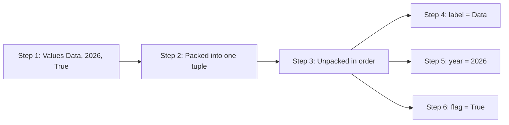

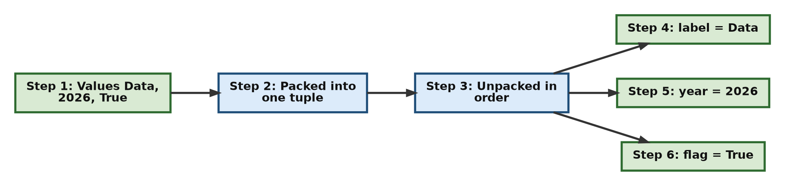

**Try this next**

What happens if you try to unpack the three values into only two variables?

```python
packed_data = "Data", 2026, True

# Step 1 - Two names for three values: Python cannot match them up
try:
    label, year = packed_data
except ValueError as error:
    print("ValueError:", error)
```

```text
ValueError: too many values to unpack (expected 2)
```

In Python 3.14 and later, the message is a little longer: `too many values to unpack (expected 2, got 3)`. See [Q9](#q9) for a way to unpack when you do not know how many items there will be.

[Back to the Table of Contents](#table-of-contents)

<a id="q3"></a>
### Q3. Write a script that shows you cannot change a tuple element. Try to change the first item of a tuple and print the error message.

**Plan**

1. Create a tuple of numbers.
2. Try to change the item at position 0. Put the attempt inside a `try` block, so the program does not stop.
3. Catch the `TypeError` in an `except` block and print its message.
4. Print the tuple again to show that it did not change.

**Script**

```python
# Step 1 - Create a tuple of numbers
numbers = (10, 20, 30)
print("Tuple before:", numbers)

# Step 2 - Try to change an item, and catch the error so the program keeps running
try:
    numbers[0] = 99          # attempt to replace the item at position 0
except TypeError as error:
    # Step 3 - Print the error message that Python produced
    print("Python error message:", error)

# Step 4 - Show that the tuple is unchanged
print("Tuple after: ", numbers)
```

**Output**

```text
Tuple before: (10, 20, 30)
Python error message: 'tuple' object does not support item assignment
Tuple after:  (10, 20, 30)
```

**How Python works: the immutability rule**

- **Immutability** means that once a tuple has been created, its contents cannot be changed. You cannot replace an item, add a new item, or remove an item.
- When you try to replace an item with `numbers[0] = 99`, Python raises a `TypeError` with the message `'tuple' object does not support item assignment`.
- Behind the scenes, a list has a special method (named `__setitem__`) that lets Python replace an item. A tuple simply does not have this method, so Python has no way to carry out the change.
- **About `try` and `except`:** Without them, the error would stop the program at once. The `try` block runs the risky line. If a `TypeError` happens, Python jumps to the `except` block, stores the error in the variable `error`, and carries on. This lets us print the message and then prove, in Step 4, that the tuple is unchanged.

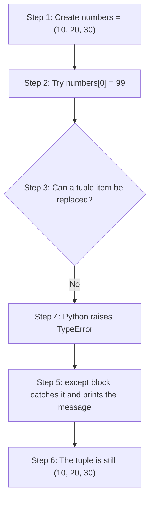

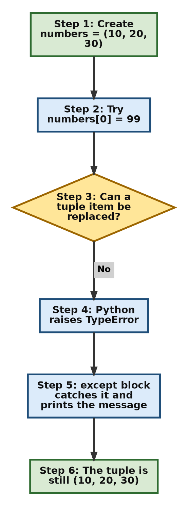

**Try this next**

Try the same with a list, and try deleting an item from the tuple.

```python
# Step 1 - A list CAN be changed
numbers_list = [10, 20, 30]
numbers_list[0] = 99
print("List after change:", numbers_list)

# Step 2 - Deleting a tuple item also fails
numbers = (10, 20, 30)
try:
    del numbers[0]
except TypeError as error:
    print("Deleting from a tuple:", error)
```

```text
List after change: [99, 20, 30]
Deleting from a tuple: 'tuple' object doesn't support item deletion
```

[Back to the Table of Contents](#table-of-contents)

---

<a id="part-2"></a>
## Part 2: Reading Tuple Details and Joining Tuples

These two exercises show how to find out about a tuple without changing it, and how to "add" to a tuple by building a new one.

[Back to the Table of Contents](#table-of-contents)

<a id="q4"></a>
### Q4. Write a script to find the total length of the tuple `(10, 20, 20, 30)`. Count how many times 20 appears, and find the index position of 30.

**Plan**

1. Create the tuple.
2. Use `len()` to find how many items it has.
3. Use the `.count()` method to count how many times `20` appears.
4. Use the `.index()` method to find the position of `30`.
5. Print all three results.

**Script**

```python
# Step 1 - Set up the sample tuple
numbers = (10, 20, 20, 30)
print("Tuple:", numbers)

# Step 2 - len() gives the total number of items
total_length = len(numbers)

# Step 3 - .count() tells how many times a value appears
count_of_20 = numbers.count(20)

# Step 4 - .index() gives the position where a value first appears
index_of_30 = numbers.index(30)

# Step 5 - Print all the results
print("Length:", total_length)
print("Count of 20:", count_of_20)
print("Position of 30:", index_of_30)
```

**Output**

```text
Tuple: (10, 20, 20, 30)
Length: 4
Count of 20: 2
Position of 30: 3
```

**How Python works: read-only tuple operations**

- Python gives you several safe tools to look at a tuple. They only **read** the data and never change the original tuple.
- `len(numbers)` is a built-in function. It counts all the items, including repeats. The tuple has four items, so the answer is `4`.
- `numbers.count(20)` is a tuple method. It checks every item and counts how many are equal to `20`. The answer is `2`.
- `numbers.index(30)` is also a tuple method. It returns the position of the **first** item equal to `30`. Positions start at 0, so the four items are at positions 0, 1, 2 and 3. The value `30` is at position `3`.
- `.count()` and `.index()` are the **only two methods** a tuple has. A list has many more, such as `.append()` and `.sort()`, but those change the data, so tuples do not have them.

| Position (index) | 0 | 1 | 2 | 3 |
| --- | --- | --- | --- | --- |
| **Value** | 10 | 20 | 20 | 30 |

**Try this next**

What does `.index()` do if the value is not in the tuple? And which position does it give when a value appears twice?

```python
numbers = (10, 20, 20, 30)

# Step 1 - A value that appears twice: index() gives the FIRST position
print("First position of 20:", numbers.index(20))

# Step 2 - A value that is not there: index() raises ValueError
try:
    numbers.index(99)
except ValueError as error:
    print("ValueError:", error)

# Step 3 - A safe way: check with 'in' first
if 99 in numbers:
    print("Position of 99:", numbers.index(99))
else:
    print("99 is not in the tuple")
```

```text
First position of 20: 1
ValueError: tuple.index(x): x not in tuple
99 is not in the tuple
```

[Back to the Table of Contents](#table-of-contents)

<a id="q5"></a>
### Q5. Write a script that adds the number 40 to the end of the tuple (10, 20, 30) using the + operator. Print the tuple and its memory ID before and after the change.

**Plan**

1. Create the tuple `(10, 20, 30)`. Print it and its memory ID.
2. Join it with the one-item tuple `(40,)` using `+`, and store the result back in the same variable.
3. Print the new tuple and its memory ID.
4. Compare the two IDs to show that a new tuple was made.

**Script**

```python
# Step 1 - Create the tuple and note its memory ID
my_tuple = (10, 20, 30)
old_id = id(my_tuple)
print("Original tuple values:", my_tuple)
print("Original tuple ID:    ", old_id)

# Step 2 - Join a one-item tuple to the end, and store the result in the same variable
#          Note the comma in (40,): without it, (40) is just a number and + would fail
my_tuple = my_tuple + (40,)

# Step 3 - Print the new tuple values and the new memory ID
print("New tuple values:     ", my_tuple)
print("New tuple ID:         ", id(my_tuple))

# Step 4 - Compare the two IDs
print("Same object as before?", id(my_tuple) == old_id)
```

**Output** (the ID numbers will be different on your computer; the last line will always be `False`)

```text
Original tuple values: (10, 20, 30)
Original tuple ID:     140213786542400
New tuple values:      (10, 20, 30, 40)
New tuple ID:          140213786589808
Same object as before? False
```

**How Python works: reassignment, not change**

- Because tuples are immutable, you cannot add an item to the original tuple.
- The `+` operator **joins** (concatenates) two tuples. It reads the items of both, and builds a **completely new** tuple somewhere else in memory.
- The `=` then makes the variable name `my_tuple` point to this new tuple. This is called **reassignment** (or rebinding). The name moves; the old tuple does not change.
- The `id()` function shows this clearly. The ID before and the ID after are different, which means they belong to two different objects.
- What happens to the old tuple `(10, 20, 30)`? If no other variable refers to it, Python frees its memory automatically.
- You can only join a tuple to another tuple. That is why the script uses `(40,)` with a comma. Writing `my_tuple + 40` or `my_tuple + (40)` raises `TypeError: can only concatenate tuple (not "int") to tuple`.

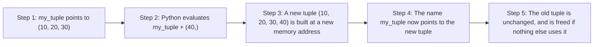

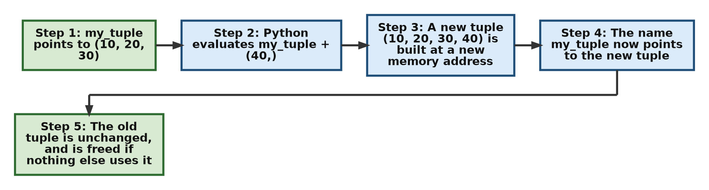

**Try this next**

Keep a second name pointing to the original tuple before you join. Does the original change?

```python
# Step 1 - Two names for the same tuple
my_tuple = (10, 20, 30)
backup = my_tuple

# Step 2 - Join and reassign my_tuple
my_tuple = my_tuple + (40,)

# Step 3 - backup still points to the original, which never changed
print("my_tuple:", my_tuple)
print("backup:  ", backup)
```

```text
my_tuple: (10, 20, 30, 40)
backup:   (10, 20, 30)
```

[Back to the Table of Contents](#table-of-contents)

---

<a id="part-3"></a>
## Part 3: Slicing and Indexing

These exercises show how to pick out parts of a tuple: a middle section, every second item, and items counted from the end.

[Back to the Table of Contents](#table-of-contents)

<a id="q6"></a>
### Q6. Write a script to extract a middle slice (30, 40) from the tuple `(10, 20, 30, 40, 50)`. Print the new slice and the original tuple to show it did not change.

**Plan**

1. Create the five-item tuple.
2. Work out the positions: `30` is at position 2 and `40` is at position 3.
3. Slice from position 2 up to, but **not including**, position 4: `[2:4]`.
4. Print the slice and the original tuple.

**Script**

```python
# Step 1 - Set up a five-item tuple
original_tuple = (10, 20, 30, 40, 50)

# Step 2 - Slice from position 2 up to (but not including) position 4
middle_slice = original_tuple[2:4]

# Step 3 - Print both to confirm the result
print("Extracted slice:", middle_slice)
print("Original tuple: ", original_tuple)

# Step 4 - The slice is a separate tuple object
print("Is the slice the same object as the original?", middle_slice is original_tuple)
```

**Output**

```text
Extracted slice: (30, 40)
Original tuple:  (10, 20, 30, 40, 50)
Is the slice the same object as the original? False
```

**How Python works: slicing**

- A slice is written `tuple[start:stop]`. It starts at position `start` and stops **just before** position `stop`. So `[2:4]` takes positions 2 and 3.
- An easy way to remember this: the number of items in the slice is `stop - start`. Here, `4 - 2 = 2` items.
- Slicing builds a **brand-new tuple** holding the chosen items. The items themselves are not copied; the new tuple simply points to the same values.
- The original tuple is not touched in any way, as the output shows.

| Position | 0 | 1 | **2** | **3** | 4 |
| --- | --- | --- | --- | --- | --- |
| **Value** | 10 | 20 | **30** | **40** | 50 |
| **In `[2:4]`?** | No | No | Yes | Yes | No (stop position is left out) |

**Try this next**

Try these slices on the same tuple and predict the result before you run them: `[:2]`, `[3:]`, `[1:-1]` and `[2:100]`.

```python
original_tuple = (10, 20, 30, 40, 50)

print("[:2]    ->", original_tuple[:2])     # from the start up to position 2
print("[3:]    ->", original_tuple[3:])     # from position 3 to the end
print("[1:-1]  ->", original_tuple[1:-1])   # leave out the first and the last
print("[2:100] ->", original_tuple[2:100])  # a stop past the end is allowed
```

```text
[:2]    -> (10, 20)
[3:]    -> (40, 50)
[1:-1]  -> (20, 30, 40)
[2:100] -> (30, 40, 50)
```

Notice that `[2:100]` does not cause an error. Slicing simply stops at the end of the tuple.

[Back to the Table of Contents](#table-of-contents)

<a id="q7"></a>
### Q7. Write a script that skips elements to extract every second number from the tuple `(1, 2, 3, 4, 5, 6)`.

**Plan**

1. Create the tuple.
2. Use a slice with a **step** of 2: `[::2]`. Leaving out `start` and `stop` means "from the beginning to the end".
3. Print the result.

**Script**

```python
# Step 1 - Define the tuple
numbers = (1, 2, 3, 4, 5, 6)

# Step 2 - Use a step of 2 to take every second item, starting at position 0
every_second = numbers[::2]

# Step 3 - Print the result
print("Every second item, from position 0:", every_second)

# Step 4 - Start at position 1 instead, to get the other half
print("Every second item, from position 1:", numbers[1::2])
```

**Output**

```text
Every second item, from position 0: (1, 3, 5)
Every second item, from position 1: (2, 4, 6)
```

**How Python works: the slice step**

- The full slicing form is `tuple[start:stop:step]`. The third number, the **step** (also called the *stride*), tells Python how far to jump each time.
- With a step of `2`, Python takes an item, skips the next one, takes the one after that, and so on.
- When `start` and `stop` are left empty, Python uses the whole tuple.
- So `numbers[::2]` takes positions 0, 2 and 4, which hold `1`, `3` and `5`. In Step 4, `numbers[1::2]` starts at position 1 and takes positions 1, 3 and 5, which hold `2`, `4` and `6`.

| Slice | Positions taken | Result |
| --- | --- | --- |
| `numbers[::2]` | 0, 2, 4 | `(1, 3, 5)` |
| `numbers[1::2]` | 1, 3, 5 | `(2, 4, 6)` |
| `numbers[::3]` | 0, 3 | `(1, 4)` |
| `numbers[::-1]` | 5, 4, 3, 2, 1, 0 | `(6, 5, 4, 3, 2, 1)` |

**Try this next**

A **negative step** walks backwards. What do `numbers[::-1]` and `numbers[::-2]` give?

```python
numbers = (1, 2, 3, 4, 5, 6)
print("[::-1] ->", numbers[::-1])   # the whole tuple in reverse
print("[::-2] ->", numbers[::-2])   # every second item, walking backwards from the end
```

```text
[::-1] -> (6, 5, 4, 3, 2, 1)
[::-2] -> (6, 4, 2)
```

[Back to the Table of Contents](#table-of-contents)

<a id="q8"></a>
### Q8. Write a script that uses negative indexing to read the last item and the second-to-last item of the tuple `('a', 'b', 'c', 'd')`.

**Plan**

1. Create the tuple of letters.
2. Read the last item with index `-1`.
3. Read the second-to-last item with index `-2`.
4. Print both.

**Script**

```python
# Step 1 - Create a tuple of letters
letters = ('a', 'b', 'c', 'd')

# Step 2 - Negative indexes count backwards from the end
last = letters[-1]
second_to_last = letters[-2]

# Step 3 - Print both items
print("Last item:", last)
print("Second-to-last item:", second_to_last)

# Step 4 - The same items reached with ordinary (positive) indexes
print("Same with positive indexes:", letters[3], letters[2])
```

**Output**

```text
Last item: d
Second-to-last item: c
Same with positive indexes: d c
```

**How Python works: negative indexing**

- Negative indexes let you count from the **right-hand end** of a tuple instead of from the left.
- The index `-1` always means the very last item, whatever the length of the tuple. `-2` means the one before it, and so on.
- This is very handy when you do not know, or do not want to work out, how long the tuple is. Without it, you would have to write `letters[len(letters) - 1]` to get the last item.
- Each item has two addresses, a positive one and a negative one:

| Item | `'a'` | `'b'` | `'c'` | `'d'` |
| --- | --- | --- | --- | --- |
| **Positive index** | 0 | 1 | 2 | 3 |
| **Negative index** | -4 | -3 | -2 | -1 |

**Try this next**

What happens with `letters[-5]`? The tuple has only four items.

```python
letters = ('a', 'b', 'c', 'd')
try:
    print(letters[-5])
except IndexError as error:
    print("IndexError:", error)
```

```text
IndexError: tuple index out of range
```

Just like a positive index, a negative index must point to an item that exists.

[Back to the Table of Contents](#table-of-contents)

---

<a id="part-4"></a>
## Part 4: Unpacking and Converting

These exercises show how to unpack a tuple when you want only some of its items separately, and how to turn strings, lists and dictionaries into tuples.

[Back to the Table of Contents](#table-of-contents)

<a id="q9"></a>
### Q9. Write a script to unpack the tuple `(10, 20, 30, 40, 50)`. Capture the first item in a normal variable, and use the * operator to collect the rest of the items.

**Plan**

1. Create the tuple.
2. Unpack it with one normal name for the first item and one **starred** name, `*rest_of_items`, for everything else.
3. Print both variables, and print the type of the starred one.

**Script**

```python
# Step 1 - Define the tuple
data = (10, 20, 30, 40, 50)

# Step 2 - Extended unpacking: the first item goes to first_item, the rest to rest_of_items
first_item, *rest_of_items = data

# Step 3 - Print the variables and check the type of the collected items
print("First variable:", first_item)
print("Collected rest:", rest_of_items)
print("Type of rest_of_items:", type(rest_of_items))
```

**Output**

```text
First variable: 10
Collected rest: [20, 30, 40, 50]
Type of rest_of_items: <class 'list'>
```

**How Python works: extended unpacking with `*`**

- In ordinary unpacking, the number of names must match the number of items exactly. The star `*` removes that limit.
- The starred name works like a "catch-all" bin. After the normal names have taken their items, the starred name collects **everything that is left**.
- The key point: even though the data came from a tuple, Python always puts the leftover items into a **list**. So `rest_of_items` is `[20, 30, 40, 50]`, not `(20, 30, 40, 50)`. A list is used because you may want to change these items next, for example add or sort them.
- If you need a tuple, convert it: `tuple(rest_of_items)`.
- Only one starred name is allowed in a single assignment. If nothing is left over, the starred name gets an empty list `[]`.
- Extended unpacking was added to Python by [PEP 3132](https://peps.python.org/pep-3132/). (A PEP is a document that proposes a new feature for Python.)

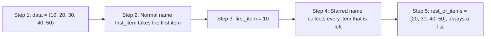

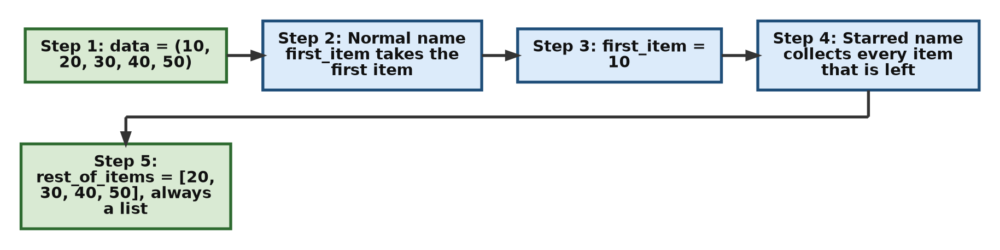

**Try this next**

The starred name does not have to come last. Try keeping the first and last items and collecting the middle.

```python
data = (10, 20, 30, 40, 50)

# Step 1 - Star in the middle
first, *middle, last = data
print("first:", first, "| middle:", middle, "| last:", last)

# Step 2 - Star at the start
*all_but_last, final = data
print("all_but_last:", all_but_last, "| final:", final)

# Step 3 - Nothing left over: the starred name gets an empty list
a, b, *extra = (1, 2)
print("a:", a, "| b:", b, "| extra:", extra)
```

```text
first: 10 | middle: [20, 30, 40] | last: 50
all_but_last: [10, 20, 30, 40] | final: 50
a: 1 | b: 2 | extra: []
```

[Back to the Table of Contents](#table-of-contents)

<a id="q10"></a>
### Q10. Write a script that converts the text string `"hello"` into a tuple. Then, convert the list `[1, 2]` into a tuple.

**Plan**

1. Create the string and the list.
2. Pass each one to the `tuple()` function.
3. Print each result along with its type.

**Script**

```python
# Step 1 - Define the string and the list
my_string = "hello"
my_list = [1, 2]

# Step 2 - Use the tuple() function to convert both
tuple_from_str = tuple(my_string)
tuple_from_lst = tuple(my_list)

# Step 3 - Print the new tuples and their types
print("Tuple from string:", tuple_from_str, "| type:", type(tuple_from_str))
print("Tuple from list:  ", tuple_from_lst, "| type:", type(tuple_from_lst))

# Step 4 - The original list still exists and can still be changed
my_list.append(3)
print("List after append:", my_list)
print("Tuple from list is unaffected:", tuple_from_lst)
```

**Output**

```text
Tuple from string: ('h', 'e', 'l', 'l', 'o') | type: <class 'tuple'>
Tuple from list:   (1, 2) | type: <class 'tuple'>
List after append: [1, 2, 3]
Tuple from list is unaffected: (1, 2)
```

**How Python works: the `tuple()` function**

- The built-in `tuple()` function (also called the tuple **constructor**, because it constructs a new tuple) takes any **iterable** (anything you can loop over) and builds a tuple from its items.
- It loops over the object and collects each item in order:
  - A **string** is looped over one character at a time. So `"hello"` becomes five separate one-letter strings: `('h', 'e', 'l', 'l', 'o')`. Note that the two `'l'` letters both appear.
  - A **list** is looped over one item at a time. So `[1, 2]` becomes `(1, 2)`.
- The new tuple is a separate object. As Step 4 shows, changing the original list afterwards does not affect the tuple. The tuple is a fixed, read-only snapshot of the data at the moment it was made.

| Source | Code | Result |
| --- | --- | --- |
| String | `tuple("hello")` | `('h', 'e', 'l', 'l', 'o')` |
| List | `tuple([1, 2])` | `(1, 2)` |
| Range | `tuple(range(3))` | `(0, 1, 2)` |
| Set | `tuple({5})` | `(5,)` |
| Nothing | `tuple()` | `()` |

**Try this next**

How would you make a tuple that holds the whole word `"hello"` as one item, instead of splitting it into letters?

```python
# Step 1 - tuple() splits a string into characters
print(tuple("hello"))

# Step 2 - A trailing comma keeps the whole word as one item
print(("hello",))
```

```text
('h', 'e', 'l', 'l', 'o')
('hello',)
```

[Back to the Table of Contents](#table-of-contents)

<a id="q11"></a>
### Q11. Write a script that takes the dictionary `{'x': 10, 'y': 20}` and creates two tuples from it: one containing only the keys, and one containing only the values.

**Plan**

1. Create the dictionary.
2. Pass the dictionary directly to `tuple()` to get the keys.
3. Call `.values()` on the dictionary, then pass the result to `tuple()` to get the values.
4. Print both tuples.

**Script**

```python
# Step 1 - Define a dictionary that maps keys to values
my_dict = {'x': 10, 'y': 20}

# Step 2 - Converting the dictionary directly gives a tuple of its keys
keys_tuple = tuple(my_dict)

# Step 3 - Use the .values() method to get a tuple of the values
values_tuple = tuple(my_dict.values())

# Step 4 - Print both tuples to check their contents
print("Keys tuple:  ", keys_tuple)
print("Values tuple:", values_tuple)
```

**Output**

```text
Keys tuple:   ('x', 'y')
Values tuple: (10, 20)
```

**How Python works: converting dictionaries to tuples**

- `tuple()` builds a tuple by looping over whatever you give it. When you loop over a dictionary, Python gives you only its **keys**. So passing the dictionary directly, as in `tuple(my_dict)`, gives the keys only.
- To get the values instead, you must first call the `.values()` method, then convert the result: `tuple(my_dict.values())`.
- You can also write `tuple(my_dict.keys())`. It gives the same result as `tuple(my_dict)`, but makes it clearer to the reader that you want the keys.
- The order of the items follows the order in which the keys were added to the dictionary. (Dictionaries have kept this order since Python 3.7.)

| Code | What you get | Result |
| --- | --- | --- |
| `tuple(my_dict)` | Keys | `('x', 'y')` |
| `tuple(my_dict.keys())` | Keys | `('x', 'y')` |
| `tuple(my_dict.values())` | Values | `(10, 20)` |
| `tuple(my_dict.items())` | Key-value pairs | `(('x', 10), ('y', 20))` |

**Try this next**

Use `.items()` to get the key-value pairs as a tuple of small tuples.

```python
my_dict = {'x': 10, 'y': 20}

# Step 1 - Each pair becomes a two-item tuple
pairs = tuple(my_dict.items())
print("Pairs:", pairs)

# Step 2 - Look at the first pair on its own
print("First pair:", pairs[0], "| key:", pairs[0][0], "| value:", pairs[0][1])
```

```text
Pairs: (('x', 10), ('y', 20))
First pair: ('x', 10) | key: x | value: 10
```

[Back to the Table of Contents](#table-of-contents)

---

<a id="part-5"></a>
## Part 5: Testing Tuples

These two exercises look at two kinds of test: whether a tuple counts as true or false, and whether a value is inside a tuple.

[Back to the Table of Contents](#table-of-contents)

<a id="q12"></a>
### Q12. Write a script that tests an empty tuple () and a single-item tuple (0,) inside an if statement to check if Python sees them as `True` or `False`.

**Plan**

1. Create an empty tuple and a one-item tuple that holds `0`.
2. Test each one in an `if`-`else` statement and print which branch runs.
3. Confirm the results with `bool()`.

**Script**

```python
# Step 1 - An empty tuple, and a one-item tuple holding zero
empty_tuple = ()
zero_tuple = (0,)

# Step 2 - Test the empty tuple in an if statement
if empty_tuple:
    print("Empty tuple () counts as True")
else:
    print("Empty tuple () counts as False")       # this line runs

# Step 3 - Test the one-item tuple in an if statement
if zero_tuple:
    print("Tuple (0,) counts as True because it is not empty")   # this line runs
else:
    print("Tuple (0,) counts as False")

# Step 4 - Confirm with bool(), which converts any value to True or False
print("bool(()):  ", bool(empty_tuple))
print("bool((0,)):", bool(zero_tuple))
print("bool(0):   ", bool(0))
```

**Output**

```text
Empty tuple () counts as False
Tuple (0,) counts as True because it is not empty
bool(()):   False
bool((0,)): True
bool(0):    False
```

**How Python works: truth values of tuples**

- When a tuple is used where Python expects `True` or `False` (for example, in an `if` statement), Python checks only **how many items** it has, not what the items are.
- An **empty** tuple counts as `False`.
- A tuple with **one or more items** counts as `True`, even if the items themselves are "false-like" values such as `0`, `None` or `False`.
- So `(0,)` is `True`, because it holds one item, while the number `0` on its own is `False`. The last two lines of the output show this difference.
- Values that count as `False` are often called **falsy**, and values that count as `True` are called **truthy**. See [Python docs: Truth value testing](https://docs.python.org/3/library/stdtypes.html#truth-value-testing).

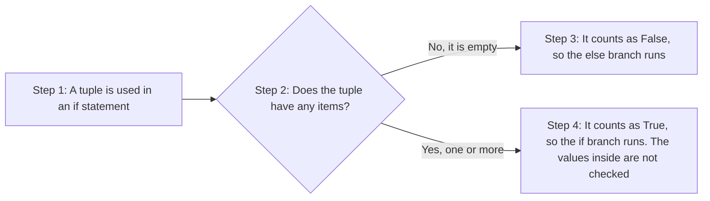

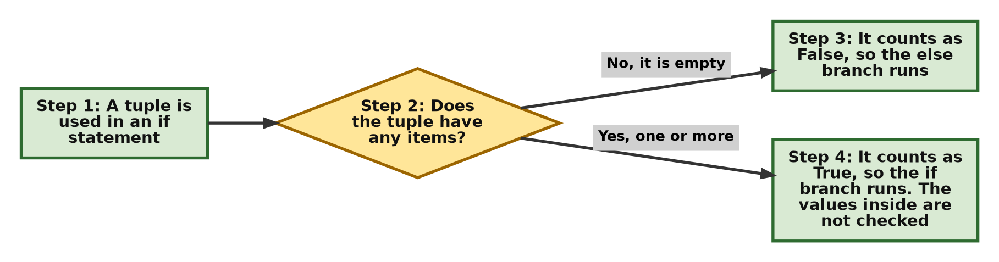

| Tuple | Number of items | Counts as |
| --- | --- | --- |
| `()` | 0 | `False` |
| `(0,)` | 1 | `True` |
| `(None,)` | 1 | `True` |
| `(False,)` | 1 | `True` |
| `(1, 2, 3)` | 3 | `True` |

**Try this next**

How can you check whether the items inside the tuple are truthy? Use the built-in `any()` and `all()` functions.

```python
zero_tuple = (0,)
mixed = (0, 5)

print("any((0,)):  ", any(zero_tuple))   # is at least one item truthy?
print("any((0, 5)):", any(mixed))
print("all((0, 5)):", all(mixed))        # are all items truthy?
```

```text
any((0,)):   False
any((0, 5)): True
all((0, 5)): False
```

[Back to the Table of Contents](#table-of-contents)

<a id="q13"></a>
### Q13. Write a script that uses the in operator to check if the item `"Apple"` exists inside the tuple `("Apple", "Banana", "Cherry")`. Then check for `"Orange"`.

**Plan**

1. Create the tuple of fruits.
2. Use `in` to test for `"Apple"`, and again to test for `"Orange"`.
3. Print both results.
4. Show how the result is normally used inside an `if` statement.

**Script**

```python
# Step 1 - Define a tuple of fruit names
fruits = ("Apple", "Banana", "Cherry")

# Step 2 - Use the 'in' operator to test membership
check_apple = "Apple" in fruits
check_orange = "Orange" in fruits

# Step 3 - Print the True / False results
print("Is 'Apple' in the tuple? ", check_apple)
print("Is 'Orange' in the tuple?", check_orange)

# Step 4 - The usual way to use 'in': inside an if statement
if "Orange" not in fruits:
    print("Orange is not available")
```

**Output**

```text
Is 'Apple' in the tuple?  True
Is 'Orange' in the tuple? False
Orange is not available
```

**How Python works: the membership operator**

- The `in` operator checks whether a value is a **member** of a collection. It always gives a Boolean: `True` or `False`.
- For a tuple, Python checks the items one by one from left to right, comparing each with the value you are looking for.
- If it finds a match, it stops at once and returns `True`. If it reaches the end without a match, it returns `False`.
- The opposite test is `not in`, used in Step 4.
- The comparison is exact. Upper and lower case matter, so `"apple" in fruits` is `False`.

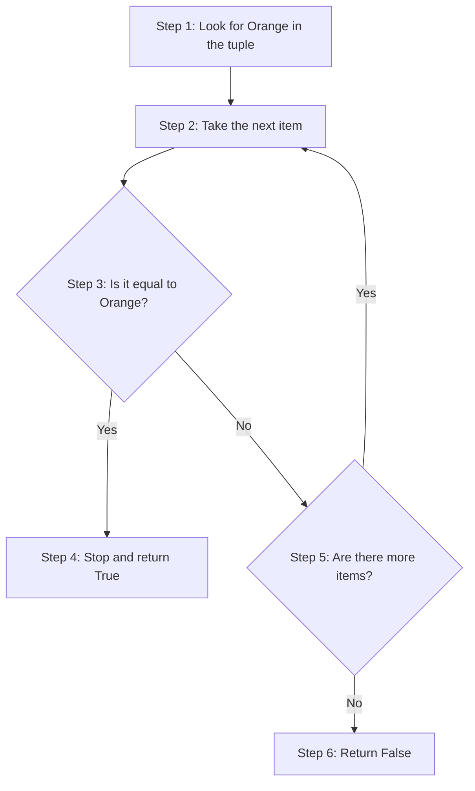

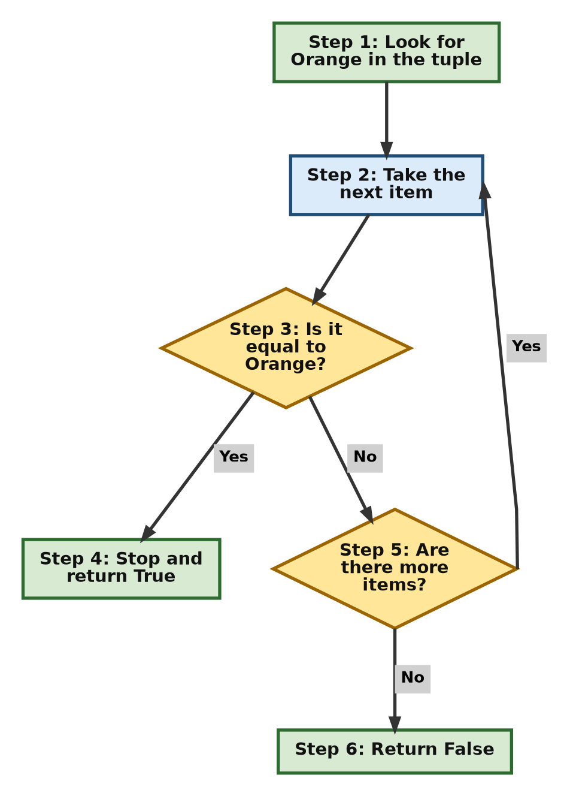

**Try this next**

Check a value with different capital letters, and try a case-insensitive search.

```python
fruits = ("Apple", "Banana", "Cherry")

# Step 1 - Case matters
print("'apple' in fruits:", "apple" in fruits)

# Step 2 - Make every name lower case first, then search
lower_fruits = tuple(name.lower() for name in fruits)
print("Lower-case tuple: ", lower_fruits)
print("'apple' in lower-case tuple:", "apple" in lower_fruits)
```

```text
'apple' in fruits: False
Lower-case tuple:  ('apple', 'banana', 'cherry')
'apple' in lower-case tuple: True
```

In Step 2, `tuple(name.lower() for name in fruits)` loops over the fruits, turns each name into lower case, and collects the results into a new tuple.

[Back to the Table of Contents](#table-of-contents)

---

<a id="part-6"></a>
## Part 6: Swapping and Dictionary Keys

Two practical uses of tuples: swapping two variables in one line, and using a tuple as a dictionary key.

[Back to the Table of Contents](#table-of-contents)

<a id="q14"></a>
### Q14. Write a script that swaps the values of two tuple variables `t1` and `t2` in a single line without using any temporary storage variables.

**Plan**

1. Create two tuples, `t1` and `t2`, and print them.
2. Swap them in one line with `t1, t2 = t2, t1`.
3. Print them again to confirm the swap.

**Script**

```python
# Step 1 - Define two tuples and show them before the swap
t1 = (1, "Alpha")
t2 = (2, "Beta")
print("Before swap: t1 =", t1, "| t2 =", t2)

# Step 2 - Swap them in a single line
t1, t2 = t2, t1

# Step 3 - Print them again to confirm the swap
print("After swap:  t1 =", t1, "| t2 =", t2)
```

**Output**

```text
Before swap: t1 = (1, 'Alpha') | t2 = (2, 'Beta')
After swap:  t1 = (2, 'Beta') | t2 = (1, 'Alpha')
```

**How Python works: swapping variables**

- In many languages you need three lines and an extra "temporary" variable to swap two values: `temp = t1`, then `t1 = t2`, then `t2 = temp`. Without `temp`, the first value would be lost.
- Python does it in one line, `t1, t2 = t2, t1`, using packing and unpacking:
  1. Python works out the **whole right-hand side first**. It reads the current values of `t2` and `t1`.
  2. It packs them into a hidden, temporary tuple: `((2, 'Beta'), (1, 'Alpha'))`.
  3. It then unpacks that tuple into the names on the left, in order: the first item goes to `t1`, the second to `t2`.
- Since both values are read before anything is assigned, nothing is lost.
- Note that the tuples themselves are not changed. Only the names `t1` and `t2` are moved to point to each other's tuple. This works for any values, not only tuples.
- (For two or three names, standard Python is clever enough to swap the values directly without building the hidden tuple. The result is exactly the same.)

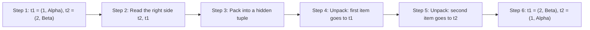

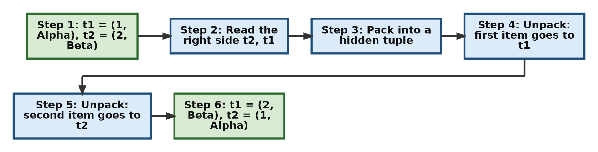

**Try this next**

Rotate three variables in one line, so that each one takes the value of the next.

```python
a, b, c = "red", "green", "blue"
print("Before:", a, b, c)

a, b, c = b, c, a     # the right side is read first, then assigned in order
print("After: ", a, b, c)
```

```text
Before: red green blue
After:  green blue red
```

[Back to the Table of Contents](#table-of-contents)

<a id="q15"></a>
### Q15. Write a script that safely uses the tuple `(22.5726, 88.3639)` as a dictionary key. Print the dictionary to show it works.

**Plan**

1. Create a tuple holding the two map coordinates (latitude and longitude).
2. Use the tuple as a key in a dictionary.
3. Print the dictionary, and look up the value using the tuple.
4. Show that a tuple containing a list cannot be used as a key.

**Script**

```python
# Step 1 - A tuple containing only numbers (which cannot change)
map_coordinates = (22.5726, 88.3639)

# Step 2 - Use the tuple as a key in a dictionary
location_log = {map_coordinates: "Kolkata Central Office"}

# Step 3 - Print the dictionary and look up the value by its key
print("Location entry:", location_log)
print("Look up by coordinates:", location_log[(22.5726, 88.3639)])

# Step 4 - For comparison: a tuple that contains a list cannot be a key
bad_key = (22.5726, [88.3639])
try:
    bad_log = {bad_key: "This will not work"}
except TypeError as error:
    print("TypeError:", error)
```

**Output**

```text
Location entry: {(22.5726, 88.3639): 'Kolkata Central Office'}
Look up by coordinates: Kolkata Central Office
TypeError: unhashable type: 'list'
```

In Python 3.14 and later, the last line reads: `TypeError: cannot use 'tuple' as a dict key (unhashable type: 'list')`.

**How Python works: which tuples can be keys**

- A dictionary key must be **hashable**. This means it must be able to produce a fixed number, called its **hash value**, that never changes. The dictionary uses this number to store the key and to find it again quickly.
- For Python's built-in types, the immutable ones (numbers, strings, tuples, frozensets) are hashable, and the mutable ones (lists, dictionaries, sets) are not.
- A tuple is hashable **only if every item inside it is also hashable**. A tuple works out its own hash value by combining the hash values of its items.
- `(22.5726, 88.3639)` holds two floating-point numbers. Both are hashable, so the tuple is hashable and works as a key.
- `(22.5726, [88.3639])` holds a list. A list can change, so it has no fixed hash value, and neither does the tuple around it. Python raises a `TypeError`.
- Tuples make natural keys for things that are identified by more than one value, such as map coordinates, a (row, column) cell in a grid, or a (year, month) pair.

| Tuple | Can it be a key? | Why |
| --- | --- | --- |
| `(22.5726, 88.3639)` | Yes | Only numbers inside |
| `("Kolkata", 700001)` | Yes | A string and a number |
| `(1, (2, 3))` | Yes | The inner tuple also holds only numbers |
| `(22.5726, [88.3639])` | No | Holds a list |
| `(1, {"a": 2})` | No | Holds a dictionary |

Read more in the [Python glossary entry for hashable](https://docs.python.org/3/glossary.html#term-hashable).

**Try this next**

Store several places in one dictionary, then loop over it and unpack each coordinate key.

```python
# Step 1 - Several coordinate keys in one dictionary
offices = {
    (22.5726, 88.3639): "Kolkata",
    (28.6139, 77.2090): "New Delhi",
}

# Step 2 - Each key is a tuple, so it can be unpacked in the loop
for (latitude, longitude), city in offices.items():
    print(f"{city}: latitude {latitude}, longitude {longitude}")
```

```text
Kolkata: latitude 22.5726, longitude 88.3639
New Delhi: latitude 28.6139, longitude 77.209
```

Notice that `77.2090` is printed as `77.209`. Python does not print a trailing zero after the decimal point, because it does not change the value.

[Back to the Table of Contents](#table-of-contents)

---

<a id="part-7"></a>
## Part 7: Sorting and Nested Tuples

These exercises show how to get a sorted copy of a tuple and how to reach an item inside a tuple of tuples.

[Back to the Table of Contents](#table-of-contents)

<a id="q16"></a>
### Q16. Write a script to sort the unsorted tuple `(3, 1, 4, 2)`. Print the final sorted result and check its object type.

**Plan**

1. Create the unsorted tuple.
2. Pass it to the built-in `sorted()` function.
3. Print the result and its type.
4. If a tuple is needed, convert the result back with `tuple()`.
5. Show that the original tuple is unchanged.

**Script**

```python
# Step 1 - Define the unsorted tuple
unsorted_data = (3, 1, 4, 2)

# Step 2 - Pass the tuple to the sorted() function
result_data = sorted(unsorted_data)

# Step 3 - Print the result and check its type
print("Sorted result:", result_data)
print("Type of sorted result:", type(result_data))

# Step 4 - Convert back to a tuple if you need one
sorted_tuple = tuple(result_data)
print("As a tuple:", sorted_tuple, "| type:", type(sorted_tuple))

# Step 5 - The original tuple has not changed
print("Original tuple:", unsorted_data)
```

**Output**

```text
Sorted result: [1, 2, 3, 4]
Type of sorted result: <class 'list'>
As a tuple: (1, 2, 3, 4) | type: <class 'tuple'>
Original tuple: (3, 1, 4, 2)
```

**How Python works: sorting a tuple**

- **Line `result_data = sorted(unsorted_data)`:** Because tuples are immutable, they do not have a `.sort()` method. (A list's `.sort()` rearranges the items inside the same list, which is not allowed for a tuple.)
- To sort the items, you pass the tuple to the built-in function `sorted()`. It works in these steps:
  1. It reads all the items of the tuple.
  2. It sorts them, smallest first.
  3. It puts the sorted items into a **brand-new list** and returns that list.
  4. It leaves the original tuple completely safe and unchanged.
- That is why the type of the result is `list`, not `tuple`. `sorted()` always returns a list, whatever you give it.
- If you need a tuple, wrap the result: `tuple(sorted(unsorted_data))`, as in Step 4.

**Try this next**

Sort from largest to smallest, and sort a tuple of words by their length.

```python
unsorted_data = (3, 1, 4, 2)

# Step 1 - reverse=True sorts from largest to smallest
print("Largest first:", tuple(sorted(unsorted_data, reverse=True)))

# Step 2 - key=len sorts words by their length instead of alphabetically
words = ("banana", "fig", "apple")
print("Alphabetical:", sorted(words))
print("By length:   ", sorted(words, key=len))
```

```text
Largest first: (4, 3, 2, 1)
Alphabetical: ['apple', 'banana', 'fig']
By length:    ['fig', 'apple', 'banana']
```

[Back to the Table of Contents](#table-of-contents)

<a id="q17"></a>
### Q17. Write a script to extract the number 3 out of the nested data tuple `((1, 2), (3, 4))` using index brackets.

**Plan**

1. Create the nested tuple.
2. Find which inner tuple holds `3`: it is the second one, at position 1.
3. Find where `3` sits inside that inner tuple: position 0.
4. Chain the two indexes together: `[1][0]`.

**Script**

```python
# Step 1 - Create a nested tuple (a tuple of tuples)
nested_data = ((1, 2), (3, 4))

# Step 2 - First index: pick the inner tuple at position 1
inner_tuple = nested_data[1]
print("nested_data[1]:", inner_tuple)

# Step 3 - Second index: pick the item at position 0 of that inner tuple
print("nested_data[1][0]:", inner_tuple[0])

# Step 4 - The same thing in one line, using chained brackets
target_value = nested_data[1][0]
print("Extracted nested value:", target_value)
```

**Output**

```text
nested_data[1]: (3, 4)
nested_data[1][0]: 3
Extracted nested value: 3
```

**How Python works: nested indexing**

- **Line `target_value = nested_data[1][0]`:** To read an item inside a nested tuple, you chain several pairs of square brackets `[]` together. Each pair takes you one level deeper.
- The first index `[1]` tells Python to pick the second inner tuple, `(3, 4)`. (Positions start at 0, so position 1 is the second one.)
- The second index `[0]` then picks the very first item inside that inner tuple, which is the whole number `3`.
- Python works from left to right. It first finds `nested_data[1]`, then applies `[0]` to that result. Steps 2 and 3 of the script do the same thing in two separate lines, so you can see each stage.

It helps to picture the nested tuple as a small grid, with the first index as the row and the second as the column:

| | Column `[0]` | Column `[1]` |
| --- | --- | --- |
| **Row `[0]`** | 1 | 2 |
| **Row `[1]`** | **3** | 4 |

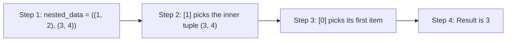

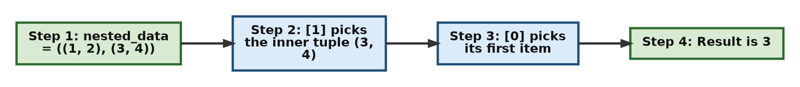

**Try this next**

Get the number `4` in two different ways, and unpack the whole nested tuple in one line.

```python
nested_data = ((1, 2), (3, 4))

# Step 1 - Positive indexes and negative indexes
print("nested_data[1][1]:  ", nested_data[1][1])
print("nested_data[-1][-1]:", nested_data[-1][-1])

# Step 2 - Nested unpacking: the shape on the left matches the shape of the data
(a, b), (c, d) = nested_data
print("a, b, c, d =", a, b, c, d)
```

```text
nested_data[1][1]:   4
nested_data[-1][-1]: 4
a, b, c, d = 1 2 3 4
```

[Back to the Table of Contents](#table-of-contents)

---

<a id="part-8"></a>
## Part 8: Tuples with Functions, Loops and match-case

The last three exercises show tuples working quietly inside everyday Python code: returning several values from a function, looping over a dictionary, and choosing what to do with `match`-`case`.

[Back to the Table of Contents](#table-of-contents)

<a id="q18"></a>
### Q18. Write a function that takes a tuple and returns its minimum value, maximum value, and total sum all at once. Call the function with the tuple (10, 20, 30) and unpack the results.

**Plan**

1. Define a function that takes a tuple of numbers.
2. Inside it, work out the minimum, maximum and sum, and return all three, separated by commas.
3. Call the function and look at what it actually returns.
4. Call it again and unpack the result into three variables.
5. Print the three variables.

**Script**

```python
# Step 1 - Define a function that returns three values at once
def analyze_sequence(numbers_tuple):
    """Return the smallest value, the largest value and the total of numbers_tuple."""
    return min(numbers_tuple), max(numbers_tuple), sum(numbers_tuple)

# Step 2 - Look at what the function actually returns
result = analyze_sequence((10, 20, 30))
print("Returned value:", result, "| type:", type(result))

# Step 3 - Call the function and unpack the returned tuple in one line
low, high, total = analyze_sequence((10, 20, 30))

# Step 4 - Print the separate variables
print("Min:", low, "| Max:", high, "| Total sum:", total)
```

**Output**

```text
Returned value: (10, 30, 60) | type: <class 'tuple'>
Min: 10 | Max: 30 | Total sum: 60
```

**How Python works: returning several values**

- **Line `return min(numbers_tuple), max(numbers_tuple), sum(numbers_tuple)`:** Strictly speaking, a Python function can return only one object.
- When you list several values separated by commas in a `return` statement, Python packs them into a **single tuple** behind the scenes. Step 2 proves this: the function returns `(10, 30, 60)`, and its type is `tuple`.
- **Line `low, high, total = analyze_sequence((10, 20, 30))`:** The calling code then unpacks that tuple straight into three separate variables. The first value goes to `low`, the second to `high`, and the third to `total`.
- The number of names on the left must match the number of values returned. With only two names, Python would raise `ValueError: too many values to unpack`.
- The line in triple quotes inside the function is a **docstring**. It describes what the function does. You can see it by running `help(analyze_sequence)`.
- `min()`, `max()` and `sum()` are built-in functions that work on any tuple or list of numbers.

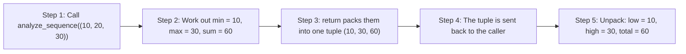

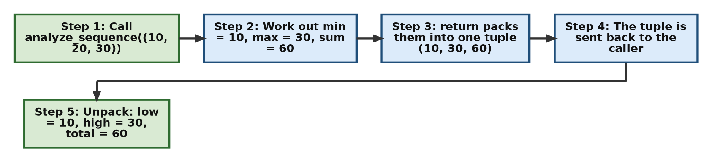

**Try this next**

Add the average to the function, and use `_` for a value you do not need.

```python
# Step 1 - The function now returns four values
def analyze_sequence(numbers_tuple):
    """Return the min, max, sum and average of numbers_tuple."""
    total = sum(numbers_tuple)
    average = total / len(numbers_tuple)
    return min(numbers_tuple), max(numbers_tuple), total, average

# Step 2 - Keep only what you need; '_' is a common name for "not needed"
low, high, _, average = analyze_sequence((10, 20, 30))
print("Min:", low, "| Max:", high, "| Average:", average)
```

```text
Min: 10 | Max: 30 | Average: 20.0
```

[Back to the Table of Contents](#table-of-contents)

<a id="q19"></a>
### Q19. Write a script that loops through the dictionary items `{"Alice": 85, "Bob": 92}` and automatically unpacks the keys and values during each pass of the loop.

**Plan**

1. Create the dictionary of grades.
2. Look at what `.items()` hands out on each pass of a loop.
3. Loop again, this time unpacking each pair straight into two loop variables, `name` and `score`.
4. Print the two variables on each pass.

**Script**

```python
# Step 1 - Build a dictionary of test scores
grades = {"Alice": 85, "Bob": 92}

# Step 2 - See what .items() gives on each pass: a (key, value) tuple
for pair in grades.items():
    print("Pair:", pair, "| type:", type(pair).__name__)

# Step 3 - Unpack each pair directly into two loop variables
for name, score in grades.items():
    # Step 4 - Print the two separate values
    print("Student name:", name, "| Exam grade:", score)
```

**Output**

```text
Pair: ('Alice', 85) | type: tuple
Pair: ('Bob', 92) | type: tuple
Student name: Alice | Exam grade: 85
Student name: Bob | Exam grade: 92
```

**How Python works: unpacking in a loop**

- **Line `for name, score in grades.items():`:** The `.items()` method gives the dictionary's contents as key-value pairs, one pair at a time. Each pair is a two-item tuple, such as `('Alice', 85)`. Step 2 shows this.
- (Strictly, `.items()` returns a **view object**, a live window into the dictionary, which hands out these tuples as the loop runs. See [Python docs: dictionary view objects](https://docs.python.org/3/library/stdtypes.html#dictionary-view-objects).)
- Because two names, `name` and `score`, are written after `for`, Python unpacks each tuple at the start of every pass. The key goes to `name` and the value goes to `score`.
- This saves you from pulling the items out by index yourself, as in `pair[0]` and `pair[1]`. The loop is shorter and much easier to read.
- The loop variables can have any names. `name` and `score` are chosen because they describe the data.

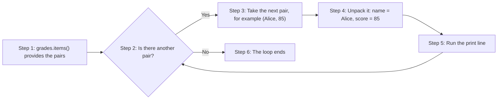

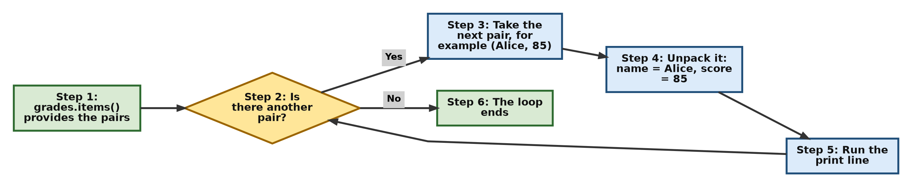

**Try this next**

Use the unpacked values to do some work: find the class average and the top scorer.

```python
grades = {"Alice": 85, "Bob": 92}

# Step 1 - Add up the scores while unpacking each pair
total = 0
top_name, top_score = None, -1
for name, score in grades.items():
    total += score
    if score > top_score:          # remember the highest score seen so far
        top_name, top_score = name, score

# Step 2 - Print the results
print("Class average:", total / len(grades))
print("Top scorer:", top_name, "with", top_score)
```

```text
Class average: 88.5
Top scorer: Bob with 92
```

[Back to the Table of Contents](#table-of-contents)

<a id="q20"></a>
### Q20. Write a script that uses a match-case statement to check the tuple variable status = (404, "Not Found") and print a custom message based on its contents.

**Plan**

1. Create the tuple `status = (404, "Not Found")`.
2. Write a `match` statement with one `case` for code `200` and one for code `404`.
3. In each case, capture the message text in a variable and print a custom message.
4. Add a final `case _` to handle anything else.

`match`-`case` needs **Python 3.10 or later**.

**Script**

```python
# Step 1 - Define the status tuple: (code, message)
status = (404, "Not Found")

# Step 2 - Choose what to do by comparing status with each pattern in turn
match status:
    case (200, message):
        print(f"Success content: {message}")
    case (404, message):
        # Step 3 - This case matches, and message holds "Not Found"
        print(f"Handled error message: {message}")
    case _:
        # Step 4 - The wildcard case catches anything the cases above did not match
        print("Unknown status:", status)
```

**Output**

```text
Handled error message: Not Found
```

**How Python works: `match`-`case` with tuples**

- **Line `match status:`** starts the statement. Python then compares `status` with each `case` pattern, from top to bottom.
- **Line `case (404, message):`** is a **sequence pattern**. For each case, Python checks the following:
  1. **The shape.** Is `status` a sequence with exactly two items? A sequence pattern like this matches tuples and lists (but not strings).
  2. **The fixed value.** Is the first item equal to the literal number `404`?
  3. **The capture.** If both checks pass, the second item is stored in the variable `message`, whatever it is.
- The first case fails at check 2, because `404` is not `200`. The second case passes, so `message` becomes `"Not Found"` and its code runs.
- Python runs only the **first** case that matches, then leaves the `match` statement.
- **Line `case _:`** uses the wildcard `_`, which matches anything. It is a good habit to include it as the last case, so that unexpected values do not pass by silently.

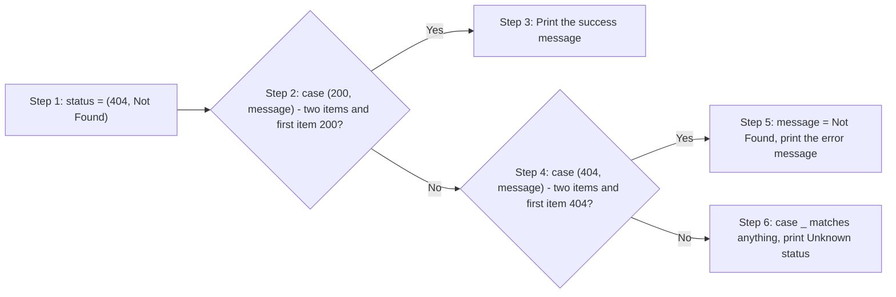

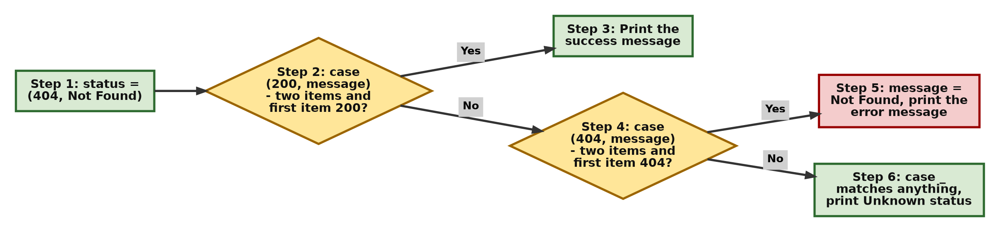

Read more in the [Python tutorial on match statements](https://docs.python.org/3/tutorial/controlflow.html#match-statements).

**Try this next**

Put the `match` inside a function and test several status values, including a list and a tuple of the wrong length. The third case below uses a **guard** (`if code >= 500`): the case matches only if the condition is also true.

```python
# Step 1 - A function that reacts to a (code, message) pair
def describe(status):
    match status:
        case (200, message):
            return f"Success content: {message}"
        case (404, message):
            return f"Handled error message: {message}"
        case (code, message) if code >= 500:
            return f"Server problem {code}: {message}"
        case _:
            return f"Unknown status: {status}"

# Step 2 - Try it with different values
print(describe((200, "OK")))
print(describe((404, "Not Found")))
print(describe((503, "Service Unavailable")))
print(describe([404, "Not Found"]))        # a list matches the same pattern
print(describe((404, "Not Found", "x")))   # three items: the two-item patterns do not fit
```

```text
Success content: OK
Handled error message: Not Found
Server problem 503: Service Unavailable
Handled error message: Not Found
Unknown status: (404, 'Not Found', 'x')
```

[Back to the Table of Contents](#table-of-contents)

---

<a id="quick-revision-summary"></a>
## Quick Revision Summary

| Task | Code | See |
| --- | --- | --- |
| Make a one-item tuple | `(5,)` (the comma is essential) | [Q1](#q1) |
| Make an empty tuple | `()` or `tuple()` | [Q1](#q1) |
| Pack and unpack | `t = "Data", 2026, True` then `a, b, c = t` | [Q2](#q2) |
| Changing an item | Not allowed: raises `TypeError` | [Q3](#q3) |
| Length, count, position | `len(t)`, `t.count(x)`, `t.index(x)` | [Q4](#q4) |
| "Add" an item | `t = t + (40,)` builds a new tuple | [Q5](#q5) |
| Slice a middle part | `t[2:4]` (the stop position is left out) | [Q6](#q6) |
| Every second item | `t[::2]` | [Q7](#q7) |
| Last item | `t[-1]` | [Q8](#q8) |
| Collect the rest | `first, *rest = t` (`rest` is a list) | [Q9](#q9) |
| Convert to a tuple | `tuple("hello")`, `tuple([1, 2])` | [Q10](#q10) |
| Dictionary keys or values | `tuple(d)`, `tuple(d.values())` | [Q11](#q11) |
| True or false | Empty is `False`; any non-empty tuple is `True` | [Q12](#q12) |
| Is a value present? | `x in t`, `x not in t` | [Q13](#q13) |
| Swap two variables | `t1, t2 = t2, t1` | [Q14](#q14) |
| Tuple as a dictionary key | Allowed if every item is hashable | [Q15](#q15) |
| Sort a tuple | `sorted(t)` returns a list; `tuple(sorted(t))` for a tuple | [Q16](#q16) |
| Nested item | `t[1][0]` | [Q17](#q17) |
| Return several values | `return a, b, c` returns one tuple | [Q18](#q18) |
| Loop over a dictionary | `for key, value in d.items():` | [Q19](#q19) |
| Pattern matching | `match t:` with `case (404, message):` | [Q20](#q20) |

[Back to the Table of Contents](#table-of-contents)

---

