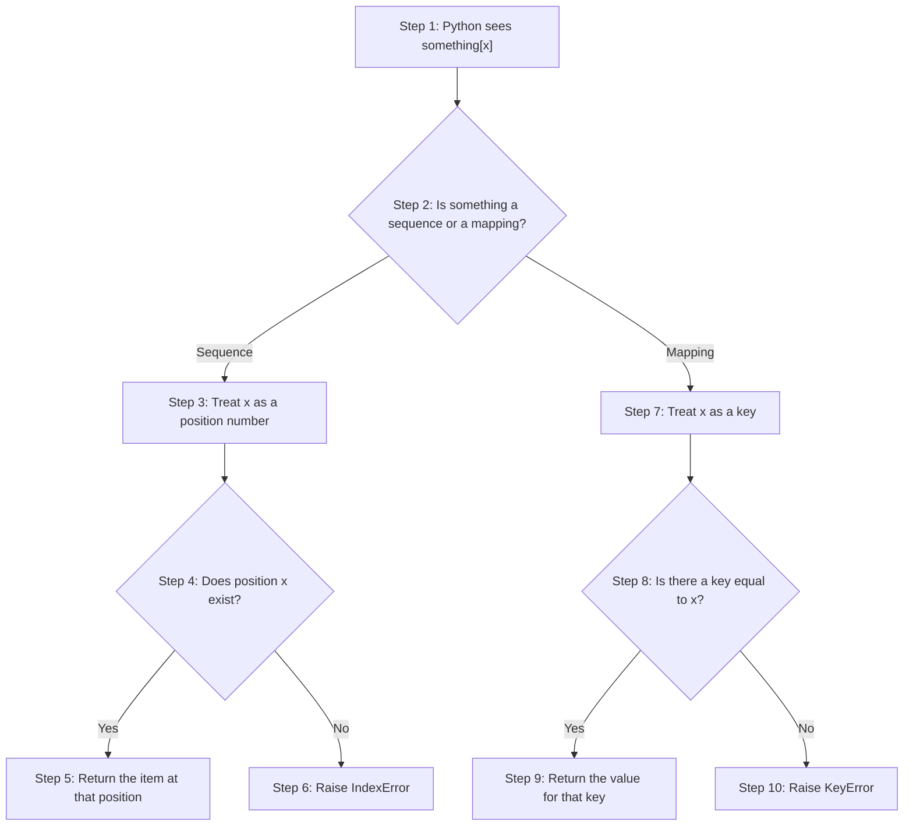
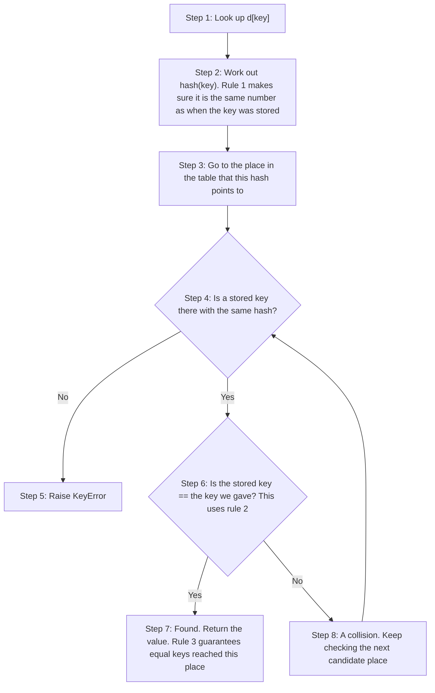
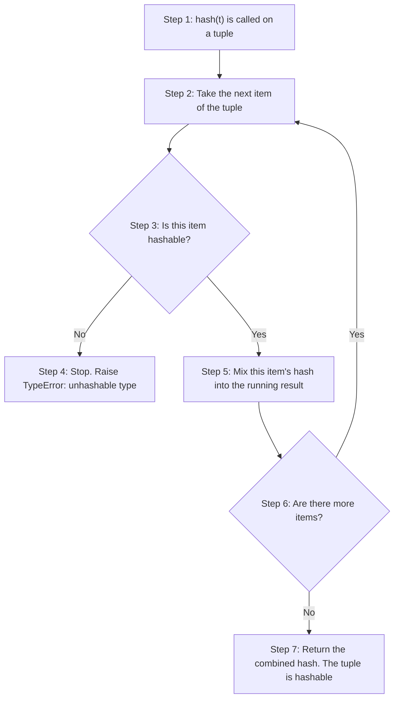
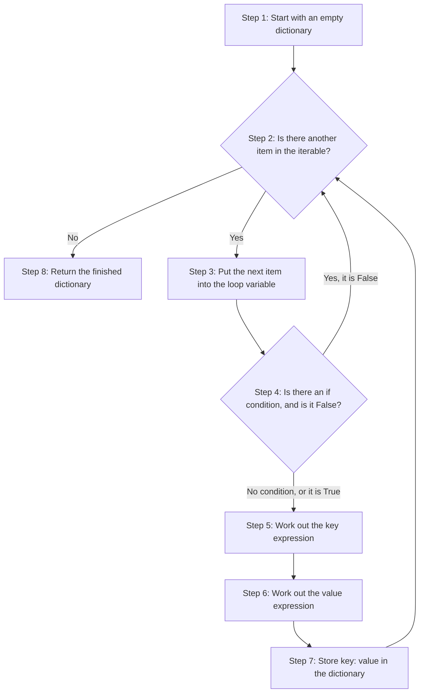
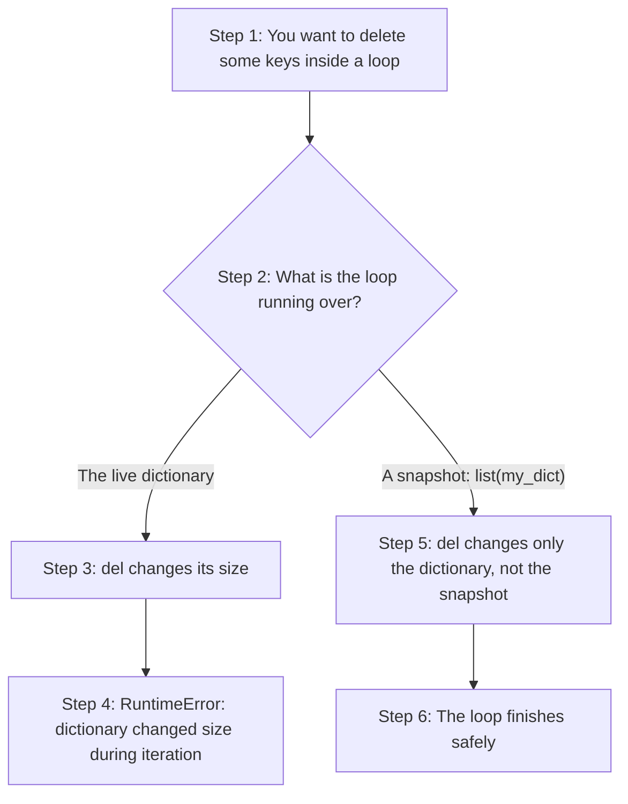
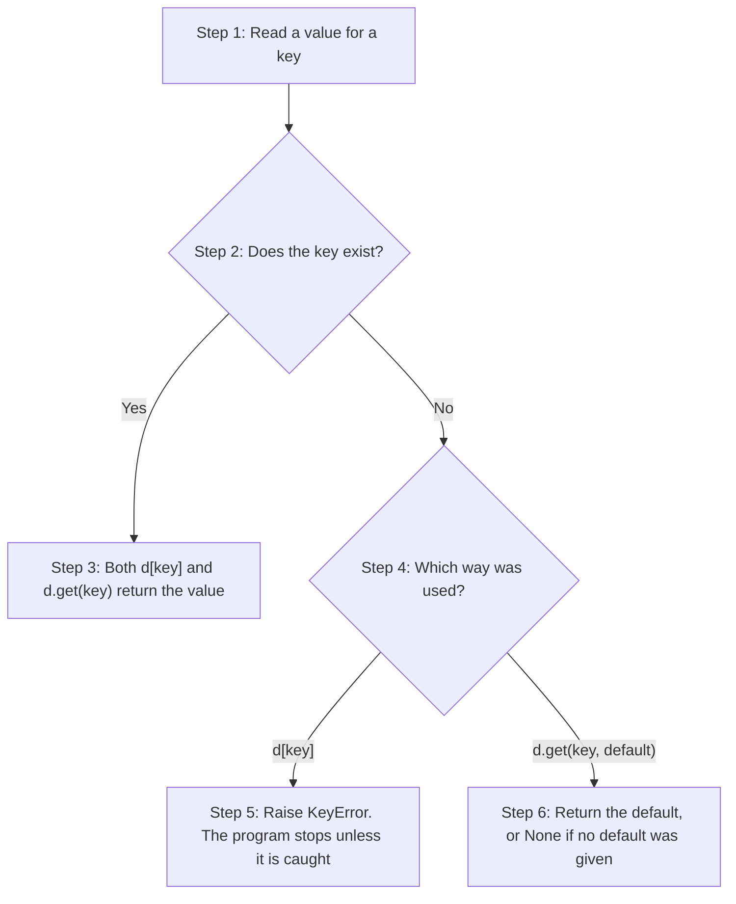
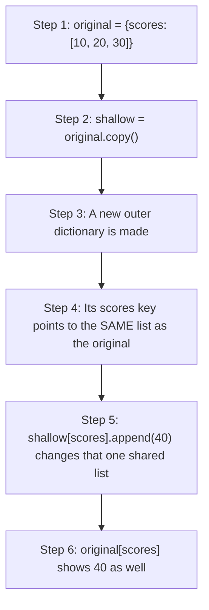

# Dictionaries in Python: Conceptual Questions and Answers

A dictionary is Python's built-in way of storing data as **key-value pairs**. Instead of finding a value by its position, as you do with a list, you find it by a meaningful label called a **key**. A phone book is a good picture of this: you look up a person's name (the key) to find their phone number (the value).

This page belongs to the chapter on **Tuples, Dictionaries and Sets**. The printed book shows how to create a dictionary, read and change its values, loop over it and use its common methods. This page takes twenty conceptual questions from the book and answers each one in depth. The answers explain not only *what* Python does with dictionaries but also *why* it works that way.

The page covers:

- what makes a dictionary different from a list or a tuple;
- why keys must be "hashable", and what that word means;
- the different ways to create a dictionary, including dictionary comprehensions;
- how to loop over a dictionary safely;
- view objects, and the most useful dictionary methods and operators.

Each answer explains the idea in plain language, breaks it into steps, and, where it helps, gives a short script with its output, a table or a flowchart. Many answers end with **follow-up questions** to test your understanding.

Dictionaries are one of the most used tools in Python. Settings files, data read from websites, records of students or products, word counts and much more are all naturally stored in dictionaries. Time spent understanding them well pays off in almost every program you write.

> **Tip:** Run the scripts yourself in IDLE, VS Code, Thonny or Google Colab, and then change the values to see what happens. You may also like the companion pages on tuples: [Tuples in Python: Conceptual Questions and Answers](50-ch19-tuples-conceptual-qa.md) and [Tuples in Python: Scripting Questions and Answers](70-ch19-tuples-scripting-qa.md).

## Table of Contents

- [Key Terms Used on This Page](#key-terms)
- [Part 1: What a Dictionary Is](#part-1)
  - [Q1. What makes a dictionary a "mapping" rather than a "sequence," and how does this affect the way you access its elements?](#q1)
  - [Q2. Contrast dictionaries and lists on: (a) access method, (b) lookup time, (c) when you would prefer one over the other.](#q2)
- [Part 2: Keys and Hashing](#part-2)
  - [Q3. Dictionaries are mutable, yet their keys must be immutable. Explain this apparent contradiction, and list which built-in types can/cannot be used as keys.](#q3)
  - [Q4. What is a "hashable" object? State the three formal criteria an object must satisfy to be considered hashable.](#q4)
  - [Q5. What happens when you call `hash()` on a mutable object like a list? Why does Python enforce this restriction?](#q5)
  - [Q6. Why does `hash("apple")` return the same value every time within one Python program run, but a different value if you restart Python or run it on another machine?](#q6)
  - [Q7. Tuples are described as "conditionally hashable." Explain what this means, with one example each of a hashable and an unhashable tuple.](#q7)
- [Part 3: Creating Dictionaries](#part-3)
  - [Q8. Name and briefly describe the three ways to create a dictionary in Python. Give one example use-case for each.](#q8)
  - [Q9. `dict.fromkeys()` is a special case among dictionary-creation methods. Explain what it does, its two parameters, and when you would reach for it over the other creation methods.](#q9)
  - [Q10. Write out the general syntax of a dictionary comprehension and identify its four mandatory components plus the one optional component.](#q10)
  - [Q11. List and explain four common beginner pitfalls when writing dictionary comprehensions.](#q11)
- [Part 4: Traversing Dictionaries](#part-4)
  - [Q12. What are the three ways to traverse (iterate over) a dictionary, and when would you use each? Why is `.items()` considered the most Pythonic choice?](#q12)
  - [Q13. Since Python 3.7, dictionaries preserve insertion order. Does this mean a dictionary has become a sequence? Explain, and describe how this order-preservation affects traversal output.](#q13)
  - [Q14. What error occurs if you try to delete a key from a dictionary while directly looping over it, and what is the recommended safe technique to avoid it?](#q14)
- [Part 5: View Objects](#part-5)
  - [Q15. What is a dictionary "view object"? Name the three methods that return one, and describe two defining properties that distinguish it from a list.](#q15)
  - [Q16. Using the "window vs. photograph" analogy, explain the practical difference between working with a view object and working with a list derived from it.](#q16)
- [Part 6: Operators and Methods](#part-6)
  - [Q17. (a) Explain the behaviour of `len()`, the `in` operator, and `==` when applied to a dictionary, and (b) explain the difference between comparing two dictionaries with `==` versus `is`.](#q17)
  - [Q18. Why is `dict.get(key, default)` generally preferred over `dict[key]` for reading values? Illustrate with what happens for a missing key in each case.](#q18)
  - [Q19. Compare `update()`, `pop()`, `setdefault()`, and `clear()` in terms of what each does, what each returns, and whether each modifies the original dictionary.](#q19)
  - [Q20. What does `dict.copy()` actually copy, and why is it described as a "shallow" copy? Give an example showing where this limitation causes unexpected behaviour.](#q20)
- [Quick Revision Summary](#quick-revision-summary)

<a id="key-terms"></a>
## Key Terms Used on This Page

| Term | Simple meaning | Learn more |
| --- | --- | --- |
| Key-value pair | One entry in a dictionary: a key (the label) joined to a value (the data). In `{"name": "Asha"}`, `"name"` is the key and `"Asha"` is the value. | [Python tutorial: Dictionaries](https://docs.python.org/3/tutorial/datastructures.html#dictionaries) |
| Container | Any object that holds other objects, such as a list, tuple, set or dictionary. | [Python docs: Built-in types](https://docs.python.org/3/library/stdtypes.html) |
| Sequence | An ordered container whose items are reached by a numbered position (index). Strings, lists and tuples are sequences. | [Glossary: sequence](https://docs.python.org/3/glossary.html#term-sequence) |
| Mapping | A container that links keys to values. You reach a value through its key, not its position. A dictionary is a mapping. | [Glossary: mapping](https://docs.python.org/3/glossary.html#term-mapping) |
| Mutable / Immutable | Mutable objects can be changed after they are made (lists, dictionaries, sets). Immutable objects cannot (numbers, strings, tuples). | [Glossary: mutable](https://docs.python.org/3/glossary.html#term-mutable) |
| Hash value | A whole number that Python works out from an object with the `hash()` function. Dictionaries use it to decide where to store each key. | [Python docs: hash()](https://docs.python.org/3/library/functions.html#hash) |
| Hashable | An object whose hash value never changes. Only hashable objects can be dictionary keys or set members. | [Glossary: hashable](https://docs.python.org/3/glossary.html#term-hashable) |
| Hash table | The way a dictionary is organised inside the computer. It uses hash values to jump almost straight to the right place, instead of searching item by item. | [Wikipedia: Hash table](https://en.wikipedia.org/wiki/Hash_table) |
| Big-O notation, O(1), O(n) | A way of describing how the work grows as the data grows. O(1) means "about the same time, however big the data". O(n) means "time grows in step with the number of items". | [Wikipedia: Big O notation](https://en.wikipedia.org/wiki/Big_O_notation) |
| Iterable | Anything you can loop over with `for`. | [Glossary: iterable](https://docs.python.org/3/glossary.html#term-iterable) |
| View object | A live window into a dictionary's keys, values or items, returned by `.keys()`, `.values()` and `.items()`. | [Python docs: Dictionary view objects](https://docs.python.org/3/library/stdtypes.html#dictionary-view-objects) |
| Comprehension | A short, one-line way to build a list, set or dictionary from a loop. | [Python tutorial: Dictionaries](https://docs.python.org/3/tutorial/datastructures.html#dictionaries) |
| Exception | An error, such as `KeyError` or `TypeError`, that stops the program unless it is caught with `try` and `except`. | [Python tutorial: Errors and exceptions](https://docs.python.org/3/tutorial/errors.html) |

> **Note on the scripts:** Several scripts use `try` and `except` to catch an error and print its message. This lets the rest of the script keep running, so you can see the error and the other results together.

[Back to the Table of Contents](#table-of-contents)

---

<a id="part-1"></a>
## Part 1: What a Dictionary Is

This part explains how a dictionary differs from the sequences you already know (strings, lists and tuples), and when to choose a dictionary over a list.

[Back to the Table of Contents](#table-of-contents)

<a id="q1"></a>
### Q1. What makes a dictionary a "mapping" rather than a "sequence," and how does this affect the way you access its elements?

**Answer**

- A dictionary is a **container**: it groups many values together. But unlike a list, string or tuple, it is **not a sequence**.
- A **sequence** stores items in a fixed, numbered order. You get an item by its position number, called its **index**, for example `my_list[0]`.
- A dictionary stores data as **key-value pairs**. You get a value by giving its **key**, for example `my_dict['name']`, not by giving a position. A container that works this way is called a **mapping**, because it "maps" (links) each key to a value.
- So every sequence is a container, but not every container is a sequence. Dictionaries belong to the group "container, but not a sequence".
- In practice, this means `my_dict[0]` does **not** fetch the "first item". It looks for a key that is the whole number `0`. If `0` is a key, you get its value. If it is not, Python raises a `KeyError`, not an `IndexError`.
- This is one of the most common early mistakes when students move from lists to dictionaries.

**How Python reads `something[x]`, step by step**

1. Python checks what kind of object `something` is.
2. If it is a **sequence** (such as a list), `x` must be a whole number. Python goes to position `x`. If there is no such position, it raises `IndexError`.
3. If it is a **mapping** (a dictionary), `x` can be any hashable value. Python looks for a key equal to `x`. If there is no such key, it raises `KeyError`.



In this chart, steps 3 to 6 are the sequence branch and steps 7 to 10 are the mapping branch.

**Script: position versus key**

```python
# Step 1 - A list (a sequence) and a dictionary (a mapping)
fruits_list = ["apple", "banana"]
student = {"name": "Asha", "age": 15}

# Step 2 - A list is read by position
print("fruits_list[0]:", fruits_list[0])

# Step 3 - A dictionary is read by key
print("student['name']:", student["name"])

# Step 4 - Asking a dictionary for [0] looks for the KEY 0, which does not exist
try:
    print(student[0])
except KeyError as error:
    print("student[0] -> KeyError:", error)

# Step 5 - Asking a list for a position that does not exist gives IndexError
try:
    print(fruits_list[5])
except IndexError as error:
    print("fruits_list[5] -> IndexError:", error)

# Step 6 - If 0 really is a key, [0] works
rank_names = {0: "first", 1: "second"}
print("rank_names[0]:", rank_names[0])
```

Output:

```text
fruits_list[0]: apple
student['name']: Asha
student[0] -> KeyError: 0
fruits_list[5] -> IndexError: list index out of range
rank_names[0]: first
```

Note that the message of a `KeyError` is simply the key that was not found, here `0`.

**Sequence and mapping at a glance**

| | Sequence (list, tuple, string) | Mapping (dictionary) |
| --- | --- | --- |
| How data is stored | Items in numbered positions | Key-value pairs |
| How you read an item | By position: `x[0]` | By key: `d["name"]` |
| Missing position or key | `IndexError` | `KeyError` |
| Slicing such as `[1:3]` | Allowed | Not allowed |

**Follow-up question 1.1: Can you slice a dictionary, as in `student[0:2]`?**

No. Slicing needs numbered positions, which a dictionary does not have. Python treats `0:2` as a key and looks for it. In Python 3.11 and earlier, `student[0:2]` raises `TypeError: unhashable type: 'slice'`. From Python 3.12 onwards it raises `KeyError: slice(0, 2, None)`, because there is no such key. Either way, it does not work. If you need the first two entries, convert first: `list(student.items())[:2]`.

[Back to the Table of Contents](#table-of-contents)

<a id="q2"></a>
### Q2. Contrast dictionaries and lists on: (a) access method, (b) lookup time, (c) when you would prefer one over the other.

**Answer**

**(a) Access method**

- A **list** is a sequence. You reach an item by its numbered position (index), as in `scores[0]`.
- A **dictionary** is a mapping. You reach a value by its unique key, as in `marks["Asha"]`.

**(b) Lookup time**

- To find a value **by its content** in a list (for example, "is 97 in this list?"), Python must check the items one at a time from the start. This is called a **linear search**. The time it takes grows with the length of the list. In Big-O notation this is written **O(n)**, where *n* is the number of items.
- A dictionary finds a key using an internal **hash table**. Python works out the key's hash value and uses it to jump almost straight to the right place. On average this takes about the same time however many items the dictionary holds. This is written **O(1)**, read as "constant time".
- The words "on average" matter. In rare cases, several keys can land in the same place (a **collision**) and Python has to do a little extra work. In everyday use, dictionary lookups are very fast.

**(c) When to prefer one over the other**

- Use a **list** when the order of the items matters and you will work through them one after another. For example: a list of exam scores in the order they were recorded.
- Use a **dictionary** when you need to look up a value by a meaningful label, not by position. For example: looking up a student's marks by their name.
- A useful rule of thumb: if you find yourself using a list index just as a name tag (such as `scores[0]` meaning "Alice's score"), that is usually a sign that a dictionary would be a better fit.

**Summary table**

| Point | List | Dictionary |
| --- | --- | --- |
| Type | Sequence | Mapping |
| Access | By position: `scores[0]` | By key: `marks["Asha"]` |
| Finding a value by content | Checks items one by one: O(n) | Finds a key directly via hashing: O(1) on average |
| Order | Order is the whole point | Keeps insertion order, but you do not use it to look things up |
| Duplicates | Any value can appear many times | Keys must be unique; values may repeat |
| Best for | Ordered collections processed in turn | Looking up data by a label |

**Script: the difference in lookup speed**

```python
import timeit     # standard module for timing small pieces of code

# Step 1 - Build a list and a dictionary with the same 100,000 numbers
n = 100_000
numbers_list = list(range(n))
numbers_dict = dict.fromkeys(numbers_list)   # the numbers become the keys

# Step 2 - Search for the LAST number, which is the worst case for the list
target = n - 1

# Step 3 - Time 1,000 searches in each
list_time = timeit.timeit(lambda: target in numbers_list, number=1_000)
dict_time = timeit.timeit(lambda: target in numbers_dict, number=1_000)

# Step 4 - Print the results
print(f"List search:       {list_time:.4f} seconds")
print(f"Dictionary search: {dict_time:.6f} seconds")
print(f"The dictionary was roughly {list_time / dict_time:,.0f} times faster")
```

Output (the times will be different on your computer, but the dictionary will always be far faster):

```text
List search:       0.5505 seconds
Dictionary search: 0.000040 seconds
The dictionary was roughly 13,596 times faster
```

In Step 3, `lambda: target in numbers_list` is a tiny one-line function that `timeit` can run again and again. See the [Python docs for timeit](https://docs.python.org/3/library/timeit.html). The standard [Python TimeComplexity page](https://wiki.python.org/moin/TimeComplexity) lists the speed of many list and dictionary operations.

**Follow-up question 2.1: Is reading `my_list[5]` by position also slow?**

No. Reading by **position** is fast for a list too (O(1)), because Python can calculate exactly where position 5 is. The slow case is searching a list by **content**, as with `97 in my_list` or `my_list.index(97)`.

[Back to the Table of Contents](#table-of-contents)

---

<a id="part-2"></a>
## Part 2: Keys and Hashing

Every rule about dictionary keys comes from one idea: the hash value. This part explains what a hash value is, why keys must be hashable, and which types qualify.

[Back to the Table of Contents](#table-of-contents)

<a id="q3"></a>
### Q3. Dictionaries are mutable, yet their keys must be immutable. Explain this apparent contradiction, and list which built-in types can/cannot be used as keys.

**Answer**

- There is no real contradiction. Mutability applies at **two different levels**.
- **The dictionary as a whole is mutable.** You can add, remove or update key-value pairs after it has been created, without building a new dictionary.
- **Each key inside it must be immutable** (or, to be more precise, **hashable**). The reason is how a dictionary finds its entries. When a key is inserted, Python works out the key's hash value and uses it to decide where to store the entry in its internal hash table. When you later look the key up, Python works out the hash again and goes to that same place.
- If a key's contents could change after it was stored, its hash value would also change. Python would then look in the wrong place and fail to find the entry, even though it is still there. Lookups would break without any warning.
- **Values have no such restriction.** Python never needs to hash a value, so values can be of any type: mutable or immutable, simple or deeply nested.

**Which built-in types can be keys?**

| Can be a key (hashable) | Cannot be a key (unhashable) |
| --- | --- |
| `int`, for example `42` | `list`, for example `[1, 2]` |
| `float`, for example `3.14` | `dict`, for example `{"a": 1}` |
| `str`, for example `"name"` | `set`, for example `{1, 2}` |
| `bool`, that is `True` and `False` | |
| `None` | |
| `tuple`, **only if** all its items are hashable (see [Q7](#q7)) | |
| `frozenset`, an unchangeable version of a set | |

`list`, `dict` and `set` cannot be keys because all three are mutable, and so they are unhashable.

**Script: the two levels of mutability**

```python
# Step 1 - Create a dictionary with keys of several hashable types
d = {1: "int key", "a": "str key", (1, 2): "tuple key", None: "None key"}
print("Start:", d)

# Step 2 - The dictionary itself can change: add, update and remove entries
d["new"] = "added"
d[1] = "updated"
del d[None]
print("After changes:", d)

# Step 3 - Values can be anything, including mutable lists and dictionaries
d["scores"] = [90, 85]
d["address"] = {"city": "Ranchi"}
print("Mutable values are fine:", d["scores"], d["address"])

# Step 4 - But a mutable KEY is refused
try:
    d[[1, 2]] = "list key"
except TypeError as error:
    print("List as a key -> TypeError:", error)
```

Output (Python 3.10 to 3.13):

```text
Start: {1: 'int key', 'a': 'str key', (1, 2): 'tuple key', None: 'None key'}
After changes: {1: 'updated', 'a': 'str key', (1, 2): 'tuple key', 'new': 'added'}
Mutable values are fine: [90, 85] {'city': 'Ranchi'}
List as a key -> TypeError: unhashable type: 'list'
```

In Python 3.14 and later, the last message reads `cannot use 'list' as a dict key (unhashable type: 'list')`.

**Follow-up question 3.1: If I need a list-like key, what can I do?**

Convert the list to a tuple first. `d[tuple([1, 2])] = "value"` works, because `(1, 2)` is hashable. For a set, use `frozenset({1, 2})`.

[Back to the Table of Contents](#table-of-contents)

<a id="q4"></a>
### Q4. What is a "hashable" object? State the three formal criteria an object must satisfy to be considered hashable.

**Answer**

A **hashable** object is one that has a fixed whole-number "hash value" that never changes during its lifetime. You can see this value with Python's built-in `hash()` function, for example `hash("apple")`.

Formally, an object must meet three conditions:

1. **Fixed hash value.** Its hash value must stay the same every time `hash()` is called on it during a single program run.
2. **Equality support.** It must be possible to compare it with other objects using `==`.
3. **Equality and hashing must agree.** If two objects are equal (`a == b`), their hash values must also be equal (`hash(a) == hash(b)`).

- The third rule is the most important one. It is what lets a dictionary recognise "the same key" even when you give it a **different object** with an equal value. For example, a key stored as `"apple"` can be found with another string `"apple"` built somewhere else in the program.
- Only hashable objects are allowed as dictionary keys (and as set members), because Python relies on the hash value to place and find keys quickly in its hash table.
- Note that the rule works in one direction only. Equal objects must have equal hashes, but two **different** objects are allowed to have the same hash by chance. This is called a **collision**, and Python handles it by then checking the keys with `==`.

**How a dictionary uses the three rules to find a key**



This picture is simplified, but it shows why each rule is needed.

**Script: seeing the rules in action**

```python
# Step 1 - Rule 1: the same object gives the same hash every time in one run
print("hash('apple') twice equal?", hash("apple") == hash("apple"))

# Step 2 - Rule 3: two equal strings built in different ways have equal hashes
word1 = "apple"
word2 = "".join(["ap", "ple"])        # builds a separate string object
print("word1 == word2:", word1 == word2)
print("word1 is word2:", word1 is word2)
print("Equal hashes?  ", hash(word1) == hash(word2))

# Step 3 - So a key stored with one object can be found with the other
prices = {word1: 40}
print("Look up with word2:", prices[word2])

# Step 4 - Rule 3 across types: 1, 1.0 and True are all equal, so their hashes are equal
print("1 == 1.0 == True:", 1 == 1.0 == True)
print("Equal hashes?    ", hash(1) == hash(1.0) == hash(True))
```

Output:

```text
hash('apple') twice equal? True
word1 == word2: True
word1 is word2: False
Equal hashes?   True
Look up with word2: 40
1 == 1.0 == True: True
Equal hashes?     True
```

**Follow-up question 4.1: What does `{1: "a", 1.0: "b", True: "c"}` give?**

It gives `{1: 'c'}`. Since `1`, `1.0` and `True` are all equal and have equal hashes, Python treats them as **the same key**. The first one written, `1`, stays as the key, and each later entry just replaces the value. The last value written, `"c"`, is the one that survives.

[Back to the Table of Contents](#table-of-contents)

<a id="q5"></a>
### Q5. What happens when you call `hash()` on a mutable object like a list? Why does Python enforce this restriction?

**Answer**

Calling `hash()` on a mutable object such as a list, set or dictionary raises a `TypeError`, for example `TypeError: unhashable type: 'list'`.

The same error occurs if you try to use such an object directly as a dictionary key, because Python hashes a key the moment it is inserted.

**Why does Python enforce this?**

1. A mutable object can change its contents after it is created. A list's items can be added, removed or replaced at any time.
2. If a list were allowed as a key, Python would store it in the place that matches its hash value **at that moment**.
3. If the list later changed, its hash value would change too.
4. Python would then look in the wrong place and could not find the entry. The entry would be effectively "lost", or lookups would give inconsistent results.
5. By refusing mutable types as keys altogether, Python guarantees that every key's hash value, and so its position inside the dictionary, stays stable for as long as the key is in the dictionary.

**Script: hashing mutable and immutable objects**

```python
# Step 1 - Immutable built-in objects can be hashed
for value in (42, "apple", (1, 2)):
    print(f"hash({value!r}) works")

# Step 2 - Mutable built-in objects cannot
for value in ([1, 2], {1, 2}, {"a": 1}):
    try:
        hash(value)
    except TypeError as error:
        print(f"hash({value!r}) -> TypeError: {error}")
```

Output:

```text
hash(42) works
hash('apple') works
hash((1, 2)) works
hash([1, 2]) -> TypeError: unhashable type: 'list'
hash({1, 2}) -> TypeError: unhashable type: 'set'
hash({'a': 1}) -> TypeError: unhashable type: 'dict'
```

In the f-strings, `{value!r}` prints the value the way it would appear in code, with quotes around strings.

**Follow-up question 5.1: Imagine lists were allowed as keys. What exactly would go wrong?**

Suppose `key = [1, 2]` were stored in `d = {key: "x"}`. Its hash would be based on `[1, 2]`. Now run `key.append(3)`. The list is now `[1, 2, 3]` and would have a different hash. Asking for `d[[1, 2, 3]]` would look in the new place and find nothing. Asking for `d[[1, 2]]` would look in the old place, find the stored key, compare it with `==`, see `[1, 2, 3] != [1, 2]`, and also fail. The entry would still be inside the dictionary, but no one could reach it. Python's rule prevents this confusing situation from ever arising.

**Follow-up question 5.2: Are all mutable objects unhashable?**

For the built-in types, yes. Objects of classes that you write yourself are a special case: by default they are hashable, and their hash is based on the object's identity (which object it is), not on its contents. This is covered with classes in a later chapter.

[Back to the Table of Contents](#table-of-contents)

<a id="q6"></a>
### Q6. Why does `hash("apple")` return the same value every time within one Python program run, but a different value if you restart Python or run it on another machine?

**Answer**

- **Within one run, `hash()` gives the same answer.** Inside a single running Python program (a **process**), calling `hash("apple")` again and again always returns the identical whole number. The hashing method and its internal starting value, called the **seed**, do not change while the program is running. This is exactly what Rule 1 in [Q4](#q4) requires.
- **A new run picks a new seed.** Each time a new Python process starts, Python uses a security feature called **hash randomisation**. It picks a new random seed for its string-hashing method when the interpreter starts. So `hash("apple")` in one run of a script can differ from the value in the next run, or on a different machine.
- **Why do this on purpose?** It stops attackers from working out hash values in advance. Without it, an attacker could send a web program thousands of specially chosen strings that all have the same hash. Every one of them would then collide in the same place in the hash table, and dictionary and set operations would slow down from O(1) to O(n). This could be used to overload a server, which is called a **denial-of-service (DoS) attack**. See [Wikipedia: Denial-of-service attack](https://en.wikipedia.org/wiki/Denial-of-service_attack).

A few more points worth knowing:

- Randomisation applies to **strings and bytes**, and to tuples that contain them. The hash of a small whole number, such as `hash(42)`, is `42` in every run.
- The seed can be fixed by setting the environment variable `PYTHONHASHSEED` before Python starts. This is sometimes done when testing, so that results can be repeated. See the [Python docs for PYTHONHASHSEED](https://docs.python.org/3/using/cmdline.html#envvar-PYTHONHASHSEED).
- Because hash values can change between runs, you should never save a hash value to a file and expect it to match in a later run.

**Script: hash values across different runs**

```python
import os
import subprocess
import sys

def hash_in_new_run(expression, seed=None):
    """Start a brand-new Python process, print hash(expression) there, and return the result."""
    env = dict(os.environ)                     # copy of the current environment settings
    if seed is not None:
        env["PYTHONHASHSEED"] = str(seed)      # fix the seed for this run only
    result = subprocess.run(
        [sys.executable, "-c", f"print(hash({expression}))"],
        capture_output=True, text=True, env=env,
    )
    return int(result.stdout)

# Step 1 - Within this one run, the hash never changes
print("Same run, same hash?        ", hash("apple") == hash("apple"))

# Step 2 - Two new runs with different seeds give different string hashes
run_a = hash_in_new_run('"apple"', seed=1)
run_b = hash_in_new_run('"apple"', seed=2)
print("Different seeds, same hash? ", run_a == run_b)

# Step 3 - Two new runs with the same seed give the same string hash
run_c = hash_in_new_run('"apple"', seed=1)
print("Same seed, same hash?       ", run_a == run_c)

# Step 4 - Small whole numbers are not randomised
print("hash(42) in a new run:      ", hash_in_new_run("42", seed=1), hash_in_new_run("42", seed=2))
```

Output:

```text
Same run, same hash?         True
Different seeds, same hash?  False
Same seed, same hash?        True
hash(42) in a new run:       42 42
```

A note on the script: `subprocess.run()` starts a separate Python program, just as if you had started Python again. `sys.executable` is the path of the Python program you are using now. Setting `PYTHONHASHSEED` to different numbers imitates what happens naturally when Python picks a random seed at each start.

**Follow-up question 6.1: Does this randomisation make dictionaries unreliable?**

No. Inside one run, every key keeps the same hash, so every lookup works. The randomisation only means that the internal layout of the hash table can differ from run to run. Since Python 3.7, the order in which a dictionary **shows** its keys is always the insertion order, so even printed output is not affected.

[Back to the Table of Contents](#table-of-contents)

<a id="q7"></a>
### Q7. Tuples are described as "conditionally hashable." Explain what this means, with one example each of a hashable and an unhashable tuple.

**Answer**

- Unlike `int`, `float` or `str`, which are always hashable, a tuple is hashable **if and only if every item it contains is itself hashable**.
- This is because Python works out a tuple's hash value by combining the hash values of all its items. If even one item is unhashable (for example, a list), the tuple as a whole cannot be hashed either.
- **Hashable example:** `(1, 2, "hello")`. Whole numbers and strings are hashable, so this tuple can safely be used as a dictionary key.
- **Unhashable example:** `(1, 2, [3, 4])`. It contains a list. Running `hash((1, 2, [3, 4]))`, or using the tuple as a dictionary key, raises `TypeError: unhashable type: 'list'`.
- This is what sets tuples apart from the always-hashable simple types `int`, `float` and `str`. It is also a favourite trick question, because students often assume that "tuple" always means "hashable".
- The check goes all the way down. A tuple inside a tuple is checked item by item too, so `(1, (2, [3]))` is also unhashable.

**How Python decides, step by step**



**Script: hashable and unhashable tuples**

```python
# Step 1 - A tuple of numbers and a string: hashable
good = (1, 2, "hello")
print("hash(good) works:", isinstance(hash(good), int))

# Step 2 - It can be a dictionary key
lookup = {good: "stored"}
print("lookup[good]:", lookup[good])

# Step 3 - A tuple that contains a list: can be created, but not hashed
bad = (1, 2, [3, 4])
print("Created bad:", bad)
try:
    hash(bad)
except TypeError as error:
    print("hash(bad) -> TypeError:", error)

# Step 4 - Fix: change the inner list into a tuple
fixed = (1, 2, tuple([3, 4]))
print("fixed:", fixed, "| hashable:", isinstance(hash(fixed), int))
```

Output:

```text
hash(good) works: True
lookup[good]: stored
Created bad: (1, 2, [3, 4])
hash(bad) -> TypeError: unhashable type: 'list'
fixed: (1, 2, (3, 4)) | hashable: True
```

For more on this, see [Q13 on the tuples conceptual page](50-ch19-tuples-conceptual-qa.md#q13).

**Follow-up question 7.1: Is `frozenset` also conditionally hashable?**

No. A `frozenset` can only hold hashable items in the first place (like any set), so every frozenset is hashable. The "conditional" case is special to tuples, because a tuple is allowed to hold anything, including lists.

[Back to the Table of Contents](#table-of-contents)

---

<a id="part-3"></a>
## Part 3: Creating Dictionaries

There is more than one way to build a dictionary. This part compares them and looks closely at dictionary comprehensions, including the mistakes beginners most often make with them.

[Back to the Table of Contents](#table-of-contents)

<a id="q8"></a>
### Q8. Name and briefly describe the three ways to create a dictionary in Python. Give one example use-case for each.

**Answer**

Python offers three main ways to build a dictionary.

1. **Dictionary literals, using curly braces `{}`.** This is the most common and most readable way. You write out the key-value pairs directly, for example `user_profile = {"name": "Alice", "age": 30}`. It is best when you already know the exact keys and values while writing the code, such as a fixed settings dictionary.
2. **The `dict()` constructor.** This is useful when you are converting existing data into a dictionary. For example, you can turn a list of two-item tuples into a dictionary with `dict(pairs)`, or build one from keyword arguments, as in `dict(x=10, y=20)`. It suits dictionaries that are built by the program as it runs, for example from data read out of a file. (A **constructor** is a function that constructs, or builds, a new object of a type.)
3. **Dictionary comprehensions.** This is a short, one-line way to turn an iterable into a dictionary, as in `{x: x**2 for x in range(5)}`. It is ideal when the keys or values must be **worked out** by applying a formula or a filter to existing data, rather than typed out by hand.

A fourth, more specialised way, `dict.fromkeys()`, is covered in [Q9](#q9).

**Summary table**

| Way | Example | Result | Best used when |
| --- | --- | --- | --- |
| Literal `{}` | `{"name": "Alice", "age": 30}` | `{'name': 'Alice', 'age': 30}` | You know the keys and values while writing the code |
| `dict()` from pairs | `dict([("a", 1), ("b", 2)])` | `{'a': 1, 'b': 2}` | You are converting existing paired data |
| `dict()` with keywords | `dict(x=10, y=20)` | `{'x': 10, 'y': 20}` | Keys are simple names; saves typing quotes |
| `dict()` with `zip()` | `dict(zip(["a", "b"], [1, 2]))` | `{'a': 1, 'b': 2}` | Keys and values are in two separate lists |
| Comprehension | `{x: x**2 for x in range(5)}` | `{0: 0, 1: 1, 2: 4, 3: 9, 4: 16}` | Keys or values are calculated from other data |

**Script: three ways, step by step**

```python
# Step 1 - A dictionary literal: pairs typed out directly
user_profile = {"name": "Alice", "age": 30}
print("Literal:          ", user_profile)

# Step 2a - dict() from a list of (key, value) pairs
pairs = [("apple", 40), ("banana", 10)]
prices = dict(pairs)
print("dict(pairs):      ", prices)

# Step 2b - dict() from keyword arguments (the keys become strings)
point = dict(x=10, y=20)
print("dict(x=10, y=20): ", point)

# Step 2c - dict() with zip(), which pairs up items from two lists
names = ["Asha", "Ravi"]
marks = [91, 82]
print("dict(zip(...)):   ", dict(zip(names, marks)))

# Step 3 - A dictionary comprehension: values worked out by a formula
squares = {x: x**2 for x in range(5)}
print("Comprehension:    ", squares)
```

Output:

```text
Literal:           {'name': 'Alice', 'age': 30}
dict(pairs):       {'apple': 40, 'banana': 10}
dict(x=10, y=20):  {'x': 10, 'y': 20}
dict(zip(...)):    {'Asha': 91, 'Ravi': 82}
Comprehension:     {0: 0, 1: 1, 2: 4, 3: 9, 4: 16}
```

**Follow-up question 8.1: What is the limitation of `dict(x=10, y=20)`?**

The keys must be valid Python names, and they always become strings. You cannot write `dict(1=10)` or `dict(first name="Asha")`, because `1` and `first name` are not valid names. In such cases use a literal: `{1: 10, "first name": "Asha"}`.

**Follow-up question 8.2: Do `{}` and `dict()` both give an empty dictionary?**

Yes. Both create an empty dictionary. Note that `{}` gives an empty **dictionary**, not an empty set. For an empty set you must write `set()`.

[Back to the Table of Contents](#table-of-contents)

<a id="q9"></a>
### Q9. `dict.fromkeys()` is a special case among dictionary-creation methods. Explain what it does, its two parameters, and when you would reach for it over the other creation methods.

**Answer**

`dict.fromkeys(keys, default)` creates a brand-new dictionary. It takes a group of keys and gives **every one of them the same value**.

It has two parameters:

1. **`keys`**: an iterable (such as a list) that supplies the dictionary's keys.
2. **`default`**: the value to pair with each of those keys. This one is optional. If you leave it out, every key gets the value `None`.

For example, `dict.fromkeys(['task1', 'task2', 'task3'], "Done")` produces `{'task1': 'Done', 'task2': 'Done', 'task3': 'Done'}`.

(In the official documentation the two parameters are called `iterable` and `value`. They are given by position, so the names do not matter when you call the method.)

**When to use it**

- Use it when you need to **set up many keys at once with one shared starting value**. This is a very common pattern: setting up counters at `0`, default statuses such as `"Pending"`, or placeholder scores before the real data is filled in.
- It is much shorter than typing the same value against every key by hand, or writing a loop to build the dictionary.
- Unlike the literal `{}` and comprehensions, `fromkeys()` is called on the `dict` **class** itself, as `dict.fromkeys(...)`, not on an existing dictionary. A method that is called on the class in this way is called a **class method**.

**Script: using `fromkeys()`**

```python
# Step 1 - Every task starts with the same status
tasks = dict.fromkeys(["task1", "task2", "task3"], "Done")
print("With a value:   ", tasks)

# Step 2 - Leave out the value: every key gets None
placeholders = dict.fromkeys(["Asha", "Ravi"])
print("Without a value:", placeholders)

# Step 3 - A common use: set up counters at zero, then fill them in
votes = dict.fromkeys(["red", "green", "blue"], 0)
for choice in ["red", "blue", "red"]:
    votes[choice] += 1
print("Vote count:     ", votes)

# Step 4 - The keys can come from any iterable, such as a string
print("From a string:  ", dict.fromkeys("abc", 0))
```

Output:

```text
With a value:    {'task1': 'Done', 'task2': 'Done', 'task3': 'Done'}
Without a value: {'Asha': None, 'Ravi': None}
Vote count:      {'red': 2, 'green': 0, 'blue': 1}
From a string:   {'a': 0, 'b': 0, 'c': 0}
```

**Follow-up question 9.1: What goes wrong with `dict.fromkeys(["a", "b"], [])`?**

This is a classic trap. `fromkeys()` does not make a new empty list for each key. It puts **the very same list object** against every key. Adding to one key's list therefore appears to add to all of them.

```python
# Step 1 - Every key shares ONE list
shared = dict.fromkeys(["a", "b"], [])
shared["a"].append(1)
print("Shared list: ", shared)

# Step 2 - Fix: a comprehension creates a fresh list for each key
separate = {key: [] for key in ["a", "b"]}
separate["a"].append(1)
print("Separate lists:", separate)
```

```text
Shared list:  {'a': [1], 'b': [1]}
Separate lists: {'a': [1], 'b': []}
```

So use `fromkeys()` with immutable default values such as `0`, `None` or a string. For a mutable default such as a list, use a comprehension.

[Back to the Table of Contents](#table-of-contents)

<a id="q10"></a>
### Q10. Write out the general syntax of a dictionary comprehension and identify its four mandatory components plus the one optional component.

**Answer**

The general syntax is:

```python
{key_expression: value_expression for variable in iterable if condition}
```

Four components are **mandatory**:

1. **`key_expression`**: works out the dictionary key for each pass of the loop. It must give something hashable, such as `x` or `word.lower()`.
2. **`value_expression`**: works out the matching value. It can be any Python object, for example `x ** 2` or `len(word)`.
3. **`for variable in`**: the loop part, which takes one item at a time from the source.
4. **`iterable`**: the source data being looped over, such as a list, a `range()`, or even `my_dict.items()`.

The fifth, **optional**, component is the **`if condition`** part. It filters which items from the iterable are included. Items for which the condition is `False` are simply skipped.

In structure, this closely mirrors a list comprehension. The difference is that a dictionary comprehension always produces a `key: value` pair for each item, rather than a single expression.

**The five parts in one example**

Example: `{word: len(word) for word in ["apple", "fig", "kiwi"] if len(word) > 3}`

| No. | Component | In the example | Mandatory? |
| --- | --- | --- | --- |
| 1 | Key expression | `word` | Yes |
| 2 | Value expression | `len(word)` | Yes |
| 3 | Loop clause | `for word in` | Yes |
| 4 | Iterable | `["apple", "fig", "kiwi"]` | Yes |
| 5 | Filter condition | `if len(word) > 3` | No |

**How it runs, step by step**



**Script: a comprehension and the loop it replaces**

```python
words = ["apple", "fig", "kiwi"]

# Step 1 - The comprehension: word lengths, keeping only words longer than 3 letters
lengths = {word: len(word) for word in words if len(word) > 3}
print("Comprehension:", lengths)

# Step 2 - The same result with an ordinary for loop, step by step
lengths_loop = {}                      # start with an empty dictionary
for word in words:                     # take one item at a time
    if len(word) > 3:                  # the optional filter
        lengths_loop[word] = len(word) # key expression : value expression
print("Ordinary loop:", lengths_loop)

# Step 3 - Without the if part, every item is included
print("No filter:    ", {word: len(word) for word in words})

# Step 4 - Using .items() as the iterable: build a new dictionary from an old one
prices = {"apple": 40, "fig": 90}
discounted = {fruit: price * 0.9 for fruit, price in prices.items()}
print("Discounted:   ", discounted)
```

Output:

```text
Comprehension: {'apple': 5, 'kiwi': 4}
Ordinary loop: {'apple': 5, 'kiwi': 4}
No filter:     {'apple': 5, 'fig': 3, 'kiwi': 4}
Discounted:    {'apple': 36.0, 'fig': 81.0}
```

**Follow-up question 10.1: Can the key and value expressions be the other way round, to swap keys and values?**

Yes. `{value: key for key, value in d.items()}` swaps them. Be careful, though: if two keys share the same value, the swapped dictionary will lose one of them (see pitfall 1 in [Q11](#q11)).

[Back to the Table of Contents](#table-of-contents)

<a id="q11"></a>
### Q11. List and explain four common beginner pitfalls when writing dictionary comprehensions.

**Answer**

**Pitfall 1: Duplicate keys silently overwrite earlier values.**

If the source produces the same key more than once, each new value replaces the old one. Only the **last** value for each key survives, and Python gives no error or warning.

For example, `{x: x * 10 for x in [1, 1, 2, 2, 3]}` gives `{1: 10, 2: 20, 3: 30}`. The duplicates here happen to produce the same values, so nothing seems to go wrong. The loss is easier to see when the values differ: `{len(w): w for w in ["cat", "dog", "bird"]}` gives `{3: 'dog', 4: 'bird'}`. Both `"cat"` and `"dog"` have length 3, so `"dog"` overwrites `"cat"`.

**Pitfall 2: Using an unhashable key expression.**

Dictionary keys must be hashable, and this rule applies inside comprehensions exactly as it does in literal dictionaries. A literal such as `{[1, 2]: "value"}` raises `TypeError: unhashable type: 'list'`, and so does a comprehension whose key expression makes a list, such as `{[x]: x for x in range(3)}`.

**Pitfall 3: Forgetting `.items()` when building from an existing dictionary.**

Looping over a dictionary directly gives only its **keys**. So `{k: v for k, v in student_marks}` does not get `(key, value)` pairs. Python instead tries to split each key (a string) into the two names `k` and `v`. For a key such as `"Asha"`, that fails with `ValueError: too many values to unpack (expected 2)`. The fix is to loop over `student_marks.items()`.

Worse still, if every key happens to be exactly two characters long, there is **no error at all**. The keys are split into letters and you get a wrong dictionary without any warning (see the script below).

**Pitfall 4: Confusing dictionary comprehensions with set comprehensions.**

Both use curly braces, but:

- a **set** comprehension has only one expression per item: `{x ** 2 for x in range(5)}`;
- a **dictionary** comprehension always has a `key: value` pair: `{x: x ** 2 for x in range(5)}`.

Leaving out the colon, or adding one by mistake, quietly produces the wrong kind of object. There is no error message to warn you.

**Summary table**

| Pitfall | Wrong | What happens | Right |
| --- | --- | --- | --- |
| 1. Duplicate keys | `{len(w): w for w in ["cat", "dog"]}` | `{3: 'dog'}`: "cat" is lost | Choose a key that is unique, or collect values in lists |
| 2. Unhashable key | `{[x]: x for x in range(3)}` | `TypeError` | `{(x,): x for x in range(3)}` |
| 3. No `.items()` | `{k: v for k, v in marks}` | `ValueError`, or a wrong result | `{k: v for k, v in marks.items()}` |
| 4. Set instead of dict | `{x ** 2 for x in range(3)}` | A set: `{0, 1, 4}` | `{x: x ** 2 for x in range(3)}` |

**Script: all four pitfalls**

```python
# Pitfall 1 - Duplicate keys: the last value wins, without any warning
print("1a:", {x: x * 10 for x in [1, 1, 2, 2, 3]})
print("1b:", {len(w): w for w in ["cat", "dog", "bird"]})   # 'cat' is lost

# Pitfall 2 - An unhashable key expression
try:
    {[x]: x for x in range(3)}
except TypeError as error:
    print("2: TypeError:", error)

# Pitfall 3a - Forgetting .items(): each key string is split, and this fails
student_marks = {"Asha": 91, "Ravi": 82}
try:
    {k: v for k, v in student_marks}
except ValueError as error:
    print("3a: ValueError:", error)

# Pitfall 3b - Two-letter keys: no error, but a wrong dictionary
country_codes = {"IN": "India", "US": "United States"}
print("3b (wrong):", {k: v for k, v in country_codes})
print("3b (right):", {k: v for k, v in country_codes.items()})

# Pitfall 4 - A missing colon gives a set, not a dictionary
result = {x ** 2 for x in range(5)}
print("4:", result, type(result))
```

Output (Python 3.10 to 3.13):

```text
1a: {1: 10, 2: 20, 3: 30}
1b: {3: 'dog', 4: 'bird'}
2: TypeError: unhashable type: 'list'
3a: ValueError: too many values to unpack (expected 2)
3b (wrong): {'I': 'N', 'U': 'S'}
3b (right): {'IN': 'India', 'US': 'United States'}
4: {0, 1, 4, 9, 16} <class 'set'>
```

In Python 3.14 and later, the message for pitfall 2 reads `cannot use 'list' as a dict key (unhashable type: 'list')`.

**Follow-up question 11.1: How can I keep all the words in pitfall 1 instead of losing some?**

Store a list of words against each key. A plain loop with `setdefault()` (see [Q19](#q19)) does this neatly:

```python
groups = {}
for w in ["cat", "dog", "bird"]:
    groups.setdefault(len(w), []).append(w)   # make a list the first time, then add to it
print(groups)
```

```text
{3: ['cat', 'dog'], 4: ['bird']}
```

[Back to the Table of Contents](#table-of-contents)

---

<a id="part-4"></a>
## Part 4: Traversing Dictionaries

To **traverse** a dictionary means to visit each of its entries in turn, usually with a `for` loop. This part shows the three ways to do it, what insertion order means, and how to remove entries safely while looping.

[Back to the Table of Contents](#table-of-contents)

<a id="q12"></a>
### Q12. What are the three ways to traverse (iterate over) a dictionary, and when would you use each? Why is `.items()` considered the most Pythonic choice?

**Answer**

Python offers three ways to loop over a dictionary.

**1. Loop over the dictionary directly: `for key in my_dict:`**

This gives only the **keys**. It is what happens by default whenever a dictionary is used in a `for` loop. Use it when you need only the keys, or when you will look up a value with `my_dict[key]` only now and then.

**2. Loop over `.values()`: `for value in my_dict.values():`**

This gives only the **values**. Use it when you do not care which key each value belongs to, for example when adding up all the numbers in a dictionary.

**3. Loop over `.items()`: `for key, value in my_dict.items():`**

This gives each entry as a `(key, value)` pair, and Python automatically unpacks the pair into the two loop variables.

**Why `.items()` is the most "Pythonic" choice**

"Pythonic" means written in the clear, natural style that experienced Python programmers prefer.

- `.items()` avoids the roundabout pattern of looping over the keys and then looking up each value separately with `my_dict[key]`. That pattern does an extra lookup on every pass and is harder to read.
- `.items()` gives you both the key and the value directly, in one step.
- It states your intention clearly: "give me each key together with its value".

**Summary table**

| Way | Code | Gives you | Use when |
| --- | --- | --- | --- |
| 1 | `for key in d:` | Keys only | You need only the keys |
| 2 | `for value in d.values():` | Values only | You need only the values, such as for a total |
| 3 | `for key, value in d.items():` | Key and value together | You need both (the most common case) |

**Script: the three traversals**

```python
marks = {"Asha": 91, "Ravi": 82, "Meena": 77}

# Step 1 - Loop over the dictionary directly: keys only
print("1. Keys:")
for name in marks:
    print("  ", name)

# Step 2 - Loop over .values(): values only, here to work out a total
total = 0
for score in marks.values():
    total += score
print("2. Total of all values:", total)

# Step 3 - Loop over .items(): key and value together
print("3. Keys and values:")
for name, score in marks.items():
    print(f"   {name} scored {score}")

# Step 4 - The roundabout way that .items() replaces (it works, but is less clear)
print("4. Keys, then look up each value:")
for name in marks:
    print(f"   {name} scored {marks[name]}")
```

Output:

```text
1. Keys:
   Asha
   Ravi
   Meena
2. Total of all values: 250
3. Keys and values:
   Asha scored 91
   Ravi scored 82
   Meena scored 77
4. Keys, then look up each value:
   Asha scored 91
   Ravi scored 82
   Meena scored 77
```

Steps 3 and 4 give the same output, but Step 3 is shorter, clearer and does less work.

**Follow-up question 12.1: Is there a shorter way to write the total in Step 2?**

Yes. The built-in `sum()` accepts the values view directly: `sum(marks.values())` gives `250`.

[Back to the Table of Contents](#table-of-contents)

<a id="q13"></a>
### Q13. Since Python 3.7, dictionaries preserve insertion order. Does this mean a dictionary has become a sequence? Explain, and describe how this order-preservation affects traversal output.

**Answer**

- **No.** Keeping insertion order does not make a dictionary a sequence.
- A dictionary still cannot be read by numbered position. `my_dict[0]` still raises a `KeyError` (unless `0` happens to be a key), rather than returning the "first" item. Lookups are still done only by key, never by index.
- What changed in Python 3.7 is simply that a dictionary now **remembers the order in which key-value pairs were added**. Every traversal (`for key in my_dict`, `.values()` and `.items()`) visits the entries in that same order, every time. In older versions of Python, the order was not guaranteed.
- In practice, this makes output **predictable and repeatable**. If you insert the keys `"a"`, `"b"` and `"c"` in that order, printing or looping over the dictionary will always show them in that order. This is why many beginners are pleasantly surprised that their dictionary "prints back in the order I typed it".
- Keep in mind that this order comes from the **history of insertion**, not from any ability to index by position. Being ordered and being a sequence are two separate properties.

**How the order behaves when a dictionary changes**

| Action | Effect on order |
| --- | --- |
| Add a new key | It goes at the **end** |
| Change the value of an existing key | The key **keeps its place** |
| Delete a key, then add it again | It moves to the **end**, as a new key |

**Script: insertion order in action**

```python
# Step 1 - Add keys in a chosen order
d = {}
d["c"] = 3
d["a"] = 1
d["b"] = 2
print("Order of insertion is kept:", list(d))

# Step 2 - Changing an existing value does not move the key
d["c"] = 30
print("After changing 'c':        ", d)

# Step 3 - Deleting and re-adding a key moves it to the end
del d["c"]
d["c"] = 300
print("After re-adding 'c':       ", d)

# Step 4 - The order does NOT allow access by position
try:
    print(d[0])
except KeyError as error:
    print("d[0] -> KeyError:", error)

# Step 5 - If you really need "the first key", convert first
print("First key:", list(d)[0], "| or:", next(iter(d)))
```

Output:

```text
Order of insertion is kept: ['c', 'a', 'b']
After changing 'c':         {'c': 30, 'a': 1, 'b': 2}
After re-adding 'c':        {'a': 1, 'b': 2, 'c': 300}
d[0] -> KeyError: 0
First key: a | or: a
```

In Step 5, `iter(d)` makes an iterator over the keys and `next()` takes the first one. This avoids building a whole list just to get one key.

**Follow-up question 13.1: Are `{"a": 1, "b": 2}` and `{"b": 2, "a": 1}` equal?**

Yes. Although the order is remembered, it is **not** part of equality. Two dictionaries are equal if they have the same keys with the same values, whatever the order. See [Q17](#q17).

[Back to the Table of Contents](#table-of-contents)

<a id="q14"></a>
### Q14. What error occurs if you try to delete a key from a dictionary while directly looping over it, and what is the recommended safe technique to avoid it?

**Answer**

If you add or remove keys while directly looping over a dictionary (for example, calling `del my_dict[key]` inside a `for key in my_dict:` loop), Python raises:

`RuntimeError: dictionary changed size during iteration`

**Why this happens**

1. The loop walks through the dictionary's internal structure, keeping track of where it has got to.
2. Adding or removing an entry can rearrange that structure.
3. The loop's place-marker would then no longer be reliable. It might visit some entries twice or skip others.
4. Rather than risk silently giving wrong results, Python notices that the size has changed and stops with an error.

Changing the **value** of an existing key during the loop is fine, because the size and the set of keys do not change.

**The safe technique**

Loop over a **snapshot** (a separate copy) of the keys, not over the live dictionary. Make the snapshot by wrapping the keys in `list()` (or `tuple()`) before the loop starts:

```python
for key in list(my_dict.keys()):
    if my_dict[key] == 2:
        del my_dict[key]
```

Because `list(my_dict.keys())` creates an independent copy of the keys at that moment, deleting entries from the original dictionary during the loop does not affect the copy being looped over. So no error occurs. (Writing `list(my_dict)` does the same thing, a little more briefly.)

A second safe technique is to build a **new** dictionary that keeps only the entries you want, using a comprehension: `my_dict = {k: v for k, v in my_dict.items() if v != 2}`.



**Script: the error and two safe fixes**

```python
# Step 1 - Deleting while looping over the live dictionary fails
my_dict = {"a": 1, "b": 2, "c": 3}
try:
    for key in my_dict:
        if my_dict[key] == 2:
            del my_dict[key]
except RuntimeError as error:
    print("Live loop -> RuntimeError:", error)

# Step 2 - Safe fix 1: loop over a snapshot (a list copy) of the keys
my_dict = {"a": 1, "b": 2, "c": 3}
for key in list(my_dict.keys()):
    if my_dict[key] == 2:
        del my_dict[key]
print("Snapshot loop result:", my_dict)

# Step 3 - Safe fix 2: build a new dictionary without the unwanted entries
my_dict = {"a": 1, "b": 2, "c": 3}
my_dict = {k: v for k, v in my_dict.items() if v != 2}
print("Comprehension result:", my_dict)

# Step 4 - Changing VALUES while looping is allowed
my_dict = {"a": 1, "b": 2, "c": 3}
for key in my_dict:
    my_dict[key] = my_dict[key] * 10
print("Values changed in loop:", my_dict)
```

Output:

```text
Live loop -> RuntimeError: dictionary changed size during iteration
Snapshot loop result: {'a': 1, 'c': 3}
Comprehension result: {'a': 1, 'c': 3}
Values changed in loop: {'a': 10, 'b': 20, 'c': 30}
```

**Follow-up question 14.1: Is the dictionary damaged when the `RuntimeError` happens?**

No, but the change you made before the error does stick. In Step 1, the key `"b"` was deleted and then the error was raised when the loop tried to continue. After the error, `my_dict` is `{'a': 1, 'c': 3}`, but the rest of the loop never ran. In a real program, that half-finished state could cause problems, which is another reason to use a snapshot.

**Follow-up question 14.2: Is there a similar error message for a different mistake?**

Yes. If you delete one key and add another inside the loop, so that the size stays the same, Python notices anyway and raises `RuntimeError: dictionary keys changed during iteration`.

[Back to the Table of Contents](#table-of-contents)

---

<a id="part-5"></a>
## Part 5: View Objects

The methods `.keys()`, `.values()` and `.items()` do not return lists. They return special objects called views. This part explains what views are and why that matters.

[Back to the Table of Contents](#table-of-contents)

<a id="q15"></a>
### Q15. What is a dictionary "view object"? Name the three methods that return one, and describe two defining properties that distinguish it from a list.

**Answer**

A dictionary **view object** is a special object returned by `.keys()`, `.values()` and `.items()`. It acts as a **live window** into the dictionary's current contents, rather than as a separate copy of the data.

The three methods that return view objects are:

1. `my_dict.keys()`, which returns a `dict_keys` object;
2. `my_dict.values()`, which returns a `dict_values` object;
3. `my_dict.items()`, which returns a `dict_items` object holding `(key, value)` tuples.

**Two defining properties set views apart from lists:**

1. **Views are dynamic.** If the dictionary is changed after the view has been created (for example, a new key is added), the view shows that change automatically the next time you look at it or loop over it. You do not need to create it again.
2. **Views are memory-efficient.** A view does not store its own copy of the dictionary's data. It simply refers to the dictionary and works out what to show when asked. A list, by contrast, is a fixed, independent copy. Once created (for example, with `list(my_dict.keys())`), it is frozen at that moment and does not update if the dictionary changes later.

**Views compared with lists**

| Feature | View (`d.keys()`) | List (`list(d.keys())`) |
| --- | --- | --- |
| Updates when the dictionary changes | Yes | No |
| Stores its own copy of the data | No | Yes |
| Can be looped over | Yes | Yes |
| Works with `len()` and `in` | Yes | Yes |
| Can be indexed, as in `[0]` | No | Yes |
| Can be changed with `.append()` | No | Yes |

A useful extra: a keys view behaves like a set, so you can use set operations on it. For example, `d1.keys() & d2.keys()` gives the keys that two dictionaries share.

**Script: views are live and light**

```python
import sys

# Step 1 - Create a dictionary and its three views
prices = {"apple": 40, "banana": 10}
keys_view = prices.keys()
values_view = prices.values()
items_view = prices.items()
print("Types:", type(keys_view).__name__, type(values_view).__name__, type(items_view).__name__)

# Step 2 - Add a key: every view shows the change straight away
prices["mango"] = 60
print("keys_view:  ", keys_view)
print("values_view:", values_view)
print("items_view: ", items_view)

# Step 3 - A view cannot be indexed like a list
try:
    keys_view[0]
except TypeError as error:
    print("keys_view[0] -> TypeError:", error)

# Step 4 - A view stays small, however big the dictionary is
big = dict.fromkeys(range(100_000), 0)
print("Size of the keys view:", sys.getsizeof(big.keys()), "bytes")
print("Size of a list copy:  ", sys.getsizeof(list(big.keys())), "bytes")
```

Output (the byte sizes are from 64-bit Python 3.12 and may differ slightly in other versions):

```text
Types: dict_keys dict_values dict_items
keys_view:   dict_keys(['apple', 'banana', 'mango'])
values_view: dict_values([40, 10, 60])
items_view:  dict_items([('apple', 40), ('banana', 10), ('mango', 60)])
keys_view[0] -> TypeError: 'dict_keys' object is not subscriptable
Size of the keys view: 40 bytes
Size of a list copy:   800056 bytes
```

"Not subscriptable" in Step 3 simply means "cannot be used with square brackets `[]`".

**Follow-up question 15.1: How do I find the keys that two dictionaries have in common?**

Use the set-like behaviour of keys views: `{"a": 1, "b": 2}.keys() & {"b": 3, "c": 4}.keys()` gives `{'b'}`.

[Back to the Table of Contents](#table-of-contents)

<a id="q16"></a>
### Q16. Using the "window vs. photograph" analogy, explain the practical difference between working with a view object and working with a list derived from it.

**Answer**

- **A view object is like a window** into the dictionary. Whatever the dictionary contains at this moment is exactly what you see through the window: live and up to date, every time you look.
- **A list made from that view is like a photograph** of the dictionary taken at one moment. The photograph captures the data as it was at that instant. Whatever happens to the dictionary afterwards, the photograph itself never changes.

In practice:

1. If you write `keys_view = my_dict.keys()` and later add a new key to `my_dict`, printing `keys_view` afterwards **includes** the new key automatically.
2. If you had instead written `keys_list = list(my_dict.keys())` before adding the key, `keys_list` stays **exactly as it was**, frozen at the moment `list()` was called, even though the dictionary has since grown.

This choice matters whenever the same piece of code both reads the keys or values **and** changes the dictionary. A view silently picks up the changes, while a list does not. Mixing the two up is a small but real source of bugs. For example, [Q14](#q14) uses a list (a photograph) on purpose, so that deleting keys does not disturb the loop.

| | Window (view) | Photograph (list) |
| --- | --- | --- |
| Made with | `my_dict.keys()` | `list(my_dict.keys())` |
| Shows later changes | Yes | No |
| Safe to loop over while deleting keys | No | Yes |
| Best for | Always seeing the current data | Keeping a fixed record of one moment |

**Script: window and photograph side by side**

```python
# Step 1 - A dictionary, a window (view) and a photograph (list)
my_dict = {"a": 1, "b": 2}
window = my_dict.keys()
photo = list(my_dict.keys())
print("Before -> window:", window, "| photo:", photo)

# Step 2 - Add a key to the dictionary
my_dict["c"] = 3
print("After adding 'c' -> window:", window, "| photo:", photo)

# Step 3 - Remove a key from the dictionary
del my_dict["a"]
print("After deleting 'a' -> window:", window, "| photo:", photo)
```

Output:

```text
Before -> window: dict_keys(['a', 'b']) | photo: ['a', 'b']
After adding 'c' -> window: dict_keys(['a', 'b', 'c']) | photo: ['a', 'b']
After deleting 'a' -> window: dict_keys(['b', 'c']) | photo: ['a', 'b']
```

The window follows every change. The photograph stays exactly as it was when it was taken.

**Follow-up question 16.1: If I take a new photograph after the changes, what do I get?**

A new, up-to-date list. `list(my_dict.keys())` after Step 3 gives `['b', 'c']`. Each call to `list()` takes a fresh photograph of the dictionary at that moment.

[Back to the Table of Contents](#table-of-contents)

---

<a id="part-6"></a>
## Part 6: Operators and Methods

The last part looks at how the common operators behave with dictionaries, and compares the most useful dictionary methods: `get()`, `update()`, `pop()`, `setdefault()`, `clear()` and `copy()`.

[Back to the Table of Contents](#table-of-contents)

<a id="q17"></a>
### Q17. (a) Explain the behaviour of `len()`, the `in` operator, and `==` when applied to a dictionary, and (b) explain the difference between comparing two dictionaries with `==` versus `is`.

**Answer**

**(a) `len()`, `in` and `==`**

- **`len(d)`** returns the number of **key-value pairs** in the dictionary. It counts entries; it does not count keys and values separately. A dictionary with three key-value pairs always reports `3`, however large or complicated each value is.
- **`key in d`** checks **only whether the key exists** among the dictionary's keys. It does **not** search the values. So using `in` directly on a dictionary to check whether a value is present will not work the way many beginners expect. To search the values, write `value in d.values()`.
- **`d1 == d2`** compares two dictionaries **by content**. They are equal if they have exactly the same keys, each mapped to exactly the same value. The order in which the pairs were added does **not** matter for equality.

**(b) `==` versus `is`**

- `==` checks **content**: do the two dictionaries hold the same data?
- `is` checks **identity**: `d1 is d2` is `True` only if both names refer to the very same object in memory.
- So two dictionaries created separately with identical contents give `d1 == d2` as `True` but `d1 is d2` as `False`. They are equal in value but are two distinct objects.
- If you write `d3 = d1`, no new dictionary is made. `d3` is just a second name for the same object, so `d3 is d1` is `True`, and any change made through `d3` is also seen through `d1`.

**Summary table**

| Expression | Question it answers | Example with `d = {"a": 1, "b": 2}` |
| --- | --- | --- |
| `len(d)` | How many key-value pairs? | `2` |
| `"a" in d` | Is `"a"` a key? | `True` |
| `1 in d` | Is `1` a key? (not a value check) | `False` |
| `1 in d.values()` | Is `1` one of the values? | `True` |
| `d == {"b": 2, "a": 1}` | Same keys and values? | `True` (order ignored) |
| `d is {"a": 1, "b": 2}` | The very same object? | `False` |

**Script: `len()`, `in`, `==` and `is`**

```python
# Step 1 - len() counts key-value pairs, however big the values are
d = {"a": 1, "b": [10, 20, 30, 40], "c": {"x": 1, "y": 2}}
print("len(d):", len(d))

# Step 2 - 'in' checks keys only
print("'a' in d:          ", "a" in d)
print("1 in d:            ", 1 in d)            # 1 is a value, not a key
print("1 in d.values():   ", 1 in d.values())   # the right way to search values

# Step 3 - == compares content and ignores order
d1 = {"a": 1, "b": 2}
d2 = {"b": 2, "a": 1}        # same pairs, different order
print("d1 == d2:", d1 == d2)

# Step 4 - 'is' checks whether two names point to the same object
print("d1 is d2:", d1 is d2)

# Step 5 - A second name for the same dictionary
d3 = d1
d3["c"] = 3                  # change it through d3
print("d3 is d1:", d3 is d1, "| d1 now:", d1)
```

Output:

```text
len(d): 3
'a' in d:           True
1 in d:             False
1 in d.values():    True
d1 == d2: True
d1 is d2: False
d3 is d1: True | d1 now: {'a': 1, 'b': 2, 'c': 3}
```

**Follow-up question 17.1: Can dictionaries be compared with `<` or `>`?**

No. Dictionaries have no natural order for comparison, so `{"a": 1} < {"b": 2}` raises `TypeError: '<' not supported between instances of 'dict' and 'dict'`. Only `==` and `!=` work.

[Back to the Table of Contents](#table-of-contents)

<a id="q18"></a>
### Q18. Why is `dict.get(key, default)` generally preferred over `dict[key]` for reading values? Illustrate with what happens for a missing key in each case.

**Answer**

- **`dict[key]`** requires the key to exist already. If the key is missing, Python immediately raises a `KeyError`, and unless you catch it, the program stops at that point.
- **`dict.get(key, default)`** is a **safe** way to read a value. If the key exists, it returns the value, exactly as `dict[key]` would. If the key is missing, it does not raise an error. It simply returns the default value you gave as the second argument, or `None` if you did not give one.
- For example, `student.get("marks", 0)` returns the student's marks if that key is present, but quietly returns `0` if it is not. There is no crash, and no need for extra error-handling code.
- This makes `.get()` the better choice whenever you cannot be sure in advance that a key will exist, such as when working with user input, data from files, or optional settings. It lets your program use a sensible fallback instead of wrapping every lookup in a `try`/`except KeyError` block.

**What happens for a missing key, step by step**



| Situation | `d[key]` | `d.get(key)` | `d.get(key, 0)` |
| --- | --- | --- | --- |
| Key exists | Returns the value | Returns the value | Returns the value |
| Key missing | Raises `KeyError` | Returns `None` | Returns `0` |
| Changes the dictionary? | No | No | No |

**Script: `[]` versus `.get()`**

```python
student = {"name": "Asha", "age": 15}

# Step 1 - Both ways work when the key exists
print("student['name']:      ", student["name"])
print("student.get('name'):  ", student.get("name"))

# Step 2 - A missing key with []: KeyError
try:
    print(student["marks"])
except KeyError as error:
    print("student['marks'] -> KeyError:", error)

# Step 3 - A missing key with .get(): no error
print("student.get('marks'):   ", student.get("marks"))       # None
print("student.get('marks', 0):", student.get("marks", 0))    # the default we chose

# Step 4 - .get() only reads; it does not add the missing key
print("Dictionary unchanged:", student)

# Step 5 - A practical use: counting words with .get()
counts = {}
for word in ["red", "blue", "red"]:
    counts[word] = counts.get(word, 0) + 1   # start at 0 the first time a word is seen
print("Word counts:", counts)
```

Output:

```text
student['name']:       Asha
student.get('name'):   Asha
student['marks'] -> KeyError: 'marks'
student.get('marks'):    None
student.get('marks', 0): 0
Dictionary unchanged: {'name': 'Asha', 'age': 15}
Word counts: {'red': 2, 'blue': 1}
```

**Follow-up question 18.1: Is `dict[key]` ever the better choice?**

Yes. If a key **must** be present and its absence would mean something has gone wrong, `dict[key]` is better. The `KeyError` tells you about the problem straight away. Using `.get()` there could hide the mistake, because the program would carry on quietly with `None` or a default value and might fail later in a more confusing way. That is why the question says `.get()` is *generally* preferred, not always.

[Back to the Table of Contents](#table-of-contents)

<a id="q19"></a>
### Q19. Compare `update()`, `pop()`, `setdefault()`, and `clear()` in terms of what each does, what each returns, and whether each modifies the original dictionary.

**Answer**

- **`update(other)`** merges another dictionary (or a group of key-value pairs) into the current one. If a key is already present, its value is **overwritten** with the new one. If a key is new, it is simply **added**. It changes the dictionary in place and **returns `None`**. It does not return the updated dictionary, which is a common beginner mistake.
- **`pop(key[, default])`** **removes** the given key from the dictionary and **returns the value** that was stored with it. If the key does not exist and no default was given, it raises a `KeyError`. If a default was given, that default is returned instead, and no error occurs. When the key exists, it changes the dictionary by removing the entry. (The square brackets in `pop(key[, default])` are the documentation's way of showing that `default` is optional. You do not type them.)
- **`setdefault(key[, default])`** is a mix of reading and writing. If the key already exists, it just **returns the existing value** and leaves the dictionary unchanged. If the key does not exist, it **inserts** the key with the given default (or `None`) and returns that same default. So it changes the dictionary **only when the key was missing**.
- **`clear()`** **removes every** key-value pair, leaving an empty dictionary `{}`. It changes the dictionary in place and, like `update()`, **returns `None`**.

**Comparison table**

| Method | What it does | What it returns | Changes the dictionary? |
| --- | --- | --- | --- |
| `update(other)` | Adds new keys and overwrites existing ones | `None` | Yes |
| `pop(key)` | Removes the key | The removed value (`KeyError` if missing) | Yes, if the key exists |
| `pop(key, default)` | Removes the key if present | The removed value, or `default` if missing | Yes, if the key exists |
| `setdefault(key, default)` | Adds the key only if it is missing | The existing value, or `default` if it was added | Only if the key was missing |
| `clear()` | Removes everything | `None` | Yes |

**Script: all four methods**

```python
# Step 1 - update(): overwrite 'b', add 'c'; note that it returns None
d = {"a": 1, "b": 2}
result = d.update({"b": 20, "c": 3})
print("update() returned:", result, "| d:", d)

# Step 2 - pop(): remove 'a' and get its value back
removed = d.pop("a")
print("pop('a') returned:", removed, "| d:", d)

# Step 3 - pop() on a missing key: with a default, and without one
print("pop('z', 'none') returned:", d.pop("z", "none"))
try:
    d.pop("z")
except KeyError as error:
    print("pop('z') -> KeyError:", error)

# Step 4 - setdefault() on an existing key: returns it, changes nothing
print("setdefault('b', 99) returned:", d.setdefault("b", 99), "| d:", d)

# Step 5 - setdefault() on a missing key: adds it and returns the default
print("setdefault('e', 5) returned: ", d.setdefault("e", 5), "| d:", d)

# Step 6 - clear(): empties the dictionary and returns None
print("clear() returned:", d.clear(), "| d:", d)

# Step 7 - The common mistake: storing the result of update()
d = {"a": 1}
d = d.update({"b": 2})       # d is now None, not a dictionary!
print("After d = d.update(...), d is:", d)
```

Output:

```text
update() returned: None | d: {'a': 1, 'b': 20, 'c': 3}
pop('a') returned: 1 | d: {'b': 20, 'c': 3}
pop('z', 'none') returned: none
pop('z') -> KeyError: 'z'
setdefault('b', 99) returned: 20 | d: {'b': 20, 'c': 3}
setdefault('e', 5) returned:  5 | d: {'b': 20, 'c': 3, 'e': 5}
clear() returned: None | d: {}
After d = d.update(...), d is: None
```

Step 7 shows why it matters that `update()` returns `None`. Writing `d = d.update(...)` throws the dictionary away and leaves `d` holding `None`.

**Follow-up question 19.1: Is there a way to merge two dictionaries into a new one, without changing either?**

Yes. From Python 3.9 onwards you can use the `|` operator: `merged = d1 | d2` makes a **new** dictionary. If both have the same key, the value from `d2` wins. The shorthand `d1 |= d2` changes `d1` in place, like `update()`. In older versions, `{**d1, **d2}` gives the same result as `d1 | d2`.

[Back to the Table of Contents](#table-of-contents)

<a id="q20"></a>
### Q20. What does `dict.copy()` actually copy, and why is it described as a "shallow" copy? Give an example showing where this limitation causes unexpected behaviour.

**Answer**

- `dict.copy()` creates a **brand-new dictionary object** with the same keys, mapped to the same values, as the original. Adding, removing or replacing a key **at the top level** of the copy does not affect the original, and the other way round.
- It is called a **shallow copy** because it copies only the dictionary's own key-value structure. It does **not** make copies of any mutable objects stored as values.
- If a value is, say, a list, then both the original dictionary and the copy end up pointing to **the exact same list object** in memory. Each does not get its own separate list.
- For example, take `original = {"scores": [10, 20, 30]}` and `shallow = original.copy()`. Calling `shallow["scores"].append(40)` will unexpectedly change `original["scores"]` too, because both `"scores"` keys point to the one list. This happens even though the two dictionaries themselves are separate objects.
- To avoid this surprise, you need a **deep copy**, made with `copy.deepcopy()` from the standard `copy` module. A deep copy goes all the way down and copies every nested mutable object too, not just the outer dictionary. See the [Python docs for the copy module](https://docs.python.org/3/library/copy.html).

A small warning about names: do not call your copy `copy`. That would hide the `copy` module, and a later call to `copy.deepcopy()` would fail. That is why the examples here use the name `shallow`.

**Three ways to "copy", compared**

| Code | New outer dictionary? | New inner list? | Changing the inner list affects the original? |
| --- | --- | --- | --- |
| `b = a` | No (same object) | No | Yes |
| `b = a.copy()` | Yes | No (shared) | **Yes** |
| `b = copy.deepcopy(a)` | Yes | Yes | No |



**Script: shallow copy versus deep copy**

```python
import copy     # the standard module that provides deepcopy()

# Step 1 - A dictionary with a list as one of its values
original = {"name": "Asha", "scores": [10, 20, 30]}

# Step 2 - Make a shallow copy and a deep copy
shallow = original.copy()
deep = copy.deepcopy(original)

# Step 3 - The outer dictionaries are all separate objects
print("shallow is original:", shallow is original)
print("deep is original:   ", deep is original)

# Step 4 - But the shallow copy shares the inner list; the deep copy does not
print("Shared list in shallow copy?", shallow["scores"] is original["scores"])
print("Shared list in deep copy?   ", deep["scores"] is original["scores"])

# Step 5 - A top-level change to the shallow copy does NOT affect the original
shallow["name"] = "Ravi"
print("After shallow['name'] = 'Ravi' -> original name:", original["name"])

# Step 6 - Changing the shared list through the shallow copy DOES affect the original
shallow["scores"].append(40)
print("After shallow append -> original scores:", original["scores"])

# Step 7 - Changing the list in the deep copy leaves the original alone
deep["scores"].append(99)
print("After deep append    -> original scores:", original["scores"])
print("Deep copy's scores:                    ", deep["scores"])
```

Output:

```text
shallow is original: False
deep is original:    False
Shared list in shallow copy? True
Shared list in deep copy?    False
After shallow['name'] = 'Ravi' -> original name: Asha
After shallow append -> original scores: [10, 20, 30, 40]
After deep append    -> original scores: [10, 20, 30, 40]
Deep copy's scores:                     [10, 20, 30, 99]
```

**Reading the output**

1. **Step 3:** both copies are new dictionaries.
2. **Step 4:** the shallow copy's `"scores"` points to the original list; the deep copy has its own list.
3. **Step 5:** replacing a top-level value in the shallow copy is safe. The original's name is still `"Asha"`.
4. **Step 6:** appending to the shared list changes what the original sees. This is the surprise.
5. **Step 7:** the deep copy's list is independent, so `99` appears only in the deep copy.

**Follow-up question 20.1: If my values are only numbers and strings, do I need `deepcopy()`?**

No. Numbers and strings cannot be changed, so there is nothing that could be changed "through" the copy. A shallow `copy()` is enough and is faster. `deepcopy()` matters only when values contain mutable objects such as lists, dictionaries or sets.

**Follow-up question 20.2: Are `dict(original)` and `{**original}` also shallow copies?**

Yes. Both make a new outer dictionary that shares the same value objects, just like `original.copy()`.

[Back to the Table of Contents](#table-of-contents)

---

<a id="quick-revision-summary"></a>
## Quick Revision Summary

| Idea | Key point | See |
| --- | --- | --- |
| Mapping, not sequence | Values are reached by key, not position. `d[0]` looks for the key `0` | [Q1](#q1) |
| Dictionary or list | Dictionary lookups are O(1) on average; searching a list is O(n) | [Q2](#q2) |
| Mutable dictionary, hashable keys | The dictionary can change; each key must not | [Q3](#q3) |
| Hashable | Fixed hash, supports `==`, and equal objects have equal hashes | [Q4](#q4) |
| `hash()` on a list | Raises `TypeError: unhashable type: 'list'` | [Q5](#q5) |
| Hash randomisation | String hashes change between runs, for security | [Q6](#q6) |
| Tuples as keys | Hashable only if every item is hashable | [Q7](#q7) |
| Creating dictionaries | Literal `{}`, `dict()`, comprehension | [Q8](#q8) |
| `dict.fromkeys()` | Same value for many keys; avoid mutable defaults | [Q9](#q9) |
| Comprehension syntax | `{key: value for item in iterable if condition}` | [Q10](#q10) |
| Comprehension pitfalls | Duplicate keys, unhashable keys, missing `.items()`, set by mistake | [Q11](#q11) |
| Traversal | Keys, `.values()`, `.items()`; `.items()` is usually best | [Q12](#q12) |
| Insertion order | Kept since Python 3.7, but no indexing by position | [Q13](#q13) |
| Deleting while looping | Loop over `list(d)` to avoid `RuntimeError` | [Q14](#q14) |
| View objects | Live and memory-efficient; not indexable | [Q15](#q15) |
| Window and photograph | A view follows changes; a list does not | [Q16](#q16) |
| `len`, `in`, `==`, `is` | Count pairs, check keys, compare content, check identity | [Q17](#q17) |
| `.get()` | Returns a default instead of raising `KeyError` | [Q18](#q18) |
| `update`, `pop`, `setdefault`, `clear` | Only `pop` and `setdefault` return values | [Q19](#q19) |
| `copy()` | Shallow: nested lists are shared; use `copy.deepcopy()` | [Q20](#q20) |

[Back to the Table of Contents](#table-of-contents)

---

