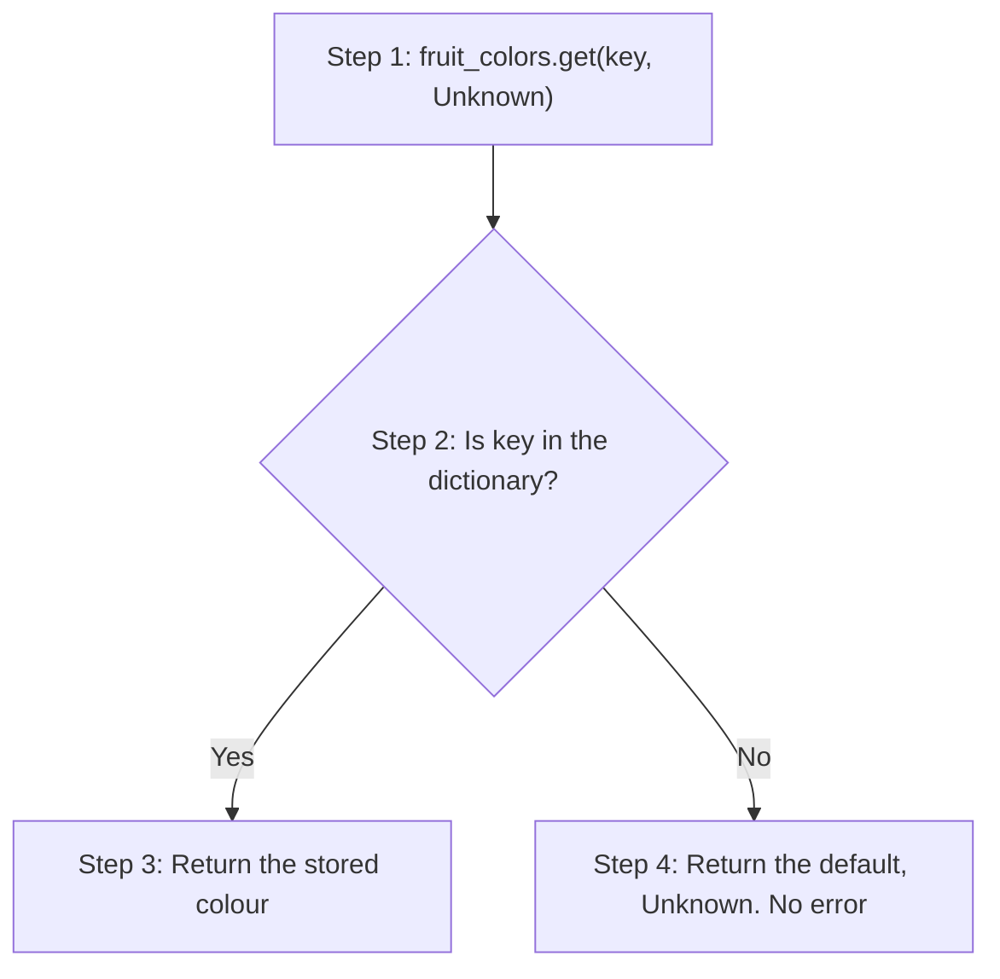
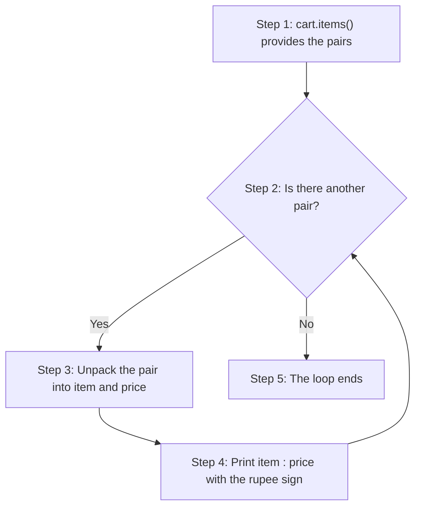
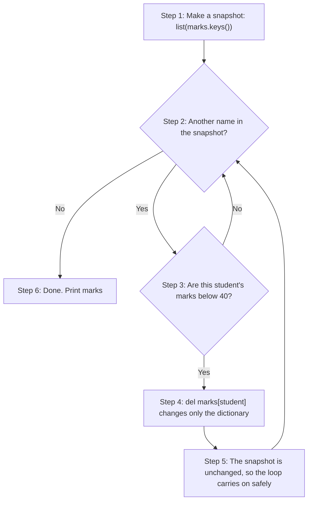
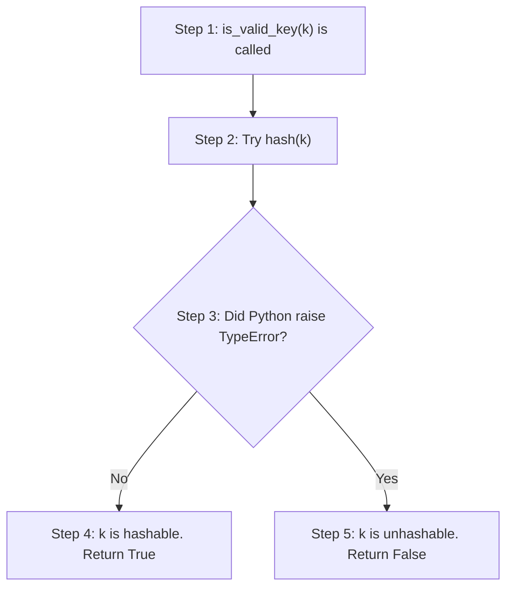
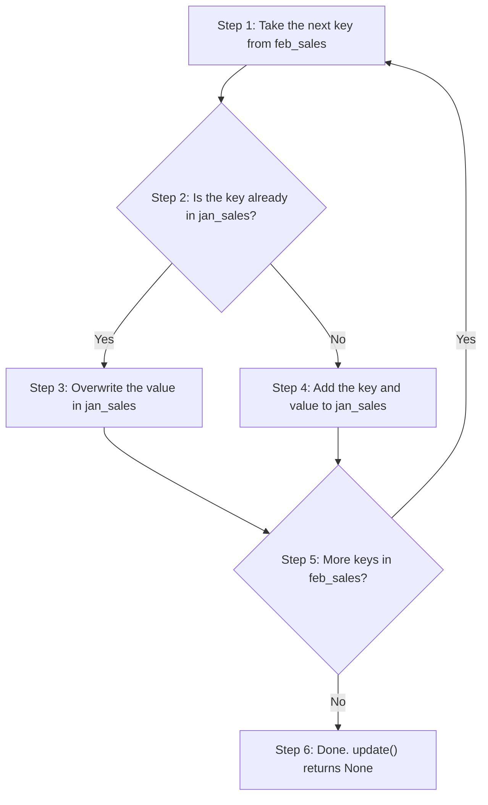
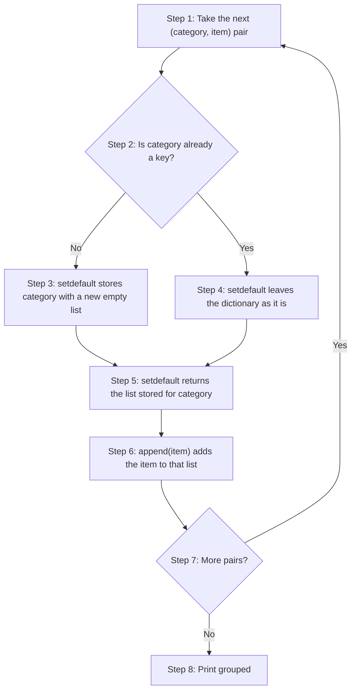
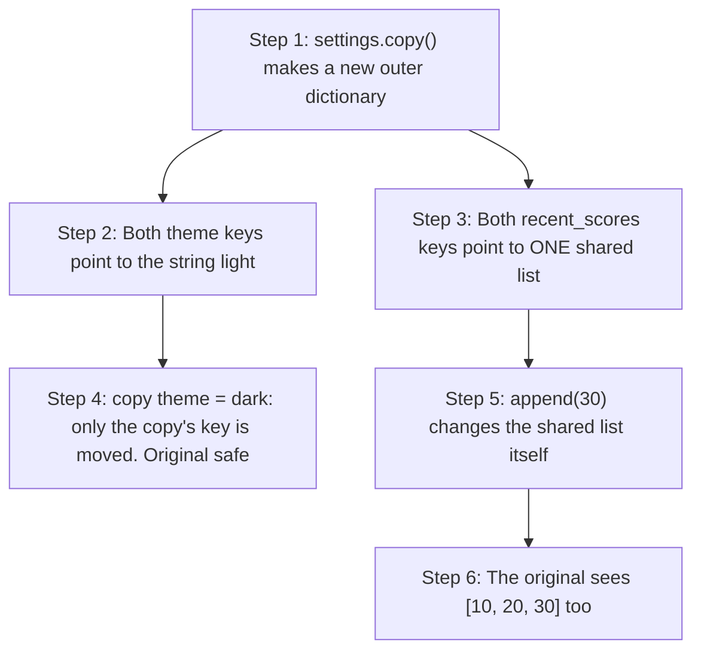
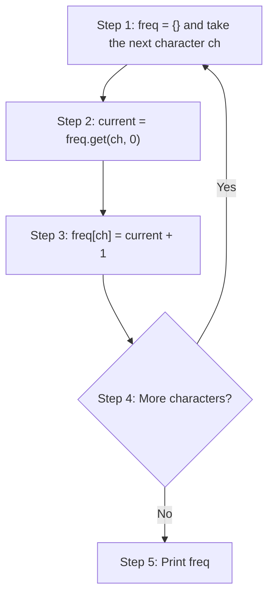
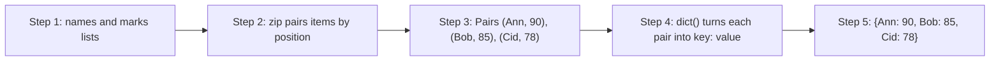

# Dictionaries in Python: Scripting Questions and Answers

A dictionary stores data as **key-value pairs**. You look up a value by its key, much as you look up a word in a real dictionary to find its meaning. Dictionaries are among the most useful tools in Python, and you will meet them in almost every real program.

This page belongs to the chapter on **Tuples, Dictionaries and Sets**. The printed book ends its section on dictionaries with twenty short scripting exercises. This page gives a full worked answer to each one. The exercises practise the skills you need most often:

- creating dictionaries in different ways;
- reading values safely, without the program crashing;
- looping over keys, values, or both;
- building dictionaries with comprehensions;
- adding, merging, removing and grouping data with dictionary methods;
- copying dictionaries, and understanding view objects;
- counting, pairing and comparing data with dictionaries.

Each answer is laid out in the same way:

1. **Plan**: the task broken into small steps.
2. **Script**: a complete program with `# Step 1`, `# Step 2` comments that match the plan.
3. **Output**: exactly what the script prints, so you can check your own results.
4. **How Python works**: the pattern used, and why it works.
5. Where useful, a table or a flowchart, and a **Try this next** exercise that takes the idea a step further.

If you want the theory behind these scripts, read the companion page [Dictionaries in Python: Conceptual Questions and Answers](80-ch19-dictionary-conceptual-qa.md).

> **Tip:** Type the scripts in yourself and run them in IDLE, VS Code, Thonny or Google Colab. Then change the data and predict the output before you run the script again.

## Table of Contents

- [Key Terms Used on This Page](#key-terms)
- [Part 1: Creating Dictionaries and Reading Values](#part-1)
  - [Q1. Create dict of 3 fruits→colours. Print colour of "banana" (safe, no error). Also try missing key "grape", default "Unknown".](#q1)
  - [Q2. Build dict from a list of `(subject, marks)` tuples using `dict()`. Separately, build a student dict `(roll, name, age)` using keyword arguments.](#q2)
  - [Q3. Initialise a dict of 4 days ("Mon".."Thu") all marked "Absent", in one line. No curly-brace literal, no loop.](#q3)
- [Part 2: Looping Over Dictionaries](#part-2)
  - [Q4. Given dict of item→price, print each as `"item : ₹price"` using the traversal method that gives both key and value directly.](#q4)
  - [Q5. Given dict of subject→marks, find total and average marks. Use the traversal method that gives only values.](#q5)
  - [Q6. Given dict of student→marks, remove all students scoring below 40. Must not raise `RuntimeError`.](#q6)
- [Part 3: Comprehensions and Valid Keys](#part-3)
  - [Q7. Using one dict comprehension: map numbers 1–10 to their cubes, but keep only even numbers.](#q7)
  - [Q8. Given dict of name→roll_no, build a new dict swapping keys and values. One comprehension line.](#q8)
  - [Q9. Write is_valid_key(k) returning `True/False` if `k` can be used as a dict key. Test on `5`, `"hi", (1,2), [1,2], {1:2}`.](#q9)
- [Part 4: Checking, Merging, Removing and Grouping](#part-4)
  - [Q10. Given dict of employee→salary, check if "Ravi" and "Sunita" exist as keys. Print message for each.](#q10)
  - [Q11. Two dicts: Jan sales and Feb sales by product. Merge Feb into Jan with `update()` (overlaps must update, not add duplicates).](#q11)
  - [Q12. Given dict of room bookings, `pop()` `"Room101"` and print it. Then try `pop()` on missing `"Room999"` without crashing.](#q12)
  - [Q13. Empty dict category→list. Given list of `(category, item)` tuples, group items under categories using `setdefault()` — no manual if key in dict check.](#q13)
- [Part 5: Copies and Views](#part-5)
  - [Q14. Given dict of settings, `copy()` it, change one value in the copy -- prove original unaffected. Add a nested list value; mutate it via the copy -- show original is affected (shallow copy).](#q14)
  - [Q15. Store `keys_view = d.keys()` before adding a new key to `d`. Print `keys_view` before and after, to show it updates live.](#q15)
- [Part 6: Counting, Pairing, Comparing and Inspecting](#part-6)
  - [Q16. Count frequency of each character in "mississippi" using a dictionary, no library. Use `get()` with default `0`.](#q16)
  - [Q17. Two separate lists — `names`, `marks` (same order). Combine into one dictionary using `zip()` and `dict()`.](#q17)
  - [Q18. Two dicts with same key-value pairs, built in different insertion order. Print `==` and `is` results. Also print `id()` of both.](#q18)
  - [Q19. Given a dict: print (a) pair `count` with `len()`, (b) whether `"score"` is a key with `in`, (c) the object's type with `type()`.](#q19)
  - [Q20. Given dict of cart items, make a `copy()`, `clear()` the copy to simulate emptying the cart. Prove original cart is untouched.](#q20)
- [Quick Revision Summary](#quick-revision-summary)

<a id="key-terms"></a>
## Key Terms Used on This Page

| Term | Simple meaning | Learn more |
| --- | --- | --- |
| Key-value pair | One entry in a dictionary. In `{"apple": "red"}`, `"apple"` is the key and `"red"` is the value. | [Python tutorial: Dictionaries](https://docs.python.org/3/tutorial/datastructures.html#dictionaries) |
| `KeyError` | The error Python raises when you ask for a key that is not in the dictionary. | [Python docs: KeyError](https://docs.python.org/3/library/exceptions.html#KeyError) |
| Traversal | Visiting each entry of a collection in turn, usually with a `for` loop. | [Python docs: Dictionary view objects](https://docs.python.org/3/library/stdtypes.html#dictionary-view-objects) |
| Constructor | A function that builds a new object of a type. `dict()` is the dictionary constructor. | [Python docs: dict](https://docs.python.org/3/library/stdtypes.html#dict) |
| Comprehension | A short one-line way to build a list, set or dictionary from a loop. | [Python tutorial: Dictionaries](https://docs.python.org/3/tutorial/datastructures.html#dictionaries) |
| Hashable | An object with a fixed "hash" number that never changes. Only hashable objects can be dictionary keys. | [Glossary: hashable](https://docs.python.org/3/glossary.html#term-hashable) |
| Mutable / Immutable | Mutable objects can be changed after they are made (lists, dictionaries). Immutable ones cannot (numbers, strings, tuples). | [Glossary: mutable](https://docs.python.org/3/glossary.html#term-mutable) |
| View object | A live window into a dictionary's keys, values or items. It updates when the dictionary changes. | [Python docs: Dictionary view objects](https://docs.python.org/3/library/stdtypes.html#dictionary-view-objects) |
| Shallow copy | A copy of the outer dictionary only. Any lists or dictionaries stored inside are shared with the original, not copied. | [Python docs: copy module](https://docs.python.org/3/library/copy.html) |
| `id()` | A built-in function that returns a number identifying an object while it exists. | [Python docs: id()](https://docs.python.org/3/library/functions.html#id) |
| Exception handling | Using `try` and `except` to catch an error so the program can carry on. | [Python tutorial: Errors and exceptions](https://docs.python.org/3/tutorial/errors.html) |

[Back to the Table of Contents](#table-of-contents)

---

<a id="part-1"></a>
## Part 1: Creating Dictionaries and Reading Values

These three exercises show four ways to create a dictionary, and the safe way to read a value that might not be there.

[Back to the Table of Contents](#table-of-contents)

<a id="q1"></a>
### Q1. Create dict of 3 fruits→colours. Print colour of "banana" (safe, no error). Also try missing key "grape", default "Unknown".

**Plan**

1. Create a dictionary that links three fruit names to their colours.
2. Read the colour of `"banana"` safely with `get()`.
3. Read the colour of `"grape"`, which is not in the dictionary, with `get()` and the default `"Unknown"`.
4. For comparison, show what happens if you use square brackets for the missing key.

**Script**

```python
# Step 1 - Create a dictionary that maps fruit names to their colours
fruit_colors = {"apple": "red", "banana": "yellow", "mango": "orange"}

# Step 2 - Safely read the value for "banana" using get()
#          get() never raises a KeyError; for a missing key it returns None
print("Banana:", fruit_colors.get("banana"))

# Step 3 - Read a key that does NOT exist ("grape")
#          The second argument to get() is the default returned instead
print("Grape:", fruit_colors.get("grape", "Unknown"))

# Step 4 - For comparison: square brackets raise KeyError for a missing key
try:
    print(fruit_colors["grape"])
except KeyError as error:
    print("fruit_colors['grape'] -> KeyError:", error)
```

**Output**

```text
Banana: yellow
Grape: Unknown
fruit_colors['grape'] -> KeyError: 'grape'
```

**How Python works**

- **Pattern used:** safe access with `get()`, instead of `fruit_colors["grape"]`.
- Reading with square brackets, as in `fruit_colors["grape"]`, would raise a `KeyError`, because `"grape"` is not a key. Unless the error is caught, the program stops. Step 4 shows this, using `try` and `except` so that the script can carry on.
- `get(key, default)` (Step 3) avoids that problem completely. If the key is missing, it returns the fallback value you supplied. If you give no default, it returns `None`.
- That is why `get()` is the recommended way to read a dictionary whenever you cannot be sure a key is present.
- `get()` only **reads**. It does not add `"grape"` to the dictionary.

| Code | `"banana"` (present) | `"grape"` (missing) |
| --- | --- | --- |
| `fruit_colors[key]` | `'yellow'` | `KeyError` |
| `fruit_colors.get(key)` | `'yellow'` | `None` |
| `fruit_colors.get(key, "Unknown")` | `'yellow'` | `'Unknown'` |



**Try this next**

Ask the user for a fruit and print its colour safely. Here the input is fixed so that you can see the result.

```python
fruit_colors = {"apple": "red", "banana": "yellow", "mango": "orange"}

# Step 1 - In a real program you would write: choice = input("Fruit? ")
for choice in ["mango", "kiwi"]:
    # Step 2 - .lower() lets "Mango" and "mango" both work
    colour = fruit_colors.get(choice.lower(), "Unknown")
    print(f"{choice}: {colour}")
```

```text
mango: orange
kiwi: Unknown
```

[Back to the Table of Contents](#table-of-contents)

<a id="q2"></a>
### Q2. Build dict from a list of `(subject, marks)` tuples using `dict()`. Separately, build a student dict `(roll, name, age)` using keyword arguments.

**Plan**

1. Start with a list of `(subject, marks)` tuples.
2. Pass the list to `dict()` to turn it into a dictionary.
3. Separately, call `dict()` with keyword arguments `roll=`, `name=` and `age=`.
4. Print both dictionaries, and check the type of the keys made from keywords.

**Script**

```python
# Step 1 - A list of (subject, marks) tuples: the raw data
subject_marks = [("Maths", 90), ("Science", 85), ("English", 88)]

# Step 2 - Convert the list of tuples directly into a dictionary
#          dict() accepts any iterable of two-item pairs
marks_dict = dict(subject_marks)
print("From tuples:  ", marks_dict)

# Step 3 - Build a dictionary using keyword arguments instead
#          Each keyword name becomes a string key automatically
student = dict(roll=101, name="Ann", age=20)
print("From keywords:", student)

# Step 4 - Check: the keys made from keywords are strings
print("Type of each key:", [type(key).__name__ for key in student])
```

**Output**

```text
From tuples:   {'Maths': 90, 'Science': 85, 'English': 88}
From keywords: {'roll': 101, 'name': 'Ann', 'age': 20}
Type of each key: ['str', 'str', 'str']
```

**How Python works**

- **Pattern used:** two ways of calling the `dict()` constructor.
- **Step 2** shows `dict()` taking a sequence of pairs. Python takes each two-item tuple, uses the first item as the key and the second as the value. This is useful when the data already exists as a list of pairs, for example data read from a file or received from a website. (A website that sends data to programs is often called an **API**, short for Application Programming Interface.)
- **Step 3** shows `dict()` taking keyword arguments. This is handy for quick dictionaries typed by hand. Note that the keyword names automatically become **string** keys: `roll=101` gives the key `'roll'`, as Step 4 confirms.
- Each item in the list must have **exactly two** parts. A three-item tuple such as `("Maths", 90, "A")` would raise a `ValueError`.

| Way of calling `dict()` | Example | Result |
| --- | --- | --- |
| List of pairs | `dict([("Maths", 90)])` | `{'Maths': 90}` |
| Keyword arguments | `dict(roll=101)` | `{'roll': 101}` |
| Both together | `dict([("Maths", 90)], roll=101)` | `{'Maths': 90, 'roll': 101}` |

**Try this next**

Keyword arguments cannot be used for every key. Try building a dictionary whose keys are numbers, or contain a space.

```python
# Step 1 - Keys that are not valid Python names need a list of pairs (or a {} literal)
rank_names = dict([(1, "Gold"), (2, "Silver")])
print(rank_names)

full_names = dict([("first name", "Ann"), ("last name", "Lee")])
print(full_names)

# Step 2 - dict(1="Gold") or dict(first name="Ann") would be a SyntaxError,
#          because 1 and "first name" are not valid keyword names
```

```text
{1: 'Gold', 2: 'Silver'}
{'first name': 'Ann', 'last name': 'Lee'}
```

[Back to the Table of Contents](#table-of-contents)

<a id="q3"></a>
### Q3. Initialise a dict of 4 days ("Mon".."Thu") all marked "Absent", in one line. No curly-brace literal, no loop.

**Plan**

1. Put the four day names in a list.
2. Call `dict.fromkeys()` with the list and the value `"Absent"`.
3. Print the dictionary.
4. Mark one day `"Present"` to show that each key can then be changed on its own.

**Script**

```python
# Step 1 - The keys that all need the same starting value
days = ["Mon", "Tue", "Wed", "Thu"]

# Step 2 - dict.fromkeys(keys, value) gives the SAME value to every key
#          in a single call, with no loop and no {} literal
attendance = dict.fromkeys(days, "Absent")
print("Start:        ", attendance)

# Step 3 - Each key can now be updated separately
attendance["Tue"] = "Present"
print("After Tuesday:", attendance)
```

**Output**

```text
Start:         {'Mon': 'Absent', 'Tue': 'Absent', 'Wed': 'Absent', 'Thu': 'Absent'}
After Tuesday: {'Mon': 'Absent', 'Tue': 'Present', 'Wed': 'Absent', 'Thu': 'Absent'}
```

**How Python works**

- **Pattern used:** setting up many keys at once with `dict.fromkeys()`.
- This is the idiomatic way (the natural, standard Python way) to give many keys one shared starting value.
- Writing `{"Mon": "Absent", "Tue": "Absent", ...}` by hand, or looping with `attendance[day] = "Absent"`, would also work. But both mean more typing and more chances of a mistake, especially with a long list of keys.
- `fromkeys()` is called on `dict` itself, not on an existing dictionary. If you leave out the second argument, every key gets `None`.
- Strictly, the whole job fits in one line: `attendance = dict.fromkeys(["Mon", "Tue", "Wed", "Thu"], "Absent")`. The script uses a separate `days` list only to make it easier to read.

| Method | One line? | Uses `{}`? | Uses a loop? |
| --- | --- | --- | --- |
| Literal `{"Mon": "Absent", ...}` | Yes | Yes | No |
| `for` loop with `attendance[day] = "Absent"` | No | Yes (to start) | Yes |
| Comprehension `{d: "Absent" for d in days}` | Yes | Yes | Yes (inside) |
| `dict.fromkeys(days, "Absent")` | Yes | No | No |

Only `dict.fromkeys()` meets all the conditions in the question.

**Try this next**

Be careful when the shared value is a list. `fromkeys()` puts the **same** list object against every key.

```python
days = ["Mon", "Tue"]

# Step 1 - Every key shares ONE list
tasks = dict.fromkeys(days, [])
tasks["Mon"].append("Maths homework")
print("fromkeys with []:", tasks)      # Tuesday seems to have it too!

# Step 2 - A comprehension makes a NEW list for each key
tasks = {day: [] for day in days}
tasks["Mon"].append("Maths homework")
print("comprehension:   ", tasks)
```

```text
fromkeys with []: {'Mon': ['Maths homework'], 'Tue': ['Maths homework']}
comprehension:    {'Mon': ['Maths homework'], 'Tue': []}
```

So use `fromkeys()` with values that cannot change, such as a string, a number or `None`.

[Back to the Table of Contents](#table-of-contents)

---

<a id="part-2"></a>
## Part 2: Looping Over Dictionaries

These exercises show how to choose the right way to loop: `.items()` when you need keys and values, `.values()` when you need only values, and a snapshot of the keys when you need to delete entries.

[Back to the Table of Contents](#table-of-contents)

<a id="q4"></a>
### Q4. Given dict of item→price, print each as `"item : ₹price"` using the traversal method that gives both key and value directly.

**Plan**

1. Create a dictionary of items and prices.
2. Loop over `cart.items()`, which gives each item and its price together.
3. Print each pair in the form `item : ₹price` using an f-string.

**Script**

```python
# Step 1 - A dictionary of item -> price (in rupees)
cart = {"Pen": 10, "Notebook": 40, "Eraser": 5}

# Step 2 - Loop over .items(): each entry is unpacked straight into
#          two variables, item and price, so no separate lookup is needed
for item, price in cart.items():
    # Step 3 - Print in the required format, using an f-string
    print(f"{item} : ₹{price}")
```

**Output**

```text
Pen : ₹10
Notebook : ₹40
Eraser : ₹5
```

**How Python works**

- **Pattern used:** looping with `.items()`.
- On each pass of the loop, `.items()` hands out one `(key, value)` pair, such as `("Pen", 10)`. Python unpacks the pair into the two loop variables: `item` gets `"Pen"` and `price` gets `10`.
- This is better than `for item in cart: print(item, cart[item])`, because it gets the key and the value together in one step. There is no second dictionary lookup for each entry. It is the Pythonic (clear, natural Python) choice, and slightly more efficient, whenever you need both parts.
- An **f-string** is a string with the letter `f` before the opening quote. Anything inside curly braces `{}` is replaced by its value. See the [Python tutorial on f-strings](https://docs.python.org/3/tutorial/inputoutput.html#formatted-string-literals).
- The rupee sign `₹` is an ordinary character in a Python string. If your console cannot show it, you can write `Rs.` instead.



**Try this next**

Line up the prices neatly and add a total at the end.

```python
cart = {"Pen": 10, "Notebook": 40, "Eraser": 5}

for item, price in cart.items():
    # :<10 pads the name to 10 characters; :>4 right-aligns the price in 4 characters
    print(f"{item:<10}: ₹{price:>4}")

print(f"{'Total':<10}: ₹{sum(cart.values()):>4}")
```

```text
Pen       : ₹  10
Notebook  : ₹  40
Eraser    : ₹   5
Total     : ₹  55
```

[Back to the Table of Contents](#table-of-contents)

<a id="q5"></a>
### Q5. Given dict of subject→marks, find total and average marks. Use the traversal method that gives only values.

**Plan**

1. Create a dictionary of subjects and marks.
2. Use `.values()` to get only the marks, and pass them to `sum()` to get the total.
3. Divide the total by the number of subjects, `len(marks)`, to get the average.
4. Print both results.

**Script**

```python
# Step 1 - A dictionary of subject -> marks
marks = {"Maths": 90, "Science": 78, "English": 85, "History": 67}

# Step 2 - .values() gives only the numbers; the subject names are not needed here
print("Values only:", list(marks.values()))
total = sum(marks.values())

# Step 3 - Average = total marks / number of subjects
average = total / len(marks)

# Step 4 - Print the results
print("Total:", total)
print("Average:", average)
```

**Output**

```text
Values only: [90, 78, 85, 67]
Total: 320
Average: 80.0
```

**How Python works**

- **Pattern used:** looping over `.values()`, combined with `sum()`.
- The calculation needs only the numbers. It does not need to know which subject each number belongs to. So going through `.values()` is the leanest choice, rather than `.items()` or the keys.
- `sum()` loops over the values for you and adds them up: `90 + 78 + 85 + 67 = 320`.
- `len(marks)` (Step 3) uses the dictionary's own count of pairs, `4`, instead of a separate counter that you would have to keep up to date yourself.
- The average is `320 / 4 = 80.0`. The `/` operator always gives a decimal number (a `float`), even when the answer is whole, which is why it prints as `80.0`.

**The same total with an explicit loop**

`sum(marks.values())` does the looping for you. Written out in full, it looks like this:

```python
marks = {"Maths": 90, "Science": 78, "English": 85, "History": 67}

total = 0
for mark in marks.values():       # only values are visited
    total = total + mark
    print("Added", mark, "-> running total", total)
```

```text
Added 90 -> running total 90
Added 78 -> running total 168
Added 85 -> running total 253
Added 67 -> running total 320
```

**Try this next**

Round the average to one decimal place, and find the highest mark and its subject.

```python
marks = {"Maths": 90, "Science": 78, "English": 85, "History": 71}

# Step 1 - round() to one decimal place
average = sum(marks.values()) / len(marks)
print("Average:", round(average, 1))

# Step 2 - max() of the values gives the top mark
top = max(marks.values())

# Step 3 - To find the SUBJECT, we now need the keys too, so we use .items()
for subject, mark in marks.items():
    if mark == top:
        print("Top subject:", subject, "with", mark)
```

```text
Average: 81.0
Top subject: Maths with 90
```

[Back to the Table of Contents](#table-of-contents)

<a id="q6"></a>
### Q6. Given dict of student→marks, remove all students scoring below 40. Must not raise `RuntimeError`.

**Plan**

1. Create the dictionary of students and marks.
2. Make a **snapshot** (a separate list) of the keys with `list(marks.keys())`.
3. Loop over the snapshot. For each student with marks below 40, delete that entry from the dictionary.
4. Print the dictionary.

**Script**

```python
# Step 1 - A dictionary of student -> marks
marks = {"Ann": 55, "Bob": 30, "Cid": 38, "Dev": 72}
print("Before:", marks)

# Step 2 - Do NOT loop over marks directly while deleting from it.
#          That raises: RuntimeError: dictionary changed size during iteration
#          Instead, loop over a SNAPSHOT of the keys, made with list()
for student in list(marks.keys()):
    # Step 3 - Delete the entries with marks below 40
    if marks[student] < 40:
        print("Removing", student, "with", marks[student])
        del marks[student]

# Step 4 - Show the result
print("After: ", marks)
```

**Output**

```text
Before: {'Ann': 55, 'Bob': 30, 'Cid': 38, 'Dev': 72}
Removing Bob with 30
Removing Cid with 38
After:  {'Ann': 55, 'Dev': 72}
```

**How Python works**

- **Pattern used:** safe deletion through a snapshot of the keys.
- `list(marks.keys())` (Step 2) is worked out **once**, before the loop starts. It produces a separate list that is not affected by any later `del` on the dictionary.
- The loop walks through this list, while the deletions happen to the dictionary. The two never interfere, so no `RuntimeError` occurs.
- This is the standard way to remove entries while "looping over" a dictionary.

**What goes wrong without the snapshot**

```python
marks = {"Ann": 55, "Bob": 30, "Cid": 38, "Dev": 72}
try:
    for student in marks:            # looping over the LIVE dictionary
        if marks[student] < 40:
            del marks[student]
except RuntimeError as error:
    print("RuntimeError:", error)
```

```text
RuntimeError: dictionary changed size during iteration
```

The loop keeps track of its place inside the dictionary. Deleting an entry changes the dictionary's size, and Python stops the loop rather than risk skipping or repeating entries.



**Try this next**

Do the same job with a dictionary comprehension. It builds a **new** dictionary containing only the students who passed, so nothing is deleted during a loop.

```python
marks = {"Ann": 55, "Bob": 30, "Cid": 38, "Dev": 72}

# Keep only the entries where the marks are 40 or more
passed = {name: score for name, score in marks.items() if score >= 40}
print(passed)
```

```text
{'Ann': 55, 'Dev': 72}
```

[Back to the Table of Contents](#table-of-contents)

---

<a id="part-3"></a>
## Part 3: Comprehensions and Valid Keys

Two exercises on dictionary comprehensions, and one that tests which values are allowed as dictionary keys.

[Back to the Table of Contents](#table-of-contents)

<a id="q7"></a>
### Q7. Using one dict comprehension: map numbers 1–10 to their cubes, but keep only even numbers.

**Plan**

1. Loop over the numbers 1 to 10 with `range(1, 11)`.
2. Keep only the even numbers with the filter `if n % 2 == 0`.
3. Use each number as the key and its cube, `n ** 3`, as the value.
4. Write all of this as one dictionary comprehension and print the result.

**Script**

```python
# Steps 1 to 3 combined in a single dictionary comprehension:
#   key expression   -> n
#   value expression -> n ** 3        (n cubed)
#   iterable         -> range(1, 11)  (1 to 10; the stop value 11 is left out)
#   condition        -> n % 2 == 0    (n is even)
even_cubes = {n: n ** 3 for n in range(1, 11) if n % 2 == 0}

# Step 4 - Print the result
print(even_cubes)
```

**Output**

```text
{2: 8, 4: 64, 6: 216, 8: 512, 10: 1000}
```

**How Python works**

- **Pattern used:** a dictionary comprehension with a filter.
- The `if n % 2 == 0` part is checked for every `n` **before** anything is added. `%` gives the remainder after division, so `n % 2` is `0` for even numbers and `1` for odd numbers. Odd numbers are simply skipped.
- This means you do not need a separate `if`/`else` block or a manual loop that adds entries one at a time.
- `range(1, 11)` stops **before** 11, so it gives 1 to 10.
- `n ** 3` means `n` to the power 3, that is `n * n * n`.

| `n` | `n % 2 == 0`? | Kept? | Entry |
| --- | --- | --- | --- |
| 1 | No | No | |
| 2 | Yes | Yes | `2: 8` |
| 3 | No | No | |
| 4 | Yes | Yes | `4: 64` |
| 5 | No | No | |
| 6 | Yes | Yes | `6: 216` |
| 7 | No | No | |
| 8 | Yes | Yes | `8: 512` |
| 9 | No | No | |
| 10 | Yes | Yes | `10: 1000` |

**The same result with an ordinary loop**

```python
even_cubes = {}                     # start with an empty dictionary
for n in range(1, 11):              # the loop clause and iterable
    if n % 2 == 0:                  # the filter condition
        even_cubes[n] = n ** 3      # key expression : value expression
print(even_cubes)
```

```text
{2: 8, 4: 64, 6: 216, 8: 512, 10: 1000}
```

**Try this next**

Get the same result without a filter, by using a step of 2 in `range()`.

```python
print({n: n ** 3 for n in range(2, 11, 2)})   # 2, 4, 6, 8, 10
```

```text
{2: 8, 4: 64, 6: 216, 8: 512, 10: 1000}
```

[Back to the Table of Contents](#table-of-contents)

<a id="q8"></a>
### Q8. Given dict of name→roll_no, build a new dict swapping keys and values. One comprehension line.

**Plan**

1. Create the dictionary of names and roll numbers.
2. Loop over `.items()` to get each `(name, roll)` pair.
3. In the comprehension, write the roll number first (as the key) and the name second (as the value).
4. Print the new dictionary.

**Script**

```python
# Step 1 - The original dictionary: name -> roll number
name_to_roll = {"Ann": 1, "Bob": 2, "Cid": 3}

# Steps 2 and 3 - .items() gives (name, roll) pairs;
#                 the comprehension writes them the other way round: roll: name
roll_to_name = {roll: name for name, roll in name_to_roll.items()}

# Step 4 - Print both dictionaries
print("Original:", name_to_roll)
print("Swapped: ", roll_to_name)
print("Who has roll number 2?", roll_to_name[2])
```

**Output**

```text
Original: {'Ann': 1, 'Bob': 2, 'Cid': 3}
Swapped:  {1: 'Ann', 2: 'Bob', 3: 'Cid'}
Who has roll number 2? Bob
```

**How Python works**

- **Pattern used:** reversing a dictionary with a comprehension.
- `.items()` supplies both parts of each entry.
- The comprehension simply writes the value first and the key second (`roll: name`) instead of `name: roll`.
- This works safely only if the original **values** (here, the roll numbers) are:
  - **unique**: otherwise some entries would silently overwrite each other in the new dictionary;
  - **hashable**: otherwise they could not become keys at all.
- Swapping is useful when you need to look things up in the other direction. Here, it lets you find a student by roll number.

**Try this next**

What happens if two students share the same value? Swap a dictionary of names and house colours.

```python
houses = {"Ann": "Red", "Bob": "Blue", "Cid": "Red"}

# Step 1 - Plain swap: "Red" appears twice, so the later name overwrites the earlier one
print({house: name for name, house in houses.items()})

# Step 2 - Keep everyone by collecting names in a list for each house
by_house = {}
for name, house in houses.items():
    by_house.setdefault(house, []).append(name)
print(by_house)
```

```text
{'Red': 'Cid', 'Blue': 'Bob'}
{'Red': ['Ann', 'Cid'], 'Blue': ['Bob']}
```

In Step 1, Ann disappears without any warning. Step 2 uses `setdefault()`, which is explained in [Q13](#q13).

[Back to the Table of Contents](#table-of-contents)

<a id="q9"></a>
### Q9. Write is_valid_key(k) returning `True/False` if `k` can be used as a dict key. Test on `5`, `"hi", (1,2), [1,2], {1:2}`.

**Plan**

1. Write a function `is_valid_key(k)`.
2. Inside it, try to work out `hash(k)`.
3. If that works, the value is hashable, so return `True`.
4. If Python raises a `TypeError`, the value is unhashable, so return `False`.
5. Test the function on the five given values.

**Script**

```python
def is_valid_key(k):
    """Return True if k can be used as a dictionary key, otherwise False."""
    # Step 1 - A value can be a dictionary key only if it is hashable,
    #          so we try to hash it and see whether Python objects
    try:
        hash(k)            # Step 2 - try to work out a hash value
        return True        # Step 3 - it worked: hashable, so a valid key
    except TypeError:
        return False       # Step 4 - TypeError: unhashable, so not a valid key

# Step 5 - Test with a mix of hashable and unhashable values
for value in [5, "hi", (1, 2), [1, 2], {1: 2}]:
    print(f"{str(value):<8} ({type(value).__name__:<5}) -> {is_valid_key(value)}")
```

**Output**

```text
5        (int  ) -> True
hi       (str  ) -> True
(1, 2)   (tuple) -> True
[1, 2]   (list ) -> False
{1: 2}   (dict ) -> False
```

**How Python works**

- **Pattern used:** `try`/`except TypeError` around `hash()`. `TypeError` is exactly the error Python raises for unhashable objects, so catching it tells us the answer.
- `5`, `"hi"` and `(1, 2)` are hashable: a whole number, a string, and a tuple whose items are all hashable. The function returns `True` for each.
- `[1, 2]` and `{1: 2}` are mutable (a list and a dictionary), so they are unhashable. The function returns `False`.
- This matches the chapter's rules on hashability.
- In the `print()` line, `:<8` and `:<5` pad the text with spaces to a fixed width, so the columns line up. They do not affect the result.



**Try this next**

Test some trickier values: a tuple that holds a list, a set, a frozenset and `None`.

```python
def is_valid_key(k):
    try:
        hash(k)
        return True
    except TypeError:
        return False

for value in [(1, [2, 3]), {1, 2}, frozenset({1, 2}), None, 3.5]:
    print(repr(value), "->", is_valid_key(value))
```

```text
(1, [2, 3]) -> False
{1, 2} -> False
frozenset({1, 2}) -> True
None -> True
3.5 -> True
```

A tuple is hashable only if **every** item inside it is hashable, so `(1, [2, 3])` fails because of the list. A `set` is mutable, but a `frozenset` (an unchangeable set) is hashable.

[Back to the Table of Contents](#table-of-contents)

---

<a id="part-4"></a>
## Part 4: Checking, Merging, Removing and Grouping

These exercises use the `in` operator and three important dictionary methods: `update()`, `pop()` and `setdefault()`.

[Back to the Table of Contents](#table-of-contents)

<a id="q10"></a>
### Q10. Given dict of employee→salary, check if "Ravi" and "Sunita" exist as keys. Print message for each.

**Plan**

1. Create the dictionary of employees and salaries.
2. Use `in` to check whether `"Ravi"` is a key, and print a message.
3. Use `not in` to check whether `"Sunita"` is missing, and print a message.

**Script**

```python
# Step 1 - A dictionary of employee -> salary
salary = {"Ravi": 45000, "Meena": 52000}

# Step 2 - "in" checks only the KEYS of the dictionary
if "Ravi" in salary:
    print("Ravi is on record.")
else:
    print("Ravi not found.")

# Step 3 - "not in" is the opposite test
if "Sunita" not in salary:
    print("Sunita not found.")
else:
    print("Sunita is on record.")
```

**Output**

```text
Ravi is on record.
Sunita not found.
```

**How Python works**

- **Pattern used:** checking membership with `in` and `not in`.
- Both operators check **only the dictionary's keys**, never its values.
- So this technique tells you whether an employee **name** exists. It cannot tell you whether a particular **salary** amount exists. For that, you must search the values: `45000 in salary.values()`.
- Checking a key with `in` is very fast, whatever the size of the dictionary, because Python finds keys by their hash value rather than by checking each one.
- A common beginner habit is to write `if "Ravi" in salary.keys():`. It works, but `.keys()` is not needed: `in` on a dictionary already checks the keys.

| Test | Checks | Result here |
| --- | --- | --- |
| `"Ravi" in salary` | Keys | `True` |
| `"Sunita" in salary` | Keys | `False` |
| `45000 in salary` | Keys (so it is the wrong test for a salary) | `False` |
| `45000 in salary.values()` | Values | `True` |

**Try this next**

Check a list of names in a loop, and show each person's salary if they are on record.

```python
salary = {"Ravi": 45000, "Meena": 52000}

for name in ["Ravi", "Sunita", "Meena"]:
    if name in salary:
        print(f"{name} is on record, salary {salary[name]}.")
    else:
        print(f"{name} not found.")

# Checking a VALUE needs .values()
print("Does anyone earn 52000?", 52000 in salary.values())
```

```text
Ravi is on record, salary 45000.
Sunita not found.
Meena is on record, salary 52000.
Does anyone earn 52000? True
```

[Back to the Table of Contents](#table-of-contents)

<a id="q11"></a>
### Q11. Two dicts: Jan sales and Feb sales by product. Merge Feb into Jan with `update()` (overlaps must update, not add duplicates).

**Plan**

1. Create the two sales dictionaries.
2. Call `jan_sales.update(feb_sales)`.
3. Print `jan_sales` to see the merged result.
4. Show that `update()` itself returns `None`.

**Script**

```python
# Step 1 - Two monthly sales dictionaries
jan_sales = {"Pen": 100, "Notebook": 50}
feb_sales = {"Notebook": 70, "Eraser": 30}
print("January before:", jan_sales)

# Step 2 - update() merges feb_sales INTO jan_sales, in place:
#          "Notebook" already exists, so its value is overwritten (50 -> 70);
#          "Eraser" is new, so it is added at the end
result = jan_sales.update(feb_sales)

# Step 3 - The merged data is in jan_sales itself
print("January after: ", jan_sales)

# Step 4 - update() returns None, not the merged dictionary
print("Value returned by update():", result)
print("February is unchanged:", feb_sales)
```

**Output**

```text
January before: {'Pen': 100, 'Notebook': 50}
January after:  {'Pen': 100, 'Notebook': 70, 'Eraser': 30}
Value returned by update(): None
February is unchanged: {'Notebook': 70, 'Eraser': 30}
```

**How Python works**

- **Pattern used:** merging dictionaries with `update()`.
- `update()` never creates duplicate keys, because a dictionary cannot hold the same key twice. For a key found in both dictionaries (`"Notebook"`), the incoming value simply **replaces** the old one.
- A key found only in the incoming dictionary (`"Eraser"`) is **added**.
- A key found only in the original (`"Pen"`) is left alone.
- `update()` changes `jan_sales` directly (in place) and returns `None`. So the merged result must be read from `jan_sales` itself, not from the return value. Writing `jan_sales = jan_sales.update(feb_sales)` is a common mistake: it would leave `jan_sales` holding `None`.

| Key | In January | In February | After `update()` |
| --- | --- | --- | --- |
| `"Pen"` | 100 | (not present) | 100 (kept) |
| `"Notebook"` | 50 | 70 | 70 (overwritten) |
| `"Eraser"` | (not present) | 30 | 30 (added) |



**Try this next**

`update()` **replaces** overlapping values. What if you want the **total** sales for both months instead? Add the values yourself with `get()`.

```python
jan_sales = {"Pen": 100, "Notebook": 50}
feb_sales = {"Notebook": 70, "Eraser": 30}

# Start from a copy of January, then add each February figure to it
total_sales = jan_sales.copy()
for product, qty in feb_sales.items():
    total_sales[product] = total_sales.get(product, 0) + qty

print("Combined totals:", total_sales)
```

```text
Combined totals: {'Pen': 100, 'Notebook': 120, 'Eraser': 30}
```

In Python 3.9 and later, you can also merge into a **new** dictionary, without changing either one, with the `|` operator: `jan_sales | feb_sales`.

[Back to the Table of Contents](#table-of-contents)

<a id="q12"></a>
### Q12. Given dict of room bookings, `pop()` `"Room101"` and print it. Then try `pop()` on missing `"Room999"` without crashing.

**Plan**

1. Create the dictionary of room bookings.
2. Call `pop("Room101")` to remove that booking and get the guest's name back. Print it.
3. Call `pop("Room999", "No such booking")`. The second argument is a default, so there is no error.
4. Print the result.

**Script**

```python
# Step 1 - A dictionary of room -> guest name
bookings = {"Room101": "Mr. Rao", "Room102": "Ms. Iyer"}

# Step 2 - pop() removes the key AND returns its value
removed_guest = bookings.pop("Room101")
print("Removed:", removed_guest)
print("Remaining:", bookings)

# Step 3 - pop() on a missing key with NO default would raise KeyError.
#          Supplying a second argument avoids the crash completely
result = bookings.pop("Room999", "No such booking")
print(result)
print("Bookings unchanged:", bookings)
```

**Output**

```text
Removed: Mr. Rao
Remaining: {'Room102': 'Ms. Iyer'}
No such booking
Bookings unchanged: {'Room102': 'Ms. Iyer'}
```

**How Python works**

- **Pattern used:** `pop(key)` to remove and get back a value, and `pop(key, default)` for safe removal.
- **Step 2** uses the one-argument form, which assumes the key exists. It does exist, so `pop()` returns the guest's name and deletes the entry.
- **Step 3** uses the two-argument form. It protects against a missing key by returning the default you gave, instead of raising a `KeyError`. Nothing is removed, because there was nothing to remove.
- `del bookings["Room101"]` would also delete the entry, but it does not give you the value back. Use `pop()` when you need the value that was removed.

| Code | Key exists | Key missing |
| --- | --- | --- |
| `bookings.pop(key)` | Removes it, returns the value | `KeyError` |
| `bookings.pop(key, default)` | Removes it, returns the value | Returns `default`, removes nothing |
| `del bookings[key]` | Removes it, returns nothing | `KeyError` |

**Try this next**

See the `KeyError` for yourself, then catch it.

```python
bookings = {"Room102": "Ms. Iyer"}

try:
    bookings.pop("Room999")          # no default given
except KeyError as error:
    print("KeyError for key:", error)
```

```text
KeyError for key: 'Room999'
```

[Back to the Table of Contents](#table-of-contents)

<a id="q13"></a>
### Q13. Empty dict category→list. Given list of `(category, item)` tuples, group items under categories using `setdefault()` — no manual if key in dict check.

**Plan**

1. Start with the list of `(category, item)` tuples and an empty dictionary.
2. Loop over the tuples, unpacking each into `category` and `item`.
3. For each one, call `grouped.setdefault(category, [])`. This gives back the list for that category, creating an empty list first if the category is new.
4. Append the item to that list.
5. Print the grouped dictionary.

**Script**

```python
# Step 1 - The raw data: (category, item) pairs, and an empty dictionary
records = [("Fruit", "Apple"), ("Veg", "Carrot"),
           ("Fruit", "Mango"), ("Veg", "Peas")]
grouped = {}

# Step 2 - Loop over the records, unpacking each tuple
for category, item in records:
    # Step 3 - setdefault() returns the existing list for this category,
    #          or creates a new empty list, stores it and returns THAT.
    #          Either way we get a list back to append to.
    # Step 4 - .append(item) then adds the item to that list
    grouped.setdefault(category, []).append(item)
    print(f"After ({category}, {item}):", grouped)

# Step 5 - The final grouping
print("Final:", grouped)
```

**Output**

```text
After (Fruit, Apple): {'Fruit': ['Apple']}
After (Veg, Carrot): {'Fruit': ['Apple'], 'Veg': ['Carrot']}
After (Fruit, Mango): {'Fruit': ['Apple', 'Mango'], 'Veg': ['Carrot']}
After (Veg, Peas): {'Fruit': ['Apple', 'Mango'], 'Veg': ['Carrot', 'Peas']}
Final: {'Fruit': ['Apple', 'Mango'], 'Veg': ['Carrot', 'Peas']}
```

**How Python works**

- **Pattern used:** grouping with `setdefault()`.
- Without `setdefault()`, a beginner would usually write:

  ```python
  if category not in grouped:
      grouped[category] = []
  grouped[category].append(item)
  ```

- `setdefault(category, [])` does both jobs in one call. It **inserts** the key with an empty list if the key is absent, and then **returns** the list stored for that key. The returned list is then immediately used by `.append(item)`.
- The key point is that `setdefault()` returns the **actual list stored in the dictionary**, not a copy. So appending to what it returns changes the dictionary.



**Try this next**

Use the grouped dictionary: print each category with a count of its items.

```python
grouped = {'Fruit': ['Apple', 'Mango'], 'Veg': ['Carrot', 'Peas']}

for category, items in grouped.items():
    print(f"{category} ({len(items)} items): {', '.join(items)}")
```

```text
Fruit (2 items): Apple, Mango
Veg (2 items): Carrot, Peas
```

`', '.join(items)` joins the items of the list into one string, with a comma and a space between them.

[Back to the Table of Contents](#table-of-contents)

---

<a id="part-5"></a>
## Part 5: Copies and Views

Two exercises that show how a copy of a dictionary and a view of a dictionary behave when the data changes.

[Back to the Table of Contents](#table-of-contents)

<a id="q14"></a>
### Q14. Given dict of settings, `copy()` it, change one value in the copy -- prove original unaffected. Add a nested list value; mutate it via the copy -- show original is affected (shallow copy).

**Plan**

1. Create a settings dictionary. One of its values is a nested list.
2. Make a shallow copy with `copy()`.
3. Change a top-level value (`"theme"`) in the copy, and show the original is unaffected.
4. Append to the nested list through the copy, and show the original **is** affected.
5. Use `is` to show that the list is shared.

**Script**

```python
# Step 1 - The original dictionary, with one nested mutable value (a list)
settings = {"theme": "light", "recent_scores": [10, 20]}

# Step 2 - Make a shallow copy
settings_copy = settings.copy()
print("Separate dictionaries?", settings_copy is not settings)

# Step 3 - Changing a TOP-LEVEL value in the copy does NOT affect the original
settings_copy["theme"] = "dark"
print("Original theme:", settings["theme"])         # still "light"
print("Copy theme:    ", settings_copy["theme"])    # "dark"

# Step 4 - But the nested list is SHARED between the original and the copy,
#          so changing it through the copy also changes the original
settings_copy["recent_scores"].append(30)
print("Original scores:", settings["recent_scores"])        # [10, 20, 30]
print("Copy scores:    ", settings_copy["recent_scores"])   # [10, 20, 30]

# Step 5 - Proof: both keys point to the very same list object
print("Same list object?", settings["recent_scores"] is settings_copy["recent_scores"])
```

**Output**

```text
Separate dictionaries? True
Original theme: light
Copy theme:     dark
Original scores: [10, 20, 30]
Copy scores:     [10, 20, 30]
Same list object? True
```

**How Python works**

- **Pattern used:** showing the limit of a shallow copy made with `copy()`.
- `copy()` makes a new outer dictionary, but the values inside are **not** copied. Both dictionaries point to the same value objects.
- **Step 3** assigns a new value to `settings_copy["theme"]`. This changes only what the copy's `"theme"` key points to. The original still points to `"light"`.
- **Step 4** does not assign anything new. `.append(30)` changes the list object itself, and that same list is pointed to by both `settings["recent_scores"]` and `settings_copy["recent_scores"]`. So the change can be seen through either dictionary.
- In short: **replacing** a value in the copy is safe; **changing a mutable value in place** affects both.

| Action on the copy | Kind of change | Original affected? |
| --- | --- | --- |
| `settings_copy["theme"] = "dark"` | Replace a top-level value | No |
| `settings_copy["recent_scores"].append(30)` | Change a shared list in place | **Yes** |
| `settings_copy["recent_scores"] = [99]` | Replace the list with a new one | No |



**Try this next**

Use `copy.deepcopy()` from the standard `copy` module to make a copy that shares nothing.

```python
import copy

settings = {"theme": "light", "recent_scores": [10, 20]}
settings_deep = copy.deepcopy(settings)     # copies the nested list too

settings_deep["recent_scores"].append(30)
print("Original scores: ", settings["recent_scores"])
print("Deep copy scores:", settings_deep["recent_scores"])
```

```text
Original scores:  [10, 20]
Deep copy scores: [10, 20, 30]
```

[Back to the Table of Contents](#table-of-contents)

<a id="q15"></a>
### Q15. Store `keys_view = d.keys()` before adding a new key to `d`. Print `keys_view` before and after, to show it updates live.

**Plan**

1. Create a dictionary and store `d.keys()` in `keys_view`.
2. Print `keys_view`.
3. Add a new key to `d`.
4. Print the **same** `keys_view` again, without calling `.keys()` a second time.
5. For contrast, also keep a list of the keys made before the change.

**Script**

```python
# Step 1 - A dictionary, a keys view of it, and (for contrast) a list of its keys
d = {"a": 1, "b": 2}
keys_view = d.keys()
keys_list = list(d.keys())

# Step 2 - Print the view BEFORE any change
print("Before:", keys_view)            # dict_keys(['a', 'b'])

# Step 3 - Add a new key to the dictionary
d["c"] = 3

# Step 4 - Print the SAME view object again, without fetching it again.
#          It shows the dictionary's current state automatically
print("After: ", keys_view)            # dict_keys(['a', 'b', 'c'])

# Step 5 - The list was a one-time copy, so it has not changed
print("List made before the change:", keys_list)
```

**Output**

```text
Before: dict_keys(['a', 'b'])
After:  dict_keys(['a', 'b', 'c'])
List made before the change: ['a', 'b']
```

**How Python works**

- **Pattern used:** showing that view objects are **dynamic** (live), not fixed copies.
- `keys_view` in Step 4 is exactly the same object created in Step 1. It was never reassigned or refreshed. Yet it shows the new key `"c"`.
- This is because a view is a **window** onto the dictionary's current contents. It does not store the keys itself; it looks at the dictionary each time it is used.
- A list made with `list(d.keys())` is different. It is like a **photograph** taken at one moment, and it stays frozen at Step 1, as Step 5 shows.

| | `keys_view = d.keys()` | `keys_list = list(d.keys())` |
| --- | --- | --- |
| What it is | A live view (window) | A separate list (photograph) |
| Shows keys added later | Yes | No |
| Can be indexed, as in `[0]` | No | Yes |

**Try this next**

Delete a key and watch the view shrink. Then try to index the view.

```python
d = {"a": 1, "b": 2, "c": 3}
keys_view = d.keys()

del d["a"]
print("After deleting 'a':", keys_view)

try:
    keys_view[0]
except TypeError as error:
    print("TypeError:", error)
```

```text
After deleting 'a': dict_keys(['b', 'c'])
TypeError: 'dict_keys' object is not subscriptable
```

"Not subscriptable" means the view cannot be used with square brackets. If you need a key by position, convert first: `list(keys_view)[0]`.

[Back to the Table of Contents](#table-of-contents)

---

<a id="part-6"></a>
## Part 6: Counting, Pairing, Comparing and Inspecting

The last five exercises show everyday uses of dictionaries: counting things, pairing two lists, comparing dictionaries, inspecting them with built-in tools, and resetting a copy.

[Back to the Table of Contents](#table-of-contents)

<a id="q16"></a>
### Q16. Count frequency of each character in "mississippi" using a dictionary, no library. Use `get()` with default `0`.

**Plan**

1. Store the word in a variable and create an empty dictionary.
2. Loop over the word one character at a time.
3. For each character, get its current count with `freq.get(ch, 0)`. This is `0` if the character has not been seen yet.
4. Add 1 and store the new count back in the dictionary.
5. Print the final counts.

**Script**

```python
# Step 1 - The string whose characters we want to count, and an empty dictionary
text = "mississippi"
freq = {}

# Step 2 - Loop over the string, one character at a time
for ch in text:
    # Step 3 - Get the current count (0 if this character is new)
    # Step 4 - Add 1 and store the new count back
    freq[ch] = freq.get(ch, 0) + 1

# Step 5 - Print the result
print(freq)
```

**Output**

```text
{'m': 1, 'i': 4, 's': 4, 'p': 2}
```

**How Python works**

- **Pattern used:** counting with `get(key, 0)`.
- `freq.get(ch, 0)` avoids a manual check such as `if ch not in freq: freq[ch] = 0` before adding 1.
  - For a character seen for the **first** time, `get()` safely returns `0`, so the count becomes `1`.
  - For a character seen **before**, it returns the running count, so the count goes up by 1.
- So `+ 1` always works, in a single line.
- The keys appear in the order each character was **first** seen: `m`, `i`, `s`, `p`.

**Trace of the first six characters**

| Character | `freq.get(ch, 0)` | New count | `freq` afterwards |
| --- | --- | --- | --- |
| `m` | 0 | 1 | `{'m': 1}` |
| `i` | 0 | 1 | `{'m': 1, 'i': 1}` |
| `s` | 0 | 1 | `{'m': 1, 'i': 1, 's': 1}` |
| `s` | 1 | 2 | `{'m': 1, 'i': 1, 's': 2}` |
| `i` | 1 | 2 | `{'m': 1, 'i': 2, 's': 2}` |
| `s` | 2 | 3 | `{'m': 1, 'i': 2, 's': 3}` |

The same pattern continues for `s`, `i`, `p`, `p` and `i`, giving the final result.



**Try this next**

Print the characters from most to least frequent. For the curious, compare with `Counter` from the standard `collections` module, which does the same counting for you.

```python
text = "mississippi"
freq = {}
for ch in text:
    freq[ch] = freq.get(ch, 0) + 1

# Step 1 - Sort the (character, count) pairs by count, largest first
for ch, count in sorted(freq.items(), key=lambda pair: pair[1], reverse=True):
    print(ch, "appears", count, "times")

# Step 2 - The library way (not allowed in the exercise, but useful to know)
from collections import Counter
print(Counter(text))
```

```text
i appears 4 times
s appears 4 times
p appears 2 times
m appears 1 times
Counter({'i': 4, 's': 4, 'p': 2, 'm': 1})
```

`key=lambda pair: pair[1]` tells `sorted()` to sort by the second item of each pair, the count. See the [Python docs for collections.Counter](https://docs.python.org/3/library/collections.html#collections.Counter).

[Back to the Table of Contents](#table-of-contents)

<a id="q17"></a>
### Q17. Two separate lists — `names`, `marks` (same order). Combine into one dictionary using `zip()` and `dict()`.

**Plan**

1. Create the two lists, with each name in the same position as its marks.
2. Use `zip(names, marks)` to pair up the items by position.
3. Pass the pairs to `dict()` to build the dictionary.
4. Print the result.

**Script**

```python
# Step 1 - Two lists in the same order: names[0] goes with marks[0], and so on
names = ["Ann", "Bob", "Cid"]
marks = [90, 85, 78]

# Step 2 - zip() pairs up items in the same position: ('Ann', 90), ('Bob', 85), ...
pairs = list(zip(names, marks))      # list() only so that we can print the pairs
print("Pairs from zip():", pairs)

# Step 3 - dict() turns the sequence of pairs into a dictionary
name_marks = dict(zip(names, marks))

# Step 4 - Print the result
print("Dictionary:", name_marks)
```

**Output**

```text
Pairs from zip(): [('Ann', 90), ('Bob', 85), ('Cid', 78)]
Dictionary: {'Ann': 90, 'Bob': 85, 'Cid': 78}
```

**How Python works**

- **Pattern used:** `zip()` combined with `dict()`.
- `zip(names, marks)` (Step 2) walks through both lists side by side, producing one tuple for each position.
- Wrapping that in `dict()` treats each tuple as a `(key, value)` pair. This is exactly the same mechanism as building a dictionary from a list of tuples in [Q2](#q2). The only difference is that the pairs are made on the fly instead of typed out.
- `zip()` does not build a list by itself. It hands out the pairs one at a time as they are needed. That is why Step 2 wraps it in `list()` just to print the pairs.

| Position | `names` | `marks` | Pair from `zip()` |
| --- | --- | --- | --- |
| 0 | `"Ann"` | `90` | `('Ann', 90)` |
| 1 | `"Bob"` | `85` | `('Bob', 85)` |
| 2 | `"Cid"` | `78` | `('Cid', 78)` |



**Try this next**

What happens if the lists have different lengths?

```python
names = ["Ann", "Bob", "Cid", "Dev"]
marks = [90, 85, 78]                 # one mark is missing

print(dict(zip(names, marks)))       # zip() stops at the shorter list
```

```text
{'Ann': 90, 'Bob': 85, 'Cid': 78}
```

`zip()` stops quietly when the shorter list runs out, so `"Dev"` is left out without any warning. In Python 3.10 and later, you can write `zip(names, marks, strict=True)` to get a `ValueError` instead, so that the mistake does not go unnoticed.

[Back to the Table of Contents](#table-of-contents)

<a id="q18"></a>
### Q18. Two dicts with same key-value pairs, built in different insertion order. Print `==` and `is` results. Also print `id()` of both.

**Plan**

1. Create two dictionaries with the same pairs, written in different orders.
2. Compare them with `==` and print the result.
3. Compare them with `is` and print the result.
4. Print the `id()` of each, to show they are separate objects.

**Script**

```python
# Step 1 - Two dictionaries with the same content, in a different order
d1 = {"a": 1, "b": 2}
d2 = {"b": 2, "a": 1}
print("d1:", d1)
print("d2:", d2)

# Step 2 - == compares CONTENT only; the order of insertion is ignored
print("== result:", d1 == d2)      # True

# Step 3 - is compares IDENTITY: are they the same object in memory?
print("is result:", d1 is d2)      # False

# Step 4 - id() confirms that they are two separate objects
print("id(d1):", id(d1))
print("id(d2):", id(d2))
```

**Output** (the `id` numbers will be different on your computer, but they will always be different from each other)

```text
d1: {'a': 1, 'b': 2}
d2: {'b': 2, 'a': 1}
== result: True
is result: False
id(d1): 140093316471040
id(d2): 140093316471296
```

**How Python works**

- **Pattern used:** comparing `==` (equality) with `is` (identity).
- **Step 2** gives `True`, because dictionary equality checks only that both dictionaries have the same keys mapped to the same values. The order in which they were inserted plays no part.
- **Step 3** gives `False`.
- **Step 4** shows why. The `id()` values are different, so `d1` and `d2` are two distinct dictionary objects in memory that just happen to hold equal content.
- Notice that the two dictionaries still **print** in their own insertion order. Order is remembered, but it is not part of equality.

| Operator | Question it asks | Result here |
| --- | --- | --- |
| `d1 == d2` | Same keys with the same values? | `True` |
| `d1 is d2` | The very same object? | `False` |
| `id(d1) == id(d2)` | The same identity number? | `False` |

**Try this next**

Make a third name that points to the same dictionary as `d1`, and a dictionary that differs in one value.

```python
d1 = {"a": 1, "b": 2}
d3 = d1                  # no new dictionary: just a second name for d1
d4 = {"a": 1, "b": 99}   # same keys, one different value

print("d3 is d1:", d3 is d1, "| d3 == d1:", d3 == d1)
print("d4 == d1:", d4 == d1)

d3["c"] = 3              # change the dictionary through d3...
print("d1 now:", d1)     # ...and d1 shows it, because it is the same object
```

```text
d3 is d1: True | d3 == d1: True
d4 == d1: False
d1 now: {'a': 1, 'b': 2, 'c': 3}
```

[Back to the Table of Contents](#table-of-contents)

<a id="q19"></a>
### Q19. Given a dict: print (a) pair `count` with `len()`, (b) whether `"score"` is a key with `in`, (c) the object's type with `type()`.

**Plan**

1. Create a sample dictionary.
2. (a) Print the number of key-value pairs with `len()`.
3. (b) Print whether `"score"` is a key, using `in`.
4. (c) Print the object's type with `type()`.

**Script**

```python
# Step 1 - A sample dictionary
student = {"name": "Ann", "age": 20, "grade": "A"}

# Step 2 (a) - len() counts key-value PAIRS, not keys and values separately
print("Pair count:", len(student))           # 3

# Step 3 (b) - 'in' checks only the keys
print("Has score?:", "score" in student)     # False

# Step 4 (c) - type() confirms that the object is a dict
print("Type:", type(student))                # <class 'dict'>
```

**Output**

```text
Pair count: 3
Has score?: False
Type: <class 'dict'>
```

**How Python works**

- **Pattern used:** the three basic ways to inspect a dictionary.
- `len()` (Step 2) and `type()` (Step 4) are **built-in functions**. `in` (Step 3) is an **operator**, like `+` or `==`, not a function.
- None of the three is a dictionary **method** (you do not write `student.len()`). They work in the same way on other Python containers too, such as lists, tuples, strings and sets. That is why they are introduced together as useful tools for dictionaries, rather than as dictionary methods.
- `len(student)` is `3`, because there are three pairs. It does not count the keys and values separately, which would give 6.
- `"score" in student` is `False`, because `"score"` is not one of the keys `"name"`, `"age"` and `"grade"`.

| Tool | Kind | What it tells you | Result here |
| --- | --- | --- | --- |
| `len(student)` | Built-in function | Number of key-value pairs | `3` |
| `"score" in student` | Operator | Is `"score"` a key? | `False` |
| `type(student)` | Built-in function | The object's type | `<class 'dict'>` |

**Try this next**

Use the same three tools on a list, to see that they are not special to dictionaries. Then check a type properly with `isinstance()`.

```python
scores = [90, 85, 78]
print("len:", len(scores), "| 85 in scores:", 85 in scores, "| type:", type(scores))

student = {"name": "Ann", "age": 20, "grade": "A"}
# isinstance() is the usual way to test a type in real programs
print("Is student a dict?", isinstance(student, dict))
```

```text
len: 3 | 85 in scores: True | type: <class 'list'>
Is student a dict? True
```

Note that for a list, `in` checks the **items** themselves, while for a dictionary it checks only the **keys**.

[Back to the Table of Contents](#table-of-contents)

<a id="q20"></a>
### Q20. Given dict of cart items, make a `copy()`, `clear()` the copy to simulate emptying the cart. Prove original cart is untouched.

**Plan**

1. Create the original cart dictionary.
2. Make a copy with `copy()`.
3. Empty the copy with `clear()`.
4. Print both dictionaries to show that only the copy is empty.

**Script**

```python
# Step 1 - The original shopping cart: item -> quantity
cart = {"Pen": 2, "Notebook": 1}

# Step 2 - Make a separate copy to act as the "checkout" cart
checkout_cart = cart.copy()
print("Separate objects?", checkout_cart is not cart)

# Step 3 - clear() empties the COPY completely, in place
checkout_cart.clear()

# Step 4 - The original cart is unaffected, because copy() made
#          a separate dictionary at the top level
print("Original cart:", cart)               # {'Pen': 2, 'Notebook': 1}
print("Checkout cart:", checkout_cart)      # {}
```

**Output**

```text
Separate objects? True
Original cart: {'Pen': 2, 'Notebook': 1}
Checkout cart: {}
```

**How Python works**

- **Pattern used:** `copy()` followed by `clear()`, to reset one dictionary safely without disturbing another.
- Because `checkout_cart` was made with `.copy()` (Step 2), it is a fully separate top-level dictionary object.
- Calling `clear()` (Step 3) empties only that object. The original cart from Step 1 is left completely intact.
- This works safely here because `clear()` only removes entries from the copy. It does not change any value objects. (Compare [Q14](#q14), where changing a shared list in place **did** affect the original.)

**What if we had not made a copy?**

```python
cart = {"Pen": 2, "Notebook": 1}
checkout_cart = cart          # NOT a copy: just a second name for the same dictionary
checkout_cart.clear()
print("Original cart:", cart)
```

```text
Original cart: {}
```

Without `copy()`, both names point to the same dictionary, so clearing one clears "both".

| Code | New dictionary? | After `checkout_cart.clear()`, the original is |
| --- | --- | --- |
| `checkout_cart = cart` | No | Empty |
| `checkout_cart = cart.copy()` | Yes | Untouched |

**Try this next**

Compare `clear()` with assigning a new empty dictionary, when two names share one dictionary.

```python
# Case 1 - clear() empties the shared dictionary itself
cart = {"Pen": 2}
other = cart
cart.clear()
print("After clear():   other =", other)

# Case 2 - cart = {} only moves the name 'cart' to a NEW empty dictionary
cart = {"Pen": 2}
other = cart
cart = {}
print("After cart = {}: other =", other)
```

```text
After clear():   other = {}
After cart = {}: other = {'Pen': 2}
```

`clear()` changes the dictionary object. `cart = {}` only moves the name `cart` to a different, new dictionary.

[Back to the Table of Contents](#table-of-contents)

---

<a id="quick-revision-summary"></a>
## Quick Revision Summary

| Task | Code | See |
| --- | --- | --- |
| Read a value safely | `d.get(key, default)` | [Q1](#q1) |
| Dictionary from pairs or keywords | `dict(list_of_pairs)`, `dict(roll=101)` | [Q2](#q2) |
| Same value for many keys | `dict.fromkeys(keys, value)` | [Q3](#q3) |
| Loop over keys and values | `for k, v in d.items():` | [Q4](#q4) |
| Total of the values | `sum(d.values())` | [Q5](#q5) |
| Delete while looping | `for k in list(d.keys()):` then `del d[k]` | [Q6](#q6) |
| Comprehension with a filter | `{n: n ** 3 for n in range(1, 11) if n % 2 == 0}` | [Q7](#q7) |
| Swap keys and values | `{v: k for k, v in d.items()}` | [Q8](#q8) |
| Can this be a key? | `try: hash(k)` / `except TypeError:` | [Q9](#q9) |
| Is it a key? | `key in d`, `key not in d` | [Q10](#q10) |
| Merge dictionaries | `d1.update(d2)` (returns `None`) | [Q11](#q11) |
| Remove and get back a value | `d.pop(key)`, `d.pop(key, default)` | [Q12](#q12) |
| Group items into lists | `d.setdefault(key, []).append(item)` | [Q13](#q13) |
| Shallow copy | `d.copy()` (nested lists are shared) | [Q14](#q14) |
| Live view of keys | `d.keys()` | [Q15](#q15) |
| Count items | `d[x] = d.get(x, 0) + 1` | [Q16](#q16) |
| Two lists into one dictionary | `dict(zip(keys, values))` | [Q17](#q17) |
| Equal content or same object | `==` compares content; `is` checks identity | [Q18](#q18) |
| Inspect a dictionary | `len(d)`, `key in d`, `type(d)` | [Q19](#q19) |
| Empty a copy only | `c = d.copy()` then `c.clear()` | [Q20](#q20) |

[Back to the Table of Contents](#table-of-contents)

---


