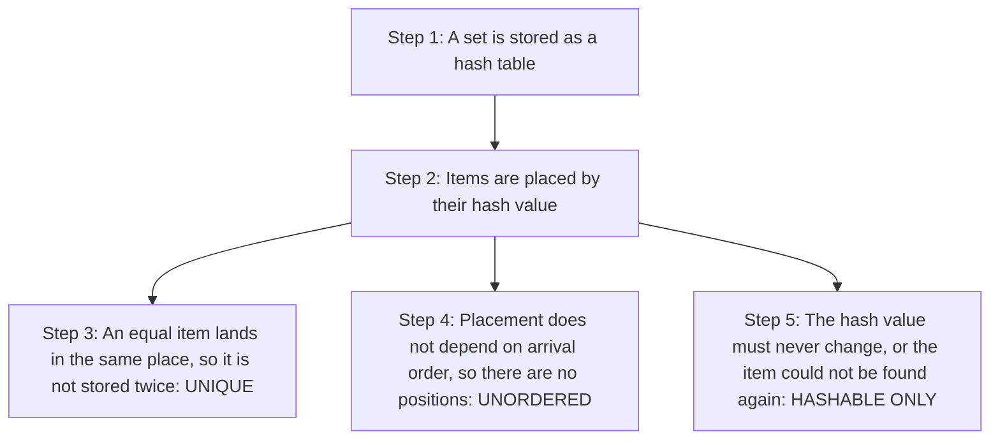
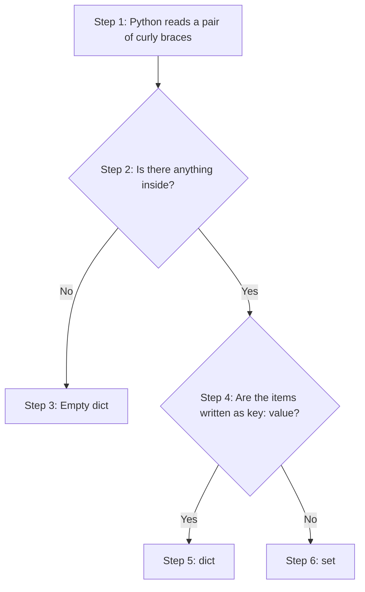
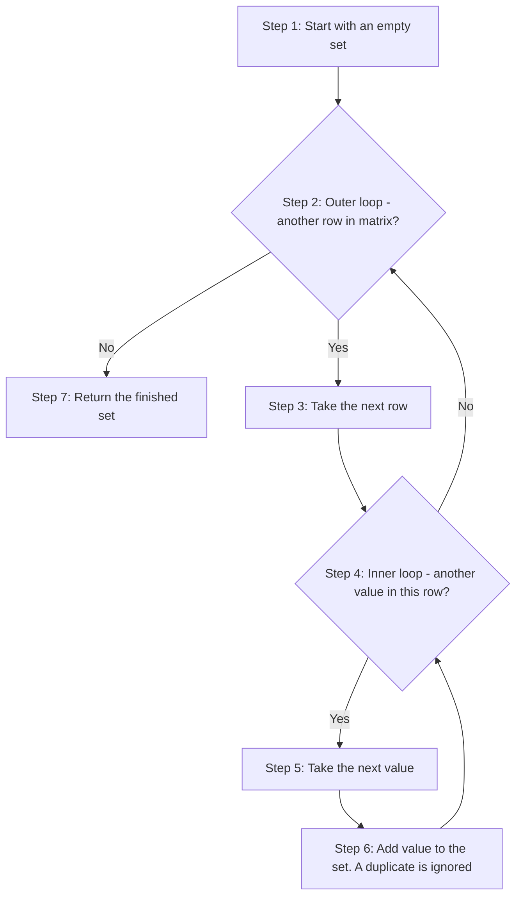
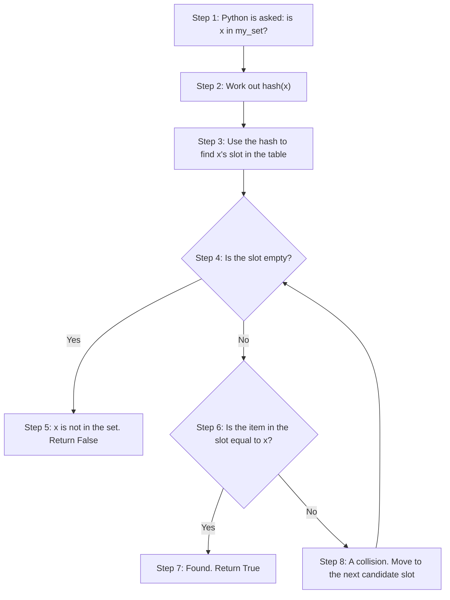
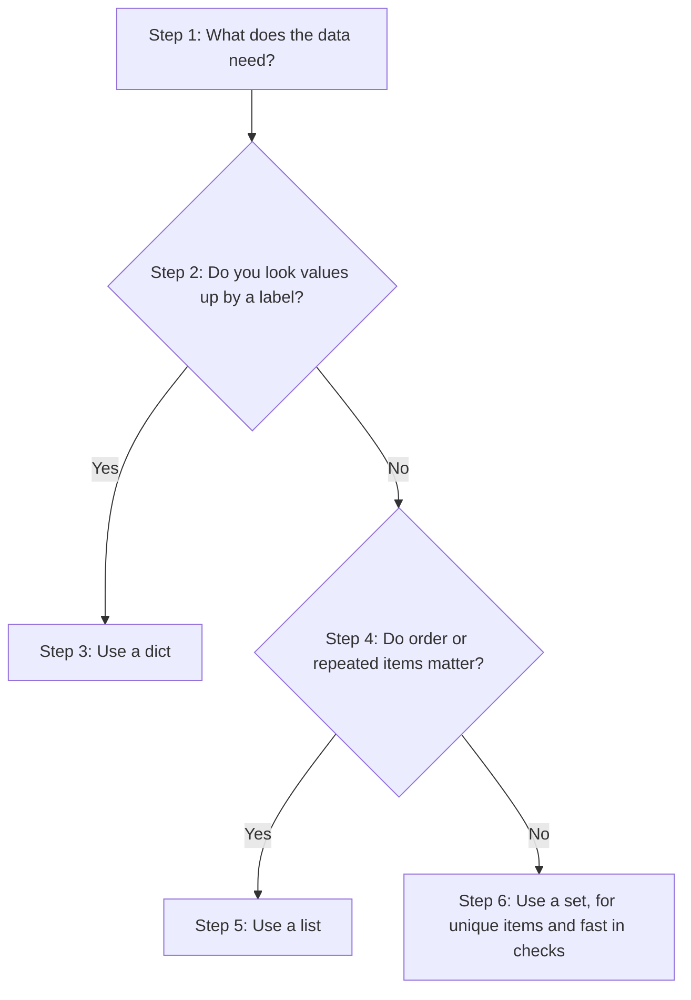
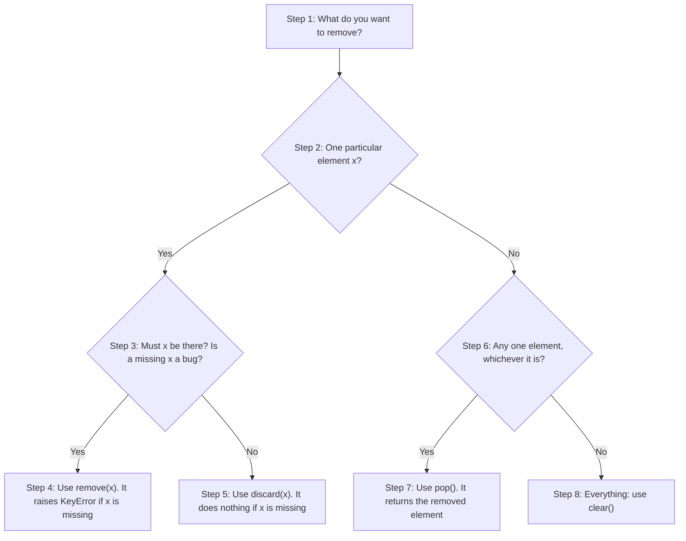
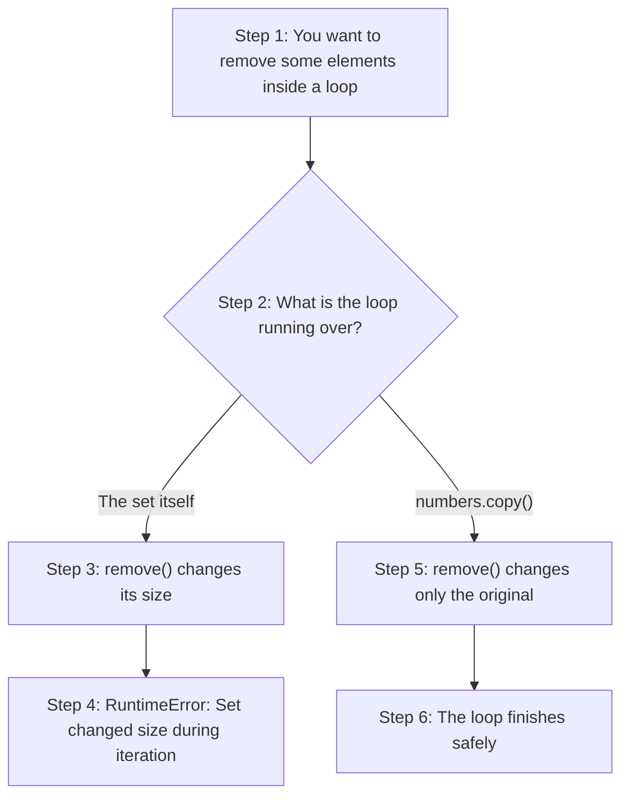
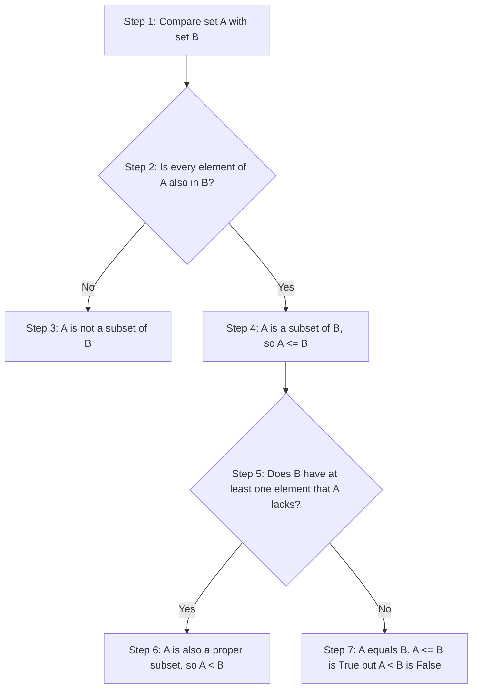

# Sets in Python: Conceptual Questions and Answers

A **set** is Python's built-in collection for holding **unique** items, with no fixed order. If you put the same value into a set twice, the set keeps only one copy. Sets are the natural tool whenever the question is "which different items do I have?" or "which items do these two groups have in common?"

This page belongs to the chapter on **Tuples, Dictionaries and Sets**. The printed book shows how to create a set, add and remove items, and use operations such as union and intersection. This page takes twenty conceptual questions from the book and answers each one in depth. The answers explain not only *what* sets do but also *why* they behave that way.

The page covers:

- the three core properties of a set (unique, unordered, hashable items only), and why they all come from one design choice;
- how to create and inspect sets, including set comprehensions;
- hashability, and why some objects can go into a set while others cannot;
- adding and removing items, and changing a set safely inside a loop;
- why sets are so fast at checking membership;
- the "Venn diagram" operations: union, intersection, difference and symmetric difference;
- subsets, supersets and `frozenset`.

Each answer explains the idea in plain language, breaks it into steps, and, where it helps, gives a short script with its output, a table or a flowchart. Many answers end with **follow-up questions** to test your understanding.

The ideas on this page connect closely with dictionaries. A set works very much like the keys of a dictionary without any values attached. If you have read [Dictionaries in Python: Conceptual Questions and Answers](80-ch19-dictionary-conceptual-qa.md), much of what follows will feel familiar.

> **Tip:** Run the scripts yourself in IDLE, VS Code, Thonny or Google Colab, and then change the values to see what happens.

## Table of Contents

- [Key Terms Used on This Page](#key-terms)
- [Part 1: What a Set Is and Why It Exists](#part-1)
  - [Q1. A Python set — unordered? unique? hashable-only? Why each?](#q1)
  - [Q2. Why do sets exist at all? (a) two jobs they specialise in (b) how they differ from that role in lists and dicts](#q2)
- [Part 2: Creating and Inspecting Sets](#part-2)
  - [Q3. The classic `{}` trap — (a) what does `{}` actually create (b) how do you correctly make an empty set (c) what changes once the set is non-empty?](#q3)
  - [Q4. Sets support no indexing and no slicing — (a) why not, structurally (b) what error is raised (c) what *does* still work for visiting elements?](#q4)
  - [Q5. Two ways to build a set — (a) literal notation vs (b) set() constructor — (c) what makes `set(iterable)` special, with an example on a list containing duplicates?](#q5)
  - [Q6. `len()` and `type()` on a set — are these set-specific functions, and what do they report?](#q6)
  - [Q7. Set comprehension — (a) syntax vs list comprehension (b) what "nested set comprehension" means and (c) how do you read the for clauses in one?](#q7)
- [Part 3: Hashability — What a Set Can Hold](#part-3)
  - [Q8. In a set, `True` and `1` and `False` and `0` collapse together — (a) why (b) what survives when all four appear in one collection?](#q8)
  - [Q9. Hashability — (a) what makes an object hashable (b) which built-in types qualify/disqualify and why (c) how does this give `O(1)` average-case membership testing internally?](#q9)
  - [Q10. Tuple-in-a-set exception — (a) why is (1, 2, "a") allowed inside a set but (1, [2, 3]) is not (b) what does "hashability is recursive" mean?](#q10)
  - [Q11. Set-in-set nesting — (a) why does `{{1, 2}, {3, 4}}` raise `TypeError` (b) what is the correct fix?](#q11)
- [Part 4: Sets Compared with Lists and Dictionaries, and Changing a Set](#part-4)
  - [Q12. Structural comparison — list vs dict vs set: (a) ordering (b) duplicates (c) access method (d) mutability (e) empty-literal syntax for each?](#q12)
  - [Q13. `.add()` vs `.update()` — (a) how do they treat their argument differently (b) walk through the classic string-splitting mistake](#q13)
  - [Q14. Four removal-family methods — `.remove()`, `.discard()`, `.pop()`, `.clear()`: (a) behaviour when element is missing/set is empty (b) return value (c) which to choose when](#q14)
  - [Q15. Modifying a set while iterating over it — (a) what happens and why (b) the correct fix](#q15)
- [Part 5: Speed and Set Operations](#part-5)
  - [Q16. Membership testing speed — (a) `O(1)` vs `O(n)`, concretely, for sets vs lists (b) why do `.items()`, `.keys()`, `.values()` not exist for sets?](#q16)
  - [Q17. Set operators (`|, &, -, ^`) vs named methods (`.union()`, `.intersection()`, etc.) — what is the one crucial difference in what they accept as an operand?](#q17)
  - [Q18. The four core Venn operations — union, intersection, difference, symmetric difference — (a) define each with symbol + method (b) is difference commutative?](#q18)
  - [Q19. Subset, proper subset, superset, and disjoint — (a) define each (b) exact distinction between subset and proper subset?](#q19)
- [Part 6: The Unchangeable Set](#part-6)
  - [Q20. `frozenset` — (a) what is it (b) why is it hashable when set is not (c) two practical consequences of that hashability?](#q20)
- [Quick Revision Summary](#quick-revision-summary)

<a id="key-terms"></a>
## Key Terms Used on This Page

| Term | Simple meaning | Learn more |
| --- | --- | --- |
| Set | An unordered collection of unique, hashable items, written like `{1, 2, 3}`. | [Python tutorial: Sets](https://docs.python.org/3/tutorial/datastructures.html#sets) |
| Element | One item stored in a set. | [Python docs: Set types](https://docs.python.org/3/library/stdtypes.html#set-types-set-frozenset) |
| Mutable / Immutable | Mutable objects can be changed after they are made (lists, dictionaries, sets). Immutable ones cannot (numbers, strings, tuples, frozensets). | [Glossary: mutable](https://docs.python.org/3/glossary.html#term-mutable) |
| Hash value | A whole number that Python works out from an object with `hash()`. Sets use it to decide where to store each element. | [Python docs: hash()](https://docs.python.org/3/library/functions.html#hash) |
| Hashable | An object whose hash value never changes while it exists. Only hashable objects can be set elements or dictionary keys. | [Glossary: hashable](https://docs.python.org/3/glossary.html#term-hashable) |
| Hash table | The internal layout used by sets and dictionaries. It uses hash values to jump almost straight to the right place, instead of searching item by item. | [Wikipedia: Hash table](https://en.wikipedia.org/wiki/Hash_table) |
| Sequence | An ordered collection whose items are reached by position (index): strings, lists, tuples. A set is **not** a sequence. | [Glossary: sequence](https://docs.python.org/3/glossary.html#term-sequence) |
| Iterable | Anything you can loop over with `for`. | [Glossary: iterable](https://docs.python.org/3/glossary.html#term-iterable) |
| O(1), O(n) | Big-O notation. O(1) means the time stays about the same however big the data is. O(n) means the time grows in step with the number of items. | [Wikipedia: Big O notation](https://en.wikipedia.org/wiki/Big_O_notation) |
| Venn diagram | A drawing of overlapping circles that shows what two groups share and what they do not. | [Wikipedia: Venn diagram](https://en.wikipedia.org/wiki/Venn_diagram) |
| `frozenset` | An immutable (unchangeable) version of a set. | [Python docs: frozenset](https://docs.python.org/3/library/stdtypes.html#frozenset) |

> **A note on the outputs on this page:** A set has no fixed order, so when you print a set, the items may appear in a different order from the one you typed. For sets of **strings**, the order can even change each time you run the program (the reason is explained in [Q6 on the dictionaries page](80-ch19-dictionary-conceptual-qa.md#q6)). So that your output matches this page exactly, many scripts print `sorted(my_set)`, which shows the items as a sorted **list**. The set itself is unchanged.

[Back to the Table of Contents](#table-of-contents)

---

<a id="part-1"></a>
## Part 1: What a Set Is and Why It Exists

This part explains the three core properties of a set, and the two jobs that sets do better than lists or dictionaries.

[Back to the Table of Contents](#table-of-contents)

<a id="q1"></a>
### Q1. A Python set — unordered? unique? hashable-only? Why each?

**Answer**

A set in Python is an **unordered** collection of **unique**, **hashable** elements. Think of it as a bag of labelled marbles:

- **(a) No duplicates.** Dropping in a marble that is already in the bag changes nothing, because a set can hold only one copy of any value.
- **(b) No fixed order.** The marbles roll around freely in the bag. There is no "first" or "last" marble, and you cannot ask for the item at index 0.
- **(c) Hashable elements only.** Every marble's label (its hash value) must never change. Python uses that label as a kind of fingerprint to find the marble instantly.

```python
s = {1, 2, 2, 3}
print(s)   # {1, 2, 3} -> the duplicate 2 is silently dropped
```

**Why all three rules exist: one design choice**

These three properties are not three separate quirks. They all follow from **one** choice about how sets are built: Python stores a set's elements in a **hash table**, not in a row of numbered positions like a list.

1. **Unique:** when you add an item, Python works out its hash value and goes to the matching place in the table. If an equal item is already there, nothing new is stored. So duplicates are impossible.
2. **Unordered:** a hash table places items according to their hash values, not according to when they arrived. It has no idea of "position", so ordering and indexing are impossible by design.
3. **Hashable only:** the table can place an object only if the object gives a hash value that never changes. So mutable, unhashable objects (lists, dictionaries, other sets) are rejected outright.

Understanding this one fact, **"a set is a hash table of keys with no values"**, explains almost every rule covered in the rest of this page.



**Script: the three properties in action**

```python
# Step 1 - Unique: duplicates are dropped automatically
s = {1, 2, 2, 3, 3, 3}
print("Unique:", s, "| length:", len(s))

# Step 2 - Unordered: there is no position 0
try:
    print(s[0])
except TypeError as error:
    print("Unordered -> TypeError:", error)

# Step 3 - Hashable only: a list cannot be an element
try:
    bad = {1, [2, 3]}
except TypeError as error:
    print("Hashable only -> TypeError:", error)
```

Output:

```text
Unique: {1, 2, 3} | length: 3
Unordered -> TypeError: 'set' object is not subscriptable
Hashable only -> TypeError: unhashable type: 'list'
```

**Follow-up question 1.1: If sets are unordered, why does `{3, 1, 2}` print as `{1, 2, 3}`?**

That is a side effect of how small whole numbers are hashed. The hash of a small whole number is the number itself, so they tend to land in the table in numerical order. It is not a promise. Do not write code that depends on the order in which a set shows its items.

[Back to the Table of Contents](#table-of-contents)

<a id="q2"></a>
### Q2. Why do sets exist at all? (a) two jobs they specialise in (b) how they differ from that role in lists and dicts

**Answer**

Lists keep order and allow duplicates. Dictionaries link keys to values. Sets specialise in two tasks that neither of those does efficiently:

- **(a) Job 1: instant deduplication.** "Deduplication" means removing repeated items. Passing a collection with repeats to `set()` gives a collection where every item appears exactly once.
- **(b) Job 2: fast lookups and "Venn-diagram" maths.** Sets can test `x in my_set` very quickly, and they can work out unions, intersections, differences and symmetric differences between two groups.

```python
raw = [3, 1, 4, 1, 5, 9, 2, 6, 5, 3]
unique = set(raw)   # {1, 2, 3, 4, 5, 6, 9} -- job 1: dedup
python_students = {"Alice", "Bob", "Charlie"}
ds_students = {"Charlie", "Dave"}
both = python_students & ds_students   # job 2: relational math -> {'Charlie'}
```

**How this differs from lists and dictionaries**

- If your problem is "does this collection have duplicates I need to remove?" or "which items are shared by, or only in, one of two groups?", a set is almost always the right tool.
- With **lists**, finding the common items needs a loop inside a loop: for each item of the first list, search the whole second list. For lists of sizes *n* and *m*, that is about *n* × *m* comparisons, written **O(n\*m)**.
- The **set** intersection above takes roughly **O(min(len(A), len(B)))** time. Python walks through the **smaller** set and, for each item, does one quick O(1) hash lookup in the larger set.
- A **dictionary** could be used for fast lookups (by storing items as keys with dummy values), but a set says what you mean more clearly and uses less memory.

| Job | With a list | With a set |
| --- | --- | --- |
| Remove duplicates | Loop and check each item by hand | `set(my_list)` |
| Is `x` present? | Checks items one by one: O(n) | Hash lookup: O(1) on average |
| Items common to two groups | Nested loops: O(n\*m) | `a & b`: about O(min(n, m)) |

**Script: the two jobs**

```python
# Job 1 - Deduplication in one step
raw = [3, 1, 4, 1, 5, 9, 2, 6, 5, 3]
unique = set(raw)
print("Original list:", raw, "| length:", len(raw))
print("As a set:     ", unique, "| length:", len(unique))

# Job 2 - Venn-diagram maths between two groups
python_students = {"Alice", "Bob", "Charlie"}
ds_students = {"Charlie", "Dave"}
print("In both groups:  ", python_students & ds_students)
print("Python only:     ", sorted(python_students - ds_students))
print("Is Dave a Python student?", "Dave" in python_students)

# For comparison - the same "common items" job with lists needs a nested search
python_list = ["Alice", "Bob", "Charlie"]
ds_list = ["Charlie", "Dave"]
common = [name for name in python_list if name in ds_list]   # 'in' on a list searches it each time
print("Common (list way):", common)
```

Output:

```text
Original list: [3, 1, 4, 1, 5, 9, 2, 6, 5, 3] | length: 10
As a set:      {1, 2, 3, 4, 5, 6, 9} | length: 7
In both groups:   {'Charlie'}
Python only:      ['Alice', 'Bob']
Is Dave a Python student? False
Common (list way): ['Charlie']
```

**Follow-up question 2.1: If I remove duplicates with `set()`, is the original order kept?**

No. A set has no order, so the original order of the list is lost. If you need to remove duplicates **and** keep the order of first appearance, use `list(dict.fromkeys(raw))`. Dictionaries keep insertion order, and their keys are unique, so this gives `[3, 1, 4, 5, 9, 2, 6]`.

[Back to the Table of Contents](#table-of-contents)

---

<a id="part-2"></a>
## Part 2: Creating and Inspecting Sets

This part covers the empty-set trap, why sets cannot be indexed, the two ways to build a set, the built-in tools for inspecting one, and set comprehensions.

[Back to the Table of Contents](#table-of-contents)

<a id="q3"></a>
### Q3. The classic `{}` trap — (a) what does `{}` actually create (b) how do you correctly make an empty set (c) what changes once the set is non-empty?

**Answer**

**(a) What `{}` creates**

`{}` always creates an **empty dictionary**, never an empty set, even though non-empty sets use the very same curly braces.

This is a deliberate design choice. When the braces are empty, there is no element and no `key: value` pair to show which type was meant. Python always settles this in favour of `dict`. (Dictionaries were in Python long before sets had their own curly-brace notation, so `{}` was already taken.)

**(b) How to make an empty set**

To create a truly empty set, you must call the `set()` constructor. (A **constructor** is a function that builds a new object of a type.)

```python
empty_literal = {}    # dict, NOT a set
empty_set = set()     # the only correct way to make an empty set
print(type(empty_literal))   # <class 'dict'>
print(type(empty_set))       # <class 'set'>
numbers = {10, 20, 30}                  # fine -- curly braces are clear once non-empty
student = {"name": "Anita", "age": 20}  # this is a dict, not a set, despite the braces
```

**(c) What changes once the set is non-empty**

Once there is at least one element, `{...}` is no longer unclear. Python looks inside the braces:

1. If it sees plain values separated by commas, such as `{10, 20, 30}`, it builds a **set**.
2. If it sees `key: value` pairs, such as `{"name": "Anita"}`, it builds a **dictionary**.
3. If it sees nothing at all, `{}`, it builds an empty **dictionary**.

This is one of the very few places in Python where an empty literal and a non-empty literal of the "same" syntax build different types. So it is worth memorising as a rule rather than working it out each time: **"`{}` is always a dict; `set()` is always a set."**



**Script: which type do the braces give?**

```python
# Step 1 - Empty braces give a dictionary
empty_literal = {}
print("{}       ->", type(empty_literal))

# Step 2 - set() is the only way to make an empty set
empty_set = set()
print("set()    ->", type(empty_set), "| printed as:", empty_set)

# Step 3 - Non-empty braces with plain values give a set
numbers = {10, 20, 30}
print("{10, ...} ->", type(numbers))

# Step 4 - Non-empty braces with key: value pairs give a dictionary
student = {"name": "Anita", "age": 20}
print("{k: v}   ->", type(student))

# Step 5 - The trap in practice: {} has no add() method
try:
    empty_literal.add(5)
except AttributeError as error:
    print("AttributeError:", error)
```

Output:

```text
{}       -> <class 'dict'>
set()    -> <class 'set'> | printed as: set()
{10, ...} -> <class 'set'>
{k: v}   -> <class 'dict'>
AttributeError: 'dict' object has no attribute 'add'
```

Notice that Python prints an empty set as `set()`, not `{}`. This is another reminder that `{}` means a dictionary.

**Follow-up question 3.1: Is `{()}` an empty set?**

No. `{()}` is a set with **one** element: the empty tuple `()`. Its length is `1`. Only `set()` gives a set with no elements.

[Back to the Table of Contents](#table-of-contents)

<a id="q4"></a>
### Q4. Sets support no indexing and no slicing — (a) why not, structurally (b) what error is raised (c) what *does* still work for visiting elements?

**Answer**

**(a) Why not**

Lists, tuples and strings support `s[0]` and `s[1:3]` because they are **sequences**. Each element sits in a specific numbered position, and Python's internal array remembers that position.

A set is built on a **hash table** instead. Elements are spread across the table according to their hash values, not according to the order in which they were added. So the very idea of "the element at position 0" does not exist.

**(b) The error raised**

Trying to index a set raises `TypeError: 'set' object is not subscriptable`. ("Subscriptable" means "can be used with square brackets `[]`".) Trying to slice a set fails in the same way, with the same message.

```python
languages = {"Python", "Java", "C++"}

try:
    print(languages[0])
except TypeError as e:
    print(e)   # 'set' object is not subscriptable
```

**(c) What still works**

Two things still work, because neither needs a position:

1. **Looping (iteration):** `for item in languages:` visits every element exactly once, in an arbitrary order decided by the hash table.
2. **Membership testing:** `"Java" in languages` checks whether the item is present, directly through hashing, without scanning positions.

So the mental model is:

- sets give up positional access in exchange for extremely fast membership testing;
- you can ask **"is X here?"** cheaply;
- but you can never ask **"what is at position N?"**.

| Operation | List | Set |
| --- | --- | --- |
| `x[0]` (indexing) | Works | `TypeError` |
| `x[1:3]` (slicing) | Works | `TypeError` |
| `for item in x:` (looping) | Works, in order | Works, in no fixed order |
| `item in x` (membership) | Works, O(n) | Works, O(1) on average |

**Script: what fails and what works**

```python
languages = {"Python", "Java", "C++"}

# Step 1 - Indexing fails
try:
    print(languages[0])
except TypeError as error:
    print("languages[0]   ->", error)

# Step 2 - Slicing fails too
try:
    print(languages[0:2])
except TypeError as error:
    print("languages[0:2] ->", error)

# Step 3 - Looping works (sorted() is used only so the order is the same every run)
for language in sorted(languages):
    print("Visiting:", language)

# Step 4 - Membership testing works
print("'Java' in languages:", "Java" in languages)
print("'Ruby' in languages:", "Ruby" in languages)
```

Output:

```text
languages[0]   -> 'set' object is not subscriptable
languages[0:2] -> 'set' object is not subscriptable
Visiting: C++
Visiting: Java
Visiting: Python
'Java' in languages: True
'Ruby' in languages: False
```

**Follow-up question 4.1: What if I really need "any one item" from a set?**

Use `next(iter(my_set))`, which gives some item without removing it, or `my_set.pop()`, which removes and returns some item (see [Q14](#q14)). Either way, you cannot choose **which** item you get. If you need the first item in a particular order, convert first: `sorted(my_set)[0]`.

[Back to the Table of Contents](#table-of-contents)

<a id="q5"></a>
### Q5. Two ways to build a set — (a) literal notation vs (b) set() constructor — (c) what makes `set(iterable)` special, with an example on a list containing duplicates?

**Answer**

A set can be created in two ways:

- **(a) Literal notation**, `{val1, val2, ...}`. This is handy when you already know the elements while writing the code.
- **(b) The `set()` constructor.** Called with nothing, `set()` creates an empty set. Called with an iterable, `set(some_iterable)` converts it into a set. The iterable can be a list, tuple, string, dictionary (only its keys are used) or a generator.

**(c) What makes `set(iterable)` special**

The constructor form makes **deduplication a one-liner**. Pass in a list with repeats, and every repeat disappears in the conversion, without any warning.

```python
colors = {"red", "green", "blue"}   # 1. literal notation
numbers = set()                     # 2. empty set via constructor
values = [10, 20, 20, 30, 30]
s = set(values)                     # 3. constructor on an iterable -> {10, 20, 30}
print(s)
print(len(s), type(s))              # 3 <class 'set'>
```

**Step by step: what `set(values)` does**

1. `set()` starts with an empty set.
2. It loops over `values` one item at a time: `10`, `20`, `20`, `30`, `30`.
3. For each item, it checks whether an equal item is already in the set. If not, it adds it.
4. The second `20` and the second `30` are already present, so they are skipped.
5. The result is `{10, 20, 30}`.

**A common surprise with strings**

`set("hello")` turns the **string** into a set of its individual characters, `{'h', 'e', 'l', 'o'}`. This is because a string is itself an iterable of one-character strings. Beginners often expect the whole word to become a single element. The same mistake comes up again with `.update()` and `.add()`, covered in [Q13](#q13).

In short: use `{...}` when you are typing values by hand, and use `set(iterable)` whenever the values already exist in some other collection that you want de-duplicated or converted.

| Source | Code | Result |
| --- | --- | --- |
| List with repeats | `set([10, 20, 20, 30, 30])` | `{10, 20, 30}` |
| Tuple | `set((1, 2, 2))` | `{1, 2}` |
| String | `set("hello")` | `{'h', 'e', 'l', 'o'}` (4 characters) |
| Dictionary | `set({"a": 1, "b": 2})` | `{'a', 'b'}` (keys only) |
| `range()` | `set(range(3))` | `{0, 1, 2}` |
| Whole word as one element | `{"hello"}` | `{'hello'}` |

**Script: two ways to build a set**

```python
# Step 1 - Literal notation: values typed by hand
colors = {"red", "green", "blue"}
print("Literal:", sorted(colors))

# Step 2 - The constructor with nothing inside gives an empty set
numbers = set()
print("Empty:  ", numbers, "| length:", len(numbers))

# Step 3 - The constructor on a list with repeats removes the duplicates
values = [10, 20, 20, 30, 30]
s = set(values)
print("From list:", s, "| length:", len(s), "|", type(s))

# Step 4 - A string is split into its characters
print("set('hello') sorted:", sorted(set("hello")))

# Step 5 - Braces keep the whole word as one element
print("{'hello'}:", {"hello"})
```

Output:

```text
Literal: ['blue', 'green', 'red']
Empty:   set() | length: 0
From list: {10, 20, 30} | length: 3 | <class 'set'>
set('hello') sorted: ['e', 'h', 'l', 'o']
{'hello'}: {'hello'}
```

**Follow-up question 5.1: How many elements does `set("banana")` have?**

Three: `'b'`, `'a'` and `'n'`. The word has six letters, but only three different ones.

[Back to the Table of Contents](#table-of-contents)

<a id="q6"></a>
### Q6. `len()` and `type()` on a set — are these set-specific functions, and what do they report?

**Answer**

**No, they are not set-specific.** `len(s)` and `type(s)` are **general-purpose Python built-in functions**. They work with lists, tuples, dictionaries, strings and almost every other container type.

They are, however, used all the time with sets. A set has no index to look at, so these two built-ins are the simplest way to check how many elements a set has and to confirm that it really is a set.

```python
s = {10, 20, 30}
print(len(s))    # 3 -> number of elements currently stored
print(type(s))   # <class 'set'> -> confirms this object really is a set
```

**What they report**

- **`len(s)`** returns a whole number (`int`): how many elements the set holds **right now**. This number changes as you `.add()` or `.remove()` items. Sets can grow and shrink, just like lists and dictionaries (and unlike strings and tuples, whose length is fixed once created).
- **`type(s)`** returns the type (class) of the object. This is especially useful when debugging code that mixes sets, frozensets and dictionaries. All three use curly braces when printed, yet they behave very differently. For example, a `frozenset` raises an `AttributeError` on `.add()`, while an ordinary set does not.

**Script: `len()` and `type()` at work**

```python
# Step 1 - len() gives the current number of elements
s = {10, 20, 30}
print("len:", len(s), "| type:", type(s))

# Step 2 - The length changes as the set changes
s.add(40)
print("After add(40):   len =", len(s))
s.add(40)                       # 40 is already present, so nothing changes
print("After add(40) again: len =", len(s))
s.remove(10)
print("After remove(10): len =", len(s))

# Step 3 - type() tells apart objects that look alike when printed
things = [{1, 2}, frozenset({1, 2}), {1: 2}]
for thing in things:
    print(f"{str(thing):<18} -> {type(thing).__name__}")

# Step 4 - The same built-ins work on other containers too
print("len of a list:", len([1, 2, 3]), "| len of a string:", len("hello"))
```

Output:

```text
len: 3 | type: <class 'set'>
After add(40):   len = 4
After add(40) again: len = 4
After remove(10): len = 3
{1, 2}             -> set
frozenset({1, 2})  -> frozenset
{1: 2}             -> dict
len of a list: 3 | len of a string: 5
```

**Follow-up question 6.1: How do I check in code whether something is a set?**

Use `isinstance(s, set)`. It returns `True` or `False`. To accept either a set or a frozenset, write `isinstance(s, (set, frozenset))`.

[Back to the Table of Contents](#table-of-contents)

<a id="q7"></a>
### Q7. Set comprehension — (a) syntax vs list comprehension (b) what "nested set comprehension" means and (c) how do you read the for clauses in one?

**Answer**

**(a) Syntax compared with a list comprehension**

A **set comprehension** is written exactly like a list comprehension, except that it uses **curly braces `{}`** instead of **square brackets `[]`**. Because the result is a real set, any duplicate values produced are automatically dropped.

The general forms are:

- `{expr for x in iterable}` (basic);
- `{expr for x in iterable if condition}` (filtered);
- `{expr for a in seq1 for b in seq2}` (nested).

```python
numbers = [1, 2, 3, 3, 4, 2, 5, 5, 5, 6, 4]
unique_numbers = {n for n in numbers}                  # {1, 2, 3, 4, 5, 6}
squares = {n * n for n in numbers}                     # {1, 4, 9, 16, 25, 36}
odd_squares = {n * n for n in numbers if n % 2 != 0}   # {1, 9, 25}
```

**(b) What a nested set comprehension means**

A nested comprehension has **more than one `for`** clause. It works like a loop inside a loop. For example, it can collect every value from a list of lists (often called a "matrix"):

```python
# Nested set comprehension over a list of lists ("matrix")
matrix = [[1, 2, 3, "cat"],
          [2, 3, 4, "dog"],
          [4, 5, 6, "cat"]]
unique_values = {value for row in matrix for value in row}

# The same thing written out in full:
unique_values_loop = set()
for row in matrix:            # outer loop, read first
    for value in row:         # inner loop, read second
        unique_values_loop.add(value)
```

**(c) How to read the `for` clauses**

**Reading rule for nested comprehensions:** always read the `for` clauses strictly **from left to right**.

1. The **first** `for` you meet is the **outer** loop.
2. The **second** `for` is the **inner** loop.
3. This is exactly the order in which you would nest the `for` statements if you wrote them out in full, as shown above.

This "left to right = outer to inner" rule is the single most useful trick for reading any nested comprehension, list or set, that you will meet later in the book.



**Script: set comprehensions**

```python
numbers = [1, 2, 3, 3, 4, 2, 5, 5, 5, 6, 4]

# Step 1 - Basic: duplicates are dropped automatically
print("Unique:     ", {n for n in numbers})

# Step 2 - An expression: the square of each number
print("Squares:    ", {n * n for n in numbers})

# Step 3 - With a filter: squares of odd numbers only
print("Odd squares:", {n * n for n in numbers if n % 2 != 0})

# Step 4 - Compare with a list comprehension, which keeps duplicates
print("List of squares:", [n * n for n in numbers])

# Step 5 - Nested: every distinct value from a list of lists
matrix = [[1, 2, 3, "cat"],
          [2, 3, 4, "dog"],
          [4, 5, 6, "cat"]]
unique_values = {value for row in matrix for value in row}

unique_values_loop = set()
for row in matrix:            # outer loop (first 'for')
    for value in row:         # inner loop (second 'for')
        unique_values_loop.add(value)

# Numbers and strings cannot be sorted together, so sort by their text form
print("Nested result:", sorted(unique_values, key=str))
print("Same as the loop?", unique_values == unique_values_loop)
```

Output:

```text
Unique:      {1, 2, 3, 4, 5, 6}
Squares:     {1, 4, 36, 9, 16, 25}
Odd squares: {1, 9, 25}
List of squares: [1, 4, 9, 9, 16, 4, 25, 25, 25, 36, 16]
Nested result: [1, 2, 3, 4, 5, 6, 'cat', 'dog']
Same as the loop? True
```

Notice that the set of squares printed as `{1, 4, 36, 9, 16, 25}`, not in numerical order. This is a good reminder that sets have no fixed order. The list comprehension in Step 4 keeps every value, including the repeats, in the original order.

**Follow-up question 7.1: How would you write a set comprehension that gives the first letter of each word, in lower case?**

`{word[0].lower() for word in ["Apple", "avocado", "Banana"]}` gives `{'a', 'b'}`. The two words starting with "a" give the same letter, so it is stored only once.

[Back to the Table of Contents](#table-of-contents)

---

<a id="part-3"></a>
## Part 3: Hashability — What a Set Can Hold

Every element of a set must be hashable. This part explains what that means, which types qualify, how it makes sets fast, and how it affects tuples and sets placed inside other sets.

[Back to the Table of Contents](#table-of-contents)

<a id="q8"></a>
### Q8. In a set, `True` and `1` and `False` and `0` collapse together — (a) why (b) what survives when all four appear in one collection?

**Answer**

**(a) Why they collapse**

In Python, `bool` (the type of `True` and `False`) is a **subtype** of `int`. In other words, `True` and `False` are special whole numbers. Critically:

- `True == 1` is `True`, and `False == 0` is `True`.
- Their hash values match as well: `hash(True) == hash(1)` and `hash(False) == hash(0)`.

A set decides whether two items are "the same" by checking both the hash value and equality. So a set can keep only **one** representative from any group of values that are equal to each other, however different they look when you type them.

```python
values = [1, True, 0, False, "Python"]
result = {value for value in values}
print(result)   # {0, 1, 'Python'} (order may vary)
```

**(b) What survives**

Python keeps whichever of the equal values was inserted **first**:

1. `1` is added first.
2. `True` is equal to `1`, so it is treated as a duplicate and skipped. The set keeps `1`.
3. `0` is added.
4. `False` is equal to `0`, so it is skipped. The set keeps `0`.
5. `"Python"` is added.

So if `1` came before `True` in the source, the set stores `1`, not `True`. (Either way, it prints and compares the same, because the two are equal.)

This is a subtle but real trap when you remove duplicates from mixed data. For example, a set of "flags" that mixes booleans and `0`/`1` whole numbers from different sources will quietly merge them into one.

If you need to tell `True` apart from `1`, or `False` apart from `0`, a set is the wrong tool. Use a `list`, or check explicitly with `type(x) is bool`.

**Script: which value survives?**

```python
# Step 1 - 1 comes before True, and 0 before False
values = [1, True, 0, False, "Python"]
result = {value for value in values}
print("Set:", sorted(result, key=str), "| length:", len(result))

# Step 2 - The reason: they are equal and have equal hashes
print("True == 1:", True == 1, "| hash(True) == hash(1):", hash(True) == hash(1))
print("False == 0:", False == 0, "| hash(False) == hash(0):", hash(False) == hash(0))

# Step 3 - Reverse the order: now True and False arrive first and survive
print("True first:", {True, 1}, "| 1 first:", {1, True})
print("False first:", {False, 0}, "| 0 first:", {0, False})

# Step 4 - The float 1.0 is also equal to 1, so it collapses too
print("{1, 1.0, True}:", {1, 1.0, True})
```

Output:

```text
Set: [0, 1, 'Python'] | length: 3
True == 1: True | hash(True) == hash(1): True
False == 0: True | hash(False) == hash(0): True
True first: {True} | 1 first: {1}
False first: {False} | 0 first: {0}
{1, 1.0, True}: {1}
```

Step 3 shows the "first one wins" rule clearly: `{True, 1}` keeps `True`, while `{1, True}` keeps `1`.

**Follow-up question 8.1: How could you keep `True` and `1` as separate items?**

Store each value together with its type, for example as a tuple: `{(type(v).__name__, v) for v in values}`. Now `("bool", True)` and `("int", 1)` are different tuples, so both are kept.

[Back to the Table of Contents](#table-of-contents)

<a id="q9"></a>
### Q9. Hashability — (a) what makes an object hashable (b) which built-in types qualify/disqualify and why (c) how does this give `O(1)` average-case membership testing internally?

**Answer**

**(a) What makes an object hashable**

An object is **hashable** if it gives a fixed, unchanging whole number, its "fingerprint", through the built-in `hash()` function, for as long as the object exists. It must also be comparable with `==`, and equal objects must have equal hashes.

**(b) Which built-in types qualify**

- **Hashable:** integers, floats, strings, booleans, `None`, frozensets, and tuples (**provided every element inside the tuple is itself hashable**). None of these can be changed after they are created.
- **Not hashable:** lists, dictionaries and ordinary sets. Their contents **can** change. If the contents changed, the hash value would have to change too, and that would break the hash table that relies on it staying the same.

```python
print(hash("Python"))   # some integer, unchanged for this session
print(hash((1, 2)))     # tuples are hashable if their contents are
```

| Hashable (can go in a set) | Not hashable (cannot go in a set) |
| --- | --- |
| `int`, `float`, `bool` | `list` |
| `str` | `dict` |
| `None` | `set` |
| `tuple` of hashable items | `tuple` that contains a list, dict or set |
| `frozenset` | |

**(c) How hashability gives O(1) membership testing**

Internally, Python stores a set's elements in a **hash table**, the same mechanism a dictionary uses for its keys. When you run `x in my_set`, or add an element, Python does three things:

1. **Work out `hash(x)`.**
2. **Use that number to work out which slot** in the table `x` belongs in.
3. **Check just that slot** (and, if another item happens to be there, a few nearby slots), instead of scanning the whole collection.

Because step 3 touches only a tiny, near-constant number of slots, however large the set is, membership testing has **average-case O(1)** (constant) time. Looking something up in a set of 10 elements takes about the same time as in a set of 10 million elements. This is the biggest performance reason to prefer sets over lists in code that checks membership a lot.

The word "average" matters. Two different items can sometimes get the same slot (a **collision**). Python then checks a few more slots. With well-spread hash values, this happens rarely enough that lookups stay fast.



**Script: testing hashability**

```python
# Step 1 - Hashable objects give a whole number
for obj in [42, 3.5, "Python", (1, 2), frozenset({1, 2}), None]:
    print(f"{obj!r:<20} hashable -> hash is an int: {isinstance(hash(obj), int)}")

# Step 2 - Unhashable objects raise TypeError
for obj in [[1, 2], {"a": 1}, {1, 2}]:
    try:
        hash(obj)
    except TypeError as error:
        print(f"{obj!r:<20} NOT hashable -> {error}")
```

Output:

```text
42                   hashable -> hash is an int: True
3.5                  hashable -> hash is an int: True
'Python'             hashable -> hash is an int: True
(1, 2)               hashable -> hash is an int: True
frozenset({1, 2})    hashable -> hash is an int: True
None                 hashable -> hash is an int: True
[1, 2]               NOT hashable -> unhashable type: 'list'
{'a': 1}             NOT hashable -> unhashable type: 'dict'
{1, 2}               NOT hashable -> unhashable type: 'set'
```

In the f-strings, `{obj!r:<20}` prints the object as it would appear in code and pads it to 20 characters, so that the columns line up.

**Follow-up question 9.1: Why does `hash("Python")` give a different number each time I restart Python?**

For security, Python picks a new random starting value for string hashing each time it starts. Within one run, the hash never changes, which is all a set needs. This is explained in detail in [Q6 on the dictionaries page](80-ch19-dictionary-conceptual-qa.md#q6).

[Back to the Table of Contents](#table-of-contents)

<a id="q10"></a>
### Q10. Tuple-in-a-set exception — (a) why is (1, 2, "a") allowed inside a set but (1, [2, 3]) is not (b) what does "hashability is recursive" mean?

**Answer**

**(a) Why one tuple is allowed and the other is not**

A tuple is itself immutable: you cannot reassign `t[0]`. But Python's rule for hashability goes one level deeper. A container's hash value is worked out **from the hash values of everything it contains**. So a tuple is hashable only if **every single element inside it** is also hashable.

- `(1, 2, "a")` qualifies, because whole numbers and strings are hashable.
- `(1, [2, 3])` fails, because it contains a list, and lists are mutable (and so unhashable). The outer tuple "inherits" that unhashability from what is inside it.

```python
mutable_inside_tuple = (1, 2, [3, 4])
try:
    bad_set = {10, mutable_inside_tuple}
except TypeError as e:
    print("Error Caught:", e)   # unhashable type: 'list'

# Correct alternative -- swap the inner list for an inner tuple:
s = {1, 2, (3, 4)}
print(s)   # {1, 2, (3, 4)} -- fully hashable now
```

**(b) What "hashability is recursive" means**

"Recursive" here means "the same check is applied again at every level inside". Python does not just look at the outer object's type. To work out the hash of the whole tuple, it must be able to work out `hash()` for every value nested inside it, and for every value nested inside those, and so on.

**Step by step: hashing `(1, [2, 3])`**

1. Python needs `hash((1, [2, 3]))`.
2. To get it, Python needs the hash of each element.
3. `hash(1)` works.
4. `hash([2, 3])` fails, because a list is unhashable.
5. So the whole tuple is unhashable, and Python raises `TypeError: unhashable type: 'list'`.

**The fix: use immutable versions inside**

A `frozenset` is the standard fix when you need a set-like group of values inside a set or a tuple. Since a `frozenset` is immutable and hashable, `(1, frozenset({2, 3}))` is perfectly valid as a set element. By contrast, `(1, {2, 3})` (with a real, mutable set inside) can be created as a tuple, but cannot be placed in a set or used as a dictionary key.

| Tuple | Hashable? | Why |
| --- | --- | --- |
| `(1, 2, "a")` | Yes | All items hashable |
| `(1, (2, 3))` | Yes | The inner tuple is hashable too |
| `(1, frozenset({2, 3}))` | Yes | A frozenset is hashable |
| `(1, [2, 3])` | No | Contains a list |
| `(1, {2, 3})` | No | Contains a set |
| `(1, (2, [3]))` | No | A list is hidden two levels down |

**Script: recursive hashability**

```python
# Step 1 - A tuple with a list inside cannot join a set
mutable_inside_tuple = (1, 2, [3, 4])
try:
    bad_set = {10, mutable_inside_tuple}
except TypeError as error:
    print("Error caught:", error)

# Step 2 - Swap the inner list for a tuple: now it works
s = {1, 2, (3, 4)}
print("Fixed with a tuple:", s)

# Step 3 - A list hidden two levels deep still breaks it
try:
    hash((1, (2, [3])))
except TypeError as error:
    print("Deeply nested list:", error)

# Step 4 - A frozenset inside a tuple is fine
t = (1, frozenset({2, 3}))
print("Tuple with a frozenset is hashable:", isinstance(hash(t), int))
```

Output:

```text
Error caught: unhashable type: 'list'
Fixed with a tuple: {1, 2, (3, 4)}
Deeply nested list: unhashable type: 'list'
Tuple with a frozenset is hashable: True
```

**Follow-up question 10.1: Can I create the tuple `(1, [2, 3])` at all?**

Yes. Creating it is fine. The error comes only when Python needs its hash, for example when you put it in a set, use it as a dictionary key, or call `hash()` on it. See also [Q13 on the tuples page](50-ch19-tuples-conceptual-qa.md#q13).

[Back to the Table of Contents](#table-of-contents)

<a id="q11"></a>
### Q11. Set-in-set nesting — (a) why does `{{1, 2}, {3, 4}}` raise `TypeError` (b) what is the correct fix?

**Answer**

**(a) Why it fails**

Sets are themselves **mutable**: you can `.add()` or `.remove()` elements at any time. Mutable built-in objects are never hashable (see [Q9](#q9) and [Q10](#q10)).

Every element stored inside an outer set must be hashable. So you cannot put an ordinary, mutable set inside another set. Python raises `TypeError: unhashable type: 'set'` the moment it tries to work out a hash for the inner set.

```python
try:
    invalid_nested_set = {{1, 2}, {3, 4}}
except TypeError as e:
    print("Error Caught:", e)   # unhashable type: 'set'

# Correct approach: convert each inner set to an immutable frozenset
valid_nested_set = {frozenset({1, 2}), frozenset({3, 4})}
print(valid_nested_set)   # {frozenset({1, 2}), frozenset({3, 4})} (order may vary)
```

**(b) The fix**

Convert each inner set into a **`frozenset`**, the immutable version of a set. This fix follows the same pattern used elsewhere in the chapter: wherever a mutable structure is rejected because it is not hashable, its immutable "sibling" almost always solves the problem.

| Mutable (rejected) | Immutable sibling (accepted) |
| --- | --- |
| `list` | `tuple` |
| `set` | `frozenset` |

This pattern, a "set of sets" where the inner sets must be frozen, comes up in real programs whenever you group combinations of things, such as tags, permissions or categories, and need to remove duplicate **groups**.

**Script: a set of groups**

```python
# Step 1 - A set of ordinary sets fails
try:
    invalid_nested_set = {{1, 2}, {3, 4}}
except TypeError as error:
    print("Error caught:", error)

# Step 2 - A set of frozensets works
valid_nested_set = {frozenset({1, 2}), frozenset({3, 4})}
print("Number of groups:", len(valid_nested_set))

# Step 3 - A practical use: remove duplicate teams, whatever order the names are in
teams = [["Asha", "Ravi"], ["Ravi", "Asha"], ["Meena", "Anil"]]
unique_teams = {frozenset(team) for team in teams}
print("Teams given:", len(teams), "| distinct teams:", len(unique_teams))

# Step 4 - Membership works on the groups too
print("Is {Asha, Ravi} a team?", frozenset({"Ravi", "Asha"}) in unique_teams)
```

Output:

```text
Error caught: unhashable type: 'set'
Number of groups: 2
Teams given: 3 | distinct teams: 2
Is {Asha, Ravi} a team? True
```

In Step 3, `["Asha", "Ravi"]` and `["Ravi", "Asha"]` become the same `frozenset`, because sets ignore order. So the duplicate team is removed.

**Follow-up question 11.1: Can I add a new element to one of the frozensets inside the set?**

No. A frozenset cannot be changed. To "change" a group, remove the old frozenset from the outer set and add a new one: `groups.remove(old)` then `groups.add(old | {"new item"})`.

[Back to the Table of Contents](#table-of-contents)

---

<a id="part-4"></a>
## Part 4: Sets Compared with Lists and Dictionaries, and Changing a Set

This part places sets side by side with lists and dictionaries, and then looks at the methods for adding and removing elements, including how to change a set safely inside a loop.

[Back to the Table of Contents](#table-of-contents)

<a id="q12"></a>
### Q12. Structural comparison — list vs dict vs set: (a) ordering (b) duplicates (c) access method (d) mutability (e) empty-literal syntax for each?

**Answer**

The three core built-in collections differ sharply on these points, even though all three are **mutable** in Python.

| Feature | List (`list`) | Dictionary (`dict`) | Set (`set`) |
| --- | --- | --- | --- |
| Main purpose | Ordered collection of items | Key-value pairs | Unique elements |
| Literal syntax | `[1, 2, 3]` | `{'a': 1, 'b': 2}` | `{1, 2, 3}` |
| (a) Ordering | Keeps insertion order | Keeps insertion order (Python 3.7+) | Unordered |
| (b) Duplicates | Allowed | Keys: no. Values: yes | Not allowed |
| (c) Access method | By index: `lst[0]` | By key: `dct['a']` | No direct access: no index or key. Use `in` or a loop |
| Slicing | Supported | Not supported | Not supported |
| (d) Mutability | Mutable | Mutable | Mutable (use `frozenset` for an immutable set) |
| What it can hold | Any object | Keys: hashable only. Values: any | Hashable only |
| (e) Empty collection | `[]` | `{}` | `set()` (there is no empty-set literal) |

```python
lst = [1, 2, 2, 3]       # keeps the duplicate 2
d = {"a": 1, "b": 2}     # ordered key -> value mapping
s = {1, 2, 2, 3}         # duplicate 2 collapses to {1, 2, 3}
```

**Which one to choose**

- Use a **list** when both order and duplicates matter, such as a shopping cart or a queue of tasks.
- Use a **dictionary** when you need to look something up by a meaningful key, such as a student ID linked to a student's record.
- Use a **set** when all that matters is **which distinct items exist**, or when you need fast membership tests or Venn-style comparisons between groups.

A useful warning sign: if you find yourself writing `if item not in my_list:` before every `append()`, inside a loop that runs many times, the list should probably have been a set.



**Script: the same data in all three**

```python
data = [3, 1, 2, 2, 3]

# Step 1 - A list keeps everything, in order
lst = list(data)
print("List:", lst, "| lst[0] =", lst[0])

# Step 2 - A dictionary (here counting each value) is reached by key
d = {}
for x in data:
    d[x] = d.get(x, 0) + 1
print("Dict:", d, "| d[2] =", d[2])

# Step 3 - A set keeps only the distinct values, with no index
s = set(data)
print("Set: ", s, "| 2 in s =", 2 in s)

# Step 4 - All three are mutable
lst.append(9); d[9] = 1; s.add(9)
print("After adding 9 ->", lst, d, s)
```

Output:

```text
List: [3, 1, 2, 2, 3] | lst[0] = 3
Dict: {3: 2, 1: 1, 2: 2} | d[2] = 2
Set:  {1, 2, 3} | 2 in s = True
After adding 9 -> [3, 1, 2, 2, 3, 9] {3: 2, 1: 1, 2: 2, 9: 1} {1, 2, 3, 9}
```

In Step 4, the semicolons `;` let three short statements share one line. This is allowed in Python but is usually avoided except in short examples like this.

**Follow-up question 12.1: Is there an immutable version of each of the three?**

For a list, the immutable counterpart is a `tuple`. For a set, it is a `frozenset`. Python has no built-in immutable dictionary type. (The standard library offers `types.MappingProxyType`, a read-only view of a dictionary, but it is rarely needed at this level.)

[Back to the Table of Contents](#table-of-contents)

<a id="q13"></a>
### Q13. `.add()` vs `.update()` — (a) how do they treat their argument differently (b) walk through the classic string-splitting mistake

**Answer**

**(a) The difference**

- **`.add(elem)`** inserts **exactly one** hashable object as a single new element. Whatever you pass in becomes the element, just as it is.
- **`.update(*iterables)`** treats each argument as an **iterable**. It opens it up and inserts **each item** inside it as a **separate** element of the set. (The `*` in `*iterables` means that you can pass more than one iterable at once.)

This difference becomes a trap as soon as the argument is a **string**, because a string is itself an iterable of one-character strings.

**(b) The classic mistake, step by step**

```python
fruits1 = {"apple"}
fruits2 = {"apple"}
fruits3 = {"apple"}

fruits1.add("banana")       # "banana" goes in as ONE element
fruits2.update(["banana"])  # the list holds one item, "banana", so ONE element is added
fruits3.update("banana")    # THE MISTAKE: the string itself is looped over, letter by letter
```

What happens with `fruits3.update("banana")`:

1. `.update()` receives the bare string `"banana"`.
2. It loops over the string, one character at a time: `'b'`, `'a'`, `'n'`, `'a'`, `'n'`, `'a'`.
3. It adds each character as a separate element.
4. The repeated `'a'` and `'n'` are dropped, because sets keep only one copy.
5. The result is `{'apple', 'b', 'a', 'n'}`, not `{'apple', 'banana'}`.

The rule of thumb to remember:

- **Use `.add()` for a single new element**, even if that element is a word with many letters.
- **Use `.update()` only when merging in the contents of another collection.**
- Wrapping a string in a list, as in `update(["banana"])`, is how you tell `.update()`: "treat this string as one item, not as a sequence of characters."

| Code | What is added to `{"apple"}` | Result |
| --- | --- | --- |
| `s.add("banana")` | One element: `"banana"` | `{'apple', 'banana'}` |
| `s.update(["banana"])` | The list's one item: `"banana"` | `{'apple', 'banana'}` |
| `s.update("banana")` | Each character: `'b'`, `'a'`, `'n'` | `{'apple', 'b', 'a', 'n'}` |
| `s.update(["kiwi", "fig"], {"lime"})` | Items from two collections | `{'apple', 'kiwi', 'fig', 'lime'}` |
| `s.add(["kiwi"])` | Tries to add a list as one element | `TypeError`: a list is unhashable |

**Script: `.add()` versus `.update()`**

```python
# Step 1 - Three identical starting sets
fruits1 = {"apple"}
fruits2 = {"apple"}
fruits3 = {"apple"}

# Step 2 - add(): the whole string is one element
fruits1.add("banana")
print("add('banana'):       ", sorted(fruits1))

# Step 3 - update() with the string inside a list: still one element
fruits2.update(["banana"])
print("update(['banana']):  ", sorted(fruits2))

# Step 4 - The classic mistake: update() with a bare string splits it into letters
fruits3.update("banana")
print("update('banana'):    ", sorted(fruits3))

# Step 5 - update() can merge several collections at once
fruits1.update(["kiwi", "fig"], {"lime"})
print("update(list, set):   ", sorted(fruits1))

# Step 6 - add() cannot take a list, because a list is unhashable
try:
    fruits1.add(["kiwi"])
except TypeError as error:
    print("add(['kiwi']) -> TypeError:", error)
```

Output:

```text
add('banana'):        ['apple', 'banana']
update(['banana']):   ['apple', 'banana']
update('banana'):     ['a', 'apple', 'b', 'n']
update(list, set):    ['apple', 'banana', 'fig', 'kiwi', 'lime']
add(['kiwi']) -> TypeError: unhashable type: 'list'
```

**Follow-up question 13.1: Does `.update()` return the new set?**

No. Like `.add()`, it changes the set in place and returns `None`. Writing `s = s.update(...)` would leave `s` holding `None`. The operator form `s |= other` does the same job as `s.update(other)` when `other` is a set.

[Back to the Table of Contents](#table-of-contents)

<a id="q14"></a>
### Q14. Four removal-family methods — `.remove()`, `.discard()`, `.pop()`, `.clear()`: (a) behaviour when element is missing/set is empty (b) return value (c) which to choose when

**Answer**

These four methods differ in how strictly they insist that the element must exist, and in what they give back to you.

| Method | If the element exists | If the element is missing, or the set is empty | Returns | Best used when |
| --- | --- | --- | --- | --- |
| `s.remove(x)` | Deletes `x` | **Raises `KeyError`** | `None` | A missing `x` is itself a bug that you want to hear about |
| `s.discard(x)` | Deletes `x` | Does nothing, silently | `None` | You are not sure `x` is present, and that is fine |
| `s.pop()` | Removes an **arbitrary** element (you cannot choose which) | **Raises `KeyError`** if the set is empty | **The removed element** | You just need "any" item, and order does not matter |
| `s.clear()` | Deletes everything | Works fine even if already empty | `None` | Emptying a set while keeping the same set object |

```python
students = {"Alice", "Bob"}
students.add("Charlie")             # {'Alice', 'Bob', 'Charlie'}
students.update(["David", "Eve"])   # adds two more elements
students.discard("Bob")             # safe -- no error even if 'Bob' were absent
item = students.pop()               # removes and returns some arbitrary element
students.clear()                    # -> set()
```

**A simple way to choose**



**How each one relates to what you already know**

- `.remove()` is the **strict** one. It is like `dict[key]`, which raises `KeyError` for a missing key.
- `.discard()` is the **safe** one. It follows the same "no error" idea as `dict.get()`.
- `.pop()` is for when it does not matter **which** item is removed, for example taking the next job from a pile of jobs that can be done in any order.
- `.clear()` empties the set without replacing it with a new object. This matters if some other part of the program still refers to the same set: it will see the set become empty too.

**Script: the four removal methods**

```python
students = {"Alice", "Bob", "Charlie"}

# Step 1 - remove(): works if present, KeyError if missing
students.remove("Alice")
print("After remove('Alice'):", sorted(students))
try:
    students.remove("Zara")
except KeyError as error:
    print("remove('Zara') -> KeyError:", error)

# Step 2 - discard(): works if present, silent if missing
students.discard("Bob")
students.discard("Zara")            # no error
print("After discard('Bob') and discard('Zara'):", sorted(students))

# Step 3 - pop(): removes and RETURNS some element
item = students.pop()
print("pop() returned:", item, "| left:", students)

# Step 4 - pop() on an empty set raises KeyError
try:
    students.pop()
except KeyError as error:
    print("pop() on empty set -> KeyError:", error)

# Step 5 - clear() empties the set but keeps the same object
team = {"x", "y"}
same_team = team                    # a second name for the same set
team.clear()
print("After clear():", team, "| the other name sees:", same_team)
```

Output:

```text
After remove('Alice'): ['Bob', 'Charlie']
remove('Zara') -> KeyError: 'Zara'
After discard('Bob') and discard('Zara'): ['Charlie']
pop() returned: Charlie | left: set()
pop() on empty set -> KeyError: 'pop from an empty set'
After clear(): set() | the other name sees: set()
```

In Step 3, only one element was left, so we know `pop()` returned `'Charlie'`. With more elements, you could not predict which one `pop()` would pick.

**Follow-up question 14.1: What would `team = set()` do instead of `team.clear()` in Step 5?**

It would make the name `team` point to a **new** empty set. The old set would be untouched, so `same_team` would still be `{'x', 'y'}`. `clear()` empties the existing object; assigning `set()` only moves the name.

[Back to the Table of Contents](#table-of-contents)

<a id="q15"></a>
### Q15. Modifying a set while iterating over it — (a) what happens and why (b) the correct fix

**Answer**

**(a) What happens, and why**

Changing the **size** of a set (adding or removing elements) while a `for` loop is going through that same set raises:

`RuntimeError: Set changed size during iteration`

This happens because the loop walks through the set's internal hash table directly, keeping track of where it has got to. Adding or removing elements can rearrange or resize the table. The loop's place-marker would then no longer be reliable, so Python stops with an error rather than risk skipping or repeating elements.

```python
numbers = {1, 2, 3, 4, 5}
try:
    for num in numbers:
        if num % 2 == 0:
            numbers.remove(num)   # changing the set you are looping over
except RuntimeError as e:
    print("Error:", e)   # Set changed size during iteration
```

**(b) The correct fix**

The standard fix is to **loop over a copy while changing the original**:

1. Call `numbers.copy()` to make a separate (shallow) copy of the set.
2. Use the copy to drive the loop.
3. Make the `.remove()` or `.add()` calls on the original `numbers`.

Because the loop no longer walks through the object that is being changed, its place-marker is never disturbed.

```python
numbers = {1, 2, 3, 4, 5}
for num in numbers.copy():   # loop over the copy
    if num % 2 == 0:
        numbers.remove(num)  # change the original safely

print(numbers)   # {1, 3, 5}
```

Two other safe ways are often even simpler, because they build the result without any loop that changes the set:

- A set comprehension: `numbers = {n for n in numbers if n % 2 != 0}`.
- A set difference: `numbers -= {n for n in numbers if n % 2 == 0}`.

This "loop over a copy, change the original" pattern is not special to sets. The same technique is used with dictionaries (see [Q14 on the dictionaries page](80-ch19-dictionary-conceptual-qa.md#q14)) and with lists. Lists are actually more dangerous: they do not raise an error, but quietly **skip** items, as the script below shows. So it is worth learning this as a general Python habit, not as a set-only rule.



**Script: the error, the fixes, and the list surprise**

```python
# Step 1 - Changing the set being looped over raises RuntimeError
numbers = {1, 2, 3, 4, 5}
try:
    for num in numbers:
        if num % 2 == 0:
            numbers.remove(num)
except RuntimeError as error:
    print("Looping over the set itself -> RuntimeError:", error)

# Step 2 - Fix 1: loop over a copy, change the original
numbers = {1, 2, 3, 4, 5}
for num in numbers.copy():
    if num % 2 == 0:
        numbers.remove(num)
print("Fix 1, loop over a copy:     ", numbers)

# Step 3 - Fix 2: build a new set with a comprehension
numbers = {1, 2, 3, 4, 5}
numbers = {n for n in numbers if n % 2 != 0}
print("Fix 2, set comprehension:    ", numbers)

# Step 4 - The same mistake with a LIST gives no error, but a wrong answer
values = [2, 4, 6, 1]
for v in values:
    if v % 2 == 0:
        values.remove(v)
print("List changed in its own loop:", values, "<- 4 was skipped!")
```

Output:

```text
Looping over the set itself -> RuntimeError: Set changed size during iteration
Fix 1, loop over a copy:      {1, 3, 5}
Fix 2, set comprehension:     {1, 3, 5}
List changed in its own loop: [4, 1] <- 4 was skipped!
```

In Step 4, removing `2` shifts every later item one place to the left. The loop then moves on to the next position, which now holds `6`, so `4` is never checked. This silent mistake is why the "loop over a copy" habit matters for lists too.

**Follow-up question 15.1: Is it safe to change a set that is NOT the one being looped over?**

Yes. For example, looping over `numbers` while adding items to a **different** set, such as `evens.add(num)`, is perfectly safe. The error happens only when the set that drives the loop changes size.

[Back to the Table of Contents](#table-of-contents)

---

<a id="part-5"></a>
## Part 5: Speed and Set Operations

This part measures how much faster sets are at membership tests, and then covers the "Venn diagram" operations and the subset tests.

[Back to the Table of Contents](#table-of-contents)

<a id="q16"></a>
### Q16. Membership testing speed — (a) `O(1)` vs `O(n)`, concretely, for sets vs lists (b) why do `.items()`, `.keys()`, `.values()` not exist for sets?

**Answer**

**(a) O(1) versus O(n), in concrete terms**

- **List:** when you write `x in my_list`, Python does a **linear search**. It checks the first element, then the second, and so on, until it finds a match or reaches the end. For a list of 1,000,000 elements, that can mean up to 1,000,000 comparisons in the worst case. This is **O(n)** time: the work grows in step with the length of the list.
- **Set:** when you write `x in my_set`, Python works out `hash(x)` once and jumps straight to the right place in the hash table. The cost stays roughly the same however large the set grows. This is **O(1)** average-case time, as explained in [Q9](#q9).

```python
import time
numbers_list = list(range(1_000_000))
numbers_set = set(numbers_list)
target = 999_999

start = time.perf_counter()
target in numbers_list
list_time = time.perf_counter() - start

start = time.perf_counter()
target in numbers_set
set_time = time.perf_counter() - start

# list_time is typically orders of magnitude larger than set_time for large collections
```

"Orders of magnitude" means many times larger: ten times is one order of magnitude, a hundred times is two, and so on. `time.perf_counter()` is a precise clock for timing short pieces of code. See the [Python docs for time.perf_counter()](https://docs.python.org/3/library/time.html#time.perf_counter).

**Script: measuring the difference**

```python
import time

# Step 1 - The same one million numbers, as a list and as a set
numbers_list = list(range(1_000_000))
numbers_set = set(numbers_list)
target = 999_999            # the last number: the worst case for the list

# Step 2 - Time a search of the list
start = time.perf_counter()
found_in_list = target in numbers_list
list_time = time.perf_counter() - start

# Step 3 - Time a search of the set
start = time.perf_counter()
found_in_set = target in numbers_set
set_time = time.perf_counter() - start

# Step 4 - Compare
print("Found in list?", found_in_list, "| time:", f"{list_time:.6f} seconds")
print("Found in set? ", found_in_set, "| time:", f"{set_time:.6f} seconds")
print(f"The set was roughly {list_time / set_time:,.0f} times faster")
```

Output (the times will be different on your computer and from run to run, but the set will always be far faster):

```text
Found in list? True | time: 0.005022 seconds
Found in set?  True | time: 0.000001 seconds
The set was roughly 5,354 times faster
```

**(b) Why `.items()`, `.keys()` and `.values()` do not exist for sets**

- These three methods exist on **dictionaries** because a dictionary stores **key-value pairs**. They are how you ask for "just the keys", "just the values", or "both together".
- A set stores **only single values**. There is no "key half" and "value half" of a pair to separate, so none of those three methods would mean anything for a set.
- Calling any of them on a set raises, for example, `AttributeError: 'set' object has no attribute 'items'`.
- To visit a set's contents, just loop over it directly: `for item in my_set:`.

```python
my_set = {"a", "b"}
try:
    my_set.items()
except AttributeError as error:
    print("AttributeError:", error)

for item in sorted(my_set):      # the right way to visit every element
    print("Item:", item)
```

```text
AttributeError: 'set' object has no attribute 'items'
Item: a
Item: b
```

**Follow-up question 16.1: If sets are so fast, should every list be a set?**

No. A set gives up order, duplicates and indexing. If your data needs any of those, keep a list. A set is the right choice when you mostly ask "is this item present?" or need to remove duplicates.

[Back to the Table of Contents](#table-of-contents)

<a id="q17"></a>
### Q17. Set operators (`|, &, -, ^`) vs named methods (`.union()`, `.intersection()`, etc.) — what is the one crucial difference in what they accept as an operand?

**Answer**

An **operand** is a value that an operator works on. In `a & b`, both `a` and `b` are operands.

- **Operators** (`|`, `&`, `-`, `^`) require **both sides to be sets already**. (A `frozenset` also counts, and so does a dictionary's keys view, which behaves like a set.) If either side is a list, tuple or dictionary, Python raises a `TypeError`.
- **Named methods** (`.union()`, `.intersection()`, `.difference()`, `.symmetric_difference()`) are more forgiving. The object the method is called **on** must be a set, but the argument **inside the brackets** can be **any iterable**: a list, tuple, string, dictionary or generator. Python quietly treats its items as a set before working out the result.

```python
numbers = {1, 2, 3}
values = [3, 4, 5]
try:
    print(numbers & values)   # TypeError -- values is a list, not a set
except TypeError as e:
    print("Error:", e)

print(numbers.intersection(values))   # {3} -- method form accepts the list directly
print(numbers & set(values))          # {3} -- operator form works once you convert manually
```

**The practical rule**

- Use the **operator** form (`|`, `&`, `-`, `^`) when you know both sides are sets and want short, maths-style code.
- Use the **method** form (`.union()`, `.intersection()` and so on) when one side might be a list, tuple or other iterable, for example data straight from user input or a file. The method saves you an explicit `set(...)` conversion.
- Methods also accept **several** iterables at once, as in `a.union(b, c, d)`. With operators you would write `a | b | c | d`.

| Operator | Method | Right-hand side can be |
| --- | --- | --- |
| `a \| b` | `a.union(b)` | Operator: a set. Method: any iterable |
| `a & b` | `a.intersection(b)` | Operator: a set. Method: any iterable |
| `a - b` | `a.difference(b)` | Operator: a set. Method: any iterable |
| `a ^ b` | `a.symmetric_difference(b)` | Operator: a set. Method: any iterable |

**Script: operators versus methods**

```python
numbers = {1, 2, 3}
values = [3, 4, 5]

# Step 1 - An operator with a list on one side fails
try:
    print(numbers & values)
except TypeError as error:
    print("numbers & values ->", error)

# Step 2 - The method form accepts the list directly
print("numbers.intersection(values) ->", numbers.intersection(values))

# Step 3 - The operator works once the list is converted
print("numbers & set(values)        ->", numbers & set(values))

# Step 4 - Methods accept several iterables at once
print("numbers.union([4], (5,), range(6, 8)) ->", numbers.union([4], (5,), range(6, 8)))

# Step 5 - A set and a frozenset can be mixed with operators
print("numbers | frozenset({9})     ->", numbers | frozenset({9}))
```

Output:

```text
numbers & values -> unsupported operand type(s) for &: 'set' and 'list'
numbers.intersection(values) -> {3}
numbers & set(values)        -> {3}
numbers.union([4], (5,), range(6, 8)) -> {1, 2, 3, 4, 5, 6, 7}
numbers | frozenset({9})     -> {1, 2, 3, 9}
```

**Follow-up question 17.1: What does `{"a", "b"}.union("bc")` give?**

A string is an iterable of characters, so `"bc"` supplies `'b'` and `'c'`. The result is `{'a', 'b', 'c'}`. This is the same "string is split into letters" effect as with `.update()` in [Q13](#q13).

[Back to the Table of Contents](#table-of-contents)

<a id="q18"></a>
### Q18. The four core Venn operations — union, intersection, difference, symmetric difference — (a) define each with symbol + method (b) is difference commutative?

**Answer**

**(a) The four operations**

Given `A = {1, 2, 3}` and `B = {3, 4, 5}`:

| Operation | Symbol | Method | Meaning | Result |
| --- | --- | --- | --- | --- |
| Union | `A \| B` | `A.union(B)` | Everything in A, in B, or in both | `{1, 2, 3, 4, 5}` |
| Intersection | `A & B` | `A.intersection(B)` | Items shared by both A and B | `{3}` |
| Difference | `A - B` | `A.difference(B)` | Items in A but NOT in B | `{1, 2}` |
| Reverse difference | `B - A` | `B.difference(A)` | Items in B but NOT in A | `{4, 5}` |
| Symmetric difference | `A ^ B` | `A.symmetric_difference(B)` | Items in A or B, but not in both | `{1, 2, 4, 5}` |

A way to picture them with two overlapping circles (a Venn diagram): A's circle holds 1, 2 and 3; B's circle holds 3, 4 and 5; the overlap holds 3.

| Region of the diagram | Items | Included in |
| --- | --- | --- |
| A only | 1, 2 | Union, difference `A - B`, symmetric difference |
| The overlap | 3 | Union, intersection |
| B only | 4, 5 | Union, difference `B - A`, symmetric difference |

```python
python_students = {"Alice", "Bob", "Charlie", "David"}
data_science_students = {"Charlie", "David", "Eve", "Frank"}
all_students = python_students | data_science_students    # union
both_subjects = python_students & data_science_students   # intersection -> {'Charlie', 'David'}
python_only = python_students - data_science_students     # difference -> {'Alice', 'Bob'}
exactly_one = python_students ^ data_science_students     # symmetric difference -> {'Alice', 'Bob', 'Eve', 'Frank'}
```

**(b) Is difference commutative?**

"Commutative" means the order does not matter, as with `2 + 3 == 3 + 2`.

**Difference is definitely not commutative.**

- `A - B` keeps what belongs to A alone.
- `B - A` keeps what belongs to B alone.
- These are usually two completely different sets: `{1, 2}` and `{4, 5}` in the example above.
- So in general `A - B != B - A`.

The other three operations **are** commutative:

- `A | B == B | A`, because "everything in either" does not depend on which set you name first.
- `A & B == B & A`, because "everything in both" does not either.
- `A ^ B == B ^ A`, because "in exactly one of the two" is also the same whichever set you name first.

So, of the four operations, **only difference** depends on the order.

**Script: the four operations**

```python
python_students = {"Alice", "Bob", "Charlie", "David"}
data_science_students = {"Charlie", "David", "Eve", "Frank"}

# Step 1 - Union: everyone in either group
print("Union:               ", sorted(python_students | data_science_students))

# Step 2 - Intersection: students in both groups
print("Intersection:        ", sorted(python_students & data_science_students))

# Step 3 - Difference, both ways round
print("Python only (P - D): ", sorted(python_students - data_science_students))
print("DS only (D - P):     ", sorted(data_science_students - python_students))

# Step 4 - Symmetric difference: in exactly one group
print("Symmetric difference:", sorted(python_students ^ data_science_students))

# Step 5 - Which operations are commutative?
P, D = python_students, data_science_students
print("P | D == D | P:", P | D == D | P)
print("P & D == D & P:", P & D == D & P)
print("P ^ D == D ^ P:", P ^ D == D ^ P)
print("P - D == D - P:", P - D == D - P)
```

Output:

```text
Union:                ['Alice', 'Bob', 'Charlie', 'David', 'Eve', 'Frank']
Intersection:         ['Charlie', 'David']
Python only (P - D):  ['Alice', 'Bob']
DS only (D - P):      ['Eve', 'Frank']
Symmetric difference: ['Alice', 'Bob', 'Eve', 'Frank']
P | D == D | P: True
P & D == D & P: True
P ^ D == D ^ P: True
P - D == D - P: False
```

**Follow-up question 18.1: How is symmetric difference related to the other operations?**

`A ^ B` is the union minus the intersection: `(A | B) - (A & B)`. It is also `(A - B) | (B - A)`. All three give `{1, 2, 4, 5}` for the example sets.

[Back to the Table of Contents](#table-of-contents)

<a id="q19"></a>
### Q19. Subset, proper subset, superset, and disjoint — (a) define each (b) exact distinction between subset and proper subset?

**Answer**

**(a) The definitions**

- **Subset** (`A <= B` or `A.issubset(B)`): `True` if **every** element of A is also in B. A may be equal to B.
- **Proper subset** (`A < B`): `True` if A is a subset of B **and** `A != B`. In other words, B must contain at least one extra element that A does not have.
- **Superset** (`A >= B` or `A.issuperset(B)`): `True` if A contains every element of B. This is the mirror image of subset. (There is also a **proper superset**, `A > B`, which additionally requires A to have at least one extra element.)
- **Disjoint** (`A.isdisjoint(B)`): `True` if A and B share **no** elements at all. Their intersection is empty.

```python
project_team = {"Charlie", "David"}
python_students = {"Alice", "Bob", "Charlie", "David"}
photography_club = {"Grace", "Heidi"}
print(project_team.issubset(python_students))       # True
print(python_students.issuperset(project_team))     # True
print(project_team < python_students)               # True -- proper subset, since python_students has extra members
print(python_students < python_students)            # False -- a set is a subset but not a proper subset of itself
print(python_students.isdisjoint(photography_club)) # True -- no overlap at all
```

**(b) Subset versus proper subset**

The difference shows up exactly when **the two sets are equal**:

- `A <= A` is always `True`, because a set is always a subset of itself.
- `A < A` is always `False`, because a proper subset also needs B to be **strictly larger**, with at least one element that A lacks.

So "subset" allows equality and "proper subset" does not. This matches the everyday maths difference between `≤` (less than or equal to) and `<` (less than).

| Test | Operator | Method | `{1, 2}` vs `{1, 2, 3}` | `{1, 2}` vs `{1, 2}` |
| --- | --- | --- | --- | --- |
| Subset | `A <= B` | `A.issubset(B)` | `True` | `True` |
| Proper subset | `A < B` | (none) | `True` | `False` |
| Superset | `A >= B` | `A.issuperset(B)` | `False` | `True` |
| Proper superset | `A > B` | (none) | `False` | `False` |
| Disjoint | (none) | `A.isdisjoint(B)` | `False` | `False` |



**Script: subset, superset and disjoint**

```python
project_team = {"Charlie", "David"}
python_students = {"Alice", "Bob", "Charlie", "David"}
photography_club = {"Grace", "Heidi"}

# Step 1 - Subset and superset
print("project_team <= python_students:", project_team <= python_students)
print("python_students >= project_team:", python_students >= project_team)

# Step 2 - Proper subset: needs at least one extra element in the bigger set
print("project_team < python_students: ", project_team < python_students)

# Step 3 - A set compared with itself
print("python_students <= python_students:", python_students <= python_students)
print("python_students < python_students: ", python_students < python_students)

# Step 4 - Disjoint: no shared elements
print("Disjoint from the photography club?", python_students.isdisjoint(photography_club))
print("Disjoint from the project team?    ", python_students.isdisjoint(project_team))

# Step 5 - The methods accept any iterable, like other set methods
print("issubset of a list:", project_team.issubset(["Charlie", "David", "Zoe"]))
```

Output:

```text
project_team <= python_students: True
python_students >= project_team: True
project_team < python_students:  True
python_students <= python_students: True
python_students < python_students:  False
Disjoint from the photography club? True
Disjoint from the project team?     False
issubset of a list: True
```

**Follow-up question 19.1: Is the empty set a subset of every set?**

Yes. `set() <= {1, 2}` is `True`, because there is no element of the empty set that is missing from `{1, 2}`. It is also a proper subset of every non-empty set, and it is disjoint from every set.

[Back to the Table of Contents](#table-of-contents)

---

<a id="part-6"></a>
## Part 6: The Unchangeable Set

The last question looks at `frozenset`, the immutable version of a set, and why its immutability makes it useful.

[Back to the Table of Contents](#table-of-contents)

<a id="q20"></a>
### Q20. `frozenset` — (a) what is it (b) why is it hashable when set is not (c) two practical consequences of that hashability?

**Answer**

**(a) What it is**

A `frozenset` is the **immutable** counterpart of `set`. You create it with `frozenset(iterable)`. Once it has been created, you can never `.add()`, `.remove()`, `.discard()` or `.clear()` it. Any attempt raises an `AttributeError`, for example `'frozenset' object has no attribute 'add'`.

You can still do everything that only **reads** a set: looping, `in`, `len()`, and operations such as union and intersection (which return a new frozenset).

**(b) Why it is hashable when `set` is not**

Because a frozenset's contents can never change after it is created, Python can safely work out a single, permanent hash value for it.

An ordinary set is different. Its contents, and so the hash value that would be based on them, could change at any moment. That is exactly why `set` is **not** hashable, and why `frozenset` is.

```python
group1 = frozenset({"Python", "Mathematics"})
group2 = frozenset({"Physics", "Chemistry"})

# Consequence 1: a frozenset can be used as a dictionary key (a plain set cannot)
classrooms = {group1: "Room 101", group2: "Room 202"}
print(classrooms[group1])   # Room 101

# Consequence 2: a frozenset can be stored as an element of another set (a plain set cannot)
subject_groups = {group1, group2}
print(len(subject_groups))  # 2

try:
    group1.add("English")
except AttributeError as e:
    print("Error:", e)   # 'frozenset' object has no attribute 'add'
```

**(c) Two practical consequences**

Both follow directly from hashability:

1. **It can be a dictionary key.** You cannot use a mutable list as a dictionary key, and you cannot use a mutable set either. A frozen, hashable frozenset works perfectly. This is handy for linking "a particular combination of tags" to a value. And because sets ignore order, the key `frozenset({"Python", "Mathematics"})` matches `frozenset({"Mathematics", "Python"})` too.
2. **It can be nested inside another set.** This is exactly the fix already introduced in [Q11](#q11) for the "set of sets" `TypeError`.

In short, wherever Python demands a hashable object **and** what you need is a set-like group of values, `frozenset` meets both needs at once.

| Feature | `set` | `frozenset` |
| --- | --- | --- |
| Can be changed after creation | Yes | No |
| `.add()`, `.remove()`, `.discard()`, `.clear()`, `.update()` | Yes | No (`AttributeError`) |
| `in`, `len()`, looping | Yes | Yes |
| Union, intersection and the other operations | Yes (return a `set`) | Yes (return a `frozenset`) |
| Hashable | No | Yes |
| Can be a dictionary key | No | Yes |
| Can be an element of another set | No | Yes |
| Empty one | `set()` | `frozenset()` |

**Script: frozenset in action**

```python
# Step 1 - Create two frozensets
group1 = frozenset({"Python", "Mathematics"})
group2 = frozenset({"Physics", "Chemistry"})

# Step 2 - Consequence 1: frozensets as dictionary keys
classrooms = {group1: "Room 101", group2: "Room 202"}
print("group1's room:", classrooms[group1])

# Order does not matter: the same subjects written the other way round find the same key
print("Same key, other order:", classrooms[frozenset({"Mathematics", "Python"})])

# Step 3 - Consequence 2: frozensets inside another set
subject_groups = {group1, group2}
print("Number of groups:", len(subject_groups))

# Step 4 - A frozenset cannot be changed
try:
    group1.add("English")
except AttributeError as error:
    print("AttributeError:", error)

# Step 5 - Reading operations still work, and return a new frozenset
combined = group1 | {"English"}
print("group1 | {'English'}:", sorted(combined), "| type:", type(combined).__name__)
print("'Python' in group1:", "Python" in group1)

# Step 6 - An ordinary set cannot be a dictionary key
try:
    bad = {{"Python"}: "Room 303"}
except TypeError as error:
    print("A set as a key -> TypeError:", error)
```

Output (Python 3.10 to 3.13):

```text
group1's room: Room 101
Same key, other order: Room 101
Number of groups: 2
AttributeError: 'frozenset' object has no attribute 'add'
group1 | {'English'}: ['English', 'Mathematics', 'Python'] | type: frozenset
'Python' in group1: True
A set as a key -> TypeError: unhashable type: 'set'
```

In Python 3.14 and later, the last message reads `cannot use 'set' as a dict key (unhashable type: 'set')`.

In Step 5, notice that combining a frozenset with an ordinary set gives a **frozenset**. The result takes the type of the left-hand side.

**Follow-up question 20.1: How do I turn a frozenset back into an ordinary set that I can change?**

Pass it to `set()`: `editable = set(group1)`. This makes a new, mutable set with the same elements. The original frozenset is unchanged.

[Back to the Table of Contents](#table-of-contents)

---

<a id="quick-revision-summary"></a>
## Quick Revision Summary

| Idea | Key point | See |
| --- | --- | --- |
| Core properties | Unique, unordered, hashable elements only, because a set is a hash table | [Q1](#q1) |
| Why sets exist | Removing duplicates, fast `in` checks and Venn-style maths | [Q2](#q2) |
| Empty set | `{}` is a dict; use `set()` | [Q3](#q3) |
| No indexing | `s[0]` raises `TypeError`; use loops and `in` | [Q4](#q4) |
| Building a set | `{...}` literal, or `set(iterable)` to convert and remove duplicates | [Q5](#q5) |
| `len()` and `type()` | General built-ins, not set methods | [Q6](#q6) |
| Set comprehension | `{expr for x in data if cond}`; read nested `for`s left to right | [Q7](#q7) |
| `True`/`1`, `False`/`0` | Equal values collapse; the first one inserted is kept | [Q8](#q8) |
| Hashability | Fixed hash; gives O(1) average lookups | [Q9](#q9) |
| Tuples in sets | Allowed only if everything inside is hashable | [Q10](#q10) |
| Sets in sets | Use `frozenset` for the inner sets | [Q11](#q11) |
| List, dict, set | Compare ordering, duplicates, access, mutability, empty form | [Q12](#q12) |
| `.add()` or `.update()` | `add` inserts one item; `update` unpacks an iterable (strings split!) | [Q13](#q13) |
| Removing | `remove` strict, `discard` safe, `pop` any item, `clear` all | [Q14](#q14) |
| Changing while looping | Loop over `s.copy()` to avoid `RuntimeError` | [Q15](#q15) |
| Speed | `in` is O(1) for sets, O(n) for lists | [Q16](#q16) |
| Operators or methods | Operators need sets on both sides; methods accept any iterable | [Q17](#q17) |
| Venn operations | `\|`, `&`, `-`, `^`; only difference depends on order | [Q18](#q18) |
| Subset tests | `<=` allows equality; `<` does not | [Q19](#q19) |
| `frozenset` | Immutable and hashable: a dict key or set element | [Q20](#q20) |

[Back to the Table of Contents](#table-of-contents)

---

