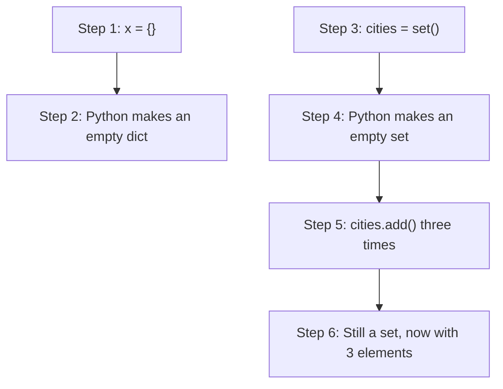
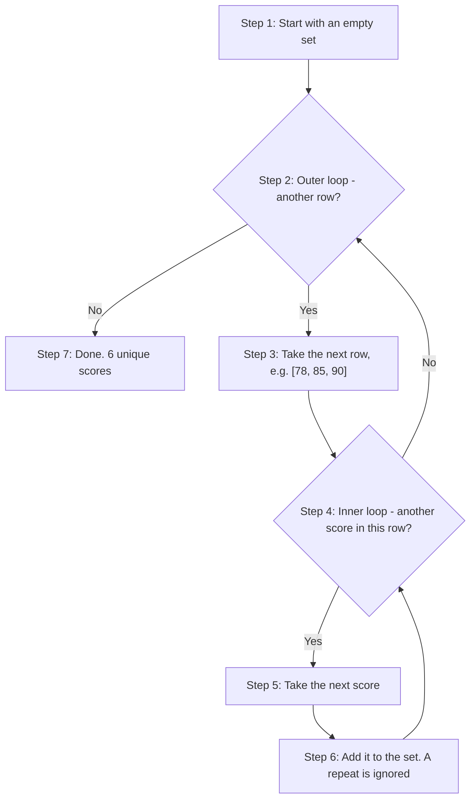
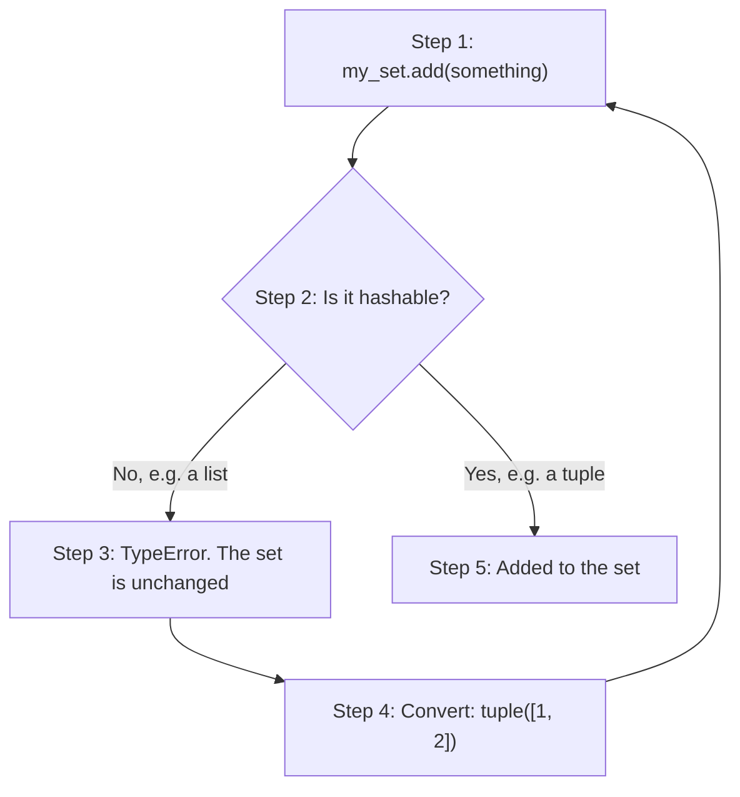
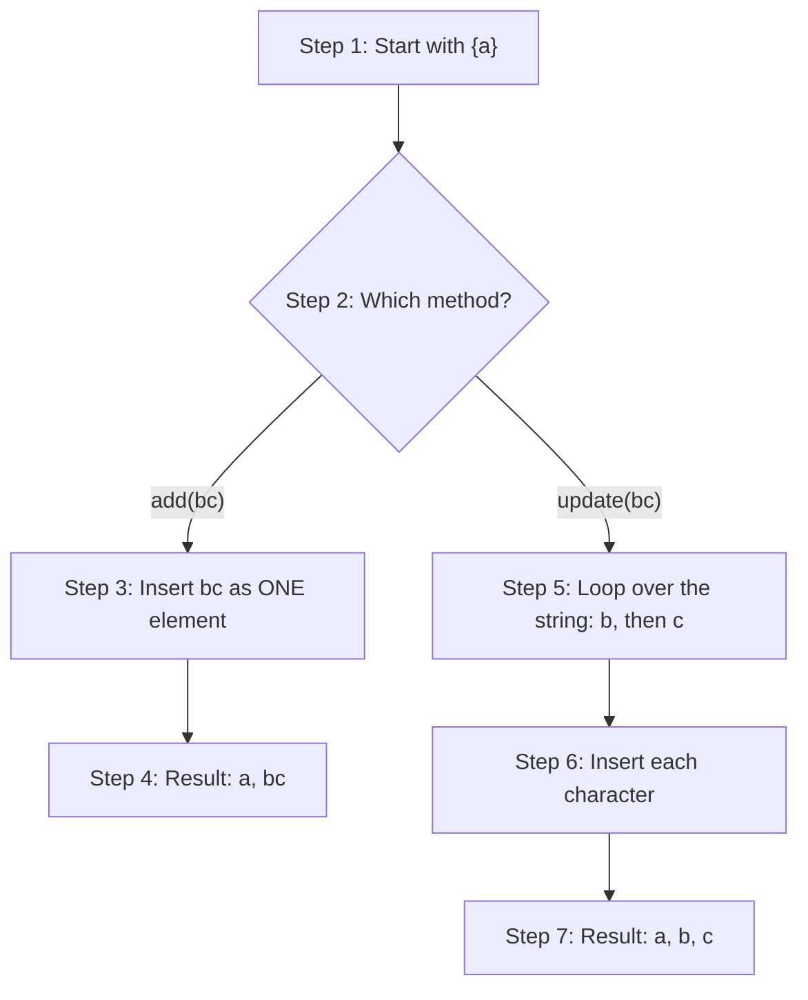
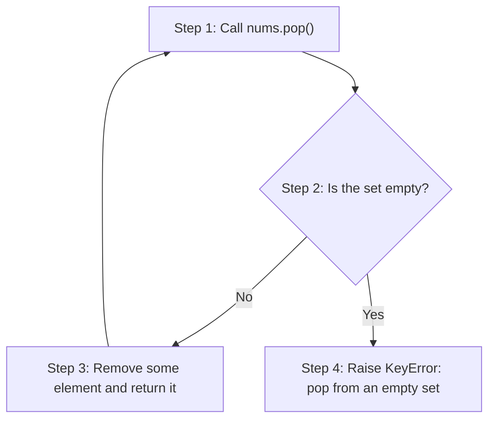
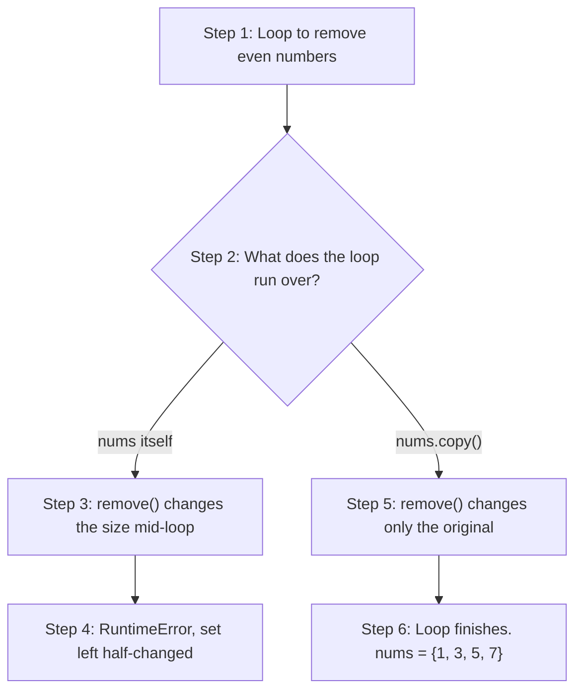
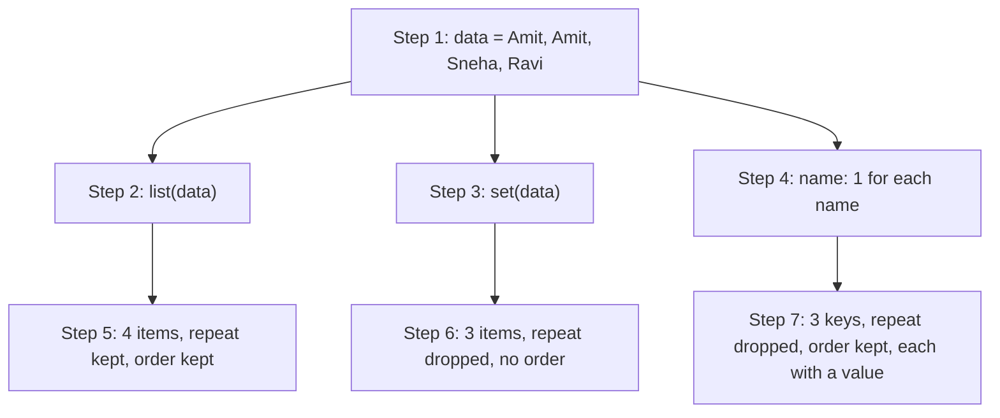

# Sets in Python: Scripting Questions and Answers

A **set** is Python's collection for **unique** items with no fixed order. It is the right tool whenever you want to remove duplicates, check quickly whether something is present, or compare two groups to see what they share and what they do not.

This page belongs to the chapter on **Tuples, Dictionaries and Sets**. The printed book ends its section on sets with twenty short scripting exercises. This page gives a full worked answer to each one. Together, the exercises cover:

- creating sets correctly, including the empty-set trap;
- removing duplicates and building sets with comprehensions;
- which values a set can and cannot hold, and `frozenset`;
- adding and removing elements, and changing a set safely inside a loop;
- how much faster sets are at membership tests;
- union, intersection, difference, symmetric difference and subset tests;
- choosing between a list, a set and a dictionary for the same data.

Each answer is laid out in the same way:

1. **Plan**: the task broken into small steps.
2. **Script**: a complete program with `# Step 1`, `# Step 2` comments that match the plan.
3. **Output**: exactly what the script prints, so you can check your own results.
4. **How Python works**: the "concept applied" (the general pattern the script uses) and an explanation of why it works.
5. Where useful, a table or a flowchart, and a **Try this next** exercise that takes the idea a step further.

For the theory behind these scripts, see the companion page [Sets in Python: Conceptual Questions and Answers](95-ch19-sets-conceptual-qa.md).

> **A note on the outputs on this page:** A set has no fixed order. When a set of **strings** is printed, the order of the items can even change each time you run the program. So that your output matches this page exactly, many scripts print `sorted(my_set)`, which shows the items as a sorted **list**. The set itself is not changed. Sets of small whole numbers usually print in the same order every time, so those are printed directly.

> **Tip:** Type the scripts in yourself and run them in IDLE, VS Code, Thonny or Google Colab. Then change the data and predict the output before you run the script again.

## Table of Contents

- [Key Terms Used on This Page](#key-terms)
- [Part 1: Creating Sets and Removing Duplicates](#part-1)
  - [Q1. Write script: (a) `x = {}` — print its type. (b) Create empty set correctly. (c) Add `"Delhi", "Mumbai", "Pune"` to it. (d) Print type before and after adding.](#q1)
  - [Q2. Roll numbers list has repeats: `[101,102,101,103,104,102,105]`. Script to: get unique roll numbers, print original count vs unique count.](#q2)
  - [Q3. Given `words = ["cat","dog","elephant","ox","tiger","ant"]`. Script: set comprehension to collect lengths of words having more than 2 letters.](#q3)
  - [Q4. `exam_scores = [[78,85,90],[85,92,78],[60,90,100]]`. Script: (a) nested set comprehension to get unique scores. (b) same result using explicit nested for loop. (c) confirm both are equal.](#q4)
  - [Q5. `data = [1, True, 0, False, 2, "1"]`. Script: build a set from data using comprehension, print it, explain length in a comment.](#q5)
- [Part 2: What a Set Can Hold](#part-2)
  - [Q6. Script: (a) try adding a list `[1,2]` as a set element, catch the error. (b) fix it by converting to tuple, add successfully. Print set after each step.](#q6)
  - [Q7. `t = (1, 2, [3, 4])`. Script: try to add t to a set, catch and print the specific error type, explain in comment why a tuple can still fail.](#q7)
  - [Q8. Script: (a) create two frozensets from {1,2,3} and {3,4,5}. (b) try `.add()` on one, catch error. (c) put both frozensets into a set. (d) use one as a dictionary key.](#q8)
- [Part 3: Adding and Removing Elements](#part-3)
  - [Q9. Script: (a) `s1={"a"}`, do `s1.add("bc")`; print. (b) `s2={"a"}`, do `s2.update("bc")`; print. Explain difference in a comment.](#q9)
  - [Q10. `langs = {"Python","Java","C++"}`. Script: (a) `.remove("Ruby")` — catch error. (b) `.discard("Ruby")` — show no error. (c) print set unchanged after both.](#q10)
  - [Q11. `nums = {1,2,3}`. Script: (a) `.pop()` twice, print each removed item. (b) `.pop()` on the now-single-item set, then again on the resulting empty set — catch the error. (c) `.clear()` and print final set.](#q11)
- [Part 4: Speed and Safe Changes](#part-4)
  - [Q12. Script: compare lookup time of 500000 in `a_list` vs 500000 in `a_set` for `range(0,1000000)`. Use `time.perf_counter()`. Print both timings with a comment on which is faster and why.](#q12)
  - [Q13. `nums = {1,2,3,4,5,6,7,8}`. Script: (a) try removing even numbers while looping directly over nums — catch the resulting error. (b) fix using `.copy()`, print final set.](#q13)
- [Part 5: Set Operations and Relationships](#part-5)
  - [Q14. `a = {1,2,3}`, `values = [3,4,5]`. Script: (a) try a & values — catch error. (b) fix using `.intersection(values)`. (c) fix using a & `set(values)`. Show all three attempts.](#q14)
  - [Q15. Two classes: `python_club={"Aman","Riya","Zoya","Kabir"}`, `dance_club={"Zoya","Kabir","Neha","Omar"}`. Script: find (a) all students in at least one club (b) students in both (c) students only in `python_club` (d) students in exactly one club. Label each print.](#q15)
  - [Q16. `project_team={"Zoya","Kabir"}`, `python_club={"Aman","Riya","Zoya","Kabir"}`, `art_club={"Neha","Omar"}`. Script: check (a) project_team is subset of python_club (b) python_club is superset of project_team (c) python_club and art_club are disjoint.](#q16)
  - [Q17. `set_a={10,20,30}`, `set_b={20,30,40}`. Script: print `set_a` - `set_b` and `set_b - set_a`, explain in comment why results differ.](#q17)
- [Part 6: Choosing the Right Structure](#part-6)
  - [Q18. Same data `["Amit","Amit","Sneha","Ravi"]`. Script: store it as (a) a list, (b) a set, (c) a dict (using names as keys, value=1). Print all three and comment on what changed in each.](#q18)
  - [Q19. `group1=frozenset({"Math","Physics"})`, `group2=frozenset({"Biology","Chemistry"})`. Script: (a) use both as dict keys mapping to room numbers. (b) print room for `group1`. (c) put both frozensets inside a regular set and print its length.](#q19)
  - [Q20. `fruits={"Apple","Banana","Cherry"}`. Script: (a) try `fruits.items()` — catch error. (b) correctly print each fruit using a for loop.](#q20)
- [Quick Revision Summary](#quick-revision-summary)

<a id="key-terms"></a>
## Key Terms Used on This Page

| Term | Simple meaning | Learn more |
| --- | --- | --- |
| Set | An unordered collection of unique, hashable items, such as `{1, 2, 3}`. | [Python tutorial: Sets](https://docs.python.org/3/tutorial/datastructures.html#sets) |
| Constructor | A function that builds a new object of a type. `set()` is the set constructor. | [Python docs: set](https://docs.python.org/3/library/stdtypes.html#set) |
| Literal | A value written directly in code, such as `{1, 2}` or `[1, 2]`. | [Python docs: Literals](https://docs.python.org/3/reference/lexical_analysis.html#literals) |
| Comprehension | A short one-line way to build a list, set or dictionary from a loop. | [Python tutorial: Sets](https://docs.python.org/3/tutorial/datastructures.html#sets) |
| Hashable | An object with a fixed "hash" number that never changes. Only hashable objects can be set elements or dictionary keys. | [Glossary: hashable](https://docs.python.org/3/glossary.html#term-hashable) |
| Mutable / Immutable | Mutable objects can be changed after they are made (lists, sets, dictionaries). Immutable ones cannot (numbers, strings, tuples, frozensets). | [Glossary: mutable](https://docs.python.org/3/glossary.html#term-mutable) |
| `frozenset` | An unchangeable version of a set. It is hashable. | [Python docs: frozenset](https://docs.python.org/3/library/stdtypes.html#frozenset) |
| Iterable | Anything you can loop over with `for`, such as a list, string or set. | [Glossary: iterable](https://docs.python.org/3/glossary.html#term-iterable) |
| Exception handling | Using `try` and `except` to catch an error so the program can carry on. | [Python tutorial: Errors and exceptions](https://docs.python.org/3/tutorial/errors.html) |
| O(1), O(n) | O(1): the time stays about the same however big the data is. O(n): the time grows in step with the number of items. | [Wikipedia: Big O notation](https://en.wikipedia.org/wiki/Big_O_notation) |
| Venn diagram | A drawing of overlapping circles that shows what two groups share. | [Wikipedia: Venn diagram](https://en.wikipedia.org/wiki/Venn_diagram) |

[Back to the Table of Contents](#table-of-contents)

---

<a id="part-1"></a>
## Part 1: Creating Sets and Removing Duplicates

These five exercises show how to create a set correctly, how to remove duplicates, how to build sets with comprehensions, and one surprise about `True`, `1`, `False` and `0`.

[Back to the Table of Contents](#table-of-contents)

<a id="q1"></a>
### Q1. Write script: (a) `x = {}` — print its type. (b) Create empty set correctly. (c) Add `"Delhi", "Mumbai", "Pune"` to it. (d) Print type before and after adding.

**Plan**

1. Create `x = {}` and print its type, to see the trap.
2. Create an empty set the correct way, with `set()`, and print its type.
3. Add the three cities one at a time with `.add()`.
4. Print the type again, and the final set.

**Script**

```python
# Step 1 - The classic trap: {} does not make an empty set
x = {}
print("Type of x:", type(x))                 # <class 'dict'> -- not a set

# Step 2 - The correct way to make an empty set is the set() constructor
cities = set()
print("Type before adding:", type(cities))   # <class 'set'>

# Step 3 - Add elements one at a time using .add()
cities.add("Delhi")
cities.add("Mumbai")
cities.add("Pune")

# Step 4 - Confirm the type is still 'set' after adding elements
print("Type after adding:", type(cities))    # <class 'set'>
print("Final set (sorted):", sorted(cities))
print("Number of cities:", len(cities))
```

**Output**

```text
Type of x: <class 'dict'>
Type before adding: <class 'set'>
Type after adding: <class 'set'>
Final set (sorted): ['Delhi', 'Mumbai', 'Pune']
Number of cities: 3
```

**How Python works**

**Concept applied: the "constructor over literal" pattern.** When you need to start with an empty collection and fill it up, use the constructor `set()`, not the literal `{}`.

- **Step 1 shows the trap.** Curly braces are shared by dictionaries and sets. When there is nothing inside them, Python has no way of knowing that you meant a set. `{}` is reserved for an empty dictionary, so `type(x)` prints `dict`, not `set`.
- **Step 2 shows the fix.** The `set()` constructor is never ambiguous. It always produces a set, empty or not. So it is the only reliable way to create an **empty** set.
- **Step 3** fills the correctly-typed set using `.add()`, one city at a time.
- **Step 4** confirms that the type does not change just because elements were added.

The rule to remember: whenever you need to start with nothing and build up, use the explicit constructor `set()` rather than the ambiguous literal `{}`.



**Try this next**

What happens if you try to call `.add()` on `x`, and how can you add all three cities in one call?

```python
x = {}
try:
    x.add("Delhi")                 # a dict has no add() method
except AttributeError as error:
    print("AttributeError:", error)

cities = set()
cities.update(["Delhi", "Mumbai", "Pune"])   # add several elements at once
print(sorted(cities))
```

```text
AttributeError: 'dict' object has no attribute 'add'
['Delhi', 'Mumbai', 'Pune']
```

[Back to the Table of Contents](#table-of-contents)

<a id="q2"></a>
### Q2. Roll numbers list has repeats: `[101,102,101,103,104,102,105]`. Script to: get unique roll numbers, print original count vs unique count.

**Plan**

1. Store the roll numbers in a list.
2. Convert the list to a set with `set()`. The duplicates disappear.
3. Use `len()` on both to compare the counts.
4. Work out how many duplicates were removed.

**Script**

```python
# Step 1 - The original list of roll numbers, with duplicates
roll_numbers = [101, 102, 101, 103, 104, 102, 105]

# Step 2 - Convert the list to a set: duplicates are dropped automatically
unique_roll_numbers = set(roll_numbers)

# Step 3 - Compare the counts using len()
print("Original list:", roll_numbers)
print("Original count:", len(roll_numbers))            # 7
print("Unique roll numbers:", unique_roll_numbers)
print("Unique count:", len(unique_roll_numbers))       # 5

# Step 4 - How many repeats were removed?
print("Duplicates removed:", len(roll_numbers) - len(unique_roll_numbers))
```

**Output**

```text
Original list: [101, 102, 101, 103, 104, 102, 105]
Original count: 7
Unique roll numbers: {101, 102, 103, 104, 105}
Unique count: 5
Duplicates removed: 2
```

**How Python works**

**Concept applied: the "convert to remove duplicates" pattern.** This is the most common real-world reason to use a set.

- **Step 2**, `set(roll_numbers)`, is where the real work happens. The `set()` constructor goes through the list, works out the hash of each element and inserts it.
- A set cannot hold two elements that are equal. So the second `101` and the second `102` are quietly skipped. No error is raised.
- **Step 3** uses `len()` on both the original list and the new set. This turns the effect into plain numbers (7 and 5), rather than making you scan the printed output by eye.
- `set(some_list)` is the standard, Pythonic way to strip duplicates out of any list.

| Roll number | Times in the list | Times in the set |
| --- | --- | --- |
| 101 | 2 | 1 |
| 102 | 2 | 1 |
| 103 | 1 | 1 |
| 104 | 1 | 1 |
| 105 | 1 | 1 |
| **Total** | **7** | **5** |

**Try this next**

Find **which** roll numbers were repeated, and remove duplicates while keeping the original order.

```python
roll_numbers = [101, 102, 101, 103, 104, 102, 105]

# Step 1 - Numbers that appear more than once
repeated = {n for n in roll_numbers if roll_numbers.count(n) > 1}
print("Repeated roll numbers:", repeated)

# Step 2 - Remove duplicates but keep first-seen order (dictionary keys keep order)
print("Unique, in original order:", list(dict.fromkeys(roll_numbers)))
```

```text
Repeated roll numbers: {101, 102}
Unique, in original order: [101, 102, 103, 104, 105]
```

[Back to the Table of Contents](#table-of-contents)

<a id="q3"></a>
### Q3. Given `words = ["cat","dog","elephant","ox","tiger","ant"]`. Script: set comprehension to collect lengths of words having more than 2 letters.

**Plan**

1. Start with the list of words.
2. Write a set comprehension that loops over the words.
3. Keep only words with more than 2 letters (the filter).
4. Store the **length** of each kept word (the transform).
5. Print the result.

**Script**

```python
# Step 1 - The starting list of words
words = ["cat", "dog", "elephant", "ox", "tiger", "ant"]

# Steps 2 to 4 - Set comprehension: keep the LENGTH of each word,
#                but only for words with more than 2 letters (the filter)
long_word_lengths = {len(word) for word in words if len(word) > 2}

# Step 5 - Print the result
print("Words:", words)
print("Lengths of words > 2 letters:", sorted(long_word_lengths))
# "ox" (length 2) is excluded by the filter
# "cat", "dog" and "ant" all have length 3, which appears only ONCE
```

**Output**

```text
Words: ['cat', 'dog', 'elephant', 'ox', 'tiger', 'ant']
Lengths of words > 2 letters: [3, 5, 8]
```

**How Python works**

**Concept applied: the "filter and transform" comprehension pattern.** The comprehension combines three separate ideas in one expression:

1. **`len(word)` is the transform.** It is what actually gets stored in the set: the length, not the word itself.
2. **`for word in words` is the loop.** It walks through every item of the source list.
3. **`if len(word) > 2` is the filter.** It is checked before anything is stored. Any word that fails the test (`"ox"`, with length 2) is skipped completely.

Because the result is a **set** rather than a list, the fact that `"cat"`, `"dog"` and `"ant"` all have the same length (3) does not give three separate 3s. The set automatically keeps only one.

This combination of transform, filter and automatic removal of duplicates is exactly why set comprehensions are preferred over an equivalent longer loop when the goal is a collection of **unique** values worked out from other data.

| Word | `len(word)` | `> 2`? | Stored |
| --- | --- | --- | --- |
| `"cat"` | 3 | Yes | 3 |
| `"dog"` | 3 | Yes | (3 already there) |
| `"elephant"` | 8 | Yes | 8 |
| `"ox"` | 2 | No | (skipped) |
| `"tiger"` | 5 | Yes | 5 |
| `"ant"` | 3 | Yes | (3 already there) |

**Try this next**

Compare the set comprehension with a list comprehension, and collect the words themselves instead of their lengths.

```python
words = ["cat", "dog", "elephant", "ox", "tiger", "ant"]

print("List of lengths:", [len(w) for w in words if len(w) > 2])   # keeps repeats
print("Short words:    ", sorted({w for w in words if len(w) <= 3}))
```

```text
List of lengths: [3, 3, 8, 5, 3]
Short words:     ['ant', 'cat', 'dog', 'ox']
```

[Back to the Table of Contents](#table-of-contents)

<a id="q4"></a>
### Q4. `exam_scores = [[78,85,90],[85,92,78],[60,90,100]]`. Script: (a) nested set comprehension to get unique scores. (b) same result using explicit nested for loop. (c) confirm both are equal.

**Plan**

1. Store the nested list: one inner list of scores for each student.
2. (a) Write a nested set comprehension with two `for` clauses.
3. (b) Write the same logic as a nested `for` loop that adds each score to an empty set.
4. (c) Print both and compare them with `==`.

**Script**

```python
# Step 1 - A nested list: one inner list of scores for each student
exam_scores = [[78, 85, 90], [85, 92, 78], [60, 90, 100]]

# Step 2 (a) - Nested set comprehension: flattens AND removes duplicates in one line.
#   Reading rule: the for clauses run left to right, so 'for row in exam_scores'
#   is the OUTER loop, and 'for score in row' is the INNER loop
unique_via_comprehension = {score for row in exam_scores for score in row}

# Step 3 (b) - The same logic written as an explicit nested loop
unique_via_loop = set()
for row in exam_scores:              # outer loop
    for score in row:                # inner loop
        unique_via_loop.add(score)

# Step 4 (c) - Confirm that both ways give the same set
print("Via comprehension:", sorted(unique_via_comprehension))
print("Via explicit loop:", sorted(unique_via_loop))
print("Are they equal?", unique_via_comprehension == unique_via_loop)   # True
print("Total scores:", sum(len(row) for row in exam_scores),
      "| unique scores:", len(unique_via_loop))
```

**Output**

```text
Via comprehension: [60, 78, 85, 90, 92, 100]
Via explicit loop: [60, 78, 85, 90, 92, 100]
Are they equal? True
Total scores: 9 | unique scores: 6
```

**How Python works**

**Concept applied: the "loop flattening" pattern.** "Flattening" means turning a list of lists into one single collection. The exercise builds the same result in two ways, so that the comprehension's shorthand becomes clear.

- **Step 2** is the compact form.
- **Step 3** is its word-for-word expansion, written as a real nested `for` loop with an explicit `.add()` call.
- Comparing the two shows exactly what the comprehension does inside:
  1. The outer `for row in exam_scores` visits each student's list of scores in turn.
  2. For each row, the inner `for score in row` visits every single score.
  3. Each score is added to the result set, which starts empty.
- Because `85`, `90` and `78` each appear twice across the three rows, both ways end with the same **6** unique scores out of 9.
- **Step 4**'s equality check confirms that the comprehension is not just shorter to type; it behaves exactly the same as the explicit loop.



**Try this next**

Find the scores that appear in **every** student's list, using set intersection.

```python
exam_scores = [[78, 85, 90], [85, 92, 78], [60, 90, 100]]

# Turn each row into a set, then keep only scores found in all of them
common = set(exam_scores[0]).intersection(*exam_scores[1:])
print("Scores shared by all students:", common)

common_first_two = set(exam_scores[0]) & set(exam_scores[1])
print("Scores shared by the first two:", sorted(common_first_two))
```

```text
Scores shared by all students: set()
Scores shared by the first two: [78, 85]
```

`*exam_scores[1:]` passes the remaining rows as separate arguments to `.intersection()`. No score appears in all three rows, so the result is an empty set.

[Back to the Table of Contents](#table-of-contents)

<a id="q5"></a>
### Q5. `data = [1, True, 0, False, 2, "1"]`. Script: build a set from data using comprehension, print it, explain length in a comment.

**Plan**

1. Store the mixed list.
2. Build a set from it with a comprehension.
3. Print the set and its length.
4. Show which of the equal values were kept, and explain the length in comments.

**Script**

```python
# Step 1 - A mixed list of whole numbers, booleans and one string
data = [1, True, 0, False, 2, "1"]

# Step 2 - Build a set using a comprehension
result = {value for value in data}

# Step 3 - Print the length, and the numbers and the string separately
#          (so that the output is the same every time you run it)
print("Original data:", data, "| length:", len(data))
print("Length of the set:", len(result))
print("Numbers kept:", sorted(v for v in result if not isinstance(v, str)))
print("Strings kept:", [v for v in result if isinstance(v, str)])

# Step 4 - Explanation of the length
# In Python, True == 1 and False == 0, and equal values collapse into ONE
# entry in a set. So 1 and True count as the same element, and 0 and False
# count as the same element. The string "1" is a DIFFERENT type and is never
# equal to the number 1. So the set has only 4 elements, not 6:
# one of {1, True}, one of {0, False}, the number 2, and the string "1".
```

**Output**

```text
Original data: [1, True, 0, False, 2, '1'] | length: 6
Length of the set: 4
Numbers kept: [0, 1, 2]
Strings kept: ['1']
```

If you simply `print(result)`, you will see something like `{0, 1, 2, '1'}`. The position of `'1'` may vary.

**How Python works**

**Concept applied: being aware that different-looking values can be equal.** This script is written to give a surprising result on purpose, so that you learn to predict it rather than be confused by it later.

- The comprehension in Step 2 looks completely ordinary, but the set has **4** elements, not 6.
- The reason is that Python's booleans are a special kind of whole number: `True == 1` and `False == 0` are both `True`, and their hash values match too.
- A set treats any two elements that are equal as "the same". Whichever of the pair `1`, `True` is met **first** is kept (here, `1`), and the second is quietly treated as a duplicate and dropped. The same happens with `0` and `False`.
- The string `"1"` is a completely different type from the whole number `1` and is never equal to it (`"1" == 1` is `False`). So it survives as its own element.

The lesson: never assume a set's length will match the number of items you put in, especially if the data mixes booleans with whole numbers.

| Value in order | Equal to something already in the set? | Result |
| --- | --- | --- |
| `1` | No | Added |
| `True` | Yes, equal to `1` | Skipped |
| `0` | No | Added |
| `False` | Yes, equal to `0` | Skipped |
| `2` | No | Added |
| `"1"` | No (a string is not equal to a number) | Added |

**Try this next**

Put `True` first and see which value survives. Then check the types of the survivors.

```python
result = {value for value in [True, 1, False, 0]}
print("Survivors:", sorted(result), "| types:", sorted(type(v).__name__ for v in result))

result = {value for value in [1, True, 0, False]}
print("Survivors:", sorted(result), "| types:", sorted(type(v).__name__ for v in result))
```

```text
Survivors: [False, True] | types: ['bool', 'bool']
Survivors: [0, 1] | types: ['int', 'int']
```

The first value of each equal pair is the one that stays.

[Back to the Table of Contents](#table-of-contents)

---

<a id="part-2"></a>
## Part 2: What a Set Can Hold

Every set element must be **hashable**. These three exercises show what happens with a list, with a tuple that hides a list inside it, and with a `frozenset`.

[Back to the Table of Contents](#table-of-contents)

<a id="q6"></a>
### Q6. Script: (a) try adding a list `[1,2]` as a set element, catch the error. (b) fix it by converting to tuple, add successfully. Print set after each step.

**Plan**

1. Start with a simple set and print it.
2. (a) Try to add the list `[1, 2]` inside a `try` block, catch the `TypeError`, and print the set.
3. (b) Convert the list to a tuple, add it, and print the set again.

**Script**

```python
# Step 1 - Start with a simple set
my_set = {10, 20}
print("Before:", my_set)

# Step 2 (a) - Try to add a LIST: lists are mutable, and so unhashable
try:
    my_set.add([1, 2])
except TypeError as error:
    print("Error caught:", error)                 # unhashable type: 'list'
print("After failed attempt:", my_set)            # unchanged

# Step 3 (b) - Fix: convert the list to a TUPLE first (tuples are immutable)
my_set.add(tuple([1, 2]))
print("After fix:", my_set)
print("Is (1, 2) in the set?", (1, 2) in my_set)
```

**Output**

```text
Before: {10, 20}
Error caught: unhashable type: 'list'
After failed attempt: {10, 20}
After fix: {10, (1, 2), 20}
Is (1, 2) in the set? True
```

The printed order of `{10, (1, 2), 20}` may differ on your computer. That is normal for a set.

**How Python works**

**Concept applied: the "try-except guard" pattern, followed by a type-conversion fix.**

- **Step 2** deliberately tries an operation that is known to fail. The `try` block lets the `TypeError` be caught and shown cleanly, instead of crashing the whole program. This is the standard, careful way to handle an operation whose failure is expected and can be recovered from.
- **Why it fails:** every set element must be hashable. Lists are mutable, so Python refuses to store one. The set is left unchanged.
- **Step 3** supplies the fix. `tuple([1, 2])` converts the mutable list into an immutable tuple with the same values. A tuple of hashable elements is itself hashable, so `.add()` now succeeds.
- **General tip:** whenever you get "unhashable type: 'list'", converting the list to a tuple is almost always the right first thing to try, **provided** the list's own contents are all hashable too (see [Q7](#q7)).



**Try this next**

What happens if you add the same tuple a second time, or add the list's items separately instead?

```python
my_set = {10, 20, (1, 2)}

my_set.add((1, 2))            # already present: no change
print("After adding (1, 2) again:", len(my_set), "elements")

my_set.update([1, 2])         # adds 1 and 2 as two SEPARATE elements
print("After update([1, 2]):", len(my_set), "elements")
print("1 in my_set:", 1 in my_set, "| (1, 2) in my_set:", (1, 2) in my_set)
```

```text
After adding (1, 2) again: 3 elements
After update([1, 2]): 5 elements
1 in my_set: True | (1, 2) in my_set: True
```

[Back to the Table of Contents](#table-of-contents)

<a id="q7"></a>
### Q7. `t = (1, 2, [3, 4])`. Script: try to add t to a set, catch and print the specific error type, explain in comment why a tuple can still fail.

**Plan**

1. Create the tuple `t`, which has a list as its third element.
2. Try to add `t` to a set, inside a `try` block.
3. Catch the error, and print its type name and its message.
4. Explain in comments why a tuple can fail.

**Script**

```python
# Step 1 - A tuple that LOOKS immutable but has a mutable element inside
t = (1, 2, [3, 4])
my_set = {100}

# Step 2 - Try to add the tuple to the set
try:
    my_set.add(t)
except TypeError as error:
    # Step 3 - Print the specific error type and its message
    print("Error type:", type(error).__name__)     # TypeError
    print("Error message:", error)                 # unhashable type: 'list'

print("Set unchanged:", my_set)

# Step 4 - Explanation
# A tuple's OWN structure cannot change, but hashability is checked
# RECURSIVELY: Python must also be able to hash every element INSIDE
# the tuple. Here, t contains a list, and a list can never be hashed.
# So even though t is a tuple, it is NOT hashable as a whole,
# and it cannot be stored in a set.
```

**Output**

```text
Error type: TypeError
Error message: unhashable type: 'list'
Set unchanged: {100}
```

**How Python works**

**Concept applied: the "recursive hashability check" pattern.** "Recursive" here means that the same check is applied again at every level inside the object.

This exercise targets a subtle but important misunderstanding: "tuples are immutable" does **not** automatically mean "tuples are always hashable".

1. **Step 1** creates a tuple whose outer structure is fixed. You can never reassign `t[2]`. But its third element is itself a mutable list.
2. When **Step 2** tries `.add(t)`, Python has to work out a hash for the tuple.
3. To do that, it must work out a hash for **every element inside** the tuple.
4. `hash(1)` and `hash(2)` work. The moment it reaches the nested list, hashing fails.
5. The error message printed in **Step 3** names `'list'`, not `'tuple'`. This confirms that the real culprit is the object nested inside, not the tuple itself.

The rule to note: a tuple is hashable only if every element it contains, all the way down, is also hashable. An immutable outer container is necessary, but it is not enough.

| Tuple | Hashable? | Reason |
| --- | --- | --- |
| `(1, 2, 3)` | Yes | All elements are numbers |
| `(1, 2, (3, 4))` | Yes | The inner tuple is hashable too |
| `(1, 2, [3, 4])` | No | Contains a list |
| `(1, (2, [3]))` | No | A list is hidden two levels down |

**Try this next**

Fix `t` so that it can join the set, and prove that the list inside `t` can still be changed (which is why it could never be hashed).

```python
t = (1, 2, [3, 4])

# Step 1 - The list inside the tuple can still change
t[2].append(5)
print("t after changing the inner list:", t)

# Step 2 - Fix: rebuild the tuple with the inner list turned into a tuple
fixed = (t[0], t[1], tuple(t[2]))
my_set = {100, fixed}
print("fixed:", fixed, "| in set:", fixed in my_set)
```

```text
t after changing the inner list: (1, 2, [3, 4, 5])
fixed: (1, 2, (3, 4, 5)) | in set: True
```

[Back to the Table of Contents](#table-of-contents)

<a id="q8"></a>
### Q8. Script: (a) create two frozensets from {1,2,3} and {3,4,5}. (b) try `.add()` on one, catch error. (c) put both frozensets into a set. (d) use one as a dictionary key.

**Plan**

1. (a) Create two frozensets and print them.
2. (b) Try `.add()` on one of them and catch the `AttributeError`.
3. (c) Put both frozensets into an ordinary set.
4. (d) Use frozensets as dictionary keys and look one up.

**Script**

```python
# Step 1 (a) - Create two frozensets (unchangeable versions of a set)
fs1 = frozenset({1, 2, 3})
fs2 = frozenset({3, 4, 5})
print("fs1:", fs1)
print("fs2:", fs2)

# Step 2 (b) - Try to change a frozenset: this must fail
try:
    fs1.add(99)
except AttributeError as error:
    print("Error caught:", error)     # 'frozenset' object has no attribute 'add'

# Step 3 (c) - Store both frozensets inside an ordinary set.
#              This is allowed only because a frozenset is HASHABLE (a plain set is not)
collection_of_sets = {fs1, fs2}
print("Set of frozensets holds", len(collection_of_sets), "groups")

# Step 4 (d) - Use a frozenset as a dictionary key
labels = {fs1: "Group A", fs2: "Group B"}
print("Label for fs1:", labels[fs1])   # Group A

# Reading operations still work on frozensets
print("Shared by fs1 and fs2:", fs1 & fs2)
```

**Output**

```text
fs1: frozenset({1, 2, 3})
fs2: frozenset({3, 4, 5})
Error caught: 'frozenset' object has no attribute 'add'
Set of frozensets holds 2 groups
Label for fs1: Group A
Shared by fs1 and fs2: frozenset({3})
```

**How Python works**

**Concept applied: the "immutable wrapper" pattern.** Each step shows one consequence of the same basic fact: a frozenset can never change.

- **Step 1** creates two frozensets. They behave just like normal sets for anything that only **reads** data, as the last line of the script shows.
- **Step 2**'s attempt to call `.add()` fails with an `AttributeError`, not a `TypeError`. The methods that would change a set (`add`, `remove`, `discard`, `pop`, `clear`, `update`) simply **do not exist** on a frozenset. They were never defined for it, rather than being blocked while the program runs.
- Because a frozenset's contents can never change, Python can work out one fixed hash value for it. That is exactly what makes **Steps 3 and 4** valid.
- A plain set could never be placed inside another set or used as a dictionary key, because both need hashability. A frozenset can do both, because it gave up mutability in exchange for hashability.

To remember: use `set` for everyday changeable collections, and `frozenset` specifically when a set-like object must itself be hashable.

| Can you... | `set` | `frozenset` |
| --- | --- | --- |
| Add or remove elements | Yes | No (`AttributeError`) |
| Use `in`, `len()`, loops, `&`, `\|` | Yes | Yes |
| Put it inside another set | No | Yes |
| Use it as a dictionary key | No | Yes |

**Try this next**

Try the same two jobs (Steps 3 and 4) with ordinary sets and see the errors.

```python
s1 = {1, 2, 3}
s2 = {3, 4, 5}

try:
    collection = {s1, s2}
except TypeError as error:
    print("Set inside a set ->", error)

try:
    labels = {s1: "Group A"}
except TypeError as error:
    print("Set as a dict key ->", error)
```

```text
Set inside a set -> unhashable type: 'set'
Set as a dict key -> unhashable type: 'set'
```

In Python 3.14 and later, the second message reads `cannot use 'set' as a dict key (unhashable type: 'set')`.

[Back to the Table of Contents](#table-of-contents)

---

<a id="part-3"></a>
## Part 3: Adding and Removing Elements

These three exercises compare `.add()` with `.update()`, `.remove()` with `.discard()`, and show how `.pop()` and `.clear()` behave.

[Back to the Table of Contents](#table-of-contents)

<a id="q9"></a>
### Q9. Script: (a) `s1={"a"}`, do `s1.add("bc")`; print. (b) `s2={"a"}`, do `s2.update("bc")`; print. Explain difference in a comment.

**Plan**

1. (a) Start with `{"a"}`, call `.add("bc")` and print the result.
2. (b) Start again with `{"a"}`, call `.update("bc")` and print the result.
3. Explain the difference in comments.

**Script**

```python
# Step 1 (a) - .add() with a two-character string
s1 = {"a"}
s1.add("bc")
print("After add('bc'):   ", sorted(s1), "| length:", len(s1))      # 'bc' is ONE element

# Step 2 (b) - .update() with the SAME string
s2 = {"a"}
s2.update("bc")
print("After update('bc'):", sorted(s2), "| length:", len(s2))      # each CHARACTER is an element

# Step 3 - Explanation
# .add(x) always inserts x as ONE new element, whatever x is.
# .update(iterable) loops through its argument and inserts each item
# it produces. A string IS an iterable of its own characters, so
# update("bc") inserts 'b' and 'c' separately, NOT the string "bc".
```

**Output**

```text
After add('bc'):    ['a', 'bc'] | length: 2
After update('bc'): ['a', 'b', 'c'] | length: 3
```

**How Python works**

**Concept applied: the "single element versus unpacking an iterable" pattern.** The two nearly identical calls in Steps 1 and 2 give visibly different results. That difference is the whole point of the exercise.

- **`.add("bc")`** treats its argument as one whole value to be inserted. Python does not look inside a string passed to `.add()`, so the two-character string becomes exactly **one** new element.
- **`.update("bc")`**, by contrast, expects an **iterable** and inserts every item that the iterable gives. A string can be looped over one character at a time, so `.update()` walks through `"bc"` and inserts `'b'` and `'c'` as two separate elements.

How to choose between them:

- Use **`.add()`** when you have exactly one new value to insert.
- Use **`.update()`** only when you really want to merge in **every** element of another collection. Be especially careful with strings: they can be looped over in a way that surprises many beginners.
- If you want `.update()` to add a whole word, wrap it in a list: `s.update(["bc"])`.



**Try this next**

Predict the results of these three calls before you run them.

```python
s = {"a"}
s.update(["bc"])          # a list holding ONE string
print(sorted(s))

s = {"a"}
s.update("banana")        # six letters, but only three different ones
print(sorted(s))

s = {"a"}
s.update(["x", "y"], "zz")   # update() can take several iterables at once
print(sorted(s))
```

```text
['a', 'bc']
['a', 'b', 'n']
['a', 'x', 'y', 'z']
```

[Back to the Table of Contents](#table-of-contents)

<a id="q10"></a>
### Q10. `langs = {"Python","Java","C++"}`. Script: (a) `.remove("Ruby")` — catch error. (b) `.discard("Ruby")` — show no error. (c) print set unchanged after both.

**Plan**

1. Create the set and print it.
2. (a) Call `.remove("Ruby")` inside a `try` block and catch the `KeyError`.
3. (b) Call `.discard("Ruby")` with no `try` block, and show that nothing goes wrong.
4. (c) Print the set to show that it is unchanged.

**Script**

```python
# Step 1 - The starting set
langs = {"Python", "Java", "C++"}
print("Original:", sorted(langs))

# Step 2 (a) - .remove() on a MISSING element raises KeyError
try:
    langs.remove("Ruby")
except KeyError as error:
    print("remove() failed with KeyError:", error)

# Step 3 (b) - .discard() on the SAME missing element: silent, no error
langs.discard("Ruby")
print("discard() completed with no error")

# Step 4 (c) - Confirm that the set is unchanged after both attempts
print("Final set:", sorted(langs), "| length:", len(langs))
```

**Output**

```text
Original: ['C++', 'Java', 'Python']
remove() failed with KeyError: 'Ruby'
discard() completed with no error
Final set: ['C++', 'Java', 'Python'] | length: 3
```

**How Python works**

**Concept applied: the "strict versus safe removal" pattern.** The two removal attempts on the same missing element (`"Ruby"`) are placed one after the other, so the difference is impossible to miss.

- **Step 2's `.remove("Ruby")`** raises a `KeyError`. `.remove()` is the **strict** form: it assumes the element should be present and treats its absence as an error worth stopping the program for. That is why it is wrapped in `try`/`except` here.
- **Step 3's `.discard("Ruby")`** is the **safe** form. If the element is not there, it simply does nothing, and the program carries on normally. There is no error to catch.
- Both methods behave the same when the element **is** present: they remove it.

How to choose:

- Use **`.remove()`** when a missing element would itself mean there is a bug that you want to hear about straight away.
- Use **`.discard()`** when "it might not be there, and that is fine" is a normal, expected situation.

| Method | Element present | Element missing |
| --- | --- | --- |
| `langs.remove(x)` | Removes it | `KeyError` |
| `langs.discard(x)` | Removes it | Does nothing |

**Try this next**

Remove an element that **is** present with each method.

```python
langs = {"Python", "Java", "C++"}
langs.remove("Java")
print("After remove('Java'): ", sorted(langs))
langs.discard("C++")
print("After discard('C++'): ", sorted(langs))
```

```text
After remove('Java'):  ['C++', 'Python']
After discard('C++'):  ['Python']
```

[Back to the Table of Contents](#table-of-contents)

<a id="q11"></a>
### Q11. `nums = {1,2,3}`. Script: (a) `.pop()` twice, print each removed item. (b) `.pop()` on the now-single-item set, then again on the resulting empty set — catch the error. (c) `.clear()` and print final set.

**Plan**

1. Start with `{1, 2, 3}`.
2. (a) Call `.pop()` twice, printing each removed item and what is left.
3. (b) Call `.pop()` on the one remaining item, then once more on the empty set, catching the `KeyError`.
4. (c) Use `.clear()` on another set and print the result, then call it again on the empty set.

**Script**

```python
# Step 1 - A starting set with 3 elements
nums = {1, 2, 3}
print("Start:", nums)

# Step 2 (a) - pop() twice: each call removes and RETURNS some element
item1 = nums.pop()
print("Popped:", item1, "| Remaining:", nums)
item2 = nums.pop()
print("Popped:", item2, "| Remaining:", nums)       # only 1 element left

# Step 3 (b) - pop() the last element, then try again on the EMPTY set
item3 = nums.pop()
print("Popped:", item3, "| Remaining:", nums)       # set() -- now empty

try:
    nums.pop()                                      # nothing left to remove
except KeyError as error:
    print("pop() on empty set failed:", error)      # 'pop from an empty set'

# Step 4 (c) - clear() wipes everything, and is safe even if the set is already empty
other = {5, 6, 7}
other.clear()
print("After clear():", other)                      # set()
other.clear()                                       # no error on an empty set
print("After clear() again:", other)
```

**Output**

```text
Start: {1, 2, 3}
Popped: 1 | Remaining: {2, 3}
Popped: 2 | Remaining: {3}
Popped: 3 | Remaining: set()
pop() on empty set failed: 'pop from an empty set'
After clear(): set()
After clear() again: set()
```

In standard Python, a small set of whole numbers such as this one usually gives `1`, `2`, `3` in that order. But `.pop()` makes **no promise** about which element it removes, so do not rely on this order.

**How Python works**

**Concept applied: the "drain until empty" pattern.** This script empties a set on purpose, to show exactly where `.pop()` stops being safe.

1. **Step 2** calls `.pop()` twice. Unlike `.remove()`, `.pop()` takes no argument. It removes and **returns** some element chosen by Python, because a set has no defined "first" item.
2. That is fine as long as elements remain.
3. **Step 3**'s third `.pop()` removes the last element, leaving the set empty.
4. The fourth attempt has nothing left to remove, so it raises a `KeyError` with the message `'pop from an empty set'`. It does not return `None` or quietly do nothing: `.pop()` always expects to find something.
5. **Step 4** contrasts this with `.clear()`, which is always safe to call. It wipes every element in one step and returns `None`. Calling it on a set that is already empty causes no error.

The pattern worth remembering:

- `.pop()` is for removing items one at a time when you do not care which one, but it must be protected against an empty set.
- `.clear()` is for wiping everything at once, and never needs protecting.



**Try this next**

Protect `.pop()` with a check, so that the loop stops cleanly when the set is empty.

```python
tasks = {"email", "report", "call"}
done = []
while tasks:                  # an empty set counts as False, so the loop stops
    done.append(tasks.pop())
print("Tasks done:", sorted(done), "| tasks left:", tasks)
```

```text
Tasks done: ['call', 'email', 'report'] | tasks left: set()
```

[Back to the Table of Contents](#table-of-contents)

---

<a id="part-4"></a>
## Part 4: Speed and Safe Changes

The first exercise measures how much faster a set is than a list at checking membership. The second shows how to remove elements from a set safely while looping.

[Back to the Table of Contents](#table-of-contents)

<a id="q12"></a>
### Q12. Script: compare lookup time of 500000 in `a_list` vs 500000 in `a_set` for `range(0,1000000)`. Use `time.perf_counter()`. Print both timings with a comment on which is faster and why.

**Plan**

1. Build a list of the numbers 0 to 999,999, and a set with the same numbers.
2. Time the test `500000 in a_list` using `time.perf_counter()`.
3. Time the test `500000 in a_set` in exactly the same way.
4. Print both times, and how many times faster the set was.

**Script**

```python
import time      # the standard module for measuring time

# Step 1 - Build a large list and a set with the same values
a_list = list(range(1000000))
a_set = set(a_list)

target = 500000

# Step 2 - Time the membership test on the LIST
start = time.perf_counter()
found_in_list = target in a_list
list_time = time.perf_counter() - start

# Step 3 - Time the membership test on the SET
start = time.perf_counter()
found_in_set = target in a_set
set_time = time.perf_counter() - start

# Step 4 - Print and compare
print("Found in list?", found_in_list, "| Found in set?", found_in_set)
print(f"List lookup time: {list_time:.6f} seconds")
print(f"Set lookup time : {set_time:.6f} seconds")
print(f"The set was roughly {list_time / set_time:,.0f} times faster")

# The set is almost always much faster. A list does a linear search:
# it checks elements one by one (O(n)). A set uses hashing to jump
# directly to where the element should be (O(1) on average).
```

**Output** (the times will be different on your computer and from run to run, but the set will always be far faster)

```text
Found in list? True | Found in set? True
List lookup time: 0.003320 seconds
Set lookup time : 0.000001 seconds
The set was roughly 2,774 times faster
```

**How Python works**

**Concept applied: the "benchmark comparison" pattern.** A **benchmark** is a timing test. The script builds two equivalent collections and then times the **same** operation on each. This is the standard way to turn a general claim ("sets are faster") into something you can see.

- **Steps 2 and 3** are deliberately identical: the same target value, the same `time.perf_counter()` calls, the same single `in` test. So the only thing that differs is the type of container.
- `time.perf_counter()` returns a very precise clock reading. Subtracting the start reading from the end reading gives the time taken. See the [Python docs for time.perf_counter()](https://docs.python.org/3/library/time.html#time.perf_counter).
- The results reflect two very different ways of searching:
  - **List:** the search walks through the elements one at a time until it finds a match or reaches the end. To find `500000`, it must check half a million elements first. In the worst case it checks all one million. This is **O(n)**.
  - **Set:** the search works out `hash(target)` once and jumps straight to where the value should be. This is **O(1)** on average, however large the set.
- This is why `in` on a set is the standard tool whenever a program needs to ask "have I seen this value before?" again and again against a large collection.

| | List | Set |
| --- | --- | --- |
| How `in` searches | Checks elements one by one | Jumps to the right place using the hash |
| Checks needed to find `500000` | About 500,001 | About 1 |
| Time complexity | O(n) | O(1) on average |

**Try this next**

Time a search for a value that is **not** present, such as `-1`. For the list, this is the worst case, because every element must be checked.

```python
import time

a_list = list(range(1000000))
a_set = set(a_list)

start = time.perf_counter()
result = -1 in a_list
list_time = time.perf_counter() - start

start = time.perf_counter()
result = -1 in a_set
set_time = time.perf_counter() - start

print(f"Missing value, list: {list_time:.6f} s | set: {set_time:.6f} s")
```

A sample result (yours will differ):

```text
Missing value, list: 0.006253 s | set: 0.000002 s
```

The list time roughly doubles compared with the search for `500000`, because now all one million elements are checked. The set time hardly changes.

[Back to the Table of Contents](#table-of-contents)

<a id="q13"></a>
### Q13. `nums = {1,2,3,4,5,6,7,8}`. Script: (a) try removing even numbers while looping directly over nums — catch the resulting error. (b) fix using `.copy()`, print final set.

**Plan**

1. (a) Loop directly over `nums` and remove the even numbers inside the loop. Catch the `RuntimeError`.
2. Reset `nums`, because the failed attempt may have changed it partly.
3. (b) Loop over `nums.copy()` instead, and remove the even numbers from the original `nums`.
4. Print the final set.

**Script**

```python
# Step 1 - The starting set
nums = {1, 2, 3, 4, 5, 6, 7, 8}

# Step 2 (a) - WRONG: changing the set while looping over IT directly
try:
    for n in nums:
        if n % 2 == 0:
            nums.remove(n)          # changes the size DURING the loop
except RuntimeError as error:
    print("Error caught:", error)   # Set changed size during iteration
print("Set after the failed attempt:", nums)   # partly changed!

# Step 3 (b) - RIGHT: loop over a COPY, change the ORIGINAL
nums = {1, 2, 3, 4, 5, 6, 7, 8}          # reset to the starting set
for n in nums.copy():                     # safe: looping over a separate copy
    if n % 2 == 0:
        nums.remove(n)                    # changing the original is now safe

# Step 4 - The result
print("Final set (odd numbers only):", nums)   # {1, 3, 5, 7}
```

**Output**

```text
Error caught: Set changed size during iteration
Set after the failed attempt: {1, 3, 4, 5, 6, 7, 8}
Final set (odd numbers only): {1, 3, 5, 7}
```

**How Python works**

**Concept applied: the "copy before changing" pattern.** This is one of the most important safety habits for working with sets (and dictionaries).

1. **Step 2** tries the obvious approach: looping over `nums` with `for n in nums` while calling `nums.remove(n)` inside the same loop.
2. Python raises a `RuntimeError` rather than allowing this. Changing a set's size while looping over it could make the loop silently skip or repeat elements, and the loop has no safe way to cope.
3. Notice that the error happened **after** `2` had already been removed. The set was left half-changed, which is why Step 3 starts by resetting it.
4. **Step 3** changes just one thing: `for n in nums.copy()` loops over a brand-new, separate copy of the set. Removing elements from the **original** `nums` inside the loop no longer disturbs the loop.

The general pattern, "loop over a copy, change the original", is the standard fix whenever you need to filter or trim a set (or a dictionary) in place while looping over it.



**Try this next**

Two shorter ways to get the same result, without any loop that changes the set:

```python
nums = {1, 2, 3, 4, 5, 6, 7, 8}

# Way 1 - Build a new set with a comprehension
odd_only = {n for n in nums if n % 2 != 0}
print("Comprehension:", odd_only)

# Way 2 - Subtract the set of even numbers
nums -= {n for n in nums if n % 2 == 0}
print("Set difference:", nums)
```

```text
Comprehension: {1, 3, 5, 7}
Set difference: {1, 3, 5, 7}
```

In Way 2, the set of even numbers is built completely **before** anything is removed, so there is no problem.

[Back to the Table of Contents](#table-of-contents)

---

<a id="part-5"></a>
## Part 5: Set Operations and Relationships

These four exercises use the "Venn diagram" operations (union, intersection, difference and symmetric difference) and the subset tests.

[Back to the Table of Contents](#table-of-contents)

<a id="q14"></a>
### Q14. `a = {1,2,3}`, `values = [3,4,5]`. Script: (a) try a & values — catch error. (b) fix using `.intersection(values)`. (c) fix using a & `set(values)`. Show all three attempts.

**Plan**

1. Create the set `a` and the list `values`.
2. (a) Try `a & values` inside a `try` block, and catch the `TypeError`.
3. (b) Use the method `a.intersection(values)`, which accepts a list.
4. (c) Convert the list to a set first, then use `&`.

**Script**

```python
# Step 1 - A set and a plain list with one value in common
a = {1, 2, 3}
values = [3, 4, 5]

# Step 2 (a) - The operator form needs BOTH sides to be sets already
try:
    result = a & values
except TypeError as error:
    print("Operator failed:", error)

# Step 3 (b) - Fix 1: use the named METHOD, which accepts any iterable
result_method = a.intersection(values)
print("Using .intersection():  ", result_method)        # {3}

# Step 4 (c) - Fix 2: convert the list to a set FIRST, then use the operator
result_converted = a & set(values)
print("Using & after set(values):", result_converted)   # {3}
```

**Output**

```text
Operator failed: unsupported operand type(s) for &: 'set' and 'list'
Using .intersection():   {3}
Using & after set(values): {3}
```

**How Python works**

**Concept applied: "strict operators, flexible methods".** The script fails first on purpose, then shows two separate fixes. This makes the difference between operators and methods concrete.

- **Step 2's `a & values` fails** because the set operators (`|`, `&`, `-`, `^`) need **both** operands (the values on each side) to be real sets already. A list is rejected with a `TypeError`, whatever values it holds.
- **Step 3's `.intersection(values)` succeeds** because named methods are more forgiving. They accept **any** iterable and treat its items as if they were a set, with no conversion needed from you.
- **Step 4's `a & set(values)` succeeds** for a different reason. It still uses the operator, but it removes the real problem by turning the list into a set **before** the operator sees it.
- Either fix is fine. The method form is usually handier when one side is not already a set. The operator form reads more like ordinary maths when both sides already are sets.

| Attempt | Code | Works? | Why |
| --- | --- | --- | --- |
| (a) | `a & values` | No | The operator needs a set on both sides |
| (b) | `a.intersection(values)` | Yes | The method accepts any iterable |
| (c) | `a & set(values)` | Yes | The list is converted to a set first |

**Try this next**

The same rule applies to the other operators. Try union with a list, and a method call with several iterables.

```python
a = {1, 2, 3}
try:
    print(a | [4, 5])
except TypeError as error:
    print("a | [4, 5] ->", error)

print("a.union([4, 5], (6,)) ->", a.union([4, 5], (6,)))
```

```text
a | [4, 5] -> unsupported operand type(s) for |: 'set' and 'list'
a.union([4, 5], (6,)) -> {1, 2, 3, 4, 5, 6}
```

[Back to the Table of Contents](#table-of-contents)

<a id="q15"></a>
### Q15. Two classes: `python_club={"Aman","Riya","Zoya","Kabir"}`, `dance_club={"Zoya","Kabir","Neha","Omar"}`. Script: find (a) all students in at least one club (b) students in both (c) students only in `python_club` (d) students in exactly one club. Label each print.

**Plan**

1. Store the two clubs as sets.
2. (a) Union `|`: everyone in at least one club.
3. (b) Intersection `&`: everyone in both clubs.
4. (c) Difference `-`: only in `python_club`.
5. (d) Symmetric difference `^`: in exactly one club.
6. Print each result with a clear label.

**Script**

```python
# Step 1 - Two clubs, as sets of student names
python_club = {"Aman", "Riya", "Zoya", "Kabir"}
dance_club = {"Zoya", "Kabir", "Neha", "Omar"}

# Step 2 (a) - Union: everyone in AT LEAST ONE club
at_least_one = python_club | dance_club
print("In at least one club:", sorted(at_least_one))

# Step 3 (b) - Intersection: everyone in BOTH clubs
in_both = python_club & dance_club
print("In both clubs:", sorted(in_both))

# Step 4 (c) - Difference: ONLY in python_club, not in dance_club
only_python = python_club - dance_club
print("Only in python_club:", sorted(only_python))

# Step 5 (d) - Symmetric difference: in EXACTLY ONE club, not both
exactly_one = python_club ^ dance_club
print("In exactly one club:", sorted(exactly_one))
```

**Output**

```text
In at least one club: ['Aman', 'Kabir', 'Neha', 'Omar', 'Riya', 'Zoya']
In both clubs: ['Kabir', 'Zoya']
Only in python_club: ['Aman', 'Riya']
In exactly one club: ['Aman', 'Neha', 'Omar', 'Riya']
```

**How Python works**

**Concept applied: the "Venn diagram calculation" pattern.** Each of the four operations answers a different, precise question about the same two groups. Each print is labelled, so the link between the operation and its real-world meaning is clear.

- **Step 2's union (`|`)** merges every name from either club. The shared members, Zoya and Kabir, appear only once.
- **Step 3's intersection (`&`)** keeps only the names found in **both** sets: exactly the overlap of the two circles in a Venn diagram.
- **Step 4's difference (`-`)** depends on direction. It keeps what is in `python_club` but removes anything also found in `dance_club`, leaving only the Python-only members.
- **Step 5's symmetric difference (`^`)** keeps everyone who belongs to exactly **one** club. It is the union with the overlap cut back out.

Together, these four lines show that Python's set operators are a direct, one-symbol-each translation of standard Venn-diagram set maths.

| Region of the Venn diagram | Students | Included in |
| --- | --- | --- |
| Python club only | Aman, Riya | (a) union, (c) difference, (d) symmetric difference |
| Both clubs (the overlap) | Zoya, Kabir | (a) union, (b) intersection |
| Dance club only | Neha, Omar | (a) union, (d) symmetric difference |

| Question | Operator | Method |
| --- | --- | --- |
| (a) At least one club | `python_club \| dance_club` | `python_club.union(dance_club)` |
| (b) Both clubs | `python_club & dance_club` | `python_club.intersection(dance_club)` |
| (c) Only Python club | `python_club - dance_club` | `python_club.difference(dance_club)` |
| (d) Exactly one club | `python_club ^ dance_club` | `python_club.symmetric_difference(dance_club)` |

**Try this next**

Find the students who are only in the dance club, and check that the symmetric difference equals the union minus the intersection.

```python
python_club = {"Aman", "Riya", "Zoya", "Kabir"}
dance_club = {"Zoya", "Kabir", "Neha", "Omar"}

print("Only in dance_club:", sorted(dance_club - python_club))
print("^ equals (| minus &)?",
      (python_club ^ dance_club) == (python_club | dance_club) - (python_club & dance_club))
```

```text
Only in dance_club: ['Neha', 'Omar']
^ equals (| minus &)? True
```

[Back to the Table of Contents](#table-of-contents)

<a id="q16"></a>
### Q16. `project_team={"Zoya","Kabir"}`, `python_club={"Aman","Riya","Zoya","Kabir"}`, `art_club={"Neha","Omar"}`. Script: check (a) project_team is subset of python_club (b) python_club is superset of project_team (c) python_club and art_club are disjoint.

**Plan**

1. Store the three groups as sets.
2. (a) Use `.issubset()` to check that every project team member is in the Python club.
3. (b) Use `.issuperset()` to check the same thing from the Python club's side.
4. (c) Use `.isdisjoint()` to check that the Python club and the art club share nobody.

**Script**

```python
# Step 1 - Three groups
project_team = {"Zoya", "Kabir"}
python_club = {"Aman", "Riya", "Zoya", "Kabir"}
art_club = {"Neha", "Omar"}

# Step 2 (a) - Is every project_team member also in python_club?
is_subset = project_team.issubset(python_club)
print("project_team subset of python_club?", is_subset)       # True

# Step 3 (b) - Does python_club contain every project_team member?
is_superset = python_club.issuperset(project_team)
print("python_club superset of project_team?", is_superset)   # True

# Step 4 (c) - Do python_club and art_club share ZERO members?
are_disjoint = python_club.isdisjoint(art_club)
print("python_club and art_club disjoint?", are_disjoint)     # True

# The same tests written with operators
print("Using operators:", project_team <= python_club, python_club >= project_team)
```

**Output**

```text
project_team subset of python_club? True
python_club superset of project_team? True
python_club and art_club disjoint? True
Using operators: True True
```

**How Python works**

**Concept applied: the "relationship testing" pattern.** All three checks are about how two groups are related, but each asks from a slightly different direction. That is why they are treated as one family.

- **Step 2's `.issubset()`** asks from the **smaller** group's point of view: "is every one of my members also in that bigger group?" It returns `True` because both Zoya and Kabir are in `python_club`.
- **Step 3's `.issuperset()`** asks the mirror-image question from the **larger** group's point of view: "do I contain every member of that smaller group?" It uses the same two sets, just called from the other side. So `project_team.issubset(python_club)` and `python_club.issuperset(project_team)` are logically the same statement, phrased from opposite ends.
- **Step 4's `.isdisjoint()`** is a different kind of question. It is not about one group being inside the other, but about whether they overlap **at all**. It returns `True` because `python_club` and `art_club` have no names in common.

| Test | Method | Operator | Question it answers |
| --- | --- | --- | --- |
| Subset | `A.issubset(B)` | `A <= B` | Is every element of A also in B? |
| Proper subset | (none) | `A < B` | Subset, and B has at least one extra element? |
| Superset | `A.issuperset(B)` | `A >= B` | Does A contain every element of B? |
| Disjoint | `A.isdisjoint(B)` | (none) | Do A and B share no elements? |

**Try this next**

Test a proper subset, and a pair of groups that are **not** disjoint.

```python
project_team = {"Zoya", "Kabir"}
python_club = {"Aman", "Riya", "Zoya", "Kabir"}
dance_club = {"Zoya", "Kabir", "Neha", "Omar"}

print("project_team < python_club:", project_team < python_club)   # proper subset
print("python_club < python_club: ", python_club < python_club)    # equal, so not proper
print("python_club and dance_club disjoint?", python_club.isdisjoint(dance_club))
```

```text
project_team < python_club: True
python_club < python_club:  False
python_club and dance_club disjoint? False
```

[Back to the Table of Contents](#table-of-contents)

<a id="q17"></a>
### Q17. `set_a={10,20,30}`, `set_b={20,30,40}`. Script: print `set_a` - `set_b` and `set_b - set_a`, explain in comment why results differ.

**Plan**

1. Create the two overlapping sets.
2. Work out `set_a - set_b` and `set_b - set_a`.
3. Print both results.
4. Explain in comments why they differ.

**Script**

```python
# Step 1 - Two overlapping sets
set_a = {10, 20, 30}
set_b = {20, 30, 40}

# Step 2 - Difference in BOTH directions
result_ab = set_a - set_b
result_ba = set_b - set_a

# Step 3 - Print both results
print("set_a - set_b =", result_ab)     # {10} -- in A but not in B
print("set_b - set_a =", result_ba)     # {40} -- in B but not in A
print("Are they the same?", result_ab == result_ba)

# Step 4 - Explanation
# A - B keeps whatever is in A, EXCLUDING anything also found in B.
# Swapping the order changes WHICH set's own elements you keep,
# so A - B and B - A are almost never the same. Set difference is
# therefore not commutative (unlike union, intersection and symmetric
# difference, which give the same answer whichever set comes first).
```

**Output**

```text
set_a - set_b = {10}
set_b - set_a = {40}
Are they the same? False
```

**How Python works**

**Concept applied: the "order-sensitive operation" pattern.** The script works out the subtraction both ways, side by side, so that the difference can be seen in the output rather than just stated in words.

- **`set_a - set_b`** keeps `10`, because it is the only element of `set_a` that does **not** also appear in `set_b`.
- **`set_b - set_a`** keeps `40` for the mirror-image reason: it is the only element that belongs to `set_b` alone.
- Union (`|`), intersection (`&`) and symmetric difference (`^`) always give the same result whichever set comes first. Difference (`-`) is different: it always means "what is here, minus what is also over there". Swapping the sets swaps which set's own elements survive.
- A word for this: an operation is **commutative** if the order does not matter, as in `2 + 3 == 3 + 2`. Subtraction of numbers is not commutative (`5 - 3` is not `3 - 5`), and neither is set difference.

A tip: whenever a set calculation uses `-`, double-check which set is on the left. That is the set whose elements you are keeping.

| Expression | Keeps | Result |
| --- | --- | --- |
| `set_a - set_b` | Elements only in `set_a` | `{10}` |
| `set_b - set_a` | Elements only in `set_b` | `{40}` |
| `set_a ^ set_b` | Elements in exactly one of them | `{40, 10}` (same whichever way round) |

**Try this next**

Check which operations give the same result when the two sets are swapped.

```python
set_a = {10, 20, 30}
set_b = {20, 30, 40}

print("|  same both ways?", set_a | set_b == set_b | set_a)
print("&  same both ways?", set_a & set_b == set_b & set_a)
print("^  same both ways?", set_a ^ set_b == set_b ^ set_a)
print("-  same both ways?", set_a - set_b == set_b - set_a)
```

```text
|  same both ways? True
&  same both ways? True
^  same both ways? True
-  same both ways? False
```

[Back to the Table of Contents](#table-of-contents)

---

<a id="part-6"></a>
## Part 6: Choosing the Right Structure

The last three exercises compare a set with a list and a dictionary, use `frozenset` in a practical way, and show which methods a set does and does not have.

[Back to the Table of Contents](#table-of-contents)

<a id="q18"></a>
### Q18. Same data `["Amit","Amit","Sneha","Ravi"]`. Script: store it as (a) a list, (b) a set, (c) a dict (using names as keys, value=1). Print all three and comment on what changed in each.

**Plan**

1. Start with the same list of names.
2. (a) Store it as a list.
3. (b) Store it as a set.
4. (c) Store it as a dictionary, with each name as a key and `1` as the value.
5. Print all three, with their lengths, and comment on the differences.

**Script**

```python
# Step 1 - The same raw data, to be stored in three different ways
data = ["Amit", "Amit", "Sneha", "Ravi"]

# Step 2 (a) - As a LIST: order kept, duplicates kept
as_list = list(data)
print("As list:", as_list, "| length:", len(as_list))

# Step 3 (b) - As a SET: no guaranteed order, duplicates removed
as_set = set(data)
print("As set: ", sorted(as_set), "| length:", len(as_set))   # sorted() only for a steady display

# Step 4 (c) - As a DICT: keys must be unique (like a set of keys),
#              but each key now has a VALUE attached
as_dict = {name: 1 for name in data}
print("As dict:", as_dict, "| length:", len(as_dict))

# Step 5 - Comments on what changed:
# The list keeps everything exactly as given, including the repeated "Amit".
# The set quietly drops the repeat and gives up any ordering.
# The dict also drops the repeat (because keys must be unique), keeps the
# order in which names first appeared, and lets each name carry a value.
```

**Output**

```text
As list: ['Amit', 'Amit', 'Sneha', 'Ravi'] | length: 4
As set:  ['Amit', 'Ravi', 'Sneha'] | length: 3
As dict: {'Amit': 1, 'Sneha': 1, 'Ravi': 1} | length: 3
```

If you print the set directly with `print(as_set)`, the three names may appear in any order, and the order can change from one run to the next.

**How Python works**

**Concept applied: the "choosing a structure" pattern.** Storing the **same** input three different ways is the clearest way to see each structure's main trade-off at a glance.

- **The list (Step 2)** keeps `"Amit"` twice and keeps the exact original order. Nothing is lost, but nothing is de-duplicated either.
- **The set (Step 3)** drops the second `"Amit"` automatically, because sets never allow duplicates. It gives no guarantee about the order in which the remaining names are shown.
- **The dictionary (Step 4)** also ends up with only one `"Amit"`, because dictionary keys, like set elements, must be unique. The second `"Amit"` simply sets the same key's value to `1` again. Unlike a set, each surviving name is now paired with a value (here, just `1`), which a set has no way to hold. A dictionary also keeps the order in which the keys were first added.

This exercise reinforces the chapter's main comparison:

- use a **list** when order and repetition both matter;
- use a **set** when you only care whether something is present;
- use a **dictionary** when you need to attach information to each unique item.

| Structure | Keeps duplicates? | Keeps order? | Holds a value for each item? | Length here |
| --- | --- | --- | --- | --- |
| List | Yes | Yes | No | 4 |
| Set | No | No | No | 3 |
| Dict | No (keys are unique) | Yes (insertion order) | Yes | 3 |



**Try this next**

Make the dictionary's values useful: count how many times each name appears, instead of storing `1`.

```python
data = ["Amit", "Amit", "Sneha", "Ravi"]

counts = {}
for name in data:
    counts[name] = counts.get(name, 0) + 1
print("Counts:", counts)
```

```text
Counts: {'Amit': 2, 'Sneha': 1, 'Ravi': 1}
```

A set can tell you **which** names appear; a dictionary can also tell you **how often**.

[Back to the Table of Contents](#table-of-contents)

<a id="q19"></a>
### Q19. `group1=frozenset({"Math","Physics"})`, `group2=frozenset({"Biology","Chemistry"})`. Script: (a) use both as dict keys mapping to room numbers. (b) print room for `group1`. (c) put both frozensets inside a regular set and print its length.

**Plan**

1. Create the two frozensets of subjects.
2. (a) Build a dictionary with the frozensets as keys and room numbers as values.
3. (b) Look up and print the room for `group1`.
4. (c) Put both frozensets into an ordinary set and print its length.

**Script**

```python
# Step 1 - Two frozensets, each a combination of subjects
group1 = frozenset({"Math", "Physics"})
group2 = frozenset({"Biology", "Chemistry"})

# Step 2 (a) - Use frozensets as dictionary KEYS. This is allowed because a
#              frozenset is immutable and so hashable (a regular set could NOT do this)
classrooms = {group1: "Room 101", group2: "Room 202"}

# Step 3 (b) - Look up the room for group1
print("Room for group1:", classrooms[group1])     # Room 101

# The subjects can be given in any order: a set has no order
print("Room for Physics + Math:", classrooms[frozenset({"Physics", "Math"})])

# Step 4 (c) - Store both frozensets inside an ordinary set
subject_groups = {group1, group2}
print("Number of subject groups:", len(subject_groups))   # 2
```

**Output**

```text
Room for group1: Room 101
Room for Physics + Math: Room 101
Number of subject groups: 2
```

**How Python works**

**Concept applied: the "immutable key mapping" pattern.** This script shows a practical job that only a frozenset, never a plain set, can do.

- **Step 2** builds a dictionary whose **keys** are frozensets. This is allowed only because dictionary keys, like set elements, must be hashable. A frozenset qualifies because its contents can never change after it is created, which gives it one fixed, permanent hash value.
- A plain set in the same position would raise `TypeError: unhashable type: 'set'`, because a mutable object's hash could change without the dictionary knowing.
- **Step 3**'s lookup, `classrooms[group1]`, works like any other dictionary lookup. Python works out the hash of `group1` and jumps straight to its value, `"Room 101"`.
- Because a frozenset has no order, `frozenset({"Physics", "Math"})` is equal to `group1` and has the same hash. So it finds the same room. This makes frozensets a natural key for "a combination of things" where the order does not matter.
- **Step 4** shows the second result of the same hashability: two frozensets can live together inside an ordinary set, which two plain sets could never do.

**Try this next**

Show that a plain set cannot be used as the key, and that a frozenset's reading operations still work.

```python
group1 = frozenset({"Math", "Physics"})

try:
    classrooms = {{"Math", "Physics"}: "Room 101"}
except TypeError as error:
    print("Plain set as key ->", error)

print("'Math' in group1:", "Math" in group1)
print("Subjects in group1:", sorted(group1))
```

```text
Plain set as key -> unhashable type: 'set'
'Math' in group1: True
Subjects in group1: ['Math', 'Physics']
```

In Python 3.14 and later, the first message reads `cannot use 'set' as a dict key (unhashable type: 'set')`.

[Back to the Table of Contents](#table-of-contents)

<a id="q20"></a>
### Q20. `fruits={"Apple","Banana","Cherry"}`. Script: (a) try `fruits.items()` — catch error. (b) correctly print each fruit using a for loop.

**Plan**

1. Create the set of fruits.
2. (a) Try `fruits.items()` inside a `try` block and catch the `AttributeError`.
3. (b) Use a `for` loop to print each fruit.

**Script**

```python
# Step 1 - A set of fruit names
fruits = {"Apple", "Banana", "Cherry"}

# Step 2 (a) - A set stores only VALUES. It has no keys, so .items()
#              (a dictionary-only method) does not exist for it
try:
    print(fruits.items())
except AttributeError as error:
    print("Error caught:", error)     # 'set' object has no attribute 'items'

# Step 3 (b) - The correct way to visit every element of a set: a for loop.
#              sorted() is used only so that the order is the same every run;
#              'for fruit in fruits:' also works, in no fixed order
for fruit in sorted(fruits):
    print(fruit)
```

**Output**

```text
Error caught: 'set' object has no attribute 'items'
Apple
Banana
Cherry
```

**How Python works**

**Concept applied: knowing which methods a type has.**

- **Step 2's error is a useful clue in itself.** It is an `AttributeError`, not a `TypeError`. That tells you the method simply does not exist on this type.
- `.items()`, `.keys()` and `.values()` are dictionary-only methods. They make sense only for a mapping of **keys to values**. A set has no keys and no values, only separate elements, so none of these three methods exist for it.
- **Step 3's fix** does not try to work around this. It uses the one way of visiting items that every iterable, including a set, always supports: a plain `for element in collection:` loop.
- A broader point that applies across the whole chapter: before reaching for a particular method, first ask **which family of operations** that type supports.

| Family | Example types | Typical operations |
| --- | --- | --- |
| Sequence operations | list, tuple, string | Indexing `x[0]`, slicing `x[1:3]`, `for`, `in` |
| Mapping operations | dict | `d[key]`, `.items()`, `.keys()`, `.values()`, `for`, `in` |
| Set operations | set, frozenset | `for`, `in`, `len()`, `\|`, `&`, `-`, `^`, `.add()` (set only) |

**Try this next**

Number the fruits as you print them, using `enumerate()` on the sorted set.

```python
fruits = {"Apple", "Banana", "Cherry"}

for number, fruit in enumerate(sorted(fruits), start=1):
    print(f"{number}. {fruit}")
```

```text
1. Apple
2. Banana
3. Cherry
```

`enumerate()` gives each item together with a counting number. `start=1` makes the counting begin at 1 instead of 0.

[Back to the Table of Contents](#table-of-contents)

---

<a id="quick-revision-summary"></a>
## Quick Revision Summary

| Task | Code | See |
| --- | --- | --- |
| Make an empty set | `set()` (not `{}`, which is a dict) | [Q1](#q1) |
| Remove duplicates from a list | `set(my_list)` | [Q2](#q2) |
| Set comprehension with a filter | `{len(w) for w in words if len(w) > 2}` | [Q3](#q3) |
| Flatten a nested list into unique values | `{x for row in rows for x in row}` | [Q4](#q4) |
| `True`/`1` and `False`/`0` | Equal values collapse; the first one inserted is kept | [Q5](#q5) |
| Add a list to a set | Convert it first: `s.add(tuple(my_list))` | [Q6](#q6) |
| Tuple containing a list | Not hashable: hashability is checked all the way down | [Q7](#q7) |
| Unchangeable, hashable set | `frozenset(...)` | [Q8](#q8) |
| One element or many | `s.add(x)` inserts one; `s.update(iterable)` inserts each item | [Q9](#q9) |
| Remove an element | `remove()` raises `KeyError` if missing; `discard()` does not | [Q10](#q10) |
| Remove any element, or all | `s.pop()` (error if empty); `s.clear()` (always safe) | [Q11](#q11) |
| Fast membership test | `x in my_set` is O(1); `x in my_list` is O(n) | [Q12](#q12) |
| Remove while looping | `for x in s.copy(): s.remove(x)` | [Q13](#q13) |
| Operator or method | `a & b` needs two sets; `a.intersection(b)` takes any iterable | [Q14](#q14) |
| Venn operations | `\|`, `&`, `-`, `^` | [Q15](#q15) |
| Relationship tests | `issubset()`, `issuperset()`, `isdisjoint()` | [Q16](#q16) |
| Difference depends on order | `a - b` is usually not `b - a` | [Q17](#q17) |
| List, set or dict | Repeats and order, presence only, or a value for each item | [Q18](#q18) |
| Frozenset as a key | `{frozenset(...): value}` | [Q19](#q19) |
| Visit every element | `for item in my_set:` (no `.items()` on a set) | [Q20](#q20) |

[Back to the Table of Contents](#table-of-contents)

---

