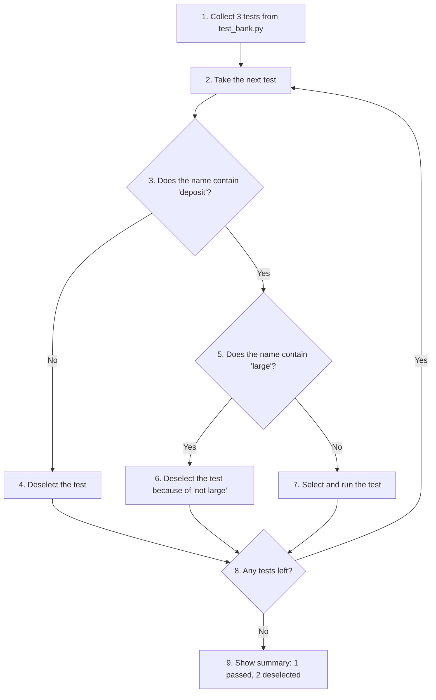
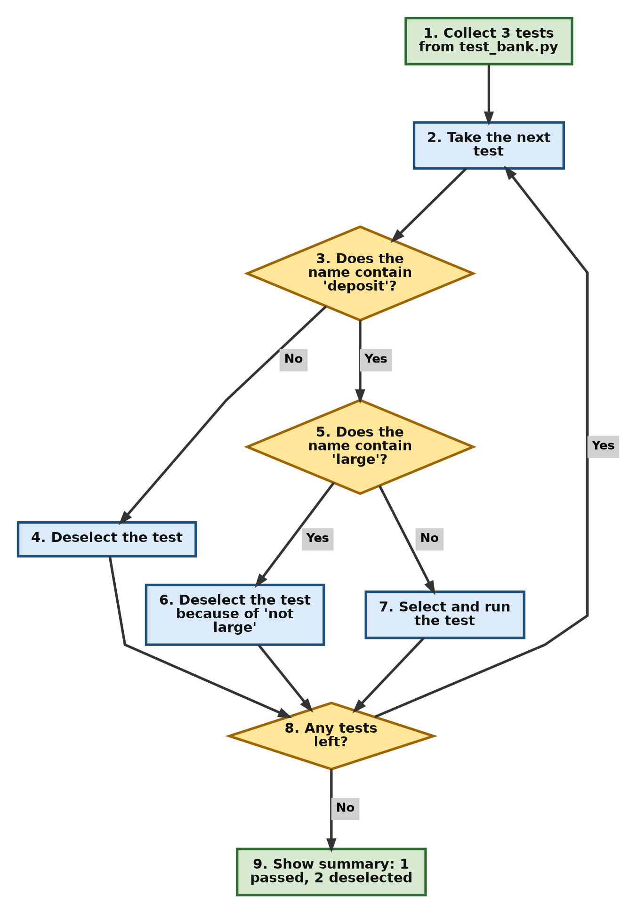
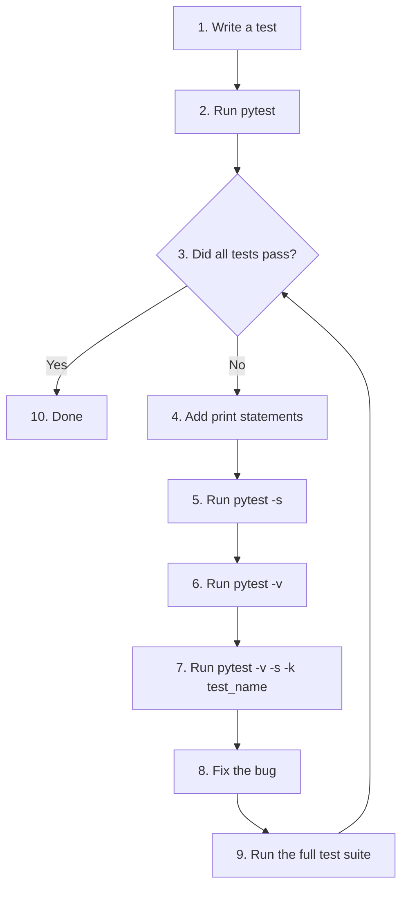
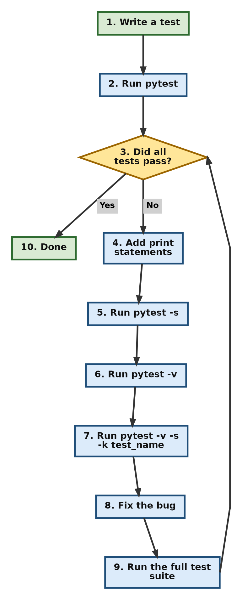

# Understanding Common Pytest Command-Line Flags: -v, -s and -k

When we run tests with pytest, we can add short options to the command to change how pytest behaves. These options are called **command-line flags**. This page explains three flags that you will use again and again: `-v` (verbose output), `-s` (show `print()` output) and `-k` (run only selected tests by name).

Why does this matter? Writing tests is only half the job. The other half is running them, reading the results and finding out what went wrong when a test fails. As a test suite grows, running every test every time and staring at a line of dots is not very helpful. These three flags let you see more detail, look inside a test while it runs, and focus on just the tests you care about.

This page builds on the earlier sections of this chapter, where we wrote test functions and ran them with the plain `pytest` command. Here we take the next step and learn to control that command. Each flag is explained with a small example script, the actual output it produces, tables, flowcharts and practical debugging tips. Mastering these few flags will make pytest much easier to use in real projects.

## Table of Contents

- [Understanding Common Pytest Command-Line Flags: -v, -s and -k](010-ch20-pytest-flags.md#understanding-common-pytest-command-line-flags--v--s-and--k)
    - [Introduction](010-ch20-pytest-flags.md#introduction)
        - [What Is a Command-Line Flag?](010-ch20-pytest-flags.md#what-is-a-command-line-flag)
        - [About the Example Files on This Page](010-ch20-pytest-flags.md#about-the-example-files-on-this-page)
    - [Mental Model](010-ch20-pytest-flags.md#mental-model)
        - [Visual Representation](010-ch20-pytest-flags.md#visual-representation)
        - [Important Terminology](010-ch20-pytest-flags.md#important-terminology)
        - [How Pytest Processes Flags](010-ch20-pytest-flags.md#how-pytest-processes-flags)
    - [The -v Flag (Verbose Mode)](010-ch20-pytest-flags.md#the--v-flag-verbose-mode)
        - [Purpose of -v](010-ch20-pytest-flags.md#purpose-of--v)
        - [Example Script for -v](010-ch20-pytest-flags.md#example-script-for--v)
        - [Running Without -v](010-ch20-pytest-flags.md#running-without--v)
        - [Running With -v](010-ch20-pytest-flags.md#running-with--v)
        - [Reading the Verbose Output](010-ch20-pytest-flags.md#reading-the-verbose-output)
        - [Why Use -v?](010-ch20-pytest-flags.md#why-use--v)
    - [The -s Flag (Show print() Output)](010-ch20-pytest-flags.md#the--s-flag-show-print-output)
        - [Purpose of -s](010-ch20-pytest-flags.md#purpose-of--s)
        - [Running Without -s](010-ch20-pytest-flags.md#running-without--s)
        - [Running With -s](010-ch20-pytest-flags.md#running-with--s)
    - [Why Does Pytest Hide print() Output?](010-ch20-pytest-flags.md#why-does-pytest-hide-print-output)
        - [Output Capture Flow](010-ch20-pytest-flags.md#output-capture-flow)
        - [What Happens When a Test Fails?](010-ch20-pytest-flags.md#what-happens-when-a-test-fails)
        - [Why Use -s?](010-ch20-pytest-flags.md#why-use--s)
        - [Example: Tracking a Balance with print()](010-ch20-pytest-flags.md#example-tracking-a-balance-with-print)
    - [The -k Flag (Test Selection)](010-ch20-pytest-flags.md#the--k-flag-test-selection)
        - [Purpose of -k](010-ch20-pytest-flags.md#purpose-of--k)
        - [Example Script for -k](010-ch20-pytest-flags.md#example-script-for--k)
        - [Running the -k Example](010-ch20-pytest-flags.md#running-the--k-example)
        - [How -k Works](010-ch20-pytest-flags.md#how--k-works)
        - [Using and, or and not with -k](010-ch20-pytest-flags.md#using-and-or-and-not-with--k)
        - [Things to Watch Out For with -k](010-ch20-pytest-flags.md#things-to-watch-out-for-with--k)
        - [Why Use -k?](010-ch20-pytest-flags.md#why-use--k)
    - [Combining Flags](010-ch20-pytest-flags.md#combining-flags)
        - [Combined Execution Flow](010-ch20-pytest-flags.md#combined-execution-flow)
        - [Common Development Scenarios](010-ch20-pytest-flags.md#common-development-scenarios)
    - [Common Beginner Mistakes](010-ch20-pytest-flags.md#common-beginner-mistakes)
        - [Mistakes with -v](010-ch20-pytest-flags.md#mistakes-with--v)
        - [Mistakes with -s](010-ch20-pytest-flags.md#mistakes-with--s)
        - [Mistakes with -k](010-ch20-pytest-flags.md#mistakes-with--k)
    - [Comparison of the Three Flags](010-ch20-pytest-flags.md#comparison-of-the-three-flags)
    - [Typical Pytest Workflow](010-ch20-pytest-flags.md#typical-pytest-workflow)
    - [Practice Questions](010-ch20-pytest-flags.md#practice-questions)
        - [Question 1: Seeing Names of Selected Tests](010-ch20-pytest-flags.md#question-1-seeing-names-of-selected-tests)
        - [Question 2: Missing print() Output](010-ch20-pytest-flags.md#question-2-missing-print-output)
        - [Question 3: Predicting Which Tests Run](010-ch20-pytest-flags.md#question-3-predicting-which-tests-run)
        - [Question 4: Do Flags Change Test Results?](010-ch20-pytest-flags.md#question-4-do-flags-change-test-results)
    - [Summary](010-ch20-pytest-flags.md#summary)
    - [Further Reading](010-ch20-pytest-flags.md#further-reading)

## Introduction

As test suites grow larger, running every test every time can become slow and inefficient. Also, the default pytest report is kept short on purpose, so it does not always tell you enough when you are trying to find a problem.

Pytest provides a rich collection of command-line flags that let us control how tests are executed and how results are displayed. This resource focuses on three of the most frequently used ones:

| Flag | Short Name | What It Does |
| --- | --- | --- |
| `-v` | Verbose mode | Shows the name and result of every test |
| `-s` | Show output | Lets the output of `print()` statements appear on the screen |
| `-k` | Keyword selection | Runs only the tests whose names match a given word or expression |

Although these flags are simple, they are used every day in real-world development and debugging.

### What Is a Command-Line Flag?

A **command line** (also called a terminal, Command Prompt on Windows, or shell) is a window where you type commands instead of clicking buttons. A **flag** is a short option, usually starting with a hyphen `-`, that you add after a command to change what the command does.

For example:

```bash
pytest -v
```

Here `pytest` is the command and `-v` is the flag. The flag does not change your tests. It only changes how pytest runs them or reports on them.

If you want to see the full list of flags that pytest supports, type:

```bash
pytest --help
```

You can also read the official [pytest command-line reference](https://docs.pytest.org/en/stable/reference/reference.html#command-line-flags).

[Back to the Table of Contents](010-ch20-pytest-flags.md#table-of-contents)

### About the Example Files on This Page

A few points will help you follow the examples:

1. Pytest looks for test files whose names start with `test_` (for example `test_bank.py`) or end with `_test.py`. This process of finding tests is called **test discovery**. You can read more in the pytest guide on [test discovery conventions](https://docs.pytest.org/en/stable/explanation/goodpractices.html#conventions-for-python-test-discovery).
2. Inside those files, pytest runs every function whose name starts with `test`.
3. Save each example in its own file, open a terminal in the same folder, and type the command shown.
4. The first few lines of pytest output (the platform, Python version, folder path and plugins) will be different on your computer. That is normal. Focus on the lines that show the tests and the results.

[Back to the Table of Contents](010-ch20-pytest-flags.md#table-of-contents)

## Mental Model

Think of these flags as three separate controls. Each one controls a different part of how pytest works.

| Flag | Controls | Simple Way to Remember |
| --- | --- | --- |
| `-v` | How much detail is displayed | **v** for **v**erbose (more words) |
| `-s` | Whether `print()` output is visible | **s** for **s**how the output |
| `-k` | Which tests are executed | **k** for **k**eyword |

A useful way to think about it:

- `-v` and `-s` change **what you see**.
- `-k` changes **what runs**.

[Back to the Table of Contents](010-ch20-pytest-flags.md#table-of-contents)

### Visual Representation


[Back to the Table of Contents](010-ch20-pytest-flags.md#table-of-contents)

### Important Terminology

| Term | Meaning |
| --- | --- |
| Flag | A short option added to a command, such as `-v`, that changes how the command behaves |
| Verbose | Displaying more detailed information than usual |
| Output capture | Pytest temporarily collects and hides the text printed by `print()` so the report stays clean |
| Collected | Tests found by pytest during test discovery |
| Selected | Collected tests that pytest has chosen to run |
| Deselected | Collected tests that were left out by a filter such as `-k`. They are not run at all |
| Pattern matching | Checking whether a name contains the text you gave |
| Test suite | The complete set of tests for a project |

Note that "deselected" is not the same as "skipped" or "failed". A deselected test was simply not chosen to run this time. It is not an error.

[Back to the Table of Contents](010-ch20-pytest-flags.md#table-of-contents)

### How Pytest Processes Flags

When pytest starts, it follows the same order every time:

1. It reads the command and the flags you typed.
2. It discovers (collects) all the tests.
3. If you used `-k`, it keeps only the matching tests and deselects the rest.
4. It runs the selected tests. If you did not use `-s`, it captures any `print()` output.
5. It displays the results, in short form or in detail (with `-v`).


[Back to the Table of Contents](010-ch20-pytest-flags.md#table-of-contents)

## The -v Flag (Verbose Mode)

### Purpose of -v

The `-v` flag tells pytest to display detailed information about each test that is executed: the file name, the test name and its result (PASSED, FAILED and so on).

Without `-v`, pytest displays a compact progress line. Each passing test is shown as a single dot `.` and each failing test as the letter `F`. This is fine when everything passes, but it does not tell you *which* test is which.

[Back to the Table of Contents](010-ch20-pytest-flags.md#table-of-contents)

### Example Script for -v

Save the following code as `test_arithmetic.py`.

```python
# test_arithmetic.py

# Step 1 - Test that addition works
def test_addition():
    assert 2 + 2 == 4

# Step 2 - Test that subtraction works
def test_subtraction():
    assert 10 - 3 == 7

# Step 3 - Test that multiplication works
def test_multiplication():
    assert 3 * 4 == 12
```

Each function starts with `test`, so pytest will find and run all three. The `assert` statement checks that a condition is true. If it is false, the test fails. (See the Python documentation on the [assert statement](https://docs.python.org/3/reference/simple_stmts.html#the-assert-statement).)

[Back to the Table of Contents](010-ch20-pytest-flags.md#table-of-contents)

### Running Without -v

Run:

```bash
pytest test_arithmetic.py
```

Output:

```text
============================= test session starts ==============================
platform win32 -- Python 3.10.10, pytest-9.0.3, pluggy-1.6.0
rootdir: C:\pytest-demo
plugins: anyio-4.12.1
collected 3 items

test_arithmetic.py ...                                                   [100%]

============================== 3 passed in 0.02s ===============================
```

The three dots `...` stand for three passing tests. We know that 3 tests passed, but the names of the tests are not shown.

[Back to the Table of Contents](010-ch20-pytest-flags.md#table-of-contents)

### Running With -v

Run:

```bash
pytest -v test_arithmetic.py
```

Output:

```text
============================= test session starts ==============================
platform win32 -- Python 3.10.10, pytest-9.0.3, pluggy-1.6.0 -- C:\Users\Anurag Gupta\AppData\Local\Programs\Python\Python310\python.exe
cachedir: .pytest_cache
rootdir: C:\pytest-demo
plugins: anyio-4.12.1
collected 3 items

test_arithmetic.py::test_addition PASSED                                 [ 33%]
test_arithmetic.py::test_subtraction PASSED                              [ 66%]
test_arithmetic.py::test_multiplication PASSED                           [100%]

============================== 3 passed in 0.02s ===============================
```

Now every test appears on its own line with its result.

[Back to the Table of Contents](010-ch20-pytest-flags.md#table-of-contents)

### Reading the Verbose Output

Let us read the verbose output line by line.

| Part of the Output | What It Means |
| --- | --- |
| `platform win32 -- Python 3.10.10, pytest-9.0.3, ...` | The operating system and the versions of Python and pytest being used. With `-v`, pytest also shows the path of the Python program it is using |
| `cachedir: .pytest_cache` | The folder where pytest stores information between runs. It is shown in verbose mode |
| `rootdir: C:\pytest-demo` | The folder pytest treats as the base of your project |
| `collected 3 items` | Pytest found 3 tests |
| `test_arithmetic.py::test_addition` | The file name, then `::`, then the test name. This is called the **test ID** |
| `PASSED` | The result of that test |
| `[ 33%]` | How much of the test run is complete |
| `3 passed in 0.02s` | Final summary: how many tests passed and how long the run took |

[Back to the Table of Contents](010-ch20-pytest-flags.md#table-of-contents)

### Why Use -v?

- It shows individual test names, so you know exactly what ran.
- It makes debugging easier because a failing test is named clearly.
- It is very useful when there are many tests in many files.
- It helps you confirm that pytest actually found the tests you expected.

**A little further:** you can use `-vv` for even more detail (for example, fuller explanations when an `assert` comparing long lists or strings fails). The opposite flag is `-q` (quiet), which makes the output shorter. More details are in the pytest guide on [managing output](https://docs.pytest.org/en/stable/how-to/output.html).

[Back to the Table of Contents](010-ch20-pytest-flags.md#table-of-contents)

## The -s Flag (Show print() Output)

### Purpose of -s

By default, pytest captures the output produced by `print()` statements and does not display it when the test passes. This keeps test reports clean and short.

The `-s` flag switches this capturing off, so anything your test prints appears on the screen while the test runs. (`-s` is a shortcut for the longer flag `--capture=no`.)

[Back to the Table of Contents](010-ch20-pytest-flags.md#table-of-contents)

### Running Without -s

Save this code as `test_demo.py`:

```python
# test_demo.py

def test_demo():
    # Step 1 - Print a message
    print("Hello")
    # Step 2 - A check that always passes
    assert True
```

Run:

```bash
pytest test_demo.py
```

Output:

```text
============================= test session starts ==============================
platform win32 -- Python 3.10.10, pytest-9.0.3, pluggy-1.6.0
rootdir: C:\pytest-demo
plugins: anyio-4.12.1
collected 1 item

test_demo.py .                                                           [100%]

============================== 1 passed in 0.02s ===============================
```

Notice that the word `Hello` is not displayed anywhere. The `print()` statement did run, but pytest captured its output and, since the test passed, did not show it.

[Back to the Table of Contents](010-ch20-pytest-flags.md#table-of-contents)

### Running With -s

Run:

```bash
pytest -s test_demo.py
```

Output:

```text
============================= test session starts ==============================
platform win32 -- Python 3.10.10, pytest-9.0.3, pluggy-1.6.0
rootdir: C:\pytest-demo
plugins: anyio-4.12.1
collected 1 item

test_demo.py Hello
.

============================== 1 passed in 0.02s ===============================
```

Now `Hello` is visible. It appears right after the file name, because it is printed while the test is running. The dot `.` for the passing test comes after it.

[Back to the Table of Contents](010-ch20-pytest-flags.md#table-of-contents)

## Why Does Pytest Hide print() Output?

Pytest uses a mechanism called **output capture**.

When a program prints something, the text normally goes to the screen through a channel called **standard output** (often shortened to *stdout*). During a test, pytest quietly redirects this channel into a temporary store instead of the screen. Then:

1. If the test **passes**, pytest throws the stored text away. You do not need it, and hiding it keeps the report tidy.
2. If the test **fails**, pytest shows the stored text in a section called `Captured stdout call`, because it may help you find the problem.
3. If you use **`-s`**, nothing is captured. The text goes straight to the screen, whether the test passes or fails.

You can read more in the pytest guide on [capturing output](https://docs.pytest.org/en/stable/how-to/capture-stdout-stderr.html).

[Back to the Table of Contents](010-ch20-pytest-flags.md#table-of-contents)

### Output Capture Flow


[Back to the Table of Contents](010-ch20-pytest-flags.md#table-of-contents)

### What Happens When a Test Fails?

This point often surprises beginners, so let us see it in action. Save this code as `test_discount.py`. The test has a deliberate mistake: a 10% discount on 200 gives 180, not 190.

```python
# test_discount.py

def test_discount():
    # Step 1 - Start with the original price
    price = 200
    print("Original price:", price)

    # Step 2 - Work out a 10% discount
    discount = price * 10 / 100
    print("Discount:", discount)

    # Step 3 - Subtract the discount from the price
    final_price = price - discount
    print("Final price:", final_price)

    # Step 4 - Check the result (the expected value 190 is wrong on purpose)
    assert final_price == 190
```

Run it **without** `-s`:

```bash
pytest test_discount.py
```

Output:

```text
============================= test session starts ==============================
platform win32 -- Python 3.10.10, pytest-9.0.3, pluggy-1.6.0
rootdir: C:\pytest-demo
plugins: anyio-4.12.1
collected 1 item

test_discount.py F                                                       [100%]

=================================== FAILURES ===================================
________________________________ test_discount _________________________________

    def test_discount():
        # Step 1 - Start with the original price
        price = 200
        print("Original price:", price)

        # Step 2 - Work out a 10% discount
        discount = price * 10 / 100
        print("Discount:", discount)

        # Step 3 - Subtract the discount from the price
        final_price = price - discount
        print("Final price:", final_price)

        # Step 4 - Check the result (the expected value 190 is wrong on purpose)
>       assert final_price == 190
E       assert 180.0 == 190

test_discount.py:17: AssertionError
----------------------------- Captured stdout call -----------------------------
Original price: 200
Discount: 20.0
Final price: 180.0
=========================== short test summary info ============================
FAILED test_discount.py::test_discount - assert 180.0 == 190
============================== 1 failed in 0.05s ===============================
```

Look at these parts of the output:

1. `F` shows that the test failed.
2. The line starting with `>` points to the line that failed. The line starting with `E` shows the actual comparison: `180.0 == 190`.
3. The `Captured stdout call` section shows all three `print()` messages, even though we did **not** use `-s`. This is because the test failed.

So, for a failing test, you often do not need `-s` at all. `-s` is most useful when you want to see printed values while tests are passing, or when you want to see the messages at the moment they are printed.

[Back to the Table of Contents](010-ch20-pytest-flags.md#table-of-contents)

### Why Use -s?

- **Debugging:** to see what is happening inside a test.
- **Viewing intermediate values:** to check the value of a variable at each step.
- **Understanding program flow:** to see which parts of the code actually run, and in what order.
- **Learning and experimentation:** to watch how your code behaves while you are still learning.

[Back to the Table of Contents](010-ch20-pytest-flags.md#table-of-contents)

### Example: Tracking a Balance with print()

Save this code as `test_balance.py`:

```python
# test_balance.py

def test_balance():
    # Step 1 - Start with an opening balance
    balance = 100
    print("Initial Balance:", balance)

    # Step 2 - Add a deposit of 50
    balance += 50
    print("Updated Balance:", balance)

    # Step 3 - Check that the final balance is correct
    assert balance == 150
```

Run (with the `-s` flag):

```bash
pytest -s test_balance.py
```

Output:

```text
============================= test session starts ==============================
platform win32 -- Python 3.10.10, pytest-9.0.3, pluggy-1.6.0
rootdir: C:\pytest-demo
plugins: anyio-4.12.1
collected 1 item

test_balance.py Initial Balance: 100
Updated Balance: 150
.

============================== 1 passed in 0.02s ===============================
```

Both `print()` messages now appear, showing the balance before and after the deposit. The dot `.` at the end shows that the test passed.

If you run the same file with `pytest test_balance.py` (no `-s`), the two balance lines do not appear, because the test passes and its output is captured.

[Back to the Table of Contents](010-ch20-pytest-flags.md#table-of-contents)

## The -k Flag (Test Selection)

### Purpose of -k

The `-k` flag lets pytest execute only the tests whose names match a given word or expression. All other tests are deselected, which means they are not run at all.

Example:

```bash
pytest -k deposit
```

Only tests that contain the word `deposit` in their names are executed.

This is very handy in a large project. Instead of running hundreds of tests, you run only the few related to the part of the code you are working on. The pytest guide explains this under [specifying which tests to run](https://docs.pytest.org/en/stable/how-to/usage.html#specifying-which-tests-to-run).

[Back to the Table of Contents](010-ch20-pytest-flags.md#table-of-contents)

### Example Script for -k

Save this code as `test_bank.py`:

```python
# test_bank.py

# Step 1 - Test a normal deposit
def test_deposit():
    print("Running deposit test")
    balance = 100
    balance += 50
    assert balance == 150

# Step 2 - Test a withdrawal
def test_withdraw():
    print("Running withdraw test")
    balance = 100
    balance -= 30
    assert balance == 70

# Step 3 - Test a large deposit
def test_deposit_large_amount():
    print("Running large deposit test")
    balance = 100
    balance += 1000
    assert balance == 1100
```

The file has three tests. Two of them have the word `deposit` in their names. One does not.

[Back to the Table of Contents](010-ch20-pytest-flags.md#table-of-contents)

### Running the -k Example

Run:

```bash
pytest test_bank.py -k deposit -s -v
```

Note the format:

1. The first term is `pytest`.
2. It is followed by `test_bank.py`, which is the name of the file containing the tests.
3. Then comes the `-k` flag.
4. Then the word `deposit`, which is used to select the tests whose names contain `deposit`.
5. Finally come the flags `-s` and `-v`.

The order of the flags does not matter. `pytest -v -s -k deposit test_bank.py` gives the same result. The only rule is that the word `deposit` must come straight after `-k`.

Output:

```text
============================= test session starts ==============================
platform win32 -- Python 3.10.10, pytest-9.0.3, pluggy-1.6.0 -- C:\Users\Anurag Gupta\AppData\Local\Programs\Python\Python310\python.exe
cachedir: .pytest_cache
rootdir: C:\pytest-demo
plugins: anyio-4.12.1
collected 3 items / 1 deselected / 2 selected

test_bank.py::test_deposit Running deposit test
PASSED
test_bank.py::test_deposit_large_amount Running large deposit test
PASSED

======================= 2 passed, 1 deselected in 0.14s ========================
```

Notice that pytest executes:

```text
test_deposit
test_deposit_large_amount
```

and leaves out:

```text
test_withdraw
```

Here is what each flag contributed to this output:

| Flag | Effect Seen in the Output |
| --- | --- |
| `-k deposit` | `collected 3 items / 1 deselected / 2 selected`. Only the two deposit tests ran |
| `-v` | Each test is shown by its full name, followed by `PASSED` |
| `-s` | The messages `Running deposit test` and `Running large deposit test` are visible |

The message `Running withdraw test` does not appear because `test_withdraw` was never run.

[Back to the Table of Contents](010-ch20-pytest-flags.md#table-of-contents)

### How -k Works


In simple steps:

1. Pytest collects all the tests.
2. For each test, it checks whether the name contains the text given after `-k`.
3. If it does, the test is selected and run.
4. If it does not, the test is deselected and not run.
5. At the end, the summary reports both numbers, for example `2 passed, 1 deselected`.

[Back to the Table of Contents](010-ch20-pytest-flags.md#table-of-contents)

### Using and, or and not with -k

The text after `-k` can be more than a single word. You can join words with `and`, `or` and `not`, just like in a Python condition. When the expression has spaces, put it inside double quotes (double quotes work in the Windows Command Prompt as well as on macOS and Linux).

| Command | Tests Selected from `test_bank.py` |
| --- | --- |
| `pytest test_bank.py -k deposit` | `test_deposit`, `test_deposit_large_amount` |
| `pytest test_bank.py -k "deposit and not large"` | `test_deposit` only |
| `pytest test_bank.py -k "withdraw or large"` | `test_withdraw`, `test_deposit_large_amount` |
| `pytest test_bank.py -k "not deposit"` | `test_withdraw` only |

For example, run:

```bash
pytest test_bank.py -k "deposit and not large" -v
```

Output:

```text
============================= test session starts ==============================
platform win32 -- Python 3.10.10, pytest-9.0.3, pluggy-1.6.0 -- C:\Users\Anurag Gupta\AppData\Local\Programs\Python\Python310\python.exe
cachedir: .pytest_cache
rootdir: C:\pytest-demo
plugins: anyio-4.12.1
collected 3 items / 2 deselected / 1 selected

test_bank.py::test_deposit PASSED                                        [100%]

======================= 1 passed, 2 deselected in 0.02s ========================
```

The following flowchart shows how pytest decides for each test in this example.





[Back to the Table of Contents](010-ch20-pytest-flags.md#table-of-contents)

### Things to Watch Out For with -k

1. **Matching is not case-sensitive.** `-k DEPOSIT` selects the same tests as `-k deposit`.
2. **It matches part of a name.** `-k deposit` matches `test_deposit` and also `test_deposit_large_amount`, because both contain `deposit`.
3. **It also looks at file and class names.** If the word appears in the file name, every test in that file matches. For example, `pytest test_bank.py -k bank` runs all three tests, because the file is called `test_bank.py`. Choose a word that appears only in the tests you want.
4. **Use quotes for expressions with spaces.** Write `-k "deposit and not large"`, not `-k deposit and not large`.
5. **If nothing matches,** pytest runs no tests and reports that all of them were deselected. Check your spelling.

[Back to the Table of Contents](010-ch20-pytest-flags.md#table-of-contents)

### Why Use -k?

- To run only one specific test.
- To run a small group of related tests.
- To debug faster, because you do not wait for unrelated tests.
- It is very useful in large projects with hundreds of tests.

[Back to the Table of Contents](010-ch20-pytest-flags.md#table-of-contents)

## Combining Flags

Flags can be combined in one command. Each flag does its own job, and they do not interfere with each other.

Example:

```bash
pytest -v -s -k deposit
```

Meaning:

| Flag | Purpose |
| --- | --- |
| `-v` | Show test names |
| `-s` | Show `print()` output |
| `-k deposit` | Run only the tests whose names contain `deposit` |

When no file name is given, as here, pytest searches the current folder (and the folders inside it) for test files.

[Back to the Table of Contents](010-ch20-pytest-flags.md#table-of-contents)

### Combined Execution Flow


[Back to the Table of Contents](010-ch20-pytest-flags.md#table-of-contents)

### Common Development Scenarios

| Situation | Recommended Command |
| --- | --- |
| Run all tests | `pytest` |
| See individual test names | `pytest -v` |
| View `print()` output | `pytest -s` |
| Run one group of tests | `pytest -k deposit` |
| Debug one test | `pytest -v -s -k deposit` |
| Debug a failing test | `pytest -v -s` |
| Run all tests except one group | `pytest -k "not deposit"` |

[Back to the Table of Contents](010-ch20-pytest-flags.md#table-of-contents)

## Common Beginner Mistakes

The tables below list some common misunderstandings about these flags and what really happens.

### Mistakes with -v

| Mistake | Reality |
| --- | --- |
| Thinking `-v` changes test behaviour | It only changes how much detail is displayed. The tests run exactly the same way |
| Thinking `-v` makes tests faster | It only affects the display, not the speed |

[Back to the Table of Contents](010-ch20-pytest-flags.md#table-of-contents)

### Mistakes with -s

| Mistake | Reality |
| --- | --- |
| Thinking `print()` is broken because nothing appears | `print()` works. Pytest is capturing the output. Use `-s` to see it |
| Thinking `-s` changes test logic | It only changes whether printed output is visible |
| Thinking you always need `-s` to see printed output | For a failing test, pytest shows the captured output anyway, under `Captured stdout call` |

[Back to the Table of Contents](010-ch20-pytest-flags.md#table-of-contents)

### Mistakes with -k

| Mistake | Reality |
| --- | --- |
| Thinking `-k` is meant for selecting by markers | `-k` is meant for matching names (test, class and file names). To select tests by marker, use `-m` |
| Thinking `-k slow` is the same as `-m slow` | They are different. `-k` checks whether a name contains the text. `-m` selects tests that carry an exact marker such as `@pytest.mark.slow` |
| Thinking deselected tests failed | Deselected means not executed. They did not pass or fail |
| Thinking `-k` needs the full test name | Part of the name is enough. `-k deposit` matches `test_deposit_large_amount` |

A **marker** is a label you attach to a test, for example `@pytest.mark.slow`, so that you can group tests. You can learn about markers in the pytest guide on [marking test functions](https://docs.pytest.org/en/stable/how-to/mark.html).

[Back to the Table of Contents](010-ch20-pytest-flags.md#table-of-contents)

## Comparison of the Three Flags

| Flag | Purpose | Affects Execution? | Affects Output? | Common During Development? |
| --- | --- | --- | --- | --- |
| `-v` | Verbose output | No | Yes | Very common |
| `-s` | Show `print()` output | No | Yes | Common |
| `-k` | Select tests by name | Yes | Indirectly (fewer tests are shown) | Very common |

[Back to the Table of Contents](010-ch20-pytest-flags.md#table-of-contents)

## Typical Pytest Workflow

A common workflow during development is:

```text
1. Write a test
2. Run pytest
3. Observe a failure
4. Add print() statements to the test or the code
5. Run pytest -s to see the printed values
6. Run pytest -v to see which tests pass and which fail
7. Run pytest -v -s -k test_name to focus on the one failing test
8. Fix the bug
9. Run the full test suite again with pytest
```

The same workflow as a flowchart:





Once all tests pass, remember to remove any `print()` statements you added only for debugging.

[Back to the Table of Contents](010-ch20-pytest-flags.md#table-of-contents)

## Practice Questions

### Question 1: Seeing Names of Selected Tests

You have a project with 50 tests. You want to run only the tests that have `login` in their names, and you want to see the name of each test as it runs. Which command should you use?

**Answer:**

1. To see each test name, we need `-v`.
2. To run only the tests with `login` in their names, we need `-k login`.
3. Putting them together:

```bash
pytest -v -k login
```

[Back to the Table of Contents](010-ch20-pytest-flags.md#table-of-contents)

### Question 2: Missing print() Output

A student adds `print("x is", x)` inside a test. The test passes, but the message never appears on the screen. Is `print()` broken? How can the student see the message?

**Answer:**

1. `print()` is not broken. It did run.
2. Pytest captured the output, and because the test passed, it did not display it.
3. To see the message, run the test with `-s`:

```bash
pytest -s
```

**Follow-up:** If the same test had failed, would the student see the message without `-s`?

**Answer:** Yes. For a failing test, pytest shows the captured output in the `Captured stdout call` section of the report.

[Back to the Table of Contents](010-ch20-pytest-flags.md#table-of-contents)

### Question 3: Predicting Which Tests Run

Save the following code as `test_shop.py`:

```python
# test_shop.py

# Step 1 - Test adding an item to the cart
def test_add_item():
    cart = []
    cart.append("pen")
    print("Cart after adding:", cart)
    assert cart == ["pen"]

# Step 2 - Test removing an item from the cart
def test_remove_item():
    cart = ["pen", "book"]
    cart.remove("pen")
    print("Cart after removing:", cart)
    assert cart == ["book"]

# Step 3 - Test applying a discount
def test_add_discount():
    price = 500
    discount = 50
    final_price = price - discount
    print("Price after discount:", final_price)
    assert final_price == 450

# Step 4 - Test the checkout total
def test_checkout():
    prices = [100, 250, 50]
    total = sum(prices)
    print("Checkout total:", total)
    assert total == 400
```

Which tests will run with the following command, and what will be printed?

```bash
pytest test_shop.py -k "add and not discount" -v -s
```

**Answer:**

1. List the four test names: `test_add_item`, `test_remove_item`, `test_add_discount`, `test_checkout`.
2. Keep only the names that contain `add`: `test_add_item` and `test_add_discount`.
3. Remove the names that contain `discount`: this removes `test_add_discount`.
4. Only `test_add_item` is left. It runs, and because of `-s`, its message is printed. Because of `-v`, its full name is shown.

Output:

```text
============================= test session starts ==============================
platform win32 -- Python 3.10.10, pytest-9.0.3, pluggy-1.6.0 -- C:\Users\Anurag Gupta\AppData\Local\Programs\Python\Python310\python.exe
cachedir: .pytest_cache
rootdir: C:\pytest-demo
plugins: anyio-4.12.1
collected 4 items / 3 deselected / 1 selected

test_shop.py::test_add_item Cart after adding: ['pen']
PASSED

======================= 1 passed, 3 deselected in 0.02s ========================
```

**Follow-up:** What happens if you run `pytest test_shop.py -k shop`?

**Answer:** All four tests run. The word `shop` is part of the file name `test_shop.py`, and `-k` also checks file names, so every test in the file matches.

[Back to the Table of Contents](010-ch20-pytest-flags.md#table-of-contents)

### Question 4: Do Flags Change Test Results?

If a test passes with `pytest`, can it fail when you run it with `pytest -v -s`?

**Answer:**

1. `-v` only changes how much detail is shown.
2. `-s` only changes whether printed output is shown.
3. Neither flag changes the code of the test or what it checks.
4. So the test will still pass. (`-k` can decide *whether* a test runs, but not whether it passes.)

[Back to the Table of Contents](010-ch20-pytest-flags.md#table-of-contents)

## Summary

- `-v` shows the name and result of each test. Use it when you want to know exactly which tests ran and which failed.
- `-s` shows the output of `print()` statements. Use it when you want to look inside a test while it runs.
- `-k` runs only the tests whose names match a word or expression. Use it to focus on a small part of your test suite.
- `-v` and `-s` change what you see. `-k` changes what runs.
- The flags can be combined freely, for example `pytest -v -s -k deposit`.

[Back to the Table of Contents](010-ch20-pytest-flags.md#table-of-contents)

## Further Reading

- [How to invoke pytest](https://docs.pytest.org/en/stable/how-to/usage.html)
- [Managing pytest's output](https://docs.pytest.org/en/stable/how-to/output.html)
- [How to capture stdout/stderr output](https://docs.pytest.org/en/stable/how-to/capture-stdout-stderr.html)
- [Pytest command-line flags reference](https://docs.pytest.org/en/stable/reference/reference.html#command-line-flags)

[Back to the Table of Contents](010-ch20-pytest-flags.md#table-of-contents)

