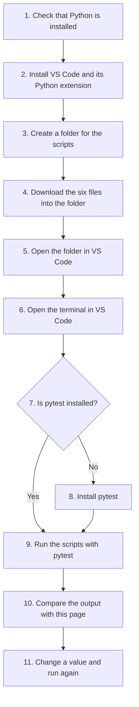
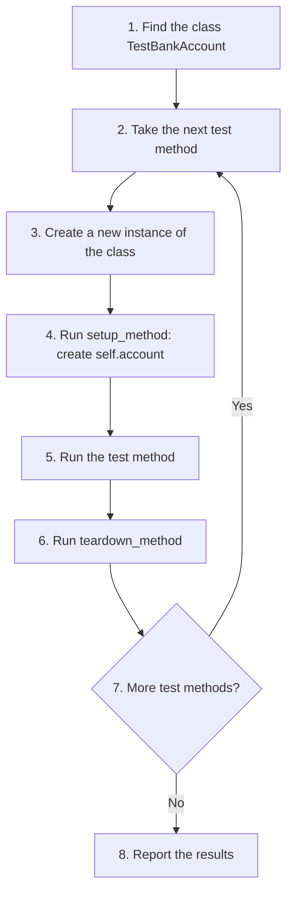
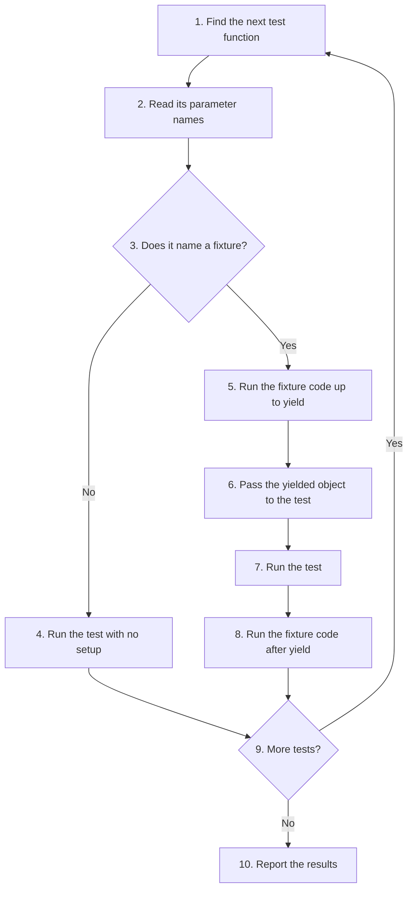

# Breaking Free from Rigid Test Classes: xUnit Setup Methods vs. Pytest Fixtures

Most tests need some starting data before they can run. A banking test, for example, needs a bank account to deposit money into. Preparing this data is called **setup**, and cleaning up after the test is called **teardown**. How a testing tool handles setup and teardown has a big effect on how easy the tests are to write, read and change.

This page is the model answer for the **Further Study and Research Project** in Chapter 20 of the book. It compares two ways of handling setup:

1. The older **xUnit class style**, where tests live inside a class and share one `setup_method`. This is the style used by Python's built-in `unittest` module and by Java's JUnit, and pytest supports it too.
2. The modern **pytest fixture style**, where tests are plain functions and each test asks only for the data it needs.

We first look at the limits of the class style, using small runnable scripts and their actual output. Then we rewrite the same tests with pytest fixtures and see how each limit disappears. Along the way you will meet an important programming idea called **dependency injection**. The page ends with a comparison table, follow-up questions and links for further reading.

Knowing both styles matters because you will see both in real Python projects. Older code bases and the standard library use test classes. Most new projects that use pytest prefer fixtures.

## Table of Contents

- [Breaking Free from Rigid Test Classes: xUnit Setup Methods vs. Pytest Fixtures](020-ch20-unittest-disadvantage-rigid-oop-style.md#breaking-free-from-rigid-test-classes-xunit-setup-methods-vs-pytest-fixtures)
    - [Further Study & Research Project: Breaking the Chains of Rigid Test Architecture](020-ch20-unittest-disadvantage-rigid-oop-style.md#further-study--research-project-breaking-the-chains-of-rigid-test-architecture)
        - [Key Terms Used in This Project](020-ch20-unittest-disadvantage-rigid-oop-style.md#key-terms-used-in-this-project)
    - [Solution: Architectural Restrictions of OOP xUnit Testing vs. Pytest Fixtures](020-ch20-unittest-disadvantage-rigid-oop-style.md#solution-architectural-restrictions-of-oop-xunit-testing-vs-pytest-fixtures)
        - [The BankAccount Class Used in the Examples](020-ch20-unittest-disadvantage-rigid-oop-style.md#the-bankaccount-class-used-in-the-examples)
    - [Running the Scripts on Your Computer](020-ch20-unittest-disadvantage-rigid-oop-style.md#running-the-scripts-on-your-computer)
        - [Step 1: Check That Python Is Installed](020-ch20-unittest-disadvantage-rigid-oop-style.md#step-1-check-that-python-is-installed)
        - [Step 2: Install VS Code and the Python Extension](020-ch20-unittest-disadvantage-rigid-oop-style.md#step-2-install-vs-code-and-the-python-extension)
        - [Step 3: Create a Folder for the Scripts](020-ch20-unittest-disadvantage-rigid-oop-style.md#step-3-create-a-folder-for-the-scripts)
        - [Step 4: Download the Six Files](020-ch20-unittest-disadvantage-rigid-oop-style.md#step-4-download-the-six-files)
        - [Step 5: Open the Folder in VS Code](020-ch20-unittest-disadvantage-rigid-oop-style.md#step-5-open-the-folder-in-vs-code)
        - [Step 6: Open the Terminal in VS Code](020-ch20-unittest-disadvantage-rigid-oop-style.md#step-6-open-the-terminal-in-vs-code)
        - [Step 7: Check Whether pytest Is Installed](020-ch20-unittest-disadvantage-rigid-oop-style.md#step-7-check-whether-pytest-is-installed)
        - [Step 8: Install pytest](020-ch20-unittest-disadvantage-rigid-oop-style.md#step-8-install-pytest)
        - [Step 9: Run the Scripts](020-ch20-unittest-disadvantage-rigid-oop-style.md#step-9-run-the-scripts)
        - [Step 10: Compare Your Output with This Page](020-ch20-unittest-disadvantage-rigid-oop-style.md#step-10-compare-your-output-with-this-page)
        - [Step 11: Experiment by Making a Test Fail](020-ch20-unittest-disadvantage-rigid-oop-style.md#step-11-experiment-by-making-a-test-fail)
        - [Optional: Using the Testing Panel in VS Code](020-ch20-unittest-disadvantage-rigid-oop-style.md#optional-using-the-testing-panel-in-vs-code)
        - [Troubleshooting Common Problems](020-ch20-unittest-disadvantage-rigid-oop-style.md#troubleshooting-common-problems)
    - [The Problem: The Rigid OOP Class Blueprint](020-ch20-unittest-disadvantage-rigid-oop-style.md#the-problem-the-rigid-oop-class-blueprint)
        - [A Complete xUnit-Style Test Class](020-ch20-unittest-disadvantage-rigid-oop-style.md#a-complete-xunit-style-test-class)
        - [How the xUnit Setup Runs](020-ch20-unittest-disadvantage-rigid-oop-style.md#how-the-xunit-setup-runs)
        - [1. The "All-or-Nothing" Scope Problem](020-ch20-unittest-disadvantage-rigid-oop-style.md#1-the-all-or-nothing-scope-problem)
        - [2. The "One-Size-Fits-All" Initialization Bottleneck](020-ch20-unittest-disadvantage-rigid-oop-style.md#2-the-one-size-fits-all-initialization-bottleneck)
        - [3. Extra Boilerplate That Hides the Intent](020-ch20-unittest-disadvantage-rigid-oop-style.md#3-extra-boilerplate-that-hides-the-intent)
        - [A Note on self: Instance Data, Not Shared Data](020-ch20-unittest-disadvantage-rigid-oop-style.md#a-note-on-self-instance-data-not-shared-data)
    - [The Solution: Dependency Injection via Pytest Fixtures](020-ch20-unittest-disadvantage-rigid-oop-style.md#the-solution-dependency-injection-via-pytest-fixtures)
        - [What Is Dependency Injection?](020-ch20-unittest-disadvantage-rigid-oop-style.md#what-is-dependency-injection)
        - [How Pytest Supplies a Fixture](020-ch20-unittest-disadvantage-rigid-oop-style.md#how-pytest-supplies-a-fixture)
        - [The Refactored Script](020-ch20-unittest-disadvantage-rigid-oop-style.md#the-refactored-script)
            - [Step 1: Import pytest and the Code Under Test](020-ch20-unittest-disadvantage-rigid-oop-style.md#step-1-import-pytest-and-the-code-under-test)
            - [Step 2: Define the Fixtures](020-ch20-unittest-disadvantage-rigid-oop-style.md#step-2-define-the-fixtures)
            - [Step 3: Write the Test Functions](020-ch20-unittest-disadvantage-rigid-oop-style.md#step-3-write-the-test-functions)
            - [The Complete Script](020-ch20-unittest-disadvantage-rigid-oop-style.md#the-complete-script)
            - [Running the Refactored Script](020-ch20-unittest-disadvantage-rigid-oop-style.md#running-the-refactored-script)
        - [Understanding yield in a Fixture](020-ch20-unittest-disadvantage-rigid-oop-style.md#understanding-yield-in-a-fixture)
        - [How the Refactored Script Solves Each Limitation](020-ch20-unittest-disadvantage-rigid-oop-style.md#how-the-refactored-script-solves-each-limitation)
        - [Going Further: A Factory Fixture](020-ch20-unittest-disadvantage-rigid-oop-style.md#going-further-a-factory-fixture)
        - [Going Further: Sharing Fixtures and Controlling Their Scope](020-ch20-unittest-disadvantage-rigid-oop-style.md#going-further-sharing-fixtures-and-controlling-their-scope)
    - [Comparative Architectural Summary](020-ch20-unittest-disadvantage-rigid-oop-style.md#comparative-architectural-summary)
        - [Summary Core Concept](020-ch20-unittest-disadvantage-rigid-oop-style.md#summary-core-concept)
        - [When Is a Test Class Still Useful?](020-ch20-unittest-disadvantage-rigid-oop-style.md#when-is-a-test-class-still-useful)
    - [Follow-Up Questions](020-ch20-unittest-disadvantage-rigid-oop-style.md#follow-up-questions)
        - [Question 1: Counting Setup Runs](020-ch20-unittest-disadvantage-rigid-oop-style.md#question-1-counting-setup-runs)
        - [Question 2: Adding a New Kind of Account](020-ch20-unittest-disadvantage-rigid-oop-style.md#question-2-adding-a-new-kind-of-account)
        - [Question 3: Can Two Tests Share Changes Through a Fixture?](020-ch20-unittest-disadvantage-rigid-oop-style.md#question-3-can-two-tests-share-changes-through-a-fixture)
        - [Question 4: Using a Fixture Inside a Test Class](020-ch20-unittest-disadvantage-rigid-oop-style.md#question-4-using-a-fixture-inside-a-test-class)
    - [Further Reading](020-ch20-unittest-disadvantage-rigid-oop-style.md#further-reading)

## Further Study & Research Project: Breaking the Chains of Rigid Test Architecture

**Background:** Earlier testing standards (like Python's classic `unittest` module or Java's JUnit) forced developers into a strict **Object-Oriented Programming (OOP)** hierarchy. To share setup and teardown routines across tests, you _had_ to wrap your test functions inside a class structure, passing a `self` reference and assigning variables to the class instance (`self.variable`).

While this solved basic test isolation issues, it introduced rigid constraints that heavily restricted modern, scalable test design.

**The Assignment:**

1.  **Analyze the Limitations:** Investigate how a unified `setup_method` inside an xUnit-style test class impacts test suite flexibility when dealing with:

    -   "All-or-Nothing" scopes (tests within the same class that don't actually require the setup data).

    -   "One-Size-Fits-All" data variations (testing scenarios that require different configurations of the initial object state, such as VIP vs. Frozen bank accounts).

2.  **Implement the Alternative:** Rewrite an OOP-based xUnit test class into a purely functional script using modern Pytest fixtures and **Dependency Injection**. Demonstrate how this removes unnecessary boilerplate code and uncouples the state from a central instance variable.

[Back to the Table of Contents](020-ch20-unittest-disadvantage-rigid-oop-style.md#table-of-contents)

### Key Terms Used in This Project

The project uses several technical terms. Here is what each one means in simple words.

| Term | Simple Meaning | Learn More |
| --- | --- | --- |
| Object-Oriented Programming (OOP) | A way of writing programs by grouping data and the functions that work on it into classes and objects | [Python tutorial: Classes](https://docs.python.org/3/tutorial/classes.html) |
| Class and instance | A class is a blueprint. An instance (object) is one thing built from that blueprint | [Python tutorial: Classes](https://docs.python.org/3/tutorial/classes.html) |
| `self` | The name a method uses to refer to the instance it belongs to. `self.account` means "the account stored on this object" | [Python tutorial: Random Remarks](https://docs.python.org/3/tutorial/classes.html#random-remarks) |
| xUnit | A family of testing tools that all follow the same class-based design: JUnit (Java), `unittest` (Python), NUnit (.NET) and others | [xUnit on Wikipedia](https://en.wikipedia.org/wiki/XUnit) |
| Setup and teardown | Code that runs before a test (to prepare data) and after a test (to clean up) | [pytest: xunit-style setup](https://docs.pytest.org/en/stable/how-to/xunit_setup.html) |
| `setup_method` / `teardown_method` | In a pytest test class, methods that run before and after every test method in that class. In `unittest` the same job is done by `setUp` and `tearDown` | [pytest: xunit-style setup](https://docs.pytest.org/en/stable/how-to/xunit_setup.html) |
| Fixture | A function marked with `@pytest.fixture` that prepares something a test needs and hands it to the test | [pytest: How to use fixtures](https://docs.pytest.org/en/stable/how-to/fixtures.html) |
| Dependency injection | Instead of a test building what it needs, the thing it needs is supplied ("injected") to it from outside | [Dependency injection on Wikipedia](https://en.wikipedia.org/wiki/Dependency_injection) |
| Test isolation | Each test starts from a clean state, so one test cannot affect the result of another | [pytest: fixtures and isolation](https://docs.pytest.org/en/stable/explanation/fixtures.html) |
| Boilerplate | Code that must be written again and again but adds nothing to what the test actually checks | |
| Scope | How often a piece of setup runs: once per test, once per class, once per file, and so on | [pytest: fixture scopes](https://docs.pytest.org/en/stable/how-to/fixtures.html#fixture-scopes) |

[Back to the Table of Contents](020-ch20-unittest-disadvantage-rigid-oop-style.md#table-of-contents)

## Solution: Architectural Restrictions of OOP xUnit Testing vs. Pytest Fixtures

This section is the model answer and research breakdown for the project above.

In the chapter, testing styles are presented as a series of phases. Two of them matter here:

- **Phase 2** is the classic xUnit style: tests inside a class, with a shared `setup_method` and `teardown_method`.
- **Phase 4** is the modern pytest style: tests as plain functions, with setup supplied by fixtures.

[Back to the Table of Contents](020-ch20-unittest-disadvantage-rigid-oop-style.md#table-of-contents)

### The BankAccount Class Used in the Examples

All the scripts on this page are available in the [pytest-demo folder](https://github.com/ag999git/001-Python-book-2026/tree/main/20-unittest/pytest-demo). Save all six files in one folder on your computer and run them with `pytest -v -s`. Step-by-step instructions for downloading the files, installing pytest and running the scripts in VS Code are given in [Running the Scripts on Your Computer](020-ch20-unittest-disadvantage-rigid-oop-style.md#running-the-scripts-on-your-computer).

| File | What It Contains |
| --- | --- |
| [bank_account.py](https://github.com/ag999git/001-Python-book-2026/blob/main/20-unittest/pytest-demo/bank_account.py) | The BankAccount class and the format_currency() helper that the tests use |
| [test_bank_xunit.py](https://github.com/ag999git/001-Python-book-2026/blob/main/20-unittest/pytest-demo/test_bank_xunit.py) | Classic xUnit test class with setup_method and teardown_method |
| [test_bank_xunit_variations.py](https://github.com/ag999git/001-Python-book-2026/blob/main/20-unittest/pytest-demo/test_bank_xunit_variations.py) | One setup_method using if/elif to create different accounts |
| [test_fresh_instance.py](https://github.com/ag999git/001-Python-book-2026/blob/main/20-unittest/pytest-demo/test_fresh_instance.py) | Shows that each test gets a new instance of the class |
| [test_bank_fixtures.py](https://github.com/ag999git/001-Python-book-2026/blob/main/20-unittest/pytest-demo/test_bank_fixtures.py) | The refactored tests using pytest fixtures |
| [test_bank_factory.py](https://github.com/ag999git/001-Python-book-2026/blob/main/20-unittest/pytest-demo/test_bank_factory.py) | A factory fixture that builds any kind of account |

All the examples on this page test the same small class. Save it as `bank_account.py` in the same folder as the test files.

```python
# bank_account.py
"""
A small BankAccount class used by the test examples.
It is kept simple on purpose so that we can focus on the tests.
"""


class BankAccount:
    # Step 1 - Create the account with an owner, a balance and a status
    def __init__(self, owner, balance=0, status="active"):
        self.owner = owner
        self.balance = balance
        self.status = status          # "active" or "frozen"

    # Step 2 - Add money to the account
    def deposit(self, amount):
        if self.status == "frozen":
            raise ValueError("Account is frozen")
        if amount <= 0:
            raise ValueError("Deposit amount must be positive")
        self.balance += amount

    # Step 3 - Take money out of the account
    def withdraw(self, amount):
        if self.status == "frozen":
            raise ValueError("Account is frozen")
        if amount > self.balance:
            raise ValueError("Insufficient funds")
        self.balance -= amount

    # Step 4 - Report the current balance
    def get_balance(self):
        return self.balance


# Step 5 - A simple helper that does not need an account at all
def format_currency(amount):
    """Return an amount as text, for example 1500 -> 'Rs. 1,500.00'."""
    return f"Rs. {amount:,.2f}"
```

The class has one new idea compared with a basic bank account: a `status`. A frozen account refuses both deposits and withdrawals. We need this to test the "VIP vs. Frozen" example from the assignment. The helper function `format_currency()` does not use an account at all. We need it to test the "All-or-Nothing" example.

[Back to the Table of Contents](020-ch20-unittest-disadvantage-rigid-oop-style.md#table-of-contents)

## Running the Scripts on Your Computer

Reading the scripts is useful, but you will learn much more by running them yourself and watching the output appear. This section explains, step by step, how to download the six scripts, install pytest and run the scripts in **Visual Studio Code (VS Code)**, a free code editor that many Python programmers use.

The steps are written for Windows. Where macOS or Linux is different, this is noted.

The whole process looks like this:



[Back to the Table of Contents](020-ch20-unittest-disadvantage-rigid-oop-style.md#table-of-contents)

### Step 1: Check That Python Is Installed

Open **Command Prompt** (press the Windows key, type `cmd` and press Enter) and type:

```bash
python --version
```

You should see something like this (your version number may be different):

```text
Python 3.12.4
```

Any version from Python 3.9 onwards is fine for these scripts.

- If you see an error such as `'python' is not recognized`, Python is not installed or Windows cannot find it. Download it from [python.org](https://www.python.org/downloads/). During installation, **tick the box "Add python.exe to PATH"** on the first screen. This lets Windows find Python from any folder.
- On macOS and Linux, type `python3 --version` instead. In all the commands below, use `python3` wherever this page says `python`.

[Back to the Table of Contents](020-ch20-unittest-disadvantage-rigid-oop-style.md#table-of-contents)

### Step 2: Install VS Code and the Python Extension

1. Download and install VS Code from [code.visualstudio.com](https://code.visualstudio.com/).
2. Open VS Code and click the **Extensions** icon on the left side bar (it looks like four small squares), or press `Ctrl+Shift+X`.
3. Search for **Python** and install the extension published by **Microsoft**.

An **extension** is an add-on that gives VS Code extra features. The Python extension lets VS Code understand Python code and find your Python installation. You can read more in the guide [Getting Started with Python in VS Code](https://code.visualstudio.com/docs/python/python-tutorial).

[Back to the Table of Contents](020-ch20-unittest-disadvantage-rigid-oop-style.md#table-of-contents)

### Step 3: Create a Folder for the Scripts

Create a new, empty folder, for example:

```text
C:\Users\<your name>\Documents\pytest-demo
```

All six files must go into this **same folder**. Every test file contains the line `from bank_account import ...`, and Python looks for `bank_account.py` in the folder where the tests are run. If the files are in different folders, the tests will not run.

[Back to the Table of Contents](020-ch20-unittest-disadvantage-rigid-oop-style.md#table-of-contents)

### Step 4: Download the Six Files

The six files are listed in the table in [The BankAccount Class Used in the Examples](020-ch20-unittest-disadvantage-rigid-oop-style.md#the-bankaccount-class-used-in-the-examples). For each file:

1. Click the file name in the table. The file opens on GitHub.
2. Near the top right of the code, click the **Download raw file** button (a small downward arrow icon).
3. Save the file into your `pytest-demo` folder. Keep the file name exactly as it is.

If the download button does not work for you, use this method instead:

1. On the GitHub page of the file, click the **Copy raw file** button (the icon that looks like two overlapping squares).
2. In VS Code, create a new file with the same name in your folder (see Step 5), paste the code and save it with `Ctrl+S`.

When you have finished, your folder should contain exactly these six files:

```text
pytest-demo
    bank_account.py
    test_bank_factory.py
    test_bank_fixtures.py
    test_bank_xunit.py
    test_bank_xunit_variations.py
    test_fresh_instance.py
```

**Watch out for a hidden `.txt` ending.** Some browsers save a file as `bank_account.py.txt`. Windows hides the ending, so the file looks correct but pytest will not find it. To check, open File Explorer, click **View**, and turn on **File name extensions** (in Windows 11: **View > Show > File name extensions**). If any file ends in `.txt`, rename it and remove the `.txt`.

[Back to the Table of Contents](020-ch20-unittest-disadvantage-rigid-oop-style.md#table-of-contents)

### Step 5: Open the Folder in VS Code

1. In VS Code, click **File > Open Folder...**.
2. Select your `pytest-demo` folder and click **Select Folder**.
3. If VS Code asks **"Do you trust the authors of the files in this folder?"**, click **Yes, I trust the authors**.

The six files now appear in the **Explorer** panel on the left. Click any file to read its code.

It is important to open the **folder**, not just a single file. This way the terminal in the next step starts inside the correct folder.

[Back to the Table of Contents](020-ch20-unittest-disadvantage-rigid-oop-style.md#table-of-contents)

### Step 6: Open the Terminal in VS Code

Click **Terminal > New Terminal**, or press ``Ctrl+` `` (the backtick key, usually just below `Esc`).

A terminal panel opens at the bottom of the window. The line where you type (called the **prompt**) should end with your folder name, for example:

```text
PS C:\Users\<your name>\Documents\pytest-demo>
```

The `PS` at the start means the terminal is PowerShell, which is the default in VS Code on Windows. All the commands on this page work the same way in PowerShell and in Command Prompt.

If the prompt shows a different folder, go back to Step 5 and open the correct folder.

[Back to the Table of Contents](020-ch20-unittest-disadvantage-rigid-oop-style.md#table-of-contents)

### Step 7: Check Whether pytest Is Installed

In the VS Code terminal, type:

```bash
python -m pytest --version
```

If pytest is installed, you will see its version number, for example:

```text
pytest 9.0.3
```

Any recent version of pytest will run these scripts. If you see this line, skip Step 8 and go to Step 9.

If pytest is not installed, you will see an error like this:

```text
No module named pytest
```

Why `python -m pytest` and not just `pytest`? The `-m` option tells Python to run pytest as a module (a module is simply a Python file or package that can be imported). This makes sure pytest runs with the same Python that VS Code is using, and it avoids the error `'pytest' is not recognized` that can appear when Windows cannot find the plain `pytest` command. Apart from this, `python -m pytest` and `pytest` do the same job, and all the flags such as `-v` and `-s` work the same way.

[Back to the Table of Contents](020-ch20-unittest-disadvantage-rigid-oop-style.md#table-of-contents)

### Step 8: Install pytest

In the VS Code terminal, type:

```bash
python -m pip install pytest
```

`pip` is Python's tool for installing extra packages from the internet. You will see several lines of download messages. The last line should begin with:

```text
Successfully installed ... pytest-...
```

Now repeat Step 7 to confirm that pytest shows a version number. You can read more in the pytest [Get Started](https://docs.pytest.org/en/stable/getting-started.html) guide.

[Back to the Table of Contents](020-ch20-unittest-disadvantage-rigid-oop-style.md#table-of-contents)

### Step 9: Run the Scripts

Run the test files one at a time, in the same order as they appear on this page. Type each command in the VS Code terminal and press Enter:

```bash
python -m pytest -v -s test_bank_xunit.py
python -m pytest -v -s test_bank_xunit_variations.py
python -m pytest -v -s test_fresh_instance.py
python -m pytest -v -s test_bank_fixtures.py
python -m pytest -v -s test_bank_factory.py
```

Remember what the two flags do:

| Flag | What It Does |
| --- | --- |
| `-v` | Shows the name and result of every test |
| `-s` | Shows the output of the `print()` statements, so you can see when setup and teardown run |

You can also run all five test files together:

```bash
python -m pytest -v -s
```

When no file name is given, pytest finds every file in the folder whose name starts with `test_`. The last line of the output should be:

```text
============================== 15 passed in 0.05s ==============================
```

The time will be different on your computer.

Note that `bank_account.py` is never run on its own. It is not a test file. The test files use it through their `import` lines. Also, do not run a test file with `python test_bank_fixtures.py`. Nothing will appear, because the file only defines test functions and does not call them. Pytest is what finds and calls them.

[Back to the Table of Contents](020-ch20-unittest-disadvantage-rigid-oop-style.md#table-of-contents)

### Step 10: Compare Your Output with This Page

Put your output next to the output shown on this page. The first few lines (the platform, Python version, folder path and plugins) will be different, and that is normal. The lines that show the tests, the `[setup]` and `[teardown]` messages and the final result should match exactly.

As you run each file, look for the lesson it teaches:

| File | What to Look For in the Output | The Lesson |
| --- | --- | --- |
| `test_bank_xunit.py` | A `[setup] Creating account` line appears before `test_format_currency`, a test that never uses the account | A `setup_method` runs for every test in the class, needed or not (the "All-or-Nothing" problem) |
| `test_bank_xunit_variations.py` | Each `[setup]` line shows a different owner, balance and status, chosen by an `if/elif` check on the test name | One `setup_method` must handle every variation (the "One-Size-Fits-All" problem) |
| `test_fresh_instance.py` | `test_second can see 'note'? False` | Pytest creates a new class instance for every test, so `self` data is not shared |
| `test_bank_fixtures.py` | Each test gets only the fixture it names; `test_format_currency` has no `[setup]` or `[teardown]` lines at all | Fixtures run only when a test asks for them (dependency injection) |
| `test_bank_factory.py` | Each `[factory]` line shows the exact account that the test asked for | A factory fixture lets each test build its own starting data |

[Back to the Table of Contents](020-ch20-unittest-disadvantage-rigid-oop-style.md#table-of-contents)

### Step 11: Experiment by Making a Test Fail

The best way to understand a test is to break it on purpose and see what happens.

1. Open `test_bank_fixtures.py` in VS Code.
2. In `test_regular_deposit`, change the last line from `assert regular_account.get_balance() == 150` to `assert regular_account.get_balance() == 160`.
3. Save the file with `Ctrl+S`.
4. Run it again:

```bash
python -m pytest -v -s test_bank_fixtures.py
```

5. Look at the output. `test_regular_deposit` is now marked `FAILED`, and the report shows `assert 150 == 160`. The other three tests still pass, because each test got its own fresh account from its own fixture.
6. Notice that the `[teardown] regular_account finished` line still appears. The code after `yield` runs even when the test fails.
7. Change `160` back to `150`, save, and run again to see all tests pass.

You can try other experiments too. For example, in `test_bank_xunit_variations.py`, rename `test_vip_account` to `test_vip_withdrawal` and run it. The test fails with `ValueError: Insufficient funds`, because the `if` check in `setup_method` no longer matches the name and the test gets the regular ₹100 account. This is the weakness described in the "One-Size-Fits-All" section.

[Back to the Table of Contents](020-ch20-unittest-disadvantage-rigid-oop-style.md#table-of-contents)

### Optional: Using the Testing Panel in VS Code

VS Code can also run tests by clicking instead of typing:

1. Click the **Testing** icon on the left side bar (it looks like a laboratory flask).
2. Click **Configure Python Tests**, choose **pytest**, and then choose **. Root directory** (the current folder).
3. VS Code lists all 15 tests. Click the run button (a small triangle) next to any test, file or the whole folder.
4. A green tick means the test passed. A red cross means it failed.

The Testing panel is handy, but it does not show the `print()` output in the same way. For this page, the terminal commands in Step 9 are the better choice, because they let you see exactly when setup and teardown run. More details are in the VS Code guide [Python testing in Visual Studio Code](https://code.visualstudio.com/docs/python/testing).

[Back to the Table of Contents](020-ch20-unittest-disadvantage-rigid-oop-style.md#table-of-contents)

### Troubleshooting Common Problems

| Problem or Error Message | Likely Cause | How to Fix It |
| --- | --- | --- |
| `'python' is not recognized` | Python is not installed, or it was installed without "Add python.exe to PATH" | Reinstall Python from python.org and tick "Add python.exe to PATH". On Windows you can also try `py` instead of `python`, for example `py -m pytest -v -s` |
| `No module named pytest` | pytest is not installed for this Python | Run `python -m pip install pytest` (Step 8) |
| `'pytest' is not recognized` | The plain `pytest` command is not on the PATH | Use `python -m pytest` instead of `pytest` |
| `ModuleNotFoundError: No module named 'bank_account'` | `bank_account.py` is missing, is in another folder, or has the wrong name | Check that `bank_account.py` is in the same folder as the test files and that the terminal is open in that folder (Step 6) |
| `collected 0 items` or `no tests ran` | The terminal is in the wrong folder, or the files were saved with a `.txt` ending | Check the folder in the prompt (Step 6) and turn on file name extensions (Step 4) |
| `file or directory not found: test_bank_xunit.py` | The file name is spelled differently, or the file is in another folder | Compare the name letter by letter with the table of files. Names are case-sensitive on macOS and Linux |
| Nothing happens when running `python test_bank_fixtures.py` | Test files must be run by pytest, not by Python directly | Use `python -m pytest -v -s test_bank_fixtures.py` |
| The `print()` messages do not appear | The `-s` flag was left out | Add `-s` to the command |
| The first lines of the output look different from this page | Different computer, Python version or folder | This is normal. Compare only the test lines and the final result |

[Back to the Table of Contents](020-ch20-unittest-disadvantage-rigid-oop-style.md#table-of-contents)

## The Problem: The Rigid OOP Class Blueprint

In classic xUnit frameworks (Phase 2), a shared `setup_method` and `teardown_method` requires every test to live inside a class. Because of this, the setup data cannot simply be a local variable. It **must** be attached to the test object through `self`, so that the test methods can reach it.

```python
class TestBankAccount:  # A class is required to hold the tests

    def setup_method(self, method):
        # The account must be stored on the object (self),
        # otherwise the test methods cannot reach it
        self.account = BankAccount("John", 100)

    def test_deposit(self):
        # Every use of the account goes through 'self'
        self.account.deposit(50)
        assert self.account.get_balance() == 150
```

While this works for small examples, it runs into trouble as a test suite grows. There are three main limitations, which we look at one by one below. First, let us see the class style in action with a complete, runnable script.

[Back to the Table of Contents](020-ch20-unittest-disadvantage-rigid-oop-style.md#table-of-contents)

### A Complete xUnit-Style Test Class

Save this as `test_bank_xunit.py`. The `print()` statements show exactly when the setup and teardown run.

```python
# test_bank_xunit.py
# Classic xUnit style: all tests live inside one class
# and share one setup_method and one teardown_method.

from bank_account import BankAccount, format_currency


class TestBankAccount:

    # Step 1 - Setup: runs before EVERY test method in this class
    def setup_method(self, method):
        print(f"\n[setup] Creating account for {method.__name__}")
        self.account = BankAccount("John", 100)

    # Step 2 - Teardown: runs after EVERY test method in this class
    def teardown_method(self, method):
        print(f"\n[teardown] Finished {method.__name__}")

    # Step 3 - A test that really needs the account
    def test_deposit(self):
        self.account.deposit(50)
        print("Balance after deposit:", self.account.get_balance())
        assert self.account.get_balance() == 150

    # Step 4 - Another test that needs the account
    def test_withdraw(self):
        self.account.withdraw(30)
        print("Balance after withdrawal:", self.account.get_balance())
        assert self.account.get_balance() == 70

    # Step 5 - A test that does NOT need the account,
    #          but setup_method still creates one for it
    def test_format_currency(self):
        result = format_currency(1500)
        print("Formatted amount:", result)
        assert result == "Rs. 1,500.00"
```

Run it with `-v` (show each test name) and `-s` (show the `print()` output):

```bash
pytest -v -s test_bank_xunit.py
```

Output:

```text
============================= test session starts ==============================
platform win32 -- Python 3.10.10, pytest-9.0.3, pluggy-1.6.0 -- C:\Users\Anurag Gupta\AppData\Local\Programs\Python\Python310\python.exe
cachedir: .pytest_cache
rootdir: C:\pytest-demo
plugins: anyio-4.12.1
collected 3 items

test_bank_xunit.py::TestBankAccount::test_deposit
[setup] Creating account for test_deposit
Balance after deposit: 150
PASSED
[teardown] Finished test_deposit

test_bank_xunit.py::TestBankAccount::test_withdraw
[setup] Creating account for test_withdraw
Balance after withdrawal: 70
PASSED
[teardown] Finished test_withdraw

test_bank_xunit.py::TestBankAccount::test_format_currency
[setup] Creating account for test_format_currency
Formatted amount: Rs. 1,500.00
PASSED
[teardown] Finished test_format_currency


============================== 3 passed in 0.01s ===============================
```

Read the output in steps:

1. Before `test_deposit`, the setup created an account. The test used it, and then the teardown ran.
2. The same thing happened for `test_withdraw`, with a brand-new account.
3. The same thing happened for `test_format_currency`, even though this test never touches `self.account`. The account was created for nothing.

The third point is the first limitation, described next.

[Back to the Table of Contents](020-ch20-unittest-disadvantage-rigid-oop-style.md#table-of-contents)

### How the xUnit Setup Runs

The flowchart shows the order in which pytest handles a test class that has a `setup_method`.



Notice that step 4 has no choice in it. There is no question like "does this test need an account?". The setup runs for every test method, every time.

[Back to the Table of Contents](020-ch20-unittest-disadvantage-rigid-oop-style.md#table-of-contents)

### 1. The "All-or-Nothing" Scope Problem

A `setup_method` inside a class runs automatically before **every single test method** in that class. It is all or nothing: either every test in the class gets the setup, or none does.

- Suppose you have 10 test methods in a class, and 2 of them are simple utility checks (for example, checking that a currency formatting function gives the right text). These 2 tests **do not need** a `BankAccount` object.
- Even so, the framework runs the setup code for them anyway. It creates objects that are never used and wastes time and memory. With one small account this cost is tiny. With a real setup that opens a database connection, reads a large file or starts a web server, the waste becomes serious and slows down the whole test suite.
- It also makes the test harder to understand. A reader sees `test_format_currency` inside `TestBankAccount` and may wrongly assume it depends on the account.

To avoid this, developers are forced to break their tests apart and scatter them across several classes: one class for tests that need the account, another for tests that do not. The grouping of tests is then decided by the setup they need, not by what they test.

We saw this problem in the output above: the line `[setup] Creating account for test_format_currency` appeared even though that test never used the account.

[Back to the Table of Contents](020-ch20-unittest-disadvantage-rigid-oop-style.md#table-of-contents)

### 2. The "One-Size-Fits-All" Initialization Bottleneck

A class can have only **one** `setup_method`. If different tests need slightly different starting data, the class structure pushes you into awkward solutions. Consider these three tests:

| Test | Starting Account Needed |
| --- | --- |
| `test_regular_account()` | Balance ₹100, status active |
| `test_vip_account()` | Balance ₹10,000, status active |
| `test_frozen_account()` | Balance ₹500, status `"frozen"` |

To handle this in Phase 2, you have two choices, and neither is good:

1. **Write `if/else` checks inside the single setup method**, choosing the account based on which test is about to run.
2. **Split the tests into many small classes** (`TestVIPAccount`, `TestFrozenAccount`, `TestRegularAccount`), each with its own `setup_method`, just to change one starting value.

Here is what the first choice looks like. Save it as `test_bank_xunit_variations.py`.

```python
# test_bank_xunit_variations.py
# Trying to give different tests different starting accounts
# while still having only ONE setup_method.

import pytest
from bank_account import BankAccount


class TestAccountTypes:

    # Step 1 - One setup_method has to handle every case
    def setup_method(self, method):
        # Step 2 - Look at the name of the test that is about to run
        name = method.__name__
        # Step 3 - Choose the starting account with if/elif/else
        if name == "test_vip_account":
            self.account = BankAccount("Bruce", 10000)
        elif name == "test_frozen_account":
            self.account = BankAccount("Clark", 500, status="frozen")
        else:
            self.account = BankAccount("John", 100)
        print(f"\n[setup] {name}: owner={self.account.owner}, "
              f"balance={self.account.balance}, status={self.account.status}")

    def test_regular_account(self):
        self.account.deposit(50)
        assert self.account.get_balance() == 150

    def test_vip_account(self):
        self.account.withdraw(1000)
        assert self.account.get_balance() == 9000

    def test_frozen_account(self):
        # A frozen account must refuse a deposit
        with pytest.raises(ValueError):
            self.account.deposit(50)
```

Run:

```bash
pytest -v -s test_bank_xunit_variations.py
```

Output:

```text
============================= test session starts ==============================
platform win32 -- Python 3.10.10, pytest-9.0.3, pluggy-1.6.0 -- C:\Users\Anurag Gupta\AppData\Local\Programs\Python\Python310\python.exe
cachedir: .pytest_cache
rootdir: C:\pytest-demo
plugins: anyio-4.12.1
collected 3 items

test_bank_xunit_variations.py::TestAccountTypes::test_regular_account
[setup] test_regular_account: owner=John, balance=100, status=active
PASSED
test_bank_xunit_variations.py::TestAccountTypes::test_vip_account
[setup] test_vip_account: owner=Bruce, balance=10000, status=active
PASSED
test_bank_xunit_variations.py::TestAccountTypes::test_frozen_account
[setup] test_frozen_account: owner=Clark, balance=500, status=frozen
PASSED

============================== 3 passed in 0.01s ===============================
```

The tests pass, but look at the problems with this design:

1. **The setup depends on test names.** If someone renames `test_vip_account` to `test_vip_withdrawal`, the `if` check no longer matches. The test silently gets the regular account with ₹100 and then fails when it tries to withdraw ₹1,000. The failure points to the test, not to the real cause in the setup.
2. **The setup keeps growing.** Every new kind of account adds another `elif` branch.
3. **The test does not show its own data.** To know what `test_frozen_account` starts with, you have to read the setup method and follow the `if/elif` chain.

The second choice (many classes) avoids the `if` checks, but it creates a lot of repeated code: three classes, three setup methods, and the same `self.account = BankAccount(...)` line written three times.

[Back to the Table of Contents](020-ch20-unittest-disadvantage-rigid-oop-style.md#table-of-contents)

### 3. Extra Boilerplate That Hides the Intent

Python lets you write tests as simple top-level functions, and pytest is designed around this. Forcing test code into a class only to manage shared data adds boilerplate: the `class` line, the `self` parameter on every method, and `self.` in front of every use of the data. None of this code checks anything. It is structural noise that makes the actual assertion harder to see.

Compare the same check written both ways:

| Class Style | Function Style with a Fixture |
| --- | --- |
| `def test_deposit(self):` | `def test_deposit(regular_account):` |
| `self.account.deposit(50)` | `regular_account.deposit(50)` |
| `assert self.account.get_balance() == 150` | `assert regular_account.get_balance() == 150` |

In the function style, the parameter name `regular_account` also tells the reader exactly what kind of account the test starts with. In the class style, the reader has to look up the setup method to find out.

[Back to the Table of Contents](020-ch20-unittest-disadvantage-rigid-oop-style.md#table-of-contents)

### A Note on self: Instance Data, Not Shared Data

It is easy to think that `self.account` is one account shared by all the tests in the class. It is not. Pytest creates a **new instance** of the test class for every test method, so each test has its own `self` and its own `self.account`. This is what gives the class style its test isolation.

You can check this with a small script. Save it as `test_fresh_instance.py`:

```python
# test_fresh_instance.py
# Does 'self' carry data from one test to the next?

class TestFreshInstance:

    # Step 1 - Store something on self in the first test
    def test_first(self):
        self.note = "set in test_first"
        print("\ntest_first stored:", self.note)
        assert self.note == "set in test_first"

    # Step 2 - Look for it in the second test
    def test_second(self):
        found = hasattr(self, "note")
        print("\ntest_second can see 'note'?", found)
        assert found is False
```

Run:

```bash
pytest -v -s test_fresh_instance.py
```

Output:

```text
============================= test session starts ==============================
platform win32 -- Python 3.10.10, pytest-9.0.3, pluggy-1.6.0 -- C:\Users\Anurag Gupta\AppData\Local\Programs\Python\Python310\python.exe
cachedir: .pytest_cache
rootdir: C:\pytest-demo
plugins: anyio-4.12.1
collected 2 items

test_fresh_instance.py::TestFreshInstance::test_first
test_first stored: set in test_first
PASSED
test_fresh_instance.py::TestFreshInstance::test_second
test_second can see 'note'? False
PASSED

============================== 2 passed in 0.01s ===============================
```

The second test cannot see the value stored by the first test. So the problem with the class style is **not** that data leaks between tests. The problem is that all tests in the class are tied to the same single setup routine, and all data has to pass through `self`.

[Back to the Table of Contents](020-ch20-unittest-disadvantage-rigid-oop-style.md#table-of-contents)

## The Solution: Dependency Injection via Pytest Fixtures

Pytest fixtures separate the test data from the test class. Instead of one setup method at the top of a class that applies to everything below it, fixtures work like a **set of services**. Each fixture prepares one thing. Tests are written as simple, standalone functions, and each test asks for exactly what it needs by using the fixture's name as a parameter.

[Back to the Table of Contents](020-ch20-unittest-disadvantage-rigid-oop-style.md#table-of-contents)

### What Is Dependency Injection?

Something a piece of code needs in order to work is called a **dependency**. For our tests, the dependency is a bank account.

There are two ways a test can get its dependency:

1. **Build it itself.** The test (or its class setup) creates the account.
2. **Receive it from outside.** The test only says what it needs, and something else creates it and hands it over. This is **dependency injection**.

Think of a restaurant. You do not walk into the kitchen and cook your own meal. You tell the waiter what you want, and the kitchen prepares it and brings it to your table. In pytest:

- The **test function** is the customer.
- The **parameter name** (for example `vip_account`) is the order.
- The **fixture** is the kitchen that prepares the dish.
- **Pytest** is the waiter who matches the order to the right kitchen and brings the result.

[Back to the Table of Contents](020-ch20-unittest-disadvantage-rigid-oop-style.md#table-of-contents)

### How Pytest Supplies a Fixture



Compare this with the xUnit flowchart earlier. There, the setup ran for every test with no choice. Here, step 3 makes a decision for each test, based only on the parameters the test asks for.

[Back to the Table of Contents](020-ch20-unittest-disadvantage-rigid-oop-style.md#table-of-contents)

### The Refactored Script

We now rewrite the class-based tests as plain functions with fixtures. The script is shown in three steps and then as one complete file.

[Back to the Table of Contents](020-ch20-unittest-disadvantage-rigid-oop-style.md#table-of-contents)

#### Step 1: Import pytest and the Code Under Test

```python
# test_bank_fixtures.py
# The same kind of tests, written as plain functions that use pytest fixtures.

# Step 1 - Import pytest and the code we want to test
import pytest
from bank_account import BankAccount, format_currency
```

We need `pytest` for the `@pytest.fixture` decorator and for `pytest.raises`. We import `BankAccount` and `format_currency` because those are what we are testing.

[Back to the Table of Contents](020-ch20-unittest-disadvantage-rigid-oop-style.md#table-of-contents)

#### Step 2: Define the Fixtures

```python
# Step 2 - Define the fixtures
#
# A fixture is a function that prepares data or objects
# needed by one or more tests.
# Think of a fixture as a "setup service".
# Instead of creating BankAccount objects inside every test,
# we write the setup code once, in a fixture, and let pytest
# provide the object to the tests that need it.
# By default, pytest runs the fixture again for every test that
# asks for it, so each test gets its own fresh object.
# The code before the yield statement performs SETUP.
# The code after the yield statement performs CLEANUP (teardown).

@pytest.fixture
def regular_account():
    """
    Create a regular bank account for testing.

    Initial state:
        Customer : John
        Balance  : 100
        Status   : active

    Pytest runs the code before 'yield' before the test starts,
    and the code after 'yield' after the test finishes.
    """
    print("\n[setup] regular_account created")
    account = BankAccount("John", 100)

    # Give the account object to the test function.
    yield account

    # Any cleanup code goes here. It runs after the test finishes,
    # even if the test fails. A BankAccount needs no real cleanup,
    # so we only print a message.
    print("\n[teardown] regular_account finished")


@pytest.fixture
def vip_account():
    """
    Create a VIP account for testing.

    Initial state:
        Customer : Bruce
        Balance  : 10000
        Status   : active

    Each test that asks for it gets its own fresh VIP account.
    """
    print("\n[setup] vip_account created")
    account = BankAccount("Bruce", 10000)
    yield account
    print("\n[teardown] vip_account finished")


@pytest.fixture
def frozen_account():
    """
    Create a frozen account for testing.

    Initial state:
        Customer : Clark
        Balance  : 500
        Status   : frozen
    """
    print("\n[setup] frozen_account created")
    account = BankAccount("Clark", 500, status="frozen")
    yield account
    print("\n[teardown] frozen_account finished")
```

Each fixture follows the same pattern:

1. The `@pytest.fixture` line (called a **decorator**) tells pytest that this function is a fixture, not a test. You can read about decorators in the [Python glossary](https://docs.python.org/3/glossary.html#term-decorator).
2. The code before `yield` creates the account. This is the setup.
3. `yield account` hands the account to the test and pauses the fixture while the test runs.
4. The code after `yield` runs when the test is over. This is the teardown.

We now have three separate fixtures for three kinds of account, all in the same file. This is exactly what a single `setup_method` could not give us.

[Back to the Table of Contents](020-ch20-unittest-disadvantage-rigid-oop-style.md#table-of-contents)

#### Step 3: Write the Test Functions

```python
# Step 3 - Write the test functions
#
# Notice that the test functions do NOT create
# BankAccount objects themselves.
# Instead, they simply ask for the fixture by name.
# Pytest sees the fixture name in the function's parameter
# list and automatically calls the fixture.
# This mechanism is called Dependency Injection.

def test_regular_deposit(regular_account):
    """
    Test that money can be deposited into a regular account.
    Pytest automatically supplies the 'regular_account' fixture.
    """
    regular_account.deposit(50)
    print("Regular balance after deposit:", regular_account.get_balance())
    assert regular_account.get_balance() == 150


def test_vip_withdrawal(vip_account):
    """
    Test that money can be withdrawn from a VIP account.
    Pytest automatically supplies the 'vip_account' fixture.
    """
    vip_account.withdraw(1000)
    print("VIP balance after withdrawal:", vip_account.get_balance())
    assert vip_account.get_balance() == 9000


def test_frozen_account_refuses_deposit(frozen_account):
    """
    Test that a frozen account refuses a deposit.
    Pytest automatically supplies the 'frozen_account' fixture.
    """
    # pytest.raises checks that the code inside the 'with' block
    # raises the given error. If it does, this part of the test passes.
    with pytest.raises(ValueError):
        frozen_account.deposit(50)
    print("Frozen account refused the deposit. Balance is still",
          frozen_account.get_balance())
    assert frozen_account.get_balance() == 500


def test_format_currency():
    """
    This test does not need a BankAccount object.

    Since no fixture is requested, pytest does not run
    any fixture setup or cleanup code.
    The test runs completely on its own.
    """
    result = format_currency(1500)
    print("\nFormatted amount:", result)
    assert result == "Rs. 1,500.00"
```

Each test lists in its parameters the fixture it needs, and nothing else. `test_format_currency` has no parameters, so it gets no account.

[Back to the Table of Contents](020-ch20-unittest-disadvantage-rigid-oop-style.md#table-of-contents)

#### The Complete Script

Save the complete script as `test_bank_fixtures.py`, in the same folder as `bank_account.py`.

```python
# test_bank_fixtures.py
# The same kind of tests, written as plain functions that use pytest fixtures.

# Step 1 - Import pytest and the code we want to test
import pytest
from bank_account import BankAccount, format_currency


# Step 2 - Define the fixtures
#
# A fixture is a function that prepares data or objects
# needed by one or more tests.
# Think of a fixture as a "setup service".
# Instead of creating BankAccount objects inside every test,
# we write the setup code once, in a fixture, and let pytest
# provide the object to the tests that need it.
# By default, pytest runs the fixture again for every test that
# asks for it, so each test gets its own fresh object.
# The code before the yield statement performs SETUP.
# The code after the yield statement performs CLEANUP (teardown).

@pytest.fixture
def regular_account():
    """
    Create a regular bank account for testing.

    Initial state:
        Customer : John
        Balance  : 100
        Status   : active

    Pytest runs the code before 'yield' before the test starts,
    and the code after 'yield' after the test finishes.
    """
    print("\n[setup] regular_account created")
    account = BankAccount("John", 100)

    # Give the account object to the test function.
    yield account

    # Any cleanup code goes here. It runs after the test finishes,
    # even if the test fails. A BankAccount needs no real cleanup,
    # so we only print a message.
    print("\n[teardown] regular_account finished")


@pytest.fixture
def vip_account():
    """
    Create a VIP account for testing.

    Initial state:
        Customer : Bruce
        Balance  : 10000
        Status   : active

    Each test that asks for it gets its own fresh VIP account.
    """
    print("\n[setup] vip_account created")
    account = BankAccount("Bruce", 10000)
    yield account
    print("\n[teardown] vip_account finished")


@pytest.fixture
def frozen_account():
    """
    Create a frozen account for testing.

    Initial state:
        Customer : Clark
        Balance  : 500
        Status   : frozen
    """
    print("\n[setup] frozen_account created")
    account = BankAccount("Clark", 500, status="frozen")
    yield account
    print("\n[teardown] frozen_account finished")


# Step 3 - Write the test functions
#
# Notice that the test functions do NOT create
# BankAccount objects themselves.
# Instead, they simply ask for the fixture by name.
# Pytest sees the fixture name in the function's parameter
# list and automatically calls the fixture.
# This mechanism is called Dependency Injection.

def test_regular_deposit(regular_account):
    """
    Test that money can be deposited into a regular account.
    Pytest automatically supplies the 'regular_account' fixture.
    """
    regular_account.deposit(50)
    print("Regular balance after deposit:", regular_account.get_balance())
    assert regular_account.get_balance() == 150


def test_vip_withdrawal(vip_account):
    """
    Test that money can be withdrawn from a VIP account.
    Pytest automatically supplies the 'vip_account' fixture.
    """
    vip_account.withdraw(1000)
    print("VIP balance after withdrawal:", vip_account.get_balance())
    assert vip_account.get_balance() == 9000


def test_frozen_account_refuses_deposit(frozen_account):
    """
    Test that a frozen account refuses a deposit.
    Pytest automatically supplies the 'frozen_account' fixture.
    """
    # pytest.raises checks that the code inside the 'with' block
    # raises the given error. If it does, this part of the test passes.
    with pytest.raises(ValueError):
        frozen_account.deposit(50)
    print("Frozen account refused the deposit. Balance is still",
          frozen_account.get_balance())
    assert frozen_account.get_balance() == 500


def test_format_currency():
    """
    This test does not need a BankAccount object.

    Since no fixture is requested, pytest does not run
    any fixture setup or cleanup code.
    The test runs completely on its own.
    """
    result = format_currency(1500)
    print("\nFormatted amount:", result)
    assert result == "Rs. 1,500.00"
```

[Back to the Table of Contents](020-ch20-unittest-disadvantage-rigid-oop-style.md#table-of-contents)

#### Running the Refactored Script

Run:

```bash
pytest -v -s test_bank_fixtures.py
```

Output:

```text
============================= test session starts ==============================
platform win32 -- Python 3.10.10, pytest-9.0.3, pluggy-1.6.0 -- C:\Users\Anurag Gupta\AppData\Local\Programs\Python\Python310\python.exe
cachedir: .pytest_cache
rootdir: C:\pytest-demo
plugins: anyio-4.12.1
collected 4 items

test_bank_fixtures.py::test_regular_deposit
[setup] regular_account created
Regular balance after deposit: 150
PASSED
[teardown] regular_account finished

test_bank_fixtures.py::test_vip_withdrawal
[setup] vip_account created
VIP balance after withdrawal: 9000
PASSED
[teardown] vip_account finished

test_bank_fixtures.py::test_frozen_account_refuses_deposit
[setup] frozen_account created
Frozen account refused the deposit. Balance is still 500
PASSED
[teardown] frozen_account finished

test_bank_fixtures.py::test_format_currency
Formatted amount: Rs. 1,500.00
PASSED

============================== 4 passed in 0.01s ===============================
```

Read the output in steps:

1. `test_regular_deposit` asked for `regular_account`, so only that fixture ran. It started with ₹100 and ended with ₹150.
2. `test_vip_withdrawal` asked for `vip_account`, so it got an account with ₹10,000.
3. `test_frozen_account_refuses_deposit` asked for `frozen_account`, so it got a frozen account, and the deposit was refused.
4. `test_format_currency` asked for nothing, so **no setup and no teardown lines** appear for it.

[Back to the Table of Contents](020-ch20-unittest-disadvantage-rigid-oop-style.md#table-of-contents)

### Understanding yield in a Fixture

The word `yield` splits a fixture into two parts:

| Part of the Fixture | When It Runs | Typical Use |
| --- | --- | --- |
| Code before `yield` | Before the test starts | Create objects, open files, connect to a database |
| `yield account` | Hands the object to the test | The test receives `account` as its parameter |
| Code after `yield` | After the test finishes, even if the test failed | Close files, close connections, delete temporary data |

A fixture that needs no cleanup can use `return account` instead of `yield account`.

You may see fixtures that end with `del account` after the `yield`. This is not needed. `del` only removes the name `account` from the fixture. Python frees the object on its own once nothing uses it. Real cleanup code does something useful, such as closing a file or a database connection. In our example the account needs no cleanup, so the fixtures only print a message to show when the teardown runs.

You can learn more in the pytest guide on [teardown and cleanup with yield fixtures](https://docs.pytest.org/en/stable/how-to/fixtures.html#yield-fixtures-recommended).

[Back to the Table of Contents](020-ch20-unittest-disadvantage-rigid-oop-style.md#table-of-contents)

### How the Refactored Script Solves Each Limitation

| Limitation in the Class Style | How Fixtures Solve It | Evidence in the Output |
| --- | --- | --- |
| 1. All-or-Nothing scope | A fixture runs only for tests that name it as a parameter | No setup line appears for `test_format_currency` |
| 2. One-Size-Fits-All setup | Each kind of starting data gets its own fixture. No `if/else` and no extra classes | Regular, VIP and frozen accounts are created by three different fixtures |
| 3. Boilerplate and hidden intent | Tests are plain functions. No `class`, no `self`. The parameter name shows the starting data | `def test_vip_withdrawal(vip_account):` tells you what the test uses |
| Data tied to `self` | The object is passed straight into the test as a parameter | No test uses `self.account` |

[Back to the Table of Contents](020-ch20-unittest-disadvantage-rigid-oop-style.md#table-of-contents)

### Going Further: A Factory Fixture

What if you need many kinds of accounts, not just three? Writing one fixture per kind would again become repetitive. A neat solution is a **factory fixture**. Instead of returning one ready-made account, the fixture returns a small function that builds an account with whatever settings the test asks for.

Save this as `test_bank_factory.py`:

```python
# test_bank_factory.py
# A "factory" fixture: instead of one ready-made account,
# the fixture returns a function that can build any account we ask for.

# Step 1 - Import pytest and the class under test
import pytest
from bank_account import BankAccount


# Step 2 - The factory fixture
@pytest.fixture
def make_account():
    """Return a function that creates a BankAccount with any settings."""

    def _make(owner="John", balance=100, status="active"):
        print(f"\n[factory] owner={owner}, balance={balance}, status={status}")
        return BankAccount(owner, balance, status)

    return _make


# Step 3 - Each test builds exactly the account it needs
def test_regular(make_account):
    account = make_account()
    account.deposit(50)
    assert account.get_balance() == 150


def test_vip(make_account):
    account = make_account("Bruce", 10000)
    account.withdraw(1000)
    assert account.get_balance() == 9000


def test_frozen(make_account):
    account = make_account("Clark", 500, status="frozen")
    with pytest.raises(ValueError):
        account.withdraw(100)
    assert account.get_balance() == 500
```

Run:

```bash
pytest -v -s test_bank_factory.py
```

Output:

```text
============================= test session starts ==============================
platform win32 -- Python 3.10.10, pytest-9.0.3, pluggy-1.6.0 -- C:\Users\Anurag Gupta\AppData\Local\Programs\Python\Python310\python.exe
cachedir: .pytest_cache
rootdir: C:\pytest-demo
plugins: anyio-4.12.1
collected 3 items

test_bank_factory.py::test_regular
[factory] owner=John, balance=100, status=active
PASSED
test_bank_factory.py::test_vip
[factory] owner=Bruce, balance=10000, status=active
PASSED
test_bank_factory.py::test_frozen
[factory] owner=Clark, balance=500, status=frozen
PASSED

============================== 3 passed in 0.00s ===============================
```

Now each test states its starting data right where it is used, for example `make_account("Bruce", 10000)`. A reader does not need to look anywhere else. The pytest documentation calls this pattern [factories as fixtures](https://docs.pytest.org/en/stable/how-to/fixtures.html#factories-as-fixtures).

[Back to the Table of Contents](020-ch20-unittest-disadvantage-rigid-oop-style.md#table-of-contents)

### Going Further: Sharing Fixtures and Controlling Their Scope

Two more fixture features are worth knowing about:

1. **Sharing fixtures across files.** If you put fixtures in a file named `conftest.py`, every test file in that folder (and in the folders inside it) can use them without importing anything. See [sharing fixtures across files](https://docs.pytest.org/en/stable/how-to/fixtures.html#scope-sharing-fixtures-across-classes-modules-packages-or-session).
2. **Choosing how often a fixture runs.** By default a fixture runs once for every test that asks for it (`scope="function"`). For expensive setup, such as a database connection, you can write `@pytest.fixture(scope="module")` so that it runs only once for the whole file. Other scopes are `"class"`, `"package"` and `"session"`. See [fixture scopes](https://docs.pytest.org/en/stable/how-to/fixtures.html#fixture-scopes).

With a class `setup_method`, the setup always runs once per test method. Fixtures let you choose.

[Back to the Table of Contents](020-ch20-unittest-disadvantage-rigid-oop-style.md#table-of-contents)

## Comparative Architectural Summary

The differences between handling setup and teardown with a class (Phase 2) and with fixtures (Phase 4) are summarised below.

| Structural Dimension | Phase 2: Classic xUnit OOP Style | Phase 4: Modern Pytest Fixtures |
| --- | --- | --- |
| Code style | Tests must be methods inside a class | Tests are plain functions |
| Where the setup data lives | On the test object, as `self.account`. Pytest makes a new object for each test, so the data is not shared, but every test must reach it through `self` | Inside the fixture. The object is passed straight into the test as a parameter |
| Different starting data | Poor. One `setup_method` per class, so variations need `if/else` checks or extra classes | Excellent. Many fixtures can live in the same file, and a factory fixture can build any variation |
| Which tests get the setup | Every test method in the class, whether it needs it or not | Only the tests that ask for the fixture by name |
| How often the setup runs | Once per test method (per class with `setup_class`) | You choose with `scope`: per test, class, module, package or session |
| Extra code needed | High: the `class` line, `self` on every method, `self.` before every use of the data | Low: plain functions that focus on the assertions |
| Sharing setup across files | Needs a shared base class and inheritance | Put fixtures in `conftest.py` |

[Back to the Table of Contents](020-ch20-unittest-disadvantage-rigid-oop-style.md#table-of-contents)

### Summary Core Concept

- **Phase 2 (xUnit OOP)** follows an **implicit, top-down approach**. The class decides the setup for everything inside it, and every test in the class receives that setup whether it asked for it or not.
- **Phase 4 (pytest fixtures)** follows an **explicit dependency injection approach**. Each test is an independent function that asks for exactly the setup it needs, when it needs it.

"Implicit" means the test does not say what setup it gets. You have to look elsewhere to find out. "Explicit" means the test's own parameter list tells you.

[Back to the Table of Contents](020-ch20-unittest-disadvantage-rigid-oop-style.md#table-of-contents)

### When Is a Test Class Still Useful?

Fixtures do not make test classes wrong. Classes are still useful in some cases:

1. **Grouping related tests.** A class such as `TestWithdrawals` can hold all the withdrawal tests together, which makes a large file easier to navigate.
2. **Working with existing code.** Many older projects, and Python's own standard library, use `unittest` classes. Pytest can run them without any changes.
3. **Mixing both styles.** In pytest, a test method inside a class can still ask for fixtures as parameters, for example `def test_deposit(self, regular_account):`. So you can keep the grouping of a class and still get the flexibility of fixtures.

The real limitation is not the class itself. It is relying on one shared `setup_method` to prepare data for every test in it.

[Back to the Table of Contents](020-ch20-unittest-disadvantage-rigid-oop-style.md#table-of-contents)

## Follow-Up Questions

### Question 1: Counting Setup Runs

A test class has 8 test methods and one `setup_method`. Only 3 of the tests use the data created in the setup. How many times does the setup run? How many times would a fixture run if the same 3 tests asked for it and the other 5 did not?

**Answer:**

1. A `setup_method` runs before every test method in its class, so it runs **8** times.
2. A fixture with the default scope runs once for each test that names it as a parameter, so it runs **3** times.
3. The 5 tests that do not need the data get no setup at all.

[Back to the Table of Contents](020-ch20-unittest-disadvantage-rigid-oop-style.md#table-of-contents)

### Question 2: Adding a New Kind of Account

You need a new test for a **joint account** with a balance of ₹2,000. How would you add it in each style?

**Answer:**

1. **Class style:** add another `elif` branch to the `setup_method` that checks for the new test's name, or create a new class `TestJointAccount` with its own `setup_method`.
2. **Fixture style:** write one new fixture and one new test. Nothing else changes:

```python
@pytest.fixture
def joint_account():
    # Step 1 - Create the joint account
    account = BankAccount("Asha and Ravi", 2000)
    # Step 2 - Hand it to the test
    yield account


def test_joint_deposit(joint_account):
    # Step 3 - Use the account in the test
    joint_account.deposit(500)
    print("Joint balance after deposit:", joint_account.get_balance())
    assert joint_account.get_balance() == 2500
```

3. **Factory fixture style:** no new fixture is needed. Just call `make_account("Asha and Ravi", 2000)` inside the new test.

[Back to the Table of Contents](020-ch20-unittest-disadvantage-rigid-oop-style.md#table-of-contents)

### Question 3: Can Two Tests Share Changes Through a Fixture?

`test_regular_deposit` adds ₹50 to `regular_account`. If another test also asks for `regular_account`, will it start with ₹100 or ₹150?

**Answer:**

1. By default a fixture has `scope="function"`.
2. This means pytest runs the fixture again for every test that asks for it.
3. So the second test gets a brand-new account and starts with **₹100**. The change made by the first test does not carry over.
4. If the fixture had `scope="module"`, both tests would share the same account, and the second test would see ₹150. This is why shared scopes should be used with care for objects that tests change.

[Back to the Table of Contents](020-ch20-unittest-disadvantage-rigid-oop-style.md#table-of-contents)

### Question 4: Using a Fixture Inside a Test Class

Is it possible to use a fixture in a test method that is inside a class?

**Answer:** Yes. Add the fixture name as a parameter after `self`:

```python
class TestDeposits:

    def test_deposit(self, regular_account):
        # Step 1 - The fixture supplies the account, not setup_method
        regular_account.deposit(50)
        # Step 2 - Check the new balance
        assert regular_account.get_balance() == 150
```

The class is used only for grouping. The data still comes from the fixture, so the test gets exactly what it asks for.

[Back to the Table of Contents](020-ch20-unittest-disadvantage-rigid-oop-style.md#table-of-contents)

## Further Reading

- [pytest: How to use fixtures](https://docs.pytest.org/en/stable/how-to/fixtures.html)
- [pytest: About fixtures](https://docs.pytest.org/en/stable/explanation/fixtures.html)
- [pytest: Classic xunit-style setup](https://docs.pytest.org/en/stable/how-to/xunit_setup.html)
- [Python documentation: unittest](https://docs.python.org/3/library/unittest.html)
- [Dependency injection on Wikipedia](https://en.wikipedia.org/wiki/Dependency_injection)

[Back to the Table of Contents](020-ch20-unittest-disadvantage-rigid-oop-style.md#table-of-contents)

