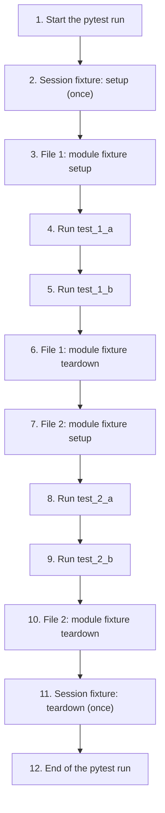
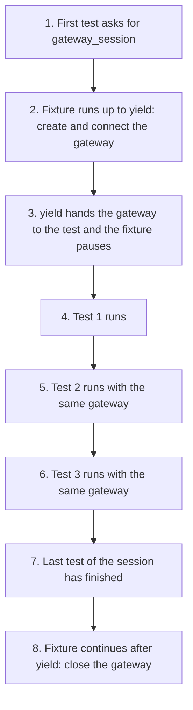
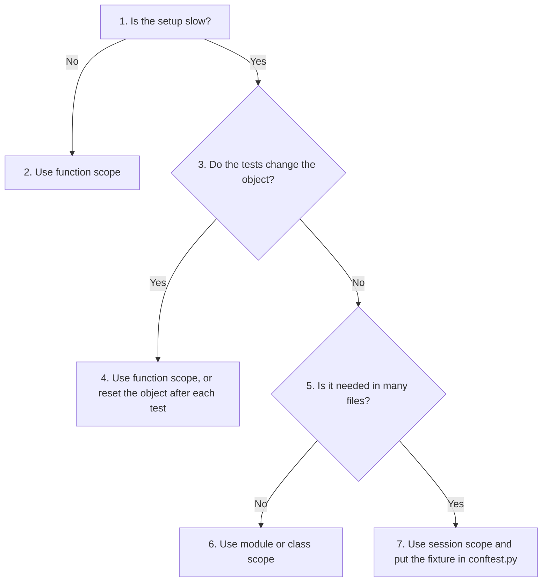

# Advanced Fixture Lifecycles and Optimization: Session Scope in Pytest

Some things that tests need are slow to prepare. Connecting to a database, logging in to an online service or starting a server can take seconds each time. If every test repeats this work, a large test suite can take a very long time to run.

This page shows how pytest solves this problem with **fixture scopes**, and in particular with the widest scope of all, the **session scope**. A session-scoped fixture is prepared once, shared by every test that asks for it, and cleaned up once at the very end.

We use a small simulation of an online payment gateway (a service such as Stripe or PayPal that processes card payments). No real network or money is involved. The page contains:

1. An explanation of the four main fixture scopes, with a numbered flowchart.
2. The gateway simulation (`payment_gateway.py`) and a test suite that uses a session-scoped fixture (`test_payments.py`), with their actual output.
3. A side-by-side comparison with the default function scope, showing the time saved.
4. The risks of session scope, each shown with a runnable example: shared state, parallel test runs and where to place shared fixtures (`conftest.py`).
5. Guidance on choosing the right scope, follow-up questions and links for further reading.

In the earlier pages of this chapter we used fixtures with the default scope, where setup runs again for every test. This page builds on that. Knowing when to share a fixture, and when not to, is an important skill for writing test suites that are both fast and reliable.

## Table of Contents

- [Advanced Fixture Lifecycles and Optimization: Session Scope in Pytest](030-ch20-payment-gateway.md#advanced-fixture-lifecycles-and-optimization-session-scope-in-pytest)
    - [Key Terms Used on This Page](030-ch20-payment-gateway.md#key-terms-used-on-this-page)
    - [Theoretical Foundation: Session Scope](030-ch20-payment-gateway.md#theoretical-foundation-session-scope)
        - [The Fixture Lifecycle Hierarchy](030-ch20-payment-gateway.md#the-fixture-lifecycle-hierarchy)
    - [Application Simulation Architectural Design](030-ch20-payment-gateway.md#application-simulation-architectural-design)
        - [1. Target Implementation: payment_gateway.py](030-ch20-payment-gateway.md#1-target-implementation-payment_gatewaypy)
        - [2. Automated Test Suite: test_payments.py](030-ch20-payment-gateway.md#2-automated-test-suite-test_paymentspy)
        - [Scripts for This Page and How to Run Them](030-ch20-payment-gateway.md#scripts-for-this-page-and-how-to-run-them)
    - [Discussion](030-ch20-payment-gateway.md#discussion)
        - [Architectural & Core Concepts](030-ch20-payment-gateway.md#architectural--core-concepts)
            - [1. Defensive Programming & State Verification](030-ch20-payment-gateway.md#1-defensive-programming--state-verification)
            - [2. The Mechanics of yield Statements](030-ch20-payment-gateway.md#2-the-mechanics-of-yield-statements)
            - [3. Output of the pytest (with flag -s) shows that resources are optimized](030-ch20-payment-gateway.md#3-output-of-the-pytest-with-flag--s-shows-that-resources-are-optimized)
            - [4. Comparing Session Scope with Function Scope](030-ch20-payment-gateway.md#4-comparing-session-scope-with-function-scope)
    - [Precautions & Concerns in using session scope](030-ch20-payment-gateway.md#precautions--concerns-in-using-session-scope)
        - [1. Shared State Contamination (Test Interdependence)](030-ch20-payment-gateway.md#1-shared-state-contamination-test-interdependence)
        - [2. Parallel Test Runs and Shared Resources](030-ch20-payment-gateway.md#2-parallel-test-runs-and-shared-resources)
        - [3. Structural Scaling and File Placement](030-ch20-payment-gateway.md#3-structural-scaling-and-file-placement)
        - [4. Keeping Secrets Out of Test Code](030-ch20-payment-gateway.md#4-keeping-secrets-out-of-test-code)
    - [Choosing the Right Scope](030-ch20-payment-gateway.md#choosing-the-right-scope)
    - [Follow-Up Questions](030-ch20-payment-gateway.md#follow-up-questions)
        - [Question 1: Counting Setups](030-ch20-payment-gateway.md#question-1-counting-setups)
        - [Question 2: When Does Teardown Run?](030-ch20-payment-gateway.md#question-2-when-does-teardown-run)
        - [Question 3: Why Did a Correct Test Fail?](030-ch20-payment-gateway.md#question-3-why-did-a-correct-test-fail)
        - [Question 4: Session Scope in One File](030-ch20-payment-gateway.md#question-4-session-scope-in-one-file)
    - [Summary](030-ch20-payment-gateway.md#summary)
    - [Further Reading](030-ch20-payment-gateway.md#further-reading)

## Key Terms Used on This Page

| Term | Simple Meaning | Learn More |
| --- | --- | --- |
| Fixture | A function marked with `@pytest.fixture` that prepares something a test needs and hands it to the test | [pytest: How to use fixtures](https://docs.pytest.org/en/stable/how-to/fixtures.html) |
| Setup and teardown | Setup is the work done before a test (for example, connecting). Teardown is the cleanup done after it (for example, disconnecting) | [pytest: yield fixtures](https://docs.pytest.org/en/stable/how-to/fixtures.html#yield-fixtures-recommended) |
| Scope | How widely a fixture is shared, and so how often its setup runs: per test, per class, per file, per package or once for the whole run | [pytest: fixture scopes](https://docs.pytest.org/en/stable/how-to/fixtures.html#fixture-scopes) |
| Session | One complete run of the `pytest` command, from start to finish, covering every test file it collects | |
| API | Application Programming Interface: a set of rules that lets one program ask another program (often over the internet) to do something | [API on Wikipedia](https://en.wikipedia.org/wiki/API) |
| API key | A secret code that identifies your program to an online service, a bit like a password | |
| Payment gateway | An online service that takes card or bank payments on behalf of a shop or app | |
| Latency | The waiting time before a response arrives, for example the delay while a remote server answers | |
| Handshake | The first exchange of messages when two computers connect, used to check identity and agree on how to talk | |
| State | The current values stored inside an object. For our gateway, the state is whether it is connected and which API key it uses | |
| Generator | A function that uses `yield`. It can pause in the middle and continue later from the same point | [Python glossary: generator](https://docs.python.org/3/glossary.html#term-generator) |
| `conftest.py` | A special file where you can put fixtures that are shared by all the test files in its folder | [pytest: conftest.py](https://docs.pytest.org/en/stable/reference/fixtures.html#conftest-py-sharing-fixtures-across-multiple-files) |

[Back to the Table of Contents](030-ch20-payment-gateway.md#table-of-contents)

## Theoretical Foundation: Session Scope

In real-world software development, a test suite may have hundreds or thousands of tests. Some of these tests need expensive resources, such as a database connection or a login to an external API. Setting these up takes time and uses a lot of computer resources.

If every test had to set up and tear down its own API login or database connection, the test run would be extremely slow. For example, if one login takes 2 seconds and 1,000 tests each need one, the logins alone would take more than 30 minutes.

Pytest solves this problem through **fixture scoping**. When you write a fixture, you can choose how widely it is shared, based on what the tests need. The widest and longest-lasting scope is the **session scope** (`scope="session"`).

[Back to the Table of Contents](030-ch20-payment-gateway.md#table-of-contents)

### The Fixture Lifecycle Hierarchy

A fixture's **lifecycle** is the period from its setup to its teardown. The scope decides how long that period is.

| Scope | How to Write It | When Setup Runs | When Teardown Runs |
| --- | --- | --- | --- |
| Function (default) | `@pytest.fixture` or `@pytest.fixture(scope="function")` | Before **each** test that uses it | After that test |
| Class | `@pytest.fixture(scope="class")` | Once per test class, no matter how many methods the class has | After the last test in that class |
| Module | `@pytest.fixture(scope="module")` | Once per Python test file (`.py`), shared by all the tests in that file | After the last test in that file |
| Package | `@pytest.fixture(scope="package")` | Once per folder (package) of tests | After the last test in that folder |
| Session | `@pytest.fixture(scope="session")` | Only **once** in the whole test run: the first time any test asks for it | After **all** the collected test files have finished running |

Two points are worth remembering:

1. A fixture is set up only when a test actually asks for it. If no test asks for a session-scoped fixture, it never runs.
2. Pytest runs tests one after another, not at the same time (unless you use a plugin for parallel runs, discussed later). So "shared" means the same object is handed to one test after another.

The flowchart below shows the order of events when a run has one session-scoped fixture, and two test files that each have a module-scoped fixture.



Notice that the session fixture wraps around everything. It is set up at step 2 and not torn down until step 11, after both files have finished. The module fixtures are set up and torn down once for each file.

[Back to the Table of Contents](030-ch20-payment-gateway.md#table-of-contents)

## Application Simulation Architectural Design

To understand session scope in practice without using a real network, we build a small **simulation** of an external payment gateway (such as Stripe or PayPal). A simulation (also called an **emulator**) is a stand-in that behaves like the real thing in the ways that matter for our tests, but runs entirely on your own computer.

The example has two files, which must be saved in the same folder:

| File | Role |
| --- | --- |
| `payment_gateway.py` | The code being tested: a simulated payment gateway |
| `test_payments.py` | The tests, with a session-scoped fixture that connects to the gateway once |

[Back to the Table of Contents](030-ch20-payment-gateway.md#table-of-contents)

### 1. Target Implementation: `payment_gateway.py`

This module acts as a **stateful** simulation, which means it remembers whether it is connected. It must be used in a fixed order: connect first, then process payments, then disconnect. It also adds a deliberate delay of 1 second to the connection step, to imitate the waiting time (latency) of a real network login.

```python
# payment_gateway.py
"""
Module: payment_gateway
Description: Simulates a slow, third-party payment gateway (such as Stripe or
             PayPal) so that we can see how pytest fixture scopes save time.
             No real network or money is involved.
"""

import time


class PaymentGateway:

    # Step 1 - Start in a "not connected" state
    def __init__(self):
        self.is_connected = False
        self.api_key = None

    # Step 2 - Connect to the gateway (the slow, expensive part)
    def connect(self, api_key: str):
        """
        Simulates the login ("handshake") with a remote payment server.
        With a real gateway this usually takes 1 to 3 seconds.
        Here, time.sleep(1) makes the program wait for 1 second
        so that we can feel the cost of connecting.
        """
        print(f"\n[APP] Authenticating with API Key: {api_key}... (Simulated Latency)")
        time.sleep(1)
        self.is_connected = True
        self.api_key = api_key

    # Step 3 - Close the connection
    def close(self):
        """Simulates closing the network connection cleanly."""
        print("\n[APP] Terminating network connection safely...")
        self.is_connected = False

    # Step 4 - Process a payment (only allowed while connected)
    def process_payment(self, amount: float) -> str:
        """
        The main job of the gateway. It first checks that there is an
        active connection. If not, it refuses to continue by raising an error.
        """
        if not self.is_connected:
            raise ConnectionError("Transaction Failed: Gateway connection is not established!")

        return f"Payment of ${amount:.2f} Processed Successfully."
```

How the class works, step by step:

1. A new `PaymentGateway` starts with `is_connected = False`.
2. `connect()` prints a message, waits for 1 second with `time.sleep(1)` and then sets `is_connected = True`. This 1-second wait stands for the slow login to a real server.
3. `close()` sets `is_connected` back to `False`.
4. `process_payment()` first checks `is_connected`. If the gateway is not connected, it raises a `ConnectionError` and stops. If it is connected, it returns a success message such as `Payment of $15.50 Processed Successfully.`

[Back to the Table of Contents](030-ch20-payment-gateway.md#table-of-contents)

### 2. Automated Test Suite: `test_payments.py`

This test suite checks that the gateway can process payments. It uses a session-scoped fixture, so the slow connection happens only once. It also keeps a counter (`SESSION_FIXTURE_INSTANTIATIONS`) that goes up by one every time the fixture runs. The counter gives us clear proof of how many times the setup actually happened.

```python
# test_payments.py
"""
Suite: test_payments
Description: Shows how a session-scoped fixture creates and connects the
             PaymentGateway only once, and shares it with every test.
Execution Note: Run using 'pytest -v -s test_payments.py'.
                The -s flag turns off output capturing, so the print()
                messages from the fixture and the tests appear on the screen.
"""

# Step 1 - Import pytest and the class we want to test
import pytest
from payment_gateway import PaymentGateway

# Step 2 - A counter that records how many times the fixture runs.
# It is used only for teaching, to prove how often setup happens.
SESSION_FIXTURE_INSTANTIATIONS = 0


# Step 3 - The session-scoped fixture
@pytest.fixture(scope="session")
def gateway_session():
    """
    Session-scoped fixture. It creates, connects and later closes the
    PaymentGateway exactly once for the whole test run, no matter how
    many tests ask for it.
    """
    # 'global' lets this function change the counter defined outside it
    global SESSION_FIXTURE_INSTANTIATIONS
    SESSION_FIXTURE_INSTANTIATIONS += 1

    print(f"\n[SETUP] GLOBAL SESSION START (Initialization Count: {SESSION_FIXTURE_INSTANTIATIONS})")

    # Setup phase: create the gateway and connect (the slow part)
    gateway_instance = PaymentGateway()
    gateway_instance.connect(api_key="SECRET_AUTH_KEY_99X")

    # Hand the connected gateway to every test that asks for it.
    # The fixture pauses here until the last test in the session has finished.
    yield gateway_instance

    # Teardown phase: runs once, after the last test in the session
    print(f"\n[TEARDOWN] GLOBAL SESSION END (Final Verification Count: {SESSION_FIXTURE_INSTANTIATIONS})")
    gateway_instance.close()


# Step 4 - The tests. Each one asks for 'gateway_session' by name.

def test_low_value_transaction(gateway_session):
    """Checks that the gateway can process a small, normal payment."""
    print("\n   [TEST 1] Dispatching $15.50 payment payload...")
    response = gateway_session.process_payment(15.50)
    assert "Successfully" in response
    print("   [TEST 1] Assertion Verified Successfully.")


def test_high_value_transaction(gateway_session):
    """Checks that the gateway can process a large payment."""
    print("\n   [TEST 2] Dispatching $7500.00 payment payload...")
    response = gateway_session.process_payment(7500.00)
    assert "Successfully" in response
    print("   [TEST 2] Assertion Verified Successfully.")


def test_gateway_persistence(gateway_session):
    """Checks that the same connection is still open after the earlier tests."""
    print("\n   [TEST 3] Auditing state persistence of active network socket...")
    assert gateway_session.is_connected is True
    print("   [TEST 3] Assertion Verified: State Persistence Confirmed.")
```

What happens when this file runs:

1. Pytest collects the three tests.
2. The first test, `test_low_value_transaction`, asks for `gateway_session`. Since this is the first request, pytest runs the fixture up to `yield`. The counter becomes 1, and the gateway connects (taking 1 second).
3. The connected gateway is handed to the first test.
4. The second and third tests also ask for `gateway_session`. Because the scope is `"session"`, pytest does **not** run the fixture again. It hands the same, already-connected gateway to these tests.
5. After the last test in the session has finished, pytest runs the code after `yield`. The gateway is closed, once.

The output of this script is shown and explained in [Output of the pytest (with flag -s) shows that resources are optimized](030-ch20-payment-gateway.md#3-output-of-the-pytest-with-flag--s-shows-that-resources-are-optimized).

[Back to the Table of Contents](030-ch20-payment-gateway.md#table-of-contents)

### Scripts for This Page and How to Run Them

All the scripts on this page are available in the [payment-demo folder](https://github.com/ag999git/001-Python-book-2026/tree/main/20-unittest/payment-demo).

| File | What It Contains |
| --- | --- |
| [payment_gateway.py](https://github.com/ag999git/001-Python-book-2026/blob/main/20-unittest/payment-demo/payment_gateway.py) | The simulated payment gateway |
| [test_payments.py](https://github.com/ag999git/001-Python-book-2026/blob/main/20-unittest/payment-demo/test_payments.py) | Tests using a session-scoped fixture |
| [test_payments_function_scope.py](https://github.com/ag999git/001-Python-book-2026/blob/main/20-unittest/payment-demo/test_payments_function_scope.py) | The same tests using a function-scoped fixture, for comparison |
| [test_gateway_guard.py](https://github.com/ag999git/001-Python-book-2026/blob/main/20-unittest/payment-demo/test_gateway_guard.py) | A test that checks the gateway refuses payments when not connected |
| [test_contamination.py](https://github.com/ag999git/001-Python-book-2026/blob/main/20-unittest/payment-demo/test_contamination.py) | Shows how one test can break a shared session fixture (one test fails on purpose) |
| [conftest-demo/conftest.py](https://github.com/ag999git/001-Python-book-2026/blob/main/20-unittest/payment-demo/conftest-demo/conftest.py) | A session-scoped fixture shared by two test files |
| [conftest-demo/test_orders.py](https://github.com/ag999git/001-Python-book-2026/blob/main/20-unittest/payment-demo/conftest-demo/test_orders.py) | First test file that uses the shared fixture |
| [conftest-demo/test_refunds.py](https://github.com/ag999git/001-Python-book-2026/blob/main/20-unittest/payment-demo/conftest-demo/test_refunds.py) | Second test file that uses the same shared fixture |
| [conftest-demo/payment_gateway.py](https://github.com/ag999git/001-Python-book-2026/blob/main/20-unittest/payment-demo/conftest-demo/payment_gateway.py) | A copy of the gateway, so that the conftest-demo folder can be run on its own |

To run them on your computer:

1. Create a folder, for example `payment-demo`, and save the first five files in it. Inside it, create a subfolder `conftest-demo` and save the last four files there.
2. Open the `payment-demo` folder in VS Code (**File > Open Folder...**) and open the terminal (**Terminal > New Terminal**).
3. Check that pytest is installed:

```bash
python -m pytest --version
```

4. If you see `No module named pytest`, install it with `python -m pip install pytest`.
5. Run each file with the command given in its section, for example:

```bash
python -m pytest -v -s test_payments.py
```

Detailed, step-by-step instructions (installing Python and VS Code, downloading files from GitHub and fixing common errors) are given in [Running the Scripts on Your Computer](020-ch20-unittest-disadvantage-rigid-oop-style.md#running-the-scripts-on-your-computer).

`python -m pytest` and `pytest` do the same job. This page shows the shorter `pytest` form in its commands.

[Back to the Table of Contents](030-ch20-payment-gateway.md#table-of-contents)

## Discussion

### Architectural & Core Concepts

#### 1. Defensive Programming & State Verification

The `PaymentGateway` class follows a style called **defensive programming**. This means the code checks that things are in a valid condition before it does its work, instead of assuming everything is fine.

Here, `process_payment()` checks the `is_connected` flag first. If the gateway is not connected, it raises a `ConnectionError` straight away. The program fails cleanly, with a clear message, instead of carrying on and producing a wrong or confusing result.

Because the gateway must be connected before it can be used, every test that processes a payment needs a connected gateway to start with. Preparing this starting state in the same way for many tests is exactly the job a pytest fixture is designed for.

We can also test the defensive check itself. Save this as `test_gateway_guard.py`:

```python
# test_gateway_guard.py
"""
Checks the defensive guard in process_payment():
a gateway that was never connected must refuse to take a payment.
Run using 'pytest -v -s test_gateway_guard.py'.
"""

# Step 1 - Import pytest and the class we want to test
import pytest
from payment_gateway import PaymentGateway


def test_payment_without_connection_is_refused():
    # Step 2 - Create a gateway but do NOT connect it.
    #          No fixture is needed, and no slow connection is made.
    gateway = PaymentGateway()
    print("\n   Gateway created. is_connected =", gateway.is_connected)

    # Step 3 - pytest.raises passes only if the code inside
    #          the 'with' block raises ConnectionError
    with pytest.raises(ConnectionError) as error_info:
        gateway.process_payment(50.00)

    # Step 4 - Show and check the error message
    print("   Error raised:", error_info.value)
    assert "not established" in str(error_info.value)
```

Run:

```bash
pytest -v -s test_gateway_guard.py
```

Output:

```text
============================= test session starts ==============================
platform win32 -- Python 3.10.10, pytest-9.0.3, pluggy-1.6.0 -- C:\Users\Anurag Gupta\AppData\Local\Programs\Python\Python310\python.exe
cachedir: .pytest_cache
rootdir: C:\payment-demo
plugins: anyio-4.12.1
collected 1 item

test_gateway_guard.py::test_payment_without_connection_is_refused
   Gateway created. is_connected = False
   Error raised: Transaction Failed: Gateway connection is not established!
PASSED

============================== 1 passed in 0.00s ===============================
```

This test does not use the session fixture at all, because it needs a gateway that is **not** connected. It also runs almost instantly, since it never calls the slow `connect()` method. `pytest.raises` is explained in the pytest guide on [assertions about expected exceptions](https://docs.pytest.org/en/stable/how-to/assert.html#assertions-about-expected-exceptions).

[Back to the Table of Contents](030-ch20-payment-gateway.md#table-of-contents)

#### 2. The Mechanics of `yield` Statements

In a normal Python function, a `return` statement ends the function. Its local variables are gone, and it cannot continue from where it stopped.

A function that contains `yield` is different. It is a **generator**: it can hand back a value, **pause**, and later **continue** from the same point with all its local variables still in place. Pytest uses this to split a fixture into two parts:

1. Everything **before** `yield` is the **setup phase**, where resources are created (here, the gateway is created and connected).
2. The object after `yield` is handed (injected) into every test that asks for the fixture.
3. The fixture then pauses while the tests run. How long it pauses depends on its scope: for a function-scoped fixture, until that one test ends; for a session-scoped fixture, until the last test of the whole run ends.
4. Everything **after** `yield` is the **teardown phase**, where resources are released (here, the gateway is closed). This part runs even if a test fails.



[Back to the Table of Contents](030-ch20-payment-gateway.md#table-of-contents)

#### 3. Output of the pytest (with flag -s) shows that resources are optimized

When this test file is run with the `-s` flag, output capturing is turned off. The `print()` messages then appear on the screen, and they show the fixture's lifecycle clearly. We also add `-v` to see the name of each test.

Run:

```bash
pytest -v -s test_payments.py
```

Output:

```text
============================= test session starts ==============================
platform win32 -- Python 3.10.10, pytest-9.0.3, pluggy-1.6.0 -- C:\Users\Anurag Gupta\AppData\Local\Programs\Python\Python310\python.exe
cachedir: .pytest_cache
rootdir: C:\payment-demo
plugins: anyio-4.12.1
collected 3 items

test_payments.py::test_low_value_transaction
[SETUP] GLOBAL SESSION START (Initialization Count: 1)

[APP] Authenticating with API Key: SECRET_AUTH_KEY_99X... (Simulated Latency)

   [TEST 1] Dispatching $15.50 payment payload...
   [TEST 1] Assertion Verified Successfully.
PASSED
test_payments.py::test_high_value_transaction
   [TEST 2] Dispatching $7500.00 payment payload...
   [TEST 2] Assertion Verified Successfully.
PASSED
test_payments.py::test_gateway_persistence
   [TEST 3] Auditing state persistence of active network socket...
   [TEST 3] Assertion Verified: State Persistence Confirmed.
PASSED
[TEARDOWN] GLOBAL SESSION END (Final Verification Count: 1)

[APP] Terminating network connection safely...


============================== 3 passed in 1.01s ===============================
```

Read the output in steps:

1. `[SETUP] GLOBAL SESSION START (Initialization Count: 1)` and the `[APP] Authenticating...` line appear **once**, just before the first test.
2. All three tests print their messages and pass. Tests 2 and 3 show no setup lines at all. They simply reuse the gateway that is already connected.
3. `[TEARDOWN] GLOBAL SESSION END (Final Verification Count: 1)` and `[APP] Terminating network connection safely...` appear **once**, after the last test.
4. The whole run took about 1 second, which is the time of a single connection.

Observe that `SESSION_FIXTURE_INSTANTIATIONS` never goes beyond `1`. If this fixture used the default `function` scope, the slow `[APP] Authenticating...` step would run three times, once for each test. The next section shows this.

In large real-world projects with thousands of tests, sharing expensive setup in this way can cut the total test time dramatically, often from many minutes (or even hours) down to a small fraction of that.

[Back to the Table of Contents](030-ch20-payment-gateway.md#table-of-contents)

#### 4. Comparing Session Scope with Function Scope

To see the saving clearly, here are the same three tests with a function-scoped fixture. Save this as `test_payments_function_scope.py`:

```python
# test_payments_function_scope.py
"""
The same three tests as test_payments.py, but the fixture uses the
default function scope. Compare the output and the total time.
Run using 'pytest -v -s test_payments_function_scope.py'.
"""

# Step 1 - Import pytest and the class we want to test
import pytest
from payment_gateway import PaymentGateway

# Step 2 - Counter to show how many times the fixture runs
FUNCTION_FIXTURE_INSTANTIATIONS = 0


# Step 3 - A function-scoped fixture (scope="function" is the default,
#          so writing @pytest.fixture alone would do the same thing)
@pytest.fixture(scope="function")
def gateway_function():
    global FUNCTION_FIXTURE_INSTANTIATIONS
    FUNCTION_FIXTURE_INSTANTIATIONS += 1
    print(f"\n[SETUP] FUNCTION START (Initialization Count: {FUNCTION_FIXTURE_INSTANTIATIONS})")

    gateway_instance = PaymentGateway()
    gateway_instance.connect(api_key="SECRET_AUTH_KEY_99X")

    yield gateway_instance

    print(f"\n[TEARDOWN] FUNCTION END (Count so far: {FUNCTION_FIXTURE_INSTANTIATIONS})")
    gateway_instance.close()


# Step 4 - The same three tests, now using the function-scoped fixture

def test_low_value_transaction(gateway_function):
    response = gateway_function.process_payment(15.50)
    assert "Successfully" in response


def test_high_value_transaction(gateway_function):
    response = gateway_function.process_payment(7500.00)
    assert "Successfully" in response


def test_gateway_persistence(gateway_function):
    assert gateway_function.is_connected is True
```

Run:

```bash
pytest -v -s test_payments_function_scope.py
```

Output:

```text
============================= test session starts ==============================
platform win32 -- Python 3.10.10, pytest-9.0.3, pluggy-1.6.0 -- C:\Users\Anurag Gupta\AppData\Local\Programs\Python\Python310\python.exe
cachedir: .pytest_cache
rootdir: C:\payment-demo
plugins: anyio-4.12.1
collected 3 items

test_payments_function_scope.py::test_low_value_transaction
[SETUP] FUNCTION START (Initialization Count: 1)

[APP] Authenticating with API Key: SECRET_AUTH_KEY_99X... (Simulated Latency)
PASSED
[TEARDOWN] FUNCTION END (Count so far: 1)

[APP] Terminating network connection safely...

test_payments_function_scope.py::test_high_value_transaction
[SETUP] FUNCTION START (Initialization Count: 2)

[APP] Authenticating with API Key: SECRET_AUTH_KEY_99X... (Simulated Latency)
PASSED
[TEARDOWN] FUNCTION END (Count so far: 2)

[APP] Terminating network connection safely...

test_payments_function_scope.py::test_gateway_persistence
[SETUP] FUNCTION START (Initialization Count: 3)

[APP] Authenticating with API Key: SECRET_AUTH_KEY_99X... (Simulated Latency)
PASSED
[TEARDOWN] FUNCTION END (Count so far: 3)

[APP] Terminating network connection safely...


============================== 3 passed in 3.01s ===============================
```

Now the fixture runs before every test. The counter goes to 3, the gateway connects and disconnects three times, and the run takes about 3 seconds instead of 1.

| | Session Scope (`test_payments.py`) | Function Scope (`test_payments_function_scope.py`) |
| --- | --- | --- |
| Times the fixture setup ran | 1 | 3 |
| Times the gateway connected | 1 | 3 |
| Times the gateway closed | 1 | 3 |
| Total run time (approximately) | 1 second | 3 seconds |
| Does each test get a fresh gateway? | No, all tests share one | Yes |

With 3 tests the saving is 2 seconds. With 1,000 tests and a 2-second login, the function scope would spend over 30 minutes just logging in, while the session scope would spend 2 seconds.

But notice the last row. The function scope gives every test a fresh gateway, so no test can be affected by another. The session scope gives up this safety in exchange for speed. The next section explains why that matters.

[Back to the Table of Contents](030-ch20-payment-gateway.md#table-of-contents)

## Precautions & Concerns in using session scope

Session scope can save a great deal of time, but it also brings real risks. You need to understand them and guard against them.

[Back to the Table of Contents](030-ch20-payment-gateway.md#table-of-contents)

### 1. Shared State Contamination (Test Interdependence)

With a session-scoped fixture, every test in the whole run works with the **exact same** `PaymentGateway` object. If one test changes that object, every test that runs after it sees the change. This is called **shared state contamination**.

> **The Risk:** If `test_high_value_transaction` changes or damages the gateway's state (for example, by setting `gateway_session.is_connected = False` to simulate a network failure), every test that runs after it will fail one after another. The tests lose their **independence**, which is the "I" in the well-known **FIRST** principles of good unit tests: Fast, **Independent**, Repeatable, Self-validating and Timely. (Some authors write "Isolated" for the "I".)

Let us see this happen. Save this as `test_contamination.py`:

```python
# test_contamination.py
"""
Shows the main danger of a session-scoped fixture: one test changes the
shared object, and a later test fails because of it.
Run using 'pytest -v -s test_contamination.py'.
The second test FAILS on purpose.
"""

# Step 1 - Import pytest and the class we want to test
import pytest
from payment_gateway import PaymentGateway


# Step 2 - One shared gateway for the whole session
@pytest.fixture(scope="session")
def shared_gateway():
    print("\n[SETUP] Connecting shared gateway once")
    gateway = PaymentGateway()
    gateway.connect(api_key="SECRET_AUTH_KEY_99X")
    yield gateway
    print("\n[TEARDOWN] Closing shared gateway")
    gateway.close()


# Step 3 - A test that changes the shared object.
#          It simulates a network failure by closing the connection,
#          and it does not reconnect afterwards.
def test_simulated_network_failure(shared_gateway):
    shared_gateway.close()
    print("   Connection closed by test 1. is_connected =", shared_gateway.is_connected)
    with pytest.raises(ConnectionError):
        shared_gateway.process_payment(10.00)


# Step 4 - A perfectly correct test that now fails,
#          because it receives the gateway that test 1 closed.
def test_normal_payment(shared_gateway):
    print("\n   Test 2 receives is_connected =", shared_gateway.is_connected)
    response = shared_gateway.process_payment(20.00)
    assert "Successfully" in response
```

Run:

```bash
pytest -v -s test_contamination.py
```

Output:

```text
============================= test session starts ==============================
platform win32 -- Python 3.10.10, pytest-9.0.3, pluggy-1.6.0 -- C:\Users\Anurag Gupta\AppData\Local\Programs\Python\Python310\python.exe
cachedir: .pytest_cache
rootdir: C:\payment-demo
plugins: anyio-4.12.1
collected 2 items

test_contamination.py::test_simulated_network_failure
[SETUP] Connecting shared gateway once

[APP] Authenticating with API Key: SECRET_AUTH_KEY_99X... (Simulated Latency)

[APP] Terminating network connection safely...
   Connection closed by test 1. is_connected = False
PASSED
test_contamination.py::test_normal_payment
   Test 2 receives is_connected = False
FAILED
[TEARDOWN] Closing shared gateway

[APP] Terminating network connection safely...


=================================== FAILURES ===================================
_____________________________ test_normal_payment ______________________________

shared_gateway = <payment_gateway.PaymentGateway object at 0x0000021F4C8B7D90>

    def test_normal_payment(shared_gateway):
        print("\n   Test 2 receives is_connected =", shared_gateway.is_connected)
>       response = shared_gateway.process_payment(20.00)

test_contamination.py:39:
_ _ _ _ _ _ _ _ _ _ _ _ _ _ _ _ _ _ _ _ _ _ _ _ _ _ _ _ _ _ _ _ _ _ _ _ _ _ _ _

self = <payment_gateway.PaymentGateway object at 0x0000021F4C8B7D90>, amount = 20.0

    def process_payment(self, amount: float) -> str:
        """
        The main job of the gateway. It first checks that there is an
        active connection. If not, it refuses to continue by raising an error.
        """
        if not self.is_connected:
>           raise ConnectionError("Transaction Failed: Gateway connection is not established!")
E           ConnectionError: Transaction Failed: Gateway connection is not established!

payment_gateway.py:45: ConnectionError
=========================== short test summary info ============================
FAILED test_contamination.py::test_normal_payment - ConnectionError: Transact...
========================= 1 failed, 1 passed in 1.01s ==========================
```

The memory address shown after `object at` will be different on your computer.

Read the output in steps:

1. The shared gateway connects once.
2. `test_simulated_network_failure` closes the connection and checks that a payment is refused. This test passes.
3. `test_normal_payment` is a perfectly correct test. But it receives the **same** gateway, which test 1 left closed. So it fails with `ConnectionError`.
4. The failure is not caused by a bug in the gateway or in test 2. It is caused by test 1. Such failures are hard to track down, because the test that fails is not the test that caused the problem. If you ran `test_normal_payment` on its own, it would pass.

How to avoid this problem:

1. Use session scope only for resources that tests **read** or use without changing, such as a connection or a large set of read-only data.
2. If a test needs to change the shared object (for example, to simulate a failure), give that test its own function-scoped fixture or create its own object inside the test, as `test_gateway_guard.py` does.
3. If a test must change shared state, make it put things back the way they were before it ends (for example, by reconnecting).

[Back to the Table of Contents](030-ch20-payment-gateway.md#table-of-contents)

### 2. Parallel Test Runs and Shared Resources

To finish large test suites faster, some teams run tests in parallel with the plugin [pytest-xdist](https://pytest-xdist.readthedocs.io/). It starts several **worker processes** (separate running copies of pytest) and shares the tests out among them. For example, `pytest -n 4` uses 4 workers.

This changes how session-scoped fixtures behave, in two ways that often surprise people:

1. **The fixture runs once per worker, not once in total.** Each worker is a separate process with its own memory, so each one runs its own copy of the session fixture. With `-n 4`, the gateway would connect 4 times, and the counter would reach 1 in each of the 4 workers.
2. **The workers can clash over the same outside resource.** The Python objects are not shared between workers, but the real resource behind them often is: the same test database, the same file or the same test account on an external service. If two workers change the same record at the same moment, the result depends on which one gets there first. This is called a **race condition**. It leads to **flaky tests**: tests that pass on one run and fail on the next, with no change to the code.

To stay safe, make sure that parallel workers do not change the same outside data. For example, give each worker its own test database or its own set of test records. The pytest-xdist documentation explains how to [make session-scoped fixtures run only once](https://pytest-xdist.readthedocs.io/en/stable/how-to.html#making-session-scoped-fixtures-execute-only-once) when this is really needed.

[Back to the Table of Contents](030-ch20-payment-gateway.md#table-of-contents)

### 3. Structural Scaling and File Placement

In our example, the session fixture is written inside `test_payments.py`. A fixture defined inside a test file can be used **only** by the tests in that file. In a project with many test files, other files could not use it.

To share a fixture across many test files without importing it, put it in a special file named `conftest.py`. Pytest finds this file automatically. Every test file in the same folder as `conftest.py`, and in all the folders inside it, can use its fixtures. To make a fixture available to the whole project, place `conftest.py` in the top-level test folder (or the project's root folder).

Here is a small example with two test files that share one gateway. The folder looks like this:

```text
conftest-demo
    conftest.py
    payment_gateway.py
    test_orders.py
    test_refunds.py
```

`conftest.py`:

```python
# conftest.py
"""
Fixtures placed in a file named conftest.py are shared automatically with
every test file in this folder (and in the folders inside it).
The test files do not need to import them.
"""

# Step 1 - Import pytest and the class we want to test
import pytest
from payment_gateway import PaymentGateway


# Step 2 - One session-scoped gateway for all the test files
@pytest.fixture(scope="session")
def shared_gateway():
    print("\n[SETUP] conftest.py: connecting shared gateway (once for all files)")
    gateway = PaymentGateway()
    gateway.connect(api_key="SECRET_AUTH_KEY_99X")
    yield gateway
    print("\n[TEARDOWN] conftest.py: closing shared gateway")
    gateway.close()
```

`test_orders.py`:

```python
# test_orders.py
# No import of shared_gateway is needed. Pytest finds it in conftest.py.

def test_order_payment(shared_gateway):
    print("\n   [ORDERS] Paying for an order of $120.00")
    response = shared_gateway.process_payment(120.00)
    assert "Successfully" in response


def test_order_gateway_is_connected(shared_gateway):
    print("\n   [ORDERS] Checking the connection")
    assert shared_gateway.is_connected is True
```

`test_refunds.py`:

```python
# test_refunds.py
# This second file uses the SAME gateway object as test_orders.py.

def test_refund_payment(shared_gateway):
    print("\n   [REFUNDS] Processing a refund of $45.00")
    response = shared_gateway.process_payment(45.00)
    assert "Successfully" in response


def test_refund_gateway_is_connected(shared_gateway):
    print("\n   [REFUNDS] Checking the connection")
    assert shared_gateway.is_connected is True
```

Open a terminal in the `conftest-demo` folder and run:

```bash
pytest -v -s
```

Output:

```text
============================= test session starts ==============================
platform win32 -- Python 3.10.10, pytest-9.0.3, pluggy-1.6.0 -- C:\Users\Anurag Gupta\AppData\Local\Programs\Python\Python310\python.exe
cachedir: .pytest_cache
rootdir: C:\payment-demo\conftest-demo
plugins: anyio-4.12.1
collected 4 items

test_orders.py::test_order_payment
[SETUP] conftest.py: connecting shared gateway (once for all files)

[APP] Authenticating with API Key: SECRET_AUTH_KEY_99X... (Simulated Latency)

   [ORDERS] Paying for an order of $120.00
PASSED
test_orders.py::test_order_gateway_is_connected
   [ORDERS] Checking the connection
PASSED
test_refunds.py::test_refund_payment
   [REFUNDS] Processing a refund of $45.00
PASSED
test_refunds.py::test_refund_gateway_is_connected
   [REFUNDS] Checking the connection
PASSED
[TEARDOWN] conftest.py: closing shared gateway

[APP] Terminating network connection safely...


============================== 4 passed in 1.01s ===============================
```

The gateway connects **once** and closes **once**, even though the four tests are spread over two files. Neither test file imports `shared_gateway`. Pytest found it in `conftest.py`. This is session scope working across the whole test run, as described in [The Fixture Lifecycle Hierarchy](030-ch20-payment-gateway.md#the-fixture-lifecycle-hierarchy).

[Back to the Table of Contents](030-ch20-payment-gateway.md#table-of-contents)

### 4. Keeping Secrets Out of Test Code

Our example writes the API key `"SECRET_AUTH_KEY_99X"` directly in the test file and even prints it. That is fine for a simulation, but never do this with a real key. Code is often shared, uploaded to GitHub or copied into logs, and anyone who sees a real key can use it.

For real projects, keep keys out of the code. A common way is to store the key in an **environment variable** (a named value kept by the operating system, outside your program) and read it in the fixture with `os.environ["PAYMENT_API_KEY"]`. You can read about this in the Python documentation for [os.environ](https://docs.python.org/3/library/os.html#os.environ).

[Back to the Table of Contents](030-ch20-payment-gateway.md#table-of-contents)

## Choosing the Right Scope

A simple rule: **start with the default function scope, and widen the scope only when setup is slow and the tests do not change the shared object.**

| Situation | Suggested Scope | Reason |
| --- | --- | --- |
| Cheap setup, such as a small object or a list | Function (default) | Every test gets a fresh copy, so tests cannot affect each other |
| The test changes the object (deposits, deletes, closes) | Function (default) | Changes must not leak into other tests |
| Slow setup, used by the tests of one class | Class | Shared only inside that class |
| Slow setup, such as loading a large data file, used by the tests of one file | Module | Shared only inside that file |
| Very slow setup, such as a login or a database connection, used across many files, and the tests do not change it | Session (in `conftest.py`) | Paid for only once in the whole run |



[Back to the Table of Contents](030-ch20-payment-gateway.md#table-of-contents)

## Follow-Up Questions

### Question 1: Counting Setups

A test run has 5 test files with 20 tests in each. Every test asks for a fixture called `db_connection`. How many times does the fixture's setup run if its scope is (a) `"function"`, (b) `"module"`, (c) `"session"`?

**Answer:**

1. Function scope: once per test, so 5 × 20 = **100** times.
2. Module scope: once per file, so **5** times.
3. Session scope: once for the whole run, so **1** time. (This assumes the fixture is in a `conftest.py` that all 5 files can see.)

[Back to the Table of Contents](030-ch20-payment-gateway.md#table-of-contents)

### Question 2: When Does Teardown Run?

In `test_payments.py`, when exactly does the line `[TEARDOWN] GLOBAL SESSION END` appear?

**Answer:**

1. The fixture has `scope="session"`.
2. So the code after `yield` runs only after the **last** test of the whole run has finished.
3. In the output, it appears after the third test has `PASSED`, not after each test.

[Back to the Table of Contents](030-ch20-payment-gateway.md#table-of-contents)

### Question 3: Why Did a Correct Test Fail?

In `test_contamination.py`, `test_normal_payment` fails. The test itself has no mistake. Why does it fail, and give two ways to fix the problem.

**Answer:**

1. Both tests share one session-scoped gateway.
2. The first test closes the connection and leaves it closed.
3. The second test receives the closed gateway, so `process_payment()` raises `ConnectionError`.
4. Fix 1: in the first test, create a separate `PaymentGateway()` of its own instead of using the shared one.
5. Fix 2: at the end of the first test, reconnect the shared gateway with `shared_gateway.connect(api_key="SECRET_AUTH_KEY_99X")`, so the next test gets it back in a good state.

[Back to the Table of Contents](030-ch20-payment-gateway.md#table-of-contents)

### Question 4: Session Scope in One File

If a session-scoped fixture is defined inside `test_payments.py`, can a test in another file, `test_refunds.py`, use it?

**Answer:**

1. No. A fixture defined in a test file is visible only to the tests in that file.
2. If `test_refunds.py` asks for it, pytest reports the error `fixture 'gateway_session' not found`.
3. To share it, move the fixture into a `conftest.py` file in the same folder (or a parent folder).

[Back to the Table of Contents](030-ch20-payment-gateway.md#table-of-contents)

## Summary

- A fixture's **scope** decides how often its setup and teardown run: per test (function), per class, per file (module), per folder (package) or once per run (session).
- A **session-scoped** fixture is set up the first time a test asks for it and torn down after the last test of the whole run.
- It saves a lot of time when setup is slow. In our example, 3 tests took about 1 second instead of 3.
- The price is **shared state**. If one test changes the shared object, later tests can fail for no fault of their own.
- With parallel runs (pytest-xdist), each worker gets its own copy of the session fixture, and workers can clash over shared outside resources.
- To share a fixture across files, put it in `conftest.py`.
- Start with function scope, and widen the scope only when setup is slow and the tests leave the object unchanged.

[Back to the Table of Contents](030-ch20-payment-gateway.md#table-of-contents)

## Further Reading

- [pytest: How to use fixtures](https://docs.pytest.org/en/stable/how-to/fixtures.html)
- [pytest: Fixture scopes](https://docs.pytest.org/en/stable/how-to/fixtures.html#fixture-scopes)
- [pytest: Fixtures reference, including conftest.py](https://docs.pytest.org/en/stable/reference/fixtures.html)
- [pytest-xdist documentation](https://pytest-xdist.readthedocs.io/)
- [Python glossary: generator](https://docs.python.org/3/glossary.html#term-generator)

[Back to the Table of Contents](030-ch20-payment-gateway.md#table-of-contents)

