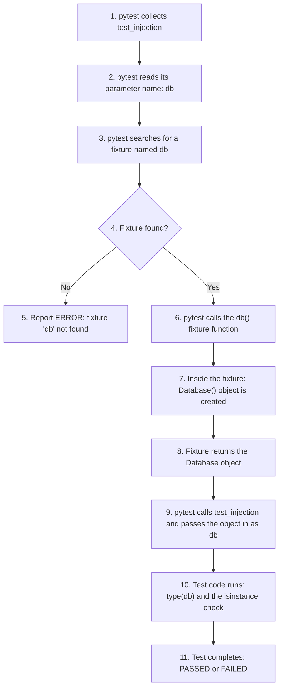
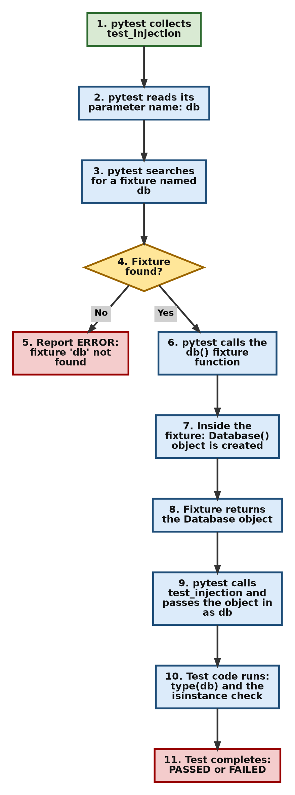
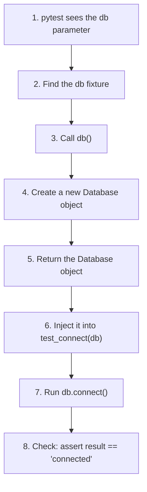
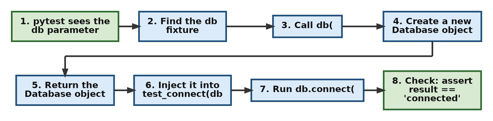
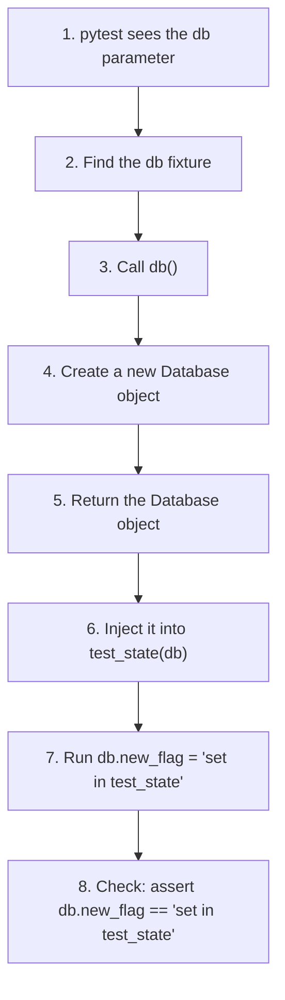
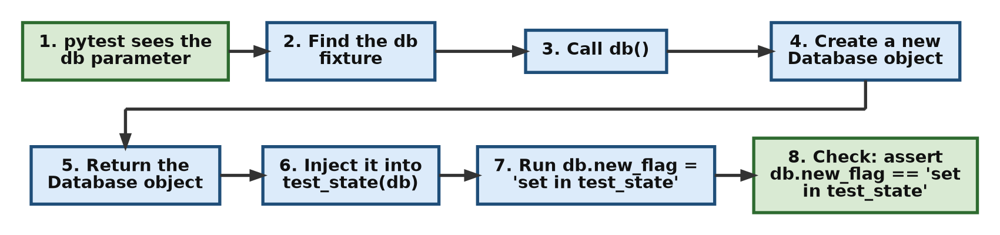

# Dependency Injection in Pytest Fixtures

Almost every test needs something to work with before it can check anything: an object, a connection, a file or some sample data. The code a test depends on in this way is called a **dependency**. There are two ways a test can get its dependencies. It can build them itself, or it can receive them ready-made from outside. The second way is called **dependency injection**, and it is the idea at the heart of pytest fixtures.

This page answers a research question on dependency injection. It explains:

1. What dependency injection means in general programming, with a small plain-Python example.
2. Why it is so useful in testing.
3. How pytest uses `@pytest.fixture` to inject objects into test functions.
4. Why the fixture name and the test parameter name must match, and what happens when they do not.
5. How the mechanism makes tests simpler to write.

It then walks through a practical example (`database.py` and `test_database.py`) step by step, with the actual output, flowcharts and tables.

This topic ties together much of what you have seen in this chapter. Fixtures, setup and teardown, and fixture scopes all rest on the same idea: a test declares what it needs, and pytest supplies it. Dependency injection is also widely used outside testing, in web frameworks and large Python applications, so the idea will be useful well beyond this chapter.

## Table of Contents

- [Dependency Injection in Pytest Fixtures](040-ch20-dependency-injection.md#dependency-injection-in-pytest-fixtures)
    - [Research Question](040-ch20-dependency-injection.md#research-question)
        - [Key Terms Used on This Page](040-ch20-dependency-injection.md#key-terms-used-on-this-page)
    - [Practical Example](040-ch20-dependency-injection.md#practical-example)
        - [database.py](040-ch20-dependency-injection.md#databasepy)
        - [test_database.py](040-ch20-dependency-injection.md#test_databasepy)
        - [Running the Example](040-ch20-dependency-injection.md#running-the-example)
    - [Further discussion](040-ch20-dependency-injection.md#further-discussion)
        - [1. What is Dependency Injection?](040-ch20-dependency-injection.md#1-what-is-dependency-injection)
        - [2. Why Is It Useful in Testing?](040-ch20-dependency-injection.md#2-why-is-it-useful-in-testing)
        - [3. How pytest uses dependency injection](040-ch20-dependency-injection.md#3-how-pytest-uses-dependency-injection)
        - [4. Why Must the Names Match?](040-ch20-dependency-injection.md#4-why-must-the-names-match)
        - [5. How Does This Help Simplify Test Writing?](040-ch20-dependency-injection.md#5-how-does-this-help-simplify-test-writing)
        - [Flow for EACH test (test_injection / test_connect / test_state)](040-ch20-dependency-injection.md#flow-for-each-test-test_injection--test_connect--test_state)
        - [SAME FLOW applies to all 3 tests](040-ch20-dependency-injection.md#same-flow-applies-to-all-3-tests)
        - [For test_connect(db)](040-ch20-dependency-injection.md#for-test_connectdb)
        - [For test_state(db)](040-ch20-dependency-injection.md#for-test_statedb)
    - [Scripts for This Page and How to Run Them](040-ch20-dependency-injection.md#scripts-for-this-page-and-how-to-run-them)
    - [Follow-Up Questions](040-ch20-dependency-injection.md#follow-up-questions)
        - [Question 1: How Many Objects?](040-ch20-dependency-injection.md#question-1-how-many-objects)
        - [Question 2: Sharing One Object](040-ch20-dependency-injection.md#question-2-sharing-one-object)
        - [Question 3: ERROR or FAILED?](040-ch20-dependency-injection.md#question-3-error-or-failed)
        - [Question 4: Seeing the Available Fixtures](040-ch20-dependency-injection.md#question-4-seeing-the-available-fixtures)
    - [Summary](040-ch20-dependency-injection.md#summary)
    - [Further Reading](040-ch20-dependency-injection.md#further-reading)

## Research Question

What is **dependency injection**, and how does pytest use fixtures to automatically provide objects to test functions?

In traditional programming, objects like database connections or services are created manually inside functions or passed explicitly as arguments. This can lead to repetitive code and tight coupling between test logic and setup logic.

Research and explain:

1.  What is dependency injection in general programming?
2.  Why is it useful in testing?
3.  How does pytest implement dependency injection using `@pytest.fixture`?
4.  Why does the fixture function name need to match the test function parameter name?
5.  How does this mechanism help simplify test writing?

Then, analyze the following code and explain how dependency injection is happening step by step.

[Back to the Table of Contents](040-ch20-dependency-injection.md#table-of-contents)

### Key Terms Used on This Page

| Term | Simple Meaning | Learn More |
| --- | --- | --- |
| Dependency | Something a piece of code needs in order to work, such as an object, a connection or some data | |
| Dependency injection | Giving a function the things it needs from outside, instead of letting the function create them itself | [Dependency injection on Wikipedia](https://en.wikipedia.org/wiki/Dependency_injection) |
| Tight coupling | When one piece of code is so closely tied to another that you cannot change or replace one without changing the other | [Coupling on Wikipedia](https://en.wikipedia.org/wiki/Coupling_(computer_programming)) |
| Design pattern | A well-known, reusable way of solving a common programming problem | [Software design pattern on Wikipedia](https://en.wikipedia.org/wiki/Software_design_pattern) |
| Fixture | A function marked with `@pytest.fixture` that prepares something a test needs | [pytest: How to use fixtures](https://docs.pytest.org/en/stable/how-to/fixtures.html) |
| Decorator | A line starting with `@` placed above a function to give it extra behaviour. `@pytest.fixture` is a decorator | [Python glossary: decorator](https://docs.python.org/3/glossary.html#term-decorator) |
| Parameter | A name listed inside the brackets of a function definition, such as `db` in `def test_one(db):` | [Python glossary: parameter](https://docs.python.org/3/glossary.html#term-parameter) |
| Fake (test double) | A simple stand-in object used in tests in place of a real, slow or costly one | [Test double on Wikipedia](https://en.wikipedia.org/wiki/Test_double) |
| State | The data stored inside an object at a given moment | |

[Back to the Table of Contents](040-ch20-dependency-injection.md#table-of-contents)

## Practical Example

The example has two files. Save both in the same folder.

[Back to the Table of Contents](040-ch20-dependency-injection.md#table-of-contents)

### database.py

The file which is to be tested.

```python
# database.py
# This is a simple database module that simulates connecting to a database.
# No real database is used. The print() messages let us see
# exactly when each part of the code runs.


class Database:

    # Step 1 - Runs every time a new Database object is created
    def __init__(self):
        print("[DB] Database object created")

    # Step 2 - Pretends to connect to a database.
    # In a real program this would be the slow, expensive part
    # (opening a network connection, logging in, and so on).
    def connect(self):
        print("[DB] connect called")
        return "connected"
```

The class has only two parts, and each one prints a message so that we can see when it runs:

1. `__init__()` runs whenever a new `Database` object is created and prints `[DB] Database object created`.
2. `connect()` pretends to connect and returns the text `"connected"`.

[Back to the Table of Contents](040-ch20-dependency-injection.md#table-of-contents)

### test_database.py

The file used for testing `database.py`.

```python
# test_database.py
# The file used for testing database.py.
# Run it with:  pytest -v -s test_database.py

# Step 1 - Import pytest and the class to be tested
import pytest
# The file to be tested is database.py, which contains the Database class.
from database import Database


# Step 2 - The fixture (the dependency provider)
# -----------------------------------------------
# The fixture named 'db' creates a new Database object for each test that requests it.

@pytest.fixture
def db():
    print("\n[FIXTURE] creating database object")
    return Database()


# Step 3 - The tests (the dependency users)
# -----------------------------------------------

# -----------------------------
# TEST 1: Injection Check
# -----------------------------

# The fixture function is named 'db',
# and in test_injection() we are requesting it by including 'db' as a parameter.
# Pytest will create a new Database object by calling the db() fixture function
# and pass it to the test.
# The passing is done by injecting the fixture's return value into the test function's parameter.
# So inside test_injection() the variable name 'db' refers to the Database object created by the fixture.
# So 'db' plays 2 roles:
# 1. It is the name of the fixture function that creates the Database object.
# 2. It is the name of the parameter in the test function that receives the injected Database object.
def test_injection(db):
    print("[TEST 1] test_injection started")
    # This should show <class 'database.Database'> if injection worked correctly.
    print(f"[TEST 1] injected type = {type(db)}")

    # Check that the injected object is an instance of Database
    assert isinstance(db, Database)

    print("[TEST 1] injection successful")


# -----------------------------
# TEST 2: Method Call Check
# -----------------------------
def test_connect(db):
    print("[TEST 2] test_connect started")

    # Call the connect method of the injected Database object
    result = db.connect()
    print(f"[TEST 2] result = {result}")

    # Check that the connect method returns the expected value
    assert result == "connected"

    print("[TEST 2] connect successful")


# -----------------------------
# TEST 3: State Check
# -----------------------------
def test_state(db):
    print("[TEST 3] test_state started")

    # Modify the state of the injected Database object by adding a new attribute
    db.new_flag = "set in test_state"
    print("[TEST 3] modified object state")

    # Check that the state modification is successful
    assert db.new_flag == "set in test_state"

    print("[TEST 3] state modification successful")


# -----------------------------
# TEST 4: Fresh Object Check
# -----------------------------
# test_state() added 'new_flag' to its Database object.
# This test runs after it. If it received the same object,
# 'new_flag' would still be there. It is not, because the fixture
# has the default function scope and creates a new object for every test.
def test_fresh_object(db):
    print("[TEST 4] test_fresh_object started")

    has_flag = hasattr(db, "new_flag")
    print(f"[TEST 4] does this object have new_flag? {has_flag}")

    assert has_flag is False

    print("[TEST 4] each test received its own fresh object")
```

The file has two kinds of code:

| Part | Role in Dependency Injection | What It Does |
| --- | --- | --- |
| `db()` with `@pytest.fixture` | The **provider** | Creates a `Database` object and returns it |
| `test_injection(db)`, `test_connect(db)`, `test_state(db)`, `test_fresh_object(db)` | The **users** (consumers) | Ask for `db` by naming it as a parameter, then use it |

None of the four tests contains the line `Database()`. They never create the object themselves. They only say that they need `db`.

[Back to the Table of Contents](040-ch20-dependency-injection.md#table-of-contents)

### Running the Example

Run the tests with `-v` (show each test name) and `-s` (show the `print()` output):

```bash
pytest -v -s test_database.py
```

Output:

```text
============================= test session starts ==============================
platform win32 -- Python 3.10.10, pytest-9.0.3, pluggy-1.6.0 -- C:\Users\Anurag Gupta\AppData\Local\Programs\Python\Python310\python.exe
cachedir: .pytest_cache
rootdir: C:\di-demo
collected 4 items

test_database.py::test_injection
[FIXTURE] creating database object
[DB] Database object created
[TEST 1] test_injection started
[TEST 1] injected type = <class 'database.Database'>
[TEST 1] injection successful
PASSED
test_database.py::test_connect
[FIXTURE] creating database object
[DB] Database object created
[TEST 2] test_connect started
[DB] connect called
[TEST 2] result = connected
[TEST 2] connect successful
PASSED
test_database.py::test_state
[FIXTURE] creating database object
[DB] Database object created
[TEST 3] test_state started
[TEST 3] modified object state
[TEST 3] state modification successful
PASSED
test_database.py::test_fresh_object
[FIXTURE] creating database object
[DB] Database object created
[TEST 4] test_fresh_object started
[TEST 4] does this object have new_flag? False
[TEST 4] each test received its own fresh object
PASSED

============================== 4 passed in 0.00s ===============================
```

Read the output in steps:

1. For **each** test, the lines `[FIXTURE] creating database object` and `[DB] Database object created` appear **before** the test's own messages. This shows that pytest runs the fixture first and only then starts the test.
2. `[TEST 1] injected type = <class 'database.Database'>` shows that the parameter `db` inside the test really holds a `Database` object, supplied by the fixture.
3. In test 2, `[DB] connect called` shows that the test used the injected object's method.
4. In test 3, the test adds a new attribute `new_flag` to its object.
5. In test 4, `does this object have new_flag? False` shows that test 4 received a **different, fresh** object. The change made in test 3 did not carry over, because the fixture runs again for every test.

The scripts for this page are listed in [Scripts for This Page and How to Run Them](040-ch20-dependency-injection.md#scripts-for-this-page-and-how-to-run-them).

[Back to the Table of Contents](040-ch20-dependency-injection.md#table-of-contents)

## Further discussion

The following sections answer the five parts of the research question in order.

[Back to the Table of Contents](040-ch20-dependency-injection.md#table-of-contents)

### 1. What is Dependency Injection?

Dependency injection is a **design pattern** in which an object that a function needs (its **dependency**) is created outside the function and provided to it, instead of being created inside the function.

Think of a chef in a restaurant kitchen. A chef who had to grow the vegetables, catch the fish and make the plates before every meal would be very slow, and would be stuck with whatever the garden produced. Instead, the ingredients are delivered to the kitchen, and the chef only cooks. If the supplier changes, the chef's recipes do not need to change. The ingredients are "injected" into the chef's work.

Here is the same idea in plain Python, without pytest. Save it as `di_without_pytest.py`:

```python
# di_without_pytest.py
# Dependency injection in plain Python, without pytest.
# Run it with:  python di_without_pytest.py


# Step 1 - Two classes that can play the role of "a database"
class RealDatabase:
    def get_user_count(self):
        print("   [RealDatabase] Pretending to query a slow, real database...")
        return 1520


class FakeDatabase:
    """A simple stand-in used for testing. It always returns a fixed value."""
    def get_user_count(self):
        print("   [FakeDatabase] Returning a fixed test value instantly")
        return 3


# Step 2 - WITHOUT dependency injection:
# the function creates its own database inside itself,
# so it is tied (coupled) to RealDatabase and cannot use anything else.
def report_without_di():
    database = RealDatabase()
    return f"Total users: {database.get_user_count()}"


# Step 3 - WITH dependency injection:
# the function receives the database as a parameter.
# It does not know or care which kind of database it gets.
def report_with_di(database):
    return f"Total users: {database.get_user_count()}"


# Step 4 - Use the functions
print("1. Without dependency injection:")
print("  ", report_without_di())

print("2. With dependency injection, given a real database:")
print("  ", report_with_di(RealDatabase()))

print("3. With dependency injection, given a fake database (for a test):")
result = report_with_di(FakeDatabase())
print("  ", result)

# Step 5 - A simple check, like a test would do
assert result == "Total users: 3"
print("4. Check passed: the report works correctly with the fake database")
```

Run it with Python (not pytest, because it is not a test file):

```bash
python di_without_pytest.py
```

Output:

```text
1. Without dependency injection:
   [RealDatabase] Pretending to query a slow, real database...
   Total users: 1520
2. With dependency injection, given a real database:
   [RealDatabase] Pretending to query a slow, real database...
   Total users: 1520
3. With dependency injection, given a fake database (for a test):
   [FakeDatabase] Returning a fixed test value instantly
   Total users: 3
4. Check passed: the report works correctly with the fake database
```

What this shows:

1. `report_without_di()` creates its own `RealDatabase()` inside itself. It is **tightly coupled** to that class. There is no way to make it use anything else.
2. `report_with_di(database)` receives its database as a parameter. The same function works with the real database and with the fake one.
3. Because we could pass in `FakeDatabase`, we could check the function quickly with a known value (3), without touching a slow real database.

This approach helps to:

- reduce repeated setup code
- improve test readability
- separate the code that creates an object from the code that uses it
- make it easy to swap a real object for a simple stand-in during testing

[Back to the Table of Contents](040-ch20-dependency-injection.md#table-of-contents)

### 2. Why Is It Useful in Testing?

Dependency injection is especially helpful in testing, for these reasons:

| Benefit | Explanation |
| --- | --- |
| Less repeated code | The setup is written once, in the fixture, instead of being copied into every test |
| Fresh objects for every test | Each test can receive a brand-new object, so one test cannot spoil the data of another (as test 4 above shows) |
| Easy to swap in fakes | A test can receive a fake or simple object instead of a real database or network service, so it runs fast and gives predictable results |
| Clear, readable tests | The parameter list shows at a glance what each test depends on. The body of the test contains only the checks |
| One place to change | If the way a `Database` is created changes, only the fixture needs updating, not every test |
| Automatic cleanup | With `yield`, the fixture can also clean up after the test, so tests do not have to remember to do it |

[Back to the Table of Contents](040-ch20-dependency-injection.md#table-of-contents)

### 3. How pytest uses dependency injection

In pytest, dependency injection happens through **fixtures**.

When a test function declares a parameter:

```python
def test_one(db):
```

pytest performs the following steps:

1. It reads the test function's parameter list and sees the name `db`.
2. It looks for a fixture with the same name, `db`.
3. Before the body of the test runs, it calls the fixture function `db()`.
4. It takes the object that the fixture returns.
5. It calls the test function and passes that object in as the `db` argument.
6. The test's code runs, using `db` like any normal variable.

A fixture can itself ask for other fixtures in exactly the same way. Pytest then works out the right order and builds the whole chain. Save this as `test_fixture_chain.py`:

```python
# test_fixture_chain.py
# A fixture can ask for another fixture, in exactly the same way
# a test does. Pytest builds the whole chain automatically.
# Run it with:  pytest -v -s test_fixture_chain.py

# Step 1 - Import pytest and the class to be tested
import pytest
from database import Database


# Step 2 - First fixture: creates the Database object
@pytest.fixture
def db():
    print("\n[FIXTURE db] creating database object")
    return Database()


# Step 3 - Second fixture: asks for 'db', connects it, and returns both
@pytest.fixture
def connected_db(db):
    print("[FIXTURE connected_db] received db, now connecting")
    status = db.connect()
    return db, status


# Step 4 - The test asks only for 'connected_db'.
#          Pytest sees that connected_db needs db, so it runs db first.
def test_ready_to_use(connected_db):
    database, status = connected_db
    print(f"[TEST] status = {status}")
    assert status == "connected"
    assert isinstance(database, Database)
```

Run:

```bash
pytest -v -s test_fixture_chain.py
```

Output:

```text
============================= test session starts ==============================
platform win32 -- Python 3.10.10, pytest-9.0.3, pluggy-1.6.0 -- C:\Users\Anurag Gupta\AppData\Local\Programs\Python\Python310\python.exe
cachedir: .pytest_cache
rootdir: C:\di-demo
collected 1 item

test_fixture_chain.py::test_ready_to_use
[FIXTURE db] creating database object
[DB] Database object created
[FIXTURE connected_db] received db, now connecting
[DB] connect called
[TEST] status = connected
PASSED

============================== 1 passed in 0.00s ===============================
```

The test asked only for `connected_db`. Pytest saw that `connected_db` needs `db`, so it ran `db` first, then `connected_db`, and then the test. The pytest documentation calls this [fixtures requesting other fixtures](https://docs.pytest.org/en/stable/how-to/fixtures.html#fixtures-can-request-other-fixtures).

[Back to the Table of Contents](040-ch20-dependency-injection.md#table-of-contents)

### 4. Why Must the Names Match?

Pytest has no other way of knowing which fixture a test wants. There is no import and no function call in the test that points to the fixture. The **only** link between the two is the name. Pytest reads the parameter name and looks up a fixture registered under that same name.

If the names do not match, pytest cannot find the fixture. Save this as `test_name_mismatch.py`:

```python
# test_name_mismatch.py
# What happens when the parameter name does NOT match any fixture name?
# Run it with:  pytest -v test_name_mismatch.py
# This test ERRORS on purpose.

# Step 1 - Import pytest and the class to be tested
import pytest
from database import Database


# Step 2 - The fixture is called 'db'
@pytest.fixture
def db():
    return Database()


# Step 3 - The test asks for 'database', which is not the name of any fixture
def test_wrong_name(database):
    assert isinstance(database, Database)
```

Run:

```bash
pytest -v test_name_mismatch.py
```

Output:

```text
============================= test session starts ==============================
platform win32 -- Python 3.10.10, pytest-9.0.3, pluggy-1.6.0 -- C:\Users\Anurag Gupta\AppData\Local\Programs\Python\Python310\python.exe
cachedir: .pytest_cache
rootdir: C:\di-demo
collected 1 item

test_name_mismatch.py::test_wrong_name ERROR                             [100%]

==================================== ERRORS ====================================
______________________ ERROR at setup of test_wrong_name _______________________
file C:\di-demo\test_name_mismatch.py, line 18
  def test_wrong_name(database):
E       fixture 'database' not found
>       available fixtures: capfd, capfdbinary, caplog, capsys, capsysbinary, capteesys, db, doctest_namespace, monkeypatch, pytestconfig, record_property, record_testsuite_property, record_xml_attribute, recwarn, subtests, tmp_path, tmp_path_factory, tmpdir, tmpdir_factory
>       use 'pytest --fixtures [testpath]' for help on them.

C:\di-demo\test_name_mismatch.py:18
=========================== short test summary info ============================
ERROR test_name_mismatch.py::test_wrong_name
=============================== 1 error in 0.01s ===============================
```

Notice three things:

1. The result is `ERROR`, not `FAILED`. The test never started, because its setup could not be completed.
2. The message `fixture 'database' not found` names the missing fixture exactly.
3. Pytest lists the fixtures that **are** available, and `db` is among them. This is a strong hint that the parameter name was misspelled or chosen wrongly. The other names in the list are fixtures built into pytest, and the list may be longer on your computer if you have pytest plugins installed.

**A useful detail:** strictly speaking, it is the fixture's **name** that must match the parameter, not the Python function's name. By default they are the same. But you can give a fixture a different name with the `name` argument. Save this as `test_fixture_name.py`:

```python
# test_fixture_name.py
# The fixture's NAME must match the parameter, but the Python function
# can have a different name if we use the 'name' argument.
# Run it with:  pytest -v -s test_fixture_name.py

# Step 1 - Import pytest and the class to be tested
import pytest
from database import Database


# Step 2 - The function is called make_database, but the fixture's
#          name is 'db', because of name="db"
@pytest.fixture(name="db")
def make_database():
    print("\n[FIXTURE] make_database() running as fixture 'db'")
    return Database()


# Step 3 - The test asks for 'db' (the fixture name), not 'make_database'
def test_uses_fixture_name(db):
    print("[TEST] received:", type(db).__name__)
    assert isinstance(db, Database)
```

Run:

```bash
pytest -v -s test_fixture_name.py
```

Output:

```text
============================= test session starts ==============================
platform win32 -- Python 3.10.10, pytest-9.0.3, pluggy-1.6.0 -- C:\Users\Anurag Gupta\AppData\Local\Programs\Python\Python310\python.exe
cachedir: .pytest_cache
rootdir: C:\di-demo
collected 1 item

test_fixture_name.py::test_uses_fixture_name
[FIXTURE] make_database() running as fixture 'db'
[DB] Database object created
[TEST] received: Database
PASSED

============================== 1 passed in 0.00s ===============================
```

The Python function is called `make_database`, but the test asks for `db`, and it works. In everyday code, most people simply give the fixture function the same name that tests will use, as in `test_database.py`.

[Back to the Table of Contents](040-ch20-dependency-injection.md#table-of-contents)

### 5. How Does This Help Simplify Test Writing?

Compare a test that creates its own object with one that receives it:

| Without a Fixture | With a Fixture (Dependency Injection) |
| --- | --- |
| `def test_connect():` | `def test_connect(db):` |
| `    db = Database()` | (not needed) |
| `    result = db.connect()` | `    result = db.connect()` |
| `    assert result == "connected"` | `    assert result == "connected"` |

With one test, the saving is one line. With 50 tests, it is 50 copies of the same setup line, and if creating a `Database` later needs extra steps (a password, a server address, a cleanup step), all 50 would have to change. With a fixture, only the fixture changes.

In short, dependency injection lets each test do just one job: **check** something. Preparing the objects is somebody else's job (the fixture's), and connecting the two is pytest's job.

[Back to the Table of Contents](040-ch20-dependency-injection.md#table-of-contents)

### Flow for EACH test (test_injection / test_connect / test_state)

The flowchart below shows what happens for `test_injection`. The order of events is the same for every test in the file.





In words:

1. Pytest collects the test function `test_injection(db)`.
2. It reads the parameter name `db`.
3. It searches for a fixture named `db`.
4. It finds the fixture:

```python
@pytest.fixture
def db():
    print("\n[FIXTURE] creating database object")
    return Database()
```

5. It calls the fixture function `db()`.
6. Inside the fixture, a `Database()` object is created.
7. The fixture returns the `Database` object.
8. Pytest now starts the test, passing the returned object in as the `db` argument.
9. Inside `test_injection`, the name `db` refers to that `Database` object.
10. The test code runs: it prints `type(db)` and checks `isinstance(db, Database)`.
11. The test completes.

Note the order: the fixture runs **before** the first line of the test, not in the middle of it. That is why, in the output, the fixture's messages always appear before the test's own messages.

[Back to the Table of Contents](040-ch20-dependency-injection.md#table-of-contents)

### SAME FLOW applies to all 3 tests

Steps 1 to 9 of the flow above are exactly the same for every test that asks for `db`. Only the test's own code (steps 10 and 11) is different. The table sets this out side by side.

| Step | `test_injection(db)` | `test_connect(db)` | `test_state(db)` |
| --- | --- | --- | --- |
| 1. Pytest sees the parameter | `db` | `db` | `db` |
| 2. Pytest finds the fixture | `db()` | `db()` | `db()` |
| 3. Pytest calls the fixture | Yes | Yes, again | Yes, again |
| 4. Object created | A new `Database` object | Another new `Database` object | Another new `Database` object |
| 5. Object injected into | `test_injection` | `test_connect` | `test_state` |
| 6. Test code run | `type(db)` and `isinstance(db, Database)` | `result = db.connect()` | `db.new_flag = "set in test_state"` |
| 7. Check made | `assert isinstance(db, Database)` | `assert result == "connected"` | `assert db.new_flag == "set in test_state"` |

The key row is step 4. Because the fixture has the default **function scope**, it runs once for **each** test, and each test gets its own new object. The fourth test in the file, `test_fresh_object`, proves this: the `new_flag` added in `test_state` is not present in the object that `test_fresh_object` receives.

[Back to the Table of Contents](040-ch20-dependency-injection.md#table-of-contents)

### For test_connect(db)





[Back to the Table of Contents](040-ch20-dependency-injection.md#table-of-contents)

### For test_state(db)





[Back to the Table of Contents](040-ch20-dependency-injection.md#table-of-contents)

## Scripts for This Page and How to Run Them

All the scripts on this page are available in the [di-demo folder](https://github.com/ag999git/001-Python-book-2026/tree/main/20-unittest/di-demo).

| File | What It Contains |
| --- | --- |
| [database.py](https://github.com/ag999git/001-Python-book-2026/blob/main/20-unittest/di-demo/database.py) | The simple Database class being tested |
| [test_database.py](https://github.com/ag999git/001-Python-book-2026/blob/main/20-unittest/di-demo/test_database.py) | The four tests that receive `db` from a fixture |
| [di_without_pytest.py](https://github.com/ag999git/001-Python-book-2026/blob/main/20-unittest/di-demo/di_without_pytest.py) | Dependency injection in plain Python (run with `python`, not pytest) |
| [test_fixture_chain.py](https://github.com/ag999git/001-Python-book-2026/blob/main/20-unittest/di-demo/test_fixture_chain.py) | A fixture that asks for another fixture |
| [test_name_mismatch.py](https://github.com/ag999git/001-Python-book-2026/blob/main/20-unittest/di-demo/test_name_mismatch.py) | What happens when the names do not match (gives an ERROR on purpose) |
| [test_fixture_name.py](https://github.com/ag999git/001-Python-book-2026/blob/main/20-unittest/di-demo/test_fixture_name.py) | Giving a fixture a different name with `name=` |

To run them on your computer:

1. Create a folder, for example `di-demo`, and save all six files in it.
2. Open the folder in VS Code (**File > Open Folder...**) and open the terminal (**Terminal > New Terminal**).
3. Check that pytest is installed with `python -m pytest --version`. If you see `No module named pytest`, install it with `python -m pip install pytest`.
4. Run each file with the command given in its section, for example `python -m pytest -v -s test_database.py`. Run `di_without_pytest.py` with `python di_without_pytest.py`.

If you run all the test files together with `python -m pytest -v -s`, expect the summary `6 passed, 1 error`. The error comes from `test_name_mismatch.py`, which is meant to show the error.

Detailed, step-by-step instructions (installing Python and VS Code, downloading files from GitHub and fixing common errors) are given in [Running the Scripts on Your Computer](020-ch20-unittest-disadvantage-rigid-oop-style.md#running-the-scripts-on-your-computer).

[Back to the Table of Contents](040-ch20-dependency-injection.md#table-of-contents)

## Follow-Up Questions

### Question 1: How Many Objects?

`test_database.py` contains four tests, and each one asks for `db`. How many `Database` objects are created when the file runs? How can you tell from the output?

**Answer:**

1. The `db` fixture has the default function scope.
2. So pytest calls it once for each test that asks for it: 4 times.
3. Therefore **4** `Database` objects are created.
4. In the output, the line `[DB] Database object created` appears 4 times, once before each test.

[Back to the Table of Contents](040-ch20-dependency-injection.md#table-of-contents)

### Question 2: Sharing One Object

What single change to the fixture would make all four tests share one `Database` object? Which test would then fail, and why?

**Answer:**

1. Change the decorator to `@pytest.fixture(scope="module")` (or `scope="session"`).
2. The fixture would then run only once for the whole file, and all four tests would receive the same object.
3. `test_fresh_object` would fail. `test_state` runs before it and adds `new_flag` to the shared object, so `hasattr(db, "new_flag")` would now be `True`.
4. This shows why sharing an object between tests must be done with care: one test's changes become visible to the next.

[Back to the Table of Contents](040-ch20-dependency-injection.md#table-of-contents)

### Question 3: ERROR or FAILED?

When the parameter name does not match any fixture, pytest reports `ERROR`, not `FAILED`. What is the difference?

**Answer:**

1. **FAILED** means the test ran, but an `assert` (or other check) inside it was not true.
2. **ERROR** means something went wrong outside the test's own checks, for example during its setup. The test body never ran.
3. A missing fixture is a setup problem. Pytest cannot build the test's arguments, so it cannot even start the test. That is why it reports `ERROR at setup of test_wrong_name`.

[Back to the Table of Contents](040-ch20-dependency-injection.md#table-of-contents)

### Question 4: Seeing the Available Fixtures

How can you get a list of all the fixtures that a test file can use?

**Answer:** Run:

```bash
pytest --fixtures test_database.py
```

Pytest prints every fixture available to that file, including the built-in ones and your own fixtures (such as `db`), together with their docstrings (the description in triple quotes, if the fixture has one). This is also the command that pytest suggests in the error message when a fixture is not found.

[Back to the Table of Contents](040-ch20-dependency-injection.md#table-of-contents)

## Summary

- A **dependency** is something code needs in order to work. **Dependency injection** means handing that dependency to the code from outside, instead of letting the code create it.
- In pytest, a **fixture** is the provider and a **test** is the user. The test asks for a fixture simply by naming it as a parameter.
- Pytest reads the parameter names, finds the fixtures with the same names, runs them **before** the test and passes their results in.
- The **name** is the only link between a test and a fixture. A wrong name gives the error `fixture '...' not found`.
- Fixtures can ask for other fixtures, and pytest builds the whole chain in the right order.
- With the default function scope, each test gets a fresh object, so tests stay independent.

[Back to the Table of Contents](040-ch20-dependency-injection.md#table-of-contents)

## Further Reading

- [pytest: How to use fixtures](https://docs.pytest.org/en/stable/how-to/fixtures.html)
- [pytest: About fixtures](https://docs.pytest.org/en/stable/explanation/fixtures.html)
- [pytest: Fixtures can request other fixtures](https://docs.pytest.org/en/stable/how-to/fixtures.html#fixtures-can-request-other-fixtures)
- [Dependency injection on Wikipedia](https://en.wikipedia.org/wiki/Dependency_injection)

[Back to the Table of Contents](040-ch20-dependency-injection.md#table-of-contents)

