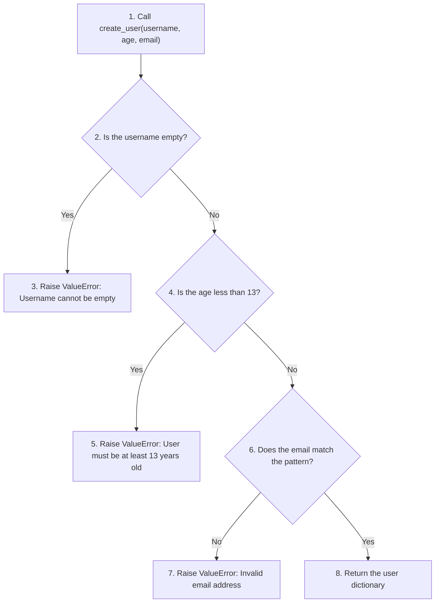
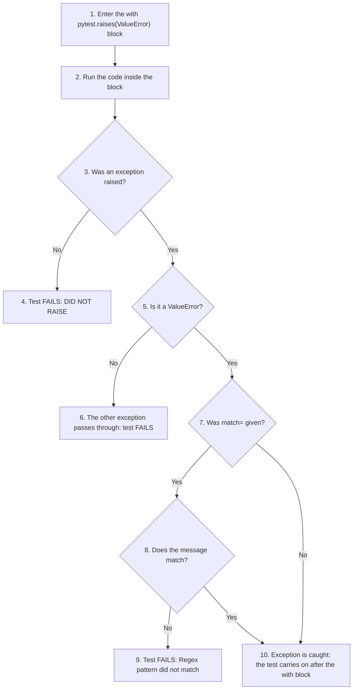

# Testing User Validation with pytest.raises(): A User Registration Example

Good programs do not only work with correct input. They also deal sensibly with wrong input. When a function receives data it cannot accept, a common Python approach is to **raise an exception**, which stops the function and reports what went wrong. But how do we test that a function raises the right exception, with the right message, at the right time? Pytest gives us a tool for exactly this job: `pytest.raises()`.

This page uses a small user-registration example to show how it works. It contains a user-registration validation example together with a detailed walkthrough covering:

- What the script does
- Why each validation rule exists
- How the implementation works
- Exception-handling techniques
- Testing strategies using `pytest.raises()`
- Key software engineering concepts such as input validation, defensive programming and fail-fast design

It also shows what happens when a test expects an exception that never comes, and how to test many bad inputs with a single test function.

This topic brings together two parts of the book: exceptions, which you met earlier when learning about errors and `try`/`except`, and testing with pytest, which is the subject of this chapter. Readers are encouraged to study both the source code and the accompanying discussion to gain a deeper understanding of how exception testing is used in real-world applications.

## Table of Contents

- [Testing User Validation with pytest.raises(): A User Registration Example](060-ch20-user-registration.md#testing-user-validation-with-pytestraises-a-user-registration-example)
    - [Key Terms Used on This Page](060-ch20-user-registration.md#key-terms-used-on-this-page)
    - [Folder Structure](060-ch20-user-registration.md#folder-structure)
    - [user_registration.py](060-ch20-user-registration.md#user_registrationpy)
    - [test_user_registration.py](060-ch20-user-registration.md#test_user_registrationpy)
    - [Running the Tests with pytest](060-ch20-user-registration.md#running-the-tests-with-pytest)
    - [Trying create_user() Yourself](060-ch20-user-registration.md#trying-create_user-yourself)
    - [Discussion: Testing User Validation with pytest.raises()](060-ch20-user-registration.md#discussion-testing-user-validation-with-pytestraises)
        - [Overview](060-ch20-user-registration.md#overview)
        - [What the Script Does](060-ch20-user-registration.md#what-the-script-does)
        - [Need for Validation in the Script](060-ch20-user-registration.md#need-for-validation-in-the-script)
        - [How the Script Works](060-ch20-user-registration.md#how-the-script-works)
            - [Username Validation](060-ch20-user-registration.md#username-validation)
            - [Age Validation](060-ch20-user-registration.md#age-validation)
            - [Email Validation](060-ch20-user-registration.md#email-validation)
            - [Successful Completion](060-ch20-user-registration.md#successful-completion)
        - [Why ValueError Is Used](060-ch20-user-registration.md#why-valueerror-is-used)
        - [Learning Points](060-ch20-user-registration.md#learning-points)
            - [Input Validation](060-ch20-user-registration.md#input-validation)
            - [Defensive Programming](060-ch20-user-registration.md#defensive-programming)
            - [Raising Exceptions](060-ch20-user-registration.md#raising-exceptions)
            - [Fail-Fast Design](060-ch20-user-registration.md#fail-fast-design)
            - [Business Rules](060-ch20-user-registration.md#business-rules)
            - [Regular Expressions](060-ch20-user-registration.md#regular-expressions)
        - [Why This Example Is Good for pytest.raises()](060-ch20-user-registration.md#why-this-example-is-good-for-pytestraises)
        - [Testing Exception Occurrence](060-ch20-user-registration.md#testing-exception-occurrence)
        - [Testing Exception Messages](060-ch20-user-registration.md#testing-exception-messages)
        - [Using excinfo](060-ch20-user-registration.md#using-excinfo)
        - [Functional Form](060-ch20-user-registration.md#functional-form)
        - [What Happens When the Expected Exception Is Not Raised?](060-ch20-user-registration.md#what-happens-when-the-expected-exception-is-not-raised)
        - [Going Further: Testing Many Invalid Inputs with parametrize](060-ch20-user-registration.md#going-further-testing-many-invalid-inputs-with-parametrize)
    - [Scripts for This Page and How to Run Them](060-ch20-user-registration.md#scripts-for-this-page-and-how-to-run-them)
    - [Follow-Up Questions](060-ch20-user-registration.md#follow-up-questions)
        - [Question 1: Which Check Fails First?](060-ch20-user-registration.md#question-1-which-check-fails-first)
        - [Question 2: A Username Made of Spaces](060-ch20-user-registration.md#question-2-a-username-made-of-spaces)
        - [Question 3: Age Given as Text](060-ch20-user-registration.md#question-3-age-given-as-text)
        - [Question 4: Is the Boundary Tested?](060-ch20-user-registration.md#question-4-is-the-boundary-tested)
    - [Key Takeaways](060-ch20-user-registration.md#key-takeaways)
    - [Further Reading](060-ch20-user-registration.md#further-reading)

## Key Terms Used on This Page

| Term | Simple Meaning | Learn More |
| --- | --- | --- |
| Exception | An error signal raised while a program runs. If nothing catches it, the program stops and shows the error | [Python tutorial: Errors and Exceptions](https://docs.python.org/3/tutorial/errors.html) |
| Raise | To create and send an exception on purpose, with the `raise` statement | [Python tutorial: Raising Exceptions](https://docs.python.org/3/tutorial/errors.html#raising-exceptions) |
| `ValueError` | The built-in exception used when a value has the right type but an unacceptable content | [Python docs: ValueError](https://docs.python.org/3/library/exceptions.html#ValueError) |
| Validation | Checking that input is acceptable before using it | |
| Regular expression (regex) | A short pattern that describes what a piece of text should look like, used for searching and checking text | [Python Regular Expression HOWTO](https://docs.python.org/3/howto/regex.html) |
| Defensive programming | Writing code that checks its input instead of assuming it is correct | [Defensive programming on Wikipedia](https://en.wikipedia.org/wiki/Defensive_programming) |
| Fail-fast | Stopping at the first problem found, instead of carrying on with bad data | [Fail-fast on Wikipedia](https://en.wikipedia.org/wiki/Fail-fast_system) |
| Business rule | A rule set by the organisation or the application (such as a minimum age), not by the Python language | |
| Context manager | An object used with the `with` statement. `pytest.raises()` is used as one | [Python glossary: context manager](https://docs.python.org/3/glossary.html#term-context-manager) |
| `excinfo` | The name usually given to the object that stores the details of a caught exception | [pytest: ExceptionInfo](https://docs.pytest.org/en/stable/reference/reference.html#pytest.ExceptionInfo) |

[Back to the Table of Contents](060-ch20-user-registration.md#table-of-contents)

## Folder Structure

Save the files in one folder. The folder should look similar to this:

```text
registration-demo/
│
├── user_registration.py
└── test_user_registration.py
```

The two files must be in the same folder, because the test file imports `create_user` from `user_registration.py`. The other scripts used later on this page go in the same folder. They are listed in [Scripts for This Page and How to Run Them](060-ch20-user-registration.md#scripts-for-this-page-and-how-to-run-them).

[Back to the Table of Contents](060-ch20-user-registration.md#table-of-contents)

## user_registration.py

This module contains the `create_user` function that we want to test.

```python
# user_registration.py
# This module contains the create_user function that we want to test.

# Step 1 - Import the regular expression module, used to check email addresses
import re


def create_user(username, age, email):
    """
    Create a user record (a dictionary) after checking the input.

    Raises ValueError as soon as one of the checks fails:
      - the username is empty
      - the age is less than 13
      - the email address does not look valid
    """

    # Step 2 - Check the username.
    # 'not username' is True for an empty string "" and for None.
    if not username:
        raise ValueError("Username cannot be empty")

    # Step 3 - Check the age (a business rule: users must be 13 or older)
    if age < 13:
        raise ValueError("User must be at least 13 years old")

    # Step 4 - Check that the email roughly looks like name@domain.ext
    if not re.match(r"^[^@]+@[^@]+\.[^@]+$", email):
        raise ValueError("Invalid email address")

    # Step 5 - All checks passed, so build and return the user record
    return {
        "username": username,
        "age": age,
        "email": email,
    }
```

[Back to the Table of Contents](060-ch20-user-registration.md#table-of-contents)

## test_user_registration.py

This is the file used to test `user_registration.py`. Each test checks one behaviour of `create_user()`, and together they show the different ways of using `pytest.raises()`.

```python
# test_user_registration.py
# To run the tests in this file, use the command:
#     pytest -v test_user_registration.py
# Add -s to see the print() messages:
#     pytest -v -s test_user_registration.py

# Step 1 - Import pytest and the function we are testing
import pytest
# user_registration.py contains the create_user function that we are testing.
from user_registration import create_user


# Step 2 - Test that an exception is raised (type only)
def test_empty_username():
    # Test that ValueError is raised when the username is empty.
    # The test passes only if the code inside the 'with' block raises ValueError.
    with pytest.raises(ValueError):
        create_user("", 20, "alice@example.com")


# Step 3 - Test the exception type AND its message
def test_username_message():
    # 'match' checks that the exception message contains
    # the text "Username cannot be empty"
    with pytest.raises(ValueError, match="Username cannot be empty"):
        create_user("", 20, "alice@example.com")


# Step 4 - Capture the exception with 'as excinfo' and inspect it
def test_underage_user():
    with pytest.raises(ValueError) as excinfo:
        create_user("alice", 10, "alice@example.com")

    # The checks below run AFTER the 'with' block, outside it
    print(f"\n   Captured type: {excinfo.type.__name__}")
    print(f"   Captured message: {excinfo.value}")

    assert excinfo.type is ValueError             # The exception type is ValueError
    assert "13 years old" in str(excinfo.value)   # The message mentions "13 years old"


# Step 5 - Test the email check
def test_invalid_email():
    with pytest.raises(ValueError, match="Invalid email address"):
        create_user("alice", 20, "bad-email")


# Step 6 - Test the "happy path": valid input gives a correct user record
def test_valid_user():
    user = create_user("alice", 20, "alice@example.com")
    print(f"\n   Returned user: {user}")

    assert user["username"] == "alice"            # The username is correct
    assert user["age"] == 20                      # The age is correct
    assert user["email"] == "alice@example.com"   # The email is correct


# Step 7 - The older "functional form" of pytest.raises
def test_functional_form():
    # The function and its arguments are passed to pytest.raises separately.
    # pytest.raises calls create_user("", 20, "alice@example.com") itself.
    excinfo = pytest.raises(ValueError, create_user, "", 20, "alice@example.com")
    print(f"\n   Functional form captured: {excinfo.value}")
    assert "Username cannot be empty" in str(excinfo.value)
```

| Test | What It Checks | pytest.raises Technique Used |
| --- | --- | --- |
| `test_empty_username` | An empty username raises `ValueError` | Exception type only |
| `test_username_message` | The message says `Username cannot be empty` | Type and message, with `match=` |
| `test_underage_user` | An age of 10 raises `ValueError` mentioning 13 years | Capture with `as excinfo` and inspect |
| `test_invalid_email` | A bad email raises `ValueError` with the right message | Type and message, with `match=` |
| `test_valid_user` | Valid input returns the correct dictionary | No exception expected |
| `test_functional_form` | An empty username raises `ValueError` | The older functional form |

[Back to the Table of Contents](060-ch20-user-registration.md#table-of-contents)

## Running the Tests with pytest

Open a terminal in the folder and type:

```bash
pytest -v test_user_registration.py
```

Output:

```text
============================= test session starts ==============================
platform win32 -- Python 3.10.10, pytest-9.0.3, pluggy-1.6.0 -- C:\Users\Anurag Gupta\AppData\Local\Programs\Python\Python310\python.exe
cachedir: .pytest_cache
rootdir: C:\registration-demo
plugins: anyio-4.12.1
collected 6 items

test_user_registration.py::test_empty_username PASSED                    [ 16%]
test_user_registration.py::test_username_message PASSED                  [ 33%]
test_user_registration.py::test_underage_user PASSED                     [ 50%]
test_user_registration.py::test_invalid_email PASSED                     [ 66%]
test_user_registration.py::test_valid_user PASSED                        [ 83%]
test_user_registration.py::test_functional_form PASSED                   [100%]

============================== 6 passed in 0.01s ===============================
```

All six tests pass. The first four and the last one pass because `create_user()` **did** raise the expected `ValueError`. `test_valid_user` passes because it did **not** raise one and returned the right data.

To see the `print()` messages inside the tests as well, add the `-s` flag:

```bash
pytest -v -s test_user_registration.py
```

Output:

```text
============================= test session starts ==============================
platform win32 -- Python 3.10.10, pytest-9.0.3, pluggy-1.6.0 -- C:\Users\Anurag Gupta\AppData\Local\Programs\Python\Python310\python.exe
cachedir: .pytest_cache
rootdir: C:\registration-demo
plugins: anyio-4.12.1
collected 6 items

test_user_registration.py::test_empty_username PASSED
test_user_registration.py::test_username_message PASSED
test_user_registration.py::test_underage_user
   Captured type: ValueError
   Captured message: User must be at least 13 years old
PASSED
test_user_registration.py::test_invalid_email PASSED
test_user_registration.py::test_valid_user
   Returned user: {'username': 'alice', 'age': 20, 'email': 'alice@example.com'}
PASSED
test_user_registration.py::test_functional_form
   Functional form captured: Username cannot be empty
PASSED

============================== 6 passed in 0.01s ===============================
```

The extra lines show what `excinfo` captured in `test_underage_user`, the dictionary returned in `test_valid_user`, and the message captured by the functional form.

[Back to the Table of Contents](060-ch20-user-registration.md#table-of-contents)

## Trying create_user() Yourself

Before reading the discussion, it helps to see how `create_user()` behaves outside a test. Save this as `demo_registration.py` in the same folder:

```python
# demo_registration.py
# Try create_user() with good and bad input and see what happens.
# Run it with:  python demo_registration.py

# Step 1 - Import the function we want to try
from user_registration import create_user

# Step 2 - A list of test cases: (username, age, email)
test_cases = [
    ("alice", 20, "alice@example.com"),   # valid
    ("", 20, "alice@example.com"),        # empty username
    (None, 20, "alice@example.com"),      # missing username
    ("alice", 10, "alice@example.com"),   # too young
    ("alice", 20, "bad-email"),           # invalid email
    ("", 10, "bad-email"),                # three problems at once
]

# Step 3 - Try each case. try/except catches the ValueError so that
#          the program can print the message and carry on with the next case.
for number, (username, age, email) in enumerate(test_cases, start=1):
    print(f"{number}. create_user({username!r}, {age}, {email!r})")
    try:
        user = create_user(username, age, email)
        print(f"   Success: {user}")
    except ValueError as error:
        print(f"   ValueError: {error}")
```

Run it with Python (it is an ordinary script, not a test file):

```bash
python demo_registration.py
```

Output:

```text
1. create_user('alice', 20, 'alice@example.com')
   Success: {'username': 'alice', 'age': 20, 'email': 'alice@example.com'}
2. create_user('', 20, 'alice@example.com')
   ValueError: Username cannot be empty
3. create_user(None, 20, 'alice@example.com')
   ValueError: Username cannot be empty
4. create_user('alice', 10, 'alice@example.com')
   ValueError: User must be at least 13 years old
5. create_user('alice', 20, 'bad-email')
   ValueError: Invalid email address
6. create_user('', 10, 'bad-email')
   ValueError: Username cannot be empty
```

Case 6 has three problems (empty username, age 10 and a bad email), but only the first one is reported. This is the fail-fast behaviour described later on this page.

[Back to the Table of Contents](060-ch20-user-registration.md#table-of-contents)

## Discussion: Testing User Validation with pytest.raises()

### Overview

This example shows how exceptions can be used to enforce validation rules, and how those exceptions can be tested using `pytest.raises()`.

The application code contains a small user-registration function called `create_user()`. Before creating a user record, the function checks the information it receives and rejects invalid input by raising exceptions.

Although the example is small on purpose, it mirrors patterns often found in real-world (production) systems, including:

- Input validation
- Business-rule enforcement
- Defensive programming
- Exception-based error handling
- Fail-fast design

The example was chosen because it offers several chances to show different ways of testing exceptions with pytest.

[Back to the Table of Contents](060-ch20-user-registration.md#table-of-contents)

### What the Script Does

The purpose of the script is to create a user record.

The function accepts three pieces of information:

| Parameter | Meaning | Example |
| --- | --- | --- |
| `username` | The name the user wants to register with | `"alice"` |
| `age` | The user's age in years | `20` |
| `email` | The user's email address | `"alice@example.com"` |

Before returning a user record, the function checks that:

1. A username has been provided.
2. The user is at least 13 years old.
3. The email address appears to be valid.

If any of these requirements is not met, the function immediately raises a `ValueError`. Only valid data is allowed through.

The flowchart shows the order of the checks.



[Back to the Table of Contents](060-ch20-user-registration.md#table-of-contents)

### Need for Validation in the Script

Real-world applications constantly receive input from users and from other systems. Examples include:

- Registration forms
- Login pages
- Configuration files
- APIs (ways for one program to send requests to another)
- Databases

Such input cannot be trusted automatically. Users make mistakes: they leave fields blank, type in the wrong box or mistype an email address. Other programs can also send bad or incomplete data.

Applications therefore **validate** incoming information before processing it. Catching a problem at the door is much easier than repairing bad data after it has been saved.

This script demonstrates that principle in a simple and approachable form.

[Back to the Table of Contents](060-ch20-user-registration.md#table-of-contents)

### How the Script Works

[Back to the Table of Contents](060-ch20-user-registration.md#table-of-contents)

#### Username Validation

```python
if not username:
    raise ValueError("Username cannot be empty")
```

The first check makes sure that a username exists.

In Python, `not username` is `True` when `username` is "empty-like", such as an empty string `""` or `None`. (Such values are called **falsy**. See [truth value testing](https://docs.python.org/3/library/stdtypes.html#truth-value-testing) in the Python docs.)

Examples that fail:

```python
create_user("", 20, "alice@example.com")
```

```python
create_user(None, 20, "alice@example.com")
```

In both cases the function raises a `ValueError` with the message `Username cannot be empty`, because an empty username is not acceptable.

[Back to the Table of Contents](060-ch20-user-registration.md#table-of-contents)

#### Age Validation

```python
if age < 13:
    raise ValueError("User must be at least 13 years old")
```

This check enforces a **business rule**. The application has decided that users younger than 13 cannot register. An age of exactly 13 is allowed, because `13 < 13` is `False`.

Example:

```python
create_user("alice", 10, "alice@example.com")
```

Result:

```text
ValueError: User must be at least 13 years old
```

[Back to the Table of Contents](060-ch20-user-registration.md#table-of-contents)

#### Email Validation

```python
if not re.match(r"^[^@]+@[^@]+\.[^@]+$", email):
    raise ValueError("Invalid email address")
```

This check uses a **regular expression** (regex), a pattern that describes what the text should look like. The pattern checks that the email roughly follows the shape:

```text
name@example.com
```

Here is the pattern broken into parts:

| Part | Meaning |
| --- | --- |
| `^` | Start of the text |
| `[^@]+` | One or more characters that are not `@` (the name part) |
| `@` | Exactly one `@` sign |
| `[^@]+` | One or more characters that are not `@` (the domain name) |
| `\.` | A dot. The backslash means "a real dot", because a plain `.` in a regex means "any character" |
| `[^@]+` | One or more characters that are not `@` (the ending, such as `com`) |
| `$` | End of the text |

The `r` before the string makes it a **raw string**, so Python leaves the backslash in `\.` alone and passes it to the regex unchanged.

Some examples:

| Email | Accepted? | Reason |
| --- | --- | --- |
| `alice@example.com` | Yes | Matches name@domain.ending |
| `alice@sub.example.co.in` | Yes | Extra dots in the domain are allowed |
| `bad-email` | No | No `@` sign |
| `alice@example` | No | No dot after the `@` |
| `alice.example.com` | No | No `@` sign |
| `alice@@example.com` | No | Two `@` signs |
| `@example.com` | No | Nothing before the `@` |

This check is intentionally simple. Its purpose is to demonstrate validation logic, not to provide industrial-strength email verification. For example, it wrongly accepts `alice smith@example.com`, which contains a space. Real applications usually use a tested library, or send a confirmation email to prove that the address works.

[Back to the Table of Contents](060-ch20-user-registration.md#table-of-contents)

#### Successful Completion

If all the checks pass, the function returns a dictionary.

Example:

```python
user = create_user("alice", 20, "alice@example.com")
```

Result:

```python
{
    "username": "alice",
    "age": 20,
    "email": "alice@example.com"
}
```

[Back to the Table of Contents](060-ch20-user-registration.md#table-of-contents)

### Why ValueError Is Used

The function raises `ValueError` because the values supplied by the caller are unacceptable.

The arguments are of the expected kind: the username is a string, the age is a number and the email is a string. The problem lies in their **contents**.

Examples:

| Value | Type | Problem |
| --- | --- | --- |
| `""` | String (correct type) | The username is empty |
| `10` | Integer (correct type) | The age is below 13 |
| `"not-an-email"` | String (correct type) | It does not look like an email address |

This is exactly the situation for which `ValueError` was designed: the type is right, but the value is not.

Compare this with `TypeError`, which Python raises when the **type** itself is wrong. For example, `create_user("alice", "20", "alice@example.com")` passes the age as the text `"20"`. Python cannot compare a string with the number 13, so the line `if age < 13:` raises `TypeError: '<' not supported between instances of 'str' and 'int'`, before our own check can do its job. See the list of [built-in exceptions](https://docs.python.org/3/library/exceptions.html) for more.

[Back to the Table of Contents](060-ch20-user-registration.md#table-of-contents)

### Learning Points

[Back to the Table of Contents](060-ch20-user-registration.md#table-of-contents)

#### Input Validation

The script shows how applications check incoming data before using it.

Validation is one of the most common tasks in software development.

[Back to the Table of Contents](060-ch20-user-registration.md#table-of-contents)

#### Defensive Programming

The function assumes that callers may provide invalid data. Instead of trusting its inputs, it checks them.

This style is known as **defensive programming**.

[Back to the Table of Contents](060-ch20-user-registration.md#table-of-contents)

#### Raising Exceptions

The script shows how exceptions communicate errors.

```python
raise ValueError(...)
```

Rather than returning an error code (such as `-1` or `None`) that the caller might forget to check, the function raises an exception that contains a meaningful message. An exception cannot be silently ignored: unless the caller catches it with `try`/`except`, the program stops and shows the message.

[Back to the Table of Contents](060-ch20-user-registration.md#table-of-contents)

#### Fail-Fast Design

Notice that validation stops as soon as a problem is found.

For example:

```python
create_user("", 10, "bad-email")
```

This call has three problems, but the username check fails first. The `raise` statement ends the function at once, so the age and email checks never run. The only message is `Username cannot be empty`, as case 6 in `demo_registration.py` showed.

This is known as **fail-fast** behaviour. It keeps the code simple and makes sure that nothing is built from bad data. The downside is that a user with several mistakes learns about them one at a time. Some registration forms therefore collect all the problems first and report them together.

[Back to the Table of Contents](060-ch20-user-registration.md#table-of-contents)

#### Business Rules

- The age requirement is not a Python rule.
- It is a business rule defined by the application.
- Many production systems contain hundreds of similar rules.

Because business rules can change (the minimum age might become 16 one day), it is important to have tests for them. If someone changes the rule, the tests show at once which behaviour has changed.

[Back to the Table of Contents](060-ch20-user-registration.md#table-of-contents)

#### Regular Expressions

The script introduces practical regex usage.

Regular expressions are widely used for:

- Validation
- Searching
- Parsing (breaking text into meaningful parts)
- Data extraction
- Data cleaning

[Back to the Table of Contents](060-ch20-user-registration.md#table-of-contents)

### Why This Example Is Good for pytest.raises()

The function contains several independent **failure paths** (different ways in which it can refuse the input). Each path can be tested separately:

- Empty username
- Underage user
- Invalid email address

This allows us to show several pytest features, one in each test. It also lets us write a "happy path" test (`test_valid_user`) that checks the function works when nothing is wrong. A good test suite always tests both kinds of path.

The flowchart below shows how `pytest.raises()` decides whether a test passes.



[Back to the Table of Contents](060-ch20-user-registration.md#table-of-contents)

### Testing Exception Occurrence

```python
with pytest.raises(ValueError):
    create_user("", 20, "alice@example.com")
```

This checks that an exception of type `ValueError` is raised.

How it works, step by step:

1. `pytest.raises(ValueError)` starts watching for a `ValueError`.
2. The code inside the `with` block runs.
3. `create_user()` raises `ValueError`.
4. `pytest.raises` catches it, so the exception does not stop the test. The test passes.
5. If no exception had been raised, the test would fail with `DID NOT RAISE`.

It also accepts subclasses of `ValueError` (exceptions built on top of it), not just `ValueError` itself.

[Back to the Table of Contents](060-ch20-user-registration.md#table-of-contents)

### Testing Exception Messages

```python
with pytest.raises(ValueError, match="Username cannot be empty"):
    create_user("", 20, "alice@example.com")
```

This checks both the exception type and its message.

Two details about `match`:

1. It is treated as a **regular expression**, and it only needs to be found **somewhere** in the message (it works like `re.search()`). So `match="cannot be empty"` would also pass.
2. Because it is a regular expression, characters such as `.`, `(`, `)`, `?` and `+` have special meanings. If the message you want to match contains them, wrap the text in `re.escape()`, for example `match=re.escape("Price must be > 0.00")`.

Checking the message matters because the same exception type can be raised for different reasons. All three checks in `create_user()` raise `ValueError`. Only the message tells us **which** check failed.

[Back to the Table of Contents](060-ch20-user-registration.md#table-of-contents)

### Using excinfo

```python
with pytest.raises(ValueError) as excinfo:
    create_user("alice", 10, "alice@example.com")
```

The words `as excinfo` store the caught exception in an object called `excinfo`, which can then be inspected **after** the `with` block:

```python
assert excinfo.type is ValueError
```

```python
assert "13 years old" in str(excinfo.value)
```

| Attribute | What It Holds | Value in `test_underage_user` |
| --- | --- | --- |
| `excinfo.type` | The class of the exception | `ValueError` |
| `excinfo.value` | The exception object itself | The `ValueError` that was raised |
| `str(excinfo.value)` | The exception message as text | `User must be at least 13 years old` |

Important: the `assert` lines must be placed **after** the `with` block, not inside it. Any line inside the block that comes after the exception is raised never runs, because the exception ends the block at once.

[Back to the Table of Contents](060-ch20-user-registration.md#table-of-contents)

### Functional Form

Pytest also supports a functional style, where the function and its arguments are passed to `pytest.raises()` separately:

```python
pytest.raises(
    ValueError,
    create_user,
    "",
    20,
    "alice@example.com"
)
```

Here `pytest.raises` calls `create_user("", 20, "alice@example.com")` itself. Note that `create_user` is written **without** brackets, because we pass the function, not the result of calling it. The call returns the same kind of `excinfo` object, as `test_functional_form` shows.

Although less common today, readers may meet this form in older code. The `with` form is easier to read and is the one recommended in the pytest documentation on [assertions about expected exceptions](https://docs.pytest.org/en/stable/how-to/assert.html#assertions-about-expected-exceptions).

[Back to the Table of Contents](060-ch20-user-registration.md#table-of-contents)

### What Happens When the Expected Exception Is Not Raised?

A test with `pytest.raises()` must be able to **fail**. Otherwise it would prove nothing. Save this as `test_did_not_raise.py`. Both tests fail on purpose:

```python
# test_did_not_raise.py
# What happens when pytest.raises does not get what it expects?
# Run it with:  pytest -v test_did_not_raise.py
# BOTH tests FAIL on purpose.

# Step 1 - Import pytest and the function we are testing
import pytest
from user_registration import create_user


# Step 2 - Valid input raises no exception at all
def test_no_exception_raised():
    with pytest.raises(ValueError):
        create_user("alice", 20, "alice@example.com")


# Step 3 - An exception is raised, but its message does not match
def test_wrong_message():
    with pytest.raises(ValueError, match="Age is too low"):
        create_user("alice", 10, "alice@example.com")
```

Run:

```bash
pytest -v test_did_not_raise.py
```

Output:

```text
============================= test session starts ==============================
platform win32 -- Python 3.10.10, pytest-9.0.3, pluggy-1.6.0 -- C:\Users\Anurag Gupta\AppData\Local\Programs\Python\Python310\python.exe
cachedir: .pytest_cache
rootdir: C:\registration-demo
plugins: anyio-4.12.1
collected 2 items

test_did_not_raise.py::test_no_exception_raised FAILED                   [ 50%]
test_did_not_raise.py::test_wrong_message FAILED                         [100%]

=================================== FAILURES ===================================
___________________________ test_no_exception_raised ___________________________

    def test_no_exception_raised():
>       with pytest.raises(ValueError):
E       Failed: DID NOT RAISE <class 'ValueError'>

test_did_not_raise.py:13: Failed
______________________________ test_wrong_message ______________________________

    def test_wrong_message():
        with pytest.raises(ValueError, match="Age is too low"):
>           create_user("alice", 10, "alice@example.com")

test_did_not_raise.py:20:
_ _ _ _ _ _ _ _ _ _ _ _ _ _ _ _ _ _ _ _ _ _ _ _ _ _ _ _ _ _ _ _ _ _ _ _ _ _ _ _

username = 'alice', age = 10, email = 'alice@example.com'

    def create_user(username, age, email):
        """
        Create a user record (a dictionary) after checking the input.

        Raises ValueError as soon as one of the checks fails:
          - the username is empty
          - the age is less than 13
          - the email address does not look valid
        """

        # Step 2 - Check the username.
        # 'not username' is True for an empty string "" and for None.
        if not username:
            raise ValueError("Username cannot be empty")

        # Step 3 - Check the age (a business rule: users must be 13 or older)
        if age < 13:
>           raise ValueError("User must be at least 13 years old")
E           ValueError: User must be at least 13 years old

user_registration.py:25: ValueError

During handling of the above exception, another exception occurred:

    def test_wrong_message():
>       with pytest.raises(ValueError, match="Age is too low"):
E       AssertionError: Regex pattern did not match.
E         Expected regex: 'Age is too low'
E         Actual message: 'User must be at least 13 years old'

test_did_not_raise.py:19: AssertionError
=========================== short test summary info ============================
FAILED test_did_not_raise.py::test_no_exception_raised - Failed: DID NOT RAIS...
FAILED test_did_not_raise.py::test_wrong_message - AssertionError: Regex patt...
============================== 2 failed in 0.02s ===============================
```

Read the output in steps:

1. `test_no_exception_raised` gives valid input, so `create_user()` raises nothing. Pytest reports `Failed: DID NOT RAISE <class 'ValueError'>`.
2. `test_wrong_message` does get a `ValueError`, but its message does not contain `Age is too low`. Pytest reports `Regex pattern did not match`, and shows both the expected pattern and the actual message.
3. The line `During handling of the above exception, another exception occurred` appears because pytest first caught the `ValueError` and then raised its own error while checking the message.

This is a good habit to learn: when you write a new test, make it fail once on purpose (for example, by changing the expected message) to be sure it is really checking something.

[Back to the Table of Contents](060-ch20-user-registration.md#table-of-contents)

### Going Further: Testing Many Invalid Inputs with parametrize

The tests above check one bad input each. To check many bad inputs without writing many almost-identical tests, use `@pytest.mark.parametrize`. It runs the same test function once for each set of values in a list. Save this as `test_parametrize.py`:

```python
# test_parametrize.py
# One test function, run once for each row of invalid input.
# Run it with:  pytest -v test_parametrize.py

# Step 1 - Import pytest and the function we are testing
import pytest
from user_registration import create_user


# Step 2 - Each tuple is one test case:
#          (username, age, email, text expected in the error message)
@pytest.mark.parametrize(
    "username, age, email, expected_message",
    [
        ("", 20, "alice@example.com", "Username cannot be empty"),
        (None, 20, "alice@example.com", "Username cannot be empty"),
        ("alice", 12, "alice@example.com", "at least 13 years old"),
        ("alice", 20, "alice.example.com", "Invalid email address"),
        ("alice", 20, "alice@example", "Invalid email address"),
        ("alice", 20, "alice@@example.com", "Invalid email address"),
    ],
)
# Step 3 - pytest runs this function once for every tuple above
def test_invalid_input(username, age, email, expected_message):
    with pytest.raises(ValueError, match=expected_message):
        create_user(username, age, email)
```

Run:

```bash
pytest -v test_parametrize.py
```

Output:

```text
============================= test session starts ==============================
platform win32 -- Python 3.10.10, pytest-9.0.3, pluggy-1.6.0 -- C:\Users\Anurag Gupta\AppData\Local\Programs\Python\Python310\python.exe
cachedir: .pytest_cache
rootdir: C:\registration-demo
plugins: anyio-4.12.1
collected 6 items

test_parametrize.py::test_invalid_input[-20-alice@example.com-Username cannot be empty] PASSED [ 16%]
test_parametrize.py::test_invalid_input[None-20-alice@example.com-Username cannot be empty] PASSED [ 33%]
test_parametrize.py::test_invalid_input[alice-12-alice@example.com-at least 13 years old] PASSED [ 50%]
test_parametrize.py::test_invalid_input[alice-20-alice.example.com-Invalid email address] PASSED [ 66%]
test_parametrize.py::test_invalid_input[alice-20-alice@example-Invalid email address] PASSED [ 83%]
test_parametrize.py::test_invalid_input[alice-20-alice@@example.com-Invalid email address] PASSED [100%]

============================== 6 passed in 0.01s ===============================
```

One test function produced six separate tests. The text in square brackets after each test name shows the values used, so if one fails you can see at once which input caused it. (The first test ID starts with `-20` because its username is an empty string.) You can learn more in the pytest guide on [parametrizing tests](https://docs.pytest.org/en/stable/how-to/parametrize.html).

[Back to the Table of Contents](060-ch20-user-registration.md#table-of-contents)

## Scripts for This Page and How to Run Them

All the scripts on this page are available in the [registration-demo folder](https://github.com/ag999git/001-Python-book-2026/tree/main/20-unittest/registration-demo).

| File | What It Contains |
| --- | --- |
| [user_registration.py](https://github.com/ag999git/001-Python-book-2026/blob/main/20-unittest/registration-demo/user_registration.py) | The `create_user()` function being tested |
| [test_user_registration.py](https://github.com/ag999git/001-Python-book-2026/blob/main/20-unittest/registration-demo/test_user_registration.py) | The six tests using `pytest.raises()` |
| [demo_registration.py](https://github.com/ag999git/001-Python-book-2026/blob/main/20-unittest/registration-demo/demo_registration.py) | Tries `create_user()` with good and bad input (run with `python`, not pytest) |
| [test_did_not_raise.py](https://github.com/ag999git/001-Python-book-2026/blob/main/20-unittest/registration-demo/test_did_not_raise.py) | Shows how `pytest.raises()` fails (both tests fail on purpose) |
| [test_parametrize.py](https://github.com/ag999git/001-Python-book-2026/blob/main/20-unittest/registration-demo/test_parametrize.py) | Tests six bad inputs with one parametrized test |

To run them on your computer:

1. Create a folder, for example `registration-demo`, and save all five files in it.
2. Open the folder in VS Code (**File > Open Folder...**) and open the terminal (**Terminal > New Terminal**).
3. Check that pytest is installed with `python -m pytest --version`. If you see `No module named pytest`, install it with `python -m pip install pytest`.
4. Run each file with the command given in its section, for example `python -m pytest -v test_user_registration.py`. Run `demo_registration.py` with `python demo_registration.py`.

If you run all the test files together with `python -m pytest -v`, expect the summary `2 failed, 12 passed`. The two failures come from `test_did_not_raise.py`, which is meant to fail.

Detailed, step-by-step instructions (installing Python and VS Code, downloading files from GitHub and fixing common errors) are given in [Running the Scripts on Your Computer](020-ch20-unittest-disadvantage-rigid-oop-style.md#running-the-scripts-on-your-computer).

[Back to the Table of Contents](060-ch20-user-registration.md#table-of-contents)

## Follow-Up Questions

### Question 1: Which Check Fails First?

What happens when you call `create_user("bob", 8, "bob-at-example")`? Which message is reported, and why only that one?

**Answer:**

1. The username `"bob"` is not empty, so the first check passes.
2. The age 8 is less than 13, so the second check raises `ValueError("User must be at least 13 years old")`.
3. The `raise` statement ends the function at once, so the email check never runs, even though the email is also invalid.
4. Only the age message is reported. This is fail-fast behaviour.

[Back to the Table of Contents](060-ch20-user-registration.md#table-of-contents)

### Question 2: A Username Made of Spaces

Is `create_user("   ", 20, "alice@example.com")` accepted? Should it be? How would you change the check?

**Answer:**

1. `"   "` is a string of three spaces. It is not empty, so `not username` is `False`, and the check passes. The user is created with a blank-looking name.
2. Most applications would want to reject it.
3. Change the check to `if not username or not username.strip():`. The method `strip()` removes spaces from both ends, so `"   ".strip()` gives `""`, which is falsy.
4. Then add a test for it:

```python
def test_blank_username():
    with pytest.raises(ValueError, match="Username cannot be empty"):
        create_user("   ", 20, "alice@example.com")
```

Before the change this test fails with `DID NOT RAISE`. After the change it passes. Writing a failing test first and then fixing the code is a common and useful way of working.

[Back to the Table of Contents](060-ch20-user-registration.md#table-of-contents)

### Question 3: Age Given as Text

What happens with `create_user("alice", "20", "alice@example.com")`? Would `pytest.raises(ValueError)` catch it?

**Answer:**

1. The age is the string `"20"`, not the number `20`.
2. The line `if age < 13:` tries to compare a string with a number. Python cannot do this and raises `TypeError`.
3. `pytest.raises(ValueError)` watches only for `ValueError` (and its subclasses). A `TypeError` is not caught. It passes through, and the test fails with that `TypeError`.
4. To test for it, use `pytest.raises(TypeError)`. Alternatively, the function could check the type itself with `isinstance(age, int)` and raise a clearer message.

[Back to the Table of Contents](060-ch20-user-registration.md#table-of-contents)

### Question 4: Is the Boundary Tested?

The rule is "at least 13 years old". Which ages should be tested to be sure the rule is correct?

**Answer:**

1. Mistakes in rules like this usually happen at the edge (the **boundary**), for example writing `<=` instead of `<`.
2. So test the ages on both sides of the edge: 12 must be refused, and 13 must be accepted.
3. `test_parametrize.py` already tests 12. A test that `create_user("alice", 13, "alice@example.com")` returns a user would complete the check.

[Back to the Table of Contents](060-ch20-user-registration.md#table-of-contents)

## Key Takeaways

This small example demonstrates several important software engineering concepts:

- Input validation
- Defensive programming
- Exception handling
- Fail-fast design
- Business-rule enforcement
- Regular-expression matching
- Unit testing with pytest

More importantly, it shows how `pytest.raises()` can be used to check that code behaves correctly when it receives invalid input:

| Goal | How to Write It |
| --- | --- |
| Check that an exception is raised | `with pytest.raises(ValueError):` |
| Check the type and the message | `with pytest.raises(ValueError, match="text"):` |
| Inspect the exception afterwards | `with pytest.raises(ValueError) as excinfo:` then `excinfo.type`, `excinfo.value` |
| Older style, found in older code | `pytest.raises(ValueError, function, arg1, arg2)` |
| Test many bad inputs at once | `@pytest.mark.parametrize` with `pytest.raises` inside the test |

[Back to the Table of Contents](060-ch20-user-registration.md#table-of-contents)

## Further Reading

- [pytest: Assertions about expected exceptions](https://docs.pytest.org/en/stable/how-to/assert.html#assertions-about-expected-exceptions)
- [pytest: pytest.raises reference](https://docs.pytest.org/en/stable/reference/reference.html#pytest-raises)
- [pytest: How to parametrize fixtures and test functions](https://docs.pytest.org/en/stable/how-to/parametrize.html)
- [Python tutorial: Errors and Exceptions](https://docs.python.org/3/tutorial/errors.html)
- [Python Regular Expression HOWTO](https://docs.python.org/3/howto/regex.html)

[Back to the Table of Contents](060-ch20-user-registration.md#table-of-contents)

